# China Industrials 15 Apr 2026 11:32:12 ET

# CITI'S TAKE

We revisit our stock strategy for 2026E after 2025 results, including many A-share results this month with updated 2026 guidance. In total, $4 2 A - / H -$ 订阅研报添加微信 LCD123share companies have reported 2025 results so far: vs. consensus $5 5 \%$ missed, $19 \%$ were in-line and $26 \%$ beat. We attribute $\mathtt { 2 H 2 5 }$ result misses more to weaker domestic demand; export growth remained solid. Despite global market volatility amid an oil price surge, the funds raised from private M&A for AI-infra and embodied AI have surged to $1 7 . 6 \%$ of the total in 1Q26 vs. $9 . 4 \%$ in 1Q25. This reflects more LT money, which enhances our barbell strategy for 2026 stock picks in the following preference order – i.e., two high-beta themes tagging high EPS growth: AI-infra (KB Laminate), Embodied AI chain (Hengli Hydraulic) and two low-beta themes tagging high div yld: China exports (Techtronic) and China infra (Zoomlion Hshare). Our Top-Sells include Chervon, CRRC, Topband, Heli, Oppein, Dingli, Estun.

More investment flows into AI-infra and embodied AI yoy in 1Q26: Per S&P Global, the $\%$ of global private M&A investment into AI-infra and embodied AI vs. the total almost doubled to $1 7 . 6 \%$ in 1Q26 (i.e., total funds raised were $\cup \ S \$ 2$ 11bn, excluding mega Space $\textsf { X } \&$ Stargate deals) vs. $9 . 4 \%$ in 1Q25 (US\$108bn). See Fig 4. The private 订阅研报添加微信 LCD123321CM&A market reflects more LT money allocation (including many pre-IPO deals), disregarding the current ST uncertainty from the recent surge in brent oil prices and the VIX index. It underpins our preference for two high-beta themes.

Stock strategy: What has changed in 2026E? We are more upbeat on corporate earnings growth in AI-infra, particularly due to a sustained shortage of glass fabric and copper foil and more demand for PCB drilling equipment. KBL has raised the ASP of e-glass fabric by 40-58% YTD, reflecting shortages, which could lift the consensus view. Han’s CNC has said that the $\%$ of AI contribution to total sales will double to $60 \%$ (prior $5 0 \%$ ) in 2026 from $30 \%$ in 2025 thanks to PCB capacity buildout. This would boost GM. We thus change our stock preference to KB Laminate $>$ Han’s Laser $>$ Shengyi from Shengyi $> { \mathsf { K B L } } >$ Han’s Laser given KBL and HL (owns Han’s CNC) are lower in $\mathsf { P / E }$ terms and are forecast to notch faster EPS growth vs Shengyi. See Fig 26-27. We also change our stock preference to Hengli > UBTech $> { \mathsf { L D } }$ from Hengli $> \mathsf { L D } >$ UBTech as UBTech guides up robot shipments to $^ { 5 \mathsf { k } }$ units this year from $2 k - 3 k$ .

订阅研报添加微信 LCD123321CRating / TP changes after 2025 results: The greatest degree of TP upgrades has been in AI-infra companies KBL, Han’s Laser, and Han’s CNC, largely due to a morethan-expected influx of AI capex, and UBTech on stronger demand for new robot model Walker S series (world’s first humanoid robot for autonomous battery swapping). In contrast, we have downgraded CRRC to Sell on dimmer rail equipment capex, Nine Dragons to Neutral on margin contraction concerns. See Fig 63-65 for details.

# Contents

Top Buys / Sells 3

# Private M&A fund flows skewing towards AI-infra and Embodied AI 6

China Industrial Outlook 2026 9   
Initial signs of improving trends 9   
1) Improving FAI trend 9   
2) China MFG inventory will likely be restocking 9   
阅研报添加微信 LCD123321Cad 04-16 3) China export maintains strong growth momentum 10   
4) Japan machine orders to China imply acceleration in early   
2026 11

# Update on Industrial Verticals for 2026 After 2025 Results 14

Barbell Strategy with Company Update 212126   
AI-infra outlook (KB Laminates $>$ Han’s Laser $>$ Shengyi Tech)   
Embodied AI Chain (Hengli $>$ UBTech $>$ LD)   
China Exports (Techtronic $>$ Shenzhou $>$ Stella) 3134   
China Infra (Zoomlion $>$ Hangcha $>$ CSCI)

Biggest Rating, TP Changes After 2025 Results 40

Appendix 1: Common Commodity Price Trend for Industrial Sector 44

Appendix 2: Building Material and Property related Growth Rates 45   
Appendix 3: Autos 45

Appendix 4: Infra/Construction Machinery and Freight Rates 46

Appendix 5: Macro Datapoints 47

Appendix 6: Market Liquidity 48 阅研报添加微信 LCD123321Cad 04-16 Appendix A-1 52

# Top Buys / Sells

Figure 1. Top Buys on high-beta basket: AI Infra and Embodied AI   

<table><tr><td>Ticker</td><td>Company</td><td>Analyst</td><td>Reasons for Buy</td></tr><tr><td colspan="4">AI INFRASTRUCTURE</td></tr><tr><td>1888.HK</td><td>Kingboard Laminates Holdings</td><td>Eric Lau</td><td>Al-Fabric Upside: Severe shortage of Al glass fabric (low Dk, Q-glass) with 6k tonnes yarn by end-2026 from 500t in 2025; capex to &gt;HK$3bn in 2026E for Al copper foil and e-glass fabric expansi&amp;添加微信. LCD123321Cad 04-16 Earnings Beat: 2025 GM 19.6%; e-glass fabric profit &gt;HK$600m (+70% YoY,~19% of PBT); special DPS →87% payout; 3-yr EPS CAGR 46% Pricing Power: 10% ASP hike with immediate effect (10 Mar); 6 price hikes in 2025 on tight Al-</td></tr><tr><td>002008.SZ</td><td>Han&#x27;s Laser Technology</td><td> Jamie Wang</td><td>CCL supply chain.TP: HK$30 (~25-26x 2026E PE) Cheaper AI PCB Play: Less expensive exposure to Al PCB equipment theme vs Han&#x27;s CNC direct; Apple equipment business as second growth engine.TP: Rmb99.0 (49x 2026E PE) HC Earnings Surge: HC 2025 NP +174% YoY; 4Q25 GPM spiked to 42.2%(+13.8pp YoY) on Al PCB equipment exposure rising to &gt;40%; Al PCB to reach ~50% of HC rev in 2026 Industry Read-Across: Taiwan peer Ta Liang&#x27;s rev +147% YoY in Mar-26 / +131% in 1Q26; HC penetrating Taiwanese Al PCB makers (WUS, Unimicron, GCE, Avary)</td></tr><tr><td>600183.SS</td><td>Shengyi Technology</td><td>Eric Lau</td><td>2025 Results: Rev/NP surged 39%/92% YoY; 4Q25 NP +142% YoY on Al-CCL mix shift; Al-CCL GM 40%+ vs blended 27% NVDA + ASIC: Supplying CCL for GB300 M8 PCB; Rubin M9 samples delivered; ASIC projects for AWS, Google, META to bear fruit in 2026 Capacity +20%: ~9.6m sheets/mth by end-2026 via Jiangxi plant and Suzhou upgrade; orders</td></tr><tr><td colspan="4">&gt;10m vs capacity ~8.5m → mix upgrade.TP: Rmb83 (44x 2026E PE) EMBODIED AI CHAIN</td></tr><tr><td>601100.SS</td><td>Hengli Hydraulic</td><td>Jamie Wang</td><td>Strong 1Q26E: 35%/30% YoY rev/earnings growth; excavator cylinder production ~80k in Mar (+40% YoY) on wallet share gains in large excavators 2026 Guidance: Mgmt expects 20-30% YoY revenue growth; Mexico + ball screw plants to break even (from ~Rmb150mn loss in 2025) Humanoid Robot: Small batch supplied to leading US humanoid robot maker; production ramp Jul/Aug 2026; expanding into BCl,aerospace,vehicle suspension.TP: Rmb135 (44x 2026E PE) 2025 All-Around Beat: Net loss -37% YoY to Rmb655mn; GPM 37.7% (+9.0pp YoY); humanoid</td></tr><tr><td>9880.HK</td><td>UBTECH Robotics</td><td>Jamie Wang</td><td>robot GPM 54.6%; 1,079 units/Rmb820mn rev (+22x YoY) 2026 Guide Up: Humanoid shipment raised to 5,00o Walker S + 5,000 educational/commercial units; target GPM 43-45%; Walker S3 debut 2Q26 Al Build-Up: Data collection target &gt;1.0mn hours in 2026 (from 300k in 2025); R&amp;D to ~Rmb700mn for VLA model.TP: HK$190 (20x 2026E P/S) 2025 Prelim: NP +105-132% YoY to Rmb115-130mn; driven by industrial robot recovery and</td></tr><tr><td>688017.SS</td><td>Leader Drive Jamie Wang</td><td></td><td>humanoid robot contribution; ~50% earnings growth in 2026E US JV with Minth: Humanoid robot joint assembly in US; capacity ~100k units p.a.by Jul/Aug 2026-removes supplychain penetration concernd 04-16 Humanoid Pure Play: 40-50% of 2026E revenue from humanoid robot; harmonic drive capacity expanding from 50k to 80k/mth.TP: Rmb233</td></tr></table>

© 2026 Citigroup Inc. No redistribution without Citigroup’s written permission. Source: Citi Research

Figure 2. Top Buys on low-beta basket: China Export and China Infra   

<table><tr><td>Ticker</td><td>Company</td><td>Analyst</td><td>Reasons for Buy</td></tr><tr><td colspan="5">EXPORT</td></tr><tr><td>669.HK</td><td>Techtronic</td><td>Eric Lau</td><td>Revenue Acceleration: MHD growth in 2026E from ~4% in 2025; MWK LDD growth over next 3 years; completely shifting China production for US segment to VN/US/Mexico from 2026E Product Niche: MX series (electrification of handheld construction equipment) has no 订comparable productsinJapan selective growth market opportunity Valuation Overdone: Stock -20% on US/EU consumption concerns amid oil price surge; reiterate Buy.TP: HK$150 (~20x 2027E PE); 3-yr EPS CAGR 18%</td></tr><tr><td>2313.HK</td><td>Shenzhou International</td><td>Eric Lau</td><td>Value Floor: 10-11x PE + ~5.6% div yield at historical trough; stock -21% YTD looks overdone; Chairman raised stake on 1 Apr (first time this year) Order Mix: MSD order growth in 2026; Adidas and Uniqlo strongest; new Adidas football jerseys + yoga brand (2H26); Anta/Li Ning DD growth on low base Capacity Expansion: Indonesia plant commencing mid-2027 (~20% of output in 5 yrs); VN fabric millph2 opening May 2026.TP: HK$75 (~16x 2026E PE) Dividend Support: ~10% div yield (70% payout + $60m excess cash return); capex peaks</td></tr><tr><td>1836.HK</td><td>Stella International</td><td>Alice Cai</td><td>FY26 then drops to maintenance → multi-year FCF harvest FY26 Trough: MSD NP growth; inflection deferred to FY27-28 as new factories reach efficiency; mgmt guides HSD NP CAGR over 3 years Upside Optionality: Base case assumes no improvement in largest client&#x27;s &quot;China for China&quot; shift; any tariff rollback is pure upside.TP: HK$15 (~10.5x FY27E PE)</td></tr><tr><td colspan="4">CHINA INFRASTRUCTURE</td></tr><tr><td>1157.HK</td><td>Zoomlion Heavy Industry</td><td>Jamie Wang</td><td>Earnings Inflection: 2025 NP +38% YoY; OCF +128% YoY on receivable recovery and inventory reduction; 24% earnings growth in 2026E 04-16 Mid-to-Late Cycle: Constructive on crane and concrete machinery; earthmoving/mining global expansion; AWP overseas to resume growth with Hungary plant from Jun 2026 Dividend + Policy: DPS raised 25% YoY (5.2% yield); &quot;No.1 Document&quot; agricultural tailwind; diversified FX (Rmb6mn loss vs Sany&#x27;s Rmb580mn).TP: HK$10.80 (1.4x 2026E P/B) U/G to Buy: 9M25 rev/NP +8.7%/+11.2% YoY; 3Q25 growth accelerating vs 1H25 on share</td></tr><tr><td>603298.SS</td><td>Hangcha Group</td><td>Eric Lau</td><td>wins despite US tariff escalation Domestic Recovery: CAAM domestic forklift volume accelerated to HSD in 1H25 (476k units); e-commerce logistics driving demand Guo zi Robotics: Acquired 99.23% stake; adds AGV/intelligent warehousing for cross-sell; 3Q25 GM +1.4pp to 26.5%.TP: Rmb38 (19x 2026E PE) Div Yield &gt;7%: Focus on cashflow improvement and raising payout; stock -14% MTD on US-</td></tr><tr><td>3311.HK</td><td>China State Construction Eric Lau International</td><td></td><td>Iran macro →atractive entry for income HK Northern Metropolis: Cumulative order &gt;HK$100bn; order book from HK to rise in 2026; key proxy for upcoming HK infra boom MIC Growth: Hailong MIC &gt;Rmb4bn orders in 2025 with DD growth in 2026; potential spin- off IPO during 15th FYP.TP: HK$12 (~6x 2026E PE)</td></tr><tr><td colspan="6"></td></tr></table>

© 2026 Citigroup Inc. No redistribution without Citigroup’s written permission. Source: Citi Research 订阅研报添加微信 LCD123321Cad 04-16

Figure 3. Top Sell list for 2026E due to growing earnings downside risk after 2025 results and 2026 guidance   

<table><tr><td>Ticker</td><td>Company</td><td>Analyst</td><td>Reasons for Sell</td></tr><tr><td rowspan="3">2285.HK</td><td rowspan="3">Chervon</td><td rowspan="3">Eric Lau</td><td>2025 Results Miss: Core NP -42% YoY to US$78.5mn, missing CitiE/cons by 22%/28%; 2H25 rev -25% YoY vs TTl +1.6%</td></tr><tr><td>Share Loss: Power tools (FLEX/SKIL) rev -18% YoY; sales to Lowe&#x27;s -18.8% YoY (exposure</td></tr><tr><td>39.1%→34.6%)—losing share at largest customer</td></tr><tr><td rowspan="3">1766.HK</td><td rowspan="3">CRRC Corp</td><td rowspan="3">Jamie Wang</td><td>2026 Downside Bias: Model MSD rev growth but risk from continued share loss post-tariff Tprice inflation.TP: HK$17.5 (11x 2026E PE); prefer TTl &gt;Great Star</td></tr><tr><td>D/G to Sell: 2025 NP missed CitiE/cons by 8%/11%; 4Q25 NP -37% YoY to 5-yr low on weaker MU delivery and higher asset impairment</td></tr><tr><td>Conservative Guidance: MU tendersin 15th FYP to be ~200 sets p.a. (vs 278 in 2025); CSRG turning conservative on rail passenger traffic slowdown</td></tr><tr><td>002139.SZ</td><td>Topband</td><td>Eric Lau</td><td>reshuffle; 2026/27E cut 13%/15%.TP: HK$4.5 (8.5x 2026E PE) 4Q25 First Loss: 2025 NP -41.9% YoY; 4Q25 net loss Rmb56.6mn — first quarterly loss in recent years; no near-term turnaround visible Losing Share at TTl: Sales to Techtronic (26% of total) fell 2% YoY vs TTl rev +4.4%; 2026- 27E earnings cut 39-46% Rich Valuation: 36x 2026E PE vs 3-yr EPS CAGR 16% (PEG &gt;2.2x); ESS downcycle + 65% overseas exposure under geopolitical risk. TP: Rmb8.5 (25x 2026E PE)</td></tr><tr><td>600761.SS</td><td>Anhui Heli</td><td>Eric Lau</td><td>US Tariff Burden: 30% tarif hike → ~10pp initial US GPM impact; planned 15-20% price lift + 5% COGS cut to gradually recover margins N. America Weakness: North America sales -20% YoYin Jan-Apr 2025; domestic shipment only +2.8% YoY with Type 4-5 in teens decline Margin Over Growth: Mgmt prioritizing margin stabilization over revenue growth amid competition. TP: Rmb15.2 (10x 2025E PE; 20% discount to Hangcha) Industry Headwinds: Full-year 2025 revenue won&#x27;t show positive growth; high correlation</td></tr><tr><td>603833.SS</td><td>Oppein Home</td><td>Eric Lau</td><td>with weak property sales GM Pressure: GM improvement in 1H25 unlikely to continue due to high base; national subsidy benefits (~20% of 2H24-1H25 rev) wearing off TP: RMB52.0 (11x 2025E PE) CVD Hike: US countervailing duty increased from 11.97% to 32.26%; cumulative US tariffs</td></tr><tr><td>603338.SS</td><td>Dingli</td><td>Eric Lau</td><td>(ADD + CVD + Section 301) reach 69.65% AWP Volume Collapse: Industry AWP sales -30.1% YoY in 11M25; domestic -43.4% on fleet overcapacity; 10o% China production vs peers with non-China bases 2026E Earnings Slide: LSD-MSD rev growth on high CMEC base; GM contraction on higher tariff sharing.TP: RMB32 (~8x 2025E PE)</td></tr><tr><td>002747.SZ @ 2026 Citigroun lnc No redistribution without Citigro</td><td>Estun</td><td>JamieWang</td><td>Earnings Volatility: 2Q25 loss-making; NPM only~1%vs 4% historical avg; ROE3.7% in 2025E despite recovery Valuation Concerns: Trading at 108x 2025E P/E and 11.1x P/B; CLOOS overseas rev flat at RMB600mn on project delays TP: RMB13.8 (6.4x 2025E P/B) 网TT招添加微信 LCD123321Cad 04-16</td></tr></table>

# Private M&A fund flows skewing towards AI-infra and Embodied AI

Per S&P Global, A&O and Global Data, we summarize major private M&A deals in YTD 2026 mainly from two evolving sectors – AI-infra and Embodied AI. Fig 5 & 6 exhibits the major M&A deals including the period of announcement, fund raised, 研报添加微信 LCD123321Cad 04-16 acquirer name, acquisition target, sectors and synergies. Excluding the two mega deals – Space X and Stargate, the funds raised have almost doubled to $\cup \mathtt { S } \$ 2$ 11bn in 1Q26 from AI-infra and Embodied AI sectors vs US\$108bn a year ago.

As $\%$ of funds rose from these two themes, the $\%$ to total funds raised has also doubled from $9 . 4 \%$ to $1 7 . 6 \%$ over the period. See Fig 4. In other word, despite the global stock market volatility in 1Q26 from surge of oil price amid US-Iran conflict, the investment interest to these two themes has been escalating during 1Q26. We deem private M&A market reflects more LT investment money. For instance, this also involves many investments in pre-IPO companies. This trend underpins our stock picking strategy this year skewing towards two high-beta themes on AI-infra and Embodied AI with our stock pick table in Fig 1.

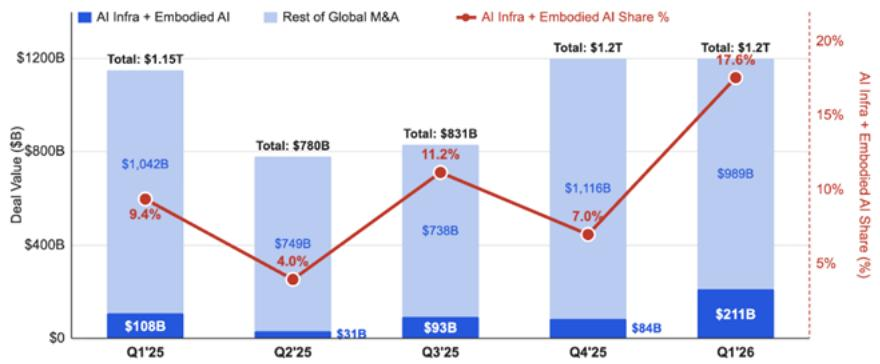  
Figure 4. AI Infra $^ +$ Embodied AI M&A as Share of Global Private Deal Value But excluding two mega deals Space X and Stargate   
$\circledcirc$ 2026 Citigroup Inc. No redistribution without Citigroup’s written permission.

Note: AI Infrastructure spans three layers: (1) Core Hardware & Power (chips, data centers, silicon photonics, power generation), (2) Foundation & Tooling (AI models, MLOps, cloud platforms), and (3) Trust & Data (cybersecurity, data governance). Embodied AI covers humanoid robots, delivery and warehouse robotics, and perception hardware

Source: Citi Research, S&P Global MI, A&O Shearman, GlobalData

Figure 5. Snapshot of major private deals (over USD10bn) in AI Infrastructure sector in 2025 and YTD 2026   

<table><tr><td rowspan=1 colspan=1>#</td><td rowspan=1 colspan=1>Date</td><td rowspan=1 colspan=1>Acquirer /Investor</td><td rowspan=1 colspan=1> Target</td><td rowspan=1 colspan=1>Layer</td><td rowspan=1 colspan=1>Consideration(USD)</td><td rowspan=1 colspan=1>Type</td><td rowspan=1 colspan=1> Remark/Synergy</td></tr><tr><td rowspan=1 colspan=1>1</td><td rowspan=1 colspan=1>Feb2026</td><td rowspan=1 colspan=1>Amazon/NVDA/SoftBank</td><td rowspan=1 colspan=1>OpenAl</td><td rowspan=1 colspan=1>Foundation</td><td rowspan=1 colspan=1>$110B</td><td rowspan=1 colspan=1>Funding round</td><td rowspan=1 colspan=1>Largest private financing; $840B post-money</td></tr><tr><td rowspan=1 colspan=1>2</td><td rowspan=1 colspan=1>H12026</td><td rowspan=1 colspan=1>BlackRock/MGX/MSFT/NVDA</td><td rowspan=1 colspan=1>Aligned Data Centers</td><td rowspan=1 colspan=1>Core HW&amp;Power</td><td rowspan=1 colspan=1>$40B</td><td rowspan=1 colspan=1>Acq(closing)</td><td rowspan=1 colspan=1>Largest DCdeal; 5+ GW across 50 campuses</td></tr><tr><td rowspan=1 colspan=1>3</td><td rowspan=1 colspan=1>Q12025</td><td rowspan=1 colspan=1>Q12025 SoftBank/MSFTetal.</td><td rowspan=1 colspan=1>OpenAl</td><td rowspan=1 colspan=1>Foundation</td><td rowspan=1 colspan=1>$40B</td><td rowspan=1 colspan=1>Funding round</td><td rowspan=1 colspan=1>$300Bpost-money; largest private roundatthetime</td></tr><tr><td rowspan=1 colspan=1>4</td><td rowspan=1 colspan=1>1ul2025</td><td rowspan=1 colspan=1></td><td rowspan=1 colspan=1>Ansys</td><td rowspan=1 colspan=1>Foundation &amp;Tooling</td><td rowspan=1 colspan=1>$35B</td><td rowspan=1 colspan=1>Acquisition</td><td rowspan=1 colspan=1>Silicon-to-systems EDA; $40OM synergies yr3</td></tr><tr><td rowspan=1 colspan=1>5</td><td rowspan=1 colspan=1>Mar2026</td><td rowspan=1 colspan=1>Google (Alphabet)</td><td rowspan=1 colspan=1>Wiz</td><td rowspan=1 colspan=1>Trust&amp; Data</td><td rowspan=1 colspan=1>$32B</td><td rowspan=1 colspan=1>Acq completed</td><td rowspan=1 colspan=1>Google&#x27;slargestacq ever; Alcloud security</td></tr><tr><td rowspan=1 colspan=1>6</td><td rowspan=1 colspan=1>Feb2026</td><td rowspan=1 colspan=1>GIC/Coatue/MSFT/NVDAet al.</td><td rowspan=1 colspan=1>Anthropic</td><td rowspan=1 colspan=1>Foundation</td><td rowspan=1 colspan=1>$30B</td><td rowspan=1 colspan=1>Series G</td><td rowspan=1 colspan=1>$380B post-money; $14B ARR; modellayerduopoly</td></tr><tr><td rowspan=1 colspan=1>7</td><td rowspan=1 colspan=1>Mar2026</td><td rowspan=1 colspan=1>Nebius (NBIS)</td><td rowspan=1 colspan=1>Meta $27B expanded deal)</td><td rowspan=1 colspan=1>Core HW&amp;Cloud</td><td rowspan=1 colspan=1>$27B</td><td rowspan=1 colspan=1>Multi-yrcontract</td><td rowspan=1 colspan=1>$12B dedicated capacity + $15B incrementalcompute</td></tr><tr><td rowspan=1 colspan=1>8</td><td rowspan=1 colspan=1>lan 2025</td><td rowspan=1 colspan=1>Jan 2025 Constellation Energy</td><td rowspan=1 colspan=1>Calpine</td><td rowspan=1 colspan=1>Core HW&amp;Power</td><td rowspan=1 colspan=1>$26.6B</td><td rowspan=1 colspan=1>Acquisition</td><td rowspan=1 colspan=1>Largest US power deal; generationcapacityforAlDC°</td></tr><tr><td rowspan=1 colspan=1>9</td><td rowspan=1 colspan=1>Feb2026</td><td rowspan=1 colspan=1>Palo Alto Networks</td><td rowspan=1 colspan=1>CyberArk</td><td rowspan=1 colspan=1>Trust &amp; Data</td><td rowspan=1 colspan=1>$25B</td><td rowspan=1 colspan=1>Acquisition</td><td rowspan=1 colspan=1>Largest cybersecurityacq; identity foragentic Al</td></tr><tr><td rowspan=1 colspan=1>10</td><td rowspan=1 colspan=1>Dec2025</td><td rowspan=1 colspan=1>NVIDIA</td><td rowspan=1 colspan=1>Groq (IP + talent)</td><td rowspan=1 colspan=1>Foundation &amp;Tooling</td><td rowspan=1 colspan=1>$20B</td><td rowspan=1 colspan=1>Licensing /acqui-hire</td><td rowspan=1 colspan=1>Consolidates inference dominance;~3xpremium</td></tr><tr><td rowspan=1 colspan=1>11</td><td rowspan=1 colspan=1>Sep2025</td><td rowspan=1 colspan=1>Nebius (NBIS)</td><td rowspan=1 colspan=1>Microsoft ($17.4Bcontract)</td><td rowspan=1 colspan=1>Core HW&amp;Cloud</td><td rowspan=1 colspan=1>$17.4B</td><td rowspan=1 colspan=1>Multi-yrcontract</td><td rowspan=1 colspan=1>Neocloudalternative tohyperscalers</td></tr><tr><td rowspan=1 colspan=1>12</td><td rowspan=1 colspan=1>03.2025</td><td rowspan=1 colspan=1>Q32025 Amazon/Googleetal.</td><td rowspan=1 colspan=1>Anthropic</td><td rowspan=1 colspan=1>Foundation</td><td rowspan=1 colspan=1>$13B</td><td rowspan=1 colspan=1>Funding</td><td rowspan=1 colspan=1>Scale Claude Altrainingand deployment</td></tr><tr><td rowspan=2 colspan=1>13</td><td rowspan=2 colspan=1>2025</td><td rowspan=2 colspan=1>IBM</td><td rowspan=1 colspan=1>Confluent</td><td rowspan=1 colspan=1>Foundation &amp;</td><td rowspan=1 colspan=1>$11B</td><td rowspan=1 colspan=1>Acquisition</td><td rowspan=2 colspan=1>Real-time data streaming pipelines foragentic Al</td></tr><tr><td rowspan=1 colspan=1></td><td rowspan=1 colspan=1>Tooling</td><td rowspan=1 colspan=1></td><td rowspan=1 colspan=1></td></tr></table>

$\circledcirc$ 2026 Citigroup Inc. No redistribution without Citigroup’s written permission. Selection: All AI Infra deals $\geq \$ 10 B$ . Excludes Stargate (\$500B JV) and SpaceX/xAI (\$1.25T merger). Source: Citi Research, Company Reports

# 订阅研报添加微信 LCD123321Cad 04-16

Figure 6. Snapshot of major deal (over US\$100m) list on Embodied AI sector during 2025 and YTD 2026   

<table><tr><td rowspan=1 colspan=1>#</td><td rowspan=1 colspan=1>Date</td><td rowspan=1 colspan=3> Acquirer / Investor</td><td rowspan=1 colspan=1> Target</td><td rowspan=1 colspan=1>Sector</td><td rowspan=1 colspan=2>Consideration(USD)</td><td rowspan=1 colspan=1>Type</td><td rowspan=1 colspan=1> Remark/Synergy</td></tr><tr><td rowspan=2 colspan=1></td><td rowspan=2 colspan=1>Oct2025</td><td rowspan=2 colspan=3></td><td rowspan=1 colspan=1>ABB Robotics</td><td rowspan=1 colspan=1>Industrial robotics</td><td rowspan=1 colspan=2>$5.4B</td><td rowspan=1 colspan=1>Acquisitio</td><td rowspan=2 colspan=1>AcquisitioFusing ASlambition with industrial kinetic hardware</td></tr><tr><td rowspan=1 colspan=1>Division</td><td rowspan=1 colspan=1></td><td rowspan=1 colspan=2></td><td rowspan=1 colspan=1>n</td></tr><tr><td rowspan=2 colspan=1>2</td><td rowspan=1 colspan=1>Dec</td><td rowspan=1 colspan=2>SoftBank/ NVDA/ Bezos /</td><td rowspan=2 colspan=2>SoftBank/ NVDA/ Bezos /Sequoia</td><td rowspan=2 colspan=1>Skild Al</td><td rowspan=1 colspan=2>Robot foundation</td><td rowspan=1 colspan=1>$1.4B</td><td rowspan=2 colspan=1>Series C</td></tr><tr><td rowspan=1 colspan=1>2025</td><td></td><td></td><td rowspan=1 colspan=1>model</td><td rowspan=1 colspan=2></td><td></td></tr><tr><td rowspan=1 colspan=1>3</td><td rowspan=1 colspan=1>Mar2026</td><td rowspan=1 colspan=3>Tether/Amazon /Qualcomm/Bosch</td><td rowspan=1 colspan=1>NEURA Robotics</td><td rowspan=1 colspan=1>Humanoid robotics ~$1.2B</td><td rowspan=1 colspan=2></td><td rowspan=1 colspan=1>SeriesC</td><td rowspan=1 colspan=1>$4.6B post-money; 4NE1Mini; ~$1B order book;European anchor</td></tr><tr><td rowspan=2 colspan=1>4</td><td rowspan=1 colspan=1>Sep</td><td rowspan=1 colspan=3>Parkway/Brookfield/NVDA/</td><td rowspan=2 colspan=1>Figure Al</td><td rowspan=1 colspan=1>Humanoid robotics $1B+</td><td rowspan=1 colspan=2></td><td rowspan=2 colspan=1>Series C</td><td rowspan=2 colspan=1>$39B post-money;valuation benchmark; deployedat BMW(90K+ parts)</td></tr><tr><td rowspan=1 colspan=1>2025</td><td rowspan=1 colspan=3>Intel Capital</td><td rowspan=1 colspan=1></td><td rowspan=1 colspan=2></td><td rowspan=1 colspan=1></td></tr><tr><td rowspan=1 colspan=1>5</td><td rowspan=1 colspan=1>Jan 2026</td><td rowspan=1 colspan=3>Jan 2026 Mobileye (Intel)</td><td rowspan=1 colspan=1>Mentee Robotics(Israel)</td><td rowspan=1 colspan=1>Humanoid /perception</td><td rowspan=1 colspan=1>$900M</td><td rowspan=1 colspan=2>$900M</td><td rowspan=1 colspan=1>n</td></tr><tr><td rowspan=1 colspan=1>6</td><td rowspan=1 colspan=1>Nov2025</td><td rowspan=1 colspan=3>CapitalG/Lux/Bezos/OpenAl Physical</td><td rowspan=1 colspan=1>Intelligence</td><td rowspan=1 colspan=1>Robot foundationmodel</td><td rowspan=1 colspan=2>$600M</td><td rowspan=1 colspan=1>Series B</td><td rowspan=1 colspan=1>$5.6B post-money; universal robotmodel(pi-0)</td></tr><tr><td rowspan=1 colspan=1>7</td><td rowspan=1 colspan=1>Aug2025</td><td rowspan=1 colspan=3>Bezos Expeditions (lead)</td><td rowspan=1 colspan=1>Field Al</td><td rowspan=1 colspan=1>Autonomous robot ~$405MAI</td><td rowspan=1 colspan=2></td><td rowspan=1 colspan=1>Funding</td><td rowspan=1 colspan=1>$2B post-money;autonomous robot Al systems</td></tr><tr><td rowspan=2 colspan=1>8</td><td rowspan=2 colspan=1>Mar2025</td><td rowspan=2 colspan=3>BCapital/Google/Mercedes/ApptronikARK</td><td rowspan=1 colspan=1>Apptronik</td><td rowspan=1 colspan=1>Humanoid robotics $403M</td><td rowspan=1 colspan=2>$403M</td><td rowspan=1 colspan=1>SeriesA</td><td rowspan=2 colspan=1>~$1.5B post-money; Apollo humanoid on Mercedesassembly lines</td></tr><tr><td rowspan=1 colspan=1></td><td rowspan=1 colspan=1></td><td rowspan=1 colspan=2></td><td rowspan=1 colspan=1></td></tr><tr><td rowspan=1 colspan=1>9</td><td rowspan=1 colspan=1>lun2025</td><td rowspan=1 colspan=3>Jun 2025 Tencent/Alibaba/ByteDance</td><td rowspan=1 colspan=1>Unitree Robotics</td><td rowspan=1 colspan=1>Humanoid robotics</td><td rowspan=1 colspan=2>Several$Byuan</td><td rowspan=1 colspan=1>SeriesC</td><td rowspan=1 colspan=1>$1.7B post-money; R1at $5,90O;IPOfiledMar2026</td></tr><tr><td rowspan=2 colspan=1>10</td><td rowspan=2 colspan=1>Mar2025</td><td rowspan=2 colspan=3>Greenoaks /Spark Capital</td><td rowspan=2 colspan=1>The Bot Company</td><td rowspan=1 colspan=1>Consumer</td><td rowspan=1 colspan=2>$150M</td><td rowspan=2 colspan=1>Series Bad</td><td rowspan=2 colspan=1>$2B post-money;household robot</td></tr><tr><td rowspan=1 colspan=1>humanoid</td><td rowspan=1 colspan=2></td></tr><tr><td rowspan=1 colspan=1>11</td><td rowspan=1 colspan=1>lan2025</td><td rowspan=1 colspan=3>Guoxin/SoftBank Vision Fund</td><td rowspan=1 colspan=1>FourierIntelligence</td><td rowspan=1 colspan=1>Humanoid robotics</td><td rowspan=1 colspan=2></td><td rowspan=1 colspan=1>SeriesE</td><td rowspan=1 colspan=1>$1.1B post-money; GR-2 humanoid; Shanghai-based</td></tr></table>

© 2026 Citigroup Inc. No redistribution without Citigroup’s written permission. Selection: All Embodied AI deals $\geq \$ 1000 M.$ . Covers humanoid robotics, delivery/warehouse automation, robot foundation models, perception. Source: Citi Research, Company Reports

Despite the recent global market volatility arising from soaring oil prices in Mar, the SOX index (PHLX Semi Sector Index) has recently reached an all-time high. This is likely driven by stronger semi earnings growth from AI-infra as the recent PE of SOX index has been falling. See following Fig 7.

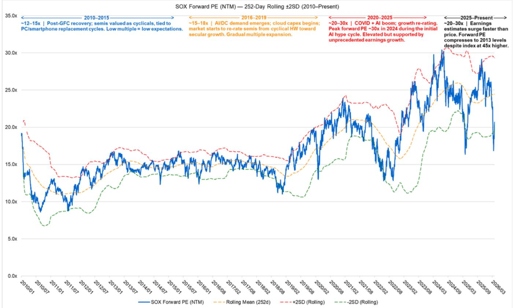  
Figure 7. SOX Forward PE (NTM) — 252-Day Rolling ±2SD (2010–Present)   
$\circledcirc$ 2026 Citigroup Inc. No redistribution without Citigroup’s written permission. Note: We use Rolling SD to dynamically adjust to each valuation regime as the market evolves Source: Citi Research, Bloomberg

# China Industrial Outlook 2026

# Initial signs of improving trends

During 1Q26, we see better trends in relation to China Industrial sector including:

1) FAI – first time for sub-sector property, infra, manufacturing all positive during   
2M26 vs 2025,

2) the possible start of China MFG inventory restocking,

3) robust China export growth,

4) improving Japan machine orders to China with stronger growth rates in recent months.

# 1) Improving FAI trend

The sub-FAI of property, infra and manufacturing all turned positive as $0 \%$ , 11. $4 \%$ and $3 . 1 \%$ respectively during 2M26. Property FAI in early 2026 was better than persistent decline range of $9 . 1 \%$ to $1 7 . 5 \%$ in 2025. Infra FAI in early 2026 was stronger than 2H25’s range from $- 1 . 5 \%$ to $+ 7 . 3 \%$ . Mfg FAI in early 2026 also showed faster growth than $+ 0 . 6 \%$ to $2 . 7 \%$ during 4Q25. The muted economic growth in 2H25 may cause China govt to underpin positive growth of Infra and Mfg (particularly for advanced manufacturing) to counter the risk of an economic slowdown.

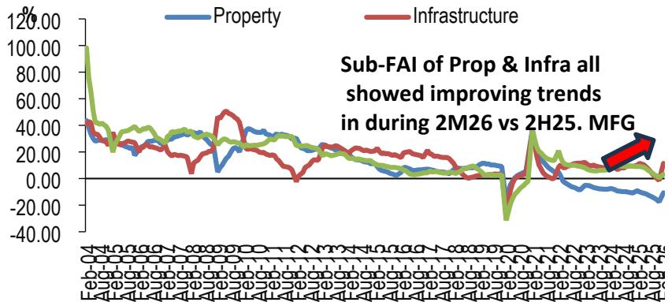  
研报添加微信 LCD123321Cad 04-1Figure 8. FAI sub-sectors improving trends lately   
© 2026 Citigroup Inc. No redistribution without Citigroup’s written permission.

Source: Citi Research, NBS

# 2) China MFG inventory will likely be restocking

China PPI growth has a high correlation with China Mfg inventory index shown in the following chart in addition to comparable period of inflection point (shown in dotted red circle). China PPI started to return to positive territory at $0 . 5 \%$ in Mar 2026, ending a 41-month decline. Citi economics team forecast PPI growth of positive $1 . 0 \%$ yoy after the persistent decline during 2023-25 ( $. 3 . 0 \%$ in 2023, - $2 . 2 \%$ in 2024, $- 2 . 6 \%$ in 2025). This will likely lead to mfg inventory recovery for the rest of this year.

# The recent start of PPI growth would likely cause MFG inventory restocking ahead

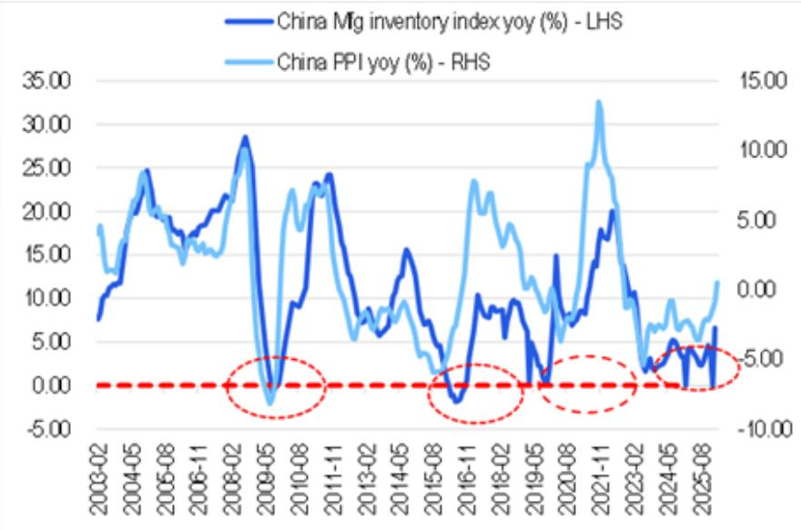  
Figure 9. The start of positive PPI growth since Mar 2026 would likely prompt for MFG inventory restocking ahead   
© 2026 Citigroup Inc. No redistribution without Citigroup’s written permission. Source: Citi Research, NBS

# 3) China export maintains strong growth momentum

China export growth was robust in 2025 and even surged to almost $40 \%$ in Feb 2026. See Fig 10. We attribute it to China’s success on:

1) Market diversification into ASEAN ( $1 3 \%$ in 2025 and accelerating to $\sim 3 0 \%$ in early 2026), Africa ${ \sim } 2 6 \%$ in 2025 and further rose to $34 \%$ in 2M26), EU ${ \sim } 8 \%$ in 2025 but grew ${ \sim } 2 8 \%$ in 2M26) though China exports to N America down $20 \%$ in 2025 but shrinking to a slump of ${ \sim } 1 1 \%$ in early 2026.

2) High-tech and green export like NEV ( $5 5 \%$ in 2025 and even rose to ${ \sim } 6 7 \%$ during 2M26), Li-ion batteries $( \sim 3 8 \%$ in 2025, further stronger to ${ > } 4 0 \%$ in early 2026), solar cell $( > 7 0 \%$ in 2025, a modest decline during 2M26 for high base), 3D printing equipment $( \sim 4 5 \%$ in 2025, further to $\sim 5 4 \%$ in early 2026), semi $14 \%$ in 2025, but soared by $570 \%$ in 2M26), industrial robot ( $2 8 \%$ in 2025, further rose to $5 3 0 \%$ in early 2026).

3) Muted domestic demand causing lower export price – the soft domestic demand has been dragging prices which makes China exports even more competitive.

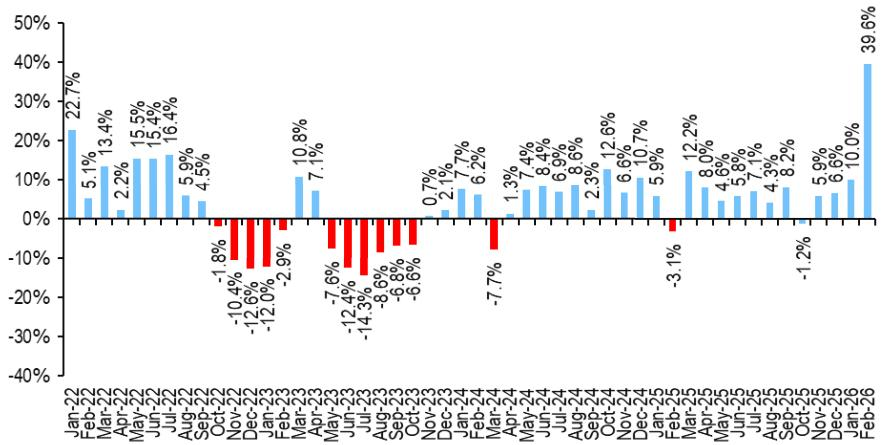  
Figure 10. China export growth   
$\circledcirc$ 2026 Citigroup Inc. No redistribution without Citigroup’s written permission.

Source: Citi Research, China Custom

# 4) Japan machine orders to China imply acceleration in early 2026

Per JMTBA, Japan machine orders to China acts as a leading indicator for China advanced manufacturing. The yoy growth rate was slower at single digit of $2 \% - 8 \%$ during Jun-Aug 2025. The growth momentum then accelerated starting from Sep at $2 5 \%$ , Oct at $10 \%$ , Nov at $30 \%$ , and Dec at $2 \%$ . However, the growth rates further 研报添加accelerated to $57 \%$ LCD1233 in Jan 2026 and $40 \%$ ad 04-16 in Feb 2026.

The strong annual growth suggests Chinese firms are aggressively upgrading to higher-end Japanese machinery. Key drivers are 1) China equipment renewal policy, and 2) automation and robotics driven as demand is shifting away from simply assembly towards complex 5-axis machining and high-precision tools used in EV components and semiconductor equipment. This leading indicator would suggest a production ramp-up in the electronics / auto sectors for 3Q26.

This robust Japan machine order seems in contrast with slower momentum of China NBS MFG PMI below 50 during 2M26 (i.e., 49.3 in Jan and 49.0 in Feb). This reflects large SOE (state-owned enterprises) are still facing soft domestic demand. This is in line with quite flattish China Business Climate Index as Mar 2025 quarter at 108.5, Jun quarter at 108.5, Sep quarter at 108.9 and Dec quarter at 108.4.

In contrast, China Caixin PMI datapoint had a recent uptick from latest trough of 49.9 in Nov 2025 to subsequently improved 50.1 in Dec, 50.3 in Jan and 52.1 in Feb. China Caixin reflects SME and export manufacturing which are increasingly 研报添加微信 LCD123321Cad 04-16 expanding manufacturing activities on automation, robots and external demand.

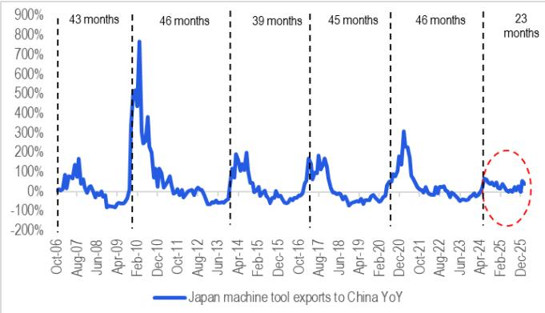  
Figure 11. YoY Japan machine tool order to China

$\circledcirc$ 2026 Citigroup Inc. No redistribution without Citigroup’s written permission. Source: Citi Research, JMTBA

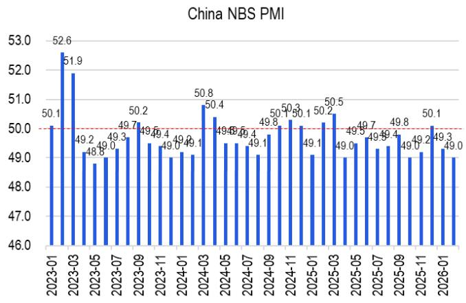  
Figure 12. China NBS PMI   
$\circledcirc$ 2026 Citigroup Inc. No redistribution without Citigroup’s written permission. Source: Citi Research, NBS

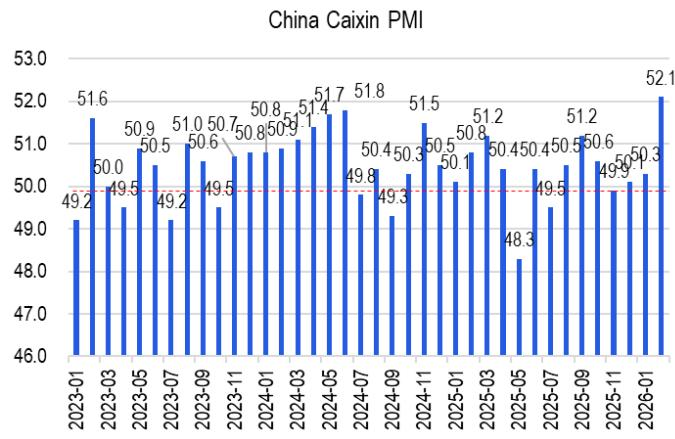  
Figure 13. China Caixin PMI   
© 2026 Citigroup Inc. No redistribution without Citigroup’s written permission. Source: Citi Research, Caixin

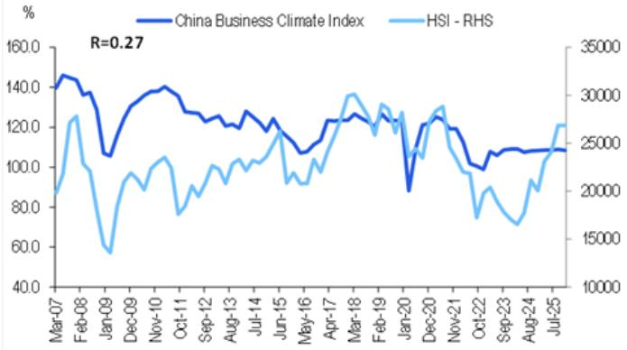  
Figure 14. Lower correlation of China Business Climate Index and HSI

$\circledcirc$ 2026 Citigroup Inc. No redistribution without Citigroup’s written permission. Source: Citi Research, Wind, NBS

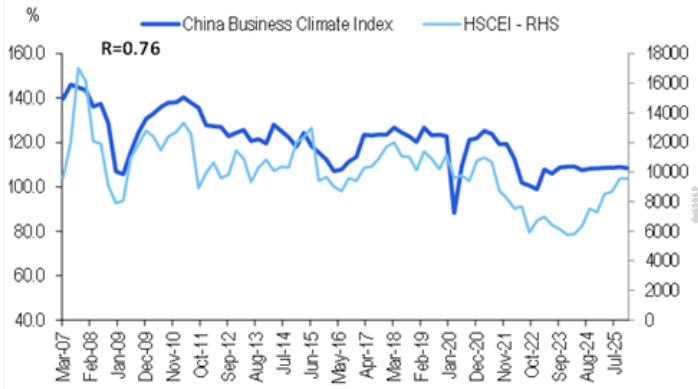  
Figure 15. Higher correlation of China Business Climate Index and HSCEI   
© 2026 Citigroup Inc. No redistribution without Citigroup’s written permission. Source: Citi Research, Wind, NBS

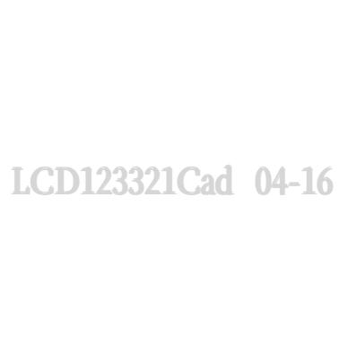

Figure 16. Citi Economics Team forecasts during 2026   

<table><tr><td></td><td>Unit 2019</td><td></td><td>2020 2.3</td><td>2021</td><td>2022</td><td>2023</td><td>2024</td><td>2025F2026F</td><td></td><td>24Q1</td><td>24Q2</td><td>24Q3</td><td>24Q4 25Q1</td><td></td><td>25Q2 25Q3F 25Q4F 26Q1F 26Q2F 26Q3F 26Q4F</td><td></td><td></td><td></td><td></td><td></td><td></td></tr><tr><td>Real GDP</td><td>%YoY %QoQ</td><td>6.1</td><td></td><td>8.6</td><td>3.1</td><td>5.4</td><td>5.0</td><td>5.0</td><td>4.7</td><td>5.3 1.3</td><td>4.7 1.0</td><td>4.6 1.5</td><td>5.4 1.5</td><td>5.4 5.2 1.2 1.0</td><td></td><td>4.8 1.1</td><td>4.6 1.2</td><td>4.6 1.3</td><td>4.7 0.9</td><td>4.7 1.1</td><td>4.7 1.3</td></tr><tr><td>Consumption</td><td>ppt</td><td>3.6</td><td>-0.1</td><td>5.2</td><td>1.0</td><td>4.3</td><td>2.2</td><td>2.7</td><td>2.8</td><td>2.8</td><td>2.2</td><td>1.4</td><td>1.6</td><td>2.8 2.7</td><td></td><td>2.7</td><td>2.6</td><td></td><td></td><td></td><td></td></tr><tr><td> Gross Capital Formation</td><td>ppt</td><td>1.8</td><td>1.8</td><td>1.7</td><td>1.5</td><td>1.5</td><td>1.3</td><td>1.0</td><td>1.1</td><td>0.5</td><td>1.9</td><td>1.3</td><td>1.3</td><td>0.5</td><td>1.3</td><td>0.9</td><td>1.1</td><td></td><td></td><td></td><td></td></tr><tr><td>Net Exports</td><td>ppt</td><td>0.7</td><td>0.7</td><td>1.7</td><td>0.5</td><td>-0.6</td><td>1.5</td><td>1.3</td><td>0.8</td><td>2.1</td><td>0.6</td><td>2.0</td><td>2.5</td><td>2.1</td><td>1.2</td><td>1.2</td><td>0.9</td><td></td><td></td><td></td><td></td></tr><tr><td>Nominal GDP</td><td>%YoY</td><td>7.5</td><td>2.9</td><td>13.4</td><td>5.1</td><td>4.9</td><td>4.2</td><td>3.9</td><td>4.7</td><td>4.2</td><td>4.0</td><td>4.0</td><td>4.6</td><td>4.6</td><td>3.9</td><td>3.7</td><td>3.7</td><td>3.9</td><td>4.6</td><td>4.9</td><td>5.1</td></tr><tr><td>Industrial Production</td><td>%YoY</td><td>5.7</td><td>2.8</td><td>9.6</td><td>3.6</td><td>4.6</td><td>5.8</td><td>5.8</td><td>4.7</td><td>6.1</td><td>5.9</td><td>5.0</td><td>5.3</td><td>6.5</td><td>6.2</td><td>4.7</td><td>5.2</td><td>4.5</td><td>4.5</td><td>4.6</td><td>47</td></tr><tr><td>Services Sector Growth</td><td>%YoY</td><td>7.6</td><td>2.4</td><td>9.0</td><td>3.5</td><td>6.3</td><td>5.0</td><td>5.3</td><td>5.0</td><td>5.3</td><td>4.2</td><td>4.8</td><td>5.4</td><td>5.3</td><td>5.7</td><td>4.9</td><td>5.0</td><td>4.8</td><td>4.9</td><td>5.0</td><td>5.1</td></tr><tr><td>Nominal FAI</td><td>%YoY, Yt</td><td>5.4</td><td>2.9</td><td>4.9</td><td>5.1</td><td>3.0</td><td>3.2</td><td>-0.5</td><td>2.0</td><td>4.2</td><td>3.9</td><td>3.4</td><td>3.2</td><td>4.2</td><td>2.8</td><td>-0.5</td><td>-0.5</td><td></td><td></td><td></td><td>2.0</td></tr><tr><td>Property</td><td>% YoY, Ytd</td><td>9.9</td><td>7.0</td><td>4.4</td><td>-10.0</td><td>-9.6</td><td>-10.6</td><td> -15.0</td><td>-15.0</td><td>-9.9</td><td>-10.5</td><td>-10.3</td><td>-10.6</td><td>-9.9 -11.2</td><td>-13.9</td><td></td><td> -15.0</td><td></td><td></td><td></td><td></td></tr><tr><td>Infrastructure</td><td>%YoY, Ytd</td><td>3.8</td><td>0.9</td><td>0.4</td><td>9.4</td><td>5.9</td><td>4.4</td><td>1.5</td><td>5.0</td><td>5.8</td><td>5.4</td><td>4.3</td><td>4.4</td><td>5.8</td><td>4.6</td><td>1.1</td><td>1.5</td><td></td><td></td><td></td><td> -15.0</td></tr><tr><td> Manufacturing</td><td>% YoY, Yt</td><td>3.1</td><td>-2.2</td><td>13.5</td><td>9.1</td><td>6.5</td><td>9.2</td><td>4.0</td><td>3.0</td><td>9.1</td><td>9.5</td><td>9.3</td><td>9.2</td><td>9.1</td><td>7.5</td><td>4.0</td><td>4.0</td><td></td><td></td><td></td><td>5.0</td></tr><tr><td>Private FAI</td><td>% YoY, Yt</td><td>4.7</td><td>1.0</td><td>7.0</td><td>0.9</td><td>-0.4</td><td>-0.1</td><td>-3.5</td><td>0.0</td><td>0.4</td><td>0.1</td><td>-0.3</td><td>-0.1</td><td>0.4 -0.6</td><td></td><td>-3.1</td><td></td><td></td><td></td><td></td><td>3.0</td></tr><tr><td>Nominal Retail Sales</td><td>%YoY</td><td>8.0</td><td>-3.9</td><td>12.5</td><td>-0.2</td><td>7.2</td><td>3.5</td><td>4.1</td><td>4.8</td><td>4.7</td><td>2.6</td><td>2.7</td><td>3.9</td><td>4.6</td><td>5.4</td><td></td><td>-3.5</td><td></td><td></td><td></td><td>0.0</td></tr><tr><td>Exports</td><td>%YoY</td><td>0.5</td><td>3.6</td><td>29.9</td><td>7.0</td><td>-4.6</td><td>5.9</td><td>4.1</td><td>2.0</td><td>1.4</td><td>5.6</td><td>6.0</td><td>9.9</td><td>5.7</td><td>6.2</td><td>6.6</td><td>-1.3</td><td>0.0</td><td>-0.2</td><td></td><td></td></tr><tr><td>Imports</td><td>%YoY</td><td>-2.8</td><td>-1.1</td><td>30.1</td><td>1.1</td><td>-5.5</td><td>1.1</td><td>-0.4</td><td>2.0</td><td>1.7</td><td>2.6</td><td>2.4</td><td>-1.8</td><td>-7.0</td><td>-0.8</td><td>4.3</td><td>1.4</td><td></td><td></td><td>3.8</td><td>4.5</td></tr><tr><td>Trade Balance</td><td>USs bn</td><td>421</td><td>524</td><td>637</td><td>838</td><td>822</td><td>993</td><td>1152</td><td>1176</td><td>182</td><td>252</td><td>258</td><td>298</td><td>273</td><td>314</td><td>314</td><td>277</td><td>4.5</td><td>1.9</td><td>1.5</td><td>0.4</td></tr><tr><td>Crrent Account</td><td>% ofGDP</td><td>0.7</td><td>1.6</td><td>1.9</td><td>2.4</td><td>1.4</td><td>2.2</td><td>2.7</td><td>2.5</td><td>0.9</td><td>1.2</td><td>3.2</td><td>3.5</td><td>3.7</td><td></td><td></td><td></td><td>245</td><td>299</td><td>317</td><td>316</td></tr><tr><td>GDP Deflator</td><td>%YoY</td><td>1.3</td><td>0.6</td><td>4.4</td><td>2.0</td><td>-0.5</td><td>-0.7</td><td>-1.1</td><td>0.0</td><td>-1.1</td><td>-0.7</td><td>-0.5</td><td>-0.8</td><td>-0.8</td><td>-1.3</td><td></td><td></td><td></td><td></td><td></td><td></td></tr><tr><td>CPI</td><td>%YoY</td><td>2.9</td><td>2.5</td><td>0.9</td><td>2.0</td><td>0.2</td><td>0.2</td><td>0.0</td><td>0.6 </td><td>-0.1</td><td>0.3</td><td>0.5</td><td>0.2</td><td>-0.1</td><td>0.0 </td><td>-1.1 -0.2</td><td>-0.9 0.3</td><td>-0.7 0.7</td><td>-0.1 0.4</td><td>0.2 0.4</td><td>0.4 1.0</td></tr><tr><td>PPI Budgetary Deficit</td><td>%YoY</td><td>-0.3</td><td>-1.8</td><td>8.1</td><td>4.1</td><td>-3.0</td><td>-2.2</td><td>-2.6</td><td>-0.4</td><td>-2.3</td><td>-1.6 -1.8</td><td></td><td>-2.6</td><td>-2.3</td><td>-3.2</td><td>-2.9 -2.1</td></table>

$\circledcirc$ 2026 Citigroup Inc. No redistribution without Citigroup’s written permission. Source: Citi Research, NBS

Citi Property team still expects a stagnant picture for China property market in 2026E with housing starts and completions (in terms of GFA) falling to the comparable degree of $1 5 \%$ yoy in 2026E. This should be an improving trend against a deeper decline in 2025.

Figure 17. Citi forecasts for China real-estate market, 2019-26E   

<table><tr><td rowspan="2" colspan="2"></td><td colspan="7">Absolute Amount 2021 2024</td><td colspan="8">YoYChange (%) 2020 2024</td></tr><tr><td colspan="4">2022 2023 (restate</td><td colspan="4">10M25 Citi FY25E</td><td colspan="4">2021 2022 2023 (restate</td><td colspan="4">10M25 Citi FY25E</td></tr><tr><td>Overall Commodity Housing</td><td></td><td></td><td></td><td></td><td></td><td></td><td></td><td></td><td>FY26E</td><td></td><td></td><td></td><td></td><td></td><td></td><td></td><td>FY26E</td></tr><tr><td>Real Estate Investment</td><td>RMB&#x27;bn</td><td>14,144</td><td>14,760</td><td>12,269</td><td>11,091</td><td>10,028</td><td>7,356</td><td>8,527</td><td>7,419</td><td>7.0%</td><td>4.4%</td><td>-16.9%</td><td>-9.6%</td><td>-10.6%</td><td>-14.7%</td><td>-15.0%</td><td>-13.0%</td></tr><tr><td>GFA Starts</td><td>m sqm</td><td>2,244</td><td>1,989</td><td>1,198</td><td>954</td><td>739</td><td>491</td><td>587</td><td>499</td><td>-1.2%</td><td>-11.4%</td><td>-39.8%</td><td>-20.4%</td><td>-23.0%</td><td>-19.8%</td><td> -20.5%</td><td>-15.0%</td></tr><tr><td>GFA Completed</td><td>m sqm</td><td>912</td><td>1,014</td><td>853</td><td>998</td><td>737</td><td>349</td><td>605</td><td>514</td><td>-4.9%</td><td>11.2%</td><td>-15.9%</td><td>17.0%</td><td>-27.7%</td><td>-16.9%</td><td> -18.0%</td><td>-15.0%</td></tr><tr><td>GFA under construction</td><td>m sqm</td><td>9,268</td><td>9,754</td><td>9.034</td><td>8,384</td><td>7,332</td><td>6,529</td><td>6,599</td><td>6,005</td><td>3.7%</td><td>5.2%</td><td>-7.4%</td><td>-7.2%</td><td>-12.7%</td><td>-9.4%</td><td> -10.0%</td><td>-9.0%</td></tr><tr><td>Transaction amount- Overall</td><td>RMB&#x27;bn</td><td>17,361</td><td>18,193</td><td>12,473</td><td>11,662</td><td>9,675</td><td>6,902</td><td>8,514</td><td>7,594</td><td>8.7%</td><td>4.8%</td><td>-31.4%</td><td>-6.5%</td><td>-17.1%</td><td>-9.6%</td><td> -12.0%</td><td>-10.8%</td></tr><tr><td>GFA Sold - Overall</td><td>m sqm %</td><td>1,761</td><td>1,794</td><td>1,221</td><td>1,117</td><td>974</td><td>720</td><td>896</td><td>833</td><td>2.6%</td><td>1.9%</td><td>-31.9%</td><td>-8.5%</td><td>-12.9%</td><td>-6.8%</td><td>-8.0%</td><td>-7.0%</td></tr><tr><td>Property PriceYoY</td><td></td><td></td><td></td><td></td><td></td><td></td><td></td><td></td><td></td><td>5.9%</td><td>2.8%</td><td>0.7%</td><td>2.2%</td><td>-4.8%</td><td>-3.0%</td><td>-4.3%</td><td>-4.1%</td></tr><tr><td>Land Area acquired</td><td>m sqm</td><td>255</td><td>216</td><td>101 917</td><td>N/A N/A</td><td>NA</td><td></td><td colspan="2"></td><td>-1.1% 17.4%</td><td>-15.5%</td><td>-53.4%</td><td>N/A NA</td><td>NA</td><td></td><td colspan="2"></td></tr><tr><td>Land Sales Value Residential</td><td>RMB&#x27;bn</td><td colspan="4">1,727 1,776</td><td colspan="4">NA</td><td colspan="4">2.8% -48.4%</td><td colspan="4">NA</td></tr><tr><td>GFA Starts-Residential</td><td>mn sqm</td><td>1,643</td><td>1,464</td><td></td><td>693</td><td>537</td><td>360</td><td>431</td><td>371</td><td>-1.9%</td><td>-10.9%</td><td>-40.2%</td><td>-20.9%</td><td>-23.0%</td><td>-19.3%</td><td>-19.7%</td><td>-14.0%</td></tr><tr><td>GFA Completed- Residential</td><td>m sqm</td><td>659</td><td>730</td><td>876 618</td><td>724</td><td>537</td><td>249</td><td>435</td><td>374</td><td>-3.1%</td><td>10.8%</td><td>-15.4%</td><td>17.2%</td><td>-27.4%</td><td>-18.9%</td><td> -19.0%</td><td>-14.0%</td></tr><tr><td>GFA under construction-resi</td><td>m sqm</td><td>6,556</td><td>6,903</td><td>6,400</td><td>5,907</td><td>5,133</td><td>4,553</td><td>4,594</td><td>4,158</td><td>4.4%</td><td>5.3%</td><td>-7.3%</td><td>-7.7%</td><td>-13.1%</td><td>-9.7%</td><td> -10.5%</td><td>-9.5%</td></tr><tr><td>Transaction amount- Residential</td><td>RMB&#x27;bn</td><td></td><td></td><td></td><td>10,299</td><td>8,486</td><td>6,069</td><td></td><td>6,775</td><td>10.8%</td><td>5.3%</td><td>-32.7%</td><td>-6.0%</td><td>-17.6%</td><td>-9.4%</td><td> -11.6%</td><td>-9.7%</td></tr><tr><td>GFA Sold- Residential</td><td></td><td>15,457</td><td>16,273</td><td>10,956</td><td></td><td>815</td><td>603</td><td>7,502</td><td></td><td></td><td></td><td>-34.0%</td><td></td><td>-14.1%</td><td>-7.0%</td><td> -8.3%</td><td></td></tr><tr><td>Residential Price YoY</td><td>m sqm %</td><td>1,549</td><td>1,565</td><td>1,033</td><td>948</td><td></td><td></td><td>747</td><td>693</td><td>3.2% 7.5%</td><td>1.1% 4.2%</td><td>2.1%</td><td>-8.2% 2.4%</td><td>-4.1%</td><td>-2.6%</td><td>-3.6%</td><td>-7.3% -2.6%</td></tr></table>

© 2026 Citigroup Inc. No redistribution without Citigroup’s written permission. Source: Citi Research, NBS

# Update on Industrial Verticals for 2026 After 2025 Results

Post 2025 results and 2026 update guidance, we downgrade the following sectors: 1) capital goods and rail equipment due to worse-than-expected rail capex outlook; 2) PIMM sector for slowing China consumption and possible margin pressure from major customers under recent oil price surge; 3) Smart controller & 研报添加微信 LCD123321Cad 04-16 electronic components owing to escalating margin pressure form US tariffs; 4) infra construction for slowdown in project deployment amid tight local govt credit, 5) integrated communication system due to slowing corporate capex in the US/EU.

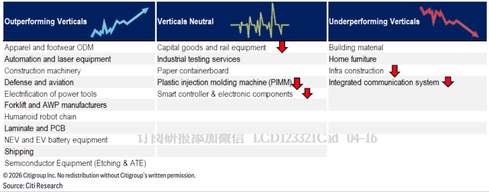

Figure 19. Positive-view verticals in 2026   

<table><tr><td rowspan=1 colspan=1>IndustrialVerticals</td><td rowspan=1 colspan=1>Peer group</td><td rowspan=1 colspan=1>Citicommentaryon2026Outlook</td></tr><tr><td rowspan=1 colspan=1>Apparel and footwear ODM</td><td rowspan=1 colspan=1>Shenzhou (2313.HK,Buy)&gt;Stella (1836.HK,Buy)&gt;Huali (300979.SZ) &gt;Crystal(2232.HK,Buy)&gt;Yue Yuen (0551.HK, Buy)</td><td rowspan=1 colspan=1>Thesectorwillbeneftin226from1)FEDratecut2)likelioodofnofurterdeterioratonofUSreciprocaltarfs;3andNikewilpossible startturnaround per mgmt guidance.</td></tr><tr><td rowspan=1 colspan=1>Automationand laserequipment</td><td rowspan=1 colspan=1>Han&#x27;s Laser (002008.SZ,Buy) &gt;Han&#x27;s CNC- H(3200.HK) &gt;OPT Machine Vision (688686.SS,Buy)&gt; Yiheda (301029.SZ, Buy)&gt; Inovance(300124.SZ,Buy)&gt; Han&#x27;s CNC-A (301200.SZ)&gt;Estun (002747.SZ,Sel) &gt; SUPCON (688777.SS,Sell)</td><td rowspan=1 colspan=1>WeseestrongAlPCBdrlingequipmentdemanddrivenbybothfast-growingAl/datacentergloballyandkeyChinesePCBmakersaggressve capacity expansioninordertowin frmordersfom Nvidia(NVDA.O)andASIC makers.Inaditon,our idustry checksshowthatApple&#x27;sequipmentmakersgeneralyanficipate 30%-40%YoYequipmentorder growth in 2026 drivenbythe launchofiPhone18-Appe&#x27;sfistfodablephonewithmodifcationsonVCheatdisspationandperiscope.Assuchour toppicksareHan&#x27;sLaser(002008.SZ,Apple equipment) with lwerPE,folowedby Han&#x27;s CNC-H(3200.HK,AlPCB equipment).We are also positveonotherApple&#x27;s equipmentsuppliersOPTMachine Vision(688686.SS)andYiheda (301029.SZ).SUPCON(688777.SS,processautomation)remains asourTop Sellin China automation space given China&#x27;s chemical FAl downturn.</td></tr><tr><td rowspan=1 colspan=1>Construction machinery</td><td rowspan=1 colspan=1>Zoomlion (1157.HK,Buy) &gt;Sany-H (6031.HK,Buy)&gt;Sany-A (600031.SS,Buy)&gt;Dingi(603338.SS, Sell)</td><td rowspan=1 colspan=1>Lookinginto2O26,wearemoreconsructiveontemid-to-latecycleproductssuchascraneandconcretemachinerythanontheearlycycle productexcavator.As China&#x27;s excavatordemandhasresumedpositveYoYgrowth since Mar-24,thecrane machinery in Chinahasn&#x27;treturedtothegrowthajectoryntlH25.Inaddio,weasonotedhatChina’sowerraeutlizationrateasimprovdYoYsinceNov-25,indicating tateven tough theproperty-dependentmachinerymaybebotomingoutsoon.PotenialdemandupsidescouldbedrivenbyChina&#x27;smega projects Yarlung ZangboRiver HydropowerandXinjiang-TibetRailwayWe nowprefer Zoomlionover Sanyin ChinaconstructionmachineryOEMduetoZoomlion&#x27;s highermid-to-latecycleproductexposure,highdividend yield(~5%),andpotenfalvaueacretveledbyitshumanoid robotbusines.OurmachineryOEMpeckingorderis Zoomlion (1157HK)&gt;Sany-H(6031.HK)&gt;Sany-A(600031.SS)&gt; Dingli (603338.SS)</td></tr><tr><td rowspan=1 colspan=1>Defenseandaviation</td><td rowspan=1 colspan=1>AVIC Jonhon Optronic (002179.SZ, Buy) &gt;AviChina (2357.HK, Buy)</td><td rowspan=1 colspan=1>Spuedbyeaatedolialsiodrinoutrsgioseesedgetrs(Unandthe US),wexpectCinateefupisaonaldefenseudgetaswel,lowinga7%Yincreasein25.Weoethatheerospace businescould beanaddifonal growth driverin 2O26onwardsas Chinaannouncedanactopromote the highqualitygrowthofcommercialaerospaceindustry.Weseethesector&#x27;s valuationatractivebutpreferAVICJonhon (0o2179.SZ)foritsstronger earnings growth profle.</td></tr><tr><td rowspan=1 colspan=1>Electrificationof power tools</td><td rowspan=1 colspan=1>Techtronic (0669.HK, Buy) &gt;Great Star(002444.SZ,Buy)&gt;Stanley Black &amp; Decker(SWK.N, Buy) &gt;Chervon (2285.HK,Sell)</td><td rowspan=1 colspan=1>Thesectorwillbeneftin026fom1)highdemandelastityfomFEDratecutparticularlyforconsumersegment2)likelioodofnofurtherdeteriorationofUSrciprocaltarifs,3)Alserverdemandingpowertolsforinstalltionandsomeplayers ike GreatStarmanufactures AIDC rack.</td></tr><tr><td rowspan=1 colspan=1>Forkliftand AWPmanufacturers</td><td rowspan=1 colspan=1>Hangcha (603298.SS, Buy) &gt; Heli (600761.SS,Sell) &gt;Dingli (603338.SS,el)</td><td rowspan=1 colspan=1>We&#x27;e posiveonforkiftmarketin2026withChinaindustryCAGRof13-14%fom2026-33perGrandViewResearch.Thisis basedon1)replacementandnewdemand,2)warehouseautomationviaAGV/AMR,3)e-commerce.Bycomparison,domestcforkliftindustryconsolidationis more maturethanAWPie Dingli (6o338SS)wilfacemore intensecompetive pressurein ChinamarketfornewAWP entrantslikeXugong(0425.SZ),Zoomlion(157.HK),Linzong.ingli(03338.SS)isfacingpotentalthatomUS/EUanf-dumping dutyon AWPwith earnings downside risk in 2026 after pre-sales demand in 2025on UStarifs.</td></tr><tr><td rowspan=1 colspan=1>Humanoidrobotchain</td><td rowspan=1 colspan=1>Hengli Hydraulic (601100.SS,Buy)&gt;UBTECH(9880.HK,Buy)&gt;Leader Drive (688017.SS,Buy)</td><td rowspan=1 colspan=1>Weexpecthehumanoidrobotproductionin2026 togrowexponentallyoratleastdoublethe2025scaleduetproductionrampbyChineseand leading US humanoid robot makers.Comparing wih humanoid robotOEMs,we prefer keycomponent makers moreespeical those whichpenetrateintotheleading UShumanoidrobotmaker&#x27;ssupplychain.OurindustrycheckshowsthatheleadingUShumanoidrootmakerhasfnaledthedesigofitsatestroot(Gen3)andtagetorampproductoninJul-26orAug-26.InCinaweareSuprisedwithUBTECH&#x27;supwardrevisiononthehumaniodrobotshipmentguidanceandemphasisondeveloping VLAsandcolecting realdata.Ourpecking orderis Hengli Hydraulic (601100.SS)&gt;UBTECH(9880.HK)&gt;Leader Drive(688017.SS).Weemploy&quot;barbel&quot;investmenttrategyinthehumanoidrobotspace-uyeiherkeycomponentihsolidfundamentalsorumanoidobotOEM with strong growth potential.</td></tr><tr><td rowspan=1 colspan=1>LaminateandPCB</td><td rowspan=1 colspan=1>Shengyi(600183.SS,Buy) &gt;KB Laminate(1888.HK,Buy) &gt; Han&#x27;s Laser (002008.SZ)&gt;Han&#x27;s CNC (301200.SZ) &gt; Shennan (002916.SZ,Buy)&gt;KB Holdings (0148.HK, Buy)</td><td rowspan=1 colspan=1>Laminateindustrywillcontnueupcyclefor26duetosustainedcopper/fberglasfabriccosthikeandrobustmomentumofAlinfra.The higherindustryconcentrafononlaminate thanPCBenables lminate industryto hold stronger pricing power.Aldemandoutookremains phenomentalfor 2026.Shengyishould enjoy monopoly posionamongst China CCLsupplers his year under NVDA suplychain.</td></tr><tr><td rowspan=1 colspan=1>NEVandEVbattery equipmentandcomponents</td><td rowspan=1 colspan=1>WuxiLead (300450.SZ,Buy) &gt;lnovance(300124.SZ)&gt;Times Electric (3898.HK, Neutral)</td><td rowspan=1 colspan=1>Weseepromising2026outookforWuxiLead(470HK/300450.SZ)asitsnewordergrewby37%YoYin2025,andmgmtrecentyindicated hatheprevious new order growth guidanceof30%YoYfor2026couldberevisedupgiven leading baterycustomersupwardrevisions ofcapaciy expansions.Amid he higheroilrice environment wealsobelieve that WuxiLeadcouldsee demandupsides from both ESS and EV batery equipment</td></tr><tr><td rowspan=1 colspan=1>Shipping</td><td rowspan=1 colspan=1>Container shipping: Cosco Shipping(1919.HK,Buy)Container ports:COsco Shipping Ports(1199.HK,Neutral)</td><td rowspan=1 colspan=1>Wecontinue toexpectsequentialimprovements inspotratesintomid-2026drivenbyexpectedinventoryre-restockingofWesterneconomies,supportedbyteUSSupremeCourtsulinggastReciprocalTarifs.eurrntidleEasternconficthaslimieddirectimplicationtodustry&#x27;smad/uplynuriyetcongeonllngt.9%fglobaletcombedisirugisideofHormuzorwaitingoutside(LinerlyticaMarOt).Webelievelinersshouldfnditessofachallngeintenartermtopassnhigherbunkercosts eihervia GeneralRates Increasesand/orsurchargesunder various names (DistributionPublicafons,Mar 6th)asceanfreightgeneralyaccounts forc10%ofcargovaluesuchasfat-packedfurniture,according to Vespuci Maritme.We tinkCOSCOShipping Ports (1199HK,Neutral,HK$5.51TP)&#x27;svauationappears fulland prefer CoscoShipping Holding (1919 HK,Buy,</td></tr><tr><td rowspan=1 colspan=1>SemiconductorEquipment(Etching and ATE)</td><td rowspan=1 colspan=1>AccoTEST(688200.SS) &gt;AMEC (688012.SS,Buy) &gt; NAURA (002371.SZ,Buy)</td><td rowspan=1 colspan=1>We prefer back-endATE(AutomatedTestEquipment)AccoTEST(68820.S,Buy)over frontend etching equipmentgivenAccoTEST&#x27;searlycydenatureandbeneftingfomOSATcompaniescapexincrease.Betweenthe woleadingChineseetchers,enwpreferAMEC(688012.SS)overNAURA(002371.SZ)givenAMEC&#x27;s aster productexpansion to captureabiggerTAM.Ouroptimismon Chin frontendsemi-equipmentsectorisbasedonthe leading Chinese memorycompanies&#x27;capacity expansions toraisethe China&#x27;smemory (NAND and DRAM) self-suffcientratio and atempt to shorten the gap fom international peers.</td></tr></table>

订阅研报添加微信 LCD123321Cad 04-16 © 2026 Citigroup Inc. No redistribution without Citigroup’s written permission.Source: Citi Research

Figure 20. Negative-view verticals in 2026   

<table><tr><td>IndustrialVerticals Buildingmaterial</td><td>Peer group</td><td>Citicommentaryon2026Outlook Plastic pipe demand willbe chalenging from2026 due toanticipation of continued decline of housing starts and</td></tr><tr><td></td><td>China Lesso (2128.HK, Buy) &gt;Weixing (002372.SZ, Neutral)</td><td>housing completion.But China Lesso keeps growth momentum in overseas infra under One-Belt-One-Road projects and in China for new applications ikeagriculture and infra.</td></tr><tr><td>Homefurniture</td><td>ManWah (99.HK,uy)&gt;Opin (6833.S,l)&gt; SFY (002572.SZ, Sell)</td><td>Furniture sectorremainschallenging in 2026 under tougher property market which would lead to both declines of housing starts and housing completion this year.</td></tr><tr><td>Infraconstruction</td><td>CSCI (3311.HK,Buy) &gt;CRG (0390.HK,Buy) &gt;CSCEC (601688.SS, Buy) &gt;CCCC (601800.SS, Sell)</td><td>TheinfrasectorwllcontinueunderFAlinfra slowdownoreven decline in 2026amid local govttightening credit The balance sheetis generally weak in thissector which may noteasily boost dividend payoutratio further.</td></tr><tr><td>Integratedcommunicationsystem</td><td>VTech (0303uy)nk(2a</td><td>Expectation ofslowdown corporate capex inoverseas would drag replacementof commercial communication system.ButVechhasaBuyratingonatrativedivyldofhig-single-digit</td></tr></table>

$\circledcirc$ 2026 Citigroup Inc. No redistribution without Citigroup’s written permission. Source: Citi Research

Figure 21. Neutral-view verticals in 2026   

<table><tr><td rowspan=1 colspan=3>IndustrialVerticals                  Peergroup                           Citi commentaryon 2026outlook</td></tr><tr><td rowspan=1 colspan=1>Industrialtesting services</td><td rowspan=1 colspan=1>CTI (300012.SZ,uy)</td><td rowspan=1 colspan=1>Thetestingservice industrywillcontinueunder pressure for2026amid slowdown macro and exposureoflocal govtin lackofliquiditysoas todeferorreduce volumeoftesting services.ThevaluationofCTl(30ol2.SZ)trading at-1SD to mean which isundemanding.Inadion,CTlseemsoutperforming pees with recentupgradeof2026 revgrowth targeto15%fromprior10%.</td></tr><tr><td rowspan=1 colspan=1>Paper containerboard</td><td rowspan=1 colspan=1>Lee &amp; Man Paper (2314.HK, Buy)&gt;NDP(2689.HK,Neutral)</td><td rowspan=1 colspan=1>Thepaperdemandappears softin 2026amidsubdued domesticconsumptiondespite Chinaant-involution policy.Thepulpproftabilityillikely reduce from thisyearas manymid-sizedrivalsarebuildng vertialitegrationmode</td></tr><tr><td rowspan=1 colspan=1>Plasticinjectionmoldingmachine(PIMM)</td><td rowspan=1 colspan=1>Haitian (1882.HK,Buy); Yzumi (300415.SZ,N)</td><td rowspan=1 colspan=1>PIMM industryoutlook hasa modestdemand growth in China givensoftdomesticconsumption.</td></tr><tr><td rowspan=1 colspan=1>Smartcontroller&amp;electroniccomponents</td><td rowspan=1 colspan=1>Hongfa(600885.SS, Neutral) &gt;Topband (002139.SZ,Sell)</td><td rowspan=1 colspan=1>Hongfa&#x27;s (600885.SS)signifcant GPM contraction in 4Q25 echoes our previous concern thatsurging siver andcopper price could erode its GPM.Asthe raw material prices hover around the high levels,we are woried thatHongfa&#x27;s GPM pressure wll persist hroughtout 2026 even though ithas hike its productASP by~10% in 1Q26.Sell on Topband for severe margin pressure amid US reciprocaltaiffs</td></tr><tr><td rowspan=1 colspan=1>Capital goodsandrail equipment</td><td rowspan=1 colspan=1>CIMC Enric (3899.HK,Buy) &gt;Times Electric (3898.HKNeutral) &gt;CRRC(1766.Hl)</td><td rowspan=1 colspan=1>Weexpecthathethe high-speedMU(Multiple Unit)tenders in2026couldbe lowerthan 2025(278sets)asCSRG (China State Railway Group) may turn more conservativein budgeting given slowdown in rail passengertrafic growth.Inaddition,CRRC&#x27;srecentmgmt changecould furtherreduce its2026 earnings visiblity given thehistorical correlation.WethusdowngradeCRRC(1766.HK)to Sellfrom Buyafterits2025results.As for CIMCEnric(3899.HK),our Buy thesis is based on its rising offshore clean energy business exposure and chemicalbusiness recovery in a low-interestrate environment Besides,potential upsides could come from Enric&#x27;saerospace business exposure.Enric mainly provides high-pressure,low-temperature Nirogen/Helium/Hydrogenstorage tanks to both Chinese companies and foreign rocket/aerospace manufacturers.</td></tr></table>

# A-share Industrial subsectors in 2026

Per the following table, the top 5 outperforming sectors during 1Q26 are 1) Glass & fiber $( 2 3 . 5 \% )$ , 2) Grid equipment $( 2 0 . 4 \% )$ , 3) Wind power equipment $( 1 9 . 9 \% )$ , 4) Port $( 1 6 . 3 \% )$ and 5) Professional engineering $( 1 5 . 5 \% )$ . This reflects the shortage of AI-infra sub-sectors on glass & fiber (for manufacture of copper clad laminate, PCB) and grid power equipment. These top 5 sectors would likely outperform in the near term for continued re-rating of AI-infra supply chain sub-sectors under 研报添加微信 LCD123321Cad 04-16 shortage.

Conversely, the top 5 worst-performing sectors are 1) Airport $( - 1 9 . 9 \% )$ , 2) Motor (- $1 4 . 0 \% )$ , 3) Consumer electronics $( - 1 0 . 0 \% )$ , 4) Construction machinery $( - 8 . 2 \% )$ and 5) Auto parts $( - 8 . 2 \% )$ . The airport sector is the worst-performing sector amid oil price surge caused by the US-Iran conflict and reduction of non-aeronautical revenue after contracts renewal with China Duty Free and other operators since 1 Jan 2026. Motor was a top 6 performing sector in the last year for re-rating of supply chain’s first entry into humanoid robot theme. However, the humanoid robot sector started de-rating after Chinese New Year as the market saw no positive surprise from China Spring Gala (such as performed by Unitree) are preprogrammed or remote controlled and no positive catalysts on the sector till Jul/

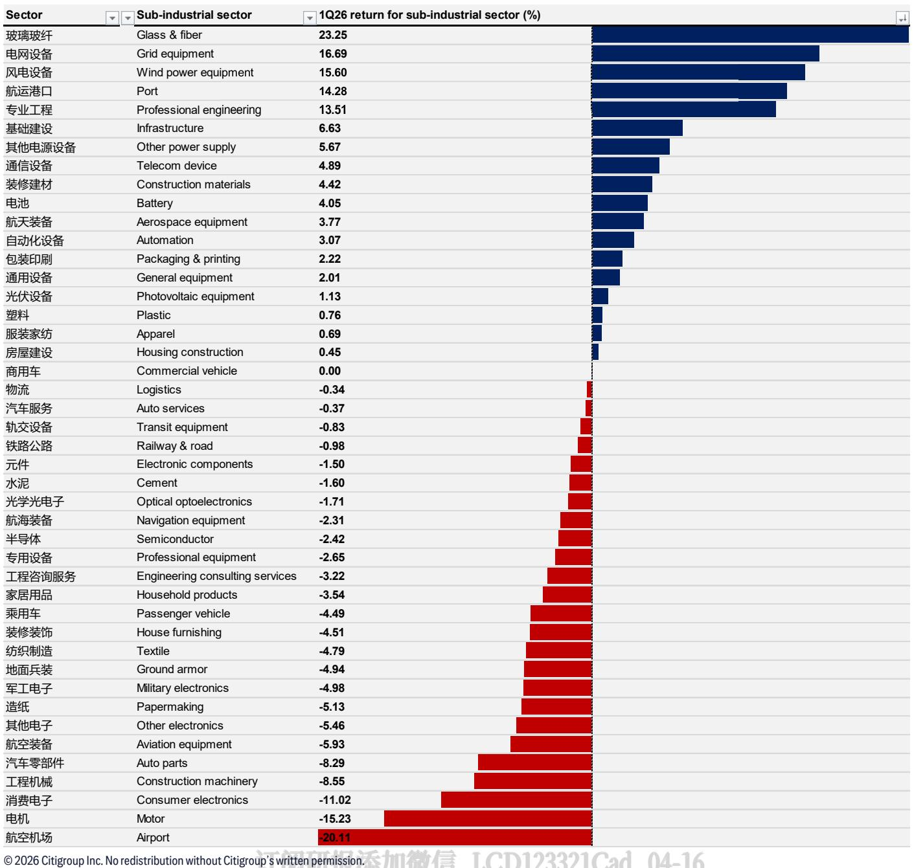  
Source: Citi Research, Wind

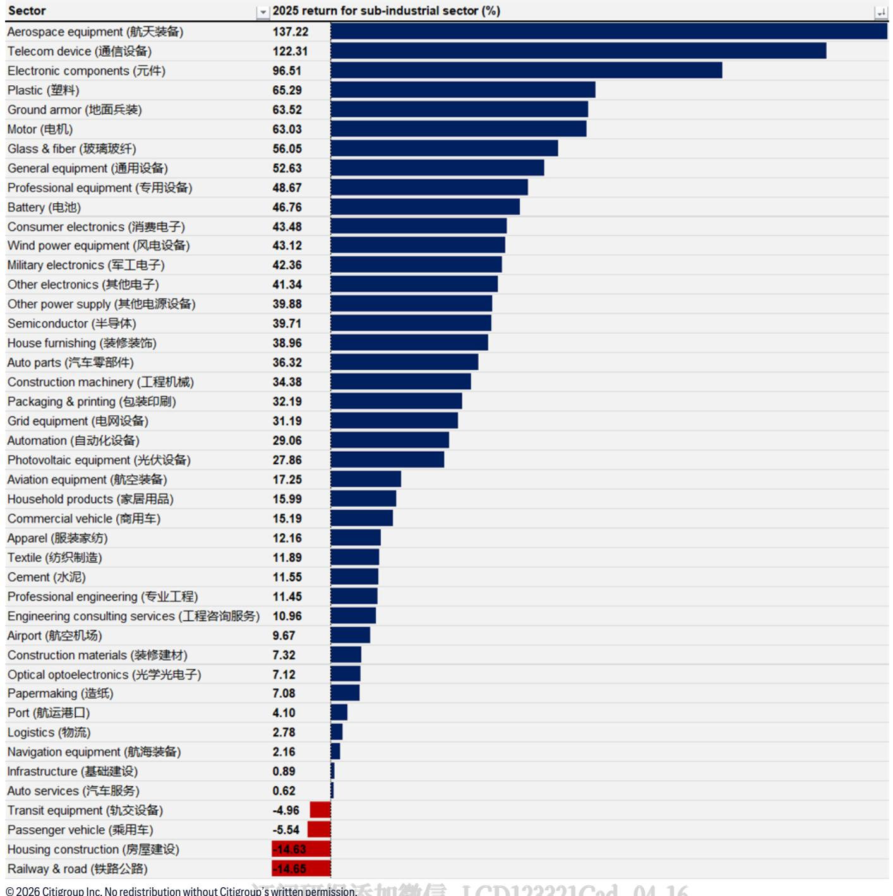  
Figure 23. Ranking of highest return during 2025 by A-share industrial 44 sub-sector   
Source: Citi Research, Wind

Figure 25. Five largest market cap stocks that underperformed in 1Q26   

<table><tr><td>Industrial vertical Airport</td><td>Company</td><td>Ticker</td><td>Rating</td><td>Mkt cap USD&#x27;m</td><td>1Q26retum</td></tr><tr><td rowspan="6"></td><td>1AIRCHINA</td><td>601111.SS</td><td>NR</td><td>16,775</td><td>-28.2%</td></tr><tr><td>2 CSN</td><td>600029.SS</td><td>NR</td><td>14,626</td><td>-29.5%</td></tr><tr><td>3 OEA</td><td>600115.SS</td><td>NR</td><td>13,410</td><td>-29.2%</td></tr><tr><td>4 SA</td><td>600009.SS</td><td>NR</td><td>9,818</td><td>-15.7%</td></tr><tr><td>5 HAINAN AIRUNESHOLDING 600221.SS</td><td></td><td>NR</td><td>8,952</td><td>-19.9%</td></tr><tr><td></td><td></td><td></td><td>Average 1Q26 retur</td><td>-24%</td></tr><tr><td rowspan="6">报添加微信</td><td>1WOLONGELECTRIC</td><td>600580.SS</td><td>NR</td><td>8,284</td><td>-24.4%</td></tr><tr><td>2 ZHAOW日</td><td>003021.SZ</td><td>NR</td><td>3,668</td><td>-22.7%</td></tr><tr><td>3MOONS</td><td>603728.SS</td><td>NR</td><td>3,410</td><td>-21.2%</td></tr><tr><td>4 JIANGSU LEU</td><td>300660.SZ</td><td>NR</td><td>2,699</td><td>-22.9%</td></tr><tr><td></td><td></td><td></td><td>Average 1Q26 retur</td><td>-23%</td></tr><tr><td></td><td></td><td></td><td></td><td></td></tr><tr><td rowspan="6">Consumer 日ectronics</td><td>1AI</td><td>601138.SS</td><td>1</td><td>145,882</td><td>-16.6%</td></tr><tr><td>2 LUXSHARE-ICT</td><td>002475.SZ</td><td>1 1</td><td>51,273</td><td>-12.9%</td></tr><tr><td>3LENS</td><td>300433.SZ</td><td>2</td><td>21,100</td><td>-7.6%</td></tr><tr><td>4 HUAQIN TECHNOLOGY</td><td>603296.SS</td><td>NR</td><td>11,627</td><td>-11.7%</td></tr><tr><td></td><td></td><td></td><td>Average 1Q26 retun</td><td>-12%</td></tr><tr><td>1 SANY</td><td></td><td></td><td></td><td></td></tr><tr><td rowspan="7">Construction Machinery</td><td></td><td>600031.SS</td><td>1</td><td>25,247</td><td>-9.0%</td></tr><tr><td>2 JSHL</td><td>601100.SS</td><td>1</td><td>18,388</td><td>-12.7%</td></tr><tr><td>3 XOMG</td><td>000425.SZ</td><td>NR</td><td>16,918</td><td>-13.0%</td></tr><tr><td>4 ZOOMLON</td><td>000157.SZ</td><td>NR</td><td>10,625</td><td>2.0%</td></tr><tr><td>5 HANGCHA GROUP</td><td>603298.SS</td><td>1 1</td><td>4,584</td><td>-7.8%</td></tr><tr><td></td><td></td><td></td><td>Average 1Q26 retun</td><td>-8%</td></tr><tr><td></td><td></td><td></td><td></td><td></td></tr><tr><td rowspan="5">Auto parts</td><td>1 JAC</td><td>600418.SS</td><td>NR</td><td>14,878</td><td>-6.7%</td></tr><tr><td>2 YT00</td><td>600066.SS</td><td>1</td><td>11,342</td><td>9.7%</td></tr><tr><td>3FAW JIEFANG</td><td>000800.SZ</td><td>NR</td><td>4,668</td><td>-2.1%</td></tr><tr><td>4 CNHTC-JNTC</td><td>000951.SZ</td><td>NR</td><td>3,734</td><td>31.7%</td></tr><tr><td>5 FOTON</td><td>600166.SS</td><td>NR</td><td>3,325</td><td>0.7%</td></tr><tr><td colspan="5">研报添加微信.LCD123321Cad 04-16</td><td>Average 1Q26retur 7%</td></tr></table>

© 2026 Citigroup Inc. No redistribution without Citigroup’s written permission. Source: Citi Research, Wind

# Barbell Strategy with Company Update

AI-infra outlook (KB Laminates $>$ Han’s Laser $>$ Shengyi Tech)

We switch our stock preference to KB Laminates $>$ Han’s Laser $>$ Shengyi Tech 研报添加微信from Shengyi Tech $>$ LCD123321Cad 04-16  KB Laminates > Han’s Laser. We prefer upstream glass fabric & copper foil and also upstream PCB equipment over ordinary CCL players. As such, there is higher EPS growth prospects for KBL and Han’s Laser than Shengyi Tech this year, based on our forecasts. See Fig 26. KBL is the only one among them with EPS growth acceleration in 2027E compared with 2026E due to growing shortage of glass fabric and copper foil benefitting KBL. In addition, Han’s Laser (via the ${ \sim } 7 4 \%$ -owned subsidiary Han’s CNC) should benefit from an influx of capex on PCB drilling equipment among PCB players as there is an increased number of them gaining NVDA or ASIC certification for capacity buildout. After the 2025 results, we model 2026E / 2027E EPS growth as $4 8 \% / 5 4 \%$ on KBL, $6 7 \% / 3 4 \%$ on Han’s Laser, and $3 3 \% / 2 3 \%$ on Shengyi Tech.

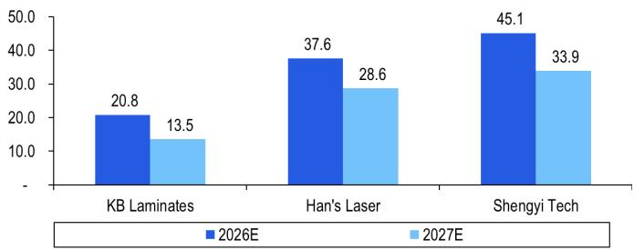  
Figure 27. Comparison of PER for 2026E and 2027E – KBL is the cheapest one followed by Han’s Laser (share price as of 14 Apr)

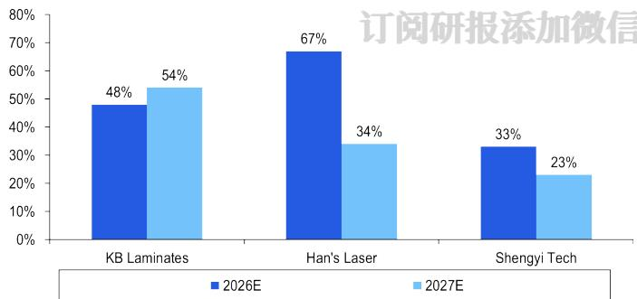  
Figure 26. Comparison of 2026 / 27E EPS growth on KBL, Han’s Laser, Shengyi Tech – KBL is the only one with acceleration of EPS growth in 2027 than 2026 for full-year contribution of upstream copper foil and glass fabric into NVDA supply chain   
$\circledcirc$ 2026 Citigroup Inc. No redistribution without Citigroup’s written permission. Source: Citi Research   
© 2026 Citigroup Inc. No redistribution without Citigroup’s written permission.

Source: Citi Research

# Upstream glass fabric and copper foil in shortage

During NVDA’s 4QFY26 results call, NVDA painted a rosy picture for increased usage of high-end CCL materials. The following figure exhibits the rapid development of CCL materials roadmap from Ampere (A100) in 2020 to Blackwell 研报添加微信 LCD123321Cad 04-16 with a full-year ramp in 2026 and then the next Rubin (Vera Rubin) from 2H26. This high demand of material upgrade should enable advanced CCL suppliers (including EMC, Doosan, Shengyi, TUC, Panasonic, ITEQ as certified for NVDA supply chain) to reap the opportunities under the NVDA ecosystem. The evolving trend is causing a shortage of AI-fabric (upstream material of CCL) for low Dk / gen 2, low CTE and evolving Q-glass. This significant material upgrade on AI-era differs from what we’ve seen with a small change of upstream material before during the PC/ notebook or smartphone upgrade.

Figure 28. NVDA platform upgrade roadmap adopting more advanced CCL grade material for high-speed / highfrequency requirement – set technology moat within NVDA ecosystem   

<table><tr><td rowspan=1 colspan=2>Generation/Platform</td><td rowspan=1 colspan=1>Launch year</td><td rowspan=1 colspan=1>KeySesDes</td><td rowspan=1 colspan=1>NMink</td><td rowspan=1 colspan=1>Typical PCBlayers</td><td rowspan=1 colspan=1>Dominant CCLgrade (high-</td><td rowspan=2 colspan=1>Keyhighlights/applications</td></tr><tr><td rowspan=1 colspan=2></td><td rowspan=1 colspan=1></td><td rowspan=1 colspan=1> speed (perlane)</td><td rowspan=1 colspan=1>Generation/perGPUbandwidth</td><td rowspan=1 colspan=1></td><td rowspan=1 colspan=1>speed parts)</td></tr><tr><td rowspan=1 colspan=2></td><td rowspan=1 colspan=1></td><td rowspan=1 colspan=1></td><td rowspan=1 colspan=1></td><td rowspan=1 colspan=1></td><td rowspan=1 colspan=1></td><td rowspan=1 colspan=1></td></tr><tr><td rowspan=2 colspan=2>Ampere(A100)</td><td rowspan=1 colspan=1>2020</td><td rowspan=1 colspan=1>56GPAM4</td><td rowspan=1 colspan=1>NMLink3.0（~600</td><td rowspan=2 colspan=1>~16-20layers</td><td rowspan=2 colspan=1>M6-M7 (lowloss)</td><td rowspan=2 colspan=1> Standard for earlyA clusters;lowsignal demands</td></tr><tr><td rowspan=1 colspan=1></td><td rowspan=1 colspan=1></td><td rowspan=1 colspan=1>GB/s)</td></tr><tr><td rowspan=1 colspan=2></td><td rowspan=1 colspan=1></td><td rowspan=1 colspan=1></td><td rowspan=1 colspan=1></td><td rowspan=1 colspan=1></td><td rowspan=1 colspan=1></td><td rowspan=1 colspan=1></td></tr><tr><td rowspan=2 colspan=2>Hopper (H100/H200)</td><td rowspan=2 colspan=1>2022-23</td><td rowspan=1 colspan=1>112GPAM4</td><td rowspan=1 colspan=1>NMLink 4.0 (~900</td><td rowspan=2 colspan=1>~20-28 layers</td><td rowspan=2 colspan=1>M7-M8 (very lowloss)</td><td rowspan=2 colspan=1>Introduced major high-layer needs; M8 in NVSwitch trays</td></tr><tr><td rowspan=1 colspan=1></td><td rowspan=1 colspan=1>GB/s)</td></tr><tr><td rowspan=1 colspan=2></td><td rowspan=1 colspan=1></td><td rowspan=1 colspan=1></td><td rowspan=1 colspan=1></td><td rowspan=1 colspan=1></td><td rowspan=1 colspan=1></td><td rowspan=1 colspan=1></td></tr><tr><td rowspan=1 colspan=2>Blackwell</td><td rowspan=2 colspan=1>2024-25 (full 224GPAM4ramp in</td><td rowspan=1 colspan=1>224GPAM4</td><td rowspan=1 colspan=1>NMLink 5.0</td><td rowspan=1 colspan=1>~20-40+layers(eg20</td><td rowspan=1 colspan=1>M8(mainstream).some</td><td rowspan=3 colspan=1>Compute Tray: mostly M8 (16/20 layers high-speed)</td></tr><tr><td rowspan=2 colspan=2>(B200/GB200/GB300)</td><td rowspan=1 colspan=1>B300）</td><td rowspan=1 colspan=1></td><td rowspan=1 colspan=1>(~1.8TB/s)</td><td rowspan=2 colspan=1>layer UBBin GB300)</td><td rowspan=2 colspan=1>M8.5; Doosan / EMC dominant in trays</td></tr><tr><td rowspan=1 colspan=1>2026)</td><td rowspan=1 colspan=1></td><td rowspan=1 colspan=1></td></tr><tr><td rowspan=1 colspan=2></td><td rowspan=1 colspan=1></td><td rowspan=1 colspan=1></td><td rowspan=1 colspan=1></td><td rowspan=1 colspan=1></td><td rowspan=1 colspan=1></td><td rowspan=1 colspan=1></td></tr><tr><td rowspan=1 colspan=2>Rubin (Vera Rubin)/</td><td rowspan=1 colspan=1>2H2026</td><td rowspan=1 colspan=1>224G+</td><td rowspan=1 colspan=1>NMLink 6.0 (~3.6</td><td rowspan=2 colspan=1>78-layer orthogonal</td><td rowspan=3 colspan=1>~26-44+layers(up to M8-M8.5 (main),selectiveM9(CPX, midplane, backplanes)</td><td rowspan=3 colspan=1>Cost-optimized : M8.5 in manyareasfor signal integrityat higherdensity</td></tr><tr><td rowspan=2 colspan=2>NVL72</td><td rowspan=1 colspan=1>onward</td><td rowspan=1 colspan=1></td><td rowspan=1 colspan=1>TB/s)</td></tr><tr><td rowspan=1 colspan=1></td><td rowspan=1 colspan=1></td><td rowspan=1 colspan=1></td><td rowspan=1 colspan=1> in UItra)</td></tr><tr><td rowspan=1 colspan=2></td><td rowspan=1 colspan=1></td><td rowspan=1 colspan=1></td><td rowspan=1 colspan=1></td><td rowspan=1 colspan=1></td><td rowspan=1 colspan=1></td><td rowspan=1 colspan=1></td></tr><tr><td rowspan=1 colspan=2>Rubin UItra/Future</td><td rowspan=1 colspan=1>2027+</td><td rowspan=1 colspan=1>400G+</td><td rowspan=1 colspan=1>NMLink 6+/higher</td><td rowspan=1 colspan=1>~78+layers</td><td rowspan=2 colspan=1>M9 (quartz-based)</td><td rowspan=3 colspan=1>Extremeupgrades; Orthogonalbackplanes (3x 26-layer to 78layer composite); M9 ismandatory for 200G+ SerDesloss control</td></tr><tr><td rowspan=2 colspan=7>direction                      (orthogonalbackplanes)</td><td rowspan=1 colspan=1>direction</td></tr><tr><td rowspan=1 colspan=1></td></tr></table>

© 2026 Citigroup Inc. No redistribution without Citigroup’s written permission. Source: Citi Research, Company Reports

Figure 29. Projection of demand of advanced fabric for AI and substrate   

<table><tr><td rowspan=1 colspan=1>Demand(mmeter)</td><td rowspan=1 colspan=2>2025E   2026E</td><td rowspan=1 colspan=1>2027E</td><td rowspan=1 colspan=1></td><td rowspan=1 colspan=1>CAGR</td></tr><tr><td rowspan=1 colspan=1>Low Dk / gen 1</td><td rowspan=1 colspan=1>90.5</td><td rowspan=1 colspan=1>131.4</td><td rowspan=1 colspan=1>152.4</td><td rowspan=1 colspan=1></td><td rowspan=1 colspan=1>30%</td></tr><tr><td rowspan=1 colspan=1>Low Dk / gen 2</td><td rowspan=1 colspan=1>5.9</td><td rowspan=1 colspan=1>59.9</td><td rowspan=1 colspan=1>139.2</td><td rowspan=1 colspan=1></td><td rowspan=1 colspan=1>387%</td></tr><tr><td rowspan=1 colspan=1>Low CTE</td><td rowspan=1 colspan=1>6.7</td><td rowspan=1 colspan=1>18.1</td><td rowspan=1 colspan=1>33.6</td><td rowspan=1 colspan=1></td><td rowspan=1 colspan=1>124%</td></tr><tr><td rowspan=1 colspan=1>Q-glass</td><td rowspan=1 colspan=1>1.2</td><td rowspan=1 colspan=1>16.0</td><td rowspan=1 colspan=1>38.3</td><td rowspan=1 colspan=1></td><td rowspan=1 colspan=1>471%</td></tr><tr><td rowspan=1 colspan=1>Total demand of Al-fabric</td><td rowspan=1 colspan=1>104.3</td><td rowspan=1 colspan=1>225.3</td><td rowspan=1 colspan=1>363.4</td><td rowspan=1 colspan=1></td><td rowspan=1 colspan=1>87%</td></tr><tr><td rowspan=1 colspan=6>? 2026 Citigroup Inc.No redistribution without Citigroup&#x27;s writen permission.Source:Citi Research,highfrequencypcb.com,Company Reports</td></tr></table>

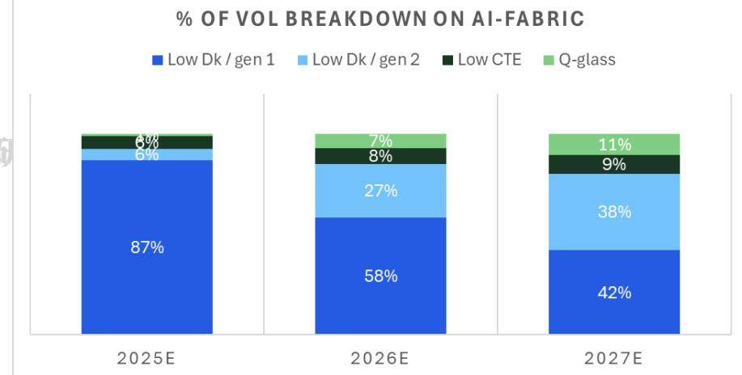  
Figure 30. $\%$ of volume breakdown of advanced fabric for AI and substrate showing evolving demand of low Dk gen 2, low CTE and Q-glass   
© 2026 Citigroup Inc. No redistribution without Citigroup’s written permission. Source: Citi Research, highfrequencypcb.com, Company Reports

# Upstream PCB equipment business expansion by PCB building capacity

We expect PCB equipment companies to benefit from stronger-for-longer demand from AI PCB makers due to not only faster AI server/data center buildups but also more Chinese PCB makers expanding capacities to win orders from Nvidia and ASIC companies. Our tech team forecasts global AI PCB TAM to grow by $10 1 \% / 8 1 \%$ YoY to Rmb96bn/174bn in 2026/27E, and we estimate global AI PCB equipment TAM to expand at a similar pace to Rmb21bn/34bn in the next two years.

研报添加微信 LCD123321Cad 04-16 Han’s CNC (HC; 3200.HK / 301200.SZ), specializing in mechanical drilling equipment, is one of the biggest beneficiaries of the AI boom. We expect the company’s revenue contribution from AI to increase from $30 \%$ in 2025 to $\sim 5 0 \%$ in 2026E and even higher onwards as more Chinese PCB makers besides Victory Giant Technology (VGT; 300476.SZ) join the capacity expansion race in 2026 in an attempt to get more AI PCB orders. However, we prefer its parent company Han’s Laser (HL; 002008.SZ) because, in addition to the AI PCB story, HL could also benefit from two years of Apple equipment revenue growth in 2026-27E driven by the launch of iPhone 18 – the first foldable phone for Apple – and iPhone’s ${ } ^ { 2 0 ^ { \mathrm { t h } } }$ anniversary in 2027 where we expect Apple to introduce not only iPhone 19 but also another model for the ${ } ^ { 2 0 ^ { \mathrm { t h } } }$ anniversary, as it did for its $1 0 ^ { \mathrm { t h } }$ anniversary in 2017 – launching both iPhone 8 and X.

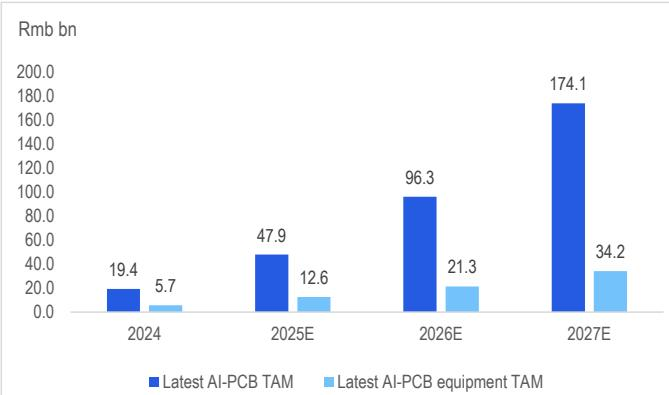  
Figure 31. AI PCB TAM and AI PCB equipment TAM   
© 2026 Citigroup Inc. No redistribution without Citigroup’s written permission. \*AI-PCB equipment TAM forecast is based on the increase in AI PCB TAM per year Source: Citi Research Estimates

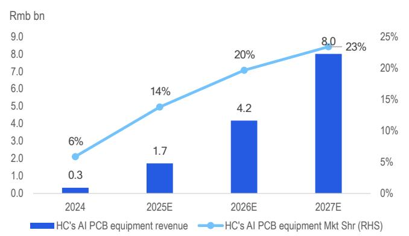  
Figure 32. HC: AI-PCB equipment revenue and market share   
© 2026 Citigroup Inc. No redistribution without Citigroup’s written permission.

Source: Company Reports and Citi Research Estimates

# Kingboard Laminates (1888.HK)

2026 outlook – We expect KBL will raise capex to over $\mathsf { H K$ 3 b n }$ in 2026E from 研报添加微信 LCD123321Cad 04-16 HK\$1bn+ in 2025 for adding capacities due to 1) current shortage of high-end glass fabric (low Dk, low CTE and Q-glass) with total 6k tonnes of yarn by end-2026 from 500 tonnes in 2025; 2) another shortage of AI-related copper foil with annual capacity of 21k tonnes mainly on HVLP 4 standard and low-signal-loss RTF for AI and other high-end applications, which will commence production in mid-2027; 3) commencement of e-glass fabric with annual capacity of 70k t yarn (or 96m meters pa) during 2H26E. KBL has mostly supplied AI-fabric for EMC and Panasonic. With more capacity unleashed in the rest of this year, we believe KBL could gain more customers like Doosan, Shengyi, and TUC.

Riding on shortage of glass fabric and copper foil – Note KBL generated over $\mathsf { H K S 6 0 0 m }$ profit $70 \%$ rise yoy) from e-glass fabric in 2025, representing $\sim 2 5 \%$ of total net profit. The strong profit growth was largely led by doubling ASP yoy. The e-glass fabric (1080 series) has surged from $\mathsf { R m b 3 . 7 / m }$ in Sep to $\mathsf { R m b 6 . 0 } / \mathsf { m }$ in early 2026 and further rises to $\mathsf { R m b 7 . O } / \mathsf { m }$ in this month. This is because a number of eglass fabric suppliers have shifted from e-glass into low Dk gen 1 / gen 2 for AIrelated products. Apart from glass fabric, KBL also benefits from the shortage of AI-related copper foil. Thus, the processing fee for ordinary copper foil is just at 研报添加微信 LCD123321Cad 04-16 Rmb20k/t compared with HVLP3 grade (for M6 PCB) at Rmb110k/t. KBL plans to further upgrade facilities to build 21k t mainly for HVLP 4 standard (for M7 PCB) with commencement from mid-2027. This is not in our model yet.

AI wave also makes a shortage of fabric weaving machines in the industry – KBL has a strong tie with Toyota for the knitting machine given the historical long-term business relationship. We believe KBL will increase the number of machines from ${ \sim } 3 . 2 \mathrm { k }$ units by $^ { 2 \mathsf { k } }$ to over $^ { 5 \mathsf { k } }$ units in the coming 20 months. In other words, almost all production capacity of Toyota will be mainly served by KBL. This should ensure KBL can cope with the current shortage of AI-fabric to customers.

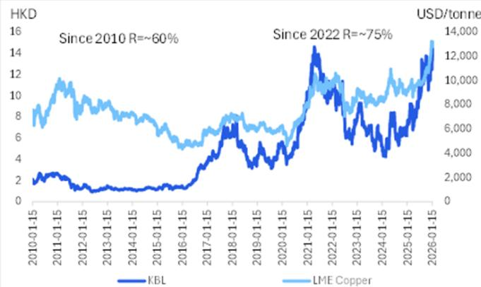  
Figure 33. High correlation of KBL share price and copper cost cycle   
© 2026 Citigroup Inc. No redistribution without Citigroup’s written permission. Source: Citi Research, Wind

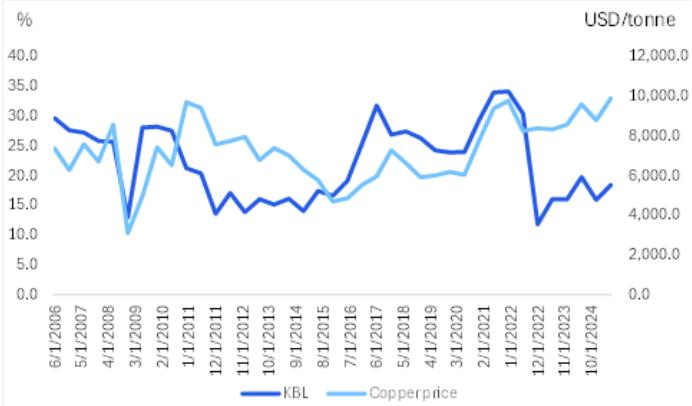  
Figure 34. Positive correlation of KBL interim GM and halfyear copper cost   
© 2026 Citigroup Inc. No redistribution without Citigroup’s written permission. Source: Citi Research, Wind

# Han’s Laser (002008.SZ)

Riding on PCB equipment business expansion via Han’s CNC - On the PCB equipment front, even though without significant contribution from the ultrafast laser drilling equipment, we could still see upsides to the mechanical drilling equipment demand as, besides VGT (300476.SZ), more Chinese PCB makers are expanding capacities in 2026 to win AI PCB orders from Nvidia and ASIC companies. As for the Apple equipment, we now forecast HL’s IT revenue to jump 研by $60 \%$ 加微信 LC YoY (vs. previously $40 \%$ 3321Cad 04-16  YoY) to Rmb4.0bn in 2026E, as management recently toned up this business given stronger order wins from Apple, in particular the laser welding equipment for VC (Vapor Chamber) heat dissipation plate production. We estimate the VC cooling system-related sales would increase from \~Rmb200mn in 2025E to $>$ Rmb1.0bn in 2026E. Mgmt. indicated that the Apple order rose by $> 1 0 0 \%$ in 2026TD, similar to Bozhon (688097.SS) which reported its electronic (mainly for Apple) orders grew by 89% YoY in 1Q26.

HL remains our top pick in the AI PCB equipment as 1) it could ride on both AI PCB equipment up-cycle and two consecutive years of equipment revenue growth from Apple and 2) HL is a cheaper AI PCB equipment play than HC. Our pecking order remains HL (002008.SZ) $>$ HC-H (3200.HK) $>$ HC-A (301200.SZ).

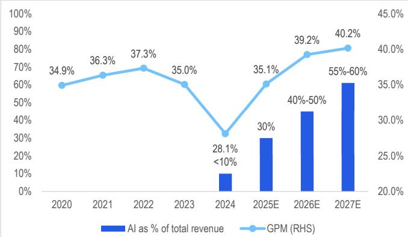  
Figure 35. HC: AI PCB equipment revenue % vs. GPM   
$\circledcirc$ 2026 Citigroup Inc. No redistribution without Citigroup’s written permission. Source: Company Reports and Citi Research Estimates

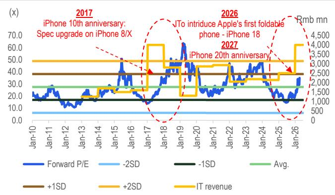  
Figure 36. HL: Forward P/E trends vs. IT (Apple) revenue   
© 2026 Citigroup Inc. No redistribution without Citigroup’s written permission. Source: Company Reports and Citi Research Estimates

# Shengyi Tech (600183.SS)

Shengyi Tech will print 2025 results on 24 April but has released the preliminary results 2025 with revenue / net profit surging $3 9 \% / 9 2 \%$ . This implies the 4Q25 net profit of Rmb886m soaring $142 \%$ yoy. However, this was still slightly lower than previous midpoint guidance of Rmb902m.

The only Chinese certified supply for M9 PCB on NVDA supply chain – We are still 研报添加微信 LCD123321Cad 04-confident of Shengyi delivering earnings growth of $30 \% +$ this year even after the profit nearly doubled in the last year thanks to 1) maiden shipment of Rubin by using M9 CCL; 2) start of ASIC customers like AWS, META, Google this year; 3) GM expansion on copper cost upcycle and better mix towards AI-CCL. We estimate the GM of AI-CCL at $40 \% +$ compared with blended GM of CCL segment at $2 7 \%$ this year in our estimation.

Upcoming key catalysts – 1) Amid the backdrop of AI-infra boost, the company will release details in early 2026 about its 5-year plan for capacity growth; 2) current orders for 1Q26 $> 1 0 \mathsf { m }$ sheets/month) in excess of capacity $( \sim 8 . 5 \mathsf { m }$ sheets/month), which implies GM likely to beat on better mix upgrade in 1Q26; 3) Besides the NVDA supply chain, Shengyi has recently developed projects on ASIC basis for AWS, Google, META, etc., per Shengyi mgmt., which will likely bear fruit in 2026 in our view; 4) Shengyi GM expansion cycle should move in line with current copper price surge. Note Shengyi’s share price has $50 \%$ correlation with copper cost since 2010 or rose to $7 7 \%$ since 2022; 5) Apart from continued copper cost surge, Shengyi’s GM will continue to expand to reach all-time high in 2026 thanks to increasing AI-CCL $\%$ exposure given AI-CCL GM being well above blended average. We expect AI-CCL to account for $51 \%$ total vol in 2026E from ${ \sim } 1 0 \%$ in 2025.

New plants update — Shengyi operated capacity of $\sim 8 \mathsf { m }$ sheets CCL per month in last year. The company is expanding two plants in Jiangxi and Thailand. Jiangxi plant with monthly capacity of $1 . 2 { \mathsf { m } }$ sheets has recently commenced and would cater for non-AI CCL products. Thus, Shengyi can leave more capacity at Dongguan to manufacture AI-CCL products. The company does not see capacity constraints for the AI boom as it takes a short while to switch capacity from non-AI CCL to AI CCL. Additionally, its Thai plant with monthly capacity of $0 . 7 \mathsf { m }$ sheets will kick off during 1Q26. The Thai plant will mainly focus on auto, datacenter server and substrate. Mgmt expects slow ramp-up in the Thai plant with expectation of low profitability or even a small loss as the cost structure is not competitive there compared with China. Thai plant mainly serves the China $+ 1$ strategy for certain customers. All in all, we expect monthly capacity to increase by ${ \sim } 2 0 \%$ from $8 . 0 \mathsf { m }$ sheets / mth in 2025 to ${ \sim } 9 . 6 \mathsf { m }$ sheets / mth by end-2026 thanks to the new Jiangxi plant and facilities upgrade at the Suzhou plant (addition of 300-400k sheets/mth).

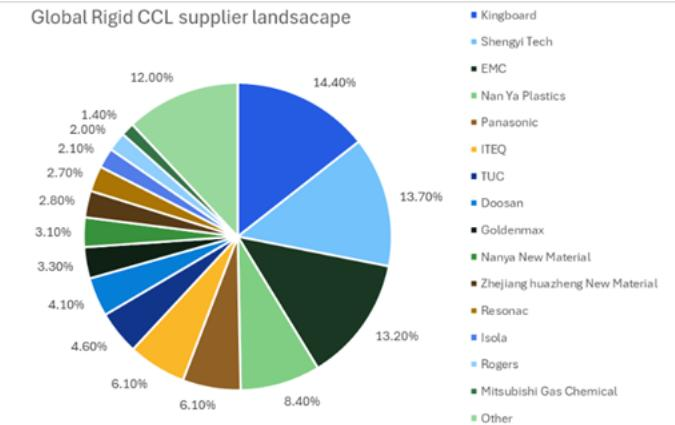  
Figure 37. Global Rigid CCL landscape in 2024 – Top 5 accounted for $> 5 5 \%$ 订of global share 阅研报添加   
© 2026 Citigroup Inc. No redistribution without Citigroup’s written permission. Source: Citi Research, Prismark, Company Reports

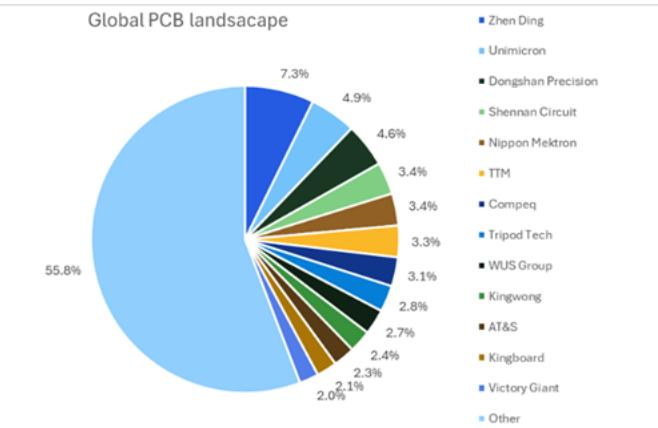  
Figure 38. Global PCB landscape in 2024 – Top 5 accounted LCD123321Cad 04for 23-24% of global share 6   
© 2026 Citigroup Inc. No redistribution without Citigroup’s written permission. Source: Citi Research, Prismark, Company Reports

# 研报添加微信 LCD123321Cad 04-16 Embodied AI Chain (Hengli > UBTech > LD)

We reiterate our constructive view on the EAI (Embodied AI) sector and deem 2026 as a year of mass production for both leading Chinese and foreign humanoid robot makers. As with our previous industry checks (China Humanoid Robot - What’s New from Citi 2025 Industrial Tour: Likely Exponential Production Growth in 2026), our recent talks with companies in the humanoid robot supply chain confirmed that the leading US humanoid robot maker is accelerating the supply chain buildup and has finalized the design of the latest humanoid robot (Gen 3) by February 2026 and will ramp up the production by July or August 2026, with initial capacity requirement of 1,000 humanoid robot/week and the first application will be in its NEV factories. This US humanoid robot maker will expand its weekly capacity to 3,000 units.

In China, the leading harmonic reducer supplier Leader Drive (688017.SS) believes that 1) total humanoid robot production volume could at least double or grow exponentially in 2026 given key humanoid robot customer’s aggressive production guidance and 2) there could be 10 humanoid robot companies which are able to produce >1,000 units of humanoid robots in 2026. Meanwhile, leading Chinese humanoid robot makers’ IPOs (e.g., Unitree’s A-share IPO and Zhiyuan/AgiBot’s Hshare IPO) could further accelerate the development of the entire industry and boost the sentiment for humanoid robot plays.

However, as almost all humanoid robot makers have not been able to generalize certain specific tasks, we believe that the majority $( > 5 0 \% )$ of the humanoid robots produced will be deployed in the humanoid robot or EAI data collection factories, to collect the real data and capture physic laws. Recent comments from the mgmt. of UBTECH Robotics (9880.HK) echo our view as mgmt. mentioned that the company will strengthen the cooperation with both industrial clients and data collection centers to collect the “real data.” Meanwhile, UBTECH also officially

guided up its 2026 humanoid robot shipment guidance from 2,000-3,000 units previously to 5,000 units.

While China lacks the most advanced GPU and data centers to provide strong computing power to the humanoid robot sector, China has advantages in manufacturing hardware and components and collecting rea data at lower costs. In addition, the well-established manufacturing industry in China could offer humanoid robot companies a wide variety of industrial applications for them to 研报添加微信 LCD123321Cad 04-16 train their humanoid robots.

Figure 39. Advantages in humanoid robot development: China vs. US   

<table><tr><td rowspan=1 colspan=3>China                           US</td></tr><tr><td rowspan=1 colspan=1>Hardware manufacturing</td><td rowspan=1 colspan=1>√(lowcost)</td><td rowspan=1 colspan=1></td></tr><tr><td rowspan=1 colspan=1>Real data collection</td><td rowspan=1 colspan=1>√(lowcostand variousapplications)</td><td rowspan=1 colspan=1></td></tr><tr><td rowspan=1 colspan=1>Industry scale-up</td><td rowspan=1 colspan=1>(complete supplychain)</td><td rowspan=1 colspan=1></td></tr><tr><td rowspan=1 colspan=1>Policy and subsidies</td><td rowspan=1 colspan=1>√</td><td rowspan=1 colspan=1></td></tr><tr><td rowspan=1 colspan=1>Human labor replacement</td><td rowspan=1 colspan=1></td><td rowspan=1 colspan=1>√(high labor cost)</td></tr><tr><td rowspan=1 colspan=1>GPU and computing power</td><td rowspan=1 colspan=1></td><td rowspan=1 colspan=1>√</td></tr></table>

© 2026 Citigroup Inc. No redistribution without Citigroup’s written permission. Source: Citi Research

We are particularly positive on the leading US humanoid robot maker’s component suppliers mainly because it could deploy its humanoid robots in its NEV factories, 研报添加微信 LCD123321Cad 04-16 without external orders needed. Our humanoid robot pecking order is Hengli Hydraulic (601100.SS) $>$ UBTECH Robotics $( 9 8 8 0 . \mathsf { H K } ) >$ Leader Drive (688017.SS), as we apply a “barbell strategy” in this space, i.e., buy either key component supplier with limited humanoid robot exposure but strong core business or OEM with the highest revenue contributed from the humanoid robot business.

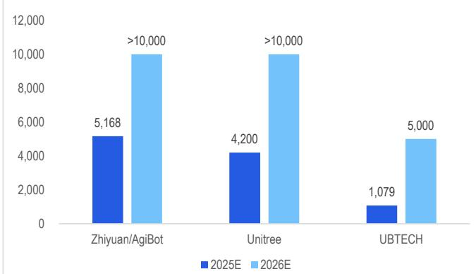  
Figure 40. Leading Chinese humanoid robot makers' production guidance   
$\circledcirc$ 2026 Citigroup Inc. No redistribution without Citigroup’s written permission. Source: Citi Research, Company

Figure 41. Chinese humanoid robot makers that target $\tt { \tt { > } } 1 1 k$ humanoid robots in 2026   

<table><tr><td rowspan=1 colspan=1>Company name</td></tr><tr><td rowspan=1 colspan=1>Zhiyuan/AgiBot</td></tr><tr><td rowspan=1 colspan=1>Unitree</td></tr><tr><td rowspan=1 colspan=1>UBTECH</td></tr><tr><td rowspan=1 colspan=1>Beijing Humanoid Robot Innovation Center</td></tr><tr><td rowspan=1 colspan=1>Leju Robotics</td></tr><tr><td rowspan=1 colspan=1>Fourier</td></tr><tr><td rowspan=1 colspan=1>EngineAl</td></tr><tr><td rowspan=1 colspan=1>MagiBot</td></tr><tr><td rowspan=1 colspan=1>Xpeng</td></tr><tr><td rowspan=1 colspan=1>Xiaomi</td></tr></table>

$\circledcirc$ 2026 Citigroup Inc. No redistribution without Citigroup’s written permission. Source: Citi Research, Company

Figure 42. Key humanoid robot component suppliers   

<table><tr><td colspan="2">Tesla(TSLA.O)&#x27; Key Component Potential Suppliers</td><td>UBTECH&#x27;s (9880.HK) Suppliers</td><td>AgiBot/Zhiyuan&#x27;s Suppliers</td><td>Unitree&#x27;s Suppliers</td></tr><tr><td colspan="2">GPU Nvidia (NVDA.O) Tesla-SOC(TSLA.O).</td><td>Nvidia (NVDA.O)</td><td>Nvidia (NVDA.O)</td><td>Nvidia (NVDA.O)</td></tr><tr><td colspan="5">&quot;CPU Arm(ARM.O) Intel(INTC.O) Intel(INTC.O)</td></tr><tr><td>Harmonic Reducer</td><td>Leader Drive (688017.SS) Sling (301550.SZ) Kedali (002850.SZ) HDS (6324.T)</td><td>Leader Drive (688017.SS)</td><td>Leader Drive (688017.SS)</td><td></td></tr><tr><td colspan="7">Nidec (6594.T) PlanetaryReducer NEWSTART (unlisted) ZhongDa Leader (002896.SZ).ZhongDaLeader (002896.SZ)</td></tr><tr><td colspan="7">ModifiedRVReducerforWaist Shuanghuan (002472.SZ) Schaeffler (SHAOn.DE)</td></tr><tr><td colspan="2">Planetary RollerScrew</td><td colspan="3">Hengli Hydraulic (601100.SS) Seenpin (unlisted)</td><td></td></tr><tr><td colspan="2">Frameless Torque Motor for Arm Moons&#x27; Electric (603728.SZ)</td><td colspan="2">Kollmorgen (unlisted) Kinco (688160.SS)</td><td>Fulling Motor (unlisted) Kinco (688160.SS)</td><td></td></tr><tr><td colspan="8">Wolong (600580.SS) Zhaowei (2692.HK/003021.SZ) Brushless Motor for Wrist</td></tr><tr><td colspan="8">Johnson Electric (0179.HK). 3DVisionSystem Tesla(TSLA.O) Orbbec (688322.SS) Orbbec(688322.SS) Orbbec(688322.SS)</td></tr><tr><td colspan="8">Battery BYD/FinDreams (1211.HK) Kunwei Tech (unlisted)</td></tr><tr><td colspan="8">6-axis Force Sensor Sri Sensor (unlisted)</td></tr><tr><td colspan="8">Dexterous Hand -Coreless Motor Veichi (688698.SS) Johnson Electric(0179.HK) Zhaowei (2692.HK/003021.SZ)</td></tr><tr><td colspan="8">Rongtai (603119.SS) Dexterous Hand - Micro Bal Screw Zhengyu (300953.SZ)</td></tr><tr><td colspan="8">Seenpin(unlisted) Rongtai(603119.SS) Dexterous Hand - Drive Module JohnsonElectric(0179.HK)</td></tr><tr><td colspan="8">Everwin (300115.SZ) Dexterous Hand -Assembly Seenpin (unlisted)</td></tr><tr><td colspan="8">Johnson Electric (179.HK) Tuopu (601689.SS)</td></tr><tr><td colspan="8">Rotary(Linear)Actuator Integration Sanhua (2050.HK/002050.SZ) Tier-1SupplierforJoints Tuopu (601689.SS)</td></tr><tr><td colspan="8">Headcoverand glass Lens(6613.HK/300433.SZ)</td></tr><tr><td colspan="8">*Seepincooperates with XCC(603677.SS)andJWPrecision Machinery(300984.SZ)onthehumanoid robotbusiness IUau VT-IU</td></tr><tr><td colspan="8">? 2026 Citigroup Inc.No redistribution without Citigroup&#x27;s written permission.</td></tr><tr><td colspan="8">*Suppliers to the humanoid robot companies are notlimited to above-mentioned companies. Source: Citi Research, Company Reports</td></tr></table>

Figure 43. Key takeaways from humanoid robot supply chain companies we visited recently   

<table><tr><td>Company</td><td>Ticker</td><td>Main humanoid robot productand market position</td><td>Humanoid robot guidance</td></tr><tr><td>Hengli</td><td>601100.SS</td><td>Hengli is highly likely to penetrate the leading US humanoid robot maker.Mgmt.&#x27;soptimismisprimarilybasedonthefactthat Hengli Henglihassuppliedtheplanetaryrollerscrewsamplestothe uses lathe machines instead of grinding machines to reduce the production cost of planetary ball screws (for humanoid robot&#x27;s legs) significantly.Weare also confident regarding the competitivenessof Hengli&#x27;s planetary ball screw since itsR&amp;D teamoriginallycame froma leading Europeanball screwand</td><td>leading US humanoid robotmaker for,notonlylegs,butalso for upper arms and forearms. The number of planetary ballscrews used on a humanoid robot could be up to 14,based on the US customer&#x27;s requirements,and the initial guidance is tosupply planetary rollerscrews for20k humanoid robot production.</td></tr><tr><td>Leader Drive</td><td>688017.SS</td><td>1) China&#x27;s leading harmonic reducer maker for both industrial robot and humanoid robot,2) key Chinese humanoid robot customers are AgiBot/Zhiyuan and UBTECH (9880.HK);and 3)it is expanding its humanoid robot product portfolio into planetary ballscrew,micro motor,linear actuator,etc.</td><td>~20% of 9M25 revenue,or Rmb81-82mn,was from the humanoid robot products.Mgmt.believes that humanoid robot product shipments could at least double in 2026 given key customers&#x27;aggressive production guidance and is very confident that LD willbe the main harmonic reducer source to the leading US humanoid robot maker.</td></tr><tr><td>UBTECH</td><td>9880.HK</td><td>1) WalkerS2 for industrial applicationsare UBTECH&#x27;s main humanoid robot products; 2) one of Chinese humanoid robot makers with the fastest commercialization progress; and 3) accumulated humanoid robot order reached Rmb1.4bn by the end of 2025.</td><td>Humanoid robot shipments reached 1,079 units in 2025 and mgmt.guided 5,000 units of shipments in 2026.We forecast its humanoid robot revenue toaccount for~60%of total revenue in 2026Efrom 36%in 2025.</td></tr><tr><td>Orbbec</td><td>688322.SS</td><td>1) Its 3D vision product Gemini is on Nvidia&#x27;s recommended list; 2) 3D vision market share in China&#x27;s service robot is ~70%; 3) key competitorsare RealSense (unlisted)and Apple&#x27;s PrimeSense; and 4) Orbbec&#x27;s chips are designed bythemselves and manufactured by TSMC (28/45nm).</td><td>Humanoid robot revenue could grow from a couple of Rmb10mn in 2025 to Rmb100mn-200mn in 2026.</td></tr><tr><td>Rongtai</td><td>603119.SS</td><td>1)Rongtairecentlyacquired a micro ball screw company KSS Ballscrewto penetrate into the leading USNEVmaker&#x27;s humanoid robot supply chain; 2)a humanoid robot of the US customer requires30-40 units of micro ballscrews,with dollar content of~Rmb20k; and 3)it is building a factory in Thailand since having plants outside of China isa requirement to win the firm ordersfrom the UScustomer.</td><td>Rongtai will prepare enough micro ball screw capacity to support the leading US humanoid robotmaker to produce 3,000 humanoid robots/week by1Q26.Mgmt.indicated that the company willexpand itscapacity to 5,0o0/week bythe end of 2026and believe that its micro ball screw share for the key US customer&#x27;sdexterous hands is&gt;50%.</td></tr><tr><td>Veichi</td><td>688698.SS</td><td>Mgmt.guided 10%-20% revenue and earnings growth,similar to the target on the latest ESOP.Main competitors are Yaskawa (6506.T)and Taiwan Syntec (7750.TW)</td><td>Veichihas both Chinese and foreign customers.For the foreign client, Veichi confirmed that they are a micro motor supplier for the dexterous hands.In China,their clients include Zhiyuan/AgiBot, UBTECH,Fourier,Chinese NEV OEMs and smartphone companies,etc.The products that Veichi ofers are rotary joints- servo motor,control unit,and other components except reducer,coreless motor,frameless motor,</td></tr></table>

Source: Citi Research, Company Reports

# Hengli Hydraulic (601100.SS)

Mgmt. indicated that Hengli has penetrated a leading US humanoid robot maker, supplying planetary roller screws for humanoid robot’s legs and arms. The number of planetary ball screws used on a humanoid robot could be up to 14, as per the US customer’s requirements; the production will be carried out in Hengli’s Mexico plant and delivery will be around Jul-26. We expect the humanoid robot to account for $1 \% - 2 \%$ of Hengli’s total revenue in 2026E. Regarding the core business, mgmt. expects 1Q26 to be a strong quarter with YoY GPM expansion driven by strong excavator component business despite \~Rmb80mn FX loss due to $\cup \mathtt { S } \$ \Phi$ 研报添加微信 LCD123321Cad 04-16 depreciation against the Rmb. Based on mgmt.’s guidance that excavator component revenue could grow by ${ \sim } 4 0 \%$ YoY in 1Q26, we estimate Hengli’s total revenue to increase by $3 5 \%$ YoY to Rmb3.3bn in 1Q26. Even with \~Rmb80mn FX loss, we expect Hengli’s net profit could still grow strongly by $30 \%$ YoY to Rmb801mn in 1Q26. (see Hengli Hydraulic (601100.SS): Full Run Rate at Excavator Component Plants Indicates Strong Start of 2026; Reiterate Buy).

Our TP of Rmb135 is based on ${ \sim } 5 2 \times 2 0 2 6 \mathsf { E } \mathsf { P } / \mathsf { E }$ , set at its average P/E (since 2021) $^ +$ $2 . 0 \times$ SD. We apply the $\mathsf { P / E }$ multiple to reflect Hengli’s better core business outlook and imminent humanoid robot exposure. With \~46x/\~39 2025/26E P/E, Hengli is still one of the cheapest humanoid robot component plays in China.

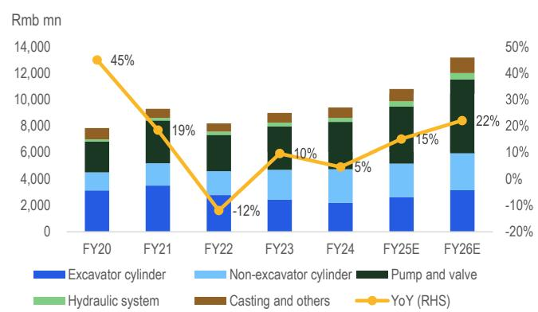  
Figure 44. Hengli: Revenue by product and YoY growth   
© 2026 Citigroup Inc. No redistribution without Citigroup’s written permission. Source: Company Reports and Citi Research Estimates

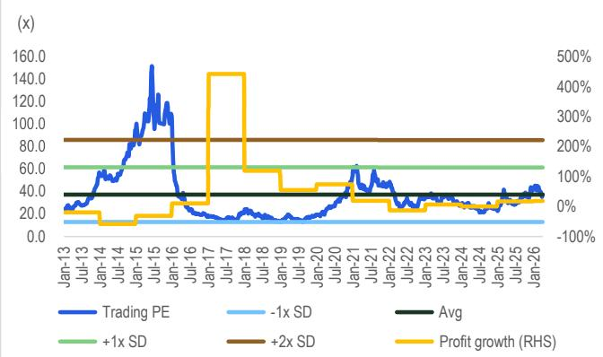  
Figure 45. Hengli: Forward P/E trends vs. earnings growth   
© 2026 Citigroup Inc. No redistribution without Citigroup’s written permission. Source: Company Reports and Citi Research Estimates

# UBTECH Robotics (9880.HK)

We maintain our Buy rating on UBTECH Robotics (9880.HK) for not only its firstmover advantage in the humanoid robot industry but also its better-thanexpected delivery and order guidance. Mgmt. officially guided up 2026 shipments of humanoid robot Walker S series from 2,000-3,000 units to 5,000 units and indicated that the target GPM for 2026 is $4 3 \% - 4 5 \%$ . Meanwhile, mgmt. emphasized that UBTECH will focus more on: 1) real data collection by strengthening the cooperation with both industrial clients and data collection centers and 2) developing so-called “World Model,” which could enable humanoid robots to understand the physics laws in order to generalize different tasks. We estimate that UBTECH’s humanoid robot revenue to Rmb3.0bn/4.6bn in 2026/27E, accounting for ${ \sim } 6 9 \% / { \sim } 7 8 \%$ of total revenue. UBTECH may debut Walker S3 – the next generation of industrial humanoid robot which is $1 5 \%$ lighter and cheaper than S2 – in 2Q26. We think that the upcoming new product launch in 2Q26 could serve as its near-term positive catalyst.

Figure 46. UBTECH: Humanoid robot orders by client, 2026TD   

<table><tr><td rowspan=1 colspan=1>Buyer</td><td rowspan=1 colspan=1>Amount (Rmb mn)</td></tr><tr><td rowspan=1 colspan=1>Dongfeng-Liuzhou Motor</td><td rowspan=1 colspan=1>10</td></tr><tr><td rowspan=1 colspan=1>DongfengMotor (489.HK)</td><td rowspan=1 colspan=1>90</td></tr><tr><td rowspan=1 colspan=1>Aconsumer-related client</td><td rowspan=1 colspan=1>250</td></tr><tr><td rowspan=1 colspan=1>Miracle Automation (002009.SZ)</td><td rowspan=1 colspan=1>30</td></tr><tr><td rowspan=1 colspan=1>Anauto-tech/auto-partcompany</td><td rowspan=1 colspan=1>32</td></tr><tr><td rowspan=1 colspan=1>Guangxi EAlDataTrainingandTestingCenter</td><td rowspan=1 colspan=1>126</td></tr><tr><td rowspan=1 colspan=1>Zigong Humanoid RobotData Center</td><td rowspan=1 colspan=1>159</td></tr><tr><td rowspan=1 colspan=1>Fangchenggang HumanoidRobotDataCenter</td><td rowspan=1 colspan=1>264</td></tr><tr><td rowspan=1 colspan=1>JiangxiJiujiangHumanoidRobotDataCenter</td><td rowspan=1 colspan=1>143</td></tr><tr><td rowspan=1 colspan=1>Huiyang Humanoid RobotDataCenter</td><td rowspan=1 colspan=1>60</td></tr><tr><td rowspan=1 colspan=1>HohhotEAlCenter</td><td rowspan=1 colspan=1>78</td></tr><tr><td rowspan=1 colspan=1>Others</td><td rowspan=1 colspan=1>159</td></tr><tr><td rowspan=1 colspan=1>Total</td><td rowspan=1 colspan=1>1,400</td></tr></table>

$\circledcirc$ 2026 Citigroup Inc. No redistribution without Citigroup’s written permission. Source: Citi Research, Company Reports

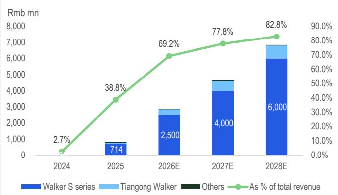  
Figure 47. UBTECH: Humanoid robot revenue and as $\%$ of total revenue, 2024-28E   
© 2026 Citigroup Inc. No redistribution without Citigroup’s written permission. Source: Company Reports and Citi Research Estimates

# Leader Drive (688017.SS)

With NVIDIA (NVDA.O) demonstrating at CES 2026 again how its open-source platforms (e.g., Omniverse, Issac Sim, Cosmos) can help train robots in physically based virtual environments, we are more confident that humanoid robots’ mass production and commercialization are around the corner, echoing mgmt.’s recent comment that Leader Drive’s (LD) humanoid robot shipments could at least double in 2026. We believe LD is well positioned to benefit from the humanoid robot and physical AI opportunity in the coming years, given its leading position in the harmonic reducer industry and cooperation with leading humanoid and industrial robot makers in China and globally.

We view 4Q25E results as a near-term positive catalyst as we expect LD to report Rmb27mn net profit for the quarter, up 11.2x YoY from Rmb3mn net loss in 4Q24, driven by both humanoid robot contribution and industrial robot market share gain, especially on KUKA owned by Midea (300.HK/000333.SZ). Our earnings forecast is $1 7 \%$ ahead of consensus estimate of Rmb23mn. Looking into 2026, we estimate LD’s humanoid robot revenue contribution will rise to $4 0 { - } 5 0 \%$ from ${ \sim } 2 0 \%$ in 9M25 as it is expanding capacity from 40k/month to 80k/month mainly for humanoid robot clients.

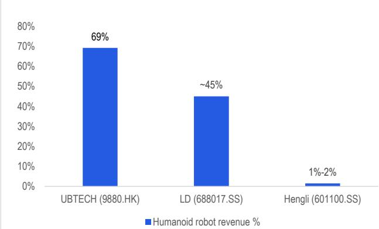  
Figure 48. Humanoid robot revenue $\%$ and 2026E P/E for component makers   
© 2026 Citigroup Inc. No redistribution without Citigroup’s written permission. Source: Company Reports and Citi Research Estimates

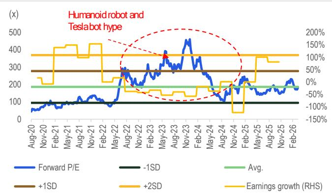  
Figure 49. LD: Forward P/E trends vs. earnings growth   
© 2026 Citigroup Inc. No redistribution without Citigroup’s written permission. Source: Company Reports and Citi Research Estimates

# China Exports (Techtronic $>$ Shenzhou $>$ Stella)

We maintain our stock preference of Techtronic $>$ Shenzhou $>$ Stella on high div yield of $3 - 1 0 \%$ along with acceleration of earnings growth this year amid a stable US tariff outlook without further escalation in ASEAN production.

# Techtronic (0669.HK)

MWK will likely grow at LDD this year – We estimate 2025 rev split as ${ \sim } 7 0 \%$ on MWK, ${ \sim } 2 0 \%$ on Ryobi, $\sim 5 \%$ on Floorcare, $1 - 2 \%$ on HART $( \mathsf { U S } \$ 156 m )$ , $2 - 3 \%$ on RIDGID/AEG power tools. Mgmt reiterated the revenue guidance of mid-to-high single digit with the breakdown of LDD on MWK and flat to LSD on Ryobi this year. This should be underpinned by hyper-growth segments like data centers and large-scale infra projects instead of resi construction. MWK grew $7 . 9 \%$ in local currency in 2025, but this would have been $> 1 0 \%$ (retaining a DD pace) if including those promotional items made in China. Recall the tariff was hiked to $> 1 0 0 \%$ in the last year, and one major customer had cancelled those orders being made in China.

Ryobi to rise at LSD this year – Ryobi segment remains challenging amid the tough housing market in the US. We hosted a joint analyst call on 3 Mar with US analyst Steven Zaccone – covering Home Depot and Lowe’s. He finds that home improvement demand recovery lags by about 2 quarters housing transactions. And the growth is back half loaded this year rather than front half as a moderate price inflation to cover tariffs would take place in 1H rather than 2H. Even if our house view is for 3 Fed rate cuts this year, it would take time for Ryobi to accelerate the growth trajectory back to MSD ahead. Thus, we model LSD this year.

Official target of driving EBIT margin $10 \%$ in 2027 – TTI continues to state this target of elevating EBIT margin to $10 \%$ in 2027E compared with adj $9 . 3 \%$ in 2026 (if adjusted for exit of HART business) or a reported EBIT margin of $8 . 8 \%$ . We believe this target should be highly achievable.

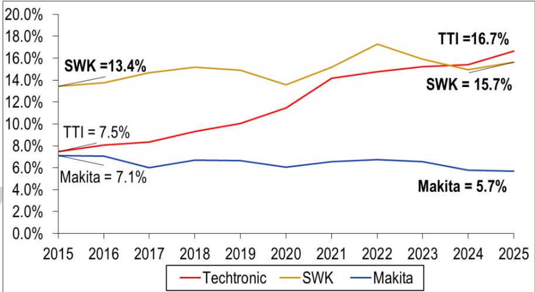  
Figure 50. TTI demonstrates faster share gain than SWK on power tools during the past decade against Makita share loss   
© 2026 Citigroup Inc. No redistribution without Citigroup’s written permission. Source: Citi Research, Company Reports, Statista, FMI, GlobalNewswire, Euromonitor

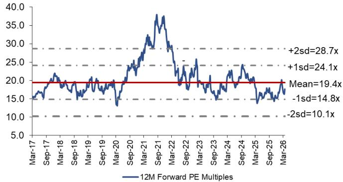  
Figure 51. TTI – forward PE chart   
© 2026 Citigroup Inc. No redistribution without Citigroup’s written permission. Source: Citi Research, Wind

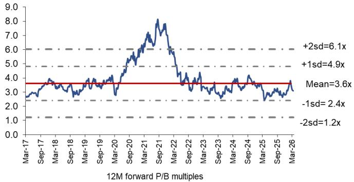  
Figure 52. TTI – forward PB chart   
© 2026 Citigroup Inc. No redistribution without Citigroup’s written permission. Source: Citi Research, Wind

# Shenzhou (2313.HK)

Following the 2025 results release, Executive Chairman bought $1 . 0 5 \mathsf { m }$ shares at an average price of $\mathsf { H K S 4 7 . 6 8 }$ on 1 April for a total consideration of $\cup \mathsf { S S 6 . 4 m }$ , per HKEx. This is the first time the Chairman has increased his stake this year, to $4 2 . 5 2 \%$ from $4 2 . 4 5 \%$ . In addition, the company bought back 0.371m shares at an average price of $\mathsf { H K S 4 6 . 7 9 }$ between 31 Mar – 2 Apr for a total of $\cup \mathsf { S } \$ 2.2 m$ . All these indicate to us that corporate mgmt. have high confidence in the outlook. More importantly, from our post-results investor meeting on 31 Mar, we see the company still maintains its plan of major investment in the new plant in Indonesia without deferral despite the recent softer end-demand. This means mgmt. sees high growth visibility from top customers in coming 3-5yrs. Reiterate Buy with stock slumping ${ \sim } 2 1 \%$ YTD to reflect soft end-demand, which looks overdone. It trades at \~11x PE and $5 5 \%$ div yield.

Capacity plan in coming years – Capex was increased to Rmb3bn for 2025 from a prior target of Rmb2bn even though 2025 results missed a bit. This mainly served for continued capacity expansion in Indonesia (ph 1 for garment plant), fabric mill in Vietnam (Tay Ninh Province), a Cambodia garment plant, and automation upgrade in an Anhui garment plant. The Indonesia plant will be the next major plant after China, VN, Cambodia and will commence operation from mid-2027. We estimate the Indonesia plant will account for as much as $20 \%$ of total output in 5yrs. This is on top of continued capacity expansion in Vietnam and Cambodia. The Indonesia project remains intact without deferral despite the current softer end-demand. This is because the company still has high confidence of wallet share win among top customers.

研报添加微信 LCD123321Cad 04-16 MSD capacity growth in 2026 – Mgmt guides capacity growth of MSD this year, which is slightly slower than our prior forecast of $6 \%$ . Adidas and Uniqlo are the two strongest growth drivers, which should outgrow most of the other customers. The company should also gain from a new customer on yoga from this year (with order flow skewing in 2H26), which is a comparable price point with LuLu. We see Nike orders as positive with a modest pace despite Nike guiding a revenue decline in the coming quarter. Chinese customers like Anta would likely have positive growth of HSD. Shenzhou generated only ${ \sim } 0 . 8 \%$ of total 2025 sales from the Mid-East. By far, the company doesn’t see order slowdown from the conflict. But if the oil price surge is higher for longer, this would impact the consumption sentiment in the US/EU, which is not in our model yet.

GM outlook; back to $30 \% 2$ GM remains the key swing factor for results and valuation, in our view. One of the most common Qs from investors is whether the company would revive the GM back to $30 \%$ levels, i.e., the historical mean for a decade before COVID. The company plans to improve GM going forward through: 1) further lift in the value chain of product mix like more functional sportswear, 2) upgrade of management systems to cope with global brands to 研报添加微信 LCD123321Cad 04-16 elevate AI for mgmt. of suppliers, inventory, logistics, etc. – which should prompt faster industry consolidation, 3) increasing shift of $\%$ output towards overseas away from China given overseas plants carry higher GM than China, we believe the $\%$ of China to total output will likely fall to $2 5 \%$ in coming 5 years from current $40 \% +$ ; 4) further raising automation levels.

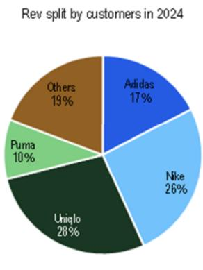  
Figure 53. Shenzhou rev split by customers in 2024   
Figure 54. Shenzhou rev split by customers in 2025

© 2026 Citigroup Inc. No redistribution without Citigroup’s written permission. Source: Citi Research, Company Reports

© 2026 Citigroup Inc. No redistribution without Citigroup’s written permission. Source: Citi Research, Company Reports

# Stella (1836.HK)

Painting another 3-yr plan of HSD net profit CAGR during 2026-28 - Mgmt's three-year plan guides to HSD NP CAGR, but FY26 specifically guides to MSD NP growth. Thus, the company expects earnings growth acceleration at the back end of the upcoming 3-year period.

Earnings inflection point in FY26 - Positives for FY26 include efficiency gains at 研报添加微信 LCD123321Cad 04-16 Solo, Philippines reaching breakeven, and some tariff normalization. These are largely cannibalized by: 1) startup drag from three new factories in 2H26; 2) deepening China factory deleverage; and 3) fading interest income tailwind. We model $\$ 146 m$ for FY26, consistent with MSD guidance after earnings slump of high teen in FY25. A margin step-up comes in FY27-28E as workers reach standard efficiency and brands start allocating higher-complexity, higher-ASP styles to the new factories.

# China Infra (Zoomlion $>$ Hangcha $>$ CSCI)

2026 is the first year of China's 15th Five-Year Plan (2026-2030), which should focus more on building a modernized infrastructure system centered on "new infrastructure" (digital, green tech) for high-quality growth, integrating it with upgrades in industry, digital connectivity, energy, and strategic emerging sectors, moving beyond just GDP targets to structural empowerment and global connectivity via initiatives such as the Belt and Road Initiative. Key infrastructure areas include digital networks (5G/6G, data centers), AI-driven systems, smart grids, energy storage, green transport, and essential public utilities, with 研报添加微信 LCD123321Cad 04-16 significant private-sector involvement encouraged and a focus on regional development and international cooperation.

We prefer construction machinery and building material over construction services for stronger balance sheet & cashflow and higher gearing to any infra stimulus measures to counter China weaker economies during 2H25, particularly for infra and retail sales. China’s construction machinery demand seems to be continuously recovering into 2026 driven by replacement demand, the electrification trend, and China government’s equipment replacement/trade-in subsidy policy. Among major machine types, we are more positive on mid-to-late cycle products such as crane and concrete machinery than early cycle product excavator. As China’s excavator demand resumed positive YoY growth in Mar-24, the crane machinery industry did not return to the growth trajectory until 1H25. Thus, we expect stronger growth momentum in 2026 onwards for mid-to-late cycle products than for early cycle product like excavator even though Mar-26 shipment numbers surprised the market on the upside. In addition, we note that China’s tower crane utilization rate has improved YoY since Nov-25, indicating that the property-dependent machinery may be bottoming out soon. Potential demand upsides could be driven by China’s mega projects Yarlung Zangbo River Hydropower and Xinjiang-Tibet 研报添加微信 LCD123321Cad 04-16 Railway but more significant demand stimulus from them should be in 2027-28. Our machinery OEM pecking order is Zoomlion (1157.HK) $>$ Sany-H (6031.HK) $>$ Sany-A (600031.SS).

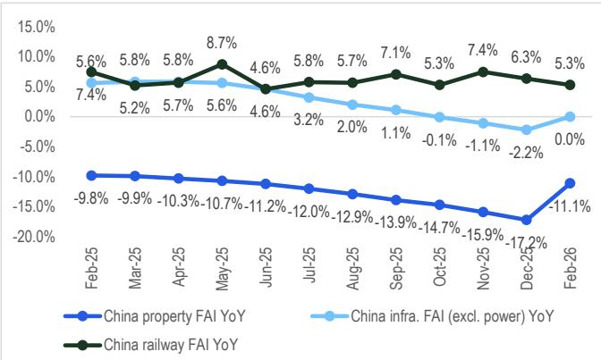  
Figure 55. China FAI growth by segment   
© 2026 Citigroup Inc. No redistribution without Citigroup’s written permission. Source: Citi Research, China NBS

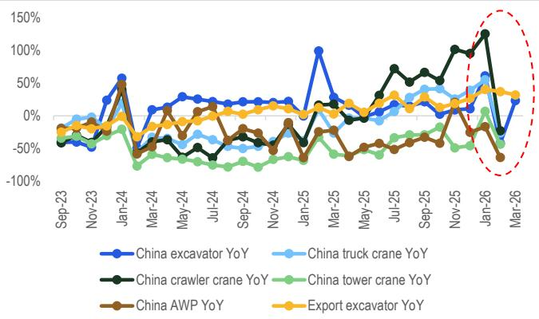  
Figure 56. YoY: Key construction machinery shipments in China   
© 2026 Citigroup Inc. No redistribution without Citigroup’s written permission. Source: Citi Research, CCMA

China forklift sector should generally have a more resilient growth than construction machinery thanks to the electrification trend and steady demand growth by logistics expansion including e-commerce, cold chain, express delivery. Per CAAM, the domestic vol grew $1 2 . 6 \%$ yoy to $9 0 6 . 8 \mathsf { k }$ units and exports increased $1 3 . 4 \%$ yoy to $5 4 5 \mathsf { k }$ units in 2025. We expect domestic industry vol growth of high-single-digit this year while export growth remains low double digit. We prefer Hangcha (603298.SS) as Buy over Anhui Heli (600761.SS) as Sell.

Within the infrastructure-related sectors, we are relatively concerned with the rail equipment sector as the historical patterns somehow suggest that the railway FAI tends to be weak in the first year of every FYP (Five-Year-Plan). We are also worried that the CEO reshuffle at CRRC (1766.HK) could impact its operation to a certain extent in 2026. We rate Times Electric (3898.HK) as Neutral and downgraded 研报添加微信 LCD123321Cad 04-16 CRRC (1766.HK) to Sell post weaker 2025 results and conservative 2026 guidance. In the construction service sector, we rate Sell on CCCC A-share (601800.SS). We prefer CSCI (3311.HK) as top pick in the railway and infra construction sector backed by $5 7 \%$ div yield along with more promising growth from HK Northern Metro project and China via MIC rising penetration in T1 cities.

# Zoomlion (1157.HK)

Our Buy thesis for Zoomlion is: 1) Better growth momentum in 2026E for latecycle products – As China’s excavator demand resumed positive YoY growth in Mar-24, crane machinery in China did not return to a growth trajectory until 1H25. Thus, we expect stronger growth momentum in 2026E onwards for mid-to-late cycle products such as crane and concrete machinery than for excavators. Note crane and concrete machinery combined likely could account for $52 \%$ of Zoomlion’s 2026E revenue, vs. $31 \%$ for Sany. 2) Mining equipment and AWP additional growth drivers for 2026 – Similar to Sany, Zoomlion also focuses on mining equipment, especially for overseas markets like ASEAN, Africa, and South America. For 2026, management guided $+ 3 0 \%$ YoY revenue growth for earthmoving and mining equipment combined and expects double-digit YoY AWP revenue growth due to EU anti-dumping tariff-led low base in 2025. Overall, we 研报添加微信 LCexpect Zoomlion to deliver $2 7 \%$ 3321Cad 04-16  YoY earnings growth in 2026E, outpacing Sany’s $24 \%$ . 3) Likely cash dividend increase – Given a positive earnings outlook and substantial OCF improvement (up $128 \%$ YoY in 2025), Zoomlion raised its cash dividend by $3 3 \%$ YoY to Rmb0.4/share in 2025, implying $\sim 5 \%$ dividend yield. We don’t rule out further payout hike given the fundamentals.

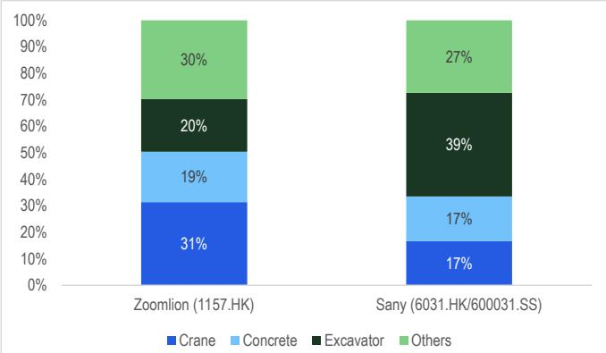  
Figure 57. Revenue breakdown by product: Zoomlion vs. Sany, 2026E   
$\circledcirc$ 2026 Citigroup Inc. No redistribution without Citigroup’s written permission. Source: Company Reports and Citi Research Estimates

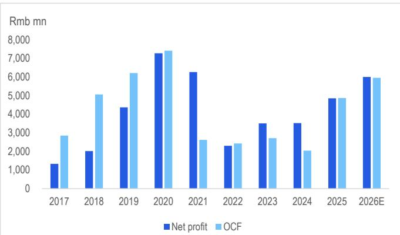  
Figure 58. Zoomlion: Net profit vs. OCF, 2017-26E   
© 2026 Citigroup Inc. No redistribution without Citigroup’s written permission. Source: Company Reports and Citi Research Estimates

# Hangcha (603298.SS)

2026 outlook: We model revenue and net profit growth of $12 \%$ and $1 5 \%$ respectively for 2026. This is backed by 1) overseas growth of $2 0 { - } 3 0 \%$ this year through the sales / rental centers in Europe, Vietnam, N America – altogether accounting for ${ > } 4 0 \%$ of total sales, 2) warehouse automation – the shift from traditional forklift into AGV AMR thru integrated hardware, software and services to raise the higher density of storage at warehouse, 3) the electrification trend accounting for ${ \sim } 7 5 \%$ of total 1H25 sales. The company anticipates a long-term all-electric strategy focusing on lithium-ion / high-voltage platforms.

Synergy creation from acquisition of Guozi – Hangcha completed the acquisition 研of a $9 9 . 2 3 \%$ 微信 LCD123321Cad 04-16  stake in Guozi Robotics in July 2025. We believe this should create strong synergies. This move provides Hangcha with a high-end AGV and intelligent warehousing portfolio, which we believe will be cross-sold into its large existing client base. The acquisition should accelerate Hangcha‘s product portfolio on provision of intelligent logistics, particularly for AGV (Automated Guided Vehicle) and AMR (Autonomous Mobile Robot) facilities.

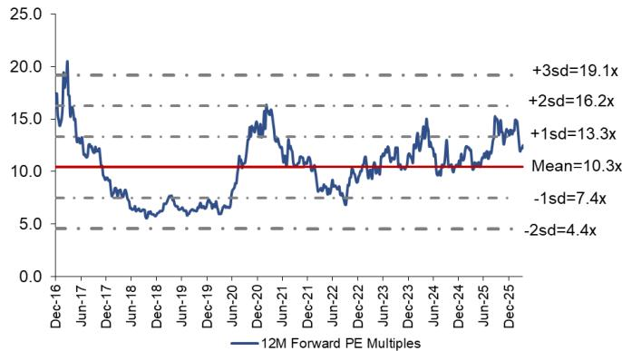  
Figure 59. Hangcha – forward PE chart   
$\circledcirc$ 2026 Citigroup Inc. No redistribution without Citigroup’s written permission. Source: Citi Research, Wind

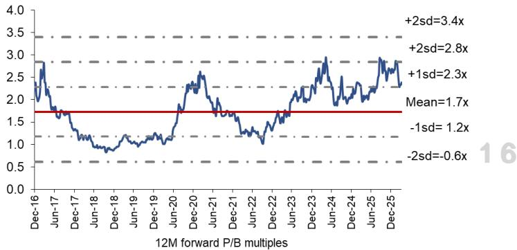  
Figure 60. Hangcha – forward PB chart   
© 2026 Citigroup Inc. No redistribution without Citigroup’s written permission.

Source: Citi Research, Wind

# CSCI (3311.HK)

2026 outlook – We expect CSCI will deliver flat new order of RMB170bn for 2026, comparable to 2025 level. In terms of breakdown by region, we expect order book from HK will rise in 2026 against merely $2 6 \%$ in 2025 while the $\%$ from China should drop accordingly. Note CSCI secured cumulative orders from Northern Metropolis in HK in excess of $\mathsf { H K } \$ \Phi$ 100bn already. The momentum should sustain in coming years. Conversely, CSCI will be more cautious to focus on 6 core provinces (Fujian, Zhejiang, Anhui, Jiangsu, Shandong, Guangdong, etc.) and 4 T1 cities (BJ, SH, GZ, SZ) whose local govts show stronger balance sheets to underpin infra –xb¥mûR _®Oá   LCD123321Cad   04-projects. CSCI would strike a better balance of govt payment on projects and order growth.

Strategy shift in HK market on Northern Metropolis opportunity – Despite the order shift towards HK this year, the company will work on increasing investment project in Northern Metropolis with likely GM of double digits compared with conventional MSD for cash basis on govt project. We expect the company should take back all payments for a couple of years after the project completion so that CSCI would ensure the IRR of those project is highly sufficient per internal target.

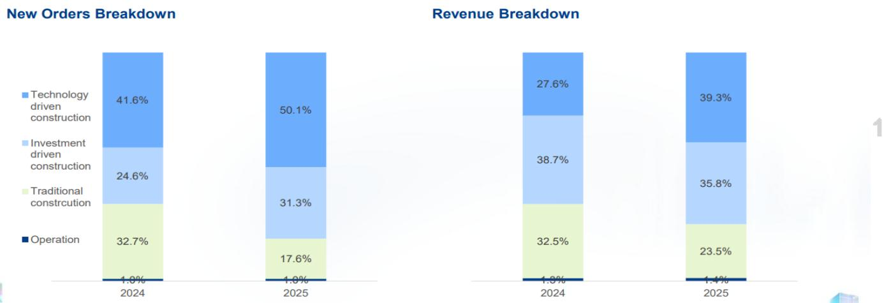  
Figure 61. CSCI rev and new order split by segment in 2024 and 2025   
$\circledcirc$ 2026 Citigroup Inc. No redistribution without Citigroup’s written permission. Source: Citi Research, Company Reports

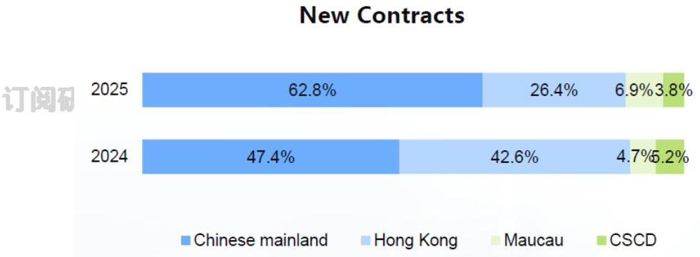  
Figure 62. CSCI new contracts breakdown by regions   
$\circledcirc$ 2026 Citigroup Inc. No redistribution without Citigroup’s written permission.   
Source: Citi Research, Company Reports

MIC remains a core growth driver – MIC (modular integrated construction) remains the key growth driver. We believe Hailong MIC (the subsidiary) has achieved over Rmb4bn in orders last year. Mgmt expects the order growth on Hailong to be double digits this year, which remains a key driver for the group. The company also plans for a spin-off for IPO during the 15th Five-year plan period as long as the scale is sizeable enough.

# 信 LCD123321Cad 04-16

# Links to our top picks in AI-infra and Embodied AI chain

Kingboard Laminates Holdings (1888.HK) - Stock Rally on Persistent ASP Inflation of Glass Fabric

China PCB Equipment - Raise TPs and Earnings on Better AI PCB and Apple   
Equipment Outlook; Han’s Laser Top Pick   
Shengyi Technology (600183.SS) - Preliminary Results Mean 4Q25 a Slight Miss,   
But Still Promising Growth Outlook for 2026E   
Hengli Hydraulic (601100.SS) - What's New from Citi's 2026 Innovation Trailblazers   
Corporate Day   
UBTECH Robotics (9880.HK) - Guide Up 2026 Humanoid Robot Shipment to   
5,000 from 2,000-3,000; Raise TP to HK\$190   
研报添加微信 LCD123321Cad 04-16   
Leader Drive (688017.SS) - More Details of Establishing Humanoid Robot Joint JV   
with Minth in the US   
Techtronic (0669.HK) - Minimal Impact from Makita Acquisition of Panasonic   
Power Tools   
Shenzhou Int'l (2313.HK) - Chairman Started to Raise Stake This Year   
Stella International (1836.HK) - NP MSD in FY26, Inflection Deferred to FY27-28

Zoomlion Heavy Industry (1157.HK) - Strengthening Cashflow Management in a Benign Demand Environment; Reiterate Buy

Hangcha Group (603298.SS) - 3Q Results Slightly Beat; U/G to Buy

China State Construction (3311.HK) - Div Yld of $2 7 \%$ with Improving Balance Sheet; Top Pick in China Infra Con Sector

# Biggest Rating, TP Changes After 2025 Results

What’s changed on rating / TP after 2025 results – Within our industrial universe, the greatest degree of TP upgrade comes from the AI-infra sector including KB Laminate, Han’s Laser, Han’s CNC largely due to more-than-expected influx of AI capex on PCB equipment and ASP inflation on upstream CCL material. In addition, 研报添加微信 LCD12332we also upgraded TP significantly by $22 \%$ d 04-16 on UBTech for stronger demand of new robot model Walker S series (world’s first humanoid robot for autonomous battery swapping). By contrast, the greatest degree of TP downgrade comes from CRRC to Sell from Neutral on dimmer rail equipment capex, Nine Dragons to Neutral from Buy on expectations of pulp margin contraction amid more new supply.

Figure 63. FY25 Results Beats vs. Consensus (summaries taken from published notes)   

<table><tr><td rowspan=1 colspan=1>No.</td><td rowspan=1 colspan=1>Company</td><td rowspan=1 colspan=1>Ticker</td><td rowspan=1 colspan=1>Rating</td><td rowspan=1 colspan=1>Analyst</td><td rowspan=1 colspan=1>Old targetprice</td><td rowspan=1 colspan=1>Latesttarget price</td><td rowspan=1 colspan=1>2026/27Eearningsrevision</td><td rowspan=1 colspan=1>Keytakeaways (Citi&#x27;s take summary)</td><td rowspan=1 colspan=1>Ratingchange</td></tr><tr><td rowspan=1 colspan=1>1</td><td rowspan=1 colspan=1>Yue Yuen</td><td rowspan=1 colspan=1>0551.HK</td><td rowspan=1 colspan=1>Buy</td><td rowspan=1 colspan=1>Eric Lau</td><td rowspan=1 colspan=1>HKD16.3</td><td rowspan=1 colspan=1>HKD21</td><td rowspan=1 colspan=1>N/A</td><td rowspan=1 colspan=1>Yjustprinted 2025results being slightlybetter-than-expected.We thusedge up our earnings forecast by 1%in 2026Eand flat for 2027E But werevise up our TPto HK$21from HK$16.3on 11x PEfor 2026Ebased on -0.5SDto mean rather than prior-1SD thanks to better-than-expectedoperating efficiency.The SG&amp;Acost was squeezed to 16.7%in 2025 from17%in 2024 and 18.3%in 2023.</td><td rowspan=1 colspan=1></td></tr><tr><td rowspan=1 colspan=1>2</td><td rowspan=1 colspan=1>UBTech</td><td rowspan=1 colspan=1>9880.HK</td><td rowspan=1 colspan=1>Buy</td><td rowspan=1 colspan=1>JamieWang</td><td rowspan=1 colspan=1>阅研孔HKD155.00</td><td rowspan=1 colspan=1>添HKD190</td><td rowspan=1 colspan=1>Weraiseour2026/27Erevenueforecasts by36%/52%</td><td rowspan=1 colspan=1>Postthestronger-tan-expected 2025results,mgmt.offciallyguidedup2026 shipments of humanoid robot Walker Sseries from 2.000-3,000 unitsto 5,000 units and indicated that the target GPMfor 2026 is 43%-45%.</td><td rowspan=1 colspan=1></td></tr><tr><td rowspan=1 colspan=1></td><td rowspan=1 colspan=1>3|Han&#x27;s ONC</td><td rowspan=1 colspan=1>3200.HK/301200.SZ</td><td rowspan=1 colspan=1>Buy</td><td rowspan=1 colspan=1>Jamie Wang</td><td rowspan=1 colspan=1>HKD142/Rmb160</td><td rowspan=1 colspan=1>HKD160/Rmb186</td><td rowspan=1 colspan=1>+2026/27Eearningsforecasts by38%/45%</td><td rowspan=1 colspan=1>Han&#x27;s CNC(HC) reported thefull set of 2025resultson 30 March,with netprofit increasing by 174%YoYto Rmb824mn in 2025,slightlybelow themid-point of the preliminary results.2025 GPMexpanded by7.0pp YoYto35.1%, beating CtiEof 32.5%and consensus estimateof 31.5%, which webelieve was mainly dueto rising revenue exposure to A PCBequipment,especiallyin 4Q25 where HC&#x27;s GPMexpanded by13.8pp YoY/8.2pp QoQto 42.2%, 8.0ppaheadof CtiEof 34.2% We expectpositiveshare pricereaction to the strong 2025 results, especiallyfor HC-H(3200.HK) which isnot onlycheaper than HC-A(301200.SZ) but also underperformed HC-Arecently.</td><td rowspan=1 colspan=1></td></tr><tr><td rowspan=1 colspan=1></td><td rowspan=1 colspan=1>4Wuxi Lead</td><td rowspan=1 colspan=1>470.HK300450.SZ</td><td rowspan=1 colspan=1>Buy</td><td rowspan=1 colspan=1>JamieWang</td><td rowspan=1 colspan=1>HKD/Rmb62.0</td><td rowspan=1 colspan=1>HKD/Rmb62.0</td><td rowspan=1 colspan=1>N/A</td><td rowspan=1 colspan=1>Wuxi Lead (Lead) reported thefull set of 2025 results today(30 March).Netprofit jumped by4.5x YoYto Rmb1.56bn in 2025,similar to the mid-pointof the preliminary results,on 22%YoYrevenue growth and 79% YoYdeclinein asset impairment in 2025 despite 1.7pp YoYGPM contraction.</td><td rowspan=1 colspan=1></td></tr><tr><td rowspan=1 colspan=1></td><td rowspan=1 colspan=1>5KBH</td><td rowspan=1 colspan=1>0148.HK</td><td rowspan=1 colspan=1>Buy</td><td rowspan=1 colspan=1>Eric Lau</td><td rowspan=1 colspan=1>HKD45.00</td><td rowspan=1 colspan=1>HKD48.00</td><td rowspan=1 colspan=1>2026Ecore earningscut by 11%; 2027Eraised by4%</td><td rowspan=1 colspan=1>2025net profit surged 170%to HKD4.40bn on stronginvestment gains;however,core net profit slid 4%YoYdueto margin pressureon the PCBsegment. Upcoming major investments in Al upstream materials andchemicalsare expected todrivemaidencontributionsin 2027.</td><td rowspan=1 colspan=1></td></tr><tr><td rowspan=1 colspan=1></td><td rowspan=1 colspan=1>6KBL</td><td rowspan=1 colspan=1>1888.HK</td><td rowspan=1 colspan=1>Buy</td><td rowspan=1 colspan=1>Eric Lau</td><td rowspan=1 colspan=1>HKD28</td><td rowspan=1 colspan=1>HKD30</td><td rowspan=1 colspan=1>Werevise upourEPSforecasts by7-11%for 2026-27E</td><td rowspan=1 colspan=1>No text-based 2025 earnings update available; target price data derivedstrictlyfrom historical charts.</td><td rowspan=1 colspan=1></td></tr><tr><td rowspan=1 colspan=1>7</td><td rowspan=1 colspan=1>Shennan Qrcuit</td><td rowspan=1 colspan=1>002916.SZ</td><td rowspan=1 colspan=1>Buy</td><td rowspan=1 colspan=1>万Eric Lau</td><td rowspan=1 colspan=1>门Rmb281</td><td rowspan=1 colspan=1>Rmb320</td><td rowspan=1 colspan=1>Raise 2026-27Eearnings by24-30%</td><td rowspan=1 colspan=1>Shennan printed 2025 results with net profit growth of 75%to RMB3.276bnwhich beat the mid-point guidance RMB3.248bn of preliminary results. Onthe analyst call, we learned Shennan should enjoy higher GM expansionfrom the BTsubstrate segment.We thus raise our earnings estimates by24-30%in 2026-27Eand add our 2028 forecast. Our TPlifts by 14%toRMB320 based on 43xPEfor 2026Eat +1.5sd over mean.</td><td rowspan=1 colspan=1></td></tr><tr><td rowspan=1 colspan=1>8</td><td rowspan=1 colspan=1>Raycus FiberLaer</td><td rowspan=1 colspan=1>300747.SZ</td><td rowspan=1 colspan=1>Neutral</td><td rowspan=1 colspan=1>JamieWang</td><td rowspan=1 colspan=1>Rmb13.8</td><td rowspan=1 colspan=1>Rmb34</td><td rowspan=1 colspan=1>Increase our2026/27Eearningsforecasts by65%/74%</td><td rowspan=1 colspan=1>Post Raycus&#x27;2025preliminaryresults,which showed 24%YoYearningsgrowth in 2025E we upgradeitfrom Sell to Neutral and increase our2026/27Eearnings forecasts by 65%/74%to reflect thelaser sourcedemand improvement and the company&#x27;s continuous OPEXdiscipline.</td><td rowspan=1 colspan=1>→</td></tr><tr><td rowspan=1 colspan=1></td><td rowspan=1 colspan=1>9Lee &amp; Man Paper</td><td rowspan=1 colspan=1>2314.HK</td><td rowspan=1 colspan=1>Buy</td><td rowspan=1 colspan=1>Eric Lau</td><td rowspan=1 colspan=1>HKD4.20</td><td rowspan=1 colspan=1>HKD4.30</td><td rowspan=1 colspan=1>Raised by 12-13%for 2026-27E</td><td rowspan=1 colspan=1>2025 net profit surged 47.8%YoYto HKD1.94bn,coming in better thanexpected. Cti maintained a Buy rating and raised the target price drivenby moderate capacityincreases,potential consumption stimulus inChina,and expectations for continued gross margin expansion.</td><td rowspan=1 colspan=1></td></tr><tr><td rowspan=1 colspan=1></td><td rowspan=1 colspan=1>10Jingce</td><td rowspan=1 colspan=1>300567.SZ</td><td rowspan=1 colspan=1>Neutral</td><td rowspan=1 colspan=1>Jamie Wang</td><td rowspan=1 colspan=1>Rmb90</td><td rowspan=1 colspan=1>Rmb145</td><td rowspan=1 colspan=1>Wereviseup our2026/27Eearningsforecasts by59%/54%</td><td rowspan=1 colspan=1>Post 2025 preliminaryresults,we revise upour 2026/27Eearningsforecasts by 59%/54%and liftourTPby~61%to Rmb145to reflecttheimproving panel equipment demand and strong semi-equipment(metrology) outlook.</td><td rowspan=1 colspan=1></td></tr><tr><td rowspan=1 colspan=1>11</td><td rowspan=1 colspan=1>Advanced Micro-FabricationEquipment Inc</td><td rowspan=1 colspan=1>688012.SS</td><td rowspan=1 colspan=1>Buy</td><td rowspan=1 colspan=1>JamieWang</td><td rowspan=1 colspan=1>Rmb354</td><td rowspan=1 colspan=1>Rmb418.00</td><td rowspan=1 colspan=1>Raised 2026/27Eearnings forecastsby 15%/18%.</td><td rowspan=1 colspan=1>2025 preliminaryresults beat estimates due to investmentincome.Management has a robust 2026-27Eoutlook driven by expandingproduct coverage(etching and film deposition) and aggressive capacityexpansions byleading Chinese memory companies.</td><td rowspan=1 colspan=1></td></tr></table>

$\circledcirc$ 订阅研报添加微信 LCD123321Cad 04-16  2026 Citigroup Inc. No redistribution without Citigroup’s written permission. Source: Citi Research, Company Reports

Figure 64. In-Line FY25 Results vs. Consensus (summaries taken from published notes)   

<table><tr><td rowspan=1 colspan=1>Company</td><td rowspan=1 colspan=1>Ticker</td><td rowspan=1 colspan=1>Rating</td><td rowspan=1 colspan=1>Analyst</td><td rowspan=1 colspan=1>Old TargetPrice</td><td rowspan=1 colspan=1>LatestTarget Price</td><td rowspan=1 colspan=1>Earningsrevisionfor2026Eand2027E</td><td rowspan=1 colspan=1>Key takeaways (Citi&#x27;s take summary)</td><td rowspan=1 colspan=1>Ratingchange</td></tr><tr><td rowspan=1 colspan=1>CT</td><td rowspan=1 colspan=1>300012.SZ</td><td rowspan=1 colspan=1>Buy</td><td rowspan=1 colspan=1>Eric Lau</td><td rowspan=1 colspan=1>Rmb24</td><td rowspan=1 colspan=1>Rmb24</td><td rowspan=1 colspan=1>N/A</td><td rowspan=1 colspan=1>CT2025top-line grew8.8%yoyto Rmb6.621bn,whereas net profit increased by10.4% yoyto Rmb1.016bn.This was in line with our forecast of Rmb1.021bn andpreliminary2025 results. In terms of quarterlynet profit growth trend,it has beenconsistentlyacceleratingfrom 2.8%in 1Q25 yoy, then 8.9%in 2Qand 11.2%in3Q,andevenfasterin4Q,atapaceof17.1%.</td><td rowspan=1 colspan=1></td></tr><tr><td rowspan=2 colspan=1>Zoomlion</td><td rowspan=2 colspan=1>1157.HK</td><td rowspan=2 colspan=1>Buy</td><td rowspan=2 colspan=1>JamieWang</td><td rowspan=2 colspan=1>订阅矿h.|HKD10.2</td><td rowspan=2 colspan=3>Al-related copper foil. Thus,the processing fee for ordinary128%YoYtoRmb4.87bn,Rmb2Ok/t compared with HVLP3 grade (for M6 PCB) at Rnsaceleratingreceivable：:   L..:L OAI.1  lfvLnmt.expectsChinadomesticHKD10.8   2026/27Eearnings demandto continueits recoverysupportedbyseveral mega-projectsand central3%/3%         government&#x27;s1.6tn budget.Asforoverseas, mgmt guidedthatagricultural,mining,and AWP shouldimprove more significantlygiven not onlylowbase butalso the fact thatthe tariffissue should be resolved.</td><td rowspan=2 colspan=1></td></tr><tr><td rowspan=1 colspan=1>HKD10.8</td><td rowspan=1 colspan=1>2026/27Eearnings3%/3%</td></tr><tr><td rowspan=1 colspan=1>CRRC Times日ectric</td><td rowspan=1 colspan=1>3898.HK</td><td rowspan=1 colspan=1>Neutral</td><td rowspan=1 colspan=1>Jamie Wang</td><td rowspan=1 colspan=1>HKD42.50</td><td rowspan=1 colspan=1>HKD42.50</td><td rowspan=1 colspan=1></td><td rowspan=1 colspan=1>2025results were largelyinline,with EPSup14%YoYandrevenue up15%YoYtoRmb28.7bnon emergingequipment growth. However,rail transit equipmentgrowth slowed to8%YoYandpowersemi profitabilityworsened.</td><td rowspan=1 colspan=1></td></tr><tr><td rowspan=1 colspan=1>Stella</td><td rowspan=1 colspan=1>1836.HK</td><td rowspan=1 colspan=1>Buy</td><td rowspan=1 colspan=1>Alice Cai</td><td rowspan=1 colspan=1>HKD16.50</td><td rowspan=1 colspan=1>HKD16.50</td><td rowspan=1 colspan=1>FY26volumeguidedflat; prior estimatescut 8.1%(26E) and9.0%(27E)</td><td rowspan=1 colspan=1>FY25netprofitof USD137m(-20%YoY) wasbroadlyinlinewith expectations,though GPMslightlymissed due to ramp-up ineficiencies and idlelabor. FlatFY26 is guided as eficiencyrestorationand tarifnormalization set upa recoveryinFY27-28.</td><td rowspan=1 colspan=1></td></tr><tr><td rowspan=1 colspan=1>Crystal</td><td rowspan=1 colspan=1>2232.HK</td><td rowspan=1 colspan=1>Buy</td><td rowspan=1 colspan=1>Eric Lau</td><td rowspan=1 colspan=1>HKD8.5</td><td rowspan=1 colspan=1>HKD8.2</td><td rowspan=1 colspan=1>Reduced by6-8%during 2026-27E</td><td rowspan=1 colspan=1>2025revenuerose6.9%YoYand netprofit rose12%YoY,largelyinline withexpectations.Management guided mid-to-high single-digit capacitygrowth,andthe companyis buildinga new footprintin Egypt to avert geopolitical risk.</td><td rowspan=1 colspan=1></td></tr><tr><td rowspan=1 colspan=1>COSOO Shipping</td><td rowspan=1 colspan=1>1919.HK</td><td rowspan=1 colspan=1>Buy</td><td rowspan=1 colspan=1>KaseeditChoonnawat</td><td rowspan=1 colspan=1>HKD12.10</td><td rowspan=1 colspan=1>HKD15.90</td><td rowspan=1 colspan=1>Raised 2026Eby3%;Cut2027Eby6%</td><td rowspan=1 colspan=1>The stock was upgraded to Buybased on positive risk/reward payoffs into Mid-2026.Theindustryscapacitydisciplineis holdingrates above breakeven,andthecompanyhas strong downside support from its net cash position.</td><td rowspan=1 colspan=1>→</td></tr><tr><td rowspan=1 colspan=1>Techtronic</td><td rowspan=1 colspan=1>0669.HK</td><td rowspan=1 colspan=1>Buy</td><td rowspan=1 colspan=1>Eric Lau</td><td rowspan=1 colspan=1>HKD125.00</td><td rowspan=1 colspan=1>HKD150.00</td><td rowspan=1 colspan=1>Fat for 2026E 2027EEPSraised by2.4%</td><td rowspan=1 colspan=1>2025revenue and net profit grew4.4%and6.8%respectively,amild miss vsconsensus.Raised TPto HKD150 on growth acceleration outlook for 2026Eandannounceda USD500mshare buyback program.</td><td rowspan=1 colspan=1></td></tr></table>

$\circledcirc$ 2026 Citigroup Inc. No redistribution without Citigroup’s written permission. Source: Citi Research, Company Reports

Figure 65. FY25 Results Misses vs. Consensus (summaries taken from published notes)   

<table><tr><td rowspan=1 colspan=1>No.</td><td rowspan=1 colspan=1>Company</td><td rowspan=1 colspan=1>Ticker</td><td rowspan=1 colspan=1>Rating</td><td rowspan=1 colspan=1>Analyst</td><td rowspan=1 colspan=1>Old targetprice</td><td rowspan=1 colspan=1>Latesttarget price</td><td rowspan=1 colspan=1>2026/27Eearningsrevision</td><td rowspan=1 colspan=1>Key takeaways (Citis take summary)</td><td rowspan=1 colspan=1>Ratingchange</td></tr><tr><td rowspan=1 colspan=1></td><td rowspan=1 colspan=1>Chervon</td><td rowspan=1 colspan=1>2285.HK</td><td rowspan=1 colspan=1>Sell</td><td rowspan=1 colspan=1>Eric Lau</td><td rowspan=1 colspan=1>HKD14.5</td><td rowspan=1 colspan=1>HKD17.5</td><td rowspan=1 colspan=1>Out by 20-22%for2026-27E</td><td rowspan=1 colspan=1>Core profit fell42%YoYto USD78.45mn;2H25revenue dropped 25%YoYdueto UStariffsand Vietnam plant relocation.</td><td rowspan=1 colspan=1></td></tr><tr><td rowspan=1 colspan=1></td><td rowspan=1 colspan=1>2Huali</td><td rowspan=1 colspan=1>300979.SZ</td><td rowspan=1 colspan=1>Buy</td><td rowspan=1 colspan=1>Alice Cai</td><td rowspan=1 colspan=1>Rmb63.77</td><td rowspan=1 colspan=1>Rmb63.77</td><td rowspan=1 colspan=1>N/A</td><td rowspan=1 colspan=1>FY25preliminaryresultsshowedamodestmiss toourestimates:revenueof RMB24,980mn (+4.1%YoY)and NPof RMB3,207mn (-16.5%YY),missing Cti forecasts by1%and5.5%respectively.</td><td rowspan=1 colspan=1></td></tr><tr><td rowspan=1 colspan=1></td><td rowspan=1 colspan=1>3Hongfa Tech</td><td rowspan=1 colspan=1>600885.SS</td><td rowspan=1 colspan=1>Neutral</td><td rowspan=1 colspan=1>JamieWang</td><td rowspan=1 colspan=1>Rmb33开</td><td rowspan=1 colspan=1>Bmb28力</td><td rowspan=1 colspan=1>Outour 2026/27Eearnings forecasts11%/8</td><td rowspan=1 colspan=1>Wecutour2026/27Eearningsforecasts11%/8toreflect Hongfa&#x27;sGPMpressure caused byskyscraping silver and copper prices, whichcombined account for &gt;30%of COGS</td><td rowspan=1 colspan=1></td></tr><tr><td rowspan=1 colspan=1></td><td rowspan=1 colspan=1>Anhui Heli</td><td rowspan=1 colspan=1>600761.SS</td><td rowspan=1 colspan=1>Sell</td><td rowspan=1 colspan=1>Eric Lau</td><td rowspan=1 colspan=1>Rmb15.2</td><td rowspan=1 colspan=1>Rmb14.2</td><td rowspan=1 colspan=1>Out2026-27Eearnings by15-17%</td><td rowspan=1 colspan=1>Heli printed weaker-than-expected 2025results.Wealsoadd 2028forecasts.We prefer Hangcha (Buy)over Heli (Sell)on China Forklift.</td><td rowspan=1 colspan=1></td></tr><tr><td rowspan=1 colspan=1></td><td rowspan=1 colspan=1>5Shenzhou</td><td rowspan=1 colspan=1>2313.HK</td><td rowspan=1 colspan=1>Buy</td><td rowspan=1 colspan=1>Eric Lau</td><td rowspan=1 colspan=1>HKD94</td><td rowspan=1 colspan=1>HKD75</td><td rowspan=1 colspan=1>Out 2026-27Eearnings by 11-13%</td><td rowspan=1 colspan=1>Shenzhou printed 2025results with net profit,and core profit (excl FXanddisposal gain)was down 6.7%yoyto Rmb5.825bn and up 4.9%yoytoRmb6.080bn.We model 3-yr CAGRof 10%thru 2028E</td><td rowspan=1 colspan=1></td></tr><tr><td rowspan=1 colspan=1></td><td rowspan=1 colspan=1>6Weixing</td><td rowspan=1 colspan=1>002372.SZ</td><td rowspan=1 colspan=1>Neutral</td><td rowspan=1 colspan=1>Alice Cai</td><td rowspan=1 colspan=1>Rmb11.8</td><td rowspan=1 colspan=1>Rmb11.8</td><td rowspan=1 colspan=1>+FY26/27Erevenue6%/5%offset byhigher opex,NPbroadly unchanged</td><td rowspan=1 colspan=1>FY25revenue/NPfell14%/22%,with 4Qdeterioratingto-19%YoY-asharp step-down from the-10%run-ratein 9Mand the weakest exit inrecent years. GPMheldat41%and grew 3%,but negative operatingleverage drove theNPdecline well ahead of revenue.</td><td rowspan=1 colspan=1></td></tr><tr><td rowspan=1 colspan=1></td><td rowspan=1 colspan=1>HaitianInternational</td><td rowspan=1 colspan=1>1882.HK</td><td rowspan=1 colspan=1>Buy</td><td rowspan=1 colspan=1>Eric Lau</td><td rowspan=1 colspan=1>HKD30.00</td><td rowspan=1 colspan=1>HKD27.50</td><td rowspan=1 colspan=1>Trimmed by 8%for2026-27E</td><td rowspan=1 colspan=1>2025 revenue grew 10%YoY, while net profit grew7%YoY(a slight miss).The 1Q26 order book is expected to slide due to muted PMland recent oilprice surges impacting consumer spending,but the dividend payout wasraised to 39%</td><td rowspan=1 colspan=1></td></tr><tr><td rowspan=1 colspan=1></td><td rowspan=1 colspan=1>China RailwayGroup</td><td rowspan=1 colspan=1>0390.HK</td><td rowspan=1 colspan=1>Buy</td><td rowspan=1 colspan=1>Eric Lau</td><td rowspan=1 colspan=1>HKD5.1</td><td rowspan=1 colspan=1>HKD4.8</td><td rowspan=1 colspan=1>Out our 2026-27Eearnings estimatesby 13-20%.</td><td rowspan=1 colspan=1>Net profit dropped18%yoyto Rmb22.9bnvs.our forecast of Rmb25.0bn.CRGalso seta lower-than-expected guidancefor 2026Etopline whichwould fall 7%yoyvs.our prior forecastofflat.In the China InfraConstruction sector, we prefer CSa &gt;CRGfor higher dividend yield,executionand higher ROE</td><td rowspan=1 colspan=1></td></tr><tr><td rowspan=1 colspan=1></td><td rowspan=1 colspan=1>9Fenbi</td><td rowspan=1 colspan=1>2469.HK</td><td rowspan=1 colspan=1>Sell</td><td rowspan=1 colspan=1>Alice Cai</td><td rowspan=1 colspan=1>HKD30.00</td><td rowspan=1 colspan=1>HKD0.7</td><td rowspan=1 colspan=1></td><td rowspan=1 colspan=1>WedowngradeFenbitoSell fromNeutral-reflectingStock Connectremoval,margin compression from front-loaded Alinvestment,and anunproven monetization path.</td><td rowspan=1 colspan=1>←</td></tr><tr><td rowspan=1 colspan=1></td><td rowspan=1 colspan=1>10Topband</td><td rowspan=1 colspan=1>002139.SZ</td><td rowspan=1 colspan=1>Sell</td><td rowspan=1 colspan=1>Eric Lau</td><td rowspan=1 colspan=1>Rmb10阅研</td><td rowspan=1 colspan=1>Rmb8.5添加</td><td rowspan=1 colspan=1>We cut our earningsestimates by 39-46%言LCI</td><td rowspan=1 colspan=1>Topband printed 2025resultstoday.2025revenuerose5.5%toRmb11.082bn,which is slightlybelow our forecastof Rmb11.368bn.2025results disclosed thestart of operating loss since 4Q25 which maynotreach breakeven in thenearterm.</td><td rowspan=1 colspan=1></td></tr><tr><td rowspan=1 colspan=1>11</td><td rowspan=1 colspan=1>China lesso</td><td rowspan=1 colspan=1>2128.HK</td><td rowspan=1 colspan=1>Buy</td><td rowspan=1 colspan=1>Eric Lau</td><td rowspan=1 colspan=1>HKD6.10</td><td rowspan=1 colspan=1>HKD6.50</td><td rowspan=1 colspan=1>Raised by 11-12%during 2025-27E</td><td rowspan=1 colspan=1>1H25results beat expectationsslightly.Non-residential drivers(municipal,agriculture,overseas) have strong visibilityand willaccountfor overhalf of total revenue.Top-pick liston the China Infra sector.</td><td rowspan=1 colspan=1></td></tr><tr><td rowspan=1 colspan=1></td><td rowspan=1 colspan=1>12Sany</td><td rowspan=1 colspan=1>600031.SS6031.HK</td><td rowspan=1 colspan=1>Buy</td><td rowspan=1 colspan=1>Jamie Wang</td><td rowspan=1 colspan=1>HKD31/Rmb28</td><td rowspan=1 colspan=1>HKD29.0/Rmb26</td><td rowspan=1 colspan=1>Tuned down2026/27Eearningsforecasts by 1%</td><td rowspan=1 colspan=1>Webelieve thattheslightbottom-linemiss-3%/4%belowatiEConsensus- was mainly due to ~Rmb580mn FXloss and higher taxratedueto higher overseas profit contribution.</td><td rowspan=1 colspan=1></td></tr><tr><td rowspan=1 colspan=1></td><td rowspan=1 colspan=1>13CRRC</td><td rowspan=1 colspan=1>1766.HK</td><td rowspan=1 colspan=1>Sell</td><td rowspan=1 colspan=1>JamieWang</td><td rowspan=1 colspan=1>HKD7.3</td><td rowspan=1 colspan=1>HKD4.50</td><td rowspan=1 colspan=1>Out 2026/27Eearnings forecastsby13%15%</td><td rowspan=1 colspan=1>2025 net profit of Rmb13.2bn missed consensus by11%dueto weakerrevenue and higher asset impairment. Management guided aconservative 2026 with high-speed MUtenders ikelylower than 2025,whilearecent managementreshufefurther reducesearnings visibility.</td><td rowspan=1 colspan=1>√</td></tr><tr><td rowspan=1 colspan=1></td><td rowspan=1 colspan=1>14Shenzhen Int&#x27;</td><td rowspan=1 colspan=1>0152.HK</td><td rowspan=1 colspan=1>Sell</td><td rowspan=1 colspan=1>Alice Cai</td><td rowspan=1 colspan=1>HKD9</td><td rowspan=1 colspan=1>HKD8</td><td rowspan=1 colspan=1>Reduced by11-13%during 2026-27E</td><td rowspan=1 colspan=1>We believe the Huanan landreserve story-which has driven the stockover thepast two years- is past its peak: both remainingblocks (03 and01)are smalerthan Block 02(FY25),markinga step-down in LPupgradeBIT</td><td rowspan=1 colspan=1>√</td></tr><tr><td rowspan=1 colspan=1>15</td><td rowspan=1 colspan=1>15csa</td><td rowspan=1 colspan=1>3311.HK</td><td rowspan=1 colspan=1>Buy</td><td rowspan=1 colspan=1>Eric Lau</td><td rowspan=1 colspan=1>HKD14.00</td><td rowspan=1 colspan=1>HKD12.00</td><td rowspan=1 colspan=1></td><td rowspan=1 colspan=1>2025 net profit dropped 26.5% YoYto Rmb1.204bn, missing consensus.</td><td rowspan=1 colspan=1></td></tr><tr><td rowspan=1 colspan=1></td><td rowspan=1 colspan=1>16aMCEnric</td><td rowspan=1 colspan=1>3899.HK</td><td rowspan=1 colspan=1>Buy</td><td rowspan=1 colspan=1>JamieWang</td><td rowspan=1 colspan=1>HKD12.50</td><td rowspan=1 colspan=1>HKD12.50</td><td rowspan=1 colspan=1>Lowered2026/27EEPSby6%/5%ondilution.</td><td rowspan=1 colspan=1>2025 netprofit grew4%YoYto Rmb1.14bn,missing consensus by9%dueto a 31% YoYdropin chemical business revenue. Management expects arecoveryin 2026.</td><td rowspan=1 colspan=1></td></tr><tr><td rowspan=1 colspan=1>17</td><td rowspan=1 colspan=1>China EastEducation</td><td rowspan=1 colspan=1>0667.HK</td><td rowspan=1 colspan=1>Buy</td><td rowspan=1 colspan=1>Alice Cai</td><td rowspan=1 colspan=1>HKD7.8</td><td rowspan=1 colspan=1>HKD7.8</td><td rowspan=1 colspan=1>N/A</td><td rowspan=1 colspan=1>FY25adjustedNP+50.9%YoYtoRMB792M.Revenueof RMB4,616M(+12.1%) beat both our 10%est and mgmt&#x27;s guide. Adjusted NPmissedour RMB822Mestby3.6%, but theshortfall isentirelynon-operational-taxandtreasurynotmargin.</td><td rowspan=1 colspan=1></td></tr><tr><td rowspan=1 colspan=1>18</td><td rowspan=1 colspan=1>HorizonConstruction</td><td rowspan=1 colspan=1>9930.HK</td><td rowspan=1 colspan=1>Buy</td><td rowspan=1 colspan=1>Eric Lau</td><td rowspan=1 colspan=1>HKD1.80</td><td rowspan=1 colspan=1>HKD1.50</td><td rowspan=1 colspan=1>Out2026Eby72%and 2027Eby44%</td><td rowspan=1 colspan=1>2025 net profit fell 84%YoYto Rmb147m,which was in line with its profit</td><td rowspan=1 colspan=1></td></tr><tr><td rowspan=1 colspan=1>19</td><td rowspan=1 colspan=1>19Gaotu</td><td rowspan=1 colspan=1>GOTU.N</td><td rowspan=1 colspan=1>Sell</td><td rowspan=1 colspan=1>Alice Cai</td><td rowspan=1 colspan=1>USD1.94</td><td rowspan=1 colspan=1>USD1.59</td><td rowspan=1 colspan=1>N/A</td><td rowspan=1 colspan=1>Targetpricelowered to USD1.59;detailedtext-based takeaways werenotpresent in the summarytable.</td><td rowspan=1 colspan=1></td></tr><tr><td rowspan=1 colspan=1>20</td><td rowspan=1 colspan=1>Nine DragonsPaper</td><td rowspan=1 colspan=1>2689.HK</td><td rowspan=1 colspan=1>Sheutral</td><td rowspan=1 colspan=1>Eric Lau</td><td rowspan=1 colspan=1>HKD9.5</td><td rowspan=1 colspan=1>HKD8.8</td><td rowspan=1 colspan=1>cut FY26/27/28Eearnings by9/12/7%</td><td rowspan=1 colspan=1>WetrimTPtoHK$8.8frompriorHK$9.5,based on the same0.7XPB.Stock has rallied by~50% YIDwhich should have fullypriced in thestunning1HFY26results.Wethusdownqradeto Neutralwith limited</td><td rowspan=1 colspan=1>←</td></tr><tr><td rowspan=1 colspan=1>21</td><td rowspan=1 colspan=1>Shengyi</td><td rowspan=1 colspan=1>600183.SS</td><td rowspan=1 colspan=1>Buy</td><td rowspan=1 colspan=1>Eric Lau</td><td rowspan=1 colspan=1>NA</td><td rowspan=1 colspan=1>Rmb54.00</td><td rowspan=1 colspan=1>N/A</td><td rowspan=1 colspan=1>IssuedRmb2bnconvertiblebond;notext-based2025earningsupdatewasavailablein thelatest provided notes.</td><td rowspan=1 colspan=1></td></tr><tr><td rowspan=1 colspan=1></td><td rowspan=1 colspan=1>22Jonhon</td><td rowspan=1 colspan=1>002179.SZ</td><td rowspan=1 colspan=1>Buy</td><td rowspan=1 colspan=1>JamieWang</td><td rowspan=1 colspan=1>Rmb51</td><td rowspan=1 colspan=1>Rmb51</td><td rowspan=1 colspan=1></td><td rowspan=1 colspan=1>2025 netprofitcoulddeclineby37%YYtoRmb2.12bn,significantlylowerCtE/Bloomberg consensus by44%/25%, respectively.Theoperating profitwasalso down 29%YoYto Rmb2.64bn,again missingatiE/consensus.</td><td rowspan=1 colspan=1></td></tr><tr><td rowspan=1 colspan=1>23</td><td rowspan=1 colspan=1>China EastEducation</td><td rowspan=1 colspan=1>0667.HK</td><td rowspan=1 colspan=1>Buy</td><td rowspan=1 colspan=1>Alice Cai</td><td rowspan=1 colspan=1>HKD7.8</td><td rowspan=1 colspan=1>HKD7.8</td><td rowspan=1 colspan=1></td><td rowspan=1 colspan=1>AdjustedNP+46-51%YoYtoRMB767-793M,missing our RMB822Mestimateby4-7%on higher-than-expected costs despite revenuebeatingat +12% YoY.</td><td rowspan=1 colspan=1></td></tr></table>

© 2026 Citigroup Inc. No redistribution without Citigroup’s written permission. Source: Citi Research, Company Reports

# Appendix 1: Common Commodity Price Trend for Industrial Sector

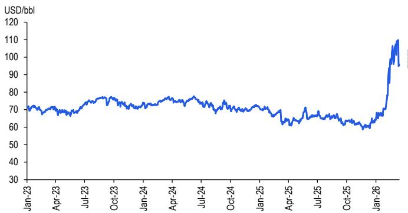  
Figure 66. Oil

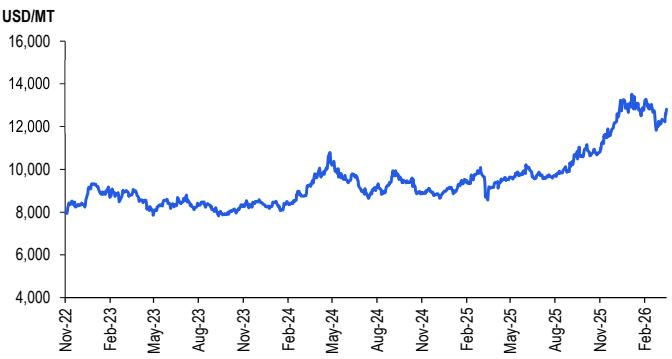  
Figure 67. Copper

$\circledcirc$ 2026 Citigroup Inc. No redistribution without Citigroup’s written permission. Source: Citi Research, Bloomberg

$\circledcirc$ 2026 Citigroup Inc. No redistribution without Citigroup’s written permission. Source: Citi Research, Bloomberg

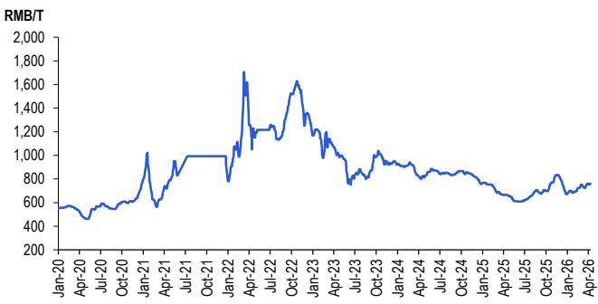  
Figure 68. Aluminum   
$\circledcirc$ 2026 Citigroup Inc. No redistribution without Citigroup’s written permission. Source: Citi Research, Bloomberg

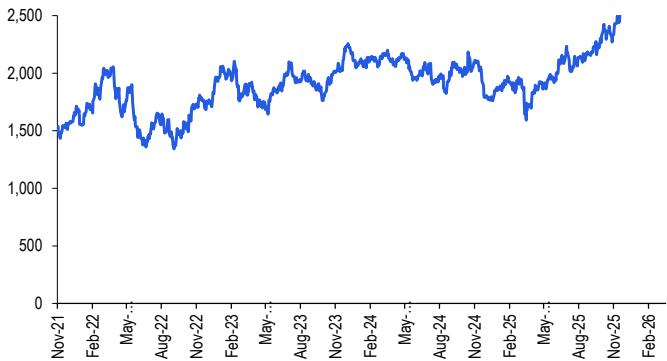  
Figure 69. Steel Price Index

© 2026 Citigroup Inc. No redistribution without Citigroup’s written permission.

Source: Citi Research, Bloomberg

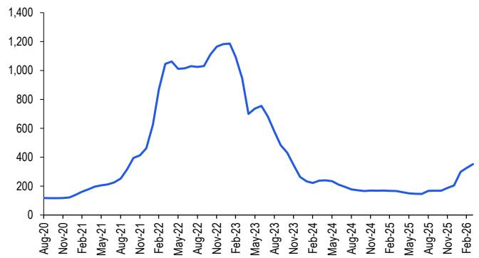  
Figure 70. Lithium Price Index   
$\circledcirc$ 2026 Citigroup Inc. No redistribution without Citigroup’s written permission.

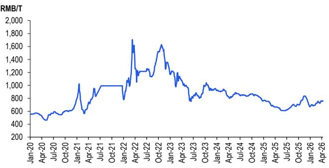  
Figure 71. Power Coal

Source: Citi Research, Bloomberg

© 2026 Citigroup Inc. No redistribution without Citigroup’s written permission. Source: Citi Research, Bloomberg

# Appendix 2: Building Material and Property related Growth Rates

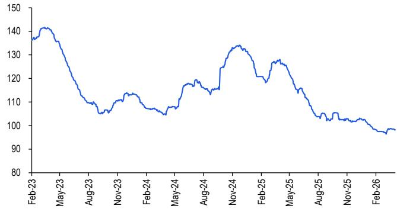  
Figure 72. Cement Price Index   
$\circledcirc$ 2026 Citigroup Inc. No redistribution without Citigroup’s written permission. Source: Citi Research, Wind

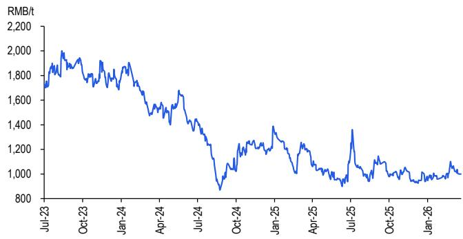  
Figure 73. Glass

$\circledcirc$ 2026 Citigroup Inc. No redistribution without Citigroup’s written permission. Source: Citi Research, Wind

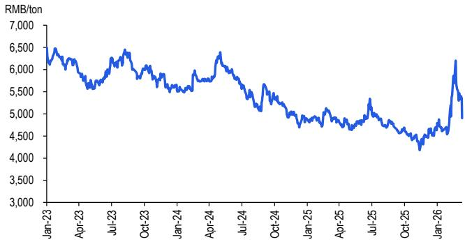  
Figure 74. PVC   
$\circledcirc$ 2026 Citigroup Inc. No redistribution without Citigroup’s written permission. Source: Citi Research, Wind

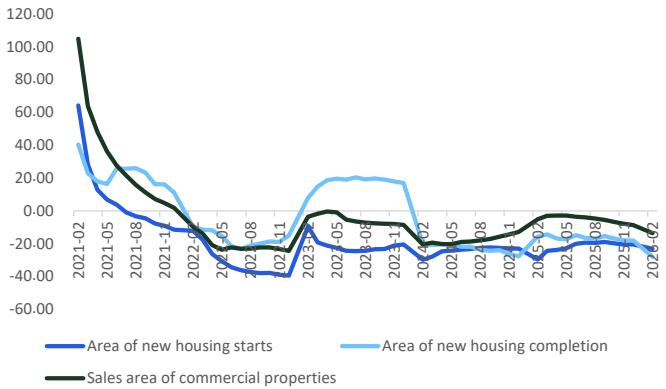  
Figure 75. Property related growth yoy   
© 2026 Citigroup Inc. No redistribution without Citigroup’s written permission. Source: Citi Research, Wind

# Appendix 3: Autos

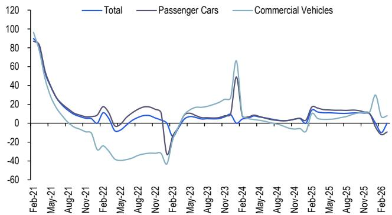  
Figure 76. Auto Production YTD YoY   
$\circledcirc$ 2026 Citigroup Inc. No redistribution without Citigroup’s written permission.

Source: Citi Research, Wind

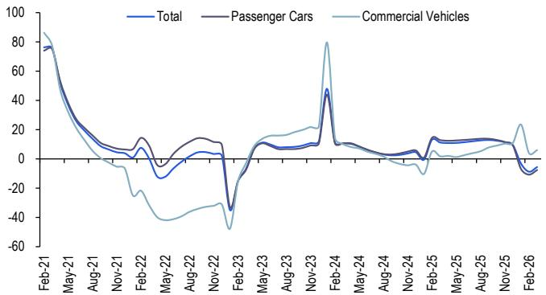  
Figure 77. Autos Sales YTD YoY   
$\circledcirc$ 2026 Citigroup Inc. No redistribution without Citigroup’s written permission.

Source: Citi Research, Wind

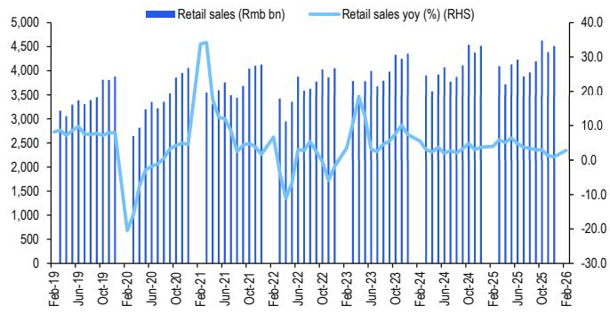  
Figure 84. Total Retail Sales of Consumer Goods   
$\circledcirc$ 2026 Citigroup Inc. No redistribution without Citigroup’s written permission. Source: Citi Research, NBS

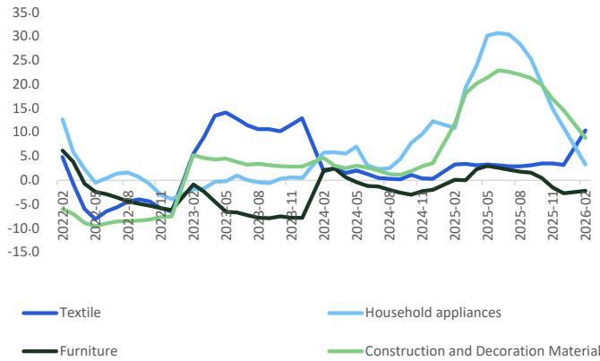  
Figure 85. Retail sales YoY % change by industry   
© 2026 Citigroup Inc. No redistribution without Citigroup’s written permission. Source: Citi Research, NBS

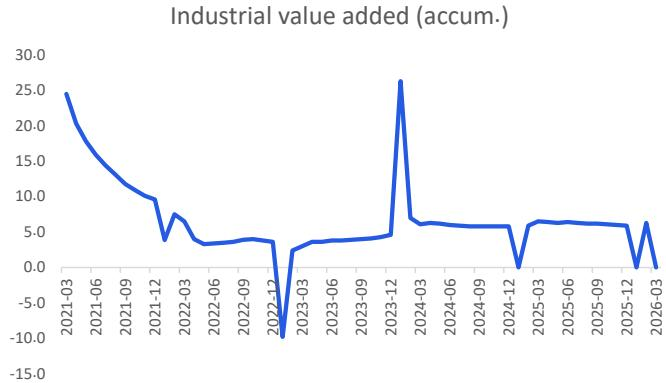  
Figure 86. YTD YoY $\%$ change of industrial output   
© 2026 Citigroup Inc. No redistribution without Citigroup’s written permission. Source: Citi Research, NBS

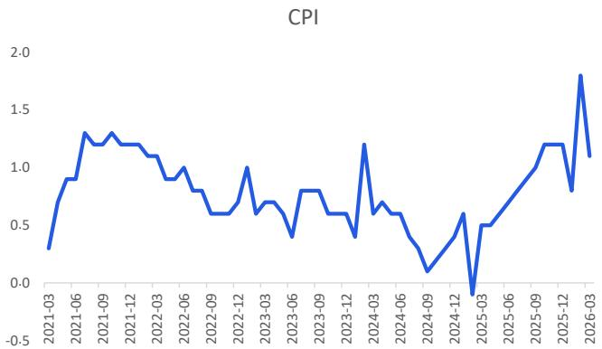  
Figure 87. CPI YoY % change   
© 2026 Citigroup Inc. No redistribution without Citigroup’s written permission. Source: Citi Research, NBS

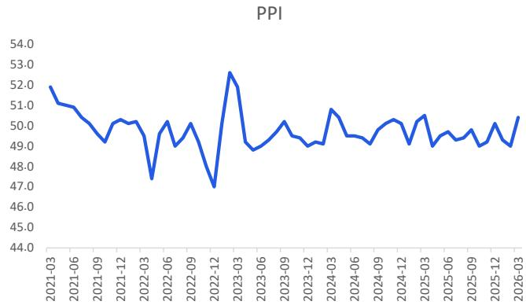  
Figure 88. PPI YoY % change   
© 2026 Citigroup Inc. No redistribution without Citigroup’s written permission. Source: Citi Research, NBS

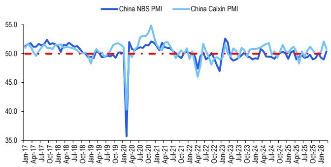  
Figure 89. PMI

© 2026 Citigroup Inc. No redistribution without Citigroup’s written permission. Source: Citi Research, NBS

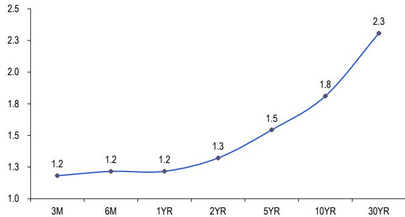  
Figure 90. China Treasury Bond Yield Curve   
$\circledcirc$ 2026 Citigroup Inc. No redistribution without Citigroup’s written permission. Source: Citi Research, Bloomberg

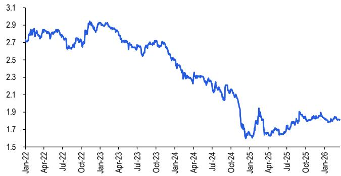  
Figure 91. China Treasury Bond Yield to Maturity $( \% )$ : 10-yr   
© 2026 Citigroup Inc. No redistribution without Citigroup’s written permission. Source: Citi Research, Bloomberg

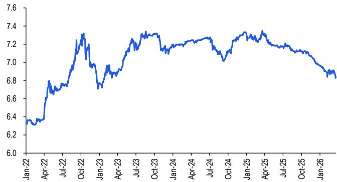  
Figure 92. Spot exchange rate: USD to RMB   
$\circledcirc$ 2026 Citigroup Inc. No redistribution without Citigroup’s written permission. Source: Citi Research, Bloomberg

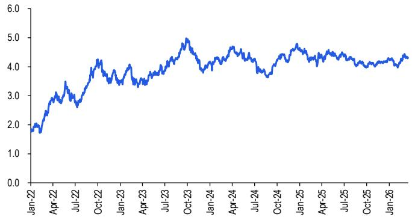  
Figure 93. US Treasury Bond Yield to Maturity $( \% )$ : 10-year   
© 2026 Citigroup Inc. No redistribution without Citigroup’s written permission.

Source: Citi Research, Bloomberg

Figure 94. Companies Mentioned (priced as of 15 April close for Asia-listed stocks an 14 April close for US stocks)   

<table><tr><td colspan="10">P/E(x)EV/EBITDA(x)P/B(x)Divyield(%)Debt/equity(%)</td></tr><tr><td></td><td>Mkt Cap</td><td></td><td></td><td>Close Target</td><td></td><td></td><td></td><td></td><td></td><td></td><td></td><td></td><td></td></tr><tr><td>Company</td><td>Ticker</td><td>US$(M) 170,482</td><td>Ccy SFr</td><td>Price 72.20</td><td>Price 76.00</td><td>Rating 20262027 2026 2027 2026 2027 2026 2027 2 28.1 27.8</td><td>21.7</td><td>18.6</td><td>8.1</td><td>7.2</td><td>1.3</td><td></td><td>20262027</td></tr><tr><td>ABB Ltd</td><td>ABBN.S 688200.SS</td><td>Rmb</td><td></td><td>286.000 258.000</td><td></td><td>1 56.7 44.1</td><td>53.4</td><td>40.6</td><td>8.6</td><td>7.5 0.5</td><td>1.4 0.7</td><td>39.2 0.0</td><td>35.0</td></tr><tr><td>AccoTEST Adidas</td><td>ADSGn.DE</td><td>5,687 29,280 节</td><td>€</td><td>137.90 227.00</td><td></td><td>13.2 10.6</td><td>7.3</td><td>6.3</td><td>3.6</td><td>3.3</td><td>3.0 3.8</td><td>78.5</td><td>0.0 72.0</td></tr><tr><td>AMEC</td><td>688012.SS</td><td>29,467</td><td>Rmb</td><td>320.360 418.000</td><td></td><td>1 66.3 47.6</td><td>68.1</td><td></td><td>8.2</td><td>7.0 0.2</td><td>0.2</td><td>3.1</td><td>27</td></tr><tr><td>Alibaba Group Hldg</td><td>9988.HK</td><td>314,123</td><td>HK$</td><td>128.60 204.00</td><td></td><td>1 20.2 14.1</td><td>9.1</td><td>6.2</td><td>1.8</td><td>1.7 0.8</td><td>0.8</td><td>17.3</td><td>16.3</td></tr><tr><td>Alibaba Group Hldg</td><td>BABA.N</td><td>314,157</td><td>US$</td><td>131.35 205.00</td><td></td><td>1 20.4 14.3</td><td>9.1</td><td>6.2</td><td>1.8</td><td>1.7 0.8</td><td>0.8</td><td>17.3</td><td>16.3</td></tr><tr><td>Alphabet</td><td>GOOGL.0</td><td>4,014,542</td><td>US$</td><td>332.91 405.00</td><td></td><td>1 28.4 23.9</td><td>19.4</td><td>15.3</td><td>7.3</td><td>5.6</td><td>NA NA</td><td>8.3</td><td>6.4</td></tr><tr><td>Amazon.com</td><td>AMZN.0</td><td>2,678,024</td><td>US$</td><td>249.02 285.00</td><td></td><td>1 24.7 20.2</td><td>12.5</td><td>9.8</td><td>5.1</td><td>4.1</td><td>NA NA</td><td>23.0</td><td>18.2</td></tr><tr><td>AHHL</td><td>600761.SS</td><td>2,286</td><td>Rmb</td><td>17.490 14.200</td><td></td><td>3 12.3 11.3</td><td>6.4</td><td>5.4</td><td>1.3</td><td>1.2</td><td>3.0 3.2</td><td>9.1</td><td>10.7</td></tr><tr><td>Anta Sports Products</td><td>2020.HK</td><td>29,900</td><td>HK$</td><td>83.75</td><td>107.00</td><td>1 14.6 13.1</td><td>9.1</td><td>7.8</td><td>2.7</td><td>2.5</td><td>4.1 4.6</td><td>22.5</td><td>19.1</td></tr><tr><td>Apple Inc</td><td>AAPL.0</td><td>3,799,919</td><td>US$</td><td>258.83</td><td>315.00</td><td>1 30.3 27.1</td><td>22.9</td><td></td><td>21.0 35.7 25.0</td><td></td><td>0.4 0.5</td><td></td><td></td></tr><tr><td>AviChina</td><td>2357.HK</td><td>3.613</td><td>HK$</td><td>3.55</td><td>5.00 1</td><td>9.37.9</td><td>5.5</td><td>5.2</td><td>0.7</td><td>0.6</td><td>3.2 3.8</td><td>86.6</td><td>62.8</td></tr><tr><td>Centre Testing Int&#x27; Group</td><td>300012.SZ</td><td>3,797</td><td>Rmb</td><td>15.380</td><td>24.000 1</td><td>21.1 18.5</td><td>12.5</td><td>10.7</td><td>2.9</td><td>2.6</td><td>1.3</td><td>14.7</td><td>13.9</td></tr><tr><td></td><td></td><td>1,127</td><td>HK$</td><td>17.27</td><td>17.50</td><td>3 10.7 8.8</td><td></td><td>4.6</td><td>1.0</td><td></td><td>1.1</td><td>1.4</td><td>1.3</td></tr><tr><td>Chervon</td><td>2285.HK</td><td></td><td>Rmb</td><td>7.610</td><td></td><td></td><td>5.8</td><td></td><td></td><td>0.9</td><td>2.8 3.4</td><td>22.7</td><td>20.3</td></tr><tr><td>China Communications Construction</td><td>601800.SS</td><td>9.432 1,422</td><td>HK$</td><td>5.02</td><td>6.900</td><td>35.3 5.1</td><td>4.7</td><td>4.3</td><td>0.4</td><td>0.3</td><td>4.0 4.2</td><td>121.3</td><td>119.0</td></tr><tr><td>China East Edu</td><td>0667.HK</td><td></td><td></td><td></td><td>7.80</td><td>1 9.98.1</td><td>3.8</td><td>3.0</td><td>1.5</td><td>1.4</td><td>6.1 7.5</td><td>0.0</td><td>0.0</td></tr><tr><td>China Jushi</td><td>600176.SS</td><td>18,266</td><td>Rmb</td><td>31.100</td><td>26.100</td><td>1 23.5 20.8</td><td>15.6</td><td>13.8</td><td>3.4</td><td>3.1</td><td>1.9 2.2</td><td>35.1</td><td>33.1</td></tr><tr><td>China Lesso Group Hldgs</td><td>2128.HK</td><td>1,909</td><td>HK$</td><td>4.82</td><td>6.20</td><td>1 8.47.1</td><td>3.1</td><td>3.0</td><td>0.5</td><td>0.5</td><td>4.7 5.1</td><td>62.6</td><td>56.3</td></tr><tr><td>China Railway Group</td><td>0390.HK</td><td>12,858</td><td>HK$</td><td>4.08</td><td>4.80</td><td>1 3.73.6</td><td>10.3</td><td>9.4</td><td>0.2</td><td>0.2</td><td>5.3 5.5</td><td>84.0</td><td>71.1</td></tr><tr><td>China State Construction</td><td>3311.HK</td><td>5.975</td><td>HK$ nu</td><td>8.86 R</td><td>12.00</td><td>4.74.5 1</td><td>4.63</td><td></td><td>4.40.5</td><td>0.5</td><td>8.8 8.9</td><td>100.4</td><td>95.0</td></tr><tr><td>CIMC Enric</td><td>3899.HK</td><td>2,903</td><td>HK$</td><td>10.77</td><td>12.50</td><td>1 13.0 11.3</td><td>4.4</td><td>34</td><td>1.4</td><td>1.3</td><td>4.1 4.7</td><td>5.2</td><td>4.9</td></tr><tr><td>Coherent Corp</td><td>COHR.K</td><td>61,202</td><td>US$</td><td>313.42</td><td>250.00</td><td>1 45.5 28.3</td><td>36.2</td><td>25.3 13.0</td><td></td><td>NA</td><td>NA NA</td><td>242.3</td><td>NA</td></tr><tr><td>Constellation Energy Corp</td><td>CEG.N</td><td>107,484</td><td>US$</td><td>296.68</td><td>348.00</td><td>2H 27.6 22.0</td><td>13.1</td><td>11.6</td><td>3.6</td><td>3.2</td><td>0.6 0.6</td><td>81.1</td><td>68.4</td></tr><tr><td>COSCO SHIPPING Hldgs</td><td>1919.HK</td><td>29,596</td><td>HK$</td><td>15.14</td><td>15.90</td><td>1 11.6 23.6</td><td>3.6</td><td>5.0</td><td>0.8</td><td>0.8</td><td>4.3 2.1</td><td>11.6</td><td>7.2</td></tr><tr><td>COSCO SHIPPING Ports</td><td>1199.HK</td><td>2.593</td><td>HK$</td><td>5.13</td><td>5.51</td><td>2 6.55.9</td><td>12.8</td><td>11.8</td><td>0.4</td><td>0.4</td><td>6.1 6.7</td><td>47.9</td><td>44.0</td></tr><tr><td>CRRC Corp</td><td>1766.HK</td><td>18,721</td><td>HK$</td><td>5.11</td><td>4.50</td><td>39.6 9.0</td><td>3.9</td><td>3.5</td><td>0.7</td><td>0.7</td><td>5.2 5.5</td><td>6.6</td><td>6.3</td></tr><tr><td>Crystal Intl</td><td>2232.HK</td><td>2,262</td><td>HK$</td><td>6.21</td><td>8.20</td><td>1 9.28.2</td><td>4.4</td><td>4.0</td><td>1.3</td><td>1.2</td><td>6.7 7.5</td><td>7.0</td><td>5.3</td></tr><tr><td>Dongguan Yiheda Automation</td><td>301029.SZ</td><td>2,474</td><td>Rmb</td><td>26.590</td><td>31.000</td><td>1 24.2 20.6</td><td>16.9</td><td>14.2</td><td>3.4</td><td>3.1</td><td>1.9 2.3</td><td>0.0</td><td>0.0</td></tr><tr><td>Doosan Elite Material</td><td>000150.KS</td><td>14,935 43,296</td><td>W NT$</td><td>1,358,0001,300,000 3,810.00 3,000.00</td><td></td><td>1 NA 62.1</td><td>13.1 1 43.126.5</td><td>11.6</td><td>9.2</td><td>7.3 17.0 10.3 0.7</td><td>0.1 0.1</td><td>65.9</td></table>

<table><tr><td>Stella Int&#x27; Hldgs</td><td>1836.HK</td><td>1,610</td><td>HK$</td><td>14.99</td><td>15.00</td><td></td><td>1 11.3 10.5</td><td>5.3</td><td>4.9</td><td>1.4</td><td>1.4</td><td>9.8</td><td>10.3</td><td>0.5</td><td>0.5</td></tr><tr><td>Suofeiya Home Collection</td><td>002572.SZ</td><td>1,778</td><td>Rmb</td><td>12.580</td><td>9.350</td><td></td><td>3 11.4 11.4</td><td>6.1</td><td>6.1</td><td>1.5</td><td>1.4</td><td>6.1</td><td>6.2</td><td>45.3</td><td>50.3</td></tr><tr><td>SUPCON Technology</td><td>688777.S</td><td>7,661</td><td>Rmb</td><td>66.000</td><td>38.000</td><td></td><td>3 75.167.6</td><td>76.4</td><td>66.8</td><td>4.8</td><td>4.7</td><td>0.7</td><td>0.7</td><td>2.9</td><td>2.8</td></tr><tr><td>Synopsys</td><td>SNPS.0</td><td>80,226</td><td>US$</td><td>418.80</td><td>580.00</td><td></td><td>1 27.3 22.8</td><td>18.7</td><td>18.3</td><td>2.5</td><td>2.3</td><td>NA</td><td>NA</td><td>27.4</td><td>19.2</td></tr><tr><td>TBEA Co</td><td>600089.SS</td><td>20,920</td><td>Rmb</td><td>28.220</td><td>36.000</td><td></td><td>1 15.7 13.8</td><td>10.1</td><td>9.1</td><td>1.9</td><td>1.7</td><td>2.0</td><td>2.3</td><td>47.1</td><td>47.3</td></tr><tr><td>Techtronic</td><td>0669.HK</td><td>26,091</td><td>HK$</td><td>111.70</td><td>150.00</td><td></td><td>1 18.1 15.1</td><td>10.1</td><td>8.5</td><td>3.4</td><td>3.1</td><td>2.8</td><td>3.5</td><td>27.8</td><td>25.1</td></tr><tr><td>Tencent Hldgs</td><td>0700.HK</td><td>581,319</td><td>HK$</td><td>499.00</td><td>787.00</td><td></td><td>1 14.2 12.7</td><td>9.9</td><td>7.8</td><td>3.3</td><td>3.1</td><td>1.2</td><td>1.3</td><td>20.6</td><td>19.6</td></tr><tr><td>Topband</td><td>002139.SZ</td><td>2,265</td><td>Rmb</td><td>12.380</td><td>8.500</td><td></td><td>3H 36.8 33.0</td><td>16.3</td><td>14.9</td><td>2.1</td><td>2.0</td><td>0.3</td><td>0.3</td><td>24.9</td><td>23.7</td></tr><tr><td>TSMC</td><td>2330.TW 订</td><td>1,710,632</td><td>NTS添</td><td>2.080.00 2.800.00</td><td></td><td>D1233 22.2 15.9</td><td></td><td>13.5</td><td>10.0</td><td>7.5</td><td>5.7</td><td>1.3</td><td>2.0</td><td>15.0</td><td>11.8</td></tr><tr><td>tuc</td><td>6274.TWO</td><td>8,664</td><td>NT$</td><td>946.00</td><td>660.00</td><td></td><td>1 39.3 27.8</td><td>27.5</td><td>17.7</td><td>11.3</td><td>8.1</td><td>0.8</td><td>1.6</td><td>28.9</td><td>22.2</td></tr><tr><td>UBTECH Robotics</td><td>9880.HK</td><td>7,037</td><td>HK$</td><td>109.50</td><td>190.00</td><td></td><td>1NA NA</td><td>NA</td><td>70.8</td><td>6.9</td><td>6.7</td><td>NA</td><td>NA</td><td>29.3</td><td>42.0</td></tr><tr><td>Victory Giant Tech</td><td>300476.SZ</td><td>37,822</td><td>Rmb</td><td>295.440</td><td>415.000</td><td></td><td>1 29.7 14.2</td><td>21.9</td><td>10.8</td><td>6.6</td><td>4.6</td><td>0.4</td><td>0.8</td><td>10.6</td><td>20.3</td></tr><tr><td>VTech Hldgs</td><td>0303.HK</td><td>1,979</td><td>HK$</td><td>61.15</td><td>76.00</td><td></td><td>1 12.6 11.5</td><td>7.4</td><td>6.9</td><td>2.9</td><td>2.9</td><td>7.5</td><td>8.4</td><td>0.0</td><td>0.0</td></tr><tr><td>Weixing New Materials</td><td>002372.SZ</td><td>2,516</td><td>Rmb</td><td>10.770</td><td>11.800</td><td></td><td>2 20.0 18.1</td><td>13.7</td><td>12.5</td><td>3.3</td><td>3.2</td><td>3.8</td><td>4.1</td><td>1.2</td><td>1.1</td></tr><tr><td> Lead Intelligent</td><td>300450.SZ</td><td>12,820</td><td>Rmb</td><td>52.860</td><td>64.000</td><td></td><td>1 38.0 28.3</td><td>35.5</td><td>25.3</td><td>6.0</td><td>5.1</td><td>0.8</td><td>1.1</td><td>89.2</td><td>76.9</td></tr><tr><td> Xiaomi</td><td>1810.HK</td><td>102,185</td><td>HK$</td><td>30.90</td><td>40.00</td><td></td><td>1 24.7 16.5</td><td>19.5</td><td>13.1</td><td>2.2</td><td>1.9</td><td>NA</td><td>NA</td><td>8.6</td><td>6.5</td></tr><tr><td> XPeng</td><td>9868.HK</td><td>16,534</td><td>HK$</td><td>67.65</td><td>100.00</td><td>1</td><td>NA 18.3</td><td>-63.1</td><td>35.5</td><td>1.9</td><td>1.7</td><td>NA</td><td>NA</td><td>40.2</td><td>36.5</td></tr><tr><td>Yaskawa Electric</td><td>6506.T</td><td>8.619</td><td>￥</td><td>5,277.0</td><td>5,500.0</td><td></td><td>2 30.0 24.7</td><td>15.8</td><td>13.7</td><td>4.2</td><td>4.0</td><td>1.3</td><td>1.4</td><td>24.7</td><td>23.3</td></tr><tr><td>Yealink Xiamen Network Technology</td><td>300628.SZ</td><td>6,559</td><td>Rmb</td><td>35.290</td><td>40.000</td><td></td><td>2 14.3 12.6</td><td>12.6</td><td>11.0</td><td>4.4</td><td>4.1</td><td>5.6</td><td>6.4</td><td>0.3</td><td>0.3</td></tr><tr><td>Yue Yuen Industrial</td><td>0551.HK</td><td>3,257</td><td>HK$</td><td>15.90</td><td>21.00</td><td></td><td>1 8.2 7.7</td><td>3.7</td><td>3.3</td><td>0.7</td><td>0.7</td><td>8.4</td><td>8.7</td><td>20.7</td><td>29.4</td></tr><tr><td>Yutong Bus</td><td>600066.SS</td><td>11,840</td><td>Rmb</td><td>36.450</td><td>50.000</td><td></td><td>1 13.1 11.9</td><td>9.6</td><td>8.65.0</td><td></td><td>4.8</td><td>7.6</td><td>8.4</td><td>0.0</td><td>0.0</td></tr><tr><td>Zhejiang Dingli Machinery</td><td>603338.SS</td><td>3,683</td><td>Rmb</td><td>49.570</td><td>32.000</td><td></td><td>3 12.9 12.6</td><td>7.0</td><td>6.3</td><td>1.9</td><td>1.7</td><td>2.4</td><td>2.5</td><td>28.3</td><td>26.6</td></tr><tr><td>Sanhua</td><td>002050.SZ</td><td>24,697</td><td>Rmb</td><td>45.110</td><td>44.000</td><td></td><td>2 45.9 40.6</td><td>26.0</td><td>23.3</td><td>5.5</td><td>5.1</td><td>0.9</td><td>1.0</td><td>43.1</td><td>42.9</td></tr><tr><td>Zhuzhou CRRC Times Electric</td><td>3898.HK</td><td>6,622</td><td>HK$</td><td>38.20</td><td>42.50</td><td>2</td><td>9.88.9</td><td>7.8</td><td>6.8</td><td>1.0</td><td>0.9</td><td>3.8</td><td>4.2</td><td>1.6</td><td>1.5</td></tr><tr><td>Zoomlion HeavyIndustry</td><td>1157.HK</td><td></td><td>9,881 HK$</td><td>8.95</td><td>10.80</td><td>1231 .11.2 9.5</td><td></td><td>11.0</td><td>9.4</td><td>1.1</td><td>1.1</td><td>4.8</td><td>5.7</td><td>74.0</td><td>75.7</td></tr></table>

Source: Citi Research, and dataCentral. Financials and ratios are calendar year basis.