# S potify Tech n o l ogy S. A . (SPOT) Q1 ‘26 Earn i ngs Preview: Add ressi ng the Key Debates & Operati ng Backd rop

<table><tr><td>SPOT</td><td>12m Price Target: $670.00</td><td>Price: $531.17</td><td>Upside: 26.1%</td><td>BUY04-16</td></tr></table>

Ahead of its Q1 2026 earnings report, we preview current industry data and frame the potential financial implications from forward engagement and monetization opportunities for SPOT. We would frame the upcoming quarterly report as one in which investors remain focused on: 1) the trajectory for total ARPU, including for premium (price increases, new tiers, etc.) and advertising (scaling of new ad tools/formats); 2) how key variable costs inputs (music royalty payments, non-music media investments, Spotify Partner Program, etc.) translate into the cadence of gross margins throughout 2026; 3) how the rise of generative AI might impact both 订阅研报添加微信 LCD123Spotify’s platform (new gen AI products & overall media consumption) and the competitive landscape; & 4) the scope for operating leverage, FCF generation and capital returns (buybacks) in the coming quarters. We look ahead to not only SPOT’s upcoming earnings report but also its Analyst Day in May 2026 for more details on these key debates. In addition, against an increasingly volatile/uncertain macroeconomic and geopolitical market backdrop, we also highlight how investors may increasingly look toward SPOT (relative to some of the consumer discretionary companies in our wider coverage universe) given its defensive nature & status as a less expensive form of entertainment (with premium/ad supported user dynamics resulting in overall P&L 阅研报添加微信 LCD123 trends being more resilient).

In this report, we address recent updates & our views on two key themes/debates: a) on AI – while it’s too early to tell exactly how AI might impact the streaming media/audio landscape, we outline the current AI debate across three distinct areas (content creation, discovery & personalization & distribution) and remain of the view that Spotify is well positioned (an under-appreciated view amongst investors) against how this theme might evolve; b) on advertising –

Eric Sheridan +1(917)343-8683 | Goldman Sachs & C

Alex Vegliant +1(212)934-1878 | Goldman Sachs & C

Achal Gupta +1(332)245-7973 Goldman Sachs Indi

Key Data

Market	cap:	\$112.9bn Enterprise	value:	\$105.6bn 3m	ADTV:	\$1.3bn Luxembourg

# GS Forecast

<table><tr><td></td><td>12/25</td><td>1</td></tr><tr><td>Revenue(€mn) New</td><td>17,186.0</td><td>19,</td></tr><tr><td>Revenue (€ mn) Old</td><td>17,186.0</td><td>19,</td></tr><tr><td>EBITDA (€ mn)</td><td>2,302.1</td><td>2</td></tr><tr><td>EBIT (E mn)</td><td>2,200.1</td><td>2</td></tr><tr><td>EPS (€)New</td><td>10.52</td><td></td></tr><tr><td>EPS (E) Old</td><td>10.52</td><td></td></tr><tr><td>P/E(X)</td><td>53.1</td><td></td></tr><tr><td>Dividend yield (%)</td><td>1</td><td></td></tr><tr><td>Net debt/EBITDA (X)</td><td>(1.7)</td><td></td></tr></table>

<table><tr><td>12/25</td></tr></table>

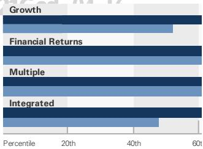  
GS Factor Profile

SPOT	relative	to	Americas	Coverage SPOT	relative	to	Americas	Internet

# Spotify Technology S.A. (SPOT)

Rating since Jan 22, 2026

Ratios & Valuation   

<table><tr><td></td><td>12/25</td><td>12/26E</td><td>12/27E</td><td>12/28E</td></tr><tr><td>P/E (X)</td><td>53.1</td><td>36.5</td><td>28.2</td><td>23.5</td></tr><tr><td>EV/EBITDA (X)</td><td>48.2</td><td>29.2</td><td>21.9</td><td>16.9</td></tr><tr><td>EV/sales (X)</td><td>6.5</td><td>4.5</td><td>3.8</td><td>3.3</td></tr><tr><td>FCF yield (%)</td><td>2.5</td><td>阅矿报添加微信</td><td></td><td>4.9</td></tr><tr><td>EV/DACF (X)</td><td>43.8</td><td>33.7</td><td>28.8</td><td>24.5</td></tr><tr><td>CROCI (%)</td><td>59.9</td><td>51.2</td><td>60.1</td><td>68.0</td></tr><tr><td>ROE (%)</td><td>32.0</td><td>28.2</td><td>28.0</td><td>25.3</td></tr><tr><td>Net debt/EBITDA (X)</td><td>(1.7)</td><td>(2.1)</td><td>(2.6)</td><td>(3.1)</td></tr><tr><td>Net debt/equity (%)</td><td>(45.6)</td><td>(60.1)</td><td>(70.7)</td><td>(78.6)</td></tr><tr><td>Interest cover (X)</td><td>3.0</td><td>13.7</td><td>22.9</td><td>20.9</td></tr><tr><td>Inventory days</td><td>NM</td><td>NM</td><td>NM</td><td>NM</td></tr><tr><td>Receivable days</td><td>16.7</td><td>16.4</td><td>17.4</td><td>18.0</td></tr><tr><td>Days payable outstanding</td><td>39.6</td><td>37.1</td><td>37.2</td><td>35.9</td></tr></table>

Growth & Margins (%)   

<table><tr><td></td><td>12/25</td><td>12/26E</td><td>12/27E</td><td>12/28E</td></tr><tr><td>Total revenue growth</td><td>9.7</td><td>11.1</td><td>12.9</td><td>11.4</td></tr><tr><td>EBITDA growth</td><td>55.0</td><td>28.0 阅</td><td>27.6</td><td>22.8</td></tr><tr><td>EPS growth</td><td>91.5</td><td>17.4</td><td>29.0</td><td>20.3</td></tr><tr><td>DPS growth</td><td>NM</td><td>NM</td><td>NM</td><td>NM</td></tr><tr><td>Gross margin</td><td>32.0</td><td>33.0</td><td>34.0</td><td>35.0</td></tr><tr><td>EBIT margin</td><td>12.8</td><td>14.8</td><td>16.9</td><td>18.8</td></tr></table>

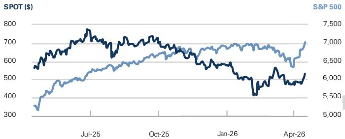  
Price Performance

<table><tr><td>3m</td><td>6m</td><td>12m</td></tr><tr><td>4.6%</td><td>(20.9)%</td><td>(7.2)%</td></tr><tr><td>3.4%</td><td>(24.8)%</td><td>(28.7)%</td></tr></table>

Source: FactSet. Price as of 15 Apr 2026 close.

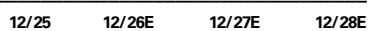

Balance Sheet (€ mn)   

<table><tr><td></td><td>12/25</td><td>12/26E</td><td>12/27E</td><td>12/28E</td></tr><tr><td>Cash &amp; cash equivalents</td><td>5,258.0</td><td>6,132.9</td><td>9,803.9</td><td>14,331.0</td></tr><tr><td>Accounts receivable</td><td>802.0</td><td>909.7</td><td>1,141.9</td><td>1,232.4</td></tr><tr><td>Inventory</td><td>1</td><td>1</td><td>1</td><td>1</td></tr><tr><td>Other current assets</td><td>4,436.0</td><td>4,456.1</td><td>4,484.0</td><td>4,514.4</td></tr><tr><td>Total current assets</td><td>10,496.0</td><td>11,498.7</td><td>15,429.8</td><td>20,077.9</td></tr><tr><td>Net PP&amp;E</td><td>422.0</td><td>409.6</td><td>406.9</td><td>411.9</td></tr><tr><td>Net intangibles</td><td>1,124.0</td><td>1,097.2</td><td>1,071.0</td><td>1,045.3</td></tr><tr><td>Total investments</td><td>2,181.0</td><td>2,181.0</td><td>2,181.0</td><td>2,181.0</td></tr><tr><td>Other long-term assets 3</td><td>04-16 792.0</td><td>898.4</td><td>1,001.9</td><td>1,112.3</td></tr><tr><td>Total assets</td><td>15,015.0</td><td>16,085.0</td><td>20,090.6</td><td>24,828.4</td></tr><tr><td>Accounts payable</td><td>1,194.0</td><td>1,404.5</td><td>1,491.0</td><td>1,577.5</td></tr><tr><td>Short-term debt</td><td>1</td><td>1</td><td>1</td><td></td></tr><tr><td>Current lease liabilities</td><td>1</td><td>1</td><td>1</td><td>1</td></tr><tr><td>Other current liabilities</td><td>3,433.0</td><td>3,867.8</td><td>4,129.3</td><td>4,411.5</td></tr><tr><td>Total current liabilities</td><td>4,627.0</td><td>5,272.3</td><td>5,620.3</td><td>5,989.0</td></tr><tr><td>Long-term debt</td><td>1,458.0</td><td>0.0</td><td>0.0</td><td>0.0</td></tr><tr><td>Non-current lease liabilities</td><td>433.0</td><td>433.0</td><td>433.0</td><td>433.0</td></tr><tr><td>Other long-term liabilities</td><td>168.0</td><td>168.4</td><td>168.5</td><td>168.6</td></tr><tr><td>Total long-term liabilities</td><td>2,059.0</td><td>601.4</td><td>601.5</td><td>601.6</td></tr><tr><td>Total liabilities</td><td>6,686.0</td><td>5,873.6</td><td>6,221.8</td><td>6,590.7</td></tr><tr><td>Preferredshares</td><td>1</td><td>1</td><td>1</td><td>1</td></tr><tr><td></td><td>04-16 8,329.0</td><td>10,211.3</td><td>13,868.8</td><td>18,237.8</td></tr><tr><td>Minority interest</td><td>1</td><td>1</td><td>1</td><td>1</td></tr><tr><td>Total liabilities &amp;equity</td><td>15,015.0</td><td>16,085.0</td><td>20,090.6</td><td>24,828.4</td></tr><tr><td>BVPS (E)</td><td>40.46</td><td>49.93</td><td>67.66</td><td>88.77</td></tr></table>

Cash Flow (€ mn)   

<table><tr><td></td><td>12/25</td><td>12/26E</td><td>12/27E</td><td>12/28E</td></tr><tr><td>Net income</td><td>2,212.0</td><td>2,611.5</td><td>3,370.4</td><td>4,064.6</td></tr><tr><td>D&amp;Aadd-back</td><td>102.0</td><td>118.0</td><td>114.1</td><td>112.6</td></tr><tr><td>Minority interestadd-back</td><td>1</td><td>1</td><td>一</td><td>1</td></tr><tr><td>Net (inc)/dec working capital</td><td>368.0</td><td>773.5</td><td>670.9</td><td>1,132.3</td></tr><tr><td>Others</td><td>251.0</td><td>(91.2)</td><td>(399.3)</td><td>(690.4)</td></tr><tr><td>Cash flow from operations</td><td>2,933.0</td><td>3,411.8</td><td>3,756.2</td><td>4,619.1</td></tr><tr><td>Capital expenditures</td><td>(61.0)</td><td>(78.9)</td><td>(85.2)</td><td>(92.0)</td></tr><tr><td>Acquisitions 321C ad</td><td>04-16 (9.0)</td><td>1</td><td></td><td>1</td></tr><tr><td>Divestitures</td><td>1</td><td>1</td><td>1</td><td>1</td></tr><tr><td>Others</td><td>(1,724.0)</td><td>1</td><td>1</td><td>1</td></tr><tr><td>Cash flow from investing</td><td>(1,785.0)</td><td>(78.9)</td><td>(85.2)</td><td>(92.0)</td></tr><tr><td>Dividends paid</td><td>1</td><td>1</td><td>1</td><td>1</td></tr><tr><td>Share issuance/(repurchase)</td><td>1</td><td>1</td><td>1</td><td>1</td></tr><tr><td>Inc/(dec) in debt</td><td>1</td><td>(1,458.0)</td><td>1</td><td></td></tr><tr><td>Others</td><td>58.0</td><td>1</td><td>1</td><td>1</td></tr><tr><td>Cash flow from financing</td><td>(381.0)</td><td>(2,458.0)</td><td>0.0</td><td>0.0</td></tr><tr><td>Total cash flow</td><td>476.8</td><td>874.9</td><td>3,671.0</td><td>4,527.1</td></tr><tr><td>Free cash flow</td><td>2,872.0</td><td>3,332.9</td><td>3,671.0</td><td>4.27.1</td></tr><tr><td>Free cash flow per share (basic) (E)</td><td>13.98</td><td>16.28</td><td>17.93</td><td>22.06</td></tr></table>

Looking over a long-term horizon, we see SPOT as well positioned against several long-term operating themes in the coming years. Among those themes would be: 1) steady Premium subscription price increases (at a regular cadence of 1-2 years and staggered by geography); 2) the introduction of new premium pricing tiers; 3) healthy MAU growth (particularly in emerging markets) and steady conversion of ad-supported users into paid subscribers; & 4) reacceleration of advertising revenue growth in $^ { \prime } 2 6 \&$ beyond, aided by both the launch/scaling of the Spotify Ad Exchange (SAX) and programmatic ad buying capabilities and monetization of video podcast ad inventory. In addition, we see a solid runway for gross profit dollar growth & margin improvement driven by: 1) modestly improving unit economics on core Music product including leverage on royalty payments; 2) leverage on “fixed” expenses within cost of revenues, most notably Podcast expenses; & 3) scaling of high incremental gross margin revenue streams in Advertising. We make no changes to our forward operating estimates at this time (aside from updating for the most recent ending share count, carrying value of JVs & investments and FX rates per the company’s most recent filings & current spot rates). We reiterate our Buy rating and $\$ 670$ PT.

# Revising the AI Debate: Evolution of the Industry & Competitive Landscape for Spotify

One investor debate that remains top of mind is around the rise of AI, including how it might impact the streaming media/audio landscape and act as a potentially disintermediating force for Spotify going forward.

We remain of the view that it is too early to tell how this ultimately plays out - generative 订阅研报添加微信 LCD123321Cad 04-16 AI is still in the early innings of scaling and has the potential to change many aspects of the industry value chain, including across content generation (e.g. “democratization” of music & podcast content creation), discovery/curation (e.g. AI/ML-powered recommendations), and distribution (e.g. new offerings within existing DSPs and/or new competitor DSPs centered around AI content). That said, we are surprised by the level of negativity in investor sentiment with respect to SPOT on the back of this AI theme and remain of the view that SPOT is actually well positioned to capitalize on this theme across multiple vectors:

Spotify being the leading global distribution platform, which we believe will remain important for AI-generated music to achieve scale of audience/consumption;   
n Spotify’s diversified offering across media types (music, podcasts, audiobooks, video, etc.); Spotify’s unique relationships with both large music labels and independent artists/content creators (i.e. a broad, diversified footprint of licensing agreements 订阅研报添加微信 LCDand distribution relationships); 23321Cad 04-16   
Spotify’s structural data advantage and existing scaled products to facilitate AI/ML-driven discovery/curation (AI DJ, personalized playlists, etc.).

While we acknowledge some uncertainty/risk around AI-driven disintermediation or changes to the industry landscape over time, we believe it’s important to articulate how AI could impact different aspects of the value chain (& how SPOT is positioned against those):

AI tools for content creation – this includes tools/services whereby individuals can leverage generative AI models (text-to-audio) to create audio/music content, either anchored against existing IP (e.g. mash-ups, remixes, covers, etc.) or entirely new IP. While the technology around this has improved significantly in recent years (e.g. Google’s Lyria 3 AI model), there remains significant hurdles around licensing agreements, IP ownership & copyright, compensation and fair use, etc. (e.g. recent press reports on licensing negotiations between music labels and Suno - link). Our view is that this theme is \~neutral for Spotify with potential upside if either a) Spotify introduces/scales its own generative AI content creation tools; and/or b) a 订阅研报添加微信 LCD123321Cad 04-16 consumption mix shift toward AI-generated music (away from original IP) creates a “democratization” effect whereby Spotify’s licensing payouts are lower to individual over professionally managed artists.

AI/ML tools for discovery & personalization – this includes applying AI/ML algorithms to improve content recommendations, discovery and personalization of products. We see Spotify as well positioned against this theme given data advantages and existing scaled products (see point #4 above).

New distribution platforms centered around AI-generated content – this involves platforms using AI-generated content as a way to scale directly with consumers (either entirely new DSPs and/or existing platforms gaining share e.g. YouTube Premium/Music). In our view, this would represent a bigger competitive threat to Spotify. That said, we believe it’s too early to tell how this theme evolves and no reason to believe currently that either a) consumer adoption of an exclusively 订阅研报添加微信 LCD123321Cad 04-16 AI-content platform would be high and/or b) that scale would come at the expense of Spotify. While not a perfect analogy, we point to recent developments around AI-generated short-form video where platforms have increasingly taken an integrated approach (combining human-generated and AI-generated content into one platform/feed) and deprecated AI-only video platforms.

# Steady Progress on Advertising Monetization (incl. New Ad Products) Bodes Well for Long-Term Growth

Despite reporting mixed advertising revenue results in recent periods (driven by a number of headwinds both industry-wide and idiosyncratic to the company), we remain positive on Spotify’s long-term advertising opportunity and are optimistic that revenue growth trends should improve throughout this year. This view was supported by several company announcements intra-quarter (link), including:

The launch of Interactive Carousel Ads, or swipeable ads where brands can highlight 订阅研报添加微信 LCD123321Cad 04-16 up to 6 different products (each with its own image, link, description & pricing info); n The launch of Branded Takeovers for premium Spotify Playlists (including Rap Caviar, Today’s Top Hits, New Music Friday, etc.) The addition of A/B testing capabilities & automated bidding into the Spotify Ads Manager

We see these announcements coupled with growing adoption/scaling of Spotify’s underlying ad tech (scaling 3P DSP partnerships; increasing adoption of Spotify Ad Exchange where the company disclosed that the number of monthly active advertisers buying via programmatic has more than tripled since last year; etc.) sets up the company well to reaccelerate advertising revenues throughout this year & into next year. We forecast SPOT’s advertising revenues to return to \~HSD-LDD $\%$ YoY growth in 2H26 and grow at a \~LDD $\%$ 3-year CAGR through 2028. We believe the company’s execution against this opportunity will be key to sustain topline growth for several reasons: a) the majority of expected user growth is likely to come from lower-monetized (mostly ad-supported) geographies; b) to help mitigate any headwinds from potential spin-down amidst future price increases & c) as a tailwind to monetization (of both ad-supported and premium subscribers) of non-music content, specifically video 订阅研报添加微信 LCD123321Cad 04-16 podcasts.

# Utilizing Data To Analyze Operating Performance

To provide a quarterly health check of Spotify’s sub growth, we leverage Sensor Tower data to track Spotify iOS & Android monthly active user rankings across their major markets. We believe these data points are useful for flagging inflection points in country-specific and overall subscriber trends. Based on Sensor Tower data, monthly active users in the US fell $- 1 \%$ YoY during $\mathbf { Q } \boldsymbol { 1 } \cdot \mathbf { 2 6 }$ (vs. $+ 1 \%$ YoY in $\mathsf { Q } 4 \mathsf { \Omega } ^ { \mathsf { \tiny ~ \cdot ~ } } 2 5$ ) while 订阅研报添加微信 LCD123321Cad 04-16 International MAUs grew +7% YoY (vs. +10% YoY in Q4’25).

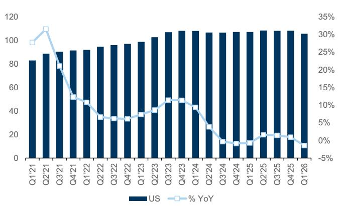  
Exhibit 1: US Monthly Active Users mm   
Source: SensorTower, Data compiled by Goldman Sachs Global Investment Research

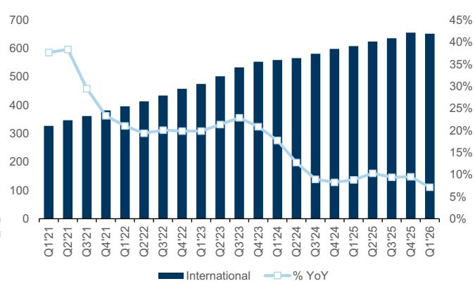  
Exhibit 2: International Monthly Active Users mm   
Source: SensorTower, Data compiled by Goldman Sachs Global Investment Research

The largest contributors to monthly active users (using global app MAU share as a proxy) continue to be the US, India and Brazil. During Q1 ‘26, we observed roughly stable share trends (measured by country MAUs as a $\%$ of total global MAUs) from the top 20 markets.

<table><tr><td>Country Share</td><td>2023</td><td>2024</td><td>2025</td><td>2026YTDChg（bps)</td><td></td></tr><tr><td>India</td><td>16%</td><td>16%</td><td>18%</td><td>18%</td><td>5β</td></tr><tr><td>United States</td><td>17%</td><td>16%</td><td>15%</td><td>14%</td><td>-66</td></tr><tr><td>Brazil</td><td>9%</td><td>9%</td><td>9%</td><td>8%</td><td>03</td></tr><tr><td>Indonesia</td><td>6%</td><td>7%</td><td>8%</td><td>8%</td><td></td></tr><tr><td>Mexico</td><td>6%</td><td>6%</td><td>6%</td><td>6%</td><td></td></tr><tr><td>Philippines</td><td>3%</td><td>3%</td><td>3%</td><td>3%</td><td></td></tr><tr><td>Germany</td><td>3%</td><td>3%</td><td>3%</td><td>3%</td><td></td></tr><tr><td>Turkey</td><td>3%</td><td>3%</td><td>3%</td><td>3%</td><td></td></tr><tr><td>United Kingdom</td><td>3%</td><td>3%</td><td>3%</td><td>2%</td><td>串</td></tr><tr><td>Pakistan</td><td>1%</td><td>2%</td><td>2%</td><td>2%</td><td>2</td></tr><tr><td>Colombia</td><td>2%</td><td>2%</td><td>2%</td><td>2%</td><td></td></tr><tr><td>Argentina</td><td>2%</td><td>2%</td><td>2%</td><td>2%</td><td></td></tr><tr><td>France</td><td>2%</td><td>2%</td><td>2%</td><td>2%</td><td></td></tr><tr><td>Egypt</td><td>1%</td><td>2%</td><td>2%</td><td>2%</td><td></td></tr><tr><td>Spain</td><td>2%</td><td>2%</td><td>2%</td><td>2%</td><td></td></tr><tr><td>Italy</td><td>2%</td><td>2%</td><td>2%</td><td>2%</td><td></td></tr><tr><td>Japan</td><td>2%</td><td>2%</td><td>1%</td><td>2%</td><td></td></tr><tr><td>South Africa</td><td>1%</td><td>1%</td><td>1%</td><td>1%</td><td></td></tr><tr><td>Canada</td><td>2%</td><td>2%</td><td>1%</td><td>1%</td><td></td></tr><tr><td>Thailand</td><td>1%</td><td>1%</td><td>1%</td><td>1%</td><td></td></tr><tr><td>RoW</td><td>17%</td><td>17%</td><td>16%</td><td>16%</td><td>2</td></tr></table>

Exhibit 3: Country Share of Global Spotify App MAUs %   

<table><tr><td colspan="10"></td><td colspan="7"></td></tr><tr><td>Jan-25</td><td>Feb-25</td><td>Mar-25</td><td>Apr-25</td><td></td><td>May-25</td><td>Jun-25</td><td>Jul-25Aug-25</td><td></td><td>Sep-25</td><td>Oct-25</td><td>Nov-25</td><td>Dec-25</td><td>Jan-26</td><td>Feb-26</td><td>Mar-26</td></tr><tr><td>17%</td><td></td><td>17%</td><td>17%</td><td>17%</td><td>18%</td><td>18%</td><td>18%</td><td>18%</td><td>19%</td><td>18%</td><td>18%</td><td>18%</td><td>18%</td><td>18%</td><td>18%</td></tr><tr><td>15%</td><td>15%</td><td></td><td>15%</td><td>15%</td><td>15%</td><td>15%</td><td>15%</td><td>15%</td><td>14%</td><td>14%</td><td>14%</td><td>14%</td><td>14%</td><td>14%</td><td>14%</td></tr><tr><td>9%</td><td></td><td>9%</td><td>9%</td><td>9%</td><td>9%</td><td>9%</td><td>8%</td><td>9%</td><td>9%</td><td>9%</td><td>9%</td><td>8%</td><td>8%</td><td>8%</td><td>8%</td></tr><tr><td>8%</td><td>8%</td><td></td><td>8%</td><td>8%</td><td>8%</td><td>8%</td><td>8%</td><td>8%</td><td>8%</td><td>8%</td><td>8%</td><td>8%</td><td>8%</td><td>8%</td><td>8%</td></tr><tr><td>6%</td><td>6%</td><td></td><td>6%</td><td>6%</td><td>6%</td><td>6%</td><td>5%</td><td>5%</td><td>5%</td><td>5%</td><td>6%</td><td>5%</td><td>6%</td><td>6%</td><td>6%</td></tr><tr><td>3%</td><td>3%</td><td></td><td>3%</td><td>3%</td><td>3%</td><td>3%</td><td>3%</td><td>3%</td><td>3%</td><td>3%</td><td>3%</td><td>3%</td><td>3%</td><td>3%</td><td></td></tr><tr><td>3%</td><td>3%</td><td></td><td>3%</td><td>3%</td><td>3%</td><td>3%</td><td>3%</td><td>3%</td><td>3%</td><td>3%</td><td>3%</td><td>3%</td><td>3%</td><td>3%</td><td></td></tr><tr><td>3%</td><td>3%</td><td></td><td>3%</td><td>3%</td><td>3%</td><td>3%</td><td>3%</td><td>3%</td><td>2%</td><td>3%</td><td>3%</td><td>3%</td><td>3%</td><td>3%</td><td></td></tr><tr><td>3%</td><td>3%</td><td></td><td>3%</td><td>3%</td><td>3%</td><td>3%</td><td>3%</td><td>3%</td><td>3%</td><td>2%</td><td>2%</td><td>2%</td><td>2%</td><td>2%</td><td></td></tr><tr><td>2%</td><td>2%</td><td></td><td>2%</td><td>2%</td><td>2%</td><td>2%</td><td>2%</td><td>2%</td><td>2%</td><td>2%</td><td>2%</td><td>2%</td><td>2%</td><td>2%</td><td></td></tr><tr><td>2%</td><td>2%</td><td></td><td>2%</td><td>2%</td><td>2%</td><td>2%</td><td>2%</td><td>2%</td><td>2%</td><td>2%</td><td>2%</td><td>2%</td><td>2%</td><td>2%</td><td></td></tr><tr><td>2%</td><td></td><td>2%</td><td>2%</td><td>2%</td><td>2%</td><td>2%</td><td>2%</td><td>2%</td><td>2%</td><td>2%</td><td>2%</td><td>2%</td><td>2%</td><td>2%</td><td></td></tr><tr><td>2%</td><td></td><td>2%</td><td>2%</td><td>2%</td><td>2%</td><td>2%</td><td>2%</td><td>2%</td><td>2%</td><td>2%</td><td>2%</td><td>2%</td><td>2%</td><td>2%</td><td></td></tr><tr><td>2%</td><td></td><td>2%</td><td>2%</td><td>2%</td><td>2%</td><td>2%</td><td>2%</td><td>2%</td><td>2%</td><td>2%</td><td>2%</td><td>2%</td><td>2%</td><td>2%</td><td></td></tr><tr><td>2%</td><td></td><td>2%</td><td>2%</td><td>2%</td><td>2%</td><td>2%</td><td>2%</td><td>2%</td><td>2%</td><td>2%</td><td>2%</td><td>2%</td><td>2%</td><td>2%</td><td></td></tr><tr><td>2%</td><td></td><td>2%</td><td>2%</td><td>2%</td><td>2%</td><td>2%</td><td>2%</td><td>2%</td><td>2%</td><td>2%</td><td>1%</td><td>1%</td><td>2%</td><td>2%</td><td></td></tr><tr><td>1%</td><td></td><td>1%</td><td>1%</td><td>1%</td><td>1%</td><td>1%</td><td>1%</td><td>1%</td><td>1%</td><td>1%</td><td>1%</td><td>1%</td><td>1%</td><td>2%</td><td></td></tr><tr><td>1%</td><td></td><td>1%</td><td>1%</td><td>1%</td><td>1%</td><td>1%</td><td>2%</td><td>2%</td><td>2%</td><td>2%</td><td>2%</td><td>1%</td><td>1%</td><td>1%</td><td></td></tr><tr><td>1%</td><td></td><td>1%</td><td>1%</td><td>1%</td><td>1%</td><td>1%</td><td>1%</td><td>1%</td><td>1%</td><td>1%</td><td>1%</td><td>1%</td><td>1%</td><td>1%</td><td></td></tr><tr><td>1%</td><td></td><td>1%</td><td>1%</td><td>1%</td><td>1%</td><td>1%</td><td>1%</td><td>1%</td><td>1%</td><td>1%</td><td>1%</td><td>1%</td><td>1%</td><td>1%</td><td>1%</td></tr><tr><td>17%</td><td>16%</td><td></td><td>16%</td><td>16%</td><td>16%</td><td>16%</td><td>16%</td><td>16%</td><td>16%</td><td>16%</td><td>16%</td><td>16%</td><td>16%</td><td>16%</td><td>16%</td></tr></table>

Exhibit 4: Spotify App MAUs in mm   

<table><tr><td rowspan="2">Spotify Markets</td><td colspan="3">AppMAUs (mm)</td><td rowspan="2"></td><td colspan="2">AppMAUs (mm)</td></tr><tr><td>Q1&#x27;26</td><td>Q4&#x27;25</td><td>Q1&#x27;25</td><td>QoQ</td><td>YoY</td></tr><tr><td>India</td><td>139.2</td><td>140.2</td><td>121.1</td><td>-1%</td><td>15%</td><td></td></tr><tr><td>United States</td><td>105.7</td><td>108.2</td><td>107.2</td><td>-2%</td><td>-1%</td><td></td></tr><tr><td>Brazil</td><td>63.8</td><td>64.9</td><td>62.0</td><td>-2%</td><td>3%</td><td></td></tr><tr><td>Indonesia</td><td>62.6</td><td>63.3</td><td>57.0</td><td>-1%</td><td>10%</td><td></td></tr><tr><td>Mexico</td><td>42.0</td><td>41.8</td><td>41.5</td><td>0%</td><td>1%</td><td></td></tr><tr><td>Philippines</td><td>22.8</td><td>23.5</td><td>21.9</td><td>-3%</td><td>4%</td><td></td></tr><tr><td>Germany</td><td>21.1</td><td>21.2</td><td>20.8</td><td>-1%</td><td>1%</td><td></td></tr><tr><td>Turkey</td><td>添 19.3</td><td>19.4</td><td>19.0</td><td>-1%</td><td>2%</td><td>-16</td></tr><tr><td>United Kingdom</td><td>18.6</td><td>18.9</td><td>18.6</td><td>-2%</td><td>0%</td><td></td></tr><tr><td>Pakistan</td><td>17.7</td><td>17.5</td><td>13.3</td><td>1%</td><td>33%</td><td></td></tr><tr><td>Colombia</td><td>14.9</td><td>15.2</td><td>14.0</td><td>-2%</td><td>6%</td><td></td></tr><tr><td>Argentina</td><td>13.8</td><td>14.3</td><td>14.0</td><td>-3%</td><td>-1%</td><td></td></tr><tr><td>France</td><td>13.7</td><td>14.0</td><td>14.0</td><td>-2%</td><td>-2%</td><td></td></tr><tr><td>Egypt</td><td>13.6</td><td>14.3</td><td>12.4</td><td>-5%</td><td>10%</td><td></td></tr><tr><td>Spain</td><td>12.1</td><td>12.2</td><td>11.9</td><td>0%</td><td>2%</td><td></td></tr><tr><td>Italy</td><td>11.5</td><td>11.5</td><td>11.5</td><td>0%</td><td>0%</td><td></td></tr><tr><td>Japan</td><td>11.4</td><td>11.0</td><td>10.3</td><td>4%</td><td>10%</td><td></td></tr><tr><td>South Africa</td><td>11.2</td><td>11.4</td><td>10.3</td><td>-2%</td><td>8%</td><td></td></tr><tr><td>Canada</td><td>10.3</td><td>10.6</td><td>10.4</td><td>-3%</td><td>0%</td><td></td></tr><tr><td>Thailand</td><td>8.2</td><td>8.0</td><td>6.8</td><td>2%</td><td>19%</td><td></td></tr><tr><td colspan="2">US Competitors</td><td></td><td></td><td></td><td></td><td></td></tr><tr><td>Amazon</td><td>16.6</td><td>17.0</td><td>15.9</td><td></td><td>-3%</td><td>4%</td></tr><tr><td>Apple Music</td><td>3.1</td><td>2.8</td><td>2.4</td><td>11%</td><td>33%</td><td></td></tr><tr><td>Deezer</td><td>0.4</td><td>0.3</td><td>0.3</td><td>28%</td><td>39%</td><td></td></tr><tr><td>Napster</td><td>0.0</td><td>0.0</td><td>0.1</td><td>-62%</td><td>-88%</td><td></td></tr><tr><td>Pandora</td><td>36.5</td><td>37.2</td><td>38.9</td><td>-2%</td><td>-6%</td><td></td></tr><tr><td>SiriusXM</td><td>6.8</td><td>7.6</td><td>7.1</td><td>-10%</td><td>-5%</td><td></td></tr><tr><td>SoundCloud</td><td>11.0</td><td>12.1</td><td>14.0</td><td>-9%</td><td>-21%</td><td></td></tr><tr><td>Spotify</td><td>105.7</td><td>108.2</td><td>107.2</td><td>-2%</td><td>-1%</td><td></td></tr><tr><td>YouTube Music</td><td>60.2</td><td>62.6</td><td>61.2</td><td>-4%</td><td>-2%</td><td>-16</td></tr></table>

Source: SensorTower, Data compiled by Goldman Sachs Global Investment Research

# Spotify’s Share of Overall Time Spent Remained Stable During Q1 ‘26

We look at Spotify’s total time spent over the past few years relative to its competitors. As seen below, Spotify’s share of total time spent remained relatively stable at $\sim 5 0 \%$ in Q1’26.

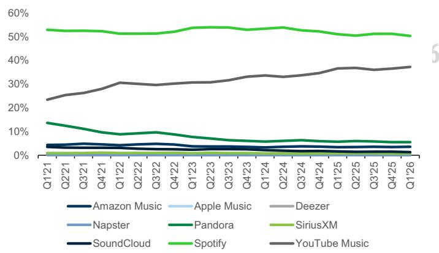  
Exhibit 5: Worldwide Streaming Services - Total Time Spent Market Share

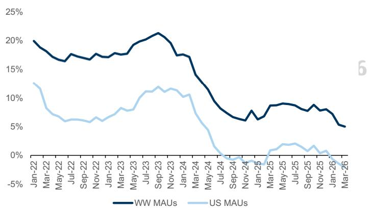  
Exhibit 6: Spotify Global & US Monthly Active Users YoY Growth   
订阅研报添加微信 LCD123321Cad 0Source: SensorTower, Data compiled by Goldman Sachs Global Investment Research

We look at the DAU/MAU ratio across the audio music space and note that Spotify has the highest ratio among its peers (at 0.54 in Q1’26 and averaging ${ \sim } 0 . 5 5$ over the past 3 years) pointing to a loyal and engaged audience base.

Exhibit 7: DAU/MAU ratio among key peers   

<table><tr><td colspan="5">Average DAU/MAU Ratio</td></tr><tr><td></td><td>2022</td><td>2023 2024</td><td>2025</td><td>2026 YTD</td></tr><tr><td>Amazon Music</td><td>0.29</td><td>0.28 0.29</td><td>0.31</td><td>0.31</td></tr><tr><td>Apple Music</td><td>0.30</td><td>0.34 0.34</td><td>0.35</td><td>0.35</td></tr><tr><td>Deezer</td><td>0.29</td><td>0.35 0.34</td><td>0.31</td><td>0.36</td></tr><tr><td>Napster</td><td>0.37</td><td>0.44 0.45</td><td>0.32</td><td>0.21</td></tr><tr><td>Pandora</td><td>0.28</td><td>0.28 0.27</td><td>0.28</td><td>0.27</td></tr><tr><td>SiriusXM</td><td>0.19</td><td>0.19 0.19</td><td>0.21</td><td>0.20</td></tr><tr><td>SoundCloud</td><td>0.21</td><td>0.24 0.22</td><td>0.21</td><td>0.21</td></tr><tr><td>Spotify</td><td>0.53</td><td>0.55 0.55</td><td>0.55</td><td>0.54</td></tr><tr><td>Youtube Music</td><td>0.32</td><td>0.35 0.34</td><td>0.35</td><td>0.36</td></tr></table>

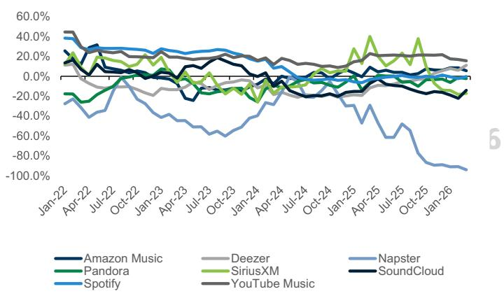  
Exhibit 9: Global Session Count Growth YoY   
Source: SensorTower, Data compiled by Goldman Sachs Global Investment Research

In addition to mobile app insights from SensorTower, we leverage Similarweb data to track website traffic trends in the US. The US audio streaming space has seen relatively stable trends and flat growth in website traffic (total desktop and mobile visits to a 订阅研报添加微信 LCD123321Cad 04-16 website) and in the number of unique visitors over the last 24 months. The mix of New and Returning Visitors (the percentages of unique visitors that did/did not visit a given website within three months) remained varied across operators in Q1’26 and Spotify’s visitor mix remains slightly skewed to Returning Users $5 2 \%$ vs. $4 8 \%$ New Users), though the company saw a $\sim 1 . 5 \%$ QoQ increase in New Users and a slight decline $( \sim 1 \% 0 0 0 )$ in Returning Users.

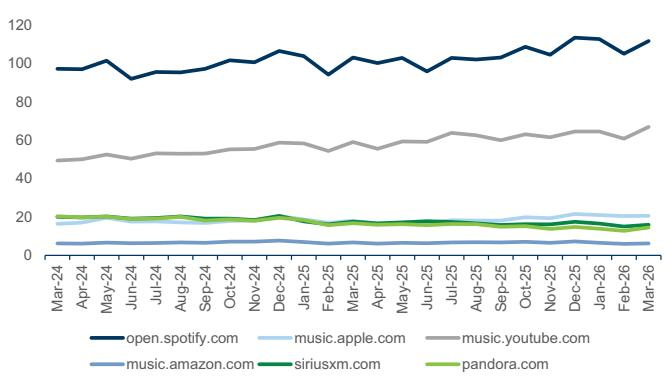  
Exhibit 10: US Number of Website Visits mn

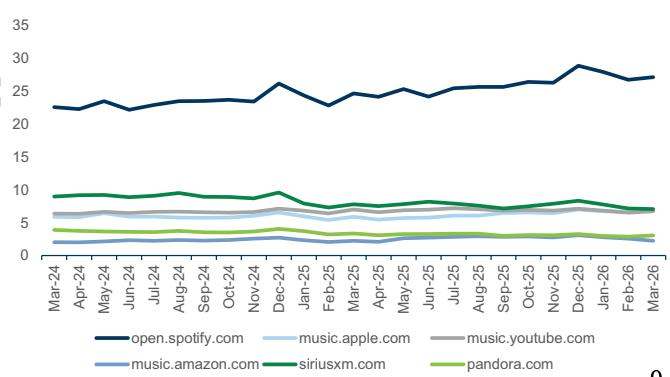  
Exhibit 11: US Number of Unique Website Visitors mn

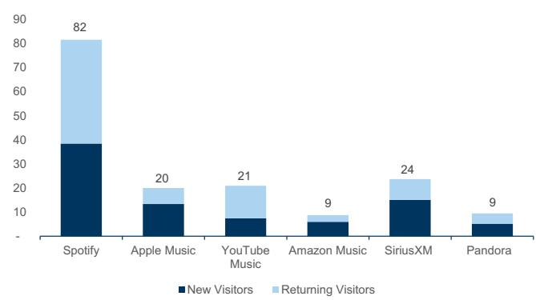  
Exhibit 12: Q1’26 US New and Returning Visitors to Websites

Source: Similarweb, Data compiled by Goldman Sachs Global Investment Research

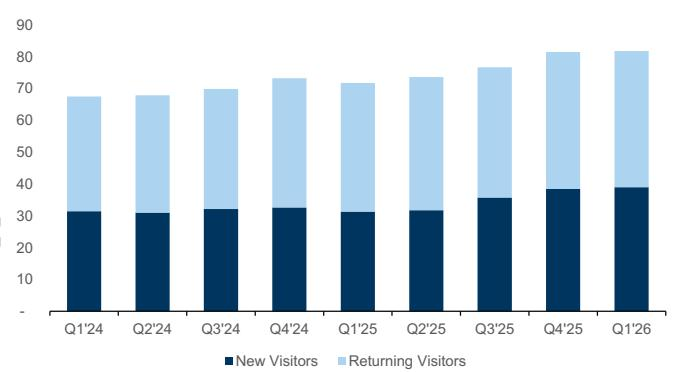  
Exhibit 13: Spotify New vs. Returning Visitor Mix Unique Visitors to open.spotify.com, mn

Source: Similarweb, Data compiled by Goldman Sachs Global Investment Research

We make minimal changes to our forward operating estimates aside from a) updating our assumed fully-diluted share count and value of investments & JVs (both of which to reflect the company’s most recent disclosure); & b) refreshing current USD/EUR spot rates.

# 订阅研报添加微信 LCD123321Cad 04-16

While we do not factor it into our forecasts, we would highlight the potential benefit of lower than expected social charges in Q1 as a possible tailwind to reported Q1 GAAP operating income vs. guidance. In its Q4 earnings report, management disclosed that: a) a $10 \%$ move in the stock price in Q1 would result in $\yen 30 m$ of additional social charges; & b) embedded in its Q1 GAAP operating income guidance was total social charges of $\sim \in \mathsf { 1 0 m }$ . Based on our analysis of average SPOT stock prices and EUR/USD exchange rates in Q1, we estimate SPOT could report a $\sim \in ( 4 0 )  { \mathrm { m } }$ benefit from lower social charges, or a net $\mathord { \sim } \in ( 5 0 ) \mathrm { m }$ tailwind vs. company guidance, similar to the benefit reported in Q4’25. We’d note this is meant to be illustrative (as there are a number of additional factors that could impact SPOT’s ultimate reported social charges) but highlight as a directional measure that could impact Q1 results.

# GS Estimate Changes

# Exhibit 14: SPOT - Summary of Estimates Changes

$\$ 1 m m$ , except per share data

<table><tr><td colspan="5">Q12026</td><td colspan="5">2026</td><td colspan="5">2027</td><td colspan="3">2028</td></tr><tr><td></td><td>old</td><td></td><td>New</td><td>%Change</td><td>Guidance</td><td></td><td>Old</td><td>New</td><td>%Change</td><td>Old</td><td></td><td>New</td><td>%Change</td><td></td><td>old</td><td>New</td><td>%Change</td></tr><tr><td>Revenue</td><td>€</td><td>4,503€</td><td>4,503</td><td>0.0%</td><td>€4,500m</td><td></td><td>19,091</td><td>19,091</td><td>0.0%</td><td>€</td><td>21,556</td><td>21,556</td><td>0.0%</td><td>€</td><td>24,008</td><td>€ 24,008</td><td>0.0%</td></tr><tr><td>Premium</td><td>€</td><td>4,099 €</td><td>4,099</td><td>0.0%</td><td></td><td>€</td><td>17,137 €</td><td>17,137</td><td>0.0%</td><td>€</td><td>19,338</td><td>19,338</td><td>0.0%</td><td>€</td><td>21,514 €</td><td>21,514</td><td>0.0%</td></tr><tr><td>Ad-supported</td><td>€</td><td>404 €</td><td>404</td><td>0.0%</td><td></td><td>€</td><td>1,953 €</td><td>1,953</td><td>0.0%</td><td>E</td><td>2.218 €</td><td>2,218</td><td>0.0%</td><td>€</td><td>2,494 €</td><td>2,494</td><td>0.0%</td></tr><tr><td>Premium subs</td><td></td><td>293.0</td><td>293.0</td><td>0.0%</td><td>293m</td><td></td><td>309.5</td><td>309.5</td><td>0.0%</td><td></td><td>329.2</td><td>329.2</td><td>0.0%</td><td></td><td>346.9</td><td>346.9</td><td>0.0%</td></tr><tr><td>Net adds</td><td></td><td>3.0</td><td>3.0</td><td>0.0</td><td></td><td></td><td>19.5</td><td>19.5</td><td>0.0</td><td></td><td>19.7</td><td>19.7</td><td>0.0</td><td></td><td>17.7</td><td>17.7</td><td>0.0</td></tr><tr><td>Premium ARPU</td><td>€</td><td>4.69</td><td>4.69</td><td>0.0%</td><td></td><td>€</td><td>4.76 €</td><td>4.76</td><td>0.0%</td><td>€</td><td>5.05 €</td><td>5.05</td><td>0.0%</td><td>€</td><td>5.30 €</td><td>5.30</td><td>0.0%</td></tr><tr><td>Ad-supported users</td><td></td><td>472.4</td><td>472.4</td><td>0.0%</td><td></td><td></td><td>516.9</td><td>516.9</td><td>0.0%</td><td></td><td>556.4</td><td>556.4</td><td>0.0%</td><td></td><td>594.4</td><td>594.4</td><td>0.0%</td></tr><tr><td>Net adds</td><td></td><td>-3.6</td><td>-3.6</td><td>0.0</td><td></td><td></td><td>40.9</td><td>40.9</td><td>0.0</td><td></td><td>39.5</td><td>39.5</td><td>0.0</td><td></td><td>38.0</td><td>38.0</td><td>0.0</td></tr><tr><td>MAUs</td><td></td><td>759.0</td><td>759.0</td><td>0.0%</td><td>759m</td><td></td><td>817.5</td><td>817.5</td><td>0.0%</td><td></td><td>882.0</td><td>882.0</td><td>0.0%</td><td></td><td>944.5</td><td>944.5</td><td>0.0%</td></tr><tr><td>MAU net adds</td><td></td><td>8.0</td><td>8.0</td><td>0.0</td><td></td><td></td><td>66.5</td><td>66.5</td><td>0.0</td><td></td><td>64.5</td><td>64.5</td><td>0.0</td><td></td><td>62.5</td><td>62.5</td><td>0.0</td></tr><tr><td>Gross Profit</td><td>€</td><td>1,468 €</td><td>1,468</td><td>0.0%</td><td></td><td>€</td><td>6,302 €</td><td>6,302</td><td>0.0%</td><td></td><td>7,333 €</td><td>7,333</td><td>0.0%</td><td>€</td><td>8,404 €</td><td>8,404</td><td>0.0%</td></tr><tr><td>% Gross Margin</td><td></td><td>32.6%</td><td>32.6%</td><td>0 bps</td><td>32.8%</td><td></td><td>33.0%</td><td>33.0%</td><td>0bps</td><td></td><td>34.0%</td><td>34.0%</td><td>0 bps</td><td></td><td>35.0%</td><td>35.0%</td><td>0bps</td></tr><tr><td>Operating Income</td><td></td><td>659€</td><td>659</td><td>0.0%</td><td>€660m</td><td></td><td>2,830 €</td><td>2,830</td><td>0.0%</td><td>€</td><td>3,647€</td><td>3,647</td><td>0.0%</td><td>€</td><td>4,504 €</td><td>4,504</td><td>0.0%</td></tr><tr><td>% OI Margin</td><td></td><td>14.6%</td><td>14.6%</td><td>0 bps</td><td></td><td></td><td>14.8%</td><td>14.8%</td><td>0bps</td><td></td><td>16.9%</td><td>16.9%</td><td>0bps</td><td></td><td>18.8%</td><td>18.8%</td><td>0bps</td></tr><tr><td>FCF</td><td>€</td><td>366 €</td><td>366</td><td>0.0%</td><td></td><td>€</td><td>3,333 €</td><td>3,333</td><td>0.0%</td><td>€</td><td>3.671 €</td><td>3,671</td><td>0.0%</td><td>€</td><td>4,527 €</td><td>4,527</td><td>0.0%1</td></tr><tr><td>EPS</td><td>€</td><td>2.78€</td><td>2.78</td><td>-0.2%</td><td></td><td>€</td><td>12.37</td><td>12.35</td><td>-0.2%</td><td>€</td><td>15.97 €</td><td>15.94</td><td>-0.2%</td><td>€</td><td>19.21 €</td><td>19.18</td><td>-0.2%</td></tr></table>

# GS vs. Consensus

Exhibit 15: SPOT - GSe vs. Visible Alpha Consensus $\$ 1 m m$ , except per share data   

<table><tr><td colspan="4">Q12026</td><td colspan="5">2026 % GS vs.</td><td colspan="5">% GS vs.</td></tr><tr><td></td><td>GS Est</td><td></td><td>Cons Est</td><td>Cons</td><td>Guidance</td><td>GS Est</td><td></td><td>Cons Est</td><td>Cons</td><td>GS Est</td><td></td><td>Cons Est</td><td>% GS vs. Cons</td></tr><tr><td>Revenue</td><td>€</td><td>4,503</td><td>€ 4,528</td><td>-0.6%</td><td>€4,500m</td><td>€</td><td>19,091 €</td><td>19,478</td><td>-2.0%</td><td>€</td><td>21,556</td><td>€ 22,138</td><td>-2.6%</td></tr><tr><td>Premium</td><td>€</td><td>4,099 €</td><td>4,112</td><td>-0.3%</td><td></td><td>€</td><td>17,137 €</td><td>17,478</td><td>-1.9%</td><td>€</td><td>19,338 €</td><td>19,850</td><td>-2.6%</td></tr><tr><td>Ad-supported</td><td>€</td><td>404 €</td><td>418</td><td>-3.2%</td><td></td><td>€</td><td>1,953 €</td><td>1,996</td><td>-2.2%</td><td>€</td><td>2,218 €</td><td>2,272</td><td>-2.4%</td></tr><tr><td>Premium subs</td><td></td><td>293.0</td><td>293.3</td><td>-0.1%</td><td>293m</td><td></td><td>309.5</td><td>315.4</td><td>-1.9%</td><td></td><td>329.2</td><td>339.2</td><td>-2.9%</td></tr><tr><td>Net adds</td><td></td><td>3.0</td><td>3.3</td><td>-0.3</td><td></td><td></td><td>19.5</td><td>25.4</td><td>-5.9</td><td></td><td>19.7</td><td>23.8</td><td>-4.1</td></tr><tr><td>Premium ARPU</td><td>€</td><td>4.69 €</td><td>4.70</td><td>-0.3%</td><td></td><td>€</td><td>4.76 €</td><td>4.81</td><td>-1.0%</td><td>€</td><td>5.05 €</td><td>5.05</td><td>-0.2%</td></tr><tr><td>Ad-supported users</td><td></td><td>472.4</td><td>479.0</td><td>-1.4%</td><td></td><td></td><td>516.9</td><td>517.5</td><td>-0.1%</td><td></td><td>556.4</td><td>556.4</td><td>0.0%</td></tr><tr><td>Netadds</td><td></td><td>-3.6</td><td>3.0</td><td>-6.6</td><td></td><td></td><td>40.9</td><td>41.5</td><td>-0.6</td><td></td><td>39.5</td><td>38.9</td><td>0.5</td></tr><tr><td>MAUs</td><td></td><td>759.0</td><td>759.6</td><td>-0.1%</td><td>759m</td><td></td><td>817.5</td><td>818.2</td><td>-0.1%</td><td></td><td>882.0</td><td>881.1</td><td>0.1%</td></tr><tr><td>MAU net adds</td><td></td><td>8.0</td><td>8.6</td><td>-0.6</td><td></td><td></td><td>66.5</td><td>67.2</td><td>-0.7</td><td></td><td>64.5</td><td>62.9</td><td>1.6</td></tr><tr><td>Gross Profit</td><td>€</td><td>1,468 €</td><td>1,486</td><td>-1.2%</td><td></td><td>€</td><td>6,302 €</td><td>6,491</td><td>-2.9%</td><td>€</td><td>7,333 €</td><td>7,574</td><td>-3.2%</td></tr><tr><td>% Gross Margin</td><td></td><td>32.6%</td><td>32.8%</td><td>-22 bps</td><td>32.8%</td><td></td><td>33.0%</td><td>33.3%</td><td>-32 bps</td><td></td><td>34.0%</td><td>34.2%</td><td>-20 bps</td></tr><tr><td>Operating Income</td><td>€</td><td>659 €</td><td>679</td><td>-2.9%</td><td>€660m</td><td>€</td><td>2,830 €</td><td>3,045</td><td>-7.1%</td><td>€</td><td>3,647 €</td><td>3,876</td><td>-5.9%</td></tr><tr><td>% OI Margin</td><td></td><td>14.6%</td><td>15.0%</td><td>-36bps</td><td></td><td></td><td>14.8%</td><td>15.6%</td><td>-81bps</td><td></td><td>16.9%</td><td>17.5%</td><td>-59 bps</td></tr><tr><td>EPS</td><td>€</td><td>2.78€</td><td>2.88</td><td>-3.5%</td><td></td><td>€</td><td>12.35</td><td>12.99</td><td>-4.9%</td><td>€</td><td>15.94€</td><td>16.10</td><td>-1.0%</td></tr></table>

Source: Company data, Goldman Sachs Global Investment Research, Visible Alpha Consensus Data

Our $\$ 670$ , $_ { 1 2 - m }$ price target (unchanged) is based on an equal blend of: (1) EV/GAAP EBITDA applied to our $\mathsf { N T M } + \mathrm { \ } \mathrm { \ } \mathrm { \ } \mathrm { \ } \mathrm { \ } \mathrm { \ } \mathrm { \ \ }$ year estimates and; (2) a modified DCF using EV/FCF-SBC multiple applied to our NTM $^ { + 4 }$ years estimates discounted back 3 years. Specifically:

30.0x EV/GAAP EBITDA (unchanged) or 1.08x EV/GAAP EBITDA-to-growth (unchanged) applied to our $\mathsf { N T M } + \mathit { 1 }$ year estimates.

26.0x EV/FCF-SBC (from $2 5 . 0 \times$ prior) or 1.41x EV/FCF-SBC-to-growth (from 1.36x 订阅研报添加微信 prior) applied to our NTM $^ { + 4 }$ D123321Cad 04-16  years estimates discounted back 3 years at a discount rate of $12 \%$ (unchanged). We raise our absolute multiple to maintain our prior $\sim 1 . 3 5 \substack { - 1 . 4 0 \times }$ multiple-to-growth. The discount rate represents CAPM using the blended average of companies within our coverage universe consisting of: (1) $3 \%$ risk free rate (based on the normalized 10-year rate); (2) average beta of $\sim 1 . 3$ ; (3) equity risk premium of $7 \%$ .

# Exhibit 16: SPOT Price Target Analysis

$\$ 1 m m$ , except per-share data

<table><tr><td rowspan="3">Scenario Analysis Valuation</td><td colspan="2">Downside</td><td rowspan="3"></td><td colspan="2">Base</td></tr><tr><td>$</td><td>365 $</td><td>670</td><td>Upside 770</td></tr><tr><td></td><td>-29%</td><td>31%</td><td>$</td></tr><tr><td>%upside/downside GAAP EBITDA (NTM)</td><td>E</td><td>2,291</td><td>2,948</td><td>€</td><td>51% 3,055</td></tr><tr><td>EBITDA Margin %</td><td></td><td>12.0%</td><td>€</td><td>15.4%</td><td>16.0%</td></tr><tr><td>GAAP EBITDA (NTM+1year)</td><td>€</td><td>3,233</td><td>€</td><td>3,761</td><td>3,826</td></tr><tr><td>EBITDA Margin %</td><td></td><td>15.0%</td><td></td><td>17.4%</td><td>17.8%</td></tr><tr><td>EV/EBITDA</td><td></td><td>18.0x</td><td></td><td>30.0x</td><td>32.0x</td></tr><tr><td>EBITDA CAGR</td><td></td><td>18.6%</td><td></td><td>27.9%</td><td>29.0%</td></tr><tr><td>EV/EBITDA to Growth</td><td></td><td>0.97x</td><td></td><td>1.08x</td><td>1.10x</td></tr><tr><td>Enterprise Value</td><td>€</td><td>58,202</td><td>€</td><td>112,834 €</td><td>122,440</td></tr><tr><td>FCF-SBC (NTM+4 yrs)</td><td>€</td><td>4,962</td><td>€</td><td>5,614</td><td>5,838</td></tr><tr><td>FCF-SBC % of Sales</td><td></td><td>17.0%</td><td></td><td>€ 19.2%</td><td>20.0%</td></tr><tr><td>EV/FCF-SBC</td><td></td><td>16.0x</td><td></td><td>26.0x</td><td>30.0x</td></tr><tr><td>FCF-SBC CAGR</td><td></td><td>13.6%</td><td></td><td>18.4%</td><td>19.9%</td></tr><tr><td>EV/FCF-SBC-to-Growth</td><td></td><td>1.18x</td><td></td><td>1.41x</td><td>1.50x</td></tr><tr><td>Discount Rate</td><td></td><td>15.0%</td><td></td><td>12.0%</td><td>10.0%</td></tr><tr><td>Discount Period (Years)</td><td></td><td>3</td><td></td><td>3</td><td>3</td></tr><tr><td>Enterprise Value (NTM+ 3 years)</td><td>€</td><td>79,394</td><td>€</td><td>145,970</td><td>175,134</td></tr><tr><td>Discounted Enterprise Value (NTM)</td><td>€</td><td>52,203</td><td>€</td><td>103,899</td><td>131,581</td></tr><tr><td>Weightings</td><td></td><td></td><td></td><td></td><td></td></tr><tr><td>EV derived from GAAP EBITDA</td><td></td><td>50%</td><td></td><td>50%</td><td>50%</td></tr><tr><td>EV derived from (FCF-SBC)</td><td></td><td>50%</td><td></td><td>50%</td><td>50%</td></tr><tr><td>Enterprise Value</td><td>€</td><td>55,202</td><td>€</td><td>108,366 € $</td><td>127,010</td></tr><tr><td>Enterprise Value ($)</td><td>$</td><td>64,744</td><td>$</td><td>127,097</td><td>148,964</td></tr><tr><td>Capital Structure Adjustments</td><td></td><td></td><td></td><td></td><td></td></tr><tr><td>Adjusted Net Debt- NTM Ending</td><td>€</td><td>(10,342)</td><td>€</td><td>(10,342) €</td><td>(10,342)</td></tr><tr><td>Adjusted Net Debt ($)- NTM Ending</td><td>$</td><td>(12,130)</td><td>$</td><td>(12,130) $</td><td>(12,130)</td></tr><tr><td>Investments &amp; JVs ($)</td><td>$</td><td></td><td>$</td><td>2,174 $</td><td>2,174</td></tr><tr><td>Adjusted Shares Outstanding</td><td></td><td>212</td><td></td><td>212</td><td>212</td></tr></table>

<table><tr><td rowspan="2">Investments&amp;JVs</td><td colspan="2">Carrying</td><td rowspan="2">Discount Rate</td><td colspan="2">Discounted Value</td></tr><tr><td colspan="2">Value</td><td colspan="2"></td></tr><tr><td>TMEGroup</td><td>€</td><td>2,111</td><td>15%</td><td>€</td><td>1,794</td></tr><tr><td>Other LT Investments</td><td>€</td><td>70</td><td>15%</td><td>€</td><td>60</td></tr><tr><td></td><td></td><td></td><td></td><td>€</td><td>1,854</td></tr></table>

Value of SPOT’s investments based on reported carrying value of SPOT’s stake as of latest company filings