# Technology

# Rise of the AI Agent – Global Implications

April 19, 2026 08:01 PM GMT The agentic AI shift isn't only about more raw performance; it' about more coordination, with the CPU increasingly determin how well AI systems run. The next phase of AI infrastructure 33 smarter allocation across the whole stack, where CPU, found memory, substrates and equipment become the bottleneck.

# Key Takeaways

Agentic AI widens the trade beyond GPUs, with CPUs becoming the control p for multi-step workflows and system orchestration.

□ We estimate $\$ 32.5 – 606n$ incremental CPU TAM by 2030 within a total server CPU TAM of $\$ 100 b n +$ , driven by agentic workloads.

Memory becomes a key monetization leg, with agentic AI driving 26-77% of incremental DRAM demand by 2030.

Supply-constrained enablers (foundry, ABF, BMC, interconnect) should captu outsized economics as system complexity rises.

The beneficiaries are full-stack and global, spanning CPU, memory, substrates infrastructure ICs and equipment.

Agentic AI marks a structural shift from compute to orchestration: While GP demand remains strong, each model call now requires more coordination, mem and system-level compute, widening the AI spend pool beyond accelerators to C and the broader infrastructure stack. As AI transitions from generation to autonomous action, the computing bottleneck is shifting towards CPU and mem driving a step-change in general-purpose compute intensity.

Quantifying the incremental CPU TAM: We introduce a new framework to size opportunity across compute and memory. CPU-side orchestration can account f $5 0 . 9 0 \%$ of total workload latency, materially increasing CPU intensity at the sys level. We estimate $\$ 32.5$ -60bn of incremental CPU TAM by 2030, within a total server CPU TAM of $\$ 100 b n +$ , and 15-45EB of incremental DRAM demand.

订阅研报添加微信 LCD12332 Architecture shift drives system-level content growth: Agentic workloads req CPU-centric or hybrid architectures to manage multi-step reasoning, tool execut and memory orchestration. The CPU-to-GPU ratio rises at the cluster level, and memory evolves from a passive storage layer into an active system component, supporting persistent context and continuous learning. As a result, content increases structurally across CPUs, DRAM and the broader infrastructure stack, including foundry, ABF substrates and interconnect layers.

Exposure to the theme: The opportunity extends beyond individual chips to the AI system. The beneficiaries of this shift are global and full-stack – see Exhibit 1

# Table of Contents

# Table of Contents

Our Thesis in 6 Charts 5   
The Shift to Agentic AI in Numbers 6   
Executive Summary 7   
Changing Tides – From Generative AI to Agentic AI 8   
Global Perspective 订阅研报添加微信 LCD123321Cad 04-20 16   
Growing the CPU Opportunity 23   
Agentic AI Memory Opportunity 29   
ABF Substrate – Still Early Innings 33   
More CPU Sockets Will Be Needed 38   
Passive Components TAM Will Also Grow 39   
Greater China Semiconductor: Foundry, Design Service and IC Design –   
Seizing the CPU (Agentic AI) Opportunity 40   
Earnings Revisions and Price Target Changes 50   
Appendix – CPU vs. GPU, Inference vs. Agent 62

#

MORGAN STANLEY & CO. INTERNATIONAL PLC+

# Shawn Kim

Equity Analyst +44 20 7677-1018

# MORGAN STANLEY & CO. INTERNATIONAL PLC+

信 LCDEquity Analyst+44 207425-3378

MORGAN STANLEY & CO. LLC

# Joseph Moore

Equity Analyst

MORGAN STANLEY TAIWAN LIMITED+

# Charlie Chan

MORGAN STANLEY & CO. LLC

# Erik W Woodring

Equity Analyst +886 2 2730-1725

MORGAN STANLEY TAIWAN LIMITED+

Equity Analyst +1 212 296-8083

Daniel Yen, CFA Equity Analyst +886 2 2730-2863

MORGAN STANLEY TAIWAN LIMITED+

Howard Kao

Equity Analyst +886 2 2730-2989

MORGAN STANLEY TAIWAN LIMITED+

# Sharon Shih

Equity Analyst +886 2 2730-2865 MORGAN STANLEY TAIWAN LIMITED+

Derrick Yang   
Equity Analyst   
+886 2 2730-2862   
MORGAN STANLEY & CO. INTERNATIONAL PLC+

MORGAN STANLEY & CO. INTERNATIONAL PLC+

Nigel van Putten   
Equity Analyst   
+44 20 7425-2803   
MORGAN STANLEY ASIA LIMITED+

MORGAN STANLEY & CO. INTERNATIONAL PLC+

Equity Analyst   
+44 20 7425-2915   
MORGAN STANLEY &CO.INTERNATIONAL PLC,SEOUL BRANCH+

# Amelia M Scicluna

Research Associate   
+44 20 7425-6694   
MORGAN STANLEY MUFG SECURITIES CO., LTD.+

# Duan Liu

Equity Analyst +852 2239-7357

# 信 LC

Equity Analyst +82 2 399-4939

#

Equity Analyst +81 3 6836-8404

MORGAN STANLEY MUFG SECURITIES CO,LTD.+   
Kazuo Yoshikawa, CFA   
Equity Analyst   
+81 3 6836-8408   
MORGAN STANLEY MUFG SECURITIES CO., LTD.+   
Yoshihito Hasegawa   
Equity Analyst   
+81 3 6836-8910

MORGAN STANLEY MUFG SECURITIES CO., LTD.+

Suzune Tamura, CFA   
Equity Analyst   
+813 6836-8891

MORGAN STANLEY MUFG SECURITIES CO. LTD.+

# Hidetaka Suzuki

MORGAN STANLEY & CO. LLC

# Shane Brett

MORGAN STANLEY& CO.LLC

# Mason Wayne

Research Associate +81 3 6836-8402

Equity Analyst

Research Associate

MORGAN STANLEY & CO. LLC

# Nicole Kozhukhov

MORGAN STANLEY & CO. LLC

# Ella Tulchinsky

MORGAN STANLEY & CO. LLC

# Dylan Liu

Research Associate

Research Associate +1 212 761-2222

Research Associate +1 212 761-4519

MORGAN STANLEY ASIA LIMITED+

Daisy Dai, CFA

MORGAN STANLEY TAIWAN LIMITED+

# 信 LC

MORGAN STANLEY TAIWAN LIMITED+

Equity Analyst +852 2848-7310

Equity Analyst +886 27712-3032

MORGAN STANLEY TAIWAN LIMITED+

MORGAN STANLEY TAIWAN LIMITED+

# Samantha Chen

MORGAN STANLEY TAIWAN LIMITED+

# Vivi Huang

Irene Yen Research Associate +886 2 2730-2869

Research Associate +886 2 2730-2876

Research Associate +886 2 2730-2860

# Our Thesis in 6 Charts

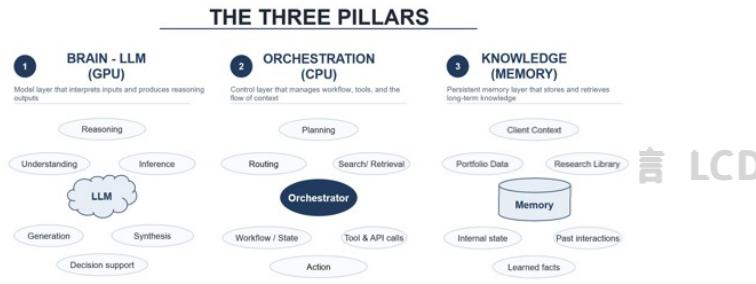  
Exhibit 2: AI transitions from 'generation' to 'autonomous' action in agentic AI   
Source: Morgan Stanley Research   
Exhibit 3: Cluster-level CPU:GPU intensity rises as AI moves from reasoning to action

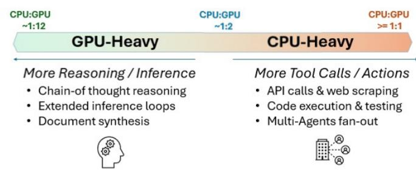  
Source: Morgan Stanley Research

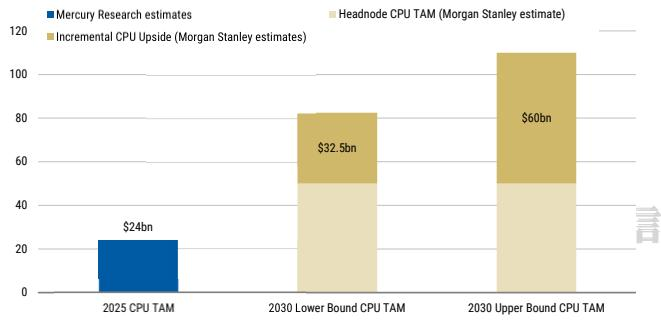  
Exhibit 4: Agentic AI could add $\$ 32.5$ -60bn CPU opportunity…   
Source: Morgan Stanley Research estimates

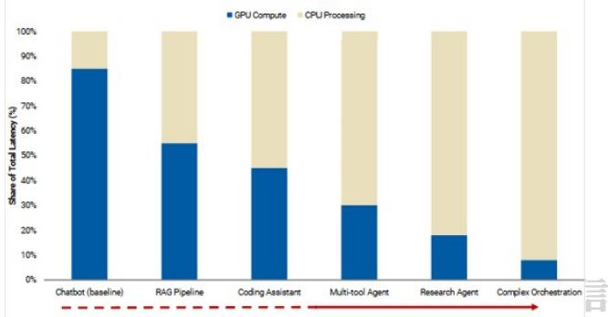  
Exhibit 6: Agentic AI shifts the latency bottleneck from GPUs to CPUs as workflows become more action-heavy   
Source: Morgan Stanley Research, Georgia Tech and Intel paper. Note: Per-workload splits are our own directional estimates, not measured benchmarks.

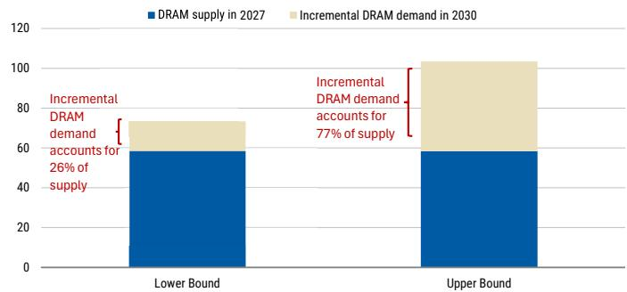  
Exhibit 5: …and 15-45EB of DRAM demand by 2030   
Source: Morgan Stanley Research estimates

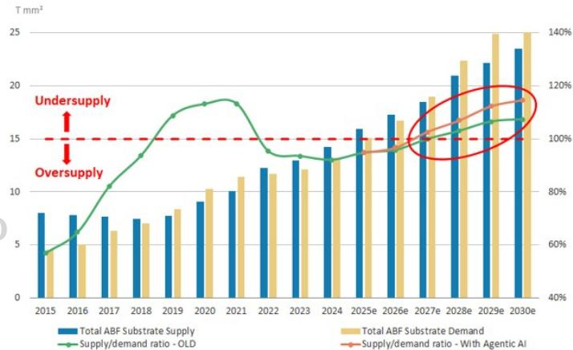  
Exhibit 7: We estimate agentic AI could drive $5 \mathrm { - } 1 0 \%$ incremental ABF substrate demand upside by 2030 from the enlarged CPU TAM alone   
Source: Prismark, Morgan Stanley Research estimates (e)

# The Shift to Agentic AI in Numbers

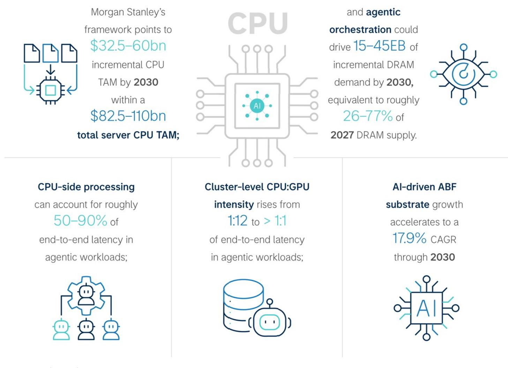

# Executive Summary

A Morgan Stanley Research Key Theme of 2026

# How agentic AI reshapes the AI value chain

AI is entering a new phase. The first wave of generative AI was dominated by powerful chips running single tasks, such as answering queries or generating text. The next phase – agentic AI – goes further. These systems can plan, reason, remember past actions, and interact with tools to complete multi-step tasks. As a 加微信 LCD123321Cad 04-20 result, the economic value in AI is shifting away from any single chip and toward the overall system that supports these agents. Crucially, agentic AI does not reduce demand for GPUs, but it adds more work around them. Planning, coordinating tasks, managing memory and calling external tools all rely heavily on CPUs, memory, networking and storage.

CPU-side processing can account for $5 0 . 9 0 \%$ of total workload time in agentic systems. As these systems scale, the balance of infrastructure changes, with cluster-level CPU-to-GPU intensity rising. This has material implications for industry demand. We estimate agentic AI could create a $\$ 32.5$ -60bn incremental total addressable market (TAM) for orchestration CPUs by 2030, within a total data center CPU market of $\$ 82.5$ -110bn. Persistent memory requirements are equally important: our analysis suggests agentic workloads could drive 15-45 exabytes (EB) of additional DRAM demand by 2030, equivalent to $2 6 . 7 7 \%$ of 2027 annual DRAM supply.

加微信 LCD123321Cad 04-20 The agentic AI shift broadens well beyond headline AI chips and we lay out below which stocks offer greatest exposure. Beneficiaries include CPU vendors, memory suppliers, storage companies, and advanced packaging and substrate providers, alongside foundries, equipment makers and server manufacturers. In short, agentic AI widens the AI investment landscape, shifting focus from owning the best accelerator to enabling the full system that makes intelligent agents work.

<table><tr><td colspan="6">Global Exposure Acrossthe Stack?Namesbyexposure</td></tr><tr><td>CPU ·NVDA·Intel ·AMD·Arm</td><td>DRAM ·Samsung ·Hynix ·Micron</td><td>NAND ·Kioxia ·SanDisk</td><td>HDD ·Seagate ·WDC ·TDK</td><td>FOUNDRY ·TSMC</td><td>IC-design ·GUC ·Egis</td></tr><tr><td colspan="4">PCB/Substrate/CCL&amp; Materials ·SEMCO·Unimicron·NYPCB·Ibiden ·Nittobo·MEC</td><td colspan="2">BMC, CPU&amp; Memory interface ·Aspeed·Renesas·Montage·WPG</td></tr><tr><td colspan="2">MLCC&amp;CPU socket ·Murata·TDK·Yageo ·FIT Hon Teng·Lotes</td><td>ODM SPE ·Wiwynn ·Hon Hai</td><td colspan="3">·AP Memory ·ASML·ASMi·AMAT·BeSi·KLAC ·Tokyo Electron·Ulvac·Wonik</td></tr></table>

Source: Morgan Stanley Research

# Changing Tides – From Generative AI to Agentic AI

“The CPU is no longer simply supporting the model; it’s driving it,” NVIDIA CEO Jensen Huang during the GTC 2026 keynote, March 16, 2026.

We are moving from AI that answers questions to AI that takes action. AI is no longer just about making models bigger; it is now about building AI systems that operate continuously, making them smarter, more independent, and capable of operating at scale. Today's AI computing is limited less by raw compute (GPU), and more by memory bandwidth, data movement, interconnect latency, and system coordination. Data centers today are no longer one single chip (GPU) but fully integrated stacks (system architecture), where each layer is designed to remove bottlenecks between compute, memory, and data flow.

The AI race is evolving from static models to agentic systems – autonomous, goaldriven entities that plan, reason, and act – where the concept of orchestration (CPU) and memory becomes central to intelligence itself. It is increasingly shifting towards control of the full stack of the AI factory – compute, networking, inference, orchestration and software, and no longer just raw compute power (GPU). LLMs (Large Language Models) excel in language generation, but they are passive tools requiring human prompting that lack persistent awareness of prior actions, user history, or environmental interpretation. Agentic AI changes this paradigm, enabling autonomous orchestration, multi-agent collaboration, and contextual recall. It introduces memory systems that persist across time, contexts, and agents, allowing continuity, learning, and adaptation.

Building AI agents is incrementally more CPU and memory heavy. While the AI hardware remains GPU-first dominant, co-existence with CPU becomes critical in an agentic AI world centered on reasoning, decision-making, and autonomy. Agentic AI represents the next frontier in enterprise automation, a shift from processing static data at scale to executing dynamic, multi-step tasks. These increasing workloads have become bottlenecks to today’s CPU architectures, driving a rethink for enterprise workloads and cloud architectures in balancing GPU investments (training/inference), with CPUs specifically engineered for reasoning tasks.

# Understanding the agent AI stack

# 订阅研报

Modern AI breakthroughs are not just about algorithms but the incredible compute infrastructure built to train these models. Understanding this stack is critical for awareness of how large-scale AI actually works. Agentic AI consists of three distinct stacks that are interdependent layers: 1) the brain (LLM), 2) the system (orchestration) and 3) the knowledge (memory).

• The Brain (LLM) is the GPU that handles language understanding, generation, and complex inference. It processes information and action. LLMs use the memory layer to retrieve relevant context, and write new observations and conclusions back to the memory layer for long-term storage.

• The System (orchestration) is the CPU that acts as the control center managing the agent’s workflow, defines the sequence of actions (e.g., Plan $_ { - > }$ Search $_ { - > }$ Retrieve $_ { - > }$ Reason $- > A c t )$ , and connects the LLM to external tools and APIs. It

manages the flow of memory before feeding it to the LLM or CPU. • The Knowledge base is the memory, an external brain of the agent, responsible for storing, organizing, prioritizing, and retrieving all long-term knowledge, including user profiles, past interactions, learned facts, and internal state. It is independent of the LLM and system.

The path to more capable, autonomous agents requires a fundamental shift in how we architect the AI stack, where a dedicated memory layer becomes the foundation that the next generation of agents will build on.

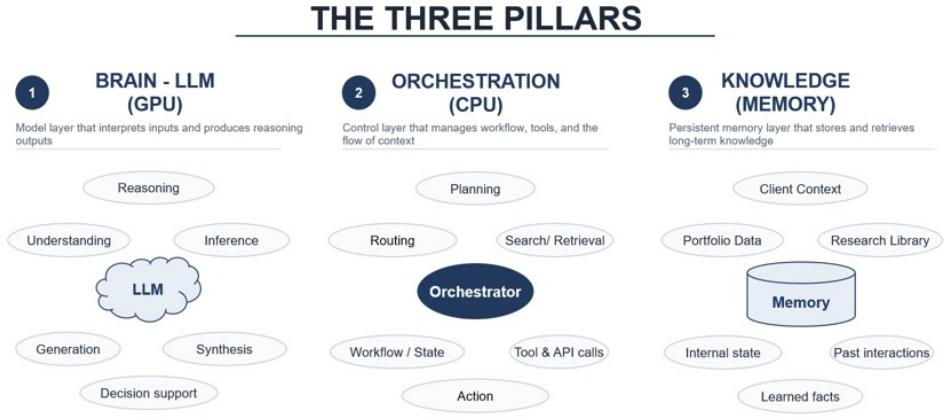  
Exhibit 8: Agentic AI pillars   
Source: Morgan Stanley Research

# 订阅研报添加微信 LCD123321Cad 04-20 Orchestration is the new bottleneck

The entire data center is now treated as a single compute system. The CPU bottlenecks account for most (up to $9 0 . 6 \%$ ) of execution time in agentic AI workloads, and establishes the necessity for holistic CPU-GPU co-optimization approaches. This is pure inference vs agent orchestration, where the CPUs manage multi-step tasks while GPUs focus on compute-intensive inference. GPUs handle token generation, CPUs are increasingly vital for tool invocation (API calls), data cleaning, and managing long context windows. As AI moves into production – especially with agentic systems – the CPU is becoming the control plane and no longer acting as a supporting component for the GPU. AI becomes a coordinated, real-time engine, not just a training problem. The CPU is coordinating thousands of concurrent processes, managing real-time inference and tool use and keeping massive GPU clusters fully utilized.

# Competitive dynamics

The ground work is being laid for the next iteration of AI. NVIDIA is preparing and positioning itself exactly for that shift, with each piece of hardware and design having its strengths and weaknesses, depending on what it is exactly being used for, and with none being a one-size-fits-all. NVIDIA unveiled CPU processors specialized for agentic AI at the GTC conference, representing an addition to its pure GPU dominance. Both NVIDIA and AMD have recently expressed unprecedented demand for CPUs as AI workloads shift toward reasoning-intensive agentic applications.

Changing CPU-to-GPU ratio. Earlier Hopper AI server builds were often described in terms of one CPU servicing around 12 GPUs. However, more recent estimates for NVIDIA's Rubin place that closer to one CPU for every 2 GPUs, and some projections for Rubin Ultra go further toward 2 CPU for every 1 GPUs. Even the move from 1:12 to 1:8 represents a major increase in processor demand when applied across hyperscale deployments. That kind of volume increase can tighten the market quickly, especially when all major CPU suppliers are competing for the same high-value data center opportunities.

Exhibit 10: Cluster-level CPU:GPU intensity rises as AI moves from reasoning to action   

<table><tr><td>CPU:GPU ~1:12</td><td>CPU:GPU ~1:2</td><td>CPU:GPU &gt;=1:1</td></tr><tr><td>GPU-Heavy</td><td colspan="2">CPU-Heavy</td></tr><tr><td colspan="2"></td></tr><tr><td colspan="2">MoreReasoning/Inference MoreToolCalls/Actions</td></tr><tr><td>Chain-ofthough reasoning</td><td></td></tr><tr><td>Extended inference loops</td><td>APlcalls&amp;web scraping Codeexecution&amp;testing</td></tr><tr><td>Document synthesis</td><td>Multi-Agents fan-out</td></tr></table>

123321Cad 04-20   
订阅研报添加微信 LCDSource: Morgan Stanley Research

NVIDIA's and Arm's move into specialized CPU offerings brings them into more direct competition in the processor market with established players like Intel and AMD. Designing competitive CPU architecture demands different expertise, manufacturing processes, and go-to-market strategies than GPUs. The architectural requirements for agentic AI CPUs are different from traditional server CPUs that were not designed with these workloads in mind. These systems need processors that can handle long context windows efficiently, maintain state across extended reasoning chains, and switch rapidly between different types of computational tasks.

• Vera is an AI CPU – built for agentic and reinforcement learning workloads. It is the control and orchestration plane for GPU clusters and, as agentic AI scales, that role becomes extremely complex and requires significant use. Within the Vera Rubin NVL72 platform, Vera CPUs are paired with GPUs via NVLink-C2C and tightly integrated into NVIDIA's Rubin GPUs, which enable faster data movement between   
加 微 compute layers – which is critical for workloads that dynamically shift between CPU orchestration and GPU execution. A single rack with 256 Vera CPUs can now run 22,500 AI agents at once. NVIDIA is entering the standalone CPU market for the first time this year and has announced Meta and CoreWeave as customers. Over time, the company expects standalone CPUs to grow to a multi-billion dollar business.

• AMD, widening the gap vs the competition with Venice. AMD is the market-share leader in data center CPUs, due in part to the ecosystem advantages of $\times 8 6$ and the per-core performance advantage versus Intel. That is something we expect to 10 extend further with 2nm Venice, with that product adding new AI data type and AI pipeline support and up to 256 cores (vs 192 with Turin). As it will take until 2028- 2029 for Coral rapids from Intel, and Arm remains early on its journey, we see AMD in an increasingly strong position to capitalize on the higher growth vector for the market.

# 订阅研报添

• Arm has just launched its first production data center CPU. A major strategic shift for Arm, moving from enabler to competitor, is a bold step. The Meta partnership clearly de-risks the launch and signals strong hyperscaler demand for more vertically integrated, AI-optimized compute platforms. Their own chip, their   
加微信 LCD123321Cad 04-20 own server rack, and claiming TWICE the performance per rack versus x86 platforms from Intel and AMD.

• Intel’s roadmap remains focused on incremental improvements to x86, but with increasing emphasis on AI-relevant features. Granite Rapids and Diamond Rapids aim to enhance memory bandwidth through more channels and MRDIMM support, while integrating AI acceleration features such as AMX. However, Intel’s approach remains largely evolutionary, centered on improving the existing roadmap for general-purpose CPUs rather than redesigning for agentic workloads. We would expect to hear more about how Intel is closing the gap with AMD on performance with Coral Rapids as SMT reenters the roadmap. This may limit its competitiveness in certain highly specialized AI systems until then, although its ecosystem and installed base remain significant advantages. Collaboration with NVIDIA on NVLink compatible CPUs will be an important driver of Intel's opportunity in head nodes.

# 订阅研报添

Qualcomm is an emerging participant, leveraging its custom Arm-based Oryon 加 微信 LCD123321Cad 04-20 cores to target power-efficient AI compute. Its roadmap builds on mobile and edge AI experience, with strengths in performance-per-watt and custom CPU design. However, Qualcomm remains early in the data center market, with limited ecosystem and deployment scale compared to incumbents. Its role in agentic AI infrastructure is likely to develop over a longer time horizon as Arm-based adoption expands.

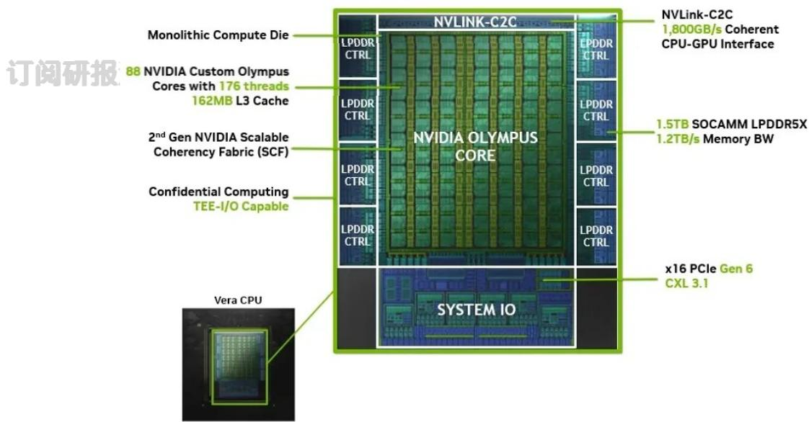  
Exhibit 11: Vera CPU chip architecture features 88 custom, Arm-based “Olympus” cores, with each core able to run two tasks using NVIDIA Spatial Multithreading, LPDDR5X memory delivering up to 1.2 TB/s of bandwidth, a second-generation Scalable Coherency Fabric for multi-tenant performance

# NVIDIA Vera CPU

Source: https://www.servethehome.com/nvidias-vera-cpu-in-detail-high-perf-chip-takes-aim-at-broader-ai-server-market/nvidia-vera-cpu/

# 添加微信 LCD12Stock implications

Within the CPU supply chain, we are more positive on memory, foundry, substrates, CPU & memory interface and MLCC/CPU sockets, which all benefit from content growth, pricing power and face significant capacity constraints going into 2H26 and 2027, per our channel checks. Below, we highlight our covered names globally with exposure to these areas, and discuss these in greater detail in the Global Perspective section.

US Semiconductors . Agentic AI-driven CPU demand structurally favors AMD in cloud share gains, but we prefer exposure via AI enablers (NVIDIA, Micron) where token growth and capex translate more directly into earnings upside. US Semiconductor Equipment . Rising compute and CPU TAM drive incremental WFE demand, with DRAM and leading-edge logic $( < 5 \mathsf { n m } / 2 \mathsf { n m } )$ capacity expansion supporting upside for equipment names such as AMAT and KLA. US Hardware . AI agent proliferation is a structural tailwind for HDD demand, as 加微信 LCD123321Cad 04-20 persistent storage is required to capture growing volumes of context, history, and system-level data, with ${ \sim } 8 0 \%$ of cloud data still residing on disks. We expect HDD demand to remain strong ( $\sim 3 0 \%$ EB CAGR), with supply tightness supporting a “stronger for longer” pricing backdrop, benefiting Seagate and Western Digital. European Semiconductors . Arm is well positioned to capture incremental CPU TAM from agentic AI, leveraging its power-efficient ISA and new AGI CPU design, while broader European semi-cap (ASML), EDA (Synopsys, Cadence) and analog (STMicro) benefit from rising compute intensity and design complexity. Korea Technology . While we continue to see Samsung and SK hynix as key

# 订阅研报添

beneficiaries of memory content growth from AI CPU penetration, Samsung Electro-Mechanics is another way to gain CPU exposure via its increasing pricing power in ABF substrates.

Greater China Semiconductors . Rising CPU TAM is increasingly captured by TSMC $( \sim 7 0 - 7 5 \%$ share), supported by leading-edge node migration $( 2 \mathsf { n m } / 3 \mathsf { n m } )$ 1 across AMD, NVIDIA, and potentially Intel. Strong demand for Arm-based CPUs should drive incremental upside for GUC, with design wins across Google and Microsoft platforms. Egis is positioning into AI/HPC design services via Arm-based CPU and chiplet development, while Aspeed stands to benefit from higher CPU 加微信 LCD123321Cad 04-20 server deployments through increased BMC attach rates and ASP uplift. Montage is leveraged to the structural increase in memory content per server, with higher CPU and DRAM intensity driving demand for memory interconnect solutions.

Greater China Hardware . Higher CPU demand benefits the server supply chain, including ABF substrates (Unimicron), PCBs (GCE), MLCCs (Yageo), and CPU sockets/connectors (FIT, Lotes). On the system side, Wiwynn and Lenovo gain from stronger general server demand driven by hyperscalers. Besides, agentic AI drives more power and advanced semi cap equipment demand, which helps on the power interconnect and subsystem assembly business for Bizlink and the factory automation component, e.g., linear guides, ball screws, pneumatic components, from both Hiwin and AirTAC.

Japan Semiconductors . Increasing CPU complexity and memory scaling drive demand for advanced semi-cap (Tokyo Electron, Ulvac) and memory interface solutions, positioning Renesas as a beneficiary of higher DRAM bandwidth/capacity requirements. Agentic AI also supports NAND demand (Kioxia) and broader data 加微信 LCD123321Cad 04-20 center exposure across Japan semi names. Rising AI-driven packaging complexity is creating incremental upside for Nittobo and MEC, as higher ABF substrate demand, larger package sizes, and increased layer counts drive structurally tighter supply for low-CTE materials and adhesion solutions.

• Japan Hardware . Agentic AI drives demand for reliable power delivery and highperformance components, benefiting MLCCs, inductors, BBUs, and ABF substrates (Murata, TDK, Ibiden). Increased CPU/GPU intensity also supports storage (NL HDD) and next-gen packaging with embedded components.

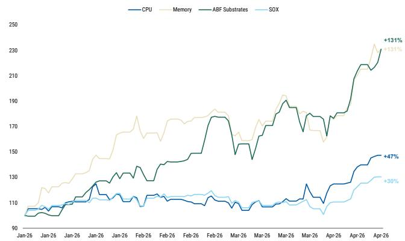  
Exhibit 12: Memory and ABF are leading the share price performance YTD   
Source: Factset, Morgan Stanley Research

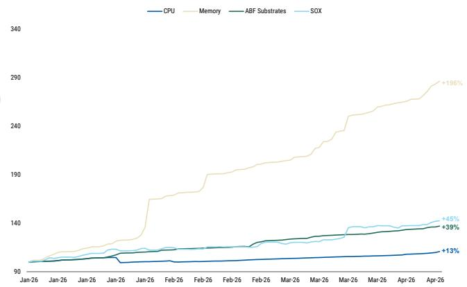  
Exhibit 13: Memory stocks are leading the EPS earnings upward revision YTD   
Source: Factset, Morgan Stanley Research

Exhibit 14:   

<table><tr><td colspan="5">Alagentbeneficiaries</td></tr><tr><td colspan="5">Ticker Rating Last Close(LC) Company</td></tr><tr><td>CPU</td><td></td><td></td><td></td><td></td></tr><tr><td>INTC.0</td><td>EW</td><td>68.50 Intel</td><td>Incremental CPU demand</td><td></td></tr><tr><td>NVDA.0</td><td>OW</td><td>198.35 Nvidia</td><td></td><td>Well-positioned Al compute solution provider+Vera CPUs</td></tr><tr><td>AMD.0</td><td>EW</td><td>278.26 AMD</td><td></td><td>Incremental CPU demand</td></tr><tr><td>ARM.O</td><td>EW</td><td>162.33 ARM</td><td></td><td>Incremental CPU demand</td></tr><tr><td>HDD</td><td></td><td></td><td></td><td></td></tr><tr><td>WDC.0</td><td>OW</td><td>361.69 WDC</td><td></td><td>Arising Al tides lifts allboats for both HDDand eSSD</td></tr><tr><td>STX.0</td><td>OW</td><td>531.81 Seagate</td><td></td><td>Arising Al tdes ifts all boats for both HDD and eSSD</td></tr><tr><td>NAND</td><td></td><td></td><td></td><td></td></tr><tr><td>SNDK.0</td><td>OW</td><td>919.47 SanDisk</td><td></td><td>NAND Supercyclc supportcd by agentic Al + inference demand</td></tr><tr><td>285A.T</td><td>OW</td><td>30,530.00 Kioxia</td><td></td><td>NAND Supercycle supported by agentic Al+ inference demand</td></tr><tr><td>DRAM</td><td></td><td></td><td></td><td></td></tr><tr><td>005930.KS</td><td>OW</td><td>216,000.00 Samsung Electronics</td><td></td><td>Bettermemory cycle driven by Al+ HBM market share gainoptionality</td></tr><tr><td>000660.KS</td><td>OW</td><td>1,128,000.00 SK hynix</td><td></td><td>Better memory cycle driven by Al</td></tr><tr><td>MU.0</td><td>OW</td><td>457.23 Micron</td><td></td><td>Better memory cycle driven by Al</td></tr><tr><td>ABF Substrates&amp; Materials</td><td></td><td></td><td></td><td></td></tr><tr><td>009150.KS</td><td>OW</td><td>679,000.00 SEMCO</td><td></td><td>Rising demand for high value-added ABF package substrates</td></tr><tr><td>3037.TW</td><td>OW</td><td>643.00 Unimicron</td><td></td><td>Betterserver CPU demand to support higher volumes and more favorable pricing of ABF substrates</td></tr><tr><td>8046.TW</td><td>OW</td><td>724.00 Nan Ya PCB</td><td></td><td>Better networking ABF substrate demand driven by higher general server volumes</td></tr><tr><td>4062.T</td><td>Uw</td><td>9,235.00 Ibiden</td><td></td><td>Rising demand for high value-added ABF package substrates</td></tr><tr><td>3110.T</td><td>OW</td><td>27,510.00 Nittobo</td><td></td><td>Nitobo supplies low-CTE glass cloth used in semiconductor package substrates.</td></tr><tr><td>4971.T</td><td>OW</td><td>8,220.00 MEC</td><td></td><td>Larger ABF substrate sizes and ahigher numberof wiring layers bode wellfor MEC&#x27;s CZseries adhesion promoters</td></tr><tr><td>Foundry</td><td>OW</td><td></td><td></td><td></td></tr><tr><td>2330.TW BMC/Memory Interface</td><td></td><td>2,030.00 TSMC</td><td></td><td>Rising CPUTAM is increasingly captured by TSMC,supported by leading-edge node migration (2nm/3nm)</td></tr><tr><td>5274.TWO</td><td>Ow</td><td>13,805.00 Aspeed</td><td></td><td>~70% of market shares in the CPU server BMC market</td></tr><tr><td>6809.HK</td><td>ow</td><td>209.40 Montage</td><td></td><td></td></tr><tr><td>6723.T</td><td>ow</td><td>2,795.00 Renesas</td><td></td><td>Higher CPU and DRAM intensity driving demand for memory interconnect solutions</td></tr><tr><td>3702.TW</td><td>OW</td><td>98.80 WPG Holdings</td><td></td><td>Abeneficiary of the agentic Al shift through its exposure to CPU-and DRAM facing memory interface</td></tr><tr><td>6531.TW</td><td>ow</td><td>644.00 AP Memory</td><td></td><td>Outgrowth from non-GPU components to drive distributors&#x27;ongoing outperformance WoW packaging technology could be an efective solution to improve memory bandwidth and power consumption</td></tr><tr><td>IP/Design Services</td><td></td><td></td><td></td><td></td></tr><tr><td>3443.TW</td><td>OW</td><td>3,255.00 GUC</td><td></td><td>Strong demand for Arm-based CPUs drives incremental upside</td></tr><tr><td>6462.TWO</td><td>EW</td><td>122.50 Egis</td><td></td><td>Joining ARM&#x27;s totaldesign alliance with the aim of winning long-term ASIC business opportunities</td></tr><tr><td>Components/ODM</td><td></td><td></td><td></td><td></td></tr><tr><td>6981.T</td><td>OW</td><td>4,600.00 Murata</td><td></td><td>Rising demand for highly durable and reliable electronic components/MLCC</td></tr><tr><td>6762.T</td><td>OW</td><td>2,616.00 TDK</td><td></td><td>Rising demand for highly durable and reliable electronic components/MLCC</td></tr><tr><td>6088.HK</td><td>OW</td><td>7.93 FIT Hon Teng</td><td></td><td>Clearbeneficiaries of more CPU socket demand3321</td></tr><tr><td>2327.TW</td><td>OW</td><td>316.50 Yageo</td><td>阅研</td><td>iCad .04-20 BenefittingfromincreasingpenetrationofitsproductsforbothAland generalservers</td></tr><tr><td>3533.TW</td><td>EW</td><td>2,490.00 Lotes</td><td></td><td>CPU socket,PCle/DRAMconnectorbeneficiary</td></tr><tr><td>2368.TW</td><td>OW</td><td>1,175.00 Gold Circuit Electronics</td><td></td><td>Beneficiary of higher generalserver volumes and CPU MB PCB content growth</td></tr><tr><td>002916.SZ</td><td>EW</td><td>283.06 Shennan Circuits</td><td></td><td>Benefit from increasing server, networking and optical module PCB demand</td></tr><tr><td>600183.SS</td><td>EW</td><td>69.25 Shengyi</td><td></td><td>Benefit from increasing server, networking and optical module PCB/CCL demand</td></tr><tr><td>2317.TW</td><td>OW</td><td>206.00 Hon Hai Precision</td><td></td><td>Key ODM partnerfor brand/enterprise CPU and generalservers</td></tr><tr><td>6669.TW</td><td>OW</td><td>3,805.00 Wiwynn</td><td></td><td>Key general server ODM</td></tr><tr><td>0992.HK</td><td>EW</td><td>11.30 Lenovo</td><td></td><td>General serversupplier for select CSPs (ie.MSFT,ORCL)</td></tr><tr><td>000977.SZ</td><td>EW</td><td>68.23 Inspur</td><td></td><td>Clear ODM beneficiary of more Al and general server demand</td></tr><tr><td></td><td> SPE/Automation Equipment</td><td></td><td></td><td></td></tr><tr><td>ASML.AS</td><td>OW</td><td>1,222.60 ASML</td><td></td><td>ASML benefits from increased EUV layer count</td></tr><tr><td>ASMI.AS</td><td>OW</td><td>768.00 ASMi</td><td></td><td>Beneficiary of increased advanced foundry node capacity.</td></tr><tr><td>BESI.AS</td><td>OW</td><td>220.50 Besi</td><td></td><td>Increasing accelerator demand drives greater adoption of advanced packaging technologies</td></tr><tr><td>VACN.S</td><td>EW</td><td>558.00 VAT Group</td><td></td><td>Positioned to benefit from strong WFE growth</td></tr><tr><td>240810.KQ</td><td>OW</td><td>121,200.00 Wonik IPS</td><td></td><td>Strong rebound on the back of Samsung 1c DRAM capex ramp up</td></tr><tr><td>AMAT.O</td><td>OW</td><td>389.90 Applied Materials</td><td></td><td>The most leverage to greenfield DRAM SPE beneficiary under US SPE coverage</td></tr><tr><td>KLAC.0</td><td>ow</td><td>1,734.85 KLA Corp</td><td></td><td>Rising compute and CPU TAM drive incremental WFE demand</td></tr><tr><td>8035.T</td><td>OW</td><td>44,010.00 Tokyo Electron</td><td></td><td>A potential incrementalshare gaineron Intel&#x27;scapex recovery</td></tr><tr><td>6925.T</td><td>OW</td><td>3,153.00 Ulvac</td><td></td><td>MHM tool has seen solid adoption at Intel</td></tr><tr><td>3665.TW</td><td>OW</td><td>2,365.00 Bizlink</td><td></td><td>Increasing semi cap equipment demand positive to its powerinterconnect/subsystem business</td></tr><tr><td>2049.TW</td><td>ow</td><td>291.00 Hiwin</td><td></td><td>Increasing semicap equipment demand positive to its industrial automation component business</td></tr><tr><td>1590.TW</td><td></td><td>1,255.00 AirTAC</td><td></td><td>Increasing semicap equipment demand positive to its industrial automation component business</td></tr><tr><td>Thermal/Power solution</td><td>OW</td><td></td><td></td><td></td></tr><tr><td>3017.TW</td><td>OW</td><td>2,400.00 AVC</td><td></td><td>Rising CPU/general server demand drives greater demand for advanced cooling solutions</td></tr><tr><td>3324.TWO</td><td>EW</td><td>1,035.00 Auras</td><td></td><td>Rising CPU/general server demand drives greater demand for advanced cooling solutions</td></tr><tr><td>2308.TW</td><td>OW</td><td>1,840.00 Delta</td><td></td><td>Elevated power consumption atdata center levelsupports stronger growth forpowersupply players</td></tr><tr><td>2301.TW</td><td></td><td></td><td></td><td>Elevated power consumption at data center level supports stronger growth forpower supply players</td></tr><tr><td>EDA</td><td>EW</td><td>162.00 Lite-On</td><td></td><td></td></tr><tr><td>SNPS.0</td><td></td><td></td><td></td><td></td></tr><tr><td>CDNS.0</td><td>EW</td><td>441.15 Synopsys</td><td></td><td>Benefiting fromrising compute intensity and design complexity Benefiting from rising compute intensity and design complexity</td></tr><tr><td></td><td>OW</td><td>306.96 Cadence</td><td></td><td></td></tr><tr><td>Analog</td><td></td><td></td><td></td><td></td></tr><tr><td>IFXGn.DE</td><td>Ow</td><td>46.01 Infineon</td><td></td><td>Potentialupside toouteryeardata centre estimatesfromthedevelopmentofagentic systems with multi-step workflows</td></tr></table>

Source: Morgan Stanley Research. Note: Priced at close on 16 April 2026.

# Global Perspective

The rise of agentic AI is a long-duration infrastructure theme – and a global one. While deployment is led by US hyperscalers, value creation is globally distributed across CPUs, memory, substrates, foundries and equipment, with Asia critical on the supply side and Europe well positioned in industrial and infrastructure enablers. In this section, we highlight stock exposures to the broad agentic AI 加微信 LCD123321Catheme across regions and sectors.

# US Semiconductors

Joseph Moore, Mason Wayne, Ella Tulchinsky, Nicole Kozhukhov

# AMD in pole position to benefit from agent-driven CPU workload growth in the cloud.

As AI resets the growth in the server market higher, that should lead to outsized benefits for AMD. Having surpassed Intel in x86 cloud share, the incremental business is mostly AMD's to lose, we believe, as Intel struggles to deliver product against persistent supply constraints and a weak product line-up. Intel should see positive tailwinds as long as the market remains undersupplied, but, when it comes to capturing secular durable tailwinds from increasing demands on the CPU in the cloud, we think AMD is much better placed.

However, our preference for exposure to the growth of agentic is for AI leaders priced 添加微信 LCD123321Cad 04-20 for a slowdown in cloud spending – NVIDIA, Broadcom, Micron, SanDisk. While CPU is the cleanest story for exposure to new agentic AI workloads, we argue both Intel (foundry) and AMD (GPU) have more important elements of stock performance tied to other areas, and we are Equal-weight on both. We prefer exposure to agentic AI through the key enablers of the AI workloads, as more agents still means more tokens and more tokens means more processor demand. As excitement emerges around agentic AI workloads, hyperscaler AI capex is likely to continue to move higher, and we prefer exposure to this theme through NVIDIA and memory plays at, respectively, 18x FY27e P/E and $5 { \cdot } 9 \times P / E$ , rather than through CPU with Intel and AMD at $2 3 { \cdot } 6 4 \times \mathsf { P } / \mathsf { E }$ .

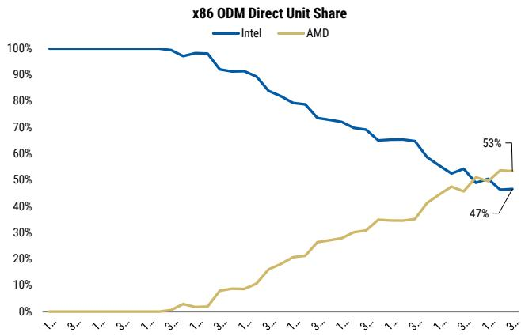  
Exhibit 15: AMD has a strong lead in cloud CPU share   
Source: IDC, Mercury Research, Morgan Stanley Research

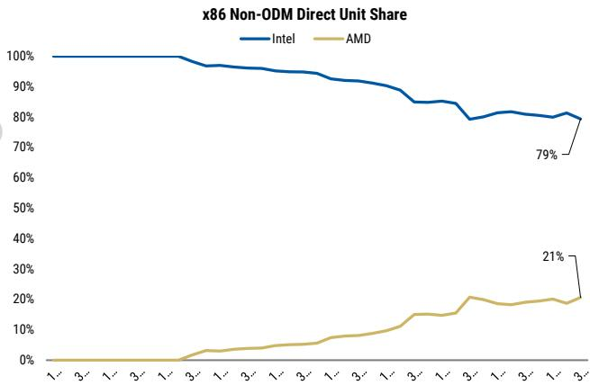  
Exhibit 16: However, Intel remains the standard in other markets   
Source: IDC, Mercury Research, Morgan Stanley Research

# US Semiconductor Equipment

Shane Brett

More compute equals more WFE. As we reach a point where the binding constraint to intelligence scaling is semiconductor production capacity, WFE should continue to see material upward revisions across DRAM/NAND and Logic. In the near term, DRAM spending is inflecting the most, driving our preference for AMAT.

We expect benefits of agentic AI to be widespread, but a larger CPU TAM in particular 添加微信 LCD123321Cad 04-20 may drive upside to current expectations for 2027 leading logic. Our current 2026 forecast calls for $23 \%$ growth in WFE spending to $\$ 1436n$ , with growth led by DRAM and foundry logic, and for $2 7 \%$ growth next year, with foundry logic WFE accelerating from $1 5 \%$ growth in 2026 to $2 8 \%$ . Growth in the CPU TAM likely translates to more aggressive capacity expansion at <5nm nodes, and at Intel and TSMC 2nm in particular. We have highlighted both of these areas as representing unique tailwinds for KLA.

# US Hardware

Erik Woodring, Dylan Liu, Maya C Neuman, Rauf Ural

AI agent proliferation is a structural tailwind for HDD demand. Knowledge – one of the three core pillars of agentic AI – relies on persistent data storage to capture prior actions, user history, and environmental context. While this dynamic benefits memory (flash), it also supports HDD demand, given ${ \sim } 8 0 \%$ of cloud data continues to reside on disks. Although it remains uncertain how materially AI agents will change the long-term HDD exabyte (EB) growth trajectory, emerging applications, including AI agents, autonomous driving, and production optimization, are increasingly incremental drivers of HDD demand.

We reiterate our “stronger for longer” HDD thesis, with both STX and WDC positioned to benefit. Our recent checks suggest the HDD industry will likely deliver low- to midsingle-digit higher unit output than we expected entering the year; however, this upside has been more than absorbed by accelerating hyperscaler demand. As a result, we still expect industry shortages of ${ \sim } 2 0 0 \mathsf { E B }$ in CY26 ${ \sim } 1 0 \%$ of the market), widening to $\sim 2 5 0 \mathsf { E B }$ in CY27. Greater automation via AI agents increases compute intensity, expands data generation, and ultimately drives incremental storage demand. We therefore expect HDD EB CAGR to track at least the long-term data generation CAGR of $\sim 3 0 \%$ over the next several years, with the supply-demand imbalance potentially persisting longer than anticipated if emerging applications prove incremental. In our view, this backdrop remains supportive of HDD pricing under a rational oligopoly industry backdrop.

# 订阅研报添加微信 LCD123321Cad 04-20 European Semiconductors

Lee Simpson, Nigel van Putten, Amelia Scicluna

Arm's AGI CPU in prime position for this opportunity. We see Arm as a primary beneficiary of a large new CPU market, as exemplified by its recent new chip design launch Arm AGI CPU (see our notes here and here). This 3nm, TSMC fabbed chip focuses on power efficiency, a single-threaded compute, as well as a performance design to handle most agentic tasks and scalability. Arm's RISC based instruction set (ISA), and its years of power-efficient CPU core design, make it well positioned to directly benefit from a large 16 new market. We think Arm’s shift to a fabless chip designer is well timed and we see the strategic rationale as solid.

European semi-cap is positioned to benefit from a larger CPU TAM, as increased compute intensity drives higher layer counts and rising wafer fab equipment demand at advanced nodes. Within this, ASML remains the key bottleneck, as incremental CPUdriven demand translates into lithography intensity. We highlight potential for this to drive marginal upside to our outer year tool estimates. ASMI is also well positioned, given its exposure to advanced deposition steps that scale with increasing device complexity and are critical at leading-edge nodes. In addition, we see VAT Group as a key beneficiary of higher process intensity and tool complexity, with vacuum valves acting as an enabling component across deposition and etch steps; however valuation keeps us Equal-weight. Beyond the front-end, Besi is a direct beneficiary of a growing CPU TAM, as increasing accelerator demand drives greater adoption of advanced packaging technologies. The shift towards chiplet-based architectures and heterogeneous integration is increasing the need for hybrid bonding solutions, supporting higher packaging intensity per chip.

Analog is an indirect beneficiary of increased compute demands. We see potential upside to our outer-year data center estimates from the development of agentic systems with multi-step workflows. A material rise in CPUs will, in turn, require a new power architecture. While we think it is too early to quantify this opportunity, this would suggest upside to our outer year data center revenue estimates for Infineon and STMicro.

We also see potential incremental upside to EDA, where increased CPU and accelerator complexity drives higher design intensity, particularly at advanced nodes and in chiplet-添加微信 LCD123321Cad 04-20 based architectures. We think this could suggest additional growth for Cadence and Synopsys through greater tool adoption in areas such as verification and emulation; though we are Equal-weight on Synopsys pending visibility on profitability from the integration of Ansys.

# Korea Technology

Shawn Kim, Ryan Kim, Duan Liu, Cindy Huang

Doing AI things requires more DRAM vs. thinking AI things (HBM). The memory cycle is now increasingly defined by the rapid shift to agentic reasoning, with OpenClaw accelerating that process. In agentic AI workloads, the bottleneck is increasingly shifting to the CPU and memory hierarchy as agentic AI takes what the GPU generates to turn it into actions. Markets tend to think linearly but the intelligence layer (agents, reasoning) is growing exponentially, where memory becomes the most difficult AI chip bottleneck.

Compute requirements multiply and memory becomes an architectural priority for AI agent infrastructure. Memory is what gives us context as AI agents need persistent memory across conversations, heterogeneous compute for orchestration and inference, and low-latency networking for inter-agent communication. They rely on a tiered architecture consisting of: 1) transitory cache for short-term working memory; 2) hot storage for active episodes that benefit DRAM; and 3) cold storage for archives favoring HDD and NAND. The storage demand significantly exceeds that of generative AI.

# We think 2027 will be the year of the proof case for sustainable memory returns.

in, durability of the cycle upturn and sustainability of FCF returns, HBM share and where sustainable margins land vs. the near-term commodity memory pricing (earnings) outlook in the next 6 months – both likely higher, per our checks. For ABF substrates, we see price hikes throughout the year and think it is no longer about competition, but about how much companies can make and sell. We favor higher pricing power in DDR5 DRAM and NAND flash (Samsung, SK hynix), ABF substrates (Samsung Electro-Mechanics) and capex benefits via SPE (Wonik IPS) vs. downstream hardware-facing margin pressure.

# Greater China Semiconductors

添加微信 LCD123321Cad 04-20 Charlie Chan, Daniel Yen, Daisy Dai, Lucas Wang, Tiffany Yeh

TSMC is the major CPU foundry vendor. We forecast overall CPU TAM for foundry to reach nearly $\$ 33b{ \mathrm { b n } }$ in 2026 and then $\$ 376n$ by 2028. Within the TAM, we estimate TSMC, serving as the major foundry, could reach around $70 \%$ market share in 2026 and keep growing to $7 5 \%$ in 2028, with the nodes for those CPU also continuing to migrate, like GPU and ASIC. For example, the upcoming server CPU from AMD (Venice) and NVIDIA (Vera) are adopting TSMC leading-edge 2nm and 3nm process, both a one-node migration from prior generation. We also expect Intel to outsource its server CPU production to TSMC by 2H27, as it is facing fierce competition from AMD in the server/data center CPU space, whereas TSMC is more available to provide time-to-market of its server CPU production with higher quality.

Strong Arm-based CPU demand could benefit GUC from 2026 and beyond. Within our Greater China Semiconductor coverage, GUC has the highest revenue mix from the CPU 添加微信 LCD123321Cad 04-20 demand. Our recent industry checks suggest that inference and general server demand for Arm-based CPUs is even stronger, including Google CPU. GUC also helps with the Cobalt 200 CPU for Microsoft, an Arm-based design tailored for Microsoft Cloud. GUC management indicated that it has secured next-gen Arm-based CPU design wins from its major customers, including both Google CPU and Microsoft Cobalt CPU.

Egis is positioning itself as an emerging AI/HPC design services vendor, with increasing exposure to CPU and ASIC opportunities over the medium term. We believe its strategic pivot away from its legacy fingerprint business is beginning to gain traction, supported by investments in InPsytech and a $\sim 2 0 \%$ stake in Alcor Micro. These moves expand ìts capabilities into CPU platform development and heterogeneous computing. In particular, participation in Arm’s Total Design Alliance and ongoing hiring suggest a clear ambition to capture long-term ASIC design opportunities tied to AI and HPC workloads. That said, we remain Equal-weight given limited near-term visibility on large-scale project wins, with commercialization timelines for new CPU platforms extending into 2027.

# 订阅研报

添加微信 LCD123321Cad 04-20 Aspeed remains a key beneficiary of rising CPU intensity in agentic AI through its dominant BMC franchise. As CPU demand increases with more orchestration-heavy workloads, the need for server management and control functionality should expand proportionally, directly benefiting Aspeed’s BMC portfolio. With $\sim 7 0 \%$ market share in CPU server BMCs and a strong customer base, including major hyperscalers such as Meta, AWS, Alibaba and Microsoft, Aspeed is well positioned to capture this growth. We expect further upside from its next-generation AST2700 platform, which not only supports share gains at additional customers such as Dell and Google, but also drives $4 0 { - } 5 0 \%$ ASP uplift through specification upgrades.

Montage Technology is leveraged to the CPU and memory content upcycle through its leadership in memory interconnect chips. As agentic AI drives higher DRAM content per server and accelerates technology migration, demand for memory interface solutions should increase meaningfully. Montage, with a ${ \sim } 3 6 . 8 \%$ global market share, remains a key beneficiary of this trend, supported by its technology leadership and strong positioning with cloud customers. We expect continued outperformance driven by both cloud capex growth $c . 3 0 \%$ CAGR over 2025-27) and rising memory complexity, which structurally increases interconnect content per server.

# 订阅研报添加微信 LCD123321CGreater China Hardware

# 04-20

Sharon Shih, Howard Kao, Derrick Yang

We believe Unimicron is a key beneficiary of the increases in CPU demand from agentic AI, as it is a key supplier to Intel, AMD, NVIDIA for their data center CPU substrates. NYPCB should also benefit, as more servers will require more networking demand as well, and NYPCB is a key ABF substrate supplier for Broadcom. GCE is another clear beneficiary of higher CPU server demand, as it produces server mainboard PCBs for most major ODMs, with $\sim 7 0 \%$ of its revenues coming from servers (including ASIC servers).

Within our downstream component coverage, FIT and Lotes stand out to us as CPU beneficiaries as well, because both are major CPU socket suppliers to Intel and AMD with dominant supply shares, and will also have peripheral exposure from PCIe and DRAM connectors; however, Lotes’ current valuation does not look sufficiently attractive to us, so we are Equal-weight.

We also believe Yageo would be a beneficiary of the increased passive components TAM, including MLCCs, resistors, inductors and tantalum capacitors. As a total solution supplier with all of these passive components, it is one of the key passive component beneficiaries in our Greater China coverage.

Within our ODM/OEM coverage, we believe Wiwynn benefits the most from rising CPU/ general server demand, as it is a key general server ODM for Microsoft, Meta and Amazon. Lenovo should also benefit from higher general server demand, because it is a key supplier to Microsoft and Oracle; however, we are Equal-weight on Lenovo because of the cost headwinds from its PC business.

For hardware components, we think Bizlink should benefit from the agentic AI proliferation, as the increasing demand for more advanced semiconductor capital equipment will drive more demand for its power interconnects and subsystem assemblies, which it supplies to major customers like Lam Research, KLA, Applied Materials, ASML. etc. Moreover, better semiconductor capital equipment demand is also positive for the factory automation components suppliers like Hiwin and AirTAC, as their offerings, including linear guides, ball screws, robotic systems, pneumatic components, etc., are widely adopted in various kinds of equipment.

Thermal solution suppliers like AVC and Auras should benefit from greater demand for advanced cooling solutions (e.g., heat pipes, vapor chambers, and liquid cooling components) for rising CPU/general server demand. However, we are Equal-wight on Auras for unclear VR platform exposure at this point. At the same time, elevated power consumption at data center level supports stronger growth for power supply players such as Delta and Lite-On, as they are also dominant suppliers for general servers to top hyperscalers. We are Equal-wight on Lite-on given headwinds to its legacy PC/IT business.

# Japan Semiconductors

Kazuo Yoshikawa, Suzune Tamura, Yoshihito Hasegawa

Japan semi-cap stands to benefit further from rising CPU demand. Increasing device complexity should drive incremental demand for advanced process equipment. From a customer mix perspective, while Tokyo Electron is commonly viewed as a memory play, it 添加微信 LCD123321Cad 04-20 has relatively high share in logic and within Intel (which used to be mid-teen customer for TEL 3 years ago). A potential recovery in Intel’s capex, supported by stronger CPU demand, would position TEL as a potential incremental share gainer. In addition, Ulvac’s MHM tool has seen solid adoption at Intel, which should provide an incremental positive for Ulvac’s earnings outlook, although relative to peers we see lower medium-term growth prospects and stay Equal-weight.

Renesas would be positioned as a beneficiary of the agentic AI shift through its exposure to CPU- and DRAM-facing memory interface. Memory interface devices such as register-clock drivers (RCDs) and data buffers enable the entire memory subsystem to scale in speed and capacity, by allowing the clock, command, address, and data signals to be re-driven with much-improved signal integrity. As agentic AI requires higher DRAM content per server and technology migration of DRAM accelerates, demand for memory interface devices should increase meaningfully.

We estimate that data center sales accounted for approximately $1 5 \%$ of CY25 Q4 revenue, of which $5 0 \mathrm { - } 6 0 \%$ was attributable to memory interface sales. We also estimate that the gross margin of the memory interface business is well above the overall gross margin of $6 \%$ for the Industrial, Infrastructure, and IoT segment. As a result, growth in memory interface sales should also contribute to an improvement in company-wide profitability.

We also expect KIOXIA to benefit from the agentic AI shift. The databases and documents referenced by agentic AI, such as those used in RAG (retrieval-augmented generation), require large density, high performance SSDs. The company has developed SSDs incorporating its 8th-generation BiCS FLASH 2Tb QLC chips and shipped the 122TB and 245TB models for customer qualification as planned at the end of 2025. It aims to begin volume shipments in 2026.

We believe Nittobo and MEC are well positioned to benefit from the broader adoption of agentic AI. Nittobo supplies low-CTE glass cloth used in semiconductor package substrates. The emergence of agentic AI as a new end-market should drive incremental demand for advanced semiconductor package substrates. While new entrants have recently increased capacity in the low-CTE glass cloth segment, we expect supply-demand conditions to remain tight, as incremental demand from AI-related applications adds a new layer of structural growth. At the same time, the trend toward larger ABF substrate sizes and a higher number of wiring layers should serve as a demand tailwind for MEC’s CZ series adhesion promoters. The CZ series chemically modifies the surface of copper wiring layers to enhance adhesion with insulating resin layers. Given its critical role in ensuring the reliability of substrate materials that combine metals and resins with differing coefficients of thermal expansion, the CZ series has established a dominant market

# Growing the CPU Opportunity

Agentic AI adds multi-step orchestration – plan, retrieve, call tools, execute, iterate – lifting cluster CPU:GPU intensity and shifting incremental spend toward CPUs. Our analysis suggests $\$ 32.5$ -60bn incremental CPU TAM by 2030 within $\$ 100 b n +$ total server CPU TAM.

添加微信 LCD123321Cad 04-20 We believe agentic AI will increase the CPU-to-GPU mix in AI systems by adding more orchestration, memory, and tool-use work around each model call. This should not reduce GPU demand, but it does increase overall system complexity and shifts incremental infrastructure spend toward CPUs, networking, and memory. In this environment, the advantage is less about owning the accelerator and more about owning the system architecture.

# What changes with agentic AI

The initial GenAI wave was dominated by GPU-centric model-serving, with relatively light control-plane overhead. Agentic inference introduces multi-step workflows (plan, retrieve, call tools, execute, iterate), greater reliance on persistent memory and external tools/APIs, and higher orchestration complexity (see our most recent Arm note here).

Net: more work per user request, and higher CPU, memory, and network intensity than in 添加微信 LCD123321Cad 04-20the first GenAI phase.

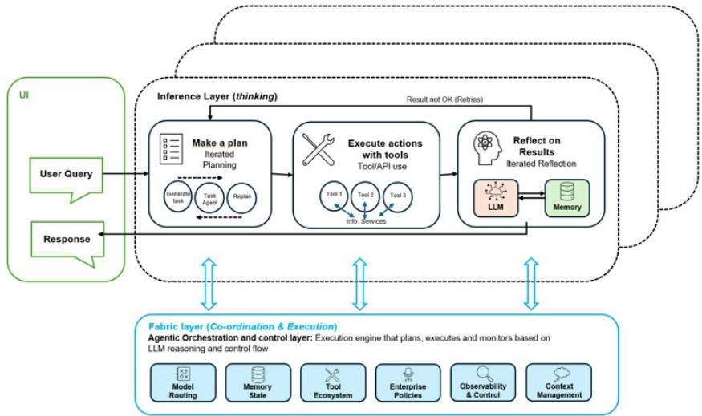  
Exhibit 17: The inference fabric framework   
订阅研报   
Source: Morgan Stanley Research

# Unpacking CPU/GPU ratio dynamics

At the head-node level, we expect limited change. GPU servers should remain acceleratordense, with companion CPUs (e.g., Grace, Vera) acting primarily as the host and orchestration layer.

At the cluster level, however, we expect additional CPU-heavy infrastructure. As agentic workloads scale, the effective CPU/GPU ratio should rise meaningfully.

Two drivers underpin this:

• Multi-step workflows. Agentic systems move beyond a single inference call. They add branching logic and latency-sensitive control flow (planning, routing, tool calls), which naturally runs on CPUs. • Economics. As GPUs become more expensive, running orchestration on them is less efficient. The incentive is to keep GPUs focused on token generation and push mûR _®Oá   LCD12332non-LLM work to CPUs. Cad $0 4 - 2 0$

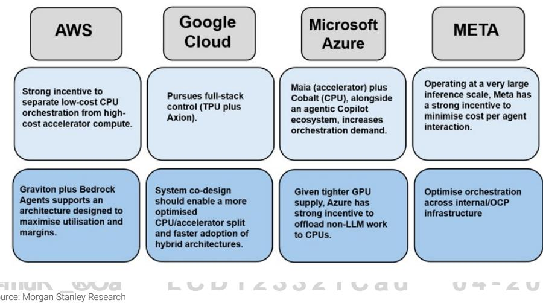  
Exhibit 18: Strategic rationale for CPU deployments

# CPU TAM: a \$100bn+ opportunity by 2030

We think agentic inference creates a new CPU TAM on top of traditional data center CPUs, driven by orchestration, tool use, and memory services. We estimate this incremental TAM at c.\$32.5-60bn by 2030, within a total data center CPU market of \$100bn+ by 2030 (in line with recent Arm management remarks, link). In other words, the agenticdriven CPU opportunity could approach the size of the legacy CPU market.

We estimate the 2025 CPU server TAM as $\$ 22$ bn using Mercury Research data. Mercury Research suggests a 2030 TAM of \$45.4bn; however, our top-down estimates of the market suggest that this does not consider agentic upside, as our estimate for the head node CPU TAM alone implies a \$50bn TAM.

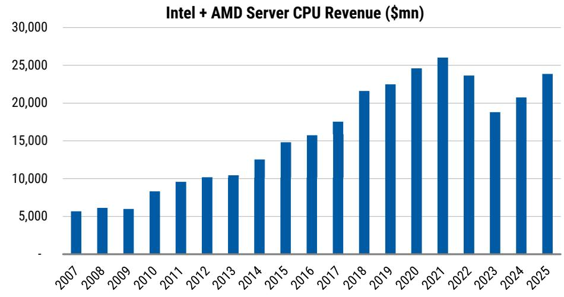  
Exhibit 19: The server CPU TAM has been about flat in both revenue and unit terms since 2018, but we see new agentic tailwinds causing durable growth from here   
Source: Mercury Research, Morgan Stanley Research

As a top-down anchor, we use MS estimates for global AI data center infrastructure sales rising to \~\$1.2tn by 2030 (from \~\$242bn in 2025), spanning GPUs, ASICs and CPUs. The key shift is the CPU’s role expanding from “host processor” to control plane, orchestration, and data-engine compute.

We break CPU TAM into three buckets: head-node CPUs, orchestration CPUs, and other 报添加微信 LCD123321Cad 04-20 supporting CPUs.

# Head node CPUs

These CPUs are attached to GPU systems (rack control layer) and are typically tightly coupled to the accelerator platform. They host GPU clusters (e.g., NVL72 or TPU pods) and run scheduling, dispatch, and KV-cache coordination.

In deriving the head node CPU TAM, we think our estimate of $\$ 12t n$ infrastructure sales by 2030 implies 5mn AI accelerators globally. Based on the assumption for two high-end 添加微信 LCD123321Cad 04-20 CPUs per GPU, this suggests 10mn total CPUs. If these are next-gen CPUs (beyond Vera) and using 100 to 150 cores per CPU, we estimate an ASP of $\$ 5k +/ C P U$ . All in, this implies a c.\$50bn TAM by 2030.

# Orchestration CPUs

This is the incremental TAM created by agentic workflows. It covers:

• Agentic runtimes (planning);   
• Tools/API chaining (code execution, browser agents);   
• Retrieval (and RAG pipelines);   
• Memory services (KV-cache, vector DB); and • Scheduling (policy, security, observability).

加微信 LCD123321Cad 04-20 This category did not exist at meaningful scale before agentic AI.

We assume the number of CPUs to GPUs scales with agent complexity. We consider 2-3 additional CPU-heavy nodes per GPU. This implies 10-15 million CPUs of a higher core count than head node CPUs. The Arm AGI CPU is 136 cores, so we assume that, by 2030, core counts reach 200-300. Pricing is a mix of hyperscaler Arm CPUs (Graviton/Axion/ Cobalt) and Merchant CPUs (AMD/Intel/Arm). This implies an ASP of $\$ 3k$ by 2030. All in, applying the ASP to the total CPU units, this suggests an orchestration CPU TAM of $\$ 30$ - 45bn by 2030.

# Other CPUs

This bucket includes CPUs used elsewhere in AI infrastructure, such as storage nodes (SSD-heavy clusters) and certain networking nodes.

Assuming 1-2 additional CPUs per GPU, this implies 5-10mn CPUs. As the ASP will be lower than the orchestration tier, we apply a range of \$500-1,500. This suggests a TAM of $\$ 2.5$ -15bn.

# Total CPU TAM

Our estimates for the three buckets – head node CPUs, orchestration CPUs and other CPUs – imply a CPU TAM $\$ 82.5$ -110bn by 2030.

Exhibit 20: We estimate the CPU TAM by 2030 to reach $\$ 82.5$ -110bn   

<table><tr><td>Head Node CPUs ( million)</td><td>Lower Bound</td><td>Upper Bound</td></tr><tr><td>Al Accelerators by 2030</td><td>5</td><td>5</td></tr><tr><td>CPUs per GPU board</td><td>2</td><td>2</td></tr><tr><td>Total CPUs</td><td>10</td><td>10</td></tr><tr><td>ASP (S)</td><td>5,000</td><td>5,000</td></tr><tr><td>TAM (S)</td><td>50,000</td><td>50,000</td></tr></table>

# 订阅研报

<table><tr><td>Orchestration CPUs (million)</td><td></td><td></td></tr><tr><td>Al Accelerators by 2030</td><td>5</td><td>5</td></tr><tr><td>CPUs per GPU board</td><td>2</td><td>3</td></tr><tr><td>Total CPUs</td><td>10</td><td>15</td></tr><tr><td>ASP (S)</td><td>3,000</td><td>3,000</td></tr><tr><td>TAM (S)</td><td>30,000</td><td>45,000</td></tr></table>

<table><tr><td colspan="3">Other CPUs (million)</td></tr><tr><td>Al Accelerators by 2030</td><td>5</td><td>5</td></tr><tr><td>CPUs per GPU board</td><td>1</td><td>2</td></tr><tr><td>Total CPUs</td><td>5</td><td>10</td></tr><tr><td>ASP (S)</td><td>500</td><td>1,500</td></tr><tr><td>TAM (S)</td><td>2,500</td><td>15,000</td></tr></table>

<table><tr><td>Total CPU TAM by 2030 82,500</td><td>110,000</td></tr></table>

Source: Morgan Stanley Research estimates

We could be underestimating the size of this market. NVIDIA has spoken to AI data center infrastructure sales reaching $\$ 3-5tn$ by 2030. If that is correct, this would imply significant upside to our CPU TAM estimates.

If we assume global AI data center infrastructure sales reach $\$ 3tn$ by 2030, this would imply $1 2 . 5 \mathsf { m n }$ AI accelerators by 2030. In this instance, our lower-bound estimate for the CPU TAM is $\$ 206.3$ bn and our upper-bound estimate $\$ 2756n$ .

If we assume instead that global AI data center infrastructure sales reach $\$ 5tn$ by 2030, this would imply 21mn AI accelerators by 2030. In this instance, our lower-bound estimate for the CPU TAM is $\$ 1$ 344bn and our upper-bound estimate $\$ 458 b n$ .

Exhibit 21: Assuming global AI data center infrastructure sales reach \$3tn by 2030, we estimate the CPU TAM is \$206-275bn   

<table><tr><td>Head Node CPUs (million)</td><td>Lower Bound</td><td>Upper Bound</td></tr><tr><td>Al Accelerators by 2030</td><td>12.5</td><td>12.5</td></tr><tr><td>CPUs per GPU board</td><td>2</td><td>2</td></tr><tr><td>Total CPUs</td><td>25</td><td>25</td></tr><tr><td>ASP (S)</td><td>5,000</td><td>5,000</td></tr><tr><td>TAM (S)</td><td>125,000</td><td>125,000</td></tr></table>

<table><tr><td>Orchestration CPUs (million)</td><td></td><td></td></tr><tr><td>Al Accelerators by 2030</td><td>12.5</td><td>12.5</td></tr><tr><td>CPUs per GPU board</td><td>2</td><td>3</td></tr><tr><td>Total CPUs</td><td>25</td><td>37.5</td></tr><tr><td>ASP (S)</td><td>3,000</td><td>3,000</td></tr><tr><td>TAM (S)</td><td>75,000</td><td>112,500</td></tr></table>

添加微信！

<table><tr><td colspan="3">Other CPUs (million)</td></tr><tr><td>Al Accelerators by 2030</td><td>12.5</td><td>12.5</td></tr><tr><td>CPUs per GPU board</td><td>1</td><td>2</td></tr><tr><td>Total CPUs</td><td>12.5</td><td>25</td></tr><tr><td>ASP (S)</td><td>500</td><td>1,500</td></tr><tr><td>TAM (S)</td><td>6,250</td><td>37,500</td></tr><tr><td>Total CPU TAM by 2030</td><td>206,250</td><td>275,000</td></tr></table>

Source: Morgan Stanley Research estimates

Exhibit 22: Assuming global AI data center infrastructure sales reach $\$ 5r { \mathsf { n } }$ by 2030, we estimate the CPU TAM is \$344-458bn   

<table><tr><td>Head Node CPUs (million)</td><td>Lower Bound</td><td>Upper Bound</td></tr><tr><td>Al Accelerators by 2030</td><td>21</td><td>21</td></tr><tr><td>CPUs per GPU board</td><td>2</td><td>2</td></tr><tr><td>Total CPUs</td><td>42</td><td>42</td></tr><tr><td>ASP (S)</td><td>5,000</td><td>5,000</td></tr><tr><td>TAM (S)</td><td>208,333</td><td>208,333</td></tr></table>

<table><tr><td colspan="3">Orchestration CPUs (million)</td></tr><tr><td>Al Accelerators by 2030</td><td>21</td><td>21</td></tr><tr><td>CPUs per GPU board</td><td>2</td><td>3</td></tr><tr><td>Total CPUs</td><td>42</td><td>63</td></tr><tr><td>ASP ($)</td><td>3,000</td><td>3,000</td></tr><tr><td>TAM (S)</td><td>125,000</td><td>187,500</td></tr></table>

<table><tr><td colspan="3">Other CPUs (million)</td></tr><tr><td>Al Accelerators by 2030</td><td>21</td><td>21</td></tr><tr><td>CPUs per GPU board</td><td>1</td><td>2</td></tr><tr><td>Total CPUs</td><td>21</td><td>42</td></tr><tr><td>ASP (S)</td><td>500</td><td>1,500</td></tr><tr><td>TAM (S)</td><td>10,417</td><td>62,500</td></tr><tr><td>Total CPUTAMby 2030</td><td>343,750</td><td>458,333</td></tr></table>

Source: Morgan Stanley Research estimates

# Agentic AI Memory Opportunity

“The real breakthrough in AI isn’t better reasoning — it’s persistent memory,” Sam Altman, Co-Founder and CEO of OpenAI

# 订阅研报

Agentic AI shifts systems from reactive chatbots to proactive, multi-step agents, but durability hinges on memory, not models. Persistent memory enables continuity, reasoning and improvement across time. This drives a structural shift in infrastructure demand: we estimate 15-45EB of incremental DRAM demand by 2030, supported by 10-15m incremental orchestration CPUs with ${ \sim } 1 . 5 { \cdot } 3 \mathsf { T B }$ DRAM per CPU, implying new demand vector equivalent to ${ \sim } 2 6 { - } 7 7 \%$ of the DRAM industry supply in 2027.

The future of agents is better reasoning with better memory. The agentic era is already here, but the memory era is just beginning. Turning AI from a reactive responder into a proactive agent cannot be done with clever prompts alone, and the key enabling technology is memory – and this time, memory is not an add-on but the layer that determines which agents actually last. Agentic AI transforms scattered information into connected intelligence enabling every interaction, or insight, to feed into a continuously learning ecosystem.

The competitive edge is shifting to context as foundational models begin to converge in performance. A chatbot is like a copilot for a single task, whereas an agent is more like an autopilot managing multi-step workflows with minimal oversight. To work effectively, these AI agents also rely on memory to carry context across sessions, authentication credentials to securely interact with external systems, and a persistent agent profile that allows them to remember users across time. AI agents rely on memory, preferences, documents, tone, and task history to perform effectively, and the more context an agent collects, the more personalized it becomes. Therefore, context, not model performance, is the true source of competitive edge, in our view.

# Why does memory matter more in agentic AI?

Agentic AI doesn’t just do; it remembers, reasons, and improves. In agentic AI systems, memory is not about remembering a chat, but it is the mechanism that makes behavior consistent, enforceable, and economically scalable. An agent must actively manage its memory to ensure the most relevant facts are learned, which necessitates a system more nuanced than a simple history dump. Memory allows agents to behave with awareness, remembering facts, preferences, plans, past interactions, world state, and long-term learning outcomes. But just as humans selectively remember important details and let trivial ones fade, AI agents need clever strategies to remember what matters and forget what doesn’t. As such, memory infrastructure is a multi-layered retrieval and reasoning system rather than just storing/retrieving data.

The fundamental limitation. Language models have a fixed context window and once a conversation exceeds that window, older content falls off. However, this becomes a problem for a coding agent working on a large codebase over multiple sessions. A

production codebase may have thousands of files, complex inter-dependencies and decisions made weeks or months ago that still matter today. An agent that forgets all of that every time it starts a new session is nearly useless for serious work. There are other real-time concerns for agents:

• Remembering what it decided earlier in the conversation; • Understanding the current state of files that have been modified; and • Finding the relevant code without needing the user to point to every relevant file.

Memory allows the agent to access what has been happening over time, not just what is true about the world. Addressing all of these problems requires memory-tiered solutions to achieve a combination of persistent memory, short-term orientation and retrieval.

Agent multiplier. Agentic AI compounds knowledge over time, using knowledge from one agent and passing it on to others from general-purpose agents to specialized agents (knowledge no longer exists in silos). Multi-agentic systems use a series of agents, with a single coordinating agent, to work as a sort of AI team. The coordinating agent works to understand complex queries and delegate workflows to other agents, making multi-step, multi-system queries possible. In collaboration with people, who are essential for escalation, understanding significant ambiguity, and creative thinking, multi-agentic systems are becoming integral to digital-first workforces.

The fundamental solution – persistent memory. Memory cannot be an afterthought in agent systems, as the underlying issue isn’t prompt quality (LLM) but the absence of a designed memory layer. In real-world applications, agents are expected to 1) run 添加微信 LCD123321Cad 04-20 continuously, 2) serve multiple users, 3) coordinate across multiple agents and tasks, and 4) learn from past interactions without corrupting future behavior. In these environments, memory is no longer just context but becomes a long-term state, shared knowledge, and behavioral grounding. When a system can retain, understand and organize its past experiences, it gains continuity of thought – and continuity of thought gives rise to resolution. Without memory, there is no continuous thinking, no true forward-thinking. Giving AI a sense of self-determination means giving it a sense of time, situation awareness, better control of actions and their consequences.

Persistent memory improves output quality, which reduces redundancy as well as allows models to focus on its token budget, creating thoughtful production-ready UI instead of reconstructing context. Agents do not just consume memory but refine it. Memory shapes future behavior rather than simply persisting state. This is the transition from agents that execute tasks to agents that improve over time. In the future, the sophistication of memory systems will define the competitiveness of AI agents.

# 订阅研报

# 添加微信 LCD123321CAgentic AI memory TAM

Agentic AI changes memory TAM in two ways: it raises the effective context per request and increases the amount of CPU-side memory provisioned per AI rack. As a result, the marginal memory demand shifts away from hot HBM alone and increasingly into host DRAM and rack SSD, where retained context, intermediate state and warm KV live closest to the CPU.

Using a top-down TAM model anchored in (i) incremental CPU shipments associated with agentic AI, and (ii) higher DRAM per server for agentic roles, we estimate agentic AI could drive 15-45EB of incremental DRAM demand by 2030 (before considering adjacent upside from enterprise SSD, networking, edge device and CXL-based memory expansion).

# Why agentic AI increases DRAM intensity

Agentic AI introduces more intermediate state and more “memory feet” around the GPU. Two mechanisms matter most:

# 订阅研报添

1. Agent concurrency and tool I/O drive larger CPU-side working sets (more 加微信 LCD123321Cad 04-20 parallel agents, more cached results, more in-flight contexts). A recent Georgia Tech study highlights CPU-side orchestration/tool processing as a dominant contributor to latency and links throughput bottlenecks to CPU factors and GPU main memory capacity/bandwidth.

2. Context windows and KV-cache management increasingly force the system to treat DRAM as a functional extension of HBM. vLLM describes a KV offloading feature explicitly targeting offloading to CPU memory (DRAM) to improve inference throughput and manage memory pressure. NVIDIA’s Rubin/Vera platform materials go further, describing coherent CPU-GPU memory-enabling techniques such as KV-cache offload and multi-model execution efficiency – effectively turning LPDDR/DDR into an active tier for AI serving. The relevance rises as leading models push to \~1m token context windows, which mechanically expands cache/state requirements.

# Modeling approach

# 21Cad 04-20

We estimate incremental DRAM bit demand in 2030 driven by agentic AI orchestration workloads, focusing on CPU-attached memory. Our framework is intentionally simple and parameterized:

# Agentic AI DRAM demand

$\underline { { \underline { { \mathbf { \delta \pi } } } } }$ (Incremental orchestration CPU shipments) $\times$ (average DRAM per CPU)

# Key inputs

• Incremental CPU shipment: We derive incremental orchestration CPU demand from our CPU TAM analysis: 10mn units in base case and 15mn units in bull case. These represent incremental server CPU sockets deployed specifically for agentic AI orchestration workloads.

# 订阅研报添

加微信 LCD123321Cad 04-20 • DRAM content per CPU (socket): We anchor our assumptions on recent platform disclosures and architectural trends e.g., NVIDIA’s agentic-focused Vera CPU platforms scale to up to 1.5TB per CPU (and up to 400TB per rack). AMD’s EPYC 9005 architecture overview highlights that platform capacity can extend materially via CXL (example: 8TB max memory capacity conceptually framed as 6TB DDR $^ +$ 2TB CXL). While $\times 8 6$ platforms can scale to multi-terabyte $( 4 - 8 \mathsf { T } \mathsf { B } + )$ per socket, this reflects maximum capacity configurations. For agentic AI orchestration workloads, we expect a mix of: High-capacity $\times 8 6$ systems (memory-heavy coordination, databases) and more bandwidth-optimized architectures (e.g., NVIDIA

LPDDR-based systems). Hence, we assume 1.5TB per CPU content in a base case and 3TB per CPU in a bull case.

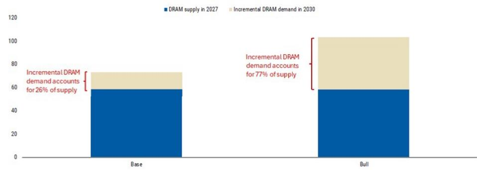  
Exhibit 23: We expect incremental DRAM demand will take up $2 6 - 7 7 \%$ of supply by 2027   
Source: Morgan Stanley Research estimates

Exhibit 24: DRAM specs for major AI CPUs   

<table><tr><td colspan="2">Company CPU</td><td>Arch</td><td>Launch</td><td>MemoryType</td><td>Channels</td><td>Peak Bandwidth</td><td>Max Capacity (per socket/chip)</td></tr><tr><td>Intel</td><td>Xeon 6(Granite Rapids)</td><td>x86</td><td>2024</td><td>DDR5/MRDIMM</td><td>12</td><td>~600-840GB/s</td><td>~4-6TB</td></tr><tr><td>Intel</td><td>Xeon 7(Diamond Rapids)</td><td>x86</td><td>2026 (est.)</td><td>DDR5 MRDIMM Gen2</td><td>16</td><td>~1.6 TB/s</td><td>~8-12 TB (est.)</td></tr><tr><td>AMD</td><td>EPYC 9004(Genoa/Bergamo)</td><td>x86</td><td>2022-2023</td><td>DDR5</td><td>12</td><td>~460-500 GB/s</td><td>~6TB</td></tr><tr><td>AMD</td><td>EPYC 9005 (Turin)</td><td>x86</td><td>2024</td><td>DDR5</td><td>12</td><td>~550-600+ GB/s</td><td>~6-8TB</td></tr><tr><td>AMD</td><td>EPYC &quot;Venice&quot;(Zen 6)</td><td>x86</td><td>2H26 (est.)</td><td>DDR5</td><td>16 (rumored)</td><td>~1.2-1.6 TB/s</td><td>N/A</td></tr><tr><td>AWS</td><td>Graviton4</td><td>Arm</td><td>2024</td><td>DDR5</td><td>~8-12*</td><td>~300-500 GB/s*</td><td>~1-3TB (est.)</td></tr><tr><td>Google</td><td>Axion</td><td>Arm</td><td>2025</td><td>DDR5</td><td>~8-12*</td><td>~300-500 GB/s*</td><td>~1-3TB(est.)</td></tr><tr><td>Microsoft</td><td>Cobalt 100</td><td>Arm</td><td>2024</td><td>DDR5</td><td>~8-12*</td><td>~300-500 GB/s*</td><td>~1-3TB(est.)</td></tr><tr><td>NVIDIA</td><td>Grace CPU</td><td>Arm</td><td>2023</td><td>LPDDR5X</td><td>Custom (wide bus)</td><td>~500 GB/s</td><td>~512GB</td></tr><tr><td>NVIDIA</td><td>Vera CPU</td><td>Arm</td><td>2026(es段添</td><td>LPDDR5X (SOCAMM)</td><td>Custom23321</td><td>04-20 1.2 TB/s</td><td>~1-1.5TB</td></tr><tr><td>ARM</td><td>AGI CPU</td><td>Arm</td><td>2026</td><td>DDR5</td><td>12</td><td>~816GB/s</td><td>~6TB</td></tr></table>

Source: Company data, Morgan Stanley Research; N/A $=$ not applicable

# ABF Substrate – Still Early Innings

ABF substrates are at the start of a powerful, AI-driven up-cycle set to last through the decade and supporting faster growth, pricing power and margin expansion. This cycle is structurally stronger and more sustainable than prior PC-driven cycles, with scope for sustained earnings growth in 2025-28. We see ABF demand shifting decisively toward AI, with GPUs, CPUs, ASICs and networking chips accounting for $7 5 \% +$ 信 LCD123321Cad 04-20 of end demand by 2030. We project ABF value growth to accelerate to a $1 6 . 1 \%$ CAGR over 2025-30. Preferred exposures are Unimicron, Samsung Electro-Mechanics and Nanya PCB.

An AI-driven ABF substrate up-cycle is set to last to the end of the decade, driving growth to accelerate and margins to expand. Over the next few quarters, we expect ABF substrate suppliers to raise pricing to end customers to reflect higher costs, and, moving into 2027, we think there could be further price hikes, driven by a shortage of ABF substrate capacity. The stocks have started to move, but this cycle will be much stronger and more sustainable – fueling multiple expansion. This AI-driven cycle is structurally different and much stronger, driving significant earnings growth in 2025-28, we estimate. Our favored names for exposure are Unimicron, Samsung Electro-Mechanics and Nan Ya PCB, and least favored is Ibiden, although this down to valuation/overheated earnings expectations. See our recent ABF Substates note here.

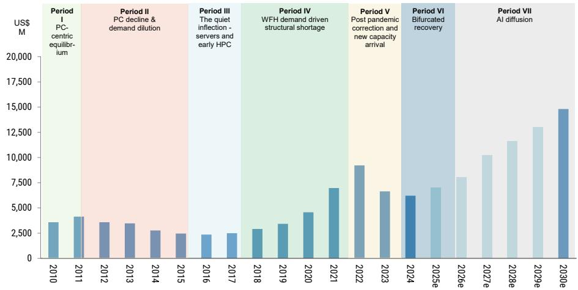  
订阅研报添加微信 LCD123321Cad 04-20 Exhibit 25: Entering the agentic AI era: ABF substrate market TAM to grow with AI   
Source: Company data, Morgan Stanley Research estimates (e)

添加微信 LCD123321Cad 04-20 ABF substrate value growth is set to accelerate over the next 5 years amid a shift in demand to AI. Based on our bottom-up analysis, we project that ABF substrates will be in an up-cycle until the end of this decade, with industry undersupply starting from late 2026-27 onwards. What was once a PC-driven market – with PCs accounting for $\sim 7 0 \%$ of it in 2015 – is undergoing a significant shift in demand, with AI-related applications (GPU, ASIC, server CPU, networking, etc.) capturing $7 5 \% +$ of the end market by 2030, on our estimates. With incremental demand from agentic AI and the enlarged CPU TAM, we estimate this will drive ABF substrates' value to accelerate at a $1 7 . 9 \%$ CAGR over 2025-30 (vs $1 6 . 1 \%$ CAGR without the incremental CPU TAM), and vs. just $9 . 0 \%$ over 2020-25.

With agentic AI and the upside to CPU TAM of 10-15m units by 2030, this will result in the server CPU ABF substrate market to grow to $\sim \$ 4.76 n$ by CY30. In reality, the market upside should be even slightly higher, as more networking demand will be needed to connect all these CPUs together. But this incremental $\sim \$ 1.2 b n$ of demand upside from server CPU ABF substrate alone would imply $5 . 7 0 \%$ upside to the overall ABF substrate TAM, all else equal.

For the ABF substrate market, without any new capacity additions, the enlarged CPU TAM would widen the supply-demand gap. In the scenario that we laid out back in February (see here), we estimate the under-supply gap will be ${ \sim } 7 \%$ by 2030, but with incremental 10-15m units of CPU TAM by 2030, this would cause the under-supply gap to widen to ${ \sim } 1 5 \%$ , which is a meaningful difference and would drive prices and margins up even more across the board for all ABF substrate suppliers.

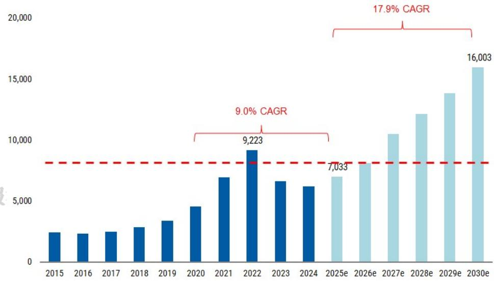  
Exhibit 26: Stronger ABF substrate market growth in the AI era   
Source: Company data, Morgan Stanley Research estimates (e)

  
Exhibit 27: We estimate agentic AI could drive $5 \mathrm { - } 1 0 \%$ incremental ABF substrate demand upside by 2030 from the enlarged CPU TAM alone   
Source: Prismark, Morgan Stanley Research estimates (e)

Key agentic AI drivers. We believe the demand drivers will be mainly supported by CPUs, GPUs, ASICs, and networking chips used in data centers. Because of the increased demand from computing, we believe the demand for all of these semiconductors will grow and/or remain elevated in the coming years.

加微信 LCD123321Cad 04-20 • For server CPUs, demand for general and storage computing highly correlates with overall AI demand. As such, we also forecast demand for server CPUs to rise in the coming years. In 2015, server CPUs only accounted for ${ \sim } 1 0 \%$ of total ABF substrate demand, but we estimate it has grown to ${ \sim } 3 7 \%$ in 2024 and will account for $\sim 2 4 \%$ of the total ABF substrate market in 2030, still the largest application.

• For data center GPU units – primarily NVIDIA GPUs – we forecast AI GPU units to grow $4 8 \%$ year on year in FY26 (February 2026 to January 2027) and to grow an additional $2 \%$ in FY27. We do not have a forecast beyond that, but we model conservatively in the years following, and estimate the market demand to remain elevated, but flattish.

• For AI ASICs, demand for in-house designed chips appears strong in the near to medium term, so we project units to continue to grow throughout the rest of the decade – we also continue to see rising demand from Meta, Microsoft, Open AI, China, etc., where demand is small today but we bake in some growth over the next few years.

# 订阅研报添

加微信 LCD123321Cad 04-20 • Lastly, for networking chips, we believe this is highly correlated to computing demand. With GPU demand remaining elevated and growing ASIC volumes, we believe demand for networking chips will also continue to grow over the next several years.

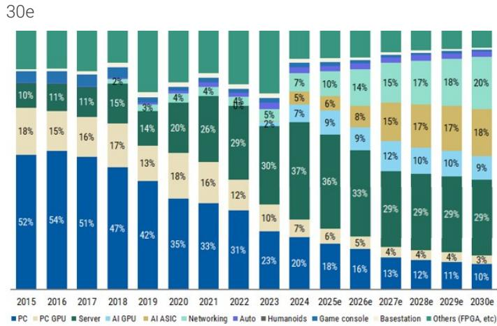  
Exhibit 28: ABF substrate demand by end applications, 2015-   
Source: Prismark, Morgan Stanley Research estimates (e)

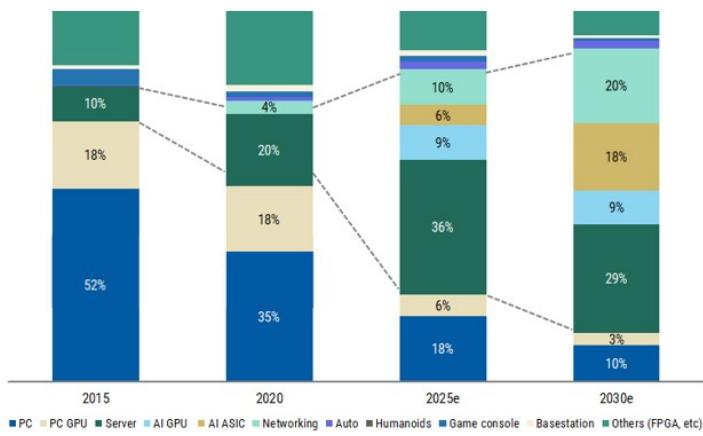  
Exhibit 29: ABF demand led by server, AI GPU, AI ASIC, and networking-related ABF   
Source: Prismark, Morgan Stanley Research estimates (e)

Larger package size and higher layer count are also a demand tailwind. Increasing demand for semiconductor circuit scale and functionality has been met with increases in the degree of integration of semiconductor dies and in package substrate mounting technology. With deterioration in cost performance owing to increases in the degree of integration of semiconductor dies and advancing process technology, moving to chiplets that contain multiple dies on one package substrate has become indispensable for raising total semiconductor performance.

Behind this is that once multiple functions are incorporated into a single semiconductor 添加微信 LCD123321Cad 04-20 die, die size expands, and manufacturing complexity and cost rise. Closely watched methods for mounting multiple semiconductor elements on one package substrate and increasing total semiconductor performance are:

• 3D – where semiconductor dies are stacked vertically, and • 2.5D – where semiconductor elements are connected via silicon or organic interposers on the package substrate.

Larger substrate size and higher layer count are particularly evident, in view of the increase in electrical connections to move data, control signals, and power between the AI accelerator dies and HBM memory stacks. This trend towards larger substrate size and higher layer count has been clear, and it does not appear to be reversing any time soon. So if we take into account the growth from substrate size and layer count, ABF substrate demand is set to grow even faster than unit growth.

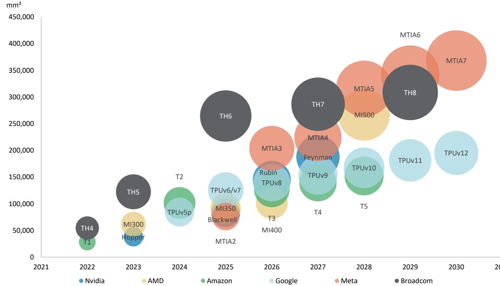  
Exhibit 30: Near-term ABF substrate trend points toward larger substrate sizes and higher layer count   
Source: Company data, Morgan Stanley Research estimates. Note: Bubble size indicates ABF substrate demand, including area size and layer count.

# More CPU Sockets Will Be Needed

This is another component that will benefit meaningfully from an enlarge CPU TAM, because every server CPU is accompanied by a CPU socket. Today, the server CPU market is mainly dominated by 3-4 suppliers, and we believe the enlarged server CPU TAM will mainly benefit FIT and Lotes under our coverage. We estimate FIT has around $40 \%$ global server CPU socket supply share, and Lotes ${ \sim } 3 5 \%$ .

On our estimates, every 1m CPU unit upside would drive 0.6% revenue upside to Lotes 添加微信 LCD123321Cad 04-20 and 0.2% revenue upside to FIT, purely from increased sockets supplied; a 10-15m CPU unit upside would result in ${ \sim } 7 \%$ revenue upside to Lotes and ${ \sim } 2 \%$ revenue upside to FIT. However, we believe the revenue upside to these two companies should be even higher, because an enlarged CPU TAM means more general servers, DRAM connectors, more PCIe connectors, and other connectors and cables, all of which Lotes and FIT have exposure to. So we believe the overall revenue opportunity and upside to Lotes and FIT should be higher.

Exhibit 31: Every 1m CPU demand upside would imply $0 . 5 \%$ CPU socket revenue upside to Lotes   

<table><tr><td colspan="2">Every1M Unitsof total CPU upside</td></tr><tr><td>Server CPU Socket ASP (US$)</td><td>21.9</td></tr><tr><td>Revenue upside to Lotes per 1M CPUs (US$ M)</td><td>7.7</td></tr><tr><td>Revenue upside to Lotes per1M CPUs (NT$ M)</td><td>241</td></tr><tr><td>Lotes 2026 total revenue estimate (NT$ M)</td><td>40,488</td></tr><tr><td>Lotes CPU Socket upside per 1M CPUs</td><td>0.6%</td></tr></table>

Source: Morgan Stanley Research estimates

Exhibit 33: Every 1m CPU demand upside would imply $0 . 2 \%$ CPU socket revenue upside to FIT   

<table><tr><td>Every1M Units of total CPU upside</td></tr><tr><td>Server CPU Socket ASP (US$) 21.9</td></tr><tr><td>Revenue upside to FIT per 1M CPUs (US$ M) 8.8</td></tr><tr><td>FIT 2026 total revenue estimate (US$ M) 5,483</td></tr><tr><td>FIT CPU Socket upside per 1M CPUs 0.2%</td></tr></table>

Source: Morgan Stanley Research estimates

2025 Server CPU Socket Supply Share

Exhibit 32: …and 10-15m CPU unit upside would drive ${ \sim } 7 \%$ CPU socket revenue upside to Lotes   

<table><tr><td colspan="2">IfCPUTAM grows10-15Munits..</td></tr><tr><td>Server CPU SocketASP(US$)</td><td>21.9</td></tr><tr><td>Revenueupside to Lotes if CPUTAM grows1O-15M units(US$M)</td><td>95.7</td></tr><tr><td>Revenueupside to LotesifCPUTAM grows1O-15Munits(NTSM)</td><td>3,015</td></tr><tr><td>Lotes2O26 total revenue estimate(NT$M)</td><td>41,065</td></tr><tr><td>LotesCPUSocketupsideifCPUTAMgrows10-15Munits</td><td>7.3%</td></tr></table>

123321Cad 04-20 Source: Morgan Stanley Research estimates

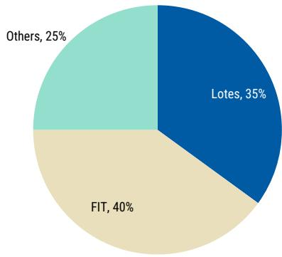  
Exhibit 35: We estimate FIT has ${ \sim } 4 0 \%$ global server CPU supplier share and Lotes ${ \sim } 3 5 \%$

Exhibit 34: 10-15m CPU unit upside would drive ${ \sim } 2 \%$ CPU socket revenue upside to FIT   

<table><tr><td>IfCPUTAM grows10-15Munits..</td><td></td></tr><tr><td>Server CPU SocketASP(US$)</td><td>21.9</td></tr><tr><td>Revenue upside toFITif CPUTAM grows1O-15M units (USS M)</td><td>109.4</td></tr><tr><td>FIT2026 ABF revenue estimate (NT$M)</td><td>5,483</td></tr><tr><td>FITCPUSocketupsideifCPUTAMgrows10-15Munits</td><td>2.0%</td></tr></table>

Source: Morgan Stanley Research estimates

# Passive Components TAM Will Also Grow

MLCC and passive components are also placed in general servers everywhere, so an enlarged server CPU TAM would drive upside to MLCC and other passive component demand. Different server specifications have different layouts of passive components and different volume and value content, so it is also extremely hard to quantify the content. But for simplicity's sake, we estimate $\sim \$ 30$ MLCC content per general server, which houses on average $_ { 2 \times }$ CPUs today. This was quantified in a report we published in 2024 ¥mûR _®Oá   LCD123321Cad   04-20(Global Technology: MLCC – Quantifying the Cloud & Edge AI Opportunity), where we quantified the MLCC market for different end segments.

In that report, we sized the general server MLCC TAM at $\$ 400 – 500 m$ . This year, we estimate the total MLCC market globally is $\sim \$ 15$ -16bn and, by 2030, we think it will reach $\$ 206n$ (assuming it remains at $5 \%$ CAGR from here on out). This would imply that a 10- 15m CPU unit demand upside by 2030 would drive incremental $\sim \$ 500 m$ MLCC value demand, or $2 - 3 \%$ upside to the overall MLCC market globally by 2030.

For Yageo specifically, we estimate that every \~1m CPU demand upside would result in $0 . 1 \%$ revenue upside, and a 10-15m CPU unit upside would result in a $1 - 2 \%$ revenue upside to Yageo, all else equal. However, Yageo also has exposure to inductors, resistors and tantalum capacitors, which are also all present in general servers, so the overall revenue upside should be higher.

Exhibit 36: Every 1m CPU demand upside would imply $0 . 1 \%$ MLCC revenue upside to Yageo ‹¢–xb¥mûR _®   

<table><tr><td colspan="2">Every1M Unitsof total CPU upside</td></tr><tr><td>Server MLCC Content (US$)</td><td>30.0</td></tr><tr><td>Revenue upside to Yageo per 1M CPUs (US$ M)</td><td>4.5</td></tr><tr><td>Revenue upside to Yageo per 1M CPUs (NT$ M)</td><td>142</td></tr><tr><td>Yageo 2026 total revenue estimate (NT$ M)</td><td>155,443</td></tr><tr><td>Yageo MLCC revenue upside per 1M CPUs</td><td>0.1%</td></tr></table>

Source: Morgan Stanley Research estimates

Exhibit 37: 10-15m CPU unit upside would drive $1 - 2 \%$ MLCC   LCD123321Cadrevenue upside to Yageo 04-20   

<table><tr><td colspan="2">IfCPUTAM grows10-15Munits...</td></tr><tr><td>ServerMLCC Content (US$)</td><td>30.0</td></tr><tr><td>Revenue upside to Yageo if CPUTAM grows1O-15Munits(US$M)</td><td>56.3</td></tr><tr><td>Revenue upside to Yageo if CPUTAM grows1O-15M units(NT$M)</td><td>1,772</td></tr><tr><td>Yageo2O26 total revenue estimate(NTSM)</td><td>158,893</td></tr><tr><td>YageoMLCCrevenueupsideifCPUTAMgrows1O-15Munits</td><td>1.1%</td></tr></table>

Source: Morgan Stanley Research estimates

# Greater China Semiconductor: Foundry, Design Service and IC Design – Seizing the CPU (Agentic AI) Opportunity

# Strong server CPU demand from agentic AI and inferencing workload

The CPU plays a critical role in enabling agentic AI, serving as the central coordinator that 添加微信 LCD123321Cad 04-20 executes instructions, manages system resources, and ensures reliable, real-time decisionmaking. While specialized hardware like GPUs and accelerators handle large-scale parallel computations, the CPU orchestrates the overall workflow – handling task scheduling, memory management, I/O operations, and the logic that underpins autonomous behavior. In agentic AI systems, which require continuous perception, reasoning and action, the CPU is essential for low-latency control loops, system stability, and integration across diverse components.

Therefore, we have been seeing strong server CPU demand since 2025, then with another jump in 2026. Besides server CPU demand, we have also seen the demand rebound for a few models of client CPU, such as Apple Mac Mini, to support the edge AI demand. As the result, we are forecasting overall CPU TAM for foundry to reach nearly $\$ 33b{ \mathrm { b } }$ in 2026 and then to $\$ 376n$ by 2028. Within the TAM, we see TSMC, serving as the major foundry, as likely to reach around $70 \%$ of the market share in 2026 and continuing to grow to $7 5 \%$ in 2028 with the nodes for those CPU also continuing to migrate, like GPU and ASIC. For 添加微信 LCD123321Cad 04-20 example, the forthcoming server CPU from AMD (Venice) and NVIDIA (Vera) are adopting TSMC's leading-edge 2nm and 3nm process, both one node migration from prior generation.

Lastly, we expect Intel will outsource its server CPU production to TSMC by 2H27, as it is facing fierce competition from AMD in the server/data center CPU space, whereas TSMC is more available to provide better time-to-market of its server CPU production with highquality chips (suggesting better CPU performance).

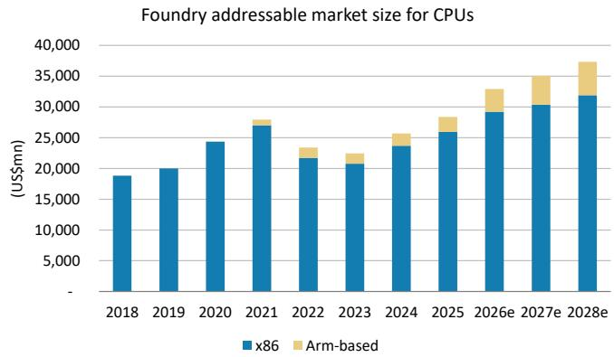  
Exhibit 38: Foundry addressable market size for CPUs   
Source: Company data, Morgan Stanley Research estimates (e)

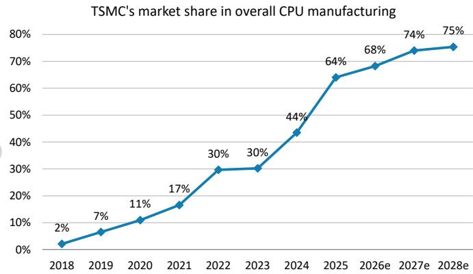  
Exhibit 39: TSMC's market share in overall CPU manufacturing   
Source: Company data, Morgan Stanley Research estimates (e)

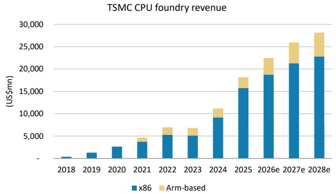  
Exhibit 40: TSMC CPU foundry revenue   
Source: Company data, Morgan Stanley Research estimates

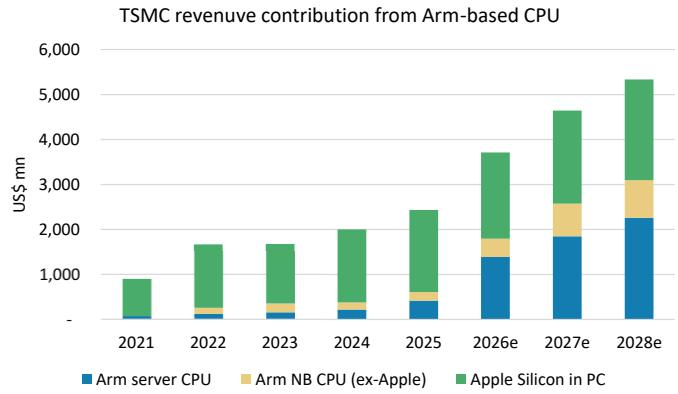  
Exhibit 41: TSMC revenue contribution from Arm-based CPU   
Source: Company data, Morgan Stanley Research estimates

# Strong Arm-based CPU demand could benefit GUC from 2026 and beyond

Within our Greater China Semiconductor coverage, GUC has the highest revenue mix from the CPU demand. In our January notes Benefiting from Google TPU/CPU demand upside and Stronger demand from automotive chips and Arm-based CPUs, we highlighted GUC's 2026 revenue upside from strong Google CPU demand. Our recent industry checks suggest that inference and general server demand for Arm-based CPUs is even stronger, including Google CPU. We now forecast Google CPU shipments to grow to 1.5mn units in 2026 (vs. 0.8mn units previously), which could contribute $\$ 123,45$ of revenue to GUC, or $5 5 0 \%$ 微信 LCD123321Cad 04-20  of its 2026 revenue. Our checks also suggest that gross margin could also be 1- 2ppts better than our previous anticipation of $5 \%$ given the better order scale at TSMC.

In the meantime, we note that GUC also helps with the Cobalt 200 CPU for Microsoft, an Arm-based design tailored for Microsoft Cloud. Our checks also indicate strong demand for Cobalt at >1mn units in 2027 and onwards. We therefore forecast $\$ 500 –600 m$ revenue contribution from this in 2027-28.

Lastly, GUC management noted that it has secured next-gen Arm-based CPU design wins from its major customers, including both Google CPU and Microsoft Cobalt CPU. We therefore believe GUC can benefit from this agentic AI or inferencing demand at least until 2028.

Exhibit 42: GUC: Major customer breakdown   

<table><tr><td>Revenue(Us$mn)</td><td>2025e</td><td>2026e</td><td>2027e</td><td>2028e</td><td>2025Y/Y 2026Y/Y 2027Y/Y 2027Y/Y</td><td></td><td></td><td></td></tr><tr><td colspan="9">NRE</td></tr><tr><td>NormalNREprojects</td><td>76</td><td>170</td><td>200</td><td>220</td><td>-49%</td><td>124%</td><td>18%</td><td>10%</td></tr><tr><td>Ship-outs</td><td>185</td><td>108</td><td>110</td><td>120</td><td>68%</td><td>-42%</td><td>2%</td><td>9%</td></tr><tr><td>Total NRE</td><td>261</td><td>278</td><td>310</td><td>340</td><td>0%</td><td>7%</td><td>12%</td><td>10%</td></tr><tr><td colspan="9">Turnkey</td></tr><tr><td>Microsoft</td><td>60</td><td>80</td><td>150</td><td>400</td><td>100%</td><td>33%</td><td>88%</td><td>167%</td></tr><tr><td>Google</td><td>150</td><td>1,200</td><td>1,600</td><td>1,600</td><td>NA</td><td>700%</td><td>33%</td><td>0%</td></tr><tr><td>Korean Al Start-up</td><td>0</td><td>20</td><td>80</td><td>80</td><td>NA</td><td>NA</td><td>300%</td><td>0%</td></tr><tr><td>xAI/Tesla</td><td>0</td><td>125</td><td>800</td><td>1,200</td><td>NA</td><td>NA</td><td>540%</td><td>50%</td></tr><tr><td>Rivos</td><td>0</td><td>30</td><td>40</td><td>40</td><td>NA</td><td>NA</td><td>33%</td><td>0%</td></tr><tr><td>Amazon Lab126</td><td>0</td><td>50</td><td>100</td><td>100</td><td>NA</td><td>NA</td><td>100%</td><td>0%</td></tr><tr><td>SK Hynix</td><td>50</td><td>10</td><td>10</td><td>10</td><td>-38%</td><td>-80%</td><td>0%</td><td>0%</td></tr><tr><td>Sandisk</td><td>0</td><td>20</td><td>250</td><td>250</td><td>NA</td><td>NA</td><td>1150%</td><td>0%</td></tr><tr><td>China ADAS</td><td>0</td><td>20</td><td>100</td><td>200</td><td>NA</td><td>NA</td><td>400%</td><td>100%</td></tr><tr><td>Suzhou Centec</td><td>54</td><td>27</td><td>14</td><td>7</td><td>-50%</td><td>-50%</td><td>-50%</td><td>-50%</td></tr><tr><td>Macronix</td><td>56</td><td>68</td><td>81</td><td>98</td><td>30%</td><td>20%</td><td>20%</td><td>20%</td></tr><tr><td>DJI</td><td>35</td><td>10</td><td>5</td><td>5</td><td>-31%</td><td>-71%</td><td>-50%</td><td>0%</td></tr><tr><td>Aspeed</td><td>105</td><td>121</td><td>139</td><td>150</td><td>50%</td><td>15%</td><td>15%</td><td>8%</td></tr><tr><td>Sony</td><td>29</td><td>26</td><td>23</td><td>21</td><td>-10%</td><td>-10%</td><td>-10%</td><td>-10%</td></tr><tr><td>Other turnkey</td><td>292</td><td>251</td><td>208</td><td>202</td><td>221%</td><td>-14%</td><td>-17%</td><td>-3%</td></tr><tr><td>Total turnkey</td><td>831</td><td>2,058</td><td>3,600</td><td>4,362</td><td>65%</td><td>148%</td><td>75%</td><td>21%</td></tr><tr><td>Ex-US CSP turnkey</td><td>621</td><td>653</td><td>1,050</td><td>1,162</td><td>31%</td><td>5%</td><td>61%</td><td>11%</td></tr><tr><td colspan="9">IP</td></tr><tr><td>Google (GLink)</td><td>2</td><td>5</td><td>5</td><td>5</td><td>NA</td><td>150%</td><td>0%</td><td>0%</td></tr><tr><td>Microsoft (HBM3E)</td><td>4</td><td>5</td><td>5</td><td>5</td><td>0%</td><td>25%</td><td>0%</td><td>0%</td></tr><tr><td>Others</td><td>2</td><td>7</td><td>7</td><td>7</td><td>-80%</td><td>250%</td><td>0%</td><td>0%</td></tr><tr><td>Totalrevenue</td><td>1,100</td><td>2,353</td><td>3,927</td><td>4,719</td><td>41.2%</td><td>113.9%</td><td>66.9%</td><td>20.2%</td></tr></table>

Source: Company data, Morgan Stanley Research estimates (e); $\mathsf { Y } / \mathsf { Y } =$ year on year

Within our Greater China semiconductor coverage, among other design service vendors, Egis is working on diversifying into the AI and HPC supply chain. The company has made several investments into non-fingerprint business in the past few years, and these are now coming to fruition. We believe the two most important are its acquisition of InPsytech and a ${ \sim } 2 0 \%$ stake in Alcor Micro (not covered) ( Exhibit 43 ). Egis has also expanded its staff and joined Arm's total design alliance with the aim of winning long-term ASIC business opportunities.

Alcor provides an Arm-based CPU platform, with two cores connected by UCI-E named Mobius 100 ( Exhibit 44 ), which have been developed and built internally within the Egis alliance instead of licensing from a third party. According to Alcor, Mobius 100 could also provide heterogeneous chiplets (CPU with AI Acc/GPU/NPD). We think this could be suitable for neocloud or supercomputing clients outside of the US, given the ongoing data center buildout there ( Exhibit 46 ), according to our supply chain checks. Alcor previously announced the timeline for its Arm-based CPU Mobius 100, with tape-out in 2Q26 and mass production in 4Q27. We are Equal-weight on Egis, however, as we are still waiting for future project wins.

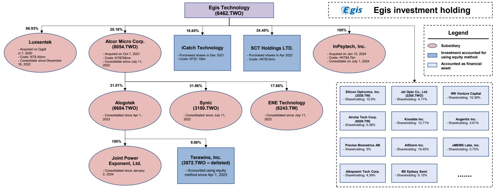  
Exhibit 43: Egis: Organizational structure   
Source: Company data, Morgan Stanley Research

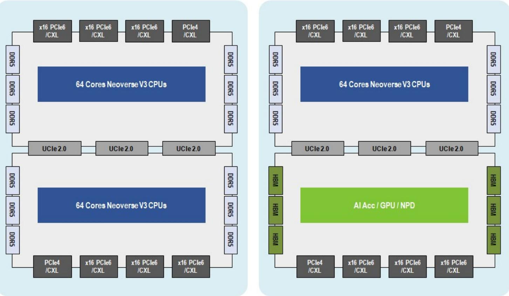  
Exhibit 44: Alcor Arm-based CPU Mobius 100 (CCS V3) with CSA compliance   
Source: Alcor

Exhibit 45: Spec summary of Mobius 100: single vs dual die configuration   

<table><tr><td rowspan=1 colspan=3> List of Feature                       70 Cores with Single CPU die              140 Cores Single package with Two CPU dies</td></tr><tr><td rowspan=1 colspan=1>Project / Product Name</td><td rowspan=1 colspan=2>Mobius100</td></tr><tr><td rowspan=1 colspan=1> Product Application</td><td rowspan=1 colspan=2>HPC Server</td></tr><tr><td rowspan=1 colspan=1>CSS V3 Version</td><td rowspan=1 colspan=2>CSS V3 V1 EAC2 (The latest Version, support CPU to CPU and CPU to Al Accelerator)</td></tr><tr><td rowspan=1 colspan=1>Process Node</td><td rowspan=1 colspan=2> TSMC N3P</td></tr><tr><td rowspan=1 colspan=1> Single Die Size</td><td rowspan=1 colspan=2>420 mm^2</td></tr><tr><td rowspan=1 colspan=1>Processor Architecture Specifications</td><td rowspan=1 colspan=2> Supports RME (Realm Management Extension)and Arm Confidential Compute Architecture (CCA)Supports SVE2 (Scalable Vector Extension x 2) with 128-bit vector length</td></tr><tr><td rowspan=1 colspan=1>Core Voltage</td><td rowspan=1 colspan=2>0.75v</td></tr><tr><td rowspan=1 colspan=1>CPU Core Max Clock Frequency</td><td rowspan=1 colspan=2>Normal Mode: 3.0GHz @0.75v Turbo Mode: 3.6GHz @0.85v</td></tr><tr><td rowspan=1 colspan=1>Power Consumption</td><td rowspan=1 colspan=2>~170W                                            ~350W</td></tr><tr><td rowspan=1 colspan=1>Core Numbers</td><td rowspan=1 colspan=1> One Die is 70Cores, 6Cores for redundant</td><td rowspan=1 colspan=1>One package is 140Cores, 12Cores for redundant</td></tr><tr><td rowspan=1 colspan=1> DRAM Capacity</td><td rowspan=1 colspan=1>DDR5@12800, MRDIMM x6DDR5 BW : 614.4 GB/s</td><td rowspan=1 colspan=1>DDR5@12800,MRDIMM x12Capacity up to 1,536 GB</td></tr><tr><td rowspan=1 colspan=1> PCle Slot Numbers</td><td rowspan=1 colspan=1> PCleGen6 x 3 PCleGen4 x 1</td><td rowspan=1 colspan=1> Double to single CPU die</td></tr><tr><td rowspan=1 colspan=1>D2D Feasibility</td><td rowspan=1 colspan=2>UCle2.0-S x36 x CCG by 64B CXS I/F3x CCG_CML_SMP,3x CCG_CHIC2C</td></tr><tr><td rowspan=1 colspan=1> Multichip Expansion</td><td rowspan=1 colspan=1> 1. Up to 4 CPU Chiplets 2. Accelerator or memory expansion</td><td rowspan=1 colspan=1>1. Through CXL/PCle and CML_SMP UCle2. Through CXL type2/3 or CHIC2C UCle</td></tr><tr><td></td><td rowspan=1 colspan=1>订 西矿报标加倾信 LCDIzJsz1Cad 0T-z0</td><td></td></tr></table>

Source: Alcor

Exhibit 46: Cloud Service Providers continuing their data center construction plans in Europe   

<table><tr><td colspan="5">Europe</td></tr><tr><td>Company</td><td>Country</td><td>Location</td><td>Available</td><td>Upcoming Sub Total</td></tr><tr><td rowspan="9"></td><td>Belgium</td><td>Farciennes</td><td></td><td>1</td><td rowspan="9"></td></tr><tr><td>Denmark</td><td>St. Ghislain Fredericia</td><td>1</td><td>1</td></tr><tr><td>Finland</td><td></td><td>1</td><td>1</td></tr><tr><td>Germany</td><td>Hamina</td><td>6</td><td></td></tr><tr><td></td><td>Hanau</td><td>1</td><td></td></tr><tr><td>Ireland</td><td>Dublin</td><td>2</td><td>21</td></tr><tr><td>Netherlands</td><td>Eemshaven</td><td>2</td><td></td></tr><tr><td></td><td>Groningen</td><td></td><td></td></tr><tr><td colspan="2">GPUs,which we believe will lead to a significant increas</td><td></td><td>1</td></tr><tr><td colspan="5">添加微信 LCD123321Cad 04-20 A AI</td></tr><tr><td rowspan="10">AWS</td><td></td><td>hlofmointoin Waitham Cross</td><td></td><td>1 1</td></tr><tr><td>Sweden</td><td>Stockholm</td><td></td><td></td></tr><tr><td>Germany</td><td>Frankfurt</td><td>3 3</td><td></td></tr><tr><td>Ireland</td><td>Ireland</td><td></td><td></td></tr><tr><td>UK</td><td>London</td><td>3 3</td><td>27</td></tr><tr><td>Italy</td><td>Milan</td><td>3</td><td></td></tr><tr><td>France</td><td>Paris</td><td>3</td><td></td></tr><tr><td>Spain</td><td>Spain</td><td>3</td><td></td></tr><tr><td>Switzerland</td><td>Zurich</td><td>3</td><td></td></tr><tr><td>EU</td><td>European Sovereign Cloud</td><td></td><td>3</td></tr><tr><td rowspan="10">Meta</td><td>Denmark</td><td>Odense</td><td>1</td><td></td></tr><tr><td>Ireland</td><td>Clonee</td><td>1</td><td>3</td></tr><tr><td>Sweden</td><td>Lulea</td><td>1</td><td></td></tr><tr><td>UK</td><td>London</td><td>2</td><td></td></tr><tr><td></td><td>Newport</td><td>2</td><td></td></tr><tr><td>France</td><td>Paris</td><td>1</td><td></td></tr><tr><td></td><td>Marseille</td><td>1</td><td></td></tr><tr><td>Germany</td><td>Frankfurt</td><td></td><td></td></tr><tr><td>Italy</td><td>Milan</td><td>1</td><td>1</td></tr><tr><td>Netherlands</td><td>TBD</td><td></td><td>17</td></tr><tr><td>Serbia</td><td>Amsterdam</td><td>1</td><td></td><td></td></tr><tr><td>Spain</td><td>Jovanovac</td><td>1</td><td></td><td></td></tr><tr><td></td><td>Madrid</td><td>2</td><td></td><td></td></tr><tr><td></td><td>TBD</td><td></td><td>1</td><td></td></tr><tr><td>Sweden Switzerland</td><td>Stockholm</td><td>1</td><td></td><td></td></tr><tr><td>UK</td><td>Zurich</td><td></td><td></td><td></td></tr><tr><td rowspan="19">MSFT</td><td></td><td>London</td><td>3</td><td></td></tr><tr><td>Switzerland Zurich</td><td>Cardiff</td><td>1</td><td></td><td></td></tr><tr><td>Sweden</td><td></td><td>3</td><td></td><td></td></tr><tr><td>Spain</td><td>Gävle and Sandviken</td><td>3</td><td></td><td></td></tr><tr><td>Poland</td><td>Madrid</td><td>3</td><td></td><td></td></tr><tr><td>Norway</td><td>Warsaw</td><td>3</td><td></td><td></td></tr><tr><td></td><td>Oslo</td><td>3</td><td></td><td>49</td></tr><tr><td>Italy Greece</td><td>Milan</td><td>3</td><td></td><td></td></tr><tr><td>Germany</td><td></td><td></td><td>3</td><td></td></tr><tr><td>France</td><td>Frankfurt</td><td>3</td><td></td><td></td></tr><tr><td>Finland</td><td>Paris</td><td>3</td><td></td><td></td></tr><tr><td>Ireland</td><td>Helsinki</td><td></td><td>3</td><td></td></tr><tr><td></td><td>Ireland</td><td>3</td><td></td><td></td></tr><tr><td>Netherlands</td><td>Netherlands</td><td>3</td><td></td><td></td></tr><tr><td>Denmark</td><td>Copenhagen</td><td></td><td>3</td><td></td></tr><tr><td>Belgium Austria</td><td>Brussels</td><td>3</td><td>3</td><td></td></tr><tr><td>UK</td><td>Vienna London</td><td>1</td><td>1</td><td></td></tr><tr><td></td><td>Crawley</td><td>1</td><td></td><td></td></tr><tr><td>Coreweave Spain</td><td>Barcelona</td><td>2</td><td></td><td>7</td></tr><tr><td>Sweden</td><td>Stockholm</td><td>1</td><td></td><td></td></tr><tr><td>Norway</td><td></td><td></td><td></td><td></td></tr><tr><td></td><td>Vennesla</td><td></td><td>1</td><td></td></tr><tr><td>Total</td><td></td><td></td><td>26</td><td></td></tr><tr><td></td><td></td><td></td><td></td><td></td></tr><tr><td></td><td></td><td></td><td></td><td>124</td></tr><tr><td></td><td></td><td></td><td>98</td><td></td></tr></table>

Source: Company data, Morgan Stanley Research

# BMC to benefit from strong CPU demand

Baseboard management IC (BMC) is the key component on the server board, with a view to enabling the remote control for the server firmware system and maintaining the stability of the data center. Previously, Aspeed indicated that general server and AI ASIC server actually generate higher efficiency among the capex spending from hyperscalers ( Exhibit 47 ). As a result, as the CPU plays a critical role in enabling agentic AI, serving as the central coordinator that executes instructions, manages system resources, and ensures reliable, real-time decision-making, we expect the growing demand for CPU/ 添加微信 LCD123321Cad 04-20 general server to further lift Aspeed's BMC revenue in the coming years.

Currently, Aspeed has $\sim 7 0 \%$ market shares in the CPU server BMC market, with major US and Chinese hyperscalers being its end customers, including Meta, AWS, Alibaba and Microsoft. However, as it migrates into the new generation BMC product AST2700, we expect it to further expand its market shares in customers including Dell and Google, which would help expand its revenue as spec migration also brings $4 0 { - } 5 0 \%$ of ASP increase.

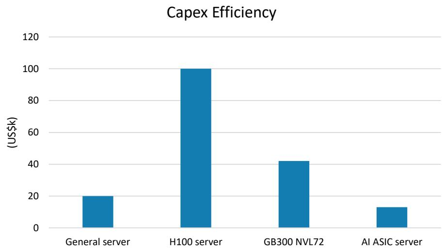  
Exhibit 47: General server and AI ASIC server generate the highest capex efficiency for BMC   
Source: Company data, Morgan Stanley Research. Note: Capex efficiency is defined as the amount of server spend that will contribute to one BMC demand. The lower capex efficiency, the better for Aspeed.

# 订阅研报

Aspeed recently announced a rise in the company's BMC TAM from $4 6 . 5 \mathsf { m n }$ to $6 5 . 7 7 \mathsf { m n }$ in 2030, mainly driven by AI-related general server demand, which we think agentic AI would be the key driving force behind. General server growth should stay stable at $6 \%$ from 添加微信 LCD123321Cad 04-20 2025-2030, while AI-related general servers should account for: (1) $2 5 \%$ of total 2026 general server demand, (2) $45 \%$ in 2027, and (3) $20 \%$ throughout over 2028-2030 ( Exhibit 48 ).

On the order visibility front, customers began providing forecasts $7 . 8 \times$ its single-month revenue. Although Aspeed could not roll out any double booking, the current dynamic is for shipments way beyond customers' needs. According to the company, customers also expect double capacity year on year in 2027.

# BMC TAM Forecast Revised

We see hugedemand forAl-related General Server foragentic Al workload and simple inference tasks.   
BMCTAMisestimatedtobe65.77millionunitsin2030.

  
Exhibit 48: Aspeed expects its BMC TAM to reach 65.7mn units in 2030   
Note：1) BMCforGeneral Serverswill growat6%CAGR. 2)BMCforAlrelatedGeneralServersisestimatedtobe8.5millonin2026,with45%growthratein2027and20%thereafter 3)BMCforGPUserversandAlASICserversin2026isbasedontheestimateofGPUandAlASICshipmentandtheserverarchitecture 4)AssumingBMCforGPUServersgrowat45%in2027and20%afterwards.WealsoincludeBMCsforICMShere. 5)AssumingBMCforAlASlCServersgrowat45%in2027and $2 0 \%$ afterwards.

Delivering quantum-resilient OcP Caliptra security across the entire ASPEED product portfolio.

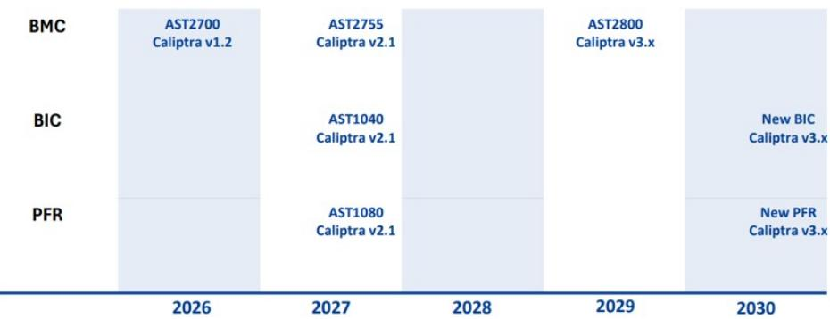  
Source: Aspeed   
Exhibit 49: Aspeed's product roadmap   
Source: Aspeed

# Montage set to benefit from CPU demand through memory interface chips

# Core business DRAM interconnect business levered to cloud capex/memory

supercycle: Montage is a cloud capex proxy through its main memory interconnect business. Globally, cloud capex industry growth is projected to remain high, at a $30 \%$ CAGR over 2025-2027, we estimate, with ongoing investment from the top CSPs. The memory supercycle from 2H25 also suggests higher memory interface content per general server. We believe the strong cloud/memory cycle will drive faster technology migration, which is positive for Montage, a technology leader. As of $2 0 2 4$ , the company had a revenue market share of $3 6 . 8 \%$ in the global memory interconnect chip market, followed by Rambus $( 3 6 . 0 \% )$ and Renesas $( 2 0 . 5 \% )$ . Montage has been an incumbent leader in the segment, and it continues to maintain technology advantages over its competitors. As of 2025, the memory interconnect revenue generated by Montage was ${ \sim } 1 . 7 \times$ that of the product revenue of Rambus.

Legacy Flash – likely the next DDR4: We think MLC and legacy TLC NAND could face a deeper shortage into 2H, with undersupply potentially reaching $\sim 4 0 \%$ . Global capacity for 2GB to 64GB NAND has virtually disappeared. Customer inventory generally covers only another 6-9 months. Macronix remains the only supplier able to fill the gap. We expect MLC and legacy TLC pricing to rise more than $200 \%$ from 1Q26 to 4Q26.

# Earnings Revisions and Price Target Changes

SK hynix (Overweight)

What's changed? We update our 2026 ASP assumptions according to our latest channel check data. As most of the suppliers are in talks with key customers on 3-5 year long-term agreements (LTAs), which provide downside protection to the pricing trend, we now expect pricing to remain elevated throughout 2027, compared with our previous model 添加微信 LCD123321Cad 04-20 which assumed prices would start to decline in 2H27. For 2028, we now model $- 7 9 \%$ and - $23 \%$ for DRAM/NAND ASP year on year, reflecting our cautious view on when capacity catches up.

As a result, our 2026-28 EPS estimates for SK hynix rise by $2 4 \%$ $3 7 \%$ and $7 8 \% ,$ respectively, and we increase our residual income based price target by $3 7 \%$ to W1,700,000, implying $4 \times 2 0 2 7 \mathsf { P } / \mathsf { E } ,$ on our estimates, and $c . 5 0 \%$ potential upside from the current share price. We increase our bull case valuation by $6 \%$ to W2,580,000, reflecting stronger earnings momentum, while our bear case remains unchanged at W400,000 as we assume weaker macro conditions could slow data center growth.

Exhibit 52: SK hynix: Earnings revisions   

<table><tr><td rowspan=2 colspan=10>FY26E                    FY27E                     FY28E(W bn)             Previous Revised Change Previous  Revised  Change  Previous  Revised  Change</td></tr><tr><td rowspan=1 colspan=3>Previous Revised Change</td><td rowspan=1 colspan=3>Previous  Revised  Change</td><td rowspan=1 colspan=3>Previous  Revised  Change</td></tr><tr><td rowspan=9 colspan=1>SalesDRAM (&amp; HBM)NANDOperating ProfitDRAM (&amp; HBM)NANDOP MarginDRAM (&amp; HBM)HBM</td><td rowspan=1 colspan=1>281,377</td><td rowspan=1 colspan=1>335,034</td><td rowspan=1 colspan=1>19%</td><td rowspan=1 colspan=1>378,771</td><td rowspan=1 colspan=1>487,189</td><td rowspan=1 colspan=1>29%</td><td rowspan=1 colspan=1>329,365</td><td rowspan=1 colspan=1>505,430</td><td rowspan=1 colspan=1>53%</td></tr><tr><td rowspan=1 colspan=1>227,536</td><td rowspan=1 colspan=1>249,923</td><td rowspan=1 colspan=1>10%</td><td rowspan=1 colspan=1>311,339</td><td rowspan=1 colspan=1>370,194</td><td rowspan=1 colspan=1>19%</td><td rowspan=1 colspan=1>272,861</td><td rowspan=1 colspan=1>387,771</td><td rowspan=1 colspan=1>42%</td></tr><tr><td rowspan=1 colspan=1>52,528</td><td rowspan=1 colspan=1>83,797</td><td rowspan=1 colspan=1>60%</td><td rowspan=1 colspan=1>66,119</td><td rowspan=1 colspan=1>115,682</td><td rowspan=1 colspan=1>75%</td><td rowspan=1 colspan=1>55,190</td><td rowspan=1 colspan=1>116,346</td><td rowspan=1 colspan=1>111%</td></tr><tr><td rowspan=1 colspan=1>222,498</td><td rowspan=1 colspan=1>276,791</td><td rowspan=1 colspan=1>24%</td><td rowspan=1 colspan=1>298,316</td><td rowspan=1 colspan=1>407,567</td><td rowspan=1 colspan=1>37%</td><td rowspan=1 colspan=1>226,146</td><td rowspan=1 colspan=1>403,298</td><td rowspan=1 colspan=1>78%</td></tr><tr><td rowspan=1 colspan=1>191,816</td><td rowspan=1 colspan=1>214,203</td><td rowspan=1 colspan=1>12%</td><td rowspan=1 colspan=1>260,803</td><td rowspan=1 colspan=1>319,658</td><td rowspan=1 colspan=1>23%</td><td rowspan=1 colspan=1>208,254</td><td rowspan=1 colspan=1>323,164</td><td rowspan=1 colspan=1>55%</td></tr><tr><td rowspan=1 colspan=1>30,682</td><td rowspan=1 colspan=1>62,588</td><td rowspan=1 colspan=1>104%</td><td rowspan=1 colspan=1>37,513</td><td rowspan=1 colspan=1>87,909</td><td rowspan=1 colspan=1>134%</td><td rowspan=1 colspan=1>17,892</td><td rowspan=1 colspan=1>80,134</td><td rowspan=1 colspan=1>348%</td></tr><tr><td rowspan=3 colspan=1>79%84%72%</td><td rowspan=1 colspan=1>83%</td><td rowspan=1 colspan=1>4pp</td><td rowspan=1 colspan=1>79%</td><td rowspan=1 colspan=1>84%</td><td rowspan=1 colspan=1>5pp</td><td rowspan=1 colspan=1>69%</td><td rowspan=1 colspan=1>80%</td><td rowspan=1 colspan=1>11pp</td></tr><tr><td rowspan=1 colspan=1>86%</td><td rowspan=1 colspan=1>1pp</td><td rowspan=1 colspan=1>84%</td><td rowspan=1 colspan=1>86%</td><td rowspan=1 colspan=1>3pp</td><td rowspan=1 colspan=1>76%</td><td rowspan=1 colspan=1>83%</td><td rowspan=1 colspan=1>7pp</td></tr><tr><td rowspan=1 colspan=1>72%</td><td rowspan=1 colspan=1>Opp</td><td rowspan=1 colspan=1>69%</td><td rowspan=1 colspan=1>69%</td><td rowspan=1 colspan=1>Opp</td><td rowspan=1 colspan=1>64%</td><td rowspan=1 colspan=1>64%</td><td rowspan=1 colspan=1>Opp</td></tr><tr><td rowspan=3 colspan=1>NANDNet ProfitEPS for consensus</td><td rowspan=1 colspan=1>58%</td><td rowspan=1 colspan=1>75%</td><td rowspan=1 colspan=1>16pp</td><td rowspan=1 colspan=1>57%</td><td rowspan=1 colspan=1>76%</td><td rowspan=1 colspan=1>19pp</td><td rowspan=1 colspan=1>32%</td><td rowspan=1 colspan=1>69%</td><td rowspan=1 colspan=1>36pp</td></tr><tr><td rowspan=1 colspan=1>172,174</td><td rowspan=1 colspan=1>214,166</td><td rowspan=1 colspan=1>24%</td><td rowspan=1 colspan=1>232,037</td><td rowspan=1 colspan=1>316,738</td><td rowspan=1 colspan=1>37%</td><td rowspan=1 colspan=1>174,699</td><td rowspan=1 colspan=1>310,625</td><td rowspan=1 colspan=1>78%</td></tr><tr><td rowspan=1 colspan=1>241,579</td><td rowspan=1 colspan=1>300,498</td><td rowspan=1 colspan=1>24%</td><td rowspan=1 colspan=1>325,574</td><td rowspan=1 colspan=1>444,418</td><td rowspan=1 colspan=1>37%</td><td rowspan=1 colspan=1>245,121</td><td rowspan=1 colspan=1>435,841</td><td rowspan=1 colspan=1>78%</td></tr></table>

Source: Morgan Stanley Research estimates

Exhibit 53: SK hynix: Key assumptions   

<table><tr><td></td><td colspan="3">FY26E</td><td colspan="3">FY27E</td><td colspan="3">FY28E</td></tr><tr><td></td><td>Previous</td><td>Revised</td><td>Change</td><td>Previous</td><td>Revised</td><td>Change</td><td>Previous</td><td>Revised</td><td>Change</td></tr><tr><td>DRAM Bit (1Gb Eq, mn)</td><td>114,607</td><td>114,607</td><td>0.0%</td><td>143,134</td><td>143,134</td><td>0.0%</td><td>175,210</td><td>175,210</td><td>0.0%</td></tr><tr><td>DRAM Bit Growth</td><td>20.9%</td><td>20.9%</td><td>0.0pp</td><td>24.9%</td><td>24.9%</td><td>0.0pp</td><td>22.4%</td><td>22.4%</td><td>0.0pp</td></tr><tr><td>DRAM ASP (1Gb eq; USS)</td><td>1.6</td><td>1.8</td><td>12%</td><td>1.51</td><td>1.89</td><td>25%</td><td>1.05</td><td>1.6</td><td>49%</td></tr><tr><td>DRAMOPM</td><td>84.3%</td><td>85.7%</td><td>1.4pp</td><td>83.8%</td><td>86.3%</td><td>2.6pp</td><td>76.3%</td><td>83.3%</td><td>7.0pp</td></tr><tr><td>HBM Bit (1Gb Eq, mn)</td><td>13,657</td><td>13,657</td><td>0%</td><td>18,144</td><td>18,144</td><td>0%</td><td>20,769</td><td>20,769</td><td>0%</td></tr><tr><td>HBM ASP (1Gb eq; USS)</td><td>2.1</td><td>2.08</td><td>0%</td><td>2.14</td><td>2.14</td><td>0%</td><td>2.04</td><td>2.04</td><td>0%</td></tr><tr><td>HBM OPM</td><td>72.0%</td><td>72.0%</td><td>0.0pp</td><td>68.7%</td><td>68.7%</td><td>0.0pp</td><td>64.1%</td><td>64.1%</td><td>0.0pp</td></tr><tr><td>Conv.DRAMASP</td><td>1.5</td><td>1.7</td><td>14%</td><td>1.4</td><td>1.9</td><td>30%</td><td>0.9</td><td>1.5</td><td>62%</td></tr><tr><td>Growth YoY</td><td>191.1%</td><td>232.6%</td><td>22%</td><td>(5.1%)</td><td>8.2%</td><td>nm</td><td>(34.6%)</td><td>(18.5%)</td><td>nm</td></tr><tr><td>NAND Bit (1GB, mn)</td><td>213,755</td><td>213,755</td><td>0.0%</td><td>257,515</td><td>257,515</td><td>0.0%</td><td>312,764</td><td>312,764</td><td>0.0%</td></tr><tr><td>NAND Bit Growth</td><td>14.9%</td><td>14.9%</td><td>0.0pp</td><td>20.5%</td><td>20.5%</td><td>0.0pp</td><td>21.5%</td><td>21.5%</td><td>0.0pp</td></tr><tr><td>NAND ASP (1GB eq; US$)</td><td>0.2</td><td>0.3</td><td>70%</td><td>0.18</td><td>0.3</td><td>84%</td><td>0.12</td><td>0.3</td><td>111%</td></tr><tr><td>NAND OPM</td><td>58.4%</td><td>74.7%</td><td>16.3pp</td><td>56.7%</td><td>76.0%</td><td>19.3pp</td><td>32.4%</td><td>68.9%</td><td>36.5pp</td></tr><tr><td>USD/KRWrate</td><td>1,450</td><td>1,450</td><td>0.0%</td><td>1,34</td><td>1,341</td><td>0.0%</td><td>1,312</td><td>1,312</td><td>0.0%</td></tr><tr><td>Number of Shares (mn)</td><td>712,702</td><td>712,702</td><td>0.0%</td><td>712,702</td><td>712,702</td><td>0.0%</td><td>712,702</td><td>712,702</td><td>0.0%</td></tr></table>

Source: Morgan Stanley Research estimates; nm $=$ not meaningful

Exhibit 54: SK hynix: Residual income model   

<table><tr><td>RIM Fiscal period</td><td>FY24A</td><td>FY25A</td><td>FY26E 2</td><td>FY27E</td><td></td><td>FY28E FY29E</td><td>FY30E</td><td>FY31E</td><td></td><td>FY32E</td><td>FY33E</td><td>FY34E</td><td>FY35E</td><td>Terminal</td></tr><tr><td>Forecast year</td><td>0</td><td>1</td><td></td><td></td><td>3</td><td>4</td><td>5</td><td>6</td><td>7</td><td>8</td><td>9</td><td>10</td><td>11</td><td>value</td></tr><tr><td></td><td></td><td></td><td></td><td></td><td></td><td></td><td></td><td></td><td></td><td></td><td></td><td></td><td></td><td></td></tr><tr><td>Total Shareholder Equity</td><td>73,916</td><td>113,916</td><td>325,468</td><td>640,264</td><td></td><td>953,684 1,175,</td><td>1,358,816</td><td>1,564,869</td><td></td><td>1,801,530</td><td>2,067,566</td><td>2,357,277</td><td>2,673,851</td><td>2,754,066</td></tr><tr><td>Core Net Profit</td><td>19,797</td><td>42,948</td><td>213,690</td><td>315,865</td><td></td><td>314,578 222,778</td><td>184,670</td><td></td><td>207,328</td><td>237,935</td><td>267,310</td><td>290,985</td><td>317,848</td><td>327,384</td></tr><tr><td>Residual income</td><td></td><td>32,148</td><td>188,426</td><td>260,335</td><td></td><td>222,926 100,361</td><td>38,959</td><td></td><td>39,216</td><td>44,367</td><td>44,837</td><td>36,557</td><td>28,558</td><td>29,415</td></tr><tr><td>ROE</td><td></td><td>45.73%</td><td>97.27%</td><td>65.41%</td><td></td><td>39.47% 20.93%</td><td>14.57%</td><td></td><td>14.18%</td><td>14.14%</td><td>13.82%</td><td>13.15%</td><td>12.64%</td><td>12.06%</td></tr><tr><td></td><td></td><td></td><td></td><td></td><td></td><td></td><td></td><td></td><td></td><td></td><td></td><td></td><td></td><td></td></tr><tr><td>Discount period</td><td></td><td>0.00</td><td>0.50</td><td></td><td>1.50</td><td>2.50</td><td>3.50</td><td>4.50</td><td>5.50</td><td>6.50</td><td>7.50</td><td>8.50</td><td>9.50</td><td></td></tr><tr><td>Discount factor</td><td></td><td>1.00</td><td></td><td>0.95</td><td>0.85</td><td>0.76</td><td>0.68</td><td>0.61</td><td>0.55</td><td>0.49</td><td>0.44</td><td>0.40</td><td>0.36</td><td>0.36</td></tr><tr><td>PV of Equity Capital</td><td></td><td>32,147.6</td><td>178,444.3</td><td>221,116.0</td><td></td><td>169,814.1 68,565.2</td><td>23,870.8</td><td></td><td>21,550.1</td><td>21,866.1</td><td>19,818.5</td><td>14,492.1</td><td>10,153.6</td><td>10,458.2</td></tr></table>

Source: Company data, Morgan Stanley Research estimates (E)

# 研报添加微信 LCD123321Cad 04-20

# Samsung Electronics (Overweight)

What's changed? We update our 2026 ASP assumptions according to our latest channel check data. As most of the suppliers are in talks with key customers on 3-5 year LTAs, which provide downside protection to the pricing trend, we now expect pricing to remain elevated throughout 2027, compared with our previous model which assumed prices would start to decline in 2H27. For 2028, we now model $- 7 4 \%$ for DRAM/NAND ASP year on year, reflecting our cautious view on when capacity catches up.

As a result, our 2026-28 EPS estimates for Samsung rise by $45 \%$ , $7 4 \%$ and $1 2 1 \% ,$ respectively, and we increase our residual income based target price by $4 4 \%$ to W362,000, implying 5x 2027 P/E, on our estimates, and $6 8 \%$ potential upside from the 添加微信 LCD123321Cad 04-20 current share price. We increase our bull case valuation by $34 \%$ to W430,000, reflecting stronger earnings momentum, and our bear case PT by $1 8 \%$ to W120,000 as we assume weaker macro conditions could slow data center growth.

For Samsung Electronics preferred shares, we now apply a $20 \%$ discount (based on the past 2-year average) to the common shares vs. a $1 5 \%$ discount previously (based on the past 10-year average). The reason for the change is that most of the new ETF/basket products on AI and memory segments only include the common share, which leads to larger discrepancy structurally. Our updated price target is now W289,600, and our bull and bear valuations are W344,000 and W96,000, respectively.

Exhibit 55: Samsung Electronics: Earnings revisions   

<table><tr><td></td><td colspan="3">FY26E</td><td colspan="3">FY27E</td><td colspan="3">FY28E</td></tr><tr><td>(W bn)</td><td>Previous</td><td>Revised</td><td>Change</td><td>Previous</td><td>Revised</td><td>Change</td><td>Previous</td><td>Revised</td><td>Change</td></tr><tr><td>Sales</td><td>583,348</td><td>735,259</td><td>26%</td><td>719,814</td><td>1,010,929</td><td>40%</td><td>698,805</td><td>1,074,793</td><td>54%</td></tr><tr><td>Semiconductor (DS)</td><td>386,042</td><td>514,881</td><td>33%</td><td>485,922</td><td>749,058</td><td>54%</td><td>427,946</td><td>774,028</td><td>81%</td></tr><tr><td>Memory</td><td>350,390</td><td>479,122</td><td>37%</td><td>435,727</td><td>698,862</td><td>60%</td><td>375,001</td><td>721,084</td><td>92%</td></tr><tr><td>Display</td><td>38,926</td><td>39,036</td><td>0%</td><td>40,402</td><td>40,402</td><td>0%</td><td>44,528</td><td>41,510</td><td>-7%</td></tr><tr><td>Mobile/Network</td><td>125,837</td><td>148,800</td><td>18%</td><td>153,359</td><td>181,338</td><td>18%</td><td>180,429</td><td>213,352</td><td>18%</td></tr><tr><td>Harman</td><td>19,822</td><td>19,822</td><td>0%</td><td>22,310</td><td>22,310</td><td>0%</td><td>22,979</td><td>22,979</td><td>0%</td></tr><tr><td>Operating Profit</td><td>299,008</td><td>428,085</td><td>43%</td><td>367,446</td><td>630,601</td><td>72%</td><td>271,32</td><td>609,886</td><td>125%</td></tr><tr><td>Semiconductor (DS)</td><td>265,550</td><td>397,738</td><td>50%</td><td>327,480</td><td>592,017</td><td>81%</td><td>245,041</td><td>585,307</td><td>139%</td></tr><tr><td>Memory</td><td>267,164</td><td>399,361</td><td>49%</td><td>327,495</td><td>592,032</td><td>81%</td><td>243,587</td><td>583,853</td><td>140%</td></tr><tr><td>Display</td><td>5,569</td><td>1,589</td><td>-71%</td><td>5,523</td><td>2,020</td><td>-63%</td><td>6,424</td><td>2,075</td><td>-68%</td></tr><tr><td>Mobile/Network</td><td>3,969</td><td>4,837</td><td>22%</td><td>11,686</td><td>13,807</td><td>18%</td><td>14,672</td><td>17,319</td><td>18%</td></tr><tr><td>Harman</td><td>1,982</td><td>1,982</td><td>0%</td><td>2,231</td><td>2,231</td><td>0%</td><td>2,298</td><td>2,298</td><td>0%</td></tr><tr><td>OP Margin</td><td>51.3%</td><td>58.2%</td><td>7.0ppt</td><td>51.0%</td><td>62.4%</td><td>11.3ppt</td><td>38.8%</td><td>56.7%</td><td>17.9ppt</td></tr><tr><td>Semiconductor (DS)</td><td>68.8%</td><td>77.2%</td><td>8.5ppt</td><td>67.4%</td><td>79.0%</td><td>11.6ppt</td><td>57.3%</td><td>75.6%</td><td>18.4ppt</td></tr><tr><td>Memory</td><td>76.2%</td><td>83.4%</td><td>7.1ppt</td><td>75.2%</td><td>84.7%</td><td>9.6ppt</td><td>65.0%</td><td>81.0%</td><td>16.0ppt</td></tr><tr><td>Display</td><td>14.3%</td><td>4.1%</td><td>-10.2ppt</td><td>13.7%</td><td>5.0%</td><td>-8.7ppt</td><td>14.4%</td><td>5.0%</td><td>-9.4ppt</td></tr><tr><td>Mobile/Network</td><td>3.2%</td><td>3.3%</td><td>0.1ppt</td><td>7.6%</td><td>7.6%</td><td>0.0ppt</td><td>8.1%</td><td>8.1%</td><td>0.0ppt</td></tr><tr><td>Harman</td><td>10.0%</td><td>10.0%</td><td>0.0ppt</td><td>10.0%</td><td>10.0%</td><td>0.0ppt</td><td>10.0%</td><td>10.0%</td><td>0.0ppt</td></tr><tr><td>Net Profit</td><td>242,832</td><td>353,057</td><td>45%</td><td>275,994</td><td>480,008</td><td>74%</td><td>217,225</td><td>480,929</td><td>121%</td></tr><tr><td>EPS for consensus</td><td>36,027.7</td><td>52,371.8</td><td>45%</td><td>40,967.0</td><td>71,227.7</td><td>74%</td><td>32,091.3</td><td>71,049.1</td><td>121%</td></tr></table>

Source: Morgan Stanley Research estimates

Exhibit 56: Samsung Electronics: Key assumptions   

<table><tr><td></td><td colspan="3">FY26E</td><td colspan="3">FY27E</td><td colspan="3">FY28E</td></tr><tr><td></td><td>Previous</td><td>Revised</td><td>Change</td><td>Previous</td><td>Revised</td><td>Change</td><td>Previous</td><td>Revised</td><td>Change</td></tr><tr><td>Mobile shipment (mn)</td><td>309</td><td>353</td><td>14.2%</td><td>347</td><td>397</td><td>14.5%</td><td>357</td><td>409</td><td>14.5%</td></tr><tr><td>Mobile blended ASP (US$)</td><td>258</td><td>269</td><td>3.9%</td><td>305</td><td>317</td><td>3.9%</td><td>350</td><td>364</td><td>3.9%</td></tr><tr><td>OPM</td><td>3.2%</td><td>3.3%</td><td>0.0ppt</td><td>7.6%</td><td>7.6%</td><td>0.0ppt</td><td>8.1%</td><td>8.1%</td><td>0.0ppt</td></tr><tr><td>DRAMOP</td><td>209,299</td><td>259,020</td><td>23.8%</td><td>257,887</td><td>382,923</td><td>48.5%</td><td>184,396</td><td>389,254</td><td>111.1%</td></tr><tr><td>DRAM OPM</td><td>83.3%</td><td>85.9%</td><td>3.2%</td><td>82.1%</td><td>86.7%</td><td>5.6%</td><td>73.4%</td><td>83.8%</td><td>14.1%</td></tr><tr><td>DRAM Bit (1Gb Eq, mn)</td><td>137,787</td><td>143,117</td><td>3.9%</td><td>164,635</td><td>176,205</td><td>7.0%</td><td>189,036</td><td>216,297</td><td>14.4%</td></tr><tr><td>DRAM Bit Growth</td><td>21.7%</td><td>26.4%</td><td>4.7%</td><td>19.5%</td><td>23.1%</td><td>3.6%</td><td>14.8%</td><td>22.8%</td><td>7.9%</td></tr><tr><td>DRAM ASP (1Gb eq; USS)</td><td>1.26</td><td>1.45</td><td>15.5%</td><td>1.42</td><td>1.87</td><td>31.4%</td><td>1.01</td><td>1.64</td><td>61.7%</td></tr><tr><td>DRAM ASP Growth</td><td>223.4%</td><td>273.4%</td><td>50.1%</td><td>13.1%</td><td>28.7%</td><td>15.6%</td><td>(28.9%)</td><td>(12.4%)</td><td>16.4%</td></tr><tr><td>HBM OP</td><td>26,092</td><td>26,351</td><td>1.0%</td><td>39,375</td><td>42,039</td><td>6.8%</td><td>35,535</td><td>42,493</td><td>19.6%</td></tr><tr><td>HBM OPM</td><td>68.0%</td><td>68.6%</td><td>1.0%</td><td>68.3%</td><td>68.9%</td><td>0.9%</td><td>64.2%</td><td>64.9%</td><td>1.0%</td></tr><tr><td>HBM Bit (1Gb Eq, mn)</td><td>13,075.2</td><td>13,055</td><td>(0.16%)</td><td>20,121.7</td><td>21,34</td><td>6.05%</td><td>20,366.8</td><td>24,108</td><td>18.37%</td></tr><tr><td>HBM Bit Growth</td><td>149.66%</td><td>149.26%</td><td>(0.39%)</td><td>53.89%</td><td>63.47%</td><td>9.57%</td><td>1.22%</td><td>12.97%</td><td>11.76%</td></tr><tr><td>HBM ASP (1Gb eq; US$)</td><td>2.02</td><td>2.03</td><td>0.16%</td><td>2.14</td><td>2.13</td><td>(0.22%)</td><td>2.07</td><td>2.07</td><td>(0.01%)</td></tr><tr><td>HBM ASP Growth YoY</td><td>20.07%</td><td>20.26%</td><td>0.19%</td><td>5.52%</td><td>5.13%</td><td>(0.39%)</td><td>(3.10%)</td><td>(2.90%)</td><td>0.20%</td></tr><tr><td>NAND OP</td><td>57,866</td><td>140,341</td><td>142.5%</td><td>69,608</td><td>209,109</td><td>200.4%</td><td>59,191</td><td>194,599</td><td>228.8%</td></tr><tr><td>NAND OPM</td><td>58.4%</td><td>79.0%</td><td>35.2%</td><td>57.3%</td><td>81.3%</td><td>42.0%</td><td>47.8%</td><td>75.8%</td><td>58.8%</td></tr><tr><td>NAND Bit (1GB, mn)</td><td>375,583</td><td>375,583</td><td>0.0%</td><td>450,858</td><td>460,809</td><td>2.2%</td><td>517,079</td><td>548,252</td><td>6.0%</td></tr><tr><td>NAND Bit Growth</td><td>17.6%</td><td>17.6%</td><td>0.0%</td><td>20.0%</td><td>22.7%</td><td>2.6%</td><td>14.7%</td><td>19.0%</td><td>4.3%</td></tr><tr><td>NAND ASP (1GB eq; USS)</td><td>0.18</td><td>0.33</td><td>79.4%</td><td>0.20</td><td>0.42</td><td>106.9%</td><td>0.18</td><td>0.36</td><td>95.2%</td></tr><tr><td>NAND ASP Growth</td><td>110.3%</td><td>277.3%</td><td>166.9%</td><td>10.6%</td><td>27.6%</td><td>17.0%</td><td>(9.2%)</td><td>(14.3%)</td><td>(5.1%)</td></tr><tr><td>USD/KRW rate</td><td>1,450</td><td>1,450</td><td>0.0%</td><td>1,341</td><td>1,341</td><td>0.0%</td><td>1,312</td><td>1,312</td><td>0.0%</td></tr><tr><td>Number of Shares (mn)</td><td>6,607</td><td>6,607</td><td>0.0%</td><td>6,607</td><td>6,607</td><td>0.0%</td><td>6,607</td><td>6,607</td><td>0.0%</td></tr></table>

Source: Morgan Stanley Research estimates

Exhibit 57: Samsung Electronics: Residual income model   

<table><tr><td>RIM Fiscal period</td><td>FY25A</td><td>FY26E</td><td>FY27E</td><td>FY28E</td><td>FY29E</td><td>FY30E</td><td>FY31E</td><td>FY32E</td><td>FY33E</td><td>FY34E</td><td></td><td>FY35E 9</td><td>FY36E Terminal 10</td></tr><tr><td>Forecast year</td><td>0</td><td>0</td><td>1</td><td>2</td><td>3</td><td>4</td><td>5</td><td>6</td><td>7</td><td>8</td><td></td><td></td><td>value</td></tr><tr><td>Total Shareholder Equity</td><td>429,422</td><td>754,785</td><td>1,202,481</td><td>1,652,237</td><td>2,009,719</td><td>2,303,187</td><td>2,557,400</td><td>2,811,212</td><td>3,127,541</td><td>3,514,111</td><td>3,992,943</td><td>4,575,127</td><td>4,112,731</td></tr><tr><td>Residual Income</td><td></td><td>284,965</td><td>367,465</td><td>316,783</td><td>178,093</td><td>76,650</td><td>5,903</td><td>(23,710)</td><td>6,025</td><td>35,849</td><td>78,350</td><td>120,694</td><td>69,992</td></tr><tr><td>Core Net Profit</td><td>45,225</td><td>353,057</td><td>480,008</td><td>480,929</td><td>388,656</td><td>324,642</td><td>285,387</td><td>284,985</td><td>347,503</td><td>417,744</td><td>510,005</td><td>613,358</td><td>525,306</td></tr><tr><td>ROE</td><td></td><td>59.63%</td><td>49.05%</td><td>33.69%</td><td>21.23%</td><td>15.05%</td><td>11.74%</td><td>10.62%</td><td>11.70%</td><td>12.58%</td><td>13.59%</td><td>14.32%</td><td>13.2%</td></tr><tr><td></td><td></td><td></td><td></td><td></td><td></td><td></td><td></td><td></td><td></td><td></td><td></td><td></td><td></td></tr><tr><td>Discount period</td><td></td><td>0.00</td><td>1.00</td><td>2.00</td><td>3.00</td><td>4.00</td><td>5.00</td><td>6.00</td><td>7.00</td><td>8.00</td><td>9.00</td><td>10.00</td><td></td></tr><tr><td>Discount factor</td><td></td><td>1.00</td><td>0.90</td><td>0.80</td><td>0.72</td><td>0.65</td><td>0.58</td><td>0.52</td><td>0.47</td><td>0.42</td><td>0.38</td><td>0.34</td><td>0.38</td></tr><tr><td>PVof Equity Capital</td><td></td><td>284,965.2</td><td>329,565.4</td><td>254,807.3</td><td>128,476.4</td><td>49,592.1</td><td>3,425.2</td><td>(12,339.0)</td><td>2,812.0</td><td>15,006.6</td><td>29,414.7</td><td>40,638.3</td><td>26,276.8</td></tr></table>

Source: Company data, Morgan Stanley Research estimates (E)

# 研报添加微信 LCD123321Cad 04-20

# Samsung Electro-Mechanics (Overweight)

What's changed? We raise our SEMCO MLCC margin assumption from mid-teens to midhigh teens over 2026-28 on the back of stronger AI MLCC mix as well as IT MLCC recovering from its previous trough. We increase ABF revenue growth to $\sim 5 0 \%$ level in 2026-27 due to stronger ASP amid industry-wide tightness, while in 2028 we model ABF revenue growth of $5 7 \%$ as new capacity ramps up. We lift our 2026-28 margin assumptions for ABF from mid- $20 \%$ to low $30 \%$ due to better pricing. As a result, our 2026-28 EPS forecasts increase by $0 \%$ , $1 9 \%$ and $3 7 \%$ respectively.

As MLCC and ABF exposure to AI is increasing, the market tends to re-rate the stocks amid the structural tailwind. Hence, the previous cycle peak valuation reference is no longer 添加微信 LCD123321Cad 04-20 suitable for SEMCO, we have change our methodology from an average of residual income and P/B approaches to just RI, reflecting the intrinsic value of the company.

We lift our residual income based price target by $42 \%$ to W710,000, implying 4x 2027 P/ B, on our estimates, and $c . 5 \%$ potential upside. The change reflects our earnings upgrades and higher $\mathsf { P / B }$ multiple, given SEMCO's stronger growth prospects. While we increase our bull case value by $3 8 \%$ to W730,000 on stronger earnings momentum, our bear case only moves up by $9 \%$ to W200,000, as we assume the MLCC localization trend intensifies, with more competition from Chinese suppliers resulting in increased pricing pressure.

Exhibit 58: Samsung Electro-Mechanics: Earnings revisions   

<table><tr><td rowspan=2 colspan=12>FY26E                   FY27E                     FY28E(W bn)               Previous Revised ChangePrevious  Revised  Change  Previous Revised  Change</td></tr><tr><td rowspan=1 colspan=3>Previous Revised Change</td><td rowspan=1 colspan=3>Previous  Revised  Change</td><td rowspan=1 colspan=3>Previous Revised  Change</td></tr><tr><td rowspan=2 colspan=3>SalesOptics</td><td rowspan=1 colspan=1>13,432</td><td rowspan=1 colspan=2>13,915  4%</td><td rowspan=1 colspan=2>16,649  17,894</td><td rowspan=1 colspan=1>7%</td><td rowspan=1 colspan=1>19,486</td><td rowspan=1 colspan=1>22,257</td><td rowspan=1 colspan=1>14%</td></tr><tr><td rowspan=1 colspan=1>4,036</td><td rowspan=1 colspan=1>4,036</td><td rowspan=1 colspan=1>0%</td><td rowspan=1 colspan=1>4,113</td><td rowspan=1 colspan=1>4,113</td><td rowspan=1 colspan=1>0%</td><td rowspan=1 colspan=1>4,039</td><td rowspan=1 colspan=1>4,039</td><td rowspan=1 colspan=1>0%</td></tr><tr><td rowspan=1 colspan=3>Substrate</td><td rowspan=1 colspan=1>2,933</td><td rowspan=1 colspan=1>2,951</td><td rowspan=1 colspan=1>1%</td><td rowspan=1 colspan=1>3,777</td><td rowspan=1 colspan=1>4,016</td><td rowspan=1 colspan=1>6%</td><td rowspan=1 colspan=1>4,785</td><td rowspan=1 colspan=1>5,765</td><td rowspan=1 colspan=1>20%</td></tr><tr><td rowspan=1 colspan=3>Components (MLCC)</td><td rowspan=1 colspan=1>6,463</td><td rowspan=1 colspan=1>6,928</td><td rowspan=1 colspan=1>7%</td><td rowspan=1 colspan=1>8,759</td><td rowspan=1 colspan=1>9,765</td><td rowspan=1 colspan=1>11%</td><td rowspan=1 colspan=1>10,662</td><td rowspan=1 colspan=1>12,453</td><td rowspan=1 colspan=1>17%</td></tr><tr><td rowspan=1 colspan=2>Operating Profit</td><td rowspan=1 colspan=1>rofit</td><td rowspan=1 colspan=1>1,753</td><td rowspan=1 colspan=1>1,802</td><td rowspan=1 colspan=1>3%</td><td rowspan=1 colspan=1>2,504</td><td rowspan=1 colspan=1>3,003</td><td rowspan=1 colspan=1>20%</td><td rowspan=1 colspan=1>3,111</td><td rowspan=1 colspan=1>4,110</td><td rowspan=1 colspan=1>32%</td></tr><tr><td rowspan=1 colspan=2>Optics</td><td rowspan=3 colspan=1>Components (MLCC)</td><td rowspan=1 colspan=1>188</td><td rowspan=1 colspan=1>188</td><td rowspan=1 colspan=1>0%</td><td rowspan=1 colspan=1>192</td><td rowspan=1 colspan=1>192</td><td rowspan=1 colspan=1>0%</td><td rowspan=1 colspan=1>202</td><td rowspan=1 colspan=1>219</td><td rowspan=1 colspan=1>8%</td></tr><tr><td rowspan=2 colspan=2>SubstrateComponents (MLCC)</td><td rowspan=1 colspan=1>462</td><td rowspan=1 colspan=1>492</td><td rowspan=1 colspan=1>7%</td><td rowspan=1 colspan=1>605</td><td rowspan=1 colspan=1>924</td><td rowspan=1 colspan=1>53%</td><td rowspan=1 colspan=1>756</td><td rowspan=1 colspan=1>1,488</td><td rowspan=1 colspan=1>97%</td></tr><tr><td rowspan=1 colspan=1>1,102</td><td rowspan=1 colspan=1>1,121</td><td rowspan=1 colspan=1>2%</td><td rowspan=1 colspan=1>1,707</td><td rowspan=1 colspan=1>1,886</td><td rowspan=1 colspan=1>11%</td><td rowspan=1 colspan=1>2,154</td><td rowspan=1 colspan=1>2,402</td><td rowspan=1 colspan=1>12%</td></tr><tr><td rowspan=1 colspan=3>OP Margin</td><td rowspan=1 colspan=1>13.0%</td><td rowspan=1 colspan=1>12.9%</td><td rowspan=1 colspan=1>-0.1pp</td><td rowspan=1 colspan=1>15.0%</td><td rowspan=1 colspan=1>16.8%</td><td rowspan=1 colspan=1>1.7pp</td><td rowspan=1 colspan=1>16.0%</td><td rowspan=1 colspan=1>18.5%</td><td rowspan=1 colspan=1>2.5pp</td></tr><tr><td rowspan=1 colspan=3>Optics</td><td rowspan=1 colspan=1>4.7%</td><td rowspan=1 colspan=1>4.7%</td><td rowspan=1 colspan=1>0.0pp</td><td rowspan=1 colspan=1>4.7%</td><td rowspan=1 colspan=1>4.7%</td><td rowspan=1 colspan=1>0.0pp</td><td rowspan=1 colspan=1>5.0%</td><td rowspan=1 colspan=1>5.4%</td><td rowspan=1 colspan=1>0.4pp</td></tr><tr><td rowspan=1 colspan=3>Substrate</td><td rowspan=1 colspan=1>15.8%</td><td rowspan=1 colspan=1>16.7%</td><td rowspan=1 colspan=1>0.9pp</td><td rowspan=1 colspan=1>16.0%</td><td rowspan=1 colspan=1>23.0%</td><td rowspan=1 colspan=1>7.0pp</td><td rowspan=1 colspan=1>15.8%</td><td rowspan=1 colspan=1>25.8%</td><td rowspan=1 colspan=1>10.0pp</td></tr><tr><td rowspan=1 colspan=3>Components (MLCC)</td><td rowspan=1 colspan=1>17.1%</td><td rowspan=1 colspan=1>16.2%</td><td rowspan=1 colspan=1>-0.9pp</td><td rowspan=1 colspan=1>19.5%</td><td rowspan=1 colspan=1>19.3%</td><td rowspan=1 colspan=1>-0.2pp</td><td rowspan=1 colspan=1>20.2%</td><td rowspan=1 colspan=1>19.3%</td><td rowspan=1 colspan=1>-0.9pp</td></tr><tr><td rowspan=2 colspan=3>Net ProfitEPS for consensus</td><td rowspan=1 colspan=1>1,482</td><td rowspan=1 colspan=1>1,484</td><td rowspan=1 colspan=1>0%</td><td rowspan=1 colspan=1>2,038</td><td rowspan=1 colspan=1>2,420</td><td rowspan=1 colspan=1>19%</td><td rowspan=1 colspan=1>2,477</td><td rowspan=1 colspan=1>3,244</td><td rowspan=1 colspan=1>31%</td></tr><tr><td rowspan=1 colspan=1>18,733</td><td rowspan=1 colspan=1>18,759</td><td rowspan=1 colspan=1>0%</td><td rowspan=1 colspan=1>25,766</td><td rowspan=1 colspan=1>30,596</td><td rowspan=1 colspan=1>19%</td><td rowspan=1 colspan=1>30,572</td><td rowspan=1 colspan=1>40,033</td><td rowspan=1 colspan=1>31%</td></tr></table>

Source: Morgan Stanley Research estimates

# 订阅研报

Exhibit 59: Samsung Electro-Mechanics: Residual income model   

<table><tr><td>RIM</td><td></td><td></td><td>FY27E</td><td>FY28E</td><td>FY29E</td><td>FY30E</td><td>FY31E</td><td>FY32E</td><td>FY33E</td><td>FY34E</td><td>FY35E</td><td>Terminal</td></tr><tr><td>Fiscal period Forecast year</td><td>FY25A 0</td><td>FY26E 1</td><td>2</td><td>3</td><td>4</td><td>5</td><td>6</td><td>7</td><td>8</td><td>9</td><td>10</td><td>value</td></tr><tr><td></td><td></td><td></td><td></td><td></td><td></td><td></td><td></td><td></td><td></td><td></td><td></td><td></td></tr><tr><td>Total Shareholder Equity</td><td>9,471</td><td>10,778</td><td>13,020</td><td>16,086</td><td>20,262</td><td>25,261</td><td>31,162</td><td>37,754</td><td>45,605</td><td>53,900</td><td>63,414</td><td>66,585</td></tr><tr><td>Residual Income</td><td></td><td>472 1,484</td><td>1,230</td><td>1,788</td><td>2,543</td><td>2,907</td><td>3,264</td><td>3,331</td><td>3,868</td><td>3,504</td><td>3,834</td><td>3,475</td></tr><tr><td>Core Net Profit ROE</td><td></td><td></td><td>2,420</td><td>3,244</td><td>4,360</td><td>5,183</td><td>6,086</td><td>6,776</td><td>8,035</td><td>8,479</td><td>9,699</td><td>10,184</td></tr><tr><td></td><td></td><td>14.66%</td><td>20.34%</td><td>22.29%</td><td>23.99%</td><td>22.77%</td><td>21.57%</td><td>19.67%</td><td>19.28%</td><td>17.04%</td><td>16.54%</td><td>15.7%</td></tr><tr><td>Discount period</td><td>0.00</td><td>1.00</td><td>2.00</td><td>3.00</td><td>4.00</td><td>5.00</td><td>6.00</td><td>7.00</td><td>8.00</td><td>9.00</td><td>10.00</td><td></td></tr><tr><td>Discount factor</td><td>1.00</td><td>0.91</td><td>0.83</td><td>0.75</td><td>0.68</td><td>0.62</td><td>0.56</td><td>0.51</td><td>0.47</td><td>0.42</td><td>0.39</td><td>0.39</td></tr><tr><td>PV of Equity Capital</td><td>0.0</td><td>428.8</td><td>1,016.9</td><td>1,343.6</td><td>1,736.9</td><td>1,805.1</td><td>1,842.7</td><td>1,709.1</td><td>1,804.2</td><td>1,486.0</td><td>1,478.1</td><td>1,339.6</td></tr><tr><td></td><td></td><td></td><td></td><td></td><td></td><td></td><td></td><td></td><td></td><td></td><td></td><td></td></tr><tr><td>Beginning Equity Capital</td><td>9,016</td><td></td><td></td><td></td><td></td><td></td><td></td><td></td><td></td><td></td><td></td><td></td></tr><tr><td>PV of Equity Capital</td><td>15,991</td><td></td><td></td><td></td><td></td><td></td><td></td><td></td><td></td><td></td><td></td><td></td></tr><tr><td>PV of Continuing Value</td><td>28,132</td><td></td><td></td><td></td><td></td><td></td><td></td><td></td><td></td><td></td><td></td><td></td></tr><tr><td>Total Equity Value</td><td>53,139</td><td></td><td></td><td></td><td></td><td></td><td></td><td></td><td></td><td></td><td></td><td></td></tr><tr><td>FD shares outstanding (&#x27;000)</td><td></td><td></td><td></td><td></td><td></td><td></td><td></td><td></td><td></td><td></td><td></td><td></td></tr><tr><td></td><td></td><td></td><td></td><td></td><td></td><td></td><td></td><td></td><td></td><td></td><td></td><td></td></tr><tr><td></td><td></td><td></td><td></td><td></td><td></td><td></td><td></td><td></td><td></td><td></td><td></td><td></td></tr><tr><td></td><td></td><td></td><td></td><td></td><td></td><td></td><td></td><td></td><td></td><td></td><td></td><td></td></tr><tr><td></td><td>75,547</td><td></td><td></td><td></td><td></td><td></td><td></td><td></td><td></td><td></td><td></td><td></td></tr><tr><td>Per share value</td><td>710,000</td><td></td><td></td><td></td><td></td><td></td><td></td><td></td><td></td><td></td><td></td><td></td></tr></table>

订阅研报添加微信 LCD123321Cad 04-20 Source: Company data, Morgan Stanley Research estimates (E)

# Risk Reward - SK hynix Risk Reward – SK hynix (000660.KS)

Robust commodity supercycle supported by AI in 2026

# W1,700,000PRICE TARGET

Our base case price target is derived from our residual income valuation model. We assume a cost of equity of $1 1 . 5 \%$ $( 5 \%$ risk-free rate, $6 . 5 \%$ risk premium, 1.0 beta) and a terminal growth rate of $3 \%$ .

Consensus Price Target Distribution

Source: Re fi nitiv, Morgan Stanley Research

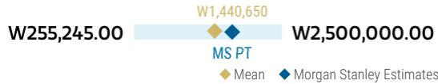

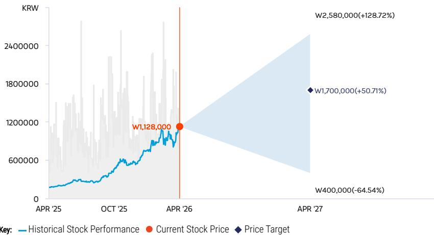  
RISK REWARD CHART   
Source: Re nitiv, Morgan Stanley Research

# OVERWEIGHT THESIS

▪ The commodity cycle is likely to stay robust in 2026 and into 2027, we believe, thanks to AI inference demand growth.

▪ We do not think this is the time to rotate out of outperformers such as SK hynix.

▪ Our price target implies c.4x 2027e P/E, in line with the stock's commodity cycle peak.

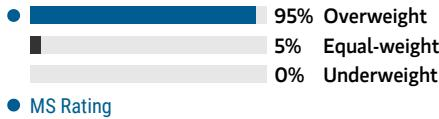  
Consensus Rating Distribution   
Source: Re nitiv, Morgan Stanley Research

# Risk Reward Themes

Pricing Power: Positive Secular Growth: Positive Self-help: Positive

View descriptions of Risk Rewards Themes here

# BULL CASE

# W2,580,000

# BASE CASE

# W1,700,000

# BEAR CASE

W400,000

# Memory TAM grows; AI HBM leadership is extended

We see a stronger-than-expected commodity cycle for DRAM and NAND, supported by AI inference demand moving into 2027. Our bull scenario valuation implies $\mathtt { 1 4 x P / E }$ on HBM contribution and $5 \times$ $P / E$ on commodity memory based on 2027e EPS.

# Commodity up-cycle

We see a stronger-than-expected commodity cycle for DRAM and NAND, supported by AI inference demand in 2026 and into 2027. HBM competition risks remain but are being increasingly recognized by the market. Our price target implies $3 . 8 \times$ 2027e P/E, underpinned by Hynix's leadership in HBM and a sharp rebound in commodity memory pricing.

# Weaker macro climate, HBM competition intensi es

We assume a period of AI computing fidigestion in 2026, leading to more aggressive margin erosion for the HBM segment owing to competitors' aggressive capacity expansion and pricing competition, as well as faster DRAM pricing drops with muted demand recovery. In our long-term assumptions for the bear case, we assume margin erosion for the HBM segment amid rising competition. Our bear case valuation implies 1.3x 2026e P/B.

# Risk Reward – SK hynix (000660.KS)

KEY EARNINGS INPUTS   

<table><tr><td>Drivers</td><td>2025</td><td>2026e</td><td>2027e</td><td>2028e</td></tr><tr><td>Revenue Growth (%)</td><td>125.9</td><td>650.8</td><td>1,386.9</td><td>663.6</td></tr><tr><td>OPM (%)</td><td>48.6</td><td>82.6</td><td>83.7</td><td>79.8</td></tr><tr><td>CAPEX (%)</td><td colspan="4">(2,840,890.0) (6,030,605.9) (7,07,28.6) (7,554.)</td></tr></table>

# INVESTMENT DRIVERS

Supply and demand outlook for DRAM and NAND   
Global demand for data center products (server DRAM, enterprise SSD)

# GLOBAL REVENUE EXPOSURE

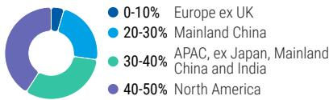  
Source: Morgan Stanley Research Estimate View explanation of regional hierarchies here

# MS ALPHA MODELS

<table><tr><td>1/5</td><td>3 Month</td></tr><tr><td>MOST</td><td>Horizon</td></tr></table>

Source: Re nitiv, FactSet, Morgan Stanley Research; 1 is the highest favored Quintile and 5 is the least favored Quintile

# RISKS TO PT/RATING

# RISKS TO UPSIDE

ASP growth re-acceleration Preemptive production cuts or disruption Sharp demand improvements Signi cant increase in capital returns

# RISKS TO DOWNSIDE

End demand turning weaker than expected Rising competition for DDR5, causing overspending on the supply side. Inventories remaining elevated at cloud and Chinese smartphone customers.

# OWNERSHIP POSITIONING

Inst. Owners, % Active $7 3 . 8 \%$

Source: Re nitiv, Morgan Stanley Research

# MS ESTIMATES VS. CONSENSUS

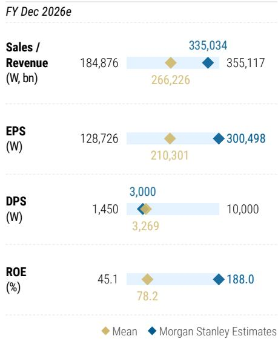  
Source: Re nitiv, Morgan Stanley Research

# Risk Reward – Samsung Electronics (005930.KS)

Improvement in HBM $^ +$ commodity up-cycle $\underline { { \underline { { \mathbf { \delta \pi } } } } }$ stock re-rating

# W362,000PRICE TARGET

Our base case price target is derived from our residual income valuation model. At our price target, the 2027e $P / \mathsf { B }$ multiple would be $0 . 2 x ,$ in line with the stock's commodity cycle peak of $\bar { 2 } . 0 { \times } .$ We assume an $1 1 . 5 \%$ cost of equity, based on a beta of 1.0, and our terminal growth rate assumption is $3 \%$ .

Consensus Price Target Distribution

W114,149.00

Source: Re fi nitiv, Morgan Stanley Research

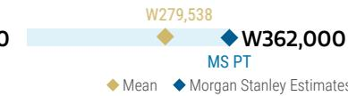

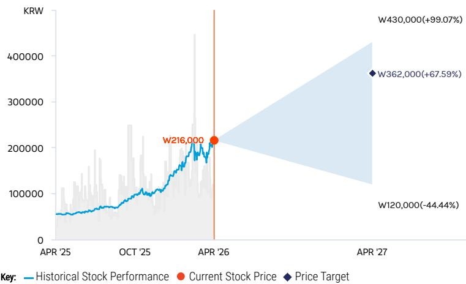  
RISK REWARD CHART   
Source: Re nitiv, Morgan Stanley Research

# OVERWEIGHT THESIS

▪ We expect pricing to move well beyond historical mean reversion from here, on a price per gigabit basis, which should create further incremental tailwinds to forecasts 04-20 for 2026-27. The commodity cycle is better than feared thanks to AI inference demand.

▪ We expect HBM improvement and potential market share gains from 2026.

▪ Rising prices and falling inventories, along with supply cuts and improving demand, are positives for margin recovery in the memory business.

▪ The implied 2027e $P / \mathsf { B }$ at our price target is ${ 2 x } ,$ aligning with the stock's commodity cycle peak of $2 . 0 \times$ .

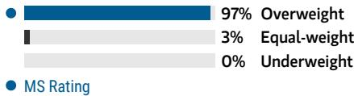  
Consensus Rating Distribution   
Source: Re nitiv, Morgan Stanley Research

# 04-20 Risk Reward Themes

Secular Growth: Positive Self-help: Positive View descriptions of Risk Rewards Themes here

# BULL CASE

# W430,000

# BASE CASE

# W362,000

# BEAR CASE

W120,000

# HPC drives sustained memory pricing

High-performance computing drives sustained memory pricing strength and capital returns exceed expectations: We assume continued robust demand growth for memory and OLED with stabilization in the macro environment and China's failure to successfully enter the memory semiconductor industry. Our bull case valuation is based $7 4 \times$ HBM, 5x conventional memory and ${ \sf 1 0 } \times { \sf P } / { \sf E }$ for the rest of the group pro tability.

# Commodity cycle recovery

We expect favorable commodity pricing trends to bode well for Samsung's share price with improving HBM market share and new product execution. Our base case re ects our relatively conservative view on HBM progress this year, but sequential improvement in 2026 and beyond support flSamsung's earnings growth and stock rerating amid low expectations. 2027e implied $P / \mathsf { B }$ at c.2x.

# Slower memory consumption, competition from China

Prolonged consumption slowdown and Chinese competition: Weaker macro conditions stall near-term global consumption of IT products. Chinese competition disrupts OLED and memory pro tability. We also assume demand for server content slumps amid a slowdown in data center growth. DRAM and NAND ASP fiprice hikes are smaller than expected in 2026. Our bear case valuation is at 1.1x 04-20 2026e P/B, closer to historical trough levels.

# Risk Reward – Samsung Electronics (005930.KS)

KEY EARNINGS INPUTS   

<table><tr><td>Drivers</td><td>2025</td><td>2026e</td><td>2027e</td><td>2028e</td></tr><tr><td>Revenue Growth (%)</td><td>10.9</td><td>120.4</td><td>37.5</td><td>6.3</td></tr><tr><td>OPM (%)</td><td>13.1</td><td>58.2</td><td>62.4</td><td>56.7</td></tr><tr><td>CAPEX (%)</td><td colspan="4">(4,730,271.0) (14,6499. (13,561744. (17.</td></tr></table>

# INVESTMENT DRIVERS

Supply-demand outlook for memory and OLED Smartphone market share and margins Capital returns of $50 \%$ FCF

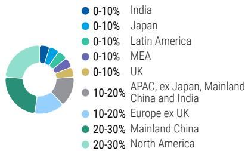  
GLOBAL REVENUE EXPOSURE   
Source: Morgan Stanley Research Estimate View explanation of regional hierarchies here

# MS ALPHA MODELS

<table><tr><td>1/5</td><td>3 Month</td></tr><tr><td>MOST</td><td>Horizon</td></tr></table>

Source: Re nitiv, FactSet, Morgan Stanley Research; 1 is the highest favored Quintile and 5 is the least favored Quintile

# RISKS TO PT/RATING

# RISKS TO UPSIDE

New technological developments, especially in memory and foldable displays Longer-lasting memory up-cycle from AI and hyperscale data center growth

# RISKS TO DOWNSIDE

Product and memory cycle, including Apple and new Chinese smartphone competition Earnings growth concentration in semiconductors

# OWNERSHIP POSITIONING

Inst. Owners, % Active $7 8 . 3 \%$

Source: Re nitiv, Morgan Stanley Research

# MS ESTIMATES VS. CONSENSUS

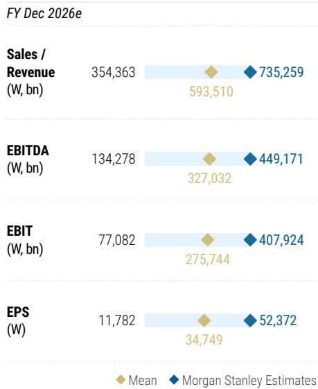  
Source: Re nitiv, Morgan Stanley Research

# Risk Reward - Samsung ElectroRisk Reward – Samsung Electronics (005935.KS)

Overweight with discount to common shares to narrow

# W289,600PRICE TARGET

Our price target for the preferred shares is based on our PT for the common shares and our assumption that the preferred shares' trade at a $20 \%$ discount to the common shares, based on the past 2-year average. We assume an $1 1 . 5 \%$ cost of equity, based on a beta of 1.0, and our terminal growth rate assumption is $3 \%$ .

Consensus Price Target Distribution

Source: Re fi nitiv, Morgan Stanley Research

W119,000.00

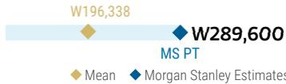

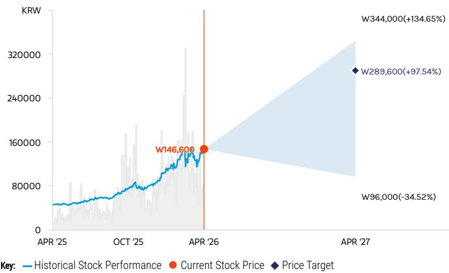  
RISK REWARD CHART   
Source: Re nitiv, Morgan Stanley Research

# OVERWEIGHT THESIS

▪ We expect pricing to move well beyond historical mean reversion from here, on a price per gigabit basis, which should create further incremental tailwinds to forecasts for 2026-27. The commodity cycle is better 04-20 than feared thanks to AI inference demand.

▪ We expect HBM improvement and potential market share gains from 2026.

▪ Rising prices and falling inventories, along with supply cuts and improving demand, are positives for margin recovery in the memory business.

▪ Common shares' implied 2027e $\mathsf { P / E }$ is 5x. We assume that the preferred shares' discount to the common shares is $20 \%$ (the past 2-year average).

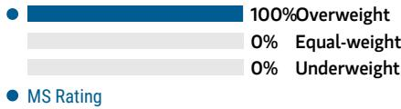  
Consensus Rating Distribution   
Source: Re nitiv, Morgan Stanley Research

# 04-20 Risk Reward Themes

Secular Growth: Positive Self-help: Positive View descriptions of Risk Rewards Themes here

# BULL CASE

# W344,000

# BASE CASE

# W289,600

# BEAR CASE

W96,000

# $20 \%$ discount to bull case value for common shares

High-performance computing drives sustained memory pricing strength and capital returns exceed expectations: We assume continued robust demand growth for memory and OLED with stabilization in the macro environment and China's failure to successfully enter the memory semiconductor industry.

# $20 \%$ discount to base case value for common shares

We expect favorable commodity pricing trends to bode well for Samsung's share price with improving HBM market share and new product execution. Our base case re ects our optimistic view on commodity upcycle and stock re-rating with LTA to potentially smooth the cyclicality of flmemory sector.

# $20 \%$ discount to bear case value for common shares

Prolonged consumption slowdown and Chinese competition: Weaker macro conditions stall near-term global consumption of IT products. Chinese competition disrupts OLED and memory pro tability. We also assume demand for server content slumps amid a slowdown in data center growth. DRAM and NAND ASP fiprice hikes are smaller than expected in 2026/2027.

# Risk Reward – Samsung Electronics (005935.KS)

KEY EARNINGS INPUTS   

<table><tr><td>Drivers</td><td>2025</td><td>2026e</td><td>2027e</td><td>2028e</td></tr><tr><td>Revenue Growth (%)</td><td>10.9</td><td>120.4</td><td>37.5</td><td>6.3</td></tr><tr><td>OPM (%)</td><td>13.1</td><td>58.2</td><td>62.4</td><td>56.7</td></tr><tr><td>CAPEX (%)</td><td colspan="4">(4,730,271.0) (14,64199. (13,561744.9 (197</td></tr></table>

# INVESTMENT DRIVERS

Supply-demand outlook for memory and OLED Smartphone market share and margins Capital returns of $50 \%$ FCF

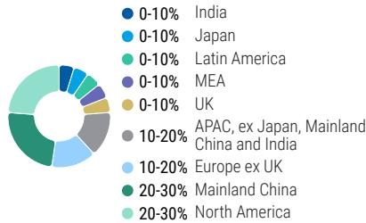  
GLOBAL REVENUE EXPOSURE   
Source: Morgan Stanley Research Estimate View explanation of regional hierarchies here

# MS ALPHA MODELS

Source: Re nitiv, FactSet, Morgan Stanley Research; 1 is the highest favored Quintile and 5 is the least favored Quintile

# RISKS TO PT/RATING

# RISKS TO UPSIDE

New technology developments, especially in memory and foldable displays Longer-lasting memory up-cycle from AI and hyperscale data center growth Further narrowing of discount to common shares

# RISKS TO DOWNSIDE

Product and memory cycle, including Apple and new Chinese smartphone competition Earnings growth concentration in semiconductors Deepening of discount to common shares

# OWNERSHIP POSITIONING

Inst. Owners, % Active $7 6 . 8 \%$

Source: Re nitiv, Morgan Stanley Research

# MS ESTIMATES VS. CONSENSUS

FY Dec 2026e

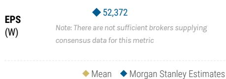  
Source: Re nitiv, Morgan Stanley Research

# Risk Reward - Samsung Electro-MeRisk Reward – Samsung Electro-Mechanics (009150.KS)

Dual AI opportunity – ABF and MLCC

# W710,000PRICE TARGET

Our base case price target is derived from our residual income valuation model. We apply a $1 0 . 5 \%$ cost of equity (beta 1.0, equity risk premium of $6 . 5 \%$ and risk-free rate of $4 \%$ and a $5 \%$ terminal growth rate. Our base year is 2026 and our forecast period is 2026-35.

Consensus Price Target Distribution

阅研报添W180,000.00

Source: Re fi nitiv, Morgan Stanley Research

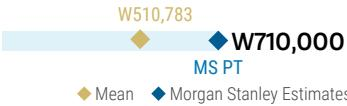

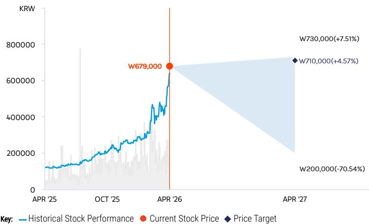  
RISK REWARD CHART   
Source: Re nitiv, Morgan Stanley Research

# OVERWEIGHT THESIS

▪ We see long-term improvement in SEMCO's operating pro file – multi-layer core ABF capacity sold out from ASIC customers and accelerating AI penetration in MLCC, driving substantial content from rising complexity.

▪ With the AI computing opportunity and the prospect of a cyclical recovery from 2H26, earnings expectations appear to be lagging signi ficantly based on the current outlook.

▪ We think the share price will look to discount accelerating EPS estimate revisions.

▪ NTM $P / \mathsf { B }$ is below its mid-cycle average, indicating continued valuation upside on top of earnings.

▪ Our price target implies 2027e P/B of $4 . 0 \times$ .

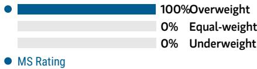  
Consensus Rating Distribution   
Source: Re nitiv, Morgan Stanley Research

# Risk Reward Themes

Secular Growth: Positive View descriptions of Risk Rewards Themes here

# BULL CASE

# W730,000

# BASE CASE

# W710,000

# BEAR CASE

W200,000

# 4.1x 2027e P/B

ABF opportunities from major US CSPs drive meaningful content growth, and we estimate future ASIC content and volume growth will continue to outpace. Customer diversi cation into non-mobile companies also lowers earnings volatility and improves pro tability. Our bull case implies a 2027e $P / B$ fi at historical peak of 4.1x. We believe this premium is supported by what we view as fian unprecedented supercycle in the underlying industry dynamics.

# 4.0x 2027e P/B

We see a number of catalysts ahead for SEMCO, including a large ABF opportunity in ASIC chip wins and FCF in ection. Although the stock has moved higher, our long-term conviction in custom silicon opportunities via ABF substrates has grown substantially.

# 1.1x 2027e P/B

MLCC localization trend intensi es with more competition from Chinese suppliers resulting in increased pricing pressure.   
Substrate business remains soft amid weak macro climate and tepid end demand.   
China's smartphone demand slows, coupled with growing geopolitical   
tension/macroeconomic uncertainty driven by the US imposition of tariffs. We re ect slower content growth for MLCC and   
substrates.

# Risk Reward – Samsung Electro-Mechanics (009150.KS)

KEY EARNINGS INPUTS   

<table><tr><td>Drivers</td><td>2025</td><td>2026e</td><td>2027e</td><td>2028e</td></tr><tr><td>Revenue Growth (%)</td><td>9.9</td><td>23.0</td><td>28.6</td><td>24.4</td></tr><tr><td>OPM (%)</td><td>8.1</td><td>12.9</td><td>16.8</td><td>18.5</td></tr><tr><td>CAPEX (%)</td><td>8.7</td><td>10.7</td><td>9.7</td><td>10.4</td></tr></table>

# INVESTMENT DRIVERS

AI servers, high-speed networking, Auto 2.0, and smartphone content growth   
Customer diversi fication away from Samsung Electronics, targeting major CSPs   
MLCC pricing/margin trend

# GLOBAL REVENUE EXPOSURE

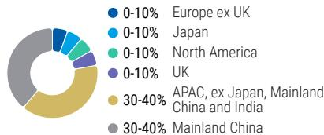  
Source: Morgan Stanley Research Estimate View explanation of regional hierarchies here

# MS ALPHA MODELS

<table><tr><td>2/5</td><td>3 Month</td></tr><tr><td>MOST</td><td>Horizon</td></tr></table>

Source: Re nitiv, FactSet, Morgan Stanley Research; 1 is the highest favored Quintile and 5 is the least favored Quintile

# RISKS TO PT/RATING

# RISKS TO UPSIDE

Price hikes driven by MLCC shortage   
Better-than-expected smartphone demand   
Higher MLCC margin from better yield and product mix   
Strong tailwind from China's consumptionfriendly policies

# RISKS TO DOWNSIDE

Signi cant pullback in Samsung's mobile fiagship product cycle and SEMCO's lower flmarket share   
Execution risk in penetrating Chinese smartphone customers   
Consumer demand headwinds in 2026

# OWNERSHIP POSITIONING

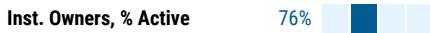

报添加微信 LCD12Source: Re nitiv, Morgan Stanley Research

# MS ESTIMATES VS. CONSENSUS

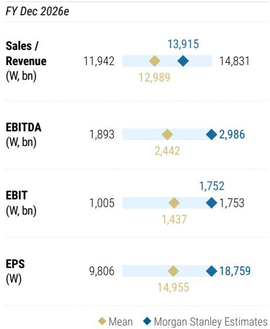  
Source: Re nitiv, Morgan Stanley Research

# Appendix – CPU vs. GPU, Inference vs. Agent

# CPU vs. GPU in a nutshell

CPUs handle sequential reasoning and multi-step processes with branching logic, while GPUs execute parallel processing to analyze millions of data, images or pictures simultaneously. Agentic AI systems need CPUs that efficiently manage long context windows, maintain state across reasoning chains, and rapidly switch 加微信 LCD123321Cad 04-20 between computational tasks. Agentic AI systems are autonomous and require immense CPU power, not just GPU muscle.

GPU workloads are thousands of cores doing matrix math but agentic AI is coordination-heavy – agents talking to agents, tools calling tools, decisions made in sequence – which is CPU-heavy. The introduction of multiple data center CPU offering signals a shift in AI data center design as orchestration, inference, and realtime execution move to the center of next-generation workloads. The AI hardware landscape is entering a new phase of complexity as the industry learns that no single processor architecture can handle every workload efficiently for agentic AI systems.

GPU does the math while CPUs manage the rapidly expanding and more intricate agentic control layer. Where traditional AI models excel at pattern recognition and generation – tasks that leverage the parallel processing power of GPUs – agentic AI systems require the sequential reasoning and branching logic 加微信 LCD123321Cad 04-20 that CPUs handle more efficiently. In simple terms, this is the difference between analyzing millions of data simultaneously and methodically working through a multi-step business process with conditional branches and decision trees. GPUs are often excessive for simple inference, whereas CPUs efficiently handle tasks requiring lower latency and less parallel computation, reducing costs. Autonomous agents require more multi-step workflows, which are heavily dependent on CPU processing for tasks such as searching and validating data. But GPUs aren't going anywhere anytime soon – for general-purpose AIs, they are most efficient for many applications.

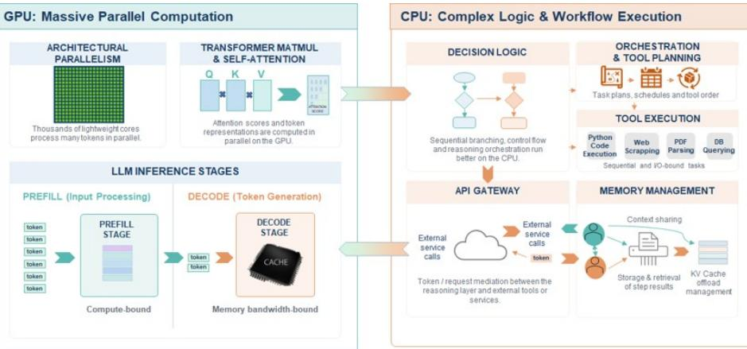  
Exhibit 60: The LLM agent workflow: GPU “thinking” vs. CPU “doing”   
Source: Morgan Stanley Research

# Pure inference vs. agent orchestration

In pure inference, the CPU's role is limited to tokenizing the request, passing it to the GPU, and de-tokenizing the result. The GPU does the heavy lifting. In agent orchestration, the CPU becomes the command layer: it plans, decomposes goals into sub-tasks, fans out to parallel sub-agents, manages tool calls and API requests, monitors token streams, integrates results, and runs reflection loops. CPU performance ultimately dictates how much of the GPU is utilized. That is why agentic AI should create structural demand not only for GPUs, but also for higher-performance server CPUs and the broader memory and 添加微信 LCD123321Cad 04-20 I/O stack that keeps those agents running at machine speed.

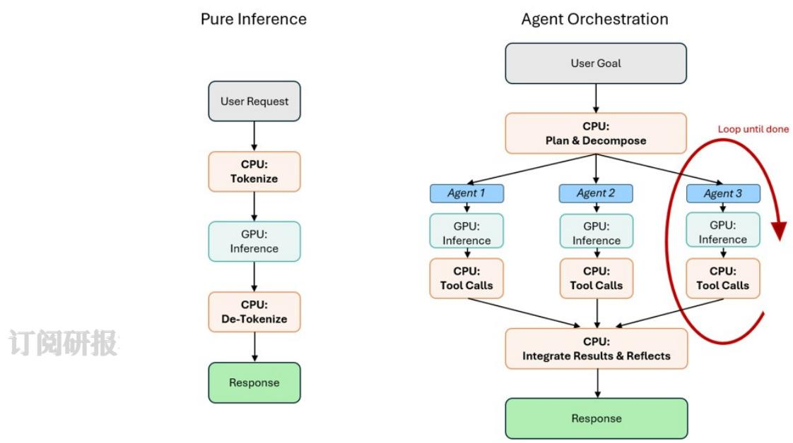  
Exhibit 61: Pure inference vs. agent orchestration workflow

# Risk Reward Reference links

1. View explanation of Options Probabilities methodology - Options_Probabilities_Exhibit_Link.pdf

2. View descriptions of Risk Rewards Themes - RR_Themes_Exhibit_Link.pdf

3. View explanation of regional hierarchies - GEG_Exhibit_Link.pdf

4. View explanation of Theme/Exposure methodology - ESG_Sustainable_Solutions_External_Link.pdf

5. View explanation of HERS methodology - ESG_HERS_External_Link.pdf