# Industries with high AI exposure are seeing labor productivity from faster output growth, not labor replacement

微信 LCD12332

订阅研报添加April 20, 2026 08:00 AM GMT To better understand AI and US economic transition, our recen publications examined prior innovation waves and whether AI adoption is causing dislocations in the US labor market. In this report, we ask whether AI is leading to faster productivity growth.

# Key Takeaways

Productivity, measured as output/employee, is rising faster in industries Morga Stanley identifies as high-AI exposure than in median- or low-AI industries. in 2025, based on data through 4Q, productivity also accelerated more in high exposure industries than in median- or low-exposure industries. The productivity pickup reflects faster output growth & capital deepening rath 订阅研报添加微信 LCD1than labor displacement. It is less clear that AI diffusion is contributing. 332 The high-AI, high-productivity is concentrated in computer-related, AI-related industries but extends beyond them too.

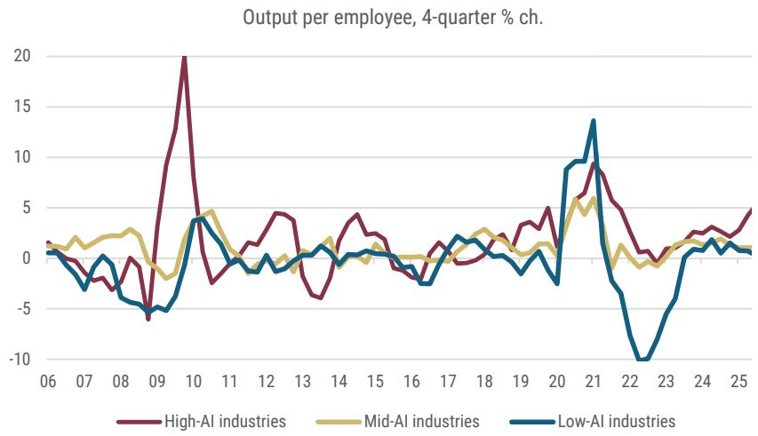  
Exhibit 1: In industries with high AI exposure, output per employee rose faste ${ 2 0 2 5 , }$ and accelerated more, than in other industries   
Source: BEA, BLS, Morgan Stanley Research

# Industries with high AI exposure are seeing labor productivity from faster output growth, not labor replacement

In our effort to better understand AI and US economic transformation, we published a a   
report that examined lessons learned from prior innovation waves (see Lessons from the five innovation waves that preceded AI, 6 April 2026), where we concluded that history suggests AI, like prior general purpose technologies, can be expected to increase   
productivity; create temporary labor displacement during the transition phase, but not permanent employment losses; lead to a boom-bust cycle; put further pressure on income and wealth inequality; and alter how education is provided.

# First up: AI and labor markets

We then put history to the test, first by investigating to what degree AI adoption is causing dislocations in the US labor market (see AI Labor disruption: More micro than macro so far, 6 April 2026). We found that occupational data, when grouped according to AI exposure, point to early, narrow AI displacement — most visible among younger workers — while aggregate disruption remains small at about 0.1pp on the unemployment rate. We also found signs of overall task reshuffling. We plan on using this 添加微信 LCD123321Cad 04-20 analysis as an ongoing tracker of AI diffusion and labor market disruption.

# Next up: AI and labor productivity

In this report, we put another lesson from history to the test and examine whether AI usage is leading to faster productivity growth. We focus our analysis on labor productivity, using industry-level data on output and employment to construct industry-level output per worker. We also plan on using this analysis as an ongoing tracker of AI diffusion and productivity.

Our main conclusions are as follows:

# Key takeaways:

We find positive correlation between industry-level AI exposure and faster labor productivity growth. We estimate that industries with high AI exposure 加微信 LCD123321Cad 04-20 contributed 1.7pp of the 2.4pp growth in output per employee in the four quarters through 4Q 2025. Furthermore, its contribution accelerated: it contributed only 0.7pp in 2024.

Faster productivity growth has been driven by faster output growth, as opposed to labor replacement. Trends in employment growth have been similar across industries with different AI exposure, while output growth has accelerated more rapidly in industries that Morgan Stanley Research has identified as higher AI exposure.

High-tech sectors – data processing, computer system design and services, computer manufacturing, and the publishing category that includes software – have led the acceleration in output and labor productivity. Faster output growth in these industries has been supported by the build-out phase of AI: capital deepening. It is less clear to what degree productivity is benefitting from greater AI adoption.

Finally, we find evidence that something broader than an AI-related story is at play. Productivity growth across each of our three industry subsets has accelerated recently, with average rates of labor productivity growth higher in 2024-25 than in the decade prior to the COVID pandemic. We suspect that the 加微信 LCD123321Cad 04-20 end of the "catch-up" effect in hiring and that efforts by the corporate sector to improve cost efficiencies following the pandemic- and trade policy shocks have also pushed labor productivity higher in recent years.

# Constructing industry-level productivity data

To derive our estimates of labor productivity, we construct industry-level measures of output per employee using the BEA's industry output data and BLS payrolls. As we note in the appendix to this report, output per employee is an imperfect measure of labor productivity and is not the same as output per hour, which is the preferred measure. While we would prefer to use output per hour, we believe the official data on nonfarm business productivity and our measure have a strong enough link to enable us to draw inferences about productivity growth at the industry level. (We address the differences between the two measures in the Appendix: Comparing our productivity measure to nonfarm business 添加微信 LCD123321Cad 04-20 productivity .)

With calculated industry-level output per employment in hand from 1Q 2006 through 4Q 2025, we then assign each a measures of AI exposure using the criterion in Felten et. al. (2021). 1 . The authors identify occupational exposures to AI and weight those occupations across NAICS 4-digit industry categories. From there, we grouped various industries into three categories: top- $2 5 \%$ AI exposure, middle- $. 5 0 \%$ AI exposure, and lowest- $2 5 \%$ AI exposure.

In total, we compute output per employment in 64 industries, with 12 industries with high exposure to AI and 26 industries with low exposure to AI. The remaining 26 industries are classified as having medium AI exposure. We then compare and contrast the evolution of output per employee.

The industry output data we use for our output measures are published once a quarter in   
the third GDP release; the industry employment data are published monthly in the   
Employment Situation. The next update to our estimates, for 1Q 2026, will be soon after 微 CD123321Cad 04-20   
the June 25 GDP report.

Exhibit 2: AI exposure and productivity growth, by industry   

<table><tr><td></td><td>Al-exposure AlIE score</td><td>2024</td><td>Productity,4Q/4Q % ch. 2025</td><td>Acceleration/Deceleration</td></tr><tr><td>Nonfarm business productivity</td><td></td><td>2.3</td><td>2.5</td><td>0.3</td></tr><tr><td>Employment/outputproductivityproxy</td><td></td><td>1.6</td><td>2.4</td><td>0.8</td></tr><tr><td>High Al exposure industries (top25%AE)</td><td>&gt;1.25</td><td>2.1</td><td>5.7</td><td>3.6</td></tr><tr><td>Medium Alexposureindustres(midle5lE)</td><td>-0.30 to 1.25</td><td>1.3</td><td>1.5</td><td>0.2</td></tr><tr><td>LowAl exposure industries (bottom 25% AIIE)</td><td>&lt;-0.30</td><td>1.5</td><td>-1.1</td><td>-2.6</td></tr><tr><td>Securie</td><td>2.2</td><td>-6.3</td><td>6.8</td><td>13.1</td></tr><tr><td>Legal services</td><td>2.2</td><td>-1.5</td><td>-0.1</td><td>1.4</td></tr><tr><td>Creditintermedationederaleserenksndelatedcii</td><td>2.1</td><td>2.8</td><td>5.6</td><td>2.8</td></tr><tr><td>Insurancecarriersandrelatedactivities</td><td>2.1</td><td>0.6</td><td>0.8</td><td>0.2</td></tr><tr><td>Funds,trustsandtherfinancialice</td><td>2.1</td><td>35.1</td><td>33.2</td><td>-1.9</td></tr><tr><td>Computer systems design and related services</td><td>1.9</td><td>7.2</td><td>13.2</td><td>6.0</td></tr><tr><td>Publishing</td><td>1.8</td><td>4.7</td><td>11.4</td><td>6.7</td></tr><tr><td>订阅研报 dataprocessngitpblisdtaies</td><td>1.7</td><td>11.4</td><td>19.1</td><td>7.7</td></tr><tr><td>Managementofcompaniesand enterprises</td><td>1.7</td><td>2.8</td><td>-0.4</td><td>-3.2</td></tr><tr><td>Mfg: Computerand electronic products</td><td>1.6</td><td>6.2</td><td>11.1</td><td>4.9</td></tr><tr><td>Miscellaneouspofssoalentificndec</td><td>1.6</td><td>2.8</td><td>2.5</td><td>-0.4</td></tr><tr><td>Educational services</td><td>1.3</td><td>0.0</td><td>-1.0</td><td>-1.0</td></tr><tr><td>Broadcasting andtelecommunications</td><td>1.2</td><td>1.6</td><td>4.0</td><td></td></tr><tr><td>Social assistance</td><td>0.8</td><td>3.5</td><td>-1.6</td><td>2.4 -5.1</td></tr><tr><td>Ambulatoryhealthcareservices</td><td>0.8</td><td>-0.1</td><td>3.1</td><td></td></tr><tr><td>Oil and gas extraction</td><td>0.7</td><td>-4.6</td><td>13.3</td><td>3.2</td></tr><tr><td>Hospitals</td><td>0.5</td><td>0.9</td><td>2.0</td><td>17.9</td></tr><tr><td>Realestate</td><td>0.5</td><td>2.2</td><td>2.4</td><td>1.1</td></tr><tr><td>Transitandgroundpassengertransportion</td><td>0.4</td><td>7.5</td><td>11.9</td><td>0.2</td></tr><tr><td>Motiopicturedsoundecoddes</td><td>0.4</td><td>8.6</td><td>5.2</td><td>4.5</td></tr><tr><td>Performingctatrsrtssendtec</td><td>0.3</td><td>5.3</td><td>3.8</td><td>-3.4</td></tr><tr><td>Miscellaneousmanufacturing</td><td>0.2</td><td>1.2</td><td>1.0</td><td>-1.5</td></tr><tr><td>Utiltiles Wholesale trade</td><td>0.2</td><td>1.0</td><td>-4.0</td><td>-0.2 -5.0</td></tr><tr><td>fgetri</td><td></td><td>0.1</td><td>4.9</td><td>4.8</td></tr><tr><td>Other retal</td><td>0.2 0.2</td><td>4.0</td><td>3.4</td><td></td></tr><tr><td>General merchandise stores</td><td>0.0 0.0</td><td>7.0</td><td>4.0</td><td>-0.6 -3.0</td></tr><tr><td>Othertrasportationdpies</td><td></td><td>1.6</td><td>-2.3</td><td>-3.9</td></tr><tr><td>Mfg:Chemicalproducts</td><td></td><td>-6.8</td><td>-13.8</td><td>-7.0</td></tr><tr><td></td><td>0.0 0.0</td><td>7.8</td><td>2.1</td><td>-5.7</td></tr><tr><td>Nursigesietiliies</td><td>0.0</td><td>0.9</td><td>0.3</td><td>-0.6</td></tr><tr><td>Machinery Pipeline transportion</td><td>-0.1 -0.1</td><td>-4.1</td><td>3.9</td><td>8.0</td></tr><tr><td></td><td></td><td>3.1</td><td>-0.4</td><td>-3.5</td></tr><tr><td>订阅研报 Rentanddosfa</td><td></td><td>4.6</td><td>3.8</td><td>-0.8</td></tr><tr><td>Mfg:Othertrasportionqpent</td><td>-0.1 -0.2</td><td>-4.1</td><td>11.0</td><td>15.1</td></tr><tr><td>Mfg:Petroleumandcoalproducts</td><td>-0.2</td><td>-4.0</td><td>-12.7</td><td>-8.6</td></tr><tr><td>Mf: Printingandelatedsuppries</td><td>-0.2</td><td>2.9</td><td>-1.0</td><td>-3.9</td></tr><tr><td>Mfg:Motorvehiclesodiesandtrailersdrts</td><td>-0.2</td><td>5.7</td><td>12.6</td><td>6.9</td></tr><tr><td>Otherservicesexceptgoveent</td><td>-0.3</td><td>-0.3</td><td>-2.8</td><td>-2.5</td></tr><tr><td>Motorvehicle andpartsdealers</td><td>-0.3</td><td>29.9</td><td>-2.8</td><td>-32.7</td></tr><tr><td>Airtrnsportaton</td><td>-0.4</td><td>1.2</td><td>4.3</td><td>3.2</td></tr><tr><td>Food and beverage stores</td><td>-0.4</td><td>-0.9</td><td>-2.0</td><td>-1.0</td></tr><tr><td>Administrtiveandsupprtsevices</td><td>-0.6</td><td>2.4</td><td>3.0</td><td>0.7</td></tr><tr><td>Rail transportation</td><td>-0.6</td><td>-3.0</td><td>-9.0</td><td>-6.0</td></tr><tr><td>Wtertransportion</td><td>-0.6</td><td>3.4</td><td>8.1</td><td>4.7</td></tr><tr><td>Construction</td><td>-0.7</td><td>1.3</td><td>1.0</td><td>-0.3</td></tr><tr><td>Fabricated metal products</td><td>-0.7</td><td>-3.5</td><td>3.3</td><td>6.9</td></tr><tr><td>Mfg:Appareneadllduts</td><td>-0.8</td><td>12.6</td><td>4.4</td><td>-8.2</td></tr><tr><td>Mfg: Paper products</td><td>-0.9</td><td>-0.8</td><td>-2.9</td><td>-2.1</td></tr><tr><td>Accommodation Textilemilteilcil</td><td>-0.9</td><td>-1.4</td><td>3.7</td><td>5.1</td></tr><tr><td>Mfg:Plasticsandrubberproducts</td><td>-0.9 -0.9</td><td>5.0</td><td>3.0</td><td>-2.0</td></tr><tr><td>Primary metals</td><td></td><td>-2.8</td><td>9.9</td><td>12.7</td></tr><tr><td></td><td>-0.9</td><td>13.5</td><td>-2.5</td><td>-15.9</td></tr><tr><td>Amusements,gambling,andrecreationidstrie</td><td>-1.0</td><td>-2.1</td><td>0.4</td><td>2.5</td></tr><tr><td>Nonmetallic minera products</td><td>-1.0</td><td>-1.4</td><td>-2.6</td><td>-1.3</td></tr><tr><td>Support actitiesfo mining</td><td>-1.0</td><td>9.5</td><td>-2.2</td><td>-11.7</td></tr><tr><td>Mfg: Furnitureandrelated products</td><td>-1.0</td><td>2.2</td><td>-0.4</td><td></td></tr><tr><td>Wastemanagementandremediationservices</td><td></td><td>-1.2</td><td>-4.3</td><td>-2.6 -3.1</td></tr><tr><td>订阅研报 Mining,exceptoiland gas</td><td>-1.0</td><td></td><td>-0.5</td><td>3.6</td></tr><tr><td>Mfg:Fooddeageandccuts</td><td>-1.0</td><td>-4.1 2.4</td><td>-6.8</td><td>-9.2</td></tr><tr><td>Wood produts</td><td>-1.0</td><td></td><td>0.5</td><td>1.9</td></tr><tr><td>Foodservicesadikingplaces</td><td>-1.1 -1.2</td><td>-1.5 -1.5</td><td>-2.2</td><td>-0.8</td></tr><tr><td>Truck transportation</td><td>-1.3</td><td>14.6</td><td>-3.3</td><td>-18.0</td></tr><tr><td>Forestry</td><td></td><td></td><td></td><td></td></tr><tr><td></td><td>-1.4 -1.6</td><td>7.2</td><td>-2.1</td><td>-9.3</td></tr><tr><td>Warehousing and storage</td><td></td><td>-0.5</td><td>1.7</td><td>2.2</td></tr></table>

Source: Morgan Stanley Research. AI-exposure scores are derived from Felten et. al. (2021), https://sms.onlinelibrary.wiley.com/doi/ full/10.1002/smj.3286.

# Labor productivity accelerated due to faster output growth in industries with high AI exposure

Exhibit 1 and Exhibit 2 show the evolution of our estimates of labor productivity growth in industries with low-, medium-, and high-exposure to AI based on our BEA and BLS industry-level inputs. The exhibit plots the four quarter percentage change in estimated labor productivity.

In 2025, output per employee was rising the fastest and accelerating the most among the industries Morgan Stanley Research has identified as the high AI exposure industries. Productivity growth in industries with closer to the median exposure had a sideways trend. Productivity in industries with the lowest exposure fell slightly.

订阅研报添加微信 LCD123321Cad 04-20 Between 2011-2019, labor productivity growth in industries with high AI exposure averaged $1 . 1 \%$ per year. In 2024 and 2025, this accelerated to $2 . 1 \%$ and $5 . 7 \% ,$ respectively. By way of comparison, productivity growth for industries with medium exposure to AI accelerated to $1 . 4 \%$ per year in $2 0 2 4 - 2 5$ , from $0 . 5 \%$ in the decade leading up to the COVID pandemic. Finally, productivity growth in low-AI exposure industries improved modestly, rising by $0 . 7 \%$ per year in 2024 and 2025 after falling $0 . 1 \%$ per year between 2011-19.

# The main driver of higher labor productivity is faster output growth, not labor displacement

As we noted in the introduction to this report, AI has created both optimism and anxiety; optimism about faster productivity and output growth and pessimism about the risks for labor replacement. At present, our estimates of labor productivity do not point to labor replacement as the main source of faster productivity growth. In contrast, we find that its faster growth reflected faster output growth rather than slower employment growth 添加微信 LCD123321Cad 04-20 ( Exhibit 3 ). And the acceleration in output growth was because of the industries with high-AI exposure; output growth slowed in the mid- and low-AI aggregates.

# 订阅研报

Employment growth stagnated regardless of AI exposure, leaving employment trends across our three industry subgroups broadly similar. In AI Labor Disruption: More Micro Than Macro So Far, we had seen that "splitting industries by AI exposure yields no clear disruption signal: employment in more-exposed industries has not underperformed, and detrending/cyclical adjustments do not flip the story." Hence, faster labor productivity growth is presently more about changes in the numerator (output) in high-AI exposed sectors, than it is about changes in the denominator (employment).

All industries: Output, employment, and productivity, $4 \%$ ch.

High-AI industries: Output, employment, and productivity, $4 \%$ ch.

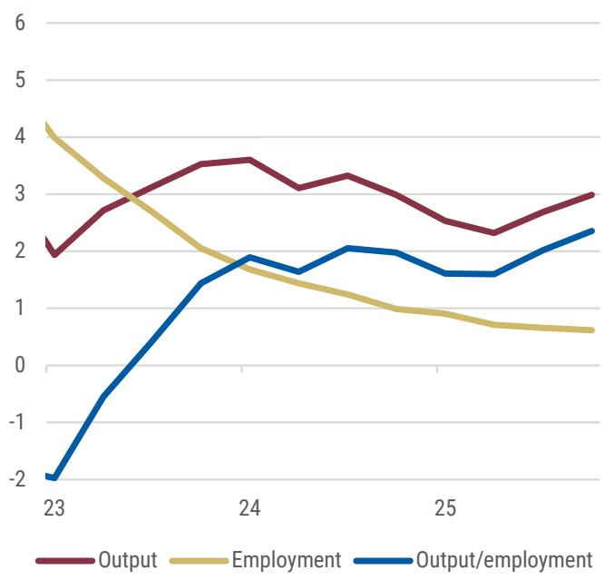  
Exhibit 3: Overall industry output per employment accelerated in 2025 because of faster output growth   
Source: BEA, BLS, Morgan Stanley Research

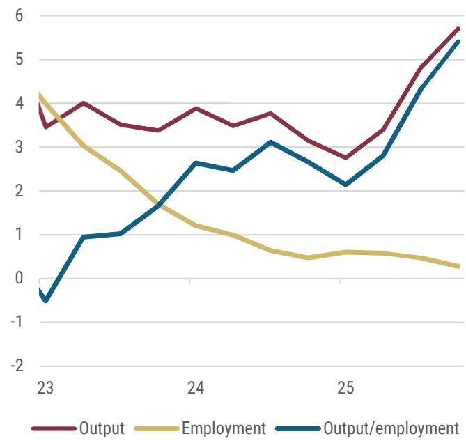  
Exhibit 4: High-AI industry output and productivity surged, while employment growth stagnated   
Source: BEA, BLS, Morgan Stanley Research

Mid-AI industries: Output, employment, and productivity, $4 \%$ ch.

Low-AI industries: Output, employment, and productivity, $4 \%$ ch.

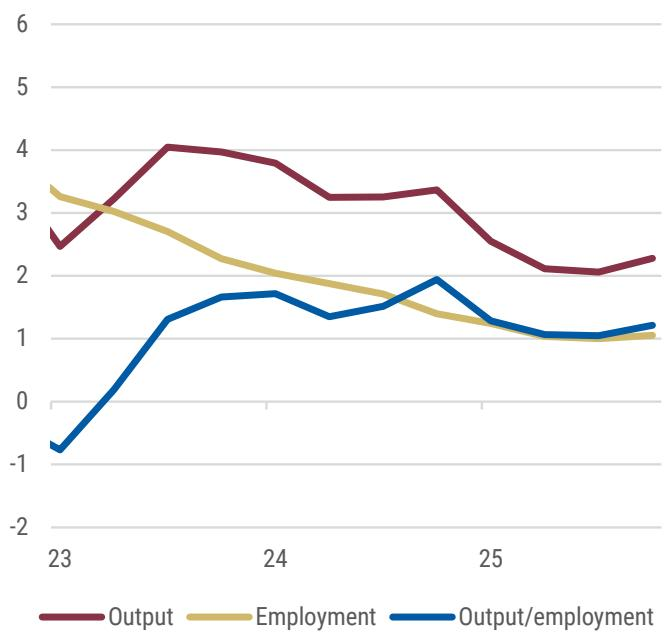  
订阅研报添加微信Exhibit 5: Mid-AI output and employment growth slowed slightly, with productivity growth little changed   
Source: BEA, BLS, Morgan Stanley Research

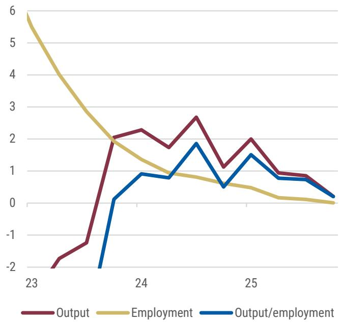  
123321Cad 04-20 xhibit 6: Output and productivity growth slowed in low-AI industries   
Source: BEA, BLS, Morgan Stanley Research

# Faster output and productivity growth in high-AI industries is concentrated in tech

The high-AI industries are tech-heavy, but other services are exposed as well. The tech industries within our high-AI category include both goods and services production: manufacturing of computer and electronic products; publishing industries ex internet, which includes software; data processing, internet publishing; other information; and computer system design & services ( Exhibit 7 ). The other high-AI industries are various services: finance and insurance; legal services; miscellaneous technical services; 添加微信 LCD123321Cad 04-20 management of companies; and education ( Exhibit 8 ).

Among industries with high AI exposure, the industries that rose fastest over the past year also tended to have accelerated the most, thereby accounting for the overall pickup in productivity. The tech industries led the way ( Exhibit 7 ). And within them, it's again output strength rather than employment weakness that drives the productivity growth.

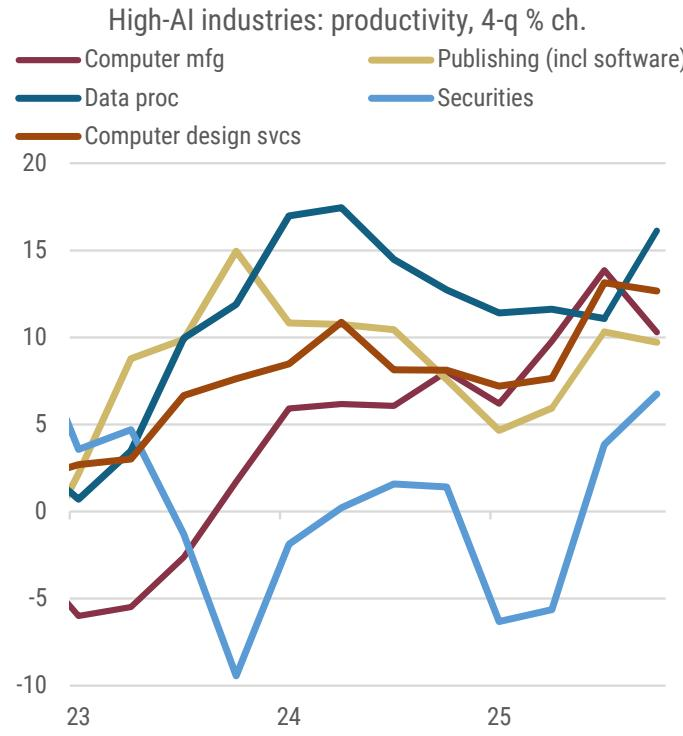  
Exhibit 7: The faster productivity industries within the high-AI category   
Source: BEA, BLS, Morgan Stanley Research   
订阅研报添加微信 LCD123321Cad 04-20

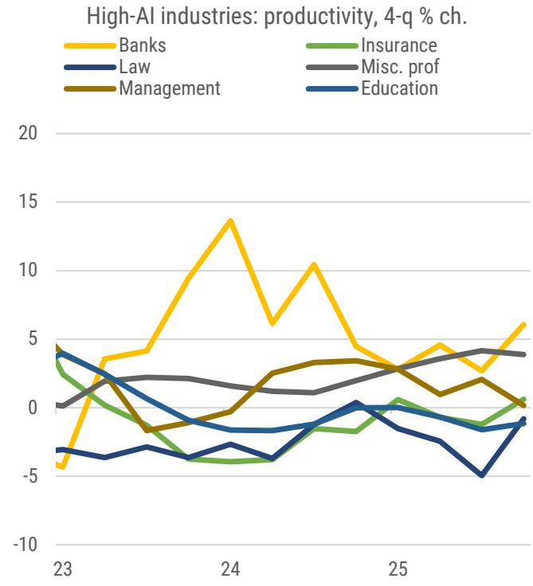  
Exhibit 8: The slower productivity industries within the high-AI category   
Source: BEA, BLS, Morgan Stanley Research

We believe that AI is contributing to the strength in labor productivity in these industries. In all of these, output is rising quickly, likely reflecting surging investment in AI. It's common that industries with faster-rising demand and output also show faster productivity growth as their dormant capacity is woken up. But for these particular industries, over the past year productivity growth has exceeded the pace that the pickup in output would suggest, based on the historical relationship since 2005. AI is probably contributing, along with the broader, rapid investment and capital deepening in those industries over the past several years.

# Computer manufacturing capacity has risen sharply

The strong investment implies continued gains in productivity. For computer manufacturing, the Fed publishes output, capacity, and capacity utilization estimates. Capacity growth has accelerated from $3 . 7 \%$ y/y in 2024 to $7 \%$ y/y in January-February 2026. Despite the surge in computer output over the past year, capacity utilization has barely risen, and is fairly low, suggesting further room to run for productivity growth. (In December 2024 and December 2025, capacity utilization in this industry was $7 4 . 7 \% .$ )

We do not have comparable utilization measures for the high-AI exposure industries in the services sector, but similar excess capacity is likely given the pace of AI-related investment. There, too, capital deepening and excess capacity could support ongoing productivity gains.

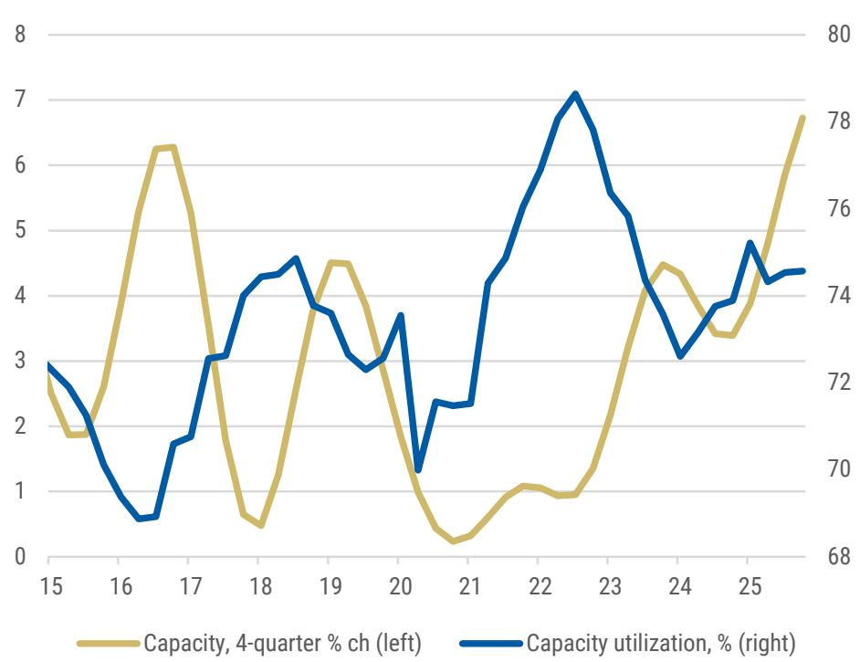  
Exhibit 9: Modest increase in computer manufacturing capacity utilization in 2025, amid rapid growth in capacity   
Computer manufacturing   
添加微信 LCD123321Cad 04-20

# Faster output and productivity growth also extend beyond the high-AI category

Labor productivity gains have also appeared across a wider swath of industries than those most sensitive to AI. Exhibit 10 shows 2025 output/employment growth plotted against AI industry exposure. There are obviously causes other than AI exposure for productivity growth – including efforts by the corporate sector to economize on costs during the pandemic and trade policy shocks – but the relationship between AI exposure and output/ employment growth is positive and statistically significant.

Furthermore, it's not just driven by the extremes: the relationship is still positive and significant after cutting out the six high and the six low AI-exposure industries. We see a similar, weaker relationship between 2025 acceleration in productivity growth and AI exposure ( Exhibit 11 ).

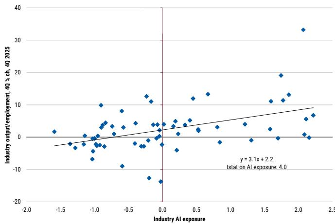  
Exhibit 10: AI exposure was positively associated with productivity growth in 2025   
Source: BEA, BLS, Morgan Stanley Research

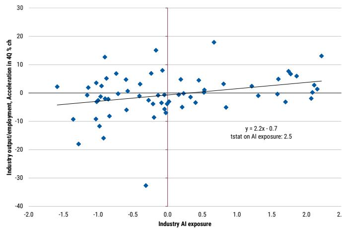  
Exhibit 11: AI exposure was positively associated with acceleration in productivity growth in 2025

# Box 1. What we know and what we don't

What we know:

• Output/employment accelerated in 2025   
• Faster output growth drove the acceleration in our productivity measure   
• Industries with high AI exposure drove most of the acceleration in output and productivity   
• Output in high-AI exposure industries picked up. Employment growth was little changed and little different from other industries.   
• High-AI industries contributed an estimated 1.7pp to productivity growth in 2025, 1.0pp more than 2024   
• Generally, the higher the AI exposure, the higher the industry productivity in 2025   
• Generally, the higher the AI exposure, the larger the acceleration in industry productivity in 2025

What we don't:

• Whether AI-usage caused the faster output and productivity growth • The high-AI industries tend also to be receiving the most AI-related investment • The high-AI industries tend also to be seeing the most AI-related demand • But the broader relationship between AI exposure and productivity growth and acceleration suggests some independent effect from AI on productivity

# Appendix: Comparing our productivity measure to nonfarm business productivity

As noted in the body of the report, our industry productivity measures are not perfect. They measure output per employee rather than output per hour. We make that 添加微信 LCD123321Cad 04-20 compromise in because employment data are available in finer industry detail than are hours; and we rely on fine industry detail to distinguish industries with higher- and lower-AI exposure. But it is a compromise, and in recent years, the effect of using employment rather than hours has been noticeable: Our total output per employee measure deviates from published nonfarm business output per hour between 2022 and 2024 ( Exhibit 12 ). Output measures line up well, but total hours fall faster than employment ( Exhibit 13 and Exhibit 14 ).

However, we think the pickup in high-AI productivity that our productivity measures show over the past year is still valid. The services workweek slowdown explains the 2022-24 gap between the offical BLS nonfarm business output per hour and our output per employee measures. The decline in services-sector hours was normalization after the pandemic ( Exhibit 15 ): The services sector workweek only returned to pre-pandemic lengths at the start of 2024.

We do not think that normalization in the services workweek is explained by increased use of AI—it began before the major AI advances or adoption; and the deviations between our and official productivity measures are mostly explained by this non-AI factor. In turn, the pickup in our high-AI productivity measure since the start of 2025 seems more credible.

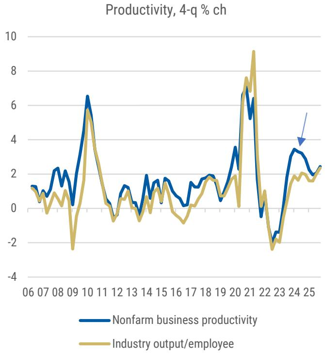  
Exhibit 12: The official nonfarm business productivity measure differed from our measure between 2022 and 2024   
Source: BEA, BLS, Morgan Stanley Research

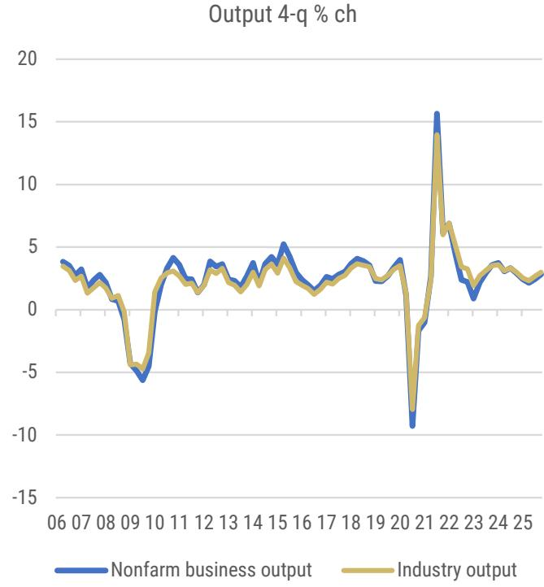  
Exhibit 13: Our output measure closely mimicked theirs   
Source: BEA, BLS, Morgan Stanley Research

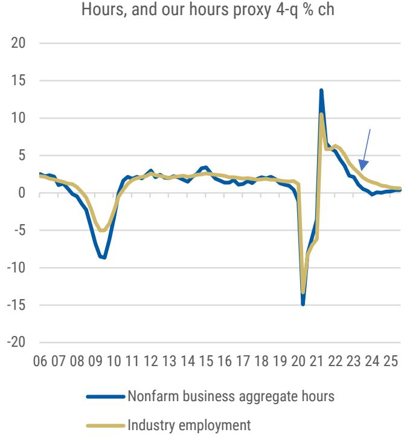  
订阅研报添加微信Exhibit 14: But we used employment rather than aggregate hours worked as the measure of labor input, and those differed from 2022-2024   
123321Cad 04-20 Exhibit 15: The normalizing workweek explains the difference between the two labor measures. We don't believe the shortening workweek reflected AI.

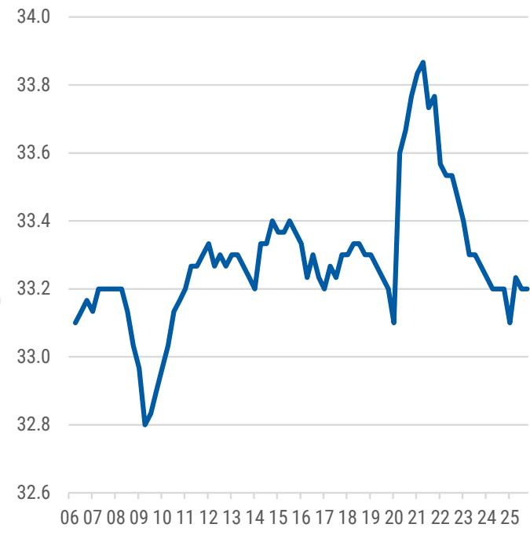  
Services-sector workweek, hours   
Source: BLS, Morgan Stanley Research