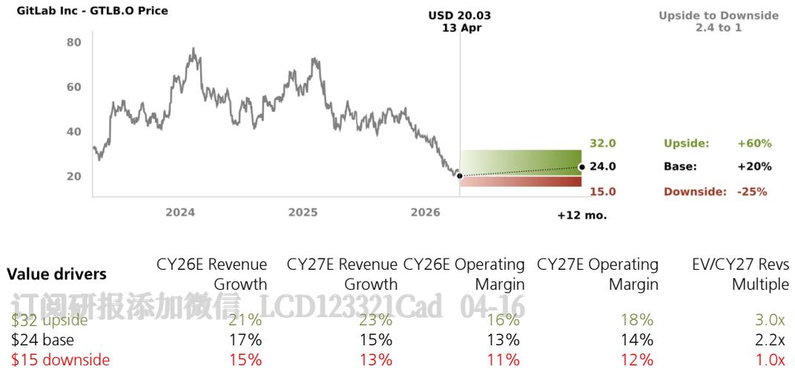
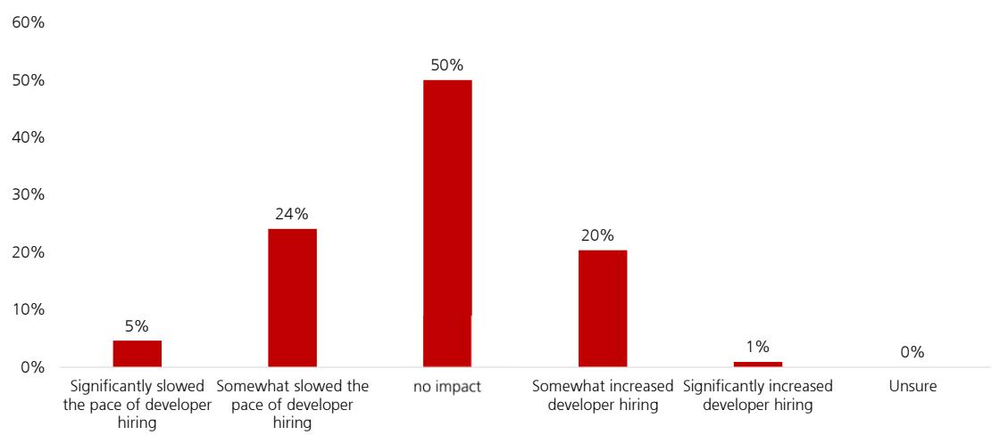
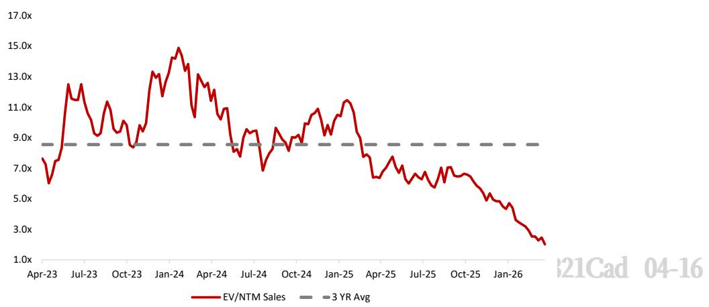
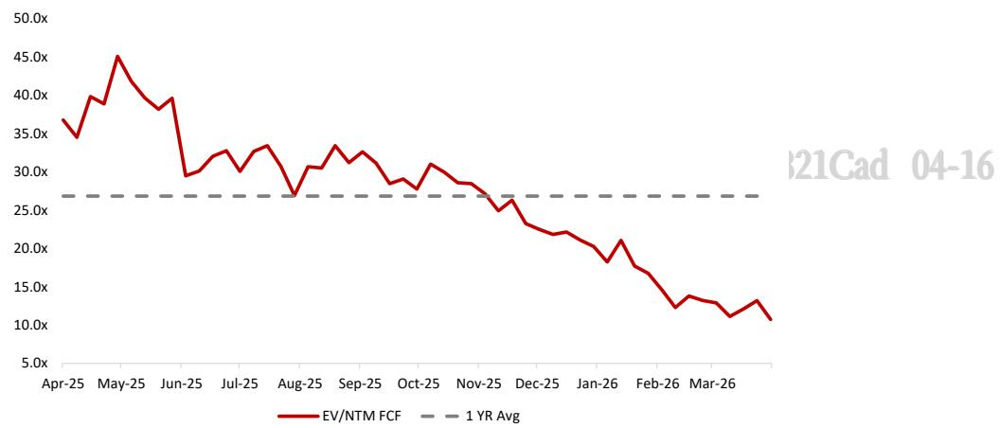

# GitLab Inc

# Awaiting An Inflection In The AI Narrative – Assume Coverage at Neutral 15 April 2026

# Summary - A Difficult AI Narrative To Bend $^ +$ Mixed Demand Outlook

After speaking with 10 checks we assume coverage of GitLab with a Neutral rat Overall our check feedback suggested a mixed demand outlook with no evidence growth inflection and only modest customer interest in Duo Agent Platform (DAP date. While the headline risk around AI disruption will likely remain high, the near-t fundamental risk here looks more modest as we heard stable, not declining, develo seats and customer appetite to replace GitLab sounded low in the near-term. Our w supports our FY27-29 revs growth estimates of $1 7 \% / 1 5 \% / 1 4 \%$ , respectively versus Street’s $1 6 \% / 1 6 \% / 1 4 \%$ and with the stock at 1.8x/9x CY27 Revs/FCF and sentim already negative we don’t see much downside from here. However, without a clear p to AI-driven upward estimate revisions we think the AI disruption narrative will be to to bend in the near-term and prefer to remain on the sidelines for now. Of the pu DevOps vendors we're most constructive on JFrog, see our recent upgrade note her

AI Disruption Risk—Lower Than Feared, But Still A Headline Risk: checks suggested the two biggest AI disruption risks to GitLab, developer seat and displacement by model providers / AI-natives look more modest in the n term. Developer seats look to be trending flat, not down, and on AI displacem we didn't hear much appetite to leave GitLab and we address GitLab's compet moat in-depth in this note. Net, while AI disruption will likely remain a headline for the stock, the near-term fundamental risk here looks more moderate.

˜ AI Tailwinds—Too Early For DAP To Bend The Narrative: We heard lim 订阅研报添加微信 LCD123321DAP traction to date with only modest customer interest and most customers spoke with still testing/piloting. We didn't hear many datapoints on pote growth uplift, but one partner estimated that DAP could eventually drive a point uplift to GitLab's overall growth rate but not until ${ \sf F Y 2 8 + }$ .

Overall Demand Outlook—Mixed, No Signs Of An Uptick: Our ch pointed to a mixed demand backdrop for GitLab, with several partners miss their Q1 (March) practice targets and pointing to a further decel in Q2 on the b of moderating seat growth, GTM disruption and macro headwinds. While think much of this is baked into the FY27 guide for $\sim 1 7 \%$ growth, we're hesi to underwrite much upside and see more upside risk to numbers in ${ \sf F Y 2 8 + }$ .

# Valuation:

Our $\$ 24$ price target is based on ${ \sim } 2 . 2 \times$ our CY27e Revs estimate, an in-line multipl the peer group median.

<table><tr><td>Highlights (US$m)</td><td>01/24</td><td>01/25</td><td>01/26</td><td>01/27E 1,119</td><td>21</td></tr><tr><td>Revenues</td><td>580</td><td>759</td><td>微信955</td><td></td><td></td></tr><tr><td>EBIT (UBS)</td><td>(1)</td><td>78</td><td>163</td><td>140 149</td><td></td></tr><tr><td>Net earnings (UBS)</td><td>33</td><td>125</td><td>166</td><td></td><td></td></tr><tr><td>EPS (UBS,diluted) (US$)</td><td>0.20</td><td>0.74</td><td>0.96</td><td>0.85</td><td></td></tr><tr><td>DPS (net) (US$)</td><td>0.00</td><td>0.00</td><td>0.00</td><td>0.00</td><td></td></tr><tr><td>Net (debt) / cash</td><td>288</td><td>228</td><td>230</td><td>443</td><td></td></tr><tr><td>Profitability/valuation</td><td>01/24</td><td>01/25</td><td>01/26</td><td>01/27E</td><td></td></tr><tr><td>EBIT (UBS) margin %</td><td>(0.2)</td><td>10.2</td><td>17.0</td><td>12.5</td><td></td></tr><tr><td>ROIC (EBIT) %</td><td>(0.3)</td><td>16.7</td><td>23.2</td><td>17.8</td><td></td></tr><tr><td>EV/EBITDA (UBS core) x</td><td>&gt;100</td><td>&gt;100</td><td>46.3</td><td>23.3</td><td></td></tr><tr><td>P/E (UBS,diluted)x</td><td>NM</td><td>76.0</td><td>48.4</td><td>25.6</td><td></td></tr><tr><td>Equity FCF (UBS) yield %</td><td>0.5</td><td>(0.7)</td><td>2.9</td><td>6.0</td><td></td></tr><tr><td>Dividend yield (net) %</td><td>0.0</td><td>0.0</td><td>0.0</td><td>0.0</td><td></td></tr></table>

Source: Company accounts, LSEG Eikon, UBS estimates. Metrics marked as (UBS) have had analyst adjustments applied. Valu price of US\$ 20.08 on 14-Apr-2026

Pivotal Questions

# Q: Can GitLab Achieve $20 \% +$ Revenue Growth In The Medium-Term?

We don't believe so for at least the next several years and are modelling FY27-29 total revs growth of $1 7 \% / 1 5 \% / 1 4 \%$ , respectively versus the Street’s $1 6 \% / 1 6 \% / 1 4 \%$ . Our checks pointed to a mixed demand backdrop which we believe supports a continued growth deceleration over the next several years, and we picked up no signs of a near-term growth inflection. On AI tailwinds we picked up limited DAP traction to date with only modest customer interest and most customers still testing/ piloting. While we heard of some AI-driven upsell of GitLab Ultimate, we don't believe these AI tailwinds combined are enough to drive material upward estimate revisions vs our and Street estimates.

# Q: How Insulated Is GitLab From AI Disruption Risk?

订阅研报添加微信 LCD123321Cad 04-16 We believe the AI disruption risk is moderate in the near-term. Overall we believe that while the headline risk around AI disruption remains high, the near-term fundamental risk to GitLab looks lower than investors fear as we picked up only limited evidence in our checks that the two biggest AI disruption risks — developer seat cuts and displacement by model providers / AI-natives — were materializing in the near-term. On AI growth tailwinds, while we heard limited evidence of DAP traction to date, our checks did suggest DAP could eventually drive 3-5 points of incremental growth for GitLab which will be key to GitLab potentially achieving $20 \% +$ medium-term growth in our view. We believe $20 \% +$ growth is an ${ \sf F Y 2 8 + }$ upside case rather than a base case today.

We are Neutral rated on GitLab. Our work indicated a mixed demand outlook for GitLab with no evidence of a growth inflection and only modest customer interest in DAP to date. We don't see much near-term upside to Street estimates but with the stock at 1.8x/9x CY27 Revs/FCF and sentiment already negative we don’t see much downside from here. Without a clear path to AI-driven upward estimate revisions we think the AI disruption narrative will be tough to bend in the near-term and prefer to remain on the sidelines.

EVIDENCE

We spoke with \~10 GitLab checks (including customers, partners and industry analysts) to inform our view on the state of GitLab's business along with the AI opportunity and risks. We also leveraged UBS Evidence Lab to analyze Enterprise AI demand trends and the potential implications to GitLab.

WHAT´S PRICED IN?

订阅研报添加微信 LCD123321Cad 04-16 At 1.8x our CY27e EV/Revs and 9x our CY27 EV/FCF, GitLab trades below the peer group median of 2.2x CY27e Revs and 13x CY27e FCF. We think the stock pricing in mid-teens growth for the next several years is fair in light of our work suggesting a mixed demand backdrop and growth in-line with Street expectations for the next several years. We are modelling FY27-29 total revs growth of $1 7 \% / 1 5 \% / 1 4 \%$ , respectively versus the Street’s $1 6 \% / 1 6 \% / 1 4 \%$ . We believe AI-driven upside to growth (DAP traction) will be key in driving an upward re-rating in the multiple.

  
Source: UBSe

GitLab offers a comprehensive suite of software developer and operations (DevOps) tools spanning use cases across project management, source code management and code version control, issue tracking, application security testing, deployment, application monitoring and collaboration. These tools are leveraged to expedite coding release cycles in tandem with an agile planning framework. The company was founded in 2014 and is headquartered in San Francisco, California.

# Putting It All Together

After speaking with 10 checks we believe the near-term fundamental AI disruption risk to GitLab looks only moderate, but we expect headline risk to remain high and do not yet see a clear path to the kind of AI-driven upward estimate revisions that would be needed to bend the narrative. Overall our checks suggested a mixed demand backdrop with no evidence of a growth inflection and only modest customer interest in Duo Agent Platform (DAP) to date. Our partner checks in particular came back mixed, while several pointed to a stable Q1 and healthy pipeline growth, we did speak with several partners who missed their Q1 practice growth targets and indicated a further deceleration in Q2. While the headline risk around AI disruption will likely remain high, the near-term 订阅研报添加微信 LCD123321Cadfundamental risk here looks more modest as we heard stable, not declining, developer seats and customer appetite to replace GitLab did sound low in the near term. Our work supports our FY27-29 revs growth estimates of $1 7 \% / 1 5 \% / 1 4 \%$ , respectively, versus the Street’s $1 6 \% / 1 6 \% / 1 4 \%$ , and with the stock at 1.8x/9x CY27 Revs/FCF and sentiment already negative we do not see much downside from here. However, without a clear path to AI-driven upward estimate revisions we think the AI disruption narrative will be tough to bend in the near term and prefer to remain on the sidelines for now.

Figure 1: Total Revenue Growth Outlook   

<table><tr><td>2028E 2029E</td></tr><tr><td>(in $m unless noted) 2024 2025 2026 2027E BaseCase-UBSe</td></tr><tr><td>Total Revenue $580 $759 $955 $1,119 $1,293</td></tr><tr><td>y/y growth (%) 37% 31% 26% 17% 15% 14% Upside vs Street +1% 0%</td></tr><tr><td>0% Net New Revenue $156 $179 $196 $164 $173</td></tr><tr><td>$177 yly growth (%) -9% 15% 9% -16% 6%</td></tr><tr><td>2%</td></tr><tr><td>Consensus Total Revenue $1,111 $1,285 $1,462</td></tr><tr><td>y/y growth (%) 16% 16% 14%</td></tr><tr><td>订阅研报添加微信15CD123321176 Net New Revenue</td></tr><tr><td>yly growth (%) -20% 12% 1%</td></tr><tr><td>Upside Case -UBSe</td></tr><tr><td>Total Revenue $1,151 $1,367 $1,604</td></tr><tr><td>y/y growth (%) 21% 19% 17%</td></tr><tr><td>Upside vs Street +4% +3% +4%</td></tr><tr><td>Net New Revenue $196 $216 $237</td></tr><tr><td>yly growth (%) 0% 10% 10%</td></tr></table>

Source: UBSe, Visible Alpha

˜ AI Disruption Risk—Lower Than Feared, But Will Remain A Headline Overhang: Our checks generally indicated the two biggest AI disruption risks to GitLab — developer headcount cuts and displacement by model providers (Anthropic/OpenAI) and AI-natives — look more modest in the near-term than investors fear. On seat growth, we consistently heard stable rather than declining developer headcount, with a potential mix shift away from junior developers largely offset by demand for mid-level/senior developers and AI/ML engineers. On displacement risk, our checks were nearly unanimous that replacing GitLab is not straightforward given how deeply embedded it is across CI/CD, security, 订阅研报添加微信 LCD123321Cadgovernance, compliance and the broader DevSecOps lifecycle, and we heard little appetite from customers to move to an “AI-native” GitLab alternative. However, we expect the headline risk to remain high in the near term as the model providers and AI-natives continue making inroads in the AI-DevOps space. Tactically, without material AI-driven upward estimate revisions, we think sustained outperformance will be difficult to achieve and expect the stock to remain volatile.

Duo Agent Platform—Too Early To Bend The Narrative: While our checks did flag a couple of potential AI tailwinds for GitLab, DAP and AI-driven Ultimate upsell, the near-term lift here sounded limited. On DAP, our checks generally noted that it was still too early to see meaningful traction (in-line with the company’s messaging). Multiple partner checks noted customer interest levels in DAP have been limited to date (below expectations) and the customers we spoke with were still only piloting/testing DAP. As expected the biggest hurdle to further adoption we heard was strong competition from both GitHub Copilot and other AI-native tools (we heard Cursor most frequently). That said, the strategic positioning of DAP did sound interesting, particularly around security, compliance and broader DevSecOps workflow automation, and one partner estimated that they expect 20- $30 \%$ of the GitLab installed base to ultimately adopt DAP which would support a 3-5 point uplift to GitLab’s total revenue growth rate. While this may be the case 订阅研报添加微信 LCD123321Cadwe do not expect more than a modest contribution near-term and believe DAP remains more of an ${ \sf F Y 2 8 + }$ upside growth driver than a near-term catalyst for the stock.

˜ Overall Demand Outlook— Mixed, With No Signs Of A Growth Inflection: Our checks pointed to a generally decelerating growth backdrop that looks broadly in-line with the company’s $\sim 1 7 \%$ revenue growth guide this year (vs. $2 6 \%$ in FY26). We spoke with several partners who missed their Q1 practice growth targets on the back of slower seat growth, macro headwinds and GTM disruption but others suggested a more stable backdrop with “healthy” pipeline. Additionally, the customer spend growth outlooks generally sounded fine (stable growth). Ultimate still sounded like the healthiest near-term upside driver, benefitting from an uptick in AI-driven focus around governance, compliance, and security but taken together our checks still support a view of mixed near-term demand rather than an inflection. Without signs of a demand inflection or nearterm AI tailwinds we think the upside risk to estimates is skewed more heavily to ${ \sf F Y 2 8 + }$ .

# Assessing the AI Disruption Risk

Not surprisingly, as coding and developer tools have been one of the earliest areas of AI adoption, the seat-based public DevOps stocks have been under pressure over the last 12 months, with GitLab $- 5 3 \%$ and Atlassian $- 7 0 \%$ , both down materially on the back of AI disruption concerns and a lack of near-term AI revenue uplift. There are two components of AI disruption risk that we believe are key for GitLab specifically: 1) the impact that increased adoption of AI coding and developer tools will have on overall developer headcount growth (the outlook for GitLab seat growth) and 2) the risk that the model providers (OpenAI or Anthropic) or AI-natives replicate GitLab’s core offerings, leading to more competition. We’ll address each of these AI risks in-depth before turning to the potential AI tailwinds, as we believe AI-driven upward estimate 订阅研报添加微信 LCD123321Cadrevisions will be the single biggest driver in bending the narrative for ALL of the public DevOps stocks. Note, the only public DevOps stock up over the past year is JFrog $( + 4 2 \% )$ , which is primarily usage-based, and is our top SMID Infra pick (see our recent upgrade note here).

# AI Disruption Risk #1 - Developer Seat Growth

As AI code generation and developer tools have proliferated, with over $90 \%$ of the enterprises we surveyed in our most recent Enterprise AI Survey (see here) using at least one AI coding or developer tool, the natural concern from investors has been around a potential slowdown in software developer hiring and possible software developer headcount cuts. This would of course be a material headwind to all of the seat-based DevOps vendors. The other possibility is that as software developers become more efficient (our latest Enterprise AI survey pegged the average developer productivity boost at $+ 1 8 \%$ , which will likely only increase over time), enterprises could hire MORE developers as output (and ROI) per developer increases. We asked this question for the first time in our most recent Enterprise AI survey, with the results shown in Figure 2, and by far the most common response was that these tools were having no impact on headcount plans $( 5 0 \%$ of respondents) and $2 1 \%$ pointing to an increase in developer hiring and $2 9 \%$ pointing to a decrease. This is good news for the seat-based DevOps vendors including GitLab. 订阅研报添加微信 LCD123321Cad

  
Figure 2: AI Developer Tools Are Not Driving a Change in Developer Headcount Plans

# What We Heard

Let’s now turn to what our checks said around the trajectory for developer seat growth.

# Partner 1

The rate of developer hiring is really dependent on the subsector we’re talking about. Starting with high-tech and the technology vertical, I’d say developer hiring is more guarded today and has been for the past 3-4 quarters. It’s been flat to down slightly probably. However, that’s being offset by the non-technical sectors like manufacturing, healthcare, etc. These companies are setting up large GCCs, global capability centers out in India, some are setting up in South America, 订阅研报添加微信 LCD123321CadEurope, but there’s still healthy demand there. So overall, it really depends on the vertical. Developer hiring in the high-tech and software industry is more cautious than it was a year ago. For the non-tech verticals, healthcare, manufacturing, even retail to some extent plus financial services, it’s still okay but the demand at the lower end of the spectrum is tough. The entry to sub mid-level, so let’s say 0 to 3-4 years of experiences. That category is most impacted across the board I think. Consequently though, the demand for mid-senior technology professionals, database specialists, software developers, developers with deep Python experience, those categories remain strong.

˜ I think we’ll never see the days of overall developer hiring in the $20 \mathrm { - } 3 0 \%$ range again, those days are behind us. Junior level roles in general in the software arena, I don’t think they will exist unless those roles are redefined, meaning the junior tech graduate needs to come equipped with real deep experience. It could be a database specialist, someone with deep Python expertise. Two years down the line though, I think this junior software developer role will totally go away. No one is going to hire for junior software development roles anymore. Correspondingly, the demand for experienced technology specialists will grow to offset that. However, I think you’ll see a shift more towards systems architecture specialists. What AI will not be able to do for the foreseeable future is design entire systems, because that requires taking into account things on the ground, legacy elements and the other 订阅研报process and workflow nuances. I think thewon’t ever really be able to get rid of. So $I$ 加微信 LCD123321Cad’s a human element to this that you think really in this arena of systems architecture and systems designs specialists, you’ll see a big uptick in demand. Governance will be another area, as you’ll need someone with deep experience to be responsible for the performance of these AI tools. At the end of the day, my point is that while demand for junior entry-level professionals will reduce, you’ll see a big increase in demand for mid-senior level professionals.

# Partner 2

On developer hiring, I think overall I’d characterize it as stable. In certain industries we’re seeing single digit growth. For example, in Financial Services, Industrials, Manufacturing, Autos, we’re seeing more developer hiring in these segments, especially because they’re still on the early side of their modernization journeys. They now want to expedite that and finish their modernizations as fast as possible. For that they need more developers who can rearchitect these applications. So to answer your question, yes, we are seeing certain pockets of growth, single digit growth, but largely it’s stable. What we’ve found within our base is that there are also certain industries like high-tech, retail, or CPG where the developer hiring has slowed a bit. So you have pockets of both positive and negative growth changes.

# Partner 3

On the developer hiring, I think overall there will be a slight increase in developer headcount. The traditional developer hiring will come down but you’re seeing an uptick in these AI developers. I don’t think it’s true that developer hiring is decreasing. All of these AI engineers and AI developers will need a GitLab license, these AI products experts, ML experts and so on. So I think from GitLab’s perspective this isn’t really a headwind to seat growth.

# Customer 1

˜ In terms of developer headcount, it will be roughly stable. We don’t have big plans to hire many developers or any major product that would require more headcount. We’re focused more on cost cutting rather than hiring more people, especially with everything going on with AI being such a big potential productivity driver. We aren’t aggressively cutting developer headcount or anything, we’ll add strategically but it will be small, like a few dozen developers here or there. So you should expect roughly flat developer headcount to maybe down slightly over the next 1-2 years, that’s our current plan.

# Customer 2

˜ I think overall we’ll probably trim our overall developer headcount a bit. On the 订阅研报添加微信 LCD123321Cadsenior side we’ll probably increase our hires but on the junior side we’ll probably trim the staffing up a bit, I think we could probably reduce junior headcount by around $20 \mathrm { - } 3 0 \%$ over the next 3-4 years. If we have a massive project where we need a lot of junior developers we can just outsource those, we don’t need to increase headcount. However, we may have a bit less seats, but as we outsource some of this work, those third party service provides that work with us, we have to provide the tooling, so they need GitLab licenses too, so it’s not like our seat count from a license perspective will go down.

# Customer 3

These AI developer tools are solid but we’re not really decreasing our developer headcount overall, there hasn’t been any initiative to scale back our developer hiring, it also hasn’t ramped materially. I’d say our overall software developer footprint should be pretty much stable this year.

# Industry Analyst 1

In terms of software developer headcounts, we’re not seeing mass firings or mass hirings. We do see the mix of hiring changing though. We think organizations will go from a pyramid architecture with leadership at the top, to a diamond, where you have a smaller bottom, less junior engineers, and more mid-level experienced 订阅研报添加微信 LCD123321Caddevelopers. The pricing model will be key, if you have less engineers and tons of agents how do you price that if you charge per developer license? We aren’t seeing any interest in massively reshaping developer headcount yet, in general the headcount outlook is stable. But like I said the nature of these teams will change, scrum teams may go down from 10 to 2-3, and you’ll just create more teams to go after more stuff in the backlog. I don’t see any real change in the trajectory of software developer headcount honestly, it’s really going to be more of a mix shift.

# Industry Analyst 2

˜ Honestly we think developer headcount will continue to grow nicely as a whole. I think you’ll see a removal of the middle management layers. Does your 10 person team go down to 5 teams of two? I think that’s still the question. We’re always chasing productivity and the ability to produce more. It’s not even about producing more software, it’s about the rate of change, increasing the rate of updates and new feature additions. It’s very similar to gaming, they’re constantly going through a series of updates to drive constant engagement. I think you’ll see the same with software, more rapid feature adds or updates to drive more customer engagement.

In the near-term I think the risk to headcount is minimal. In the near-term most 订阅研报添加微信 LCD123321Cadorganizations have a large backlog of projects, there’s always security stuff that’s 04-16 going to cause the need for change, and we’re always going to be changing applications, even as we move to conversational interfaces, that’s all going to require software developers. Also if we’re designing software for agents rather than humans, that’s going to be another wave of applications. There’s a lot of new software that’s going to be needed. I expect software developer headcount to grow in the low to mid-single digit range, at least for the next year or two. Over the next 5 years, who knows, but there’s enough demand to sustain modest growth in developer headcount in the near to medium-term.

# Developer Seat Growth Moderating, But Concerns Over AI-Driven Cuts Look Overdone

Our checks generally characterized developer headcount as stable rather than declining, with no signs that AI-driven productivity gains were translating into broader declines in developer headcount. This aligns with our survey results noted earlier which indicated a generally stable developer headcount outlook, a positive for GitLab. However, while we didn’t hear of any material headcount declines, we also didn’t pick up any evidence that developer headcount growth was inflecting positively to support the view that these AI productivity gains could actually result in an increase in developer hiring. We heard two underlying trends in our checks underpinning this stable developer headcount outlook.

First, we heard of varying growth rates across verticals as one check noted overall software developer headcount would be stable but this would be composed of verticals like Financial Services, Manufacturing and Industrials slightly increasing overall headcount (to drive modernization initiatives), which was being roughly offset by a downtick from industries such as retail and high-tech. Second, our checks noted the potential for cuts at the junior developer level (we heard as much as $2 0 - 3 0 \%$ over the next 3-4 years) which our checks said would be roughly offset by an increase in mid/senior-level hires and AI/ML engineers (many of whom would presumably need GitLab licenses).

We conclude that overall developer headcount should remain roughly stable over the next 12-18 months and while developer seat growth may have moderated, concerns over broader AI-driven developer headcount reductions look overdone. While we don’t expect a material reacceleration in seat growth anytime soon, frankly we think the absence of broad-based AI-driven developer headcount cuts is better than most investors are expecting and believe this AI disruption risk is lower than is being priced in.

# AI Disruption Risk #2 - The Displacement Risk

The second and more recent AI disruption risk that has been a drag on the stock has 订阅研报添加微信 LCD123321Cadbeen around AI displacement, namely the risk that the model providers (OpenAI/ Anthropic) or AI-natives could create offerings that would rival GitLab’s core offerings. This concern has only been exacerbated by recent news around Anthropic Mythos and the news that OpenAI is looking to develop a GitHub replacement (see here) and competitor (and therefore a GitLab competitor). Similar to the analysis we undertook in our recent JFrog upgrade (see here), we pressed our checks on exactly what GitLab’s competitive moat is and just how insulated GitLab is from AI displacement in order to assess the risk to the stock from here.

# What We Heard

Let’s now turn to what our checks said around the potential AI displacement risk to GitLab.

# Partner 2

On the AI disruption risk, I definitely think GitLab has a deeper competitive moat. It’s been around for a while, it has some depth around it. It’s possible to replicate from a technical standpoint, as is JFrog. It’s not about replicating the software though it’s about all of the enterprise context, the policies, the security policies, the governance. They’re deeply embedded in CI/CD workflows. $I$ also think 订阅研报添加微信 LCD123321CadOpenAI and Anthropic would just rather partner with GitLab versus starting a competitor solution. Also too their open architecture, the free version I think helps promote transparency, flexibility, and grassroots developer buy-in. At the end of the day though, it’s really about their reach and deep penetration into CI/CD workflows, I think they are very much insulated in the near-term.

# Partner 4

˜ In terms of AI disruption risk, the difficulty in replacing GitLab really depends on how it’s being used. If it’s only being used as a Git repository then it’s easy to replace. It’s moderately difficult if it’s being used for CI/CD and IaC management. It becomes very difficult if you use it for everything in the DevSecOps lifecycle, CI/CD, security, governance, Git repository, then it becomes very difficult to replace. If it’s being leveraged for audit/compliance requirements then there’s no easy way out but it depends on the current implementation. The platform consolidation makes it much stickier.

˜ At one point GitLab really was just source code management, but really over the past few years they’ve done very well in broadening out to other areas within the SDLC. The ability to replace alternatives and consolidate onto GitLab does drive a lot of value.   ‹¢–xb¥mûR _® Oá  LCD1

# Customer 1

On the AI disruption risk to GitLab, it’s not easy to replace tools like GitLab. It’s one thing if you want to build basic Git repositories to host source code, that could be easy. Building an entire enterprise DevSecOps platform from scratch would be very hard. From my experience, I think if OpenAI or Anthropic wanted to build a replacement to GitLab, even with all of the AI advancement we’re seeing, it would take multiple years in my opinion. It’s really difficult. GitLab is not just source code management, that’s what makes it tricky, it’s embedded across the entire SDLC, the overall software development life cycle, from planning, issue tracking, merge requests, everything is built in the CI, along with the CI/CD registry, security scanning, everything. Making all of these into a single functional platform that’s enterprise ready, even if it’s OpenAI or Anthropic, I still think it’s really hard. Large companies want robust support, single-tenant options, like GitLab Dedicated, that would be trickier to replicate. OpenAI and Anthropic in my view are still a few years away from being able to build something enterprise grade in this arena.

˜ For an F500 enterprise like us, we wouldn’t use a tool from Anthropic or OpenAI in this area, it’s the reliability, the support, the hosting options, it’s just hard to    ‹¢–xb¥mûR _®Oá   LCD1replicate a seasoned platform like GitLab where a lot of the bumps and bugs have already been worked out. GitLab frankly isn’t even that expensive, it’s a small fraction of our spend on developer headcount which is many thousands today, so why would we go use a new alternative to GitLab from OpenAI or Anthropic? There will be too many reliability concerns, we also need support, we need regular issue support, and that’s critical to us. We need seasoned human support, GitLab is very mission critical to our DevSecOps lifecycle and so I don’t see us considering moving away from GitLab any time soon. Overall, I think replacing GitLab is really hard even for OpenAI or Anthropic.

˜ It’s not just one part of the platform that is tough to replicate, GitLab is tightly coupled within our CI/CD framework, the MRs, the security options, everything. I’m talking about the overall platform, building CI/CD and security compliance gates, running pipelines automatically on MRs, the source code quality checks, vulnerability findings inside the MRs, enforcing policies and approvals before the MRs. All of these are bundled into a single platform which GitLab has. If OpenAI or Anthropic wanted to replicate a standalone feature I think that would be easier, but combining all of these into a single platform is where problems will definitely happen. I don’t think GitLab’s moat is that there’s one single feature that can’t be replicated, but the fact that it’s an integrated battle tested and cohesive platform where we frankly already get good ROI. A company like us, no one wants to buy a    ‹¢–xb¥mûR _®Oá   LCDknock off tool from an OpenAI or Anthropic, we like the continuity and we like the fact that it’s a single well integrated platform.

Migrating away from GitLab isn’t very easy, it wouldn’t take us years, but maybe 9 months, close to a year. GitLab has access to all the code and is connected to each and every platform within our company. The difficulty in migrating off GitLab really depends on how deeply you use GitLab, if it’s just Git hosting or just CI/CD pipelines that’s one thing. For us though, GitLab supports a lot of the export and import of projects, repos, issues, everything. In terms of difficulty it’s probably at the high-end, a 9/10 in terms of difficulty to migrate away from GitLab. It directly impacts each and every platform and it’s a really big effort. For each team of 50- 100 people, it might take a few weeks just to copy their code from one platform to another. If the plan is for the entire company, you’re talking about billions of lines of code, it’s not easy by any stretch and I just don’t see us looking to do this any time soon.

# Customer 3

ab's total revenue growth rate. While this may be the case 订阅研报添加微信 LCD123321Cad ）

˜ I think AI disruption risk is low for GitLab, these platforms are sticky in enterprise environments, they are the system of record, there’s a ton of commit history, branches and releases. Switching to another platform is very risky, it’s a big operational risk. For us at least their platform has a lot of vendor lock in, to rip and replace it would be very difficult.

# Industry Analyst 1

On the AI disruption risk, honestly I think it’s still TBD. When you have agents not only developing the code but also creating pipelines on the fly, then what is the need for a UI like GitLab that gives you the ability to create pipelines from templates. It’s still early days though and a lot of organizations aren’t going to be there. As organizations start using AI they’re going to want to put guardrails to deliver AI-generated code and that’s where I think GitLab and also GitHub Actions can shine because they can create those controls.

GitLab is still going to have a role $^ { 5 + }$ years from now. We’re always going to have some mainframe, and on-prem footprint. Agentic is going to be hard to implement. I think for the future AI architecture where AI is delivering code and creating the pipelines that GitLab has to evolve to become a general orchestrator 订阅研报添加微信 LCD123321Cadof those AI agents. Obviously they’re not there yet but that’s the goal.

˜ The benefit of GitLab is they have very rich context. If they can use all of that existing enterprise context and knowledge with agentic AI to help clients through all the different phases of the software development lifecycle, then clients will stick with them. If they can’t differentiate then I think these AI-natives will eventually be the ones that end up winning this market, they’ll be the ones helping you write, deliver, and maintain your software.

# Industry Analyst 2

On the AI disruption risk to GitLab. AI currently does not remove the need for what they do. They store the source code, do the build, manage documentation, and run the tests. For now AI is really just writing the code. The issue for GitLab will be two things. First, does somebody like Anthropic just try to rebuild GitLab on their own. Do they build a source code management and CI/CD platform with the overarching theme that agents are now writing most of the code. As AI shifts things and the work moves from humans to agents part the of the question will be do they need different kinds of tools. Does the foundation still scale the way it needs to, or will Git get replaced by something else.

It’s fine for now as people will still need GitLab to manage everything else, even if 订阅研报添加微信 LCD123321Cadthey don’t get any traction with their AI products. I think they are more of a follower than a leader on the AI side. It’s just not what customers are talking about or asking us about. Customers aren’t talking about Duo Agent Platform they’re talking about Claude Code and Cursor, Duo just isn’t coming up in our conversations. For now I think they’re followers, not leaders, but that could change.

# Bottom Line: AI Displacement Risk Looks Moderate

We asked our checks outright if they’d consider using a GitLab alternative created by an AI-native or model provider (OpenAI or Anthropic), and frankly we heard little appetite to move in this direction. While there may be some bias in the customers/partners we spoke with (all large F500 GitLab customers or partners), the uniformity does suggest that the near-term risk of an AI-native displacing GitLab in the near term is low. We’d flag the follow key points from our checks:

˜ Platform Adoption Is Key To GitLab’s Moat. This feedback generally suggested that GitLab’s moat widens as customers move beyond source code management into the broader DevSecOps stack, as one check noted, “If it’s only being used as a Git repository then it’s easy to replace. It’s moderately difficult if it’s being used for 订阅研报添加微信 LCD123321CadCI/CD and IaC management. It becomes very difficult if you use it for everything in the DevSecOps lifecycle, CI/CD, security, governance, Git repository, then it becomes very difficult to replace.” Indeed, all of the customers we spoke with that were using GitLab were using the platform well beyond source code management, one F500 customer noted, “it’s embedded across the entire SDLC, the overall software development life cycle, from planning, issue tracking, merge requests, everything is built in the CI, along with the CI/CD registry, security scanning, everything.” Our checks characterized the technical challenges as less about reproducing the source code repository and more around the consolidated control plane for pipeline orchestration, registry, security and governance.

Migrating Away From GitLab Is Not Simple. While none of our checks were actively considering replacing GitLab with an AI-native alternative, most of our checks characterized migrating away from GitLab as difficult. One of the largest GitLab customers we spoke with noted moving away from GitLab was a $" 9 / 1 0 "$ in terms of difficulty noting, “It directly impacts each and every platform and it’s a really big effort…. If the plan is for the entire company, you’re talking about billions of lines of code, it’s not easy by any stretch and I just don’t see us looking to do this any time soon.” The operational risk was another potential migration hurdle cited by our checks, with one noting, “switching to another platform is very risky, it’s a big operational risk. For us at least their platform has a lot of vendor lock 订阅研报添加微信 LCD123321Cadin, to rip and replace would be very difficult.” The same check also noted. “I don’t think GitLab’s moat is that there’s one single feature that can’t be replicated, but the fact that it’s an integrated battle tested and cohesive platform where we frankly already get good ROI.”

Other Technical Hurdles to AI Displacement. Several checks said that the harder to replicate components of GitLab were the controls embedded inside production workflows. One customer flagged “CI/CD and security compliance gates,” “running pipelines automatically on MRs,” “source code quality checks,” “vulnerability findings inside the MRs,” and “enforcing policies and approvals before the MRs” as examples of functionality that would be difficult to recreate together in one platform. Another partner said the moat is “all of the enterprise context, the policies, the security policies, the governance,” which are “deeply embedded in CI/CD workflows.” In technical terms, our checks pointed to difficulty in replicating workflow state, policy enforcement, and approval logic, rather than around any single standalone feature.

While none of our checks said that GitLab was impossible to displace or replicate, they were nearly unanimous that doing so was not straightforward or quick. Across this feedback we picked up little interest in moving away from GitLab as our checks generally characterized GitLab as deeply embedded across the entire software lifecycle, 订阅研报添加微信 LCD123321Cadparticularly around governance, audit and compliance use cases making displacement more difficult. Our checks cited the cost of GitLab as low relative to developer headcount cost and the ROI customers were seeing from the GitLab platform. This coupled with the operational risks cited by our checks of moving away from GitLab puts the near-term AI displacement risk as low in our view. Net, we believe both of the key AI disruption risks (headcount cuts and displacement risk) are lower than most investors believe. However, for the stock to work from here we believe GitLab also needs to have a clear path to monetizing AI in the near-term which we believe is key to flipping the AI disruption narrative.

# Can Duo Agent Platform (DAP) Flip The AI Narrative?

We’ve addressed the potential AI risks, but what about the potential AI tailwinds to GitLab’s business? In our view if the AI tailwinds are enough to drive material upward estimate revisions, then this is THE key to bending the AI disruption narrative for GitLab. While GitLab has had AI SKUs in the market for several years with Duo Pro and Duo Enterprise, in January of this year GitLab announced the general availability of their Duo Agent Platform (DAP), a full software lifecycle Agentic AI platform, that would be monetized via a consumption-based model (credits & usage). Note, the other key AI revenue driver is AI-driven upsell of Ultimate which we address separately in the next 订阅研报添加微信 LCD123321Cadsection. While DAP has only been live for a few months, and the company expects “minimal” revenue contribution from DAP in FY27, let’s turn to what our checks said to gauge the potential growth tailwind from DAP.

# What We Heard – Duo Agent Platform

We share our unvarnished check feedback around GitLab’s Duo Agent Platform and other key AI coding & developer tools below.

# Partner 1

˜ In terms of the most popular AI developer tool, Cursor is probably the number one we see across our customer base. It’s especially good at refactoring, it’s very very intuitive, it’s really just a phenomenal product across the board. The second one is obviously GitHub Copilot, it’s a great product but not nearly as intuitive or innovative as Cursor, but the Microsoft presence really is what powers that one. Tabnine is another one too, especially for my clients in regulated segments, Healthcare, US Fed, Financial Services, that’s where Tabnine has had the most success. Obviously you have your Claude Code, Replit, Windsurf, etc. and here I think Replit has the most potential, again just like Cursor, it’s very adept at legacy code modernizations. There are other nuances too, but those are the biggest things to keep in mind. 阅研报添加微信 21Cad

Where are the biggest productivity gains? The number one candidate is routine coding, it’s a classic volume-driven task that can be very well-performed by these new AI tools. Number two would be testing, you still have the manual element but the voluminous repetitive batch processing type of work can be comfortably taken over by these tools. Then you have refactoring and modernization, I think the next frontier for all of these AI developer tools will be how well they can handle refactoring. Actually taking the task of refactoring and modernization themselves, which essentially means, first to clean up your legacy code, second is to migrate the whole framework. For example if you have PHP, which is an age old technology, how do you migrate that to a new framework? That basically involves breaking up your entire code base. Human intelligence is still required in this case. Now, it varies, there are some cases where human intervention may only be needed for say $1 5 \%$ of the total effort, but there are also plenty of cases where 65- $70 \%$ still needs to come from humans. This is one area in my view which represents tremendous potential for these AI developer tools. Lastly, let’s not forget about debugging, which hasn’t yet been taken over by AI. In my view the quality of AI debugging tools is still quite lacking, they can identify what is missing but they have a limitation around fixing bugs because they don’t know the whole environment.

˜ Duo Agent Platform or DAP is GitLab’s newest AI offering, and we can talk about the original Duo offering afterwards. DAP is more of a full platform offering, bringing AI-native features across the CI/CD lifecycle with GitLab, starting with the UI/UX and performing tasks like merge requests, pipeline maintenance, tasks beyond code generation. It also helps with that as well, code generation, but also code onboarding, testing, troubleshooting around vulnerabilities. DAP’s performance and efficacy really depends on the use case to be honest.

˜ The original Duo offering, Pro and Enterprise, that was their first step into the arena, and frankly it never really gained much traction. It was able to assist in coding, testing, code onboarding, troubleshooting the pipeline, it was just okay though. It just never really stacked up well compared to some of the other AI developer tools in the market, it really fell flat in my view. GitLab’s Duo Agent Platform is different though and it should be a bit more popular for two reasons. First, is that it approaches these tasks with the aim of being fully autonomous and has been equipped with the FSD, full software development capability. It has multiple agents within its framework which work in parallel, it’s a multi-agent system and it has persistent awareness. Meaning across all events right from merge requests to pipeline management to security detection, from a vulnerability perspective, these agents are holistically aware. The context is native to your ecosystem. What differentiates DAP is that you have multiple agents all operating 订阅研报添加微信 LCD123321Cadwith the same broader objective and they have persistent contextual awareness and from a governance, security and compliance aspect, it fully inherits all of those attributes. You don’t need to separately configure it and as it inherits all of these attributes naturally you aren’t introducing risk by adding or enabling a new feature.

GitLab Duo vs GitHub Copilot is a good question, I think GitLab Duo in my personal opinion is far more agile than GitHub Copilot. When you deploy GitHub Copilot, you tend to configure more features than you need. The way GitLab DAP performs, it focuses on the software development lifecycle from a FSD or full software development context and operates seamlessly within the GitLab framework, merging, pipelines, vulnerabilities, it’s pretty focused in that regard. GitHub Copilot on the other hand is broader, because it’s designed to operate in the broader IDE experience. Security for all of these feature sets is extremely important. GitLab’s DAP can perform this reasonably well, triaging and even fixing false positives. GitHub Copilot on the other hand doesn’t have much in this area, it’s viewed more as a control center and isn’t as granular as GitLab in this case. The actual governance angle too, you don’t necessarily worry as much about data leakage, whereas with Copilot there are more concerns around ecosystem access portability, there’s just a customer view that there is a greater likelihood of your data being exposed. The last two points would be, GitLab has much better native 订阅研报添加微信 LCD123321CadMCP support, whereas with GitHub Copilot you need to do more on the engineering side to support MCP. Also on the agentic chat support, GitHub has Copilot agent chat mode but it doesn’t have agentic chat support which GitLab has.

# Partner 2

˜ As far as DAP is concerned, if you look at it from a use case perspective, you’re talking about very meaningful use cases. Everything from code review, security, vulnerability management and so on. Clients particularly like the coordinated multi-agent execution because many of these code modernization projects or use cases have that as a key requirement, you need coordinated multi-agent execution on top of workflow automation. Do they have all the components in $D A P ,$ yes, but adoption and the intense competition is still an open question. I think that part is going to be a bit of a challenge when it comes to DAP.

I think the original GitLab Duo offerings were strong, it was doing pretty well. As far as DAP goes and the push to a more agentic offering, it’s not really anything new. Take the security piece for example, all of these players, even GitHub Copilot if you go back a year, they were looking at adding agentic security, it’s not really new. The other challenge for them I think is the pricing, even with consumption-订阅研报添加微信 LCD123321Cadbased it’s going to be very expensive, and the worry is that they’ll increase the price down the line within the next year. We just haven’t seen the inquiries or curiosity around DAP that we were expecting. However, beyond that, will GitLab be a beneficiary of these AI tailwinds impacting DevOps more broadly? I think so, their core offering as an SDLC system of record is going to become even more mission critical, there will be compliance & governance aspects that drive demand for GitLab, but will DAP traction drive this inflection? I don’t think so.

˜ On GitLab’s AI offerings, versus the competition, let’s break it down. What’s behind GitLab’s intelligent orchestration platform? The Duo Agent Platform enables end-to-end agentic workflows for customers with context across code, bugs, pipelines and compliance. Then compare this agentic core to others. On the security orchestration around code or bugs, a lot of competitors already offer that. Maybe not as much on the pipeline or compliance side. On the coding side in general though, I think at the end of the day there isn’t a ton of differentiation. When you look at the compliance, governance, and CI/CD pipeline perspective, that’s really what differentiates them. I think that’s really where GitLab enjoys the bulk of its competitive superiority.

˜ I don’t think DAP will be driving any meaningful revenue for at least the next few quarters. If you look at the pricing dynamics around the initial usage credits, for Premium and Ultimate, I’ve seen customers experimenting but frankly that’s it. We haven’t seen much follow through though, after these credits get used up. We’re just not seeing a lot of customer interest around $D A P ,$ we might see some changes in a couple quarters, maybe in 2H.

On the pricing model of DAP, I think it still needs to evolve, I think it will ultimately end up being some combination of seats plus usage. If you ask me if we have any reference points around consumption and usage, of course, you can go look at GitHub Copilot and get a lot of consumption data from there. I think they still need another iteration on the pricing side. I don’t think the consumption piece is necessarily an issue, we do see that customers have a good sense on their nearterm consumption, they’re not too bothered by that, but over the long-term I think there are just so many moving parts that no one wants to make any large long-term commitment based on consumption just yet. I think generally customers are happy with the seat-based model for now, especially the GitLab customer base which does skew a bit more to regulated industries.

# Partner 4

Duo is basically GitLab’s AI layer across the DevSecOps lifecycle, it’s more than just an IDE code assistant, but embedded AI within your workflow, everything from CI/ CD, merge requests, security. The feedback from clients on Duo has been a bit 订阅研报添加微信 LCD123321Cadmixed. It’s still a step short on the pure coding side vs a GitHub Copilot, which is still a notch higher. But the strategic advantage is that GitLab is native to the entire CI/CD workflow, not just the IDE. DAP is still relatively new though, so it’s a little too early in my opinion to have a real view. Largely I see GitHub Copilot as the main competitor here, a lot of my clients with enterprise scale implementations are using GitHub Copilot or experimenting with Cursor, but I think GitHub Copilot is still probably the biggest competitor.

˜ I think GitLab Duo is pretty well positioned. Enterprises are still struggling with basic DevSecOps strategies. Agentic is still in the infancy stage and enterprises are still looking at what the right AI embedding looks like. Humans in the loop $^ +$ autonomous workflows is the way that enterprises look at it and I think GitLab is well positioned there.

˜ In terms of feedback on DAP, I think Duo was directionally very strong but not best in class in certain areas. Copilot is just viewed as more mature and much better at code completion. GitLab’s strength is in the platform embedded AI. GitLab’s in-line solutions just aren’t as good. But I think with DAP they have come a long way, it’s no surprise that they were late, but they are catching up now. Value realization is the last part, I think it’s harder to measure value realization with DAP because the efficiency gains are more spread out across, MRs, security, CI/CD insights, 订阅研报添加微信 LCD123321Cadcompliance workflows, I actually think it’s harder to prove value when the value is spread across the entire CI/CD workflow, it’s just harder to measure.

# Customer 1

Recently, we have started testing the Duo AI capabilities for code suggestions and code explanations, among other various features that Duo has added to try and boost developer productivity these days. Since GitLab Duo Agent Platform is quite new, it's just in a very initial phase. It might take some time to adopt, but yes, we have been working a lot on GitLab.

There are some improvement areas as well where we feel like DAP still needs improvement. Duo is good but code generation is still an area where there are many other AI tools in the market which do a better job. GitHub Copilot has broader support across IDEs compared to GitLab Duo, while Duo works with VS Code and JetBrains, its IDE experience is still evolving. It still needs some work in this area. Copilot just has much broader support across different IDE setups and better inline code suggestions. The code review part could use some work too, our developers have complained about a pretty high inaccuracy rate, which is a problem because code review is a key part of the value proposition. They’ve made improvements in this area but it still needs work, this is also an area that GitHub Copilot does very well in. DAP was a big improvement in this area, but reliability is still the biggest question in my mind. It’s still early in our testing of DAP but they do seem to have addressed these areas, but we still need to finish our evaluation. DAP    ‹¢–xb¥mûR _®Oá   LCD1also does have quite a steep learning curve compared to other tools and it also requires teams to rethink their workflows to adopt a full on agent-based workflow which will take time. I think it’s probably just a matter of time before these issues all get sorted out though.

The last point I’d mention on DAP, there’s limited model flexibility outside of the Ultimate tier. We have less flexibility around advanced model selection which is really only available for Ultimate customers. So there are some limitations to leveraging Duo from the Premium tier, right now we’re okay with this but we’re evaluating an upgrade to Ultimate and this will be key. I’d say overall though Duo does a decent job of accelerating productivity across the full DevOps lifecycle. It’s greatest strength in my view are the automations across planning and CI/CD, also the security component as well. It still does lag in the IDE experience quality, performance/accuracy rates, and the ease of onboarding could probably be improved.

# Customer 2

We’re honestly using a bunch of different AI tools within our software developer organization. We started in early 2025 with GitHub Copilot, we also use some Claude Code. We use a lot of these AI developer tools, in mid 2025 we also started    ‹¢–xb¥mûR _®Oá   LCD1using Replit and Lovable. These tools are tricky though, for senior developers and seasoned developers it ends up saving a bunch of time. The junior developers don’t have the proper expertise to use these tools, so the senior developers end up needing to review the code anyway.

We haven’t standardized on any single AI coding tool yet, we’re adding everything and letting every developer choose their preferred tool. We don’t really see a clear winner yet among these tools, so we let our developers choose. We’re using both Claude Code and GitHub Copilot more though, they’re gaining a bit of share. Mistral Code too is quite popular internally.

# Customer 3

On Duo, there’s not a lot better out there. There aren’t many tools that work directly with the full DevSecOps lifecycle. It’s not hard to create APIs to share information back and forth, so even if we don’t leverage Duo, GitLab would still have a role to play. If we end up going with DAP then even better we can always just attach that to the existing GitLab platform at any time.

On the AI developer tool side we use a bit of everything, GitHub Copilot, Claude Code, Cursor. We’re seeing an average productivity gain of around ${ \sim } 4 0 \%$ on the code generation side. That hasn’t translated into a $40 \%$ overall productivity gain    ‹¢–xb¥mûR _®Oá   LCD1though, we’re not necessarily shipping code faster. The AI tools have very much been focused on the code writing side, we’re still looking at what we can do next to automate pipelines in our workflows. We’re looking at GitLab Duo for their summarization features for release notes, their debugging features, there’s a few strong technical aspects of GitLab’s Duo platform.

# Industry Analyst 1

On the Duo Agent Platform, there’s definitely an opportunity for it, a full software development lifecycle tool. I don’t think we’re ready for pure agentic where AI agents are doing everything. But here’s the opportunity for GitLab. Many enterprises adopted AI coding assistants and are expecting to see big productivity gains but they’re struggling because they’re not leveraging AI across the board from coding, quality, issue resolution, security, so enterprises aren’t actually seeing big productivity gains. I think DAP is okay, honestly lately I’ve been more impressed with Harness, especially what they have around self-healing and reliability engineering.

# Industry Analyst 2

订阅研报添加微信 LCD123321CadOn the Duo Agent Platform side, I still don’t really see it coming up in our customer conversations. Frankly, I just don’t hear about it much, so far they’re not really making headway in the agentic AI conversations and that’s going to be key. They’re certainly still a leader in the core DevOps market, but this will very much be a “show me” story, they were late to the game on AI and now they need to catch up, and the competition is fierce.

DAP is an interesting element but again, I just don’t think it’s really differentiated vs GitHub Copilot or any of these other offerings that have AI-enhanced CI/CD tooling. Even Atlassian. More people have information inside Jira and Confluent and that has way more context. DAP just isn’t ringing the bell, it’s not coming in our customer inbounds, we’re just not seeing it yet, they’re not quite on the radar yet. I frankly think it’s just too early. In terms of a spend uplift from DAP, it’s consumption based and I frankly don’t have a great sense, my guess is that it could be a 30-40% spend uplift potentially, but it will vary widely.

Can they build the right kind of agents, can they take some leadership in the AI space which I don’t think they’ve done yet. The hard thing is you’re competing with OpenAI, Anthropic, Cursor, these aren’t small competitors. The other issue is if you’re GitLab this is your whole business, it’s not like Microsoft where GitHub is just a small fraction of their overall revenue. Git isn’t going to go away immediately 订阅研报添加微信 LCD123321Cadand as much as GitHub is a revenue source for Microsoft, that’s not their main objective. They had Azure DevOps and bought GitHub, they’ll just adjust.

# Feedback Summary: Still Too Early For DAP to Improve The AI Narrative

Let’s now summarize our key takeaways from this feedback.

Only Modest DAP Traction, But Still Early. Our checks generally noted that DAP interest levels were still modest. Several checks were fairly direct on this point: “we haven’t seen the inquiries or curiosity around DAP that we were expecting,” $^ { \prime \prime } |$ still don’t really see it coming up in our customer conversations,” and $^ { \prime \prime } |$ just don’t hear about it much.” Even for customers that were utilizing DAP it was still mostly around testing and experimentation rather than scaled production use, with one customer saying they were “still in a very initial phase” and another noting it was testing with “a couple hundred developers.” The limited traction to date may in part be due to the fact that the offering has only been GA for a few months and as the company noted it generally takes two quarters for $\sim 5 0 \%$ of the self-managed base $( \sim 7 0 \%$ of revs) to upgrade to the latest version of GitLab (required to deploy DAP). Net, this feedback aligns with management commentary for “minimal” revenue contribution from DAP in FY27, and we await signs of an uptick in interest levels here to get more constructive as we believe this is key in flipping the AI disruption narrative.

More Than Just AI Coding. Our checks were most constructive on GitLab’s ability to embed AI across the broader DevSecOps workflow. Our checks flagged DAP as key in improving efficiency across planning, issue and epic summarization, merge requests, release notes, CI/CD, security, compliance, and workflow automation, with one customer describing DAP as “injecting AI into every stage of the DevSecOps cycle, from planning to production.” We do think this positioning is interesting, as outside of a handful of tech-forward customers, most enterprise customers we speak with are still mostly seeing efficiency gains on the coding side and are just now looking across the rest of the software development lifecycle to drive further efficiencies. In this context we do think GitLab is better positioned to where the AI developer tool market is headed, our only hangup here is that customer interest levels appears limited to date (we suspect this is more a function of GTM, not product). 订阅研报添加微信 LCD123321Cad

Competition Still The Biggest Adoption Hurdle. Our checks were generally consistent that GitHub Copilot and increasingly tools like Cursor still had the stronger position on everyday enterprise coding workflows. Multiple checks characterized GitHub Copilot as “more mature,” with “better inline code assistance,” broader IDE support, and still “probably the biggest competitor,” while Duo was described as “a step short on the pure coding side” and “not best in class in certain areas.” Even one of the more constructive customer checks, who cited strong early productivity gains from DAP, still said “most of our developers prefer GitHub Copilot” because it offered “better inline code assistance and faster day to day coding input.” The implication from our checks was that DAP’s relative strength was broader workflow automation, while its relative weakness remained the core developer experience.

Other Gating Factors—Pricing and Workflow Change. Beyond the product itself, our checks pointed to two hurdles to broader adoption of DAP: pricing uncertainty and the amount of workflow change required to realize value. Several checks were hesitant around the move to usage-based pricing — “we much preferred the per seat pricing of Duo Pro,” “it’s going to be very expensive,” and one partner noted customers were hesitant to make “any large long-term commitment based on consumption just yet.” On workflow change, customers flagged a “steep learning curve,” and the need to “rethink their workflows” in order to unlock maximum value from DAP. However, we believe both of these are a function of how nascent the product is and should ease with time as customers get more familiar with the product and their consumption patterns. We also heard several positive datapoints — one customer cited timeframe for certain developer tasks cut in half, PR times moving from 10 days to almost 3 days, and an “overall productivity boost… in the $40 \%$ range” — these look like early pockets of success and we await more proof points to get more constructive on the potential for DAP. We also think the recent collaboration with GCP (see here) should be a modest DAP tailwind, but given the limited customer interest in DAP to date we expect actual upside here to be limited in the near term.

# Sizing The Potential Spend Uplift: A 3-5 Point Growth Uplift?

Given how early most customers and partners we spoke with were in evaluating/ adopting DAP, only several of our checks had a sense of the potential spend uplift that DAP would drive. One partner we spoke with noted they expect $2 0 - 3 0 \%$ of the installed base to adopt DAP which should be a $3 . 5 \%$ boost to overall GitLab growth rates for the next few years once ramped. While it’s still early and we only have limited datapoints, we believe a 3-5 point growth uplift is a reasonable baseline. Given the limited traction to date we don’t expect more than 1-2 points of uplift from DAP in FY27 but we believe DAP will be key in GitLab potentially driving ${ \sim } 2 0 \%$ growth in FY28 and beyond. It’s still too early for us to underwrite this case but we believe this is THE key upside risk to our estimates in ${ \sf F Y 2 8 + }$ . 订阅研报添加微信 LCD123321Cad ˜ Partner 2: We’ve analyzed what the potential spend uplift could be from DAP based on data from 200 of our largest customers, and we assume $20 \mathrm { - } 3 0 \%$ of the overall base adopts $D A P ,$ our analysis suggests this would be a $3 - 5 \%$ boost to our overall GitLab practice growth rates for at least several years. I think that’s the potential revenue boost from Duo. I’m talking about potential upside obviously, this is very dependent on their development of more AI capabilities and the competitive landscape.

Customer 1: With the transition to usage based pricing, the exact uplift will be less clear. If we end up going wall to wall with $D A P ,$ it will probably boost our spend by around $30 \%$ , that would be a minimum uplift that I’d expect if we end up going that direction. Right now, we’re in the 5-6 million ballpark with GitLab and the minimum uplift I’d expect would be in the $30 \%$ range if we end up adopting DAP, that’s a minimum though I don’t think a $50 \%$ increase is off the table. It will all depend on what our adoption looks like, but that’s probably a fair estimate for now.

# Overall Demand Outlook

Let’s now turn to the overall demand outlook for GitLab. While the potential AI disruption risk has been the biggest investor topic lately, the actual near-term revenue impact here looks only modest outside of a moderation in seat growth. Additionally, with DAP still early and traction to date minimal this is not yet a material standalone revenue driver. The most important near-term growth driver for GitLab therefore is still core seat growth & upsell. Let’s examine what our checks said on the overall demand outlook for GitLab.

# Partner 1

订阅研报添加微信 LCD123321CadGitLab has seen a bit of a U-turn of late. We did see a bit of a drop in our most 04-16 recent Q1 quarter. I would probably define this as a transient phase, because   
fundamentally all of the signals are pointing in the right direction for GitLab in   
terms of long-term growth potential. We closed our Q1 quarter at $2 5 . 6 \%$ growth   
which was below our target for $28 \%$ growth, so we ended up below plan. For the   
full year we were targeting $30 \% +$ growth, but now we’re looking at high- $20 \%$   
growth for the full year. We’re expecting a modest acceleration over the next few   
quarters, but personally I think it will end up just being stable.   
What’s driving the slowdown? Honestly, it’s a little bit of everything. You have the   
overall macro which is now starting to hurt. We’re just seeing more scrutiny in all   
other areas outside of AI, all companies are investing more in AI and that money is   
having to be reallocated from somewhere. Companies are pushing back more,   
especially at the CFO level and on the procurement side, especially with seats   
they’re wondering if they should be continuing with so many seats, this is primarily   
only an issue for seat-based software. We get the question all the time, if AI can   
help drive so much productivity, then why do we even need to be adding seats? So   
we’ve seen a lot more roadblocks in all of our conversations around adding seats. I   
think it’s a fundamentally flawed argument, but this is a growing sentiment   
among our customers.   
Our GitLab growth today is driven both by seat growth and upsell to Ultimate.   
订阅研报Over the past few quarters it’s been in the $40 \%$ 微信 LCD123321Cad range, Ultimate is driving around   
$40 \%$ of the growth we see in our GitLab practice. The contribution of seats is   
about the same for us, they’re pretty even contributors of growth. I expect that to   
continue to be the case going forward, Ultimate upsell and seat growth should   
continue to be the biggest growth drivers.   
I think slowing headcount growth of developers has been the biggest driver of the   
reduction in growth we’ve seen in our GitLab practice over the past few quarters,   
really since 3Q25. I’d say over the past 3 quarters really, we’ve seen a step down in   
the rate of headcount growth which has pressured seats. I don’t think the upsell of   
Ultimate has really slowed, it’s really that seat-based slowdown.   
On the pricing side, we’ve probably seen a very minor uptick in discounting across   
our GitLab practice, but in general I’d characterize pricing as stable. We haven’t   
received any broader directives around incentives. There are obviously cases where   
they’re being aggressive, certain verticals or subsegments they’re trying to break   
into and I’d say broadly we’ve seen a small uptick in discounting there. However,   
overall I’d say the pricing environment has held pretty steady.   
I think in the long-term, over the next several years at least, GitLab does have the   
potential to reaccelerate, I could see GitLab growth reaccelerating 3-5 points over   
订阅研报添加微信 LCD123321Cadthe next several years. The reason for that being that the proliferation of AI means 04-16 more code which also means more governance and security. But it’s also not that   
trivial, you have more governance, more management, more interlinking, which   
means more pipelines, more overall management is needed which will favor   
GitLab. I think we’ll get to that point in around 12 months from now. I think in that   
environment GitLab will have a bigger role to play. The other point is around   
Ultimate. I think there’s a very interesting long-term opportunity around upselling   
Ultimate, which is really creating a category for itself. It’s addressing your software   
composition, your static and dynamic software testing, it’s getting in your code,   
your CI/CD and the overall governance and workflow management. These are the   
very aspects where, as customers scale up their investments in AI, the question will   
become how do we manage, govern and secure all of this together? I think   
Ultimate is very important in that conversation.

# Partner 2

˜ If I look at the GitLab practice in ${ \mathit { 1 Q } } ,$ we were expecting $23 \%$ . We achieved $21 \%$ in the quarter, so we missed the low-end of our 1Q target by a couple points. There were a few drivers of the miss. The first was that the expansion at existing customers just came in lighter than we expected. Second, despite the fact that a third to $40 \%$ of our customers are exposed to Duo, we’re not really getting inbounds on DAP. We don’t really have customers asking us about it. We’re still a bit tentative, it only just launched a couple months ago, but we’re still unsure how things will pan out and we’re getting slightly more concerned here. It’s been tough for us really since the third quarter of last year. GitLab was growing in the high 20s for us in the middle of last year, and that’s slowed pretty materially since then. It’s still healthy compared to our overall software benchmark, but there is a bit of concern here. 订阅研报添加微信 LCD123321Cad

The last driver of the slowdown in my opinion that I think is important is around the GTM and their sales organization. They’re trying really hard to reinvigorate their GTM organization, they’re pulling back from downmarket customers, and really focused on upselling the largest accounts. This could work, but my takeaway is that the GTM reorganization is still a work in progress and that it will take probably another few quarters to really start delivering. Honestly, I think that’s probably the biggest headwind in my view to near-term growth for our GitLab practice.

˜ The one positive here is really around their positioning. They’re trying to orient themselves more on the security and governance side, to benefit from the rise of the Claude’s the Cursor’s of the world and the rapid adoption of code gen tools. This will result in more security demand and more governance demand and GitLab should be able to benefit. My concern here is that this market is getting competitive, everyone from the hyperscalers to Claude to Cursor are all trying to come up with governance here. My takeaway is that it will be a difficult road ahead for GitLab to differentiate the way they used to.

˜ We expect a further deceleration in our practice growth in 2Q, after we missed 1Q we recalibrated our targets. We expect a slight deceleration in 2Q to $1 7 - 2 0 \%$ , we 订阅研报添加微信 LCD123321Cadtrimmed it by 3-4 points from our prior target. We’re aiming for 17-19% growth for the full year. Does that number have downside? I don’t think so, if you look at our pipeline mix and the renewal percentages, our base case is really $1 7 \%$ . I also don’t see much room for growth to land much higher than that. We’re expecting a further slowdown in the coming quarters.

˜ For our practice, the primary driver of our growth is still upsell, upselling Ultimate or other add-ons and the rest is expanding seats within the same organization, I’d say probably around $70 \%$ of our growth comes from that upsell motion. On the new customer front, it’s still probably less than $1 5 \%$ of our overall GitLab practice growth, you’re still getting $80 \%$ of your growth from existing customers.

GitLab Ultimate upsell is still the biggest driver of growth for us. The biggest driver is the overall demand around CI/CD pipelines, governance and security. Some of that is the downstream effects of all of these high-powered coding assistants like Claude and Cursor. They’re lowering the overall marginal cost of software development but what really matters are the key metrics around your CI pipeline and deployment and release cadence. It’s that demand around CI/CD pipelines and this push to faster releases, that’s probably the biggest driver behind the Ultimate migrations. GitLab has also tried to move into the binary management side as well which could be a long-term growth driver as well, but that’s probably at least 2-3 订阅研报添加微信 LCD123321Cadyears away in my view. It’s just extremely difficult to convince a customer who already has JFrog to switch over to GitLab for binary management.

In terms of vendor consolidation in DevOps, I think the best way to think about it is that there’s a lot of room for coexistence. If you look at the entire SDLC, in one single word what GitLab provides is the intelligent orchestration. Largely what we see is coexistence between GitLab and the Checkmarx of the world and other code monitoring tools as well. In the long run I think you will see consolidation in the DevOps tool chains. I think it will ultimately get narrowed down to just a few platforms. I think you’ll have JFrog, for anything left of that customers are gravitating towards GitLab or GitHub and then a Copilot or AI coding/developer tool. However, while GitLab might benefit from consolidation it will also be a headwind, we think $40 \%$ of the accounts where GitHub Copilot coexists with GitLab will gravitate towards GitHub and away from GitLab, in the very long-term. Overall, a growth inflection is possible, especially if DAP gains momentum, I just think the next few quarters will be tough. To answer your question though I think 订阅研报添加微信 LCD123321Cadthis consolidation theme is still early days and not really moving the needle either way for GitLab, it’s still mostly coexistence.

On the security side I’d also flag the secrets management offering of GitLab, there are a couple of other offerings in the space but I think as far as security tooling is concerned this gives them pretty good differentiation on the security side. I see a lot of use cases around secrets management. I think if they can really piece this all together, supply chain security, compliance, that will be key to a potential growth reacceleration.

˜ In terms of pricing, GitLab’s discounting has upticked slightly, especially on some of these larger, lumpier deals. We are seeing a bit more of that, they have a new CRO and that has been a bit disruptive to the GTM and we’ve seen that trickle down a bit on the partner side. The answer to your question though is yes, we are seeing GitLab get more aggressive on discounting, they’re giving better discounts than they were before. From here though I don’t see the pricing environment changing, I think from here you’ll see very stable rates of discounting.

# Partner 4

We do nearly \$20 million of GitLab reselling, that’s the licensing revenue and the services value is separate. Last year our GitLab practice grew $3 0 - 3 1 \% ,$ , and the last 订阅研报添加微信 LCD123321Cadtwo quarters of the year, Q3 and Q4 were actually a bit better at 32-32.5% each. Q1 has been okay, we’re tracking roughly in-line at $33 \%$ which is also our target for the year, we’ve seen a slight delay in some of our deal closes in the quarter, some of that has gotten pushed but the pipeline is strong.

Today the DevOps market is really split into two, 1) integrated DevOps platforms, and 2) point solutions with deep capabilities, release orchestration, IaC, etc. I’d say security $^ +$ compliance, auditability and governance, cloud native Kubernetes, these have been the biggest themes over the past couple quarters. I do think we’re starting to see more vendor consolidation which is benefitting GitLab, the landscape is getting more mature and we’re moving away from specialists to integrated platforms, which has helped GitLab a lot over the past several quarters.

We see a lot of vendor consolidation, especially in the mid-tier and enterprise segments, the consolidation theme is really playing out. A lot of organizations are looking at how they can reduce their use of point solutions and specialist providers. Optimizing their licenses and management cost is a key theme, that’s one big trend I’m seeing in DevOps today.

˜ The other big theme I’m seeing now is that enterprises are now getting more mature and embedding AI into their broader DevOps practices. A lot of organizations’ initial reaction to these AI developer tools was to do more with 订阅研报添加微信 LCD123321Cawhat they have. Now the focus is on broader architecture, platform engineering, Model Ops, product-oriented engineering, we’re not actually seeing a slowdown in developer hiring just a change in the mix of the types of developers. The last part is we’re seeing a nice uptick in the DevSecOps budgets, we’re seeing more proposals, more RFPs and that’s helped with the GitLab pipeline.

˜ For our pipeline we look at 3 different dimensions, 1) RFPs, 2) proactive proposals, and 3) partner-led work directly with GitLab and overall our pipeline is $30 \%$ higher than it was this time last year. Consolidation is definitely the biggest driver of that pipeline growth. You’re seeing consolidation in a lot of places, if you look at CI/CD alone, a lot of organizations were holding on to this as the last piece with fragmented tools. Now with CloudBees, GitHub Actions, Azure Pipelines, there are a lot of offerings in this space. IaC, the Terraform ecosystem, Argo, SAST/DAST and security, they’re all merging into the pipeline, Checkmarx, Veracode, all of those are being gobbled up by the consolidation we’re seeing.

$70 \%$ of the business we see on GitLab is upsell within the platform, a lot of that is on renewal, you tend to sell more into those accounts, and then the remaining $30 \%$ comes from net new customers. We have a very small cohort of free tier clients but the Premium SKU primarily makes up 30-35% of our client base and the rest is from Ultimate. That’s a big difference from a few years ago when it was the opposite, we had around $70 \mathrm { - } 7 5 \%$ of our clients on the Premium SKU. We’ve continued to see good momentum moving clients from Premium to Ultimate, you have add-on capabilities as well. We’ve actually had good traction in upselling Duo to our clients, we’ve been able to get $40 \mathrm { - } 5 0 \%$ of our clients using Duo in some shape or form. You also have the Agile Planning add-on, we’ve seen a bit of traction there.

GitLab Ultimate traction has been driven by a few things. First was the price increase on the Premium SKU, and honestly it was a huge uplift when the business case wasn’t really justified, and so I think the difference between the Premium and Ultimate tiers did compress a bit, so that does help. Then you also have the security, vulnerability management, compliance, that consolidation motion generally saves customers $30 \%$ on the cost.

On the discounting side, we saw a lot of discounting in Q4, aggressive discounting, but in Q1 we haven’t really seen much discounting, we’re not really seeing the same level of discounting in Q1.

˜ Both GitHub and GitLab are doing pretty well, GitHub is still pretty much the dominant developer collaboration platform. GitHub’s strategy really centers 订阅研报添加微信 LCD123321Cadaround source code and developer workflows. Organizations that are looking at platform consolidation and strategic governance have been gravitating towards GitLab, and they do very well in those customers. GitLab often gets brought in when customers are looking at reducing the silos between the different SDLC segments. Whenever the decisions is driven by the developer community it’s GitHub and whenever it’s a top-down enterprise decision GitLab generally seems to be winning.

I expect GitLab growth to be very stable, I’m not too worried about the growth outlook. There is competition, pricing pressure and macro concerns, but overall I think growth will net out to being stable, and I expect GitLab’s growth to hold relatively stable over the next 12-18 months.

GitLab Ultimate is very expensive, that’s really the biggest hurdle, pricing is definitely the biggest concern.

On the security side, I think GitLab has done very well, they’ve integrated a lot of advanced security, supply chain security, vulnerability management, compliance and governance. There has been very positive traction there, we’ve been able to consolidate away quite a few different vendors with Ultimate, there is Checkmarx, Veracode, and quite a few others we’ve been able to displace. There has been very strong adoption of the security modules and that’s the main driver of Ultimate 订阅研报添加微信 LCD123321Cadtraction. There’s an increasing need to integrate security where the code is rather than look at it after. This notion of embedded security is seeing a lot of traction.

# Partner 3

˜ I’ve worked with GitLab for a very long time, we were EMEA partner of the year in 2024 and GitLab was one of our black bear solutions. I’ve since stopped focusing as much on GitLab, as we’ve pivoted our business a bit. When I was selling GitLab though, the number one competitor was GitLab. It was the free version, the issue in the past was trying to persuade them to upgrade to paid, that was absolutely not easy, that was always challenge number one. Challenge number two was GitHub and the acquisition by Microsoft. Microsoft’s brand power is increasing every day, and more and more I see GitLab users deciding to move to Microsoft. GitHub is the main competitor and Atlassian too around the margins. I just think over the last 12 months expectations were high and those expectations weren’t met, we saw a lot of turnover at the company over the past 12 months, especially in EMEA. 订阅研报添加微信 LCD123321Cad

# Customer 1

˜ We have been customers of GitLab for quite some time. We started evaluating them back in 2024 which was around the time when we started implementing GitLab. We were focusing a lot on DevSecOps strategies at the time. I worked with multiple development teams to standardize the software development, source code, source control, and CI/CD pipelines using GitLab, making it a central collaboration hub. We supported a broader GitLab footprint across our organizations, including repository management and automated build pipelines or release orchestrations, then some parts of project governance. We worked a lot to help the development teams to adopt GitLab. Our overall spend today is in the $\$ 5$ million range and that’s probably growing in the 10- $1 5 \%$ range this year.

˜ We are using GitLab for the CI/CD orchestration to do the automated build and testing and the deployment of the pipelines for our internal applications. It could be refinery optimization, or some pipeline application, or upstream application. Most of the development teams are maintaining the code pipelines, and are merging the requests into a single platform using GitLab. It’s ensuring a consistent deployment across our environments like development, QA, UAT, production via standardized pipeline templates. We do a lot of work on GitLab.

We have developers spread across the globe, people in the US, India, Thailand as well as across Europe and all of these developers leverage GitLab to collaborate using the branch-based workflows that GitLab provides. The merge request structure, the approval structure, and the security checks it has. We are trying to use as much of the functionality as we can. It helps a lot in maintaining architectural governance across our distributed teams across multiple locations. That’s really the value add of GitLab for us.

˜ We were using GitHub before GitLab and we still have a GitHub footprint but it’s more project-oriented, most of the teams right now are using GitLab. We do have some smaller projects and smaller teams which are still using GitHub. Everyone is moving towards GitLab now though. We used GitHub in the past as I mentioned and something called CVS, the Concurrent Versions System in the past. We’re now moving everything over to GitLab though.

˜ We use GitLab in addition to our security tooling, it wasn’t really a consolidation play for us. We’re using GitLab Premium, there is a decent chance that we move up to Ultimate at some point, probably in conjunction with Duo if we go down that route. But right now we’re on the Premium SKU. If we want to get the full benefit out of Duo we’d have to upgrade, so we’d likely upgrade to Ultimate and adopt Duo. We’re still in the testing phase with Duo, we’re testing it with a couple hundred developers.

# Customer 2

We use GitLab, we have a decent footprint with them on the source code management side, we use Premium though, not Ultimate. We’ve had a few developers ask about Duo, it’s not approved by our team. On the security side we use Checkmarx and Veracode for automated testing. We’re going to continue using them, demand is only going to be greater, we need them for compliance, there will be more errors in the code and more vulnerabilities. The security vendors will only become more important in my view.

# Customer 3

We use GitLab for our integrated CI/CD pipeline, we have tens of thousands of developers and I’d say probably a third have a GitLab seat. I think over time GitLab will become more valuable in an AI world. We use GitHub and GitLab more as a source of truth and system of record, we’ll probably end up using them more because we’re going to increase usage of the repositories. We’d also still keep the orchestration on GitHub and GitLab, it’s important as you keep the context in these tools. Our overall GitLab spend should be up around $10 \%$ this year, we’re using some more automated workflow functionality, we’ll probably buy some more add-ons and uptier some of our licenses.

# Customer 4

订阅研报添加微信 LCD123321CadWe have just under a thousand GitLab seats, that came over via an acquisition we did. I think over the next 2-3 years we’ll probably consolidate those over to GitHub. That’s the direction we’re going. So we’re going to move those GitLab seats over to GitHub. What’s taken so long is that these are power users that utilize GitLab for their end-to-end workflows, issue management, development, and packaging, so it’s a bit less straightforward. We’ll probably be fully off GitLab in the next 2-3 years.

# Industry Analyst 1

GitLab has lost a bit of momentum over the past few years. A couple years ago GitLab was really the top tier all-in-one CI/CD platform. There are two challenges for them, first is the platform. I see more interest in GitHub and Copilot these days, Harness too, it’s smaller but we’re seeing a lot of interest in Harness, they have strong SRE solutions, Database change management, IaC support, a lot that makes them very interesting. Customers still use GitLab and are happy with them but interest from customers has decreased over the past several years, it’s kind of slowing down a bit.

˜ Now people are more interested in the future and how AI and agentic are boosting DevOps productivity and GitLab doesn’t really come up in that discussion. 订阅研报添加微信 LCD123321CadAutonomous software delivery, agentic orchestration tools are what we spend our time talking about and they don’t come up in that discussion. Many organizations aren’t fully ready to move in that direction but they’re getting read for that in the next 3 years or so.

On GitLab Ultimate, there are many platforms providing similar capabilities. I just think the price point makes it a tough sell, many customers like their security tooling, they like their GitHub, their Copilot, their Atlassian, because they have so much data there, so it’s tough to justify the price point. Customers do want to consolidate but I just think Ultimate isn’t an easy sell while they’re still using security capabilities from different vendors.

# Industry Analyst 2

˜ I do believe Ultimate has more value in an AI-DevOps world. Even with AIgenerated code, quality is still an issue and will always be an issue and security will always be an issue too. I think the need for Ultimate is definitely higher in today’s world, as long as they can stay at the leading edge on quality and security. There’s still just a ton of overlap, most customers still have Ultimate and a set of separate security solutions. Some customers have gotten rid of that security tooling but honestly there’s still a ton of overlap. The issue is that sometimes you’re talking about different buyers, so that makes platform consolidation a bit tricky, especially 订阅研报添加微信 LCD123321Cadwhen dealing with security.

˜ The key for Ultimate in an AI world will be the value of the context, can you utilize the context. The context window of, well I know all the work items, the source code, the documentation, all the test cases, if you have all those things then you could feed them into the AI to work more efficiently. It will come down to how well they can execute and articulate that connected/coordinated workflow story. Testing is also something they don’t have a tremendous footprint in and that’s another area I’d like to see them invest in.

# Feedback Summary: Mixed Feedback On Demand

Demand Outlook Sounded Mixed. Overall our checks were pointing to a decelerating total revenue growth outlook which looks in-line with the company guiding to a deceleration to $1 7 \%$ growth in FY27 (we think even some upside, in the $\sim 1 - 2$ pt range to $1 8 - 1 9 \%$ growth is possible in light of our checks). We didn’t pick up any signs of a growth inflection with our checks indicating a mixed demand backdrop with several partners we spoke with noting they missed their Q1 practice targets and lowered their 2026 practice growth expectations. Our checks broadly pinned the weakness on: 1) broad-based macro headwinds, 2) slower seat growth and to a lesser extent upsell activity, and 3) disruption from the recent GTM changes. On the other hand we did speak with one GitLab partner who noted Q1 came in-line with their expectations with practice growth tracking 订in the low-30s, a strong pipeline $+ 3 0 - 3 5 \%$ 添加微信 LCD123321Cad y/y, and a stable growth outlook over the next 12-18 months. The customers we spoke with all generally pointed to steady spend growth, with the only customer cutting GitLab spend doing so for idiosyncratic reasons (a GitLab footprint acquired via M&A).

What’s Driving The Mixed Outlook? While as we noted earlier we didn’t pick up evidence of broad-based software developer headcount reductions, our checks were fairly consistent that developer hiring had slowed and procurement scrutiny around seat-based developer tools had increased. One partner said the biggest driver of the slowdown was the “slowing headcount growth of developers,” and that “it’s really that seat-based slowdown.” While AI may not be driving headcount reductions it DOES appear to be capping headcount growth, as one larger customer noted “if AI is driving all of this productivity, why do we even need to be adding seats?” Several partner checks also flagged GitLab’s GTM reorganization, which one partner noted “was still a work in progress,” as a headwind. While this feedback does suggest a more muted growth outlook, this does look to be in-line with what’s already priced into the stock as we believe much of this is well understood by investors.

˜ Pricing & Discounting. Pricing generally sounded stable, although our checks did note a slight uptick in discounting. One check flagged a “very minor uptick in 订阅研报添加微信 LCD123321Caddiscounting” and said the broader pricing environment had held “pretty steady,” while another said the company was “getting more aggressive on discounting,” particularly on larger deals. We also heard that GitLab discounting was “aggressive” in Q4, but that had not carried into Q1. While our takeaway was that discounting had increased modestly around strategic deals, the broader pricing/ discounting outlook sounded relatively stable.

Ultimate Traction. Ultimate still sounded like the clearest near-term upside driver and our checks suggested that AI was a tailwind here. Our more constructive checks framed Ultimate as one of the healthier growth vectors, with upsell tied to CI/CD, governance, compliance, and security demand. One check said Ultimate upsell was still the “biggest driver of growth,” and highlighted “very strong adoption” of the security modules. Importantly, several checks explicitly tied that relevance to AI: more AI code generation should lead to more demand for governance and security, pipeline complexity, and more demand to “manage, govern and secure all of this together”. However, our checks weren’t uniformly bullish as several customers we spoke with noted Ultimate was a tough sell at the current price point, and we also didn’t hear much appetite to consolidate security tools with Ultimate.

# Bottom Line: No Signs Of An Inflection

Taking all of our work together, we believe the near-term demand outlook is mixed and will be for the foreseeable future. While the AI displacement risk looks only modest, we also don’t see a clear path to AI-driven upward estimate revisions which we believe is necessary for the narrative to begin inflecting more positively. We feel comfortable with our FY27-29 growth estimates of $1 7 \% / 1 5 \% / 1 4 \%$ , respectively, versus the Street’s $1 6 \% / 1 6 \% / 1 4 \%$ , and while we believe there may be modest upside (a couple points) to our $^ +$ Street estimates, we don’t yet have evidence to underwrite anything more material. We believe AI-driven upward estimate revisions will be key to the bull case and while we don’t see much downside to Street estimates in FY27-29, near-term upside also looks limited. We believe the narrative will only flip more positively with signs that core growth is stabilizing AND a path to AI-driven upward estimate revisions, either driven by an uptick in DAP traction or AI-driven upsell to Ultimate.

# Financials & Valuation

Let's now translate all of our work into what this means for the numbers setup and stock valuation.

# Growth Outlook

Overall our check feedback suggested a mixed demand outlook with no evidence of a growth inflection and only modest customer interest in Duo Agent Platform (DAP) to date. While the headline risk around AI disruption will likely remain high, the near-term fundamental risk here looks more modest as we heard stable, not declining, developer seats and customer appetite to replace GitLab sounded low in the near-term. Our work 订阅研报supports our FY27-29 revs growth estimates of $1 7 \% / 1 5 \% / 1 4 \%$ LCD123321Cad, respectively versus the Street’s $1 6 \% / 1 6 \% / 1 4 \%$ and with the stock at $1 . 8 { \times } / 9 { \times } ~ ( \mathsf { Y } 2 7 ~ \mathsf { R e v s } / \mathsf { F C F }$ and sentiment already negative we don’t see much downside from here. However, without a clear path to AI-driven upward estimate revisions we think the AI disruption narrative will be tough to bend in the near-term and prefer to remain on the sidelines for now.

Figure 3: Total Revenue Growth Outlook   

<table><tr><td>(in $m unless noted) 2024</td></tr><tr><td>2025 2026 2027E BaseCase-UBSe</td></tr><tr><td>Total Revenue $580 $759 $955 $1,119 $1,293 $1,470</td></tr><tr><td>y/y growth (%) 37% 31% 26% 17% 15% 14% 0%</td></tr><tr><td>Upside vs Street +1% 0%</td></tr><tr><td>Net New Revenue $156 $179 $196 $164 $173 $177</td></tr><tr><td>yly growth (%) -9% 15% 9% -16% 6% 2%</td></tr><tr><td>Consensus Total Revenue $1,111 $1,285 $1,462</td></tr><tr><td>yy growth (%) 16% 16% 14%</td></tr><tr><td>Net New Revenue $156 $174 $176</td></tr><tr><td>yly growth (%) -20% 12% 1%</td></tr><tr><td>Upside Case-UBSe 订阅研报添加微信LCD123321Ca</td></tr><tr><td>Total Revenue $1,151 $1,367 $1,604</td></tr><tr><td>y/y growth (%) 21% 19% 17% +4%</td></tr><tr><td>Upside vs Street +4% +3%</td></tr><tr><td>Net New Revenue $196 $216 $237 yly growth (%) 0% 10% 10%</td></tr></table>

Source: UBSe, Visible Alpha

# Estimate Changes

In Figure 4 below we lay out our estimate changes. Given our work suggested a mixed near-term demand outlook we lower our total revenue growth estimate to $1 7 \%$ from $1 9 \%$ in FY27, as we believe $1 9 \%$ now represents an upside case, and leave our FY28/29 growth estimates relatively unchanged at $1 5 \% / 1 4 \%$ vs our prior $1 5 \% / 1 3 \%$ . Additionally, we lower our operating margin estimates as we believe further Opex (GTM and R&D) will be required to offset growing seat pressures and drive DAP traction. Our FY27/28/29 operating margins estimates move to $1 3 \% / 1 4 \% / 1 6 \%$ from $1 6 \% / 1 8 \% 1 9 \%$ , respectively.

Figure 4: Estimate Change Summary   

<table><tr><td colspan="7">be a big boost to our spend. It&#x27;s still early but if it can really GitLab</td><td colspan="4">04-16</td></tr><tr><td>(S in millions)</td><td>cross the entire DevSecOps lifecvcle then I think that would</td><td>(2.3%)</td><td>1,119.4</td><td></td><td>(1.2%) 1,292.8</td><td>1,306.4</td><td>(1.0%)</td><td>Current 1,469.8</td><td>Prior 1,479.3</td><td>%△ (0.6%)</td></tr><tr><td>Total Revenue YY%</td><td>255.0 18.9%</td><td>261.0 21.7%</td><td>17.2%</td><td>1,132.9 18.6%</td><td>15.5%</td><td>15.3%</td><td></td><td>13.7%</td><td>13.2%</td><td></td></tr><tr><td>Q/Q%</td><td>(2.1%)</td><td>0.2%</td><td></td><td></td><td></td><td></td><td></td><td></td><td></td><td></td></tr><tr><td>Sequential $</td><td>(5.4)</td><td>0.6</td><td>164.2</td><td>177.7</td><td>173.3</td><td>173.4</td><td></td><td>177.1</td><td>172.9</td><td></td></tr><tr><td>Subscription Revenue YY%</td><td>234.3</td><td>240.2 (2.4%)</td><td>1,025.0</td><td>1,037.6</td><td>(1.2%)</td><td>1,194.1</td><td>1,206.8 (1.1%)</td><td>1,367.3</td><td>1,375.8</td><td>(0.6%)</td></tr><tr><td>Q/Q%</td><td>20.5% 0.0%</td><td>23.5% 2.5%</td><td>18.5%</td><td>20.0%</td><td></td><td>16.5%</td><td>16.3%</td><td>14.5%</td><td>14.0%</td><td></td></tr><tr><td>Sequential $</td><td>0.1</td><td>5.9</td><td>160.3</td><td>172.9</td><td></td><td>169.1</td><td>169.2</td><td>173.1</td><td>169.0</td><td></td></tr><tr><td>License Revenue</td><td>20.6</td><td>20.8</td><td>(1.0%) 94.4</td><td>95.3</td><td>(0.9%)</td><td>98.6</td><td>99.5 (0.9%)</td><td>102.6</td><td>103.5</td><td>(0.9%)</td></tr><tr><td>YY%</td><td>3.0%</td><td>4.0%</td><td>4.3%</td><td>5.3%</td><td></td><td>4.4%</td><td>4.4%</td><td>4.0%</td><td>4.0%</td><td></td></tr><tr><td>Operating Income</td><td>33.5</td><td>39.2 (14.7%)</td><td>140.2</td><td>182.0</td><td>(22.9%)</td><td>182.6</td><td>230.5 (20.8%)</td><td>232.6</td><td>286.2</td><td>(18.7%)</td></tr><tr><td>Operating Margin %</td><td>13.1%</td><td>15.0% (190 bps)</td><td>12.5%</td><td>16.1%</td><td>(354 bps)</td><td>14.1%</td><td>17.6% (352 bps)</td><td>15.8%</td><td>19.3%</td><td>(352 bps)</td></tr><tr><td>EPs</td><td>$0.21</td><td>$0.23</td><td>(11.1%) $0.85</td><td>$1.04</td><td>(17.9%)</td><td>$1.02</td><td>$1.23 (17.0%)</td><td>$1.21</td><td>$1.44</td><td>(15.9%)</td></tr><tr><td></td><td></td><td></td><td></td><td></td><td></td><td></td><td></td><td></td><td></td><td></td></tr><tr><td>FreeCash Flow %of Revenue</td><td>85.3</td><td>121.7 (29.9%)</td><td>213.6</td><td>227.6</td><td>(6.2%)</td><td>261.0</td><td>277.3 (5.9%)</td><td>314.7</td><td>327.6</td><td>(4.0%)</td></tr><tr><td></td><td>33.4%</td><td>46.6%</td><td>26.8%</td><td>26.8%</td><td></td><td>25.0%</td><td>25.0%</td><td>26.9%</td><td>26.9%</td><td></td></tr></table>

Source: UBSe

# Estimate Summary vs. Street

In Figure 5 below we lay out our estimates relative to consensus. We’re modelling total revenue growth of $1 7 \% / 1 5 \% / 1 4 \%$ which is in-line with consensus modelling $1 6 \% / 1 6 \% / 1 4 \%$ over the same period. We believe this modest growth deceleration is fair in light of our work as we picked up no evidence of a growth inflection for the foreseeable future. Our operating margin & FCF estimates are also generally in-line with consensus.

Figure 5: Estimate Summary – UBSe vs Street   

<table><tr><td>GitLab (S in millions)</td><td colspan="2">1Q27 Street</td><td colspan="2">UBSe</td><td colspan="2">FY27 Street %△</td><td colspan="2">FY28 Street</td><td colspan="2">UBSe</td><td colspan="2">FY29 Street %△</td></tr><tr><td>Total Revenue</td><td>UBSe 255.0</td><td>254.5</td><td>%△ 0.2%</td><td>1,119.4</td><td>1,111.1</td><td>0.8%</td><td>UBSe 1,292.8</td><td>1,285.2</td><td>%△ 0.6%</td><td>1,469.8</td><td>1,461.6</td><td>0.6%</td></tr><tr><td>YY%</td><td>18.9% (2.1%)</td><td>18.6%</td><td></td><td>17.2%</td><td>16.3%</td><td></td><td>15.5%</td><td>15.7%</td><td></td><td>13.7%</td><td>13.7%</td><td></td></tr><tr><td>Q/Q% Sequential $</td><td>(5.4)</td><td>(2.3%) (5.9)</td><td></td><td>164.2</td><td>155.9</td><td></td><td>173.3</td><td>174.1</td><td></td><td>177.1</td><td>176.4</td><td></td></tr><tr><td>Subscription Revenue</td><td>234.3</td><td>234.1</td><td>0.1%</td><td>1,025.0</td><td></td><td>0.6%</td><td>1,194.1</td><td>1,187.4</td><td>0.6%</td><td>1,367.3</td><td>1,347.4</td><td>1.5%</td></tr><tr><td>YY%</td><td>20.5%</td><td>20.4%</td><td></td><td>18.5%</td><td>1,018.9 17.8%</td><td></td><td>16.5%</td><td>16.5%</td><td></td><td>14.5%</td><td>13.5%</td><td></td></tr><tr><td>Q/Q% Sequential $</td><td>0.0% 0.1</td><td>(0.1%)</td><td></td><td>160.3</td><td></td><td>LCD1233</td><td>169.1</td><td></td><td></td><td>173.1</td><td>160.0</td><td></td></tr><tr><td></td><td></td><td>阅研报添加</td><td></td><td></td><td></td><td></td><td></td><td>1685-16</td><td></td><td></td><td></td><td></td></tr><tr><td>License+Other Revenue YY%</td><td>20.6 3.0%</td><td>20.4 1.6%</td><td>1.3%</td><td>94.4 4.3%</td><td>92.4 2.0%</td><td>2.2%</td><td>98.6 4.4%</td><td>98.5 6.6%</td><td>0.1%</td><td>102.6 4.0%</td><td>114.2 15.9%</td><td>(10.1%)</td></tr><tr><td></td><td></td><td></td><td></td><td></td><td></td><td></td><td></td><td></td><td></td><td></td><td></td><td></td></tr><tr><td>Operating Income Operating Margin %</td><td>33.5 13.1%</td><td>33.4 13.1%</td><td>0.2% 0 bps</td><td>140.2 12.5%</td><td>135.8 12.2%</td><td>3.3% 31bps</td><td>182.6 14.1%</td><td>178.7 13.9%</td><td>2.2% 22 bps</td><td>232.6 15.8%</td><td>244.5 16.7%</td><td>(4.9%) (90 bps)</td></tr><tr><td></td><td></td><td></td><td></td><td></td><td></td><td></td><td></td><td></td><td></td><td></td><td></td><td></td></tr><tr><td>EPs</td><td>$0.21</td><td>$0.21</td><td>1.1%</td><td>$0.85</td><td>$0.80</td><td>6.2%</td><td>$1.02</td><td>$0.97</td><td>4.6%</td><td>$1.21</td><td>$1.22</td><td>(1.0%)</td></tr><tr><td>FreeCash Flow</td><td>85.3</td><td>80.7</td><td></td><td></td><td></td><td>4.1%</td><td>261</td><td>256</td><td></td><td>315</td><td></td><td></td></tr><tr><td>%of Revenue</td><td></td><td></td><td>5.6%</td><td>214</td><td>205 26.7%</td><td></td><td>25.0%</td><td>24.0%</td><td>1.9%</td><td>26.9%</td><td>318 25.9%</td><td>(1.1%)</td></tr><tr><td></td><td>33.4%</td><td>31.7%</td><td></td><td>26.8%</td><td></td><td></td><td></td><td></td><td></td><td></td><td></td><td></td></tr></table>

Source: UBSe, Visible Alpha

# Valuation

Let’s now turn to valuation. In Figure 6 below we show GitLab’s EV/NTM Revenue multiple for the past 3 years. On an EV/NTM revs basis GitLab has traded from ${ \sim } 2 x$ to $\sim 1 5 \mathsf { x }$ for a 3-year average multiple of just under 9x. This multiple compression came on the back of a growth deceleration from ${ \sim } 4 0 \%$ in FY24 (ending January 2024) to guided $\sim 1 7 \%$ growth for this year. Additionally, as coding and developer tools have emerged as one of the earliest and highest ROI AI use cases, investors have been squarely focused on AI disruption risk to the DevOps space, particularly seat-based software providers like GitLab. These AI disruption concerns have driven GitLab’s multiple from $\mathord { \sim } 6 x$ in mid-2025 to just ${ \sim } 2 x$ today. While we believe these AI disruption concerns may be overdone (we believe AI is driving flat not declining developer headcount and we believe 订阅研报添加微信 LCD123321Caddisplacement risk is low in the near-term), we don’t see a clear path for GitLab to benefit from AI tailwinds for the foreseeable future, and without AI-driven upward estimate revisions we don’t see a near-term path to a re-rating in the multiple. While the stock does screen cheap, we don’t see a near-term path for the narrative to inflect and expect the stock to remain range-bound.

  
Figure 6: EV/NTM Revs Multiple   
Source: FactSet

While we value GitLab on an EV/Revs basis, we also show GitLab’s EV/NTM FCF multiple for the past 3 years below. Similar to the above GitLab is also trading at the low-end of the historical range from $\sim 1 0 \times$ to ${ \sim } 4 5 \times$ on the back of a material growth deceleration and rising AI disruption concerns. While this multiple appears cheap, similar to many others in the software peer group GitLab’s annual FCF is roughly equivalent to their stock-based compensation, which we think is the primary reason the stock has yet to find a floor on an FCF multiple basis.

  
Figure 7: EV/NTM FCF Multiple   
Source: FactSet

# Comparable Valuation Multiples

GitLab currently trades at $2 . 1 { \times } / 1 . 8 { \times }$ our CY26/27 revenue estimates, below the peer group median $2 . 5 { \times } / 2 . 2 { \times } ,$ respectively. We believe an in-line multiple vs the peer group is fair given a mixed demand outlook and the lack of AI tailwinds to flip the AI disruption narrative which we think will limit the ability for GitLab to trade at a material premium to the group in the near-term. Our $\$ 24$ PT is based on ${ \sim } 2 . 2 \times$ our CY27 revs estimate, an inline multiple which we believe is warranted given our expectation for GitLab to grow in the mid-teens for at least the next several years, in-line with the peer group average. We believe the key upside risk from here is quicker & more material DAP upsell which could drive revs growth north of $20 \%$ in ${ \sf F Y 2 8 + }$ and we believe the key downside risk is a further slowdown in developer seat growth and incremental competition from the AInatives and model providers (OpenAI and Anthropic). In this context we view the risk/ 订阅研报添加微信 LCD123321Creward as balanced from here and assume coverage of GitLab with a Neutral rating.

Figure 8: Comparable Valuation Multiples   

<table><tr><td rowspan="2">Company</td><td rowspan="2">Ticker</td><td rowspan="2">Price 4/14/2026</td><td rowspan="2">% Change YTD</td><td rowspan="2">Market Cap</td><td colspan="2">Revenue Growth</td><td colspan="2">EV/Sales</td><td colspan="2">EV/FCF</td></tr><tr><td>CY26E</td><td>CY27E</td><td>CY26E</td><td>CY27E</td><td>CY26E</td><td>CY27E</td></tr><tr><td>JFrog</td><td>FROG</td><td>$44.36</td><td>(29%)</td><td>$5,888</td><td>18%</td><td>17%</td><td>8.4x</td><td>7.2x</td><td>36.1x</td><td>28.5x</td></tr><tr><td>MongoDB</td><td>MDB</td><td>$233.60</td><td>(44%)</td><td>$19,878</td><td>18%</td><td>17%</td><td>6.1x</td><td>5.2x</td><td>34.1x</td><td>27.8x</td></tr><tr><td>Zscaler</td><td>ZS</td><td>$122.68</td><td>(45%)</td><td>$20,889</td><td>21%</td><td>19%</td><td>5.3x</td><td>4.4x</td><td>19.9x</td><td>14.7x</td></tr><tr><td>Dynatrace</td><td>DT</td><td>$33.27</td><td>(23%)</td><td>$10,369</td><td>15%</td><td>14%</td><td>4.2x</td><td>3.6x</td><td>14.2x</td><td>13.6x</td></tr><tr><td>SentinelOne</td><td>S</td><td>$12.75</td><td>(15%)</td><td>$4,787</td><td>20%</td><td>18%</td><td>3.5x</td><td>3.0x</td><td>36.2x</td><td>21.8x</td></tr><tr><td>Workiva</td><td>WK</td><td>$55.12</td><td>(36%)</td><td>$3,332</td><td>17%</td><td>16%</td><td>3.1x</td><td>2.7x</td><td>16.4x</td><td>12.5x</td></tr><tr><td>Varonis</td><td>VRNS</td><td>$21.76</td><td>(34%)</td><td>$2,742</td><td>16%</td><td>18%</td><td>3.2x</td><td>2.7x</td><td>22.3x</td><td>14.7x</td></tr><tr><td>HubSpot</td><td>HUBS</td><td>$206.44</td><td>(49%)</td><td>$11,163</td><td>18%</td><td>16%</td><td>2.5x</td><td>2.2x</td><td>12.6x</td><td>10.5x</td></tr><tr><td>Atlassian</td><td>TEAM</td><td>$59.71</td><td>(63%)</td><td>$17,302</td><td>20%</td><td>17%</td><td>2.5x</td><td>2.1x</td><td>8.6x</td><td>7.5x</td></tr><tr><td>Elastic N.V.</td><td>ESTC</td><td>$45.39</td><td>(40%)</td><td>$5,154</td><td>14%</td><td>14%</td><td>2.3x</td><td>2.0x</td><td>11.5x</td><td>10.9x</td></tr><tr><td>Braze</td><td>BRZE</td><td>$20.51</td><td>(40%)</td><td>$2,527</td><td>20%</td><td>17%</td><td>2.4x</td><td>2.0x</td><td>24.2x</td><td>17.3x</td></tr><tr><td>GitLab</td><td>GTLB</td><td>$20.08</td><td>(46%)</td><td>$3,640</td><td>17%</td><td>15%</td><td>2.1x</td><td>1.8x</td><td>10.8x</td><td>8.9x</td></tr><tr><td>BILL Holdings</td><td>BILL</td><td>$37.00</td><td>(32%)</td><td>$4,029</td><td>12%</td><td>14%</td><td>2.0x</td><td>1.7x</td><td>9.5x</td><td>7.2x</td></tr><tr><td>Freshworks</td><td>FRSH</td><td>$7.82</td><td>(36%)</td><td>$2,389</td><td>14%</td><td>14%</td><td>1.7x</td><td>1.5x</td><td>6.4x</td><td>5.5x</td></tr><tr><td>monday.com</td><td>MNDY</td><td>$61.69</td><td>(58%)</td><td>$3,283</td><td>18%</td><td>16%</td><td>1.1x</td><td>1.0x</td><td>5.7x</td><td>4.5x</td></tr><tr><td>Mean</td><td></td><td></td><td>(39%)</td><td></td><td>17%</td><td>16%</td><td>3.4x</td><td>2.9x</td><td>17.9x</td><td>13.7x</td></tr><tr><td>Median</td><td></td><td></td><td>(40%)</td><td></td><td>18%</td><td>16%</td><td>2.5x</td><td>2.2x</td><td>14.2x</td><td>12.5x</td></tr></table>

Source: FactSet, UBSe for GTLB   
订阅研报添加微信 LCD123321Cad 04-16

\*UBS Evidence Labis a sell-side team of experts that work across numerous specialized labs creating insight-ready datasets. The experts turn data into evidence by applying a combination of tools and techniques to harvest, cleanse, and connect billions of data items each month. Since 2014, UBS Research analysts have utilized the expertise of UBS Evidence Lab for insight-ready datasets on companies, sectors, and themes, resulting in the production of thousands of differentiated UBS Research reports. UBS Evidence Lab does not provide investment recommendations or advice but provides insight-ready datasets for further analysis by UBS Research and by clients. All published UBS Evidence Lab content is available via UBS Neo. The amount and type of content available may vary. Please contact your UBS sales representative if you wish to discuss access.

# US AI Business Survey (>Access Dataset)

订阅研报添加微信 LCD123321CaThis report leverages the following UBS Evidence Lab asset: US AI Business Survey. This survey of IT executives/ data engineers involved in making decisions related to the evaluation and use of Generative Artificial Intelligence (AI) provides a view on companies' expected adoption and usage of AI.

<table><tr><td colspan="7"></td></tr><tr><td>Valuation (x)</td><td>01/24</td><td>01/25</td><td>01/26</td><td>01/27E</td><td>01/28E</td><td>01/29E</td><td>01/30E</td><td>01/31E</td></tr><tr><td>P/E (local GAAP, diluted)</td><td>NM</td><td>NM</td><td>NM</td><td>NM</td><td>NM</td><td>NM</td><td>NM</td><td>72.4</td></tr><tr><td>P/E (UBS,diluted)</td><td>NM</td><td>76.0</td><td>48.4</td><td>25.6</td><td>21.4</td><td>18.0</td><td>15.4</td><td>13.4</td></tr><tr><td>P/CEPS</td><td>NM</td><td>70.7</td><td>45.9</td><td>23.9</td><td>19.9</td><td>16.7</td><td>14.3</td><td>12.4</td></tr><tr><td>Equity FCF (UBS)yield %</td><td>0.5</td><td>(0.7)</td><td>2.9</td><td>6.0</td><td>7.3</td><td>8.8</td><td>10.3</td><td>12.1</td></tr><tr><td>Dividend yield (net) %</td><td>0.0</td><td>0.0</td><td>0.0</td><td>0.0</td><td>0.0</td><td>0.0</td><td>0.0</td><td>0.0</td></tr><tr><td>P/BV</td><td>13.3</td><td>12.1</td><td>8.1</td><td>3.2</td><td>2.7</td><td>2.3</td><td>2.0</td><td>1.7</td></tr><tr><td>EV/revenues (core)</td><td>NM</td><td>NM</td><td>8.1</td><td>3.0</td><td>2.5</td><td>2.0</td><td>1.7</td><td>1.2</td></tr><tr><td>EV/EBITDA (UBS core)</td><td>&gt;100</td><td>&gt;100</td><td>46.3</td><td>23.3</td><td>16.6</td><td>11.9</td><td>9.7</td><td>5.9</td></tr><tr><td>EV/EBIT (core)</td><td>NM</td><td>&gt;100</td><td>47.3</td><td>24.3</td><td>17.4</td><td>12.4</td><td>10.1</td><td>6.2</td></tr><tr><td>EV/OpFCF (core)</td><td>&gt;100</td><td>&gt;100</td><td>46.4</td><td>23.3</td><td>16.6</td><td>11.9</td><td>9.7</td><td>5.9</td></tr><tr><td>EV/op.invested capital</td><td>16.2</td><td>19.5</td><td>11.0</td><td>4.3</td><td>4.2</td><td>4.1</td><td>4.3</td><td>3.5</td></tr><tr><td>Enterprise value (Us$m)</td><td>01/24</td><td>01/25</td><td>01/26</td><td>01/27E</td><td>01/28E</td><td>01/29E</td><td>01/30E</td><td>01/31E</td></tr><tr><td>Market cap.</td><td>7.243</td><td>9,322</td><td>7,925</td><td>3,745</td><td>3,745</td><td>3,745</td><td>3,745</td><td>3,745</td></tr><tr><td>Net debt (cash)</td><td>(292)</td><td>报添(258)</td><td>(229）</td><td>(336)</td><td>Cad (574)</td><td>16 (861)</td><td>(861)</td><td>(1,607)</td></tr><tr><td>Buy out of minorities</td><td>0</td><td>0</td><td>0</td><td>0</td><td>0</td><td>0</td><td>0</td><td>0</td></tr><tr><td>Pension provisions/other</td><td>0</td><td>0</td><td>0</td><td>0</td><td>0</td><td>0</td><td>0</td><td>0</td></tr><tr><td>Total enterprise value</td><td>6,951</td><td>9,064</td><td>7,696</td><td>3,409</td><td>3,172</td><td>2,884</td><td>2,884</td><td>2,138</td></tr><tr><td>Non core assets</td><td>0</td><td>0</td><td>0</td><td>0</td><td>0</td><td>0</td><td>0</td><td>0</td></tr><tr><td>Core enterprise value</td><td>6,951</td><td>9,064</td><td>7,696</td><td>3,409</td><td>3,172</td><td>2,884</td><td>2,884</td><td>2,138</td></tr><tr><td></td><td></td><td></td><td></td><td></td><td></td><td></td><td></td><td></td></tr><tr><td>Growth (%)</td><td>01/24</td><td>01/25</td><td>01/26</td><td>01/27E</td><td>01/28E</td><td>01/29E</td><td>01/30E</td><td>01/31E</td></tr><tr><td>Revenue</td><td>36.7</td><td>30.9</td><td>25.8</td><td>17.2</td><td>15.5</td><td>13.7</td><td>12.8</td><td>11.9</td></tr><tr><td>EBITDA (UBS)</td><td>=</td><td>NM</td><td>106.3</td><td>(12.0)</td><td>30.5</td><td>27.3</td><td>22.6</td><td>20.8</td></tr><tr><td>EBIT (UBS)</td><td>98.4</td><td></td><td>109.6</td><td>(13.9)</td><td>30.2</td><td>27.4</td><td>22.8</td><td>21.0</td></tr><tr><td>EPS (UBS,diluted) Net DPS</td><td>-</td><td>NM</td><td>30.2</td><td>(11.6)</td><td>19.7</td><td>19.0</td><td>16.3</td><td>15.5</td></tr><tr><td></td><td></td><td></td><td></td><td></td><td>1</td><td></td><td></td><td></td></tr><tr><td>Margins &amp; Profitability (%)</td><td>01/24</td><td>01/25</td><td>01/26</td><td>01/27E</td><td>01/28E</td><td>01/29E</td><td>01/30E</td><td>01/31E</td></tr><tr><td>Gross profit margin</td><td>NM</td><td>NM</td><td>NM</td><td>NM</td><td>NM</td><td>NM</td><td>NM</td><td>NM</td></tr><tr><td>EBITDA margin</td><td>0.5</td><td>10.6</td><td>17.4</td><td>13.1</td><td>14.7</td><td>16.5</td><td>18.0</td><td>19.4</td></tr><tr><td>EBIT (UBS) margin</td><td>(0.2)</td><td>10.2</td><td>17.0</td><td>12.5</td><td>14.1</td><td>15.8</td><td>17.2</td><td>18.6</td></tr><tr><td>Net earnings (UBS) margin</td><td>5.6</td><td>16.4</td><td>17.3</td><td>13.3</td><td>14.1</td><td>15.1</td><td>15.8</td><td>16.7</td></tr><tr><td>ROIC (EBIT)</td><td>NM</td><td>16.7</td><td>23.2</td><td>17.8</td><td>24.4</td><td>32.8</td><td>42.8</td><td>56.0</td></tr><tr><td>ROIC post tax</td><td>NM</td><td>16.2</td><td>18.1</td><td>13.9</td><td>19.1</td><td>25.6</td><td>33.4</td><td>43.7</td></tr><tr><td>ROE (UBS)</td><td>4.9</td><td>18.5</td><td>18.7</td><td>13.8</td><td>14.2</td><td>14.4</td><td>14.3</td><td>14.1</td></tr><tr><td>Capital structure &amp; Coverage (x)</td><td>01/24</td><td>01/25</td><td>01/26</td><td>01/27E</td><td>01/28E</td><td>01/29E</td><td>01/30E</td><td>01/31E</td></tr><tr><td>Net debt/EBITDA</td><td>(95.9)</td><td></td><td>微信 14</td><td>(3.0)</td><td>Cad (3.7） 16</td><td>(4.2)</td><td>(4.7)</td><td>(5.1)</td></tr><tr><td>Net debt/total equity %</td><td>(46.6)</td><td>(27.6)</td><td>(22.2)</td><td>(36.7)</td><td>(49.2)</td><td>(59.6)</td><td>(68.3)</td><td>(75.6)</td></tr><tr><td>Net debt/(net debt + total equity) %</td><td>(87.3)</td><td>(38.1)</td><td>(28.5)</td><td>(57.9)</td><td>(96.7)</td><td>NM</td><td>NM</td><td>NM</td></tr><tr><td>Net debt/EV %</td><td>(4.2)</td><td>(2.8)</td><td>(3.0)</td><td>(9.9)</td><td>(18.1)</td><td>(29.9)</td><td>(41.7)</td><td>(75.1)</td></tr><tr><td>Capex/depreciation %</td><td>0.0</td><td>0.0</td><td>0.0</td><td>0.0</td><td>0.0</td><td>0.0</td><td>0.0</td><td>0.0</td></tr><tr><td>Capex /revenue %</td><td>0.0</td><td>0.0</td><td>0.0</td><td>0.0</td><td>0.0</td><td>0.0</td><td>0.0</td><td>0.0</td></tr><tr><td>EBIT /net interest</td><td>-</td><td></td><td></td><td></td><td></td><td></td><td>-</td><td>-</td></tr><tr><td>Dividend cover (UBS) Div. payout ratio (UBS) %</td><td></td><td>-</td><td></td><td></td><td>=</td><td></td><td>-</td><td></td></tr><tr><td>Revenues by division (Us$m)</td><td>01/24</td><td>01/25</td><td>01/26</td><td>01/27E</td><td>01/28E</td><td>01/29E</td><td>- 01/30E</td><td>01/31E</td></tr></table>

Source: Company accounts, UBS estimates. (UBS) metrics use reported figures which have been adjusted by UBS analysts

# Forecast returns

<table><tr><td>Forecast price appreciation 10.3%</td></tr><tr><td>Forecast dividend yield 0.0%</td></tr><tr><td>Forecast stock return 10.3%</td></tr><tr><td>Market return assumption 8.7%</td></tr><tr><td>Forecast excess return 1.5%</td></tr></table>

# Company Description

订阅研报添加微信 LCD123321CadGitLab offers a comprehensive suite of software developer and operations (DevOps) tools spanning use cases across project management, source code management and code version control, issue tracking, application security testing, deployment, application monitoring and collaboration. These tools are leveraged to expedite coding release cycles in tandem with an agile planning framework. The company was founded in 2014 and is headquartered in San Francisco, California.

# Valuation Method and Risk Statement

We derive our PT from a FY28/CY27 EV/S multiple framework, consistent with broader, high growth software peers. We believe the key upside risk from here is quicker & more material DAP upsell which could drive upside to our revenue growth estimates an dan upward rerating in the multiple. We believe the key downside risk is a further slowdowns in developer seat growth and incremental competition from the AI-natives and model providers (OpenAI) and Anthropic.

# JFrog Ltd:

Our price target is based on an applied EV/CY27e FCF multiple, informed by our regression analysis, which takes into consideration profitability as well as revenue growth assumptions compared to infrastructure software and security peers. Risks to the downside include 订阅研报添加微信 LCD123321Cadincreased competitive pressure from larger DevOps and DevSecOps vendors, cloud hyperscalers with native offerings, security vendors with application security capabilities, and potential new entrants. Lower expansion of spend from existing customers may occur due to less uptake in newer offerings or upsell motions, lack of SaaS migration traction, or increases in churn/contraction, limiting revenue growth.

# Quantitative Research Review

UBS Global Research publishes a quantitative assessment of its analysts' responses to certain questions about the likelihood of an occurrence of a number of short term factors in a product known as the 'Quantitative Research Review'. The views for this month can be found below. Views contained in this assessment on a particular stock reflect only the views on those short term factors which are a different timeframe to the 12-month timeframe reflected in any equity rating set out in this note. For previous responses please make reference to (i) previous UBS Global Research reports; and (ii) where no applicable research report was published that month, the Quantitative Research Review which can be found at https://neo.ubs.com/quantitative, or contact your UBS sales representative for access to the report or the Quantitative Research Team on A consolidated report which contains all responses is also available and again you should contact your UBS sales representative for details and pricing or the Quantitative Research Team on the email above.

# GitLab Inc

<table><tr><td rowspan=1 colspan=1>Question</td><td rowspan=1 colspan=1>Response</td></tr><tr><td rowspan=1 colspan=1>1. Is the industry structure facing the firm likely to improve or deteriorate over thenext six months? Rate on a scale of 1-5(1= getting worse,3= no change,5 =geting better, N/A = no view)</td><td rowspan=1 colspan=1>3Cad 04-16</td></tr><tr><td rowspan=1 colspan=1>2. Is the regulatory/government environment facing the firm likely to improve ordeteriorate over the next six months? Rate on a scale of 1-5 (1= geting tougher3 = no change,5= getting better, N/A= no view)</td><td rowspan=1 colspan=1>3</td></tr><tr><td rowspan=1 colspan=1>3.Over the last 3-6 months in broad terms have things been improving/nochange/getting worse for this stock? Rate on a scale of 1-5(1= getting a lotworse,3= not much change,5= getting a lot better, N/A= no view)</td><td rowspan=1 colspan=1>3</td></tr><tr><td rowspan=1 colspan=1>4. Relative to the current CONSENSUS EPS forecast,is the next company EPSupdate likely to lead to: (1= negative surprise vs consensus,3= in-line withconsensus,5= positive surprise vs consensus expectations, N/A= no view)</td><td rowspan=1 colspan=1></td></tr><tr><td rowspan=1 colspan=1>5.What&#x27;s driving the difference?</td><td rowspan=1 colspan=1></td></tr><tr><td rowspan=1 colspan=1>6. Relative to YOUR current earnings forecast,is there relatively greater risk at thenext earnings result of:(1= downside skew risk to earnings,3= equal upside ordownside risk to earnings,5= upside skew risk to earnings,N/A= no view)</td><td rowspan=1 colspan=1>3</td></tr><tr><td rowspan=1 colspan=1>7. What&#x27;s driving the difference?</td><td rowspan=1 colspan=1></td></tr><tr><td rowspan=1 colspan=1>8. Is there an upcoming catalyst for the company over the next three months?</td><td rowspan=1 colspan=1>No Catalyst</td></tr><tr><td rowspan=1 colspan=1>9.Is there an actual or approximate date for the catalyst?</td><td rowspan=1 colspan=1></td></tr><tr><td rowspan=1 colspan=1>10.Is the catalyst date an actual or approximate date?</td><td rowspan=1 colspan=1>N/A</td></tr><tr><td rowspan=1 colspan=1>11.What is the catalyst?</td><td rowspan=1 colspan=1></td></tr></table>