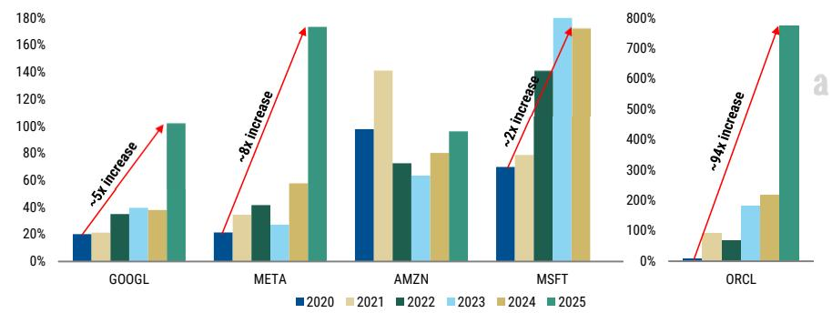
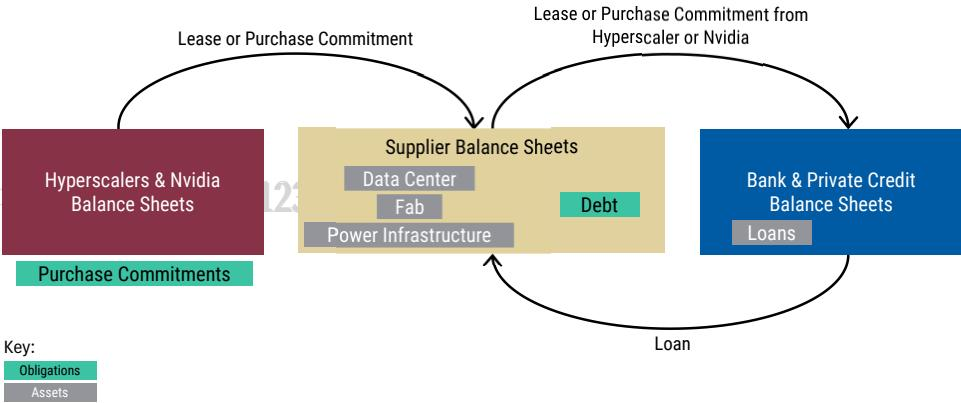
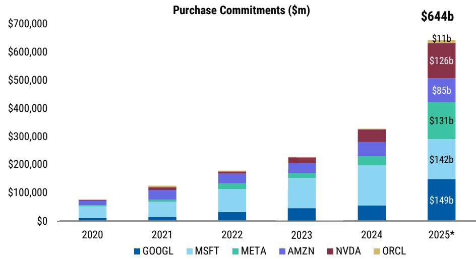
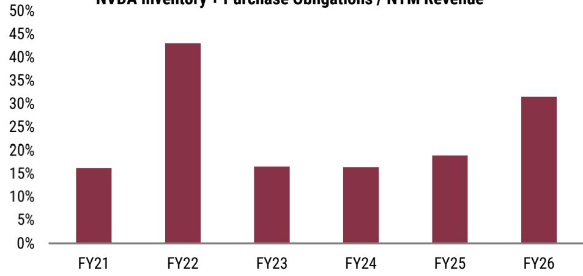
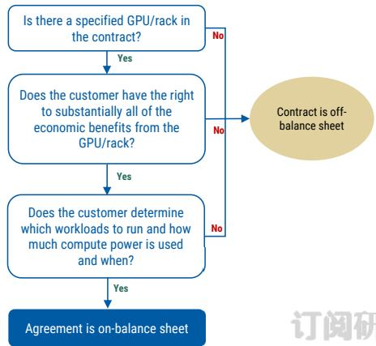
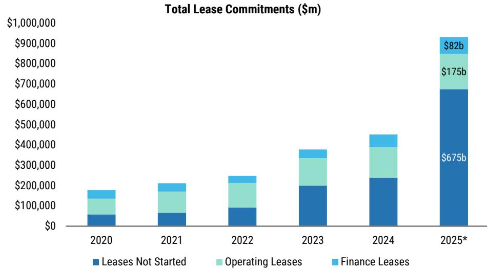
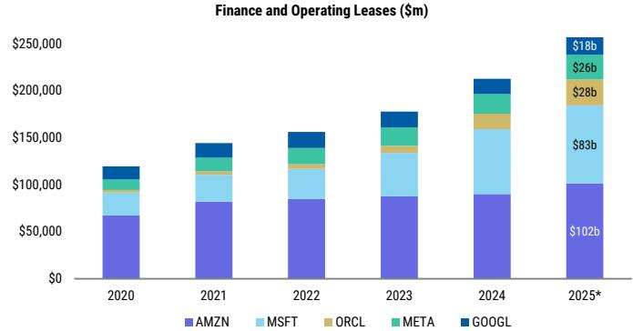
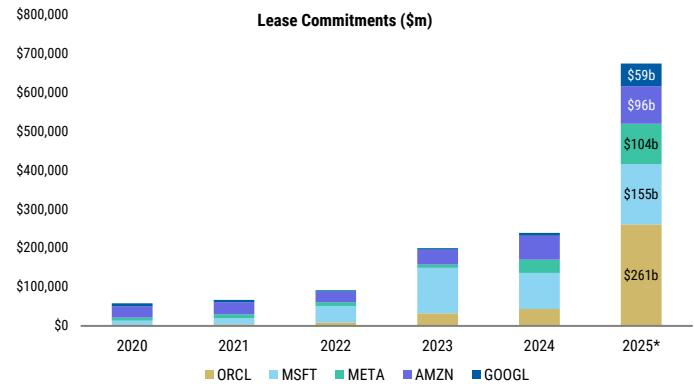
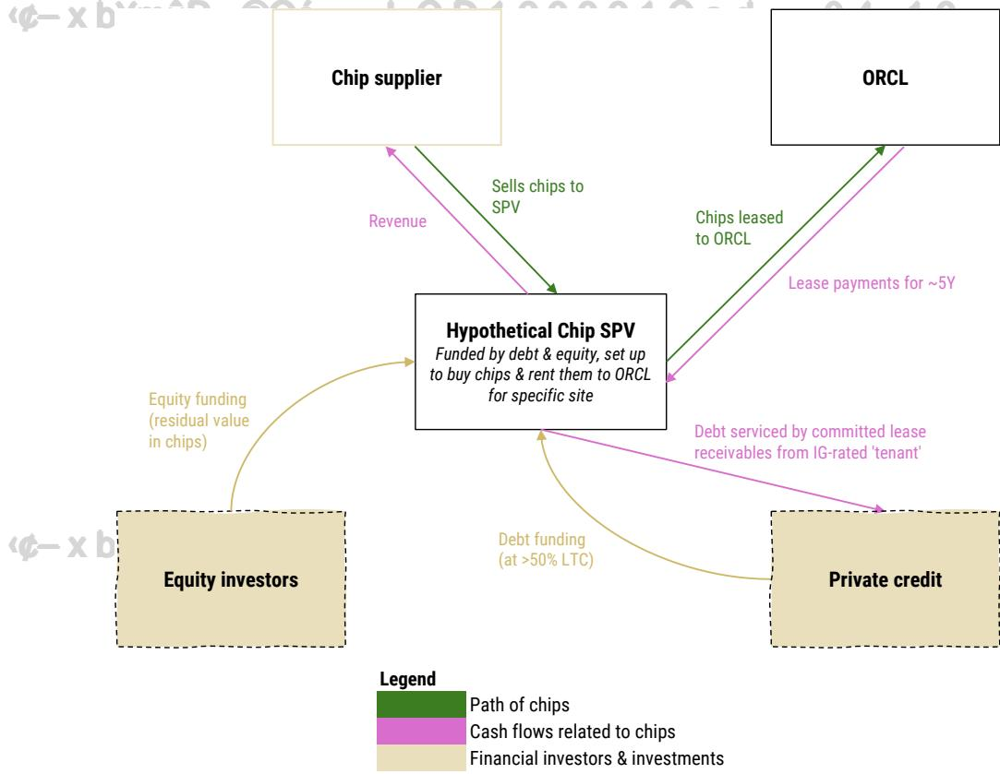

# AI: Off Balance Sheet, On the Hook

April 15, 2026 03:33 PM GMT The AI compute build-out is supported by long-term commitments by high credit quality companies in the ecosystem, enabling financing for data centers, chips, and power infrastructure. Many commitments are off-balance sheet, but exposure to AI is growing as they become larger and longer duration.

# Key Takeaways

1 $> \$ 1.3t n$ of commitments $\$ 6406n$ purchases, $\$ 6756n$ leases) by hyperscalers & Nvidia provide revenue visibility that supports supplier $\&$ developer financing   
□ Contractual commitments span chips, compute, power, AI lab investments, new data center leases, lease guarantees, and more   
Commitments have surged relative to cash flow, with META at ${ \sim } 1 . 7 \times$ fwd operating cash flow and ORCL ${ \mathrm { > } } 7 \mathbf { x } ,$ reflecting larger volumes and longer contract terms Most obligations remain off balance sheet; accounting rules often delay liability recognition until delivery, lease commencement, or a payment becoming probable Contracts often underpin infrastructure financing, including asset-backed private credit deals, so they may be difficult to renegotiate if expectations change

As these off-balance sheet commitments become more frequent, larger, and more complex, it is becoming increasingly difficult for investors to assess companies’ total potential leverage, which is rising much faster than balance sheet leverage. In this note, we provide a comprehensive analysis of the accounting treatment for these transactions and their potential rating agency implications.

  
Exhibit 1: Lease $^ +$ Purchase Commitments as $\%$ of NTM OCF   
Note: ORCL and MSFT figures are included in the prior annual period $2 0 2 4 = \mathsf { F Y }$ 2025). MSFT $2 0 2 5 =$ 2FQ26. ORCL $2 0 2 5 =$ 3FQ26. GOOGL, META, and AMZN are covered by Brian Nowak, MSFT and ORCL is covered by Keith Weiss. Source: Morgan Stanley Research, Company Filings, and Visible Alpha estimates.

# Introduction

The AI infrastructure build-out is increasingly being supported by long-term contractual commitments from companies with the strongest balance sheets. To help underwrite supply capacity, Hyperscalers and NVDA are committing to future purchases of compute, memory, power, data center shell leases, and other components and equipment. In a capital-constrained environment, these commitments act as a form of credit support that enables their suppliers to build capacity that would not otherwise be 添加微信 LCD123321Cad 04-16 financeable.

At our March 2026 TMT Conference, Nvidia highlighted this dynamic, saying many suppliers have been able to take Nvidia's purchase commitments "to the bank." In addition to bank loans, capital is coming from public debt markets and private credit. These structures shift leverage from hyperscalers' and Nvidia's balance sheets to supplier and developer balance sheets, as illustrated in Exhibit 2 , but the hyperscalers and Nvidia remain economically exposed.

  
Exhibit 2: Suppliers Are Using Commitments from Hyperscalers and Nvidia to Access Financing   
Source: Morgan Stanley Research.

For example, data-center construction financing is often supported by a long-term lease to a hyperscaler tenant, allowing developers to raise construction debt from banks, private credit, and public markets. Debt pricing is driven by the tenant's credit quality, but the lease remains off the tenant's balance sheet until delivery.

In this note, we provide a deep dive accounting and credit analysis of off-balance sheet structures emerging in the AI ecosystem. Investors can get an idea of the magnitude of these obligations in purchase obligation disclosures, lease disclosures, and derivatives and 添加微信 LCD123321Cad 04-16 guarantee footnotes, but some highly probable obligations like power purchase agreements and variable lease payments may not have associated values disclosed at all. The lack of disclosure and contractual complexity of these arrangements makes it difficult for investors to interpret true economic leverage versus that reported on balance sheet. The circularity of the AI ecosystem further complicates adequate analysis. See AI: Mapping the AI Ecosystem (22 Mar 2026)

# Unconditional Purchase Obligations

In the context of AI data center expansion, hyperscalers are committing billions through short- and long-term purchase agreements to secure critical inputs such as land, power, GPUs, memory, and cloud capacity. These arrangements lock in supply amid rapidly rising demand and can help with financing the capacity needed to meet high demand, but they also reduce flexibility if the demand outlook changes.

Certain purchase commitments are required to be disclosed under US GAAP and SEC 321Cad   
regulations:   
1. SEC Regulation S-K requires companies to disclose "material cash requirements" from known contractual and other obligations.   
2. US GAAP requires companies to disclose "unconditional purchase obligations." Unconditional purchase obligations are defined as "an obligation to transfer funds in the future for fixed or minimum amounts or quantities of goods or services at fixed or minimum prices." These obligations are required to be disclosed when they are noncancelable, negotiated as part of financing production facilities, and have a remaining term in excess of one year.

Long-term purchase commitments are typically off balance sheet obligations. Unless a company expects a loss on these contracts, these obligations remain off-balance sheet until the underlying goods or services are delivered and a payable is recognized (see Hyperscaling Payables for more discussion on these rising capex payables).

Total purchase obligations across hyperscalers and Nvidia reached $> \$ 640$ billion as of their latest disclosures, with most disclosing that their purchase commitments relate to data centers and technical infrastructure.

These commitments have more than doubled in the last year and are up $_ { 6 x }$ in the last five years ( Exhibit 3 ), reflecting the growing use of long-term contracts to secure AI infrastructure inputs and to finance the expansion of compute capacity. Monitoring these disclosures is critical as they provide visibility into firm, noncancelable commitments that increase operating leverage tied to the success of AI products. Long-term capacity commitments can represent a competitive advantage if compute demand continues to outpace supply, or reduced financial flexibility if demand weakens.

  
Exhibit 3: Growing Purchase Commitments attributed to Data Center Expansion   
Note: NVDA, ORCL and MSFT figures are included in the prior annual period (2024 $= \mathsf { F Y }$ 2025). ORCL 2025 $=$ 3FQ26, respectively. MSFT 2025 $=$ 2024 given no quarterly disclosure. GOOGL, META, and AMZN are covered by Brian Nowak, MSFT and ORCL are covered by Keith Weiss. NVDA is covered by Joe Moore. Source: Morgan Stanley Research and Company Filings

# Inventory Purchase Commitments

Nvidia's inventory purchase commitments are one example of how companies are committing to purchases further in advance amid high expectations for compute demand. To secure foundry capacity and memory supply for its AI products, Nvidia is entering into large inventory purchase commitments. Historically, Nvidia's inventory and inventory 添加微信 LCD123321purchase commitments have been $7 5 - 2 0 \%$ 04-16  of forward revenue. As of January 2026, inventory and related purchase commitments has risen to $\sim 3 2 \%$ of consensus FY27 revenue ( Exhibit 4 ). These commitments shift supply risks and rewards to Nvidia, making the company well-positioned to meet demand but increasing downside risk if that demand softens.

  
Exhibit 4: Nvidia is securing more inventory supply relative to sales expectations   
NVDA Inventory $\scriptstyle +$ Purchase Obligations / NTM Revenue   
Note: NVDA is covered by Joe Moore. Source: Company Filings, Factset, and Morgan Stanley Research. NTM estimate as of 4/10/25.

# Compute Capacity Arrangements

Nvidia, Meta and other hyperscalers have been securing access to compute through cloud capacity arrangements. Under these arrangements, the capacity provider agrees to deliver a certain amount of compute capacity over a specified period, and the customer typically commits to a minimum spend. These arrangements are most often off-balance sheet because they do not meet the definition of a lease.

Investor Insight As of their latest filings, Nvidia disclosed $\$ 276n$ of cloud service agreement commitments, Oracle disclosed $\$ 10 bn$ of cloud capacity arrangements, and Meta did not quantify but said that its $\$ 1$ 131bn of contractual commitments include third-party cloud capacity arrangements.

# Identifying a Lease

Determining whether a capacity commitment is an on- or off- balance sheet commitment depends on whether the contract contains a lease under US GAAP. A contract contains a lease if it conveys the right to control the use of an identified asset for a period of time. Because required minimum lease payments are capitalized on balance sheet, a contract containing a lease is on-balance sheet when the lease starts. If a compute capacity contract fails to meet the definition of a lease, it will remain off-balance sheet.

# Determining when Compute Capacity Deals Could Constitute a Lease

添加微信 LCD123321Cad 04-16 A cloud compute capacity contract is considered a lease only if all of the following conditions exist:

  
Exhibit 5: Is the Compute Capacity Deal On-Balance Sheet?   
Source: Morgan Stanley Research.

• Contract Identifies Specific Assets, for example: ° The contract specifies the particular GPUs or racks. ° The supplier’s ability to substitute GPUs is limited to repairs or maintenance.

# • Customer Has Substantially All of the Economic Benefits

° No other party can use the specified GPUs/racks while they are allocated to the customer.   
° The value generated by the GPUs (training, inference, output) flows entirely to the customer.

# • Customer Controls the Use

° The customer determines workloads, timing, and compute intensity.

If the contract contains all of the above conditions, the customer's minimum payments 添加微信 LCD123321Cad 04-16 would be reported on its balance sheet. Because most compute contracts will not identify which GPUs or racks will generate the compute capacity, most of these contracts will be off-balance sheet. A payable will only be recorded once the company has used the capacity, at which point it will be recorded in the P&L as opex, or receives a bill.

# Take-or-Pay Contracts

One type of compute capacity arrangement is a take-or-pay contract. Take-or-pay contracts require the buyer to either take a minimum volume of goods or services or pay a minimum amount, regardless of actual usage. These arrangements provide suppliers with high visibility to demand, which allows suppliers to secure debt for infrastructure expansion, but they can also reduce customer flexibility. Because these contracts can be used to secure third-party financing, renegotiating or exiting these contracts could prove challenging.

CRWV discloses that a majority of its revenue comes from multi-year take-or-pay contracts that are used to support the asset-level debt needed to finance its compute infrastructure. MSFT is one of CRWV's significant customers and discloses that it has takeor-pay contracts. These contracts in turn likely support CRWV's data center financing. See Exhibit 6 for MSFT and CRWV take-or-pay disclosures.

Exhibit 6: Take-or-Pay Contracts between MSFT and CRWV   

<table><tr><td rowspan=1 colspan=1>Company</td><td rowspan=1 colspan=1>Filing</td><td rowspan=1 colspan=1>Section</td><td rowspan=1 colspan=1>Disclosure</td></tr><tr><td rowspan=1 colspan=1>MSFT</td><td rowspan=1 colspan=1>FY2025 10-K</td><td rowspan=1 colspan=1>Material Cash Requirements andOther Obligations</td><td rowspan=1 colspan=1>Purchasecommitments primarily relate todatacentersand includeopen purchase orders and take-or-pay contracts that are notpresented as construction commitments above.</td></tr><tr><td rowspan=1 colspan=1>CRWV</td><td rowspan=1 colspan=1>3FQ2510-Q</td><td rowspan=1 colspan=1>Risks Related to Our Business andIndustry</td><td rowspan=1 colspan=1>We currently sellaccess to our platform either through committedcontracts,which are take-or-pay,oron-demand,which are pay-as-you-go.</td></tr></table>

Note: MSFT and CRWV are covered by Keith Weiss. Source: Company Filings and Morgan Stanley Research.

For further discussion of how these compute capacity arrangements support chip 添加微信 LCD123321Cad 04-16 financing, see Chip Financing Via Contract-Backed Debt, Chip Leasing, and Upfront Payments later in this report.

# Off-Balance Sheet Lease Payments

# Introduction

Hyperscalers, neoclouds, and AI labs are all using leases to accelerate their compute capacity expansion, manage liquidity, and at times secure optionality. Both finance and operating leases are reflected on the balance sheet in right-of-use (ROU) assets and lease liabilities. As of the latest disclosures, hyperscalers have $\$ 82 b n$ of finance lease 添加微信 LCD123321Cad 04-16 liabilities and \$175bn of operating lease liabilities on their balance sheets, but they have also committed to \$675bn of lease payments to leases that have not started and will remain off-balance sheet until they begin. In addition, accounting rules for certain lease structures can leave highly likely obligations off-balance sheet.

  
Exhibit 7: Total Lease Commitments Across MSFT, ORCL, META, AMZN, GOOGL   
Note: Leases not started are undiscounted. ORCL and MSFT figures are included in the prior annual period (2024 =FY 2025). MSFT 2025 $=$ 2FQ26. ORCL 2025 $=$ 3FQ26. GOOGL, META, and AMZN are covered by Brian Nowak, MSFT and ORCL are covered by Keith Weiss. Source: Morgan Stanley Research and Company Filings.

Lease liabilities are measured as the present value of future lease payments, including price escalators, reasonably certain renewal periods, and probable payments under residual value guarantees. Lease contracts typically include payments that do not fit the requirements to be capitalized on balance sheet but investors may consider highly likely. The following common types of lease payments are not included in the lease liability:

1. Leases Signed but Not Yet Started

加2. 微信 LCD123321Cad 04-16 Variable Lease Payments , such as power, maintenance, taxes, and insurance, or any compute usage-based lease payments   
3. Renewal Options on a lease with an initial term shorter than would be required to meet revenue targets   
4. Tenant guarantee of the future value of the data center (typically referred to as " Residual Value Guarantees ")   
5. Third-Party Lease Backstops & Guarantees

# Leases Signed but Not Yet Started

Lease commitments that have been signed but not yet commenced remain off-balance sheet until the lease start date, leaving a large pool of commitments off-balance sheet in the interim. Hyperscalers have increasingly entered into long-dated data center shell leases, and a majority of these leases have not started (see Exhibit 9 ). As a result, reported lease liabilities remain relatively modest today, though they are already trending higher and are set to increase materially as shells are delivered.

Aggregate hyperscaler commitments for future leases now exceed $\$ 6706 n$ and have risen a   
rapidly, up \$435bn from $\sim \$ 2406n$ a year ago. These are fixed obligations that are entered into well in advance of balance sheet recognition, often to support developers’ ability to secure construction financing, and amplify both upside and downside returns on AI demand. Disclosed commencement timelines vary widely, with GOOGL and others indicating their not-yet-commenced lease commitments coming on-balance sheet between now and 2031.

  
Exhibit 8: On-Balance Sheet Leases Currently at $> \$ 230 b n .$   
Note: ORCL and MSFT figures are included in the prior annual period (2024 =FY 2025). MSFT 2025 = $2 \mathsf { F Q 2 6 }$ . ORCL $2 0 2 5 =$ 3FQ26. GOOGL, META, and AMZN are covered by Brian Nowak, MSFT and ORCL are covered by Keith Weiss. Source: Morgan Stanley Research and Company Filings.

  
Exhibit 9: … with Leases not Started (Off-Balance Sheet) Surging to ${ > } \$ 670 b n$   
Note: ORCL and MSFT figures are included in the prior annual period $2 0 2 4 = \mathsf { F Y }$ 2025). MSFT $2 0 2 5 =$ 2FQ26. ORCL $2 0 2 5 =$ 3FQ26. GOOGL, META, and AMZN are covered by Brian Nowak, MSFT and ORCL are covered by Keith Weiss. Source: Morgan Stanley Research and Company Filings.

# Variable Lease Payments

Variable lease payments are any payments that depend on something other than passage of time. Variable lease payments, even those that are highly likely to occur, are excluded from the lease liability, so leases structured with a higher proportion of variable lease payments will have a smaller lease liability and asset, all else equal. Examples of variable lease payments include escalators based on CPI, payments based on power or compute usage, and maintenance, insurance and taxes. While these payments 添   
are deemed "variable" for accounting purposes, research has shown persistence of $\mathbf { \tt > 0 . 9 0 }$ for variable lease payments, similar persistence to operating lease and finance lease expense.

As hyperscalers enter into more leases for AI infrastructure, variable lease payments are growing as well, making up $> 1 0 \%$ of AMZN's total lease cost, $2 5 \%$ for META, and $30 \%$ for GOOGL ( Exhibit 11 ). MSFT and ORCL do not currently report any variable lease costs, likely due to a materiality judgment. As hyperscalers' new AI data center leases from Exhibit 9 begin, variable lease payments will also become more material operating costs.

# Renewal Options

Leases often contain renewal options. These renewals are only included in the lease liability and ROU asset when it is "reasonably certain" (a relatively high threshold) that the option will be exercised, which involves management judgment. Structuring leases with short initial lease terms and subsequent renewal options can make lease obligations appear smaller on the balance sheet since only the portion of the renewals that management deems “reasonably certain” to be exercised is recorded as a liability and ROU asset.

In the case of AI data center leases, if a company is highly likely to renew a lease if its AI endeavors are successful, then the reported lease liabilities may understate the company’s true long-term commitments. Investors may want to consider a longer lease term and larger lease liability, including expected renewals, when comparing companies that structure shorter leases with renewal options to those that enter into longer, fixedterm leases.

# Residual Value Guarantees

A residual value guarantee (RVG) is a guarantee by a tenant that a leased asset will be worth at least a specified amount at the end of the lease term. If the value of the asset falls short of the RVG, the tenant must pay the difference. These RVGs are akin to contingent liabilities that often remain off-balance sheet, depending on management's assessment of probability. RVGs are not common in data center leases today but were recently included in the META/Blue Owl Capital deal.

RVG in Lease Classification: For lease classification purposes (see Finance Lease vs Operating Lease Classification from our November note), the full RVG is included in the present value test, regardless of likelihood that the lessee will end up making any payments. In order for a lease to be classified as an operating lease, the present value of future lease payments plus the RVG must be less than $90 \%$ of the fair value of the leased asset. Because fair value of a data center at construction completion is based on management's estimate, and compute demand is high today, a lease can fail the $90 \%$ test when a high estimated value is used for the data center.

RVG in Liability Measurement: Only payments that are probable, meaning likely to occur, under a RVG are included in the lease liability. Determining whether a RVG payment is probable involves significant management judgement, particularly in an emerging area like AI, where future market demand and asset values are highly uncertain.

If management concludes that payments are not probable, the related amount is excluded 添加微信 LCD123321Cad 04-16 from the lease liability and remains off balance sheet. If conditions later change – going from not probable to probable – the liability is brought onto the balance sheet at that point in time. Transparent disclosure of RVGs is essential for investors to evaluate potential future obligations.

# Third-Party Lease Backstops & Guarantees

Lindsay Tyler

Tenant quality is increasingly central to underwriting new data center shells, with investment-grade counterparties enabling higher leverage and tighter pricing. Against this backdrop, third-party lease backstops and guarantees are emerging as a key credit enhancement to support AI capacity build-outs.

# 订阅研报

IG-rated Alphabet stands out as a primary example, now providing \~\$17bn of lease 添加微信 LCD123321Cad 04-16 backstops to bitcoin miners that are developing data centers, in turn lowering construction financing costs and potentially accelerating TPU adoption. Oracle and NVIDIA have also disclosed lease guarantees, though at a much smaller scale.

These backstops and guarantees are mainly off-balance sheet under US GAAP unless a payment becomes more likely to occur. A backstop or guarantee can be accounted for either as a "contingent liability" or as a "credit derivative" depending on the specific terms of the contract, but this is more of an accounting distinction, and the balance sheet impact is similar under either alternative. The full exposure remains off-balance sheet unless a payment becomes more likely to occur, which is subject to management judgment. In times where management expectations are too optimistic, this can leave leverage understated to the extent that management underestimates the likelihood of a guarantee payment occurring.

# Credit Considerations for Backstops and Guarantees

# 订阅研报

添加微信 LCD123321Cad 04-16 From a credit perspective, we have been following GOOGL's lease backstops across four data centers currently under construction (see table below). The backstops are typically sized to match project-level construction debt, activate at lease commencement, and step down with amortization. Structurally, they allow for early payment default cures, require lease assumption after early-term defaults or low utilization, and provide laterterm optionality to assume the lease or settle via a debt-sized termination payment. The support is often complemented by equity warrants or a site-level stake (in case of a termination payment).

While still modest in size relative to hyperscalers’ core lease commitments and recent IG bond issuance, understanding how rating agencies treat these backstops is increasingly important. S&P has indicated it will adjust Alphabet’s debt once backstops become operative (i.e., when leases start), and it will update forecasts to capture potential liabilities with any additional clarity (1/16/26 Full Analysis).

More broadly, in a December Credit FAQ, S&P noted that contingent guarantees 添加微信 LCD123321Cad 04-16 represent a potential call on cash and, when integral to counterparties’ financing, may be treated differently from other contingencies (ex. litigation liability), with possible net-oftax debt adjustments to reflect the guaranteed exposure (ex. $\sim \$ 79$ debt adjustment for a $\$ 100$ contingent guarantee).

<table><tr><td colspan="4">&gt;$10bn of lease backstops provided by GOoGL across four data center sites under construction</td></tr><tr><td>DEVELOPER</td><td>CIPHER</td><td>HUT 8</td><td>TERAWULF</td><td>FLASH COMPUTE</td></tr><tr><td>SITE</td><td> BARBER LAKE, TX</td><td>RIVER BEND, LA</td><td>LAKE MARINER, NY</td><td>ABERNATHY, TX</td></tr><tr><td>Lease</td><td>~300MW gross to Fluidstack,2 phases (Sep-26/Mar-27)</td><td>245MW IT,funded with ~85% LTC</td><td>378MW across 3 buildings with start dates 2Q26-4Q26</td><td>Flash Compute JV (by TeraWulf and Fluidstack) to develop 168 MW critical IT</td></tr><tr><td>Contracted revenue</td><td>$3.8bn over initial 10Y term15Y S7bn NNN lease</td><td></td><td>~S6.9bn over initial 10Y</td><td>load ~$9.5bn over initial 25Y</td></tr><tr><td></td><td></td><td> Size of backstop by G00GL~S1.733bn backstop (~45%1For allrent and certain other</td><td>term C~S3.2bn backstop (~46%</td><td>term ~$1.3bn backstop(~14% of</td></tr><tr><td rowspan="6"></td><td>10Y revenue), matching</td><td>financial obligations under</td><td>10Y revenue),matching</td><td>total revenue), matching</td></tr><tr><td>construction HY debt,</td><td>that lease (~S7bn)</td><td>construction HY debt,</td><td>construction HY debt,</td></tr><tr><td>support begins at lease</td><td></td><td>support begins at lease</td><td>support begins at lease</td></tr><tr><td> start and steps down w/</td><td></td><td>start and steps down w/</td><td> start and steps down w/</td></tr><tr><td>amortization</td><td></td><td>amortization</td><td>amortization</td></tr><tr><td>Backstop mechanics Cure rights; must assume lease if default in first 6 yrs</td><td>Fewer details since private financing, see presentation,</td><td>Mirrors Cipher Barber Lake, based on public filings</td><td>Mirrors Cipher Barber Lake,</td></tr><tr><td rowspan="4"></td><td>or &lt;50% utilization; can</td><td></td><td></td><td>based on public filings</td></tr><tr><td></td><td>doesn&#x27;t seem to have any</td><td></td><td></td></tr><tr><td>assume or pay termination fee after yr 6</td><td>warrants/equity</td><td></td><td></td></tr><tr><td>~24.2mm CIFR warrants,</td><td></td><td>~73.6mm WULF warrants,</td><td>~7.8mm Fluidstack</td></tr><tr><td>Equity features</td><td>site-level equity if pays termination fee post-yr 6</td><td></td><td>Akela project sub equity if pays termination fee post-yr</td><td>warrants</td></tr></table>

Source: Company filings, Morgan Stanley Research.

# 添加微信 LCD123321Cad 04-16 Short-Term Leases (<12 Months)

While leases with terms of 12 months or less are exempt from balance sheet recognition, ASC 842 requires disclosure of related costs. Currently, none of the five hyperscalers report short-term lease costs, underscoring the long-duration nature of current AI infrastructure commitments.

# Power Purchase Agreements

Power Purchase Agreements (PPAs) are long-term electricity purchase contracts between an energy producer and a buyer. They are often used to fund the construction of new power infrastructure, much of which is needed to meet data center power demand. In order to bring supply online, hyperscalers are entering into firm commitments, sometimes up to 20 years, to purchase the offtake of these new facilities. Contracts are often fixed price to ensure the energy producer will recover its costs and earn a 添加微信 LCD123321Cad 04-16 required rate of return.

One example of PPAs supporting financing is the VoltaGrid-Oracle relationship; VoltaGrid issued HY-rated bonds due 2030 in CY2H25 after signing a 15-year fixed-fee power purchase agreement with Oracle for natural-gas powered microgrids.

Common Types of PPAs:

1. Behind the meter: Production facility is used directly by the data center. 2. In front of the meter: Production facility supplies the electric grid, and the data center takes power from the grid.

# Accounting for PPAs

Whether a PPA is on balance sheet or off depends on the specific terms of each contract. PPAs generally fall into one of the following three accounting treatments:

Lease accounting: If the hyperscaler has the ability to control the production facility, it may meet the definition of a lease (see Identifying a Lease above for further discussion). If the PPA is a lease, fixed payments are included on balance sheet, but any payments that vary with output would be considered Variable Lease Payments and remain off balance sheet. GOOGL disclosed that it entered into a 20-year, $\$ 90$ PPA in January 2026 that will be accounted for as a lease.

Normal purchase commitment: Often times, PPAs do not meet the definition of a lease because the hyperscaler does not control the power infrastructure. Fixed payments required under contracts largely fall under purchase commitments disclosure and are not on balance sheet.

Derivative accounting: In certain cases, when contracts allow for net settlement, the contract is accounted for as a derivative that needs to be marked to market. AMZN discloses that certain PPA contracts are accounted for as derivatives but does not disclose 添加微信 LCD123321Cad 04-16 the related derivative.

For META, portions of its PPAs are not disclosed as either purchase or lease commitments due to contract structure. In its most recent annual filing, META notes that the absence of a specified fixed or minimum volume commitment prevents reliable disclosure of future PPA liabilities.

Regardless of whether a PPA will ultimately end up on a hyperscaler's balance sheet, the commitment remains off-balance sheet and is not recognized as an expense until power is delivered or the lease commences.

These large contracts represent future cash outflows for hyperscalers that are not readily visible, as they sit off-balance sheet until power is delivered. For example, META’s recent PPA with Vistra Corp (VST) is estimated to cost $\sim \$ 3500$ -\$430mn annually over the 20- year term, or roughly \$7bn- $\$ 8.6 b n$ in total, according to our Utilities analyst, David Arcaro. This is just one PPA where details have been publicly disclosed, though META has likely entered into additional PPAs to support its data center power needs.

# Investors need more clarity on how these agreements are structured, contingencies and ultimate future cash flows.

研报添加微信 LCD123321Cad 04-16 Exhibit 13: Selection of Recent AI-Related Power Purchase Agreements Among Hyperscalers   

<table><tr><td rowspan=1 colspan=1>Microsoft (MSFT)</td><td rowspan=1 colspan=1>Constellation Energy (CEG)</td><td rowspan=1 colspan=1>InSeptember4weexecuteda2earPAwithMcrosofttatwillsupportherestartofeeMilesndUnitenamedtheCraneCleanEeenteicsetiedinecoiceaosUderreemetrosoftillpurceutgeneratedfroedntichueseeapaitydssiosfratrtesrtoftoltoelpitdatacenters InPJMwithcleanreliable energy.</td></tr><tr><td rowspan=1 colspan=1>Alphabet (GOOGL)</td><td rowspan=1 colspan=1>AES Corporation (AES)</td><td rowspan=1 colspan=1>In addition, the twocompanies entered into 20-year Power Purchase Agreements (PPA)forco-lcatedpower generation.AES willownandoperateteeneaisesditroingalosttizatdeadscetooogesWrgtdata center campus under a long-termenergy management agreement.</td></tr><tr><td rowspan=1 colspan=1>Alphabet (GOOGL)</td><td rowspan=1 colspan=1>NextEra Energy (NEE)</td><td rowspan=1 colspan=1>ThecorerstoneofthiscollborationistheplannedrestartoftheDuaneAmoldEnergyCenter(DuaneAmold)owa&#x27;sonlynuclearfacilityadsaaleilcarbon-freenegysouetoelporGoogle&#x27;sgowingoudandinfastructureinowwileastrengtheningidreliabilityetiasotditdsicacocetttoo</td></tr><tr><td rowspan=1 colspan=1>Meta Platforms (META)</td><td rowspan=1 colspan=1>Vistra Corp (VST)</td><td rowspan=1 colspan=1>Vistra(NYSE:VST)todayannouncedithasenteredinto20yearPPAstoprovidemorethan2600 megawatsofzero-carboneergyfromacombination of threedifferent Vistra nuclearplants to supportMeta&#x27;s operations intheregion.</td></tr><tr><td rowspan=1 colspan=1>Meta Platforms (META)</td><td rowspan=1 colspan=1>Constellation Energy (CEG)</td><td rowspan=1 colspan=1>Constelltion (Nasdaq:CEG)andMetahavesigneda20-yearpowerpurchaseagreement(PPA)fortheoutputoftheClintonCleanEnergyCenterpportta&#x27;slaneoalsdoerationsineegionwitmegaasofiosfrearenergy.</td></tr><tr><td rowspan=1 colspan=1>Amazon.com (AMZN)你加微信</td><td rowspan=1 colspan=1>Talen Energy Corporation(TLNLCD123</td><td rowspan=1 colspan=1>Talen EnergyCorporation (NADAQ:TN),anindependentpowerproducerddicated topoweringthfuture,announcedtodattithasexpandeditsexistingnuclearenergyrelationshipwithAmazontoprovidecarbon-freenergyfromTalen&#x27;sSusquehannanuclearpowerplant toAmazonWeb Services(Aws)data centersin the region.</td></tr></table>

Note: This is a non-exhaustive list. GOOGL, META, and AMZN are covered by Brian Nowak, MSFT is covered by Keith Weiss. Energy Providers covered by David Arcaro. Source: Company Filings and Morgan Stanley Research.

Exhibit 14: Power Purchase Commitment Disclosures   

<table><tr><td></td><td></td><td></td><td rowspan=1 colspan=1>Disclosure</td></tr><tr><td rowspan=2 colspan=1>Alphabet (GO0GL)</td><td rowspan=2 colspan=1>FY2025 10-K</td><td rowspan=1 colspan=1>Leases</td><td rowspan=1 colspan=1>InJanuary2026,weexecutedapowerpurchaseagreementwhlchweexpecttobeaccountedforasaleaseresultinginfuturepayments depending on certain agreement terms of S9.9 billon between 2027 and 2047.Ifcertaincontractualconditionsfortheprojectarenotmetwewouldinsteadmakeaonetimepaymentofapproximately$.5billonandassumeownershipof thepowergeneratingassets.</td></tr><tr><td rowspan=1 colspan=1>Purchase Commitments andOther Contractual Obligations</td><td rowspan=1 colspan=1>Wehavematerialpurchasecommltmentsandothercontractualoblgatlonsprmarlyrelatedtoenergytakeor-aycontracts.licenses (including content licenses), and technical infrastructure and inventory orders.</td></tr><tr><td rowspan=1 colspan=1> Meta Platforms (META)</td><td rowspan=1 colspan=1>FY2025 10-K</td><td rowspan=1 colspan=1>N/A</td><td rowspan=1 colspan=1>Aditionallyas part ofthenoralcourseof busines,wehave enteredinto multiyearagreements rangingfromtheeto5 yearstpurchasecleanand renewable energy that do not specify afixed or minimum volume commitment. Theultimate spend underthese agreements may vary and willbe based on actual volume purchased.</td></tr><tr><td rowspan=1 colspan=1>Amazon.com (AMZN)</td><td rowspan=1 colspan=1>FY2025 10-K</td><td rowspan=1 colspan=1>Purchase Commitments</td><td rowspan=1 colspan=1>Includesunconditonalpurchseblgationsrelatedtoonteageemetstocqreandliensedigitalmediacontentproureenergyacqireopertydpntdesestwarettetfectedoolatedcesets</td></tr><tr><td rowspan=1 colspan=1>Oracle Corp (ORCL)</td><td rowspan=1 colspan=1>3FQ26 10-Q</td><td rowspan=1 colspan=1> Unconditional Obligations</td><td rowspan=1 colspan=1>As of February28,2026, ourunconditionalpurchaseandcertan otherobligetions, which were primarilyrelated todata centerpower arrangements, were $11 billion.</td></tr><tr><td rowspan=1 colspan=1>Microsoft (MSFT)</td><td rowspan=1 colspan=1>FY2025 10-K</td><td rowspan=1 colspan=1>Contractual Obligations</td><td rowspan=1 colspan=1>Purchasecommitments primarilyrelate to datacenters and include open purchase orders andtake-or-paycontracts that are notpresented as construction commitments above.</td></tr></table>

订阅研报添加微信 LCD123321Cad 04-16 Note: GOOGL, META, and AMZN are covered by Brian Nowak, MSFT and ORCL are covered by Keith Weiss.Source: Company Filings and Morgan Stanley Research.

# Chip Financing Via Contract-Backed Debt, Chip Leasing, and Upfront Payments

Lindsay Tyler

# Introduction

添加微信 LCD123321Cad 04-16 Strong-credit-quality AI players, such as the IG hyperscalers, can largely use their own balance sheets to fund AI data center chip purchases through cash and public debt. However, HY-rated or unrated players may turn to alternative or asset-backedstructures to improve depth and pricing of financings and to bridge the timing gap between sizable upfront chip capex and lagged monetization.

This section outlines the main approaches emerging in this area, including 1) contractbacked term loans via SPVs, 2) customer prepayments, 3) chip leasing via SPVs, and 4) other potential models. As we'll discuss, such structures are highly bespoke, depending on the counterparty (in the case of a take-or-pay compute contract) and/or investor interest (specifically in regards to private credit).

While still a nascent financing trend, these structures merit attention given the scale of chip financing needs and the complexity of balance sheet treatment. Although some solutions may ease near-term cash outflows, most are on-balance sheet and debt-like, even if they are sometimes loosely described as “off-balance sheet” due to the use of 添加微信 LCD123321Cad 04-16 SPVs and the avoidance of unsecured public debt issuance.

# What is a Special Purpose Vehicle (SPV)?

Before we dive in to specific structures, it is worth defining that a Special Purpose Vehicle (SPV) is a legally separate entity created by a parent company, usually for a specific business or investment purpose, with its own assets and liabilities. It can take various forms, such as a limited partnership or joint venture. Its contractual terms like risk allocation and ownership can significantly affect accounting treatment, consolidation outcomes, and tax implications. SPVs are not uniform across transactions, and the financial reporting impact depends heavily on the specific structure.

There are several reasons why an SPV may be formed, such as securitization, where a bank transfers loans into an SPV to separate them from its broader balance sheet and obligations. SPVs may also be used in M&A transactions to facilitate the transfer of specific assets. Most often, SPVs are used to isolate a project's financial risks and share 添加微信 LCD123321Cadthose risks with other investors. -16

SPVs are increasingly used to finance AI infrastructure, often via JV structures and reflecting the shift toward asset-based "private credit 2.0". These structures now span data center shell construction, and, as discussed here, chip financing – reinforcing that SPV structures do not, by themselves, make debt "off-balance sheet".

# 1) Compute Contract-Backed Term Loans

GPU-as-a-Service (GPUaaS) businesses are companies that build or lease data center shells, install GPUs, and sell compute under multi-year take-or-pay contracts to hyperscalers and other customers.

These players – typically HY-rated or unrated neoclouds, alongside ORCL – can use contract backed term loans to fund GPU and infrastructure purchases, bridging a timing gap between that sizable upfront chip capex and lagged contract monetization. These contract-backed financings can be raised at wholly owned SPVs, secured by \~5-year take-or-pay compute contracts, structured as delayed-draw, and amortized over the contract life. The debt raised by the SPV can pair with initial funding from the parent and/ or contract prepayments by the customer (discussed next). CRWV's facilities serve as the main example.

If the debt raised at the SPV is supported by unconditional guarantees from the GPUaaS provider, the obligation will appear on that provider's (i.e., the parent's) balance sheet.

By contrast, structures with limited or no parent guarantees – which would require a high-credit-quality offtake or counterparty (ex. IG hyperscaler) – may better meet the accounting definition of off-balance sheet financing. However, such financings may still disclosed alongside on-balance sheet debt for transparency. Further, from a credit perspective, rating agencies may continue to view limited- and non-recourse arrangements as debt-like for leverage calculations due to economic dependence and the potential for 添加微信 LCD123321Cad 04-16 future parental support, even if the exposure is excluded from recovery value analysis.

# 2) Customer Prepayments for Compute Contracts

Customers signing take-or-pay compute contracts, such as the IG hyperscalers, are often high-credit-quality. In some cases, they may be willing to pre-fund a portion of the contract given their demand for compute.

In turn, these upfront payments, or prepayments, can reduce near-term cash outflows for the GPUaaS player that needs to buy chips (and hence its reliance on debt). Another benefit is the alignment of incentives between the two counterparties.

From an accounting perspective, such prepayments may appear as deferred revenue on the GPUaaS player's balance sheet. For example, we assume any prepayments received by ORCL (related to its GPUaaS business) will appear as deferred revenue on its balance sheet. While not usually treated as debt by rating agencies, prepayments are likely considered qualitatively in the overall credit assessment.

# 3) Chip Leasing via SPVs

Another potential funding structure uses an intermediary SPV that purchases chips (from a supplier like NVDA) and leases them to an AI customer (ex. hypothetically ORCL, another GPUaaS provider or another ecosystem participant with significant chip funding needs). The SPV may be structured as a joint venture, funded primarily by private credit, with an equity component that can include participation from the chip supplier itself.

From an accounting perspective, a hypothetical five-year chip lease upon commencement would be reflected on balance sheet as a lease rather than unsecured debt, and treated as debt-like in rating agency adjusted leverage. However, it would remain off-balance sheet until lease commencement.

If the tenant is a public company, disclosure may be aggregated with broader data-center shell lease disclosures, with these shorter-dated chip leases expanding the reported leaseterm range.

  
Exhibit 15: Hypothetical chip lease SPV format resulting in a short-dated ORCL lease   
Source: Morgan Stanley Research. Note: We are not aware of any such financings by ORCL, and we presented this structure illustration given management's commentary on the FY2Q26 call regarding private credit and chip leasing as potential funding options.

# 4) Other Potential Models

In addition to the above structures, we have considered other financing options – though have not yet seen these in practice in size – such as:

• Amortizing GPU financing in the public tradable bond market with at least one ûR _®Oárating, LCD123321Cad 04-16 • Private GPU/contract securitizations with banks,   
• Vendor financing or supply chain financing,   
• Direct chip leasing from suppliers, and/or   
• Single site SPVs, structured as JVs and featuring both the shell lease and GPU spend.

# These structures may differ in on- versus off-balance sheet treatment, but all would likely result in higher adjusted leverage.