# Thermal Solutions - AI Liquid Cooling TAM Expanding

April 15, 2026 09:00 PM GMT We expect 2Q26 to be another record quarter for thermal solution stocks we cover, driven by ongoing shipment ramps for GPU/CPU/ASIC server racks. The newly introduced VR POD also a suggests extended liquid cooling adoption in major compute and data transmission. We stay OW on AVC and Fositek.

# Key Takeaways

Strong demand for AI and general-purpose servers will continue to drive thermal component shipments in 2Q26, both air and liquid cooling related.

Larger shipment scale, a better mix, and an improved learning curve at newly added facilities are positive to margin expansion.

Increased rack design variety for the upcoming Vera Rubin POD implies AI liquid cooling TAM is expanding from GPU, CPU to CPO switches and optical transceivers.

We expect server contribution to exceed $50 \%$ of 2026e revenue across the board.

Both AVC and Fositek are OW as major beneficiaries of liquid cooling adoption in AI data center infrastructure and profit upside. Auras and Sunon are EW.

2Q26 another record quarter: We now expect AVC and Fositek to deliver record gross margin in 1Q26 on revenue scale increase and favorable mix shift (server contribution $> 5 5 \%$ ), and expect Auras to recover gross margin on improved production at new fabs in Thailand. Strong AI server and general-purpose server demand should continue to drive the shipment strength in 2Q26, so we estimate another record quarter for revenue across the board. However, Fositek might face a relatively flat quarter due to smartphone hinge model transition.

Everything is upgraded to liquid-cooled: Rack varieties are increasing for the upcoming Vera Rubin POD - VR NVL72, Groq 3 LPX, Vera CPU rack, Bluefield 4 storage rack, and Spectrum-X CPO switch rack - each designed with liquid cooling solution. That implies AI cooling TAM is expanding substantially into 2027 and this is 订阅研报添加微信 consistent with rapid capacity expansion announced by AVC. LCD123321Ca

AVC remains our top idea among four thermal stocks: We like AVC most for its proven time-to-market delivery of cold plate module, chassis, and manifolds for NVDA and major AI ASIC customers. Increased liquid cooling solution adoption acts as the key profit driver for AVC and Fositek.

We stay EW on Auras for unclear VR platform exposure at this point and on Sunon for fair risk-reward, and await meaningful contribution from liquid cooling component offering.

# Preview to earnings

Focus KPI Focus KPI Surprise Likely impact to consensus EPS\*

# Asia Vital Components Co. Ltd. 3017.TW

Very likely upside surprise Modest revision higher

• 1Q26 margin should expand QoQ and YoY along with a favorable product mix shift and scale benefits.

2Q26 business outlook will be offered at the meeting. Business momentum is expected to remain at the

March level at least for the remaining months of 2Q26.

# Auras Technology Co Ltd 3324.TWO

1Q26 margin Likely upside surprise Modest revision higher

订阅研报添加微信 LCD123321Cad 04-16 • Smooth ramps at new fabs in Thailand and operating leverage benefits should drive stronger margin recovery in 1Q26.

• 2Q26 revenue likely grow sequentially for cold plate shipments ramp and new capacity addition in Thailand.

# Fositek Corp 6805.TW

1Q26 margin Likely upside surprise Largely unchanged

• 1Q26 margin should expand QoQ and YoY along with a favorable product mix shift.

• 2Q26 revenue is likely to stay flattish QoQ as QD shipment ramp offsets hinge revenue shortfall from smartphone model transition.

# Sunonwealth Electric Machine Industry Co 2421.TW

1Q26 margin Likely upside surprise Largely unchanged

• 1Q26 margin should grow QoQ and YoY, supported by a favorable product mix shift.

• 2Q26 revenue likely grow sequentially.

\*Likely impact to consensus EPS is for the next 12 months Source: Company data, Morgan Stanley Research

# Valuation

AVC's share price outperformed, up $5 3 \%$ vs. the TAIEX up $2 6 \% ,$ , while other thermal stocks underperformed. Fositek's share price was up $6 \%$ while Auras and Sunonwealth fell $4 \%$ and $12 \%$ . Except for AVC, on our revised 2026-27 earnings estimates, valuations remain within one standard deviation of the two-year average P/E multiple. We expect positive developments – including rising adoption of liquid cooling and design upgrades in AI GPU/ ASIC server racks through 2026–27 – to continue supporting share price momentum.

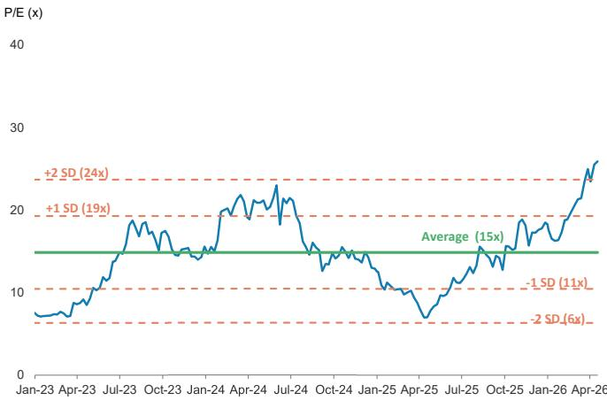  
Exhibit 1: AVC: One-year forward P/E chart   
Source: TEJ, Morgan Stanley Research estimates.

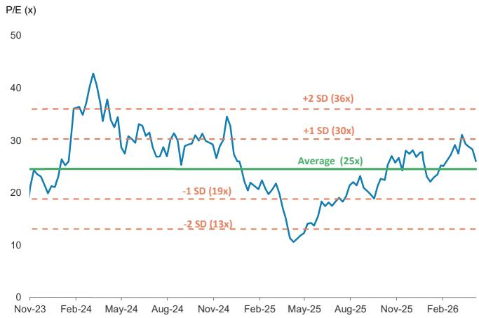  
Exhibit 2: Fositek: One-year forward P/E chart   
Source: FactSet, Morgan Stanley Research estimates.

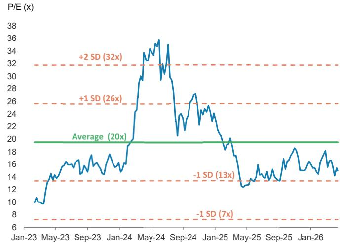  
Exhibit 3: Auras: One-year forward P/E chart   
Source: TEJ, Morgan Stanley Research estimates.

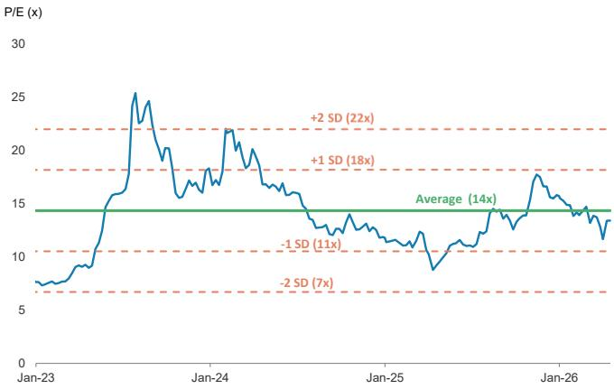  
Exhibit 4: Sunon: One-year forward P/E chart   
Source: TEJ, Morgan Stanley Research estimates.

# AVC: Earnings Estimate Changes

We raise our 2026, 2027, and 2028 earnings estimates $1 5 \%$ , $1 6 \% ,$ and $1 7 \%$ , respectively: This reflects stronger AI-related shipments and higher gross margin assumptions on a better product mix.

Exhibit 5: AVC: Estimate changes   

<table><tr><td rowspan="2">NT$mn</td><td colspan="3">2026e Earnings Estimates</td><td colspan="3">2027e Earnings Estimates</td><td colspan="3">2028e Earnings Estimates</td></tr><tr><td>New</td><td>Old</td><td>Variance</td><td>New</td><td>Old</td><td>Variance</td><td>New</td><td>Old</td><td>Variance</td></tr><tr><td>Net sales</td><td>220,065</td><td>216,400</td><td>2%</td><td>267,246</td><td>258,614</td><td>3%</td><td>329,717</td><td>315,764</td><td>4%</td></tr><tr><td>COGS</td><td>-155,208</td><td>-157,871</td><td>-2%</td><td>-185,596</td><td>-185,787</td><td>0%</td><td>-225,185</td><td>-223,603</td><td>1%</td></tr><tr><td>Gross profit</td><td>64,857</td><td>58,529</td><td>11%</td><td>81,650</td><td>72,827</td><td>12%</td><td>104,532</td><td>92,161</td><td>13%</td></tr><tr><td>Operating expenses</td><td>-11,826</td><td>-11,626</td><td>2%</td><td>-13,827</td><td>-13,386</td><td>3%</td><td>-16,105</td><td>-15,636</td><td>3%</td></tr><tr><td>Operating income</td><td>53,031</td><td>46,903</td><td>13%</td><td>67,823</td><td>59,441</td><td>14%</td><td>88,427</td><td>76,525</td><td>16%</td></tr><tr><td>Non-operating income</td><td>675</td><td>200</td><td>237%</td><td>675</td><td>200</td><td>237%</td><td>675</td><td>200</td><td>237%</td></tr><tr><td>Pre-tax income</td><td>53,706</td><td>47,103</td><td>14%</td><td>68,498</td><td>59,641</td><td>15%</td><td>89,102</td><td>76,725</td><td>16%</td></tr><tr><td>Income tax</td><td>-14,498</td><td>-12,696</td><td>14%</td><td>-18,522</td><td>-16,124</td><td>15%</td><td>-24,080</td><td>-20,726</td><td>16%</td></tr><tr><td>Net income</td><td>37,068</td><td>32,268</td><td>15%</td><td>47,408</td><td>40,950</td><td>16%</td><td>61,941</td><td>52,918</td><td>17%</td></tr><tr><td>EPS (NT$)</td><td>95.00</td><td>82.63</td><td>15%</td><td>121.50</td><td>104.86</td><td>16%</td><td>158.75</td><td>135.50</td><td>17%</td></tr><tr><td>Margins (%)</td><td></td><td></td><td>ppt</td><td></td><td></td><td>ppt</td><td></td><td></td><td>ppt</td></tr><tr><td>Gross margin</td><td>29.5%</td><td>27.0%</td><td>2.4</td><td>30.6%</td><td>28.2%</td><td>2.4</td><td>31.7%</td><td>29.2%</td><td>2.5</td></tr><tr><td>Operating margin</td><td>24.1%</td><td>21.7%</td><td>2.4</td><td>25.4%</td><td>23.0%</td><td>2.4</td><td>26.8%</td><td>24.2%</td><td>2.6</td></tr><tr><td>Pre-tax margin</td><td>24.4%</td><td>21.8%</td><td>2.6</td><td>25.6%</td><td>23.1%</td><td>2.6</td><td>27.0%</td><td>24.3%</td><td>2.7</td></tr><tr><td>Net margin</td><td>16.8%</td><td>14.9%</td><td>1.9</td><td>17.7%</td><td>15.8%</td><td>1.9</td><td>18.8%</td><td>16.8%</td><td>2.0</td></tr></table>

Source: Company data, Morgan Stanley Research (e) estimates

# Price Target Revision and Valuation Methodology

We raise our price target for AVC from $N \tau \$ 2,300$ to $N \uparrow \$ 2,750$ $( + 2 0 \% )$ , reflecting our estimate revisions for 2026-28. Our price target is our base case scenario value derived from a residual income (RI) model, similar to the rest of our tech hardware coverage 添加微信 LCD123321Cad 04-16 universe.

# 订阅研报

Our price target implies 29x 2026e P/E. We believe this is attractive as we expect AVC to be one of the direct consigned cold plate module suppliers for Nvidia's Rubin platform.

Our key assumptions are unchanged: A cost of equity of $10 \%$ (beta of 1.3, equity risk premium of $8 \%$ , and risk-free rate of $0 . 5 \%$ ), medium-term growth rate of $1 3 \% ,$ and terminal growth rate of $3 \%$ .

We also raise our bull and bear case values $20 \%$ each, to $N \bar { 1 } \bar { \$ 5 3 , 8 4 6 }$ and $N \top \$ 1,654$ in line with the increase in our base case value.

Exhibit 6: AVC: Residual Income (RI) Model   

<table><tr><td rowspan=1 colspan=1>Residual Income Valuation</td><td rowspan=1 colspan=1></td><td rowspan=1 colspan=1></td><td rowspan=1 colspan=1></td><td rowspan=1 colspan=1></td><td rowspan=1 colspan=1></td><td rowspan=1 colspan=1></td><td rowspan=1 colspan=1></td><td rowspan=1 colspan=1></td><td rowspan=1 colspan=1></td><td rowspan=1 colspan=1></td><td rowspan=1 colspan=1></td><td rowspan=1 colspan=1></td></tr><tr><td rowspan=1 colspan=1>AVC (NT$ mn)</td><td rowspan=1 colspan=1></td><td rowspan=1 colspan=1>2026E</td><td rowspan=1 colspan=1>2027E</td><td rowspan=1 colspan=1>2028E</td><td rowspan=1 colspan=1>2029E</td><td rowspan=1 colspan=1>2030E</td><td rowspan=1 colspan=1>2031E</td><td rowspan=1 colspan=1>2032E</td><td rowspan=1 colspan=1>2033E</td><td rowspan=1 colspan=1>2034E</td><td rowspan=1 colspan=1>2035E</td><td rowspan=1 colspan=1>2036E</td></tr><tr><td></td><td rowspan=1 colspan=1></td><td rowspan=1 colspan=1></td><td rowspan=1 colspan=1></td><td rowspan=1 colspan=1></td><td rowspan=1 colspan=1></td><td rowspan=1 colspan=1></td><td rowspan=1 colspan=1></td><td rowspan=1 colspan=1></td><td rowspan=1 colspan=1></td><td rowspan=1 colspan=1></td><td rowspan=1 colspan=1></td><td rowspan=1 colspan=1></td></tr><tr><td rowspan=1 colspan=1>Total Equity</td><td rowspan=1 colspan=1></td><td rowspan=1 colspan=1>80.201</td><td rowspan=1 colspan=1>113,207</td><td rowspan=1 colspan=1>156,729</td><td rowspan=1 colspan=1>182,375</td><td rowspan=1 colspan=1>211,354</td><td rowspan=1 colspan=1>244,101</td><td rowspan=1 colspan=1>281,105</td><td rowspan=1 colspan=1>322.919</td><td rowspan=1 colspan=1>370,170</td><td rowspan=1 colspan=1>423,563</td><td rowspan=1 colspan=1>478,557</td></tr><tr><td rowspan=1 colspan=1>Core Net Profit</td><td rowspan=1 colspan=1></td><td rowspan=1 colspan=1>37.068</td><td rowspan=1 colspan=1>47,408</td><td rowspan=1 colspan=1>61,941</td><td rowspan=1 colspan=1>69.993</td><td rowspan=1 colspan=1>79,092</td><td rowspan=1 colspan=1>89.374</td><td rowspan=1 colspan=1>100,993</td><td rowspan=1 colspan=1>114,122</td><td rowspan=1 colspan=1>128,958</td><td rowspan=1 colspan=1>145,723</td><td rowspan=1 colspan=1>150,094</td></tr><tr><td rowspan=1 colspan=1>Retur on Equity</td><td rowspan=1 colspan=1></td><td rowspan=1 colspan=1>73.3%</td><td rowspan=1 colspan=1>59.1%</td><td rowspan=1 colspan=1>54.7%</td><td rowspan=1 colspan=1>44.7%</td><td rowspan=1 colspan=1>43.4%</td><td rowspan=1 colspan=1>42.3%</td><td rowspan=1 colspan=1>41.4%</td><td rowspan=1 colspan=1>40.6%</td><td rowspan=1 colspan=1>39.9%</td><td rowspan=1 colspan=1>39.4%</td><td rowspan=1 colspan=1>35.4%</td></tr><tr><td></td><td rowspan=1 colspan=1></td><td rowspan=1 colspan=1></td><td rowspan=1 colspan=1></td><td rowspan=1 colspan=1></td><td rowspan=1 colspan=1></td><td rowspan=1 colspan=1></td><td rowspan=1 colspan=1></td><td rowspan=1 colspan=1></td><td rowspan=1 colspan=1></td><td rowspan=1 colspan=1></td><td rowspan=1 colspan=1></td><td rowspan=1 colspan=1></td></tr><tr><td rowspan=1 colspan=1>Beta (Last 60 Mths)</td><td rowspan=1 colspan=1>1.3</td><td rowspan=1 colspan=1></td><td rowspan=1 colspan=1></td><td rowspan=1 colspan=1></td><td rowspan=1 colspan=1></td><td rowspan=1 colspan=1></td><td rowspan=1 colspan=1></td><td rowspan=1 colspan=1></td><td rowspan=1 colspan=1></td><td rowspan=1 colspan=1></td><td rowspan=1 colspan=1></td><td rowspan=1 colspan=1></td></tr><tr><td rowspan=1 colspan=1>Equity Risk Premium (Rm-Rf)</td><td rowspan=1 colspan=1>8%</td><td rowspan=1 colspan=1></td><td rowspan=1 colspan=1></td><td rowspan=1 colspan=1></td><td rowspan=1 colspan=1></td><td rowspan=1 colspan=1></td><td rowspan=1 colspan=1></td><td rowspan=1 colspan=1></td><td rowspan=1 colspan=1></td><td rowspan=1 colspan=1></td><td rowspan=1 colspan=1></td><td rowspan=1 colspan=1></td></tr><tr><td rowspan=1 colspan=1>Risk Free Rate (Rf)</td><td rowspan=1 colspan=1>0.5%</td><td rowspan=1 colspan=1></td><td rowspan=1 colspan=1></td><td rowspan=1 colspan=1></td><td rowspan=1 colspan=1></td><td rowspan=1 colspan=1></td><td rowspan=1 colspan=1></td><td rowspan=1 colspan=1></td><td rowspan=1 colspan=1></td><td rowspan=1 colspan=1></td><td rowspan=1 colspan=1></td><td rowspan=1 colspan=1></td></tr><tr><td rowspan=1 colspan=1>Cost of Equity</td><td rowspan=1 colspan=1>10%</td><td rowspan=1 colspan=1></td><td rowspan=1 colspan=1></td><td rowspan=1 colspan=1></td><td rowspan=1 colspan=1></td><td rowspan=1 colspan=1></td><td rowspan=1 colspan=1></td><td rowspan=1 colspan=1></td><td rowspan=1 colspan=1></td><td rowspan=1 colspan=1></td><td rowspan=1 colspan=1></td><td rowspan=1 colspan=1></td></tr><tr><td rowspan=1 colspan=1>Terminal Growth Rate</td><td rowspan=1 colspan=1>3%</td><td rowspan=1 colspan=1></td><td rowspan=1 colspan=1></td><td rowspan=1 colspan=1></td><td rowspan=1 colspan=1></td><td rowspan=1 colspan=1></td><td rowspan=1 colspan=1></td><td rowspan=1 colspan=1></td><td rowspan=1 colspan=1></td><td rowspan=1 colspan=1></td><td rowspan=1 colspan=1></td><td rowspan=1 colspan=1></td></tr><tr><td rowspan=1 colspan=1>2028-2034 growth rate</td><td rowspan=1 colspan=1>13%</td><td rowspan=1 colspan=1></td><td rowspan=1 colspan=1></td><td rowspan=1 colspan=1></td><td rowspan=1 colspan=1></td><td rowspan=1 colspan=1></td><td rowspan=1 colspan=1></td><td rowspan=1 colspan=1></td><td rowspan=1 colspan=1></td><td rowspan=1 colspan=1></td><td rowspan=1 colspan=1></td><td rowspan=1 colspan=1></td></tr><tr><td></td><td rowspan=1 colspan=1></td><td rowspan=1 colspan=1></td><td rowspan=1 colspan=1></td><td rowspan=1 colspan=1></td><td rowspan=1 colspan=1></td><td rowspan=1 colspan=1></td><td rowspan=1 colspan=1></td><td rowspan=1 colspan=1></td><td rowspan=1 colspan=1></td><td rowspan=1 colspan=1></td><td rowspan=1 colspan=1></td><td rowspan=1 colspan=1></td></tr><tr><td rowspan=1 colspan=1>Beginning Equity Capital</td><td rowspan=1 colspan=1></td><td rowspan=1 colspan=1></td><td rowspan=1 colspan=1></td><td rowspan=1 colspan=1></td><td rowspan=1 colspan=1></td><td rowspan=1 colspan=1></td><td rowspan=1 colspan=1></td><td rowspan=1 colspan=1></td><td rowspan=1 colspan=1></td><td rowspan=1 colspan=1></td><td rowspan=1 colspan=1></td><td rowspan=1 colspan=1></td></tr><tr><td rowspan=1 colspan=1>PVofForecast Period</td><td rowspan=1 colspan=1></td><td rowspan=1 colspan=1></td><td rowspan=1 colspan=1></td><td rowspan=1 colspan=1></td><td rowspan=1 colspan=1></td><td rowspan=1 colspan=1></td><td rowspan=1 colspan=1></td><td rowspan=1 colspan=1></td><td rowspan=1 colspan=1></td><td rowspan=1 colspan=1></td><td rowspan=1 colspan=1></td><td rowspan=1 colspan=1></td></tr><tr><td rowspan=1 colspan=1>PV of Continuing Value</td><td rowspan=1 colspan=1></td><td rowspan=1 colspan=1></td><td rowspan=1 colspan=1></td><td rowspan=1 colspan=1></td><td rowspan=1 colspan=1></td><td rowspan=1 colspan=1></td><td rowspan=1 colspan=1></td><td rowspan=1 colspan=1></td><td rowspan=1 colspan=1></td><td rowspan=1 colspan=1></td><td rowspan=1 colspan=1></td><td rowspan=1 colspan=1></td></tr><tr><td rowspan=1 colspan=1>Equity Value</td><td rowspan=1 colspan=1></td><td rowspan=1 colspan=1></td><td rowspan=1 colspan=1></td><td rowspan=1 colspan=1></td><td rowspan=1 colspan=1></td><td rowspan=1 colspan=1></td><td rowspan=1 colspan=1></td><td rowspan=1 colspan=1></td><td rowspan=1 colspan=1></td><td rowspan=1 colspan=1></td><td rowspan=1 colspan=1></td><td rowspan=1 colspan=1></td></tr><tr><td rowspan=1 colspan=1>No.of Shares</td><td rowspan=1 colspan=1></td><td rowspan=1 colspan=1></td><td rowspan=1 colspan=1></td><td rowspan=1 colspan=1></td><td rowspan=1 colspan=1></td><td rowspan=1 colspan=1></td><td rowspan=1 colspan=1></td><td rowspan=1 colspan=1></td><td rowspan=1 colspan=1></td><td rowspan=1 colspan=1></td><td rowspan=1 colspan=1></td><td rowspan=1 colspan=1></td></tr><tr><td rowspan=1 colspan=1>ProjectedPrice(12MForward)</td><td rowspan=1 colspan=1></td><td rowspan=1 colspan=1>NT$2750</td><td rowspan=1 colspan=1></td><td rowspan=1 colspan=1></td><td rowspan=1 colspan=1></td><td rowspan=1 colspan=1></td><td rowspan=1 colspan=1></td><td rowspan=1 colspan=1></td><td rowspan=1 colspan=1></td><td rowspan=1 colspan=1></td><td rowspan=1 colspan=1></td><td rowspan=1 colspan=1></td></tr><tr><td rowspan=1 colspan=1>Implied2026EP/E</td><td rowspan=1 colspan=1></td><td rowspan=1 colspan=2>29x</td><td rowspan=1 colspan=1></td><td rowspan=1 colspan=1></td><td rowspan=1 colspan=1></td><td rowspan=1 colspan=1></td><td rowspan=1 colspan=1></td><td rowspan=1 colspan=1></td><td rowspan=1 colspan=1></td><td rowspan=1 colspan=1></td><td rowspan=1 colspan=1></td></tr></table>

Source: Morgan Stanley Research (E) estimates

Exhibit 7: AVC: Financial summary Income Statement   

<table><tr><td>NT$mn;FYEnd Dec</td><td>2025</td><td>2026E</td><td>2027E</td><td>2028E</td></tr><tr><td>Net sales</td><td>139,639</td><td>220,065</td><td>267,246</td><td>329,717</td></tr><tr><td>COGS</td><td>-103,605</td><td>-155,208</td><td>-185,596</td><td>-225,185</td></tr><tr><td>Gross profit</td><td>36,034</td><td>64,857</td><td>81,650</td><td>104,532</td></tr><tr><td>Operating expenses</td><td>-8,292</td><td>-11,732</td><td>-13,732</td><td>-16,010</td></tr><tr><td>- Promotion</td><td>-1,589</td><td>-2,254</td><td>-2,436</td><td>-2,740</td></tr><tr><td>- ADM</td><td>-1,311</td><td>-1,731</td><td>-2,018</td><td>-2,340</td></tr><tr><td>- R&amp;D</td><td>-5,392</td><td>-7,747</td><td>-9,278</td><td>-10,931</td></tr><tr><td>Operating income</td><td>27,742</td><td>53,126</td><td>67,918</td><td>88,522</td></tr><tr><td>Non-operating income</td><td>1173</td><td>675</td><td>675</td><td>675</td></tr><tr><td>Interest income</td><td>153</td><td>475</td><td>475</td><td>475</td></tr><tr><td>Investment income</td><td>0</td><td>孤区 0</td><td>0</td><td>0</td></tr><tr><td>Disposal of investment</td><td>11</td><td>0</td><td>0</td><td>0</td></tr><tr><td>Disposal of fixed assets</td><td>-384</td><td>0</td><td>0</td><td>0</td></tr><tr><td>Exchange gain</td><td>723</td><td>0</td><td>0</td><td>0</td></tr><tr><td>Other</td><td>670</td><td>200</td><td>200</td><td>200</td></tr><tr><td>Pre-tax income</td><td>28,916</td><td>53,801</td><td>68,593</td><td>89,197</td></tr><tr><td>Income tax</td><td>-9,787</td><td>-16,733</td><td>-21,184</td><td>-27,256</td></tr><tr><td>Net income</td><td>19,129</td><td>37,068</td><td>47,408</td><td>61,941</td></tr><tr><td>EPS (NT$)</td><td>49.03</td><td>95.00</td><td>121.50</td><td>158.75</td></tr><tr><td>Diluted EPS (NT$)</td><td>48.86</td><td>94.69</td><td>121.10</td><td>158.23</td></tr></table>

Balance Sheet   

<table><tr><td>NT$mn</td><td>2025</td><td>2026E</td><td>2027E</td><td>2028E</td></tr><tr><td>Cash</td><td>58,530</td><td>82,231</td><td>105,042</td><td>138,033</td></tr><tr><td>Mkt securities</td><td>1,912</td><td>1,912</td><td>1,912</td><td>1,912</td></tr><tr><td>Accounts/Notes receivables</td><td>12,133</td><td>19,121</td><td>23,220</td><td>28,648</td></tr><tr><td>Inventory</td><td>49,572</td><td>74,262</td><td>88,803</td><td>107,745</td></tr><tr><td>Other current assets</td><td>4,029</td><td>4,029</td><td>4,029</td><td>4,029</td></tr><tr><td>Current Assets</td><td>126,176</td><td>181,555</td><td>223,006</td><td>280,367</td></tr><tr><td>Long-term investments</td><td>986</td><td>986</td><td>986</td><td>986</td></tr><tr><td>Fixed assets</td><td>17,849</td><td>29,603</td><td>43,357</td><td>57,111</td></tr><tr><td>Other assets</td><td>15,125</td><td>15,125</td><td>15,125</td><td>15,125</td></tr><tr><td>Total Assets</td><td>160,137</td><td>227,269</td><td>282,474</td><td>353,590</td></tr><tr><td>S/T borrowings</td><td>15,111</td><td>15,111</td><td>15,111</td><td>15,111</td></tr><tr><td>AP/NP</td><td>48,109</td><td>72,071</td><td>86,182</td><td>104,565</td></tr><tr><td>Other ST liabilities</td><td>34,275</td><td>47,811</td><td>55,898</td><td>65,108</td></tr><tr><td>Other liabilities</td><td>5,128</td><td>5,128</td><td>5,128</td><td>5,128</td></tr><tr><td>L/T debt</td><td>6,949</td><td>6,949</td><td>6,949</td><td>6,949</td></tr><tr><td>Total Liabilities</td><td>109,572</td><td>147,069</td><td>169,267</td><td>196,860</td></tr><tr><td>Common shares</td><td>3,907</td><td>3,983</td><td>3,983</td><td></td></tr><tr><td>Capital Collection</td><td>76</td><td>0</td><td>0</td><td>3,983 0</td></tr><tr><td>APIC</td><td>2,728</td><td>2,728</td><td>2,728</td><td>2,728</td></tr><tr><td>Retained earnings</td><td>35,417</td><td>65,053</td><td>98,060</td><td></td></tr><tr><td>Treasury Stock</td><td>0</td><td>0</td><td>0</td><td>141,582</td></tr><tr><td>Other shareholders&#x27; equity</td><td>8437</td><td>8437</td><td>8437</td><td>0</td></tr><tr><td>Shareholders&#x27;equity</td><td>50,565</td><td>80,201</td><td>113,207</td><td>8437</td></tr><tr><td></td><td></td><td></td><td></td><td>156,729</td></tr><tr><td>TotalLiab./Shrhldr&#x27;s Equity</td><td>160,137</td><td>227,269</td><td>282,474</td><td>353,590</td></tr></table>

Source: Company data, Morgan Stanley Research (E) estimates.

Cash Flow Statement   

<table><tr><td>NT$mn</td><td>2025</td><td>2026E</td><td>2027E</td><td>2028E</td></tr><tr><td>Cashflow from operations</td><td>39,415</td><td>46,133</td><td>54,213</td><td>68,410</td></tr><tr><td>Net Profits</td><td>20,951</td><td>37,068</td><td>47,408</td><td>61,941</td></tr><tr><td>Depreciation</td><td>3,246</td><td>3,246</td><td>3,246</td><td>3,246</td></tr><tr><td>Equity investment losses (income)</td><td>0</td><td>0</td><td>0</td><td>0</td></tr><tr><td>Other adjustments</td><td>15,219</td><td>5,819</td><td>3,559</td><td>3,223</td></tr><tr><td>Cashflow from investing</td><td>-13,336</td><td>-15,000</td><td>-17,000</td><td>-17,000</td></tr><tr><td>(Purchases) sale of FA (capex)</td><td>-7,264</td><td>-15,000</td><td>-17,000</td><td>-17,000</td></tr><tr><td>(Purchases) sale of L/T investment</td><td>217</td><td>0</td><td>0</td><td>0</td></tr><tr><td>(Purchases) sale of S/T investment</td><td>0</td><td>0</td><td>0</td><td>0</td></tr><tr><td>Otheradjustments</td><td>-6,289</td><td>0</td><td>0</td><td>0</td></tr><tr><td>Cashflow from financing</td><td>2,620</td><td>-7,432</td><td>-14,402</td><td>-18,419</td></tr><tr><td>Increase in L/T debt</td><td>3,677</td><td>0</td><td>0</td><td>0</td></tr><tr><td>Increase in S/T debt</td><td>5,777</td><td>0</td><td>0</td><td>0</td></tr><tr><td>Issuance of stock</td><td>0</td><td>0</td><td>0</td><td>0</td></tr><tr><td>Cash dividends</td><td>-3,877</td><td>-7,023</td><td>-13,610</td><td>-17,406</td></tr><tr><td>Dir.&amp; Emp.Bonus</td><td>0</td><td>0</td><td>0</td><td>0</td></tr><tr><td>Changes in Treasury Stocks</td><td>0</td><td>0</td><td>0</td><td>0</td></tr><tr><td>Other adjustments</td><td>-2,672</td><td>0</td><td>0</td><td>0</td></tr><tr><td>Exchange rate adjustment</td><td>-93</td><td></td><td></td><td></td></tr><tr><td>Net change in cash</td><td>28,606</td><td>0 23,701</td><td>0 22,811</td><td>0 32,991</td></tr></table>

# Financial Ratios

<table><tr><td></td><td>2025</td><td>2026E</td><td>2027E</td><td>2028E</td></tr><tr><td>Margins</td><td></td><td></td><td></td><td></td></tr><tr><td>Gross margin</td><td>25.8%</td><td>29.5%</td><td>30.6%</td><td>31.7%</td></tr><tr><td>Operating margin</td><td>19.9%</td><td>24.1%</td><td>25.4%</td><td>26.8%</td></tr><tr><td>Pretaxmargin</td><td>20.7%</td><td>24.4%</td><td>25.7%</td><td>27.1%</td></tr><tr><td>Netmargin D123321Cad 04-16</td><td>13.7%</td><td>16.8%</td><td>17.7%</td><td>18.8%</td></tr><tr><td>YoY growth</td><td></td><td></td><td></td><td></td></tr><tr><td>Sales</td><td>94.6%</td><td>57.6%</td><td>21.4%</td><td>23.4%</td></tr><tr><td>Operating profits</td><td>155.0%</td><td>91.5%</td><td>27.8%</td><td>30.3%</td></tr><tr><td>Pretax profits</td><td>145.3%</td><td>86.1%</td><td>27.5%</td><td>30.0%</td></tr><tr><td>Net profits</td><td>153.2%</td><td>93.8%</td><td>27.9%</td><td>30.7%</td></tr><tr><td>EPS</td><td>150.0%</td><td>93.8%</td><td>27.9%</td><td>30.7%</td></tr><tr><td></td><td></td><td></td><td></td><td></td></tr><tr><td>Net Debt/Equity (Net of mkt secs.)</td><td>-76%</td><td>-77%</td><td>-75%</td><td>-75%</td></tr><tr><td>Net Debt/Equity</td><td>-72%</td><td>-75%</td><td>-73%</td><td>-74%</td></tr><tr><td>Liabilities/Equity</td><td>217%</td><td>183%</td><td>150%</td><td>126%</td></tr><tr><td>Liabilities/Assets</td><td>68%</td><td>65%</td><td>60%</td><td>56%</td></tr><tr><td>ROAE</td><td>45.5%</td><td>56.7%</td><td>49.0%</td><td>45.9%</td></tr><tr><td>ROAA</td><td>14.7%</td><td>19.1%</td><td>18.6%</td><td>19.5%</td></tr><tr><td>AR/NR Turnover (days)</td><td>26</td><td>26</td><td>29</td><td>29</td></tr><tr><td>AP/NP Turnover (days)</td><td>136</td><td>141</td><td>156</td><td>155</td></tr><tr><td>Inventory Turnover (days)</td><td>146</td><td>146</td><td>160</td><td>159</td></tr><tr><td>Cash conversion cycle (days)</td><td>37</td><td>30</td><td>34</td><td>33</td></tr></table>

Exhibit 8: AVC: Quarterly financial summary   

<table><tr><td> NT$mn</td><td>1Q26E</td><td>2Q26E</td><td>3Q26E</td><td>4Q26E</td><td>1Q27E</td><td>2Q27E</td><td>3Q27E</td><td>4Q27E</td><td>2025</td><td>2026E</td><td>2027E</td></tr><tr><td>Sales</td><td>49,038</td><td>53,808</td><td>57,663</td><td>59,556</td><td>57,318</td><td>63,264</td><td>71,417</td><td>75,248</td><td>139,639</td><td>220,065</td><td>267,246</td></tr><tr><td>COGS</td><td>-34,945</td><td>-37,928</td><td>-40,746</td><td>-41,588</td><td>-40,342</td><td>-44,061</td><td>-49,557</td><td>-51,635</td><td>-103,605</td><td>-155,208</td><td>-185,596</td></tr><tr><td>Gross profit</td><td>14,093</td><td>15,880</td><td>16,917</td><td>17,968</td><td>16,975</td><td>19,202</td><td>21,859</td><td>23,612</td><td>36,034</td><td>64,857</td><td>81,650</td></tr><tr><td>Operating expenses</td><td>-2.663</td><td>-2,851</td><td>-3,014</td><td>-3,298</td><td>-3,083</td><td>-3,258</td><td>-3,588</td><td>-3,898</td><td>-8,478</td><td>-11,826</td><td>-13,827</td></tr><tr><td>- Promotion</td><td>-524</td><td>-564</td><td>-574</td><td>-593</td><td>-559</td><td>-574</td><td>-635</td><td>-669</td><td>-1,589</td><td>-2,254</td><td>-2,436</td></tr><tr><td>- ADM</td><td>-387</td><td>-425</td><td>-446</td><td>-473</td><td>-446</td><td>-507</td><td>-522</td><td>-543</td><td>-1,311</td><td>-1,731</td><td>-2,018</td></tr><tr><td>- R&amp;D</td><td>-1,728</td><td>-1,839</td><td>-1,971</td><td>-2,209</td><td>-2,054</td><td>-2,154</td><td>-2,407</td><td>-2,663</td><td>-5,392</td><td>-7,747</td><td>-9,278</td></tr><tr><td>Operating profit</td><td>11,430</td><td>13,029</td><td>13,903</td><td>14,670</td><td>13,893</td><td>15,944</td><td>18,272</td><td>19,714</td><td>27,556</td><td>53,031</td><td>67,823</td></tr><tr><td>Non-operating income</td><td>169</td><td>169</td><td>169</td><td>169</td><td>169</td><td>169</td><td>169</td><td>169</td><td>1,173</td><td>675</td><td>675</td></tr><tr><td>Interest income</td><td>119 订</td><td>119</td><td>119</td><td>119</td><td>119</td><td>119</td><td>119</td><td>119</td><td>153</td><td>475</td><td>475</td></tr><tr><td>Investment income</td><td>50</td><td>0</td><td>0</td><td>信 0</td><td>0</td><td>2</td><td>6 F0</td><td>0</td><td>0</td><td>0</td><td>0</td></tr><tr><td>Disposal of investment</td><td>0</td><td>0</td><td>0</td><td>0</td><td>0</td><td>0</td><td>0</td><td>0</td><td>11</td><td>0</td><td>0</td></tr><tr><td>Disposal of fixed assets</td><td>0</td><td>0</td><td>0</td><td>0</td><td>0</td><td>0</td><td>0</td><td>0</td><td>-384</td><td>0</td><td>0</td></tr><tr><td>Exchange gain</td><td>0</td><td>0</td><td>0</td><td>0</td><td>0</td><td>0</td><td>0</td><td>0</td><td>723</td><td>0</td><td>0</td></tr><tr><td>Other</td><td>50</td><td>50</td><td>50</td><td>50</td><td>50</td><td>50</td><td>50</td><td>50</td><td>670</td><td>200</td><td>200</td></tr><tr><td>Pre-tax profit</td><td>11,598</td><td>13,198</td><td>14,071</td><td>14,838</td><td>14,062</td><td>16,113</td><td>18,441</td><td>19,883</td><td>28,729</td><td>53,706</td><td>68,498</td></tr><tr><td>Income tax</td><td>-2,787</td><td>-3,636</td><td>-3,951</td><td>-4,124</td><td>-3,379</td><td>-4,439</td><td>-5,178</td><td>-5,525</td><td>-7,836</td><td>-14,498</td><td>-18,522</td></tr><tr><td>Net profit</td><td>8,441</td><td>9,224</td><td>9,436</td><td>9,967</td><td>10,238</td><td>11,269</td><td>12,441</td><td>13,460</td><td>19,129</td><td>37,068</td><td>47,408</td></tr><tr><td>Adj.wtd.avg.shrs (m)</td><td>390</td><td>390</td><td>390</td><td>390</td><td>390</td><td>390</td><td>390</td><td>390</td><td>390</td><td>390</td><td>390</td></tr><tr><td>EPS (NT$)</td><td>21.63</td><td>23.64</td><td>24.18</td><td>25.54</td><td>26.24</td><td>28.88</td><td>31.88</td><td>34.50</td><td>49.03</td><td>95.00</td><td>121.50</td></tr><tr><td>Margins</td><td></td><td></td><td></td><td></td><td></td><td></td><td></td><td></td><td></td><td></td><td></td></tr><tr><td>Gross margin</td><td>28.7%</td><td>29.5%</td><td>29.3%</td><td>30.2%</td><td>29.6%</td><td>30.4%</td><td>30.6%</td><td>31.4%</td><td>25.8%</td><td>29.5%</td><td>30.6%</td></tr><tr><td>Operating margin</td><td>23.3%</td><td>24.2%</td><td>24.1%</td><td>24.6%</td><td>24.2%</td><td>25.2%</td><td>25.6%</td><td>26.2%</td><td>19.7%</td><td>24.1%</td><td>25.4%</td></tr><tr><td>Pre-tax margin</td><td>23.7%</td><td>24.5%</td><td>24.4%</td><td>24.9%</td><td>24.5%</td><td>25.5%</td><td>25.8%</td><td>26.4%</td><td>20.6%</td><td>24.4%</td><td>25.6%</td></tr><tr><td>Net margin</td><td>17.2%</td><td>17.1%</td><td>16.4%</td><td>16.7%</td><td>17.9%</td><td>17.8%</td><td>17.4%</td><td>17.9%</td><td>13.7%</td><td>16.8%</td><td>17.7%</td></tr><tr><td>QoQ Growth</td><td></td><td></td><td></td><td></td><td></td><td></td><td></td><td></td><td></td><td></td><td></td></tr><tr><td>Sales</td><td>2.6%</td><td>9.7%</td><td>7.2%</td><td>3.3%</td><td></td><td></td><td></td><td></td><td></td><td></td><td></td></tr><tr><td>Gross profit</td><td>11.8%</td><td>12.7%</td><td>6.5%</td><td></td><td>-3.8%</td><td>10.4%</td><td>12.9%</td><td>5.4%</td><td></td><td></td><td></td></tr><tr><td>Operating profit</td><td>14.1%</td><td>14.0%</td><td>6.7%</td><td>6.2% 言 5.5%</td><td>-5.5%</td><td>13.1%</td><td>13.8% 6</td><td>8.0%</td><td></td><td></td><td></td></tr><tr><td>Pre-tax profit</td><td>15.4%</td><td>13.8%</td><td>6.6%</td><td>5.5%</td><td>-5.3%</td><td>14.8%</td><td>14.6%</td><td>7.9%</td><td></td><td></td><td></td></tr><tr><td>Net profit</td><td>27.2%</td><td>9.3%</td><td>2.3%</td><td>5.6%</td><td>-5.2% 2.7%</td><td>14.6% 10.1%</td><td>14.4% 10.4%</td><td>7.8% 8.2%</td><td></td><td></td><td></td></tr><tr><td>YoY Growth</td><td></td><td></td><td></td><td></td><td></td><td></td><td></td><td></td><td></td><td></td><td></td></tr><tr><td>Sales</td><td>110%</td><td>82%</td><td>48%</td><td>25%</td><td></td><td></td><td></td><td></td><td></td><td></td><td></td></tr><tr><td>Gross profit</td><td>134%</td><td>120%</td><td>66%</td><td>42%</td><td>17% 20%</td><td>18% 21%</td><td>24% 29%</td><td>26% 31%</td><td>95% 114%</td><td>58% 80%</td><td>21% 26%</td></tr><tr><td>Operating profit Pre-tax profit</td><td>162%</td><td>156%</td><td>72%</td><td>46%</td><td>22%</td><td>22%</td><td>31%</td><td>34%</td><td>155%</td></table>

# Fositek: Earnings Estimate Changes

We raise our 2026, 2027, and 2028 earnings estimates $1 \% _ { 1 }$ $\pmb { 0 . 3 \% } _ { }$ and $8 \%$ , respectively: This reflects higher gross margin assumptions from a favorable product mix.

Exhibit 9: Estimate changes   

<table><tr><td rowspan="2">NT$mn</td><td colspan="3">2026e Earnings Estimates</td><td colspan="3">2027e Earnings Estimates</td><td colspan="3">2028e Earnings Estimates</td></tr><tr><td>New</td><td>Old</td><td>Variance</td><td>New</td><td>Old</td><td>Variance</td><td>New</td><td>Old</td><td>Variance</td></tr><tr><td>Net sales</td><td>18,240</td><td>18,495</td><td>-1%</td><td>23,998</td><td>24,217</td><td>-1%</td><td>28,686</td><td>27,210</td><td>5%</td></tr><tr><td>COGS</td><td>-12,461</td><td>-12,724</td><td>-2%</td><td>-15,759</td><td>-15,951</td><td>-1%</td><td>-18,402</td><td>-17,637</td><td>4%</td></tr><tr><td>Gross profit</td><td>5,779</td><td>5,771</td><td>0%</td><td>8,239</td><td>8,266</td><td>0%</td><td>10,285</td><td>9,573</td><td>7%</td></tr><tr><td>Operating expenses</td><td>-1,171</td><td>-1,212</td><td>-3%</td><td>-1,428</td><td>-1,477</td><td>-3%</td><td>-1,642</td><td>-1,591</td><td>3%</td></tr><tr><td>Operating income</td><td>4,608</td><td>4,559</td><td>1%</td><td>6,811</td><td>6,789</td><td>0%</td><td>8,642</td><td>7,981</td><td>8%</td></tr><tr><td>Non-operating income</td><td>229</td><td>233</td><td>-2%</td><td>229</td><td>233</td><td>-2%</td><td>229</td><td>233</td><td>-2%</td></tr><tr><td>Pre-tax income</td><td>4,837</td><td>4,792</td><td>1%</td><td>7,040</td><td>7,022</td><td>0%</td><td>8,871</td><td>8,215</td><td>8%</td></tr><tr><td>Income tax</td><td>-791</td><td>-784</td><td>1%</td><td>-1,154</td><td>-1,151</td><td>0%</td><td>-1,456</td><td>-1,348</td><td>8%</td></tr><tr><td>Net income</td><td>4,046</td><td>4,008</td><td>1%</td><td>5,886</td><td>5,871</td><td>0%</td><td>7,415</td><td>6,866</td><td>8%</td></tr><tr><td>EPS (NT$)</td><td>59.02</td><td>58.46</td><td>1%</td><td>85.86</td><td>85.65</td><td>0%</td><td>108.16</td><td>100.16</td><td>8%</td></tr><tr><td>Margins (%)</td><td></td><td></td><td>ppt</td><td></td><td></td><td>ppt</td><td></td><td></td><td>ppt</td></tr><tr><td>Gross margin</td><td>31.7%</td><td>31.2%</td><td>0.5</td><td>34.3%</td><td>34.1%</td><td>0.2</td><td>35.9%</td><td>35.2%</td><td>0.7</td></tr><tr><td>Operating margin</td><td>25.3%</td><td>24.6%</td><td>0.6</td><td>28.4%</td><td>28.0%</td><td>0.3</td><td>30.1%</td><td>29.3%</td><td>0.8</td></tr><tr><td>Pre-tax margin</td><td>26.5%</td><td>25.9%</td><td>0.6</td><td>29.3%</td><td>29.0%</td><td>0.3</td><td>30.9%</td><td>30.2%</td><td>0.7</td></tr><tr><td>Net margin</td><td>22.2%</td><td>21.7%</td><td>0.5</td><td>24.5%</td><td>24.2%</td><td>0.3</td><td>25.8%</td><td>25.2%</td><td>0.6</td></tr></table>

Source: Company data, Morgan Stanley Research (e) estimates

# Price Target Revision and Valuation Methodology

We raise our price target for Fositek from $N \top \$ 2,000$ to $N \tau \$ 2,150$ $( + 8 \% )$ : This reflects our earnings estimate revisions for 2026-28. Our price target is our base case scenario value derived from a residual income (RI) model, similar to the rest of our tech hardware coverage universe.

添加微信 LCD123321Cad 04-16 Our price target implies 36x 2026e P/E. We view this as attractive given the company’s increasing exposure to AI-related business and expanding gross margins, driven by a favorable shift in product mix.

Our key assumptions are unchanged: A cost of equity of $10 \%$ (beta of 1.3, equity risk premium of $8 \% ,$ and risk-free rate of $0 . 5 \%$ , medium-term growth rate of $1 4 \% ,$ and terminal growth rate of $3 \%$ .

We raise our bull and bear case values $8 \%$ and $9 \%$ , to $N \top \$ 2,664$ and NT\$1,120, respectively, roughly in line with the increase in our base case value.

Exhibit 11: Fositek: Consolidated Financial Summary   
Income Statement   

<table><tr><td>NT$ mn;FY End Dec</td><td>2024</td><td>2025</td><td>2026E</td><td>2027E</td><td>2028E</td></tr><tr><td>Net sales</td><td>8,188</td><td>12,414</td><td>18,240</td><td>23,998</td><td>28,686</td></tr><tr><td>COGS</td><td>-6,361</td><td>-9,144</td><td>-12,461</td><td>-15,759</td><td>-18,402</td></tr><tr><td>Gross profit</td><td>1,827</td><td>3,270</td><td>5,779</td><td>8,239</td><td>10,285</td></tr><tr><td>Operating expenses</td><td>-625</td><td>-759</td><td>-1,189</td><td>-1,446</td><td>-1,661</td></tr><tr><td>- Promotion</td><td>-32</td><td>-24</td><td>-21</td><td>-22</td><td>-22</td></tr><tr><td>- ADM</td><td>-148</td><td>-164</td><td>-234</td><td>-269</td><td>-297</td></tr><tr><td>- R&amp;D</td><td>-445</td><td>-572</td><td>-934</td><td>-1,156</td><td>-1,341</td></tr><tr><td>Operating income</td><td>1,202</td><td>2,511</td><td>4,590</td><td>6,793</td><td>8,624</td></tr><tr><td>Non-operating income</td><td>297</td><td>20</td><td>229</td><td>229</td><td>229</td></tr><tr><td>Interest income</td><td>56</td><td>47</td><td>29</td><td>29</td><td>29</td></tr><tr><td>Investment income</td><td>0</td><td>0</td><td>0</td><td>0</td><td>0</td></tr><tr><td>Disposal of investment</td><td>0</td><td>阅 0</td><td>报添加</td><td>0</td><td>信 0</td></tr><tr><td>Disposal of fixed assets</td><td>-18</td><td>-5</td><td>0</td><td>0</td><td>0</td></tr><tr><td>Exchange gain</td><td>71</td><td>-67</td><td>0</td><td>0</td><td>0</td></tr><tr><td>Other</td><td>188</td><td>45</td><td>200</td><td>200</td><td>200</td></tr><tr><td>Pre-tax income</td><td>1,499</td><td>2,531</td><td>4,819</td><td>7,022</td><td>8,853</td></tr><tr><td>Income tax</td><td>-272</td><td>-406</td><td>-773</td><td>-1,136</td><td>-1,438</td></tr><tr><td>Net income</td><td>1,227</td><td>2,125</td><td>4,046</td><td>5,886</td><td>7,415</td></tr><tr><td>EPS (NT$)</td><td>17.90</td><td>31.00</td><td>59.02</td><td>85.86</td><td>108.16</td></tr><tr><td>Diluted EPS(NT$)</td><td>17.90</td><td>31.00</td><td>59.02</td><td>85.86</td><td>108.16</td></tr></table>

Balance Sheet   

<table><tr><td>NT$mn</td><td>2024</td><td>2025</td><td>2026E</td><td>2027E</td><td>2028E</td></tr><tr><td>Cash</td><td>6,336</td><td>7,446</td><td>10,452</td><td>14,356</td><td>19,108</td></tr><tr><td>Mkt securities</td><td>0</td><td>1,009</td><td>1,009</td><td>1,009</td><td>1,009</td></tr><tr><td>Accounts/Notes receivables</td><td>2,163</td><td>2,298</td><td>3,377</td><td>4,443</td><td>5,311</td></tr><tr><td>Inventory</td><td>2.902</td><td>2,596</td><td>3,538</td><td>4,475</td><td>5,225</td></tr><tr><td>Other current assets</td><td>263</td><td>144</td><td>144</td><td>144</td><td>144</td></tr><tr><td>Current Assets</td><td>11,664</td><td>13,494</td><td>18,521</td><td>24,428</td><td>30,798</td></tr><tr><td>Long-term investments</td><td>71</td><td>71</td><td>71</td><td>71</td><td>71</td></tr><tr><td>Fixed assets</td><td>758</td><td>817</td><td>1,719</td><td>2,621</td><td>3,523</td></tr><tr><td>Other assets</td><td>264</td><td>296</td><td>296</td><td>296</td><td>296</td></tr><tr><td>Total Assets</td><td>12,758</td><td>14,678</td><td>20,607</td><td>27,415</td><td>34,688</td></tr><tr><td>S/T borrowings</td><td>430</td><td>420</td><td>420</td><td>420</td><td>420</td></tr><tr><td>AP/NP</td><td>5,093</td><td>5.077</td><td>6,919</td><td>8,750</td><td>10,217</td></tr><tr><td>Other ST liabilities</td><td>1,009</td><td>1,336</td><td>2,098</td><td>2,559</td><td>2,943</td></tr><tr><td>Other liabilities</td><td>679</td><td>652</td><td>652</td><td>652</td><td>652</td></tr><tr><td>L/T debt</td><td>0</td><td>0</td><td>0</td><td>0</td><td>0</td></tr><tr><td>Total Liabilities</td><td>7,212</td><td>7,485</td><td>10,088</td><td>12,381</td><td>14,232</td></tr><tr><td>Common shares</td><td>686</td><td>686</td><td>686</td><td>686</td><td>686</td></tr><tr><td>Capital Collection</td><td>0</td><td>0</td><td>0</td><td>0</td><td>0</td></tr><tr><td>APIC</td><td>2,467</td><td>2,473</td><td>2,473</td><td>2,473</td><td>2,473</td></tr><tr><td>Retained earnings</td><td>2,123</td><td>3,578</td><td>6,903</td><td>11,419</td><td>16,841</td></tr><tr><td>Treasury Stock</td><td>0</td><td>0</td><td>0</td><td>0</td><td>0</td></tr><tr><td>Other shareholders&#x27; equity</td><td>270</td><td>456</td><td>456</td><td>456</td><td>456</td></tr><tr><td>Shareholders&#x27;equity</td><td>5,546</td><td>7,193</td><td>10,519</td><td>15,035</td><td>20,456</td></tr><tr><td>Total Liab./Shrhldr&#x27;s Equity</td><td>12,758</td><td>14,678</td><td>20,607</td><td>27,415</td><td>34,688</td></tr></table>

Source: Company data, Morgan Stanley Research. $\mathsf { E } =$ Morgan Stanley Research estimates.

Cash Flow Statement   

<table><tr><td>NT$mn</td><td>2024</td><td>2025</td><td>2026E</td><td>2027E</td><td>2028E</td></tr><tr><td>Cashflow from operations</td><td>1,409</td><td>1,971</td><td>4,926</td><td>6,474</td><td>7,945</td></tr><tr><td>Net Profits</td><td>1,227</td><td>2,125</td><td>4,046</td><td>5,886</td><td>7,415</td></tr><tr><td>Depreciation</td><td>196</td><td>298</td><td>298</td><td>298</td><td>298</td></tr><tr><td>Equity investment losses (income)</td><td>0</td><td>0</td><td>0</td><td>0</td><td>0</td></tr><tr><td>Other adjustments</td><td>-15</td><td>-452</td><td>583</td><td>290</td><td>232</td></tr><tr><td>Cashflow from investing</td><td>-664</td><td>-362</td><td>-1,200</td><td>-1,200</td><td>-1,200</td></tr><tr><td>(Purchases) sale of FA (capex)</td><td>-538</td><td>-315</td><td>-1,200</td><td>-1,200</td><td>-1,200</td></tr><tr><td>(Purchases) sale of L/T investment</td><td>0</td><td>0</td><td>0</td><td>0</td><td>0</td></tr><tr><td>(Purchases) sale of S/T investment</td><td>-72</td><td>0</td><td>0</td><td>0</td><td>0</td></tr><tr><td>Otheradjustments D123321C ?</td><td>-53</td><td>-47</td><td>0</td><td>0</td><td>0</td></tr><tr><td colspan="4">Cashflow from financing</td><td>-1,370</td><td>-1,994</td></tr><tr><td>Increase in L/T debt</td><td>-422 0</td><td>-603 0</td><td>-720 0</td><td>0</td><td>0</td></tr><tr><td>Increase in S/Tdebt</td><td>-10</td><td>-10</td><td>0</td><td>0</td><td>0</td></tr><tr><td>Issuance of stock</td><td>0</td><td>0</td><td>0</td><td>0</td><td>0</td></tr><tr><td>Cash dividends</td><td>-377</td><td>-548</td><td>-720</td><td></td><td></td></tr><tr><td>Dir.&amp; Emp.Bonus</td><td>0</td><td>0</td><td></td><td>-1,370</td><td>-1,994</td></tr><tr><td></td><td></td><td>0</td><td>0</td><td>0</td><td>0</td></tr><tr><td>Changes in Treasury Stocks Other adjustments</td><td>0 -35</td><td>-45</td><td>0 0</td><td>0 0</td><td>0 0</td></tr><tr><td></td><td></td><td></td><td></td><td></td><td></td></tr><tr><td>Exchange rate adjustment</td><td>114</td><td>104</td><td>0</td><td>0</td><td>0</td></tr><tr><td>Net change in cash</td><td>438</td><td>1,109</td><td>3.007</td><td>3,904</td><td>4,752</td></tr></table>

Financial Ratios   

<table><tr><td></td><td>2024</td><td>2025</td><td>2026E</td><td>2027E</td><td>2028E</td></tr><tr><td>Margins</td><td></td><td></td><td></td><td></td><td></td></tr><tr><td>Gross margin</td><td>22.3%</td><td>26.3%</td><td>31.7%</td><td>34.3%</td><td>35.9%</td></tr><tr><td>Operating margin</td><td>14.7%</td><td>20.2%</td><td>25.2%</td><td>28.3%</td><td>30.1%</td></tr><tr><td>Pretax margin</td><td>18.3%</td><td>20.4%</td><td>26.4%</td><td>29.3%</td><td>30.9%</td></tr><tr><td>Net margin</td><td>15.0%</td><td>17.1%</td><td>22.2%</td><td>24.5%</td><td>25.8%</td></tr><tr><td>YoY growth</td><td></td><td></td><td></td><td></td><td></td></tr><tr><td>Sales</td><td>45.1%</td><td>51.6%</td><td>46.9%</td><td>31.6%</td><td>19.5%</td></tr><tr><td>Operating profits</td><td>34.9%</td><td>108.9%</td><td>82.8%</td><td>48.0%</td><td>27.0%</td></tr><tr><td>Pretax profits 04-16</td><td>62.7%</td><td>68.8%</td><td>90.4%</td><td>45.7%</td><td>26.1%</td></tr><tr><td>Net profits</td><td>95.5%</td><td>73.2%</td><td>90.4%</td><td>45.5%</td><td>26.0%</td></tr><tr><td>EPS</td><td>75.8%</td><td>73.2%</td><td>90.4%</td><td>45.5%</td><td>26.0%</td></tr><tr><td>Net Debt/Equity (Net of mkt secs.)</td><td></td><td>-112%</td><td></td><td></td><td></td></tr><tr><td>Net Debt/Equity</td><td>-106%</td><td>-98%</td><td>-105%</td><td>-99%</td><td>-96%</td></tr><tr><td>Liabilities/Equity</td><td>-106%</td><td></td><td>-95%</td><td>-93%</td><td>-91%</td></tr><tr><td></td><td>130%</td><td>104%</td><td>96%</td><td>82%</td><td>70%</td></tr><tr><td>Liabilities/Assets</td><td>57%</td><td>51%</td><td>49%</td><td>45%</td><td>41%</td></tr><tr><td>ROAE</td><td>24.2%</td><td>33.4%</td><td>45.7%</td><td>46.1%</td><td>41.8%</td></tr><tr><td>ROAA</td><td>11.3%</td><td>15.5%</td><td>22.9%</td><td>24.5%</td><td>23.9%</td></tr><tr><td>AR/NR Turnover(days)</td><td>81</td><td>66</td><td>57</td><td>59</td><td>62</td></tr><tr><td>AP/NP Turnover (days)</td><td>225</td><td>203</td><td>176</td><td>181</td><td>188</td></tr><tr><td>Inventory Turnover (days)</td><td>112</td><td>110</td><td>90</td><td>93</td><td>96</td></tr><tr><td>Cash conversion cycle (days)</td><td>-32</td><td>-28</td><td>-29</td><td>-29</td><td>-30</td></tr></table>

Exhibit 12: Fositek: Quarterly Financial Summary   

<table><tr><td> NT$ mn</td><td>1Q26E</td><td>2Q26E</td><td>3Q26E</td><td>4Q26E</td><td>1Q27E</td><td>2Q27E</td><td>3Q27E</td><td>4Q27E</td><td>2025</td><td>2026E</td><td>2027E</td></tr><tr><td>Sales</td><td>4,184</td><td>4,171</td><td>4,761</td><td>5,125</td><td>4,831</td><td>5,825</td><td>6,442</td><td>6,899</td><td>12,414</td><td>18,240</td><td>23,998</td></tr><tr><td>COGS</td><td>-2,925</td><td>-2,854</td><td>-3,231</td><td>-3,450</td><td>-3,231</td><td>-3,839</td><td>-4,197</td><td>-4,491</td><td>-9,144</td><td>4 -12,461</td><td>-15,759</td></tr><tr><td>Gross profit</td><td>1,258</td><td>1,316</td><td>1,529</td><td>1,675</td><td>1,600</td><td>1,986</td><td>2,245</td><td>2,408</td><td>3,270</td><td>5,779</td><td>8,239</td></tr><tr><td>Operating expenses</td><td>-284</td><td>-268</td><td>-301</td><td>-318</td><td>-300</td><td>-344</td><td>-376</td><td>-409</td><td>-746</td><td>-1,171</td><td>-1,428</td></tr><tr><td>- Promotion</td><td>-5</td><td>-5</td><td>-5</td><td>-5</td><td>-5</td><td>-6</td><td>-6</td><td>-6</td><td>-24</td><td>-21</td><td>-22</td></tr><tr><td>- ADM</td><td>-59</td><td>-55</td><td>-58</td><td>-62</td><td>-58</td><td>-67</td><td>-70</td><td>-74</td><td>-164</td><td>-234</td><td>-269</td></tr><tr><td>- R&amp;D</td><td>-224</td><td>-212</td><td>-242</td><td>-256</td><td>-241</td><td>-276</td><td>-305</td><td>-333</td><td>-572</td><td>-934</td><td>-1,156</td></tr><tr><td>Operating profit</td><td>975</td><td>1,048</td><td>1,228</td><td>1,357</td><td>1,300</td><td>1,643</td><td>1,869</td><td>1,999</td><td>2,524</td><td>4,608</td><td>6,811</td></tr><tr><td>Non-operating income</td><td>57</td><td>57</td><td>57</td><td>57</td><td>57</td><td>57</td><td>57</td><td>57</td><td>20</td><td>229</td><td>229</td></tr><tr><td>Interest income</td><td>订阅 71</td><td>深 报</td><td>加微</td><td>LCD</td><td>123371</td><td>1Cad7</td><td>04-167</td><td>7</td><td>47</td><td>29</td><td>29</td></tr><tr><td>Investment income</td><td>0</td><td>0</td><td></td><td>0</td><td>0</td><td>0</td><td>0</td><td>0</td><td>0</td><td>0</td><td>0</td></tr><tr><td>Disposal of investment</td><td>0</td><td>0</td><td>0</td><td>0</td><td>0</td><td>0</td><td>0</td><td>0</td><td>0</td><td>0</td><td>0</td></tr><tr><td>Disposal of fixed assets</td><td>0</td><td>0</td><td>0</td><td>0</td><td>0</td><td>0</td><td>0</td><td>0</td><td>-5</td><td>0</td><td>0</td></tr><tr><td>Exchange gain</td><td>0</td><td>0</td><td>0</td><td>0</td><td>0</td><td>0</td><td>0</td><td>0</td><td>-67</td><td></td><td>0</td></tr><tr><td>Other</td><td>50</td><td>50</td><td>50</td><td>50</td><td>50</td><td>50</td><td>50</td><td>50</td><td>45</td><td>200</td><td>200</td></tr><tr><td>Pre-tax profit</td><td>1,032</td><td>1,105</td><td>1,285</td><td>1,414</td><td>1,358</td><td>1,700</td><td>1,926</td><td>2,056</td><td>2,545</td><td>4,837</td><td>7,040</td></tr><tr><td>Income tax</td><td>-157</td><td>-180</td><td>-222</td><td>-232</td><td>-207</td><td>-277</td><td>-332</td><td>-338</td><td>-419</td><td>-791</td><td>-1,154</td></tr><tr><td> Net profit</td><td>875</td><td>925</td><td>1,064</td><td>1,182</td><td>1,151</td><td>1,423</td><td>1,594</td><td>1,719</td><td>2,125</td><td>4,046</td><td>5,886</td></tr><tr><td>Adj.wtd.avg.shrs (m)</td><td>69</td><td>69</td><td>69</td><td>69</td><td>69</td><td>69</td><td>69</td><td>69</td><td>69</td><td>69</td><td>69</td></tr><tr><td>EPS (NT$)</td><td>12.76</td><td>13.50</td><td>15.51</td><td>17.24</td><td>16.79</td><td>20.75</td><td>23.25</td><td>25.07</td><td>31.00</td><td>59.02</td><td>85.86</td></tr><tr><td>Margins</td><td></td><td></td><td></td><td></td><td></td><td></td><td></td><td></td><td></td><td></td><td></td></tr><tr><td>Gross margin</td><td>30.1%</td><td>31.6%</td><td>32.1%</td><td>32.7%</td><td>33.1%</td><td>34.1%</td><td>34.8%</td><td>34.9%</td><td>26.3%</td><td>31.7%</td><td>34.3%</td></tr><tr><td>Operating margin</td><td>23.3%</td><td>25.1%</td><td>25.8%</td><td>26.5%</td><td>26.9%</td><td>28.2%</td><td>29.0%</td><td>29.0%</td><td>20.3%</td><td>25.3%</td><td>28.4%</td></tr><tr><td>Pre-tax margin</td><td>24.7%</td><td>26.5%</td><td>27.0%</td><td>27.6%</td><td>28.1%</td><td>29.2%</td><td>29.9%</td><td>29.8%</td><td>20.5%</td><td>26.5%</td><td>29.3%</td></tr><tr><td>Net margin</td><td>20.9%</td><td>22.2%</td><td>22.3%</td><td>23.1%</td><td>23.8%</td><td>24.4%</td><td>24.7%</td><td>24.9%</td><td>17.1%</td><td>22.2%</td><td>24.5%</td></tr><tr><td>QoQ Growth</td><td></td><td></td><td></td><td></td><td></td><td></td><td></td><td></td><td></td><td></td><td></td></tr><tr><td>Sales</td><td>5.2%</td><td>-0.3%</td><td>14.1%</td><td>7.6%</td><td>-5.7%</td><td>20.6%</td><td>10.6%</td><td>7.1%</td><td></td><td></td><td></td></tr><tr><td>Gross profit</td><td>9.0%</td><td>4.6%</td><td>16.2%</td><td>9.5%</td><td>-4.5%</td><td>24.1%</td><td>04 13.0%</td><td>7.3%</td><td></td><td></td><td></td></tr><tr><td>Operating profit</td><td>12.1%</td><td>7.5%</td><td>17.2%</td><td>10.5%</td><td>-4.2%</td><td>26.3%</td><td>13.8%</td><td>7.0%</td><td></td><td></td><td></td></tr><tr><td>Pre-tax profit</td><td>14.8%</td><td>7.1%</td><td>16.3%</td><td>10.0%</td><td>-4.0%</td><td>25.2%</td><td>13.3%</td><td>6.8%</td><td></td><td></td><td></td></tr><tr><td>Net profit</td><td>16.4%</td><td>5.8%</td><td>14.9%</td><td>11.1%</td><td>-2.6%</td><td>23.6%</td><td>12.0%</td><td>7.8%</td><td></td><td></td><td></td></tr><tr><td>YoY Growth</td><td></td><td></td><td></td><td></td><td></td><td></td><td></td><td></td><td></td><td></td><td></td></tr><tr><td>Sales</td><td>86%</td><td>59%</td><td>34%</td><td>29%</td><td>15%</td><td>40%</td><td>35%</td><td>35%</td><td>52%</td><td>47%</td><td>32%</td></tr><tr><td>Gross profit</td><td>152%</td><td>109%</td><td>55%</td><td>45%</td><td>27%</td><td>51%</td><td>47%</td><td>44%</td><td>79%</td><td>77%</td><td>43%</td></tr><tr><td>Operating profit Pre-tax profit</td><td>167%</td><td>111% 180%</td><td>55%</td><td>56%</td><td>33%</td><td>57%</td></table>

Source: Company data, Morgan Stanley Research. $\mathsf { E } =$ Morgan Stanley Research estimates.

# Auras: Earnings Estimate Changes

# We raise our 2025 EPS estimate by $12 \%$ but lower our 2026 and 2027 estimate by $5 \%$

and $7 \%$ : This reflects higher revenue from cold plate shipment ramp in 2026 but lower mid-term revenue given Vera Rubin project uncertainty.

Exhibit 13: Auras: Estimate changes   

<table><tr><td rowspan="2">NT$mn</td><td colspan="3">2026e Earnings Estimates</td><td rowspan="2">2027e</td><td colspan="2">Earnings Estimates</td><td rowspan="2">2028e</td><td colspan="2">Earnings Estimates</td></tr><tr><td>New</td><td>Old</td><td>Variance</td><td>New Old</td><td>Variance</td><td>New</td><td>Old Variance</td></tr><tr><td>Netsales</td><td>40,729</td><td>37,179</td><td>10%</td><td>45,989</td><td>48,134</td><td>-4%</td><td>53,924</td><td>57,013</td><td>-5%</td></tr><tr><td>COGS</td><td>-28,681</td><td>-26,267</td><td>9%</td><td>-32,301</td><td>-33,599</td><td>-4%</td><td>-37,762</td><td>-39,212</td><td>-4%</td></tr><tr><td>Gross profit</td><td>12,048</td><td>10,911</td><td>10%</td><td>13,689</td><td>14,535</td><td>-6%</td><td>16,162</td><td>17,801</td><td>-9%</td></tr><tr><td>Operating expenses</td><td>-4,929</td><td>-4,556</td><td>8%</td><td>-5,845</td><td>-6,256</td><td>-7%</td><td>-6,990</td><td>-7,994</td><td>-13%</td></tr><tr><td>Operating income</td><td>7,119</td><td>6,355</td><td>12%</td><td>7,844</td><td>8,279</td><td>-5%</td><td>9,172</td><td>9,807</td><td>-6%</td></tr><tr><td>Non-operating income</td><td>130</td><td>155</td><td>-16%</td><td>130</td><td>155</td><td>-16%</td><td>130</td><td>155</td><td>-16%</td></tr><tr><td>Pre-tax income</td><td>7,249</td><td>6,510</td><td>11%</td><td>7,973</td><td>8,434</td><td>-5%</td><td>9,302</td><td>9,963</td><td>-7%</td></tr><tr><td>Income tax</td><td>-1,366</td><td>-1,229</td><td>11%</td><td>-1,500</td><td>-1,596</td><td>-6%</td><td>-1,752</td><td>-1,886</td><td>-7%</td></tr><tr><td>Net income</td><td>5,700</td><td>5,098</td><td>12%</td><td>6,290</td><td>6,656</td><td>-5%</td><td>7,367</td><td>7,894</td><td>-7%</td></tr><tr><td>EPS (NT$)</td><td>62.42</td><td>55.83</td><td>12%</td><td>68.89</td><td>72.89</td><td>-5%</td><td>80.68</td><td>86.45</td><td>-7%</td></tr><tr><td>Margins (%)</td><td></td><td></td><td>ppt</td><td></td><td></td><td>ppt</td><td></td><td></td><td></td></tr><tr><td>Gross margin</td><td>29.6%</td><td>29.3%</td><td>0.2</td><td>29.8%</td><td>30.2%</td><td>-0.4</td><td>30.0%</td><td>31.2%</td><td>ppt -1.3</td></tr><tr><td>Operating margin</td><td>17.5%</td><td>17.1%</td><td>0.4</td><td>17.1%</td><td>17.2%</td><td>-0.1</td><td>17.0%</td><td>17.2%</td><td>-0.2</td></tr><tr><td>Pre-tax margin</td><td>17.8%</td><td>17.5%</td><td>0.3</td><td>17.3%</td><td>17.5%</td><td>-0.2</td><td>17.3%</td><td>17.5%</td><td></td></tr><tr><td>Net margin</td><td>14.0%</td><td>13.7%</td><td>0.3</td><td>13.7%</td><td>13.8%</td><td>-0.2</td><td>13.7%</td><td>13.8%</td><td>-0.2 -0.2</td></tr></table>

Source: Morgan Stanley Research (e) estimates.

# Price Target Discussion and Valuation Methodology

We lower our price target for Auras from NT\$1,200 to $N \top \$ 1,080$ $( - 8 \% )$ , reflecting decreasing 2027-2028 earnings estimates. Our price target is our base case scenario value, derived from a residual income (RI) model, similar to the rest of our tech hardware 添加微信 LCD123321Cad 04-16 coverage universe.

Our key assumptions are unchanged: a cost of equity of $10 \%$ (beta of 1.3, equity risk premium of $8 \% ,$ and risk-free rate of $0 . 5 \%$ , a medium-term growth rate of $1 2 . 5 \%$ and a terminal growth rate of $3 \%$ .

Our price target implies $1 7 \times 2 0 2 6 \mathrm { e } \ : \mathsf { P } / \mathsf { E }$ . We believe the valuation is fair relative to the stock’s trading average of 19x since 2023.

We also lower our bull and bear case values $10 \%$ each, to NT\$1,492 and NT $\$ 609$ . These changes are in line with the decrease in our base case value.

Exhibit 14: Auras: Residual income (RI) model   

<table><tr><td rowspan=1 colspan=1>Residual Income Valuation</td><td rowspan=1 colspan=1></td><td rowspan=1 colspan=1></td><td rowspan=1 colspan=1></td><td rowspan=1 colspan=1></td><td rowspan=1 colspan=1></td><td rowspan=1 colspan=1></td><td rowspan=1 colspan=1></td><td rowspan=1 colspan=1></td><td rowspan=1 colspan=1></td><td rowspan=1 colspan=1></td><td rowspan=1 colspan=1></td><td rowspan=1 colspan=1></td></tr><tr><td rowspan=1 colspan=1>Auras (NT$ mn)</td><td rowspan=1 colspan=1></td><td rowspan=1 colspan=1>2026E</td><td rowspan=1 colspan=1>2027E</td><td rowspan=1 colspan=1>2028E</td><td rowspan=1 colspan=1>2029E</td><td rowspan=1 colspan=1>2030E</td><td rowspan=1 colspan=1>2031E</td><td rowspan=1 colspan=1>2032E</td><td rowspan=1 colspan=1>2033E</td><td rowspan=1 colspan=1>2034E</td><td rowspan=1 colspan=1>2035E</td><td rowspan=1 colspan=1>2036E</td></tr><tr><td rowspan=1 colspan=1></td><td rowspan=1 colspan=1></td><td rowspan=1 colspan=1></td><td rowspan=1 colspan=1></td><td rowspan=1 colspan=1></td><td rowspan=1 colspan=1></td><td rowspan=1 colspan=1></td><td rowspan=1 colspan=1></td><td rowspan=1 colspan=1></td><td rowspan=1 colspan=1></td><td rowspan=1 colspan=1></td><td rowspan=1 colspan=1></td><td rowspan=1 colspan=1></td></tr><tr><td rowspan=1 colspan=1>Total Equity</td><td rowspan=1 colspan=1></td><td rowspan=1 colspan=1>16,099</td><td rowspan=1 colspan=1>19,968</td><td rowspan=1 colspan=1>24,663</td><td rowspan=1 colspan=1>31,094</td><td rowspan=1 colspan=1>38,328</td><td rowspan=1 colspan=1>46,466</td><td rowspan=1 colspan=1>55,622</td><td rowspan=1 colspan=1>65,922</td><td rowspan=1 colspan=1>77,510</td><td rowspan=1 colspan=1>89,387</td><td rowspan=1 colspan=1>101,561</td></tr><tr><td rowspan=1 colspan=1>Core NetProfit</td><td rowspan=1 colspan=1></td><td rowspan=1 colspan=1>5,700</td><td rowspan=1 colspan=1>6,290</td><td rowspan=1 colspan=1>7,367</td><td rowspan=1 colspan=1>8,288</td><td rowspan=1 colspan=1>9,324</td><td rowspan=1 colspan=1>10,489</td><td rowspan=1 colspan=1>11,800</td><td rowspan=1 colspan=1>13,275</td><td rowspan=1 colspan=1>14,934</td><td rowspan=1 colspan=1>15,308</td><td rowspan=1 colspan=1>15,691</td></tr><tr><td rowspan=1 colspan=1>Retum on Equity</td><td rowspan=1 colspan=1></td><td rowspan=1 colspan=1>49.6%</td><td rowspan=1 colspan=1>39.1%</td><td rowspan=1 colspan=1>36.9%</td><td rowspan=1 colspan=1>33.6%</td><td rowspan=1 colspan=1>30.0%</td><td rowspan=1 colspan=1>27.4%</td><td rowspan=1 colspan=1>25.4%</td><td rowspan=1 colspan=1>23.9%</td><td rowspan=1 colspan=1>22.7%</td><td rowspan=1 colspan=1>19.7%</td><td rowspan=1 colspan=1>17.6%</td></tr><tr><td rowspan=1 colspan=1></td><td rowspan=1 colspan=1></td><td rowspan=1 colspan=1></td><td rowspan=1 colspan=1></td><td rowspan=1 colspan=1></td><td rowspan=1 colspan=1></td><td rowspan=1 colspan=1></td><td rowspan=1 colspan=1></td><td rowspan=1 colspan=1></td><td rowspan=1 colspan=1></td><td rowspan=1 colspan=1></td><td rowspan=1 colspan=1></td><td rowspan=1 colspan=1></td></tr><tr><td rowspan=1 colspan=1>Beta (Last 60 Mths)</td><td rowspan=1 colspan=1>1.3</td><td rowspan=1 colspan=1></td><td rowspan=1 colspan=1></td><td rowspan=1 colspan=1></td><td rowspan=1 colspan=1></td><td rowspan=1 colspan=1></td><td rowspan=1 colspan=1></td><td rowspan=1 colspan=1></td><td rowspan=1 colspan=1></td><td rowspan=1 colspan=1></td><td rowspan=1 colspan=1></td><td rowspan=1 colspan=1></td></tr><tr><td rowspan=1 colspan=1>Equity Risk Premium (Rm-Rf)</td><td rowspan=1 colspan=1>8%</td><td rowspan=1 colspan=1></td><td rowspan=1 colspan=1></td><td rowspan=1 colspan=1></td><td rowspan=1 colspan=1></td><td rowspan=1 colspan=1></td><td rowspan=1 colspan=1></td><td rowspan=1 colspan=1></td><td rowspan=1 colspan=1></td><td rowspan=1 colspan=1></td><td rowspan=1 colspan=1></td><td rowspan=1 colspan=1></td></tr><tr><td rowspan=1 colspan=1>Risk Free Rate (Rf)</td><td rowspan=1 colspan=1>0.5%</td><td rowspan=1 colspan=1></td><td rowspan=1 colspan=1></td><td rowspan=1 colspan=1></td><td rowspan=1 colspan=1></td><td rowspan=1 colspan=1></td><td rowspan=1 colspan=1></td><td rowspan=1 colspan=1></td><td rowspan=1 colspan=1></td><td rowspan=1 colspan=1></td><td rowspan=1 colspan=1></td><td rowspan=1 colspan=1></td></tr><tr><td rowspan=1 colspan=1>Cost of Equity</td><td rowspan=1 colspan=1>10%</td><td rowspan=1 colspan=1></td><td rowspan=1 colspan=1></td><td rowspan=1 colspan=1></td><td rowspan=1 colspan=1></td><td rowspan=1 colspan=1></td><td rowspan=1 colspan=1></td><td rowspan=1 colspan=1></td><td rowspan=1 colspan=1></td><td rowspan=1 colspan=1></td><td rowspan=1 colspan=1></td><td rowspan=1 colspan=1></td></tr><tr><td rowspan=1 colspan=1>Terminal Growth Rate</td><td rowspan=1 colspan=1>3%</td><td rowspan=1 colspan=1></td><td rowspan=1 colspan=1></td><td rowspan=1 colspan=1></td><td rowspan=1 colspan=1></td><td rowspan=1 colspan=1></td><td rowspan=1 colspan=1></td><td rowspan=1 colspan=1></td><td rowspan=1 colspan=1></td><td rowspan=1 colspan=1></td><td rowspan=1 colspan=1></td><td rowspan=1 colspan=1></td></tr><tr><td rowspan=1 colspan=1>2027-2034 growth rate</td><td rowspan=1 colspan=1>12.5%</td><td rowspan=1 colspan=1></td><td rowspan=1 colspan=1></td><td rowspan=1 colspan=1></td><td rowspan=1 colspan=1></td><td rowspan=1 colspan=1></td><td rowspan=1 colspan=1></td><td rowspan=1 colspan=1></td><td rowspan=1 colspan=1></td><td rowspan=1 colspan=1></td><td rowspan=1 colspan=1></td><td rowspan=1 colspan=1></td></tr><tr><td rowspan=1 colspan=1></td><td rowspan=1 colspan=1></td><td rowspan=1 colspan=1></td><td rowspan=1 colspan=1></td><td rowspan=1 colspan=1></td><td rowspan=1 colspan=1></td><td rowspan=1 colspan=1></td><td rowspan=1 colspan=1></td><td rowspan=1 colspan=1></td><td rowspan=1 colspan=1></td><td rowspan=1 colspan=1></td><td rowspan=1 colspan=1></td><td rowspan=1 colspan=1></td></tr><tr><td rowspan=1 colspan=1>Beginning Equity Capital</td><td rowspan=1 colspan=1></td><td rowspan=1 colspan=1>16,099</td><td rowspan=1 colspan=1></td><td rowspan=1 colspan=1></td><td rowspan=1 colspan=1></td><td rowspan=1 colspan=1></td><td rowspan=1 colspan=1></td><td rowspan=1 colspan=1></td><td rowspan=1 colspan=1></td><td rowspan=1 colspan=1></td><td rowspan=1 colspan=1></td><td rowspan=1 colspan=1></td></tr><tr><td rowspan=1 colspan=1>PVof Forecast Period</td><td rowspan=1 colspan=1></td><td rowspan=1 colspan=1>41.031</td><td rowspan=1 colspan=1></td><td rowspan=1 colspan=1></td><td rowspan=1 colspan=1></td><td rowspan=1 colspan=1></td><td rowspan=1 colspan=1></td><td rowspan=1 colspan=1></td><td rowspan=1 colspan=1></td><td rowspan=1 colspan=1></td><td rowspan=1 colspan=1></td><td rowspan=1 colspan=1></td></tr><tr><td rowspan=1 colspan=1>PV of Continuing Value</td><td rowspan=1 colspan=1></td><td rowspan=1 colspan=1>41.482</td><td rowspan=1 colspan=1></td><td rowspan=1 colspan=1></td><td rowspan=1 colspan=1></td><td rowspan=1 colspan=1></td><td rowspan=1 colspan=1></td><td rowspan=1 colspan=1></td><td rowspan=1 colspan=1></td><td rowspan=1 colspan=1></td><td rowspan=1 colspan=1></td><td rowspan=1 colspan=1></td></tr><tr><td rowspan=1 colspan=1>Equity Value</td><td rowspan=1 colspan=1></td><td rowspan=1 colspan=1>98,611</td><td rowspan=1 colspan=1></td><td rowspan=1 colspan=1></td><td rowspan=1 colspan=1></td><td rowspan=1 colspan=1></td><td rowspan=1 colspan=1></td><td rowspan=1 colspan=1></td><td rowspan=1 colspan=1></td><td rowspan=1 colspan=1></td><td rowspan=1 colspan=1></td><td rowspan=1 colspan=1></td></tr><tr><td rowspan=1 colspan=1>No. of Shares</td><td rowspan=1 colspan=1></td><td rowspan=1 colspan=1>91</td><td rowspan=1 colspan=1></td><td rowspan=1 colspan=1></td><td rowspan=1 colspan=1></td><td rowspan=1 colspan=1></td><td rowspan=1 colspan=1></td><td rowspan=1 colspan=1></td><td rowspan=1 colspan=1></td><td rowspan=1 colspan=1></td><td rowspan=1 colspan=1></td><td rowspan=1 colspan=1></td></tr><tr><td rowspan=1 colspan=2>ProjectedPrice(12MForward)</td><td rowspan=1 colspan=2>NT$1080</td><td rowspan=1 colspan=1></td><td rowspan=1 colspan=1></td><td rowspan=1 colspan=1></td><td rowspan=1 colspan=1></td><td rowspan=1 colspan=1></td><td rowspan=1 colspan=1></td><td rowspan=1 colspan=1></td><td rowspan=1 colspan=1></td><td rowspan=1 colspan=1></td></tr><tr><td rowspan=1 colspan=2>Implied2026EP/E</td><td rowspan=1 colspan=2>17x</td><td rowspan=1 colspan=1></td><td rowspan=1 colspan=1></td><td rowspan=1 colspan=1></td><td rowspan=1 colspan=1></td><td rowspan=1 colspan=1></td><td rowspan=1 colspan=1></td><td rowspan=1 colspan=1></td><td rowspan=1 colspan=1></td><td rowspan=1 colspan=1></td></tr></table>

Source: Morgan Stanley Research. Morgan Stanley Research (E) estimates.

Exhibit 15: Auras: Financial summary Income Statement   

<table><tr><td>NT$mn;FYEnd Dec</td><td>2025</td><td>2026E</td><td>2027E</td><td>2028E</td></tr><tr><td>Net sales</td><td>23,276</td><td>40,729</td><td>45,989</td><td>53,924</td></tr><tr><td>COGS</td><td>-16,904</td><td>-28,681</td><td>-32,301</td><td>-37,762</td></tr><tr><td>Gross profit</td><td>6,372</td><td>12,048</td><td>13,689</td><td>16,162</td></tr><tr><td>Operating expenses</td><td>-3,111</td><td>-4,929</td><td>-5,845</td><td>-6,990</td></tr><tr><td>- Promotion</td><td>-827</td><td>-1,653</td><td>-1,828</td><td>-2,197</td></tr><tr><td>- ADM</td><td>-875</td><td>-1,144</td><td>-1,167</td><td>-1,276</td></tr><tr><td>- R&amp;D</td><td>-1,410</td><td>-2,132</td><td>-2,850</td><td>-3,516</td></tr><tr><td>Operating income</td><td>3,261</td><td>7,119</td><td>7,844</td><td>9,172</td></tr><tr><td>Non-operating income</td><td>19</td><td>130</td><td>130</td><td>130</td></tr><tr><td>Interest income</td><td>订 -30</td><td>三 1-70</td><td>70</td><td>-70</td></tr><tr><td>Investment income</td><td>41</td><td></td><td>0</td><td>0</td></tr><tr><td>Disposal of investment</td><td>0</td><td>0</td><td>0</td><td>0</td></tr><tr><td>Disposal of fixed assets</td><td>-20</td><td>0</td><td>0</td><td>0</td></tr><tr><td>Exchange gain Other</td><td>-148</td><td>0</td><td>0</td><td>0</td></tr><tr><td>Pre-tax income</td><td>176</td><td>200</td><td>200</td><td>200</td></tr><tr><td></td><td>3,279</td><td>7,249</td><td>7,973</td><td>9,302</td></tr><tr><td>Income tax</td><td>-707</td><td>-1,549</td><td>-1,683</td><td>-1,935</td></tr><tr><td>Net income</td><td>2,572</td><td>5,700</td><td>6,290</td><td>7,367</td></tr><tr><td>EPS (NT$)</td><td>28.26</td><td>62.42</td><td>68.89</td><td>80.68</td></tr><tr><td>Diluted EPS (NT$)</td><td>26.84</td><td>59.30</td><td>65.44</td><td>76.64</td></tr></table>

Balance Sheet   

<table><tr><td>NT$mn</td><td>2025</td><td>2026E</td><td>2027E</td><td>2028E</td></tr><tr><td>Cash</td><td>1,439</td><td>1,110</td><td>3,896</td><td>6,693</td></tr><tr><td>Mkt securities</td><td>0</td><td>0</td><td>0</td><td>0</td></tr><tr><td>Accounts/Notes receivables</td><td>10,068</td><td>17,618</td><td>19,893</td><td>23,325</td></tr><tr><td>Inventory</td><td>6,057</td><td>10,277</td><td>11,574</td><td>13,531</td></tr><tr><td>Other current assets</td><td>1,023</td><td>1,023</td><td>1,023</td><td>1,023</td></tr><tr><td>Current Assets</td><td>18,587</td><td>30,027</td><td>36,387</td><td>44,572</td></tr><tr><td>Long-term investments</td><td>730</td><td>730</td><td>730</td><td>730</td></tr><tr><td>Fixed assets</td><td>6,150</td><td>5,978</td><td>5,806</td><td>5,634</td></tr><tr><td>Other assets</td><td>657</td><td>657</td><td>657</td><td>657</td></tr><tr><td>Total Assets</td><td>26,125</td><td>37,392</td><td>43,580</td><td>51,593</td></tr><tr><td>S/T borrowings</td><td>2,578</td><td>2,578</td><td>2,578</td><td>2,578</td></tr><tr><td>AP/NP</td><td>7,594</td><td>12,884</td><td>14,511</td><td>16,964</td></tr><tr><td>Other ST liabilities</td><td>2,350</td><td>3,724</td><td>4,415</td><td>5,280</td></tr><tr><td>Other liabilities</td><td>717</td><td>717</td><td>717</td><td>717</td></tr><tr><td>L/T debt</td><td>1,390</td><td>1,390</td><td>1,390</td><td>1,390</td></tr><tr><td>Total Liabilities</td><td>14,630</td><td>21,294</td><td>23,612</td><td>26,930</td></tr><tr><td>Common shares</td><td>928</td><td>928</td><td>928</td><td>928</td></tr><tr><td>Capital Collection</td><td>0</td><td>0</td><td>0</td><td>0</td></tr><tr><td>APIC</td><td>2,533</td><td>2,533</td><td>2,533</td><td>2,533</td></tr><tr><td>Retained earnings</td><td>6,597</td><td>11,201</td><td>15,070</td><td>19,766</td></tr><tr><td>Treasury Stock</td><td>-161</td><td>-161</td><td>-161</td><td>-161</td></tr><tr><td>Other shareholders&#x27; equity</td><td>1598</td><td>1598</td><td>1598</td><td>1598</td></tr><tr><td>Shareholders&#x27;equity</td><td>11,494</td><td>16,099</td><td>19,968</td><td>24,663</td></tr><tr><td>TotalLiab./Shrhldr&#x27;s Equity</td><td>26,125</td><td>37,392</td><td>43,580</td><td>51,593</td></tr><tr><td></td><td></td><td></td><td></td><td></td></tr></table>

Source: Company data, Morgan Stanley Research (E) estimates.

Cash Flow Statement   

<table><tr><td>NT$mn</td><td>2025</td><td>2026E</td><td>2027E</td><td>2028E</td></tr><tr><td>Cashflow from operations</td><td>-571</td><td>1,266</td><td>5,707</td><td>5,968</td></tr><tr><td>Net Profits</td><td>2,698</td><td>5,700</td><td>6,290</td><td>7,367</td></tr><tr><td>Depreciation</td><td>672</td><td>672</td><td>672</td><td>672</td></tr><tr><td>Equity investment losses (income)</td><td>41</td><td>0</td><td>0</td><td>0</td></tr><tr><td>Other adjustments</td><td>-3,982</td><td>-5,105</td><td>-1,255</td><td>-2,071</td></tr><tr><td>Cashflow from investing</td><td>-2,695</td><td>-500</td><td>-500</td><td>-500</td></tr><tr><td>(Purchases) sale of FA (capex)</td><td>-2,228</td><td>-500</td><td>-500</td><td>-500</td></tr><tr><td>(Purchases) sale of L/T investment</td><td>0</td><td>0</td><td>0</td><td>0</td></tr><tr><td>(Purchases) sale of S/T investment</td><td>-376</td><td>0</td><td>0</td><td>0</td></tr><tr><td>Otheradjustments</td><td>-90</td><td>0</td><td>0</td><td>0</td></tr><tr><td>Cashflow from financing</td><td>1,950</td><td>-1,096</td><td>-2,421</td><td>-2,671</td></tr><tr><td>Increase in L/T debt</td><td>405</td><td>0</td><td>0</td><td>0</td></tr><tr><td>Increase in S/T debt</td><td>2,357</td><td>0</td><td>0</td><td>0</td></tr><tr><td>Issuance of stock</td><td>0</td><td>0</td><td>0</td><td>0</td></tr><tr><td>Cash dividends</td><td>-903</td><td>-1,096</td><td>-2,421</td><td>-2,671</td></tr><tr><td>Dir.&amp; Emp.Bonus</td><td>0</td><td>0</td><td>0</td><td>0</td></tr><tr><td>Changes in Treasury Stocks</td><td>155</td><td>0</td><td>0</td><td>0</td></tr><tr><td>Other adjustments</td><td>-64</td><td>0</td><td>0</td><td>0</td></tr><tr><td></td><td></td><td></td><td></td><td></td></tr><tr><td>Exchange rate adjustment Net change in cash</td><td>-55 -1,370</td><td>0 -329</td><td>0 2.787</td><td>0 2,796</td></tr></table>

# Financial Ratios

<table><tr><td></td><td>2025</td><td>2026E</td><td>2027E</td><td>2028E</td></tr><tr><td>Margins</td><td></td><td></td><td></td><td></td></tr><tr><td>Gross margin</td><td>27.4%</td><td>29.6%</td><td>29.8%</td><td>30.0%</td></tr><tr><td>Operating margin</td><td>14.0%</td><td>17.5%</td><td>17.1%</td><td>17.0%</td></tr><tr><td>Pretax margin</td><td>14.1%</td><td>17.8%</td><td>17.3%</td><td>17.3%</td></tr><tr><td>Netmargin D123321Cad 04-16</td><td>11.1%</td><td>14.0%</td><td>13.7%</td><td>13.7%</td></tr><tr><td>YoY growth</td><td></td><td></td><td></td><td></td></tr><tr><td>Sales</td><td>47.5%</td><td>75.0%</td><td>12.9%</td><td>17.3%</td></tr><tr><td>Operating profits</td><td>70.6%</td><td>118.3%</td><td>10.2%</td><td>16.9%</td></tr><tr><td>Pretax profits</td><td>38.6%</td><td>121.1%</td><td>10.0%</td><td>16.7%</td></tr><tr><td>Net profits</td><td>35.9%</td><td>121.6%</td><td>10.4%</td><td>17.1%</td></tr><tr><td>EPS</td><td>33.1%</td><td>120.9%</td><td>10.4%</td><td>17.1%</td></tr><tr><td></td><td></td><td></td><td></td><td></td></tr><tr><td>Net Debt/Equity (Net of mkt secs.)</td><td>22%</td><td>18%</td><td>0%</td><td>-11%</td></tr><tr><td>Net Debt/Equity</td><td>22%</td><td>18%</td><td>0%</td><td>-11%</td></tr><tr><td>Liabilities/Equity</td><td>127%</td><td>132%</td><td>118%</td><td>109%</td></tr><tr><td>Liabilities/Assets</td><td>56%</td><td>57%</td><td>54%</td><td>52%</td></tr><tr><td>ROAE</td><td>24.8%</td><td>41.3%</td><td>34.9%</td><td>33.0%</td></tr><tr><td>ROAA</td><td>11.9%</td><td>17.9%</td><td>15.5%</td><td>15.5%</td></tr><tr><td>AR/NR Turnover (days)</td><td>122</td><td>124</td><td>149</td><td>146</td></tr><tr><td>AP/NP Turnover (days)</td><td>123</td><td>130</td><td>155</td><td>152</td></tr><tr><td>Inventory Turnover (days)</td><td>96</td><td>104</td><td>123</td><td>121</td></tr><tr><td>Cash conversion cycle (days)</td><td>94</td><td>98</td><td>118</td><td>115</td></tr></table>

Exhibit 16: Auras: Quarterly financial summary   

<table><tr><td>NT$ mn</td><td>1Q26E</td><td>2Q26E</td><td>3Q26E</td><td>4Q26E</td><td>1Q27E</td><td>2Q27E</td><td>3Q27E</td><td>4Q27E</td><td>2025</td><td>2026E</td><td>2027E</td></tr><tr><td>Sales</td><td>8,550</td><td>10,076</td><td>10,907</td><td>11,197</td><td>10,087</td><td>11,484</td><td>12,447</td><td>11,971</td><td>23,276</td><td>40,729</td><td>45,989</td></tr><tr><td>COGS</td><td>-6,053</td><td>-7,052</td><td>-7,684</td><td>-7,890</td><td>-7,129</td><td>-8,064</td><td>-8,693</td><td>-8,416</td><td>-16,904</td><td>-28,681</td><td>-32,301</td></tr><tr><td>Gross profit</td><td>2,496</td><td>3,024</td><td>3,222</td><td>3,306</td><td>2,958</td><td>3,420</td><td>3,755</td><td>3,556</td><td>6,372</td><td>12,048</td><td>13,689</td></tr><tr><td>Operating expenses</td><td>-1,009</td><td>-1,200</td><td>-1,317</td><td>-1,403</td><td>-1,250</td><td>-1,421</td><td>-1,576</td><td>-1,597</td><td>-3,111</td><td>-4,929</td><td>-5,845</td></tr><tr><td>- Promotion</td><td>-339</td><td>-412</td><td>-445</td><td>-457</td><td>-412</td><td>-446</td><td>-483</td><td>-488</td><td>-827</td><td>-1,653</td><td>-1,828</td></tr><tr><td>- ADM</td><td>-260</td><td>-276</td><td>-290</td><td>-319</td><td>-273</td><td>-281</td><td>-295</td><td>-318</td><td>-875</td><td>-1,144</td><td>-1,167</td></tr><tr><td>- R&amp;D</td><td>-410</td><td>-512</td><td>-582</td><td>-627</td><td>-565</td><td>-695</td><td>-799</td><td>-791</td><td>-1,410</td><td>-2,132</td><td>-2,850</td></tr><tr><td>Operating profit</td><td>1,487</td><td>1,824</td><td>1,905</td><td>1,903</td><td>1,708</td><td>1,999</td><td>2,178</td><td>1,959</td><td>3,259</td><td>7,119</td><td>7,844</td></tr><tr><td>Non-operating income</td><td>32</td><td>32</td><td>32</td><td>32</td><td>32</td><td>32</td><td>32</td><td>32</td><td>19</td><td>130</td><td>130</td></tr><tr><td>Interest income</td><td>18 订</td><td>-18</td><td>-18</td><td>-18</td><td>123-18</td><td></td><td>-18 04</td><td>-18</td><td>-30</td><td>-70</td><td>-70</td></tr><tr><td>Investment income</td><td>0</td><td></td><td></td><td>0</td><td>0</td><td>0</td><td>0</td><td>0</td><td>41</td><td>0</td><td>0</td></tr><tr><td>Disposal of investment</td><td>0</td><td>0</td><td>0</td><td>0</td><td>0</td><td>0</td><td>0</td><td>0</td><td>0</td><td>0</td><td>0</td></tr><tr><td>Disposal of fixed assets</td><td>0</td><td>0</td><td>0</td><td>0</td><td>0</td><td>0</td><td>0</td><td>0</td><td>-20</td><td>0</td><td>0</td></tr><tr><td>Exchange gain</td><td>0</td><td>0</td><td>0</td><td>0</td><td>0</td><td>0</td><td>0</td><td>0</td><td>-148</td><td>0</td><td>0</td></tr><tr><td>Other</td><td>50</td><td>50</td><td>50</td><td>50</td><td>50</td><td>50</td><td>50</td><td>50</td><td>176</td><td>200</td><td>200</td></tr><tr><td>Pre-tax profit</td><td>1,519</td><td>1,857</td><td>1,938</td><td>1,935</td><td>1,740</td><td>2,031</td><td>2,211</td><td>1,991</td><td>3,277</td><td>7,249</td><td>7,973</td></tr><tr><td>Income tax</td><td>-312</td><td>-415</td><td>-281</td><td>-357</td><td>-358</td><td>-454</td><td>-321</td><td>-368</td><td>-580</td><td>-1,366</td><td>-1,500</td></tr><tr><td>Net profit</td><td>1,161</td><td>1,396</td><td>1,610</td><td>1,532</td><td>1,337</td><td>1,531</td><td>1,844</td><td>1,578</td><td>2,572</td><td>5,700</td><td>6,290</td></tr><tr><td>Adj.wtd.avg.shrs (m)</td><td>91</td><td>91</td><td>91</td><td>91</td><td>91</td><td>91</td><td>91</td><td>91</td><td>91</td><td>91</td><td>91</td></tr><tr><td>EPS (NT$)</td><td>12.72</td><td>15.28</td><td>17.64</td><td>16.78</td><td>14.64</td><td>16.77</td><td>20.19</td><td>17.28</td><td>28.26</td><td>62.42</td><td>68.89</td></tr><tr><td>Margins</td><td></td><td></td><td></td><td></td><td></td><td></td><td></td><td></td><td></td><td></td><td></td></tr><tr><td>Gross margin</td><td>29.2%</td><td>30.0%</td><td>29.5%</td><td>29.5%</td><td>29.3%</td><td>29.8%</td><td>30.2%</td><td>29.7%</td><td>27.4%</td><td>29.6%</td><td>29.8%</td></tr><tr><td>Operating margin</td><td>17.4%</td><td>18.1%</td><td>17.5%</td><td>17.0%</td><td>16.9%</td><td>17.4%</td><td>17.5%</td><td>16.4%</td><td>14.0%</td><td>17.5%</td><td>17.1%</td></tr><tr><td>Pre-tax margin</td><td>17.8%</td><td>18.4%</td><td>17.8%</td><td>17.3%</td><td>17.3%</td><td>17.7%</td><td>17.8%</td><td>16.6%</td><td>14.1%</td><td>17.8%</td><td>17.3%</td></tr><tr><td>Net margin</td><td>13.6%</td><td>13.9%</td><td>14.8%</td><td>13.7%</td><td>13.3%</td><td>13.3%</td><td>14.8%</td><td>13.2%</td><td>11.1%</td><td>14.0%</td><td>13.7%</td></tr><tr><td>QoQ Growth</td><td></td><td></td><td></td><td></td><td></td><td></td><td></td><td></td><td></td><td></td><td></td></tr><tr><td>Sales</td><td>12.5%</td><td>17.9%</td><td>8.2%</td><td>2.7%</td><td>-9.9%</td><td>13.9%</td><td>8.4%</td><td>-3.8%</td><td></td><td></td><td></td></tr><tr><td>Gross profit</td><td>24.6%</td><td>21.1%</td><td>6.6%</td><td>2.6%</td><td>-10.5%</td><td>15.6%</td><td>9.8%</td><td>-5.3%</td><td></td><td></td><td></td></tr><tr><td>Operating profit</td><td>39.2%</td><td>22.7%</td><td>4.4%</td><td>-0.1%</td><td>-10.2%</td><td>17.0%</td><td>9.0%</td><td>-10.1%</td><td></td><td></td><td></td></tr><tr><td>Pre-tax profit</td><td>27.1%</td><td>22.2%</td><td>4.4%</td><td>-0.1%</td><td>-10.1%</td><td>16.7%</td><td>8.8%</td><td>-9.9%</td><td></td><td></td><td></td></tr><tr><td>Net profit</td><td>25.0%</td><td>20.2%</td><td>15.4%</td><td>-4.9%</td><td>-12.7%</td><td>14.5%</td><td>20.4%</td><td>-14.4%</td><td></td><td></td><td></td></tr><tr><td>YoY Growth</td><td></td><td></td><td></td><td></td><td></td><td></td><td></td><td></td><td></td><td></td><td></td></tr><tr><td>Sales</td><td>94%</td><td>90%</td><td>83%</td><td>47%</td><td>18%</td><td>14%</td><td>14%</td><td>7%</td><td>48%</td><td>75%</td><td>13%</td></tr><tr><td>Gross profit</td><td>107%</td><td>118%</td><td>82%</td><td>65%</td><td>19%</td><td>13%</td><td>17%</td><td>8%</td><td>58%</td><td>89%</td><td>14%</td></tr><tr><td>Operating profit Pre-tax profit</td><td>164% 128%</td><td>188% 781%</td><td>92% 61%</td><td>78% 62%</td><td>15%</td><td>10% 9%</td><td>14%</td><td>3% 3%</td></table>

Source: Company data, Morgan Stanley Research (E) estimates.

# Sunonwealth: Earnings Estimate Changes

We keep our 2026 earnings estimate largely unchanged, raise 2026 by $4 \%$ and introduce 2028 at NT\$12.95. This reflects higher revenue assumptions in view of higher AI server shipment assumptions.

Exhibit 17: Sunon: Earnings estimate changes   

<table><tr><td rowspan="2">NT$mn</td><td colspan="3">2026e Earnings Estimates</td><td colspan="3">2027e Earnings Estimates</td><td>2028e</td></tr><tr><td>New</td><td>Old</td><td>Variance</td><td>New</td><td>Old</td><td>Variance</td><td>New</td></tr><tr><td>Net sales</td><td>22,274</td><td>22,899</td><td>-3%</td><td>24,701</td><td>24,199</td><td>2%</td><td>27,027</td></tr><tr><td>COGS</td><td>-15,280</td><td>-15,793</td><td>-3%</td><td>-16,898</td><td>-16,546</td><td>2%</td><td>-18,482</td></tr><tr><td>Gross profit</td><td>6,994</td><td>7,106</td><td>-2%</td><td>7,803</td><td>7,653</td><td>2%</td><td>8,545</td></tr><tr><td>Operating expenses</td><td>-3,535</td><td>-3,632</td><td>-3%</td><td>-3,841</td><td>-3,830</td><td>0%</td><td>-4,098</td></tr><tr><td>Operating income</td><td>3,459</td><td>3,474</td><td>0%</td><td>3,961</td><td>3,823</td><td>4%</td><td>4,447</td></tr><tr><td>Non-operating income</td><td>138</td><td>169</td><td>-18%</td><td>138</td><td>169</td><td>-18%</td><td>138</td></tr><tr><td>Pre-tax income</td><td>3,598</td><td>3,644</td><td>-1%</td><td>4,100</td><td>3,992</td><td>3%</td><td>4,586</td></tr><tr><td>Income tax</td><td>-824</td><td>-835</td><td>-1%</td><td>-937</td><td>-916</td><td>2%</td><td>-1,046</td></tr><tr><td>Net income</td><td>2,774</td><td>2,809</td><td>-1%</td><td>3,162</td><td>3,077</td><td>3%</td><td>3,540</td></tr><tr><td>EPS (NT$)</td><td>10.15</td><td>10.18</td><td>0%</td><td>11.57</td><td>11.15</td><td>4%</td><td>12.95</td></tr><tr><td>Margins (%)</td><td></td><td></td><td>ppt</td><td></td><td></td><td>ppt</td><td></td></tr><tr><td>Gross margin</td><td>31.4%</td><td>31.0%</td><td>0.4</td><td>31.6%</td><td>31.6%</td><td>0.0</td><td>31.6%</td></tr><tr><td>Operating margin</td><td>15.5%</td><td>15.2%</td><td>0.4</td><td>16.0%</td><td>15.8%</td><td>0.2</td><td>16.5%</td></tr><tr><td>Pre-taxmargin</td><td>16.2%</td><td>15.9%</td><td>0.2</td><td>16.6%</td><td>16.5%</td><td>0.1</td><td>17.0%</td></tr><tr><td>Net margin</td><td>12.5%</td><td>12.3%</td><td>0.2</td><td>12.8%</td><td>12.7%</td><td>0.1</td><td>13.1%</td></tr></table>

Source: Morgan Stanley Research (e) estimates

# Price Target Discussion and Valuation Methodology

We lower our price target from $\mathsf { N T } \$ 175$ to NT\$165 $( - 6 \% )$ : This reflects our earnings 添加微信 LCD123321Cad 04-16 estimate revisions for 2026-27 and higher forecast dividend payout ratio. Our price target is our base case scenario value.

We derive our price target from our residual income model, similar to the rest of our tech hardware coverage universe. Our key assumptions of cost of equity of $10 \%$ (beta of 1.3, equity risk premium of $8 \% ,$ and risk-free rate of $0 . 5 \%$ , a medium-term growth rate of $1 3 \% ,$ and terminal growth rate of $3 \%$ are unchanged.

Our price target implies $1 6 \times 2 0 2 6 \mathrm { e } \ : \mathsf { P } / \mathsf { E }$ . We believe the valuation appears fair relative to the stock's trading average of 16x since 2023.

We also lower our bull and bear case values $6 \%$ each, to $N T S 2 3 7$ and $N T \$ 99$ . These changes are in line with the increase in our base case value.

Exhibit 18: Residual income (RI) model   

<table><tr><td rowspan=1 colspan=1>Residual Income Valuation</td><td rowspan=1 colspan=1></td><td rowspan=1 colspan=1></td><td rowspan=1 colspan=1></td><td rowspan=1 colspan=1></td><td rowspan=1 colspan=1></td><td rowspan=1 colspan=1></td><td rowspan=1 colspan=1></td><td rowspan=1 colspan=1></td><td rowspan=1 colspan=1></td><td rowspan=1 colspan=1></td><td rowspan=1 colspan=1></td><td rowspan=1 colspan=1></td></tr><tr><td rowspan=1 colspan=1>Sunon (NT$ mn)</td><td rowspan=1 colspan=1></td><td rowspan=1 colspan=1>2026E</td><td rowspan=1 colspan=1>2027E</td><td rowspan=1 colspan=1>2028E</td><td rowspan=1 colspan=1>2029E</td><td rowspan=1 colspan=1>2030E</td><td rowspan=1 colspan=1>2031E</td><td rowspan=1 colspan=1>2032E</td><td rowspan=1 colspan=1>2033E</td><td rowspan=1 colspan=1>2034E</td><td rowspan=1 colspan=1>2035E</td><td rowspan=1 colspan=1>2036E</td></tr><tr><td rowspan=1 colspan=1></td><td rowspan=1 colspan=1></td><td rowspan=1 colspan=1></td><td rowspan=1 colspan=1></td><td rowspan=1 colspan=1></td><td rowspan=1 colspan=1></td><td rowspan=1 colspan=1></td><td rowspan=1 colspan=1></td><td rowspan=1 colspan=1></td><td rowspan=1 colspan=1></td><td rowspan=1 colspan=1></td><td rowspan=1 colspan=1></td><td rowspan=1 colspan=1></td></tr><tr><td rowspan=1 colspan=1>Total Equity</td><td rowspan=1 colspan=1></td><td rowspan=1 colspan=1>10,158</td><td rowspan=1 colspan=1>11,378</td><td rowspan=1 colspan=1>12,705</td><td rowspan=1 colspan=1>17,070</td><td rowspan=1 colspan=1>21,982</td><td rowspan=1 colspan=1>27,507</td><td rowspan=1 colspan=1>33,724</td><td rowspan=1 colspan=1>40,717</td><td rowspan=1 colspan=1>48,584</td><td rowspan=1 colspan=1>57.435</td><td rowspan=1 colspan=1>66,551</td></tr><tr><td rowspan=1 colspan=1>Core Net Profit</td><td rowspan=1 colspan=1></td><td rowspan=1 colspan=1>2.774</td><td rowspan=1 colspan=1>3,162</td><td rowspan=1 colspan=1>3,540</td><td rowspan=1 colspan=1>3.982</td><td rowspan=1 colspan=1>4,480</td><td rowspan=1 colspan=1>5,040</td><td rowspan=1 colspan=1>5,670</td><td rowspan=1 colspan=1>6.379</td><td rowspan=1 colspan=1>7.176</td><td rowspan=1 colspan=1>8.073</td><td rowspan=1 colspan=1>8.316</td></tr><tr><td rowspan=1 colspan=1>Retum on Equity</td><td rowspan=1 colspan=1></td><td rowspan=1 colspan=1>31.2%</td><td rowspan=1 colspan=1>31.1%</td><td rowspan=1 colspan=1>31.1%</td><td rowspan=1 colspan=1>31.3%</td><td rowspan=1 colspan=1>26.2%</td><td rowspan=1 colspan=1>22.9%</td><td rowspan=1 colspan=1>20.6%</td><td rowspan=1 colspan=1>18.9%</td><td rowspan=1 colspan=1>17.6%</td><td rowspan=1 colspan=1>16.6%</td><td rowspan=1 colspan=1>14.5%</td></tr><tr><td rowspan=1 colspan=1></td><td rowspan=1 colspan=1></td><td rowspan=1 colspan=1></td><td rowspan=1 colspan=1></td><td rowspan=1 colspan=1></td><td rowspan=1 colspan=1></td><td rowspan=1 colspan=1></td><td rowspan=1 colspan=1></td><td rowspan=1 colspan=1></td><td rowspan=1 colspan=1></td><td rowspan=1 colspan=1></td><td rowspan=1 colspan=1></td><td rowspan=1 colspan=1></td></tr><tr><td rowspan=1 colspan=1>Beta (Last 60 Mths)</td><td rowspan=1 colspan=1>1.3</td><td rowspan=1 colspan=1></td><td rowspan=1 colspan=1></td><td rowspan=1 colspan=1></td><td rowspan=1 colspan=1></td><td rowspan=1 colspan=1></td><td rowspan=1 colspan=1></td><td rowspan=1 colspan=1></td><td rowspan=1 colspan=1></td><td rowspan=1 colspan=1></td><td rowspan=1 colspan=1></td><td rowspan=1 colspan=1></td></tr><tr><td rowspan=1 colspan=1>Equity Risk Premium (Rm-Rf)</td><td rowspan=1 colspan=1>8%</td><td rowspan=1 colspan=1></td><td rowspan=1 colspan=1></td><td rowspan=1 colspan=1></td><td rowspan=1 colspan=1></td><td rowspan=1 colspan=1></td><td rowspan=1 colspan=1></td><td rowspan=1 colspan=1></td><td rowspan=1 colspan=1></td><td rowspan=1 colspan=1></td><td rowspan=1 colspan=1></td><td rowspan=1 colspan=1></td></tr><tr><td rowspan=1 colspan=1>Risk Free Rate (Rf)</td><td rowspan=1 colspan=1>0.5%</td><td rowspan=1 colspan=1></td><td rowspan=1 colspan=1></td><td rowspan=1 colspan=1></td><td rowspan=1 colspan=1></td><td rowspan=1 colspan=1></td><td rowspan=1 colspan=1></td><td rowspan=1 colspan=1></td><td rowspan=1 colspan=1></td><td rowspan=1 colspan=1></td><td rowspan=1 colspan=1></td><td rowspan=1 colspan=1></td></tr><tr><td rowspan=1 colspan=1>Cost of Equity</td><td rowspan=1 colspan=1>10%</td><td rowspan=1 colspan=1></td><td rowspan=1 colspan=1></td><td rowspan=1 colspan=1></td><td rowspan=1 colspan=1></td><td rowspan=1 colspan=1></td><td rowspan=1 colspan=1></td><td rowspan=1 colspan=1></td><td rowspan=1 colspan=1></td><td rowspan=1 colspan=1></td><td rowspan=1 colspan=1></td><td rowspan=1 colspan=1></td></tr><tr><td rowspan=1 colspan=1>Terminal Growth Rate</td><td rowspan=1 colspan=1>3%</td><td rowspan=1 colspan=1></td><td rowspan=1 colspan=1></td><td rowspan=1 colspan=1></td><td rowspan=1 colspan=1></td><td rowspan=1 colspan=1></td><td rowspan=1 colspan=1></td><td rowspan=1 colspan=1></td><td rowspan=1 colspan=1></td><td rowspan=1 colspan=1></td><td rowspan=1 colspan=1></td><td rowspan=1 colspan=1></td></tr><tr><td rowspan=1 colspan=1>2029-2035 growth rate</td><td rowspan=1 colspan=1>13%</td><td rowspan=1 colspan=1></td><td rowspan=1 colspan=1></td><td rowspan=1 colspan=1></td><td rowspan=1 colspan=1></td><td rowspan=1 colspan=1></td><td rowspan=1 colspan=1></td><td rowspan=1 colspan=1></td><td rowspan=1 colspan=1></td><td rowspan=1 colspan=1></td><td rowspan=1 colspan=1></td><td rowspan=1 colspan=1></td></tr><tr><td rowspan=1 colspan=1></td><td rowspan=1 colspan=1></td><td rowspan=1 colspan=1></td><td rowspan=1 colspan=1></td><td rowspan=1 colspan=1></td><td rowspan=1 colspan=1></td><td rowspan=1 colspan=1></td><td rowspan=1 colspan=1></td><td rowspan=1 colspan=1></td><td rowspan=1 colspan=1></td><td rowspan=1 colspan=1></td><td rowspan=1 colspan=1></td><td rowspan=1 colspan=1></td></tr><tr><td rowspan=1 colspan=1>Beginning Equity Capital</td><td rowspan=1 colspan=1></td><td rowspan=1 colspan=1>10,158</td><td rowspan=1 colspan=1></td><td rowspan=1 colspan=1></td><td rowspan=1 colspan=1></td><td rowspan=1 colspan=1></td><td rowspan=1 colspan=1></td><td rowspan=1 colspan=1></td><td rowspan=1 colspan=1></td><td rowspan=1 colspan=1></td><td rowspan=1 colspan=1></td><td rowspan=1 colspan=1></td></tr><tr><td rowspan=1 colspan=1>PVof Forecast Period</td><td rowspan=1 colspan=1></td><td rowspan=1 colspan=1>17,522</td><td rowspan=1 colspan=1></td><td rowspan=1 colspan=1></td><td rowspan=1 colspan=1></td><td rowspan=1 colspan=1></td><td rowspan=1 colspan=1></td><td rowspan=1 colspan=1></td><td rowspan=1 colspan=1></td><td rowspan=1 colspan=1></td><td rowspan=1 colspan=1></td><td rowspan=1 colspan=1></td></tr><tr><td rowspan=1 colspan=1>PV of Continuing Value</td><td rowspan=1 colspan=1></td><td rowspan=1 colspan=1>17.428</td><td rowspan=1 colspan=1></td><td rowspan=1 colspan=1></td><td rowspan=1 colspan=1></td><td rowspan=1 colspan=1></td><td rowspan=1 colspan=1></td><td rowspan=1 colspan=1></td><td rowspan=1 colspan=1></td><td rowspan=1 colspan=1></td><td rowspan=1 colspan=1></td><td rowspan=1 colspan=1></td></tr><tr><td rowspan=1 colspan=1>Equity Value</td><td rowspan=1 colspan=1></td><td rowspan=1 colspan=1>45,109</td><td rowspan=1 colspan=1></td><td rowspan=1 colspan=1></td><td rowspan=1 colspan=1></td><td rowspan=1 colspan=1></td><td rowspan=1 colspan=1></td><td rowspan=1 colspan=1></td><td rowspan=1 colspan=1></td><td rowspan=1 colspan=1></td><td rowspan=1 colspan=1></td><td rowspan=1 colspan=1></td></tr><tr><td rowspan=1 colspan=1>No. of Shares</td><td rowspan=1 colspan=1></td><td rowspan=1 colspan=1> 273</td><td rowspan=1 colspan=1></td><td rowspan=1 colspan=1></td><td rowspan=1 colspan=1></td><td rowspan=1 colspan=1></td><td rowspan=1 colspan=1></td><td rowspan=1 colspan=1></td><td rowspan=1 colspan=1></td><td rowspan=1 colspan=1></td><td rowspan=1 colspan=1></td><td rowspan=1 colspan=1></td></tr><tr><td rowspan=1 colspan=1>Projected Price</td><td rowspan=1 colspan=1></td><td rowspan=1 colspan=2>NT$165</td><td rowspan=1 colspan=1></td><td rowspan=1 colspan=1></td><td rowspan=1 colspan=1></td><td rowspan=1 colspan=1></td><td rowspan=1 colspan=1></td><td rowspan=1 colspan=1></td><td rowspan=1 colspan=1></td><td rowspan=1 colspan=1></td><td rowspan=1 colspan=1></td></tr><tr><td rowspan=1 colspan=1>Implied2026EP/E</td><td rowspan=1 colspan=1></td><td rowspan=1 colspan=2>16x</td><td rowspan=1 colspan=1></td><td rowspan=1 colspan=1></td><td rowspan=1 colspan=1></td><td rowspan=1 colspan=1></td><td rowspan=1 colspan=1></td><td rowspan=1 colspan=1></td><td rowspan=1 colspan=1></td><td rowspan=1 colspan=1></td><td rowspan=1 colspan=1></td></tr></table>

Source: Morgan Stanley Research (E) estimates.

Exhibit 19: Sunon: Financial summary Income Statement   

<table><tr><td>NT$mn;FYEnd Dec</td><td>2025</td><td>2026E</td><td>2027E</td><td>2028E</td></tr><tr><td>Net sales</td><td>18,678</td><td>22,274</td><td>24,701</td><td>27,027</td></tr><tr><td>COGS</td><td>-12,876</td><td>-15,280</td><td>-16,898</td><td>-18,482</td></tr><tr><td>Gross profit</td><td>5,801</td><td>6,994</td><td>7,803</td><td>8,545</td></tr><tr><td>Operating expenses</td><td>-2,987</td><td>-3,535</td><td>-3,841</td><td>-4,098</td></tr><tr><td>- Promotion</td><td>-1,085</td><td>-1,200</td><td>-1,331</td><td>-1,413</td></tr><tr><td>- ADM</td><td>-820</td><td>-999</td><td>-1,029</td><td>-1,065</td></tr><tr><td>- R&amp;D</td><td>-1,082</td><td>-1,336</td><td>-1,481</td><td>-1,621</td></tr><tr><td>Operating income</td><td>2,815</td><td>3,459</td><td>3,961</td><td>4,447</td></tr><tr><td>Non-operating income</td><td>-12</td><td>138</td><td>138</td><td>138</td></tr><tr><td>Interest income</td><td>79</td><td>58</td><td>加58</td><td>58</td></tr><tr><td>Investment income</td><td>-173</td><td>川北 0</td><td>0</td><td>0</td></tr><tr><td>Disposal of investment</td><td>0</td><td>0</td><td>0</td><td>0</td></tr><tr><td>Disposal of fixed assets</td><td>-6</td><td>0</td><td>0</td><td>0</td></tr><tr><td>Exchange gain</td><td>-116</td><td>0</td><td>0</td><td>0</td></tr><tr><td>Other</td><td>204</td><td>80</td><td>80</td><td>80</td></tr><tr><td>Pre-tax income</td><td>2,802</td><td>3,598</td><td>4,100</td><td>4,586</td></tr><tr><td>Income tax</td><td>-637</td><td>-824</td><td>-937</td><td>-1,046</td></tr><tr><td>Net income</td><td>2,166</td><td>2,774</td><td>3,162</td><td>3,540</td></tr><tr><td>EPS (NT$)</td><td>7.92</td><td>10.15</td><td>11.57</td><td>12.95</td></tr><tr><td>Diluted EPS (NT$)</td><td>7.92</td><td>10.15</td><td>11.57</td><td>12.95</td></tr></table>

Balance Sheet   

<table><tr><td>NT$mn</td><td>2025</td><td>2026E</td><td>2027E</td><td>2028E</td></tr><tr><td>Cash</td><td>5,256</td><td>5,697</td><td>6,383</td><td>7,529</td></tr><tr><td>Mkt securities</td><td>0</td><td>0</td><td>0</td><td>0</td></tr><tr><td>Accounts/Notes receivables</td><td>5,217</td><td>6,222</td><td>6,900</td><td>7,550</td></tr><tr><td>Inventory</td><td>2,424</td><td>2,876</td><td>3,181</td><td>3,479</td></tr><tr><td>Other current assets</td><td>295</td><td>295</td><td>295</td><td>295</td></tr><tr><td>Current Assets</td><td>13,193</td><td>15,091</td><td>16,759</td><td>18,854</td></tr><tr><td>Long-term investments</td><td>127</td><td>127</td><td>127</td><td>127</td></tr><tr><td>Fixed assets</td><td>3,054</td><td>3,649</td><td>3,983</td><td>3,951</td></tr><tr><td>Other assets</td><td>1,053</td><td>1,053</td><td>1,053</td><td>1,053</td></tr><tr><td>Total Assets</td><td>17,427</td><td>19,919</td><td>21,922</td><td>23,985</td></tr><tr><td>S/T borrowings</td><td>470</td><td>470</td><td>470</td><td>470</td></tr><tr><td>AP/NP</td><td>4,570</td><td>5,424</td><td>5,998</td><td>6,560</td></tr><tr><td>Other ST liabilities</td><td>2,033</td><td>2,401</td><td>2,609</td><td>2,784</td></tr><tr><td>Other liabilities</td><td>854</td><td>854</td><td>854</td><td>854</td></tr><tr><td>L/T debt</td><td>613</td><td>613</td><td>613</td><td>613</td></tr><tr><td>Total Liabilities</td><td>8,539</td><td>9,761</td><td>10,544</td><td>11,280</td></tr><tr><td>Common shares</td><td>2,734</td><td>2,734</td><td>2,734</td><td>2,734</td></tr><tr><td>Capital Collection</td><td>0</td><td>0</td><td>0</td><td>0</td></tr><tr><td>APIC</td><td>1,519</td><td>1,519</td><td>1,519</td><td>1,519</td></tr><tr><td>Retained earnings</td><td>3,677</td><td>4,948</td><td>6,169</td><td>7,495</td></tr><tr><td>Treasury Stock</td><td>-78</td><td>-78</td><td>-78</td><td>-78</td></tr><tr><td>Other shareholders&#x27; equity</td><td>1034</td><td>1034</td><td></td><td></td></tr><tr><td>Shareholders&#x27;equity</td><td></td><td>10,158</td><td>1034 11,378</td><td>1034</td></tr><tr><td></td><td>8,887</td><td></td><td></td><td>12,705</td></tr><tr><td>TotalLiab./Shrhldr&#x27;s Equity</td><td>17,427</td><td>19,919</td><td>21,922</td><td>23,985</td></tr></table>

Source: Company data, Morgan Stanley Research. $\mathsf { E } =$ Morgan Stanley Research estimates

Cash Flow Statement   

<table><tr><td>NT$mn</td><td>2025</td><td>2026E</td><td>2027E</td><td>2028E</td></tr><tr><td>Cashflow from operations</td><td>3,293</td><td>3,143</td><td>3,628</td><td>4,060</td></tr><tr><td>Net Profits</td><td>2,166</td><td>2,774</td><td>3,162</td><td>3,540</td></tr><tr><td>Depreciation</td><td>550</td><td>605</td><td>665</td><td>732</td></tr><tr><td>Equity investment losses (income)</td><td>173</td><td>0</td><td>0</td><td>0</td></tr><tr><td>Other adjustments</td><td>405</td><td>-235</td><td>-200</td><td>-211</td></tr><tr><td>Cashflow from investing</td><td>-1,114</td><td>-1,200</td><td>-1,000</td><td>-700</td></tr><tr><td>(Purchases) sale of FA (capex)</td><td>-953</td><td>-1,200</td><td>-1,000</td><td>-700</td></tr><tr><td>(Purchases) sale of L/T investment</td><td>-29</td><td>0</td><td>0</td><td>0</td></tr><tr><td>(Purchases) sale of S/T investment</td><td>0</td><td>0</td><td>0</td><td>0</td></tr><tr><td>Otheradjustments</td><td>-132</td><td>0</td><td>0</td><td>0</td></tr><tr><td>Cashflow from financing</td><td>-1,519</td><td>-1,503</td><td>-1,942</td><td>-2,214</td></tr><tr><td>Increase in L/T debt</td><td>128</td><td>0</td><td>0</td><td>0</td></tr><tr><td>Increase in S/T debt</td><td>-458</td><td>0</td><td>0</td><td>0</td></tr><tr><td>Issuance of stock</td><td>0</td><td>0</td><td>0</td><td>0</td></tr><tr><td>Cash dividends</td><td>-1,012</td><td>-1,503</td><td>-1,942</td><td>-2,214</td></tr><tr><td>Dir.&amp; Emp.Bonus</td><td>0</td><td>0</td><td>0</td><td>0</td></tr><tr><td>Changes in Treasury Stocks</td><td>-78</td><td>0</td><td>0</td><td>0</td></tr><tr><td>Other adjustments</td><td>-100</td><td>0</td><td>0</td><td>0</td></tr><tr><td>Exchange rate adjustment</td><td>-82</td><td>0</td><td>0</td><td>0</td></tr><tr><td>Net change in cash</td><td>578</td><td>440</td><td>686</td><td>1,147</td></tr></table>

# Financial Ratios

<table><tr><td></td><td>2025</td><td>2026E</td><td>2027E</td><td>2028E</td></tr><tr><td>Margins</td><td></td><td></td><td></td><td></td></tr><tr><td>Gross margin</td><td>31.1%</td><td>31.4%</td><td>31.6%</td><td>31.6%</td></tr><tr><td>Operating margin</td><td>15.1%</td><td>15.5%</td><td>16.0%</td><td>16.5%</td></tr><tr><td>Pretax margin</td><td>15.0%</td><td>16.2%</td><td>16.6%</td><td>17.0%</td></tr><tr><td>Netmargin D123321Cad 04-16</td><td>11.6%</td><td>12.5%</td><td>12.8%</td><td>13.1%</td></tr><tr><td>YoY growth</td><td></td><td></td><td></td><td></td></tr><tr><td>Sales</td><td>27.7%</td><td>19.3%</td><td>10.9%</td><td>9.4%</td></tr><tr><td>Operating profits</td><td>67.5%</td><td>22.9%</td><td>14.5%</td><td>12.3%</td></tr><tr><td>Pretax profits</td><td>41.2%</td><td>28.4%</td><td>14.0%</td><td>11.9%</td></tr><tr><td>Net profits</td><td>45.1%</td><td>28.1%</td><td>14.0%</td><td>11.9%</td></tr><tr><td>EPS</td><td>45.5%</td><td>28.1%</td><td>14.0%</td><td>11.9%</td></tr><tr><td></td><td></td><td></td><td></td><td></td></tr><tr><td>Net Debt/Equity (Net of mkt secs.)</td><td>-47%</td><td>-45%</td><td>-47%</td><td>-51%</td></tr><tr><td>Net Debt/Equity</td><td>-47%</td><td>-45%</td><td>-47%</td><td>-51%</td></tr><tr><td>Liabilities/Equity</td><td>96%</td><td>96%</td><td>93%</td><td>89%</td></tr><tr><td>Liabilities/Assets</td><td>49%</td><td>49%</td><td>48%</td><td>47%</td></tr><tr><td>ROAE</td><td>25.8%</td><td>29.1%</td><td>29.4%</td><td>29.4%</td></tr><tr><td>ROAA</td><td>13.4%</td><td>14.9%</td><td>15.1%</td><td>15.4%</td></tr><tr><td>AR/NR Turnover (days)</td><td>91</td><td>94</td><td>97</td><td>98</td></tr><tr><td>AP/NP Turnover (days)</td><td>114</td><td>119</td><td>123</td><td>124</td></tr><tr><td>Inventory Turnover (days)</td><td>65</td><td>63</td><td>65</td><td>66</td></tr><tr><td>Cash conversion cycle (days)</td><td>42</td><td>38</td><td>39</td><td>39</td></tr></table>

Exhibit 20: Sunon: Quarterly Earnings Estimates   

<table><tr><td>NT$ mn</td><td>1Q26E</td><td>2Q26E</td><td>3Q26E</td><td>4Q26E</td><td>1Q27E</td><td>2Q27E</td><td>3Q27E</td><td>4Q27E</td><td>2025</td><td>2026E</td><td>2027E</td></tr><tr><td>Sales</td><td>5,019</td><td>5,612</td><td>5,880</td><td>5,763</td><td>5,346</td><td>6,024</td><td>6,591</td><td>6,740</td><td>18,678</td><td>22,274</td><td>24,701</td></tr><tr><td>COGS</td><td>-3,444</td><td>-3,832</td><td>-4,032</td><td>-3,971</td><td>-3,671</td><td>-4,121</td><td>-4,498</td><td>-4,607</td><td>-12,876</td><td>6-15,280</td><td>-16,898</td></tr><tr><td>Gross profit</td><td>1,575</td><td>1,780</td><td>1,848</td><td>1,791</td><td>1,675</td><td>1,903</td><td>2,093</td><td>2,133</td><td>5,801</td><td>6,994</td><td>7,803</td></tr><tr><td>Operating expenses</td><td>-811</td><td>-884</td><td>-926</td><td>-913</td><td>-853</td><td>-935</td><td>-1,012</td><td>-1,042</td><td>-2,992</td><td>-3,535</td><td>-3,841</td></tr><tr><td>- Promotion</td><td>-270</td><td>-302</td><td>-317</td><td>-311</td><td>-288</td><td>-325</td><td>-355</td><td>-363</td><td>-1,085</td><td>-1,200</td><td>-1,331</td></tr><tr><td>- ADM</td><td>-240</td><td>-245</td><td>-257</td><td>-257</td><td>-244</td><td>-249</td><td>-261</td><td>-275</td><td>-820</td><td>-999</td><td>-1,029</td></tr><tr><td>- R&amp;D</td><td>-301</td><td>-337</td><td>-353</td><td>-346</td><td>-321</td><td>-361</td><td>-395</td><td>-404</td><td>-1,082</td><td>-1,336</td><td>-1,481</td></tr><tr><td>Operating profit</td><td>764</td><td>896</td><td>921</td><td>878</td><td>822</td><td>968</td><td>1,081</td><td>1,091</td><td>2,809</td><td>3,459</td><td>3,961</td></tr><tr><td>Non-operating income Interest income</td><td>35</td><td>35</td><td>35</td><td>35</td><td>35</td><td>35</td><td>35</td><td>35</td><td>-12</td><td>138</td><td>138</td></tr><tr><td>Investment income</td><td>15</td><td>15</td><td>15</td><td>15</td><td>12315</td><td>15 a</td><td>15</td><td>15</td><td>79</td><td>58</td><td>58</td></tr><tr><td>Disposal of investment</td><td>0</td><td>0</td><td>信</td><td>0</td><td>0</td><td>0 0</td><td>0</td><td>0</td><td>-173</td><td>0</td><td>0</td></tr><tr><td>Disposal of fixed assets</td><td>0</td><td>0</td><td>0</td><td>0</td><td>0</td><td>0</td><td>0</td><td>0 0</td><td>0 -6</td><td>0 0</td><td>0</td></tr><tr><td>Exchange gain</td><td>0</td><td>0 0</td><td>0</td><td>0</td><td>0</td><td></td><td>0</td><td></td><td></td><td></td><td>0</td></tr><tr><td>Other</td><td>0 20</td><td>20</td><td>0 20</td><td>0</td><td>0</td><td>0</td><td>0</td><td>0</td><td>-116</td><td></td><td>0 80</td></tr><tr><td>Pre-tax profit</td><td>798</td><td>931</td><td>956</td><td>20</td><td>20</td><td>20</td><td>20</td><td>20</td><td>204</td><td>80</td><td></td></tr><tr><td>Income tax</td><td></td><td>-257</td><td>-217</td><td>913</td><td>856</td><td>1,003</td><td>1,115</td><td>1,125 -247</td><td>2,797</td><td>3,598 -824</td><td>4,100 -937</td></tr><tr><td> Net profit</td><td>-148</td><td>673</td><td>739</td><td>-201</td><td>-159</td><td>-277</td><td>-253</td><td></td><td>-631</td><td></td><td>3,162</td></tr><tr><td>Adj.wtd.avg.shrs (m)</td><td>650</td><td>273</td><td>273</td><td>712</td><td>697</td><td>725</td><td>862</td><td>878 273</td><td>2,166 273</td><td>2,774</td><td></td></tr><tr><td>EPS (NT$)</td><td>273</td><td>2.46</td><td>2.70</td><td>273 2.61</td><td>273</td><td>273</td><td>273</td><td>3.21</td><td></td><td>273</td><td>273</td></tr><tr><td></td><td>2.38</td><td></td><td></td><td></td><td>2.55</td><td>2.65</td><td>3.15</td><td></td><td>7.92</td><td>10.15</td><td>11.57</td></tr><tr><td>Margins</td><td></td><td></td><td></td><td></td><td></td><td></td><td></td><td></td><td></td><td></td><td></td></tr><tr><td>Gross margin</td><td>31.4%</td><td>31.7%</td><td>31.4%</td><td>31.1%</td><td>31.3%</td><td>31.6%</td><td>31.8%</td><td>31.6%</td><td>31.1%</td><td>31.4%</td><td>31.6%</td></tr><tr><td>Operating margin</td><td>15.2%</td><td>16.0%</td><td>15.7%</td><td>15.2%</td><td>15.4%</td><td>16.1%</td><td>16.4%</td><td>16.2%</td><td>15.0%</td><td>15.5%</td><td>16.0%</td></tr><tr><td>Pre-tax margin Net margin</td><td>15.9%</td><td>16.6%</td><td>16.3%</td><td>15.8%</td><td>16.0%</td><td>16.6%</td><td>16.9%</td><td>16.7%</td><td>15.0%</td><td>16.2%</td><td>16.6%</td></tr><tr><td></td><td>12.9%</td><td>12.0%</td><td>12.6%</td><td>12.4%</td><td>13.0%</td><td>12.0%</td><td>13.1%</td><td>13.0%</td><td>11.6%</td><td>12.5%</td><td>12.8%</td></tr><tr><td>QoQ Growth</td><td></td><td></td><td></td><td></td><td></td><td></td><td></td><td></td><td></td><td></td><td></td></tr><tr><td>Sales</td><td>2.1%11.8%</td><td></td><td>4.8%</td><td>-2.0%</td><td>-7.2%</td><td>12.7%</td><td>9.4%</td><td>2.3%</td><td></td><td></td><td></td></tr><tr><td>Gross profit</td><td>-2.4%</td><td>13.0%</td><td>3.8%</td><td>-3.1%</td><td>-6.5%</td><td>13.6%</td><td>0410.0%</td><td>1.9%</td><td></td><td></td><td></td></tr><tr><td>Operating profit</td><td>-5.7%</td><td>17.3%</td><td>2.8%</td><td>-4.7%</td><td>-6.4%</td><td>17.8%</td><td>11.7%</td><td>0.9%</td><td></td><td></td><td></td></tr><tr><td>Pre-tax profit</td><td>-0.4%</td><td>16.6%</td><td>2.7%</td><td>-4.5%</td><td>-6.2%</td><td>17.1%</td><td>11.3%</td><td>0.9%</td><td></td><td></td><td></td></tr><tr><td>Net profit</td><td>4.0%</td><td>3.6%</td><td>9.7%</td><td>-3.6%</td><td>-2.1%</td><td>4.0%</td><td>18.8%</td><td>1.8%</td><td></td><td></td><td></td></tr><tr><td>YoY Growth</td><td></td><td></td><td></td><td></td><td></td><td></td><td></td><td></td><td></td><td></td><td></td></tr><tr><td>Sales</td><td>21%</td><td>20%</td><td>19%</td><td>17%</td><td>6%</td><td>7%</td><td>12%</td><td>17%</td><td>28%</td><td>19%</td><td>11%</td></tr><tr><td>Gross profit</td><td>29%</td><td>25%</td><td>20%</td><td>11%</td><td>6%</td><td>7%</td><td>13%</td><td>19% 24%</td><td>40%</td><td>21% 23%</td><td>12% 15%</td></tr><tr><td>Operating profit Pre-tax profit</td><td>48% 38%</td><td>25% 80%</td><td>20% 6%</td><td>8% 14%</td><td>8% 7%</td><td>8% 8%</td></table>

Source: Company data, Morgan Stanley Research. $\mathsf { E } =$ Morgan Stanley Research estimates

# Risk Reward - Asia Vital ComponenRisk Reward – Asia Vital Components Co. Ltd. (3017.TW)

Complete product offering to capture AI trend

# NT\$2,750.00PRICE TARGET

Base case, derived from our multi-stage residual income (RI) valuation model, similar to the rest of our tech hardware coverage universe. We assume a cost of equity of $\ 1 0 \% ,$ a mediumterm growth rate of $1 3 \%$ and a terminal growth rate of $3 \%$ .

Consensus Price Target Distribution

Source: Re fi nitiv, Morgan Stanley Research

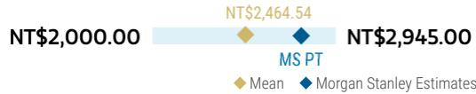

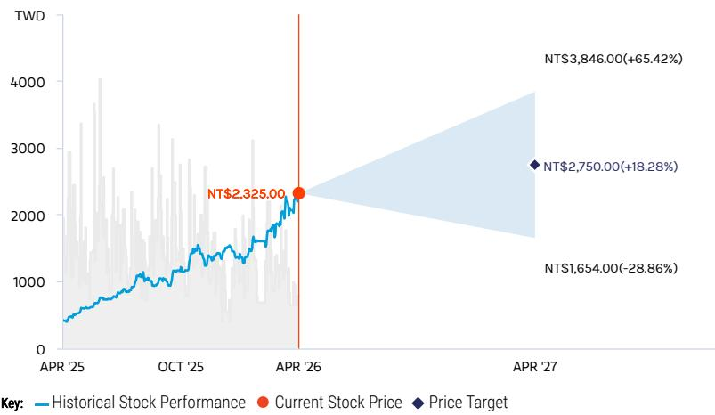  
RISK REWARD CHART   
Source: Re nitiv, Morgan Stanley Research

# OVERWEIGHT THESIS

▪ We expect AVC to bene fit from AI server and liquid cooling upgrades in view of the increasing content value of thermal modules.

▪ We view market concerns about order change impact as overdone and see pro t growth potential from its leadership position in server thermal components (2.5D/3D VC and cold plate modules).

▪ Potential standardized design for Vera Rubin computing trays likely bodes well for AVC as a direct consigned NVIDIA vendor.

▪ Our price target implies that 2026e P/E can expand to 29x vs. its one-year average of 21x.

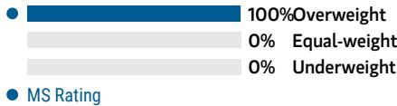  
Consensus Rating Distribution   
Source: Re nitiv, Morgan Stanley Research

# Risk Reward Themes

Secular Growth: Positive Self-help: Positive View descriptions of Risk Rewards Themes here

# BULL CASE

# NT\$3,846.00

# BASE CASE

# NT\$2,750.00

# BEAR CASE

NT\$1,654.00

# 41x 2026e base-case EPS

Faster growth from server/data center business with margin expansion: 1) Fasterthan-expected thermal design upgrades for data centers, including servers and switch designs. 2) Accelerating 5G network deployment momentum. 3) Faster margin expansion from better product mix.

# 29x 2026e base-case EPS

Growth in liquid cooling business: 1) Server upgrades and share gains to drive server business revenue growth. 2) Dominant supply of cold plate modules for NVIDIA server racks and ASIC AI servers. 3) 2026 revenue and gross margin are expected to grow quarter by quarter from 1Q26.

# 17x 2026e base-case EPS

Slower growth from data center/5G business with margin contraction: 1) Slowerthan-expected thermal design upgrades for data centers, including servers and switch designs. 2) Decelerating 5G network deployment momentum. 3) Margin contraction from a worsening product mix.

# Risk Reward - Fositek CoRisk Reward – Fositek Corp (6805.TW)

Built on Strong Foundations

# NT\$2,150.00PRICE TARGET

Base case, derived from our multi-stage residual income (RI) valuation model, similar to the rest of our tech hardware coverage universe. We assume a cost of equity of $\ 1 0 \% ,$ a mediumterm growth rate of $1 4 \%$ and a terminal growth rate of $3 \%$ .

Consensus Price Target Distribution

Source: Re fi nitiv, Morgan Stanley Research

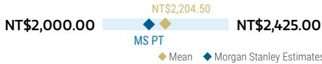

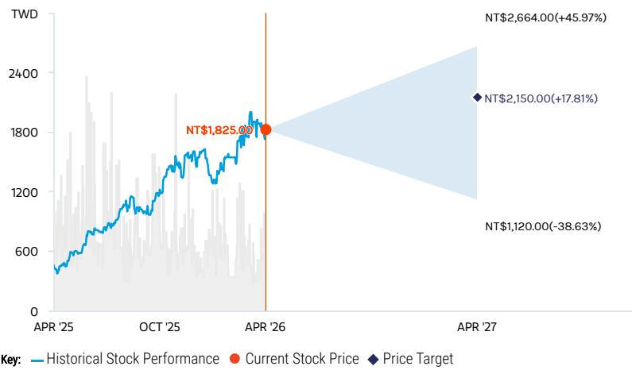  
RISK REWARD CHART   
Source: Re nitiv, Morgan Stanley Research

# OVERWEIGHT THESIS

We expect Fositek to bene t from increasing penetration of foldable phones, driven by the anticipated foldable iPhone debut in 2H26.

▪ Quick disconnect for liquid cooling 04-16 solutions and server rail kit are identi ed as key growth drivers for 2026.

We expect increasing contribution from its server business to drive a favorable product mix shift, and thus boost its overall gross margin from $2 6 . 3 \%$ in 2025 to $3 4 . 3 \%$ in 2027.

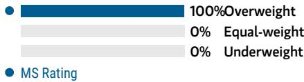  
Consensus Rating Distribution   
Source: Re nitiv, Morgan Stanley Research

# Risk Reward Themes

Secular Growth: Positive Technology Diffusion: Positive 04-16 View descriptions of Risk Rewards Themes here

# BULL CASE

# NT\$2,664.00

# BASE CASE

# NT\$2,150.00

# BEAR CASE

NT\$1,120.00

# 45x 2026 base-case EPS

Faster growth from server/data center business with margin expansion: 1) Increasing penetration of liquid cooling in servers/data centers; 2) faster-than-expected server rail kit project gain; and 3) increasing penetration of foldable smartphones.

# 36x 2026 base-case EPS

Growth in data center business: 1) Smartphone hinge business stays attish YoY in 2026; 2) server upgrades and share gains to drive server business revenue growth; 3) industrial robot reducers to be long-term business drivers.

# $1 9 \times 2 0 2 6$ base-case EPS

Slower growth from data center business with margin contraction: 1) Slower-thanexpected adoption of liquid cooling in servers/data centers; 2) severe pricing pressure from intensi ed industry competition; and 3) slower-than-expected foldable smartphone penetration.

# Risk Reward – Fositek Corp (6805.TW)

# KEY EARNINGS INPUTS

<table><tr><td>Drivers</td><td>2025</td><td>2026e</td><td>2027e</td><td>2028e</td></tr><tr><td>Telecom revenue contribution (%)</td><td>11.4</td><td>11.9</td><td>11.9</td><td>11.8</td></tr><tr><td>Server/data center revenue contribution (%)</td><td>0.0</td><td>0.0</td><td>0.0</td><td>0.0</td></tr><tr><td>Blended thermal ASP (%)</td><td>0.3</td><td>7.2</td><td>3.7</td><td>(0.2)</td></tr></table>

# INVESTMENT DRIVERS

Increasing foldable smartphone penetration Server demand/share gains Margin expansion New customers and project wins

# GLOBAL REVENUE EXPOSURE

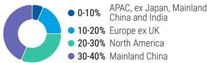  
Source: Morgan Stanley Research Estimate View explanation of regional hierarchies here

# RISKS TO PT/RATING

# RISKS TO UPSIDE

Increasing penetration of liquid cooling in servers/data centers   
Faster-than-expected server rail kit project gains   
iPhone agship models adopt foldable screen in 2026

# RISKS TO DOWNSIDE

Slower liquid cooling penetration in servers/data centers Slower foldable smartphone penetration Stronger-than-expected industry competition

# OWNERSHIP POSITIONING

Inst. Owners, % Active $6 7 . 4 \%$

Source: Re nitiv, Morgan Stanley Research

# MS ESTIMATES VS. CONSENSUS

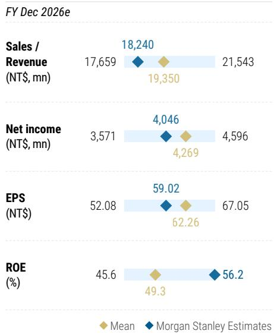  
Source: Re nitiv, Morgan Stanley Research

# Risk Reward - Auras Technology Risk Reward – Auras Technology Co Ltd (3324.TWO)

Bene ts from liquid cooling trend, but fairly valued

# NT\$1,080.00PRICE TARGET

Base case, derived from a multi-stage residual income (RI) valuation model, similar to the rest of our tech hardware coverage universe. We assume a cost of equity of ${ 1 0 \% } ,$ a medium-term growth rate of $1 2 . 5 \%$ and a terminal growth rate of $3 \%$ .

Consensus Price Target Distribution

Source: Re fi nitiv, Morgan Stanley Research

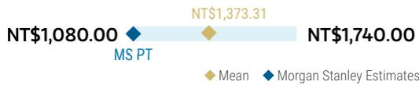

# EQUAL-WEIGHT THESIS

▪ We think Auras will bene fit from server spec upgrades and long-term AI thermal demand.

▪ 2026 revenue is expected to increase $50 \%$ YoY, driven mainly by the liquid cooling offering increase.

▪ We stay EW as we wait for liquid cooling project kickoff timing and contribution.

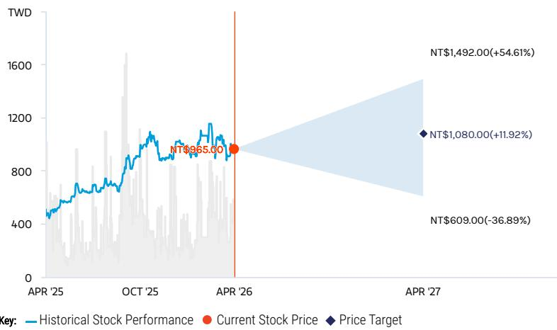  
RISK REWARD CHART   
Source: Re nitiv, Morgan Stanley Research

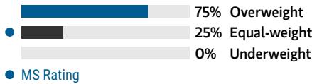  
Consensus Rating Distribution   
Source: Re nitiv, Morgan Stanley Research

# Risk Reward Themes

Pricing Power: Secular Growth: Self-help:

Negative Positive Positive

View descriptions of Risk Rewards Themes here

# BULL CASE

# NT\$1,492.00

# BASE CASE

# NT\$1,080.00

# BEAR CASE

NT\$609.00

# 24x 2026e base-case EPS

Faster heat pipe/VC adoption driving ASP upside: We assume: 1) faster-than-expected thermal design upgrades for data centers, including both server and switch designs; 2) ASP upgrades in NB/PC and VGA thermal modules; and 3) increasing penetration of vapor chambers in smartphones.

# 17x 2026e base-case EPS

2026 revenue to grow $> 5 0 \%$ YoY for liquid cooling offerings: We expect server business and liquid cooling to continue to be the major driver in 2026. Gross margin is indicated by management to widen further YoY, thanks to a favorable product mix.

# 10x 2026e base-case EPS

Slower PC/NB and VGA demand recovery, while industry competition intensifies: We assume: 1) slower-than-expected thermal design upgrades for data centers, including both server and switch design; 2) severe pricing pressure from intensi ed industry competition; and 3) a slowdown in PC or VGA/graphic card markets.

# Risk Reward – Auras Technology Co Ltd (3324.TWO)

# KEY EARNINGS INPUTS

<table><tr><td>Drivers</td><td>2025</td><td>2026e</td><td>2027e</td><td>2028e</td></tr><tr><td>Smartphone revenue contribution (%)</td><td>1.2</td><td>0.4</td><td>0.4</td><td>0.3</td></tr><tr><td>Blended ASP YoY (%)</td><td>63.7</td><td>96.7</td><td>10.5</td><td>7.5</td></tr></table>

# INVESTMENT DRIVERS

Heat pipe/VC adoption in smartphones Server demand/share gains Gaming PC/NB demand strength New customers and project wins

# GLOBAL REVENUE EXPOSURE

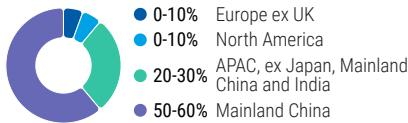  
Source: Morgan Stanley Research Estimate View explanation of regional hierarchies here

# RISKS TO PT/RATING

# RISKS TO UPSIDE

Faster-than-expected thermal design upgrades for data centers, including both server and switch designs.   
ASP upgrades in NB/PC and VGA thermal modules.   
Increasing penetration of vapor chambers in smartphones.

# RISKS TO DOWNSIDE

Slower-than-expected thermal design upgrades for data centers.   
Severe pricing pressure from intensi ed industry competition.   
A slowdown in PC or VGA/graphic card market.

# OWNERSHIP POSITIONING

Inst. Owners, % Active $4 9 . 1 \%$

Source: Re nitiv, Morgan Stanley Research

# MS ESTIMATES VS. CONSENSUS

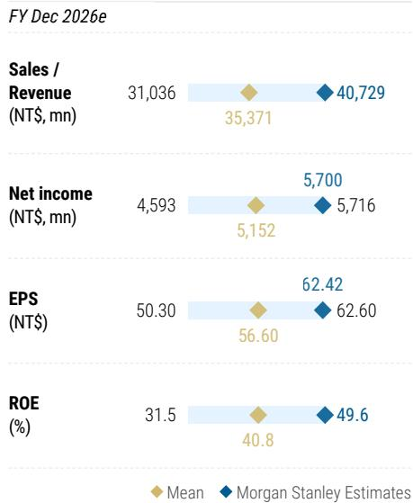  
04-16 Source: Re nitiv, Morgan Stanley Research

# Risk Reward - Sunonwealth Electric MachiRisk Reward – Sunonwealth Electric Machine Industry Co (2421.TW)

(2421.TW)Margin uptrend driven by server upgrade and AI shipment ramp, but fairly valued

# NT\$165.00PRICE TARGET

Base case, derived from a multi-stage residual income (RI) valuation model, similar to the rest of our tech hardware coverage universe. We assume a cost of equity of ${ 1 0 \% } ,$ a medium-term growth rate of $1 3 \%$ , and a terminal growth rate of $3 \%$ .

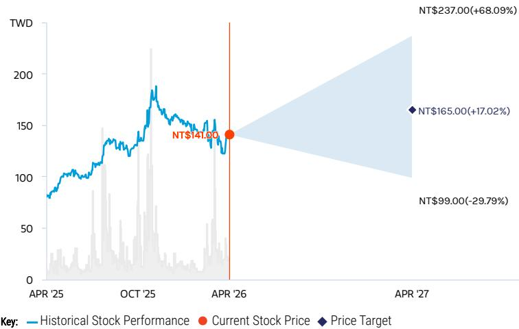  
RISK REWARD CHART   
Source: Re nitiv, Morgan Stanley Research

# EQUAL-WEIGHT THESIS

▪ We expect Sunon to bene fit from server upgrades in view of the increasing value of cooling fans, given rising heat dissipation needs for server CPUs and GPUs.

▪ We see business opportunities from the 04-16 automotive industry and recovery in PC/NB revenue.

▪ We believe valuation appears fair at $\boldsymbol { \mathsf { 1 6 x } }$ 2026e P/E, in line with its two-year average, as we await liquid cooling component offering breakthrough.

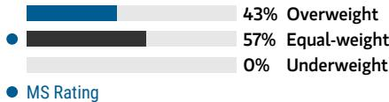  
Consensus Rating Distribution   
Source: Re nitiv, Morgan Stanley Research

# Risk Reward Themes

New Data Era: Positive Secular Growth: Positive View descriptions of Risk Rewards Themes here

# BULL CASE

# NT\$237.00

# BASE CASE

# NT\$165.00

# BEAR CASE

NT\$99.00

# 23x 2026e base case EPS

Faster-than-expected order wins in the server, networking, and automotive businesses, further boosting margin expansion: We assume: 1) further share gains in server and data center cooling fans alongside ASP expansion; 2) faster-thanexpected order gains in automotive clients; and 3) better-than-expected margin expansion.

# 16x 2026e base case EPS

Business growth in server and automotive businesses; PC/NB recovery seen: We expect: 1) server upgrades, driving cooling fan value increase; 2) ongoing order wins in the automotive business; and 3) PC/NB revenue to grow YoY in 2026.

# 10x 2026e base case EPS

Limited thermal solutions upgrades; pricing pressure from competition: We assume: 1) limited thermal solutions upgrades owing to cost concerns; 2) slower-than-expected order wins in the automotive business; and 3) severe pricing pressure from intensi ed industry competition.

# Risk Reward – Sunonwealth Electric Machine Industry Co (2421.TW)

# KEY EARNINGS INPUTS

<table><tr><td>Drivers</td><td>2025</td><td>2026e</td><td>2027e</td><td>2028e</td></tr><tr><td>Telecom and server revenue contribution (%)</td><td>57.8</td><td>61.1</td><td>66.1</td><td>68.8</td></tr><tr><td>Automotive revenue contribution (%)</td><td>9.0</td><td>8.1</td><td>7.3</td><td>6.8</td></tr><tr><td>Blended ASP YoY (%)</td><td>13.1</td><td>12.2</td><td>13.3</td><td>6.2</td></tr></table>

# INVESTMENT DRIVERS

Server demand/share gains   
Thermal spec upgrades driving ASP upgrades   
Automotive order wins   
New customers and project wins

# GLOBAL REVENUE EXPOSURE

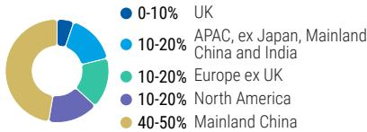  
Source: Morgan Stanley Research Estimate View explanation of regional hierarchies here

# RISKS TO PT/RATING

# RISKS TO UPSIDE

Further share gains in server and data center cooling fans alongside ASP expansion Faster-than-expected order gains in automotive clients Better-than-expected margin expansion

# RISKS TO DOWNSIDE

Limited thermal solutions upgrades owing to cost concerns   
Slower-than-expected order wins in the automotive business   
Severe pricing pressure from intensi ed industry competition

# OWNERSHIP POSITIONING

Inst. Owners, % Active $4 6 . 7 \%$

Source: Re nitiv, Morgan Stanley Research

# MS ESTIMATES VS. CONSENSUS

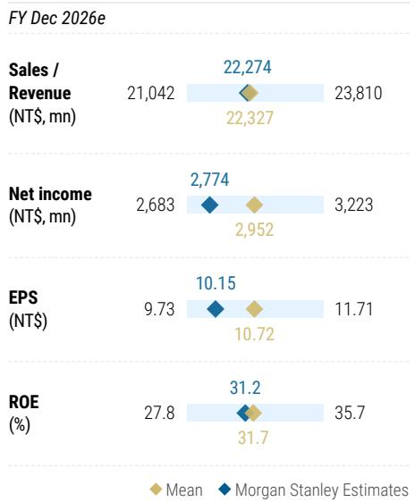  
Source: Re nitiv, Morgan Stanley Research

# Risk Reward Reference links

1. View explanation of Options Probabilities methodology - Options_Probabilities_Exhibit_Link.pdf

2. View descriptions of Risk Rewards Themes - RR_Themes_Exhibit_Link.pdf

3. View explanation of regional hierarchies - GEG_Exhibit_Link.pdf

4. View explanation of Theme/Exposure methodology - ESG_Sustainable_Solutions_External_Link.pdf

5. View explanation of HERS methodology - ESG_HERS_External_Link.pdf