# More Software and More Developers… Revisited

April 16, 2026 04:02 AM GMT

<table><tr><td colspan="3">WHAT&#x27;S CHANGED</td></tr><tr><td>Atlassian Corporation PLC (TEAM.O)</td><td>From</td><td>To</td></tr><tr><td>Price Target</td><td>$290.00</td><td>$120.00</td></tr></table>

订阅研报添加微信 LCD123321CAI accelerates sw creation but is not resulting in a broad-based contraction in developers. As cheaper build costs unlock more projects, work shifts to senior engineers who can design, review and ship particularly as AI sw development moves from codegen to agentic automation across the SDLC

# Key Takeaways

AI is driving more software creation, not a broad-based contraction in developer demand, as lower development costs make more projects economically viable Rather than eliminating developers, AI is shifting demand toward more experienced engineers who can architect systems, validate outputs, and manage complexity The primary bottleneck in software development is moving downstream from 订阅研报添加微信 LCD123321Cacode generation to review, testing, integration, security, and release The next phase of the SDLC is likely to be defined by an integrated, agentic model in which specialized agents automate workflows across existing platforms Sentiment on seat-based model unlikely to change near-term, but the data suggests threat to developer headcount is not as bad as TEAM and GTLB selloff implies

Revisiting AI's Impact on Software Development. This report serves as an update to our previously published note, More Software and More Developers, where we assessed AI's impact on the software development lifecycle, and argued that AI coding tools are unlikely to drive a broad-based contraction in developer seats. Instead, they are increasing software development volume, expanding the addressable development base, while shifting human effort toward architecture, orchestration, review, and governance. Importantly, the surge in AI-generated code is creating severe bottlenecks across the broader SDLC, accelerating demand for agentic automation in planning, testing, security, release, and operations. That dynamic should create opportunity for incumbent DevOps platforms with durable workflow context and enterprise trust/governance layers – particularly Atlassian, GitLab, and JFrog – provided they continue to execute on product integration and evolve pricing beyond the legacy seat-based model. In this update, we revisit that framework using more recent data points on developer hiring, software development activity, and adoption of AI coding tools, while also assessing how the bottlenecks in the SDLC are evolving as teams leverage greater automation across the stack. We further examine what these changes mean for the competitive landscape across our public company coverage.

Recent data support our view that AI coding tools are more likely to reshape the developer landscape rather than drive a broad-based decline in software labor demand. As development becomes cheaper and faster, organizations are building more software (see Exhibit 2 and Exhibit 3 ), which helps offset pressure on headcount by expanding the number of projects that are economically viable. At the same time, job posting trends indicate that demand for software talent remains relatively resilient versus the broader labor market (see Exhibit 4 ), with the greatest pressure likely concentrated in entry-level roles while mid-career and senior engineers continue to see stronger demand (see Exhibit 5 ). That dynamic suggests AI is absorbing more junior-level tasks while increasing the value of experienced developers who can design systems, validate outputs, and manage production complexity. Even against a backdrop of prominent layoffs, the underlying signals point to a broader and more leveraged developer base, with software hiring increasingly supported by smaller companies and organizations that can now pursue technology initiatives at lower cost.

订阅研报添加微信 LCD123321Cad AI-generated code creates bottlenecks downstream, making agentic AI the next critical layer of automation. AI adoption inside software organizations is now broad enough that the key question is no longer whether developers use AI, but whether the rest of the software delivery process can keep up with the code it produces. While AI coding tools have made code generation faster and more pervasive, the resulting surge in output is increasingly shifting the bottleneck to downstream stages of the SDLC (i.e., review, testing, integration, release, and security validation), which is limiting realized productivity gains for most teams (see Exhibit 7 ). The evidence suggests that only a small subset of high-performing organizations are consistently converting higher development activity into more software shipped, while many others are seeing heavier debugging burdens, weaker build outcomes, and greater strain on code review (see Exhibit 8 and Exhibit 9 ). At the same time, the security exposure from AI-generated code remains meaningful, as higher code volumes and larger pull requests increase the risk and operational cost of catching vulnerabilities after the fact (see Exhibit 10 and Exhibit 11 ). In that environment, Cad agentic AI is emerging as the next logical layer of automation, extending beyond code generation into review, security triage, CI/CD remediation, and production operations. The competitive battleground is therefore shifting from tools that help developers write code to platforms that can govern and automate the broader software lifecycle, with adoption likely to depend on strong oversight, policy controls, and auditability.

Incumbents Stand to Benefit From AI Code Development; FROG Clearest Beneficiary Near-Term, While TEAM and GTLB Will Take Time to Prove Out.

Across Atlassian, GitLab, and JFrog, the common theme is that all three are positioned to benefit from rising software development activity as AI increases the volume, velocity, and complexity of software creation, while market concerns around AI-driven developer displacement appear overstated. See Key Debate #3: How Will AI Impact The Growth Prospects of Our Public Company Coverage?

• Atlassian remains attractive with Jira and Confluence serving as systems of record for software planning and collaboration, giving it durable relevance and stable fundamentals, though a more meaningful re-rating likely depends on stronger cloud reacceleration, clearer FY27 visibility, and Ca 04-16 evident AI monetization. As such, we maintain our Overweight rating, but lower our price target to $\$ 120$ from $\$ 290$ as we account for recent multiple contraction and align TEAM with the overall software average. GitLab is similarly well positioned as an automation and DevSecOps layer across the software lifecycle, but CY26/FY27 looks more like a transition period as investors wait for better execution and clearer evidence that Duo Agent Platform can drive a durable growth reacceleration through hybrid monetization. This outlook was the basis of our downgrade to EW earlier this year (read New Stack: 2026 Outlook) JFrog stands out as the clearest direct beneficiary of AI-driven software output, because it monetizes the growth in binaries, artifacts, and software distribution through a usage-based model rather than developer seats, while its role as the system of record for binaries gives it a durable moat that is expanding further into security and governance. Recent selloff overstates 订阅研报添加微信 LCD123321Cad 04-16concerns around its security business (read Securing Binaries Not Code)

# Key Debate #1: How Will Adoption of AI Coding Tools Impact Developer Seat Growth?

• Original Conclusion: AI Will Continue to Support Growth in Developer Seats Over the Mid-term. As customers incorporate coding assistants and coding agents 加微信 LCD123321Cad 04-16 into their software development process, developers will act more as curators, reviewers, integrators and problem-solvers. While this will include coding for the more complex requirements of the application, developer roles will increasingly involve prompt engineering, context management, prototyping and focusing on higher-order design and architecture. As AI coding assistants become proficient at executing the simple and routine development tasks, the complexity and ambition of software development initiatives will rise requiring more developers. Similarly, for enterprises to make progress on their long-term AI ambitions, the tech debt associated with their legacy applications will have to be modernized driving demand for both AI tooling and developers for years to come. Lastly, with AI lowering the barrier for non-technical employees, we see the population of who develops code expanding significantly. Consequently, we would expect developer headcount to grow at a rate between the U.S. BLS forecast of $+ 7 . 6 \%$ through 2033 and IDC's forecast of $+ 7 0 \%$ CAGR in developers through 2029

# 订阅研报添加微信 LCD123321Cad 04-16

While AI coding tools continue to improve individual developer productivity, and the fear of headcount displacement intensifies, –recent data continue to support our view that AI coding tools are more likely to reshape the developer landscape rather than drive a broad-based decline in software labor demand. As development becomes cheaper and faster, organizations are building more software, which helps offset pressure on headcount by expanding the number of projects that are economically viable. At the same time, job posting trends indicate that demand for software talent remains relatively resilient versus the broader labor market, with the greatest pressure likely concentrated in entry-level roles while mid-career and senior engineers continue to see stronger demand. That dynamic suggests AI is absorbing more junior-level tasks while increasing the value of experienced developers who can design systems, validate outputs, and manage production complexity. Even against a backdrop of prominent layoffs, the   
underlying signals point to a broader and more leveraged developer base, with software hiring increasingly supported by smaller companies and organizations that can now pursue 332 Ca 04-16   
technology initiatives at lower cost.

AI is Increasing Automation, But It Is Also Increasing Software Output. The key question is not whether AI can automate more development work – it clearly can – but whether those gains will translate into weaker overall demand for software labor. So far, the evidence suggest a more nuanced outcome. AI systems are rapidly improving at handling longer and more complex routine tasks (see Exhibit 1 and Exhibit 2 ), meaning a larger share of basic coding, debugging, and repetitive development work can now be completed with limited human intervention. On its face, that should put pressure on

developer headcount, particularly for organizations with large engineering teams who are looking for ways to optimize operations and extract more margin. However, this increase in productivity is accompanied by a meaningful increase in the volume of software creation itself, as lower development costs make more projects economically viable. This is evident by the acceleration in new applications being built (see Exhibit 2 ) and in coding/git-push activity (see Exhibit 3 ). In that environment, AI is not simply replacing existing developer effort, it is also increasing the amount of software that organizations are willing and able to build, in turn supporting the demand for software developers.

订阅研报添加微信 LCD123321Cad 04-16 Exhibit 1: AI Coding Tools Are Increasingly Doing More of the Routine Work

# AI systems are improving quickly on longer software tasks

The length of tasks-in terms of how long they take human professionals- that Al systems can do on their ownwith an $80 \%$ success rate.The bars show uncertainty in the estimates.

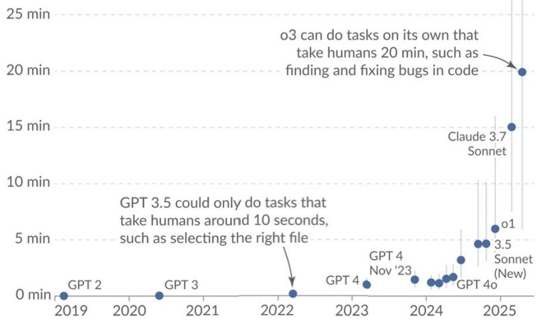

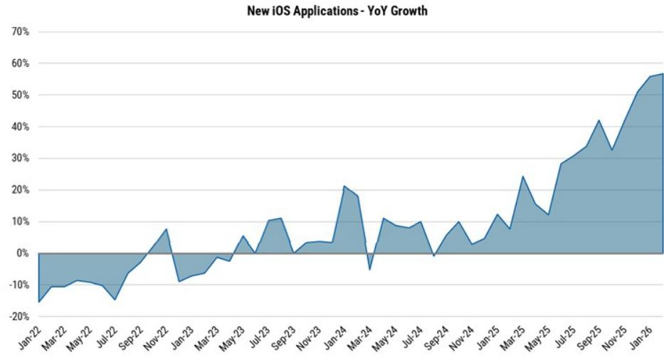  
Exhibit 2: Volume of Applications Being Built is Growing at Increasing Pace   
Source: AlphaWise, Morgan Stanley Research

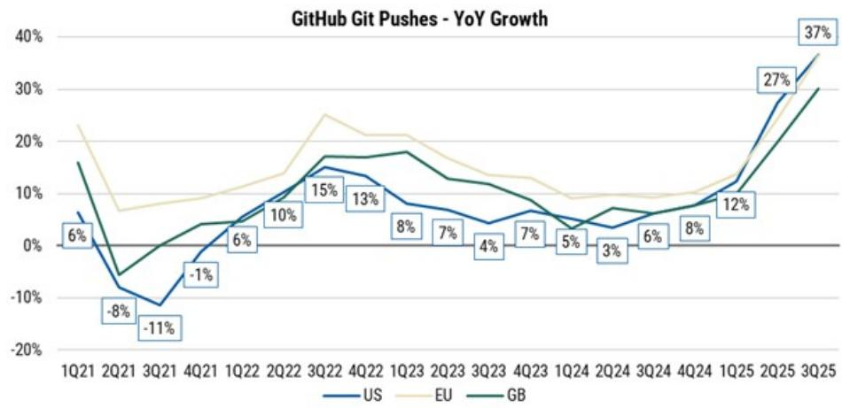  
Exhibit 3: Software Creation Firmly in Acceleration Mode   
Source: GitHub, AlphaWise, Morgan Stanley Research

Acceleration in New Software Development is Supporting Demand for Developers Even as the Broader Labor Market Weakens. Consistent with the sharp rise in new application creation and software development activity, labor-market trends indicate that demand for software talent remains resilient, even if the composition of that demand is changing. Developer job postings have improved in since mid-2025 relative to the broader labor market, suggesting that firms continue to invest in technical headcount despite wider adoption of AI-assisted development tools. A very important shift appears 添加微信 LCD123321Cad 04-16 along the experience curve, as entry-level roles are facing the greatest pressure, while demand for mid-career and senior developers has held up materially better (see Exhibit 5 ). That pattern is consistent with a world in which AI absorbs more routine junior-level tasks, but increases the importance of experienced engineers who can oversee architecture, validate outputs, manage integration, and maintain accountability for production systems. Taken together, the evidence points to a more nuanced conclusion: AI coding tools may temper incremental seat growth at the low end, but they are also expanding software output and reinforcing demand for higher-value technical talent. The likely result is not fewer developers in aggregate, but a different mix of seats and a

more leveraged developer base.

More Important Than Headline Job Posting and Layoff Numbers, is Differentiating Who is Affected. For instance, despite overall US job postings declining YoY every single month from September 2022 through April 2026, job posting growth for software developers inflected positive in mid-2024 and again in mid-2025 (see Exhibit 4 ). We note that despite the recent decline, job posting for developers remains more resilient vs the overall job market, as job posting for software developers have increased $1 7 \%$ from \~49K in July 2025 to $\mathord { \sim } 5 5 \mathsf { K }$ in February 2026, while overall US posting declined $7 \%$ over the same period. This bifurcation is even more evident among the Russell 2000 companies, which considering it represents small-cap US companies $\sim 5 \%$ of which are Information Technology), is indicative of a theme we have discussed before, which is that AI and the lowered cost of software development would result in a broadening of the market. Meaning that individuals and organizations that were previously unable to be as tech-forward – due to high cost of development and lack of expertise – are now able to develop software and build applications at scale, and as such support continued demand for engineering talent.

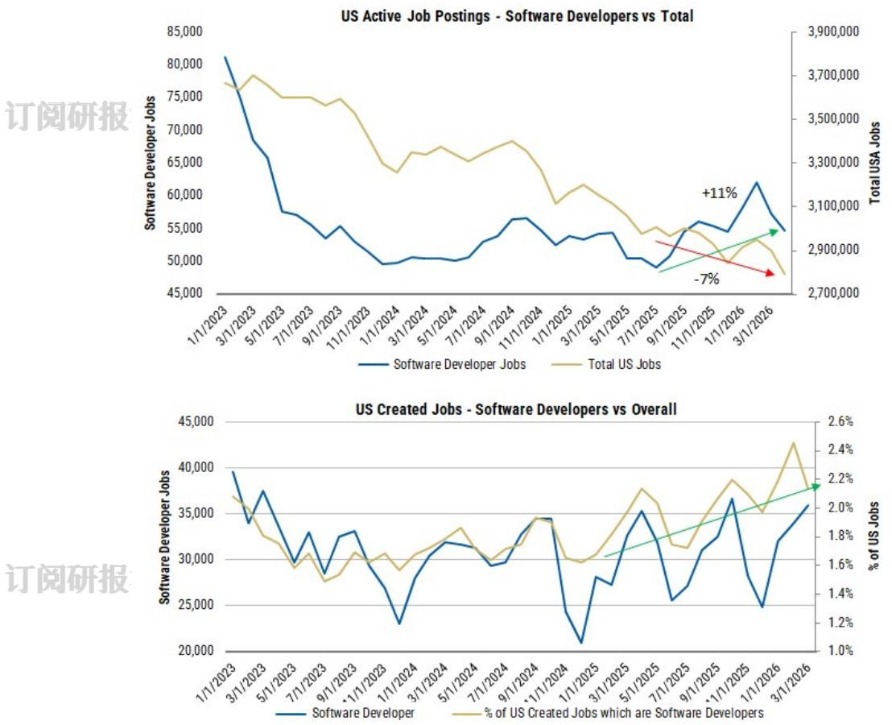  
Exhibit 4: Job Postings for Software Developers Rising From July 2025 Trough April 2026. Despite Recent Drop, It Still Outpaces Total Job Posting. Grater $\%$ of Created Jobs are Software Developers   
Source: AlphaWise, LinkUp, Morgan Stanley Research

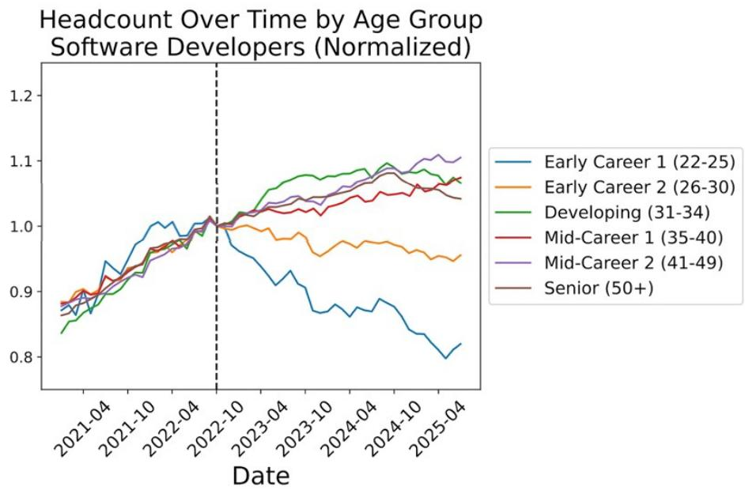  
Exhibit 5: Demand for Senior Developers Remains Robust, While Entry-Level Seeing Significant Pressure   
Source: Stanford Digital Economy Lab

# Key Debate #2: How Will AI Cause the Software Development LifeCycle to Change?

• Original Conclusion: Accelerating Code Development Is Not Enough and Is Creating New Bottlenecks. While adoption of AI coding assistants is pervasive, the 加微信 LCD123321Cad 04-16 proliferation in the volume of code is creating severe bottlenecks in workflows of the SDLC outside of coding, weighing on overall productivity. To address this, further automation is needed across the entirety of the SDLC. This challenge marks a shift in focus in the market from AI coding assistants to AI agents (with human developers in the loop). The future state of the SDLC could follow two potential paths: 1) an “Invisible” SDLC, where a single consolidated agentic platform executes all or most of the software development workflows or 2) an “Integrated” SDLC, where multiple agents plug into work with existing ecosystem of planning tools, AI IDEs, and code repositories and CI/CD platforms execute the software delivery workflows beyond just coding such as code review, testing, security operations and release management. We see the "Integrated" SDLC as most likely to be adopted over the next few years as this approach preserves transparency, avoids single point of failure, and limits the degree of change management required as it represents an evolution rather than a revolution of the SDLC.

# 订阅研报添加微信 LCD123321Cad 04-16

AI-Generated Code Creates Bottlenecks Downstream, Making Agentic AI the Next Critical Layer of Automation. AI adoption inside software organizations is now broad enough that the key question is no longer whether developers use AI, but whether the rest of the software delivery process can keep up with the code it produces. While AI coding tools have made code generation faster and more pervasive, the resulting surge in output is increasingly shifting the bottleneck to downstream stages of the SDLC (i.e., review, testing, integration, release, and security validation), which is limiting realized productivity gains for most teams. The evidence suggests that only a small subset of high-performing organizations are consistently converting higher development activity into more software shipped, while many others are seeing heavier debugging burdens, weaker build outcomes, and greater strain on code review. At the same time, the security exposure from AI-generated code remains meaningful, as higher code volumes and larger pull requests increase the risk and operational cost of catching vulnerabilities after the fact. In that environment, agentic AI is emerging as the next logical layer of   
添加 33 1Ca   
automation, extending beyond code generation into review, security triage, CI/CD remediation, and production operations. The competitive battleground is therefore shifting from tools that help developers write code to platforms that can govern and automate the broader software lifecycle, with adoption likely to depend on strong oversight, policy controls, and auditability.

Broad Based AI Penetration in Software Development. Over the past year we have seen the pace of AI adoption across engineering teams accelerate, becoming broad enough to reshape the software development lifecycle beyond just coding. Several recent surveys

speak to this, including:

1. The Pragmatic Engineer survey of $9 0 0 +$ respondents conducted from January 27 to February 17 of 2026, finds that $9 5 \%$ of respondents are using AI tools at least weekly, $7 5 \%$ use AI for $5 5 0 \%$ of their work, and $56 \%$ report doing $70 \% +$ of their engineering work with AI (see Exhibit 6 ). DX's 1Q26 survey suggests $7 5 \%$ use AI weekly.   
2. A January 2026 report conducted by the National Bureau of Economic Research quotes a review of recent surveys (Crane et al. 2025) which highlights that $8 4 \%$ -   
加 $9 7 \%$ of programmers incorporate AI in their work   
3. DORA's 2025 State of AI-assisted Software Development survey of ${ \sim } 5 \mathsf { K }$ developers conducted from June 13 to July 21 of 2025, highlights $90 \%$ of software developers use AI as part of their work and ${ > } 8 0 \%$ believe it has increased their productivity   
4. JetBrains' Developer Ecosystem Survey of $2 4 K +$ developers conducted from April to June 2025, indicates that $85 \%$ of developers use at least one AI tool for coding and other development-related activities   
5. Stack Overflow's 2025 Developer Survey conducted from May 29 to June 23 of 2025, shows that among $\sim 2 6 K$ professional developers $81 \%$ use AI tools at least monthly $( 5 7 \%$ daily)

While results vary between sources, the trend is clear, AI adoption among engineers is now near-universal. The limitation is not speed of code generation, but what happens afterwards. More code generated per developer does not automatically translate to more 添加微信 LCD123321Cad 04-16software shipped. It surfaces the next constraint.

Howoftendo you use AItools？

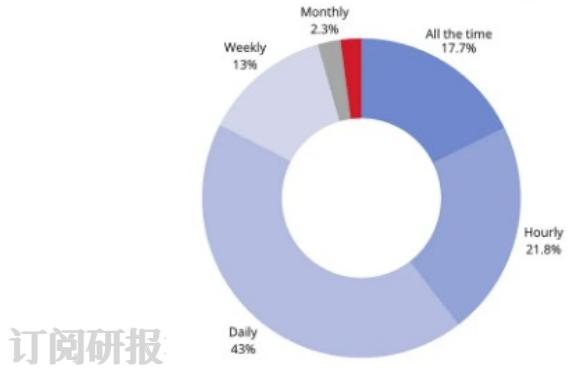  
Exhibit 6: $7 5 \% - 9 5 \%$ of developers use AI tools at least weekly, while $9 3 \%$ -98% use it at least monthly   
Feb 2026,The Pragmatic Engineer:

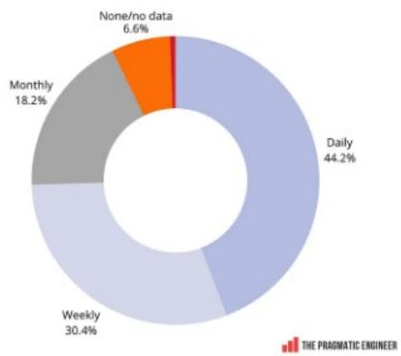  
Q12026,DX:   
Source: The Pragmatic Engineer "AI Tools for Software Engineers in 2026"

The Bottleneck is No Longer Writing Code, But Validating and Shipping It. In our prior work, we illustrated how acceleration in AI-driven code generation naturally creates compounding stress on downstream SDLC stages (see Exhibit 7 ), which without proper automation of validation, integration, and deployment inevitably negate much of the

perceived productivity gains. That thesis has since become consensus, and CircleCI's 2026 State of Software Delivery report offers hard numbers on this dynamic at meaningful scale (drawn from $> 2 8 \mathsf { m }$ CircleCI workflows across thousands of teams, during September 2025). In particular it shows that while teams are producing much more code than ever, not all teams are experiencing the same gains, and few teams are able to turn that increased activity into incremental production software. For instance, while average workflow throughput (number of daily workflows run) grew $5 9 \%$ YoY, the gains are largely captured by high-performing teams (top $5 \%$ grew $9 7 \%$ YoY) while the median team y no increase (see Exhibit 8 ). More   
onger cloud reacceleration,clearer FY27 visibility,and Cad efit is 04-16 ost evide t the feature branch level (a   
ion. As such. we maintain our Overweight rating. but private sandbox where a developer works on a single change like a new feature or a bug fix), while throughput at the main branch (which is the live, shared codebase that gets built, tested, and shipped to customers) tells a more sobering story. For the median team, feature branch activity increased $1 5 \%$ YoY, while main branch throughput declined $7 \%$ . Among the top $10 \%$ of teams, feature branch activity jumped $4 9 \% ,$ but main branch output was essentially unchanged $( + 1 \% )$ . Only the top $5 \%$ of teams saw substantial gains in both writing and shipping code, with feature branch activity up $8 5 \%$ and main branch output up $2 6 \%$ . In addition, AI-generated code is creating more debugging overhead for most teams, as the median recovery time following failed builds has risen by $13 \%$ to 72 minutes (especially on feature branches up $2 5 \%$ to 80 minutes) while main-branch success rates have dropped to the lowest level in over five years to $7 1 \% ,$ far below CicleCI's recommended $90 \%$ benchmark (see Exhibit 9 ).

# 订阅研报添

• Illustration of Impact: For a team deploying five changes to the main branch each 加微信 LCD123321Caday, a drop in success rate from $90 \%$ 4- to $70 \%$ increases major breakages from 1 every two days to 1.5 per day, a 3x increase. Assuming one hour to recover from each failure, that adds $\sim 2 5 0$ hours a year in debugging and blocked deployments. Even at that scale, the cost is meaningful. For teams deploying 500 changes a day, the impact compounds to the equivalent of losing 12 full-time engineers.

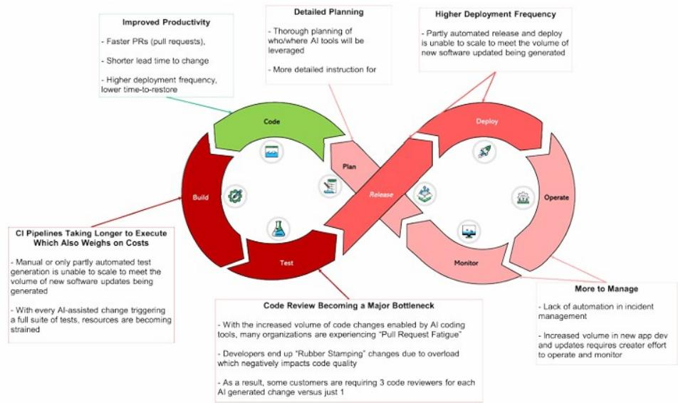  
Exhibit 7: While most cite enhanced productivity benefits on code generation, the increased volume of AI generated code has created challenges across other parts of the SDLC   
Source: Morgan Stanley Research "More Developers and More Software"

订阅研报

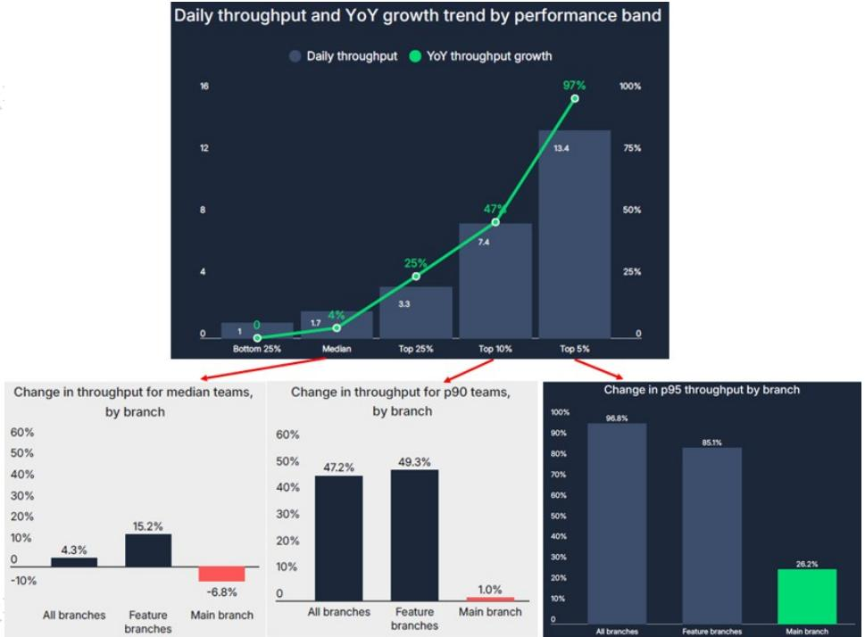  
Exhibit 8: For the median team, feature branch activity increased $1 5 \%$ YoY, while main branch throughput declined $7 \%$   
Source: CicleCI "The 2026 State of Software Delivery"

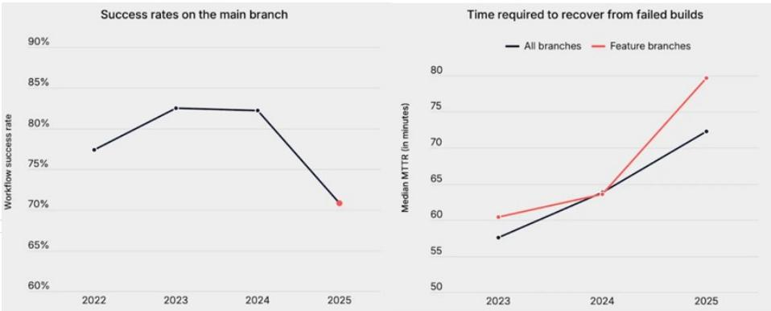  
Exhibit 9: Main-branch success rates have dropped to the lowest level in over five years to $71 \% ,$ while recovery time has increased by $2 5 \%$ across feature branches   
Source: CicleCI "The 2026 State of Software Delivery"

AI Code Development Is Widening The Exposure Surface. The security implications are particularly acute. Veracode's 2025 GenAI Code Security Report (which tested ${ \mathfrak { 1 0 0 + } }$ LLMs across 80 coding tasks) found that $45 \%$ of AI developed code failed security tests and introduced top security vulnerabilities (see Exhibit 10 ). It is worth noting the failure rate has been generally consistent from early 2023 through May 2025 despite new model releases, which have gotten better at writing functional or syntactically correct code but not secure code. The growing volume of AI code development compounds the failure rate, as according to an analysis conducted by Apiiro (an "Agentic Application Security" platform) by June 2025 AI-generated code was introducing >10K new security findings per month, a 10x increase in just six months (see Exhibit 11 ). The key insight 添加微信 LCD123321Cad 04-16 here is that developers leveraging AI produce far more code changes, yet package them into fewer but larger pull requests (request to merge set of commits into a branch) that strain code review and expand the blast radius of each merge. This is in large part because AI is good at catching simple syntax and logic errors but not so much at catching security and architectural flaws, often given developers the false sense of a job well done while creating more work for the security reviewer.

# 订阅研报

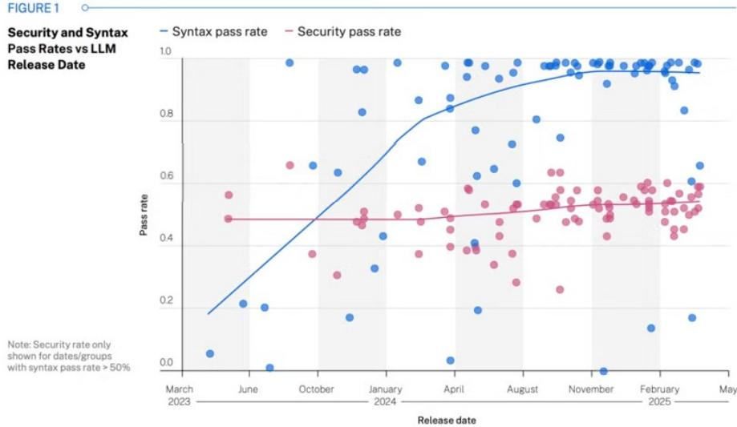  
Exhibit 10: $45 \%$ of code samples have consistently failed security tests and introduced top security vulnerabilities, despite syntax improvement over the years/new model releases

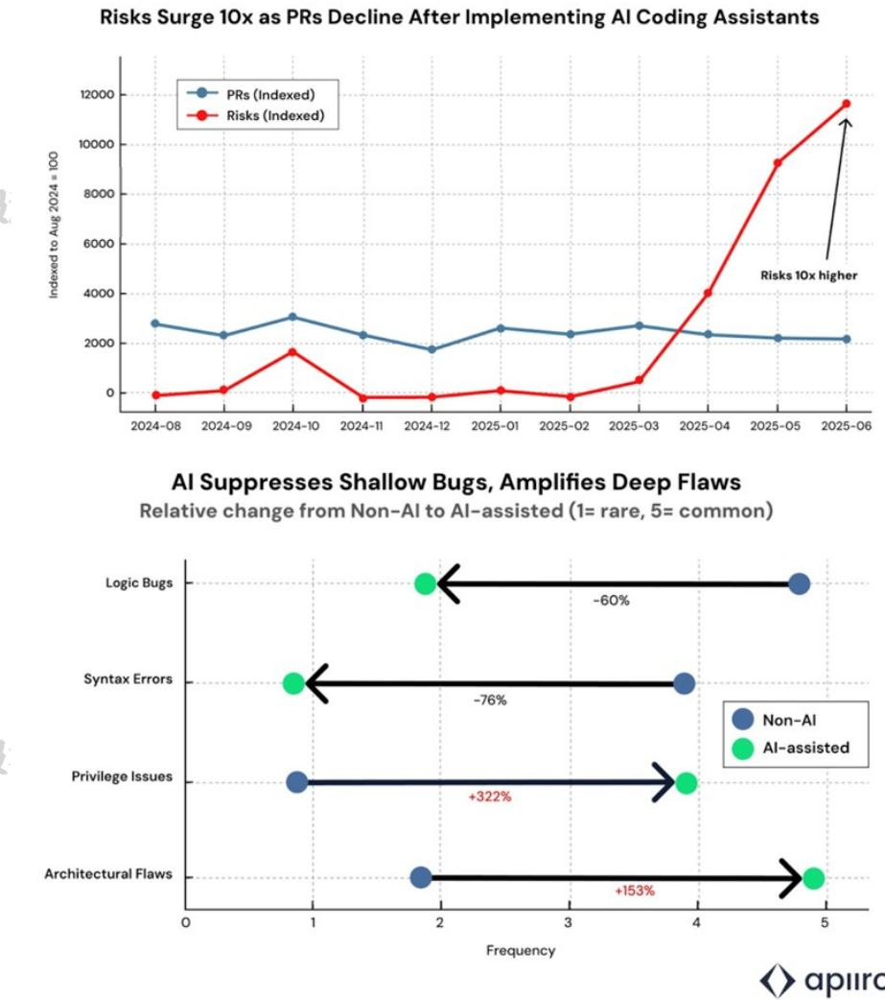  
Exhibit 11: Teams leveraging AI coding assistants are pushing fewer but much larger pull requests, which tend to introduce multiple issues at once that are more difficult to catch.   
Source: Apiiro blog ${ } ^ { \mathrm { " } } 4 \times$ Velocity, 10x Vulnerabilities"

Agentic AI Emerges as the Mechanism to Relieve the Next SDLC Constraint. Unlike AI code assistants, which are primarily invoked by the developer and operate within a limited task window, agents can carry work across multi-step processes with less explicit instruction, making them better suited to workflows such as review, security triage, build remediation, release coordination, and incident response. If AI coding tools increased activity at the front end of software development, agentic AI is aimed at the stages that 添加微信 LCD123321Cad 04-16 determine whether that activity actually converts into shipped software, by effectively addressing the emerging bottlenecks and security concerns previously noted. However, trust in the accuracy of AI tools has deteriorated despite new model releases – in part due to the reasons noted above – with Stack Overflow's 2025 survey showing $4 6 \%$ of professional developers distrust the accuracy of AI tools compared to $3 7 \%$ in $2 0 2 4$ while only $3 3 \%$ trust it in 2025 vs $4 2 \%$ in 2024. As such, while AI code assistance has become near-universal across software development, adoption of agentic AI is still evolving.

• According to Linear, as of March 24, 2026, coding agents are installed in $> 7 5 \%$ of

its enterprise workspaces, the volume of work completed by agents grew 5x over the last three months, and agents authored nearly $2 5 \%$ of new issues. Of note, Linear's customer base skews towards tech-forward companies.   
• According to DORA's 2025 State of AI-assisted Software Development, as of mid-2025 the use of agentic AI was still early, with only $2 7 \%$ using it weekly (see Exhibit 12 )   
• According to McKinsey's The State of AI in 2025 survey, as of mid-2025 AI agent adoption was still in very early stages, with only $1 7 \%$ of respondents at least experimenting with AI agents (see Exhibit 13 )

# 订阅研报添加微信 LCD123321Cad 04-16

Early deployments suggest this is already beginning to take shape across the stack, including: 1) code review, where AI agents can surface issues and drive additional fixes; 2) security, where they can triage vulnerabilities, explain remediation paths, and in some cases execute bounded actions; 3) CI/CD, where they can diagnose build failures and recommend or prepare fixes; and 4) operations, where they can help shorten the identifytriage-remediate loop when systems fail in production. The broader implication is that the competitive focus in AI tooling is shifting from who can best help write code to who can most effectively orchestrate governed, repeatable workflows across the rest of the software lifecycle. As such, we continue to view agentic AI as the logical response to the downstream bottlenecks created by AI-generated code, though enterprise adoption will depend heavily on the surrounding governance layer, including auditability, policy controls, and clear human oversight over production-adjacent actions.

Exhibit 12: As of mid-2025, use of AI agents was the least common, with $67 \%$ of 添加微信 LCD123321Cad 04-16 respondents never interacting with AI tools in an agentic mode. Chatbots and in-IDE interactions were still the most frequent

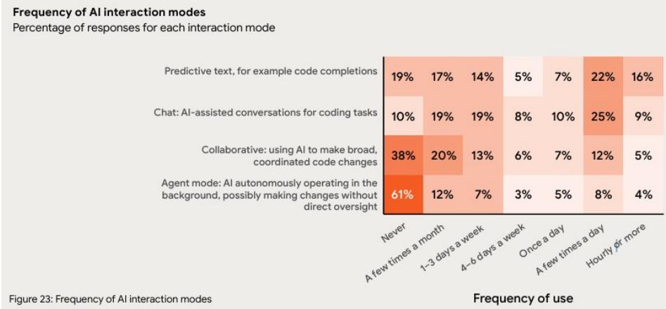

PhaseofAlagentuseatrespondents'organizations,by businessfunction $1 \%$ of respondents $( \mathsf { n } = 1 , 9 3 3 )$

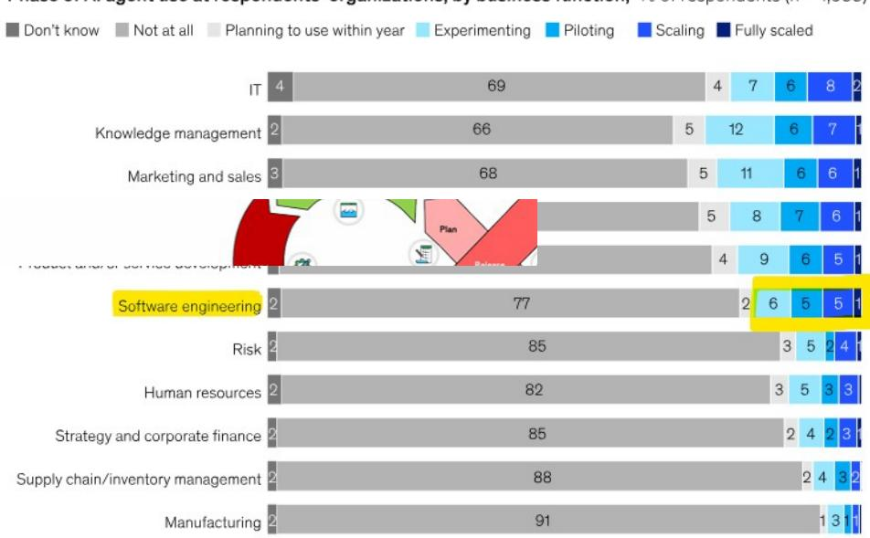  
Exhibit 13: Only $1 7 \%$ of software engineering respondents are at least experimenting with AI agents as of mid-2025   
  
Source: McKinsey Global Survey on the state of AI

The Emerging Agentic SDLC Is Taking Shape as an Integrated, Multi-Agent Ecosystem. In our prior work, we argued that the market would evolve beyond standalone coding assistants toward AI agents deployed across the broader software delivery process, with the most likely near-term future state being an "Integrated SDLC" rather than an “Invisible” one. In that model, multiple specialized agents plug into the existing ecosystem of planning tools, AI IDEs, code repositories, and CI/CD platforms, while collaborating with human developers and, increasingly, with one another to execute workflows across the delivery lifecycle. The way leading organizations are now building and deploying agents is increasingly consistent with that view: rather than replacing the SDLC with a single monolithic platform, they are embedding purpose-built agents into existing environments for functions such as code review, security, incident response, and operations, reinforcing the idea that the next phase of software delivery will be defined by interoperable, collaborative agents layered onto today’s toolchains.

# Examples of New Agentic Solutions Addressing the Problem

# • Code Review:

。 GitHub Copilot Code Review, initially launched April 2025, today leverages 微 multiple models, memory, and agentic tool-calling to conduct comprehensive reviews. It has conducted $\mathtt { > 6 0 }$ million automated code reviews, with usage growing 10x since initial launch and now accounting for ${ > } 2 0 \%$ of reviews on GitHub 。 Atlassian Rovo Dev, built and deployed in early 2025, has reduced pull request cycle time by $45 \%$ at Atlassian, eliminating more than a full day from the review process. It now serves as the automated first reviewer on every pull request, reducing review wait times, shrinking backlog, and allowing engineering teams to focus on larger, higher-priority code changes. For

customers in beta, Rovo Dev cut PR cycle time by $3 2 \%$ (from 4.18 to 2.85 days)

Qodo, private company. An agentic code integrity platform focused on code review, testing, and SDLC governance. It uses context-aware, multi-step review workflows across IDEs, pull requests, CLI, and Git to catch bugs early, enforce team standards, and improve code quality at scale

° CodeRabbit, private company. An AI-first code review platform that reviews pull requests with context-aware feedback, line-by-line suggestions, summaries, and chat. It is strongest as a PR review copilot, though it also 微信 LCD123321Cad 04-16 extends into IDE-based review workflows.

# 订阅研报添加

Greptile, private company. An AI code review agent that automatically reviews pull requests using an understanding of the entire codebase, not just the changed files. It is designed to catch bugs and logic issues by modeling repository-wide relationships and dependencies.

# • Testing:

° Diffblue Testing Agent, private company. An autonomous AI testing agent for Java and Python that analyzes a codebase, generates unit tests, compiles and executes them, verifies results, and commits only passing tests. It is designed for verified test generation at scale rather than one-off test suggestions.

° TestSprite, private company. An AI testing agent that understands requirements, builds test plans, writes and runs tests, diagnoses failures, and feeds structured fixes back into development. It is positioned as an end-to-end testing system for catching issues across real user flows with minimal manual test authoring.

微信 LCD123321Cad 04-16 ° Autify Aximo, private company. An autonomous AI testing agent for web, mobile, and desktop applications that uses natural language and visual recognition to execute tests like a real user. It focuses on end-to-end test coverage without relying on brittle scripts or selectors.

# • CI/CD Pipeline:

GitLab Duo Agent Platform, launched in public beta in 2025 and made generally available in January 2026, extends AI beyond point coding assistance into orchestration across the full software lifecycle. GitLab positions it as a way to solve the “AI paradox” in software delivery by coordinating agents across planning, coding, security, and delivery so that gains in code generation translate into faster end-to-end execution.

GitHub Copilot CLI, terminal/cloud agent that can work on issues and PRS, use parallel subagents, and handle build/debug/deploy-style tasks.

# • Operations/ Incident Response:

0 Datadog Bits AI SRE, launched in June 2025 and expanded by late 2025, acts   
° as an always-on AI on-call responder that investigates alerts using telemetry, runbooks, and service context before engineers even log in. Datadog says Bits AI SRE was developed against thousands of real-world incidents and can help teams restore services $90 \%$ faster, positioning it as a meaningful step toward autonomous incident response.

° Azure SRE Agent, introduced in preview in 2025 and made generally available in March 2026, brings Microsoft’s internal SRE practices into a customerfacing AI operations teammate. Microsoft says it already runs the platform across its own services with ${ 1 , 3 0 0 + }$ agents deployed, ${ 3 5 , 0 0 0 + }$ incidents

mitigated, and ${ 2 0 , 0 0 0 + }$ engineering hours saved per month, while the GA release extends those capabilities to customers to accelerate diagnosis, automate response, and reduce operational toil.

PagerDuty SRE Agent, launched as part of PagerDuty’s AI agent suite in October 2025, is designed to investigate incidents with memory and operate across observability, automation, infrastructure, and collaboration tools without requiring teams to consolidate vendors. PagerDuty says customers using the broader suite have been able to resolve incidents up to $50 \%$ faster, reclaiming thousands of engineering hours and signaling early traction for 信 LCD123321Cad 04-16 agentic operations in production environments.

° Rootly AI, private company. An AI-native incident management and SRE platform that helps teams detect, manage, investigate, and learn from incidents faster. Its AI features include real-time meeting transcription, incident summaries, draft communications, root-cause analysis, and automated retrospectives.

° Traversal, private company. An AI SRE platform for complex systems that investigates incidents by analyzing telemetry, code changes, and service dependencies to identify likely root causes with evidence. It also helps generate postmortems and supports remediation actions such as rollbacks or code changes with human approval.

° Incident.io, private company. An AI-enabled incident management platform that combines on-call, incident response, and status communication in one system. Its AI SRE capability investigates alerts, queries observability data, surfaces likely causes, and helps teams move from alert to resolution faster.

# 微信 Security:

C GitHub Security Lab Taskflow Agent, introduced in early 2026 as an experimental multi-agent framework for security research, is already delivering tangible results at GitHub. The company says its auditing taskflows have helped researchers identify more than 80 vulnerabilities so far, with roughly 20 already publicly disclosed, while related triage workflows have surfaced about 30 real-world vulnerabilities since August.

Google's CodeMender, unveiled by Google DeepMind in October 2025, combines frontier models with static analysis, fuzzing, differential testing, and automated validation to find and fix security flaws in code. In its first six months, Google says CodeMender upstreamed 72 security fixes to opensource projects, including codebases as large as 4.5 million lines, showing early evidence that agentic security tooling can contribute at meaningful scale.

0 GitLab Duo Security Analyst Agent, made generally available in January 2026, brings AI-native vulnerability triage directly into the GitLab workflow. It analyzes findings in application context using exploitability, reachability, CVE, and EPSS data, helping teams identify likely false positives and prioritize real risk faster without leaving the DevSecOps platform.

OpenAI Codex Security, AI application security agent that analyzes project context to detect, validate, and patch complex software vulnerabilities with higher confidence and less noise than conventional scanners. It is currently in research preview and is positioned for context-aware AppSec workflows rather than simple code suggestions.

# Key Debate #3: How Will AI Impact The Growth Prospects of Our Public Company Coverage?

• Original Conclusion: Reaffirming Our OW Ratings on Atlassian, Gitlab and JFrog as AI's Impact is Misunderstood. While we acknowledge that AI has dramatically spurred an innovation cycle in software development that poses risks to incumbents, we think the surge in the amount of code generated due to rampant adoption of AI coding assistants should provide structural tailwinds for Microsoft, Atlassian, Gitlab and JFrog. Specifically, we believe the robust growth in AIgenerated code is creating severe bottlenecks across the software delivery cycle weighing on overall engineering productivity – a challenge that Atlassian, GitLab, JFrog and Microsoft look well positioned to address. TEAM: Demand for Core Franchise Offerings Should Prove Durable With Newer Vectors of Growth Emerging. GTLB: Well Positioned to Address Emerging Bottlenecks But Execution on Agents is Key. FROG: A Pure Play Beneficiary On The Robust Growth in Software Updates and AI Models.

# Atlassian (TEAM) OW \$120 PT – Stable Fundamentals with Attractive Valuation, Though More Fertile Ground for Positive Re-rating Post FY27 Guide.

Value Proposition Beyond Single Developer Productivity; System of Record for Software Development. With core products like Jira and Confluence serving as the project managers and central knowledge repositories for software development, Atlassian's value proposition goes beyond single developer productivity, with its value increasing with the volume, velocity, and complexity of software development. We view this position as a fundamental advantage for Atlassian, as the broadening use of AI coding tools is driving a sharp acceleration in software development along greater complexity in the systems being built. And with a unique breadth of knowledge into how software is built and what makes development teams efficient, it provides incrementally valuable context for this new era of AI-driven software development. This strategic positioning has enabled Atlassian to sustain $20 \% +$ revenue growth and $> 2 0 \%$ FCF margin (TTM basis) over the past several years, while more recently in F2Q26 (for the third consecutive quarter) RPO growth accelerated to $+ 4 4 \%$ YoY and Cloud NRR ticked up to $120 \% +$ .

Overstated Investor Concerns Set Attractive Valuation. Despite strong fundamental performance in recent quarters, TEAM shares have been heavily penalized over the past year (down $\sim 7 0 \%$ vs S&P/Nasdaq up $3 0 \% / 3 8 \%$ largely on the back of two main assumptions: 1) AI adoption and its corresponding productivity gains will drive a decline in human software developer headcount, shrinking Atlassian's end market and its ability to monetize its seat-based revenue model, and 2) given a generally lower barrier of entry for application development (lower cost and ease of development), Atlassian will face increasing competition from AI startups and DIY/internally-developed applications. We believe these fears are largely overstated, and view current valuation of <2x EV/CY27 20

# Sales (0.1x growth-adj) and 7x FCF (0.2x) as attractive.

Remain OW, But Lower PT to $\$ 120$ . Despite our constructive fundamental view on Atlassian, we do not see a clear near-term catalyst to shift investor sentiment, at least until management provides initial FY27 guidance, offers greater visibility into AI monetization, and shows a credible path to hybrid pricing – all of which are more likely to materialize in FY27. As such, we maintain our Overweight rating, but lower our price target to $\$ 120$ from $\$ 290$ as we account for recent multiple contraction and align TEAM with the overall software average. Our $\$ 120$ PT implies 4.2x EV/CY27 Sales $( 0 . 2 2 \times$ growth-adj) and 15.1x FCF $( 0 . 4 5 \times ) ,$ generally inline with the absolute overall software average of 4x and 15x, respectively, but still a discount vs the growth-adjusted of $0 . 3 \times$ and $0 . 9 \times ,$ respectively.

# GitLab (GTLB) EW $\$ 29$ PT – CY26/FY27 a Transition Year, While Execution on Duo Agent Platform Key Unlock for Better Growth in CY27/FY28.

Value Proposition as Governance/Automation Layer for the Software Factory. Similar to Atlassian, GitLab's value proposition goes beyond single developer productivity. As a system of record across the software development lifecycle (covering source code management, CI/CD, and security) GitLab becomes more valuable as software environments grow more complex and as development volume and velocity increases. In a world where AI is generating more code, the bottlenecks shift downstream into testing, deployment, governance, and security. That dynamic should increase the need for GitLab’s automation and DevSecOps capabilities, not reduce it.

Duo Agent Platform is GitLab’s Key Strategic Unlock. GitLab's Duo Agent Platform addresses the AI paradox (faster coding, with greater bottlenecks elsewhere) by helping automate downstream workflows across the software lifecycle, allowing GitLab to capture more value as software activity increases. This represents a key strategic unlock for GitLab's shift from a primarily seat-based model to a hybrid model that adds usagebased monetization. The platform combines agentic chat, prebuilt agents, and third-party integrations within a credit-based model layered onto existing subscriptions, which lowers adoption friction and creates a clearer path to monetizing usage over time. Early customer traction is encouraging and suggests DAP could become a meaningful growth driver as pilots convert into production deployments.

FY27 Guide Sets Up Transition Year With Minimal DAP Contribution. Despite our generally constructive view on GitLab's position, CY26/FY27 still looks like a transition year, and we do not see an obvious near-term catalyst for the stock near-term. This was the basis of our downgrade to Equal-weight at the beginning of the year (read New Stack: 2026 Outlook - A Stable Backdrop for Growth). Since then, this view has been supported by management's initial FY27 guidance, which calls for a sharp \~10pt deceleration vs FY26 $+ 2 6 \%$ YoY revenue growth. This outlook reflects weaker prior bookings conversion, further moderation in net retention, several non-recurring tailwinds falling off, continued pressure in more price-sensitive customer segments, and only minimal contribution from Duo Agent Platform. With the company delivering mixed performance over the past few quarters, helping fuel the AI bear case, the burden of proof is on execution. Sentiment is unlikely to improve meaningfully until GitLab shows that its go-to-market changes are working and that Duo Agent Platform adoption is moving from pilots into scaled

production use. That is why CY26/FY27 looks like a transition year, while the more compelling re-rating opportunity likely comes later, once hybrid monetization starts contributing more materially and the company can show evidence of a durable growth inflection in FY28 and beyond. As such, we remain Equal-weight and maintain our $\$ 29$ price target, which implies 3.1x EV/CY27 Sales $_ { ( \pmb { 0 . 2 0 x } }$ growth-adj) and $\pmb { 1 5 . 2 \times F C F } ( \pmb { 1 . 7 } \pmb { x } ) ,$ generally inline with Smid-cap software average of $\mathbf { \delta } _ { 2 . 6 x }$ and $\texttt { 1 4 x } ,$ respectively.

# JFrog (FROG) OW \$70 PT – Clear Beneficiary from Growing Volume of Software 添加微信 LCD123321Cad 04-16 Development Work, With Durable Moat as System of Record for Binaries.

Clear Beneficiary of AI-Driven Software Development. JFrog is a clear beneficiary of rising software development activity, especially as AI drives a sharp increase in code, binaries, and model-related workloads. Its strategic value comes from serving as the system of record for binaries (the immutable files/artifacts that code gets compiled into which run on servers so that end customers can actually execute the software), giving JFrog a durable control point across build, test, release, deployment, and security. Importantly, unlike seat-based developer tools, JFrog’s usage-based pricing model is tied to storage, data transfer, and infrastructure, which positions it to benefit directly from higher software volumes without relying on developer headcount growth.

# Durable Moat as Foundational Control Point; Expanding with Security and

Governance. JFrog has a durable moat because it occupies a foundational control point in software delivery through Artifactory, Xray, and Distribution, which manage how binaries are stored, scanned, secured, governed, and released across complex enterprise 添加微信 LCD123321Cad 04-16 environments. That role should become even more valuable as development grows more automated and AI-driven: even if code generation becomes commoditized, enterprises will still need a trusted system to control what actually reaches production. Its broad support across packages, ecosystems, and deployment environments strengthens its position as a universal platform in a multi-model, multi-tool world, while the rise of AI-generated code further expands its strategic importance by increasing demand for security, compliance, and software supply chain governance. As a result, JFrog is positioned not just to benefit from higher software output, but to serve as a critical enforcement layer for securing, governing, and distributing that output at scale, with added upside from its expanding security portfolio, partnerships, and enterprise focus.

Fundamentals Remain Strong. Revenue growth has been solid $+ 2 5 \%$ YoY in $Q 4 _ { \cdot }$ ), cloud continues to scale quickly $( + 4 2 \% \forall 0 \forall )$ , and the security business is showing strong momentum ( $1 0 \%$ of ARR in 2025 vs $5 \%$ in $2 0 2 4$ ). Looking ahead, guidance appears conservative, particularly given improving RPO coverage and management’s cautious 添加微信 LCD123321Cad 04-16 assumptions around migration deals and consumption. Despite that, the stock has been under pressure recently, largely on concerns tied to code security competition that seem disconnected from the fact that most of JFrog’s business is centered on binaries rather than source code (read Securing Binaries Not Code). As such, we remain Overweight and maintain our $\$ 70$ price target, which implies 11x EV/CY27 Sales (0.57x growth-adj) a premium to Smid-cap average on an absolute basis (vs 3x) but a discount on a growthadjusted basis $( { \pmb v } { \pmb 5 } \ { \pmb 0 } . 6 9 { \pmb x } )$ .

# Microsoft (MSFT) OW \$650 PT – Combination of Azure and GitHub Offer a Unified Platform Across the DevOps Stack… Execution on Agents Remains Key Longer-Term

Microsoft’s Developer Ecosystem as a Unified Platform. Microsoft’s software development business, centered on GitHub and Azure, is increasingly positioned as a unified platform across the DevOps stack and should benefit from the rapid acceleration in AI-driven development. With meaningful share in a large and growing software development market, the company is combining developer tools (VS Code, Github), collaboration, AI-assisted development (Copilot), and cloud infrastructure (Azure) into a tightly integrated ecosystem. This has enabled strong strategic positioning as more software development shifts toward AI-assisted and agentic workflows, and the category as a whole moves up the priority list for many organizations.

GitHub and Azure Are Emerging as Microsoft’s Integrated Control Layer for Agentic Software Development. GitHub is evolving from a coding tool into a broader interface for agentic development, building on its position as the flagship developer platform with a large and growing user base and strong Copilot adoption across both individuals and enterprises, especially large organizations. Microsoft is pushing GitHub beyond code completion through offerings like Agent HQ, GitHub Spark, and Copilot Workspace, aiming to make it the control layer for managing coding agents and enabling more naturallanguage-driven workflows from idea to application. While that vision remains early and near-term impact will depend on product maturity and proven productivity gains, Azure strengthens the strategy by providing the infrastructure backbone for building and deploying AI applications. Strong demand for Azure’s AI platform, the emergence of Azure AI Foundry as a key environment for designing and managing AI applications and agents, 添加微信 LCD123321Cad 04-16 and the broader pull-through into databases, app services, and other Azure products all reinforce Microsoft’s integrated AI stack, while its prioritization of GPU capacity toward Microsoft 365 Copilot and GitHub highlights how central its first-party developer ecosystem is to its broader AI strategy.

# End-to-End Workflow Integration Remains Microsoft’s Core Competitive Advantage.

One of Microsoft’s main advantages remains the integration across Visual Studio Code, GitHub, and Azure, which gives Microsoft a more unified developer workflow than most competitors can offer. Developers can access models, code repositories, enterprise context, and deployment infrastructure within a connected environment, which should strengthen adoption and increase platform stickiness over time. That integration also extends into enterprise development processes through Azure DevOps and third-party tooling, helping Microsoft participate across more of the software lifecycle. Overall, the combination of GitHub’s developer reach, Copilot’s adoption, Azure’s AI infrastructure, and the company’s end-to-end workflow integration makes Microsoft one of the strongest 添加微信 LCD123321Cad 04-16 platforms in AI-driven software development. Altogether, Microsoft's wide moat and strong competitive positioning across Cloud workflows, GenAI spending and the DevOps ecosystem remain underappreciated in shares today, trading at 18x CY27 GAAP P/E and 1.2x PEG (vs. its $\mathbf { \Gamma } { \sim } 2 . 0 \mathbf { x }$ 10-Year Average PEG). Remain OW.

# Risk Reward - Atlassian CorporaRisk Reward – Atlassian Corporation PLC (TEAM.O)

Stronger for Longer -- Product Driven Distribution Drives Durable FCF Growth

# \$120.00PRICE TARGET

# OVERWEIGHT THESIS

Discount of 11x on Base Case CY29e FCF of $\$ 3.58$ . Supported by ${ \sim } 1 8 \%$ CY25-CY29 Revenue CAGR and Operating margin expanding from $2 5 \%$ in CY25 to $2 9 \%$ in CY29. Our price target implies an EV/CY27 FCF multiple of $7 5 \times$ (0.45x growth-adj).

Consensus Price Target Distribution

Source: Re fi nitiv, Morgan Stanley Research

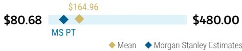

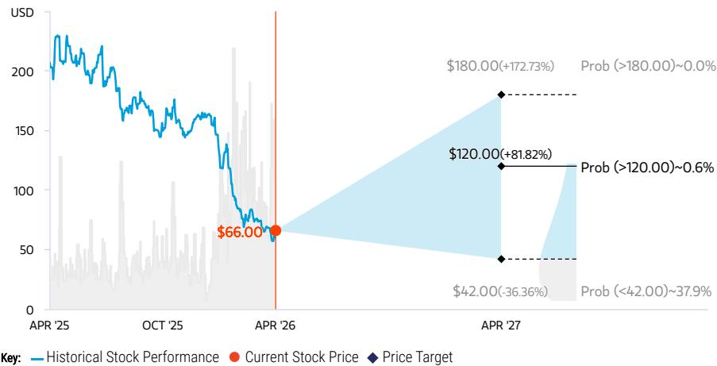  
RISK REWARD CHART AND OPTIONS IMPLIED PROBABILITIES (12M)   
Source: Re nitiv, Morgan Stanley Research, Morgan Stanley Institutional Equities Division. The probabilities of our Bull, Base, and Bear case scenarios playing out were estimated with implied volatility data from the options market as of 15 fiApr 2026. All gures are approximate risk-neutral probabilities of the stock reaching beyond the scenario price in either three-months’ or one-years’ time. View explanation of Options Probabilities methodology here

We believe Atlassian is well-positioned for the rising demand we see for App Dev tools, with an expanding solution set looking to consolidate what today remains a fragmented market. With the company’s 04-16 ongoing shift to the Cloud, we see an improving ability to well monetize this opportunity ahead. TEAM represents a unique software asset, in our view, combining rapid topline growth, solid margins, and strong execution. With a more conservative outlook into FY26, we see a more manageable set up, and a path to durable $\sim 2 5 \%$ FCF growth through FY27, keeping us OW shares.

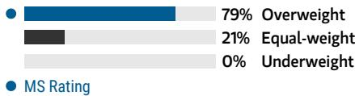  
Consensus Rating Distribution   
Source: Re nitiv, Morgan Stanley Research

# Risk Reward Themes

04-16 New Data Era: Positive Secular Growth: Positive View descriptions of Risk Rewards Themes here

# BULL CASE

# $\$ 180.00$

# BASE CASE

# $\$ 120.00$

# BEAR CASE

$\$ 42.00$

# Discount of 15x CY29e FCF of $\$ 48$

Atlassian Gains Material Share in the Team Productivity Market. Atlassian's efforts to win over business users with Jira/Trello/Con uence/Service Desk shows major signs of progress resulting in share gains in a large market. With a $3 \%$ CAGR in flthe customer base through 2029, revenue grows at a $20 \%$ CAGR to $\$ 11.9 B$ by CY29. Assumes $30 \%$ operating margin and $\$ 45$ in FCF in CY29. $\$ 180$ implies 21x EV/CY27e FCF, or $0 . 5 6 \times$ 订 on a growth-adjusted basis.

# Discount of 11x CY29e FCF of $\$ 3.58$

Atlassian Gains Share in the IT Market. Atlassian solidi es its position as the leading solution for technical teams. The customer base grows at a $2 \%$ CAGR through 2029. As a result, revenue grows at a $1 8 \%$ CAGR thru CY29 to $\$ 17$ .1B. Operating Margins reach $2 9 \%$ in CY29 yielding $\$ 3.5 B$ in FCF. $\$ 120$ implies 15x EV/CY27e FCF, or 0.45x on a growth-adjusted basis

# Discount of 5x CY29e FCF of $\$ 2.58$

# Growth Engines Start to Decelerate.

Atlassian's traction outside of development teams proves disappointing, while the software development market shows signs of saturation. The customer base grows at a $1 \%$ CAGR through 2029. As a result, revenue grows at an $1 3 \%$ CAGR thru CY29e to $\$ 9.38,$ while operating margins reach $2 6 \%$ by CY29e. This results in $\$ 2.58$ in FCF in CY29e. $\$ 42$ implies 6x EV/CY27e FCF, or $_ { 0 . 2 6 \times }$ on a growth-adjusted basis

# Risk Reward – Atlassian Corporation PLC (TEAM.O)

KEY EARNINGS INPUTS   

<table><tr><td>Drivers</td><td>2025</td><td>2026e</td><td>2027e</td><td>2028e</td></tr><tr><td>Subscription Revenue Growth (YoY) (%)</td><td>25.6</td><td>23.0</td><td>18.9</td><td>19.6</td></tr><tr><td>Total Revenue Growth (YoY) (%)</td><td>19.7</td><td>22.0</td><td>18.3</td><td>19.0</td></tr><tr><td>Customer Growth (YoY) (%)</td><td>4.6</td><td>3.2</td><td>2.8</td><td>2.0</td></tr><tr><td>Total Billings Growth (YoY)(%)</td><td>13.3</td><td>17.3</td><td>19.4</td><td>17.7</td></tr><tr><td>Op Margins (%)</td><td>24.7</td><td>25.5</td><td>26.0</td><td>28.0</td></tr></table>

# INVESTMENT DRIVERS

Server end of life in February 2024 Free to paid user conversion R&D and G&A leverage to drive margin expansion from FY25 and beyond

# GLOBAL REVENUE EXPOSURE

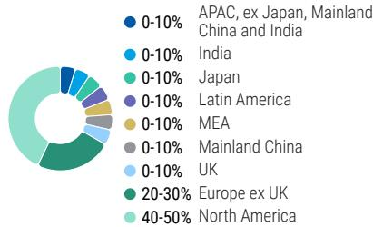  
Source: Morgan Stanley Research Estimate View explanation of regional hierarchies here

# MS ALPHA MODELS

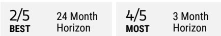

Source: Re nitiv, FactSet, Morgan Stanley Research; 1 is the highest favored Quintile and 5 is the least favored Quintile

# RISKS TO PT/RATING

# RISKS TO UPSIDE

Higher than expected margin expansion, driven by cloud unit economics, drives rapid FCF growth. Price increases, recent acquisitions, and focus on IT teams drives faster reacceleration

# RISKS TO DOWNSIDE

AI-driven productivity gains among software developers and knowledge workers pressures enterprise headcount   
Competition from emerging AI-native alternatives and in-house development   
Pricing model transition

# 报添加微信 LCD1OWNERSHIP POSITIONING

Inst. Owners, % Active $5 8 \%$ HF Sector Long/Short Ratio 2.1x HF Sector Net Exposure $2 6 . 4 \%$

Re nitiv; MSPB Content. Includes certain hedge fund exposures held with MSPB. Information may be fiinconsistent with or may not re ect broader market trends. Long/Short Ratio $\underline { { \underline { { \mathbf { \delta \pi } } } } }$ Long Exposure / Short exposure. Sector % of Total Net Exposure $\underline { { \underline { { \mathbf { \delta \pi } } } } }$ (For a particular sector: Long Exposure - Short Exposure) / (Across all sectors: Long Exposure – Short Exposure).

# MS ESTIMATES VS. CONSENSUS

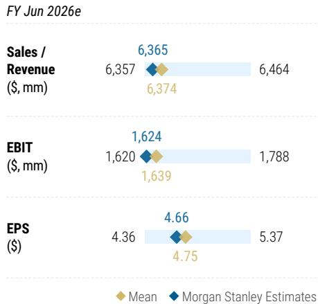  
Source: Re nitiv, Morgan Stanley Research

# Risk Reward – GitLab Inc (GTLB.O)

KEY EARNINGS INPUTS   

<table><tr><td>Drivers</td><td>2026</td><td>2027e</td><td>2028e</td><td>2029e</td></tr><tr><td>SaaS Revenue (S, mm)</td><td>296</td><td>371</td><td>464</td><td>575</td></tr><tr><td>Total Revenue (S, mm)</td><td>955</td><td>1,108</td><td>1,282</td><td>1,459</td></tr><tr><td>Net Retention Rate (%)</td><td>118.0</td><td>112.5</td><td>112.5</td><td>112.5</td></tr><tr><td>Customer Count Growth (%)</td><td>8.0</td><td>6.3</td><td>5.5</td><td>4.8</td></tr><tr><td>Operating Margin (%)</td><td>17.0</td><td>12.0</td><td>14.2</td><td>16.1</td></tr></table>

# INVESTMENT DRIVERS

GTLB should sustain mid $20 \%$ CAGR through FY28, as several key drivers are well supported. Further penetration in core markets and recent price increases help fuel ST growth, monetization of Duo and Dedicated to contribute more meaningfully in FY26.

# GLOBAL REVENUE EXPOSURE

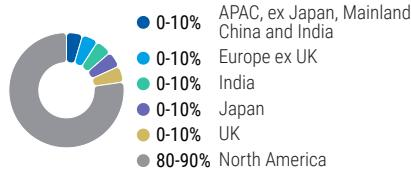  
Source: Morgan Stanley Research Estimate View explanation of regional hierarchies here

# MS ALPHA MODELS

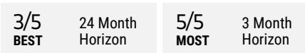

Source: Re nitiv, FactSet, Morgan Stanley Research; 1 is the highest favored Quintile and 5 is the least favored Quintile

# RISKS TO PT/RATING

# RISKS TO UPSIDE

Successful expansion into agile planning, Observability, and ITSM.   
Monetization of GitLab Duo is greater than we anticipate near term.

# RISKS TO DOWNSIDE

AI revolutionizes the way software is built and delivered.   
The movement towards consolidation stalls.   
Market chooses to consolidate more around GitHub instead of GitLab.   
Customers don't embrace GitLab as a credible provider of security and GenAI solutions.

# 报添加微信 LCD1OWNERSHIP POSITIONING

Inst. Owners, % Active $6 3 . 3 \%$ HF Sector Long/Short Ratio 2.1x HF Sector Net Exposure $2 6 . 4 \%$

Re nitiv; MSPB Content. Includes certain hedge fund exposures held with MSPB. Information may be fiinconsistent with or may not re ect broader market trends. Long/Short Ratio $\underline { { \underline { { \mathbf { \delta \pi } } } } }$ Long Exposure / Short exposure. Sector % of Total Net Exposure $\underline { { \underline { { \mathbf { \delta \pi } } } } }$ (For a particular sector: Long Exposure - Short Exposure) / (Across all sectors: Long Exposure – Short Exposure).

# MS ESTIMATES VS. CONSENSUS

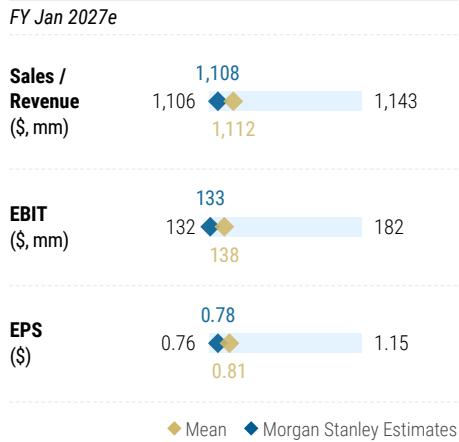  
Source: Re nitiv, Morgan Stanley Research

# Risk Reward - JFrog LtRisk Reward – JFrog Ltd. (FROG.O)

Sticky Core Business With Signi cant Pro tability Improvements

# PRICE TARGET $\$ 70.00$

# OVERWEIGHT THESIS

42x CY27e EV/FCF/sh of $\$ 1.52$ (1.4x growth adjusted), a premium to DevOps peers at 1.2x as it is uniquely positioned to bene fit from the robust growth in software updates and AI models while not exposed to any potential headcount pressures.

Consensus Price Target Distribution

Source: Re fi nitiv, Morgan Stanley Research

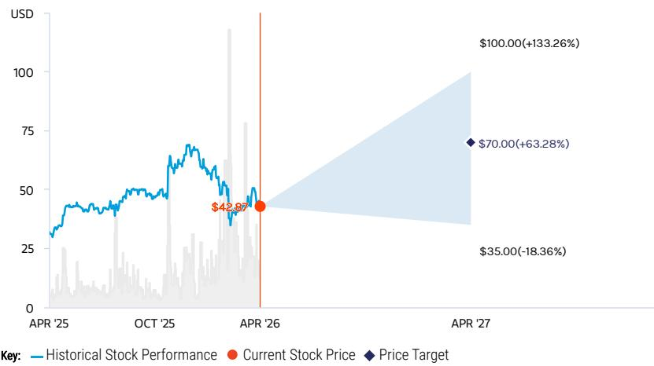  
RISK REWARD CHART   
Source: Re nitiv, Morgan Stanley Research

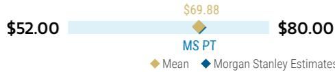

As the market leader in binary package   
management, JFrog looks to leverage its strong market position to automate the   
software delivery lifecycle enabling   
customers to accelerate the pace of   
04-16 software-driven innovation. We view JFrog’s core market as highly defensible and we see credible avenues for expansion in the areas of security and edge distribution. We believe the durability of JFrog's core business,   
opportunities for continued customer   
expansion, and the potential for signi cant FCF generation is currently   
underappreciated at an undemanding   
growth adjusted valuation.

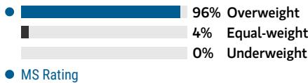  
Consensus Rating Distribution   
Source: Re nitiv, Morgan Stanley Research

# Risk Reward Themes

04-16 Secular Growth: Positive View descriptions of Risk Rewards Themes here

# BULL CASE

# $\$ 100.00$

# BASE CASE

# $\$ 70.00$

# BEAR CASE

\$35.00

# 50x CY27e EV/FCF/sh of $\$ 1.88$

# Accelerating revenue growth as economy rebounds and significant progress on becoming an end-to-end DevSecOps platform

-Revenue grows to $\$ 823M$ in CY27, a $\sim 2 4 \%$ 2-yr CAGR

-Op margins improve from $1 7 \%$ in CY25 to $2 5 \%$ by CY27, yielding FCF of $\$ 246 M$ $( 3 0 \%$ margin) or $\$ 1.88$ per share

-Apply a 50x EV/CY27/sh FCF multiple to get to our $\$ 100$ PT

# 42x CY27e EV/FCF/sh of $\$ 1.51$

# Expanding its multi-product capabilities

-Revenue grows to $\$ 758 M$ in CY27, a $\sim 2 1 \%$ 2- yr CAGR

-Op margins improve from $1 7 \%$ in CY25 to $2 1 \%$ by CY27, yielding FCF of $\$ 198M$ $2 6 \%$ margin) or $\$ 1.51$ per share

-Apply a 42x EV/CY27 FCF/sh multiple to get to our $\$ 70$ PT

# 26x CY27e EV/FCF/sh of $\$ 1.09$

# Sharp market inflection to the Public Cloud $^ +$ intensifying competition from large platform rivals lead to stagnating market share

-Revenue grows to $\$ 678 M$ in CY27, a ${ \sim } 1 7 \%$ 2- yr CAGR

-Op margins ticks down 1pt to $1 6 \%$ through CY27, yielding FCF of $\$ 143M$ $2 1 \%$ margin) or $\$ 1.09$ per share

-Apply a 26x EV/CY27 FCF multiple to get to 04our $\$ 35$ 6 PT

# Risk Reward – JFrog Ltd. (FROG.O)

KEY EARNINGS INPUTS   

<table><tr><td>Drivers</td><td>2025</td><td>2026e</td><td>2027e</td><td>2028e</td></tr><tr><td>Total Billings YoY Growth (%)</td><td>22.7</td><td>16.0</td><td>19.7</td><td>16.0</td></tr><tr><td>Total Revenue YoY Growth (%)</td><td>24.1</td><td>17.7</td><td>21.1</td><td>21.0</td></tr><tr><td>Net Revenue Retention Rate (%)</td><td>114.5</td><td>113.0</td><td>113.0</td><td>113.0</td></tr><tr><td>Customer Count Growth (%)</td><td>(9.6)</td><td>1.2</td><td>1.2</td><td>1.2</td></tr><tr><td>Operating Margin (%)</td><td>17.3</td><td>17.2</td><td>21.0</td><td>22.1</td></tr></table>

# INVESTMENT DRIVERS

3Q23 Earnings

# GLOBAL REVENUE EXPOSURE

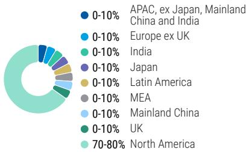  
Source: Morgan Stanley Research Estimate View explanation of regional hierarchies here

# RISKS TO PT/RATING

# RISKS TO UPSIDE

JFrog makes signi cant progress in the multiproducts adoption story   
Durable growth pro le drives FY24 revenue ahead of expectations   
Upside to Op margins as achieves better ef ciency

# RISKS TO DOWNSIDE

Software development projects remain subdued in 2024 Software development and delivery lifecycle consolidates to larger vendors Security value proposition doesn't resonate Operational ef ciency does not improve

# OWNERSHIP POSITIONING

Inst. Owners, % Active $7 8 . 2 \%$ HF Sector Long/Short Ratio 2.1x HF Sector Net Exposure $2 6 . 4 \%$

Re nitiv; MSPB Content. Includes certain hedge fund exposures held with MSPB. Information may be inconsistent with or may not re ect broader market trends. Long/Short Ratio $\underline { { \underline { { \mathbf { \delta \pi } } } } }$ Long Exposure / Short exposure. Sector $\%$ of Total Net Exposure $\underline { { \underline { { \mathbf { \delta \pi } } } } }$ (For a particular sector: Long Exposure - Short Exposure) / (Across all sectors: Long Exposure – Short Exposure).

# MS ESTIMATES VS. CONSENSUS

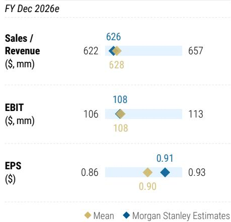  
Source: Re nitiv, Morgan Stanley Research

# Risk Reward - MicrosoRisk Reward – Microsoft (MSFT.O)

Durability of Earnings Growth & AI Leadership Not Priced-In

# \$650.00PRICE TARGET

31x Base Case CY27e EPS of $\$ 21.17.$ 31x PE is in line with large cap software peers, 1.6x PEG is relatively in line with MSFT historical PEG while a premium to peers, justi fied by Microsoft's strong positioning and strong execution.

Consensus Price Target Distribution

Source: Re fi nitiv, Morgan Stanley Research

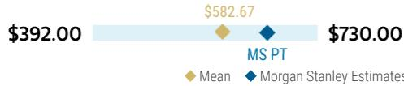

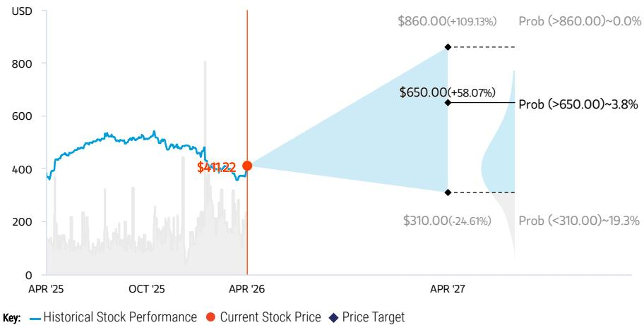  
RISK REWARD CHART AND OPTIONS IMPLIED PROBABILITIES (12M)   
Source: Re nitiv, Morgan Stanley Research, Morgan Stanley Institutional Equities Division. The probabilities of our Bull, Base, and Bear case scenarios playing out were estimated with implied volatility data from the options market as of 15 fiApr 2026. All gures are approximate risk-neutral probabilities of the stock reaching beyond the scenario price in either three-months’ or one-years’ time. View explanation of Options Probabilities methodology here

# OVERWEIGHT THESIS

▪ Strong positioning for public cloud adoption & AI, large distribution channels and installed customer base, and expanding margins supports EPS growth. Weaker cyclical environment improves as cloud optimizations complete - LT trends remain durable.

▪ Teens revenue growth, opex discipline and strong capital return lead to durable mid- to high-teens total return pro file long term.

Microsoft's earnings growth and the company's premium return pro le remains underpriced. Multiple expansion and positive estimate revisions will come from greater than expected strength in commercial businesses including Azure.

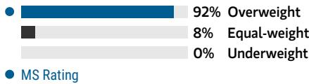  
Consensus Rating Distribution   
Source: Re nitiv, Morgan Stanley Research

# Risk Reward Themes

New Data Era: Positive Pricing Power: Positive Secular Growth: Positive View descriptions of Risk Rewards Themes here

# BULL CASE

# \$860.00

# BASE CASE

# $\$ 650.00$

# BEAR CASE

\$310.00

# \~36x Bull Case CY27e EPS: \$23.76

Azure, O365 & Robust Contribution from AI Drive Top-Line Growth. Acceleration in Azure growth, adoption of higher priced M365 Commercial SKUs and continued seat growth, and robust adoption of Azure AI services and Microsoft AI Copilots across business lines drive mid-teens revenue CAGR in the coming years. Operating margins expand to ${ \sim } 4 9 . 6 \%$ by CY27 and CY27e EPS is $\$ 23.76$ . $\sim 3 6 x$ PE represents a premium to large cap software peers, but roughly inline with Hist Avg PEG at ${ \sim } 1 . 5 \times$ given $> 2 0 \%$ EPS CAGR.

Azure, M365 & Ramping Contribution from AI Drive Top-Line Growth. Durability of Azure growth, adoption of higher priced M365 Commercial SKUs and continued seat growth, and ramping adoption of Azure AI services & Microsoft AI Copilots across business lines drive low-teens rev CAGR ahead. Operating margins expand beyond ${ \sim } 4 7 . 6 \%$ by CY27 and CY27e EPS is $\$ 21.17.$ 31x PE is a slight premium to large cap software peers, given strong positioning and execution. 1.6x PEG is inline with MSFT historical PEG.

# \~31x Base Case CY27e EPS of $\$ 21.17$

# \~16x Bear Case CY27e EPS: \$19.17

Macro, Scale & Limited AI Adoption Drives Top-Line Growth Deceleration. Azure growth continues deceleration given scale, while M365 reaches penetration and adoption of Azure AI services & Microsoft AI Copilots across business lines remains limited. This drives low double-digit rev CAGR. Operating margins only expand to ${ \sim } 4 5 . 6 \%$ by CY27 from gross margin pressure and CY27e EPS is $\$ 19.17$ . $\mathord { \sim } 1 6 \times$ PE is a 04-16 discount to large cap software peers and a discount on a PEG.

# Risk Reward – Microsoft (MSFT.O)

KEY EARNINGS INPUTS   

<table><tr><td>Drivers</td><td>2025</td><td>2026e</td><td>2027e</td><td>2028e</td></tr><tr><td>Azure Revenue Growth (%)</td><td>29.7</td><td>30.2</td><td>26.4</td><td>22.4</td></tr><tr><td>Server Products On-Prem Growth (%)</td><td>） (2.0)</td><td>(1.0)</td><td>(1.0)</td><td>(1.0)</td></tr><tr><td>Gross Margins (%)</td><td>68.8</td><td>67.6</td><td>66.9</td><td>66.6</td></tr><tr><td>Operating Margins (%)</td><td>45.6</td><td>46.2</td><td>46.9</td><td>47.3</td></tr><tr><td>GAAP EPS Growth (%)</td><td>15.6</td><td>26.0</td><td>13.5</td><td>18.3</td></tr></table>

# INVESTMENT DRIVERS

Sustainability of commercial growth, cloud momentum, improving cloud margins Improving PC data points

# GLOBAL REVENUE EXPOSURE

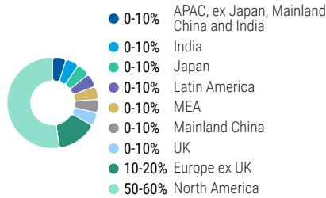  
Source: Morgan Stanley Research Estimate View explanation of regional hierarchies here

# MS ALPHA MODELS

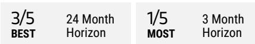  
Source: Re nitiv, FactSet, Morgan Stanley Research; 1 is the highest favored Quintile and 5 is the least favored Quintile

# RISKS TO PT/RATING

# RISKS TO UPSIDE

Cloud adoption accelerates, with Azure as convincing winner   
AI leadership results in substantial revenue contribution over-time   
Operational ef ciencies leading to greater than fianticipated economies of scale and margin expansion

# RISKS TO DOWNSIDE

Weak macro impacting IT spending On-premises cannibalization by Cloud Increased investments hurt margin expansion AI adoption proves limited

# OWNERSHIP POSITIONING

Inst. Owners, % Active $5 4 . 4 \%$ HF Sector Long/Short Ratio 2.1x HF Sector Net Exposure $2 6 . 4 \%$

Re nitiv; MSPB Content. Includes certain hedge fund exposures held with MSPB. Information may be inconsistent with or may not re ect broader market trends. Long/Short Ratio $\underline { { \underline { { \mathbf { \delta \pi } } } } }$ Long Exposure / Short exposure. Sector $\%$ of Total Net Exposure $\underline { { \underline { { \mathbf { \delta \pi } } } } }$ (For a particular sector: Long Exposure - Short Exposure) / (Across all sectors: Long Exposure – Short Exposure).

# MS ESTIMATES VS. CONSENSUS

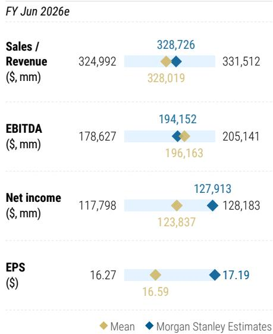  
Source: Re nitiv, Morgan Stanley Research

# Risk Reward Reference links

1. View explanation of Options Probabilities methodology - Options_Probabilities_Exhibit_Link.pdf

2. View descriptions of Risk Rewards Themes - RR_Themes_Exhibit_Link.pdf

3. View explanation of regional hierarchies - GEG_Exhibit_Link.pdf

4. View explanation of Theme/Exposure methodology - ESG_Sustainable_Solutions_External_Link.pdf

5. View explanation of HERS methodology - ESG_HERS_External_Link.pdf