# Hidden Heroes Behind Chip Testing; Initiate Hon Precision, MPI and WinWay at OW

April 16, 2026 09:01 PM GMT Semiconductor testing is entering a multi-year structural upcycle 订阅研报添加微信 LCD123321Cdriven by AI demand, rising chip complexity and larger package sizes, and higher testing intensity. We see upside potential in the segment over the long term, with MPI, WinWay, and Hon Precision relatively well positioned to benefit.

AI Driving Structural Upswing in Semiconductor Testing: We see a structural inflection in semiconductor testing as chip complexity rises at advanced nodes and as product cycles shorten. As AI and high-performance computing (HPC) push performance limits, testing intensity and duration continue to increase, elevating advanced testing from a cost consideration to a critical bottleneck and value driver. Taiwan-based vendors remain well positioned, given their proximity to TSMC, ASE and KYEC, which enables faster iteration cycles and closer customer integration. We expect sustained growth in testing content per chip to underpin long-term industry expansion across the semiconductor testing ecosystem.

订阅研报添加微信 LCD123321CContent Growth, Share Gains and CPO to Drive Upside; MPI and WinWay at OW with respective PTs at NT\$5,800 and NT\$12,000: TSMC targets interposer sizes of up to 9.7 reticles by 2027, vs 1.5 reticles in 2016. As package sizes expand and testing complexity increases, we see compelling opportunities in probe cards and sockets, supported by rising dollar content per unit, market share gains, and TAM expansion. Considering MPI and WinWay are leaders in the probe card and socket markets, we forecast revenue CAGRs of $6 6 \%$ and $7 1 \%$ , 2025-28E, respectively, driven by AI and HPC demand, where higher pin counts, faster signal speeds, and tighter tolerances are driving step function increases in ASPs.

AI Testing Handler Leader with Underappreciated Upside; Hon Precision at OW with PT at $\yen 123,456,7$ : With $> 7 0 \%$ share in ${ \mathsf { A l / H P C } }$ final-test handlers, it is well positioned to benefit from rising testing intensity and longer test cycles for next-gen AI chips. We forecast a $6 \%$ revenue CAGR, 2025-28e, supported by strong AI/HPC demand. Leadership in active thermal control (ATC) should drive content expansion 订阅研报添加微信 LCD123321Caand ASP upside, while emerging opportunities such as micro-channel lids (MCL) and co-packaged optics (CPO) should support margin expansion toward ${ \sim } 6 1 \%$ by 2028e.

Key risks to our outlook and stocks include: 1) slower AI demand, which could weaken growth given reliance on hyperscaler spending; 2) supply and infrastructure constraints, such as limited fab capacity and power shortages, which may delay deployment; 3) intensifying competition, potentially pressuring market share and margins; and 4) slower adoption of new technologies (e.g., CPO, mcl SLT), which could defer incremental revenue upside.

# Key Charts

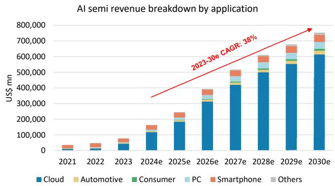  
Exhibit 1: We expect the AI semi TAM to reach nearly US \$753bn by 2030e   
Source: Company data, Gartner, Morgan Stanley Research. $\mathrm { { e = } }$ Morgan Stanley Research estimates.

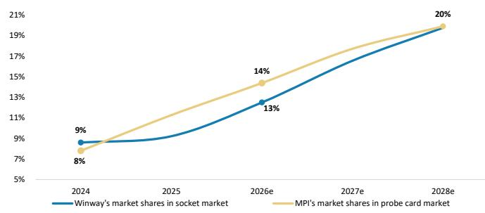  
Exhibit 3: We expect MPI and Winway's market share to expand to $20 \%$ in the global probe card and socket market in 2028e   
Source: Company data, Gartner, Morgan Stanley Research. $\mathrm { { e = } }$ Morgan Stanley Research estimates.

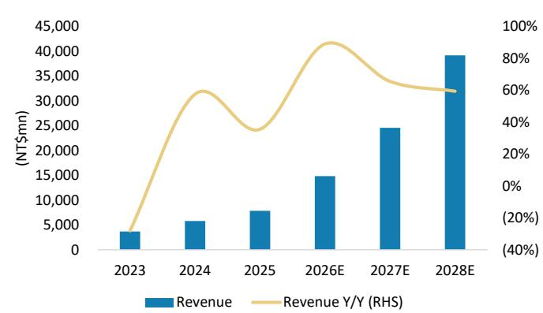  
Exhibit 5: We expect WinWay's revenue to rise at a $71 \%$ CAGR, 2025-28e   
Source: Company data, Morgan Stanley Research. $\in { } =$ Morgan Stanley Research estimates.

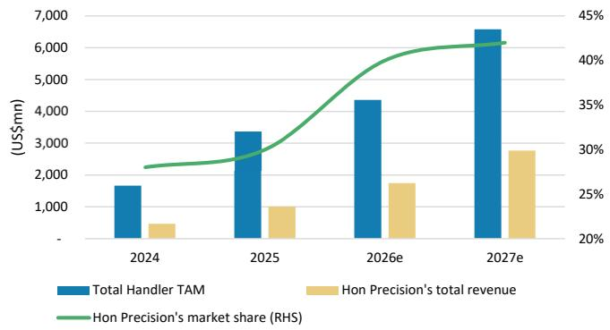  
Exhibit 2: We forecast Hon Precision's total handler market share to rise to $4 2 \%$ by 2027e   
Source: Company data, Gartner, Morgan Stanley Research. $\in { } =$ Morgan Stanley Research estimates.

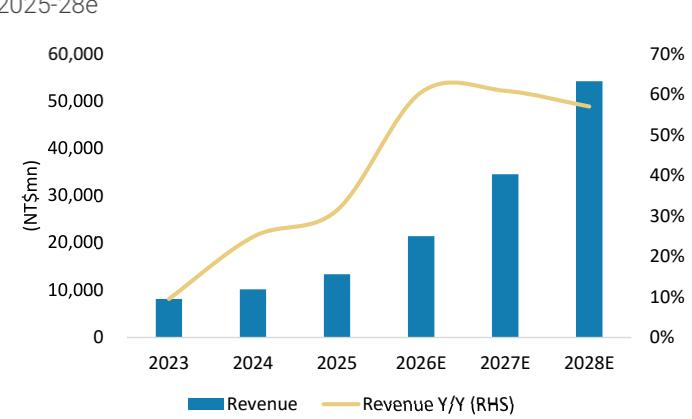  
Exhibit 4: We look for MPI's revenue to rise at a $6 6 \%$ CAGR,   
Source: Company data, Morgan Stanley Research. $\mathrm { { e = } }$ Morgan Stanley Research estimates.

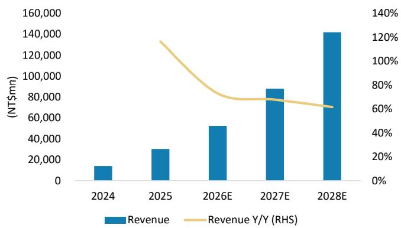  
Exhibit 6: We forecast Hon Precision's revenue to rise at a $67 \%$ CAGR, 2025-28e   
Source: Company data, Morgan Stanley Research. $\mathrm { { e = } }$ Morgan Stanley Research estimates.

# Executive Summary

We believe investors should increasingly focus on the semiconductor testing market now, as the industry is undergoing a structural inflection driven by AI, HPC, and advanced packaging. Unlike prior cycles where testing was viewed as a cost center, rising chip complexity (chiplets, HBM, 2.5D/3D packaging) is materially increasing test intensity, duration, and criticality, turning testing into a bottleneck for performance and yield. AI accelerators in particular require significantly longer and more complex testing (e.g., HBM 添加微信 LCD123321Cad 04-17 testing 5–10x longer than traditional DRAM), while emerging technologies such as CPO and system-level testing (SLT) add incremental test steps. This drives both volume growth and non-linear increases in content per chip, creating, in our view, a structurally attractive, underpenetrated growth opportunity across handlers, probe cards, and sockets.

Against this backdrop, we initiate Overweight (OW) ratings on Hon Precision, MPI, and WinWay, as all three are key enablers of this structural shift and are positioned to benefit from both AI-driven demand and rising testing intensity. Importantly, our estimates across all three names are generally above consensus, reflecting our view that the market is underappreciating the durability of AI-driven test demand, the magnitude of ASP expansion, and the incremental upside from new test insertions (SLT, CPO, burn-in).

# Hon Precision (OW): AI Testing Intensity – Underappreciated Earnings Upside

• We rate Hon Precision Overweight given its dominant position in AI/HPC test handlers ${ \sim } 7 0 \%$ share) and direct leverage to rising test time per chip. As AI chips   
加微信 LCD123321Cad 04-17 become larger and more power-dense, thermal management and testing duration are increasing significantly, driving both higher tool demand and ASP expansion via its ATC technology. In addition, new opportunities such as SLT, CPO (Insertion 4), and micro-channel lid testing further expand its addressable market.   
• Crucially, our forecasts are above consensus, with 2026/2027 EPS estimates ${ \sim } 1 0 \% / 2 0 \% +$ higher, driven by stronger AI demand, higher tool intensity, and earlier monetization of new test steps. We believe the market still underestimates the non-linear impact of longer test times, which can drive both higher utilization and incremental equipment demand, supporting a structurally higher growth and margin profile.

# MPI (OW): Probe Card Technology Leader with CPO Optionality

• We rate MPI Overweight as a key beneficiary of rising probe card complexity, particularly in MEMS and high-density VPC solutions required for AI and advanced 加微信 LCD123321Cad 04-17 nodes. Increasing pin counts, higher current requirements, and high-speed signal integrity needs are driving a structural upgrade cycle in probe cards, where MPI is gaining share. Its equipment segment also provides early-stage customer engagement and CPO-related upside, enhancing long-term growth optionality. Our estimates are meaningfully above consensus, particularly in outer years (e.g., 2027 EPS ${\sim } 3 0 \% +$ above), reflecting faster adoption of MEMS probe cards, improving mix, and incremental contribution from CPO testing. We believe consensus underestimates both structural ASP uplift from higher pin density and MPI’s ability to expand beyond traditional probe cards into higher-value testing solutions.

# WinWay (OW): Socket Leader Leveraging AI Packaging Complexity

• We rate WinWay Overweight given its leadership in test sockets and strong exposure to AI-driven increases in package size, pin count, and testing complexity. As chips scale toward $> 1 0 \boldsymbol { \mathrm { k } }$ pins and higher power requirements, sockets become critical for signal integrity and reliability, driving migration toward higher-end solutions such as coaxial sockets and hypersockets, which carry structurally higher ASPs and margins.

• Our forecasts are also above consensus (2026/2027 EPS \~10–20% higher), 加微信 LCD123321Cad 04-17 supported by faster adoption of hypersockets, rising SLT and burn-in demand, and improving product mix. We believe the market is underappreciating the margin inflection potential from hypersockets and the long-term earnings leverage from vertical integration and probe card expansion, positioning WinWay for sustained outperformance.

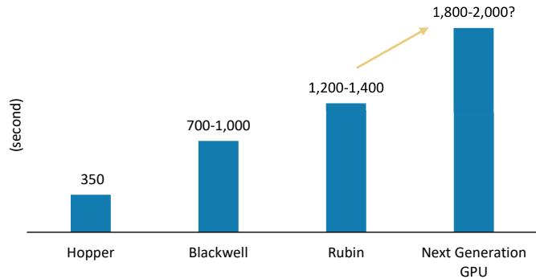  
Exhibit 7: We see chip testing time continuing to trend up   
AI GPU Chip Testing Time   
Source: Company data, Morgan Stanley Research

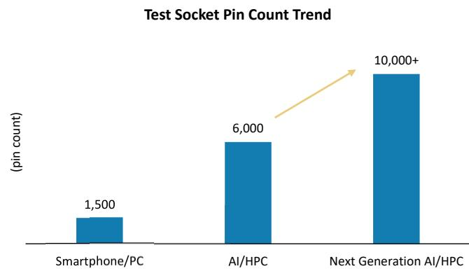  
Exhibit 9: AI/HPC test socket needs higher pin counts compared to traditional consumer tech applications   
Source: Company data, Morgan Stanley Research

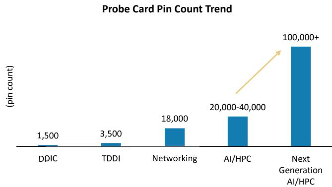  
Exhibit 8: AI/HPC probe cards require higher pin counts compared to traditional consumer tech applications   
Source: Company data, Morgan Stanley Research

# Global Testing Industry: Order of Preference

Exhibit 10: Global testing industry: Order of preference   

<table><tr><td></td><td>Winway 6515.TW</td><td>MPI 6223.TWO</td><td>Hon Precision 7769.TW</td><td>KYEC 2449.TW</td><td>TSMC 2330.TW</td><td>ASE 3711.TW</td><td>Chroma 2360.TW</td></tr><tr><td></td><td colspan="7"></td></tr><tr><td>Rating</td><td>Overweight</td><td>Overweight</td><td>Overweight</td><td>Overweight</td><td>Overweight</td><td>Overweight</td><td>Overweight</td></tr><tr><td>Trading Currency</td><td>TWD</td><td>TWD</td><td>TWD</td><td>TWD</td><td>TWD</td><td>TWD</td><td>TWD</td></tr><tr><td>Price Target</td><td>12,000.0</td><td>5,800.0</td><td>5,000.0</td><td>338.0</td><td>2,288.0</td><td>408.0</td><td>1,530.0</td></tr><tr><td>Current Price</td><td>9,820.0</td><td>4.915.0</td><td>加衡 4,295.0</td><td>LCD</td><td>283.53321C2.085.0</td><td>04-17450.5</td><td>2.050.0</td></tr><tr><td>Upside/(Downside) (%)</td><td>22%</td><td>18%</td><td>16%</td><td>19%</td><td>10%</td><td>-9%</td><td>-25%</td></tr><tr><td>Market Cap (in USD mm)</td><td>11,239.5</td><td>15,418.2</td><td>22,029.2</td><td>11,036.5</td><td>1,711,427.6</td><td>64,359.6</td><td>27,603.4</td></tr><tr><td>Avg Daily Traded Vol (in USD mm)</td><td>92.6</td><td>110.4</td><td>81.1</td><td>147.9</td><td>1,578.8</td><td>133.6</td><td>83.3</td></tr></table>

<table><tr><td colspan="8">StreetView:Ratings</td></tr><tr><td>Buy/Overweight</td><td colspan="2">100% 1100%</td><td colspan="2">1100%</td><td colspan="2">198% 2%</td></tr><tr><td>Hold/Equal-weight</td><td>0% 0%</td><td></td><td></td><td>180% 20%</td><td></td><td>100% 0%</td></tr><tr><td>Sell/Underweight</td><td>0%</td><td>0%</td><td>0% 0%</td><td></td><td>0% 0%</td><td>0%</td></tr><tr><td>Bull Case Value</td><td>15,000.0</td><td>8,000.0</td><td>8,000.0</td><td>415.0</td><td>2,760.0</td><td>1,900.0</td></tr><tr><td>Upside (%)</td><td>53%</td><td>63%</td><td>86%</td><td>46%</td><td>32%</td><td>-7%</td></tr><tr><td>Bear Case Value</td><td>9,000.0</td><td>2,500.0</td><td>2,500.0</td><td>215.0</td><td>260.0</td><td>680.0</td></tr><tr><td>Downside (%)</td><td>-8%</td><td>-49%</td><td>-42%</td><td>-24%</td><td></td><td>-67%</td></tr><tr><td>Risk/Reward Skew</td><td>6.3</td><td>1.3</td><td>2.1</td><td>1.9</td><td></td><td>(0.1)</td></tr><tr><td colspan="7">Morgan Stanley Estimates</td></tr><tr><td>FY26e</td><td>TWD</td><td>TWD</td><td>TWD</td><td>TWD</td><td>TWD</td><td>TWD</td></tr><tr><td>Sales</td><td>14,847</td><td>23,011</td><td>52,343</td><td>48,325</td><td>5,073,332</td><td>772,401 43,836</td></tr><tr><td>EBITDA</td><td>4,524</td><td>7,367</td><td>26,109</td><td>26,582</td><td>3,626,334 188,504</td><td>17,311</td></tr><tr><td>EBIT</td><td>4,524</td><td>7,367</td><td>26,041</td><td>14,709</td><td>2,827,031</td><td>16,519</td></tr><tr><td>EPS</td><td>103.90</td><td>64.08</td><td>116.17</td><td>9.84</td><td>95.60</td><td>33.07</td></tr><tr><td>FY27e</td><td></td><td></td><td></td><td></td><td></td><td></td></tr><tr><td>Sales</td><td>24,572</td><td>39,097</td><td>82,941</td><td>67,496</td><td>6,330,127 4,468,974</td><td>52,636</td></tr><tr><td>EBITDA</td><td>8,590</td><td>15,409</td><td>43,486</td><td>40,509</td><td>985,273 255,474</td><td>21,110</td></tr><tr><td>EBIT</td><td>8,590</td><td>15,409</td><td>43,417</td><td>21,711</td><td>133,874</td><td>20,248</td></tr><tr><td>EPS</td><td>196.87</td><td>133.18</td><td>193.10</td><td>14.45</td><td>3,470,515 116.57 23.17</td><td>40.17</td></tr><tr><td colspan="7">FY26 MSe vs.Consensus Mean</td></tr><tr><td>Sales</td><td>16.0%</td><td>10.3%</td><td>12.5%</td><td>-4.2%</td><td>1.0% 1.0%</td><td>2.1%</td></tr><tr><td>EBITDA</td><td>11.5%</td><td>1.1%</td><td>5.9%</td><td>3.5%</td><td>14.5%</td><td>1.9%</td></tr><tr><td>EBIT</td><td>20.6%</td><td>9.5%</td><td>8.7%</td><td>-5.1%</td><td>5.0% 1.0%</td><td>0.5%</td></tr><tr><td>EPS</td><td>25.0%</td><td>8.5%</td><td>6.0%</td><td>-4.3%</td><td>5.0%</td><td>-2.3%</td></tr><tr><td colspan="7">FY27 MSe Vs.Consensus Mean</td></tr><tr><td>Sales</td><td>22.7%</td><td>28.1%</td><td>24.9%</td><td>-3.3%</td><td>0.7%</td><td>-4.9%</td></tr><tr><td>EBITDA</td><td>18.1%</td><td>21.5%</td><td>21.1%</td><td>13.7%</td><td>-0.2%</td><td>-7.6%</td></tr><tr><td>EBIT</td><td>23.7%</td><td>48.5%</td><td>23.1%</td><td>-6.2%</td><td>-4.3%</td><td>15.1% -11.5%</td></tr><tr><td>EPS</td><td>23.3%</td><td>35.6%</td><td>20.7%</td><td>-3.1%</td><td>1.8%</td><td>10.7% -15.0%</td></tr><tr><td colspan="7">Valuation Multiplesat Last Close</td></tr><tr><td>FY26e P/E</td><td>94.5x</td><td>76.7x</td><td>37.0x</td><td>28.8x</td><td>21.8x 29.9x</td><td>62.0x</td></tr><tr><td>EV/EBIT</td><td>77.7x</td><td>65.4x</td><td>25.5x</td><td>26.2x</td><td>25.6x 11.9x</td><td>51.9x</td></tr><tr><td>EV/EBITDA</td><td>77.7x</td><td>65.4x</td><td>25.4x</td><td>14.5x</td><td>14.2x</td><td>49.6x</td></tr><tr><td>EV/Sales</td><td>23.7x</td><td>20.9x</td><td>12.7x</td><td>8.0x</td><td>10.1x</td><td>19.6x</td></tr><tr><td>FCF Yield</td><td>0.6%</td><td>0.7%</td><td>-0.9%</td><td>-5.5%</td><td>2.7%</td><td>1.3%</td></tr><tr><td colspan="7">FY27e</td></tr><tr><td>P/E</td><td>49.9x</td><td>36.9x</td><td>22.2x</td><td>19.6x</td><td>17.9x 19.4x</td><td>51.0x</td></tr><tr><td>EV/EBIT</td><td>40.7x</td><td>30.9x</td><td>15.5x</td><td>17.7x</td><td>14.5x</td><td>42.1x</td></tr><tr><td>EV/EBITDA</td><td>40.7x</td><td>30.9x</td><td>15.4x</td><td>9.5x</td><td>11.3x</td><td>8.9x 40.4x</td></tr><tr><td>EV/Sales</td><td>14.2x</td><td>12.2x</td><td>8.1x</td><td>5.7x</td><td>8.0x</td><td>2.3x 16.2x</td></tr><tr><td>FCF Yield</td><td>1.3%</td><td>1.6%</td><td>1.8%</td><td>1.9%</td><td>3.4%</td><td>1.8%</td></tr></table>

Source: Company data, FactSet, Morgan Stanley Research. $\in { } =$ Morgan Stanley Research estimates. Note: Current prices as of the market close on April 16, 2026, unless otherwise noted.

Exhibit 11: Testing supply chain valuation comparison   

<table><tr><td></td><td></td><td>Price Target</td><td>Cap</td><td>Market</td><td colspan="8"> EPS (Local Dollar)</td><td></td><td>ROE (%)</td><td>Trading</td></tr><tr><td>Ticker</td><td>Company</td><td>Rating</td><td>(LC）</td><td>(us$mn)</td><td>2024</td><td>2025</td><td>2026e</td><td>2027e</td><td>2028e</td><td>2024</td><td>2025e</td><td>P/E(x) 2026e</td><td>2027e</td><td>2028e</td><td>2025</td><td>Volume (mn)</td></tr><tr><td>6515.TW</td><td>Winway</td><td>。</td><td>12,000.0</td><td>9,614</td><td>33.8</td><td>46.6</td><td>103.9</td><td>196.9</td><td>347.5</td><td>253.4</td><td>183.7</td><td>82.4</td><td>43.5</td><td>24.6</td><td>27.9</td><td>0.5</td></tr><tr><td>6223.TWO</td><td>MPI</td><td>0</td><td>5,800.0</td><td>13,991</td><td>24.4</td><td>32.5</td><td>64.1</td><td>133.2</td><td>240.2</td><td>186.1</td><td>139.8</td><td>70.9</td><td>34.1</td><td>18.9</td><td>26.7</td><td>0.7</td></tr><tr><td>7769.TW</td><td>Hon Precision</td><td>。</td><td>5,000.0</td><td>23,174</td><td></td><td></td><td>116.2</td><td>193.1</td><td>308.3</td><td>NA</td><td>NA</td><td>35.3</td><td>21.2</td><td>13.3</td><td>34.5</td><td>0.8</td></tr><tr><td colspan="10">Greater China Probe Card Peers</td><td></td><td></td><td></td><td></td><td></td><td></td><td></td></tr><tr><td>6510.TWO</td><td>CHPT</td><td>NC</td><td>NA</td><td>3,523</td><td>15.5</td><td></td><td>61.1</td><td>114.6</td><td>NA</td><td>220.5</td><td>112.5</td><td>56.0</td><td>29.8</td><td>NA</td><td>11.9</td><td></td></tr><tr><td>6683.TWO</td><td>KSMT</td><td>NC</td><td>NA</td><td>1,587</td><td>17.4</td><td>30.4 15.2</td><td>18.7</td><td>19.0</td><td>NA</td><td>106.1</td><td>121.9</td><td>98.8</td><td>97.3</td><td>NA</td><td>15.9</td><td>0.6 0.3</td></tr><tr><td>7828.TWO</td><td>Inno-stars</td><td>NC</td><td>NA</td><td>1,527</td><td>4.1</td><td>5.6</td><td>10.7</td><td>14.0</td><td>NA</td><td>324.3</td><td>234.9</td><td>124.4</td><td>94.4</td><td>NA</td><td>25.0</td><td>0.8</td></tr><tr><td>Average</td><td></td><td></td><td></td><td></td><td></td><td></td><td></td><td></td><td></td><td>217.0</td><td>156.4</td><td>93.0</td><td>73.8</td><td>NA</td><td>17.6</td><td>0.9</td></tr><tr><td colspan="10">Global Probe CardandSocket Companies</td><td></td><td></td><td></td><td></td><td></td><td></td><td></td></tr><tr><td>6594.JP</td><td>Nidec</td><td>NC</td><td>NA</td><td>16,083</td><td>143.1</td><td>105.4</td><td>158.4</td><td>177.9</td><td>220.1</td><td>15.7</td><td>21.3</td><td>14.1</td><td>12.6</td><td>10.2</td><td>9.8</td><td>2.7</td></tr><tr><td>TPRO.IM</td><td>Technoprobe</td><td>NC</td><td>NA</td><td>12,245</td><td>0.1</td><td>0.2</td><td>0.3</td><td>0.4</td><td>0.5</td><td>161.4</td><td>96.7</td><td>64.3</td><td>46.0</td><td>34.3</td><td>7.9</td><td>0.4</td></tr><tr><td>SMIN.L</td><td>Smiths Group</td><td>NC</td><td>NA</td><td>10,275</td><td>0.7</td><td>1.2</td><td>1.1</td><td>1.2</td><td>1.4</td><td>35.0</td><td>20.9</td><td>23.2</td><td>20.5</td><td>17.9</td><td>12.8</td><td>0.7</td></tr><tr><td>FORM.O</td><td>FormFactor</td><td>NC</td><td>NA</td><td>9,995</td><td>0.9</td><td>1.3</td><td>1.8</td><td>2.2</td><td>NA</td><td>144.5</td><td>98.6</td><td>71.8</td><td>57.0</td><td>NA</td><td>5.5</td><td>4.2</td></tr><tr><td>058470.KQ</td><td>Leeno</td><td>0</td><td>77,000.00</td><td>5,779</td><td>1,492.6</td><td>1,997.2</td><td>2,349.6</td><td>2,841.2</td><td>3,580.4</td><td>76.0</td><td>56.8</td><td>48.3</td><td>39.9</td><td>31.7</td><td>22.4</td><td>0.6</td></tr><tr><td>095340.KR</td><td>ISC</td><td>NC</td><td>NA</td><td>2,975</td><td>2,621.9</td><td>2,750.5</td><td>4,092.3</td><td>5,413.6</td><td>7,496.1</td><td>82.6</td><td>78.7</td><td>52.9</td><td>40.0</td><td>28.9</td><td>10.6</td><td>0.7</td></tr><tr><td>6871.T</td><td>Micronics Japan</td><td>0</td><td>14,000.00</td><td>2,932</td><td>228.3</td><td>311.5</td><td>440.7</td><td>530.5</td><td>704.7</td><td>52.9</td><td>38.7</td><td>27.4</td><td>22.8</td><td>17.1</td><td>20.9</td><td>1.1</td></tr><tr><td>6941.JP</td><td>Yaimaichi</td><td>NC</td><td>NA</td><td>1,065</td><td>259.5</td><td>456.9</td><td>497.6</td><td>538.2</td><td>NA</td><td>35.6</td><td>20.2</td><td>18.6</td><td>17.2</td><td>NA</td><td>13.5</td><td>0.4</td></tr><tr><td>6855.T</td><td>JEM</td><td>NC</td><td>NA</td><td>606</td><td>273.5</td><td>347.8</td><td>371.5</td><td>403.1</td><td>NA</td><td>24.1</td><td>19.0</td><td>17.8</td><td>16.4</td><td>NA</td><td>13.1</td><td>0.6</td></tr><tr><td>6961.JP Average</td><td>Enplas</td><td>NC</td><td>NA</td><td>836</td><td>440.0</td><td>533.9</td><td>625.9</td><td>752.4</td><td>NA</td><td>33.7</td><td>27.8</td><td>23.7</td><td>19.7</td><td>NA</td><td>7.3 14.3</td><td>0.1 1.3</td></tr><tr><td colspan="10">Tester and Handler Equipment</td><td>66.1 47.9</td><td></td><td>36.2</td><td></td><td>29.2</td><td>23.4</td><td></td></tr><tr><td>6857.T</td><td>Advantest</td><td>0</td><td>30,000.00</td><td>107,901</td><td>218.0</td><td>461.5</td><td>659.9</td><td>804.0</td><td>857.3</td><td>114.1</td><td>53.9</td><td>37.7</td><td>30.9</td><td>29.0</td><td>34.4</td><td>6.5</td></tr><tr><td>TER.O</td><td>Teradyne</td><td>E</td><td>306.00</td><td>57,946</td><td>3.3</td><td>4.0</td><td>6.4</td><td>8.6</td><td>10.5</td><td>111.5</td><td>93.5</td><td>57.6</td><td>42.9</td><td>35.3</td><td>19.7</td><td>2.4</td></tr><tr><td>2360.TW</td><td>Chroma</td><td>0</td><td>1,530.00</td><td>25,019</td><td>12.4</td><td>27.1</td><td>34.9</td><td>47.6</td><td>47.6</td><td>151.8</td><td>69.4</td><td>53.8</td><td>39.5</td><td>39.5</td><td>41.2</td><td>4.6</td></tr><tr><td>300604.SZ</td><td>Hangzhou Changchuan</td><td>NC</td><td>NA</td><td>12,560</td><td>0.7</td><td>2.1</td><td>2.9</td><td>4.1</td><td>4.1</td><td>186.6</td><td>64.3</td><td>46.1</td><td>33.3</td><td>33.3</td><td>14.9</td><td>15.0</td></tr><tr><td>Cohu.0</td><td>Cohu</td><td>NC</td><td></td><td>1,768</td><td>(1.5)</td><td>(0.2)</td><td>0.5</td><td>1.2</td><td>1.2</td><td>NA 141.0</td><td>NA 70.3</td><td>70.3 53.1</td><td>30.6 35.5</td><td>30.6 33.6</td><td>(9.0) 30.5</td><td>0.8 3.5</td></tr><tr><td>Average</td><td></td><td></td><td>NA</td><td></td><td></td><td></td></table>

Source: Company data, FactSet, Morgan Stanley Research. $\in { } =$ Morgan Stanley Research estimates, while estimates for NC (Not Covered) companies are consensus estimates. Note: As of the market close on April 1 2026.

# Chip Testing Process and the Roles of Hon Precision, WinWay and MPI in the Semi Supply Chain

Testing process for semiconductor electrical testing: Semiconductor testers (electrical testing) verify that devices operate as designed. Precise control and analysis of input and output signals allow testers to identify functional and defective units, grade products by noise level (electronic signal fluctuations), and analyze defects. Test results support 添加微信 LCD123321Cad 04-17 performance improvements, shorten development cycles, enhance manufacturing quality, and improve yields.

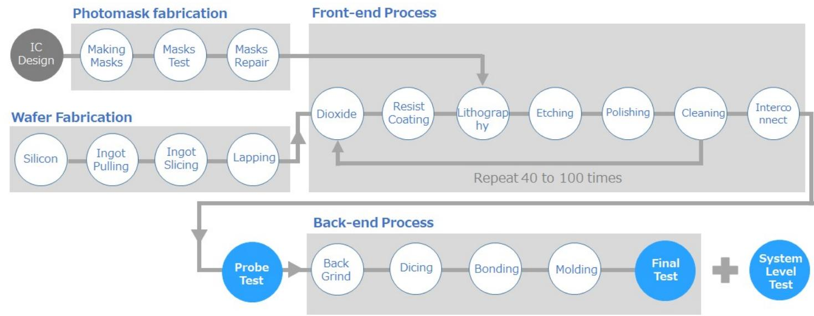  
Exhibit 12: The role of semiconductor testers   
Source: Morgan Stanley Research.

Tester categories: Testers determine whether semiconductor devices are fault-free or defective. Semiconductor testing includes wafer probing, which tests wafers before dicing, and final testing of completed devices after packaging. These stages use one or more of the following test types: DC testing, functional testing, and AC (timing compliance) testing ( Exhibit 13 ).

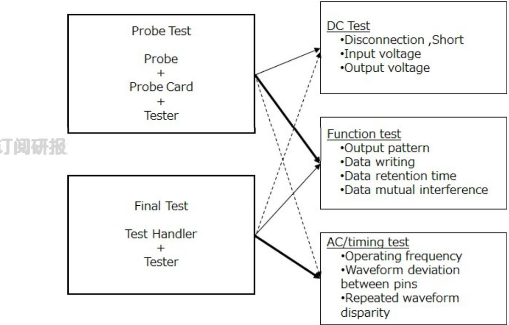  
Exhibit 13: Types of semiconductor testing   
Source: Morgan Stanley Research.

Different testers for different devices: Semiconductor testers include DRAM testers, flash memory testers, SoC testers, logic testers, LCD driver IC testers, CMOS/CCD center testers, and analog testers, depending on the device being tested. In this report, we classify testers into two categories: memory testers and SoC testers (non-memory testers).

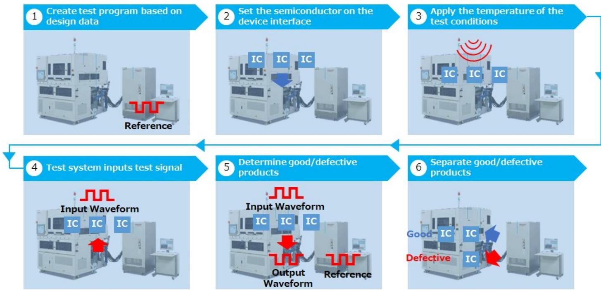  
Exhibit 14: Test program creation: Testing flow for mass production devices   
Source: Advantest.

DC parametric testing checks basic functioning: DC parametric testing applies current to verify whether a device produces the specified output voltage, applies voltage to verify whether it produces the specified current, and checks for open circuits and electrical shorts. This represents the most basic form of semiconductor testing.

Functional testing checks device functionality: Functional testing assesses whether a device operates as specified. It verifies the ability of logic circuits to process digital data (calculation) and of memory devices to read and write data. This represents the most time intensive testing process.

添加微信 LCD123321Cad 04-17 Checking for mutual interference takes time: For memory devices, this testing process assesses not only whether the individual memory cells function correctly, but also pattern dependence, storage time, potential interference from neighboring cells, and read/write speed. Functionality testing applies predefined test patterns ( Exhibit 15 ), which consist address sequences used to access memory location and data written into the memory cells. The industry has developed a wide range of test patterns to enable efficient defect detection.

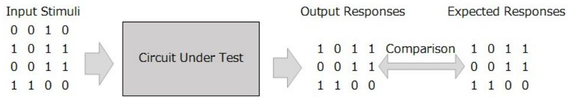  
Exhibit 15: Test pattern   
Source: Morgan Stanley Research.

Test pattern revision to reduce test duration: The test pattern required to check N cells typically involves between ${ \mathsf { N } } { \boldsymbol { \Lambda } } { \mathsf { 1 . 5 } }$ and $\mathsf { N } \wedge 2$ steps. Consequently, as memory density has increased, testing time has risen sharply. In response, device designers have increasingly developed proprietary test patterns tailored to their specific products, rather than relying on conventional ${ \mathsf { N } } \wedge 1 . 5 - { \mathsf { N } } \wedge 2$ step patterns that entail lengthy testing and evaluation cycles. CPUs and other logic devices integrate a broad range of functions, making careful test pattern design vital to achieving sufficient coverage within a limited testing timeframe.

Highly complex AC parametric testing to verify high-speed signal waveform: AC parametric testing evaluates output signal waveform. In digital circuits, the output signal represents either 0 or 1. The signal should register as 1 when the output voltage exceeds a defined threshold value and as 0 when the output voltage does not. AC parametric testing verifies that the voltage exceeds the threshold value when the signal is 1 and remains below it when the signal is 0. It also checks whether the signal transitions from 0 to 1 within the specified timeframe, identifies timing mismatches across different pins, and detects waveform timing errors at individual pins.

订阅研报

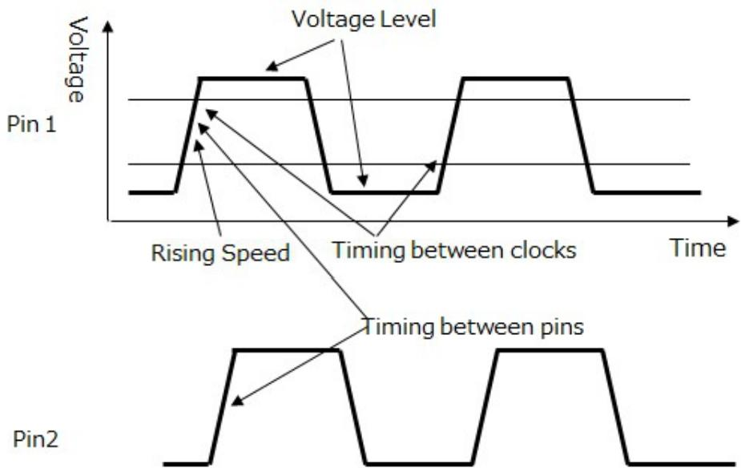  
Source: Semiconductor Equipment Association of Japan (SEAJ).

Faster device speeds make testing more difficult: Memory and logic devices have rapidly shifted toward higher operating speeds, significantly increasing the complexity of output waveform timing verification. This trend has intensified competition between tester manufacturers and driven tester prices higher.

Probe testing and final testing: As noted earlier, probe testing ( Exhibit 17 ) tests individual chips on a wafer. The wafer is mounted on a wafer prober, and pins on the probe card connected to the tester make contact with the bonding pads on each chip. By contrast, final testing ( Exhibit 18 ) takes place after burn-in to screen for early-life failure once device assembly is complete. In this stage, a handler picks up the device under test from a storage tray and inserts it into a test socket connected to the test head.

Noise is the enemy in probe testing: Probe testing relies on probe cards and wafer probes, which can introduce electrical signal noise and signal variation across pins. As a result, certain AC parametric tests – particularly waveform testing for high-speed processors– as well as portions of functional testing, are typically performed during final testing..

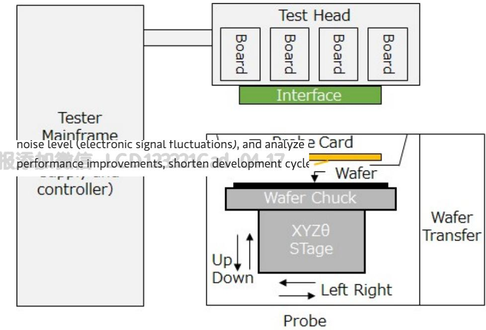  
Exhibit 17: Probe testing (tester $^ +$ wafer prober $^ +$ probe cards)   
Source: Morgan Stanley Research.

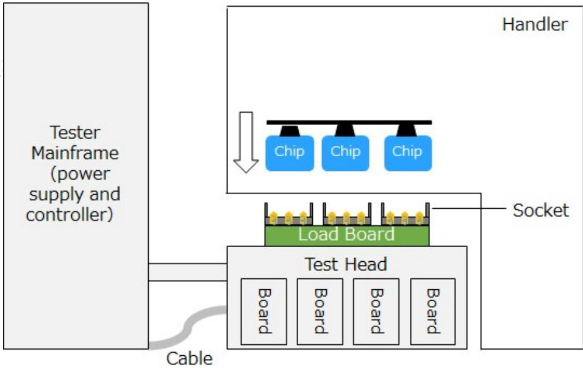  
Exhibit 18: Final testing (tester $^ +$ handler)   
Source: Morgan Stanley Research.

# Mapping and the Roles of Hon Precision, WinWay and MPI in the Semi Supply Chain

Exhibit 19: Wafer manufacturing & testing and chip testing progress: MPI, Hon Precision and WinWay are key enablers

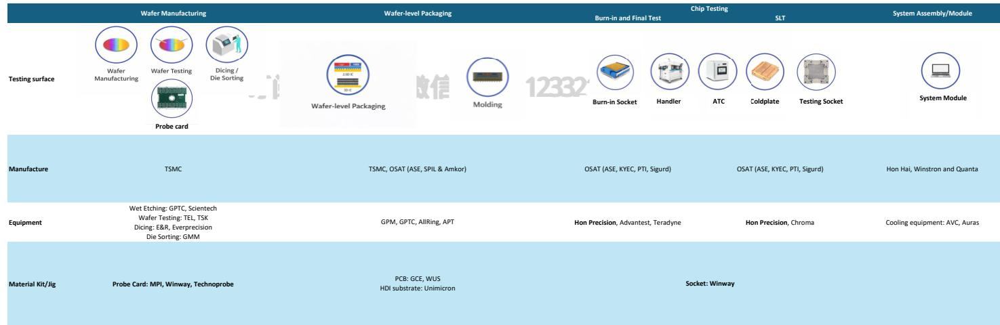  
Source: Morgan Stanley Research.

# #1: Sizing the AI TAM and Semi Test Equipment and Consumable Market

We expect the global AI market to rise at a $3 8 \%$ CAGR, 2023-2030e, reaching US $\$ 7536n$ , mainly driven by the strong cloud-related demand, including GPUs, AI ASICs, CPUs, and related peripherals. We also expect TSMC and its OSAT partners 加微信 LCD123321Cato continue expanding its front-end $2 / 3 n m$ -17  and CoWoS capacity.

Against this backdrop, we expect the global testing equipment market to grow strongly, reaching $\mathsf { U S S 7 1 . 5 b n }$ in 2026 $4 4 0 \%$ YoY) and $\cup \ S \$ 13.7$ bn in 2027 ( $+ 7 9 \%$ YoY), implying a ${ \sim } 3 5 \%$ CAGR over 2024–27e, with testing intensity remaining elevated at \~100bps. This growth is driven by shorter time-to-market requirements, HBM-driven demand for more advanced testing, and the increasing adoption of chiplet architectures, all of which expand testing across wafer, final, and system-level stages.

Within this ecosystem, high-end testing interfaces are seeing the strongest structural tailwinds: the probe card market is set to grow at $\sim 2 5 \%$ CAGR, led by MEMS and VPC adoption for high-pin-count AI chips, while the socket market is expected to grow at ${ \sim } 2 0 \%$ CAGR, supported by rising SLT/burn-in requirements and increasing package complexity. We see MPI benefiting from share gains in MEMS probe cards, while WinWay is well positioned to expand in VPC and 加微信 LCD123321Cad 04-17 advanced socket solutions (e.g., hypersockets), supported by deeper integration into TSMC and OSAT ecosystems and strong exposure to leading AI customers.

For the test and burn-in socket market, we project it will grow from $\mathsf { U S S 1 } , \mathsf { S 8 9 m n }$ in 2024 to $\cup 5 \$ 4,775 m$ in 2030e, implying a $20 \%$ CAGR, driven mainly by rising pin counts, longer testing times, and strong AI/HPC-related demand. Given WinWay's close relationships with major AI and HPC customers, including NVIDIA, AMD, and custom ASIC designers, we expect its market share to grow from $8 . 6 \%$ in 2024 to $20 \%$ by 2028e.

# How big is the AI TAM?

# 订阅研报

According to Gartner, the global semiconductor market is set for strong growth, supported by advances in AI processing, data center networking and power infrastructure, and a sharp increase in memory pricing. Gartner projects industry revenue to grow by 添加微信 LCD123321Cad 04-17 63.9% in 2026 to US\$1.32trn, highlighting the semiconductor industry's increasingly important role in the AI value chain.

We expect AI semiconductors – the driving force behind this growth – to account for about $30 \%$ of total semiconductor sales in 2026, rising to nearly $45 \%$ by 2030. Hyperscaler investment in AI infrastructure build-outs remains robust, with spending projected to increase by more than $50 \%$ in 2026. This investment continues to drive demand for AI accelerators, including both GPU and custom non-GPU solutions.

The AI accelerator market represents the largest growth opportunity, with total revenue estimated at nearly $\mathsf { U S S 3 0 0 b n }$ across end-markets over the forecast period. Serverfocused accelerator sales are expected to increase by $7 1 \% ,$ reaching $\cup \mathsf { S$ 1 8 2 . 5 }$ bn in 2026, with a long-term CAGR of $30 \%$ driving the segment to approximately US\$400bn by 2030. While NVIDIA (covered by Joe Moore) should maintain its dominance in GPU-based AI acceleration, hyperscalers are actively advancing custom (non-GPU) AI accelerator strategies, supported by strategic partnerships with leading semiconductor vendors such as Broadcom, Marvell, and others.

Over the past two years, TSMC’s CoWoS capacity expansion and allocation have been key leading indicators for global AI GPU and AI ASIC revenue. While end customer demand – particularly from NVIDIA’s customers – represents the true underlying driver, we find that global cloud AI semi revenue forecasts are now converging with TSMC’s CoWoS implied chip shipments. The risks to AI semi foundry demand appear limited in 2026, as TSMC’s foundry capacity, especially 3nm, remains constrained. These supply limitations should help prevent oversupply and mitigate concerns around a potential “AI bubble” correction. We maintain our Attractive industry view on Greater China Semiconductors. However, from 2027 onwards, uncertainties may emerge on both the supply and demand sides:

• Supply side – fab cleanroom capacity: TSMC is approaching capacity limits in its existing fab cleanrooms in Taiwan, which is accelerating the need to ramp up overseas fab construction, particularly in the US. Demand side – power infrastructure: Even if TSMC can supply sufficient chips to meet customers’ strong AI demand, uncertainty remains whether power shortages in the US could be resolved to support large scale AI infrastructure deployment.

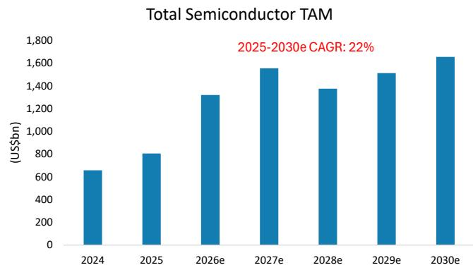  
订阅研报添加微信 LCD1Exhibit 20: Gartner expects the global semi TAM to reach US E \$1,656bn in 2030e, or a $2 2 \%$ CAGR, 2025-30e   
Source: Company data, Gartner, Morgan Stanley Research. $\mathrm { { e = } }$ Morgan Stanley Research estimates.

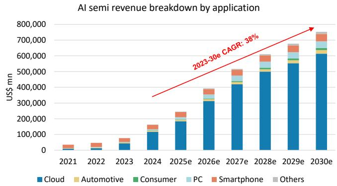  
23321Cad 04-17 xhibit 21: We expect the AI semi TAM to reach nearly US \$753bn by 2030   
Source: Company data, Gartner, Morgan Stanley Research. $\in { } =$ Morgan Stanley Research estimates.

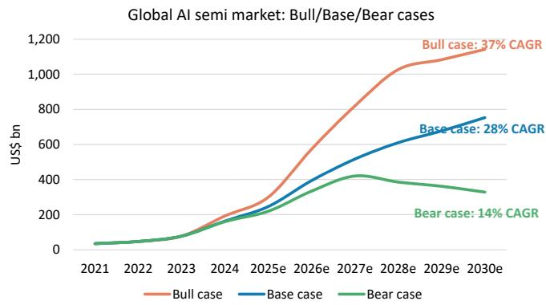  
Exhibit 22: Global AI semi market: Bull/Base/Bear case scenarios   
Source: Company data, Gartner, Morgan Stanley Research. $\mathrm { { e = } }$ Morgan Stanley Research estimates.

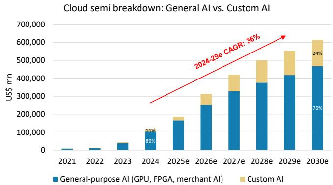  
Exhibit 24: We expect the cloud semi TAM to reach nearly US \$614bn by 2030, growing at $3 6 \%$ CAGR   
Source: Company data, Gartner, Morgan Stanley Research. $\mathrm { { e = } }$ Morgan Stanley Research estimates.

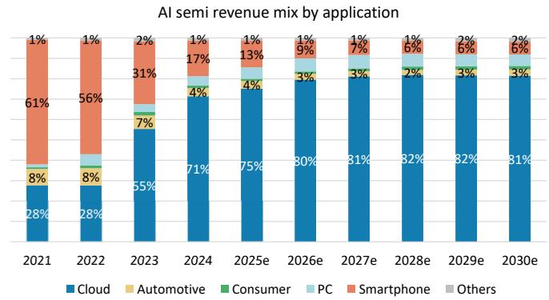  
Exhibit 23: Global AI semi market mix, by application   
Source: Company data, Gartner, Morgan Stanley Research. $\in { } =$ Morgan Stanley Research estimates.

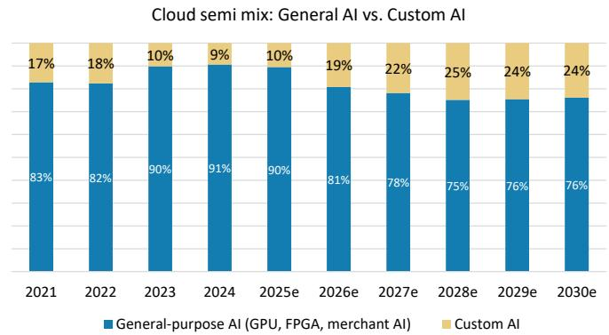  
Exhibit 25: General purpose AI remains the key end-market for the overall cloud market   
Source: Company data, Gartner, Morgan Stanley Research. $\in { } =$ Morgan Stanley Research estimates.

# TSMC and OSAT capex continues to increase

During TSMC's 4Q25 earnings call, the company guided full-year 2026 capex at $\cup \mathsf { S$ 52 } .$ 56bn, above our prior estimate of US\$49bn. Management also indicated that capex is likely to step up further in coming years, supported by very strong AI-related demand, and noted that tool costs continue to rise at leading-edge nodes.

Additionally, based on our recent conversations with TSMC’s equipment and chemical suppliers, we observe that its infrastructure build-out – particularly cleanroom additions – is proceeding more aggressively than we previously estimated. Between now and end-2027, TSMC plans to construct 12 front-end fabs, including advanced 3nm fabs in Arizona and Kumamoto, as well as four advanced packaging fabs. In light of these developments, we now forecast TSMC’s capex for 2027 to reach US\$65bn and 2028 capex at US\$70bn.

We also see a clear upward trend in OSATs capex. Total OSAT spend has increased from US\$4.7bn in 2023 following the post-Covid-19 correction, to $\cup \mathsf { S } \$ 8$ 15bn in 2026e. This increase is driven primarily by AI-related demand. Companies such as ASE are receiving increased outsourcing from TSMC, while testing houses such as KYEC are benefitting from longer test times for AI-related chips (e.g., GPUs). Other OSATs, including Amkor, JCET, and Powertech, are also developing more advanced packaging solutions.

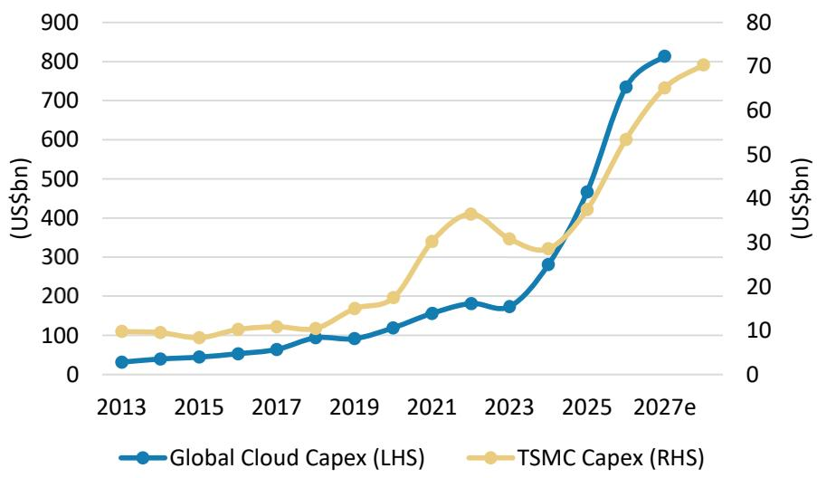  
Exhibit 26: Global Cloud Capex vs. TSMC capex   
Source: Company data, Gartner, Morgan Stanley Research. $\mathrm { { e = } }$ Morgan Stanley Research estimates.

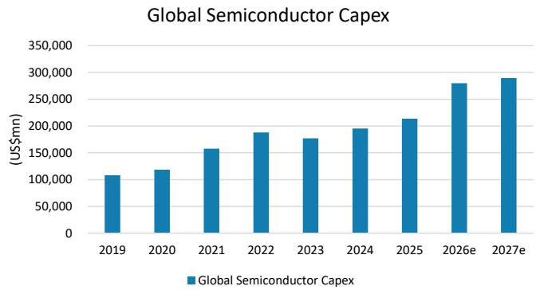  
Exhibit 27: Global semi capex to grow to US\$290bn in 2027e   
Source: Company data, Gartner, Morgan Stanley Research. $\mathrm { { e = } }$ Morgan Stanley Research estimates.

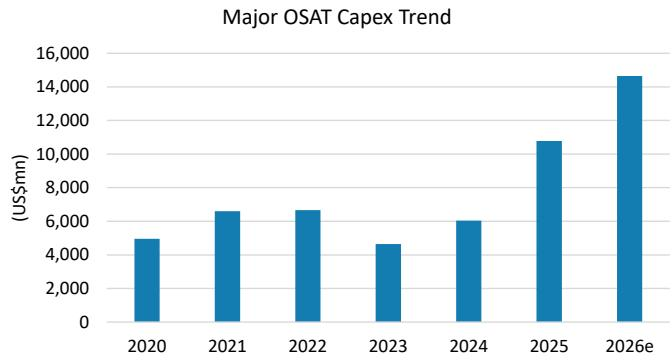  
Exhibit 28: Major OSAT capex to grow to US\$14.7bn in 2026e   
Source: Company data, Gartner, Morgan Stanley Research. $\in { } =$ Morgan Stanley Research estimates.

# Global Testing Equipment Market

Our Morgan Stanley Global Semiconductors Research team published a deep-dive report on the global testing market (see Semiconductor Capital Equipment: Tester Market: Transforming into Growth Market on AI Boon; Advantest Our Top Pick (21 Aug 2024)), highlighting that the global testing market is becoming structurally stronger. We identify three key drivers underpinning this shift: 1) shorter time-to-market, which is increasing testing as a percentage of high-performance computing (HPC) product pricing, 2) DRAM evolution, particularly high-bandwidth memory (HBM), which is driving demand for new 添加微信 LCD123321Cad 04-17 testers, and 3) the adoption of chiplet architectures, which is expanding test requirements across die-level, final, and system-level testing. Across these drivers, a common theme has emerged – testing is transitioning from a cost-minimization step where to a critical stage where customers place greater importance on improving yield and performance.

Our Morgan Stanley Global Semiconductors Research team currently forecasts the global testing TAM to reach $\mathsf { U S S 1 1 . 5 b n }$ $( + 4 0 \%$ Y/Y) in 2026 and $\cup S \$ 13.76 n$ $4 7 9 \%$ Y/Y) in 2027, implying that testing intensity remains elevated at \~100bps. This outlook reflects the structural shift of testing from a cost center to an increasingly value-add step in the semiconductor manufacturing process (for further details see the section, Global

# Implications ).

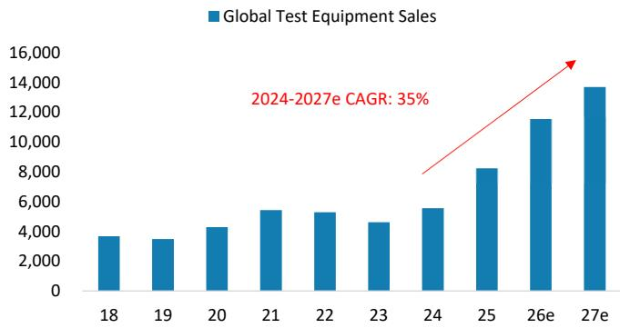  
Exhibit 29: Our Morgan Stanley Global Semiconductors Research team models the testing market to grow $40 \%$ Y/Y in 2026 and $1 9 \%$ Y/Y in $2 0 2 7 ,$ or $3 5 \%$ CAGR, 2024-27e...   
Source: Company data, Morgan Stanley Research. $\in { } =$ Morgan Stanley Research estimates.

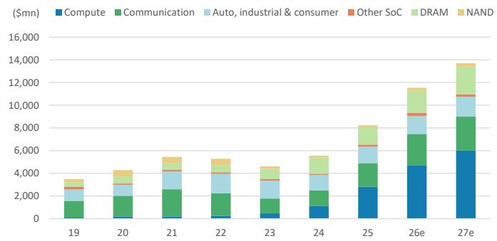  
Exhibit 31: We model compute to surpass $5 0 \%$ of SoC testing in 2026, up from $2 9 \%$ in 2024…   
Source: Company data, Morgan Stanley Research. $\in { } =$ Morgan Stanley Research estimates.

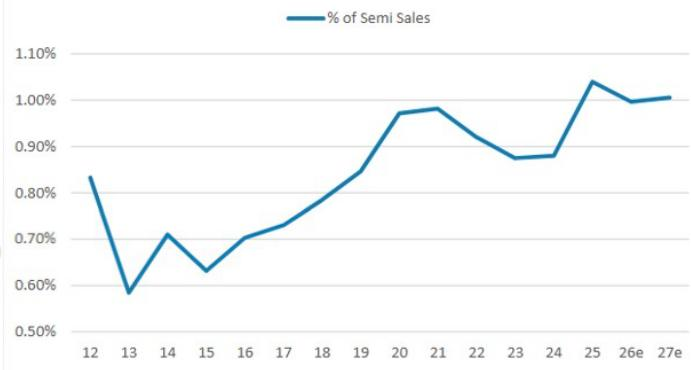  
Exhibit 30: ...and testing intensity to stay above 100bp.   
Source: Company data, Morgan Stanley Research. $\mathrm { { e = } }$ Morgan Stanley Research estimates.

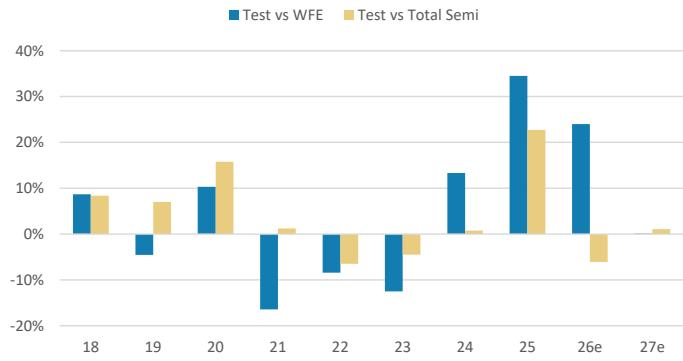  
Exhibit 32: Testing growth $Y / \mathsf { Y } \%$ vs the market   
Source: Company data, Morgan Stanley Research. $\mathrm { { e = } }$ Morgan Stanley Research estimates.

# Testing Handler Market

Handlers are essential automation tools for picking and placing ICs during the final testing (FT) and system-level testing (SLT) stages. In the FT process, ICs are picked up from IC trays by handlers and positioned at the testing site for evaluation by testers such Advantest's V93000 made by or Teradyne's UltraFLEX. Each tester is paired with a handler, underscoring the handler's critical role in the testing value chain. Key handler suppliers include Hon Precision, Cohu, Chroma, Changchuan Technology, and JHT Semiconductor (JHT). Hon Precision holds over $70 \%$ market share in the AI/HPC handler segment and roughly $30 \%$ of the overall handler market.

Considering Hon Precision holds roughly $30 \%$ of the overall handler market, we expect handlers to account for $0 . 5 \%$ and $0 . 9 \%$ of global WFE market in 2024 and 2025, respectively. We expect the overall handler market to expand to around $1 . 7 \%$ of global WFE over time, driven primarily by strong AI demand, longer testing times, and rising testing requirements such as co-packaged optics (CPO). As the clear leader in the AI/HPC handler market with over $70 \%$ market share, we expect Hon Precision to further increase its overall handler market share from $30 \%$ in $2 0 2 4 - 2 5$ to $40 \%$ by 2027e. This market share expansion should support a revenue CAGR of $8 \%$ , 2024-27e, and $6 7 \%$ , 2025-28e.

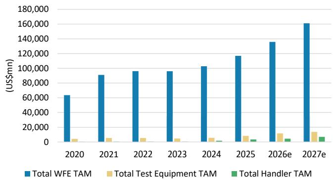  
Exhibit 33: We expect the overall handler market to increase from US\$436mn in 2023 to US\$6.6bn in 2027e   
Source: SEMI, company data, Morgan Stanley Research. $\mathrm { { e = } }$ Morgan Stanley Research estimates.

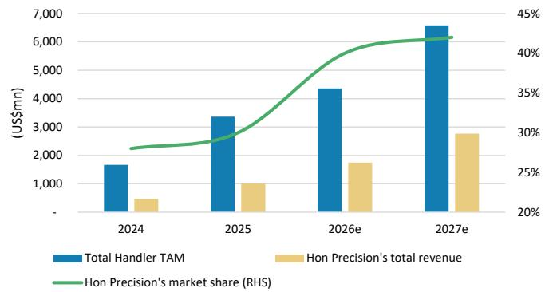  
Exhibit 35: Hon Precision to grow its total handler market share from $2 8 \%$ in 2024 to $4 2 \%$ by $2 0 2 7 \Theta$   
Source: SEMI, company data, Morgan Stanley Research. $\mathrm { { e = } }$ Morgan Stanley Research estimates.

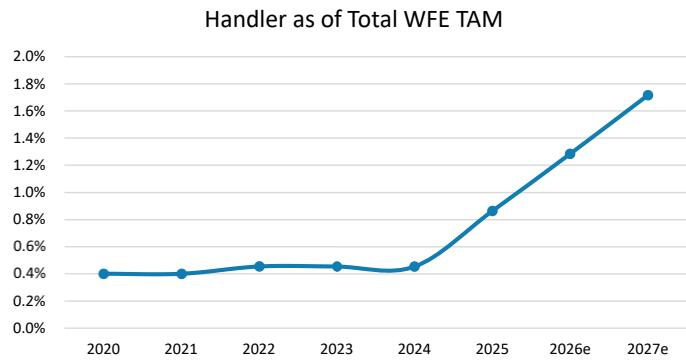  
Exhibit 34: We expect handlers to account for $1 . 7 \%$ of global WFE TAM in 2027e, vs $0 . 4 \%$ in 2020   
Source: SEMI, company data, Morgan Stanley Research. $\in { } =$ Morgan Stanley Research estimates.

# Probe Card Market – What is a Probe Card?

After wafer fabrication and entry into advanced packaging, and before dicing and CoWoS processing, each die must undergo testing. The testing cell comprises several components. Testers supplied by vendors such as Advantest and Teradyne generate test vectors and measure device responses. The prober handles the wafer and aligns it under tightly controlled environmental conditions. Positioned between the tester and the wafer is the probe card, which serves as the critical interface between the tester electronics and the microscopic pads on the wafer. the probe card carries electrical current, transmits highfrequency signals, and ensures mechanical compliance across thousands of contact points.

To simplify, a probe card is an electromechanical interface used to test chip functionality 添加微信 LCD123321Cad 04-17 while the device remains on the wafer, prior to dicing and individual packaging. As advanced packaging has evolved, test interfaces have become inseparable from overall system performance. The probe card has therefore emerged as a critical enabler, ensuring that the dies entering advanced packaging are functional, reliable, and capable of withstanding the stresses of advanced assembly and operation.

This mechanical sensitivity requires low-force probing and highly compliant probe card systems, particularly when contacting small micro-bumps. In addition, positional variability of dies after singulation – often while still mounted on a film frame – demands sophisticated alignment capability and stable contact mechanics from the probe card to ensure consistent, multi-site testing. During wafer probing, the probe card makes physical contact with the chip’s pads or micro-bumps. Once proper contact is established, the probe card provides the electrical interface between the chip and the tester, enabling performance verification and defect identification. Because each chip design features distinctive pad layouts and electrical requirements, probe cards are custom-designed for the specific device being tested.

For high-power AI devices, transitional wafer-level probing is insufficient due to thermal limitation. High-power AI chips generate substantial heat during testing. Wafer-level thermal management relies largely on passive heat conduction through the silicon substrate, whereas die testing requires active thermal control to rapidly stabilize the temperature, prevent hot spot migration, and maintain consistent electrical behavior. In addition, physical factors such as electrical noise, contact resistance drift over time, and systematic wear or contamination of probe tips can introduce noise into measurement signals before digitization. As a result, the industry has begun deploying new solutions that incorporate active thermal control specifically for bare-die testing, allowing manufacturers to execute full, at-speed final-testing programs at the die level. The ability to guarantee known-good die (KGD) is now directly contingent upon the stability, precision, and physical compliance of the probing technology used in this critical screening step.

# How Is Probe Card Evolving?

The rapid scaling of AI and HPC workloads is driving a structural shift in probe card requirements, with high pin count emerging as a critical enabler of advanced device b¥mûR _®Oá   LCD123321Cad   04-17 testing. As leading-edge processors adopt increasingly complex architectures – featuring chiplet designs, heterogeneous integration, and advanced packaging (e.g., 2.5D/3D) – the number of I/O connections per device continues to rise significantly. This trend requires probe cards that can support much higher pin densities while maintaining precise alignment and signal integrity. As a result, we expect sustained demand for vertical and MEMS probe technologies, which are better suited to accommodate ultra-high pin-count configurations than traditional cantilever solutions.

In parallel, the rising power requirements of AI accelerators and HPC chips are increasing the importance of high current-carrying capacity in probe card design. Next-generation GPUs and custom AI ASICs operate at higher current levels to support greater compute throughput and memory bandwidth, placing increased electrical and thermal stress on probe interfaces during wafer testing. Probe cards must therefore adopt materials and structures that minimize resistance and thermal buildup, ensuring stable electrical contact under high-load conditions. This trend is likely to accelerate the adoption of advanced probe materials and enhanced thermal-management solutions, as reliability and yield become increasingly sensitive to current-induced degradation during testing.

Finally, the need for high-speed signal transmission is becoming a defining feature of probe card evolution, driven by the growing adoption of HBM, chip-to-chip interconnects, and high-frequency SerDes interfaces in AI and HPC devices. Testing these components requires probe cards that can support multi-gigahertz signal frequencies with minimal signal loss, crosstalk, and impedance mismatch. As a result, probe card suppliers are investing in advanced design architectures and materials to enable high-frequency performance, including improved shielding, shorter signal paths, and tighter impedance and thermal challenges will be best positioned to benefit from the next phase of AI-driven semiconductor scaling.

# Sizing the probe card market

The probe card market reached $\mathsf { U S S } \$ 2,520 m n$ in 2024, accounting for around $1 7 \%$ of the total testing equipment & consumables. We estimate the market will achieve a $2 5 \%$ CAGR, 2024-30e, with revenue reaching $\mathsf { U S S 9 } , 7 9 8 \mathsf { m n }$ in 2030e, up from $\mathsf { U S S } \$ 2,520 m$ in 2024. This growth will be driven primarily by longer testing times, higher pin counts, the emergence of new applications such as CPO, and increased wafer output, partly supported by strong AI-related demand. By segment, we expect MEMS probe cards to lead with a $2 5 . 3 \%$ CAGR, 2024-30e, followed by VPCs at $2 5 . 2 \%$ and cantilever probe card (CPC) at $1 5 \%$ . This reflects the widespread adoption of MEMS and VPC solutions in high end logic ICs and AI related applications such as accelerators and GPUs. The probe card market has historically been led by overseas vendors, including FormFactor and Technoprobe. However, we expect MPI to continue gaining market share, reaching $\sim 2 0 \%$ by 2028e from $8 \%$ in $2 0 2 4$ and $1 7 \%$ in 2025e.

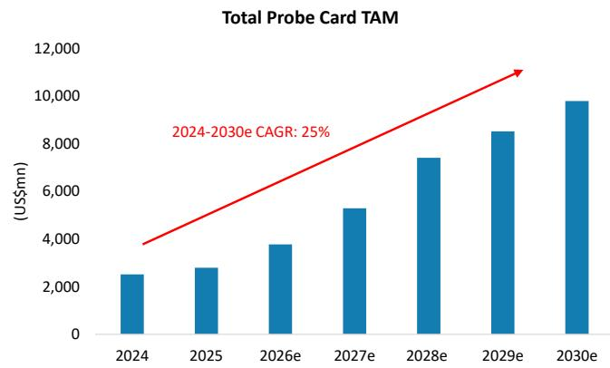  
Exhibit 37: We expect the probe card market to rise at a $2 5 \%$ CAGR, 2024-30e   
Source: Company data, Yole, Morgan Stanley Research. $\mathrm { { e = } }$ Morgan Stanley Research estimates.

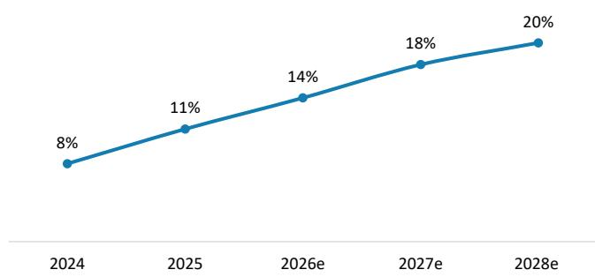  
Exhibit 39: We expect MPI's probe card market share to grow from $8 \%$ in 2024 to $20 \%$ by 2028e   
MPI's Market Share in Total Probe Card Market   
Source: Company data, Yole, Morgan Stanley Research. $\mathrm { { e = } }$ Morgan Stanley Research estimates.

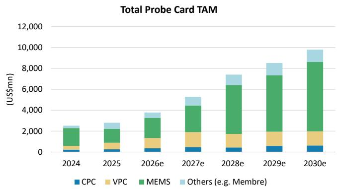  
Exhibit 38: Global probe card market: We expect MEMS to continue to account for most of the consumption   
Source: Company data, Yole, Morgan Stanley Research. $\in { } =$ Morgan Stanley Research estimates.

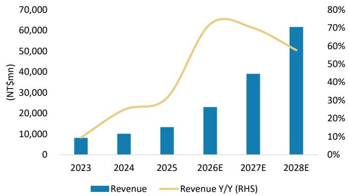  
Exhibit 40: MPI's revenue to grow at a $5 0 \%$ CAGR 2023-28e   
Source: Company data, Yole, Morgan Stanley Research. $\in { } =$ Morgan Stanley Research estimates.

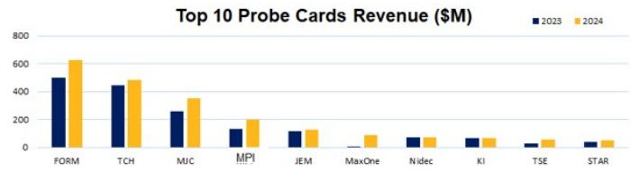  
Exhibit 41: Total self-produced IC probe card vendors   
Source: Company data, Morgan Stanley Research.

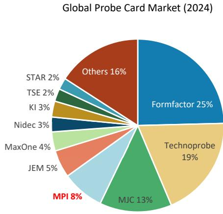  
Exhibit 42: Global probe card market   
Source: Company data, Yole, Morgan Stanley Research

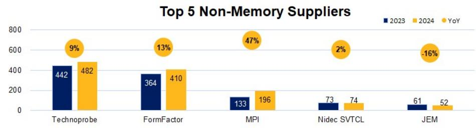  
Exhibit 43: Top 5 non-memory probe card vendors   
Source: Company data, Gartner, Morgan Stanley Research

# 1) Cantilever Probe Card (CPC)

The CPC market reached a TAM of $\mathsf { U S S 2 3 3 m n }$ in $2 0 2 4$ , accounting for $9 \%$ of the total probe card market. CPCs are primarily used in testing display driver integrated circuits (DDIC), which are manufactured using mature process nodes. MPI is the leader in the CPC market with $2 5 \%$ of market share, followed by Nidec $( 7 0 \% )$ and STAR Technologies $( 7 \% )$ . MPI currently has a monthly production capacity of $5 0 0 \mathrm { k }$ pins for CPC, and we expects this to remain a stable cash generating business for MPI. MPI's DDIC customers include the key suppliers, such as Novatek, Raydium, Ilitek and Himax.

# 订阅研报

# 2) Vertical Probe Card (VPC)

The VPC market reached a TAM of $\mathsf { U S S 3 7 3 m n }$ in $2 0 2 4$ , accounting for around $1 5 \%$ of the total probe card market. While the market appears fragmented, barriers to entry remain 添加微信 LCD123321Cad 04-17 high given VPCs are primarily used in non-memory IC testing and require a high degree of customization. VPCs are increasingly deployed in AI ASICs for cloud service providers $( \mathsf { C S P S } )$ , networking chips, and general-purpose processors. The market delivered strong $30 \%$ Y/Y growth in $2 0 2 4$ , driven by robust AI ASIC demand and an expanding development pipeline. MPI’s VPC market share rose from $2 2 \%$ in 2023 to $3 7 \%$ in 2024, supported by its relationships with key customers such as Broadcom and Marvell. WinWay also generated $7 7 \%$ of its 2024 revenue from VPCs, mainly for testing NVIDIA’s gaming GPUs and Grace CPUs. Looking ahead, we expect the VPC market to grow to $\mathsf { U S S 1 } , 3 3 8 \mathsf { m n } _ { \ r { \ r { \ r { \ r { \ r { \ r } } } } } }$ , implying a $2 5 \%$ CAGR over 2024–30E, supported by continued node migration in select non-AI applications, which should further drive VPC demand.

# 3) Micro-Electro-Mechanical Systems (MEMS) Probe Card

The MEMS probe card market is the largest among the three probe card segments, reaching a TAM of $\cup \mathsf { S } \$ 1$ ,711mn in $2 0 2 4$ , or approximately $6 8 \%$ of the total probe card market. Around $2 5 \%$ of MEMS probe cards are used for memory IC testing, while the remainder serves advanced logic applications, including AI GPUs, CPUs, and smartphone application processors (AP). The market is currently led by FormFactor, with a $3 7 \%$ share across both memory and non-memory segments, followed by Technoprobe with a $2 4 \%$ 添加微信 LCD123321Cad 04-17 share focused on non-memory applications. MJC and JEM follow, with greater exposure to memory-related testing. MPI held a relatively small ${ \sim } 3 \%$ share in 2025, as it is still in the early stages of ramping its MEMS capacity. Looking ahead, we expect the MEMS probe card market to expand to $\mathsf { U S S f 6 } , 6 3 0 \mathsf { m n }$ , implying a $2 5 \%$ CAGR over 2024–30e, driven by increasing adoption in AI GPUs and accelerators. We also expect MPI to steadily gain share, rising from $3 \%$ in 2025 to around $1 0 . 5 \%$ by 2028e.

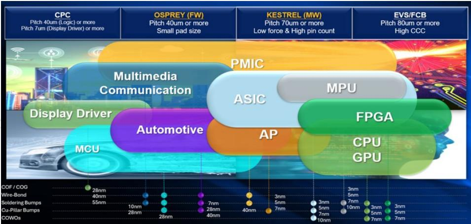  
Exhibit 44: Display driver ICs and MCUs primarily use CPC probe cards, while advanced nodes mostly rely on VPC and MEMS probe card solutions   
Source: MPI.

# Sizing the socket market

The test and burn-in socket market reached a TAM of US\$1,589mn in 2024, accounting for $1 7 \%$ of total testing equipment and consumables spending. We project the test and burn-in socket to grow from US\$1,589mn in 2024 to US\$4,775mn in 2030e, implying a $20 \%$ CAGR, driven mainly by rising pin counts, longer testing times, and strong AI/HPC-related demand.

订阅研报添加微信 LCD123321Cad 04-17 What's more, we expect testing sockets/burn-in sockets to deliver $7 . 8 \% / 2 3 . 2 \%$ CAGRs in the next five years (2026-30e). Overall, the socket market remains highly fragmented, with the largest player accounting for just $10 \%$ market share in. However, WinWay’s market share has risen from $4 \%$ in 2022 to $8 . 6 \%$ in $2 0 2 4$ , positioning it as the secondlargest socket supplier, driven by accelerating AI-related demand for high-end testing sockets. Given WinWay's close relationships with major AI and HPC customers, including NVIDIA, AMD, and custom ASIC designers, we expect its market share to grow from $8 . 6 \%$ in 2024 to $20 \%$ by 2028e.

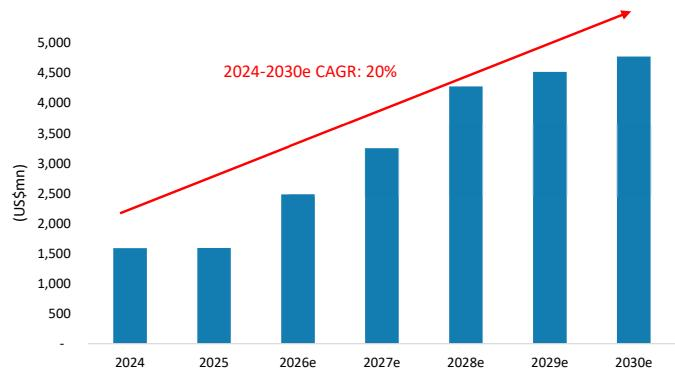  
Exhibit 45: We project the testing and burn-in socket to grow from US\$1,589mn in 2024 to US\$4,775mn in 2030e, implying a $20 \%$ CAGR   
Total Test and burn-in socket market   
Source: Company data, Yole, Morgan Stanley Research. $\mathrm { { e = } }$ Morgan Stanley Research estimates.   
Exhibit 47: Burn-in socket market share (2024)

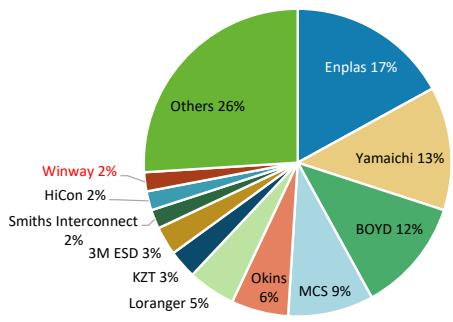  
Burn-in Socket Market Share (2024)   
Source: Company data, Yole, Morgan Stanley Research

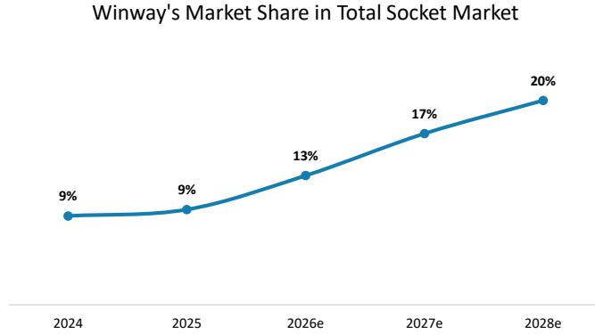  
Exhibit 49: We expect WinWay's market share to grow from $8 . 6 \%$ in 2024 to $20 \%$ in 2028e   
Source: Company data, Yole, Morgan Stanley Research. $\mathrm { { e = } }$ Morgan Stanley Research estimates.

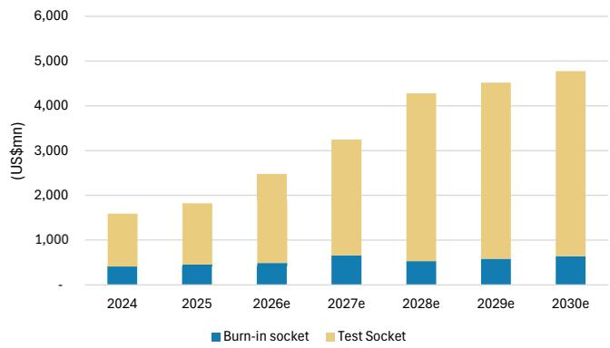  
Exhibit 46: We expect testing sockets to be the major product for the testing and burn-in socket market   
Source: Company data, Yole, Morgan Stanley Research. $\in { } =$ Morgan Stanley Research estimates.

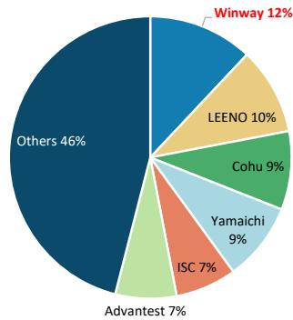  
Exhibit 48: Test socket market share (2024)   
Test Socket Market Share (2024)   
Source: Company data, Yole, Morgan Stanley Research

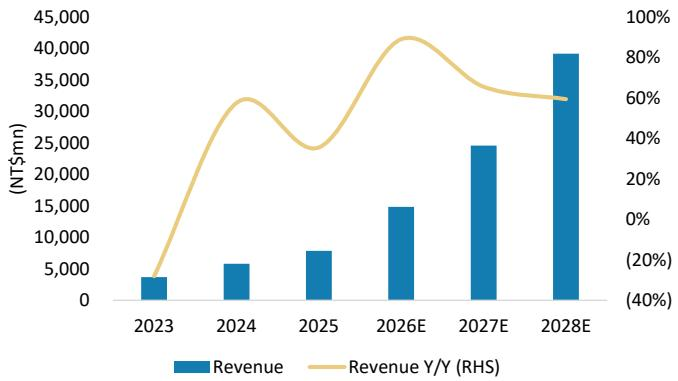  
Exhibit 50: WinWay's revenue to grow at a $60 \%$ CAGR 2023-28e   
Source: Company data, Morgan Stanley Research estimates. $\mathrm { { e = } }$ Morgan Stanley Research estimates.

1) Burn-in socket

The burn-in socket market reached a TAM of $\mathsf { U S S 4 7 0 m n }$ in 2024, accounting for $2 6 \%$ of the total socket market. Growth in this segment is primarily driven by high pin-count and high density sockets designed for AI and HPC applications. In contrast, traditional burn-in sockets remain more commoditized and typically carry lower profit margins. High end burn in sockets command ASPs of roughly US\$1,000–7,000 (and likely to further trend up), compared with $\cup 5 \$ 8-12$ for commodity sockets. While the market is still dominated by commodity products, WinWay is targeting the high-power SLT burn-in opportunity by offering premium sockets for chips that feature 1) power consumption above 1,000W, 2) large package sizes of $1 2 0 \times 1 5 0 \mathrm { m m }$ , and 3) high-speed performance requirements. We expect the burn-in socket market to rise at an $8 \%$ CAGR, 2024-30e, reaching $\cup S \$ 643 m n$ , with WinWay's market share increasing from $2 \%$ in 2024 to $4 \%$ by 2028e.

2) Testing socket

The testing socket reached a TAM of $\cup \mathsf { S } \$ 1$ ,179mn in 2024, accounting for $7 4 \%$ of the total socket market. Nearly $7 5 \%$ of testing sockets are used in advanced logic devices, which command higher ASPs of US\$5,000-10,000, vs the market average of $\cup { \mathsf { S } } \$ 1$ ,119. WinWay has emerged as the leading player in this segment, with market share rising rapidly from $7 \%$ in 2022 to $12 \%$ in $2 0 2 4 ,$ , surpassing LEENO and Cohu, driven by strong AI- and HPCrelated SLT and FT testing demand. We expect the testing socket market to rise at a $23 \%$ CAGR, 2024-30e, reaching $\cup \mathsf { S$ } \$ 4$ 131mn by 2030e, with WinWay's market share increasing from $1 7 \%$ in $2 0 2 4$ to $2 2 \%$ by 2028e. We think WinWay’s market share gains should continue over the next few years, supported by robust gaming GPU demand and sequential increase in Blackwell GPU shipments.

# #2: Larger Package Sizes Are Emerging as a Key Industry Trend

As semiconductor scaling approaches physical limits below 2nm, performance improvements are increasingly driven by advanced packaging and chiplet architectures (2.5D/3D). These approaches no only enable integration of multiple 加微信 LCD123321Cad 04-17 dies – such as GPUs and HBM – within a single package, but also result in larger, more complex packages with significantly higher interconnect density.

These trends are materially increasing testing intensity, as a greater number of dies require validation and advanced packages demand more stringent testing, including burn-in, FT, and growing adoption of SLT). As a result, test times are rising, led by NVIDIA, with similar trends expected to extend across AMD and ASIC players.

As a result, the testing ecosystem is a key beneficiary, including testing equipment vendors (ATE, handlers) and consumables suppliers such as probe cards and socket vendors. This benefit is driven by higher pin counts, greater customization, and more stringent durability requirements. In addition, HBM further amplifies demand, as test times are typically 5-10x longer than those for traditional DRAM. Overall, testing is becoming a critical bottleneck and a structural growth driver in the semiconductor value chain.

# 订阅研报

添加微信 LCD123321Cad 04-17 As transistor dimensions continue to shrink below 2nm, wafer manufacturing is approaching fundamental physical limits. At the same time, growing demand for semiconductor circuit scale and functionality has driven greater integration of semiconductor dies and more advanced package substrate technologies. As higher levels of integration and leading-edge process advances continue to weigh on cost efficiency, the adoption of chiplet architectures – combining multiple dies on a single package substrate – has become essential to achieving further gains in overall semiconductor performance

Behind this trend, once multiple functions are integrated into a single semiconductor die, die size increases, driving higher manufacturing complexity and costs. As a result, industry focus has shifted toward methods that mount multiple semiconductor elements on a single package substrate to enhance overall semiconductor performance, including the following approaches:

# 订阅研报

• 3D, where semiconductor dies are stacked vertically, and   
• 2.5D, where semiconductor elements are connected through silicon or organic   
加 微信 interposers on the package substrate.

To integrate more transistors into a single chip and deliver higher performance, foundries, integrated device manufacturers (IDMs), and outsourced semiconductor assembly and test (OSAT) providers are actively developing 2.5D and 3D packaging technologies. These include TSMC’s CoWoS and SoIC, as well as emerging solutions like chip-on-panel-onsubstrate (CoPoS) and fan-out panel-level packaging (FOPLP). By vertically stacking dies on interposers and substrates, advanced packaging enables a continuous increases in effective transistor density, supporting ongoing performance gains and extending the

practical limits of Moore’s Law.

Larger substrate sizes and higher layer counts are becoming increasingly evident, reflecting the need for greater electrical interconnect density to support data transfer, control signals, and power delivery between the AI accelerator dies and HBM memory stacks. This shift toward larger, more complex substrates is well established and shows no signs of reversing in the foreseeable future.

The sharp increase in the number of dies integrated within a single chip has materially raised testing demand, as each die must be tested at least once prior to packaging to 添加微信 LCD123321Cad 04-17 prevent a single defective die compromising the entire device. At the same time, advanced packaging further intensifies testing requirement. Densely stacked dies – particularly for AI and HPC applications – generate substantial heat and operate under higher power and voltage conditions, requiring more sophisticated and precise testing methodologies to ensure reliability and performance. We believe testing equipment and consumables suppliers like probe card and socket vendors are well positioned to benefit from the advanced packaging trend, supported by both higher volumes – driven by a increased die counts – and higher ASPs, reflecting the need for high-end testing interfaces capable of withstanding elevated power, voltage, and thermal stress.

As package sizes increase, testing times are also rising, which in turn drives higher demand for testing equipment. NVIDIA’s FT time should continue lengthening with the introduction of new platforms such as Rubin in 2026 and Rubin Ultra in 2027, leading to incremental demand for testing capacity. AMD and other ASIC vendors, including Google's TPU, are also gradually converging toward NVIDIA’s path of stringent testing 添加微信 LCD123321Cad 04-17 requirements as their AI accelerator designs grow in scale and complexity. NVIDIA has set the industry benchmark with highly sophisticated test design procedures, adopting some of the most comprehensive test programs. In addition to two rounds of FT, its AI accelerators also undergo burn-in and SLT test insertions, further elevating overall testing intensity.

Meanwhile, NVIDIA's FT time has continued to lengthen as test programs become more complex. We estimate FT time more than doubled from Hopper to Blackwell, and could rise another $3 0 { - } 5 0 \%$ with the introduction of the Rubin platform in 2026. Rubin Ultra in 2027 could represent another meaningful step-change in FT time, as the platform is expected to double the number of GPUs and HBM stacks. NVIDIA's strong AI GPU unit demand, combined with rich FT content, has driven meaningful business upside for testing suppliers over 2023-24, including Advantest (FT tools), KYEC (FT service provider), and Hon Precision (handler). We view this growth as structural and, in our view, should be sustainable over the coming years.

订阅研报添加微信 LCD123321Cad 04-17 As for AMD and ASIC vendors' programs, such as Google's TPUs, test times remain relatively short at this stage. However, we see substantial upside over the next few years, driven by the shift toward larger package sizes, increased GPU and HBM counts, and more complex die and package architectures. From 2026E onward, AMD and ASIC vendors could materially increase demand for testing capacity. For example, in the cloud ASIC segment, MediaTek's TPU v7e ramping from late 2026e may adopt more comprehensive testing programs – including burn-in and two rounds of FT – and we expect other ASIC programs to follow a similar path.

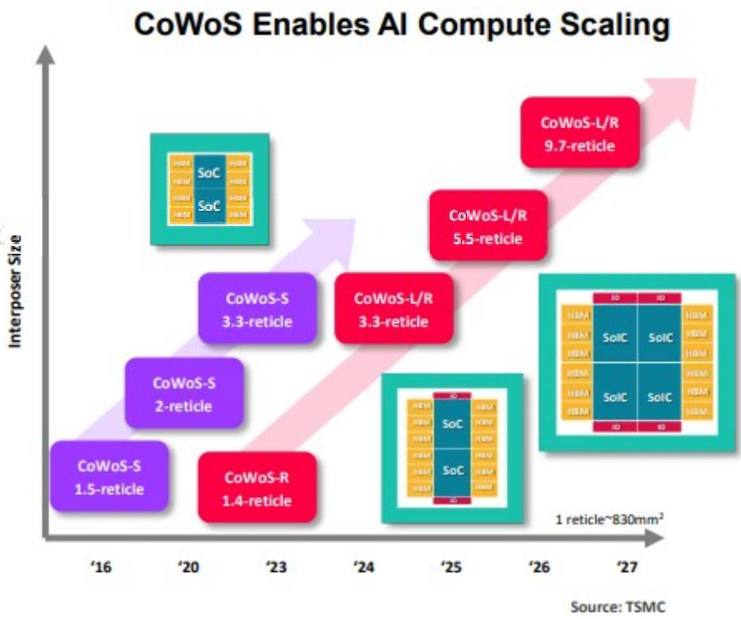  
Exhibit 51: TSMC's roadmap for interposer size   
Source: TSMC. Note: Purple line represents CoWoS and the red line represents CoWoS-R and CoWoS-L.

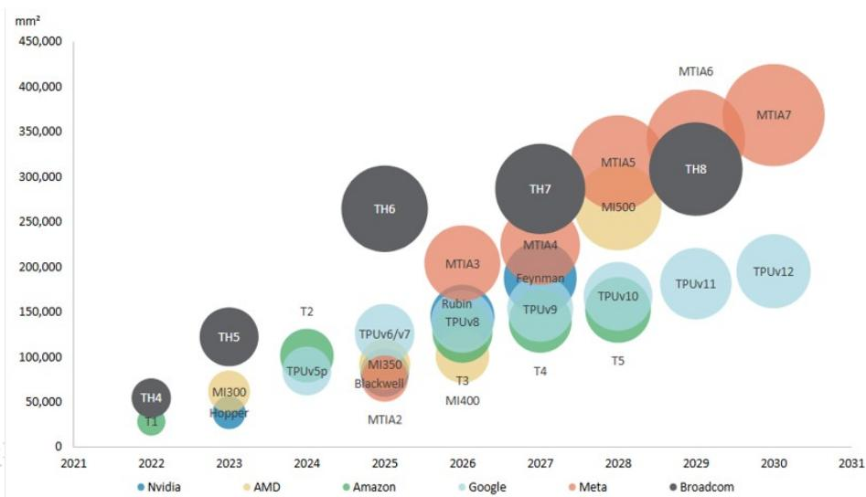  
Exhibit 52: Near-term trend points toward larger substrate sizes and higher layer counts   
Source: Morgan Stanley Research. Note: Bubble size indicates ABF substrate demand, including area size and layer count.

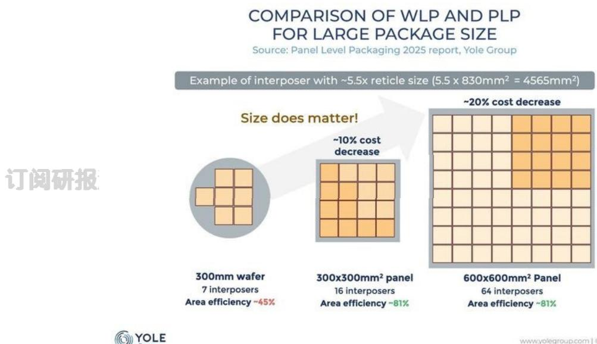  
  
Source: Yole Group.

For larger packages, we think Hon Precision will need to develop new solutions that can: 1) support larger IC trays, 2) test multiple ICs simultaneously to reduce customers' testing costs, 3) increase equipment operating speed to shorten testing times and cycles, and 4) precisely control pressure and temperature during pick-and-place operations. As packaging becomes larger and more advanced, handlers must apply increasingly delicate and 添加微信 LCD123321Cad 04-17 well controlled pressure when placing ICs onto testers and socket probes during the FT process. We believe Hon Precision is developing next-generation handlers that can accommodate IC trays for package sizes exceeding 120x150mm, potentially scaling up to 250x250mm or larger, with shipments expected to begin in 2Q26e to support customer demand from 3Q26e onward, which we think likely for NVIDIA's next generation Rubin Ultra GPU, according to the company.

For probe cards and socket, we believe MPI and WinWay are also benefitting from the trend toward larger package sizes AI GPUs and ASICs. Larger packages require a higher pin count per VPC or, in some case, further migration to MEMS probe cards – trends we are monitoring in products such as Broadcom's networking chip and NVIDIA's Blackwell and Rubin platforms. At the same time, WinWay is benefiting from larger package requirements in the socket market, as well as rising demand for coaxial sockets and hypersockets designed to support package sizes exceeding 120x150mm.

At this year’s GPU Technology Conference (GTC), NVIDIA launched several products aimed 添加微信 LCD123321Cad 04-17 at expanding its DC footprint. In addition to giving further details on the upcoming Rubin GPU, the company introduced the Vera CPU server rack, STX storage rack, and the LPU. NVIDIA also extended its DC product roadmap through 2028, outlining three hardware generations beyond 2026.

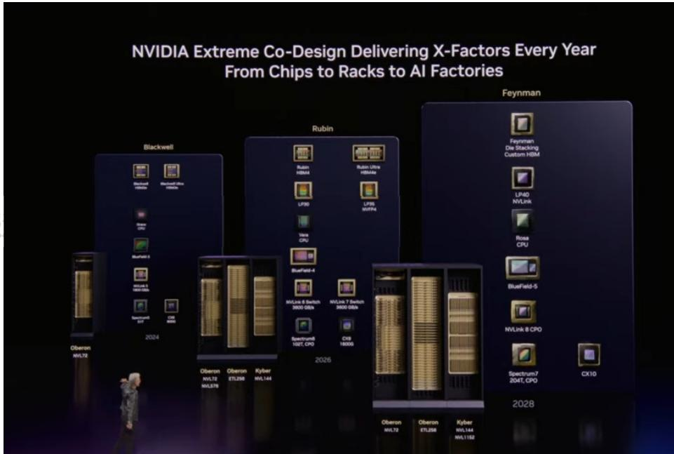  
Exhibit 54: NVIDIA's product roadmap in the coming years   
Source: NVIDIA.

# What are the steps within the testing market?

After the fabrication process, a single semiconductor die undergoes a series of rigorous tests to verify functionality, reliability, and performance before, during, and after it is packaged into a final chip alongside other dies. The process begins with chip probing (CP), 添加微信 LCD123321Cad 04-17 where individual dies on the wafer are tested for basic electrical functionality using probe cards. This step identifies defective units prior to packaging. Defective dies are screened out during the wafer sort, while the remaining KGD dies proceed to the packaging stage. Once the dies are assembled into a packaged chip, the device undergoes burn-in testing, which applies elevated temperatures and voltages to accelerate early-life failures and ensure long-term reliability. This is followed by FT, which provides a comprehensive assessment of the packaged chip’s performance under operating conditions, including parameters such as speed, power, and signal integrity. For advanced applications, SLT integrates the chip into a simulated or actual system environment to validate real-world performance, compatibility, and robustness. This multi-stage testing pipeline is essential to meeting the increasingly stringent quality requirements of modern semiconductor applications, as chip complexity and unit value continue to rise.

# Chipslets increase test processes

Chiplets bring testing challenges and opportunities. Compared to monolithic devices, 添加微信 LCD123321Cad 04-17 chiplet architectures require wafer-level testing of individual sub-components as well as partial-assembly testing prior to final testing to protect overall yield. As a result, test customers face two key trade-offs: 1) Test cost: Customers may choose to implement wafer testing, partial-assembly testing, and final testing, which increases total test cost relative to monolithic devices, and 2) Scrap cost: Relative to monolithic devices, scrap costs rise non-linearly as products move closer to final assembly, forcing customers to decide at which stages to insert additional testing steps.

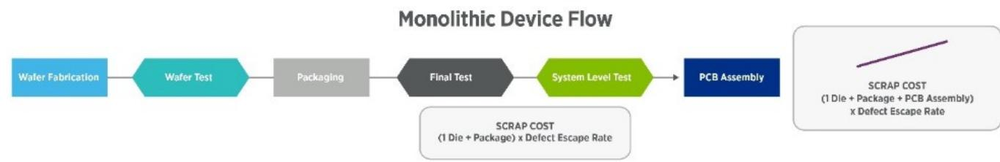  
Exhibit 55: Monolithic device test flow   
Source: Teradyne.   
订阅研报添加微信 LCD123321Cad 04-17

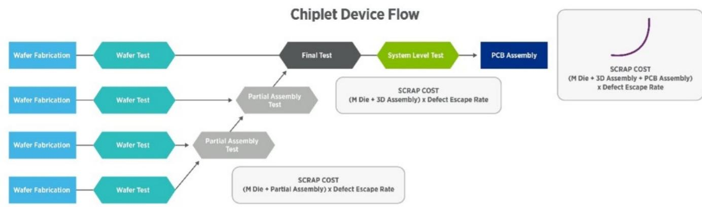  
Exhibit 56: Chiplet device test flow   
Source: Teradyne.

# 订阅研报添加微信 LCD123321Cad 04-17

Chiplets to drive SLT. SLTs are conducted by emulating the end-user environment. Historically, SLT has served a complementary role in semiconductor testing, applied to limited sample sizes to validate system performance and functionality of final products. However, as semiconductors have become more more complex – with higher operating speeds and the adoption of advanced high-density multi-die packages – instances have increased where fully assembled fail to meet specifications despite passing standalone tests. In response, semiconductor manufacturers are increasingly adopting SLT more broadly, using it alongside traditional standalone device testing to validate performance under real-world system conditions.

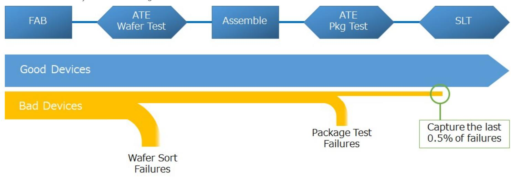  
Exhibit 57: Role of system level testing   
Source: Teradyne.

SLT basic design: To perform SLT, an IC socket is mounted onto a dedicated test board that is specifically designed for the device under test. In addition to IC sockets, these test boards typically integrate power management ICs, RAM, storage, SD cards, USB flash, and relevant communications interfaces. They also incorporate thermal control capabilities, enabling testing under temperature conditions that closely replicate real-world operating conditions.

Chip makers seem tolerant of higher test costs resulting from SLT: Semiconductor manufacturers historically aimed to limit testing costs to ${ \sim } 3 \%$ of total manufacturing costs and were cautious about the additional costs associated with adopting SLT. However, broader adoption of SLT has enabled more efficient and effective testing workflows, including improved utilization of automated test equipment (ATE). At the same time, lower product return rate have strengthened companies’ brand reputation, leading manufacturers to accept higher testing costs associated with SLT. As SLT introduces additional test insertions beyond FT, we believe tester manufacturers can capture incremental earnings growth by positioning SLT as a core business opportunity rather than a supplementary testing step.

# Memory: HBM

Among advanced packaging elements, HBM is the most disruptive for probe cards.

Each HBM stack contains 8-16 dies vertically connected by Through-Silicon Via technology (TSVs), which interface with GPUs or AI ASICs via ultra-wide buses of $1 , 0 2 4 - 2 , 0 4 8$ bits with pitch scaling from 55um/45um today toward 36um for HBM4. More importantly, probe cards are not commodity products. Each probe card is custom-designed for a specific chip, reflecting unique pad layouts, electrical requirements, and performance specifications.

Engagement includes:

1. Jointly design-in with chipmakers and ATE vendors.   
2. Long qualification cycles, usually 12-18 months   
3. Volume production that is synchronized with wafer ramp-up

4. Recurring maintenance, refurbishment, and needle replacement.

Going forward, we expect continued increases in pin count, current-handling requirements, and testing coverage for chiplet-based designs and stacked memory architectures. The evolution of advanced packaging has elevated wafer probing from a routine screening step to the first line of defense again costly downstream yield losses, reinforcing its critical role in the semiconductor manufacturing flow.

HBM testing intensity extremely high. Bit growth has been the primary driver of conventional memory testing. However, the architectural characteristics of HBM make it 添加微信 LCD123321Cad 04-17 far more test intensive. HBM requires additional testing due to die stacking, higher memory density, and more demanding performance requirements. While the same memory testers are used for both initial DRAM wafer testing and post stacking tests, HBM imposes more stringent test conditions, particularly around speed and functional coverage. Given the high end product value of HBM, memory manufacturers are incentivized to prioritize defect minimization over tester cost optimization. We estimate that HBM DRAM testing times are $5 \mathrm { - } 7 0 \times$ longer than those for smartphone DRAM. We also estimate that adding $2 0 0 \boldsymbol { \mathrm { k } }$ WPM of HBM capacity would require test capacity equivalent to the current global DRAM manufacturing base of \~1,200k WPM, implying a doubling of the installed DRAM tester fleet ( Exhibit 58 ).

New generations of HBM to bring more test challenges. New generations of HBM feature higher stack counts, finer die geometries, fast interface speeds, and increased power requirements. Together, these factors materially raise testing intensity through longer test time and more stringent test requirements. In addition, compared with the 添加微信 LCD123321Cad 04-17 traditional DDR cycle, HBM follows a much faster technology cadence, which in some cases necessitates incremental tester purchases to keep pace with rapid product transitions.

# 订阅研报

Exhibit 58: HBM roadmap   

<table><tr><td></td><td>HBM</td><td>HBM2</td><td>HBM2E</td><td>HBM3</td><td>HBM3E</td><td>HBM4</td><td>HBM4E</td></tr><tr><td> Release year</td><td>2014</td><td>2018</td><td>2020</td><td>2022</td><td>2024 1Q</td><td>2026→2025</td><td>2027→2026</td></tr><tr><td> Die Density</td><td>2GB</td><td>8GB</td><td>16GB</td><td>16GB</td><td>24GB</td><td>24GB</td><td></td></tr><tr><td>DRAM per stack</td><td>4Hi</td><td>4Hi/8Hi</td><td>4Hi/8Hi</td><td>8Hi/12Hi</td><td>12Hi</td><td>16Hi</td><td></td></tr><tr><td>Capacity</td><td>1GB</td><td>4GB/8GB</td><td>8GB/16GB</td><td>16GB/24GB</td><td>24GB/36GB</td><td>36GB/64GB</td><td></td></tr><tr><td>Bandwidth per Stack</td><td>128GB/s</td><td>307GB/s</td><td>460GB/s</td><td>819GB/s</td><td>1TB/S</td><td>1.5-2+TB/S</td><td></td></tr><tr><td>Data Transfer Rate</td><td>1GBps</td><td>2.4GBps</td><td>3.6GBps</td><td>6.4GBps</td><td>9.2GBps</td><td></td><td></td></tr></table>

Source: SK hynix.

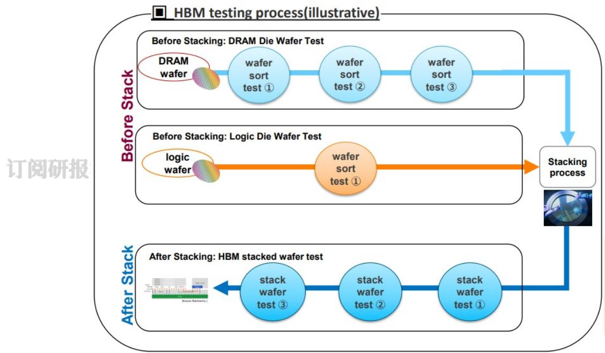  
Exhibit 59: HBM testing process   
Source: Advantest.

  
Exhibit 60: HBM testing

# #3: New Evolution for Testing Equipment and Components: CPO, Micro-channel Lid

Co-packaged optics (CPO), micro-channel lid (MCL) cooling, and HBM are driving a new wave of semiconductor testing complexity, reinforcing testing as a critical bottleneck in the value chain.

微信 LCD123321Cad 04-17 • CPO introduces multi-stage testing, typically involving one to four test insertions, to ensure known-good optical engines. From 2027 onward, the adoption of SLT is expected to further drive demand for test equipment and consumables, including probe cards and sockets.

• MCL cooling adds new testing requirements, such as leakage and structural integrity. These requirements create opportunities for handlers and thermal-testing solutions, with volume ramp-up expected from late 2026.

• HBM materially increases testing intensity, with test times typically 5-10x longer than those for conventional DRAM, driven by die stacking, higher bandwidth, and elevated power requirements. This trend directly benefits probe card suppliers and drives demand for additional testing capacity.

Overall, these developments are structurally increasing the number of test steps, test duration, and overall testing complexity, supporting sustained growth for 加微信 LCD123321Cad 04-1testing equipment and consumables vendors.

# Co-packaged optics

In co-packaged optics (CPO), “insertion testing” typically refers to the defined test insertion points throughout the manufacturing flow, specifying where and how opticalrelated testing is conducted from wafer level through final system integration. The primary objective of these insertion tests is to identify the known good optical engines (KGOE) prior to integration with SoC/ASIC. In practice, current CPO manufacturing flows typically include three to four test insertion stages. The associated measurements can be broadly grouped into three domains: photonic integrated circuit (PIC) signals, optical output signals from the optical engine, and system level electrical and optical signals. However, as CPO technology remains at an early stage of development, TSMC and its OSAT partners are still in the process of defining and standardizing the full insertion test flow, while concurrently qualifying suitable testing equipment and ecosystem partners.

Insertion 1 typically refers to PIC (Photonic IC) Wafer-Level Test. The objective is to screen core photonic components such as modulators, photodiodes, and power monitors before downstream processing. Typical test items include optical power, insertion loss, dark current, and basic DC electrical/optical characteristics. This early screening step plays a critical role in removing defective dies upfront, thereby protecting yield and reducing losses in subsequent manufacturing stages.

Insertion 2 typically takes place after the COUPE/SoIC stage, when electronic IC (EIC) dies are bonded onto the PIC wafer, while testing is still conducted at the wafer level. This

stage focuses on electro-optical (EO/OE) performance and the interaction between photonic and electronic components. Key measurements include modulation efficiency, receiver sensitivity, EO/OE conversion characteristics, and overall link performance. The objective is to verify that the integrated electrical and optical subsystems operate correctly and cohesively before proceeding to further assembly steps.

Insertion 3 is performed after the optical engines are diced individually from the PIC wafers and is typically conducted at the OSAT stage. Before co-packaging with the ASIC, each optical engine undergoes testing to quality as a KGOE. This stage includes high-speed (at-speed) testing such as bit-error-rate (BER), eye-diagram, and jitter analysis, as well as assessments of power consumption, thermal behavior, and wavelength stability. This represents one of the most critical test insertion points, as it shifts defect detection earlier in the manufacturing flow and materially reduces downstream integration risk.

Insertion 4 occurs after the optical engine is co-packaged with the ASIC, at which point a final test is performed on the fully packaged device using both electrical and optical interfaces. Typical test coverage includes electrical functionality, optical link integrity, transmit/receive channel verification, multi-channel consistency, and performance under thermal conditions. This stage closely resembles traditional ATE-based final testing, but with added optical complexity. The final insertion is SLT, which evaluates the device under mission-mode, real-world operating conditions. SLT typically involves running realistic traffic patterns, conducting long duration stress tests, monitoring error rates, and assessing thermal electrical optical interactions. The objective is to validate end system performance, stability, and reliability under actual use conditions.

阅研报添加微信 LCD123321Cad 04-17 Testing by NVIDIA's Spectrum and Quantum platforms that entered mass production in 2025 and 2026, respectively, stops at Insertion 3. At this stage, OSAT will primarily conduct electrical testing on the packaged devices, while the end-customer will rely on earlier insertion steps to identify known-good PIC dies. Insertion $4$ is expected to be introduced in 2027e, coinciding with the next generation of Quantum for scale-up deployment in the Rubin Ultra platform.

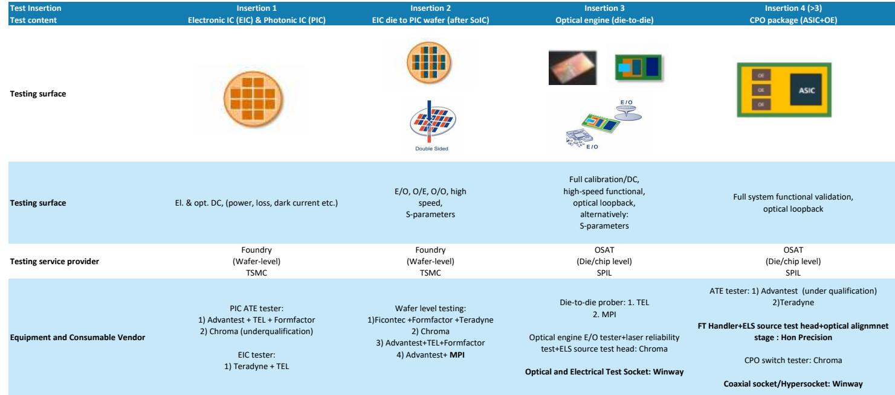  
Exhibit 61: Insertion test for CPO starting from 2027e   
Source: Company data, Morgan Stanley Research.

For MPI, we expect CPO testing to emerge as a key revenue growth driver over the coming years. Leveraging its prior experience in LED applications, MPI has the capability to internally develop optical modules for both PIC wafer level and die level testing, alongside electrical signal testing for EIC dies. At present, MPI is shipping wafer level 添加微信 LCD123321Cad 04-17 testing equipment for Insertion 2 by partnering with Advantest and die to die probers for Insertion 3. The company is also developing several additional CPO related testing tools, as well as expanding its portfolio of probe cards for EIC applications.

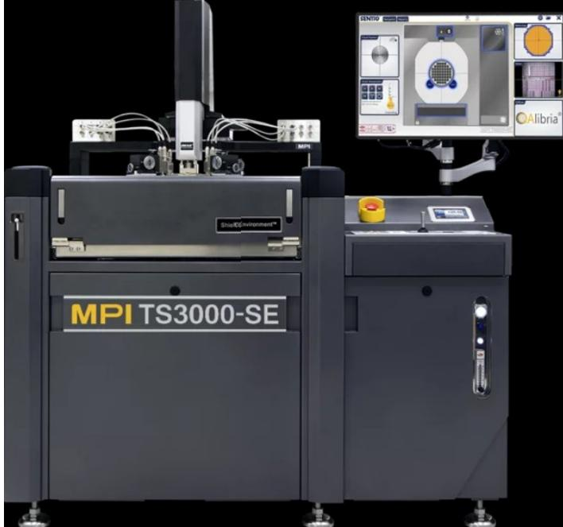  
Exhibit 62: MPI's wafer-level testing equipment for insertion 2   
Source: MPI.

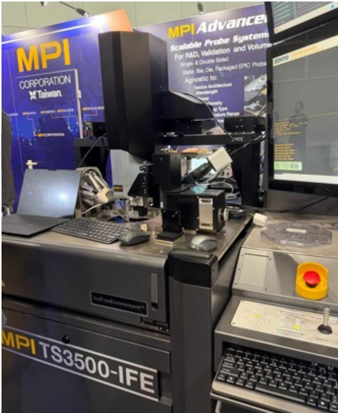  
Exhibit 63: Life demo of wafer-level testing equipment

订阅研报添加Exhibit 64: MPI's equipment for insertion 3 (DT650)

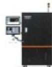

Source: MPI.

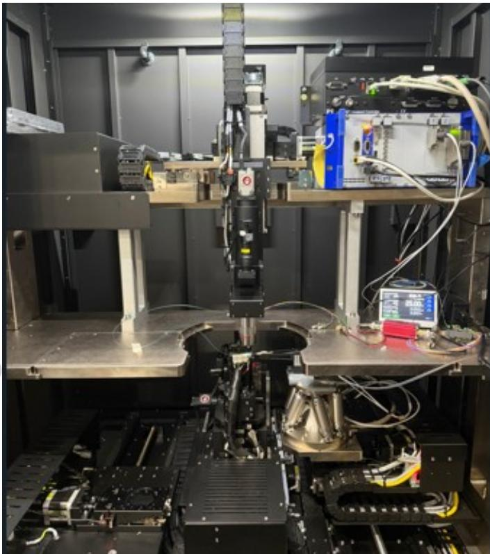  
Source: MPI. Exhibit 65: Life demo of die-to-die testing equipment   
Source: MPI.

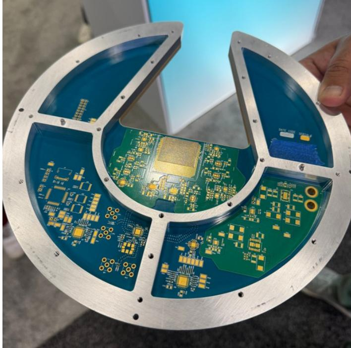  
Exhibit 66: Probe card for EIC die on PIC wafer for wafer-level testing for CPO   
Source: Formfactor.   
订阅研报

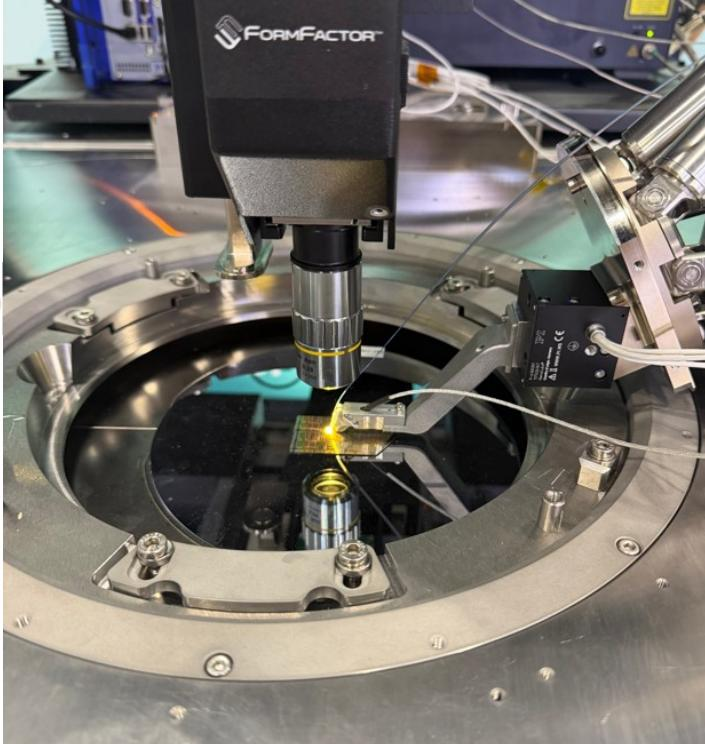  
Source: Formfactor.

For Hon Precision, we see CPO as an incremental demand opportunity. As Insertion 1 and Insertion 2 are both conducted at the wafer level, Hon Precision's primary exposure lies in Insertion 4, expected to commence from 2027, as well as in the electric testing performed on Spectrum and Quantum packages. Hon Precision supplies ATC handlers, which operate in conjunction with ATE handlers. The company started shipping ATC handlers for Spectrum and Quantum testing in 2025, and is currently planning to introduce its nextgeneration handlers for Insertion 4, with shipments expected to begin in 1H27 in preparation for CPO scale up and mass production.

Exhibit 68: Hon Precision's solution for CPO   

<table><tr><td rowspan=2 colspan=1>TestInsertion</td><td rowspan=1 colspan=1>Insertion4</td><td rowspan=1 colspan=3>CPOFT</td></tr><tr><td rowspan=1 colspan=1>JointDevelopment</td><td rowspan=1 colspan=1></td><td rowspan=1 colspan=1>MassProduction</td><td rowspan=1 colspan=1></td></tr><tr><td rowspan=2 colspan=1>TestContent</td><td rowspan=1 colspan=1>ASICASIC+Optical Engine</td><td rowspan=1 colspan=1>ASICASIC+Optical Engine</td><td rowspan=1 colspan=1>ASICASICASIC</td><td rowspan=1 colspan=1>ASCOptical Engine</td></tr><tr><td rowspan=1 colspan=1>0/E</td><td rowspan=1 colspan=1>E/E</td><td rowspan=1 colspan=1>E/E</td><td rowspan=1 colspan=1>E/E</td></tr><tr><td rowspan=4 colspan=1>HON.PRECTestEquipment</td><td rowspan=1 colspan=4>ATETester+ATCHandler</td></tr><tr><td rowspan=1 colspan=1>3000W</td><td rowspan=1 colspan=1>2000W</td><td rowspan=1 colspan=1>1000W</td><td rowspan=1 colspan=1>1000W</td></tr><tr><td rowspan=1 colspan=1>SingleSite</td><td rowspan=1 colspan=1>SingleSite</td><td rowspan=1 colspan=1>Single/Dual/Quad Site</td><td rowspan=1 colspan=1>DualSite</td></tr><tr><td rowspan=1 colspan=1>OpticalASIC+OEAlignmentStage   LoadBoard</td><td rowspan=1 colspan=1>ASIC+OELoadBoard</td><td rowspan=1 colspan=1>ASICASICASIC   ASICASICASICASICLoadBoard LoadBoard LoadBoard</td><td rowspan=1 colspan=1>OE OELoadBoard</td></tr></table>

Source: Company data.

For WinWay, opportunities span the full range from Insertion 3 through Insertion 4. At Insertion 3, once optical engines are diced into individual dies, testing requires combined optical electrical test sockets to validate optical engine performance. In parallel, the switch ASIC at the center of the CPO package also requires standalone testing, typically using coaxial sockets, with a likely migration toward hypersockets over time. WinWay has already shipped sample products and initiated engagement with TSMC and end customers such as NVIDIA for CPO testing. We expect larger scale revenue contribution to begin from 2027, following the expansion of PIC capacity at TSMC and the ramp up of additional scale up and scale out CPO products into mass production.

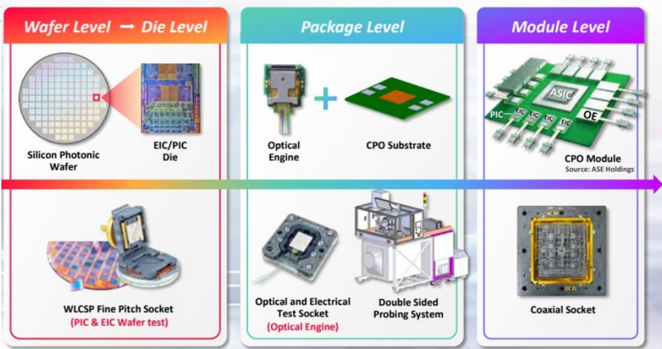  
Exhibit 69: WinWay's CPO opportunity   
Source: WinWay.

# 添加微信 LCD123321Cad 04-17Micro-channel Lid

A micro-channel lid (MCL) is an advanced thermal lid in which a network of micro-scale channels is embedded within a metal cap, allowing coolant to circulate actively through the lid. Our Morgan Stanley Greater China Technology Hardware Research team believes MCL could become a viable thermal design option for next generation chip platforms, as chip TDPs continue to rise and exceed the capabilities of existing cooling solutions. That said, we expect MCL adoption to be gradual, as challenges remain around manufacturing yield, leakage detection, and long term reliability qualification.

An MCL reduces warpage by addressing both the thermal and mechanical drivers of deformation.

• By significantly lowering the peak die temperature and minimizing lateral temperature gradients, MCL reduces thermally induced strain arising from coefficient of thermal expansion (CTE) mismatch among the die, package, and   
加微信 LCD123321Cad 04-17substrate.   
• The lid itself acts as a stiff structural layer, increasing the bending rigidity of the die-lid stack and shifting the neutral axis closer to the die, thereby reducing curvature under thermal loading.

Together, the combination of more uniform cooling, reduced thermal excursions, and added stiffness makes MCLs particularly effective at mitigating both static and transient warpage in large, high-power packages.

Hon Precision currently offers a range of cold-plate solutions tailored to individual customers, as IC package size and design vary with power consumption requirements. Cold plates, used in conjunction with ATC, help maintain target temperatures during testing. In addition to bundled handler, ATC, and cold-plate solutions, some customers also procure cold plates on a stand-alone basis as older-generation ICs are phased out and new components are introduced. As a result, cold plates have become an increasingly important growth segment for Hon Precision.

Hon Precision is also at the forefront of supporting emerging cooling technologies,   
including MCL. Hon Precision is working closely with end-customers such as NVIDIA, as   
well as MCL ecosystem partners, to develop handlers capable of validating MCL 332 ad   
structures during the FT process.

Semiconductor testing with MCL is highly complex. Final designs can incorporate multiple liquid inlets and outlets feeding micrometer-sized channels. Hon Precision's handlers must therefore validate MCL quality throughout the FT process. A key objective is to ensure that the MCL structure remains intact during testing, particularly as the handler applies up to $3 0 0 \mathsf { k g }$ of pressure when pressing the MCL-packaged IC packaged onto the test socket. Prior to FT, the handler must inspect the MCL surface to confirm structural integrity. During FT, the handler is required to remove inlet and outlet caps, introduce coolant, and verify the absence of leakage. After testing, the handler must clean the inlets and outlets and conduct a final inspection to ensure that no damage has occurred to the MCL. While the broader entire supply chain continues to develop and qualify MCL technology, we expect trial or small-volume production to begin around 2027, coinciding with the Rubin Ultra generation. We believe MCL adoption has the potential to raise entry barriers for handler turnkey solutions, given the added technical and process complexity.

Our supply-chain checks indicate that significant volumes of MCLs were shipped to endcustomers at the end of March for qualification. Assuming the testing process proceeds smoothly, we expect volume production of Hon Precision's MCL handlers to begin in 4Q26.

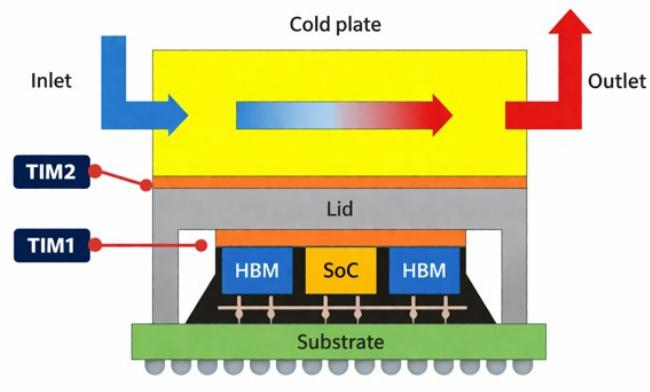  
Exhibit 70: Micro-channel coldplate

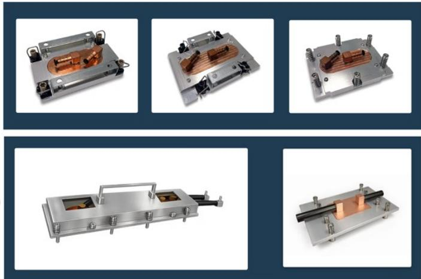  
Exhibit 71: Solutions for micro-channel coldplate   
Source: Jentech.

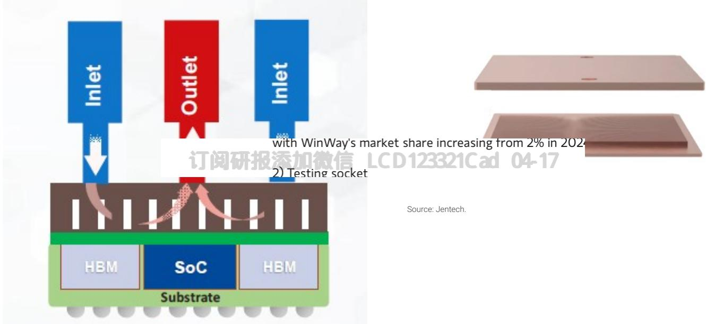  
Exhibit 72: Micro-channel lid   
Source: Morgan Stanley Research.

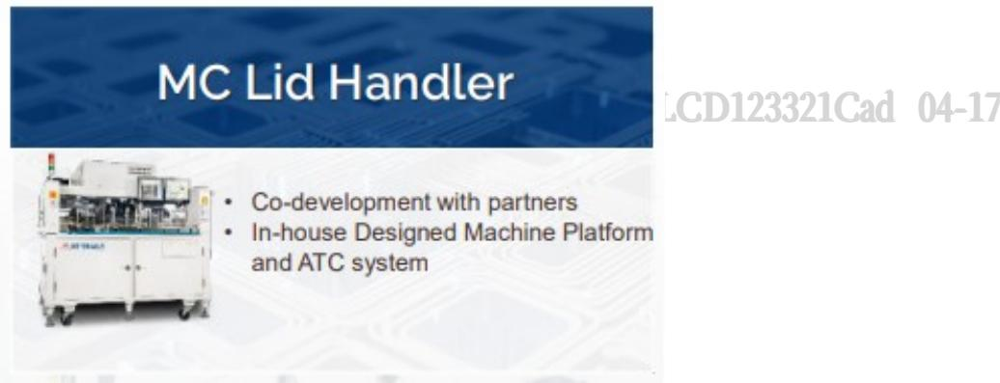  
Exhibit 74: If the testing proceeds smoothly, we expect volume production of Hon Precision's MCL handlers to begin in 4Q26   
Source: Hon Precision.

# Memory: HBM

HBM test intensity extremely high. Bit growth has historically driven conventional memory testing, but HBM’s architecture makes it far more test intensive. HBM requires additional testing due to die stacking, higher memory density, and more demanding performance requirements. While the same memory testers support both initial DRAM wafer testing and post stacking testing, HBM imposes significantly more stringent test conditions, particularly in terms of speed and functional coverage. Given the high end product value of HBM, memory manufacturers prioritize defect minimization over rationalizing tester spending. We estimate that HBM DRAM testing times are $5 \mathrm { - } 7 0 \times$ longer than those for smartphone DRAM. We also estimate that adding 200k wafers per month (WPM) of HBM capacity would require test capacity equivalent to the current global DRAM manufacturing base of \~1,200k WPM, effectively doubling the installed DRAM tester fleet (see Exhibit 75 ).

New generations of HBM to bring more test challenges. New generations of HBM feature higher stack counts, continued die miniaturization, faster interface speeds, and increased power requirements. These factors collectively drive higher testing intensity through longer test times and more stringent test coverage. In addition, compared with the traditional DDR cycle, HBM follows a much shorter technology cadence, which in certain cases necessitates incremental tester purchases to support rapid product transitions.

Among advanced packaging technologies, HBM is the most disruptive for probe card requirements. Each HBM stack comprises 8–16 dies vertically interconnected through TSVs, which connect to GPUs or AI ASICs via ultra wide interfaces of 1,024–2,048 bits, with pitch scaling from ${ \sim } 5 5 \mu \mathrm { m } / 4 5 \mu \mathrm { m }$ today toward ${ \sim } 3 6 \mu \mathrm { m }$ for HBM4. Importantly, probe cards are not commodity products—each card is custom designed for a specific chip, reflecting unique pad layouts, electrical requirements, and performance specifications.

Going forward, we expect continued increases in pin counts, current handling requirements, and test coverage for chiplet based designs and stacked memory architectures. The evolution of advanced packaging has repositioned wafer probing as the first line of defense against costly downstream yield losses.

Our supply-chain checks also point to emerging opportunities for MPI in the HBM and memory probe card segment, which is currently dominated by MJC.

Exhibit 75: HBM roadmap   

<table><tr><td></td><td>HBM</td><td>HBM2</td><td>HBM2E</td><td>HBM3</td><td>HBM3E</td><td>HBM4</td><td>HBM5 (Est.)</td></tr><tr><td>Release Year</td><td>2014阅研报</td><td>2018 加微信</td><td></td><td></td><td>2024-2025</td><td>2026</td><td>2028-2029</td></tr><tr><td> Die Density</td><td>2Gb</td><td>8Gb</td><td>16Gb</td><td>16Gb</td><td>24Gb</td><td>24-32Gb</td><td>32-64Gb</td></tr><tr><td>DRAM per Stack</td><td>4Hi</td><td>4-8Hi</td><td>8Hi</td><td>8-12Hi</td><td>12Hi</td><td>12-16Hi</td><td>16-20Hi</td></tr><tr><td>Capacity / Stack</td><td>1GB</td><td>4-8GB</td><td>8-16GB</td><td>16-24GB</td><td>24-36GB</td><td>32-64GB</td><td>64-128GB</td></tr><tr><td>Bandwidth /Stack</td><td></td><td></td><td>128 GB/s 256-410 GB/s 410-460 GB/s</td><td>~819 GB/s</td><td>~1.0-1.2 TB/s</td><td>~2-3 TB/s</td><td>~3-5 TB/s</td></tr><tr><td>Data Rate (per pin)</td><td>1 GBps</td><td>2.4 GBps</td><td>3.2-3.6 GBps</td><td>6.4 GBps</td><td>8-9.2 GBps</td><td></td><td>10-12 GBps 12-16+GBps</td></tr></table>

Source: SK hynix.

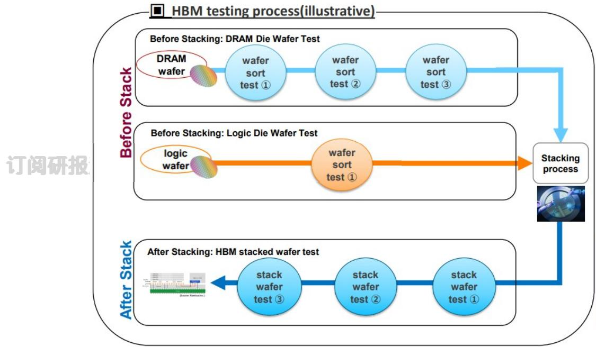  
Source: Advantest.

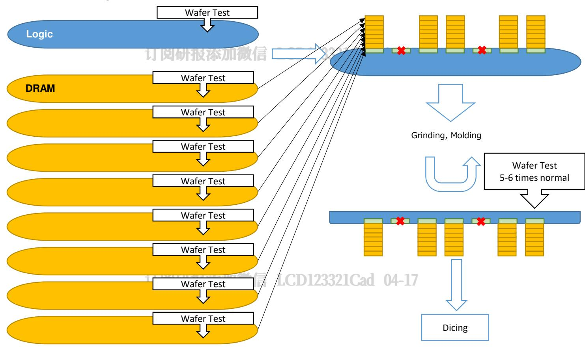  
Exhibit 77: HBM testing

# Global Implications

# The Japan semiconductor market and the US semiconductor production equipment market (covered by Suzune Tamura and Shane Brett)

Test intensity to remain high in 2026. Test intensity (i.e., test TAM as a percentage of semiconductor sales) reached 105bps in 2025, surpassing 100bps for the first time in our 添加微信 LCD123321Cad 04-17 model (since 2010) and exceeding the prior peak of 97/98bps in 2020/21. For SoC test specifically, intensity reached 115bps in 2025 versus a prior peak of 96/108bps in 2020/21. In a February report, we raised our test TAM forecast to $\cup 5 \$ 123,76 n$ $( + 1 9 \%$ y/y) in $2 0 2 6 / 2 7 ,$ implying test intensity remains elevated, at \~100bps. This reflects the structural evolution of test from a cost center to, increasingly, a value-add step in the semiconductor manufacturing process.

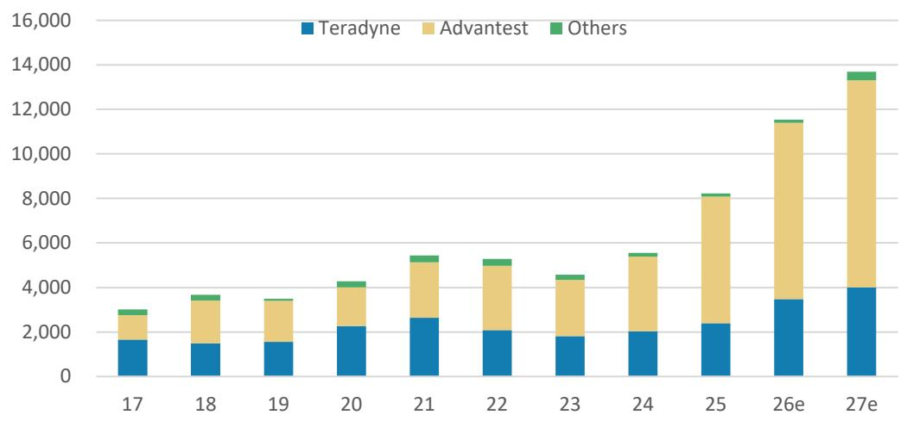  
Exhibit 78: Test Equipment Market Forecasts   
Test Equipment Market   
Source: Company data, Morgan Stanley Research. $\in { } =$ Morgan Stanley Research estimates.

2026 is set to mark the full-scale ramp-up of test demand for AI ASICs. As of 2025, AI ASIC-related sales accounted for less than $10 \%$ of Advantest’s SoC tester revenue; however, we expect this share to rise to a meaningful level in 2026, reaching the low teens of the percent range. In the December quarter results, tester sales exceeded company expectations, with expanding demand for AI ASICs being one of the key drivers. 添加微信 LCD123321Cad 04-17 Demand for testers for AI GPUs also remains robust. While we expect tester sales for GPUs to continue growing in 2026, we anticipate that tester sales for AI ASICs will expand at a faster pace than those for GPUs.

Memory testers are also expected to deliver strong growth. While Advantest has highlighted plans to expand its SoC tester production capacity – from 3,000 units annually at the beginning of 2025 to 5,000 units by the end of 2026, and further to 7,500 units within the following few years – the company has indicated that it will scale memory tester supply capacity at a similar pace. Although we project that memory tester sales will decelerate in $F 3 / 2 6$ (from ${ > } 8 0 \%$ growth YoY in $\mathsf { F 3 } / 2 5$ to $+ 9 \%$ in $\textsf { F 3 } / 2 6 \mathsf { E } )$ , we expect a

return to a strong growth trajectory from F3/27 onward.

Die-level test (DLT) is emerging as a potential additional test insertion, especially tied to advanced packaging and chiplet flows. DLT is positioned between wafer sort and final test, after dicing. While wafer level testing has constraints in test conditions, die level testing enables higher power delivery, tighter thermal control, and longer stress conditions that better emulate in use operation, which wafer level testing cannot achieve. Tokyo Electron says die level probers could account for ${ \sim } 1 0 { - } 1 5 \%$ of the overall prober market in five years, while it expects the prober market total will be expanding at a $1 5 \%$ sales CAGR. This kind of new test insertion will also drive test market growth in the longer term. 信

# Greater China Semiconductors (covered by Charlie Chan)

# Strong AI demand triggers high OSAT capex

In our Back-end Observations: ASE and KYEC AI semi revenue forecasts, we further break down the AI demand for major packaging/testing players, ASE and KYEC, leading to strong capex, as well as the need for probe card and handler testing.

Our bottom-up analysis suggests that ASE's LEAP revenue is likely to reach $\cup 5 \$ 3.56 n$ in 2026 and $\mathsf { U S S 5 5 . 5 b n }$ in 2027, given strong demand from both oS (on substrate) outsourcing and CPU CoWoS needs, slightly higher than company guidance of $\cup S S 3 . 2 6 \mathsf { n }$ . The demand is mostly from oS outsourcing from TSMC. While ASE remains the major oS supplier to NVIDIA GPU, our checks also indicate that the majority of Google TPU and 添加微信 LCD123321Cad 04-17 AMD MI400 series is likely to be outsourced to ASE, given TSMC's clean-room limitations. The dollar content per chip for oS at ASE could range from $\cup \mathsf { S$ 100 }$ to $\cup \mathsf { S$ 200 }$ in 2026, depending on the material cost, chip size, and margin of each product. Our current assumption of the oS outsourcing percentage from TSMC of major products is – NVIDIA almost $100 \%$ , TPU $70 . 9 0 \%$ , MI400 $80 \%$ .

Meanwhile, we expect that AMD's Venice CPU could go for full CoWoS-like packaging at ASE Group (both ASE and SPIL). The initial allocation could be more at SPIL given SPIL's better production capability. Then, the allocation could reach 50:50 between SPIL and ASE. By assuming $\mathsf { U S$ 8 k }$ per CoWoS wafer cost at ASE and that the chip per CoWoS wafer could be around 25-26 chips for Venice CPU, we expect the dollar content per Venice CPU to be slightly above $\cup \mathsf { S$ 300 }$ .

Besides the major products mentioned above, we also expect Vera CPU and other AI ASIC chips (Microsoft Maia, Meta MTIA, etc.) to go through either oS or full CoWoS-like process at ASE, but the volume is relatively small.

Exhibit 79: Further breakdown of our ASE LEAP revenue forecasts   

<table><tr><td rowspan=1 colspan=13>Units (k)</td></tr><tr><td rowspan=1 colspan=1>Nvdia(Unitsk)</td><td rowspan=1 colspan=1></td><td rowspan=1 colspan=1></td><td rowspan=1 colspan=1></td><td rowspan=1 colspan=1></td><td rowspan=1 colspan=1></td><td rowspan=1 colspan=1></td><td rowspan=1 colspan=1></td><td rowspan=1 colspan=1></td><td rowspan=1 colspan=1></td><td rowspan=1 colspan=1></td><td rowspan=1 colspan=1></td><td rowspan=1 colspan=1></td></tr><tr><td rowspan=1 colspan=1>Blackwell with GDDR7</td><td rowspan=1 colspan=1></td><td rowspan=1 colspan=1></td><td rowspan=1 colspan=1>300</td><td rowspan=1 colspan=1>500</td><td rowspan=1 colspan=1>250</td><td rowspan=1 colspan=1>250</td><td rowspan=1 colspan=1>250</td><td rowspan=1 colspan=1>250</td><td rowspan=1 colspan=1></td><td rowspan=1 colspan=1>800</td><td rowspan=1 colspan=1>1,000</td><td rowspan=1 colspan=1></td></tr><tr><td rowspan=1 colspan=1>Blackwell with HBM</td><td rowspan=1 colspan=1>1,000</td><td rowspan=1 colspan=1>1,100</td><td rowspan=1 colspan=1>1,400</td><td rowspan=1 colspan=1>1,500</td><td rowspan=1 colspan=1>1,500</td><td rowspan=1 colspan=1>1,500</td><td rowspan=1 colspan=1>1,400</td><td rowspan=1 colspan=1>1,050</td><td rowspan=1 colspan=1></td><td rowspan=1 colspan=1>5,000</td><td rowspan=1 colspan=1>5,450</td><td rowspan=1 colspan=1>2,000</td></tr><tr><td rowspan=1 colspan=1>Rubin</td><td rowspan=1 colspan=1></td><td rowspan=1 colspan=1></td><td rowspan=1 colspan=1></td><td rowspan=1 colspan=1></td><td rowspan=1 colspan=1></td><td rowspan=1 colspan=1></td><td rowspan=1 colspan=1>800</td><td rowspan=1 colspan=1>1,200</td><td rowspan=1 colspan=1></td><td rowspan=1 colspan=1></td><td rowspan=1 colspan=1>2,000</td><td rowspan=1 colspan=1>5,000</td></tr><tr><td rowspan=1 colspan=1>AMD (Unitsk)</td><td rowspan=1 colspan=1></td><td rowspan=1 colspan=1></td><td rowspan=1 colspan=1></td><td rowspan=1 colspan=1></td><td rowspan=1 colspan=1></td><td rowspan=1 colspan=1></td><td rowspan=1 colspan=1></td><td rowspan=1 colspan=1></td><td rowspan=1 colspan=1></td><td rowspan=1 colspan=1></td><td rowspan=1 colspan=1></td><td rowspan=1 colspan=1></td></tr><tr><td rowspan=1 colspan=1>MI400 Series (assuming 80% outsource fromTSMC)</td><td rowspan=1 colspan=1></td><td rowspan=1 colspan=1></td><td rowspan=1 colspan=1></td><td rowspan=1 colspan=1></td><td rowspan=1 colspan=1></td><td rowspan=1 colspan=1>24</td><td rowspan=1 colspan=1>120</td><td rowspan=1 colspan=1>240</td><td rowspan=1 colspan=1></td><td rowspan=1 colspan=1></td><td rowspan=1 colspan=1>384</td><td rowspan=1 colspan=1>550</td></tr><tr><td rowspan=1 colspan=1>Venice CPU</td><td rowspan=1 colspan=1></td><td rowspan=1 colspan=1></td><td rowspan=1 colspan=1></td><td rowspan=1 colspan=1></td><td rowspan=1 colspan=1></td><td rowspan=1 colspan=1>100</td><td rowspan=1 colspan=1>600</td><td rowspan=1 colspan=1>700</td><td rowspan=1 colspan=1></td><td rowspan=1 colspan=1></td><td rowspan=1 colspan=1>1,400</td><td rowspan=1 colspan=1>2,000</td></tr><tr><td rowspan=1 colspan=1>Google(Unitsk)</td><td rowspan=1 colspan=1></td><td rowspan=1 colspan=1></td><td rowspan=1 colspan=1></td><td rowspan=1 colspan=1></td><td rowspan=1 colspan=1></td><td rowspan=1 colspan=1></td><td rowspan=1 colspan=1></td><td rowspan=1 colspan=1></td><td rowspan=1 colspan=1></td><td rowspan=1 colspan=1></td><td rowspan=1 colspan=1></td><td rowspan=1 colspan=1></td></tr><tr><td rowspan=1 colspan=1>TPU (assuming70-90% outsource from TSMC)</td><td rowspan=1 colspan=1></td><td rowspan=1 colspan=1></td><td rowspan=1 colspan=1></td><td rowspan=1 colspan=1></td><td rowspan=1 colspan=1></td><td rowspan=1 colspan=1></td><td rowspan=1 colspan=1></td><td rowspan=1 colspan=1></td><td rowspan=1 colspan=1></td><td rowspan=1 colspan=1>1,225</td><td rowspan=1 colspan=1>2,576</td><td rowspan=1 colspan=1>5,400</td></tr><tr><td rowspan=1 colspan=1>Others(Unitsk)</td><td rowspan=1 colspan=1></td><td rowspan=1 colspan=1></td><td rowspan=1 colspan=1></td><td rowspan=1 colspan=1></td><td rowspan=1 colspan=1></td><td rowspan=1 colspan=1></td><td rowspan=1 colspan=1></td><td rowspan=1 colspan=1></td><td rowspan=1 colspan=1></td><td rowspan=1 colspan=1></td><td rowspan=1 colspan=1></td><td rowspan=1 colspan=1></td></tr><tr><td rowspan=1 colspan=1>VeraCPU,aiaTrainium/3et.</td><td rowspan=1 colspan=1>30</td><td rowspan=1 colspan=1>30</td><td rowspan=1 colspan=1>30</td><td rowspan=1 colspan=1>30</td><td rowspan=1 colspan=1>50</td><td rowspan=1 colspan=1>100</td><td rowspan=1 colspan=1>150</td><td rowspan=1 colspan=1>150</td><td rowspan=1 colspan=1></td><td rowspan=1 colspan=1>120</td><td rowspan=1 colspan=1>450</td><td rowspan=1 colspan=1>2,000</td></tr><tr><td></td><td rowspan=1 colspan=1></td><td rowspan=1 colspan=1></td><td rowspan=1 colspan=1></td><td rowspan=1 colspan=1></td><td rowspan=1 colspan=1></td><td rowspan=1 colspan=1></td><td rowspan=1 colspan=1></td><td rowspan=1 colspan=1></td><td rowspan=1 colspan=1></td><td rowspan=1 colspan=1></td><td rowspan=1 colspan=1></td><td rowspan=1 colspan=1></td></tr><tr><td rowspan=1 colspan=1>Dollarcontentassumptionperchip</td><td rowspan=1 colspan=1></td><td rowspan=1 colspan=1></td><td rowspan=1 colspan=1></td><td rowspan=1 colspan=1></td><td rowspan=1 colspan=1></td><td rowspan=1 colspan=1></td><td rowspan=1 colspan=1></td><td rowspan=1 colspan=1></td><td rowspan=1 colspan=1></td><td rowspan=1 colspan=1></td><td rowspan=1 colspan=1></td><td rowspan=1 colspan=1></td></tr><tr><td rowspan=1 colspan=1>Blackwell (oS)</td><td rowspan=1 colspan=1>Z180</td><td rowspan=1 colspan=1>天180</td><td rowspan=1 colspan=1>180</td><td rowspan=1 colspan=1>180</td><td rowspan=1 colspan=1>122200</td><td rowspan=1 colspan=1>10200</td><td rowspan=1 colspan=1>200</td><td rowspan=1 colspan=1>200</td><td rowspan=1 colspan=1></td><td rowspan=1 colspan=1>180</td><td rowspan=1 colspan=1>200</td><td rowspan=1 colspan=1>230</td></tr><tr><td rowspan=1 colspan=1>Rubin (os)</td><td rowspan=1 colspan=1>1</td><td rowspan=1 colspan=1>万</td><td rowspan=1 colspan=1></td><td rowspan=1 colspan=1></td><td rowspan=1 colspan=1></td><td rowspan=1 colspan=1>a</td><td rowspan=1 colspan=1>230</td><td rowspan=1 colspan=1>230</td><td rowspan=1 colspan=1></td><td rowspan=1 colspan=1></td><td rowspan=1 colspan=1>230</td><td rowspan=1 colspan=1>300</td></tr><tr><td rowspan=1 colspan=1>MI400 Series (oS)</td><td rowspan=1 colspan=1></td><td rowspan=1 colspan=1></td><td rowspan=1 colspan=1></td><td rowspan=1 colspan=1></td><td rowspan=1 colspan=1></td><td rowspan=1 colspan=1>230</td><td rowspan=1 colspan=1>230</td><td rowspan=1 colspan=1>230</td><td rowspan=1 colspan=1></td><td rowspan=1 colspan=1></td><td rowspan=1 colspan=1>230</td><td rowspan=1 colspan=1>265</td></tr><tr><td rowspan=1 colspan=1>Venice CPU (Full CoWoS)</td><td rowspan=1 colspan=1></td><td rowspan=1 colspan=1></td><td rowspan=1 colspan=1></td><td rowspan=1 colspan=1></td><td rowspan=1 colspan=1></td><td rowspan=1 colspan=1>320</td><td rowspan=1 colspan=1>320</td><td rowspan=1 colspan=1>320</td><td rowspan=1 colspan=1></td><td rowspan=1 colspan=1>·</td><td rowspan=1 colspan=1>320</td><td rowspan=1 colspan=1>368</td></tr><tr><td rowspan=1 colspan=1>TPU (oS)</td><td rowspan=1 colspan=1></td><td rowspan=1 colspan=1></td><td rowspan=1 colspan=1></td><td rowspan=1 colspan=1></td><td rowspan=1 colspan=1></td><td rowspan=1 colspan=1></td><td rowspan=1 colspan=1></td><td rowspan=1 colspan=1></td><td rowspan=1 colspan=1></td><td rowspan=1 colspan=1>150</td><td rowspan=1 colspan=1>150</td><td rowspan=1 colspan=1>180</td></tr><tr><td rowspan=1 colspan=1>Others (oS/Full CoWoS)</td><td rowspan=1 colspan=1>100</td><td rowspan=1 colspan=1>100</td><td rowspan=1 colspan=1>100</td><td rowspan=1 colspan=1>100</td><td rowspan=1 colspan=1>120</td><td rowspan=1 colspan=1>120</td><td rowspan=1 colspan=1>120</td><td rowspan=1 colspan=1>120</td><td rowspan=1 colspan=1></td><td rowspan=1 colspan=1>100</td><td rowspan=1 colspan=1>120</td><td rowspan=1 colspan=1>144</td></tr><tr><td></td><td rowspan=1 colspan=1></td><td rowspan=1 colspan=1></td><td rowspan=1 colspan=1></td><td rowspan=1 colspan=1></td><td rowspan=1 colspan=1></td><td rowspan=1 colspan=1></td><td rowspan=1 colspan=1></td><td rowspan=1 colspan=1></td><td rowspan=1 colspan=1></td><td rowspan=1 colspan=1></td><td rowspan=1 colspan=1></td><td rowspan=1 colspan=1></td></tr><tr><td rowspan=1 colspan=1>Advancedpackagingrevenuefromeachproduct(Ussmn)</td><td rowspan=1 colspan=1></td><td rowspan=1 colspan=1></td><td rowspan=1 colspan=1></td><td rowspan=1 colspan=1></td><td rowspan=1 colspan=1></td><td rowspan=1 colspan=1></td><td rowspan=1 colspan=1></td><td rowspan=1 colspan=1></td><td rowspan=1 colspan=1></td><td rowspan=1 colspan=1></td><td rowspan=1 colspan=1></td><td rowspan=1 colspan=1></td></tr><tr><td rowspan=1 colspan=1>Blackwell (oS)</td><td rowspan=1 colspan=1>180</td><td rowspan=1 colspan=1>198</td><td rowspan=1 colspan=1>306</td><td rowspan=1 colspan=1>360</td><td rowspan=1 colspan=1>350</td><td rowspan=1 colspan=1>350</td><td rowspan=1 colspan=1>330</td><td rowspan=1 colspan=1>260</td><td rowspan=1 colspan=1></td><td rowspan=1 colspan=1>1,044</td><td rowspan=1 colspan=1>1,290</td><td rowspan=1 colspan=1>460</td></tr><tr><td rowspan=1 colspan=1>Rubin (os)</td><td rowspan=1 colspan=1></td><td rowspan=1 colspan=1></td><td rowspan=1 colspan=1></td><td rowspan=1 colspan=1></td><td rowspan=1 colspan=1></td><td rowspan=1 colspan=1></td><td rowspan=1 colspan=1>184</td><td rowspan=1 colspan=1>276</td><td rowspan=1 colspan=1></td><td rowspan=1 colspan=1>·</td><td rowspan=1 colspan=1>460</td><td rowspan=1 colspan=1>1,501</td></tr><tr><td rowspan=1 colspan=1>M1400 Series (oS)</td><td rowspan=1 colspan=1></td><td rowspan=1 colspan=1></td><td rowspan=1 colspan=1></td><td rowspan=1 colspan=1></td><td rowspan=1 colspan=1></td><td rowspan=1 colspan=1>6</td><td rowspan=1 colspan=1>28</td><td rowspan=1 colspan=1>55</td><td rowspan=1 colspan=1></td><td rowspan=1 colspan=1></td><td rowspan=1 colspan=1>88</td><td rowspan=1 colspan=1>145</td></tr><tr><td rowspan=1 colspan=1>Venice CPU(Full CoWoS)</td><td rowspan=1 colspan=1></td><td rowspan=1 colspan=1></td><td rowspan=1 colspan=1></td><td rowspan=1 colspan=1></td><td rowspan=1 colspan=1></td><td rowspan=1 colspan=1>32</td><td rowspan=1 colspan=1>192</td><td rowspan=1 colspan=1>224</td><td rowspan=1 colspan=1></td><td rowspan=1 colspan=1>·</td><td rowspan=1 colspan=1>448</td><td rowspan=1 colspan=1>736</td></tr><tr><td rowspan=1 colspan=1>TPU (OS)</td><td rowspan=1 colspan=1></td><td rowspan=1 colspan=1></td><td rowspan=1 colspan=1></td><td rowspan=1 colspan=1></td><td rowspan=1 colspan=1></td><td rowspan=1 colspan=1></td><td rowspan=1 colspan=1></td><td rowspan=1 colspan=1></td><td rowspan=1 colspan=1></td><td rowspan=1 colspan=1>184</td><td rowspan=1 colspan=1>386</td><td rowspan=1 colspan=1>972</td></tr><tr><td></td><td rowspan=1 colspan=1></td><td rowspan=1 colspan=1></td><td rowspan=1 colspan=1></td><td rowspan=1 colspan=1></td><td rowspan=1 colspan=1></td><td rowspan=1 colspan=1></td><td rowspan=1 colspan=1></td><td rowspan=1 colspan=1></td><td rowspan=1 colspan=1></td><td rowspan=1 colspan=1></td><td rowspan=1 colspan=1></td><td rowspan=1 colspan=1></td></tr><tr><td></td><td rowspan=1 colspan=1></td><td rowspan=1 colspan=1></td><td rowspan=1 colspan=1></td><td rowspan=1 colspan=1></td><td rowspan=1 colspan=1></td><td rowspan=1 colspan=1></td><td rowspan=1 colspan=1></td><td rowspan=1 colspan=1></td><td rowspan=1 colspan=1></td><td rowspan=1 colspan=1></td><td rowspan=1 colspan=1></td><td rowspan=1 colspan=1></td></tr><tr><td rowspan=1 colspan=1>TotalRevenuefromoSoutsourceTotalRevenuefromfullCowoS-Likeprocess</td><td rowspan=1 colspan=1></td><td rowspan=1 colspan=1></td><td rowspan=1 colspan=1></td><td rowspan=1 colspan=1></td><td rowspan=1 colspan=1></td><td rowspan=1 colspan=1></td><td rowspan=1 colspan=1></td><td rowspan=1 colspan=1></td><td rowspan=1 colspan=1></td><td rowspan=1 colspan=1>1,2346</td><td rowspan=1 colspan=1>2,252</td><td rowspan=1 colspan=1>3,222</td></tr><tr><td></td><td rowspan=1 colspan=1></td><td rowspan=1 colspan=1></td><td rowspan=1 colspan=1></td><td rowspan=1 colspan=1></td><td rowspan=1 colspan=1></td><td rowspan=1 colspan=1></td><td rowspan=1 colspan=1></td><td rowspan=1 colspan=1></td><td rowspan=1 colspan=1></td><td rowspan=1 colspan=1></td><td rowspan=1 colspan=1></td><td rowspan=1 colspan=1></td></tr><tr><td rowspan=1 colspan=1>Totaladvanced packagingrevenue(Ussmn)</td><td rowspan=1 colspan=1></td><td rowspan=1 colspan=1></td><td rowspan=1 colspan=1></td><td rowspan=1 colspan=1></td><td rowspan=1 colspan=1></td><td rowspan=1 colspan=1></td><td rowspan=1 colspan=1></td><td rowspan=1 colspan=1></td><td rowspan=1 colspan=1></td><td rowspan=1 colspan=1>1,240</td><td rowspan=1 colspan=1>2,727</td><td rowspan=1 colspan=1>4,102</td></tr><tr><td rowspan=1 colspan=1>ASELEAPrevenue guidance</td><td rowspan=1 colspan=1></td><td rowspan=1 colspan=1></td><td rowspan=1 colspan=1></td><td rowspan=1 colspan=1></td><td rowspan=1 colspan=1></td><td rowspan=1 colspan=1></td><td rowspan=1 colspan=1></td><td rowspan=1 colspan=1></td><td rowspan=1 colspan=1></td><td rowspan=1 colspan=1>1,600</td><td rowspan=1 colspan=1>3,200</td><td rowspan=1 colspan=1>NA</td></tr><tr><td></td><td rowspan=1 colspan=1></td><td rowspan=1 colspan=1></td><td rowspan=1 colspan=1></td><td rowspan=1 colspan=1></td><td rowspan=1 colspan=1></td><td rowspan=1 colspan=1></td><td rowspan=1 colspan=1></td><td rowspan=1 colspan=1></td><td rowspan=1 colspan=1></td><td rowspan=1 colspan=1></td><td rowspan=1 colspan=1></td><td rowspan=1 colspan=1></td></tr><tr><td rowspan=1 colspan=1>WaferSort Revenue (fromASE guidance/2027MSe)</td><td rowspan=1 colspan=1></td><td rowspan=1 colspan=1></td><td rowspan=1 colspan=1></td><td rowspan=1 colspan=1></td><td rowspan=1 colspan=1></td><td rowspan=1 colspan=1></td><td rowspan=1 colspan=1></td><td rowspan=1 colspan=1></td><td rowspan=1 colspan=1></td><td rowspan=1 colspan=1>400</td><td rowspan=1 colspan=1>800</td><td rowspan=1 colspan=1>1,440</td></tr><tr><td rowspan=1 colspan=1>TotalMSe LEAP revenue(US$mn)</td><td rowspan=1 colspan=1></td><td rowspan=1 colspan=1></td><td rowspan=1 colspan=1></td><td rowspan=1 colspan=1></td><td rowspan=1 colspan=1></td><td rowspan=1 colspan=1></td><td rowspan=1 colspan=1></td><td rowspan=1 colspan=1></td><td rowspan=1 colspan=1></td><td rowspan=1 colspan=1>1,640</td><td rowspan=1 colspan=1>3,527</td><td rowspan=1 colspan=1>5,542</td></tr></table>

Source: Company data, Morgan Stanley Research. $\in { } =$ Morgan Stanley Research estimates.

# KYEC also benefits from strong GPU/TPU/CPU demand

Initially, our assumption of MediaTek's TPU FT time was around 450 seconds; however, our recent checks suggest that the FT time could start from 500-600 seconds, around $20 \%$ higher than our assumption at the midpoint. Furthermore, the burn-in time of four hours, similar to its major customer's B-series XPU, is also slightly higher than our expectation of three hours. We therefore see business upside for KYEC because it is likely to handle the testing service for the majority of MediaTek's TPU; the benefit could be mostly in 2027 and 2028.

In our earlier GUC report, we mentioned that the raised demand forecast is not just for Google TPU, but CPU as well. We therefore raised our expectation of Google CPU shipments from 1mn to $\mathsf { 1 . 5 m n }$ this year. Our recent checks suggest that Google is likely to attach $100 \%$ of its own CPU in the server rack with MediaTek TPU and future generations. Our checks also indicate that this Google CPU requests burn-in and SLT (system-level testing), which we believe could generate $1 - 2 \%$ of KYEC 2026 revenue. To sum up, we now 添加微信 LCD123321Cad 04-17 forecast that Google-related demand could account for ${ \sim } 1 0 \%$ of KYEC's 2026 total revenue, including TPU, CPU, FT, and part of CP (vs $1 - 2 \%$ of total revenue in 2025).

# 订阅研报

Overall, AI-related offerings may still contribute $2 5 - 3 0 \%$ to KYEC's revenue in 2025 and ${ > } 3 5 \%$ in 2026 (including TPU and chip probing). In addition, from our latest checks, the final test time of B-series XPU from its largest customers is recovering to the 1,000s, suggesting smooth capacity ramp-up at KYEC and the need for maintaining chip performance/yield through testing, which has been a major investor debate. Overall revenue from the largest customer should be more than $40 \%$ of KYEC's total revenue in

2026, we estimate.

After strong 2025 capex of NT\$37bn, KYEC announced even higher capex of NT\$50bn for 2026, suggesting strong demand and long-term commitment from its customers. We believe the strong AI demand could offset weaker consumer and automotive demand. Our estimate for 2026 capex breaks down as follows:

• Testers $2 0 { - } 3 0 \%$   
• Probers/handlers 5-15%   
• Burn-in 5-15%   
加微信 LCD123321Cad 04-17 • Facility/clean room 50%   
• Others $5 \%$

# 订阅研报添

Exhibit 80: KYEC: Testing revenue (excluding wafer sort) from major customers   

<table><tr><td rowspan=1 colspan=13>1Q25    2Q25    3Q25   4Q25    1Q26   2Q26e   3Q26e   4Q26e             2025   2026e   2027e</td></tr><tr><td rowspan=1 colspan=3>Units (k)</td><td rowspan=1 colspan=1></td><td rowspan=1 colspan=1></td><td rowspan=1 colspan=1></td><td rowspan=1 colspan=1></td><td rowspan=1 colspan=1></td><td rowspan=1 colspan=1></td><td rowspan=1 colspan=2></td><td rowspan=1 colspan=1></td><td rowspan=1 colspan=1></td></tr><tr><td rowspan=1 colspan=1>H-series</td><td rowspan=1 colspan=1>650</td><td rowspan=1 colspan=1>200</td><td rowspan=1 colspan=1>250</td><td rowspan=1 colspan=1>500</td><td rowspan=1 colspan=1>400</td><td rowspan=1 colspan=1>400</td><td rowspan=1 colspan=1>600</td><td rowspan=1 colspan=1>600</td><td rowspan=1 colspan=1></td><td rowspan=1 colspan=1>1,600</td><td rowspan=1 colspan=1>2,000</td><td rowspan=1 colspan=1></td></tr><tr><td rowspan=1 colspan=1>B-series with GDDR7</td><td rowspan=1 colspan=1>-</td><td rowspan=1 colspan=1>·</td><td rowspan=1 colspan=1>300</td><td rowspan=1 colspan=1>500</td><td rowspan=1 colspan=1>250</td><td rowspan=1 colspan=1>250</td><td rowspan=1 colspan=1>250</td><td rowspan=1 colspan=1>250</td><td rowspan=1 colspan=1></td><td rowspan=1 colspan=1>800</td><td rowspan=1 colspan=1>1,000</td><td rowspan=1 colspan=1></td></tr><tr><td rowspan=1 colspan=1>B-series with HBM</td><td rowspan=1 colspan=1>1,000</td><td rowspan=1 colspan=1>1,100</td><td rowspan=1 colspan=1>1,400</td><td rowspan=1 colspan=1>1,500</td><td rowspan=1 colspan=1>1,500</td><td rowspan=1 colspan=1>1,500</td><td rowspan=1 colspan=1>1,400</td><td rowspan=1 colspan=1>1,050</td><td rowspan=1 colspan=1></td><td rowspan=1 colspan=1>5,000</td><td rowspan=1 colspan=1>5,450</td><td rowspan=1 colspan=1>2,000</td></tr><tr><td rowspan=1 colspan=1>R-series</td><td rowspan=1 colspan=1></td><td rowspan=1 colspan=1></td><td rowspan=1 colspan=1></td><td rowspan=1 colspan=1></td><td rowspan=1 colspan=1></td><td rowspan=1 colspan=1></td><td rowspan=1 colspan=1>800</td><td rowspan=1 colspan=1>1,200</td><td rowspan=1 colspan=1></td><td rowspan=1 colspan=1></td><td rowspan=1 colspan=1>2,000</td><td rowspan=1 colspan=1>5,000</td></tr><tr><td rowspan=1 colspan=1>Google TPU</td><td rowspan=1 colspan=1></td><td rowspan=1 colspan=1></td><td rowspan=1 colspan=1></td><td rowspan=1 colspan=1></td><td rowspan=1 colspan=1></td><td rowspan=1 colspan=1></td><td rowspan=1 colspan=1></td><td rowspan=1 colspan=1></td><td rowspan=1 colspan=1></td><td rowspan=1 colspan=1>1,750</td><td rowspan=1 colspan=1>3,680</td><td rowspan=1 colspan=1>5,400</td></tr><tr><td rowspan=1 colspan=1>GoogleCPU</td><td rowspan=1 colspan=1></td><td rowspan=1 colspan=1></td><td rowspan=1 colspan=1></td><td rowspan=1 colspan=1></td><td rowspan=1 colspan=1></td><td rowspan=1 colspan=1></td><td rowspan=1 colspan=1></td><td rowspan=1 colspan=1></td><td rowspan=1 colspan=1></td><td rowspan=1 colspan=1></td><td rowspan=1 colspan=1>1,500</td><td rowspan=1 colspan=1>2,000</td></tr><tr><td></td><td rowspan=1 colspan=1></td><td rowspan=1 colspan=1></td><td rowspan=1 colspan=1></td><td rowspan=1 colspan=1></td><td rowspan=1 colspan=1></td><td rowspan=1 colspan=1></td><td rowspan=1 colspan=1></td><td rowspan=1 colspan=1></td><td rowspan=1 colspan=1></td><td rowspan=1 colspan=1></td><td rowspan=1 colspan=1></td><td rowspan=1 colspan=1></td></tr><tr><td rowspan=1 colspan=1>Testtime(assume Hoppertestingtimefor~6mins)</td><td rowspan=1 colspan=1></td><td rowspan=1 colspan=1></td><td rowspan=1 colspan=1></td><td rowspan=1 colspan=1></td><td rowspan=1 colspan=1></td><td rowspan=1 colspan=1></td><td rowspan=1 colspan=1></td><td rowspan=1 colspan=1></td><td rowspan=1 colspan=1></td><td rowspan=1 colspan=1></td><td rowspan=1 colspan=1></td><td rowspan=1 colspan=1></td></tr><tr><td rowspan=1 colspan=1>Perchiptest time</td><td rowspan=1 colspan=1></td><td rowspan=1 colspan=1></td><td rowspan=1 colspan=1></td><td rowspan=1 colspan=1></td><td rowspan=1 colspan=1></td><td rowspan=1 colspan=1></td><td rowspan=1 colspan=1></td><td rowspan=1 colspan=1></td><td rowspan=1 colspan=1></td><td rowspan=1 colspan=1></td><td rowspan=1 colspan=1></td><td rowspan=1 colspan=1></td></tr><tr><td rowspan=1 colspan=1>H-series test time (seconds)</td><td rowspan=1 colspan=1>350</td><td rowspan=1 colspan=1>350</td><td rowspan=1 colspan=1>350</td><td rowspan=1 colspan=1>350</td><td rowspan=1 colspan=1>350</td><td rowspan=1 colspan=1>350</td><td rowspan=1 colspan=1>350</td><td rowspan=1 colspan=1>350</td><td rowspan=1 colspan=1></td><td rowspan=1 colspan=1>350</td><td rowspan=1 colspan=1>350</td><td rowspan=1 colspan=1>350</td></tr><tr><td rowspan=1 colspan=1>B-series with GDDR7 test time (seconds)</td><td rowspan=1 colspan=1></td><td rowspan=1 colspan=1></td><td rowspan=1 colspan=1>350</td><td rowspan=1 colspan=1>350</td><td rowspan=1 colspan=1>350</td><td rowspan=1 colspan=1>350</td><td rowspan=1 colspan=1>350</td><td rowspan=1 colspan=1>350</td><td rowspan=1 colspan=1></td><td rowspan=1 colspan=1>350</td><td rowspan=1 colspan=1>350</td><td rowspan=1 colspan=1>350</td></tr><tr><td rowspan=1 colspan=1>B-series with HBMtest time (seconds)</td><td rowspan=1 colspan=1>700</td><td rowspan=1 colspan=1>750</td><td rowspan=1 colspan=1>900</td><td rowspan=1 colspan=1>1,000</td><td rowspan=1 colspan=1>1,000</td><td rowspan=1 colspan=1>1,000</td><td rowspan=1 colspan=1>1,000</td><td rowspan=1 colspan=1>1,000</td><td rowspan=1 colspan=1></td><td rowspan=1 colspan=1>1,000</td><td rowspan=1 colspan=1>1,000</td><td rowspan=1 colspan=1>1,000</td></tr><tr><td rowspan=1 colspan=1>R-series testtime (seconds)</td><td rowspan=1 colspan=1></td><td rowspan=1 colspan=1></td><td rowspan=1 colspan=1></td><td rowspan=1 colspan=1>1,200</td><td rowspan=1 colspan=1>1,200</td><td rowspan=1 colspan=1>1,200</td><td rowspan=1 colspan=1>1,200</td><td rowspan=1 colspan=1>1,200</td><td rowspan=1 colspan=1></td><td rowspan=1 colspan=1></td><td rowspan=1 colspan=1>1,200</td><td rowspan=1 colspan=1>1,800</td></tr><tr><td rowspan=1 colspan=1>GoogleTPUblended test time (seconds)</td><td rowspan=1 colspan=1></td><td rowspan=1 colspan=1></td><td rowspan=1 colspan=1></td><td rowspan=1 colspan=1></td><td rowspan=1 colspan=1></td><td rowspan=1 colspan=1></td><td rowspan=1 colspan=1></td><td rowspan=1 colspan=1></td><td rowspan=1 colspan=1></td><td rowspan=1 colspan=1>186</td><td rowspan=1 colspan=1>340</td><td rowspan=1 colspan=1>500</td></tr><tr><td rowspan=1 colspan=1>GoogleCPUtest time (seconds)</td><td rowspan=1 colspan=1></td><td rowspan=1 colspan=1></td><td rowspan=1 colspan=1></td><td rowspan=1 colspan=1></td><td rowspan=1 colspan=1></td><td rowspan=1 colspan=1></td><td rowspan=1 colspan=1></td><td rowspan=1 colspan=1></td><td rowspan=1 colspan=1></td><td rowspan=1 colspan=1></td><td rowspan=1 colspan=1>300</td><td rowspan=1 colspan=1>300</td></tr><tr><td rowspan=1 colspan=1>Total test demand</td><td rowspan=1 colspan=1></td><td rowspan=1 colspan=1></td><td rowspan=1 colspan=1></td><td rowspan=1 colspan=1></td><td rowspan=1 colspan=1></td><td rowspan=1 colspan=1></td><td rowspan=1 colspan=1></td><td rowspan=1 colspan=1></td><td rowspan=1 colspan=1></td><td rowspan=1 colspan=1></td><td rowspan=1 colspan=1></td><td rowspan=1 colspan=1></td></tr><tr><td rowspan=1 colspan=1>H-series (k hrs)</td><td rowspan=1 colspan=1>63</td><td rowspan=1 colspan=1>19</td><td rowspan=1 colspan=1>24</td><td rowspan=1 colspan=1>49</td><td rowspan=1 colspan=1>39</td><td rowspan=1 colspan=1>39</td><td rowspan=1 colspan=1>58</td><td rowspan=1 colspan=1>58</td><td rowspan=1 colspan=1></td><td rowspan=1 colspan=1>156</td><td rowspan=1 colspan=1>194</td><td rowspan=1 colspan=1>-</td></tr><tr><td rowspan=1 colspan=1>B-series with GDDR7(k hrs)</td><td rowspan=1 colspan=1></td><td rowspan=1 colspan=1></td><td rowspan=1 colspan=1>29</td><td rowspan=1 colspan=1>49</td><td rowspan=1 colspan=1>24</td><td rowspan=1 colspan=1>24</td><td rowspan=1 colspan=1>24</td><td rowspan=1 colspan=1>24</td><td rowspan=1 colspan=1></td><td rowspan=1 colspan=1>78</td><td rowspan=1 colspan=1>97</td><td rowspan=1 colspan=1>-</td></tr><tr><td rowspan=1 colspan=1>B-series with HBM(k hrs)</td><td rowspan=1 colspan=1>六194</td><td rowspan=1 colspan=1>229</td><td rowspan=1 colspan=1>350</td><td rowspan=1 colspan=1>417</td><td rowspan=1 colspan=1>100417</td><td rowspan=1 colspan=1>417</td><td rowspan=1 colspan=1>389</td><td rowspan=1 colspan=1>292</td><td rowspan=1 colspan=1></td><td rowspan=1 colspan=1>1,190</td><td rowspan=1 colspan=1>1,514</td><td rowspan=1 colspan=1>556</td></tr><tr><td rowspan=1 colspan=1>R-series (k hrs)</td><td rowspan=1 colspan=1>出</td><td rowspan=1 colspan=1></td><td rowspan=1 colspan=1></td><td rowspan=1 colspan=1></td><td rowspan=1 colspan=1>65</td><td rowspan=1 colspan=1>20</td><td rowspan=1 colspan=1>267</td><td rowspan=1 colspan=1>400</td><td rowspan=1 colspan=1></td><td rowspan=1 colspan=1></td><td rowspan=1 colspan=1>667</td><td rowspan=1 colspan=1>2,500</td></tr><tr><td rowspan=1 colspan=1>Google TPU(k hrs)</td><td rowspan=1 colspan=1></td><td rowspan=1 colspan=1></td><td rowspan=1 colspan=1></td><td rowspan=1 colspan=1></td><td rowspan=1 colspan=1></td><td rowspan=1 colspan=1></td><td rowspan=1 colspan=1></td><td rowspan=1 colspan=1></td><td rowspan=1 colspan=1></td><td rowspan=1 colspan=1>90</td><td rowspan=1 colspan=1>348</td><td rowspan=1 colspan=1>750</td></tr><tr><td rowspan=1 colspan=1>GoogleCPU (k hrs)</td><td rowspan=1 colspan=1></td><td rowspan=1 colspan=1></td><td rowspan=1 colspan=1></td><td rowspan=1 colspan=1></td><td rowspan=1 colspan=1></td><td rowspan=1 colspan=1></td><td rowspan=1 colspan=1></td><td rowspan=1 colspan=1></td><td rowspan=1 colspan=1></td><td rowspan=1 colspan=1></td><td rowspan=1 colspan=1>125</td><td rowspan=1 colspan=1>167</td></tr><tr><td></td><td rowspan=1 colspan=1></td><td rowspan=1 colspan=1></td><td rowspan=1 colspan=1></td><td rowspan=1 colspan=1></td><td rowspan=1 colspan=1></td><td rowspan=1 colspan=1></td><td rowspan=1 colspan=1></td><td rowspan=1 colspan=1></td><td rowspan=1 colspan=1></td><td rowspan=1 colspan=1></td><td rowspan=1 colspan=1></td><td rowspan=1 colspan=1></td></tr><tr><td rowspan=3 colspan=1>Testhourrateforthelargestcustomerincludingburn-in)Testhourrate(forTPUwithself-boughttesters)</td><td rowspan=1 colspan=1>190</td><td rowspan=1 colspan=1>180</td><td rowspan=1 colspan=1>180</td><td rowspan=1 colspan=1>180</td><td rowspan=1 colspan=1>180</td><td rowspan=1 colspan=1>169</td><td></td><td></td><td></td><td></td><td></td><td></td></tr><tr><td rowspan=2 colspan=1></td><td rowspan=2 colspan=1></td><td rowspan=2 colspan=1></td><td rowspan=2 colspan=1></td><td rowspan=2 colspan=1></td><td rowspan=2 colspan=1></td><td rowspan=2 colspan=1></td><td rowspan=2 colspan=1></td><td rowspan=2 colspan=1></td><td rowspan=2 colspan=1>200</td><td></td><td></td></tr><tr><td rowspan=1 colspan=1>250</td><td rowspan=1 colspan=1>220280</td></tr><tr><td></td><td rowspan=1 colspan=1></td><td rowspan=1 colspan=1></td><td rowspan=1 colspan=1></td><td rowspan=1 colspan=1></td><td rowspan=1 colspan=1></td><td rowspan=1 colspan=1></td><td rowspan=1 colspan=1></td><td rowspan=1 colspan=1></td><td rowspan=1 colspan=1></td><td rowspan=1 colspan=1></td><td rowspan=1 colspan=1></td><td rowspan=1 colspan=1></td></tr><tr><td rowspan=1 colspan=1>Largest customer revenue to KYEC(US$ mn)</td><td rowspan=1 colspan=1>49.0</td><td rowspan=1 colspan=1>44.8</td><td rowspan=1 colspan=1>72.6</td><td rowspan=1 colspan=1>92.5</td><td rowspan=1 colspan=1>86.4</td><td rowspan=1 colspan=1>81.1</td><td rowspan=1 colspan=1>132.9</td><td rowspan=1 colspan=1>147.1</td><td rowspan=1 colspan=1></td><td rowspan=1 colspan=1>258.8</td><td rowspan=1 colspan=1>447.5</td><td rowspan=1 colspan=1>672.2</td></tr><tr><td rowspan=1 colspan=1>%of KYECMSe Revenue</td><td rowspan=1 colspan=1>21%</td><td rowspan=1 colspan=1>16%</td><td rowspan=1 colspan=1>24%</td><td rowspan=1 colspan=1>29%</td><td rowspan=1 colspan=1>26%</td><td rowspan=1 colspan=1>22%</td><td rowspan=1 colspan=1>30%</td><td rowspan=1 colspan=1>31%</td><td rowspan=1 colspan=1></td><td rowspan=1 colspan=1>23%</td><td rowspan=1 colspan=1>28%</td><td rowspan=1 colspan=1>29%</td></tr><tr><td rowspan=1 colspan=1>TPU revenuetoKYEC(USSmn)</td><td rowspan=1 colspan=1></td><td rowspan=1 colspan=1></td><td rowspan=1 colspan=1></td><td rowspan=1 colspan=1></td><td rowspan=1 colspan=1></td><td rowspan=1 colspan=1></td><td rowspan=1 colspan=1></td><td rowspan=1 colspan=1></td><td rowspan=1 colspan=1></td><td rowspan=1 colspan=1>18.1</td><td rowspan=1 colspan=1>86.9</td><td rowspan=1 colspan=1>210.0</td></tr><tr><td rowspan=1 colspan=1>%ofKYECMSeRevenue</td><td rowspan=1 colspan=1></td><td rowspan=1 colspan=1></td><td rowspan=1 colspan=1></td><td rowspan=1 colspan=1></td><td rowspan=1 colspan=1></td><td rowspan=1 colspan=1></td><td rowspan=1 colspan=1></td><td rowspan=1 colspan=1></td><td rowspan=1 colspan=1></td><td rowspan=1 colspan=1>1.6%</td><td rowspan=1 colspan=1>5.4%</td><td rowspan=1 colspan=1>9.1%</td></tr><tr><td rowspan=1 colspan=1>GoogleCPU revenuetoKYEC(USSmn)</td><td rowspan=1 colspan=1></td><td rowspan=1 colspan=1></td><td rowspan=1 colspan=1></td><td rowspan=1 colspan=1></td><td rowspan=1 colspan=1></td><td rowspan=1 colspan=1></td><td rowspan=1 colspan=1></td><td rowspan=1 colspan=1></td><td rowspan=1 colspan=1></td><td rowspan=1 colspan=1></td><td rowspan=1 colspan=1>31.3</td><td rowspan=1 colspan=1>46.7</td></tr><tr><td rowspan=1 colspan=1>%ofKYECMSe Revenue</td><td rowspan=1 colspan=1></td><td rowspan=1 colspan=1></td><td rowspan=1 colspan=1></td><td rowspan=1 colspan=1></td><td rowspan=1 colspan=1></td><td rowspan=1 colspan=1></td><td rowspan=1 colspan=1></td><td rowspan=1 colspan=1></td><td rowspan=1 colspan=1></td><td rowspan=1 colspan=1></td><td rowspan=1 colspan=1>1.9%</td><td rowspan=1 colspan=1>2.0%</td></tr></table>

Source: Company data, Morgan Stanley Research. $\in { } =$ Morgan Stanley Research estimates.

Exhibit 81: AI business comparison between ASE and KYEC   

<table><tr><td></td><td>ASE (3711.TW)</td><td>KYEC (2449.TW)</td></tr><tr><td>oS Outsource</td><td>Including both Al GPU and ASIC</td><td>NA</td></tr><tr><td>Full CoWoS-like Process</td><td>Majorly CPU (including Venice and Vera)</td><td>NA</td></tr><tr><td>Testing Business</td><td>Majorly wafer sort</td><td>Close to 100% market share at major customer and TPU final test</td></tr><tr><td>New business</td><td>More wafer sort and packaging outsource from TSMC</td><td>Gaining shares in wafer sort</td></tr><tr><td>Gross margin</td><td>ATM margin 25-30%</td><td>Corporate average close to 40%</td></tr><tr><td>2025-28e revenue CAGR</td><td>24%</td><td>38%</td></tr><tr><td>Al revenue to total revenue</td><td>Close to 15%in 2026</td><td>Close to 40% in 2026</td></tr></table>

Source: Company data, Morgan Stanley Research. e $\Rsh$ 订阅研报添加微信 LCD123321Cad 04-17 Morgan Stanley Research estimates.

# Greater China Hardware (covered by Derrick Yang)

Chroma (2360.TW): Multiple Drivers from the AI-related Testing and Metrology Market

Dominant in GPU SLT, and stepping into FT handlers

Chroma has been the dominant supplier of SLT tools in the HPC space. It has been the sole supplier to NVIDIA's GPUs and also secured orders from AMD's MI450 series and other ASIC accelerator projects, as well. Moreover, the autonomous driving application has also been driving its revenue growth since last year.

Besides the expanding demand for GPU and accelerators in AI deployment, Chroma's SLT business should also benefit from the ever-increasing power density from those advanced chips as the test equipment specs will need to be upgraded too. We estimate that the SLT business will account for $20 \%$ of Chorma's total revenue in 2026.

添加微信 LCD123321Cad 04-17 In the HPC testing market, Chroma used to focus more on SLT, but it has decided to leverage its existing expertise and customer relationships to penetrate the final test handler market, which we believe represents an even bigger market opportunity than SLT. Chroma is now qualifying its equipment with its HPC customers and is likely to have some revenue contribution from 2027. This is currently not in our model yet, so any progress here could be accretive to our revenue and earnings estimates.

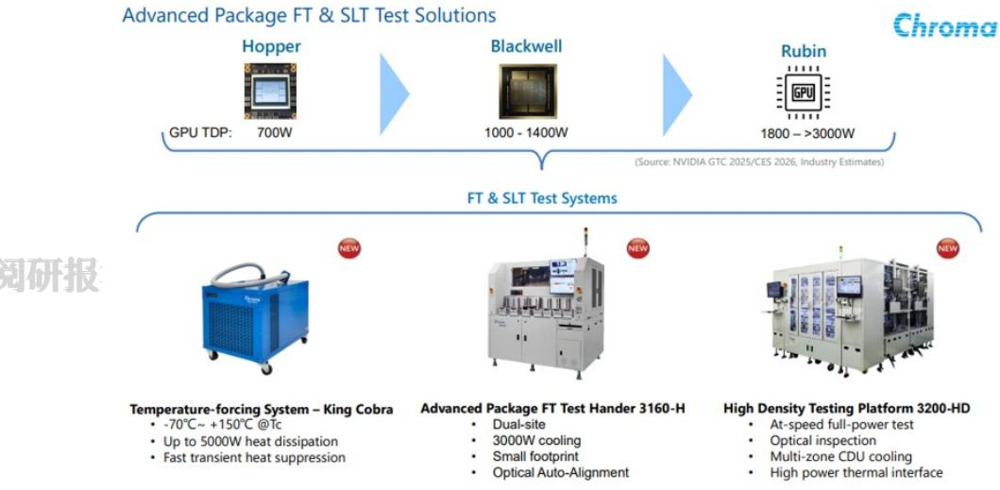  
Exhibit 82: SLT and FT equipment offerings from Chroma   
Source: Chroma.

# Fast-growing metrology business amid advanced packaging capacity expansions

In 2025, Chroma started to supply metrology equipment that is used in the probe mark, RDL and TSV structures in the advanced packaging process, with its customer base including both foundry and OSAT players.

Chroma's metrology equipment employs white light interferometry technology. The basic 添加微信 LCD123321Cad 04-17 working principle is to have white light emitted on the reference mirror and the sample, which are placed at the same distance from the light source. The reflected beams from the reference mirror and sample surface are then received by a light sensor.

Interference occurs when two light beams collide, which could cause them to either strengthen or weaken, depending on the phase of the two light beams. Thus, by measuring the intensity of the combined light beams, the distance between the light sensor and multiple points on the target surface can be calculated through an algorithm. This can then be used to measure the dimensions of the structure or the alignment of

layers.

This business should continue to grow along with the capacity expansions for different advanced packaging architectures, e.g., CoWoS, wafer-level multi-chip module (WMCM), CoPoS. We estimate that metrology will account for $8 \%$ of Chroma's total revenue in 2026.

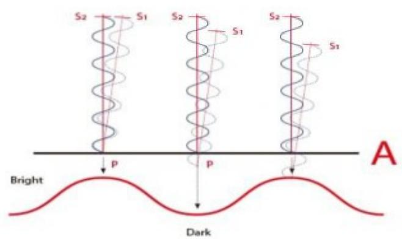  
Exhibit 83: Concept of light interference   
Source: Keyence.

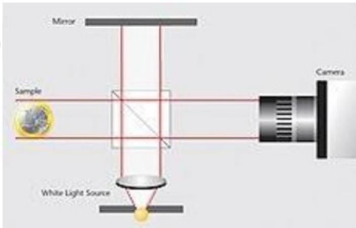  
Exhibit 84: Setup of interferometer   
Source: Wikipedia.

Exhibit 85:

Metrology equipment offerings from Chroma

Advanced Packaging -2D/3D Wafer Metrology Systems

# Chroma

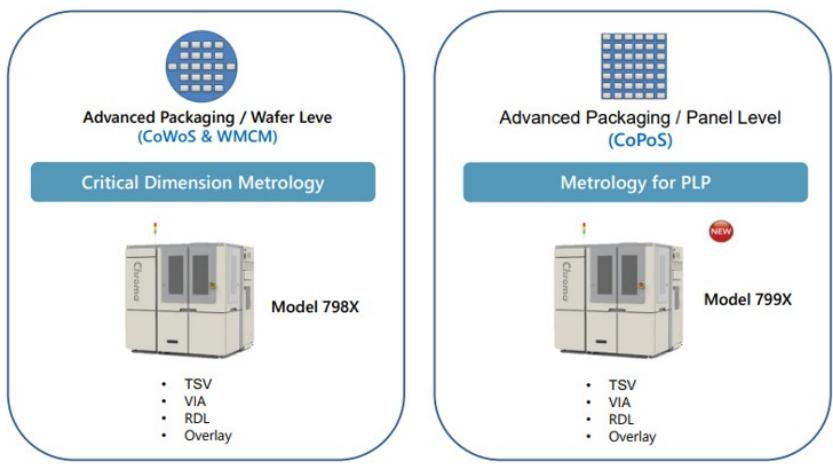  
订阅研报   
Source: Chroma.

# Emerging contribution from CPO testing equipment

For CPO testing equipment, Chroma can leverage its accumulated experience and technology in electrical IC and photonics IC testing. It has already been qualified for its offering in the electrical/optical testing for optical engines and the CPO switch ASIC. Management indicates that it has already received orders, which add up to more than those for its metrology tools. It also has the testing equipment for the PIC wafer ready, and it is engaging with potential customers for future adoption.

We estimate that photonics testing equipment will account for $9 \%$ of its total revenue in 2026, and the contribution could be higher if CPO continues to penetrate into more

datacenter interconnects.

#

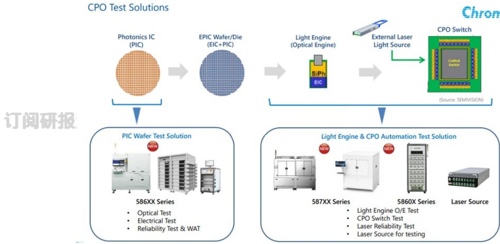  
Exhibit 86: CPO testing equipment offerings from Chroma   
Source: Chroma.

# Hon Precision (7769.TW): Key Beneficiary of the Structural Trend Toward Longer Testing Times; Initiate at OW

Hon Precision is a global leader in semiconductor test handler solutions, offering turnkey test design services for its customers. We view it as the global leader in AI/HPC final test handlers ${ \sim } 7 0 \%$ global market share, 2025), and as well positioned to 订阅研报添加微信benefit from structurally rising test intensity driven by larger, L more complex, and higher-power AI chips, which extend test times and increase demand per unit. Its patent-protected active thermal control (ATC) technology provides a key competitive edge as thermal requirements escalate (with AI chip TDP trending toward >4kW), supporting ongoing system upgrades, higher content, and $1 5 \mathrm { - } 2 0 \%$ ASP growth on an annual basis, we estimate. In addition, emerging test insertions, such as system-level test (SLT), alongside WMCM and CPO, offer incremental growth optionality as adoption broadens across AI players, with Hon Precision investing in multi-site SLT and automation to capture future share gains.

Earnings: Our EPS estimates for 2026-27 are more bullish than consensus. We think revenue momentum will remain strong during this period, thanks to Hon Precision's position as a global leader in semiconductor automated test handler solutions.

Valuation: We derive our price target from a residual income model, as we believe this can best capture the long-term value. Our price target implies 43x 2026e P/E, which we think is justified given the $6 \%$ revenue CAGR that we project for 2025-2028e.

Key downside risks include: 1) slower-than-expected AI demand, 2) stronger-than-expected market share gain from peers, and 3) slower-than-expected CPO development.

Exhibit 87: Hon Precision (7769.TW): Summary of key metrics   

<table><tr><td rowspan=1 colspan=1>Reuters:7769.TW/Bloomberg:7769TTGreaterChinaSemiconductor</td></tr><tr><td rowspan=1 colspan=1>Price target (US$)                                      NTS5,000.00</td></tr><tr><td rowspan=1 colspan=1>Up/downside to price target (%)                                   35</td></tr><tr><td rowspan=1 colspan=1>Shr price, close(Apr 15,2026)                              NT$4,295</td></tr><tr><td rowspan=1 colspan=1>52-WeekRange                                  NTS570-NTS4,895</td></tr><tr><td rowspan=1 colspan=1>Sh out, dil,curr (mn)                                             162</td></tr><tr><td rowspan=1 colspan=1>Mkt cap,curr (mn)                                             24.23</td></tr><tr><td rowspan=1 colspan=1>EV, curr (mn)                                                  24.23</td></tr><tr><td rowspan=1 colspan=1>Avg daily trading volume (mn)                                   1.00</td></tr></table>

<table><tr><td>Fiscal YearEnding</td><td>2025</td><td>2026e</td><td>2027e</td><td>2028e</td></tr><tr><td>ModelWare EPS(NTS)</td><td>76.30</td><td>116.17</td><td>193.10</td><td>308.30</td></tr><tr><td>Consensus EPS(NTS)S</td><td></td><td>109.50</td><td>159.07</td><td></td></tr><tr><td>Revenue,net (NT$ mn)</td><td>30,271</td><td>52,343</td><td>82,941</td><td>127,341</td></tr><tr><td>EBITDA (NTSmn)</td><td>15,114</td><td>26,109</td><td>43,486</td><td>69,571</td></tr><tr><td>ModelWare net inc (NTS mn)</td><td>12,362</td><td>20,899</td><td>34,739</td><td>55,464</td></tr><tr><td>P/E</td><td>44.9</td><td>37.0</td><td>22.2</td><td>13.9</td></tr><tr><td>P/BV</td><td>9.6</td><td>11.8</td><td>9.3</td><td>7.0</td></tr><tr><td>RNOA (%)</td><td></td><td>467.2</td><td>104.7</td><td>96.1</td></tr><tr><td>ROE (%)</td><td></td><td>36.0</td><td>53.2</td><td>67.1</td></tr><tr><td>EV/EBITDA</td><td>33.2</td><td>25.4</td><td>15.4</td><td>9.8</td></tr><tr><td>Div yld (%)</td><td>2.2</td><td>2.2</td><td>0.0</td><td>0.0</td></tr><tr><td>FCF yld ratio (%)</td><td>3.0</td><td>(0.8)</td><td>1.6</td><td>3.0</td></tr><tr><td>Leverage (EOP)(%)</td><td>(92.4)</td><td>(51.4)</td><td>(34.8)</td><td>(22.0)</td></tr></table>

$\ S =$ $\underline { { \underline { { \mathbf { \delta \pi } } } } }$

# Companydescription

# Hon Precision: Quarterly Earnings and Financial summary

Exhibit 88: Hon Precision: Quarterly financials   
YE Dec 31   

<table><tr><td>(NTs mn)</td><td>1Q26e</td><td>2Q26e</td><td>3Q26e</td><td>4Q26e</td><td>1Q27e</td><td>2Q27e</td><td>3Q27e</td><td>4Q27e</td><td>1Q28e</td><td>2Q28e</td><td>3Q28e</td><td>4Q28e</td><td>2024</td><td>2025</td><td>2026e</td><td>2027e</td><td>2028e</td></tr><tr><td>Total Revenues</td><td>10,725</td><td>11,938</td><td>13,706</td><td>15,973</td><td>16,869</td><td>19,333</td><td>22,328</td><td>24,411</td><td>26,238</td><td>30,195</td><td>34,524</td><td>36,383</td><td>13,992</td><td>30,271</td><td>52,343</td><td>82,941</td><td>127,341</td></tr><tr><td>Q/Q% YY%</td><td>15.6% 81.4%</td><td>11.3% 73.4%</td><td>14.8%</td><td>16.5%</td><td>5.6%</td><td>14.6%</td><td>15.5%</td><td>9.3%</td><td>7.5%</td><td>15.1%</td><td>14.3% 54.6%</td><td>5.4% 49.0%</td><td></td><td></td><td></td><td></td><td></td></tr><tr><td></td><td></td><td></td><td>67.2%</td><td>72.2%</td><td>57.3%</td><td>61.9%</td><td>62.9%</td><td>52.8%</td><td>55.5%</td><td>56.2%</td><td></td><td></td><td></td><td>116.3%</td><td>72.9%</td><td>58.5%</td><td>53.5%</td></tr><tr><td>Cost of Sales Percentof Revenues</td><td>(4,879) 45.5%</td><td>(5,205) 43.6%</td><td>(5,697) 41.6%</td><td>(6.945) 43.5%</td><td>（7.190) 42.6%</td><td>(8.038) 41.6%</td><td>(8.823) 39.5%</td><td>(9,876) 40.5%</td><td>(10,351)</td><td>(11,601) 38.4%</td><td>(13,176) 38.2%</td><td>(14,150) 38.9%</td><td>(6,293) 45.0%</td><td>(13,157) 43.5%</td><td>(22,726) 43.4%</td><td>(33.928) 40.9%</td><td>(49,277) 38.7%</td></tr><tr><td></td><td></td><td></td><td></td><td></td><td></td><td></td><td></td><td></td><td>39.4%</td><td></td><td></td><td></td><td></td><td></td><td></td><td></td><td></td></tr><tr><td>Gross Profit Gross Margin</td><td>5,846 54.5%</td><td>6,733 56.4%</td><td>8,010 58.4%</td><td>9,029 56.5%</td><td>9,679 57.4%</td><td>11,295 58.4%</td><td>13,505 60.5%</td><td>14,534 59.5%</td><td>15,887 60.6%</td><td>18,594 61.6%</td><td>21,348 61.8%</td><td>22,234 61.1%</td><td>7,700 55.0%</td><td>17,114 56.5%</td><td>29,617 56.6%</td><td>49,013 59.1%</td><td>78,064 61.3%</td></tr><tr><td>Incremental Margins</td><td></td><td></td><td></td><td></td><td></td><td></td><td></td><td></td><td></td><td></td><td></td><td></td><td></td><td></td><td></td><td></td><td></td></tr><tr><td>Total Opex Percent of Revenues</td><td>（794) 7.4%</td><td>(844) 7.1%</td><td>(922) 6.7%</td><td>(1.017) 6.4%</td><td>(1.136) 6.7%</td><td>(1,268) 6.6%</td><td>(1,487) 6.7%</td><td>(1,705) 7.0%</td><td>(1,816) 6.9%</td><td>(1,996) 6.6%</td><td>(2.269) 6.6%</td><td>(2.480) 6.8%</td><td>(1.415) 10.1%</td><td>(2.068) 6.8%</td><td>(3.576) 6.8%</td><td>(5,596) 6.7%</td><td>(8,561) 6.7%</td></tr><tr><td>R&amp;D</td><td>(440)</td><td>(450)</td><td>(470)</td><td>(490)</td><td>(580)</td><td></td><td></td><td>（900)</td><td>(950)</td><td>(1,000)</td><td>(1,130)</td><td>(1.280)</td><td>(637)</td><td>(1,039)</td><td>(1,849)</td><td>(2.859)</td><td>(4,359)</td></tr><tr><td>Percent of Revenues</td><td>4.1%</td><td>3.8%</td><td>3.4%</td><td>3.1%</td><td>3.4%</td><td>(630) 3.3%</td><td>(750) 3.4%</td><td>3.7%</td><td>3.6%</td><td>3.3%</td><td>3.3%</td><td>3.5%</td><td>4.6%</td><td>3.4%</td><td>3.5%</td><td>3.4%</td><td>3.4%</td></tr><tr><td>Sales and Marketing</td><td>(150)</td><td>(167)</td><td>(192)</td><td>(224)</td><td>(236)</td><td>(271)</td><td>(313)</td><td>(342)</td><td>(367)</td><td>(423)</td><td>(483)</td><td>(509)</td><td>(236)</td><td>(450)</td><td>(733）)</td><td>(1,161)</td><td>(1,783)</td></tr><tr><td>Percentof Revenues</td><td>1.4%</td><td>1.4%</td><td>1.4%</td><td>1.4%</td><td>1.4%</td><td>1.4%</td><td>1.4%</td><td>1.4%</td><td>1.4%</td><td>1.4%</td><td>1.4%</td><td>1.4%</td><td>1.7%</td><td>1.5%</td><td>1.4%</td><td>1.4%</td><td>1.4%</td></tr><tr><td>General and Admin Percentof Revenues</td><td>(204) 1.9%</td><td></td><td>(260) 1.9%</td><td>(303)</td><td>(321)</td><td></td><td>(424)</td><td>(464)</td><td>(499)</td><td>(574)</td><td>(656)</td><td>(691)</td><td>(542)</td><td>(578)</td><td>(995)</td><td>(1,576)</td><td>(2,419)</td></tr><tr><td></td><td></td><td></td><td></td><td>1.9%</td><td>1.9%</td><td>1.87</td><td>1.9%</td><td>1.9%</td><td>1.9%</td><td>1.9%</td><td>1.9%</td><td>1.9%</td><td>3.9%</td><td>1.9%</td><td>1.9%</td><td>1.9%</td><td>1.9%</td></tr><tr><td>Operating Income Operating margin</td><td>5,052 47.1%</td><td>5,889 49.3%</td><td>7,088 51.7%</td><td>8,012 50.2%</td><td>8,542</td><td>10,027</td><td>12,019</td><td>12,829</td><td>14,071 53.6%</td><td>16,598 55.0%</td><td>19,079 55.3%</td><td>19,753 54.3%</td><td>6,285 44.9%</td><td>15,046 49.7%</td><td>26,041 49.8%</td><td>43,417 52.3%</td><td>69,502 54.6%</td></tr><tr><td>Total Non-operating Income</td><td>58</td><td>62</td><td>64</td><td>67</td><td>50.6%</td><td>51.9%</td><td>53.8%</td><td>52.6% 74</td><td>67</td><td>68</td><td>69</td><td>70</td><td>398</td><td>538</td><td>251</td><td>286</td><td>274</td></tr><tr><td>Profit Before Taxes</td><td>5,110</td><td>5,951</td><td>7.152</td><td></td><td>70</td><td>70</td><td>72</td><td></td><td></td><td>16,667</td><td>19,149</td><td>19,823</td><td>6,683</td><td></td><td>26,292</td><td></td><td>69,777</td></tr><tr><td>Percent of Revenues</td><td>47.6%</td><td>49.8%</td><td>52.2%</td><td>8.079 50.6%</td><td>8.612 51.1%</td><td>10,098 52.2%</td><td>12,091 54.1%</td><td>12.903 52.9%</td><td>14,139 53.9%</td><td>55.2%</td><td>55.5%</td><td>54.5%</td><td>47.8%</td><td>15,584 51.5%</td><td>50.2%</td><td>43,703 52.7%</td><td>54.8%</td></tr><tr><td>Taxes</td><td>(1,048)</td><td>(1,221)</td><td>(1,467)</td><td>(1,657)</td><td>(1,767)</td><td>(2.071)</td><td>(2,480)</td><td>(2.647)</td><td>(2.900)</td><td>(3,419)</td><td>(3.928)</td><td>(4,066)</td><td>(1,397)</td><td>(3,222)</td><td>(5,393)</td><td>(8.965)</td><td>(14,313)</td></tr><tr><td>TaxRate</td><td>20.5%</td><td>20.5%</td><td>20.5%</td><td>20.5%</td><td>20.5%</td><td>20.5%</td><td>20.5%</td><td>20.5%</td><td>20.5%</td><td>20.5%</td><td>20.5%</td><td>20.5%</td><td>20.9%</td><td>20.7%</td><td>20.5%</td><td>20.5%</td><td>20.5%</td></tr><tr><td>Net Income, Cont Ops</td><td>4,062</td><td>4,730</td><td>5.685</td><td>6.422</td><td>6.846</td><td>8,026</td><td>9.611</td><td>10,256</td><td>11,238</td><td>13,248</td><td>15,221</td><td>15,757</td><td>5.286</td><td>12,362</td><td>20,899</td><td>34,739</td><td>55,464</td></tr><tr><td>Reported Income (TW GAAP)</td><td>4,062</td><td>4,730</td><td>5,685</td><td>6,422</td><td>6,846</td><td>8,026</td><td>9,611</td><td>10,256</td><td>11,238</td><td>13,248</td><td>15,221</td><td>15,757</td><td>5,286</td><td>12,362</td><td>20,899</td><td>34,739</td><td>55,464</td></tr><tr><td>Percentof Revenues</td><td>37.9% 58.2%</td><td>39.6%</td><td>41.5%</td><td>40.2%</td><td>40.6%</td><td>41.5%</td><td>43.0%</td><td>42.0%</td><td>42.8%</td><td>43.9%</td><td>44.1%</td><td>43.3%</td><td>37.8%</td><td>40.8%</td><td>39.9%</td><td>41.9%</td><td>43.6% 59.7%</td></tr><tr><td>Change vs Year Ago ModelWare EPS (NT$)</td><td>22.58</td><td>91.8% 26.29</td><td>57.2% 31.60</td><td>73.0% 35.70</td><td>68.5% 38.05</td><td>69.7% 44.62</td><td>69.1% 53.42</td><td>59.7% 57.01</td><td>64.2% 62.47</td><td>65.1% 73.64</td><td>58.4% 84.61</td><td>53.6% 87.59</td><td>32.93</td><td>133.9% 76.30</td><td>69.1% 116.17</td><td>66.2% 193.10</td></table>

Source: Company data, Morgan Stanley Research. $\in { } =$ Morgan Stanley Research estimates.

Exhibit 89: Hon Precision: Financial summary   
Income Statement   

<table><tr><td>ncomeStatement NT$mn(Years End Dec)</td><td>2024</td><td>2025</td><td>2026e</td><td>2027e</td><td>2028e</td></tr><tr><td>Net sales</td><td>13,992</td><td>30,271</td><td>52,343</td><td>82,941</td><td>127,341</td></tr><tr><td>COGS</td><td>(6.293)</td><td>(13,157)</td><td>(22,726)</td><td>(33,928)</td><td>(49,277)</td></tr><tr><td>Gross profit</td><td>7,700</td><td>17,114</td><td>29,617</td><td>49,013</td><td>78,064</td></tr><tr><td>Operating expenses</td><td>(1.415)</td><td>(2,068)</td><td>(3,576)</td><td>(5,596)</td><td>(8,561)</td></tr><tr><td>Operating income</td><td>6,285</td><td>15,046</td><td>26,041</td><td>43,417</td><td>69,502</td></tr><tr><td>Non-operating income</td><td>398</td><td>538</td><td>251</td><td>286</td><td>274</td></tr><tr><td>Pre-tax income</td><td>6,683</td><td>15,584</td><td>26,292</td><td>43,703</td><td>69,777</td></tr><tr><td>Income tax</td><td>(1,397)</td><td>(3,222)</td><td>(5,393)</td><td>(8,965)</td><td>(14,313)</td></tr><tr><td>Reported net Income</td><td>5,286</td><td>12,362</td><td>20,899</td><td>34,739</td><td>55,464</td></tr><tr><td>Adj.wtd.avg.shrs( m)</td><td>161</td><td>162</td><td>180</td><td>180</td><td>180</td></tr><tr><td>Basic EPS (NT$)</td><td>32.93</td><td>76.30</td><td>116.17</td><td>193.10</td><td>308.30</td></tr><tr><td>EPS for consensus (NT$)</td><td>32.93</td><td>76.26</td><td>116.17</td><td>193.10</td><td>308.30</td></tr></table>

Balance Sheet   

<table><tr><td>NT$mn (Years End Dec)</td><td>2024</td><td>2025</td><td>2026e</td><td>2027e</td><td>2028e</td></tr><tr><td>Cash</td><td>6,025</td><td>53,427</td><td>33,407</td><td>28,643</td><td>24,120</td></tr><tr><td>Mkt Securities</td><td>0</td><td>0</td><td>0</td><td>0</td><td>0</td></tr><tr><td>AR/NR</td><td>2,913</td><td>2,935</td><td>4,129</td><td>6,542</td><td>10,044</td></tr><tr><td>Inventory</td><td>8,444</td><td>12,641</td><td>41,942</td><td>66,461</td><td>102,038</td></tr><tr><td>Other</td><td>2,155</td><td>1,193</td><td>1,193</td><td>1,193</td><td>1,193</td></tr><tr><td>Current Assets</td><td>19,537</td><td>70,195</td><td>80,670</td><td>102,838</td><td>137,395</td></tr><tr><td>Long-term investments</td><td>66</td><td>174</td><td>174</td><td>174</td><td>174</td></tr><tr><td>Fixed assets</td><td>1,888</td><td>2,106</td><td>2.430</td><td>2,854</td><td>3,378</td></tr><tr><td>Other assets</td><td>375</td><td>795</td><td>788</td><td>781</td><td>774</td></tr><tr><td>Total Assets</td><td>21,866</td><td>73,270</td><td>84,062</td><td>106,647</td><td>141,720</td></tr><tr><td>S/T borrowings</td><td>157</td><td>0</td><td>0</td><td>0</td><td>0</td></tr><tr><td>AP/NP</td><td>3,181</td><td>3,402</td><td>5,685</td><td>8,487</td><td>12,327</td></tr><tr><td>Other ST liabilities</td><td>4,691</td><td>11,626</td><td>11,626</td><td>11,626</td><td>11,626</td></tr><tr><td>LT debt</td><td>0</td><td>0</td><td>0</td><td>0</td><td>0</td></tr><tr><td>Other LT liabilities</td><td>106</td><td>211</td><td>211</td><td>211</td><td>211</td></tr><tr><td>Total Liabilities</td><td>8,134</td><td>15,239</td><td>17,522</td><td>20,324</td><td>24,164</td></tr><tr><td>Common stocks</td><td>1,616</td><td>1,799</td><td>1,799</td><td>1,799</td><td>1,799</td></tr><tr><td>Preferred stocks</td><td>0</td><td>0</td><td>0</td><td>0</td><td>0</td></tr><tr><td>Capital Researve</td><td>878</td><td>36,180</td><td>36,180</td><td>36,180</td><td>36,180</td></tr><tr><td>Retained earning</td><td>11,237</td><td>20,073</td><td>27,388</td><td>44,757</td><td>72.489</td></tr><tr><td>Other shareholders&#x27;equity</td><td>0</td><td>(21)</td><td>(21)</td><td>(21)</td><td>(21)</td></tr><tr><td>Total Equity</td><td>13,732</td><td>58,031</td><td>66,540</td><td>86,323</td><td>117,556</td></tr><tr><td>TotalLiab.&amp;Shrhldr&#x27;s Equity</td><td>21,866</td><td>73,270</td><td>84,062</td><td>106,647</td><td>141,720</td></tr></table>

$\mathtt { e } =$ Morgan Stanley Research Estimates Source: Morgan Stanley Research, Company Data

Cash Flow Statement   

<table><tr><td>NT$mn (Years End Dec）</td><td>2024</td><td>2025</td><td>2026e</td><td>2027e</td><td>2028e</td></tr><tr><td>Cashflow from Operations</td><td>2,308</td><td>16,186</td><td>(6,050)</td><td>13,091</td><td>23,795</td></tr><tr><td>Net profits</td><td>5,286</td><td>12,362</td><td>20,899</td><td>34,739</td><td>55,464</td></tr><tr><td>Depreciation</td><td>44</td><td>62</td><td>62</td><td>62</td><td>62</td></tr><tr><td>Working Capital Change</td><td>(3,545)</td><td>(4,100)</td><td>(27,018)</td><td>(21,716)</td><td>(31,737)</td></tr><tr><td>Other adjustments</td><td>523</td><td>7,863</td><td>7</td><td>7</td><td>7</td></tr><tr><td>Cashflow from Investing</td><td>(1,322)</td><td>569</td><td>(386)</td><td>(486)</td><td>(586)</td></tr><tr><td>Capex</td><td>(114)</td><td>(285)</td><td>(386)</td><td>(486)</td><td>(586)</td></tr><tr><td>Change of LT Investment</td><td>0</td><td>0</td><td>0</td><td>0</td><td>0</td></tr><tr><td>Change of ST Investment</td><td>(3)</td><td>(0)</td><td>0</td><td>0</td><td>0</td></tr><tr><td>Other adjustments</td><td>(1,205)</td><td>854</td><td>0</td><td>0</td><td>0</td></tr><tr><td>Cashflow from financing</td><td>(3,759)</td><td>30,650</td><td>(13,584)</td><td>(17,369)</td><td>(27,732)</td></tr><tr><td>Increase inL/T debt</td><td>0</td><td>0</td><td>0</td><td>0</td><td>0</td></tr><tr><td>Increase in S/T debt</td><td>156</td><td>(152)</td><td>0</td><td>0</td><td>0</td></tr><tr><td>Cash Dividend Paid</td><td>(4,800)</td><td>(3,636)</td><td>(13,584)</td><td>(17,369)</td><td>(27,732)</td></tr><tr><td>Dir&amp; Emp Bonus Paid</td><td>0</td><td>0</td><td>0</td><td>0</td><td>0</td></tr><tr><td>Other adjustments</td><td>885</td><td>34,438</td><td>0</td><td>0</td><td>0</td></tr><tr><td>Exchange rate adjustment</td><td>4</td><td>(2)</td><td>0</td><td>0</td><td>0</td></tr><tr><td>Netchange in cash</td><td>-2,769</td><td>47,402</td><td>-20,020</td><td>-4,764</td><td>-4,523</td></tr></table>

Financial Ratios   

<table><tr><td></td><td>2024</td><td>2025</td><td>2026e</td><td>2027e</td><td>2028e</td></tr><tr><td>Growth(%)</td><td></td><td></td><td></td><td></td><td></td></tr><tr><td>Turnover</td><td></td><td>116.3</td><td>72.9</td><td>58.5</td><td>53.5</td></tr><tr><td>Operating profits</td><td></td><td>139.4</td><td>73.1</td><td>66.7</td><td>60.1</td></tr><tr><td>Pretax profits</td><td></td><td>133.2</td><td>68.7</td><td>66.2</td><td>59.7</td></tr><tr><td>Net profits</td><td></td><td>133.9</td><td>69.1</td><td>66.2</td><td>59.7</td></tr><tr><td>EPS</td><td></td><td>131.6</td><td>52.3</td><td>66.2</td><td>59.7</td></tr><tr><td>Margins (%)</td><td></td><td></td><td></td><td></td><td></td></tr><tr><td>Gross Margin</td><td>55.0</td><td>56.5</td><td>56.6</td><td>59.1</td><td>61.3</td></tr><tr><td>Operating Margin</td><td>44.9</td><td>49.7</td><td>49.8</td><td>52.3</td><td>54.6</td></tr><tr><td>Pretax Margin</td><td>47.8</td><td>51.5</td><td>50.2</td><td>52.7</td><td>54.8</td></tr><tr><td>Net Profit</td><td>37.8</td><td>40.8</td><td>39.9</td><td>41.9</td><td>43.6</td></tr><tr><td>Return (%)</td><td></td><td></td><td></td><td></td><td></td></tr><tr><td>ROAE</td><td>77.0</td><td>34.5</td><td>33.6</td><td>45.5</td><td></td></tr><tr><td>ROAA</td><td>48.3</td><td>26.0</td><td>26.6</td><td>36.4</td><td>54.4 44.7</td></tr><tr><td>Gearing (%)</td><td></td><td></td><td></td><td></td><td></td></tr><tr><td>Net Debt/Equity</td><td>(42.7)</td><td>(92.1)</td><td>(50.2)</td><td>(33.2)</td><td></td></tr><tr><td>Liabilities/Equity</td><td>59.2</td><td>26.3</td><td>26.3</td><td>23.5</td><td>(20.5) 20.6</td></tr><tr><td>Ratios (X)</td><td></td><td></td><td></td><td></td><td></td></tr><tr><td>Current ratio</td><td>2.4</td><td>4.7</td><td>4.7</td><td>5.1</td><td>5.7</td></tr><tr><td>Quick ratio</td><td>1.1</td><td>3.8</td><td>2.2</td><td>1.7</td><td>1.4</td></tr><tr><td>Others</td><td></td><td></td><td></td><td></td><td></td></tr><tr><td>AR/NR Turnover (days)</td><td>0</td><td>53</td><td>29</td><td>29</td><td>29</td></tr><tr><td>Inventory Turnover (days)</td><td>0</td><td>220</td><td>127</td><td>190</td><td>239</td></tr><tr><td>AP Turnover (days)</td><td>0</td><td>184</td><td>91</td><td>91</td><td>91</td></tr><tr><td>Cash Conversion (days)</td><td>0</td><td>89</td><td>65</td><td>128</td><td>176</td></tr></table>

# Risk Reward - Hon PrecisRisk Reward – Hon Precision (7769.TW)

Key bene ciary of the structural trend toward longer testing times

# NT\$5,000.00PRICE TARGET

We derive our price target from a residual income model, as we believe this can best capture the long-term value. We assume a $9 . 8 \%$ cost of equity (risk-free rate $2 . 0 \%$ and risk premium $6 . 0 \%$ , a payout ratio of $6 2 \%$ a medium-term growth rate of $1 0 \% ,$ and a terminal growth rate of $3 . 0 \%$ . Our price target implies $4 3 \times / 2 6 \times / 1 6 \times 2 0 2 6 \mathrm { e } / 2 0 2 7 \mathrm { e } / 2 0 2 8 \mathrm { e } \mathsf { P } / \mathsf { E } .$

Consensus Price Target Distribution

Source: Re fi nitiv, Morgan Stanley Research

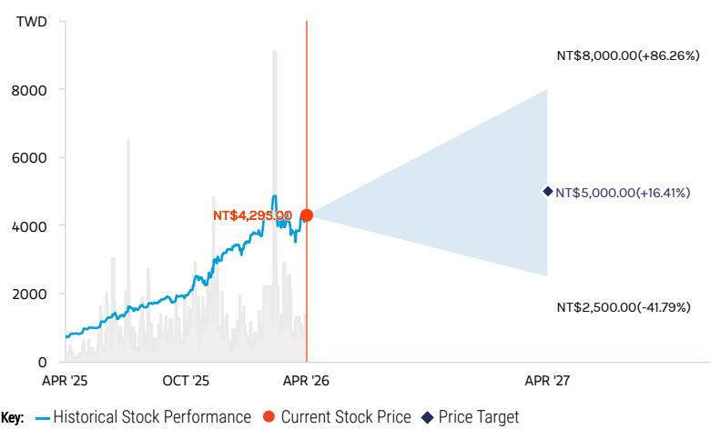  
RISK REWARD CHART   
Source: Re nitiv, Morgan Stanley Research

# OVERWEIGHT THESIS

▪ We rate the shares Overweight relative to our coverage because it is the clear leader in ${mathsf { A l / H P C } }$ test handlers ${ \sim } 7 0 \%$ market share), with direct leverage to structurally rising test intensity, longer test times, and is 04-17 structurally positioned to bene fit from rising test intensity per chip.

▪ Hon’s patent-protected ATC technology is a key differentiator as thermal challenges intensify. We estimate that Hon is positioned to drive $1 5 - 2 0 \% +$ ASP growth through spec upgrades, enabling margin expansion alongside revenue growth.

▪ New test stages are expanding the TAM, including CPO, microchannel lid, and WMCM, providing incremental revenue streams and long-term share expansion opportunities.

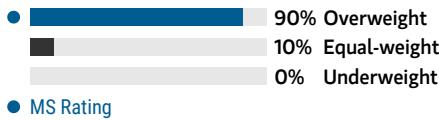  
Consensus Rating Distribution   
Source: Re nitiv, Morgan Stanley Research

# Risk Reward Themes

Secular Growth: Positive Technology Diffusion: Positive View descriptions of Risk Rewards Themes here

# BULL CASE

# NT\$8,000.00

# BASE CASE

# NT\$5,000.00

# BEAR CASE

NT\$2,500.00

# 41x 2027e EPS

We assume: 1) $100 \%$ revenue CAGR, 2025- 28e, on stronger-than-expected adoption of tri-temp ATC+handler with robust market share gain momentum in dual-temp ATC+handler and more market share gains; 2) faster-than-expected CPO introduction; 3) gross margin improves to over $70 \%$ thanks to scale effects and the company's technology competitiveness; and $4$ ) $> 1 5 0 \%$ earnings CAGR, 2025-28e.

# 26x 2027e EPS

The introduction of next-gen AI GPU (including NVIDIA, AMD and MediaTek) should drive a signi cant increase in the content value for testing, requiring longer testing time and more testing procedures needed, such as adding SLT into its process. Combined with the multiplier effect emerging in CPO market, we expect these drivers to help Hon Precision’s 2025-28e revenue CAGR reach $6 \%$ . We expect to see operating leverage, with the earnings CAGR at $6 5 \%$ , 2025-28e.

# 13x 2027e EPS

We assume: 1) $20 \%$ revenue CAGR, 2025- 28e, on slower-than-expected adoption of tri-temp ATC+handler with robust market share gain momentum in dual-temp ${ \bar { \mathsf { A T C } } } +$ Handler and no project wins in CPO development; 2) slower-than-expected CPO introduction; 3) customer bargaining power causes gross margin to fall below $4 0 \% \cdot$ and 4) $30 \%$ earnings CAGR, 2025-28e.

# Risk Reward – Hon Precision (7769.TW)

KEY EARNINGS INPUTS   

<table><tr><td>Drivers</td><td>2025</td><td>2026e</td><td>2027e</td><td>2028e</td></tr><tr><td>Wafer Sort revenue (NTS, mn)</td><td>0</td><td>0</td><td>2,686</td><td>6,957</td></tr><tr><td>Final Test revenue (NTS, mn)</td><td></td><td>0</td><td>0</td><td>1,704</td></tr><tr><td>Burn-In revenue (NTS,mn)</td><td>0</td><td>0</td><td>0</td><td>174</td></tr></table>

# INVESTMENT DRIVERS

AI demandTest time

# GLOBAL REVENUE EXPOSURE

  
Source: Morgan Stanley Research Estimate View explanation of regional hierarchies here

# RISKS TO PT/RATING

# RISKS TO UPSIDE

Stronger-than-expected AI demand   
Stronger-than-expected market share expansion   
Faster-than-expected CPO development with more testing needs emerge

# RISKS TO DOWNSIDE

Slower-than-expected AI demand Stronger-than-expected market share gain from peers Slower-than-expected CPO development

# MS ESTIMATES VS. CONSENSUS

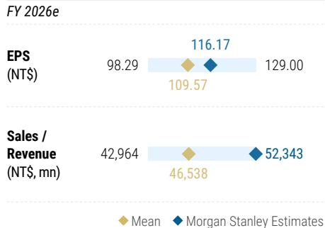  
Source: Re nitiv, Morgan Stanley Research

# Hon Precision: Investment Positives and Concerns

Investment positives

# Structural AI/HPC Test Intensity Drives Sustained Handler Demand: Hon

Precision is the global leader in AI/HPC final test handlers, with $\sim 7 0 \%$ market share (by revenue in 2025), and it is structurally positioned to benefit from rising test intensity driven by AI semiconductor scaling. As AI accelerators become 微信 LCD123321Cad 04-17 larger, more complex, and increasingly power-dense, testing requirements are expanding both in duration and complexity. This results in longer test times per unit and higher handler utilization, even before factoring in continued growth in AI chip volumes across GPUs, TPUs, and custom ASICs. We believe this dynamic creates a durable, structural demand tailwind for Hon Precision, allowing it to capture growth from both increasing unit shipments and rising test content per chip.

# 2. Active Thermal Control (ATC) Leadership Enables Content Expansion and ASP

Upside: Hon Precision’s patent-protected ATC technology underpins its   
competitive positioning and supports sustained content and pricing expansion. With AI chip thermal design power rapidly increasing – from ${ \sim } 1 . 2 { - } 1 . 5 { \sf k W }$ in currentgeneration Blackwell GPUs, to potentially over 4kW in future architectures – thermal management during testing is becoming significantly more challenging. This is driving an industry shift from traditional air-cooled systems to more advanced liquid and refrigerant-based cooling solutions. As a result, handler 微信 C 123321Ca   
systems are becoming more complex, increasing both bill-of-materials content and technological barriers to entry. We estimate Hon Precision can achieve at least 15- $20 \%$ ASP uplift driven by ongoing specification upgrades, supporting both revenue growth and margin expansion.

# 3. Emerging Test Insertions (SLT, WMCM, CPO) Unlock New Growth Potential:

Beyond core final test, emerging test insertions, such as system-level test (SLT), along with developments in WMCM and co-packaged optics (CPO), represent incremental growth opportunities that could expand Hon Precision’s addressable market over time. SLT is gaining traction as hyperscalers and chipmakers seek to validate real-world system performance across full-stack environments, including CPU, memory, networking, and power delivery. While Hon Precision currently has exposure to SLT through AMD and automotive customers, broader adoption across AI players – including potential ramp from ASIC vendors such as Google in 2026 – could provide further upside. Although NVIDIA’s SLT supply remains 微信 LCD123321Cad 04-17 dominated by Chroma in the near term, Hon Precision is investing in enhanced multi-site SLT and automation capabilities (e.g., OHT, AGV) to support larger packages and improve throughput, positioning the company for future share gains as the SLT market evolves.

# Investment concerns

1. Slower-than-expected AI demand: A potential slowdown in AI demand remains a key risk to Hon Precision’s growth outlook. As a significant portion of the

company’s future expansion is tied to AI-driven semiconductor demand, any deceleration in hyperscaler capex or delays in AI chip development cycles could translate into slower project ramps with key customers. This would not only impact near-term order visibility but could also push out qualification timelines for next-generation probe card solutions.

2. Stronger-than-expected market share gain from peers: Intensifying competition from global and regional peers also presents downside risk for Hon Precision. The handler market is competitive, with established international players and emerging

anced technologies. If competition   
15% sales CAGR.This kind of new test insertion will alsc   
321ssive 4- ing, technology advancements, or longer term. customer penetration – it could pressure Hon Precision’s market share, particularly in new AI-related projects where vendor qualification is highly competitive.

3. Slower-than-expected CPO development: Slower development in the CPOrelated equipment business may limit valuation upside. Although the equipment segment currently contributes a relatively small portion of revenue, it represents an important long-term optionality tied to next-generation interconnect technologies such as co-packaged optics. Any delays in Hon Precision’s progress or weaker-than-expected industry adoption of CPO could dampen investor expectations and cap further re-rating potential for the stock.

# Hon Precision: Financial Outlook

# Capacity and production

As of 4Q25, Hon Precision expanded its equipment capacity to 600 units. Currently, the company targets to expand at least $40 \%$ Y/Y by end-2026. With a view to meeting the very strong demand from AI and HPC customers, and as it takes some time for expansion, we expect its UTR to run at $> 1 0 0 \%$ in 2026-27e.

# Contract liabilities vs revenue

Hon Precision's contract liabilities rose $7 7 5 \%$ Y/Y in 4Q25, reaching $7 1 \%$ of revenue, indicating aggressive pre-payments from customers and solidifying future revenue streams, from which we expect strong profitability in the coming quarters.

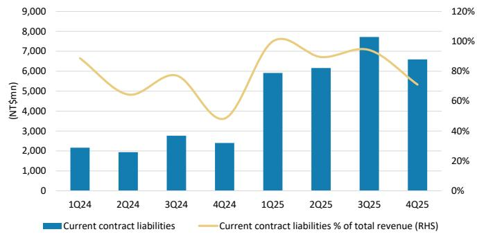  
Exhibit 90: Hon Precision's contract liabilities rose $1 7 5 \%$ Y/Y in 4Q25, reaching $71 \%$ of revenue   
Source: Company data, Morgan Stanley Research.

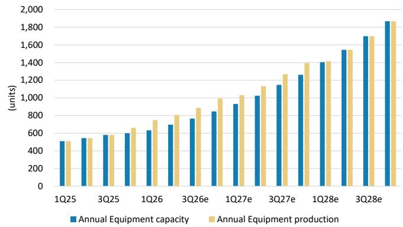  
Exhibit 91: Hon Precision expects to expand its equipment capacity by at least $40 \%$ Y/Y in 2026e, and to continue to aim for expansion in the coming years   
Source: Company data, Morgan Stanley Research. $\mathrm { { e = } }$ Morgan Stanley Research estimates.

# Revenue

The introduction of next-gen AI GPU (including NVIDIA, AMD and MediaTek) should drive a significant increase in the content value for testing, requiring longer testing time and more testing procedures needed, such as adding SLT into its process. Combined with the multiplier effect emerging in the CPO market, we expect these drivers to help Hon Precision’s revenue CAGR reach $6 7 \% ,$ , 2025-28e.

We expect Handler+ATC to continue to account for $7 5 \%$ of its total revenue throughout 2026-28e, with increasing adoption in tri-temp from areas such as auto and aerospace, and continual ASP increase of at least $1 5 . 2 0 \%$ annually in dualtemp, with spec migration acting as the key revenue driver. We also see new areas, such as CPO and micro-channel lid, acting as emerging opportunities for Hon Precision.

° We expect Coldplate to continue growing its revenue while overall mix remains 23- $2 5 \%$ in 2026-28e, as we see spec migration from installed base customers, and increasing site deployment in the SLT testing part.

# Gross profit

Hon Precision expanded its GM from $5 5 \%$ in 2024 to $5 6 . 5 \%$ in 2025, mainly driven by spec upgrade and better product mix from AI and HPC. We expect the continual spec migration trend, structurally longer testing time/procedure from large package size and emerging opportunities (such as CPO) to help lift Hon Precision's margin, which we expect to reach $6 \%$ in 2028e.

# EPS

# 添加微信 LCD123321Cad 04-17

Hon Precision's 2025 EPS was slightly constrained by the IPO (November 2025) employee stock option scheme, while it still managed to deliver $1 3 2 \%$ Y/Y growth.

Looking into 2026 and beyond, we expect overall currency policy (see our global team's latest report) to remain stable across the globe and no further stock issuance plan for the company. Thus, we expect to see operating leverage as high-margin business gradually bears fruit, with a $5 9 \%$ EPS CAGR, 2025-28e.

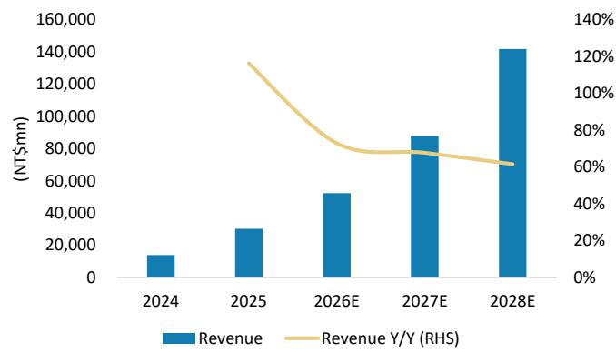  
Exhibit 92: We expect Hon Precision's revenue to expand at a $67 \%$ CAGR, 2025-28e   
Source: Company data, Morgan Stanley Research. $\in { } =$ Morgan Stanley Research estimates.

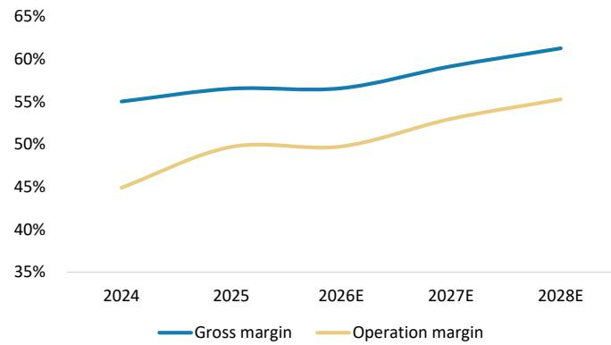  
Exhibit 94: We expect Hon Precision's margin to expand from $5 5 \%$ in 2024 to $67 \%$ in 2028e   
Source: Company data, Morgan Stanley Research. $\in { } =$ Morgan Stanley Research estimates.

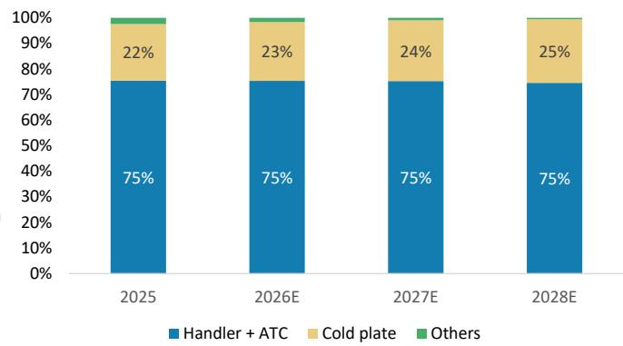  
Exhibit 93: Revenue breakdown, by product   
Source: Company data, Morgan Stanley Research. $\mathrm { { e = } }$ Morgan Stanley Research estimates.

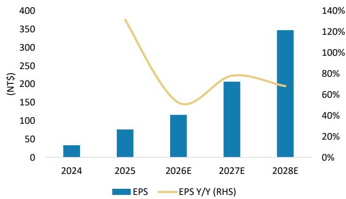  
Exhibit 95: We expect Hon Precision's EPS to achieve a $5 9 \%$ CAGR, 2025-28e   
Source: Company data, Morgan Stanley Research. $\mathrm { { e = } }$ Morgan Stanley Research estimates.

# Hon Precision: Our Estimates vs Consensus and What's Not Priced In

# We are more bullish than consensus on Hon Precision's 2026-27e earnings outlook

We think revenue momentum will remain strong in 2026-27e, as Hon Precision is a global 添加微信 LCD123321Cad 04-17 leader in semiconductor automated test handler solutions, offering turnkey test design services to fabless/IDMs/system companies. We estimate Hon Precision has more than $70 \%$ volume market share within AI/HPC final test handlers. We think Hon Precision can capitalise on multiple growth drivers ahead in the leading-edge semi testing market for cloud AI and other applications. Drivers include: 1) expanding testing demand from robust cloud AI unit growth and longer testing times, 2) rising tool set value due to the need to handle larger packages with more complicated ATC, and 3) potential upside from SLT and CPO. Our 2026/2027 EPS estimates are $9 . 6 \% / 2 2 . 5 \%$ above consensus.

The market continues to view Hon Precision as a cyclical back-end semiconductor equipment supplier with only indirect AI exposure, when, in reality, AI is structurally shifting bottlenecks toward thermal handling, burn-in, and reliability testing, where it is directly leveraged; rising power density in AI chips is increasing test complexity, duration, and equipment intensity, creating non-linear demand (more tools, higher ASPs, and higher utilization per unit), while OSATs may be forced to pull forward capex to avoid 添加微信 LCD123321Cad 04-17 bottlenecks, customer mix is quietly upgrading toward higher-margin advanced logic clients, and geopolitical supply chain duplication adds incremental demand – all combining to suggest a longer, more profitable, and less cyclical growth profile than currently assumed, with the critical underappreciated driver being increasing test time per AI chip, which amplifies revenue and earnings beyond simple volume growth.

Exhibit 96: Hon Precision: Morgan Stanley Research vs consensus   

<table><tr><td rowspan=2 colspan=1>(NT$mn)</td><td rowspan=1 colspan=3>2026e</td><td rowspan=1 colspan=3>2027e</td><td rowspan=1 colspan=3>2028e</td></tr><tr><td rowspan=1 colspan=1>Mse</td><td rowspan=1 colspan=1>Consensus</td><td rowspan=1 colspan=1>Diff.</td><td rowspan=1 colspan=1>Mse</td><td rowspan=1 colspan=1>Consensus</td><td rowspan=1 colspan=1>Diff.</td><td rowspan=1 colspan=1>Mse</td><td rowspan=1 colspan=1>Consensus</td><td rowspan=1 colspan=1>Diff.</td></tr><tr><td rowspan=1 colspan=1>Sales</td><td rowspan=1 colspan=1>52,343</td><td rowspan=1 colspan=1>46,638</td><td rowspan=1 colspan=1>12.2%</td><td rowspan=1 colspan=1>82,941</td><td rowspan=1 colspan=1>66,086</td><td rowspan=1 colspan=1>25.5%</td><td rowspan=1 colspan=1>127,341</td><td rowspan=4 colspan=1></td><td rowspan=4 colspan=1></td></tr><tr><td rowspan=1 colspan=1>Gross profit</td><td rowspan=1 colspan=1>29,617</td><td rowspan=1 colspan=1>26,711</td><td rowspan=1 colspan=1>10.9%</td><td rowspan=1 colspan=1>49,013</td><td rowspan=1 colspan=1>38,081</td><td rowspan=1 colspan=1>28.7%</td><td rowspan=1 colspan=1>78,064</td></tr><tr><td rowspan=1 colspan=1>Op. income</td><td rowspan=1 colspan=1>26,041</td><td rowspan=1 colspan=1>23,450</td><td rowspan=1 colspan=1>11.0%</td><td rowspan=1 colspan=1>43,417</td><td rowspan=1 colspan=1>34,112</td><td rowspan=1 colspan=1>27.3%</td><td rowspan=1 colspan=1>69,502</td></tr><tr><td rowspan=1 colspan=1>Pretax income</td><td rowspan=1 colspan=1>26,292</td><td rowspan=1 colspan=1>23,880</td><td rowspan=1 colspan=1>10.1%</td><td rowspan=1 colspan=1>43,703</td><td rowspan=1 colspan=1>34,668</td><td rowspan=1 colspan=1>26.1%</td><td rowspan=1 colspan=1>69,777</td></tr><tr><td rowspan=2 colspan=1>Net incomeEPS</td><td rowspan=1 colspan=1>20,899</td><td rowspan=1 colspan=1>19,071</td><td rowspan=1 colspan=1>9.6%</td><td rowspan=1 colspan=1>34,739</td><td rowspan=1 colspan=1>28,823</td><td rowspan=1 colspan=1>20.5%</td><td rowspan=1 colspan=1>55,464</td><td rowspan=2 colspan=1></td><td rowspan=2 colspan=1></td></tr><tr><td rowspan=1 colspan=1>116.17</td><td rowspan=1 colspan=1>106.02</td><td rowspan=1 colspan=1>9.6%</td><td rowspan=1 colspan=1>193.10</td><td rowspan=1 colspan=1>158</td><td rowspan=1 colspan=1>22.5%</td><td rowspan=1 colspan=1>308.30</td></tr><tr><td rowspan=2 colspan=1>GMOPM</td><td rowspan=1 colspan=1>56.6%</td><td rowspan=1 colspan=1>57.3%</td><td rowspan=1 colspan=1>-0.7%</td><td rowspan=1 colspan=1>59.1%</td><td rowspan=1 colspan=1>57.6%</td><td rowspan=2 colspan=1>1.5%0.7%</td><td rowspan=2 colspan=1>61.3%54.6%</td><td rowspan=2 colspan=1></td><td rowspan=2 colspan=1></td></tr><tr><td rowspan=1 colspan=1>49.8%</td><td rowspan=1 colspan=1>50.3%</td><td rowspan=1 colspan=1>-0.5%</td><td rowspan=1 colspan=1>52.3%</td><td rowspan=1 colspan=1>51.6%</td></tr></table>

Source: Bloomberg consensus estimates, Morgan Stanley Research estimates.

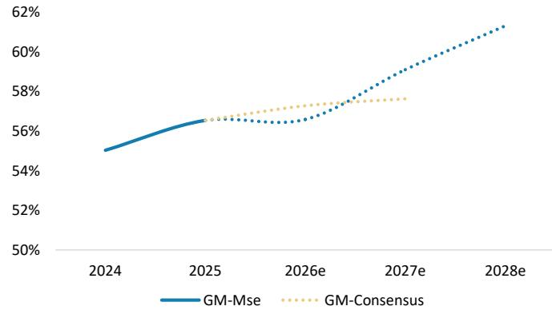  
Exhibit 97: Hon Precision's gross margin: MSe vs consensus   
Source: Company data, Bloomberg consensus estimates, Morgan Stanley Research estimates.

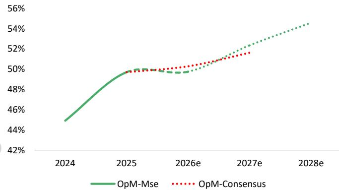  
Exhibit 98: Hon Precision's operating margin: MSe vs consensus   
Source: Company data, Bloomberg consensus estimates, Morgan Stanley Research estimates.

# Hon Precision: Valuation Methodology and Peer Comparison

# 订阅研报

Our price target is NT\$5,000: We derive our price target – which is also our base case scenario value – from a residual income (RI) model, as we believe this can best capture long-term value. We assume a $9 . 8 \%$ cost of equity (risk-free rate $2 . 0 \%$ and risk premium $6 . 0 \%$ ), a payout ratio of $6 2 \% ,$ a medium-term growth rate of ${ 1 0 \% } ,$ and a terminal growth rate of $3 . 0 \%$ . Our price target implies $2 6 { \times } / 1 6 { \times } 2 0 2 7 { \mathrm { e } } / 2 0 2 8 { \mathrm { e } } \mathsf { P } / \mathsf { E }$ . We believe its valuation should continue to climb along with growing earnings. We think its valuations align with 添加微信 LCD123321Cad 04-17 other early-stage growth companies, such as Aspeed.

Exhibit 99: Hon precision: Residual income (RI) model   

<table><tr><td>(NT$ mn)</td><td>2026e</td><td>2027e</td><td>2028e</td><td>2029e</td><td>2030e</td><td>2031e</td><td>2032e</td><td>2033e</td><td>2034e</td><td>2035e</td><td>2036e</td><td>2037e</td></tr><tr><td>Total Equity</td><td>66,540</td><td>86,323</td><td>117,556</td><td>144,550</td><td>174,243</td><td>206,906</td><td>242,835</td><td>282,357</td><td>325,830</td><td>373,652</td><td>426,255</td><td>484,119</td></tr><tr><td>Net Profit</td><td>20,899</td><td>34,739</td><td>55,464</td><td>61,010</td><td>67,111</td><td>73,822</td><td>81,204</td><td>89,325</td><td>98,257</td><td>108,083</td><td>118,891</td><td>130,780</td></tr><tr><td>ROAE</td><td>33.6%</td><td>45.5%</td><td>54.4%</td><td>46.6%</td><td>42.1%</td><td>38.7%</td><td>36.1%</td><td>34.0%</td><td>32.3%</td><td>30.9%</td><td>29.7%</td><td>28.7%</td></tr><tr><td>Residual Income</td><td>13,784</td><td>23,722</td><td>38,507</td><td>43,206</td><td>56,286</td><td>59,871</td><td>63,894</td><td>68,376</td><td>73,349</td><td>78,854</td><td>84,937</td><td>91,649</td></tr><tr><td>Spread</td><td>23.8%</td><td>35.7%</td><td>44.6%</td><td>36.8%</td><td>32.3%</td><td>28.9%</td><td>26.3%</td><td>24.2%</td><td>22.5%</td><td>21.1%</td><td>19.9%</td><td>18.9%</td></tr><tr><td>Ending Equity Capital</td><td>66,540</td><td></td><td></td><td></td><td></td><td></td><td></td><td></td><td></td><td></td><td></td><td></td></tr><tr><td>PVof ForecastPeriod</td><td>336,486</td><td></td><td></td><td></td><td></td><td></td><td></td><td></td><td></td><td></td><td></td><td></td></tr><tr><td>PV of Continuing Value</td><td>496,399</td><td></td><td></td><td></td><td></td><td></td><td></td><td></td><td></td><td></td><td></td><td></td></tr><tr><td>Equity Value</td><td>899,424</td><td></td><td></td><td></td><td></td><td></td><td></td><td></td><td></td><td></td><td></td><td></td></tr><tr><td>No. of Shares</td><td>180</td><td></td><td></td><td></td><td></td><td></td><td></td><td></td><td></td><td></td><td></td><td></td></tr><tr><td>Projected Price (NT$)</td><td>5,000</td><td></td><td></td><td></td><td></td><td></td><td></td><td></td><td></td><td></td><td></td><td></td></tr></table>

Source: Company data, Morgan Stanley Research. $\in { } =$ Morgan Stanley Research estimates.

# Bull/bear case scenarios

Our bull case scenario value is NT\$8,000: Stronger sales/earnings growth, with faster GM expansion

In this scenario we assume: 1) $100 \%$ revenue CAGR, 2025-28e, on stronger-than-expected adoption of tri-temp $\mathsf { A T C + }$ handler, with robust market share gain momentum in dual-temp ATC+handler and more market share gains; 2) faster-than-expected CPO introduction; 3) gross margin improves to over $7 0 \% ,$ , thanks to scale effects and the company's technology competitiveness; and 4) $> 1 5 0 \%$ earnings CAGR, 2025-28e.

Our bear case scenario value is NT\$2,500: Revenue/earnings growth is slower, with GM erosion.

In this scenario we assume: 1) $20 \%$ revenue CAGR, 2025-28e, on slower-than-expected adoption of tri-temp ATC+handler with robust market share gain momentum in dual-temp ATC+handler and no project wins in CPO development; 2) slower-than-expected CPO introduction; 3) customer bargaining power pushes gross margin below $4 0 \% ;$ and 4) $30 \%$ 3321Cad 04-17   
earnings CAGR, 2025-28e.

# Peer comparison and valuation

Hon Precision's forward $\mathsf { P / E }$ trend of $2 0 - 3 5 \times$ is in line with its peer valuation range, with current valuation trading at 35x 2026e P/E, which is in line with its test handler peers Chroma, Cohu and Changchuan, at 35x 2026e P/E . We still expect the stock to further trend up as we believe that we are still at the halfway point for the market to capitalize on the company's structural earnings growth potential and the SLT multiplier effect, and some other new emerging opportunities, such as CPO, for which Hon Precision acts a important enabler of Insertion 4.

Exhibit 100:Valuation peer comparison   

<table><tr><td></td><td></td><td>Price Target</td><td></td><td>Market Cap</td><td colspan="7">EPS (Local Dollar)</td><td>P/E (x)</td><td></td><td></td><td>ROE (%)</td><td>Trading Volume</td></tr><tr><td>Ticker</td><td>Company</td><td>Rating</td><td>(LC)</td><td>(us$mn)</td><td>2024</td><td>2025</td><td>2026e</td><td>2027e</td><td>2028e</td><td>2024</td><td>2025e</td><td>2026e</td><td>2027e</td><td>2028e</td><td>2025</td><td>(mn)</td></tr><tr><td>6515.TW</td><td>Winway</td><td>。</td><td>12,000.0</td><td>9,614</td><td>33.8</td><td>46.6</td><td>103.9</td><td>196.9</td><td>347.5</td><td>253.4</td><td>183.7</td><td>82.4</td><td>43.5</td><td>24.6</td><td>27.9</td><td>0.5</td></tr><tr><td>6223.TWO</td><td>MPI</td><td>0</td><td>5,800.0</td><td>13,991</td><td>24.4</td><td>32.5</td><td>64.1</td><td>133.2</td><td>240.2</td><td>186.1</td><td>139.8</td><td>70.9</td><td>34.1</td><td>18.9</td><td>26.7</td><td>0.7</td></tr><tr><td>7769.TW</td><td>Hon Precision</td><td>。</td><td>5,000.0</td><td>23,174</td><td></td><td></td><td>116.2</td><td>193.1</td><td>308.3</td><td>NA</td><td>NA</td><td>35.3</td><td>21.2</td><td>13.3</td><td>34.5</td><td>0.8</td></tr><tr><td colspan="10">Greater China Probe Card Peers</td><td></td><td></td><td></td><td></td><td></td><td></td><td></td></tr><tr><td>6510.TWO</td><td>CHPT</td><td>NC</td><td>NA</td><td>3,523</td><td>15.5</td><td>30.4</td><td>61.1</td><td>114.6</td><td>NA</td><td>220.5</td><td>112.5</td><td>56.0</td><td>29.8</td><td>NA</td><td>11.9</td><td>0.6</td></tr><tr><td>6683.TWO</td><td>KSMT</td><td>NC</td><td>NA</td><td>1,587</td><td>17.4</td><td>15.2</td><td>18.7</td><td>19.0</td><td>NA</td><td>106.1</td><td>121.9</td><td>98.8</td><td>97.3</td><td>NA</td><td>15.9</td><td>0.3</td></tr><tr><td>7828.TWO</td><td>Inno-stars</td><td>NC</td><td>NA</td><td>1,527</td><td>4.1</td><td>5.6</td><td>10.7</td><td>14.0</td><td>NA</td><td>324.3</td><td>234.9</td><td>124.4</td><td>94.4</td><td>NA</td><td>25.0</td><td>0.8</td></tr><tr><td>Average</td><td></td><td></td><td></td><td></td><td></td><td></td><td></td><td></td><td></td><td>217.0</td><td>156.4</td><td>93.0</td><td>73.8</td><td>NA</td><td>17.6</td><td>0.9</td></tr><tr><td colspan="10">Global ProbeCardandSocket Companies</td><td></td><td></td><td></td><td></td><td></td><td></td><td></td></tr><tr><td>6594.JP</td><td>Nidec</td><td>NC</td><td>NA</td><td>16,083</td><td>143.1</td><td>105.4</td><td>158.4</td><td>177.9</td><td>220.1</td><td>15.7</td><td>21.3</td><td>14.1</td><td>12.6</td><td>10.2</td><td>9.8</td><td>2.7</td></tr><tr><td>TPRO.IM</td><td>Technoprobe</td><td>NC</td><td>NA</td><td>12,245</td><td>0.1</td><td>0.2</td><td>0.3</td><td>0.4</td><td>0.5</td><td>161.4</td><td>96.7</td><td>64.3</td><td>46.0</td><td>34.3</td><td>7.9</td><td>0.4</td></tr><tr><td>SMIN.L</td><td>Smiths Group</td><td>NC</td><td>NA</td><td>10,275</td><td>0.7</td><td>1.2</td><td>1.1</td><td>1.2</td><td>1.4</td><td>35.0</td><td>20.9</td><td>23.2</td><td>20.5</td><td>17.9</td><td>12.8</td><td>0.7</td></tr><tr><td>FORM.0</td><td>FormFactor</td><td>NC</td><td>NA</td><td>9,995</td><td>0.9</td><td>1.3</td><td>1.8</td><td>2.2</td><td>NA</td><td>144.5</td><td>98.6</td><td>71.8</td><td>57.0</td><td>NA</td><td>5.5</td><td>4.2</td></tr><tr><td>058470.KQ</td><td>Leeno</td><td>0</td><td>77,000.00</td><td>5,779</td><td>1,492.6</td><td>1,997.2</td><td>2,349.6</td><td>2,841.2</td><td>3,580.4</td><td>76.0</td><td>56.8</td><td>48.3</td><td>39.9</td><td>31.7</td><td>22.4</td><td>0.6</td></tr><tr><td>095340.KR</td><td>ISC</td><td>NC</td><td>NA</td><td>2,975</td><td>2,621.9</td><td>2,750.5</td><td>4,092.3</td><td>5,413.6</td><td>7,496.1</td><td>82.6</td><td>78.7</td><td>52.9</td><td>40.0</td><td>28.9</td><td>10.6</td><td>0.7</td></tr><tr><td>6871.T</td><td>Micronics Japan</td><td>0</td><td>14,000.00</td><td>2,932</td><td>228.3</td><td>311.5</td><td>440.7</td><td>530.5</td><td>704.7</td><td>52.9</td><td>38.7</td><td>27.4</td><td>22.8</td><td>17.1</td><td>20.9</td><td>1.1</td></tr><tr><td>6941.JP</td><td>Yaimaichi</td><td>NC</td><td>NA</td><td>1,065 606</td><td>259.5</td><td>456.9</td><td>497.6</td><td>538.2</td><td>NA</td><td>35.6</td><td>20.2</td><td>18.6</td><td>17.2</td><td>NA</td><td>13.5</td><td>0.4</td></tr><tr><td>6855.T 6961.JP</td><td>JEM Enplas</td><td>NC</td><td>NA NA</td><td>836</td><td>273.5</td><td>347.8</td><td>371.5 625.9</td><td>403.1 752.4</td><td>NA</td><td>24.1</td><td>19.0</td><td>17.8</td><td>16.4</td><td>NA</td><td>13.1</td><td>0.6</td></tr><tr><td>Average</td><td></td><td>NC</td><td></td><td></td><td>440.0</td><td>533.9</td><td></td><td></td><td>NA</td><td>33.7 66.1</td><td>27.8 47.9</td><td>23.7 36.2</td><td>19.7 29.2</td><td>NA 23.4</td><td>7.3</td><td>0.1</td></tr><tr><td colspan="2">Tester and Handler Equipment</td><td></td><td></td><td></td><td></td><td></td><td></td><td></td><td></td><td></td><td></td><td></td><td></td><td></td><td>14.3</td><td>1.3</td></tr><tr><td>6857.T</td><td>Advantest</td><td>0</td><td>30,000.00107,901</td><td></td><td>218.0</td><td>461.5</td><td>659.9</td><td>804.0</td><td>857.3</td><td>114.1</td><td>53.9</td><td>37.7</td><td>30.9</td><td>29.0</td><td>34.4</td><td>6.5</td></tr><tr><td>TER.O</td><td>Teradyne</td><td>E</td><td>306.00</td><td>57,946</td><td>3.3</td><td>4.0</td><td>6.4</td><td>8.6</td><td>10.5</td><td>111.5</td><td>93.5</td><td>57.6</td><td>42.9</td><td>35.3</td><td>19.7</td><td>2.4</td></tr><tr><td>2360.TW</td><td>Chroma</td><td>0</td><td>1,530.00</td><td>25,019</td><td>12.4</td><td>27.1</td><td>34.9</td><td>47.6</td><td>47.6</td><td>151.8</td><td>69.4</td><td>53.8</td><td>39.5</td><td>39.5</td><td>41.2</td><td>4.6</td></tr><tr><td>300604.SZ</td><td>Hangzhou Changchuan</td><td>NC</td><td>NA</td><td>12,560</td><td>0.7</td><td>2.1</td><td>2.9</td><td>4.1</td><td>4.1</td><td>186.6</td><td>64.3</td><td>46.1</td><td>33.3</td><td>33.3</td><td>14.9</td><td>15.0 0.8</td></tr><tr><td>Cohu.0 Average</td><td>Cohu</td><td>NC</td><td>NA</td><td>1,768</td><td>(1.5)</td><td>(0.2)</td><td>0.5</td><td>1.2</td><td>1.2</td><td>NA 141.0</td><td>NA</td><td>70.3 53.1</td><td>30.6 35.5</td><td>30.6 33.6</td><td>(9.0) 30.5</td></table>

ource: Company data, FactSet, Morgan Stanley Research.. Note: As of the market close on April 16, 2026. Except for Winway, MPI and Hon Precision, which are MSe, all other estimates are generated from consensus.

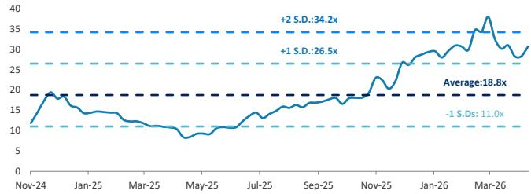  
订阅研报添Exhibit 101:Hon Precision's historical P/E multiple

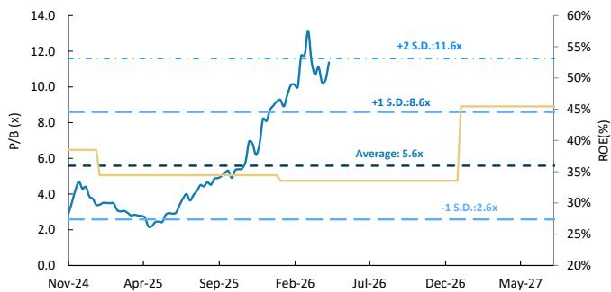  
123321Cad 04-17 Exhibit 102:Hon Precision's historical P/B multiple   
Source: Company data, FactSet, Morgan Stanley Research estimates.

# Hon Precision: Company Background

Established in April 2015 with the foundation of its predecessor Hon Tech (founded in 1999), Hon Precision specialises in turnkey service for automated handlers used for semiconductor testing. With a global footprint, it serves a variety of end-customers, ranging from smartphone processors, GPUs and ASICs, and the automotive, consumer, and memory segments. Other than its Taiwan headquarters, it has offices in the US, China, and Germany that help it fulfill its local and regional demand efficiently.

The management team has extensive experience within the semiconductor industry, as they all have engineering backgrounds, and each has several decades of experience within the semiconductor testing and testing equipment businesses. This in-depth experience allows Hon Precision to position itself as a trusted partner of OSAT and IC design companies.

Hon Precision engages directly with its end-customers, such as fabless companies or CSPs. Fabless companies such as smartphone application processor makers such as Apple and CSP/ASIC companies are involved in deciding and designing their own testing solutions and supply chains. In addition, Hon Precision also engages with leading OSAT customers such as ASE and KYEC for consumer and memory products. Hon Precision's end-customers can consign handlers to their own OSAT partners, making collaboration at the design stages crucial to secure future orders.

# Key product portfolio

添加微信 LCD123321Cad 04-17 Hon Precision’s core business centers on semiconductor test handlers, offering a comprehensive portfolio of both standard and highly customized solutions tailored to diverse IC testing requirements and environments. The company’s revenue is primarily derived from three segments: 1) FT/SLT handlers; 2) active thermal control (ATC) systems – typically bundled with handlers; and 3) cold plates and related thermal components. Backed by its strong engineering capabilities and close customer collaboration, Hon Precision has established a leading position in high-performance computing, with over $70 \%$ market share in HPC FT handlers. Its product portfolio spans tri-temperature FT handlers, dual-temperature FT handlers, and SLT handlers, each addressing different endmarket requirements.

Tri-temp FT handlers represent the company’s highest-end offering, supporting a wide temperature range, from $- 7 0 ^ { \circ } \mathsf { C }$ to $+ 1 7 5 \mathrm { ^ \circ C } ,$ , primarily serving aerospace and automotive applications where extreme condition testing is required; these systems feature integrated ATC with patent-protected dry air technology to prevent condensation and ensure precise, 添加微信 LCD123321Cad 04-17stable thermal control.

Dual-temp FT handlers are the core volume driver, widely adopted by AI ASIC and GPU customers, and are capable of supporting up to 6kW thermal loads with multi-zone temperature control; the company is further advancing its capabilities through the development of MCL-integrated solutions to address next-generation power density requirements.

SLT handlers: In SLT, Hon Precision provides fully integrated handler systems with embedded test PCs and boards, combined with ATC and multi-site capabilities, positioning the company to capture growing demand as ${ \mathsf { A l / H P C } }$ and automotive customers increasingly adopt system-level validation.

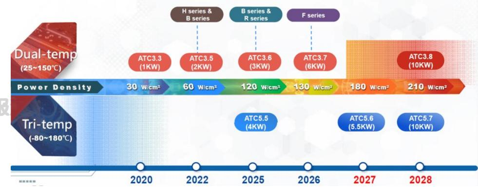  
Exhibit 103:Hon Precision's dual-temp and tri-temp handler solution   
Source: Hon Precision.

Cold plate: Complementing its handler offerings, Hon Precision’s cold plate solutions are designed to accommodate varying IC package sizes, architectures, and power profiles, enabling efficient heat dissipation during testing; these are offered both as part of bundled solutions and as standalone products, particularly for upgrade and replacement cycles. As chip complexity and power consumption continue to rise, cold plates – together with ATC – have become critical enablers of thermal stability during testing and are emerging as a meaningful incremental growth driver for the company.

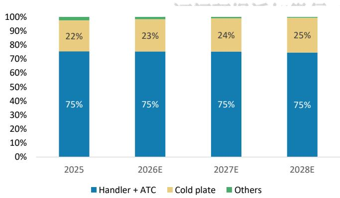  
Exhibit 104:Hon Precision: Revenue mix   
Source: Company data, Morgan Stanley Research. $\in { } =$ Morgan Stanley Research estimates.

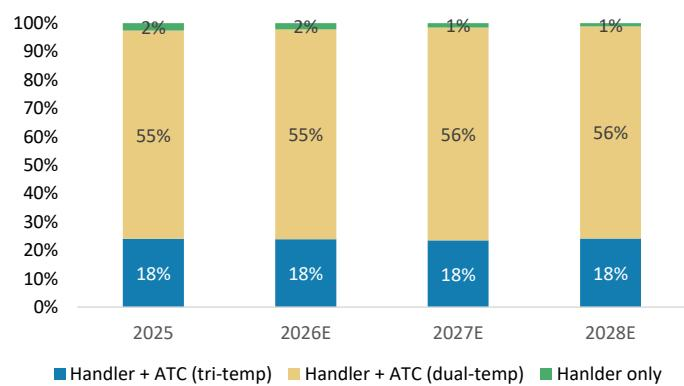  
Exhibit 105:Dual-temp ATC+handler remains the key focus for 123321Cad 04-17 the company, with increasing revenue in tri-temp ATC+handler as well   
Source: Company data, Morgan Stanley Research. $\mathrm { { e = } }$ Morgan Stanley Research estimates.

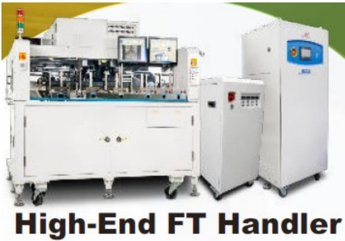  
Exhibit 106:FT handler: Could support both dual-temp and tritemp   
Source: Hon Precision.

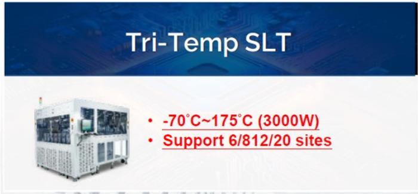  
Exhibit 107:SLT handler: Could support both dual-temp and tritemp   
Source: Hon Precision.

Exhibit 108:As large package sizes are an emerging trend, Hon Precision has prepared large-package handlers to cope with the strong demand

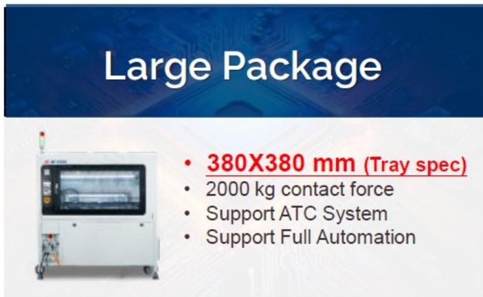  
Source: Hon Precision.

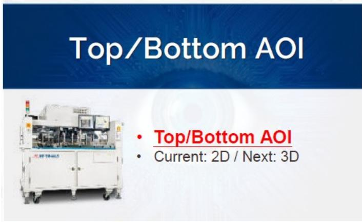  
Exhibit 110:AI/HPC customers are asking for AOI integration onto the handler, which would help drive up revenue by at least $1 0 \mathrm { - } 1 5 \%$

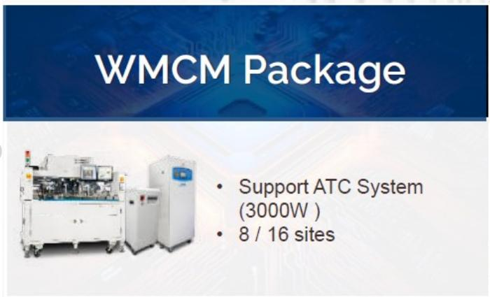  
Exhibit 109:As WMCM requires additional testing, Hon Precision has penetrated by providing dual-temp ATC+handler system   
Source: Hon Precision.

# Key suppliers and customers

Hon Precision's key components include electromechanical and electronic components, transmission components, wiring, hardware, and material components, with no single supplier exceeding $10 \%$ or more of the company's total purchases.

Hon Precision’s customer base is dominated by AI- and HPC-related customers, which accounted for a combined $7 9 \%$ of 2M26 revenue. Hon Precision's key customers include NVIDIA, AMD, Broadcom, Marvell, Google, MediaTek, Apple, Amkor, KYEC, and ASE/SPIL, with US customers accounting for $5 7 \%$ . Currently, Taiwan accounts for $70 \%$ of its shipment location, as that's where most HPC and AI products are being tested.

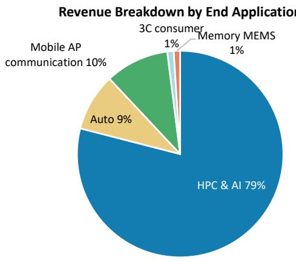  
Exhibit 111:Revenue breakdown, by end-application (2M26): HPC & AI accounts for ${ \sim } 8 0 \%$ of its total revenue   
Source: Company data, Morgan Stanley Research

Exhibit 112:Revenue breakdown, by shipment location (2M26): Taiwan is the major space for advanced packaging and backend

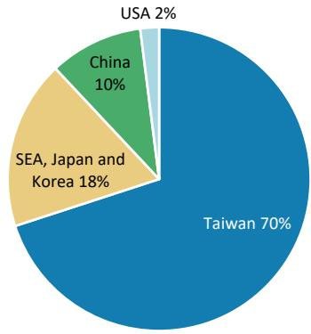  
Revenue breakdown by Shipment Location

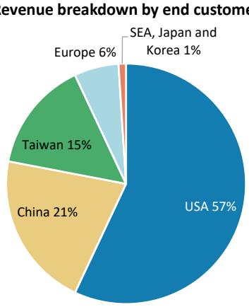  
Exhibit 113:Revenue breakdown, by end-customer (2M26): US customers remain its major focus   
Source: Company data, Morgan Stanley Research

# Key competitors

Hon Precision operates in a competitive landscape that includes major ATE and handler vendors such as Advantest, Teradyne, Chroma ATE, Cohu, Hangzhou Changchuan

Technology, and JHT, competing across both final test (FT) and system-level test (SLT) segments. Its primary competitors – Advantest (Japan), Teradyne (US), and Chroma (Taiwan) – are well-established global players; however, Hon Precision differentiates itself through its strong positioning in handlers, with an estimated $\sim 3 0 \%$ market share in general applications and over $70 \%$ in $\mathsf { A l / H P C }$ . The company benefits from its proximity to Taiwan’s semiconductor ecosystem, enabling efficient service to turnkey customers and OSATs, while its portfolio of more than 600 patents reinforces its technological moat. Hon Precision is also at the forefront of high-end handler development, including tritemperature systems and next-generation MCL-related solutions, and it works closely 添加微信 LCD123321Cad 04-17 with customers on customized designs, allowing it to deliver competitive, tailored testing solutions that strengthen its leadership in advanced applications.

# Management team

Exhibit 114:Hon Precision: Management details (as of 4Q25)   

<table><tr><td>Titte Name</td><td>Academicdegree</td><td>Professionalqualificationsand experience</td></tr><tr><td>CEO</td><td>Wen-Ta HsiehBachelorof Mechanical Design,NationalTaipei University of Technology</td><td></td></tr><tr><td>President</td><td>Jung-Li Chang CBachelorof Electrical Enginering,Feng Chia University</td><td></td></tr><tr><td>Senior Vice President</td><td>Te-Kuei WengBachelor of Electrical Engineering, Chung Hua University</td><td>King Yuan Electronics Director</td></tr><tr><td>Vice President of Sales</td><td>Chen-Ming ChaiBachelor of Information Engineering, Feng Chia University</td><td></td></tr><tr><td>Director of Manufacturing</td><td>Chih-Nao LaiBachelorof Mechanical Engineering,National Chin-Yi UniversityofTechnology</td><td></td></tr><tr><td>Director of R&amp;D</td><td>Chung-I Hung Bachelorof Applied Mathematics,Chinese Culture University</td><td></td></tr><tr><td>Director of Operations Mgmt</td><td>Chih-Wei Liang Bachelorof Electronic Engineering, Chienkuo Technology University</td><td></td></tr><tr><td>Director of Operations Mgmt</td><td>Mao-Hsun Huar Bachelor of Industrial Engineering, National Taipei Universityof Technology</td><td></td></tr><tr><td>Director of Finance</td><td>Min-Hua Wu NationalTaichung University of Science and Technology</td><td></td></tr></table>

Source: Company data, Morgan Stanley Research.

# MPI (6223.TWO): Key Beneficiary of the Larger Package Size; Tapping into CPO Testing; Initiate at OW

MPI offers a compelling combination of technology leadership and structural growth exposure. The company is well positioned in advanced probe card solutions, particularly in vertical probe cards (VPC) integrated with MEMS technology, which are increasingly 订阅研报添加微信 Lcritical for testing high-performance and fine-pitch semiconductor devices. This aligns closely with industry tailwinds driven by AI workloads, advanced process nodes, and the growing complexity of high-performance computing chips, all of which require higher density and superior signal integrity in testing.

In addition, MPI benefits from early-stage customer engagement through its equipment business, which enables deeper integration into clients’ development cycles and supports cross-selling opportunities. The company also has potential upside from emerging applications, such as co-packaged optics (CPO) and heterogeneous integration. With CPC and VPC business continuing to generate stable cash flow, MEMS probe cards continuing to scale its momentum, and the rising importance of high-frequency, high-density testing, MPI, in our view, is well 订阅研报添加微信positioned to deliver sustained growth and margin expansion. L

Earnings: Our 2027-28 EPS estimates are more bullish than consensus. We believe the market is underappreciating the durability and breadth of MPI’s growth drivers beyond the current AI narrative.

Valuation: We derive our price target from a residual income model. Our price target implies 44x 2027e P/E, which we think is justified given the $9 4 \%$ EPS CAGR that we project for 2025- 2028e. We believe valuation will continue to climb along with growing earnings.

Key downside risks include: 1) slower-than-expected AI demand, 2) slower-than-expected market share gain from peers, and 3) slower-than-expected CPO development.

Exhibit 115:MPI (6223.TWO): Summary of key metrics   

<table><tr><td rowspan=1 colspan=1>Reuters:6223.TWO/Bloomberg:6223TTGreaterChinaSemiconductor</td></tr><tr><td rowspan=1 colspan=1>Price target (US$)                                      NT$5,800.00</td></tr><tr><td rowspan=1 colspan=1>Up/downside to price target (%)                                   18</td></tr><tr><td rowspan=1 colspan=1>Shr price,close(Apr15,2026)                              NT$4,915</td></tr><tr><td rowspan=1 colspan=1>52-WeekRange                                  NTS651-NTS4,935</td></tr><tr><td rowspan=1 colspan=1>Sh out,dil, cr (mn)                                              99</td></tr><tr><td rowspan=1 colspan=1>Mkt cap,curr(mn)                                             14.27</td></tr><tr><td rowspan=1 colspan=1>EV, curr (mn)                                                  14.27</td></tr><tr><td rowspan=1 colspan=1>Avgdaily trading volume (mn)                                   1.04</td></tr></table>

<table><tr><td>Fiscal YearEnding</td><td>2025</td><td>2026e</td><td>2027e</td><td>2028e</td></tr><tr><td>ModelWare EPS(NTS)</td><td>32.79</td><td>63.99</td><td>133.09</td><td>240.08</td></tr><tr><td>Consensus EPS(NTS)S</td><td></td><td>61.47</td><td>98.24</td><td></td></tr><tr><td>Revenue, net (NT$ mn)</td><td>13,371</td><td>23,011</td><td>39,097</td><td>61,656</td></tr><tr><td>EBITDA (NTS mn)</td><td>4,566</td><td>7,367</td><td>15,409</td><td>27,895</td></tr><tr><td>ModelWare net inc (NTS mn)</td><td>3,179</td><td>6,069</td><td>12,623</td><td>22,770</td></tr><tr><td>P/E</td><td>68.6</td><td>76.8</td><td>36.9</td><td>20.5</td></tr><tr><td>P/BV</td><td>15.3</td><td>23.4</td><td>15.3</td><td>9.4</td></tr><tr><td>RNOA (%)</td><td>41.9</td><td>53.3</td><td>90.4</td><td>120.6</td></tr><tr><td>ROE (%)</td><td>34.2</td><td>41.6</td><td>63.4</td><td>74.9</td></tr><tr><td>EV/EBITDA</td><td>48.1</td><td>65.3</td><td>30.8</td><td>16.6</td></tr><tr><td>Div yld (%)</td><td>0.0</td><td>0.0</td><td>0.0</td><td>0.0</td></tr><tr><td>FCF yld ratio (%)</td><td>0.5</td><td>0.7</td><td>1.7</td><td>3.4</td></tr><tr><td>Leverage (EOP)(%)</td><td>(24.1)</td><td>(31.5)</td><td>(39.2)</td><td>(48.1)</td></tr></table>

$\ S =$ $\underline { { \underline { { \mathbf { \delta \pi } } } } }$   
Source: Company data, FactSet, Morgan Stanley Research. $\gtrsim =$ Morgan Stanley Research estimates

# Companydescription

# MPI: Quarterly Financials and Financial Summary

Exhibit 116:MPI: Quarterly financials   

<table><tr><td>NT$ in million (YE DEC31)</td><td>1Q26E</td><td>2Q26E</td><td>3Q25E</td><td>4Q26E</td><td>1Q27E</td><td>2Q27E</td><td>3Q27E</td><td>4Q27E</td><td>1Q28E</td><td>2Q28E</td><td>3Q28E</td><td>4Q28E</td><td>2024</td><td>2025</td><td>2026E</td><td>2027E</td><td>2028E</td></tr><tr><td>Total Revenues</td><td>4,193</td><td>5,154</td><td>6,286</td><td>7,378</td><td>7.760</td><td>9,169</td><td>10.831</td><td>11,337</td><td>12,852</td><td>14,726</td><td>17,097</td><td>16.981</td><td>10,172</td><td>13.371</td><td>23.011</td><td>39,097</td><td>61,656</td></tr><tr><td>Sequential Change</td><td>9.3%</td><td>22.9%</td><td>22.0%</td><td>17.4%</td><td>5.2%</td><td>18.2%</td><td>18.1%</td><td>4.7%</td><td>13.4%</td><td>14.6%</td><td>16.1%</td><td>-0.7%</td><td></td><td></td><td></td><td></td><td></td></tr><tr><td>Change vs Year Ago</td><td>48.2%</td><td>56.5%</td><td>84.1%</td><td>92.4%</td><td>85.1%</td><td>77.9%</td><td>72.3%</td><td>53.6%</td><td>65.6%</td><td>60.6%</td><td>57.9%</td><td>49.8%</td><td>24.9%</td><td>31.5%</td><td>72.1%</td><td>69.9%</td><td>57.7%</td></tr><tr><td>Cost of Sales</td><td>1,890</td><td>2,258</td><td>2,677</td><td>3.043</td><td>3,242</td><td>3,756</td><td>4.316</td><td>4,458</td><td>5,005</td><td>5.652</td><td>6,425</td><td>6,269</td><td>4,611</td><td>5,943</td><td>9,868</td><td>15,772</td><td>23.350</td></tr><tr><td>Percent of Revenues</td><td>45%</td><td>44%</td><td>43%</td><td>41%</td><td>42%</td><td>41%</td><td>40%</td><td>39%</td><td>39%</td><td>38%</td><td>38%</td><td>37%</td><td>45%</td><td>44%</td><td>43%</td><td>40%</td><td>38%</td></tr><tr><td>Gross Margin</td><td>2.303</td><td>2,896</td><td>3,609</td><td>4.335</td><td>4,518</td><td>5,412</td><td>6,515</td><td>6,879</td><td>7,847</td><td>9.074</td><td>10,672</td><td>10,713</td><td>5,561</td><td>7,428</td><td>13,143</td><td>23,325</td><td>38.305</td></tr><tr><td>Percent of Revenues</td><td></td><td></td><td></td><td></td><td></td><td></td><td></td><td></td><td></td><td></td><td></td><td>%</td><td>54.7%</td><td>55.6%</td><td>57.1%</td><td>59.7%</td><td>62.1%</td></tr><tr><td>Incremental Margin</td><td></td><td>订阅研报checking formutual interference takes time: Fo7 n</td><td></td><td></td><td></td><td></td><td></td><td></td><td></td><td></td><td></td><td>M</td><td>82%</td><td>58%</td><td>59%</td><td>63%</td><td>66%</td></tr><tr><td>Total Opex Percent of Revenues</td><td></td><td></td><td></td><td></td><td></td><td></td><td></td><td></td><td></td><td></td><td></td><td>memo %</td><td>3,078 30.3%</td><td>3,653 27.3%</td><td>5,776 25.1%</td><td>7.916 20.2%</td><td>10,410 16.9%</td></tr><tr><td>R&amp;D</td><td></td><td>430</td><td>440</td><td>440</td><td></td><td></td><td>480</td><td>480</td><td>500</td><td>500</td><td>510</td><td>510</td><td>1,089</td><td></td><td>1,720</td><td></td><td>2.020</td></tr><tr><td>Percent of Revenues</td><td>410 9.8%</td><td>8.3%</td><td>7.0%</td><td>6.0%</td><td>470 6.1%</td><td>470 5.1%</td><td>4.4%</td><td>4.2%</td><td>3.9%</td><td>3.4%</td><td>3.0%</td><td>3.0%</td><td>10.7%</td><td>1,276 9.5%</td><td>7.5%</td><td>1,900 4.9%</td><td>3.3%</td></tr><tr><td>General &amp; administrative</td><td>310</td><td>340</td><td>370</td><td>390</td><td>380</td><td>380</td><td>380</td><td>380</td><td>402</td><td>402</td><td>402</td><td>402</td><td>723</td><td>964</td><td>1,410</td><td>1.520</td><td>1,608</td></tr><tr><td>Percent of Revenues</td><td>7.4%</td><td>6.6%</td><td>5.9%</td><td>5.3%</td><td>4.9%</td><td>4.1%</td><td>3.5%</td><td>3.4%</td><td>3.1%</td><td>2.7%</td><td>2.4%</td><td>2.4%</td><td>7.1%</td><td>7.2%</td><td>6.1%</td><td>3.9%</td><td>2.6%</td></tr><tr><td>Selling &amp;marketing</td><td></td><td>593</td><td>723</td><td>849</td><td></td><td></td><td></td><td></td><td></td><td>1.620</td><td></td><td></td><td></td><td></td><td></td><td></td><td>6,782</td></tr><tr><td>Percent of Revenues</td><td>482 11.5%</td><td>11.5%</td><td>11.5%</td><td>11.5%</td><td>892 11.5%</td><td>1,054 11.5%</td><td>1,246 11.5%</td><td>1,304 11.5%</td><td>1,414 11.0%</td><td>11.0%</td><td>1,881 11.0%</td><td>1,868 11.0%</td><td>1,266 12.4%</td><td>1,413 10.6%</td><td>2,646 11.5%</td><td>4,496 11.5%</td><td>11.0%</td></tr><tr><td>Operating Income</td><td></td><td>1.533</td><td>2.076</td><td>2.657</td><td>2,776</td><td></td><td>4.410</td><td>4,715</td><td>5.531</td><td>6.553</td><td>7.879</td><td>7.933</td><td></td><td></td><td></td><td></td><td>27,895</td></tr><tr><td>Percentof Revenues</td><td>1,100</td><td>29.7%</td><td>33.0%</td><td>36.0%</td><td>35.8%</td><td>3.508 38.3%</td><td>40.7%</td><td>41.6%</td><td>43.0%</td><td>44.5%</td><td>46.1%</td><td>46.7%</td><td>2,483 24.4%</td><td>3.775</td><td>7.367 32.0%</td><td>15,409 39.4%</td><td>45.2%</td></tr><tr><td>Change vs Year Ago</td><td>26.2% 30.9%</td><td>42.1%</td><td>131.7%</td><td>177.0%</td><td>152.2%</td><td>128.8%</td><td>112.4%</td><td>77.5%</td><td>99.3%</td><td>86.8%</td><td>78.7%</td><td>68.2%</td><td>68.7%</td><td>28.2% 52.0%</td><td>95.2%</td><td>109.2%</td><td>81.0%</td></tr><tr><td>Total Non-operating Income(Loss)</td><td></td><td>20</td><td>20</td><td>20</td><td>20</td><td></td><td>20</td><td>20</td><td>11</td><td>11</td><td>11</td><td>11</td><td></td><td></td><td></td><td></td><td>44</td></tr><tr><td></td><td>20</td><td></td><td></td><td></td><td></td><td>20</td><td></td><td></td><td></td><td></td><td></td><td></td><td>312</td><td>70</td><td>80</td><td>80</td><td></td></tr><tr><td>Profit Before Taxes Percent of Revenues</td><td>1,120</td><td>1.553</td><td>2.096</td><td>2.677</td><td>2.796</td><td>3.528</td><td>4,430</td><td>4,735</td><td>5.542</td><td>6,564</td><td>7,890</td><td>7,944</td><td>2,795</td><td>3.844</td><td>7,447</td><td>15,489</td><td>27,939</td></tr><tr><td></td><td>26.7%</td><td>30.1%</td><td>33.3%</td><td>36.3%</td><td>36.0%</td><td>38.5%</td><td>40.9%</td><td>41.8%</td><td>43.1%</td><td>44.6%</td><td>46.1%</td><td>46.8%</td><td>27.5%</td><td>28.8%</td><td>32.4%</td><td>39.6%</td><td>45.3%</td></tr><tr><td>Taxes</td><td>207</td><td>287</td><td>388</td><td>495</td><td>517</td><td>653</td><td>820</td><td>876</td><td>1,025</td><td>1,214</td><td>1,460</td><td>1,470</td><td>490</td><td>666</td><td>1,378</td><td>2.865</td><td>5,169 18.5%</td></tr><tr><td>TaxRate Net Income, Cont Ops</td><td>18.5%</td><td>18.5% 1,266</td><td>18.5% 1,708</td><td>18.5% 2,182</td><td>18.5% 2,278</td><td>18.5% 2.875</td><td>18.5% 3.610</td><td>18.5% 3,859</td><td>18.5% 4,517</td><td>18.5% 5,349</td><td>18.5%</td><td>18.5%</td><td>17.5%</td><td>17.3%</td><td>18.5%</td><td>18.5%</td></table>

Source: Company data, Morgan Stanley Research. $\in { } =$ Morgan Stanley Research estimates.

Exhibit 117:MPI: Financial summary   

<table><tr><td>IncomeStatement NT$mn (Years End Dec)</td><td>2024</td><td>2025</td><td>2026E</td><td>2027E</td><td>2028E</td></tr><tr><td>Netsales</td><td>10,172</td><td>13,371</td><td>23.011</td><td>39,097</td><td>61,656</td></tr><tr><td>COGS</td><td>4,611</td><td>5,943</td><td>9.868</td><td>15,772</td><td>23,350</td></tr><tr><td>Gross profit</td><td>5,561</td><td>7,428</td><td>13,143</td><td>23,325</td><td>38,305</td></tr><tr><td>Operating expenses</td><td>(3,078)</td><td>(3,653)</td><td>(5,776)</td><td>(7,916)</td><td>(10,410)</td></tr><tr><td>Operating income</td><td>2,483</td><td>3,775</td><td>7,367</td><td>15,409</td><td>27,895</td></tr><tr><td>Non-operating income</td><td>312</td><td>70</td><td>80</td><td>80</td><td>44</td></tr><tr><td>Pre-tax income</td><td>2,795</td><td>3,844</td><td>7,447</td><td>15,489</td><td>27,939</td></tr><tr><td>Income tax</td><td>490</td><td>666</td><td>1,378</td><td>2,865</td><td>5,169</td></tr><tr><td>Reported net Income</td><td>2,304</td><td>3,179</td><td>6,069</td><td>12,623</td><td></td></tr><tr><td>Adj.wtd.avg.shrs( m)</td><td>94</td><td>97</td><td>95</td><td>95</td><td>22,770</td></tr><tr><td>Reported EPS (NT$)</td><td>24.38</td><td>32.77</td><td>64.08</td><td>133.18</td><td>95</td></tr><tr><td>EPS for Consensus (NT$)</td><td>24.38</td><td>32.77</td><td>64.08</td><td>133.18</td><td>240.17 240.17</td></tr></table>

Balance Sheet   

<table><tr><td>NT$mn (Years End Dec）</td><td>2024</td><td>2025</td><td>2026E</td><td>2027E</td><td>2028E</td></tr><tr><td>Cash</td><td>3,695</td><td>5,437</td><td>8,182</td><td>13,828</td><td>25,670</td></tr><tr><td>Mkt Securities</td><td>0</td><td>0</td><td>0</td><td>0</td><td>0</td></tr><tr><td>AR/NR</td><td>2,050</td><td>2,411</td><td>3,581</td><td>5,762</td><td>9,049</td></tr><tr><td>Inventory</td><td>3,477</td><td>5,011</td><td>6,717</td><td>10,237</td><td>15,334</td></tr><tr><td>Other</td><td>283</td><td>458</td><td>458</td><td>458</td><td>458</td></tr><tr><td>Current Assets</td><td>9,505</td><td>13,318</td><td>18,938</td><td>30,285</td><td>50,511</td></tr><tr><td>Long-term investments</td><td>378</td><td>765</td><td>765</td><td>765</td><td>765</td></tr><tr><td>Fixed assets</td><td>4,561</td><td>7,729</td><td>7,759</td><td>7,789</td><td>7,819</td></tr><tr><td>Deferred assets</td><td>165</td><td>164</td><td>164</td><td>164</td><td>164</td></tr><tr><td>Other assets</td><td>1,869</td><td>2,026</td><td>2.026</td><td>2,026</td><td>2,026</td></tr><tr><td>Total Assets</td><td>16,479</td><td>24,003</td><td>29,654</td><td>41,030</td><td>61,286</td></tr><tr><td>S/T borrowings</td><td>660</td><td>1,350</td><td>1,350</td><td>1,350</td><td>1,350</td></tr><tr><td>AP/NP</td><td>766</td><td>1,342</td><td>1,668</td><td>2,541</td><td>3,807</td></tr><tr><td>Other ST liabilities</td><td>4,247</td><td>4,878</td><td>4,878</td><td>4,878</td><td>4,878</td></tr><tr><td>LT debt</td><td>1,305</td><td>1,337</td><td>1,337</td><td>1,337</td><td>1,337</td></tr><tr><td>Other LT liabilities</td><td>193</td><td>518</td><td>518</td><td>518</td><td>518</td></tr><tr><td>Common shares</td><td>942</td><td>980</td><td>980</td><td>980</td><td>980</td></tr><tr><td>Total Liabilities</td><td>7,172</td><td>9,424</td><td>9,750</td><td>10,624</td><td>11,889</td></tr><tr><td>Additional capital</td><td>2,777</td><td>6,430</td><td>6.430</td><td>6,430</td><td>6,430</td></tr><tr><td>Retained earning</td><td>5,511</td><td>6,947</td><td>12,272</td><td>22,775</td><td>41,765</td></tr><tr><td>Other shareholders&#x27;equity</td><td>76</td><td>221</td><td>221</td><td>221</td><td>221</td></tr><tr><td>Total Equity</td><td>9,307</td><td>14,579</td><td>19,903</td><td>30,406</td><td>49,397</td></tr><tr><td>Total Liab.&amp;Shrhldr&#x27;s Equity</td><td>16,479</td><td>24,003</td><td>29,654</td><td>41,030</td><td>61,286</td></tr></table>

$\mathsf { E } =$ Morgan Stanley Research Estimates Source: Morgan Stanley Research, Company Data

Cash Flow Statement   

<table><tr><td>NT$mn (Years End Dec）</td><td>2024</td><td>2025</td><td>2026E</td><td>2027E</td><td>2028E</td></tr><tr><td>Cashflow from Operations</td><td>2,097</td><td>2,038</td><td>2,775</td><td>5,676</td><td>11,871</td></tr><tr><td>Net profits</td><td>2,301</td><td>3,177</td><td>5,325</td><td>10,503</td><td>18,990</td></tr><tr><td>Depreciation</td><td>474</td><td>655</td><td>0</td><td>0</td><td>0</td></tr><tr><td>Working Capital Change</td><td>(232)</td><td>(1,100)</td><td>(2,550)</td><td>(4,827)</td><td>(7,119)</td></tr><tr><td>Other adjustments</td><td>(446)</td><td>(694)</td><td>0</td><td>0</td><td>0</td></tr><tr><td>Cashflow from Investing</td><td>(1,343)</td><td>(4,075)</td><td>(30)</td><td>(30)</td><td>(30)</td></tr><tr><td>Capex</td><td>(1,229)</td><td>(3.881)</td><td>(30)</td><td>(30)</td><td>(30)</td></tr><tr><td>Change of LT Investment</td><td>(18)</td><td>0</td><td>0</td><td>0</td><td>0</td></tr><tr><td>Change of ST Investment</td><td>0</td><td>0</td><td>0</td><td>0</td><td>0</td></tr><tr><td>Other adjustments</td><td>(97)</td><td>(194)</td><td>0</td><td>0</td><td>0</td></tr><tr><td>Cashflow from financing</td><td>348</td><td>3,768</td><td>0</td><td>0</td><td>0</td></tr><tr><td>Increase in L/T debt</td><td>(206)</td><td>32</td><td>0</td><td>0</td><td>0</td></tr><tr><td>Increase in S/T debt</td><td>660</td><td>690</td><td>0</td><td>0</td><td>0</td></tr><tr><td>Cash Dividend Paid</td><td>0</td><td>0</td><td>0</td><td>0</td><td>0</td></tr><tr><td>Dir&amp; Emp Bonus Paid</td><td>0</td><td>0</td><td>0</td><td>0</td><td>0</td></tr><tr><td>Issuance of stock</td><td>0</td><td>0</td><td>0</td><td>0</td><td>0</td></tr><tr><td>Other adjustments</td><td>(106)</td><td>3,045</td><td>0</td><td>0</td><td>0</td></tr><tr><td>Exchange rate adjustment</td><td>14</td><td>12</td><td>0</td><td>0</td><td>0</td></tr><tr><td>Net change in cash</td><td>1,116</td><td>1,742</td><td>2,745</td><td>5,646</td><td>11,841</td></tr></table>

Financial Ratios   

<table><tr><td></td><td>2024</td><td>2025</td><td>2026E</td><td>2027E</td><td>2028E</td></tr><tr><td>Growth(%)</td><td></td><td></td><td></td><td></td><td></td></tr><tr><td>Turnover</td><td>24.9</td><td>31.5</td><td>72.1</td><td>69.9</td><td>57.7</td></tr><tr><td>Operating profits</td><td>68.7</td><td>52.0</td><td>95.2</td><td>109.2</td><td>81.0</td></tr><tr><td>EPS</td><td>76.8</td><td>34.4</td><td>95.6</td><td>107.8</td><td>80.3</td></tr><tr><td>Margins (%)</td><td></td><td></td><td></td><td></td><td></td></tr><tr><td>Gross Margin</td><td>54.7</td><td>55.6</td><td>57.1</td><td>59.7</td><td>62.1</td></tr><tr><td>Operating Margin</td><td>24.4</td><td>28.2</td><td>32.0</td><td>39.4</td><td>45.2</td></tr><tr><td>Pretax Margin</td><td>27.5</td><td>28.8</td><td>32.4</td><td>39.6</td><td>45.3</td></tr><tr><td>Net Margin</td><td>22.7</td><td>23.8</td><td>26.4</td><td>32.3</td><td>36.9</td></tr><tr><td>Return (%)</td><td></td><td></td><td></td><td></td><td></td></tr><tr><td>ROAE</td><td>27.2</td><td>26.6</td><td>35.2</td><td>50.2</td><td>57.1</td></tr><tr><td>ROAA</td><td>15.9</td><td>15.7</td><td>22.6</td><td>35.7</td><td>44.5</td></tr><tr><td>Gearing (%)</td><td></td><td></td><td></td><td></td><td></td></tr><tr><td>Net Debt/Equity</td><td>(18.6)</td><td>(18.9)</td><td>(27.6)</td><td>(36.6)</td><td>(46.5)</td></tr><tr><td>Liabilities/Equity</td><td>77.1</td><td>64.6</td><td>49.0</td><td>34.9</td><td>24.1</td></tr><tr><td>Ratios (X)</td><td></td><td></td><td></td><td></td><td></td></tr><tr><td>Current ratio</td><td>1.7</td><td>1.8</td><td>2.4</td><td>3.5</td><td></td></tr><tr><td>Quick ratio</td><td>1.0</td><td>1.0</td><td>1.5</td><td>2.2</td><td>5.0 3.5</td></tr><tr><td>Others</td><td></td><td></td><td></td><td></td><td></td></tr><tr><td>AR/NR Turnover (days)</td><td>61</td><td>61</td><td>61</td><td>61</td><td>61</td></tr><tr><td>Inventory Turnover (days)</td><td>247</td><td>261</td><td>261</td><td>261</td><td>261</td></tr><tr><td>AP Turmover (days)</td><td>53</td><td>65</td><td>65</td><td>65</td><td>65</td></tr><tr><td>Cash Conversion (days)</td><td>255</td><td>257</td><td>257</td><td>257</td><td>257</td></tr></table>

# Risk Reward - MPI CorporatRisk Reward – MPI Corporation (6223.TWO)

MEMS probe cards and CPO equipment to lead growth

# NT\$5,800.00PRICE TARGET

We derive our price target from a residual income model, as we believe this can best capture the long-term value. We assume a $9 . 7 8 \%$ cost of equity (risk-free rate $2 . 0 \%$ and risk premium $6 . 0 \%$ , a payout ratio of $7 5 \%$ , a medium-term growth rate of $1 5 \%$ , and a terminal growth rate of $4 . 0 \%$ . Our price target implies $4 4 \times / 2 4 \times 2 0 2 7 \mathrm { e } / 2 0 2 8 \mathrm { e } \mathsf { P } / \mathsf { E }$ . We believe its valuation will 订阅研continue to climb along with growing earnings.

Consensus Price Target Distribution

NT\$2,250.00

Source: Re fi nitiv, Morgan Stanley Research

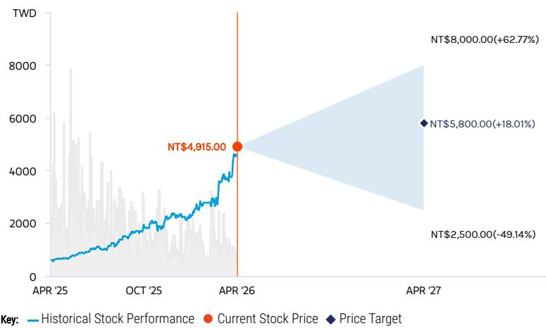  
RISK REWARD CHART   
Source: Re nitiv, Morgan Stanley Research

# OVERWEIGHT THESIS

▪ We rate MPI OW relative to our coverage because it combines leading probe card technology (VPC/MEMS) with strong exposure to rising pin density and CPOrelated testing, positioning it to capture structural growth and share gains in advanced semiconductor testing. We expect MPI's revenue to grow at a $6 6 \%$ CAGR, 2025-2028e.

▪ MPI is among the top five global probe card suppliers and stands out as the only Taiwanese manufacturer capable of delivering a complete range of probe card solutions.

▪ Besides existing demand from R&D, we expect CPO-related testing equipment demand, including wafer-level and die-level testing, to be the key growth driver and account for $2 4 \%$ of 2028e total sales.

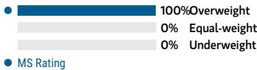  
Consensus Rating Distribution   
Source: Re nitiv, Morgan Stanley Research

# Risk Reward Themes

New Data Era: Positive Secular Growth: Positive View descriptions of Risk Rewards Themes here

# BULL CASE

# NT\$8,000.00

# BASE CASE

# NT\$5,800.00

# BEAR CASE

NT\$2,500.00

# 60x 2027e EPS

We assume: 1) $100 \%$ revenue CAGR, 2025- 28e, on stronger-than-expected adoption of MEMS probe cards, with robust market share gain momentum and more project wins in CPO development; 2) faster-thanexpected CPO introduction; 3) gross margin improves to over $7 0 \%$ , thanks to scale effects and the company's technology competitiveness; and 4) $> 1 5 0 \%$ EPS CAGR, 2025-28e.

# 44x 2028e EPS

We expect: 1) $6 6 \%$ revenue CAGR, 2025-28e, on stronger-than-expected adoption of MEMS probe cards, with robust market share gain momentum and more project wins in CPO development; 2) CPO-related revenue to bear fruit upon 2H27 introduction; 3) gross margin to reach $6 2 \%$ in 2028, thanks to scale effects and the company's technology competitiveness; and 4) $9 3 \%$ EPS CAGR, 2025-28e.

# 19x 2027e EPS

We assume: 1) $20 \%$ revenue CAGR, 2025- 28e, on slower-than-expected adoption of MEMS probe cards, with robust market share gain momentum and no project wins in CPO development; 2) slower-thanexpected CPO introduction; and 3) customer bargaining power pushes gross margin below $4 0 \%$ and $4 .$ ) $30 \%$ EPS CAGR, 2025- 28e.

# Risk Reward – MPI Corporation (6223.TWO)

KEY EARNINGS INPUTS   

<table><tr><td>Drivers</td><td>2025</td><td>2026e</td><td>2027e</td><td>2028e</td></tr><tr><td>BMC revenue (NTS, mn)</td><td>9,467</td><td>16,319</td><td>28,137</td><td>44,235</td></tr><tr><td>360 degree SoC revenue (NTS, mn)</td><td>267</td><td>458</td><td>852</td><td>1,399</td></tr><tr><td>PC/AV extension IC revenue (NTS, mn)</td><td>1,930</td><td>2,694</td><td>3,166</td><td>3,225</td></tr></table>

# INVESTMENT DRIVERS

AI demand  
Test time  
Product migration cadence

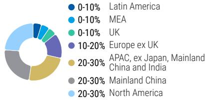  
GLOBAL REVENUE EXPOSURE   
Source: Morgan Stanley Research Estimate View explanation of regional hierarchies here

# RISKS TO PT/RATING

# RISKS TO UPSIDE

Stronger-than-expected AI demand Stronger-than-expected market share gain from peers Stronger-than-expected CPO development

# RISKS TO DOWNSIDE

Slower-than-expected AI demand Slower-than-expected market share gain from peers Slower-than-expected CPO development

# MS ESTIMATES VS. CONSENSUS

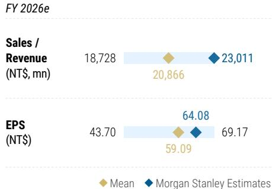  
Source: Re nitiv, Morgan Stanley Research

1. Slower-than-expected AI demand: A potential slowdown in AI demand remains a key risk to MPI’s growth outlook. As a significant portion of the company’s future expansion is tied to AI-driven semiconductor demand, any deceleration in hyperscaler capex or delays in AI chip development cycles could translate into slower project ramps with key customers. This would not only impact near-term order visibility, but it could also push out qualification timelines for nextgeneration probe card solutions.

# 订阅研报添

2. Slower-than-expected market share gain from peers: Intensifying competition from global and regional peers also presents downside risk. The probe card 加微信 LCD123321Cad 04-17 market is highly competitive, with established international players and emerging regional suppliers continuously investing in advanced technologies. If competition becomes more aggressive – either through pricing, technology advancements, or customer penetration – it could pressure MPI’s market share, particularly in new AI-related projects where vendor qualification is highly competitive.

3. Slower-than-expected CPO development: Slower development in the CPOrelated equipment business may limit valuation upside. Although the equipment segment currently contributes a relatively small portion of revenue, it represents an important long-term optionality tied to next-generation interconnect technologies such as co-packaged optics. Any delays in MPI’s progress or weakerthan-expected industry adoption of CPO could dampen investor expectations and cap further re-rating potential for the stock.

# MPI: Financial Outlook

# Capacity

With a view to meeting the strong demand from customers, MPI plans to further increase its capacity substantially into 2026, in particular for MEMS probe cards. Currently, MPI plans to expand its VPC capacity from 1.2mn pin per month to 1.5mn pin per month in 2Q26, further reaching 1.8mn pin per month in 3Q26. For MEMS, the company plans to 添加微信 LCD123321Cad 04-17 expand its capacity from 2.0mn pin per month to 2.5mn pin per month in 2Q26, and further reach 3.0mn pin per month in 3Q26, which should help it further expand its market share in the MEMS market.

# Order visibility and contract liabilities vs. revenue

The company currently has extended order visibility, and its robust demand is evident in its book-to-bill (BB) ratios: VPC is at a strong 1.93 in January 2026, with CPC also recovering to 1.63 January 2026 from 0.87 in December 2025. Management, during the 4Q25 earnings call, said that it also expects its $\mathtt { B / B }$ ratio for all product lines to stay above 1 during 2026. Additionally, contract liabilities rose $1 5 \%$ QoQ and $2 2 \%$ YoY in 4Q25, reaching $4 7 \%$ of revenue, indicating aggressive pre-payments from customers, helping to solidify future revenue streams.

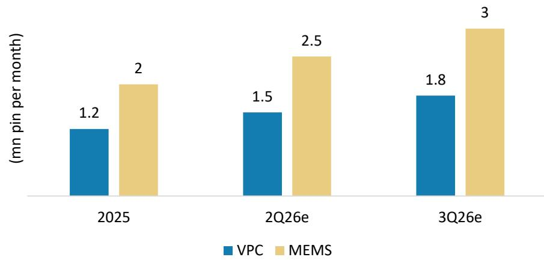  
Exhibit 118:MPI's monthly pin capacity   
MPI's Monthly Pin Capacity   
Source: Company data, Morgan Stanley Research. $\mathrm { { e = } }$ Morgan Stanley Research estimates. 订阅研报添加微信 LCD123321Cad 04-17

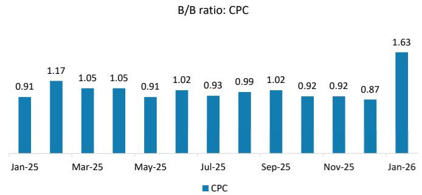  
Exhibit 119:MPI's B/B ratio for CPC: Jumped to 1.63 in January 2026 from 0.87 in December 2025   
Source: Company data, Morgan Stanley Research. $\in { } =$ Morgan Stanley Research estimates.

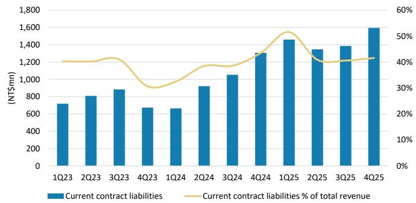  
Exhibit 121:Contract liabilities rose $2 2 \%$ YoY and $1 5 \%$ QoQ in 4Q25, reaching $4 7 \%$ of revenue   
订阅研报添加微 Source: Company data, Morgan Stanley Research. e = Morgan Stanley Research estimates.

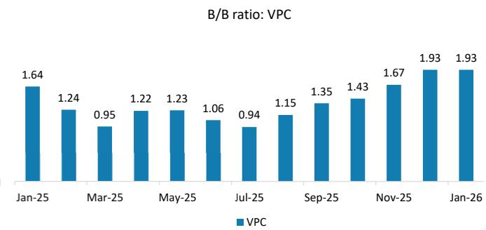  
Exhibit 120:MPI's B/B ratio for VPC: Maintained at 1.93 in January 2026   
Source: Company data, Morgan Stanley Research. $\mathrm { { e = } }$ Morgan Stanley Research estimates.

# LCD123321Cad 04-17

# Revenue

After marking the eighth consecutive year of growth, at a $30 \% +$ Y/Y increase in 2025, the secular AI trend should, we expect, continue to drive MPI's revenue. We expect MPI's revenue to grow at a $6 6 \%$ CAGR, 2025-28e, mainly helped by improving mix in probe cards and increasing shipment in the equipment segment, mainly helped by CPO.

° Probe Cards: $70 \% +$ revenue, including vertical probe cards $\sim 4 0 \% +$ of total sales as of 2025), and rapidly rising contribution from MEMS probe cards $5 \%$ of 2025e total revenue) for AI chips. We expect MEMS probe cards will be the growth catalyst thanks to the strong AI chip growth trend, with MPI's revenue exposure increasing to $2 4 \%$ in 2028e.   
0 Equipment segment, including photonic automation, advanced semi test, and 加微信 LCD123321Cad 04-17 thermal system, accounted for 19% of 2025 total revenue (e.g., wafer probers used in R&D and engineering, automation modules, thermal chucks and environmental control systems). Besides the existing demand coming from R&D and applications such as LED and aerospace, we expect CPO-related testing demand, including wafer-level and die-level testing, to be the key growth driver for MPI's total revenue. We thus expect equipment to account for $2 4 \%$ of MPI's total revenue in   
2028e.

# Gross profit

MPI expanded its GM from $4 4 \%$ in 2019 to $56 \%$ in 2025, mainly driven by improving product mix from VPC and R&D investment in the equipment segment gradually bearing fruit.

We expect the increasing mix of high-margin VPC and MEMS products, and potentially more membrane adoption in the future – accounting for around $70 \% +$ of probe card revenue – to drive significant profit expansion, coupled with increasing equipment shipment, especially from CPO, to drive MPI's GM to $62 \%$ in 2028e.

#

# 添加微信 LCD123321Cad 04-17

MPI's 2025e EPS was slightly curbed by unfavorable FX in 2Q25, where $7 \%$ NTD/USD appreciation would lead to 30-40bps of margin impact, combined with FX loss impact. (See our global team's latest report.)

Looking into 2026 and beyond, we expect overall currency policy to remain stable across the globe. Thus, we expect to see operating leverage as high-margin business gradually bears fruit, with a $9 4 \%$ EPS CAGR, 2025-28e.

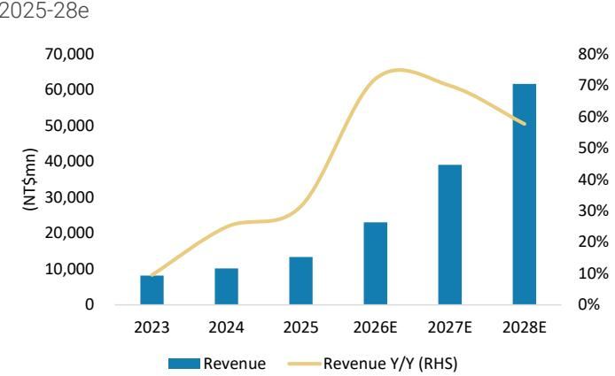  
Exhibit 122:We expect MPI's revenue to rise at a $6 6 \%$ CAGR,   
Source: Company data, Morgan Stanley Research. $\in { } =$ Morgan Stanley Research estimates.

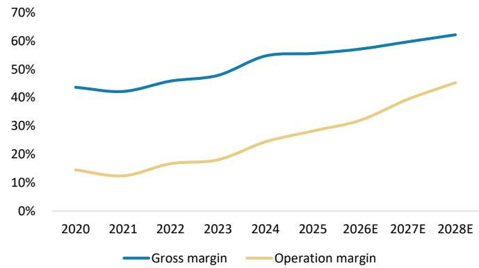  
Exhibit 124:We expect MPI's margin to expand from $4 8 \%$ in 2023 to $6 2 \%$ in 2028e   
Source: Company data, Morgan Stanley Research. $\in { } =$ Morgan Stanley Research estimates.

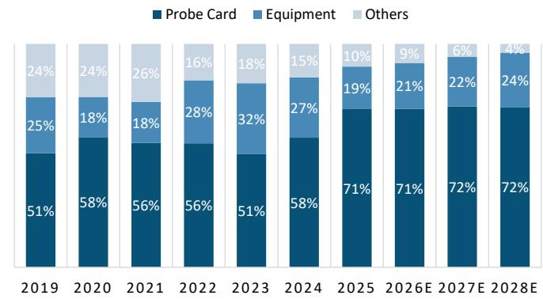  
Exhibit 123:Revenue breakdown, by product   
Source: Company data, Morgan Stanley Research. $\mathrm { { e = } }$ Morgan Stanley Research estimates.s

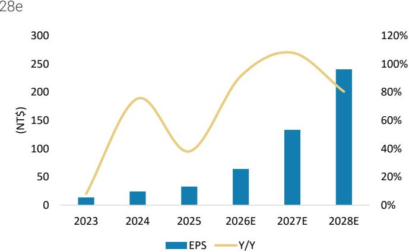  
Exhibit 125:We expect MPI's EPS to rise at a $9 4 \%$ CAGR, 2025-   
Source: Company data, Morgan Stanley Research. $\mathrm { { e = } }$ Morgan Stanley Research estimates.

# MPI: Our Estimates vs Consensus and What's Not Priced In

# We are more bullish than consensus on MPI's 2027-28e earnings outlook

We expect revenue momentum to remain strong in 2026-28e, thanks to continuous chip upgrades that lead to increasing pin counts in probe cards, with customers also further adopting MEMS probe cards, which leads to further ASP increase. Besides probe cards, we 添加微信 LCD123321Cad 04-17 expect MPI to start making progress for its CPO products starting late 2026. On the gross margin front, continual migration to MEMS (GM at ${ > } 6 0 \% _ { 1 }$ , vs CPC/VPC at $4 5 / 5 0 \%$ ) and increasing equipment revenue should also help drive its corporate margin from $5 5 \%$ in $2 0 2 4$ to $6 2 \%$ in 2028e, per our projection. Our 2026/2027 EPS are $4 . 3 \% / 3 6 \%$ above consensus.

# What's not priced in?

We believe the market is underappreciating the durability and breadth of MPI’s growth drivers beyond the current AI narrative. While consensus increasingly factors in hyperscaler-driven AI ASIC demand, we believe that it does not fully capture the structural uplift from rising networking intensity and the associated increase in probe card pin counts, alongside accelerating customer migration toward MEMS. In addition, a cyclical recovery in non-AI segments (CPC/VPC) – partly driven by specification upgrades tied to higher pin counts – and MPI’s potential entry into the memory segment, where it could 添加微信 LCD123321Cad 04-17 gain share from incumbents such as MJC, remain under-recognized. Finally, although MPI’s exposure to CPO wafer-level testing (Insertion 2) via its partnership with Advantest is relatively well understood, we see incremental upside from its early--stage exploration of die-level testing opportunities in Insertions 3 and 4, which we believe are not yet reflected in expectations.

Furthermore, we think there is still a catch-up opportunity in MPI's foreign holding positioning. QFII ownership has increased from $10 \%$ last August to $40 \%$ currently. We think this suggests that MPI’s long-term growth potential remains largely underdiscovered by global funds.

Exhibit 126:MPI: Morgan Stanley Research vs consensus   

<table><tr><td rowspan=2 colspan=1>(NT$mn)</td><td rowspan=1 colspan=3>2026e</td><td rowspan=1 colspan=3>2027e</td><td rowspan=1 colspan=3>2028e</td></tr><tr><td rowspan=1 colspan=1>Mse</td><td rowspan=1 colspan=1>Consensus</td><td rowspan=1 colspan=1>Diff.</td><td rowspan=1 colspan=1>Mse</td><td rowspan=1 colspan=1>Consensus</td><td rowspan=1 colspan=1>Diff.</td><td rowspan=1 colspan=1>Mse</td><td rowspan=1 colspan=1>Consensus</td><td rowspan=1 colspan=1>Diff.</td></tr><tr><td rowspan=1 colspan=1>Sales</td><td rowspan=1 colspan=1>23,011</td><td rowspan=1 colspan=1>20,807</td><td rowspan=1 colspan=1>10.6%</td><td rowspan=1 colspan=1>39,097</td><td rowspan=1 colspan=1>29,480</td><td rowspan=1 colspan=1>32.6%</td><td rowspan=1 colspan=1>61,656</td><td rowspan=4 colspan=1></td><td rowspan=6 colspan=1></td></tr><tr><td rowspan=2 colspan=1>Gross profitOp. income</td><td rowspan=2 colspan=1>13,1437,367</td><td rowspan=2 colspan=1>11,8516,906研</td><td rowspan=2 colspan=1>报6.7%10.9%</td><td rowspan=1 colspan=1>23,325</td><td rowspan=1 colspan=1>17.038</td><td rowspan=2 colspan=1>36.9%ad44.1%-17</td><td rowspan=2 colspan=1>38,30527,895</td></tr><tr><td rowspan=1 colspan=1>115,409CI</td><td rowspan=1 colspan=1>10,6931C</td></tr><tr><td rowspan=1 colspan=1>Pretax income</td><td rowspan=1 colspan=1>7,447</td><td rowspan=1 colspan=1>7,130</td><td rowspan=1 colspan=1>4.4%</td><td rowspan=1 colspan=1>15,489</td><td rowspan=1 colspan=1>10,950</td><td rowspan=1 colspan=1>41.4%</td><td rowspan=1 colspan=1>27,939</td></tr><tr><td rowspan=1 colspan=1>Net income</td><td rowspan=1 colspan=1>6,078</td><td rowspan=1 colspan=1>5,978</td><td rowspan=1 colspan=1>1.7%</td><td rowspan=1 colspan=1>12,632</td><td rowspan=1 colspan=1>9,582</td><td rowspan=1 colspan=1>31.8%</td><td rowspan=1 colspan=1>22,779</td><td rowspan=2 colspan=1></td></tr><tr><td rowspan=1 colspan=1>EPS</td><td rowspan=1 colspan=1>64.08</td><td rowspan=1 colspan=1>61.47</td><td rowspan=1 colspan=1>4.3%</td><td rowspan=1 colspan=1>133.18</td><td rowspan=1 colspan=1>98.24</td><td rowspan=1 colspan=1>35.6%</td><td rowspan=1 colspan=1>240.17</td></tr><tr><td rowspan=1 colspan=1>GM</td><td rowspan=1 colspan=1> 57.1%</td><td rowspan=1 colspan=1>57.0%</td><td rowspan=1 colspan=1>0.2%</td><td rowspan=1 colspan=1>59.7%</td><td rowspan=1 colspan=1>57.8%</td><td rowspan=1 colspan=1>1.9%</td><td rowspan=2 colspan=1>62.1%45.2%</td><td rowspan=2 colspan=1></td><td rowspan=2 colspan=1></td></tr><tr><td rowspan=1 colspan=1>OPM</td><td rowspan=1 colspan=1>32.0%</td><td rowspan=1 colspan=1>33.2%</td><td rowspan=1 colspan=1>-1.2%</td><td rowspan=1 colspan=1>39.4%</td><td rowspan=1 colspan=1>36.3%</td><td rowspan=1 colspan=1>3.1%</td></tr></table>

Source: Bloomberg consensus estimates, Morgan Stanley Research estimates.

# MPI: Valuation Methodology and Peer Comparison

订阅研报

Our price target is NT\$5,800: We derive our price target – which is also our base case scenario value – from a residual income (RI) model, as we believe this can best capture long-term value. We assume a $9 . 7 8 \%$ cost of equity (risk-free rate $2 . 0 \%$ and risk premium $6 . 0 \%$ ), a payout ratio of $7 5 \% ,$ a medium-term growth rate of $1 5 \% ,$ and a terminal growth rate of $4 . 0 \%$ . Our price target implies $4 4 \times / 2 4 \times 2 0 2 7 \mathrm { e } / 2 0 2 8 \mathrm { e } \mathsf { P } / \mathsf { E }$ . We believe its valuation should continue to climb along with growing earnings. We think its valuations align with 添加微信 LCD123321Cad 04-17 other strong growth companies or companies that have an emerging business within our semiconductor coverage, such as Aspeed.

Exhibit 130:MPI: Residual income (RI) model   

<table><tr><td>NT$million</td><td>2026E</td><td>2027E</td><td>2028E</td><td>2029E</td><td>2030E</td><td>2031E</td><td>2032E</td><td>2033E</td><td>2034E</td><td></td><td>2035E 2036E</td><td></td><td>2037E</td></tr><tr><td>Total Equity</td><td>19,903</td><td>30,406</td><td>49,397</td><td>57,946</td><td>67,777</td><td></td><td>79,083</td><td>92,085</td><td>107,038</td><td>124,233</td><td>144,008</td><td>166,749</td><td>192,901</td></tr><tr><td>Net Profit</td><td>6,078</td><td>12,632</td><td>22,779</td><td>26,196</td><td></td><td>30,126</td><td>34,644</td><td>39,841</td><td>45,817</td><td>52,690</td><td>60,593</td><td>69,682</td><td>80,135</td></tr><tr><td>ROAE</td><td>35.3%</td><td>50.2%</td><td>57.1%</td><td>48.8%</td><td>47.9%</td><td>47.2%</td><td></td><td>46.6%</td><td>46.0%</td><td>45.6%</td><td>45.2%</td><td>44.8%</td><td>44.6%</td></tr><tr><td>Residual Income</td><td>3,714</td><td>8,049</td><td>14,386</td><td>19,280</td><td>22,104</td><td>25,351</td><td>29,083</td><td></td><td>33,374</td><td>38.307</td><td>43.980</td><td></td><td>58,005</td></tr><tr><td>Spread</td><td>25.5%</td><td>40.4%</td><td>47.3%</td><td>39.0%</td><td>38.1%</td><td></td><td>37.4%</td><td>36.8%</td><td>36.2%</td><td>35.8%</td><td>35.4%</td><td>50,503 35.1%</td><td>34.8%</td></tr><tr><td>Ending Equity Capital</td><td>19,903</td><td></td><td></td><td></td><td></td><td></td><td></td><td></td><td></td><td></td><td></td><td></td><td></td></tr><tr><td>PV of Forecast Period</td><td>155,983</td><td></td><td></td><td></td><td></td><td></td><td></td><td></td><td></td><td></td><td></td><td></td><td></td></tr><tr><td>PV of Continuing Value</td><td>374,256</td><td></td><td></td><td></td><td></td><td></td><td></td><td></td><td></td><td></td><td></td><td></td><td></td></tr><tr><td>Equity Value</td><td>550,142</td><td></td><td></td><td></td><td></td><td></td><td></td><td></td><td></td><td></td><td></td><td></td><td></td></tr><tr><td>No. of Shares</td><td>95</td><td></td><td></td><td></td><td></td><td></td><td></td><td></td><td></td><td></td><td></td><td></td><td></td></tr><tr><td>Projected Price</td><td>5,800</td><td></td><td></td><td></td><td></td><td></td><td></td><td></td><td></td><td></td><td></td><td></td><td></td></tr></table>

Source: Company data, Morgan Stanley Research. $\in { } =$ Morgan Stanley Research estimates.

# Bull/bear case scenarios添加微信 LCD123321Cad 04-17

Our bull case scenario value is NT\$8,000: Stronger sales/EPS growth, with faster GM expansion

In this scenario we assume: 1) $100 \%$ revenue CAGR, 2025-28e, on stronger-than-expected adoption of MEMS probe cards with robust market share gain momentum and more project wins in CPO development; 2) faster-than-expected CPO introduction; 3) gross margin improves to over $70 \%$ thanks to scale effects and the company's technology competitiveness; and 4) $> 1 5 0 \%$ EPS CAGR, 2025-228e.

Our bear case scenario value is NT\$2,500: Revenue/EPS growth is slower, with GM erosion.

In this scenario we assume: 1) $20 \%$ revenue CAGR, 2025-28e, on slower-than-expected adoption of MEMS probe cards, with robust market share gain momentum and no project wins in CPO development; 2) slower-than-expected CPO introduction; 3) gross margin 添加微信 LCD123321Cad 04-17 falls below 40% due to the high bargaining power of customers; and 4) $30 \%$ EPS CAGR, 2025-28e.

# Peer comparison and valuation

We expect MPI's EPS to grow at a $9 4 \%$ CAGR, 2025-28e, or a $76 \%$ CAGR, 2024-27e, much faster than the $2 6 \%$ peer average for 2024-27e (per consensus forecasts), thanks to its leadership in the US AI ASIC supply chain and its continual efforts to penetrate into CPO insertion testing. Although the stock currently trades at 71x/34x 2026e/2027e P/E, we still expect it to further trend up, as we believe that we are still at the halfway point for the market to capitalize on its structural earnings growth potential for AI and CPO. MPI's multiple is lower than that of competitors, such as Technoprobe/Formfactor, at 46x/57x 2027e P/E (based on consensus forecasts), but we think it's likely to catch up, given its leading position in AI ASIC and also as it is scaling revenue from its MEMS probe card business. Smaller Taiwanese probe card peers, such as KSMT and Inno-star, are also trading at higher multiples, at 99x and 97x 2027e P/E (based on consensus forecasts), but remain focused on single ASIC projects.

3,166 3,225 kets, such as AI/HPC, should trade is difficult to get such exposures   
through a small cap, while AI/CPO have been disproportionate alpha generators in small  
cap indices; and 2) the potential strategic value of small-cap AI capabilities is likely to   
generate a premium valuation, given its distinct position and technology leadership.

Exhibit 131:Valuation peer comparison   

<table><tr><td></td><td></td><td>Price Target</td><td></td><td>Market</td><td colspan="6"> EPS (Local Dollar)</td><td>P/E (x)</td><td></td><td></td><td></td><td>ROE (%)</td><td>Trading Volume</td></tr><tr><td>Ticker</td><td>Company</td><td>Rating</td><td>(LC)</td><td>Cap (us$mn)</td><td>2024</td><td>2025</td><td>2026e</td><td>2027e</td><td>2028e</td><td>2024</td><td>2025e</td><td>2026e</td><td></td><td>2027e</td><td>2028e</td><td>2025 (mn)</td></tr><tr><td>6515.TW</td><td>Winway</td><td>0</td><td>12,000.0</td><td>9,614</td><td>33.8</td><td>46.6</td><td>103.9</td><td>196.9</td><td>347.5</td><td>253.4</td><td>183.7</td><td>82.4</td><td>43.5</td><td>24.6</td><td>27.9</td><td>0.5</td></tr><tr><td>6223.TWO</td><td>MPI</td><td>0</td><td>5,800.0</td><td>13,991</td><td>24.4</td><td>32.5</td><td>64.1</td><td>133.2</td><td>240.2</td><td>186.1</td><td>139.8</td><td>70.9</td><td>34.1</td><td>18.9</td><td>26.7</td><td>0.7</td></tr><tr><td>7769.TW</td><td>Hon Precision</td><td>0</td><td>5,000.0</td><td>23,174</td><td></td><td></td><td>116.2</td><td>193.1</td><td>308.3</td><td>NA</td><td>NA</td><td>35.3</td><td>21.2</td><td>13.3</td><td>34.5</td><td>0.8</td></tr><tr><td colspan="10">Greater China Probe Card Peers</td><td></td><td></td><td></td><td></td><td></td><td></td><td></td></tr><tr><td>6510.TWO</td><td></td><td></td><td></td><td></td><td></td><td></td><td></td><td></td><td></td><td></td><td></td><td></td><td></td><td></td><td></td><td></td></tr><tr><td>6683.TWO</td><td>CHPT KSMT</td><td>NC</td><td>NA</td><td>3,523</td><td>15.5</td><td>30.4 15.2</td><td>61.1 18.7</td><td>114.6 19.0</td><td>NA NA</td><td>220.5 106.1</td><td>112.5</td><td>56.0 98.8</td><td>29.8 97.3</td><td>NA NA</td><td>11.9 15.9</td><td>0.6</td></tr><tr><td>7828.TWO</td><td>Inno-stars</td><td>NC NC</td><td>NA NA</td><td>1,587 1,527</td><td>17.4 4.1</td><td>5.6</td><td>10.7</td><td>14.0</td><td>NA</td><td>324.3</td><td>121.9 234.9</td><td>124.4</td><td>94.4</td><td>NA</td><td>25.0</td><td>0.3 0.8</td></tr><tr><td>Average</td><td></td><td></td><td></td><td></td><td></td><td></td><td></td><td></td><td></td><td>217.0</td><td>156.4</td><td>93.0</td><td>73.8</td><td>NA</td><td>17.6</td><td>0.9</td></tr><tr><td colspan="10">Global Probe Card and Socket Companies</td><td></td><td></td><td></td><td></td><td></td><td></td><td></td></tr><tr><td>6594.JP</td><td>Nidec</td><td>NC</td><td>NA</td><td>16,083</td><td>143.1</td><td>105.4</td><td>158.4</td><td>177.9</td><td>220.1</td><td>15.7</td><td>21.3</td><td>14.1</td><td>12.6</td><td>10.2</td><td>9.8</td><td>2.7</td></tr><tr><td>TPRO.IM</td><td>Technoprobe</td><td>NC</td><td>NA</td><td>12,245</td><td>0.1</td><td>0.2</td><td>0.3</td><td>0.4</td><td>0.5</td><td>161.4</td><td>96.7</td><td>64.3</td><td>46.0</td><td>34.3</td><td>7.9</td><td>0.4</td></tr><tr><td>SMIN.L</td><td>Smiths Group</td><td>NC</td><td>NA</td><td>10,275</td><td>0.7</td><td>1.2</td><td>1.1</td><td>1.2</td><td>1.4</td><td>35.0</td><td>20.9</td><td>23.2</td><td>20.5</td><td>17.9</td><td>12.8</td><td>0.7</td></tr><tr><td>FORM.O</td><td>FormFactor</td><td>NC</td><td>NA</td><td>9,995</td><td>0.9</td><td>1.3</td><td>1.8</td><td>2.2</td><td>NA</td><td>144.5</td><td>98.6</td><td>71.8</td><td>57.0</td><td>NA</td><td>5.5</td><td>4.2</td></tr><tr><td>058470.KQ</td><td>Leeno</td><td>0</td><td>77,000.00</td><td>5,779</td><td>1,492.6</td><td>1,997.2</td><td>2,349.6</td><td>2,841.2</td><td>3,580.4</td><td>76.0</td><td>56.8</td><td>48.3</td><td>39.9</td><td>31.7</td><td>22.4</td><td>0.6</td></tr><tr><td>095340.KR</td><td>ISC</td><td>NC</td><td>NA</td><td>2,975</td><td>2,621.9</td><td>2,750.5</td><td>4,092.3</td><td>5,413.6</td><td>7,496.1</td><td>82.6</td><td>78.7</td><td>52.9</td><td>40.0</td><td>28.9</td><td>10.6</td><td>0.7</td></tr><tr><td>6871.T</td><td>Micronics Japan</td><td>0</td><td>14,000.00</td><td>2,932</td><td>228.3</td><td>311.5</td><td>440.7</td><td>530.5</td><td>704.7</td><td>52.9</td><td>38.7</td><td>27.4</td><td>22.8</td><td>17.1</td><td>20.9</td><td>1.1</td></tr><tr><td>6941.JP</td><td>Yaimaichi</td><td>NC</td><td>NA</td><td>1,065</td><td>259.5</td><td>456.9</td><td>497.6</td><td>538.2</td><td>NA</td><td>35.6</td><td>20.2</td><td>18.6</td><td>17.2</td><td>NA</td><td>13.5</td><td>0.4</td></tr><tr><td>6855.T</td><td>JEM</td><td>NC</td><td>NA</td><td>606</td><td>273.5</td><td>347.8</td><td>371.5</td><td>403.1</td><td>NA</td><td>24.1</td><td>19.0</td><td>17.8</td><td>16.4</td><td>NA</td><td>13.1</td><td>0.6</td></tr><tr><td>6961.JP</td><td>Enplas</td><td>NC</td><td>NA</td><td>836</td><td>440.0</td><td>533.9</td><td>625.9</td><td>752.4</td><td>NA</td><td>33.7</td><td>27.8</td><td>23.7</td><td>19.7</td><td>NA</td><td>7.3</td><td>0.1</td></tr><tr><td>Average</td><td></td><td></td><td></td><td></td><td></td><td></td><td></td><td></td><td></td><td>66.1</td><td>47.9</td><td>36.2</td><td>29.2</td><td>23.4</td><td>14.3</td><td>1.3</td></tr></table>

Source: Company data, FactSet, Morgan Stanley Research. $\in { } =$ FactSet consensus estimates. Note: As of the market close on April 16, 2026. Except for Winway and MPI, which are MSe, all other estimates are generated from consensus.

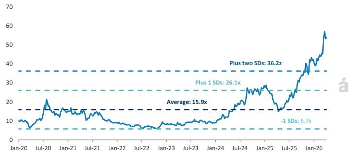  
Exhibit 132:MPI's historical P/E multiple

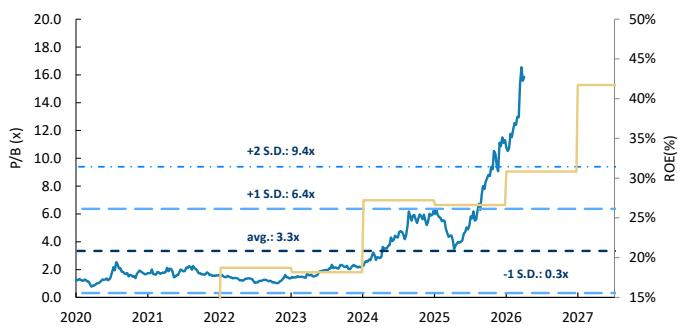  
Exhibit 133:MPI's historical P/B multiple   
Source: Company data, FactSet, Morgan Stanley Research estimates.

# MPI: Company Background and Overview

Founded in 1995 in Hsinchu, Taiwan, MPI Corporation is aiming to build precision probing systems for the Taiwan semiconductor testing market. In its early years, the company focused primarily on engineering probers for laboratory and wafer-level characterization – a niche but vital segment that supported IC design companies and research institutes. MPI’s precision mechanical know-how positioned it as one of the earliest domestic suppliers capable of producing high-accuracy probe stations locally, vs. the competitors 添加微信 LCD123321Cad 04-17 commonly in Japan or the US. By the early 2000s, MPI had leveraged its precision mechanical base to move up the value chain into vertical probe cards, targeting the testing of DRAM and logic devices. MPI also established its in-house PCB processing and substrate assembly lines to ensure quality control and shorten turnaround time. Over time, MPI has become a key local partner for leading OSATs, supporting vertical probe cards used for volume production in memory and SoC testing.

As TSMC developed its CoWoS and advanced packaging since the 2010s, wafer-level test complexity grew substantially. MPI made a decisive investment in MEMS probe-card fabrication for sub-50um pitches or the multi-ampere current densities required by more advanced SoC. It developed proprietary process for micro-spring and thinfilm formation and transformed MPI from a precision-mechanical manufacturer into a microelectromechanical device company – directly competing with global leaders, such as FormFactor and Technoprobe, in the most technology-intensive segment of the testing interface market.

# 订阅研报

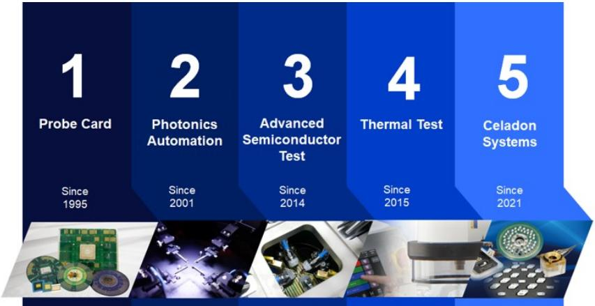  
添加微信 LCD123321Cad 04-17 Exhibit 134:MPI: Key product development timeline

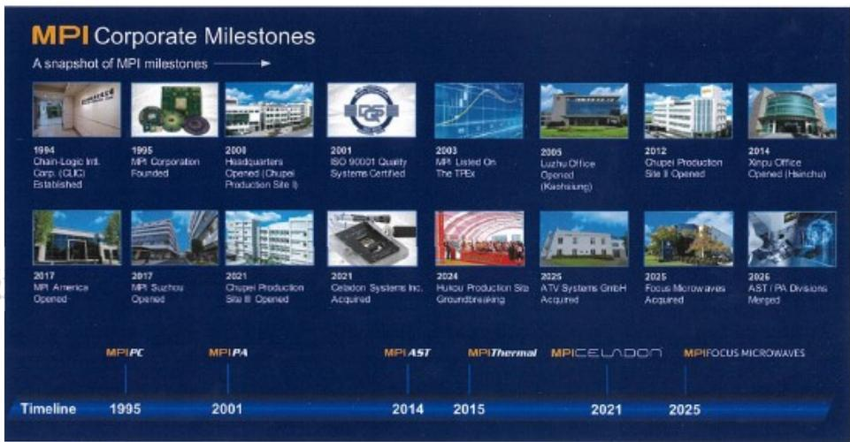  
Exhibit 135:MPI's corporate milestones   
Source: Company data.

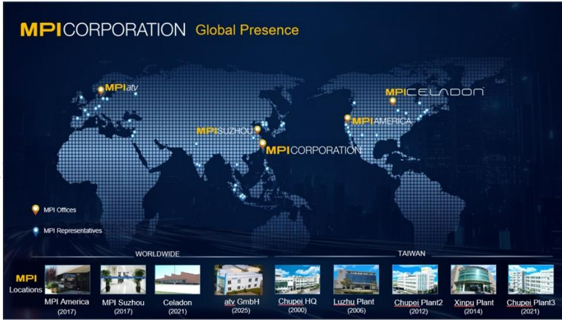  
Exhibit 136: MPI: global footprint   
Source: Company data.

# Key product lines

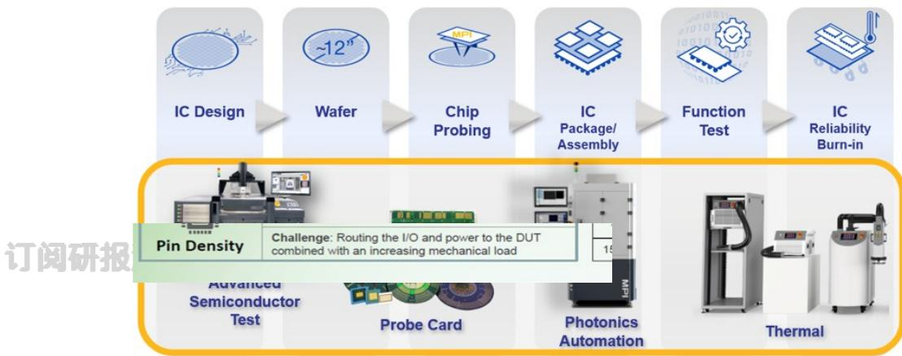  
Exhibit 137:MPI's product in chip manufacturing and test process   
Source: Company data.

# Probe cards

Cantilever probe cards are one of the earliest and most established wafer probing technologies, consisting of metallic probe needles that extend horizontally from the probe card substrate to contact the bond pads on a semiconductor wafer. These probes are typically made from materials such as tungsten or beryllium copper and are individually formed and aligned to match the pad layout of the device under test. Cantilever probe cards are generally cost-effective and are well suited for low- to mediumpin-count applications, including analog, discrete, and some mixed-signal devices. However, as device geometries shrink and pad densities increase, maintaining precise alignment, consistent contact force, and planarity across a large number of probes becomes more difficult, limiting their suitability for advanced, high-density semiconductor testing.

Vertical probe cards were developed to address the limitations of cantilever designs, particularly for high-pin-count and fine-pitch applications. In vertical probe cards, probes are arranged perpendicular to the wafer surface and often use compliant structures such as spring pins or buckling beams to maintain consistent contact force. This vertical architecture improves planarity and enables more uniform electrical contact across all test points, which is critical for advanced integrated circuits such as DRAM and highperformance logic devices. Vertical probe cards also support higher levels of parallel testing, allowing multiple dies to be tested simultaneously and improving overall throughput. While they offer enhanced performance and scalability, they are more complex to manufacture and typically come at a higher cost compared to cantilever probe cards.

订阅研报添加微信 LCD123321Cad 04-17 MEMS (micro-electro-mechanical systems) probe cards represent a more advanced generation of probing technology, utilizing semiconductor fabrication techniques such as photolithography and thin-film processing to create highly precise probe structures. These probe cards feature microfabricated spring elements and contact tips that enable extremely fine pitch capability and high uniformity across thousands of contact points. MEMS probe cards are particularly well suited for advanced semiconductor nodes, waferlevel testing, and applications requiring high-frequency performance and low contact resistance. Their batch fabrication approach allows for high repeatability and scalability, although the initial development costs and manufacturing complexity are relatively high.

As a result, MEMS probe cards are primarily used in high-volume production environments and cutting-edge semiconductor applications.

MPI provides omnidirectional products to global customers, including fine pitch CPC, highspeed VPC and low-force MEMS solutions. As one of the top five global probe card suppliers, MPI is the only Taiwanese manufacturer capable of producing a full range of probe cards, including cantilever (CPC), vertical (VPC), and MEMS-based solutions. This comprehensive technology portfolio addresses high-frequency and fine-pitch testing needs, establishing a strong competitive moat. The company holds the leading market share among Taiwanese VPC manufacturers, and its high-end MEMS probe cards are being integrated into the supply chains of major international clients, with volume production expected after validation in 2025.

In probe cards, VPC describes the probe's physical orientation (vertical), while MEMS refers to the advanced microfabrication technology used to create the tiny, precise probes, often integrated into VPCs for high-density testing (vertical MEMS probe cards) for complex logic chips, offering superior signal integrity and fine pitch compared to traditional cantilever cards. With AI chips moving to more advanced nodes and complex designs, the most advanced, high-density VPCs are likely to increasingly incorporate MEMS technology for their probes, leading to superior performance.

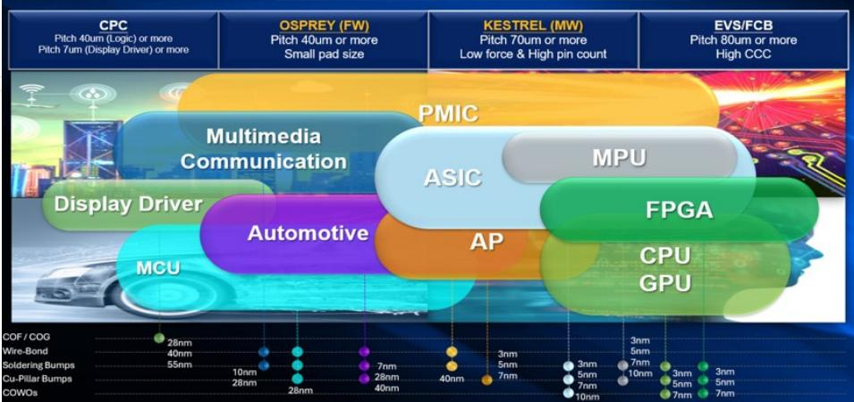  
Exhibit 138:Display driver IC and MCU are widely adopting CPC probe cards, while advanced nodes mostly rely on VPC and MEMS products   
Source: MPI.

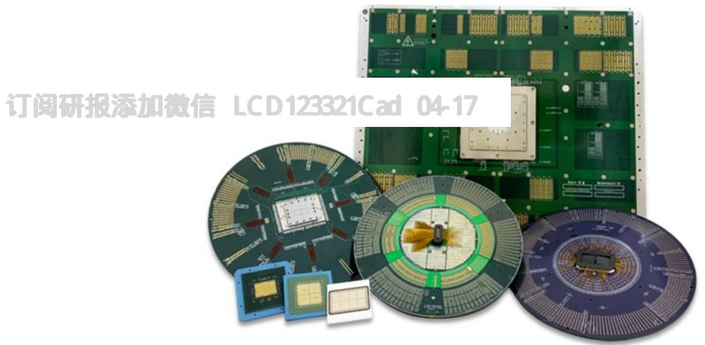

Source: MPI.

# Photonics Automation Equipment (PA)

# 订阅研报

添加微信 LCD123321Cad 04-17 MPI's photonics automation products focus on three major markets: optical sensing, optical communication, and micro display.

MPI photonics’ automation equipment stands out through its value-enhanced product portfolio, underpinned by a highly experienced R&D team with cross-disciplinary expertise in both photonics and electrical engineering. Leveraging strong automation core technologies, the company has successfully developed leading-edge solutions for emerging applications such as VCSEL and micro LED, positioning itself at the forefront of next-generation optical device testing.

Another key strength lies in MPI’s solid global clientele. The company maintains close collaborations with industry leaders and internationally recognized brands, enabling it to stay aligned with the most advanced testing requirements. These long-standing partnerships not only validate MPI’s technological capabilities but also reinforce its reputation as a trusted provider of high-performance testing solutions.

In addition, MPI demonstrates a strong commitment to continuous product innovation through sustained R&D investment. By consistently enhancing its technological capabilities, the company is able to deliver high value-added solutions that effectively address customers’ evolving testing bottlenecks. This innovation-driven approach supports MPI’s ability to capture opportunities in rapidly growing photonics and advanced semiconductor markets.

<table><tr><td></td><td>·Focus on Sensing VCSEL Testing</td></tr><tr><td>Optical Sensing</td><td>·Production Wafer Prober in Low Temperature</td></tr><tr><td></td><td>·High Power Measurement Tool and Technology Development</td></tr><tr><td></td><td>·Flip Chip Wafer VCSEL Testing Solution</td></tr><tr><td></td><td>·Package/ Hybrid Device testing</td></tr><tr><td></td><td>·Focus on VCSEL/Photodetector Testing</td></tr><tr><td>Optical Communications</td><td>·Wafer Prober for Dark/Responsivity/Capacity measurement</td></tr><tr><td></td><td>·RFMeasurement Capability Development hi123321Cad 04-17</td></tr><tr><td></td><td>订阅研Sih ackage testing approaching</td></tr><tr><td>Micro Display</td><td>·Lab and production wafer testing tool development</td></tr><tr><td></td><td>· Contacting Accuracy Improvement</td></tr><tr><td></td><td>· Innovative testing methodology</td></tr><tr><td></td><td>·Optical measurement in production methodology</td></tr></table>

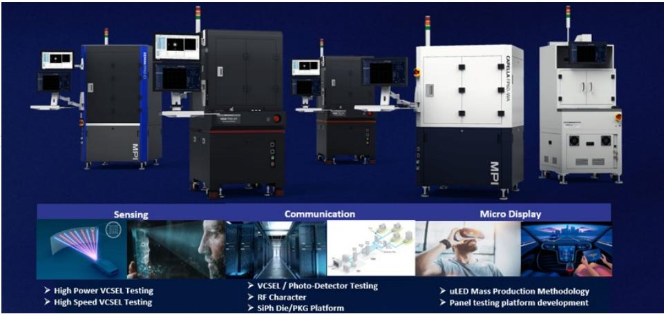  
Exhibit 140:MPI's PA equipment, including Wafer / Device Automated Probe, Test & Measurement, Sort and Inspection   
Source: Company data.

# Thermal and Advanced Semiconductor Test (AST) Equipment

MPI's thermal products are designed to conduct reliability tests for chips operating in extreme environmental conditions, (such as those used in auto, EV, aerospace, and telecommunication industries. The company says that these can reach 300 degrees from - 100 degrees within 10 seconds.

添加微信 LCD123321Cad 04-17 MPI Photonics’ automation equipment is differentiated by its innovative temperature control systems, which are designed to meet increasingly stringent testing requirements. Through ongoing R&D investment in platform development and system enhancements, MPI has built a portfolio of patented thermal technologies that deliver high efficiency and energy savings. These solutions not only improve test performance and stability but also help customers meet their ESG goals by reducing overall energy consumption.

A key competitive advantage for MPI lies in its highly skilled R&D team. The company’s thermal solutions are developed by industry veterans with over 100 years of combined experience, enabling deep technical expertise and a strong understanding of customer pain points. This level of domain knowledge supports the development of reliable, highprecision systems tailored to advanced photonics and semiconductor testing needs.

Furthermore, MPI benefits from deep collaboration with leading global customers across both engineering validation and high-volume production. These partnerships allow MPI to co-develop solutions that are closely aligned with real-world application requirements, accelerating time-to-market and improving product relevance. As a result, MPI’s automation equipment has successfully expanded into a wide range of high-growth applications, including automotive, 5G/RF communications, fiber optics, and sensing technologies.

  
Exhibit 141:MPI's Thermal AST product line   
Source: Company data.

In 2026, MPI merged its AST equipment with thermal applications to create synergy on product development. Originally, AST equipment had been chip probers used in the R&D/ design stage and mainly sold to IC designers. Owing to MPI's skilled technology in the optical field, it has successfully designed CPO wafer-level testing equipment and die-to-die probers. According to our supply chain check, MPI has started shipping such equipment to OSAT and foundry customers for COUPE and CPO packaging and testing, with CPO revenue likely to start contributing in 2H26.

MPI AST equipment benefits from unique global positioning, combining advanced analytical probing solutions with strong RF measurement core technologies. This integrated capability enables MPI to provide comprehensive solutions for high-frequency response measurement, positioning the company as a leading provider across the full 添加微信 LCD123321Cad 04-17spectrum of RF and mmWave testing applications.

# 订阅研报

Another key strength is MPI’s customer-centric design approach. By incorporating Voice of the Customer (VOC) into its development process, MPI ensures that its systems are closely aligned with real-world requirements, addressing specific pain points and improving usability, performance, and overall customer satisfaction. This approach enhances product relevance and strengthens long-term customer relationships.

In addition, MPI offers a complete and diversified solution portfolio that supports a wide range of applications. Its product lineup covers critical testing needs, including device modeling, RF and mmWave, wafer-level reliability (WLR), high-power testing, failure analysis, and extreme temperature environments. This broad capability allows customers to rely on MPI as a one-stop solution provider, reducing integration complexity and improving operational efficiency.

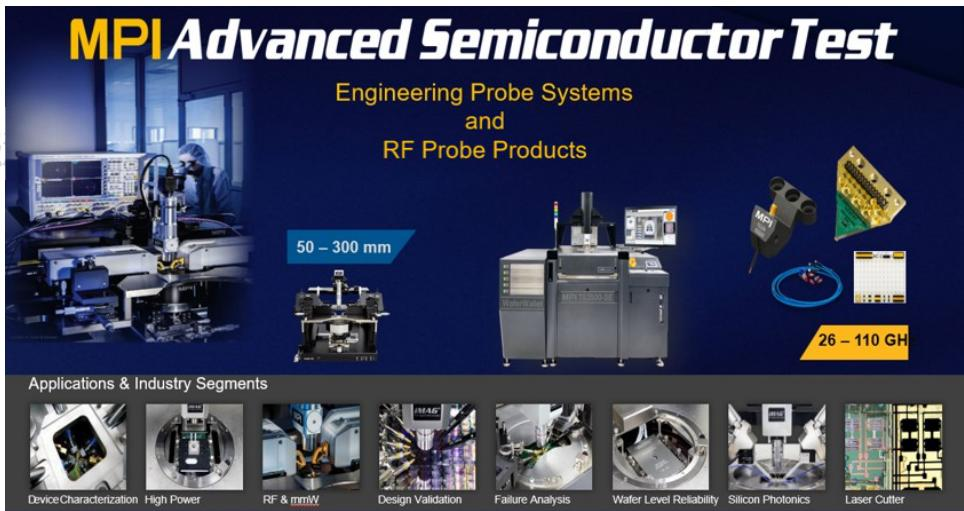  
Exhibit 142:MPI's AST product line   
Source: Company data.

# Key competitors

Collectively, the probe card market exhibits high concentration and significant 添加微信 LCD123321Cad 04-17 technological barriers. The top players – FormFactor, Technoprobe, MJC, Nidec SV TCL and MPI – along with a handful of others, command the majority of the AI chip probe card market.

Key differentiators among these players include: 1) Technology leadership: MEMS probe card precision at fine pitches drives testing for cutting-edge chips. 2) Application focus: Logic and advanced packaging require high-density cards; memory and automotive rely on durability. 3) Regional reach and service: Proximity to fabs and OSATs significantly affects adoption and support cycles.

In this landscape, FormFactor leads globally with MEMS innovation and scale, Technoprobe offers broad vertical expertise with high volume, MJC holds a strong regional niche with precision materials, and MPI punches above its weight with Taiwan-centric agility and specialized test solutions.

For the equipment side, MPI's key competitors in wafer prober include OPTO Tech, Fittech, Chroma ATE, Cascade, Hauman Technologies, WeiMin Industrial and SIDEA. For VCSEL testing systems, its competitors include BOST　and Feedlitech in China.

# Key suppliers and customers

A probe card consists of three components — probe head (pin), multi-layer organic (MLO), and printed circuit board (PCB). MPI already has the capability to self-design and manufacture probe heads and MLO. Nevertheless, since August 2024, MPI has been building a new PCB manufacturing facility in Hukou, Hsinchu, with the goal of increasing its in-house PCB production ratio to $50 \%$ (vs. ${ \tt< } 1 0 \%$ previously) by 4Q26. The new PCB

facility is dedicated to manufacturing high-end tailor-made PCBs (up to 70-80 layers). Once PCB capacity successfully ramps up in 2027, MPI will be able to enhance probe card quality, enable a higher degree of customization, and significantly shorten production lead time. The current production lead time is 12 weeks (8 weeks for PCB) and can increase up to 6 months during peak times, such as in 2024 when AI demand far exceeded supply. With the ability to self-produce high-end PCB, MPI can shorten production lead time to 8 weeks (around $2 / 3$ of the original time) vs. overseas peers’ lead time of at least 12 weeks, gaining a paramount time advantage and flexibility over competitors, especially amid the trend of shorter time to market.

MPI’s customers base is dominated by AI ASIC and CoWoS ecosystem leaders, including Broadcom, Marvell, TSMC and ASE/SPIL. For CPC business, it's largely dominated by DDIC-related customers, including Novatek. MPI has the advantage of regional service networks when customers require local refurbishment within hours, compared to its global peers that do not have this capability, such as like FormFactor and Technoprobe.

# Management team (4Q25)

<table><tr><td>Title</td><td>Name</td><td>Academic degree</td><td>Professional qualifications and experience</td></tr><tr><td>Chairman</td><td>Ko, Chang-Lin</td><td>EMBA, National Chiao Tung UniversityTechnology Research Institute</td><td>Electronics Research &amp; Service Organization, Industrial</td></tr><tr><td>President</td><td>Scott Kuo</td><td>Master of Mechanical Engineering, University of South Florida</td><td>Mechanical and Systems Research Laboratories, Industrial Technology Research Institute</td></tr><tr><td>VP of</td><td colspan="3">订阅研报添加微信 LCD123321Cad 04-17</td></tr><tr><td>Equipment Operations Center</td><td>Fan,Wei-Ju</td><td>Institute of Electrical and Control Engineering, National Chiao Tung University</td><td>Mechanical and Systems Research Laboratories, Industrial Technology Research Institute</td></tr><tr><td>VP of Marketing Finance</td><td>Liu, Yung-Chin</td><td>PhD of Aeronautics and Astronautics, National Cheng Kung University</td><td>Mechanical and Systems Research Laboratories, Industrial Technology Research Institute</td></tr><tr><td>Officer/ Corporate Governance Officer</td><td>Tang, Fu-Ping</td><td>PhDof Banking and Finance, National Chung Cheng University</td><td>G-TECH Optoelectronics Corporation</td></tr><tr><td>Accounting Officer</td><td>Rose Jao</td><td>BA of Mingshin University of Science and Technology</td><td>Topco Quartz Products Co., Ltd.</td></tr></table>

# WinWay (6515.TW): Socket Leader Leveraging AI Packaging Complexity; Initiate at OW

WinWay is the world’s 2nd-largest socket provider, with test sockets/burn-in sockets contributing $4 3 \% / 9 \%$ of its 2025 revenue. We expect WinWay’s revenue to grow $8 9 \% / 6 6 \% / 5 9 \%$ during 2026e/2027e/2028e, or at a $7 7 \%$ revenue CAGR, 2025-2028e,    ‹¢–xb¥mûR _®Omainly driven by: 1) HPC testing leader leveraging SLT expansion and AI ASIC momentum; 2) hypersocket innovation driving structural ASP upside; and 3) vertical integration and MEMS expansion on track, benefitting from higher pin counts and spec migration. We view WinWay as a key enabler for reducing lead times, strengthening supply chain control, and supporting margin expansion, with a clear pathway toward achieving a $50 \%$ gross margin profile over time.

Earnings: We think revenue momentum will remain strong in 2026-28e, driven by continuous chip upgrades that lead to increasing pin counts in coaxial sockets, with customers also further adopting the hypersocket, which fosters further ASP increase. We think consensus is not pricing in the magnitude and durability of WinWay’s margin and earnings expansion, driven by  structural product mix upgrades. ‹¢–xb¥mûR _®O

Valuation: We derive our price target from a residual income model. Our price target implies 61x/35x 2027e/2028e P/E, vs WinWay's EPS CAGR of $9 5 \%$ in 2026-28e. We believe its valuation will continue to climb along with growing earnings.

Key downside risks include: 1) slower-than-expected adoption of hypersockets and MEMS probe cards, 2) slower-than-expected SLT and burn-in introduction, and 3) no edge AI demand in the next few years.

Exhibit 143:WinWay: Summary of key metrics   

<table><tr><td colspan="2">Factset:6515-TW/Bloomberg:6515TT GreaterChina Semiconductor</td></tr><tr><td>Price target (US$)</td><td>NTS12,000.00</td></tr><tr><td>Up/downside to price target (%)</td><td>32%</td></tr><tr><td>Shr price,close(Apr 15,2026)</td><td>NT$9,065</td></tr><tr><td>52-Week Range</td><td>NTS847-NTS9,955</td></tr><tr><td>Sh out, dil, curr (mn)</td><td>36</td></tr><tr><td>Mkt cap,curr(U$mn)</td><td>10,247</td></tr><tr><td>EV,curr (US$mn)</td><td>10,247</td></tr><tr><td>Avgdaily trading volume (mn)</td><td>0.3</td></tr></table>

<table><tr><td>Fiscal YearEnding</td><td>2025</td><td>2026e</td><td>2027e</td><td>2028e</td></tr><tr><td>ModelWare EPS(NTS)</td><td>46.60</td><td>103.90</td><td>196.87</td><td>347.54</td></tr><tr><td>Consensus EPS(NTS)S</td><td></td><td>88.64</td><td>178.82</td><td>260.56</td></tr><tr><td>Revenue, net (NT$ mn)</td><td>7,857</td><td>14,847</td><td>24,572</td><td>39,155</td></tr><tr><td>EBITDA (NTS mn)</td><td>2.328</td><td>4,524</td><td>8,590</td><td>15,180</td></tr><tr><td>ModelWare net inc (NTS mn)</td><td>1,673</td><td>3,703</td><td>7,017</td><td>12,388</td></tr><tr><td>P/E</td><td>60.9</td><td>94.5</td><td>49.9</td><td>28.3</td></tr><tr><td>P/BV</td><td>15.9</td><td>39.3</td><td>26.6</td><td>17.2</td></tr><tr><td>RNOA (%)</td><td>47.7</td><td>96.1</td><td>126.4</td><td>155.7</td></tr><tr><td>ROE (%)</td><td>30.2</td><td>57.5</td><td>78.7</td><td>94.0</td></tr><tr><td>EV/EBITDA</td><td>43.0</td><td>77.7</td><td>40.7</td><td>22.8</td></tr><tr><td>Div yld (%)</td><td>0.9</td><td>0.4</td><td>0.8</td><td>1.5</td></tr><tr><td>FCF yld ratio (%)</td><td>2.6</td><td>0.6</td><td>1.3</td><td>2.5</td></tr><tr><td>Leverage (EOP) (%)</td><td>(41.6)</td><td>(39.0)</td><td>(40.8)</td><td>(44.3)</td></tr></table>

 LCD123321Cad   04-17  $\ S =$ $\underline { { \underline { { \mathbf { \delta \pi } } } } }$   
Source: Company data, FactSet, Morgan Stanley Research. e $=$ Morgan Stanley Research estimates

# Companydescription

# WinWay: Quarterly Financials and Financial Summary

Exhibit 144:WinWay: Quarterly financials   

<table><tr><td>NT$ in million (YE DEC31)</td><td>1Q26E</td><td>2Q26E</td><td>3Q25E</td><td>4Q26E</td><td>1Q27E</td><td>2Q27E</td><td>3Q27E</td><td>4Q27E</td><td>1Q28E</td><td>2Q28E</td><td>3Q28E</td><td>4Q28E</td><td>2024</td><td>2025</td><td>2026E</td><td>2027E</td><td>2028E</td></tr><tr><td>Total Revenues</td><td>2.980</td><td>3,575</td><td>3.987</td><td>4.305</td><td>5.000</td><td>5.920</td><td>6.564</td><td>7.088</td><td>7.768</td><td>9.261</td><td>10.967</td><td>11,158</td><td>5,798</td><td>7.857</td><td>14,847</td><td>24,572</td><td>39,155</td></tr><tr><td>Sequential Change</td><td>33.4%</td><td>19.9%</td><td>11.5%</td><td>8.0%</td><td>16.1%</td><td>18.4%</td><td>10.9%</td><td>8.0%</td><td>9.6%</td><td>19.2%</td><td>18.4%</td><td>1.7%</td><td></td><td></td><td></td><td></td><td></td></tr><tr><td>Change vs Year Ago</td><td>29.7%</td><td>134.8%</td><td>121.0%</td><td>92.7%</td><td>67.8%</td><td>65.6%</td><td>64.6%</td><td>64.6%</td><td>55.4%</td><td>56.4%</td><td>67.1%</td><td>57.4%</td><td>57.5%</td><td>35.5%</td><td>89.0%</td><td>65.5%</td><td>59.3%</td></tr><tr><td>Cost of Sales</td><td>1,581</td><td>1.870</td><td>2.033</td><td>2,177</td><td>2,497</td><td>2.918</td><td>3.207</td><td>3,417</td><td>3,663</td><td>4,318</td><td>5.038</td><td>5.079</td><td>3,265</td><td>4.301</td><td>7,660</td><td>12.039</td><td>18.098</td></tr><tr><td>Percentof Revenues</td><td>53%</td><td>52%</td><td>51%</td><td>51%</td><td>50%</td><td>49%</td><td>49%</td><td>48%</td><td>47%</td><td>47%</td><td>46%</td><td>46%</td><td>56%</td><td>55%</td><td>52%</td><td>49%</td><td>46%</td></tr><tr><td>Gross Margin</td><td>1,400</td><td>1,705</td><td>1,954</td><td>2,128</td><td>2.503</td><td>3.002</td><td>3,357</td><td>3,671</td><td>4,105</td><td>4,943</td><td>5,929</td><td>6.079</td><td>2.534</td><td>3,556</td><td>7,188</td><td>12.533</td><td>21,057</td></tr><tr><td>Percent of Revenues</td><td>47.0%</td><td>47.7%</td><td>49.0%</td><td>49.4%</td><td>50.1%</td><td>50.7%</td><td>51.1%</td><td>51.8%</td><td>52.8%</td><td>53.4%</td><td>54.1%</td><td>54.5%</td><td>43.7%</td><td>45.3%</td><td>48.4%</td><td>51.0%</td><td>53.8%</td></tr><tr><td>Incremental Margin</td><td>63%</td><td>51%</td><td>60%</td><td>55%</td><td>54%</td><td>54%</td><td>55%</td><td>60%</td><td>64%</td><td>56%</td><td>58%</td><td>79%</td><td>55%</td><td>50%</td><td>52%</td><td>55%</td><td>58%</td></tr><tr><td></td><td>564</td><td>628</td><td>719</td><td>753</td><td>895</td><td></td><td>1,022</td><td>1,062</td><td></td><td></td><td></td><td></td><td>1,165</td><td></td><td>2.664</td><td></td><td>5,877</td></tr><tr><td>Total Opex Percent of Revenues</td><td>18.9%</td><td>17.6%</td><td>18.0%</td><td>17.5%</td><td>17.9%</td><td>964 16.3%</td><td>15.6%</td><td>15.0%</td><td>1.313 16.9%</td><td>1,425 15.4%</td><td>1,563 14.2%</td><td>1,577 14.1%</td><td>20.1%</td><td>1,487 18.9%</td><td>17.9%</td><td>3,943 16.0%</td><td>15.0%</td></tr><tr><td>R&amp;D</td><td></td><td>160</td><td>180</td><td></td><td></td><td></td><td>250</td><td>250</td><td></td><td></td><td></td><td></td><td></td><td></td><td></td><td></td><td>1.540</td></tr><tr><td>Percent of Revenues</td><td>140 4.7%</td><td>4.5%</td><td>4.5%</td><td>190 4.4%</td><td>240 4.8%</td><td>240 4.1%</td><td>3.8%</td><td>3.5%</td><td>380 4.9%</td><td>380 4.1%</td><td>390 3.6%</td><td>390 3.5%</td><td>347 6.0%</td><td>416 5.3%</td><td>670 4.5%</td><td>980 4.0%</td><td>3.9%</td></tr><tr><td>General &amp; administrative</td><td></td><td></td><td></td><td></td><td></td><td></td><td></td><td></td><td></td><td></td><td></td><td></td><td></td><td></td><td></td><td></td><td>1,400</td></tr><tr><td>Percentof Revenues</td><td>200 6.7%</td><td>200 5.6%</td><td>240 6.0%</td><td>240 5.6%</td><td>280 5.6%</td><td>280 4.7%</td><td>280 4.3%</td><td>280 4.0%</td><td>350 4.5%</td><td>350 3.8%</td><td>350 3.2%</td><td>350 3.1%</td><td>372 6.4%</td><td>486 6.2%</td><td>880 5.9%</td><td>1,120 4.6%</td><td>3.6%</td></tr><tr><td></td><td></td><td></td><td></td><td></td><td></td><td></td><td></td><td></td><td></td><td></td><td></td><td></td><td></td><td></td><td></td><td></td><td>2.937</td></tr><tr><td>Selling &amp;marketing Percentof Revenues</td><td>224 7.5%</td><td>268 7.5%</td><td>299 7.5%</td><td>323 7.5%</td><td>375 7.5%</td><td>444 7.5%</td><td>492 7.5%</td><td>532 7.5%</td><td>583 7.5%</td><td>695</td><td>823</td><td>837</td><td>447</td><td>585</td><td>1,114 7.5%</td><td>1,843</td><td>7.5%</td></tr><tr><td></td><td></td><td></td><td></td><td></td><td></td><td></td><td></td><td></td><td></td><td>7.5%</td><td>7.5%</td><td>7.5%</td><td>7.7%</td><td>7.4%</td><td></td><td>7.5%</td><td></td></tr><tr><td>Operating Income Percentof Revenues</td><td>836 28.1%</td><td>1,077 30.1%</td><td>1,235 31.0%</td><td>1,375 31.9%</td><td>1,608 32.2%</td><td>2,038 34.4%</td><td>2,334 35.6%</td><td>2.610 36.8%</td><td>2,792 35.9%</td><td>3.518 38.0%</td><td>4,367</td><td>4.502</td><td>1,368</td><td>2.070</td><td>4,524 30.5%</td><td>8,590</td><td>15,180 38.8%</td></tr><tr><td>Changevs Year Ago</td><td>14.9%</td><td>134.2%</td><td>203.2%</td><td>189.8%</td><td>92.3%</td><td>89.2%</td><td>89.0%</td><td>89.7%</td><td>73.6%</td><td>72.6%</td><td>39.8% 87.1%</td><td>40.4% 72.5%</td><td>23.6% 146%</td><td>26.3% 51%</td><td>119%</td><td>35.0% 90%</td><td>77%</td></tr><tr><td>Total Non-operating Income(Loss)</td><td>5</td><td>5</td><td>5</td><td>5</td><td>5</td><td>5</td><td>5</td><td>5</td><td></td><td></td><td></td><td></td><td></td><td></td><td></td><td></td><td></td></tr><tr><td></td><td></td><td></td><td></td><td></td><td></td><td></td><td></td><td></td><td>5</td><td>5</td><td>5</td><td>5</td><td>66</td><td>(8)</td><td>20</td><td>20</td><td>20</td></tr><tr><td>Profit Before Taxes Percent of Revenues</td><td>841</td><td>1.082</td><td>1,240</td><td>1,380</td><td>1,613</td><td>2.043</td><td>2,339</td><td>2,615</td><td>2.797</td><td>3,523</td><td>4,372</td><td>4,507</td><td>1,435</td><td>2.061</td><td>4.544</td><td>8,610</td><td>15,200</td></tr><tr><td></td><td>28%</td><td>30%</td><td>31%</td><td>32%</td><td>32%</td><td>35%</td><td>36%</td><td>37%</td><td>36%</td><td>38%</td><td>40%</td><td>40%</td><td>25%</td><td>26%</td><td>31%</td><td>35%</td><td>39% 2.812</td></tr><tr><td>Taxes TaxRate</td><td>156 18.5%</td><td>200 18.5%</td><td>229 18.5%</td><td>255 18.5%</td><td>298 18.5%</td><td>378 18.5%</td><td>433 18.5%</td><td>484 18.5%</td><td>518 18.5%</td><td>652 18.5%</td><td>809 18.5%</td><td>834 18.5%</td><td>249 17.3%</td><td>388 18.8%</td><td>841 18.5%</td><td>1,593 18.5%</td></table>

Source: Company data, Morgan Stanley Research. $\in { } =$ Morgan Stanley Research estimates.

Exhibit 145:WinWay: financial summary   

<table><tr><td colspan="7">IncomeStatement</td></tr><tr><td>NT$mn (Years End Dec)</td><td>2024</td><td>2025</td><td>2026E</td><td>2027E</td><td></td><td>2028E</td></tr><tr><td>Net sales</td><td>5,798</td><td>7.857</td><td>14,847</td><td>24,572</td><td></td><td>39,155</td></tr><tr><td>COGS</td><td>(3,265)</td><td>(4.301)</td><td>(7,660)</td><td></td><td>(12,039)</td><td>(18,098)</td></tr><tr><td>Gross profit</td><td>2,534</td><td>3,556</td><td>7,188</td><td></td><td>12,533</td><td>21,057</td></tr><tr><td>Operating expenses</td><td>(1,165)</td><td>(1.487)</td><td>(2,664)</td><td></td><td>(3,943)</td><td>(5.877)</td></tr><tr><td>Operating income</td><td>1,368</td><td>2,070</td><td>4,524</td><td></td><td>8,590</td><td>15,180</td></tr><tr><td>Non-operating income</td><td>66</td><td>(8)</td><td></td><td>20</td><td>20</td><td>20</td></tr><tr><td>Pre-tax income</td><td>1,435</td><td>2.061</td><td>4,544</td><td></td><td>8,610</td><td>15,200</td></tr><tr><td>Income tax</td><td>249</td><td>388</td><td></td><td>841</td><td>1,593</td><td>2,812</td></tr><tr><td>Reported net Income</td><td>1,186</td><td>1,673</td><td>3,703</td><td></td><td>7,017</td><td>12,388</td></tr><tr><td>Adj.wtd.avg.shrs( m)</td><td>35</td><td>36</td><td></td><td>36</td><td>36</td><td>36</td></tr><tr><td>Reported EPS (NT$)</td><td>33.39</td><td>46.60</td><td>103.90</td><td></td><td>196.87</td><td>347.54</td></tr><tr><td>EPS for Consensus (NT$)</td><td>33.39</td><td>46.60</td><td>103.90</td><td></td><td>196.87</td><td>347.54</td></tr></table>

Balance Sheet   

<table><tr><td>NT$mn (Years End Dec)</td><td>2024</td><td>2025</td><td>2026E</td><td>2027E</td><td>2028E</td></tr><tr><td>Cash</td><td>1,124</td><td>2,594</td><td>3,394</td><td>5,297</td><td>8,929</td></tr><tr><td>Mkt Securities</td><td>1,094</td><td>80</td><td>80</td><td>80</td><td>80</td></tr><tr><td>AR/NR</td><td>1.835</td><td>2,151</td><td>3,766</td><td>6,232</td><td>9,931</td></tr><tr><td>Inventory</td><td>757</td><td>842</td><td>1,425</td><td>2,239</td><td>3,366</td></tr><tr><td>Other</td><td>235</td><td>760</td><td>760</td><td>760</td><td>760</td></tr><tr><td>Current Assets</td><td>5,045</td><td>6,426</td><td>9,424</td><td>14,608</td><td>23,066</td></tr><tr><td>Long-term investments</td><td>0</td><td>5</td><td>5</td><td>5</td><td>5</td></tr><tr><td>Fixed assets</td><td>2,256</td><td>2.206</td><td>2,236</td><td>2,266</td><td>2,296</td></tr><tr><td>Deferred assets</td><td>75</td><td>99</td><td>99</td><td>99</td><td>99</td></tr><tr><td>Other assets</td><td>203</td><td>308</td><td>308</td><td>308</td><td>308</td></tr><tr><td>Total Assets</td><td>7,580</td><td>9,044</td><td>12,072</td><td>17,286</td><td>25,774</td></tr><tr><td>S/T borrowings</td><td>0</td><td>0</td><td>0</td><td>0</td><td>0</td></tr><tr><td>AP/NP</td><td>762</td><td>1,099</td><td>1,657</td><td>2,604</td><td>3,914</td></tr><tr><td>Other ST liabilities</td><td>1,051</td><td>1,425</td><td>1,425</td><td>1,425</td><td>1,425</td></tr><tr><td>LT debt</td><td>147</td><td>0</td><td>0</td><td>0</td><td>0</td></tr><tr><td>Other LT liabilities</td><td>81</td><td>75</td><td>75</td><td>75</td><td>75</td></tr><tr><td>Common shares</td><td>358</td><td>360</td><td>360</td><td>360</td><td>360</td></tr><tr><td>Total Liabilities</td><td>2,040</td><td>2,599</td><td>3,157</td><td>4,104</td><td>5,414</td></tr><tr><td>Additional capital</td><td>3,484</td><td>3,841</td><td>3,841</td><td>3,841</td><td>3.841</td></tr><tr><td>Retained earning</td><td>1,774</td><td>2,438</td><td>4,908</td><td>9,175</td><td>16,352</td></tr><tr><td>Other shareholders&#x27; equity</td><td>(77)</td><td>(194)</td><td>(194)</td><td>(194)</td><td>(194)</td></tr><tr><td>Total Equity</td><td>5,540</td><td>6,445</td><td>8,915</td><td>13,182</td><td>20,359</td></tr><tr><td>Total Liab.&amp; Shrhldr&#x27;s Equity</td><td>7,580</td><td>9,044</td><td>12,072</td><td>17,286</td><td>25,774</td></tr></table>

$\mathsf { E } =$ Morgan Stanley Research Estimates Source: Morgan Stanley Research, Company Data

Cash Flow Statement   

<table><tr><td>NT$mn (Years End Dec)</td><td>2024</td><td>2025</td><td>2026E</td><td>2027E</td><td>2028E</td></tr><tr><td>Cashflow from Operations</td><td>1,049</td><td>1,803</td><td>2,064</td><td>4,683</td><td>8,873</td></tr><tr><td>Net profits</td><td>1,186</td><td>1,673</td><td>3,703</td><td>7,017</td><td>12,388</td></tr><tr><td>Depreciation</td><td>222</td><td>245</td><td>0</td><td>0</td><td>0</td></tr><tr><td>Working Capital Change</td><td>(909)</td><td>22</td><td>(1,639)</td><td>(2,334)</td><td>(3,515)</td></tr><tr><td>Other adjustments</td><td>549</td><td>(138)</td><td>0</td><td>0</td><td>0</td></tr><tr><td>Cashflow from Investing</td><td>(1,084)</td><td>722</td><td>(30)</td><td>(30)</td><td>(30)</td></tr><tr><td>Capex</td><td>(299)</td><td>(280)</td><td>(30)</td><td>(30)</td><td>(30)</td></tr><tr><td>Change of LT Investment</td><td>0</td><td>0</td><td>0</td><td>0</td><td>0</td></tr><tr><td>Change of ST Investment</td><td>0</td><td>0</td><td>0</td><td>0</td><td>0</td></tr><tr><td>Other adjustments</td><td>(786)</td><td>1,002</td><td>0</td><td>0</td><td>0</td></tr><tr><td>Cashflow from financing</td><td>516</td><td>(1,057)</td><td>(1,234)</td><td>(2,750)</td><td>(5,211)</td></tr><tr><td>Increase in L/T debt</td><td>(190)</td><td>(147)</td><td>0</td><td>0</td><td>0</td></tr><tr><td>Increase in S/T debt</td><td>0</td><td>0</td><td>0</td><td>0</td><td>0</td></tr><tr><td>Cash Dividend Paid</td><td>(378)</td><td>(890)</td><td>(1,234)</td><td>(2,750)</td><td>(5,211)</td></tr><tr><td>Dir&amp; Emp Bonus Paid</td><td>0</td><td>0</td><td>0</td><td>0</td><td>0</td></tr><tr><td>Issuance of stock</td><td>0</td><td>0</td><td>0</td><td>0</td><td>0</td></tr><tr><td>Other adjustments</td><td>1.085</td><td>(20)</td><td>0</td><td>0</td><td>0</td></tr><tr><td>Exchange rate adjustment</td><td>4</td><td>2</td><td>(0)</td><td>0</td><td>(0)</td></tr><tr><td>Net change in cash</td><td>485</td><td>1,470</td><td>800</td><td>1,903</td><td>3,632</td></tr></table>

Financial Ratios   

<table><tr><td></td><td>2024</td><td>2025</td><td>2026E</td><td>2027E</td><td>2028E</td></tr><tr><td>Growth(%)</td><td></td><td></td><td></td><td></td><td></td></tr><tr><td>Turnover</td><td>57.5</td><td>35.5</td><td>89.0</td><td>65.5</td><td>59.3</td></tr><tr><td>Operating profits</td><td>145.7</td><td>51.3</td><td>118.6</td><td>89.9</td><td>76.7</td></tr><tr><td>EPS</td><td>148.7</td><td>39.6</td><td>122.9</td><td>89.5</td><td>76.5</td></tr><tr><td>Margins (%)</td><td></td><td></td><td></td><td></td><td></td></tr><tr><td>Gross Margin</td><td>43.7</td><td>45.3</td><td>48.4</td><td>51.0</td><td>53.8</td></tr><tr><td>Operating Margin</td><td>23.6</td><td>26.3</td><td>30.5</td><td>35.0</td><td>38.8</td></tr><tr><td>Pretax Margin</td><td>24.7</td><td>26.2</td><td>30.6</td><td>35.0</td><td>38.8</td></tr><tr><td>Net Margin</td><td>20.5</td><td>21.3</td><td>24.9</td><td>28.6</td><td>31.6</td></tr><tr><td>Return (%)</td><td></td><td></td><td></td><td></td><td></td></tr><tr><td>ROAE</td><td>26.3</td><td>27.9</td><td>48.2</td><td>63.5</td><td>73.9</td></tr><tr><td>ROAA</td><td>19.0</td><td>20.1</td><td>35.1</td><td>47.8</td><td>57.5</td></tr><tr><td>Gearing (%)</td><td></td><td></td><td></td><td></td><td></td></tr><tr><td>Net Debt/Equity</td><td>(17.6)</td><td>(40.2)</td><td>(38.1)</td><td>(40.2)</td><td>(43.9)</td></tr><tr><td>Liabilities/Equity</td><td>36.8</td><td>40.3</td><td>35.4</td><td>31.1</td><td>26.6</td></tr><tr><td>Ratios (X)</td><td></td><td></td><td></td><td></td><td></td></tr><tr><td>Current ratio</td><td>2.8</td><td>2.5</td><td>3.1</td><td>3.6</td><td>4.3</td></tr><tr><td>Quick ratio</td><td>1.6</td><td>1.9</td><td>2.3</td><td>2.9</td><td>3.5</td></tr><tr><td>Others</td><td></td><td></td><td></td><td></td><td></td></tr><tr><td>AR/NR Turnover (days)</td><td>85</td><td>93</td><td>93</td><td>93</td><td>93</td></tr><tr><td>Inventory Turnover (days)</td><td>75</td><td>68</td><td>68</td><td>68</td><td>68</td></tr><tr><td>AP Turnover (days)</td><td>67</td><td>79</td><td>79</td><td>79</td><td>79</td></tr><tr><td>Cash Conversion (days)</td><td>93</td><td>82</td><td>82</td><td>82</td><td>82</td></tr></table>

# Risk Reward – Winway Technology Co Ltd (6515.TW)

KEY EARNINGS INPUTS   

<table><tr><td>Drivers</td><td>2025</td><td>2026e</td><td>2027e</td><td>2028e</td></tr><tr><td>Socket revenue (NT$,mn)</td><td>5,218</td><td>10,750</td><td>18,160</td><td>27,966</td></tr><tr><td> probe card revenue (NTS, mn)</td><td>2.307</td><td>3,681</td><td>5,906</td><td>10,572</td></tr><tr><td>Coaxial socket revenue (NTS,mn)</td><td>3,387</td><td>8,020</td><td>14,556</td><td>23,754</td></tr></table>

# INVESTMENT DRIVERS

AI demand and structural HPC growth Larger chip/package size leads to strong demand for spec migration and higher pin count

# GLOBAL REVENUE EXPOSURE

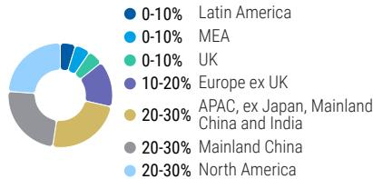  
Source: Morgan Stanley Research Estimate View explanation of regional hierarchies here

# RISKS TO PT/RATING

# RISKS TO UPSIDE

Stronger-than-expected adoption of hypersockets and MEMS probe cards Faster-than-expected SLT and burn-in socket introduction Stronger-than-expected edge AI demand

# RISKS TO DOWNSIDE

Slower-than-expected adoption of hypersockets and MEMS probe cards Slower-than-expected SLT and burn-in socket introduction No edge AI demand in the next few years

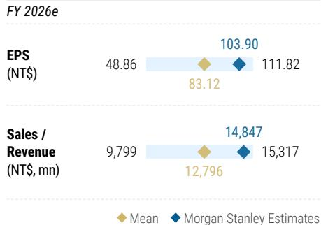  
MS ESTIMATES VS. CONSENSUS   
Source: Re nitiv, Morgan Stanley Research

# WinWay: Investment Positives and Concerns

Investment positives

HPC Testing Leader leveraging SLT Expansion and AI ASIC Momentum: SLT has evolved from a supplementary yield check into a core requirement in the AI era, as rising chip complexity requires validation under real-world operating conditions. Unlike traditional FT, which captures electrical performance within seconds, SLT 微信 LCD123321Cad 04-17 runs workload scenarios over much longer periods – often from tens of minutes to several hours. This shift materially increases test intensity and duration, expanding the TAM for test sockets by an estimated 4-5x, based on company guidance. WinWay’s leadership in HPC testing rests on its long-standing partnership with several US AI GPU customer, where it acts as a core supplier for advanced GPU testing solutions. At the same time, the company has successfully expanded into the US AI ASIC ecosystem, securing high-margin FT and SLT socket orders that should form a meaningful second growth driver. We see WinWay’s competitive position supported by deep co-development relationships with leading chipmakers, strong simulation and engineering capabilities to meet demanding specifications, and close proximity to Taiwan’s semiconductor manufacturing ecosystem, which together support further share gains across additional ASIC platforms.

2. Hypersocket Innovation Driving Structural ASP Upside: Ongoing chip upgrades continue to raise pin counts, driving higher socket pricing. Average pin counts per 微信 socket in the AI/HPC segment stand at around $5 . 7  { \mathrm { k } }$ pins (including AI ASICs), vs 1k $^ +$ for consumer segments such as smartphones and PCs. As next-generation AI platforms scale toward ${ 1 0 , 0 0 0 + }$ pins and larger package sizes, socket design plays a more critical role in ensuring both electrical and mechanical performance. WinWay’s proprietary hypersocket technology has emerged as a leading solution to address package warpage and extreme thermal design power (TDP), supported by ongoing collaboration and qualification with key AI GPU and ASIC customers. Its composite architecture improves signal integrity and structural stability, which we believe supports continued ASP expansion. Meanwhile, the company is expanding its in-house spring probe capacity for test sockets to 9mn pins per month by late 2026. We view this expansion as a key enabler for shorter lead times, stronger supply chain control, and margin improvement, with a clear pathway toward a $50 \%$ gross margin profile over time.

3. Vertical Integration and MEMS Expansion on Track, Benefitting from Higher 加微信 LCD123321Cad 04-17 Pin Counts and Spec Migration: Leveraging its close relationship with NVIDIA, WinWay has expanded into NVIDIA’s gaming GPU and Grace CPU supply chain already, which primarily uses VPC for chip probing. At the same time, WinWay continues to advance its vertical integration strategy and MEMS-related initiatives. Its partnership with Technoprobe for MEMS probe cards has progressed into Phase 2 mass production, with revenue contribution expected to scale meaningfully from earlier stages. We expect WinWay to start supplying NVIDIA's AI GPU, supported by a broader outsourcing trend among leading customers.

# WinWay: Financial Outlook

# Capacity

WinWay is expanding its in-house spring probe capacity for test sockets to 9mn pins per month by late 2026. This expansion should further support further scaling of $5 \boldsymbol { \mathrm { k } }$ -pinsocket, with monthly output rising from $2 \boldsymbol { \mathrm { k } }$ to $4 . 2 k$ per month by end-2026. Vertical integration also gives WinWay greater control over production lead time, shortening them 添加微信 LCD123321Cad 04-17 relative to an outsourced model and enabling a more agile response to AI NPI cycles. From a financial perspective, doubling in-house capacity should support GM sustainability above $45 \%$ and, in our view, provide a path to the $50 \%$ level, as sockets using in-house pins typically deliver higher margins than those relying on outsourced pins.

# Contract liabilities vs revenue

WinWay's contract liabilities rose $40 \%$ Q/Q and $4 6 \%$ YoY in 4Q25, reaching $12 \%$ of revenue. This increase reflects stronger customer pre-payments and improves visibility into future revenue streams. In our view, this trend supports the outlook for profitability in the coming quarters.

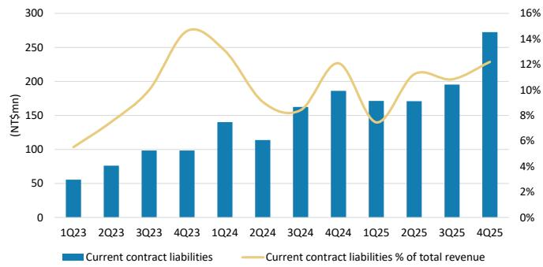  
Exhibit 146:WinWay's contract liabilities rose $40 \%$ Q/Q and $4 6 \%$ Y/Y in $4 0 2 5 ,$ reaching $12 \%$ of revenue   
Source: Company data, Morgan Stanley Research.

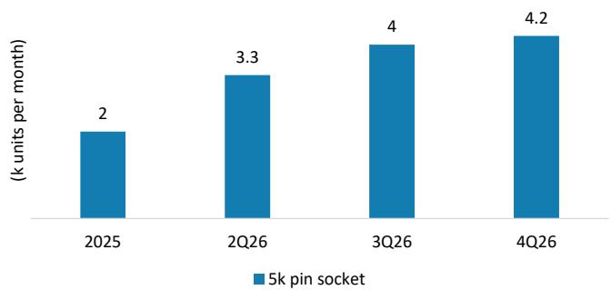  
Exhibit 148:Winway's monthly ( $5 k \cdot$ -pin-socket) capacity to expand from 2k per month in 2025 to 4.2k per month in 4Q26e   
Winway's Monthly Socket Capacity   
Source: Company data, Morgan Stanley Research. $\in { } =$ Morgan Stanley Research estimates.

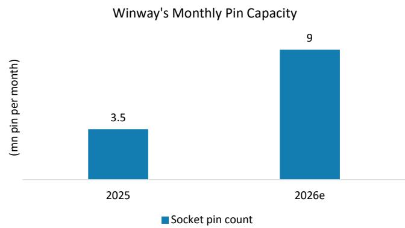  
Exhibit 147:WinWay to expand its pin capacity from 3.5mn per month in 2025 to 9mn per month in 2026   
Source: Company data, Morgan Stanley Research. $\mathrm { { e = } }$ Morgan Stanley Research estimates.

# Revenue

The introduction of next-generation AI GPUs (including NVIDIA, AMD, and MediaTek) should drive a meaningful increase in test-socket content value. Spec upgrades are pushing pin counts above ${ \mathsf { 1 0 k } } + ,$ while a growing number of customers are adopting hypersockets, which carry higher ${ \sf A S P S }$ than coaxial sockets. Together with the emerging multiplier effect in the SLT market, these factors should support our expectation that WinWay’s revenue will deliver a $7 1 \%$ CAGR, 2025-28e.

We expect sockets to continue to account for $\sim 7 0 \%$ of WinWay's total revenue over 2026-28e. Within this segment, hypersockets should keep gaining share from coaxial socket, as customers increasingly migrate to this product given its advantages over traditional coaxial and plastic sockets, including easier maintenance and higer reliability. Hypersockets previously contributed a very low single-digit $\%$ of WinWay's total revenue, but we expect to scale to at least $5 . 7 0 \%$ by end-2026e. Demand for other products, such as burn-in sockets, is also rising, as a growing number of chips – including CPUs and GPUs – now require burn-in testing.

° We expect probe cards to continue delivering revenue growth, while maintaining an overall mix of ${ \sim } 2 7 \%$ in 2026-28e. Revenue contributions should increasingly come from VPC and MEMS, particularly from NVIDIA. Beyond supplying probe cards for NVIDIA's gaming GPUs and CPUs, we believe WinWay's partnership with Technoprobe on MEMS probe cards has progressed into Phase 2 mass production, which positions the company to expand into the AI GPU segment.

# Gross profit

We look for WinWay to expand its GM from $40 \%$ in 2018 to $45 \%$ in 2026e, driven primarily by an improving product mix away from coaxial sockets and as R&D investments in the probe card segment gradually begin to bear fruit.

We expect the rising product mix of hypersockets, higher-end burn-in sockets, and MEMS probe card products to support further margin expansion. On this basis, we forecast WinWay's GM to rise from $3 7 \%$ in 2023 to $54 \%$ in 2028e.

# EPS

WinWay's 2025 EPS saw a modest impact from unfavorable FX movements in 2Q25 and a slightly weaker mix in plastic/RF sockets. Despite these headwinds, the company still delivered 40% Y/Y EPS growth, following a strong $1 5 6 \%$ Y/Y expansion in 2024.

Looking into 2026 and beyond, we expect global currency policy to remain stable. (See our global team's latest report.) As a result, we expect operating leverage to strengthen as high-margin businesses continue to scale, supporting a $9 5 \%$ EPS CAGR, 2025-28e.

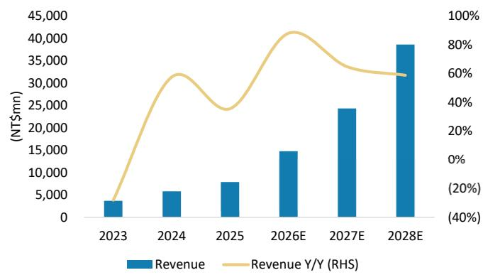  
Exhibit 149:We expect WinWay's revenue to expand at a $71 \%$ CAGR, 2025-28e   
Source: Company data, Morgan Stanley Research. $\in { } =$ Morgan Stanley Research estimates.

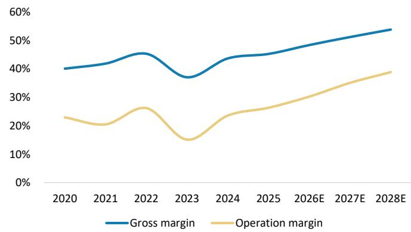  
Exhibit 151:We expect WinWay's margin to expand from $3 7 \%$ in 2023 to $54 \%$ in 2028e   
Source: Company data, Morgan Stanley Research. $\in { } =$ Morgan Stanley Research estimates.

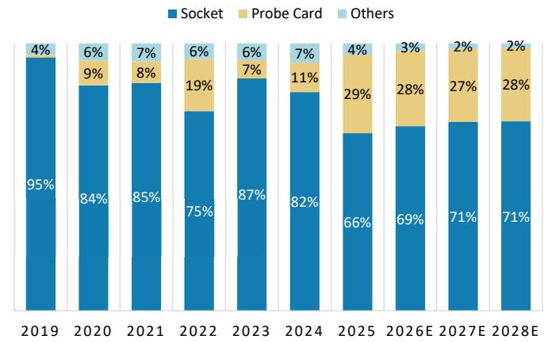  
Exhibit 150:WinWay: Revenue breakdown, by product   
Source: Company data, Morgan Stanley Research. $\mathrm { { e = } }$ Morgan Stanley Research estimates.

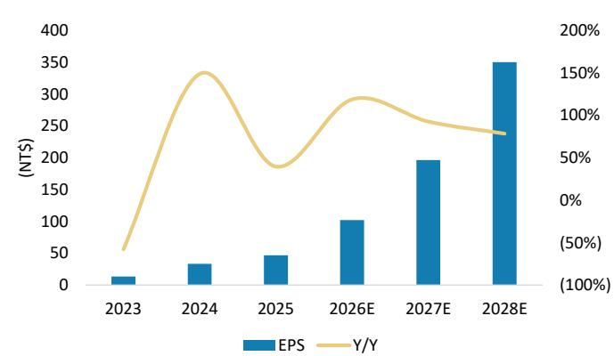  
Exhibit 152:We expect WinWay's EPS to rise at $9 5 \%$ CAGR, 2025-   
Source: Company data, Morgan Stanley Research. $\mathrm { { e = } }$ Morgan Stanley Research estimates.

# WinWay: Valuation Methodology and Peer Comparison

Our price target is NT\$12,000: We derive our price target – which is also our base case scenario value – from a residual income (RI) model, as we believe this can best capture long-term value. We assume a $9 . 1 4 \%$ cost of equity (risk-free rate $2 . 0 \%$ and risk premium $6 . 0 \%$ ), a payout ratio of $8 0 \% ,$ a medium-term growth rate of $1 6 . 4 \% ,$ and a terminal growth rate of $4 . 5 \%$ . Our price target implies $6 1 \times / 3 5 \times 2 0 2 7 { \mathrm { e } } / 2 0 2 8 { \mathrm { e } } \mathsf { P } / \mathsf { E } ,$ vs WinWay's EPS CAGR of $9 6 \%$ in 2026-28e. We believe its valuation should continue to climb along with growing 添加微信 LCD123321Cad 04-17 earnings. We think its valuations align with other structural growth companies, such as Aspeed.

Exhibit 157:MPI: Residual income (RI) model   

<table><tr><td>NT$million</td><td>2026E</td><td>2027E</td><td>2028E</td><td>2029E</td><td>2030E</td><td>2031E</td><td>2032E</td><td>2033E</td><td>2034E</td><td>2035E</td><td>2036E</td><td>2037E</td></tr><tr><td>Total Equity</td><td>8,915</td><td>13,182</td><td>20,359</td><td>24,395</td><td>29,091</td><td>34,555</td><td>40,912</td><td>48,310</td><td>56,916</td><td>66,931</td><td>78,583</td><td>92,141</td></tr><tr><td>Net Profit</td><td>3,703</td><td>7,017</td><td>12,388</td><td>14,414</td><td>16,771</td><td>19,514</td><td>22,705</td><td>26,419</td><td>30,739</td><td>35,766</td><td>41,615</td><td>48,421</td></tr><tr><td>ROAE</td><td>48.2%</td><td>63.5%</td><td>73.9%</td><td>64.4%</td><td>62.7%</td><td>61.3%</td><td>60.2%</td><td>59.2%</td><td>58.4%</td><td>57.8%</td><td>57.2%</td><td>56.7%</td></tr><tr><td>Residual Income</td><td>2.519</td><td>4,847</td><td>8,533</td><td>11,253</td><td>13,069</td><td>15,180</td><td>17,634</td><td>20,489</td><td>23,809</td><td>27,672</td><td></td><td>37,393</td></tr><tr><td> Spread</td><td>39.1%</td><td>54.4%</td><td>64.7%</td><td>55.3%</td><td>53.6%</td><td>52.2%</td><td>51.0%</td><td>50.1%</td><td>49.3%</td><td>48.6%</td><td>32,165 48.1%</td><td>47.6%</td></tr><tr><td></td><td></td><td></td><td></td><td></td><td></td><td></td><td></td><td></td><td></td><td></td><td></td><td></td></tr><tr><td>Ending Equity Capital</td><td>8.915</td><td></td><td></td><td></td><td></td><td></td><td></td><td></td><td></td><td></td><td></td><td></td></tr><tr><td>PVof Forecast Period PV of Continuing Value</td><td>98,652</td><td></td><td></td><td></td><td></td><td></td><td></td><td></td><td></td><td></td><td></td><td></td></tr><tr><td>Equity Value</td><td>320,165</td><td></td><td></td><td></td><td></td><td></td><td></td><td></td><td></td><td></td><td></td><td></td></tr><tr><td>No.of Shares</td><td>427,731 36</td><td></td><td></td><td></td><td></td><td></td><td></td><td></td><td></td><td></td><td></td><td></td></tr><tr><td>Projected Price</td><td>12,000</td><td></td><td></td><td></td><td></td><td></td><td></td><td></td><td></td><td></td><td></td><td></td></tr></table>

Source: Company data, Morgan Stanley Research. $\in { } =$ Morgan Stanley Research estimates.

# Bull/bear case scenarios

Our bull case scenario value is NT\$15,000: Stronger revenue/EPS growth, with faster GM expansion

In this scenario we assume: 1) $100 \%$ revenue CAGR, 2025-28e, on stronger-than-expected adoption of hypersockets and MEMS probe cards with robust market share gain momentum; 2) faster-than-expected SLT and burn-in socket introduction to its endcustomers; 3) gross margin improves to over $7 0 \% _ { \ i }$ thanks to scale effects and the company's technology competitiveness; and 4) $> 1 5 0 \%$ EPS CAGR, 2025-28e.

Our bear case scenario value is NT\$9,000: Slower revenue/EPS growth, with GM erosion.

In this scenario we assume: 1) $30 \%$ revenue CAGR, 2025-28e, on slower-than-expected adoption of hypersockets and MEMS probe cards; 2) slower-than-expected SLT and burnin socket introduction to its end-customers; 3) customer bargaining power pushes gross 添加微信 LCD123321Cad 04-17 margin below 40%; and 4) 50% EPS CAGR, 2025-28e.

# Peer comparison and valuation

We expect WinWay's EPS to rise at a $9 5 \%$ CAGR, 2025-28e or an $80 \%$ CAGR, 2024-27e, we above the peer average of a $2 6 \%$ CAGR, 2024-27e (based on consensus forecasts). This outperformance reflects WinWay's leadership in the US AI GPU supply chain and its core capabilities in addressing 224G/3,000W signal and thermal bottlenecks, where WinWay leads at the 3,000W spec. Although the stock currently trades at 82x/44x/25x

2026e/2027e/2028e P/E, we still expect further upside. In our view, the market remains only midway through capitalizing on WinWay's structural earnings growth potential and the SLT volume multiplier effect, alongside emerging opportunities such as CPO, where WinWay serves as a critical enabler across the insertion testing process. By comparison, testing socket peers Leeno and ISC are both trading at 40x 2027e P/E (based on consensus forecasts), with greater exposure to consumer technology and smaller AI GPU/ ASIC projects, and slower growth than WinWay. Smaller Taiwanese probe card peers, such as KSMT and Inno-star are also trading at respective 97x and 94x 2027e P/Es (based on

# 订阅研报

# Cad 04-17

believe the current cycle represents a paradigm shift rather than a cyclical peak, supported by structural AI demand. Continued pec upgrades and rising demand for inhouse capacity have increased the scarcity value of WinWay’s high-power testing solutions and integrated offerings, supporting a sustained premium valuation multiple.

We also believe that a small-cap stock that has expanded into such markets as AI/HPC should trade at a premium to large-cap peers, for two reasons. First, investors have limited access to these themes through small-cap stocks, even as AI/CPO have generated disproportionate alpha within small-cap indices. Second, the potential strategic value of differentiated AI capabilities at the small-cap level supports a premium valuation, given WinWay's distinctive positioning and technology leadership.

Exhibit 158:Valuation peer comparison   

<table><tr><td></td><td></td><td>Price Target</td><td></td><td>Market</td><td></td><td> EPS (Local Dollar)</td><td></td><td></td><td></td><td></td><td>P/E (x)</td><td></td><td></td><td></td><td>ROE (%)</td><td>Trading Volume</td></tr><tr><td>Ticker</td><td>Company</td><td>Rating</td><td>(LC)</td><td>Cap (USsmn)</td><td>2024</td><td>2025</td><td>2026e</td><td>2027e</td><td>2028e</td><td>2024</td><td>2025e</td><td>2026e</td><td>2027e</td><td>2028e</td><td></td><td>(mn)</td></tr><tr><td>6515.TW</td><td>Winway</td><td>。</td><td>12,000.0</td><td>9,614</td><td>33.8</td><td>46.6</td><td>103.9</td><td>196.9</td><td>347.5</td><td>253.4</td><td>183.7</td><td>82.4</td><td>43.5</td><td>24.6</td><td>2025 27.9</td><td>0.5</td></tr><tr><td>6223.TWO</td><td>MPI</td><td>。</td><td>5,800.0</td><td>13,991</td><td>24.4</td><td>32.5</td><td>64.1</td><td>133.2</td><td>240.2</td><td>186.1</td><td>139.8</td><td>70.9</td><td>34.1</td><td>18.9</td><td>26.7</td><td>0.7</td></tr><tr><td>7769.TW</td><td>Hon Precision</td><td>0</td><td>5,000.0</td><td>23,174</td><td></td><td></td><td>116.2</td><td>193.1</td><td>308.3</td><td>NA</td><td>NA</td><td>35.3</td><td>21.2</td><td>13.3</td><td>34.5</td><td>0.8</td></tr><tr><td colspan="10">Greater China Probe Card Peers</td><td></td><td></td><td></td><td></td><td></td><td></td><td></td></tr><tr><td>6510.TWO</td><td>CHPT</td><td>NC</td><td></td><td></td><td>15.5</td><td></td><td>61.1</td><td>114.6</td><td>NA</td><td>220.5</td><td>112.5</td><td>56.0</td><td>29.8</td><td>NA</td><td>11.9</td><td>0.6</td></tr><tr><td>6683.TWO</td><td>KSMT</td><td>NC</td><td>NA NA</td><td>3,523 1,587</td><td>17.4</td><td>30.4 15.2</td><td>18.7</td><td>19.0</td><td>NA</td><td>106.1</td><td>121.9</td><td>98.8</td><td>97.3</td><td>NA</td><td>15.9</td><td>0.3</td></tr><tr><td>7828.TWO</td><td>Inno-stars</td><td>NC</td><td>NA</td><td>1,527</td><td>4.1</td><td>5.6</td><td>10.7</td><td>14.0</td><td>NA</td><td>324.3</td><td>234.9</td><td>124.4</td><td>94.4</td><td>NA</td><td>25.0</td><td>0.8</td></tr><tr><td>Average</td><td></td><td></td><td></td><td></td><td></td><td></td><td></td><td></td><td></td><td>217.0</td><td>156.4</td><td>93.0</td><td>73.8</td><td>NA</td><td>17.6</td><td>0.9</td></tr><tr><td colspan="10">Global Probe Card and Socket Companies</td><td></td><td></td><td></td><td></td><td></td><td></td><td></td></tr><tr><td>6594.JP</td><td>Nidec</td><td>NC</td><td>NA</td><td>16,083</td><td>143.1</td><td>105.4</td><td>158.4</td><td>177.9</td><td>220.1</td><td>15.7</td><td>21.3</td><td>14.1</td><td>12.6</td><td>10.2</td><td>9.8</td><td>2.7</td></tr><tr><td>TPRO.IM</td><td>Technoprobe</td><td>NC</td><td>NA</td><td>12,245</td><td>0.1</td><td>0.2</td><td>0.3</td><td>0.4</td><td>0.5</td><td>161.4</td><td>96.7</td><td>64.3</td><td>46.0</td><td>34.3</td><td>7.9</td><td>0.4</td></tr><tr><td>SMIN.L</td><td>Smiths Group</td><td>NC</td><td>NA</td><td>10,275</td><td>0.7</td><td>1.2</td><td>1.1</td><td>1.2</td><td>1.4</td><td>35.0</td><td>20.9</td><td>23.2</td><td>20.5</td><td>17.9</td><td>12.8</td><td>0.7</td></tr><tr><td>FORM.O</td><td>FormFactor</td><td>NC</td><td>NA</td><td>9,995</td><td>0.9</td><td>1.3</td><td>1.8</td><td>2.2</td><td>NA</td><td>144.5</td><td>98.6</td><td>71.8</td><td>57.0</td><td>NA</td><td>5.5</td><td>4.2</td></tr><tr><td>058470.KQ</td><td>Leeno</td><td>0</td><td>77,000.00</td><td>5,779</td><td>1,492.6</td><td>1,997.2</td><td>2,349.6</td><td>2,841.2</td><td>3,580.4</td><td>76.0</td><td>56.8</td><td>48.3</td><td>39.9</td><td>31.7</td><td>22.4</td><td>0.6</td></tr><tr><td>095340.KR</td><td>ISC</td><td>NC</td><td>NA</td><td>2.975</td><td>2,621.9</td><td>2,750.5</td><td>4,092.3</td><td>5,413.6</td><td>7,496.1</td><td>82.6</td><td>78.7</td><td>52.9</td><td>40.0</td><td>28.9</td><td>10.6</td><td>0.7</td></tr><tr><td>6871.T</td><td>Micronics Japan</td><td>0</td><td>14,000.00</td><td>2,932</td><td>228.3</td><td>311.5</td><td>440.7</td><td>530.5</td><td>704.7</td><td>52.9</td><td>38.7</td><td>27.4</td><td>22.8</td><td>17.1</td><td>20.9</td><td>1.1</td></tr><tr><td>6941.JP</td><td>Yaimaichi</td><td>NC</td><td>NA</td><td>1,065</td><td>259.5</td><td>456.9</td><td>497.6</td><td>538.2</td><td>NA</td><td>35.6</td><td>20.2</td><td>18.6</td><td>17.2</td><td>NA</td><td>13.5</td><td>0.4</td></tr><tr><td>6855.T</td><td>JEM</td><td>NC</td><td>NA</td><td>606</td><td>273.5</td><td>347.8</td><td>371.5</td><td>403.1</td><td>NA</td><td>24.1</td><td>19.0</td><td>17.8</td><td>16.4</td><td>NA</td><td>13.1</td><td>0.6</td></tr><tr><td>6961.JP Average</td><td>Enplas</td><td>NC</td><td>NA</td><td>836</td><td>440.0</td><td>533.9</td><td>625.9</td><td>752.4</td><td>NA</td><td>33.7 66.1</td><td>27.8 47.9</td><td>23.7 36.2</td><td>19.7 29.2</td><td>NA 23.4</td><td>7.3 14.3</td><td>0.1 1.3</td></tr></table>

rce: Company data, FactSet, Morgan Stanley Research. $\in { } =$ FactSet consensus estimates. Note: As of the market close on April 16, 2026. Except for Winway and MPI, which are MSe, all other estimates are gen

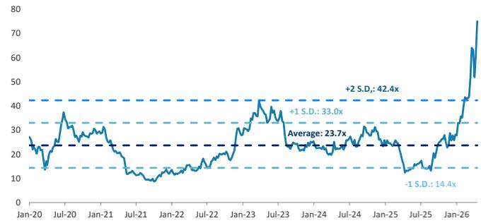  
Exhibit 159:WinWay's historical P/E multiple   
Source: Company data, FactSet, Morgan Stanley Research estimates.

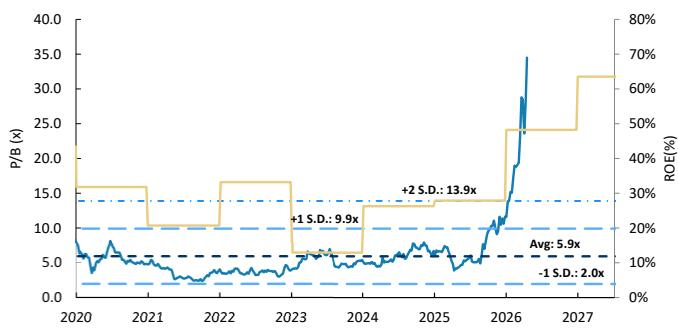  
Exhibit 160:WinWay's historical P/B multiple   
Source: Company data, FactSet, Morgan Stanley Research estimates.

# ‹¢–xb¥mûR _®Oá   LCD123321Cad   04-17

# WinWay: Company Background and Overview

Founded in 2001 and headquartered in Kaohsiung, Taiwan, WinWay Technology is a leading provider of semiconductor test-interface solutions, specializing in high-frequency and high-speed applications for global IC design houses and OSAT customers.

The company focuses on developing and manufacturing high-performance test sockets and probe cards, which serves as critical components in semiconductor testing. Supported by strong in-house R&D capabilities and a high degree of customization, WinWay has built a leading market position and ranks as the world’s largest test socket supplier by revenue, according to Yole Group.

We believe WinWay is well positioned to benefit from rising testing complexity associated with AI, high-performance computing, and advanced packaging trends. Its competitive strengths include advanced test interface technology, a broad product portfolio, and a global customer support network, which support its position in next-generation semiconductor testing.

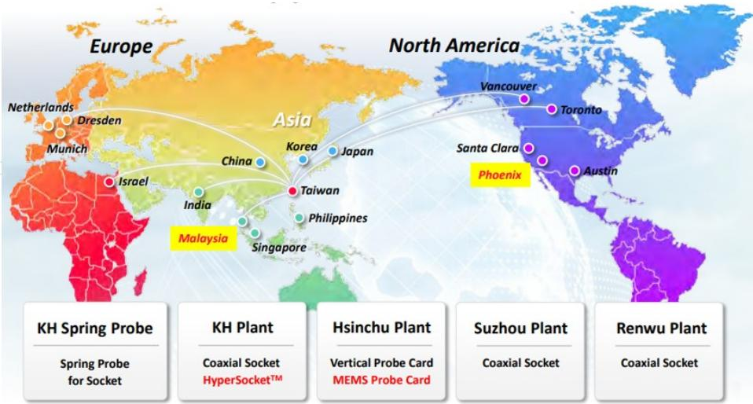  
Exhibit 161:WinWay: Key product developments and global footprint   
Source: WinWay.

# Key product lines

As of 2025, WinWay’s revenue mix comprises $6 6 \%$ from sockets, $2 9 \%$ from probe cards,   
and $4 \%$ from others. Looking ahead, we expect WinWay to further scale revenue across   
both segments, with sockets reaching $7 1 \%$ of total revenue and probe cards contributing . 微信 LCD123321 ad 4   
$2 7 \%$

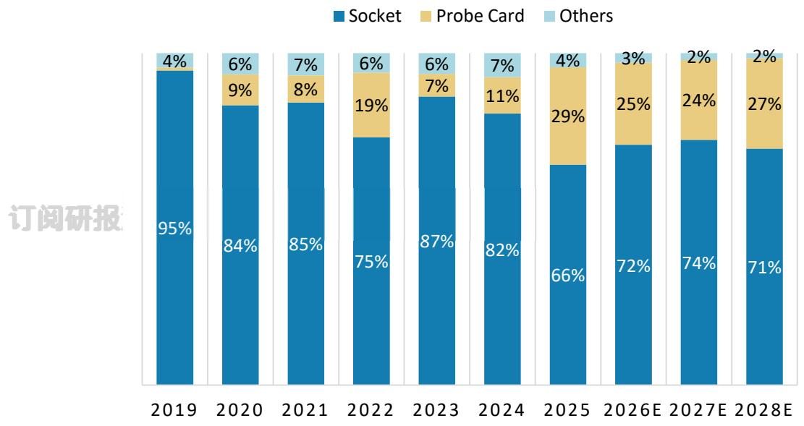  
Exhibit 162:WinWay's revenue composition   
Source: Company data, Morgan Stanley Research. $\mathrm { { e = } }$ Morgan Stanley Research estimates.

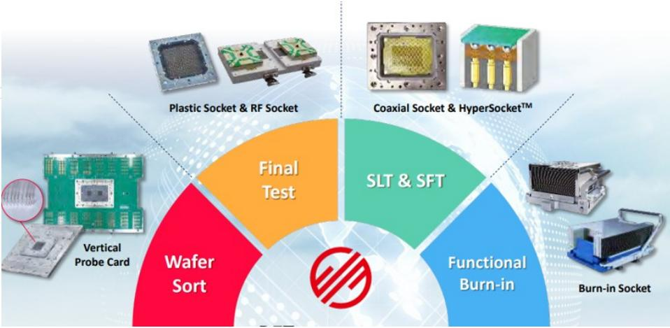  
Exhibit 163:WinWay's total solution of probe card and socket enables vertical integration strategy   
Source: WinWay.

# Probe cards

As WinWay's core focus remains on the socket market, it has expanded into probe cards through a strategic alliance with Technoprobe rather than pursuing in-house production, 添加微信 LCD123321Cad 04-17 unlike peers such as CHPT and MPI. Phase 1 of the partnership centered on a multi-year technical alignment and the localized integration of Technoprobe’s flagship MEMS probe head technology. This phase included comprehensive process verification and the buildout of a service ecosystem within Taiwan’s OSAT cluster. While the initial procurement of high-cost MEMS components weighed on WinWay’s gross margin as revenue contribution began in 3Q25, Phase 1 met its primary objective of securing design-ins from US GPU customers, including NVIDIA. This outcome demonstrated WinWay's ability to meet the stringent requirements of advanced-node testing.

production cycle, supported by a minimum 5-year long-term supply agreement. This phase features materially larger contract values and shipment volumes, which we expect to be several times larger than those achieved in Phase 1. By combining Technoprobe’s worldleading MEMS technology with WinWay's rapid-response technical support, WinWay has evolved from a specialized test socket supplier into a provider of end-to-end testing solutions, covering chip probing, FT, and SLT. We expect the probe card business, supported by the Phase 2 scale-up, to expand WinWay's probe card revenue from NT $\$ 23b{ \mathrm { b } }$ in 2025 to NT\$10bn in 2028e, accounting for $2 7 \%$ of total revenue in 2028e.

How does WinWay's probe card business differ from MPI's? Although WinWay is ramping up its probe card business, its business model differs from MPI’s. WinWay primarily sources Technoprobe and other third-party components for probe cards, while MPI maintains a higher proportion of in-house component manufacturing and is further pursuing $100 \%$ in-house in the long run. We view probe cards as a complementary element that completes WinWay’s broader testing solution for clients, spanning Chip probing, FT, SLT, and burn-in, rather than a standalone growth driver.

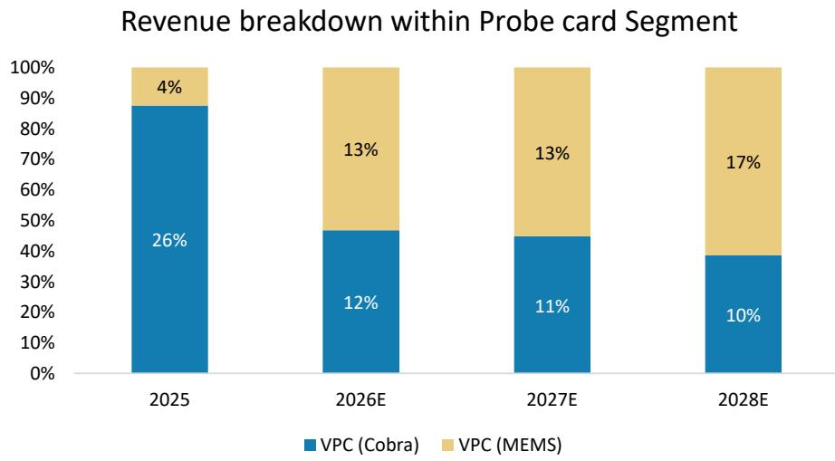  
Exhibit 164:Revenue breakdown within WinWay's probe card segment   
Source: Company data, Morgan Stanley Research. $\mathrm { { e = } }$ Morgan Stanley Research estimates.

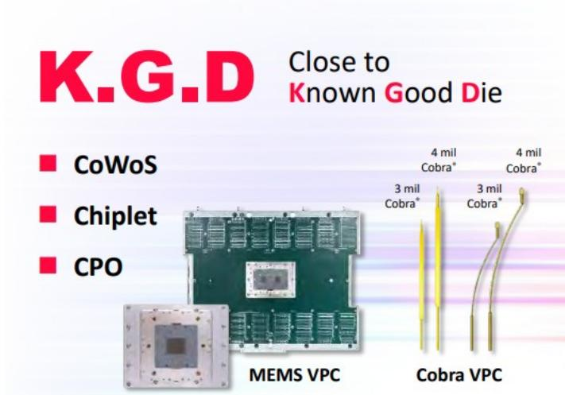  
Exhibit 165:WinWay's VPC and MEMS product line   
Source: WinWay.

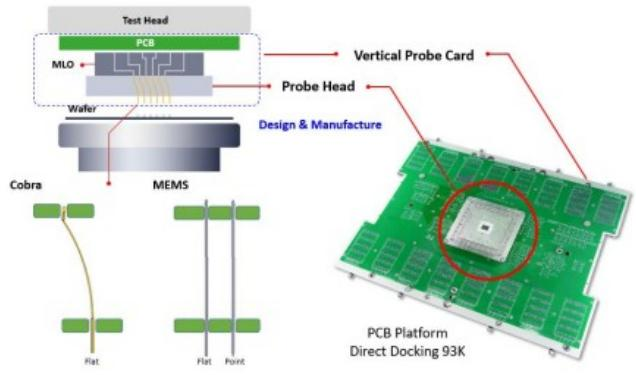  
Exhibit 166:WinWay's VPC and MEMS product line   
Source: Company data.

# Sockets

Testing sockets serve as critical enabling components in semiconductor testing, including FT, burn-in, and SLT, by providing a temporary yet high-performance electrical interface between the device under test (DUT) and automated test equipment (ATE). Their core role is to maintain signal integrity, mechanical alignment, and thermal stability throughout the testing cycle, directly influencing test yield, throughput, and overall cost efficiency. As 添加微信 LCD123321Cad 04-17 semiconductor complexity increases – particularly in high-performance computing (HPC), AI, and advanced connectivity – socket performance requirements have tightened, reinforcing their importance within the back-end testing ecosystem.

Plastic/RF sockets and coaxial sockets address distinct performance requirements across frequency ranges and cost structures. Plastic sockets, which see broad adoption in highvolume manufacturing, provide a cost-efficient solution with sufficient electrical   
performance for general-purpose IC testing, primarily for consumer grade and   
mainstream products. RF sockets represent a higher spec subset, designed with controlled impedance and low insertion loss to support reliable testing of   
high frequency devices such as mobile RF front end modules and connectivity chips. Coaxial sockets occupy the high end segment, using coaxial transmission structures to deliver superior signal integrity, minimal crosstalk, and low return loss at very high frequencies, including mmWave and high speed digital interfaces. As semiconductor designs push performance limits, demand for coaxial sockets has increased in applications where precision and signal fidelity are critical, such as AI and HPC chips, despite their 123321Cad 04-   
higher price point.

Hypersockets represent a next-generation testing socket architecture designed for highend applications such as AI accelerators, GPUs, and chiplet-based designs. Key differentiators include ultra-fine pitch capability, scalability support for high pin counts, and enhanced signal and power integrity, which address the limitations of conventional sockets at advanced nodes. Hypersockets also offer easier maintenance, as customers can directly replace the conductive epoxy. While adoption remains at an early stage, hypersockets command structurally higher ASPs and margin profiles, positioning them as a potential long-term growth driver alongside rising semiconductor complexity and heterogeneous integration. We expect hypersockets to contribute at least $5 . 7 0 \%$ of total revenue by end-2026e, acting as a key growth driver for the company.

Burn-in sockets are structurally and functionally differentiated by their focus on reliability screening rather than pure signal performance. These sockets maintain stable electrical contact under prolonged high-temperature and high-voltage conditions, typically during burn-in processes designed to identify early-life device failures. Material selection and mechanical design emphasize thermal endurance, contact durability, and resistance to oxidation or deformation over extended test cycles. While burn-in sockets generally carry lower unit pricing than high-frequency sockets, demand closely tracks overall semiconductor production volumes and reliability requirements, supporting a stable, volume-driven segment within the testing socket market. We also expect broader customer adoption of burn-in steps in testing flows. NVIDIA and AMD have incorporated burn-in testing across multiple product generations, and we expect MediaTek's Google TPU Zebrafish platform to introduce burn-in testing in 2H26.

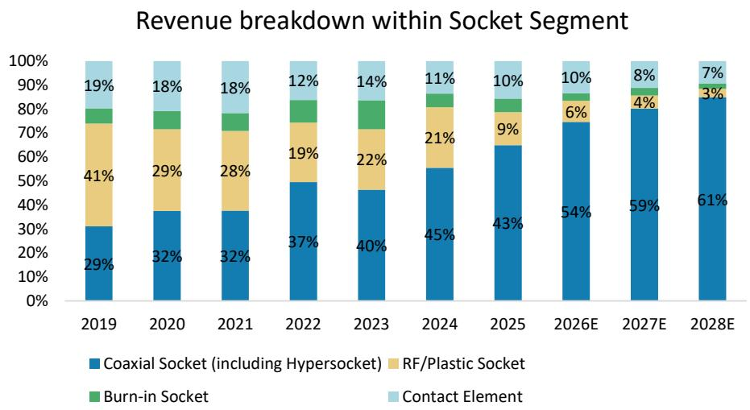  
Exhibit 167:We expect the coaxial sockets and hypersockets to be the primary revenue drivers of WinWay's socket revenue   
Source: Company data, Morgan Stanley Research. $\mathrm { { e = } }$ Morgan Stanley Research estimates.

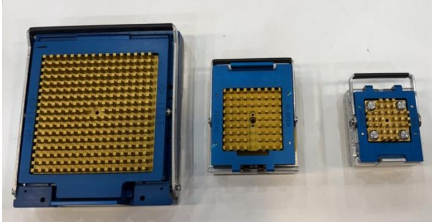  
Exhibit 168:WinWay's burn-in socket   
Source: WinWay.

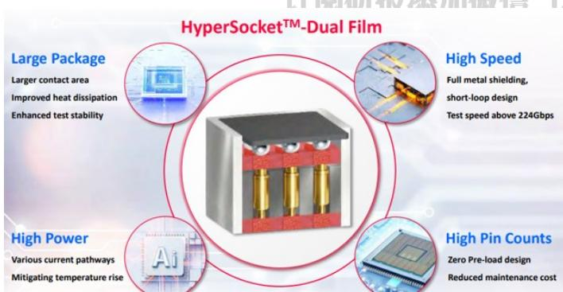  
Exhibit 170:Benefit of hypersockets   
Source: WinWay.

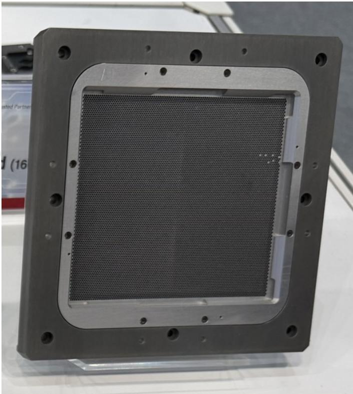  
Source: WinWay.

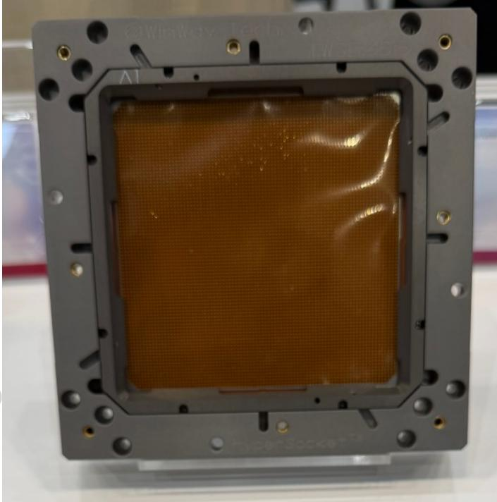  
Exhibit 171:WinWay's hpersocket   
Source: Company data.

# Key competitors

Collectively, the probe card market is highly concentrated and is characterized by significant technological barriers. Leading players – FormFactor, Technoprobe, MJC, Nidec, and MPI – along with a small group of others, account for the majority of the AI chip probe card market. Within this competitive landscape, FormFactor leads globally through MEMS innovation and scale; Technoprobe combines broad vertical expertise with highvolume manufacturing; MJC maintains a strong regional niche supported by precision materials capabilities; and MPI leverages Taiwan-centric agility and specialized test solutions, with primary exposure to ASIC and networking applications. For WinWay, its end to end testing solution offering and close relationship with NVIDIA have enabled initial penetration into gaming GPU and Vera CPU probing. We expect this footprint to 添加微信 LCD123321Cad 04-17 expand into AI GPU as TSMC is outsources its chip probing requirements.

Overall, the socket market remains highly fragmented, with the largest player accounting for just $10 \%$ of total market share. WinWay’s market share has increased from $5 . 8 \%$ in 2022 to $8 . 6 \%$ in $2 0 2 4$ , making it the second-largest supplier of test and burn-in sockets, driven by accelerating AI demand for high-end test sockets, according to Yole. Smiths, Yamaichi, Enplas, LEENO and Cohu remain WinWay's key competitors.

# Key suppliers and customers

A probe card consists of three components: probe head (pins), the multi-layer organic (MLO) substrate, and printed circuit board (PCB). MPI has in-house capabilities to design and manufacture both probe heads and MLO. By contrast, WinWay primarily sources probe heads and pins from Technoprobe, with related purchases accounting for a stable $\sim 3 0 \%$ of total procurement in recent years. In test sockets, WinWay relies mainly on inhouse production, supported by ongoing capacity expansion plans over the next few years.

WinWay’s customer base is concentrated among leading AI GPU and HPC players that serve as the primary users of TSMC's advanced nodes. As of 2025, NVIDIA accounts for $40 \%$ of revenue, followed by AMD at $2 0 \% ,$ Broadcom at $1 0 \% ,$ and MediaTek at $1 0 \% ,$ making them WinWay’s top 4 customers. Geographically, WinWay’s revenue exposure skews toward North America, which represented $67 \%$ of total revenue in 2025, followed by Taiwan at $1 5 \%$ and China at $1 3 \%$ .

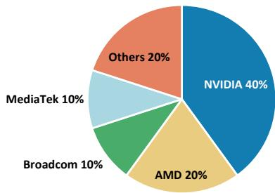  
Exhibit 172:WinWay's revenue breakdown, by customer (2025)   
Winway's Revenue breakdown by customer

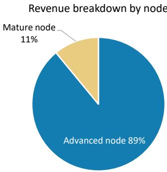  
Exhibit 173:WinWay's revenue breakdown, by node (2025)

Customer breakdown by region

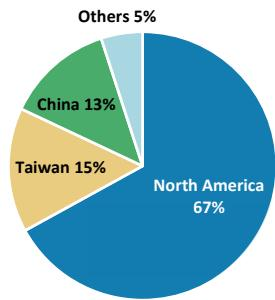  
Exhibit 174:WinWay's revenue breakdown, by region (2025)

# Management team

Exhibit 175:WinWay: Management team (4Q25)   

<table><tr><td>Title</td><td>Name</td><td>Academicdegree</td><td>Professional qualificationsand experience</td></tr><tr><td rowspan="3">Chairman and President</td><td rowspan="3">Mark Wang</td><td rowspan="3">Bachelor of Mechanical Engineering, Chung Yuan Chritian University</td><td>ASE Test Engineering Manager</td></tr><tr><td>Chunghwa Picture Tubes Manufacturing Chairman of Hewei Investment and Weicheng Investment</td></tr><tr><td></td></tr><tr><td rowspan="3">Senior Vice President</td><td rowspan="3">Jason Chen</td><td rowspan="3">Bachelor of Electronics, Lunghwa University</td><td>AzureWave Sales Director</td></tr><tr><td>VIA Technologies Product Engineering</td></tr><tr><td>Syntek Semiconductor IC Design</td></tr><tr><td rowspan="3"></td><td rowspan="3">JQLee</td><td rowspan="3">Bachelor of Political Science, National Taiwan University</td><td>President of Winway Technology (SUZHOU) Ltd.</td></tr><tr><td>China Development Industrial Bank Manager</td></tr><tr><td>Amtek Semiconductors CEO</td></tr><tr><td rowspan="2">Vice President</td><td rowspan="2">Kenny Hsieh</td><td rowspan="2">Bachelor of Materials, Tamkang University Chemical</td><td>ITRI Consultant</td></tr><tr><td>TSMC Project Manager</td></tr><tr><td>Vice President</td><td></td><td></td><td>Sigurd Microelectronics Manager</td></tr><tr><td>Senior Assistant Vice President</td><td>Jason Lu Ben Chang</td><td>Bachelor of Mechanical Engineering, National Sun Yat-sen University Bachelor of Industrial Engineering, National Taipei University of Technology</td><td>WinWay Manufacturing Division Director</td></tr><tr><td>Director of Sales</td><td>Peter Kao</td><td>Bachelor of Electronic Engineering, Tak Hwa University</td><td>AzureWave Module Products Manager ALi Corporation Chief Engineer</td></tr><tr><td>Assistant Vice President</td><td>Charles Chen</td><td>Bachelor of Electrical Engineering, National Sun Yat-sen University</td><td>Zheku Technology Shanghai Senior Division Chief</td></tr></table>

# Appendix: Measuring the Global Semiconductor Assembly and Test Services Market Size

The global semiconductor assembly and test services (SATS) market is undergoing a significant transformation, shifting from a volume-driven industry toward a more strategic role in enabling next-generation technologies. This transition reflects a clear structural bifurcation within the market, with growth increasingly driven by advanced packaging b¥mûR _®Oá   LCD123321Cad   04-17solutions rather than conventional, high volume assembly and test services.

According to Gartner, the total semiconductor packaging and testing services market is projected to reach US\$122.6bn by $2 0 2 9 \mathsf { e } ,$ , implying a five-year (2024-29e) CAGR of $8 . 3 \%$ . The outsourced segment of the SATS market is forecast to grow from $\cup S \$ 42.26n$ in 2024 to $\cup 5 \$ 65.26n$ in 2029e, a CAGR of $9 . 1 \%$ . This growth reflects the rising dependence of fabless companies and integrated device manufacturers (IDMs) on specialized partners to support increasingly complex packaging requirements and higher capital intensity.

The most important development in the SATS market is the accelerating divergence between advanced and traditional packaging. Advanced packaging is forecast by Gartner to expand from $\cup \ S \$ 40$ .4bn in $2 0 2 4$ to $\mathsf { U S S 7 3 . 6 b n }$ in $2 0 2 9 \Theta$ , or a CAGR of $1 2 . 7 \%$ . This segment showed notable resilience during the market-wide stagnation in 2023, suggesting that its demand drivers are less exposed to short-term cyclical downturns. In 2026, advanced packaging is expected by Gartner to grow $1 4 . 5 \%$ to $\cup 5 \$ 453.8$ bn. By 2029, advanced packaging is set to account for the majority of total market value, signaling a ¥mûR _®Oá   LCD123321Cad   0structural reshaping of the semiconductor packaging and testing industry.

The growing computational demands of AI and HPC have emerged as the primary catalyst. As traditional transistor scaling under Moore’s Law slows, advanced packaging has become a key avenue for performance gains by enabling heterogeneous integration of specialized chiplets into a single system-in-package (SiP). This approach plays a critical role in addressing the memory bandwidth bottleneck in AI accelerators, where 3D-stacked HBM is co-packaged with GPUs on a 2.5D silicon interposer.

In particular, 2.5D/3D packaging is projected by Gartner to grow from US\$8.98bn in 2024 to $\mathsf { U S S } \$ 16.38 b \mathsf { n }$ by 2029e, implying a $1 2 . 8 \%$ CAGR. This rapid expansion is driven primarily by demand for HBM stacks, which are essential for AI and HPC accelerators. 2.5D/3D packaging provides the critical integration platform – namely the silicon interposer – that links 3D-stacked HBM stacks to high-performance logic chips, positioning this segment as a direct beneficiary of the AI boom.

‹¢–xb¥mûR _®Oá   LCD123321Cad   04-17Wafer-level packaging (WLP) represents another major growth driver and delivers the largest absolute dollar expansion. Gartner expects the segment to grow from US\$13.3bn in 2024 to $\mathsf { U S S 2 9 . 9 b r }$ in 2029e, implying a $1 7 . 7 \%$ CAGR. WLP plays a critical role in enabling miniaturization and higher levels of integration across smartphones, wearables, and Internet of Things (IoT) devices.

In contrast, Gartner expects traditional packaging to grow at a slower pace, expanding from US\$41.9bn in 2024 to $\mathsf { U S S } 4 8 . 9 6 \mathsf { n }$ in 2029e, implying a CAGR of $3 . 1 \%$ . This more modest growth reflects the continued commoditization of legacy technologies such as wire bonding, which face displacement from more advanced packaging solutions. The wide 118 disparity in growth rates underscores that the majority of the industry’s future growth and value creation will concentrate in advanced packaging.

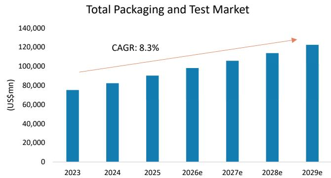  
Exhibit 176:Total packaging and test market is expected to rise at an $8 . 3 \%$ CAGR, 2024-29e   
Source: Company data, Gartner, Morgan Stanley Research. $\mathrm { { e = } }$ Morgan Stanley Research estimates.   
Exhibit 178:However, the traditional market is growing at a relatively muted speed, with a CAGR of just $3 . 1 \% _ { i }$ , 2024-29e

Exhibit 177:Advanced packaging and test part of the market is growing at the fastest speed, with a $1 2 . 7 \%$ CAGR, 2024-29e

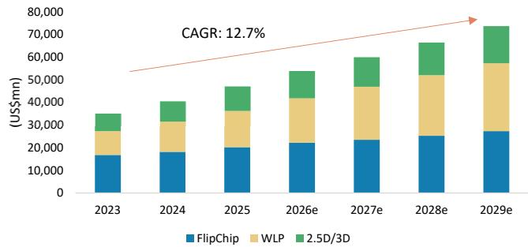  
Advanced Packaging and Test Total TAM   
Source: Company data, Gartner, Morgan Stanley Research. $\in { } =$ Morgan Stanley Research estimates.

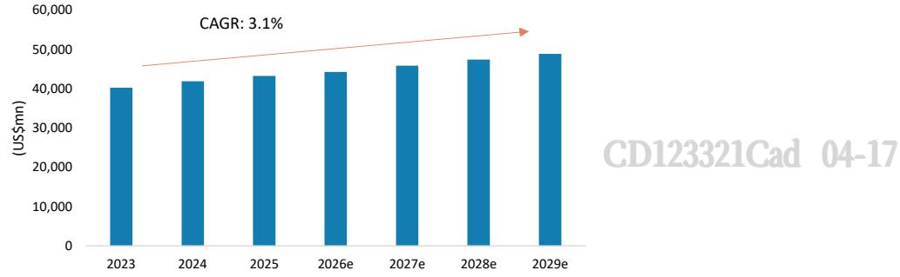  
Total Traditional Packaging and Test TAM   
Source: Company data, Gartner, Morgan Stanley Research. $\mathrm { { e = } }$ Morgan Stanley Research estimates.

# Risk Reward Reference links

1. View explanation of Options Probabilities methodology - Options_Probabilities_Exhibit_Link.pdf

2. View descriptions of Risk Rewards Themes - RR_Themes_Exhibit_Link.pdf

3. View explanation of regional hierarchies - GEG_Exhibit_Link.pdf

4. View explanation of Theme/Exposure methodology - ESG_Sustainable_Solutions_External_Link.pdf

5. View explanation of HERS methodology - ESG_HERS_External_Link.pdf