# Al drives networking upgrades; initiate RoboTechnik at Buy; YJ Semi / YOFC at Neutral

17 April 2026 | 2:15AM HKT

We are positive on optical networking given: (1) the transition from scale-out to scale-up architectures, with stronger bandwidth and more connections, driving 订阅研报添加微信 LCD123321Cad 04-TAM expansion; (2) product expansion, with CPO (co-packaged optics) and OCS (optical circuit switch) deploying to meet growing bandwidth requirements and hollow core fiber entering AI data center scale-across; and (3) speed upgrades in pluggable modules toward 1.6T / 3.2T, followed by the China Cloud upgrade, lengthening the upcycle. We initiate on RoboTechnik (SiPh / CPO equipment), YJ Sem (EML/ CW laser), and YOFC (optical fiber), key beneficiaries in this supply chain.

We expect these three companies to deliver an average $66 \%$ revenue CAGR in 2026-28E, vs. $2 4 \%$ in the 2020-22 pre-AI cycle. We expect margin expansion for all three, thanks to specification upgrades driven by the rising speed of AI networks and increasing contributions from high-margin products (e.g., data center-related products) over their more mature product lines in telecom and photovoltaics. We expect 2026-28E net income CAGR for RoboTechnik/ YJ Semi/ YOFC to be $1 5 3 \% /$ $8 1 \% / 6 5 \%$ 订, with OPM expansion to $2 1 \% 1 5 4 \% 1 3 5 \%$ 信 LCD123321Cad 04- by 2028E. Buy RoboTechnik, but Neutral on YJ Semi / YOFC due to their fair valuation.

Key debates & GS view: We see market concerns on growth sustainability, as AI-related capex has continued since 2023. Nevertheless, we believe networking innovation represents the next wave of growth, as the industry now focuses on optimizing networking and reducing system data transmission wait times, moving beyond simply increasing single-chip performance. Optical component growth should be compounded from: (1) ongoing increases in capex investment by cloud service providers, (2) a greater focus on networking and the industry’s accelerating networking specification upgrades, and (3) the rising adoption of optical networking to meet the need for longer distances and higher speeds. We expect a $\boldsymbol { 1 3 x }$ larger addressable market for optical modules / optical engines, expanding from scale-out 订阅研报添加微信 LCD123321Cad 0(e.g., GB300 NVL72) to scale-up (e.g., Rubin Ultra NVL576 level 2 scale up via CPO) $4$ per computing unit (see our optical networking thematic report)

Valuation: RoboTechnik - 12m Rmb688 TP (50.0x 2031E P/E vs. $+ 3 9 \%$ NI YoY and $2 4 \%$ OPM in 2032E); YJ Semi - 12m Rmb1,592 TP (50.7x 2030E P/E vs. $+ 3 2 \%$ NI YoY and $60 \%$ OPM in 2031E); YOFC - 12m HK\$255 TP (17.0x 2029E P/E vs. $+ 1 3 \%$ 2030-31E NI YoY growth). Key risks: Cloud capex trend, speed of technology migration in optical networking, optical devices end demand.

RoboTechnik (300757.SZ; Buy): CPO/OCS adoption drives coupling and testing equipment; initiate at Buy

<table><tr><td>300757.SZ</td><td>12m Price Target: Rmb688</td><td colspan="2">Price: Rmb482.26</td><td colspan="2"> Upside: 42.7%</td></tr><tr><td>Buy</td><td>GS Forecast</td><td></td><td></td><td></td><td></td></tr><tr><td></td><td></td><td>12/25</td><td>12/26E</td><td>12/27E</td><td>12/28E</td></tr><tr><td>Market cap: Rmb80.8bn / $11.9bn</td><td>Revenue (Rmb mn)</td><td>949.8</td><td>1,451.9</td><td>3,374.7</td><td>5,984.2</td></tr><tr><td> E nterprise value: Rmb82.0bn / $12.0bn</td><td>EBITDA (Rmb mn)</td><td>60.8</td><td>365.1</td><td>744.1</td><td>1,318.7</td></tr><tr><td> 3m ADTV :Rmb3.7bn/ S529.9mn</td><td>EPS (Rmb)</td><td>(0.41)</td><td>0.96</td><td>3.12</td><td>6.18</td></tr><tr><td> China </td><td>PIE (X)</td><td>NM</td><td>NM</td><td>154.6</td><td>78.0</td></tr><tr><td> Greater China Technology</td><td>P/B (X)</td><td>18.4</td><td>45.0</td><td>36.9</td><td>27.2</td></tr><tr><td></td><td>Dividendyield (%)</td><td>0.0</td><td>0.0</td><td>0.2</td><td>0.3</td></tr><tr><td> M&amp;A Rank: 3</td><td>Net debt/EBITDA (X)</td><td>17.9</td><td>3.1</td><td>0.9</td><td></td></tr><tr><td></td><td>CROCI (%)</td><td>31.7</td><td>19.0</td><td></td><td>0.5</td></tr><tr><td></td><td>FCF yield (%)</td><td>0.5</td><td>(0.0)</td><td>33.6 0.7</td><td>47.8</td></tr><tr><td></td><td></td><td></td><td></td><td></td><td>0.3</td></tr><tr><td></td><td></td><td>12/25</td><td>3/26E</td><td>6/26E</td><td>9/26E</td></tr><tr><td></td><td>EPS (Rmb)</td><td>0.05</td><td>0.17</td><td>0.24</td><td>0.25</td></tr></table>

Source: Companydata, Goldman Sachs Research estimates, FactSet. Prioe as of 14 Apr 2026 close.

We expect RoboTechnik’s net income to grow at a $1 5 3 \%$ CAGR over 2026-28E, driven by: (1) the rising adoption of CPO technology in AI server connections. RoboTechnik is the major supplier of CPO coupling and testing equipment, with a proprietary motion control system offering up to 5nm resolution, an in-house machine vision algorithm/ flexible Process Control Master (PCM) software, and a track record of supplying leading global IDM, foundry, OSATs, and IC design customers; (2) expansion into an OCS module automated manufacturing production line, backed by initial orders from Swiss customer; (3) specification upgrades, as ongoing advancements in pluggable modules (toward $8 0 0 G + ]$ ) and optical engines (toward $1 . 6 { \mathsf { T } } +$ ) will boost equipment ASPs and margins, and (4) an improving product mix, supported by a higher share of optical equipment (estimated GM at $3 5 \% +$ , vs. the company’s GM of $2 0 - 3 0 \%$ in 2022-24) following the completion of the ficonTEC acquisition in 2025, which will drive significant earnings growth. RoboTechnik’s robust R&D keeps it ahead of peers in terms of tech migrations and industry shifts. We expect the company to sustain its technology leadership in SiPh / CPO/ OCS, and see it as a major beneficiary of the rapid optical innovation cycle in the coming years.

Key debates: While there are market concerns on valuation, we see strong earnings growth ahead, as RoboTechnik’s equipment covers not only the manufacturing of CPO, but also pluggable optical modules, fiber array units (FAU), OCS switches, which enjoy strong end demand from major global cloud service providers (CSPs). We also see 订阅研报添加微信 LCD123321Cad 04-17 ficonTEC’s accumulated R&D in motion control systems, machine vision algorithms, and PCM software as a key strength, and the high-precision requirements of optical device manufacturing lead to high entry barriers in the optical assembly and testing equipment market, supporting RoboTechnik’s strong growth outlook.

Valuation: The stock currently trades at $1 5 8 \times 2 0 2 7 \mathsf { E } \mathsf { P } / \mathsf { E }$ , and our 12-month target price of Rmb688 implies 221x 2027E P/E (vs. $1 6 1 \%$ NI YoY and $2 1 \%$ OPM in 2027-28E on average), which is within the company’s historical average and average $^ +$ 1std forward trading P/E range. We initiate on RoboTechnik at Buy. Key downside risks: Fiercer-than-expected market competition; lower-than-expected optical connection

# (1) Top six charts

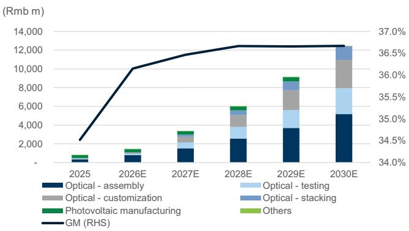  
Exhibit 1: RoboTechnik’s revenue and GM trends   
GM improvement on product mix upgrade toward optical equipment   
Source: Company data, Goldman Sachs Global Investment Research

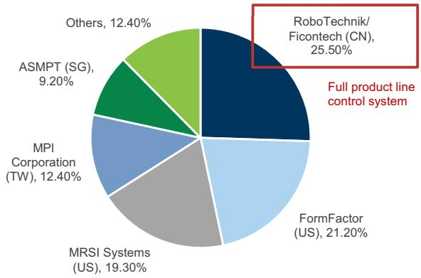  
Exhibit 3: Global market share of SiPh manufacturing equipment in 2024   
Source: Company data

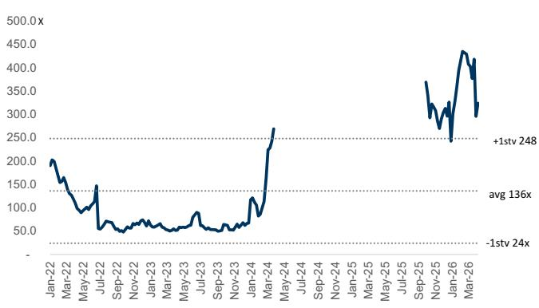  
Exhibit 5: RoboTechnik 12M forward P/E

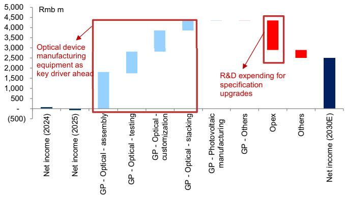  
Exhibit 2: RoboTechnik waterfall chart 2025-30E Optical device manufacturing equipment as a key driver ahead

Source: Company data, Goldman Sachs Global Investment Research

Covering global major optical device players

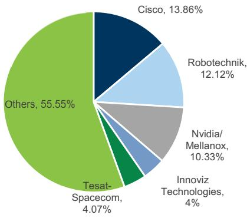  
Exhibit 4: Key customers of Ficontech in 7M24 (before the consolidation)

Source: Company data

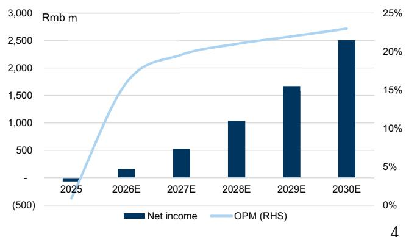  
Exhibit 6: RoboTechnik’s net income and OPM trends Improving profitability and operational efficiency as shipments ramp up

# (2) Earnings estimates

Revenues: $+ 6 9 \%$ CAGR in 2025-30E, driven by: (1) rising optical connection end demand, such as optical transceivers, CPO, and OCS, supporting RoboTechnik’s optical assembly, testing, stacking, and customization equipment shipment growth in the coming years, (2) equipment specification upgrades to support the ongoing advancement of optical connection devices, leading to higher ASPs, (3) business expansion, such as the OCS module automated manufacturing production line, and (4) 订阅研报添加微信 LCD123321Cad 04-17 the rising adoption of RoboTechnik’s highly automated equipment, considering the rising technical and precision requirements for optical connection devices.

GM: Up from $3 5 \%$ in 2025 to $3 7 \%$ in 2030E on a product mix upgrade toward a higher share of optical assembly/testing products (estimated GM at $3 5 \% +$ , vs. the company’s GM of $2 0 - 3 0 \%$ in 2022-24) following the ficonTEC acquisition in 2025. Opex ratio: Improving from $3 3 . 6 \%$ in 2025E to $1 3 . 7 \%$ in 2030E on growing revenue scale and higher operational efficiency, with R&D expense at a $+ 4 1 \%$ CAGR to support the product specification upgrades. NI: $+ 9 9 \%$ CAGR in 2026-30E, driven by the rising revenue scale and profitability improvement.

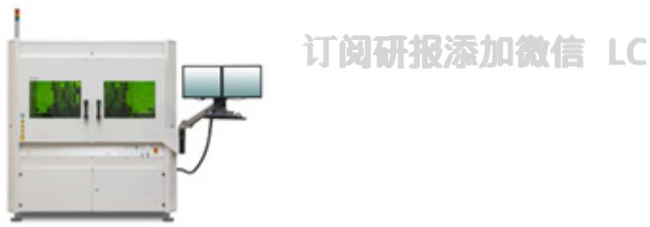  
Exhibit 7: RoboTechnik’s optical assembly equipment   
Source: Company data

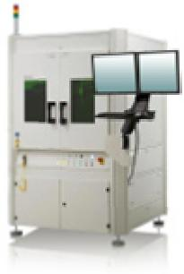  
Exhibit 8: RoboTechnik’s optical testing equipment   
Source: Company data

Exhibit 9: RoboTechnik P&L summary   

<table><tr><td>Rmb m</td><td>1Q25</td><td>2Q25</td><td>3Q25</td><td>4Q25</td><td>1Q26E</td><td>2Q26E</td><td>3Q26E</td><td>4Q26E</td><td>2022</td><td>2023</td><td>2024</td><td>2025</td><td>2026E</td><td>2027E</td><td>2028E</td><td>2029E</td><td>2030E</td></tr><tr><td colspan="4">Income statement</td><td></td><td></td><td></td><td></td><td></td><td></td><td></td><td></td><td></td><td></td><td></td><td></td><td></td><td></td></tr><tr><td>Revenues</td><td>97</td><td>152</td><td>168</td><td>533</td><td>287</td><td>352</td><td>377</td><td>436</td><td>903</td><td>1,572</td><td>1,106</td><td>950</td><td>1,452</td><td>3,375</td><td>5,984</td><td>9,109</td><td>12,941</td></tr><tr><td>GP</td><td>17</td><td>52</td><td>57</td><td>201</td><td>103</td><td>128</td><td>136</td><td>158</td><td>200</td><td>344</td><td>318</td><td>328</td><td>525</td><td>1,231</td><td>2,194</td><td>3,339</td><td>4,745</td></tr><tr><td>OP</td><td>(28)</td><td>(26)</td><td>(40)</td><td>103</td><td>45</td><td>57</td><td>60</td><td>70</td><td>51</td><td>144</td><td>130</td><td>8</td><td>232</td><td>660</td><td>1,255</td><td>2.000</td><td>2,972</td></tr><tr><td>Net income</td><td>(26)</td><td>（7</td><td>(41)</td><td>8</td><td>29</td><td>39</td><td>42</td><td>50</td><td>26</td><td>77</td><td>64</td><td>(66)</td><td>161</td><td>523</td><td>1,036</td><td>1,669</td><td>2,506</td></tr><tr><td>EPS (Rmb)</td><td>(0.17)</td><td>(0.04)</td><td>(0.25)</td><td>0.05</td><td>0.17</td><td>0.24</td><td>0.25</td><td>0.30</td><td>0.24</td><td>0.70</td><td>0.41</td><td>(0.41)</td><td>0.96</td><td>3.12</td><td>6.18</td><td>9.96</td><td>14.95</td></tr><tr><td>Margins</td><td></td><td></td><td></td><td></td><td></td><td></td><td></td><td></td><td></td><td></td><td></td><td></td><td></td><td></td><td></td><td></td><td></td></tr><tr><td>GM</td><td>17.5%</td><td>34.3%</td><td>34.2%</td><td>37.8%</td><td>35.8%</td><td>36.4%</td><td>36.2%</td><td>36.2%</td><td>22.2%</td><td>21.9%</td><td>28.7%</td><td>34.5%</td><td>36.1%</td><td>36.5%</td><td>36.7%</td><td>36.7%</td><td>36.7%</td></tr><tr><td>OPM</td><td>-29.3%</td><td>-17.0%</td><td>-23.9%</td><td>19.3%</td><td>15.6%</td><td>16.2%</td><td>16.0%</td><td>16.0%</td><td>5.6%</td><td>9.1%</td><td>11.7%</td><td>0.9%</td><td>15.9%</td><td>19.6%</td><td>21.0%</td><td>22.0%</td><td>23.0%</td></tr><tr><td>NM</td><td>-27.1%</td><td>-4.7%</td><td>-24.7%</td><td>1.6%</td><td>10.2%</td><td>11.2%</td><td>11.2%</td><td>11.6%</td><td>2.9%</td><td>4.9%</td><td>5.8%</td><td>-7.0%</td><td>11.1%</td><td>15.5%</td><td>17.3%</td><td>18.3%</td><td>19.4%</td></tr><tr><td>Ratios</td><td></td><td></td><td></td><td></td><td></td><td></td><td></td><td></td><td></td><td></td><td></td><td></td><td></td><td></td><td></td><td></td><td></td></tr><tr><td>Opex ratio</td><td>46.8%</td><td>51.3%</td><td>58.1%</td><td>18.5%</td><td>20.2%</td><td>20.2%</td><td>20.2%</td><td>20.2%</td><td>16.5%</td><td>12.8%</td><td>17.0%</td><td>33.6%</td><td>20.2%</td><td>16.9%</td><td>15.7%</td><td>14.7%</td><td>13.7%</td></tr><tr><td>Tax rate YoY</td><td>16.8%</td><td>-0.1%</td><td>19.4%</td><td>52.6%</td><td>14.0%</td><td>14.0%</td><td>14.0%</td><td>14.0%</td><td>8.6%</td><td>7.1%</td><td>-4.5%</td><td>7.7%</td><td>14.0%</td><td>15.0%</td><td>15.0%</td><td>15.0%</td><td>15.0%</td></tr><tr><td>Revenues</td><td></td><td></td><td></td><td></td><td></td><td></td><td></td><td></td><td></td><td></td><td></td><td></td><td></td><td></td><td></td><td></td><td></td></tr><tr><td>GP</td><td>-63%</td><td>-67%</td><td>-43%</td><td>494%</td><td>197%</td><td>132%</td><td>125%</td><td>-18%</td><td>-17%</td><td>74%</td><td>-30%</td><td>-14%</td><td>53%</td><td>132%</td><td>77%</td><td>52%</td><td>42%</td></tr><tr><td></td><td>-73%</td><td>-64%</td><td>-38%</td><td>982%</td><td>508%</td><td>146%</td><td>137%</td><td>-22%</td><td>20%</td><td>72%</td><td>-8%</td><td>3%</td><td>60%</td><td>134%</td><td>78%</td><td>52%</td><td>42%</td></tr><tr><td>OP Net income</td><td>na</td><td>na na</td><td>na na</td><td>na</td><td>na</td><td>na</td><td>na na</td><td>-32% 507%</td><td>17%</td><td>183%</td><td>-10%</td><td>-93%</td><td>2631%</td><td>185%</td><td>90%</td><td>59%</td><td>49%</td></tr><tr><td>QoQ</td><td>na</td><td></td><td></td><td>na</td><td>na</td><td>na</td><td></td><td></td><td>na</td><td>195%</td><td>-17%</td><td>na</td><td>na</td><td>224%</td><td>98%</td><td>61%</td><td>50%</td></tr><tr><td>Revenues</td><td></td><td></td><td></td><td></td><td></td><td></td><td></td><td></td><td></td><td></td><td></td><td></td><td></td><td></td><td></td><td></td><td></td></tr><tr><td>GP</td><td>8% -9%</td><td>57% 209%</td><td>10% 10%</td><td>218%</td><td>-46%</td><td>23%</td><td>7% 6%</td><td>16% 16%</td><td></td><td></td><td></td><td></td><td></td><td></td><td></td><td></td><td></td></tr><tr><td>OP</td><td>na</td><td>-9%</td><td>55%</td><td>251% -356%</td><td>-49% -56%</td><td>25% 27%</td><td>6%</td><td>16%</td><td></td><td></td><td></td><td></td><td></td><td></td><td></td><td></td><td></td></tr><tr><td>Net income</td><td>na</td><td>-73%</td><td>478%</td><td>-120%</td><td>250%</td><td>36%</td><td>7%</td><td>19%</td><td></td><td></td><td></td><td></td><td></td><td></td><td></td><td></td><td>5</td></tr></table>

accounts receivable, inventory, and accounts payable days to gradually improve in the coming years, along with the rising contribution from optical assembly/testing products. We forecast ROE to be down to $- 5 \%$ in 2025, and we expect it to increase to $4 9 \%$ in 2030E, mainly on improving asset turnover and net margins as optical assembly/testing product shipments ramp up. We believe FCF should keep improving in the coming years, driven by higher operating cash flow as earnings scale up.

Exhibit 10: RoboTechnik’s balance sheet   

<table><tr><td></td><td></td><td></td><td></td><td></td><td></td><td></td><td></td><td></td><td></td></tr><tr><td>Rmb m</td><td>2022</td><td>2023</td><td>2024</td><td>2025</td><td>2026E</td><td>2027E</td><td>2028E</td><td>2029E</td><td>2030E</td></tr><tr><td colspan="10">Balance Sheet</td></tr><tr><td> Cash and equivalents</td><td>212</td><td>239</td><td>300</td><td>284</td><td>231</td><td>688</td><td>667</td><td>1,272</td><td>2,882</td></tr><tr><td>Accounts receivable</td><td>245</td><td>286</td><td>441</td><td>678</td><td>914</td><td>1,120</td><td>1,995</td><td>2,497</td><td>2,821</td></tr><tr><td>Inventory</td><td>510</td><td>501</td><td>205</td><td>410</td><td>504</td><td>1,141</td><td>1,351</td><td>2.285</td><td>2,655</td></tr><tr><td>Other current assets</td><td>490</td><td>706</td><td>626</td><td>410</td><td>410</td><td>410</td><td>410</td><td>410</td><td>410</td></tr><tr><td>Current assets</td><td>1,457</td><td>1,731</td><td>1,573</td><td>1,783</td><td>2,059</td><td>3,359</td><td>4,423</td><td>6,464</td><td>8,768</td></tr><tr><td>Net PP&amp;E/Fixed assets</td><td>291</td><td>270</td><td>249</td><td>251</td><td>291</td><td>404</td><td>587</td><td>779</td><td>928</td></tr><tr><td>Net intangibles</td><td>60</td><td>53</td><td>58</td><td>219</td><td>121</td><td>71</td><td>46</td><td>33</td><td>27</td></tr><tr><td>Other long-term assets</td><td>375</td><td>513</td><td>485</td><td>1,389</td><td>1,389</td><td>1,389</td><td>1,389</td><td>1,389</td><td>1,389</td></tr><tr><td>Non-current assets</td><td>725</td><td>836</td><td>792</td><td>1,859</td><td>1,801</td><td>1,863</td><td>2,021</td><td>2,201</td><td>2,344</td></tr><tr><td>Total assets</td><td>2,182</td><td>2,567</td><td>2,365</td><td>3,642</td><td>3,860</td><td>5,223</td><td>6,444</td><td>8,665</td><td>11,112</td></tr><tr><td>Accounts payable</td><td>431</td><td>523</td><td>196</td><td>366</td><td>461</td><td>1,429</td><td>1,870</td><td>2,836</td><td>3,400</td></tr><tr><td>Short-term debt</td><td>655</td><td>787</td><td>1,000</td><td>1,069</td><td>1,069</td><td>1,069</td><td>1,069</td><td>1,069</td><td>1,069</td></tr><tr><td>Other current liabilities</td><td>196</td><td>257</td><td>126</td><td>196</td><td>196</td><td>196</td><td>196</td><td>196</td><td>196</td></tr><tr><td>Current liabilities</td><td>1,282</td><td>1,567</td><td>1,321</td><td>1,631</td><td>1,726</td><td>2,694</td><td>3,135</td><td>4,101</td><td>4,665</td></tr><tr><td>Long-term debt</td><td>30</td><td>20</td><td>39</td><td>303</td><td>303</td><td>303</td><td>303</td><td>303</td><td>303</td></tr><tr><td>Other long-term liabilities</td><td>（0)</td><td>0</td><td>-</td><td>37</td><td>37</td><td>37</td><td>37</td><td>37</td><td>37</td></tr><tr><td>Non-current liabilities</td><td>30</td><td>20</td><td>39</td><td>340</td><td>340</td><td>340</td><td>340</td><td>340</td><td>340</td></tr><tr><td>Total liabilities</td><td>1,312</td><td>1,587</td><td>1,360</td><td>1,971</td><td>2,066</td><td>3,033</td><td>3,475</td><td>4,441</td><td>5,004</td></tr><tr><td>Common stock</td><td>111</td><td>110</td><td>155</td><td>168</td><td>168</td><td>168</td><td>168</td><td>168</td><td>168</td></tr><tr><td>Retained earnings</td><td>228</td><td>294</td><td>330</td><td>256</td><td>377</td><td>769</td><td>1,546</td><td>2,798</td><td>4,677</td></tr><tr><td>Other common equity</td><td>533</td><td>577</td><td>522</td><td>1,250</td><td>1,250</td><td>1,250</td><td>1,250</td><td>1,250</td><td>1,250</td></tr><tr><td>Total common equity</td><td>872</td><td>982</td><td>1,008</td><td>1,673</td><td>1,794</td><td>2,186</td><td>2,963</td><td>4,215</td><td>6,095</td></tr><tr><td>Minority interest</td><td>(1)</td><td>(2)</td><td>(3)</td><td>(2)</td><td>0</td><td>3</td><td>6</td><td>9</td><td>13</td></tr><tr><td>Total equity</td><td>870</td><td>980</td><td>1,005</td><td>1,671</td><td>1,795</td><td>2,189</td><td>2,969</td><td>4,224</td><td>6,107</td></tr><tr><td>BVPS</td><td>7.89</td><td>8.90</td><td>6.51</td><td>10.30</td><td>10.71</td><td>13.05</td><td>17.68</td><td>25.15</td><td>36.36</td></tr><tr><td colspan="10">Cash conversion cycle</td></tr><tr><td>Account receivable days</td><td>107</td><td>62</td><td>120</td><td>215</td><td>200</td><td></td><td>95</td><td>90</td><td></td></tr><tr><td>Inventory days</td><td>214</td><td>150</td><td>163</td><td>181</td><td>180</td><td>110</td><td>120</td><td></td><td>75</td></tr><tr><td>Net payable days</td><td>150</td><td>142</td><td>166</td><td>165</td><td>163</td><td>140 161</td><td>159</td><td>115</td><td>110</td></tr><tr><td>Cash conversion cycle</td><td>171</td><td>70</td><td>117</td><td>231</td><td>217</td><td>89</td><td>56</td><td>149 56</td><td>139 46</td></tr><tr><td colspan="10"></td></tr><tr><td>Ratios</td><td>说处</td><td>添</td><td>誉</td><td>)12332</td><td>Cad</td><td></td><td></td><td></td><td></td></tr><tr><td>ROE (common equity) ROA</td><td>3%</td><td>8%</td><td>6%</td><td>-5%</td><td>9%</td><td>26%</td><td>40%</td><td>46%</td><td>49%</td></tr><tr><td>Net debt to total equity</td><td>1%</td><td>3%</td><td>3%</td><td>-2%</td><td>4%</td><td>12%</td><td>18%</td><td>22%</td><td>25%</td></tr><tr><td>Net cash per share (Rmb)</td><td>54%</td><td>58%</td><td>74%</td><td>65%</td><td>64%</td><td>31%</td><td>24%</td><td>2%</td><td>-25%</td></tr><tr><td>Total liabilities to total assets</td><td>(4.28) 60%</td><td>(5.15) 62%</td><td>(4.78) 58%</td><td>(6.70) 54%</td><td>(6.81) 54%</td><td>(4.08) 58%</td><td>(4.21) 54%</td><td>(0.60) 51%</td><td>9.01 45%</td></tr><tr><td colspan="10">Dupont analysis</td></tr><tr><td>Asset turnover</td><td>0.4</td><td>0.7</td><td>0.4</td><td>0.3</td><td>0.4</td><td>0.7</td><td>1.0</td><td>1.2</td><td>1.3</td></tr><tr><td>Leverage (assets to equity)</td><td>2.4</td><td>2.6</td><td>2.5</td><td>2.2</td><td>2.2</td><td>2.3</td><td>2.3</td><td>2.1</td><td>1.9</td></tr><tr><td>Net margin</td><td>3%</td><td>5%</td><td>6%</td><td>-7%</td><td>11%</td><td>15%</td><td>17%</td><td>18% 46%</td><td>19%</td></tr><tr><td>ROE (total equity) CROCI (EDBiTA/total equity)</td><td>3% 10%</td><td>8% 18%</td><td>6% 16%</td><td>-5% 4%</td><td>9% 20%</td><td>26% 34%</td></table>

Exhibit 11: RoboTechnik’s cash flow statement   

<table><tr><td>Rmbm</td><td>2022</td><td>2023</td><td>2024</td><td>2025</td><td>2026E</td><td>2027E</td><td>2028E</td><td>2029E</td><td>2030E</td></tr><tr><td colspan="10">Cash flow statement</td></tr><tr><td>Net income</td><td>26</td><td>77</td><td>64</td><td>(66)</td><td>161</td><td>523</td><td>1,036</td><td>1,669</td><td>2,506</td></tr><tr><td>Minority interestadd-back</td><td>(1)</td><td>(1)</td><td>(1)</td><td>1</td><td>2</td><td>3</td><td>3</td><td>3</td><td>4</td></tr><tr><td>Depreciation and amortization add-back</td><td>33</td><td>30</td><td>28</td><td>52</td><td>134</td><td>84</td><td>64</td><td>62</td><td>66</td></tr><tr><td>(Increase)/decrease in working capital</td><td>126</td><td>61</td><td>(187)</td><td>(271)</td><td>(234)</td><td>124</td><td>(643)</td><td>(470)</td><td>(130)</td></tr><tr><td>Other operating cash flow items</td><td>84</td><td>(195)</td><td>(221)</td><td>493</td><td>0</td><td>0</td><td>0</td><td>0</td><td>0</td></tr><tr><td>Cash flow from operating</td><td>269</td><td>(28)</td><td>(317)</td><td>208</td><td>63</td><td>733</td><td>460</td><td>1.264</td><td>2.445</td></tr><tr><td>Capital expenditure</td><td>(25)</td><td>（9)</td><td>(25)</td><td>(43)</td><td>(66)</td><td>(136)</td><td>(212)</td><td>(231)</td><td>(199)</td></tr><tr><td>Other investment cash flow items</td><td>21</td><td>22</td><td>(30)</td><td>(631)</td><td>（10）</td><td>(10)</td><td>(10)</td><td>(10)</td><td>(10)</td></tr><tr><td>Cash flow from investing</td><td>(4</td><td>13</td><td>(55)</td><td>(674)</td><td>(76)</td><td>(146)</td><td>(222)</td><td>(241)</td><td>(209)</td></tr><tr><td>Dividends paid</td><td>(22)</td><td>(24)</td><td>（(50)</td><td>(42)</td><td>(40)</td><td>(131)</td><td>(259)</td><td>(417)</td><td>(627)</td></tr><tr><td>Change in common stock</td><td>0</td><td>（0）</td><td>45</td><td>13</td><td>·</td><td>-</td><td>-</td><td>-</td><td>-</td></tr><tr><td>Increase/(decrease) in short-term debt</td><td>(126)</td><td>132</td><td>213</td><td>69</td><td>■</td><td>-</td><td>=</td><td>-</td><td>-</td></tr><tr><td>Increase/(decrease) in long-term debt</td><td>(30）</td><td>(10）</td><td>19</td><td>264</td><td>-</td><td>-</td><td>-</td><td>-</td><td>-</td></tr><tr><td>Other financing cash flow items</td><td>(1)</td><td>(48)</td><td>227</td><td>129</td><td>-</td><td>-</td><td>=</td><td>=</td><td>-</td></tr><tr><td>Cash flow from financing</td><td>(178)</td><td>50</td><td>454</td><td>433</td><td>(40)</td><td>(131)</td><td>(259)</td><td>(417)</td><td>(627)</td></tr><tr><td>Net change in cash</td><td>46</td><td>27</td><td>61</td><td>(16)</td><td>(53)</td><td>456</td><td>(21)</td><td>605</td><td>1,610</td></tr><tr><td>FCF</td><td>244</td><td>(36)</td><td>(342)</td><td>165</td><td>3</td><td>597</td><td>248</td><td>1,032</td><td>2,246</td></tr><tr><td colspan="10">Ratio</td></tr><tr><td>Capextorevenue</td><td>3%</td><td>1%</td><td>2%</td><td>5%</td><td>5%</td><td>4%</td><td>4%</td><td>3%</td><td>2%</td></tr></table>

Source: Company data, Goldman Sachs Global Investment Research

# (3) Valuation and Risks

订阅研报添加微信 LCD123321Cad 04-17 We derive our 12-month target price of Rmb688 based on a discounted P/E methodology to capture the company’s long-term growth, which is in line with our Greater China Tech coverage. Our 2031E target $\mathsf { P } / \mathsf { E }$ multiple of $5 0 \times$ is based on the correlation between consumer electronic peers’ PEG&M (2026E P/E to 2027E NI YoY and OPM), with RoboTechnik’s 2032E net income YoY at $3 9 \%$ and 2032E OPM at $2 4 \%$ . We apply the $5 0 \times$ target P/E to 2031E EPS and discount it back to 2027E with a COE of $1 1 . 3 \%$ . With a potential $40 \%$ upside to our target price, we initiate coverage on RoboTechnik at Buy. Our TP-implied 2027E P/E is $2 2 1 \mathsf { x }$ , within the stock’s historical average and average $+ 1$ std forward trading $\mathsf { P } / \mathsf { E }$ .

Exhibit 12: Our 2031E target P/E multiple is derived from peers’ 2026-27E PEG&M   

<table><tr><td>Valuation</td><td></td><td>2031EP/E 2032ENIYoY</td><td>2032EOPMPEG&amp;M</td><td></td></tr><tr><td>RoboTechnik</td><td>50</td><td>39%</td><td>24%</td><td>0.8</td></tr><tr><td>Peers</td><td></td><td>2026EP/E 2027ENIYoY2</td><td>2027EOPMPEG&amp;M</td><td></td></tr><tr><td>FormFactor</td><td>65</td><td>23%</td><td>门区121%H以11.5</td><td></td></tr><tr><td>Teradyne</td><td>63</td><td>29%</td><td>29%</td><td>1.1</td></tr><tr><td>Shibuya</td><td>13</td><td>20%</td><td>10%</td><td>0.4</td></tr><tr><td>MPI</td><td>71</td><td>58%</td><td>38%</td><td>0.7</td></tr><tr><td>Innolight</td><td>37</td><td>43%</td><td>37%</td><td>0.5</td></tr><tr><td>Advantest</td><td>38</td><td>15%</td><td>48%</td><td>0.6</td></tr><tr><td>Avg.</td><td>48</td><td>31%</td><td>30%</td><td>0.8</td></tr></table>

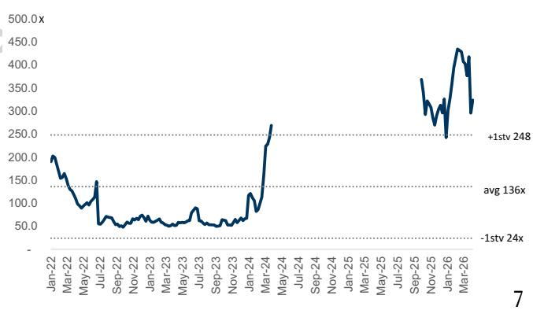  
Exhibit 13: RoboTechnik’s 12M forward P/E

Exhibit 14: RoboTechnik’s discounted P/E   

<table><tr><td>(RMB m)</td><td>2019</td><td>2020</td><td>2021</td><td>2022</td><td>2023</td><td>2024</td><td>2025</td><td>2026E</td><td>2027E</td><td>2028E</td><td>2029E</td><td>2030E</td><td>2031E</td><td>2032E</td></tr><tr><td>Milestones</td><td colspan="5">Driven by Photovoltaic cycle</td><td colspan="4">Fast adoption of SiPh</td><td colspan="5"> Innovatie solutions for CPO/ OCS</td></tr><tr><td>Revenue</td><td>981</td><td>528</td><td>1,086</td><td>903</td><td>1,572</td><td>1,106</td><td>950</td><td>1,452</td><td>3,375</td><td>5,984</td><td>9,109</td><td>12,941</td><td>17,987</td><td>24,643</td></tr><tr><td>YoY</td><td></td><td>-46%</td><td>106%</td><td>-17%</td><td>74%</td><td>-30%</td><td>-14%</td><td>53%</td><td>132%</td><td>77%</td><td>52%</td><td>42%</td><td>39%</td><td>37%</td></tr><tr><td>Gross profit</td><td>233</td><td>59</td><td>166</td><td>200</td><td>344</td><td>318</td><td>328</td><td>525</td><td>1,231</td><td>2,194</td><td>3,339</td><td>4,745</td><td>6,596</td><td>9,037</td></tr><tr><td>Gross margin</td><td>23.8%</td><td>11.2%</td><td>15.3%</td><td>22.2%</td><td>21.9%</td><td>28.7%</td><td>34.5%</td><td>36.1%</td><td>36.5%</td><td>36.7%</td><td>36.7%</td><td>36.7%</td><td>36.7%</td><td>36.7%</td></tr><tr><td>Opex ratio</td><td>10.0%</td><td>20.3%</td><td>11.3%</td><td>16.5%</td><td>12.8%</td><td>17.0%</td><td>33.6%</td><td>20.2%</td><td>16.9%</td><td>15.7%</td><td>14.7%</td><td>13.7%</td><td>13.4%</td><td>13.1%</td></tr><tr><td>Operating profit</td><td>135</td><td>-48</td><td>43</td><td>51</td><td>144</td><td>130</td><td>8</td><td>232</td><td>660</td><td>1,255</td><td>2,000</td><td>2,972</td><td>4,186</td><td>5,808</td></tr><tr><td>YoY</td><td></td><td>na</td><td>na</td><td>17%</td><td>183%</td><td>-10%</td><td>-93%</td><td>2631%</td><td>185%</td><td>90%</td><td>59%</td><td>49%</td><td>41%</td><td>39%</td></tr><tr><td>Operating margin</td><td>14%</td><td>-9%</td><td>4%</td><td>6%</td><td>9%</td><td>12%</td><td>1%</td><td>16%</td><td>20%</td><td>21%</td><td>22%</td><td>23%</td><td>23%</td><td>24%</td></tr><tr><td>Non-op</td><td>(18)</td><td>(34)</td><td>(98)</td><td>(23)</td><td>(61)</td><td>(69)</td><td>（80)</td><td>(41)</td><td>(42)</td><td>(32)</td><td>(33)</td><td>(20)</td><td>(20)</td><td>(20)</td></tr><tr><td>Pre-tax profit</td><td>117</td><td>-83</td><td>-55</td><td>28</td><td>82</td><td>60</td><td>~-71</td><td>190</td><td>618</td><td>1,222</td><td>1,967</td><td>2,952</td><td>4,166</td><td>5,788</td></tr><tr><td>Tax benefit (expense)</td><td>-17</td><td>15</td><td>8</td><td>-2</td><td>-6</td><td>3</td><td>5</td><td>-27</td><td>-93</td><td>-183</td><td>-295</td><td>-443</td><td>-625</td><td>-868</td></tr><tr><td>Tax rate</td><td>-15%</td><td>-18%</td><td> -14%</td><td>-9%</td><td> -7%</td><td>5%</td><td>-8%</td><td>-14%</td><td>-15%</td><td>-15%</td><td>-15%</td><td>-15%</td><td>-15%</td><td>-15%</td></tr><tr><td>Minority</td><td>0.10</td><td>(0.68)</td><td>(0.08)</td><td>(0.54)</td><td>(0.75)</td><td>(0.71)</td><td>0.53</td><td>2.44</td><td>2.68</td><td>2.95</td><td>3.24</td><td>3.57</td><td>3.93</td><td>4.32</td></tr><tr><td>Net profit</td><td>100</td><td>-67</td><td>-47</td><td>26</td><td>77</td><td>64</td><td>-66</td><td>161</td><td>523</td><td>1,036</td><td>1,669</td><td>2,506</td><td>3,537</td><td>4,916</td></tr><tr><td>EPS (Rmb,diluted)</td><td>0.98</td><td>-0.65</td><td>-0.42</td><td>0.24</td><td>0.70</td><td>0.41</td><td>-0.41</td><td>0.96</td><td>3.12</td><td>6.18</td><td>9.96</td><td>14.95</td><td>21.1</td><td>29.33</td></tr><tr><td>YoY</td><td></td><td>na</td><td>na</td><td>na</td><td>195%</td><td>-17%</td><td>na</td><td>na</td><td>224%</td><td>98%</td><td>61%</td><td>50%</td><td>41%</td><td>39%</td></tr><tr><td>TP implied P/E</td><td></td><td></td><td></td><td></td><td></td><td></td><td>na</td><td>715</td><td>221</td><td>111</td><td>69</td><td>46</td><td>33</td><td>23</td></tr></table>

<table><tr><td>P/Emultiple</td><td>50</td></tr><tr><td>P/E multiplex2031E EPS</td><td>1,055</td></tr><tr><td>Discounted back to 2027;value per share (Rmb)</td><td>688</td></tr><tr><td>Implied2027P/E</td><td>221</td></tr></table>

Source: Company data, Goldman Sachs Global Investment Research   

<table><tr><td>COEassumption</td><td></td></tr><tr><td>Beta</td><td>1.2</td></tr><tr><td>Risk free</td><td>3.5%</td></tr><tr><td>Market risk premium</td><td>6.5%</td></tr><tr><td>COE</td><td>11.3%</td></tr></table>

Exhibit 15: RoboTechnik peers comp table   

<table><tr><td rowspan="2">Company</td><td rowspan="2">Ticker</td><td rowspan="2">Rating</td><td rowspan="2">Marketcap US$m</td><td colspan="2">PE</td><td colspan="2">2026E</td><td colspan="2">2028E</td><td colspan="2">RevYoY 2027E</td><td colspan="2">2026E</td><td colspan="2">OPM 2027E 2028E</td></tr><tr><td>2026E 卡511</td><td>2027E 158</td><td>2028E 82</td><td></td><td>2027E na224%</td><td>98%</td><td>2026E 53%</td><td>132%</td><td>2028E 77%</td><td>16%</td><td></td><td></td></tr><tr><td>RoboTechnik Peers</td><td>300757.SZ Buy</td><td></td><td>12,127 </td><td></td><td></td><td></td><td></td><td></td><td></td><td></td><td></td><td></td><td></td><td>20%</td><td>21%</td></tr><tr><td>Advantest</td><td>6857.T</td><td>Neutral</td><td>115,232</td><td>38</td><td>33</td><td>NA</td><td>54%</td><td>15%</td><td>NA</td><td>34%</td><td>14%</td><td>NA</td><td>47%</td><td>48%</td><td>NA</td></tr><tr><td></td><td>TER</td><td>Buy</td><td></td><td></td><td>49</td><td>41</td><td>58%</td><td>29%</td><td>20%</td><td>30%</td><td>15%</td><td>14%</td><td>26%</td><td></td><td>30%</td></tr><tr><td>Teradyne MPI</td><td>6223.TWO Buy</td><td></td><td>58,014</td><td>63</td><td>45</td><td>NA</td><td></td><td></td><td>NA</td><td></td><td></td><td></td><td></td><td>29%</td><td>NA</td></tr><tr><td></td><td></td><td></td><td>13,719</td><td>71</td><td></td><td></td><td>98%</td><td>58%</td><td>39%</td><td>65%</td><td>41%</td><td>NA</td><td>34%</td><td>38%</td><td>49%</td></tr><tr><td>BESI</td><td>BESI.AS 8035.T</td><td>Buy</td><td>19,671</td><td>52</td><td>35</td><td>25</td><td>143%</td><td>47%</td><td></td><td>61%</td><td>29%</td><td>27%</td><td>40%</td><td>45%</td><td>NA</td></tr><tr><td>Tokyo Electron</td><td></td><td>Buy</td><td>126,792</td><td>31</td><td>24</td><td>NA</td><td>15%</td><td>25%</td><td>NA</td><td>18%</td><td>19%</td><td>NA</td><td>28%</td><td>30%</td><td>NA</td></tr><tr><td>Accotest ASMPT</td><td>688200.SS Buy 0522.HK</td><td></td><td>5,797</td><td>50</td><td>41</td><td>NA</td><td>47%</td><td>21%</td><td>NA</td><td>31%</td><td>15%</td><td>NA</td><td>46%</td><td>49%</td><td>13%</td></tr><tr><td>Shibuya</td><td>6340.T</td><td>Neutral Not Covered</td><td>6.013 628</td><td>32 13</td><td>25 10</td><td>22 NA</td><td>64% -2%</td><td>29%</td><td>12% NA</td><td>24%</td><td>13%</td><td>11%</td><td>11%</td><td>13%</td><td>11%</td></tr><tr><td>FormFactor</td><td>FORM</td><td>NotCovered</td><td>8.195</td><td>65</td><td>56</td><td>NA</td><td>63%</td><td>20% 23%</td><td>NA</td><td>1% 18%</td><td>8% 7%</td><td>地</td><td>9% 18%</td><td>10% 21%</td><td>NA</td></tr><tr><td>Average</td><td></td><td></td><td>39,340</td><td>46</td><td>35</td><td>29</td><td>60%</td><td>30%</td><td>24%</td><td>31%</td><td>18%</td><td>13%</td><td>29%</td><td>31%</td><td>26%</td></tr></table>

Worse-than-expected photovoltaic market down cycle: Besides optical device manufacturing devices, RoboTechnik also owns a photovoltaic manufacturing equipment business. A worse-than-expected photovoltaic market downcycle will drag down the company’s overall growth and create downside risk.

# Investment Thesis - RoboTechnik

RoboTechnik is a leading global supplier of optical device manufacturing equipment (e.g., SiPh - silicon photonics, CPO - co-packaged optics, and OCS - optical circuit switches). We expect it to deliver strong growth driven by: (1) the rising adoption of CPO 订阅研报添加微信 LCD123321Cad 04-17 technology in AI server connections, (2) strong R&D in motion control systems, machine vision algorithms, and Process Control Master (PCM) software, (3) expansion into automated manufacturing production lines for OCS modules, (4) an improving product mix, supported by a higher share of optical assembly and testing products following the ficonTEC acquisition in 2025. The stock currently trades at $1 5 8 \times 2 0 2 7 \mathsf { E } \mathsf { P } / \mathsf { E }$ , and our TP implies a $2 2 1 \times 2 0 2 7 \mathsf { E } \mathsf { P } / \mathsf { E }$ . This valuation, derived from peers’ 2026-27E average PEG and margins, suggests the current valuation is attractive. We are Buy-rated on RoboTechnik.

# Price Target Risks and Methodology - RoboTechnik

Valuation: Our 12-month target price of Rmb688 is based on 50x 2031E P/E, discounted back to 2027E at a COE of $1 1 . 3 \%$ . Our target multiple is derived from the correlation between consumer electronic peers’ PEG&M (2026E P/E to 2027E NI YoY and OPM), with RoboTechnik’s 2032E net income YoY at $3 9 \%$ and 2032E OPM at $2 4 \%$ .

订阅研报添加微信 LCD123321Cad 04-17 Key downside risks: Fiercer-than-expected market competition; lower-than-expected optical connection end demand; worse-than-expected photovoltaic market downcycle.

YJ Semi (688498.SS; Neutral): SiPh / CW laser in expansion; initiate at Neutral   

<table><tr><td>688498.S S</td><td> 12m Price Target Rmb1592</td><td>Price: Rmb1251.49</td><td></td><td>Upside: 27.2%</td><td></td></tr><tr><td>Neutral</td><td>GS Forecast</td><td></td><td></td><td></td><td></td></tr><tr><td></td><td></td><td>12/25</td><td>12/26E</td><td>12/27E</td><td>12/28E</td></tr><tr><td>Market cap: Rmb107.6bn /S15.8bn</td><td>Revenue (Rmb mn)</td><td>601.4</td><td>1,215.7</td><td>1,970.7</td><td>3,353.3</td></tr><tr><td> Enterprise value: Rmb106.9bn/ $15.7bn</td><td>EBITDA (Rmb mn)</td><td>254.9</td><td>589.5</td><td>1,124.3</td><td>1,952.8</td></tr><tr><td> 3m ADTV :Rmb3.2bn/ S458.8mn</td><td>EPS (Rmb)</td><td>2.22</td><td>5.60</td><td>9.89</td><td>18.42</td></tr><tr><td> China </td><td>P/E (X)</td><td>124.7</td><td>NM</td><td>126.5</td><td>67.9</td></tr><tr><td> Greater China Technology</td><td>P/B (X)</td><td>10.2</td><td>40.3</td><td>33.0</td><td>24.6</td></tr><tr><td></td><td> Dividend yield (%)</td><td>0.4</td><td>0.1</td><td>0.2</td><td>0.4</td></tr><tr><td> M&amp;A Rank: 3</td><td> Net debt/EBITDA (X)</td><td>(3.2)</td><td>(1.2)</td><td>(0.6)</td><td>(0.7)</td></tr><tr><td></td><td>CROCI (%)</td><td>18.6</td><td>33.0</td><td>44.8</td><td>57.6</td></tr><tr><td></td><td>FCF yield (%)</td><td>(1.1)</td><td>0.0</td><td>0.2</td><td>1.0</td></tr><tr><td></td><td></td><td>12/25</td><td>3/26E</td><td>6/26E</td><td>9/26E</td></tr><tr><td></td><td>EPS (Rmb)</td><td>0.99</td><td>0.70</td><td>1.15</td><td>1.65</td></tr></table>

Source: Companydata, Goldman Sachs Research estimates, FactSet Price as of 14 Apr 2026 dose.

We initiate on YJ Semi at Neutral with a 12-month target price of Rmb1,592 (implying $1 6 1 \times 2 0 2 7 \mathsf { E } \mathsf { P } / \mathsf { E }$ vs. $8 1 \%$ NI YoY and $5 1 \%$ OPM in 2027-28E on average). We expect YJ Semi’s net income to grow at an $8 1 \%$ CAGR over 2026-28E, driven by: (1) the AI server shipment ramp-up, (2) growing high-speed optical connections, where rising SiPh penetration rates drive a product mix upgrade towards CW laser, and (3) opportunities in customer expansion and CPO as optical connections expand from scaling out to scaling up.

Key debates: Our NI forecast is $1 3 \% / 2 5 \%$ higher than Bloomberg consensus for 2026-27E, mainly on higher revenues that reflect our more positive view on SiPh optical module growth and YJ Semi’s product mix upgrade. While the market is concerned about the sustainability of YJ Semi’s growth, we see continued speed upgrades, the expansion of optical connections, and the China cloud migration following the US cloud cycle as factors that could lengthen the upcycle.

Valuation: The stock currently trades at $1 2 4 \times 2 0 2 7 \mathsf { E } \mathsf { P } / \mathsf { E }$ , and our 12-month target price of Rmb1,592 implies 161x 2027E P/E (vs. $8 1 \%$ NI YoY and $5 1 \%$ OPM in 2027-28E on avg.), which is within the company’s historical average and average $+ 1$ std forward trading $\mathsf { P } / \mathsf { E }$ range. We are positive on YJ Semi’s growth due to rising end demand for optical connections but initiate with a Neutral rating given the fair valuation. We would turn more positive on YJ Semi if we see faster-than-expected growth in optics connections, or a product mix upgrade (e.g., toward 300mW / CPO). Upside / downside risks: Higher- / lower-than-expected SiPh penetration rate; milder- / 订阅研报添加微信 LCD123321Cad 04-17 fiercer-than-expected market competition; faster- / slower-than-expected cloud capex trend.

# (1) Top six charts

Rising contribution from CW laser supporting GM improvement

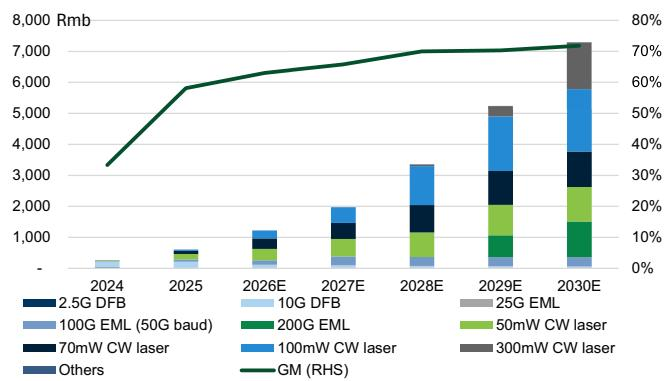  
Exhibit 16: YJ Semi’s revenue and GM trends   
订阅研报添加Source: Company data, Goldman Sachs Global Investment Research

# Exhibit 18: Revenue contribution and GM trends of CW laser chips

ASP uptrend on product mix upgrade towards higher-power products

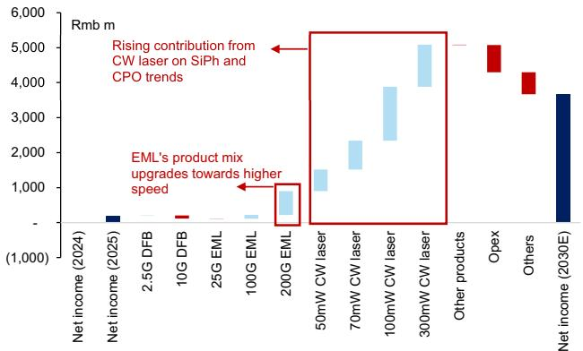  
Exhibit 17: YJ Semi’s waterfall chart for 2025-30E   
CW laser chips as a key driver ahead

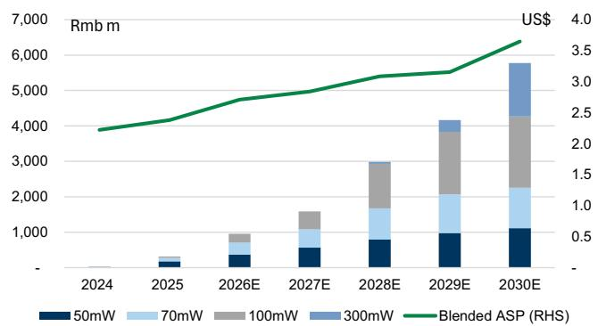  
Exhibit 19: YJ Semi’s CW laser in a SiPh-based optical transceiver

D123321Cad 04-17 Source: Company data, Goldman Sachs Global Investment Research

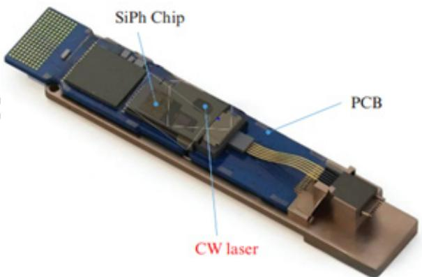

Revenues: We project a $+ 6 5 \%$ CAGR over 2025-30E, driven by: (1) continuous-wave (CW) laser shipments ramping up, on AI server shipment growth and speed upgrades driving SiPh penetration rate, and (2) product mix upgrades towards laser chips with    ‹¢–xb¥mûR _®Oá   LCD123321Cad   04-17higher data rates and output power (e.g., 70 / 100mW CW laser chip), which carry better ASPs and GMs. GM: We expect GM to rise from $5 8 \%$ in 2025 to $7 2 \%$ in 2030E on the product mix upgrade towards CW laser chips, which carries a higher GM at $\sim 7 0 \%$ vs. EML and DFB’s GM at ${ \sim } 4 0 \%$ . Opex ratio: We forecast opex to improve from $2 5 . 6 \%$ in 2025 to $1 2 . 8 \%$ in 2030E on growing revenue scale and higher operational efficiency as shipments ramp up. We model R&D expense to grow at a $+ 4 7 \%$ CAGR over 2025-30E, supporting specification upgrades to meet the technical requirements of high-speed optical transceivers, CPO devices, etc. NI: We see an $+ 8 1 \%$ CAGR over 2025-30E, delivering a higher growth rate than revenues, mainly on profitability improvements.

Rising contribution from data centers

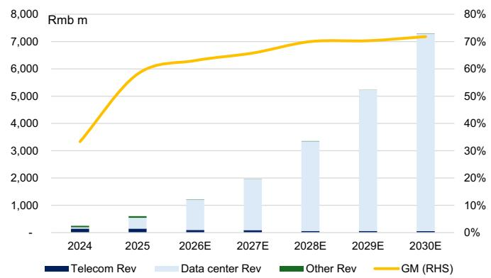  
Exhibit 22: YJ Semi’s revenue by end applications and overall GM

Exhibit 24: YJ Semi’s P&L summary   

<table><tr><td>Rmbm</td><td>2022</td><td>2023</td><td>2024</td><td>2025</td><td>2026E</td><td>2027E</td><td>2028E</td><td>2029E</td><td>2030E</td><td>1Q25</td><td>2Q25</td><td>3Q25</td><td>4Q25</td><td>1Q26E</td><td>2Q26E</td><td>3Q26E</td><td>4Q26E</td></tr><tr><td>Income statement Revenue</td><td>283</td><td>144</td><td>252</td><td>601</td><td>1,216</td><td>1,971</td><td>3,353</td><td>5,232</td><td>7,286</td><td>84</td><td>121</td><td>178</td><td>218</td><td>185</td><td>251</td><td>344</td><td>437</td></tr><tr><td>Gross profit</td><td></td><td>60</td><td>84</td><td>349</td><td>766</td><td>1,297</td><td>2.347</td><td>3.678</td><td>5,232</td><td>38</td><td>62</td><td>110</td><td>140</td><td>108</td><td>154</td><td>220</td><td>284</td></tr><tr><td>OPincome</td><td>175 104</td><td>(6)</td><td>(18)</td><td>195</td><td>520</td><td>946</td><td>1,800</td><td>2.946</td><td>4,299</td><td>14</td><td>33</td><td>64</td><td>85</td><td>62</td><td>106</td><td>154</td><td>198</td></tr><tr><td>Net income</td><td>100</td><td>19</td><td>（6）</td><td>191</td><td>481</td><td>850</td><td>1,583</td><td>2,551</td><td>3,671</td><td>14</td><td>32</td><td>60</td><td>85</td><td>60</td><td>99</td><td></td><td>180</td></tr><tr><td></td><td>131</td><td>35</td><td>32</td><td>255</td><td>589</td><td>1,124</td><td>1,953</td><td>3,107</td><td>4,453</td><td>29</td><td>47</td><td>79</td><td>100</td><td>80</td><td>124</td><td>142 171</td><td>215</td></tr><tr><td>EBITDA</td><td>2.23</td><td>0.32</td><td>(0.07)</td><td>2.22</td><td>5.60</td><td>9.89</td><td>18.42</td><td>29.68</td><td>42.72</td><td>0.17</td><td>0.37</td><td>0.69</td><td>0.99</td><td>0.70</td><td>1.15</td><td>1.65</td><td></td></tr><tr><td>EPS (Rmb) Ratios</td><td></td><td></td><td></td><td></td><td></td><td></td><td></td><td></td><td></td><td></td><td></td><td></td><td></td><td></td><td></td><td></td><td>2.10</td></tr><tr><td>Opex ratio</td><td>25.3%</td><td>45.8%</td><td>40.4%</td><td>25.6%</td><td></td><td>17.8%</td><td>16.3%</td><td>14.0%</td><td>12.8%</td><td>28.4%</td><td>24.7%</td><td>25.8%</td><td>24.9%</td><td></td><td>19.1%</td><td></td><td></td></tr><tr><td>Taxrate</td><td>8.8%</td><td>-7.3%</td><td>59.9%</td><td>10.7%</td><td>20.2% 11.0%</td><td>12.0%</td><td>13.0%</td><td>14.0%</td><td>15.0%</td><td>15.2%</td><td>4.5%</td><td>10.5%</td><td>12.1%</td><td>25.0% 11.0%</td><td>11.0%</td><td>19.1% 11.0%</td><td>19.8%</td></tr><tr><td>Margins</td><td></td><td></td><td></td><td></td><td></td><td></td><td></td><td></td><td></td><td></td><td></td><td></td><td></td><td></td><td></td><td></td><td>11.0%</td></tr><tr><td></td><td>61.9%</td><td></td><td></td><td></td><td></td><td>65.8%</td><td></td><td></td><td></td><td>44.6%</td><td>51.7%</td><td>61.6%</td><td>64.0%</td><td>58.8%</td><td></td><td></td><td>65.0%</td></tr><tr><td>Gross margin Operating margin</td><td>36.7%</td><td>41.9%</td><td>33.3% -7.1%</td><td>58.1% 32.5%</td><td>63.0% 42.8%</td><td>48.0%</td><td>70.0% 53.7%</td><td>70.3% 56.3%</td><td>71.8% 59.0%</td><td>16.2%</td><td>27.0%</td><td>35.8%</td><td>39.1%</td><td>33.8%</td><td>61.6% 42.5%</td><td>63.9% 44.8%</td><td>45.2%</td></tr><tr><td>Netmargin</td><td>35.5%</td><td>-4.0% 13.5%</td><td>-2.4%</td><td>31.7%</td><td>39.6%</td><td>43.1%</td><td>47.2%</td><td>48.7%</td><td>50.4%</td><td>17.0%</td><td>26.5%</td><td>33.4%</td><td>39.0%</td><td>32.5%</td><td>39.6%</td><td>41.2%</td><td>41.3%</td></tr><tr><td>YoY</td><td></td><td></td><td></td><td></td><td></td><td></td><td></td><td></td><td></td><td></td><td></td><td></td><td></td><td></td><td></td><td></td><td></td></tr><tr><td>Revenue</td><td>22%</td><td>-49%</td><td>75%</td><td>139%</td><td>102%</td><td>62%</td><td>70%</td><td>56%</td><td>39%</td><td>41%</td><td>101%</td><td>207%</td><td>195%</td><td>119%</td><td>108%</td><td>93%</td><td>100%</td></tr><tr><td>Gross profit</td><td>16%</td><td>-65%</td><td>39%</td><td>316%</td><td>119%</td><td>69%</td><td>81%</td><td>57%</td><td>42%</td><td>80%</td><td>224%</td><td>761%</td><td>349%</td><td>188%</td><td>148%</td><td>100%</td><td>103%</td></tr><tr><td>OP income</td><td>2%</td><td>na</td><td>na</td><td>na</td><td>167%</td><td>82%</td><td>90%</td><td>64%</td><td>46%</td><td>317%</td><td>na</td><td>na</td><td>na</td><td>356%</td><td>228%</td><td>141%</td><td>132%</td></tr><tr><td>Net income</td><td>5%</td><td>-81%</td><td>na</td><td>na</td><td>152%</td><td>77%</td><td>86%</td><td>61%</td><td>44%</td><td>36%</td><td>14667%</td><td>na</td><td>na</td><td>318%</td><td>211%</td><td>137%</td><td>112%</td></tr><tr><td></td><td></td><td></td><td></td><td></td><td></td><td></td><td></td><td></td><td></td><td></td><td></td><td></td><td></td><td></td><td></td><td></td><td></td></tr><tr><td>QQ</td><td></td><td></td><td></td><td></td><td></td><td></td><td></td><td></td><td></td><td>14%</td><td>43%</td><td>48%</td><td>22%</td><td>-15%</td><td>36%</td><td>37%</td><td>27%</td></tr><tr><td>Revenue</td><td></td><td></td><td></td><td></td><td></td><td></td><td></td><td></td><td></td><td>21%</td><td>65%</td><td>76%</td><td>27%</td><td>-22%</td><td>42%</td><td>42%</td><td>29%</td></tr><tr><td>Gross profit</td><td></td><td></td><td></td><td></td><td></td><td></td><td></td><td></td><td></td><td>-302%</td><td>138%</td><td>96%</td><td>33%</td><td>-27%</td><td>71%</td><td>45%</td><td></td></tr><tr><td>OPincome</td><td></td><td></td><td></td><td></td><td></td><td></td><td></td><td></td><td></td><td>-356%</td><td></td><td></td><td></td><td></td><td></td><td></td><td>28% 27%</td></tr><tr><td>Net income</td><td></td><td></td><td></td><td></td><td></td><td></td><td></td><td></td><td></td><td></td><td>123%</td><td>87%</td><td>43%</td><td>-30%</td><td>66%</td><td>43%</td></table>

Source: Company data, Goldman Sachs Global Investment Research

CCC days improved to 204 days in 2025 due to lower inventory days and receivable days, reflecting improved efficiency amid data center business expansion. We expect YJ Semitech’s accounts receivable, inventory, and accounts payable days to gradually improve in the coming years, alongside the rising contribution from the AI data center business. ROE rose to $9 \%$ in 2025, and we expect it to increase to $4 9 \%$ in 2030E, mainly on improving asset turnover and profitability, driven by the strong shipment growth in CW laser chips. We expect FCF would show sequential increases, with CW laser chips driving operating cash flow and capex which we expect to peak in 2026E.

Exhibit 25: YJ Semi’s balance sheet   

<table><tr><td colspan="10"></td></tr><tr><td>Rmbm</td><td>2022</td><td>2023</td><td>2024</td><td>2025</td><td>2026E</td><td>2027E</td><td>2028E</td><td>2029E</td><td>2030E</td></tr><tr><td colspan="10">BalanceSheet</td></tr><tr><td>Cashand equivalents</td><td>1,420</td><td>1,344</td><td>1,121</td><td>822</td><td>702</td><td>715</td><td>1,281</td><td>2,531</td><td>4,693</td></tr><tr><td>Accountsreceivable</td><td>154</td><td>105</td><td>130</td><td>289</td><td>377</td><td>649</td><td>1,005</td><td>1,575</td><td>2,018</td></tr><tr><td>Inventory</td><td>96</td><td>141</td><td>123</td><td>134</td><td>162</td><td>208</td><td>316</td><td>450</td><td>507</td></tr><tr><td>Othercurrent assets</td><td>79</td><td>42</td><td>38</td><td>17</td><td>17</td><td>17</td><td>17</td><td>17</td><td>17</td></tr><tr><td>Current assets</td><td>1,749</td><td>1,631</td><td>1,411</td><td>1,262</td><td>1,258</td><td>1,588</td><td>2,619</td><td>4,574</td><td>7,236</td></tr><tr><td>NetPP&amp;E/Fixedassets</td><td>397</td><td>445</td><td>532</td><td>672</td><td>1,174</td><td>1,510</td><td>1,769</td><td>1,896</td><td>1,945</td></tr><tr><td>Net intangibles</td><td>15</td><td>17</td><td>16</td><td>14</td><td>15</td><td>16</td><td>17</td><td>18</td><td>19</td></tr><tr><td>Other long-term assets</td><td>136</td><td>144</td><td>188</td><td>629</td><td>629</td><td>629</td><td>629</td><td>629</td><td>629</td></tr><tr><td>Non-currentassets</td><td>547</td><td>606</td><td>736</td><td>1,315</td><td>1,818</td><td>2,155</td><td>2,415</td><td>2,543</td><td>2,593</td></tr><tr><td>Total assets</td><td>2,296</td><td>2,237</td><td>2,148</td><td>2,577</td><td>3,077</td><td>3,743</td><td>5,034</td><td>7,117</td><td>9,828</td></tr><tr><td>Accounts payable</td><td>137</td><td>84</td><td>35</td><td>116</td><td>278</td><td>350</td><td>532</td><td>830</td><td>971</td></tr><tr><td>Short-termdebt</td><td>1</td><td>1</td><td>2</td><td>6</td><td>6</td><td>6</td><td>6</td><td>6</td><td>6</td></tr><tr><td>Othercurrent liabilities</td><td>27</td><td>10</td><td>18</td><td>50</td><td>50</td><td>50</td><td>50</td><td>50</td><td>50</td></tr><tr><td>Current liabilities</td><td>165</td><td>95</td><td>54</td><td>171</td><td>333</td><td>405</td><td>587</td><td>885</td><td>1,026</td></tr><tr><td>Long-termdebt</td><td></td><td>=</td><td>■</td><td>=</td><td>-</td><td></td><td>-</td><td>=</td><td>=</td></tr><tr><td>Other long-term liabilities</td><td>28</td><td>25</td><td>21</td><td>74</td><td>74</td><td>74</td><td>74</td><td>74</td><td>74</td></tr><tr><td>Non-current liabilities</td><td>28</td><td>25</td><td>21</td><td>74</td><td>74</td><td>74</td><td>74</td><td>74</td><td>74</td></tr><tr><td>Total liabilities</td><td>193</td><td>120</td><td>75</td><td>245</td><td>408</td><td>479</td><td>662</td><td>960</td><td>1,101</td></tr><tr><td>Common stock</td><td>60</td><td>85</td><td>85</td><td>86</td><td>86</td><td>86</td><td>86</td><td>86</td><td>86</td></tr><tr><td>Retainedearnings</td><td>207</td><td>187</td><td>173</td><td>321</td><td>658</td><td>1,253</td><td>2,361</td><td>4,147</td><td>6,716</td></tr><tr><td>Other commonequity</td><td>1,835</td><td>1,844</td><td>1,815</td><td>1,925</td><td>1,925</td><td>1,925</td><td>1,925</td><td>1,925</td><td>1,925</td></tr><tr><td>Total common equity</td><td>2,102</td><td>2,117</td><td>2,073</td><td>2,332</td><td>2,669</td><td>3,264</td><td>4,372</td><td>6,158</td><td>8,728</td></tr><tr><td>Minority interest</td><td>■</td><td>-</td><td>1</td><td>-</td><td>-</td><td>■</td><td>-</td><td>-</td><td>-</td></tr><tr><td>Total equity</td><td>2,102</td><td>2,117</td><td>2,073</td><td>2,332</td><td>2,669</td><td>3,264</td><td>4,372</td><td>6,158</td><td>8,728</td></tr><tr><td>BVPS</td><td>46.74</td><td>34.89</td><td>24.43</td><td>27.16</td><td>31.05</td><td>37.98</td><td>50.87</td><td>71.65</td><td>101.55</td></tr><tr><td colspan="10">Cashconversioncycle</td></tr><tr><td>Accountreceivabledays</td><td>168</td><td>327</td><td>170</td><td>127</td><td>100</td><td>95</td><td>90</td><td>90</td><td>90</td></tr><tr><td>Inventorydays</td><td>258</td><td>515</td><td>286</td><td>186</td><td>120</td><td>100</td><td>95</td><td>90</td><td>85</td></tr><tr><td>Netpayabledays</td><td>360</td><td>482</td><td>129</td><td>109</td><td>160</td><td>170</td><td>160</td><td>160</td><td></td></tr><tr><td>Cashconversioncycle</td><td>65</td><td>360</td><td>327</td><td>204</td><td>60</td><td>25</td><td>25</td><td>20</td><td>160 15</td></tr><tr><td colspan="10"></td></tr><tr><td>Ratios ROE(commonequity)</td><td></td><td></td><td></td><td></td><td></td><td></td><td></td><td></td><td></td></tr><tr><td>ROA</td><td>7% 7%</td><td>1% 1%</td><td>0% 0%</td><td>9%</td><td>19%</td><td>29%</td><td>41%</td><td>48%</td><td>49%</td></tr><tr><td>Netdebtto total equity</td><td>-67%</td><td>-63%</td><td>-54%</td><td>8%</td><td>17%</td><td>25%</td><td>36%</td><td>42%</td><td>43%</td></tr><tr><td>Net cash pershare (Rmb)</td><td>31.54</td><td>22.13</td><td></td><td>-35%</td><td>-26%</td><td>-22%</td><td>-29%</td><td>-41%</td><td>-54%</td></tr><tr><td>Total liabilitiestototalassets</td><td>8%</td><td>5%</td><td>13.20 3%</td><td>9.51 10%</td><td>8.10 13%</td><td>8.25 13%</td><td>14.84 13%</td><td>29.39 13%</td><td>54.54 11%</td></tr><tr><td colspan="10">Dupontanalysis</td></tr><tr><td>Assetturnover</td><td>0.2</td><td>0.1</td><td>0.1</td><td>0.3</td><td>0.4</td><td>0.6</td><td>0.8</td><td>0.9</td><td></td></tr><tr><td>Leverage (assets to equity)</td><td>1.1</td><td>1.1</td><td>1.0</td><td>1.1</td><td>1.1</td><td>1.1</td><td>1.1</td><td>1.2</td><td>0.9 1.1</td></tr><tr><td>Netmargin</td><td>35%</td><td>13%</td><td>-2%</td><td>32%</td><td>40%</td><td>43%</td><td>47%</td><td>49%</td><td>50%</td></tr><tr><td>ROE (total equity)</td><td>7% 7%</td><td>1% 1%</td><td>0%</td><td>9%</td><td>19%</td><td>29%</td><td>41%</td><td>48%</td><td>49%</td></tr><tr><td>ROA CROCI (EDBITA/total equity)</td></table>

Exhibit 26: YJ Semi’s cash flow statement   

<table><tr><td>NT$mn</td><td>2022</td><td>2023</td><td>2024</td><td>2025</td><td>2026E</td><td>2027E</td><td>2028E</td><td>2029E</td><td>2030E</td></tr><tr><td>Cash flow statement</td><td></td><td></td><td></td><td></td><td></td><td></td><td></td><td></td><td></td></tr><tr><td>Net income</td><td>100</td><td>19</td><td>（6）</td><td>191</td><td>481</td><td>850</td><td>1,583</td><td>2,551</td><td>3,671</td></tr><tr><td>Minority interest add-back</td><td>-</td><td>（0）</td><td>0</td><td>（0）</td><td>：</td><td>-</td><td>-</td><td>-</td><td>-</td></tr><tr><td>Depreciation and amortization add-back</td><td>27</td><td>41</td><td>50</td><td>60</td><td>69</td><td>178</td><td>153</td><td>161</td><td>154</td></tr><tr><td>(Increase)/decrease in working capital</td><td>(25)</td><td>(49)</td><td>(57)</td><td>(89)</td><td>46</td><td>(245)</td><td>(283)</td><td>(406)</td><td>(358)</td></tr><tr><td>Other operating cash flow items</td><td>(65)</td><td>(29)</td><td>32</td><td>(12)</td><td>-</td><td>=</td><td></td><td></td><td></td></tr><tr><td>Cash flow from operating</td><td>38</td><td>17</td><td>19</td><td>150</td><td>596</td><td>783</td><td>1,454</td><td>2.306</td><td>3,467</td></tr><tr><td>Capital expenditure</td><td>(109)</td><td>(67)</td><td>(106)</td><td>（409)</td><td>(572)</td><td>(515)</td><td>(413)</td><td>(290)</td><td>(204)</td></tr><tr><td>Other investment cash flow items</td><td>(12)</td><td>29</td><td>(126)</td><td>5</td><td>-</td><td>=</td><td>=</td><td>-</td><td>-</td></tr><tr><td>Cash flow from investing</td><td>(122)</td><td>(38)</td><td>(232)</td><td>(404)</td><td>(572)</td><td>(515)</td><td>(413)</td><td>(290)</td><td>(204)</td></tr><tr><td>Dividends paid</td><td>(29)</td><td>（39）</td><td>（9)</td><td>(43)</td><td>(144)</td><td>(255)</td><td>(475)</td><td>(765)</td><td>(1,101)</td></tr><tr><td>Change in common stock</td><td>15</td><td>25</td><td>1</td><td>0</td><td>·</td><td>-</td><td></td><td>-</td><td>-</td></tr><tr><td>Increase/(decrease) in debt</td><td>（0）</td><td>0</td><td>1</td><td>4</td><td>-</td><td>-</td><td>-</td><td>：</td><td>-</td></tr><tr><td>Other financing cash flow items</td><td>1,410</td><td>(13)</td><td>(35)</td><td>22</td><td>-</td><td>-</td><td>-</td><td>-</td><td>-</td></tr><tr><td>Cash flow from financing</td><td>1,395</td><td>(27)</td><td>(43)</td><td>(17)</td><td>(144)</td><td>(255)</td><td>(475)</td><td>(765)</td><td>(1,101)</td></tr><tr><td>Net change in cash</td><td>1,276</td><td>（76）</td><td>(222)</td><td>(299)</td><td>(120)</td><td>13</td><td>566</td><td>1,251</td><td>2,162</td></tr><tr><td>FCF</td><td>(72)</td><td>(85)</td><td>(87)</td><td>(259)</td><td>24</td><td>268</td><td>1,041</td><td>2,016</td><td>3,263</td></tr><tr><td>Ratio</td><td></td><td></td><td></td><td></td><td></td><td></td><td></td><td></td><td></td></tr><tr><td>Capex torevenue</td><td>39%</td><td>47%</td><td>42%</td><td>68%</td><td>47%</td><td>26%</td><td>12%</td><td>6%</td><td>3%</td></tr></table>

Source: Company data, Goldman Sachs Global Investment Research

# (3) Valuation and Risks

We derive our 12-month target price of Rmb1,592 based on a discounted $\mathsf { P } / \mathsf { E }$ 订阅研报添加微信 LCD123321Cad 04-17 methodology to capture the company’s long-term growth, which is in line with our Greater China Tech coverage. Our 2030E target $\mathsf { P } / \mathsf { E }$ of $5 0 . 7 \times$ is derived from the correlation between consumer electronics peers’ PEG&M (2027E P/E to 2028E NI YoY and OPM), with YJ Semi’s 2031E net income YoY at $3 2 \%$ and 2031E OPM at $60 \%$ . This valuation consideration accounts for YJ Semi’s relatively higher margins compared to peers. We apply the $5 0 . 7 \times$ target $\mathsf { P } / \mathsf { E }$ to 2030E EPS and discount it back to 2027E with a COE of $1 0 . 8 \%$ . With a potential $30 \%$ upside to our target price, we initiate coverage on YJ Semi at Neutral. Our TP-implied 2027E P/E is at 161x, which is within the stock’s historical average and average $+ 1$ std forward trading $\mathsf { P } / \mathsf { E }$ range.

Exhibit 27: Our 2030E target P/E multiple is derived from peers’ 2027-28E PEG&M   

<table><tr><td>Valuation</td><td>2030EP/E</td><td>2031ENIYoY</td><td>2031EOPM</td><td>PEG&amp;M</td></tr><tr><td>YJSemitech</td><td>50.7</td><td>32%</td><td>60%</td><td>0.6</td></tr><tr><td>Peers</td><td>2027EP/E</td><td>2028ENI YoY</td><td>2028EOPM</td><td>PEG&amp;M</td></tr><tr><td>Landmark</td><td>95.5</td><td></td><td>56%1你35%</td><td>做11.0</td></tr><tr><td>VPEC</td><td>29.4</td><td>23%</td><td>35%</td><td>0.5</td></tr><tr><td>Lumentum</td><td>58.0</td><td>41%</td><td>38%</td><td>0.7</td></tr><tr><td>Coherent</td><td>34.9</td><td>32%</td><td>25%</td><td>0.6</td></tr><tr><td>Innolight</td><td>26.0</td><td>25%</td><td>39%</td><td>0.4</td></tr><tr><td>Broadcom</td><td>19.4</td><td>27%</td><td>64%</td><td>0.2</td></tr><tr><td>Avg.</td><td>43.9</td><td>34%</td><td>39%</td><td>0.6</td></tr></table>

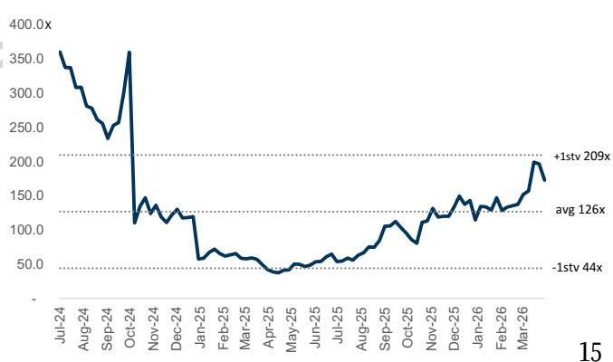  
Exhibit 28: YJ Semi’s 12M forward P/E

Exhibit 29: YJ Semi discounted P/E   

<table><tr><td>Rmb m</td><td>2022</td><td>2023</td><td>2024</td><td>2025</td><td>2026E</td><td>2027E</td><td>2028E</td><td>2029E</td><td>2030E</td><td>2031E</td></tr><tr><td>Milestones</td><td colspan="3"> Data center business expansion</td><td colspan="3"> Riding on SiPh trend</td><td colspan="3"> Rising adoption of CPO</td><td></td></tr><tr><td>Revenue</td><td>283</td><td>144</td><td>252</td><td>601</td><td>1,216</td><td>1,971</td><td>3,353</td><td>5,232</td><td>7,286</td><td>9,472</td></tr><tr><td>YoY</td><td></td><td>-49%</td><td>75%</td><td>139%</td><td>102%</td><td>62%</td><td>70%</td><td>56%</td><td>39%</td><td>30%</td></tr><tr><td>Gross profit</td><td>175</td><td>60</td><td>84</td><td>349</td><td>766</td><td>1,297</td><td>2,347</td><td>3,678</td><td>5,232</td><td>6,820</td></tr><tr><td>Gross margin</td><td>61.9%</td><td>41.9%</td><td>33.3%</td><td>58.1%</td><td>63.0%</td><td>65.8%</td><td>70.0%</td><td>70.3%</td><td>71.8%</td><td>72.0%</td></tr><tr><td>OPEX</td><td>71</td><td>66</td><td>102</td><td>154</td><td>246</td><td>350</td><td>547</td><td>733</td><td>933</td><td>1,137</td></tr><tr><td>YoY</td><td></td><td>-7%</td><td>54%</td><td>51%</td><td>59%</td><td>42%</td><td>56%</td><td>34%</td><td>27%</td><td>22%</td></tr><tr><td>Opex ratio</td><td>25.3%</td><td>45.8%</td><td>40.4%</td><td>25.6%</td><td>20.2%</td><td>17.8%</td><td>16.3%</td><td>14.0%</td><td>12.8%</td><td>12.0%</td></tr><tr><td>Operating profit</td><td>104</td><td>-6</td><td>-18</td><td>195</td><td>520</td><td>946</td><td>1,800</td><td>2,946</td><td>4,299</td><td>5,683</td></tr><tr><td>YoY</td><td></td><td>na</td><td>na</td><td>na</td><td>167%</td><td>82%</td><td>90%</td><td>64%</td><td>46%</td><td>32%</td></tr><tr><td>Operating margin</td><td>37%</td><td>-4%</td><td>-7%</td><td>32%</td><td>43%</td><td>48%</td><td>54%</td><td>56%</td><td>59%</td><td>60%</td></tr><tr><td>Non-op</td><td>6</td><td>24</td><td>3</td><td>19</td><td>20</td><td>20</td><td>20</td><td>20</td><td>20</td><td>20</td></tr><tr><td>Pre-tax profit</td><td>110</td><td>18</td><td>-15</td><td>214</td><td>540</td><td>966</td><td>1,820</td><td>2,966</td><td>4,319</td><td>5,703</td></tr><tr><td>Tax rate</td><td>9%</td><td>-7%</td><td>60%</td><td>11%</td><td>11%</td><td>12%</td><td>13%</td><td>14%</td><td>15%</td><td>15%</td></tr><tr><td>Net profit</td><td>100</td><td>19</td><td>-6</td><td>191</td><td>481</td><td>850</td><td>1,583</td><td>2,551</td><td>3,671</td><td>4,848</td></tr><tr><td>EPS (Rmb, diluted)</td><td>2.23</td><td>0.32</td><td>-0.07</td><td>2.22</td><td>5.60</td><td>9.89</td><td>18.42</td><td>29.68</td><td>42.72</td><td>56.41</td></tr><tr><td>YoY</td><td></td><td>-86%</td><td>na</td><td>na</td><td>152%</td><td>77%</td><td>86%</td><td>61%</td><td>44%</td><td>32%</td></tr><tr><td>TP implied P/E</td><td>714</td><td>na</td><td>na</td><td>716</td><td>284</td><td>161</td><td>86</td><td>54</td><td>37</td><td>28</td></tr></table>

<table><tr><td>2030Etarget P/E</td><td>50.7</td></tr><tr><td></td><td></td></tr><tr><td>Target multiple x EPS</td><td>2,166</td></tr><tr><td>Discounted back to 2027;TP (Rmb)</td><td>1,592.0</td></tr><tr><td>Implied2027P/E</td><td>161</td></tr></table>

Source: Company data, Goldman Sachs Global Investment Research   

<table><tr><td>COE assumption</td></tr><tr><td>Beta 1.2</td></tr><tr><td>Risk free 3.0%</td></tr><tr><td>Market risk premium 6.5%</td></tr><tr><td>COE 10.8%</td></tr></table>

Exhibit 30: YJ Semi peers comp table   

<table><tr><td rowspan="2">Company</td><td rowspan="2">Ticker</td><td rowspan="2">Rating</td><td rowspan="2">Marketcap US$m</td><td colspan="2">PE</td><td colspan="2">NI YoY 2026E</td><td colspan="2"></td><td colspan="2">RevYoY 2028E</td><td colspan="3">OPM 2026E 2027E</td></tr><tr><td>2026E</td><td>2027E</td><td>2028E 67</td><td>2027E 01152% 02 77% 0 86%</td><td>2028E</td><td>2026E 102%</td><td>2027E 62%</td><td>70%</td><td></td><td></td><td>2028E 48% 54%</td></tr><tr><td>YJ Semitech Peers</td><td colspan="2">688498.SS Neutral</td><td>3.330</td><td colspan="2">219n/124</td><td colspan="2"></td><td colspan="2"></td><td colspan="2"></td><td colspan="2">43%</td></tr><tr><td>Broadcom</td><td>AVGO</td><td></td><td>1,886,978</td><td></td><td></td><td>90%</td><td></td><td>27%</td><td></td><td></td><td></td><td></td><td></td><td></td></tr><tr><td>Landmark</td><td></td><td>Buy*</td><td></td><td>32</td><td></td><td></td><td>68%</td><td></td><td>68%</td><td>57%</td><td>22%</td><td>60%</td><td>63% 34%</td><td>64%</td></tr><tr><td></td><td>3081.TWO</td><td>Buy</td><td>6.438</td><td>186</td><td></td><td>180%</td><td>95%</td><td>56%</td><td>113%</td><td>72%</td><td>51%</td><td>30%</td><td></td><td>35%</td></tr><tr><td>VPEC</td><td>2455.TW</td><td>Buy</td><td>1,716</td><td>48</td><td></td><td>109%</td><td>44%</td><td>23%</td><td>38%</td><td>28%</td><td>18%</td><td>30%</td><td>33%</td><td>35%</td></tr><tr><td>Sumitomo</td><td>5802.T</td><td>Buy</td><td>48,508</td><td>24</td><td></td><td>27%</td><td>22%</td><td>NA</td><td>4%</td><td>5%</td><td>NA</td><td>9%</td><td>11%</td><td>NA</td></tr><tr><td>Furukawa</td><td>5801.T</td><td>Buy</td><td>20,006</td><td>55</td><td></td><td>22%</td><td>33%</td><td>NA</td><td>8%</td><td>12%</td><td>NA</td><td>5%</td><td>7%</td><td>NA</td></tr><tr><td>Marvell</td><td>MRVL</td><td>Neutral</td><td>114,284</td><td>43</td><td></td><td>50%</td><td>45%</td><td>37%</td><td>35%</td><td>36%</td><td>28%</td><td>30%</td><td>32%</td><td>34%</td></tr><tr><td>Mediatek</td><td>2454.TW</td><td>Buy</td><td>80,928</td><td>24</td><td></td><td>1%</td><td>66%</td><td>NA</td><td>15%</td><td>37%</td><td>NA</td><td>16%</td><td>20%</td><td>NA</td></tr><tr><td>Accelink</td><td>002281.SZ</td><td>Not Covered</td><td>10,590</td><td>85</td><td></td><td>41%</td><td>26%</td><td>NA</td><td>32%</td><td>21%</td><td>NA</td><td>11%</td><td>12%</td><td>NA</td></tr><tr><td>Everbright</td><td>688048.SS</td><td>Not Covered</td><td>6,066</td><td>624</td><td></td><td>149%</td><td>80%</td><td>NA</td><td>26%</td><td>26%</td><td>NA</td><td>8%</td><td>16%</td><td>NA</td></tr><tr><td>Shijia</td><td>688313.SS</td><td>Not Covered</td><td>6,328</td><td>94</td><td></td><td>82%</td><td>36%</td><td>NA</td><td>41%</td><td>28%</td><td>NA</td><td>31%</td><td>32%</td><td>NA</td></tr><tr><td>Lumentum</td><td>LITE</td><td>Not Covered</td><td>59,039</td><td>112</td><td></td><td>161%</td><td>75%</td><td></td><td>71%</td><td>49%</td><td>38%</td><td>32%</td><td>37%</td><td>38%</td></tr><tr><td>Coherent Average</td><td>COHR</td><td>Not Covered</td><td>50,411</td><td>48</td><td></td><td>85%</td><td>43%</td><td></td><td>19%</td><td>24%</td><td>18%</td><td>20%</td><td>23%</td><td>25%</td></tr><tr><td></td><td></td><td></td><td>190,941</td><td>115</td><td>35 64</td><td>83%</td><td>53%</td><td>36%</td><td>39%</td><td>33%</td><td>29%</td><td>24%</td><td>27%</td><td>38%</td></tr></table>

Data as of Apr 13, 2026. \* denotes stock is on the US Conviction List

takes YJ Semi’s margins into the consideration. Milder- / fiercer-than-expected market competition could affect the company’s margins, creating upside / downside risk.

Faster- / Slower-than-expected cloud capex trend: We model global major CSPs’ cloud capex trend to supportthe YJ Semi’s revenue growth. Faster- / slower-than-expected cloud capex trend would drive / hinder the end demand for optical networking devices and create upside / downside risk to our estimates.

# 订阅研报添加微信 LCD123321Cad 04-17 Investment Thesis - YJ Semitech

YJ Semi is a leading laser chip supplier in the local market that provides Distributed Feedback (DFB), Electro-absorption Modulated (EML), and Continuous-Wave (CW) laser chips across diversified end markets, such as telecommunications and data centers. We expect YJ Semi to deliver strong growth driven by: (1) the global cloud capex uptrend; (2) rising optical transceiver demand in global AI data centers, supporting the company’s laser chip shipment growth; (3) the rising Silicon Photonics (SiPh) penetration rate in global optical transceiver shipments, supporting the company’s CW laser chip revenue growth (which carries a higher ASP and GM than DFB and EML chips); (4) YJ Semi’s Integrated Device Manufacturer (IDM) business model, supporting its manufacturing efficiency and profitability; and (5) market share gains given the tight supply in the market. Nevertheless, we expect it will take time for YJ Semi to narrow the technology gap with global leading players who possess extensive R&D and manufacturing experience in CW laser chips with higher output power (e.g., 300mW and above). The stock currently trades at $1 2 4 \times 2 0 2 7 \mathsf { E } \mathsf { P } / \mathsf { E }$ , and our target price implies $1 6 1 \times 2 0 2 7 \mathsf { E } \mathsf { P } / \mathsf { E } ,$ , which is within the company’s historical average and average $+ 1$ standard deviation forward P/E range. We are positive on YJ Semi’s growth due to rising optical connection demand but are Neutral-rated on the stock given fair valuation.

# Price Target Risks and Methodology - YJ Semitech

Valuation: Our 12-month target price of Rmb1,592 is based on a $5 0 . 7 \times 2 0 3 0 \mathsf { E } \mathsf { P } / \mathsf { E } ,$ · discounted back to 2027E at a COE of $1 0 . 8 \%$ . Our target multiple is derived from the correlation between consumer electronic peers’ PEG&M (2027E P/E to 2028E NI YoY and OPM).

Key risks: Higher- / lower-than-expected SiPh penetration rate; milder- / fiercer-than-expected market competition; faster- / slower-than-expected cloud capex trend.

YOFC (6869.HK; Neutral): High-speed fiber riding on AI demand and mix upgrade; initiate at Neutral   

<table><tr><td>6869.HK</td><td> 12m Price Target: HK$255</td><td colspan="2"> Price: HK$216.4</td><td colspan="2"> Upside: 17.8%</td></tr><tr><td>Neutral</td><td>GS Forecast</td><td></td><td></td><td></td><td></td></tr><tr><td></td><td></td><td>12/25</td><td>12/26E</td><td>12/27E</td><td>12/28E</td></tr><tr><td> Market cap: HKS164.0bn / S20.9bn</td><td>Revenue (Rmb mn)</td><td>14,252.1</td><td>21,946.7</td><td>28,455.0</td><td>35,909.5</td></tr><tr><td>Enterprise value: HKS170.7bn / S21.8bn</td><td>EBITDA (Rmb mn)</td><td>2,353.1</td><td>6,130.0</td><td>10,034.6</td><td>13,632.6</td></tr><tr><td> 3m ADTV :HKS3.9bn/ S492 7mn</td><td>EPS (Rmb)</td><td>1.07</td><td>5.54</td><td>10.60</td><td>15.09</td></tr><tr><td> China</td><td>P/E (X)</td><td>23.8</td><td>34.0</td><td>17.8</td><td>12.5</td></tr><tr><td> Grester China Technolgy</td><td>P/B (X)</td><td>1.4</td><td>8.4</td><td>6.3</td><td>4.7</td></tr><tr><td></td><td>Dividend yield (%)</td><td>13</td><td>0.9</td><td>1.7</td><td>2.4</td></tr><tr><td>M&amp;A Rark: 3</td><td>Net debtEBITDA(X)</td><td>1.1</td><td>0.3</td><td></td><td>(0.5)</td></tr><tr><td></td><td>CROCI (%)</td><td>15.2</td><td>17.5</td><td>(0.1)</td><td></td></tr><tr><td></td><td>FCF yield (%)</td><td>9.6</td><td>0.9</td><td>28.3 3.6</td><td>35.3 5.5</td></tr><tr><td></td><td></td><td></td><td></td><td></td><td></td></tr><tr><td></td><td>EPS (Rmb)</td><td>12/25 0.45</td><td>3/26E 0.82</td><td>6/26E 1.36</td><td>9/26E 1.82</td></tr></table>

Source: Company data, Gdldman Sachs Research estimales, FaciSel Price as of 14 Apr 2026 close.

We expect YOFC net income to grow at a $65 \%$ CAGR over 2026-28E, driven by: (1) rising AI data center demand from CSP clients for high-speed transmission: We see global-tier and China CSPs continuing to invest in AI infrastructure, driving the demand for high-end fiber products, and YOFC is well positioned to capture this growth with its technology and capacity readiness; (2) improving utilization rates with disciplined capacity expansion: Despite muted telecom demand, fiber suppliers have reallocated capacity to segments with strong demand while maintaining disciplined capex spending, 订阅研报添加微信 LCD123321Cad 04-17 and we are seeing spot prices of fiber optics increase due to tight supply; and (3) a product mix upgrade towards high-end products, including hollow-core fiber (HCF): In the long term, we expect a gradual mix upgrade towards HCF and high-end products to satisfy client demand for lower latency and higher bandwidth. With strong demand and a product mix upgrade, we expect the company’s revenue growth at a $2 8 \%$ CAGR over 2026-28E and GM to improve ahead, and we view the company as a fiber cable beneficiary of CPO with incremental growth.

Key debates center on the fiber optics pricing sustainability and the product cycle. We expect AI demand to continuously drive the expansion cycle for large-scale computing infrastructure and high-speed interconnection. Besides, we see industry suppliers closely watching industry dynamics to plan the capacity expansion and prevent oversupply. YOFC has comprehensive product coverage, from fiber preforms, fiber optics, and fiber cables to optical transceivers, with scale and cost advantages, and we expect the company to benefit from the upcycle and product mix upgrade.

订阅研报添加微信 LCD123321Cad 04-17 Valuation: The stock currently trades at 18x 2027E P/E, and our 12-month target price of $H K \$ 255$ implies 21x 2027E P/E (vs. $67 \%$ NI YoY in 2027-28E), which is in line with the company’s trading $\mathsf { P } / \mathsf { E }$ range’s high end at $2 0 \times$ . We are positive on YOFC’s growth outlook on rising optics connection demand but initiate with a Neutral rating given fair valuation. We would turn more positive on YOFC if we see stronger-than-expected demand from data center clients, or accelerated product expansion.

Upside / Downside risks: (1) Higher- / lower-than-expected fiber optics prices; (2) stronger- / weaker-than-expected data center clients’ spending on AI capex; (3) fiercer/ easing pricing competition; and (4) faster- / slower-than-expected HCF

# (1) Top six charts

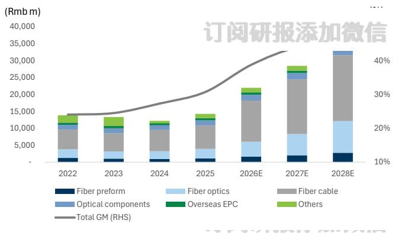  
Exhibit 31: We expect revenue growth of $28 \%$ CAGR in 2026-28E with GM improvement   
Source: Company data, Goldman Sachs Global Investment Research

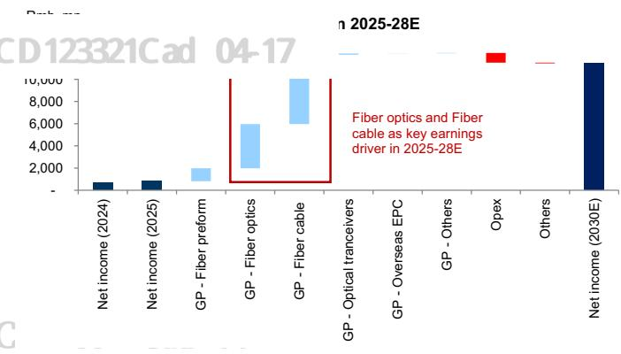  
Exhibit 32: Data center fiber optics and fiber cable as key earnings drivers   
Source: Company data, Goldman Sachs Global Investment Research

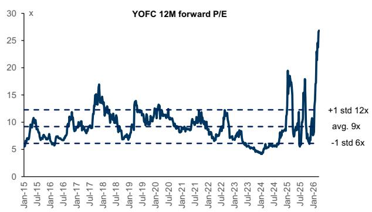  
Exhibit 33: YOFC’s 12M forward P/E

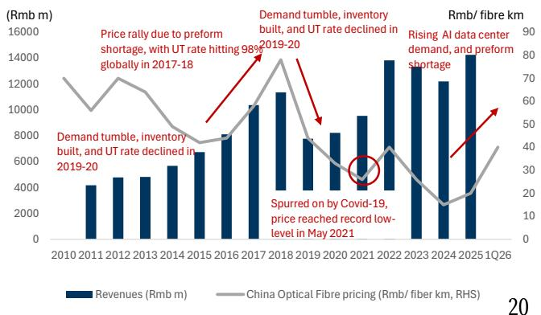  
Exhibit 34: YOFC’s revenues and industry fiber pricing

# (2) Earnings estimates

Revenues: We forecast a $+ 2 8 \%$ CAGR over 2026-28E, driven by: (1) strong demand from AI data centers, driving the usage of high-end products, (2) the company’s flexible capacity to migrate to the high-growth segments and comprehensive offering to capture the upcycle and incremental AI demand, (3) a gradual product mix upgrade towards 订阅研报添加微信 LCD123321Cad 04-17 high-speed solutions and HCF with low latency and high bandwidth, and (4) increased penetration of data center clients.

GM: We see GM rising from $3 0 . 7 \%$ in 2025 (and $3 6 \%$ in 4Q25) to $3 9 \% /$ $45 \%$ in 2026E / 28E, riding on price increases for fiber optics and a product mix upgrade towards high-speed solutions carrying higher ASPs. Opex ratio: We expect it to improve from $1 9 \%$ in 2025 to $10 \%$ in 2028E on growing revenue scale and higher operational efficiency, with R&D spending continuing to grow. NI: We forecast a $+ 6 5 \%$ CAGR over 2026-28E, driven by improving profitability and larger scale.

Exhibit 37: YOFC’s P&L summary   

<table><tr><td>Rmb m</td><td>2022</td><td>2023</td><td>2024</td><td>2025</td><td>2026E</td><td>2027E</td><td>2028E</td><td>1Q25</td><td>2Q25</td><td>3Q25</td><td>4Q25</td><td>1Q26E</td><td>2Q26E</td><td>3Q26E</td><td>4Q26E</td></tr><tr><td>Income statement Revenue</td><td>13,830</td><td>13.353</td><td>12,197</td><td>14,252</td><td>21,947</td><td>28,455</td><td>35,910</td><td>2,894</td><td>3,491</td><td>3,891</td><td>3,977</td><td>4,033</td><td>5,379</td><td>6,306</td><td>6,229</td></tr><tr><td></td><td>3,243</td><td>3,272</td><td>3,330</td><td>4,380</td><td>8,504</td><td>12,493</td><td></td><td>806</td><td>1,001</td><td>1,155</td><td>1,418</td><td>1,588</td><td>2.073</td><td></td><td>2.350</td></tr><tr><td>Gross profit</td><td>414</td><td>502</td><td>489</td><td>586</td><td>693</td><td>699</td><td>16,224</td><td>115</td><td>126</td><td></td><td>184</td><td></td><td></td><td>2.493</td><td>180</td></tr><tr><td>Selling expense</td><td>779</td><td>1,048</td><td>1,042</td><td>1,164</td><td>1,369</td><td>1,410</td><td>721</td><td>267</td><td>273</td><td>162 282</td><td>342</td><td>171 324</td><td>171</td><td>171</td><td>379</td></tr><tr><td>G&amp;Aexpense</td><td>784</td><td>775</td><td>787</td><td>894</td><td></td><td></td><td>1,454</td><td></td><td></td><td></td><td></td><td></td><td>331</td><td>335</td><td>346</td></tr><tr><td>R&amp;D expense</td><td>1,181</td><td>852</td><td>929</td><td></td><td>1,153</td><td>1,167</td><td>1,202</td><td>176</td><td>210</td><td>221</td><td>287</td><td>231</td><td>265</td><td>311</td><td></td></tr><tr><td>OP income</td><td>1,152</td><td>1,216</td><td></td><td>1,620</td><td>5,136</td><td>9.017</td><td>12,595</td><td>225</td><td>364</td><td>464</td><td>567</td><td>835</td><td>1,267</td><td>1,631</td><td>1,402</td></tr><tr><td>Pretax income</td><td>1,167</td><td></td><td>593</td><td>1,145</td><td>4,376</td><td>8,417</td><td>11,995</td><td>184</td><td>202</td><td>289</td><td>470</td><td>645</td><td>1.077</td><td>1,441</td><td>1,212</td></tr><tr><td>Net income</td><td>1,772</td><td>1,297</td><td>676</td><td>814</td><td>4,197</td><td>8,037</td><td>11,435</td><td>152</td><td>144</td><td>174</td><td>344</td><td>622</td><td>1,033</td><td>1,379</td><td>1,162</td></tr><tr><td>EBITDA EPS (Rmb)</td><td>1.54</td><td>1,589</td><td>1,660</td><td>2.353</td><td>6,130</td><td>10,035</td><td>13,633</td><td>408</td><td>548</td><td>648</td><td>750</td><td>1,083</td><td>1,516</td><td>1,880</td><td>1,651</td></tr><tr><td>Cash div</td><td>350</td><td>1.71 387</td><td>0.89</td><td>1.07</td><td>5.54</td><td>10.60</td><td>15.09</td><td>0.20</td><td>0.19</td><td>0.23</td><td>0.45</td><td>0.82</td><td>1.36</td><td>1.82</td><td>1.53</td></tr><tr><td>Ratios</td><td></td><td></td><td>203</td><td>244</td><td>1,260</td><td>2,412</td><td>3,432</td><td></td><td></td><td></td><td></td><td></td><td></td><td></td><td></td></tr><tr><td>R&amp;D to rev</td><td>5.7%</td><td>5.8%</td><td></td><td></td><td></td><td></td><td></td><td></td><td></td><td></td><td></td><td></td><td></td><td></td><td></td></tr><tr><td>Opex ratio</td><td>14.9%</td><td>18.1%</td><td>6.5%</td><td>6.3% 19.4%</td><td>5.3%</td><td>4.1%</td><td>3.3%</td><td>6.1%</td><td>6.0%</td><td>5.7%</td><td>7.2%</td><td>5.7%</td><td>4.9%</td><td>4.9%</td><td>5.6%</td></tr><tr><td>Tax rate</td><td>-0.8%</td><td>3.2%</td><td>19.7% 2.0%</td><td>23.0%</td><td>15.3% 5.0%</td><td>12.2%</td><td>10.1%</td><td>20.1%</td><td>18.2%</td><td>17.8%</td><td>21.4%</td><td>18.7%</td><td>15.0%</td><td>13.7%</td><td>15.2%</td></tr><tr><td>Payout ratio</td><td>30.0%</td><td>29.8%</td><td>30.1%</td><td>30.0%</td><td>30.0%</td><td>5.0% 30.0%</td><td>5.0% 30.0%</td><td>3.6%</td><td>16.4%</td><td>32.8%</td><td>27.4%</td><td>5.0%</td><td>5.0%</td><td>5.0%</td><td>5.0%</td></tr><tr><td>Margins</td><td></td><td></td><td></td><td></td><td></td><td></td><td></td><td></td><td></td><td></td><td></td><td></td><td></td><td></td><td></td></tr><tr><td>Gross margin</td><td>23.5%</td><td>24.5%</td><td>27.3%</td><td>30.7%</td><td>38.7%</td><td>43.9%</td><td>45.2%</td><td>27.8%</td><td>28.7%</td><td>29.7%</td><td>35.7%</td><td></td><td>38.5%</td><td>39.5%</td><td>37.7%</td></tr><tr><td>Operating margin</td><td>8.5%</td><td>6.4%</td><td>7.6%</td><td>11.4%</td><td>23.4%</td><td>31.7%</td><td>35.1%</td><td></td><td></td><td></td><td></td><td>39.4% 20.7%</td><td>23.6%</td><td>25.9%</td><td>22.5%</td></tr><tr><td>Pretax margin</td><td>8.3%</td><td>9.1%</td><td>4.9%</td><td>8.0%</td><td>19.9%</td><td>29.6%</td><td>33.4%</td><td>7.8% 6.4%</td><td>10.4% 5.8%</td><td>11.9% 7.4%</td><td>14.3% 11.8%</td><td>16.0%</td><td>20.0%</td><td>22.9%</td><td>19.5%</td></tr><tr><td>Net margin</td><td>8.4%</td><td>9.7%</td><td>5.5%</td><td>5.7%</td><td>19.1%</td><td>28.2%</td><td>31.8%</td><td>5.2%</td><td>4.1%</td><td>4.5%</td><td>8.7%</td><td>15.4%</td><td>19.2%</td><td>21.9%</td><td>18.6%</td></tr><tr><td>EBITDA margin</td><td>12.8%</td><td>11.9%</td><td>13.6%</td><td>16.5%</td><td>27.9%</td><td>35.3%</td><td>38.0%</td><td>14.1%</td><td>15.7%</td><td>16.6%</td><td>18.9%</td><td>26.9%</td><td>28.2%</td><td>29.8%</td><td>26.5%</td></tr><tr><td>YoY</td><td></td><td></td><td></td><td></td><td></td><td></td><td></td><td></td><td></td><td></td><td></td><td></td><td></td><td></td><td></td></tr><tr><td>Revenue</td><td>45%</td><td>-3%</td><td>-9%</td><td>17%</td><td>54%</td><td>30%</td><td>26%</td><td>21%</td><td>18%</td><td>16%</td><td>14%</td><td>39%</td><td>54%</td><td>62%</td><td>57%</td></tr><tr><td>Gross profit</td><td>73%</td><td>1%</td><td>2%</td><td>32%</td><td>94%</td><td>47%</td><td>30%</td><td>26%</td><td>17%</td><td>25%</td><td>56%</td><td>97%</td><td>107%</td><td>116%</td><td>66%</td></tr><tr><td>OP income</td><td>149%</td><td>-28%</td><td>9%</td><td>75%</td><td>217%</td><td>76%</td><td>40%</td><td>102%</td><td>33%</td><td>51%</td><td>141% 1240%</td><td>271% 251%</td><td>248% 432%</td><td>251% 398%</td><td>147% 1</td></tr><tr><td>Pretax income Net income</td><td>54% 65%</td><td>6% 11%</td><td>-51% -48%</td><td>93% 20%</td><td>282% 416%</td><td>92% 91%</td><td>43% 42%</td><td>308% 162%</td><td>-33% -55%</td><td>37% -11%</td></table>

Exhibit 38: GS estimates vs. consensus   

<table><tr><td></td><td colspan="3">2026E</td><td colspan="3">2027E</td></tr><tr><td>Rmb mn</td><td>GS</td><td>Cons.</td><td>Diff(%)</td><td>GS</td><td>Cons.</td><td>Diff(%)</td></tr><tr><td>Revenue</td><td>21,947</td><td>19,277</td><td>14%</td><td>28,455</td><td>24,263</td><td>17%</td></tr><tr><td>Gross profit</td><td>8,504</td><td>7,788</td><td>9%</td><td>12,493</td><td>10,385</td><td>20%</td></tr><tr><td>Op. income</td><td>5,136</td><td>4,352</td><td>18%</td><td>9,017</td><td>6,472</td><td>39%</td></tr><tr><td>Netincome</td><td>4,197</td><td>3,527</td><td>19%</td><td>8,037</td><td>5,927</td><td>36%</td></tr><tr><td>Margins</td><td></td><td></td><td></td><td></td><td></td><td></td></tr><tr><td>GM</td><td>38.7%</td><td>40.4%</td><td></td><td>43.9%</td><td>42.8%</td><td></td></tr><tr><td>OPM</td><td>23.4%</td><td>22.6%</td><td></td><td>31.7%</td><td>26.7%</td><td></td></tr><tr><td>NM</td><td>19.1%</td><td>18.3%</td><td></td><td>28.2%</td><td>24.4%</td><td></td></tr></table>

订阅研报添加微信

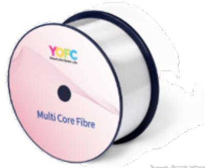  
Exhibit 40: YOFC’s multi-core fibre (customizable)

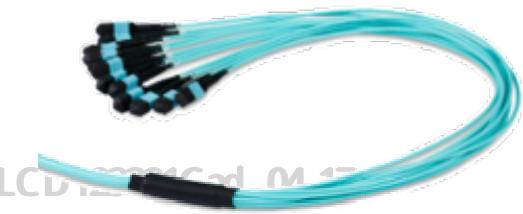  
Exhibit 39: YOFC’s data center MPO (Multi-Fiber Push-On)/MTP (Multi-Fiber Termination Push-on) pre-terminated trunk cable

Source: Company data

Exhibit 41: YOFC’s Balance sheet   

<table><tr><td></td><td></td><td></td><td></td><td></td><td></td><td></td><td></td></tr><tr><td>Rmb m</td><td>2022</td><td>2023</td><td>2024</td><td>2025</td><td>2026E</td><td>2027E</td><td>2028E</td></tr><tr><td>Balance Sheet</td><td></td><td></td><td></td><td></td><td></td><td></td><td></td></tr><tr><td>Cash and equivalents</td><td>4,324</td><td>3,896</td><td>3,293</td><td>5,764</td><td>6,601</td><td>9,930</td><td>15,064</td></tr><tr><td>Accounts receivable</td><td>5,734</td><td>5,923</td><td>5,960</td><td>6,498</td><td>9,019</td><td>11,304</td><td>14,265</td></tr><tr><td>Inventory</td><td>3,159</td><td>2,941</td><td>3,176</td><td>3,153</td><td>3,683</td><td>4,373</td><td>5,393</td></tr><tr><td>Other current assets</td><td>2,198</td><td>1,796</td><td>2,189</td><td>2,782</td><td>2,782</td><td>2,782</td><td>2,782</td></tr><tr><td>Current assets</td><td>15,415</td><td>14,556</td><td>14,617</td><td>18,197</td><td>22,085</td><td>28,389</td><td>37,505</td></tr><tr><td>Net PP&amp;E/Fixed assets</td><td>5,749</td><td>6,732</td><td>8,458</td><td>9,801</td><td>10,095</td><td>10,362</td><td>10,604</td></tr><tr><td>Net intangibles</td><td>1,732</td><td>1,611</td><td>1,707</td><td>1,767</td><td>1,678</td><td>1,594</td><td>1,515</td></tr><tr><td>Other long-term assets</td><td>5,307</td><td>6,244</td><td>6,944</td><td>6,598</td><td>6,598</td><td>6,598</td><td>6,598</td></tr><tr><td>Non-current assets Total assets</td><td>12,788</td><td>14,586</td><td>17,110</td><td>18,166</td><td>18,371</td><td>18,554</td><td>18,717</td></tr><tr><td></td><td>28,203</td><td>29,142</td><td>31,727</td><td>36,363</td><td>40,456</td><td>46,943</td><td>56,221</td></tr><tr><td>Accounts payable</td><td>3,463</td><td>3,156</td><td>3,134</td><td>3,769</td><td>4,604</td><td>5,466</td><td>6,742</td></tr><tr><td>Short-term debt</td><td>2,488</td><td>3,012</td><td>4,551</td><td>4,233</td><td>4,233</td><td>4,233</td><td>4,233</td></tr><tr><td>Other current liabilities</td><td>2,125</td><td>2,914</td><td>2,660</td><td>2,626</td><td>2,626</td><td>2,626</td><td>2,626</td></tr><tr><td>Current liabilities</td><td>8,075</td><td>9,082</td><td>10,345</td><td>10,629</td><td>11,463</td><td>12,326</td><td>13,601</td></tr><tr><td>Long-term debt</td><td>3,951</td><td>4,855</td><td>4,791</td><td>4,219</td><td>4,219</td><td>4,219</td><td>4,219</td></tr><tr><td>Other long-term liabilities</td><td>1,640</td><td>808</td><td>1,010</td><td>3,742</td><td>3,742</td><td>3,742</td><td>3,742</td></tr><tr><td>Non-current liabilities</td><td>5,591</td><td>5,663</td><td>5,800</td><td>7,961</td><td>7,961</td><td>7,961</td><td>7,961</td></tr><tr><td>Total liabilities</td><td>13,666</td><td>14,745</td><td>16,145</td><td>18,590</td><td>19,424</td><td>20,287</td><td>21,562</td></tr><tr><td>Common stock</td><td>758</td><td>758</td><td>758</td><td>828</td><td>758</td><td>758</td><td>758</td></tr><tr><td>Retained earnings</td><td>6,464</td><td>7,411</td><td>7,697</td><td>8,308</td><td>11,245</td><td>16,870</td><td>24,873</td></tr><tr><td>Other common equity</td><td>2,923</td><td>3,138</td><td>3,174</td><td>4,670</td><td>5,061</td><td>5,061</td><td>5,061</td></tr><tr><td>Total common equity</td><td>10,144</td><td>11,307</td><td>11,629</td><td>13,806</td><td>17,064</td><td>22,689</td><td>30,692</td></tr><tr><td>Minority interest</td><td>4,393</td><td>3,090</td><td>3,952</td><td>3,967</td><td>3,967</td><td>3,967</td><td>3,967</td></tr><tr><td>Total equity</td><td>14,537</td><td>14,397</td><td>15,581</td><td>17,773</td><td>21,032</td><td>26,656</td><td>34,659</td></tr><tr><td>BVPS</td><td>13.38</td><td>14.92</td><td>15.34</td><td>18.22</td><td>22.52</td><td>29.94</td><td>40.50</td></tr><tr><td>Cash conversion cycle</td><td></td><td></td><td></td><td></td><td></td><td></td><td></td></tr><tr><td>Account receivable days</td><td>136</td><td>159</td><td>178</td><td>160</td><td>150</td><td>145</td><td>145</td></tr><tr><td>Inventory days</td><td>102</td><td>110</td><td>126</td><td>117</td><td>100</td><td>100</td><td>100</td></tr><tr><td>Net payable days</td><td>106</td><td>120</td><td>129</td><td>128</td><td>125</td><td>125</td><td>125</td></tr><tr><td>Cash conversion cycle</td><td>132</td><td>150</td><td>174</td><td>149</td><td>125</td><td>120</td><td></td></tr><tr><td>Ratios</td><td></td><td></td><td></td><td></td><td></td><td></td><td>120</td></tr><tr><td>ROE (common equity)</td><td>12%</td><td>12%</td><td>6%</td><td>6%</td><td>27%</td><td>40%</td><td>43%</td></tr><tr><td>ROA</td><td>5%</td><td>5%</td><td>2%</td><td>2%</td><td>11%</td><td>18%</td><td>22%</td></tr><tr><td>Net debt to total equity</td><td>15%</td><td>28%</td><td>39%</td><td>15%</td><td>9%</td><td>-6%</td><td>-19%</td></tr><tr><td>Net cash per share (Rmb)</td><td>(2.79)</td><td>(5.24)</td><td>(7.98)</td><td>(3.55)</td><td>(2.44)</td><td>1.95</td><td>8.72</td></tr><tr><td>Total liabilities to total assets</td><td>48%</td><td>51%</td><td>51%</td><td>51%</td><td>48%</td><td>43%</td><td>38%</td></tr><tr><td>Dupontanalysis</td><td></td><td></td><td></td><td></td><td></td><td></td><td></td></tr><tr><td>Asset turnover</td><td>0.6</td><td>0.5</td><td>0.4</td><td>0.4</td><td>0.6</td><td>0.7</td><td>0.7</td></tr><tr><td>Leverage (assets to equity)</td><td>2.4</td><td>2.7</td><td>2.7</td><td>2.7</td><td>2.5</td><td>2.2</td><td>1.9</td></tr><tr><td>Net margin</td><td>8%</td><td>10%</td><td>6%</td><td>6%</td><td>19%</td><td>28%</td><td>32%</td></tr><tr><td>ROE</td><td>12%</td><td>12%</td><td>6%</td><td>6%</td><td>27%</td><td>40%</td><td>43%</td></tr><tr><td>ROA</td><td>5%</td><td>5%</td><td>2%</td><td>2%</td><td>11%</td><td>18%</td><td>223%</td></tr></table>

We derive our 12-month target price of $H K \$ 255$ based on a 2030E discounted P/E methodology to capture the company’s long-term growth, in line with our Greater China Tech coverage. We use a target P/E multiple at $\boldsymbol { \mathsf { 1 7 } } \boldsymbol { \mathsf { x } }$ on 2029E EPS, and discount back to 2026E using a COE at $1 1 \%$ (beta at 1.2, risk-free rate at $3 . 5 \%$ , and market risk premium at $6 . 5 \%$ . Our target P/E multiple is derived from the correlation between peers’ P/E and forward-year NI yoy growth. With a potential $1 8 \%$ upside to our target price, we initiate coverage on YOFC at Neutral.

Exhibit 43: YOFC’s 2029E discounted P/E   

<table><tr><td>Rmb mn</td><td>2022</td><td>2023</td><td>2024</td><td>2025E</td><td>2026E</td><td>2027E</td><td>2028E</td><td>2029E</td><td>2030E</td><td>2031E</td><td>2032E</td></tr><tr><td>Revenue</td><td>13,830</td><td>13,353</td><td>12,197</td><td>14,252</td><td>21,947</td><td>28,455</td><td>35,910</td><td>43,810</td><td>48,629</td><td>53,978</td><td>59,915</td></tr><tr><td>Fibre preform</td><td>1,242</td><td>1,041</td><td>949</td><td>1,095</td><td>1,644</td><td>2.037</td><td>2,760</td><td>3,450</td><td>3,899</td><td>4,406</td><td>4,978</td></tr><tr><td>Fibre optics</td><td>2.572</td><td>2.132</td><td>2,281</td><td>2,839</td><td>4,377</td><td>6,284</td><td>9,392</td><td>11,740</td><td>13,266</td><td>14,924</td><td>16,715</td></tr><tr><td>Fibre cable</td><td>5,799</td><td>5,358</td><td>6,272</td><td>6,891</td><td>12,189</td><td>16,126</td><td>19,456</td><td>24,320</td><td>27,481</td><td>31,054</td><td>34,159</td></tr><tr><td>Optical transceivers</td><td>1,435</td><td>1,470</td><td>1,400</td><td>1,540</td><td>1,694</td><td>1,863</td><td>2,050</td><td>2.357</td><td>2,569</td><td>2,801</td><td>3,053</td></tr><tr><td>Overseas EPC and others</td><td>2,781</td><td>3,352</td><td>1,295</td><td>1,887</td><td>2.042</td><td>2,145</td><td>2,252</td><td>1,942</td><td>1,413</td><td>793</td><td>1,010</td></tr><tr><td>Rev YoY%</td><td></td><td>-3%</td><td>-9%</td><td>17%</td><td>54%</td><td>30%</td><td>26%</td><td>22%</td><td>11%</td><td>11%</td><td>11%</td></tr><tr><td>Gross margin</td><td>23.5%</td><td>24.5%</td><td>27.3%</td><td>30.7%</td><td>38.7%</td><td>43.9%</td><td>45.2%</td><td>45.1%</td><td>45.0%</td><td>44.8%</td><td>44.6%</td></tr><tr><td>Gross profit</td><td>3,243</td><td>3,272</td><td>3,330</td><td>4,380</td><td>8,504</td><td>12,493</td><td>16,224</td><td>19,750</td><td>21,874</td><td>24,172</td><td>26,711</td></tr><tr><td>Opex</td><td>2,063</td><td>2,420</td><td>2,402</td><td>2,760</td><td>3,368</td><td>3,476</td><td>3,629</td><td>4,296</td><td>4,526</td><td>4,754</td><td>5,037</td></tr><tr><td>Opex ratio</td><td>15%</td><td>18%</td><td>20%</td><td>19%</td><td>15%</td><td>12%</td><td>10%</td><td>10%</td><td>9%</td><td>9%</td><td>8%</td></tr><tr><td>OP income</td><td>1,181</td><td>852</td><td>929</td><td>1,620</td><td>5,136</td><td>9,017</td><td>12,595</td><td>15,454</td><td>17,348</td><td>19,418</td><td>21,674</td></tr><tr><td>OPM</td><td>9%</td><td>6%</td><td>8%</td><td>11%</td><td>23%</td><td>32%</td><td>35%</td><td>35%</td><td>36%</td><td>36%</td><td>36%</td></tr><tr><td>Non-op gains</td><td>(29)</td><td>364</td><td>(336)</td><td>(475)</td><td>（760)</td><td>(600)</td><td>(600)</td><td>(200)</td><td>-</td><td>-</td><td>(200)</td></tr><tr><td>Pre-tax profit</td><td>1,152</td><td>1,216</td><td>593</td><td>1,145</td><td>4,376</td><td>8,417</td><td>11,995</td><td>15,254</td><td>17,348</td><td>19,418</td><td>21,474</td></tr><tr><td>Net profit</td><td>1,167</td><td>1,297</td><td>676</td><td>814</td><td>4,197</td><td>8,037</td><td>11,435</td><td>13,615</td><td>15,485</td><td>17,333</td><td>19,168</td></tr><tr><td>YoY</td><td></td><td>11%</td><td>-48%</td><td>20%</td><td>416%</td><td>91%</td><td>42%</td><td>19%</td><td>14%</td><td>12%</td><td>11%</td></tr><tr><td>EPS</td><td>1.54</td><td>1.71</td><td>0.89</td><td>1.07</td><td>5.54</td><td>10.60</td><td>15.09</td><td>17.96</td><td>20.43</td><td>22.87</td><td>25.29</td></tr></table>

TP implied P/E   

<table><tr><td>COE assumption</td><td></td></tr><tr><td>Beta</td><td>1.20</td></tr><tr><td>Risk free</td><td>3.5%</td></tr><tr><td>Market risk premium</td><td>6.5%</td></tr><tr><td>COE</td><td>11%</td></tr></table>

# Upside / downside risks

(1) Higher- / lower-than-expected fiber optics prices: We expect fiber optics prices to sustain on rising demand, if the price is higher/ lower than what we expect, it could lead to upside/ downside risks to our estimates.

(2) Stronger- / weaker-than-expected data center clients’ spending on AI capex: We are positive on rising AI spending and higher demand on interconnection, but if AI capex is stronger/ weaker than what we expected, there could be upside/ downside risks to our earnings.

(3) Fiercer / easing pricing competition: If we see more intense or easing pricing competition, there could be upside/ downside risks to our estimates.

(4) Faster- / slower-than-expected HCF commercialization: We expect to see gradual revenue contribution from HCF and high-end fiber products ahead, if the commercialization progress is faster or slower than what we expect, there could be upside/ downside risks to our earnings estimates.

YOFC specializes in R&D, manufacturing, and sales of optical fibre preforms, optical fibres, and optical cables. We expect YOFC to deliver strong earnings growth ahead, driven by (1) rising AI data center demand from CSP clients for high-speed transmission, (2) the company’s improving utilization rates with disciplined capacity expansion, and (3) product mix upgrade towards high-end products, including hollow-core fiber (HCF). With strong demand and a product mix upgrade, we expect the company’s revenue to grow at a $2 8 \%$ CAGR over 2026-28E and GM to improve ahead, and we view the company as a fibre cable beneficiary of CPO with incremental growth. The stock currently trades at 18x 2027E P/E, and our 12-month target price of $H K \$ 255$ implies 21x 2027E P/E, which is in line with the high end of the company’s trading $\mathsf { P } / \mathsf { E }$ range at $2 0 \times$ . We are Neutral-rated on YOFC.

# Price Target Risks and Methodology - YOFC

Valuation: Our 12-month target price of $H K \$ 255$ is based on a $1 7 \times 2 0 3 0 \mathsf { E } \mathsf { P } / \mathsf { E } .$ , discounted back to 2026E at a COE of $1 1 \%$ . Our target multiple is derived from the correlation between peers’ $\mathsf { P } / \mathsf { E }$ and forward-year NI yoy growth.

Key risks: (1) Higher- / lower-than-expected fiber optics prices; (2) stronger- / weaker-than-expected data center clients’ spending on AI capex; (3) fiercer/ easing pricing competition; and (4) faster- / slower-than-expected HCF commercialization.