# Riding on the multi-year capex and Al/HPC demand upcycle; raise TPs for All Ring/GPTC to NT\$1,800/NT\$4,500; reiterate Buy

21 April 2026 | 7:36AM CST

We now see further earnings upside for our two covered advanced packaging equipment makers - All Ring (6187.TWO) and GPTC (3131.TWO) - thanks to 1) our 订阅研报添加微信 LCD123321Cad 04-expectation of a more aggressive advanced packaging capacity expansion from TSMC, and 2) the incoming ramp of new technologies, i.e. System-on-Integrated Chips (SoIC), Co-Packaged Optics (CPO), and Panel-level Packaging (PLP).

Riding on TSMC’s capex upcycle into 2028 and beyond We now see greater upside for All Ring and GPTC from TSMC’s multi-year capex upcycle into 2028 and beyond, thanks to its more aggressive capacity expansion planning driven by the strengthening AI/HPC demand. To note, during TSMC’s 1Q26 analyst meeting, management mentioned that it is speeding up its N3 capacity expansion given the stronger-than-expected AI/HPC demand, which we believe should also translate to further back-end advanced packaging expansion. Accordingly, we now model TSMC’s annual CoWoS capacity to grow by $8 9 \% / 9 5 \% / 2 7 \% \ \forall 0$ 订阅研报添加微信 LCD123321Cad 04-Y to 1,275k/2,490k/3,150k wafers in 2026-2028E.

# More than just CoWoS - multi-faceted growth stories await

In addition to the continuous CoWoS capacity expansion, we also expect All Ring and GPTC to benefit from the diversified ramp of newly emerging advanced packaging technologies. For All Ring, we see further upside to its CPO content value, as we expect the company to expand its presence beyond coupling into inspection, supported by the addition of new Automated Optical Inspection (AOI) equipment to the CPO supply chain. We expect its CPO exposure to contribute $3 \% / 2 9 \% / 6 9 \%$ of its total revenue in 2026-2028E. For GPTC, we expect it to benefit from higher equipment ASPs in SoIC and PLP, which are approximately 2x/3x higher vs. CoWoS, driven by greater technology complexity. We view GPTC as a key beneficiary of SoIC, and project SoIC to account for $50 \% +$ of GPTC’s equipment revenue in 订阅研报添加微信 LCD123321Cad 2026-2028E, with CPO and future generations of AI chips to drive broader SoIC 04- adoption.

Overall, we revise up All Ring/GPTC’s 2026-2028E earnings by 37-58%/15-36% and raise our 12m TP for All Ring to NT $\$ 1,800$ (from NT\$800) and GPTC to NT\$4,500 (from NT $\$ 3$ ,500). With $4 7 \% / 4 0 \%$ implied upside, we reiterate our Buy ratings on All Ring and GPTC.

All Ring (6187.TWO): Raising earnings and TP on CoWoS capacity expansion and growing CPO opportunity

Exhibit 1:   

<table><tr><td>6187.TWO</td><td>12m Price Target: NT$1800</td><td>Price: NT$1225</td><td></td><td> Upside: 46.9%</td></tr><tr><td>Buy</td><td>GS Forecast</td><td></td><td></td><td></td></tr><tr><td></td><td></td><td>12/25</td><td>12/26E</td><td>12/27E 12/28E</td></tr><tr><td>Market cap: NT$117.6bn / $3.7bn</td><td>Revenue (NT$ mn) New</td><td>5,366.2</td><td>9,607.1</td><td>16,229.9 19,539.3</td></tr><tr><td>Enterprise value: NT$114.1bn / $3.6bn</td><td>Revenue (NT$ mn) Old</td><td>5,366.2</td><td>6,522.8 11,351.9</td><td>15,496.7</td></tr><tr><td> 3m ADTV :NT$2.6bn/ $81.1mn</td><td>EBITDA (NT$ mn)</td><td>1,679.3</td><td>3,399.4</td><td>6,055.0 7,965.1</td></tr><tr><td>Taiwan</td><td>EPS (NT$) New</td><td>15.47</td><td>29.22</td><td>51.42 66.65</td></tr><tr><td>Taiwan Semiconductor</td><td>EPS (NT$) Old</td><td>15.47</td><td>18.55</td><td>32.92 48.74</td></tr><tr><td></td><td>P/E (X)</td><td>22.7</td><td>41.9</td><td>23.8 18.4</td></tr><tr><td>M&amp;A Rank: 3</td><td>P/B (X)</td><td>4.5</td><td>12.9</td><td>9.9 8.1</td></tr><tr><td> Leases incl. in net debt &amp; EV?: Yes</td><td>Dividend yield (%)</td><td>3.3</td><td>1.8</td><td>3.1 4.1</td></tr><tr><td></td><td>CROCI (%)</td><td>44.2</td><td>57.3 76.4</td><td>87.8</td></tr><tr><td></td><td></td><td>12/25</td><td>3/26E 6/26E</td><td></td></tr><tr><td></td><td></td><td></td><td></td><td>9/26E</td></tr><tr><td></td><td>EPS (NT$)</td><td>3.36</td><td>4.49 5.43</td><td>7.82</td></tr></table>

Source: Company data, Goldman Sachs Research estimates, FactSet. Price as of 20 Apr 2026 close.

# 订阅研报添加微信 LCD123321Cad 04-21

# Advanced packaging uptrend remains intact

As both foundries and OSATs continue to expand CoWoS-like technologies, we expect CoWoS to remain All Ring’s primary near-term growth driver with the incrementally stronger capacity expansion that we now expect from TSMC. We now model annual CoWoS capacity to grow by $8 9 \% / 9 5 \% / 2 7 \% \ \forall 0 \forall$ to $1 , 2 7 5 \mathrm { k } / 2 , 4 9 0 \mathrm { k } / 3 , 1 5 0 \mathrm { k }$ wafers in 2026-2028E (see also our TSMC note). Beyond CoWoS, we expect All Ring to begin shipping PLP-related equipment for customers’ pilot lines in 2026, and we believe the company should benefit from an ASP premium in PLP, given the higher technology complexity relative to CoWoS-related equipment. We now model All Ring’s CoWoS related revenue to grow $8 6 \% / 2 3 \%$ YoY in 2026/2027E (vs. $2 4 \% / 2 3 \%$ YoY previously).

Furthermore, unlike in CoWoS, where All Ring’s scope has been largely limited to wafer-on-substrate (WoS) processes, we see potential for the company to expand into the chip-on-panel stage, thereby broadening its addressable process steps and increasing its dollar content in the next generation of advanced packaging capacity 订阅研报添加微信 LCD123321Cad 04-21 expansion. As the industry gradually shifts from CoWoS toward panel-level solutions to support larger AI packages and improve area efficiency, we believe this transition is likely to trigger another capacity expansion upcycle, with All Ring positioned as one of the key beneficiaries.

# All eyes on CPO opportunity

CPO represents a structural evolution in high-performance interconnect architecture, integrating optical engines closer to the chip through advanced packaging to address increasingly stringent bandwidth and power-efficiency requirements. As discussed in

# our previous report, we believe All Ring has entered the CPO supply chain of a leading US AI GPU customer, which is expected to launch a new CPO-based scale-out networking solution in 2H26.

Based on our supply chain checks, we believe All Ring is supplying two categories of CPO-related equipment: 1) FAU coupling tools, which integrate active alignment, dispensing, and curing functions to enable highly precise coupling and attachment of FAUs onto PICs; and 2) AOI tools, which perform end-of-line optical inspection on the full chip module following completion of the on-substrate process. Given the tight alignment tolerances and throughput limitations inherent in optical assembly, these steps are among the key bottlenecks in scaling CPO production, with coupling equipment in particular serving as a critical enabler of yield stability and volume ramp-up. While coupling is likely the most time-consuming process step, we now assum an $1 8 \% / 3 0 \%$ AOI attachment rate in 2027/28E based on our estimated process time differential.

While we expect All Ring’s CPO revenue contribution to remain modest in 2026, we see potential for CPO-related revenue to scale significantly in 2027 and beyond as adoption widens and volumes ramp, especially if customers begin to roll out scale-up CPO 订阅研报添加微信 LCD123321Cad 04-21 architectures in 2028. Overall, we now model All Ring’s CPO revenue to grow 1,469%/185% YoY in 2027/2028E (vs. 1,176%/152% YoY prior), with revenue contribution increasing rapidly to $2 9 \% / 6 9 \%$ in 2027/2028E from only $3 \%$ in 2026E.

See also: All Ring Tech Co. (6187.TWO): CPO opportunity emerging as a game changer to drive the next earnings upcycle; upgrade to Buy from Sell; TP up to NT\$800 (11 March 2026).

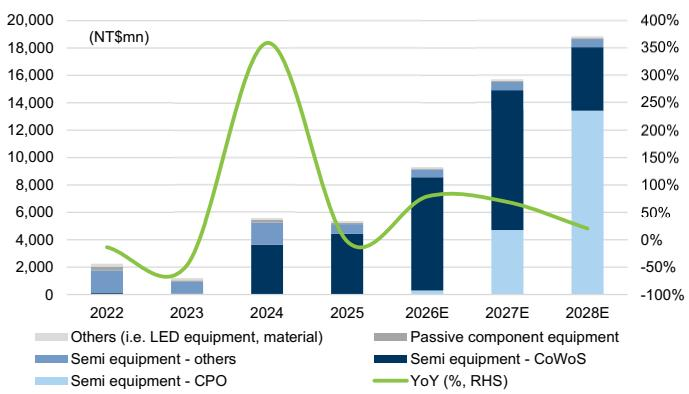  
Exhibit 2: All Ring’s revenue growth outlook

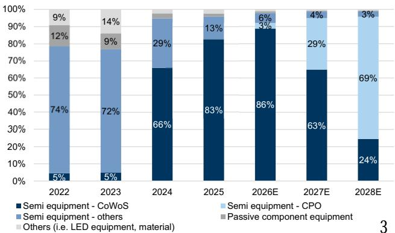  
Exhibit 3: All Ring’s revenue breakdown

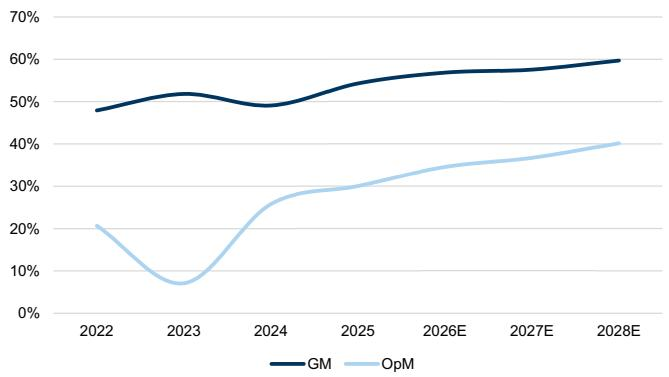  
Exhibit 4: All Ring’s margin trend   
Source: Company data, Goldman Sachs Global Investment Research

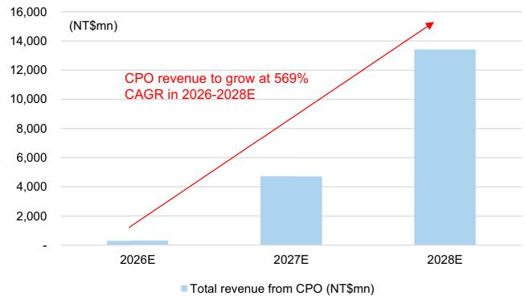  
Exhibit 5: All Ring’s CPO revenue growth trend   
Source: Company data, Goldman Sachs Global Investment Research

# GPTC (3131.TWO): Raising earnings and TP on CoWoS capacity expansion and accelerating SoIC adoption

# Exhibit 6:

<table><tr><td> 3131.TWO</td><td>12m Price Target: NT$4500</td><td colspan="2">Price: NT$3210</td><td colspan="2">Upside: 40.2%</td></tr><tr><td></td><td></td><td colspan="3"></td><td></td></tr><tr><td>Buy</td><td>GS Forecast</td><td></td><td></td><td></td><td></td></tr><tr><td></td><td></td><td>12/25</td><td>12/26E</td><td>12/27E</td><td>12/28E</td></tr><tr><td>Market cap: NT$93.3bn / $3.0bn</td><td>Revenue (NT$ mn) New</td><td>6,514.5</td><td>9,000.5</td><td>12,609.2</td><td>14,513.4</td></tr><tr><td>Enterprise value: NT$94.0bn / $3.0bn</td><td>Revenue (NT$ mn) Old</td><td>6,514.5</td><td>8,532.8</td><td>10,868.5</td><td>13,652.4</td></tr><tr><td>3m ADTV :NT$2.2bn/ $70.2mn</td><td>EBITDA (NT$ mn)</td><td>1,766.2</td><td>2,893.4</td><td>4,709.5</td><td>5,588.1</td></tr><tr><td>Taiwan Taiwan Semiconductor</td><td>EPS (NT$) New</td><td>45.45</td><td>76.23</td><td>128.58</td><td>150.93</td></tr><tr><td></td><td>EPS (NT$) Old</td><td>45.48</td><td>66.18</td><td>94.60</td><td>126.32</td></tr><tr><td> M&amp;A Rank: 3</td><td>P/E(X)</td><td>29.7</td><td>42.1</td><td>25.0</td><td>21.3</td></tr><tr><td>Leases incl. in net debt &amp; EV?: Yes</td><td>P/B (X)</td><td>8.3</td><td>15.6</td><td>11.6</td><td>9.7</td></tr><tr><td></td><td>Dividend yield (%)</td><td>2.5</td><td>1.8</td><td>3.0</td><td>3.5</td></tr><tr><td></td><td>CROCI (%)</td><td>49.1</td><td>34.4</td><td>48.5</td><td>52.2</td></tr><tr><td></td><td></td><td>12/25</td><td>3/26E</td><td>6/26E</td><td>9/26E</td></tr><tr><td></td><td>EPS (NT$)</td><td>19.26</td><td>10.98</td><td>13.65</td><td>20.96 4</td></tr></table>

ongoing CoWoS and FOCoS capacity expansion across both foundry and OSAT customers.

In our view, GPTC is particularly well positioned to benefit from FOCoS capacity additions at OSATs, where its wet clean equipment market share appears higher than at foundries. On the margin front, we expect GM to improve meaningfully starting in 4Q26, supported by a lower outsourcing ratio as Phase 2 of the new fab enters production in March and equipment shipments begin in July. Following our upward revision to CoWoS capacity assumptions, we now project GPTC’s 2026E revenue to grow $3 8 \%$ 阅研 YoY (vs. $3 1 . 0 \%$ 微信 LCD123321Cad  previously), with GM reaching $4 3 . 9 \%$ 1 , (vs. $4 2 . 2 \%$ previously).

Accelerating SoIC adoption to drive the next phase of growth   
Beyond 2026, we expect SoIC to become GPTC’s main growth engine, with its contribution increasingly surpassing that of CoWoS as industry adoption accelerates. One AI GPU customer has already adopted SoIC, and we believe demand should broaden further as CPO deployment gains traction, given that EIC-to-PIC bonding also requires SoIC-related processes. Based on our industry research, we further expect another major AI GPU vendor to adopt SoIC in future AI GPU generations beginning in 2028, which should underpin a meaningful expansion in SoIC capacity from 2027 onward.

We forecast foundry SoIC capacity to reach around 16kwpm/48kwpm/78kwpm in 2026-2028E. Relative to CoWoS, we believe GPTC is competitively better positioned in SoIC, where higher technical requirements and stronger process complexity support both market share gains and pricing power. We estimate SoIC wet clean equipment ASP at $\mathsf { U S } \$ 1.5- 2.0 m n$ , vs. $\mathsf { U S } \$ 1.0- 1.5 m$ n for current CoWoS wet clean equipment, and expect SoIC-related shipments to be margin accretive, thereby supporting an improved structural gross margin profile. Overall, we expect SoIC to account for more than $50 \%$ of GPTC’s equipment revenue starting 2027E, supporting overall revenue growth of $4 0 \% / 1 5 \%$ YoY in 2027/2028E, with GM rising to $4 7 . 0 \% / 4 7 . 9 \%$ from $4 3 . 9 \%$ in 2026E.

See also: Grand Process Technology Corp. (3131.TWO): Entering the next structural upcycle beyond CoWoS; reiterate Buy; TP up to NT\$3,500 (24 March 2026)

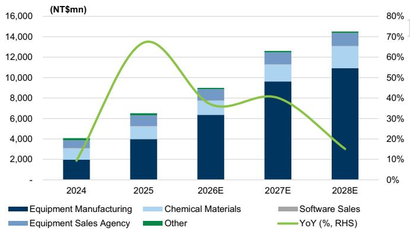  
Exhibit 7: GPTC’s revenue growth outlook

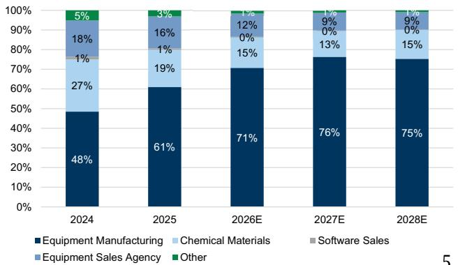  
Exhibit 8: GPTC’s revenue breakdown

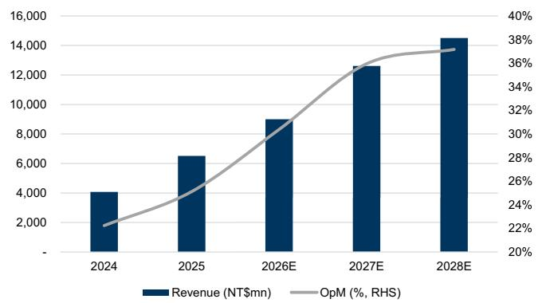  
Exhibit 9: GPTC’s revenue vs. OpM

Source: Company data, Goldman Sachs Global Investment Research

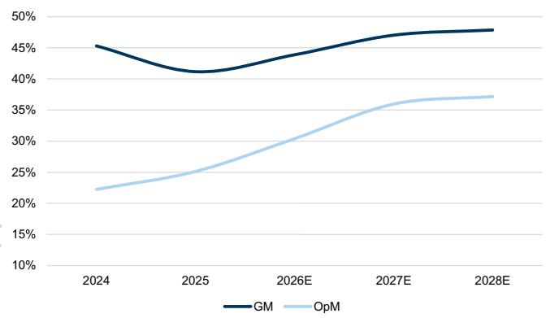  
Exhibit 10: GPTC’s margin trend

Source: Company data, Goldman Sachs Global Investment Research

# All Ring (6187.TWO)

# 订阅研报Forecast chang

# 添加微信 LCD123321Cad 04-21es

We revise up our 2026-2028E EPS estimates by $3 7 - 5 8 \%$ mainly as we factor in 1) stronger CoWoS capacity expansion, and 2) higher CPO content value with new AOI equipment.

Exhibit 11: Earnings revisions   

<table><tr><td></td><td colspan="3">2026E</td><td colspan="3">2027E</td><td colspan="3">2028E</td></tr><tr><td>(NT$mn)</td><td>Old</td><td>New</td><td>Diff (%)</td><td>Old</td><td>New</td><td>Diff (%)</td><td>Old</td><td>New</td><td>Diff (%)</td></tr><tr><td>Revenue</td><td>6,523</td><td></td><td></td><td>11,352</td><td>16,230</td><td>43.0%</td><td>15,497</td><td>19,539</td><td>26.1%</td></tr><tr><td>Gross profit</td><td>3,532</td><td>5,458</td><td>54.5%</td><td>6,286</td><td>9,341</td><td>48.6%</td><td>9,008</td><td>11,664</td><td>29.5%</td></tr><tr><td>Op.income</td><td>2,086</td><td>3,316</td><td>58.9%</td><td>3,796</td><td>5,953</td><td>56.8%</td><td>5,745</td><td>7,845</td><td>36.6%</td></tr><tr><td>Net income</td><td>1,782</td><td>2,807</td><td>57.5%</td><td>3,163</td><td>4,940</td><td>56.2%</td><td>4,683</td><td>6,403</td><td>36.7%</td></tr><tr><td>EPS(NTS)</td><td>18.55</td><td>29.22</td><td>57.5%</td><td>32.92</td><td>51.42</td><td>_56.2%</td><td>48.74</td><td>66.65</td><td>_36.7%</td></tr><tr><td>GM</td><td>54.1%</td><td>56.8%</td><td>2.7%</td><td>55.4%</td><td>57.6%</td><td>2.2%</td><td>58.1%</td><td>59.7%</td><td>1.6%</td></tr><tr><td>OpM</td><td>32.0%</td><td>34.5%</td><td>2.5%</td><td>33.4%</td><td>36.7%</td><td>3.2%</td><td>37.1%</td><td>40.2%</td><td>3.1%</td></tr><tr><td>NM</td><td>27.3%</td><td>29.2%</td><td>1.9%</td><td>27.9%</td><td>30.4%</td><td>2.6%</td><td>30.2%</td><td>32.8%</td><td>2.6%</td></tr></table>

<table><tr><td></td><td colspan="3">1Q26E</td><td colspan="3">2Q26E</td><td colspan="3">3Q26E</td></tr><tr><td>(NT$mn)</td><td>Old</td><td>New</td><td>Diff (%)</td><td>Old</td><td>New</td><td>Diff (%)</td><td>Old</td><td>New</td><td>Diff (%)</td></tr><tr><td>Revenue</td><td>1,398</td><td>1,411</td><td>1.0%</td><td>1,482</td><td>1,745</td><td>17.7%</td><td>1,629</td><td>2,510</td><td>54.1%</td></tr><tr><td>Gross profit</td><td>754</td><td>799</td><td>6.0%</td><td>801</td><td>994</td><td>24.0%</td><td>884</td><td>1,445</td><td>63.4%</td></tr><tr><td>Op.income</td><td>457</td><td>500</td><td>9.3%</td><td>475</td><td>610</td><td>28.4%</td><td>523</td><td>889</td><td>70.0%</td></tr><tr><td>Net income</td><td>392</td><td>431</td><td>9.9%</td><td>407</td><td>522</td><td>28.2%</td><td>447</td><td>752</td><td>68.0%</td></tr><tr><td>EPS_(NTS)</td><td>4.08</td><td>4.49</td><td>9.9%</td><td>4.24</td><td>5.43</td><td>_28.2%</td><td>4.66</td><td>7.82</td><td>68.0%</td></tr><tr><td>GM</td><td>53.9%</td><td>56.6%</td><td>2.7%</td><td>54.0%</td><td>56.9%</td><td>2.9%</td><td>54.3%</td><td>57.6%</td><td>3.3%</td></tr><tr><td>OpM</td><td>32.7%</td><td>35.4%</td><td>2.7%</td><td>32.1%</td><td>35.0%</td><td>2.9%</td><td>32.1%</td><td>35.4%</td><td>3.3%</td></tr><tr><td>NM</td><td>28.1%</td><td>30.6%</td><td>2.5%</td><td>27.5%</td><td>29.9%</td><td>2.5%</td><td>27.5%</td><td>29.9%</td><td>2.5% 7</td></tr></table>

Exhibit 12: Earnings revisions   

<table><tr><td></td><td colspan="3">2026E</td><td colspan="3">2027E</td><td colspan="3">2028E</td></tr><tr><td>(NT$mn)</td><td>Old</td><td>New</td><td>Diff (%)</td><td>Old</td><td>New</td><td>Diff (%)</td><td>Old</td><td>New</td><td>Diff (%)</td></tr><tr><td>Revenue</td><td>8,533</td><td>9,001</td><td>5.5%</td><td>10,869</td><td>12,609</td><td>16.0%</td><td>13,652</td><td>14,513</td><td>6.3%</td></tr><tr><td>Gross profit</td><td>3,602</td><td>3,949</td><td>9.6%</td><td>4,921</td><td>5,930</td><td>20.5%</td><td>6,360</td><td>6,946</td><td>9.2%</td></tr><tr><td>Op.income</td><td>2,377</td><td>2,735</td><td>15.1%</td><td>3,447</td><td>4,533</td><td>31.5%</td><td>4,648</td><td>5,394</td><td>16.0%</td></tr><tr><td>Net income</td><td>1,934</td><td>2,227</td><td>15.2%</td><td>2,764</td><td>3,757</td><td>35.9%</td><td>3,691</td><td>4,409</td><td>19.5%</td></tr><tr><td>EPS_(NTS)</td><td>66.18</td><td>76.23</td><td>15.2%</td><td>94.60</td><td>128.58</td><td>_35.9%</td><td>126.32</td><td>150.93</td><td>19.5%</td></tr><tr><td>GM</td><td>42.2%</td><td>43.9%</td><td>1.7%</td><td>45.3%</td><td>47.0%</td><td>1.8%</td><td>46.6%</td><td>47.9%</td><td>1.3%</td></tr><tr><td>OpM</td><td>27.9%</td><td>30.4%</td><td>2.5%</td><td>31.7%</td><td>36.0%</td><td>4.2%</td><td>34.0%</td><td>37.2%</td><td>3.1%</td></tr><tr><td>NM</td><td>22.7%</td><td>24.7%</td><td>2.1%</td><td>25.4%</td><td>29.8%</td><td>4.4%</td><td>27.0%</td><td>30.4%</td><td>3.3%</td></tr><tr><td colspan="10"></td></tr><tr><td></td><td>Old</td><td>1Q26E</td><td></td><td></td><td>2Q26E</td><td></td><td></td><td>3Q26E</td><td></td></tr><tr><td>(NT$mn) Revenue</td><td></td><td>New</td><td>Diff (%)</td><td>Old</td><td>New</td><td>Diff (%)</td><td>Old</td><td>New</td><td>Diff (%)</td></tr><tr><td>Gross profit</td><td>1,729</td><td>1,596</td><td>-7.7%</td><td>1,905</td><td>1,863</td><td>-2.2%</td><td>2,302</td><td>2,440</td><td>6.0%</td></tr><tr><td>Op.income</td><td>702</td><td>669</td><td>-4.6%</td><td>786</td><td>794</td><td>1.0%</td><td>974</td><td>1,068</td><td>9.7%</td></tr><tr><td>Net income</td><td>417 344</td><td>386 321</td><td>-7.5%</td><td>486</td><td>496</td><td>2.1%</td><td>653 532</td><td>751</td><td>15.0%</td></tr><tr><td>EPS_(NTS)</td><td></td><td>10.98</td><td>-6.8% -6.8%</td><td>389 13.31</td><td>399 13.65</td><td>2.6% 2.6%</td><td>18.21</td><td>612</td><td>15.1%</td></tr><tr><td>GM</td><td>111.78 40.6%</td><td>41.9%</td><td>1.3%</td><td>41.3%</td><td>42.6%</td><td>1.3%</td><td>42.3%</td><td>_20.96 43.8%</td><td>15.1% 1.5%</td></tr><tr><td>OpM</td><td>24.1%</td><td>24.2%</td><td>0.1%</td><td>25.5%</td><td>26.6%</td><td>1.1%</td><td>28.4%</td><td>30.8%</td><td>2.4%</td></tr><tr><td>NM</td><td>19.9%</td><td>20.1%</td><td>0.2%</td><td>20.4%</td><td>21.4%</td><td>1.0%</td><td>23.1%</td><td>25.1%</td><td>2.0%</td></tr></table>

Source: Company data, Goldman Sachs Global Investment Research

# Target price and M&A rank revisions

# All Ring (6187.TWO)

# Maintain Buy with TP revised up to NT $\$ 1,800$ from NT $\$ 800$

订阅研报添加微信 LCD123321Cad 04-21 Alongside our upward earnings revisions, we raise our 12-month TP to $\mathsf { N T } \$ 1,800$ (from $\mathsf { N T } \$ 800$ previously). Our 12-month TP is now based on a target P/E multiple of $\mathtt { 3 5 x }$ applied to our FY27E EPS (vs. previously, our TP was $8 5 \%$ based on a fundamental valuation of $^ { 2 3 \times }$ target $\mathsf { P } / \mathsf { E }$ multiple, and $1 5 \%$ based on a theoretical M&A value of $3 1 . 7 \times$ $\mathsf { P } / \mathsf { E }$ ; both applied to 2027E EPS). We no longer include an M&A component in our price target as we now assign All Ring an M&A rank of 3 (vs. 2 prior) as we see a low probability of the company being acquired.

Our $3 5 \times$ target $\mathsf { P } / \mathsf { E }$ is derived by applying the implied earnings growth uplift (per GSe) to the company’s historical valuation framework. Over 2021-2025, All Ring traded at an average forward $\mathsf { P } / \mathsf { E }$ of $1 4 . 3 \times$ alongside $2 4 \%$ earnings CAGR. Looking ahead, we forecast a $60 \%$ CAGR over 2025-2028E, implying $2 . 5 5 \times$ cumulative earnings expansion, which translates into a multiple of $3 5 \times$ . We believe this better reflects the company’s earnings prospects vs our prior multiple (which was based on avg. fwd P/E since CoWoS ramp-up in 2024).

订阅研报添加微信 LCD123321Cad 04-21 We view CPO as an even stronger structural tailwind for All Ring than CoWoS, with the potential to drive multiple-fold earnings expansion over the next several years, further supporting both earnings visibility and scope for valuation re-rating. Our new 12m TP implies $4 7 \%$ upside. Therefore, we reiterate our Buy rating on All Ring.

Exhibit 13: All Ring’s P&L overview (NT\$mn)   

<table><tr><td></td><td>1Q26E</td><td>2Q26E</td><td>3Q26E</td><td>4Q26E</td><td>1Q27E</td><td>2Q27E</td><td>3Q27E</td><td>4Q27E</td></tr><tr><td>P&amp;L</td><td></td><td></td><td></td><td></td><td></td><td></td><td></td><td></td></tr><tr><td>Revenue</td><td>1,411</td><td>1,745</td><td>2,510</td><td>3,940</td><td>3,200</td><td>3,927</td><td>4,473</td><td>4,629</td></tr><tr><td>Gross profit</td><td>799</td><td>994</td><td>1,445</td><td>2,220</td><td>1,821</td><td>2,245</td><td>2,586</td><td>2,689</td></tr><tr><td>Operating profit</td><td>500</td><td>610</td><td>889</td><td>1,317</td><td>1,157</td><td>1,418</td><td>1,652</td><td>1,728</td></tr><tr><td>Net income</td><td>431</td><td>522</td><td>752</td><td>1,102</td><td>965</td><td>1,177</td><td>1,368</td><td>1,430</td></tr><tr><td>EPS (NT$)</td><td>4.49</td><td>5.43</td><td>7.82</td><td>11.47</td><td>10.04</td><td>12.26</td><td>14.24</td><td>14.89</td></tr></table>

<table><tr><td colspan="9">Margins (%)</td></tr><tr><td>GM</td><td>56.6%</td><td>56.9%</td><td>57.6%</td><td>56.3%</td><td>56.9%</td><td>57.2%</td><td>57.8%</td><td>58.1%</td></tr><tr><td>OpM</td><td>35.4%</td><td>35.0%</td><td>35.4%</td><td>33.4%</td><td>36.1%</td><td>36.1%</td><td>36.9%</td><td>37.3%</td></tr><tr><td>NM</td><td>30.6%</td><td>29.9%</td><td>29.9%</td><td>28.0%</td><td>30.1%</td><td>30.0%</td><td>30.6%</td><td>30.9%</td></tr></table>

<table><tr><td colspan="9">YoY (%)</td></tr><tr><td>Revenue</td><td>13.2%</td><td>14.5%</td><td>47.0%</td><td>343.8%</td><td>126.8%</td><td>125.1%</td><td>78.2%</td><td>17.5%</td></tr><tr><td>Gross profit</td><td>6.1%</td><td>25.5%</td><td>74.9%</td><td>309.7%</td><td>127.8%</td><td>125.9%</td><td>79.0%</td><td>21.2%</td></tr><tr><td>Operating profit</td><td>18.7%</td><td>31.6%</td><td>77.2%</td><td>486.3%</td><td>131.5%</td><td>132.2%</td><td>85.8%</td><td>31.2%</td></tr><tr><td>Net income</td><td>25.9%</td><td>30.7%</td><td>79.0%</td><td>241.0%</td><td>123.6%</td><td>125.5%</td><td>82.0%</td><td>29.8%</td></tr><tr><td>EPS</td><td>25.6%</td><td>30.6%</td><td>79.2%</td><td>241.0%</td><td>123.6%</td><td>125.5%</td><td>82.0%</td><td>29.8%</td></tr></table>

<table><tr><td colspan="10">QoQ(%)</td></tr><tr><td>Revenue</td><td>59.0%</td><td>23.6%</td><td>43.9%</td><td>57.0%</td><td>-18.8%</td><td>22.7%</td><td>13.9%</td><td>3.5%</td></tr><tr><td>Gross profit</td><td>47.5%</td><td>24.3%</td><td>45.4%</td><td>53.6%</td><td>-18.0%</td><td>23.3%</td><td>15.2%</td><td>4.0%</td></tr><tr><td>Operating profit</td><td>122.5%</td><td>22.2%</td><td>45.6%</td><td>48.2%</td><td>-12.2%</td><td>22.6%</td><td>16.5%</td><td>4.6%</td></tr><tr><td>Net income</td><td>33.5%</td><td>21.0%</td><td>43.9%</td><td>46.6%</td><td>-12.5%</td><td>22.1%</td><td>16.2%</td><td>4.5%</td></tr><tr><td>EPS</td><td>33.5%</td><td>21.0%</td><td>43.9%</td><td>46.6%</td><td>-12.5%</td><td>22.1%</td><td>16.2%</td><td>4.5%</td></tr></table>

Source: Goldman Sachs Global Investment Research

<table><tr><td>2026E</td><td>2027E</td><td>2028E</td></tr><tr><td colspan="3"></td></tr><tr><td>9,607</td><td>16,230</td><td>19,539</td></tr><tr><td>5,458</td><td>9,341</td><td>11,664</td></tr><tr><td>3,316</td><td>5,953</td><td>7,845</td></tr><tr><td>2,807</td><td>4,940</td><td>6,403</td></tr><tr><td>29.22</td><td>51.42</td><td>66.65</td></tr></table>

<table><tr><td colspan="3"></td></tr><tr><td>56.8%</td><td>57.6%</td><td>59.7%</td></tr><tr><td>34.5%</td><td>36.7%</td><td>40.2%</td></tr><tr><td>29.2%</td><td>30.4%</td><td>32.8%</td></tr></table>

<table><tr><td>79.0% 87.3%</td><td>68.9%</td><td>20.4% 24.9%</td></tr><tr><td></td><td>71.2%</td><td></td></tr><tr><td>105.9%</td><td>79.5%</td><td>31.8%</td></tr><tr><td>89.0%</td><td>76.0%</td><td>29.6%</td></tr><tr><td>88.9%</td><td>76.0%</td><td>29.6%</td></tr></table>

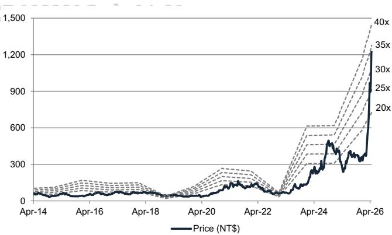  
Exhibit 15: Forward P/E

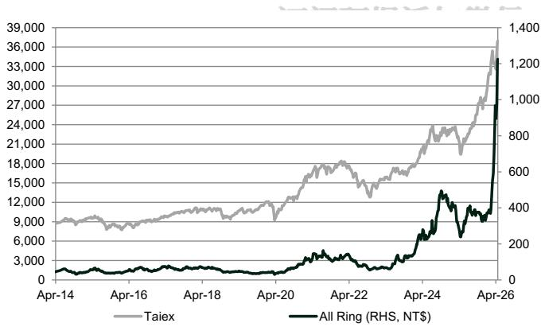  
Exhibit 14: Taiex vs. All Ring   
Source: TEJ

Source: TEJ

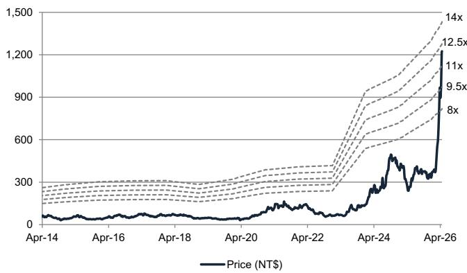  
Exhibit 16: Forward P/B

Source: TEJ

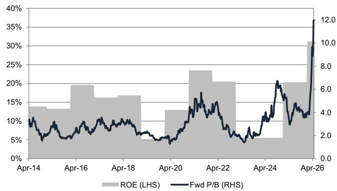  
Exhibit 17: P/B vs. ROE

Source: TEJ

# GPTC (3131.TWO)

# Maintain Buy with TP revised up to N $7 \$ 4,500$ from NT\$3,500

Alongside our upward earnings revisions, we raise our 12-month TP to $\mathsf { N T } \$ 4,500$ (from $\mathsf { N T } \$ 3,500$ previously). Our 12-month TP is now based on a target P/E multiple of 35x applied to our FY27E (vs. previously, our TP was $8 5 \%$ based on a fundamental valuation of 35x target P/E multiple, and $1 5 \%$ based on a theoretical M&A value of $4 8 \times \mathsf { P } / \mathsf { E }$ ; both 订阅研报添加微信 LCD123321Cad 04-21 applied to 2027E EPS). We no longer include an M&A component in our price target as we now assign GPTC an M&A rank of 3 (vs. 2 prior) as we see a low probability of the company being acquired. Our $3 5 \times$ target P/E continues to be based on avg. fwd P/E during the CoWoS ramp-up in mid-2024 to 2025. Our new TP implies c. $40 \%$ upside from current levels, and we maintain our Buy rating on GPTC.

Exhibit 18: GPTC’s P&L overview (NT\$mn)   

<table><tr><td></td><td>1Q26E</td><td>2Q26E</td><td>3Q26E</td><td>4Q26E</td><td>1Q27E</td><td>2Q27E</td><td>3Q27E</td><td>4Q27E</td></tr><tr><td colspan="9">P&amp;L</td></tr><tr><td>Revenue</td><td>1,596</td><td>1,863</td><td>2,440</td><td>3,101</td><td>2,854</td><td>3,115</td><td>3,316</td><td>3,324</td></tr><tr><td>Gross profit</td><td>669</td><td>794</td><td>1,068</td><td>1,418</td><td>1,328</td><td>1,463</td><td>1,564</td><td>1,574</td></tr><tr><td>Operating profit</td><td>386</td><td>496</td><td>751</td><td>1,103</td><td>997</td><td>1,113</td><td>1,201</td><td>1,222</td></tr><tr><td>Net income</td><td>321</td><td>399</td><td>612</td><td>895</td><td>837</td><td>906</td><td>997</td><td>1,016</td></tr><tr><td>EPS (NT$)</td><td>10.98</td><td>13.65</td><td>20.96</td><td>30.64</td><td>28.66</td><td>31.00</td><td>34.13</td><td>34.79</td></tr></table>

<table><tr><td colspan="10">Margins (%)</td></tr><tr><td>GM</td><td>41.9%</td><td>42.6%</td><td>43.8%</td><td>45.7%</td><td>46.5%</td><td>47.0%</td><td>47.2%</td><td>47.4%</td></tr><tr><td>OpM</td><td>24.2%</td><td>26.6%</td><td>30.8%</td><td>35.6%</td><td>35.0%</td><td>35.7%</td><td>36.2%</td><td>36.8%</td></tr><tr><td>NM</td><td>20.1%</td><td>21.4%</td><td>25.1%</td><td>28.9%</td><td>29.3%</td><td>29.1%</td><td>30.1%</td><td>30.6%</td></tr></table>

<table><tr><td colspan="9">YoY (%)</td></tr><tr><td>Revenue</td><td>28.7%</td><td>14.3%</td><td>63.4%</td><td>44.2%</td><td>78.8%</td><td>67.2%</td><td>35.9%</td><td>7.2%</td></tr><tr><td>Gross profit</td><td>32.2%</td><td>20.0%</td><td>75.5%</td><td>56.7%</td><td>98.5%</td><td>84.3%</td><td>46.5%</td><td>11.0%</td></tr><tr><td>Operating profit</td><td>39.3%</td><td>21.9%</td><td>136.6%</td><td>73.6%</td><td>158.6%</td><td>124.4%</td><td>60.0%</td><td>10.8%</td></tr><tr><td>Net income</td><td>25.6%</td><td>93.6%</td><td>101.5%</td><td>59.2%</td><td>161.1%</td><td>127.1%</td><td>62.8%</td><td>13.5%</td></tr><tr><td>EPS</td><td>25.6%</td><td>93.7%</td><td>101.6%</td><td>59.1%</td><td>161.1%</td><td>127.1%</td><td>62.8%</td><td>13.5%</td></tr></table>

<table><tr><td colspan="9">QoQ(%)</td></tr><tr><td>Revenue</td><td>-25.7%</td><td>16.7%</td><td>30.9%</td><td>27.1%</td><td>-8.0%</td><td>9.2%</td><td>6.4%</td><td>0.3%</td></tr><tr><td>Gross profit</td><td>-26.1%</td><td>18.6%</td><td>34.5%</td><td>32.8%</td><td>-6.3%</td><td>10.2%</td><td>6.9%</td><td>0.6%</td></tr><tr><td>Operating profit</td><td>-39.3%</td><td>28.6%</td><td>51.4%</td><td>46.9%</td><td>-9.6%</td><td>11.6%</td><td>7.9%</td><td>1.8%</td></tr><tr><td>Net income</td><td>-43.0%</td><td>24.4%</td><td>53.6%</td><td>46.1%</td><td>-6.5%</td><td>8.2%</td><td>10.1%</td><td>1.9%</td></tr><tr><td>EPS</td><td>-43.0%</td><td>24.4%</td><td>53.6%</td><td>46.1%</td><td>-6.5%</td><td>8.2%</td><td>10.1%</td><td>1.9%</td></tr></table>

<table><tr><td>2026E</td><td>2027E</td><td>2028E</td></tr><tr><td colspan="3"></td></tr><tr><td>9,001</td><td>12,609</td><td>14,513</td></tr><tr><td>3,949</td><td>5,930</td><td>6,946</td></tr><tr><td>2,735</td><td>4,533</td><td>5,394</td></tr><tr><td>2,227</td><td>3,757</td><td>4,409</td></tr><tr><td>76.23</td><td>128.58</td><td>150.93</td></tr></table>

<table><tr><td colspan="3"></td></tr><tr><td>43.9%</td><td>47.0%</td><td>47.9%</td></tr><tr><td>30.4%</td><td>36.0%</td><td>37.2%</td></tr><tr><td>24.7%</td><td>29.8%</td><td>30.4%</td></tr></table>

<table><tr><td colspan="3"></td></tr><tr><td>38.2%</td><td>40.1%</td><td>15.1%</td></tr><tr><td>47.3%</td><td>50.2%</td><td>17.1%</td></tr><tr><td>67.1%</td><td>65.7%</td><td>19.0%</td></tr><tr><td>67.8%</td><td>68.7%</td><td>17.4%</td></tr><tr><td>67.7%</td><td>68.7%</td><td>17.4%</td></tr></table>

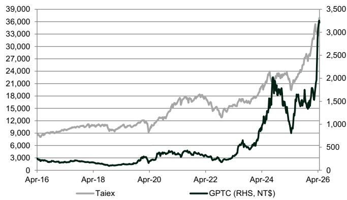  
Exhibit 19: Taiex vs. GPTC

Source: TEJ

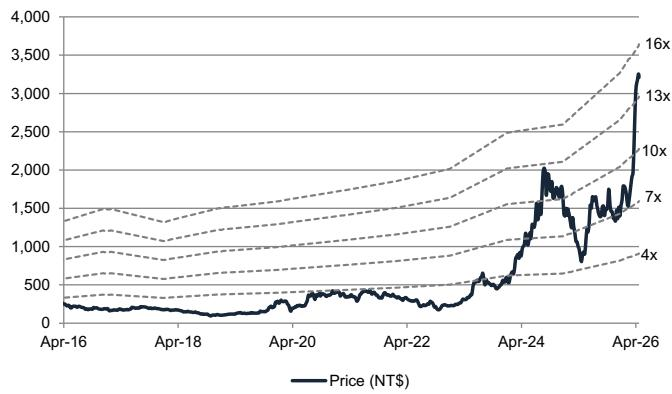  
Exhibit 21: Forward P/B   
Source: TEJ

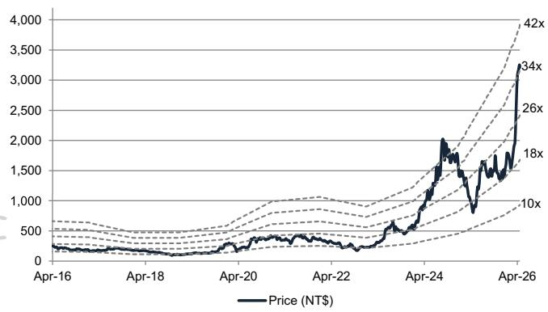  
Exhibit 20: Forward P/E

Source: TEJ

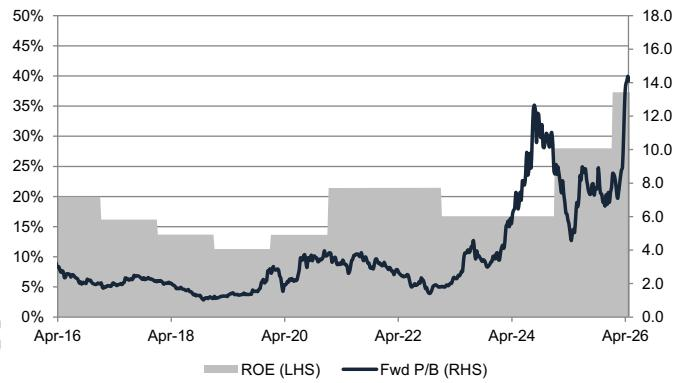  
Exhibit 22: P/B vs. ROE

Source: TEJ

# M&A Framework

We evaluate GPTC and All Ring on a number of quantitative and qualitative factors and now assign an M&A rank of 3 (vs. 2 prior). We now believe there is a low probability of the companies being acquired, given the much larger market cap that All Ring/GPTC have now at NT\$105bn/NT $\$ 92$ bn vs. that at the time of our initiation in June 2025 at NT\$34bn/NT\$46bn. Hence, we no longer incorporate an M&A component into our TP valuation methodology.

# Investment Thesis - All Ring (6187.TWO)

All Ring is one of the key suppliers of semiconductor equipment in Taiwan, primarily utilized in back-end advanced packaging processes. The company manufactures underfill dispenser, TIM heat sink attach equipment, and automated optical inspection equipment which are widely adopted within the CoWoS process. All Ring currently has nearly $100 \%$ of market share in WoS underfill dispenser and TIM heatsink attach 订阅研报添加微信 LCD123321Cad 04-21 equipment, and its main customers include leading foundries and OSATs in Taiwan.

We like All Ring as we expect its revenue/earnings CAGR to further accelerate to $5 4 \% / 6 0 \%$ in 2025-28E, driven by 1) continued advanced packaging capacity expansion, and 2) rapid growth of its CPO business. With All Ring’s unique position in CPO coupling equipment and new packaging opportunity such as PLP, we see upside potential in its revenue and earnings growth and have a Buy rating on the name.

# Price Target Risks and Methodology - All Ring (6187.TWO)

Valuation: We are Buy rated on All Ring. Our $_ { 1 2 \mathsf { m } }$ TP of $\mathsf { N T } \$ 1,800$ is based on a target P/E multiple of $3 5 \times$ (derived from growth-adjusted historical valuation) applied to our FY27E EPS.

Key risks to our views: 1) slower advanced packaging expansion, 2) delay in adoption of new packaging technologies, and 3) intensifying competition.

# Investment Thesis - GPTC (3131.TWO)

GPTC is one of the premier suppliers of semiconductor wet processing equipment, primarily utilized in back-end advanced packaging processes. The company manufactures semiconductor wet processing equipment, including metal etching equipment and single-wafer cleaning equipment, as well as providing engineering and installation services to semiconductor manufacturers. GPTC is the main CoWoS wet clean equipment provider and has $50 \%$ of market share at TSMC and near $100 \%$ of market share at ASE/SPIL. GPTC is also the sole provider for SoIC wet clean equipment at TSMC given its leading technology versus local peers.

We favor GPTC as we expect its revenue/earnings CAGR to further accelerate to $3 1 \% / 4 9 \%$ in 2025-28E, driven by 1) continued advanced packaging capacity expansion, and 2) equipment ASP increase amid rising advanced packaging (e.g. SoIC, CPO, FOPLP) technology complexity. The company is now trading below its AI cycle (2023-2025) average forward P/E of $2 9 \times$ ; however, with proliferation of advanced packaging into 订阅研报添加微信 LCD123321Cad 04-21 non-AI application and increasing ASP thanks to rising technology complexity, we continue to see upside potential to its revenue and earnings growth and maintain a Buy rating on the name.

# Price Target Risks and Methodology - GPTC (3131.TWO)

Valuation: We are Buy rated on GPTC. Our 12m TP of $\mathsf { N T } \$ 4,500$ is based on a target P/E multiple of $3 5 \times$ (based on avg. fwd P/E during the CoWoS ramp-up in mid-2024 to 2025) applied to our FY27E EPS.

Key risks to our views: 1) softer AI/HPC demand, 2) slower adoption of new advanced