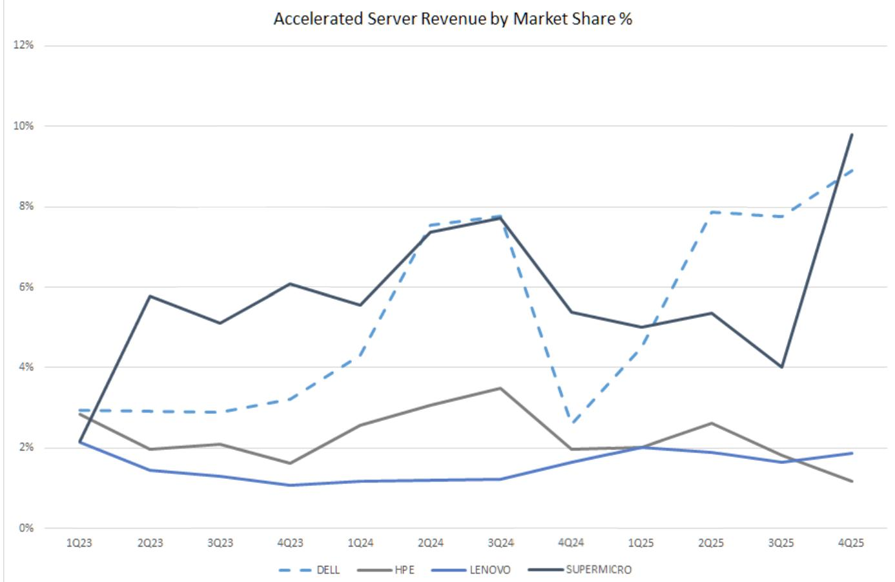
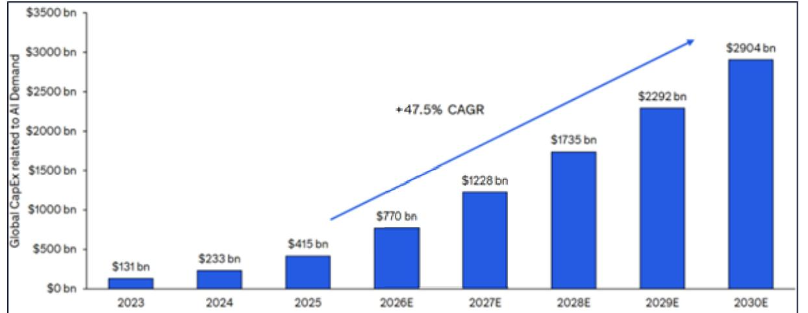
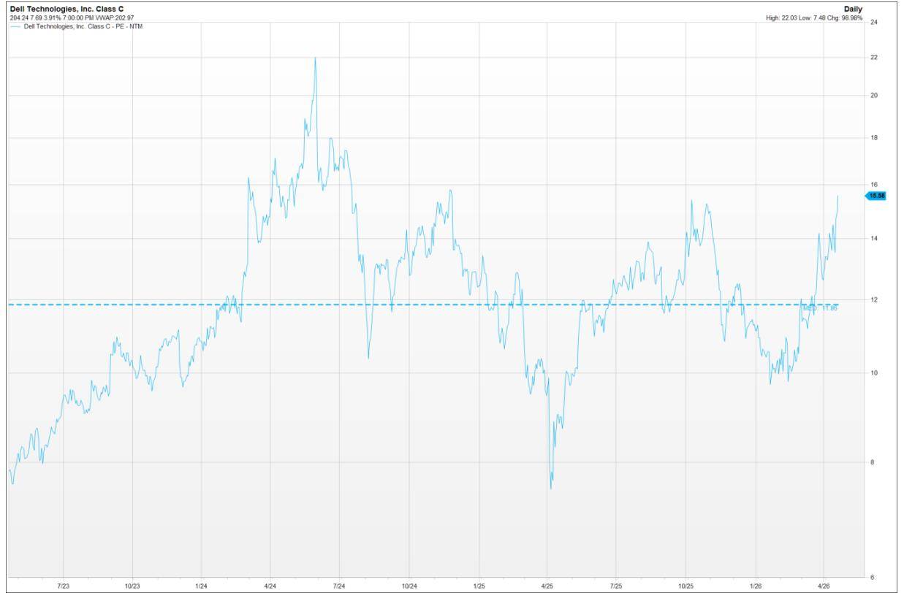
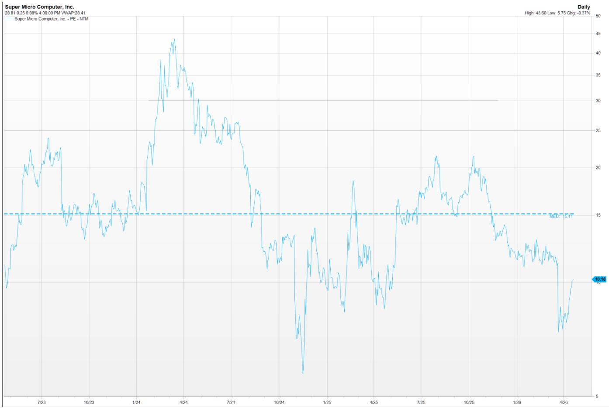
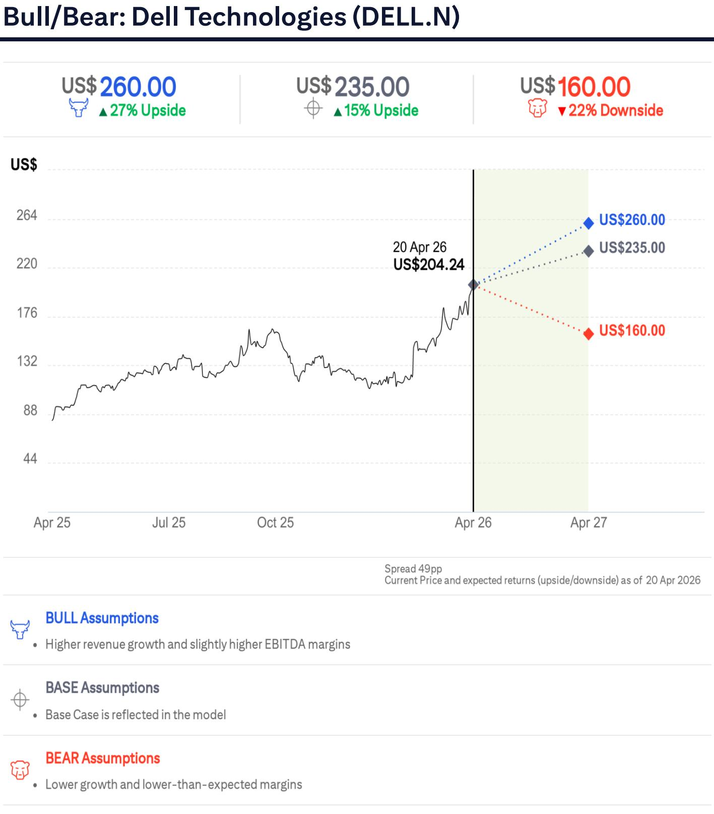
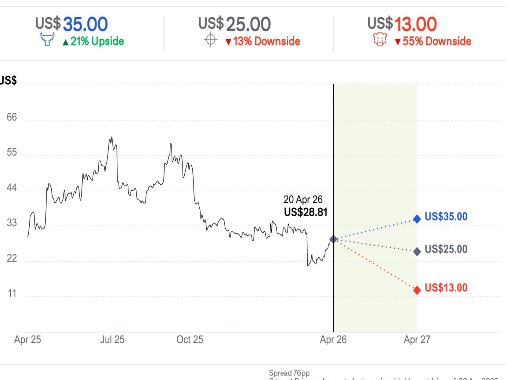

# North America Hardware & Storage 20 Apr 2026 22:05:28 ET

Estimates and TP Higher; SMCI Risk/Reward More Balanced

# CITI'S TAKE

订阅研报添加微信 LCD123321CAI compute end‑demand remains constructive, supported by recent “stronger for longer” infrastructure demand commentary and acceleration of enterprise adoption from recent Citi AI Summit while our CIO survey suggests infrastructure budgets are holding up as GenAI moves from pilots to broader deployment. Supply (including power) remains constrained, keeping shipments/backlog elevated. For Dell, we see sustained AI/server momentum and improving storage execution amidst accelerating enterprise adoption support a higher valuation; as such, we raise our TP to $\$ 235$ (from $\$ 120$ and lift our multiple to 15x N24M P/E (from $1 2 . 5 \times )$ . For SMCI, reputational and governance overhang from recent indictments/export‑control allegations (SMCI not named as a defendant) could raise customer/supplier diligence and, alongside component cost inflation and incremental compliance spend, keep margins and operating leverage under pressure. We therefore see a more balanced near‑term setup for SMCI despite favorable demand and keep estimates unchanged while maintaining Neutral (High Risk).

订阅研报添加微信 LCD123321CDELL Key Investor Topics — a) AI server ramp durability and mix shift toward enterprise/inference; b) supply chain positioning and ability to secure incremental supply while protecting margins via pricing agility; and c) Profitability impacts with increased components costs/AI mix.

SMCI Key Investor Topics — a) post‑indictment demand indications/customer & supplier diligence; b) Any changes to allocations or securing supply; c) gross margin sustainability amid component inflation & potential costs related to legal issues; and c) competitive scaling/market‑share capture as supply remains constrained.

Please see below for our company specific takeaways & updated server model:

<table><tr><td></td><td></td><td></td><td colspan="6">Last Reported Year</td><td colspan="6">Current FiscalYear</td><td colspan="6">Next Fiscal Year</td></tr><tr><td>Company Name</td><td>Ticker</td><td>Last Rpt Year</td><td>Currency</td><td>1Q</td><td>2Q</td><td></td><td>3Q</td><td>4Q </td><td>FYO</td><td>1Q</td><td>2Q</td><td>3Q</td><td>4Q</td><td>FY1</td><td></td><td>1Q </td><td>2Q</td><td>3Q</td><td>4Q</td><td>FY2</td></tr><tr><td>Dell Technologies</td><td>DELL</td><td>Jan-26</td><td>US$</td><td>1.55</td><td>2.32</td><td>2.59</td><td>3.89</td><td>10.30</td><td></td><td>3.00</td><td>2.95</td><td>3.14</td><td>3.97</td><td>13.05</td><td>3.56</td><td>3.78</td><td>3.60</td><td>4.80</td><td></td><td>15.72</td></tr><tr><td>Old</td><td></td><td> Jan-26</td><td>US$</td><td>1.55</td><td>2.32</td><td>2.59</td><td>3.89</td><td>10.30</td><td></td><td>2.90</td><td>3.48</td><td>2.92</td><td>3.63</td><td>12.92</td><td>3.26</td><td>3.39</td><td>3.59</td><td></td><td>4.71</td><td>14.95</td></tr><tr><td>Super Micro Computer,Inc.</td><td>SMCI</td><td>Jun-25</td><td>阅SS开扣.添加.5 订</td><td></td><td></td><td></td><td>信0.31LC0.411232.03</td><td></td><td></td><td>C0.37</td><td>0.6921</td><td>10.60</td><td>0.50</td><td>2.16</td><td>0.60</td><td>0.81</td><td></td><td>0.70</td><td>0.91</td><td>3.02</td></tr></table>

# Citi Server Model Update

We have updated our server model to reflect a more constructive AI infrastructure demand backdrop and improving near-term visibility. Specifically, recent industry commentary continues to suggest AI capex remains on an upward trajectory, with infrastructure constraints (power / capacity) extending the duration of the build cycle and supporting sustained demand for AI systems 报添加微信 LCD123321Cad 04-21 rather than a near-term “peak” dynamic. We are also updating for Non‑AI servers where shipment assumptions are unchanged while we are increasing non‑AI server spend $50 \%$ y/y vs $7 \%$ prior) mainly reflecting higher ASPs from cost inflation coupled with a continued refresh cycle as customers modernize an aging installed base, and incremental investment in foundational infrastructure that supports AI deployments. As a result, for 2026E, we are raising our total server shipments assumptions to $12 \%$ y/y vs $8 \%$ prior and total server spend to $6 3 \%$ y/y vs $3 6 \%$ prior. Total AI server shipments of $49 \%$ y/y and spend of ${ \sim } 7 0 \%$ y/y vs $28 \%$ and $46 \%$ prior, respectively.

Figure 1. Citi Revised Server Model   

<table><tr><td></td><td>2023</td><td>2024</td><td>2025</td><td>2026F</td><td>2027F</td><td>2028F</td></tr><tr><td>Total Server shipments</td><td>12,370,260</td><td>14,553,178</td><td>16,780,966</td><td>18,803,152</td><td>21,029,644</td><td>22,287,750</td></tr><tr><td>-yly</td><td>(17%)</td><td>18%</td><td>15%</td><td>12%</td><td>12%</td><td>6%</td></tr><tr><td>Total Server Spend ($M) -yly</td><td>147,309 18%</td><td>254,440 73%</td><td>453,539 78%</td><td>740,883 63%</td><td>964,370</td><td>1,174,650 22%</td></tr><tr><td></td><td></td><td></td><td></td><td></td><td>30%</td><td></td></tr><tr><td>AIServer Shipment</td><td>1,636,154</td><td>2,400,016</td><td>3,320,061</td><td>4,938,419</td><td>6,471,674</td><td>7,147,462</td></tr><tr><td>-yly</td><td>13%</td><td>47%</td><td>38%</td><td>49%</td><td>31%</td><td>10%</td></tr><tr><td>% of total shipments</td><td>13%</td><td>16%</td><td>20%</td><td>26%</td><td>31%</td><td>32%</td></tr><tr><td>AI Server spend ($M)</td><td>59,098</td><td>143,238</td><td>326,922</td><td>550,957</td><td>755,452</td><td>955,287</td></tr><tr><td>-yly</td><td>125%</td><td>142%</td><td>128%</td><td>69%</td><td>37%</td><td>26%</td></tr><tr><td>% oftotal server spend</td><td>40%</td><td>56%</td><td>72%</td><td>74%</td><td>78%</td><td>81%</td></tr><tr><td>Non Al server shipments</td><td>10,734,106</td><td>12,153,162</td><td>13,460,906</td><td>13,864,733</td><td>14,557,969</td><td>15,140,288</td></tr><tr><td>-yly</td><td>(20%)</td><td>13%</td><td>11%</td><td>3%</td><td>5%</td><td>4%</td></tr><tr><td>% of total shipments</td><td>87%</td><td>84%</td><td>80%</td><td>74%</td><td>69%</td><td>68%</td></tr><tr><td>Non Al Server Spend ($M)</td><td>88,211</td><td>111,202</td><td>126,617</td><td>189,925</td><td>208,918</td><td>219,364</td></tr><tr><td>-yly</td><td>(10%)</td><td>26%</td><td>14%</td><td>50%</td><td>10%</td><td>5%</td></tr><tr><td>%of total server spend</td><td>60%</td><td>44%</td><td>28%</td><td>26%</td><td>22%</td><td>19%</td></tr></table>

© 2026 Citigroup Inc. No redistribution without Citigroup’s written permission. Source: Citi Research, Dell'Oro, Gartner

  
Figure 2. AI Server Revenue Market Share (OEMs only)   
© 2026 Citigroup Inc. No redistribution without Citigroup’s written permission. Source: Citi Research, Dell'Oro

  
Figure 3. Global capex related to AI demand growing $4 7 . 5 \%$ CAGR over 2026-30E   
$\circledcirc$ 2026 Citigroup Inc. No redistribution without Citigroup’s written permission. Source: Citi Research

Figure 4. Big Five Cloud Provider Data Center Capex +69% YoY in 2026   

<table><tr><td>$ millions</td><td>2022</td><td>2023</td><td>2024</td><td>2025</td><td>2026E</td><td>2027E</td><td>2028E</td><td>2029E</td><td>2030E</td></tr><tr><td>Amazon (AWS)</td><td>31,878</td><td>31,385</td><td>53,436</td><td>90,080</td><td>151,058</td><td>188,764</td><td>223,236</td><td>257,735</td><td>295,794</td></tr><tr><td>Meta</td><td>32,036</td><td>28,103</td><td>39,225</td><td>72,215</td><td>124,330</td><td>155,366</td><td>183,857</td><td>213,002</td><td>243,796</td></tr><tr><td>Google</td><td>31,485</td><td>32,251</td><td>52,535</td><td>91,447</td><td>182,463</td><td>222,389</td><td>261,534</td><td>305,714</td><td>355,140</td></tr><tr><td>Microsoft (Azure)</td><td>22,277</td><td>34,373</td><td>67,746</td><td>108,836</td><td>150,300</td><td>188,218</td><td>215,552</td><td>229,058</td><td>243,410</td></tr><tr><td>Oracle</td><td>5,583</td><td>4,835</td><td>10,241</td><td>37,637</td><td>69,881</td><td>85,083</td><td>91,340</td><td>97,027</td><td>103,069</td></tr><tr><td>BigFive US</td><td>123,260</td><td>130,947</td><td>223,183</td><td>400,215</td><td>678,032</td><td>839,820</td><td>975,519</td><td>1,102,536</td><td>1,241,208</td></tr><tr><td>Year-over-Year (%)</td><td>36%</td><td>6%</td><td>70%</td><td>79%</td><td>69%</td><td>24%</td><td>16%</td><td>13%</td><td>13%</td></tr></table>

© 2026 Citigroup Inc. No redistribution without Citigroup’s written permission. Source: Citi Research, Visible Alpha, Company Reports

# Company Sections

# Dell Technologies Inc. (DELL)

We expect Dell to deliver continued momentum driven by AI server demand, front‑half‑weighted traditional server strength, and improving storage/PC execution, with AI remaining the primary engine of incremental growth as enterprise adoption broadens, followed by traditional server demand, pricing/supply execution, and their increasing storage opportunity. Management commentary continues to suggest demand is tracking well ahead of supply, supported by growing customer breadth (4 ${ , } 0 0 0 +$ accounts), repeat ordering behavior, and an emphasis on rapid deployment as systems are put to work immediately.

On compute demand, our recent Citi AI Summit revealed that sentiment remains supportive of a longer-duration AI infrastructure cycle with compute demand described as “insatiable” through at least 2028 and supply/demand rebalancing not expected until at least 2029. Dell’s structural advantages within the supplychain especially amidst a constrained supply chain environment such as scale, long‑standing supplier relationships (some being decades long), and the ability to secure supply alongside pricing agility to navigate component inflation allows them to secure and allocate components more reliably, maintain shipment reliability, and protect margins through faster pricing pass‑through in an inflationary parts environment . They have supply to achieve their full‑year guidance even as customer asks would exceed capacity. Externally, ODM commentary remains consistent with robust AI system demand and ramping shipments into 2026, while Taiwanese ODMs reveal a large YoY ramp in Dell‑bound AI racks from Wistron (close to \~4k shipped in 1Q26 vs \~200 in 1Q25). Citi expects Wistron racks flat q/q in 2Q26E, indicative of sustained rack‑level AI demand.

研报添加微信 LCD123321Cad 04-21 We believe Dell’s strong order visibility and its position of scale provides them with the tools and the advantage to serve their various end markets even amidst a challenging supply/pricing environment, and our near‑term constructiveness is also increasingly supported by drivers beyond AI; 1) resilient traditional server demand and visibility despite price increases as demand still outstripping supply, 2) Better event‑management execution on memory/component inflation via faster quote/pricing actions limiting margin leakage, and 3) improving execution in storage with better mix/attach rates that should lift earnings quality and durability. We view Dell’s guidance posture in 2H prudent in the core, which combined with improving visibility across supply, demand, and mix, should help reduce downside risk to estimates.

As a result, we are raising our target price to $\$ 235$ (from $\$ 180$ ) and lifting our multiple to 15x N24M P/E (from $1 2 . 5 \times )$ , reflecting improved duration/visibility for AI infrastructure demand and core server demand, stronger margin defense via pricing/quote agility, and improving storage mix/attach increasing our confidence in the durability of upcoming earnings.

Figure 5. Revised Citi Ests vs Consensus   

<table><tr><td>Dell Estimates</td><td>AprQ</td><td></td><td></td></tr><tr><td rowspan="2">($ Million)</td><td>1Q27</td><td></td><td>Guide</td></tr><tr><td></td><td>Citi Revised Citi Est(Prior) Consensus</td><td></td></tr><tr><td>Revenue</td><td>$35,825</td><td>$35,201</td><td>$34,796 $34.7-$35.7bln</td></tr><tr><td>%change yly</td><td>53%</td><td>51%</td><td></td></tr><tr><td>%change q/q</td><td>7%</td><td>5%</td><td></td></tr><tr><td>Gross Margin (Non-GAAP)</td><td>17.3%</td><td>17.3%</td><td></td></tr><tr><td>Opex Operating Margin</td><td>$3.383</td><td>$3.361</td><td></td></tr><tr><td></td><td>7.9%</td><td>7.8%</td><td></td></tr><tr><td>nterest and Other Expense</td><td>381</td><td>383</td><td></td></tr><tr><td>PreTax Income</td><td>2,434</td><td>2,345</td><td></td></tr><tr><td>Tax Rate</td><td>18.0%</td><td>18.0%</td><td></td></tr><tr><td>Net Income</td><td>1,995</td><td>1.923</td><td></td></tr><tr><td>EPS</td><td>3.00</td><td>2.90</td><td>2.88 $2.80-$3.00</td></tr><tr><td>% change yly</td><td>94%</td><td>87%</td><td></td></tr></table>

$\circledcirc$ 2026 Citigroup Inc. No redistribution without Citigroup’s written permission. Source: Citi Research, FactSet

<table><tr><td colspan="3"></td></tr><tr><td></td><td>CY26/FY27E</td><td></td></tr><tr><td>Citi Ests</td><td>Citi Ests (Prior)</td><td>Consensus Guide</td></tr><tr><td>$142,498</td><td>$140,120</td><td>$141,069 $138-$142bln</td></tr><tr><td>26%</td><td>23%</td><td></td></tr><tr><td>18.0%</td><td>18.0%</td><td></td></tr><tr><td>$13,644</td><td>$13,380</td><td></td></tr><tr><td>8.4%</td><td>8.4%</td><td></td></tr><tr><td>1,479</td><td>1,422</td><td></td></tr><tr><td>10,494</td><td>10,388</td><td></td></tr><tr><td>18.0%</td><td>18.0%</td><td></td></tr><tr><td>8,603</td><td>8.516</td><td></td></tr><tr><td>$13.05</td><td>$12.92</td><td>12.91 $12.90 +/- $0.25</td></tr><tr><td>27%</td><td>25%</td><td>+25%mp</td></tr></table>

<table><tr><td colspan="3"></td></tr><tr><td colspan="3">CY27/FY28E</td></tr><tr><td>Citi Ests</td><td>Citi Ests (Prior) Consensus</td><td></td></tr><tr><td>$157,715</td><td>$153,568</td><td>$154,914</td></tr><tr><td>11%</td><td>10%</td><td></td></tr><tr><td>17.3%</td><td>17.4%</td><td></td></tr><tr><td>$13.274</td><td>$13,332</td><td></td></tr><tr><td>8.9%</td><td>8.7%</td><td></td></tr><tr><td>1,521</td><td>1,518</td><td></td></tr><tr><td>12,515</td><td>11,902</td><td></td></tr><tr><td>18.0%</td><td>18.0%</td><td></td></tr><tr><td>10,260</td><td>9,758</td><td></td></tr><tr><td>$15.72</td><td>$14.95</td><td>$14.84</td></tr><tr><td>20%</td><td>16%</td><td></td></tr></table>

  
Figure 6. Dell Valuation   
$\circledcirc$ 2026 Citigroup Inc. No redistribution without Citigroup’s written permission. Source: Citi Research, FactSet

# Super Micro Computer Inc. (SMCI)

We expect AI server end‑demand fundamentals to remain constructive into the print, supported by continued hyperscale capex and enterprise GenAI adoption, though the near‑term question remains how much of that demand SMCI can convert into shipments amid supply constraints, elevated diligence, and profitability pressure. AI server dynamics remain robust exiting 4Q25, and market share gains during the quarter were largely a function of which players were able to 研报添加微信 LCD123321Cad 04-21 secure constrained supply, where execution, flexibility, and supplier alignment proved increasingly determinative; within that context, SMCI maintained their Accelerated server revenue share of $6 \%$ in 2025 vs 2024 versus Dell from $\sim 5 \%$ to ${ \sim } 8 \%$ in a rapidly growing market. Importantly, broader OEM guidance continues to reinforce that customer demand remains well ahead of supply.

Looking ahead, more aggressive competitive scaling and heightened customer/supplier diligence present the risk that SMCI captures a smaller share of industry growth despite a supportive demand backdrop, particularly if supplier allocation behavior tightens, especially considering a majority of their supply likely comes from NVIDIA. As such, we keep estimates unchanged and maintain Neutral (High Risk) given the balance of strong demand against execution, reputational, and margin uncertainties.

Figure 7. Citi Ests vs Consensus   

<table><tr><td rowspan="2">($ Million) SMCI Estimates</td><td colspan="3">FY3Q26E Citi Citi Consensus</td><td rowspan="2">Guide</td><td colspan="3">FY4Q26E</td><td colspan="2">FY2026E Citi Citi</td><td rowspan="2">Consensus</td><td rowspan="2">Guide</td></tr><tr><td></td><td>(Prior) (Factset)</td><td></td><td>Citi</td><td>Citi (Prior)</td><td>Consensus (Factset)</td><td>(Prior)</td><td>(Factset)</td></tr><tr><td>Revenue</td><td> $12,406</td><td> $12,406</td><td> $12,407^</td><td> At least $12.3B</td><td> $10,575</td><td>$10,575</td><td> $10,873</td><td> $40,681</td><td> $40,681</td><td> $41,165</td><td>At least $40B up from</td></tr><tr><td> Gross Profit</td><td>$825</td><td>$825</td><td></td><td></td><td>$740</td><td>$740</td><td></td><td>$2.845</td><td>$2.845</td><td></td><td>At least $36bln</td></tr><tr><td> Gross Margin</td><td>6.7%</td><td>6.7%</td><td></td><td> +30bps qq</td><td>7.0%</td><td>7.0%</td><td></td><td>7.0%</td><td>7.0%</td><td></td><td></td></tr><tr><td>(Non-GAAP) Opex</td><td></td><td>$279</td><td></td><td></td><td>$280</td><td>$280</td><td></td><td></td><td>$1,002</td><td></td><td></td></tr><tr><td>Operating Profit</td><td>$279 $546</td><td>$546</td><td></td><td></td><td>$460</td><td>$460</td><td></td><td>$1,002 $1,843</td><td>$1,843</td><td></td><td></td></tr><tr><td> Operating Margin</td><td>4.4%</td><td>4.4%</td><td></td><td></td><td>4.4%</td><td>4.4%</td><td></td><td>4.5%</td><td>4.5%</td><td></td><td></td></tr><tr><td>Tax Rate</td><td>20.2%</td><td>20.2%</td><td></td><td></td><td>20.2%</td><td>20.2%</td><td></td><td>20.3%</td><td>20.3%</td><td></td><td></td></tr><tr><td> Net Income</td><td>418</td><td>418</td><td></td><td></td><td>349</td><td>349</td><td></td><td>1,474</td><td>1,474</td><td></td><td></td></tr><tr><td> Net Income margin</td><td>3.4%</td><td>3.4%</td><td></td><td></td><td>3.3%</td><td>3.3%</td><td></td><td>3.6%</td><td>3.6%</td><td></td><td></td></tr><tr><td>EPS</td><td> $0.60</td><td> $0.60</td><td>$0.62</td><td> At least $0.60</td><td> $0.50</td><td> $0.50</td><td> $0.54</td><td> $2.16</td><td> $2.16</td><td> $2.24</td><td></td></tr></table>

$\circledcirc$ 2026 Citigroup Inc. No redistribution without Citigroup’s written permission. Source: Citi Research, FactSet

  
Figure 8. SMCI Valuation   
$\circledcirc$ 2026 Citigroup Inc. No redistribution without Citigroup’s written permission. Source: Citi Research, FactSet

# Adding Upside 30-Day Short-Term View on Dell Technologies (DELL.N)

Direction: Upside Duration: Within 30 Days Category: Earnings

订阅研报添加微信 LCD123321Cad 04-21 We open a 30-day short-term view on Dell ahead of earnings as we see constructive AI/server momentum and improving execution as near-term drivers into the print. Outside of AI, we also expect various levers such as 1) resilient traditional server demand and visibility despite price increases as demand continues to outstrip supply, 2) solid management on memory and component inflation via faster quote and pricing actions, supplier relationships, and scale that should limit margin leakage, and 3) improving storage mix and attach rates that should lift earnings quality and durability. We view Dell’s guidance posture in 2H prudent in the core which should help reduce downside risk to estimates.

# Bull/Bear: Super Micro Computer, Inc. (SMCI.O)

  
Current Price and expected returns (upside/downside)as of 2O Apr 2026

# BULL Assumptions

· Bull case incorporates higher revenues and margins.

# BASE Assumptions

· Our Base case assumptions are as presented in the current financial model.

# BEAR Assumptions

· Bear case incorporates lower revenues and margins.

# Dell Technologies

(DELL.N; US\$204.24; 1; 20 Apr 26; 16:00)

# Valuation

Our $\$ 235$ rounded target price is based on a 15x P/E multiple applied to our 报添加微信 LCD123321Cad 04-21 N24M EPS estimate. Dell's peer group comprises large enterprise hardware companies and trades within a range of 7x to $^ { 2 0 \times }$ , with a median PE of $1 2 . 5 \times$ . We believe a premium to the peer group is warranted given better-thanexpected earnings growth and momentum in its AI portfolio.

# Risks

Risks to achieving our target price include the following:

Competitive Intensity: Competition from hyperscalers and cloud computing options is impacting demand for traditional enterprise server and storage hardware products. Hyperscalers tend to rely on lower-margin compute and storage products from ODMs, while enterprises are using cloud-enabled infrastructure (private and hybrid) to drive efficiencies in data center infrastructure. This has resulted in aggressive pricing environment, market share losses in its storage business, and margin erosion.

PC & Data Center Demand Downticks: Hardware demand could recover slower than expected, and any delays to the PC refresh cycle could have negative implications for the business.

Dell's AI backlog may not materialize in revenues in CY2026 and could be pushed out further.

Complicated Ownership Structure: Dell has a fairly complicated ownership and governance structure.

# Super Micro Computer, Inc.

(SMCI.O; $\cup \mathsf { S } \$ 28.81$ ; 2H; 20 Apr 26; 16:00)

# Valuation

Our $\$ 25$ target price is based on applying a $\mathsf { 8 x P / E }$ multiple to Super Micro’s FY28 estimates, below their median 3-year P/E multiple of 15x. Our peer 报添加微信 LCD123321Cad 04-21 group is comprised of Enterprise hardware companies, including ODMs. The peer group trades at a median PE NTM multiple of \~11x, above the ${ 8 \times }$ PE N24M multiple applied to SMCI. We note the lower multiple applied to SMCI being mainly attributed to higher earnings volatility, lower margins and elevated customer concentration risk compared to peers. This is in addition to expected elevated customer diligence and tighter supplier guardrails, which may lead to some suppliers restricting components and competitive losses tied to recent indictments. When we apply a ${ 8 \times }$ PE multiple to Supermicro's FY28 EPS estimate, we get to a target price of $\$ 25$ .

# Risks

This stock is High Risk based upon our quantitative model owing to its volatility. Key risks to our target price include: 1) High customer concentration intra-quarter; 2) Margin deterioration as mix shifts to AI-servers; 3) High volatility in AI revenues given GPU allocation; 4) Increase in competitive landscape in AI servers from traditional server vendors (Dell and Lenovo) and low-cost Taiwanese ODM vendors; 5) FCF NI conversion concerns; and 6) DOJ investigation for questionable financial reporting and accounting practices along with reputational damage from recent export-control violations 报添加微信 LCD123321Cad 04-21 committed by certain individuals.

If the impact on the company from any of these factors differs from our base case expectations, the stock could have difficulty achieving our target price or could increase more than we expect.