# Observability and Search in the AI Era; Initiate DT (Buy),ESTC (Neutral)

21 April 2026 | 12:01AM EDT

We initiate coverage of Dynatrace (DT, Buy, $\$ 45$ PT) and Elastic (ESTC, Neutral, $\$ 50$ PT). Observability is entering a particularly dynamic period, as AI deepens the 订阅研报添加微信 LCD123321Cad 04-strategic importance of machine data, and raises the bar for the platforms built to harness it. Compute intensity is scaling rapidly as AI workloads proliferate, workload complexity is expanding the coverage surface area, and the shift from reactive monitoring to autonomous remediation is pulling budget away from fragmented point solutions and toward platforms built to compress signal-to-action. Dynatrace sits squarely in that current. A fresh product cycle in logs, a DPS contract transition that resets the growth algorithm into next year, and strong margin support (FCFM $2 5 \% + ]$ ) provide a compelling setup against a reset valuation (\~14x EV/FCF). On Elastic, the platform has structural relevance across search, observability and security, and execution has improved over the past two years. We still need to see clearer evidence that cloud growth can durably inflect – validating both the AI narrative and reinforcing Elastic’s positioning in an increasingly competitive backdrop – before getting more constructive. Why read this report: Alongside 订阅研报添加微信 LCD123321Cad 04-company deep-dives, we map how AI and competition are reshaping observability - and validate the direction with signals from the AI private ecosystem.

Table of Contents

Executive Summary: Initiating Coverage of Dynatrace and Elastic; Buy DT, Neutral ESTC 3

Industry Primer: The Next Phase of Observability 5 arket Overview: Infrastructure, Data and Telemetry Tailwinds 13

AI Private Ecosystem Signals 15 lastic: Initiating Neutral, PT $\$ 50$ 30

Disclosure Appendix 44

We initiate coverage of Dynatrace (DT) with a Buy rating and $\$ 45$ Price Target and Elastic (ESTC) with a Neutral rating and $\$ 50$ Price Target. Dynatrace operates at the center of the enterprise observability and AIOps market, where value is shifting from telemetry collection and analysis toward automated diagnosis, remediation and AI-driven operations – a transition we believe Dynatrace is well positioned to capitalize on, with a well-established platform and growth trajectory that we think the market is underappreciating. Elastic spans a broader set of markets – search, observability and 订阅研报添加微信 LCD123321Cad 04-21 security – with a common data and retrieval architecture that is becoming more relevant as AI expands the importance of context, relevance and unstructured data handling, though the company still needs to show that strategic breadth can translate into a more durable acceleration in growth. We highlight the key dynamics driving our views below:

n Dynatrace has a strong platform position in enterprise observability and a more visible path to growth acceleration than the market currently reflects. Dynatrace helps large enterprises monitor, troubleshoot, and increasingly automate their most complex digital environments, combining full-stack observability with Davis AI – purpose-built for causation and automated remediation – and extending further into agentic operations and security through Dynatrace Intelligence. The platform is well positioned against the most important shifts in the category – the move toward AI-driven automation, observability and security convergence, and rising log analytics demand – while the financial profile is already strong with near- $30 \%$ 订阅研 non-GAAP OpM’s and $26 \%$ FCFM’s. Looking ahead, an upcoming DPS renewal cycle and a scaling logs business support a growth outlook that we believe the market is not fully pricing in. Taken together, we think Dynatrace offers a compelling combination of platform durability, improving growth visibility and strong cash generation that provides solid downside support.

Elastic provides a credible platform across three strategic markets but   
converting strategic relevance into durable growth acceleration remains the central debate. Built around Elasticsearch, the company serves as the data   
foundation for enterprise search, log analytics, SIEM, and increasingly AI-driven retrieval and agent workflows. Newer capabilities including Agent Builder, Workflows and Attack Discovery are compelling and signal a move up-stack to capture   
higher-value workflows. GTM execution has also improved over the past two years, showing up in stable NER $( 1 1 2 \% )$ and net-new revenue. But Elastic Cloud continues to decelerate even as the AI narrative has broadened and consumption peers 订阅研 12332   
accelerate, while recent self-managed outperformance (while encouraging) has not been rewarded by the market. Competition, meanwhile, is intensifying across all three markets as broader platforms aim to own more of the workflow and data layer. We believe a more constructive stance requires greater confidence that cloud growth can stabilize and durably inflect, validating both the AI narrative and Elastic’s enduring relevance across its end markets.

# Why read this report:

An industry primer on how the observability market is being redefined. Introduces a six-theme framework that explains how changes in architecture, telemetry standards, AI workloads, data economics, and buyer consolidation are reshaping where differentiation, pricing power, and long-term value accrue.

n An AI company study showing where competitive pressure is forming first. Draws on signals from the startup ecosystem to highlight how innovation is clustering around telemetry economics, pipeline 订阅研报添加微信 LCD123321Cad 04-21 control, and AI-assisted operations, and what that signals for incumbent platforms. We also apply the GS AI Impact Framework to assess how Dynatrace and Elastic are positioned against AI disruption debates.

n A scenario-based framework for Dynatrace’s path to growth acceleration. Lays out how DPS renewal dynamics and accelerating logs adoption can translate consumption momentum into improving reported growth over time.

Elastic evaluated through the lens of competition and execution. Assesses Search & AI, Observability, and Security to highlight where Elastic’s platform remains well positioned, how competitive pressure from broader platforms is intensifying, and how execution in these markets shapes the path toward more durable cloud-led momentum.

As we launch coverage on Dynatrace and Elastic, we think both companies are positioned against market backdrops that are becoming more consequential, albeit in different ways. In observability, the center of gravity is shifting from collecting and visualizing telemetry toward automating diagnosis, remediation and operational response; in search, the rise of AI is increasing the strategic value of retrieval, relevance and access to large pools of unstructured data. These are distinct categories, but both are becoming more important as enterprises are forced to convert rapidly rising volumes 订阅研报添加微信 LCD123321Cad 04-21 of machine data into faster decisions, more effective automation, and durable operating leverage, rather than simply absorbing higher monitoring and data infrastructure costs.

Dynatrace and Elastic overlap most directly in observability; we focus on six key themes that we believe best capture where the observability market is heading and how the basis of competition is changing: 1) Observability is shifting from visibility toward operations, with value moving from dashboards to prevention, remediation, and automation; 2) Security and observability are converging around shared telemetry, increasing the strategic importance of platforms central to logs, metrics, and runtime context even as buying motions remain distinct; 3) OpenTelemetry is pushing differentiation up the stack, reducing the defensibility of proprietary instrumentation and shifting competition toward analytics, workflows, and economics; 4) AI is increasing operational complexity and raising the bar for observability, as AI‑native workloads introduce new failure modes, cost dynamics, and reliability challenges; 5) Data economics are becoming a core area of competition, with customers seeking broader visibility without unsustainably rising data costs; and 6) Platform consolidation is accelerating, as enterprises rationalize tool sprawl in favor of fewer platforms built on shared data with simpler operations and clearer total cost of ownership.

# Theme #1: From Visibility to Operational Control We believe observability is moving up the stack from visibility toward execution.

The category was originally built to make increasingly complex software environments easier to see and diagnose. That remains foundational, but we believe the center of gravity is shifting. As architectures have become more distributed and release cycles more continuous, vendors are increasingly orienting product roadmaps around faster diagnosis, remediation, and operational response rather than pure telemetry visualization. In our view, the value proposition is moving closer to shortening the path from signal to action – and, over time, automating more of that loop altogether.

The shift is increasingly visible in how the market is being built. Dynatrace’s launch of Dynatrace Intelligence (Jan. 2026) framed the platform around agentic operations and trusted automation, while Datadog’s Workflow Automation and Bits AI SRE point in a similar direction by unifying observability data to support investigation and response. Elastic’s Observability AI assistant is a more incremental example, but the direction of travel is clear. We believe observability is gradually evolving from a system of insight into more of an operating layer for modern software environments, and the vendors best positioned will be those that can pair broad telemetry coverage with strong context, automation, and workflow depth – not simply collect more data but help customers operationalize it.

As observability transitions from a system of record to a system of action, the surface area for value capture expands materially. By integrating earlier into the software development lifecycle - shaping testing and application design - and becoming more central to live operations, platforms are evolving from visibility tools into a mission-critical operating layer. This broader footprint provides a more robust framework for underwriting ROI. In our discussions with private companies, value is increasingly framed through two primary levers: the quantifiable cost of downtime and the compression of SRE labor. In this model, human effort becomes a measurable cost pool that software can actively reduce. We believe the category is heading toward a participation model: as automation becomes more tangible, the best-positioned platforms will be those that reliably translate telemetry into trusted action, allowing them to capture a portion of the significant productivity gains they create.

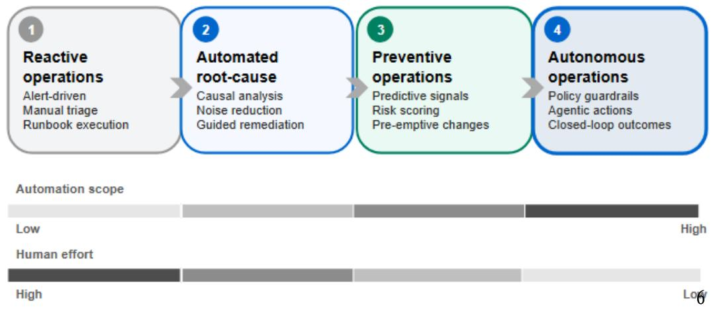  
Exhibit 1: Observability is shifting from reactive to autonomous operations

# Theme #2: Security and Observability Convergence Security and observability are increasingly drawing from the same underlying

telemetry. Logs, traces, runtime events and infrastructure signals now sit near the center of both operational monitoring and threat detection, which is pulling the two markets closer together. That is visible from the security side in moves such as Palo Alto’s 订阅研报添加微信 LCD123321Cad 04-21 acquisition of Chronosphere and CrowdStrike’s expansion around high-scale log analytics through Humio (acquired 2021) and Onum (acquired 2025). Both play to the same M&A philosophy - own the telemetry data plumbing (ingest, filter, correlate) inside a broader platform, in line with buyer demand for fewer vendors and faster paths from detection to automated response. The key point, in our view, is that the underlying data plane is becoming more strategic as more teams rely on it for monitoring, troubleshooting, and security analysis.

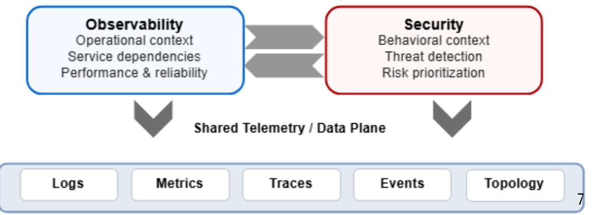  
Exhibit 2: Observability and security workflows are converging on shared telemetry

workflow depth, differentiated context or stronger economics.

Exhibit 3: Timeline of Recent Industry Consolidation and Product Launches in Observability   
Security vendors, data-platforms and Hyperscalers all moving more aggressively into security and observability workflows, raising the competitive bar   

<table><tr><td>Event</td><td>Timeline</td><td> Strategic Implications</td></tr><tr><td>Databricks launches Lakewatch (agentic SIEM) and acquires Antimatter &amp; SiftD.ai</td><td>Mar. 24,2026</td><td>Pushes SIEMinto the lakehouse; frames security telemetry,detection and investigation as open data workflows rather thanastandalone security silo.Anthropic-powered agentic workflows plus the Antimater and SiftD.ai acquisitions signal a broader push to make data platforms credible control points for security operations.</td></tr><tr><td>Snowflake announces acquisition of Observe Inc. (~$1B)</td><td>Feb.202q阅研报添力</td><td>Pull observability data into the data cloud; logs,metrics,and events increasingly treatedas strategic enterprise data rather than a separate monitoring layer. Signals that telemetry is becoming a first- class workload inside broader data and Al architectures.</td></tr><tr><td>AWS re:invent 2025: Expands into Gen-Al observability&amp; unified security-ops data lake</td><td>Dec. 2025</td><td>Deepens native-cloud observability and SIEM-adjacent tooling through CloudWatch,OpenSearch, and Al observability enhancements; raises the floor for built-in functionality.Signals that Hyperscalers are becoming more aggressive competitors for monitoring,Iog analytics,and telemetry-driven workflows,especially inside their own installed base.</td></tr><tr><td>Palo Alto Networks acquires Chronosphere ($3.35B)</td><td>Jan. 2025</td><td>Pulls observability into the security control plane;pairs Chronosphere&#x27;s telemetry,cloud-native metrics and Al-era observability with Palo Alto&#x27;s much larger security distribution.Signals production telemetry is becoming core to detection,response and automation -and that security vendors want to own more of that data upstream.</td></tr><tr><td>CrowdStrike acquires Onum (~$290M)</td><td>Aug. 2025</td><td>Moves detection closer to the data pipeline to reduce SIEM noise,improve performance and lower cost before data reaches expensive downstream tools.Highlights the growing strategic value of first- mile telemetry optimization as event volumes and Al-driven workflows scale.</td></tr><tr><td>ClickHouse launches ClickStack (Open-source observability stack)</td><td>May 2025</td><td>Turns Clickhouse from an observability backend into a more complete observability product; packages logs,metrics,traces and session replay on top of its high-performance analytical engine. Signals that observability is increasingly being treated as a data and query problem,with lower-cost, high-scale architectures pushing further up the stack.</td></tr><tr><td>Cisco completes acquisition of Splunk ($28B)</td><td>Mar. 2024 (Announced Sep.2023)</td><td>Bring observability, machine-data analytics,and security telemetry into Cisco&#x27;s much larger network and security footprint; turns Splunk from a stand-alone analytics platform intoa broader control- plane asset. Signals that scaled telemetry platforms are increasingly more valuable when tied to an installed base, distribution engine,and adjacent workflows.</td></tr></table>

Source: Company Reports, Goldman Sachs Global Investment Research 订阅研报添加微信 LCD123321Cad 04-21

Theme #3: OpenTelemetry Raises the Competitive Bar OpenTelemetry is reshaping observability by decoupling telemetry collection from proprietary agents that historically defined the category. For much of observability’s history, platforms differentiated through tightly integrated agents that controlled how telemetry was collected, enriched, and correlated, which created strong lock‑in but limited flexibility. OpenTelemetry changes that dynamic by standardizing how logs, metrics, and traces are generated and routed, giving customers more freedom in how telemetry is instrumented and where it is sent, and reducing proprietary collection as a standalone point of control. That said, open collection does not eliminate the value of approaches that simplify deployment, enrich telemetry with system‑level context, and deliver a more consistent and reliable view of production behavior, which helps explain why Dynatrace’s OneAgent remains relevant. Both Dynatrace and Elastic have been aligned with this shift for some time: Dynatrace supports OpenTelemetry ingestion alongside OneAgent‑based enrichment, while Elastic has long supported native OTLP 订阅研报添加微信 LCD123321Cad 04-21 workflows and introduced its Distributions of OpenTelemetry (EDOT) in 2024. In our view, the key takeaway is that OpenTelemetry is no longer an alternative architecture, but the market baseline, with differentiation increasingly accruing above the collection layer rather than at it.

OTel adoption trends underscore growing standardization on open collection

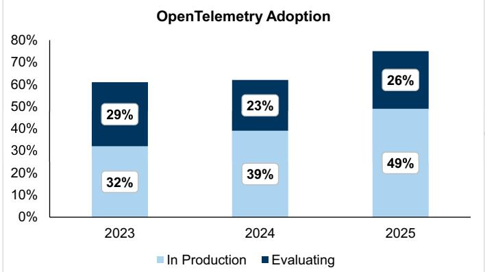  
Exhibit 4: Which of these incubating CNCF projects is your organization using in production or evaluating?

Data obtained by CNCF for their Annual Cloud Native Survey. As a part of the survey, 395-502 respondents answered this question in 2025, 689 respondents answered in 2024.

Source: Cloud Native Computing Foundation

The more critical implication is that competitive advantage is migrating to the highest levels of the stack. This shift is not a new phenomenon, but it has become the central industry tension: as telemetry becomes portable, the focal point of competition moves past the collection layer and even the processing plane toward the decision and action tier. While proprietary agents were never the primary source of value, the transition toward Open Standards as the market baseline has increased the onus on vendors to distinguish themselves through the intelligence that drives automated remediation and business outcomes. In our view, the processing plane, where data is shaped, routed, and governed, is becoming a strategic prerequisite, but the true competitive moat lies in the platform’s ability to translate that data into decisive actions. Dynatrace’s April 2026 acquisition of Bindplane is a clear signal of this transition, reflecting the need to control telemetry upstream so that the downstream decision engine can operate on high-fidelity, cost-optimized context. The vendors best positioned for this era are those that treat open collection as a commodity baseline and focus their innovation on the analytical intelligence and automated workflows that transform raw signals into proactive operational decisions.

Prometheus was an early signal that observability was already moving towards more open and modular architectures. It remains the foundational open-source standard for cloud-native metrics, and vendors such as Grafana, Chronosphere and Datadog all support Prometheus-compatible workflows in some form. OpenTelemetry 订阅研报添加微信 LCD123321Cad 04-21 pushes that same direction further by extending portability beyond metrics and across multiple signals. In our view, both technologies are best understood as part of the same broader architectural trend: more open collection, more modular telemetry stacks and a higher burden on platforms to differentiate above the data layer.

# Exhibit 5: As Open Standards become the market basline, competitive advantage and value capture moves closer to the decision and action layer

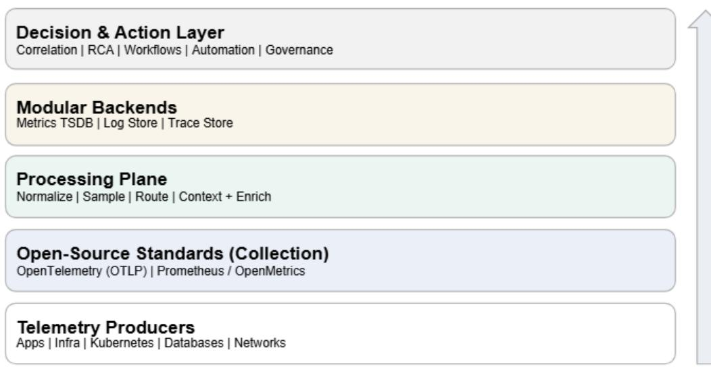

Source: Goldman Sachs Global Investment Research

# Theme #4: AI Expands Both Markets

We believe AI is making modern software environments harder to monitor and more important to understand. On the observability side, AI workloads introduce new sources of complexity around latency, token consumption, reliability, model behavior, agent reliability, and cost control. That expands both the amount of telemetry enterprises need and the importance of interpreting that telemetry correctly across models, orchestration layers, tools and downstream infrastructure. Dynatrace has leaned directly into that trend with its AI and LLM observability offering, which is designed to provide real-time visibility into LLMs, AI agents, orchestration layers and their downstream application and infrastructure impact, and more recently broadened support for additional agentic AI frameworks and protocols. In our view, AI is not simply adding incremental workload volume; it is introducing a new class of production systems with non-deterministic behavior, opaque failure modes, and cost profiles that traditional application monitoring was not designed to manage.

At the same time, AI is raising the strategic value of retrieval infrastructure. RAG and agentic workflows depend on fast, relevant access to enterprise data, which increases the importance of hybrid search, vector search, filtering and reranking quality. We believe this should be a tailwind for Elastic at the back-end retrieval layer, where its search heritage and hybrid capabilities are directly relevant. At the same time, this remains a highly competitive part of the stack, with alternatives spanning open-source 订阅研报添加微信 LCD123321Cad 04-21 (Postgres), MongoDB, Hyperscalers and specialist providers. Elastic is trying to differentiate with Agent Builder and tighter Jina AI-powered embeddings and reranking inside Elastic Inference Service – but we think the clearer benefit today is at the retrieval layer, while the eventual winners higher up the agent stack remain less settled.

# Theme #5: Data Economics Shape the Next Leg of Growth We believe data economics have become one of the category’s defining fault lines.

The historical friction started in the Splunk era, where ingest-and-index economics often forced customers to ration visibility because retaining and querying data volumes

became expensive quickly. The shift to cloud-native platforms improved usability and broadened workflow value, but it did not eliminate the underlying tension once log volumes scaled. In our view, data economics are no longer a secondary consideration but a gating factor in platform selection, as customers increasingly evaluate whether they can afford to retain, query, and operationalize more data over time.

Observability is entering a phase where architecture matters at least as much as product breadth. Some companies are attacking the problem at the storage and query layer through lower-cost log architectures, lighter indexing, or more modular back ends. Other are attacking it even earlier, at the point of collection, by helping customers filter, 订阅研报添加微信 LCD123321Cad 04-21 enrich, and route telemetry before it ever lands in a premium destination. In our view, that first-mile shift is important because it changes where observability economics are determined. Once noisy or low-value data reaches an expensive back end, much of the cost has already compounded. Companies like Cribl are pressing that point directly, and the broader implication is that destination platforms are facing pressure not just from cheaper storage, but from upstream control over where data gets sent, retained and queried in the first place.

Against that backdrop, we think the market is likely to support both modular architectures and broader premium platforms. The modular path should appeal to customers optimizing for lower-cost back ends, more composable tooling, and tighter control over telemetry spend. The broader platform path should appeal to customers willing to pay more for unified data, tighter workflow integration, reliability, and a more complete operating layer. In our view, Dynatrace fits firmly in the latter camp, while Elastic straddles a middle-ground between a high-performance data backend and an increasingly capable operating layer. We do not believe being the lowest-cost endpoint is a prerequisite for success. But it does require both companies to deliver enough value through unification, context and workflow depth to justify a premium as data volumes continue to grow.

As IT environments grow more complex, organizations are increasingly focused on optimizing observability spending

Favors unified platforms and modular stacks providing attractive unit economics with feature depth and breadth

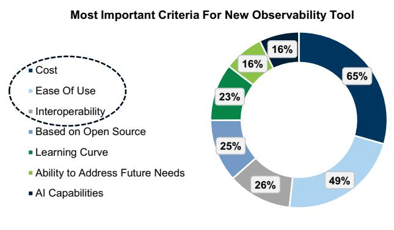  
Exhibit 7: Cost has become the primary consideration when selecting new observability tools

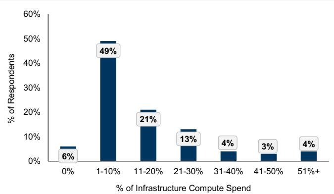  
Exhibit 6: Observability Spend as $\%$ of Compute Infrastructure; Average: $1 7 \%$ , Median: $10 \%$   
Source: Grafana Observability Survey 2026

Source: Grafana 2025 Observability Survey

Theme #6: Buyers Want Fewer Platforms We believe observability is entering a more explicit consolidation cycle. Tool sprawl was tolerable when the category was younger and buyer were optimizing for

best-of-breed functionality at the point-solution level. That is less true today. As observability estates have become larger and more expensive, the cost of fragmentation becomes harder to ignore – not just in vendor spend, but in workflow friction, duplicated data and operational complexity. We believe this is central to why the market is beginning to place greater value on platforms that can unify more of the workflow on shared data and shared context, with clearer governance and cost controls over what gets collected, stored, and acted upon.

Market signals underscore this is becoming a real source of demand. Grafana’s Observability survey (2025) showed $64 \%$ of respondents now have less than five observability technologies (up from $4 4 \%$ last year) and ETR’s 2025 survey indicates more than half of respondents are planning to consolidate further over the next two years. The market is increasingly responding to that same trend: Cisco’s acquisition of Splunk pulled a scaled observability asset into a broader networking, security, and operations platform; Palo Alto’s acquisition of Chronosphere reflects the growing value of telemetry inside security control planes; Snowflake’s acquisition of Observe points to observability becoming more relevant inside data and AI stacks. In our view, consolidation is changing the basis of competition from feature leadership in isolated tools to ownership of shared telemetry, context, and response workflows across the estate. Vendors increasingly need to prove they can consolidate spend, displace adjacent tools, and own a broader share of the telemetry estate.

Buyers continue to reduce the number of tools in their observability stack, favoring full-stack observability vendors

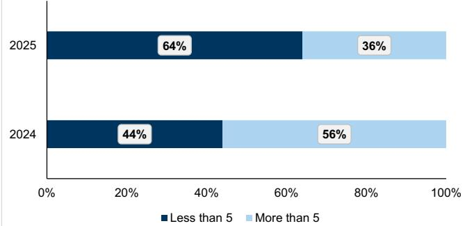  
How many observability technologies are in use?

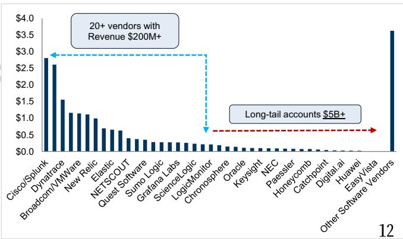  
Exhibit 8: Number of Observability Technologies In Use   
Exhibit 9: Health, Performance and Analysis Market Observability market remains highly fragmented with $^ { 4 0 + }$ vendors, half of which generate $> \$ 200 M$ in Revenue

The setup across both markets remains attractive, shaped by a mix of rising infrastructure intensity, faster data creation and a broader enterprise need to manage complexity more effectively. As cloud environments scale, architectures become more distributed, and digital workflows became more data-intensive, customers are dealing with a larger operating and information footprint at the same time. That is the common thread underpinning both Dynatrace and Elastic. Complexity is rising across the stack and spend is increasingly following the platforms that can help 订阅研报添加微信 LCD123321Cad 04-customers monitor it, search it, secure it, and act on it.

Infrastructure growth remains the clearest tailwind to observability, with both direct and indirect benefits to the category. The Infrastructure (IaaS) market is already $\$ 1908+$ and expected to grow at a near- $20 \%$ rate through CY29 (Gartner), which provides a healthy baseline for observability given how closely those budgets have historically tracked underlying infrastructure spend. The direct benefit is straightforward: more workloads, services, and dependencies create more telemetry and environments to monitor. The indirect benefit is where we think the opportunity becomes more interesting. As those environments become harder to operate manually, the value shifts towards platforms that can compress diagnosis, improve prioritization and automate a greater share of remediation. We therefore think the category can sustain mid-teens-plus growth even before considering a more meaningful AI-driven uplift, and why the wallet opportunity can expand over time as observability platforms like Dynatrace take on more of the operating burden than 订阅研报添加微信 LCD123321Cad 04-21simply monitoring volume.

# Exhibit 10: Traditional IaaS Market Forecast

Observability budget outlook looks favorable mid-term with tight linkage to growing compute infrastructure spending $( + 1 8 \%$ CAGR through CY29)

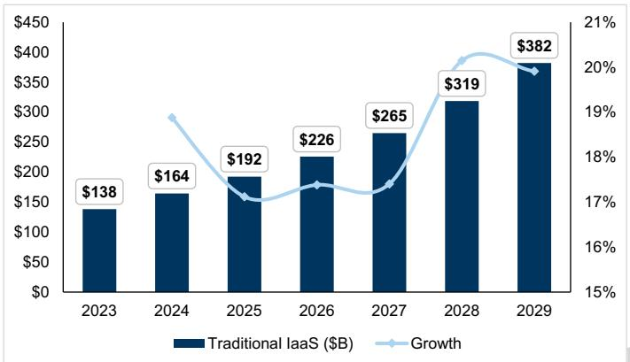  
04-21

Data growth is the parallel tailwind on the search and analytics side, particularly as AI raises the value of retrieval. IDC projects total data generation to reach 527 ZB’s by 2029, implying a $+ 2 5 \%$ 5-year CAGR, with unstructured data remaining the dominant share of the information base. That aligns with the growing share of enterprise context now sitting outside traditional systems of record – in documents, tickets, chats, logs, alerts, transcripts and other free-form data sources. As enterprises move from AI experimentation toward production, retrieval becomes central because Copilots and Agents are only as useful as the context they can access. Elastic fits naturally here. The company sits at a layer that is becoming increasingly strategic: retrieve relevant context, and make that information usable inside operational, security and AI-driven workflows.

# Exhibit 11: Structured/Unstructred Data Generation Forecast

Data growth compounding mid-20’s; supportive for data platforms operationalizing unstructured data for AI

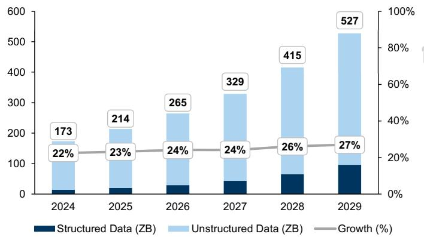  
Source: IDC, Goldman Sachs Global Investment Research

Observability and SIEM remain distinct markets, but both are becoming more strategic as enterprises rely more heavily on telemetry and event data to run and secure modern environments. Observability budgets are supported by a very practical need: application environments are becoming harder to operate, outages are more expensive and customers increasingly want to reduce time between detection and remediation. SIEM budgets are supported by a similarly practical need on the security side: event volumes are rising, threats are moving faster, and security teams need better ways to search, correlate and prioritize what matters across larger data sets. The common thread is that logs, traces, runtime context and machine data are becoming more central to both operational and security workflows. That overlap is more directly supportive of Elastic today, but it also creates a longer-term tailwind for Dynatrace as runtime context, automation, and app-security workflows become more important.

Observability spend remains supported by workload growth, rising telemetry and greater automation demand

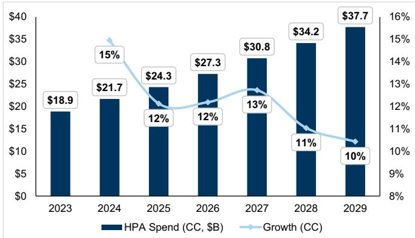  
Exhibit 12: Health, Performance and Analysis (Observability) Market Forecast

The category contines to benefit from growing machine-data intensity and security complexity

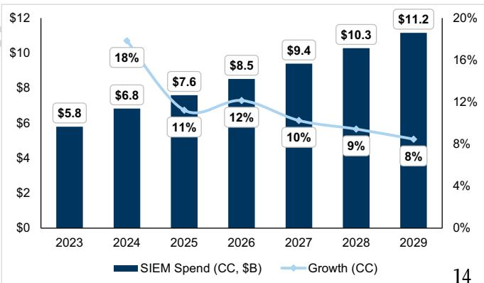  
Exhibit 13: SIEM Market Forecast

Our review of the private ecosystem suggests the more meaningful startup signal today is coming from observability, where customer pain points remain acute and the market is still actively searching for better answers around telemetry, economics, pipeline control, workflow simplicity, and AI-assisted operations. We believe that helps explain why the private landscape remains crowded and well-funded across several distinct wedges. Vendors such as Cribl, Onum (acquired by CrowdStrike) 订阅研报添加微信 LCD123321Cad 04-21 and Bindplane (acquired by Dynatrace) are attacking telemetry routing and data control, Clickhouse and Coralogix are pressing on lower-cost storage and analytics, while Honeycomb, Traversal, and Resolve AI are pushing the category toward faster diagnosis, intelligent investigation, and more automated operations. The broader takeaway is that these companies are not all trying to build a direct full-platform replacement. In most cases, they are targeting specific parts of the workflow where customers remain most sensitive to cost, complexity, or time-to-resolution, even as incumbent platforms remain deeply embedded at the center of enterprise environments.

Exhibit 14: Observability Private Startup Ecosystem   

<table><tr><td>Company</td><td>Founding Year</td><td>Valuation</td><td>Valuation Source</td><td> Strategic Angle</td><td>Why It Matters</td></tr><tr><td>Grafana Labs</td><td>2014</td><td>$6B (As of Aug-24)</td><td> TechCrunch</td><td>Open / Composable Observability</td><td>Set the pace on open, interoperable observability; makes portability, OSS support, and pricing discipline table stakes.</td></tr><tr><td>Cribl</td><td>2018</td><td>$3.5B (As of Aug-24)</td><td>Company Data</td><td>Data Pipeline / Telemetry Routing Layer</td><td>Controls the data flow between sources and destinations; gives buyers leverage to decouple ingestion from any single vendor.</td></tr><tr><td>ClickHouse</td><td>2021</td><td>$15B (As of Jan-26)</td><td>Company Data</td><td>Real-Time Analytical Database Engine</td><td>Provides the performance backbone for next-gen observability stacks; underpins cost-eficient log and trace storage at scale.</td></tr><tr><td>Coralogix</td><td>2014</td><td>$1B (As of Jun-25)</td><td>Company Data</td><td>Streaming-First / Cost-Optimized Observability</td><td>Proves that in-stream analytics can slash storage costs; pressures incumbents on price without sacrificing data fidelity.</td></tr><tr><td> Sentry</td><td>2011</td><td>$3B</td><td>Company Data</td><td>Developer-First Performance Monitoring</td><td>Owns the developer on-ramp to observability via open- source error tracking; expands TAM by bridging into full APM territory.</td></tr><tr><td>Honeycomb</td><td>2016</td><td>$0.5B (As of Apr-23)</td><td></td><td>High-Cardinality / TechCrunch Observability 2.0 Pioneer</td><td>Redefined how engineering teams explore production data; championed the shift from siloed pillars to unified, queryable telemetry.</td></tr><tr><td> Arize Al</td><td>2020</td><td></td><td></td><td>Al / ML Model Evaluation</td><td>Purpose-built for monitoring Al models in production; Observability &amp;LLMcaptures the emerging budgetline for LLMand agent observability.</td></tr><tr><td>Resolve Al</td><td>2024</td><td>$1B (As of Dec- 2025)</td><td></td><td>Autonomous SRE / TechCrunch Al-Native Incident Response</td><td>Applies agentic Al to automate on-call and root-cause analysis; tests whether Al can replace manual SRE workflows at scale. Uses causal ML to pinpoint root causes across</td></tr><tr><td>Traversal</td><td>2023</td><td></td><td></td><td>Al SRE Agent / Causal Root-Cause Analysis</td><td>massive telemetry; addresses the growing complexity from Al-generated codebases. Built OTel-native from day one with autonomous Al</td></tr><tr><td>Dasho</td><td>2023</td><td>$1B (As of Mar- 2026)</td><td>Company Data</td><td>OpenTelemetry- Native /Agentic Observability</td><td>agents; challenges incumbents on vendor lock-in, pricing,and data portability.</td></tr></table>

around vector, hybrid retrieval and AI-native architectures versus legacy keyword-only approaches. At the same time, competitive pressure is not limited to that cohort. AI-native application vendors like Glean can compete for portions of enterprise search and discovery budgets by owning the end-user workflow, while broader developer and data platforms are increasingly embedding retrieval capabilities natively, which could limit how much value ultimately accrues to standalone features. In our view, this is the 订阅研报添加微信 LCD123321Cad 04-21 key distinction versus observability: search is still an active market, but the startup landscape is more fragmented, with no clear path yet to platform consolidation or category leadership.

Exhibit 15: Vector Database / Search Platforms   

<table><tr><td>Company</td><td>Founding Year</td><td>Valuation</td><td>Valuation Source</td><td> Strategic Angle</td><td>Why It Matters</td></tr><tr><td> Glean</td><td>2019</td><td>$7.2B (As of Jun-2025)</td><td>Company Data</td><td>Enterprise Knowledge / Assistant Layer</td><td>Shows Al assistants can compete for portions of search and discovery budgets by owning the end-user workflow.</td></tr><tr><td>Pinecone</td><td>2019</td><td>$750M (As of Apr-2023)</td><td>Company Data</td><td>Managed Vector Database for Al Applications</td><td>Provides the retrieval backbone for RAG and LLM apps; captures infrastructure spend as every Al product needs vector search.</td></tr><tr><td> Algolia</td><td>2012</td><td>$2.25B (As of Jul-2021)</td><td>Company Data</td><td>API-First Search &amp; Discovery Platform</td><td>Proved search-as-a-service at scale for e-commerce and SaaS; now pivoting to Al-native search to defend a large install base.</td></tr><tr><td>Qdrant</td><td>2021</td><td>订阅研报添加微信</td><td></td><td>Open-Source Vector Search Engine 3</td><td>Offers high-performance,self-hosted vector search with advanced filtering; appeals to cost-senstive and privacy-focused teams.</td></tr><tr><td>Weaviate</td><td>2019</td><td></td><td></td><td>Open-Source Al- Native Vector Database</td><td>Combines vector and structured search in a single schema layer; positions itself as the knowledge graph for Al-native applications.</td></tr><tr><td>Zilliz/Milvus</td><td>2017</td><td></td><td></td><td>Database at GPU Scale</td><td>Open-Source Vector Backs the most-starred open-source vector DB; targets massive-scale enterprise workloads where raw throughput is the bottleneck.</td></tr></table>

observability, AI, and operations. Two conversations in particular - with Grafana Labs at the Software Bus Tour and Traversal at our Private Software Conference - were especially informative in illustrating how innovation at the private layer is responding to the same structural shifts reshaping the public observability landscape. While these companies operate at very different stages of maturity, both offer useful signals on how architectures, economics, and workflows are evolving as AI increases system complexity, raises query intensity, and places greater emphasis on cost discipline and deterministic outcomes. The takeaways below highlight where we see these dynamics emerging most clearly.

 ‹¢–xb¥mûR _®Oá   LCD123321Cad   04-2Our discussion with Grafana Labs highlighted how observability architectures 1 are adapting as AI-driven query patterns and cost discipline become first-order concerns. Grafana’s evolution from Prometheus-native tooling to a fully OpenTelemetry-aligned platform mirrors the broader standardization underway across enterprise telemetry. Where differentiation is emerging is economics and control: dynamically filtering telemetry before it reaches storage directly addresses the data-volume problem that has driven observability costs higher as environments scale, particularly as AI agents push query intensity well beyond human baselines. Coupled with a graph-based data model designed for agentic workflows and an Assistant that has demonstrated credible root-cause accuracy in live incidents, Grafana’s openness-plus-economics positioning is increasingly resonating with buyers reassessing total cost of ownership and lock-in risk alongside feature completeness.

Traversal represents an earlier-stage but conceptually clear signal in the shift x   
toward faster, more deterministic operations. While much of today’s AI tooling in observability remains correlation-driven, Traversal is built around a causal search engine operating on a live production world model, enabling it to trace root-cause chains rather than surface probabilistic suspects. That distinction is especially relevant in SRE workflows where explainability, repeatability, and MTTR reduction are paramount - particularly for uptime-sensitive customers like financial services, where downtime costs are immediately quantifiable. Near term, Traversal’s decision to sit on top of existing observability stacks lowers adoption friction; longer term, the architecture points toward deeper infrastructure ownership as the demands of maintaining and querying the underlying data layer grow. Together with Grafana, Traversal underscores how innovation at the private layer is increasingly   
concentrated on the economics, control planes, and operational determinism that incumbent platforms will need to address.

# R _®Oá LCD123321Cad 04-21

# AI Impact Framework

Applying the GS AI Impact Framework to Dynatrace and Elastic. In conjunction with our analysis of the private startup ecosystem and the emerging competitive threats reshaping observability, search and security, we apply the GS AI Impact Framework to Dynatrace and Elastic to assess how each platform is positioned against the most important vectors of AI-driven disruption. The framework evaluates six dimensions: orchestration risk, monetization model, system of record ownership, data and integration moat, AI execution and budget alignment. Both companies benefit from consumption-based models that scale with data intensity and workload complexity, a structural advantage as AI expands the volume and urgency of machine-generated data. Dynatrace’s deep workflow entrenchment, proven causal AI engine and expanding agentic capabilities positions it well across most dimensions of the framework. Elastic’s foundational role in search and retrieval becomes more strategically important as AI raises the value of context and unstructured data, and the company has made considerable product progress building toward higher-value workflows, we think the 订阅研报添加微信 LCD123321Cad 04-21 degree to which it can capture that opportunity relative to broader platforms remains one of the more important debates in the story. Our detailed assessment is outlined below.

# Exhibit 16: GS AI Impact Framework

Both platforms are well-positioned against the most important vectors of AI-driven disruption, with consumption-based models that scale with data intensity and a growing suite of AI-native capabilities across observability, search and security

<table><tr><td rowspan=1 colspan=1>Al Impact Framework</td><td rowspan=1 colspan=1>Dynatrace</td><td rowspan=1 colspan=1>Elastic</td></tr><tr><td rowspan=1 colspan=1>Orchestration RiskCould an external Al layer capturevalue?</td><td rowspan=1 colspan=1>Low-Moderate. Davis Al embedded in operational workflows,limitingabstraction risk. Emerging AlOps vendors targeting the remediationlayer directly, making Dynatrace Intelligence&#x27;s execution increasinglyconsequential.</td><td rowspan=1 colspan=1>Low-Moderate.Search and retrieval are foundational infrastructurelayers,butagentframeworksand Hyperscaler-native stacks couldabstractvalue if retrieval becomescommoditized inside broaderplatforms.</td></tr><tr><td rowspan=1 colspan=1>Monetization ModelIs revenue tied to seats orassets/data/consumption?</td><td rowspan=1 colspan=1>Insulated. DPS consumption model benefits directly from Al-driveninfrastructure complexityand rising telemetry volumes,expanding theaddressable workload opportunity.</td><td rowspan=1 colspan=1>Insulated. Consumption tied to data volume and query intensity; Alworkloadsare inherentlydata-intensive,driving incremental demand forsearchand retrieval infrastructure.</td></tr><tr><td rowspan=1 colspan=1>System of Record OwnershipWho owns execution andgovernance?</td><td rowspan=1 colspan=1>Strong. Owns the operational telemetry layer for large enterprises;DavisAl sitsat the center of diagnosis,remediationand autonomousoperations.</td><td rowspan=1 colspan=1>Moderate. Elasticsearch is the dataand retrieval foundationacrosssearch,observability,and security. Ownership of the action andgovernance layer above the data tier remains lessestablished.</td></tr><tr><td rowspan=1 colspan=1>Data and Integration MoatHow embedded is the platform?</td><td rowspan=1 colspan=1>Deep.OneAgent and Smartscape create deep technical entrenchment;switching costs increase as customers rely on Davis Al forautomatedremediation; OTel&#x27;s riseadds instrumentation flexibility, graduallytempering the proprietary moat.</td><td rowspan=1 colspan=1>Moderate. Deeply embedded in log analyticsand search workflows;open-source heritage drives broad adoption and developer mindsharebutlimits exclusivity relative to more proprietaryarchitectures.</td></tr><tr><td rowspan=1 colspan=1>Al ExecutionIs Al embedded into core workflows?</td><td rowspan=1 colspan=1>Meaningful Progress. Davis Al has powered automated RCAandremediationat scale for years. Dynatrace Intelligenceadds naturallanguage querying,Al-assisted workflowautomation and agenticresolutionacross observabilityand security.</td><td rowspan=1 colspan=1>Progressing. Elasticsupportsvectorsearch,hybrid retrieval,reranking,and native inference. Agent Builder and Workflows extend the platforminto Al agent construction and automated action across enterprisesystems.</td></tr><tr><td rowspan=1 colspan=1>Budget AlignmentDoes Al increase category urgency?</td><td rowspan=1 colspan=1>Positive.Al increases infrastructure complexity, telemetry volume,andremediation demand -all expanding Dynatrace&#x27;s relevance andaddressable opportunity.</td><td rowspan=1 colspan=1>Positive.Al expands the strategic importance of retrieval, contextengineering and unstructured data handling, though rising competitiveintensity acrossall three end-markets may temper the net benefit.</td></tr></table>

Dynatrace: Initiating Buy, PT $\$ 45$

Dynatrace combines deep roots in APM with an increasingly broader full-stack and AI-powered platform. The company’s heritage is in application performance monitoring (APM), where it built a strong position with large, complex enterprises that needed visibility into highly distributed, mission-critical environments. Over time, that foothold has expanded well beyond classic APM into infrastructure observability, digital experience monitoring, log management, application security and automation, with Grail and Davis AI now serving as the architectural backbone for a more unified platform. 订阅研报添加微信 LCD123321Cad 04-21 Importantly, Dynatrace is no longer just selling monitoring; it is increasingly selling a system designed to help enterprises understand, prioritize, and act across complex environments. In our view, that combination of enterprise entrenchment, platform breadth, and a growing emphasis on AI-driven workflows gives Dynatrace a more durable strategic position than many narrower observability vendors.

# Exhibit 17: Gartner’s Product or Service Score by Use Case (Observability)

Dynatrace ranks #1 or #2 across all measured observability use cases, underscoring its market leadership

<table><tr><td>Capability</td><td> Rank (n=20) Score (Out of 5)</td></tr><tr><td>SRE (Site Reliability Engineering)</td><td>#1 4.30</td></tr><tr><td>Platform Operations</td><td>#2 4.28</td></tr><tr><td>Software Engineering</td><td>#2 4.29</td></tr><tr><td>Business Insights</td><td>#1 4.30</td></tr><tr><td>Cost Optimization</td><td>#1 4.32</td></tr><tr><td>Al Engineering</td><td>#1 园 4.29</td></tr><tr><td>Average</td><td>#1 4.30</td></tr></table>

Source: Gartner

# Exhibit 18: Dynatrace is the #3 scaled player in Observability

Observability market remains highly fragmented; Dynatrace positioned as a consolidator with platform depth and breadth

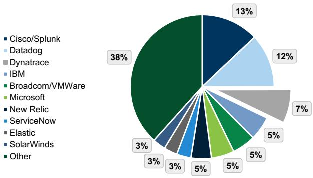  
2024 Observability Market Share   
Source: Gartner

Our Buy rating reflects a platform moving in the right direction and a clearer line of sight to potential growth acceleration. Dynatrace has spent roughly the last two years putting several of the key pieces in place. The GTM changes increasingly look to be in the rearview, and we think that is showing up in the numbers, with CC NNARR growing double-digits for three straight quarters and the model carrying better stability than it did a year ago. Dynatrace Platform Subscription (DPS) has also made the platform easier to adopt and should begin to create a clearer renewal tailwind in FY27 as the earliest cohorts cycle, which gives the company a more visible path to accelerating ARR growth. Logs is also emerging as a meaningful upside node, crossing $\$ 100 M$ in annualized consumption $( + 1 0 0 \% )$ , helped by the same broader platform adoption dynamics. Grail and Davis AI reinforce the strategic case by giving Dynatrace a stronger data and AI foundation as customers look for more unified, automated operations. With a healthy non-GAAP OpM profile $( \sim 3 0 \% )$ and expanding GAAP profitability, we think the stock offers a compelling balance of improving growth potential and healthy FCF generation.

GTM changes implemented in FY25 drove volatility in NNARR performance; maturation of new model supporting better consistency

# Exhibit 20: Constant Currency ARR Growth

Recent consistency in NNARR driving three consecutive quarters of stable ARR growth

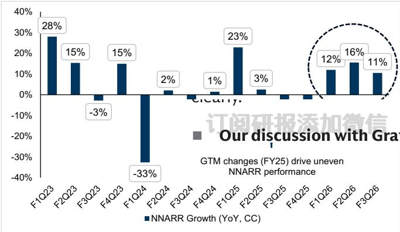  
Exhibit 19: Constant-Currency NNARR Growth   
Source: Company Data

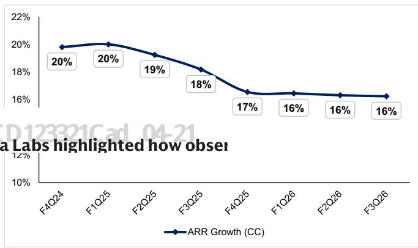  
Source: Company Data

Dynatrace Through the Lens of the GS Framework for Investing in Software Dynatrace screens well across the GS Framework for Investing in Software. The company addresses a large and growing observability market underpinned by structural demand – cloud complexity, AI workload proliferation, and the convergence of observability and security are all expanding the opportunity set in ways that favor platforms with deep technical differentiation and broad workflow coverage. Dynatrace’s combination of full-stack instrumentation, proprietary causal AI and a contract structure that deepens consumption over time positions it as a consolidating platform rather than a point solution, with switching costs that increase as customers rely more heavily on Davis AI for automated remediation and operational decision-making. Unit economics are already strong, with Non-GAAP OpM’s near- $30 \%$ and a Rule of 40 profile consistently above 40, which compares favorably to most software peers at a similar stage of growth. Looking ahead, the DPS renewal cycle and an underpenetrated logs opportunity provide a more visible path to growth acceleration, while the extension into agentic operations through Dynatrace Intelligence broadens the platform’s relevance as the category shifts toward autonomous IT. Taken together, these attributes support a defensible competitive position and a compelling risk-reward at mid-teens EV/FCF.

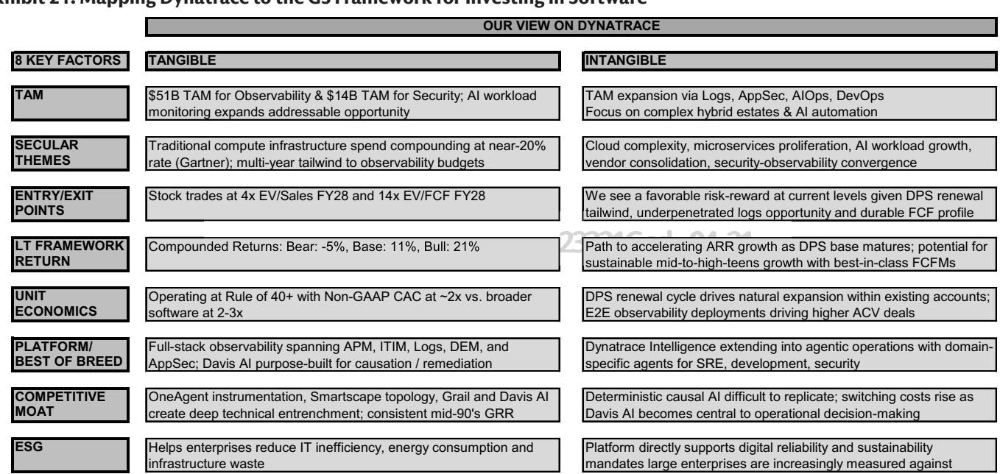  
Exhibit 21: Mapping Dynatrace to the GS Framework for Investing in Software   
Source: Gartner, Company Data, Goldman Sachs Global Investment Research

Platform Strategy: Leveraging Enterprise Entrenchment and Hybrid Complexity End-to-end observability remains Dynatrace’s core strength, and the market is moving in its direction. Dynatrace built its core franchise in APM, but the platform has expanded well beyond that starting point into infrastructure, user experience, logs, security and automation. We believe that breadth is strategic because organizations are increasingly looking for fewer tools, tighter operational workflows, and broader visibility across complex environments. Dynatrace is well-positioned for that shift, in our view, because it has long been strongest in large enterprises running a mix of on-prem, legacy and cloud workloads rather than only clean cloud-only environments. The combination of broad product coverage and credibility in hybrid estates helps support the platform’s stickiness ( $9 5 \%$ GRR) and reinforces Dynatrace’s appeal as a consolidation choice for customers looking for a more unified way to run operations. Management has framed end-to-end observability as an emerging shift two years ago but a prevalent one now, and we think that is consistent with the recent momentum in strategic pipeline growth (up $\sim 5 0 \%$ YoY in F1Q26 and $+ 4 5 \%$ YoY in F2Q26).

That position should support both durable expansion and high-quality new-logo activity over time. Dynatrace remains geared toward larger enterprises rather than a high-velocity, developer-led motion, which means new-logo volume trails peers such as Datadog. More important is the quality and yield of those accounts once they land. Average land size was $\$ 200 K$ versus \~\$500K in ARR/Customer across the installed base (F3Q26), which points to meaningful expansion headroom if newer cohorts mature in a way that is even directionally consistent with older ones. Importantly, Management has noted that today Dynatrace typically observes only ${ \sim } 2 0 { \sim } 3 0 \%$ of customer workloads, largely those deemed mission‑critical and customer‑facing, with broader environments often monitored via lighter‑weight or home‑grown tooling. As AI‑native and agentic workloads proliferate, we think that definition of mission‑critical naturally expands, creating a tangible path for workload‑based expansion over time. The GTM changes over the last two years fit naturally with that backdrop: sharper account focus and greater customer intimacy should continue to improve Dynatrace’s ability to expand 21 within these large environments; meanwhile, DPS lowers the friction to consume more of the platform over time. In our view, that combination supports a healthier and more durable expansion path than logo counts alone would suggest.

# Exhibit 22: New Logos Added

New logo activity has trended lower vs. prior year as the company leans into consolidation deals with higher ACV potential

# Exhibit 23: Avg. New Logo Land Size and Avg. ARR Per Customer

Land size reached a record $\$ 200 K$ in F3Q26 (vs. $\$ 160K$ TTM), an early sign of momentum in larger platform consolidation deals

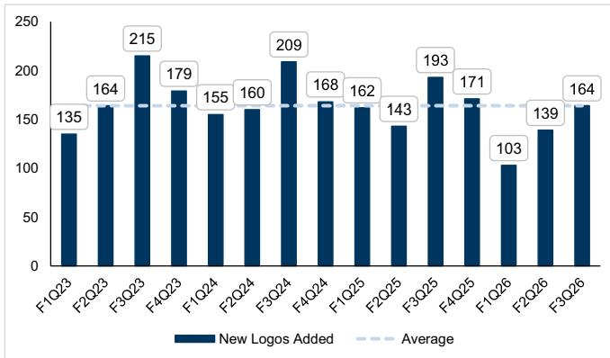  
Source: Company Data

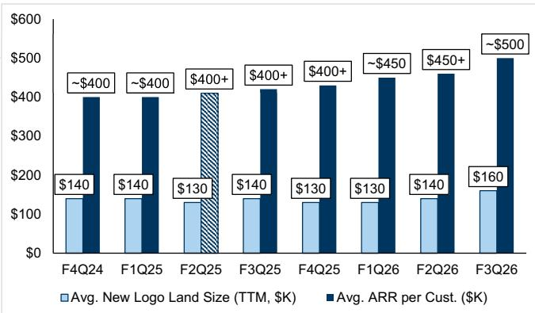  
Source: Company Data

# Unpacking the Logs Product Cycle

Grail and logs give Dynatrace a stronger path to workload consolidation. Grail is central to the story because it gives Dynatrace a common data foundation across logs, metrics, traces, and security data rather than requiring customers to work across separate systems. The logs business is the clearest example of how that architecture can create a new leg of growth. Dynatrace did not have a viable logs product until Oct. 2024 but the ramp since then has been notable, with logs now above $\$ 100 M$ in annualized consumption and growing $100 \% +$ (F3Q26). The value-proposition is straightforward: when logs sit on the same architecture as metrics and traces, customers can analyze more of their environment in one place, reduce tool sprawl, and improve both performance and economics.

Logs are becoming more important because they improve both platform value and quality of automated layered on top of it. When logs sit alongside metrics and traces, teams can move from signal to context to root-cause faster and with less friction than they can across separate tools. That becomes more valuable as customers aim to standardize on fewer platforms and automate more of their operations. In our view, these dynamics are what makes logs strategically important for Dynatrace: they are not only another workload the company can win, but also a deeper source of context that should improve the value of the broader platform as customers push further toward 订阅研报添加微信 LCD123321Cad 04-21 AI-driven analysis and automation. We therefore see logs as both a direct growth driver and a practical way to deepen platform standardization over time.

Channel checks suggest Dynatrace is winning logs primarily as an APM/DEM attach - customers add logs to put more context around workflows they already run on the platform, which we think also sets up better downstream insights and automation via Dynatrace Intelligence. The same checks underscore that as logging scales, cost control becomes central, which is why more customers are looking to be deliberate about what data they send into premium back-ends. We think Dynatrace is well positioned in that environment because logs are still a smaller, growing piece of the platform rather than a massive legacy estate customers are trying to cut back. Bindplane should be an incremental tailwind by enabling more filtering and governance earlier in the data flow, improving the economics of scaling logs as adoption broadens.

# Exhibit 24: Timeline of Logs Disclosures

Logs crossed the $\$ 100 M$ milestone in F3Q26, still growing $100 \% +$ ; constructive on durable growth potential as DPS reduces adoption friction

<table><tr><td rowspan=1 colspan=1>Period</td><td rowspan=2 colspan=1>PeriodDisclosuresAnnualized logs consumption oficially surpassed the $100 million milestoneThe logs business continued to grow at over 100% year-over-year</td></tr><tr><td rowspan=1 colspan=1>F3Q26</td></tr><tr><td rowspan=1 colspan=1>F2Q26</td><td rowspan=1 colspan=1>Logs remained the fastest-growing product category, growing wel over 100% year-over-yearThe number of customers spending over $1 million annually on logs doubled compared to the prior yearThe number of customers spending over $5o0,000 annually on logs increased nearly 4x year-over-year</td></tr><tr><td rowspan=1 colspan=1>F1Q26</td><td rowspan=1 colspan=1>Logs consumption increased by 36% sequentially and wel over 100% year-over-yearThree 7-figure ACV wins in the quarter each included planned annualized logs consumption of at least $1 millonMajor airline customer exceeded several milion dolars in annualized logs consumption &lt;18 months on the platform</td></tr><tr><td rowspan=1 colspan=1>F4Q25</td><td rowspan=1 colspan=1>Over one-third of the total customer base was leveraging the logs solutionCustomers leveraging logs increased by 18% compared to the prior quarter~50%ofallnew logos added in Q4 deployed logs in their initial implementation,up from ~20% inyear-ago period</td></tr><tr><td rowspan=1 colspan=1>F3Q25</td><td rowspan=1 colspan=1>The company reached wel over 1,000 customers leveraging log solutions The logs customer base grew 17% sequentially compared to the prior quarter More than 50% of the new logos added in TTM leveraged logs in their initial deployments</td></tr><tr><td rowspan=1 colspan=1>F2Q25</td><td rowspan=1 colspan=1>Nearly 25% of the total customer base was using the logs product at this timeCustomer Growth: The number of logs customers increased by ~20% sequentially</td></tr><tr><td rowspan=1 colspan=1>F1Q25</td><td rowspan=1 colspan=1>Logs consumption was noted as growing wellabove 100% year-over-year</td></tr><tr><td rowspan=1 colspan=1>F4Q24</td><td rowspan=1 colspan=1>Dynatrace reported having roughly 6oo customers leveraging the logs solutionThis 600-customer mark represented a 30% quarter-over-quarter increase in the number of log customersExiting fiscal 2024,consumption for the emerging logs ofering was growing very rapidly at north of 100%</td></tr><tr><td rowspan=1 colspan=1>F3Q24</td><td rowspan=1 colspan=1> The company saw a 50% sequential quarter-over-quarter increase in paying log management customersThere was a 30% increase in log management Proof of Concepts (POCs) during the quarter</td></tr></table>

Source: Company Data

# Causal AI and Davis: Delivering Trusted Answers Before Guided Action AI should reinforce Dynatrace’s relevance in large, hybrid enterprise environments.

Dynatrace has been embedded for years in enterprises running a mix of legacy systems, on-prem infrastructure, cloud workloads and increasingly AI-driven applications. We view this as an important advantage since AI is being layered onto existing estates, not built into a clean slate. In practice, this tends to increase operational complexity: release cycles compress, dependencies multiply, and the need for trusted visibility across the stack becomes more important. In our view, this plays directly to Dynatrace’s strengths in end-to-end observability and should support continued demand from customers looking to manage AI-driven change inside already-complex environments.

Dynatrace’s architecture unifies data through a single system model, eliminating traditional telemetry silos by leveraging Grail as a unified fabric and OneAgent for deep, automated discovery. While OneAgent remains a core differentiator, the

steps become automated.

Ultimately, we view this as a tangible opportunity for Dynatrace to capture incremental value. By enabling customers to streamline operational workflows and enhance engineering efficiency via Dynatrace Intelligence, the company can effectively participate in the long-term cost savings derived from reduced labor intensity in SRE and platform engineering functions.

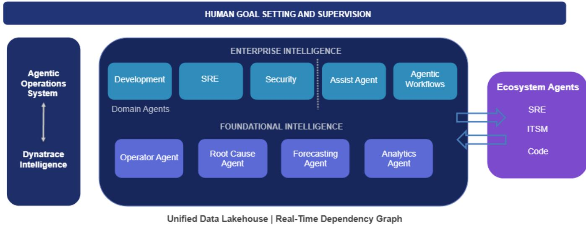  
Exhibit 26: Dynatrace Intelligence Platform Architecture

Source: Company Data, Goldman Sachs Global Investment Research

# The DPS Transition: Bridging the Gap Between Consumption and Reported ARR Dynatrace’s transition to DPS creates a timing lag between usage and reported ARR.

Dynatrace Platform Subscription (DPS) customers commit to a minimum annual spend and consume against a common platform rate card rather than buying individual products under a traditional SKU-based subscription. If usage rises above that annual commitment, customers can either continue consuming on-demand at the same unit price or step up the contract earlier, though Management has indicated that customers earlier in the three-year contract term more often stay on on-demand consumption (ODC) and defer the contractual reset. Excess usage still flows through revenue, but it is excluded from ARR until the commitment is rebased higher. With DPS now representing $7 5 \%$ of ARR, more of Dynatrace’s growth is flowing through a structure where usage can run ahead of committed ARR. Management’s disclosures punctuate this: annualized dollar consumption is growing $20 \% +$ and DPS customers are consuming roughly $_ { 2 \times }$ faster than legacy SKU-based, while reported ARR has been stable at $+ 1 6 \%$ CC growth through FY26.

Dynatrace is sustaining an industry leading margin profile while deliberately investing for growth acceleration. Management has signaled that $2 9 \%$ non-GAAP OpM and $3 2 \%$ pre-tax FCFM should be viewed as a floor as Dynatrace reinvest back into the business – a commitment supported by emerging AI efficiencies and productivity gains across business functions that are effectively self-funding the investment cycle. Those dollars are being directed with clear intent. R&D remains the primary area of resource allocation and headcount growth, with the recent launch of Dynatrace Intelligence a tangible proof point of what that investment is producing. On the GTM side, Management continues to invest in S&M while generating leverage – driven by a 订阅研报添maturing channel 加微信 LCD123321Cad 04-21 partner ecosystem (80% of ACV partner-influenced) and dedicated Pull observability data into the data cloud; logs,metrics,and event strike teams across Logs, AppSec and Digital Experience Monitoring that are driving high-margin platform attach. The combination of partner leverage, focused sales capacity, and the low-friction DPS consumption model is allowing Dynatrace to invest for growth while holding margins at levels few software peers can match. We view the current posture as the right balance given where Dynatrace is in its growth cycle. Long-term, we see room for incremental margin expansion as AI efficiencies compound, the business scales, and the DPS expansion motion becomes increasingly dominant.

Dynatrace has maintained high-20’s OpM’s even through a growth investment cycle, underscoring strong operational discipline

# Exhibit 31: Non-GAAP R&D Spending

R&D is a key investment priority as Dynatrace extends the platform toward agentic operations, security and business observability

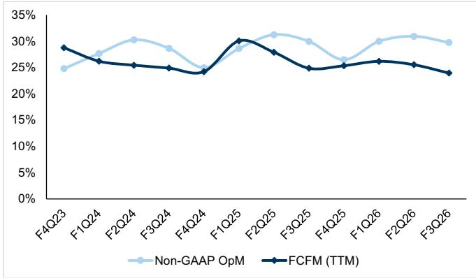  
Exhibit 30: Non-GAAP Operating Margin and Free Cash Flow Margin   
Source: Company Data

Source: Company Data

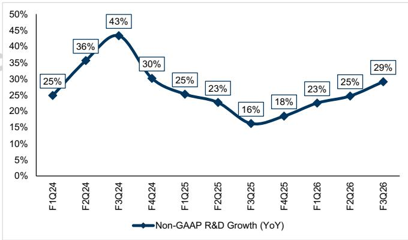

Dynatrace has de-rated to levels that we view as increasingly compelling given the quality of the business and improving growth outlook. Against a backdrop of severe multiple compression across software on AI disruption fears, Dynatrace’s NTM EV/FCF multiple has contracted to $1 6 x$ (from $_ { 2 1 x }$ Jan. 2026) - a $3 1 \%$ discount to the one-year average and $50 \%$ discount to three-year average. We are not dismissive of what is driving that compression – the broader software de-rating reflects ongoing investor debate around terminal value in an AI-disrupted world and GAAP profitability as a measure of business quality. On both dimensions, we think Dynatrace stacks up better than most. The platform operates at the operational and remediation layer of enterprise IT, where AI is more likely to expand demand than displace it, while GAAP profitability is already a reality with $8 \%$ GAAP OpM’s in FY26. At current multiples, we think the market is underappreciating the combination of $30 \% +$ pre-tax FCFM’s, a balanced Rule of $^ { 4 0 + }$ profile, and a growth setup we expect to improve as the DPS renewal cycle matures and log management scales.

# Exhibit 32: Dynatrace EV / FCF (NTM)

DT has de-rated to 16x EV/FCF (NTM), $- 3 1 \%$ below the 1Y average

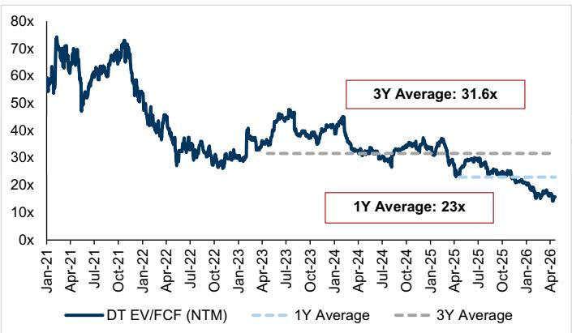  
Source: FactSet

# Estimates and Management Guidance

We outline our estimates and Management guidance for Dynatrace below in Exhibit 33

Exhibit 33: Estimates vs. Consensus   

<table><tr><td>All figures in $mns</td><td colspan="2">4Q26 (E) Guidance</td><td colspan="2">4Q26 (E) GSe Cons.</td><td colspan="2">FY26 (E) Guidance GSe</td><td colspan="2">FY26 (E) GSe</td><td colspan="2">FY27 (E) Cons. GSe</td><td colspan="2">FY28 (E) Cons.</td></tr><tr><td>Total ARR</td><td colspan="2"></td><td colspan="2">$2,058 $2,054</td><td colspan="2">$2,053 ： $2,061</td><td colspan="2">Cons. $2,054</td><td colspan="2">$2,356</td><td colspan="2">$2,704</td></tr><tr><td>YoY</td><td colspan="2"></td><td>19%</td><td colspan="2">18%</td><td colspan="2">$2,058 19% 19%</td><td colspan="2">$2,355 14%</td><td>$2,696 15% 14%</td><td colspan="2">15%</td></tr><tr><td>Q0Q</td><td colspan="2"></td><td>4%</td><td>18</td><td>：</td><td></td><td>18%</td><td></td><td></td><td></td><td></td></tr><tr><td>Total ARR (CC)</td><td colspan="2"></td><td>$2,009</td><td>$2,010</td><td></td><td>$2,009</td><td>$2,016</td><td>$2,355</td><td>$2,350</td><td>$2,696</td><td>$2,683</td></tr><tr><td>YoY(CC)</td><td colspan="2"></td><td>16%</td><td>16%</td><td></td><td>16%</td><td>16%</td><td>14%</td><td>14%</td><td>14%</td><td>14%</td></tr><tr><td>NNARR (CC)</td><td colspan="2"></td><td></td><td>$79</td><td></td><td>$273</td><td>$278</td><td>$297</td><td>$298</td><td>$341</td><td>$327</td></tr><tr><td>YoY(CC)</td><td colspan="2"></td><td>$77 4%</td><td>7%</td><td></td><td>10%</td><td>11%</td><td>9%</td><td>8%</td><td>15%</td><td>10%</td></tr><tr><td>Total Revenue</td><td colspan="2">$518 $523 :</td><td></td><td>$521 $2,005</td><td colspan="2">$2,010 :</td><td>$2,008</td><td>$2,310</td><td>$2,305</td><td>$2,639</td><td>$2,637</td></tr><tr><td>YoY</td><td>16% :</td><td>17%</td><td>$521 1</td><td>179 18%</td><td>： 18%</td><td>$2,008 18%</td><td>18%</td><td>15%</td><td>15%</td><td>14%</td><td></td></tr><tr><td>QoQ</td><td>0% ：</td><td>1%</td><td></td><td></td><td></td><td></td><td></td><td></td><td></td><td></td><td>14%</td></tr><tr><td></td><td>$493 ：</td><td>$498</td><td></td><td>$496 $1,917</td><td>： $1,922</td><td>$1,920</td><td>$1,920</td><td>$2,214</td><td>$2,209</td><td>$2,536</td><td></td></tr><tr><td>Subscription Revenue YoY</td><td>16%</td><td>18% ：</td><td>$496 17%</td><td>17% 18%</td><td>： 18%</td><td>18%</td><td>18%</td><td>15%</td><td>15%</td><td>15%</td><td>$2,529</td></tr><tr><td>QQQ</td><td>0%</td><td>1% ：</td><td>0%</td><td>1%</td><td></td><td></td><td></td><td></td><td></td><td></td><td>14%</td></tr><tr><td>Professional Services Revenue</td><td></td><td></td><td></td><td>$25</td><td></td><td></td><td>$87</td><td>$96</td><td>$96</td><td>$104</td><td></td></tr><tr><td></td><td></td><td></td><td>$25</td><td>15%</td><td></td><td>$88 15%</td><td>14%</td><td>10%</td><td>10%</td><td></td><td>$104</td></tr><tr><td>YoY QoQ</td><td colspan="2"></td><td>17%</td><td>12%</td><td>122</td><td>A</td><td>n</td><td></td><td></td><td>8%</td><td>8%</td></tr><tr><td></td><td colspan="2">订阀</td><td>14%派加</td><td></td><td></td><td>021</td><td></td><td>21</td><td></td><td></td><td></td></tr><tr><td>Non GAAP Gross Profit</td><td colspan="2"></td><td>$435</td><td>$436 84%</td><td></td><td>$1,686</td><td>$1,689</td><td>$1,939</td><td>$1,940</td><td>$2,215</td><td>$2,217</td></tr><tr><td>Gross Margin</td><td colspan="2">$133 $138</td><td>84%</td><td></td><td>$582 $587</td><td>84%</td><td>84%</td><td>84%</td><td>84%</td><td>84%</td><td>84%</td></tr><tr><td>Non GAAP Operating Income</td><td colspan="2">26% 26% .</td><td>$136</td><td>$137</td><td>29% :</td><td>$585</td><td>$586</td><td>$684</td><td>$683</td><td>$800</td><td>$800</td></tr><tr><td>Operating Margin</td><td colspan="2">$0.38 $0.39</td><td>26%</td><td>26%</td><td>$1.67</td><td>29% 29%</td><td>29%</td><td>30%</td><td>30%</td><td>30%</td><td>30%</td></tr><tr><td>Non GAAP EPS</td><td colspan="2">-</td><td>$0.39</td><td>$0.39</td><td>“</td><td>$1.69 $1.68</td><td>$1.68</td><td>$1.95</td><td>$1.91</td><td>$2.29</td><td>$2.20</td></tr><tr><td>GAAP EPS</td><td colspan="2"></td><td>$0.09</td><td>$0.15</td><td></td><td>$0.56</td><td>$0.63</td><td>$0.66</td><td>$0.88</td><td>$0.87</td><td>$1.07</td></tr><tr><td>Total Billings (Balance Sheet)</td><td colspan="2"></td><td>$816</td><td>$817</td><td></td><td>$2,142</td><td>$2,140</td><td>$2,457</td><td>$2,439</td><td>$2,792</td><td>$2,860</td></tr><tr><td>YoY</td><td colspan="2"></td><td>14%</td><td>14%</td><td></td><td>20%</td><td>20%</td><td>15%</td><td>14%</td><td>14%</td><td>17%</td></tr><tr><td>QoQ</td><td colspan="2"></td><td>46%</td><td>46%</td><td></td><td></td><td></td><td></td><td></td><td></td><td></td></tr><tr><td>Cash Flow from Operations</td><td colspan="2"></td><td>$216</td><td>$215</td><td></td><td>$551</td><td>$554</td><td>$645</td><td>$646</td><td>$753</td><td>$741</td></tr><tr><td>CFOMargin</td><td colspan="2"></td><td>41%</td><td>41%</td><td>“</td><td>27%</td><td>28%</td><td>28%</td><td>28%</td><td>29%</td><td>28%</td></tr><tr><td>Free Cash Flow FCFMargin</td><td colspan="2"></td><td>$205 39%</td><td>$204 39%</td><td>$520</td><td>$525 $522 26% 26%</td><td>$522 26%</td><td>$612 26%</td><td>$609 26%</td><td>$715 27%</td><td>$705 27%</td></tr><tr></table>

Total ARR, Total ARR (CC), NNARR (CC) Consensus - Visible Alpha Consensus Data, Rest- FactSet

Elastic: Initiating Neutral, PT $\$ 50$

Elastic combines a durable search franchise with a broader platform opportunity. Built around Elasticsearch, the company now spans Search and AI, Observability, and Security, and that footprint lines up with several of the structural shifts reshaping infrastructure software: unstructured data is proliferating, relevance is becoming more important in AI applications, open telemetry architectures are gaining ground, and observability and security are converging around shared telemetry and workflow layers. Elastic’s heritage matters because it starts from a real architectural strength in search and unstructured data, with a large installed base, meaningful developer mindshare and platform that can be applied across multiple data-heavy workflows.

# Exhibit 35: Stack Overflow Developer Survey: Which database environments have you done extensive development work in over the past year, and which do you want to work in over the next year?

Elastic has maintained steady developer mindshare over the past few years

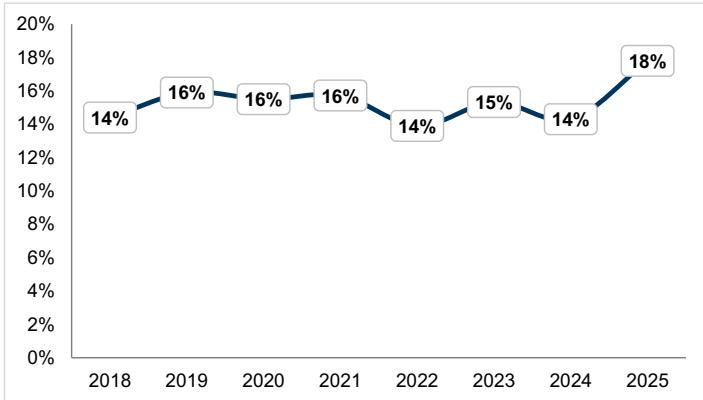  
Source: Stack Overflow

Our Neutral rating reflects a strong platform direction and steadier execution, but still limited proof of a durable growth inflection. Elastic has moved well beyond its roots in search and log analytics, adding products such as Elastic Inference Service, Agent Builder, Workflows, AI Assistant and Attack Discovery that push the platform closer to higher-value workflows across Search and AI, Observability and Security. The company has also made tangible progress on the GTM front in the past two years through sharper segmentation, tighter sales focus and a more structured approach to expansion across the installed base. That’s showing up in steadier new logo activity, RPO growth and net expansion rates. However, we believe that the company still needs to prove it can turn broader product relevance and better GTM discipline into sustained    ‹¢–xb¥mûR _®Oá   LCD123321Cad   04-21growth acceleration, particularly as Search/AI becomes more crowded, observability gets pressured from both up-stack and lower-cost alternatives, and security grows more competitive as platforms converge. We therefore remain on the sidelines for now, looking for more consistent evidence that Elastic can translate its product momentum into sustained growth acceleration while navigating the competitive pressures of an increasingly crowded and converging market landscape.

$\$ 100K +$ new logo activity grew $+ 5 \%$ on TTM basis, pointing to steady momentum in cross-sell and new customer wins

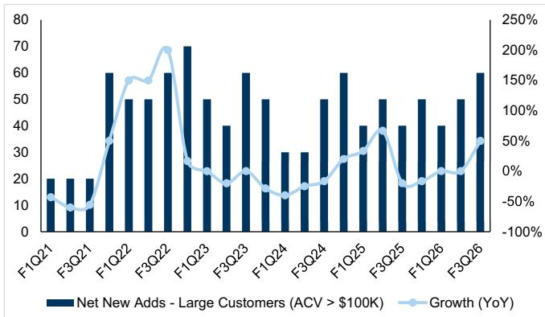  
Exhibit 36: Large Customer Net Adds   
Source: Company Data

Source: Company Data

Elastic’s RPO growth has stabilized in the mid-to-high teens as GTM execution has improved

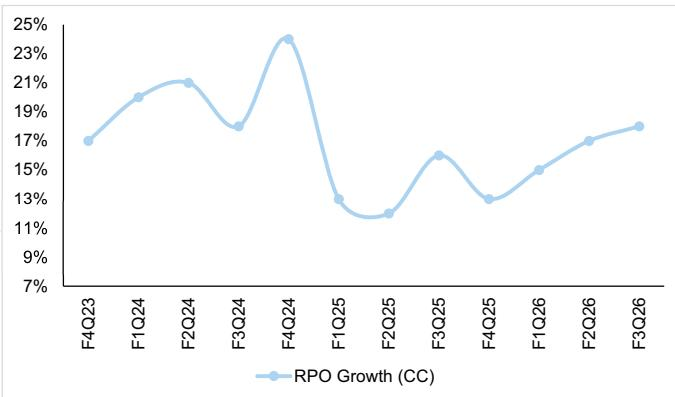  
Exhibit 37: Constant Currency RPO Growth

Elastic Through the Lens of the GS Framework for Investing in Software Elastic screens as a strategically relevant but still-evolving platform story across the GS Framework for Investing in Software. The company spans search, observability and security through a common architecture built around Elasticsearch, one of the most widely adopted search and retrieval engines in enterprise software – a foundation that aligns well with several of the most important infrastructure themes today: unstructured data growth, AI-driven retrieval demand, open telemetry adoption and security-observability convergence. GTM execution has also improved over the last two years, with better segmentation, improving rep productivity, and more consistent deal activity reflecting. The medium-term framework targeting $20 \% +$ Sales-Led Subscription growth, $20 \% +$ non-GAAP OpM’s (and $20 \% +$ Adj. FCFM’s) screens achievable, supported by GTM efficiency gains and G&A leverage as the business scales. At the same time, the competitive backdrop is intensifying across all three end markets, with broader platforms absorbing more of the workflow and data economics. Against that backdrop, Elastic Cloud growth continues to decelerate even as the AI narrative has broadened, and peers across the data and observability stack have shown cleaner demand reacceleration. We think Elastic has a credible platform and the right strategic direction, but we require clearer evidence that improving execution is translating into a more durable growth inflection before we can take a more constructive view.

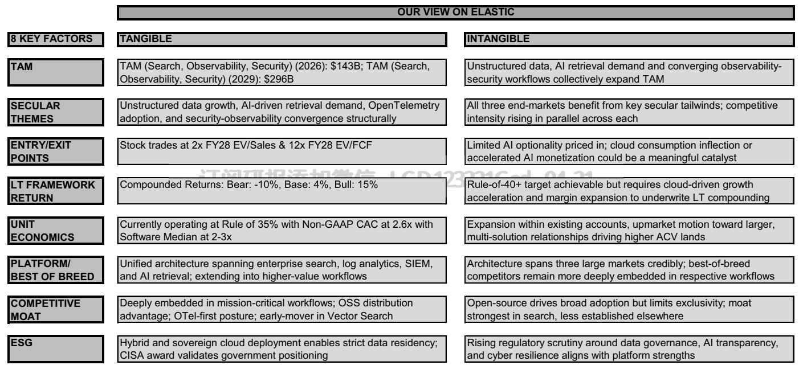  
Exhibit 38: Mapping Elastic to the GS Framework for Investing in Software   
Source: Company Data, Goldman Sachs Global Investment Research

In many respects, the debate on Elastic has not evolved considerably in recent years; the company is exposed to attractive markets, but competition is still the central risk. Elastic continues to span Search and AI, Observability, and Security with credible product breadth, but the market has long questioned whether that translates into best-of-breed status or durable control of any single category. What has changed 订阅研报添加微信 LCD123321Cad 04-21 more recently, in our view, is the intensity of competition, as larger platforms, adjacent vendors and emerging architectures push further into Elastic’s markets and raise the bar around workflow ownership, data economics and strategic relevance. Against that backdrop, AI is increasingly the opportunity. If AI workloads continue to proliferate and Elastic can convert its search heritage, retrieval quality and broader platform investments into greater budget capture across the installed base, the business could move closer to its medium-term framework over time. Our more measured view is that this upside remains plausible, but still unproven, while the rising competitive intensity across each of Elastic’s end-markets remains the more immediate risk to sustained acceleration.

We frame Elastic through the lens of its three core businesses: Search and AI, Observability and Security. In the sections that follow, we assess each business on its own merits, with a focus on where Elastic’s product direction and strategic positioning are strongest, where the competitive backdrop is becoming more demanding, and how those dynamics shape our medium-term growth outlook. Taken together, these 订阅研报添加微信 LCD123321Cad 04-21 businesses explain both why Elastic remains strategically relevant and why we continue to see a more balanced risk-reward at current levels.

# Search and AI

Search and AI remains Elastic’s clearest right to win. This is where the company has the deepest heritage, the strongest technical credibility and the most natural role in the evolving AI stack. Search is Elastic’s core DNA, and the company had vector capabilities in place as far back as 2017, well before ChatGPT reset market attention around AI.

Elastic has been investing in the stack for years and has continued to deepen it through hybrid retrieval, reranking, inference and a series of back-end optimizations designed to improve relevance, latency and cost at scale. In our view, that long development arc likely gives Elastic a stronger retrieval product that many alternatives, particularly for customers that care about production-grade search quality versus basic vector support alone. Elastic’s recent launch of Agent Builder and Workflows extend that effort beyond retrieval alone by tying search and context directly into AI agents and automation, 订阅研报添加微信 LCD123321Cad 04-21 reinforcing the company’s push to become a context engineering platform rather than another vector database.

Exhibit 39: Elastic- Key Products around Elasticsearch and Emerging AI Tools   

<table><tr><td>Product /Feature</td><td colspan="2">What It Does Why It Matters</td></tr><tr><td>Elasticsearch (Core Search Engine)</td><td>Distributed, RESTful search and analytics engine built on Apache Lucene. Foundational technology underlying all three of ESTC&#x27;s solution pillars.</td><td>ESTC&#x27;s durable competitive moat. Enterprises that build on it become deeply embedded, it underpins everything from app search to RAG pipelines for generative Al.</td></tr><tr><td>Vector Search (kNN / Semantic Search)</td><td>Enables similarity-based retrieval using embedding vectors stored natively in Elasticsearch,supports k-Nearest Neighbor</td><td>Vector search is the infrastructure layer for enterprise RAG,every company building an Al assistant on proprietary data needs this. Positions ESTC as default Al-</td></tr><tr><td>Elastic Inference Service (EIS)</td><td>(kNN) search, hybrid vector search. CDI Managed inference endpoints for embeddings/reranking and other ML models</td><td>3native search infrastructure. Reduces complexity and cost of running model infra; speeds time-to-value for Al search and agent workflows.</td></tr><tr><td>ELSER (Elastic Learned Sparse Encoder)</td><td>used in semantic search and RAG. ESTC&#x27;s proprietary sparse embedding model trained specifically for retrieval tasks,runs inside Elasticsearch with no external model hosting</td><td>Removes the need for a separate embedding service, reducing latency and cost for enterprises building Al</td></tr><tr><td> BBQ (Better Binary</td><td>required. A compression technique for Al search data (vectors). Shrinks each data point by 32x while</td><td>search. Cuts memory needs by ~95%, making Al-powered</td></tr><tr><td>Quantization) DiskBBQ (Disk-friendly ANN</td><td>preserving the accuracy of search results. An extension of BBQ that moves Al search data from expensive memory (RAM) to cheaper disk</td><td>search dramatically cheaper to run. Removes memory asa cost bottleneck for Al search at Scale.Enables large-scale Al apps on lower-cost</td></tr><tr><td>index) Elastic Agent Builder</td><td>storage. Groups related data into clusters so the system only reads what it needs from disk. Elastic-native framework to build Al agents over Elasticsearch data, combining LLM reasoning</td><td>hardware. Extends Elastic from retrieval to agentic execution: answers stay grounded in indexed data with security</td></tr><tr><td>Jina Al (Embeddings + Reranking via Inference APl)</td><td>with built-in/custom tools and integrations via MCP/A2A and APls. Uses Jina Al embedding and reranking models through Elasticsearch&#x27;s Inference APl/Elastic Inference Service,generating dense vectors for</td><td>controls,while agents can orchestrate multi-step tasks and trigger workflows. Gives teams high-quality multilingual embeddings and reranking without self-hosting model infrastructure, improving relevance for vector search and production</td></tr></table>

sustainably closer to its mid-term framework.

# Exhibit 40: Elastic has seen solid uptake of its Vector Search capabilities

While constructive on underlying adoption, it remains to be seen whether AI workloads can drive a sustained inflection in the growth profile

Source: Company Data

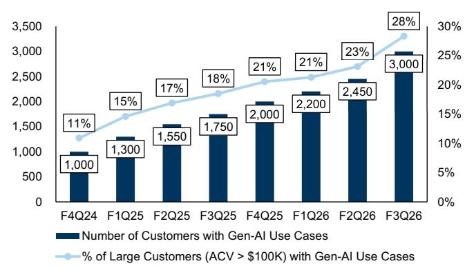  
Exhibit 42: Elastic Vector Search leads in DB-Engines rankings among pure-play vector databases   
Source: Company Data

We believe this speaks to Elastic’s strong develop mindshare and feature depth

Source: DB-Engines

# Exhibit 41: Gen-AI Customers are expanding 600 bps faster than non-AI customers

Early signals are positive around AI adoption and monetization but it is yet to surface materially in the overall growth profile

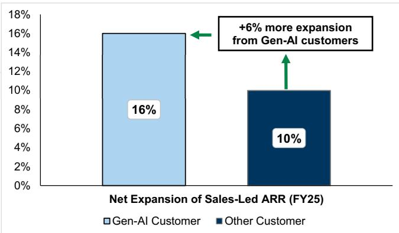

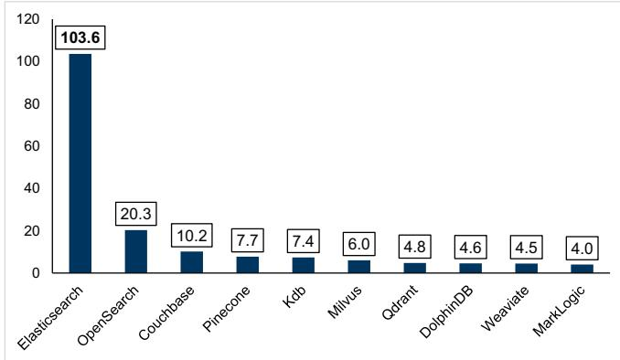  
Exhibit 43: ...but competition is much more fierce when including broader data platforms   
Source: DB-Engines

We continue to monitor whether Elastic’s incumbent position in search can support growth acceleration as AI workloads scale

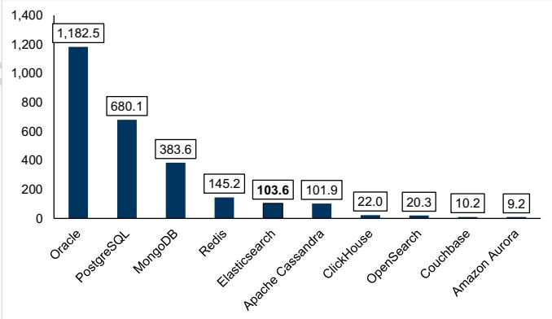

# Observability

# Observability fits Elastic’s architecture, but the market is becoming more

competitive from above and below. Elastic has built a scaled position in log analytics, and that footprint gives it a legitimate foundation in observability. Logs remain one of 订阅研报添加微信 LCD123321Cad 04-21 the richest and most widely used sources of operational data, particularly for investigation-heavy workflows, and Elastic’s search expertise lends naturally to that use case. The company has leaned into that advantage from an OTel-first posture, ES|QL, AI Assistant and Streams, all aimed at making raw telemetry easier to investigate and faster to turn into root-cause analysis. The installed base reflects a logs-first entry point, with more than $90 \%$ of Elastic Cloud observability customers using log analytics and more than $3 5 \%$ already expanding beyond logs, which suggests Elastic’s role in observability is established, though the path to broader platform ownership less so.

pushing the platform closer to a more automated SOC. Attack Discovery is worth highlighting - it uses AI to correlate disparate alerts into coherent attack narratives, an extension of Elastic’s core strength in search and analytics across complex, multi-source data environments. Our industry conversations suggest that is where Elastic tends to find its strongest security traction - in specialized, data-intensive investigations that fall outside what more packaged solutions can readily handle. Security is one of the clearest places where ingest, search, correlation, and action fit naturally on a common architecture, and Elastic’s SIEM footprint gives it a real foothold from which to expand. Elastic’s two $\$ 200$ security deals, including the CISA-related SIEM-as-a-Service award, are recent examples of that positioning showing up in practice, supporting the view that Elastic’s security and data platform can resonate not just as a technical architecture, but also in large-scale environments.

Exhibit 47: Elastic - Key Products and Modules for Security Use Cases   

<table><tr><td>Product /Feature</td><td>What It Does</td><td>Why It Matters</td><td>Competitors</td></tr><tr><td> SIEM</td><td>Aggregates security events from endpoints, network,cloud,and identity sources; correlates themagainst threat intelligence.</td><td>Elastic&#x27;s search-firstarchitecture enables faster queries across large securit datasets,a speed advantage over legacy SIEMs Iike IBM QRadar or Splunk ES.</td><td>Splunk, Microsoft Sentinel, CrowdStrike (Falcon Next-gen SIEM)</td></tr><tr><td>Endpoint Detection &amp; Response (EDR/Elastic Defend)</td><td>Provides endpoint protection and detection using behavioral analytics.Telemetry feeds directly into the SIEM for correlated investigation.</td><td>Tight EDR-SIEM integration is a key differentiator, analysts pivot from an alert to raw endpoint telemetry in one click,eliminating tool-switching.</td><td>CrowdStrike (Falcon), SentinelOne,Palo Alto Networks (Cortex XDR)</td></tr><tr><td> Attack Discovery</td><td>Uses Al to automatically cluster and summarize relatedalerts into attack chains,presenting analystswith a narrative ofan entireattack</td><td>Attack Discovery directlyaddressesalertfatigue, showcasing the&#x27;Al for security&#x27;angle central to the security-observability convergence thesis.</td><td>CrowdStrike (Charlotte Al), SentinelOne (Purple Al)</td></tr></table>

Source: Company Data, Goldman Sachs Global Investment Research

The opportunity in security is real, even as the broader market is becoming more 订阅研报添加微信 LCD123321Cad 04-21 interconnected and competitive. The same convergence across telemetry, observability, security and automation that supports Elastic’s platform thesis is also drawing larger vendors deeper into adjacent parts of the stack. CrowdStrike’s Next-Gen SIEM is an illustrative example of the pressure Elastic is up against - the product exited FY26 at $\$ 585 M$ in ARR growing more than $7 5 \%$ , underscoring both the scale of the modernization cycle and how quickly value is consolidating around broader security platforms. Palo Alto’s Chronosphere acquisition, CrowdStrike’s Onum deal and Databricks’ recent Lakewatch launch all point in the same direction: the lines between telemetry, observability, security and workflow automation are blurring. We think that dynamic is strategically supportive of Elastic, but it also raises the bar. Security platforms would argue that their ownership of more first-party telemetry data across endpoint, identity, cloud and network gives them a natural advantage in consolidating adjacent workflows such as SIEM onto their platforms over time. Elastic remains relevant in that environment, but it will need to keep proving its strength in search, analytics and flexible data ingestion are differentiated enough to matter as security teams consolidate more of 订阅研报添加微信 LCD123321Cad 04-21 their workflow onto broader platforms. In our view, security is an important part of the thesis, but not yet a sufficient reason to underwrite a faster or more durable growth profile.

# Exhibit 48: Gartner’s Product or Service Score by Use Case (SIEM)

Similar to Observability, Elastic is relevant in SIEM but faces strong competition from a growing slate of security and data platform peers

<table><tr><td>Capability</td><td> Rank (n=17)</td><td> Score (Out of 5)</td></tr><tr><td>Out-of-the-Box SIEM</td><td>#9</td><td>3.36</td></tr><tr><td>Customizable SIEM</td><td>#7</td><td>3.61</td></tr><tr><td>Threat Detection (TDIR)</td><td>#7</td><td>3.63</td></tr><tr><td>Average</td><td>#8</td><td>3.53</td></tr></table>

# Exhibit 50: We use CrowdStrike’s momentum in Next-Gen SIEM as a proxy for the heightened competition within the category

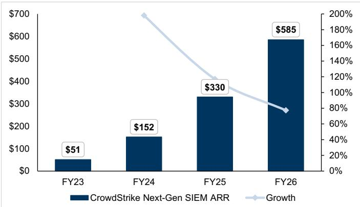  
Source: Gartner

Larger platform peers like Palo Alto, Cisco (Splunk) and now Databricks are all vying for SIEM budgets

Data in MMs, except for percentages

Source: Company Data

# Exhibit 49: Elastic’s position as a top 10 vendor in SIEM underscores the crediblity of its search technology for investigative workflows

Market share data, while dated, highlights a heavy-set competitive field with Cisco, Microsoft, Palo Alto and CrowdStrike

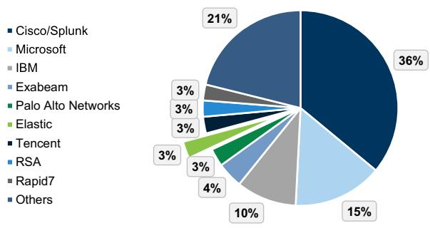  
2024 SIEM Market Share   
Source: Gartner

The medium-term framework is credible, but the current model still looks more stable than inflecting. Elastic’s mid-term targets call for $1 5 \% +$ base Sales-Led Subscription (SLS) growth plus $5 \% +$ from Gen-AI tailwinds, alongside $20 \% +$ Non-GAAP OpM, $20 \% +$ adjusted FCFM and a Rule of 40 above $4 0 \% \mathrm { . } \mathsf { F Y } 2 6$ is not far off that path, with guidance implying roughly $+ 1 8 \%$ CC Sales-Led growth. The nuance is that the stronger performance this year has come from a mix of cloud and self-managed, while Elastic Cloud – still the metric many investors gravitate toward as the cleanest read on AI momentum – has continued to decelerate from the mid-20’s in FY25 to $+ 2 1 \%$ (CC) in F3Q26. That leaves the model in a somewhat mixed place: execution is better, commitments are healthy, and the business looks more stable, but the cleanest signal of AI-driven acceleration has yet to improve. Margin expansion remains supportive, though likely not enough on its own to drive a more meaningful re-rating. For the stock to work from here, Elastic likely needs to pair continued operating leverage with clearer evidence 37 that growth in the cloud business can stabilize and improve.

Elastic’s framework calls for growth acceleration with AI serving as the incremental driver of growth; we see a business more stable than inflecting today

Exhibit 51: Elastic’s Mid-Term Framework   

<table><tr><td rowspan=1 colspan=3>Metric           Mid-Term Target     KeyDrivers</td></tr><tr><td rowspan=1 colspan=1> Sales-Led SubscriptionRevenue Growth</td><td rowspan=1 colspan=1>15% Base + 5% Gen-AlTailwinds = 20% +</td><td rowspan=1 colspan=1>Existing customer expansion&amp; Gen-Aldrivengrowthaccelerationacrosssearch,securityndobsblity</td></tr><tr><td rowspan=1 colspan=1>Sales-Led SubscriptionRevenue % of Total</td><td rowspan=1 colspan=1>85%-90%</td><td rowspan=1 colspan=1>Majority of growth coming from sales-led subscription revenue</td></tr><tr><td rowspan=1 colspan=1> Non-GAAP OperatingMargin</td><td rowspan=1 colspan=1>&gt;20%</td><td rowspan=1 colspan=1>Increasing leverage as businessscales</td></tr><tr><td rowspan=1 colspan=1>Adj. Free Cash Flow</td><td rowspan=1 colspan=1>&gt;20%</td><td rowspan=1 colspan=1>Operating margin expansionDeferred revenue growth</td></tr><tr><td rowspan=1 colspan=1>Rule Of 40 (TotalRevenue Growth + Adj.FCFM)</td><td rowspan=1 colspan=1>40% +</td><td rowspan=1 colspan=1>Balanced focus on both growth andprofitability</td></tr><tr><td rowspan=1 colspan=1>Net Dilution</td><td rowspan=1 colspan=1>&lt;2.5%</td><td rowspan=1 colspan=1>Disciplined heacount growth,balancedagainst investment in talent</td></tr></table>

Source: Company Data

Self-Managed revenue growth is inflecting while Elastic Cloud continues to decelerate

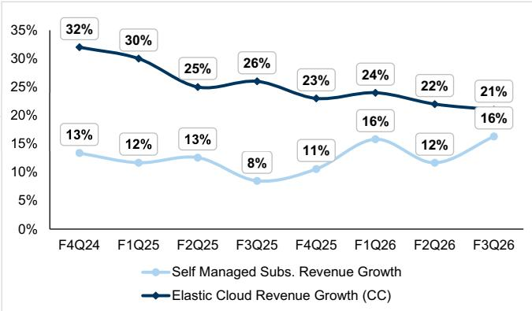  
Exhibit 52: Elastic Cloud vs. Self-Managed Revenue Growth   
Source: Company Data

Digging into the underlying revenue trends adds further context. Elastic Cloud Net New Revenue (NNR) has been effectively range-bound for three consecutive quarters at roughly $\$ 37-438 M$ (in constant-currency) and broadly unchanged vs. prior year. Self-Managed, by contrast, has shown a more meaningful step-up with CC NNR reaching $\$ 23M$ in F3Q26, up $+ 5 7 \%$ . That improvement reflects real strength landing in hybrid and regulated environments alongside some degree of AI-driven demand. Elastic runs the business on Sales-Led Subscription growth as its primary financial metric, and    ‹¢–xb¥mûR _®Oá   LCD123321Cad   04-21Self-Managed is a legitimate contributor to that motion. That said, the market has not meaningfully rewarded that outperformance, largely because cloud is still viewed as the more direct signal of AI-driven consumption demand – and on that metric the trend has yet to move.

Elastic Cloud NNR has been stable, driving growth deceleration

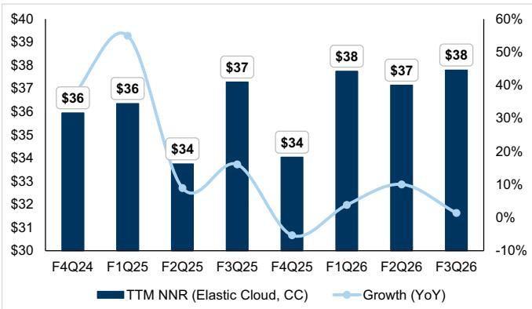  
Exhibit 53: Elastic Cloud Net New Revenue (YoY) in Constant Currency   
Data in MMs, except for percentages

# Exhibit 54: Self-Managed Net New Revenue (YoY) in Constant Currency

Self-Managed accelerating; regulated and hybrid environments driving momentum

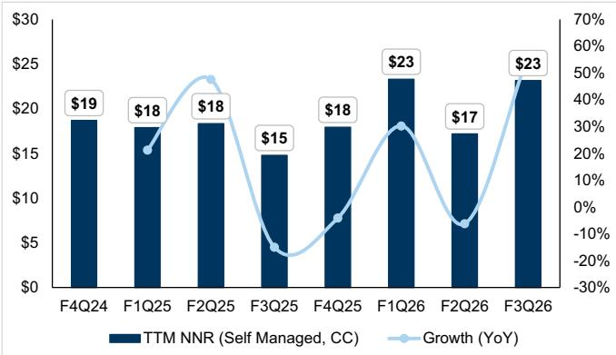

Data in MMs, except for percentages

Exhibit 62: Estimates vs. Consensus   

<table><tr><td rowspan=1 colspan=3></td><td rowspan=1 colspan=1>4Q26 (E)</td><td rowspan=1 colspan=1>4Q26 (E)</td><td rowspan=1 colspan=1>FY26 (E)</td><td rowspan=2 colspan=1>FY26 (E)GSe    Cons.</td><td rowspan=2 colspan=1>FY27 (E)GSe    Cons.</td><td rowspan=2 colspan=1>FY28 (E)GSe    Cons.</td></tr><tr><td rowspan=1 colspan=3>All figures in $ mns</td><td rowspan=1 colspan=1>Guidance</td><td rowspan=1 colspan=1>GSe    Cons.</td><td rowspan=1 colspan=1>Guidance</td></tr><tr><td rowspan=3 colspan=3> Sales-led Subscription RevenueYoYQQQ</td><td rowspan=1 colspan=1>$371 :  $373</td><td rowspan=1 colspan=1>$372    $373</td><td rowspan=1 colspan=1> $1,434 ：$1,436</td><td rowspan=1 colspan=1>$1,435   $1,436</td><td rowspan=1 colspan=1>$1,663   $1,664</td><td rowspan=1 colspan=1>$1,908   $1,928</td></tr><tr><td rowspan=1 colspan=1>18% : 19%</td><td rowspan=1 colspan=1>18%     18%</td><td rowspan=1 colspan=1>20% ： 20%</td><td rowspan=2 colspan=1>20%     20%</td><td rowspan=1 colspan=1>16%     16%</td><td rowspan=2 colspan=1>15%     16%</td></tr><tr><td rowspan=1 colspan=1>-1% ： -1%</td><td rowspan=1 colspan=1>-1%     -1%</td><td rowspan=1 colspan=1></td><td rowspan=1 colspan=1></td></tr><tr><td rowspan=2 colspan=3>Elastic Cloud (Anual)YoYQQQ</td><td rowspan=1 colspan=1></td><td rowspan=1 colspan=1>$169     $169</td><td rowspan=1 colspan=1></td><td rowspan=1 colspan=1>$641     $640</td><td rowspan=1 colspan=1>$793     $791</td><td rowspan=1 colspan=1>$957     $965</td></tr><tr><td rowspan=1 colspan=1></td><td rowspan=1 colspan=1>26%     26%0%     0%</td><td rowspan=1 colspan=1></td><td rowspan=1 colspan=1>28%     28%</td><td rowspan=1 colspan=1>24%     24%</td><td rowspan=1 colspan=1>21%     22%</td></tr><tr><td rowspan=1 colspan=3>Total Revenue</td><td rowspan=1 colspan=1>$445 ：  $447</td><td rowspan=1 colspan=1>$446     $447</td><td rowspan=1 colspan=1> $1,734   $1,736</td><td rowspan=1 colspan=1>$1,734   $1,735</td><td rowspan=1 colspan=1>$1,969    $1,969</td><td rowspan=1 colspan=1> $2,221    $2,243</td></tr><tr><td rowspan=2 colspan=3></td><td rowspan=1 colspan=1>15% ： 15%</td><td rowspan=1 colspan=1>15%     15%</td><td rowspan=1 colspan=1>17% ： 17%</td><td rowspan=1 colspan=1>17%     17%</td><td rowspan=1 colspan=1>14%     13%</td><td rowspan=1 colspan=1>13%     14%</td></tr><tr><td rowspan=1 colspan=1>-1% : -1%</td><td rowspan=1 colspan=1>-1%     -1%</td><td rowspan=1 colspan=1></td><td rowspan=1 colspan=1></td><td rowspan=1 colspan=1></td><td rowspan=1 colspan=1></td></tr><tr><td rowspan=3 colspan=3>Non GAAP Gross ProfitGross Margin</td><td rowspan=2 colspan=1>订阅吧</td><td rowspan=3 colspan=1>$349     $347JD78%KJH178%I</td><td rowspan=3 colspan=1>LC</td><td rowspan=3 colspan=1>$1,359   $1,356I78%UU78%</td><td rowspan=3 colspan=1>$1,546   $1,53679%     78%</td><td rowspan=1 colspan=1>$1,748   $1,748</td></tr><tr><td rowspan=2 colspan=1>79%     78%</td></tr><tr><td rowspan=3 colspan=3>Non GAAP Operating IncomeOperating Margin</td><td></td></tr><tr><td rowspan=1 colspan=1>$65  ： $65</td><td rowspan=1 colspan=1>$65     $65</td><td rowspan=1 colspan=1>$283     $283</td><td rowspan=1 colspan=1>$283     $283</td><td rowspan=1 colspan=1>$342     $341</td><td rowspan=1 colspan=1>$407     $415</td></tr><tr><td rowspan=1 colspan=1>14.5% ： 14.5%</td><td rowspan=1 colspan=1>15%     15%</td><td rowspan=1 colspan=1>16.3% : 16.3%</td><td rowspan=1 colspan=1>16%     16%</td><td rowspan=1 colspan=1>17%     17%</td><td rowspan=1 colspan=1>18%     19%</td></tr><tr><td rowspan=2 colspan=3>Non GAAP EPSGAAP EPSTotal Bilings (Balance Sheet)</td><td rowspan=1 colspan=1>$0.55    $0.57</td><td rowspan=1 colspan=1>$0.56    $0.56</td><td rowspan=1 colspan=1> $2.50     $2.54</td><td rowspan=1 colspan=1>$2.53    $2.52</td><td rowspan=1 colspan=1>$2.87    $2.85</td><td rowspan=1 colspan=1>$3.28    $3.32</td></tr><tr><td rowspan=2 colspan=2>GAAP EPS</td><td rowspan=2 colspan=1>Total Bilings (Balance Sheet)</td><td rowspan=1 colspan=1></td><td rowspan=1 colspan=1>($0.12)     ~</td><td rowspan=1 colspan=1></td><td rowspan=1 colspan=1>($0.77)     ：</td><td rowspan=1 colspan=1>$0.22      ：</td><td rowspan=1 colspan=1>$0.67      :</td></tr><tr><td rowspan=1 colspan=1></td><td rowspan=1 colspan=1>$616    $611</td><td rowspan=1 colspan=1></td><td rowspan=1 colspan=1>$1,861   $1,852</td><td rowspan=1 colspan=1>$2,111   $2,095</td><td rowspan=1 colspan=1>$2,378    $2,357</td></tr><tr><td rowspan=1 colspan=3>YoYQoQ</td><td rowspan=1 colspan=1></td><td rowspan=1 colspan=1>15%     16%17%     17%</td><td rowspan=1 colspan=1></td><td rowspan=1 colspan=1>13%     13%</td><td rowspan=1 colspan=1>13%     13%</td><td rowspan=1 colspan=1>13%     13%</td></tr><tr><td rowspan=1 colspan=3>Total Deferred Revenue</td><td rowspan=1 colspan=1></td><td rowspan=1 colspan=1>$979    $977</td><td rowspan=1 colspan=1></td><td rowspan=1 colspan=1>$979     $977</td><td rowspan=1 colspan=1>$1,121   $1,112</td><td rowspan=1 colspan=1>$1,278   $1,263</td></tr><tr><td rowspan=1 colspan=3></td><td rowspan=1 colspan=1></td><td rowspan=1 colspan=1>15%     15%21%     21%</td><td rowspan=1 colspan=1></td><td rowspan=1 colspan=1>15%     15%</td><td rowspan=1 colspan=1>15%     14%</td><td rowspan=1 colspan=1>14%     14%</td></tr><tr><td rowspan=1 colspan=3>Cash Flow from Operations</td><td rowspan=1 colspan=1></td><td rowspan=1 colspan=1> $142    $138</td><td rowspan=1 colspan=1></td><td rowspan=1 colspan=1>$316     $312</td><td rowspan=1 colspan=1>$365    $380</td><td rowspan=1 colspan=1>$428    $460</td></tr><tr><td rowspan=1 colspan=3>OCF Margin</td><td rowspan=1 colspan=1></td><td rowspan=1 colspan=1>32%     31%</td><td rowspan=1 colspan=1></td><td rowspan=1 colspan=1>18%     18%</td><td rowspan=1 colspan=1>19%     19%</td><td rowspan=1 colspan=1>19%     21%</td></tr><tr><td rowspan=1 colspan=3>Unlevered Free Cash FlowFCFMargin</td><td rowspan=1 colspan=1></td><td rowspan=1 colspan=1>$141    $14132%     31%</td><td rowspan=1 colspan=1></td><td rowspan=1 colspan=1>$337     $33619%     19%</td><td rowspan=1 colspan=1>$385    $39720%     20%</td><td rowspan=1 colspan=1>$447     $47420%     21%</td></tr></table>

All Revenue Metrics- Visible Alpha Consensus Data, Rest- FactSet   
Source: Company data, Visible Alpha Consensus Data, FactSet, Goldman Sachs Global Investment Research

# M&A Framework

订阅研报添加微信 LCD123321Cad 04-21 Across our global coverage, we examine stocks using an M&A framework, considering both qualitative factors and quantitative factors (which may vary across sectors and regions) to incorporate the potential that certain companies could be acquired. We then assign an M&A rank as a means of scoring companies under our rated coverage from 1 to 3, with 1 representing high $( 3 0 \% - 5 0 \% )$ probability of the company becoming an acquisition target, 2 representing medium $1 5 \% - 3 0 \%$ ) probability and 3 representing low $( 0 \% - 1 5 \% )$ probability. For companies ranked 1 or 2, in line with our standard departmental guidelines, we incorporate an M&A component into our target price. An M&A rank of 3 is considered immaterial and therefore does not factor into our price target and may or may not be discussed in research.

Within this context, we have ranked Elastic a 2 and weight our M&A value $1 5 \%$ (reflecting the probability implied by this ranking) within our price target methodology. We view Elastic as a strategically relevant asset within infrastructure software, where its core search and unstructured data technology could be complementary for a range of potential acquirers. In order to derive the M&A value, we apply a $3 . 5 \times$ NTM EV/S multiple 订阅研报添加微信 LCD123321Cad 04-21 to our Q5-Q8 revenue estimate, a one-and-a-half turn discount to the median of precedent transactions which is in-line with some lower multiple transactions in the space and indicates a $\sim 3 5 \%$ premium to the current multiple at which Elastic trades. Our M&A multiple yields a $\$ 70$ theoretical value.

Exhibit 63: Precedent M&A Transactions   

<table><tr><td>Target</td><td>Acquirer</td><td>Closing Date</td><td>Deal Value ($M) NTM Revenue ($M)</td><td></td><td>NTM FCF ($M)</td><td>EV/S (NTM)</td><td>EV/FCF (NTM)</td></tr><tr><td>Red Hat</td><td>IBM</td><td>07/09/19</td><td>$32,586</td><td>$3,703</td><td>$1,073</td><td>8.8x</td><td>30.4x</td></tr><tr><td>Sumo Logic</td><td>Francisco Partners</td><td>05/12/23</td><td>$1,195</td><td>$351</td><td>-$18</td><td>3.4x</td><td>-</td></tr><tr><td>New Relic</td><td>Francisco Partners /TPG</td><td>11/08/23</td><td>$5,767</td><td>$1,068</td><td>$152</td><td>5.4x</td><td>38.0x</td></tr><tr><td>VMWare</td><td>Broadcom</td><td>11/22/23</td><td>$68,978</td><td>$14,077</td><td>$3,892</td><td>4.9x</td><td>17.7x</td></tr><tr><td>Alteryx</td><td>Clearlake Capital Group</td><td>12/18/23</td><td>$4,400</td><td>$1,025</td><td>$50</td><td>4.3x</td><td>87.6x</td></tr><tr><td>Everbridge</td><td>Clearlake Capital Group</td><td>02/05/24</td><td>$1,500</td><td>$459</td><td>$75</td><td>3.3x</td><td>20.0x</td></tr><tr><td>Splunk</td><td>Cisco</td><td>03/18/24</td><td>$28,083</td><td>$4,255</td><td>$1,017</td><td>6.6x</td><td>27.6x</td></tr><tr><td>Hashicorp</td><td>IBM</td><td>02/27/25</td><td>$5,891</td><td>$669</td><td>$112</td><td>8.8x</td><td>52.7x</td></tr><tr><td>SolarWinds</td><td>Turn/River Capital</td><td>04/16/25</td><td>$4,200</td><td>$823</td><td>$259</td><td>5.1x</td><td>16.2x</td></tr><tr><td>Informatica</td><td>Salesforce</td><td>11/18/25</td><td>$8,314</td><td>$1,732</td><td>$496</td><td>4.8x</td><td>16.8x</td></tr><tr><td>Confluent</td><td>IBM</td><td>03/17/26</td><td>$10,245</td><td>$1,348</td><td>$110</td><td>7.6x</td><td>93.4x</td></tr><tr><td>Average</td><td></td><td></td><td></td><td></td><td></td><td></td><td></td></tr><tr><td colspan="6">Median</td><td>5.7x 5.1x</td><td>40.0x 29.0x</td></tr></table>

Source: FactSet, Company Data

# Valuation and Key Risks

We initiate on Elastic with a 12-month Price Target of $\$ 50$ . Our valuation methodology is based on an $8 5 \%$ weighting to EV/FCF and a $1 5 \%$ weighting to M&A. We apply a $_ { 1 2 x }$ EV/FCF multiple to our Q5-Q8 FCF estimate to arrive at our fundamental value. Our EV/FCF multiple is informed by a blend of both infrastructure software and comparable Rule-Of software peers. Our EV/FCF multiple represents a discount to the median of infrastructure software peers to account for Elastic’s lower Rule-Of profile. We apply a $3 . 5 \times$ NTM EV/S multiple to our Q5-Q8 revenue estimates to derive an implied M&A valuation, which is approximately 1.5 turns below the median of precedent transactions while still implying a $\sim 3 5 \%$ premium to the current EV/S multiple.

Key upside risks: 1) AI-Driven Cloud Acceleration: A more pronounced inflection in Elastic Cloud growth driven by AI and Vector Search workloads would be the most significant upside catalyst, potentially pulling forward the medium-term framework, 2) GTM Productivity: If FY26 capacity investments compound faster than anticipated, S&M efficiency could improve more meaningfully, driving operating leverage above the current framework, 3) Security Momentum: A more meaningful ramp in SIEM displacement and XDR adoption could expand Elastic’s share of enterprise security budgets beyond current expectations.

Key Downside Risks: 1) Cloud Growth Deceleration: Continued cloud growth deceleration would undermine the AI narrative and raise questions about budget capture across all three end markets, 2) Competitive Displacement: Intensifying competition across search, observability and security from broader platforms absorbing more of the workflow and data economics layer could compress win rates and limit installed base expansion, 3) GTM Execution: If FY26 investments fail to translate into improved growth, S&M efficiency would remain elevated and the margin expansion story would be diluted, 4) Macroeconomic Sensitivity: A deterioration in IT spending could 订阅研报添加微信 LCD123321Cad 04-21 disproportionately impact discretionary search and observability workloads, particularly as customers face pressure to rationalize telemetry spend.