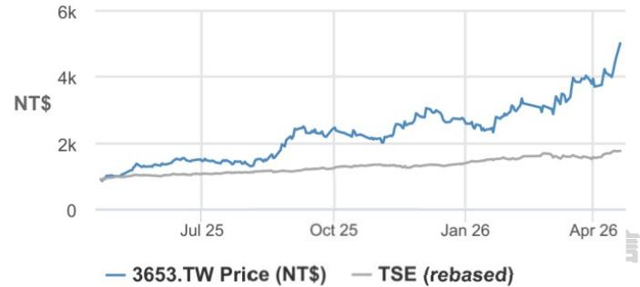
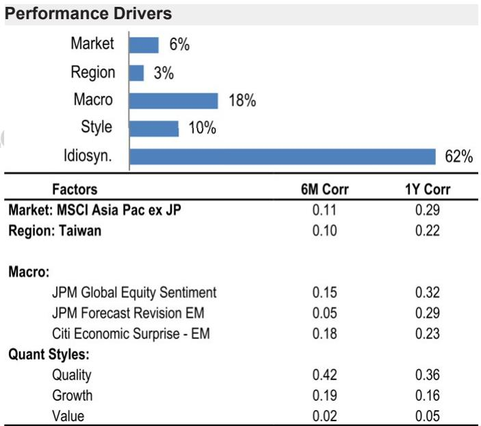
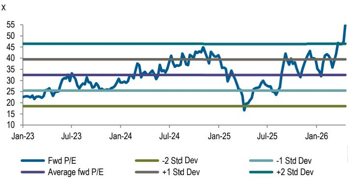
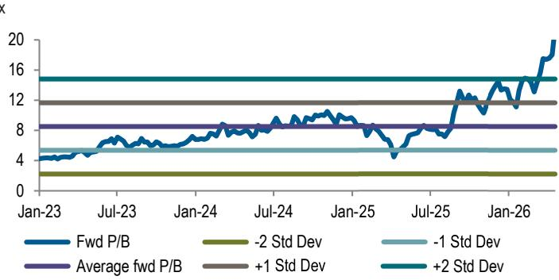
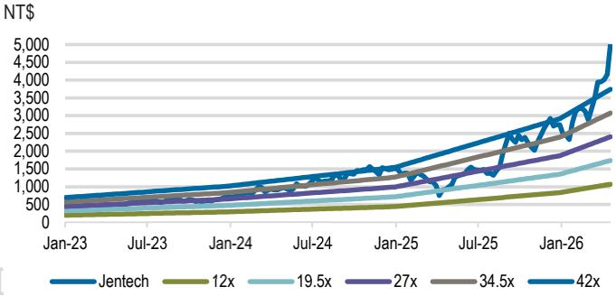
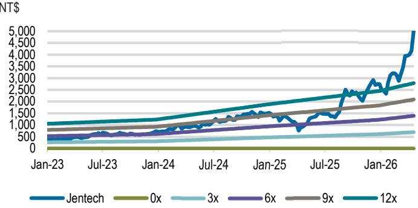

# Jentech Precision Industrial Co.

Further content growth in next-gen AI GPUs; Raise 20 April 2026 estimates and PT

We further revise up our earnings estimates on Jentech, mainly driven by the continued price hike/content growth in next-gen AI GPUs. For one major AI GPU, we believe Jentech will start shipping its next generation from 2Q26, with an increased content value to reflect higher material prices. In addition, we believe the other AI server GPU customer will require an upgraded heat spreader solution too, which could drive significant content growth for Jentech as well. With the 订阅研报添加微信 LCD123321Cad 0shipment ramp of these new AI GPUs in the upcoming quarters, we believe Jentech could deliver stronger earnings growth in the next few years. Therefore, our 2026, 2027 and 2028 EPS estimates are now $12 \%$ , $3 \%$ and $12 \%$ above BBGe consensus, even without factoring in a meaningful contribution from micro channel lid.

• We previously underestimated its content.We now believe Jentech’s content in the next generation of AI GPU (adopting stiffener ring $^ { + 2 }$ -piece gold-plated lid) could further increase, in order to reflect the higher material prices of the special metal/compound. As Jentech would start shipping this high-end solution from 2Q26, we see stronger rev and earnings growth for the company in the upcoming quarters in 2026 and 2027.

? AMD MI450 GPU to potentially upgrade heat spreader solution with multi-times content growth. In our view, AMD’s next gen AI GPU (MI450), which is expected to ramp in 4Q26, will also upgrade its heat spreader solution to the stiffener ring $^ +$ lid design given the larger chip size and higher TDP. As Jentech has always been the sole supplier of high-end server chips, the heat spreader upgrade with decent content growth could become a meaningful driver for Jentech from late 2026 and more in 2027.

• 1Q26 preview; strong 2Q26 outlook. Jentech’s reported 1Q26 revenue of NT $\$ 5.36 n$ $+ 1 \%$ QoQ; $+ 1 2 \%$ YoY) was largely in line with JPMe and consensus, and we model its GM to grow sequentially to $4 2 . 5 \%$ from the 4Q25 level of $4 1 . 2 \%$ with better mix (e.g. more B300 shipments). Looking into 2Q26, we believe Jentech’s revenue could grow meaningfully by $2 9 \%$ QoQ to $\mathrm { N T S 6 } . 8 1$ bn, which is $2 \%$ above current BBGe, underpinned by continued growth in B300 shipments and initial contribution from Rubin GPU and potentially AMD MI450. This should also drive Jentech’s 2Q26 GM to further grow to ${ \sim } 4 4 \%$ with the ongoing enhancement of product mix.

• Implications. We increase our 2026E, 2027E and 2028E EPS by $10 \%$ , $21 \%$ and $1 8 \%$ to $\mathrm { N T } \$ 69$ , $\mathrm { N T S 1 } 3 3$ and $\mathrm { N T S 1 7 7 }$ to reflect higher heat spreader content in both Nvidia’s and AMD’s next-gen AI GPU. Thus, our new Dec-27 PT is lifted to $\mathrm { N T S } 5 { , } 3 0 0$ (up from $\mathrm { N T S 4 } { , } 5 0 0 $ ), based on an unchanged $3 0 \mathrm { x }$ 2028E P/E (largely in line with Jentech’s 3yr avg P/E when the AI server boom started), which we believe could be warranted by the strong earnings growth potential and multiple new catalysts (e.g., CPO switch) for the company in the next few years.

  
Price Performance

<table><tr><td></td><td>YTD</td><td>1m</td><td>3m</td><td>12m</td></tr><tr><td>Abs</td><td>82.9%</td><td>30.4%</td><td>104.1%</td><td>437.5%</td></tr><tr><td>Rel</td><td>55.3%</td><td>20.2%</td><td>87.7%</td><td>344.0%</td></tr></table>

<table><tr><td>Company Data</td></tr><tr><td>Shares O/S (mn) 142</td></tr><tr><td>52-week range (NT$) 5,020.00-857.00</td></tr><tr><td>Market cap ($ mn) 22,624</td></tr><tr><td>Exchange rate 31.59</td></tr><tr><td>Free float (%) 53.4%</td></tr><tr><td>3M ADV (mn) 1.88</td></tr><tr><td>3M ADV ($ mn) 197.6</td></tr><tr><td>Volatilty (90 Day) 68</td></tr><tr><td>Index TAIEX</td></tr><tr><td>BBG ANR (Buy|Hold|Sell) 10|110</td></tr></table>

# Key Metrics (FYE Dec)

<table><tr><td>NT$ in millions</td><td>FY25A</td><td>FY26E</td><td>FY27E</td><td>FY28E</td></tr><tr><td>Financial Estimates</td><td></td><td>商在</td><td>报添</td><td></td></tr><tr><td>Revenue</td><td>20,276</td><td>订</td><td>34,25857,047</td><td>71,184</td></tr><tr><td>Adj.EBIT</td><td>6,498</td><td>12,793</td><td>24,668</td><td>32,565</td></tr><tr><td>Adj. EBITDA</td><td>7,146</td><td>13,536</td><td>25,504</td><td>33,493</td></tr><tr><td>Adj. net income</td><td>5,277</td><td>10,092</td><td>19,415</td><td>25,687</td></tr><tr><td>Adj. EPS</td><td>36.76</td><td>69.37</td><td>133.45</td><td>176.56</td></tr><tr><td>BBG EPS</td><td>36.16</td><td>61.37</td><td>126.01</td><td>158.32</td></tr><tr><td>Cashflow from operations</td><td>4,892</td><td>8,020</td><td>18,114</td><td>23,913</td></tr><tr><td>FCFF</td><td>3,527</td><td>6,810</td><td>16,904</td><td>22,703</td></tr><tr><td>Margins and Growth</td><td></td><td></td><td></td><td></td></tr><tr><td>Revenue Growth Y/Y (%)</td><td>42.0%</td><td>69.0%</td><td>66.5%</td><td>24.8%</td></tr><tr><td>EBIT margin</td><td>32.0%</td><td>37.3%</td><td>43.2%</td><td>45.7%</td></tr><tr><td>EBIT Growth Y/Y (%)</td><td>71.1%</td><td>96.9%</td><td>92.8%</td><td>32.0%</td></tr><tr><td>EBITDA margin</td><td>35.2%</td><td>39.5%</td><td>44.7%</td><td>47.1%</td></tr><tr><td>EBITDA Growth Y/Y (%)</td><td>62.6%</td><td>89.4%</td><td>88.4%</td><td>31.3%</td></tr><tr><td>Net margin</td><td>26.0%</td><td>29.5%</td><td>34.0%</td><td>36.1%</td></tr><tr><td>Adj. EPS growth</td><td>52.7%</td><td>88.7%</td><td>92.4%</td><td>32.3%</td></tr><tr><td>Ratios</td><td></td><td></td><td></td><td></td></tr><tr><td>Adj. tax rate</td><td>19.6%</td><td>22.0%</td><td>22.0%</td><td>22.0%</td></tr><tr><td>Interest cover</td><td>NM</td><td>NM</td><td>NM</td><td>NM</td></tr><tr><td>Net debt/Equity</td><td>NM</td><td>NM</td><td>NM</td><td>NM</td></tr><tr><td>Net debt/EBITDA</td><td>NM</td><td>NM</td><td>NM</td><td>NM</td></tr><tr><td>ROE</td><td>28.0%</td><td>38.1%</td><td>53.0%</td><td>51.1%</td></tr><tr><td>Valuation</td><td></td><td>订</td><td>阅研报添加</td><td>微信</td></tr><tr><td>FCFF yield</td><td>0.5%</td><td>0.9%</td><td>2.3%</td><td>3.1%</td></tr><tr><td>Dividend yield</td><td>0.3%</td><td>0.4%</td><td>0.8%</td><td>0.0%</td></tr><tr><td>EV/Revenue</td><td>34.8</td><td>20.5</td><td>12.1</td><td>9.5</td></tr><tr><td>EV/EBITDA</td><td>98.7</td><td>51.8</td><td>27.1</td><td>20.3</td></tr><tr><td>Adj. P/E</td><td>136.6</td><td>72.4</td><td>37.6</td><td>28.4</td></tr></table>

# Summary Investment Thesis and Valuation

# Investment Thesis

Jentech (OW) is the largest packaging-level cooling component maker worldwide, with leading production capabilities across heat spreader products (including stiffener and all kinds of lids). We expect the company to grow EPS at a ${ \sim } 6 0 \%$ CAGR over 2024-28, driven by solid heat spreader content growth in futuregen AI chips and increasing TAM into new solutions (e.g., CPO switch ASIC). In addition, the company is reinforcing its CD123321Cad 04-21 product portfolio with new offerings in cold plate and CPU server sockets for chip customers. We believe Jentech’s technology leadership in the structural cooling upgrade trend and its new TAM expansion will continue to support its superior earnings power in the long term.

# Valuation

Our Dec-27 PT of NT\$5,300 is based on 30x 2028E P/E, largely in line with Jentech’s three-year average P/E when the AI server boom started.

# Estimate revisions

Table 1: J.P. Morgan estimates – New vs. old   

<table><tr><td></td><td colspan="5">Revised</td><td colspan="5">Prior</td><td colspan="5">Change</td></tr><tr><td>(NTSM)</td><td>1Q26E</td><td>2Q26E</td><td>2026E</td><td>2027E</td><td>2028E</td><td>1Q26E</td><td>2Q26E</td><td>2026E</td><td>2027E</td><td>2028E</td><td>1Q26E</td><td>2Q26E</td><td>2026E</td><td>2027E</td><td>2028E</td></tr><tr><td>Sales</td><td>5.305</td><td>6.845</td><td>34,258</td><td>57,047</td><td>71,184</td><td>5,301</td><td>6,721</td><td>31,122</td><td>47,470</td><td>60,763</td><td>0%</td><td>2%</td><td>10%</td><td>20%</td><td>17%</td></tr><tr><td>Grossprofft</td><td>2.254</td><td>3.005</td><td>15,586</td><td>28,466</td><td>36.787</td><td>2.293</td><td>3.013</td><td>14,145</td><td>23,463</td><td>31,259</td><td>-2%</td><td>0%</td><td>10%</td><td>21%</td><td>18%</td></tr><tr><td>GM</td><td>42.5%</td><td>43.9%</td><td>45.5%</td><td>49.9%</td><td> 51.7%</td><td>43.3%</td><td>44.8%</td><td>45.5%</td><td>49.4%</td><td> 51.4%</td><td>-77 bps</td><td>-94 bps</td><td> 4 bps</td><td> 47 bps</td><td>23 bps</td></tr><tr><td>Operating profit</td><td>1,750</td><td>2.409</td><td>12,793</td><td>24,668</td><td>32,565</td><td>1,800</td><td>2,429</td><td>11,604</td><td>20,296</td><td>27,654</td><td>-3%</td><td>-1%</td><td>10%</td><td>22%</td><td>18%</td></tr><tr><td>OPM</td><td>33.0%</td><td>35.2%</td><td> 37.3%</td><td>43.2%</td><td>45.7%</td><td>34.0%</td><td>36.1%</td><td> 37.3%</td><td>42.8%</td><td>45.5%</td><td>-97 bps</td><td>-94 bps</td><td> 6 bps</td><td> 48 bps</td><td>24 bps</td></tr><tr><td>Net Income</td><td>1,390</td><td>1.913</td><td>10,092</td><td>19,415</td><td>25.687</td><td>1,429</td><td>1,928</td><td>9,166</td><td>16,000</td><td>21,829</td><td>-3%</td><td>-1%</td><td>10%</td><td>21%</td><td>18%</td></tr><tr><td>EPS (NTS)</td><td>9.6</td><td>13.1</td><td>69.4</td><td>133.4</td><td>176.6</td><td>9.8</td><td>13.3</td><td>63.0</td><td>110.0</td><td>150.0</td><td>-3%</td><td>-1%</td><td>10%</td><td>21%</td><td>18%</td></tr></table>

Source: J.P. Morgan estimates.

Table 2: J.P. Morgan estimates vs. Bloomberg consensus   

<table><tr><td></td><td colspan="5">JPMe</td><td colspan="5">Bloomberg</td><td colspan="5">Diff</td></tr><tr><td>(NTSM)</td><td>1Q26E</td><td>2Q26E</td><td>2026E</td><td>2027E</td><td>2028E</td><td>1Q26E</td><td>2Q26E</td><td>2026E</td><td>2027E</td><td>2028E</td><td>1Q26E</td><td>2Q26E</td><td>2026E</td><td>2027E</td><td>2028E</td></tr><tr><td>Sales</td><td>5.305</td><td>6.845</td><td>34,258</td><td>57,047</td><td>71,184</td><td>5.381</td><td>6.682</td><td>30,696</td><td>54,115</td><td>64,892</td><td>-1%</td><td>2%</td><td>12%</td><td>5%</td><td>10%</td></tr><tr><td>Gross profit</td><td>2,254</td><td>3.005</td><td>15.586</td><td>28,466</td><td>36.787</td><td>2.282</td><td>2.956</td><td>14.036</td><td>27,709</td><td>33,779</td><td>-1%</td><td>2%</td><td>11%</td><td>3%</td><td>9%</td></tr><tr><td>GM</td><td>42.5%</td><td>43.9%</td><td> 45.5%</td><td>49.9%</td><td>51.7%</td><td>42.4%</td><td>44.2%</td><td>45.7%</td><td> 51.2%</td><td>52.1%</td><td>7 bps</td><td> -35 bps</td><td> -23 bps</td><td> -130 bps</td><td> -38 bps</td></tr><tr><td>Operating profit</td><td>1,750</td><td>2.409</td><td>12,793</td><td>24,668</td><td>32.565</td><td>1.763</td><td>2.345</td><td>11,358</td><td>23.686</td><td>35.794</td><td>-1%</td><td>3%</td><td>13%</td><td>4%</td><td>-9%</td></tr><tr><td>OPM</td><td>33.0%</td><td>35.2%</td><td> 37.3%</td><td>43.2%</td><td>45.7%</td><td>32.8%</td><td>35.1%</td><td> 37.0%</td><td> 43.8%</td><td>55.2%</td><td>22 bps</td><td>10 bps</td><td> 34 bps</td><td> -53 bps</td><td>-941 bps</td></tr><tr><td>Net Income</td><td>1,390</td><td>1.913</td><td>10,092</td><td>19,415</td><td>25,687</td><td>1,415</td><td>1,901</td><td>9,090</td><td>18,729</td><td>23,135</td><td>-2%</td><td>1%</td><td>11%</td><td>4%</td><td>11%</td></tr><tr><td>EPS (NT$)</td><td>9.6</td><td>13.1</td><td>69.4</td><td>133.4</td><td>176.6</td><td>9.8</td><td>13.2</td><td>62.2</td><td>129.3</td><td>158.3</td><td>-3%</td><td>0%</td><td>12%</td><td>3%</td><td>12%</td></tr></table>

Source: Bloomberg Finance L.P., J.P. Morgan estimates.

# Valuation

Table 3: Jentech’s three-year trading multiples since 2023 (when the AI server boom started)   

<table><tr><td rowspan=1 colspan=1>X</td><td rowspan=1 colspan=1>P/E trailing</td><td rowspan=1 colspan=1>12M fwd P/E</td><td rowspan=1 colspan=1>P/B trailing</td><td rowspan=1 colspan=1>12M fwd P/B</td></tr><tr><td rowspan=1 colspan=1>Standard Deviation</td><td rowspan=1 colspan=1>17.5</td><td rowspan=1 colspan=1>7.0</td><td rowspan=1 colspan=1>4.6</td><td rowspan=1 colspan=1>3.1</td></tr><tr><td rowspan=1 colspan=1>Max</td><td rowspan=1 colspan=1>107.3</td><td rowspan=1 colspan=1>56.4</td><td rowspan=1 colspan=1>29.2</td><td rowspan=1 colspan=1>21.6</td></tr><tr><td rowspan=1 colspan=1>Minimum</td><td rowspan=1 colspan=1>18.5</td><td rowspan=1 colspan=1>16.6</td><td rowspan=1 colspan=1>4.8</td><td rowspan=1 colspan=1>4.2</td></tr><tr><td rowspan=1 colspan=1>Median</td><td rowspan=1 colspan=1>订    48.7</td><td rowspan=1 colspan=1>31.9</td><td rowspan=1 colspan=1>10.7</td><td rowspan=1 colspan=1>7.9</td></tr><tr><td rowspan=1 colspan=1>Average</td><td rowspan=1 colspan=1>49.5</td><td rowspan=1 colspan=1>32.5</td><td rowspan=1 colspan=1>11.3</td><td rowspan=1 colspan=1>8.5</td></tr></table>

Source: Bloomberg Finance L.P., J.P. Morgan estimates.

  
Figure 1: Jentech’s 1yr fwd P/E vs. mean   
Source: Bloomberg Finance L.P., J.P. Morgan estimates.

  
Figure 3: Jentech’s 1yr fwd P/B vs. mean   
订阅研报添加微信 Source: Bloomberg Finance L.P., J.P. Morgan estimates.

  
Figure 2: Jentech’s 1yr fwd P/E   
Source: Bloomberg Finance L.P., J.P. Morgan estimates.

  
Figure 4: Jentech’s 1yr fwd P/B   
Source: Bloomberg Finance L.P., J.P. Morgan estimates.

Table 4: Income statement   
订阅研报添加微信 LCD123321Cad 04-21   

<table><tr><td></td><td></td><td></td><td></td><td></td><td></td><td></td><td></td><td></td><td></td><td></td><td></td><td></td><td></td><td></td><td></td><td></td><td></td><td></td><td></td><td></td><td></td><td></td><td></td><td></td><td></td><td></td><td></td><td></td><td></td><td></td><td></td><td></td><td></td><td></td><td></td></tr><tr><td></td><td></td><td></td><td>132</td><td>136</td><td>138</td><td>146</td><td>147 146</td><td></td><td>148 155</td><td>159</td><td>167</td><td>173</td><td></td><td>178</td><td>1833</td><td>189</td><td></td><td>200</td><td>205</td><td>211</td><td></td><td>218</td><td>222</td><td>228</td><td></td><td>234 9.938</td><td>523 8,020</td><td></td><td>8.913</td><td>11.842</td><td>629</td><td>723 18,672</td><td></td><td>812 34,397 36,787</td><td>28,581 28,466</td></tr><tr><td>COGS Grosspofit</td><td>1.,895 930</td><td>1,956 883</td><td>2,154 1,123 357</td><td>2.016 1,107 364</td><td>1.,858 1,007 349</td><td>2.080 1,321 369</td><td>2,223 1,370 400</td><td>2,752 1,668 449</td><td>2,618 2,134 469</td><td>3.032 2,149</td><td>3.094 1,976</td><td>3,098 2,175 526</td><td>3,051 2,254 504</td><td>3.840 3,005 595</td><td>5,330 4,598</td><td>6,451</td><td>5,729</td><td>6.189 5,805</td><td>6.781 6,558</td><td>7,537 7,665</td><td>8.074 8,438 1,015</td><td>7,535 7,859</td><td></td><td>8,149 8.576</td><td>8.775 9,485 1,077</td><td>10,867</td><td>1,155</td><td>4,042 1,365</td><td></td><td>5.365 1,567</td><td>8,434 1,936 6,498</td><td></td><td>15,586 2.793 12,793</td><td>3.798</td><td></td></tr><tr><td>Operating expense Operating income</td><td>319 610</td><td>325 558</td><td>765 22</td><td>743 27</td><td>658 30</td><td>952 32</td><td>970 11</td><td>1,219 11</td><td>1,666 14</td><td>450 1,699 14</td><td>491 1,484 5</td><td>1,648 21</td><td>1,750 33</td><td>2,409</td><td></td><td>804 3,794</td><td>889 4,840 36</td><td>888 4,917</td><td>907 5,651</td><td>988 6,677 51</td><td>7,423</td><td></td><td>970 6,889 84</td><td>1,020 7,555 102</td><td>8.408</td><td></td><td>9,713 101</td><td>2,677 83</td><td></td><td>3,799 83</td><td></td><td>54</td><td></td><td></td><td>24,668 223</td></tr><tr><td>Net Interes Income Net Other Income</td><td>14 -3</td><td>20 61</td><td>154 941</td><td>-187 583</td><td>184 872</td><td>73 1,056</td><td>13 994</td><td>1,323</td><td>61 1,741</td><td>-387 1,327</td><td>233 1,723</td><td>147 1,817</td><td>1,782</td><td></td><td>43 0</td><td>34 0</td><td>0 4,876</td><td>46 0 4,963</td><td>60 0 5.711</td><td>0 6.728</td><td>66 7.489</td><td></td><td>0</td><td>0 7,658</td><td>79 0 8.487</td><td>9.814</td><td></td><td>25 2,786 534</td><td>364 4,245</td><td></td><td>54 6.607 1.297</td><td></td><td>146 12,939 2,846 10,092</td><td>24,891 5.476 19,415</td><td>32.932 7,245 25,687</td></tr><tr><td>Pre-tax profit Tax expense (credit)</td><td>621 127</td><td>640 76</td><td>201 754</td><td>130 479</td><td>183 711</td><td>203 852</td><td>220 770</td><td>224 1,095</td><td>366 1.371</td><td>196 1,121</td><td>356 1,356</td><td></td><td>379</td><td>392</td><td>2,452 540 1.913</td><td>3.828 842 2.985</td><td>1.073</td><td>1.092</td><td>1,256</td><td></td><td>1.480</td><td>1.648 5,842</td><td>6,973 1,534 5,439</td><td>1,685 5,973</td><td></td><td>1,867</td><td>2,159 7,655</td><td>2,298</td><td></td><td>830 3,428</td><td></td><td>5,277</td><td></td><td></td><td></td><td>133.4</td></tr><tr><td>Net prfitreported EPS (NTS)</td><td>494 3.6</td><td>570 4.1</td><td>5.4</td><td>3.4</td><td>5.0</td><td>6.0</td><td>5.4</td><td></td><td></td><td>9.6</td><td>7.8</td><td>9.5</td><td>1,429 9.8</td><td>1,390 9.6</td><td>13.1</td><td></td><td>20.5</td><td>3,804 26.1</td><td>3,871 26.6</td><td>4,454 30.6</td><td>5.248 36.1</td><td>40.2</td><td></td><td>37.4</td><td>41.1</td><td>6,620 45.5</td><td></td><td>52.6</td><td>16.4</td><td></td><td>24.1</td><td></td><td>36.8</td><td>69.4</td><td></td><td></td></tr><tr><td>Margins (%) Gross Margin</td><td></td><td>31.1</td><td>34.3</td><td>35.5</td><td>35.1</td><td>38.8</td><td>38.1</td><td>37.7</td><td></td><td>44.9</td><td>41.5</td><td>39.0</td><td>41.2</td><td>42.5</td><td>43.9</td><td></td><td>46.3</td><td>47.0</td><td>48.4</td><td>49.2</td><td>50.4</td><td>51.1</td><td>51.1</td><td></td><td>51.3</td><td>51.9</td><td>52.2</td><td></td><td>33.5</td><td>37.6 11.0</td><td></td><td>41.6 9.5 32.0</td><td></td><td>45.5</td><td>49.9 6.7</td><td></td></tr><tr><td>- Opex ratio</td><td>32.9 11.3</td><td>11.4</td><td>10.9 23.4</td><td>11.7 23.8</td><td>12.2 23.0</td><td>10.9 28.0</td><td>11.1 27.0</td><td></td><td>10.1 27.6</td><td>9.9 35.1</td><td>8.7 32.8</td><td>9.7 29.3</td><td>10.0 31.3</td><td>9.5 33.0</td><td>8.7 35.2</td><td></td><td>8.1 38.2</td><td>7.3 39.7</td><td>7.4</td><td>6.8 42.4</td><td>6.5</td><td>6.1 45.0</td><td></td><td></td><td>6.1 45.2</td><td>5.9 46.0</td><td></td><td>5.6 46.7</td><td>11.3 22.2</td><td></td><td></td><td></td><td></td><td>37.3</td><td>43.2</td><td></td></tr><tr><td>Operating Margin EBITDA Margin</td><td>21.6</td><td>19.7 24.2</td><td>27.4</td><td>28.1 15.3</td><td>27.8 24.8</td><td></td><td>32.3</td><td>31.1</td><td>30.9</td><td>38.2</td><td>35.8</td><td>32.4</td><td>34.4</td><td>36.2</td><td>37.8</td><td></td><td>40.1</td><td>41.3</td><td>41.0 426</td><td></td><td>43.9 45.3</td><td>46.2</td><td>44.8 46.2</td><td></td><td>46.5</td><td>47.3</td><td>47.8</td><td></td><td>26.5 19.1</td><td>26.6 30.6 24.0</td><td></td><td>35.2 26.0</td><td></td><td>39.5 29.5</td><td>44.7 34.0</td><td></td></tr><tr><td>Net Margin Sequential Growth (%)</td><td>26.1 17.5</td><td>20.1</td><td>23.0</td><td></td><td></td><td></td><td>25.0</td><td>21.4</td><td>24.8</td><td>28.8</td><td>21.6</td><td>26.7</td><td>27.1</td><td>26.2</td><td>27.9</td><td></td><td>30.1</td><td>31.2</td><td></td><td></td><td>34.5</td><td>35.4</td><td>35.3</td><td></td><td>35.7</td><td>36.3</td><td>36.8</td><td></td><td></td><td></td><td></td><td></td><td></td><td></td><td></td><td></td></tr><tr><td>Revenue GrossProfit</td><td>-17.5</td><td>0.5</td><td>15.4 -5.0 27.2</td><td></td><td>4.7 -1.4</td><td>-8.3 -9.1</td><td>18.7 31.2</td><td>5.6 3.7</td><td>23.0 21.7</td><td>7.5 28.0</td><td>9.0 0.7</td><td>-2.2 -8.1</td><td>4.0 10.1</td><td>0.6 3.6</td><td>29.0 33.3</td><td></td><td>45.0 53.0</td><td>22.7 24.6</td><td>-1.5 1.3</td><td>11.2 13.0</td><td>14.0 16.9</td><td>8.6 10.1</td><td>-6.8 -6.9</td><td></td><td>8.6</td><td>9.2 10.6</td><td>13.9 14.6</td><td></td><td></td><td></td><td></td><td></td><td></td><td></td><td></td><td></td></tr><tr><td>EBIT EPS YoY Growth (%)</td><td>-31.9 -39.9</td><td>-29.7</td><td>-8.6 37.2 13.4</td><td>32.1</td><td>-2.9 -36.5</td><td>-11.5 48.3</td><td>44.7 18.0</td><td>1.9 -9.6 美</td><td>25.7 42.1</td><td>36.7 25.2182</td><td>2.0</td><td>-12.7 20.9</td><td>11.0</td><td>6.2 -2.7</td><td></td><td>37.7</td><td>57.5 56.1</td><td>27.6 27.4</td><td>1.6 1.8</td><td>14.9 15.1</td><td>18.2 17.8</td><td>11.2 11.3</td><td>-7.2 -6.9</td><td></td><td>9.1 9.7 9.8</td><td>11.3 10.8</td><td>15.5 15.6</td><td></td><td></td><td>18.4</td><td></td><td>42.0</td><td>69.0</td></table>

# Investment Thesis, Valuation and Risks

# Jentech Precision Industrial Co. (Overweight; Price Target: NT \$5,300.00)

# Investment Thesis

研报添加微信 LCD123321Cad 04-21 Jentech (OW) is the largest packaging-level cooling component maker worldwide, with leading production capabilities across heat spreader products (including stiffener and all kinds of lids). We expect the company to grow EPS at a ${ \sim } 6 0 \%$ CAGR over 2024-28, driven by solid heat spreader content growth in future-gen AI chips and increasing TAM into new solutions (e.g. CPO switch ASIC). In addition, the company is reinforcing its product portfolio with new offerings in cold plate and CPU server sockets for chip customers. We believe Jentech’s technology leadership in the structural cooling upgrade trend and its new TAM expansion will continue to support its superior earnings power in the long term.

# Valuation

Our Dec-27 PT of NT $\$ 5,300$ is based on 30x 2028E P/E, largely in line with Jentech’s threeyear average P/E when the AI server boom started.

# Risks to Rating and Price Target

Downside risks include: (1) slower micro-channel lid adoption; (2) new competition in the high-end heat spreader market; and (3) other new cooling technologies that may lead to heat spreader removal or de-spec (silicon-integrated micro-cooler, CoWoP, etc.).

<table><tr><td>Income Statement</td><td>FY24A</td><td>FY25A</td><td>FY26E</td><td>FY27E</td><td>FY28E</td></tr><tr><td>Revenue</td><td>14,278</td><td>20,276</td><td>34,258</td><td>57,047</td><td>71,184</td></tr><tr><td>COGS</td><td>(8.913) 5,365</td><td>(11,842) 8,434</td><td>(18,672) 15,586</td><td>(28,581) 28,466</td><td>(34,397) 36,787</td></tr><tr><td>Gross profit</td><td></td><td>(1,196)</td><td>(1,768)</td><td>(2,557)</td><td>(2,858)</td></tr><tr><td>SG&amp;A</td><td>(969)</td><td></td><td></td><td></td><td>33,493</td></tr><tr><td>Adj. EBITDA</td><td>4,395</td><td>7,146</td><td>13,536</td><td>25,504</td><td></td></tr><tr><td>D&amp;A</td><td>(597)</td><td>(648)</td><td>(744)</td><td>(836)</td><td>(928)</td></tr><tr><td>Adj. EBIT</td><td>3,799</td><td>6,498</td><td>12,793</td><td>24,668</td><td>32,565</td></tr><tr><td>Net Interest</td><td>83 4,245</td><td>54</td><td>146</td><td>223</td><td>367</td></tr><tr><td>Adj. PBT</td><td>(830)</td><td>6,607</td><td>12,939</td><td>24,891</td><td>32,932</td></tr><tr><td>Tax Minority Interest</td><td>=</td><td>(1,297)</td><td>(2,846)</td><td>(5,476)</td><td>(7,245)</td></tr><tr><td></td><td></td><td>=</td><td></td><td></td><td></td></tr><tr><td>Adj. Net Income</td><td>3,428</td><td>5,277</td><td>10,092</td><td>19,415</td><td>25,687</td></tr><tr><td>Reported EPS Adj. EPS</td><td>24.07</td><td>36.76</td><td>69.37</td><td>133.45</td><td>176.56 176.56</td></tr><tr><td></td><td>24.07</td><td>36.76</td><td>69.37</td><td>133.45</td><td></td></tr><tr><td>DPS</td><td>10.00</td><td>14.50</td><td>21.74</td><td>41.58</td><td>0.00</td></tr><tr><td>Payout ratio</td><td>41.5%</td><td>39.4%</td><td>31.3%</td><td>31.2%</td><td>0.0%</td></tr><tr><td>Shares outstanding</td><td>142</td><td>144</td><td>145</td><td>145</td><td>145</td></tr><tr><td>Balance Sheet</td><td>FY24A</td><td>FY25A</td><td>FY26E</td><td>FY27E</td><td>FY28E</td></tr><tr><td>Cash and cash equivalents</td><td>2,267</td><td>9,292</td><td>13,085</td><td>23,976</td><td>35,036</td></tr><tr><td>Accounts receivable</td><td>4,061</td><td>5,414</td><td>10,011</td><td>12,667</td><td>15,960</td></tr><tr><td>Inventories</td><td>3,062</td><td>3,652</td><td>7,744</td><td>10,498</td><td>13,227</td></tr><tr><td>Other current assets</td><td>105</td><td>209</td><td>460</td><td>619</td><td>779</td></tr><tr><td>Current assets</td><td>9,495</td><td>18,567</td><td>31,299</td><td>47,759</td><td>65,003</td></tr><tr><td>PP&amp;E</td><td>4,852</td><td>8,114</td><td>8,602</td><td>9,001</td><td>9,310</td></tr><tr><td>LT investments</td><td></td><td></td><td></td><td></td><td></td></tr><tr><td>Other non current assets</td><td>4,115</td><td>1,288</td><td>1,215</td><td>1,206</td><td>1,205</td></tr><tr><td>Total assets</td><td>18,462</td><td>27,969</td><td>41,117</td><td>57,966</td><td>75,518</td></tr><tr><td>Short term borrowings</td><td></td><td>尚 0</td><td>开报 0</td><td>0</td><td>信</td></tr><tr><td>Payables</td><td>1,552</td><td>1,841</td><td>3,806</td><td>4,741</td><td>5,829</td></tr><tr><td>Other short term liabilities</td><td>1,868</td><td>2.612</td><td>6,793</td><td>9,314</td><td>11,735</td></tr><tr><td>Current liabilities</td><td>3,420</td><td>4,453</td><td>10,599</td><td>14,055</td><td>17,563</td></tr><tr><td>Long-term debt</td><td>0</td><td>0</td><td>0</td><td>0</td><td></td></tr><tr><td>Other long term liabilities</td><td>384</td><td>451</td><td>552</td><td>632</td><td>726</td></tr><tr><td>Total liabilities</td><td>3,804</td><td>4,904</td><td>11,151</td><td>14,687</td><td>18,289</td></tr><tr><td>Shareholders&#x27; equity</td><td>14,658</td><td>23,065</td><td>29.966</td><td>43,280</td><td>57,229</td></tr><tr><td>Minority interests</td><td>=</td><td></td><td></td><td></td><td></td></tr><tr><td>Total liabilities &amp; equity</td><td>18,462</td><td>27,969</td><td>41,117</td><td>57,966</td><td>75,518</td></tr><tr><td>BVPS</td><td>102.56</td><td>157.19</td><td>204.22</td><td>294.96</td><td>390.02</td></tr><tr><td>yy Growth</td><td>17.1%</td><td>53.3%</td><td>29.9%</td><td>44.4%</td><td>32.2%</td></tr><tr><td></td><td></td><td></td><td></td><td></td><td></td></tr><tr><td>Net debt/(cash)</td><td>(2,267)</td><td>(9,292)</td><td>(13,085)</td><td>(23,976)</td><td>(35,036)</td></tr></table>

Source: Company reports and J.P. Morgan estimates. Note: NT\$ in millions (except per-share data).Fiscal year ends Dec. o/w - out of which

<table><tr><td>Cash Flow Statement</td><td>FY24A</td><td>FY25A</td><td>FY26E</td><td>FY27E</td><td>FY28E</td></tr><tr><td>Cash flow from operating activities</td><td>3,065</td><td>4,892</td><td>8,020</td><td>18,114</td><td>23,913</td></tr><tr><td>o/w Depreciation &amp; amortization</td><td>576</td><td>629</td><td>723</td><td>812</td><td>901</td></tr><tr><td>o/w Changes in working capital</td><td>(939)</td><td>(1,014)</td><td>(2,794)</td><td>(2,112)</td><td>(2.675)</td></tr><tr><td>Cash flow from investing activities</td><td>(3,109)</td><td>1,463</td><td>(1,138)</td><td>(1,201)</td><td>(1,210)</td></tr><tr><td>o/w Capital expenditure</td><td>(595)</td><td>(1,365)</td><td>(1,211)</td><td>(1,211)</td><td>(1,211)</td></tr><tr><td>as % of sales</td><td>4.2%</td><td>6.7%</td><td>3.5%</td><td>2.1%</td><td>1.7%</td></tr><tr><td>Cash flow from financing activities</td><td>94-21(1,844)</td><td>3,197</td><td>(3,089)</td><td>(6,022)</td><td>）(11,643)</td></tr><tr><td>o/w Dividends paid</td><td>(1,408)</td><td>(2,072)</td><td>(3,190)</td><td>(6,101)</td><td>(11,738)</td></tr><tr><td>o/w Shares issued/(repurchased)</td><td>0</td><td>0</td><td>0</td><td>0</td><td>0</td></tr><tr><td>o/w Net debt issued/(repaid)</td><td>(741)</td><td>0</td><td>0</td><td>0</td><td>0</td></tr><tr><td>Net change in cash</td><td>(1,888)</td><td>9,551</td><td>3,793</td><td>10,891</td><td>11,060</td></tr><tr><td></td><td></td><td></td><td></td><td></td><td></td></tr><tr><td>Adj. Free cash flow to firm</td><td>2,470</td><td>3,527</td><td>6,810</td><td>16,904</td><td>22,703</td></tr><tr><td>y/y Growth</td><td>(4.8%)</td><td>42.8%</td><td>93.1%</td><td>148.2%</td><td>34.3%</td></tr></table>

<table><tr><td>Ratio Analysis</td><td>FY24A</td><td>FY25A</td><td>FY26E</td><td>FY27E</td><td>FY28E</td></tr><tr><td>Gross margin</td><td>37.6%</td><td>41.6%</td><td>45.5%</td><td>49.9%</td><td>51.7%</td></tr><tr><td>EBITDA margin</td><td>30.8%</td><td>35.2%</td><td>39.5%</td><td>44.7%</td><td>47.1%</td></tr><tr><td>EBIT margin</td><td>26.6%</td><td>32.0%</td><td>37.3%</td><td>43.2%</td><td>45.7%</td></tr><tr><td>Net profit margin</td><td>24.0%</td><td>26.0%</td><td>29.5%</td><td>34.0%</td><td>36.1%</td></tr><tr><td>ROE</td><td>25.4%</td><td>28.0%</td><td>38.1%</td><td>53.0%</td><td>51.1%</td></tr><tr><td>ROA</td><td>20.0%</td><td>22.7%</td><td>29.2%</td><td>39.2%</td><td>38.5%</td></tr><tr><td>ROCE</td><td></td><td>27.7%</td><td>37.6%</td><td></td><td></td></tr><tr><td>SG&amp;A/Sales</td><td>22.0%</td><td></td><td></td><td>52.5%</td><td>50.5%</td></tr><tr><td>Net debt/Equity</td><td>6.8%</td><td>5.9%</td><td>5.2% NM</td><td>4.5%</td><td>4.0%</td></tr><tr><td>NetebVEBITDA321Cad</td><td>NM NM</td><td>NM NM</td><td>NM</td><td>NM NM</td><td>NM NM</td></tr><tr><td>04-21</td><td></td><td></td><td></td><td></td><td></td></tr><tr><td>Sales/Assets (x)</td><td>0.8</td><td>0.9</td><td>1.0</td><td>1.2</td><td>1.1</td></tr><tr><td>Assets/Equity (x)</td><td>1.3</td><td>1.2</td><td>1.3</td><td>1.4</td><td>1.3</td></tr><tr><td>Interest cover (x)</td><td>NM</td><td>NM</td><td>NM</td><td>NM</td><td>NM</td></tr><tr><td>Operating leverage</td><td>228.1%</td><td>169.2%</td><td>140.5%</td><td>139.5%</td><td>129.2%</td></tr><tr><td>Tax rate</td><td>19.6%</td><td>19.6%</td><td>22.0%</td><td>22.0%</td><td>22.0%</td></tr><tr><td>Revenue yly Growth</td><td>18.4%</td><td>42.0%</td><td>69.0%</td><td>66.5%</td><td>24.8%</td></tr><tr><td>EBITDA y/y Growth</td><td>36.8%</td><td>62.6%</td><td>89.4%</td><td>88.4%</td><td>31.3%</td></tr><tr><td>EPS yly Growth</td><td>46.7%</td><td>52.7%</td><td>88.7%</td><td>92.4%</td><td>32.3%</td></tr><tr><td>Valuation</td><td>FY24A</td><td>FY25A</td><td>FY26E</td><td>FY27E</td><td>FY28E</td></tr><tr><td>P/E(x)</td><td>208.5</td><td>136.6</td><td>72.4</td><td>37.6</td><td>28.4</td></tr><tr><td>P/BV (x)</td><td>48.9</td><td>31.9</td><td>24.6</td><td>17.0</td><td>12.9</td></tr><tr><td>EV/EBITDA (x)</td><td>162.1</td><td>98.7</td><td>51.8</td><td>27.1</td><td>20.3</td></tr><tr><td>Dividend Yield</td><td>0.2%</td><td>0.3%</td><td>0.4%</td><td>0.8%</td><td>0.0%</td></tr><tr><td></td><td></td><td></td><td></td><td></td><td></td></tr></table>

Analyst Certification: The Research Analyst(s) denoted by an “AC” on the cover of this report certifies (or, where multiple Research Analysts are primarily responsible for this report, the Research Analyst denoted by an “AC” on the cover or within the document individually certifies, with respect to each security or issuer that the Research Analyst covers in this research) that: (1) all of the views expressed in this report 订阅研报添加微信 LCD123321Cad 04-21 accurately reflect the Research Analyst’s personal views about any and all of the subject securities or issuers; and (2) no part of any of the Research Analyst's compensation was, is, or will be directly or indirectly related to the specific recommendations or views expressed by the Research Analyst(s) in this report. For all Korea-based Research Analysts listed on the front cover, if applicable, they also certify, as per KOFIA 订阅研报添加微信 LCD123321Cad 04-21 requirements, that the Research Analyst’s analysis was made in good faith and that the views reflect the Research Analyst’s own opinion, without undue influence or intervention.

All authors named within this report are Research Analysts who produce independent research unless otherwise specified. In Europe, Sector Specialists (Sales and Trading) may be shown on this report as contacts but are not authors of the report or part of the Research Department.