# Greater China Technology Semis | Asia Pacific

# MCU: Bottoming but Not Out

April 17, 2026 08:25 AM GMT The recovery looks more L-shaped unless we see a meaningful decline in memory prices or a pickup in edge AI.

# Key Takeaways

The April MCU spot market pricing hike suggests the cycle is bottoming, though pricing may remain volatile in the coming months.

□ Contract prices are now only reflecting foundry/packaging cost increases, suggesting limited GM recovery.

Component costs and availability remain the key differentiators among companies.

We prefer large MCU players (e.g., GigaDevice) and WiFi MCU vendors (Espressif) for LT edge AI opportunities.

Strong spot price hike in April; the base is already low: In April, STM's 32-bit MCU was up $2 5 \%$ MoM to Rmb13.7, while GigaDevice's 32-bit MCU spot price rose $5 3 \%$ MoM to $\mathsf { R m b 9 . 5 } _ { \mathsf { \Gamma } }$ , catching up the rally in STM's 32bit MCU pricing. In late March, STMicro further raised prices following its pre-CNY increase. Besides CMSemicon (688380.SS, NC), smaller companies such as Puya (688766.SS, NC) and NSING Technologies (300077.SZ, NC) also issued price hike notices.

But limited impact on contract pricing and gross margin: Greater China players are trying to raise contract prices. For example, both Gigadevice and Nuvoton have raised prices for some low margin MCU products. That said, this does not signal a broad recovery. Supply was indeed tight for smaller MCU design houses. However, most MCUs are produced on 40nm/55nm nodes using 12-inch capacity, which remains less constrained than 8-inch capacity. We therefore do not expect meaningful price increases from the big MCU companies. Any price hike is likely to be a pass-through of higher costs, suggesting limited GM expansion.

Demand remains challenged; memory sourcing becomes the key: Consumer demand in April was slightly weaker as seasonal 'back to work' and 'back to school' demand faded, while the recovery in auto and industrial demand remains slow. At the same time, we see access to reasonably priced memory as a key differentiator among MCU vendors. For example, Nuvoton could expand MPU share through 订阅研报添加微信 LCD123321bundling with Winbond's DDR4, similar to GigaDevice. Espressif's ESP32 is seeing higher demand given its lower memory content.

Stock implications - awaiting a clearer turnaround: We remain OW on Espressif but revise down our earnings estimates and PT. We like the company's RISC V advantage, ecosystem breadth, and recent OPEN Claw pickup, but weak consumer demand may create downside risk to earnings. We remain UW on Nuvoton but raise our PT on MPU share expansion and BMC/BMIC business opportunities. We are awaiting GM recovery before turning more positive on the stock.

# Key Charts

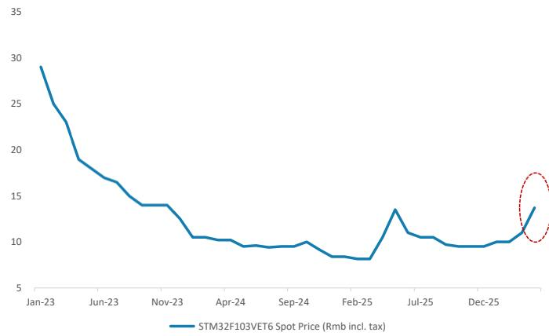  
Exhibit 1: STM32F103VET6 spot market price trend   
Source: Bom.ai, Morgan Stanley Research

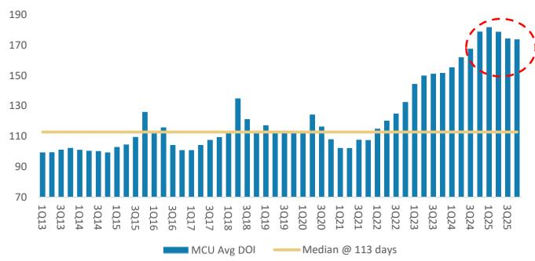  
Exhibit 3: Inventory days for producers peaked in 1Q25 and was flat in 4Q25   
Source: Company data, Bloomberg, Morgan Stanley Research

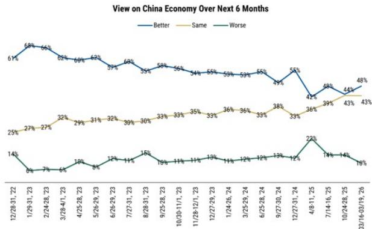  
Exhibit 5: Consumer sentiment shows mild improvement, though caution remains   
Source: AlphaWise, Morgan Stanley Research. Note: survey date as of March 16-19, 2026.

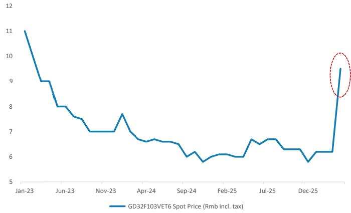  
Exhibit 2: GD32F103VET6 spot market price trend   
Source: Bom.ai, Morgan Stanley Research

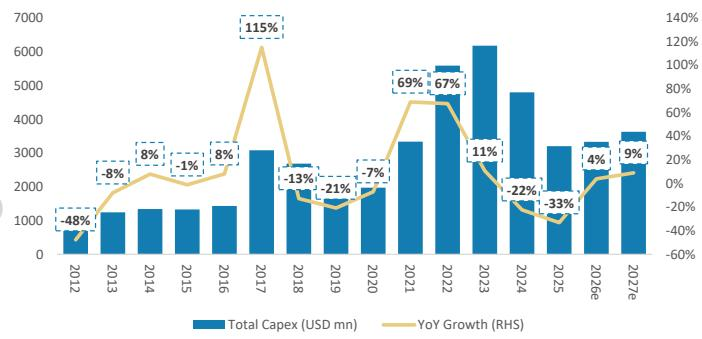  
Exhibit 4: Leading MCU companies' capex declined for 2 years and is showing slight growth in 2026   
Source: Company data, Bloomberg (e) estimates, Morgan Stanley Research.

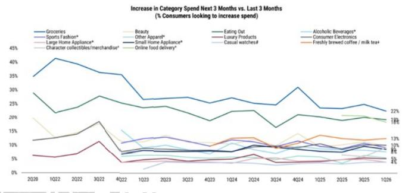  
Exhibit 6: Consumer electronics' spending intention was stable recently   
Source: AlphaWise, Morgan Stanley Research. Note: survey date as of March 16-19, 2026.

# Espressif: Earnings Estimate Revisions

# We cut our 2026/27 EPS estimates by $12 \% / 1 1 \%$ and introduce our 2028 forecast: We

factor in actual 2025 results and cut our revenue forecasts, as we believe overall consumer electronics demand is being affected by higher memory prices. We have also raised our R&D expense assumptions, as the company guided to a $20 \%$ increase in R&D expense for 2026. As a result, our 2026/27 EPS estimates are lowered by $1 2 \% / 1 7 \%$ . We also introduce our 2028 forecast.

Exhibit 7: Espressif: Estimate revisions   

<table><tr><td></td><td>New</td><td>Previous</td><td></td><td>New</td><td>Previous</td><td></td><td>New</td></tr><tr><td>Rmb mn</td><td>2026E</td><td>2026E</td><td>Diff.</td><td>2027E</td><td>2027E</td><td>Diff.</td><td>2028E</td></tr><tr><td>Netsales</td><td>3,052</td><td>3,069</td><td>-1%</td><td>3,804</td><td>4,001</td><td>-5%</td><td>4,552</td></tr><tr><td>COGS</td><td>1,639</td><td>1,715</td><td></td><td>2,106</td><td>2,290</td><td></td><td>2,554</td></tr><tr><td>Gross profit</td><td>1,413</td><td>1,354 755</td><td>4%</td><td>1,697</td><td>1,711</td><td>-1%</td><td>1,999</td></tr><tr><td>Operating expenses</td><td>910 503</td><td>600</td><td>-16%</td><td>1,059 639</td><td>971 739</td><td>-14%</td><td>1,262</td></tr><tr><td>Operating profit</td><td></td><td>28</td><td></td><td></td><td>28</td><td></td><td>737</td></tr><tr><td>Non-op.income (exp.) Pretax Income</td><td>60 563</td><td>628</td><td>-10%</td><td>60</td><td>767</td><td>-9%</td><td>60</td></tr><tr><td>Taxes</td><td>28</td><td>13</td><td></td><td>699 35</td><td></td><td></td><td>797</td></tr><tr><td></td><td></td><td></td><td></td><td></td><td>15</td><td></td><td>40</td></tr><tr><td>Net income Reported EPS (Rmb)</td><td>538 3.43</td><td>611 3.90</td><td>-12% -12%</td><td>667 4.26</td><td>748 4.77</td><td>-11% -11%</td><td>760</td></tr><tr><td></td><td></td><td></td><td></td><td></td><td></td><td></td><td>4.85</td></tr><tr><td>Margins</td><td></td><td></td><td></td><td></td><td></td><td></td><td></td></tr><tr><td>Gross margin</td><td>46.3%</td><td>44.1%</td><td>2 ppt</td><td>44.6%</td><td>42.8%</td><td>2 ppt</td><td>43.9%</td></tr><tr><td>Operating margin</td><td>16.5%</td><td>19.5%</td><td>-3 ppt</td><td>16.8%</td><td>18.5%</td><td>-2 ppt</td><td>16.2%</td></tr><tr><td>Pretax margin</td><td>18.4%</td><td>20.4%</td><td>-2 ppt</td><td>18.4%</td><td>19.2%</td><td>-1 ppt</td><td>17.5%</td></tr><tr><td>Net margin</td><td>17.6%</td><td>19.9%</td><td>-2 ppt</td><td>17.5%</td><td>18.7%</td><td>-1ppt</td><td>16.7%</td></tr></table>

订阅研报添加微信 LCD123321Cad 04-17 Source: Morgan Stanley Research (E) estimates

Exhibit 8: Espressif: Quarterly financial statement   

<table><tr><td>Rmbmn(YEDEC31)</td><td>1Q25</td><td>2Q25</td><td>3Q25</td><td>4Q25</td><td>1Q26E</td><td>2Q26E</td><td>3Q26E</td><td>4Q26E</td><td>1Q27E</td><td>2Q27E</td><td>3Q27E</td><td>4Q27E</td><td>2025</td><td>2026E</td><td>2027E</td><td>2028E</td></tr><tr><td>Total Revenues</td><td>558</td><td>688</td><td>667</td><td>653</td><td>659</td><td>716</td><td>820</td><td>858</td><td>810</td><td>894</td><td>1,026</td><td>1,074</td><td>2,565</td><td>3,052</td><td>3,804</td><td>4,552</td></tr><tr><td>Sequential Change</td><td>2.0%</td><td>23.3%</td><td>-3.1%</td><td>-2.1%</td><td>0.9%</td><td>8.6%</td><td>14.6%</td><td>4.7%</td><td>-5.6%</td><td>10.3%</td><td>14.8%</td><td>4.7%</td><td></td><td></td><td></td><td></td></tr><tr><td>Change vs Year Ago</td><td>44.1%</td><td>29.0%</td><td>23.5%</td><td>19.4%</td><td>18.1%</td><td>4.1%</td><td>23.0%</td><td>31.4%</td><td>23.0%</td><td>24.9%</td><td>25.2%</td><td>25.2%</td><td>27.8%</td><td>19.0%</td><td>24.6%</td><td>19.7%</td></tr><tr><td>Cost of Sales</td><td>316</td><td>367</td><td>347</td><td>340</td><td>354</td><td>384</td><td>440</td><td>461</td><td>449</td><td>495</td><td>568</td><td>594</td><td>1,369</td><td>1,639</td><td>2,106</td><td>2,554</td></tr><tr><td>Percent of Revenues</td><td>57%</td><td>53%</td><td>52%</td><td>52%</td><td>54%</td><td>54%</td><td>54%</td><td>54%</td><td>55%</td><td>55%</td><td>55%</td><td>55%</td><td>53%</td><td>54%</td><td>55%</td><td>56%</td></tr><tr><td>Gross Profit</td><td>242</td><td>321</td><td>320</td><td>313</td><td>305</td><td>331</td><td>380</td><td>397</td><td>361</td><td>399</td><td>458</td><td>480</td><td>1,196</td><td>1,413</td><td>1,697</td><td>1,999</td></tr><tr><td>Percent of Revenues</td><td>43.4%</td><td>46.7%</td><td>48.0%</td><td>48.0%</td><td>46.3%</td><td>46.3%</td><td>46.3%</td><td>46.3%</td><td>44.5%</td><td>44.6%</td><td>44.7%</td><td>44.7%</td><td>46.6%</td><td>46.3%</td><td>44.6%</td><td>43.9%</td></tr><tr><td>Incremental Margin</td><td>-131%</td><td>61%</td><td>NM</td><td>NM</td><td>-147%</td><td>47%</td><td>46%</td><td>46%</td><td>NM</td><td>45%</td><td>45%</td><td>44%</td><td>56%</td><td>45%</td><td>38%</td><td>40%</td></tr><tr><td>Total Opex</td><td>161</td><td>183</td><td>201</td><td>229</td><td>197</td><td>214</td><td>244</td><td>256</td><td>227</td><td>249</td><td>285</td><td>298</td><td>774</td><td>910</td><td>1,059</td><td>1,262</td></tr><tr><td>Percent of Revenues</td><td>28.9%</td><td>26.6%</td><td>30.1%</td><td>35.1%</td><td>29.8%</td><td>29.9%</td><td>29.7%</td><td>29.8%</td><td>28.0%</td><td>27.9%</td><td>27.7%</td><td>27.8%</td><td>30.2%</td><td>29.8%</td><td>27.8%</td><td>27.7%</td></tr><tr><td>R&amp;D</td><td>126</td><td>142</td><td>155</td><td>180</td><td>157</td><td>170</td><td>195</td><td>204</td><td>178</td><td>197</td><td>226</td><td>236</td><td>603</td><td>726</td><td>837</td><td>1,002</td></tr><tr><td>Percent of Revenues</td><td>22.6%</td><td>20.7%</td><td>23.3%</td><td>27.6%</td><td>23.8%</td><td>23.8%</td><td>23.8%</td><td>23.8%</td><td>22.0%</td><td>22.0%</td><td>22.0%</td><td>22.0%</td><td>23.5%</td><td>23.8%</td><td>22.0%</td><td>22.0%</td></tr><tr><td>General &amp; administrative</td><td>18</td><td>20</td><td>24</td><td>27</td><td>20</td><td>22</td><td>24</td><td>26</td><td>24</td><td>26</td><td>28</td><td>30</td><td>89</td><td>92</td><td>108</td><td>124</td></tr><tr><td>Percent of Revenues</td><td>3.2%</td><td>2.9%</td><td>3.6%</td><td>4.1%</td><td>3.0%</td><td>3.1%</td><td>2.9%</td><td>3.0%</td><td>3.0%</td><td>2.9%</td><td>2.7%</td><td>2.8%</td><td>3.5%</td><td>3.0%</td><td>2.8%</td><td>2.7%</td></tr><tr><td>Sellng &amp; marketing</td><td>17</td><td>21</td><td>21</td><td>23</td><td>20</td><td>21</td><td>25</td><td>26</td><td>24</td><td>27</td><td>31</td><td>32</td><td>82</td><td>92</td><td>114</td><td>137</td></tr><tr><td>Percent of Revenues</td><td>3.1%</td><td>3.0%</td><td>3.2%</td><td>3.5%</td><td>3.0%</td><td>3.0%</td><td>3.0%</td><td>3.0%</td><td>3.0%</td><td>3.0%</td><td>3.0%</td><td>3.0%</td><td>3.2%</td><td>3.0%</td><td>3.0%</td><td>3.0%</td></tr><tr><td>Operating Income</td><td>81</td><td>138</td><td>119</td><td>84</td><td>108</td><td>118</td><td>136</td><td>141</td><td>134</td><td>149</td><td>174</td><td>181</td><td>422</td><td>503</td><td>639</td><td>737</td></tr><tr><td>Percent of Revenues</td><td>14.5%</td><td>20.1%</td><td>17.9%</td><td>12.8%</td><td>16.4%</td><td>16.4%</td><td>16.6%</td><td>16.4%</td><td>16.6%</td><td>16.7%</td><td>16.9%</td><td>16.9%</td><td>16.5%</td><td>16.5%</td><td>16.8%</td><td>16.2%</td></tr><tr><td>Change vs Year Ago</td><td>162.6%</td><td>58.6%</td><td>66.2%</td><td>21.4%</td><td>33.9%</td><td>-14.9%</td><td>13.9%</td><td>68.3%</td><td>24.0%</td><td>26.9%</td><td>28.0%</td><td>28.4%</td><td>63%</td><td>19%</td><td>27%</td><td>15%</td></tr><tr><td>Total Non-operating Income(Loss)</td><td>12</td><td>30</td><td>10</td><td>34</td><td>15</td><td>15</td><td>15</td><td>15</td><td>15</td><td>15</td><td>15</td><td>15</td><td>86</td><td>60</td><td>60</td><td>60</td></tr><tr><td>Interest inoome</td><td>0</td><td>0</td><td>0</td><td>0</td><td>0</td><td>0</td><td>0</td><td>0</td><td>0</td><td>0</td><td>0</td><td>0</td><td>0</td><td>0</td><td>0</td><td>0</td></tr><tr><td>Interest expense</td><td>0</td><td>0</td><td>0</td><td>0</td><td>0</td><td>0</td><td>0</td><td>0</td><td>0</td><td>0</td><td>0</td><td>0</td><td>5</td><td>0</td><td>0</td><td>0</td></tr><tr><td>Investment Income(loss)</td><td>5</td><td>4</td><td>3</td><td>5</td><td>15</td><td>15</td><td>15</td><td>15</td><td>15</td><td>15</td><td>15</td><td>15</td><td>17</td><td>60</td><td>60</td><td>60</td></tr><tr><td>Tax Rate</td><td>-2.1%</td><td>-0.2%</td><td>9.7%</td><td>-2.0%</td><td>5.0%</td><td>5.0%</td><td>5.0%</td><td>5.0%</td><td>5.0%</td><td>5.0%</td><td>5.0%</td><td>5.0%</td><td>1.6%</td><td>5.0%</td><td>5.0%</td><td>5.0%</td></tr><tr><td>Net Income, Cont Ops</td><td>94 17%</td><td>169</td><td>116 17%</td><td>120 18%</td><td>117 18%</td><td>126 18%</td><td>143 17%</td><td>148 17%</td><td>142 18%</td><td>156 17%</td><td>179 17%</td><td>186 17%</td><td>500 19%</td><td>535 18%</td><td>664 17%</td><td>757 17%</td></tr><tr><td>Percent of Revenues Minority interest</td><td>(1)</td><td>25% (1)</td></table>

订阅研报添加微信 LCD123321CadSource: Company data, Morgan Stanley Research (E) estimates

# Valuation Methodology

We cut our price target to Rmb175 from Rmb188: This reflects our lower earnings estimates for 2026-27. Our price target is our base case scenario value, derived from a residual income model. Our key assumptions are unchanged: an $8 . 9 \%$ cost of equity (beta of 1.1, risk-free rate of $2 . 0 \% ,$ and risk premium of $6 . 0 \%$ , a payout ratio of $4 0 \% ,$ a mediumterm growth rate of $7 8 . 5 \% ,$ and a terminal growth rate of $4 . 5 \%$ .

Accordingly, we lower our bull case value to Rmb202 from Rmb217 and our bear case value to Rmb75 from Rmb81.

Exhibit 9: Espressif: Residual income model   

<table><tr><td>Rmb mn</td><td>2026E</td><td>2027E</td><td>2028E</td><td>2029E</td><td>2030E</td><td>2031E</td><td>2032E</td><td>2033E</td><td>2034E</td><td>2035E</td><td>2036E</td><td>2037E</td></tr><tr><td>Total Equity</td><td>4,771 538</td><td>5,053</td><td>5,428</td><td>6,005</td><td>6,688</td><td>7,497</td><td>8,456</td><td>9,593</td><td>10,940</td><td>12,536</td><td>14,427</td><td>16,668</td></tr><tr><td>Net Profit</td><td></td><td>667</td><td>760</td><td>901</td><td>1,067</td><td>1,265</td><td>1,499</td><td>1,776</td><td>2,104</td><td>2,494</td><td>2,955</td><td>3,502</td></tr><tr><td>ROAE</td><td>11.6%</td><td>13.6%</td><td>14.5%</td><td>15.8%</td><td>16.8%</td><td>17.8%</td><td>18.8%</td><td>19.7%</td><td>20.5%</td><td>21.2%</td><td>21.9%</td><td>22.5%</td></tr><tr><td>Residual Income</td><td>123</td><td>224</td><td>284</td><td>373</td><td>477</td><td>599</td><td>743</td><td>913</td><td>1,114</td><td>1,353</td><td>1,635</td><td>1,968</td></tr><tr><td>Spread</td><td>2.7%</td><td>4.7%</td><td>5.6%</td><td>6.9%</td><td>7.9%</td><td>9.0%</td><td>9.9%</td><td>10.8%</td><td>11.6%</td><td>12.4%</td><td>13.0%</td><td>13.6%</td></tr><tr><td>Ending Equity Capital</td><td></td><td></td><td></td><td></td><td></td><td></td><td></td><td></td><td></td><td></td><td></td><td></td></tr><tr><td>PV of Forecast Period</td><td>4,771 4,305</td><td></td><td></td><td></td><td></td><td></td><td></td><td></td><td></td><td></td><td></td><td></td></tr><tr><td>PV of Continuing Value</td><td></td><td></td><td></td><td></td><td></td><td></td><td></td><td></td><td></td><td></td><td></td><td></td></tr><tr><td>Equity Value</td><td>18,414 27,490</td><td></td><td></td><td></td><td></td><td></td><td></td><td></td><td></td><td></td><td></td><td></td></tr><tr><td>No. of Shares</td><td></td><td></td><td></td><td></td><td></td><td></td><td></td><td></td><td></td><td></td><td></td><td></td></tr><tr><td></td><td></td><td></td><td></td><td></td><td></td><td></td><td></td><td></td><td></td><td></td><td></td><td></td></tr><tr><td>Projected Price (Rmb)</td><td></td><td></td><td></td><td></td><td></td><td></td><td></td><td></td><td></td><td></td><td></td><td></td></tr><tr><td></td><td>157</td><td></td><td></td><td></td><td></td><td></td><td></td><td></td><td></td><td></td><td></td><td></td></tr><tr><td></td><td></td><td></td><td></td><td></td><td></td><td></td><td></td><td></td><td></td><td></td><td></td><td></td></tr><tr><td></td><td></td><td></td><td></td><td></td><td></td><td></td><td></td><td></td><td></td><td></td><td></td><td></td></tr><tr><td></td><td></td><td></td><td></td><td></td><td></td><td></td><td></td><td></td><td></td><td></td><td></td><td></td></tr><tr><td></td><td></td><td></td><td></td><td></td><td></td><td></td><td></td><td></td><td></td><td></td><td></td><td></td></tr><tr><td></td><td>175</td><td></td><td></td><td></td><td></td><td></td><td></td><td></td><td></td><td></td><td></td><td></td></tr></table>

添加微信 LCD123321Cad 04-17 Source: Morgan Stanley Research (E) estimates

# Risk Reward - Espressif SysteRisk Reward – Espressif Systems (688018.SS)

Edge AI growth con dence; OW

# Rmb175.00PRICE TARGET

Base case, residual income model. We assume an $8 . 9 \%$ cost of equity (beta 1.1, risk-free rate $2 . 0 \%$ and risk premium $6 . 0 \%$ ), a payout ratio of $40 \%$ , a medium-term growth rate of $1 8 . 5 \%$ , and a terminal growth rate of $4 . 5 \%$ .

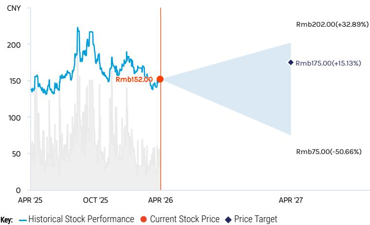  
RISK REWARD CHART   
Source: Re nitiv, Morgan Stanley Research

# OVERWEIGHT THESIS

▪ We believe Espressif can bene t from demand created by emerging edge AI opportunities.

▪ We expect the company to continue to gain market share because of a more comprehensive product portfolio, better cost performance ratio, and potentially higher RISC-V adoption rate.

▪ Margin has stabilized at $40 \% +$ and we expect it to remain stable.

▪ 2027e P/E of $3 6 x$ is below the stock's historical average of $4 3 x$ since 2022; we see this as attractive, as rising ROE provides solid support for valuation.

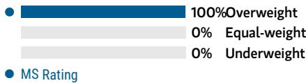  
Consensus Rating Distribution   
Source: Re nitiv, Morgan Stanley Research

# Risk Reward Themes

Secular Growth: Positive View descriptions of Risk Rewards Themes here

# BULL CASE

# Rmb202.00

# BASE CASE

# Rmb175.00

# BEAR CASE

Rmb75.00

# 47x base case 2027e EPS

We assume 2025-28e revenue CAGRs of $30 \% +$ for Wi-Fi MCUs and $40 \% +$ for Wi-Fi modules. Gross margin of $45 \% +$ in 2026- 28e. Espressif's products are adopted in edge AI killer applications in 2026-28e.

# 41x base case 2027e EPS

We assume 2025-28e revenue CAGRs of $2 1 \%$ for Wi-Fi MCU and Wi-Fi modules. Gross margin of ${ \sim } 4 5 \%$ in 2026-28e. Espressif's products are adopted in more edge AI applications in 2026-28e.

# 18x base case 2027e EPS

We assume 2025-28e revenue CAGRs of ${ < } 1 0 \%$ for Wi-Fi MCUs and $1 5 \%$ for Wi-Fi modules. Gross margin below $3 5 \%$ in 2026- 28e. No Espressif products are adopted in edge AI applications in 2026-28e.

# Risk Reward – Espressif Systems (688018.SS)

KEY EARNINGS INPUTS   

<table><tr><td>Drivers</td><td>2025</td><td>2026e</td><td>2027e</td><td>2028e</td></tr><tr><td>MCU chip shipment growth (%)</td><td>19.2</td><td>17.2</td><td>28.8</td><td>23.0</td></tr><tr><td>MCU chip pricing growth (%)</td><td>5.0</td><td>1.3</td><td>(2.6)</td><td>(2.7)</td></tr><tr><td>Gross margin (%)</td><td>46.6</td><td>46.3</td><td>44.6</td><td>43.9</td></tr></table>

# INVESTMENT DRIVERS

Wi-FI MCU unit shipments Pricing trends IoT market growth Wi-Fi 6 unit shipments

# GLOBAL REVENUE EXPOSURE

  
Source: Morgan Stanley Research Estimate View explanation of regional hierarchies here

# MS ALPHA MODELS

Source: Re nitiv, FactSet, Morgan Stanley Research; 1 is the highest favored Quintile and 5 is the least favored Quintile

# RISKS TO PT/RATING

# RISKS TO UPSIDE

China's MCU localization goes faster than expected. Gains traction from new customers. Margin expansion is more signi cant.

# RISKS TO DOWNSIDE

China's MCU localization pace is slower than expected.   
Traction from new customers is less than expected.   
Margins erode amid more intense competition.

# OWNERSHIP POSITIONING

Inst. Owners, % Active $8 7 . 5 \%$

Source: Re nitiv, Morgan Stanley Research

# MS ESTIMATES VS. CONSENSUS

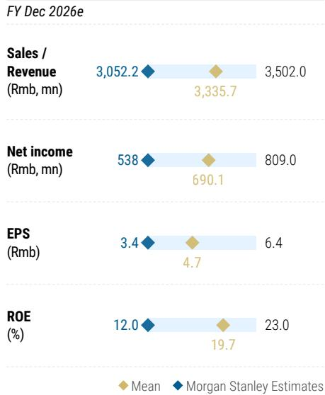  
Source: Re nitiv, Morgan Stanley Research

# Espressif: Financial Summary

Exhibit 10: Espressif: Financial Summary   

<table><tr><td>Income Statement Rmb mn (Years End Dec)</td><td>2025</td><td>2026E</td><td>2027E</td><td>2028E</td></tr><tr><td>Net sales</td><td>2,565</td><td>3,052</td><td>3.804</td><td>4,552</td></tr><tr><td>COGS</td><td>(1,369)</td><td>(1,639)</td><td>(2,106)</td><td>(2.554)</td></tr><tr><td>Gross profit</td><td>1,196</td><td>1,413</td><td>1,697</td><td>1,999</td></tr><tr><td>Operating expenses</td><td>(774)</td><td>(910)</td><td>(1,059)</td><td>(1,262)</td></tr><tr><td>Operating income</td><td>422</td><td>503</td><td>639</td><td>737</td></tr><tr><td>Non-operating income</td><td>86</td><td>60</td><td>60</td><td>60</td></tr><tr><td>Pre-tax income</td><td>508</td><td>563</td><td>699</td><td>797</td></tr><tr><td>Income tax</td><td>8</td><td>28</td><td>35</td><td>40</td></tr><tr><td>Minority interests</td><td>(2)</td><td>3</td><td>3</td><td>3</td></tr><tr><td>Reported net Income</td><td>498</td><td>538</td><td>667</td><td>760</td></tr><tr><td>Adj.wtd.avg.shrs( m)</td><td>157</td><td>157</td><td>157</td><td>157</td></tr><tr><td>MW EPS (Rmb)</td><td>3.18</td><td>3.43</td><td>4.26</td><td>4.85</td></tr><tr><td>Reported EPS(Rmb)</td><td>3.18</td><td>3.43</td><td>4.26</td><td>4.85</td></tr></table>

Balance Sheet   

<table><tr><td>Rmb mn (Years End Dec) BalanceSneet</td><td>2025</td><td>2026E</td><td>2027E</td><td>2028E</td></tr><tr><td>Cash</td><td>1,025</td><td>1,223</td><td>1,269</td><td>1,414</td></tr><tr><td>Mkt Securities</td><td>876</td><td>876</td><td>876</td><td>876</td></tr><tr><td>AR/NR</td><td>364</td><td>429</td><td>534</td><td>639</td></tr><tr><td>Inventory</td><td>628</td><td>666</td><td>856</td><td>1,038</td></tr><tr><td>Other</td><td>1,043</td><td>1,043</td><td>1,043</td><td>1,043</td></tr><tr><td>Current Assets</td><td>3,935</td><td>4,237</td><td>4,579</td><td>5,011</td></tr><tr><td>Long-term investments</td><td>252</td><td>252</td><td>252</td><td>252</td></tr><tr><td>Fixed assets</td><td>557</td><td>557</td><td>557</td><td>557</td></tr><tr><td>Deferred assets</td><td>131</td><td>131</td><td>131</td><td>131</td></tr><tr><td>Other assets</td><td>172</td><td>172</td><td>172</td><td>172</td></tr><tr><td>Total Assets</td><td>5,048</td><td>5,350</td><td>5,691</td><td>6,124</td></tr><tr><td>S/T borrowings</td><td>0</td><td>0</td><td>0</td><td>0</td></tr><tr><td>AP/NP</td><td>188</td><td>208</td><td>268</td><td>325</td></tr><tr><td>Other ST liabilities</td><td>229</td><td>229</td><td>229</td><td>229</td></tr><tr><td>LT debt</td><td>0</td><td>0</td><td>0</td><td>0</td></tr><tr><td>Other LT liabilities</td><td>141</td><td>141</td><td>141</td><td>141</td></tr><tr><td>Total Liabilities</td><td>558</td><td>579</td><td>638</td><td>695</td></tr><tr><td>Common shares</td><td>167</td><td>167</td><td>167</td><td>167</td></tr><tr><td>Additional capital</td><td>3,164</td><td>3,164</td><td>3,164</td><td>3,164</td></tr><tr><td>Retained earning</td><td>1,178</td><td>1,459</td><td>1,741</td><td>2,116</td></tr><tr><td>Other shareholders&#x27; equity</td><td>(18)</td><td>(18)</td><td>(18)</td><td>(18)</td></tr><tr><td>Total Equity</td><td>4,490</td><td>4,771</td><td>5,053</td><td>5,428</td></tr><tr><td>Total Liab.&amp; Shrhldr&#x27;s Equity</td><td>5,048</td><td>5,350</td><td>5,691</td><td>6,124</td></tr></table>

订阅研报 $\mathsf { E } =$ 加微信 LCDMorgan Stanley Research Estimatesrce: Morgan Stanley Research, Com

<table><tr><td>Cash Flow Statement Rmb mn (Years End Dec）</td><td>2025</td><td>2026E</td><td>2027E</td><td>2028E</td></tr><tr><td>Cashflow from Operations</td><td>523</td><td>479</td><td>454</td><td>553</td></tr><tr><td>Net profits</td><td>498</td><td>538</td><td>667</td><td>760</td></tr><tr><td>Depreciation</td><td>24</td><td>24</td><td>24</td><td>24</td></tr><tr><td>Working Capital Change</td><td>(126)</td><td>(83)</td><td>(236)</td><td>(230)</td></tr><tr><td>Other adjustments</td><td>127</td><td>0</td><td>0</td><td>0</td></tr><tr><td>Cashflow from Investing</td><td>(1,913)</td><td>(24)</td><td>(24)</td><td>(24)</td></tr><tr><td>Capex</td><td>(516)</td><td>(24)</td><td>(24)</td><td>(24)</td></tr><tr><td>Change of LT Investment</td><td>(1,972)</td><td>0</td><td>0</td><td>0</td></tr><tr><td>Change of ST Investment</td><td>0</td><td>0</td><td>0</td><td>0</td></tr><tr><td>Other adjustments</td><td>575</td><td>0</td><td>0</td><td>0</td></tr><tr><td>Cashflow from financing</td><td>1,757</td><td>(257)</td><td>(385)</td><td>(385)</td></tr><tr><td>Increase in L/T debt</td><td>0</td><td>0</td><td>0</td><td>0</td></tr><tr><td>Increase in S/T debt</td><td>(1)</td><td>0</td><td>0</td><td>0</td></tr><tr><td>Cash Dividend Paid</td><td>(71)</td><td>(257)</td><td>(385)</td><td></td></tr><tr><td>Dir&amp; Emp Bonus Paid</td><td>0</td><td>0</td><td>0</td><td>(385)</td></tr><tr><td>Issuance of stock</td><td>1,842</td><td>0</td><td>0</td><td>0 0</td></tr><tr><td>Other adjustments</td><td></td><td></td><td></td><td></td></tr><tr><td></td><td>(13)</td><td>0</td><td>0</td><td>0</td></tr><tr><td>Exchange rate adjustment Net change in cash</td><td>(16) 351</td><td>0 198</td><td>0 46</td><td>0 145</td></tr></table>

<table><tr><td>Financial Ratios</td><td>2025</td><td>2026E</td><td>2027E</td><td>2028E</td></tr><tr><td>Growth(%)</td><td></td><td></td><td></td><td></td></tr><tr><td>Turnover</td><td>27.8</td><td>19.0</td><td>24.6</td><td>19.7</td></tr><tr><td>Operating profits</td><td>63.2</td><td>19.1</td><td>27.0</td><td>15.4</td></tr><tr><td>EPS</td><td>46.7</td><td>8.1</td><td>24.0</td><td>14.0</td></tr><tr><td>Margins (%)</td><td></td><td></td><td></td><td></td></tr><tr><td>Gross Margin</td><td>46.6</td><td>46.3</td><td>44.6</td><td>43.9</td></tr><tr><td>Operating Margin</td><td>16.5</td><td>16.5</td><td>16.8</td><td>16.2</td></tr><tr><td>Pretax Margin</td><td>19.8</td><td>18.4</td><td>18.4</td><td>17.5</td></tr><tr><td>Net Margin</td><td>19.4</td><td>17.6</td><td>17.5</td><td>16.7</td></tr><tr><td>Return (%)</td><td></td><td></td><td></td><td></td></tr><tr><td>ROAE</td><td>14.9</td><td>11.6</td><td>13.6</td><td>14.5</td></tr><tr><td>ROAA</td><td>12.9</td><td>10.3</td><td>12.1</td><td>12.9</td></tr><tr><td>Gearing (%)</td><td></td><td></td><td></td><td></td></tr><tr><td>Net Debt/Equity</td><td>(22.8)</td><td>(25.6)</td><td>(25.1)</td><td>(26.1)</td></tr><tr><td>Liabilities/Equity</td><td>12.4</td><td>12.1</td><td>12.6</td><td>12.8</td></tr><tr><td>Ratios (X)</td><td></td><td></td><td></td><td></td></tr><tr><td>Current ratio</td><td>9.4</td><td>9.7</td><td>9.2</td><td>9.0</td></tr><tr><td>Quick ratio</td><td>3.3</td><td>3.8</td><td>3.6</td><td>3.7</td></tr><tr><td>Others</td><td></td><td></td><td></td><td></td></tr><tr><td>AR/NR Turnover (days)</td><td>51</td><td>51</td><td>51</td><td>51</td></tr><tr><td>Inventory Turnover (days)</td><td>148</td><td>148</td><td>148</td><td>148</td></tr><tr><td>AP Turmover (days)</td><td>46</td><td>46</td><td>46</td><td>46</td></tr><tr><td>Cash Conversion (days)</td><td>153</td><td>153</td><td>153</td><td>153</td></tr></table>

# Nuvoton: Earnings Estimate Revisions

订阅研报

We factor in the actual 4Q25 results and 1Q26 preliminary revenue, expect a loss in 2026, raise our 2027 EPS by $1 2 \% ,$ and introduce our 2028 forecast: We expect Nuvoton's utilization to improve in 2026 vs. 2025, but at a milder pace; we therefore slightly lower our sales forecast for 2027. We also expect Nuvoton to face some margin pressure in 2026 from higher material costs, although this should be modest, and therefore lower our margin assumptions. We expect margin improvement in 2027E, 添加微信 LCD123321Cad 04-17 supported by new product introductions and spec migration.

Exhibit 11: Nuvoton: Estimate revisions   

<table><tr><td colspan="3">Previous</td><td colspan="3"></td><td colspan="3">Previous</td></tr><tr><td>NT$mn</td><td>New 2026E</td><td>2026E</td><td>Diff.</td><td>New 2027E</td><td>2027E</td><td>Diff.</td><td>New 2028E</td></tr><tr><td>Net sales</td><td>32,309</td><td>32,087</td><td>1%</td><td>36.825</td><td>38,437</td><td>-4%</td><td>40,494</td></tr><tr><td>COGS</td><td>(20,683)</td><td>(19,515)</td><td></td><td>(22,651)</td><td>(23,035)</td><td></td><td>(23,854)</td></tr><tr><td>Gross profit</td><td>11,626</td><td>12,572</td><td>-8%</td><td>14,174</td><td>15,403</td><td>-8%</td><td>16,640</td></tr><tr><td>Operating expenses</td><td>(12,406)</td><td>(12,569)</td><td></td><td>(12,747)</td><td>(14,232)</td><td></td><td>(13,389)</td></tr><tr><td>Operating profit</td><td>(781)</td><td>3</td><td>n.a.</td><td>1,427</td><td>1,171</td><td>22%</td><td>3,252</td></tr><tr><td>Non-op.income (exp.)</td><td>177</td><td>409</td><td></td><td>726</td><td>756</td><td></td><td>600</td></tr><tr><td>Pretax Income</td><td>(603)</td><td>412</td><td>n.a.</td><td>2,153</td><td>1,926</td><td>12%</td><td>3,852</td></tr><tr><td>Taxes</td><td>84</td><td>(58)</td><td></td><td>(301)</td><td>(270)</td><td></td><td>(539)</td></tr><tr><td>Net income</td><td>(519)</td><td>354</td><td>n.a.</td><td>1,852</td><td>1,657</td><td>12%</td><td>3,312</td></tr><tr><td>Reported EPS(NT$)</td><td>(1.24)</td><td>0.84</td><td>n.a.</td><td>4.41</td><td>3.94</td><td>12%</td><td>7.89</td></tr><tr><td></td><td></td><td></td><td></td><td></td><td></td><td></td><td></td></tr><tr><td>Margins</td><td>36.0%</td><td>39.2%</td><td>-3.2 ppt</td><td>38.5%</td><td>40.1%</td><td></td><td></td></tr><tr><td>Gross margin</td><td>-2.4%</td><td>0.0%</td><td>-2.4 ppt</td><td>3.9%</td><td>3.0%</td><td>-1.6ppt 0.8ppt</td><td>41.1%</td></tr><tr><td>Operating margin</td><td>-1.9%</td><td>1.3%</td><td>-3.2 ppt</td><td>5.8%</td><td>5.0%</td><td></td><td>8.0%</td></tr><tr><td>Pretaxmargin</td><td></td><td></td><td></td><td></td><td></td><td>0.8ppt</td><td>9.5%</td></tr><tr><td>Netmargin</td><td>-1.6%</td><td>1.1%</td><td>-2.7ppt</td><td>5.0%</td><td>4.3%</td><td>0.7ppt</td><td>8.2%</td></tr></table>

Source: Company data, Morgan Stanley Research estimates

Exhibit 12: Nuvoton: Quarterly Financials   

<table><tr><td colspan="9">(NTS mn)</td><td></td><td>2025</td><td>2026e</td><td>2027e</td></tr><tr><td colspan="2">Total Revenues</td><td>8,364</td><td>7,816</td><td>7272</td><td>7,040</td><td>7,988</td><td>8,319</td><td>8,057</td><td>7,945</td><td>30,492</td><td>32,309</td><td>36,825</td><td>40,494</td></tr><tr><td colspan="2">Sequential Change Change vs Year Ago</td><td>15.1% -1.2%</td><td>-6.6% -5.0%</td><td>-7.0% -8.6%</td><td>-3.2% -3.2%</td><td>13.5% -4.5%</td><td>4.2% 6.4%</td><td>-3.1% 10.8%</td><td>-1.4% 12.8%</td><td></td><td>6.0%</td><td>14.0%</td><td>10.0%</td></tr><tr><td colspan="2"></td><td></td><td></td><td></td><td></td><td></td><td></td><td></td><td></td><td>-4.5%</td><td></td><td>(22,651)</td><td></td></tr><tr><td colspan="2">Cost of Sales Percent of Revenues</td><td>(4,914) 58.7%</td><td>(5,088) 65.1%</td><td>(4,675) 64.3%</td><td>(4,627) 65.7%</td><td>(5,202) 65.1%</td><td>(5,305) 63.8%</td><td>(5,127) 63.6%</td><td>(5,049) 63.5%</td><td>(19,304) 63.3%</td><td>(20,683) 64.0%</td><td>61.5%</td><td>(23,854) 58.9%</td></tr><tr><td colspan="2"></td><td></td><td></td><td></td><td></td><td></td><td></td><td></td><td></td><td>11,189</td><td></td><td></td><td></td></tr><tr><td colspan="2">Gross Profit Gross Margin</td><td>3,451 41.3%</td><td>2,728 34.9%</td><td>2,597 35.7%</td><td>2,413 34.3%</td><td>2,785 34.9%</td><td>3,014 36.2%</td><td>2,931 36.4%</td><td>2,896 36.5%</td><td>36.7%</td><td>11,626 36.0%</td><td>14,174 38.5%</td><td>16,640 41.1%</td></tr><tr><td colspan="2"></td><td></td><td></td><td></td><td></td><td></td><td></td><td></td><td></td><td></td><td></td><td></td><td></td></tr><tr><td colspan="2">Total Opex Q/Q</td><td>(3,177) 6.3%</td><td>(3,030) -4.7%</td><td>(3,113) 2.8%</td><td>(3,097) -0.5%</td><td>(3,244) 4.8%</td><td>(3,162) -2.5%</td><td>(3,030) -4.2%</td><td>(2,970) -2.0%</td><td>(12,417)</td><td>(12,406)</td><td>(12,747)</td><td>(13,389)</td></tr><tr><td colspan="2">Y/Y</td><td>3.2%</td><td>0.6%</td><td>3.6%</td><td>3.6%</td><td>2.1%</td><td>4.4%</td><td>-2.7%</td><td>-4.1%</td><td>2.8%</td><td>-0.1%</td><td>2.7%</td><td>5.0%</td></tr><tr><td colspan="2">Percent of Revenues</td><td>38.0%</td><td>38.8%</td><td>42.8%</td><td>44.0%</td><td>40.6%</td><td>38.0%</td><td>37.6%</td><td>37.4%</td><td>40.7%</td><td>38.4%</td><td>34.6%</td><td>33.1%</td></tr><tr><td colspan="2">R&amp;D</td><td></td><td></td><td></td><td></td><td></td><td></td><td></td><td></td><td></td><td></td><td></td><td></td></tr><tr><td colspan="2">Percent of Revenues</td><td>(2,303) 27.5%</td><td>(2,196) 28.1%</td><td>(2,293) 31.5%</td><td>(2,257) 32.1%</td><td>(2,396) 30.0%</td><td>(2,329) 28.0%</td><td>(2,216) 27.5%</td><td>(2,169) 27.3%</td><td>(9,049) 29.7%</td><td>(9,110) 28.2%</td><td>(9,482) 25.7%</td><td>(9,767) 24.1%</td></tr><tr><td colspan="2">Sales and Marketing</td><td></td><td></td><td></td><td></td><td></td><td></td><td></td><td></td><td></td><td></td><td></td><td></td></tr><tr><td colspan="2">Percent of Revenues</td><td>(254)</td><td>(250) 3.2%</td><td>(249) 3.4%</td><td>(254) 3.6%</td><td>(272)</td><td>(266) 3.2%</td><td>(258) 3.2%</td><td>(254) 3.2%</td><td>(1,007) 3.3%</td><td>(1,050) 3.3%</td><td>(1,179)</td><td>(1,296) 3.2%</td></tr><tr><td colspan="2"></td><td>3.0%</td><td></td><td></td><td></td><td>3.4%</td><td></td><td></td><td></td><td></td><td></td><td>3.2%</td><td></td></tr><tr><td colspan="2">General and Admin Percent of Revenues</td><td>(620)</td><td>(584)</td><td>(571)</td><td>(586)</td><td>(576)</td><td>(566)</td><td>(556)</td><td>(546)</td><td>(2,361)</td><td>(2,246)</td><td>(2,086)</td><td>(2,326)</td></tr><tr><td colspan="2"></td><td>7.4%</td><td>7.5%</td><td>7.8%</td><td>8.3%</td><td>7.2%</td><td>6.8%</td><td>6.9%</td><td>6.9%</td><td>7.7%</td><td>7.0%</td><td>5.7%</td><td>5.7%</td></tr><tr><td colspan="2">Operating Income Percent of Revenues</td><td>273</td><td>(302)</td><td>(516)</td><td>(684)</td><td>(459)</td><td>(148)</td><td>(99)</td><td>(74)</td><td>(1,228)</td><td>(781)</td><td>1,427</td><td>3,252</td></tr><tr><td colspan="2">% QoQ</td><td>3.3%</td><td>-3.9% -210.4%</td><td>-7.1%</td><td>-9.7%</td><td>-5.7%</td><td>-1.8%</td><td>-1.2%</td><td>-0.9%</td><td>-4.0%</td><td>-2.4%</td><td>3.9%</td><td>8.0%</td></tr><tr><td colspan="2"></td><td>-224.2%</td><td></td><td>71.1%</td><td>32.4%</td><td>-32.8%</td><td>-67.8%</td><td>-32.8%</td><td>-25.8%</td><td>(1,228)</td><td>(781)</td><td>1,427</td><td>3,252</td></tr><tr><td colspan="2">Total Non-operating Income(Loss)</td><td>59</td><td>(343)</td><td>45</td><td>22</td><td>76</td><td>63</td><td>0</td><td>38</td><td>(217)</td><td>177</td><td>726</td><td>600</td></tr><tr><td colspan="2">Forex gain (loss)</td><td>35</td><td>(588)</td><td>0</td><td>0</td><td>0</td><td>0</td><td>0</td><td>0</td><td>(553)</td><td>0</td><td>0</td><td>0</td></tr><tr><td colspan="2">Interest expense</td><td>(40)</td><td>(52)</td><td>(50)</td><td>(41)</td><td>0</td><td>0</td><td>0</td><td>0</td><td>(182)</td><td>0</td><td>0</td><td>0</td></tr><tr><td colspan="2">Interest income</td><td>72</td><td>60</td><td>43</td><td>37</td><td>76</td><td>63</td><td>0</td><td>38</td><td>212</td><td>177</td><td>276</td><td>240</td></tr><tr><td colspan="2">Net Investment Income</td><td>(14)</td><td>155</td><td>0</td><td>0</td><td>0</td><td>0</td><td>0</td><td>0</td><td>141</td><td>0</td><td>450</td><td>360</td></tr><tr><td colspan="2">Investment Disposal Gain (loss)</td><td>0</td><td>0</td><td>0</td><td>0</td><td>0</td><td>0</td><td>0</td><td>0</td><td>0</td><td>0</td><td>0</td><td>0</td></tr><tr><td colspan="2">Other income (expense)</td><td>6</td><td>82</td><td>52</td><td>26</td><td>0</td><td>0</td><td>0</td><td>0</td><td>166</td><td>0</td><td>0</td><td>0</td></tr><tr><td</table>

Source: Company data, Morgan Stanley Research

# Nuvoton: Valuation Methodology

We raise our PT from NT\$48 to $\yen 12398$ : We factor in our earnings estimate changes for 2026-2027e. The increase in target price is driven mainly by our newly introduced 2028 forecast, which affects the medium-term outlook, while we keep the other RI model assumptions unchanged, including a $9 . 2 \%$ cost of equity (beta of 1.2, risk-free rate of $2 . 0 \% ,$ and risk premium of $6 . 0 \%$ , payout ratio of $5 5 \% ,$ a medium-term growth rate of $7 . 0 \% ,$ and a terminal growth rate of $3 . 5 \%$ . Our bull and bear case scenario values are also raised from $\ N T \$ 68$ and $\ N T \$ 23$ to $N T \$ 139$ and $N \top \$ 47$ , implying 31x and 11x 2027e EPS.

Exhibit 13: Nuvoton: RI model   

<table><tr><td>(NTS mn)</td><td>2026e</td><td>2027e</td><td>2028e</td><td>2029e</td><td>2030e</td><td>2031e</td><td>2032e</td><td>2033e</td><td>2034e</td><td>2035e</td><td>2036e</td><td></td><td>2037e</td></tr><tr><td>Total Equity</td><td>12,609 (519)</td><td>14,461</td><td>17,773</td><td>19,563</td><td>21,478</td><td></td><td>23,528</td><td>25,720</td><td>28,067</td><td>30,577</td><td>33,263</td><td>36,137</td><td>39,213</td></tr><tr><td>NetProfit</td><td></td><td>1,852</td><td>3,312</td><td>3,544</td><td></td><td>3,792</td><td>4,058</td><td>4342</td><td>4,646</td><td>4,971</td><td>5,319</td><td>5,691</td><td>6,090</td></tr><tr><td>ROAE</td><td>NM</td><td>13.7%</td><td>20.6%</td><td>19.0%</td><td></td><td>18.5%</td><td>18.0%</td><td>17.6%</td><td>17.3%</td><td>17.0%</td><td>16.7%</td><td>16.4%</td><td>16.2%</td></tr><tr><td></td><td></td><td></td><td></td><td></td><td></td><td></td><td></td><td></td><td></td><td></td><td></td><td></td><td></td></tr><tr><td>Residual Income Spread</td><td>NA NA</td><td>565 4.5%</td><td>1,642 11.4%</td><td>1,739 9.8%</td><td></td><td>1,816 9.3%</td><td>1,897 8.8%</td><td>1,984 8.4%</td><td>2.077 8.1%</td><td>2,176 7.8%</td><td>2.282 7.5%</td><td>2.396 7.2%</td><td>2.517 7.0%</td></tr><tr><td>2026</td><td></td><td></td><td></td><td></td><td></td><td></td><td></td><td></td><td></td><td></td><td></td><td></td><td></td></tr><tr><td></td><td>1.00</td><td>0.92</td><td>0.84</td><td>0.77</td><td>0.70</td><td></td><td>0.64</td><td>0.59</td><td>0.54</td><td>0.49</td><td>0.45</td><td>0.41</td><td>0.38</td></tr><tr><td>Ending Equity Capital</td><td>12,609</td><td></td><td></td><td></td><td></td><td></td><td></td><td></td><td></td><td></td><td></td><td></td><td></td></tr><tr><td>PV of Forecast Period</td><td>11,124</td><td></td><td></td><td></td><td></td><td></td><td></td><td></td><td></td><td></td><td></td><td></td><td></td></tr><tr><td>PVof Continuing Value</td><td>17,356</td><td></td><td></td><td></td><td></td><td></td><td></td><td></td><td></td><td></td><td></td><td></td><td></td></tr><tr><td>Equity Value</td><td>41,088</td><td></td><td></td><td></td><td></td><td></td><td></td><td></td><td></td><td></td><td></td><td></td><td></td></tr><tr><td>No. of Shares Projected Price (NT$)</td><td>420</td><td></td><td></td><td>1-17</td><td></td><td></td><td></td><td></td><td></td><td></td><td></td><td></td><td></td></tr></table>

Source: Company data, Morgan Stanley Research estimates

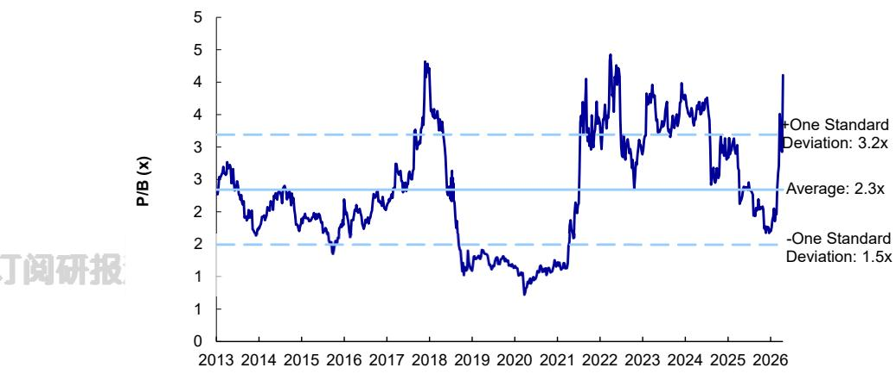  
Exhibit 14: Nuvoton: P/B   
Source: Company data, Morgan Stanley Research estimates

# Risk Reward – Nuvoton Technology Corporation (4919.TW)

KEY EARNINGS INPUTS   

<table><tr><td>Drivers</td><td>2025</td><td>2026e</td><td>2027e</td><td>2028e</td></tr><tr><td>Gross margin (%)</td><td>37</td><td>36</td><td>38</td><td>41</td></tr><tr><td>MCU ASP growth (%)</td><td></td><td>(1)</td><td>(5)</td><td>(6)</td></tr><tr><td>Operating margin (%)</td><td>(5)</td><td>(2)</td><td>5</td><td>8</td></tr></table>

# INVESTMENT DRIVERS

MCU unit shipments MCU pricing trend Operating expenses Automotive demand

# GLOBAL REVENUE EXPOSURE

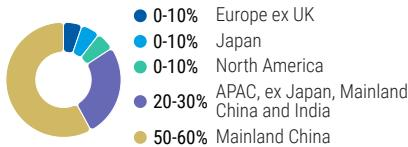  
Source: Morgan Stanley Research Estimate View explanation of regional hierarchies here

# RISKS TO PT/RATING

# RISKS TO UPSIDE

MCU up-cycle is more sustained than expected.   
China's MCU localization is faster than expected.   
Traction from auto and BMC business is greater.   
Margin improvement is more signi cant.

# RISKS TO DOWNSIDE

MCU up-cycle ends earlier with severe pricing erosion.   
China's MCU localization is slower than expected.   
Traction from auto and BMC business is less.   
Margins contract amid more intensi ed competition.

# OWNERSHIP POSITIONING

Inst. Owners, % Active $1 9 \%$

Source: Re nitiv, Morgan Stanley Research

# MS ESTIMATES VS. CONSENSUS

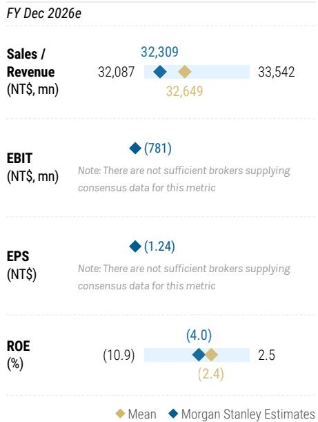  
Source: Re nitiv, Morgan Stanley Research

# Nuvoton: Financial Summary

Exhibit 15: Nuvoton: Financial Summary   

<table><tr><td colspan="5">Income Statement,2024-2027e,YearEnd Dec</td></tr><tr><td>(NT$mn)</td><td>2025</td><td>2026e</td><td>2027e</td><td>2028e</td></tr><tr><td>Turnover</td><td>30,492</td><td>32,309</td><td>36,825</td><td>40,494</td></tr><tr><td>YoY Growth</td><td>-4.5%</td><td>6.0%</td><td>14.0%</td><td>10.0%</td></tr><tr><td>Less:COGS</td><td>(19,304)</td><td>(20,683)</td><td>(22,651)</td><td>(23,854)</td></tr><tr><td>Variable costs</td><td>=</td><td></td><td></td><td>=</td></tr><tr><td>Depreciation&amp;amort</td><td>=</td><td></td><td>·</td><td>=</td></tr><tr><td>Gross profit</td><td>11,189</td><td>11,626</td><td>14,174</td><td>16,640</td></tr><tr><td>YoY Growth</td><td>-7.5%</td><td>3.9%</td><td>21.9%</td><td>17.4%</td></tr><tr><td>%margin</td><td>36.7%</td><td>36.0%</td><td>38.5%</td><td>41.1%</td></tr><tr><td>Operating Expenses:</td><td>(12,417)</td><td>(12,406)</td><td>(12,747)</td><td>(13,389)</td></tr><tr><td>R&amp;D</td><td>(9,049)</td><td>(9,110)</td><td>(9,482)</td><td>(9,767)</td></tr><tr><td>Sales and Marketing</td><td>(1,007)</td><td>(1,050)</td><td>(1,179)</td><td>(1,296)</td></tr><tr><td>General and Admin</td><td>(2,361)</td><td>(2,246)</td><td>(2,086)</td><td>(2,326)</td></tr><tr><td>Operating Profit</td><td>(1,228)</td><td>(781)</td><td>1,427</td><td>3,252</td></tr><tr><td>YoY Growth</td><td>-9669.4%</td><td>-36.4%</td><td>-282.9%</td><td>127.8%</td></tr><tr><td>%margin</td><td>-4.0%</td><td>-2.4%</td><td>3.9%</td><td>8.0%</td></tr><tr><td>Total Non-op</td><td>(217)</td><td>177</td><td>726</td><td>600</td></tr><tr><td>Pretax Profit</td><td>(1,445)</td><td>(603)</td><td>2,153</td><td>3,852</td></tr><tr><td>YoY Growth</td><td>-461.5%</td><td>-58.2%</td><td>-456.8%</td><td>78.9%</td></tr><tr><td>%margin</td><td>-4.7%</td><td>-1.9%</td><td>5.8%</td><td>9.5%</td></tr><tr><td>Tax</td><td>(220)</td><td>84</td><td>(301)</td><td>(539)</td></tr><tr><td>Net Income bf. Emp. Bonus</td><td>(1,889)</td><td>(589)</td><td>2,102</td><td>3,760</td></tr><tr><td>Employee bonus expense</td><td>225</td><td>70</td><td>(250)</td><td>(447)</td></tr><tr><td>Reported Net Income</td><td>(1,665)</td><td>(519)</td><td>1,852</td><td>3,312</td></tr><tr><td></td><td>(3.96)</td><td></td><td></td><td></td></tr><tr><td>Reported EPS (NT$)</td><td></td><td>(1.24)</td><td>4.41</td><td>7.89</td></tr><tr><td>ModelWare EPS(NT$)</td><td>(3.96)</td><td>(1.24)</td><td>4.41</td><td>7.89</td></tr></table>

<table><tr><td colspan="5">KeyRatios</td></tr><tr><td></td><td>2025</td><td>2026e</td><td>2027e</td><td>2028e</td></tr><tr><td>Return (%)</td><td></td><td></td><td></td><td></td></tr><tr><td>ROAA</td><td>(5.1%)</td><td>(1.6%)</td><td>5.4%</td><td>9.0%</td></tr><tr><td>ROAE</td><td>(11.3%)</td><td>(3.6%)</td><td>12.4%</td><td>20.6%</td></tr><tr><td>OP.ATO</td><td>164.6%</td><td>157.5%</td><td>147.6%</td><td>155.3%</td></tr><tr><td>Gearing (x)</td><td></td><td></td><td></td><td></td></tr><tr><td>NetDebt/ Equity</td><td>(0.2x)</td><td>(0.0x)</td><td>0.1x</td><td>(0.1x)</td></tr><tr><td>Current Ratio</td><td>2.1x</td><td>1.9x</td><td>2.1x</td><td>2.6x</td></tr><tr><td>Quick Ratio</td><td>1.3x</td><td>1.0x</td><td>1.1x</td><td>1.6x</td></tr><tr><td>Operating Cycle</td><td></td><td></td><td></td><td></td></tr><tr><td>AR/NR Turnover (days)</td><td>56</td><td>56</td><td>53</td><td>52</td></tr><tr><td>Inventory Tumover (days)</td><td>137</td><td>128</td><td>123</td><td>124</td></tr><tr><td>AP Turnover (days)</td><td>48</td><td>45</td><td>43</td><td>44</td></tr><tr><td>Cash Conversion (days)</td><td>145</td><td>139</td><td>133</td><td>133</td></tr></table>

订阅研报

Balance sheet   

<table><tr><td>(NT$mn)</td><td>2025</td><td>2026e</td><td>2027e</td><td>2028e</td></tr><tr><td>Assets</td><td></td><td></td><td></td><td></td></tr><tr><td>Cash &amp; Equivalents</td><td>7,203</td><td>4,962</td><td>5,049</td><td>9,786</td></tr><tr><td>Marketable Security</td><td>1</td><td>1</td><td>1</td><td>1</td></tr><tr><td>A/R&amp;N/R</td><td>3,964</td><td>4,473</td><td>5,831</td><td>5,847</td></tr><tr><td>Inventories</td><td>6,217</td><td>6,783</td><td>8,421</td><td>8,065</td></tr><tr><td>Other Current Asset</td><td>917</td><td>917</td><td>917</td><td>917</td></tr><tr><td>Total current assets</td><td>18,301</td><td>17,136</td><td>20,219</td><td>24,616</td></tr><tr><td>LT Investment</td><td>863</td><td>863</td><td>1,313</td><td>1,673</td></tr><tr><td>Total Fixed Assets</td><td>5,836</td><td>6,675</td><td>7,568</td><td>7,999</td></tr><tr><td>Total Other Assets</td><td>4,992</td><td>4,992</td><td>4,992</td><td>4,992</td></tr><tr><td>Total Assets</td><td>29,991</td><td>29,665</td><td>34,091</td><td>39,279</td></tr><tr><td>A/P &amp; N/P</td><td>2,187</td><td>2,379</td><td>2.954</td><td>2,829</td></tr><tr><td>Accrued Expenses</td><td>13</td><td>13</td><td>13</td><td>13</td></tr><tr><td>Other Payable</td><td>3,430</td><td>3,430</td><td>3,430</td><td>3,430</td></tr><tr><td>Total Current Liab.</td><td>8,842</td><td>9,035</td><td>9,610</td><td>9,485</td></tr><tr><td>L-T Liabilities</td><td>4,865</td><td></td><td>6,865</td><td></td></tr><tr><td>Total Other L-T Liab</td><td>3,156</td><td>4,865</td><td>3,156</td><td>8,865</td></tr><tr><td>Total Liabilities</td><td>16,874</td><td>3,156 17,056</td><td>19,630</td><td>3,156 21,506</td></tr><tr><td></td><td></td><td></td><td></td><td></td></tr><tr><td>Common Stock</td><td>4,198</td><td>4,198</td><td>4,198</td><td>4,198</td></tr><tr><td>Preferred Stock</td><td></td><td></td><td></td><td></td></tr><tr><td>Capital Reserve</td><td>7,100</td><td>7,100</td><td>7,100</td><td>7,100</td></tr><tr><td>Retained eamings</td><td>1,820</td><td>1,301</td><td>3,153</td><td>6,466</td></tr><tr><td>Treasury Stock</td><td>0</td><td>10</td><td>10</td><td>10</td></tr><tr><td>Total Equity Total Liab.&amp;Equity</td><td>13,118</td><td>12,609</td><td>14,461</td><td>17,773</td></tr></table>

Cash Flow Statement   

<table><tr><td>(NT$mn）</td><td>2025</td><td>2026e</td><td>2027e</td><td>2028e</td></tr><tr><td>Net Income</td><td>(1,665)</td><td>(519)</td><td>1,852</td><td>3,312</td></tr><tr><td>Depreciation</td><td>1,767</td><td>196</td><td>201</td><td>664</td></tr><tr><td>Net Investment Losses (Gains)</td><td>(0)</td><td>0</td><td>0</td><td>0</td></tr><tr><td>Others</td><td>(392)</td><td>(883)</td><td>(2,871)</td><td>(145)</td></tr><tr><td>Cash Flow-Operating</td><td>(290)</td><td>(1,206)</td><td>(818)</td><td>3,831</td></tr><tr><td>(Purchase) of FA</td><td>(986)</td><td>(1,035)</td><td>(1,094)</td><td>(1,165)</td></tr><tr><td>Sale of Fix Asset</td><td>3</td><td>0</td><td>0</td><td>0</td></tr><tr><td>(Purchase)L-T Inv.</td><td>0</td><td>0</td><td>0</td><td>0</td></tr><tr><td>Sale of L-T Inv.</td><td>0</td><td>0</td><td>0</td><td>0</td></tr><tr><td>Sale(Pur.)S-T Inv.</td><td>54</td><td>0</td><td>0</td><td>0</td></tr><tr><td>Cash Flow-lnvesting</td><td>(1,211)</td><td>(1,035)</td><td>(1,094)</td><td>(1,165)</td></tr><tr><td>Inc(Dec)-S-T Debt</td><td>(857)</td><td>0</td><td>2,000</td><td>2,000</td></tr><tr><td>Dividend Paid</td><td>(168)</td><td>0</td><td>0</td><td>0</td></tr><tr><td>Dir.&amp;Emp.Bonus</td><td>0</td><td>0</td><td>0</td><td>0</td></tr><tr><td>Proceed from New Issue</td><td>0</td><td>0</td><td>0</td><td>0</td></tr><tr><td>Dec/Inc-TreasureSt</td><td>0</td><td>0</td><td>0</td><td>0</td></tr><tr><td>Others</td><td>4,348</td><td>0</td><td>0</td><td>0</td></tr><tr><td>Cash Flow-Financing</td><td>3,323</td><td>0</td><td>2,000</td><td>2,000</td></tr><tr><td>Change in Cash</td><td>1,499</td><td>(2,241)</td><td>88</td><td>4,666</td></tr><tr><td>Net cash/(debt), b/f</td><td>5,704</td><td>7,203</td><td>4,962</td><td>5,049</td></tr><tr><td>Net cash/(debt),c/f</td><td>7,203</td><td>4,962</td><td>5,049</td><td>9,715</td></tr></table>

# Valuation Methodology and Risks

# GigaDevice Semiconductor Beijing Inc (603986.SS)

Our price target of Rmb301 is our base case value, derived from our residual income model. Key assumptions: cost of equity of $8 . 9 \%$ (beta 1.1, risk-free rate $2 \%$ and risk premium $6 \%$ ), a payout ratio of $40 \%$ , medium-term growth rate of $1 6 . 0 \%$ and a terminal growth rate of $3 . 0 \%$ .

# Risks to Upside

NOR up-cycle driven by stronger demand   
Superior chip design, leading to increasing exposure to low-density NOR   
Faster-than-expected DRAM development

# Risks to Downside

NOR down-cycle driven by weaker demand   
Inferior chip design, leading to increasing exposure to mid-/high-density NOR   
Slower-than-expected DRAM development

# Risk Reward Reference links

1. View explanation of Options Probabilities methodology - Options_Probabilities_Exhibit_Link.pdf

2. View descriptions of Risk Rewards Themes - RR_Themes_Exhibit_Link.pdf

3. View explanation of regional hierarchies - GEG_Exhibit_Link.pdf

4. View explanation of Theme/Exposure methodology - ESG_Sustainable_Solutions_External_Link.pdf

5. View explanation of HERS methodology - ESG_HERS_External_Link.pdf