# 3Q26 Preview – Taking Back the Narrative

April 20, 2026 02:19 PM GMT Sentiment remains cautious due to capacity constraints/ allocation, Copilot and AI ROI. Our work suggests a shift in 订阅研报添加微信 LCD123321CaCopilot capabilities & adoption, leaving us positive on Microsoft’s platform opportunity. Leading GenAI position remains underpriced at 20x CY27 EPS, framing an attractive R/ R. OW

# Key Takeaways

Confident in high-30s cc Azure growth in Q3, supported by strong channel checks, improving GPU capacity and positive CIO survey data

A 1pt beat to Q3 Azure growth guide & a strong Q4 Azure guide, plus positive commentary on capacity supply/allocation, Copilot & Capex, all key to MSFT shares

Raising our capex estimates given higher component costs (i.e. memory). Durable AI demand strength keeps further upside risk to capex (and Azure) in forecasts

Looking for signals of M365 Copilot momentum building on 15MM paid seats, w/ 23321C accelerating usage and improving adoption across the installed base

At $\sim 2 0 \times$ CY27 GAAP EPS, we believe MSFT shares fail to reflect durable high teens total return profile, underscoring the attractive risk/reward

# Consistently Strong Demand, Lower Expectations and Shifting Copilot Narrative

Create More Attractive Setup into 3FQ26. Microsoft exited F2Q26 with clear evidence of durable commercial demand, yet investor focus remains centered on supply constraints and GPU allocation weighing on Azure growth and increasing concerns around Copilot's competitive positioning versus AI Labs. Last quarter, Microsoft delivered mid-teens revenue growth at scale with expanding operating margins, while forward indicators such as $7 7 0 \%$ YoY RPO growth (to $\sim \$ 625$ billion) and $3 9 \%$ YoY cRPO growth point to continued strength across the commercial portfolio. Into F3Q26 results, Azure growth remains governed by capacity availability rather than demand. At the same time, Microsoft continues to invest 订阅研报添加微信 LCD123321Caaggressively in AI infrastructure, with capex skewed towards short-lived, near-term revenue generating assets (GPUs/CPUs). Importantly, capacity is not optimized solely for Azure, but instead allocated across a broader portfolio of AI workloads, including first party apps like M365 Copilot, GitHub Copilot, internal R&D / training, and more, adding complexity to the investor debate on AI capex ROI. With this dynamic now well understood, $3 9 \%$ cc Azure growth (1pt above the high end of guidance) will more clearly be seen as a positive - and this represents an achievable outcome, in our view. Further, an improving Copilot product can lead to improving sentiment and continued momentum on top of the new 15MM paid Copilot seat KPI

from last quarter, as Microsoft penetrates its broader installed base. Against this backdrop, the setup looks more favorable: Microsoft's execution within a supplyconstrained environment, Azure and Copilot results providing evidence of yield on AI investments, and continued opex discipline driving YoY operating margin expansion despite lower gross margins are keys to pushing shares higher. We continue to see an attractive risk/reward for this GenAI leader, with valuation not fully reflecting the durability of demand and long-term AI monetization opportunity. Microsoft trades at $\sim 2 0 \times$ our GAAP CY27 EPS of $\$ 20.92$ . Remain OW.

Key Expectations into the Print: Execution Within Capacity Constraints Remains 1 a Key. Last quarter’s results were strong, with Microsoft exceeding consensus across all three segments and delivering ${ \sim } 1 \%$ total revenue upside, driven by Azure growth of $3 8 \%$ cc (ahead of guidance at ${ \sim } 3 7 \%$ cc). Importantly, the company paired this topline strength with gross margin outperformance (despite mix shift to Azure) and $\mathord { \sim } 1 6 0$ bps of YoY operating margin expansion. As mentioned, forward indicators also remained robust, with RPO $+ 1 1 0 \%$ YoY to $\sim \$ 6256 n )$ and cRPO $4 3 9 \%$ YoY) reinforcing durable commercial demand. For Q3: Azure growth of $\sim 3 9 \%$ in cc in Q3 with a low/mid $30 \%$ cc Q4 Azure guidance likely good enough to get over the investor hurdle given capacity and allocation constraints. Further, the potential for high-single digit / low double-digit opex growth in Q3 and mid/high single-digit opex growth in FY26 should help offset gross margin compression and could help deliver high-teens operating income growth in FY26.

# 订阅研5 Areas We Are Monitoring Into the Print:

1) Testing the Durability of Azure: What is the Right Beat Factor for a Capacity-Driven Guide?

MS View: Our confidence in high-30%'s CC Azure growth in F3Q26 stems from consistently durable leadership position across our CIO survey data and strong channel checks, further supported by increasing AI compute capacity. The $39 \%$ cc investor bogey is achievable, and this 1pt beat vs. high-end of guidance would represent a strong outcome for MSFT shares. Looking ahead to FQ4 guidance, we expect guide to reflecting a mid-single digit deceleration from Q3 result toward the low-to-mid $30 \% 5$ in $\pmb { \mathrm { q 4 } }$ , given the mid-single digit $( 4 \%$ point) tougher Azure growth comp last year.

Buyside: For 3QFY26, investors are looking for $39 \% +$ growth in constant currency (cc), representing a $7 \%$ 订阅研报添加 beat vs high-end of guidance at $3 7 . 3 8 \%$ LCD123321C cc, which is also impacted by a $4 \%$ tougher growth comp from last year. As mentioned, with a further 4pt tougher YoY compare for Azure growth in the June quarter, investors look for low/mid $30 \%$ growth guidance in cc, representing a moderate decel vs. FQ3 Azure growth.

Microsoft Remains at the Forefront of GenAI, Supported by Structural Cloud Transformation Tailwinds. Our 1Q26 CIO Survey (see Well Positioned to Capture Incremental Cloud and GenAI Spend (9 Apr 2026)) leaned positive on Software spending intentions, with CIOs expecting Software spending growth to accelerate to $+ 4 . 1 \%$ growth in 2026, $+ 3 2$ bps vs our 4Q25 reading, and above $+ 3 . 8 \%$ in 2025. Within that positive software backdrop, Microsoft remains the best-positioned platform to benefit from improving demand, as CIOs once again viewed the company as the primary beneficiary of durable cloud transformation tailwinds and rising GenAI investments. First, as workloads shift to the cloud, Microsoft Azure remains the clearest beneficiary as the expected largest share gainer in 2026 and over the next three years. Microsoft also maintained strong positioning as the leading vendor for Infrastructure as a Service (IaaS), Platform as a Service (PaaS), and hybrid cloud environments. Second, in terms of AI spending intentions, CIOs 订阅研报添加微信 LCD123321Cad expect Microsoft (namely Azure AI) to gain the largest incremental share of GenAI 04- spending in 2026 and in the next three years, while CIOs see strong strategic positioning for Microsoft 365 Copilot and Copilot Studio within the category of Agentic Automation, which lends a foundation for agentic workflows. Microsoft is similarly the preferred vendor for building custom AI applications through Azure AI Foundry.

Partner Channel Discussions Again Point to Strong Azure Demand. Channel partners sounded positive on C1Q Azure results and the forward outlook. Per our conversations, Azure and AI-related practices again saw robust (and improving) momentum in the past few months, largely driven by cloud transformations and continued M365 traction with E3/E5 license upgrades. Microsoft's security tools continue to be key to license upgrades. Further, the recently announced E7 tier (see The Next Step in Enterprise Agentic AI… Frontier Suite (9 Mar 2026)) came up as an area of incremental interest for customers in the last few months, with the inclusion 订阅研报添加微信 LCD123321Cadof the full Microsoft Entra Suite a potential needle-mover for some customers given 04-21 incremental zero trust capabilities (namely identity and network access solutions) on top of the Entra ID P2 capabilities included in E5. Lastly, partners noted some pockets of improving Copilot adoption, though Copilot awareness continues to outweigh penetration thus far, while partners remain optimistic on Copilot momentum longer-term given subscription upgrades, security advantages within the Microsoft stack and recent product enhancements across the Agentic product stack (i.e., Agent365).

Supply Side Remains the Bottleneck, Though AI Server Rack Output and AI Capacity is Improving. Our Greater China Semiconductors/Hardware teams (led by Charlie Chan / Sharon Shih) expect AI semi strength to continue going forward, with GB200/300 NVL72 rack shipments increasing throughout C1Q, as total GB200/300 rack output reached an estimated ${ \sim } 2 0 . 8 \mathsf { k } ,$ up from $7 5 . 5 \mathrm { k }$ in 4Q, with further growth expected to 24.4k in 2Q (see Exhibit $7 6 \ 8$ Exhibit 17 ). Given consistently increasing 订阅研报添加微信 LCD123321CAI demand trends, Microsoft likely still faces supply constraints this quarter, which aligns with management's latest comments during the FQ2 call: 'As we work to close 04-21 the gap between demand and supply, we expect the mix of short-lived assets to remain similar to Q2 [at roughly two-thirds of total capex].' Management has also previously noted that the investments in short-lived assets is correlated to the company's $\sim \$ 6256n$ in RPO, which grew $1 7 0 \%$ YoY in FQ2 – implying that compute capacity will continue to expand rapidly, but likely remain tight based on supply / hardware deployments.

Consensus Azure growth expectations call for $3 9 . 5 \%$ YoY growth (as reported; per

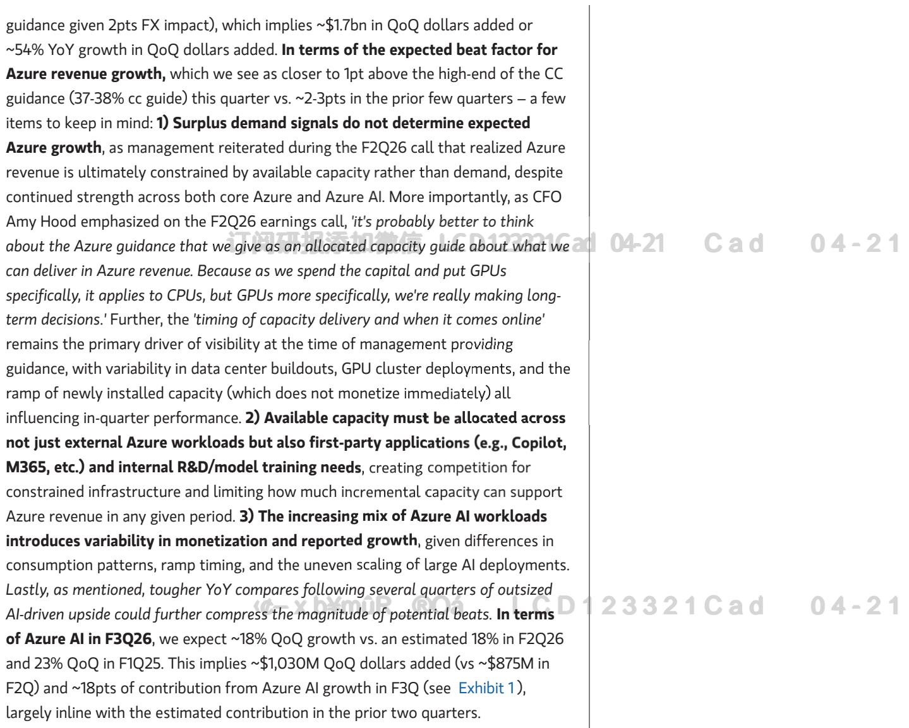  
Exhibit 1: Improving Azure AI Demand/Capacity and Relatively Stable Core Azure Growth Should Support High $30 \%$ Azure Growth in F3Q

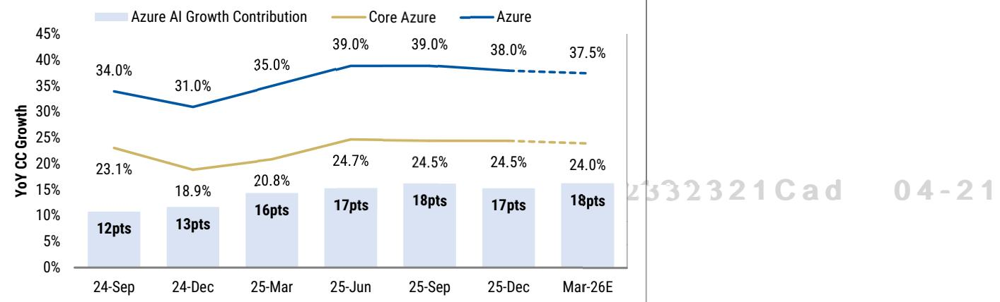  
Source: Company data, Morgan Stanley Research

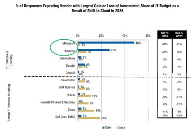  
Exhibit 2: Microsoft and Amazon Continue to Lead as the Top Incremental Share Gainers due to Cloud Shift in 2026...   
Source: AlphaWise, Morgan Stanley Research. $\mathsf { n } { = } 1 0 0$ (US and EU data)

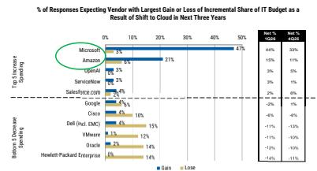  
Exhibit 3: …And in the Next Three Years   
Source: AlphaWise, Morgan Stanley Research. n=100 (US and EU

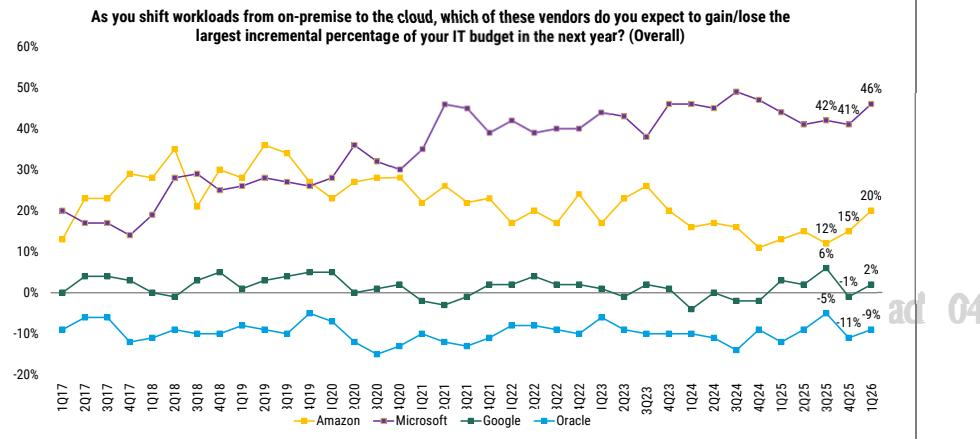  
Exhibit 4: Microsoft Sustains $4 6 \%$ of Market Share in the Next Year, While Oracle Continues to Lose Share as Workloads Shift to the Cloud   
Source: AlphaWise, Morgan Stanley Research. $\mathsf { n } { = } 1 0 0$ (US and EU data)

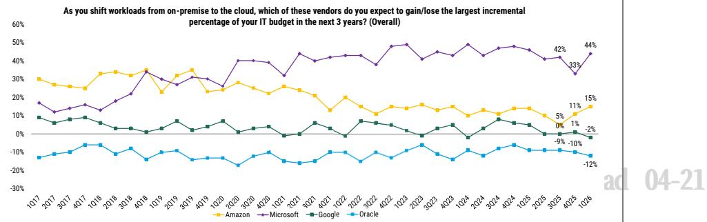  
Exhibit 5: Over the Next Three Years, Microsoft is Expected to Continue Dominating Share, While Oracle Continues to Lose Share as Workloads Shift to the Cloud   
Source: AlphaWise, Morgan Stanley Research. $\mathsf { n } = \mathsf { 1 0 0 }$ (US and EU data

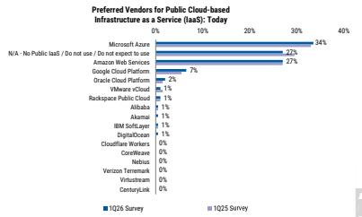  
Exhibit 6: Microsoft Azure Continues To Be The Market Leading IaaS Today, Followed by AWS and GCP...   
Source: AlphaWise, Morgan Stanley Research. $\mathsf { n } { = } 1 0 0$ (US and EU data).

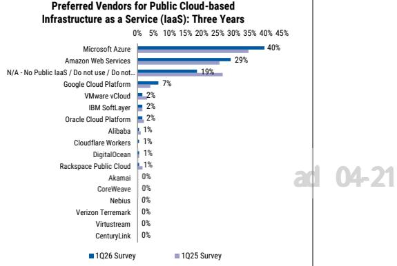  
Exhibit 7: ...A Trend Which Is Expected To Persist In 3 years   
Source: AlphaWise, Morgan Stanley Research. n=100 (US and EU data).

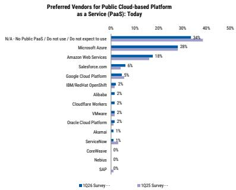  
Exhibit 8: Microsoft Azure, AWS, and Salesforce Are The Preferred Vendor For PaaS...   
Source: AlphaWise, Morgan Stanley Research. $\mathsf { n } { = } 1 0 0$ (US and EU data)

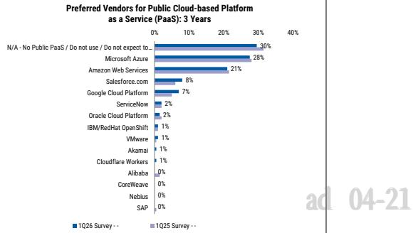  
Exhibit 9: ...A Trend Which Is Expected To Persist In 3 years   
Source: AlphaWise, Morgan Stanley Research. $\mathsf { n } = 1 0 0$ (US and EU data).

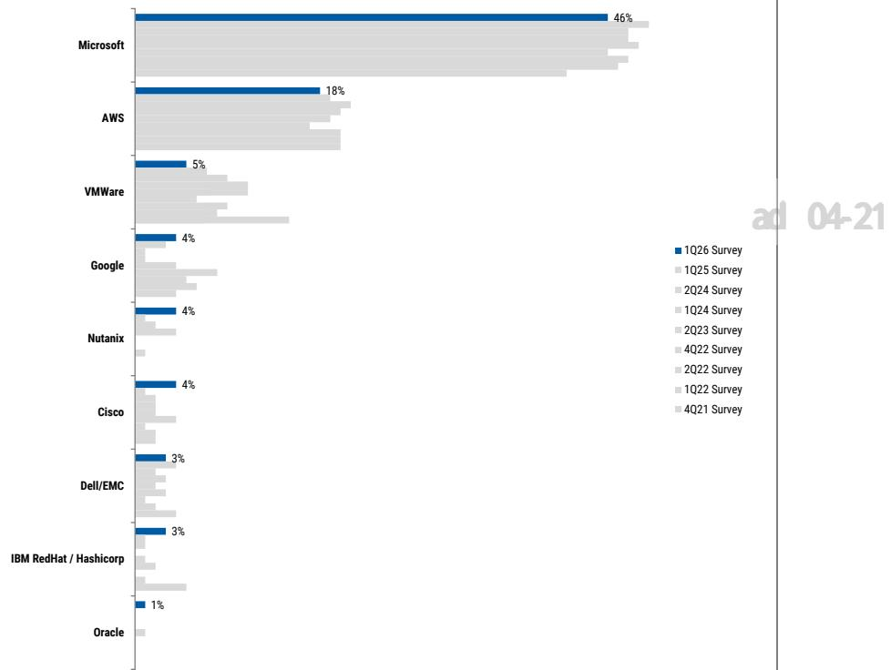  
Exhibit 10: Microsoft Remains the Preferred Vendor for Managing Hybrid Cloud Environments, Followed by AWS and VMWare   
Which of these vendors are you using or likely to use in managing your hybrid cloud environment?

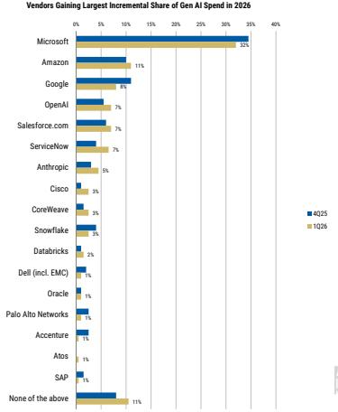  
订阅Exhibit 11: CIOs Indicate Expectations for Microsoft, Google, and Amazon to Gain the Largest Incremental Share of GenAI Spend In 2026...

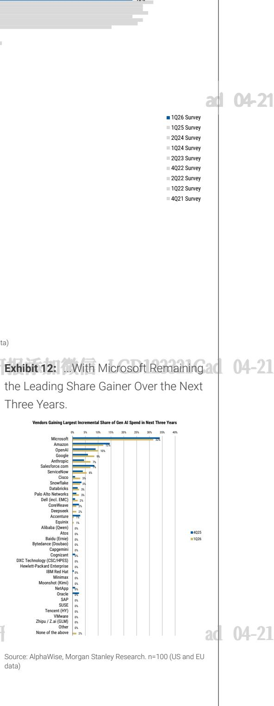  
Source: AlphaWise, Morgan Stanley Research. $\mathsf { n } { = } 1 0 0$ (US and EU data)   
Source: AlphaWise, Morgan Stanley Research. $\mathsf { n } { = } 1 0 0$ (US and EU data

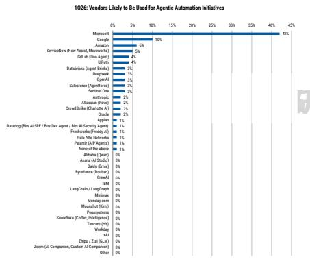  
Exhibit 13: CIOs Indicate Expectations to Leverage Microsoft, Google, Amazon, and ServiceNow for their Agentic Automation Initiatives, With Microsoft the Clear Leading Vendor   
Source: AlphaWise, Morgan Stanley Research. $\mathsf { n } { = } 1 0 0$ (US and EU data)

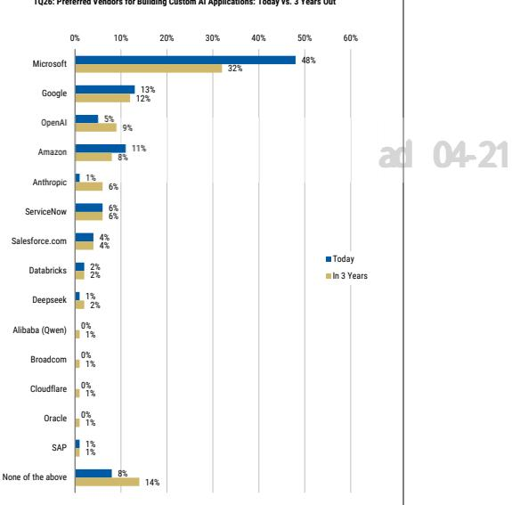  
Exhibit 14: CIOs Indicate Strong Preference To Leverage Microsoft for Building Customer AI Applications Today and 3 Years Out   
1Q26: Preferred Vendors for Building Custom AI Applications: Today vs. 3 Years Out   
Source: AlphaWise, Morgan Stanley Research. $\mathsf { n } = 1 0 0$ (US and EU data)

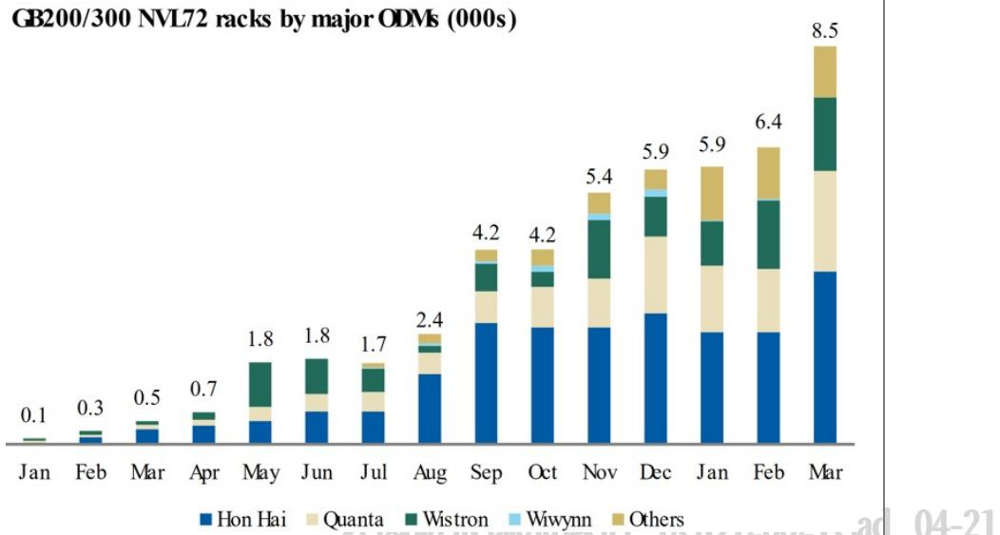  
Exhibit 15: Industry-wide GB200/300 NVL72-equivalent monthly rack output, by major ODMs (2025-2026) 订阅研报添加微信 LCD123321C   
Source: Morgan Stanley Research estimates.

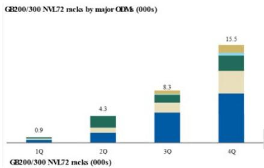  
Exhibit 16: Industry-wide GB200/300 NVL72-equivalent monthly rack output, by major ODMs (2025)   
Source: Morgan Stanley Research estimates.

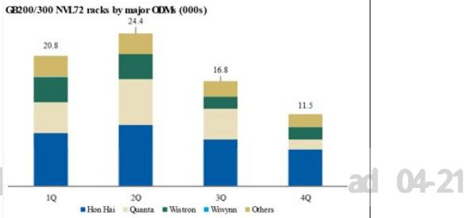  
Exhibit 17: Industry-wide GB200/300 NVL72-equivalent monthly rack output, by major ODMs (2026)   
Source: Morgan Stanley Research estimates.

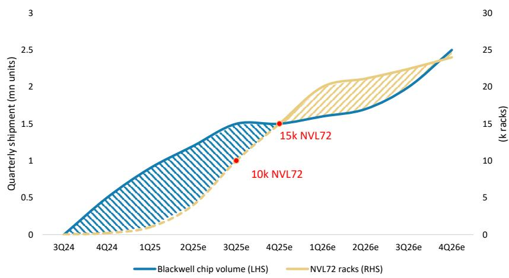  
Exhibit 18: TSMC is Expected to Produce $5 . 1 \mathsf { m n }$ Chips In 2025, With Full-Year NVL72 Shipments Expected to Reach 30k   
Source: Company data, Morgan Stanley Research (e) estimates. Note: Estimates are compiled using our supply chain checks and may differ from other Morgan Stanley Research estimates

# 2) What is the Latest Capex Trajectory – Does Capex Need to Move Higher?

# MS View: Capex Risk Continues to Skew to the Upside, Especially Given Higher Component Costs More Recently

Updating Our Model: Incremental Upside to CapEx from Higher Memory and Component Costs. On the back of recent increases in key server components, most notably memory $( \sim 4 \times )$ and server-related hardware $( \sim 2 \times )$ , we have refined our capex forecasts for FY26 and beyond using a more granular, mix-driven approach. Specifically, we leverage our capex ROI build (see Exhibit 21 - Exhibit 24 ), which 订阅研报添加微信 includes an estimated breakdown of Microsoft's AI data center non-AI cloud (CPU-driven) investments, and apply an estimated $\%$ CD123321CPU-driven) and  exposure to shorter-lived server-related components. We then layer in memory cost sensitivity by applying a memory share $\%$ of COGS and bill of materials (BOM), along with an assumed increase in memory pricing, to arrive at a fully loaded capex impact. As shown in Exhibit 19 , we increase our FY26 / FY27 / FY28 / FY29 total capex (including capital leases) estimates by $2 . 1 \% / 5 . 2 \% / 5 . 3 \% / 5 . 3 \% ,$ respectively. These revisions reflect our updated assumptions around component cost inflation, applied across both AI and non-AI capex based on our existing mix framework (see Exhibit

20 for BOM assumptions). Our framework is supported by commentary from CFO Amy Hood on the F2Q26 call: 'We mentioned the potential impact on Windows OEM and on-premises server markets from increased memory pricing earlier. In addition, rising memory prices would impact capital expenditures, though the impact on Microsoft Cloud gross margins will build more gradually as these assets depreciate over six years.' Looking ahead, we see potential for further upside to capex, driven by continued supply-demand imbalances and management’s expansion plans. CEO Satya Nadella noted on the F1Q26 call an expectation to 'roughly double our total datacenter footprint over the next two years,' reinforcing the likelihood of sustained infrastructure investment. 订阅研报添加微信 LCD123321C

CFO Amy Hood's capex commentary during the most recent earnings call guided Q3 capex to 'decrease sequentially' $: < \$ 37 .56 n$ in FQ2), due to 'normal variability from cloud infrastructure build-outs and timing of delivery of finance leases.' As management did not comment on FY26 capex during the F2Q26 call after the F1Q26 call when management guided 'the FY 2026 growth rate to be higher than FY 2025,' or $> 5 8 \%$ YoY growth, we currently model FY26 capex growth (including capital leases) of ${ \sim } 6 3 \%$ YoY to $\$ 143.90n$ , roughly inline with consensus' $\$ 144.90n$ . Overall, we continue to see potential upside risk to capex. We also expect to hear more about the continued imbalance in demand/supply, inline with comments from the previous two earnings call, which likely continues through CY26. Looking ahead, we currently model moderating low/mid-teens YoY capex growth in FY27/FY28/ FY29, supported by persistent demand for compute / AI infrastructure.

Will Management Comment on FY27 Capex Expectations? We Think So, Though 订阅研报添加微信 LCD123321CAny Color is Likely Limited. Recall that in F3Q25, we only received limited forward looking commentary on capex and capex growth, which was much less than the typical commentary received in Q3. CFO Amy Hood mentioned the following during the F3Q25 call: 'our earlier comments on FY 2026 capital expenditures remain unchanged. We expect CapEx to grow. It will grow at a lower rate than FY 2025 and will include a greater mix of short-lived assets, which are more directly correlated to revenue than long-lived assets. These investments, along with focused execution that delivers near-term value to our customers, will ensure we continue to lead through the cloud and AI opportunity ahead.' These initial comments implied moderated FY26 Capex growth of $\boldsymbol { < } 5 8 \%$ YoY (FY25's Capex growth) – which were subsequently updated during the F1Q26 call with 'the FY 2026 growth rate to be higher than FY 2025.' Overall, expecting limited initially commentary on FY27 capex expectations, with current consensus estimates calling for $\sim 1 6 \%$ YoY growth to $\tilde { }$ \$168bn for total capex (including capital leases) in FY27, which implies roughly low-$\$ 40 s$ billion per quarter, though "there can be quarterly spend variability from cloud 研 D123321C infrastructure buildouts and the timing of delivery of finance leases."

Our Latest Capex-Implied AI Revenue Analysis: Our assumption for capex has consistently been revised higher. Therefore, we lean on our capex driven forecast model to yield our sustained bullish conclusions about the trajectory of Azure growth, which continues to suggest significant upside to our forward Azure forecasts. Our capex model sizes the implied contribution from Azure AI based on the capital expenditures dedicated to AI-related initiatives. We compare the capeximplied Azure AI forecasts, assuming various gross margin levels, with the Azure AI estimates in our MS model. Highlighted on the most recent earnings call, and reiterated at our recent campus visit, capex (and corresponding infrastructure) is not just allocated for new Azure demand. Microsoft must support its 1st party applications, internal R&D/Research efforts, internal training, and a replacement capex cycle. Management has also been vocal for some time that a significant portion of capex is for longer duration assets like land and buildings, which could generate revenue for ${ > } 7 5$ years. We had previously contemplated this split between short-lived and long-lived capex, and already allocated a significant portion of capex to non-AI cloud (i.e. 1st party apps) as well as AI businesses like Copilot (non-Azure 订阅研报添加微信 LCD123321CaAI). Net, in our latest analysis, Azure AI (excluding revenue share) gross margins could be $20 \% +$ already. In our latest iteration, we raised our total capex estimates while maintaining prior Azure estimates, which suggests further upside to our current Azure estimates based on our Capex-Implied framework, assuming Azure AI gross margins (ex-revenue share) reach $30 \%$ by FY29.

# Related Research:

# • Global Technology Hardware: Memory Takes A Bite Out of Hardware Margins (16 Nov 2025)

Exhibit 19: Summary of Model Changes for Total Capex (Including Capital Leases)   

<table><tr><td colspan="5">FY26e</td></tr><tr><td>Prior</td><td> New MSe</td><td>△</td><td></td><td>Cons MSe vs. Cons</td></tr><tr><td></td><td>140,965143,9052.1%144,939 加 -0.7%1C</td><td></td><td></td><td></td></tr><tr><td></td><td colspan="4">FY27e</td></tr><tr><td></td><td>Prior New MSe</td><td>△</td><td></td><td>Cons MSe vs. Cons</td></tr><tr><td></td><td>160,806169,2405.2%168,035</td><td></td><td></td><td>0.7%</td></tr><tr><td colspan="5">FY28e</td></tr><tr><td>Prior</td><td> New MSe</td><td>△</td><td>Cons</td><td> MSe vs. Cons</td></tr><tr><td></td><td>180,192189,7675.3%188,258</td><td></td><td></td><td>0.8%</td></tr><tr><td colspan="5">FY29e</td></tr><tr><td>Prior</td><td> New MSe </td><td>A</td><td>Cons</td><td> MSe vs. Cons</td></tr><tr><td></td><td>198,283208,7605.3%198,526</td><td></td><td></td><td>5.2%</td></tr></table>

Source: Company Data, Morgan Stanley Research

Memory as a % of BOM

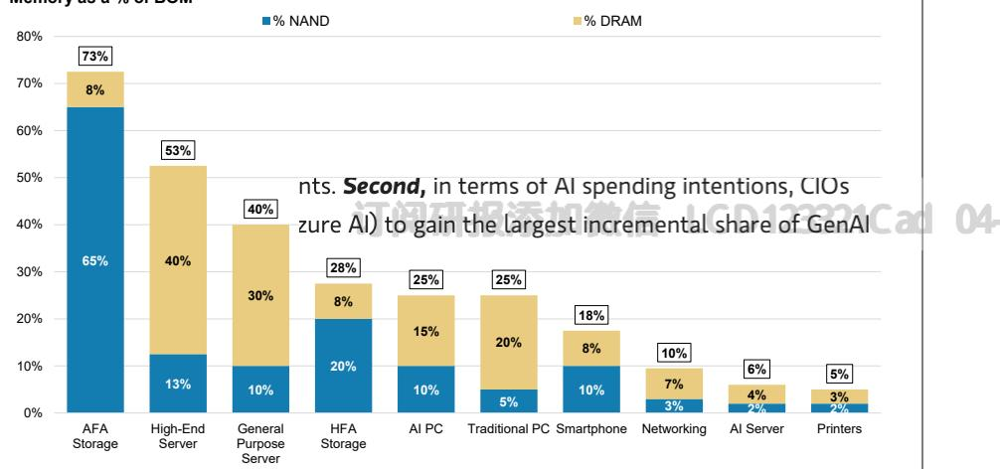  
Exhibit 20: Our Global Technology Hardware Team Estimates that the Memory Accounts for $5 \mathrm { - } 7 0 \%$ of Tech Hardware Products, with Servers and PCs More Exposed to DRAM While Storage is Over-Indexed to NAND   
Source: Company Data, Morgan Stanley Research

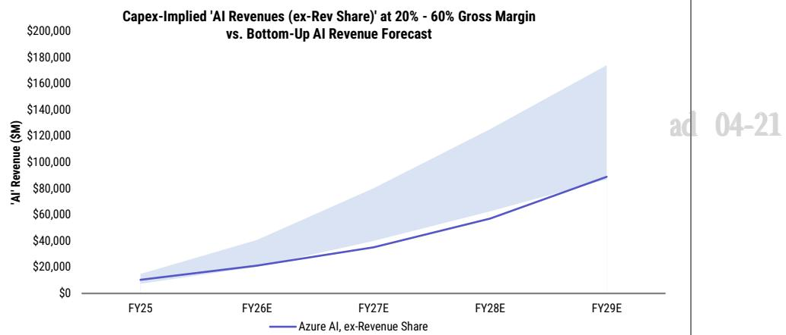  
Exhibit 21: Capex-Implied Azure AI Revenue Potential is Well Ahead of Our Azure AI Forecast   
Source: Morgan Stanley Research

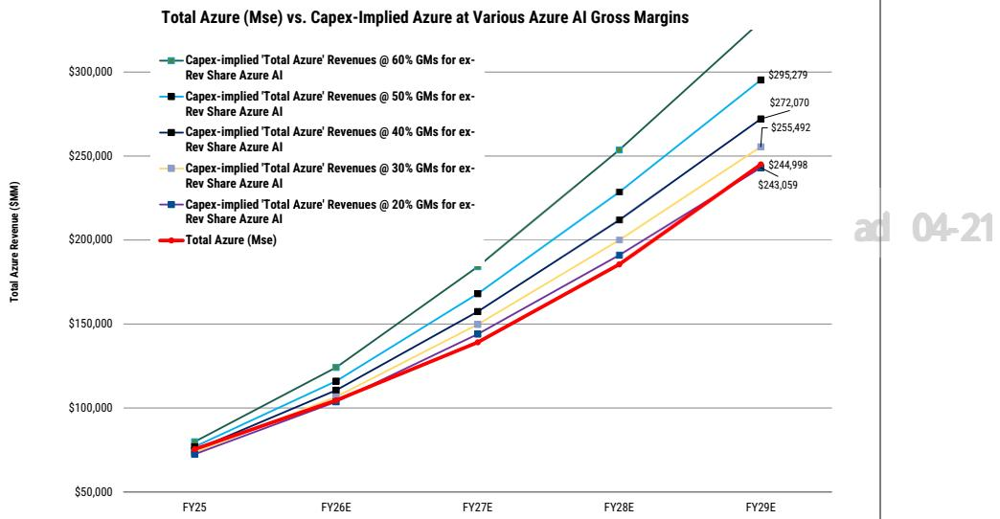  
Exhibit 22: Current Forecast Estimates Azure AI (ex-rev share) Gross Margins Conservatively Reach $30 \%$ by FY29; Gross Margins Can Be Materially Higher, Suggesting Meaningful Upside   
Source: Morgan Stanley Research

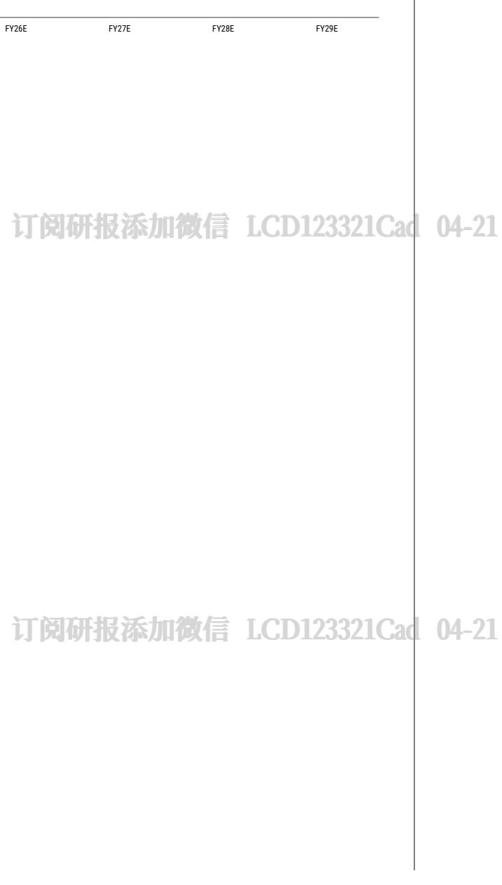

Exhibit 23: Back of the Envelope Compute Math Suggests Microsoft AI Server Capex Implies $\sim 5 4 . 9$ Million H100 Equivalents by FY29   

<table><tr><td>($ in Millions)</td><td>FY25</td><td>FY26E</td><td>FY27E</td><td>FY28E</td><td>FY29E</td></tr><tr><td>Total Capex</td><td>$88,200</td><td>$143,905</td><td>$169,240</td><td>$189,767</td><td>$208,760</td></tr><tr><td>YoY Growth</td><td>58%</td><td>63%</td><td>18%</td><td>12%</td><td>10%</td></tr><tr><td>Cash Capex</td><td>$64,551</td><td>$98,312</td><td>$116,344</td><td>$130,613</td><td>$143,675</td></tr><tr><td>YoY Growth</td><td>45%</td><td>52%</td><td>18%</td><td>12%</td><td>10%</td></tr><tr><td>Non-Cloud Capex</td><td>$4,725</td><td>$6,413</td><td>$7,315</td><td>$8,028</td><td>$8,681</td></tr><tr><td>YoY Growth</td><td>27%</td><td>36%</td><td>14%</td><td>10%</td><td>8%</td></tr><tr><td>Data Center Cash Capex</td><td>$59,826</td><td>$91,898</td><td>$109,029</td><td>$122,585</td><td>$134,994</td></tr><tr><td>YoY Growth % of Total Capex</td><td>47%</td><td>54%</td><td>19%</td><td>12%</td><td>10%</td></tr><tr><td>PPE Acquired Under Capital Lease</td><td>93%</td><td>93%</td><td>94%</td><td>94%</td><td>94%</td></tr><tr><td>Capital Leaseas%ofCash Capex</td><td>$23,649</td><td>$45,593</td><td>$52,896</td><td>$59,153</td><td>$65,085</td></tr><tr><td></td><td>40%</td><td>50%</td><td>49%</td><td>48%</td><td>48%</td></tr><tr><td>TotalDataCenterCapex YoY Growth</td><td>$83,475</td><td>$137,492</td><td>$161,925</td><td>$181,739</td><td>$200,079</td></tr><tr><td></td><td>61% $72,963</td><td>65%</td><td>18%</td><td>12%</td><td>10%</td></tr><tr><td>Total Monetizeable Data Center Capex</td><td>订阅研报添加 34%</td><td>$123,895</td><td>$144,265</td><td>$159,287</td><td>$174,458</td></tr><tr><td>Total Cloud Capex Intensity Non-Al Cloud Capex Intensity</td><td>14%</td><td>48%</td><td>47%</td><td>44% 12%</td><td>41%</td></tr><tr><td>M365 Copilot Capex Intensity</td><td>47%</td><td>13% 42%</td><td>13% 37%</td><td>33%</td><td>12% 29%</td></tr><tr><td>Azure Al Capex Intensity</td><td>396%</td><td>410%</td><td>291%</td><td>195%</td><td>135%</td></tr><tr><td>Segment-level Capex</td><td></td><td></td><td></td><td></td><td></td></tr><tr><td>Non-AI Cloud Capex</td><td>$30,796</td><td></td><td></td><td></td><td></td></tr><tr><td>Internal Al Training Capex (Non-Monetizable)</td><td>$1,000</td><td>$35,137</td><td>$39,620</td><td>$45,009</td><td>$51,177</td></tr><tr><td>Internal R&amp;D/Research Capex (Non-Monetizable) 1.5% of Total Data Center Capex</td><td></td><td>$2,000</td><td>$3,000</td><td>$4,000</td><td>$5,000</td></tr><tr><td>Replacement Capex (55% of 6yr prior Data Center Capex [Servers] + 45% of 15 year Prior</td><td>$1,252</td><td>$2,062</td><td>$2,429</td><td>$2,726</td><td>$3,001</td></tr><tr><td></td><td>$8,260</td><td>$9,535</td><td>$12,231</td><td></td><td></td></tr><tr><td>[Buildingl) Microsoft &#x27;Al Capex&#x27; (Monetizable)</td><td>$42,167</td><td>$88,758</td><td>$104,645</td><td>$15,726 $114,278</td><td>$17,619</td></tr><tr><td>M365 Copilot Capex</td><td>$1,054</td><td>$1,676</td><td>$2,376</td><td>$3,027</td><td>$123,282</td></tr><tr><td>Azure Al Capex</td><td>$41,113</td><td>$87,082</td><td>$102,269</td><td>$111,251</td><td>$3,514 $119,767</td></tr></table>

Note: M365 Copilot capex intensity assumes the intensity is maps to the capex intensity of Microsoft Cloud at similar revenue scales (i.e. FY14-19).

<table><tr><td>Server-RelatedAlCapex</td><td>$27,920</td><td>$57,319</td><td>$73,83</td><td>$82,038</td><td>$89,341</td></tr><tr><td>Chip Version</td><td>H/B100</td><td>B1/B200</td><td>Rubin</td><td>Rubin</td><td>Rubin Ultra</td></tr><tr><td>Cost per Chip ($)</td><td>$37,500</td><td>$43,750</td><td>$62,500</td><td>$62,500</td><td>$181,250</td></tr><tr><td>Impl. Chips Purchased</td><td>744,527</td><td>1,310,145</td><td>1,174,125</td><td>1,312,602</td><td>492,918</td></tr><tr><td>Ratio of Compute to H100s</td><td>1.5x</td><td>2.5x</td><td>11.0x</td><td>11.0x</td><td>46.0x</td></tr><tr><td>Impl. H100 Equivalents Purchased</td><td>1,116,790</td><td>3,275,361</td><td>12,915,373</td><td>14,438,625</td><td>22,674,218</td></tr><tr><td>Cumulative H1oo Equivalents</td><td>1,601,778</td><td>4,877,139</td><td>17,792,512</td><td>32,231,138</td><td>54,905,355</td></tr></table>

ote: Grossing up cost per chip to account for "fully-loaded" server cost, which assumes 80% of the server cost is attributable to the cost of the chip.

<table><tr><td>MicrosoftCloud Revenues,ex-RevenueShare</td><td>$216,75</td><td>$260,604</td><td>$305,175</td><td>$360,569</td><td>$427,086</td></tr><tr><td>Non-AI Cloud Revenues</td><td>$203,757</td><td>$235,381</td><td>$263,624</td><td>$294,337</td><td>$326,129</td></tr><tr><td>Bottom-Up Al Revenues (Copilots +Azure Al, ex-rev share)</td><td>$12,618</td><td>$25,223</td><td>$41,551</td><td>$66,233</td><td>$100,957</td></tr><tr><td>M365 Copilot</td><td>$2,227</td><td>$3,961</td><td>$6,365</td><td>$9,084</td><td>$11,984</td></tr><tr><td>Azure Al, ex-Revenue hare</td><td>$10,391</td><td>$21,262</td><td>$35,186</td><td>$57,149</td><td>$88,972</td></tr><tr><td>Azure AI,Total</td><td>$12,097</td><td>$25,649</td><td>$44,237</td><td>$73,149</td><td>$113,472</td></tr><tr><td>Total Azure (Mse)</td><td>$75,428</td><td>$104,569</td><td>$139,081</td><td>$185,476</td><td>$244,998</td></tr><tr><td></td><td></td><td></td><td></td><td></td><td></td></tr></table>

<table><tr><td>Microsoft Cloud Revenue Growth, ex-Rev Share</td><td></td><td>20%</td><td>20%</td><td>17%</td><td>18%</td><td>18%</td></tr><tr><td>Non-Al Cloud Revenue Growth</td><td>订阅研报添加</td><td>16%</td><td>16%</td><td>12%</td><td>12%</td><td>11%</td></tr><tr><td>Al Cloud Revenue Growth (Copilots + Azure Al)</td><td></td><td>170%</td><td>100%</td><td>65%</td><td>59%</td><td>52%</td></tr><tr><td>M365 Copilot</td><td></td><td>181%</td><td>78%</td><td>61%</td><td>43%</td><td>32%</td></tr><tr><td>Azure Al</td><td></td><td>212%</td><td>112%</td><td>72%</td><td>65%</td><td>55%</td></tr></table>

<table><tr><td>&#x27;Monetizable&#x27;AzureAlCapex</td><td>$41,11</td><td>$87,082</td><td>$102,269</td><td>$111,251</td><td>$119,767</td></tr><tr><td>Incremental Depreciation Waterfall</td><td></td><td></td><td></td><td></td><td></td></tr><tr><td>FY23</td><td>$22</td><td>$22</td><td>$22</td><td>$22</td><td>$22</td></tr><tr><td>FY24</td><td>$1,965</td><td>$1,965</td><td>$1,965</td><td>$1,965</td><td>$1,965</td></tr><tr><td>FY25</td><td>$2,460</td><td>$4,920</td><td>$4,920</td><td>$4,920</td><td>$4,920</td></tr><tr><td>FY26</td><td></td><td>$5,341</td><td>$10,682</td><td>$10,682</td><td>$10,682</td></tr><tr><td>FY27</td><td></td><td></td><td>$6,477</td><td>$12,954</td><td>$12,954</td></tr><tr><td>FY28</td><td></td><td></td><td></td><td>$7,046</td><td>$14,092</td></tr><tr><td>FY29</td><td></td><td></td><td></td><td></td><td>$7,585</td></tr><tr><td>Incremental Depreciation</td><td>$4,447</td><td>$12,248</td><td>$24,066</td><td>$37,589</td><td>$52,220</td></tr></table>

Note: Assumes capex splits half between infrastructure needs (build and lease data centers) depreciated over 15 years and the remaining half for servers (GPU and CPU) depreciated over 6 years. Further, assumes 50% linearity for Capex in first year.

Exhibit 24: More Confidence in Model Conservatism; Material Upside Likely   

<table><tr><td>AZURE AI EX-REV SHARE</td><td>FY25</td><td>FY26E</td><td>FY27E</td><td>FY28E</td><td>FY29E</td></tr><tr><td>Capex-implied&#x27;AzureAlex-RevenueShare&#x27;Revenues@20%GMs</td><td>$7,412</td><td>$20,413</td><td>$40,110</td><td>$62,648</td><td>$87,3</td></tr><tr><td>Capex-implied&#x27;AzureAl ex-RevenueShare&#x27;Revenues@30%GMs</td><td>$8,471</td><td>$23,29</td><td>$45,840</td><td>$71,598</td><td>$99,467</td></tr><tr><td>Capex-implied&#x27;AzureAl ex-RevenueShare&#x27;Revenues@40%GMs</td><td>$9,882</td><td>$27,218</td><td>$53,480</td><td>$83,531</td><td>$116,045</td></tr><tr><td>Capex-implied&#x27;AzureAl ex-RevenueShare&#x27;Revenues@50%GMs</td><td>$11,59</td><td>$32,661</td><td>$64,176</td><td>$100,237</td><td>$139,254</td></tr><tr><td>Capex-implied&#x27;AzureAl ex-Revenue Share&#x27; Revenues@60%GMs</td><td>$14,823</td><td>$40,827</td><td>$80,220</td><td>$125,296</td><td>$174,067</td></tr><tr><td colspan="6">Note:Assumesdepreciationconstitutes~75%ofCOGS whilepower,labor,etc.constitute thediffrence.</td></tr><tr><td>Capex-implied&#x27;Azure Al ex-Rev Share&#x27; Upside @20%GMs</td><td>-29%</td><td>-4%</td><td>14%</td><td>10%</td><td>-2%</td></tr><tr><td>Capex-implied&#x27;Azure Al ex-Rev Share&#x27; Upside @ 30%GMs</td><td>-18%</td><td>10%</td><td>30%</td><td>25%</td><td>12%</td></tr><tr><td>Capex-implied &#x27;Azure Al ex-Rev Share&#x27; Upside @ 40% GMs</td><td>-5%</td><td>28%</td><td>52%</td><td>46%</td><td>30%</td></tr><tr><td>Capex-implied&#x27;Azure Al ex-Rev Share&#x27;Upside @ 50%GMs</td><td>14%</td><td>54%</td><td>82%</td><td>75%</td><td>57%</td></tr><tr><td>Capex-implied&#x27;Azure Alex-Rev Share&#x27;Upside @60%GMs</td><td>43%</td><td>92%</td><td>128%</td><td>119%</td><td>96%</td></tr><tr><td colspan="6"></td></tr><tr><td>TOTALAZUREAI (GMS %OF ex-RevShare)</td><td>FY25</td><td>FY26E</td><td>FY27E</td><td>FY28E</td><td>FY29E</td></tr><tr><td>Capex-implied&#x27;TotalAzureAl&#x27;Revenues@20%GMsforex-RevShareAzureAl</td><td>$9,117</td><td>$24,800</td><td>$49,161</td><td>$78,648</td><td>$111,53</td></tr><tr><td>Capex-implied&#x27;TotalAzureAl&#x27; Revenues@30%GMs for ex-RevShareAzure Al</td><td>$10,176</td><td>$27,716</td><td>$54,891</td><td>$87,598</td><td>$123,967</td></tr><tr><td>Capex-implied&#x27;Total AzureAl&#x27; Revenues@40%GMsfor ex-RevShareAzure Al</td><td>$11,58</td><td>$31,605</td><td>$62,531</td><td>$99,531</td><td>$140,545</td></tr><tr><td>Capex-implied&#x27;Total AzureAl&#x27; Revenues@50%GMsforex-RevShare AzureAl</td><td>$13,564</td><td>$37,048</td><td>$73,227</td><td>$116,237</td><td>$163,754</td></tr><tr><td>Capex-implied&#x27;Total AzureAl&#x27; Revenues@60%GMsforex-RevShareAzureAl</td><td>$16,529</td><td>$45,213</td><td>$89,271</td><td>$141,296</td><td>$198,567</td></tr><tr><td colspan="6">Note:Asumesdepreciationconstitutes~75%ofCOGS whilepower,labor,etc.constitute thedifference.</td></tr><tr><td>Capex-implied&#x27;Total AzureAl&#x27; Upside@20%GMs</td><td></td><td></td><td>11%</td><td></td><td></td></tr><tr><td>Capex-implied&#x27;Total AzureAl&#x27; Upside @30%GMs</td><td>-25% -16%</td><td>-3% 8%</td><td>24%</td><td>8% 20%</td><td>-2%</td></tr><tr><td>Capex-implied&#x27;Total Azure Al&#x27; Upside @ 40% GMs</td><td>-4%</td><td>23%</td><td>41%</td><td>36%</td><td>9%</td></tr><tr><td>Capex-implied&#x27;Total AzureAl&#x27; Upside @ 50% GMs</td><td>12%</td><td>44%</td><td>66%</td><td>59%</td><td>24% 44%</td></tr><tr><td>Capex-implied&#x27;Total AzureAl&#x27; Upside @ 60%GMs</td><td>37%</td><td>76%</td><td>102%</td><td>93%</td><td>75%</td></tr><tr><td colspan="6"></td></tr><tr><td>TOTALAZURE(GMS%OFex-RevShare)</td><td>FY25</td><td>FY26E</td><td>FY27E</td><td>FY28E</td><td>FY29E</td></tr><tr><td>Capex-implied&#x27;Total Azure&#x27;Revenues@20%GMsforex-RevShareAzure Al</td><td>$72,448</td><td>$103,720</td><td>$144,005</td><td>$190,975</td><td>$243,059</td></tr><tr><td>Capex-implied&#x27;TotalAzure&#x27;Revenues@30%GMsforex-RevShareAzureAl</td><td>$73,507</td><td>$106,637</td><td>$149,735</td><td>$199,925</td><td>$255,492</td></tr><tr><td>Capex-implied&#x27;TotalAzure&#x27; Revenues@40%GMs for ex-RevShareAzureAl</td><td>$74,919</td><td>$110,525</td><td>$157,75</td><td>$211,858</td><td>$272,070</td></tr><tr><td>Capex-implied&#x27;Total Azure&#x27; Revenues@50%GMs forex-RevShareAzureAl</td><td>$76,895</td><td>$115,968</td><td>$168,071</td><td>$228,564</td><td>$295,279</td></tr><tr><td>Capex-implied&#x27;Total Azure&#x27;Revenues @ 60%GMs for ex-Rev Share Azure Al</td><td>$79,860</td><td>$124,134</td><td>$184,115</td><td>$253,623</td><td>$330,092</td></tr><tr><td colspan="6">Note:Assumesdepreciationconstitutes~75%ofCOGS whilepower,labor,etc.constitutethedifference.</td></tr><tr><td>Capex-implied &#x27;Total Azure&#x27; Upside @20% GMs</td><td>-4%</td><td>-1%</td><td>4%</td><td>3%</td><td></td></tr><tr><td>Capex-implied&#x27;Total Azure&#x27; Upside @ 30%GMs</td><td>-3%</td><td>2%</td><td>8%</td><td>8%</td><td>-1% 4%</td></tr><tr><td>Capex-implied&#x27;Total Azure&#x27; Upside @ 40%GMs</td><td>-1%</td><td>6%</td><td>13%</td><td>14%</td><td>11%</td></tr><tr><td>Capex-implied &#x27;Total Azure&#x27; Upside @50% GMs</td><td>2%</td><td>11%</td><td>21%</td><td>23%</td><td>21%</td></tr><tr><td>Capex-implied&#x27;Total Azure&#x27; Upside @ 60% GMs</td><td>6%</td><td>19%</td><td>32%</td><td>37%</td><td>35%</td></tr></table>

Source: Morgan Stanley Research

# 3) A Potential Needle-Mover for M365 Commerical Cloud… Is Copilot Gaining Traction?

Copilot Product & Sentiment Improving. Copilot's increasing emergence as a 订阅研报添加微信 LCcenter piece of Microsoft’s AI narrative, follow CFO Amy Hood's comment last D123321C quarter on compute capacity allocation toward 'the accelerating pace of M365 Copilot,' as well as the new KPI of 15mn paid seats for M365 Copilot from F2Q26. At the same time, Microsoft's framing around the Copilot opportunity has evolved from a product-led story toward a broader re-architecture of how software is built, used, and monetized. While investor sentiment has remained cautious amid competitive concerns, management’s tone during the latest earnings calls and our recent TMT conference have remained more positive: 'we are in the beginning phases of AI diffusion… our TAM will grow substantially across every layer of the tech stack.' In that context, Copilot is not being positioned as a feature cycle, but more as part of a multi-layer platform spanning infrastructure, agents, and applications, with Microsoft explicitly framing this as 'a new app platform… [with] agents as the new apps.' Another key evolution is how Microsoft thinks about TAM expansion and monetization models going forward. Management reiterated traditional seat-based models are evolving toward a hybrid of subscriptions and consumption, reflecting 23321Ca the reality usage is increasingly variable, though this remains early days.

More broadly, at the core of this shift is a fundamental change in what software produces and how work gets done, as AI is driving a step-function increase in artifact creation and workflow velocity. This aligns with the idea that Copilot is increasingly operating as a 'coworker' for off-loading cognitive work and generating outputs across longer-running tasks, not just an assistant. Strategically, Microsoft has been also positioning Copilot as the emerging UI layer for enterprise computing, though with a more nuanced view than a pure 'chat interface.' Management described this as the long-standing ambition of a universal interface, now enabled by natural language, while acknowledging that multiple form factors will coexist. The implication is that Copilot will function less as a single interface and more as a unifying layer across workflows, embedded directly within high-frequency applications.

What Does the Data Say: How is Copilot Adoption Tracking? From a traction standpoint, the signals are becoming more tangible and measurable, as Microsoft disclosed on the F2Q26 call that M365 Copilot reached 15mn paid seats, with seat 订阅研报添加微信 LCD123321Cadadds up over 160% YoY, accelerating seat growth QoQ, and daily active users 04-21 (DAUs) up 10x YoY. We view the 15mn paid seat figure as an important KPI going forward – both to gauge monetization and as an indicator of enterprise penetration. As deployment scales across the \~450mn M365 installed base, we would expect this number to continue trending higher and serve as a key Copilot adoption KPI, closely aligned to Copilot's contribution to ARPU expansion over time. That said, Microsoft has been equally clear adoption is not just about seats but also about usage intensity and system-level integration. As such, Copilot is clearly a meaningful driver of internal resource prioritization, which highlights an important nuance for the Copilot debate – while investors often focus on Azure as the primary monetization vector, management has explicitly been optimizing for a broader portfolio of AI workloads, including Copilot (and other 1P applications). Per our C4Q25 CIO Survey data (see 4Q25 CIO Survey Takeaways – Secular Trends Driving Share Gains (14 Jan 2026)), among CIOs who leverage Microsoft, $80 \%$ plan to use M365 Copilot in the next twelve months (up from $72 \%$ in 2Q25), which 订阅研报添加微信 LCD123321Cadmarked the fifth consecutive sequential increase of CIOs leveraging Microsoft's 04-21 M365 Copilot AI capabilities. Further, the C4Q25 survey pointed to broader adoption of M365 Copilot, as CIOs expected $3 6 \%$ of their organization to use Copilot in the next 12 months (up from $3 7 \%$ in 2Q25 and $1 7 \%$ in $4 \textcircled { 2 4 }$ ) and $6 \%$ of their organization to leverage Copilot in the next 3 years (a significant increase from $43 \%$ in 2Q25 and $3 8 \%$ in 4Q24; see Exhibit 25 - Exhibit 27 ).

# Can E7 Help Move the M365 Commercial Cloud (and Copilot) Needle Going

Forward? While Microsoft has seen strong momentum across the entire platform (not just GenAI) and continues to aggressively integrate AI across its product portfolio, M365 Copilot and E5 upgrades (driven by security) remain the key sources of ARPU growth, with the new Agent 365 another potential growth lever going forward. To that end, we recently met with leaders of Microsoft's security team at the RSA cybersecurity conference (see Cybersecurity: RSA Conference Recap: Trying to Run as Fast as AI (27 Mar 2026)) and came incrementally positive on the 订阅研报添加微信 LCD123321Cadcompany's opportunity in securing the shift to agentic AI, supported by the integrated platform (Defender, Purview, Entra, Sentinel, etc.) and security’s role as a key driver of Microsoft 365 upgrades/monetization (and share gains). Our latest CIO survey data and recent channel conservations also point to strong momentum for M365 upgrades. The recently announced E7 SKU (see The Next Step in Enterprise Agentic AI… Frontier Suite (9 Mar 2026)) came up in our latest reseller discussions as an area of incremental interest for customers throughout CQ1, with the inclusion of the full Microsoft Entra Suite a potential needle-mover for some customers given incremental zero trust capabilities (namely identity and network access solutions) on top of the Entra ID P2 capabilities included in E5. Partners noted some pockets of

improving Copilot adoption, though Copilot awareness continues to outweigh penetration thus far, while partners remain optimistic on Copilot momentum longerterm given subscription upgrades, security advantages within the Microsoft stack and recent product enhancements across the Agentic product stack (i.e., Agent365). Importantly, we see the bundling of these capabilities within E7, particularly identity, security, and agentic workflows, as a potential catalyst to drive more standardized Copilot deployments, helping convert awareness into incremental usage and supporting Copilot adoption as a core feature within the broader E7 value proposition.

Altogether, Copilot is transitioning from an early adoption story to a more credible platform driver (though still early days), supported by improving seat growth, rising usage intensity, and deeper workflow integration. While the technology/experience remains early innings (but improving) and the ROI debate persists, management’s latest commentary suggests increasing confidence that Copilot, particularly as agentic capabilities mature, will become a central layer in enterprise software.

# Related Research:

# • Microsoft: 4Q25 CIO Survey Takeaways – Secular Trends Driving Share Gains (14 Jan 2026)

Which of the following products incorporating Generative Artificial Intelligence technology around Large Language Models (e.g. GPT 5) or Generative Design (e.g. Dall-e) do you plan to use from Microsoft in your organization in the next 12 months? 订阅研报添加微信 LCD123321CaWhich solutions do you expect to use within the next three years?

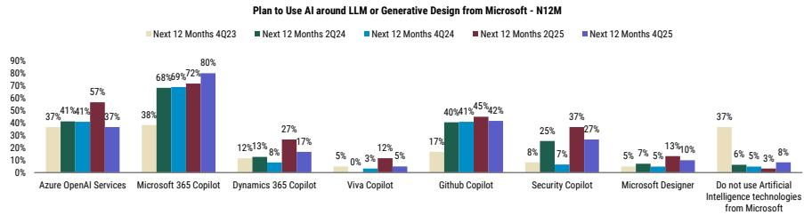  
Exhibit 25: $9 2 \%$ of CIOs Expect to Use Microsoft Generative AI Products Over the Next 12 Months   
Source: AlphaWise, Morgan Stanley Research, $n { = } 6 0$ (US and EU data)

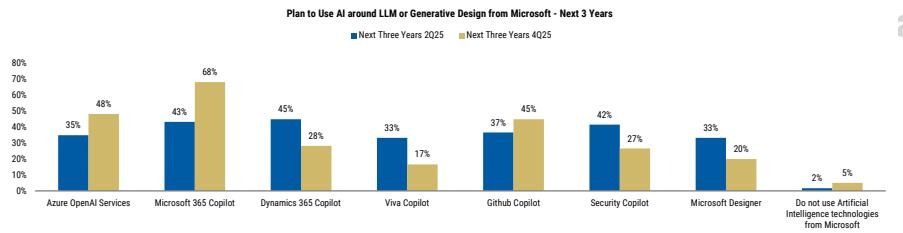  
Exhibit 26: CIOs Plan to Increase Uptake of Microsoft's AI Products Within the Next 3 Years   
Source: AlphaWise, Morgan Stanley Research, $n { = } 6 0$ (US and EU data)

If you are planning to use Microsoft 365 Copilot within your organization, what $\%$ of your Office user base do you expect to deploy M365 Copilot to over the next 12 months and in 3 years?

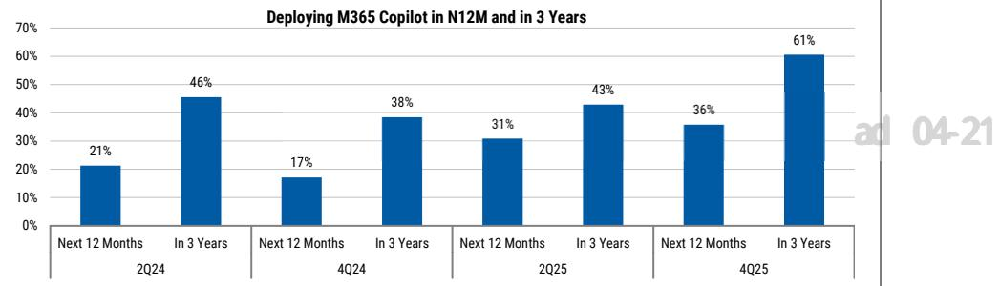  
Exhibit 27: Of the CIOs in Our Survey Planning to Use M365 Copilot Across Their Organization, CIOs Expect $3 6 \%$ Penetration over the Next 12 Months, Increasing to $67 \%$ Penetration Over the Next 3 Years   
Source: AlphaWise, Morgan Stanley Research, $n { = } 6 0$ (US and EU data)

# 4) Latest Views on PC / Device Market – More Personal Computing (MPC) Under the Microscope

PC / OEM Read-Through: Better Near-Term Shipments, But Management Commentary Reinforces a More Temporary Benefit. Per our US IT Hardware team (led by Erik Woodring), preliminary IDC data showed C1Q26 PC shipments of 63.6M units $( + 2 . 5 \%$ Y/Y), ${ \sim } 1 3 \%$ above their estimates, driven by a mix of Windows 11 refresh activity, new product cycles, and demand pull-forward ahead of anticipated component price increases (see IT Hardware: A Better Than Feared 1Q PC 订阅研报添加微信 LCD123321Shipments, But A Concerning Trend (8 Apr 2026)). While the headline numbers Ca were better than feared, the underlying setup still looks more tactical than structural, in our view, particularly when framed against Microsoft management’s commentary over the last two earnings calls. In F1Q26, management described Windows OEM and Devices as having benefited from 'strong demand ahead of Windows 10 end of support as well as a benefit from inventory levels that remained elevated,' and then guided F2Q Windows OEM to decline low- to mid-single digits as those inventory levels normalize through the quarter. In F2Q26, management again pointed to Windows OEM strength being supported by 'a continued benefit from Windows 10 end of support,' while also explicitly calling out elevated 'purchasing ahead of memory price increases,' while guiding F3Q Windows OEM down roughly $10 \%$ 'as the benefit from Windows 10 end of support normalizes and as elevated inventory levels come down through the quarter.' Taken together, that commentary is consistent with the IDC data showing a quarter of shipments helped by refresh timing, inventory support, and pricing-related pull-forward, rather than a sustained 订阅研报添加微信 LCD123321improvement in end demand. Importantly, both the supply chain and management a point to a similar conclusion: demand remains intact, but near-term shipments are being distorted by supply constraints, pricing dynamics, and inventory positioning rather than reflecting a clean inflection in end-demand.

Looking ahead, our US IT Hardware team continues to see a more challenging PC backdrop, with Microsoft’s commentary broadly consistent with this more cautious view. IDC highlighted demand pull-forward tied to future component pricing, and the gap between PC shipments and ODM builds widened to its highest level in over a decade, suggesting channel/timing distortion rather than a clean recovery in underlying demand. That lines up closely with Microsoft’s own framing over the last two quarters: first, the OEM strength was aided by elevated inventory and Windows 10 end of support – and second, the forward outlook remains unusually wide because of normalization in both inventory and the refresh cycle, alongside potential volatility from higher memory prices. As a result, while the better-thanexpected C1Q shipment data should be a modest near-term positive for Microsoft’s Windows OEM business, we do not think it changes the broader setup. In particular, PC demand still looks increasingly front-loaded, and the benefit to OEM revenues 订阅研报添加微信 LCD123321Cmay fade as the calendar year progresses.

What Does This Mean for Our Microsoft MPC Estimates? Incorporating these dynamics, we are lowering our F4Q26 (C2Q26) More Personal Computing estimates by $0 . 2 \% / 2 . 9 \% / 2 . 0 \% / 2 . 0 \%$ for FY26 / FY27 / FY28 / FY29, respectively, primarily reflecting normalization in the PC supply chain following the pull-forward of demand into C1Q. In particular, we are aligning our model more closely with our IT Hardware team’s expectation for CY26 PC shipments to decline $\sim 1 6 \%$ Y/Y, which implies a weaker unit backdrop and lower Windows OEM / Devices revenue trajectory for Microsoft than we had previously embedded. While CQ1 shipments came in better than expected with unit growth of $+ 2 . 5 \%$ YoY, growth still decelerated meaningfully (\~8pts vs. C4Q25 and \~4pts vs. C1Q25, which itself lapped an easier prior-year compare), reinforcing a weaker underlying demand environment despite the near-term pull-forward. Both ODM/OEM data and Microsoft’s guidance point to a sub-seasonal build environment and declining Windows OEM revenue as elevated 订阅研报添加微信 LCD123321Cad inventory unwinds, suggesting a softer revenue profile than previously modeled. 04-21 While we continue to view longer-term demand as stable overall, we are also moderating our out year assumptions, which were slightly too high in our view (and above consensus), to better reflect a more normalized PC growth trajectory going forward following the recent pull-forward and ongoing supply-side volatility. In addition, we are modestly lowering our Gaming revenue assumptions, reflecting recent management commentary pointing to softer-than-expected first-party content performance and more volatile near-term engagement trends, with revenue declines driven in part by tougher prior-year compares and fairly uneven content cadence. As a result, we now expect a more tempered recovery profile for MPC revenue, with slightly weaker near-term trends flowing through into a lower base for subsequent periods. That said, we continue to see support from structural drivers longer-term, including the Windows 10 end-of-support cycle and increasing premium / AI PC mix, though we now embed a more tempered view between these tailwinds and cyclical normalization.

# Related Research:

• Greater China Technology Hardware: Monthly Databook: 1Q shipments 11% above our estimate; we raise 2Q26e NB builds $7 \%$ (14 Apr 2026) • IT Hardware: A Better Than Feared 1Q PC Shipments, But A Concerning Trend (8 Apr 2026)

Exhibit 28: Summary of Model Changes – More Personal Computing Revenue Estimates   

<table><tr><td>(Us$ in Millions)</td><td>FY26</td><td>FY27</td><td>FY28</td><td>FY29</td><td></td></tr><tr><td>WindowsOEMand DevicesRevenue</td><td></td><td></td><td></td><td></td><td></td></tr><tr><td>Prior MSe Current MSe</td><td>$16,771 $16,540</td><td>$18,196 $16,991</td><td>$18,470 $17,571</td><td>$18,806 $17,887</td><td></td></tr><tr><td>%change</td><td>-1.4%</td><td>-6.6%</td><td>-4.9%</td><td>-4.9%</td><td></td></tr><tr><td>Gaming (Hardware,XboxLive,VideoGames,rdPartyRoylties) PriorMSe</td><td>$22,412</td><td>$23,182</td><td>$23,320</td><td>$23,463</td><td></td></tr><tr><td>Current MSe %change</td><td>$22,412 0.0%</td><td>$22,706 -2.1%</td><td>$23,034 -1.2%</td><td>$23,174 -1.2%</td><td></td></tr><tr><td></td><td></td><td></td><td></td><td></td><td></td></tr><tr><td>Total More Personal Computing (MPC) Revenue Prior MSe</td><td>$54,256</td><td>$57,552</td><td>$58,745</td><td>$60,046</td><td>a</td></tr><tr><td></td><td></td><td></td><td></td><td></td><td></td></tr><tr><td>Current MSe</td><td>$54,137</td><td>$55,869</td><td>$57,561</td><td>$58,838</td><td></td></tr><tr><td></td><td>-0.2%</td><td></td><td></td><td></td><td></td></tr><tr><td>%change</td><td></td><td>-2.9%</td><td>-2.0%</td><td>-2.0%</td><td></td></tr><tr><td>YoY</td><td>-0.9%</td><td>3.2%</td><td>3.0%</td><td>2.2%</td><td></td></tr><tr><td></td><td></td><td></td><td></td><td></td><td></td></tr><tr><td></td><td></td><td></td><td></td><td></td><td></td></tr><tr><td>Consensus MPC Revenue</td><td>54,165</td><td>55,354</td><td>56,842</td><td></td><td></td></tr><tr><td></td><td></td><td></td><td></td><td>58,703</td><td></td></tr><tr><td>MSe Current vs.Cons</td><td>-0.1%</td><td>0.9%</td><td>1.3%</td><td></td><td></td></tr><tr><td></td><td></td><td></td><td></td><td>0.2%</td><td></td></tr><tr><td></td><td></td><td></td><td></td><td></td><td></td></tr><tr><td>YoY</td><td>-0.9%</td><td>2.2%</td><td></td><td></td><td></td></tr><tr><td></td><td></td><td></td><td></td><td></td><td></td></tr><tr><td></td><td></td><td></td><td></td><td></td><td></td></tr><tr><td></td><td></td><td></td><td></td><td></td><td></td></tr><tr><td></td><td></td><td></td><td></td><td></td><td></td></tr><tr><td></td><td></td><td></td><td></td><td></td><td></td></tr><tr><td></td><td></td><td></td><td></td><td></td><td></td></tr><tr><td></td><td></td><td></td><td></td><td></td><td></td></tr><tr><td></td><td></td><td></td><td></td><td></td><td></td></tr><tr><td></td><td></td><td></td><td></td><td></td><td></td></tr><tr><td></td><td></td><td></td><td></td><td></td><td></td></tr><tr><td></td><td></td><td></td><td></td><td></td><td></td></tr><tr><td></td><td></td><td></td><td></td><td></td><td></td></tr><tr><td></td><td></td><td></td><td></td><td></td><td></td></tr><tr><td></td><td></td><td></td><td></td><td></td><td></td></tr><tr><td></td><td></td><td></td><td></td><td></td><td></td></tr><tr><td></td><td></td><td></td><td></td><td></td><td></td></tr><tr><td></td><td></td><td></td><td></td><td></td><td></td></tr><tr><td></td><td></td><td></td><td></td><td></td><td></td></tr><tr><td></td><td></td><td></td><td></td><td></td><td></td></tr><tr><td></td><td></td><td></td><td></td><td></td><td></td></tr><tr><td></td><td></td><td></td><td></td><td></td><td></td></tr><tr><td></td><td></td><td></td><td></td><td></td><td></td></tr><tr><td></td><td></td><td></td><td></td><td></td><td></td></tr><tr><td></td><td></td><td></td><td></td><td></td><td></td></tr><tr><td></td><td></td><td></td><td></td><td></td><td></td></tr><tr><td></td><td></td><td></td><td></td><td></td><td></td></tr><tr><td></td><td></td><td></td><td></td><td></td><td></td></tr><tr><td></td><td></td><td></td><td></td><td></td><td></td></tr><tr><td></td><td></td><td></td><td></td><td></td><td></td></tr><tr><td></td><td></td><td></td><td></td><td></td><td></td></tr><tr><td></td><td></td><td></td><td></td><td></td><td></td></tr><tr><td></td><td></td><td></td><td></td><td></td><td></td></tr><tr><td></td><td></td><td></td><td></td><td></td><td></td></tr><tr><td></td><td></td><td></td><td></td><td></td><td></td></tr></table>

Source: Company Data, Morgan Stanley Research

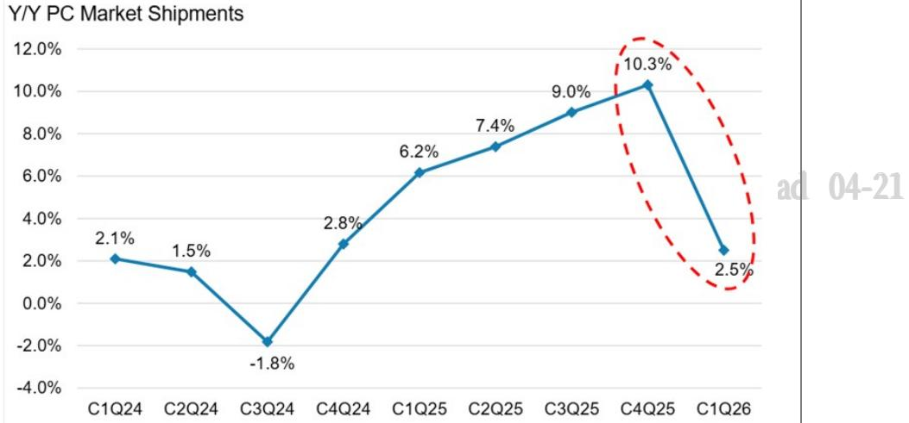  
Exhibit 29: C1Q26 PC shipment growth decelerated ${ \sim } 8$ points vs. C4Q25, to $+ 2 . 5 \%$ Y/Y   
Source: IDC, Morgan Stanley Research

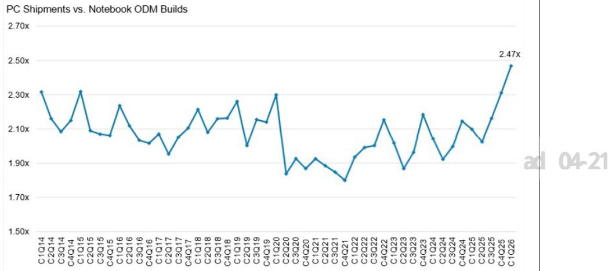  
Exhibit 30: The gap between Y/Y notebook ODM builds and PC shipments is at the widest point in $^ { 1 2 + }$ years as of C1Q26   
Source: IDC, Company Data, Morgan Stanley Research

5) Margin Dynamics: What Impacts the Bottom-line From Here?

# MS View: Gross Margin Pressures From Infrastructure Build-outs and Component Prices Can Continue to be Offset by Low Opex Growth

Gross Margins Moving Lower… Consensus looks for gross margins of $6 7 . 8 \% / 6 6 . 9 \%$ in FY26/FY27, down from $6 8 . 8 \%$ in FY25, largely due to increasing data center capacity coming online while Azure AI and Copilot revenue continues to scale. On the back of our aforementioned higher capex estimates, we lower our gross margin 订阅研报添加微信 LCD123321Cadestimates (see Exhibit 36 ) due to higher data center components costs (and higher associated depreciation/amortization over time), with our model now conservatively assuming total company gross margin compression to $6 7 . 6 \% / 6 6 . 7 \%$ in FY26/FY27, with roughly mid-teens COGS growth in each year. Management mentioned during the F2Q26 call that Cloud gross margins were slightly better than expected at $67 \%$ as 'continued investments in AI that were partially offset by ongoing efficiency gains,' though guided F3Q26 Microsoft Cloud gross margin to be $\sim 6 5 \% ,$ down YoY, driven by 'continued investments in AI.'

On the operating margin side of the equation, despite our expectation for further gross margin compression, we expect that operating expense discipline can offset higher COGs, which could drive operating margin expansion and upside. Our current model assumes $7 . 6 \% / 7 . 5 \% / 1 2 . 4 \%$ operating expense growth in FY26 / FY27 / FY28, which is backed by headcount growth having remained largely stable and our job posting tracker not picking up any signs of a material rebound in hiring. During 订阅研报添加微信 LCD123321Cad F2Q26 earnings, CFO Amy Hood also guided F3Q 'operating margins should be down 04-21 slightly year-over-year.' Net, our expectation is that Microsoft can deliver operating margin of $4 6 . 2 \%$ in FY26, slightly above FY25's $4 5 . 6 \% ,$ , followed by $4 6 . 6 \% / 4 6 . 8 \%$ in operating margins in FY27/FY28, driving GAAP EPS growth of $2 6 . 0 \% / 1 2 . 4 \% / 1 7 . 8 \%$ over the same period. Related, as previously noted (see 2Q26 Preview – Expecting Two Steps Forward (23 Jan 2026)), the shape of Microsoft's GAAP EPS growth is largely impacted by the other income loss related to the accounting for Microsoft's OpenAI investment, driving last quarter's introduction of Non-GAAP EPS (ex-OpenAI loss impacts), which will likely be provided consistently going

# forward.

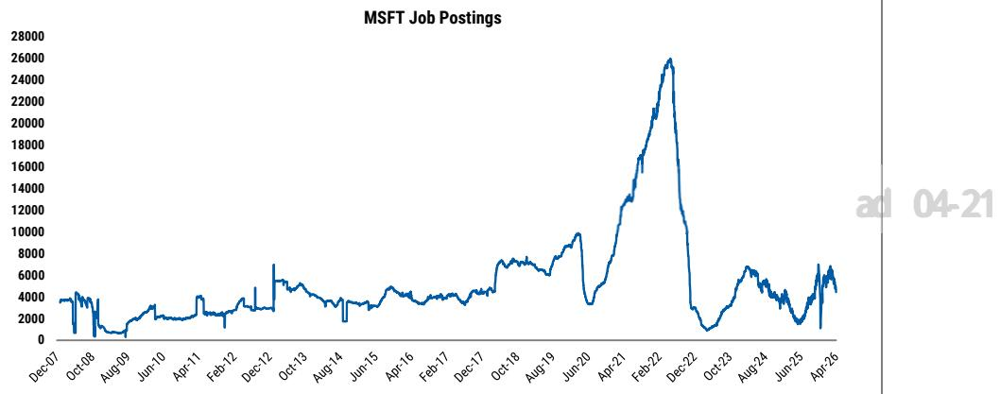  
Exhibit 31: Official Job Openings at Microsoft Increased Slightly Throughout FQ3, Yet Remain Well Below COVID Highs   
Source: Company data, Morgan Stanley Research

# FX – What Are the Impacts of the Stronger Dollar?

Post guidance, the USD strengthened against several major currencies. Since F2Q, the dollar strength has created a 10bps FX tailwind for F3Q on a year-over-year basis, down from 50bps FX tailwind at the time of guidance, though should result in limited potential impact to our estimates compared to the time of guidance. Our FX 订阅研报添加微信 LCD123321Ctailwind estimates come in slightly below Microsoft's expectations for a 2pt benefit in F3Q as mentioned during the F2Q call: 'Based on current rates, we expect FX to increase total revenue growth by 3 points.'

Exhibit 32: Dollar Strengthening Drives 10bps of Incremental F3Q FX Tailwind   

<table><tr><td colspan="7">ImpacttoRevenueYoY-CURRENT</td><td>Total</td></tr><tr><td>Quarter Ending</td><td>MSFT FY</td><td>EUR</td><td>YEN</td><td>GBP</td><td>CAD</td><td>AUD</td><td></td></tr><tr><td>3/31/2026</td><td>3Q26</td><td>0.1%</td><td>-0.4%</td><td>0.1%</td><td>0.0%</td><td>0.3%</td><td>0.1%</td></tr><tr><td>6/3/2026</td><td>4Q26</td><td>0.0%</td><td>-0.3%</td><td>0.0%</td><td>0.0%</td><td>0.2%</td><td>0.0%</td></tr><tr><td>9/30/2026</td><td>1Q27</td><td>0.0%</td><td>-0.3%</td><td>0.0%</td><td>0.0%</td><td>0.2%</td><td>-0.1%</td></tr><tr><td>12/31/2026</td><td>2Q27</td><td>0.0%</td><td>-0.1%</td><td>0.1%</td><td>0.0%</td><td>0.2%</td><td>0.2%</td></tr></table>

Refinitiv, Morgan Stanley Research

<table><tr><td colspan="7">ImpacttoRevenueYoY-ATGUIDANCE</td><td>Total</td></tr><tr><td>Quarter Ending</td><td>MSFTFY</td><td>EUR</td><td>YEN</td><td>GBP</td><td>CAD</td><td>AUD</td><td></td></tr><tr><td>3/31/2026</td><td>3Q26</td><td>0.2%</td><td>-0.1%</td><td>0.3%</td><td>0.0%</td><td>0.2%</td><td>0.5%</td></tr><tr><td>6/3/2026</td><td>4Q26</td><td>0.2%</td><td>-0.3%</td><td>0.3%</td><td>0.0%</td><td>0.1%</td><td>0.3%</td></tr><tr><td>9/30/2026</td><td>1Q27</td><td>0.2%</td><td>0.0%</td><td>0.3%</td><td>0.0%</td><td>0.1%</td><td>0.6%</td></tr><tr><td>12/31/2026</td><td>2Q27</td><td>0.1%</td><td>-0.2%</td><td>0.2%</td><td>0.0%</td><td>0.0%</td><td>0.1%</td></tr></table>

<table><tr><td>Quarter Ending</td><td>MSFTFY</td><td>ChangeSince Guidance</td></tr><tr><td>3/31/2026</td><td>3Q26</td><td>-0.5%</td></tr><tr><td>6/3/2026</td><td>4Q26</td><td>-0.3%</td></tr><tr><td>9/30/2026</td><td>1Q27</td><td>-0.7%</td></tr><tr><td>12/31/2026</td><td>2Q27</td><td>0.1%</td></tr></table>

# Source:

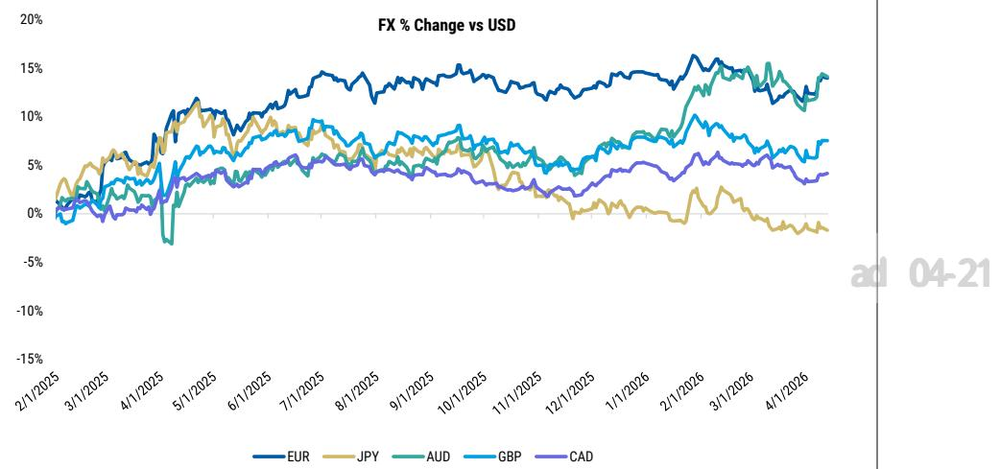  
Exhibit 33: Major Foreign Currencies Have Weakened Modestly Against USD In Recent Months...   
Source: Refinitiv, Morgan Stanley Research

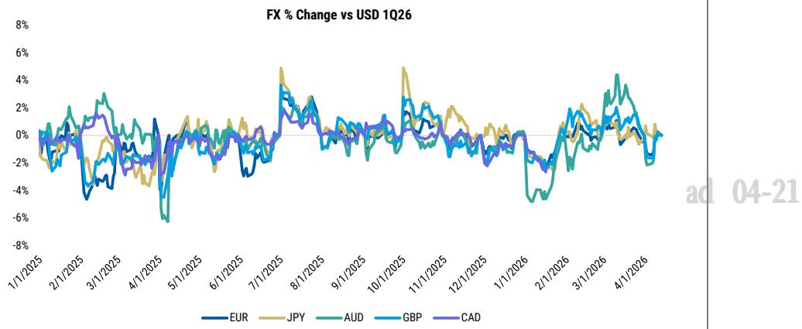  
Exhibit 34: … But Held Largely Steady Through CQ1   
Source: Refinitiv, Morgan Stanley Research

Exhibit 35: Morgan Stanley Forecasts Relatively In-line with Consensus in 3Q26 / FY26   

<table><tr><td>Fiscal Year</td><td colspan="3">3Q26e</td><td colspan="3">4Q26e</td><td colspan="3">FY26e</td><td colspan="3">FY27e</td></tr><tr><td>MSFT</td><td>MS</td><td>Consensus</td><td>MSv Cons</td><td>MS</td><td>Consensus</td><td>MSv Cons</td><td>MS</td><td>Consensus</td><td>MSvCons</td><td>MS</td><td>Consensus</td><td>MSvCons</td></tr><tr><td>Total Revenue</td><td>$81,436</td><td>S81,415</td><td>0.0%</td><td>$88225</td><td>$87,856</td><td>0.4%</td><td>$328,608</td><td>$328,242</td><td>0.1%</td><td>$377,543</td><td>$379.975</td><td>-0.6%</td></tr><tr><td>YoY Growth</td><td>16.2%</td><td>16.2%</td><td></td><td>15.4%</td><td>14.9%</td><td></td><td>16.6%</td><td>16.5%</td><td></td><td>14.9%</td><td>15.8%</td><td></td></tr><tr><td>cc Growth</td><td>16.2%</td><td>13.4%</td><td></td><td>15.4%</td><td>14.6%</td><td></td><td>16.6%</td><td>15.1%</td><td></td><td>14.9%</td><td>16.0%</td><td></td></tr><tr><td>Gross Margins</td><td>67.2%</td><td>67.1%</td><td>7bps</td><td>66.4%</td><td>67.2%</td><td>-86bps</td><td>67.6%</td><td>67.8%</td><td>-21 bps</td><td>66.7%</td><td>66.9%</td><td>-21bps</td></tr><tr><td>GrossPofit</td><td>$54,731</td><td>$54,656</td><td></td><td>$58,545</td><td>$59,056</td><td></td><td>s222,200</td><td>s222,653</td><td></td><td>$251,714</td><td>$254,134</td><td></td></tr><tr><td>Opex (implied)</td><td>$17,869</td><td>$17,854</td><td></td><td>$19,788</td><td>$19,869</td><td></td><td>$70,346</td><td>$70,413</td><td></td><td>$75,608</td><td>$78,974</td><td></td></tr><tr><td>Operating Income</td><td>S36,862</td><td>S36,843</td><td>0.1%</td><td>$38,757</td><td>$39,350</td><td>-1.5%</td><td>S151,855</td><td>$152,466</td><td>-0.4%</td><td>$176,106</td><td>$175,685</td><td>0.2%</td></tr><tr><td>Op. Margin</td><td>45.3%</td><td>45.3%</td><td>1bps</td><td>43.9%</td><td>44.8%</td><td>-86 bps</td><td>46.2%</td><td>46.4%</td><td>-24 bps</td><td>46.6%</td><td>46.2%</td><td>41bps</td></tr><tr><td>Ccc Implied OM %</td><td>46.5%</td><td>45.2%</td><td>135 bps</td><td>43.0%</td><td>43.5%</td><td>-52 bps</td><td>37.7%</td><td>37.3%</td><td>47 bps</td><td></td><td></td><td></td></tr><tr><td>GAAP EPS</td><td>$4.10</td><td>$4.07</td><td>0.7%</td><td>$4.22</td><td>$4.29</td><td>-1.6%</td><td>S17.19</td><td>$16.66</td><td>3.2%</td><td>S19.32</td><td>$19.08</td><td>1.2%</td></tr></table>

Source: Company data, Morgan Stanley Research, Refinitiv, Visible Alpha

Exhibit 36: Summary of Model Changes   

<table><tr><td></td><td>FQ1:26</td><td>FQ2:26</td><td>FQ3:26e</td><td>FQ4:26e</td><td>FY26e</td><td>FY27e</td><td>FY28e</td><td>FY29e</td></tr><tr><td>TotalRevenue</td><td>$77.67B</td><td>$81.27B</td><td>$81.44B</td><td>$88.23B</td><td>$328.61B</td><td>$377.54B</td><td>$438.92B</td><td>$512.84B</td></tr><tr><td>YoY Change</td><td>18.4%</td><td>16.7%</td><td>16.2%</td><td>15.4%</td><td>16.6%</td><td>14.9%</td><td>16.3%</td><td>16.8%</td></tr><tr><td>Old Total Revenue</td><td>$77.67B</td><td>$81.27B</td><td>$81.44B</td><td>$88.34B</td><td>$328.73B</td><td>$379.25B</td><td>$440.15B</td><td>$514.11B</td></tr><tr><td>% Change</td><td>0.0%</td><td>0.0%</td><td>0.0%</td><td>-0.1%</td><td>0.0%</td><td>-0.4%</td><td>-0.3%</td><td>-0.2%</td></tr><tr><td></td><td></td><td></td><td></td><td></td><td></td><td></td><td></td><td></td></tr><tr><td>TotalGrossMargin Old Gross Margin</td><td>69.0%</td><td>68.0%</td><td>67.2%</td><td>66.4%</td><td>67.6%</td><td>66.7%</td><td>66.2%</td><td>66.3%</td></tr><tr><td>New vs. Old</td><td>69.0% 0.0%</td><td>68.0% 0.0%</td><td>67.2%</td><td>66.3%</td><td>67.6%</td><td>66.9%</td><td>66.6%</td><td>66.7%</td></tr><tr><td></td><td></td><td></td><td>0.0%</td><td>0.0%</td><td>0.0%</td><td>-0.2%</td><td>-0.4%</td><td>-0.4%</td></tr><tr><td>Operating Expense</td><td>$15.67B</td><td>$17.02B</td><td>$17.87B</td><td>$19.79B</td><td>$70.35B</td><td>$75.61B</td><td>$84.98B</td><td>$96.09B</td></tr><tr><td>YoY Change</td><td>4.9%</td><td>5.2%</td><td>10.7%</td><td>9.3%</td><td>7.6%</td><td>7.5%</td><td>12.4%</td><td>13.1%</td></tr><tr><td>Old Operating Expense</td><td>$15.67B</td><td>$17.02B</td><td>$17.87B</td><td>$19.81B</td><td>$70.37B</td><td>$75.95B</td><td>$85.21B</td><td>$96.33B</td></tr><tr><td>% Change</td><td>0.0%</td><td>0.0%</td><td>0.0%</td><td>-0.1%</td><td>0.0%</td><td>-0.4%</td><td>-0.3%</td><td>-0.2%</td></tr><tr><td></td><td></td><td></td><td></td><td></td><td></td><td></td><td></td><td></td></tr><tr><td>Operating Income</td><td>$37.96B</td><td>$38.28B</td><td>$36.86B</td><td>$38.76B</td><td>$151.85B</td><td>$176.11B</td><td>$205.63B</td><td>$243.84B</td></tr><tr><td>Operating Margin</td><td>48.9%</td><td>47.1%</td><td>45.3%</td><td>43.9%</td><td>46.2%</td><td>46.6%</td><td>46.8%</td><td>47.5%</td></tr><tr><td>Old Operating Income</td><td>$37.96B</td><td>$38.28B H</td><td>$36.86BX/$38.79B</td><td></td><td>$151.89B</td><td>$177.73B</td><td>$208.08B</td><td>$246.64B</td></tr><tr><td>Old Operating Margin</td><td>48.9%</td><td>47.1%</td><td>45.3%</td><td>43.9%</td><td>46.2%</td><td>46.9%</td><td>47.3%</td><td>48.0%</td></tr><tr><td>% Change in Op. Income</td><td>0.0%</td><td>0.0%</td><td>0.0%</td><td>-0.1%</td><td>0.0%</td><td>-0.9%</td><td>-1.2%</td><td>-1.1%</td></tr><tr><td>EPS</td><td>$3.72</td><td>$5.16</td><td>$4.10</td><td>$4.22</td><td>$17.19</td><td>$19.32</td><td>$22.76</td><td>$27.27</td></tr><tr><td>Old EPS</td><td>$3.72</td><td>$5.16</td><td>$4.10</td><td>$4.22</td><td>$17.19</td><td>$19.51</td><td>$23.07</td><td>$27.65</td></tr><tr><td>% Change</td><td>0.0%</td><td>0.0%</td><td>0.0%</td><td>-0.1%</td><td>0.0%</td><td>-1.0%</td><td>-1.3%</td><td>-1.4%</td></tr><tr><td></td><td></td><td></td><td></td><td></td><td></td><td></td><td></td><td></td></tr><tr><td>TotalFCF</td><td>$25.7B</td><td>$5.9B</td><td>$14.5B</td><td>$28.4B</td><td>$74.5B</td><td>$66.9B</td><td>$87.8B</td><td>$113.7B</td></tr><tr><td>YoY Change</td><td>33%</td><td>-9%</td><td>-28%</td><td>11%</td><td>4%</td><td>-10%</td><td>31%</td><td>29%</td></tr><tr><td>Old FCF % Change</td><td>$25.66B</td><td>$5.88B</td><td>$14.54B</td><td>$30.36B</td><td>$76.4B</td><td>$73.1B</td><td>$94.2B</td><td>$121.1B</td></tr><tr><td></td><td>0.0%</td><td>0.0%</td><td>0.0%</td><td>-6.5%</td><td>-2.6%</td><td>-8.5%</td><td>-6.8%</td><td>-6.1%</td></tr><tr><td>TotalCapex</td><td>$34.9B</td><td>$37.5B</td><td>$34.0B</td><td>$37.5B</td><td>$143.9B</td><td>$169.2B</td><td>$189.8B</td><td>$208.8B</td></tr><tr><td>YoY Change Old Capex</td><td>75%</td><td>66%</td><td>59%</td><td>55%</td><td>63%</td><td>18%</td><td>12%</td><td>10%</td></tr><tr><td>% Change</td><td>$34.90B</td><td>$37.50B</td><td>$34.00B</td><td>$34.57B</td><td>$141.0B</td><td>$160.8B</td><td>$180.2B</td><td>$198.3B</td></tr><tr><td></td><td>0.0%</td><td>0.0%</td><td>0.0%</td><td>8.5%</td><td>2.1%</td><td>5.2%</td><td>5.3%</td><td>5.3%</td></tr><tr><td>Unearned Revenue</td><td>$61.53B</td><td>$54.04B</td><td>$56.54B</td><td>$68.80B</td><td>$68.80B</td><td>$70.38B</td><td>$72.00B</td><td>$73.68B</td></tr><tr><td>YoY Change</td><td></td><td></td><td></td><td></td><td>2%</td><td>2%</td><td>2%</td><td>2%</td></tr></table>

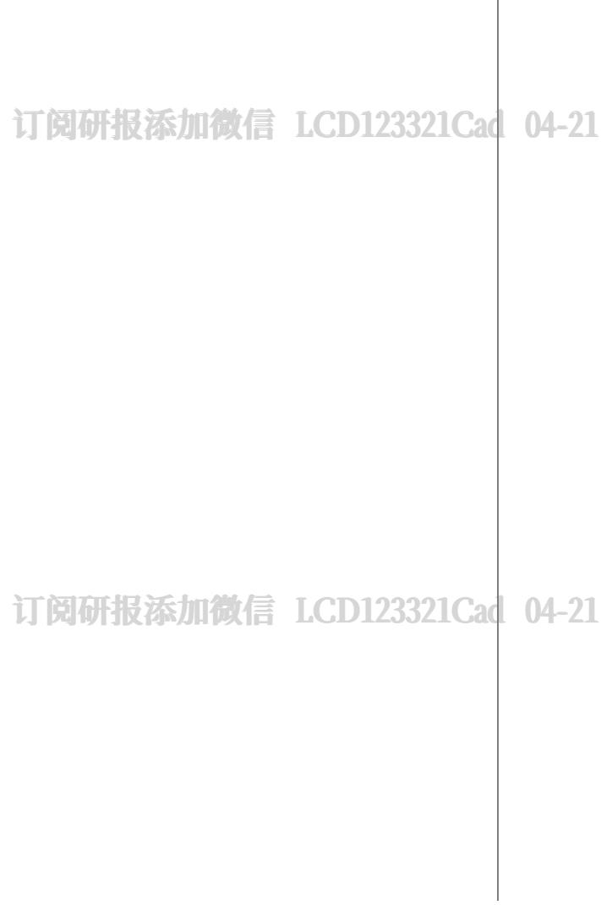

# Preview to earnings

<table><tr><td>Focus KPI</td><td>Focus KPI Surprise</td><td>Likely impact to consensus EPS*</td></tr><tr><td>Microsoft MSFT.O</td><td></td><td></td></tr><tr><td>Azure Revenue YoY Growth in CC</td><td>↑ Likely upside surprise</td><td>↑Modest revision higher</td></tr></table>

\*Likely impact to consensus EPS is for the next 12 months Source: Company data, Morgan Stanley Research

# 订阅研报添加微信 LCD123321Cad 04-21

# Risk Reward - MicrosoRisk Reward – Microsoft (MSFT.O)

Durability of Earnings Growth & AI Leadership Not Priced-In

# \$650.00PRICE TARGET

31x Base Case CY27e EPS of $\$ 20.92$ . 31x PE is a slight premium to large cap software peers, 1.6x PEG is relatively in line with MSFT historical PEG while a premium to peers, justi fied by Microsoft's strong positioning and strong execution.

Consensus Price Target Distribution

Source: Re fi nitiv, Morgan Stanley Research

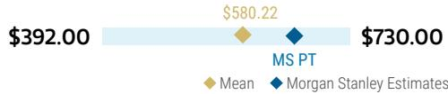

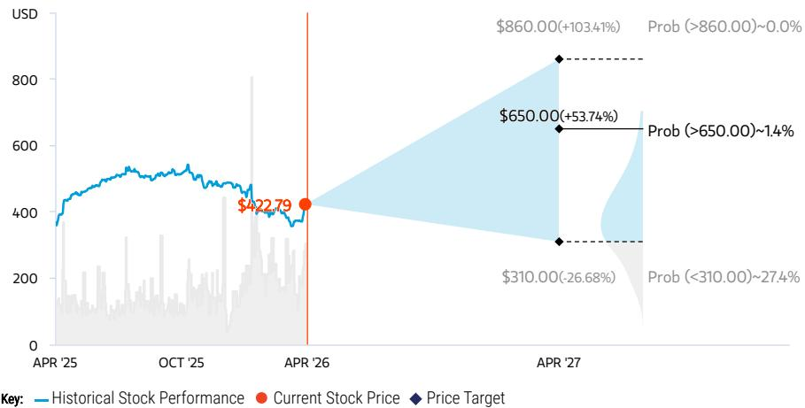  
RISK REWARD CHART AND OPTIONS IMPLIED PROBABILITIES (12M)   
Source: Re nitiv, Morgan Stanley Research, Morgan Stanley Institutional Equities Division. The probabilities of our Bull, Base, and Bear case scenarios playing out were estimated with implied volatility data from the options market as of 17 fiApr 2026. All gures are approximate risk-neutral probabilities of the stock reaching beyond the scenario price in either three-months’ or one-years’ time. View explanation of Options Probabilities methodology here

# OVERWEIGHT THESIS

▪ Strong positioning for public cloud adoption & AI, large distribution channels and installed customer base, and expanding margins supports EPS growth. Weaker cyclical environment improves as cloud optimizations complete - LT trends remain durable.

▪ Teens revenue growth, opex discipline and strong capital return lead to durable mid- to high-teens total return pro file long term.

Microsoft's earnings growth and the company's premium return pro le remains underpriced. Multiple expansion and positive estimate revisions will come from greater than expected strength in commercial businesses including Azure.

  
Consensus Rating Distribution   
Source: Re nitiv, Morgan Stanley Research

# Risk Reward Themes

New Data Era: Positive Pricing Power: Positive Secular Growth: Positive View descriptions of Risk Rewards Themes here

# BULL CASE

# \$860.00

# \~37x Bull Case CY27e EPS: \$23.49

# $\$ 650.00$

Azure, O365 & Robust Contribution from AI Drive Top-Line Growth. Acceleration in Azure growth, adoption of higher priced M365 Commercial SKUs and continued seat growth, and robust adoption of Azure AI services and Microsoft AI Copilots across business lines drive mid-teens revenue CAGR in the coming years. Operating margins expand to ${ \sim } 4 8 . 7 \%$ by CY27 and CY27e EPS is $\$ 23.49$ . $\sim 3 7 \times$ PE represents a premium to large cap software peers, but roughly inline with Hist Avg PEG at ${ \sim } 1 . 5 \times$ given $> 2 0 \%$ EPS CAGR.

# \~31x Base Case CY27e EPS of $\$ 20.92$

# BASE CASE

Azure, M365 & Ramping Contribution from AI Drive Top-Line Growth. Durability of Azure growth, adoption of higher priced M365 Commercial SKUs and continued seat growth, and ramping adoption of Azure AI services & Microsoft AI Copilots across business lines drive low-teens rev CAGR ahead. Operating margins expand beyond ${ \sim } 4 6 . 7 \%$ by CY27 and CY27e EPS is $\$ 20.92$ . 31x PE is a premium to large cap software peers, given strong positioning and execution. 1.6x PEG is inline with MSFT historical PEG.

\$310.00

# BEAR CASE

# \~16x Bear Case CY27e EPS: $\$ 18.93$

Macro, Scale & Limited AI Adoption Drives Top-Line Growth Deceleration. Azure growth continues deceleration given scale, while M365 reaches penetration and adoption of Azure AI services & Microsoft AI Copilots across business lines remains limited. This drives low double-digit rev CAGR. Operating margins only expand to ${ \sim } 4 4 . 7 \%$ by CY27 from gross margin pressure and CY27e EPS is $\$ 18.93$ . $\sim 1 6 \times$ PE is a 04-21 discount to large cap software peers and a discount on a PEG.

# Risk Reward – Microsoft (MSFT.O)

KEY EARNINGS INPUTS   

<table><tr><td>Drivers</td><td>2025</td><td>2026e</td><td>2027e</td><td>2028e</td></tr><tr><td>Azure Revenue Growth (%)</td><td>29.7</td><td>30.2</td><td>26.4</td><td>22.4</td></tr><tr><td>Server Products On-Prem Growth (%)</td><td>(2.0)</td><td>(1.0)</td><td>(1.0)</td><td>(1.0)</td></tr><tr><td>Gross Margins (%)</td><td>68.8</td><td>67.6</td><td>66.7</td><td>66.2</td></tr><tr><td>Operating Margins (%)</td><td>45.6</td><td>46.2</td><td>46.6</td><td>46.8</td></tr><tr><td>GAAP EPS Growth (%)</td><td>15.6</td><td>26.0</td><td>12.4</td><td>17.8</td></tr></table>

# INVESTMENT DRIVERS

Sustainability of commercial growth, cloud momentum, improving cloud margins Improving PC data points

# GLOBAL REVENUE EXPOSURE

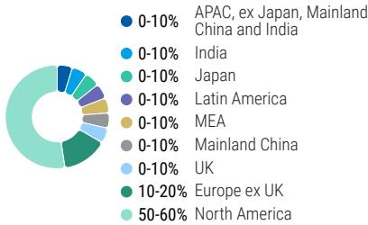  
Source: Morgan Stanley Research Estimate View explanation of regional hierarchies here

# MS ALPHA MODELS

  
Source: Re nitiv, FactSet, Morgan Stanley Research; 1 is the highest favored Quintile and 5 is the least favored Quintile

# RISKS TO PT/RATING

# RISKS TO UPSIDE

Cloud adoption accelerates, with Azure as convincing winner   
AI leadership results in substantial revenue contribution over-time   
Operational ef ciencies leading to greater than fianticipated economies of scale and margin expansion

# RISKS TO DOWNSIDE

Weak macro impacting IT spending On-premises cannibalization by Cloud Increased investments hurt margin expansion AI adoption proves limited

# OWNERSHIP POSITIONING

Inst. Owners, % Active $5 4 . 4 \%$ HF Sector Long/Short Ratio 2.1x HF Sector Net Exposure $2 5 . 2 \%$

Re nitiv; MSPB Content. Includes certain hedge fund exposures held with MSPB. Information may be inconsistent with or may not re ect broader market trends. Long/Short Ratio $\underline { { \underline { { \mathbf { \delta \pi } } } } }$ Long Exposure / Short exposure. Sector $\%$ of Total Net Exposure $\underline { { \underline { { \mathbf { \delta \pi } } } } }$ (For a particular sector: Long Exposure - Short Exposure) / (Across all sectors: Long Exposure – Short Exposure).

# MS ESTIMATES VS. CONSENSUS

FY Jun 2026e

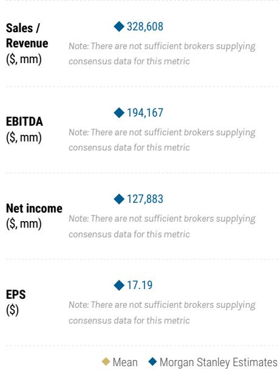  
Source: Re nitiv, Morgan Stanley Research

# Risk Reward Reference links

1. View explanation of Options Probabilities methodology - Options_Probabilities_Exhibit_Link.pdf

2. View descriptions of Risk Rewards Themes - RR_Themes_Exhibit_Link.pdf

3. View explanation of regional hierarchies - GEG_Exhibit_Link.pdf

4. View explanation of Theme/Exposure methodology - ESG_Sustainable_Solutions_External_Link.pdf

5. View explanation of HERS methodology - ESG_HERS_External_Link.pdf