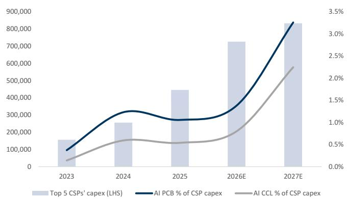
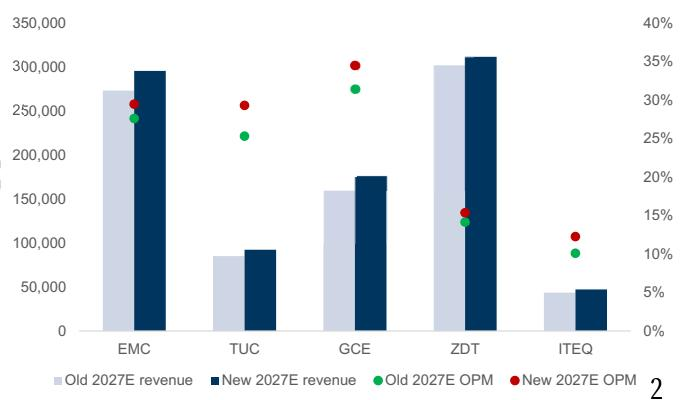

# Further price hike on both PCB and CCL in 2Happears ikely,as end Customers are eager to get more capacity for future Al plans; revise up all PCB/CCL players TP by \~15%

18 April 2026 | 3:44AM CST

Based on our recent supply chain checks and our GC tech team’s S/D analysis (see 订阅研报添加微信 LCD123321Cad here), we observed CCL/PCB pricing increase by 10-40%+ QoQ in April, and 04- further expect additional rounds of price hike in 2H26/2027, with magnitude at least comparable to the recent price hike ratio ( $1 0 { - } 4 0 \% +$ QoQ), considering the even stronger demand outlook and relatively stable industry capacity growth rate, which will further drive Taiwan CCL/PCB companies’ revenue/profitability in coming quarters/ years. As a result, we maintain our Buy rating on EMC/TUC/ZDT/GCE, with better earnings outlook (revise up 2026-28 EPS estimate by $1 7 \% - 2 9 \%$ ), and raise TPs by $\sim 1 5 \%$ (to $\mathsf { N T } \pounds _ { 4 , 0 2 0 } / \mathsf { N T } \pounds _ { 1 , 1 6 5 / \mathsf { N T } \pounds 3 3 8 / \mathsf { N T } \pounds 1 , 3 8 0 }$ respectively, from $\mathsf { N T } \$ 3,500 / \mathsf { N T } \$ 1,015 / \mathsf { N T } \$ 295 / 1,210$ prior).

CCL/PCB suppliers mentioned the end customers (CSPs) have shown a willingness to accept price hike, provided that the CCL/PCB suppliers can support the CSPs’ timeline when discussions on price hikes began in 1Q26, as most CSPs forecast 订阅研报添加微信 LCD123321Cadstronger volume demand for CCL/PCB over the coming years, due to increasingconnectivity speed requirements and increasing data volume in AI 04- servers/datacenters. Also, based on our calculations, AI PCB/CCL TAM only accounted for $0 . 1 \% - 1 . 2 \%$ of the global top 5 CSPs CAPEX in the past 3 years, which we expect will increase to $1 . 4 \% / 0 . 8 \%$ for PCB/CCL in 2026 and $3 . 3 \% / 2 . 2 \%$ in 2027 (Exhibit 1). Considering AI PCB/CCL only account for a very low $\%$ of total CAPEX, we believe CSP customers are more inclined to accept higher pricing, as it will only impact a very small portion of their asset allocation strategy while more importantly ensuring timely ramp‑up of new high‑end AI projects and sustained AI deployment momentum. Moreover, we see all AI PCB/CCL companies in our coverage are accelerating their capacity expansion plans in 2027/28 with no visibility for 2029 for now.

On the other hand, we observe an interesting new AI PCB design trend in PCB 订阅研报添toward HDI upgrades while maintaining MLB $^ +$ 微信 LCD123321Cad 04-HDI hybrid, as we have started to see key MLB suppliers upgrade their HDI production equipment to the high end versions in newly added capacity. Based on our understanding, the key ASIC AI PCB spec will upgrade from $3 + N + 3$ HDI with $^ { 2 6 + }$ layers MLB hybrid solution in 2026 to $6 + N + 6 / 9 + N + 9$ HDI solution with $^ { 3 0 + }$ layers MLB hybrid solution in 2H27-2028, implying a significant upgrade on HDI vs. MLB in the hybrid base solution design. As a result, we believe the key AI MLB suppliers (including GCE etc.) will likely also need to invest in high-end HDI production equipment, or possibly invest in testing equipment to improve their HDI production efficiency/production yield rate to support continued solid GM uptrend in coming years. Moreover, tier 2 MLB players with established HDI production technology should benefit from solid spillover order demand, considering tier 1 MLB players’ relatively conservative capacity expansion plans and 订阅研报添加微信 LCD123321Cad 04-18 relatively limited capacity in high-end HDI.

Overall, we are positive on the overall TW PCB/CCL suppliers’ revenue/profitability outlook due to solid demand uplift and the accelerated technology migration trend, as well as a notably more favorable pricing outlook in coming quarters/years. In addition, we recommend investors to begin focusing on tier 2 MLB suppliers with solid HDI production capability, which we believe are well positioned to gain share in ASIC AI PCB in coming years.

  
Exhibit 1: AI PCB/CCL TAM accounted for limited $\%$ of global top 5 CSPs’ CAPEX $\mathsf { \Delta } \bar { \mathsf { U } } \mathsf { S } \$ \mathsf { W }$

  
Exhibit 2: We expect revenue and OPM in 2027E to see more upside driven by price hike NT\$m

# TUC

We revise up our 2026/27/28E EPS estimates by $1 0 / 1 8 / 2 5 \%$ to factor in the much better than expected CCL pricing outlook from 2H26 and beyond, and revise up our revenue estimates by $3 / 9 / 9 \%$ , with better GM outlook (revise up 2026/27/28E GM by 2.2/3.7/3.7ppt).

订阅Exhibit 4: TUC earnings revision table   

<table><tr><td>TUC P&amp;L (NTS mn)</td><td>2026ENew2026EOld</td><td></td><td>Diff</td><td>2027E New 2027E Old</td><td></td><td>Diff</td><td>2028ENew 2028E Old</td><td>Diff</td></tr><tr><td>Sales</td><td>53.438</td><td>51,741</td><td>3%</td><td>92,299</td><td>85.009</td><td>9%</td><td>142.075 130,739</td><td>9%</td></tr><tr><td>Gross Profit</td><td>15,924</td><td>14,293</td><td>11%</td><td>32,028</td><td>26,364</td><td>21%</td><td>51,312</td><td>42,408 21%</td></tr><tr><td>EBIT</td><td>12,262</td><td>10,697</td><td>15%</td><td>27,020</td><td>21,495</td><td>26%</td><td>44,126</td><td>35,403 25%</td></tr><tr><td>Net Income</td><td>8.961</td><td>8,167</td><td>10%</td><td>19,095</td><td>16,121</td><td>18%</td><td>33.041 26,499</td><td>25%</td></tr><tr><td>EPS (NTS)</td><td>31.10</td><td>28.35</td><td>10%</td><td>66.28</td><td>55.96</td><td>18%</td><td>114.69</td><td>91.98 25%</td></tr><tr><td> Ratio analysis</td><td></td><td></td><td></td><td></td><td></td><td></td><td></td><td></td></tr><tr><td>Gross margin</td><td>29.8%</td><td>27.6%</td><td>2.2pp</td><td>34.7%</td><td> 31.0%</td><td>3.7pp</td><td>36.1%</td><td>32.4% 3.7pp</td></tr><tr><td>EBIT margin</td><td>22.9%</td><td>20.7%</td><td>2.3pp</td><td>29.3%</td><td>25.3%</td><td>40pp</td><td>31.1%</td><td>27.1% 4.0pF</td></tr><tr><td>Net margin</td><td>16.8%</td><td>15.8%</td><td>1.0pp</td><td>20.7%</td><td>19.0%</td><td>1.7pp</td><td>23.3%</td><td>20.3% 3.0pp</td></tr></table>

订阅研报添加微信 LCD123321Cad 04-18: Company data, Goldman Sachs Global Investment Research

# GCE

We revise up our 2026/27/28E EPS estimates by $1 1 / 1 4 / 2 0 \%$ to factor in the better than expected high-end AI PCB industry pricing outlook from 2H26 onward (revise up 2026/27/28E revenue estimates by $6 / 1 0 / 1 0 \% )$ , while we believe the better pricing outlook will also suggest faster product mix improvement progress (revise up 2026/27/28E GM by 2.0/2.7/2.7ppt).

Exhibit 5: GCE earnings revision table   

<table><tr><td>GCE P&amp;L (NT$ mn)</td><td>2026ENeW</td><td>2026E Old Di</td></tr><tr><td>Sales</td><td>106,609</td><td>100.933 6%</td></tr><tr><td>Gross Profit</td><td>41,289</td><td>37,082 11%</td></tr><tr><td>EBIT</td><td>32.529</td><td>28.661 13%</td></tr><tr><td>Net Income</td><td>21,341</td><td>19,243 11%</td></tr><tr><td>EPS (NTS)</td><td>42.68</td><td>38.49 11%</td></tr><tr><td>Ratio analysis</td><td></td><td></td></tr><tr><td>Gross margin</td><td>38.7%</td><td>36.7% 2.0pp</td></tr><tr><td>EBITmargin</td><td>30.5%</td><td>28.4% 2.1pp</td></tr><tr><td> Net margin</td><td>20.0%</td><td>19.1% 1.0pp..</td></tr></table>

CD123321Cad. 04-18   

<table><tr><td>2027ENew</td><td>2027E Old</td><td>Diff.</td></tr><tr><td>174.711</td><td>159,195</td><td>10%</td></tr><tr><td>73,619</td><td>62,715</td><td>17%</td></tr><tr><td>60.184</td><td>49.899</td><td>21%</td></tr><tr><td>39,134</td><td>34,190</td><td>14%</td></tr><tr><td>78.27</td><td>68.38</td><td>14%</td></tr><tr><td>42.1%</td><td>39.4%</td><td>2.7pp</td></tr><tr><td>34.4%</td><td>31.3%</td><td>3.1pp</td></tr><tr><td>22.4%</td><td>21.5%</td><td>0.9pp.</td></tr></table>

<table><tr><td>2028ENew</td><td>2028E Old</td><td>Diff.</td></tr><tr><td>210.363</td><td>191,681</td><td>10%</td></tr><tr><td>90,255</td><td>77,001</td><td>17%</td></tr><tr><td>74,189</td><td>61.671</td><td>20%</td></tr><tr><td>51,329 102.66</td><td>42,618</td><td>20%</td></tr><tr><td></td><td>85.24</td><td>20%</td></tr><tr><td>42.9%</td><td>40.2%</td><td>2.7pp</td></tr><tr><td>35.3%</td><td>32.2%</td><td>3.1pp</td></tr><tr><td>24.4%</td><td>22.2%</td><td>2.2pp</td></tr></table>

Exhibit 6: ZDT earnings revision table   

<table><tr><td>ZD Tech P&amp;L (NT$ mn)</td><td>2026ENeW 2026E Old</td><td>Diff.</td></tr><tr><td>Sales</td><td>225,237 222,795</td><td>1%</td></tr><tr><td>Gross Profit</td><td>48,914 48,158</td><td>2%</td></tr><tr><td>EBIT</td><td>22,459 22.307</td><td>1%</td></tr><tr><td>Net Income</td><td>14,459 14,126</td><td>2%</td></tr><tr><td>EPS (NTS)</td><td>14.45 14.12</td><td>2%</td></tr><tr><td> Ratio analysis</td><td></td><td></td></tr><tr><td> Gross margin</td><td>21.7% 21.6%</td><td>0.1pp</td></tr><tr><td>EBIT margin</td><td>10.0% 10.0%</td><td>0.0pp</td></tr><tr><td>Net margin</td><td>6.4% 6.3%</td><td>0.1pp</td></tr></table>

Source: Company data, Goldman Sachs Global Investment Research

<table><tr><td>2027E NeW</td><td>2027E Old</td><td>Diff.</td></tr><tr><td>311,287</td><td>301,806</td><td>3%</td></tr><tr><td>78,146</td><td>73,037</td><td>7%</td></tr><tr><td>47,732</td><td>42,590</td><td>12%</td></tr><tr><td>30,056</td><td>26,221</td><td>15%</td></tr><tr><td>30.04</td><td>26.21</td><td>15%</td></tr><tr><td></td><td></td><td></td></tr><tr><td>25.1%</td><td>24.2%</td><td>0.9pp..</td></tr><tr><td>15.3%</td><td>14.1%</td><td>1.2pp</td></tr><tr><td>9.7%</td><td>8.7%</td><td>1.0pp</td></tr></table>

<table><tr><td>2028ENeW</td><td>2028E Old</td><td>Diff.</td></tr><tr><td>394.943</td><td>380.717</td><td>4%</td></tr><tr><td>105,908</td><td>97,306</td><td>9%</td></tr><tr><td>67,822</td><td>59,307</td><td>14%</td></tr><tr><td>41,271</td><td>36,192</td><td>14%</td></tr><tr><td>41.25</td><td>36.18</td><td>14%</td></tr><tr><td>26.8%</td><td>25.6%</td><td>1.3pp</td></tr><tr><td>17.2%</td><td>15.6%</td><td>1.6pp</td></tr><tr><td>10.4%</td><td>9.5%</td><td>0.9pp</td></tr></table>

# ITEQ

We revise up our ITEQ 2026/27/28E revenue estimates by $4 \% / 8 \% / 8 \%$ to factor in 订阅研报添加微信 LCD123321Cad 04-18 better-than-expected CCL pricing starting from 2H26 and beyond. Moreover, we revise up our 2026/27/28E GM estimates by 1.0/1.9/1.9ppt to factor in the better GM outlook driven by price hikes, which should largely offset rising material costs. Overall, we revise up our 2026/27/28E earnings estimates by 9/29/29%.

Exhibit 7: ITEQ earnings revision table   

<table><tr><td rowspan=1 colspan=1>ITEQ P&amp;L (NTS mn)</td><td rowspan=1 colspan=1></td><td rowspan=1 colspan=1>2026 New 2026 Old    Diff.</td></tr><tr><td rowspan=1 colspan=1>Sales</td><td rowspan=1 colspan=1></td><td rowspan=1 colspan=1>40,556   38,902     4%</td></tr><tr><td rowspan=1 colspan=1>Gross Profit</td><td rowspan=1 colspan=1></td><td rowspan=1 colspan=1>6,943    6,255     11%</td></tr><tr><td rowspan=1 colspan=1>EBIT</td><td rowspan=1 colspan=1></td><td rowspan=1 colspan=1>3,859    3,265     18%</td></tr><tr><td rowspan=1 colspan=1>Net Income</td><td rowspan=1 colspan=1></td><td rowspan=1 colspan=1>2.365    2,163      9%</td></tr><tr><td rowspan=1 colspan=1>EPS (NT$)</td><td rowspan=1 colspan=1></td><td rowspan=1 colspan=1>6.52      5.96      9%</td></tr><tr><td rowspan=1 colspan=1>Ratio analysis</td><td rowspan=1 colspan=1></td><td rowspan=1 colspan=1></td></tr><tr><td rowspan=1 colspan=1>Gross margin</td><td rowspan=1 colspan=1></td><td rowspan=1 colspan=1>17.1%    16.1%    1.0pp</td></tr><tr><td rowspan=1 colspan=1>EBIT margin</td><td rowspan=1 colspan=1></td><td rowspan=1 colspan=1>9.5%     8.4%     1.1pp</td></tr><tr><td rowspan=1 colspan=1>Net margin</td><td rowspan=1 colspan=1></td><td rowspan=1 colspan=1>5.8%     5.6%     0.3pp</td></tr></table>

<table><tr><td>2027New 2027New</td><td></td><td>Diff.</td></tr><tr><td>47,154</td><td>43,687</td><td>8%</td></tr><tr><td>9,232</td><td>7,730</td><td>19%</td></tr><tr><td>5,778</td><td>4,399</td><td>31%</td></tr><tr><td>4,218</td><td>3,262</td><td>29%</td></tr><tr><td>11.62</td><td>8.99</td><td>29%</td></tr><tr><td></td><td></td><td></td></tr><tr><td>19.6%</td><td>17.7%</td><td>1.9pp</td></tr><tr><td>12.3%</td><td>10.1%</td><td>2.2pp</td></tr><tr><td></td><td></td><td></td></tr><tr><td></td><td></td><td></td></tr><tr><td></td><td></td><td></td></tr><tr><td></td><td></td><td></td></tr><tr><td></td><td></td><td></td></tr><tr><td></td><td></td><td></td></tr><tr><td></td><td></td><td></td></tr><tr><td></td><td></td><td></td></tr><tr><td></td><td></td><td></td></tr><tr><td></td><td></td><td></td></tr><tr><td></td><td></td><td></td></tr><tr><td>8.9%</td><td>7.5%</td><td>1.5pp.</td></tr><tr><td></td><td></td><td></td></tr><tr><td></td><td></td><td></td></tr><tr><td></td><td></td><td></td></tr><tr><td></td><td></td><td></td></tr><tr><td></td><td></td><td></td></tr><tr><td></td><td></td><td></td></tr><tr><td></td><td></td><td></td></tr><tr><td></td><td></td><td></td></tr><tr><td></td><td></td><td></td></tr><tr><td></td><td></td><td></td></tr><tr><td></td><td></td><td></td></tr><tr><td></td><td></td><td></td></tr><tr><td></td><td></td><td></td></tr><tr><td></td><td></td><td></td></tr><tr><td></td><td></td><td></td></tr><tr><td></td><td></td><td></td></tr><tr><td></td><td></td><td></td></tr></table>

<table><tr><td>2028 New 2028New</td><td></td><td>Diff.</td></tr><tr><td>52,700</td><td>48,826</td><td>8%</td></tr><tr><td>11,021</td><td>9,284</td><td>19%</td></tr><tr><td>7,122</td><td>5,525</td><td>29%</td></tr><tr><td>5,278</td><td>4,095</td><td>29%</td></tr><tr><td>14.54</td><td>11.28</td><td>29%</td></tr><tr><td>20.9%</td><td>19.0%</td><td></td></tr><tr><td></td><td></td><td>1.9pp</td></tr><tr><td>13.5%</td><td>11.3%</td><td>2.2pP</td></tr><tr><td></td><td></td><td></td></tr><tr><td></td><td></td><td></td></tr><tr><td></td><td></td><td></td></tr><tr><td></td><td></td><td></td></tr><tr><td></td><td></td><td></td></tr><tr><td></td><td></td><td>1.6pp</td></tr><tr><td></td><td>8.4%</td><td></td></tr><tr><td>10.0%</td><td></td><td></td></tr><tr><td></td><td></td><td></td></tr><tr><td></td><td></td><td></td></tr><tr><td></td><td></td><td></td></tr><tr><td></td><td></td><td></td></tr><tr><td></td><td></td><td></td></tr><tr><td></td><td></td><td></td></tr><tr><td></td><td></td><td></td></tr><tr><td></td><td></td><td></td></tr><tr><td></td><td></td><td></td></tr><tr><td></td><td></td><td></td></tr><tr><td></td><td></td><td></td></tr><tr><td></td><td></td><td></td></tr><tr><td></td><td></td><td></td></tr><tr><td></td><td></td><td></td></tr><tr><td></td><td></td><td></td></tr><tr><td></td><td></td><td></td></tr><tr><td></td><td></td><td></td></tr><tr><td></td><td></td><td></td></tr><tr><td></td><td></td><td></td></tr></table>

Exhibit 8: EMC P&L table   

<table><tr><td>NT$mn</td><td>1Q25</td><td>2Q25</td><td>3Q25</td><td>4Q25</td><td>1Q26E</td><td>2Q26E</td><td>3Q26E</td><td>4Q26E</td><td>1Q27E</td><td>2Q27E</td><td>3Q27E</td><td>4Q27E</td></tr><tr><td>Revenue</td><td>21,680</td><td>22.508</td><td>25,146</td><td>24,927</td><td>33.067</td><td>35,484</td><td>40.997</td><td>44,885</td><td>52,493</td><td>68,130</td><td>82,133</td><td>92.628</td></tr><tr><td>Gross profit</td><td>6,590</td><td>6.829</td><td>7.576</td><td>7.124</td><td>9.866</td><td>11.353</td><td>14,436</td><td>15,793</td><td>18,645</td><td>24.545</td><td>29,648</td><td>33,771</td></tr><tr><td>Operating expense</td><td>(2,051)</td><td>(2.186)</td><td>(2,586)</td><td>(2,190)</td><td>(2,645)</td><td>(2.945)</td><td>(3.280)</td><td>(3.411)</td><td>(3.937)</td><td>(4,565)</td><td>(5,421)</td><td>(5,743)</td></tr><tr><td>Operating income</td><td>4,540</td><td>4,644</td><td>4,990</td><td>4.935</td><td>7,221</td><td>8,407</td><td>11,156</td><td>12,382</td><td>14,708</td><td>19,981</td><td>24,227</td><td>28,028</td></tr><tr><td>Pretax income</td><td>4,667</td><td>4.467</td><td>5,122</td><td>4.620</td><td>7,221</td><td>8.407</td><td>11,156</td><td>12.382</td><td>14,608</td><td>19,881</td><td>24,127</td><td>28.028</td></tr><tr><td>Taxes expense</td><td>(1,200)</td><td>（989)</td><td>(1.157)</td><td>(884）</td><td>(1,444)</td><td>(2.102)</td><td>(2.789)</td><td>(3.095)</td><td>(3,652)</td><td>（4.970)</td><td>(6.032)</td><td>(7,007)</td></tr><tr><td>Net income</td><td>3,469</td><td>3.478</td><td>3,965</td><td>3.737</td><td>5.777</td><td>6,306</td><td>8,367</td><td>9,286</td><td>10,956</td><td>14,910</td><td>18,095</td><td>21.021</td></tr><tr><td>EPS,NTS</td><td>10.01</td><td>10.02</td><td>11.19</td><td>10.45</td><td>16.16</td><td>17.63</td><td>23.40</td><td>25.97</td><td>30.64</td><td>41.70</td><td>50.60</td><td>58.79</td></tr></table>

Ratio analysis and assumption   
As %of sales   

<table><tr><td>Gross margin</td><td>30.4%</td><td>30.3%</td><td>30.1%</td><td>28.6%</td><td>29.8%</td><td>32.0%</td><td>35.2%</td><td>35.2%</td><td>35.5%</td><td>36.0%</td><td>36.1%</td><td>36.5%</td></tr><tr><td>Operating expense ratio</td><td>9.5%</td><td>9.7%</td><td>10.3%</td><td>8.8%</td><td>8.0%</td><td>8.3%</td><td>8.0%</td><td>7.6%</td><td>7.5%</td><td>6.7%</td><td>6.6%</td><td>6.2%</td></tr><tr><td>Operating margin</td><td>20.9%</td><td>20.6%</td><td>19.8%</td><td>19.8%</td><td>21.8%</td><td>23.7%</td><td>27.2%</td><td>27.6%</td><td>28.0%</td><td>29.3%</td><td>29.5%</td><td>30.3%</td></tr><tr><td>Net margin</td><td>16.0%</td><td>15.5%</td><td>15.8%</td><td>15.0%</td><td>17.5%</td><td>17.8%</td><td>20.4%</td><td>20.7%</td><td>20.9%</td><td>21.9%</td><td>22.0%</td><td>22.7%</td></tr><tr><td>QoQ growth (%)</td><td></td><td></td><td></td><td></td><td></td><td></td><td></td><td></td><td></td><td></td><td></td><td></td></tr><tr><td>Revenue</td><td>16.8%</td><td>3.8%</td><td>11.7%</td><td>-0.9%</td><td>32.7%</td><td>7.3%</td><td>15.5%</td><td>9.5%</td><td>16.9%</td><td>29.8%</td><td>20.6%</td><td>12.8%</td></tr><tr><td>Gross profit</td><td>24.8%</td><td>3.6%</td><td>10.9%</td><td>-6.0%</td><td>38.5%</td><td>15.1%</td><td>27.2%</td><td>9.4%</td><td>18.1%</td><td>31.6%</td><td>20.8%</td><td>13.9%</td></tr><tr><td>Operating income</td><td>28.8%</td><td>2.3%</td><td>7.5%</td><td> -1.1%</td><td>46.3%</td><td>16.4%</td><td>32.7%</td><td>11.0%</td><td>18.8%</td><td>35.9%</td><td>21.3%</td><td>15.7%</td></tr><tr><td>Net income</td><td>31.0%</td><td>0.3%</td><td>14.0%</td><td>-5.8%</td><td>54.6%</td><td>9.2%</td><td>32.7%</td><td>11.0%</td><td>18.0%</td><td>36.1%</td><td>21.4%</td><td>16.2%</td></tr><tr><td>YoY growth (%)</td><td></td><td></td><td></td><td></td><td></td><td></td><td></td><td></td><td></td><td></td><td></td><td></td></tr><tr><td>Revenue</td><td>68.0%</td><td>45.7%</td><td>44.0%</td><td>34.3%</td><td>52.5%</td><td>57.7%</td><td>63.0%</td><td>80.1%</td><td>58.7%</td><td>92.0%</td><td>100.3%</td><td>106.4%</td></tr><tr><td>Gross proft</td><td>76.3%</td><td>61.3%</td><td>60.7%</td><td>34.9%</td><td>49.7%</td><td>66.2%</td><td>90.5%</td><td>121.7%</td><td>89.0%</td><td>116.2%</td><td>105.4%</td><td>113.8%</td></tr><tr><td>Operating income</td><td>79.0%</td><td>58.8%</td><td>57.6%</td><td>40.0%</td><td>59.1%</td><td>81.1%</td><td>123.6%</td><td>150.9%</td><td>103.7%</td><td>137.7%</td><td>117.2%</td><td>126.4%</td></tr><tr><td>Net income</td><td>75.3%</td><td>42.8%</td><td>57.6%</td><td>41.1%</td><td>66.5%</td><td>81.3%</td><td>111.0%</td><td>148.5%</td><td>89.7%</td><td>136.5%</td><td>116.3%</td><td>126.4%</td></tr></table>

Source: Company data, Goldman Sachs Global Investment Research

<table><tr><td>2024</td><td>2025</td><td>2026E</td><td>2027E</td><td>2028E</td></tr><tr><td>64.377</td><td>94,261</td><td>154,433</td><td>295.384</td><td>442,350</td></tr><tr><td>17.970</td><td>28,120</td><td>51.448</td><td>106,608</td><td>163.074</td></tr><tr><td>(5.818)</td><td>(9,012)</td><td>(12,282)</td><td>(19,665)</td><td>(26,517)</td></tr><tr><td>12,152</td><td>19,108</td><td>39,166</td><td>86.943</td><td>136,557</td></tr><tr><td>12,133</td><td>18.876</td><td>39,166</td><td>86,643</td><td>136,557</td></tr><tr><td>(2.564)</td><td>(4,231)</td><td>(9,431)</td><td>(21,661)</td><td>(34,139)</td></tr><tr><td>9,578</td><td>14,649</td><td>29,736</td><td>64,982</td><td>102.418</td></tr><tr><td>27.81</td><td>41.67</td><td>83.16</td><td>181.73</td><td>286.42</td></tr></table>

<table><tr><td>27.9%</td><td>29.8%</td><td>33.3%</td><td>36.1%</td><td>36.9%</td></tr><tr><td>9.0%</td><td>9.6%</td><td>8.0%</td><td>6.7%</td><td>6.0%</td></tr><tr><td>18.9%</td><td>20.3%</td><td>25.4%</td><td>29.4%</td><td>30.9%</td></tr><tr><td>14.9%</td><td>15.5%</td><td>19.3%</td><td>22.0%</td><td>23.2%</td></tr><tr><td colspan="5"></td></tr><tr><td></td><td></td><td></td><td></td><td></td></tr><tr><td colspan="5"></td></tr><tr><td></td><td></td><td></td><td></td><td></td></tr><tr><td colspan="5"></td></tr><tr><td></td><td></td><td></td><td></td><td></td></tr><tr><td colspan="5"></td></tr><tr><td>56%</td><td>46%</td><td>64%</td><td>91%</td><td>50%</td></tr><tr><td colspan="5"></td></tr><tr><td>59%</td><td>56%</td><td>83%</td><td>107%</td><td>53%</td></tr><tr><td colspan="5"></td></tr><tr><td>65%</td><td>57%</td><td>105%</td><td>122%</td><td>57%</td></tr><tr><td colspan="5"></td></tr><tr><td>75%</td><td>53%</td><td>103%</td><td>119%</td><td>58%</td></tr></table>

# TUC

订阅研报添加微信 LCD123321Cad 04-18 We revise up TUC’s 12m TP from NT\$1,015 to NT\$1,165, based on the same $2 2 \times \mathsf { P } / \mathsf { E }$ on 4Q26-3Q27E EPS (which is in-line with the AI PCB industry average valuation in the past 3 years), to better reflect the much more favorable than expected pricing outlook in coming quarters/years factoring in our earnings revision.

Exhibit 9: TUC P&L table   

<table><tr><td>NTSmn</td><td>1Q25</td><td>2Q25</td><td>3Q25</td><td>4Q25</td><td>1Q26E</td><td>2Q26E</td><td>3Q26E</td><td>4Q26E</td><td>1Q27E</td><td>2Q27E</td><td>3Q27E</td><td>4Q27E</td></tr><tr><td>Revenue</td><td>6.372</td><td>6.780</td><td>8.063</td><td>9.125</td><td>10056</td><td>12,515</td><td>15.041</td><td>15,826</td><td>16,878</td><td>19.745</td><td>26,156</td><td>29,521</td></tr><tr><td>Gross profit</td><td>1,533</td><td>1,435</td><td>1.915</td><td>2.015</td><td>2.375</td><td>3,277</td><td>4.906</td><td>5,367</td><td>5.816</td><td>6.704</td><td>9.073</td><td>10,436</td></tr><tr><td>Operating expense</td><td>(597)</td><td>(583)</td><td>(649)</td><td>(725)</td><td>（764）</td><td>(876）</td><td>（993）</td><td>(1,029)</td><td>(1,063)</td><td>(1,165)</td><td>(1.334)</td><td>(1,447)</td></tr><tr><td>Operating income</td><td>936</td><td>853</td><td>1,266</td><td>1,290</td><td>1,610</td><td>2,401</td><td>3.913</td><td>4.338</td><td>4,752</td><td>5.539</td><td>7.739</td><td>8989</td></tr><tr><td>Pretax income</td><td>935</td><td>840</td><td>1318</td><td>1,426</td><td>1,574</td><td>2,381</td><td>3.913</td><td>3.818</td><td>4,232</td><td>5.019</td><td>7,219</td><td>8989</td></tr><tr><td>Taxes expense</td><td>(263)</td><td>(188)</td><td>(315)</td><td>(344)</td><td>(346)</td><td>(524)</td><td>(939)</td><td>(916)</td><td>(1,058)</td><td>(1.255)</td><td>(1,805)</td><td>(2,247)</td></tr><tr><td>Net income</td><td>672</td><td>652</td><td>1.003</td><td>1,082</td><td>1,228</td><td>1.857</td><td>2.974</td><td>2,902</td><td>3.174</td><td>3.764</td><td>5,414</td><td>6.742</td></tr><tr><td>EPS,NT$</td><td>2.43</td><td>2.36</td><td>3.58</td><td>3.76</td><td>4.26</td><td>6.45</td><td>10.32</td><td>10.07</td><td>11.02</td><td>13.07</td><td>18.79</td><td>23.40</td></tr></table>

Ratio analysis and assumption   
As % of sales   

<table><tr><td>Gross margin</td><td>24.1%</td><td>21.2%</td><td>23.7%</td><td>22.1%</td><td>23.6%</td><td>26.2%</td><td>32.6%</td><td>33.9%</td><td>34.5%</td><td>34.0%</td><td>34.7%</td><td>35.4%</td></tr><tr><td>Operating expense ratio</td><td>9.4%</td><td>8.6%</td><td>8.1%</td><td>7.9%</td><td>7.6%</td><td>7.0%</td><td>6.6%</td><td>6.5%</td><td>6.3%</td><td>5.9%</td><td>5.1%</td><td>4.9%</td></tr><tr><td>Operating margin</td><td>14.7%</td><td>12.6%</td><td>15.7%</td><td>14.1%</td><td>16.0%</td><td>19.2%</td><td>26.0%</td><td>27.4%</td><td>28.2%</td><td>28.1%</td><td>29.6%</td><td>30.5%</td></tr><tr><td>Net margin</td><td>10.6%</td><td>9.6%</td><td>12.4%</td><td>11.9%</td><td>12.2%</td><td>14.8%</td><td>19.8%</td><td>18.3%</td><td>18.8%</td><td>19.1%</td><td>20.7%</td><td>22.8%</td></tr><tr><td>QoQ growth (%)</td><td></td><td></td><td></td><td></td><td></td><td></td><td></td><td></td><td></td><td></td><td></td><td></td></tr><tr><td>Revenue</td><td>10%</td><td>6.4%</td><td>18.9%</td><td>13.2%</td><td>10.2%</td><td>24.5%</td><td>20.2%</td><td>5.2%</td><td>6.6%</td><td>17.0%</td><td>32.5%</td><td>12.9%</td></tr><tr><td>Gross proft</td><td>4.7%</td><td>-6.4%</td><td>33.4%</td><td>5.2%</td><td>17.9%</td><td>38.0%</td><td>49.7%</td><td>9.4%</td><td>8.4%</td><td>15.3%</td><td>35.3%</td><td>15.0%</td></tr><tr><td>Operating income</td><td>0.4%</td><td>-8.9%</td><td>48.4%</td><td>1.9%</td><td>24.9%</td><td>49.1%</td><td>63.0%</td><td>10.9%</td><td>9.5%</td><td>16.6%</td><td>39.7%</td><td>16.2%</td></tr><tr><td>Net income</td><td>-4.6%</td><td>-3.1%</td><td>53.8%</td><td>8.0%</td><td>13.4%</td><td> 51.2%</td><td>60.1%</td><td> -2.4%</td><td>9.4%</td><td>18.6%</td><td>43.8%</td><td>24.5%</td></tr><tr><td>YoY growth (%)</td><td></td><td></td><td></td><td></td><td></td><td></td><td></td><td></td><td></td><td></td><td></td><td></td></tr><tr><td>Revenue</td><td>43.7%</td><td>18.9%</td><td>21.8%</td><td>44.6%</td><td>57.8%</td><td>84.6%</td><td>86.6%</td><td>73.4%</td><td>67.8%</td><td>57.8%</td><td>73.9%</td><td>86.5%</td></tr><tr><td>Gross profit</td><td>51.5%</td><td>5.3%</td><td>27.4%</td><td> 37.7%</td><td>54.9%</td><td>128.3%</td><td>156.2%</td><td>166.4%</td><td>144.9%</td><td>104.6%</td><td>84.9%</td><td>94.4%</td></tr><tr><td>Operating income</td><td>65.8%</td><td>-1.6%</td><td>30.6%</td><td>38.4%</td><td>72.1%</td><td>181.6%</td><td>209.2%</td><td>236.4%</td><td>195.1%</td><td>130.7%</td><td>97.8%</td><td>107.2%</td></tr><tr><td>Net income</td><td>48.8%</td><td>-6.0%</td><td>33.0%</td><td>53.6%</td><td>82.6%</td><td>185.0%</td><td>196.6%</td><td>168.1%</td><td>158.5%</td><td>102.7%</td><td>82.1%</td><td>132.3%</td></tr></table>

<table><tr><td>2024</td><td>2025E 2026E</td><td>2027E</td><td>2028E</td></tr><tr><td>23,070 30,340</td><td>53,438</td><td>92,299</td><td>142,075</td></tr><tr><td>5,342 6.898</td><td>15,924</td><td>32.028</td><td>51,312</td></tr><tr><td>(2,010) (2,554)</td><td>(3,662)</td><td>(5.009)</td><td>(7.186)</td></tr><tr><td>3.332 4,344</td><td>12,262</td><td>27.020</td><td>44,126</td></tr><tr><td>3.378</td><td>4.519 11,686</td><td>25,460</td><td>44,055</td></tr><tr><td>（773)</td><td>(1,109)</td><td>(2.726) (6,365)</td><td>(11,014)</td></tr><tr><td>2,604</td><td>3.409</td><td>8.961 19,095</td><td>33.041</td></tr><tr><td>9.56</td><td>12.13</td><td>31.10</td><td>66.28 114.69</td></tr></table>

<table><tr><td>23.2%</td><td>22.7%</td><td>29.8%</td><td>34.7% 36.1%</td></tr><tr><td colspan="4">8.4% 6.9%</td></tr><tr><td>8.7%</td><td></td><td>5.4% 29.3%</td><td>5.1% 31.1%</td></tr><tr><td colspan="4">14.4% 14.3%</td></tr><tr><td>11.3%</td><td>11.2%</td><td>22.9% 16.8%</td><td>23.3%</td></tr><tr><td colspan="4">20.7%</td></tr><tr><td colspan="4"></td></tr><tr><td></td><td></td><td></td><td></td></tr><tr><td colspan="4"></td></tr><tr><td></td><td></td><td></td><td></td></tr><tr><td colspan="4"></td></tr><tr><td colspan="4"></td></tr><tr><td>44%</td><td>32%</td><td>76% 73%</td><td>54%</td></tr><tr><td colspan="4">131%</td></tr><tr><td>69%</td><td>29%</td><td>101%</td><td>60%</td></tr><tr><td colspan="4">134% 30% 182% 120%</td></tr><tr><td>216%</td><td>31%</td><td>163% 113%</td><td>% 13%</td></tr></table>

Exhibit 10: GCE P&L table   

<table><tr><td>NTSmn..</td><td>1Q25</td><td>2Q25</td><td>3Q25</td><td></td><td>4Q25 1Q26E</td><td>2Q26E</td><td>3Q26E</td><td>4Q26E</td><td>1Q27E</td><td>2Q27E</td><td>3Q27E</td><td>4Q27E</td></tr><tr><td>Revenue</td><td>12.063</td><td>13.853</td><td>17,680</td><td>16.408</td><td>19,342</td><td>23.121</td><td>29.411</td><td>34.735</td><td>32.917</td><td>40,297</td><td>48,610</td><td>52.887</td></tr><tr><td>Gross profit</td><td>3.776</td><td>4.095</td><td>6.288</td><td>5.524</td><td>7,021</td><td>8.459</td><td>11,897</td><td>13,912</td><td>13,204</td><td>16,941</td><td> 20,741</td><td>22.734</td></tr><tr><td> Operating expense</td><td>(1,233)</td><td>(1.228)</td><td>(1,641)</td><td>(1.538)</td><td>(1,741)</td><td>(1.988)</td><td>(2,412)</td><td>(2.619)</td><td>(2,681)</td><td>(3,159)</td><td>(3.714)</td><td>(3,882)</td></tr><tr><td>Operating inc ome</td><td>2.543</td><td>2.868</td><td>4.647</td><td>3.986</td><td>5,280</td><td>6,471</td><td>9,485</td><td>11,293</td><td>10,523</td><td>13.781</td><td>17.027</td><td>18.852</td></tr><tr><td>Pretax inc ome</td><td>2,653</td><td>2.509</td><td>4.730</td><td>4.281</td><td>5,280</td><td>6.471</td><td>9.985</td><td>9.493</td><td>8.773</td><td>12,031</td><td>15.277</td><td>19,852</td></tr><tr><td>Taxes expense</td><td>(900)</td><td>(815)</td><td>(1,501)</td><td>(1,351)</td><td>(1,584)</td><td>(2.071)</td><td>(3,195)</td><td>(3.038)</td><td>(2.807)</td><td>(3,850)</td><td>(4,583)</td><td>(5,558)</td></tr><tr><td>Netincome</td><td>1.753</td><td>1,694</td><td>3.229</td><td>2.930</td><td>3,696</td><td>4.400</td><td>6.790</td><td>6.455</td><td>5,966</td><td>8.181</td><td>10,694</td><td>14.293</td></tr><tr><td>EPS, NTS</td><td>3.60</td><td>3.48</td><td>6.53</td><td>5.86</td><td>7.39</td><td>8.80</td><td>13.58</td><td>12.91</td><td>11.93</td><td>16.36</td><td>21.39</td><td>28.59</td></tr></table>

Ratio analysis and assumption   
As % of sales   

<table><tr><td>Gross margin</td><td>31.3%</td><td>29.6%</td><td>35.6%</td><td>33.7%</td><td>36.3%</td><td>36.6%</td><td>40.5%</td><td>40.1%</td><td>40.1%</td><td>42.0%</td><td>42.7% 43.0%</td></tr><tr><td>Operating expense ratio</td><td>10.2%</td><td>8.9%</td><td>9.3%</td><td>9.4%</td><td>9.0%</td><td>8.6%</td><td>8.2%</td><td>7.5%</td><td>8.1%</td><td>7.8% 7.6%</td><td>7.3%</td></tr><tr><td> Operating margin</td><td>21.1%</td><td>20.7%</td><td>26.3%</td><td>24.3%</td><td>27.3%</td><td>28.0%</td><td>32.3%</td><td>32.5%</td><td>32.0%</td><td>34.2% 35.0%</td><td>35.6%</td></tr><tr><td>Net margin</td><td>14.5%</td><td>12.2%</td><td>18.3%</td><td>17.9%</td><td>19.1%</td><td>19.0%</td><td>23.1%</td><td>18.6%</td><td>18.1%</td><td>20.3% 22.0%</td><td>27.0%</td></tr><tr><td>QoQ growth (%)</td><td></td><td></td><td></td><td></td><td></td><td></td><td></td><td></td><td></td><td></td><td></td></tr><tr><td> Revenue</td><td>22.4%</td><td>14.8%</td><td>27.6%</td><td>-7.2%</td><td>17.9%</td><td>19.5%</td><td>27.2%</td><td>18.1%</td><td>-5.2%</td><td>22.4% 20.6%</td><td>8.8%</td></tr><tr><td>Gross profit</td><td>47.7%</td><td>8.5%</td><td>53.5%</td><td> -12.1%</td><td>27.1%</td><td>20.5%</td><td>40.6%</td><td>16.9%</td><td>-5.1%</td><td>28.3% 22.4%</td><td>9.6%</td></tr><tr><td>Operating inc ome</td><td>55.5%</td><td>12.8%</td><td>62.0%</td><td> -14.2%</td><td>32.5%</td><td>22.5%</td><td>46.6%</td><td>19.1%</td><td>-6.8%</td><td>31.0% 23.6%</td><td>10.7%</td></tr><tr><td>Net income</td><td>36.7%</td><td>-3.4%</td><td>90.6%</td><td>-9.3%</td><td>26.2%</td><td>19.0%</td><td>54.3%</td><td>-4.9%</td><td>-7.6%</td><td>37.1% 30.7%</td><td>33.7%</td></tr><tr><td>YoY growth (%)</td><td></td><td></td><td></td><td></td><td></td><td></td><td></td><td></td><td></td><td></td><td></td></tr><tr><td>Revenue</td><td>33.1%</td><td>44.7%</td><td>69.1%</td><td>66.5%</td><td>60.3%</td><td>66.9%</td><td>66.4%</td><td>111.7%</td><td>70.2%</td><td>74.3% 65.3%</td><td>52.3%</td></tr><tr><td>Gross profit</td><td>55.0%</td><td>35.3%</td><td>86.2%</td><td>116.1%</td><td>85.9%</td><td>106.6%</td><td>89.2%</td><td>151.9%</td><td>88.1%</td><td>100.3% 74.3%</td><td>63.4%</td></tr><tr><td>Operating inc ome</td><td>47.3%</td><td>30.3%</td><td>85.5%</td><td>143.7%</td><td>107.6%</td><td>125.6%</td><td>104.1%</td><td>183.3%</td><td>99.3%</td><td>113.0% 79.5%</td><td>66.9%</td></tr><tr><td>Net income</td><td>44.0%</td><td>11.4%</td><td>102.5%</td><td>128.5% 110.9%</td><td></td><td>159.7%</td><td>110.3%</td><td>120.3%</td><td>61.4%</td><td>85.9% 57.5%</td><td>121.4%</td></tr></table>

Source: Company data, Goldman Sachs Global Investment Research

<table><tr><td>2024</td><td>2025</td><td>2026E</td><td>2027E</td><td>2028E</td></tr><tr><td>38.952</td><td>60,004</td><td>106,609</td><td>174.711</td><td>210,363</td></tr><tr><td>11,396</td><td>19.683</td><td>41,289</td><td>73,619</td><td>90,255</td></tr><tr><td>(3.329)</td><td>(5,640)</td><td>(8.760)</td><td>(13,436)</td><td>(16,067)</td></tr><tr><td>8.067</td><td>14,043</td><td>32.529</td><td>60,184</td><td>74.189</td></tr><tr><td>8,490</td><td>14,173</td><td>31.229</td><td>55,934</td><td>73,739</td></tr><tr><td>(2.875)</td><td>(4,567)</td><td>(9,888)</td><td>(16,799)</td><td>(22.410)</td></tr><tr><td>5.616</td><td>9.607</td><td>21,341</td><td>39,134</td><td>51.329</td></tr><tr><td>11.54</td><td>19.48</td><td>42.68</td><td>78.27</td><td>102.66</td></tr></table>

<table><tr><td>29.3%</td><td>32.8%</td><td>38.7%</td><td>42.1%</td><td>42.9%</td></tr><tr><td>8.5%</td><td>9.4%</td><td>8.2%</td><td>7.7%</td><td>7.6%</td></tr><tr><td>20.7%</td><td>23.4%</td><td>30.5%</td><td>34.4%</td><td>35.3%</td></tr><tr><td>14.4%</td><td>16.0%</td><td>20.0%</td><td>22.4%</td><td>24.4%</td></tr><tr><td></td><td></td><td></td><td></td><td></td></tr><tr><td></td><td></td><td></td><td></td><td></td></tr><tr><td></td><td></td><td></td><td></td><td></td></tr><tr><td></td><td></td><td></td><td></td><td></td></tr><tr><td></td><td></td><td></td><td></td><td></td></tr><tr><td></td><td></td><td></td><td></td><td></td></tr><tr><td>30%</td><td>54%</td><td>78%</td><td>64%</td><td>20%</td></tr><tr><td>48%</td><td>73%</td><td>110%</td><td>78%</td><td>23%</td></tr><tr><td>57%</td><td>74%</td><td></td><td></td><td></td></tr><tr><td>59%</td><td>71%</td><td>132% 122%</td><td>85% 83%</td><td>23% 31%</td></tr></table>

# ZDT

We revise up ZDT 12m TP from NT $\$ 295$ to $N T \$ 338$ , still based on our SOTP based valuation methodology of (1) 2.6x blended P/B for ABF & BT substrate (in-line with early upcycle industry average), (2) 20x P/E for high-growth AI server/switch related PCB (in line with industry average), and (3) 8x P/E for low-growth consumer electronics PCB (in-line with industry downcycle average valuation), and maintain our valuation period at 4Q26-3Q27, factoring in our earnings revision.

Exhibit 11: ZDT P&L table   

<table><tr><td>NTSmn</td><td>1Q25</td><td>2Q25</td><td>3Q25</td><td>4Q25</td><td>1Q26E</td><td>2Q26E</td><td>3Q26E</td><td>4Q26E</td><td>1Q27E</td><td>2Q27E</td><td>3Q27E</td><td>4Q27E</td></tr><tr><td>Revenue</td><td>40,082</td><td>38,203</td><td>47,366</td><td>56,870</td><td>40.728</td><td>51,129</td><td>62,954</td><td>70,425</td><td>61,488</td><td>66,758</td><td>85,169</td><td>97,872</td></tr><tr><td>Gross proft</td><td>5.885</td><td>7,011</td><td>10.410</td><td>12.830</td><td>5,993</td><td>9,371</td><td>15,399</td><td>18,150</td><td>12.745</td><td>15,400</td><td>23.383</td><td>26,618</td></tr><tr><td>Operating expense</td><td>(4.829)</td><td>(4,586)</td><td>(5,880)</td><td>(6,909)</td><td>(5.376)</td><td>(6,775)</td><td>(7.051)</td><td>(7,254)</td><td>(6.272)</td><td>(7.176)</td><td>(8.304)</td><td>(8,662)</td></tr><tr><td>Operating income</td><td>1,056</td><td>2,425</td><td>4,530</td><td>5,921</td><td>617</td><td>2,596</td><td>8.349</td><td>10,897</td><td>6,474</td><td>8,223</td><td>15.079</td><td>17,957</td></tr><tr><td>Pretax income</td><td>1,457</td><td>2,272</td><td>4,661</td><td>5,673</td><td>717</td><td>2,696</td><td>8.849</td><td>11,897</td><td>7,274</td><td>8,923</td><td>15,179</td><td>18,957</td></tr><tr><td>Taxes expense</td><td>（431）</td><td>（885）)</td><td>(1,072)</td><td>(1.070)</td><td>(122)</td><td>（458)</td><td>（1,327)</td><td>(1,784)</td><td>(1.237)</td><td>(1,517)</td><td>(2.277)</td><td>(2,844)</td></tr><tr><td>Net income</td><td>632</td><td>605</td><td>2.392</td><td>3.161</td><td>427</td><td>1,585</td><td>5.309</td><td>7.138</td><td>4.328</td><td>5.247</td><td>9,107</td><td>11,374</td></tr><tr><td>EPS, NTS</td><td>0.66</td><td>0.63</td><td>2.46</td><td>3.16</td><td>0.43</td><td>1.58</td><td>5.31</td><td>7.14</td><td>4.33</td><td>5.24</td><td>9.10</td><td>11.37</td></tr></table>

Ratio analysis and assumption   
As % of sales   

<table><tr><td>Gross margin</td><td>14.7%</td><td>18.4%</td><td>22.0%</td><td>22.6%</td><td>14.7%</td><td>18.3%</td><td>24.5%</td><td>25.8%</td><td>20.7%</td><td>23.1%</td><td>27.5%</td><td>27.2%</td></tr><tr><td>Operating expense ratio</td><td>12.0%</td><td>12.0%</td><td>12.4%</td><td>12.1%</td><td>13.2%</td><td>13.3%</td><td>11.2%</td><td>10.3%</td><td>10.2%</td><td>10.8%</td><td>9.8%</td><td>8.9%</td></tr><tr><td>Operating margin</td><td>2.6%</td><td>6.3%</td><td>9.6%</td><td>10.4%</td><td>1.5%</td><td>5.1%</td><td>13.3%</td><td>15.5%</td><td>10.5%</td><td>12.3%</td><td>17.7%</td><td>18.3%</td></tr><tr><td>Net margin</td><td>1.6%</td><td>1.6%</td><td>5.0%</td><td>5.6%</td><td>1.0%</td><td>3.1%</td><td>8.4%</td><td>10.1%</td><td>7.0%</td><td>7.9%</td><td>10.7%</td><td>11.6%</td></tr><tr><td>QoQ growth (%)</td><td></td><td></td><td></td><td></td><td></td><td></td><td></td><td></td><td></td><td></td><td></td><td></td></tr><tr><td>Revenue</td><td>-28.6%</td><td>-4.7%</td><td>24.0%</td><td>20.1%</td><td>-28.4%</td><td>25.5%</td><td>23.1%</td><td>11.9%</td><td>-12.7%</td><td>8.6%</td><td>27.6%</td><td>14.9%</td></tr><tr><td>Gross profit</td><td>-48.7%</td><td>19.1%</td><td>48.5%</td><td>23.2%</td><td>-53.3%</td><td>56.4%</td><td>64.3%</td><td>17.9%</td><td>-29.8%</td><td>20.8%</td><td>51.8%</td><td>13.8%</td></tr><tr><td>Operating income</td><td>-81.0%</td><td>129.6%</td><td>86.8%</td><td>30.7%</td><td>-89.6%</td><td>320.6%</td><td>221.6%</td><td>30.5%</td><td>-40.6%</td><td>27.0%</td><td>83.4%</td><td>19.1%</td></tr><tr><td>Net income</td><td>-85.5%</td><td>-4.3%</td><td>295.3%</td><td>32.2%</td><td>-86.5%</td><td>271.5%</td><td>234.9%</td><td>34.4%</td><td>-39.4%</td><td>21.2%</td><td>73.6%</td><td>24.9%</td></tr><tr><td>YoY growth (%)</td><td></td><td></td><td></td><td></td><td></td><td></td><td></td><td></td><td></td><td></td><td></td><td></td></tr><tr><td>Revenue</td><td>23.3%</td><td>17.9%</td><td>-6.4%</td><td>1.3%</td><td>1.6%</td><td>33.8%</td><td>32.9%</td><td>23.8%</td><td>51.0%</td><td>30.6%</td><td>35.3%</td><td>39.0%</td></tr><tr><td>Gross proft</td><td>10.3%</td><td>65.1%</td><td>-8.7%</td><td>11.9%</td><td>1.8%</td><td>33.7%</td><td>47.9%</td><td>41.5%</td><td>112.7%</td><td>64.3%</td><td>51.8%</td><td>46.7%</td></tr><tr><td>Operating income</td><td>42.2%</td><td>-476.8%</td><td>-23.6%</td><td>6.6%</td><td>-41.5%</td><td>7.1%</td><td>84.3%</td><td>84.0%</td><td>948.8%</td><td>216.8%</td><td>80.6%</td><td>64.8%</td></tr><tr><td>Net income</td><td>-35.3%</td><td>24.5%</td><td>-28.7%</td><td>-27.5%</td><td>-32.5%</td><td>162.0%</td><td>122.0%</td><td>125.8%</td><td>914.1%</td><td>231.0%</td><td>71.5%</td><td>59.3%</td></tr></table>

<table><tr><td>2024</td><td>2025</td><td>2026E</td><td>2027E</td><td>2028E</td></tr><tr><td>171,664</td><td>182,522</td><td>225,237</td><td>311,287</td><td>394.943</td></tr><tr><td>32.461</td><td>36,136</td><td>48.914</td><td>78,146</td><td>105,908</td></tr><tr><td>(20,875)</td><td>(22,205)</td><td>(26.455)</td><td>(30,414)</td><td>(38.086)</td></tr><tr><td>11,586</td><td>13,932</td><td>22,459</td><td>47.732</td><td>67.822</td></tr><tr><td>15,045</td><td>14,063</td><td>24,159</td><td>50,332</td><td>69,122</td></tr><tr><td>(1,948)</td><td>(3,458)</td><td>(3,692)</td><td>(7,874)</td><td>(10,828)</td></tr><tr><td>9,180</td><td>6,791</td><td>14,459</td><td>30,056</td><td>41,271</td></tr><tr><td>9.67</td><td>6.91</td><td>14.45</td><td>30.04</td><td>41.25</td></tr></table>

<table><tr><td>18.9%</td><td>19.8%</td><td>21.7%</td><td>25.1%</td><td>26.8%</td></tr><tr><td colspan="5">12.2% 12.2% 11.7%</td></tr><tr><td>6.7%</td><td>7.6%</td><td>10.0%</td><td>9.8% 15.3%</td><td>9.6% 17.2%</td></tr><tr><td colspan="5"></td></tr><tr><td>5.3%</td><td>3.7%</td><td>6.4%</td><td>9.7%</td><td>10.4%</td></tr><tr><td colspan="5"></td></tr><tr><td colspan="5"></td></tr><tr><td></td><td></td><td></td><td></td><td></td></tr><tr><td colspan="5"></td></tr><tr><td></td><td></td><td></td><td></td><td></td></tr><tr><td colspan="5"></td></tr><tr><td></td><td></td><td></td><td></td><td></td></tr><tr><td colspan="5"></td></tr><tr><td>13% 18%</td><td>6%</td><td>23%</td><td>38%</td><td>27%</td></tr><tr><td colspan="5"></td></tr><tr><td>26%</td><td>11% 20%</td><td>35%</td><td>60%</td><td>36%</td></tr><tr><td colspan="5"></td></tr><tr><td>48%</td><td>-26%</td><td>61% 113%</td><td>113% 108%</td><td>8%</td></tr></table>

Exhibit 12: ITEQ P&L table   

<table><tr><td>NTSmn..</td><td>1Q25</td><td>2Q25</td><td>3Q25</td><td>4Q25</td><td>1Q26E</td><td>2Q26E</td><td>3Q26E</td><td>4Q26E</td><td>1Q27E</td><td>2Q27E</td><td>3Q27E</td><td>4Q27E</td></tr><tr><td>Revenue</td><td>7.580</td><td>8.877</td><td>7.724</td><td>8,917</td><td>9.143</td><td>9.273</td><td>10,904</td><td>11.236</td><td>11,196</td><td>11,657</td><td>12,315</td><td>11985</td></tr><tr><td>Gross profit</td><td>1,080</td><td>1,384</td><td>1,061</td><td>1,261</td><td>1,325</td><td>1,453</td><td>1,984</td><td>2.180</td><td>2.033</td><td>2.268</td><td>2,465</td><td>2,465</td></tr><tr><td>Operating expense</td><td>(558)</td><td>(596)</td><td>(615）</td><td>(633)</td><td>(686)</td><td>(705)</td><td>(861)</td><td>(831)</td><td>(829)</td><td>(851)</td><td>(936)</td><td>(839)</td></tr><tr><td>Operating inc ome</td><td>521</td><td>788</td><td>446</td><td>627</td><td>640</td><td>748</td><td>1,123</td><td>1,349</td><td>1,205</td><td>1,417</td><td>1,529</td><td>1.626</td></tr><tr><td>Pretax inc ome</td><td>535</td><td>670</td><td>521</td><td>641</td><td>640</td><td>658</td><td>1,033</td><td>1.259</td><td>1,115</td><td>1.417</td><td>1,529</td><td>1626</td></tr><tr><td>Taxes expense</td><td>（198)</td><td>(250)</td><td>(196)</td><td>(213）</td><td>(224）</td><td>(230)</td><td>(392)</td><td>(378)</td><td>(312)</td><td>(369)</td><td>(382)</td><td>(407)</td></tr><tr><td>Netincome</td><td>337</td><td>420</td><td>325</td><td>428</td><td>416</td><td>428</td><td>640</td><td>881</td><td>803</td><td>1,049</td><td>1,147</td><td>1.220</td></tr><tr><td>EPS, NTS</td><td>0.93</td><td>1.16</td><td>0.89</td><td>1.18</td><td>1.15</td><td>1.18</td><td>1.76</td><td>2.43</td><td>2.21</td><td>2.89</td><td>3.16</td><td>3.36</td></tr></table>

Ratio analysis and assumption   
As % of sales   

<table><tr><td>Gross marqin</td><td>14.2%</td><td>15.6%</td><td>13.7%</td><td>14.1%</td><td>14.5%</td><td>15.7%</td><td>18.2%</td><td>19.4%</td><td>18.2%</td><td>19.5%</td><td>20.0% 20.6%</td></tr><tr><td>Operating expense ratio</td><td>7.4%</td><td>6.7%</td><td>8.0%</td><td>7.1%</td><td>7.5%</td><td>7.6%</td><td>7.9%</td><td>7.4%</td><td>7.4%</td><td>7.3% 7.6%</td><td>7.0%</td></tr><tr><td> Operating margin</td><td>6.9%</td><td>8.9%</td><td>5.8%</td><td>7.0%</td><td>7.0%</td><td>8.1%</td><td>10.3%</td><td>12.0%</td><td>10.8%</td><td>12.2% 12.4%</td><td>13.6%</td></tr><tr><td>Net marqin</td><td>4.4%</td><td>4.7%</td><td>4.2%</td><td>4.8%</td><td>4.5%</td><td>4.6%</td><td>5.9%</td><td>7.8%</td><td>7.2%</td><td>9.0% 9.3%</td><td>10.2%</td></tr><tr><td>QoQ growth (%)</td><td></td><td></td><td></td><td></td><td></td><td></td><td></td><td></td><td></td><td></td><td></td></tr><tr><td>Revenue</td><td>-1.1%</td><td>17.1%</td><td>-13.0%</td><td>15.4%</td><td>2.5%</td><td>1.4%</td><td>17.6%</td><td>3.0%</td><td>-0.4%</td><td>4.1% 5.6%</td><td>-2.7%</td></tr><tr><td>Gross profit</td><td>5.6%</td><td>28.2%</td><td>-23.3%</td><td>18.9%</td><td>5.1%</td><td>9.6%</td><td>36.5%</td><td>9.9%</td><td>-6.7%</td><td>11.6% 8.7%</td><td>0.0%</td></tr><tr><td>Operating inc ome</td><td>35.0%</td><td>51.1%</td><td>-43.4%</td><td>40.7%</td><td>1.9%</td><td>17.0%</td><td>50.0%</td><td>20.2%</td><td>-10.7%</td><td>17.6% 7.9%</td><td>6.4%</td></tr><tr><td>Net income</td><td>54.0%</td><td>24.8%</td><td>-22.8%</td><td>31.9%</td><td>-2.9%</td><td>2.9%</td><td>49.6%</td><td>37.7%</td><td>-8.9%</td><td>30.7% 9.3%</td><td>6.4%</td></tr><tr><td>YoY growth (%)</td><td></td><td></td><td></td><td></td><td></td><td></td><td></td><td></td><td></td><td></td><td></td></tr><tr><td>Revenue</td><td>23.1%</td><td>16.9%</td><td>-3.0%</td><td>16.3%</td><td>20.6%</td><td>4.5%</td><td>41.2%</td><td>26.0%</td><td>22.5%</td><td>25.7% 12.9%</td><td>6.7%</td></tr><tr><td>Gross profit</td><td>37.7%</td><td>45.7%</td><td>13.5%</td><td>23.3%</td><td>22.8%</td><td>5.0%</td><td>87.1%</td><td>72.9%</td><td>53.4%</td><td>56.1% 24.2%</td><td>13.1%</td></tr><tr><td>Operating inc ome</td><td>111.6%</td><td>133.1%</td><td>17.3%</td><td>62.5%</td><td>22.7%</td><td>-5.1%</td><td>151.7%</td><td>115.0%</td><td>88.4%</td><td>89.4% 36.2%</td><td>20.6%</td></tr><tr><td>Netincome</td><td>119.2%</td><td>110.0%</td><td>30.3%</td><td>95.8%</td><td>23.4%</td><td>1.8%</td><td>97.2%</td><td>105.7%</td><td>93.1%</td><td>145.1% 79.1%</td><td>38.4%</td></tr><tr><td>EPS</td><td>119.2%</td><td>110.0%</td><td>30.3%</td><td>95.8%</td><td>23.4%</td><td>1.8%</td><td>97.2%</td><td>105.7%</td><td>93.1%</td><td>145.1% 79.1%</td><td>38.4%</td></tr></table>

Source: Company data, Goldman Sachs Global Investment Research

# Investment thesis, PT methodology and risks

<table><tr><td rowspan=1 colspan=1>2024  2025 2026E 2027E 2028E</td></tr><tr><td rowspan=1 colspan=1>29.378 33,099 40.556 47.154 52.700</td></tr><tr><td rowspan=1 colspan=1>3.690  4.785 6.943  9.232 11,021</td></tr><tr><td rowspan=1 colspan=1>(2.339) (2,402) (3.083) (3,454)(3,899)</td></tr><tr><td rowspan=1 colspan=1>1,351  2,383 3.859  5,778 7.122</td></tr><tr><td rowspan=1 colspan=1>1.317 2,367 3.589 5,688 7.122</td></tr><tr><td rowspan=1 colspan=1>(496)  (856) (1,224) (1,470) (1.844)</td></tr><tr><td rowspan=1 colspan=1>822  1.510 2.365  4.218 5.278</td></tr></table>

<table><tr><td>12.6% 14.5%</td><td>17.1%</td><td>19.6% 20.9%</td></tr><tr><td>8.0% 7.3%</td><td>7.6%</td><td>7.3% 7.4%</td></tr><tr><td>4.6% 7.2%</td><td>9.5%</td><td>12.3% 13.5%</td></tr><tr><td>2.8% 4.6%</td><td>5.8%</td><td>8.9% 10.0%</td></tr></table>

<table><tr><td>17%</td><td>13%</td><td>23%</td><td>16%</td><td>12%</td></tr><tr><td>19%</td><td>30%</td><td>45%</td><td>33%</td><td>19%</td></tr><tr><td>36%</td><td>76%</td><td>62%</td><td>50%</td><td>23%</td></tr><tr><td>21%</td><td>84%</td><td>57%</td><td>78%</td><td>25%</td></tr><tr><td>21%</td><td>84%</td><td>57%</td><td>78%</td><td>25%</td></tr></table>

EMC, a key supplier of high-end HDI material $7 0 \% +$ market share) and SLP material $9 0 \% +$ market share), has been focusing on the high-speed switch/server CCL market for $^ { 3 + }$ years. We are positive on its market share trajectory in the server industry and expect 订阅研报添加微信 LEMC to increase its share from $\textless 1 0 \%$ 23321Cad 04-18 in the Purley generation to $1 5 { - } 2 0 \% / 2 0 { + } \%$ in the Whitley/Eagle Stream platforms. EMC is also proactively expanding its share in the switch market $( 4 0 \% / 3 0 \% +$ in $2 0 2 4 / 2 3$ vs. $1 5 \%$ before 2019), with an expanding AI customer base (only one 400G customer in 3Q20, to being one of the largest suppliers in 2023), which should continue to benefit the company’s top/bottom line growth over time. We believe EMC’s leading position in the AI server CCL market should drive strong revenue growth and GM/OPM expansion in the long term, given that it is the major supplier for all Nvidia/Google/AWS AI server projects, and we expect it to maintain its leadership position. Considering its leading position in the high-end CCL industry, solid production skills and earnings growth outlook, we are Buy rated on the stock. With the shares trading at a 2026E P/E below AI server component suppliers and supported by a solid growth outlook, we view valuation as attractive.

Key downside risks include: (1) RCC to replace all high-end smartphone HDI design; (2) rising trade tensions, which could lead to weaker smartphone and server shipments; and (3) rising competition from mainland China peers

Valuation methodology: Our $_ { 1 2 \mathsf { m } }$ TP of $\mathsf { N T } \$ 4,020$ is based on 27x 4Q26E-3Q27E P/E (in line with the peak P/E multiple for AI component suppliers in past 3 years).

Key downside risks: (1) RCC to replace all high-end smartphone HDI design; (2) rising trade tensions, which could lead to weaker smartphone and server shipments; and (3) rising competition from mainland China peers.

TUC is a key high-end global CCL supplier that focuses on $\mathsf { M } 7 +$ grade high-speed CCL (key applications include high-end switches $( 1 0 0 \mathsf { G } + )$ and AI server materials), with $20 \% +$ market share in the past two years. The company continues to expect its unit market share in the server industry to increase from $1 5 \%$ in Whitley and Purley to higher in the Eagle Stream generation, given its plans to launch two types of products for low-end and high-end customers (T2A and T2C) to gain market share. Also, strong growth in 400G/800G switch shipments and new 800G switch shipments, scheduled for launch in 2025-27, should continue to be a key demand driver for TUC, in our view. Additionally, the company is working on high-end AI projects with CSP and enterprise players, which we believe should drive revenue momentum in the long term. We view the stock as undervalued vs. Taiwan CCL peers on a P/E basis and rate it Buy.

Key downside risks include: (1) slower-than-expected share gains in the low-loss CCL segment; (2) rising trade tensions, which could lead to weaker server and switch shipments globally; and (3) rising competition from mainland China peers.

Valuation methodology: Our $_ { 1 2 \mathsf { m } }$ TP of $\mathsf { N T } \$ 1,165$ is based on 22x 4Q26-3Q27 P/E $+ 2 x$ STDV higher than the past 3-year industry average $\mathsf { P } / \mathsf { E }$ multiple).

Key downside risks: (1) slower-than-expected share gains in the low-loss CCL segment; (2) rising trade tensions, which could lead to weaker server and switch shipments globally; and (3) rising competition from mainland China peers.

GCE is a key cloud (server $^ +$ switch) PCB supplier globally with $20 \% +$ market share in 2022. We expect cloud PCB market demand to grow at a $1 5 \%$ 2024E-26E CAGR (far stronger than the overall RPCB+HDI market demand growth rate at $5 \%$ 2024E-26E CAGR). We believe GCE’s proactive capacity expansion plan ( $3 3 \%$ in 2026) and high annualized ROI $( 3 0 0 \% + )$ will continue to drive the company’s revenue/margin level in the coming quarters/years. Additionally, we believe GCE can continue to see strong demand from the increasing content per server/switch, as we expect both markets to see a $2 0 \text{‰}$ layer count increase after the generation upgrade (upgrade to 400G/Eagle Stream). We are constructive on GCE’s long-term growth opportunity given its solid position in the rapidly growing cloud PCB market, and we are Buy rated on the stock. GCE is trading higher than its historical $\mathsf { P } / \mathsf { E }$ average level driven by strong AI server demand, but lower than the TW AI server players’ average.

# Price Target Risks and Methodology

Valuation methodology: Our $_ { 1 2 \mathsf { m } }$ TP of $\mathsf { N T } \$ 1,380$ is based on a 22x 4Q26-3Q27E P/E (in-line with the AI PCB leader valuation in past 3 years).

Key downside risks: (1) weaker-than-expected AI server market demand; (2) delays in 订阅研报添加微信 LCD123321Cad 04-18 the company’s Nvidia OAM/UBB product qualification, (3) weaker-than-expected HDI demand, and (4) high than expected ramp up cost for new capacity

Zhen Ding Technology (ZDT) is the global leading PCB supplier (top 1 in market share in sales) with $7 - 1 0 \%$ market share, and started its ABF substrate business from 2023 in Shenzhen, China, and has the highest ABF revenue exposure to the China market compared to all other ABF substrate suppliers. We believe ZDT will hold more than $40 \%$ ABF substrate market share in China by 2027E (up from $3 1 \%$ in 2024) and benefit the most from the strong and growing China ABF substrate market ( $5 3 \%$ 2025E-27E CAGR)

due to the increasing in-sourcing ratio for the AI computing ASIC/GPU market in China. We also expect the increasing foldable smartphone penetration rate in the long term to drive ZDT’s FPC TAM, and account for $50 \%$ of the company’s total revenue in 2027E. We see further revenue upside potential from foldable phones. We are Buy rated mainly due to our positive view on the company’s China ABF substrate business opportunity, which should not only drive ZDT’s revenue growth, but also improve its OPM level in the long term. We see upside for the stock price considering the company’s solid growth opportunity, and our TP implied $\mathsf { P } / \mathsf { E }$ multiple is still lower than the company’s past $^ { 1 0 + }$ year P/E average, which we believe is fair considering the potential upside from China ABF substrate market and increasing foldable phone penetration rate.

Valuation: Our 12-month TP of $N T \$ 338$ is based on a SOTP valuation methodology, including (1) $2 . 6 \times$ blended 4Q26-3Q27E P/B for ABF & BT substrate, (2) $^ { 2 0 \times }$ 4Q26-3Q27E P/E for high-growth AI server/switch related PCB (in line with industry average), and (3) 8x 4Q26-3Q27E P/E for low-growth consumer electronics PCB (in-line with industry downcycle average valuation).

Key downside risks include: (1) weaker-than-expected iPhone demand or slower content upgrade, (2) delay in new substrate capacity or slower-than-expected yield rate ramp up progress, and (3) fiercer competition in China ABF market.

ITEQ is a key high-end CCL player, mainly focused on the server market ( $1 5 - 2 0 \%$ global share as of 2024). While we are positive on its long-term outlook given promising growth in the server CCL and automotive high-speed CCL markets, we continue to see a weaker than peer revenue/profitability outlook, considering the company’s lagging technology. Further, we believe the mid- to low-end CCL market oversupply issue will continue in the 订阅研报添加微信 LCD123321Cad 04-18 coming years, weighing on ITEQ’s profitability in the foreseeable future. Meanwhile, the company is trading at a 2026E P/E that is much higher than the average peak valuation and Taiwan peers. We are Sell rated on the stock. Key upside risks: (1) stronger-than-expected demand from server/switch segments in the coming years; (2) stronger-than-expected CCL pricing hikes in the coming quarters without component cost increases; and (3) stronger-than-expected 5G BTS demand globally in the coming quarters.

Valuation methodology: Our $_ { 1 2 \mathsf { m } }$ TP of $\mathsf { N T } \$ 102$ is based on a 2Q26E-1Q27E P/E multiple of $_ { 1 3 . 5 \times }$ ( $_ { - 0 . 5 \times }$ s.d. lower than past 10-year average valuation).

Key upside risks: (1) stronger-than-expected demand from server/switch segments in the coming years; (2) stronger-than-expected CCL pricing hikes in the coming quarters without component cost increases; and (3) stronger-than-expected 5G BTS demand globally in the coming quarters.