# PCB/CCL Key Beneficiaries of AI Boom; Initiate on WUS/Delton/Sytech

We forecast AI PCB/CCL's TAM will expand by $60 / 7 0 \%$ CAGR from US \$7bn/3bn in 2025 to US75bn/39bn in 2030, driving ${ \sim } 1 5 \%$ CAGR for global PCB. Upgrades in materials (from M8 to M9/10) and techniques (moving to higher layer count, and mSAP) are key drivers of better performance and higher PCB/CCL value. Initiate with BUY on WUS/Delton-A/Delton-H/Sytech 订阅研报添加微信 LCD123321Cadas our favorable picks in high-speed switch, CPU PCB and AI CCL domains with $3 3 \% / 2 7 \% / 2 6 \% / 3 7 \%$ upside to our PTs.

AI a game changer for the PCB/CCL industry. Amid booming AI infrastructure build, we expect the global PCB market to grow from US\$85bn in 2025 (range-bound for many years) to US $\$ 1230n$ in 2030E, or a ${ \sim } 1 5 \%$ CAGR. We also estimate about US\$7bn/3bn comes from AI PCB/CCL, which are expected to increase by 5-year CAGRs of ${ \sim } 6 0 \% / 7 0 \%$ to US\$75bn/39bn in 2030, driving the total server PCB market to reach \~US\$90bn. This implies \~US\$2tn AI capex globally. We believe the megatrend of AI infra investment growth gives relevant PCB/ CCL players significant growth opportunities.

Spec upgrade trend keeps lifting PCB/CCL's value. Typical AI PCB specs include either high-end material solutions, complex design, high-layer count, small L/S or multifunction requirements (e.g. mid/backplane). We believe both material and technique upgrades are key drivers of better performance and higher PCB value. AI players have already been adopting M8 grade PCB for server/switch, and are also exploring further upgrades to M9/10 for higher data transmission speed/efficiency. We also see the trend of more sophisticated PCB design by AI 订阅研报添加微信 LCD123321Cadplayers, such as higher-layer HDI/MLPCB, and wider adoption of mSAP, which could move to AI server/switch (e.g. CoWoP). We expect the PCB/CCL value per GPU to rise 3-4x/4-5x from NVIDIA GB200/300 to VR300, and also see similar trend in upcoming new AI server/switch products from other AI players. Such big content growth will be a key driver of PCB/CCL TAM growth, in addition to volume increase.

Deep dive into AI PCB/CCL suppliers and landscape. Both PCB/CCL markets are mainly made up of China Mainland and Taiwan suppliers, with some from other regions. Although many PCB vendors are building/expanding capacity in SEA, we expect China Mainland to maintain ${ > } 5 0 \%$ production share, as its mature and integrated PCB ecosystem gives it a strong edge in production efficiency, cost, and reliability. In this report, we provide a detailed breakdown of AI PCB/CCL's suppliers by major AI players' existing/upcoming server products, to achieve deeper understanding of the current supply chain dynamics and competitive landscape.

Initiate on WUS/Delton/Sytech at BUY; Sytech is our top pick. We initiate on WUS/Delton/ Sytech as they are well-positioned in their respective domains (high-speed switch/CPU PCB/ AI CCL), while Sytech is our top pick for its rarity as a Chinese high-end CCL player. WUS: 1) 订阅研报添加微信 LCD123321CadLeading position in high-speed switch market driven by its edge in HLC technique, 2) Healthy competition in high-speed switch market, 3) High profit exposure to AI server/switch. Delton: 1) A CPU-focused supplier with high profit exposure to server, 2) Underestimated CPU demand due to agentic AI, 3) Potential to penetrate the AI server/switch market, 4) Smooth profitability ramp of overseas factories. Sytech: 1) Breakthroughs in high-end AI CCL to achieve significant market share and revenue growth, 2) Ongoing CCL price hike to benefit ASP, 3) Ample room to grow in AI PCB. We forecast $4 3 \% / 5 4 \% / 4 8 \%$ NP CAGR in 2026E-28E for WUS/Delton/ Sytech, mostly above consensus. Our PTs imply 2026E P/E of $4 1 \times / 4 5 \times / 4 1 \times / 4 4 x$ or 2027E P/ E of $2 6 { \times } / 2 7 { \times } / 2 5 { \times } / 2 8 { \times }$ for WUS/Delton-A/Delton-H/Sytech, with a PEG range of $0 . 6 \mathrm { - } 0 . 9 x ,$ and suggest $3 3 \% / 2 7 \% / 2 6 \% / 3 7 \%$ potential upside.

<table><tr><td colspan="4">KEYSTOCKSFEATUREDINCLUDE:</td></tr><tr><td>TICKER</td><td>RATING</td><td>PRICETARGET</td><td></td></tr><tr><td>002463CH</td><td>BUY</td><td>Rmb130.00</td><td></td></tr><tr><td>001389 CH</td><td>BUY</td><td>Rmb190.00</td><td></td></tr><tr><td>1989 HK</td><td>BUY</td><td>HK$200.00</td><td></td></tr><tr><td>600183 CH</td><td>BUY</td><td>Rmb95.00</td><td></td></tr></table>

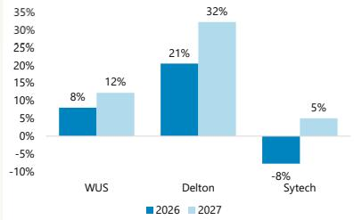  
Chart 1 - JEFe vs Consensus NP Forecast   
Source: Company data, FactSet, Jefferies estimates

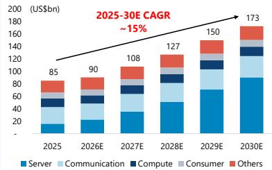  
Chart 2 - Global PCB TAM Forecast   
Source: Prismark, Jefferies estimates

  
Chart 3 - Global AI PCB TAM Forecast   
Source: Company data, Jefferies estimates

<table><tr><td colspan="6">Rev. (MM)Estimates</td><td colspan="3">P/Rev. (MM)</td></tr><tr><td> Company</td><td> Rating</td><td>Price^</td><td> Price Target</td><td>2024 2025</td><td>2026</td><td></td><td>2024 2025</td><td>2026</td></tr><tr><td>WUS 002463 CH</td><td>BUY</td><td>Rmb97.66</td><td>Rmb130.00</td><td>RMB13,342.0 RMB18,945.0</td><td></td><td>RMB27,289.0</td><td>: :</td><td>-</td></tr><tr><td>Delton 001389 CH</td><td>BUY</td><td>Rmb149.22 福</td><td>Rmb190.00</td><td>RMB3,734.0 RMB5,485.0</td><td>RMB9,006.0</td><td></td><td>=</td><td></td></tr><tr><td>Delton</td><td colspan="6">尚 研报 BUY HK$158.30 HK$200.00</td><td>: =</td><td>=</td></tr><tr><td>1989 HK</td><td></td><td></td><td></td><td>RMB3,734.0</td><td>RMB5,485.0 RMB9,006.0</td><td></td><td></td><td></td></tr><tr><td>Shengyi Technology 600183 CH</td><td>BUY</td><td>Rmb69.25</td><td>Rmb95.00</td><td>RMB20,388.0 RMB28,431.0</td><td>RMB38,854.0</td><td></td><td></td><td></td></tr></table>

# Table of Contents

<table><tr><td rowspan=3 colspan=2>Executive Summary                                                                    4Glossary of Terms                                                                    7The Three-Minute Guide                                                               8</td></tr><tr><td rowspan=1 colspan=1>Glossary of Terms                                                                    7</td></tr><tr><td rowspan=1 colspan=1>The Three-Minute Guide                                                               8</td></tr><tr><td rowspan=1 colspan=1>Booming PCB TAM: Riding the Tide of Al Infrastructure Build Megatrend              12</td><td rowspan=1 colspan=1></td></tr><tr><td rowspan=1 colspan=1>Surge in Spec/ASP Driven by High-Speed Interconnection Demand                   14</td><td rowspan=1 colspan=1></td></tr><tr><td rowspan=1 colspan=1>Supply Chain Breakdown: Positioning Each Participant                               18</td><td rowspan=1 colspan=1></td></tr><tr><td rowspan=1 colspan=1>WUS (002463 CH) - Initiate with BUY                                                20Company Overview          订阅研报添加微信 LCD123321Gad</td><td rowspan=1 colspan=1>04-20</td></tr><tr><td rowspan=1 colspan=1>Senior Management and Shareholding Structure                                   22</td><td rowspan=1 colspan=1></td></tr><tr><td rowspan=1 colspan=1>Leading Veteran of High-layer/High-speed Switch PCB                             22</td><td rowspan=1 colspan=1></td></tr><tr><td rowspan=1 colspan=1>Financial Forecastsand Valuation                                                 24</td><td rowspan=1 colspan=1></td></tr><tr><td rowspan=1 colspan=1>Delton (001389 CH /1989 HK)- Initiate with BUY                                    31</td><td rowspan=1 colspan=1></td></tr><tr><td rowspan=1 colspan=1>Company Overview                                                               32</td><td rowspan=1 colspan=1></td></tr><tr><td rowspan=1 colspan=1>Senior Management and Shareholding Structure                                   33</td><td rowspan=1 colspan=1></td></tr><tr><td rowspan=1 colspan=1>A Key Beneficiary of Server CPU Revival                                           33</td><td rowspan=1 colspan=1></td></tr><tr><td rowspan=1 colspan=1>Financial Forecasts and Valuation                                                 36</td><td rowspan=3 colspan=1></td></tr><tr><td rowspan=1 colspan=1>Shengyi Technology (600183 CH) - Initiate with BUY                                 42</td></tr><tr><td rowspan=1 colspan=1>Company Overview                                                               43</td></tr><tr><td rowspan=1 colspan=1>Senior Management and Shareholding Structure                                   44</td><td rowspan=1 colspan=1></td></tr><tr><td rowspan=1 colspan=1>Evolving from Leading Local CCL Vendor to Competitive Global Player              44</td><td rowspan=2 colspan=1></td></tr><tr><td rowspan=1 colspan=1>Financial Forecasts and Valuation                                                 46</td></tr></table>

订阅研报添加微信 LCD123321Cad 04-20

# Executive Summary

# Global PCB TAM to expand by ${\sim } 1 5 \%$ CAGR to 2030E; AI PCB/CCL by $6 0 \% / 7 0 \%$ CAGR

In the past decade, global PCB market size has been range-bound at US\$60-80bn with a wide range of downstream applications but limited drivers to reach a higher level. However, we now view PCB as one of the key upstream components that will benefit from the booming construction of AI infrastructure in the coming years, as it acts as an important carrier for AI chips and data transmission. We expect PCB's global TAM to increase by a ${ \sim } 1 5 \%$ CAGR from US\$85bn between 2025 and 2030. Specifically, server $\mathsf { P C B } 2 0 2 5$ market size was \~US\$16bn $1 9 \%$ of the total PCB market), of which \~US\$7bn/3bn are estimated to come from AI PCB/CCL. We forecast AI PCB/ CCL to expand by 5-year CAGR of ${ \sim } 6 0 \% / 7 0 \%$ to US\$75bn/39bn by 2030, driving the global server PCB market to reach \~US\$90bn.

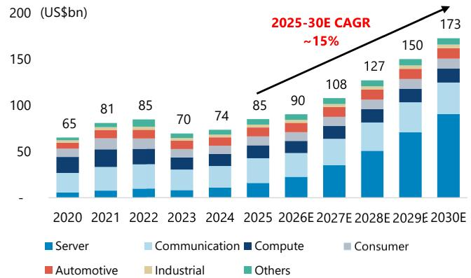  
Chart 4 - Global PCB TAM Forecast   
Source: Prismark, Jefferies estimates

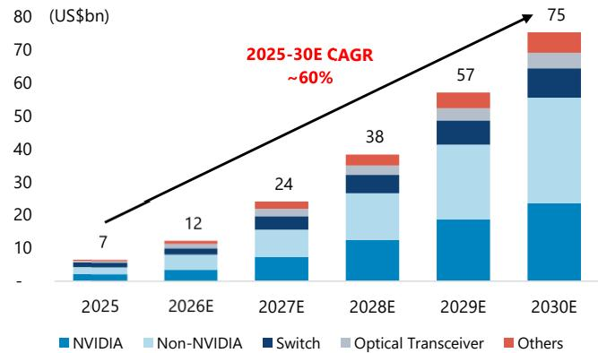  
Chart 5 - Global AI PCB TAM Forecast   
Source: Prismark, Jefferies estimates

# 订阅研报添加微信 LCD123321CSurge in ASP from spec upgrade also a key driver of the growth in TAM

Both material and technique upgrades are major drivers of better performance and higher value. AI players have already been adopting M8 grade PCB for server/switch, but are now exploring further upgrades to M9/10 for higher data transmission speed/efficiency. We also see more sophisticated PCB design by AI players. As a result, we estimate the PCB/CCL value per GPU will rise $3 – 4 \times / 4 – 5 \times$ from NVIDIA GB200/300 to VR300, and see a similar trend in other AI server/switch players' upcoming products. We see this big content growth as a key driver of PCB TAM growth, in addition to volume increase.

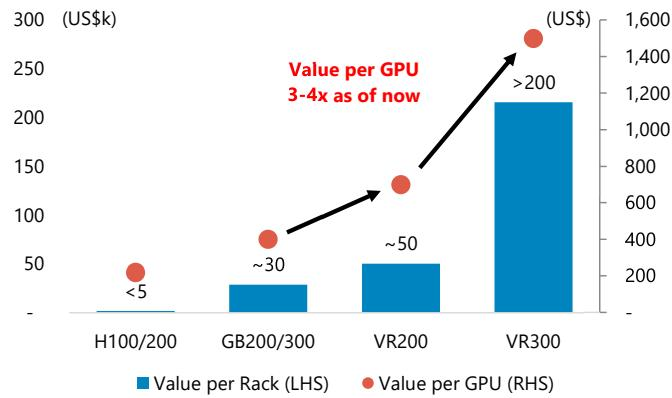  
Chart 6 - NVIDIA AI Server PCB Dollar Content Forecast   
Source: Company data, Jefferies estimates

  
Chart 7 - High-Speed Switch PCB Dollar Content Forecast   
Source: Jefferies estimates

# China is the global PCB hub with rapid capacity expansion in SEA

Both the PCB/CCL markets are dominated by China Mainland and Taiwan suppliers, with some regional players. Currently, the majority of PCB production comes from China. Although many PCB vendors are building/expanding capacity in Southeast Asia (SEA), we expect China Mainland to maintain ${ > } 5 0 \%$ production share, driven by its edge in production efficiency, cost, and reliability due to the mature and integrated PCB ecosystem. In this report, we provide an AI PCB/CCL supply chain breakdown of major AI players' existing and upcoming server products. Our intention is to aid investors in gaining a deeper understanding of the current supply chain dynamics and competitive 订阅研报添加微信 LCD123321Cad landscape in order to determine what implications future changes of certain products' volume or market share allocation will have for each PCB/CCL player.

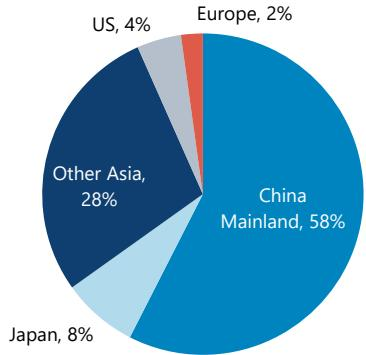  
Chart 8 - PCB Production Value by Geography (2025)   
Source: Prismark, Jefferies

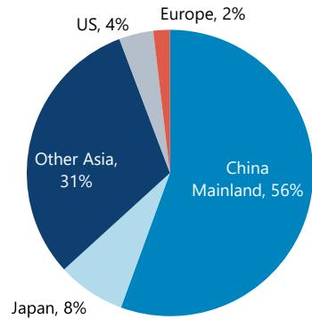  
Chart 9 - PCB Production Value by Geography (2030)   
Source: Prismark, Jefferies

# Initiate on WUS/Delton/Sytech at BUY; Sytech is our top pick

Among dozens of AI PCB/CCL players in the supply chain, we choose to initiate on WUS/Delton/ Sytech as we believe they are well-positioned in each domain. For WUS, we like: 1) its leading position in the high-speed switch market driven by its edge in the HLC technique, 2) a healthy competitive landscape in the high-speed switch market, and 3) its high profit exposure to AI server/ switch. For Delton, we like: 1) its unique position as a server CPU-focused supplier with high exposure to the server market, 2) the strong growth potential in CPU driven by agentic AI, 3) its potential to penetrate the AI server/switch market, and 4) smooth profitability ramp of overseas factories. For Sytech, we think its potential as a leading China Mainland CCL vendor has been underestimated and expect its continued breakthrough in high-end CCL with significant market share and revenue growth in the future. Among the three stocks, Sytech is our top pick, given its rarity as a Chinese high-end CCL player with a high technique barrier, and the recent CCL price hike in the industry likely stimulating both its near-term financials and stock price performance, leading to higher upside potential. Our in-depth analysis suggests these three names have a high likelihood of achieving consensus-beating growth.

  
Chart 10 - WUS AI PCB Revenue Forecast

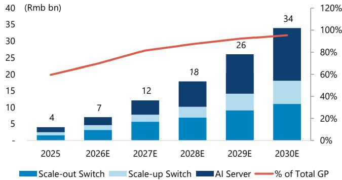  
Chart 11 - WUS AI PCB Gross Profit Forecast

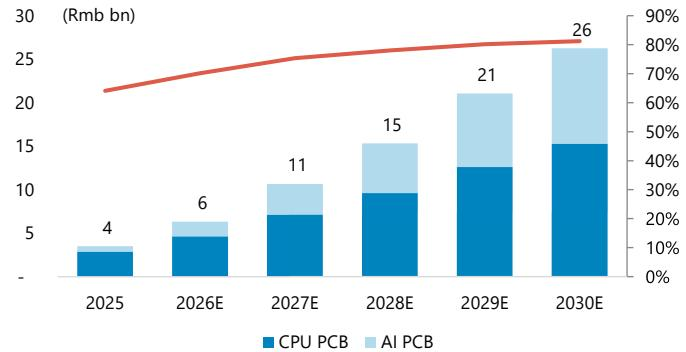  
Chart 12 - Delton CPU/AI PCB Revenue Forecast   
Source: Company data, Jefferies estimates

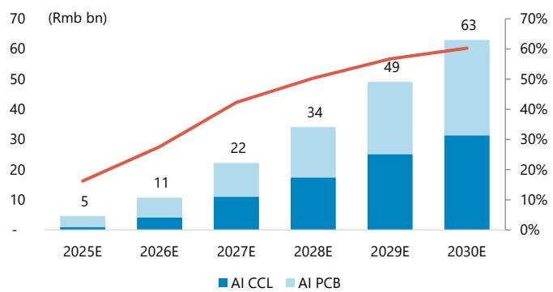  
Chart 14 - Sytech AI PCB/CCL Revenue Forecast   
Source: Company data, Jefferies estimates

  
Chart 13 - Delton AI CPU/AI PCB Gross Profit Forecast   
Source: Company data, Jefferies estimates

  
Chart 15 - Sytech AI PCB/CCL Gross Profit Forecast   
Source: Company data, Jefferies estimates

# 订阅研报添加微信 LCD123321Cad 04-20Expect further re-rating; our PTs are based on DCF, cross-checked with PE and PEG

In the past 2 years, the stock prices of WUS/Delton-A/Sytech have risen ${ \sim } 2 . 3 { \times } / 3 . 1 { \times } / 2 . 0 { \times } ,$ and outperformed the CSI 300 Index by $1 6 0 \% - 2 8 0 \%$ . Driven by the ongoing growth in AI infra buildout and their strong market positions, we expect their re-rating to continue in the next 12 months. We forecast $4 3 \% / 5 4 \% / 4 8 \%$ NP CAGR in 2026E-28E for WUS/Delton/Sytech, mostly above consensus (Chart 25). Our valuations are based on DCF (end-2030E) using est. WACC of $9 . 8 \%$ and terminal growth of $6 . 5 \%$ (for WUS and Delton) and $7 \%$ for Sytech. Our PTs for WUS/Delton A/Delton H/Sytech imply 2026E P/E of 41x/45x/41x/44x, 2027E P/E of $2 6 { \times } / 2 7 { \times } / 2 5 { \times } / 2 8 { \times } ,$ and a 2026E PEG range of only $0 . 6 \mathrm { - } 0 . 9 x ,$ , suggesting potential upside of $3 3 \% / 2 7 \% / 2 6 \% / 3 7 \%$ .

Table 1 - Newly-Initiated Stock Coverage Valuation Summary   

<table><tr><td rowspan="2">(Rmb m)</td><td colspan="4">wus</td><td colspan="4">Delton-A</td><td colspan="4">Delton-H</td><td colspan="4">Sytech</td></tr><tr><td>2024A</td><td>2025A</td><td>2026E</td><td>2027E</td><td>2024A</td><td>2025A</td><td>2026E</td><td>2027E</td><td>2024A</td><td>2025A </td><td>2026E</td><td>2027E</td><td>2024A</td><td>2025E</td><td>2026E</td><td>2027E</td></tr><tr><td>Revenue</td><td>13,342</td><td>18,945</td><td>27,289</td><td>41,016</td><td>3,734</td><td>5,485</td><td>9,006</td><td>14,159</td><td>3,734</td><td>5,485</td><td>9,006</td><td>14,159</td><td>20,388</td><td>28,431</td><td>38.854</td><td>52,497</td></tr><tr><td>YoY</td><td>49%</td><td> 42%</td><td>44%</td><td>50%</td><td>39%</td><td> 47%</td><td> 64%</td><td>57%</td><td>39%</td><td> 47%</td><td> 64%</td><td>57%</td><td>23%</td><td>39%</td><td>37%</td><td>35%</td></tr><tr><td>EBIT</td><td>3,030</td><td>4,517</td><td>6,962</td><td>10.300</td><td>805</td><td>1,243</td><td>2.289</td><td>3.808</td><td>805</td><td>1,243</td><td>2.289</td><td>3.808</td><td>1,998</td><td>4,405</td><td>6,987</td><td>10,925</td></tr><tr><td>YoY</td><td>78%</td><td>49%</td><td>54%</td><td>48%</td><td> 41%</td><td> 55%</td><td>84%</td><td>66%</td><td> 41%</td><td>55%</td><td>84%</td><td>66%</td><td>55%</td><td>120%</td><td>59%</td><td>56%</td></tr><tr><td>Net Profit/(Loss)</td><td>2.587</td><td>3,822</td><td>6,133</td><td>9,476</td><td>676</td><td>1,016</td><td>2,009</td><td>3.346</td><td>676</td><td>1,016</td><td>2,009</td><td>3,346</td><td>1,739</td><td>3,334</td><td>5,209</td><td>8,307</td></tr><tr><td>YoY</td><td>35%</td><td>48%</td><td>60%</td><td>55%</td><td>63%</td><td>50%</td><td>98%</td><td>66%</td><td>63%</td><td>50%</td><td>98%</td><td>66%</td><td>49%</td><td>92%</td><td>56%</td><td>59%</td></tr><tr><td>Multiples P/E</td><td></td><td></td><td></td><td></td><td></td><td></td><td></td><td></td><td></td><td>57.6</td><td>32.4</td><td>19.4</td><td></td><td>50.5</td><td></td><td>20.3</td></tr><tr><td>P/B</td><td>72.5 8.9</td><td>49.6</td><td>30.6 4.1</td><td>19.8 3.3</td><td>90.4 10.8</td><td>62.4 8.4</td><td>35.1</td><td>21.1</td><td>83.4 9.9</td><td>7.8</td><td>4.8</td><td>3.2</td><td>94.9 6.0</td><td>5.2</td><td>32.3 4.2</td><td>3.4</td></tr><tr><td>P/s</td><td>14.1</td><td>6.7 9.9</td><td>6.9</td><td>4.6</td><td>18.9</td><td>12.9</td><td>5.2 7.8</td><td>3.5 5.0</td><td>17.4</td><td>11.9</td><td>7.2</td><td>4.6</td><td>8.3</td><td>5.9</td><td>4.3</td><td>3.2</td></tr><tr><td>EV/Sales</td><td>14.2</td><td>10.0</td><td>6.8</td><td>4.6</td><td>18.8</td><td>12.9</td><td>7.9</td><td>5.0</td><td>17.3</td><td>11.9</td><td>7.2</td><td>4.6</td><td>8.3</td><td>6.0</td><td>4.4</td><td>3.2</td></tr><tr><td>EV/EBITDA</td><td>53.8</td><td>37.0</td><td>24.1</td><td>15.9</td><td>71.7</td><td>48.0</td><td>27.5</td><td>15.7</td><td>66.1</td><td>44.3</td><td>25.4</td><td>14.5</td><td>58.8</td><td>32.3</td><td>21.3</td><td>14.0</td></tr><tr><td>ROE</td><td>24%</td><td>28%</td><td>27%</td><td>29%</td><td>28%</td><td>29%</td><td>33%</td><td>31%</td><td>28%</td><td>29%</td><td>33%</td><td>31%</td><td>11%</td><td>19%</td><td>25%</td><td>32%</td></tr></table>

Source: Company data, Jefferies estimates, Factset

# Glossary of Terms

Table 2 - Glossary of Terms   

<table><tr><td>Term</td><td>Definition</td><td> Explanation</td></tr><tr><td>AI</td><td>Artificial Intelligence</td><td>Computersthat learn and thinklikehumans to make decisions.e..recommended videos on vour bhone</td></tr><tr><td>ASIC</td><td>Application-Specific ItegratedCircuit</td><td>Achip desianed forone specific task (like minina Bitcoin).It&#x27;s faster and uses lessbower thanaeneral-purbose chips</td></tr><tr><td>ASP</td><td>Average Selling Price</td><td>Theaveragepriceaproductlikciporhoe)sellfor.Ithelpanalyzecompan&#x27;spricinqpoeandrofitabilit</td></tr><tr><td></td><td>Copper Clad Laminate</td><td>The&quot;base foundation&quot;of cicuit boards.It&#x27;sasheetof insulatina materialcoveredwithcopperfoil. wherecircuitsareetched</td></tr><tr><td>Cbs</td><td>Chip-on-Panel-on-Substrate</td><td>Anadvancedackantecniethatttachschisdiectlvtoislavanel.Itmakesdeviesthineadsianalstrasest</td></tr><tr><td></td><td></td><td></td></tr><tr><td>C</td><td>Chip-on-Wafer-on-PCB</td><td>Anadvanced wavto backaechips.itbondschipstoa waferfirst.then toaPCBboard.It shrinks size andboosts berformance</td></tr><tr><td></td><td>Chip-on-Wafer-on-Substrate</td><td>TSMC&#x27;sketecholoIt&#x27;sikeutiLeockstoetoeciultipleoubtratetoakethuster</td></tr><tr><td>CR10</td><td>Central Processinq Unit ConcerntrationRatiofortheTop10</td><td>The &quot;brain&quot; of a computer/bhone. It handles allcore calculations and controls how apps run</td></tr><tr><td>DPR</td><td></td><td>Thetotalmarketshareofthetop10companiesinanindustrv.Ahiahernumbermeans theindustryismoredominatedbvafewtopfirms Amemorvtecooattransfeataothesindlliedesofocksal.Itsikedoubleseeddatas</td></tr><tr><td></td><td>Double Data Rate Dissipation Factor</td><td>DdssipationFactoreasuressialossinuitoardmaterialsAoweeeansssallossicsterfohisdips</td></tr><tr><td>DPUB</td><td></td><td>Achip thathandlesnetworkandstoraae tasksindatacenters.ItasiststheCPU.lettinatheCPUfocusoncomplexcomputind</td></tr><tr><td></td><td>Data Processinq Unit Embedded Multi-dielnterconnectBridge</td><td></td></tr><tr><td>FCCL</td><td>FlexibleCopper CladLaminate</td><td>Intel&#x27;s packainq tech.It&#x27;slikea&quot;micro-bride&quot;that allows differentchips tocommunicate quicklvand with lowdelav A bendable circuit board material used in foldable phones and smartwatches.It lets circuits bend with the device</td></tr><tr><td>FPC</td><td>Flexible Printed Circuit</td><td>Acircuit madeoflexible materialthatcanbendorfold.Thecableconnectinqvour phone&#x27;screentoits motherboardisan FPC</td></tr><tr><td>Gbps</td><td>Giqabits per second</td><td>Aunitmeasurinataseeds=1billonbitstansferdeseodUsedforinternetseeddciomatio</td></tr><tr><td>GPU</td><td>Graphics Processing Unit</td><td>The&quot;graphicexertmterItenderameaicoceseslclatidiskeidii</td></tr><tr><td>HBM</td><td>Hiqh Bandwidth Memory</td><td>Ultra-fastmemorvspecialldesianedforAlchinsandaraphicscards.Itstransferspeedismuchfasterthanreaularmemorv</td></tr><tr><td>HI</td><td>High Density Interconnect</td><td>Acircuitboardwithverdense wiring.Itftsmore circuits inasmallspace,makingsmartphonesandthinlaptops possible</td></tr><tr><td>HY</td><td> High Layer Count</td><td>Refers tothenumberoflaversinacircuitboard(e.q..10lavers).Morelversmeanmorecomplexfunctionsandhiaherperformance</td></tr><tr><td></td><td>Hyper Very Low Profile</td><td>Ahigh-ualitcopperfoilprocesswithasmoothsurfacereducinsinalossIt&#x27;spremummaterialforhifrequencycircuitboards</td></tr><tr><td>LHS</td><td>Line/Spacing</td><td>ThewidthandsacinofiresoicuitoardAsmalmbrmeansmoreadancdechovllwinalendmoreecisis</td></tr><tr><td>Low-Dk</td><td>Left-hand Side</td><td>This is alabel that usuall makes it easier to distinquish the data in the chart Measuresinsulatininicuitmaterials.Alowervaemeansfastersianaltransmissonandlessossidealforhiseedchis</td></tr><tr><td></td><td>Low Dielectric Constant</td><td>Aboardmadebvpressingmultipleircuitlverstogether.Foundinmostcomputerandphonemotherboards</td></tr><tr><td>MUPB mSAP</td><td>Multi-layerPrintedCircuitBoard Mass Production</td><td>The staae where products are made in larae quantities on asemblvlines.It&#x27;s the kev step from research to market.</td></tr><tr><td>OAM</td><td>ModifiedSemi-AdditiveProcess</td><td>AnadvancedPCBmanufacturing techiquethatcreatesfinercircuits.It&#x27;s temainprocessforhi-densitvcircuitsin5GandAldevices</td></tr><tr><td>ODM</td><td>Open Accelerator Module</td><td>AstandardforAlacelerationcards.ItalosdiferentbrandsofAlchisandserverstoworktoetheravodinvendorlok-in</td></tr><tr><td>OEM</td><td>Original Design Manufatucrer</td><td>Acompany that desiqns and produces products for vou. Many brand-name electronics are made by ODMs</td></tr><tr><td></td><td>Roiginal EquipmentManufacturer</td><td>A contract manufacturer that produces products accordina to vour desian.Also known as a &quot;factorv Dartner&quot;</td></tr><tr><td>peB</td><td>Printed Circuit Board</td><td>The&quot;baseboardinsideeverelectronicdevice.It&#x27;stheflatqreenorothercolorboardthatholdsaltechipsandwireseer</td></tr><tr><td>PP</td><td>PeripheralCompoentIntercoctxress Prepreq</td><td>Asupe-fstadteetertdt</td></tr><tr><td>PTFE</td><td>Polytetrafluoroethylene</td><td>Astickv.semi-cured insulatinamaterial.It&#x27;sthe&quot;alue&quot;thatholdsthediferent laversofamulti-lavercircuit boardtoether AlsoknownasTeflo.Ahiperformancelasticusedinspecialcicuitboards.Itkepssnalsfromlosinstrenthatverhispeds</td></tr><tr><td>Q-glass RO</td><td>Quartz Glass Fabric</td><td>Ahiqh-qualityfbrmateralusedinadvaceditboads.Itssupesableandelsialstaelfstwiths</td></tr><tr><td></td><td>Redistribution Layer</td><td>Atinvextrafhtseartsoontstoentace</td></tr><tr><td></td><td>Right-hand Side</td><td>Thisisalabelthatusuallymakesiteasiertodistinquishthedatainthecart</td></tr><tr><td></td><td>Rigid Printed Circuit Board</td><td>The standard/hard circuit board.It&#x27;s stiffand doesn&#x27;t bend.like the main board in vour desktop computer</td></tr><tr><td></td><td>Reversed Treated Foil</td><td>ReversedTreatedFilseltvefofolforndBsIthasvesmosurfcetkedsalsfoetiistor</td></tr><tr><td></td><td>Southeast Asia</td><td>A geoqraphic reqion that includescountrieslikeSingapore, Malavsia,Thailand,and Vietnam</td></tr><tr><td></td><td>Substrate-LikePrintedCircuitBoard Surface Mount Technology</td><td>Avervhiahenddensecircuitboardusedinsmarthones.l’&#x27;salmostasadvancedasthe&quot;substrates&quot;usedinhiackain Thestandardmethdforsolderingtincomponentsdirectlontothesurfaceofircuitoard.Itsowmostmoderelectronicsarbuilt</td></tr><tr><td>TAM</td><td></td><td></td></tr><tr><td>YTD</td><td>Total Addressable Market Unit/Universal Baseboard</td><td>ThetotasizefeaetforodctIsesteuestatsemaumsibeeeefwedteeotetiute Acommonreferencedesianbaseboardusedfortestingorasastandardplatform.It&#x27;slikeauniversalpluq-and-plavmotherboard</td></tr></table>

Source: Jefferies

# The Three-Minute Guide

# AI PCB/CCL deep dive: WUS, Delton and Sytech are our top picks under this theme

Table 3 - Newly-Initiated Stock Coverage in this Report   

<table><tr><td>Company</td><td>Current Px</td><td>Tarqet Px</td><td>2027E P/E</td><td>△ Diff</td><td>Rec</td></tr><tr><td>WUS</td><td>Rmb97.66</td><td>Rmb130.00</td><td>26x</td><td>+33%</td><td>BUY</td></tr><tr><td>Delton-A</td><td>Rmb149.22</td><td>Rmb190.00</td><td>27x</td><td>+27%</td><td>BUY</td></tr><tr><td>Delton-H</td><td>HK$158.30</td><td>HK$200.00</td><td>25x</td><td>+26%</td><td>BUY</td></tr><tr><td>Sytech</td><td>HK$69.25</td><td>HK$95.00</td><td>28x</td><td>+37%</td><td>BUY</td></tr></table>

Source: Company data, FactSet, Jefferies estimates Note: As of Apr 17, 2026

# Driven by strong demand from AI infrastructure build, we forecast overall PCB TAM to expand by $\cdot$ CAGR...

Chart 16 - Global PCB TAM Forecast

Table 4 - Consensus View on Newly-Initiated Stock Coverage   

<table><tr><td colspan="4">Consensus PT</td><td colspan="3">Recommendation</td></tr><tr><td></td><td> Hiqh</td><td>Mean</td><td>Low</td><td>BUY</td><td> HOLD</td><td>UNPF</td></tr><tr><td>WUS</td><td>127.00</td><td>106.35</td><td>84.40</td><td>16</td><td>0</td><td>0</td></tr><tr><td>Delton</td><td>N/A</td><td>N/A</td><td>N/A</td><td>4</td><td>0</td><td>0</td></tr><tr><td>Sytech</td><td>111.00</td><td>83.11</td><td>52.00</td><td>14</td><td>1</td><td>1</td></tr></table>

Source: Company data, FactSet, Jefferies estimates CD123321CadNote: As of Apr 17, 2026 4-2

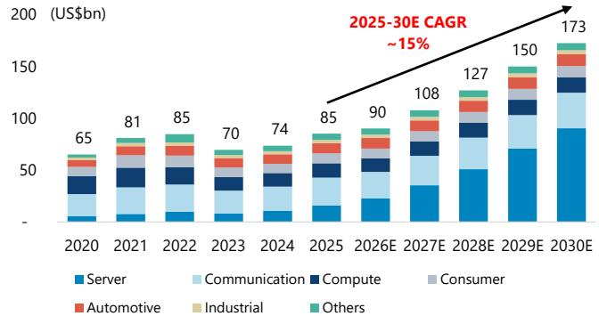  
Source: Prismark, Jefferies estimates   
...And specifically, expect AI PCB/CCL TAM to increase by $\cdot$ CAGR as core propellers

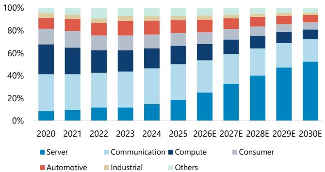  
Chart 17 - Global PCB TAM Mix Forecast   
Source: Prismark, Jefferies estimates

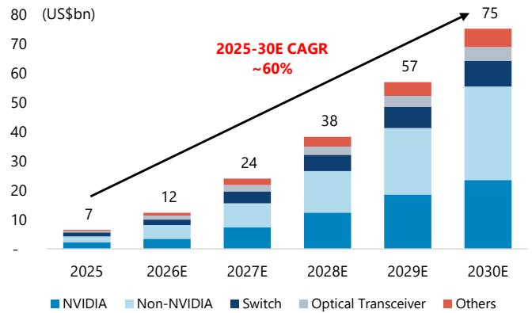  
Source: Prismark, Jefferies estimates

# Higher-speed interconnection requires advanced solutions and materials upgrade $\cdot$ Surge in dollar conten

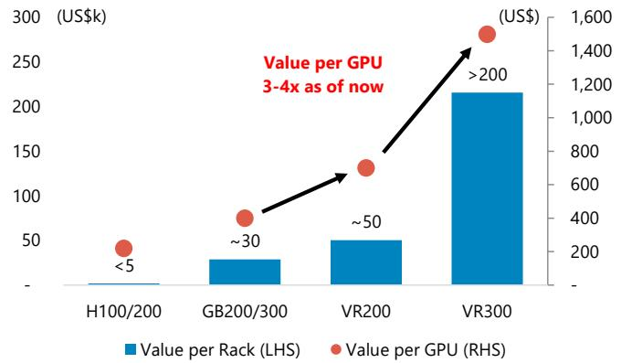

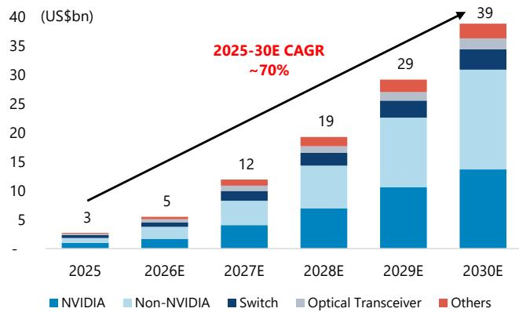  
Source: Prismark, Jefferies estimates

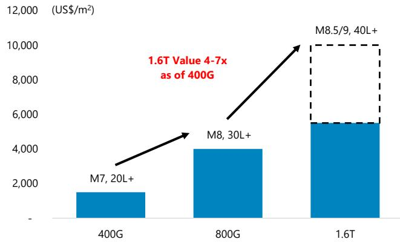  
Chart 21 - High-Speed Switch PCB Dollar Content Forecast

  
Chart 22 - NVIDIA AI Server CCL Dollar Content Forecast   
Source: Company data, Jefferies estimates

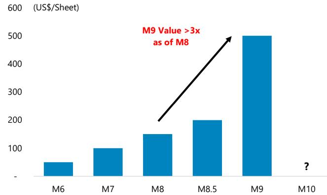  
Chart 23 - CCL Value by Spec   
Source: Jefferies estimates

We outline the related PCB/CCL suppliers to major AI servers to understand the current supply chain landscape   
Table 5 - Major AI Server PCB/CCL Suppliers   

<table><tr><td>Product</td><td>Content</td><td> CCL Spec</td><td>PCB Spec</td><td> Major CCL Supplier</td><td>Major PCB Supplier</td></tr><tr><td>NVIDIA</td><td></td><td></td><td></td><td></td><td></td></tr><tr><td rowspan="2">H100/200</td><td>OAM</td><td>M7</td><td>5+ HDI</td><td>EMC</td><td>Unimicron, VGT</td></tr><tr><td>UBB</td><td>M7</td><td>20L+ HLC</td><td>EMC</td><td> WUS, TTM, ISU</td></tr><tr><td rowspan="2">B200</td><td>OAM</td><td>M8</td><td>5+ HDI</td><td>Doosan</td><td> Unimicron, VGT</td></tr><tr><td>UBB</td><td>M7</td><td>20L+ HLC</td><td>Doosan</td><td> WUS, TTM, ISU</td></tr><tr><td rowspan="2">B300</td><td>OAM</td><td>M8</td><td>5+ HDI</td><td>Doosan</td><td>Unimicron,VGT</td></tr><tr><td>UBB</td><td>M8</td><td>20L+ HLC</td><td>Doosan</td><td> WUS, TTM, ISU</td></tr><tr><td rowspan="2">GB200</td><td>Compute Board</td><td>M8</td><td>5+ HDI</td><td>Doosan</td><td> VGT, Unimicron</td></tr><tr><td> Switch Board</td><td>M8</td><td>20L+ HLC</td><td>EMC, Sytech</td><td> WUS, VGT, Unimicron</td></tr><tr><td rowspan="2">GB300</td><td>Compute Board</td><td>M8</td><td>5+ HDI</td><td>Doosan</td><td> VGT, Unimicron, Dynamic</td></tr><tr><td> Switch Board</td><td>M8</td><td>20L+ HLC</td><td> EMC, Sytech</td><td>WUS, VGT, Unimicron</td></tr><tr><td rowspan="3">VR200</td><td>Compute Board</td><td>M8</td><td> 5+ HDI/20L+ HLC</td><td>Doosan,EMC, Sytech</td><td>VGT, Unimicron,Dyamic,ZD, Kinwong,Foder</td></tr><tr><td> Switch Board</td><td>M8.5</td><td>20L+ HLC</td><td> EMC, Sytech</td><td>WUS, VGT, Unimicron</td></tr><tr><td>Midplane</td><td>M8.5</td><td> 40L+ HLC</td><td> EMC, Sytech</td><td> VGT, WUS,Kinwong, Delton</td></tr><tr><td rowspan="2">VR300</td><td>Backplane</td><td>M9/10/PTFE?</td><td>78-168L HLC</td><td> Doosan? EMC? Sytech?</td><td> VGT? WUS? Kinwong? Unimicron? DSBJ? Shennan?</td></tr><tr><td>CoWoP</td><td>M8/9/10?</td><td>？+ HDI</td><td> Doosan? EMC? Sytech?</td><td>ZDT? Unimicron? VGT? WUS?</td></tr><tr><td>Google</td><td></td><td></td><td></td><td></td><td></td></tr><tr><td>v5</td><td>UBB</td><td>M7</td><td>20L+ HLC</td><td>Panasonic</td><td>WUS, TTM, ISU</td></tr><tr><td>v6/7</td><td>UBB</td><td>M7</td><td>30L+ HLC</td><td>Panasonic, EMC</td><td>WUS, TTM,ISU, GBM,Shennan</td></tr><tr><td>v8</td><td>UBB</td><td>M8</td><td> 40L+ HLC</td><td>Panasonic, EMC,Doosan</td><td>WUS,TTM,ISU,GBM, Shennan,VGT,ZDT, GCE, Dynamic</td></tr><tr><td>v9</td><td>OAM</td><td>M9/10/PTFE？</td><td>6+ HDI</td><td>EMC?</td><td>WUS? VGT? Unimicron? ZDT?</td></tr><tr><td>Amazon</td><td></td><td></td><td></td><td></td><td></td></tr><tr><td rowspan="2">Trainium 2</td><td>OAM</td><td>M6</td><td>3+ HDI</td><td>Panasonic</td><td>SYE</td></tr><tr><td>UBB</td><td>M8</td><td>20L+ HLC</td><td>EMC, TUC</td><td>GCE, FHT, SYE</td></tr><tr><td rowspan="2">Trainium 2.5</td><td>OAM</td><td>M6</td><td>4+ HDI</td><td>Panasonic</td><td>SYE</td></tr><tr><td>UBB</td><td>M8</td><td>30L+ HLC</td><td>EMC, TUC</td><td>GCE, FHT, SYE, WUS</td></tr><tr><td rowspan="2">Trainium 3</td><td>OAM</td><td>M7</td><td>4+ HDI</td><td>Panasonic</td><td>SYE, ZDT, Unimicron</td></tr><tr><td>UBB</td><td>M8</td><td>30L+ HLC</td><td> EMC, TUC</td><td>GCE, FHT, SYE, WUS, ZDT</td></tr><tr><td>Meta</td><td></td><td></td><td></td><td></td><td></td></tr><tr><td>MTIA2</td><td>UBB</td><td>M8+M4</td><td>30L+ HLC</td><td>EMC</td><td>WUS, TTM, ISU</td></tr><tr><td>MTIA 3</td><td>UBB</td><td>M8+M4</td><td> 40L+ HLC</td><td> EMC, TUC,ITEQ</td><td> WUS,TTM, ISU,GCE, Shennan,Delton</td></tr></table>

Source: Company data, Jefferies estimates Note: Question mar $_ , =$ no confirmed information as of now

# WUS: A leading vendor focused on high-speed PCB; Rising mix of ${ \tt s } 3 2 $ -layer products to push up ASP

Chart 24 - Switch/Router PCB Market Share (2024-1H25)

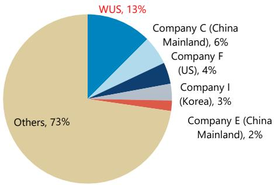

Source: Company data, Jefferies

  
Chart 26 - WUS AI PCB Revenue Forecast   
Source: Company data, Jefferies estimates

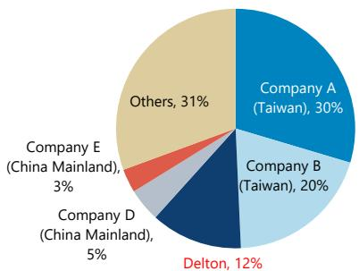  
Source: Company data, Jefferies   
Chart 28 - High Performance Server CPU PCB Market Share (2022-2024)

# 订阅研Delton: A proxy for rising server CPU ( $1 0 \div 6 0 0$ 加微信 LCD123321Cad 04-20  revenue exposure) demand driven by proliferation of agentic AI

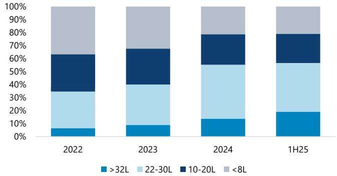  
Chart 25 - WUS PCB Revenue by Spec   
Source: Company data, Jefferies

  
Chart 30 - Delton CPU/AI PCB Revenue Forecast

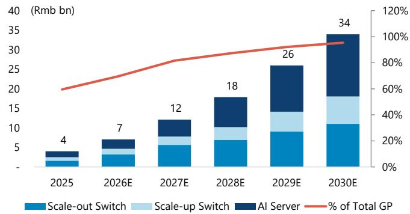  
Chart 27 - WUS AI PCB Gross Profit Forecast   
Source: Company data, Jefferies estimates

  
Source: Gartner, Jefferies

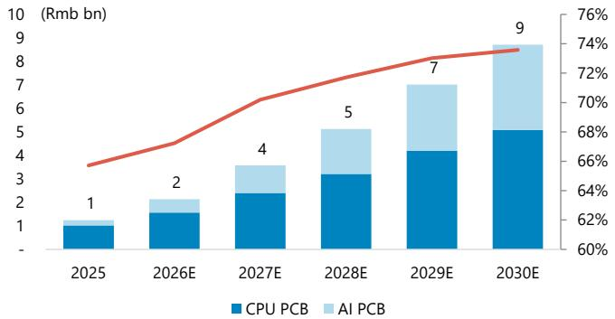  
Chart 31 - Delton CPU/AI PCB Gross Profit Forecast

# Sytech: A top Chinese CCL vendor penetrating the global high-end market; Large upside potential on AI

Chart 32 - Halogen-free High-speed CCL Market Share by Vendor (2024)

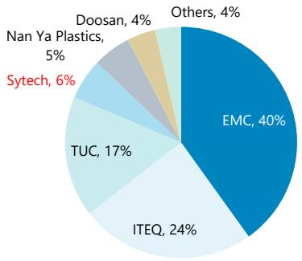

Source: Prismark, Jefferies

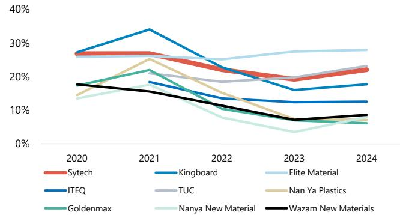  
Chart 33 - Major CCL Player Gross Margin Comparison   
Source: Prismark, Jefferies

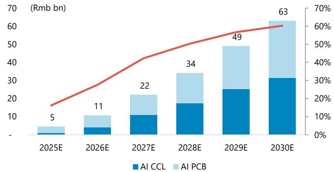  
Chart 34 - Sytech AI PCB/CCL Revenue Forecast   
Source: Company data, Jefferies

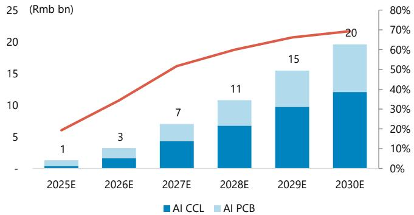  
Chart 35 - Sytech AI PCB/CCL Gross Profit Forecast   
Source: Company data, Jefferies estimates CD123321Cad 04-20 Note: PCB gross profit adjusted for minority interest

# We like all three names for their favorable position in each domain (high-speed switch, CPU PCB, and AI CCL)

Table 6 - Newly-Initiated Stock Coverage Valuation Summary   

<table><tr><td rowspan="2">(Rmb m)</td><td colspan="4">wus 2025A</td><td colspan="4">Delton-A</td><td colspan="4">Delton-H 2025A</td><td colspan="4">Sytech 2025E</td></tr><tr><td>2024A</td><td></td><td>2026E</td><td>2027E</td><td>2024A</td><td>2025A2026E</td><td></td><td>2027E</td><td>2024A</td><td></td><td>2026E</td><td>2027E</td><td>2024A</td><td></td><td>2026E</td><td>2027E</td></tr><tr><td>Revenue</td><td>13,342</td><td>18,945</td><td>27,289</td><td>41,016</td><td>3,734</td><td>5,485</td><td>9,006</td><td>14,159</td><td>3,734</td><td>5,485</td><td>9,006</td><td>14,159</td><td>20,388</td><td>28,431</td><td>38,854</td><td>52,497</td></tr><tr><td>YoY</td><td>49%</td><td>42%</td><td>44%</td><td>50%</td><td>39%</td><td>47%</td><td>64%</td><td>57%</td><td>39%</td><td>47%</td><td>64%</td><td>57%</td><td>23%</td><td>39%</td><td>37%</td><td>35%</td></tr><tr><td>EBIT</td><td>3.030</td><td>4.517</td><td>6.962</td><td>10.300</td><td>805</td><td>1.243</td><td>2.289</td><td>3.808</td><td>805</td><td>1.243</td><td>2.289</td><td>3.808</td><td>1.998</td><td>4.405</td><td>6.987</td><td>10.925</td></tr><tr><td>YoY</td><td>78%</td><td>49%</td><td>54%</td><td>48%</td><td>41%</td><td>55%</td><td>84%</td><td>66%</td><td>41%</td><td>55%</td><td>84%</td><td>66%</td><td>55%</td><td>120%</td><td>59%</td><td>56%</td></tr><tr><td>Net Profit/(Loss)</td><td>2.587</td><td>3,822</td><td>6,133</td><td>9,476</td><td>676</td><td>1,016</td><td>2,009</td><td>3,346</td><td>676</td><td>1,016</td><td>2,009</td><td>3,346</td><td>1,739</td><td>3,334</td><td>5,209</td><td>8,307</td></tr><tr><td>YoY</td><td>35%</td><td>48%</td><td>60%</td><td>55%</td><td>63%</td><td>50%</td><td>98%</td><td>66%</td><td>63%</td><td>50%</td><td>98%</td><td>66%</td><td>49%</td><td>92%</td><td>56%</td><td>59%</td></tr><tr><td>Multiples</td><td></td><td></td><td></td><td></td><td></td><td></td><td></td><td></td><td></td><td></td><td></td><td></td><td></td><td>50.5</td><td></td><td>20.3</td></tr><tr><td>P/E P/B</td><td>72.5</td><td>49.6</td><td>30.6 4.1</td><td>19.8 3.3</td><td>90.4 10.8</td><td>62.4</td><td>35.1</td><td>21.1 3.5</td><td>83.4 9.9</td><td>57.6 7.8</td><td>32.4</td><td>19.4 3.2</td><td>94.9 6.0</td><td>5.2</td><td>32.3 4.2</td><td>3.4</td></tr><tr><td>P/S</td><td>8.9 14.1</td><td>6.7 9.9</td><td>6.9</td><td>4.6</td><td>18.9</td><td>8.4 12.9</td><td>5.2 7.8</td><td>5.0</td><td>17.4</td><td>11.9</td><td>4.8 7.2</td><td>4.6</td><td>8.3</td><td>5.9</td><td>4.3</td><td>3.2</td></tr><tr><td>EV/Sales</td><td>14.2</td><td>10.0</td><td>6.8</td><td>4.6</td><td>18.8</td><td>12.9</td><td>7.9</td><td>5.0</td><td>17.3</td><td>11.9</td><td>7.2</td><td>4.6</td><td>8.3</td><td>6.0</td><td>4.4</td><td>3.2</td></tr><tr><td>EV/EBITDA</td><td>53.8</td><td>37.0</td><td>24.1</td><td>15.9</td><td>71.7</td><td>48.0</td><td>27.5</td><td>15.7</td><td>66.1</td><td>44.3</td><td>25.4</td><td>14.5</td><td>58.8</td><td>32.3</td><td>21.3</td><td>14.0</td></tr><tr><td>ROE</td><td>24%</td><td>28%</td><td>27%</td><td>29%</td><td>28%</td><td>29%</td><td>33%</td><td>31%</td><td>28%</td><td>29%</td><td>33%</td><td>31%</td><td>11%</td><td>19%</td><td>25%</td><td>32%</td></tr></table>

Source: Company data, FactSet, Jefferies estimates

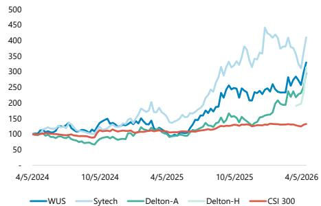  
Chart 36 - 2-year Stock Performance   
Source: FactSet, Jefferies

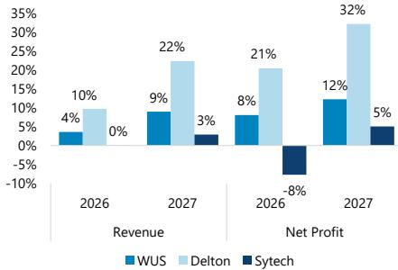  
Chart 37 - JEFe vs Consensus Forecast   
Source: Company data, FactSet, Jefferies estimates

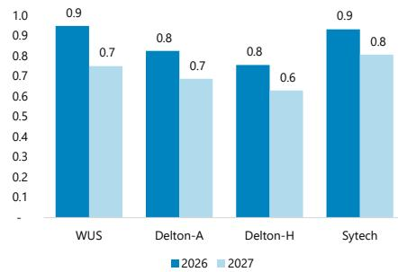  
Chart 38 - PT PEG Comparison   
Source: Company data, Jefferies estimates

# Booming PCB TAM: Riding the Tide of AI Infrastructure Build Megatrend

AI is a game changer for the PCB industry; We estimate overall TAM CAGR of ${ \sim } 1 5 \%$ . In the past decade, global PCB market size has been range-bound at US\$60-80bn with a vast range of downstream applications but limited drivers to reach a higher level. However, led by NVIDIA, major CSPs and other tech giants, we have been seeing tremendous effort in building up computing infrastructure (represented by data center equipment like servers, switches, etc.) for AI training/ 订阅研报添加微信 LCD123321Cad inference since 2023. This has brought structural changes to PCB, which acts as a core carrier for AI chips and electrical signal transmission, and the exponential growth in computing power comes with ongoing demand for higher data transmission speed. As a result, rigid PCBs (including conventional RPCB, HDI, and substrate) have risen from $8 1 \%$ of total PCB production in 2020 to $8 5 \% ,$ as server-related products rarely adopt flexible PCBs. As AI infrastructure growth is likely to continue to be supported by tech giants' rising capex plans, we expect the PCB industry to ride this tide, and forecast ${ \sim } 1 5 \%$ CAGR in 2025-30 for the global TAM of PCB.

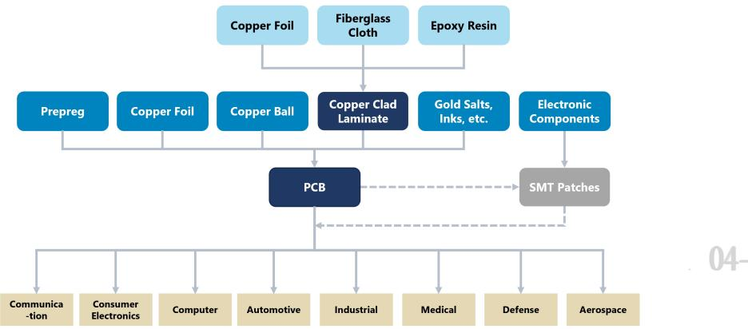  
Chart 39 - PCB Supply Chain   
Source: Company data, Jefferies

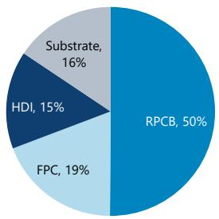  
Chart 40 - Global PCB TAM Mix by Product (2020)

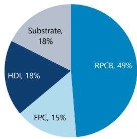  
Chart 41 - Global PCB TAM Mix by Product (2025)

Source: Prismark, Jefferies

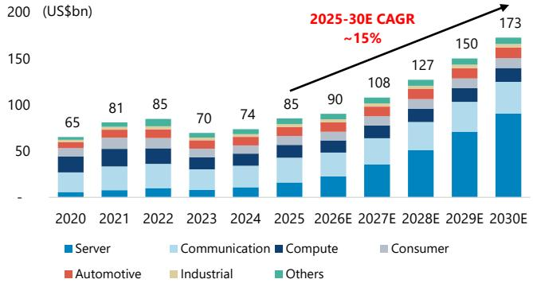  
Source: Prismark, Jefferies Chart 42 - Global PCB TAM Forecast

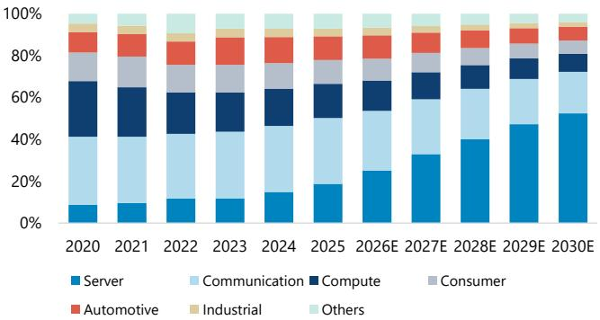  
Chart 43 - Global PCB TAM Mix Forecast

# CAGR of ${ \sim } 6 0 \% / 7 0 \%$ for AI PCB/CCL as core drivers; Our 2030 forecast implies \~US\$2tn AI capex.

Based on current AI chip volume and allocation to each player (NVIDIA, CSP etc.), AI PCB spec adopted and future roadmap, we estimate AI PCB/CCL TAM of US\$7bn/3bn in 2025 (including GPU/ASIC server, high-speed switch and optical transceiver), and forecast ${ \sim } 6 0 \% / 7 0 \%$ CAGR to reach US\$75bn/39bn in 2030, assuming: 1) TSMC and other fabs will continue to expand both advanced nodes/packaging (CoWoS/CoPoS, EMIB etc.) capacity for more AI chip output; 2) AI players would continue to afford rising capex; and 3) no significant technical disruption in supply chain. According to Prismark, the 2025 server PCB market size was US\$16bn. Our previous forecast of AI PCB then leads to US\$90bn overall server PCB TAM in 2030. If we simply regard server market size as AI capex, and assume PCB value to comprise ${ \sim } 5 \%$ of total AI infrastructure costs, this translates into \~US\$2tn total AI capex globally in 2030. We provide this framework to show that different expectations for AI capex level would lead to divergence in ultimate PCB/CCL TAM forecasts.

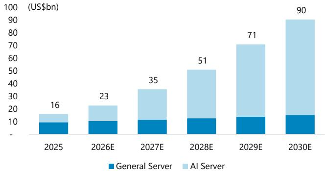  
Chart 44 - Global Server PCB TAM Forecast   
Source: Prismark, Jefferies estimates

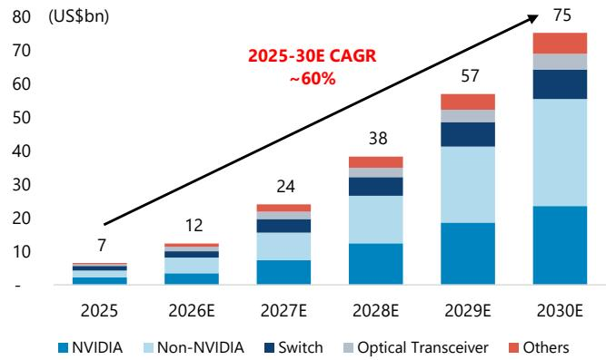  
Chart 46 - Global AI PCB TAM Forecast   
订阅研报添加微信   
Source: Company data, Jefferies estimates

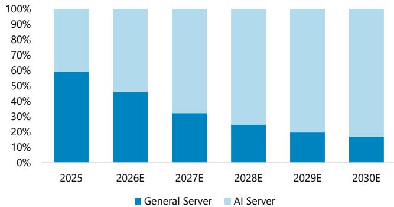  
Chart 45 - Global Server PCB TAM Forecast   
Source: Prismark, Jefferies estimates

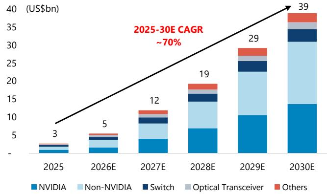  
Chart 48 - Global AI CCL TAM Forecast

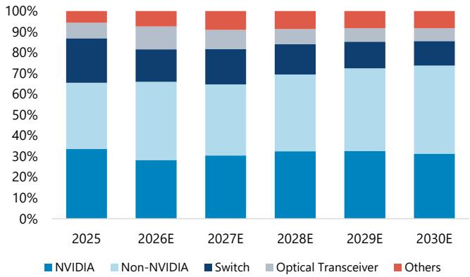  
CD123321Cad 04-20 Chart 47 - Global AI PCB TAM Mix Forecast   
Source: Company data, Jefferies estimates

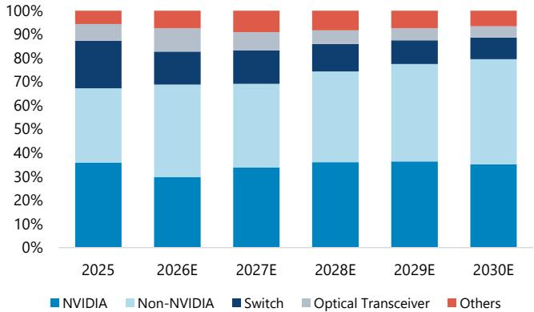  
Chart 49 - Global AI CCL TAM Mix Forecast

# Surge in Spec/ASP Driven by High-Speed Interconnection Demand

Materials upgrade and more sophisticated techniques are pushing PCB evolution. The major end-devices that adopt high-end PCB include AI server (mainboard, OAM, UBB, etc.), high-speed switch, and optical transceiver $\scriptstyle > = 4 0 0  G$ ). Typical AI PCB specs include either high-end material solutions, complex design (e.g. $5 + \mathsf { H D } |$ for OAM), high layer count (e.g. ${ 3 0 } \mathrm { L } +$ MLPCB for switch), small L/S (e.g. SLP for transceiver) or multifunction requirements (e.g. backplane PCB for 订阅研报添加微信 LCD123321Cad connecting compute/switch trays within a rack). All these will only be realized through sophisticated techniques and materials upgrade, leading to higher value produced by PCB vendors.

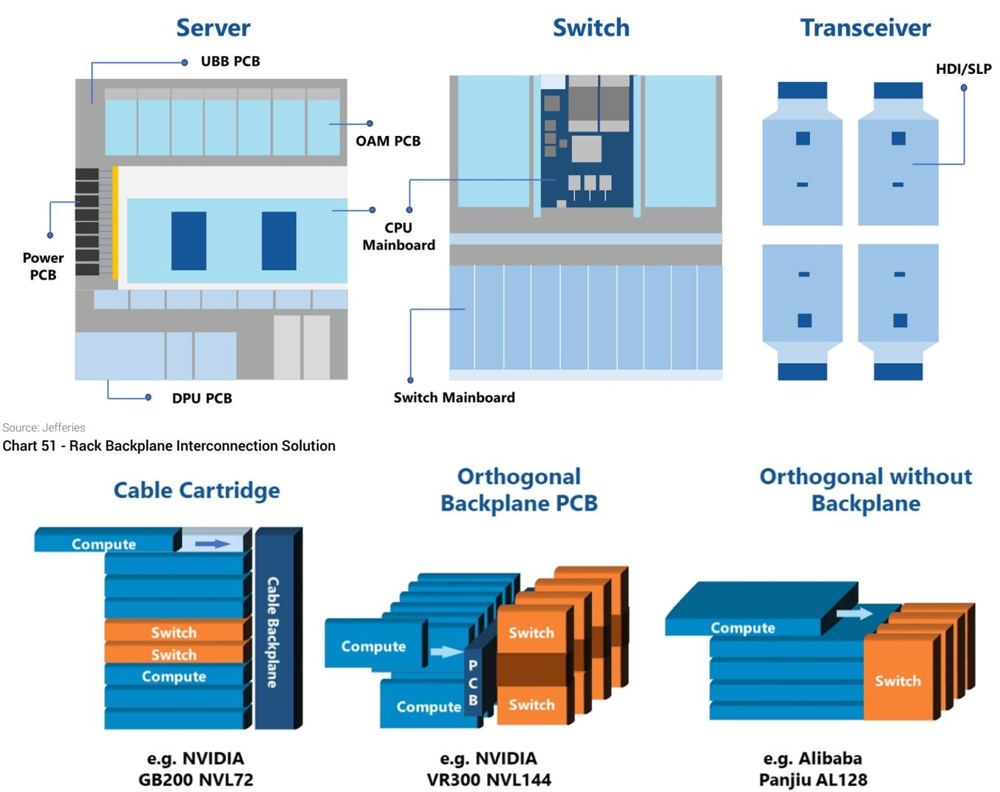  
Chart 50 - AI PCB Adoption   
Source: Jefferies

Higher-end materials for better PCB performance. PCB and CCL mainly comprise copper foil, epoxy resin, and fiberglass cloth. Using higher-end materials with better properties could lead to stronger performance of CCL, and thus overall PCB. For example, AI players have already been adopting M8 grade (based on Panasonic's rating system that is widely used in the industry) for server/switch PCB to reach 112Gbps Ethernet standard. Currently, to meet 224Gbps standard, the industry is developing M9 materials with a key upgrade in fiberglass changing from low-Dk to Qglass, which will lead to much higher pricing for CCL (a key reason for higher value mix of CCL in high-end PCBs' BOM cost compared with conventional PCBs). In some cases, the higher-end materials may bring about greater difficulty in PCB manufacturing, and thus different technology paths may be explored if the technical bottlenecks are not resolved. For example, if M9 PCB/ CCL face difficulties in commercialization in the near term, AI players may take a step back to develop M8.5 $[ \mathsf { l o w - D k } 2 + \mathsf { H V } \mathsf { L P } 4 )$ as a transitional solution, which could translate into AI products' iteration at the expense of some data transmission efficiency. That said, AI players would continue to improve PCB/CCL performance by addressing supply chain bottlenecks or experimenting with different material combinations (such as developing M10 mainly by upgrading resin and fiberglass).

Table 7 - CCL Spec By Grade   

<table><tr><td></td><td>Grade Ethernet</td><td>Loss</td><td>Dk</td><td>Df</td><td>Fiberglass</td><td> Copper Foil</td><td>Application</td></tr><tr><td>FR4</td><td>&lt;5Gbps</td><td>Standard Loss</td><td>~4.7</td><td>0.023-0.015</td><td>E Glass</td><td>RTF</td><td>General</td></tr><tr><td>M2</td><td>8Gbps</td><td> Medium Loss</td><td>~4.3</td><td>0.015-0.010</td><td> E Glass</td><td>RTF</td><td> PCle 2.0,10G Ethernet</td></tr><tr><td>M4</td><td>10Gbps</td><td>Low Loss</td><td>~3.9</td><td>0.010-0.005</td><td>E Glass</td><td>RTF/HVLP1</td><td>PCle 3.0,10G/100G Ethernet</td></tr><tr><td>M6</td><td>25Gbps</td><td> Very Low Loss</td><td>~3.8</td><td>0.005-0.003</td><td> E Glass</td><td>HVLP2</td><td>PCle 5.0,100G/400G Ethernet</td></tr><tr><td>M7</td><td>56Gbps</td><td>UItra Low Loss</td><td>~3.5</td><td>0.003-0.0015</td><td>Low-Dk1</td><td>HVLP2/3</td><td>PCle 6.0,400G/800G Ethernet</td></tr><tr><td>M8</td><td> 112Gbps</td><td>Extreme Low Loss</td><td>~3.0</td><td>0.0015-0.0010</td><td>Low-Dk1/2</td><td>HVLP2/3/4</td><td>PCle 7.0,800G/1.6TEthernet</td></tr><tr><td>M9</td><td>224Gbps</td><td></td><td>&lt;3.0</td><td>0.0009-0.0007</td><td>Q-Glass/Low-Dk2</td><td>HVLP4/5</td><td>&gt;=PCle 7.0,&gt;=1.6T Ethernet</td></tr></table>

Source: Company data, Jefferies

Table 8 - Fiberglass Cloth Spec Comparison   

<table><tr><td>Item</td><td>E-Glass</td><td>Low-Dk1</td><td>Low-Dk2</td><td>Q-Glass</td></tr><tr><td>Dk (10GHz)</td><td>6.6</td><td>4.8</td><td>4.5</td><td>3.4</td></tr><tr><td>Df (10GHz)</td><td>0.006</td><td>0.002-0.003</td><td>0.001-0.002</td><td>&lt;0.0007</td></tr><tr><td>CTE</td><td>5.5-6.0</td><td>3.0-4.0</td><td>3.0-3.5</td><td>&lt;1.0</td></tr><tr><td>Cost</td><td>$</td><td>$$</td><td>$$$</td><td>$sss</td></tr></table>

Source: Company data, Jefferies

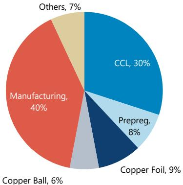  
Chart 52 - Conventional PCB Cost Structure   
Source: AskCI Consulting, Jefferies

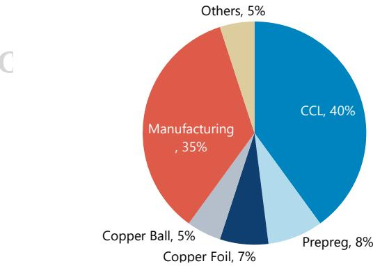  
Chart 53 - A Certain High-end PCB Cost Structure   
Source: Jefferies estimates

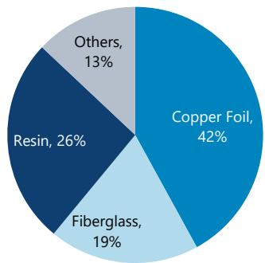  
Chart 54 - Conventional CCL Cost Structure

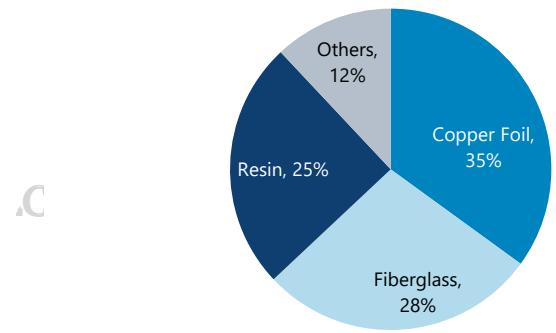  
Chart 55 - A Certain High-end CCL Cost Structure   
Source: Jefferies estimates

Technique advancement towards more sophisticated and refined direction. In addition to materials, technique upgrade is also a key roadmap to realize better PCB performance. We observe that AI players have been adopting increasingly-sophisticated designs, such as higher layer-count HDI/MLPCB, to accommodate more signal channels and improve data transmission efficiency. In addition to adding more layers within a single PCB, another key development path is pursuing smaller line and space (L/S). For example, SLP (minimum L/ $\rangle < = 3 0 \mathsf { u m }$ through mSAP technique) has become the mainstream solution on $\phantom { - } 7 . 6 \intercal$ optical transceiver as an upgrade from traditional HDI. Going forward, mSAP technique may even penetrate the server/switch level, as certain AI players are now developing CoWoP by placing a silicon interposer directly on PCB without substrate compared with traditional CoWoS, further improving signal integrity (so CoPoP may be developed in the future if TSMC's CoPoS is commercialized as scheduled). Although there are still many challenges to CoWoP at this stage, such as reaching ideal CTE, surface evenness, and supply chain integrity, we see relevant AI players continuing to advance technology R&D with the supply chain, and look for commercialization in 1-2 years (e.g. NVIDIA intends to gradually adopt it on Rubin Ultra/ Feynman). This trend would place higher requirements on PCB vendors, and thus suppliers with outstanding small L/S process capabilities could have a greater advantage in the long run.

Table 9 - Rigid PCB Comparison by Type   

<table><tr><td>Technical Parameters</td><td>Common PCB</td><td>HDI</td><td>SLP</td><td>IC Substrate</td></tr><tr><td>Number of Layers</td><td>1-100+</td><td>4-30</td><td>2-20</td><td>2-20</td></tr><tr><td>Board Thickness</td><td> 0.3-7mm</td><td>0.25-2mm</td><td>0.2-1.5mm</td><td>0.1-1.5mm</td></tr><tr><td>Minimum L/S</td><td>50-100um</td><td>40-60um</td><td>20-30um</td><td>10-30um</td></tr><tr><td>Aperture Diameter</td><td>75um</td><td>75um</td><td>60um</td><td>50um</td></tr><tr><td>Fabrication Process</td><td>Subtractive</td><td>Subtractive</td><td>mSAP</td><td>mSAP/SAP</td></tr></table>

Source: Huaon, Jefferies

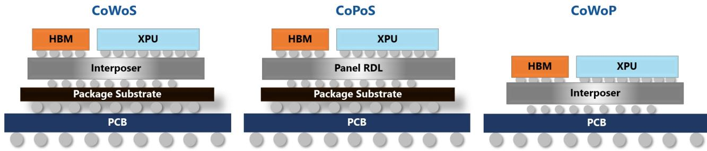  
Chart 56 - CoWoP Mechanism   
Source: Jefferies

Upgrade on materials $^ +$ technique $=$ surge in ASP. We take NVIDIA's server as an example. With server/rack structure evolution, we estimate PCB value per GPU to rise from US\$200-250 for H100/200 to \~US\$400 for GB200/300, and then to \~US\$700 for VR200 through PCB spec upgrade and the introduction of intra-tray small midplane. We forecast the content value to surge to \~US1,500 for VR300 (Rubin Ultra), which is slated to be launched in 2027 (or even higher depending on ultimate spec) mainly due to the introduction of backplane (officially called midplane by NVIDIA - We use backplane in this report to avoid ambiguity) to connect compute blades and switch blades as a new scale-up solution. This would lead to 3-4x/4-5x PCB/CCL value per GPU compared with GB200/300 current products. In addition to NVIDIA, we see a similar trend in other AI server/switch players' upcoming products (e.g. ASP jump for CCL from M8 to M9 and PCB from 400G to 1.6T 订阅研报添加微信 LCD123321Cadswitch), which acts as a core factor driving the rapid growth of AI PCB TAM.

  
Chart 57 - NVIDIA AI Server PCB Dollar Content Forecast   
Source: Company data, Jefferies estimates

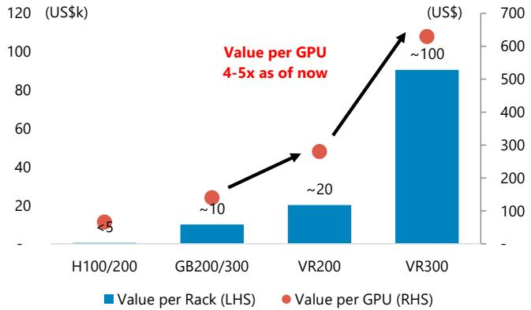  
Chart 59 - NVIDIA AI Server CCL Dollar Content Forecast   
Source: Company data, Jefferies estimates

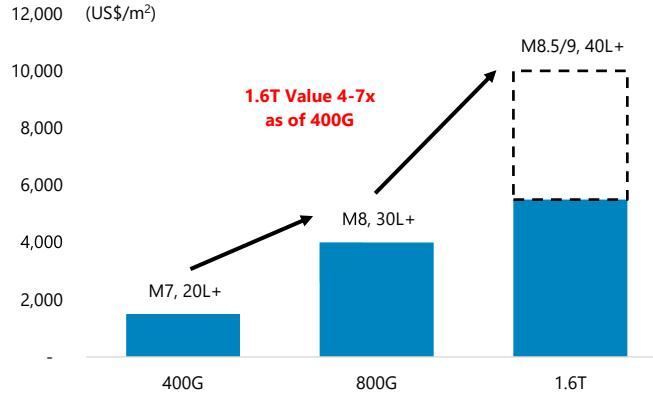  
Chart 58 - High-Speed Switch PCB Dollar Content Forecast   
Source: Jefferies estimates

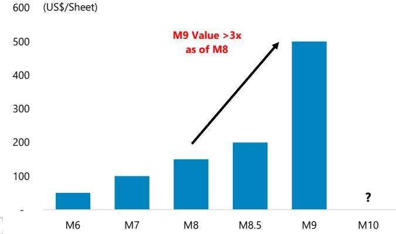  
Chart 60 - CCL Value by Spec   
Source: Jefferies estimates

# Supply Chain Breakdown: Positioning Each Participant

CCL competition landscape more concentrated vs PCB; Rapid capacity expansion in SEA, while China Mainland continues to be PCB hub. PCB is a relatively fragmented market with CR10 only at ${ < } 4 0 \%$ in 2024, while CCL market is more concentrated with CR10 at ${ > } 7 0 \%$ according to Prismark. After years of competitive landscape changes, both PCB/CCL markets mainly comprise China Mainland and Taiwan suppliers with some players from other regions (Japan/Korea/US, etc.) 订阅研报添加微信 LCDmore focused on high-end segments. In terms of production location, currently ${ > } 5 0 \%$ 321Cad  comes from China. Given that many international AI players are looking to diversify their production locations to address geopolitical uncertainties going forward, we see a large number of PCB vendors building/expanding capacity in Southeast Asia (mostly in Thailand), which could gradually become another major production center for PCBs. That said, we expect China Mainland to maintain ${ > } 5 0 \%$ production mix as the core production hub, with its leading edge in production efficiency, cost, and reliability, thanks to the mature and integrated ecosystem for PCB.

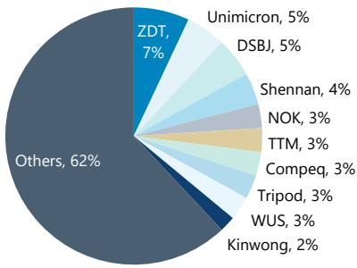  
Chart 61 - Global PCB Market Share by Supplier (2024)

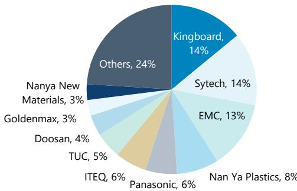  
Chart 62 - Global CCL Market Share by Supplier (2024)

Source: Prismark, Jefferies

  
Source: Prismark, Jefferies Chart 63 - PCB Production Value by Geography (2025)   
Source: Prismark, Jefferies

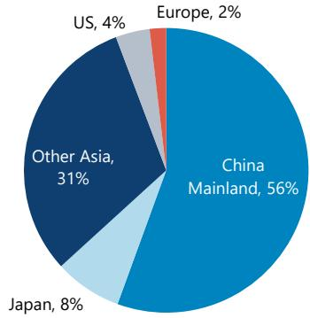  
Chart 64 - PCB Production Value by Geography (2030)   
Source: Prismark, Jefferies

Breakdown of PCB/CCL specs and related suppliers to major AI server players. Combining company information and our industry checks, we compile data to show PCB spec and supplier 订阅研报添加微信 LCD123321Cad breakdown for major AI players' existing and upcoming server products. From the table below, we observe that what most AI players have in common is that they are introducing an increasing number of new vendors to maintain supply chain stability amid rising shipment volume and continued product iteration. The rapidly-expanding PCB TAM itself does not necessarily mean all existing suppliers would be hurt by this trend. However, the ongoing product iteration would raise the standards required by each supplier, and thus those with rich experience, leading techniques, and stable delivery capabilities are likely to maintain a favorable position in their customers' supply chains in the long run. The key here is to understand the current supply chain dynamics and competitive landscape in detail. On this basis, we determine the implications that changes in certain products' volume or market share allocation in the future would have for each PCB/CCL player.

Table 10 - Major AI Server PCB/CCL Suppliers   

<table><tr><td>Product</td><td>Content</td><td>CCL Spec</td><td> PCB Spec</td><td> Major CCL Supplier</td><td>Major PCB Supplier</td></tr><tr><td>NVIDIA</td><td></td><td></td><td></td><td></td><td></td></tr><tr><td>H100/200</td><td>OAM</td><td>M7</td><td>5+ HDI</td><td>EMC</td><td>Unimicron, VGT</td></tr><tr><td rowspan="2"></td><td>UBB</td><td>M7</td><td>20L+ HLC</td><td>EMC</td><td>WUS, TTM, ISU</td></tr><tr><td>OAM</td><td>M8</td><td>5+ HDI</td><td>Doosan</td><td>Unimicron, VGT</td></tr><tr><td rowspan="2">B200 B300</td><td>UBB</td><td>M7</td><td>20L+ HLC</td><td>Doosan</td><td>WUS, TTM, ISU</td></tr><tr><td>OAM</td><td>M8</td><td>5+ HDI</td><td>Doosan</td><td>Unimicron, VGT</td></tr><tr><td rowspan="2">GB200</td><td>UBB</td><td>M8</td><td>20L+ HLC</td><td>Doosan</td><td> WUS, TTM, ISU</td></tr><tr><td>Compute Board</td><td>M8</td><td>5+ HDI</td><td>Doosan</td><td> VGT, Unimicron</td></tr><tr><td rowspan="2">GB300</td><td> Switch Board</td><td>M8</td><td>20L+ HLC</td><td> EMC, Sytech</td><td>WUS, VGT, Unimicron</td></tr><tr><td>Compute Board</td><td>M8</td><td>5+ HDI</td><td>Doosan</td><td>VGT, Unimicron, Dynamic</td></tr><tr><td rowspan="2"></td><td> Switch Board</td><td>M8</td><td>20L+ HLC</td><td> EMC, Sytech</td><td>WUS, VGT, Unimicron</td></tr><tr><td>Compute Board</td><td>M8</td><td> 5+ HDI/20L+ HLC</td><td>Doosan,EMC,Sytech</td><td> VGT, Unimicron, Dyamic,ZD, Kinwong,Foder</td></tr><tr><td rowspan="3">VR200 VR300</td><td>Switch Board</td><td>M8.5</td><td>20L+ HLC</td><td> EMC, Sytech</td><td>WUS, VGT, Unimicron</td></tr><tr><td>Midplane</td><td>M8.5</td><td> 40L+ HLC</td><td> EMC, Sytech</td><td>VGT, WUS, Kinwong,Delton</td></tr><tr><td>Backplane</td><td>M9/10/PTFE？</td><td>78-168L HLC</td><td>Doosan? EMC? Sytech?</td><td> VGT? WUS? Kinwong? Unimicron? DSBJ? Shennan?</td></tr><tr><td></td><td>CoWoP</td><td>M8/9/10?</td><td>？+ HDI</td><td> Doosan? EMC? Sytech?</td><td>ZDT? Unimicron? VGT? WUS?</td></tr><tr><td>Google</td><td></td><td></td><td></td><td></td><td></td></tr><tr><td>v5</td><td>UBB</td><td>M7</td><td>20L+ HLC</td><td>Panasonic</td><td>WUS, TTM, ISU</td></tr><tr><td>v6/7</td><td>UBB</td><td>M7</td><td>30L+ HLC</td><td>Panasonic, EMC</td><td>WUS, TTM,ISU,GBM,Shennan</td></tr><tr><td>v8</td><td>UBB</td><td>M8</td><td> 40L+ HLC</td><td>Panasonic, EMC, Doosan</td><td>WUS, TTM,ISU, GBM, Shennan,VGT,ZDT, GCE, Dyamic</td></tr><tr><td>v9</td><td>OAM</td><td>M9/10/PTFE？</td><td>6+ HDI</td><td>EMC?</td><td>WUS? VGT? Unimicron? ZDT?</td></tr><tr><td> Amazon</td><td></td><td></td><td></td><td></td><td></td></tr><tr><td rowspan="2">Trainium 2</td><td>OAM</td><td>M6</td><td>3+ HDI</td><td>Panasonic</td><td>SYE</td></tr><tr><td>UBB</td><td>M8</td><td>20L+ HLC</td><td> EMC, TUC</td><td>GCE, FHT, SYE</td></tr><tr><td rowspan="2">Trainium 2.5</td><td>OAM</td><td>M6</td><td>4+ HDI</td><td>Panasonic</td><td>SYE</td></tr><tr><td>UBB</td><td>M8</td><td>30L+ HLC</td><td>EMC, TUC</td><td> GCE, FHT, SYE, WUS</td></tr><tr><td rowspan="2">Trainium 3</td><td>OAM</td><td>M7</td><td>4+ HDI</td><td>Panasonic</td><td>SYE, ZDT, Unimicron</td></tr><tr><td>UBB</td><td>M8</td><td>30L+ HLC</td><td>EMC, TUC</td><td>GCE, FHT, SYE, WUS, ZDT</td></tr><tr><td>Meta</td><td></td><td></td><td></td><td></td><td></td></tr><tr><td>MTIA2</td><td>UBB</td><td>M8+M4</td><td>30L+ HLC</td><td>EMC</td><td>WUS,TTM, ISU</td></tr><tr><td>MTIA3</td><td>UBB</td><td>M8+M4</td><td> 40L+ HLC</td><td> EMC, TUC, ITEQ</td><td> WUS, TTM,ISU,GCE,Shennan,Delton</td></tr></table>

Source: Company data, Jefferies estimates Note: Question mar $=$ no confirmed information as of now

# WUS (002463 CH) – Initiate with BUY

# Leading HLC Maker to Rideon Growth in 订阅研报添加微信

AsNo.1 switch/routerPCBmaker，WUS has high globalmarket share $( > = 5 0 \%$ ofhigh-speed switch PCB,andbenefitsfromrisingpenetrationof 800G/1.6Tswitches.Thecompetitive landscapeisrelatively healthy,inour view.Al serverPCBisanotherkey growth curvedriven bycontinueddesign wins.Weforecast Al PCBprofit contributiontorisefrom $\sim 6 0 \%$ in2025 to $\sim 8 0 \%$ in2027E.Initiateat BUYwithRmb130.00PT,implying $4 7 \times 1 2 6 x$ 2026E/27EP/Eand $3 3 \%$ upside.

Aleading switch PCBvendorwith stable competition;Al server isa secondkey growth driver.FoundedinKunshanin1993,withaTaiwanesefamilybackground,WUsfocusesonthe manufacturingofPCBthatismainlyadoptedincommunicationandautomotivesectors.WUs isnow the No.1 switch/router PCBmakerwith $\sim 1 3 \%$ global market share,and we estimate itssharein high-speed switch PCB(800G/1.6T) is over $5 0 \%$ thankstoits leadingedgein $\mathtt { > 3 0 1 }$ HLC.Weestimate the ASPfor800GPCB is $> 2 x$ thatof400G,andfor1.6Tcouldbeupto $4 - 7 x .$ Weviewthecompetitivelandscapeasrelativelyhealthy,giventhealready-matureecosystem. Inadditiontotheswitchmarket,WuShasbeendeepeningitsengagementwithawiderangeof Alplayers'serverproducts(NvDA,Google,Meta,etc.).WebelieveWUswouldfurtherleverage itstechedgeand benefitfromstrong growth in boththe Al switchandservermarkets.

订阅研报添加微信 LCD1 $\sim 8 0 \%$ 2 netprofitin2years.YTD,WUshasannouncedaseriesof newcapexprogramstotaling \~Rmb18bn over the next few years,and we expect its production value to rise from Rmb19-20bnin2025to Rmb25-30bnin2026EWeforecast netprofitcontributionfrom Al PCBtoincrease from ${ \sim } 6 0 \%$ in2025to $\sim 8 0 \%$ in2027E,and increaseto $5 9 0 \%$ in2029E-30E, drivenbyrisingshipmentsfromcapacityexpansionandASPgrowthfromlargermixof highvalue(especially80oG/1.6T switch)products.While high-speed switch (both scale-up/out) is likelytoremainthemajorgrowthpillarintheneartermwebelieveAlserverPCB(HDl/HLC design) couldbecomeakeydriverinthe longer term.

InitiateatBUY;PTsuggests $3 3 \%$ upside.WeforecastWUSrevenue/NPCAGRsof44%/43%in 2026E-2028Eand $3 8 \% / 3 5 \%$ in2027E-2029E.WUScurrentlytradesat31x/20x2026E/27EP/E vsour2026E-28E/2027E-29Enetprofit CAGRforecastsof $4 3 \% / 3 5 \%$ Our valuation forWUSis basedonend-2026EDCF,withaWACCof $9 . 8 \%$ andaterminalgrowthrateot $6 . 5 \%$ (2030E).Our pricetargetofRmb130.00implies41x/26x2026E/27EP/Eor $0 . 9 \times / 0 . 7 \times$ PEG,suggesting $3 3 \%$ potentialupside.Our2026E/27EEPSis $7 \% 1 9 \%$ aboveconsensus.Keypositivecatalystsare: 1)better-than-expectedAlserver/switchdemand,2)furthermarketsharegain inAl servers/ switch，3)ongoingspecupgradeofPCBdrivinghigherdollarcontent，4)acceleratedcapacity andprofitabilityrampforAl-relatedproductsinbothlocal/overseasfacilities;and5easing supplytightness incritical materials for high-endPCB.

<table><tr><td>INITIATING COVERAGE</td><td></td></tr><tr><td>RATING</td><td>BUY</td></tr><tr><td>PRICE</td><td>Rmb97.66</td></tr><tr><td>PRICETARGET|%TOPT</td><td>Rmb130.001+33%</td></tr><tr><td>52WHIGH-LOW</td><td>Rmb99.38-Rmb26.30</td></tr><tr><td>FLOAT(%)1ADVMM（USD)6.9%18,500.98</td><td></td></tr><tr><td>MARKETCAP</td><td>RMB187.9BIRMB187.9B</td></tr><tr><td>TICKER</td><td>002463CH</td></tr></table>

noted

<table><tr><td>FY(Dec)</td><td>CHANGETO JEFe</td><td></td><td>JEFvsCONS</td><td></td></tr><tr><td></td><td>2026</td><td>2027</td><td>2026</td><td>2027</td></tr><tr><td>REV</td><td>NA</td><td>NA</td><td>NA</td><td>NA</td></tr><tr><td>EPS</td><td>NA</td><td>NA</td><td>NA</td><td>NA</td></tr><tr><td></td><td></td><td></td><td></td><td></td></tr><tr><td>2026（RMB)Q1A</td><td>Q2A</td><td>Q3A</td><td>Q4A</td><td>FY</td></tr><tr><td>EPS</td><td>0.63 0.73</td><td>0.89</td><td>0.93</td><td>3.19</td></tr><tr><td>PREV</td><td></td><td></td><td></td><td></td></tr></table>

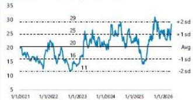  
ad 04-20

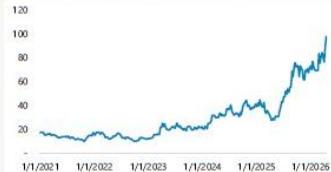  
Chart2-WUSLTShare Price Trend

Jacky He\*|EquityAnalyst

EdisonLee,CFA\*|EquityAnalyst

<table><tr><td>FY(Dec)</td><td>2024A</td><td>2025A</td><td>2026E</td><td>2027E</td></tr><tr><td>Rev.(MM)</td><td>13,342.0</td><td>18,945.0</td><td>27,289.0</td><td>41,016.0</td></tr><tr><td>EBIT(MM)</td><td>3,030.0</td><td>4,517.0</td><td>6,962.0</td><td>10,300.0</td></tr><tr><td>NetProfit</td><td>2,587.0</td><td>3,822.0</td><td>6,133.0</td><td>9,476.0</td></tr><tr><td>EPS</td><td>1.35</td><td>1.97</td><td>3.19</td><td>4.92</td></tr></table>

MattMa\*|EquityAnalyst

AnniePing，CFA FRM\*|EquityAssociate

# Company Overview

WUS Printed Circuit was founded in 1993 in Kunshan, China by Mr. Li-Gann Wu, a renowned Taiwanese electronics entrepreneur, and focuses on the manufacturing of PCBs that are mainly adopted in communication, automotive, and other downstream markets. The stock was listed on the Shenzhen Stock Exchange in 2010. Currently, WUS operates multiple factories around the world, including in Kunshan, Huangshi, Changzhou, and Thailand.

Table 11 - WUS Historical Milestones   

<table><tr><td>Date</td><td>Milestone</td><td rowspan="7"></td></tr><tr><td>1992</td><td>Founded in 1992, served Taiwan WUS on handling overflow and Mainland orders</td></tr><tr><td>1997</td><td>Begantaking orders independently</td></tr><tr><td>2010</td><td>Listed on Shenzhen Stock Exchange</td></tr><tr><td>2011</td><td>Huangshi fab was established, gradually building out capacity for mid/high-end PCB</td></tr><tr><td>2017 2019</td><td>The Huangshi fab passed automotive industry system certification</td></tr><tr><td>2022</td><td> Huangshi Plant started manufaturing</td></tr><tr><td>2023</td><td>Thailand fab was established</td></tr><tr><td></td><td>Planned to expand capacity of high-end PCB</td></tr></table>

Source: Company data, Jefferies

In 2025, WUS' revenue breakdown is as follows: data communication $( 7 7 \% )$ , smart vehicle $( 1 6 \% )$ , and industrial & others $( 7 \% )$ . Gross profit breakdown is as follows: data communication $( 8 7 \% )$ , smart vehicle $( 1 0 \% )$ , and industrial & others $( 3 \% )$ . We forecast WUS' revenue to rise by CAGRs of $4 4 \%$ in 2026E-28E and $3 8 \%$ in 2027E-29E, mainly driven by: 1) step up in AI capex of the industry; 2) proliferation of $8 0 0 \mathsf { G } / 1 . 6 \mathsf { T }$ high-speed switches, with WUS' leading market share; 3) continued PCB spec upgrade in AI server with WUS' expanding customer base and extending engagement; and 4) capacity expansion for high-end PCB products in both local/overseas facilities.

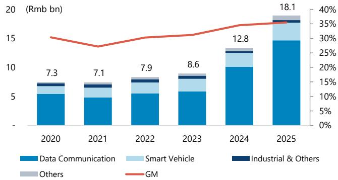  
Chart 65 - WUS Historical Revenue & Gross Margin   
Source: Company data, Jefferies

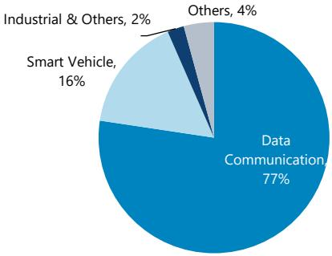  
Chart 67 - WUS 2025 Revenue Breakdown by Segment

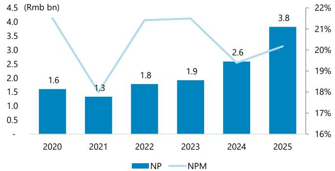  
Chart 66 - WUS Historical Net Profit & Margin

Source: Company data, Jefferies

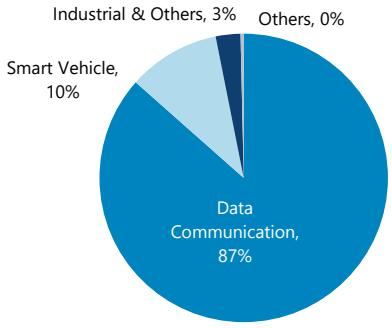  
Chart 68 - WUS 2025 Gross Profit Breakdown by Segment

# Senior Management and Shareholding Structure

Ms. Mei-Fang Chen, Chairman, has a bachelor's degree from National Taiwan University. Ms. Chen currently serves as the Chairman of the Board of Directors of this company, a director of the company's controlling shareholder Biggering (BVI) Holdings Co., Ltd., and a director of companies such as WUS International.

Mr. Chuan-Pin Wu, Director, obtained a bachelor's degree from University of California, Berkeley and holds an EMBA from Shanghai Jiao Tong University. Mr. Wu joined the company in 1995 and has served as the company's Information, Business, and Manufacturing Manager, and Plant Manufacturing Assistant Manager.

Mr. Wen-Hsien Kao, Director/General Manager of the business Depart, graduated from the Department of Industrial Management at National Tsing Hua University in Taiwan. Mr. Kao has over 30 years of experience in the PCB industry and previously worked as an assembly efficiency manager at Nan Tzu Electronics Co., Ltd. He has been with the company since 1996, serving as a supervisor in assembly efficiency, purchasing, materials control, and production.

Mr. Jyh-Jong Shyr, Director/Business Unit General Manager, graduated from the Department of Chemical Engineering at Chinese Culture University in Taiwan. With over 30 years of experience in the PCB industry, Mr. Shih has worked for companies such as Compal Electronics Co., Ltd. in Taiwan. He has been with this company since 2009, serving successively as Special Assistant to the General Manager, Assistant General Manager and Deputy General Manager of Kunshan Huli Microelectronics Co., Ltd.

Ms. Pi-Hsia Chu, Chief Financial Officer, obtained a master's degree from National Central University in Taiwan. Ms. Zhu previously worked at Huapu Aircraft Engine Technology Co., Ltd., Watsons ParknShop Co., Ltd., and China Motor Corporation, among others. She has been with this company since 2007, serving successively as Head of Internal Audit and Director of Materials Department. She is currently the Chief Financial Officer of this company.

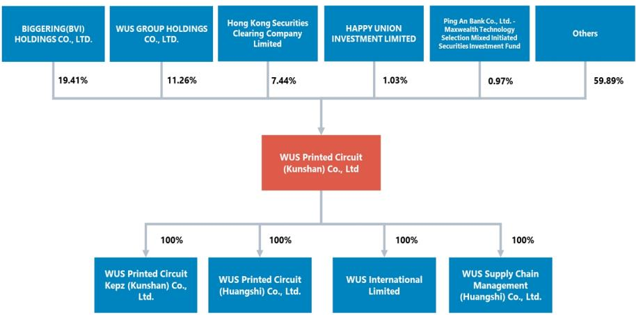  
Chart 69 - WUS Shareholding Structure   
04-20   
Source: Company data, Jefferies Note: As of 4Q25

# Leading Veteran of High-layer/High-speed Switch PCB

Leading switch PCB vendor with stabilized competition landscape; AI server is also a key growt curve. The exponential growth in computing power build has created huge demand in the network equipment market, especially for high-speed interconnection. Gartner estimates $\scriptstyle > = 4 0 0  G$ switch port shipment mix rose from ${ < } 5 \%$ before 2023 to $1 5 \mathrm { - } 2 0 \%$ in 2025, and forecast this to approach $30 \%$ in the next few years (we think this is too conservative though). As we mentioned in the industry section above, based on 400G switch, ASP for 800G PCB is ${ \tt > } 2 \tt X ,$ and 1.6T could rise to $4 { - } 7 \times$ depending on materials solution. Focusing on the communication PCB market especially highend switch for long, WUS is currently the No.1 switch/router PCB maker with $\sim 1 3 \%$ market share according to its H-share prospectus, and we estimate it to have much higher share (possibly $> = 5 0 \%$ ) on high-speed switch PCB including 800G (112Gbps SerDes) and 1.6T (224Gbps) thanks to its leading edge in ${ \tt > } 3 0 \mathrm { L }$ HLC (high-layer count) technique. The competitive landscape is relatively healthy here, as most peers are non-China Mainland players with no notable changes for many years given the already-mature ecosystem. In addition to the switch market, we see WUS has deepening engagement in a wide range of AI players' server products, such as the potential extension from NVIDIA's switch tray to midplane/backplane and even CoWo,P as the company has disclosed it is preparing related technique/capacity. WUS is also major supplier to multiple ASIC players, including UBB (universal baseboard) to Google, Meta etc. with expanding customer base. We believe WUS could continue to leverage its edge in technique and keep benefiting from the boom in both AI switch/server markets going forward.

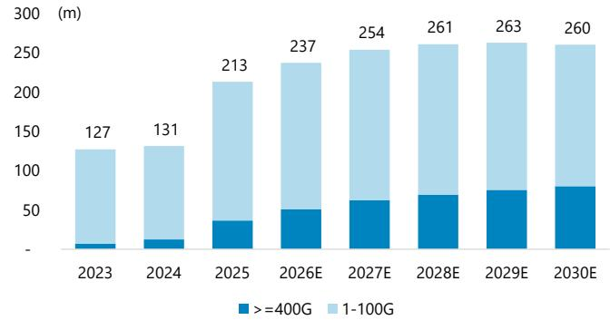  
Chart 70 - Data Center Switch Port Shipment Forecast   
Source: Garter, Jefferies

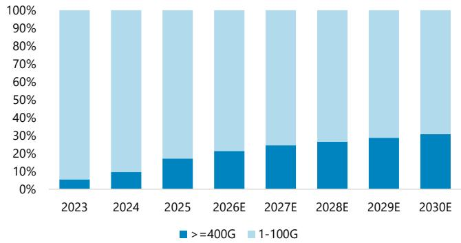  
Chart 71 - Data Center Switch Port Shipment Mix Forecast

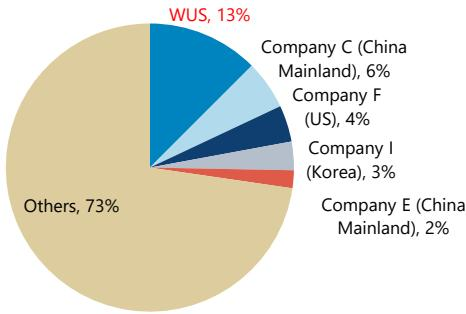  
Chart 72 - Switch/Router PCB Market Share (2024-1H25)

Source: Gartner, Jefferies

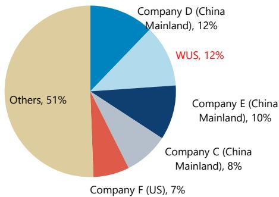  
Chart 73 - AI Server PCB Market Share (2024-1H25)   
Source: Company data, Jefferies

Table 12 - Major High-Speed Switch PCB/CCL Suppliers   

<table><tr><td>Role</td><td>Major Player</td></tr><tr><td>OEM</td><td>NVIDIA (Mellanox),Nokia (Alcatel),Arista,Cisco,Dell, Extreme, HPE,Jupr</td></tr><tr><td>ODM</td><td>Accton,Alpha Networks, Celestica,HonHai，Quanta,Sanmina,Wistron</td></tr><tr><td>CCL</td><td>Panasonic,Doosan,EMC,UC</td></tr><tr><td>PCB</td><td>WUS,TT,ISU,GCE,G</td></tr></table>

Source: Company data, Jefferies   
Source: Company data, Jefferies

Rapidly expanding both local/overseas capacity; AI PCB to comprise $\sim80 \%$ of net profit in 2 years. Compared with most peers, WUS used to be conservative in making big investments, unless it sees a certain degree of commitment from customers. However, contrary to norm, WUS has YTD actively announced a series of new capex totaling \~Rmb18bn over the next few years. We expect its production value to rise from Rmb19-20bn last year to Rmb25-30bn this year, with Kunshan, Huangshi, and Thailand bases all undergoing capacity expansion either through new production ramp or technology upgrade. We forecast WUS' AI PCB mix to increase from ${ \sim } 6 0 \%$ of net profit in 2025 to $\sim8 0 \%$ in 2027E, and rise to $590 \%$ in 2029E-30E driven by increasing shipments from capacity expansion and rising ASP from larger mix of high-value (especially $8 0 0 \mathsf { G } / 1 . 6 \mathsf { T }$ switch) products. While high-speed switch (both scale-up/out) is still likely to be the major growth pillar in the near term, we believe AI server PCB (HDI/HLC design) would become a key driver in the longer term.

Table 13 - WUS Production Base Summary   

<table><tr><td>Base</td><td>Product</td><td>Annual Capacity (2025) (Rmb bn)</td><td>Annual Capacity (2026E) (Rmb bn)</td><td>Progress</td></tr><tr><td>Kunshan</td><td></td><td>13-14</td><td>14-17</td><td></td></tr><tr><td>Kunshan Base 1</td><td>Server,telecom</td><td></td><td></td><td>Expanding through tech upgrade</td></tr><tr><td>Kunshan Base 2</td><td>Server, telecom</td><td></td><td></td><td>Ramping from 2H26</td></tr><tr><td>Kunshan KEPZ Base</td><td>Automotive</td><td></td><td></td><td>Expanding capacity</td></tr><tr><td>Huangshi</td><td></td><td>~5</td><td>6-8</td><td></td></tr><tr><td>Huangshi Base 1</td><td>Server, telecom</td><td></td><td></td><td>Expanding capacity</td></tr><tr><td>Huangshi Base 2</td><td>Automotive</td><td></td><td></td><td>Expanding capacity</td></tr><tr><td>Jintan</td><td>Automotive</td><td>~1</td><td>~1</td><td>Expanding through tech upgrade</td></tr><tr><td>Thailand</td><td>Server,automotive</td><td>&gt;0</td><td>2-4</td><td>Ramping from 2H25</td></tr></table>

Source: Company data, Jeffeires estimates

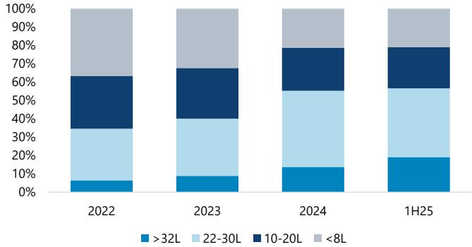  
Chart 74 - WUS PCB Revenue by Spec   
订阅研报添加微信

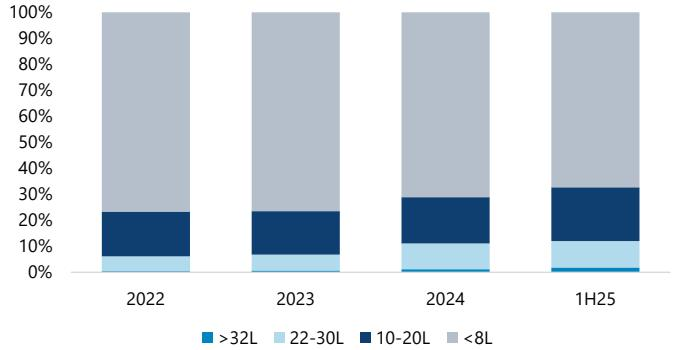  
Chart 75 - WUS PCB Shipment by Spec   
CD123321Cad Source: Company data, Jefferies 04-20

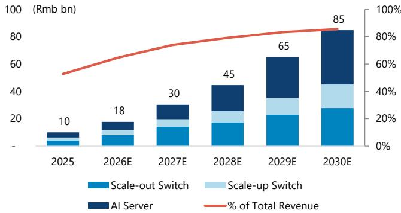  
Source: Company data, Jefferies   
Chart 76 - WUS AI PCB Revenue Forecast   
Source: Company data, Jefferies estimates

  
Chart 77 - WUS AI PCB Gross Profit Forecast   
Source: Company data, Jefferies estimates

# Financial Forecasts and Valuation

We forecast WUS' revenue/NP to rise by CAGRs of $4 4 \% / 4 3 \%$ in 2026E-2028E and $3 8 \% / 3 5 \%$ in 2027E-2029E. We also expect EBIT margin to gradually increase, driven by more favorable product mix in the next few years. Our key operating assumptions are as follows:

• AI server switch market share rises from $40 \%$ in 2025 to $5 0 \% / 4 5 \%$ in 2027E/2030E.   
• NVIDIA switch tray market share drops from $45 \%$ in 2025 to $4 0 \% / 3 0 \%$ in 2027E/2030E.   
• Non-NVIDIA switch tray market share rises from $30 \%$ in 2025 to $3 5 \% / 3 0 \%$ in 2027E/2030E.   
• NVIDIA AI PCB market share rises from $3 \%$ in 2025 to $7 \% / 9 \%$ in 2027E/2030E.   
• Non-NVIDIA AI PCB market share drops from $20 \%$ in 2025 to $14 \% / 1 4 \%$ in 2027E/2030E.   
• Blended GM rises from $3 5 . 5 \%$ in 2025 to $3 6 . 3 \% / 3 5 . 9 \%$ in 2027E/2030E.   
• EBIT margin rises from $2 3 . 8 \%$ in 2025 to $2 5 . 1 \% / 2 5 . 5 \%$ in 2027E/2030E.

Initiate with BUY and a PT of Rmb130.00. WUS currently trades at 31x/20x 2026E/27E P/E, vs our 2026E-28E/2027E-29E net profit CAGR forecasts of $4 3 \% / 3 5 \%$ . Our valuation for WUS is based on end-2026E DCF, with a WACC of $9 . 8 \%$ and a terminal growth rate of $6 . 5 \%$ (2030E). Our price target of Rmb130.00 implies 41x/26x 2026E/27E P/E or $0 . 9 { \times } / 0 . 7 { \times }$ PEG, and suggests $3 3 \%$ potential upside.

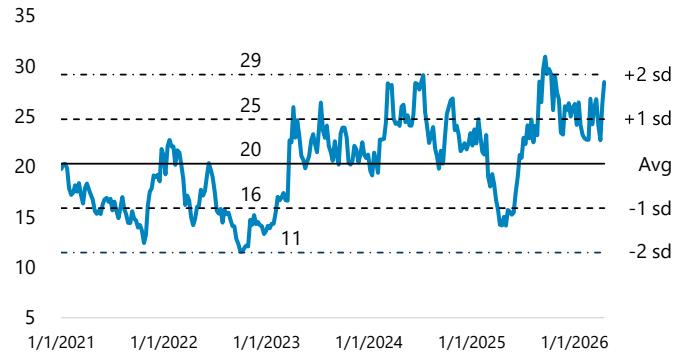  
Chart 78 - WUS LT 1-yr Fwd PE   
Source: FactSet, Jefferies

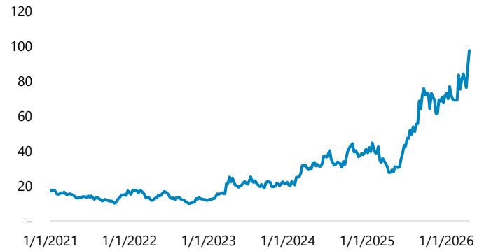  
Chart 79 - WUS LT Share Price Trend   
Source: FactSet, Jefferies

What are the potential positive catalysts for WUS? 1) Better-than-expected AI server/switch demand; 2) Further market share gain and expansion to new customers in AI server/switch market; 3) Ongoing spec upgrade of PCB with dollar content going up; 4) Accelerated capacity and profitability ramp for AI-related products in both local/overseas facilities; and 5) Easing of supply tightness in critical materials for high-end PCB.

What are the risks for WUS? 1) Deceleration in global AI capex growth; 2) Market share loss from escalating competition; 3) Slower-than-expected adoption of advanced PCB solutions due to technical barriers; 4) Technology replacement threat from other interconnection solutions such 订阅研报添加微信 LCD123321Cad as copper cable and optical; and 5) Supply chain uncertainties or additional costs due to supply bottlenecks of upstream materials/tools or escalating geopolitical risks.

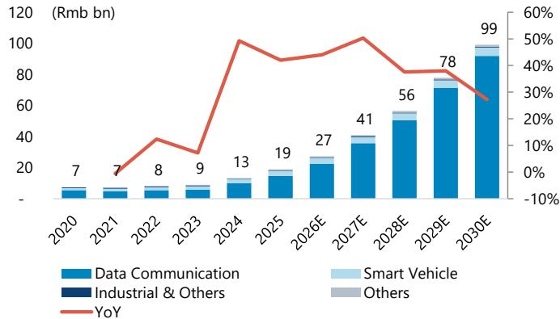  
Chart 80 - WUS Revenue Forecast by Segment   
Source: Company data, Jefferies estimates

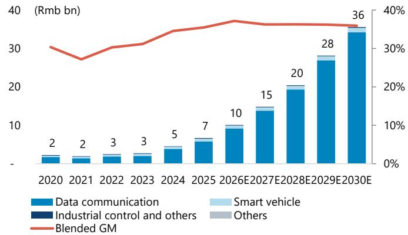  
Chart 81 - WUS Gross Margin & Profit Forecast by Segment   
Source: Company data, Jefferies estimates

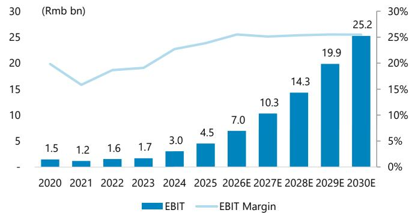  
Chart 82 - WUS EBIT Forecast   
Source: Company data, Jefferies estimates

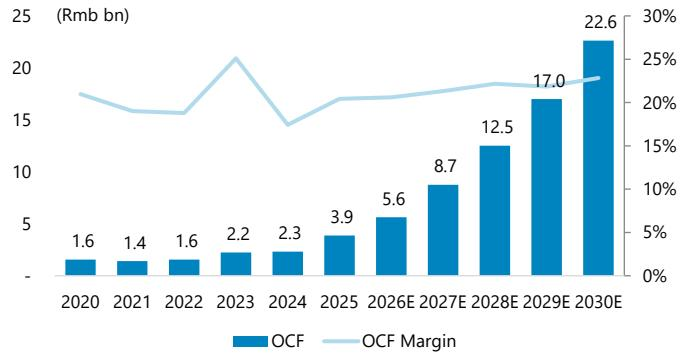  
Chart 84 - WUS Operating Cash Flow Forecast   
Source: Compay data, Jefferies estimates

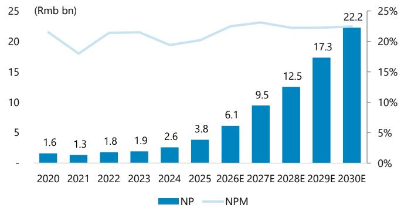  
Chart 83 - WUS Net Profit Forecast   
Source: Company data, Jefferies estimates Chart: WUS Net Profit Forecast

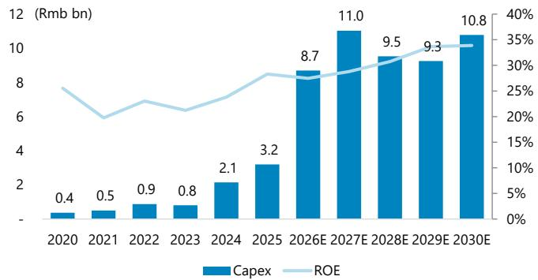  
Chart 85 - WUS Capex & ROE Forecast

Table 14 - WUS Valuation Summary   

<table><tr><td>(Rmb m)</td><td>2020A</td><td>2021A</td><td>2022A</td><td>2023A</td><td>2024A</td><td>2025A</td><td>2026E</td><td>2027E</td><td>2028E</td><td>2029E</td><td>2030E</td></tr><tr><td>Revenue</td><td>7,460</td><td>7,419</td><td>8,336</td><td>8,938</td><td>13,342</td><td>18,945</td><td>27,289</td><td>41,016</td><td>56,438</td><td>77,883</td><td>99,078</td></tr><tr><td>YoY</td><td></td><td>-1%</td><td>12%</td><td>7%</td><td>49%</td><td>42%</td><td>44%</td><td>50%</td><td>38%</td><td>38%</td><td>27%</td></tr><tr><td>vs consensus</td><td rowspan="16"></td><td rowspan="4">1,479</td><td rowspan="4">1,174</td><td rowspan="4">1,556 1,706</td><td rowspan="4">3,030</td><td rowspan="4"></td><td></td><td>4%</td><td>9% 10%</td><td></td><td rowspan="4"></td></tr><tr><td></td><td>4,517</td><td></td><td></td></tr><tr><td> EBIT</td><td>6,962</td><td>10,300</td><td>14,312</td></tr><tr><td>YoY</td><td>78% 49%</td><td>54%</td><td>48% 39%</td></tr><tr><td>vs consensus</td><td></td><td>-21%</td><td>33%</td><td>10%</td><td></td><td></td><td>6%</td><td>3%</td><td>1%</td><td>39%</td><td>27%</td></tr><tr><td>Net profit</td><td>1,605</td><td>1,335</td><td>1,785</td><td>1,921</td><td>2,587</td><td>3,822</td><td>6,133</td><td>9,476</td><td>12,545</td><td>17,330</td><td>22,244</td></tr><tr><td>YoY vsconsensus</td><td></td><td>-17%</td><td>34%</td><td>8%</td><td>35%</td><td>48%</td><td>60% 8%</td><td>55% 12%</td><td>32% 1%</td><td>38%</td><td>28%</td></tr><tr><td>EPS (Rmb)</td><td>0.78</td><td>0.56</td><td>0.72</td><td>0.79</td><td>1.35</td><td>1.97</td><td>3.19</td><td>4.92</td><td>6.52</td><td>9.01</td><td>11.56</td></tr><tr><td>YoY</td><td></td><td>-28%</td><td>27%</td><td>10%</td><td>70%</td><td>46%</td><td>62%</td><td>55%</td><td>32%</td><td>38%</td><td>28%</td></tr><tr><td>vsconsensus</td><td></td><td></td><td></td><td></td><td></td><td></td><td>7%</td><td>9%</td><td>1%</td><td></td><td></td></tr><tr><td>Multiples EV/Adj. EBITDA</td><td>103.7</td><td>124.1</td><td>99.9</td><td>88.6</td><td>53.8</td><td>37.0</td><td>24.1</td><td>15.9</td><td>11.2</td><td>8.0</td><td></td></tr><tr><td>PB x</td><td>20.9</td><td>19.9</td><td>19.4</td><td>14.8</td><td>8.9</td><td>6.7</td><td>4.1</td><td>3.3</td><td>2.6</td><td>2.1</td><td>6.2 1.6</td></tr><tr><td>PEx</td><td>124.7</td><td>173.3</td><td>136.0</td><td>123.2</td><td>72.5</td><td>49.6</td><td>30.6</td><td>19.8</td><td>15.0</td><td>10.8</td><td>8.4</td></tr><tr><td>EV/IC</td><td>30.2</td><td>26.9</td><td>23.1</td><td>20.3</td><td>16.2</td><td>12.7</td><td>8.7</td><td>6.0</td><td>4.5</td><td>3.6</td><td>2.9</td></tr><tr><td>PS x</td><td>25.2</td><td>25.3</td><td>22.5</td><td>21.0</td><td>14.1</td><td>9.9</td><td>6.9</td><td>4.6</td><td>3.3</td><td>2.4</td><td>1.9</td></tr><tr><td>EV/Sales</td><td>25.2</td><td>25.4</td><td>22.6</td><td>21.0</td><td>14.2</td><td>10.0</td><td>6.8</td><td>4.6</td><td>3.4</td><td>2.4</td><td>1.8</td></tr><tr><td> Financials</td><td></td><td></td><td></td><td></td><td></td><td></td><td></td><td></td><td></td><td></td><td></td></tr><tr><td>Net debt (cash)</td><td></td><td></td><td>212</td><td></td><td></td><td></td><td></td><td></td><td></td><td></td><td></td></tr><tr><td>EBITDA</td><td>(68)</td><td>583</td><td></td><td>194</td><td>1,423</td><td>1,477</td><td>(3,706)</td><td>1,266</td><td>1,846</td><td>(984)</td><td>(6,512)</td></tr><tr><td>EV</td><td>1,811 187,865</td><td>1,519 188,516</td><td>1,883</td><td>2,123</td><td>3,519</td><td>5,119</td><td>7,659</td><td>11,901</td><td>16,960</td><td>23,258</td><td>29,245</td></tr><tr><td>BVPS (Rmb)</td><td>4.67</td><td>4.92</td><td>188,145 5.03</td><td>188,127 6.62</td><td>189,356 11.02</td><td>189,410</td><td>184,227 23.55</td><td>189,200 29.61</td><td>189,780 37.04</td><td>186,950</td><td>181,422</td></tr><tr><td>FCF</td><td>1,191</td><td>907</td><td>689</td><td>1,433</td><td>177</td><td>14.56 673</td><td>(3,077)</td><td></td><td>2,979</td><td>47.36</td><td>59.52</td></tr><tr><td>ROAE</td><td>25.5%</td><td>19.8%</td><td>23.0%</td><td>21.2%</td><td>23.8%</td><td>28.3%</td><td>27.5%</td><td>(2,284) 28.8%</td><td>30.8%</td><td>7,746</td><td>11,839</td></tr><tr><td>ROIC</td><td>26.2%</td><td>18.6%</td><td>21.7%</td><td>20.8%</td><td>22.6%</td><td>26.2%</td><td>28.6%</td><td>28.3%</td><td>29.4%</td><td>33.7%</td><td>33.9%</td></tr><tr><td>Net debt (cash)/equity</td><td>(0.0)</td><td>0.1</td><td>0.0</td><td>0.0</td><td>0.1</td><td>0.1</td><td>(0.2)</td><td>0.0</td><td>0.0</td><td>33.3%</td><td>35.5%</td></tr><tr><td>Net debt (cash)/adj.EBITDA</td><td>(0.0)</td><td>0.4</td><td>0.1</td><td>0.1</td><td>0.4</td><td>0.3</td><td>(0.5)</td><td>0.1</td><td>0.1</td><td>(0.0) (0.0)</td><td>(0.1)</td></tr><tr><td>Adj. EBITDA/net interest</td><td>(121.7)</td><td>79.6</td><td>51.4</td><td>24.2</td><td>29.2</td><td>41.4</td><td>53.6</td><td>83.3</td><td>118.7</td><td>162.8</td><td>(0.2) 204.7</td></tr><tr><td>FCF yield</td><td>0.6%</td><td>0.5%</td><td>0.4%</td><td>0.8%</td><td>0.1%</td><td>0.4%</td><td>-1.6%</td><td>-1.2%</td><td>1.6%</td><td>4.1%</td><td>6.3%</td></tr><tr><td>DPS (Rmb)</td><td>0.18</td><td>0.15</td><td>0.13</td><td>0.15</td><td>0.57</td><td>0.56</td><td>0.90</td><td>1.40</td><td>1.85</td><td>2.55</td><td>3.28</td></tr><tr><td>Dividend yield</td><td>0.2%</td><td>0.2%</td><td>0.1%</td><td>0.2%</td><td>0.6%</td><td>0.6%</td><td></td><td>0.9%</td><td>1.4% 1.9%</td><td>2.6%</td><td>3.4%</td></tr></table>

Source: Company data, FactSet, Jefferies estimates

Table 15 - WUS DCF Summary   

<table><tr><td>(Rmb m)</td><td>2020</td><td>2021</td><td>2022</td><td>2023</td><td>2024</td><td>2025</td><td>2026E</td><td>2027E</td><td>2028E</td><td></td><td>2029E</td><td>2030E</td></tr><tr><td>Net Income</td><td>1,605</td><td>1,335</td><td>1,785</td><td>1,921</td><td>2,587</td><td>3,822</td><td>6,133</td><td></td><td>9,476</td><td>12,545</td><td>17,330</td><td>22,244</td></tr><tr><td>Plus</td><td></td><td></td><td></td><td></td><td></td><td></td><td></td><td></td><td></td><td></td><td></td><td></td></tr><tr><td>After-tax interest expense</td><td>(67)</td><td>(86)</td><td>(113)</td><td>(96)</td><td>(75)</td><td>(67)</td><td></td><td>(94)</td><td>(533)</td><td>(112)</td><td>(63)</td><td>(303)</td></tr><tr><td>D&amp;A</td><td>332</td><td>345</td><td>326</td><td>417</td><td>489</td><td>601</td><td></td><td>697</td><td>1,601</td><td>2,649</td><td>3,390</td><td>4,004</td></tr><tr><td>Less</td><td></td><td></td><td></td><td></td><td></td><td></td><td></td><td></td><td></td><td></td><td></td><td></td></tr><tr><td>Change in working capital</td><td>(660)</td><td>92</td><td>207</td><td>(298)</td><td>852</td><td>901</td><td></td><td>1,203</td><td>2,332</td><td>2,683</td><td>3,715</td><td>3,623</td></tr><tr><td>Capex</td><td>375</td><td>504</td><td>877</td><td>810</td><td>2,148</td><td>3,198</td><td></td><td>8,700</td><td>11,026</td><td>9,528</td><td>9,255</td><td>10,782</td></tr><tr><td>Unlevered free cash flow</td><td>2,155</td><td>999</td><td>916</td><td>1,730</td><td>1</td><td>257</td><td>(3,168)</td><td></td><td>(2,814)</td><td>2,870</td><td>7,687</td><td>11,540</td></tr><tr><td>Terminal value</td><td></td><td></td><td></td><td></td><td></td><td></td><td></td><td></td><td></td><td></td><td></td><td></td></tr><tr><td>Total UFCF</td><td>2,155</td><td>999</td><td>916</td><td>1,730</td><td></td><td>257</td><td></td><td>(3,168)</td><td>(2,814)</td><td>2,870</td><td>7,687</td><td>388,971</td></tr><tr><td>Discount period</td><td></td><td></td><td></td><td></td><td></td><td></td><td></td><td></td><td></td><td></td><td></td><td></td></tr><tr><td>Discount factor</td><td></td><td></td><td></td><td></td><td></td><td></td><td></td><td></td><td></td><td></td><td></td><td></td></tr><tr><td>PV</td><td></td><td></td><td></td><td></td><td></td><td></td><td></td><td></td><td></td><td></td><td></td><td></td></tr><tr><td>NPV</td><td>246,460</td><td></td><td></td><td></td><td></td><td></td><td></td><td></td><td></td><td></td><td></td><td></td></tr><tr><td>Less: net debt (cash) Equity value</td><td>(3,706)</td><td></td><td></td><td></td><td></td><td></td><td></td><td></td><td></td><td></td><td></td><td></td></tr><tr><td>Equity value per share (Rmb)</td><td>250,167 130.00</td><td></td><td></td><td></td><td></td><td></td><td></td><td></td><td></td><td></td><td></td><td></td></tr><tr><td></td><td></td><td></td><td></td><td></td><td></td><td></td><td></td><td></td><td></td><td></td><td></td><td></td></tr><tr><td>WACC</td><td>9.8%</td><td></td><td></td><td></td><td></td><td></td><td></td><td></td><td></td><td></td><td></td><td></td></tr><tr><td> Terminal growth</td><td>6.5%</td><td></td><td></td><td></td><td></td><td></td><td></td><td></td><td></td><td></td><td></td><td></td></tr><tr><td>Terminal FCFx</td><td>33</td><td></td><td></td><td></td><td></td><td></td><td></td><td></td><td></td><td></td><td></td><td></td></tr><tr><td>Terminal value (Rmb m) Implied 2030 EV/EBITDA</td><td>377,431</td><td></td><td></td><td></td><td></td><td></td><td></td><td></td><td></td><td></td><td></td><td></td></tr><tr><td></td><td>12.9</td><td></td><td></td><td></td><td></td><td></td><td></td><td></td><td></td><td></td><td></td><td></td></tr><tr><td>Implied 2030 P/E No. of shares O/S (m)</td><td>17.3</td><td></td><td></td><td></td><td></td><td></td><td></td><td></td><td></td><td></td><td></td><td></td></tr><tr><td></td><td>1,924</td><td></td><td></td><td></td><td></td><td></td><td></td><td></td><td></td><td></td><td></td><td></td></tr></table>

Source: Company data, Jefferies estimates

Table 16 - WUS Annual Profit & Loss   

<table><tr><td>(Rmb m)</td><td>2020A</td><td>2021A</td><td>2022A</td><td>2023A</td><td>2024A</td><td>2025A</td><td>2026E</td><td>2027E</td><td>2028E</td><td>2029E</td><td>2030E</td></tr><tr><td>Revenue</td><td>7,460</td><td>7,419</td><td>8,336</td><td>8,938</td><td>13,342</td><td>18,945</td><td>27,289</td><td>41,016</td><td>56,438</td><td>77,883</td><td>99,078</td></tr><tr><td>COGS</td><td>(5,195)</td><td>(5,403)</td><td>(5,812)</td><td>(6,152)</td><td>(8,733)</td><td>(12,224)</td><td>(17,149)</td><td>(26,144)</td><td>(35,965)</td><td>(49,692)</td><td>(63,476)</td></tr><tr><td>Gross profit</td><td>2,265</td><td>2,016</td><td>2,524</td><td>2,786</td><td>4,608</td><td>6,721</td><td>10,140</td><td>14,872</td><td>20,473</td><td>28,191</td><td>35,602</td></tr><tr><td>Total opex</td><td>(786)</td><td>(842)</td><td>(968)</td><td>(1,080)</td><td>(1,578)</td><td>(2,204)</td><td>(3,178)</td><td>(4,572)</td><td>(6,161)</td><td>(8,323)</td><td>(10,361)</td></tr><tr><td> R&amp;D expenses</td><td>(357)</td><td>(411)</td><td>(468)</td><td>(539)</td><td>(790)</td><td>(1,141)</td><td>(1,665)</td><td>(2,420)</td><td>(3,273)</td><td>(4,439)</td><td>(5,548)</td></tr><tr><td> G&amp;A expenses</td><td>(144)</td><td>(152)</td><td>(163)</td><td>(196)</td><td>(323)</td><td>(420)</td><td>(605)</td><td>(869)</td><td>(1,167)</td><td>(1,571)</td><td>(1,950)</td></tr><tr><td>S&amp;M expenses</td><td>(284)</td><td>(279)</td><td>(337)</td><td>(346)</td><td>(465)</td><td>(642)</td><td>(909)</td><td>(1,284)</td><td>(1,721)</td><td>(2,313)</td><td>(2,863)</td></tr><tr><td>EBITDA</td><td>1,811</td><td>1,519</td><td>1,883</td><td>2,123</td><td>3,519</td><td>5,119</td><td>7,659</td><td>11,901</td><td>16,960</td><td>23,258</td><td>29,245</td></tr><tr><td>D&amp;A</td><td>332</td><td>345</td><td>326</td><td>417</td><td>489</td><td>601</td><td>697</td><td>1,601</td><td>2,649</td><td>3,390</td><td>4,004</td></tr><tr><td>EBIT</td><td>1,479</td><td>1,174</td><td>1,556</td><td>1,706</td><td>3,030</td><td>4,517</td><td>6,962</td><td>10,300</td><td>14,312</td><td>19,868</td><td>25,241</td></tr><tr><td>Other income (expense)</td><td>(22)</td><td>25</td><td>17</td><td>(0)</td><td>(80)</td><td>(119)</td><td>83</td><td>588</td><td>104</td><td>47</td><td>323</td></tr><tr><td>Profit before tax</td><td>1,457</td><td>1,199</td><td>1,573</td><td>1,705</td><td>2,950</td><td>4,398</td><td>7,045</td><td>10,888</td><td>14,415</td><td>19,915</td><td>25,564</td></tr><tr><td> Income taxes</td><td>147</td><td>136</td><td>212</td><td>216</td><td>(383)</td><td>(580)</td><td>(916)</td><td>(1,415)</td><td>(1,874)</td><td>(2,589)</td><td>(3,323)</td></tr><tr><td>Minority interest</td><td>-</td><td>-</td><td>-</td><td>-</td><td>21</td><td>4</td><td>4</td><td>4</td><td>4</td><td>4</td><td>4</td></tr><tr><td>Net income (loss)</td><td>1,605</td><td>1,335</td><td>1,785</td><td>1,921</td><td>2,587</td><td>3,822</td><td>6,133</td><td>9,476</td><td>12,545</td><td>17,330</td><td>22,244</td></tr><tr><td>EPS basic (Rmb)</td><td>0.79</td><td>0.56</td><td>0.72</td><td>0.79</td><td>1.35</td><td>1.99</td><td>3.19</td><td>4.92</td><td>6.52</td><td>9.01</td><td>11.56</td></tr><tr><td>EPS diluted (Rmb)</td><td>0.78</td><td>0.56</td><td>0.72</td><td>0.79</td><td>1.35</td><td>1.97</td><td>3.19</td><td>4.92</td><td>6.52</td><td>9.01</td><td>11.56</td></tr><tr><td>Wgt. avg.ordinary shares (basic)</td><td>2,034</td><td>2,369</td><td>2,486</td><td>2,418</td><td>1,914</td><td>1,923</td><td>1,924</td><td>1,924</td><td>1,924</td><td>1,924</td><td>1,924</td></tr><tr><td>Wgt. avg.ordinary shares (diluted)</td><td>2,048</td><td>2,369</td><td>2,486</td><td>2,424</td><td>1,921</td><td>1,941</td><td>1,924</td><td>1,924</td><td>1,924</td><td>1,924</td><td>1,924</td></tr><tr><td>DPS (Rmb)</td><td>(0.18)</td><td>(0.15)</td><td>(0.13)</td><td>(0.15)</td><td>0.57</td><td>0.56</td><td>0.90</td><td>1.40</td><td>1.85</td><td>2.55</td><td>3.28</td></tr><tr><td>Payout ratio</td><td>-22%</td><td>-27%</td><td>-18%</td><td>-19%</td><td>42%</td><td>28%</td><td>28%</td><td>28%</td><td>28%</td><td>28%</td><td>28%</td></tr></table>

Source: Company data, Jefferies estimates

Table 17 - WUS Quarterly Profit & Loss   

<table><tr><td>(Rmb m)</td><td>1Q24</td><td>2Q24</td><td>3Q24</td><td>4Q24</td><td>1Q25</td><td>2Q25</td><td>3Q25</td><td>4Q25</td><td>1Q26E</td><td>2Q26E</td><td>3Q26E</td><td>4Q26E</td></tr><tr><td>Revenue</td><td>2,584</td><td>2.840</td><td>3,587</td><td>4,331</td><td>4,038</td><td>4,456</td><td>5,019</td><td>5,433</td><td>5,458</td><td>6,004</td><td>7,641</td><td>8,187</td></tr><tr><td>COGS</td><td>(1,709)</td><td>(1,737)</td><td>(2,334)</td><td>(2,954)</td><td>(2.715)</td><td>(2,794)</td><td>(3,220)</td><td>(3,496)</td><td>(3,497)</td><td>(3,705)</td><td>(4,793)</td><td>(5,155)</td></tr><tr><td>Gross profit</td><td>875</td><td>1,103</td><td>1,253</td><td>1,377</td><td>1,323</td><td>1,663</td><td>1,799</td><td>1,937</td><td>1,961</td><td>2,299</td><td>2,848</td><td>3,032</td></tr><tr><td>Total opex</td><td>(353)</td><td>(345)</td><td>(412)</td><td>(469)</td><td>(437)</td><td>(524)</td><td>(588)</td><td>(655)</td><td>(590)</td><td>(705)</td><td>(896)</td><td>(987)</td></tr><tr><td>R&amp;D expenses</td><td>(185)</td><td>(182)</td><td>(211)</td><td>(212)</td><td>(213)</td><td>(269)</td><td>(311)</td><td>(349)</td><td>(304)</td><td>(362)</td><td>(473)</td><td>(525)</td></tr><tr><td> G&amp;A expenses</td><td>(57)</td><td>(67)</td><td>(78)</td><td>(122)</td><td>(85)</td><td>(104)</td><td>(113)</td><td>(119)</td><td>(114)</td><td>(140)</td><td>(171)</td><td>(180)</td></tr><tr><td>S&amp;M expenses</td><td>(111)</td><td>(96)</td><td>(124)</td><td>(135)</td><td>(139)</td><td>(151)</td><td>(165)</td><td>(187)</td><td>(172)</td><td>(204)</td><td>(251)</td><td>(282)</td></tr><tr><td>EBITDA</td><td>645</td><td>873</td><td>967</td><td>1,034</td><td>1,036</td><td>1,259</td><td>1,376</td><td>1,448</td><td>1,545</td><td>1,768</td><td>2,127</td><td>2,219</td></tr><tr><td>D&amp;A</td><td>122</td><td>115</td><td>126</td><td>126</td><td>150</td><td>120</td><td>166</td><td>166</td><td>174</td><td>174</td><td>174</td><td>174</td></tr><tr><td>EBIT</td><td>522</td><td>758</td><td>841</td><td>908</td><td>886</td><td>1,139</td><td>1,210</td><td>1,282</td><td>1,371</td><td>1,593</td><td>1,952</td><td>2,045</td></tr><tr><td>Other gains or losses</td><td>71</td><td>(67)</td><td>(34)</td><td>(50)</td><td>6</td><td>(117)</td><td>(15)</td><td>6</td><td>21</td><td>21</td><td>21</td><td>21</td></tr><tr><td>Profit before tax</td><td>593</td><td>691</td><td>808</td><td>858</td><td>892</td><td>1,022</td><td>1,196</td><td>1,288</td><td>1,392</td><td>1,614</td><td>1,973</td><td>2,066</td></tr><tr><td>Income taxes</td><td>(85)</td><td>(71)</td><td>(106)</td><td>(122)</td><td>(132)</td><td>(104)</td><td> (161)</td><td>(183)</td><td> (181)</td><td>(210)</td><td>(257)</td><td>(269)</td></tr><tr><td>Minority interest</td><td>7</td><td>6</td><td>6</td><td>3</td><td>2</td><td>2</td><td>(0)</td><td>(1)</td><td>2</td><td>2</td><td>(0)</td><td>(1)</td></tr><tr><td>Net income (loss)</td><td>515</td><td>626</td><td>708</td><td>739</td><td>762</td><td>920</td><td>1,035</td><td>1,105</td><td>1,213</td><td>1,406</td><td>1,717</td><td>1,797</td></tr><tr><td>EPS basic (Rmb)</td><td>0.27</td><td>0.33</td><td>0.37</td><td>0.39</td><td>0.40</td><td>0.48</td><td>0.54</td><td>0.57</td><td>0.63</td><td>0.73</td><td>0.89</td><td>0.93</td></tr><tr><td>EPS diluted (Rmb)</td><td>0.27</td><td>0.33</td><td>0.37</td><td>0.39</td><td>0.40</td><td>0.48</td><td>0.54</td><td>0.57</td><td>0.63</td><td>0.73</td><td>0.89</td><td>0.93</td></tr><tr><td>Wgt. avg. ordinary shares (basic)</td><td>1,911</td><td>1,913</td><td>1,915</td><td>1,917</td><td>1,921</td><td>1,923</td><td>1,924</td><td>1,924</td><td>1,924</td><td>1,924</td><td>1,924</td><td>1,924</td></tr><tr><td>Wgt. avg. ordinary shares (diluted)</td><td>1,911</td><td>1,913</td><td>1,915</td><td>1,917</td><td>1,921</td><td>1,923</td><td>1,924</td><td>1,924</td><td>1,924</td><td>1,924</td><td>1,924</td><td>1,924</td></tr></table>

Source: Company data, Jefferies estimates

Table 18 - WUS Balance Sheet   

<table><tr><td>(Rmb m)</td><td>2020A</td><td>2021A</td><td>2022A</td><td>2023A</td><td>2024A</td><td>2025A</td><td>2026E</td><td>2027E</td><td>2028E</td><td>2029E</td><td>2030E</td></tr><tr><td>Cash and cash equivalent</td><td>934</td><td>1,191</td><td>1,292</td><td>2,098</td><td>1,543</td><td>2,579</td><td>7,762</td><td>2,789</td><td>2,209</td><td>5,039</td><td>10,567</td></tr><tr><td>Receivables</td><td>1,775</td><td>2,050</td><td>2,280</td><td>2,717</td><td>4,494</td><td>5,979</td><td>8,612</td><td>12,944</td><td>17,811</td><td>24,579</td><td>31,267</td></tr><tr><td>Inventories</td><td>1,425</td><td>1,841</td><td>1,786</td><td>1,749</td><td>2,436</td><td>4,246</td><td>5,487</td><td>8,365</td><td>11,507</td><td>15,898</td><td>20,308</td></tr><tr><td>Other current assets</td><td>863</td><td>695</td><td>1,368</td><td>1,277</td><td>1,204</td><td>3,171</td><td>3,171</td><td>3,171</td><td>3,171</td><td>3,171</td><td>3,171</td></tr><tr><td>Total current assets</td><td>4,997</td><td>5,777</td><td>6,726</td><td>7,841</td><td>9,678</td><td>15,975</td><td>25,032</td><td>27,269</td><td>34,698</td><td>48,688</td><td>65,315</td></tr><tr><td>Property, plant and equipment</td><td>2,628</td><td>2,572</td><td>2,720</td><td>3,690</td><td>4,033</td><td>5,726</td><td>13,313</td><td>22,225</td><td>28,691</td><td>34，,172</td><td>40,507</td></tr><tr><td>Construction in process</td><td>138</td><td>368</td><td>711</td><td>570</td><td>2,048</td><td>2,460</td><td>2,460</td><td>2,460</td><td>2,460</td><td>2,460</td><td>2,460</td></tr><tr><td> Intangible assets</td><td>105</td><td>104</td><td>102</td><td>375</td><td>365</td><td>389</td><td>805</td><td>1,317</td><td>1,732</td><td>2,115</td><td>2,558</td></tr><tr><td>Otherassets</td><td>1,688</td><td>2,827</td><td>2,243</td><td>3,560</td><td>5,056</td><td>3,705</td><td>3,705</td><td>3,705</td><td>3,705</td><td>3,705</td><td>3,705</td></tr><tr><td>Total non-currentassets Total assets</td><td>4,559</td><td>5,871</td><td>5,775</td><td>8,195</td><td>11,502</td><td>12,279</td><td>20,283</td><td>29,707</td><td>36,587</td><td>42,452</td><td>49,230</td></tr><tr><td></td><td>9,556</td><td>11,649</td><td>12,501</td><td>16,035</td><td>21,180</td><td>28,254</td><td>45,314</td><td>56,977</td><td>71,285</td><td>91,139</td><td>114,544</td></tr><tr><td>Accounts payable</td><td>1,359</td><td>1,957</td><td>1,926</td><td>2,624</td><td>4,237</td><td>6,630</td><td>9,300</td><td>14,179</td><td>19,505</td><td>26,950</td><td>34,425</td></tr><tr><td>Borrowings &amp; bonds</td><td>857</td><td>1,577</td><td>1,406</td><td>1,434</td><td>1,655</td><td>2,170</td><td>2,170</td><td>2,170</td><td>2,170</td><td>2,170</td><td>2,170</td></tr><tr><td>Other current liabilities Total current liabilities</td><td>653</td><td>482</td><td>498</td><td>965</td><td>1,685</td><td>1,924</td><td>1,924</td><td>1,924</td><td>1,924</td><td>1,924</td><td>1,924</td></tr><tr><td></td><td>2,869</td><td>4,016</td><td>3,829</td><td>5,023</td><td>7,577</td><td>10,724</td><td>13,395</td><td>18,273</td><td>23,599</td><td>31,044</td><td>38,520</td></tr><tr><td>Long-term liabilities</td><td>-</td><td>-</td><td>78</td><td>846</td><td>1,310</td><td>1,886</td><td>1,886</td><td>1,886</td><td>1,886</td><td>1,886</td><td>1,886</td></tr><tr><td>Other liabilities</td><td>404</td><td>398</td><td>327</td><td>329</td><td>392</td><td>516</td><td>516</td><td>516</td><td>516</td><td>516</td><td>516</td></tr><tr><td>Total non-current liabilities Total liabilities</td><td>404</td><td>398 4,414</td><td>405</td><td>1,175</td><td>1,702</td><td>2,402</td><td>2,402</td><td>2,402</td><td>2,402</td><td>2,402</td><td>2,402</td></tr><tr><td></td><td>3,273</td><td></td><td>4,234</td><td>6,198</td><td>9,279</td><td>13,126</td><td>15,797</td><td>20,675</td><td>26,001</td><td>33,446</td><td>40,922</td></tr><tr><td>Common stock</td><td>2,089</td><td>2,197</td><td>2,253</td><td>2,465</td><td>2,681</td><td>2,995</td><td>12,995</td><td>12,995</td><td>12,995</td><td>12,995</td><td>12,995</td></tr><tr><td>Retained earnings</td><td>3,589</td><td>4,233</td><td>5,201</td><td>6,310</td><td>7,685</td><td>10,545</td><td>14,938</td><td>21,725</td><td>30,711</td><td>43,124</td><td>59,058</td></tr><tr><td>Minority interest</td><td></td><td>-</td><td></td><td>53</td><td>61</td><td>15</td><td>12</td><td>8</td><td>4</td><td>1</td><td>(3)</td></tr><tr><td>Otherequity Total equity</td><td>604</td><td>805</td><td>813</td><td>1,009</td><td>1,475</td><td>1,57</td><td>1,573</td><td>1,573</td><td>1,573</td><td>1,573</td><td>1,573</td></tr><tr><td></td><td>6,283</td><td>7,234</td><td>8,267</td><td>9,837</td><td>11,901</td><td>15,128</td><td>29,517</td><td>36,301</td><td>45,283</td><td>57,693</td><td>73,623</td></tr><tr><td>Total liabilitiesand equity</td><td>9,556</td><td>11,649</td><td>12,501</td><td>16,035</td><td>21,180</td><td>28,254</td><td>45,314</td><td>56,977</td><td>71,285</td><td>91,139</td><td>114,544</td></tr></table>

Source: Company data, Jefferies estimates

Table 19 - WUS Cash Flow Statement   

<table><tr><td>(Rmb m)</td><td>2020A</td><td>2021A</td><td>2022A</td><td>2023A</td><td>2024A</td><td>2025A</td><td>2026E</td><td>2027E</td><td>2028E</td><td>2029E</td><td>2030E</td></tr><tr><td>Net profit (loss)</td><td>1,605</td><td>1,335</td><td>1,785</td><td>1,921</td><td>2.587</td><td>3.822</td><td>6,133</td><td>9,476</td><td>12,545</td><td>17,330 (4)</td><td>22,244</td></tr><tr><td>Minority Interest add back</td><td>-</td><td>-</td><td>-</td><td>-</td><td>(21)</td><td>(4)</td><td>(4)</td><td>(4)</td><td>(4)</td><td></td><td>(4)</td></tr><tr><td>Depreciation &amp;amortization</td><td>332</td><td>345</td><td>326</td><td>417</td><td>489</td><td>601</td><td>697</td><td>1,601</td><td>2,649</td><td>3,390</td><td>4,004</td></tr><tr><td>(Increase) decrease in working capital and others</td><td>660</td><td>(92)</td><td>(207)</td><td>298</td><td>(852)</td><td>(901)</td><td>(1,203)</td><td>(2,332)</td><td>(2,683)</td><td>(3,715)</td><td>(3,623)</td></tr><tr><td>Others Net cash from operating activities</td><td>(1,031)</td><td>(177)</td><td>(339)</td><td>(392)</td><td>122</td><td>353</td><td>-</td><td>-</td><td>-</td><td>-</td><td>-</td></tr><tr><td></td><td>1,565</td><td>1,410</td><td>1,566</td><td>2,243</td><td>2,325</td><td>3,872</td><td>5,623</td><td>8,742</td><td>12,507</td><td>17,001</td><td>22,621</td></tr><tr><td>capex</td><td>(375)</td><td>(504)</td><td>(877)</td><td>(810)</td><td>(2,148)</td><td>(3,198)</td><td>(8,700)</td><td>(11,026)</td><td>(9.528)</td><td>(9,255)</td><td>(10,782)</td></tr><tr><td>Other investment Netcash used in investing activities</td><td>(1,067) (1,442)</td><td>(1,018) (1,521)</td><td>74</td><td>(1,060)</td><td>(887)</td><td>543</td><td>-</td><td>-</td><td>-</td><td>-</td><td>-</td></tr><tr><td></td><td></td><td></td><td>(802)</td><td>(1,870)</td><td>(3,035)</td><td>(2,655)</td><td>(8,700)</td><td>(11,026)</td><td>(9,528)</td><td>(9,255)</td><td>(10,782)</td></tr><tr><td>Issuance of debt/borrowing</td><td>478</td><td>550</td><td>(198)</td><td>609</td><td>1,006</td><td>948</td><td>-</td><td>-</td><td>-</td><td>-</td><td>-</td></tr><tr><td>Issuance of equity Dividends and interests</td><td>-</td><td>-</td><td>0</td><td>184</td><td>154</td><td>84</td><td>10,000</td><td>-</td><td>-</td><td>-</td><td>-</td></tr><tr><td>Change inminority interest</td><td>360</td><td>364</td><td>317</td><td>363</td><td>(1,088)</td><td>(1,084)</td><td>(1,740)</td><td>(2,688)</td><td>(3,559)</td><td>(4,916)</td><td>(6,311)</td></tr><tr><td>Others</td><td>-</td><td>-</td><td>-</td><td>-</td><td>21</td><td>(17)</td><td>-</td><td>-</td><td>-</td><td>-</td><td>-</td></tr><tr><td>Net cash from financing activities</td><td>(721) 118</td><td>(729) 185</td><td>(635) (515)</td><td>(728) 428</td><td>(22) 71</td><td>(140)</td><td>- 8,260</td><td>- (2,688)</td><td>-</td><td>-</td><td>- (6,311)</td></tr><tr><td>Effects of exchange rate changes</td><td></td><td></td><td></td><td></td><td></td><td>(210)</td><td></td><td></td><td>(3,559)</td><td>(4,916)</td><td></td></tr><tr><td></td><td>(10)</td><td>(6)</td><td>30</td><td>14</td><td>93</td><td>30</td><td>-</td><td>-</td><td>-</td><td>、</td><td>-</td></tr><tr><td>Net (decrease) increase in cash and cash equivalent</td><td>231</td><td>68</td><td>278</td><td>816</td><td>(546)</td><td>1,037</td><td>5,183</td><td>(4,972)</td><td>(580)</td><td>2,830</td><td>5,528</td></tr><tr><td>Cash and cash equivalent, beginning of period Cash and cash equivalent,endof period</td><td>694</td><td>925</td><td>994</td><td>1,272</td><td>2,087</td><td>1,542</td><td>2,579</td><td>7,762</td><td>2,789</td><td>2,209</td><td>5,039</td></tr><tr><td>Restricted cash</td><td>925</td><td>994</td><td>1,272</td><td>2,087</td><td>1,542</td><td>2,579</td><td>7,762</td><td>2,789</td><td>2,209</td><td>5,039</td><td>10,567</td></tr><tr><td></td><td>8</td><td>197</td><td>21</td><td>10</td><td>1</td><td>0</td><td>0</td><td>0</td><td>0</td><td>0</td><td>0</td></tr><tr><td>Cash and cash equ., end of period (incl. restricted cash)</td><td>934</td><td>1,191</td><td>1,292</td><td>2,098</td><td>1,543</td><td>2,579</td><td>7,762</td><td>2,789</td><td>2,209</td><td>5,039</td><td>10,567</td></tr></table>

Source: Company data, Jefferies estimates

# Delton (001389 CH / 1989 HK) – Initiate with BUY

China (PRC)丨Electronic Components

# A Proxy of Server CPU Revival, Followed by订阅研报添加

Asamajorserver CPUPCBmaker,Delton could beakey beneficiary of:1) rising CPUdemand drivenbyagentic Al,2) highercontentvalue fromPCle 5.0to6.0migration,3) potential designwins in theAl server PCBmarket. WeforecastCPU/AIPCBcontributiontorisefrom ${ \sim } 6 6 \%$ ofnetprofit in2025 to $\sim 7 0 \%$ in2027E.InitiateonDelton-A/HatBUYwith PTsof Rmb190.00/ $H _ { 1 } < S 2 0 0 . 0 0$ implying45x/41×2026EP/E,27×/25×27EP/E,and $2 7 \% 1 2 6 \%$ upside.

Aserver CPU PCBveteran that could benefit from rising demand and PCle migration. FoundedinGuangzhouin2oo2,DeltonmanufacturesPCBfocusingonserver-relatedproducts, especialyCPUmainboard.ThedemandforCPUislikelytostepupsignificantly，drivenby growth inagenticAl.ThemigrationfromPCle5.0to6.0could startin2H26，requiringnewPCB designs with material/techniqueupgrades,thus leading to considerable value increase.We forecastserverCPUPCBTAMtorisefrom\~USs3bnin2025to>USS10bnin3-4years.Delton nowhas $1 0 \%$ CPUPCBmarketshare,generating $> 5 0 \%$ ofrevenue/profitin2025.Since the competitivelandscapeforserver CPUPCB has beenrelatively stable,weexpect Deltontobe akeybeneficiary of the thesurge inTAM,with limited risk of escalating price competition.

Smoother-than-peers'capacity/profitabilityramp in Thailand;CPU/Al PCBtoapproach $\sim 7 0 \%$ 订阅研报添加微信 LCD12332 in2025to Rmb8-9bn in2026.ItsproductionrampinThailandappearstobesmoother than thatof most peers,allowing ittoreach profitability faster.Delton alsodemonstratesstrong competitiveness inAl PCB,with potential design wins in Al servercustomers going forward. Weforecast net profit contribution from CPU/Al PCB to rise from ${ \sim } 6 6 \%$ in2025to $\sim 7 0 \%$ 2027E.WhileCPUislikely toremain themajorgrowth pilarnearterm,webelieveAl server PCB couldbeakey longer-term growth driver.

Initiateat BUY;PTsuggests $2 7 \% / 2 6 \%$ upsideforA/H-shares.We forecast Deltonrevenue/ NPCAGRstobe48%/54%in2026E-2028Eand $3 6 \% / 3 9 \%$ in2027E-2029E.Delton-A/Hcurrently tradeat35x/32x2026EP/Eand21x/19x2027EP/E,vsour2026E-28E/2027E-29Enetprofit CAGRforecastsof $5 4 \% 1 3 9 \%$ Ourvaluationfor Delton-Aisbased onend-2026EDCF,witha WACCof $9 . 8 \%$ anda terminal growthrateof $6 . 5 \%$ （2030E).Our PTof Rmb190.00implies 45x/27×2026E/27EP/Eor $0 . 8 \times 1 0 . 7 x$ PEG,suggesting $2 7 \%$ potential upside.Our valuation for Delton-Hisbasedon2026E/27EP/Eof $4 7 \times 1 2 5 x ,$ andour price target of HKS200.00 implies 0.8x/0.6xPEGandsuggests $2 6 \%$ potentialupside.Our2026E/27EEPSforecastsare $1 7 \% / 2 9 \%$ abovecons.Keypotentialcatalystsare:1)better-than-expectedserverCPUdemand,2)further marketshare gaininAl server，3)ongoing spec upgradeof PCBraising dollarcontent4) acceleratedcapacityandprofitabilityrampforCPU/Al-related productsin bothlocal/overseas facilities;and5)easingsupply tightness incriticalmaterialsfor high-end PCB.

<table><tr><td>FY(Dec)</td><td>2024A</td><td>2025A</td><td>2026E 2027E</td></tr><tr><td>Rev.(MM)</td><td>3.734.0</td><td>5,485.0 9,006.0</td><td>14,159.0</td></tr><tr><td>EBIT(MM)</td><td>805.0</td><td>1,243.0</td><td>3,808.0</td></tr><tr><td>NetProfit</td><td>676.0</td><td>1,016.0</td><td>3,346.0</td></tr><tr><td>EPS</td><td>1.65</td><td>2.39</td><td>4.25</td></tr></table>

<table><tr><td colspan="2">INITIATING COVERAGE</td></tr><tr><td>RATING</td><td>BUY</td></tr><tr><td>PRICE</td><td>Rmb149.22</td></tr><tr><td>PRICETARGET|%TOPT</td><td>Rmb190.00+27%</td></tr><tr><td>52WHIGH-LOW</td><td>Rmb149.22-Rmb45.96</td></tr><tr><td>FLOAT(%)IADVMM（USD)22.1%/1,519.10</td><td></td></tr><tr><td>MARKETCAP</td><td>RMB70.4B|CNY70.4B</td></tr><tr><td>TICKER</td><td>001389CH</td></tr><tr><td colspan="2">Prior trading day&#x27;s closing price unless otherwise noted.</td></tr><tr><td>RATING</td><td>BUY</td></tr><tr><td>TICKER</td><td>1989HK</td></tr><tr><td>PRICE</td><td>HKS158.30</td></tr><tr><td>PRICETARGET|%TOPT</td><td>HKS200.00|+26%</td></tr></table>

<table><tr><td>FY (Dec)</td><td colspan="2">CHANGETOJEFe</td><td colspan="2">JEFvsCONS</td></tr><tr><td></td><td>2026</td><td>2027</td><td>2026</td><td>2027</td></tr><tr><td>REV</td><td>NA</td><td>NA</td><td>NA</td><td>NA</td></tr><tr><td>EPS</td><td>NA</td><td>NA</td><td>NA</td><td>NA</td></tr><tr><td>2026（RMB)Q1A</td><td>Q2A</td><td>Q3A</td><td>Q4A</td><td></td></tr><tr><td>EPS</td><td>0.88 1.09</td><td>1.07</td><td>1.26</td><td>FY 4.25</td></tr><tr><td>PREV</td><td></td><td></td><td></td><td></td></tr></table>

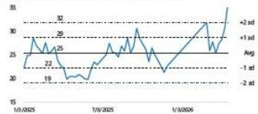  
Chart1-Delton-ALT1-yr Fwd PE

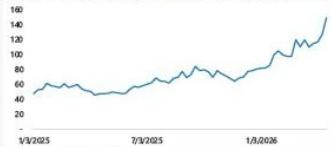  
Chart2-Delton-ALT Share Price Trend

Jacky He\*|EquityAnalyst +85237438084jacky.he@jefferies.com

EdisonLee,CFA\*|Equity Analyst 85237438009|edison.lee@jefferles.com

Nick Cheng\*IEquity Analyst +85237438750|nick.cheng@jefferies.com

MattMa\*|Equity Analyst 85237671109|matt.ma@jefferies.com +85237671273|annie.ping@jefferies.com

# Company Overview

Delton Technology was founded in 2002 in Guangzhou, China by 3CEMS Group under First International Computer as a Taiwanese OEM/ODM) for PCB manufacturing mainly adopted in PC markets. It was later acquired by Mr. Hongxin Xiao in 2013 with business restructuring and transformation, and now focuses on server-related PCB. The stock was listed on the Shenzhen Stock Exchange in 2024, and then dual-listed on the Hong Kong Stock Exchange in 2026. Currently, Delton operates multiple factories around the world, including in Guangzhou, Dongguan, Huangshi, and Thailand.

# 订阅研报添加微信 LCD123321Cad 04-20

Table 22 - Delton Historical Milestones   

<table><tr><td>Date</td><td>Milestone</td></tr><tr><td>2002</td><td>Established by 3CEMS Group</td></tr><tr><td>2013</td><td>Hongxing Xiao acquired 92.5% of the equity of Delton</td></tr><tr><td>2019</td><td>Establish a wholly-owned subsidiary, Delton Technology (Huangshi) Inc.</td></tr><tr><td>2020</td><td>Renamed Delton Technology (Guangzhou) Inc.</td></tr><tr><td>2021</td><td>Started production of first phase of Huangshi Guanghe Multi-Layer PCB Project</td></tr><tr><td>2024</td><td>Listed on the Shenzhen Stock Exchange Main Board</td></tr><tr><td>2024</td><td>Finished construction of MLPCB project of Delton Technology (Thailand) Co., Ltd.</td></tr><tr><td>2026</td><td>Listed on the Hong Kong Stock Exchange Main Board</td></tr></table>

Source: Company data, Jefferies

In 2025, Delton's revenue breakdown is as follows: computing $( 7 5 \% )$ , industrial $( 8 \% )$ , and consumer & others $( 1 8 \% )$ . Gross profit breakdown is as follows: computing $( 7 6 \% )$ , industrial $( 2 \% )$ , and consumer & others $( 2 2 \% )$ . We forecast Delton's revenue to rise by CAGRs of $4 8 \%$ in 2026E-28E and $3 6 \%$ in 2027E-29E, mainly driven by: 1) step up in AI capex for the industry; 2) rising demand on server CPU driven by the proliferation of agentic AI with Delton's leading market share; 3) continued PCB spec upgrade in AI server with Delton's expanding customer base and extending engagement; and 4) capacity expansion for high-end PCB products in both local/overseas facilities.

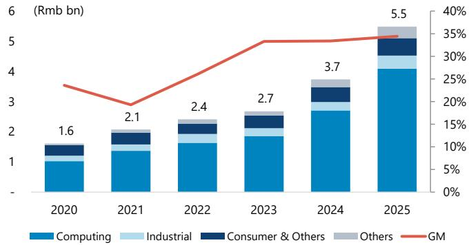  
Chart 86 - Delton Historical Revenue & Gross Margin   
Source: Company data, Jefferies

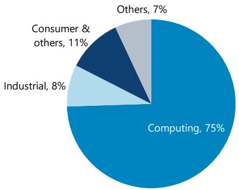  
Chart 88 - Delton 2025 Revenue Breakdown by Segment

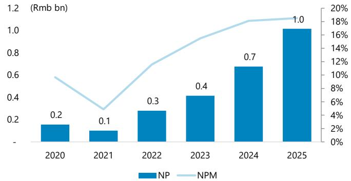  
CD123321Cad 04-20 Chart 87 - Delton Historical Net Profit & Margin   
Source: Company data, Jefferies

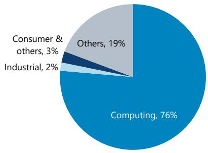  
Chart 89 - Delton 2025 Gross Profit Breakdown by Segment

# Senior Management and Shareholding Structure

Mr. Hongxing Xiao, Chairman, obtained a bachelor's degree in Chemistry from South China University of Technology. From July 1988 to Mar 1992, Mr. Xiao served as Production Manager of Dongguan Shengyi Electronics Co., Ltd. In Mar 2010, he established Hubei Unico Optoelectronic Technology Co., Ltd., engaged in LCD panel thinning and polishing processing services.

Ms. Hong Zeng, Director/General Manager, obtained a bachelor's degree in Applied Chemistry   
from South China University of Technology. Ms. Zeng holds the title of Senior Electr NITIATINGCOVERAGE 订阅研报添加From Jul 1988 to Feb 2013, she served successively as Qua d 0 B and Deputy General Manager of Do   
she has served as Director and General Manager of the company.

Mr. Jun Wang, Deputy General Manager, obtained a bachelor's degree in Business Administration from Beijing Xinghua University. Mr. Wang previously served as Quality Technician, Assistant Engineer, Engineer, Supervisor, Manager, and Quality Director at Dongguan Shengyi Electronics Co., Ltd. He joined the company in Feb 2013 and currently serves as Deputy General Manager.

Mr. Qinyuan Li, Deputy General Manager/Chief Engineer, graduated from South China University of Technology with a bachelor's degree in Chemical Engineering. Mr. Li previously served as Assistant Process Engineer, Engineer, Chief Engineer, Manager, and Senior Manager at Dongguan Shengyi Electronics Co., Ltd., and as Technical Director at Guangzhou Jiesai Technology Co., Ltd. He joined the company in Jan 2013 and currently serves as Deputy General Manager and Chief Engineer.

Mr. Yangqing Zeng, Vice General Manager/Board Secretary, graduated from China Jiliang University with a Bachelor's degree in Automatic Detection Technology and Instrumentation. Mr. Zeng previously served as Engineer at Guangdong Fudi Technology Co., Ltd., General 订阅研报添加微信 LCD123321Cad 04-20 Manager's Secretary, Securities Affairs Representative, Vice General Manager and Board Secretary at Guangdong Boxin Investment Holding Co., Ltd.

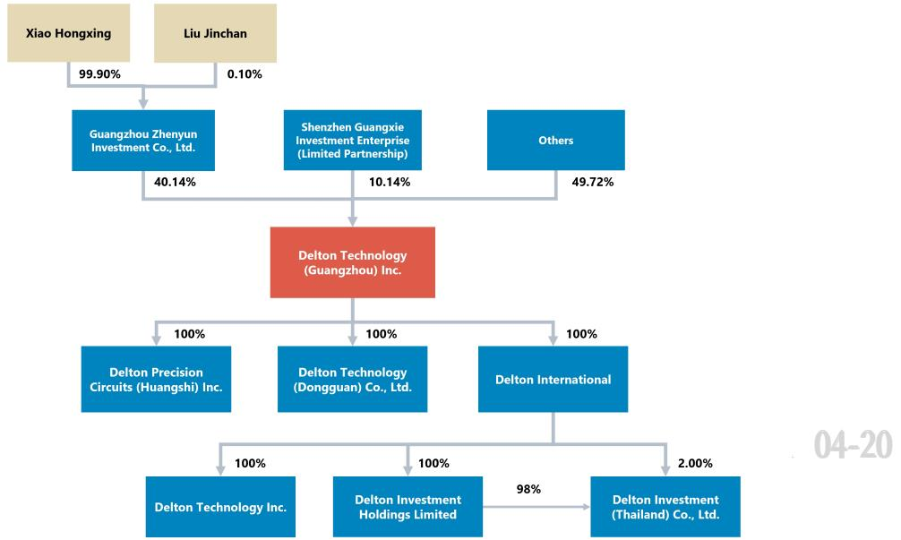  
Chart 90 - Delton Shareholding Structure   
Source: Company data, Jefferies Note: As of 4Q25

# A Key Beneficiary of Server CPU Revival

A server CPU PCB veteran that would benefit from both rising demand and PCIe migration to 6.0.

While GPU/ASIC have been in the spotlight for years as core drivers of expanding computing power, the requirements for CPU, as the brain of the server, are now being stimulated by the proliferation of agentic AI, which is designed to interact dynamically with the environment and thus, would create an intense workload for CPU. We believe this trend is likely to reshape the CPU:GPU ratio going forward, leading to rising demand for the former, which could start to be reflected in the industry going forward (e.g. Intel/AMD's outlook on server CPU). In addition to rising volume expectations, another big driver for server CPU mainboard is the migration from PCIe 5.0 (corresponding to Intel's Eagle/ Birch Stream and AMD's Geona/Turin) to 6.0 (Intel's Oak Stream and AMD's Venice) which could start in 2H26. The higher transmission speed standard requires renewed designs with material/ technique upgrade (e.g. higher-layer to $\scriptstyle > = 2 0 L$ ), leading to a considerable value increase in PCB. As a result, we estimate server CPU mainboard PCB TAM was \~US\$3bn in 2025 and forecast this to rise to >US\$10bn in 3-4 years. Delton has long captured $10 \%$ market share in server CPU PCB, which comprised ${ > } 5 0 \%$ of its total revenue/profit in 2025 (overall server-related $> 7 0 \%$ of revenue/profit). Given that the competitive landscape of server CPU PCB has been relatively stable with a mature ecosystem, we expect Delton to be a key beneficiary of the surge in TAM and are less concerned about fierce pricing competition in the foreseeable future.

Table 23 - Server CPU PCB Spec by Major Platform   

<table><tr><td colspan="4">Item</td><td colspan="5">AMD (X86)</td><td colspan="5">Amazon (ARM)</td></tr><tr><td>Platform</td><td>Purley</td><td>Whitley</td><td>Eagle Stream Birch Stream Oak Stream</td><td></td><td></td><td>Rome</td><td>Milan</td><td>Geona</td><td>Turin</td><td>Venice</td><td>Graviton 3</td><td>Graviton 4</td><td>Graviton 5</td></tr><tr><td>Layer</td><td>10-12L</td><td>12-18L</td><td>14-20L</td><td>14-20L</td><td> 20-22L</td><td>12-14L</td><td>14-16L</td><td>14-18L</td><td>14-18L</td><td> 22-24L</td><td>20L</td><td>16L</td><td>20L</td></tr><tr><td>PCle</td><td>3.0</td><td>4.0</td><td>5.0</td><td>5.0</td><td>6.0</td><td>4.0</td><td>4.0</td><td>5.0</td><td>5.0</td><td>6.0</td><td>5.0</td><td>5.0</td><td>5.0</td></tr><tr><td>DDR</td><td> DDR3</td><td> DDR4</td><td> DDR5</td><td>DDR5</td><td>DDR5</td><td> DDR4</td><td> DDR4</td><td> DDR5</td><td> DDR5</td><td>DDR5</td><td> DDR5</td><td> DDR5</td><td>DDR5</td></tr><tr><td>MP Time</td><td>2019</td><td>2022</td><td>2023</td><td>2024</td><td>2026</td><td>2021</td><td>2022</td><td>2023</td><td>2024</td><td>2026</td><td>2023</td><td>2024</td><td>2025</td></tr><tr><td>PCB Cost</td><td>S</td><td>$$</td><td> sss</td><td>$$$</td><td>$ss$</td><td>$</td><td>$$</td><td>$$$+</td><td>$$$+</td><td>$$$s+</td><td>$$$+</td><td>$$$+</td><td>$$$+</td></tr></table>

Source: Company data, Jefferies

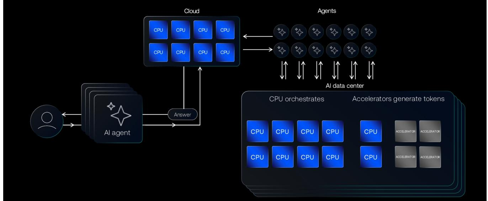  
Chart 91 - More and More CPUs needed to Balance Agent Flow

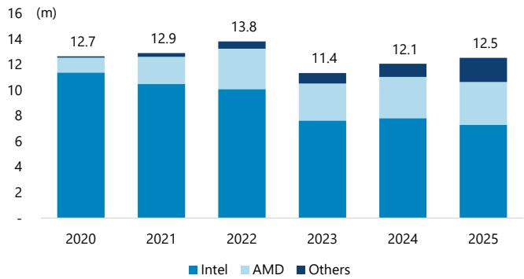  
Source: Arm, Jefferies Chart 92 - Server Shipment by CPU Vendor

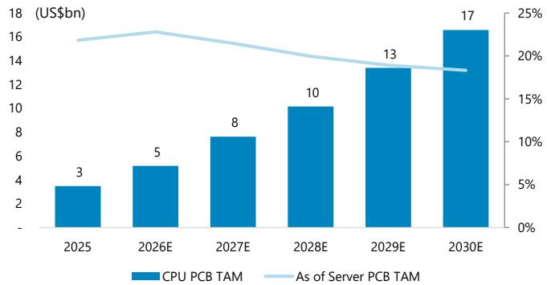  
Chart 93 - Global Server CPU PCB TAM Forecast

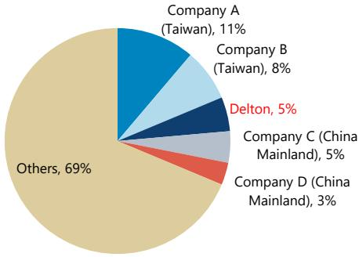  
Chart 94 - High Performance Server PCB Market Share (2022-2024)   
Source: Company data, Jefferies

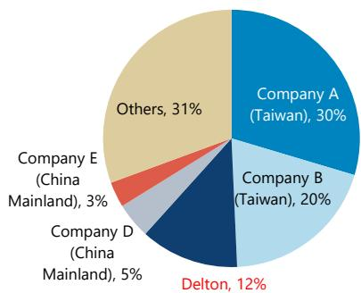  
Chart 95 - High Performance Server CPU PCB Market Share (2022-2024)   
Source: Company data, Jefferies

Smoother capacity/profitability ramp vs most peers in Thailand; CPU/AI PCB to approach ${ \sim } 7 0 \%$ profit in 2 years. Similar to many peers, Delton has been expanding capacity in both China and Thailand, and we expect its production value to rise from \~Rmb5bn last year to Rmb8-9bn in this year, with Guangzhou, Huangshi, and Thailand bases all undergoing capacity expansion either through new production ramp or technology upgrade. There are two things we would like to highlight: 1) Thanks to its decent management capabilities, Delton's production ramp in Thailand appears to be smoother than most of its peers, with a faster return to profitability; and 2) In addition to CPU PCB, Delton demonstrates strong competitiveness in AI PCB and has the potential to continue penetrating the AI server projects of multiple AI customers in the coming years. We forecast Delton's CPU/AI PCB mix to increase from ${\sim } 6 6 \%$ of net profit in 2025 to ${ \sim } 7 0 \%$ in 2027E, and gradually approach $80 \%$ going forward, driven by increasing shipments from capacity expansion and rising ASP from larger mix of high-value (especially PCIe 6.0 CPU) products. While CPU is likely to remain the major growth pillar in the near term, we believe AI server PCB could become a key driver in the longer term.

Table 24 - Delton Production Base Summary   

<table><tr><td>Base</td><td>Product</td><td>Annual Capacity (2025) (Rmb bn)</td><td>Annual Capacity (2026E) (Rmb bn)</td><td>Progress</td></tr><tr><td>Guangzhou</td><td></td><td></td><td></td><td></td></tr><tr><td>Guangzhou Base 1</td><td>Server, industrial</td><td>~4 (1+2)</td><td>&gt;6(1+2)</td><td>Expanding through tech upgrade</td></tr><tr><td>Guangzhou Base 2</td><td>Ancillary production for Base 1</td><td></td><td></td><td>Expanding through tech upgrade</td></tr><tr><td>Guangzhou Base 3</td><td>Server, industrial</td><td>0</td><td>&gt;0</td><td>Ramping from 2H26</td></tr><tr><td>Huangshi</td><td>Industrial, cosmr</td><td>~1</td><td>1-2</td><td>Expanding capacity</td></tr><tr><td>Thailand Phase 1</td><td></td><td></td><td></td><td></td></tr><tr><td>Thailand Base 1</td><td>Server</td><td>&gt;0</td><td>~1</td><td>Reaching design capacity in 1H26</td></tr><tr><td>Thailand Base 2</td><td>Server</td><td>0</td><td>&gt;0</td><td>Ramping from 2H26</td></tr></table>

Source: Company data, Jefferies estimates

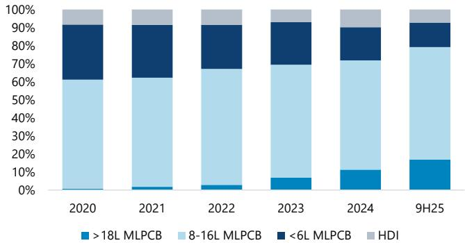  
Chart 96 - Delton PCB Revenue by Spec   
Source: Company data, Jefferies

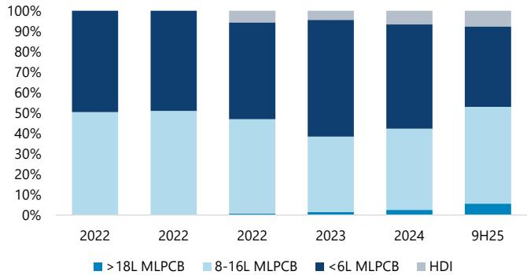  
Chart 97 - Delton PCB Shipment by Spec   
Source: Company data, Jefferies estimates

  
Chart 98 - Delton CPU/AI PCB Revenue Forecast   
Source: Company data, Jefferies

  
Chart 99 - Delton CPU/AI PCB Gross Profit Forecast   
Source: Company data, Jefferies

# Financial Forecasts and Valuation

We forecast Delton's revenue/NP to rise by CAGRs of $4 8 \% / 5 4 \%$ in 2026E-2028E and $3 6 \% / 3 9 \%$ in 2027E-2029E. We also expect EBIT margin to gradually increase, driven by more favorable product mix in the next few years. Our key operating assumptions are as follows:

• General server CPU market share rises from $12 \%$ in 2025 to $1 3 \% / 1 4 \%$ in 2027E/2030E.   
• General server non-CPU market share rises from $1 \%$ in 2025 to $2 \% / 4 \%$ in 2027E/2030E.   
• AI server CPU market share rises from $10 \%$ in 2025 to $1 5 \% / 1 3 \%$ in 2027E/2030E.   
• AI server non-CPU market share rises from $2 \%$ in 2025 to $3 \% / 3 \%$ in 2027E/2030E.   
• Blended GM rises from $3 4 . 4 \%$ in 2025 to $3 6 . 0 \% / 3 6 . 6 \%$ in 2027E/2030E.   
• EBIT margin rises from $2 2 . 7 \%$ in 2025 to $2 6 . 9 \% / 2 8 . 2 \%$ in 2027E/2030E.

Initiate with BUY and a PT of Rmb190.00/HK\$200.00 for A/H-share. Delton-A/H currently trade at $3 5 \times / 3 2 \times$ 订阅研报添加微信 LCD123321Cad 2026E P/E and 21x/19x 2027E P/E, vs our 2026E-28E/2027E-29E net profit CAGR forecasts of $5 4 \% / 3 9 \%$ . Our valuation for Delton-A is based on end-2026E DCF, with a WACC of $9 . 8 \%$ and a terminal growth rate of $6 . 5 \%$ (2030E); our price target of Rmb190.00 implies $4 5 { \times } / 2 7 { \times }$ 2026E/27E P/E or $0 . 8 { \times } / 0 . 7 { \times }$ PEG, and suggests $2 7 \%$ potential upside. Our valuation for Delton-H is based on 2026E/27E P/E of $4 1 \times / 2 5 \times ,$ our price target of $\mathsf { H K S 2 0 0 . 0 0 }$ implies $0 . 8 { \times } / 0 . 6 { \times }$ PEG, and suggests $2 6 \%$ potential upside.

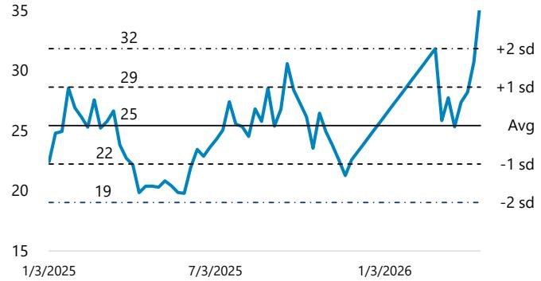  
Chart 100 - Delton-A LT 1-yr Fwd PE   
Source: FactSet, Jefferies

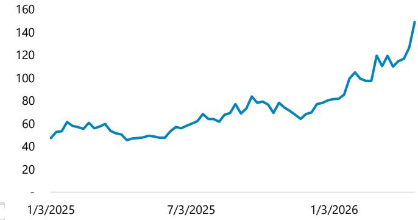  
Chart 101 - Delton-A LT Share Price Trend   
Source: FactSet, Jefferies

What are the potential positive catalysts for Delton? 1) Better-than-expected server CPU demand; 2) Further market share gain and expansion to new customers in AI server market; 3) Ongoing spec upgrade of PCB with dollar content going up; 4) Accelerated capacity and profitability ramp for CPU/AI-related products in both local/overseas facilities; and 5) Easing of supply tightness in critical materials for high-end PCB.

What are the risks for Delton? 1) Deceleration in global AI capex growth; 2) Market share loss from escalating competition; 3) Slower-than-expected adoption of advanced PCB solutions due to technical barriers; 4) Technology replacement threat from other interconnection solutions such as copper cable and optical; and 5) Supply chain uncertainties or additional costs due to supply bottlenecks of upstream materials/tools or escalating geopolitical risks.

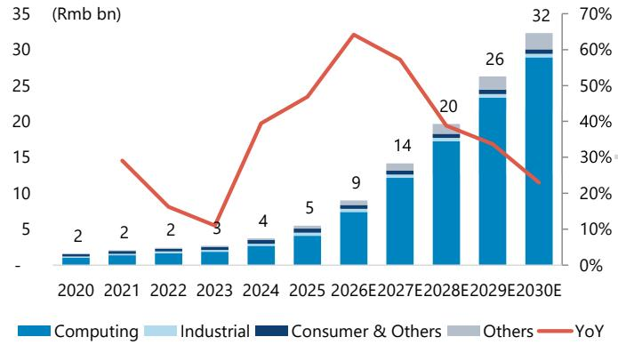  
Chart 102 - Delton Revenue Forecast by Segment   
Source: Company data, Jefferies estimates

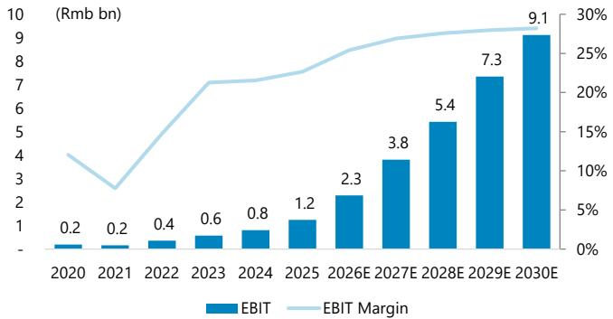  
Source: Company data, Jefferies estimates Chart 104 - Delton EBIT Forecast   
Source: Company date, Jefferies estimates

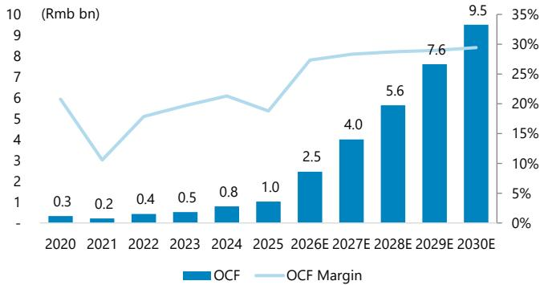  
Chart 106 - Delton Operating Cash Flow Forecast   
Source: Company data, Jefferies estimates

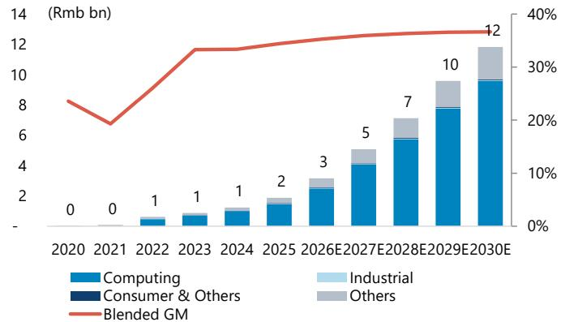  
Chart 103 - Delton Gross Margin & Profit Forecast by Segment

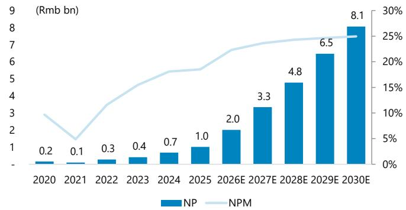  
Chart 105 - Delton Net Profit Forecast   
Source: Company data, Jefferies estimates

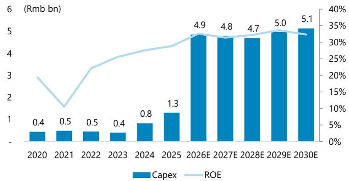  
Chart 107 - Delton Capex & ROE Forecast   
Source: Company date, Jefferies estimates

Table 25 - Delton Valuation Summary   

<table><tr><td>(Rmb m)</td><td>2020A</td><td>2021A</td><td>2022A</td><td>2023A</td><td>2024A</td><td>2025A</td><td>2026E</td><td>2027E</td><td>2028E</td><td>2029E</td><td>2030E</td></tr><tr><td>Revenue</td><td>1,607</td><td>2,076</td><td>2,412</td><td>2,678</td><td>3,734</td><td>5,485</td><td>9,006</td><td>14,159</td><td>19,653</td><td>26,268</td><td>32,308</td></tr><tr><td>YoY</td><td></td><td>29%</td><td>16%</td><td>11%</td><td>39%</td><td>47%</td><td>64%</td><td>57%</td><td>39%</td><td>34%</td><td>23%</td></tr><tr><td></td><td rowspan="2"></td><td rowspan="2"></td><td rowspan="2"></td><td rowspan="2"></td><td rowspan="2"></td><td rowspan="2"></td><td rowspan="2">10%</td><td rowspan="2">22%</td><td rowspan="2">17%</td><td rowspan="2"></td><td rowspan="2"></td></tr><tr><td>vsconsensus EBIT</td></tr><tr><td></td><td>194</td><td>161 -17%</td><td>356 121%</td><td>570 60%</td><td>805 41%</td><td>1,243 55%</td><td>2,289 84%</td><td>3,808 66%</td><td>5,419 42%</td><td>7,345 36%</td><td>9,113 24%</td></tr><tr><td>YoY vsconsensus</td><td></td><td></td><td></td><td></td><td></td><td></td><td>20%</td><td>33%</td><td>22%</td><td></td><td></td></tr><tr><td>Net profit</td><td>156</td><td>101</td><td>280</td><td>415</td><td>676</td><td>1,016</td><td>2,009</td><td>3,346</td><td>4,777</td><td>6,470</td><td>8,061</td></tr><tr><td>YoY</td><td></td><td>-35%</td><td>177%</td><td>48%</td><td>63%</td><td>50%</td><td>98%</td><td>66%</td><td>43%</td><td>35%</td><td>25%</td></tr><tr><td>vsconsensus</td><td></td><td></td><td></td><td></td><td></td><td></td><td>21%</td><td>32%</td><td>23%</td><td></td><td></td></tr><tr><td>EPS (Rmb) YoY</td><td>0.45</td><td>0.28 -38%</td><td>0.74 164%</td><td>1.09 47%</td><td>1.65 51%</td><td>2.39 45%</td><td>4.25 78%</td><td>7.08 66%</td><td>10.11 43%</td><td>13.70 35%</td><td>17.06</td></tr><tr><td>vs consensus</td><td></td><td></td><td></td><td></td><td></td><td></td><td>17%</td><td>29%</td><td>23%</td><td></td><td>25%</td></tr><tr><td>Multiples</td><td></td><td></td><td></td><td></td><td></td><td></td><td></td><td></td><td></td><td></td><td></td></tr><tr><td>EV/Adj. EBITDA</td><td>288.9</td><td>278.1</td><td>141.6</td><td>95.7</td><td>71.7</td><td>48.0</td><td>27.5</td><td>15.7</td><td>10.9</td><td>8.0</td><td>6.2</td></tr><tr><td>PB x</td><td>27.2</td><td>17.5</td><td>17.4</td><td>14.9</td><td>10.8</td><td>8.4</td><td>5.2</td><td>3.5</td><td>2.7</td><td>2.1</td><td>1.6</td></tr><tr><td>PEx</td><td>331.6</td><td>532.9</td><td>201.6</td><td>136.9</td><td>90.4</td><td>62.4</td><td>35.1</td><td>21.1</td><td>14.8</td><td>10.9</td><td>8.7</td></tr><tr><td>EV/IC</td><td>96.7</td><td>75.3</td><td>54.5</td><td>43.7</td><td>31.1</td><td>20.5</td><td>11.1</td><td>6.6</td><td>4.8</td><td>3.7</td><td>3.0</td></tr><tr><td>PS x EV/Sales</td><td>43.9</td><td>34.0 34.0</td><td>29.2</td><td>26.3</td><td>18.9</td><td>12.9</td><td>7.8</td><td>5.0</td><td>3.6</td><td>2.7</td><td>2.2</td></tr><tr><td></td><td>43.8</td><td></td><td>29.2</td><td>26.3</td><td>18.8</td><td>12.9</td><td>7.9</td><td>5.0</td><td>3.6</td><td>2.6</td><td>2.1</td></tr><tr><td> Financials</td><td></td><td></td><td></td><td></td><td></td><td></td><td></td><td></td><td></td><td></td><td></td></tr><tr><td>Net debt (cash)</td><td>(71)</td><td>23</td><td>34</td><td>(48)</td><td>(343)</td><td>176</td><td>203</td><td>(282)</td><td>(197)</td><td></td><td></td></tr><tr><td>EBITDA</td><td>244</td><td>254</td><td>498</td><td>736</td><td></td><td>1,472</td><td>2,570</td><td>4,479</td><td>6,432</td><td>(1,441)</td><td>(4,067)</td></tr><tr><td>EV</td><td>70,428</td><td>70,522</td><td>70,533</td><td>70,450</td><td>979 70,155</td><td>70,674</td><td>70,702</td><td>70,217</td><td>70,301</td><td>8,655</td><td>10,709</td></tr><tr><td>BVPS (Rmb)</td><td>5.48</td><td>8.53</td><td>8.59</td><td>10.02</td><td>13.88</td><td>17.75</td><td>28.51</td><td>42.92</td><td>55.76</td><td>69,058 72.41</td><td>66,431</td></tr><tr><td>FCF</td><td>(111)</td><td>(269)</td><td>(25)</td><td>123</td><td>(31)</td><td>(278)</td><td>(2,390)</td><td>(787)</td><td>954</td><td>2,651</td><td>91.20 4,380</td></tr><tr><td>ROAE</td><td>19.5%</td><td>10.5%</td><td>22.1%</td><td>25.6%</td><td>27.6%</td><td>28.8%</td><td>32.6%</td><td>31.4%</td><td>32.2%</td><td>33.6%</td><td></td></tr><tr><td>ROIC</td><td>23.7%</td><td>18.1%</td><td>24.8%</td><td>29.5%</td><td>31.6%</td><td>32.3%</td><td>31.7%</td><td>31.6%</td><td>32.7%</td><td>35.1%</td><td>32.3% 36.2%</td></tr><tr><td>Net debt (cash)/equity</td><td>(0.1)</td><td>0.0</td><td>0.0</td><td>(0.0)</td><td>(0.1)</td><td>0.0</td><td>0.0</td><td>(0.0)</td><td>(0.0)</td><td>(0.1)</td><td>(0.2)</td></tr><tr><td>Net debt (cash)/adj.EBITDA</td><td>(0.3)</td><td>0.1</td><td>0.1</td><td>(0.1)</td><td>(0.4)</td><td>0.1</td><td>0.1</td><td>(0.1)</td><td>(0.0)</td><td>(0.2)</td><td>(0.4)</td></tr><tr><td>Adj. EBITDA/net interest</td><td>39.3</td><td>43.9</td><td>42.7</td><td>52.8</td><td>61.7</td><td>88.8</td><td>116.2</td><td>202.4</td><td>290.7</td><td>391.2</td><td>484.0</td></tr><tr><td>FCF yield</td><td>-0.2%</td><td>-0.4%</td><td>0.0%</td><td>0.2%</td><td>0.0%</td><td>-0.4%</td><td>-3.4%</td><td>-1.1%</td><td>1.4%</td><td>3.8%</td><td>6.2%</td></tr><tr><td>DPS (Rmb)</td><td>0.01</td><td>0.01</td><td>0.03</td><td>0.04</td><td>0.29</td><td>0.52</td><td>0.93</td><td>1.54</td><td>2.20</td><td>2.98</td><td>3.71</td></tr><tr><td>Dividend yield</td><td>0.0%</td><td>0.0%</td><td>0.0%</td><td>0.0%</td><td>0.2%</td><td>0.3%</td><td>0.6%</td><td></td><td>1.0% 1.5%</td><td>2.0%</td><td>2.5%</td></tr></table>

Source: Company data, FactSet, Jefferies estimates

Table 26 - Delton DCF Model   

<table><tr><td>(Rmb m)</td><td>2020A</td><td>2021A</td><td>2022A</td><td>2023A</td><td>2024A</td><td>2025A</td><td>2026E</td><td>2027E</td><td>2028E</td><td>2029E</td><td>2030E</td></tr><tr><td>Net Income</td><td>156</td><td>101</td><td>280</td><td>415</td><td>676</td><td>1,016</td><td>2,009</td><td>3,346</td><td>4,777</td><td>6,470</td><td>8,061</td></tr><tr><td>Plus</td><td></td><td></td><td></td><td></td><td></td><td></td><td></td><td></td><td></td><td></td><td></td></tr><tr><td>After-tax interest expense</td><td>4</td><td>5</td><td>9</td><td>8</td><td>(1)</td><td>(3)</td><td>4</td><td>5</td><td>(9)</td><td>(6)</td><td>(42)</td></tr><tr><td>D&amp;A</td><td>50</td><td>93</td><td>142</td><td>167</td><td>174</td><td>228</td><td>282</td><td>671</td><td>1,013</td><td>1,310</td><td>1,596</td></tr><tr><td>Less</td><td></td><td></td><td></td><td></td><td></td><td></td><td></td><td></td><td></td><td></td><td></td></tr><tr><td>Change in working capital</td><td>-</td><td>(137)</td><td>202</td><td>132</td><td>42</td><td>323</td><td>(170)</td><td>8</td><td>145</td><td>172</td><td>150</td></tr><tr><td>Capex</td><td>444</td><td>488</td><td>456</td><td>404</td><td>828</td><td>1,309</td><td>4,851</td><td>4,796</td><td>4,692</td><td>4,957</td><td>5,128</td></tr><tr><td>Unlevered freecash flow</td><td>(234)</td><td>(153)</td><td>(227)</td><td>53</td><td>(21)</td><td>(392)</td><td>(2,386)</td><td>(782)</td><td>946</td><td>2,644</td><td>4,338</td></tr><tr><td>Terminal value</td><td></td><td></td><td></td><td></td><td></td><td></td><td></td><td></td><td></td><td></td><td></td></tr><tr><td>Total UFCF</td><td>(234)</td><td>(153)</td><td>(227)</td><td>53</td><td>(21)</td><td>(392)</td><td>(2,386)</td><td>(782)</td><td>946</td><td>2,644</td><td>143,980</td></tr><tr><td>Discount period</td><td></td><td></td><td></td><td></td><td></td><td></td><td>1</td><td>2</td><td>3</td><td>4</td><td>5</td></tr><tr><td>Discount factor</td><td></td><td></td><td></td><td></td><td></td><td></td><td>0.9108</td><td>0.8296</td><td>0.7556</td><td>0.6882</td><td>0.6268</td></tr><tr><td>PV</td><td></td><td></td><td></td><td></td><td></td><td></td><td>(2,173)</td><td>(649)</td><td>715</td><td>1,820</td><td>90,253</td></tr><tr><td>NPV</td><td>89,966</td><td></td><td></td><td></td><td></td><td></td><td></td><td></td><td></td><td></td><td></td></tr><tr><td> Less: net debt (cash)</td><td>203</td><td></td><td></td><td></td><td></td><td></td><td></td><td></td><td></td><td></td><td></td></tr><tr><td>Equity value</td><td>89,763</td><td></td><td></td><td></td><td></td><td></td><td></td><td></td><td></td><td></td><td></td></tr><tr><td>Equity value per share (Rmb)</td><td>190.00</td><td></td><td></td><td></td><td></td><td></td><td></td><td></td><td></td><td></td><td></td></tr><tr><td>WACC</td><td></td><td></td><td></td><td></td><td></td><td></td><td></td><td></td><td></td><td></td><td></td></tr><tr><td>Terminal growth</td><td>9.8%</td><td></td><td></td><td></td><td></td><td></td><td></td><td></td><td></td><td></td><td></td></tr><tr><td>Terminal FCFx</td><td>6.5%</td><td></td><td></td><td></td><td></td><td></td><td></td><td></td><td></td><td></td><td></td></tr><tr><td>Terminal value (Rmb m)</td><td>32 139,643</td><td></td><td></td><td></td><td></td><td></td><td></td><td></td><td></td><td></td><td></td></tr><tr><td>Implied 2030 EV/EBITDA</td><td>13.0</td><td></td><td></td><td></td><td></td><td></td><td></td><td></td><td></td><td></td><td></td></tr><tr><td>Implied 2030 P/E</td><td>17.8</td><td></td><td></td><td></td><td></td><td></td><td></td><td></td><td></td><td></td><td></td></tr><tr><td>No. of shares O/S (m)</td><td>472</td><td></td><td></td><td></td><td></td><td></td><td></td><td></td><td></td><td></td><td></td></tr><tr><td></td><td></td><td></td><td></td><td></td><td></td><td></td><td></td><td></td><td></td><td></td><td></td></tr></table>

Source: Company data, Jefferies estimates

Table 27 - Delton Annual Profit & Loss   

<table><tr><td>(Rmb m)</td><td>2020A</td><td>2021A</td><td>2022A</td><td>2023A</td><td>2024A</td><td>2025A</td><td>2026E</td><td>2027E</td><td>2028E</td><td>2029E</td><td>2030E</td></tr><tr><td>Revenue</td><td>1,607</td><td>2.076</td><td>2,412</td><td>2,678</td><td>3,734</td><td>5,485</td><td>9,006</td><td>14,159</td><td>19,653</td><td>26,268</td><td>32,308</td></tr><tr><td>COGS</td><td>(1,228)</td><td>(1,675)</td><td>(1,784)</td><td>(1,786)</td><td>(2,488)</td><td>(3,597)</td><td>(5,829)</td><td>(9,068)</td><td>(12,513)</td><td>(16,664)</td><td>(20,468)</td></tr><tr><td>Gross profit</td><td>379</td><td>400</td><td>629</td><td>892</td><td>1,246</td><td>1,889</td><td>3,176</td><td>5,090</td><td>7,140</td><td>9,604</td><td>11,839</td></tr><tr><td>Total opex</td><td>(186)</td><td>(239)</td><td>(273)</td><td>(322)</td><td>(442)</td><td>(645)</td><td>(888)</td><td>(1,283)</td><td>(1,721)</td><td>(2,259)</td><td>(2,727)</td></tr><tr><td> R&amp;D expenses</td><td>(75)</td><td>(93)</td><td>(115)</td><td>(121)</td><td>(179)</td><td>(280)</td><td>(433)</td><td>(638)</td><td>(866)</td><td>(1,136)</td><td>(1,372)</td></tr><tr><td> G&amp;A expenses</td><td>(64)</td><td>(86)</td><td>(89)</td><td>(96)</td><td>(132)</td><td>(212)</td><td>(293)</td><td>(404)</td><td>(541)</td><td>(710)</td><td>(857)</td></tr><tr><td>S&amp;M expenses</td><td>(47)</td><td>(60)</td><td>(69)</td><td>(106)</td><td>(131)</td><td>(154)</td><td>(162)</td><td>(241)</td><td>(315)</td><td>(413)</td><td>(498)</td></tr><tr><td>EBITDA</td><td>244</td><td>254</td><td>498</td><td>736</td><td>979</td><td>1,472</td><td>2,570</td><td>4,479</td><td>6,432</td><td>8,655</td><td>10,709</td></tr><tr><td>D&amp;A</td><td>50</td><td>93</td><td>142</td><td>167</td><td>174</td><td>228</td><td>282</td><td>671</td><td>1,013</td><td>1,310</td><td>1,596</td></tr><tr><td>EBIT</td><td>194</td><td>161</td><td>356</td><td>570</td><td>805</td><td>1,243</td><td>2,289</td><td>3,808</td><td>5,419</td><td>7,345</td><td>9,113</td></tr><tr><td>Other income (expense)</td><td>(20)</td><td>(65)</td><td>(45)</td><td>(73)</td><td>(42)</td><td>(107)</td><td>(5)</td><td>(6)</td><td>10</td><td>7</td><td>48</td></tr><tr><td>Profit before tax</td><td>174</td><td>96</td><td>311</td><td>497</td><td>762</td><td>1,137</td><td>2,283</td><td>3.802</td><td>5,429</td><td>7,353</td><td>9,161</td></tr><tr><td>Income taxes Minority interest</td><td>(19)</td><td>5 -</td><td>(31) -</td><td>(82)</td><td>(86)</td><td>(121)</td><td>(274)</td><td>(456)</td><td>(651)</td><td>(882)</td><td>(1,099)</td></tr><tr><td>Net income (loss)</td><td>- 156</td><td>101</td><td>280</td><td>- 415</td><td>- 676</td><td>- 1,016</td><td>、 2,009</td><td>- 3,346</td><td>- 4,777</td><td>- 6,470</td><td>- 8,061</td></tr><tr><td>EPS basic (Rmb)</td><td>0.45</td><td>0.28</td><td>0.74</td><td>1.09</td><td>1.66</td><td>2.40</td><td>4.25</td><td>7.08</td><td>10.11</td><td>13.70</td><td>17.06</td></tr><tr><td>EPS diluted (Rmb)</td><td>0.45</td><td>0.28</td><td>0.74</td><td>1.09</td><td>1.65</td><td>2.39</td><td>4.25</td><td>7.08</td><td>10.11</td><td>13.70</td><td>17.06</td></tr><tr><td>Wgt. avg.ordinary shares (basic)</td><td>346</td><td>361</td><td>378</td><td>380</td><td>407</td><td>423</td><td>472</td><td>472</td><td>472</td><td>472</td><td>472</td></tr><tr><td>Wgt. avg.ordinary shares (diluted)</td><td>346</td><td>361</td><td>378</td><td>380</td><td>410</td><td>425</td><td>472</td><td>472</td><td>472</td><td>472</td><td>472</td></tr><tr><td>DPS (Rmb)</td><td>0.01</td><td>0.01</td><td>0.03</td><td>0.04</td><td>0.29</td><td>0.52</td><td>0.93</td><td>1.54</td><td>2.20</td><td>2.98</td><td>3.71</td></tr><tr><td>Payout ratio</td><td>3%</td><td>4%</td><td>4%</td><td>3%</td><td>18%</td><td>22%</td><td>22%</td><td>22%</td><td>22%</td><td>22%</td><td>22%</td></tr></table>

Source: Company data, Jefferies estimates

Table 28 - Delton Quarterly Profit & Loss   

<table><tr><td>(Rmb m)</td><td>1Q24</td><td>2Q24</td><td>3Q24</td><td>4Q24</td><td>1Q25</td><td>2Q25</td><td>3Q25</td><td>4Q25</td><td>1Q26E</td><td>2Q26E</td><td>3Q26E</td><td>4Q26E</td></tr><tr><td>Revenue</td><td>784</td><td>921</td><td>975</td><td>1,054</td><td>1,117</td><td>1,308</td><td>1,410</td><td>1,650</td><td>1,801</td><td>2.071</td><td>2,341</td><td>2,792</td></tr><tr><td>COGS</td><td>(514)</td><td>(606)</td><td>(668)</td><td>(700)</td><td>(724)</td><td>(818)</td><td>(957)</td><td>(1,098)</td><td>(1,169)</td><td>(1,283)</td><td>(1,529)</td><td>(1,848)</td></tr><tr><td>Gross profit</td><td>270</td><td>315</td><td>307</td><td>354</td><td>393</td><td>490</td><td>454</td><td>552</td><td>633</td><td>788</td><td>812</td><td>943</td></tr><tr><td>Total opex</td><td>(89)</td><td>(101)</td><td>(109)</td><td>(143)</td><td>(140)</td><td>(151)</td><td>(167)</td><td>(187)</td><td>(184)</td><td>(202)</td><td>(235)</td><td>(267)</td></tr><tr><td>R&amp;D expenses</td><td>(32)</td><td>(48)</td><td>(50)</td><td>(49)</td><td>(53)</td><td>(64)</td><td>(77)</td><td>(86)</td><td>(80)</td><td>(95)</td><td>(121)</td><td>(137)</td></tr><tr><td> G&amp;A expenses</td><td>(30)</td><td>(18)</td><td>(25)</td><td>(60)</td><td> (51)</td><td>(49)</td><td>(51)</td><td>(60)</td><td>(64)</td><td>(68)</td><td>(74)</td><td>(88)</td></tr><tr><td>S&amp;M expenses</td><td>(27)</td><td>(34)</td><td>(34)</td><td>(35)</td><td>(36)</td><td>(38)</td><td>(39)</td><td>(41)</td><td>(40)</td><td>(39)</td><td>(41)</td><td>(42)</td></tr><tr><td>EBITDA</td><td>225</td><td>259</td><td>241</td><td>254</td><td>310</td><td>378</td><td>352</td><td>431</td><td>519</td><td>657</td><td>647</td><td>747</td></tr><tr><td>D&amp;A</td><td>44</td><td>45</td><td>43</td><td>43</td><td>57</td><td>39</td><td>66</td><td>66</td><td>70</td><td>70</td><td>70</td><td>70</td></tr><tr><td>EBIT</td><td>182</td><td>214</td><td>198</td><td>211</td><td>253</td><td>339</td><td>287</td><td>365</td><td>449</td><td>586</td><td>577</td><td>677</td></tr><tr><td>Other gains or losses</td><td>(1)</td><td>(22)</td><td>(15)</td><td>(4)</td><td>24</td><td>(52)</td><td>(27)</td><td>(51)</td><td>(1)</td><td>(1)</td><td>(1)</td><td>(1)</td></tr><tr><td>Profit before tax</td><td>180</td><td>193</td><td>183</td><td>206</td><td>277</td><td>286</td><td>260</td><td>313</td><td>447</td><td>585</td><td>575</td><td>676</td></tr><tr><td>Income taxes</td><td>(35)</td><td>(19)</td><td>(10)</td><td>(23)</td><td>(37)</td><td>(35)</td><td>(28)</td><td> (21)</td><td>(54)</td><td>(70)</td><td>(69)</td><td>(81)</td></tr><tr><td>Minority interest</td><td>-</td><td>-</td><td>-</td><td>-</td><td>-</td><td>-</td><td>-</td><td>-</td><td>-</td><td>-</td><td>-</td><td>-</td></tr><tr><td>Net income (loss)</td><td>145</td><td>174</td><td>173</td><td>184</td><td>240</td><td>251</td><td>232</td><td>292</td><td>394</td><td>515</td><td>506</td><td>594</td></tr><tr><td>EPS basic (Rmb)</td><td>0.34</td><td>0.41</td><td>0.41</td><td>0.43</td><td>0.57</td><td>0.59</td><td>0.55</td><td>0.69</td><td>0.88</td><td>1.09</td><td>1.07</td><td>1.26</td></tr><tr><td>EPS diluted (Rmb)</td><td>0.34</td><td>0.41</td><td>0.41</td><td>0.43</td><td>0.57</td><td>0.59</td><td>0.55</td><td>0.69</td><td>0.88</td><td>1.09</td><td>1.07</td><td>1.26</td></tr><tr><td>Wgt. avg. ordinary shares (basic)</td><td>422</td><td>422</td><td>422</td><td>424</td><td>425</td><td>425</td><td>425</td><td>425</td><td>449</td><td>472</td><td>472</td><td>472</td></tr><tr><td>Wgt. avg. ordinary shares (diluted)</td><td>422</td><td>422</td><td>422</td><td>424</td><td>425</td><td>425</td><td>425</td><td>425</td><td>449</td><td>472</td><td>472</td><td>472</td></tr></table>

Source: Company data, Jefferies estimates

Table 29 - Delton Balance Sheet   

<table><tr><td>(Rmb m)</td><td>2020A</td><td>2021A</td><td>2022A</td><td>2023A</td><td>2024A</td><td>2025A</td><td>2026E</td><td>2027E</td><td>2028E</td><td>2029E</td><td>2030E</td></tr><tr><td>Cash and cash equivalent</td><td>192</td><td>178</td><td>281</td><td>431</td><td>721</td><td>520</td><td>492</td><td>977</td><td>893</td><td>2,136</td><td>4,762</td></tr><tr><td>Receivables</td><td>470</td><td>783</td><td>716</td><td>899</td><td>1,305</td><td>2,056</td><td>3,128</td><td>4,724</td><td>6,557</td><td>8,764</td><td>10,780</td></tr><tr><td>Inventories</td><td>191</td><td>446</td><td>356</td><td>397</td><td>459</td><td>764</td><td>1,079</td><td>1,679</td><td>2,317</td><td>3,085</td><td>3,790</td></tr><tr><td>Other currentassets</td><td>35</td><td>46 1,454</td><td>44 1,397</td><td>75</td><td>364</td><td>354</td><td>354</td><td>354</td><td>354</td><td>354</td><td>354</td></tr><tr><td>Total current assets</td><td>887</td><td></td><td></td><td>1,803</td><td>2,849</td><td>3,694</td><td>5,054</td><td>7,734</td><td>10,121</td><td>14,339</td><td>19,686</td></tr><tr><td>Property, plant and equipment</td><td>605</td><td>1,374</td><td>1,574</td><td>1,534</td><td>1,782</td><td>3,032</td><td>7,379</td><td>11,305</td><td>14,808</td><td>18,283</td><td>21,649</td></tr><tr><td>Construction in process</td><td>232</td><td>73</td><td>77</td><td>255</td><td>740</td><td>255</td><td>255</td><td>255</td><td>255</td><td>255</td><td>255</td></tr><tr><td> Intangible assets</td><td>89</td><td>133</td><td>134</td><td>157</td><td>163</td><td>205</td><td>427</td><td>626</td><td>802</td><td>974</td><td>1,140</td></tr><tr><td>Otherassets Total non-current assets</td><td>82</td><td>47</td><td>62</td><td>64</td><td>152</td><td>357</td><td>357</td><td>357</td><td>357</td><td>357</td><td>357</td></tr><tr><td>Total assets</td><td>1,008 1,895</td><td>1,628 3,081</td><td>1,848 3,245</td><td>2,010 3,812</td><td>2,837 5,686</td><td>3,848 7,542</td><td>8,418 13,472</td><td>12,543 20,277</td><td>16,221 26,342</td><td>19,869 34,209</td><td>23,401 43,086</td></tr><tr><td></td><td></td><td></td><td></td><td></td><td></td><td></td><td></td><td></td><td></td><td></td><td></td></tr><tr><td>Accounts payable</td><td>783</td><td>1,489</td><td>1,129</td><td>1,222</td><td>1,647</td><td>2,380</td><td>3,937</td><td>6,125</td><td>8,451</td><td>11,255</td><td>13,825</td></tr><tr><td>Borrowings &amp; bonds Other current liabilities</td><td>46 80</td><td>130</td><td>132</td><td>79</td><td>100</td><td>268</td><td>268</td><td>268</td><td>268</td><td>268</td><td>268</td></tr><tr><td>Total current liabilities</td><td>909</td><td>217 1,835</td><td>239 1,500</td><td>255</td><td>436 2,183</td><td>365</td><td>365</td><td>365 6,758</td><td>365 9,084</td><td>365 11,888</td><td>365 14,458</td></tr><tr><td></td><td></td><td></td><td></td><td>1,555</td><td></td><td>3,013</td><td>4,570</td><td></td><td></td><td></td><td></td></tr><tr><td>Long-term liabilities</td><td>13</td><td>-</td><td>102</td><td>222</td><td>192</td><td>318</td><td>318</td><td>318</td><td>318</td><td>318</td><td>318</td></tr><tr><td>Other liabilities Total non-current liabilities</td><td>174</td><td>124</td><td>233</td><td>205</td><td>237</td><td>233</td><td>233</td><td>233</td><td>233</td><td>233</td><td>233</td></tr><tr><td>Total liabilities</td><td>187 1,096</td><td>124 1,959</td><td>336 1,836</td><td>427 1,982</td><td>429 2,612</td><td>551</td><td>551</td><td>551</td><td>551</td><td>551</td><td>551</td></tr><tr><td></td><td></td><td></td><td></td><td></td><td></td><td>3,564</td><td>5,121</td><td>7,309</td><td>9,635</td><td>12,439</td><td>15,009</td></tr><tr><td>Common stock</td><td>790</td><td>1,012</td><td>1,019</td><td>1,026</td><td>1,695</td><td>1,793</td><td>4,593</td><td>6,593</td><td>6,593</td><td>6,593</td><td>6,593</td></tr><tr><td>Retained earnings</td><td>4</td><td>91</td><td>341</td><td>711</td><td>1,211</td><td>1,974</td><td>3,546</td><td>6,164</td><td>9,903</td><td>14,965</td><td>21,273</td></tr><tr><td>Minority interest Other equity</td><td>5</td><td>20</td><td>- 48</td><td>- 93</td><td>- 168</td><td>-</td><td>- 211</td><td>-</td><td>- 211</td><td></td><td>-</td></tr><tr><td>Total equity</td><td>799</td><td>1,122</td><td>1,409</td><td>1,830</td><td>3,074</td><td>211</td><td>8,350</td><td>211 12,968</td><td></td><td>211</td><td>211</td></tr><tr><td>Total liabilitiesand equity</td><td>1,895</td><td>3,081</td><td>3,245</td><td>3,812</td><td>5,686</td><td>3,978 7,542</td><td>13,472</td><td>20,277</td><td>16,707 26,342</td><td>21,770 34,209</td><td>28,078 43,086</td></tr></table>

Table 30 - Delton Cash Flow Statement   

<table><tr><td>(Rmb m)</td><td>2020A</td><td>2021A</td><td>2022A</td><td>2023A</td><td>2024A</td><td>2025A</td><td>2026E</td><td>2027E</td><td>2028E</td><td>2029E</td><td>2030E</td></tr><tr><td>Net profit (loss)</td><td>156</td><td>101</td><td>280</td><td>415</td><td>676</td><td>1,016</td><td>2,009</td><td>3,346</td><td>4,777</td><td>6,470</td><td>8,061</td></tr><tr><td>Minority Interest add back</td><td>-</td><td>-</td><td>-</td><td>-</td><td>-</td><td>-</td><td>-</td><td>-</td><td>-</td><td>-</td><td>-</td></tr><tr><td>Depreciation&amp;amortization</td><td>50</td><td>93</td><td>142</td><td>167</td><td>174</td><td>228</td><td>282</td><td>671</td><td>1,013</td><td>1,310</td><td>1,596</td></tr><tr><td>(Increase) decrease in working capital and others</td><td>-</td><td>137</td><td>(202)</td><td>(132)</td><td>(42)</td><td>(323)</td><td>170</td><td>(8)</td><td>(145)</td><td>(172)</td><td>(150)</td></tr><tr><td>Others Netcash fromoperatingactivities</td><td>128</td><td>(111)</td><td>211</td><td>79</td><td>(12)</td><td>111</td><td>-</td><td>-</td><td>-</td><td>-</td><td>-</td></tr><tr><td></td><td>334</td><td>219</td><td>431</td><td>528</td><td>796</td><td>1,032</td><td>2,461</td><td>4,008</td><td>5,646</td><td>7,608</td><td>9,508</td></tr><tr><td>Capex</td><td>(444)</td><td>(488)</td><td>(456)</td><td>(404)</td><td>(828)</td><td>(1,309)</td><td>(4,851)</td><td>(4,796)</td><td>(4,692)</td><td>(4,957)</td><td>(5,128)</td></tr><tr><td>Other investment Net cash used in investingactivities</td><td>13</td><td>9</td><td>1</td><td>(21)</td><td>(296)</td><td>98</td><td>-</td><td>-</td><td>-</td><td>-</td><td>-</td></tr><tr><td></td><td>(432)</td><td>(480)</td><td>(456)</td><td>(425)</td><td>(1,124)</td><td>(1,212)</td><td>(4,851)</td><td>(4,796)</td><td>(4,692)</td><td>(4,957)</td><td>(5,128)</td></tr><tr><td>Issuance of debt/borrowing</td><td>127</td><td>53</td><td>152</td><td>74</td><td>55</td><td>171</td><td>-</td><td>-</td><td>-</td><td>-</td><td>-</td></tr><tr><td> Issuance of equity</td><td>31</td><td>215</td><td>-</td><td>-</td><td>733</td><td>11</td><td>2,800</td><td>2,000</td><td>-</td><td>-</td><td>-</td></tr><tr><td>Dividends and interests</td><td>(5)</td><td>(4)</td><td>(12)</td><td>(14)</td><td>(120)</td><td>(221)</td><td>(437)</td><td>(728)</td><td>(1,039)</td><td>(1,407)</td><td>(1,753)</td></tr><tr><td>Change inminority interest</td><td>-</td><td>-</td><td>-</td><td>-</td><td>-</td><td></td><td>-</td><td>-</td><td>-</td><td>-</td><td>-</td></tr><tr><td>Others Net cash from financing activities</td><td>(32) 121</td><td>(19) 244</td><td>(33)</td><td>(16)</td><td>(59)</td><td>(30)</td><td>-</td><td>-</td><td>-</td><td>-</td><td>-</td></tr><tr><td>Effects of exchange rate changes</td><td></td><td></td><td>106</td><td>43</td><td>609</td><td>(69)</td><td>2,363</td><td>1,272</td><td>(1,039)</td><td>(1,407)</td><td>(1,753)</td></tr><tr><td></td><td>(8)</td><td>(6)</td><td>12</td><td>3</td><td>4</td><td>25</td><td>-</td><td>-</td><td>-</td><td>-</td><td>-</td></tr><tr><td>Net (decrease) increase in cash and cash equivalent</td><td>15</td><td>(23)</td><td>93</td><td>149</td><td>286</td><td> (225)</td><td>(28)</td><td>485</td><td>(85)</td><td>1,243</td><td>2,627</td></tr><tr><td>Cashand cash equivalent,beginning of period Cash and cash equivalent, end of period</td><td>114</td><td>129</td><td>107</td><td>200</td><td>349</td><td>635</td><td>410</td><td>383</td><td>868</td><td>783</td><td>2,026</td></tr><tr><td>Restricted cash</td><td>129</td><td>107</td><td>200</td><td>349</td><td>635</td><td>410</td><td>383</td><td>868</td><td>783</td><td>2,026</td><td>4,653</td></tr><tr><td></td><td>62</td><td>71</td><td>81</td><td>82</td><td>86</td><td>109</td><td>109</td><td>109</td><td>109</td><td>109</td><td>109</td></tr><tr><td>Cash and cash equ., end of period (incl. restricted cash)</td><td>192</td><td>178</td><td>281</td><td>431</td><td>721</td><td>520</td><td>492</td><td>977</td><td>893</td><td>2,136</td><td>4,762</td></tr></table>

Source: Company data, Jefferies

Table 31 - Delton Peer Comparison Table - Valuation   

<table><tr><td rowspan=4 colspan=24>30-Day Price Change (%)       P/E% Current  s/0Mkt Cap    EVAvgVol            12-CountryCompany   Ticker   Ccy    PT Upside   Price  (m) (Us$m) (Us$m)  (m)3-Mon6-Mon Mon 2025 2026</td><td></td><td></td><td></td><td></td><td></td><td></td><td></td><td></td><td></td><td></td><td></td><td></td><td></td><td></td><td></td><td></td><td></td><td></td><td></td><td></td><td></td><td></td><td></td><td></td><td></td></tr><tr><td rowspan=2 colspan=1></td><td rowspan=2 colspan=2>P/B</td><td rowspan=2 colspan=1></td><td rowspan=2 colspan=1></td><td rowspan=2 colspan=1>P/S</td><td rowspan=2 colspan=3></td><td></td><td rowspan=2 colspan=1></td><td></td><td rowspan=2 colspan=1>EBITDA</td><td rowspan=2 colspan=1></td><td rowspan=2 colspan=1></td><td rowspan=2 colspan=1>Sales</td><td rowspan=2 colspan=2></td><td rowspan=2 colspan=1>R</td><td rowspan=2 colspan=1>ROE (%)</td><td></td><td></td><td></td><td></td><td></td></tr><tr><td></td><td></td><td rowspan=1 colspan=1></td><td rowspan=1 colspan=2>FCF (US$m)</td><td rowspan=1 colspan=1></td><td rowspan=1 colspan=1>FCFCagr2025-</td></tr><tr><td rowspan=1 colspan=1>(m)</td><td rowspan=1 colspan=1></td><td rowspan=1 colspan=1>(Us$m)</td><td rowspan=1 colspan=2>(Us$m)</td><td rowspan=1 colspan=1>（m)</td><td rowspan=1 colspan=1>3-Mon</td><td rowspan=1 colspan=1>6-Mon</td><td rowspan=1 colspan=1>Mon</td><td rowspan=1 colspan=3>2025</td><td rowspan=1 colspan=1>2026</td><td rowspan=1 colspan=1>2027</td><td rowspan=1 colspan=2>2025 2026</td><td rowspan=1 colspan=1>2027</td><td rowspan=1 colspan=1>2025</td><td rowspan=1 colspan=1>2026</td><td rowspan=1 colspan=3>2027</td><td rowspan=1 colspan=1></td><td rowspan=1 colspan=1>2025</td><td></td><td rowspan=1 colspan=1>2026</td><td rowspan=1 colspan=1>2027</td><td rowspan=1 colspan=1>2025</td><td rowspan=1 colspan=1>2026</td><td rowspan=1 colspan=2>2027</td><td rowspan=1 colspan=1>2025</td><td rowspan=1 colspan=1>2026</td><td rowspan=1 colspan=1>2027</td><td rowspan=1 colspan=1>2025</td><td rowspan=1 colspan=1>2026</td><td rowspan=1 colspan=1>2027</td><td rowspan=1 colspan=1>2027</td></tr><tr><td rowspan=5 colspan=1>ChinaChinaChina</td><td rowspan=5 colspan=2>Delton-ADelton-HWUS</td><td rowspan=5 colspan=1>001389-CN1989-HK002463-CN</td><td rowspan=5 colspan=1>RMBHKDRMB</td><td rowspan=5 colspan=1></td><td rowspan=5 colspan=1>190.00200.00130.00</td><td rowspan=5 colspan=2>27%26%33%</td><td rowspan=5 colspan=1></td><td rowspan=5 colspan=1>149.22158.3097.66</td><td rowspan=5 colspan=1>4724721.924</td><td rowspan=5 colspan=1></td><td rowspan=3 colspan=1>9.8019.552</td><td rowspan=3 colspan=2>8,6648.664</td><td rowspan=1 colspan=1>10.6</td><td rowspan=1 colspan=1>75%</td><td rowspan=1 colspan=1>115%</td><td rowspan=1 colspan=1>224%</td><td rowspan=1 colspan=3>62.257.5</td><td rowspan=3 colspan=1>35.132.4</td><td rowspan=3 colspan=1>21.119.5</td><td rowspan=5 colspan=1>8.47.760</td><td rowspan=1 colspan=1>5.24.8</td><td rowspan=1 colspan=1></td><td rowspan=5 colspan=1>12.911.99.9</td><td rowspan=3 colspan=2>729</td><td rowspan=1 colspan=2>5.04.6</td><td rowspan=1 colspan=1></td><td rowspan=1 colspan=1>40.240.2</td><td></td><td></td><td></td><td></td><td></td><td></td><td rowspan=1 colspan=1>4.2</td><td></td><td></td><td></td><td></td><td></td><td></td><td></td></tr><tr><td rowspan=4 colspan=1>5.084.0</td><td rowspan=4 colspan=1>#N/A27%</td><td rowspan=4 colspan=1>#N/A52%</td><td rowspan=4 colspan=1>#N/A270%</td><td rowspan=2 colspan=3>57.549.1</td><td></td><td></td><td></td><td></td><td></td><td></td><td></td><td rowspan=7 colspan=1>23.024.715.426.2</td><td rowspan=7 colspan=1>13.215.911.714.2</td><td rowspan=7 colspan=1>10.810.03.54.0</td><td rowspan=7 colspan=1>6.66.93.14.7</td><td></td><td></td><td></td><td></td><td></td><td></td><td></td><td></td><td></td></tr><tr><td></td><td></td><td></td><td></td><td></td><td></td><td></td><td></td><td></td><td rowspan=6 colspan=1>29%29%28%11%8%</td><td rowspan=6 colspan=1>33%33%27%14%29%</td><td rowspan=7 colspan=1>31%31%29%18%40%57%</td><td rowspan=7 colspan=2>(41) (350)(350)(451)#N/A #N/A(458) (595)</td><td rowspan=7 colspan=1>(115)(115)(335)522#N/A240</td><td rowspan=7 colspan=1>68%68%NA132%NANA52%</td></tr><tr><td rowspan=2 colspan=1></td><td></td><td></td><td rowspan=2 colspan=1>27.724</td><td rowspan=2 colspan=1></td><td></td><td></td><td rowspan=2 colspan=1>30.6</td><td></td><td rowspan=2 colspan=1>4.1</td><td></td><td></td><td></td><td></td><td></td><td></td><td></td><td></td><td></td><td></td></tr><tr><td></td><td></td><td></td><td></td><td></td><td></td><td></td><td></td><td></td><td></td><td></td><td></td><td></td><td rowspan=4 colspan=1></td><td></td></tr><tr><td></td><td></td><td></td><td rowspan=2 colspan=1>002938-CN</td><td rowspan=2 colspan=1>RMB</td><td rowspan=3 colspan=1></td><td rowspan=3 colspan=1>65.00NC</td><td rowspan=3 colspan=2>5%A</td><td></td><td></td><td></td><td rowspan=3 colspan=1></td><td rowspan=3 colspan=1>21,09343,492</td><td></td><td></td><td></td><td></td><td></td><td></td><td rowspan=2 colspan=2>38.6</td><td></td><td></td><td rowspan=3 colspan=1>20.921.9</td><td rowspan=3 colspan=1>6014.3</td><td rowspan=3 colspan=1>2.810.7</td><td rowspan=3 colspan=1></td><td rowspan=3 colspan=1>3.77.1</td><td rowspan=3 colspan=1>3.24.5</td><td></td><td rowspan=3 colspan=1></td><td rowspan=3 colspan=1>2.53.2</td><td></td><td rowspan=3 colspan=1>18.760.7</td><td></td><td></td></tr><tr><td></td><td></td><td></td><td></td><td></td><td></td><td></td><td></td><td></td><td></td><td></td><td></td><td></td><td></td><td></td><td></td><td></td><td rowspan=2 colspan=1>4.62.43.3</td></tr><tr><td rowspan=3 colspan=1>ChinaChinaChinaChinaChina</td><td rowspan=2 colspan=1>ChinaChinaChina</td><td rowspan=2 colspan=1>AvaryDSBJVictory GiantShennan</td><td></td><td></td><td rowspan=1 colspan=1></td><td></td><td rowspan=1 colspan=1>2,3181,826</td><td rowspan=1 colspan=1></td><td></td><td></td><td rowspan=1 colspan=1>12%102%</td><td rowspan=1 colspan=1>33%172%</td><td></td><td></td><td></td><td></td><td rowspan=1 colspan=1>29.341.9</td><td></td><td></td><td></td></tr><tr><td rowspan=1 colspan=1>300476-CN</td><td rowspan=1 colspan=1>RMB</td><td rowspan=1 colspan=1></td><td rowspan=1 colspan=1>NC</td><td rowspan=1 colspan=1></td><td></td><td rowspan=1 colspan=1></td><td rowspan=1 colspan=1>326.42</td><td rowspan=1 colspan=1>870</td><td rowspan=1 colspan=1></td><td rowspan=1 colspan=1>41,616</td><td rowspan=1 colspan=1></td><td rowspan=1 colspan=1>42,156</td><td rowspan=1 colspan=1>35.3</td><td rowspan=1 colspan=1>16%</td><td rowspan=1 colspan=1>26%</td><td rowspan=1 colspan=1>344%</td><td rowspan=1 colspan=3>63.1</td><td rowspan=1 colspan=1>30.7</td><td rowspan=1 colspan=1>17.7</td><td rowspan=1 colspan=1>17.8</td><td rowspan=1 colspan=1>12.4</td><td rowspan=1 colspan=1>8.5</td><td rowspan=1 colspan=1>14.6</td><td rowspan=1 colspan=1>8.4</td><td></td><td rowspan=1 colspan=1></td><td rowspan=1 colspan=1>4.9</td><td></td><td rowspan=1 colspan=1>45.8</td><td></td><td rowspan=1 colspan=1>23.6</td><td rowspan=1 colspan=1>13.8</td><td rowspan=1 colspan=1>13.1</td><td rowspan=1 colspan=1>8.5</td><td rowspan=1 colspan=1></td><td rowspan=1 colspan=1>4.9</td><td rowspan=1 colspan=1>36%</td><td rowspan=1 colspan=1>48%</td></tr><tr><td></td><td></td><td></td><td></td><td></td><td></td><td></td><td></td><td></td><td></td><td></td><td></td><td></td><td></td><td></td><td></td><td></td><td></td><td></td><td rowspan=1 colspan=3>57.6</td><td rowspan=1 colspan=1>40.3</td><td rowspan=1 colspan=1>31.5</td><td rowspan=1 colspan=1>10.3</td><td></td><td></td><td></td><td></td><td></td><td></td><td rowspan=1 colspan=1>5.2</td><td></td><td rowspan=1 colspan=1>39.5</td><td></td><td rowspan=1 colspan=1>27.6</td><td rowspan=1 colspan=1>21.3</td><td rowspan=1 colspan=1>6.7</td><td rowspan=1 colspan=1>6.4</td><td rowspan=1 colspan=1></td><td rowspan=1 colspan=1>5.2</td><td rowspan=1 colspan=1>20%</td><td rowspan=1 colspan=1>24%</td><td rowspan=1 colspan=1>26%27%</td><td rowspan=1 colspan=2>379  50735</td><td></td><td></td></tr><tr><td rowspan=8 colspan=1>ChinaChinaChinaGlobalGlobalGlobalGlobalGlobalGlobalGlobalGlobalGlobalGlobal</td><td rowspan=8 colspan=3>Kinwong    603228-CNFastprint    002436-CNKingboard   1888-HKUnimicron   3037-TWGCE      2368-TWNYPCB     8046-TWCompeq    2313-TWZDT      4958-TWTripod      3044-TWKinsus     3189-TWFlexium    6269-TWTTM      TTMI-USAT&amp;S      ATS-AT</td><td rowspan=4 colspan=1>RMBRMBRMBTWDTWD</td><td rowspan=4 colspan=2>NCNCNC</td><td rowspan=4 colspan=2></td><td rowspan=4 colspan=1>NANANANANA</td><td rowspan=4 colspan=1>66.2026.1528.26643.001,175.00</td><td rowspan=4 colspan=2>9761,6873,1351.529500</td><td rowspan=4 colspan=2>9,5506,51111,31632.08418.998</td><td rowspan=3 colspan=1></td><td rowspan=3 colspan=2>9,583  23.77,178  80.811,531  34.5</td><td rowspan=4 colspan=2>-8% 22%12% 34%110%129%135%304%74%191%</td><td rowspan=4 colspan=3>143%139%275%665%540%</td><td rowspan=4 colspan=1>47.6325.235.4147.861.8</td><td rowspan=4 colspan=1>30.258.220.353.933.1</td><td></td><td></td><td></td><td></td><td></td><td></td><td></td><td></td><td></td><td></td><td></td><td></td><td></td><td></td><td></td><td></td><td></td><td></td><td></td><td></td><td></td><td></td><td></td><td></td></tr><tr><td rowspan=2 colspan=1>46.316.1</td><td rowspan=2 colspan=3>8.2  7.2  6.55.4  4.8  4.1</td><td rowspan=2 colspan=5>5.9  3.9  3.14.3  3.2  2.7</td><td rowspan=2 colspan=2>79.323.1</td><td></td><td></td><td></td><td></td><td></td><td></td><td></td><td></td><td></td><td></td><td></td><td></td><td></td><td></td></tr><tr><td rowspan=1 colspan=2>16.033.213.5</td><td rowspan=1 colspan=6>12.4  4.9  3.6  3.0  11%25.8  5.4  4.3  3.4   3%10.6  2.1  3.2  2.7  16%15.3  2.7  5.9  4.7  7%</td><td rowspan=2 colspan=1>16%13%25%17%44%</td><td rowspan=2 colspan=1>19%15%28%27%47%</td><td rowspan=2 colspan=2>#N/A #N/A#N/A #N/A320  373(203)  19(81)  (26)</td><td rowspan=6 colspan=2>#N/A  NA#N/A  NA816 60%836  NA306  NA490 183%128 -7%(352) 42%404 33%210 96%37  NA205  108%190  -4%</td></tr><tr><td rowspan=1 colspan=1>31.70218.898</td><td rowspan=1 colspan=1>19.98.7</td><td></td><td rowspan=1 colspan=1>28.223.4</td><td rowspan=1 colspan=2>9.9  8.718.2 13.2</td><td rowspan=1 colspan=1>7.29.4</td><td rowspan=1 colspan=1>7.710.0</td><td rowspan=1 colspan=1>6.06.4</td><td></td><td></td><td></td><td></td><td></td><td rowspan=1 colspan=2>23.020.3</td><td rowspan=1 colspan=1>15.313.9</td><td rowspan=1 colspan=1>2.75.8</td><td></td><td></td><td></td><td></td></tr><tr><td rowspan=1 colspan=1>8046-TW2313-TW</td><td rowspan=1 colspan=1>TWDTWD</td><td rowspan=1 colspan=5>NC   NANC   NA</td><td></td><td></td><td></td><td></td><td></td><td></td><td></td><td></td><td></td><td></td><td></td><td></td><td></td><td></td><td></td><td></td><td></td><td></td><td></td><td></td><td></td><td></td><td></td><td></td><td></td><td></td><td></td><td></td><td></td><td></td><td></td><td></td><td></td><td></td><td></td><td></td><td></td></tr><tr><td rowspan=3 colspan=6>TWD   NC3044-TW  TWD         NA3189-TW  TWD         NA6269-TW  TWD         NATTMI-US  USD   NC   NAEUR   NC</td><td rowspan=3 colspan=1></td><td rowspan=2 colspan=1>411.50391.5064.70</td><td rowspan=3 colspan=12>1,070  9,561  10,627  33.5  62% 91%207% 42.1526  6.850  6.193  4.0 30% 30%139% 20.9472  6.533  6,210  22.1 110%168%477%111.7319   664   538  3.0 10%  4% 30% （9.8)103  13,109  13.841   1.8  25% 121%577% 51.339  3,888  5,879  0.2 131%200%570% #N/A</td><td rowspan=2 colspan=2>15.9 12.244.7 28.2(55.5) (25.2)</td><td rowspan=2 colspan=2>2.33.9  3.55.3  4.91.0</td><td rowspan=2 colspan=8>2.9  2.9  2.5  2.2 11.24.3  5.2  4.1  3.2 23.31.1  0.9  0.8  0.8 (26.9)</td><td rowspan=3 colspan=2>8.49.015.519.625.17.5</td><td rowspan=3 colspan=3>6.6   1.07.5  2.0  2.311.6  2.1  3.912.1  0.7  0.619.5  2.7  4.16.2  2.1  2.2</td><td rowspan=3 colspan=2>1.93.10.73.51.9</td><td></td><td></td><td></td><td></td><td></td></tr><tr><td rowspan=1 colspan=2>1.3   5%1.9  19%3.1   5%-10%</td><td rowspan=1 colspan=1>9%23%11%-2%</td><td rowspan=2 colspan=1>12%25%18%-4%21%13%</td><td rowspan=2 colspan=2>(174) (565)229  29855   64(105)  （40)47   81206  136</td></tr><tr><td rowspan=1 colspan=1>126.2484.70</td><td rowspan=1 colspan=2>10339</td><td rowspan=1 colspan=1>13,1093,888</td><td rowspan=1 colspan=3>3.013.841   1.85,879  0.2</td><td rowspan=1 colspan=1>577%</td><td rowspan=1 colspan=3>51.3</td><td rowspan=1 colspan=1>(55.5)39.3</td><td rowspan=1 colspan=1>(25.2)28.5</td><td rowspan=1 colspan=2>7.6  6.63.4</td><td rowspan=1 colspan=1>1.15.52.8</td><td rowspan=1 colspan=4>0.9  0.84.5  3.9  3.3</td><td></td><td></td><td></td><td rowspan=1 colspan=1>16%-5%</td><td rowspan=1 colspan=1>-2%18%10%</td></tr><tr><td rowspan=1 colspan=1>GlobalGlobal</td><td rowspan=1 colspan=9>ISU       007660-KRKRW   NC   NAIbiden     4062-JP  JPY   NC   NA</td><td rowspan=1 colspan=4>120.300   73  5,9579,235  279  16.481</td><td rowspan=1 colspan=2>5.65016.139</td><td rowspan=1 colspan=1>1.05.6</td><td rowspan=1 colspan=1>0%18%</td><td rowspan=1 colspan=1>42%84%</td><td rowspan=1 colspan=1>266%409%</td><td rowspan=1 colspan=3>50.958.3</td><td rowspan=1 colspan=1>30.742.8</td><td rowspan=1 colspan=1>21.031.1</td><td rowspan=1 colspan=3>11.7  9.4  6.84.6  4.2  3.7</td><td rowspan=1 colspan=9>8.1  5.7  4.3 36.5 21.96.2  5.2  4.4 19.9 14.9</td><td rowspan=1 colspan=2>15.8  7.611.3  4.8</td><td rowspan=1 colspan=4>5.4  4.1  30%5.1  4.3  8%</td><td rowspan=1 colspan=1>32%10%</td><td rowspan=1 colspan=1>34%13%</td><td rowspan=1 colspan=4>28   67  135 118%285  186       -83%</td></tr></table>

Source: Company data, FactSet, Jefferies estimates   
订阅研报添加微信 LCD123321Cad 04-20

Table 32 - Delton Peer Comparison Table - Operation   

<table><tr><td></td><td></td><td></td><td></td><td>Rev (Us$m)</td><td>2G2gr Rev</td><td></td><td> Gross Profit (Us$m)</td><td></td><td>Gross Margin (%)</td><td></td><td>EBITDA (US$m)</td><td>EBITDA 2Cagr</td><td>EBITDA Margin</td><td></td><td>EPS (US$)</td><td></td><td>EPS 2G2gr</td><td> Capex (Us$m)</td><td></td><td></td><td>Capex/Rev</td><td></td><td></td></tr><tr><td></td><td></td><td>Ticker</td><td>2025</td><td>2026</td><td>2027</td><td>2027 2025</td><td>2026</td><td>2027</td><td>2026</td><td>2027</td><td>2026</td><td>2027</td><td></td><td>2026</td><td></td><td>2026</td><td>2027</td><td>2027</td><td></td><td>2027</td><td>2025</td><td>2026</td><td>2027</td><td>Rev/Emp (Us$m) 2025</td></tr><tr><td>Country China</td><td>Company Delton-A</td><td>001389-CN</td><td>804</td><td>1,319 2.074</td><td>61%</td><td>277</td><td>465 465</td><td>2025 34%</td><td>35% 35%</td><td>2025 216</td><td>377 377</td><td>2027 74%</td><td>2025 27% 27%</td><td>2027 32%</td><td>2025 0.35 0.35</td><td>0.62</td><td>72%</td><td>2025 192</td><td>2026 711 711</td><td>703</td><td>54%</td><td>34%</td><td># of Emp 4,998 4.998</td></tr><tr><td>China China</td><td>Delton-H wus</td><td>1989-HK 002463-CN</td><td>804 2.775</td><td>1.319 2.074 6.008</td><td>61% 47%</td><td>277 1.485</td><td>746 2.178</td><td>34%</td><td>36% 36%</td><td>216</td><td>656 656</td><td>74%</td><td>29% 29%</td><td>32%</td><td>0.62</td><td>1.04 1.04</td><td>72% 57%</td><td>192</td><td>703</td><td>24% 24%</td><td>54%</td><td>34%</td><td>0.2 0.2 15,243</td></tr><tr><td>China</td><td>Avary</td><td>002938-CN</td><td>5.734</td><td>3.997 6.515 8.274</td><td>20%</td><td>985 1.233</td><td>2.033</td><td>35% 21%</td><td>36% 25%</td><td>750 1.069</td><td>1.743 1.709</td><td>52% 26%</td><td>28%</td><td>29% 21%</td><td></td><td>0.72 0.44</td><td>36%</td><td>469 971</td><td>1.615 863</td><td>17% 17%</td><td>32% 13%</td><td>27% 10%</td><td>47.573</td></tr><tr><td>China China</td><td></td><td>002384-CN</td><td></td><td>9,630 13,497 4,933</td><td>49%</td><td>1.481 953 2,287</td><td>4,256</td><td>16%</td><td>32%</td><td>1,299 730</td><td>3,143</td><td>106%</td><td>20%</td><td>23%</td><td>7</td><td>1.09</td><td>189%</td><td>875 436</td><td>1,066</td><td>7%</td><td>9%</td><td>8%</td><td>#N/A</td></tr><tr><td>China</td><td>Victory Giant Shennan</td><td>300476-CN 002916-CN</td><td>6.109 3,426</td><td>8,537 4,388</td><td>73%</td><td>1,00 1,741 970</td><td>2,660</td><td>36% 28%</td><td>31%</td><td>1,710 1787 716</td><td>3,054</td><td>82% 36%</td><td>36%</td><td>36%</td><td>1.56</td><td>2.70</td><td>89%</td><td>924 1,239</td><td>732</td><td>32%</td><td>25%</td><td>9%</td><td>2 0.2</td></tr><tr><td>China</td><td></td><td>688183-CN</td><td>1.400</td><td>5,423 2.497</td><td>26% 34%</td><td>1,281 479</td><td>1,679 848</td><td>29% 34% 35%</td><td>31% 34%</td><td>1,023 305</td><td>1,327 540</td><td>32% 33%</td><td>23% 22%</td><td>24% 22%</td><td>1.06</td><td>1.45</td><td>43% 37%</td><td>541 537</td><td>571 48</td><td>16% 4%</td><td>12%</td><td>11% 2%</td><td>17,989 21,211 NA 0.1</td></tr><tr><td>China</td><td></td><td>603228-CN</td><td>2.149</td><td>3.155</td><td>21%</td><td>670 #N/A #N/A</td><td>#N/A</td><td>#N/A #N/A</td><td>#N/A</td><td>425 600</td><td>771</td><td>22% 38%</td><td>23%</td><td>24%</td><td>0.36 0.32</td><td>0.46 0.43</td><td>45%</td><td>58 347</td><td>322</td><td>16%</td><td>3% 14%</td><td>10%</td><td>N/A 20.680 0.1</td></tr><tr><td>China</td><td>Fastprint</td><td>002436-CN</td><td>11</td><td>2,109</td><td>38%</td><td>#N/A #N/A</td><td>#N/A</td><td>#N/A #N/A</td><td>#N/A</td><td>216</td><td>278</td><td>75% 8%</td><td>13%</td><td>13%</td><td>0.07</td><td>0.08</td><td>165%</td><td>128</td><td>84</td><td>12%</td><td>6%</td><td>4%</td><td>7,920</td></tr><tr><td>China</td><td>Kingboard</td><td>1888-HK</td><td>2,605 3,574</td><td>4,212</td><td>27%</td><td>510 1,054</td><td>1,263</td><td>20% 29%</td><td>30%</td><td>90 853</td><td>1,087</td><td>47% 19%</td><td>24%</td><td>26%</td><td>0.18</td><td>0.22</td><td>48%</td><td>89</td><td>94</td><td>3%</td><td>3%</td><td>2%</td><td>10,800</td></tr><tr><td>Global</td><td>Unimicron</td><td>3037-TW</td><td>4,175 5,354</td><td>6,811</td><td>28%</td><td>582 1,162 618</td><td>1,888</td><td>14% 22%</td><td>28%</td><td>500 815 1 483</td><td>2,075</td><td>60% 67%</td><td>26%</td><td>30%</td><td>0.38</td><td>0.71</td><td>125%</td><td>741</td><td>844</td><td>18%</td><td>19%</td><td>12%</td><td>31,44 #N/A</td></tr><tr><td>Global</td><td>GCE</td><td>2368-TW 8046-TW</td><td>1.884 2.957 1,278</td><td>4,044</td><td>47% 36%</td><td>1,045</td><td>1.454</td><td>33% 35% 9%</td><td>36%</td><td>930</td><td>1.355</td><td>20%</td><td>31%</td><td>33% 33%</td><td>1.08</td><td>1.59</td><td>63%</td><td>212 462</td><td>259</td><td>11%</td><td>16%</td><td>6%</td><td>#N/A</td></tr><tr><td>Global Global</td><td>NYPCB Compea</td><td>2313-TW</td><td>1.781 2.396</td><td>2.379 3.554</td><td>22%</td><td>326 568</td><td>629 774</td><td>18% 19%</td><td>26% 22%</td><td>497 565</td><td>784 769</td><td>22%</td><td>28%</td><td>0.09 22%</td><td>0.34</td><td>0.74</td><td>181% 44%</td><td>76 211</td><td>99</td><td>6%</td><td>5%</td><td>4% 12%</td><td>#N/A</td></tr><tr><td>Global</td><td></td><td>4958-TW</td><td>2.855 5,712 6,681</td><td>7,884</td><td>17%</td><td>1,37</td><td>1,729</td><td>20%</td><td>22%</td><td>1,265</td><td>1,612</td><td>19% 17%</td><td>20% 19%</td><td>0.17</td><td>0.24 0.37</td><td>0.36 0.56</td><td>62%</td><td>539 1,007 1,516</td><td>426 1,584</td><td>9% 18%</td><td>19% 23%</td><td>20%</td><td>#N/A #N/A</td></tr><tr><td>Global</td><td></td><td>3044-TW</td><td>2.305 2,731</td><td>3,182</td><td>17%</td><td>749</td><td>929</td><td>20% 26% 27%</td><td>29%</td><td>684</td><td>830</td><td>24%</td><td>25%</td><td>0.21 0.61</td><td>0.82</td><td>1.03</td><td>30%</td><td>150</td><td>137</td><td>7%</td><td>5%</td><td>4%</td><td></td></tr><tr><td>Global</td><td>Kinsus</td><td>3189-TW</td><td>1251 1595 852</td><td>2.024</td><td>27%</td><td>398 97</td><td>563</td><td>21% 25% 11%</td><td>28%</td><td>402 27</td><td>537</td><td>21%</td><td>25%</td><td>0.11</td><td>0.27</td><td>0.49</td><td>111%</td><td>251</td><td>291</td><td>14%</td><td>16%</td><td>14% #N/A 2%</td><td></td></tr><tr><td>Global Global</td><td>Flexium TTM</td><td>6269-TW</td><td>702 3.404</td><td>826 3.984</td><td>9% 17%</td><td>748</td><td>87 932</td><td>1% 22%</td><td>11% 23%</td><td>551</td><td>45</td><td>-3%</td><td>3%</td><td>(0.21)</td><td>(0.04)</td><td>(0.08)</td><td>-37%</td><td>17</td><td>16</td><td>3%</td><td>2%</td><td>#N/A</td><td></td></tr><tr><td>Global</td><td>AT&amp;S</td><td>TTMI-US ATS-AT</td><td>2.906 2,109 2,738 718 105</td><td>3,165 1395</td><td>23% 39%</td><td>615 253 561 186 273</td><td>704 372</td><td>21% 12% 26%</td><td>22% 27%</td><td>782 258</td><td>708 943 357</td><td>16% 24%</td><td>16% 29%</td><td>2.46 (1.59)</td><td>3.21 2.92</td><td>4.42 4.54</td><td>34% NA</td><td>286 293</td><td>316 389</td><td>10% 11%</td><td>8% 8% 11% 12%</td><td>18.200 #N/A 7% 1,368</td><td></td></tr><tr><td>Global Global</td><td>ISU 007660-KR Ibiden 4062-JP</td></table>

Source: Company data, FactSet, Jefferies estimate

# Shengyi Technology (600183 CH) – Initiate with BUY

China (PRC)|Electronic Components

# A Globally-Competitive Chinese CCLPlayer; InitiateatBUY

Asa global top2CCLmaker,Sytech isnowtransforming intoanAl CCL player，withcontinued breakthroughsin high-endproducts.Al CCLTAM could grow faster than PCB,and Sytech ismaking positiveprogress with multipleAlcustomers.Recent CCL price hikes could alsodriveup ASP. Weforecast net profit contribution fromAl PCB/CCLtorisefrom ${ < } 2 0 \%$ 2025to $> 5 0 \%$ in2027E.InitiateatBUYwithRmb95.00PT,implying $4 4 \times 1 2 8 x$ 2026E/27EP/Eand $3 7 \%$ upside.

RareChina Mainland player that leads in both high-end CCL/PCBmanufacturing.Founded in Dongguanin1985,SytechmainlyproducesCCL,PPandPCBandhaslong beenatop2CCL vendorinbothglobal/Chinamarkets.High-end/high-frequencyCCLhavebeendominatedby overseasmanufacturersforalong timeduetohightechnicalbarrers,butSytech hasgradually madebreakthroughsin high-endproducts through both organicdevelopment and external acquisitions.Sytech is No.1China Mainlandvendor for halogen-free high speed CCLwith $6 \%$ market sharein2024;Weestimate it had $\sim 5 \%$ global overall high speed CCLmarket share in2025.InadditiontoCCL,itsacquisitionof SYEin2013hasarmedSytech with high-end PCBproductioncapabilities.Currently，SYEisamajor PCBsupplierforAmazon'sAl server, whichcontributed significantrevenue/netprofit growthin2025thanks tothevolumerampof TrainiumasAmazon'sAlASIC.

Poisedto benefitfromfasterAl CCLTAMgrowththan PCB;Al PCB/CCLtocontribute $\sim 5 0 \%$ ofnetprofit in2years.Weforecast Al CCLTAMtoexpand faster than PCBdue to:1) largervaluemixofCCLin BOMwithmaterialupgrade,and2)moreCCLneeded for thesame PCBoutput driven by loweryield at PCB makers because of more complexprocessing from material/techniqueupgrade.Weseepositiveprogressin Sytech'sdepeningengagementwith multipleAl customers,and recent CCL price hikes could driveup ASP going forward.We forecast net profit contributionof Sytech'sAl PCB/CCLtorisefrom $2 0 \%$ in2025to $5 5 0 \%$ 2027E,drivenby continuedmarket sharegain from overseas peersand ongoing spec upgrade forAl server PCB/CCL.

InitiateatBUY;PT suggests $3 7 \%$ upside.WeforecastSytech revenue/NPCAGRsof32% $4 8 \%$ in2026E-2028Eand28%/34%in2027E-2029E.Sytechcurrentlytradesat32x/20x2026E/27E P/E,Vs our2026E-28E/2027E-29Enetprofit CAGR forecastsof $4 8 \% / 3 4 \%$ Ourvaluation of Sytech isbased onend-2026EDCF,witha WACCof $9 . 8 \%$ andaterminal growth rateof $7 . 0 \%$ （2030E).OurPTofRmb95.00implies44x/28x2026E/27EP/Eor $0 . 9 { \times } / 0 . 8 { \times }$ 2026EPEG suggesting $3 7 \%$ potential upside.KeypositivecatalystsforSytechare:1)better-than-expected Alserver/switchdemand;2)furtherAl servermarket sharegain;3)ongoing spec upgrade ofPCB/CCLdriving higherdollarcontent;4)acceleratedcapacityandprofitabilityrampfor Al-related productsinboth local/overseasfacilities;and 5)smooth transferofupstream materials'price hikestodownstreamcustomers.

<table><tr><td>FY(Dec)</td><td>2024A</td><td>2025E</td><td>2026E</td><td>2027E</td></tr><tr><td>Rev.(MM)</td><td>20,388.0</td><td>28,431.0</td><td>38,854.0</td><td>52,497.0</td></tr><tr><td>EBIT(MM)</td><td>1,998.0</td><td>4,405.0</td><td>6,987.0</td><td>10,925.0</td></tr><tr><td>NetProfit</td><td>1,739.0</td><td>3,334.0</td><td>5,209.0</td><td>8,307.0</td></tr><tr><td>EPS</td><td>0.73</td><td>1.37</td><td>2.14</td><td>3.42</td></tr></table>

<table><tr><td rowspan=1 colspan=1>INITIATING COVERAGE</td></tr><tr><td rowspan=1 colspan=1>RATING          BUY</td></tr><tr><td rowspan=1 colspan=1>PRICE           Rmb69.25</td></tr><tr><td rowspan=1 colspan=1>PRICETARGET|%TOPTRmb95.001+37%</td></tr><tr><td rowspan=1 colspan=1>52WHIGH-LOW      Rmb75.80-Rmb22.49</td></tr><tr><td rowspan=1 colspan=1>FLOAT(%)1ADVMM（USD)46.1%|3,495.61</td></tr><tr><td rowspan=1 colspan=1>MARKET CAP       RMB168.2B|CNY168.2B</td></tr><tr><td rowspan=1 colspan=1>TICKER           600183CH</td></tr></table>

<table><tr><td>FY (Dec)</td><td>CHANGETO JEFe</td><td></td><td>JEFvsCONS</td><td></td></tr><tr><td></td><td>2025</td><td>2026</td><td>2025</td><td>2026</td></tr><tr><td>REV</td><td>NA</td><td>NA</td><td>NA</td><td>NA</td></tr><tr><td>EPS</td><td>NA</td><td>NA</td><td>NA</td><td>NA</td></tr></table>

<table><tr><td>2025（RMB）Q1</td><td>Q2</td><td></td><td>Q3</td><td>Q4</td><td>FY</td></tr><tr><td>EPS</td><td></td><td>-</td><td>=</td><td></td><td>1.37</td></tr><tr><td>PREV</td><td></td><td></td><td></td><td></td><td></td></tr></table>

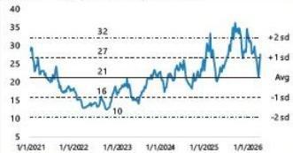  
Chart1-SytechLT1-yrFwd PE

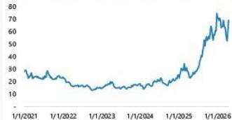  
Chart2-SytechLT SharePrice Trend

Jacky He\*|EquityAnalyst +85237438084|jacky.he@jefferies.com

Edison Lee,CFA\*|EquityAnalyst 85237438009|edison.lee@jefferles.com

NickCheng\*|EquityAnalyst +85237438750|nick.cheng@jefferies.com

MattMa\*|Equity Analyst 85237671109|matt.ma@jefferies.com +85237671273|annie.ping@jefferies.com

# Company Overview

Shengyi Technology (Sytech) was founded in 1985 in Dongguan, China by Mr. Hsiang-Chien Tang and other investor groups, and mainly produces CCL, prepreg (PP) and PCB with a wide range of downstream applications. It was listed on the Shanghai Stock Exchange in 1998. In 2013, Sytech fully acquired Shengyi Electronics (SYE, which was a joint stock company) as a subsidiary focusing on manufacturing high-end PCB. SYE (688183 CH, NC) was listed on the Shanghai Stock Exchange in 2021. Currently, Sytech operates multiple factories around the world, including in Dongguan, Suzhou, Xianyang, Jiujiang, and Thailand.

# 添加微信 LCD123321Cad 04-20

Table 33 - Sytech Historical Milestones   

<table><tr><td>Date</td><td>Milestone</td></tr><tr><td>1985</td><td>Founded in Dongguan, Guangdong,focus on CCLand PCB</td></tr><tr><td>1996</td><td>Successfully developed fiberglass cloth-based CCL</td></tr><tr><td>1998</td><td>List on SSE,becoming the first listed company in its industry in China</td></tr><tr><td>2004</td><td>Built China&#x27;s first RCC precision coating production line</td></tr><tr><td>2006</td><td>Mass production of FCCL flexible copper clad laminates</td></tr><tr><td>2015</td><td>Acquired Dongguan Shengyi Electronics Co., Ltd. remaining stocks (was a JV)</td></tr><tr><td>2021</td><td>Shengyi Electronics listed on the SSE&#x27;s Science and Technology Innovation Board</td></tr><tr><td>2022</td><td>Songshan Lake Plant 5 (Packaging Substrate Project) commenced production</td></tr><tr><td>2023</td><td>Started investing in and building a production base in Thailand</td></tr></table>

Source: Company data, Jefferies

In 2025, Sytech's revenue breakdown is as follows: CCL & PP $( 6 3 \% )$ , PCB $( 3 2 \% )$ , and waste recycle & others $( 5 \% )$ . Gross profit breakdown is as follows: CCL & PP $( 5 7 \% )$ , PCB $( 3 4 \% )$ , and waste recycle & others $( 9 \% )$ . We forecast Sytech's revenue to rise by CAGRs of $3 2 \%$ in 2026E-28E and $2 8 \%$ in 2027E-29E, mainly driven by: 1) step up in AI capex of the industry; 2) continued PCB/CCL spec upgrade in AI server; 3) market share gain in existing customers and further expansion in customer base for AI PCB/CCL; and 4) capacity expansion for high-end PCB/CCL products in both local/ overseas facilities. 订阅研报添加微信 LCD123321Cad

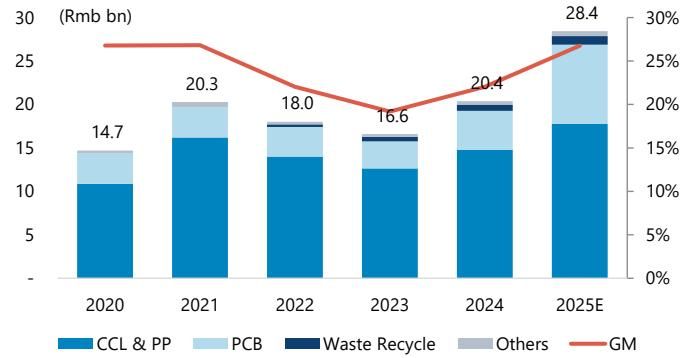  
Chart 108 - Sytech Historical Revenue & Gross Margin   
Source: Company data, Jefferies

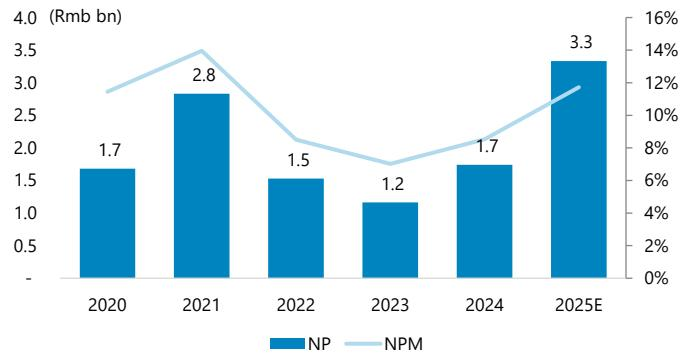  
Chart 109 - Sytech Historical Net Profit & Margin   
Source: Company data, Jefferies

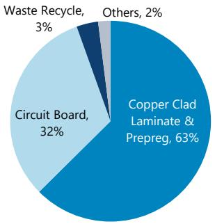  
Chart 110 - Sytech 2025E Revenue Breakdown by Segment

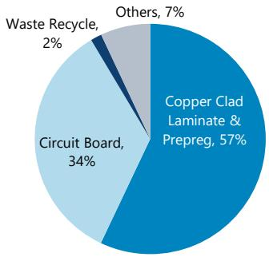  
Chart 111 - Sytech 2025E Gross Profit Breakdown by Segment

# Senior Management and Shareholding Structure

Mr. Renxi Chen, Chairman, obtained a bachelor's degree in Industrial Enterprise Management from South China University of Technology in 1991. From Jul 1991 to Oct 2014, he successively served as a staff member, deputy manager, manager, deputy general manager, general manager, and chairman of Dongguan Electronics Industry Corporation. Mr. Chen also served as a director of Suzhou Shengyi Technology Co., Ltd. from May 2015 to Apr 2022.

Mr. Chunhua Deng, Director/General Manager, obtained a bachelor's degree in Organic Chemistry from South China University of Technology in Jun 1989. From Mar 1997 to Mar 2016, he successively served as the General Manager of Production and Operations, Deputy General Manager, and Director of Guangdong Shengyi Technology Co., Ltd. Mr. Deng has also served as Chairman of Suzhou Shengyi Technology Co., Ltd., and Director of Shengyi Technology (Thailand) Co., Ltd.

Ms. Fuyun Tang, Secretary of the Board, Ms. Tang joined Guangdong Shengyi Technology Co., Ltd. after graduating in Jul 2001, and has served as Securities Affairs Representative, Deputy Manager of the Board Office, Manager of the Legal Department, and Manager of the Board Office at Guangdong Shengyi Technology Co., Ltd.

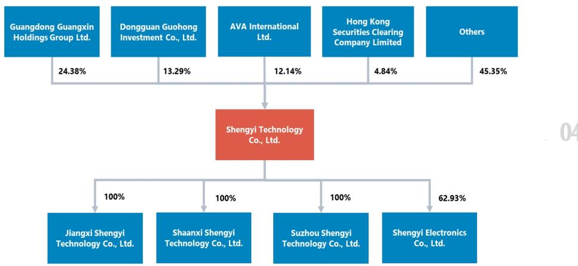  
Chart 112 - Sytech Shareholding Structure   
Source: Company data, Jefferies Note: As of 3Q25

# Evolving from Leading Local CCL Vendor to Competitive Global Player

A rare China Mainland player that has mastered both high-end CCL/PCB manufacturing. Sytech has long been a top 2 CCL vendor by revenue size in both global/China markets. China Mainland players primarily manufacture commodity-like conventional CCL, while high-end/high-frequency CCL have long been dominated by overseas manufacturers due to high technical barriers. Over the past few decades, Sytech has gradually made breakthroughs in high-end CCL through both organic development and external acquisitions (such as purchasing production lines and technique/IP of high-frequency PTFE CCL from Chukoh Chemical and FCCL from LG Chem). According to Prismark, while the market is highly concentrated in a few overseas players, Sytech is the No.1 China Mainland 订阅vendor for halogen-free high-speed CLL with $6 \%$ 报添加微信 LCD123321Cad  market share in 2024, and we estimate Sytech had $\sim 5 \%$ market share of global overall high-speed CCL in 2025. In terms of profitability, Sytech is also the top domestic player and could benchmark against leading international CCL vendors, including EMC and TUC, thanks to its scale and technological advantages with relatively strong bargaining power in the supply chain. In addition to CCL, the acquisition of SYE has armed Sytech with highend PCB production capabilities. Currently, SYE is a major PCB supplier for Amazon's AI server, leading to significant revenue/profit growth in 2025 thanks to Trainium's volume ramp.

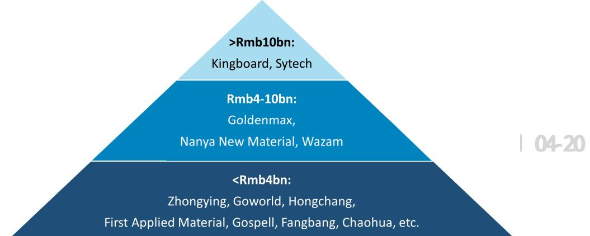  
Chart 113 - China CCL Player by Tier (by 2025 Revenue)

Source: Company data, Jefferies

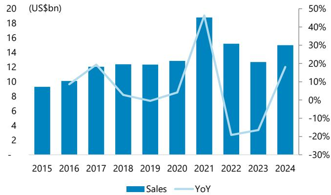  
Chart 114 - Global Rigid CCL Market Size   
Source: Prismark, Jefferies

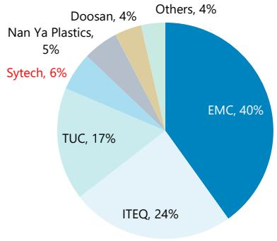  
Chart 116 - Halogen-free High-speed Market Share by Vendor (2024)   
Source: Prismark, Jefferies

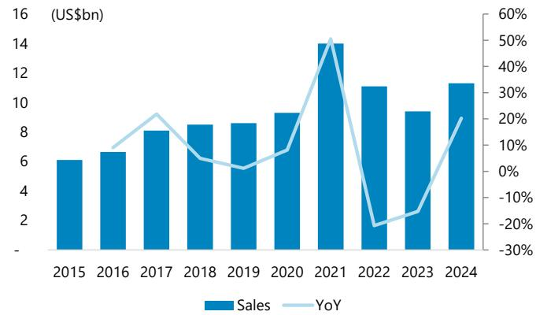  
Chart 115 - China Rigid CCL Market Size   
Source: Company data, Jefferies

in

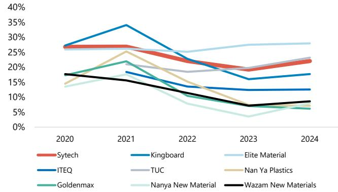  
Chart 117 - Major CCL Player Gross Margin Comparison   
Source: Company data, Jefferies

Poised to benefit from faster AI CCL TAM growth vs PCB; AI PCB/CCL to comprise $\sim 5 0 \%$ profit in 2 years. As mentioned in the industry section above, we forecast AI CCL TAM to expand by $\mathrm { \sim } 7 0 \%$ CAGR in 2025-30, faster than the ${ \sim } 6 0 \%$ of AI PCB, as a result of: 1) higher value mix of CCL in BOM cost thanks to materials upgrade; and 2) more CCL needed for the same PCB output quantity driven by the declining yield rate of PCB makers due to the greater processing difficulties. Thus, CCL vendors as a whole could benefit from faster expansion in TAM, and we believe Sytech's leading edge places it in a favorable position going forward. Although Sytech's AI exposure is limited now, we expect this to rise rapidly as our industry checks suggest positive progress in its deepening engagement with multiple AI customers. We also believe the recent CCL price hike could benefit Sytech's ASP going forward. We forecast Sytech's AI PCB/CCL mix to increase from $\pmb { 2 0 \% }$ of net profit in 2025 to $\mathtt { > 5 0 \% }$ in 2027E, and rise to $\sim 7 0 \%$ in 2029E-30E (PCB net profit adjusted for $3 7 \%$

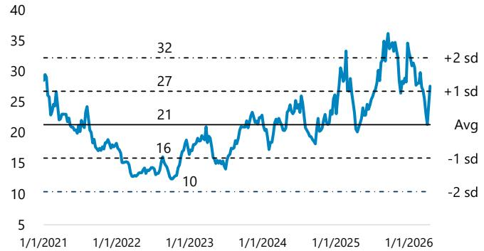  
Chart 121 - Sytech LT 1-yr Fwd PE   
Source: FactSet, Jefferies

What are the potential positive catalysts for Sytech? 1) Better-than-expected AI server/switch demand; 2) Further market share gain and expansion to new customers in AI server market; 3) Ongoing spec upgrade of PCB/CCL with dollar content going up; 4) Accelerated capacity and profitability ramp for AI-related products in both local/overseas facilities; and 5) Smooth transfer of upstream materials' price hike to downstream customers.

What are the risks for Sytech? 1) Deceleration in global AI capex growth; 2) Market share loss from escalating competition; 3) Slower-than-expected adoption of advanced PCB/CCL solutions due to technical barriers; 4) Technology replacement threat from other interconnection solutions such as copper cable and optical; and 5) Supply chain uncertainties or additional costs due to supply bottlenecks of upstream materials/tools or escalating geopolitical risks.

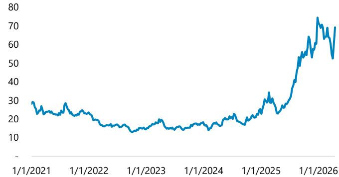  
Chart 122 - Sytech LT Share Price Trend   
Source: Company data, Jefferies

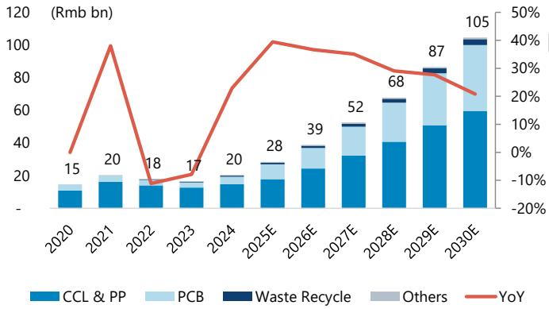  
Chart 123 - Sytech Revenue Forecast by Segment   
Source: Company data, Jefferies

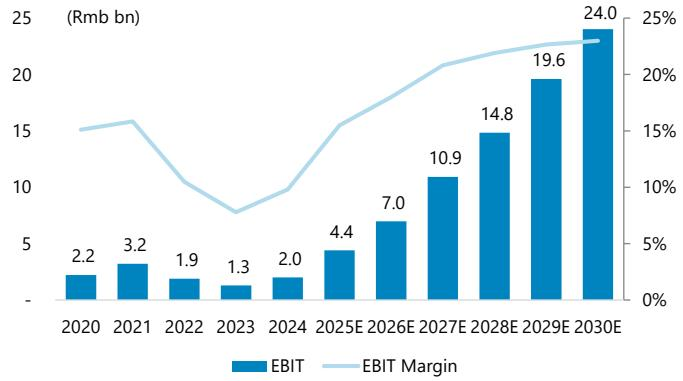  
Chart 125 - Sytech EBIT Forecast   
Source: Company data, Jefferies estimate

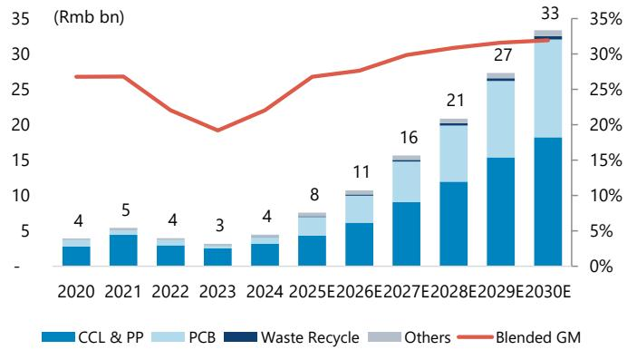  
Chart 124 - Sytech Gross Margin & Profit Forecast by Segment

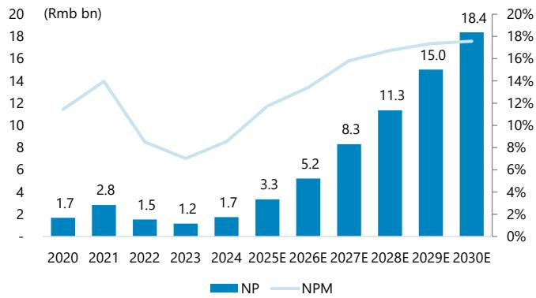  
Chart 126 - Sytech Net Profit Forecast

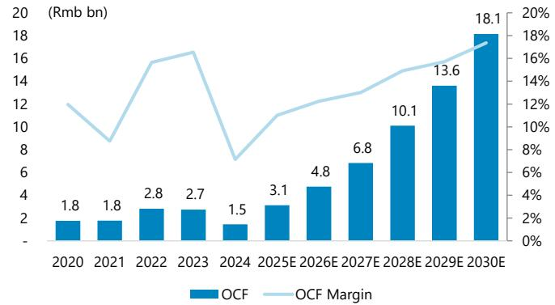  
Chart 127 - Sytech Operating Cash Flow Forecast   
Source: Company data, Jefferies estimate

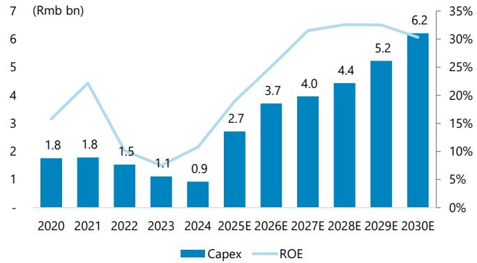  
Chart 128 - Sytech Capex & ROE Forecast   
Source: Company data, Jefferies estimate

# ‹¢–xb¥mûR _®Oá   LCD123321Cad  04-20

Table 34 - Sytech Valuation Summary   

<table><tr><td>(Rmb m)</td><td>2020A</td><td>2021A</td><td>2022A</td><td>2023A</td><td>2024A</td><td>2025E</td><td>2026E</td><td>2027E</td><td>2028E</td><td>2029E</td><td>2030E</td></tr><tr><td>Revenue</td><td>14,687</td><td>20,274</td><td>18,014</td><td>16,586</td><td>20,388</td><td>28,431</td><td>38,854</td><td>52,497</td><td>67,763</td><td>86,532</td><td>104,513</td></tr><tr><td>YoY</td><td></td><td>38%</td><td>-11%</td><td>-8%</td><td>23%</td><td>39%</td><td>37%</td><td>35%</td><td>29%</td><td>28%</td><td></td></tr><tr><td></td><td></td><td></td><td></td><td></td><td></td><td>-1%</td><td>0%</td><td>3%</td><td></td><td></td><td>21%</td></tr><tr><td>vs consensus</td><td>2,219</td><td>3,211</td><td>1,888</td><td>1,291</td><td>1,998</td><td>4,405</td><td>6,987</td><td>10,925</td><td>14,845</td><td>19,610</td><td>24,028</td></tr><tr><td>EBIT YoY</td><td></td><td>45%</td><td>-41%</td><td>-32%</td><td>55%</td><td>120%</td><td>59%</td><td>56%</td><td>36%</td><td>32%</td><td>23%</td></tr><tr><td>vsconsensus</td><td></td><td></td><td></td><td></td><td></td><td>-2%</td><td>0%</td><td>13%</td><td></td><td></td><td></td></tr><tr><td>Net profit</td><td>1,681</td><td>2,830</td><td>1,531</td><td>1,164</td><td>1,739</td><td>3,334</td><td>5,209</td><td>8,307</td><td>11,344</td><td>15,021</td><td>18,365</td></tr><tr><td>YoY</td><td></td><td>68%</td><td>-46%</td><td>-24%</td><td>49%</td><td>92%</td><td>56%</td><td>59%</td><td>37%</td><td>32%</td><td>22%</td></tr><tr><td>vs consensus</td><td></td><td></td><td></td><td></td><td></td><td>-6%</td><td>-8%</td><td>5%</td><td></td><td></td><td></td></tr><tr><td>EPS (Rmb)</td><td>0.72</td><td>1.21</td><td>0.65</td><td>0.49</td><td>0.73</td><td>1.37</td><td>2.14</td><td>3.42</td><td>4.67</td><td>6.18</td><td>7.56</td></tr><tr><td>YoY</td><td></td><td>68%</td><td>-46%</td><td>-25%</td><td>49%</td><td>88%</td><td>56%</td><td>59%</td><td>37%</td><td>32%</td><td>22%</td></tr><tr><td>vsconsensus Multiples</td><td></td><td></td><td></td><td></td><td></td><td>-4%</td><td>-5%</td><td>10%</td><td></td><td></td><td></td></tr><tr><td></td><td>61.9</td><td></td><td></td><td></td><td></td><td></td><td></td><td></td><td></td><td></td><td></td></tr><tr><td>EV/Adj. EBITDA</td><td></td><td>43.6</td><td>64.2</td><td>78.9</td><td>58.8</td><td>32.3</td><td>21.3</td><td>14.0</td><td>10.3</td><td>7.7</td><td>6.0</td></tr><tr><td>PB x</td><td>8.8 96.2</td><td>6.6</td><td>6.5</td><td>6.6</td><td>6.0</td><td>5.2</td><td>4.2</td><td>3.4</td><td>2.7</td><td>2.1</td><td>1.7</td></tr><tr><td>PEx</td><td>13.5</td><td>57.2 11.8</td><td>106.5</td><td>141.3</td><td>94.9</td><td>50.5</td><td>32.3</td><td>20.3</td><td>14.8</td><td>11.2</td><td>9.2</td></tr><tr><td>EV/IC PS x</td><td>11.5</td><td>8.3</td><td>10.8 9.3</td><td>11.1</td><td>10.5</td><td>9.1</td><td>7.5</td><td>5.9</td><td>4.7</td><td>3.7</td><td>3.0</td></tr><tr><td>EV/Sales</td><td>11.6</td><td>8.4</td><td>9.3</td><td>10.1</td><td>8.3</td><td>5.9</td><td>4.3</td><td>3.2</td><td>2.5</td><td>1.9</td><td>1.6</td></tr><tr><td></td><td></td><td></td><td></td><td>10.1</td><td>8.3</td><td>6.0</td><td>4.4</td><td>3.2</td><td>2.5</td><td>1.9</td><td>1.5</td></tr><tr><td> Financials</td><td></td><td></td><td></td><td></td><td></td><td></td><td></td><td></td><td></td><td></td><td></td></tr><tr><td>Net debt (cash)</td><td>1,944</td><td>1,178</td><td>(362)</td><td>(485)</td><td>391</td><td>1,638</td><td>2,674</td><td>2,295</td><td>27</td><td></td><td></td></tr><tr><td>EBITDA</td><td>2,750</td><td>3,884</td><td>2,614</td><td>2,126</td><td>2,868</td><td>5,263</td><td></td><td></td><td>16,372</td><td>(3,839)</td><td>(10,267)</td></tr><tr><td>EV</td><td>170,170</td><td>169,404</td><td>167,865</td><td>167,741</td><td>168,617</td><td>169,865</td><td>8,018 170,901</td><td>12,203</td><td>168,254</td><td>21,406</td><td>26,142</td></tr><tr><td>BVPS (Rmb)</td><td>7.87</td><td>10.45</td><td>10.70</td><td>10.51</td><td>11.61</td><td>13.34</td><td>16.38</td><td>170,522 20.45</td><td>25.77</td><td>164,387</td><td>157,959</td></tr><tr><td>FCF</td><td>(3)</td><td>(11)</td><td>1,286</td><td>1,634</td><td>530</td><td>419</td><td>1,047</td><td>2,871</td><td>5,671</td><td>32.69 8,373</td><td>40.79</td></tr><tr><td>ROAE</td><td>15.8%</td><td>22.2%</td><td>10.2%</td><td>7.5%</td><td>10.8%</td><td>18.9%</td><td>25.1%</td><td>31.5%</td><td>32.6%</td><td>32.5%</td><td>11,938</td></tr><tr><td>ROIC</td><td>15.2%</td><td>19.8%</td><td>11.2%</td><td>7.7%</td><td>11.2%</td><td>20.9%</td><td>27.1%</td><td>33.7%</td><td>36.7%</td><td></td><td>30.3%</td></tr><tr><td>Net debt (cash)/equity</td><td>0.2</td><td>0.1</td><td>(0.0)</td><td>(0.0)</td><td>0.0</td><td>0.1</td><td>0.1</td><td>0.1</td><td>0.0</td><td>39.4% (0.1)</td><td>40.0%</td></tr><tr><td>Net debt (cash)/adj. EBITDA</td><td>0.7</td><td>0.3</td><td>(0.1)</td><td>(0.2)</td><td>0.1</td><td>0.3</td><td>0.3</td><td>0.2</td><td>0.0</td><td>(0.2)</td><td>(0.2) (0.4)</td></tr><tr><td>Adj. EBITDA/net interest</td><td>22.6</td><td>27.9</td><td>15.2</td><td>13.1</td><td>24.2</td><td>35.9</td><td>40.6</td><td>54.8</td><td>73.5</td><td>96.1</td><td>117.3</td></tr><tr><td>FCF yield</td><td>0.0%</td><td>0.0%</td><td>0.8%</td><td>1.0%</td><td>0.3%</td><td>0.2%</td><td>0.6%</td><td>1.7%</td><td>3.4%</td><td>5.0%</td><td>7.1%</td></tr><tr><td>DPS (Rmb)</td><td>0.48</td><td>0.50</td><td>0.70</td><td>0.55</td><td>0.51</td><td>0.69</td><td>0.86</td><td>1.03</td><td>1.40</td><td>1.85</td><td>2.27</td></tr><tr><td>Dividend yield</td><td>0.7%</td><td>0.7%</td><td>1.0%</td><td>0.8%</td><td>0.7%</td><td>1.0%</td><td>1.2%</td><td>1.5%</td><td>2.0%</td><td>2.7%</td><td>3.3%</td></tr></table>

Source: Company data, Jefferies estimates, Factset

Table 35 - Sytech DCF Model   

<table><tr><td>(Rmb m)</td><td>2020A</td><td>2021A</td><td>2022A</td><td>2023A</td><td>2024A</td><td>2025E</td><td>2026E</td><td>2027E</td><td>2028E</td><td>2029E</td><td>2030E</td></tr><tr><td>Net Income</td><td>1,681</td><td>2,830</td><td>1,531</td><td>1,164</td><td>1,739</td><td>3,334</td><td>5,209</td><td>8,307</td><td>11,344</td><td>15,021</td><td>18,365</td></tr><tr><td>Plus</td><td></td><td></td><td></td><td></td><td></td><td></td><td></td><td></td><td></td><td></td><td></td></tr><tr><td>After-tax interest expense</td><td>96</td><td>82</td><td>106</td><td>103</td><td>80</td><td>108</td><td>156</td><td>179</td><td>175</td><td>151</td><td>108</td></tr><tr><td>D&amp;A</td><td>531</td><td>673</td><td>726</td><td>835</td><td>870</td><td>858</td><td>1,030</td><td>1,278</td><td>1,527</td><td>1,796</td><td>2,114</td></tr><tr><td>Less</td><td></td><td></td><td></td><td></td><td></td><td></td><td></td><td></td><td></td><td></td><td></td></tr><tr><td>Change in working capital</td><td>4,411</td><td>2,506</td><td>(758)</td><td>(101)</td><td>1,458</td><td>1,606</td><td>2,433</td><td>4,097</td><td>4,575</td><td>5,625</td><td>5,384</td></tr><tr><td>Capex</td><td>1,761</td><td>1,787</td><td>1,534</td><td>1,109</td><td>926</td><td>2,713</td><td>3,707</td><td>3,959</td><td>4,433</td><td>5,228</td><td>6,210</td></tr><tr><td>Unlevered free cash flow</td><td>(3,865)</td><td>(708)</td><td>1,586</td><td>1,094</td><td>305</td><td>(19)</td><td>255</td><td>1,708</td><td>4,039</td><td>6,115</td><td>8,995</td></tr><tr><td>Terminal value</td><td></td><td></td><td></td><td></td><td></td><td></td><td></td><td></td><td></td><td></td><td></td></tr><tr><td>Total UFCF</td><td>(3,865)</td><td>(708)</td><td>1,586</td><td>1,094</td><td>305</td><td>(19)</td><td>255</td><td>1,708</td><td>4,039</td><td>6,115</td><td>357,683</td></tr><tr><td> Discount period</td><td></td><td></td><td></td><td></td><td></td><td>-</td><td>1</td><td>2</td><td>3</td><td>4</td><td>5</td></tr><tr><td>Discount factor</td><td></td><td></td><td></td><td></td><td></td><td>1.0000</td><td>0.9111</td><td>0.8301</td><td>0.7563</td><td>0.6890</td><td>0.6277</td></tr><tr><td>PV NPV</td><td></td><td></td><td></td><td></td><td></td><td>(19)</td><td>232</td><td>1,418</td><td>3,054</td><td>4,213</td><td>224,530</td></tr><tr><td> Less: net debt (cash)</td><td>233,448</td><td></td><td></td><td></td><td></td><td></td><td></td><td></td><td></td><td></td><td></td></tr><tr><td> Equity value</td><td>2,674</td><td></td><td></td><td></td><td></td><td></td><td></td><td></td><td></td><td></td><td></td></tr><tr><td>Equity value per share (Rmb)</td><td>230,773 95.00</td><td></td><td></td><td></td><td></td><td></td><td></td><td></td><td></td><td></td><td></td></tr><tr><td></td><td></td><td></td><td></td><td></td><td></td><td></td><td></td><td></td><td></td><td></td><td></td></tr><tr><td>WACC Terminal growth</td><td>9.8%</td><td></td><td></td><td></td><td></td><td></td><td></td><td></td><td></td><td></td><td></td></tr><tr><td>Terminal FCFx</td><td>7.0%</td><td></td><td></td><td></td><td></td><td></td><td></td><td></td><td></td><td></td><td></td></tr><tr><td>Terminal value (Rmb m)</td><td>39</td><td></td><td></td><td></td><td></td><td></td><td></td><td></td><td></td><td></td><td></td></tr><tr><td>Implied 2030 EV/EBITDA</td><td>348,688 13.3</td><td></td><td></td><td></td><td></td><td></td><td></td><td></td><td></td><td></td><td></td></tr><tr><td>Implied 2030 P/E</td><td>19.5</td><td></td><td></td><td></td><td></td><td></td><td></td><td></td><td></td><td></td><td></td></tr><tr><td>No. of shares O/S (m)</td><td></td><td></td><td></td><td></td><td></td><td></td><td></td><td></td><td></td><td></td><td></td></tr><tr><td></td><td>2,429</td><td></td><td></td><td></td><td></td><td></td><td></td><td></td><td></td><td></td><td></td></tr></table>

Source: Company data, Jefferies estimates

Table 36 - Sytech Annual Profit & Loss   

<table><tr><td>(Rmb m)</td><td>2020A</td><td>2021A</td><td>2022A</td><td>2023A</td><td>2024A</td><td>2025E</td><td>2026E</td><td>2027E</td><td>2028E</td><td>2029E</td><td>2030E</td></tr><tr><td>Revenue</td><td>14,687</td><td>20,274</td><td>18,014</td><td>16,586</td><td>20,388</td><td>28,431</td><td>38,854</td><td>52,497</td><td>67,763</td><td>86,532</td><td>104,513</td></tr><tr><td>COGS</td><td>(10,754)</td><td>(14,837)</td><td>(14,045)</td><td>(13,404)</td><td>(15,895)</td><td>(20,822)</td><td>(28,122)</td><td>(36,828)</td><td>(46,863)</td><td>(59,189)</td><td>(71,145)</td></tr><tr><td>Gross profit</td><td>3,933</td><td>5,437</td><td>3,969</td><td>3,182</td><td>4,493</td><td>7,609</td><td>10,732</td><td>15,669</td><td>20,900</td><td>27,342</td><td>33,368</td></tr><tr><td>Total opex</td><td>(1,714)</td><td>(2,226)</td><td>(2,081)</td><td>(1,891)</td><td>(2,495)</td><td>(3,204)</td><td>(3,744)</td><td>(4,744)</td><td>(6,055)</td><td>(7,733)</td><td>(9,340)</td></tr><tr><td>R&amp;D expenses</td><td>(711)</td><td>(964)</td><td>(943)</td><td>(841)</td><td>(1,157)</td><td>(1,422)</td><td>(1,668)</td><td>(2,096)</td><td>(2,638)</td><td>(3,369)</td><td>(4,069)</td></tr><tr><td> G&amp;A expenses</td><td>(720)</td><td>(910)</td><td>(797)</td><td>(701)</td><td>(843)</td><td>(1,095)</td><td>(1,279)</td><td>(1,623)</td><td>(2,094)</td><td>(2,675)</td><td>(3,230)</td></tr><tr><td>S&amp;M expenses</td><td>(284)</td><td>(351)</td><td>(341)</td><td>(349)</td><td>(495)</td><td>(686)</td><td>(797)</td><td>(1,025)</td><td>(1,323)</td><td>(1,689)</td><td>(2,040)</td></tr><tr><td>EBITDA</td><td>2,750</td><td>3,884</td><td>2,614</td><td>2,126</td><td>2,868</td><td>5,263</td><td>8,018</td><td>12,203</td><td>16,372</td><td>21,406</td><td>26,142</td></tr><tr><td>D&amp;A</td><td>531</td><td>673</td><td>726</td><td>835</td><td>870</td><td>858</td><td>1,030</td><td>1,278</td><td>1,527</td><td>1,796</td><td>2,114</td></tr><tr><td>EBIT</td><td>2,219</td><td>3,211</td><td>1,888</td><td>1,291</td><td>1,998</td><td>4,405</td><td>6,987</td><td>10,925</td><td>14,845</td><td>19,610</td><td>24,028</td></tr><tr><td>Other income (expense)</td><td>(136)</td><td>99</td><td>(115)</td><td>(20)</td><td>70</td><td>(25)</td><td>(69)</td><td>(84)</td><td>(67)</td><td>(26)</td><td>35</td></tr><tr><td>Profit before tax</td><td>2,083</td><td>3,310</td><td>1,773</td><td>1,271</td><td>2,068</td><td>4,380</td><td>6,919</td><td>10,841</td><td>14,778</td><td>19,583</td><td>24,064</td></tr><tr><td>Income taxes</td><td>(283)</td><td>(385)</td><td>(141)</td><td>(123)</td><td>(200)</td><td>(501)</td><td>(761)</td><td>(1,193)</td><td>(1,626)</td><td>(2,154)</td><td>(2,647)</td></tr><tr><td>Minority interest</td><td>(120)</td><td>(95)</td><td>(101)</td><td>15</td><td>(129)</td><td>(546)</td><td>(949)</td><td>(1,342)</td><td>(1,808)</td><td>(2,408)</td><td>(3,051)</td></tr><tr><td>Net income (loss)</td><td>1,681</td><td>2,830</td><td>1,531</td><td>1,164</td><td>1,739</td><td>3,334</td><td>5,209</td><td>8,307</td><td>11,344</td><td>15,021</td><td>18,365</td></tr><tr><td>EPS basic (Rmb)</td><td>0.74</td><td>1.23</td><td>0.66</td><td>0.50</td><td>0.74</td><td>1.37</td><td>2.14</td><td>3.42</td><td>4.67</td><td>6.18</td><td>7.56</td></tr><tr><td>EPS diluted (Rmb)</td><td>0.72</td><td>1.21</td><td>0.65</td><td>0.49</td><td>0.73</td><td>1.37</td><td>2.14</td><td>3.42</td><td>4.67</td><td>6.18</td><td>7.56</td></tr><tr><td>Wgt. avg.ordinary shares (basic)</td><td>2,271</td><td>2,301</td><td>2,319</td><td>2,328</td><td>2,350</td><td>2,429</td><td>2,429</td><td>2,429</td><td>2,429</td><td>2,429</td><td>2,429</td></tr><tr><td>Wgt. avg.ordinary shares (diluted)</td><td>2,334</td><td>2,339</td><td>2,355</td><td>2,376</td><td>2,382</td><td>2,429</td><td>2,429</td><td>2,429</td><td>2,429</td><td>2,429</td><td>2,429</td></tr><tr><td>DPS (Rmb)</td><td>0.48</td><td>0.50</td><td>0.70</td><td>0.55</td><td>0.51</td><td>0.69</td><td>0.86</td><td>1.03</td><td>1.40</td><td>1.85</td><td>2.27</td></tr><tr><td>Payout ratio</td><td>65%</td><td>41%</td><td>106%</td><td>111%</td><td>69%</td><td>50%</td><td>40%</td><td>30%</td><td>30%</td><td>30%</td><td>30%</td></tr></table>

Source: Company data, Jefferies estimates

Table 37 - Sytech Quarterly Profit & Loss   

<table><tr><td>(Rmb m)</td><td>1Q24</td><td>2Q24</td><td>3Q24</td><td>4Q24</td><td>1Q25</td><td>2Q25</td><td>3Q25</td><td>4Q25E</td><td>1Q26E</td><td>2Q26E</td><td>3Q26E</td><td>4Q26E</td></tr><tr><td>Revenue</td><td>4,423</td><td>5,206</td><td>5,115</td><td>5,644</td><td>5,611</td><td>7,069</td><td>7,934</td><td>7,817</td><td>7,771</td><td>8,936</td><td>10,879</td><td>11,268</td></tr><tr><td>COGS</td><td>(3,482)</td><td>(4,075)</td><td>(3,948)</td><td>(4,390)</td><td>(4,231)</td><td>(5,170)</td><td>(5,701)</td><td>(5,720)</td><td>(5,966)</td><td>(6,519)</td><td>(7,770)</td><td>(7,867)</td></tr><tr><td>Gross profit</td><td>941</td><td>1,132</td><td>1,167</td><td>1,253</td><td>1,380</td><td>1,898</td><td>2,233</td><td>2,097</td><td>1,804</td><td>2,417</td><td>3,109</td><td>3,401</td></tr><tr><td>Total opex</td><td>(497)</td><td>(553)</td><td>(678)</td><td>(767)</td><td>(682)</td><td>(819)</td><td>(817)</td><td>(885)</td><td>(835)</td><td>(910)</td><td>(925)</td><td>(1,073)</td></tr><tr><td> R&amp;D expenses</td><td>(217)</td><td>(253)</td><td>(324)</td><td>(362)</td><td>(295)</td><td>(348)</td><td>(372)</td><td>(408)</td><td>(361)</td><td>(386)</td><td>(423)</td><td>(497)</td></tr><tr><td> G&amp;A expenses</td><td>(176)</td><td>(184)</td><td>(233)</td><td>(250)</td><td>(244)</td><td>(288)</td><td>(272)</td><td> (291)</td><td>(298)</td><td>(320)</td><td>(308)</td><td>(352)</td></tr><tr><td>S&amp;M expenses</td><td>(104)</td><td>(115)</td><td>(121)</td><td>(155)</td><td>(144)</td><td>(183)</td><td>(173)</td><td>(186)</td><td>(176)</td><td>(204)</td><td>(194)</td><td>(224)</td></tr><tr><td>EBITDA</td><td>661</td><td>793</td><td>708</td><td>706</td><td>913</td><td>1,309</td><td>1,622</td><td>1,418</td><td>1,226</td><td>1,765</td><td>2,441</td><td>2,585</td></tr><tr><td>D&amp;A</td><td>217</td><td>214</td><td>219</td><td>219</td><td>214</td><td>230</td><td>207</td><td>207</td><td>258</td><td>258</td><td>258</td><td>258</td></tr><tr><td>EBIT</td><td>443</td><td>579</td><td>489</td><td>487</td><td>699</td><td>1,079</td><td>1,416</td><td>1,212</td><td>969</td><td>1,507</td><td>2,184</td><td>2,328</td></tr><tr><td>Other gains or losses</td><td>11</td><td>57</td><td>37</td><td>(35)</td><td>20</td><td>43</td><td>(24)</td><td>(10)</td><td>(26)</td><td>(21)</td><td>(21)</td><td>(1)</td></tr><tr><td>Profit before tax</td><td>454</td><td>636</td><td>527</td><td>451</td><td>719</td><td>1,122</td><td>1,391</td><td>1,201</td><td>943</td><td>1,486</td><td>2,163</td><td>2,327</td></tr><tr><td>Income taxes</td><td>(51)</td><td>(62)</td><td>(54)</td><td>(34)</td><td>(84)</td><td>(134)</td><td>(150)</td><td>(132)</td><td>(104)</td><td>(163)</td><td>(238)</td><td>(256)</td></tr><tr><td>Minority interest</td><td>(12)</td><td>(34)</td><td>(33)</td><td>(51)</td><td>(71)</td><td>(125)</td><td>(224)</td><td>(126)</td><td>(157)</td><td>(188)</td><td>(314)</td><td>(291)</td></tr><tr><td>Net income (loss)</td><td>392</td><td>540</td><td>440</td><td>366</td><td>564</td><td>863</td><td>1,017</td><td>944</td><td>683</td><td>1,135</td><td>1,611</td><td>1,779</td></tr><tr><td>EPS basic (Rmb)</td><td>0.17</td><td>0.23</td><td>0.18</td><td>0.15</td><td>0.23</td><td>0.36</td><td>0.42</td><td>0.39</td><td>0.28</td><td>0.47</td><td>0.66</td><td>0.73</td></tr><tr><td>EPS diluted (Rmb)</td><td>0.17</td><td>0.23</td><td>0.18</td><td>0.15</td><td>0.23</td><td>0.36</td><td>0.42</td><td>0.39</td><td>0.28</td><td>0.47</td><td>0.66</td><td>0.73</td></tr><tr><td>Wgt. avg. ordinary shares (basic)</td><td>2,356</td><td>2,364</td><td>2,400</td><td>2,429</td><td>2,429</td><td>2,429</td><td>2,429</td><td>2,429</td><td>2,429</td><td>2,429</td><td>2,429</td><td>2,429</td></tr><tr><td>Wgt. avg.ordinary shares (diluted)</td><td>2,356</td><td>2,364</td><td>2,400</td><td>2,429</td><td>2,429</td><td>2,429</td><td>2,429</td><td>2,429</td><td>2,429</td><td>2,429</td><td>2,429</td><td>2,429</td></tr></table>

Source: Company data, Jefferies estimates

Table 38 - Sytech Balance Sheet   

<table><tr><td>(Rmb m)</td><td>2020A</td><td>2021A</td><td>2022A</td><td>2023A</td><td>2024A</td><td>2025E</td><td>2026E</td><td>2027E</td><td>2028E</td><td>2029E</td><td>2030E</td></tr><tr><td>Cash and cash equivalent</td><td>850</td><td>2,287</td><td>3,106</td><td>2,775</td><td>2,016</td><td>1,768</td><td>1,732</td><td>2,111</td><td>4,379</td><td>8,246</td><td>14,674</td></tr><tr><td>Receivables</td><td>4,932</td><td>6,504</td><td>5,751</td><td>5,666</td><td>7,408</td><td>9,551</td><td>12,521</td><td>16,917</td><td>21,837</td><td>27,885</td><td>33,680</td></tr><tr><td>Inventories</td><td>2,519</td><td>4,520</td><td>4,084</td><td>4,271</td><td>5,119</td><td>6,136</td><td>7,902</td><td>10,348</td><td>13,167</td><td>16,631</td><td>19,990</td></tr><tr><td>Other current assets</td><td>1,415</td><td>1,409</td><td>1,292</td><td>1,287</td><td>2,069</td><td>2,069</td><td>2,069</td><td>2,069</td><td>2,069</td><td>2,069</td><td>2,069</td></tr><tr><td>Total current assets</td><td>9,716</td><td>14,720</td><td>14,232</td><td>13,999</td><td>16,613</td><td>19,525</td><td>24,224</td><td>31,445</td><td>41,453</td><td>54,831</td><td>70,413</td></tr><tr><td> Property, plant and equipment</td><td>6,374</td><td>7,144</td><td>7,910</td><td>9,086</td><td>8,670</td><td>10,430</td><td>12,969</td><td>15,508</td><td>18,258</td><td>21,504</td><td>25,376</td></tr><tr><td>Construction in process</td><td>1,243</td><td>1,032</td><td>1,729</td><td>283</td><td>470</td><td>470</td><td>470</td><td>470</td><td>470</td><td>470</td><td>470</td></tr><tr><td>Intangible assets</td><td>435</td><td>399</td><td>399</td><td>383</td><td>626</td><td>720</td><td>859</td><td>1,000</td><td>1,156</td><td>1,342</td><td>1,564</td></tr><tr><td>Other assets</td><td>589</td><td>1,136</td><td>926</td><td>1,206</td><td>1,265</td><td>1,265</td><td>1,265</td><td>1,265</td><td>1,265</td><td>1,265</td><td>1,265</td></tr><tr><td>Total non-currentassets</td><td>8,642</td><td>9,711</td><td>10,963</td><td>10,958</td><td>11,031</td><td>12,885</td><td>15,562</td><td>18,243</td><td>21,149</td><td>24,580</td><td>28,676</td></tr><tr><td>Total assets</td><td>18,357</td><td>24,431</td><td>25,196</td><td>24,957</td><td>27,643</td><td>32,410</td><td>39,786</td><td>49,688</td><td>62,602</td><td>79,412</td><td>99,089</td></tr><tr><td> Accounts payable</td><td>3,040</td><td>4,107</td><td>3,676</td><td>3,880</td><td>5,012</td><td>6,566</td><td>8,868</td><td>11,613</td><td>14,778</td><td>18,665</td><td>22,435</td></tr><tr><td>Borrowings &amp; bonds</td><td>2,157</td><td>1,693</td><td>1,558</td><td>1,465</td><td>1,837</td><td>2,837</td><td>3,837</td><td>3,837</td><td>3,837</td><td>3,837</td><td>3,837</td></tr><tr><td>Other current liabilities</td><td>1,607</td><td>1,453</td><td>2,144</td><td>1,953</td><td>3,000</td><td>3,000</td><td>3,000</td><td>3,000</td><td>3,000</td><td>3,000</td><td>3,000</td></tr><tr><td>Total current liabilities</td><td>6,804</td><td>7,253</td><td>7,377</td><td>7,297</td><td>9,849</td><td>12,403</td><td>15,705</td><td>18,450</td><td>21,615</td><td>25,502</td><td>29,272</td></tr><tr><td>Long-term liabilities</td><td>605</td><td>1,590</td><td>1,175</td><td>806</td><td></td><td>558</td><td></td><td></td><td></td><td></td><td></td></tr><tr><td>Other liabilities</td><td>305</td><td>722</td><td>1,347</td><td>1,153</td><td>558 731</td><td>731</td><td>558 731</td><td>558 731</td><td>558 731</td><td>558 731</td><td>558 731</td></tr><tr><td>Total non-current liabilities</td><td>910</td><td>2,312</td><td>2,522</td><td>1,959</td><td>1,289</td><td>1,289</td><td>1,289</td><td>1,289</td><td>1,289</td><td>1,289</td><td>1,289</td></tr><tr><td>Total liabilities</td><td>7,714</td><td>9,565</td><td>9,899</td><td>9,256</td><td>11,138</td><td>13,692</td><td>16,994</td><td>19,739</td><td>22,904</td><td>26,791</td><td>30,561</td></tr><tr><td>Common stock</td><td>5,086</td><td>6,389</td><td>6,622</td><td>6,985</td><td>7,220</td><td>7,220</td><td>7,220</td><td>7,220</td><td>7,220</td><td>7,220</td><td>7,220</td></tr><tr><td>Retained earnings</td><td>3,690</td><td>5,386</td><td>5,355</td><td>5,334</td><td>5,867</td><td>7,534</td><td>10,659</td><td>16,474</td><td>24,415</td><td>34,930</td><td>47,786</td></tr><tr><td>Minority interest</td><td>754</td><td>1,770</td><td>1,798</td><td>1,717</td><td>1,600</td><td>2,146</td><td>3,096</td><td>4,438</td><td>6,245</td><td>8,654</td><td>11,705</td></tr><tr><td>Otherequity</td><td>1,113</td><td>1,322</td><td>1,522</td><td>1,664</td><td>1,817</td><td>1,817</td><td>1,817</td><td>1,817</td><td>1,817</td><td>1,817</td><td>1,817</td></tr><tr><td>Total equity</td><td>10,643</td><td>14,866</td><td>15,296</td><td>15,700</td><td>16,505</td><td>18,718</td><td>22,792</td><td>29,949</td><td>39,698</td><td>52,621</td><td>68,528</td></tr><tr><td>Total liabilitiesand equity</td><td>18,357</td><td>24,431</td><td>25,196</td><td>24,957</td><td>27,643</td><td>32,410</td><td>39,786</td><td>49,688</td><td>62,602</td><td>79,412</td><td>99,089</td></tr></table>

Source: Company data, Jefferies estimates

Table 39 - Sytech Cash Flow Statement   

<table><tr><td>(Rmb m)</td><td>2020A</td><td>2021A</td><td>2022A</td><td>2023A</td><td>2024A</td><td>2025E</td><td>2026E</td><td>2027E</td><td>2028E</td><td>2029E</td><td>2030E</td></tr><tr><td>Net profit (loss)</td><td>1,681</td><td>2,830</td><td>1,531</td><td>1,164</td><td>1,739</td><td>3,334</td><td>5,209</td><td>8.307</td><td> 11,344</td><td>15,021</td><td>18,365</td></tr><tr><td> Minority Interest add back</td><td>120</td><td>95</td><td>101</td><td>(15)</td><td>129</td><td>546</td><td>949</td><td>1,342</td><td>1,808</td><td>2,408</td><td>3,051</td></tr><tr><td>Depreciation &amp;amortization</td><td>531</td><td>673</td><td>726</td><td>835</td><td>870</td><td>858</td><td>1,030</td><td>1,278</td><td>1,527</td><td>1,796</td><td>2,114</td></tr><tr><td>(Increase) decrease in working capital and others</td><td>(4,411)</td><td>(2,506)</td><td>758</td><td>101</td><td>(1,458)</td><td>(1,606)</td><td>(2,433)</td><td>(4,097)</td><td>(4,575)</td><td>(5,625)</td><td>(5,384)</td></tr><tr><td>Others</td><td>3,838</td><td>685</td><td>(296)</td><td>659</td><td>176</td><td>-</td><td></td><td></td><td>-</td><td>-</td><td>-</td></tr><tr><td>Net cash from operating activities</td><td>1,758</td><td>1,776</td><td>2,820</td><td>2,743</td><td>1,456</td><td>3,132</td><td>4,755</td><td>6,830</td><td>10,104</td><td>13,601</td><td>18,147</td></tr><tr><td>Capex</td><td>(1,761)</td><td>(1,787)</td><td>(1,534)</td><td>(1,109)</td><td>(926)</td><td>(2,713)</td><td>(3,707)</td><td>(3,959)</td><td>(4,433)</td><td>(5,228)</td><td>(6,210)</td></tr><tr><td>Other investment Net cash used in investingactivities</td><td>(72)</td><td>(93)</td><td>341</td><td>(54)</td><td>(8)</td><td>-</td><td>-</td><td>-</td><td>-</td><td>-</td><td>-</td></tr><tr><td></td><td>(1,833)</td><td>(1,880)</td><td>(1,193)</td><td>(1,162)</td><td>(934)</td><td>(2,713)</td><td>(3,707)</td><td>(3,959)</td><td>(4,433)</td><td>(5,228)</td><td>(6,210)</td></tr><tr><td>Issuance of debt/borrowing</td><td>697</td><td>104</td><td>300</td><td>(935)</td><td>(281)</td><td>1,000</td><td>1,000</td><td>-</td><td>-</td><td>-</td><td>-</td></tr><tr><td>Issuance of equity Dividends and interests</td><td>189</td><td>2,254</td><td>192</td><td>318</td><td>773</td><td>-</td><td>-</td><td>-</td><td>-</td><td>-</td><td>-</td></tr><tr><td></td><td>(1,101)</td><td>(1,161)</td><td>(1,619)</td><td>(1,287)</td><td>(1,192)</td><td>(1,667)</td><td>(2,083)</td><td>(2,492)</td><td>(3,403)</td><td>(4,506)</td><td>(5,510)</td></tr><tr><td>Change inminority interest Others</td><td>(120)</td><td>25</td><td>(6)</td><td>116</td><td>(144)</td><td>-</td><td>-</td><td></td><td>-</td><td>-</td><td>-</td></tr><tr><td>Netcash from financing activities</td><td>119 (215)</td><td>176 1,398</td><td>485 (648)</td><td>(131) (1,919)</td><td>(432) (1,276)</td><td>-</td><td>-</td><td>- (2,492)</td><td>- (3,403)</td><td>- (4,506)</td><td>- (5,510)</td></tr><tr><td>Effects of exchange rate changes</td><td></td><td></td><td></td><td></td><td></td><td>(667)</td><td>(1,083)</td><td></td><td></td><td></td><td></td></tr><tr><td></td><td>58</td><td>(6)</td><td>11</td><td>(1)</td><td>3</td><td>-</td><td>-</td><td>-</td><td>-</td><td>-</td><td>-</td></tr><tr><td>Net (decrease) increase in cash and cash equivalent Cash and cash equivalent, beginning of period</td><td> (232)</td><td>1,287</td><td>989</td><td>(339)</td><td>(752)</td><td>(248)</td><td>(36)</td><td>379</td><td>2,268</td><td>3,867</td><td>6,428</td></tr><tr><td>Cash and cash equivalent, end of period</td><td>1,051</td><td>818</td><td>2,105</td><td>3,095</td><td>2,756</td><td>2,004</td><td>1,756</td><td>1,720</td><td>2,099</td><td>4,367</td><td>8,234</td></tr><tr><td>Restricted cash</td><td>818 32</td><td>2,105</td><td>3,095</td><td>2,756</td><td>2,004</td><td>1,756</td><td>1,720</td><td>2,099</td><td>4,367</td><td>8,234</td><td>14,662</td></tr><tr><td></td><td></td><td>181</td><td>11</td><td>19</td><td>12</td><td>12</td><td>12</td><td>12</td><td>12</td><td>12</td><td>12</td></tr><tr><td>Cash and cash equ., end of period (incl. restricted cash)</td><td>850</td><td>2,287</td><td>3,106</td><td>2,775</td><td>2,016</td><td>1,768</td><td>1,732</td><td>2,111</td><td>4,379</td><td>8,246</td><td>14,674</td></tr></table>

Source: Company data, Jefferies estimates

Table 40 - Sytech Peer Comparison Table - Valuation   

<table><tr><td colspan="10">%</td><td colspan="3">P/E</td><td colspan="3">P/S</td><td colspan="3">EV/ EBITDA</td><td colspan="3"></td><td colspan="3">FCF (US$m)</td></tr><tr><td>Country Company</td><td>Ticker</td><td>Ccy</td><td></td><td>Current</td><td>s/0 (m)</td><td>Mkt Cap (Us$m)</td><td>EV (Us$m)</td><td>Avg Vol (m)3-Mon 6-Mon</td><td>12- Mon</td><td>2026</td><td>2027 2025</td><td>2026</td><td>2027 2025</td><td>2026</td><td>2025</td><td>2026</td><td>2025</td><td>2026</td><td>2025</td><td>ROE (%)</td><td></td><td>2026</td><td></td><td>G2gr</td></tr><tr><td rowspan="2">China Taiwan EMC</td><td>Svtech</td><td rowspan="2">600183-CN RMB</td><td rowspan="2">95.00 TWD</td><td rowspan="2">37%</td><td>Price 69.25</td><td>2.429</td><td>24.641</td><td>52.1</td><td>0% 28%</td><td>2025 50.5</td><td>20.3</td><td>5.2</td><td>3.4</td><td>5.9</td><td></td><td>33.2</td><td>2027 14.3</td><td></td><td>2027 3.3</td><td>25%</td><td>2027 32%</td><td>2025 61</td><td>2027</td><td>2027 162%</td></tr><tr><td>2383-TW</td><td>NA 3.800.00</td><td></td><td>43.123</td><td>25.613 43.171</td><td></td><td>209% 638%</td><td>32.3 48.9</td><td>27.9</td><td>4.2 20.9</td><td>14.4</td><td>4.3 9.2</td><td></td><td>21.8 36.6 22.4</td><td>6.2 6.3</td><td></td><td>19% 48%</td><td>59%</td><td>77</td><td>153</td><td></td></tr><tr><td rowspan="2">Taiwan Taiwan</td><td>TUC</td><td rowspan="2">6274-TW TWD 6213-TW TWD</td><td>NG</td><td>NA NA</td><td>946.00</td><td>358</td><td>8.757</td><td>14.4 31.2</td><td>196% 619% 176%</td><td>78.5 64.5</td><td>26.0 28.3</td><td>15.2 4.7</td><td>11.1 4.2</td><td>300</td><td></td><td>56.8</td><td>17.9 13.9</td><td>4.7</td><td>621 2.0</td><td>35%</td><td>48% 16%</td><td>(73) 23</td><td>(98)</td><td></td><td>12%</td></tr><tr><td>ITEQ Nan Ya Plastics</td><td>TWD</td><td></td><td>270.50 87.70</td><td>363 7,931</td><td>3,113 22,028</td><td>3,145 26.013</td><td>134% 19% 109%</td><td>362% 185% 153.9</td><td>41.2 14.0</td><td></td><td>4.4 1.9</td><td></td><td>53 2.5</td><td>25.1 35.1</td><td>18.0 16.2</td><td>1.3</td><td>603 2.9</td><td>7% 1%</td><td>11% 12%</td><td>13% (54)</td><td>705</td><td>1,930</td><td></td></tr></table>

Source: Company data, FactSet, Jefferies

Table 41 - Sytech Peer Comparison Table - Operation   

<table><tr><td>Rev (Us$m)</td><td colspan="3"></td><td colspan="3"></td><td colspan="3">Gross Profit (US$m)</td><td colspan="3">EBITDA (US$m)</td><td colspan="3">EBITDA EBITDA Margin</td><td colspan="3">EPS (US$)</td><td colspan="3">Capex (Us$m)</td><td colspan="3">Capex/Rev</td></tr><tr><td></td><td>Company</td><td>Ticker</td><td>2025</td><td>2027</td><td>G2- 2027</td><td>2025</td><td>2026</td><td>2025</td><td>Gross Margin (%) 2026</td><td>2027 2025</td><td>2026</td><td>2027</td><td>2027 2025</td><td>2026</td><td>2027</td><td>2026</td><td>2027</td><td>Casr 2027</td><td></td><td></td><td>2025</td><td>2026</td><td>2027</td><td></td></tr><tr><td rowspan="2">China Taiwan</td><td>600183-CN</td><td>4.165</td><td>2026 5.691</td><td>7690</td><td></td><td>1,115 893</td><td>1.572 1,467</td><td>27%</td><td>28%</td><td>30% 32%</td><td>1.174</td><td>1.788</td><td></td><td>21%</td><td>23% 27%</td><td></td><td>0.50</td><td>58%</td><td>2025 397</td><td>2026 54</td><td>2027 580</td><td>10% 10%</td><td>10%</td><td>#N/A</td><td>2025</td></tr><tr><td>2383-TW 6274-TW</td><td>2,974 957</td><td>4,667 1,469</td><td></td><td></td><td></td><td>2,226</td><td>30% 23%</td><td></td><td>776</td><td>1.181 304</td><td></td><td>19% 22%</td><td>21%</td><td></td><td>0.31 2.39</td><td>3.96 1.19</td><td>75% 77%</td><td>40</td><td></td><td></td><td></td><td>10%</td><td>#N/A #N/A</td><td></td></tr><tr><td>Taiwan Nan Ya Plastics</td><td>TUC ITEQ 6213-TW 1303-TW</td><td></td><td>1,044 1,342</td><td>2,115 1,559</td><td></td><td>220 163</td><td>373 223</td><td>556 274</td><td></td><td>26% 18%</td><td>154 125</td><td>1,908</td><td>78% 34% 60%</td><td>16% 12% 9%</td><td>23% 15%</td><td>0.38 0.13</td><td>0.74 0.21</td><td>0.31 54% 228%</td><td>41</td><td>125 53</td><td>125</td><td>4% 4%</td><td>9% 4%</td><td>武路 4%</td><td>#N/A #N/A</td><td></td></tr></table>

Source: Company data, Factset, Jefferies

# Investment Thesis

• We expect robust PCB TAM growth to be driven by rapidly expanding AI PCB TAM.   
Focusing on high-speed switch market, WUS could be a key beneficiary of the rising penetration of 800G/1.6T switches with higher ASP.   
• Continued customer expansion for AI PCB.   
• Active capex plan in both local/overseas markets to meet rising demand for high-end PCB.

#   ‹¢–xb¥mûR _®

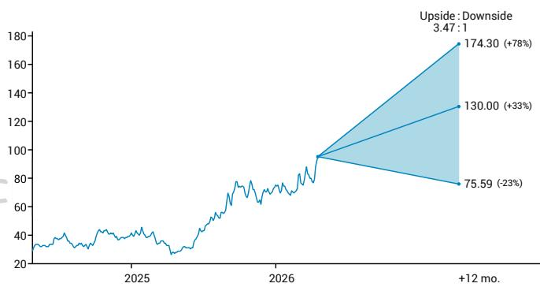  
Risk/Reward - 12 Month View

# Base Case, CNY130, +33%

• AI server switch market share rises from $40 \%$ in 2025 to $5 0 \% / 4 5 \%$ in 2027E/2030E. • NVIDIA AI PCB market share rises from $3 \%$ in 2025 to $7 \% / 9 \%$ in 2027E/2030E. • Non-NVIDIA AI PCB market share drops from $20 \%$ in 2025 to $14 \% / 1 4 \%$ in 2027E/2030E. • PT of Rmb130.00 based on end-2026E DCF with $9 . 8 \%$ WACC and $6 . 5 \%$ terminal growth rate (2030E). ‹¢–

# Upside Scenario, CNY174.3, +78%

# Downside Scenario, CNY75.59, $- 2 3 \%$

• AI server switch market share rises from $40 \%$ in 2025 to $6 0 \% / 5 5 \%$ in 2027E/2030E. • NVIDIA AI PCB market share rises from $3 \%$ in 2025 to $9 \% / 1 1 \%$ in 2027E/2030E. • Non-NVIDIA AI PCB market share drops from $2 0 \%$ in 2025 to $1 7 \% / 1 7 \%$ in 2027E/2030E. • PT of Rmb174.30 based on end-2026E DCF with $9 . 8 \%$ WACC and $7 . 0 \%$ terminal growth b¥mûR _®Oárate (2030E). LCD • AI server switch market share drops from $40 \%$ in 2025 to $40 \% / 3 5 \%$ in 2027E/2030E. • NVIDIA AI PCB market share rises from $3 \%$ in 2025 to $5 \% / 6 \%$ in 2027E/2030E. • Non-NVIDIA AI PCB market share drops from $20 \%$ in 2025 to $1 0 \% / 1 0 \%$ in 2027E/2030E. • PT of $\mathsf { R m b 7 5 . 5 9 }$ based on end-2026E DCF with $9 . 8 \%$ WACC and $5 . 0 \%$ terminal growth 2 3321rate (2030E). Cad 04-2

# Sustainability Matters

# Top Material Issues:

• Lifecycle monitoring & customer protection: WUS monitors and manages R&D, design, manufacturing, storage to protect the rights and interests of customers and suppliers. • Sustainable supply chain: WUS has integrated CSR into the entire procurement process to facilitate performance verification.

# Company Achievements:

• Reduction in fresh water use by approx. 150,000 tons in 2024.   
• Increased recovery of electrolytic copper by approx. $3 5 \%$ in 2024.

# Questions to Management:

• What specific operational levers drove the variance between the latest results vs target? • What measures has Delton taken to encourage suppliers to conduct scientific carbon emission reduction targets? ‹¢–xb¥mûR _®Oá

ESG Report: link

# Catalysts

• Better-than-expected AI server/switch demand.   
• Further market share gain and expansion to new customers in AI server/switch.   
• Ongoing spec upgrade of PCB with dollar content going up.   
• Accelerated capacity and profitability ramp for AI-related products in both local/overseas facilities.   
• Easing supply tightness in critical materials for high-end PCB.

# Financials:WUS

# Estimate changes

<table><tr><td>RMB</td><td>2024A</td><td>2025A</td><td>2026E</td><td>2027E</td></tr><tr><td>Rev. (MM)</td><td>13,342.0</td><td>18,945.0</td><td>27,289.0</td><td>41,016.0</td></tr><tr><td>EBIT (MM)</td><td>3,030.0</td><td>4,517.0</td><td>6,962.0</td><td>10,300.0</td></tr><tr><td>Net Profit</td><td>2.587.0订阅研报添3.822.0信</td><td></td><td>LCD12336.133.0d 04-20</td><td>9,476.0</td></tr><tr><td>EPS</td><td>1.35</td><td>1.97</td><td>3.19</td><td>4.92</td></tr><tr><td>Cons. Rev.</td><td>■</td><td></td><td>26,341.0</td><td>37,643.0</td></tr><tr><td>Cons. EPS</td><td></td><td></td><td>2.97</td><td>4.51</td></tr></table>

# Financials:Delton

# Estimate changes

<table><tr><td>RMB</td><td>2024A</td><td>2025A</td><td>2026E</td><td>2027E</td></tr><tr><td>Rev. (MM)</td><td>3,734.0</td><td>5,485.0</td><td>9,006.0</td><td>14,159.0</td></tr><tr><td>EBIT (MM)</td><td>805.0</td><td>1,243.0</td><td>2,289.0</td><td>3,808.0</td></tr><tr><td>Net Profit</td><td>676.0</td><td>订阅研报添加0160信</td><td>LCD12332.009.0d 04-20</td><td>3,346.0</td></tr><tr><td>EPS</td><td>1.66</td><td>2.39</td><td>4.25</td><td>7.08</td></tr><tr><td>Cons. Rev.</td><td></td><td>=</td><td>8,209.0</td><td>11,568.0</td></tr><tr><td>Cons. EPS</td><td></td><td></td><td>3.62</td><td>5.47</td></tr></table>

# The Long View: Shengyi Technology

# Investment Thesis

• We expect robust PCB/CCL TAM growth to be driven by rapidly expanding AI PCB/CCL TAM.   
• With continued breakthroughs in high-end CCL, Sytech could become a major international player and benefit from ongoing CCL spec upgrade with rising ASP.   
• Continued customer expansion for AI PCB/CCL.   
• Active capex plan in both local/overseas markets to meet rising demand for high-end PCB/CCL. 订阅研报添加微信

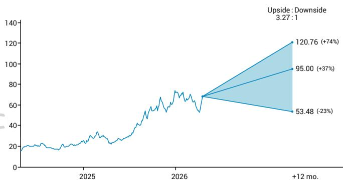  
Risk/Reward - 12 Month View

# Base Case, CNY95, +37%

# Upside Scenario, CNY120.76, +74%

• NVIDIA AI CCL market share rises from $5 \%$ in 2025 to $2 0 \% / 1 7 \%$ in 2027E/2030E. • Non-NVIDIA AI CCL market share rises from $5 \%$ in 2025 to $1 3 \% / 1 0 \%$ in 2027E/2030E. • Amazon AI PCB CCL market share drops from $50 \%$ in 2025 to $4 0 \% / 3 0 \%$ in 2027E/2030E. • PT of $\mathsf { R m b 9 5 . 0 0 }$ based on end-2026E DCF with $9 . 8 \%$ WACC and $7 . 0 \%$ terminal growth rate (2030E). 订阅研

• NVIDIA AI CCL market share rises from $5 \%$ in 2025 to $2 3 \% / 2 0 \%$ in 2027E/2030E.   
• Non-NVIDIA AI CCL market share rises from $5 \%$ in 2025 to $1 8 \% / 1 5 \%$ in 2027E/2030E.   
• Amazon AI PCB CCL market share drops from $5 0 \%$ in 2025 to $4 3 \% / 3 3 \%$ in 2027E/2030E.   
• PT of Rmb120.76 based on end-2026E DCF with $9 . 8 \%$ WACC and $7 . 3 \%$ terminal growth   
报添加微信 LCD123321Cadrate (2030E).

# Downside Scenario, CNY53.48, -23%

• NVIDIA AI CCL market share rises from $5 \%$ in 2025 to $1 6 \% / 1 3 \%$ in 2027E/2030E. • Non-NVIDIA AI CCL market share rises from $5 \%$ in 2025 to $8 \% / 5 \%$ in 2027E/2030E. • Amazon AI PCB CCL market share drops from $5 0 \%$ in 2025 to $3 5 \% / 2 5 \%$ in 2027E/2030E. • PT of Rmb53.48 based on end-2026E DCF with $9 . 8 \%$ WACC and $5 . 5 \%$ terminal growth 04-20 rate (2030E).

# Sustainability Matters

# Top Material Issues:

• Product and service quality: Sytech implements phased project reviews and quality control measures to meet predefined standards.   
Exploration and accessibility of technology: Sytech closely aligns with market demands,   
implements rapid-response product innovation mechanisms, and achieves continued product iteration and optimization.   
Sustainable supply chain: Sytech utilizes a Supplier Relationship Management (SRM) system to centralize supplier information, standardize procurement workflows, and objectively and fairly evaluate supplier performance.

# Company Targets:

• Reduce $3 0 \%$ of energy consumption intensity/unit by 2040.   
• Replace 80% of equipment with electrified by 2040.   
订• Increase the use of green electricity by $4 \%$ 研/year to $1 0 0 \%$ 加微 by 2040.

# Questions to Management:

• What is Sytech’s decarbonization roadmap?   
• What measures has Sytech taken to encourage suppliers to conduct scientific carbon emission reduction targets?

ESG Report: link

# Catalysts

• Better-than-expected AI server demand.   
• Further market share gain and expansion to new customers in AI server PCB/CCL.   
• Ongoing spec upgrade of PCB /CCL with dollar content going up.   
• Accelerated capacity and profitability ramp for AI-related products in both local/overseas facilities.   
• Easing supply tightness in critical materials for high-end PCB/CCL.   
• Smooth transfer of upstream materials' price hikes to downstream customers.

# Financials:Shengyi Technology

# Estimate changes

<table><tr><td>RMB</td><td>2024A</td><td>2025E</td><td>2026E</td><td>2027E</td></tr><tr><td>Rev. (MM)</td><td>20,388.0</td><td>28,431.0</td><td>38,854.0</td><td>52,497.0</td></tr><tr><td>EBIT (MM)</td><td>1,998.0</td><td>4,405.0</td><td>6,987.0</td><td>10,925.0</td></tr><tr><td>Net Profit</td><td>1.739.0订阅研报添330信</td><td></td><td>LCD12335.209.0d 04-20</td><td>8,307.0</td></tr><tr><td>EPS</td><td>0.73</td><td>1.37</td><td>2.14</td><td>3.42</td></tr><tr><td>Cons. Rev.</td><td>■</td><td>28,626.0</td><td>38,831.0</td><td>51,023.0</td></tr><tr><td>Cons. EPS</td><td></td><td>1.37</td><td>2.14</td><td>3.42</td></tr></table>