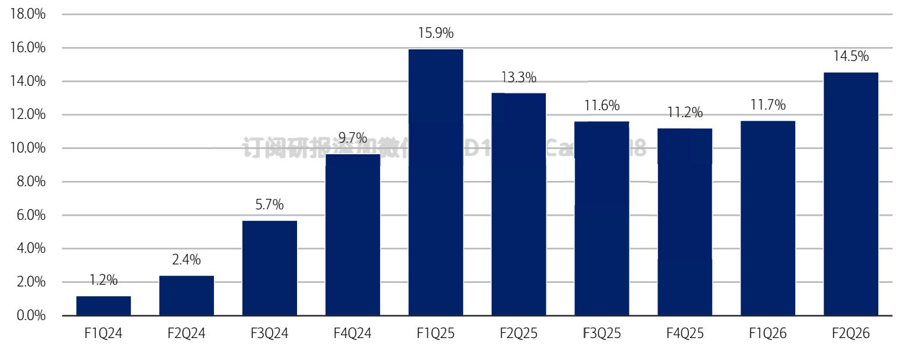
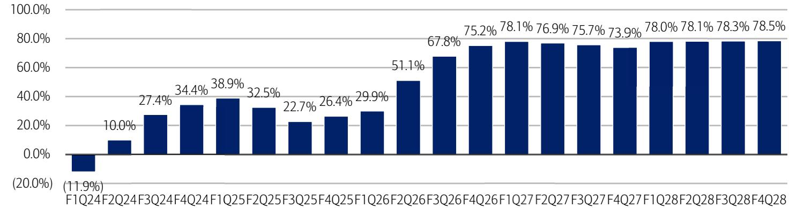

# Sandisk Corporation

NAND supply remains tight, raising ASP estimates; PO to \$1,080

Reiterate Rating: BUY | PO: 1,080.00 USD | Price: 919.47 USD

# Mix shift to data centers; AI inference demand sustainable

NAND pricing is up massively. A key question we get from investors is whether higher pricing is sustainable. Or, are we in a typical memory cycle and have margins peaked? We see a longer cycle this time given: 1) mix shift to data centers which inherently is a less cyclical end market vs. client/consumer, 2) NAND demand from AI inferencing which we view as sustainable in the medium-term, and 3) NAND suppliers being rational and adding supply judiciously. Cloud/datacenter revenue for SNDK has grown from $1 \%$ of the mix in F1Q24 to about $1 5 \%$ in F2Q26 (Dec qtr, Figure 1) and we see further mix shift to that end market. PO moves to $\$ 1080$ (from $\$ 900$ ) on approximately $1 0 \times$ (unchanged) C27E EPS of $\$ 12$ (prior $\$ 90.21$ ). Reit Buy on secular opportunity as AI inference makes NAND more indispensable.

# Expecting a beat and raise quarter on pricing strength

SNDK reports F3Q26 after market close on Thur, April $3 0 ^ { \mathrm { t h } }$ . We model F3Q rev/EPS above Street and above guidance. We model rev/EPS of $\$ 4.89 b n / 514.61$ vs. Street $5 4 . 6 9 6 \mathrm { n } / 5 1 4 . 6 0$ and guidance ranges (rev: \$4.4-4.8bn, EPS \$12-14). For F4Q, we model rev/EPS of $5 6 . 6 7 \mathrm { b n } / 5 2 2 . 8 4$ vs. Street $5 6 . 3 4 \mathrm { b n } / { 5 2 2 . 4 7 }$ . We expect SNDK to guide F4Q revenue in the range of \$6.4-6.8bn, and EPS \$21-23. We now model NAND ASP 订sequential growth of $7 0 \% / 3 0 \% / 1 3 \%$ 加微信 LCD123321Cad  for F3Q26/F4Q26/F1Q27 vs. prior $6 3 \% / 2 0 \% / 1 0 \%$

# Long-term contracts can reduce the peaks and troughs

SNDK is in the process of setting up long-term contracts (both volume and price based) which not only drive better visibility but will help to maintain margins through-cycle. We model GM growing from $5 1 \%$ in F2Q25 to $7 8 . 5 \%$ in F4Q28 (Figure 2). Given the dynamic nature of the NAND pricing market, we expect these long-term contracts would include a portion that is fixed and another that is variable. SNDK is offering these long term agreements to customers across Cloud, Client and Consumer but we expect the largest uptake to be in the data center business.

# What can break the NAND cycle?

AI efficiency/compression improvements, like TurboQuant, can reduce the amount of memory required. We see 1) increased penetration of AI inference in enterprises which can drive the overall demand for NAND higher, and 2) improved ROI of hyperscale capex using these compression techniques, which can actually cause demand for NAND to rise.

<table><tr><td>Estimates (Jun) (US$)</td><td>2024A</td><td>2025A</td><td>2026E</td><td>2027E</td><td>2028E</td></tr><tr><td>EPS</td><td>0</td><td>3.02</td><td>45.42</td><td>110.62</td><td>124.97</td></tr><tr><td>EPS Change (YoY)</td><td>NA</td><td>NA</td><td>NM</td><td>143.5%</td><td>13.0%</td></tr><tr><td>Consensus EPS (Bloomberg)</td><td></td><td></td><td>41.72</td><td>103.15</td><td>95.13</td></tr><tr><td>Consensus EPS (Visible Alpha)</td><td></td><td></td><td>44.29</td><td>105.70</td><td>90.38</td></tr><tr><td>Valuation (Jun)</td><td></td><td></td><td></td><td></td><td></td></tr><tr><td>P/E</td><td>NA</td><td>304.5x</td><td>20.2x</td><td>8.3x</td><td>7.4x</td></tr><tr><td>EV /EBITDA*</td><td>NM</td><td>162.2x</td><td>15.4x</td><td>6.3x</td><td>5.6x</td></tr><tr><td>Free Cash Flow Yield*</td><td>-0.3%</td><td>-0.1%</td><td>3.5%</td><td>11.3%</td><td>12.9%</td></tr><tr><td>*For full definitions of QmethodSMmeasures,see page 8.</td><td></td><td></td><td></td><td></td><td></td></tr></table>

# iQprofile SM Sandisk Corporation

iQmethod SM – Bus Performance\*   

<table><tr><td>(US$ Millions)</td><td>2024A</td><td>2025A</td><td>2026E</td><td>2027E</td><td>2028E</td></tr><tr><td>Return on Capital Employed</td><td>-2.4%</td><td>4.6%</td><td>49.8%</td><td>68.1%</td><td>45.0%</td></tr><tr><td>Return on Equity</td><td>0%</td><td>4.3%</td><td>55.7%</td><td>70.6%</td><td>45.7%</td></tr><tr><td>Operating Margin</td><td>-4.7%</td><td>9.4%</td><td>48.6%</td><td>64.1%</td><td>67.5%</td></tr><tr><td>Free Cash Flow</td><td>(475)</td><td>(119)</td><td>4,944</td><td>15,911</td><td>18,138</td></tr></table>

iQmethod SM – Quality of Earnings\*   

<table><tr><td>(US$ Millions)</td><td>2024A</td><td>2025A</td><td>2026E</td><td>2027E</td><td>2028E</td></tr><tr><td> Cash Realization Ratio</td><td>NA</td><td>0.2x</td><td>0.8x</td><td>1.0x</td><td>1.0x</td></tr><tr><td>Asset Replacement Ratio</td><td>0.7x</td><td>1.2x</td><td>0.8x</td><td>0.8x</td><td>0.8x</td></tr><tr><td>Tax Rate</td><td>NM</td><td>24.1%</td><td>13.2%</td><td>13.5%</td><td>13.5%</td></tr><tr><td>Net Debt-to-Equity Ratio</td><td>-3.0%</td><td>4.0%</td><td>-26.8%</td><td>-60.6%</td><td>-72.0%</td></tr><tr><td>Interest Cover</td><td>NA</td><td>NA</td><td>NA</td><td>NA</td><td>NA</td></tr></table>

Income Statement Data (Jun)   
订阅研报添加微信 LCD123321Cad   

<table><tr><td>(US$ Millions)</td><td>2024A</td><td>2025A</td><td>2026E</td><td>2027E</td><td>2028E</td></tr><tr><td>Sales</td><td>6,663</td><td>7.355</td><td>16,888</td><td>31,547</td><td>34,065</td></tr><tr><td>% Change</td><td>9.5%</td><td>10.4%</td><td>129.6%</td><td>86.8%</td><td>8.0%</td></tr><tr><td> Gross Profit</td><td>1,056</td><td>2,228</td><td>10,567</td><td>24.038</td><td>26.643</td></tr><tr><td>% Change</td><td>135.2%</td><td>111.0%</td><td>374.3%</td><td>127.5%</td><td>10.8%</td></tr><tr><td>EBITDA</td><td>(86)</td><td>846</td><td>8.913</td><td>21,654</td><td>24,521</td></tr><tr><td>% Change</td><td>84.9%</td><td>NM</td><td>953.5%</td><td>142.9%</td><td>13.2%</td></tr><tr><td>Net Interest &amp; Other Income</td><td>(37)</td><td>(109)</td><td>(130)</td><td>(108)</td><td>(108)</td></tr><tr><td>Net Income (Adjusted)</td><td>0</td><td>440</td><td>7,015</td><td>17,409</td><td>19,792</td></tr><tr><td> % Change</td><td>NA</td><td>NA</td><td>NM</td><td>148.2%</td><td>13.7%</td></tr></table>

Free Cash Flow Data (Jun)   

<table><tr><td>(US$ Millions)</td><td>2024A</td><td>2025A</td><td>2026E</td><td>2027E</td><td>2028E</td></tr><tr><td>Net Income from Cont Operations (GAAP)</td><td>(503)</td><td>440</td><td>7,015</td><td>17,409</td><td>19,791</td></tr><tr><td>Depreciation &amp;Amortization</td><td>224</td><td>164</td><td>594</td><td>1,420</td><td>1,533</td></tr><tr><td> Change in Working Capital</td><td>(86)</td><td>(380)</td><td>(2,115)</td><td>(1,745)</td><td>(1,917)</td></tr><tr><td>Deferred Taxation Charge</td><td>(16)</td><td>(12)</td><td>(10)</td><td>0</td><td>0</td></tr><tr><td> Other Adjustments, Net</td><td>72</td><td>(127)</td><td>(47)</td><td>(68)</td><td>（78)</td></tr><tr><td>Capital Expenditure</td><td>(166)</td><td>(204)</td><td>(493)</td><td>(1,104)</td><td>(1,192)</td></tr><tr><td>Free Cash Flow</td><td>-475</td><td> -119</td><td> 4,944</td><td>15,911</td><td>18,138</td></tr><tr><td>% Change</td><td>49.0%</td><td>74.9%</td><td>NM</td><td>221.8%</td><td>14.0%</td></tr><tr><td> Share /Issue Repurchase</td><td>0</td><td>5</td><td>24</td><td>0</td><td>0</td></tr><tr><td>Cost of Dividends Paid</td><td>0</td><td>0</td><td>0</td><td>0</td><td>0</td></tr><tr><td> Change in Debt</td><td>(258)</td><td>0</td><td>0</td><td>0</td><td>0</td></tr></table>

Balance Sheet Data (Jun)   

<table><tr><td>(US$ Millions)</td><td>2024A</td><td>2025A</td><td>2026E</td><td>2027E</td><td>2028E</td></tr><tr><td> Cash &amp; Equivalents</td><td>328</td><td>1,481</td><td>4,886</td><td>20.810</td><td>38.948</td></tr><tr><td>Trade Receivables</td><td>935</td><td>1,068</td><td>3.343</td><td>4182</td><td>5.591</td></tr><tr><td>Other Current Assets</td><td>2,285</td><td>2.537</td><td>2.678</td><td>3,207</td><td>3,424</td></tr><tr><td>Property, Plant &amp; Equipment</td><td>791</td><td>619</td><td>631</td><td>631</td><td>631</td></tr><tr><td> Other Non-Current Assets</td><td>9,167</td><td>7,280</td><td>7,139</td><td>6,746</td><td>6,494</td></tr><tr><td>Total Assets</td><td>13,506</td><td>12,985</td><td>18,676</td><td>35,576</td><td>55,089</td></tr><tr><td>Short-Term Debt</td><td>0</td><td>20</td><td>20</td><td>20</td><td>20</td></tr><tr><td>Other Current Liabilities</td><td>2,123</td><td>1,407</td><td>1,616</td><td>1,239</td><td>950</td></tr><tr><td>Long-Term Debt</td><td>0</td><td>1,829</td><td>583</td><td>583</td><td>583</td></tr><tr><td>Other Non-Current Liabilities</td><td>301</td><td>513</td><td>498</td><td>398</td><td>298</td></tr><tr><td> Total Liabilities</td><td> 2,424</td><td>3,769</td><td> 2,717</td><td>2,240</td><td>1,851</td></tr><tr><td>Total Equity</td><td>11,082</td><td>9,216</td><td>15,959</td><td>33,336</td><td>53,238</td></tr><tr><td>Total Equity &amp; Liabilities</td><td>13,506</td><td>12,985</td><td>18,676</td><td>35,576</td><td>55,089</td></tr></table>

\* For full definitions of iQmethod SM measures, see page 8.

Company Sector IT Hardware

# Company Description

Sandisk (SNDK) is is a leading developer, manufacturer and provider of data storage devices and solutions based on NAND flash technology. SNDK has a growing solid state drive and storage systems portfolio, and is currently the 4-18 third largest enterprise SSD manufacturer.

# Investment Rationale

We rate SNDK Buy. We expect long-term growth in demand for data storage using NAND, mainly driven by generative AI & eSSD share gains / demand in the data center.

# Stock Data

Average Daily Volume

18,070,880

<table><tr><td>Quarterly Earnings Estimates</td></tr><tr><td>4-18</td></tr><tr><td>2025 2026 Q1 1.80A 1.22A</td></tr><tr><td>Q2 1.23A 6.20A</td></tr><tr><td>Q3 -0.30A 14.61E</td></tr><tr><td>Q4 0.29A 22.84E</td></tr></table>

  
Figure 1: Cloud/Datacenter as a percent of rev mix has grown from $1 \%$ to about $1 5 \%$ Percent of quarterly reported revenue   
Source: Company reports, BofA Global Research estimates   
BofA GLOBAL RESEARCH

  
Figure 2: NAND pricing remains strong. We model gross margins trending higher from 51% in F2Q26 to 78.5% in F4Q28 This chart shows historical trend of SNDK gross margin and our forecast   
Source: Company reports, BofA Global Research estimates

Figure 3: Our estimates are higher vs. Street for both F3Q and F4Q26 Revenues in \$mn   
3QFY-2026 4QFY-2026   

<table><tr><td>BofA</td><td>Street</td><td>Delta</td><td>Guide</td><td>2QFY-2026</td><td>Chg Q/Q</td><td>BofA</td><td>Street</td><td>Delta</td></tr><tr><td>$4,886</td><td>$4,693</td><td>$193</td><td>$4400 to $4800</td><td>$3,025</td><td>61.5%</td><td>$6,669</td><td>$6.340</td><td>$329</td></tr><tr><td>$1,57</td><td>$1,547</td><td>$26</td><td></td><td>$1,479</td><td>6.4%</td><td>$1,652</td><td>$1,676</td><td>-$24</td></tr><tr><td>$3,313</td><td>$3,147</td><td>$165</td><td></td><td>$1,546</td><td>114.3%</td><td>$5.017</td><td>$4,715</td><td>$302</td></tr><tr><td>$425</td><td>$339</td><td>$85</td><td></td><td>$269</td><td>57.9%</td><td>$566</td><td>$360</td><td>$207</td></tr><tr><td>$218</td><td>$161</td><td>$57</td><td></td><td>$144</td><td>51.3%</td><td>$284</td><td>$178</td><td>$106</td></tr><tr><td>$643</td><td>$500</td><td>$143</td><td>$450 to $470</td><td>$413</td><td>55.6%</td><td>$851</td><td>$537</td><td>$313</td></tr><tr><td>$2,670</td><td>$2,670</td><td>$0</td><td>3321Cad</td><td>04-18$1,133</td><td>135.7%</td><td>$4,167</td><td>$4,205</td><td>-$38</td></tr><tr><td>$2,890</td><td>$2,694</td><td>$196</td><td></td><td>$1,265</td><td>128.4%</td><td>$4,467</td><td>$4,195</td><td>$272</td></tr><tr><td>-$27</td><td>-$23</td><td>-$4</td><td>-$25 to -$30</td><td>-534</td><td>-20.6%</td><td>-$27</td><td>-$24</td><td>-$3</td></tr><tr><td>$2,643</td><td>$2.647</td><td>-$4</td><td></td><td>$1,099</td><td>140.5%</td><td>$4,140</td><td></td><td></td></tr><tr><td>$357</td><td>$355</td><td>$1</td><td>$325 to $375</td><td>$132</td><td>170.3%</td><td>$559</td><td>$4,180 $636</td><td>-$41 -$77</td></tr><tr><td>$2,286</td><td>$2,291</td><td>-$5</td><td></td><td>$967</td><td>136.4%</td><td>$3,581</td><td>$3,544</td><td>$37</td></tr><tr><td>$14.61</td><td>$14.60</td><td>$0.01</td><td>$12.00 to $14.00</td><td>$6.20</td><td>135.7%</td><td>$22.84</td><td>$22.47</td><td>$0.38</td></tr></table>

# Abbreviations

RAG: Retrieval-Augmented Generation   
KV: Key-Value   
AI: Artificial Intelligence   
NAND: Not And, a type of flash memory   
EB: Exabytes   
HBM: High Bandwidth Memory   
DRAM: Dynamic Random Access Memory   
SSD: Solid State Drives   
ROI: Return-on-Investment   
ASP: Average Sell Price

Figure 4: SNDK Income Statement – we model F26 revenues growing Revenues in \$mn   

<table><tr><td>SanDisk Corp. (SNDK) Wamsi Mohan</td><td colspan="8">F2025</td><td colspan="4"></td><td></td></tr><tr><td>($ Milons Except Per Share Data)</td><td>9/24 12/24</td><td></td><td>3/25</td><td>6/25</td><td>F2026E 9/25</td><td>12/25</td><td>3/26E</td><td>6/26E</td><td>F2024</td><td>F2025</td><td>F2026E</td><td>F2027E</td><td>F2028E</td></tr><tr><td colspan="10">Total Revenue $1,883.0</td><td></td><td>$16,887.9</td><td>$31,546.6</td><td>$34,064.6</td></tr><tr><td></td><td></td><td>$1,876.0</td><td>$1,695.0</td><td></td><td></td><td>$3,025.0</td><td>$4,885.8 $6,669.1</td><td></td><td>$6,663.0</td><td>$7,355.0</td><td></td><td></td><td></td></tr><tr><td>Cost of Revenue - Non-GAAP Non-GAAP Gross Profit</td><td>1,151.0 732.0</td><td>1,267.0 609.0</td><td>1,310.0 385.0</td><td>1,399.0 502.0</td><td>1,617.0 691.0</td><td>1,479.0 1,546.0</td><td>1,573.2 3,312.6</td><td>1,651.8 5,017.3</td><td>5.607.0 1,056.0</td><td>5,127.0 2,228.0</td><td>6,321.0 10,566.9</td><td>7,508.2 24,038.3</td><td>7,421.7 26,643.0</td></tr><tr><td></td><td></td><td></td><td></td><td></td><td></td><td></td><td></td><td></td><td></td><td></td><td></td><td></td><td></td></tr><tr><td>Research and development - Non-GAAP Selling, generaland administrative-Non-GAAP</td><td>30 115.0</td><td>不259吸 117.0</td><td>添265.0</td><td>265.0</td><td>296.0</td><td>269.0</td><td>424.7</td><td>566.4 18</td><td>991.0</td><td>1,052.0</td><td>1,556.1</td><td>2,569.8</td><td>2,548.2 1,106.5</td></tr><tr><td>Other - Non-GAAP</td><td>0.0</td><td>0.0</td><td>118.0</td><td>137.0 0.0</td><td>150.0 0.0</td><td>144.0 0.0</td><td>217.9</td><td>284.1</td><td>375.0 0.0</td><td>487.0 0.0</td><td>796.1 0.0</td><td>1,234.6 0.0</td><td>0.0</td></tr><tr><td>Total OpEx</td><td>378.0</td><td>376.0</td><td>0.0 383.0</td><td>402.0</td><td>446.0</td><td>413.0</td><td>0.0 642.6</td><td>0.0 850.5</td><td>1,366.0</td><td>1,539.0</td><td>2,352.1</td><td>3.804.4</td><td>3,654.6</td></tr><tr><td>Non-GAAP operating income (excl SBC)</td><td>354.0</td><td>233.0</td><td>2.0</td><td>100.0</td><td>245.0</td><td>1,133.0</td><td>2,670.0</td><td>4,166.8</td><td>(310.0)</td><td>689.0</td><td>8,214.8</td><td>20,233.9</td><td>22,988.3</td></tr><tr><td>Non-GAAP interest and other income (expense), net</td><td>(24.0)</td><td>(26.0)</td><td>(22.0)</td><td>(37.0)</td><td>(42.0)</td><td>(34.0)</td><td>(27.0)</td><td>(27.0)</td><td>(37.0)</td><td>(109.0)</td><td>(130.0)</td><td>(108.0)</td><td>(108.0)</td></tr><tr><td>Non-GAAP pretax income</td><td></td><td></td><td></td><td></td><td></td><td></td><td></td><td></td><td></td><td></td><td></td><td></td><td></td></tr><tr><td>Non-GAAP income tax expense</td><td>330.0 67.0</td><td>207.0 29.0</td><td>(20.0) 23.0</td><td>63.0 21.0</td><td>203.0 22.0</td><td>1,099.0 132.0</td><td>2,643.0 356.8</td><td>4,139.8 558.9</td><td>(347.0) 156.0</td><td>580.0 140.0</td><td>8,084.8 1,069.7</td><td>20,125.9 2,717.0</td><td>22.880.3 3,088.8</td></tr><tr><td>Non-GAAP net income (excl SBC)</td><td>263.0</td><td>178.0</td><td>(43.0)</td><td>42.0</td><td>181.0</td><td>967.0</td><td>2,286.2</td><td>3,580.9</td><td>(503.0)</td><td>440.0</td><td>7,015.1</td><td>17,408.9</td><td>19,791.5</td></tr><tr><td>Non-GAAP EPS</td><td>$1.80</td><td>$1.23</td><td></td><td></td><td></td><td></td><td></td><td></td><td></td><td></td><td></td><td></td><td></td></tr><tr><td>Basic Weighted Average Shares</td><td></td><td></td><td>($0.30)</td><td>$0.29</td><td>$1.22</td><td>$6.20</td><td>$14.61</td><td>$22.84</td><td></td><td>$3.02</td><td>$45.42</td><td>$110.62</td><td>$124.97</td></tr><tr><td>Diluted Weighted Average Shares</td><td>144.0 146.0</td><td>145.0 145.0</td><td>145.0 145.0</td><td>145.0 147.0</td><td>146.0 148.5</td><td>147.0 156.0</td><td>147.0 156.5</td><td>147.0 156.8</td><td>126.3 126.8</td><td>144.8 145.8</td><td>146.8 154.4</td><td>147.0 157.4</td><td>147.0 158.4</td></tr><tr><td>% of Revenues</td><td></td><td></td><td></td><td></td><td></td><td></td><td></td><td></td><td></td><td></td><td></td><td></td><td></td></tr><tr><td>Non-GAAP Gross Profit</td><td></td><td>32.5%</td><td></td><td></td><td></td><td></td><td></td><td></td><td></td><td></td><td></td><td>76.2%</td><td></td></tr><tr><td>Non-GAAP R&amp;D</td><td>38.9%</td><td></td><td>22.7%</td><td>26.4%</td><td>29.9%</td><td>51.1%</td><td>67.8%</td><td>75.2%</td><td>15.8%</td><td>30.3%</td><td>62.6%</td><td></td><td>78.2%</td></tr><tr><td>Non-GAAP SG&amp;A</td><td>14.0%</td><td>13.8%</td><td>15.6%</td><td>13.9%</td><td>12.8%</td><td>8.9%</td><td>8.7%</td><td>8.5%</td><td>14.9%</td><td>14.3%</td><td>9.2%</td><td>8.1%</td><td>7.5%</td></tr><tr><td>Non-GAAP operating income</td><td>6.1% 18.8%</td><td>6.2% 12.4%</td><td>7.0%</td><td>7.2%</td><td>6.5%</td><td>4.8%</td><td>4.5%</td><td>4.3%</td><td>5.6%</td><td>6.6%</td><td>4.7%</td><td>3.9%</td><td>3.2%</td></tr><tr><td>Non-GAAP pretax income</td><td>17.5%</td><td>11.0%</td><td>0.1%</td><td>5.3%</td><td>10.6%</td><td>37.5%</td><td>54.6%</td><td>62.5%1</td><td>(4.7%)</td><td>9.4%</td><td>48.6%</td><td>64.1%</td><td>67.5%</td></tr><tr><td>Non-GAAP tax rate</td><td>20.3%</td><td>14.0%</td><td>(1.2%)</td><td>3.3%</td><td>8.8%</td><td>36.3%</td><td>54.1%</td><td>62.1%</td><td>(5.2%)</td><td>7.9%</td><td>47.9%</td><td>63.8%</td><td>67.2%</td></tr><tr><td>Non-GAAP net income</td><td>14.0%</td><td>9.5%</td><td>(115.0%) (2.5%)</td><td>33.3% 2.2%</td><td>10.8% 7.8%</td><td>12.0% 32.0%</td><td>13.5% 46.8%</td><td>13.5% 53.7%</td><td>(45.0%) (7.5%)</td><td>24.1% 6.0%</td><td>13.2% 41.5%</td><td>13.5% 55.2%</td><td>13.5% 58.1%</td></tr><tr><td>Adjusted EBITDA</td><td></td><td></td><td></td><td></td><td></td><td></td><td></td><td></td><td></td><td></td><td></td><td></td><td></td></tr><tr><td>Non-GAAP operating income</td><td>354.0</td><td>233.0</td><td></td><td></td><td></td><td></td><td></td><td></td><td></td><td></td><td></td><td></td><td>22988.3</td></tr><tr><td>Depreciation and amortization</td><td>54.0</td><td>36.0</td><td>2.0 37.0</td><td>100.0 37.0</td><td>245.0 36.0</td><td>1133.0 38.0</td><td>2670.0 219.9</td><td>4166.8 300.1</td><td>-310.0 224.0</td><td>689.0</td><td>8214.8 594.0</td><td>20233.9 1419.6</td><td>1532.9</td></tr><tr><td>Other Adjustments</td><td>0.0</td><td>-4.0</td><td>-2.0</td><td>-1.0</td><td>10.0</td><td>94.0</td><td>0.0</td><td>0.0</td><td>-1.0</td><td>164.0 -7.0</td><td>104.0</td><td>0.0</td><td>0.0</td></tr><tr><td>Adjusted EBITDA</td><td>408.0</td><td>265.0</td><td>37.0</td><td>136.0</td><td>291.0</td><td>1265.0</td><td>2889.9</td><td>4466.9</td><td>-86.0</td><td>846.0</td><td>8912.8</td><td>21653.5</td><td>24521.2</td></tr><tr><td>Adjusted EBITDA margin</td><td>21.7%</td><td>14.1%</td><td>2.2%</td><td>7.2%</td><td>12.6%</td><td>41.8%</td><td>59.1%</td><td>67.0%</td><td>-1.3%</td><td>11.5%</td><td>52.8%</td><td>68.6%</td><td>72.0%</td></tr><tr><td>Y/Y Growth Revenue</td><td></td><td></td><td></td><td></td><td></td><td></td><td></td><td></td><td></td><td></td></table>

Source: Company reports, BofA Global Research estimates

# Price objective basis & risk

# Sandisk Corporation (SNDK)

Our PO of $\$ 1080$ is based on approximately 10x C27E EPS of $\$ 121,32$ which is in line with SNDK's global memory peers' average due to similar profitability.

Upside risks: 1) we are earlier than expected in the NAND upcycle, 2) stronger than expected expansion in the NAND market on sales of AI enabled consumer products, 3) faster than expected eSSD market share gains, and 4) faster than expected recovery in NAND pricing.

订阅研报添加微信 LCD123321Cad Downside risks: 1) sharp drop in NAND prices due to oversupply, 2) Competition and over 04-18 expansion from Chinese suppliers such as YMTC, 3) slower than expected adoption of AI enabled consumer products, and 4) share loss in eSSD market.

# Analyst Certification

I, Wamsi Mohan, hereby certify that the views expressed in this research report accurately reflect my personal views about the subject securities and issuers. I also certify that no part of my compensation was, is, or will be, directly or indirectly, related to the specific recommendations or view expressed in this research report.

US - IT Hardware and Technology Supply Chain Coverage Cluster   

<table><tr><td>Investment rating BUY</td><td> Company</td><td>BofA Ticker</td><td>Bloomberg symbolAnalyst</td><td></td></tr><tr><td></td><td>Amphenol</td><td>APH</td><td>APH US</td><td>Wamsi Mohan</td></tr><tr><td></td><td> Appl Inc.</td><td>AAPL</td><td>AAPL US</td><td> Wamsi Mohan</td></tr><tr><td></td><td>Celestica Inc. 订阅研报添加微信1</td><td>TcsD123321Cad</td><td>clsus18</td><td>Ruplu Bhattacharya</td></tr><tr><td></td><td>Celestica Inc.</td><td>YCLS</td><td>CLS CN</td><td>Ruplu Bhattacharya</td></tr><tr><td></td><td>Corning Inc.</td><td>GLW</td><td>GLWUS</td><td>Wamsi Mohan</td></tr><tr><td></td><td>DellTechnologies Inc.</td><td>DELL</td><td>DELL US</td><td>Wamsi Mohan</td></tr><tr><td></td><td>DigitalOcean</td><td>DOCN</td><td>DOCN US</td><td>Wamsi Mohan</td></tr><tr><td></td><td>Flex Ltd.</td><td> FLEX</td><td>FLEX US</td><td>Ruplu Bhattacharya</td></tr><tr><td></td><td>Hewlett-Packard Enterprise</td><td>HPE</td><td>HPEUS</td><td>Wamsi Mohan</td></tr><tr><td></td><td>Ingram Micro Holding Corporation</td><td>INGM</td><td>INGMUS</td><td>Ruplu Bhattacharya</td></tr><tr><td></td><td>International Business Machines Corp.</td><td>IBM</td><td>IBMUS</td><td>Wamsi Mohan</td></tr><tr><td></td><td> Jabil Inc.</td><td> JBL</td><td>JBL US</td><td>Ruplu Bhattacharya</td></tr><tr><td></td><td>Nutanix Inc</td><td>NTNX</td><td>NTNXUS</td><td>Wamsi Mohan</td></tr><tr><td></td><td> Sandisk Corporation</td><td> SNDK</td><td> SNDK US</td><td>Wamsi Mohan</td></tr><tr><td></td><td>Seagate Technology</td><td>STX</td><td>STX US</td><td>Wamsi Mohan</td></tr><tr><td></td><td>TD Synnex Corp</td><td> SNX</td><td> SNX US</td><td> Ruplu Bhattacharya</td></tr><tr><td></td><td>TE Connectivity PIc.</td><td>TEL WDC</td><td>TEL US WDC US</td><td>Wamsi Mohan</td></tr><tr><td></td><td>Western Digital Corporation</td><td></td><td></td><td> Wamsi Mohan</td></tr><tr><td>NEUTRAL</td><td></td><td></td><td></td><td></td></tr><tr><td></td><td> CDW Corp</td><td>CDW</td><td> CDW US</td><td> Ruplu Bhattacharya</td></tr><tr><td></td><td>Concentrix Corporation</td><td>CNXC</td><td>CNXC US</td><td> Ruplu Bhattacharya</td></tr><tr><td></td><td>Enovix Corporation 订阅矿报标加微信</td><td>ENVX 1NTApJ1z55z1Cau</td><td>ENVX US NTAPUSO</td><td>Ruplu Bhattacharya</td></tr><tr><td></td><td>NetApp Inc.</td><td></td><td>PSTG US</td><td>Wamsi Mohan</td></tr><tr><td></td><td>Pure Storage</td><td>PSTG</td><td>SANM US</td><td>Wamsi Mohan</td></tr><tr><td></td><td> Sanmina Corporation</td><td>SANM ST</td><td></td><td> Ruplu Bhattacharya</td></tr><tr><td>UNDERPERFORM</td><td>Sensata Technologies Holdings Plc</td><td></td><td> ST US</td><td>Wamsi Mohan</td></tr><tr><td></td><td></td><td></td><td></td><td></td></tr><tr><td></td><td> Arrow Electronics Inc.</td><td>ARW</td><td>ARW US</td><td> Ruplu Bhattacharya</td></tr><tr><td></td><td>Avnet Inc.</td><td>AVT</td><td>AVT US HPQ US</td><td>Ruplu Bhattacharya</td></tr><tr><td></td><td>HP Inc. Super Micro Computer Inc.</td><td>HPQ SMCI</td><td>SMCIUS</td><td>Wamsi Mohan Ruplu Bhattacharya</td></tr><tr><td></td><td>Teradata Corporation</td><td>TDC</td><td>TDC US</td><td>Wamsi Mohan</td></tr><tr><td></td><td></td><td>VSH</td><td>VSH US</td><td>Ruplu Bhattacharya</td></tr><tr><td></td><td>Vishay Intertechnology, Inc.</td><td></td><td></td><td></td></tr></table>

# iQmethods" Measures Definitions

# Business Performance

# Numerator

# Denominator

Return On Capital Employed

NOPAT $=$ (EBIT $^ +$ Interest Income) × (1 − Tax Rate) $^ +$ Goodwill Amortization

Return On Equity Operating Margin Earnings Growth Free Cash Flow

Total Assets − Current Liabilities $^ +$ ST Debt $^ +$ Accumulated Goodwill   
Amortization   
Shareholders’ Equity   
Sales   
N/A   
N/A Net Income   
Operating Profit   
Expected 5 Year CAGR From Latest Actual Cash Flow From Operations − Total Capex

# Quality of Earnings

# Numerator

# Denominator

Cash Realization Ratio   
Asset Replacement Ratio Tax Rate   
Net Debt-To-Equity Ratio Interest Cover   
Cash Flow From Operations   
Capex 订阅研报添加   
Tax Charge   
Net Debt $=$ Total Debt − Cash & Equivalents   
EBIT   
Net Income   
21Cad 04-18 Depreciation Pre-Tax Income   
Total Equity   
Interest Expense

# Valuation Toolkit

# Numerator

# Denominator

Price / Earnings Ratio Price / Book Value Dividend Yield Free Cash Flow Yield Enterprise Value / Sales

Current Share Price   
Current Share Price   
Annualised Declared Cash Dividend   
Cash Flow From Operations − Total Capex   
$\mathsf { E V } =$ Current Share Price $\times$ Current Shares $^ +$ Minority Equity $^ +$ Net Debt $^ +$   
Other LT Liabilities   
Enterprise Value   
Diluted Earnings Per Share (Basis As Specified)   
Shareholders’ Equity / Current Basic Shares   
Current Share Price   
Market Cap $=$ Current Share Price $\times$ Current Basic Shares   
Sales

# EV / EBITDA

Basic EBIT $^ +$ Depreciation $^ +$ Amortization

iQmethod are: A consistently structured, detailed, and transparent methodology. Guidelines to maximize the effectiveness of the comparative valuation process, and to identify some common pitfalls. i flow statements for companies covered by BofA Global Research.