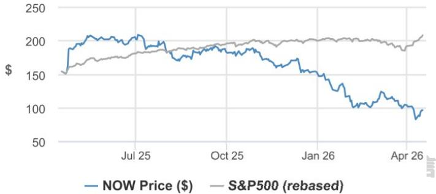
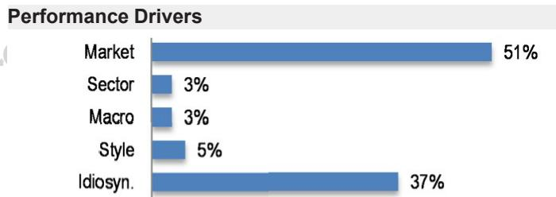

# ServiceNow

# Partner Describes “Excellent” Q1 Above Expectations; 19 April 2026 AI Adoption Broadening Beyond Contact Center

We are presenting our recent conversation with a ServiceNow partner (detailed feedback in subsequent pages) to provide a frontline view of the trends that we expect to drive fundamentals for ServiceNow over the next 12-18 months. As a reminder, these data points should be considered as part of a broader mosaic and 订阅研报添加微信 LCD123321Cad 0in the context of ServiceNow’s scale as a large, global business. Key Takeaways: 1) Demand Environment Remains Robust with No Signs of Macro-Driven Pullback. The contact characterizes the demand environment for ServiceNow as “excellent,” with the firm’s ServiceNow practice closing Q1 above what were described as already aggressive internal targets. He specifically calls out banking, financial services & insurance, and manufacturing as the strongest verticals driving a disproportionate share of net new activity in 2026. The partner has not yet seen any impact from geopolitical uncertainty (Iran, tariffs) on buying behavior, adding that “I just don’t see clients talking about it.” His pipeline into 2H26 gives him increased confidence in meeting or surpassing full-year practice goals, though formal targets are not yet being raised given what he describes as his practice’s already aggressive starting point for full year expectations. 2) AI Licensing Overhaul Viewed as Strategically Correct and Removes a Key Adoption Friction Point. The contact views the April 9th announcement, which embeds AI across every product and licensing tier, replacing the prior sidecar model, as the right strategic move. He reports that in prior client conversations, AI was frequently the 订阅研报添加微信 LCD123321Cad 0first line item cut from budgets because it was positioned as an optional add-on, with clients commonly saying “I need ServiceNow, there’s no question about that. I’m not yet sure if I need AI.” He expects the bundled approach to change client thinking, since even the most basic ServiceNow edition will now include AI capabilities and anticipates the model will include a baseline token allocation per tier, with customers purchasing incremental capacity as usage scales, though specifics on pricing have not yet been fully communicated to partners. He adds that many existing clients are likely not yet aware of the change, and in any case, it would only take effect at renewal. 3) Consumption Mix in Partner’s Book Running Around $20 \%$ . The contact estimates consumption-based pricing is roughly $\because 2 0 \%$ or below” of ServiceNow spend across his firm’s client base, which we note is notably below the ${ \sim } 5 0 \%$ of net new revenue figure publicly cited by ServiceNow management and corroborated by our prior survey work. He attributes the discrepancy to his client mix skewing toward earlier-stage implementers who have not yet ramped consumption-heavy products. He 订阅研报添加微信 LCD123321Cad 0acknowledges the broader industry tension around per-seat licensing in a world where agents are replacing human users, characterizing the April 9 announcement regarding pricing methodology change as a direct response. 4) AI Adoption Broadening Beyond Contact Center into Back-Office Automation. The partner reports an uptick in AI-related projects going into production vs. last year, though characterizes the increase as incremental rather than dramatic, as many clients earlier in their ServiceNow maturity journey still prioritize getting the basics right before layering in AI. More notable is the broadening of use cases beyond traditional contact center / CSM deployments. The partner is seeing “general

  
Price Performance

<table><tr><td></td><td>YTD</td><td>1m</td><td>3m</td><td>12m</td></tr><tr><td>Abs</td><td>-36.9%</td><td>-17.2%</td><td>-24.1%</td><td>-37.4%</td></tr><tr><td>Rel</td><td>-41.0%</td><td>-23.3%</td><td>-26.8%</td><td>-72.3%</td></tr></table>

<table><tr><td>Company Data</td></tr><tr><td>Shares O/S (mn) 1.047</td></tr><tr><td>52-week range ($) 211.48-81.24</td></tr><tr><td>Market cap ($ mn) 101,203.00</td></tr><tr><td>Exchange rate 1.00</td></tr><tr><td>Free float (%) 99.8%</td></tr><tr><td>3M ADV (mn) 21.35</td></tr><tr><td>3M ADV ($ mn) 2,303.8</td></tr><tr><td>Volatility (90 Day) 55</td></tr><tr><td>Index S&amp;P 500</td></tr><tr><td>BBG ANR (Buy|Hold|Sell) 45|4|1</td></tr></table>

# Key Metrics (FYE Dec)

<table><tr><td>$ in millions</td><td>FY25A</td><td>FY26E</td><td>FY27E</td></tr><tr><td>Financial Estimates</td><td></td><td></td><td>18,633</td></tr><tr><td>Revenue</td><td>13,278</td><td></td><td></td></tr><tr><td>Adj. EBIT</td><td>4,149</td><td>5,111</td><td>6,152</td></tr><tr><td>Adj. EBITDA</td><td>5,007</td><td>6,068</td><td>7,187</td></tr><tr><td>Adj. net income</td><td>3,669</td><td>4,313</td><td>5,146</td></tr><tr><td>Adj.EPS</td><td>3.51</td><td>4.12</td><td>4.92</td></tr><tr><td>BBG EPS</td><td>3.48</td><td>4.20</td><td>5.02</td></tr><tr><td>Cashflow from operations</td><td>5,444</td><td>6,650</td><td>7,830</td></tr><tr><td>FCFF</td><td>4,937</td><td>5,897</td><td>6,929</td></tr><tr><td>Margins and Growth</td><td></td><td></td><td></td></tr><tr><td>Revenue Growth Y/Y (%)</td><td>20.9%</td><td>20.3%</td><td>16.7%</td></tr><tr><td>EBIT margin</td><td>31.2%</td><td>32.0%</td><td>33.0%</td></tr><tr><td>EBIT Growth Y/Y (%)</td><td>27.5%</td><td>23.2%</td><td>20.4%</td></tr><tr><td>EBITDA margin</td><td>37.7%</td><td>38.0%</td><td>38.6%</td></tr><tr><td>EBITDA Growth Y/Y (%)</td><td>28.0%</td><td>21.2%</td><td>18.4%</td></tr><tr><td>Net margin</td><td>27.6%</td><td>27.0%</td><td>27.6%</td></tr><tr><td>Adj. EPS growth</td><td>26.0%</td><td>17.7%</td><td>19.3%</td></tr><tr><td>Ratios</td><td></td><td></td><td></td></tr><tr><td>Adj. tax rate</td><td>20.0%</td><td>20.0%</td><td>20.0%</td></tr><tr><td>Interest cover</td><td></td><td></td><td>=</td></tr><tr><td>Net debt/Equity</td><td>NM</td><td>NM</td><td>NM</td></tr><tr><td>Net debt/EBITDA</td><td>NM</td><td>NM</td><td>NM</td></tr><tr><td>ROE</td><td>32.5%</td><td>29.6%</td><td>27.2%</td></tr><tr><td>Valuation</td><td></td><td>订阅研报添加微信</td><td></td></tr><tr><td>FCFF yield</td><td>4.9%</td><td>5.8%</td><td>6.9%</td></tr><tr><td>Dividend yield</td><td>=</td><td>=</td><td>=</td></tr><tr><td>EV/Revenue</td><td>10.1</td><td>8.1</td><td>6.6</td></tr><tr><td>EV/EBITDA</td><td>26.7</td><td>21.3</td><td>17.2</td></tr><tr><td>Adj. P/E</td><td>27.6</td><td>23.4</td><td>19.7</td></tr></table>

# Summary Investment Thesis and Valuation

# Investment Thesis

ServiceNow stands out as the pioneer and leader of cloud-based IT Workflow management and is in the early stages of transforming into a true multi-product success story as it expands its presence in Employee, Customer, and Creator Workflows. The company’s growth at scale in combination with its robust free cash flow generation and large total addressable market – ServiceNow estimates its TAM will grow to $\$ 275 B$ in CD123321Cad 04-20 FY26 – puts it in an elite category of fast-growing and cash flowgenerative software companies. We believe ServiceNow’s focus on growing organically and the seamless nature of its products, and the feedback that frequently comes up in customer and partner checks will serve it well as it seeks to deploy its platform. As ServiceNow’s core IT Service Management product scales and further penetrates, continued development of complementary IT solutions as well as non-IT Workflow offerings should be key drivers of future growth in ServiceNow’s path to $\$ 15 B$ in subscription revenue.

# Valuation

Our Dec-26 PT of $\$ 195$ reflects a ${ \sim } 3 0 \mathrm { x }$ EV/CY27E uFCF multiple.

<table><tr><td>Factors</td><td>6M Corr</td><td>1Y CorT</td></tr><tr><td>Market:MSCI US</td><td>0.72</td><td>0.70</td></tr><tr><td>Sect: Technology</td><td>0.17</td><td>0.21</td></tr><tr><td>Ind:Software&amp; Serv</td><td>0.47</td><td>0.51</td></tr><tr><td>Macro:</td><td></td><td></td></tr><tr><td>Economic Surprise</td><td>0.40</td><td>0.28</td></tr><tr><td>US10yr Breakeven</td><td>-0.18</td><td>-0.10</td></tr><tr><td>US Dollar</td><td>-0.13</td><td>0.06</td></tr><tr><td>Quant Styles:</td><td></td><td></td></tr><tr><td>Growth</td><td>0.26</td><td>0.37</td></tr><tr><td>LowVol</td><td>-0.35</td><td>-0.35</td></tr><tr><td>DivYld</td><td>-0.23</td><td>-0.35</td></tr></table>

LCD123321Cad 04-20

interest in using AI in the back office,” with clients wanting to handle the same work volumes with fewer people across L1/L2/L3 IT incident resolution, HR service delivery, and security operations. He highlights that the new paradigm involves AI handling complex resolution workflows that previously required human analysis and multi-step research, which he notes is a meaningful step beyond the simple ticket routing and password reset automation that has existed for years. Net/net, we view ServiceNow’s $^ { I 2 + }$ organically built businesses with over \$250M in ARR as providing a diverse set of growth vectors and indicative of the traction of the company’s broader platform vision. We see ServiceNow’s cost-savings messaging – enabling companies to do more with less via a quick time-to-value deployment – resonating 订阅研报添加微信 LCD123321Cad in this challenging environment as companies are increasingly focused on the ROI their software stack delivers. Maintain OW; Dec-26 PT of \$195.

# Detailed Ecosystem Highlights

In order to assess trends and business momentum for companies in our coverage, we continually seek the feedback and expertise of customers and partners. Our Ecosystem Insights are an unbiased selection of comments intended to add incremental color to the Software sector. Additionally, it is the view of one customer or partner and might not be statistically significant, and, as such, we would wait to hear from other customers and partners to inform our view from a mosaic of information.

# General

Contact is a senior leader at a mid-sized IT consulting and implementation firm, with deep expertise in ServiceNow deployments across enterprise clients. The firm is a ServiceNow platinum partner.

# Demand Environment

Reports that demand for ServiceNow remains robust.The firm’s ServiceNow practice closed Q1 above expectations, exceeding what the contact describes as already aggressive internal targets. He characterizes the quarter as “excellent” and notes that he is seeing no signs of clients pulling back on investment into ServiceNow.

Banking, financial services & insurance, and manufacturing have been the strongest verticals for ServiceNow engagements so far in 2026 within the partner’s practice. He notes that these two areas are driving a disproportionate share of net new 研报添加微信 LCD123321Cad 04-20 activity.

Notes that pipeline heading into the second half of the year gives him increased confidence that the firm will meet or surpass its full-year ServiceNow practice goals. The firm is not formally raising targets yet given what the contact describes as initial aggressiveness in setting them, but he describes the trajectory as encouraging.

He does not see any impact from geopolitical uncertainty (Iran conflict, tariffs, etc.) on buying behavior, adding that his clients are not delaying or postponing purchasing decisions, and that these macro concerns simply do not come up in conversations. “I just don’t see clients talking about it.”

# AI Licensing & Packaging Overhaul

The contact highlights ServiceNow’s April 9th announcement that AI will now be embedded in every product across every licensing tier. This is contrasted with the prior model wherein AI (Now Assist) was sold as a separate add-on. He views this as the right strategic move and believes it addresses a key friction point that had 阅研报添加微信 LCD123321Cad 04-20 been suppressing AI adoption.

Notes that in prior conversations with clients, AI was frequently the first item cut from the budget because it was positioned as an optional add-on, and clients, especially those in earlier stages of their ServiceNow journey, would commonly say, “I need ServiceNow, there’s no question about that. I’m not yet sure if I need AI.” He expects the new bundled approach to change client thinking, as even the most basic ServiceNow edition will now include AI capabilities.

He expects the new model to include a baseline allocation of AI tokens with each product tier, with customers likely needing to purchase additional token capacity as usage scales. Notes that specifics on the new pricing tiers (Foundation, Advanced, Prime) have not yet been fully communicated to partners.

Believes many existing clients may not yet be aware of the April 9th announcement, and in any case, the changes would only affect contracts at renewal.

# Consumption & Pricing Dynamics

When asked about the proportion of ServiceNow spend attributable to consumptionbased pricing among his firm’s client base, he estimates it is roughly ${ \sim } 2 0 \%$ or below, 阅研报添加微信 LCD123321Cad 04-20 which we note is notably lower than the 50% of net new revenue figure publicly cited by ServiceNow management and similar levels collected in our prior survey work. Notes that this discrepancy may reflect the firm’s client mix skewing toward earlier-stage implementers who have not yet ramped consumption-based products.

Acknowledges the broader industry tension around ServiceNow’s per-seat licensing model in a world where AI agents are replacing human users. Suggests that the company could potentially be effectively “cannibalizing their own model” by deploying agents that reduce the need for fulfiller licenses, and that the April 9th announcement appears to be a direct response to this dynamic.

# AI Adoption Trends

Reports an uptick in AI-related projects going into production relative to last year, but characterizes the increase as incremental rather than dramatic. Many clients, in his view, particularly those earlier in their ServiceNow maturity journey, still prioritize getting the basics right before layering in AI capabilities.

The partner notes an encouraging broadening of AI use cases beyond the traditional 研报添加微信 LCD123321Cad 04-20  contact center/CSM deployments. He is seeing a growing interest in back-office automation, using AI to handle tasks that previously required human research and judgment, such as L1/L2/L3 IT incident resolution, HR service delivery, and security operations. “I’m seeing general interest in using AI in the back office”, specifically he sees clients wanting to handle the same volumes of work with fewer people, going beyond the basic self-service automation that has existed for years.

He highlights that the new paradigm involves using AI not just for simple ticket routing or password resets (which were already automated), but for complex resolution workflows that previously required human analysis and multi-step research.

# Investment Thesis, Valuation and Risks

# ServiceNow (Overweight; Price Target: \$195.00)

# Investment Thesis

ServiceNow stands out as the pioneer and leader of cloud-based IT Workflow management 阅研报添加微信 LCD123321Cad 04-20 and is in the early stages of transforming into a true multi-product success story as it expands its presence in Employee, Customer and Creator Workflows. The company’s growth at scale in combination with its robust free cash flow generation and large total addressable market – ServiceNow estimates its TAM will grow to $\$ 275 B$ in $\mathrm { F Y } 2 6 -$ puts it in an elite category of fast-growing and cash flow-generative software companies. We believe ServiceNow’s focus on growing organically and the seamless nature of its products, and the feedback that frequently comes up in customer and partner checks will serve it well as it seeks to deploy its platform. As ServiceNow’s core IT Service Management product scales and further penetrates, continued development of complementary IT solutions as well as non-IT Workflow offerings should be key drivers of future growth in ServiceNow’s path to $\$ 15 B$ in subscription revenue.

# Valuation

Our Dec-26 PT of $\$ 195$ is based on ${ \sim } 3 0 \mathrm { x }$ EV/CY27E uFCF, which is derived from our CY27 uFCF estimate of $\$ 6.78$ for ServiceNow. The multiple is at a small discount to the comp set of Cloud Software Companies with $1 5 \% +$ Growth and Credible AI Stories, which trade at \~34x EV/CY26E uFCF at the median. We believe a discount is warranted given an inferior 阅研报添加微信 LCD1CY27E revenue growth profile $( 1 7 \%$ 21vs. $2 0 \%$ 04-20  for comps) and exposure to U.S. Federal government business uncertainty, while having similar exposure to AI risks and opportunities compared to the comp set.

# Risks to Rating and Price Target

• Maturation of IT Workflows. IT Service Management, ServiceNow’s flagship product, is generally considered a mature product with relatively high penetration. While ServiceNow has demonstrated an impressive ability to innovate within IT Workflows, which include four other products with ${ \sim } \$ 2500$ in ACV, growth in IT Workflows may moderate. If growth in IT Workflows moderates more quickly than expected, it may be difficult for ServiceNow to offset the impact to total revenue growth with growth in other products.

Failure to execute in Employee, Customer, and Creator Workflows. To continue its strong top-line growth trajectory, ServiceNow will be increasingly dependent on the success of its non-IT Workflows, which frequently face competition from cloud-native solutions. Additionally, our partner and customer checks highlight customer hesitancy 研报添加微信platform solution. to become too dependent on one vendor, despite the potential benefits of ServiceNow’s LCD123321Cad 4-

Deceleration in billings and cRPO growth. While ServiceNow stopped reporting billings in Q4 2021 in favor of cRPO, we believe investors will still track ServiceNow’s calculated billings growth closely, which is generally viewed as a leading indicator of future revenue growth for software companies. While the deceleration has been more pronounced in calculated billings, both billings and cRPO growth have decelerated materially from the ${ \sim } 3 0 \% +$ level in 2021. A continued deceleration in the year-over-year billings and cRPO growth rate, whether due to underlying fundamental challenges or invoicing optics, could provide a headwind for shares of NOW.

• Macroeconomic gyrations. IT spending growth has remained positive for several years, but any persistent macroeconomic headwinds could prompt buyers to more carefully consider its purchase or delay purchasing altogether, which could adversely affect shares. ServiceNow may be particularly impacted by macroeconomic headwinds as it sells a premium product requiring a substantial investment from customers in terms of both time and resources.

<table><tr><td rowspan=1 colspan=17>ServiceNow:SummaryofFinanciais</td></tr><tr><td rowspan=1 colspan=9>Income Statement-Annual            FY24AFY25A FY26E FY27EFY28E</td><td rowspan=1 colspan=8>IncomeStatement-Quarterly                  1Q26E 2Q26E3Q26E 4Q26E</td></tr><tr><td rowspan=2 colspan=4>RevenueCOGS</td><td rowspan=1 colspan=5>10,984 13,278 15,969 18,633</td><td rowspan=1 colspan=4>Revenue</td><td rowspan=1 colspan=4>3,739 3,849 4,093  4,288</td></tr><tr><td rowspan=1 colspan=2></td><td rowspan=1 colspan=5>(1,907) (2.517) (3,176) (3,398)</td><td rowspan=1 colspan=4>COGS</td><td rowspan=1 colspan=4>(736)  (771)  (819)  (850)</td></tr><tr><td rowspan=4 colspan=4>Gross profitSG&amp;AAdj. EBITDAD&amp;A</td><td rowspan=1 colspan=5>9,077 10,761 12,793 15,236</td><td rowspan=1 colspan=4>Gross profit</td><td rowspan=1 colspan=4>3,003  3,078  3,274  3,438</td></tr><tr><td rowspan=1 colspan=5>(3,961) (4,464) (5,206) (6,107)</td><td rowspan=1 colspan=4>SG&amp;A</td><td rowspan=1 colspan=4>(1,245) (1,303) (1,260) (1,398)</td></tr><tr><td rowspan=1 colspan=5>3,912  5,007  6,068  7,187</td><td rowspan=1 colspan=4>Adj. EBITDA</td><td rowspan=1 colspan=4>1,398  1,407  1,646  1,618</td></tr><tr><td rowspan=1 colspan=5>(658)  (858)  (957) (1,035)</td><td rowspan=1 colspan=4>D&amp;A</td><td rowspan=1 colspan=4>(223)  (244)  (257)  (233)</td></tr><tr><td rowspan=2 colspan=4>Adj. EBITNet Interest</td><td rowspan=1 colspan=5>3,254  4,149  5,111  6,152</td><td rowspan=2 colspan=4>Adj. EBITNet Interest</td><td rowspan=2 colspan=4>1,174  1,163  1,390  1,38485    85    85    85</td></tr><tr><td rowspan=1 colspan=5>419   451   340  340</td><td rowspan=1 colspan=3>Net Interest</td></tr><tr><td rowspan=4 colspan=4>Adj. PBTTaxMinority InterestAdj. Net Income</td><td rowspan=1 colspan=5>3,628 4,586 5,391 6,432</td><td rowspan=1 colspan=4>Adj. PBT123321</td><td rowspan=1 colspan=1></td><td rowspan=1 colspan=3>1,244  1,233  1,460  1,454</td></tr><tr><td rowspan=1 colspan=5>(313)  (513)  (666)  （817)</td><td rowspan=2 colspan=4>TaxMinority Interest</td><td rowspan=2 colspan=4>(147)  (144)  (189)  (186)-      -</td></tr><tr><td rowspan=1 colspan=5>-</td></tr><tr><td rowspan=1 colspan=5>2,902  3,669  4,313  5,146</td><td rowspan=2 colspan=4>Adj. Net IncomeReported EPS</td><td rowspan=2 colspan=4>996   986  1,168  1,1640.53   0.52  0.68   0.67</td></tr><tr><td rowspan=1 colspan=4>Reported EPS</td><td rowspan=1 colspan=1>1.37</td><td rowspan=1 colspan=4>1.67  2.40  2.94</td></tr><tr><td rowspan=1 colspan=4>Adj. EPS</td><td rowspan=1 colspan=1>2.78</td><td rowspan=1 colspan=4>3.51   4.12   4.92</td><td rowspan=1 colspan=4>Adj. EPS</td><td rowspan=1 colspan=3>0.95   0.94  1.12</td><td rowspan=1 colspan=1>1.11</td></tr><tr><td rowspan=2 colspan=4>DPSPayout ratioShares outstanding</td><td rowspan=1 colspan=5></td><td rowspan=1 colspan=4>DPSPayout ratio</td><td rowspan=1 colspan=3>·      ·      ■</td><td rowspan=1 colspan=1>■</td></tr><tr><td rowspan=1 colspan=5>1,043  1,047  1,046  1,046</td><td rowspan=1 colspan=4>Shares outstanding</td><td rowspan=1 colspan=2>1,047  1,045</td><td rowspan=1 colspan=1>1,045</td><td rowspan=1 colspan=1>1,045</td></tr><tr><td rowspan=1 colspan=4>BalanceSheet&amp;Cash FlowStatement</td><td rowspan=1 colspan=5>FY24A FY25A FY26E FY27E FY28E</td><td rowspan=1 colspan=4>Ratio Analysis                      FY24A</td><td rowspan=1 colspan=2>FY25A FY26E_</td><td rowspan=1 colspan=1>FY27E</td><td rowspan=1 colspan=1>FY28E</td></tr><tr><td rowspan=1 colspan=4>Cash and cash equivalents</td><td rowspan=1 colspan=1>2,304</td><td rowspan=1 colspan=1>3,726</td><td rowspan=1 colspan=1>7,881</td><td rowspan=1 colspan=2>13.938</td><td rowspan=1 colspan=4>Gross margin                         82.6%</td><td rowspan=1 colspan=1>81.0%</td><td rowspan=1 colspan=1>80.1%</td><td rowspan=1 colspan=1>81.8%</td><td rowspan=1 colspan=1></td></tr><tr><td rowspan=1 colspan=4>Accounts receivable</td><td rowspan=1 colspan=1>2,240</td><td rowspan=1 colspan=1>2,627</td><td rowspan=1 colspan=1>3,696</td><td rowspan=1 colspan=2>4,273</td><td rowspan=1 colspan=4>EBITDA margin                       35.6%</td><td rowspan=1 colspan=1>37.7%</td><td rowspan=1 colspan=1>38.0%</td><td rowspan=1 colspan=1>38.6%</td><td rowspan=1 colspan=1></td></tr><tr><td rowspan=1 colspan=4>Inventories</td><td rowspan=1 colspan=1></td><td rowspan=1 colspan=1></td><td rowspan=1 colspan=1></td><td rowspan=1 colspan=2></td><td rowspan=1 colspan=4>EBIT margin                         29.6%</td><td rowspan=1 colspan=1>31.2%</td><td rowspan=1 colspan=1>32.0%</td><td rowspan=1 colspan=1>33.0%</td><td rowspan=1 colspan=1></td></tr><tr><td rowspan=1 colspan=4>Other current assets</td><td rowspan=1 colspan=1>4,643</td><td rowspan=1 colspan=2>4,118  4,013</td><td rowspan=1 colspan=2>4,267</td><td rowspan=1 colspan=4>Net profit margin                      26.4%</td><td rowspan=1 colspan=1>27.6%</td><td rowspan=1 colspan=1>27.0%</td><td rowspan=1 colspan=1>27.6%</td><td rowspan=1 colspan=1></td></tr><tr><td rowspan=1 colspan=4>Current assets</td><td rowspan=1 colspan=1>9,187</td><td rowspan=1 colspan=2>10,471 15,590</td><td rowspan=1 colspan=2>22,479</td><td rowspan=4 colspan=4>ROE                               33.7%</td><td rowspan=4 colspan=1>32.5%</td><td rowspan=4 colspan=1>29.6%</td><td></td><td></td></tr><tr><td></td><td></td><td></td><td></td><td></td><td></td><td></td><td rowspan=3 colspan=2>3.285</td><td></td><td></td></tr><tr><td></td><td></td><td></td><td></td><td></td><td></td><td></td><td rowspan=2 colspan=1>27.2%</td><td rowspan=2 colspan=1></td></tr><tr><td rowspan=1 colspan=4>PP&amp;E</td><td rowspan=1 colspan=1>1,763</td><td rowspan=1 colspan=2>2.289  2,740</td></tr><tr><td rowspan=1 colspan=4>LT investments</td><td rowspan=1 colspan=1>4,111</td><td rowspan=1 colspan=4>3,771  3,771  3,771</td><td rowspan=1 colspan=2>ROA</td><td rowspan=1 colspan=2>15.4%</td><td rowspan=1 colspan=1>15.8%</td><td rowspan=1 colspan=1>15.1%</td><td rowspan=1 colspan=1>14.7%</td><td rowspan=1 colspan=1></td></tr><tr><td rowspan=1 colspan=4>Other non current assets</td><td rowspan=1 colspan=1>5,322</td><td rowspan=1 colspan=2>9,507  9,018</td><td rowspan=1 colspan=2>9,416</td><td rowspan=1 colspan=2>ROCE</td><td rowspan=1 colspan=2>25.8%</td><td rowspan=1 colspan=1>26.0%</td><td rowspan=1 colspan=1>25.4%</td><td rowspan=1 colspan=1>24.1%</td><td rowspan=1 colspan=1></td></tr><tr><td rowspan=2 colspan=4>Total assets</td><td rowspan=1 colspan=1>20,383</td><td rowspan=1 colspan=2>26,038 31,118</td><td rowspan=1 colspan=2>38,950</td><td rowspan=1 colspan=2>SG&amp;A/Sales</td><td rowspan=1 colspan=2>36.1%</td><td rowspan=1 colspan=1>33.6%</td><td rowspan=1 colspan=1>32.6%</td><td rowspan=1 colspan=1>32.8%</td><td rowspan=1 colspan=1></td></tr><tr><td rowspan=2 colspan=3>Short term borrowings</td><td rowspan=1 colspan=3></td><td rowspan=1 colspan=2></td><td rowspan=1 colspan=4>Net debt/equity                         NM</td><td rowspan=1 colspan=1>NM</td><td rowspan=1 colspan=1>NM</td><td rowspan=1 colspan=1>NM</td><td rowspan=1 colspan=1></td></tr><tr><td rowspan=2 colspan=3></td><td rowspan=1 colspan=1>0</td><td rowspan=1 colspan=2>0      0</td><td rowspan=1 colspan=2>0</td><td rowspan=2 colspan=4>P/E(xD123321Cad 04-2034.7</td><td rowspan=2 colspan=1>27.6</td><td rowspan=2 colspan=1>23.4</td><td rowspan=2 colspan=1>19.7</td><td rowspan=2 colspan=1></td></tr><tr><td rowspan=2 colspan=4>PayablesOther short term liabilities</td><td rowspan=1 colspan=1>68</td><td rowspan=1 colspan=2>204   140</td><td rowspan=1 colspan=2>太J141微信</td></tr><tr><td rowspan=1 colspan=1>8,290</td><td rowspan=1 colspan=2>10,239 11,543</td><td rowspan=1 colspan=2>13,619</td><td rowspan=1 colspan=4>P/BV (x)                             10.3</td><td rowspan=1 colspan=1>7.7</td><td rowspan=1 colspan=1>6.2</td><td rowspan=1 colspan=1>4.6</td><td rowspan=1 colspan=1></td></tr><tr><td rowspan=1 colspan=4>Current liabilities</td><td rowspan=1 colspan=1>8,358</td><td rowspan=1 colspan=1>10,443</td><td rowspan=1 colspan=1>11,683</td><td rowspan=1 colspan=2>13,759</td><td rowspan=1 colspan=4>EV/EBITDA (x)                         34.5</td><td rowspan=1 colspan=1>26.7</td><td rowspan=1 colspan=1>21.3</td><td rowspan=1 colspan=1>17.2</td><td rowspan=1 colspan=1></td></tr><tr><td rowspan=2 colspan=4>Long-term debtOther long term liabilities</td><td rowspan=1 colspan=1>1,489</td><td rowspan=1 colspan=1>1,491</td><td rowspan=1 colspan=1>1,491</td><td rowspan=1 colspan=2>1,491</td><td rowspan=1 colspan=4>Dividend Yield</td><td rowspan=1 colspan=1></td><td rowspan=1 colspan=1></td><td rowspan=1 colspan=1></td><td rowspan=2 colspan=1></td></tr><tr><td rowspan=1 colspan=1>927</td><td rowspan=1 colspan=1>1,140</td><td rowspan=1 colspan=1>1,746</td><td rowspan=1 colspan=2>2,048</td><td></td><td></td><td></td><td></td><td rowspan=1 colspan=1></td><td rowspan=1 colspan=1></td><td></td></tr><tr><td rowspan=1 colspan=4>Total liabilities</td><td rowspan=1 colspan=1>10,774</td><td rowspan=1 colspan=2>13,074 14,920</td><td rowspan=1 colspan=2>17,298</td><td rowspan=1 colspan=4>Sales/Assets (x)                         0.6</td><td rowspan=1 colspan=1>0.6</td><td rowspan=1 colspan=1>0.6</td><td rowspan=1 colspan=1>0.5</td><td rowspan=1 colspan=1></td></tr><tr><td rowspan=2 colspan=4>Shareholders&#x27;equityMinority interests</td><td rowspan=1 colspan=1>9,609</td><td rowspan=1 colspan=2>12,964 16,198</td><td rowspan=1 colspan=2>21,652</td><td rowspan=2 colspan=4>Interest cover (x)Operating leverage                   137.0%</td><td rowspan=2 colspan=1>131.7%</td><td rowspan=2 colspan=1>114.4%</td><td rowspan=2 colspan=1>122.0%</td><td rowspan=3 colspan=1></td></tr><tr><td rowspan=1 colspan=1></td><td rowspan=1 colspan=2></td><td rowspan=1 colspan=2></td></tr><tr><td rowspan=2 colspan=4>Total liabilities &amp; equity</td><td rowspan=2 colspan=1>20,383</td><td rowspan=2 colspan=2>26,038 31,118</td><td rowspan=2 colspan=2>38,950</td><td rowspan=4 colspan=4>Revenue yly Growth                   22.4%EBITDA yly Growth                    24.7%</td><td rowspan=2 colspan=1>20.9%</td><td rowspan=2 colspan=1>20.3%</td><td></td></tr><tr><td rowspan=1 colspan=1>16.7%</td><td rowspan=1 colspan=1></td></tr><tr><td rowspan=1 colspan=4>BVPS</td><td rowspan=1 colspan=1>9.34</td><td rowspan=1 colspan=2>12.50  15.61</td><td rowspan=1 colspan=2>20.86</td><td rowspan=2 colspan=1>EBITI</td><td></td><td></td><td></td><td></td></tr><tr><td rowspan=2 colspan=4>yly Growth</td><td></td><td></td><td></td><td></td><td></td><td rowspan=2 colspan=1>28.0%</td><td rowspan=2 colspan=1>21.2%</td><td rowspan=2 colspan=1>18.4%</td><td rowspan=2 colspan=1></td></tr><tr><td rowspan=1 colspan=1>24.9%</td><td rowspan=1 colspan=1>33.8%</td><td rowspan=1 colspan=1>24.9%</td><td rowspan=1 colspan=2>33.6%</td><td rowspan=1 colspan=4>Tax rate                            20.0%</td></tr><tr><td rowspan=3 colspan=4>Net debt/(cash)Cash flow from operating activities</td><td></td><td></td><td></td><td></td><td></td><td></td><td></td><td></td><td></td><td rowspan=1 colspan=1>20.0%</td><td rowspan=1 colspan=1>20.0%</td><td rowspan=2 colspan=1>20.0%</td><td rowspan=2 colspan=1></td></tr><tr><td rowspan=1 colspan=1>(815)</td><td rowspan=1 colspan=1>(2,235)</td><td rowspan=1 colspan=1>(6,390)</td><td rowspan=1 colspan=2>(12,447）</td><td rowspan=1 colspan=4>Adj.Net Income y/y Growth              31.0%</td><td rowspan=1 colspan=1>26.4%</td><td rowspan=1 colspan=1>17.6%</td><td rowspan=1 colspan=1>19.3%</td><td rowspan=1 colspan=1></td></tr><tr><td rowspan=1 colspan=1>4,267</td><td rowspan=1 colspan=1>5,444</td><td rowspan=1 colspan=1>6,650</td><td rowspan=1 colspan=2>7,830</td><td rowspan=1 colspan=4>EPS yly Growth                      29.1%</td><td rowspan=1 colspan=1>26.0%</td><td rowspan=1 colspan=1>17.7%</td><td rowspan=1 colspan=1>19.3%</td><td rowspan=1 colspan=1></td></tr><tr><td rowspan=3 colspan=4>o/w Depreciation &amp;amortizationo/w Changes in working capitalCash flow from investing activities</td><td rowspan=1 colspan=1>564</td><td rowspan=1 colspan=1>738</td><td rowspan=1 colspan=1>829</td><td rowspan=1 colspan=2>905</td><td rowspan=2 colspan=4>DPS yly Growth</td><td rowspan=11 colspan=4>DPS yly GrowthLCD123321Cad 04-20</td></tr><tr><td rowspan=1 colspan=1>(65)</td><td rowspan=1 colspan=1>29</td><td rowspan=1 colspan=1>736</td><td rowspan=1 colspan=2>849</td></tr><tr><td rowspan=1 colspan=1>(2,685)</td><td rowspan=1 colspan=1>(1,689)</td><td rowspan=1 colspan=1>(1,025)</td><td rowspan=1 colspan=2>(1,172)</td><td rowspan=1 colspan=4></td></tr><tr><td rowspan=1 colspan=4>o/w Capital expenditure</td><td rowspan=1 colspan=1>(852)</td><td rowspan=1 colspan=1>(868)</td><td rowspan=1 colspan=1>(1,025)</td><td rowspan=1 colspan=2>(1,172)</td><td></td><td></td><td></td><td></td></tr><tr><td rowspan=1 colspan=4>as %of sales</td><td rowspan=1 colspan=1>7.8%</td><td rowspan=1 colspan=1>6.5%</td><td rowspan=1 colspan=1>6.4%</td><td rowspan=1 colspan=1>6.3%</td><td rowspan=1 colspan=1></td><td></td><td></td><td></td><td></td></tr><tr><td rowspan=4 colspan=4>Cash flow from financing activitieso/w Dividends paido/w Net debt issued/(repaid)Net change in cash</td><td rowspan=1 colspan=1>(1,159)</td><td rowspan=1 colspan=1>(2,340)</td><td rowspan=1 colspan=1>(1,470)</td><td rowspan=1 colspan=1>(600)</td><td rowspan=1 colspan=1></td><td></td><td></td><td></td><td></td></tr><tr><td rowspan=1 colspan=1></td><td rowspan=1 colspan=1></td><td rowspan=1 colspan=1></td><td rowspan=1 colspan=2></td><td></td><td></td><td></td><td></td></tr><tr><td rowspan=1 colspan=1>0</td><td rowspan=1 colspan=1>0</td><td rowspan=2 colspan=1>4,155</td><td rowspan=2 colspan=2>开报添加微信：6,057</td><td></td><td></td><td></td><td></td></tr><tr><td rowspan=1 colspan=1>406</td><td rowspan=1 colspan=1>1,422</td><td></td><td></td><td></td><td></td></tr><tr><td rowspan=1 colspan=4>Adj. Free cash flow to firm</td><td rowspan=1 colspan=1>3,750</td><td rowspan=1 colspan=1>4,937</td><td rowspan=1 colspan=1>5,897</td><td rowspan=1 colspan=2>6,929</td><td></td><td></td><td></td><td></td></tr><tr><td rowspan=1 colspan=4>yly Growth</td><td rowspan=1 colspan=1>28.3%</td><td rowspan=1 colspan=1>31.6%</td><td rowspan=1 colspan=1>19.4%</td><td rowspan=1 colspan=2>17.5%</td><td></td><td></td><td></td><td></td></tr></table>

Source: Company reports and J.P. Morgan estimates. Note: $\$ 9$ in millions (except per-share data).Fiscal year ends Dec. o/w - out of which

Analyst Certification: The Research Analyst(s) denoted by an “AC” on the cover of this report certifies (or, where multiple Research Analysts are primarily responsible for this report, the Research Analyst denoted by an “AC” on the cover or within the document individually certifies, with respect to each security or issuer that the Research Analyst covers in this research) that: (1) all of the views expressed in this report 订阅研报添加微信 LCD123321Cad 04-20 accurately reflect the Research Analyst’s personal views about any and all of the subject securities or issuers; and (2) no part of any of the Research Analyst's compensation was, is, or will be directly or indirectly related to the specific recommendations or views expressed by the Research Analyst(s) in this report. For all Korea-based Research Analysts listed on the front cover, if applicable, they also certify, as per KOFIA 订阅研报添加微信 LCD123321Cad 04-20 requirements, that the Research Analyst’s analysis was made in good faith and that the views reflect the Research Analyst’s own opinion, without undue influence or intervention.

All authors named within this report are Research Analysts who produce independent research unless otherwise specified. In Europe, Sector Specialists (Sales and Trading) may be shown on this report as contacts but are not authors of the report or part of the Research Department.