# Samsung Electro-Mechanics

Upcycle conditions met; we raise our PT to W840k and 21 April 2026 stay OW

We are picking up stronger signs of supply-demand (S-D) tightness and price hike potential in SEMCO’s key operations, MLCC and Substrate. Despite meaningful share outperformance in the past 1M (SEMCO $+ 4 7 \%$ vs. Kospi $+ 8 \%$ vs. MLCC/ Substrate peers at $+ 3 1 \% / + 1 5 \%$ ), we see further share price upside potential as the company enters a full-scale earnings upcycle. Reflecting the favorable price and growth environment, we raise FY27E-28E EPS by $2 5 \mathrm { - } 2 9 \%$ and raise our Jun-27 PT to $\mathrm { W } 8 4 0 \mathrm { k \Omega }$ using a $20 \%$ premium to the peak-cycle valuation (a higher margin profile and greater FCF justify the higher multiple, in our view). We recommend that investors accumulate the stock. The next key catalysts we expect are 1) MLCC/ substrate ASP hike commentary and announcement from SEMCO and industry peers, and 2) new AI server spec development progress and MLCC and substrate design-win announcements.

MLCC: ASP hike becomes official in the industry, how much price and margin can move up? Taiyo Yuden (OW, covered by Akinori Kanemoto) officially announced ASP increases for automotive and industrial applications (note). This is the first official ASP hike signal confirmation among the major suppliers and we believe there is a strong chance that SEMCO will follow a similar trajectory in the next 1-2 quarters. We are also witnessing strong demand for side-gap construction method embedded models from next year onwards (superior performance attracting demand from ASIC customers) which could be ASP/margin-accretive to SEMCO. We model a $7 \% / 1 3 \% / 8 \%$ annualized blended USD-based MLCC ASP increase over FY26E-28E (vs. $1 0 \% / 5 1 \% / 8 \%$ increases during FY17-19) mainly based on mix improvement 订阅研报添加微信 LCD123321Cad 0and like-for-like ASP hikes in Auto/Industrial (including servers). If the AI server-grade MLCC demand strength accelerates, there is a chance for greater capacity constraints and price hike sentiment spillover to IT MLCC segments (bull-case scenario opens up for SEMCO MLCC OPM similar to the peak in FY18). We forecast CS division OPM at $1 7 \% - 2 6 \%$ over the next three years (vs. $30 \%$ peak OPM during the FY17-19 cycle). From a top-down industry standpoint, we see greater MLCC content per box from the server side (mainly driven by AI server strength) and estimate the server unit mix to rise from $3 \%$ in FY25 to $8 \%$ in FY28E. Capacity penalties will further tighten the MLCC S-D in coming years (Table 7, Figure 31).

• Is MLCC the next memory? Increasing signs that they could move together as they did in the past. Multiple investors have asked us if the MLCC S-D setup is similar to that of the memory sector. Autos have been a larger growth driver for MLCC in the past five years (vs. Servers to Memory); however, moving forward, the new demand delta for the MLCC industry will incrementally come from Servers. Both Auto/Server applications require greater capacity $2 { - } 3 \mathbf { x }$ higher capacity vs. IT MLCC) and such a capacity constrained element leaves upside risk to pricing. Furthermore, the aforementioned side-gap construction method MLCC indicates a greater and critical role of MLCC in stable power supply and electromagnetic interference

See page 20 for analyst certification and important disclosures, including non-

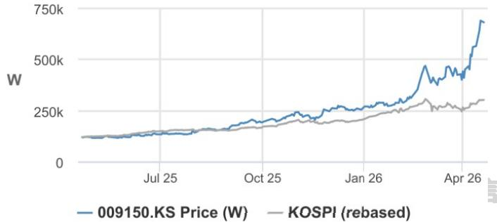  
Price Performance

<table><tr><td></td><td>YTD</td><td>1m</td><td>3m</td><td>12m</td></tr><tr><td>Abs</td><td>166.9%</td><td>47.6%</td><td>146.6%</td><td>463.6%</td></tr><tr><td>Rel</td><td>119.3%</td><td>40.0%</td><td>119.4%</td><td>313.7%</td></tr></table>

# Company Data

<table><tr><td>Shares O/S (mn)</td></tr><tr><td>78 52-week range (W) 710,000-116,200</td></tr><tr><td>Market cap ($ mn) 36,217</td></tr><tr><td>1,460.28</td></tr><tr><td>Exchange rate Free float (%) 62.9%</td></tr><tr><td>3M ADV (mn) 1.27</td></tr><tr><td>3M ADV ($ mn) 355.6</td></tr><tr><td>78</td></tr><tr><td>Volatility (90 Day) Index KOSPI</td></tr><tr><td>BBG ANR (Buy|Hold|Sell) 31100</td></tr></table>

# Key Metrics (FYE Dec)

<table><tr><td>W in billions</td><td>FY25A</td><td>FY26E</td><td>FY27E</td><td>FY28E</td></tr><tr><td>Financial Estimates</td><td></td><td>间 H</td><td>书</td><td></td></tr><tr><td>Revenue</td><td>11,314</td><td>订</td><td>13,19215,703</td><td>17,990</td></tr><tr><td>Adj. EBIT</td><td>913</td><td>1,597</td><td>2,761</td><td>3,529</td></tr><tr><td>Adj. EBITDA</td><td>1,775</td><td>2,627</td><td>3,993</td><td>4,950</td></tr><tr><td>Adj. net income</td><td>702</td><td>1,261</td><td>2,188</td><td>2,810</td></tr><tr><td>Adj.EPS</td><td>9,054</td><td>16,265</td><td>28,212</td><td>36,230</td></tr><tr><td>BBG EPS</td><td>8,885</td><td>15,173</td><td>21,552</td><td>27,378</td></tr><tr><td>Cashflow from operations</td><td>1,394</td><td>1,799</td><td>2,858</td><td>3,826</td></tr><tr><td>FCFF</td><td>246</td><td>(214)</td><td>252</td><td>2,104</td></tr><tr><td>Margins and Growth</td><td></td><td></td><td></td><td></td></tr><tr><td>Revenue Growth Y/Y (%)</td><td>9.9%</td><td>16.6%</td><td>19.0%</td><td>14.6%</td></tr><tr><td>EBIT margin</td><td>8.1%</td><td>12.1%</td><td>17.6%</td><td>19.6%</td></tr><tr><td>EBIT Growth Y/Y (%)</td><td>24.3%</td><td>74.8%</td><td>72.9%</td><td>27.8%</td></tr><tr><td>EBITDA margin</td><td>15.7%</td><td>19.9%</td><td>25.4%</td><td>27.5%</td></tr><tr><td>EBITDA Growth Y/Y (%)</td><td>18.5%</td><td>48.0%</td><td>52.0%</td><td>24.0%</td></tr><tr><td>Net margin</td><td>6.2%</td><td>9.6%</td><td>13.9%</td><td>15.6%</td></tr><tr><td>Adj. EPS growth</td><td>3.9%</td><td>79.7%</td><td>73.4%</td><td>28.4%</td></tr><tr><td>Ratios</td><td></td><td></td><td></td><td></td></tr><tr><td>Adj. tax rate</td><td>18.3%</td><td>20.0%</td><td>19.0%</td><td>19.0%</td></tr><tr><td>Interest cover</td><td>449.1</td><td>NM</td><td>NM</td><td>NM</td></tr><tr><td>Net debt/Equity</td><td>NM</td><td>NM</td><td>NM</td><td>NM</td></tr><tr><td>Net debt/EBITDA</td><td>NM</td><td>NM</td><td>NM</td><td>NM</td></tr><tr><td>ROE</td><td>8%</td><td>13%</td><td>19%</td><td>20%</td></tr><tr><td>Valuation</td><td></td><td>订阅研报添加微信</td><td></td><td></td></tr><tr><td>FCFF yield</td><td>0.5%</td><td>-0.4%</td><td>0.5%</td><td>4.0%</td></tr><tr><td>Dividend yield</td><td>0.3%</td><td>0.3%</td><td>0.3%</td><td>0.3%</td></tr><tr><td>EV/Revenue</td><td>4.7</td><td>4.1</td><td>3.4</td><td>2.9</td></tr><tr><td>EV/EBITDA</td><td>29.9</td><td>20.4</td><td>13.4</td><td>10.5</td></tr><tr><td>Adj. P/E</td><td>75.3</td><td>41.9</td><td>24.2</td><td>18.8</td></tr></table>

# Summary Investment Thesis and Valuation

# Investment Thesis

Our OW rating on SEMCO is based on: 1) MLCC product mix improvement towards Auto/Industrial, which should in turn help generate higher margins in the mid to long term; 2) improving consumer (Mobile/PC) portion of MLCC demand after a year of de-stocking; and 3) business structure enhancement from substrate (more server) and camera modules (more automotive) to minimize cyclicality.

# Valuation

Our Jun-27 PT of $\mathrm { W } 8 4 0 \mathrm { k \Omega }$ is based on $2 4 . 5 \mathrm { x }$ FTM P/E, a $20 \%$ premium to the previous 2016-2018 peak P/E multiple to reflect strong price/margin upcycle trends in both MLCC/Substrate with 2026E-2028E return metrics outpacing the 2016-2018 level.

<table><tr><td colspan="3">Performance Drivers</td></tr><tr><td>Market</td><td colspan="3">20%</td></tr><tr><td rowspan="4">Region Macro</td><td colspan="3"></td></tr><tr><td colspan="3">16%</td></tr><tr><td colspan="3">5%</td></tr><tr><td rowspan="4">Style Idiosyn.</td><td colspan="3">10%</td></tr><tr><td></td><td></td><td></td></tr><tr><td></td><td></td><td>50%</td></tr><tr><td colspan="3"></td></tr><tr><td colspan="3">Factors</td><td>6M Corr 1Y Corr</td></tr><tr><td colspan="3">Market:MSCI Asia Pacex JP</td><td>0.57 0.44 0.27</td></tr><tr><td colspan="3">Region: Korea</td><td>0.44</td></tr><tr><td colspan="3">Macro:</td><td></td></tr><tr><td colspan="3">Generic 1st&#x27;CO&#x27;Future</td><td>0.25</td></tr><tr><td colspan="3">JPM China A-shares Sentiment</td><td>0.32 -0.27</td></tr><tr><td colspan="3"></td><td>-0.25</td></tr><tr><td colspan="3">JPM Global Equity Sentiment</td><td>-0.16</td></tr><tr><td colspan="3">Quant Styles:</td><td></td></tr><tr><td colspan="3">Growth</td><td>0.26</td></tr><tr><td colspan="3">Momentum</td><td>0.25</td></tr><tr><td colspan="3">Quality</td><td>0.23</td></tr><tr><td colspan="3"></td><td></td></tr></table>

between components to AI applications. As price acceptance levels at key end customers remain high due to the small percentage of BOM cost in the end system, we expect favorable pricing and margin implications for the industry going forward. Refer to Figure 1-16 for MLCC vs. Memory historical comparison charts.

• Substrate: $\mathbf { W 1 + t r n }$ capex investment announcement indicates stronger demand commitment. A recent media report (link) on SEMCO potentially considering $\mathrm { W } 1 . 8 \mathrm { t r n }$ capex in Vietnam (which would be the company’s largest historical investment) indicates a tightening of ABF substrate S-D for multiple years at the moment. SEMCO has added Google TPU (via both AVGO/MTK SKU) and NVDA switches, and a few other AI 订阅研报添加微信 LCD123321Cad projects on top of its AWS/AMD exposure, and we see a strong chance that the new investment is associated with strategic support to the aforementioned customers. We have also picked up price hikes on PC-grade ABF substrates lately, indicating that cost inflation and substrate S-D tightness are favorably impacting the suppliers’ bargaining power. We forecast a package solution sales/OP growth of $+ 5 1 \% / 1 3 4 \%$ over the next two years. This puts the OPM profile back to its historical peak level ( $22 \%$ in FY22).

• Key risks. Having seen an increase in price hike signals across the supply chain, we believe there is a strong chance that SEMCO share sentiment will stay positive in the near term. We believe the shares reflect the potential EPS upgrade into 2027E/2028E and the stock may see a correction if the anticipated price hike does not materialize in the near term. In the next 3-4 months, IT component order cuts (as a result of weaker smartphone/ PC production) could weigh on MLCC utilization to some extent, and competition between tier-1 suppliers on new emerging MLCC specs deserves monitoring. As a major driver of MLCC/substrate price hikes is now related to AI demand pickup, concerns surrounding the investment cycle is the biggest risk, in our view.

# Estimate Revisions

Table 1: SEMCO: Estimate revisions Won in billions, year-end December   

<table><tr><td rowspan="2"></td><td colspan="3">Revised</td><td colspan="3">Previous</td><td colspan="3">Change (%)</td></tr><tr><td>FY26E</td><td>FY27E</td><td>FY28E</td><td>FY26E</td><td>FY27E</td><td>FY28E</td><td>FY26E</td><td>FY27E</td><td>FY28E</td></tr><tr><td>Revenue</td><td>13,192</td><td>15,703</td><td>17,990</td><td>13,118</td><td>14,878</td><td>16,726</td><td>0.6</td><td>5.5</td><td>7.6</td></tr><tr><td>Package Solutions</td><td>2,872</td><td>订 3,491 报</td><td>4350</td><td>2,807</td><td>3.356</td><td>4.029</td><td>4-21 2.3</td><td>4.0</td><td>8.0</td></tr><tr><td>Component Solutions</td><td>6,455</td><td>8,411</td><td>9,894</td><td>6,447</td><td>7,721</td><td>8,951</td><td>0.1</td><td>8.9</td><td>10.5</td></tr><tr><td>Module</td><td>3,864</td><td>3,801</td><td>3.745</td><td>3.864</td><td>3,801</td><td>3.745</td><td>0.0</td><td>0.0</td><td>0.0</td></tr><tr><td>EBIT</td><td>1,597</td><td>2,761</td><td>3,529</td><td>1,589</td><td>2,212</td><td>2,741</td><td>0.5</td><td>24.8</td><td>28.7</td></tr><tr><td>Package Solutions</td><td>419</td><td>759</td><td>978</td><td>406</td><td>652</td><td>871</td><td>3.1</td><td>16.5</td><td>12.3</td></tr><tr><td>Component Solutions</td><td>1,053</td><td>1,884</td><td>2.433</td><td>1,058</td><td>1,443</td><td>1,752</td><td>-0.4</td><td>30.6</td><td>38.9</td></tr><tr><td>Module</td><td>125</td><td>117</td><td>118</td><td>125</td><td>117</td><td>118</td><td>0.0</td><td>0.0</td><td>0.0</td></tr><tr><td>Operating Margin (%)</td><td>12.1</td><td>17.6</td><td>19.6</td><td>12.1</td><td>14.9</td><td>16.4</td><td>0.0%p</td><td>2.7%p</td><td>3.2%p</td></tr><tr><td>Package Solutions</td><td>14.6</td><td>21.7</td><td>22.5</td><td>14.5</td><td>19.4</td><td>21.6</td><td>0.1%p</td><td>2.3%p</td><td>0.9%p</td></tr><tr><td>Component Solutions</td><td>16.3</td><td>22.4</td><td>24.6</td><td>16.4</td><td>18.7</td><td>19.6</td><td>-0.1%p</td><td>3.7%p</td><td>5.0%p</td></tr><tr><td>Module</td><td>3.2</td><td>3.1</td><td>3.1</td><td>3.2</td><td>3.1</td><td>3.1</td><td>0.0%p</td><td>0.0%p</td><td>0.0%p</td></tr><tr><td>Net Profit</td><td>1,261</td><td>2,188</td><td>2,810</td><td>1,256</td><td>1,746</td><td>2,177</td><td>0.4</td><td>25.3</td><td>29.1</td></tr><tr><td>NP margin (%)</td><td>9.6</td><td>13.9</td><td>15.6</td><td>9.6</td><td>11.7</td><td>13.0</td><td>0.0%p</td><td>2.2%p</td><td>2.6%p</td></tr></table>

Source: J.P. Morgan estimates.

# Table 2: SEMCO: J.P. Morgan vs consensus estimates

Won in billions, year-end December   

<table><tr><td rowspan="2"></td><td colspan="2">JPMestimates</td><td colspan="2"></td><td colspan="4">Market consensus</td><td colspan="4">Difference</td></tr><tr><td>1Q26E</td><td>2026E</td><td>2027E</td><td>2028E</td><td>1Q26E</td><td>2026E</td><td>2027E</td><td>2028E</td><td>1Q26E</td><td>2026E</td><td>2027E</td><td>2028E</td></tr><tr><td>Sales</td><td>3.092</td><td>13,192</td><td>15,703</td><td>17,990</td><td>3,127</td><td>13,350</td><td>15,687</td><td>18.043</td><td>-1%</td><td>-1%</td><td>0%</td><td>0%</td></tr><tr><td>OP</td><td>272</td><td>1.597</td><td>2.761</td><td>3.529</td><td>269</td><td>1,513</td><td>2,206</td><td>2.769</td><td>1%</td><td>6%</td><td>25%</td><td>27%</td></tr><tr><td>NP</td><td>219</td><td>1.261</td><td>2,188</td><td>2.810</td><td>211</td><td>1,210</td><td>1,767</td><td>2.216</td><td>4%</td><td>4%</td><td>24%</td><td>27%</td></tr></table>

Source: Bloomberg Finance L.P. and J.P. Morgan estimates.

Table 3: SEMCO: 1Q26 earnings preview   
Won in billions, year-end December   

<table><tr><td></td><td>1Q25</td><td>4Q25</td><td> 1Q26 New</td><td>1Q26 Prev esti.</td><td>Diff(%)</td><td>Q/Q (%)</td><td>Y/Y (%)</td><td>Consensus</td><td>Diff (%)</td></tr><tr><td>Revenue</td><td>2,739</td><td>2.902</td><td>3,092</td><td>3,096</td><td>-0.1</td><td>6.5</td><td>12.9</td><td>3,127</td><td>(1.1</td></tr><tr><td>Package Solutions</td><td>499</td><td>645</td><td>672</td><td>676</td><td>-0.5</td><td>4.3</td><td>34.7</td><td></td><td></td></tr><tr><td>Component Solutions</td><td>1,216</td><td>1,320</td><td>1,394</td><td>1,394</td><td>0.0</td><td>5.6</td><td>14.6</td><td></td><td></td></tr><tr><td>Module</td><td>1.023</td><td>937</td><td>1,026</td><td>1,026</td><td>0.0</td><td>9.5</td><td>0.3</td><td></td><td></td></tr><tr><td>Operating profit</td><td>201</td><td>239</td><td>272</td><td>272</td><td>-0.1</td><td>13.5</td><td>35.5</td><td>269</td><td>1.0</td></tr><tr><td>OP margin (%)</td><td>7.3</td><td>订8.3</td><td>8.8</td><td>微信 8.8</td><td></td><td>04-21</td><td></td><td>8.6</td><td></td></tr><tr><td>Package Solutions</td><td>30</td><td>44</td><td>50</td><td>51</td><td>-0.5</td><td>15.9</td><td>68.3</td><td></td><td></td></tr><tr><td>Component Solutions</td><td>125</td><td>157</td><td>174</td><td>174</td><td>0.0</td><td>10.9</td><td>39.8</td><td></td><td></td></tr><tr><td>Module</td><td>46</td><td>38</td><td>47</td><td>47</td><td>0.0</td><td>23.4</td><td>2.2</td><td></td><td></td></tr><tr><td>Net profit</td><td>138</td><td>220</td><td>219</td><td>219</td><td>-0.1</td><td>-0.6</td><td>58.8</td><td>211</td><td>3.7</td></tr><tr><td>NP margin (%)</td><td>5.0</td><td>7.6</td><td>7.1</td><td>7.1</td><td></td><td></td><td></td><td>6.7</td><td></td></tr></table>

Source: Company reports, Bloomberg Finance L.P. and J.P. Morgan estimates.

Table 4: SEMCO: Capex/sales and FCF comparison across cycles W bn   

<table><tr><td>von</td><td>14-16</td><td>17-19</td><td>20-22</td><td>23-25</td><td>26E-28E</td></tr><tr><td></td><td></td><td></td><td></td><td></td><td></td></tr><tr><td>Capex Component</td><td>1,089</td><td>1,899</td><td>1,367</td><td>1,026</td><td>3,300</td></tr><tr><td>Module</td><td>621</td><td>760</td><td>137</td><td>191</td><td>350</td></tr><tr><td>Substrate</td><td>887</td><td>484</td><td>1,262</td><td>1,181</td><td>2,300</td></tr><tr><td>Others/R&amp;D</td><td>486</td><td>368</td><td>372</td><td>388</td><td>350</td></tr><tr><td>Sum total</td><td>3,084</td><td>3,512</td><td>3,139</td><td>2,786</td><td>6,300</td></tr><tr><td>M报添加微信</td><td colspan="5"></td></tr><tr><td>Component</td><td>LCD123321Cad 04-21</td><td></td><td></td><td></td><td></td></tr><tr><td>Module</td><td>35%</td><td>54%</td><td>44% 4%</td><td>37%</td><td>52% 6%</td></tr><tr><td>Substrate</td><td>20%</td><td>22%</td><td>40%</td><td>7%</td><td></td></tr><tr><td>Others/R&amp;D</td><td>29% 16%</td><td>14% 10%</td><td>12%</td><td>42% 14%</td><td>37% 6%</td></tr><tr><td></td><td></td><td></td><td></td><td></td><td></td></tr><tr><td>Revenue</td><td></td><td></td><td></td><td></td><td></td></tr><tr><td>Component</td><td>5,839</td><td>9,095</td><td>12,555</td><td>13,564</td><td>23,552</td></tr><tr><td>Module</td><td>8,007</td><td>9,589</td><td>8,935</td><td>10,901</td><td>12,620</td></tr><tr><td>Substrate</td><td>4,463</td><td>4,388</td><td>5,818</td><td>6,054</td><td>10,714</td></tr><tr><td>Others Sum total</td><td>0</td><td>0</td><td>0</td><td>0</td><td>0</td></tr><tr><td></td><td>18,310</td><td>23,072</td><td>27,308</td><td>30,518</td><td>46,885</td></tr><tr><td>Capex-to-Sales</td><td></td><td></td><td></td><td></td><td></td></tr><tr><td>Component</td><td>19%</td><td>21%</td><td>11%</td><td>8%</td><td>14%</td></tr><tr><td>Module</td><td>8%</td><td>8%</td><td>2%</td><td>2%</td><td>3%</td></tr><tr><td>Substrate</td><td>20%</td><td>11%</td><td>22%</td><td>20%</td><td>21%</td></tr><tr><td>Sum total</td><td>17%</td><td>15%</td><td>11%</td><td>9%</td><td>13%</td></tr><tr><td></td><td></td><td></td><td></td><td></td><td></td></tr><tr><td>OP</td><td>LCD 1405321C1.86704-212.239</td><td></td><td></td><td></td><td></td></tr><tr><td>Componet加微信</td><td></td><td></td><td></td><td>1,427</td><td>5,371</td></tr><tr><td>Module</td><td>157</td><td>356</td><td>426</td><td>353</td><td>360</td></tr><tr><td>Substrate Sum total</td><td>(182)</td><td>(167)</td><td>789</td><td>507</td><td>2,156</td></tr><tr><td></td><td>391</td><td>2,058</td><td>3,457</td><td>2,288</td><td>7,887</td></tr><tr><td>OP Mix,%</td><td></td><td></td><td></td><td></td><td></td></tr><tr><td>Component</td><td>104%</td><td>91%</td><td>65%</td><td>62%</td><td>68%</td></tr><tr><td>Module</td><td>40%</td><td>17%</td><td>12%</td><td>15%</td><td>5%</td></tr><tr><td>Substrate</td><td>-47%</td><td>-8%</td><td>23%</td><td>22%</td><td>27%</td></tr><tr><td>Sum total</td><td>100%</td><td>100%</td><td>100%</td><td>100%</td><td>100%</td></tr><tr><td>OPM,%</td><td></td><td></td><td></td><td></td><td></td></tr><tr><td>Component</td><td>7%</td><td>21%</td><td>18%</td><td>11%</td><td>23%</td></tr><tr><td>Module</td><td>2%</td><td>4%</td><td>5%</td><td>3%</td><td>3%</td></tr><tr><td>Substrate</td><td>-4%</td><td>-4%</td><td>14%</td><td>8%</td><td>20%</td></tr><tr><td>Sum total</td><td>2%</td><td>9%</td><td>13%</td><td>7%</td><td>17%</td></tr><tr><td></td><td></td><td></td><td></td><td></td><td></td></tr><tr><td>ROE, % EBITDA margin, %</td><td>4%</td><td>9%</td><td>14%</td><td>7%</td><td>17%</td></tr><tr><td></td><td>12%</td><td>18%</td><td>22%</td><td>15%</td><td>25%</td></tr><tr><td>FCF</td><td>(1,079)</td><td>126</td><td>2,017</td><td>1,512</td><td>3,733</td></tr></table>

Table 5: SEMCO: Capex/sales trend   
W bn   

<table><tr><td></td><td>2012</td><td>2013 944</td><td>2014 836</td><td>2015</td><td>2016</td><td>2017 研1113</td><td>2018</td><td>2019</td><td>2020</td><td>2021</td><td>2022</td><td>2023</td><td>2024</td><td>2025</td><td>2026E</td><td>2027E</td><td>2028E</td></tr><tr><td>Capex Component</td><td>754 291</td><td>245</td><td>211</td><td>1,196 396</td><td>1,052</td><td>研报230</td><td>1,252 911</td><td>1,147 L758</td><td>720 4192</td><td>927 2509</td><td>1,491 439</td><td>1,019 141</td><td>612 163</td><td>1,155 722</td><td>2,000 1,200</td><td>2,600 1,100 150</td><td>1,700 1,000</td></tr><tr><td>Module</td><td>133</td><td>187</td><td>278</td><td>289</td><td>483 54</td><td>416</td><td>124</td><td>220</td><td>70</td><td>27</td><td>41</td><td>48</td><td>28</td><td>116</td><td>100</td><td></td><td>100</td></tr><tr><td>Substrate</td><td>277</td><td>440</td><td>273</td><td>386</td><td>229</td><td>330</td><td>92</td><td>62</td><td>146</td><td>223</td><td>894</td><td>747</td><td>259</td><td>175</td><td>600</td><td>1,200</td><td>500</td></tr><tr><td>Others (incl. R&amp;D)</td><td>53</td><td>73</td><td>75</td><td>125</td><td>287</td><td>137</td><td>125</td><td>107</td><td>86</td><td>169</td><td>118</td><td>84</td><td>162</td><td>142</td><td>100</td><td>150</td><td>100</td></tr><tr><td></td><td></td><td></td><td></td><td></td><td></td><td></td><td></td><td></td><td></td><td></td><td></td><td></td><td></td><td></td><td></td><td></td><td></td></tr><tr><td>Sales</td><td>7.913</td><td>8,257</td><td>6,100</td><td>6,176</td><td>6,033</td><td>6,838</td><td>8,193</td><td>8,041</td><td>8,209</td><td>9,675</td><td>9,425</td><td>8,909</td><td>10,294</td><td>11,314</td><td>13,192</td><td>15,703</td><td>17,990</td></tr><tr><td>Component</td><td>1,876</td><td>1,895</td><td>1,883</td><td>2,028</td><td>1,929</td><td>2.338</td><td>3,545</td><td>3,212</td><td>3.645</td><td>4,778</td><td>4,132</td><td>3.903</td><td>4,462</td><td>5,198</td><td>6,404</td><td>7.908</td><td>9,239</td></tr><tr><td>Module</td><td>3,941</td><td>4,498</td><td>2,588</td><td>2,631</td><td>2,788</td><td>3,054</td><td>3,176</td><td>3,358</td><td>2.802</td><td>2.929</td><td>3,204</td><td>3,289</td><td>3,797</td><td>3,814</td><td>3.915</td><td>4,304</td><td>4,401</td></tr><tr><td>Substrate</td><td>2.096</td><td>1,865</td><td>1,630</td><td>1517</td><td>1317</td><td>1,447</td><td>1,472</td><td>1,470</td><td>1,761</td><td>1,968</td><td>2.088</td><td>1,717</td><td>2.035</td><td>2.302</td><td>2.872</td><td>3,491</td><td>4,350</td></tr><tr><td>Others (incl. R&amp;D)</td><td></td><td></td><td></td><td></td><td></td><td></td><td></td><td></td><td></td><td></td><td></td><td></td><td></td><td></td><td></td><td></td><td></td></tr><tr><td>Capex-to-Sales, %</td><td>10%</td><td>11%</td><td>14%</td><td>19%</td><td>17%</td><td>16%</td><td>15%</td><td>14%</td><td>9%</td><td>10%</td><td>16%</td><td>11%</td><td>6%</td><td>10%</td><td>15%</td><td>17%</td><td>9%</td></tr><tr><td>Component</td><td>15%</td><td>13%</td><td>11%</td><td>20%</td><td>25%</td><td>10%</td><td>26%</td><td>24%</td><td>11%</td><td>11%</td><td>11%</td><td>4%</td><td>4%</td><td>14%</td><td>19%</td><td>14%</td><td>11%</td></tr><tr><td>Module</td><td>3%</td><td>4%</td><td>11%</td><td>11%</td><td>2%</td><td>14%</td><td>4%</td><td>7%</td><td>2%</td><td>1%</td><td>1%</td><td>1%</td><td>1%</td><td>3%</td><td>3%</td><td>3%</td><td></td></tr><tr><td>Substrate</td><td>13%</td><td>24%</td><td>17%</td><td>25%</td><td>17%</td><td>23%</td><td>6%</td><td>4%</td><td>8%</td><td>11%</td><td>43%</td><td>43%</td><td>13%</td><td>8%</td><td>21%</td><td>34%</td><td>12</td></tr><tr><td>Others (incl.R&amp;D)</td><td></td><td></td><td></td><td></td><td></td><td></td><td></td><td></td><td></td><td></td><td></td><td></td><td></td><td></td><td></td><td></td><td></td></tr></table>

# 订阅研报添加微信 LCD123321Cad 04-21

Table 6: SEMCO: MLCC sales mix trends by application   
%   

<table><tr><td>Sales mix</td><td>2018</td><td>2019</td><td>2020</td><td>2021</td><td>2022</td><td>2023</td><td>2024</td><td>2025</td><td>2026E</td><td>2027E</td><td>2028E</td></tr><tr><td>IT</td><td>61%</td><td>54%</td><td>55%</td><td>57%</td><td>53%</td><td>49%</td><td>49%</td><td>49%</td><td>44%</td><td>37%</td><td>34%</td></tr><tr><td>Auto</td><td>5%</td><td>9%</td><td>8%</td><td>8%</td><td>16%</td><td>21%</td><td>23%</td><td>26%</td><td>26%</td><td>27%</td><td>28%</td></tr><tr><td>Industrial</td><td>15%</td><td>20%</td><td>22%</td><td>21%</td><td>18%</td><td>19%</td><td>19%</td><td>19%</td><td>26%</td><td>33%</td><td>36%</td></tr><tr><td>Commodity</td><td>19%</td><td>17%</td><td>15%</td><td>14%</td><td>13%</td><td>12%</td><td>10%</td><td>7%</td><td>4%</td><td>3%</td><td>2%</td></tr></table>

# DRAM vs. MLCC

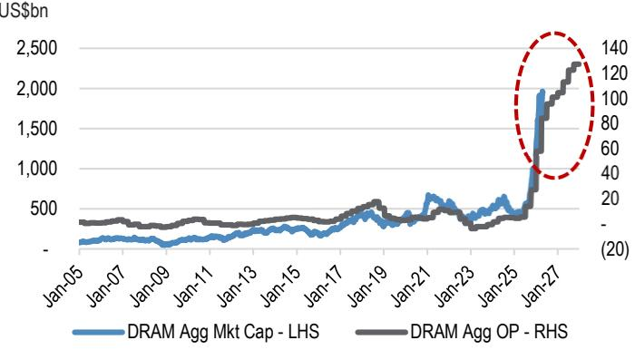  
Figure 1: DRAM market cap vs. DRAM OP US\$bn   
Source: Company data, Bloomberg Finance L.P., J.P. Morgan estimates. Note: MLCC players include Tai Yuden, Murata, TDK, SEMCO, Yageo

Source: Company data, Bloomberg Finance L.P., J.P. Morgan estimates. Note: DRAM makers include SEC, SKH, MU, NYT

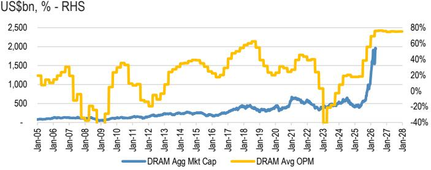  
Figure 3: DRAM market cap vs. DRAM OPM   
Source: Company data, Bloomberg Finance L.P., J.P. Morgan estimates. Note: DRAM makers include SEC, SKH, MU, NYT

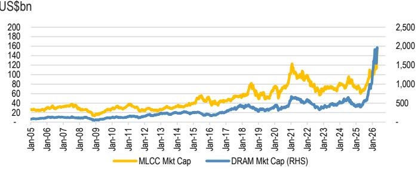  
Figure 5: DRAM vs. MLCC market cap   
Source: Company data, Bloomberg Finance L.P., J.P. Morgan estimates. Note: MLCC players include Tai Yuden, Murata, TDK, SEMCO, Yageo.

Source: Company data, Bloomberg Finance L.P., J.P. Morgan estimates. Note: 1) MLCC players include Tai Yuden, Murata, TDK, SEMCO, Yageo; 2) DRAM makers include SEC, SKH, MU, NYT

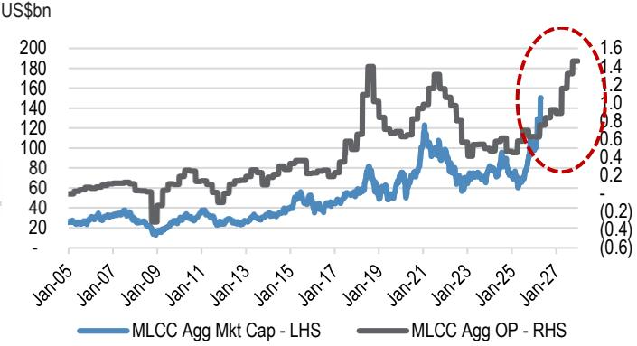  
Figure 2: MLCC market cap vs. MLCC OP

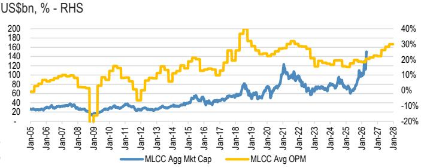  
Figure 4: MLCC market cap vs. MLCC OPM

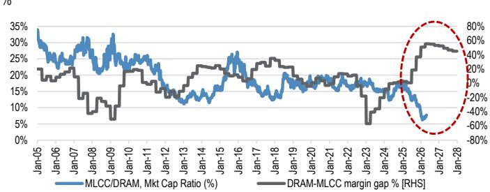  
Figure 6: MLCC vs. DRAM in market cap and OPM gap

Source: Company data, Bloomberg Finance L.P., J.P. Morgan estimates. Note: 1) MLCC players include Tai Yuden, Murata, TDK, SEMCO, Yageo; 2) DRAM makers include SEC, SKH, MU, NYT

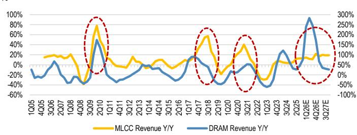  
Figure 7: DRAM vs. MLCC TAM y-y comparison %   
Source: Company data, J.P. Morgan estimates.

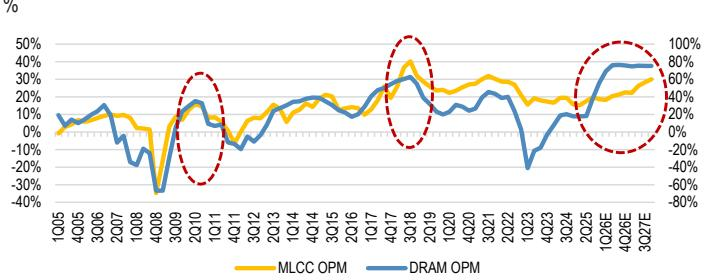  
Figure 9: DRAM vs. MLCC OPM comparison   
Source: Company data, J.P. Morgan estimates.

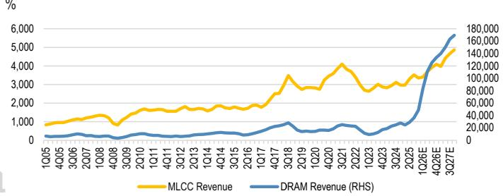  
Figure 8: DRAM vs. MLCC TAM comparison   
Source: Company data, J.P. Morgan estimates.

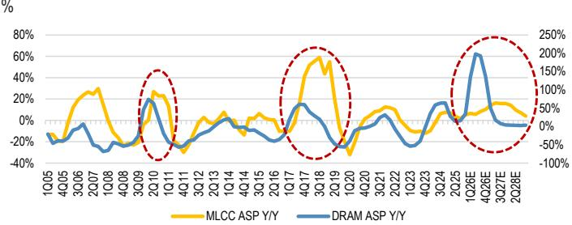  
Figure 10: DRAM vs. MLCC ASP y-y comparison   
Source: Company data, J.P. Morgan estimates.

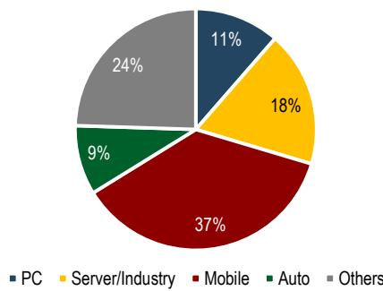  
Figure 11: MLCC demand mix (2021) $\%$   
Source: Company data, J.P. Morgan estimates.

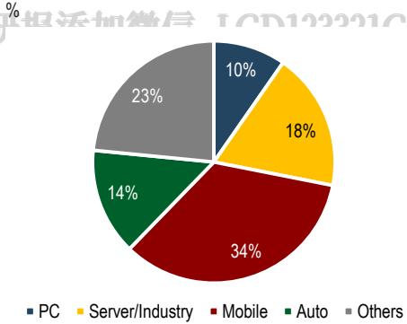  
Figure 12: MLCC demand mix (2025)   
Source: Company data, J.P. Morgan estimates.

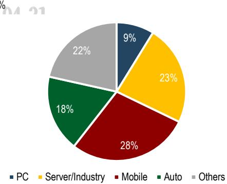  
Figure 13: MLCC demand mix (2028E)   
Source: Company data, J.P. Morgan estimates.

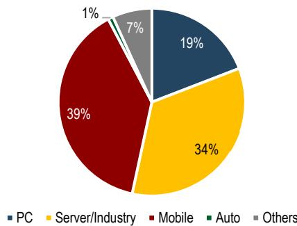  
Figure 14: DRAM demand mix (2021) %   
Source: Company data, J.P. Morgan estimates.

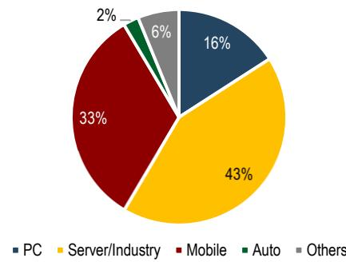  
Figure 15: DRAM demand mix (2025) %   
Source: Company data, J.P. Morgan estimates.

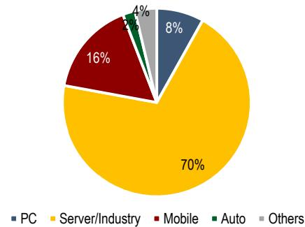  
Figure 16: DRAM demand mix (2028E) %   
Source: Company data, J.P. Morgan estimates.

# MLCC industry model (top-down)

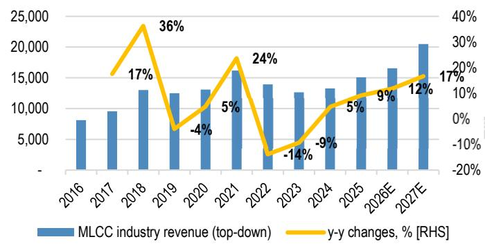  
Figure 17: MLCC industry revenue and YoY $\mathsf { U S S m n }$ , % - RHS   
Source: J.P. Morgan estimates, Company data.

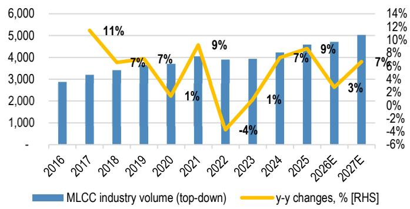  
Figure 18: MLCC industry volume and YoY $\mathsf { U S } \$ \mathsf { m n }$ , % - RHS   
Source: J.P. Morgan estimates, Company data.

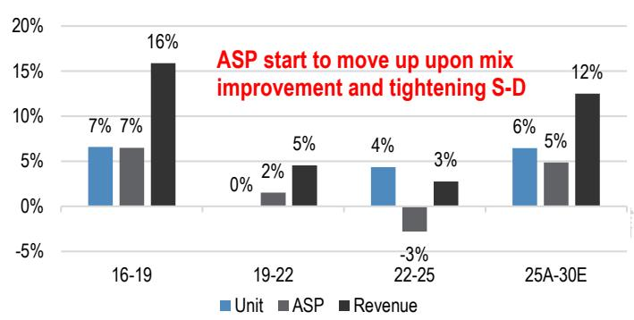  
Figure 19: MLCC industry revenue, volume, ASP CAGR comparison   
Source: J.P. Morgan estimates, Company data.

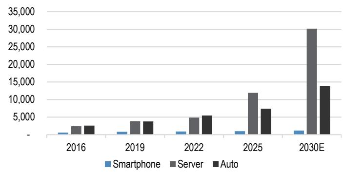  
Figure 20: MLCC content comparison by application Units

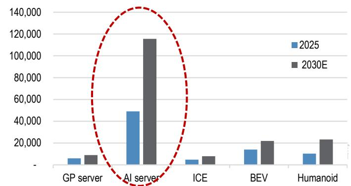  
Figure 21: MLCC content comparison by application for 2030E units   
Source: J.P. Morgan estimates, Company data.

Source: J.P. Morgan estimates, Company data.

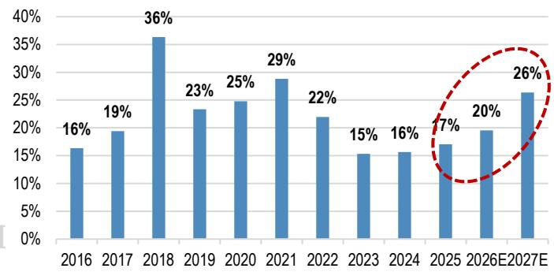  
Figure 22: MLCC industry bottom-up OPM trend   
Source: J.P. Morgan estimates, Company data.

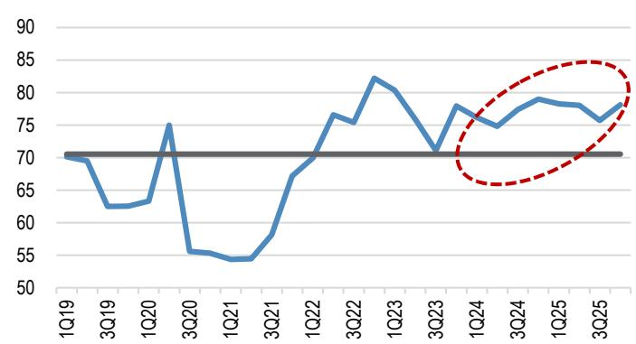  
Figure 23: MLCC players’ UTR trend %   
Source: J.P. Morgan estimates, Company data.

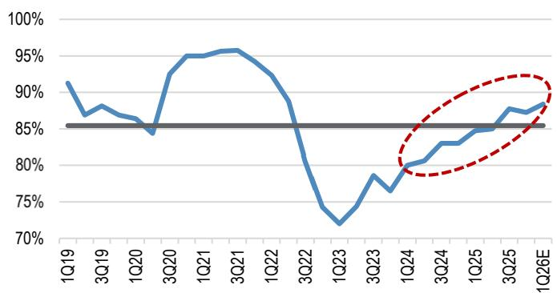  
Figure 24: MLCC players’ inventory days outstanding   
Source: J.P. Morgan estimates, Company data.

Table 7: MLCC industry demand forecasts   
Units in billions   

<table><tr><td>Unit in billions</td><td>2016</td><td>2017</td><td>2018</td><td>2019</td><td>2020</td><td>2021</td><td>2022</td><td>2023</td><td>2024</td><td>2025</td><td>2026E</td><td>2027E</td><td>2028E</td><td>2029E</td><td>2030E</td></tr><tr><td>MLCC demand</td><td>2,875</td><td>3,205</td><td>3,415</td><td>3,658</td><td>3,710</td><td>4,053</td><td>3,902</td><td>3,937</td><td>4,224</td><td>4,591</td><td>4,717</td><td>5,032</td><td>5,375</td><td>5,819</td><td>6,276</td></tr><tr><td>yly changes, %</td><td></td><td>11%</td><td>7%</td><td>7%</td><td>1%</td><td>9%</td><td>-4%</td><td>1%</td><td>7%</td><td></td><td></td><td></td><td></td><td></td><td></td></tr><tr><td></td><td></td><td></td><td></td><td></td><td></td><td></td><td></td><td></td><td></td><td>9%</td><td>3%</td><td>7%</td><td>7%</td><td>8%</td><td>8%</td></tr><tr><td></td><td></td><td></td><td></td><td></td><td></td><td></td><td></td><td></td><td></td><td></td><td></td><td></td><td></td><td></td><td></td></tr><tr><td>Mobile</td><td>1,132</td><td>1,288</td><td>1,329</td><td>1,390</td><td>1,341</td><td>1,483</td><td>1,406</td><td>1,374</td><td>1,465</td><td>1,568</td><td>1,492</td><td>1,490</td><td>1,519</td><td>1,573</td><td>1,618</td></tr><tr><td>PC/Server</td><td>296</td><td>336</td><td>376</td><td>401</td><td>442</td><td>520</td><td>484</td><td>430</td><td>474</td><td>590</td><td>643</td><td>775</td><td>881</td><td>978</td><td>1,083</td></tr><tr><td>Consumer</td><td>811</td><td>848</td><td>900</td><td>955</td><td>985</td><td>993</td><td>991</td><td>1,000</td><td>1,043</td><td>1,077</td><td>1,099</td><td>1,122</td><td>1,153</td><td>1,184</td><td>1,230</td></tr><tr><td>Automotive</td><td>237</td><td>273</td><td>311</td><td>333</td><td>322</td><td>377</td><td>421</td><td>513</td><td>582</td><td>656</td><td>734</td><td>841</td><td>962</td><td>1,118</td><td>1,277</td></tr><tr><td>Industrial/Others</td><td>400</td><td>460</td><td>500</td><td>580</td><td>620</td><td>680</td><td>600</td><td>620</td><td>660</td><td>700</td><td>751</td><td>804</td><td>861</td><td>965</td><td>1.068</td></tr><tr><td>Auto as % of total MLCC</td><td>8.2%</td><td>8.5%</td><td></td><td></td><td></td><td>9.3%</td><td>10.8%</td><td>13.0%</td><td>13.8%</td><td></td><td>15.6%</td><td>16.7%</td><td>17.9%</td><td></td><td>20.4%</td></tr><tr><td>Server as % of total MLCC</td><td>0.9%</td><td>1.1%</td><td>9.%</td><td>9</td><td>8.7%</td><td>1.4%</td><td>1.7%</td><td>1.6%</td><td>2.1%</td><td>1</td><td>4.9%</td><td>7.0%</td><td>7.6%</td><td>18</td><td></td></tr><tr><td>Humanoid as % of total MLCC Auto+Server+Humanoid</td><td></td><td></td><td></td><td></td><td></td><td></td><td></td><td></td><td>0.0%</td><td>0.0%</td><td>0.0%</td><td>0.1%</td><td>0.2%</td><td>0.7%</td><td></td></tr><tr><td>Supply mix of three segment</td><td>9.2%</td><td>9.6%</td><td>10.4%</td><td>10.4%</td><td>10.1%</td><td>10.7%</td><td>12.5%</td><td>14.6%</td><td>15.8%</td><td>17.5%</td><td>20.5%</td><td>23.8%</td><td>25.7%</td><td>28.2%</td><td>30.9%</td></tr><tr><td>y-y mix changes,%</td><td>22.9%</td><td>24.0% 1.1%</td><td>26.0% 2.0%</td><td>26.0% -0.1%</td><td>25.2% -0.8%</td><td>26.8% 1.6%</td><td>31.3% 4.5%</td><td>36.5% 5.2%</td><td>39.6% 3.1%</td><td>43.7% 4.1%</td><td>51.2% 7.6%</td><td>59.4% 8.2%</td><td>64.3% 4.9%</td><td>70.6% 6.3%</td><td>77.1% 6.5%</td></tr></table>

Source: J.P. Morgan estimates, Company data.

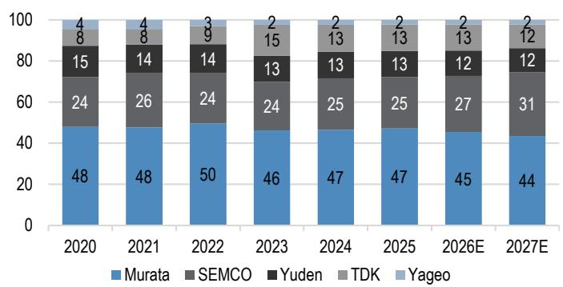  
Figure 25: MLCC Industry Bottom-up Wallet Share Comparison (Value) % 订阅研报添加微信   
Source: J.P. Morgan estimates, Company data.

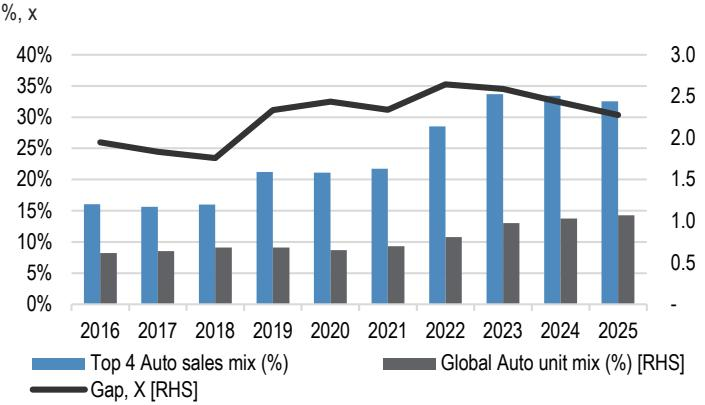  
Figure 26: MLCC top 5 auto MLCC sales mix $( \% )$ and global auto MLCC LCD123321Cad 04-2unit sales mix (%) comparison   
Source: J.P. Morgan estimates, Company data.

# Table 8: Auto MLCC peer comparison analysis

Revenue in US\$bn   

<table><tr><td></td><td>2016</td><td>2017</td><td>2018</td><td>2019</td><td>2020</td><td>2021</td><td>2022</td><td>2023</td><td>2024</td><td>2025</td><td>25Avs.22</td></tr><tr><td>Auto revenue</td><td></td><td></td><td></td><td></td><td></td><td></td><td></td><td></td><td></td><td></td><td></td></tr><tr><td>Murata</td><td>0.8</td><td>0.9</td><td>1.3</td><td>1.4</td><td>1.5</td><td>2.0</td><td>2.1</td><td>2.0</td><td>2.1</td><td>2.1</td><td>0%</td></tr><tr><td>TDK</td><td>0.2</td><td>0.2</td><td>0.3</td><td>0.4</td><td>0.4</td><td>0.5</td><td>0.5</td><td>0.8</td><td>0.7</td><td>0.8</td><td>81%</td></tr><tr><td>Yuden</td><td>0.1</td><td>0.1</td><td>0.2</td><td>0.2</td><td>0.3</td><td>0.4</td><td>0.4</td><td>0.4</td><td>0.5</td><td>0.5</td><td>18%</td></tr><tr><td>SEMCO</td><td>0.0</td><td>0.0</td><td>0.1</td><td>0.2</td><td>0.2</td><td>0.3</td><td>0.5</td><td>0.5</td><td>0.7</td><td>0.9</td><td>91%</td></tr><tr><td>Sum total</td><td>1.1</td><td>1.3</td><td>1.9</td><td>2.3</td><td>2.4</td><td>3.2</td><td>3.5</td><td>3.8</td><td>3.9</td><td>4.3</td><td>25%</td></tr><tr><td>Auto mix.%</td><td></td><td></td><td></td><td></td><td></td><td></td><td></td><td></td><td></td><td></td><td></td></tr><tr><td>Murata</td><td>24%</td><td>23%</td><td>25%</td><td>28%</td><td>27%</td><td>28%</td><td>35%</td><td>38%</td><td>37%</td><td>34%</td><td>-1%</td></tr><tr><td>TDK</td><td>32%</td><td>31%</td><td>34%</td><td>42%</td><td>45%</td><td>43%</td><td>42%</td><td>48%</td><td>48%</td><td>48%</td><td>6%</td></tr><tr><td>Yuden A</td><td>8%</td><td>11%</td><td>13%</td><td>13%</td><td>17%</td><td>20%</td><td>26%</td><td>31%</td><td>31%</td><td>31%</td><td>5%</td></tr><tr><td>SEMCO</td><td>1%</td><td>1%</td><td>5%</td><td>9%</td><td>8%</td><td>8%</td><td>16%</td><td>21%</td><td>23%</td><td>26%</td><td>11%</td></tr><tr><td>Sumtotal</td><td>16%</td><td>16%</td><td>16%</td><td>21%</td><td>21%</td><td>22%</td><td>29%</td><td>34%</td><td>33%</td><td>33%</td><td>4%</td></tr><tr><td>Auto y-y</td><td></td><td></td><td></td><td></td><td></td><td></td><td></td><td></td><td></td><td></td><td></td></tr><tr><td>Murata</td><td></td><td>13%</td><td>41%</td><td>15%</td><td>4%</td><td>33%</td><td>6%</td><td>-5%</td><td>3%</td><td>2%</td><td>0%</td></tr><tr><td>TDK</td><td></td><td>9%</td><td>29%</td><td>21%</td><td>11%</td><td>14%</td><td>-7%</td><td>78%</td><td>-10%</td><td>12%</td><td>22%</td></tr><tr><td>Yuden</td><td></td><td>49%</td><td>55%</td><td>9%</td><td>41%</td><td>37%</td><td>6%</td><td>-1%</td><td>8%</td><td>11%</td><td>6%</td></tr><tr><td>SEMCO</td><td></td><td>87%</td><td>538%</td><td>60%</td><td>2%</td><td>36%</td><td>49%</td><td>20%</td><td>24%</td><td>29%</td><td>24%</td></tr><tr><td>Sum total</td><td></td><td>16%</td><td>49%</td><td>18%</td><td>8%</td><td>30%</td><td>8%</td><td>10%</td><td>4%</td><td>10%</td><td>8%</td></tr><tr><td>Auto share,%</td><td></td><td></td><td></td><td></td><td></td><td></td><td></td><td></td><td></td><td></td><td></td></tr><tr><td>Murata</td><td>71%</td><td>69%</td><td>66%</td><td>64%</td><td>61%</td><td>62%</td><td>61%</td><td>53%</td><td>52%</td><td>49%</td><td>-12%</td></tr><tr><td>TDK</td><td>20%</td><td>19%</td><td>17%</td><td>17%</td><td>17%</td><td>15%</td><td>13%</td><td>21%</td><td>19%</td><td>19%</td><td>6%</td></tr><tr><td>Yuden</td><td>8%</td><td>10%</td><td>10%</td><td>9%</td><td>12%</td><td>13%</td><td>13%</td><td>11%</td><td>12%</td><td>12%</td><td>-1%</td></tr><tr><td>SEMCO</td><td>1%</td><td>2%</td><td>7%</td><td>10%</td><td>9%</td><td>10%</td><td>13%</td><td>14%</td><td>17%</td><td>20%</td><td>7%</td></tr></table>

Source: J.P. Morgan estimates, Company data. \*note: above is only MLCC revenue specific to automotive applications

# Key business and share price charts

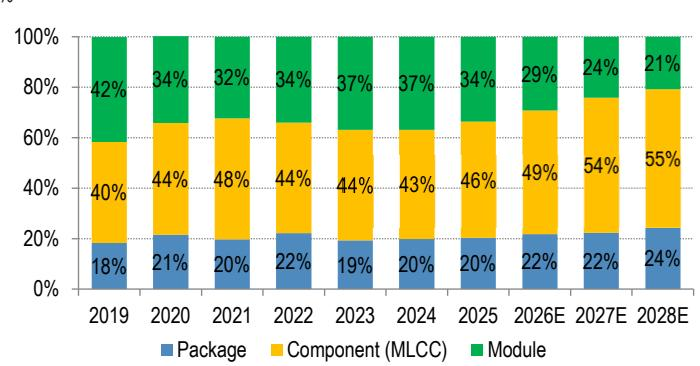  
Figure 27: SEMCO: Sales mix by division %   
Source: Company data, J.P. Morgan estimates.

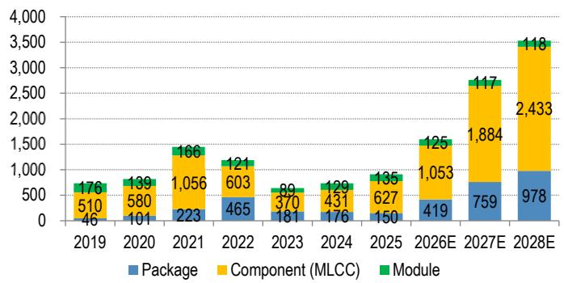  
Figure 28: SEMCO: OP contribution by division Won in billions   
Source: Company data, J.P. Morgan estimates.

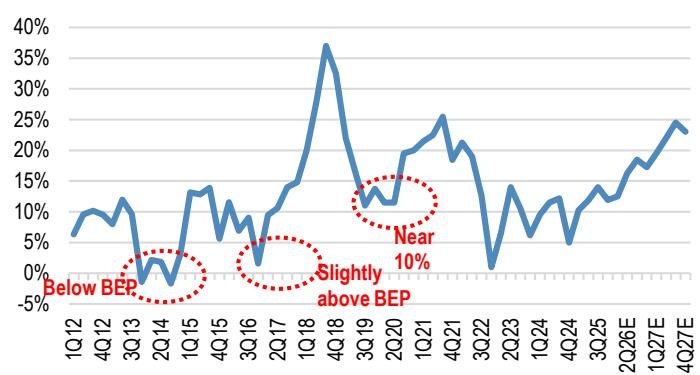  
Figure 29: SEMCO: Component solution OPM trend   
Source: Company data, J.P. Morgan estimates.

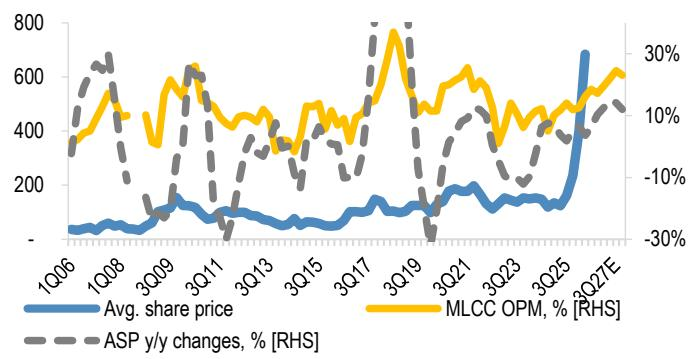  
Figure 30: SEMCO: Share price trend vs. MLCC OPM Won in K, % - RHS   
Source: Company data, J.P. Morgan estimates, Bloomberg Finance L.P. Note: Past performance is not an indicator of future results

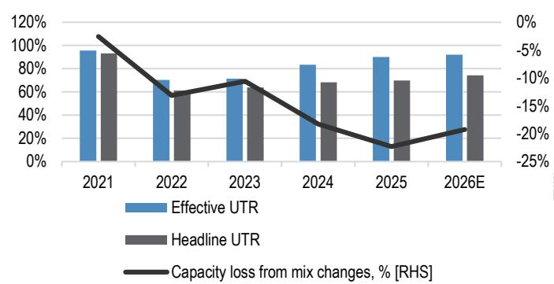  
Figure 31: UTR and capacity loss from mix change trend   
Source: Company data, J.P. Morgan estimates.

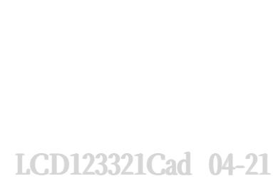

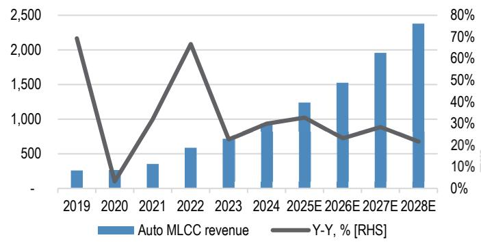  
Figure 32: SEMCO: Auto MLCC sales and $\mathsf { Y } / \mathsf { Y } \%$ growth Wbn, % - RHS   
Source: Company data, J.P. Morgan estimates.

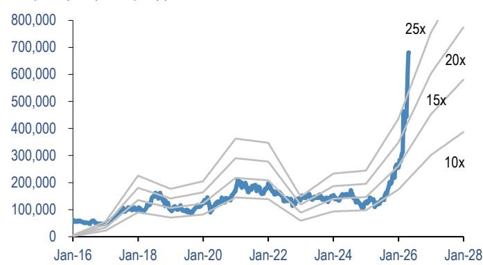  
Figure 34: SEMCO – FTM P/E band Share price (Won), Multiple (x)

Source: Bloomberg Finance L.P., J.P. Morgan estimates.

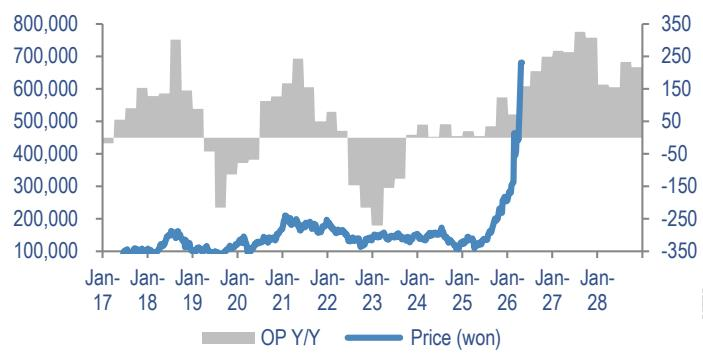  
Figure 36: SEMCO: Share price vs quarterly OP y/y trend Won, Won in billions   
Source: Company data, Bloomberg Finance L.P., J. P. Morgan estimates. Note: The periods from 2Q25E onwards are JPMe.

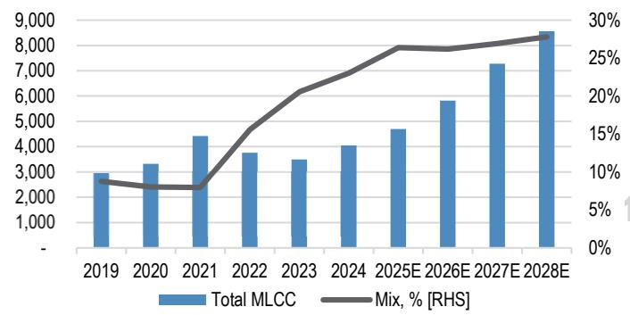  
Figure 33: SEMCO: MLCC total sales and MLCC $\%$ mix Wbn, % - RHS   
Source: Company data, J.P. Morgan estimates

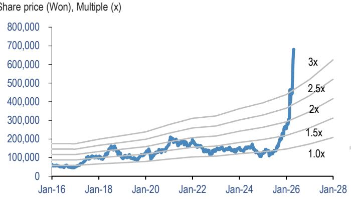  
Figure 35: SEMCO – FTM P/B band

Source: Bloomberg Finance L.P., J.P. Morgan estimates.

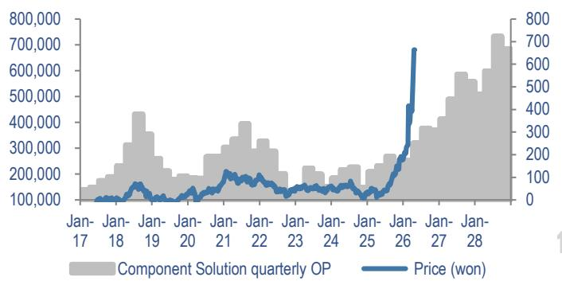  
Figure 37: SEMCO: Share price vs component solution quarterly OP Won, Won in billions   
Source: Company data, Bloomberg Finance L.P., J. P. Morgan estimates. Note: The periods from 2Q25E onwards are JPMe.

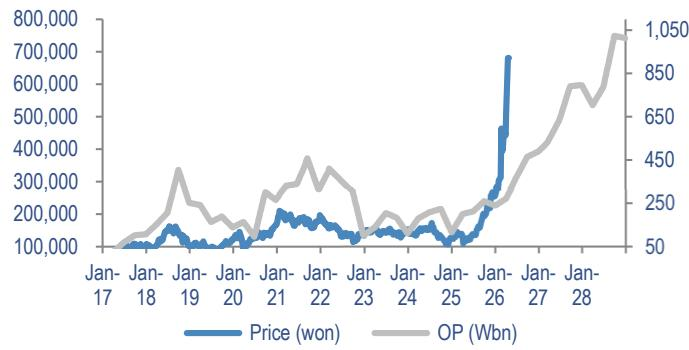  
Figure 38: SEMCO: Share price vs quarterly OP Won, Won in billions   
Source: Company data, Bloomberg Finance L.P., J. P. Morgan estimates. Note: The periods from 2Q25E onwards are JPMe.

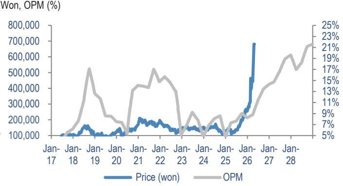  
Figure 39: SEMCO: Share price vs quarterly OPM   
Source: Company data, Bloomberg Finance L.P., J. P. Morgan estimates. Note: The periods from 2Q25E onwards are JPMe.

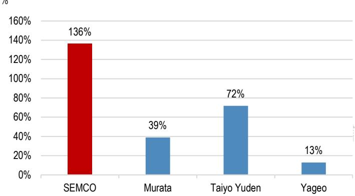  
Figure 40: Past 3M price performance: SEMCO vs MLCC peers   
Source: Bloomberg Finance L.P. Note: Past performance is not an indicator of future results

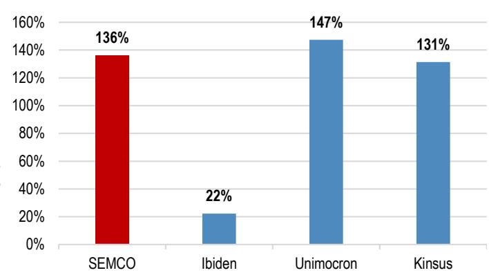  
Figure 41: Past 3M price performance: SEMCO vs substrate peers   
Source: Bloomberg Finance L.P. Note: Past performance is not an indicator of future results

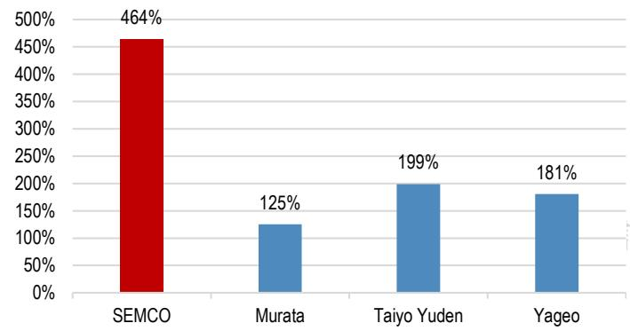  
Figure 42: Past 12M price performance: SEMCO vs MLCC peers %   
Source: Bloomberg Finance L.P. Note: Past performance is not an indicator of future results

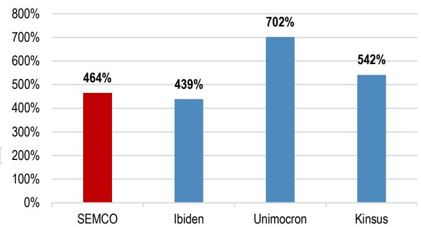  
Figure 43: Past 12M price performance: SEMCO vs substrate peers %   
Source: Bloomberg Finance L.P. Note: Past performance is not an indicator of future results

Table 9: SEMCO: Earnings model Won in billions, year-end December   

<table><tr><td></td><td colspan="3">2025</td><td colspan="3">2026E</td><td colspan="4">2027E</td><td rowspan="2">2023</td><td rowspan="2">2024</td><td rowspan="2">2025</td><td rowspan="2"></td><td rowspan="2">2026E</td><td rowspan="2">2027E</td><td rowspan="2">2028E</td></tr><tr><td></td><td>1Q</td><td>2Q 2,785</td><td>3Q 2.889</td><td>q 2,902</td><td>1QE报2QE 3,0923,234</td><td>加门 3QE 3.4463,419</td><td>4QE</td><td>3,651</td><td>C10E222QE1C 3QE 4,180</td><td>4QE 4,063</td><td>01</td></tr><tr><td>Revenue</td><td>2,739</td><td></td><td>593</td><td>672</td><td>707</td><td></td><td></td><td></td><td>3,809</td><td></td><td></td><td>8,909</td><td>10,294</td><td>11,314</td><td>13,192</td><td>15,703</td><td>17,990</td></tr><tr><td>Substrate</td><td>499</td><td>565</td><td>645</td><td></td><td></td><td>725</td><td>769</td><td>765</td><td>833</td><td>915</td><td>979</td><td>1,717</td><td>2.035</td><td>2.302</td><td>2.872</td><td>3,491</td><td>4.350</td></tr><tr><td>MLCC</td><td>1,216</td><td>1,281 1,381</td><td>1,320</td><td>1,394</td><td>1,547</td><td>1,717</td><td>1,797</td><td>1,835</td><td>2.027</td><td>2.274</td><td>2.275</td><td>3.903</td><td>4,462</td><td>5,198</td><td>6,455</td><td>8,411</td><td>9,894</td></tr><tr><td>Module</td><td>1,023</td><td>939</td><td>937</td><td>1,026</td><td>981</td><td>1,004</td><td>853</td><td>1,051</td><td>949</td><td>992</td><td>809</td><td>3.289</td><td>3,797</td><td>3.814</td><td>3.864</td><td>3.801</td><td>3,745</td></tr><tr><td>Others</td><td>0</td><td>0</td><td></td><td></td><td></td><td>0</td><td>0</td><td>0</td><td>0</td><td>0</td><td>0</td><td>0</td><td>1</td><td>0</td><td>0</td><td>0</td><td>0</td></tr><tr><td>Dep.&amp; Amor.Expenses</td><td>(204)</td><td>(212)</td><td>(227)</td><td>(241)</td><td>(251)</td><td>(264)</td><td>(274)</td><td>(289)</td><td>(299)</td><td>(316)</td><td>(328)</td><td>(765)</td><td>(764)</td><td>(862)</td><td>(1,030)</td><td>(1.232)</td><td>(1,421</td></tr><tr><td>COGS</td><td>(2.230)</td><td>(2.219) (2.289)</td><td>(2.300) 603</td><td>(2.417) 675</td><td>(2.437)</td><td>(2.536)</td><td>(2.489)</td><td>(2,637)</td><td>(2.680)</td><td>(2.848)</td><td>(2.740)</td><td>(7,189)</td><td>(8.335)</td><td>(9.037)</td><td>(9.879)</td><td>(10,904)</td><td>(12,126)</td></tr><tr><td>Gross Profit</td><td>509</td><td>565</td><td>(363)</td><td></td><td>797</td><td>910</td><td>930</td><td>1,014</td><td>1,129</td><td>1,333</td><td>1,323</td><td>1,721</td><td>1.959</td><td>2,277</td><td>3,312</td><td>4,799</td><td>5,864</td></tr><tr><td>Operating Expense</td><td>(308)</td><td>(352)</td><td></td><td></td><td>(403) (426)</td><td>(445)</td><td>(441)</td><td>(475)</td><td>(495)</td><td>(542)</td><td>(527)</td><td>(1,081)</td><td>(1,224</td><td>(1,364)</td><td>(1.716)</td><td>(2.039)</td><td>(2,335)</td></tr><tr><td>EBIT</td><td>201</td><td>213</td><td></td><td></td><td>371</td><td>465</td><td>489</td><td>540</td><td>634</td><td>791</td><td>796</td><td>639</td><td>735</td><td>913</td><td>1,597</td><td>2,761</td><td>3,529</td></tr><tr><td>Substrate</td><td>30</td><td>35</td><td></td><td></td><td></td><td>123</td><td>146</td><td>138</td><td>167</td><td>210</td><td>245</td><td>181</td><td>176</td><td>150</td><td>419</td><td>759</td><td>978</td></tr><tr><td>MLCC</td><td>125</td><td>152</td><td></td><td>157</td><td>251</td><td>318</td><td>310</td><td>358</td><td>446</td><td>557</td><td>523</td><td>370</td><td>431</td><td>627</td><td>1,053</td><td>1.884</td><td>2.433</td></tr><tr><td>Module</td><td>46</td><td>25</td><td>(0)</td><td>38</td><td></td><td>24</td><td>33</td><td>44</td><td>21</td><td>23</td><td>28</td><td>89</td><td>129</td><td>135</td><td>125</td><td>117</td><td>118</td></tr><tr><td>Others</td><td>(0)</td><td>1</td><td></td><td>1</td><td>47 21 0</td><td>0</td><td>0</td><td>0</td><td>0</td><td>0</td><td>0</td><td>(0）</td><td>1</td><td>1</td><td>0</td><td>0</td><td>0</td></tr><tr><td>Net Interest Income</td><td>（4)</td><td>(5)</td><td></td><td></td><td></td><td>阅矿报标加微信</td><td>2</td><td>CD3</td><td>123331Cad</td><td></td><td>041</td><td></td><td></td><td></td><td>16</td><td>8</td><td>27</td></tr><tr><td>Net Other Income</td><td>(23)</td><td>(36)</td><td></td><td>订</td><td></td><td>5</td><td>5</td><td>5</td><td>5</td><td>6</td><td>6</td><td>(15)</td><td>(1)</td><td>（4</td><td></td><td></td><td>26</td></tr><tr><td>Pre Tax Profft</td><td>174</td><td>171</td><td></td><td></td><td>381</td><td>473</td><td>497</td><td>548</td><td>642</td><td></td><td></td><td>(82)</td><td>63</td><td>(14)</td><td>19</td><td>23</td><td></td></tr><tr><td>Tax</td><td></td><td></td><td></td><td>269 (41)</td><td>282 (56)</td><td>(95)</td><td>(99)</td><td>(104)</td><td>(122)</td><td>798</td><td>803</td><td>543</td><td>797</td><td>896</td><td>1,632</td><td>2.791</td><td>3.583</td></tr><tr><td>Net Profit</td><td>(32)</td><td>(34)</td><td></td><td></td><td>（76) 290</td><td>367</td><td>385</td><td>430</td><td></td><td>(152)</td><td>(153)</td><td>(85)</td><td>(132)</td><td>(164)</td><td>(326)</td><td>(530)</td><td>(681)</td></tr><tr><td>EPS (W)</td><td>138 1,775</td><td>124</td><td>2,835</td><td>220</td><td>219 3,738</td><td>4,732</td><td>4,966</td><td>5,546</td><td>499</td><td>627</td><td>631</td><td>425</td><td>676</td><td>702</td><td>1,261</td><td>2,188</td><td>2,810</td></tr><tr><td>Margins (%)</td><td></td><td>1,604</td><td></td><td></td><td>2,819</td><td></td><td></td><td></td><td>6,432</td><td>8,081</td><td>8,132</td><td>5,473</td><td>8.707</td><td>9,047</td><td>16,254</td><td>28,192</td><td>36,205</td></tr><tr><td>Gross Margin</td><td>19</td><td>20</td><td></td><td>21</td><td>22</td><td>26</td><td>27</td><td>28</td><td>30</td><td>32</td><td>33</td><td>19</td><td>19</td><td>20</td><td>25</td><td>31</td><td></td></tr><tr></table>

# Investment Thesis, Valuation and Risks

# Samsung Electro-Mechanics (Overweight; Price Target: W840,000)

# Investment Thesis

Our OW rating on SEMCO is based on: 1) MLCC product mix improvement towards Auto/ 订阅研报添加微信 LCD123321Cad 04-21 Industrial, which should in turn help generate higher margins in the mid to long term; 2) improving consumer (Mobile/PC) portion of MLCC demand after a year of de-stocking; and 3) business structure enhancement from substrate (more server) and camera modules (more automotive) to minimize cyclicality.

# Valuation

Our Jun-27 PT of W840k is based on 24.5x FTM P/E, a $20 \%$ premium to the previous 2016- 2018 peak P/E multiple to reflect strong price/margin upcycle trends in both MLCC/ Substrate with 2026E-2028E return metrics outpacing the 2016-2018 level.

# Risks to Rating and Price Target

Key downside risks to our rating and price target include: 1) Greater competition in Auto/IT MLCC translating into ASP declines and margin deterioration; 2) slower-than-expected Vietnam substrate ramp progress; and 3) a weaker-than-expected IT MLCC and substrate order recovery from China.

<table><tr><td>Income Statement</td><td>FY23A</td><td>FY24A</td><td>FY25A</td><td>FY26E</td><td>FY27E</td></tr><tr><td>Revenue</td><td>8,909</td><td>10,294</td><td>11,314</td><td>13,192</td><td> 15,703</td></tr><tr><td>COGS</td><td>(6,423) 1,721</td><td>(7,571)</td><td>(8,175) 2.277</td><td>(8,849)</td><td>(9,672) 4,799</td></tr><tr><td>Gross profit</td><td></td><td>1,959</td><td></td><td>3,312</td><td></td></tr><tr><td>SG&amp;A</td><td>(281)</td><td>(331)</td><td>(388)</td><td>(582)</td><td>(693)</td></tr><tr><td>Adj. EBITDA</td><td>1,405</td><td>1,499</td><td>1,775</td><td>2,627</td><td>3,993</td></tr><tr><td>D&amp;A</td><td>(765)</td><td>(764)</td><td>(862)</td><td>(1,030)</td><td>(1,232)</td></tr><tr><td>Adj. EBIT</td><td>639</td><td>735</td><td>913</td><td>1,597</td><td>2,761</td></tr><tr><td>Net Interest</td><td>(15)</td><td>（1)</td><td>（4）</td><td>16</td><td></td></tr><tr><td>Adj. PBT</td><td>543</td><td>797</td><td>896</td><td>1,632</td><td>2,791</td></tr><tr><td>Tax</td><td>(85)</td><td>(132)</td><td>（164)</td><td>（326)</td><td>（530)</td></tr><tr><td>Minority Interest</td><td>(28)</td><td>14</td><td>(25)</td><td>(39)</td><td>(68)</td></tr><tr><td>Adj. Net Income</td><td>425</td><td>676</td><td>702</td><td>1,261</td><td>2,188</td></tr><tr><td>Reported EPS</td><td>5,477</td><td>8,713</td><td>9,054</td><td>16,265</td><td>28.212</td></tr><tr><td>Adj. EPS</td><td>5,477</td><td>8,713</td><td>9,054</td><td>16,265</td><td>28,212</td></tr><tr><td></td><td></td><td></td><td></td><td></td><td></td></tr><tr><td>DPS Payout ratio</td><td>2,100 38.3%</td><td>2,100 24.1%</td><td>2,100 23.2%</td><td>2,100</td><td>2,100 7.4%</td></tr><tr><td>Shares outstanding</td><td></td><td>78</td><td>78</td><td>12.9% 78</td><td>78</td></tr><tr><td>Balance Sheet</td><td>78 FY23A</td><td>FY24A</td><td>FY25A</td><td>FY26E</td><td>FY27E</td></tr><tr><td>Cash and cash equivalents</td><td>1,669</td><td>2.013</td><td>2,701</td><td>2,318</td><td>2.358</td></tr><tr><td>Accounts receivable</td><td>1,235</td><td>1,484</td><td>1,855</td><td>2,186</td><td>2.597</td></tr><tr><td>Inventories</td><td>2,120</td><td>2.251</td><td>2.413</td><td>2.693</td><td>3,022</td></tr><tr><td>Other current assets</td><td>185</td><td>143</td><td>128</td><td>151</td><td>179</td></tr><tr><td>Current assets</td><td>5,208</td><td>5,892</td><td>7,098</td><td>7,347</td><td>8,156</td></tr><tr><td></td><td>5,603</td><td>5.933</td><td>6,222</td><td></td><td>8.559</td></tr><tr><td>PP&amp;E</td><td></td><td></td><td>1,124</td><td>7,192</td><td>1,124</td></tr><tr><td>LT investments</td><td>695</td><td>822 146</td><td>152</td><td>1,124</td><td>152</td></tr><tr><td>Other non current assets Total assets</td><td>151 11,658</td><td>12,792</td><td>14,596</td><td>152 15,816</td><td>17,992</td></tr><tr><td></td><td></td><td></td><td></td><td></td><td></td></tr><tr><td>Short term borrowings Payables</td><td>1,305 1,283</td><td>1.558</td><td>2.003 1,412</td><td>2.003</td><td>2.003 1,643</td></tr><tr><td>Other short term liabilities</td><td>312</td><td>1,157 342</td><td>404</td><td>1,509 404</td><td>404</td></tr><tr><td>Current liabilities</td><td>2,900</td><td>3,057</td><td>3,819</td><td></td><td>4,050</td></tr><tr><td></td><td>217</td><td>0</td><td>0</td><td>3,916 0</td><td></td></tr><tr><td>Long-term debt Other long term liabilities</td><td>511</td><td>720</td><td>979</td><td></td><td>979</td></tr><tr><td>Total liabilities</td><td>3,628</td><td></td><td></td><td>979</td><td>5,029</td></tr><tr><td></td><td>7,848</td><td>3,777 8,789</td><td>4,799</td><td>4,895</td><td>12,600</td></tr><tr><td>Shareholders&#x27; equity</td><td></td><td>227</td><td>9,542</td><td>10,625</td><td>363</td></tr><tr><td>Minority interests</td><td>183</td><td></td><td>256</td><td>295</td><td></td></tr><tr><td>Total liabilities &amp; equity</td><td>11,658</td><td>12,792</td><td>14,596</td><td>15,816</td><td>17,992</td></tr><tr><td>BVPS yy Growth</td><td>98,845</td><td>110,417 11.7%</td><td>119,749 8.5%</td><td>133,218 11.2%</td><td>157,806 18.5%</td></tr><tr><td></td><td>3.8%</td><td></td><td></td><td></td><td></td></tr><tr><td>Net debt/(cash)</td><td>(148)</td><td>(455)</td><td>(698)</td><td>(314)</td><td>(354)</td></tr></table>

Source: Company reports and J.P. Morgan estimates. Note: W in billions (except per-share data).Fiscal year ends Dec. o/w - out of which

<table><tr><td>Cash Flow Statement</td><td>FY23A</td><td>FY24A</td><td>FY25A</td><td>FY26E</td><td>FY27E</td></tr><tr><td>Cash flow from operating activities o/w Depreciation &amp; amortization</td><td>1,051 765</td><td>993 764</td><td>1,394 862</td><td>1,799 1,030</td><td>2,858 1,232</td></tr><tr><td>o/w Changes in working capital</td><td>(173)</td><td>(436)</td><td>(201)</td><td>(536)</td><td>(635)</td></tr><tr><td>Cash flow from investing activities</td><td>(1,106)</td><td>(1,215)</td><td>(1,460)</td><td>(2,000)</td><td>(2,600)</td></tr><tr><td>o/w Capital expenditure</td><td>(1,133)</td><td>(1,094)</td><td>(1,151)</td><td>(2,000)</td><td>(2,600)</td></tr><tr><td>as % of sales</td><td>12.7%</td><td>10.6%</td><td>10.2%</td><td>15.2%</td><td>16.6%</td></tr><tr><td></td><td></td><td></td><td></td><td></td><td></td></tr><tr><td>Cash flow from financing activities4-21</td><td>47</td><td>566</td><td>754</td><td>(183)</td><td>(218)</td></tr><tr><td>o/w Dividends paid</td><td>(159)</td><td>(87)</td><td>(136)</td><td>(183)</td><td>(218)</td></tr><tr><td>o/w Shares issued/(repurchased)</td><td>0</td><td>0</td><td>0</td><td>0</td><td>0</td></tr><tr><td>o/w Net debt issued/(repaid)</td><td>169</td><td>246</td><td>705</td><td>0</td><td>0</td></tr><tr><td>Net change in cash</td><td>(8)</td><td>344</td><td>688</td><td>(383)</td><td>40</td></tr><tr><td>Adj. Free cash flow to firm</td><td></td><td></td><td></td><td></td><td></td></tr><tr><td></td><td>(70)</td><td>(100)</td><td>246</td><td>(214)</td><td>252</td></tr><tr><td>y/y Growth</td><td>-44.5%</td><td></td><td>42.2%-346.1%-186.8% -217.9%</td><td></td><td></td></tr></table>

<table><tr><td>Ratio Analysis</td><td>FY23A</td><td>FY24A</td><td>FY25A</td><td>FY26E</td><td>FY27E</td></tr><tr><td>Gross margin</td><td>19.3%</td><td>19.0%</td><td>20.1%</td><td>25.1%</td><td>30.6%</td></tr><tr><td>EBITDA margin</td><td>15.8%</td><td>14.6%</td><td>15.7%</td><td>19.9%</td><td>25.4%</td></tr><tr><td>EBIT margin</td><td>7.2%</td><td>7.1%</td><td>8.1%</td><td>12.1%</td><td>17.6%</td></tr><tr><td>Net profit margin</td><td>4.8%</td><td>6.6%</td><td>6.2%</td><td>9.6%</td><td>13.9%</td></tr><tr><td>ROE</td><td></td><td></td><td></td><td></td><td></td></tr><tr><td>ROA</td><td>6%</td><td>8%</td><td>8%</td><td>13%</td><td>19%</td></tr><tr><td></td><td>3.7%</td><td>5.5%</td><td>5.1%</td><td>8.3%</td><td>12.9%</td></tr><tr><td>ROCE</td><td>5.9%</td><td>6.2%</td><td>6.8%</td><td>10.6%</td><td>16.4%</td></tr><tr><td>SG&amp;A/Sales</td><td>3.2%</td><td>3.2%</td><td>3.4%</td><td>4.4%</td><td>4.4%</td></tr><tr><td>Net debt/Equity Net debt/EBITDAQ</td><td>NM</td><td>NM</td><td>NM</td><td>NM</td><td>NM</td></tr><tr><td>321Cad 04-21</td><td>NM</td><td>NM</td><td>NM</td><td>NM</td><td>NM</td></tr><tr><td>Sales/Assets (x)</td><td>0.8</td><td>0.8</td><td>0.8</td><td>0.9</td><td></td></tr><tr><td>Assets/Equity (x)</td><td>1.5</td><td>1.5</td><td>1.5</td><td></td><td>0.9</td></tr><tr><td>Interest cover (x)</td><td>96.2</td><td>2,190.5</td><td>449.1</td><td>1.5 NM</td><td>1.5 NM</td></tr><tr><td>Operating leverage</td><td>840.6%</td><td>96.2%</td><td>244.8%</td><td>451.0%</td><td>382.9%</td></tr><tr><td>Tax rate</td><td>15.6%</td><td>16.6%</td><td>18.3%</td><td>20.0%</td><td></td></tr><tr><td>Revenue yly Growth</td><td>-5.5%</td><td>15.5%</td><td>9.9%</td><td></td><td>19.0%</td></tr><tr><td>EBITDA y/y Growth</td><td></td><td></td><td></td><td>16.6%</td><td>19.0%</td></tr><tr><td></td><td>-29.4%</td><td>6.7%</td><td>18.5%</td><td>48.0%</td><td>52.0%</td></tr><tr><td>EPS yly Growth Valuation</td><td>-57.7%</td><td>59.1%</td><td>3.9%</td><td>79.7%</td><td>73.4%</td></tr><tr><td></td><td>FY23A</td><td>FY24A</td><td>FY25A</td><td>FY26E</td><td>FY27E</td></tr><tr><td>P/E(x)</td><td>124.5</td><td>78.3</td><td>75.3</td><td>41.9</td><td>24.2</td></tr><tr><td>P/BV (x)</td><td>6.9</td><td>6.2</td><td>5.7</td><td>5.1</td><td>4.3</td></tr><tr><td>EV/EBITDA (x)</td><td>38.1</td><td>35.5</td><td>29.9</td><td>20.4</td><td>13.4</td></tr><tr><td>Dividend Yield</td><td>0.3%</td><td>0.3%</td><td>0.3%</td><td>0.3%</td><td>0.3%</td></tr></table>

Samsung Electro-Mechanics (009150 KS) - Rating and price target changes as of 21-Apr-26   

<table><tr><td>Date</td><td>Rating</td><td>Price Target (Won)</td></tr><tr><td>01-Feb-24</td><td>OW</td><td>165,000</td></tr><tr><td>04-Apr-24</td><td>OW</td><td>185,000</td></tr><tr><td>30-Apr-24</td><td>OW</td><td>185,000</td></tr><tr><td>04-Jul-24</td><td>OW</td><td>195,000</td></tr><tr><td>02-Oct-24</td><td>OW</td><td>175,000</td></tr><tr><td>29-Oct-24</td><td>OW</td><td>165,000</td></tr><tr><td>08-Jan-25</td><td>OW</td><td>165,000</td></tr><tr><td>25-Feb-25</td><td>OW 04-21</td><td>175,000</td></tr><tr><td>添加微信 29-Apr-25</td><td>LCD 1ow3321C ad</td><td>155,000</td></tr><tr><td>03-Jul-25</td><td>OW</td><td>165,000</td></tr><tr><td>08-Sep-25</td><td>OW</td><td>230,000</td></tr><tr><td>29-Oct-25</td><td>OW</td><td>275,000</td></tr><tr><td>20-Nov-25</td><td>OW</td><td>275,000</td></tr><tr><td>21-Jan-26</td><td>OW</td><td>325,000</td></tr><tr><td>02-Apr-26</td><td>OW</td><td>550,000</td></tr><tr><td>21-Apr-26</td><td>OW</td><td>840,000</td></tr></table>

Source: Bloomberg Finance L.P., J.P. Morgan.

Companies Discussed in This Report (all prices in this report as of market close on 20 April 2026, unless otherwise indicated) Taiyo Yuden (6976)(6976.T/¥6,222/OW)

# 订阅研报添加微信 LCD123321Cad 04-21

Analyst Certification: The Research Analyst(s) denoted by an “AC” on the cover of this report certifies (or, where multiple Research Analysts are primarily responsible for this report, the Research Analyst denoted by an “AC” on the cover or within the document individually certifies, 订阅研报添加微信 LCD123321Cad 04-21 with respect to each security or issuer that the Research Analyst covers in this research) that: (1) all of the views expressed in this report accurately reflect the Research Analyst’s personal views about any and all of the subject securities or issuers; and (2) no part of any of the Research Analyst's compensation was, is, or will be directly or indirectly related to the specific recommendations or views expressed by the 订阅研报添加微信 LCD123321Cad 04-21 Research Analyst(s) in this report. For all Korea-based Research Analysts listed on the front cover, if applicable, they also certify, as per KOFIA requirements, that the Research Analyst’s analysis was made in good faith and that the views reflect the Research Analyst’s own opinion, without undue influence or intervention.

All authors named within this report are Research Analysts who produce independent research unless otherwise specified. In Europe, Sector Specialists (Sales and Trading) may be shown on this report as contacts but are not authors of the report or part of the Research Department. 20