# China Internet

# China Internet: The second most important thing

Robin Zhu

A turn in the tape?The China Internet sector has endured a difficult start to 2O26,with KWEB down $1 4 \%$ year to date. The near-term and long-term impacts of Al on our coverage companies remains top of mind in investor discussions. But we think a meaningful turn may now be at hand for the second important driver of investor sentiment and consensus estimates.We think Alibaba, JD,and Meituan spent something like RMB12Obn combined on quick commerce since Q2..moderation should help share price performance from here.

Alibaba has a decision to make - Al is the obvious answer. Key to our more positive view has been Alibaba's signalling of a halving of quick commerce losses in FY3/27E versus FY3/26.Our sense is Alibaba continues to favour over- rather than underinvestment in Al. But the decline of LTM FCF to zero has likely enforced some tough decisions at the company. Al capex has converted to incremental Alicloud revenue at a rough 3-to-1 ratio,and RMB4Obn redirected away from quick commerce in favour of Al capex would theoretically help to drive c. $7 \mathrm { - } 8 \%$ of Alicloud revenue acceleration,all else equal.All Other losses remain an important constraint on Alibaba's group profits -and valuations anchored on group PE levels.But ongoing price increases should continue to help Alicoud economics. Better capital allocation may also mean the market gives more credence to SOTP valuations.

JD's renewed focus on profits should leave more room to run. JD's profits continue to look solid in spite of ongoing top-line headwinds lapping high electronics comps. Q1 profits look ahead of street expectations. Meanwhile,the company signalling a renewed focus on profitability may be more important. Assuming $\$ 1$ 1bn of buybacks this (e.g. half the remaining authorisation) implies c. $6 \%$ total capital return yield at current prices. Easier comps keep hopes for H2 re-acceleration alive.Meanwhile,suggestions that 2O27E profits may exceed 2O24 levels potentially leave the stock on sub- $\mathbf { 7 } \times \mathbf { \Omega }$ next year PE.

Video gaming: are we done with Al disruption fears? Project Genie continues to feature occasionalyin our discussions with investors,but our sense is global gaming sentiment has shown signs of stabilisation. New game approvals remains well lubricated domestically, while Google's lowering of platform fees benefits mobile developers.With expectations reset for 2O26 growth,the focus on Tencent likely continues to revolve around the timing of its own Muse Spark moment. NetEase growth should accelerate in a couple quarters as deferred revenue recognition normalises...and we hopefully get an Ananta date.

The broader Al question. After the post-Q4 washout, recent moves across US peers may portend a period of better Al sentiment across our sector coverage. Reporting from Z.ai and Minimax point to vertical increases in enterprise Al ARR...but the latest highfrequency data we track continues to argue against the pace of top-funnel change among consumers (with the top Al chatbots stillooking like search engine plus). We expect frontier intelligence to remain the arbiter of performance across the listed Al labs,though the direction of P/ARR multiples willbe interesting to watch from current stratospheric levels - if better clarity across the large caps diminishes the“only game in town"argument.

# BERNSTEINTICKERTABLE

<table><tr><td colspan="4">15 Apr 2026</td><td colspan="2">TTM</td><td colspan="4">Adjusted EPS</td><td colspan="3"> Adjusted P/E (x)</td></tr><tr><td></td><td></td><td></td><td>Closing</td><td>Price</td><td>Rel.</td><td></td><td></td><td></td><td></td><td></td><td></td><td></td></tr><tr><td>Ticker</td><td>Rating</td><td>Cur</td><td>Price 499.00</td><td>Target</td><td>Perf.</td><td>Cur</td><td>2025A</td><td>2026E</td><td>2027E</td><td>2025A 15.5</td><td>2026E</td><td>2027E</td></tr><tr><td>700.HK (Tencent)</td><td>0</td><td>HKD</td><td></td><td>780.00 790.00</td><td>(32.2)%</td><td>CNY</td><td>28.09</td><td>29.89 30.62</td><td>34.56 35.07</td><td></td><td>14.5</td><td>12.6</td></tr><tr><td>OLD</td><td>0</td><td>USD</td><td>131.35</td><td>180.00</td><td></td><td>CNY</td><td>65.41</td><td>28.97</td><td>42.38</td><td>13.7</td><td>30.9</td><td>21.1</td></tr><tr><td>BABA (Alibaba)</td><td></td><td></td><td></td><td></td><td>(11.0)%</td><td></td><td></td><td>30.96</td><td>51.16</td><td></td><td></td><td></td></tr><tr><td>OLD 9988.HK (Alibaba)</td><td>0</td><td>HKD</td><td>128.60</td><td>176.00</td><td>(23.7)%</td><td>HKD</td><td>8.40</td><td>3.91</td><td>5.71</td><td>13.3</td><td>28.6</td><td>19.6</td></tr><tr><td>OLD</td><td></td><td></td><td></td><td></td><td></td><td></td><td></td><td>4.18</td><td>6.90</td><td></td><td></td><td></td></tr><tr><td>NTES (NetEase)</td><td></td><td></td><td>订研扣3话加.0信</td><td></td><td>(13.0%D</td><td></td><td>1cN332 58.02</td><td>60.09 d</td><td>67.39</td><td>13.3</td><td>12.9</td><td>11.5</td></tr><tr><td>OLD</td><td></td><td></td><td></td><td></td><td></td><td></td><td></td><td>62.95</td><td>68.81</td><td></td><td></td><td></td></tr><tr><td>9999.HK(NetEase)</td><td>0</td><td>HKD</td><td>177.70</td><td>235.00</td><td>(24.9)%</td><td>HKD</td><td>12.76</td><td>13.22</td><td>14.83</td><td>13.9</td><td>13.4</td><td>12.0</td></tr><tr><td>OLD</td><td></td><td></td><td></td><td></td><td></td><td></td><td></td><td>13.85</td><td>15.14</td><td></td><td></td><td></td></tr><tr><td>JD (JD)</td><td>0</td><td>USD</td><td>31.25</td><td>36.00</td><td>(45.4)%</td><td>CNY</td><td>18.15</td><td>20.92</td><td>28.16</td><td>11.7</td><td>10.2</td><td>7.6</td></tr><tr><td>OLD</td><td></td><td></td><td></td><td>34.00</td><td></td><td></td><td></td><td>19.35</td><td>26.90</td><td></td><td></td><td></td></tr><tr><td>9618.HK (JD)</td><td>0</td><td>HKD</td><td>120.70</td><td>140.00</td><td>(59.2)%</td><td>HKD</td><td>10.44</td><td>12.02</td><td>16.19</td><td>11.6</td><td>10.0</td><td>7.5</td></tr><tr><td>OLD</td><td></td><td></td><td></td><td>135.00</td><td></td><td></td><td></td><td>10.95</td><td>15.22</td><td></td><td></td><td></td></tr><tr><td>PDD (PDD)</td><td>M</td><td>USD</td><td>102.10</td><td>132.00</td><td>(20.3)%</td><td>CNY</td><td>72.38</td><td>82.92</td><td>91.15</td><td>9.6</td><td>8.4</td><td>7.6</td></tr><tr><td>BZ (Kanzhun)</td><td>M</td><td>USD</td><td>13.50</td><td>16.50</td><td>(34.5)%</td><td>CNY</td><td>7.87</td><td>8.85</td><td>10.78</td><td>11.7</td><td>10.4</td><td>8.5</td></tr><tr><td>3690.HK (Meituan)</td><td>M</td><td>HKD</td><td>86.30</td><td>85.00</td><td>(82.8)%</td><td>CNY</td><td>(3.00)</td><td>(3.20)</td><td>3.10</td><td>(25.0)</td><td>(23.4)</td><td>24.2</td></tr><tr><td>ASIAX</td><td></td><td></td><td>1,783.03</td><td></td><td></td><td></td><td></td><td></td><td></td><td></td><td></td><td></td></tr><tr><td colspan="9"></td><td></td><td></td><td></td><td></td></tr><tr><td colspan="9"></td><td></td><td></td><td></td><td></td></tr></table>

# PRICETARGETCHANGE/ESTIMATECHANGE IN BOLD

O- Outperform,M- Market-Perform,U- Underperform,NR-NotRated, CS-Coverage Suspended Source: Bloomberg, Bernstein estimates and analysis.

# INVESTMENT IMPLICATION\$研报添加微信 LCD123321Cad 04-17

WhiletheimplicationsofexponentialAl growth likelycontinues tobedebatedforour Internetsectorcoverage,wethinkthe directionoffooddeliveryandquickcommerce investmentsare nearaturn.Accordingly,we think there are reasons tobe hopeful that better times are ahead for the China Internet sector,after a weak first few months of 2026.

Incontrastwiththeongoing“wiltheywon'tthey"debatesurroundingmoremuscularregulatoryactioninfooddeliveryand quick commerce,we thinkdecliningFCF generation forcing Alibabatochoose betweenstrategic priorities represents the much more convincing-anddurable-argumentforanormalisationofcompetition.Alibaba continuing tofocusonhighAOVorders likely keepssomepressureonMeituan.ButloweroverallossesfreesupcapitaltobedeployedtowardsAlicloudandbroaderAl development.High"AllOther"losseswillikelycontinue toconstrainPEbasedvaluationsforAliaba.Butmore investor-friendly capital allocation should help on the margin.

Acrossoursector coverage,we expectinvestors to embrace JD's renewed focus on profitabilityand expectlower H2 2026 compsto supporthopes for growth re-acceleration.Thee-commerce marketin China remains ow growth and highly competitive..but JD's shares look too cheap even if 2027EEPS doesn't get all the way to 2024 levels.

Weremainconstructiveonvideo gaming,and have been encouraged byinvestors backingaway frompeak Project Genie fear. Thatsaid,inflectionsinTencentandNetEase'sshareslikelydependonAbreakthroughs-andppelinesurprises-respectively

We have updatedour pricetargetsforTencentandJD.Theformeris basedonlowerearnings estimates to reflecthigher Al spend, multiplied by an unchanged $2 0 \mathsf { x } \mathsf { F Y } + 1$ PE multiple,while the latter reflects an unchanged $9 x \mathsf { F Y } + 1$ (e.g.quarter 5-8) PE multiple,incorporating higher earnings estimates in the outer years as the company prioritises profitability.

# VALUATIONCOMPSTABLE

EXHIBIT 1: Asian Internet valuation comparison   

<table><tr><td rowspan="2"></td><td colspan="2">Price</td><td colspan="2">Last</td><td colspan="2">Market cap</td><td colspan="2">PE</td><td colspan="3"> EV/sales</td></tr><tr><td>Rating</td><td>target</td><td>price</td><td>Crncy</td><td>(US$mn)</td><td>2026E</td><td>2027E</td><td>2028E</td><td>2026E</td><td>2027E</td><td>2028E</td></tr><tr><td>China Internet coverage</td><td></td><td></td><td></td><td></td><td></td><td></td><td></td><td></td><td></td><td></td><td></td></tr><tr><td>Tencent</td><td>0</td><td>780</td><td>499.00</td><td>HKD</td><td>581,189</td><td>14.7x</td><td>12.7x</td><td>11.0x</td><td>5.0x</td><td>4.4x</td><td>3.8x</td></tr><tr><td>PDD</td><td>M</td><td>132</td><td>102.10</td><td>USD</td><td>144,946</td><td>8.8x</td><td>8.0x</td><td>6.9x</td><td>1.1x</td><td>0.8x</td><td>0.4x</td></tr><tr><td>Meituan</td><td>M</td><td>85</td><td>86.30</td><td>HKD</td><td>68,065</td><td>n.a.</td><td>24.7x</td><td>12.9x</td><td>1.0x</td><td>0.9x</td><td>0.8x</td></tr><tr><td>NetEase</td><td>0</td><td>150</td><td>113.60</td><td>USD</td><td>71,931</td><td>13.2x</td><td>11.7x</td><td>10.9x</td><td>3.2x</td><td>2.9x</td><td>2.6x</td></tr><tr><td>Boss Zhipin</td><td>M</td><td>16.5</td><td>13.50</td><td>USD</td><td>6,527</td><td>10.9x</td><td>8.9x</td><td>7.8x</td><td>2.5x</td><td>1.8x</td><td>1.3x</td></tr><tr><td>JD</td><td>0</td><td>36</td><td>31.25</td><td>USD</td><td>45,415</td><td>10.7x</td><td>7.9x</td><td>6.2x</td><td>0.2x</td><td>0.2x</td><td>0.2x</td></tr><tr><td>Alibaba</td><td>0 1</td><td>180</td><td>131.35</td><td>USD</td><td>313,587</td><td>30.4x</td><td>21.3x</td><td>18.7x</td><td>2.1x</td><td>2.0x</td><td>1.8x</td></tr><tr><td colspan="10"> China Internet other</td></tr><tr><td>Kuaishou</td><td colspan="3"></td><td>HKD</td><td>25,541</td><td>10.2x</td><td>8.9x</td><td>7.9x</td><td></td><td></td><td></td></tr><tr><td>Bilibili</td><td></td><td></td><td>45.66 25.00</td><td>USD</td><td>10,626</td><td>25.6x</td><td>19.4x</td><td>14.9x</td><td>1.0x 1.7x</td><td>0.9x 1.6x</td><td>0.9x 1.5x</td></tr><tr><td>Baidu</td><td></td><td></td><td>118.23</td><td>USD</td><td>40,228</td><td>14.6x</td><td>12.5x</td><td>10.5x</td><td>1.2x</td><td>1.1x</td><td>1.0x</td></tr><tr><td>VIPshop</td><td></td><td></td><td>14.87</td><td>USD</td><td>8,280</td><td>5.9x</td><td>5.6x</td><td>5.4x</td><td>0.4x</td><td>0.3x</td><td>0.3x</td></tr><tr><td>Tencent Music</td><td></td><td></td><td>9.73</td><td>USD</td><td>15,071</td><td>10.2x</td><td>8.9x</td><td>8.0x</td><td>2.0x</td><td>1.8x</td><td>1.7x</td></tr><tr><td>Trip.com</td><td></td><td></td><td>52.57</td><td>USD</td><td>34,360</td><td>13.0x</td><td>11.4x</td><td>10.1x</td><td>2.7x</td><td>2.4x</td><td>2.1x</td></tr><tr><td>KE Holdings</td><td></td><td></td><td>16.50</td><td>USD</td><td>19,261</td><td>21.1x</td><td>18.2x</td><td>17.4x</td><td>1.1x</td><td>1.1x</td><td>1.0x</td></tr><tr><td colspan="10"> Asian Internet</td></tr><tr><td>Naver</td><td>0</td><td>340,000</td><td>211,500</td><td>KRW</td><td>22,462</td><td>14.3x</td><td>12.6x</td><td>11.4x</td><td>2.0x</td><td>1.7x</td><td>1.5x</td></tr><tr><td>Kakao</td><td>0</td><td>80,000</td><td>49,650</td><td>KRW</td><td>14,893</td><td>32.8x</td><td>26.9x</td><td>20.5x</td><td>1.9x</td><td>1.5x</td><td>1.3x</td></tr><tr><td>Hybe</td><td>0</td><td>500,000</td><td>256,500</td><td>KRW</td><td>7,486</td><td>21.4x</td><td>21.5x</td><td>17.2x</td><td>2.6x</td><td>2.1x</td><td>1.9x</td></tr><tr><td>Coupang</td><td>U</td><td>17</td><td>20.72</td><td>USD</td><td>37,880</td><td>120.6x</td><td>43.9x</td><td>30.6x</td><td>0.9x</td><td>0.8x</td><td>0.7x</td></tr><tr><td>Sea Ltd.</td><td></td><td></td><td>85.60</td><td>USD</td><td>50,677</td><td>23.5x</td><td>17.7x</td><td>14.5x</td><td>1.5x</td><td>1.2x</td><td>1.1x</td></tr><tr><td>Grab</td><td></td><td></td><td>3.82</td><td>USD</td><td>15,664</td><td>39.8x</td><td>25.1x</td><td>18.4x</td><td>2.7x</td><td>2.2x</td><td>1.9x</td></tr><tr><td colspan="10"> US Internet</td></tr><tr><td>Amazon</td><td></td><td></td><td>249.02</td><td>USD</td><td>2,677,273</td><td>27.2x</td><td>22.9x</td><td>19.4x</td><td>3.4x</td><td>3.0x</td><td>2.7x</td></tr><tr><td>Alphabet</td><td></td><td></td><td>332.91</td><td>USD</td><td>4,013,567</td><td>27.3x</td><td>23.6x</td><td>20.3x</td><td>9.6x</td><td>8.3x</td><td>7.2x</td></tr><tr><td>Meta</td><td></td><td></td><td>662.49</td><td>USD</td><td>1,676,336</td><td>20.4x</td><td>17.6x</td><td>13.9x</td><td>6.7x</td><td>5.7x</td><td>4.9x</td></tr><tr><td>Netflix</td><td></td><td></td><td>106.28</td><td>USD</td><td>448,731</td><td>32.9x</td><td>27.7x</td><td>23.5x</td><td>8.9x</td><td>8.0x</td><td>7.2x</td></tr><tr><td>Uber</td><td></td><td></td><td>72.91</td><td>USD</td><td>148,951</td><td>21.4x</td><td>16.5x</td><td>13.1x</td><td>2.7x</td><td>2.3x</td><td>2.0x</td></tr><tr><td>Spotify</td><td></td><td></td><td>511.36</td><td>USD</td><td>105,255</td><td>33.2x</td><td>27.0x</td><td>22.4x</td><td>4.2x</td><td>3.7x</td><td>3.3x</td></tr><tr><td>DoorDash</td><td></td><td></td><td>163.55</td><td>USD</td><td>71,050</td><td>30.0x</td><td>23.1x</td><td>19.7x</td><td>3.8x</td><td>3.2x</td><td>2.7x</td></tr></table>

Pricingtei Bloomberg consensus estimates. Source: Corporate reports, Bloomberg,Bernstein estimates and analysis.

# ALOTRIDESONWHATALIBABADOESNEXT

We writearegularook-backafter everyquarter,totrytosummariseour takeawaysfromreporting byourcoveragecompanies, andthebroadersector.ForQ4,theproximityofreporting toQ1pre-closediscussionsmeansthese tendtooferusefulcolour ontheset-upfor therestoftheyear.Topdown,Q4reporting waschieflycharacterisedbyweak Q4 macro(nothelped byalate CNYlate pulinggiftingandothersourcesofseasonaldemand into Q1),with e-commerce looking worsthit.Theads market faredsomewhatbeter,withinwhichthemigrationofaddolarsinfavourofrecentshare winners (e.g.Tencent,Xiaohongshu, Bilibili)continued.Video gaming hasremainedarelativesafe haven,evenif thedeferredrevenuerecognitionsituationat NetEase continues to drive confusion:rπr+dx+nmk片 : -n 4mm4--l ^/ 47

Narrativewise,thesinglebiggestshiftin thesectorwasdrivenbytheleapinagenticAlcapabiliessincethestartof2026.We have mixedfeelingsabouttheburstofOpenClawexcitementinChina,whichalreadyseems tobefading tosome degree.But there'snodebate thatnewlyunlockedcapabilitiesput theworldonapathofaccelerated technologychange.Thefactreasoning modelsandagentic workflows generate massively higher token consumptionhasbeenaboonfor thehyperscalerbusineses.

FortheInternetplatforms more broadly,thereaityof inference costs means mass Aldeploymentrepresents an economic problemas muchasatech one. Ourown experimentation with agentic Alservices andvibecoding has mostlyadded to our long-termbullshviewonAlasadriverofproductivitygains.Butwhenandhowtopayforabilion Chinese consumersusing Al services willikely remain an important question for where our coverage companies go in the medium term.

# Alibaba has a decision to make on spend... Al is probably the obvious answer

Incomparison,we thinkthequestionof whenAlibabadecidestorejig itscapital allcationtofocus moreonAlarguably represents the moreconsequentialoneforstock-picking overshorter time horizons.Byourcount,reporting fromAlibaba, Meituan,andJDpointedtoRMB36bnofcombinedlossesinfooddeliveryand quickcommerceinQ4,bringing total spend since Q2toc.RMB11Obn.Freshippo growaccelerating hasprobably partly been driven byAlibaba's food deliveryand quick commerce investments. On the other hand, Alibaba CMR growing $0 . 8 \%$ in the December quarter and say c. $3 - 4 \%$ on a normalised basis acrossthe December and March quarters(tosmooth outdistortionscaused byCNY timing,and Alibaba's decisionto book more marketing spendcontrarevenue)strikes usand mostinvestorsasafairlymeagre return in Alibaba's core Taobao & Tmall ecosystems.

One ofthe more notable developmentsin recent weekswas the SAMR's publishing,un-publishing,thenre-publishing ofits articlecallingforanendtothefooddeliverywars.Comparedwiththeongoing“willtey,won'they"debatearoundregulatory action,wethinkAlibaba'strategicproriesrepresentamoreimportantdriverofwhathappensnext.Toilustrate,Exhibit2and Exhibit3contrast Alibaba'scashincomingandoutgoings whichflowdowntofreecash flow.In theformerwe'veincludedcore Taobao&Tmallexcluding Quick Commerce)EBITAandCloudEBITA,whichaddedupto RMB59.5bnin Q3,and RMB207.0b in the last twelve months.

Outgoings include Al capex (assuming thisapproximates to group capex other than in the June 2025 quarter when Quick Commerce infrastructure investmentscontributed),Alexpenses (using AllOthersegment lsssasaproxy),QuickCommerce losses,and EBITAlosses in Internationalandothernon-coresegments(whichhave becomefairly minorinrecentquarters).

# The argument for prioritising Al is straightforward

Forthesakeofsimplicitywe'veignored workingcapital movesandotherminorcontributors toAlibaba'soperating cash flows, buttheconclusion thatAlibaba'scashoutflows increasinglyexceeds inflowsstillbecomesclear(seeExhibit4).Thecompany hadoverRMB6oobnofnetcashandequivalentsattheendofDecemberandhas expressedawilingnesstodipintoitscoffers toinvestontwofronts.Wevoicedcautionafter Q4 2O25reportingin theUS Internetsectorhad pointedto nvestors tiringof Alinvestmentsfunded throughcashburn-thesubsequentperiodhasreflectedsimilaratitudespermeating through the China Internet sector.

Onthe flip side,thefactremainsthat Alibaba ownsapowerfulcollctionofbusinesses in China's largest hyperscalerbusiness, atop-10 globalAlmodelinQwen,andoneof China'sbestcomputechipdevelopment programs.Wegenerallagree with the assessmentthat Chinese enterprises wereshifting from A spendasacontributortoR&D spend to consideringitan essential factorofproduction to becosted through theCOGSline.Yeartodate,thecombination ofagentic Alprogress driving an explosionin tokenconsumptionandongoing tightnessin thesuppyofcompute(despiteSuperMicro'sapparentbestefforts..)

hasdriven Alicloud,Tencent Cloud,andBaidutoallcutbackonincentivesandraise headlinepricesforavarietyofservices.For alltheconcernsaboutBytedancecompetingwithnoregardforprofitabilitythird-partydatasuggestsAlicloudhasatlastept pace - if not slightly gained share in recent quarters.

OursenseisAlibabacontinues tofavourover-ratherthanunder-investmentinAl.Ergo,we think there'sreason tobelieve the pivotawayfromquickcommerce losseswillrmaindurable toalarge extent.Hard-to-quantifyfactorslikeorganisationalinertia andtheinternal reconcilitionprocessbetweeninvestmentandreturn williely ifluencehowthe messagingisdelivered.On the other hand,this is a management team which has a history ofstrategic pivots after majorinvestment cycles.

# The market has begun to price in the implications of an Alibaba pivot

TheimmediateimplicationsofaneventualAlibabapivotawayfromfooddeliverycompetitionislikelytobepositiveforallof Alibaba,JD,andMeituan'sshares(seeExibit5ndExhibit6).ForAlibaba,thecombinationoflowerfooddeliverycashburn andoverallosses (enablingagreaterfocusonAl)couldelpimprove investorperceptionsofcapitalallcation,aswellashow thestocklooksvaluedonthebasisof groupPEmultiples.IncreasedAlinvestmentshouldhaveafairlyclearpayof,inlightof ongoing tightness in the domestic marketforcompute,and Z.aidemonstrating pricing poweron highcomplexitytokens.

Meituan's shares have already reacted positively to thecombinationof speculation over when more muscular regulatory action mightbe forthcoming,and theanticipationofanimproving secondderivative in thebusiness.Guidancefrom JDona continued moderationofcompetitiveintensityin Aprilshould bode wellforQ2 earnings compared with street estimates.On theflipside,wethinkthe mostlikelygo-forwardscenarioisonewhere Alibaba maintainsalargerpresenceinfooddeliveryand quick commerce thanin 2021,with investmentspend increasinglyfocusedonhighvalue orders.We think Meituan made 50 cents RMBperfooddelivery orderin2O21..inanenvironment where Ele.mewasanafterthought within thebroader Alibaba organisation (see Exhibit 7). Competition with Bytedancein In-store, Hotel & Travel bears watching as well.

ForJD,lowercompetitivetemperatureinfooddeliveryshouldgivethecompanyaircovertoscalebacklossesinitsfooddelivery endeavours.Thelatercontinues todriveGeneral Merchandise growth tosome degree,andweexpectlower H22026comps to mean Electronics & Appliances growth improves.The stock remains cheaply valued, management sponsored a $3 . 4 \%$ yield via the company's dividend,andal-in shareholder return yield should be higher stillassuming some buybacks.

# Tencent will never be the highest beta stock, but remains the sensible option in our view

Year to date,trading across our China Internet coverage hasbeentypicalofinvestor atitudes towards investment cycles, specificall..investinginAlisgreatuntilitomes toactuallyinvestiginAlthroughthe&LWhilearlyadopterexcitmentha drivenmassiveARR growth forthelikesof Minimaxand Z.ai(fornowARRseems tobe theonlypartof theP&Lthatmatters for thesecompanies.),considerable skepticismpersistsaroundthe Internet platforms'ablittomonetiseconsumer-facingAleven in the“jam tomorrow"scenario.

We wroteafairlycautious2O26outlookfor the ChinalInternetsectorin December(LINK),andcontinue toconsidermediocre macroandquestionsaround theregulatorycycle headwinds.AllsignspointtotheAlinvestmentcycle (driven by model training andinferencecosts,andtheneedtopromotenewfunctionality)beingamulti-yearevent.Specificallin thecaseofTencent however,thecompany'scorebusinesscontinues toperformstrongly,andweremainof theviewthat gamingandadsstandto benefit meaningfullyfromAlimprovements.Incontrast withtheStreet'stendencytofadeouteryeargrowth projections,our mostrecentinteractions withthecompanyhavepointedtocontinuedstrength ingaming,andsequentialaccelerationinads. Falling mobileplatform feesrepresentatailwindforTencentprofit growth.Incontrastwithplateauingusertraficdriving PDD managementdeeperintomore hands-onworkservingChina’shinterland,Tencent'sMiniPrograms/Shopsecosystemremains lightly monetised.

Zooming out,Alagentappengagementdatacontinuestosupportthe notionthatdisrupting WeChatis harder thanit sounds. TheAlcatalystquestionwillmostlikelytaketime toanswer. Ontheotherhand,we'd note Tencent's valuation now standson $1 2 . 7 \times 2 0 2 7 \mathsf { E F }$ E on our numbers,or $1 0 . 7 \times$ excluding say RMB6Obn of Al spend, or $8 . 9 \times$ if we further exclude c. $\$ 95$ bn of public equity investments.

# Surely JD is still too cheap?

SentimentaroundJDhasimprovedinrecentmonths,asinvestorattentionpivotedfromhighelectronicscomps-lapping high governmentincentivesforappliancepurchases-toearningsdownsideprotection,andtop-linere-accelerationsupportedby easier H22O26comps.Ourlatestdiscussions withJDpointotheformercontinue toholdtrue,withQ1 profitssounding ahead of expectations (helped by lower food delivery spend,but also solid core Retail margins).

JDhasatrack recordofrecycling savings earlyin theyearinto highermarketing spendduringpeak e-commercepromotions, but2026streetnumberslokdoablein thecontextofJDsignalingbettere-commerce grossmargins,andthe intensityoffood delivery competitioncontinuing towaneacrossthe groupintoApril.ProjectedspendonJD'soverseas ventureshassounded manageable too,with the focus for Joy Buy contained within a handful of key metros in Western Europe.

Putting it together, JD now trades on $1 0 . 7 \times 2 0 2 6 \mathsf { E }$ and $7 . 9 \times$ 2027E PE on our latest projections for the company's earnings. Taking thecompany'ssuggestions that 2027Eprofitscouldexceed 2O24levelsatface value wouldimply 2027EPEfals to something like $7 \times .$ In the meantime,assuming $\$ 1$ 1bn of buybacks this (e.g. half the remaining authorisation) implies $2 . 3 \%$ capital return yield atcurrent prices.Inour discussions,the companysignalldadesire to maintain steady capital returns.

Cynics willarguethatJDhas gone throughthese periods ofgreaterinvestorfriendliness before,and thebroadere-commerce marketremains low growth -andcontested by toomanyplayers.But the magnitudeofcostsavings from lower food delivery spendlikely remains much larger thanwhatJDcanrecycleinto spend on new adventures,andwe think the balance of riskreward favours up more than down from here.

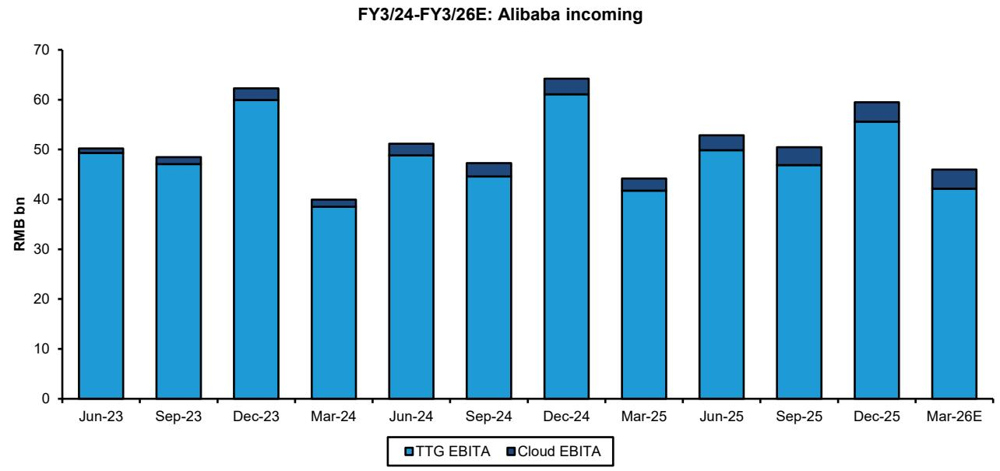  
EXHIBIT 2:We expect Alibaba's capital allocation choices in the coming months to have important implications for several other stocks we cover

# =XHIBIT 3: While core e-commerce and cloud EBITA have tracked sideways,spendon Al and quick commerce has :xploded, eating into cash generation

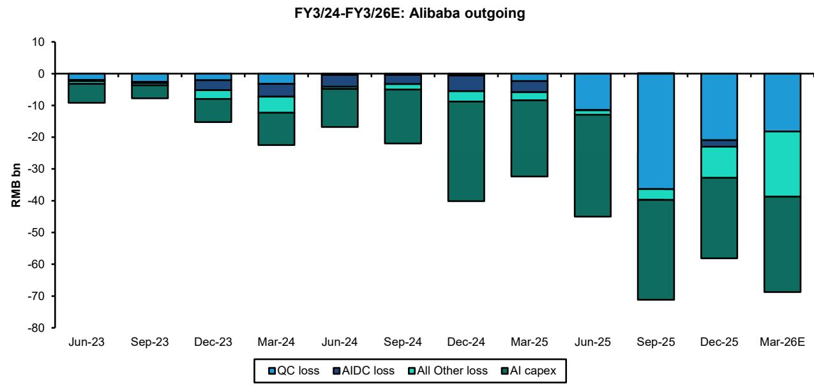  
Source: Corporate reports, Bernstein estimates and analysis.

# EXHIBIT 4:Oursense is Alibabaremains steadfast in its desire to invest ahead in Al,scaling back quick commerce losses should enable higher capex, while helping to balance the books somewhat

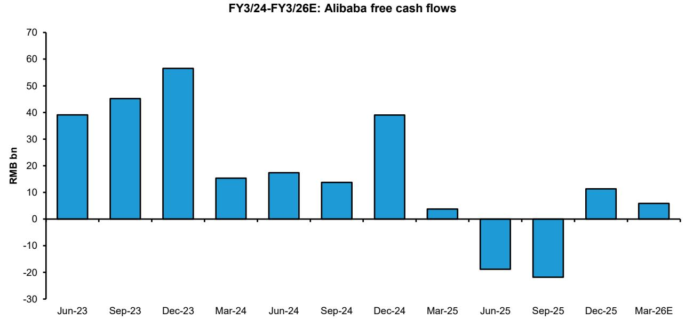  
订 阅呀报你加似信 LCD1Z33Z1CaQ V4-1/

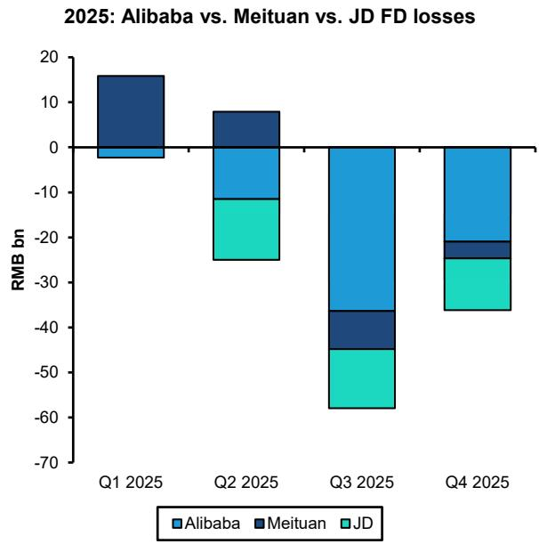  
EXHIBIT 5: We estimate c. RMB12Obn of combined losses in quick commerce since Q2 2025   
Source: Corporate reports,Bernstein estimates and analysis.

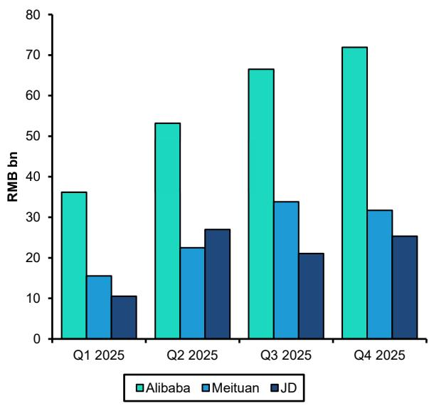  
EXHIBIT 6: Marketing spend has risen sharply across the group,but may now be nearing a turn   
2025: Sales & marketing expenses   
Source: Corporate reports and Bernstein analysis.

# EXHIBIT7:Wedo stillquestion what food deliveryindustry profitabilitycan return to though,considering Meituan generated 5O cents RMB of operating profit per orderin 2O21.. before Alibaba ceded the market to Meituan

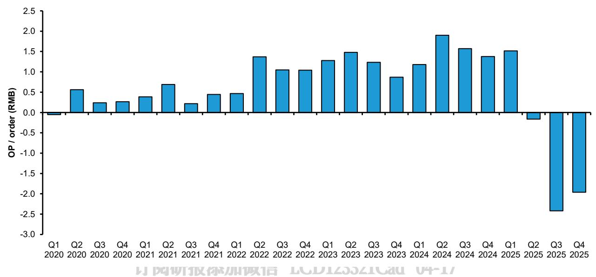  
2020-2025: Meituan food delivery operating profit per order   
Source: Corporate reports, Bernstein estimates and analysis.

# SECTOR VALUATION LOOKSBACK NEAR 2022-2023 LEVELS

Thefollowingareagroupofchartswemonitoras measuringsticksforsectorvaluation(seeExhibit8toExhibit11).Theaverage stock we cover now trades on $1 4 . 8 \times$ and 13.1x 2026Eand 2027EPE.The latter is only slightly higher than 2022-2023 lows, when the fundamental picture was dominated by China's Zero Covid policy,and associated economic misery.

nthe broadersector,the forward multiples ofother hithertoexpensive-looking hiding spotslike Trip.comandTMEhave compressed,and it encourages us that Kuaishou's Kling is no longer valued at $\$ 20$ -25bn like last summer.FCF/EVyields (a metric that helped to identify bottoms in 2021-2023) now stand near $5 \%$ for Tencent, and $1 0 - 1 1 \%$ for JD and NetEase. Net cash now exceeds $40 \%$ for several companies we cover,like JD,Boss Zhipin and PDD.Across the latter group,JDand Boss Zhipin managementhaveputmoneyto worktobuyback stock.Thecircumstances underwhich PDD management might follow suit remains one of life's great mysteries.

Exhibit 2updatesourplotcomparing Tencent'sforward PEmultipleversus theaverageofMetaandAlphabet,asameasureof thegeopoliticaldiscountascribedto Chinastocks.Inrecent weeksthisdiscounthasinterestinglyremainedlargelyunchanged, reaffirming the idea that issues like Al ROlfears have driven de-rating across global Internet stocks.

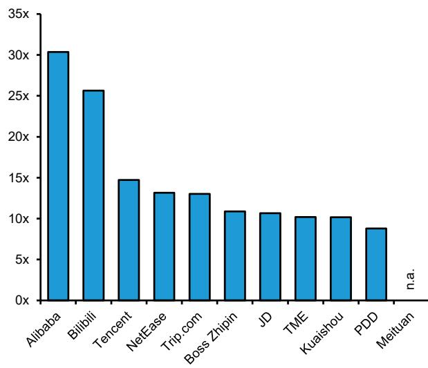  
EXHIBIT 8: The top Internet platforms now trade on an average of $1 4 . 8 \times$ 2026E PE...   
2026E:China Internet PE multiple

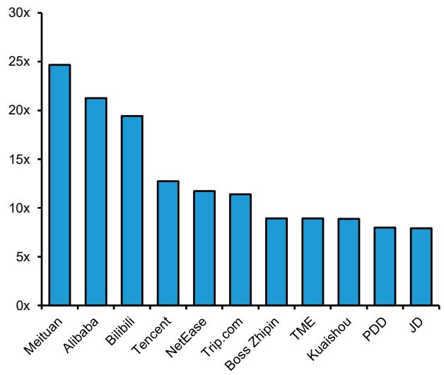  
EXHIBIT 9: ...and 13.1x 2027E PE, far from expensive, but not as cheap as a year ago   
2027E: China Internet PE multiple

Multiples based on Bernstein estimates for coverage companies; Bloomberg consensus for others.

Source: Bloomberg, Bernstein estimates and analysis.

Multiples based on Bernstein estimates for coverage companies; Bloomberg consensus for others.

Source: Bloomberg, Bernstein estimates and analysis.

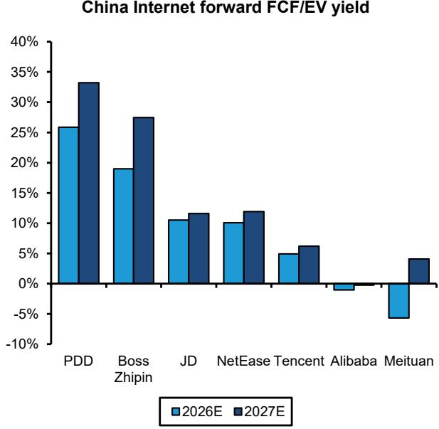  
EXHIBIT 10: FCF/EV yield helped to signal a floor in 2022-2023... and may be starting to look interesting again   
  
Tencent figure reflects the latest value of its listed equity investments. Source: Corporate reports,Bloomberg, Bernstein estimates and analysis.

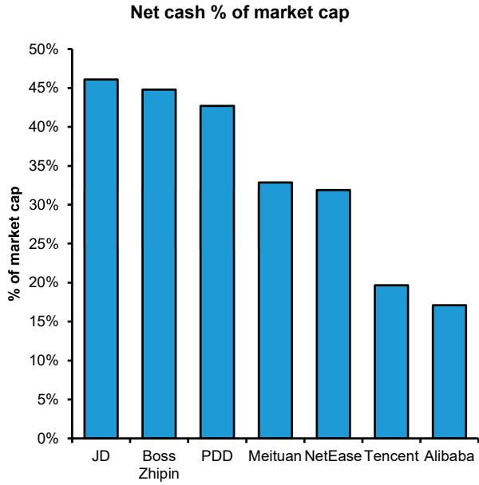  
EXHIBIT 11: Which of these companies will put balance sheet cash to work? JD has signalled further buybacks

# EXHIBIT 12: The fact the valuation gap between Tencent and US peers has narrowed year to date has been interesting to note.. suggesting the recent derating has been driven by top-down Al concerns

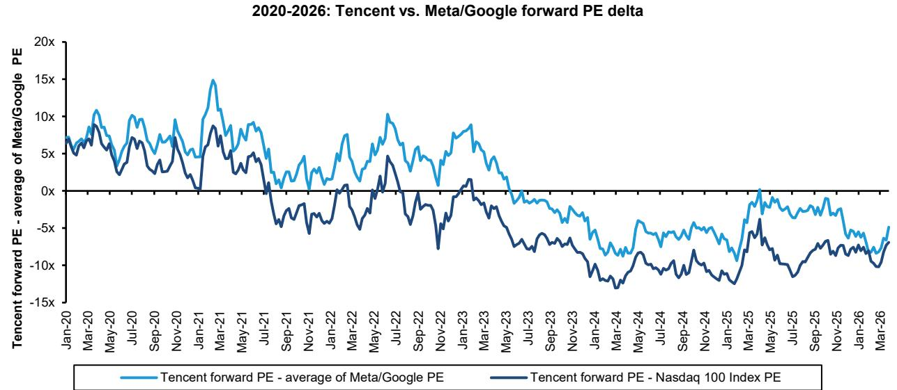  
Source: Corporate reports, Bloomberg,and Bernstein analysis.   
订 内孙H敞旧 LCDIZJJZICaU UT-1/  
Source: Bloomberg and Bernstein analysis.

# ABRIDGED TAKEAWAYS FROM Q4 2O25 REPORTING

Thefollowingsectionsummarises updates toourindustrymodels,andthelatestmarketsharetrendsacross keyend markets likee-commerce,digitalads,andvideogaming.Macroheadwindswerearecurring themeinthepartsofourcoveragemost sensitie tochangesinretailconsumption growth,though thiswaslikely made worsebyaratherlateCNYdate-which meant moreofthe holidayseason demand was pushed from Q4into Q1.Thechannelcheck feedback we've heardrecentlyon Q1 and

April has generally pointed to better trends (see Exhibit 13).

Attheindustry level,we estimate that aggregate GMV growth across the big five e-commerce platforms reached $6 . 1 \%$ year onyearinQ4 2025...afurtherslowdownversuspriorquarters(seeExhibit14).Meanwhile,ourtrackerof2Olisteddigitalads platforms pointed to $6 . 8 \%$ aggregate revenue growth in the same quarter. On a relative basis,Alibaba's share of incremental GMV across the big $\mathsf { 5 } \thinspace \mathsf { e }$ -commerce platforms remained around the $1 0 - 1 5 \%$ range, while JD's incremental share continued to moderatefromighH12O25levels(seeExhibit15andExhibit16).Biil,JD,andTncentledamongthelistedadsplatforms, while ourchannel check feedback continuedtopointto faster growth for Xiaohongshu(see Exhibit 17and Exhibit 18).

Incomparison,wedowonderifthevideo gaming sector'slackofsupplychains orrawmaterialinputs mightstart tocountinits favouratsome point.The domestic games approvals pipeline remains wellubricated: a total 453 new games were approved in 3M 2026, $2 5 . 1 \%$ higher compared with a year ago (see Exhibit 19). Tencent's Q4 deferred revenue balance implied c. 1 $1 . 8 \%$ yearon year growth in billngs,despite a typicallyslower Q4 after a strong year. We estimate NetEase billigs grew $1 0 . 7 \%$ year on year, implying solid underlying monetisation trends.

Inrecentdiscussions,Tencent management pushedbackagainsttheideathatthecompany's gaming revenues were duea periodofslowergrowth.ForNetEase,thelengtheningofrevenuedeferralperiodswillikelycontinue tobeafactorforacouple morequarters,thoughthecompany'scontinued confidence in Seaof Remnants feels notable-incontrast with widespread investor apathy.

EXHIBIT 13: Consumption growth in China continues to track along the $3 \%$ growth trendline... questions on Al impact on white collar employment has featured periodically in our recent discussions with investors

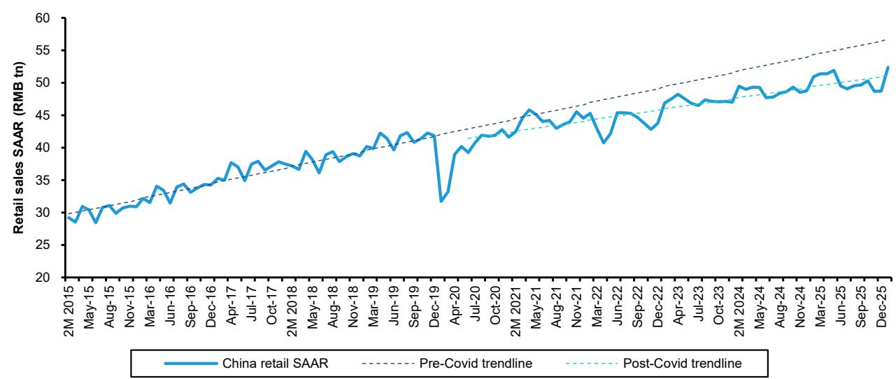  
2015-2026:China retail sales SAAR

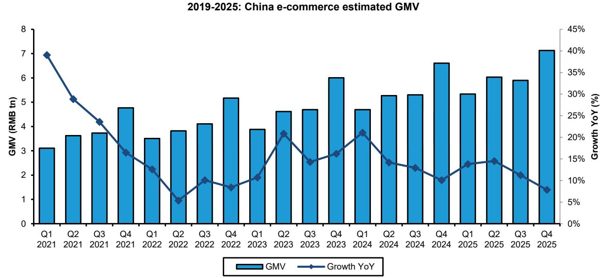  
EXHIBIT 14: We estimate thatthe top five e-commerce platforms in China grew their GMV by an aggregate 6.1% year on year in Q4 2025   
Source: Corporate reports,Bernstein estimates and analysis.

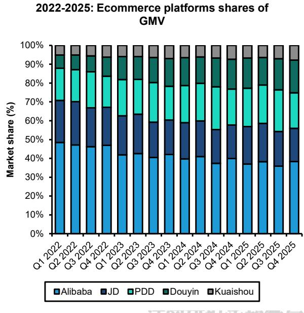  
EXHIBIT 15: The direction of market share in Q4 has looked consistent with recent trends   
Source:Corporate reports,Bernstein estimates and analysis.

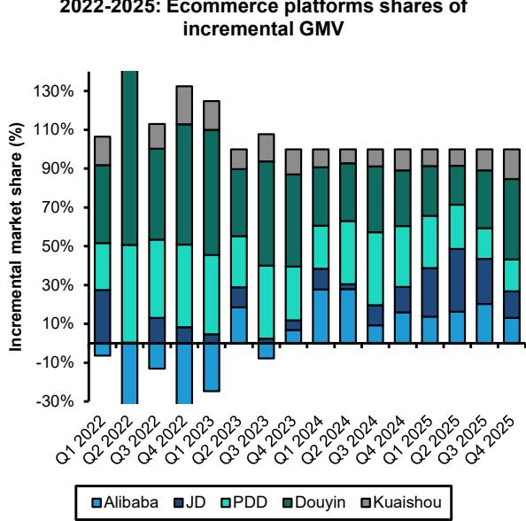  
EXHIBIT 16: Douyin has won more share in recent quarters, displacing JD as electronics subsidies faded   
Source: Corporate reports, Bernstein estimates and analysis.

# EXHIBIT 17: Slower digital ads growth in Q4 was partlyafunction of weaker macro,butlikely also ongoing regulatory changes related to e-commerce tax enforcement and corporate profit tax deductions

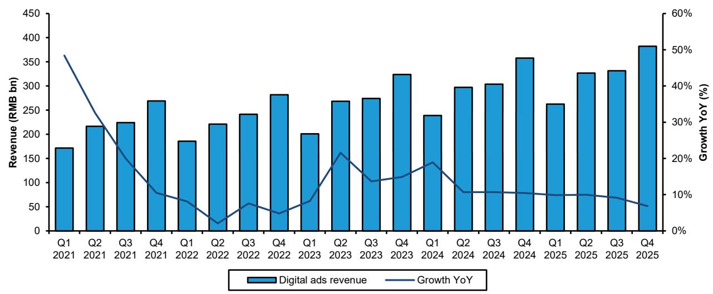  
2021-2025: China digital ads revenue and growth   
Source: Corporate reports, Bernstein estimates and analysis.

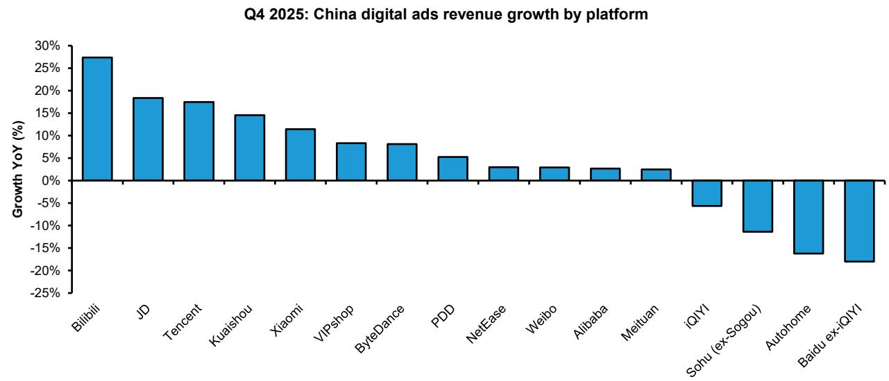  
EXHIBIT 18: Bilibili,Tencent and Xiaohongshu continueto lead digital ads market growth among the topof funnel platforms

# XHIBIT 19: The supply of new game approvals remains wellubricated, continuing to rise year on year in 2026

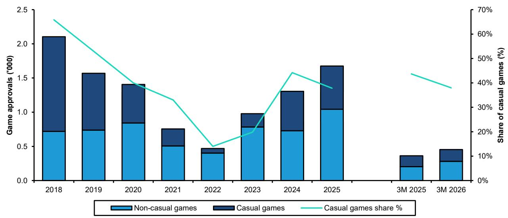  
2018-2026: New game approvals by type   
Source: Corporate reports, NPPA,and Bernstein analysis.

# UPDATING OUR ESTIMATESACROSSTHE SECTOR

Withthis notewe'veupdatedourestimatesforTencent,Alibaba,JD,andNetEase,toreflectdiscussionswiththecompanies. OurTencent estimate changesare modestandchiefly reflectslower top-line growth in gaming andother Value Aded Service revenues.

OurAlibaba estimatechangeschieflyreflectthecompany'sshiftobooking more marketingspendcontrarevenue,lower quick commercelosses,butalso higher AllOtherlossesintheMarch quarteraswellasonanongoing basis.Onbalance ourestimates forthecompanyare lower.OurpricetargetforthecompanycontinuestobebasedonourSOTPforthecompany.Forpractical purposes over more tactical horizons we'd expect $2 0 \mathsf { x } \mathsf { F Y } + 1$ PE to represent a constraint on where investors are wiling to go.

OurJDand NetEase estimatechangesare more minor.Thelattrchieflyreflectsremodelingofhowthecompany'scashbilings converts to revenue and profit.

Exhibit 20 to Exhibit 23 summarise our estimate changes.

EXHIBIT 20: Tencent: Summary of estimate changes   

<table><tr><td>Tencent: summary of estimate changes</td><td>2026E</td><td>2027E</td><td>2028E</td></tr><tr><td>Revenue</td><td></td><td></td><td></td></tr><tr><td>Bernstein - Old</td><td>839,202</td><td>920,021</td><td>998,776</td></tr><tr><td>Growth YoY</td><td>11.6%</td><td>9.6%</td><td>8.6%</td></tr><tr><td>Bernstein-New</td><td>824,968</td><td>908,216</td><td>992,883</td></tr><tr><td>Growth YoY</td><td>9.7%</td><td>10.1%</td><td>9.3%</td></tr><tr><td>Consensus</td><td>831,194</td><td>914,316</td><td>998,495</td></tr><tr><td>Growth YoY</td><td>10.6%</td><td>10.0%</td><td>9.2%</td></tr><tr><td>New vs.old</td><td>-1.7%</td><td>-1.3%</td><td>-0.6%</td></tr><tr><td>New vs.consensus</td><td>-0.7%</td><td>-0.7%</td><td>-0.6%</td></tr><tr><td>Non-GAAP operating income</td><td></td><td></td><td></td></tr><tr><td>Bernstein - Old</td><td>297,558</td><td>330,118</td><td>363,615</td></tr><tr><td>Growth YoY</td><td>订阅研报 6.0%</td><td>10.9%</td><td>CD 10.1%</td></tr><tr><td>Margin</td><td>35.5%</td><td>35.9%</td><td>36.4%</td></tr><tr><td>Bernstein-New</td><td>293,497</td><td>326,754</td><td>364,666</td></tr><tr><td>Growth YoY</td><td>4.6%</td><td>11.3%</td><td>11.6%</td></tr><tr><td>Margin</td><td>35.6%</td><td>36.0%</td><td>36.7%</td></tr><tr><td>Consensus</td><td>306,131</td><td>344,201</td><td>381,790</td></tr><tr><td>Growth YoY</td><td>0.0%</td><td>12.4%</td><td>10.9%</td></tr><tr><td>Margin</td><td>36.8%</td><td>37.6%</td><td>38.2%</td></tr><tr><td>New vs. old</td><td>-1.4%</td><td>-1.0%</td><td>0.3%</td></tr><tr><td>New vs.consensus</td><td>-4.1%</td><td>-5.1%</td><td></td></tr><tr><td></td><td></td><td></td><td>-4.5%</td></tr><tr><td>Non-GAAP net income Bernstein - Old</td><td></td><td></td><td></td></tr><tr><td></td><td>278,716</td><td>314,087</td><td>351,684</td></tr><tr><td>Growth YoY</td><td>7.4%</td><td>12.7%</td><td>12.0%</td></tr><tr><td>Margin</td><td>33.2%</td><td>34.1%</td><td>35.2%</td></tr><tr><td>Bernstein-New</td><td>272,053</td><td>309,511</td><td>350,580</td></tr><tr><td>Growth YoY</td><td>4.8%</td><td>13.8%</td><td>13.3%</td></tr><tr><td>Margin</td><td>33.0%</td><td>34.1%</td><td>35.3%</td></tr><tr><td>Consensus</td><td>281,016</td><td>310,820</td><td>344,472</td></tr><tr><td>Growth YoY</td><td>8.4%</td><td>10.6%</td><td>10.8%</td></tr><tr><td>Margin</td><td>33.8%</td><td>34.0%</td><td>34.5%</td></tr><tr><td>New vs. old</td><td>-2.4%</td><td>-1.5%</td><td>-0.3%</td></tr><tr><td>New vs.consensus</td><td>-3.2%</td><td>-0.4%</td><td>1.8%</td></tr></table>

04-17   
Source: Bloomberg, Corporate reports, Bernstein estimatesand analysis

EXHIBIT 21: Alibaba: Summary of estimate changes   

<table><tr><td>Alibaba:summary of estimate changes</td><td>FY3/26E</td><td>FY3/27E</td><td>FY3/28E</td></tr><tr><td colspan="4">Revenue (RMB mn)</td></tr><tr><td>Bernstein -old</td><td>1,031,957</td><td>1,156,417</td><td>1,259,440</td></tr><tr><td>Growth YoY Bernstein-new</td><td>3.6%</td><td>12.1% 1,141,552</td><td>8.9% 1,244,026</td></tr><tr><td>Growth YoY</td><td>1,029,260 3.3%</td><td>10.9% 1,141,650</td><td>9.0% 1,276,657</td></tr><tr><td>Consensus Growth YoY Bernstein new vs. old</td><td>1,027,008 3.1%</td><td>11.2% -1.3%</td><td>11.8%</td></tr><tr><td>Bernstein new vs. consensus</td><td>-0.3% 0.2%</td><td>0.0%</td><td>-1.2% -2.6%</td></tr><tr><td colspan="4">Non-GAAP net income to SHs (RMB mn)</td></tr><tr><td>Bernstein-old</td><td>74,337</td><td>123,245</td><td>163,040</td></tr><tr><td>Growth YoY</td><td>-52.9%</td><td>65.8%</td><td>32.3%</td></tr><tr><td></td><td></td><td>10.7%</td><td></td></tr><tr><td>Margin</td><td>7.2%</td><td></td><td>12.9%</td></tr><tr><td>Bernstein-new</td><td>69,524</td><td>102,095</td><td>115,549</td></tr><tr><td>Growth YoY</td><td>-56.0%</td><td>46.8%</td><td>13.2%</td></tr><tr><td>Margin</td><td>6.8%</td><td>8.9%</td><td>9.3%</td></tr><tr><td>Consensus</td><td>订阅研报 78,486</td><td>116,024</td><td>155,892</td></tr><tr><td>Growth YoY</td><td>-50.3%</td><td>47.8%</td><td>CD 34.4%</td></tr><tr><td>Margin</td><td>7.6%</td><td>10.2%</td><td>12.2%</td></tr><tr><td>Bernstein new vs.old</td><td>-6.5%</td><td>-17.2%</td><td>-29.1%</td></tr><tr><td>Bernstein new vs. consensus</td><td>-11.4%</td><td>-12.0%</td><td>-25.9%</td></tr></table>

EXHIBIT 22: JD: Summary of estimate changes   

<table><tr><td>JD:summary of estimate changes</td><td>2026E</td><td>2027E</td><td>2028E</td></tr><tr><td>Revenue</td><td></td><td></td><td></td></tr><tr><td>Bernstein-old</td><td>1,396,993</td><td>1,467,003</td><td>1,534,204</td></tr><tr><td>Growth YoY</td><td>6.7%</td><td>5.0%</td><td>4.6%</td></tr><tr><td>Bernstein-new</td><td>1,376,475</td><td>1,425,435</td><td>1,467,842</td></tr><tr><td>Growth YoY</td><td>5.1%</td><td>3.6%</td><td>3.0%</td></tr><tr><td>Consensus</td><td>1,392,093</td><td>1,477,389</td><td>1,553,330</td></tr><tr><td>Growth YoY</td><td>6.5%</td><td>6.1%</td><td>5.1%</td></tr><tr><td>New vs.old</td><td>-1.5%</td><td>-2.8%</td><td>n.a.</td></tr><tr><td>New vs.consensus</td><td>-1.1%</td><td>-3.5%</td><td>-5.5%</td></tr><tr><td>Non-GAAP operating income</td><td></td><td></td><td></td></tr><tr><td>Bernstein -old</td><td>18,263</td><td>31,851</td><td>46,472</td></tr><tr><td>Growth YoY</td><td>订阅研报 89.4%</td><td>74.4%</td><td>CD 45.9%</td></tr><tr><td>Margin</td><td>1.3%</td><td>2.2%</td><td>3.0%</td></tr><tr><td>Bernstein-new</td><td>21,283</td><td>34,611</td><td>49,629</td></tr><tr><td>Growth YoY</td><td>120.7%</td><td>62.6%</td><td>43.4%</td></tr><tr><td>Margin</td><td>1.5%</td><td>2.4%</td><td>3.4%</td></tr><tr><td>Consensus</td><td>19,018</td><td>30,960</td><td>41,762</td></tr><tr><td>Growth YoY</td><td>0.0%</td><td>62.8%</td><td>34.9%</td></tr><tr><td>Margin</td><td>1.4%</td><td>2.1%</td><td>2.7%</td></tr><tr><td>New vs. old</td><td>16.5%</td><td>8.7%</td><td>6.8%</td></tr><tr><td>New vs.consensus</td><td>11.9%</td><td>11.8%</td><td>18.8%</td></tr><tr><td>Non-GAAP net income</td><td></td><td></td><td></td></tr><tr><td>Bernstein-old</td><td>28,685</td><td>40,420</td><td>52,995</td></tr><tr><td>Growth YoY</td><td>6.1%</td><td>40.9%</td><td>31.1%</td></tr><tr><td>Margin</td><td>2.1%</td><td>2.8%</td><td>3.5%</td></tr><tr><td>Bernstein-new</td><td>31,006</td><td>42,326</td><td>54,997</td></tr><tr><td>Growth YoY</td><td>14.7%</td><td>36.5%</td><td>29.9%</td></tr><tr><td>Margin</td><td>2.3%</td><td>3.0%</td><td>3.7%</td></tr><tr><td>Consensus</td><td>30,338</td><td>40,388</td><td></td></tr><tr><td>Growth YoY</td><td>13.7%</td><td>33.1%</td><td>48,285 19.6%</td></tr><tr><td></td><td>2.2%</td><td></td><td></td></tr><tr><td>Margin</td><td>8.1%</td><td>2.7% 4.7%</td><td>3.1% 3.8%</td></tr><tr><td>New vs.old</td><td></td><td></td><td></td></tr><tr><td>New vs.consensus</td><td>2.2%</td><td>4.8%</td><td>13.9%</td></tr></table>

04-17

EXHIBIT 23: NetEase: Summary of estimate changes   

<table><tr><td>NetEase: summary of estimate changes</td><td>FY26E</td><td>FY27E</td><td>FY28E</td></tr><tr><td colspan="4">Revenue</td></tr><tr><td>Bernstein -Old</td><td>122,291</td><td>133,168</td><td>141,141</td></tr><tr><td>Growth YoY</td><td>8.6%</td><td>8.9%</td><td>6.0%</td></tr><tr><td>Bernstein-New</td><td>117,411</td><td>130,728</td><td>139,838</td></tr><tr><td>Growth YoY</td><td>4.2%</td><td>11.3%</td><td>7.0%</td></tr><tr><td>Consensus</td><td>120,688</td><td>131,205</td><td>140,735</td></tr><tr><td>Growth YoY</td><td>6.0%</td><td>8.7%</td><td>7.3%</td></tr><tr><td>New vs. old</td><td>-4.0%</td><td>-1.8%</td><td>-0.9%</td></tr><tr><td>New vs.consensus</td><td>-2.7%</td><td>-0.4%</td><td>-0.6%</td></tr><tr><td colspan="4">Non-GAAP operating profit</td></tr><tr><td>Bernstein - Old</td><td>45,207</td><td>50,821</td><td>55,355</td></tr><tr><td>Growth YoY</td><td>订阅研报添 14.5%</td><td>12.4%CD</td><td>8.9%</td></tr><tr><td>Margin</td><td>37.0%</td><td>38.2%</td><td>39.2%</td></tr><tr><td>Bernstein-New</td><td>42,989</td><td>49,687</td><td>54,742</td></tr><tr><td>Growth YoY</td><td>8.9%</td><td>15.6%</td><td>10.2%</td></tr><tr><td>Margin</td><td>36.6%</td><td>38.0%</td><td>39.1%</td></tr><tr><td>Consensus</td><td>43,423</td><td>48,144</td><td>48,144</td></tr><tr><td>Growth YoY</td><td>8.3%</td><td>10.9%</td><td>0.0%</td></tr><tr><td>Margin</td><td>36.0%</td><td>36.7%</td><td>34.2%</td></tr><tr><td>New vs. old</td><td>-4.9%</td><td>-2.2%</td><td>-1.1%</td></tr><tr><td>New vs.consensus</td><td>-1.0%</td><td>3.2%</td><td>13.7%</td></tr><tr><td colspan="4">Non-GAAP net income</td></tr><tr><td>Bernstein - Old</td><td>40,738</td><td>44,705</td><td>47,903</td></tr><tr><td>Growth YoY</td><td>9.1%</td><td>9.7%</td><td>7.2%</td></tr><tr><td>Margin</td><td>33.3%</td><td>33.6%</td><td>33.9%</td></tr><tr><td>Bernstein-New</td><td>38,887</td><td>43,783</td><td>47,394</td></tr><tr><td>Growth YoY</td><td>4.1%</td><td>12.6%</td><td>8.2%</td></tr><tr><td>Margin</td><td>33.1%</td><td>33.5%</td><td>33.9%</td></tr><tr><td>Consensus</td><td>40,910</td><td>45,496</td><td>48,963</td></tr><tr><td>Growth YoY</td><td>4.1%</td><td>11.2%</td><td>7.6%</td></tr><tr><td>Margin</td><td>33.9%</td><td>34.7%</td><td>34.8%</td></tr><tr><td>New vs. old</td><td>-4.5%</td><td>-2.1%</td><td>-1.1%</td></tr><tr><td>New vs.consensus</td><td>-4.9%</td><td>-3.8%</td><td>-3.2%</td></tr></table>

04-17

# APPENDIX-FINANCIALFORECASTS

EXHIBIT 24: Tencent: Income Statement   

<table><tr><td>RMB million</td><td>2022</td><td>2023</td><td>2024</td><td>2025</td><td>2026E</td><td>2027E</td><td>2028E</td></tr><tr><td>Revenue</td><td>554,552</td><td>609,015</td><td>660,257</td><td>751,766</td><td>824,968</td><td>908.216</td><td>992.883</td></tr><tr><td>Gross profit</td><td>238,746</td><td>293,109</td><td>349,246</td><td>422,593</td><td>471,043</td><td>528,028</td><td>592,834</td></tr><tr><td>Sales&amp; marketing expenses</td><td>-29,229</td><td>-34,211</td><td>-36,388</td><td>-41,727</td><td>-48,022</td><td>-51,110</td><td>-55,879</td></tr><tr><td>Admin expenses</td><td>-45,295</td><td>-39,447</td><td>-42,075</td><td>-50,380</td><td>-64,135</td><td>-70,890</td><td>-86,881</td></tr><tr><td>R&amp;D expense</td><td>-61,401</td><td>-64,078</td><td>-70,686</td><td>-85,747</td><td>-104,060</td><td>-120,826</td><td>-129,427</td></tr><tr><td>Other income, net</td><td>8,006</td><td>4,701</td><td>8.002</td><td>-3,177</td><td>2,475</td><td>2,725</td><td>2.979</td></tr><tr><td>Operating profit</td><td>110,827</td><td>160,074</td><td>208,099</td><td>241,562</td><td>257,301</td><td>287,927</td><td>323,626</td></tr><tr><td>Non-GAAPoperatingprofit</td><td>144,526</td><td>191,886</td><td>237,811</td><td>280,656</td><td>293,497</td><td>326,754</td><td>364,666</td></tr><tr><td>EBITDA</td><td>164,037</td><td>214,381</td><td>256,310</td><td>310,767</td><td>331,863</td><td>383,207</td><td>406,690</td></tr><tr><td>Profit before tax</td><td>订阅 210,225</td><td>161,324</td><td>241,485</td><td>277,249</td><td>a 296,295</td><td>339,279</td><td>387,294</td></tr><tr><td>Income tax expense</td><td>-21,516</td><td>-43,276</td><td>-45,018</td><td>-47,448</td><td>-57,034</td><td>-64,463</td><td>-73,586</td></tr><tr><td>Net Income</td><td>188,709</td><td>118,048</td><td>196,467</td><td>229,801</td><td>239,261</td><td>274,816</td><td>313,708</td></tr><tr><td>Net profit attributable to SHs</td><td>188,243</td><td>115,216</td><td>194,073</td><td>224,842</td><td>234,476</td><td>269,832</td><td>308,465</td></tr><tr><td>Non-GAAP net profit attributable to SHs</td><td>115,649</td><td>157,688</td><td>222,703</td><td>259,626</td><td>272,053</td><td>309,511</td><td>350,580</td></tr><tr><td>EPS (RMB)</td><td>19.76</td><td>12.19</td><td>20.94</td><td>24.75</td><td>26.22</td><td>30.67</td><td>35.69</td></tr><tr><td>Non-IFRS EPS (RMB)</td><td>11.93</td><td>16.41</td><td>23.67</td><td>28.09</td><td>29.89</td><td>34.56</td><td>39.83</td></tr><tr><td></td><td></td><td></td><td></td><td></td><td></td><td></td><td></td></tr></table>

Source: Corporate reports,Bernstein estimates and analysis.

EXHIBIT 25: Tencent: Cash Flow Statement   

<table><tr><td>RMB million</td><td>2022</td><td>2023</td><td>2024</td><td>2025</td><td>2026E</td><td>2027E</td><td>2028E</td></tr><tr><td>Profit before tax</td><td>210,225</td><td>161,324</td><td>241,485</td><td>277,249</td><td>296,295</td><td>339,279</td><td>387,294</td></tr><tr><td>Depreciation &amp; amortization</td><td>61,216</td><td>59,008</td><td>56,213</td><td>63,614</td><td>94,975</td><td>120,136</td><td>112,812</td></tr><tr><td>Stock-based compensation</td><td>26,248</td><td>22,782</td><td>23,424</td><td>31,859</td><td>30,757</td><td>32,956</td><td>35,035</td></tr><tr><td>Other</td><td>-151,598</td><td>-21,152</td><td>-62,601</td><td>-69,670</td><td>-45,250</td><td>-59,400</td><td>-79.412</td></tr><tr><td>Cash flow from operations</td><td>146,091</td><td>221,962</td><td>258,521</td><td>303,052</td><td>376,778</td><td>432,971</td><td>455,729</td></tr><tr><td>Capex</td><td>-31,300</td><td>-30,300</td><td>-79,200</td><td>-95,900</td><td>-106,049</td><td>-121,956</td><td></td></tr><tr><td>Additions of intangibles</td><td>-26,400</td><td>-24,700</td><td>-24,000</td><td>-24,600</td><td>-48,346</td><td>-41,681</td><td>-140,249</td></tr><tr><td>Other</td><td>-47,171</td><td>-70,161</td><td>-18,987</td><td>-85,232</td><td>-21,261</td><td>-28,192</td><td>-44,727 -36,777</td></tr><tr><td>Cash flowfrominvestments</td><td>-104,871</td><td>-125,161</td><td>-122,187</td><td>205,732</td><td>2-175,656</td><td>-191,830</td><td></td></tr><tr><td></td><td></td><td></td><td></td><td></td><td></td><td></td><td>-221,754</td></tr><tr><td>Cash flow from financing</td><td>-59,953</td><td>-82,573</td><td>-176,494</td><td>-87,155</td><td>-101,046</td><td>-124,088</td><td>-123,777</td></tr><tr><td>Net effect of exchange rate changes</td><td>7,506</td><td>1,353</td><td>359</td><td>-1,643</td><td>0</td><td>0</td><td>0</td></tr><tr><td>Net change in cash</td><td>-11,227</td><td>15,581</td><td>-39,801</td><td>8,522</td><td>100,076</td><td>117,054</td><td>110,198</td></tr><tr><td>Beginning cash</td><td>167,966</td><td>156,739</td><td>172,320</td><td>132,519</td><td>141,041</td><td>241,117</td><td>358,171</td></tr><tr><td>Ending cash</td><td>156,739</td><td>172,320</td><td>132,519</td><td>141,041</td><td>241,117</td><td>358,171</td><td>468,369</td></tr></table>

Source: Corporate reports,Bernstein estimates and analysis.

EXHIBIT 26: Tencent: Balance Sheet   

<table><tr><td>RMB million</td><td>2022</td><td>2023</td><td>2024</td><td>2025</td><td>2026E</td><td>2027E</td><td>2028E</td></tr><tr><td>Cash &amp; term deposits</td><td>261,515</td><td>358,303</td><td>325,496</td><td>377,842</td><td>477,918</td><td>594,972</td><td>705,170</td></tr><tr><td>Accounts receivable</td><td>45,467</td><td>46,606</td><td>48,203</td><td>49,930</td><td>52,377</td><td>55,013</td><td>57,327</td></tr><tr><td>Inventories</td><td>2.333</td><td>456</td><td>440</td><td>530</td><td>2.448</td><td>2.681</td><td>2,809</td></tr><tr><td>Other current assets</td><td>256,674</td><td>113.081</td><td>122,041</td><td>167,158</td><td>180,362</td><td>194,655</td><td>210,125</td></tr><tr><td>Total current assets</td><td>565,989</td><td>518,446</td><td>496,180</td><td>595,460</td><td>713,105</td><td>847,321</td><td>975,432</td></tr><tr><td>Long-term investments</td><td>252,715</td><td>261,665</td><td>297,415</td><td>348,712</td><td>372.547</td><td>403,208</td><td>442.319</td></tr><tr><td>Property,plant &amp; equipment, net</td><td>104,336</td><td>105,028</td><td>134,084</td><td>200,231</td><td>240,860</td><td>272,096</td><td>309,534</td></tr><tr><td>Intangible assets</td><td>161,802</td><td>177,727</td><td>196,127</td><td>205,999</td><td>224,789</td><td>237,053</td><td>271,781</td></tr><tr><td>Other non-current assets</td><td>493,289</td><td>514,380</td><td>657,189</td><td>688,584</td><td>688,584</td><td>688,584</td><td>688,584</td></tr><tr><td>Total assets</td><td>1,578,131</td><td>/1,577,246</td><td>1,780,995</td><td>? 2,038,986</td><td>a 2,239,885</td><td>2,448,262</td><td>2,687,649</td></tr><tr><td>Short-term debt</td><td>22,026</td><td>55,698</td><td>61,508</td><td>53,160</td><td>62,796</td><td>66,596</td><td>71,460</td></tr><tr><td>Accounts payable and other payables</td><td>301,485</td><td>177,543</td><td>202,744</td><td>217,623</td><td>230,428</td><td>246,605</td><td>259,591</td></tr><tr><td>Other current liabilities</td><td>110,693</td><td>118,916</td><td>132,657</td><td>141,968</td><td>161,089</td><td>169,606</td><td>171,040</td></tr><tr><td>Total current liabilities</td><td>434,204</td><td>352,157</td><td>396,909</td><td>412,751</td><td>454,314</td><td>482,806</td><td>502,091</td></tr><tr><td>Long-term debt</td><td>312,337</td><td>292,920</td><td>277,107</td><td>334,573</td><td>350,140</td><td>365,194</td><td>391,125</td></tr><tr><td>Other non-current liabilities</td><td>48,730</td><td>58,488</td><td>53,083</td><td>50,597</td><td>50,597</td><td>50,597</td><td>50,597</td></tr><tr><td>Total liabilities</td><td>795,271</td><td>703,565</td><td>727,099</td><td>797,921</td><td>855,050</td><td>898,598</td><td>943,813</td></tr><tr><td>Shareholders&#x27;equity</td><td>782,860</td><td>873,681</td><td>1,053,896</td><td>1,241,065</td><td>1,384,834</td><td>1,549,664</td><td>1,743,835</td></tr><tr><td>Total liabilities&amp;shareholders&#x27;equity</td><td>1,578,131</td><td>1,577,246</td><td>1,780,995</td><td>2,038,986</td><td>2,239,885</td><td>2,448,262</td><td>2,687,649</td></tr></table>

EXHIBIT 27: Alibaba: Income Statement   

<table><tr><td>RMB million</td><td>FY3/21</td><td>FY3/22</td><td>FY3/23</td><td>FY3/24</td><td>FY3/25</td><td>FY3/26E</td><td>FY3/27E</td><td>FY3/28E</td></tr><tr><td>Revenue</td><td>717,289</td><td>853.062</td><td>868,687</td><td>941,168</td><td>996.347</td><td>1,029,260</td><td>1,141,552</td><td>1,244,026</td></tr><tr><td>Gross profit</td><td>296,084</td><td>313,612</td><td>318,992</td><td>354,845</td><td>398,062</td><td>393,927</td><td>328,310</td><td>357,039</td></tr><tr><td>Product development expenses</td><td>-57,236</td><td>-55,465</td><td>-56,744</td><td>-52,256</td><td>-57,151</td><td>-64,084</td><td>-70,836</td><td>-76,970</td></tr><tr><td>Sales &amp; marketing expenses</td><td>-81,519</td><td>-119,799</td><td>-103,496</td><td>-115,141</td><td>-144,021</td><td>-232,580</td><td>-140,214</td><td>-141,692</td></tr><tr><td>General and administrative expenses</td><td>-55,124</td><td>-31,922</td><td>-42,183</td><td>-41,985</td><td>-44,239</td><td>-33,961</td><td>-37,435</td><td>-40,519</td></tr><tr><td>Other income/expenses, net</td><td>-12,427</td><td>-36,788</td><td>-16.218</td><td>-32,113</td><td>-11,746</td><td>-11,533</td><td>-4,992</td><td>-4,769</td></tr><tr><td>Operating profit</td><td>89,778</td><td>69,638</td><td>100,351</td><td>113,350</td><td>140,905</td><td>51,769</td><td>74,833</td><td>93,089</td></tr><tr><td>Non-GAAPEBITA</td><td>152,225</td><td>130,397</td><td>147,400</td><td>165,028</td><td>173,065</td><td>76,805</td><td>95,710</td><td>114,168</td></tr><tr><td>Adjusted EBITDA</td><td>178,614</td><td>158,205</td><td>175,199</td><td>191,668</td><td>202,325</td><td>113,881</td><td>147,438</td><td>177,471</td></tr><tr><td>Profit before tax</td><td>165,678</td><td>59,550</td><td>89,185</td><td>101,596</td><td>155,455</td><td>97,105</td><td>67,238</td><td>83,857</td></tr><tr><td>Income tax expense</td><td>-29,278</td><td>-26,815</td><td>-15,549</td><td>-22,529</td><td>-35,445</td><td>-23,482</td><td>-14,098</td><td>-16,790</td></tr><tr><td>Share of results of equity investees</td><td>6,984</td><td>14,344</td><td>-8.063</td><td>-7,735</td><td>5,966</td><td>4,445</td><td>3.445</td><td>4,339</td></tr><tr><td>Net income</td><td></td><td>47,079 1</td><td>65,573</td><td>C 71,332</td><td>3 125,976</td><td>78.068</td><td>56,584</td><td>71,406</td></tr><tr><td>Net profit attributable to SHs</td><td>订间143384 150,408</td><td>61,959</td><td>72,509</td><td>79,741</td><td>129,470</td><td>80,623</td><td>59,592</td><td>74,414</td></tr><tr><td>Non-GAAP net profit to SHs</td><td>178,954</td><td>143,968</td><td>143,991</td><td>158,359</td><td>157,940</td><td>69,524</td><td>102,095</td><td>115,549</td></tr><tr><td>DilutedEPS(RMB)</td><td>54.70</td><td>22.74</td><td>27.46</td><td>31.24</td><td>53.59</td><td>32.74</td><td>24.74</td><td>30.96</td></tr><tr><td>Non-GAAPdiluted EPS (RMB)</td><td>65.13</td><td>52.86</td><td>54.56</td><td>62.23</td><td>65.41</td><td>28.97</td><td>42.38</td><td>48.07</td></tr></table>

Source: Corporate reports,Bernstein estimates and analysis.

EXHIBIT 28: Alibaba: Cash Flow Statement   

<table><tr><td>RMB million</td><td>FY3/21</td><td>FY3/22</td><td>FY3/23</td><td>FY3/24</td><td>FY3/25</td><td>FY3/26E</td><td>FY3/27E</td><td>FY3/28E</td></tr><tr><td>Profit before tax</td><td>165,578</td><td>59,550</td><td>89,185</td><td>101,596</td><td>155,455</td><td>97,105</td><td>67,238</td><td>83,857</td></tr><tr><td>Stock-based compensation</td><td>50,120</td><td>23,971</td><td>30,831</td><td>18,546</td><td>13,970</td><td>11,890</td><td>15,886</td><td>16,310</td></tr><tr><td>Depreciation &amp; amortization</td><td>47,909</td><td>48,065</td><td>41,303</td><td>48,232</td><td>36,133</td><td>40,708</td><td>56,720</td><td>68,072</td></tr><tr><td>Changes in working capital</td><td>-24,046</td><td>-31,477</td><td>7,065</td><td>12.957</td><td>-38,361</td><td>15.036</td><td>16.817</td><td>20,282</td></tr><tr><td>Taxes,other adjustments</td><td>-7,775</td><td>42,650</td><td>31,368</td><td>1,262</td><td>-3,688</td><td>-61,155</td><td>-14,098</td><td>-16.790</td></tr><tr><td>Cash flowfromoperations</td><td>231,786</td><td>142,759</td><td>199,752</td><td>182,593</td><td>163,509</td><td>103,583</td><td>142,562</td><td>171,731</td></tr><tr><td>Capex</td><td>-36,160</td><td>-53.309</td><td>-35,352</td><td>-27,579</td><td>-84,278</td><td>-125,433</td><td>-144,000</td><td>-168,000</td></tr><tr><td>Additions of intangibles</td><td>-1,735</td><td>-15</td><td>-22</td><td>-842</td><td>0</td><td>-939</td><td>-4,007</td><td>-4,272</td></tr><tr><td>Other</td><td>-206,299</td><td>-145,268</td><td>-100,132</td><td>6,597</td><td>-101,137</td><td>10,776</td><td>-89,284</td><td>-87.830</td></tr><tr><td>Cash flow from investments</td><td>-244,194</td><td>-198,592</td><td>-135,506</td><td>-21,824</td><td>-185,415</td><td>-115,596</td><td>-237,292</td><td>-260,101</td></tr><tr><td>Cash flow from financing</td><td>30,082</td><td>-64,449</td><td>-65,619</td><td>-108,244</td><td>-76,215</td><td>68,550</td><td>11,528</td><td>19,586</td></tr><tr><td>Net effect of exchange rate changes</td><td>-7,187</td><td>-8,834</td><td>3,530</td><td>4,389</td><td>965 1</td><td>-2.941</td><td>0</td><td>0</td></tr><tr><td>Net change in cash</td><td>10,487</td><td>-129,116</td><td>2,157</td><td>56,914</td><td>-97,156</td><td>53,597</td><td>-83,201</td><td>-68,784</td></tr><tr><td>Beginning cash</td><td>345,982</td><td>356,469</td><td>227,353</td><td>229,510</td><td>286,424</td><td>189,268</td><td>242,865</td><td>159,663</td></tr><tr><td>Ending cash</td><td>356,469</td><td>227,353</td><td>229,510</td><td>286,424</td><td>189,268</td><td>242,865</td><td>159,663</td><td>90,879</td></tr></table>

Source: Corporate reports,Bernstein estimates and analysis.

EXHIBIT 29: Alibaba: Balance Sheet   

<table><tr><td>RMB million</td><td>FY3/21</td><td>FY3/22</td><td>FY3/23</td><td>FY3/24</td><td>FY3/25</td><td>FY3/26E</td><td>FY3/27E</td><td>FY3/28E</td></tr><tr><td>Cash and cash equivalents</td><td>321,262</td><td>189,898</td><td>193,086</td><td>248,125</td><td>145,487</td><td>200.979</td><td>114,376</td><td>42.660</td></tr><tr><td>Short term investments</td><td>152,376</td><td>256,514</td><td>326,492</td><td>262,955</td><td>228,826</td><td>179,955</td><td>179.955</td><td>179,955</td></tr><tr><td>Prepayments,receivables and other assets</td><td>169,722</td><td>192,123</td><td>178,388</td><td>241,784</td><td>299,736</td><td>274,440</td><td>299.725</td><td>321,112</td></tr><tr><td>Total current assets</td><td>643,360</td><td>638,535</td><td>697,966</td><td>752,864</td><td>674,049</td><td>655,374</td><td>594,056</td><td>543,727</td></tr><tr><td>Prepayments,receivables and other assets</td><td>98,432</td><td>113,147</td><td>110,926</td><td>116,102</td><td>83,431</td><td>85,946</td><td>95,230</td><td>103.060</td></tr><tr><td>Property and equipment, net</td><td>147,412</td><td>171,806</td><td>176,031</td><td>185,161</td><td>203,348</td><td>273,136</td><td>365,408</td><td>470,105</td></tr><tr><td>Intangible assets, net</td><td>70,833</td><td>59,231</td><td>46,913</td><td>26,950</td><td>20,911</td><td>18,244</td><td>17,259</td><td>16,762</td></tr><tr><td>Other non-current assets</td><td>730,181</td><td>712,834</td><td>721,208</td><td>683,752</td><td>822,488</td><td>915,644</td><td>999,089</td><td>1,083,428</td></tr><tr><td>Totalassets</td><td>1,690,218</td><td>1,695,553</td><td>1,753,044</td><td>1,764,829</td><td>1,804,227</td><td>1,948,343</td><td>2,071,042</td><td>2,217,080</td></tr><tr><td>Short-term debt</td><td>13,437</td><td>8,841</td><td>12,266</td><td>29,001</td><td>22,562</td><td>85,946</td><td>95,230</td><td>103,060</td></tr><tr><td>Accounts payable</td><td>286,415</td><td>293.213</td><td>288,493</td><td>306,951</td><td>344,175</td><td>359,084</td><td>391,303</td><td>424,097</td></tr><tr><td>Merchant deposits</td><td>15,017</td><td>14,747</td><td>13,297</td><td>12,737</td><td>274</td><td>288</td><td>302</td><td>316</td></tr><tr><td>Other current liabilities</td><td>62,489</td><td>66,983</td><td>71,295</td><td>72.818</td><td>68,335</td><td>68,846</td><td>75,315</td><td>81,243</td></tr><tr><td>Total current liabilities</td><td>377,358</td><td>383,784</td><td>385,351</td><td>421,507</td><td>435,346</td><td>514,164</td><td>562,149</td><td>608,716</td></tr><tr><td>Long-term debt</td><td>135,716</td><td>132,503</td><td>149,088</td><td>141,775</td><td>172,307</td><td>180,871</td><td>205,747</td><td>235,416</td></tr><tr><td>Other long-term liabilities</td><td>93,510</td><td>97,073</td><td>95,684</td><td>88,948</td><td>106,468</td><td>142,463</td><td>142.828</td><td>143,192</td></tr><tr><td>Total liabilities</td><td>606,584</td><td>613,360</td><td>630,123</td><td>652,230</td><td>714,121</td><td>837,497</td><td>910,724</td><td>987,325</td></tr><tr><td>Shareholders&#x27;equity</td><td>1,083,634</td><td>1,082,193</td><td>1,122,921</td><td>1,112,599</td><td>1,090,106</td><td>1,110,845</td><td>1,160,318</td><td>1,229,756</td></tr><tr><td>Total liabilities&amp;shareholders&#x27;equity</td><td>1,690,218</td><td>1,695,553</td><td>1,753,044</td><td>1,764,829</td><td>1,804,227</td><td>1,948,343</td><td>2,071,042</td><td>2,217,080</td></tr></table>

EXHIBIT 30: JD: Income Statement   

<table><tr><td>RMB million</td><td>2022</td><td>2023</td><td>2024</td><td>2025</td><td>2026E</td><td>2027E</td><td>2028E</td></tr><tr><td>Revenue</td><td>1,046,236</td><td>1,084,662</td><td>1,158,819</td><td>1,309,085</td><td>1,376,475</td><td>1,425,435</td><td>1,467,842</td></tr><tr><td>Gross profit</td><td>147,073</td><td>159,704</td><td>183,868</td><td>210,028</td><td>238,043</td><td>252,792</td><td>266,027</td></tr><tr><td>Fulfilment</td><td>-63,011</td><td>-64,558</td><td>-70,426</td><td>-88,176</td><td>-91,336</td><td>-93,139</td><td>-94,434</td></tr><tr><td>Marketing expenses</td><td>-37,772</td><td>-40,133</td><td>-47,953</td><td>-83,953</td><td>-94,845</td><td>-93,186</td><td>-89,058</td></tr><tr><td>Technology&amp; content expenses</td><td>-16,893</td><td>-16,393</td><td>-17,031</td><td>-22,229</td><td>-23,904</td><td>-24,743</td><td>-25,473</td></tr><tr><td>Admin expenses</td><td>-11,053</td><td>-9,710</td><td>-8,888</td><td>-11,980</td><td>-12,208</td><td>-12.602</td><td>-12,955</td></tr><tr><td>Operating profit</td><td>19,723</td><td>26,025</td><td>38,736</td><td>2,774</td><td>15,750</td><td>29,121</td><td>44,106</td></tr><tr><td>Non-GAAPoperatingprofit</td><td>27,583</td><td>35,441</td><td>44,029</td><td>9,643</td><td>21,283</td><td>34,611</td><td>49,629</td></tr><tr><td>Adjusted EBITDA</td><td>33,602</td><td>42,452</td><td>51,923</td><td>18,344</td><td>31,314</td><td>44,351</td><td>59,280</td></tr><tr><td>Profit before tax</td><td>13,867</td><td>31,650</td><td>51,538</td><td>25,323</td><td>31,419</td><td>45,314</td><td>60,753</td></tr><tr><td>Income tax expense</td><td>-4,176</td><td>-8.393</td><td>-6,878</td><td>-2,181</td><td>-5,341</td><td>-7.703</td><td>-10,328</td></tr><tr><td>Net Income</td><td>9,691</td><td>23,257</td><td>44,660</td><td>23,142</td><td>26,078</td><td>37,611</td><td>50,425</td></tr><tr><td>Net profit attributable to SHs</td><td>10,380</td><td>24,167</td><td>41,359</td><td>19,631</td><td>22,673</td><td>34,037</td><td>46,674</td></tr><tr><td>Non-GAAP net profit attributable to SHs</td><td>28,220</td><td>35,200</td><td>47,827</td><td>27,032</td><td>31,006</td><td>42,326</td><td>54,997</td></tr><tr><td>Non-GAAP EPADS (RMB)</td><td>17.74</td><td>22.20</td><td>31.10</td><td>18.15</td><td>20.92</td><td>28.16</td><td>36.10</td></tr></table>

Source: Company reports,Bernstein estimates and analysis.

EXHIBIT 31: JD: Cash Flow Statement   

<table><tr><td>RMB million</td><td>2022</td><td>2023</td><td>2024</td><td>2025</td><td>2026E</td><td>2027E</td><td>2028E</td></tr><tr><td>Profit before tax</td><td>13,867</td><td>31,650</td><td>51,538</td><td>25,323</td><td>31,419</td><td>45,314</td><td>60,753</td></tr><tr><td>Depreciation &amp; amortization</td><td>7,236</td><td>8,292</td><td>8,904</td><td>9,747</td><td>10,031</td><td>9,740</td><td>9,651</td></tr><tr><td>Stock-based compensation</td><td>7,548</td><td>4,804</td><td>2,999</td><td>4,726</td><td>4,129</td><td>4,276</td><td>4,404</td></tr><tr><td>Changes in working capital</td><td>14,045</td><td>15,921</td><td>4,527</td><td>-4,546</td><td>12,343</td><td>4,917</td><td>4,075</td></tr><tr><td>Other</td><td>15,123</td><td>-1,146</td><td>-9,873</td><td>-16,259</td><td>-5,341</td><td>-7,703</td><td>-10,328</td></tr><tr><td>Cash flow from operations</td><td>57,819</td><td>59,521</td><td>58,095</td><td>18,991</td><td>52,581</td><td>56,544</td><td>68,554</td></tr><tr><td>Capex</td><td>-23,655</td><td>-25,350</td><td>-18,046</td><td>-12,735</td><td>-26,160</td><td>-27,154</td><td>-28,086</td></tr><tr><td>Other</td><td>-30.371</td><td>-34,193</td><td>17,175</td><td>54,567</td><td>-27,542</td><td>-15,678</td><td>-16,731</td></tr><tr><td>Cash flow frominvestments</td><td>-54,026</td><td>-59,543</td><td>-871</td><td>41,832</td><td>-53,701</td><td>-42,832</td><td>-44,817</td></tr><tr><td>Cash flow from financing</td><td>1,180</td><td>-5,808</td><td>-21,004</td><td>-26,728</td><td>-15,802</td><td>-14,364</td><td>-15,805</td></tr><tr><td>Net effect of exchange rate changes</td><td>3,490</td><td>125</td><td>98</td><td>0</td><td>0</td><td>0</td><td>0</td></tr><tr><td>Net change in cash</td><td>8,463</td><td>-5,705</td><td>36,318</td><td>34,095</td><td>-16,922</td><td>-651</td><td>7,932</td></tr><tr><td>Beginning cash</td><td>76,693</td><td>85,156</td><td>79,451</td><td>115,716</td><td>149,625</td><td>132,703</td><td>132.052</td></tr><tr><td>Ending cash</td><td>85,156</td><td>79,451</td><td>115,769</td><td>149,811</td><td>132,703</td><td>132,052</td><td>139,984</td></tr></table>

Source: Company reports,Bernstein estimates and analysis.

EXHIBIT 32: JD: Balance Sheet   

<table><tr><td>RMB million</td><td>2022</td><td>2023</td><td>2024</td><td>2025</td><td>2026E</td><td>2027E</td><td>2028E</td></tr><tr><td>Cash &amp; cash equivalents</td><td>78,861</td><td>71,892</td><td>108,350</td><td>137,488</td><td>119,563</td><td>118,497</td><td>126,092</td></tr><tr><td>Accounts receivable</td><td>20,576</td><td>20,302</td><td>25,596</td><td>27,333</td><td>30,275</td><td>31,363</td><td>32,295</td></tr><tr><td>Inventory</td><td>77,949</td><td>68,058</td><td>89,326</td><td>95,428</td><td>103,315</td><td>106,578</td><td>109,227</td></tr><tr><td>Other current assets</td><td>173.688</td><td>147,558</td><td>163,426</td><td>114,172</td><td>117,102</td><td>118.229</td><td>119,176</td></tr><tr><td>Total current assets</td><td>351,074</td><td>307,810</td><td>386,698</td><td>374,421</td><td>370,256</td><td>374,667</td><td>386,790</td></tr><tr><td>Long-term investments</td><td>36,270</td><td>102,564</td><td>87,538</td><td>83,368</td><td>132,693</td><td>144,347</td><td>156,945</td></tr><tr><td>Goodwill and intangible assets,net</td><td>9,139</td><td>6,935</td><td>7,793</td><td>7,723</td><td>6,466</td><td>5,851</td><td>5,589</td></tr><tr><td>Property, plant &amp; equipment, ne</td><td>112,721</td><td>126,781</td><td>139,587</td><td>143,327</td><td>137,254</td><td>152,535</td><td>168,296</td></tr><tr><td>Other non-current assets</td><td>86,046</td><td>84,868</td><td>76,618</td><td>86,362</td><td>88,038</td><td>94,810</td><td>101,878</td></tr><tr><td>Totalassets</td><td>595,250</td><td>628,958</td><td>698,234</td><td>695,201</td><td>734,706</td><td>772,210</td><td>819,499</td></tr><tr><td>Accrued and other liabilities</td><td>42.570</td><td>43,533</td><td>45,985</td><td>50,045</td><td>55,432</td><td>57,424</td><td>59,130</td></tr><tr><td>Accounts payable</td><td>160,607</td><td>166,167</td><td>192,860</td><td>188,379</td><td>203,949</td><td>210,390</td><td>215,619</td></tr><tr><td>Other current liabilities</td><td>订阅研 63,384</td><td>55,950</td><td>60,676</td><td>67.648</td><td>Cad 71.790</td><td>73.337</td><td>74,667</td></tr><tr><td>Total Current Liabilities</td><td>266,561</td><td>265,650</td><td>299,521</td><td>306,072</td><td>331,171</td><td>341,151</td><td>349,416</td></tr><tr><td>Long-term debt</td><td>30,233</td><td>41,966</td><td>56,475</td><td>62,473</td><td>62,473</td><td>62,473</td><td>62,473</td></tr><tr><td>Other non-current liabilities</td><td>24.333</td><td>24,962</td><td>28,941</td><td>32,873</td><td>33.335</td><td>33.322</td><td>33.357</td></tr><tr><td>Total liabilities</td><td>321,127</td><td>332,578</td><td>384,937</td><td>401,418</td><td>426,979</td><td>436,947</td><td>445,247</td></tr><tr><td>Shareholders&#x27;equity</td><td>274,123</td><td>296,380</td><td>313,297</td><td>293,783</td><td>307,727</td><td>335,263</td><td>374,252</td></tr><tr><td>Total liabilities&amp;shareholders&#x27;equity</td><td>595,250</td><td>628,958</td><td>698,234</td><td>695,201</td><td>734,706</td><td>772,210</td><td>819,499</td></tr></table>

EXHIBIT 33: NetEase: Income Statement   

<table><tr><td>RMB million</td><td>2022</td><td>2023</td><td>2024</td><td>2025</td><td>2026E</td><td>2027E</td><td>2028E</td></tr><tr><td>Revenue</td><td>96,496</td><td>103,468</td><td>105,295</td><td>112.626</td><td>117,411</td><td>130,728</td><td>139,838</td></tr><tr><td>Gross profit</td><td>52,766</td><td>63,063</td><td>65,807</td><td>72,402</td><td>76,250</td><td>85,874</td><td>92,877</td></tr><tr><td>Sales &amp;marketing expenses</td><td>-13,403</td><td>-13,969</td><td>-14,148</td><td>-14,620</td><td>-14,830</td><td>-16,099</td><td>-16,967</td></tr><tr><td>Admin expenses</td><td>-4,696</td><td>-4,900</td><td>-4,551</td><td>-4,228</td><td>-4,447</td><td>-4,775</td><td>-4,965</td></tr><tr><td>R&amp;D expense</td><td>-15,039</td><td>-16.485</td><td>-17,525</td><td>-17,719</td><td>-17,946</td><td>-19,757</td><td>-20.875</td></tr><tr><td>Operating profit</td><td>19,629</td><td>27,709</td><td>29,584</td><td>35,835</td><td>39,027</td><td>45,243</td><td>50,070</td></tr><tr><td>Non-GAAPoperating profit</td><td>22,803</td><td>30,952</td><td>33,467</td><td>39,483</td><td>42,989</td><td>49,687</td><td>54,742</td></tr><tr><td>EBITDA</td><td>22,487</td><td>30,764</td><td>32,002</td><td>38,082</td><td>41,449</td><td>47,865</td><td>52,925</td></tr><tr><td>Profit before tax</td><td>24,250</td><td>34,057</td><td>35,718</td><td>40,830</td><td>43,552</td><td>49,110</td><td>53,341</td></tr><tr><td>Income taxexpense</td><td>-5,032</td><td>-4,700</td><td>-5,461</td><td>-6,033</td><td>-7,839</td><td>-8,840</td><td>-9,601</td></tr><tr><td>Net Income</td><td>I+19,218</td><td>29,357</td><td>30,256</td><td>34,798</td><td>35,712</td><td>40,270</td><td>43,740</td></tr><tr><td colspan="8">订 园</td></tr><tr><td>Net profit attributable to SHs Non-GAAP net income to SHs</td><td>VTJ 20,338 24,058</td><td>29,416 32,608</td><td>29,698 33,511</td><td>33,760 37,344</td><td>34,925 38,887</td><td>39,339 43,783</td><td>42,722</td></tr><tr><td>Earnings per ADS (RMB)</td><td>36.86</td><td>50.69</td><td>52.35</td><td>58.60</td><td>60.77</td><td>68.15</td><td>47,394 73.48</td></tr><tr><td>Non-GAAP earningsper ADS (RMB)</td><td>36.50</td><td>50.14</td><td>51.86</td><td>58.02</td><td>60.09</td><td>67.39</td><td></td></tr><tr><td></td><td></td><td></td><td></td><td></td><td></td><td></td><td>72.67</td></tr></table>

Source: Corporate reports,Bernstein estimates and analysis.

EXHIBIT 34: NetEase: Cash Flow Statement   

<table><tr><td>RMB million</td><td>2022</td><td>2023</td><td>2024</td><td>2025</td><td>2026E</td><td>2027E</td><td>2028E</td></tr><tr><td>Net income</td><td>19,843</td><td>29,357</td><td>30,256</td><td>34,798</td><td>35,712</td><td>40,270</td><td>43,740</td></tr><tr><td>Depreciation &amp;amortization</td><td>2,858</td><td>3,055</td><td>2,418</td><td>2,247</td><td>2,423</td><td>2,621</td><td>2,855</td></tr><tr><td>Stock-based compensation</td><td>3,174</td><td>3,243</td><td>3,883</td><td>3,648</td><td>3,962</td><td>4,444</td><td>4,672</td></tr><tr><td>Other</td><td>1,834</td><td>-324</td><td>3,120</td><td>10,047</td><td>437</td><td>2,833</td><td>3,274</td></tr><tr><td>Cash flow fromoperations</td><td>27,709</td><td>35,331</td><td>39,677</td><td>50,740</td><td>42,534</td><td>50,169</td><td>54,541</td></tr><tr><td>Capex</td><td>-2,643</td><td>-4,276</td><td>-2,206</td><td>-1,752</td><td>-3,211</td><td>-3,681</td><td>-4,212</td></tr><tr><td>Other</td><td>-4,726</td><td>-12,767</td><td>20,123</td><td>-31,429</td><td>-31,437</td><td>-31,429</td><td>-31,429</td></tr><tr><td>Cash flow from investments</td><td>-7,370</td><td>-17,043</td><td>17,916</td><td>-33,181</td><td>-34,649</td><td>-35,110</td><td>-35,641</td></tr><tr><td>Cash flow from financing</td><td>-10,238</td><td>-21,467</td><td>-27,336</td><td>-20,160</td><td>-13,214</td><td>-11,511</td><td>-12,536</td></tr><tr><td colspan="8">Net effect of exchange rate changes 订间研报110 微202</td></tr><tr><td>Net change in cash</td><td>10,212</td><td>-3,381</td><td>CD1113321 30,268</td><td>C-382 -2,984</td><td>04-170 -5,328</td><td>0 3,548</td><td>0 6,363</td></tr><tr><td>Beginning cash</td><td>17,376</td><td>27,588</td><td>24,207</td><td>54,475</td><td>51,491</td><td>46,163</td><td>49,711</td></tr><tr><td>Ending cash</td><td>27,588</td><td>24,207</td><td>54,475</td><td>51,491</td><td>46,163</td><td>49,711</td><td>56,074</td></tr></table>

Source: Corporate reports,Bernstein estimates and analysis.

EXHIBIT 35: NetEase: Balance Sheet   

<table><tr><td>RMB million</td><td>2022</td><td>2023</td><td>2024</td><td>2025</td><td>2026E</td><td>2027E</td><td>2028E</td></tr><tr><td>Cash &amp; term deposits</td><td>109,837</td><td>122,285</td><td>126,825</td><td>139,807</td><td>134,483</td><td>138,031</td><td>144,394</td></tr><tr><td>Accounts receivable</td><td>5,003</td><td>6,422</td><td>5,669</td><td>5,338</td><td>6,092</td><td>6,432</td><td>6,360</td></tr><tr><td>Inventories</td><td>994</td><td>695</td><td>572</td><td>689</td><td>692</td><td>749</td><td>760</td></tr><tr><td>Other current assets</td><td>15,770</td><td>13,290</td><td>20,259</td><td>34,781</td><td>34,781</td><td>34,781</td><td>34,781</td></tr><tr><td>Total current assets</td><td>131,603</td><td>142,693</td><td>153,325</td><td>180,615</td><td>176,049</td><td>179,993</td><td>186,296</td></tr><tr><td>Property,plant &amp; equipment, net</td><td>10,464</td><td>12,150</td><td>12,693</td><td>12,473</td><td>13,262</td><td>14,321</td><td>15,679</td></tr><tr><td>Other non-current assets</td><td>30,694</td><td>31,082</td><td>29.974</td><td>28,327</td><td>59,760</td><td>91,189</td><td>122.618</td></tr><tr><td>Total assets</td><td>172,761</td><td>185,925</td><td>195,992</td><td>221,415</td><td>249,070</td><td>285,504</td><td>324,593</td></tr><tr><td>Short-term debt</td><td>23,876</td><td>19,240</td><td>11,805</td><td>6,384</td><td>6,384</td><td>6,384</td><td>6,384</td></tr><tr><td>Accounts payable and other payables</td><td>4,320</td><td>3,453</td><td>3,480</td><td>4,517</td><td>5,073</td><td>5,691</td><td>6,320</td></tr><tr><td>Deferred revenue</td><td>订阅研报 12,519</td><td>13.362</td><td>15,299</td><td>20,515</td><td>04 19,977</td><td>20,363</td><td>21,332</td></tr><tr><td>Other current liabilities</td><td>16,114</td><td>17,788</td><td>19,084</td><td>20,953</td><td>24.091</td><td>28,761</td><td>33,049</td></tr><tr><td>Total current liabilities</td><td>56,829</td><td>53,842</td><td>49,668</td><td>52,369</td><td>55,526</td><td>61,200</td><td>67,085</td></tr><tr><td>Long term liabilities</td><td>7,059</td><td>3,998</td><td>3,830</td><td>3,942</td><td>5,142</td><td>6,342</td><td>7,542</td></tr><tr><td>Total liabilities</td><td>63,888</td><td>57,841</td><td>53,497</td><td>56,311</td><td>60,668</td><td>67,542</td><td>74,627</td></tr><tr><td>Shareholders&#x27;equity</td><td>108,737</td><td>127,968</td><td>142,410</td><td>160,296</td><td>182,840</td><td>211,499</td><td>242,514</td></tr><tr><td>Total liabilitiesand equity</td><td>172,761</td><td>185,925</td><td>195,992</td><td>221,415</td><td>249,070</td><td>285,504</td><td>324,593</td></tr></table>