# Moderated March industry growth on seasonality; 1Q eCommerce previews & key focus areas; changes to estimates & logistics rating

March online retail GMV growth moderated to $+ 2 . 5 \%$ (partly on seasonality/a later CNY vs. $+ 1 0 \%$ over Jan-Feb), where 1Q industry online retail GMV growth concluded at healthy $+ 7 . 5 \%$ yoy, supported by apparel and resilient mobile/electronics sales, outpacing 1Q industry parcel growth of $c . 6 \%$ . We estimate Alibaba/JD/PDD GMVs grew $+ 5 \% / + 2 \% / + 9 \%$ respectively in 1Q, with double-digit growing Douyin still the key eCommerce share gainer. 1Q preview: We estimate Alibaba CMR of $+ 1 \%$ /JD Retail flat/PDD marketing service $+ 6 . 5 \%$ yoy, with broadly flat underlying eCommerce profits (GSe: Taobao-Tmall ex. Quick Commerce EBITA at flat/JD Retail EBIT at $- 2 \%$ yoy/PDD domestic EBIT of $- 4 \%$ yoy), and overall Alibaba group NP at $- 8 6 \%$ yoy/JD group NP at $- 6 0 \%$ yoy/PDD group NP $+ 5 5 \%$ yoy due to AI & quick 订阅研报添加微信 LCD123321Cad 04-commerce investments vs. PDD’s low 1Q profit base last year.

We continue to maintain our out-of-consensus preference for eCommerce & Mobility as one of the Top 2 preferred sub-sectors in China Internet (refreshed two weeks ago in our What to do from here post-results season, alongside #1 Data Centers & Cloud) on the back of 1) ongoing quick commerce unit economics improvement (we estimate Meituan/Alibaba/JD Mar-quarter food delivery losses at Rmb-8bn/-18bn/-8.5bn, narrowing from Dec-quarter of Rmb-13bn/-21bn/-11bn, see Exhibit 2; 2) signs of higher-tier city property market stabilization (where our China Property team expects Tier 1 property price to increase $1 5 \%$ from end-2025 to end-2028, link), 3) trade-in program normalization for electronics & appliance (from 2H26) and 4) attractive valuations with room for valuation repair, given eCommerce is one of the most discounted sub-sectors in China internet at mid-single digit ex. cash P/E 订阅研报添加微信 LCD123321Cad 04-multiples. In this report, we revise our earnings estimates on higher AI-related/overseas spending, downgrade S.F. A-shares from Buy to Neutral (maintaining Buy on S.F. H-shares), and lay out our key thoughts around:

Differences in shelf-based vs. live-stream shopping sequential 1Q growth: We estimate sequential improvement in shelf-based players’ GMV growth vs. moderation in live-streaming focused players due to a combination of eCommerce tax impact on smaller merchants and the 4Q24 high base from

trade-in program (that led to slow 4Q25 growth at shelf-based players). Meanwhile, we believe Douyin’s ongoing share gains have been due to its significantly large shelf-based offering, and comprehensive branded $^ +$ unbranded SKU selection (mimicking Alibaba’s Tmall $^ +$ Taobao, we continue to expect Douyin to reach #2 in GMV scale in 2026) and deeper understanding of users’ preferences driven by its users’ 2 hours $^ +$ daily interactive engagements from short-form videos. While PDD is also exposed to smaller merchants, we expect steady growth in 1Q, referencing the stable express parcel volume growth trends over the quarter.

Gaps between Alibaba’s GMV, CMR and underlying Taobao-Tmall profit growth: With sequentially faster reported industry GMV growth of $+ 7 . 5 \%$ in the March-quarter vs. $+ 2 \%$ in Dec-2025 quarter, we estimate Alibaba’s Taobao-Tmall GMV growth re-accelerated back to $5 \%$ (GSe) for the March-quarter vs. $- 2 \%$ (GSe) in the Dec-quarter. Regarding investor focuses around Taobao-Tmall’s new merchant incentive policies since Jan 1st 2026, with new guaranteed rebates for merchants reaching/exceeding pre-set GMV targets (where such costs will likely be booked as net of revenues) vs. flexible merchant rebates in the past (where costs were booked in Sales & Marketing), we expect such policies to support Alibaba’s GMV growth visibility (vs. Dec quarter lows in growth), resulting in slower headline CMR growth for CY2026, yet with a more aligned gap between CMR and Taobao-Tmall profits (for example, we estimate $1 \%$ CMR growth for March quarter at flat underlying eCom profits, vs. $1 \%$ CMR growth back in Dec 2025 quarter at $- 9 \%$ yoy in underlying eCom profits, see Exhibit 3). We believe company commentaries around its GMV growth and Taobao-Tmall underlying profit growth yoy will be the two more important metrics (than CMR growth $\%$ ) in the upcoming results, for investors to focus on.

Threat/disruption from AI agents or shopping assistants: We believe the narrative around AI shopping agents continues to evolve, regarding 1) openness of shopping apps/platforms to integration with AI agent MCPs, where Taobao-Tmall has been first and most open to this for its web/PC site, 2) how such changes in agents vs. human behaviors will impact traditional cost-per-click (CPC) dynamics, expand current cost-per-sales (CPS) products, release new AEO/GEO mechanisms, and disruptions to banners/recommendations/search results in the medium-term, 3) the eventual penetration of eCommerce/shopping that will be done by agents vs. human browsing, where we believe mundane/repetitive shopping could see potential for higher agent adoption, yet long-tail SKUs (like apparel), higher ticket size products could remain human-dominated, where AI is providing more of a supportive role within the exploration process. We note ChatGPT has recently (March 2026, link) announced its decision to de-prioritize the development of Instant Checkout as a stand-alone feature, and instead will focus on the development of product discovery for consumers. In contrast in China, we note ByteDance’s Doubao and Alibaba’s Qwen AI assistants continue to explore product discovery and seamless instant check-out capabilities, by leveraging their own company’s eCommerce infrastructure.

Sustainability of recent China eCommerce stocks’ performance: For Alibaba, we believe the earlier significant pullback in share price year-to-date (from highs of $\cup { \mathsf { S$ 1 7 7 } }$ to $\cup \mathsf { S } \$ 120$ at the lows) were mainly due to compression in eCommerce

valuations (on slower CMR growth and therefore market ascribed multiples to the Taobao-Tmall business) and to a certain extent earlier concerns on its AI progress (due to earlier departure of its Qwen head). We expect the recent reset of (lowered) CMR and bottoming of FY27E group earnings expectations will help drive investor focus back to its AI narrative. We continue to believe Alibaba’s holistic and aggressive AI investment strategy could yield long-term value, driven by its AI chip capabilities (via. T-head, unique amongst China internet mega-caps), largest AI cloud infrastructure (where we estimate ${ \mathrm { O p C F } } +$ net cash on hand could more than fund expanding capex for the next $^ { 2 + }$ years) and strengthened AI model $^ +$ application 订阅研报添加微信 LCD123321Cad 04-17 strategies via. its Alibaba Token Hub restructuring. Meanwhile, we expect Alibaba’s ongoing coding/multi-modal model upgrades (Qwen3.6, Happy Horse video and Happy Oyster World models), potential upcoming launch of DeepSeek V4 (that focuses on computing efficiency breakthroughs/domestic chips which could potentially re-draw investor attention towards China tech stocks) and recent recovery in US hyperscaler peers’ share prices to contribute to Alibaba’s valuation recovery given its most all-round AI footprint amongst Chinese AI plays. For JD, we expect better-than-expected investment discipline in Europe expansion and food delivery, alongside clear growth inflection for the domestic JD Retail business from 2H26E (noting 2Q26E will be the final quarter of high base for top-line) and low valuations could continue to drive valuation repair for the stock (with JD being a 2H26 tactical idea in our 2026 outlook). For PDD, we highlight the stock continues to be a key mega-cap idea for the year with its further solidified value-for-money user mindshare domestically and hypergrowth at Temu (with potential profit turnaround 订阅研报添加微信 LCD123321Cad 04-17 in 2H26E). We believe the set up from here is attractive given 1Q26E results could see further improvement in top-line growth (driven by Duo Duo Grocery, and normalization of Temu’s revenue base after the business model changes in 1Q25 due to tariffs last year) and the easy 1Q25 profit base.

Competition in local services: We have seen a rise in number of players within the in-store local services segment recently. In Sep 2025, Amap introduced “Amap Street Stars” in the same month. In Feb 2026, Douyin released ‘Doushengsheng’, a dedicated app for in-store group purchases that reached nearly 8mn DAU (or $^ { 2 2 \mathsf { m n } }$ MAU) within two months. JD also announced the launch of its in-store services in Apr 2026, with initial coverage spanning hundreds of cities. For Meituan, we estimate IHT adj. EBIT margin of $2 5 \% / 2 7 \%$ for 1Q/FY26E (vs. $2 9 \%$ in 2025, $3 3 \%$ in 2024 and $4 0 { - } 5 0 \%$ margins a few years ago) with annual absolute IHT EBIT at around Rmb19bn, drawing similarities from the eCommerce marketplace industry that began with a highly concentrated landscape, yet gradually fragmented over the past 订阅研报添加微信 LCD123321Cad 04-17 decade into a multi-player market (while Taobao-Tmall delivered stable annual EBIT of Rmb180-190).

As highlighted in our latest What to do from here report, we continue to rank Cloud & Data Centers as our preferred sub-sector (#1) post results/China Internet Trip (with key ideas: GDS, VNET, Alibaba and Kingsoft Cloud) on continued proliferation of AI token demand with improving cloud/token pricing power driven by enterprise/AI agent growth and consumer AI assistants. We rank eCommerce & Mobility at #2 (key ideas: PDD and Full Truck Alliance) on attractive valuations/improving 1Q trends, followed by Games &

Entertainment (#3, with key ideas: Tencent and BILI) on further time-spent shift towards entertainment with healthy advertising growth. In Logistics, we are Buy rated on respective logistics segment leaders SF-H share (time-definite express), JD Logistics (supply chain), and ZTO (ground/eCommerce express) and Sell rated on YTO & Sinotrans.

# Other highlights in March by category/segment:

Express delivery: Industry parcel volume growth came in at $\pmb { \mathrm { c . 4 \% } }$ yoy in Mar (vs. $7 \%$ in Jan-Feb) driven by the deceleration of online goods sales. Our weekly parcel tracker suggests an Apr-to-date parcel volume growth rate at $c . 2 \%$ yoy, compared to 订阅研报添加微信 Mar c. 4%/Feb -11%/Jan $23 \%$ D123321Cad 04-17 , tracking at c.549mn average daily parcels (under the MoT definition) in the first 12 days of April.

Stabilizing Temu US’s GMV trends in 1Q26 vs. 4Q25: Temu US MAU increased by $+ 3 \%$ in Mar. While BBG’ second measure tracker suggests wider yoy decline in US GMV at $- 1 2 \%$ yoy in March (vs. $- 2 \% 1 - 8 \%$ yoy in February/January) on a high base, 1Q26 GMV maintained similar $- 8 \%$ yoy declines vs. 4Q25 of $- 8 \%$ yoy. Global MAU increased by $+ 2 \%$ mom to $5 2 4 \mathsf { m n }$ in Mar as per Sensor Tower. On the merchant side, the number of Temu merchants increased by $+ 1 6 \%$ mom (vs. $- 4 \%$ mom in Feb) as per QuestMobile. PDD continues to be one of our key mega-cap ideas for 2026 within China Internet, on our expectations of re-accelerating top line growth and room for valuation re-rating around its ‘going global’ narrative.

Shopping apps engagement trends: China eCommerce app engagement remained strong at $+ 1 1 \%$ yoy in Mar, and we note Pinduoduo app continued to record higher DAU than Taobao app year-to-date, as per QuestMobile, likely driven by its expanded high-frequency Duo Duo Grocery user base (after downscaling of Meituan Select). Amongst the top eCommerce platforms, JD’s timespent maintained resilient growth of $+ 2 7 \%$ yoy in Mar, benefiting from its food delivery/Instant Commerce initiatives that have been driving high-frequency user traffic. Taobao and PDD’s timespent also increased substantially by $+ 8 \% / + 1 1 \%$ yoy in Mar. Meanwhile, the merchant app DAU share $\%$ , a reflection of merchant onboarding $\&$ retention trends among platforms, remained broadly steady with BABA/PDD/Douyin taking $3 5 \% / 2 3 \% / 2 0 \%$ share respectively in Mar.

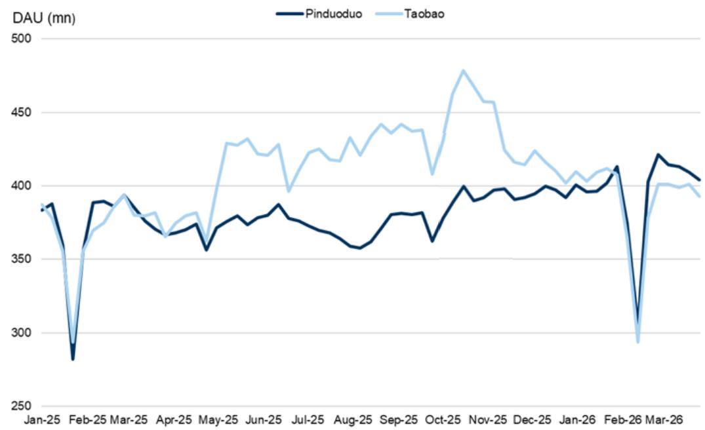  
Exhibit 1: China eCommerce app DAU (mn): PDD catches up with Taobao since Feb 2026   
Source: QuestMobile

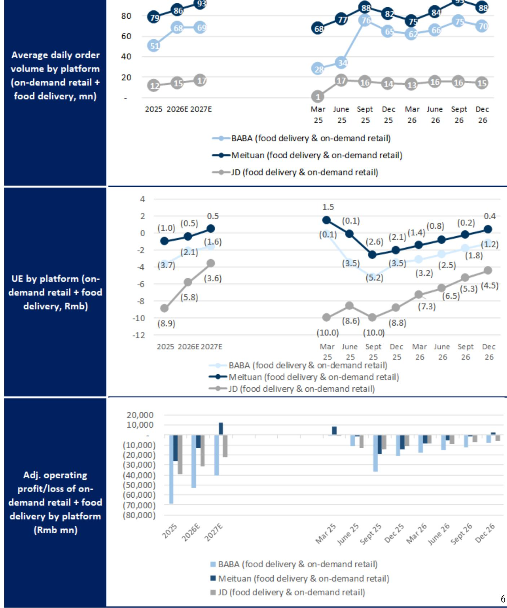  
Exhibit 2: Food delivery $^ +$ on-demand retail daily order volume (mn), UE (Rmb) and operating profit/loss by platform

Exhibit 3: We see underlying TTG profit decline trends have narrowed sequentially   

<table><tr><td></td><td>1QFY25</td><td>2QFY25</td><td>3QFY25</td><td>4QFY25</td><td>1QFY26</td><td>2QFY263QFY26 4QFY26E</td><td></td><td></td></tr><tr><td>Taobao-TmallGMV growth yoy</td><td>8%</td><td>2%</td><td>4%</td><td> 5%</td><td> 5%</td><td>6%</td><td> -2%</td><td> 5%</td></tr><tr><td>Taobao-TmallCMR growth yoy</td><td>2%</td><td>4%</td><td>11%</td><td>12%</td><td>10%</td><td>10%</td><td>1%</td><td>1%</td></tr><tr><td>Gap between Taobao-TmallGMV and Taobao-TmallCMR</td><td>-6%</td><td>2%</td><td>6%</td><td>7%</td><td>5%</td><td>5%</td><td>3%</td><td>-3%</td></tr><tr><td>Taobao-Tmall profit growth yoy</td><td> -1%</td><td>-5%</td><td>2%</td><td>8%</td><td>1%</td><td>5%</td><td>-9%</td><td>0%</td></tr><tr><td>Gap between CMR and TTG profit</td><td>-3% L</td><td>-10%</td><td>-9%</td><td>13%</td><td>-9%</td><td>-5%</td><td>-10%</td><td> -2%</td></tr></table>

Source: Company data, Goldman Sachs Global Investment Research

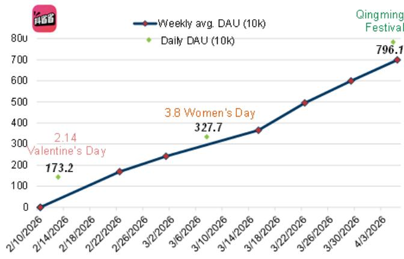  
Exhibit 4: Doushengsheng DAU surge marking intensified local services competition 报添加微信   
Source: QuestMobile

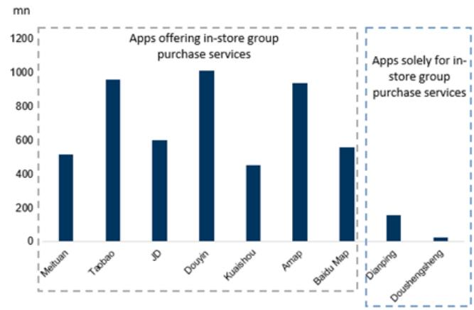  
Exhibit 5: March MAU of apps offering in-store group CD123321Cad purchase services

Source: QuestMobile

  
订阅研报添加微信 LCExhibit 6: Timeline of recent group purchase entrants/events

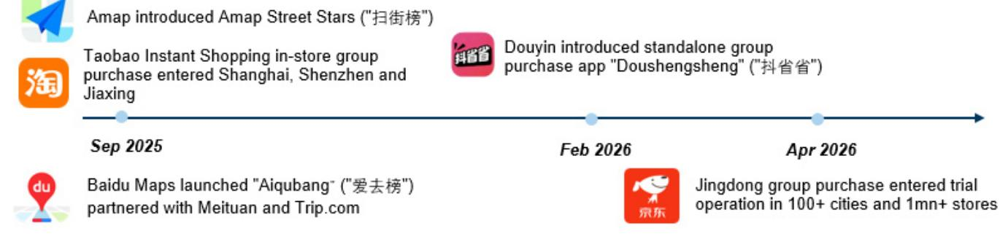  
Source: QuestMobile

# Exhibit 7: We estimate per our industry weekly parcel volume tracker parcel collection volume growth of ${ \tt c } . 2 \%$ yoy in the first 12 days of Apr

Weekly parcel volume tracker

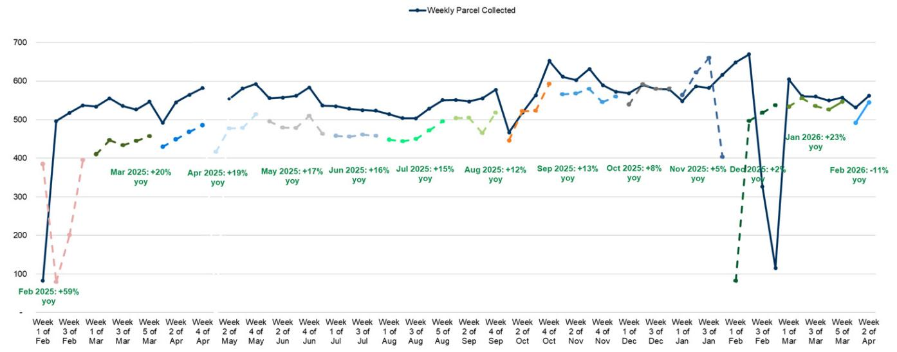  
Note:dotted line denotes average daily parcelvolumes in the same week of the previous year

# Exhibit 8: Potential drivers behind the gap between online retail growth and parcel volume growth

<table><tr><td></td><td>Monthlyparcel volume (reported- yoy)</td><td>NBS online goods (yoy)</td><td>Gap between NBS online goods yoy</td></tr><tr><td>1/1/2025&amp; 2/2025</td><td>22%</td><td>5%</td><td>and parcel yoy -17% (+)trade-in program</td></tr><tr><td>3/2025</td><td>20%</td><td>7%</td><td> -13% (+)trade-in program</td></tr><tr><td>4/2025</td><td>19%</td><td>6%</td><td>-13% (+) trade-in program</td></tr><tr><td>5/2025</td><td>17%</td><td>8%</td><td>-9% (+) trade-in program</td></tr><tr><td>6/2025</td><td>16%</td><td>5%</td><td>-11%(+)trade-in program;(-) 6.18 Shopping Festival frontloaded sales into May</td></tr><tr><td>7/2025</td><td>15%</td><td>8%</td><td>-7% (+) trade-in program</td></tr><tr><td>8/2025</td><td>12%</td><td>7%</td><td>-5% (+) trade-in program; (+/-) sequentially higher delivery fees in Guangdong and Zhejiang</td></tr><tr><td>9/2025</td><td>13%</td><td>7%</td><td>-5% (+)trade-in program; (-) higher base for certain categories; (+/-) sequentially higher delivery fees</td></tr><tr><td>10/2025</td><td>8%</td><td>5%</td><td>3%()oFtiotdedOto;()gseforates;(/)tlleli</td></tr><tr><td>11/2025</td><td>5%</td><td>2%</td><td>-3%()Saleoddctor(beforaaes;(/tals(/eaa</td></tr><tr><td>12/2025</td><td>2%</td><td>1%</td><td>-2%(-)higher base forcertaincategories: (+/-)sequentialy higherdelivery fees; (+/-) eCommerce-related eaxes</td></tr><tr><td>1/2026 &amp; 2/2026</td><td>7%</td><td>10%</td><td> 3% (-) higher base for certain categories; (+/-) sequentialy higher delivery fees; (+/-) eCommerce-related eaxes</td></tr><tr><td>3/2026</td><td>4%</td><td>3%</td><td> -1% (-) higher base for certaincategories; (+/-) sequentiall higher delivery fees; (+/-) eCommerce-related eaxes</td></tr><tr><td></td><td></td><td></td><td></td></tr></table>

Source: MoT, SPB

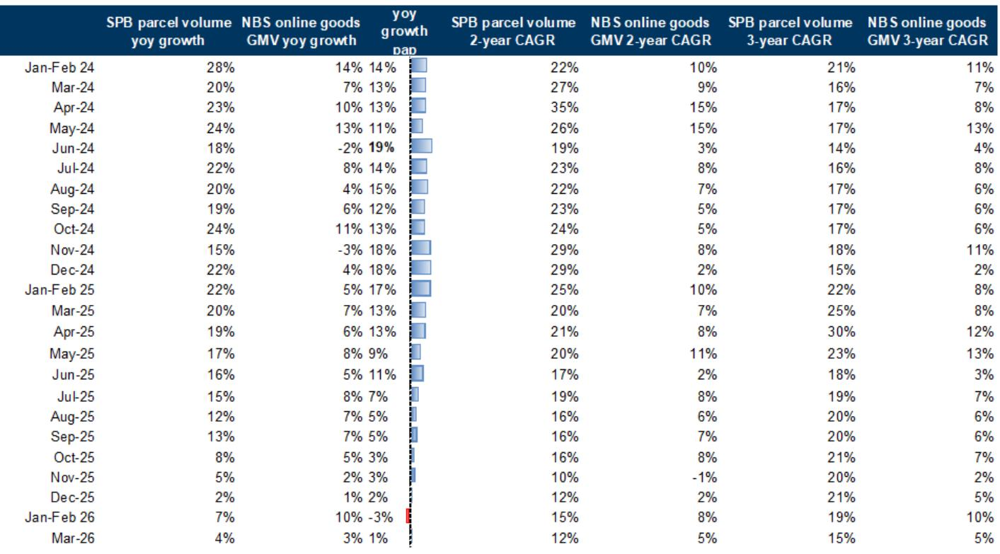  
Source: NBS, SPB, Goldman Sachs Global Investment Research

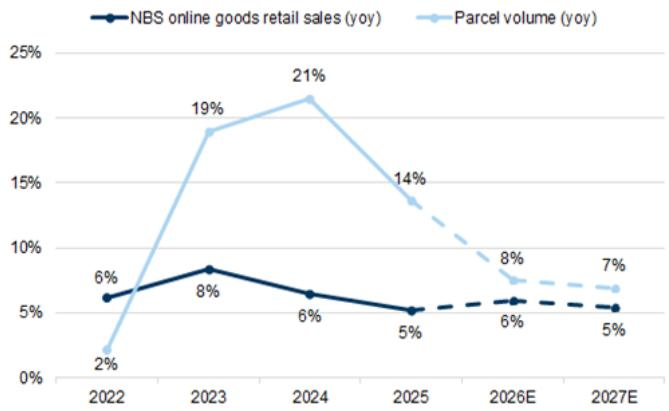  
Exhibit 10: Our estimates for online GMV and parcel volume growth (annual)

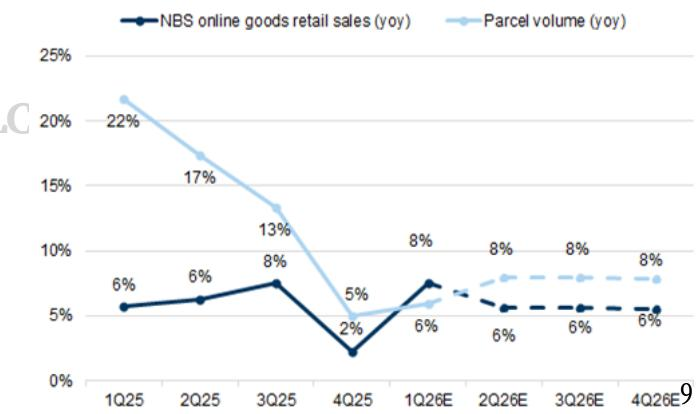  
Exhibit 11: Our estimates for parcel volume growth (quarterly)

of ${ \mathsf { C } } { \cdot } 2 \% .$ , from c. $4 \% / { - } 1 1 \% / { + } 2 3 \%$ yoy in March/February/January.

# On retail categories

Consumer Durables, such as home appliances/communication devices growth came in mix at - $- 5 . 0 \% / + 2 7 . 3 \%$ yoy, from $+ 3 . 3 \% / + 1 7 . 8 \%$ yoy in Jan-Feb, and furniture decelerated at $- 8 . 7 \%$ yoy, vs. $+ 8 . 8 \%$ yoy in Jan-Feb.

Discretionary categories including apparel/cosmetics came in at $+ 7 . 0 \% / + 8 . 3 \%$ yoy, from $+ 1 0 . 4 \% / + 4 . 5 \%$ yoy in Jan-Feb, while sports decelerated at $- 2 . 0 \%$ yoy, vs. $+ 4 . 1 \%$ yoy in Jan-Feb.

Food/beverages growth came in relatively stable at $+ 9 . 5 \% / + 8 . 2 \%$ yoy, vs.   
$+ 1 0 . 2 \% / + 6 . 0 \%$ yoy in Jan-Feb, and medicine growth accelerated at $+ 5 . 7 \%$ yoy vs.   
$+ 0 . 7 \%$ yoy in Jan-Feb.

订阅研报添加微信 LCD123321Caxhibit 14: eCommerce GMV growth comparison across players   

<table><tr><td>GMV growth %</td><td>2020</td><td>2021</td><td>2022</td><td>2023</td><td>2024</td><td>20252026E 2027E</td><td></td><td></td><td>1Q242Q24</td><td>3Q24</td><td>44Q24</td><td>1Q25</td><td>2Q25</td><td></td><td>3Q254Q251Q26E</td><td></td></tr><tr><td>Alibaba</td><td>10%</td><td>8%</td><td>-4%</td><td>1%</td><td>6%</td><td>3%</td><td>2%</td><td>2%</td><td>10%</td><td>8%</td><td>2% 4%</td><td>5%</td><td>5%</td><td>6%</td><td>-2%</td><td>5%</td></tr><tr><td> Gap vs. industry (ppts)</td><td>-4%</td><td>-4%</td><td>-11%</td><td>-8%</td><td>-1%</td><td>-2%</td><td>-4%</td><td>-4%</td><td>-2%</td><td>1%</td><td>-4%</td><td>1%</td><td>-1%</td><td>-1% -2%</td><td>-4%</td><td>-3%</td></tr><tr><td>JD</td><td>25%</td><td>26%</td><td>6%</td><td>5%</td><td>8%</td><td>9%</td><td>3%</td><td>5%</td><td>9%</td><td>3%</td><td>7% 12%</td><td>13%</td><td>20%</td><td>10%</td><td>-2%</td><td>2%</td></tr><tr><td> Gap vs. industry (ppts)</td><td>10%</td><td>14%</td><td>-1%</td><td>-4%</td><td>1%</td><td>4%</td><td>-3%</td><td>0%</td><td>-3%</td><td>-3%</td><td>1% 9%</td><td>8%</td><td>13%</td><td>2%</td><td>-5%</td><td>-6%</td></tr><tr><td> -Amongst which JD direct sales (1P)</td><td>28%</td><td>25%</td><td>6%</td><td>1%</td><td>7%</td><td>10%</td><td>4%</td><td>5%</td><td>7%</td><td>0%</td><td>5% 14%</td><td>16%</td><td>21%</td><td>10%</td><td>-3%</td><td>-1%</td></tr><tr><td> Gap vs. industry (ppts)</td><td>13%</td><td>13%</td><td>0%</td><td>-8%</td><td>0%</td><td>5%</td><td> -2%</td><td>0%</td><td>-5%</td><td>-6%</td><td>-1% 10%</td><td>11%</td><td>14%</td><td>3%</td><td>-5%</td><td>-8%</td></tr><tr><td>Pinduoduo</td><td>66%</td><td>46%</td><td>22%</td><td>30%</td><td>20%</td><td> 11%</td><td>8%</td><td>5%</td><td>27%</td><td>20%</td><td>18%</td><td>17%</td><td>13%</td><td>15% 11%</td><td>7%</td><td>9%</td></tr><tr><td> Gap vs. industry (ppts)</td><td>51%</td><td>34%</td><td>16%</td><td>21%</td><td>33%</td><td>6%</td><td>2%</td><td>0%</td><td>15%</td><td>13%</td><td>12% 14%</td><td></td><td>7% 9%</td><td>3%</td><td>5%</td><td>2%</td></tr><tr><td>Douyin</td><td></td><td>73%</td><td>92%</td><td>55%</td><td>28%</td><td>30%</td><td>21%</td><td>15%</td><td>49%</td><td>29%</td><td>24% 19%</td><td>28%</td><td>38%</td><td>30%</td><td>26%</td><td>21%</td></tr><tr><td> Gap vs. industry (ppts)</td><td></td><td>61%</td><td>85%</td><td>47%</td><td>21%</td><td>25%</td><td>15%</td><td>10%</td><td>37%</td><td>23% 18%</td><td>15%</td><td>22%</td><td>32%</td><td>22%</td><td>23%</td><td>14%</td></tr><tr><td>Kuaishou</td><td>539%</td><td>78%</td><td>33%</td><td>31%</td><td>17%</td><td>15%</td><td>8%</td><td>9%</td><td>28%</td><td>15%</td><td>15%</td><td>14%</td><td>15% 18%</td><td>15%</td><td>13%</td><td>8%</td></tr><tr><td> Gap vs. industry (ppts)</td><td>524%</td><td>66%</td><td>26%</td><td>23%</td><td>11%</td><td>10%</td><td>2%</td><td>3%</td><td>17%</td><td>9%</td><td>9% 11%</td><td></td><td>10% 11%</td><td>8%</td><td>11%</td><td>0%</td></tr><tr><td>WeChat Video Account</td><td></td><td></td><td></td><td>290%</td><td>192%</td><td>83%</td><td>50%</td><td>30%</td><td>300%300%</td><td>200%</td><td>112%</td><td>88%</td><td>70%</td><td>75%</td><td>96%</td><td>47%</td></tr><tr><td> Gap vs. industry (ppts)</td><td></td><td></td><td></td><td></td><td>186%</td><td></td><td>77%44%</td><td>25%</td><td></td><td>288% 294%194%109%</td><td></td><td>82%</td><td>64%</td><td>67%</td><td>93%</td><td>39%</td></tr><tr><td> Vipshop</td><td>11%</td><td>16%</td><td>-8%</td><td>19%</td><td>1%</td><td>2%</td><td>4%</td><td>2%</td><td>8%</td><td>0%</td><td>-6% </td><td>0%</td><td>0%</td><td>2% 7%</td><td>1%</td><td>4%</td></tr><tr><td> Gap vs. industry (ppts)</td><td>-4%</td><td>4%</td><td>-15%</td><td>10%</td><td>-6%</td><td>-3%</td><td>-2%</td><td>-3%</td><td>-4%</td><td>-6% 6-12%</td><td>-4%</td><td>-6%</td><td>-5%</td><td>0%</td><td>-2%</td><td>-4%</td></tr><tr><td>NBS Industry online goods GMV</td><td>15%</td><td>12%</td><td>6%</td><td>8%</td><td>6%</td><td>5%</td><td>6%</td><td>5%</td><td>12%</td><td>6%</td><td>6%</td><td>4%</td><td>6% 6%</td><td>8%</td><td>2%</td><td>8%</td></tr><tr><td>Parcel volume yoy</td><td>31%</td><td>30%</td><td>2%</td><td>19%</td><td>21%</td><td>14%</td><td>8%</td><td>7%</td><td>25%</td><td>21%</td><td>20%</td><td>20%</td><td>22%</td><td>17% 13%</td><td></td><td>5% 6%</td></tr></table>

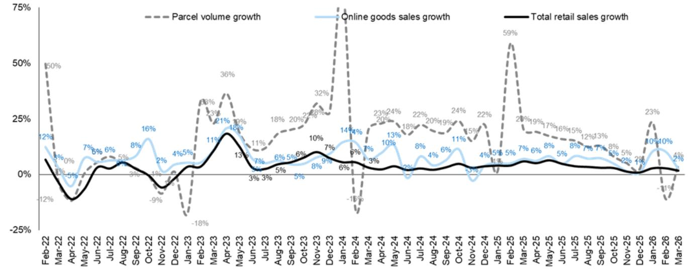  
Exhibit 17: Online retail goods sales growth decelerated at $+ 2 . 5 \%$ in March vs. $+ 1 0 . 3 \%$ in Jan-Feb Total retail sales, online retail goods sales & express parcel volumes

Source: National Bureau of Statistics

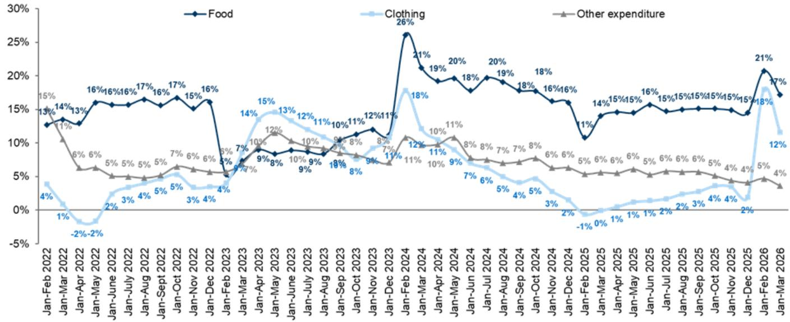  
Exhibit 18: Spending on food and clothing +17% and +12% yoy for March Online retail sales by spending purpose

Source: National Bureau of Statistics

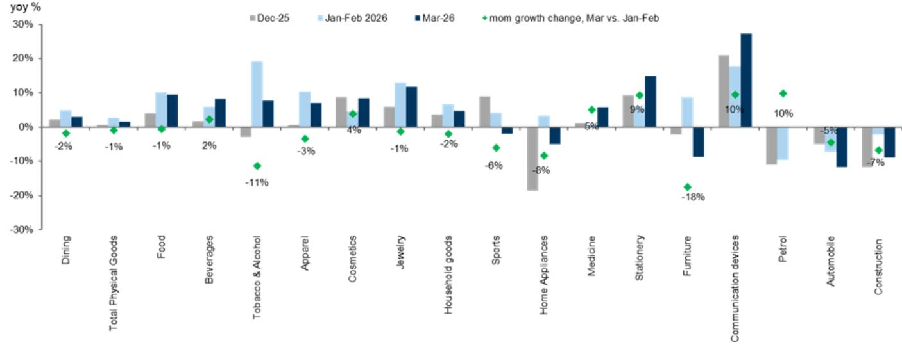  
Exhibit 19: Total retail sales by category   
Source: National Bureau of Statistics

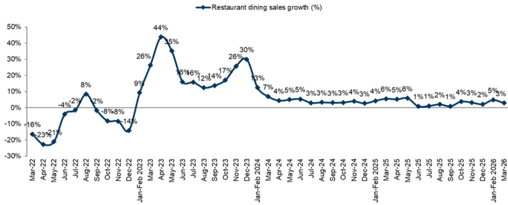  
Exhibit 20: Restaurant dining sales at $+ 3 \%$ yoy in March (vs. $+5 \%$ yoy in Jan-Feb)

Source: National Bureau of Statistics

Exhibit 21: eCommerce: The top 50 eCommerce apps’ time spent increased by $+ 1 1 \%$ yoy in Mar. Taobao/PDD/JD’s time spent increased by $+ 8 \% / + 1 1 \% / + 2 7 \%$ yoy.   

<table><tr><td>E-commerce</td><td>Timespent % yoy</td><td>2025-03</td><td>2025-04</td><td>2025-05</td><td>2025-06</td><td>2025-07</td><td>2025-08</td><td>2025-09</td><td>2025-10</td><td>2025-11</td><td>2025-12</td><td>2026-01</td><td>2026-02</td><td></td><td>2026-03</td></tr><tr><td>Taobao</td><td>淘宝</td><td>-18%</td><td>-16%</td><td>-5%</td><td>3%</td><td>11%</td><td>17%</td><td></td><td>14%</td><td>11%</td><td>12%</td><td>9%</td><td>22%</td><td>-3%</td><td>8%</td></tr><tr><td>Pinduoduo</td><td>拼多多</td><td>12%</td><td>11%</td><td>8%</td><td>9%</td><td>5%</td><td>2%</td><td></td><td>4%</td><td>6%</td><td>6%</td><td>5%</td><td>20%</td><td>2%</td><td>11%</td></tr><tr><td>JD</td><td>京东</td><td>26% 面</td><td>56% □</td><td>87%</td><td>□ 63%</td><td>□ 76%</td><td>1 61%</td><td>1</td><td>46%</td><td>38%</td><td>39% 1</td><td>38%</td><td>36%</td><td>33%</td><td>27%</td></tr><tr><td> Xianyu</td><td>闲鱼</td><td>3%</td><td>-3%</td><td>4%</td><td>6%</td><td>3%</td><td>4%</td><td></td><td>3%</td><td>2%</td><td>4%</td><td>9%</td><td>24%</td><td>-9%</td><td>7%</td></tr><tr><td>Taobao Deals</td><td>淘宝特价版</td><td>29%</td><td>10%</td><td>0%</td><td>-6%</td><td>-14%</td><td>-22%</td><td></td><td>-21%</td><td>-24%</td><td>-22%</td><td>-30% 1</td><td>-25% 1</td><td>-42% 1</td><td>-39%</td></tr><tr><td>Diantao</td><td>点淘</td><td>-13%</td><td>-16%</td><td>-3%</td><td>-5%</td><td>-14%</td><td>-7%</td><td></td><td>-5%</td><td>-7%</td><td>-9%</td><td>-10%</td><td>5%</td><td>-12%</td><td>-11%</td></tr><tr><td>VIP</td><td>唯品会</td><td>-7%</td><td>0%</td><td>0%</td><td>2%</td><td>0%</td><td>1%</td><td></td><td>2%</td><td>-2%</td><td>-3%</td><td>-13%</td><td>5%</td><td>5%</td><td>-10%</td></tr><tr><td>Dewu</td><td>得物</td><td>-9%</td><td>-9%</td><td>-14%</td><td>-10%</td><td>-14%</td><td>-14%</td><td>-12%</td><td></td><td>-15%</td><td>-16%</td><td>-21%</td><td>-22%</td><td>-19% 1</td><td>-27%</td></tr><tr><td>Tmall</td><td>天猫</td><td>18%</td><td>15%</td><td>10%</td><td>7%</td><td>14%</td><td>9%</td><td></td><td>2%</td><td>-3%</td><td>-7%</td><td>-6%</td><td>0% 1</td><td>-24% 1</td><td>-21%</td></tr><tr><td>Douyin Mall Total E-commerce</td><td>抖音商城</td><td>N.M.</td><td>N.M.&#x27; 3%</td><td>2800% 10%</td><td>846% 13%</td><td>401% 14%</td><td>256% 13%</td><td></td><td>190% 12%</td><td>156% 11%</td><td>149% 11%</td><td>147% 10%</td><td>180% 22%</td><td>99% 3%</td><td>121% 11%</td></tr><tr><td></td><td></td><td>1%</td><td></td><td></td><td></td><td></td><td></td><td></td><td></td><td></td><td></td><td></td><td></td><td></td><td></td></tr></table>

<table><tr><td>E-commerce</td><td>Timespent % share</td><td>2025-03</td><td>2025-04</td><td>2025-05</td><td>2025-06</td><td>2025-07</td><td></td><td>2025-08</td><td>2025-09</td><td>2025-10</td><td>2025-11</td><td>2025-12</td><td>2026-01</td><td>2026-02</td><td>2026-03</td><td></td></tr><tr><td>Taobao</td><td>淘宝</td><td> 32%</td><td>32%</td><td></td><td></td><td></td><td> 34%</td><td> 36%</td><td> 35%</td><td> 37%</td><td> 35%</td><td> 33%</td><td></td><td></td><td>31%</td><td>Mas</td></tr><tr><td>PDD</td><td>拼多多</td><td> 44%</td><td> 43%</td><td>34% 39%</td><td>33% 39%</td><td></td><td></td><td> 40%</td><td> 40%</td><td>38%</td><td>40% </td><td> 42%</td><td>32% 44%</td><td>30% 44%</td><td> 44%</td><td></td></tr><tr><td>JD</td><td>京东</td><td>9%</td><td>11%</td><td>14%</td><td>14%</td><td></td><td></td><td>12%</td><td>12%</td><td>12%</td><td>13%</td><td>11%</td><td>11%</td><td>12%</td><td>11%</td><td>□</td></tr><tr><td> Xianyu</td><td>闲鱼</td><td>7%</td><td>7%</td><td>6%</td><td></td><td>6%</td><td>12% 6%</td><td>6%</td><td>6%</td><td>5%</td><td>6%</td><td>6%</td><td>6%</td><td>6%</td><td>7%</td><td></td></tr><tr><td>Taobao Deals</td><td>淘宝特价版</td><td>0%l</td><td>0%l</td><td></td><td></td><td></td><td>0%l</td><td>0%l</td><td>0%l</td><td>0%l</td><td>0% l</td><td>0% l</td><td>0%l</td><td>0%|</td><td>0%</td><td></td></tr><tr><td>Diantao</td><td>点淘</td><td>1%l</td><td>1%l</td><td>0%l 1%l</td><td>0%l</td><td></td><td>1%l</td><td>1% |</td><td>1%l</td><td>1%l</td><td>1%|</td><td>1%l</td><td>1%l</td><td></td><td>1%</td><td></td></tr><tr><td>VIP</td><td>唯品会</td><td>1% |</td><td>1% l</td><td>1%l</td><td>1%l 1% |</td><td></td><td></td><td></td><td>1%l</td><td>1%l</td><td>1% |</td><td>1% |</td><td>1% |</td><td>1%l 1% |</td><td>1%</td><td></td></tr><tr><td>Dewu</td><td>得物</td><td>1%l</td><td>1%l</td><td>1%l</td><td></td><td></td><td>1% |</td><td>1% |</td><td></td><td>0%|</td><td>0% |</td><td>0% l</td><td>0%l</td><td>1% |</td><td>0%</td><td></td></tr><tr><td>Tmall</td><td>天猫</td><td>0%|</td><td>0%l</td><td>0%l</td><td></td><td>1%| 0% |</td><td>0% l 0% |</td><td>1% | 0% |</td><td>0% 0%l</td><td>0%l</td><td>0% |</td><td>0%|</td><td>0%l</td><td>0% |</td><td>0%</td><td></td></tr><tr><td>Douyin Mall</td><td>抖音商城</td><td>1%</td><td>1%</td><td>1%</td><td></td><td></td><td>1%</td><td>1%</td><td>1%</td><td>1%</td><td>2%</td><td>2%</td><td>2%</td><td>2%</td><td>2%</td><td></td></tr><tr><td></td><td></td><td></td><td></td><td></td><td></td><td></td><td></td><td></td><td></td><td></td><td></td><td></td><td></td><td></td><td></td><td></td></tr></table>

Source: QuestMobile

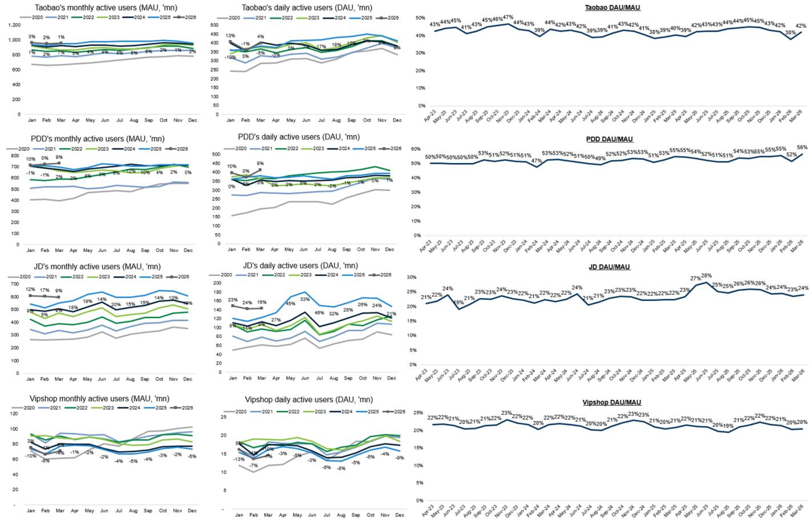  
Exhibit 22: eCommerce platform MAU and DAU trend by company   
We note QuestMobile restated DAU and MAU data from March to July 2023, where MAU is lifted by $1 - 3 \%$ and DAU is lifted by $3 - 1 0 \%$

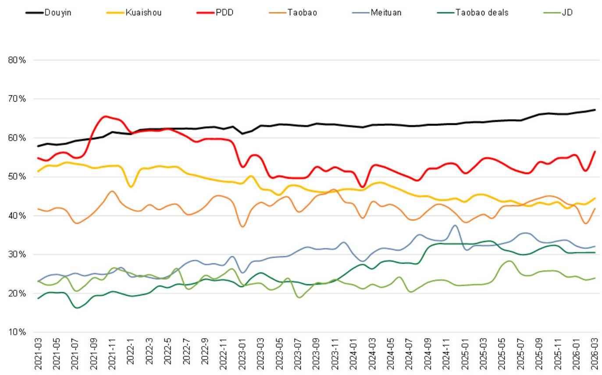  
Exhibit 23: eCommerce platforms: DAU/MAU ratio%   
We note QuestMobile restated DAU and MAU data from Oct to October 2023, where MAU is lifted by $1 - 3 \%$ and DAU is lifted by $3 - 1 0 \%$

Source: QuestMobile

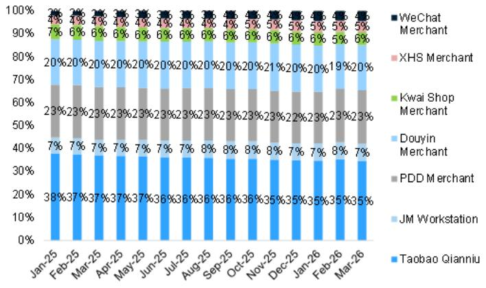  
Exhibit 24: Merchant DAU % share - Douyin merchant DAU % share is $20 \%$ , while Taobao Qianniu DAU $\%$ is at $35 \%$

Source: QuestMobile

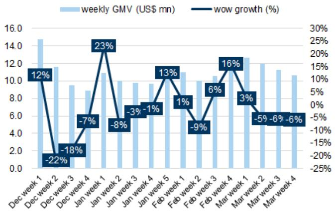  
Exhibit 25: Bloomberg Second measure weekly Temu US Panel Sales   
BBG Second measure weekly Temu US Panel Sales   
Exhibit 26: Bloomberg Second Measure monthly Temu US Panel Sales   
Source: Bloomberg

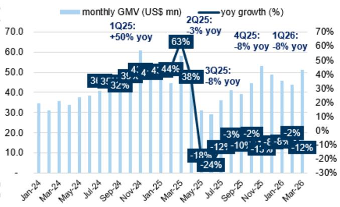  
BBG Second Measure monthly Temu US Panel Sales   
Source: Bloomberg

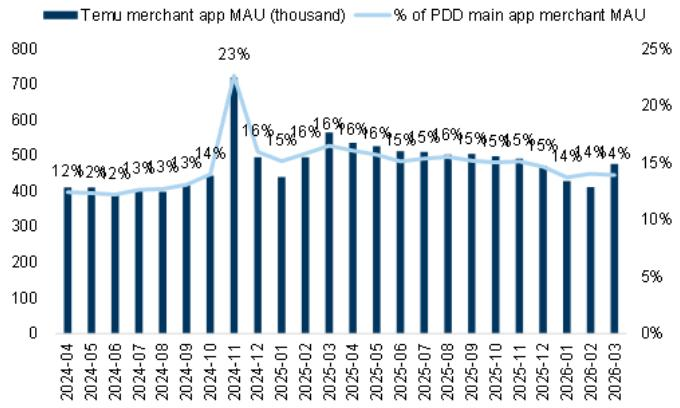  
Exhibit 27: Temu merchants increased $+ 1 6 \%$ mom in March

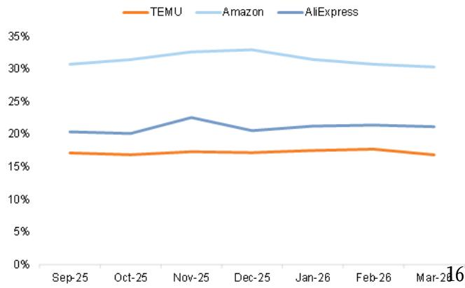  
Exhibit 28: Temu’s DAU/MAU ratio is lower than peers DAU/MAU ratio $( \% )$

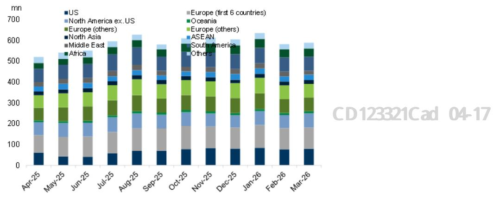  
Exhibit 29: Temu global MAU reached 524mn in Mar 2026 (+2% mom)   
The first 6 European countries include France, Germany, Italy, the Netherlands, Spain, and the UK (launched in April 2023)

Source: SensorTower

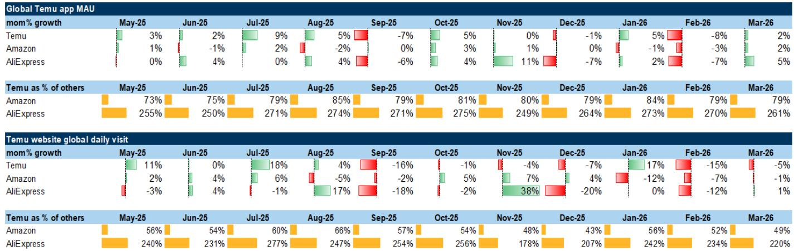  
We note that consumers outside China would access and purchase products from eCommerce platforms through both websites and apps, unlike Chinese consumer who typically only purchase on eCommerce apps, thus we leverage SensorTower to track Temu/Amazon/AliExpress app engagement data, and use Similarweb to track their website monthly visits, as a proxy of their website traffic.

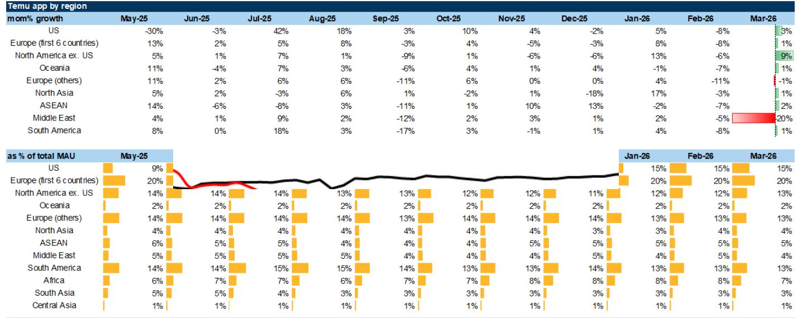  
Source: SensorTower

# Express delivery

Exhibit 32: Parcel volume/ASP trend for key express couriers in China   

<table><tr><td rowspan=1 colspan=8>ZTO Express</td><td rowspan=2 colspan=11>Yunda ExpressDaily     Vol. share   Vol.yoy  Per parcel ASPMonthvol. (mn)(Rmb)   ASP yoy</td></tr><tr><td rowspan=1 colspan=1>Month</td><td rowspan=1 colspan=1>Dailyvol. (mn)</td><td rowspan=1 colspan=3>Vol. share</td><td rowspan=1 colspan=1>Vol. yoy</td><td rowspan=1 colspan=2>Per parcel ASP  ASP yoy(Rmb)</td><td rowspan=1 colspan=4>Month</td></tr><tr><td rowspan=3 colspan=1>Jan-25Feb-25 Jan-Feb 2025</td><td rowspan=3 colspan=1>94.9</td><td rowspan=4 colspan=3>18.9%</td><td rowspan=4 colspan=1>19%</td><td rowspan=4 colspan=1>1.25</td><td rowspan=3 colspan=1>-8%</td><td rowspan=3 colspan=5>Jan-25Feb-25Jan-Feb 2025</td><td rowspan=1 colspan=1>Jan-25</td><td rowspan=1 colspan=1>64.9</td><td rowspan=1 colspan=2>13.5%</td><td rowspan=1 colspan=1>3%</td><td rowspan=1 colspan=1>2.02</td></tr><tr><td rowspan=1 colspan=1>64.6</td><td rowspan=1 colspan=1>13.3%</td><td rowspan=1 colspan=2>70%</td><td rowspan=1 colspan=1>1.95</td><td rowspan=1 colspan=1>-14%</td></tr><tr><td rowspan=1 colspan=1>64.8</td><td rowspan=1 colspan=1>13.4%</td><td rowspan=1 colspan=2>27%</td><td rowspan=1 colspan=1>1.99</td><td rowspan=1 colspan=1>-13%</td></tr><tr><td rowspan=1 colspan=1>Mar-25</td><td rowspan=1 colspan=1></td><td rowspan=1 colspan=1></td><td rowspan=1 colspan=5>Mar-25</td><td rowspan=1 colspan=1>72.7</td><td rowspan=1 colspan=1>13.5%</td><td rowspan=1 colspan=2>17%</td><td rowspan=1 colspan=1>1.96</td><td rowspan=1 colspan=1>-6%</td></tr><tr><td rowspan=2 colspan=1>Apr-25 May-25</td><td rowspan=2 colspan=1>108.2</td><td rowspan=2 colspan=3>19.2%</td><td rowspan=2 colspan=1>17%</td><td rowspan=2 colspan=1>1.18</td><td rowspan=2 colspan=1>-5%</td><td rowspan=2 colspan=5>Apr-25May-25</td><td rowspan=1 colspan=1>72.5</td><td rowspan=1 colspan=1>13.3%</td><td rowspan=1 colspan=2>13%</td><td rowspan=1 colspan=1>1.91</td><td rowspan=1 colspan=1>-7%</td></tr><tr><td rowspan=1 colspan=3>May-25</td><td rowspan=1 colspan=1>74.3</td><td rowspan=1 colspan=1>13.3%</td><td rowspan=1 colspan=2>13%</td><td rowspan=1 colspan=1>1.92</td><td rowspan=1 colspan=1>-5%</td></tr><tr><td rowspan=1 colspan=1>Jun-25</td><td rowspan=1 colspan=1></td><td rowspan=1 colspan=3></td><td rowspan=2 colspan=1>expand</td><td rowspan=2 colspan=1>ng capex</td><td rowspan=2 colspan=1>for the n</td><td rowspan=2 colspan=2>ext</td><td rowspan=2 colspan=3>xt 2+ years</td><td rowspan=2 colspan=1>and stre</td><td rowspan=2 colspan=1>ngthened</td><td rowspan=2 colspan=2>7%8%</td><td rowspan=1 colspan=1>1.91</td><td rowspan=1 colspan=1>-4%</td></tr><tr><td rowspan=1 colspan=1>Jul-25</td><td rowspan=1 colspan=1></td><td rowspan=2 colspan=3>19</td><td rowspan=1 colspan=1>1.91</td><td rowspan=1 colspan=1>-4%</td></tr><tr><td rowspan=7 colspan=1>Aug-25Sep-250ct-25Nov-25Dec-25</td><td rowspan=1 colspan=1>104.1</td><td rowspan=1 colspan=3>19</td><td rowspan=1 colspan=1></td><td rowspan=1 colspan=6>strategies via. its Alibaba</td><td rowspan=1 colspan=3>oken Hub restructuri</td><td rowspan=1 colspan=2>ng.Mear</td><td rowspan=1 colspan=1>9%</td><td rowspan=1 colspan=1>1.92</td></tr><tr><td></td><td></td><td></td><td></td><td></td><td></td><td rowspan=4 colspan=1></td><td rowspan=4 colspan=5>Sep-250ct-25</td><td rowspan=4 colspan=1>70.368.9</td><td></td><td></td><td></td><td rowspan=1 colspan=1>2.02</td><td rowspan=1 colspan=1>0%</td></tr><tr><td rowspan=5 colspan=1>114.8</td><td rowspan=5 colspan=3>19.8%</td><td></td><td></td><td></td><td></td><td></td><td></td><td></td></tr><tr><td rowspan=4 colspan=1>9%</td><td rowspan=4 colspan=1>1.35</td><td></td><td></td><td></td><td></td><td></td></tr><tr><td rowspan=1 colspan=1> 12.1%</td><td rowspan=1 colspan=1></td><td rowspan=1 colspan=1>-5%</td><td rowspan=1 colspan=1>2.11</td><td rowspan=1 colspan=1>4%</td></tr><tr><td rowspan=1 colspan=1>3%</td><td rowspan=1 colspan=5>Nov-25</td><td rowspan=1 colspan=1>72.5</td><td rowspan=1 colspan=1>12.0%</td><td rowspan=1 colspan=1></td><td rowspan=1 colspan=1>-4%</td><td rowspan=1 colspan=1>2.16</td><td rowspan=1 colspan=1>7%</td></tr><tr><td rowspan=1 colspan=1></td><td rowspan=1 colspan=5>Dec-25</td><td rowspan=1 colspan=1>69.3</td><td rowspan=1 colspan=1> 11.8%</td><td rowspan=1 colspan=2>-7%</td><td rowspan=1 colspan=1>2.15</td><td rowspan=1 colspan=1>6%</td></tr><tr><td rowspan=2 colspan=7></td><td rowspan=1 colspan=1></td><td rowspan=1 colspan=5>Jan-26</td><td rowspan=1 colspan=1>72.0</td><td rowspan=1 colspan=1>12.1%</td><td rowspan=1 colspan=2>11%</td><td rowspan=1 colspan=1>2.15</td><td rowspan=1 colspan=1>6%</td></tr><tr><td rowspan=1 colspan=1></td><td rowspan=1 colspan=5>Feb-26</td><td rowspan=1 colspan=1>43.1</td><td rowspan=1 colspan=1>11.0%</td><td rowspan=1 colspan=2>-26%</td><td rowspan=1 colspan=1>2.25</td><td rowspan=1 colspan=1>15%</td></tr></table>

<table><tr><td rowspan=1 colspan=7>YTO ExpressDaily    Vol. share   Vol. yoy  Per parcel ASPMonthvol. (mn)(Rmb)   ASP yoy</td></tr><tr><td rowspan=1 colspan=1>Jan-25</td><td rowspan=1 colspan=1>73.2</td><td rowspan=1 colspan=1>15.2%</td><td rowspan=1 colspan=1>5%</td><td rowspan=1 colspan=1>2.35</td><td rowspan=1 colspan=2>-4%</td></tr><tr><td rowspan=1 colspan=1>Feb-25</td><td rowspan=1 colspan=1>65.9</td><td rowspan=1 colspan=1>13.6%</td><td rowspan=1 colspan=1>49%</td><td rowspan=1 colspan=1>2.32</td><td rowspan=1 colspan=2>-8%</td></tr><tr><td rowspan=1 colspan=1>Jan-Feb 2025</td><td rowspan=1 colspan=1>69.7</td><td rowspan=1 colspan=1>14.4%</td><td rowspan=1 colspan=1>21%</td><td rowspan=1 colspan=1>2.34</td><td rowspan=1 colspan=2>-6%</td></tr><tr><td rowspan=1 colspan=1>Mar-25</td><td rowspan=1 colspan=1>86.0</td><td rowspan=1 colspan=1>16.0%</td><td rowspan=1 colspan=1>22%</td><td rowspan=1 colspan=1>2.18</td><td rowspan=1 colspan=2>-7%</td></tr><tr><td rowspan=1 colspan=1>Apr-25</td><td rowspan=1 colspan=1>89.8</td><td rowspan=1 colspan=1>16.5%</td><td rowspan=1 colspan=1>25%</td><td rowspan=1 colspan=1>2.14</td><td rowspan=1 colspan=2>-7%</td></tr><tr><td rowspan=1 colspan=1> May-25</td><td rowspan=1 colspan=1>89.2</td><td rowspan=1 colspan=1>16.0%</td><td rowspan=1 colspan=1>21%</td><td rowspan=1 colspan=1>2.12</td><td rowspan=1 colspan=1>-5%</td><td rowspan=1 colspan=1></td></tr><tr><td rowspan=1 colspan=1> Jun-25</td><td rowspan=1 colspan=1>87.6</td><td rowspan=1 colspan=1>15.6%</td><td rowspan=1 colspan=1>19%</td><td rowspan=1 colspan=1>2.10</td><td rowspan=1 colspan=1>-7%</td><td rowspan=1 colspan=1></td></tr><tr><td rowspan=1 colspan=1>Jul-25</td><td rowspan=1 colspan=1>83.3</td><td rowspan=1 colspan=1>15.8%</td><td rowspan=1 colspan=1>21%</td><td rowspan=1 colspan=1>2.08</td><td rowspan=1 colspan=1>-7%</td><td rowspan=1 colspan=1></td></tr><tr><td rowspan=1 colspan=1> Aug-25</td><td rowspan=1 colspan=1>81.0</td><td rowspan=1 colspan=1>15.5%</td><td rowspan=1 colspan=1>11%</td><td rowspan=1 colspan=1>2.15</td><td rowspan=1 colspan=1>-1%</td><td rowspan=1 colspan=1></td></tr><tr><td rowspan=1 colspan=1>Sep-25</td><td rowspan=1 colspan=1>87.6</td><td rowspan=1 colspan=1>15.6%</td><td rowspan=1 colspan=1>14%</td><td rowspan=1 colspan=1>2.21</td><td rowspan=1 colspan=1>1%</td><td rowspan=1 colspan=1></td></tr><tr><td rowspan=1 colspan=1>Oct-25</td><td rowspan=1 colspan=1>90.0</td><td rowspan=1 colspan=1>15.9%</td><td rowspan=1 colspan=1>13%</td><td rowspan=1 colspan=1>2.23</td><td rowspan=1 colspan=1>-3%</td><td rowspan=1 colspan=1></td></tr><tr><td rowspan=1 colspan=1>Nov-25</td><td rowspan=1 colspan=1>96.2</td><td rowspan=1 colspan=1>16.0%</td><td rowspan=1 colspan=1>14%</td><td rowspan=1 colspan=1>2.24</td><td rowspan=1 colspan=1>-2%</td><td rowspan=1 colspan=1></td></tr><tr><td rowspan=1 colspan=1>Dec-25</td><td rowspan=1 colspan=1>93.0</td><td rowspan=1 colspan=1>15.8%</td><td rowspan=1 colspan=1>9%</td><td rowspan=1 colspan=1>2.25</td><td rowspan=1 colspan=1>-1%</td><td rowspan=1 colspan=1></td></tr><tr><td rowspan=1 colspan=1>Jan-26</td><td rowspan=1 colspan=1>94.9</td><td rowspan=1 colspan=1>16.0%</td><td rowspan=1 colspan=1>30%</td><td rowspan=1 colspan=1>2.25</td><td rowspan=1 colspan=1>-5%</td><td rowspan=1 colspan=1></td></tr><tr><td rowspan=1 colspan=1>Feb-26</td><td rowspan=1 colspan=1>59.9</td><td rowspan=1 colspan=1>15.3%</td><td rowspan=1 colspan=1>1%</td><td rowspan=1 colspan=1>2.40</td><td rowspan=1 colspan=1>3%</td><td rowspan=1 colspan=1></td></tr><tr><td rowspan=1 colspan=1>Jan-Feb 2026</td><td rowspan=1 colspan=1>81.4</td><td rowspan=1 colspan=1>15.7%</td><td rowspan=1 colspan=1>17%</td><td rowspan=1 colspan=1>2.31</td><td rowspan=1 colspan=1>-2%</td><td rowspan=1 colspan=1></td></tr></table>

<table><tr><td rowspan=1 colspan=6>STO ExpressDaily                Vol. yoy  Per parcel ASPMonthVol. sharevol. (mn)(Rmb)   ASP yoy</td></tr><tr><td rowspan=1 colspan=1>Jan-25</td><td rowspan=1 colspan=1>65.3</td><td rowspan=1 colspan=1>13.6%</td><td rowspan=1 colspan=1>12%</td><td rowspan=1 colspan=1>2.06</td><td rowspan=1 colspan=1>-6%</td></tr><tr><td rowspan=1 colspan=1>Feb-25</td><td rowspan=1 colspan=1>60.7</td><td rowspan=1 colspan=1>12.5%</td><td rowspan=1 colspan=1>63%</td><td rowspan=1 colspan=1>2.04</td><td rowspan=1 colspan=1>-9%</td></tr><tr><td rowspan=1 colspan=1> Jan-Feb 2025</td><td rowspan=1 colspan=1>63.1</td><td rowspan=1 colspan=1>13.1%</td><td rowspan=1 colspan=1>31%</td><td rowspan=1 colspan=1>2.05</td><td rowspan=1 colspan=1>-7%</td></tr><tr><td rowspan=1 colspan=1>Mar-25</td><td rowspan=1 colspan=1>67.3</td><td rowspan=1 colspan=1>12.5%</td><td rowspan=1 colspan=1>20%</td><td rowspan=1 colspan=1>2.01</td><td rowspan=1 colspan=1>-4%</td></tr><tr><td rowspan=1 colspan=1>Apr-25</td><td rowspan=1 colspan=1>69.7</td><td rowspan=1 colspan=1>12.8%</td><td rowspan=1 colspan=1>21%</td><td rowspan=1 colspan=1>1.97</td><td rowspan=1 colspan=1>-4%</td></tr><tr><td rowspan=1 colspan=1> May-25</td><td rowspan=1 colspan=1>73.0</td><td rowspan=1 colspan=1>13.1%</td><td rowspan=1 colspan=1>16%</td><td rowspan=1 colspan=1>1.95</td><td rowspan=1 colspan=1>-3%</td></tr><tr><td rowspan=1 colspan=1>Jun-25</td><td rowspan=1 colspan=1>72.8</td><td rowspan=1 colspan=1>12.9%</td><td rowspan=1 colspan=1>11%</td><td rowspan=1 colspan=1>1.99</td><td rowspan=1 colspan=1>-1%</td></tr><tr><td rowspan=1 colspan=1>Jul-25</td><td rowspan=1 colspan=1>70.4</td><td rowspan=1 colspan=1>13.3%</td><td rowspan=1 colspan=1>12%</td><td rowspan=1 colspan=1>1.97</td><td rowspan=1 colspan=1>-2%</td></tr><tr><td rowspan=1 colspan=1>Aug-25</td><td rowspan=1 colspan=1>69.3</td><td rowspan=1 colspan=1>13.3%</td><td rowspan=1 colspan=1>11%</td><td rowspan=1 colspan=1>2.07</td><td rowspan=1 colspan=1>3%</td></tr><tr><td rowspan=1 colspan=1>Sep-25</td><td rowspan=1 colspan=1>72.9</td><td rowspan=1 colspan=1>13.0%</td><td rowspan=1 colspan=1>9%</td><td rowspan=1 colspan=1>2.12</td><td rowspan=1 colspan=1>5%</td></tr><tr><td rowspan=1 colspan=1>Oct-25</td><td rowspan=1 colspan=1>73.3</td><td rowspan=1 colspan=1>12.9%</td><td rowspan=1 colspan=1>4%</td><td rowspan=1 colspan=1>2.18</td><td rowspan=1 colspan=1>8%</td></tr><tr><td rowspan=1 colspan=1>Nov-25</td><td rowspan=1 colspan=1>83.4</td><td rowspan=1 colspan=1>13.9%</td><td rowspan=1 colspan=1>15%</td><td rowspan=1 colspan=1>2.41</td><td rowspan=1 colspan=1>16%</td></tr><tr><td rowspan=1 colspan=1>Dec-25</td><td rowspan=1 colspan=1>80.7</td><td rowspan=1 colspan=1>13.7%</td><td rowspan=1 colspan=1>11%</td><td rowspan=1 colspan=1>2.33</td><td rowspan=1 colspan=1>15%</td></tr><tr><td rowspan=1 colspan=1>Jan-26</td><td rowspan=1 colspan=1>81.9</td><td rowspan=1 colspan=1>13.8%</td><td rowspan=1 colspan=1>26%</td><td rowspan=1 colspan=1>2.35</td><td rowspan=1 colspan=1>14%</td></tr><tr><td rowspan=1 colspan=1>Feb-26</td><td rowspan=1 colspan=1>51.6</td><td rowspan=1 colspan=1>13.2%</td><td rowspan=1 colspan=1>-6%</td><td rowspan=1 colspan=1>2.44</td><td rowspan=1 colspan=1>20%</td></tr><tr><td rowspan=1 colspan=1>Jan-Feb 2026</td><td rowspan=1 colspan=1>70.2</td><td rowspan=1 colspan=1>13.6%</td><td rowspan=1 colspan=1>11%</td><td rowspan=1 colspan=1>2.39</td><td rowspan=1 colspan=1>16%</td></tr></table>

Source: Company data

<table><tr><td rowspan=2 colspan=6>S.F.Month       Daily    Vol. share   Vol. yoy  Per parcel ASPvol. (mn)(Rmb)  ASP yoy</td></tr><tr><td rowspan=1 colspan=1>ASP yoy</td></tr><tr><td rowspan=1 colspan=1>Jan-25</td><td rowspan=1 colspan=1>42.9</td><td rowspan=1 colspan=1>8.9%</td><td rowspan=1 colspan=1>16%</td><td rowspan=1 colspan=1>15.61</td><td rowspan=1 colspan=1>-8%</td></tr><tr><td rowspan=1 colspan=1>Feb-25</td><td rowspan=1 colspan=1>32.7</td><td rowspan=1 colspan=1> 6.7%</td><td rowspan=1 colspan=1>18%</td><td rowspan=1 colspan=1>14.35</td><td rowspan=1 colspan=1>-12%</td></tr><tr><td rowspan=1 colspan=1>Jan-Feb 2025</td><td rowspan=1 colspan=1>38.1</td><td rowspan=1 colspan=1>7.9%</td><td rowspan=1 colspan=1>17%</td><td rowspan=1 colspan=1>15.10</td><td rowspan=1 colspan=1>-10%</td></tr><tr><td rowspan=1 colspan=1>Mar-25</td><td rowspan=1 colspan=1>41.8</td><td rowspan=1 colspan=1>7.8%</td><td rowspan=1 colspan=1>25%</td><td rowspan=1 colspan=1>13.82</td><td rowspan=1 colspan=1>-12%</td></tr><tr><td rowspan=1 colspan=1>Apr-25</td><td rowspan=1 colspan=1>44.5</td><td rowspan=1 colspan=1>8.2%</td><td rowspan=1 colspan=1>30%</td><td rowspan=1 colspan=1>13.49</td><td rowspan=1 colspan=1>-14%</td></tr><tr><td rowspan=1 colspan=1>May-25</td><td rowspan=1 colspan=1>47.6</td><td rowspan=1 colspan=1>8.5%</td><td rowspan=1 colspan=1>32%</td><td rowspan=1 colspan=1>13.12</td><td rowspan=1 colspan=1>-14%</td></tr><tr><td rowspan=1 colspan=1>Jun-25</td><td rowspan=1 colspan=1>48.7</td><td rowspan=1 colspan=1>8.7%</td><td rowspan=1 colspan=1>32%</td><td rowspan=1 colspan=1>13.67</td><td rowspan=1 colspan=1>-13%</td></tr><tr><td rowspan=1 colspan=1>Jul-25</td><td rowspan=1 colspan=1>44.4</td><td rowspan=1 colspan=1>8.4%</td><td rowspan=1 colspan=1>34%</td><td rowspan=1 colspan=1>13.55</td><td rowspan=1 colspan=1>-14%</td></tr><tr><td rowspan=1 colspan=1>Aug-25</td><td rowspan=1 colspan=1>45.4</td><td rowspan=1 colspan=1>8.7%</td><td rowspan=1 colspan=1>35%</td><td rowspan=1 colspan=1>13.27</td><td rowspan=1 colspan=1>-15%</td></tr><tr><td rowspan=1 colspan=1>Sep-25</td><td rowspan=1 colspan=1>50.1</td><td rowspan=1 colspan=1>8.9%</td><td rowspan=1 colspan=1>32%</td><td rowspan=1 colspan=1>13.87</td><td rowspan=1 colspan=1>-13%</td></tr><tr><td rowspan=1 colspan=1>0ct-25</td><td rowspan=1 colspan=1>49.2</td><td rowspan=1 colspan=1>8.7%</td><td rowspan=1 colspan=1>26%</td><td rowspan=1 colspan=1>13.18</td><td rowspan=1 colspan=1>-10%</td></tr><tr><td rowspan=1 colspan=1>Nov-25</td><td rowspan=1 colspan=1>51.1</td><td rowspan=1 colspan=1>8.5%</td><td rowspan=1 colspan=1>20%</td><td rowspan=1 colspan=1>13.47</td><td rowspan=1 colspan=1>-9%</td></tr><tr><td rowspan=1 colspan=1>Dec-25</td><td rowspan=1 colspan=1>47.6</td><td rowspan=1 colspan=1>8.1%</td><td rowspan=1 colspan=1>9%</td><td rowspan=1 colspan=1>13.81</td><td rowspan=1 colspan=1>-5%</td></tr><tr><td rowspan=1 colspan=1>Jan-26</td><td rowspan=1 colspan=1>44.7</td><td rowspan=1 colspan=1>7.5%</td><td rowspan=1 colspan=1>4%</td><td rowspan=1 colspan=1>14.72</td><td rowspan=1 colspan=1>-6%</td></tr><tr><td rowspan=1 colspan=1>Feb-26</td><td rowspan=1 colspan=1>34.6</td><td rowspan=1 colspan=1>8.9%</td><td rowspan=1 colspan=1>17%</td><td rowspan=1 colspan=1>15.32</td><td rowspan=1 colspan=1>7%</td></tr><tr><td rowspan=1 colspan=1>Jan-Feb 2026</td><td rowspan=1 colspan=1>41.7</td><td rowspan=1 colspan=1>8.1%</td><td rowspan=1 colspan=1>9%</td><td rowspan=1 colspan=1>14.98</td><td rowspan=1 colspan=1>-1%</td></tr></table>

<table><tr><td rowspan=1 colspan=6>J&amp;TDaily                Vol.yoy  Per parcel ASPMonthvol. (mn)(Rmb)  ASP yoyVol. share</td></tr><tr><td rowspan=1 colspan=1>Jan-25</td><td rowspan=2 colspan=1>55.4</td><td rowspan=2 colspan=1>11.0%</td><td rowspan=2 colspan=1>28%</td><td rowspan=3 colspan=1>2.13</td><td rowspan=3 colspan=1>-13%</td></tr><tr><td rowspan=1 colspan=1>Feb-25Jan-Feb 2025Mar-25</td></tr><tr><td rowspan=1 colspan=1>Apr-25May-25 Jun-25</td><td rowspan=1 colspan=1>61.7</td><td rowspan=1 colspan=1>11.1%</td><td rowspan=1 colspan=1>15%</td></tr><tr><td rowspan=1 colspan=1>Jul-25Aug-25Sep-25</td><td rowspan=1 colspan=1>60.6</td><td rowspan=1 colspan=1>11.3%</td><td rowspan=1 colspan=1>10%</td><td rowspan=2 colspan=1>2.20</td><td rowspan=2 colspan=1>-1%</td></tr><tr><td rowspan=1 colspan=1>Oct-25Nov-25Dec-25</td><td rowspan=1 colspan=1>64.0</td><td rowspan=1 colspan=1>10.9%</td><td rowspan=1 colspan=1>0%</td></tr><tr><td rowspan=1 colspan=1>Jan-26Feb-26Mar-26</td><td rowspan=1 colspan=1>60.0</td><td rowspan=1 colspan=1></td><td rowspan=1 colspan=1>8%</td><td rowspan=1 colspan=1></td><td rowspan=1 colspan=1></td></tr></table>

订阅研报添加微信 LCD123321Cad 04-17 Estimate changes: Alibaba, JD, and Meituan

For Alibaba, we cut our FY26-28E adj. net profit by $- 1 5 \% \sim - 1 6 \%$ on higher AI investments (mainly in “all others” segment), with an unchanged TP at $\cup { \mathsf { S } } \$ 18 6/ { \mathsf { H K } } \$ 18 0$ . For JD, we fine-tune our FY26-28E adj. net profit by $- 6 \sim 9 \%$ on higher new businesses losses, partially offset by higher below-the-line items (share of results of equity investees). TP remains unchanged at $\mathsf { U S } \$ 43/\mathsf { H K } \$ 169.$ . For Meituan, we cut our FY26-28E adj. net profit by $- 4 \% \sim - 3 8 3 \%$ on higher AI-related investments (e.g. LongCat LLM, in-app AI agent, etc.) and lower IHT profit on intensifying competition, with an

Exhibit 33: Alibaba by segment performance and our estimates   

<table><tr><td>Bysegment (Rmb mn)</td><td>FY23</td><td>FY24</td><td>FY25</td><td>FY26E</td><td>FY27E</td><td>FY28E</td></tr><tr><td>Group revenue</td><td>869,415</td><td>941,168</td><td>996,347</td><td>1,026,014</td><td>1,130,070</td><td>1,240,786</td></tr><tr><td>yoy %</td><td>2%</td><td>8%</td><td>6%</td><td>3%</td><td>10%</td><td>10%</td></tr><tr><td>Group EBITA</td><td>147,911</td><td>165,028</td><td>173,065</td><td>76,506</td><td>101,072</td><td>143,597</td></tr><tr><td> EBITA margin %</td><td>17%</td><td>18%</td><td>17%</td><td>7%</td><td>9%</td><td>12%</td></tr><tr><td>yoy %</td><td></td><td>12%</td><td>5%</td><td>-56%</td><td>32%</td><td>42%</td></tr><tr><td>Adj. net profit attributable to s hareholders</td><td>143,991</td><td>158,359</td><td>157,940</td><td> 67.012</td><td>93,317</td><td>128,932</td></tr><tr><td> Adj. net margin %</td><td>17%</td><td>17%</td><td>16%</td><td>7%</td><td>8%</td><td>10%</td></tr><tr><td>yoy %</td><td></td><td>10%</td><td>0%</td><td>-58%</td><td>39%</td><td>38%</td></tr><tr><td>Non-gaap EPS (Rmb)</td><td> 54.56</td><td>62.35</td><td>65.81</td><td>28.49</td><td>40.69</td><td> 57.37</td></tr><tr><td>yoy %</td><td>4%</td><td>14%</td><td>6%</td><td>-57%</td><td>43%</td><td>41%</td></tr></table>

<table><tr><td>GMV (GSe)</td><td>7,417</td><td>7,699</td><td>8,073</td><td>8.317</td><td>8,467</td><td>8,620</td></tr><tr><td>yoy %</td><td></td><td>4%</td><td>5%</td><td>3%</td><td>2%</td><td>2%</td></tr><tr><td>China e-commerce busines s group revenue yoy %*</td><td></td><td></td><td>503,042</td><td>556,759 11%</td><td>599,567 8%</td><td>625,177 4%</td></tr><tr><td>Customer management revenue (CMR)</td><td>290,378</td><td>304,009</td><td>324,622</td><td>342.979</td><td>351,878</td><td>359,043</td></tr><tr><td>yoy %</td><td></td><td>5%</td><td>7%</td><td>6%</td><td>3%</td><td>2%</td></tr><tr><td> China e-commerce business group EBITA</td><td></td><td></td><td>194,976</td><td>107,453</td><td>148,693</td><td>172,549</td></tr><tr><td>EBITA margin %</td><td></td><td></td><td>38.8%</td><td>19.3%</td><td>24.8%</td><td>27.6%</td></tr><tr><td>yoy %</td><td></td><td></td><td></td><td>-45%</td><td></td><td></td></tr><tr><td></td><td></td><td></td><td>195,848</td><td>193,451</td><td>38% 189,147</td><td>16%</td></tr><tr><td>China e-commerce EBITA excl. Quick Commerce</td><td></td><td></td><td></td><td></td><td>-2%</td><td>191,676</td></tr><tr><td>yoy %</td><td></td><td></td><td>(872)</td><td>-1% (85,998)</td><td>(40,455)</td><td>1%</td></tr><tr><td>Quick Commerce EBITA(losses)</td><td></td><td></td><td></td><td></td><td></td><td>(19,127)</td></tr></table>

<table><tr><td>Cloud IntelligenceGroup</td><td></td><td></td><td></td><td></td><td></td><td></td></tr><tr><td>Revenue</td><td>103,497</td><td>106,374</td><td>118,028</td><td>158,548</td><td>214,425</td><td>270,574</td></tr><tr><td>yoy %</td><td></td><td>3%</td><td>11%</td><td>34%</td><td>35%</td><td>26%</td></tr><tr><td>EBITA</td><td>4,101</td><td>6,121</td><td>10,556</td><td>14,253</td><td>21,443</td><td>29,763</td></tr><tr><td>EBIT A margin %</td><td>4.0%</td><td>5.8%</td><td>8.9%</td><td>9.0%</td><td>10.0%</td><td>11.0%</td></tr><tr><td>AlibabaInternationalDigitalCommerceGroup</td><td></td><td></td><td></td><td></td><td></td><td></td></tr><tr><td>Revenue yoy %</td><td>69,503</td><td>102,598 48%</td><td>132,300 29%</td><td>143,781 9%</td><td>155,439 8%</td><td>167,958 8%</td></tr><tr><td>EBITA</td><td>(4,944)</td><td>(8,035)</td><td>(15,137)</td><td>(1,966)</td><td>(777)</td><td>336</td></tr><tr><td>EBITA margin %</td><td>-7.1%</td><td>-7.8%</td><td> -11.4%</td><td>-1.4%</td><td>-0.5%</td><td>0.2%</td></tr></table>

<table><tr><td colspan="3">Allothers (incl.QwenAlmodel/application)</td><td colspan="3">343,669</td></tr><tr><td colspan="3">Revenue</td><td>253,686</td><td>279,055</td><td>307,357</td></tr><tr><td colspan="3">yoy %</td><td>-26%</td><td>10%</td><td>10%</td></tr><tr><td colspan="3">EBITA</td><td>(33,687)</td><td>(58,602)</td><td>(49,177)</td></tr><tr><td>EBIT A margin %</td><td></td><td>-4.0%</td><td>-13.3%</td><td>-21.0%</td><td>-16.0%</td></tr><tr><td> Share of profit (loss) in investees</td><td>(8,063)</td><td></td><td></td><td></td><td></td></tr><tr><td colspan="3">Ant Financial (33%.1qr lag pick up)</td><td>5,966</td><td>3,766</td><td>8.422</td><td>10,210</td></tr><tr><td rowspan="2">Others</td><td>10,294</td><td>(7.735) 7,860</td><td>12,648</td><td>6,066</td><td>13,098</td><td>14,840</td></tr><tr><td>(5.481)</td><td>(2.154)</td><td>(2.276)</td><td>1,000</td><td>(2.300)</td><td>(2.300)</td></tr></table>

<table><tr><td>1QFY25</td><td>2QFY25</td><td>3QFY25</td><td>4QFY25</td><td>1QFY26</td><td>2QFY26</td><td>3QFY26</td><td>4QFY26E</td></tr><tr><td>243,236</td><td>236.503</td><td>280,154</td><td>236,454</td><td>247 ,652</td><td>247,795</td><td>284,843</td><td>245,724</td></tr><tr><td>4%</td><td>5%</td><td>8%</td><td>7%</td><td>2%</td><td>5%</td><td>2%</td><td>4%</td></tr><tr><td>45,035</td><td>40,561</td><td>54,853</td><td>32,616</td><td>38,844</td><td>9,073</td><td>23,397</td><td>5,192</td></tr><tr><td>19%</td><td>17%</td><td>20%</td><td>14%</td><td>16%</td><td>4%</td><td>8%</td><td>2%</td></tr><tr><td>-1%</td><td>-5%</td><td>4%</td><td>36%</td><td>-14%</td><td>-78%</td><td>-57%</td><td>-84%</td></tr><tr><td>40,265</td><td>36.363</td><td> 51,332</td><td>29,980</td><td>35,291</td><td>10,450</td><td>17,112</td><td>4,159</td></tr><tr><td>17%</td><td>15%</td><td>18%</td><td>13%</td><td>14%</td><td>4%</td><td>6%</td><td>2%</td></tr><tr><td>-10%</td><td>-9%</td><td>7%</td><td>18%</td><td>-12%</td><td>-71%</td><td>-67%</td><td>-86%</td></tr><tr><td>16.44</td><td>15.06</td><td>21.39</td><td>12.52</td><td>14.75</td><td>4.36</td><td>7.09</td><td>1.89</td></tr><tr><td>-5%</td><td>-4%</td><td>13%</td><td>23%</td><td>-10%</td><td>-71%</td><td>-67%</td><td>-85%</td></tr></table>

<table><tr><td>2,103</td><td>1,843</td><td>2,439</td><td>1,688</td><td>2.208</td><td>1,946</td><td>2,390</td><td>1,772</td></tr><tr><td>8%</td><td>2%</td><td>4%</td><td>5%</td><td>5%</td><td>6%</td><td>-2%</td><td>5%</td></tr><tr><td>127,670 1%</td><td>114,773 4%</td><td>150,589 7%</td><td>113,992 8%</td><td>140,072 10%</td><td>132,578 16%</td><td>159,347 6%</td><td>124,762 9%</td></tr><tr><td></td><td></td><td></td><td></td><td></td><td></td><td></td><td></td></tr><tr><td>81,088 2%</td><td>71,667 4%</td><td>101,834 11%</td><td>71,077 12%</td><td>89,252 10%</td><td>78,927 10%</td><td>102,664 1%</td><td>72,136 1%</td></tr><tr><td></td><td></td><td></td><td></td><td></td><td></td><td></td><td></td></tr><tr><td>48,753 38.2%</td><td>44,327</td><td>60,401 40.1%</td><td>41,495</td><td>38,389</td><td>10,497</td><td>34,613</td><td>23,954</td></tr><tr><td>3%</td><td>38.6%</td><td></td><td>36.4%</td><td>27.4%</td><td>7.9%</td><td>21.7%</td><td>19.2%</td></tr><tr><td></td><td>-1%</td><td>6%</td><td>11%</td><td>-21%</td><td>-76%</td><td>-43%</td><td>-42%</td></tr><tr><td>48,810</td><td>44,590</td><td>61,083</td><td>41,749</td><td>49,324</td><td>46,855</td><td>55,543</td><td>41,728</td></tr><tr><td>-1%</td><td>-5%</td><td>2%</td><td>8%</td><td>1%</td><td>5%</td><td>-9%</td><td>0%</td></tr><tr><td>(57)</td><td>(263)</td><td>(298)</td><td>(254)</td><td>(10,935)</td><td>(36,358)</td><td>(20,930)</td><td>(17,774)</td></tr><tr><td>26,549</td><td>29,610</td><td>31,742</td><td>30,127</td><td>33,398</td><td>39,824</td><td>43,284</td><td>42,042</td></tr><tr><td>6%</td><td>7%</td><td>13%</td><td>18%</td><td>26%</td><td>34%</td><td>36%</td><td>40%</td></tr><tr><td>2,337</td><td>2,661</td><td>3,138</td><td>2,420</td><td>2,954</td><td>3,604</td><td>3,911</td><td>3,784</td></tr><tr><td>8.8%</td><td>9.0%</td><td>9.9%</td><td>8.0%</td><td>8.8%</td><td>9.0%</td><td>9.0%</td><td>9.0%</td></tr><tr><td>29,293</td><td>31,672</td><td>37,756</td><td>33,579</td><td>34,741</td><td>34,799</td><td>39,201</td><td>35,040</td></tr><tr><td>32%</td><td>29%</td><td>32%</td><td>22%</td><td>19%</td><td>10%</td><td>4%</td><td>4%</td></tr><tr><td>(3,706)</td><td>(2,905)</td><td>(4,952)</td><td>(3,574)</td><td>(59)</td><td>162</td><td>(2,016)</td><td>(53)</td></tr><tr><td> -12.7%</td><td>-9.2%</td><td>-13.1%</td><td>-10.6%</td><td>-0.2%</td><td>0.5%</td><td>-5.1%</td><td>-0.2%</td></tr></table>

<table><tr><td>81,354 5%</td><td>84,483 6%</td><td>89,234 6%</td><td>84,626 2%</td><td>58,599 -28%</td><td>62,969 -25%</td><td>67,340 -25%</td><td>64,778 -23%</td></tr><tr><td>(1,077)</td><td>(1,833)</td><td>(3,176)</td><td>(7,725)</td><td>(1,415)</td><td>(3,370)</td><td>(9,792)</td><td>(19,110)</td></tr><tr><td>-1.3%</td><td>-2.2%</td><td>-3.6%</td><td>-9.1%</td><td>-2.4%</td><td>-5.4%</td><td>-14.5%</td><td>-29.5%</td></tr><tr><td>1,505</td><td>978</td><td>3,129</td><td>354</td><td>1,013</td><td>2,241</td><td>216</td><td>296</td></tr><tr><td>3,917 (588)</td><td>2,478 (746)</td><td>4,490 39</td><td>1,763 (981)</td><td>1,547 455</td><td>2,733 671</td><td>393 696</td><td>822)</td></tr></table>

Exhibit 35: Meituan yearly & quarterly   

<table><tr><td rowspan=2 colspan=11>margin%                                           35.1% 38.4% 30.6% 29.7% 32.1% 33.1%</td><td></td><td></td><td></td><td></td><td></td><td></td><td></td><td></td></tr><tr><td rowspan=1 colspan=3>37.4% 33.1% 26.4%</td><td rowspan=1 colspan=1>26.2%</td><td rowspan=1 colspan=2>30.6% 28.5%</td><td rowspan=1 colspan=1>29.0%</td><td rowspan=1 colspan=1>30.8%</td></tr><tr><td rowspan=1 colspan=6> Segmental EBIT (CLC + Newinitiatives)                        18,53245,142</td><td rowspan=1 colspan=1>(16,986)</td><td rowspan=1 colspan=1>(3,008)</td><td rowspan=1 colspan=3>32,01339,007</td><td rowspan=1 colspan=3>11,218 1,840(15,349)</td><td rowspan=1 colspan=1>(14,696)</td><td rowspan=1 colspan=2>(6,914)(2,839)</td><td rowspan=1 colspan=1>1,773</td><td rowspan=1 colspan=1>5,028</td></tr><tr><td rowspan=1 colspan=1>yoy%</td><td></td><td rowspan=1 colspan=4>2518% 144%</td><td rowspan=1 colspan=1>-138%</td><td rowspan=1 colspan=1>82%</td><td rowspan=1 colspan=3>1164%  22%</td><td rowspan=1 colspan=3>62% -87%  -213%</td><td rowspan=1 colspan=1>-237%</td><td rowspan=1 colspan=2>-162% -254%</td><td rowspan=1 colspan=1>112%</td><td rowspan=1 colspan=1>134%</td></tr><tr><td rowspan=2 colspan=5>Group adjusted EBIT                                    16,061yoy%                                           3349%</td><td rowspan=1 colspan=9>16,06140.869</td><td rowspan=1 colspan=1>(23,783)</td><td rowspan=1 colspan=1>(13,041)</td><td rowspan=1 colspan=2>21,51229,187</td><td rowspan=1 colspan=1>10,118  399</td></tr><tr><td rowspan=1 colspan=1>154%</td><td rowspan=1 colspan=1>-158%</td><td rowspan=1 colspan=1>45%</td><td rowspan=1 colspan=2>265%</td><td rowspan=1 colspan=1>36%</td><td rowspan=1 colspan=2>62% -97%</td><td rowspan=1 colspan=1>-241%</td><td rowspan=1 colspan=1>-281%</td><td rowspan=1 colspan=1>-178%</td><td rowspan=1 colspan=1>-1616%</td><td rowspan=1 colspan=1>93%</td><td rowspan=1 colspan=1>112%</td></tr><tr><td rowspan=1 colspan=5>margin%                                           5.8%</td><td rowspan=1 colspan=1>12.1%</td><td rowspan=1 colspan=1>-6.5%</td><td rowspan=1 colspan=1>-3.3%</td><td rowspan=1 colspan=2>4.8%</td><td rowspan=1 colspan=1>6.0%</td><td rowspan=1 colspan=2>11.7% 0.4%</td><td rowspan=1 colspan=1>-18.3%</td><td rowspan=1 colspan=1>-18.3%</td><td rowspan=1 colspan=1>-8.6%</td><td rowspan=1 colspan=1>-6.2%</td><td rowspan=1 colspan=1>-1.1%</td><td rowspan=1 colspan=1>2.0%</td></tr><tr><td rowspan=1 colspan=5>Group adjusted net profit                                 23,187</td><td rowspan=1 colspan=1>43,773</td><td rowspan=1 colspan=1>(18,648)</td><td rowspan=1 colspan=1>(5,783)</td><td rowspan=1 colspan=2>25,189</td><td rowspan=1 colspan=1>33,261</td><td rowspan=1 colspan=2>10,949 1,493</td><td rowspan=1 colspan=1>(16,010)</td><td rowspan=1 colspan=1>(15,080)</td><td rowspan=1 colspan=1>(6,093)</td><td rowspan=1 colspan=1>(4,234)</td><td rowspan=1 colspan=1>642</td><td rowspan=1 colspan=1>3,957</td></tr><tr><td rowspan=1 colspan=5>yoy%                                            720%</td><td rowspan=1 colspan=1>89%</td><td rowspan=1 colspan=1>-143%</td><td rowspan=1 colspan=1>69%</td><td rowspan=1 colspan=2>536%</td><td rowspan=1 colspan=1>32%</td><td rowspan=1 colspan=2>46% -89%</td><td rowspan=1 colspan=1>-225%</td><td rowspan=1 colspan=1>-253%</td><td rowspan=1 colspan=1>-156%</td><td rowspan=1 colspan=1>-384%</td><td rowspan=1 colspan=1>104%</td><td rowspan=1 colspan=1>126%</td></tr><tr><td rowspan=1 colspan=5>margin%                                           8.4%</td><td rowspan=1 colspan=1>13.0%</td><td rowspan=1 colspan=1>-5.1%</td><td rowspan=1 colspan=1>-1.5%</td><td rowspan=1 colspan=2>5.7%</td><td rowspan=1 colspan=1>6.8%</td><td rowspan=1 colspan=2>12.6%  1.6%</td><td rowspan=1 colspan=1>-16.8%</td><td rowspan=1 colspan=1>-16.4%</td><td rowspan=1 colspan=1>-6.7%</td><td rowspan=1 colspan=1>-4.3%</td><td rowspan=1 colspan=1>0.6%</td><td rowspan=1 colspan=1>3.9%</td></tr><tr><td rowspan=2 colspan=6>Food delivery&amp; instashopping average dailyordervolume (mn)               60   70yoy%                                             24%  16%</td><td rowspan=1 colspan=1>70</td><td rowspan=1 colspan=1>79</td><td rowspan=1 colspan=2>86</td><td rowspan=1 colspan=1>93</td><td rowspan=1 colspan=1>99</td><td rowspan=1 colspan=2>68   77</td><td rowspan=1 colspan=1>88</td><td rowspan=1 colspan=1>82</td><td rowspan=1 colspan=1>75</td><td rowspan=1 colspan=1>84</td><td rowspan=1 colspan=1>95</td></tr><tr><td rowspan=1 colspan=2>13%   9%</td><td rowspan=1 colspan=3>8%   7%</td><td rowspan=1 colspan=2>12%  13%</td><td rowspan=1 colspan=1>14%</td><td rowspan=1 colspan=1>13%</td><td rowspan=1 colspan=2>10%  9%</td><td rowspan=1 colspan=1>8%</td><td rowspan=1 colspan=1>7%</td></tr><tr><td rowspan=1 colspan=5>Core local commerce                                 2023</td><td rowspan=1 colspan=1>2024</td><td rowspan=1 colspan=1>2025</td><td rowspan=1 colspan=1>2026E</td><td rowspan=1 colspan=2>2027E</td><td rowspan=1 colspan=1>2028E</td><td rowspan=1 colspan=1>1Q25</td><td rowspan=1 colspan=1>2Q25</td><td rowspan=1 colspan=1>3Q25</td><td rowspan=1 colspan=1>4Q25</td><td rowspan=1 colspan=1>1Q26E</td><td rowspan=1 colspan=1>2Q26E</td><td rowspan=1 colspan=1>3Q26E</td><td rowspan=1 colspan=1>4Q26E</td></tr><tr><td rowspan=1 colspan=5>Segmentrevenue                                     206,841</td><td rowspan=1 colspan=1>250,248</td><td rowspan=1 colspan=1>261,953</td><td rowspan=1 colspan=1>273,719</td><td rowspan=1 colspan=2>306,926</td><td rowspan=1 colspan=1>339,317</td><td rowspan=1 colspan=1>64,325</td><td rowspan=1 colspan=1>65,347</td><td rowspan=1 colspan=1>67,447</td><td rowspan=1 colspan=1>64,835</td><td rowspan=1 colspan=1>64,370</td><td rowspan=1 colspan=1>66,128</td><td rowspan=1 colspan=1>72.549</td><td rowspan=1 colspan=1>70,723</td></tr><tr><td rowspan=1 colspan=5>yoy%                                             28%</td><td rowspan=1 colspan=1>21%</td><td rowspan=1 colspan=1>5%</td><td rowspan=1 colspan=1>4%</td><td rowspan=1 colspan=2>12%</td><td rowspan=1 colspan=1>11%</td><td rowspan=1 colspan=1>18%</td><td rowspan=1 colspan=1>8%</td><td rowspan=1 colspan=1>-3%</td><td rowspan=1 colspan=1>-1%</td><td rowspan=1 colspan=1>0%</td><td rowspan=1 colspan=1>1%</td><td rowspan=1 colspan=1>8%</td><td rowspan=1 colspan=1>9%</td></tr><tr><td rowspan=1 colspan=5> Segment adjusted EBIT                                  38,699 </td><td rowspan=1 colspan=1>52,415</td><td rowspan=1 colspan=1>(6,904)</td><td rowspan=1 colspan=1>5,835</td><td rowspan=1 colspan=2>35,469</td><td rowspan=1 colspan=1>41,256</td><td rowspan=1 colspan=1>13,491</td><td rowspan=1 colspan=1>3,721</td><td rowspan=1 colspan=1>(14,071)</td><td rowspan=1 colspan=1>(10,046)</td><td rowspan=1 colspan=1>(4,264)</td><td rowspan=1 colspan=1>(955)</td><td rowspan=1 colspan=1>3,741</td><td rowspan=1 colspan=1>7,368</td></tr><tr><td rowspan=1 colspan=5>yoy%                                             32%</td><td rowspan=1 colspan=1>35%</td><td rowspan=1 colspan=1>-113%</td><td rowspan=1 colspan=1>185%</td><td rowspan=1 colspan=2>508%</td><td rowspan=1 colspan=1>16%</td><td rowspan=1 colspan=1>39%</td><td rowspan=1 colspan=1>-76%</td><td rowspan=1 colspan=1>-196%</td><td rowspan=1 colspan=1>-178%</td><td rowspan=1 colspan=1>-132%</td><td rowspan=1 colspan=1>-126%</td><td rowspan=1 colspan=1>127%</td><td rowspan=1 colspan=1>173%</td></tr><tr><td rowspan=1 colspan=5>margin%                                          18.7%</td><td rowspan=1 colspan=1>20.9%</td><td rowspan=1 colspan=1>-2.6%</td><td rowspan=1 colspan=1>2.1%</td><td rowspan=1 colspan=2>11.6%</td><td rowspan=1 colspan=1>12.2%</td><td rowspan=1 colspan=1>21.0%</td><td rowspan=1 colspan=1>5.7%</td><td rowspan=1 colspan=1>-20.9%</td><td rowspan=1 colspan=1>-15.5%</td><td rowspan=1 colspan=1>-6.6%</td><td rowspan=1 colspan=1>-1.4%</td><td rowspan=1 colspan=1>5.2%</td><td rowspan=1 colspan=1>10.4%</td></tr><tr><td rowspan=1 colspan=5>New initiatives                                       2023</td><td rowspan=1 colspan=1>2024</td><td rowspan=1 colspan=1>2025</td><td rowspan=1 colspan=1>2026E</td><td rowspan=1 colspan=2>2027E</td><td rowspan=1 colspan=1>2028E</td><td rowspan=1 colspan=1>1Q25</td><td rowspan=1 colspan=1>2Q25</td><td rowspan=1 colspan=1>3Q25</td><td rowspan=1 colspan=1>4Q25</td><td rowspan=1 colspan=1>1Q26E</td><td rowspan=1 colspan=1>2Q26E</td><td rowspan=1 colspan=1>3Q26E</td><td rowspan=1 colspan=1>4Q26E</td></tr><tr><td rowspan=1 colspan=5> Segment revenue                                      69,838</td><td rowspan=1 colspan=1>87,344</td><td rowspan=1 colspan=1>104,029</td><td rowspan=1 colspan=1>122,831</td><td rowspan=1 colspan=2>138,231</td><td rowspan=1 colspan=1>149,941</td><td rowspan=1 colspan=1>22,232</td><td rowspan=1 colspan=1>26,493</td><td rowspan=1 colspan=1>28,041</td><td rowspan=1 colspan=1>27,262</td><td rowspan=1 colspan=1>27,124</td><td rowspan=1 colspan=1>31,404</td><td rowspan=1 colspan=1>32.814</td><td rowspan=1 colspan=1>31,489</td></tr><tr><td rowspan=2 colspan=5>yoy%                                             18% Segment adjusted EBIT                                  (20,166)</td><td rowspan=1 colspan=1>25%</td><td rowspan=1 colspan=1>19%</td><td rowspan=1 colspan=1>18%</td><td rowspan=1 colspan=2>13%</td><td rowspan=1 colspan=1>8%</td><td rowspan=1 colspan=1>19%</td><td rowspan=1 colspan=1>23%</td><td rowspan=1 colspan=1>16%</td><td rowspan=1 colspan=1>19%</td><td rowspan=1 colspan=1>22%</td><td rowspan=1 colspan=1>19%</td><td rowspan=1 colspan=1>17%</td><td rowspan=1 colspan=1>16%</td></tr><tr><td rowspan=1 colspan=1>(7,273)</td><td rowspan=1 colspan=1>(10,082)</td><td rowspan=1 colspan=1>(8,844)</td><td rowspan=1 colspan=2>(3,456)</td><td rowspan=1 colspan=1>(2,249)</td><td rowspan=1 colspan=1>(2.273)</td><td rowspan=1 colspan=1>(1,881)</td><td rowspan=1 colspan=1>(1,278)</td><td rowspan=1 colspan=1>(4,650)</td><td rowspan=1 colspan=1>(2.650)</td><td rowspan=1 colspan=1>(1,884)</td><td rowspan=1 colspan=1>(1,969)</td><td rowspan=1 colspan=1>(2,341)</td></tr><tr><td rowspan=1 colspan=5>margin%                                           -29%</td><td rowspan=1 colspan=1>-8%</td><td rowspan=1 colspan=1>-10%</td><td rowspan=1 colspan=1>-7%</td><td rowspan=1 colspan=2>-3%</td><td rowspan=1 colspan=1>-2%</td><td rowspan=1 colspan=1>-10%</td><td rowspan=1 colspan=1>-7%</td><td rowspan=1 colspan=1>-5%</td><td rowspan=1 colspan=1>-17%</td><td rowspan=1 colspan=1>-10%</td><td rowspan=1 colspan=1>-6%</td><td rowspan=1 colspan=1>-6%</td><td rowspan=1 colspan=1>-7%</td></tr><tr><td rowspan=1 colspan=5>Core localcommerce segmentbreakdown modeled by GSe</td><td rowspan=1 colspan=1></td><td rowspan=1 colspan=1></td><td rowspan=1 colspan=1></td><td rowspan=1 colspan=2></td><td rowspan=1 colspan=1></td><td rowspan=1 colspan=1></td><td rowspan=1 colspan=1></td><td rowspan=1 colspan=1></td><td rowspan=1 colspan=1></td><td rowspan=1 colspan=1></td><td rowspan=1 colspan=1></td><td rowspan=1 colspan=1></td><td rowspan=1 colspan=1></td></tr><tr><td rowspan=1 colspan=5>Food delivery                                       2023</td><td rowspan=1 colspan=1>2024</td><td rowspan=1 colspan=1>2025</td><td rowspan=1 colspan=1>2026E</td><td rowspan=1 colspan=2>2027E</td><td rowspan=1 colspan=1>2028E</td><td rowspan=1 colspan=1>1Q25</td><td rowspan=1 colspan=1>2Q25</td><td rowspan=1 colspan=1>3Q25</td><td rowspan=1 colspan=1>4Q25</td><td rowspan=1 colspan=1>1Q26E</td><td rowspan=1 colspan=1>2Q26E</td><td rowspan=1 colspan=1>3Q26E</td><td rowspan=1 colspan=1>4Q26E</td></tr><tr><td rowspan=1 colspan=5>GTV (Rmb bn)                                         933</td><td rowspan=1 colspan=1>1,032</td><td rowspan=1 colspan=1>1,074</td><td rowspan=1 colspan=1>1,131</td><td rowspan=1 colspan=2>1,211</td><td rowspan=1 colspan=1>1,284</td><td rowspan=1 colspan=1>245</td><td rowspan=1 colspan=1>274</td><td rowspan=1 colspan=1>284</td><td rowspan=1 colspan=1>272</td><td rowspan=1 colspan=1>257</td><td rowspan=1 colspan=1>290</td><td rowspan=1 colspan=1>304</td><td rowspan=1 colspan=1>281</td></tr><tr><td rowspan=1 colspan=5>yoy%                                            18%</td><td rowspan=1 colspan=1>11%</td><td rowspan=1 colspan=1>4%</td><td rowspan=1 colspan=1>5%</td><td rowspan=1 colspan=2>7%</td><td rowspan=1 colspan=1>6%</td><td rowspan=1 colspan=1>8%</td><td rowspan=1 colspan=1>10%</td><td rowspan=1 colspan=1>-2%</td><td rowspan=1 colspan=1>2%</td><td rowspan=1 colspan=1>5%</td><td rowspan=1 colspan=1>6%</td><td rowspan=1 colspan=1>7%</td><td rowspan=1 colspan=1>3%</td></tr><tr><td rowspan=3 colspan=5>Average dailyordervolume (mn)                              53yoy%                                            22%Revenue                                         142,553</td><td rowspan=1 colspan=1>60㎡</td><td rowspan=1 colspan=1>66</td><td rowspan=1 colspan=1>71</td><td rowspan=1 colspan=2>75</td><td rowspan=1 colspan=1>79</td><td rowspan=1 colspan=1>57</td><td rowspan=1 colspan=1>65</td><td rowspan=1 colspan=1>75</td><td rowspan=1 colspan=1>68</td><td rowspan=1 colspan=1>61</td><td rowspan=1 colspan=1>70</td><td rowspan=1 colspan=1>79</td><td rowspan=1 colspan=1>72</td></tr><tr><td rowspan=1 colspan=1>13%</td><td rowspan=1 colspan=1>10%</td><td rowspan=1 colspan=1>6%</td><td rowspan=1 colspan=2>6%</td><td rowspan=1 colspan=1>5%</td><td rowspan=1 colspan=1>9%</td><td rowspan=1 colspan=1>11%</td><td rowspan=1 colspan=1>12%</td><td rowspan=1 colspan=1>10%</td><td rowspan=1 colspan=1>8%</td><td rowspan=1 colspan=1>7%</td><td rowspan=1 colspan=1>6%</td><td rowspan=1 colspan=1>5%</td></tr><tr><td rowspan=1 colspan=1>166,971</td><td rowspan=1 colspan=1>163,455</td><td rowspan=1 colspan=1>163,403</td><td rowspan=1 colspan=2>178,630</td><td rowspan=1 colspan=1>190,190</td><td rowspan=1 colspan=1>41,000</td><td rowspan=1 colspan=1>42,593</td><td rowspan=1 colspan=1>40,368</td><td rowspan=1 colspan=1>39.494</td><td rowspan=1 colspan=1>37,909</td><td rowspan=1 colspan=1>40,608</td><td rowspan=1 colspan=1>42,347</td><td rowspan=1 colspan=1>42,594</td></tr><tr><td rowspan=2 colspan=6>yoy%                                           22%  17% EBIT, adjus ted                                      23,048 32,728</td><td rowspan=1 colspan=1>17%</td><td rowspan=1 colspan=1>-2%</td><td rowspan=1 colspan=2>0%</td><td rowspan=1 colspan=1>9%</td><td rowspan=1 colspan=1>6%</td><td rowspan=1 colspan=1>14%</td><td rowspan=1 colspan=1>5%</td><td rowspan=1 colspan=1>-14%</td><td rowspan=1 colspan=1>-10%</td><td rowspan=1 colspan=1>-8%</td><td rowspan=1 colspan=1>-5%</td><td rowspan=1 colspan=1>5%</td></tr><tr><td rowspan=1 colspan=1>(23,939)</td><td rowspan=1 colspan=1>(11,667)</td><td rowspan=1 colspan=2>12,363</td><td rowspan=1 colspan=1>14,953</td><td rowspan=1 colspan=1>7,735</td><td rowspan=1 colspan=1>（769)</td><td rowspan=1 colspan=2>(17,881)(13,024)</td><td rowspan=1 colspan=1>(7,752)</td><td rowspan=1 colspan=1>(5,044)</td><td rowspan=1 colspan=1>(1,467)</td><td rowspan=1 colspan=1>2,652</td></tr><tr><td rowspan=2 colspan=6>yoy%                                            48%  42%EBIT margin %,adjusted                                 16.2% 19.6%</td><td rowspan=1 colspan=1>-173%</td><td rowspan=1 colspan=1>51%</td><td rowspan=1 colspan=2>206%</td><td rowspan=1 colspan=1>21%</td><td rowspan=1 colspan=1>39%</td><td rowspan=1 colspan=1>-108%</td><td rowspan=1 colspan=2>-294% -267%</td><td rowspan=1 colspan=1>-200%</td><td rowspan=1 colspan=1>-556%</td><td rowspan=1 colspan=1>92%</td><td rowspan=1 colspan=1>120%</td></tr><tr><td rowspan=1 colspan=1>-14.6%</td><td rowspan=1 colspan=1>-7.1%</td><td rowspan=1 colspan=2>6.9%</td><td rowspan=1 colspan=1>7.9%</td><td rowspan=1 colspan=1>18.9%</td><td rowspan=1 colspan=1>-1.8%</td><td rowspan=1 colspan=1>-44.3%</td><td rowspan=1 colspan=1>-33.0%</td><td rowspan=1 colspan=1>-20.4%</td><td rowspan=1 colspan=1>-12.4%</td><td rowspan=1 colspan=1>-3.5%</td><td rowspan=1 colspan=1>6.2%</td></tr><tr><td rowspan=1 colspan=5>EBIT perorder,adjusted (Rmb)                             1.19</td><td rowspan=1 colspan=1>1.49</td><td rowspan=1 colspan=1>(0.99)</td><td rowspan=1 colspan=1>(0.45)</td><td rowspan=1 colspan=2>0.45</td><td rowspan=1 colspan=1>0.52</td><td rowspan=1 colspan=1>1.51</td><td rowspan=1 colspan=1>(0.13)</td><td rowspan=1 colspan=1>(2.60)</td><td rowspan=1 colspan=1>(2.07)</td><td rowspan=1 colspan=1>(1.40)</td><td rowspan=1 colspan=1>(0.80)</td><td rowspan=1 colspan=1>(0.20)</td><td rowspan=1 colspan=1>0.40</td></tr><tr><td rowspan=1 colspan=5>EBIT perorder,excl.platform-level costs (e.g.membership benefits)</td><td rowspan=1 colspan=1></td><td rowspan=1 colspan=1></td><td rowspan=1 colspan=1>(0.36)</td><td rowspan=1 colspan=2>0.54</td><td rowspan=1 colspan=1>0.61</td><td rowspan=1 colspan=1></td><td rowspan=1 colspan=1></td><td rowspan=1 colspan=1></td><td rowspan=1 colspan=1>(1.91)</td><td rowspan=1 colspan=1>(1.26)</td><td rowspan=1 colspan=1>(0.69)</td><td rowspan=1 colspan=1>(0.12)</td><td rowspan=1 colspan=1>0.49</td></tr><tr><td rowspan=1 colspan=5>GTV margin%                                        2.5%</td><td rowspan=1 colspan=1>3.2%</td><td rowspan=1 colspan=1>-2.2%</td><td rowspan=1 colspan=1>-1.0%</td><td rowspan=1 colspan=2>1.0%</td><td rowspan=1 colspan=1>1.2%</td><td rowspan=1 colspan=1>3.2%</td><td rowspan=1 colspan=1>-0.3%</td><td rowspan=1 colspan=1>-6.3%</td><td rowspan=1 colspan=1>-4.8%</td><td rowspan=1 colspan=1>-3.0%</td><td rowspan=1 colspan=1>-1.7%</td><td rowspan=1 colspan=1>-0.5%</td><td rowspan=1 colspan=1>0.9%</td></tr><tr><td rowspan=1 colspan=6>Instashopping                                       2023 2024</td><td rowspan=1 colspan=1>2025</td><td rowspan=1 colspan=1>2026E</td><td rowspan=1 colspan=1></td><td rowspan=1 colspan=1>2027E</td><td rowspan=1 colspan=1>2028</td><td rowspan=1 colspan=1>1Q25</td><td rowspan=1 colspan=1>2Q25</td><td rowspan=1 colspan=1>3Q25</td><td rowspan=1 colspan=1>4Q25</td><td rowspan=1 colspan=1>1Q26E</td><td rowspan=1 colspan=1>2Q26E</td><td rowspan=1 colspan=1>3Q26E</td><td rowspan=1 colspan=1>4Q26E</td></tr><tr><td rowspan=3 colspan=6> GTV (Rmb bn)                                         205  278yoy%                                            44%  36%Average dailyordervolume (mn)                               7.0  9.6</td><td rowspan=1 colspan=1>361</td><td rowspan=1 colspan=1>437</td><td rowspan=1 colspan=2>516</td><td rowspan=1 colspan=1>594</td><td rowspan=1 colspan=1>81</td><td rowspan=1 colspan=1>85</td><td rowspan=1 colspan=1>98</td><td rowspan=1 colspan=1>98</td><td rowspan=1 colspan=1>98</td><td rowspan=1 colspan=1>103</td><td rowspan=1 colspan=1>118</td><td rowspan=1 colspan=1>118</td></tr><tr><td rowspan=1 colspan=1>30%</td><td rowspan=1 colspan=1>21%</td><td rowspan=1 colspan=2>18%</td><td rowspan=1 colspan=1>15%</td><td rowspan=1 colspan=1>28%</td><td rowspan=1 colspan=1>33%</td><td rowspan=1 colspan=1>30%</td><td rowspan=1 colspan=1>29%</td><td rowspan=1 colspan=1>22%</td><td rowspan=1 colspan=1>22%</td><td rowspan=1 colspan=1>21%</td><td rowspan=1 colspan=1>20%</td></tr><tr><td rowspan=1 colspan=1>12.5</td><td rowspan=1 colspan=1>15.1</td><td rowspan=1 colspan=2>17.8</td><td rowspan=1 colspan=1>20.5</td><td rowspan=1 colspan=2>11.0  11.7</td><td rowspan=1 colspan=1>13.4</td><td rowspan=1 colspan=1>13.8</td><td rowspan=1 colspan=1>13.5</td><td rowspan=1 colspan=1>14.3</td><td rowspan=1 colspan=1>16.2</td><td rowspan=1 colspan=1>16.6</td></tr><tr><td rowspan=1 colspan=4>yoy%</td><td rowspan=1 colspan=2>42%  37%</td><td rowspan=1 colspan=1>30%</td><td rowspan=1 colspan=1>21%</td><td rowspan=1 colspan=2>18%</td><td rowspan=1 colspan=1>15%</td><td rowspan=1 colspan=2>31%  31%</td><td rowspan=1 colspan=1>30%</td><td rowspan=1 colspan=1>29%</td><td rowspan=1 colspan=1>23%</td><td rowspan=1 colspan=1>22%</td><td rowspan=1 colspan=1>21%</td><td rowspan=1 colspan=1>20%</td></tr><tr><td rowspan=1 colspan=6>Revenue                                          18,87326,341</td><td rowspan=1 colspan=1>33,385</td><td rowspan=1 colspan=1>40,397</td><td rowspan=1 colspan=2>50,245</td><td rowspan=1 colspan=1>60,750</td><td rowspan=1 colspan=1>8,430</td><td rowspan=1 colspan=1>6,892</td><td rowspan=1 colspan=1>9,022</td><td rowspan=1 colspan=1>9,042</td><td rowspan=1 colspan=1>10,255</td><td rowspan=1 colspan=1>8,408</td><td rowspan=1 colspan=1>10,916</td><td rowspan=1 colspan=1>10,818</td></tr><tr><td rowspan=1 colspan=6>yoy%                                           55%  40%</td><td rowspan=1 colspan=1>27%</td><td rowspan=1 colspan=1>21%</td><td rowspan=1 colspan=2>24%</td><td rowspan=1 colspan=1>21%</td><td rowspan=1 colspan=1>34%</td><td rowspan=1 colspan=1>9%</td><td rowspan=1 colspan=1>35%</td><td rowspan=1 colspan=1>29%</td><td rowspan=1 colspan=1>22%</td><td rowspan=1 colspan=1>22%</td><td rowspan=1 colspan=1>21%</td><td rowspan=1 colspan=1>20%</td></tr><tr><td rowspan=1 colspan=6>EBIT, adjusted                                       (305)  868</td><td rowspan=1 colspan=1>(2,054)</td><td rowspan=1 colspan=1>(1.491)</td><td rowspan=1 colspan=2>3,646</td><td rowspan=1 colspan=1>5,837</td><td rowspan=1 colspan=1>791</td><td rowspan=1 colspan=1>(364)</td><td rowspan=1 colspan=1>(1,332)</td><td rowspan=1 colspan=1>(1,150)</td><td rowspan=1 colspan=1>(608)</td><td rowspan=1 colspan=1>(492)</td><td rowspan=1 colspan=1>(205)</td><td rowspan=1 colspan=1>(185)</td></tr><tr><td rowspan=1 colspan=6>EBIT margin%,adjusted                                  -2%  3%</td><td rowspan=1 colspan=1>-6%</td><td rowspan=1 colspan=1>-4%</td><td rowspan=1 colspan=2>7%</td><td rowspan=1 colspan=1>10%</td><td rowspan=1 colspan=1>9.4%</td><td rowspan=1 colspan=1>-5.3%</td><td rowspan=1 colspan=1>-14.8%</td><td rowspan=1 colspan=1>-12.7%</td><td rowspan=1 colspan=2>-5.9% -5.9%</td><td rowspan=1 colspan=1>-1.9%</td><td rowspan=1 colspan=1>-1.7%</td></tr><tr><td rowspan=1 colspan=7>EBIT perorderadjusted(Rmb)                             (0.12) 0.25  (0.45)</td><td rowspan=1 colspan=1>(0.27)</td><td rowspan=1 colspan=3>0.56  0.78</td><td rowspan=1 colspan=1>0.79</td><td rowspan=1 colspan=1>(0.34)</td><td rowspan=1 colspan=1>(1.09)</td><td rowspan=1 colspan=1>(0.91)</td><td rowspan=1 colspan=2>（0.50) (0.38)</td><td rowspan=1 colspan=1>(0.14)</td><td rowspan=1 colspan=1>(0.12)</td></tr><tr><td rowspan=1 colspan=7>In-store, hotel, travel, alternative accomodation &amp; ticketing      2023 2024 2025</td><td rowspan=1 colspan=1>2026E</td><td rowspan=1 colspan=3>2027E2028E</td><td rowspan=1 colspan=1>1Q25</td><td rowspan=1 colspan=1>2Q25</td><td rowspan=1 colspan=1>3Q25</td><td rowspan=1 colspan=1>4Q25</td><td rowspan=1 colspan=2>1Q26E2Q26E</td><td rowspan=1 colspan=1>3Q26E</td><td rowspan=1 colspan=1>4Q26E</td></tr><tr><td rowspan=2 colspan=6>GTV (Rmb bn)                                         704  939yoy%                                           104%  33%Revenue                                          45,415 56,935</td><td rowspan=1 colspan=1>1,14522%</td><td rowspan=1 colspan=1>1,2277%</td><td rowspan=1 colspan=2>1.37012%</td><td rowspan=1 colspan=1>1,55113%</td><td rowspan=1 colspan=1>24229%</td><td></td><td rowspan=1 colspan=1>33821%</td><td rowspan=1 colspan=1>28115%</td><td rowspan=1 colspan=1>2649%</td><td rowspan=1 colspan=1>3047%</td><td rowspan=1 colspan=1>3575%</td><td rowspan=1 colspan=1>3038%</td></tr><tr><td rowspan=1 colspan=1>22%65,113</td><td rowspan=1 colspan=1>7%69,919</td><td rowspan=1 colspan=2>78,050</td><td rowspan=1 colspan=1>13%88,377</td><td rowspan=1 colspan=2>25%14,895 15,862</td><td rowspan=1 colspan=1>18,057</td><td rowspan=1 colspan=1>16,299</td><td rowspan=1 colspan=1>16,206</td><td rowspan=1 colspan=1>17,111</td><td rowspan=1 colspan=1>19,286</td><td rowspan=1 colspan=1>17,311</td></tr><tr><td rowspan=1 colspan=6>yoy%                                            43%  25%EBIT,adjus ted                                      15,95618,820</td><td rowspan=1 colspan=1>14%19,089</td><td rowspan=1 colspan=1>7%18,993</td><td rowspan=1 colspan=2>12%19,460</td><td rowspan=1 colspan=1>13%20,465</td><td rowspan=1 colspan=2>20%  15%4,965 4,854</td><td rowspan=1 colspan=1>13%5,142</td><td rowspan=1 colspan=1>11%4,129</td><td rowspan=1 colspan=1>9%4,096</td><td rowspan=1 colspan=1>8%4,581</td><td rowspan=1 colspan=2>7%   6%5,414 4,901</td></tr><tr><td rowspan=1 colspan=6>yoy%                                             10%  18%</td><td rowspan=1 colspan=1>1%</td><td rowspan=1 colspan=1>-1%</td><td rowspan=1 colspan=3>2%  5%</td><td rowspan=1 colspan=3>28%  2%  -2%</td><td rowspan=1 colspan=1>-16%</td><td rowspan=1 colspan=2>-18%  -6%</td><td rowspan=1 colspan=2>5%  19%</td></tr><tr><td rowspan=1 colspan=7>EBIT margin %adustd                                  35%  33%  29%</td><td rowspan=1 colspan=1>27%</td><td rowspan=1 colspan=3>25% 23%</td><td rowspan=1 colspan=3>33%  31%  28%</td><td rowspan=1 colspan=1>25%</td><td rowspan=1 colspan=4>25%  27%  28%228%</td></tr><tr><td rowspan=1 colspan=7>GTV margin%                                        2.3% 2.0%  1.7%</td><td rowspan=1 colspan=1>1.5%</td><td rowspan=1 colspan=3>1.4% 1.3%</td><td rowspan=1 colspan=2>2.0%  1.7%</td><td rowspan=1 colspan=1>1.5%</td><td rowspan=1 colspan=1>1.5%</td><td rowspan=1 colspan=4>1.6% 1.5% 1.5%21.6%</td></tr></table>

unchanged at $\mathsf { R m b } 4 . 2 / \mathsf { H K } \$ 3 . 2 .$ . For KLN, we cut our FY26-27E EBIT by $- 2 \% \sim - 6 \%$ to reflect geopolitical pressure on volume/rates stability, and lower TP to ${ \sf H K$ 8 . 3 }$ (from $\mathsf { H K$ 9 .0 } )$ accordingly.

For S.F. Holding-A (002352.SZ), we downgrade our rating to Neutral, with our revised TP of Rmb44 (from Rmb54, $1 7 \%$ upside on a sector-relative basis), while maintaining Buy on S.F Holding-H (6936.HK) and with our revised TP of $\mathsf { H K$ 4 3 }$ (from $\mathsf { H K S 5 0 }$ , $20 \%$ upside). We remain positive on S.F.’s long-term earnings growth outlook but expect less steepened margin expansion trajectory for 2026E, driven by 1) Adjustment of less-profitable business in 1H26E; the company had scaled up lower-quality, 订阅研报添加微信 LCD123321Cad 04-17 loss-making e-commerce parcel volume during Mar-Sep 2025; while the earnings drag should narrow in 2H26E; 2) High base in 2Q26E on both volume and adjusted net profit, reduces the likelihood of visible near-term earnings upside; 3) Lower visibility in international businesses amid geopolitical uncertainty. Meanwhile, we remain confident on S.F. time definite business (contributes c. $70 \%$ of S.F.’s gross profit), which accelerated to $8 \%$ yoy in 2H25 (from $6 \% / 7 \%$ in 2H24/1H25), and should continue to form the back bone of S.F.’s long-term underlying earnings growth.

1. We cut our 2026-2027E revenue by $2 \sim 3 \%$ , net profit forecasts by $6 \sim 7 \%$ , on softer topline amid scale-back on less profitable eCommerce parcels, intensified competition in freight, step-down of supply chain & intl. revenue growth (offset by accelerating intra-city revenue and resilience in time-definite) and lower margin assumptions.

2. For A-share, we base our TP on 6.0x 2026E EV/EBITDA, driving a TP of Rmb44 (from Rmb54 previously). The 6X EV/EBITDA is based on past-1 year trading average EV/EBITDA of SF Holding A share, when SF delivered an average $c . 1 0 \%$ adjusted EBIT growth over 1Q25-4Q25, compared with the China express delivery peer group that traded at 5X EV/EBITDA and delivered yoy flat adjusted net profit over the same period. While SF-A has derated to sub-6X EV/EBITDA since Dec-2025 amid parcel share loss and lower earnings visibility, we expect its valuation multiple will stabilize at 6X, alongside our forecast average $1 7 \%$ adjusted EBIT growth in 3Q26-4Q26E, up from the ( $( - 4 \%$ yoy) trough EBIT in 2Q26E. This implies a modest premium to the China express delivery peer group, supported by its unchanged positioning in the time-definite segment, and its international growth angle.

3. For H-share, we derive our TP by applying the recent 3-month average H/A discounts $( 1 7 \% )$ , on top of our A-share TP, driving a TP of $\mathsf { H K } \$ 43$ (from $\mathsf { H K S 5 0 }$ previously). We do not assume the H/A discount to narrow in driving our H-share TP.

# Thesis of our A-share downgrade from Buy to Neutral

1) Less attractive relative valuation: While SF-A is trading at 15X 2026E PE, the low-end of its past-3 year avg. 12-forward PE band, its earnings growth visibility into 2026E $( + 8 \%$ yoy) is lower compared with other Tongda players (e.g. ZTO at $+ 1 4 \%$ yoy but trading at 13X PE), driving a delayed re-rating in potentially 2H26E.

2) Less direct industry tailwind exposure vs. A-share peers: SF is less geared towards the anti-involution driven industry price hike tailwinds given its more premium mix, vs. the franchised based players where price points are structurally lower (hence price increases translate to direct earnings upside);

3) Relatively slower earnings inflection time: SF’s earnings upward revision cycle is tilted towards 2H26E, dictated by its execution of adjustment of less-profitable business against high base.

Thesis of our H-share maintaining Buy:

1) More favorable valuation: SF-H is trading at 12X 2026E P/E, compared with ZTO-H at ${ 1 3 } \times \mathsf { P } / \mathsf { E }$ , indicating a $- 3 \%$ discount (relative to an average $2 4 \%$ premium in the past 2 years).

订阅研报添加微信 LCD123321Cad 04-17 2) Buyback support: With SF announcement of HK\$500mn buyback program, representing a c. $3 \%$ of SF-H ADTV;

3) Scarcity value in the HK stock market as the Number 1 time-definite air freight focused express delivery company, with unique Ezhou airport infrastructure and a growing comprehensive global integrated logistics network.

Upside risks for SF Holding-A: 1) Faster-than-expected margin recovery, driven by more effective exit from low-margin eCommerce parcels and better cost discipline (line-haul / sorting efficiency) could drive EBIT expansion ahead of expectations. 2) Pricing discipline under anti-involution policy: if industry were to move from price competition towards service quality competition, SF’s premium positioning could translate into greater pricing power and margin upside. 3) Acceleration in higher-quality segments incl. time-definite, intra-city, and supply chain/international businesses.

订阅研报添加微信 LCD123321Cad 04-17 Downside risks for SF Holding (A & H shares): 1) Intensifying competition in time-definite, freight and economy segments, limiting SF’s ability to sustain premium pricing, resulting in margin compression. 2) Execution risk in business adjustment, incl. slower-than-expected progress in exiting low-return businesses or restructuring operations could delay earnings inflection. 3) Cost inflation inclu. rising labor, transportation, or fuel costs without sufficient pricing pass-through.

Exhibit 36: JD Logistics yearly & quarterly   

<table><tr><td></td><td>2022</td><td>2023</td><td>2024</td><td>2025</td><td>2026E</td><td>2027E</td><td>2028E</td><td>1Q25</td><td>2Q25</td><td>3Q25</td><td>4Q25</td><td>1Q26E</td><td>2Q26E</td><td>3Q26E</td><td>4Q26E</td></tr><tr><td>Integrated supply chain</td><td>77,436</td><td>81,470</td><td>87,355</td><td>116,223!</td><td>118,263</td><td>124,943</td><td>131,863</td><td>23,201</td><td>26,906</td><td>30,135</td><td>35,981</td><td>24,414</td><td>28,019</td><td>29.976</td><td>35,855</td></tr><tr><td>yoy growth %</td><td>9%</td><td>5%</td><td>7%</td><td>33%</td><td>2%</td><td>6%</td><td>6%</td><td>13%</td><td>26%</td><td>46%</td><td>45%!</td><td>5%</td><td>4%</td><td>-1%</td><td>0%</td></tr><tr><td>Intemal (JD 1P)</td><td>48,261</td><td>50,063</td><td>55,062</td><td>80.314</td><td>79.717</td><td>84,398</td><td>88.977</td><td>14,699</td><td>17.761</td><td>21,201</td><td>26,653</td><td>15,148</td><td>18.233</td><td>20.506</td><td>25,831</td></tr><tr><td>yoy growth %</td><td>6%</td><td>4%</td><td>10%</td><td>46%</td><td>-1%</td><td>6%</td><td>5%</td><td>14%</td><td>31%</td><td>66%</td><td>68%</td><td>3%</td><td>3%</td><td>-3%</td><td>-3%</td></tr><tr><td>External</td><td>29,175</td><td>31.407</td><td>32,294</td><td>35,909</td><td>38.546</td><td>40,545</td><td>42.887</td><td>8,501</td><td>9,145</td><td>8.934</td><td>9,328</td><td>9,266</td><td>9,786</td><td>9.470</td><td>10.024</td></tr><tr><td>yoy growth %</td><td>15%</td><td>8%</td><td>3%</td><td>11%</td><td>7%</td><td>5%</td><td>6%</td><td>12%</td><td>18%</td><td>13%</td><td>3%</td><td>9%</td><td>7%</td><td>6%</td><td>7%</td></tr><tr><td>Otherrevenue (food delivery,express,l</td><td>59,966</td><td>85,154</td><td>95,482</td><td>100,924j</td><td>143,050</td><td>154,350</td><td></td><td></td><td></td><td></td><td></td><td>33,608</td><td></td><td></td><td>39.183</td></tr><tr><td> yoy growth %</td><td>78%</td><td>42%</td><td>12%</td><td>6%i</td><td>42%</td><td>8%</td><td>164,423 7%</td><td>23,766 10%</td><td>24,658 8%</td><td>24.950 5%</td><td>27,550 j 1%</td><td>41%</td><td>34,846 41%</td><td>35,413 42%</td><td>42%</td></tr><tr><td></td><td></td><td></td><td></td><td></td><td></td><td></td><td></td><td></td><td></td><td></td><td></td><td></td><td></td><td></td><td></td></tr><tr><td>Total Revenue</td><td>137,402</td><td>166,625</td><td>182,838</td><td> 217,147 </td><td>261.313</td><td> 279,292</td><td>296,287</td><td> 46,967</td><td> 51,565</td><td>55,084</td><td>63,531 ]</td><td> 58,022</td><td>62,864</td><td>65,389</td><td>75,038</td></tr><tr><td>yoy growth %</td><td>31%</td><td>21%</td><td>10%</td><td>19%l</td><td>20%</td><td>7%</td><td>6%</td><td>11%</td><td>17%</td><td>24%</td><td>22%l</td><td>24%</td><td>22%</td><td>19%</td><td>18%</td></tr><tr><td>Employee benefit expenses</td><td>(50,827)</td><td>(55,300)</td><td>(61,600)</td><td>(79,900)!</td><td>(96,799)</td><td>(102,586)</td><td>(108.364)</td><td>(16,800)</td><td>(18,200)</td><td>(21,800)</td><td>(23,100)l</td><td>(20,801)</td><td>(22,003)</td><td>(24,848)</td><td>(29,148)</td></tr><tr><td>Outsourcing cost</td><td>(51,555)</td><td>(60.200)</td><td>(63.200)</td><td>(73.700)|</td><td>(86.273)</td><td>(93.520)</td><td>(100.615)</td><td>(17.100)</td><td>(16,900)</td><td>(17.000)</td><td>(22,700)!</td><td>(20.520)</td><td>(20,280)</td><td>(19,975)</td><td>(25.498)</td></tr><tr><td>Rental cost</td><td>(6.466)</td><td>(12.800)</td><td>(12,800)</td><td>(12,800!</td><td>(14,239)</td><td>(14,794)</td><td>(15,239)</td><td>(3,000)</td><td>(3.300)</td><td>(3.200)</td><td>(3.300)!</td><td>(3.481)</td><td>(3.772)</td><td>(3,269)</td><td>(3.716)</td></tr><tr><td>Depreciation and amortization</td><td>(3.064)</td><td>(3.900)</td><td>(4.300)</td><td> (4.700)|</td><td>(5.799)</td><td>(6,806)</td><td>(7.720)</td><td>(1.100)</td><td>(1.100)</td><td>(1.200)</td><td>(1.300)</td><td>(1.218)</td><td>(1.320)</td><td>(1.373)</td><td>(1,887)</td></tr><tr><td>Others</td><td>(15,390)</td><td>(21,742)</td><td>(22,239)</td><td>(26,279)</td><td>(34,015)</td><td>(35,517)</td><td>(36,790)</td><td>(5,580)</td><td>(6.586)</td><td>(6.877)</td><td>(7,236)</td><td>(7,659)</td><td>(9.115)</td><td>(9,808)</td><td>(7.432)</td></tr><tr><td>Gross Profit</td><td></td><td></td><td></td><td></td><td></td><td></td><td></td><td></td><td></td><td></td><td></td><td></td><td></td><td></td><td></td></tr><tr><td> Gross margin %</td><td>10,100</td><td>12,683</td><td>18,698</td><td>19,768</td><td>24,188</td><td>26,070</td><td>27,558</td><td>3,387</td><td> 5,479</td><td> 5,007</td><td>5,894</td><td> 4,342</td><td>6.375</td><td>6,115</td><td>7.356</td></tr><tr><td>yoy growth %</td><td>7.4%</td><td>7.6%</td><td>10.2%</td><td></td><td>9.3%</td><td>9.3%</td><td>9.3%</td><td>7.2%</td><td>10.6%</td><td>9.1%</td><td></td><td>7.5%</td><td>10.1%</td><td>9.4%</td><td>9.8%</td></tr><tr><td></td><td>75%</td><td>26%</td><td>47%</td><td>9</td><td>22%</td><td>8%</td><td>6%</td><td>5%</td><td>4%</td><td>-4%</td><td>9</td><td>28%</td><td>16%</td><td>22%</td><td>25%</td></tr><tr><td>Research and development expenses</td><td></td><td></td><td></td><td></td><td></td><td></td><td></td><td></td><td></td><td></td><td></td><td></td><td></td><td></td><td></td></tr><tr><td> Sales and marketing expenses</td><td>(3.123) (4,062)</td><td>(3.571) (4,999)</td><td>(3.571)</td><td>(4,136))</td><td>(4.834)</td><td>(5,223)</td><td>(5,392)</td><td>(893)</td><td>(1,006)</td><td>(1.058)</td><td>(1.180))</td><td>(1.160)</td><td>(1.194)</td><td>(1.242)</td><td>(1.237)</td></tr><tr><td> General and administrative expenses</td><td>(3.157)</td><td>(3.353)</td><td>(5,686) (3.335)</td><td>(6,359)] (3,898)1</td><td>(8.172) (4.573)</td><td>(8,614)</td><td>(9.003) (5,185)</td><td>(1.416) (876)</td><td>(1.577) (930)</td><td>(1,580)</td><td>(1,786)I</td><td>(1,741)</td><td>(1,886)</td><td>(1.962)</td><td>(2.584)</td></tr><tr><td></td><td></td><td></td><td></td><td></td><td></td><td>(4,888)</td><td></td><td></td><td></td><td>(1,058)</td><td>(1,035)I</td><td>(1,160)</td><td>(1,132)</td><td>(1,242)</td><td>(1,039)</td></tr><tr><td>Operating profit, non-IFR S</td><td>1,000</td><td>1,547</td><td>6,351</td><td> 5,734 I</td><td>7,080</td><td>7,848</td><td>8.511</td><td> 225</td><td>2.084</td><td>1.411 </td><td>2.014 1</td><td>385</td><td>2,276</td><td>1,786</td><td>2.632</td></tr><tr><td> Operating margin %, non-IFRS</td><td> 0.7%</td><td>0.9%</td><td> 3.5%</td><td>2.6%l</td><td> 2.7%</td><td>3%</td><td>3%</td><td>0%</td><td>4%</td><td>3%</td><td>3%l 13%l</td><td>1% 71%</td><td>4% 9%</td><td>3% 27%</td><td>3%</td></tr><tr><td>yoy growth %</td><td>-275%</td><td>55%</td><td>311%</td><td>-10%l</td><td>23%</td><td>11%</td><td>8%</td><td>-6%</td><td>-6%</td><td>-34%</td></table>

Exhibit 37: SF yearly & quarterly   

<table><tr><td>Rmb mn,unlessotherwisestated</td><td>2023</td><td>2024</td><td>2025</td><td>2026E</td><td>2027E</td><td>2028E</td></tr><tr><td>Total sales/revenues</td><td>258,409</td><td>284,420</td><td>308,227</td><td>333,534</td><td>355,089</td><td> 377,638</td></tr><tr><td>yoy %</td><td>-3%</td><td>10%</td><td>8%</td><td>8%</td><td>6%</td><td>6%</td></tr><tr><td>TotalCOGS</td><td>(225,274)</td><td>(244,8 10)</td><td>(267.178)</td><td>(288,718)</td><td>(307,139)</td><td>(325,138)</td></tr><tr><td>Gross profit</td><td> 33.136</td><td> 39,610</td><td>41,048</td><td> 44,816</td><td> 47,949</td><td> 52.500</td></tr><tr><td> Gross margin %</td><td>12.8%</td><td>13.9%</td><td>13.3%</td><td>13.4%</td><td>13.5%</td><td>13.9%</td></tr><tr><td>Business tax</td><td>(502)</td><td>(714)</td><td>(765)1</td><td>(838)</td><td>(892)</td><td>(948)</td></tr><tr><td> Sales &amp; marketing costs</td><td>(2,992)</td><td>(3.096)</td><td>(3.9111</td><td>(4,169)</td><td>(4,261)</td><td>(4,154)</td></tr><tr><td>G&amp;A</td><td>(17.633)</td><td>(18.557)</td><td>(19.499)]</td><td>(20.679)</td><td>(22.015)</td><td>(23.414)</td></tr><tr><td>R&amp;D costs yoy %</td><td>(2,285)</td><td>(2,534)</td><td>(2.170)1</td><td>(3.015)</td><td>(3,210)</td><td>(3,414)</td></tr><tr><td></td><td>-7%</td><td>32%</td><td>0%l</td><td>9%</td><td>9%</td><td>16%</td></tr><tr><td> Operating profit, company defined</td><td>10,454</td><td>13,668</td><td>14,763 </td><td>16,269</td><td>18,033</td><td>20,790</td></tr><tr><td>vov %</td><td>-5%</td><td>31%</td><td>8%l</td><td>10%</td><td>11%</td><td>15%</td></tr><tr><td>Non-operating income</td><td>309</td><td>312</td><td>3871</td><td>387</td><td>387</td><td>387</td></tr><tr><td> Non-operating expenses</td><td>(277)</td><td>(373)</td><td>(232)</td><td>(432)</td><td>(432)</td><td>(432)</td></tr><tr><td>Non-operating income/(los s)</td><td>32</td><td>(61)</td><td>154！</td><td>(46)</td><td>(46)</td><td>(46)</td></tr><tr><td>Pre-tax profit (income before tax)</td><td>10,487</td><td>13,607</td><td>14.918 ！</td><td>16,223</td><td>17,987</td><td>20,745</td></tr><tr><td>Income taxe s Net income</td><td>(2,575)</td><td>(3.388)</td><td>(3.233)</td><td>(3,894)</td><td>(4,137)</td><td>(5,186)</td></tr><tr><td></td><td>7,912</td><td>10.219</td><td>11,685</td><td>12.330</td><td>13,850</td><td>15,558</td></tr><tr><td>Net (income)loss attributable to noncontrolling interests.</td><td>(323)</td><td>48</td><td>568</td><td>284</td><td>284</td><td>284</td></tr><tr><td>Net income to shareholders of the company</td><td>8,234</td><td>10,170</td><td> 11,117</td><td>12,046</td><td>13.567</td><td>15,275</td></tr><tr><td>yoy %</td><td>33%</td><td>24%</td><td>9%</td><td>8%</td><td>13%</td><td>13%</td></tr><tr><td> Net marqin %</td><td>3.2%</td><td>3.6%</td><td>3.6%</td><td>3.6%</td><td>3.8%</td><td>4.0%</td></tr><tr><td>Pre-exceptional net profit</td><td>7.134</td><td>9.146</td><td>9.264</td><td>10.155</td><td>11,638</td><td>13.308</td></tr><tr><td>yoy %</td><td>34%</td><td>28%</td><td>1%l</td><td>10%</td><td>15%</td><td>14%</td></tr></table>

Source: Company data, Goldman Sachs Global Investment Research

<table><tr><td>1Q25</td><td>2Q25</td><td>3Q25</td><td>4Q25</td><td>1Q26E</td><td>2Q26E</td><td>3Q26E</td><td>4Q26E</td></tr><tr><td>69,850</td><td>77,008</td><td>78,403</td><td>82.966 ■</td><td>74,654</td><td>82,607</td><td>84,802</td><td>91,471</td></tr><tr><td>7%</td><td>11%</td><td>8%</td><td>7% 1</td><td>7%</td><td>7%</td><td>8%</td><td>10%</td></tr><tr><td>(60,562)</td><td>(66,886)</td><td>(68,610)</td><td>(71.121)</td><td>(64,881)</td><td>(71,263)</td><td>(73,576)</td><td>(78,997)</td></tr><tr><td>9,288</td><td>10,122</td><td>9,793</td><td>11,845</td><td>9.773</td><td>11,343</td><td>11,226</td><td> 12.474</td></tr><tr><td>13.3%</td><td>13.1%</td><td>12.5%</td><td>14.3%j</td><td>13.1%</td><td>13.7%</td><td>13.2%</td><td>13.6%</td></tr><tr><td>(174)</td><td>(176)</td><td>(197)</td><td>(218)</td><td>(187)</td><td>(207)</td><td>(213)</td><td>(230)</td></tr><tr><td>(798)</td><td>(964)</td><td>(1,011)</td><td>(1.137)</td><td>(933)</td><td>(1,033)</td><td>(1,060)</td><td>(1,143)</td></tr><tr><td>(4.338)</td><td>(4.687)</td><td>(4.947)</td><td>(5.527)]</td><td>(4.629)</td><td>(5.039)</td><td>(5.258)</td><td>(5.754)</td></tr><tr><td>(584)</td><td>(569)</td><td>(497)</td><td>(520)]</td><td>(675)</td><td>(747)</td><td>(767)</td><td>(827)</td></tr><tr><td>20%</td><td>-3%</td><td> -23%</td><td>11%</td><td>0%</td><td> 14%</td><td>24%</td><td>2%</td></tr><tr><td> 3,032</td><td> 4,550</td><td>3,150</td><td>4.031 </td><td> 3,387</td><td> 4.356</td><td> 3,967</td><td> 4.558</td></tr><tr><td>14%</td><td>23%</td><td>-18%</td><td>16%l</td><td>12%</td><td>-4%</td><td>26%</td><td>13%</td></tr><tr><td>104</td><td>66</td><td>113</td><td>104！</td><td>97</td><td>97</td><td>97</td><td>97</td></tr><tr><td>(31)</td><td>(81)</td><td>(33)</td><td>(87)1</td><td>(108)</td><td>(108)</td><td>(108)</td><td>(108)</td></tr><tr><td>72</td><td>(15)</td><td>80</td><td>1</td><td>(11)</td><td>(11)</td><td>(11)</td><td>(11)</td></tr><tr><td>3,104</td><td>4,535</td><td>3,230</td><td>4,048！</td><td>3,376</td><td>4,345</td><td>3,956</td><td>4.547</td></tr><tr><td>(744)</td><td>(884)</td><td>(526)</td><td>(1.079)!</td><td>(810)</td><td>(1,043)</td><td>(949)</td><td>(1,091)</td></tr><tr><td>2.361</td><td>3,651</td><td>2,704</td><td>2.968</td><td>2,565</td><td>3.302</td><td>3,007</td><td> 3.456</td></tr><tr><td>127</td><td>148</td><td>133</td><td>160</td><td>71</td><td>71</td><td>71</td><td>71</td></tr><tr><td>2,234</td><td>3,504</td><td>2,571</td><td>2.809</td><td>2.495</td><td>3,231</td><td>2.936</td><td>3.385</td></tr><tr><td>17%</td><td>21%</td><td>-9%</td><td>10%</td><td>12%</td><td>-8%</td><td>14%</td><td>20%</td></tr><tr><td>3.2%</td><td>4.5%</td><td>3.3%</td><td>3.4%</td><td>3.3%</td><td>3.9%</td><td>3.5%</td><td>3.7%</td></tr><tr><td>1,974</td><td>2.577</td><td>2.227</td><td>2.486j</td><td>2.022</td><td>2.758</td><td>2,463</td><td>2.912</td></tr><tr><td>19%</td><td>3%</td><td>-14%</td><td>5%i</td><td>2%</td><td>7%</td><td>11%</td><td>17%</td></tr></table>

# Investment Thesis - SF Holding

SF Holding is a leading integrated logistics service provider in China with dominant position in China’s time-definite delivery market and expanding global logistics network. We believe the company can deliver above-GDP growth rates, supported by a fast-growing supply chain and international business, and resilient time-definite business. We also expect SF to expand its margins steadily through ongoing efforts in multi-network integration and improved profitability of new businesses. We remain positive on S.F.’s long-term earnings growth outlook but expect less steepened margin expansion trajectory for 2026E, driven by 1) Adjustment of less-profitable business in 1H26E; the company had scaled up lower-quality, loss-making e-commerce parcel volume during Mar-Sep 2025; while the earnings drag should narrow in 2H26E; 2) High base in 2Q26E on both volume and adjusted net profit, reduces the likelihood of visible near-term earnings upside; 3) Lower visibility in international businesses amid geopolitical uncertainty.

We are Neutral rated on SF Holding-A (on its less attractive relative valuation, less direct industry tailwind exposure vs. A-share peers and relatively slower earnings inflection time) and Buy rated on SF Holding-H. Upside/Downside risks for SF Holding-A: 1) Faster/Slower-than-expected margin recovery; 2) Pricing discipline/competition. 3) Growth outlook of higher-quality segments incl. time-definite, intra-city, and supply chain/international businesses. 4) Cost trend incl. heightened/easing fuel costs. Downside risks for H share: macro-dependent parcel volume growth; prolonged price competition; business model incurring higher capex and costs than peers; competition in new businesses; and execution within multiple business lines.

# 订阅研报添加微信 LCD123321Cad 04Price Target Risks and Methodology - Alibaba Group

Valuation methodology: We are Buy rated on BABA/9988.HK, with SOTP-based 12-month target prices of $\cup { \mathsf { S } } \$ 18 6/$ per ADS/share (FY27E-based).

Key risks: (1) Lower-than-expected GMV growth due to macro/competition; (2) Slower-than-expected monetization in China retail; (3) Weaker-than-expected execution in key strategic investments; and (4) Cloud revenue growth deceleration.

# Price Target Risks and Methodology - Meituan

We are Buy rated on Meituan with a 12-month 2026E SOTP-based TP of HK\$112.

Key downside risks: Worse-than-expected competition that may impact growth or pace of profit turnaround; labor cost inflation/efficiencies; food safety concerns/stricter regulations; larger-than-expected investment in Keeta.

# Price Target Risks and Methodology - JD.com Inc.

Valuation: We are Buy-rated on JD.com with $_ { 1 2 - m }$ SOTP-based target prices of 订阅研报添加微信 LCD123321Cad 04-17 US\$43/HK\$169.

Key risks: Tougher than expected competition in China’s eCommerce/food delivery markets; Online GMV slowdown and electronics & appliance facing tougher comps starting Sept-2025, general merchandise/JD supermarket execution: there would be downside risks to our forecasts if JD cannot deliver the expected growth; Fluctuations in JD Retail margin, as JD continues to invest into price competitiveness/user experience/3P ecosystem.

# Price Target Risks and Methodology - SF Holding

We are Neutral-rated on SF Holding-A with 12-month target prices of Rmb44 and Buy-rated on SF Holding-H with 12-month target price of $\mathsf { H K$ 4 3 }$ . For SF-A, we base our valuation on 6X 2026E EV/EBITDA, and we derive our SF-H valuation by applying the recent 3-month average H/A discounts. Upside/Downside risks for SF Holding-A include: 1) Faster/Slower-than-expected margin recovery; 2) Pricing discipline/competition. 3) Growth outlook of higher-quality segments incl. time-definite, intra-city, and supply 订阅研报添加微信 LCD123321Cad 04-17 chain/international businesses. 4) Cost trend incl. heightened/easing fuel costs. Downside risks for H share include: macro-dependent parcel volume growth; prolonged price competition; business model incurring higher capex and costs than peers; competition in new businesses; and execution within multiple business lines.

# Price Target Risks and Methodology - JD Logistics

Valuation: We are Buy rated on JD Logistics with a 12-m EV/EBITDA-based target price of $\mathsf { H K$ 18.70 }$ .

Key risks: Significant revenue contribution from JD Group; Concentration in a few industries/sectors: reliance on a few industries/sectors whereby business operations and profitability could be negatively impacted should there be industry/economic downturns; Relatively high-end positioning: might face growth pressure in the near-term under macro softness as customers, especially if SMEs focus on the near-term rather than mid-/long-term cost savings/efficiency gains.

# 订阅研报添加微信 LCD123321Cad 04-17

# Price Target Risks and Methodology - Sinotrans Ltd.

We are Sell-rated on both Sinotrans (H)/(A), with SOTP-based 12-month target prices of $\mathsf { H K$ 3 . 20 }$ /Rmb4.20. Key risks: higher-than-expected dividend payout ratio, stronger-than-expected demand for cross-border business; better-than-expected sea/air freight rates; potential valuation re-rating driven by improved cash flow.

# Price Target Risks and Methodology - Kerry Logistics Network Ltd.

We are Neutral-rated on Kerry Logistics, with a 12-month SOTP-based target price of

${ \sf H K$ 8 . 3 }$ . Key risks include $( + )$ Stronger-than-expected global trade and business activity, $\left( - \right)$ weaker-than-expected freight forwarding performance, higher-than-expected competition in the China contract logistics and/or ASEAN express delivery market.