# Cloud Semis: The More "Non-GPU" Servers, the Better

April 19, 2026 11:06 PM GMT We think the tailwind of generative AI driving non-GPU server demand benefits cloud semis and distributors. We reiterate O 订阅研报添加微信 LCD12332on Montage, Aspeed, WPG and WT Micro. We keep EW on E awaiting an ARM CPU ramp-up.

# Key Takeaways

We estimate agentic AI could add US\$30-45bn to CPU TAM by 2030, within a $\$ 100 b n +$ total data center CPU market by 2030.

Besides volume growth, component content per capex on non-GPU servers c be much higher than on GPU racks.

We reiterate our OW rating on cloud semis (Montage, Aspeed) and semi distibution (WPG, WT Micro). We also raise Aspeed’s PT.

Agentic architectural shift likely to distribute supply-chain profits: Agentic AI needs different compute than training and inference, with incrementally higher C centric or hybrid workloads for complex workflow orchestration. As we wrote in 订阅研报添加微信 LCD12332cloud semis note (GTC/OFC takeaway), the shift away from GPU (despite contin growth) will benefit more companies in the tech supply chain. We estimate agen AI will drive incremental CPU TAM of $\cup \mathsf { S$ 30 }$ -45bn by 2030 (see Shawn's report)

More non-GPU servers with higher cloud semis content: We believe incremen CPU server TAM will benefit most cloud semis companies in the supply chain th to higher volume. In addition, CPU servers provide higher capex efficiency in ter of component value/capex than GPU servers. For example, Aspeed's BMC capex efficiency is $> 4 x$ on CPU servers vs. VR200. Montage's memory buffer chips cou be almost non-existent in a VR200 computing tray, but could easily account for $\$ 100$ per CPU server.

Stronger networking demand and higher bandwidth requirement: Switch procurement usually lags server procurement by 1-2 quarters. We believe rising server demand will also benefit switches and other networking components. We believe low-expectation proxies in Taiwan could be the semi distributors (see ou 订阅研报添加微信 LCD12332Jan-26 deep dive report). WPG has notable exposure to CPU, networking, PMIC memory. WT Micro is the major distributor for TPU and also has high exposure t networking components.

Tailwind to most semi supply chain; raise PT on Aspeed to NT\$15,555: With Aspeed's 1Q26 sales beat (link), we raise our PT for Aspeed. We believe the tren favorable for the company and our EPS estimates are $23 \%$ and $20 \%$ higher than consensus for 2026 and 2027, respectively. We also highlight the earnings revisi breadth risks ( Exhibit 27 ).

# BMC to Benefit from Growing Agentic Demand

# BMC to Benefit from Strong CPU demand

According to Shawn's report (link), AI is entering a new phase. The first wave of generative AI was dominated by powerful chips running single tasks, such as answering queries or generating text. The next phase – agentic AI – goes further. These systems can plan, reason, remember past actions and interact with tools to complete multi step tasks. As a 添加微信 LCD123321Cad 04-20 result, the economic value in AI is shifting away from any single chip and toward the overall system that supports these agents. Crucially, agentic AI does not reduce demand for GPUs, but it adds more work around them. Planning, coordinating tasks, managing memory and calling external tools all rely heavily on CPUs, memory, networking and storage.

Our analysis suggests that CPU side processing can account for $5 0 . 9 0 \%$ of total workload time in agentic systems. As these systems scale, the balance of infrastructure changes, with cluster level CPU to GPU intensity rising. This has material implications for industry demand. We estimate agentic AI could create a US\$32.5-60bn incremental total addressable market (TAM) for orchestration CPUs by 2030, within a total data center CPU market of $\cup \mathsf { S$ 82 . 5 }$ -110bn. Persistent memory requirements are equally important: our analysis suggests agentic workloads could drive 15-45 exabytes of additional DRAM demand by 2030, equivalent to $2 6 . 7 7 \%$ of 2027 annual DRAM supply.

The agentic AI shift broadens well beyond headline AI chips and key beneficiaries include 微 CPU vendors, memory suppliers, storage companies, and advanced packaging and substrate providers, alongside foundries, equipment makers and server manufacturers. In short, agentic AI widens the AI investment landscape, shifting focus from owning the best accelerator to enabling the full system that makes intelligent agents work.

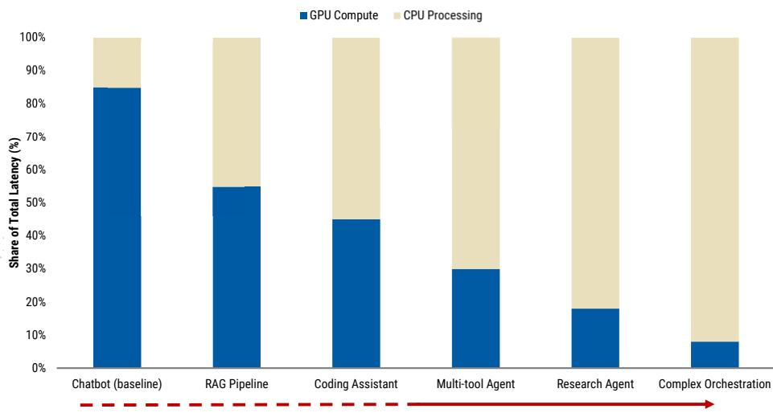  
Exhibit 1: Agentic AI shifts the latency bottleneck from GPUs toward CPUs as workflows become more action-heavy   
Source: Morgan Stanley Research, Georgia Tech and Intel paper. Note: Per-workload splits are directional estimates by MS Tech Research - not measured benchmarks.

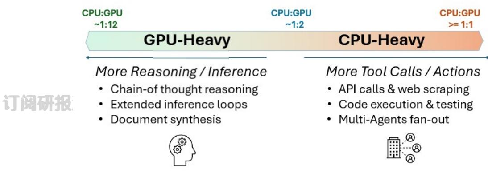  
Exhibit 2: Cluster-level CPU:GPU intensity rises as AI moves from reasoning to action   
Source: Morgan Stanley Research

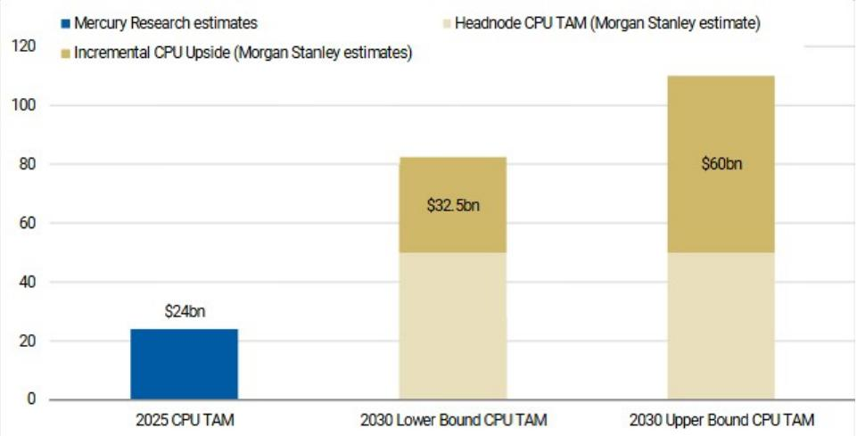  
Exhibit 3: Agentic AI could add $\$ 32.5$ -60bn CPU opportunity…   
Source: Morgan Stanley Research estimates

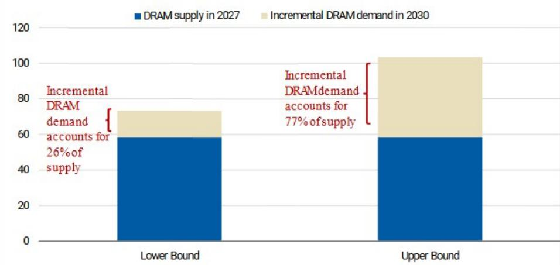  
Exhibit 4: …and 15-45EB of DRAM demand by 2030   
Source: Morgan Stanley Research estimates

Baseboard management IC (BMC) is the key component on the server board, with a view to enabling the remote control for the server firmware system and maintaining the stability of the datacenter. Previously, Aspeed indicated that general server and AI ASIC server actually generate higher efficiency among the capex spending from hyperscalers. ( Exhibit 5 ) As a result, as the CPU plays a critical role in enabling agentic AI, serving as the central coordinator that executes instructions, manages system resources, and ensures reliable, real-time decision-making, we expect the growing demand for CPU/ general server to further lift Aspeed's BMC revenue in the coming years.

Currently, Aspeed has ${ \sim } 7 0 \%$ of market shares in the CPU server BMC market, with major US and Chinese hyperscalers being its end customers, including Meta, AWS, Alibaba and Microsoft. However, as it migrates into the new generation BMC product AST2700, we expect it to expand its market share in customers including Dell and Google, which would help expand its revenue as spec migration also brings $4 0 { - } 5 0 \%$ of ASP increase.

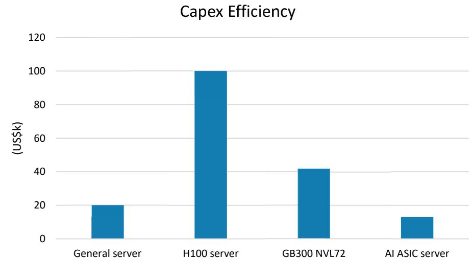  
Exhibit 5: General server and AI ASIC server generate the highest capex efficiency for BMC   
Source: Company data, Morgan Stanley Research; note: Capex efficiency is defined as the amount of server spend that will contribute to one BMC demand. The lower capex efficiency, the better for Aspeed.

Aspeed recently announced an increase in the company's BMC TAM from $4 6 . 5 \mathsf { m n }$ to $6 5 . 7 7 \mathsf { m n }$ in 2030, driven by AI-related general server demand. We think Agentic AI will be the key driving force behind this growth. General server growth should be stable at $6 \%$ over 2025-30, while AI-related general servers should account for: 1) $2 5 \%$ of total 2026 general server demand; 2) $45 \%$ in 2027; and 3) $20 \%$ throughout 2028-30 (see Exhibit 29 ).

添加微信 LCD123321Cad 04-20 On the order visibility front, customers began providing forecasts 7-8x Aspeed's singlemonth revenue. Although Aspeed could not roll out any double booking, the current dynamic is that shipments are way beyond all customers' needs. Customers also expect to double capacity Y/Y in 2027.

# BMC TAM Forecast Revised

We see hugedemand forAl-related General Server foragentic Al workload and simple inference tasks.   
BMCTAMisestimatedtobe65.77millionunitsin2030.

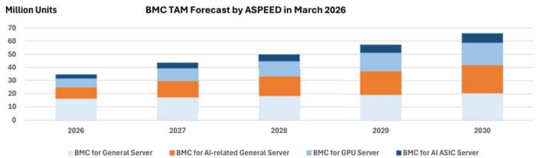  
Exhibit 6: Aspeed expects its BMC TAM to reach 65.7mn units in 2030   
Note：1) BMCforGeneral Serverswill growat6%CAGR. 2)BMCforAlrelatedGeneralServersisestimatedtobe8.5millonin2026,with45%growthratein2027and20%thereafter 3)BMCforGPUserversandAlASICserversin2026isbasedontheestimateofGPUandAlASICshipmentandtheserverarchitecture 4)AssumingBMCforGPUServersgrowat45%in2027and20%afterwards.WealsoincludeBMCsforICMShere. 5)AssumingBMCforAlASlCServersgrowat45%in2027and $2 0 \%$ afterwards.

# Delivering quantum-resilient OcP Caliptra security across the entire ASPEED product portfolio.

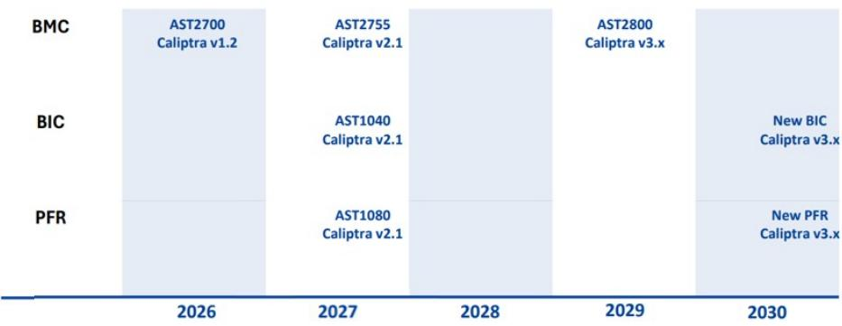  
Source: Aspeed   
Exhibit 7: Aspeed's product roadmap   
Source: Aspeed

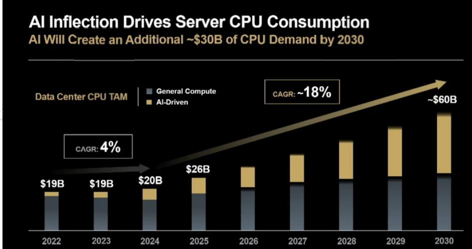  
Exhibit 8: AMD expects server CPU TAM to reach US\$60bn in 2030   
Source: AMD

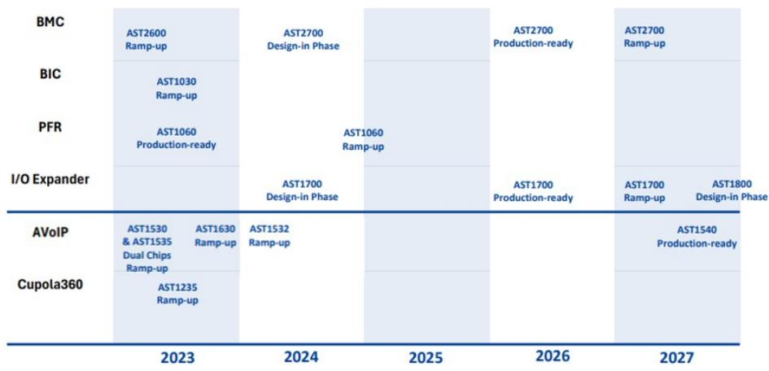  
Exhibit 9: Aspeed Product Roadmap   
Source: Aspeed

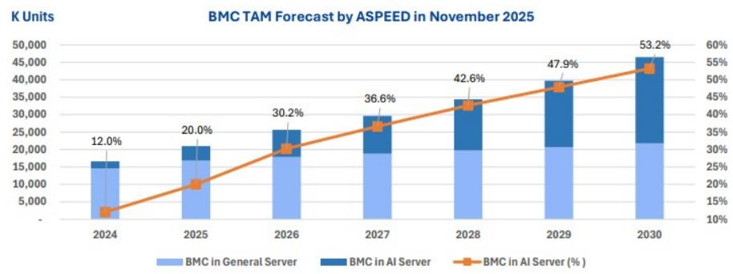  
Exhibit 10: BMC TAM Forecast: Expects BMC shipments to reach more than 46.5 million units in 2030   
Source: Aspeed

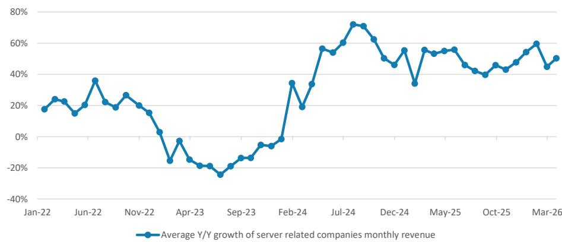  
Exhibit 11: Server-related companies maintain high Y/Y revenue growth but slowing a bit because of high base   
Source: Company data, Morgan Stanley Research. Note: Monthly revenue includes revenue from Aspeed, Wiwynn, Accton, Lotes, Inventec, Quanta, LandMark, Giga-Byte, TSMC, KYEC, AllRing, FOCI, AVC, Auras, Gold Circuit, Unimicron, and Hon Hai.

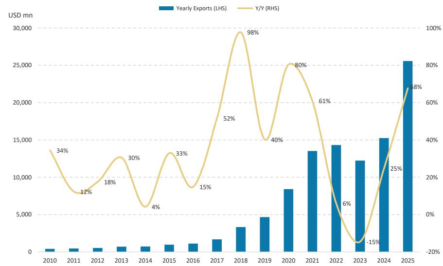  
Exhibit 12: Full-year processor exports increased $6 8 \%$ y/y in 2025   
Source: International Trade Administration, Morgan Stanley Research.

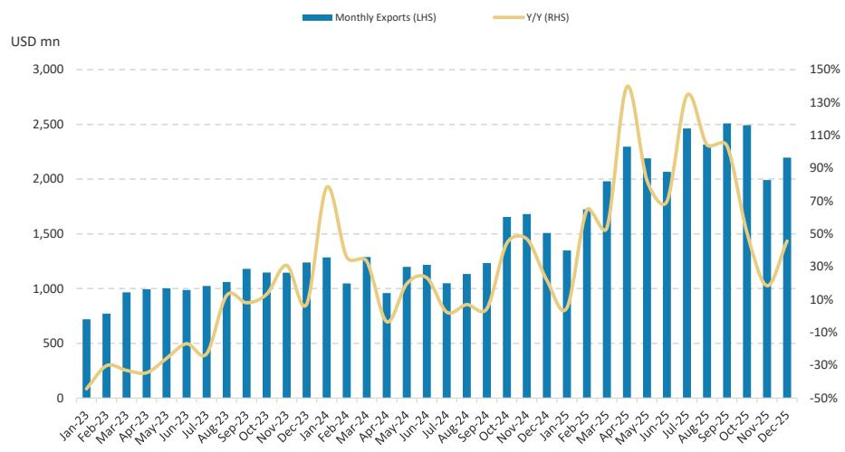  
Exhibit 13: Processor exports maintain strength with 20 consecutive months of Y/Y growth   
Source: International Trade Administration, Morgan Stanley Research.

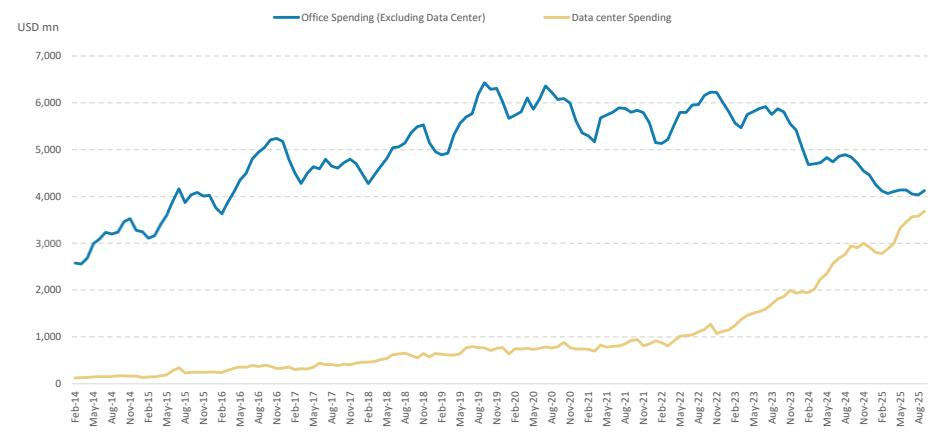  
Exhibit 14: Data center construction spending rose $3 5 \%$ Y/Y while other office spending declined   
Source: United States Census Bureau, Morgan Stanley Research.

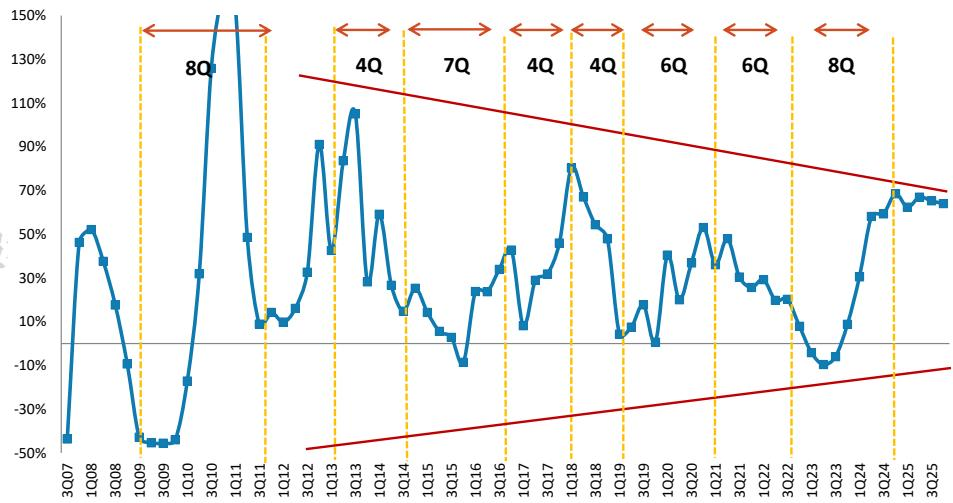  
Exhibit 15: 4Q25 US cloud capex increased $6 4 \%$ Y/Y, maintaining a level similar to the $6 5 \%$ Y/Y rise in 3Q25   
Source: Company data, Morgan Stanley Research; US cloud capex calculated from Alphabet, Microsoft, Amazon, and Meta.

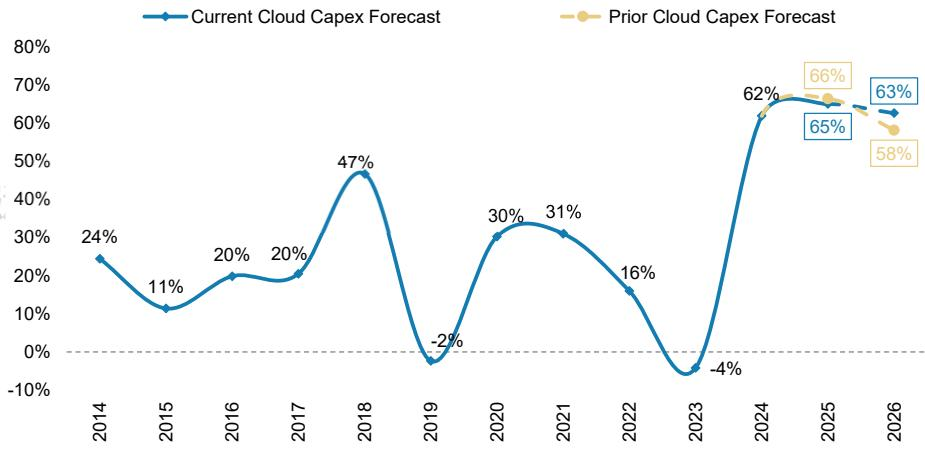  
Exhibit 16: Post-US hyperscaler C4Q25 earnings, our cloud capex tracker is now pointing to $6 3 \%$ Y/Y in 2026, up 5ppt from the prior forecast of $+ 5 8 \%$ Y/Y in late March 2026   
Top 11 Cloud Providers: Cloud Capex Y/Y Growth   
Source: Company data, FactSet, Morgan Stanley Research. Note: Cloud capex includes capex from Alphabet, Amazon, Microsoft, Meta Platforms, Alibaba, Tencent, Baidu, CoreWeave, Apple, IBM, and Oracle. We start to include CRWV from 2024.

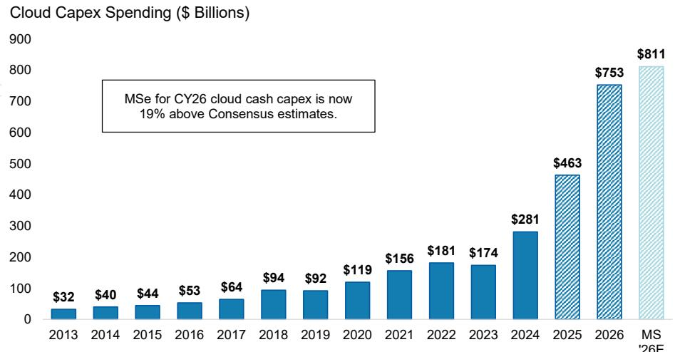  
Exhibit 17: Cumulatively, the top 11 cloud players are expected to devote US\$811bn to capex in 2026 (MSe), up from US\$463bn in 2025   
Source: FactSet, Morgan Stanley Research (E) estimates; Note: ORCL forecasts not updated following latest earning

# Gauging the AI ASIC BMC TAM

Aspeed maintains the lion’s share in AI servers, including at NVIDIA, AMD and Trainium. Google TPU has long used MCUs for remote control. Starting with TPUv7e (code name Sunfish), we believe Google will adopt Aspeed’s AST2700 BMC controller. We estimate an additional $5 \%$ revenue contribution in 2026 and $1 5 \%$ in 2027.

Together with other ASICs (mainly TPU, MTIA and Teton), we expect ASIC racks to contribute $7 7 \%$ and $2 5 \%$ of Aspeed’s total revenue in 2026 and 2027, respectively. We see upside to our existing numbers, as orders beyond 2026 remain uncertain for now, and other ASIC players – including Microsoft, SoftBank/Arm, Apple and Fujitsu – all plan to build ASIC servers in the coming years.

We therefore expect AI ASIC servers to strengthen Aspeed’s growth over the next few years.

Exhibit 20: Gauging the ASIC TAM for Aspeed: We expect 2026-27 to see ASIC racks contribute respective $9 \%$ and $2 2 \%$ of TAM revenue   
  

<table><tr><td colspan="7"></td><td colspan="3">2026echip shipment</td><td colspan="2">2027echip shipment</td></tr><tr><td rowspan="3">CSP Rack</td><td></td><td>Rack MP time</td><td>Accelerator name</td><td>BMC Generation</td><td>BMC to ASIC per rack %</td><td>BIC to ASIC per rack %</td><td>Acceleratorchip shipment (k units)</td><td>BMC BIC (k units) (k units)</td><td></td><td>Acceleratorchip shipment (k units)</td><td>BMC BIC (k units) (k units)</td></tr><tr><td>Teton 2</td><td>2025</td><td>Trainium 2</td><td>AST2600</td><td>69%</td><td></td><td>320</td><td>220</td><td></td><td></td><td></td></tr><tr><td>Teton3</td><td>2H26-2027</td><td>Trainium 3</td><td>AST2700</td><td>69%</td><td></td><td>1,360</td><td>944</td><td></td><td>1,200</td><td>833</td></tr><tr><td rowspan="5">Google</td><td>Teton4 TPUv7e</td><td>1H28</td><td>Trainium 4</td><td>AST2700</td><td>69%</td><td></td><td></td><td></td><td></td><td>600</td><td>417</td></tr><tr><td></td><td>2026</td><td>Sunfish</td><td>AST2700</td><td>70%</td><td></td><td>960</td><td>672</td><td></td><td>3,500</td><td>2,450</td></tr><tr><td>TPUv8</td><td>2027</td><td>Zebrafish</td><td>AST2700</td><td>70%</td><td></td><td>400</td><td>280</td><td></td><td>2,500</td><td>1,750</td></tr><tr><td>TPUv9</td><td>2028</td><td>Pumafish</td><td>AST2700</td><td>70%</td><td></td><td></td><td></td><td></td><td></td><td></td></tr><tr><td>TPU v10</td><td>2028</td><td>Humufish</td><td>AST2700</td><td>70%</td><td></td><td></td><td></td><td></td><td></td><td></td></tr><tr><td rowspan="3">Meta</td><td>Minerva</td><td>2H25</td><td></td><td>AST2600</td><td>72%</td><td>78%</td><td></td><td></td><td></td><td></td><td></td></tr><tr><td>Santa Babara Santa Cruz</td><td>2026-2027</td><td>MIA31Iris 35 ake</td><td>K AST2700</td><td>100% 言</td><td>LCD12</td><td>23321@ad 04-10</td><td></td><td></td><td>1,500</td><td>1,500</td></tr><tr><td>2028</td><td>MTIA4 Olympus</td><td>AST2700</td><td>100%</td><td></td><td></td><td></td><td></td><td></td><td></td><td></td></tr><tr><td>AST2600</td><td>Total BMCand BIC shipment (k units)</td><td></td><td></td><td></td><td></td><td></td><td></td><td>2,266</td><td></td><td></td><td>6,950</td></tr><tr><td>AST2700</td><td></td><td></td><td></td><td></td><td></td><td></td><td></td><td>220</td><td></td><td></td><td></td></tr><tr><td>BIC</td><td></td><td></td><td></td><td></td><td></td><td></td><td></td><td>2.046</td><td></td><td></td><td>6.950</td></tr><tr><td></td><td></td><td></td><td></td><td></td><td></td><td></td><td></td><td></td><td></td><td></td><td></td></tr><tr><td>BMC ASP (US$)</td><td></td><td></td><td></td><td></td><td></td><td></td><td></td><td></td><td></td><td></td><td></td></tr><tr><td>AST2600</td><td></td><td></td><td></td><td></td><td></td><td></td><td></td><td>15</td><td></td><td></td><td></td></tr><tr><td>AST2700</td><td></td><td></td><td></td><td></td><td></td><td></td><td></td><td>25</td><td></td><td></td><td>25</td></tr><tr><td>BIC ASP (US$)</td><td></td><td></td><td></td><td></td><td></td><td></td><td></td><td></td><td></td><td></td><td></td></tr><tr><td>Revenue contribution from ASIC (US$mn)</td><td></td><td></td><td></td><td></td><td></td><td></td><td></td><td>54,461</td><td></td><td></td><td>173,750</td></tr><tr><td>Revenue contribution from ASIC (NT$bn)</td><td></td><td></td><td></td><td></td><td></td><td></td><td></td><td>1,634</td><td></td><td></td><td>5,213</td></tr><tr><td>Aspeed CY Revenue (NT$bn)</td><td></td><td></td><td></td><td></td><td></td><td></td><td></td><td>16,455</td><td></td><td></td><td>23,332</td></tr><tr><td>% of total revenue</td><td></td><td></td><td></td><td></td><td></td><td></td><td></td><td>9.9%</td><td></td><td></td><td>22.3%</td></tr></table>

Source: Morgan Stanley Research estimates

Exhibit 21: We estimate AWS's Trainium/Teton racks to contribute a respective $5 \%$ and $4 \%$ of the TAM revenue in 2026-27, respectively   

<table><tr><td></td><td>2026e 2027e</td></tr><tr><td>Total ASlC shipment</td><td>320 1,200</td></tr><tr><td>Trainium2</td><td>320 =</td></tr><tr><td>Trainium3 LCD123321Cad 04-20 汉 日 Trainium4</td><td>1,360 1,200 600</td></tr><tr><td></td><td></td></tr><tr><td>BMC to ASIC per rack ratio AST2700 ASP (US$)</td><td>69.3% 69.4%</td></tr><tr><td>Revenue contribution from AWs (US$mn)</td><td>25 25 29,100 31,250</td></tr><tr><td>Revenue contribution from AWS (NT$bn)</td><td>873</td></tr><tr><td>Implied CY Revenue (%)</td><td>938 5.3% 4.0%</td></tr></table>

Source: Morgan Stanley Research estimates

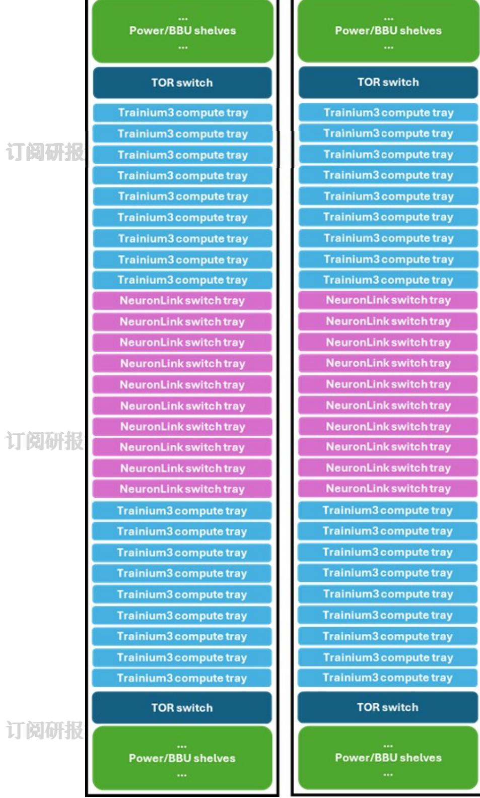  
Exhibit 23: AWS Trainium3 UltraServer architecture

Exhibit 24: We estimate Google TPU will contribute a respective $4 . 3 \%$ and $7 3 . 5 \%$ of TAM total revenue in 2026 and 2027, respectively   

<table><tr><td></td><td>2026e</td><td>2027e</td></tr><tr><td>Total ASIC shipment</td><td>1,360</td><td>6,000</td></tr><tr><td>TPUv7e (3nm,Sunfish; by Broadcom)</td><td>960</td><td>3,500 2,500</td></tr><tr><td>TPUv8 (3nm, Zebrafish; by MediaTek) TPUv9 (2nm, Pumafish; by Broadcom) TPUv10 (2nm,Humufish; by MediaTek)</td><td>400</td><td></td></tr><tr><td>BMC to AsIC per rack ratio3321Cad 04-20</td><td>70.0%</td><td>70.0%</td></tr><tr><td>AST2700 ASP (US$)</td><td>25</td><td>25</td></tr><tr><td>Revenue contribution from Google (US$mn)</td><td>23,800</td><td>105,000</td></tr><tr><td>Revenue contribution from Google (NT$bn)</td><td>714</td><td>3,150</td></tr><tr><td>Implied CY Revenue (%)</td><td>4.3%</td><td>13.5%</td></tr></table>

Source: Morgan Stanley Research estimates

Exhibit 25: We estimate Meta MTIA to contribute a respective $0 . 7 \%$ and $6 . 4 \%$ of TAM total revenue in 2026 and 2027, respectively   

<table><tr><td></td><td>2025e</td><td>2026e</td><td>2027e</td></tr><tr><td>Total ASIC shipment</td><td>50</td><td>150</td><td>2,000</td></tr><tr><td>MTIA 2</td><td>50</td><td></td><td></td></tr><tr><td>MTIA 3</td><td></td><td>150</td><td>1,500</td></tr><tr><td>MTIA 3.5 MTIA 4</td><td></td><td></td><td>500</td></tr><tr><td>BMC to ASIC per rack ratio</td><td>71.9%</td><td>100.0%</td><td>100.0%</td></tr><tr><td>AST2600 ASP (USS) LCD123321Cad</td><td>04-20 15</td><td></td><td></td></tr><tr><td>AST2700 ASP (US$)</td><td></td><td>25</td><td>25</td></tr><tr><td>BIC to ASIC per rack ratio BIC ASP (US$)</td><td>78.1% 6</td><td></td><td></td></tr><tr><td></td><td></td><td></td><td></td></tr><tr><td>Revenue contribution from Meta (US$mn)</td><td>234</td><td>3,750</td><td>50,000</td></tr><tr><td>Revenue contribution from Meta (NT$bn)</td><td>7</td><td>113</td><td>1,500</td></tr><tr><td>Implied CY Revenue (%)</td><td>0.1%</td><td>0.7%</td><td>6.4%</td></tr></table>

Source: Morgan Stanley Research estimates

# Aspeed: Estimate Revisions

We increase 2026-28e EPS by $2 \%$ , $3 \%$ and $5 \%$ , respectively: We factor in the preliminary 1Q26 revenue from Aspeed. We increase our respective revenue projections by $2 \% , 3 \%$ and $4 \% ,$ driven by higher BMC and BIC shipment forecasts on strong general server and AI server demand, as the company has secured more substrate supply and initiated price hike starting from April 1.

Exhibit 26: Aspeed: Earnings estimate revisions   

<table><tr><td colspan="4">无 Current Previous</td><td rowspan="2">Current Previous 2027E</td><td rowspan="2"></td><td colspan="4">Current Previous</td><td rowspan="2">Diff.</td></tr><tr><td>NT$mn</td><td>2026E</td><td>2026E</td><td>Diff.</td><td>2027E</td><td>Diff.</td><td>2028E</td><td>2028E</td></tr><tr><td>Net sales</td><td>16,455</td><td>16,157</td><td>2%</td><td>23,332</td><td>22,729</td><td>3%</td><td>27,713</td><td></td><td>26,617</td><td>4%</td></tr><tr><td>COGS</td><td>4,949</td><td>4,878</td><td></td><td>6,841</td><td>6,678</td><td></td><td>8,025</td><td></td><td>7,777</td><td></td></tr><tr><td>Gross profit</td><td>11,506</td><td>11,279</td><td>2%</td><td>16,491</td><td>16,051</td><td></td><td>3% 19,688</td><td></td><td>18,841</td><td>4%</td></tr><tr><td>Operating expenses</td><td>2,029</td><td>2,023</td><td></td><td>2,878</td><td>2,859</td><td></td><td></td><td>3,207</td><td>3,172</td><td></td></tr><tr><td>Operating profit</td><td>9,477</td><td>9,256</td><td>2%</td><td>13,614</td><td>13,192</td><td></td><td>3%</td><td>16,481</td><td>15,669</td><td>5%</td></tr><tr><td>Non-op.income (exp.)</td><td>160</td><td>160</td><td></td><td>160</td><td>160</td><td></td><td></td><td>160</td><td>160</td><td></td></tr><tr><td>Pretax Income</td><td>9,637</td><td>9,416</td><td>2%</td><td>13,774</td><td>13,352</td><td></td><td>3%</td><td>16,641</td><td>15,829</td><td>5%</td></tr><tr><td>Taxes</td><td>1,783</td><td>1,742</td><td></td><td>2,548</td><td>2,470</td><td></td><td></td><td>3,079</td><td>2,928</td><td></td></tr><tr><td>Net income</td><td>7,854</td><td>7,674</td><td>2%</td><td>511,226</td><td>10,882</td><td></td><td>3%</td><td>613,563</td><td>12,901</td><td>5%</td></tr><tr><td>Reported EPS</td><td>207.79</td><td>203.03</td><td>2%</td><td>297.00</td><td>287.90</td><td></td><td>3%</td><td>358.83</td><td>341.31</td><td>5%</td></tr><tr><td>Margins</td><td></td><td></td><td></td><td></td><td></td><td></td><td></td><td></td><td></td><td></td></tr><tr><td>Gross margin</td><td>69.9%</td><td>69.8%</td><td>0 ppt</td><td>70.7%</td><td>70.6%</td><td></td><td>O ppt</td><td>71.0%</td><td>70.8%</td><td>0ppt</td></tr><tr><td>Operating margin</td><td>57.6%</td><td>57.3%</td><td>0 ppt</td><td>58.3%</td><td>58.0%</td><td></td><td>O ppt</td><td>59.5%</td><td>58.9%</td><td>1 ppt</td></tr><tr><td>Pretax margin</td><td>58.6%</td><td>58.3%</td><td>0 ppt</td><td>59.0%</td><td>58.7%</td><td></td><td>0 ppt</td><td>60.0%</td><td>59.5%</td><td>1 ppt</td></tr><tr><td>Netmargin</td><td>47.7%</td><td>47.5%</td><td>Oppt</td><td>48.1%</td><td>47.9%</td><td></td><td>Oppt</td><td>48.9%</td><td>48.5%</td><td>Oppt</td></tr></table>

Source: Company data, Morgan Stanley Research (E) estimates

Exhibit 27: Aspeed: Quarterly financials   

<table><tr><td>NT$ in million (YE DEC31)</td><td>1Q26E</td><td>2Q26E</td><td>3Q25E</td><td>Y 4Q26E</td><td>1Q27E</td><td>2Q27E</td><td>3Q27E</td><td>4Q27E</td><td>1Q28E</td><td>2Q28E</td><td>3Q28E</td><td>4Q28E</td><td>2024</td><td>2025</td><td>2026E</td><td>2027E</td><td>2028E</td></tr><tr><td>Total Revenues</td><td>2.939</td><td>3.823</td><td>4,734</td><td>4,959</td><td>5.012</td><td>5,559</td><td>6.268</td><td>6,493</td><td>6,409</td><td>6.938</td><td>7,161</td><td>7.206</td><td>6,460</td><td>9,085</td><td>16,455</td><td>23.332</td><td>27,713</td></tr><tr><td>Sequential Change</td><td>20.3%</td><td>30.1%</td><td>23.8%</td><td>4.7%</td><td>1.1%</td><td>10.9%</td><td>12.8%</td><td>3.6%</td><td>-1.3%</td><td>8.3%</td><td>3.2%</td><td>0.6%</td><td></td><td></td><td></td><td></td><td></td></tr><tr><td>Changevs Year Ago</td><td>42.3%</td><td>70.2%</td><td>103.2%</td><td>103.0%</td><td>70.5%</td><td>45.4%</td><td>32.4%</td><td>31.0%</td><td>27.9%</td><td>24.8%</td><td>14.2%</td><td>11.0%</td><td>106.4%</td><td>40.6%</td><td>81.1%</td><td>41.8%</td><td>18.8%</td></tr><tr><td></td><td>913</td><td>1,182</td><td>1.395</td><td>1,459</td><td>1,473</td><td>1,631</td><td>1,835</td><td>1,902</td><td>1,856</td><td>2.006</td><td>2.072</td><td>2.090</td><td>2.306</td><td>2.906</td><td>4,949</td><td>6,841</td><td>8.025</td></tr><tr><td>Cost of Sales</td><td></td><td>31%</td><td>29%</td><td>29%</td><td>29%</td><td>29%</td><td>29%</td><td>29%</td><td>29%</td><td>29%</td><td>29%</td><td>29%</td><td>36%</td><td>32%</td><td>30%</td><td>29%</td><td>29%</td></tr><tr><td>Percentof Revenues</td><td>31%</td><td></td><td></td><td></td><td></td><td></td><td></td><td></td><td></td><td></td><td></td><td></td><td></td><td></td><td></td><td></td><td></td></tr><tr><td>Gross Margin</td><td>2.026</td><td>2.641</td><td>3.340</td><td>3.500</td><td>3.539</td><td>3.928</td><td>4,433</td><td>4.591</td><td>4.552</td><td>4,932</td><td>5,088</td><td>5.116</td><td>4,154</td><td>6,179</td><td>11,506</td><td>16,491</td><td>19.688 71.0%</td></tr><tr><td>Percentof Revenues Incremental Margin</td><td>68.9% 71%</td><td>69.1% 70%</td><td>70.5% 77%</td><td>70.6% 71%</td><td>70.6% 73%</td><td>70.7% 71%</td><td>70.7% 71%</td><td>70.7% 70%</td><td>71.0% NM</td><td>71.1% 72%</td><td>71.1% 70%</td><td>71.0% 61%</td><td>64.3% 64%</td><td>68.0% 77%</td><td>69.9% 72%</td><td>70.7% 72%</td><td>73%</td></tr><tr><td></td><td></td><td></td><td></td><td></td><td></td><td></td><td></td><td></td><td></td><td></td><td></td><td></td><td></td><td></td><td></td><td></td><td></td></tr><tr><td>Total Opex Percentof Revenues</td><td>459</td><td>496</td><td>535</td><td>539</td><td>690</td><td>706</td><td>737</td><td>744</td><td>780</td><td>797</td><td>814</td><td>816</td><td>1.235</td><td>1.518</td><td>2.029</td><td>2.878</td><td>3.207</td></tr><tr><td></td><td>15.6%</td><td>13.0%</td><td>11.3%</td><td>10.9%</td><td>13.8%</td><td>12.7%</td><td>11.8%</td><td>11.5%</td><td>12.2%</td><td>11.5%</td><td>11.4%</td><td>11.3%</td><td>19.1%</td><td>16.7%</td><td>12.3%</td><td>12.3%</td><td>11.6%</td></tr><tr><td>R&amp;D Percent of Revenues</td><td>290</td><td>310</td><td>330</td><td>330</td><td>380</td><td>380</td><td>390</td><td>390</td><td>400</td><td>400</td><td>410</td><td>410</td><td>829</td><td>1,042</td><td>1,260</td><td>1.540</td><td>1,620</td></tr><tr><td></td><td>9.9%</td><td>8.1%</td><td>7.0%</td><td>6.7%</td><td>7.6%</td><td>6.8%</td><td>6.2%</td><td>6.0%</td><td>6.2%</td><td>5.8%</td><td>5.7%</td><td>5.7%</td><td>12.8%</td><td>11.5%</td><td>7.7%</td><td>6.6%</td><td>5.8%</td></tr><tr><td>General &amp; administrative</td><td>110</td><td>110</td><td>110</td><td>110</td><td>159</td><td>159</td><td>159</td><td>159</td><td>175</td><td>175</td><td>175</td><td>175</td><td>286</td><td>349</td><td>440</td><td>638</td><td>700</td></tr><tr><td>Percentof Revenues</td><td>3.7%</td><td>2.9%</td><td>2.3%</td><td>2.2%</td><td>3.2%</td><td>2.9%</td><td>2.5%</td><td>2.5%</td><td>2.7%</td><td>2.5%</td><td>2.4%</td><td>2.4%</td><td>4.4%</td><td>3.8%</td><td>2.7%</td><td>2.7%</td><td>2.5%</td></tr><tr><td>Selling &amp;marketing Percentof Revenues</td><td>59</td><td>76</td><td>95</td><td>99</td><td>150</td><td>167</td><td>188</td><td>195</td><td>205</td><td>222</td><td>229</td><td>231</td><td>120</td><td>128</td><td>329</td><td>700</td><td>887</td></tr><tr><td></td><td>2.0%</td><td>2.0%</td><td>2.0%</td><td>2.0%</td><td>3.0%</td><td>3.0%</td><td>3.0%</td><td>3.0%</td><td>3.2%</td><td>3.2%</td><td>3.2%</td><td>3.2%</td><td>1.9%</td><td>1.4%</td><td>2.0%</td><td>3.0%</td><td>3.2%</td></tr><tr><td>Operating Income Percentof Revenues</td><td>1,567</td><td>2.144</td><td>2.805</td><td>2.960</td><td>2.849</td><td>3.222</td><td>3.696</td><td>3.847</td><td>3.772</td><td>4,135</td><td>4,274</td><td>4.301</td><td>2.918</td><td>4,660</td><td>9.477</td><td>13.614</td><td>16,481</td></tr><tr><td>Change vs Year Ago</td><td>53.3%</td><td>56.1% 81.1%</td><td>59.2% 127.8%</td><td>59.7%</td><td>56.8%</td><td>58.0%</td><td>59.0% 31.8%</td><td>59.2% 29.9%</td><td>58.9% 32.4%</td><td>59.6% 28.3%</td><td>59.7% 15.6%</td><td>59.7% 11.8%</td><td>45.2%</td><td>51.3%</td><td>57.6%</td><td>58.3%</td><td>59.5%</td></tr><tr><td>Total Non-operating Income(Loss)</td><td>52.6%</td><td></td><td></td><td>143.1%</td><td>81.8%</td><td>50.2%</td><td></td><td></td><td></td><td></td><td></td><td></td><td>170%</td><td>60%</td><td>103%</td><td>44%</td><td>21%</td></tr><tr><td></td><td>40</td><td>40</td><td>40</td><td>40</td><td>40</td><td>40</td><td>40</td><td>40</td><td>40</td><td>40</td><td>40</td><td>40</td><td>249</td><td>195</td><td>160</td><td>160</td><td>160</td></tr><tr><td>Profit Before Taxes</td><td>1,607</td><td>2,184</td><td>2.845</td><td>3,000</td><td>2,889</td><td>3.262</td><td>3,736</td><td>3,887</td><td>3.812</td><td>4,175</td><td>4,314</td><td>4.341</td><td>3,167</td><td>4,855</td><td>9,637</td><td>13,774</td><td>16.641</td></tr><tr><td>Percentof Revenues</td><td>55%</td><td>57%</td><td>60%</td><td>61%</td><td>58%</td><td>59%</td><td>60%</td><td>60%</td><td>59%</td><td>60%</td><td>60%</td><td>60%</td><td>49%</td><td>53%</td><td>59%</td><td>59%</td><td>60% 3.079</td></tr><tr><td>Taxes Tax Rate</td><td>297</td><td>404</td><td>526 18.5%</td><td>555 18.5%</td><td>534</td><td>603</td><td>691</td><td>719</td><td>705 18.5%</td><td>772 18.5%</td><td>798 18.5%</td><td>803</td><td>596</td><td>928</td><td>1.783</td><td>2.548</td></table>

Source: Company data, Morgan Stanley Research (E) estimates

# Aspeed: Valuation Methodology

We increase our price target from NT\$13,488 to NT\$15,555: This factors in our higher 2026-28 EPS estimates. We also increase our intermediate growth rate from $1 8 . 5 \%$ to $1 9 . 8 \% ,$ , with a view to factoring in the opportunities for CPU servers from agentic AI applications.

Our key assumptions are unchanged, including:

加微信 LCD123321Cad 04-20 • Payout ratio of 84% • Cost of equity of $9 . 8 \%$ $2 \%$ risk-free rate, $6 \%$ risk premium, 1.3 beta) • Terminal growth rate of $5 . 2 \%$ .

Our bull- and bear-case scenario values also increase, from NT\$15,700 and NT\$6,700, to NT\$18,100 and NT\$7,720, respecitivel, implying 61x and $2 6 x$ 2027e EPS.

Exhibit 28: Aspeed: Residual income model   

<table><tr><td>NT$million</td><td>2026E</td><td>2027E</td><td>2028E</td><td>2029E</td><td>2030E</td><td>2031E</td><td>2032E</td><td>2033E</td><td>2034E</td><td>2035E</td><td>2036E</td><td>2037E</td></tr><tr><td>Total Equity</td><td>12,146</td><td>16,817</td><td>21,010</td><td>24,830</td><td>29,408</td><td>34,893</td><td>41,468</td><td>49,347</td><td>58,789</td><td>70,104</td><td>83,665</td><td>99,917</td></tr><tr><td>Net Profit</td><td>7,854</td><td>11,226</td><td>13,563</td><td>16,254</td><td>19,479</td><td>23,344</td><td>27,976</td><td>33,527</td><td>40,179</td><td>48,151</td><td>57,706</td><td>69,156</td></tr><tr><td>ROAE</td><td>79.7%</td><td>77.5%</td><td>71.7%</td><td>70.9%</td><td>71.8%</td><td>72.6%</td><td>73.3%</td><td>73.8%</td><td>74.3%</td><td>74.7%</td><td>75.1%</td><td>75.3%</td></tr><tr><td>Residual Income</td><td>5,291</td><td>8,228</td><td>10,415</td><td>12,845</td><td>15,407</td><td>18,477</td><td>22,156</td><td>26,564</td><td>31,846</td><td></td><td></td><td></td></tr><tr><td>Spread</td><td>69.9%</td><td>67.7%</td><td>61.9%</td><td>61.1%</td><td>62.1%</td><td>62.8%</td><td>63.5%</td><td>64.1%</td><td>64.5%</td><td>38,176 64.9%</td><td>45,763 65.3%</td><td>54,854 65.6%</td></tr><tr><td>Ending Equity Capital</td><td>12,146</td><td></td><td></td><td></td><td></td><td></td><td></td><td></td><td></td><td></td><td></td><td></td></tr><tr><td>PV of Forecast Period</td><td></td><td></td><td></td><td></td><td></td><td></td><td></td><td></td><td></td><td></td><td></td><td></td></tr><tr><td>PV of Continuing Value</td><td>124,126 451,666</td><td></td><td></td><td></td><td></td><td></td><td></td><td></td><td></td><td></td><td></td><td></td></tr><tr><td>Equity Value</td><td>587,938</td><td></td><td></td><td></td><td></td><td></td><td></td><td></td><td></td><td></td><td></td><td></td></tr><tr><td>No. of Shares</td><td>38</td><td></td><td></td><td></td><td></td><td></td><td></td><td></td><td></td><td></td><td></td><td></td></tr><tr><td>Projected Price</td><td>15,555</td><td></td><td></td><td></td><td></td><td></td><td></td><td></td><td></td><td></td><td></td><td></td></tr></table>

Source: Company data, Morgan Stanley Research (E) estimates

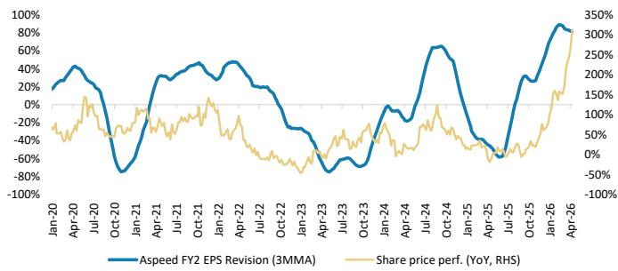  
订阅研报添加微信 LCD123321Cad 04-20 Exhibit 29: Aspeed: Earnings estimate revision breadth Exhibit 30: Aspeed: Forward P/E ratio   
Source: Company data, Morgan Stanley Research estimates

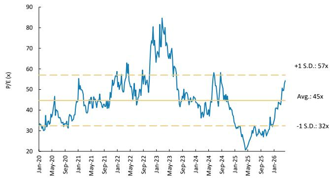  
Source: Company data, Morgan Stanley Research estimates

# Risk Reward - Aspeed TechnoRisk Reward – Aspeed Technology (5274.TWO)

Agentic AI demand for general server driving further upside; OW

# NT\$15,555.00PRICE TARGET

Base case, residual income model. Key assumptions:

Cost of equity of $9 . 8 \%$ $( 2 . 0 \%$ risk-free rate, $6 \%$ risk premium, 1.3 beta)   
Medium-term growth rate of $1 9 . 8 \%$   
Terminal growth rate of $5 . 2 \%$   
Cash payout ratio of $8 5 \%$

# Consensus Price Target Distribution

NT\$7,400.00

Source: Re fi nitiv, Morgan Stanley Research

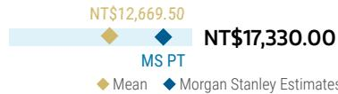

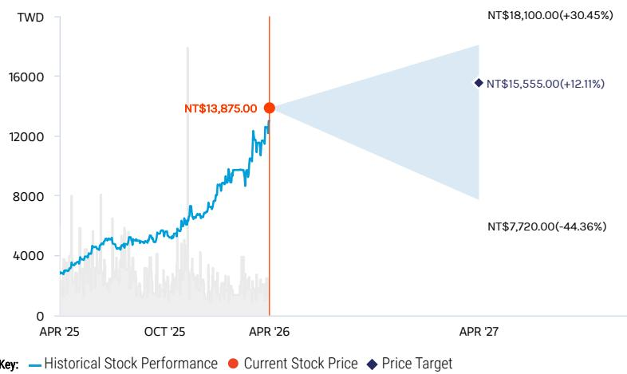  
RISK REWARD CHART   
Source: Re nitiv, Morgan Stanley Research

# OVERWEIGHT THESIS

We see continual general server shipment upward revision, likely to exceed $10 \%$ Y/Y in 2026e.

▪ Aspeed's shipments are currently capped by T-glass shortage, but the company is now qualifying E-glass, which we believe can help expand its shipments to over $2 \mathsf { m n }$ units per month.

▪ Aspeed maintains the lion's share in ASIC racks. Google TPU has long adopted MCU, while we see it utilizing Aspeed's BMC in its next generation TPU. We expect this to contribute $1 4 \%$ and $1 3 \%$ of revenue in 2027- $^ { 2 8 , }$ respectively.

▪ Our price target implies $5 2 \times$ our 2027e and $4 3 x$ our 2028e EPS, above the 46x average one-year forward $\mathsf { P / E }$ since 2020, which we nd justi ed by improving demand fi fiand new market share expansion.

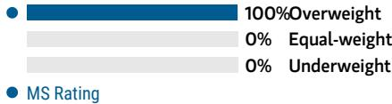  
Consensus Rating Distribution   
Source: Re nitiv, Morgan Stanley Research

# Risk Reward Themes

Secular Growth: Positive View descriptions of Risk Rewards Themes here

# BULL CASE

# NT\$18,100.00

# BASE CASE

# NT\$15,555.00

# BEAR CASE

NT\$7,720.00

# 61x 2027e EPS

Booming data center demand with significant share gains; meaningful OPM expansion; new businesses take off faster than expected: Signi cant earnings growth from data center demand and market share gains in white brands and US server brands. fiMargins improve considerably. New business growth accelerates. We also assume AI servers fully ramp-up, and clients execute new server platform migration faster than expected.

# 52x 2027e EPS

Cloud/traditional servers momentum resuming; remains a beneficiary of $\mathsf { A S l C s } ;$ new business bears fruit: 1) Revenue growth of $8 \%$ Y/Y in 2026 after strong growth in 2025; 2) gross margin of $6 9 . 9 \%$ in 2026 vs. $6 8 . 1 \%$ in 2025, OPM improves to $5 7 . 6 \%$ in 2026 vs. $5 2 . 2 \%$ in 2025; 3) TPU gets more demand from Aspeed's BMC and agentic AI drives more general server demand.

# 26x 2027e EPS

Disappointing end-demand, with share loss; operating margin pressure; new businesses face challenges: Revenue growth decelerates amid slow data center demand and share loss amid a weakening macro environment. OPM pressure emerges amid intense competition. New businesses stay attish as end-markets take off more slowly.

# Risk Reward – Aspeed Technology (5274.TWO)

KEY EARNINGS INPUTS   

<table><tr><td>Drivers</td><td>2025</td><td>2026e</td><td>2027e</td><td>2028e</td></tr><tr><td>BMC revenue (NTS, mn)</td><td>8,024</td><td>14,853</td><td>21,142</td><td>24,403</td></tr><tr><td>360 degree SoC revenue (NTS, mn)</td><td>62</td><td>73</td><td>95</td><td>154</td></tr><tr><td>PC/AV extension IC revenue (NTS, mn)</td><td>105</td><td>96</td><td>99</td><td>104</td></tr></table>

# INVESTMENT DRIVERS

Expanding share in baseboard management controller (BMC) market   
Cloud spending acceleration from customers   
Margin expansion   
New business progress

# GLOBAL REVENUE EXPOSURE

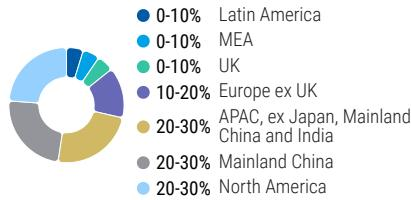  
Source: Morgan Stanley Research Estimate View explanation of regional hierarchies here

# MS ALPHA MODELS

<table><tr><td>2/5</td><td>3Month</td></tr><tr><td>MOST</td><td>Horizon</td></tr></table>

Source: Re nitiv, FactSet, Morgan Stanley Research; 1 is the highest favored Quintile and 5 is the least favored Quintile

# RISKS TO PT/RATING

# RISKS TO UPSIDE

Stronger cloud demand Faster-than-expected spec migration Mild competition

# RISKS TO DOWNSIDE

Softening cloud demand Slower-than-expected spec migration Intensi ed competition fiFurther policy tightening in China

# OWNERSHIP POSITIONING

Inst. Owners, % Active $7 2 \%$

Source: Re nitiv, Morgan Stanley Research

# MS ESTIMATES VS. CONSENSUS

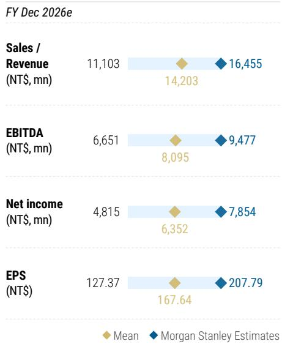  
Source: Re nitiv, Morgan Stanley Research

# Aspeed: Financial Summary

Income Statement   

<table><tr><td>NT$mn (Years End Dec)</td><td>2024</td><td>2025</td><td>2026E</td><td>2027E</td><td>2028E</td></tr><tr><td>Net sales</td><td>6,460</td><td>9.085</td><td>16,455</td><td>23,332</td><td>27,713</td></tr><tr><td>COGS</td><td>(2,306)</td><td>(2.906)</td><td>(4,949)</td><td>(6,841)</td><td>(8.025)</td></tr><tr><td>Gross profit</td><td>4,154</td><td>6,179</td><td>11,506</td><td>16,491</td><td>19,688</td></tr><tr><td>Operating expenses</td><td>(1,235)</td><td>(1,518)</td><td>(2,029)</td><td>(2,878)</td><td>(3,207)</td></tr><tr><td>Operating income</td><td>2,918</td><td>4,660</td><td>9,477</td><td>13,614</td><td>16,481</td></tr><tr><td>Non-operating income</td><td>249</td><td>195</td><td>160</td><td>160</td><td>160</td></tr><tr><td>Pre-tax income</td><td>3,167</td><td>4,855</td><td>9,637</td><td>13,774</td><td>16,641</td></tr><tr><td>Income tax</td><td>596</td><td>928</td><td>1,783</td><td>2,548</td><td>3.079</td></tr><tr><td>Reported net Income</td><td>2,571</td><td>3,928</td><td>7,854</td><td>11,226</td><td>13,563</td></tr><tr><td>Adj.wtd.avg.shrs( m)</td><td>38</td><td>38</td><td>38</td><td>38</td><td>38</td></tr><tr><td>Reported EPS (NT$)</td><td>68.05</td><td>103.94</td><td>207.79</td><td>297.00</td><td>358.83</td></tr></table>

Balance Sheet   

<table><tr><td>NT$mn (Years End Dec)</td><td>2024</td><td>2025</td><td>2026E</td><td>2027E</td><td>2028E</td></tr><tr><td>Cash</td><td>3,659</td><td>5,788</td><td>9,192</td><td>12,812</td><td>16,325</td></tr><tr><td>Mkt Securities</td><td>352</td><td>510</td><td>510</td><td>510</td><td>510</td></tr><tr><td>AR/NR</td><td>1,437</td><td>1,606</td><td>2,756</td><td>3,908</td><td>4,642</td></tr><tr><td>Inventory</td><td>357</td><td>280</td><td>542</td><td>750</td><td>879</td></tr><tr><td>Other</td><td>181</td><td>224</td><td>224</td><td>224</td><td>224</td></tr><tr><td>Current Assets</td><td>5,987</td><td>8,408</td><td>13,224</td><td>18,204</td><td>22,580</td></tr><tr><td>Long-term investments</td><td>0</td><td>0</td><td>0</td><td>0</td><td>0</td></tr><tr><td>Fixed assets</td><td>355</td><td>409</td><td>439</td><td>469</td><td>499</td></tr><tr><td>Deferred assets</td><td>69</td><td>59</td><td>59</td><td>59</td><td>59</td></tr><tr><td>Other assets</td><td>1,316</td><td>1,457</td><td>1,457</td><td>1,457</td><td>1,457</td></tr><tr><td>Total Assets</td><td>7,726</td><td>10,334</td><td>15,180</td><td>20,190</td><td>24,596</td></tr><tr><td>S/T borrowings</td><td>0</td><td>0</td><td>0</td><td>0</td><td>0</td></tr><tr><td>AP/NP</td><td>426</td><td>616</td><td>887</td><td>1,226</td><td>1,438</td></tr><tr><td>Other ST liabilities</td><td>1,457</td><td>1,828</td><td>1,828</td><td>1,828</td><td>1,828</td></tr><tr><td>LT debt</td><td>0</td><td>0</td><td>0</td><td>0</td><td>0</td></tr><tr><td>Other LT liabilities</td><td>204</td><td>319</td><td>319</td><td>319</td><td>319</td></tr><tr><td>Common shares</td><td>378</td><td>378</td><td>378</td><td>378</td><td>378</td></tr><tr><td>Total Liabilities</td><td>2,087</td><td>2,763</td><td>3,034</td><td>3,373</td><td>3,585</td></tr><tr><td>Additional capital</td><td>2,440</td><td>2.665</td><td>2,665</td><td>2,665</td><td>2,665</td></tr><tr><td>Retained earning</td><td>2,851</td><td>4,529</td><td>9,104</td><td>13,775</td><td>17,969</td></tr><tr><td>Other shareholders&#x27; equity</td><td>(31)</td><td>(2)</td><td>(2)</td><td>(2)</td><td>(2)</td></tr><tr><td>Total Equity</td><td>5,639</td><td>7,571</td><td>12,146</td><td>16,817</td><td>21,010</td></tr><tr><td>Total Liab.&amp; Shrhldr&#x27;s Equity</td><td>7,726</td><td>10,334</td><td>15,180</td><td>20,190</td><td>24,596</td></tr></table>

Cash Flow Statement   

<table><tr><td>NT$mn (Years End Dec)</td><td>2024</td><td>2025</td><td>2026E</td><td>2027E</td><td>2028E</td></tr><tr><td>Cashflow from Operations</td><td>3,145</td><td>4,496</td><td>6,712</td><td>10,205</td><td>12,911</td></tr><tr><td>Net profits</td><td>2.571</td><td>3,928</td><td>7,854</td><td>11,226</td><td>13,563</td></tr><tr><td>Depreciation</td><td>121</td><td>167</td><td>0</td><td>0</td><td>0</td></tr><tr><td>Working Capital Change</td><td>(66)</td><td>453</td><td>(1,142)</td><td>(1,020)</td><td>(651)</td></tr><tr><td>Other adjustments</td><td>519</td><td>(52)</td><td>0</td><td>0</td><td>0</td></tr><tr><td>Cashflow from Investing</td><td>(345)</td><td>(395)</td><td>(30)</td><td>(30)</td><td>(30)</td></tr><tr><td>Capex</td><td>(25)</td><td>(274)</td><td>(30)</td><td>(30)</td><td>(30)</td></tr><tr><td>Change of LT Investment</td><td>0</td><td>0</td><td>0</td><td>0</td><td>0</td></tr><tr><td>Change of ST Investment</td><td>43</td><td>(128)</td><td>0</td><td>0</td><td>0</td></tr><tr><td>Other adjustments</td><td>(363)</td><td>8</td><td>0</td><td>0</td><td>0</td></tr><tr><td>Cashflow from financing</td><td>(781)</td><td>(1,991)</td><td>(3,279)</td><td>(6,555)</td><td>(9,369)</td></tr><tr><td>Increase in L/T debt</td><td>0</td><td>0</td><td>0</td><td>0</td><td>0</td></tr><tr><td>Increase in S/T debt</td><td>0</td><td>0</td><td>0</td><td>0</td><td>0</td></tr><tr><td>Cash Dividend Paid</td><td>(756)</td><td>(1.967)</td><td>(3,279)</td><td>(6,555)</td><td>(9,369)</td></tr><tr><td>Dir&amp; Emp Bonus Paid</td><td>0</td><td>0</td><td>0</td><td>0</td><td>0</td></tr><tr><td>Issuance of stock</td><td>0</td><td>0</td><td>0</td><td>0</td><td>0</td></tr><tr><td>Other adjustments</td><td>(25)</td><td>(25)</td><td>0</td><td>0</td><td>0</td></tr><tr><td>Exchange rate adjustment</td><td>30</td><td>19</td><td>0</td><td>0</td><td>0</td></tr><tr><td>Net change in cash</td><td>2,048</td><td>2,129</td><td>3,403</td><td>3,621</td><td>3,512</td></tr></table>

Financial Ratios   

<table><tr><td></td><td>2024</td><td>2025</td><td>2026E</td><td>2027E</td><td>2028E</td></tr><tr><td>Growth(%)</td><td></td><td></td><td></td><td></td><td></td></tr><tr><td>Turnover</td><td>106.4</td><td>40.6</td><td>81.1</td><td>41.8</td><td>18.8</td></tr><tr><td>Operating profits</td><td>170.3</td><td>59.7</td><td>103.3</td><td>43.7</td><td>21.1</td></tr><tr><td>EPS</td><td>155.2</td><td>52.7</td><td>99.9</td><td>42.9</td><td>20.8</td></tr><tr><td>Margins (%)</td><td></td><td></td><td></td><td></td><td></td></tr><tr><td>Gross Margin</td><td>64.3</td><td>68.0</td><td>69.9</td><td>70.7</td><td>71.0</td></tr><tr><td>Operating Margin</td><td>45.2</td><td>51.3</td><td>57.6</td><td>58.3</td><td>59.5</td></tr><tr><td>Pretax Margin</td><td>49.0</td><td>53.4</td><td>58.6</td><td>59.0</td><td>60.0</td></tr><tr><td>Net Margin</td><td>39.8</td><td>43.2</td><td>47.7</td><td>48.1</td><td>48.9</td></tr><tr><td>Return (%)</td><td></td><td></td><td></td><td></td><td></td></tr><tr><td>ROAE</td><td>54.3</td><td>59.5</td><td>79.7</td><td>77.5</td><td>71.7</td></tr><tr><td>ROAA</td><td>41.9</td><td>43.5</td><td>61.6</td><td>63.5</td><td>60.6</td></tr><tr><td>Gearing (%)</td><td></td><td></td><td></td><td></td><td></td></tr><tr><td>Net Debt/Equity</td><td>(64.9)</td><td>(76.5)</td><td>(75.7)</td><td>(76.2)</td><td>(77.7)</td></tr><tr><td>Liabilities/Equity</td><td>37.0</td><td>36.5</td><td>25.0</td><td>20.1</td><td>17.1</td></tr><tr><td>Ratios (X)</td><td></td><td></td><td></td><td></td><td></td></tr><tr><td>Current ratio</td><td>3.2</td><td>3.4</td><td>4.9</td><td>6.0</td><td>6.9</td></tr><tr><td>Quick ratio</td><td>2.7</td><td>3.0</td><td>4.4</td><td>5.5</td><td>6.4</td></tr><tr><td>Others</td><td></td><td></td><td></td><td></td><td></td></tr><tr><td>AR/NR Turnover (days)</td><td>61</td><td>61</td><td>61</td><td>61</td><td>61</td></tr><tr><td>Inventory Turnover (days)</td><td>52</td><td>40</td><td>40</td><td>40</td><td>40</td></tr><tr><td>AP Turnover (days)</td><td>53</td><td>65</td><td>65</td><td>65</td><td>65</td></tr><tr><td>Cash Conversion (days)</td><td>60</td><td>36</td><td>36</td><td>36</td><td>36</td></tr></table>

# Valuation Methodology and Risks

# WT Microelectronics Co. Ltd. (3036.TW)

Base case, residual income model. We assume a cost of equity of $1 2 . 6 \%$ $2 \%$ risk-free rate, $1 1 . 8 \%$ risk premium, 0.9 beta), a medium-term growth rate of $1 0 \%$ , and a long-term growth rate of $3 \%$ .

# Risks to Upside

Margin trends up even amid low-margin AI business.   
Global semi inventory drops, reflecting strong mobile device demand.   
Market share expands.

# Risks to Downside

Margin trends down dramatically amid slower-than-expected AI-semi development Global semi inventory rises, reflecting poor mobile/PC device demand. n Market share lost.

# WPG Holdings (3702.TW)

Base case, residual income model. We assume a cost of equity of $9 . 5 \%$ ( $7 . 5 \%$ risk-free rate, $6 \%$ risk premium, $7 . 3 4$ beta), a medium-term growth rate of $5 . 5 \%$ , and a long-term growth rate of $2 . 0 \%$ .

# 订阅研报添加微信 LCD123321Cad 04-20Risks to Upside

Margin trends up amid better-than-expected non-AI business.   
Global semi inventory drops, reflecting strong mobile device demand.   
Market share expands.

# Risks to Downside

n Margin trends down dramatically amid slower-than-expected non-3C business development and pressure on client margins.   
Global semi inventory rises, reflecting poor mobile/PC device demand.   
n Market share is lost.

# Egis Technology Inc (6462.TWO)

Base case, residual income model. We assume cost of equity of $9 . 5 \%$ (beta 1.25, risk-free rate $2 \%$ and risk premium $6 \%$ ), payout ratio of $4 0 \% ,$ , intermediate growth rate of $1 4 . 8 \% ,$ and ter-添加微信 LCminal growth rate of $5 \%$ 123321Cad 04-20.

# 订阅研报

# Risks to Upside

n Faster-than-expected recovery in the smartphone market and fingerprint shipments Higher-than-expected growth in IP services Weakening competition from Chinese vendors Stronger-than-expected demand coming from AI ASIC

# Risks to Downside

n Slower-than-expected recovery in the smartphone market and fingerprint shipments   
n Lower-than-expected growth in IP services Weaker-than-expected demand coming from AI ASIC

# Montage Technology Co Ltd (688008.SS)

Base case, residual income model. Key assumptions:

# 订阅研报

$8 . 4 \%$ CoE (1.2 beta, $3 . 0 \%$ risk-free rate, and $4 . 5 \%$ risk premium) $30 \%$ payout ratio 加 $1 8 . 5 \%$ 信 LCD123321Cad 04-20  medium-term growth rate $4 \%$ terminal growth rate

These assumptions are justified, given cloud capex growth, DRAM interface technology migration, and Montage&#39;s strong position in China&#39;s datacenter semi localization.

# Risks to Upside

n Faster-than-expected phase-out of US peers n Faster-than-expected spec migration

# Risks to Downside

Weaker-than-expected cloud demand   
Slower-than-expected DRAM interface technology migration   
Delay in new product launches

# Risk Reward Reference links

1. View explanation of Options Probabilities methodology - Options_Probabilities_Exhibit_Link.pdf

2. View descriptions of Risk Rewards Themes - RR_Themes_Exhibit_Link.pdf

3. View explanation of regional hierarchies - GEG_Exhibit_Link.pdf

4. View explanation of Theme/Exposure methodology - ESG_Sustainable_Solutions_External_Link.pdf

5. View explanation of HERS methodology - ESG_HERS_External_Link.pdf