# AI Series #35: Price Hike Continues; A Month of Multiple Models Come to Market April 20, 2026

Highlights (1) ATH and Tencent released world models last week which is positive for film, video and gaming sectors; (2) Happy Horse is expected to start testing among enterprise users on 27 Apr. Official release is targeted in May-26; (3) BABA’s Bailian platform raises price on 15 May; (4) Baidu Coding Plan resumes normal pricing after discounts ended on 18 Apr; (5) 订阅研报添加微信 LCD123321Camarket pays attention to latest updates of DeepSeek V4 (e.g. launch date, potential financing).

# In this report, we provide investors with over 50 data points on AI models, OpenClaw, user trends by sub-sector, and other industry data for analysis.

World models catch attention; Happy Horse-1.0 to start testing on 27 Apr. BABA and Tencent released two models last week, which are important for the film, video, and gaming sectors. For BABA, ATH released Happy Oyster on 16 Apr which is multimodal and empowers users to create a 3D digital world. Happy Oyster allows users to navigate and explore AI-generated environments or adjust narratives and camera angles. Tencent launched HY-World 2.0 the same day, which enables users to create industrial-grade and editable 3D assets with a $9 4 \%$ consistency rate. Separately, Happy Horse-1.0 (video generation model) will be available for limited testing among enterprises in Bailian on 27 Apr. Official launch of Happy Horse is targeted in May-26.

BABA’s Bailian platform to raise prices on 15 May. AliCloud’s model aggregator platform 订阅研报添加微信 Bailian, which has over 200 models, highlights it will raise prices by $2 \%$ D123321Cad for different MU (model units) based on fixed monthly packages and API calls. The rationale for the price hike of the Coding Plan is mainly due to a surge in demand amid supply constraints. In our view, there will be no impact on the agreed API price paid by Bailian to AI Labs, with the former acting as a distributor.

Standford: The gap between US-China models is close. According to 2026 Stanford AI Index Report (Apr-26), the top US model leads Chinese models by $2 . 7 \%$ . Separately, Anthropic (1503), xAI (1495), Google (1494), OpenAI (1481), Alibaba (1449) and DeepSeek (1424) occupy the top tier of Arena Elo ratings as of Mar-26.

OpenRouter: Token consumption was down $2 \%$ vs prior week. Based on the analysis of the week of 13 Apr (vs the week of 6 Apr) (Exhibit 1), the number of weekly tokens consumed decreased by $2 \%$ to 20.6tn. We believe this is due to (1) OpenRouter promotional campaigns for Mimo-V2-Pro model, which ended on 2 Apr; (2) OpenRouter promotional campaigns for Qwen3.6 Plus (free) between 2 and 16 Apr. There are limitations set on free API calls after 6 Apr. In terms of ranking, Anthropic's Claude Sonnet 4.6 ranked no. 1, followed by DeepSeek V3.2 and Claude Opus 4.6

BAT, KC, and AI Labs are Beneficiaries. We expect a surge in token consumption on rising demand for AI models and agents to benefit CSPs like Baidu, Alibaba, Tencent (BAT), Kingsoft Cloud (KC), and AI Labs. According to analysis from Artificial Analysis, (1) there is a narrowing intelligence gap between US and China models; (2) API cost is just a fraction vs US benefiting from MoE, linear attention, and MFU (Exhibit 22-28); (3) Coding, Workspace scenario and midto long-form content have significant opportunities ahead (Exhibit 55-59). According to media reports (e.g. TechWeb), the industry expects DeepSeek V4 to be released in Apr.

Continued overleaf...

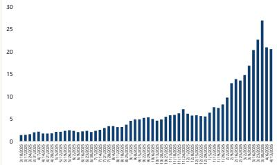  
Exhibit 1 - Weekly token consumption over the past 12 months as of 20 Apr (tn)   
Source: OpenRouter, Jefferies

Exhibit 2 - Top 10 ranking in terms of token consumption by model in last week   

<table><tr><td>No</td><td>Company</td><td>Model</td><td>Tokens</td></tr><tr><td>1</td><td>Anthropic</td><td>Claude Sonnet 4.6</td><td>1.38T</td></tr><tr><td>2</td><td>DeepSeek</td><td>DeepSeek V3.2</td><td>1.28T</td></tr><tr><td>3</td><td>Anthropic</td><td>Claude Opus 4.6</td><td>1.22T</td></tr><tr><td>4</td><td>Xiaomi</td><td>MiMo-V2-Pro</td><td>1.15T</td></tr><tr><td>5</td><td>Google</td><td>Gemini 3 Flash Preview</td><td>1.14T</td></tr><tr><td>6</td><td>MiniMax</td><td>MiniMax M2.5</td><td>1.05T</td></tr><tr><td>7</td><td>MiniMax</td><td>MiniMax M2.7</td><td>961B</td></tr><tr><td>8</td><td>Google</td><td>Gemini 2.5 Flash Lite</td><td>595B</td></tr><tr><td>9</td><td>xAI</td><td>Grok 4.1 Fast</td><td>573B</td></tr><tr><td>10</td><td>Google</td><td>Gemini 2.5 Flash</td><td>567B</td></tr></table>

Source: OpenRouter, Jefferies

# China vs US comparison

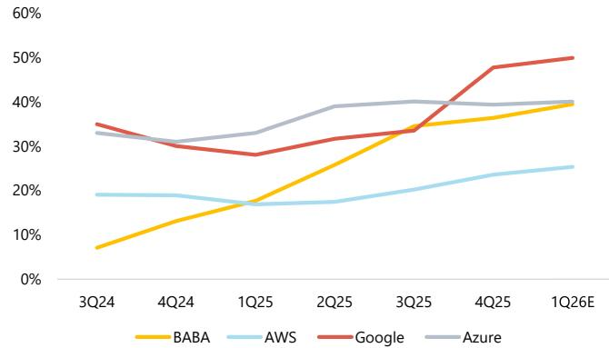  
Exhibit 3 - Alibaba Cloud revenue growth vs US hyperscalers between Sep-24 and Mar-26   
Source: Visible Alpha, Jefferies

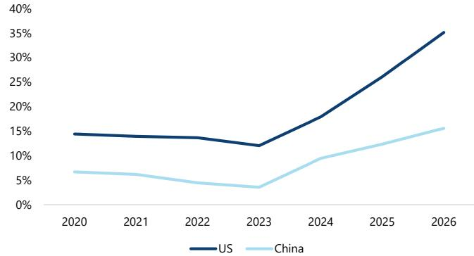  
Exhibit 5 - Capex as $\%$ of total revenue   
Source: Visible Alpha, Jefferies China : Baidu, Alibaba, Tencent   
US: Amazon, Microsoft, Google, Meta

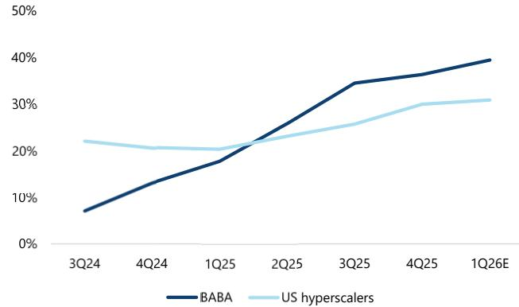  
Exhibit 4 - Alibaba Cloud revenue growth vs aggregate growth rate for US hyperscalers between Sep-24 and Mar-26   
Source: Visible Alpha, Jefferies US hyperscalers: Amazon, Microsoft, Google

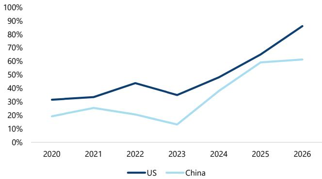  
Exhibit 6 - Capex as $\%$ of OCF   
Source: Visible Alpha, Jefferies

# Input/Output Price for Different Models / Pricing for Coding Plan and Agents Offerings

Red color denotes price hike during the month

Exhibit 7 - Pricing plans for Alibaba, Tencent, Baidu and ByteDance   

<table><tr><td rowspan=1 colspan=1>Models Provider</td><td rowspan=1 colspan=1>Model</td><td rowspan=1 colspan=1>Context</td><td rowspan=1 colspan=2>Apr-26</td></tr><tr><td rowspan=1 colspan=1></td><td rowspan=1 colspan=1></td><td rowspan=1 colspan=1></td><td rowspan=1 colspan=1> Input (RMB)</td><td rowspan=1 colspan=1>Output (RMB)</td></tr><tr><td rowspan=1 colspan=1></td><td rowspan=1 colspan=1></td><td rowspan=1 colspan=1>LCD123321CaC</td><td rowspan=1 colspan=1>(million tokens)</td><td rowspan=1 colspan=1>(million tokens)</td></tr><tr><td rowspan=5 colspan=1> Alibaba</td><td rowspan=2 colspan=1>Qwen3.6-Plus</td><td rowspan=1 colspan=1>(0,256k]</td><td rowspan=1 colspan=1>2</td><td rowspan=1 colspan=1>12</td></tr><tr><td rowspan=1 colspan=1>(256k，1m]</td><td rowspan=1 colspan=1>8</td><td rowspan=1 colspan=1>48</td></tr><tr><td rowspan=3 colspan=1>Qwen3.5-Plus</td><td rowspan=1 colspan=1>(0, 128k]</td><td rowspan=1 colspan=1>0.8</td><td rowspan=1 colspan=1>4.8</td></tr><tr><td rowspan=1 colspan=1>(128k,256k]</td><td rowspan=1 colspan=1>2</td><td rowspan=1 colspan=1>12</td></tr><tr><td rowspan=1 colspan=1>(256k,1m]</td><td rowspan=1 colspan=1>4</td><td rowspan=1 colspan=1>24</td></tr><tr><td rowspan=8 colspan=1>Tencent</td><td rowspan=2 colspan=1> HY 2.0 Think</td><td rowspan=1 colspan=1>(0,32k]</td><td rowspan=1 colspan=1>3.975</td><td rowspan=1 colspan=1>15.9</td></tr><tr><td rowspan=1 colspan=1>(32k,128k]</td><td rowspan=1 colspan=1>5.3</td><td rowspan=1 colspan=1>21.2</td></tr><tr><td rowspan=2 colspan=1> HY 2.0 Instruct</td><td rowspan=1 colspan=1>（0,32k]</td><td rowspan=1 colspan=1>3.18</td><td rowspan=1 colspan=1>7.95</td></tr><tr><td rowspan=1 colspan=1>(32k,128k]</td><td rowspan=1 colspan=1>4.505</td><td rowspan=1 colspan=1>11.13</td></tr><tr><td rowspan=1 colspan=1>Hunyuan-T1</td><td rowspan=1 colspan=1></td><td rowspan=1 colspan=1>1</td><td rowspan=1 colspan=1>4</td></tr><tr><td rowspan=1 colspan=1> Hunyuan-TurboS</td><td rowspan=1 colspan=1></td><td rowspan=1 colspan=1>0.8</td><td rowspan=1 colspan=1>2</td></tr><tr><td rowspan=1 colspan=1>Tencent HY Vision 1.5 Instruct</td><td rowspan=1 colspan=1></td><td rowspan=1 colspan=1>3</td><td rowspan=1 colspan=1>9</td></tr><tr><td rowspan=1 colspan=1> Hunyuan-translation</td><td rowspan=1 colspan=1></td><td rowspan=1 colspan=1>1.2</td><td rowspan=1 colspan=1>3.6</td></tr><tr><td rowspan=4 colspan=1>Baidu</td><td rowspan=2 colspan=1>ERNIE-5.0</td><td rowspan=1 colspan=1>(0,32k]</td><td rowspan=1 colspan=1>6</td><td rowspan=1 colspan=1>24</td></tr><tr><td rowspan=1 colspan=1>LC(32k9128k11Caq</td><td rowspan=1 colspan=1>10</td><td rowspan=1 colspan=1>40</td></tr><tr><td rowspan=1 colspan=1>ERNIE-4.5-Turbo</td><td rowspan=1 colspan=1></td><td rowspan=1 colspan=1>0.8</td><td rowspan=1 colspan=1>3.2</td></tr><tr><td rowspan=1 colspan=1>ERNIE-4.5-Turbo-VL</td><td rowspan=1 colspan=1></td><td rowspan=1 colspan=1>3</td><td rowspan=1 colspan=1>9</td></tr><tr><td rowspan=12 colspan=1>ByteDance</td><td rowspan=3 colspan=1> Doubao-seed-2.0-pro</td><td rowspan=1 colspan=1>[0,32k]</td><td rowspan=1 colspan=1>3.2</td><td rowspan=1 colspan=1>16</td></tr><tr><td rowspan=1 colspan=1>(32k, 128k]</td><td rowspan=1 colspan=1>4.8</td><td rowspan=1 colspan=1>24</td></tr><tr><td rowspan=1 colspan=1>(128k,256k]</td><td rowspan=1 colspan=1>9.6</td><td rowspan=1 colspan=1>48</td></tr><tr><td rowspan=3 colspan=1> Doubao-seed-2.0-lite</td><td rowspan=1 colspan=1>[0,32k]</td><td rowspan=1 colspan=1>0.6</td><td rowspan=1 colspan=1>3.6</td></tr><tr><td rowspan=1 colspan=1>(32k,128k]</td><td rowspan=1 colspan=1>0.9</td><td rowspan=1 colspan=1>5.4</td></tr><tr><td rowspan=1 colspan=1>(128k,256k]</td><td rowspan=1 colspan=1>1.8</td><td rowspan=1 colspan=1>10.8</td></tr><tr><td rowspan=3 colspan=1>Doubao-seed-2.0-mini</td><td rowspan=1 colspan=1>[0,32k]</td><td rowspan=1 colspan=1>0.2</td><td rowspan=1 colspan=1>2</td></tr><tr><td rowspan=1 colspan=1>(32k,128k]</td><td rowspan=1 colspan=1>0.4</td><td rowspan=1 colspan=1>4</td></tr><tr><td rowspan=1 colspan=1>（128k,256k]</td><td rowspan=1 colspan=1>0.8</td><td rowspan=1 colspan=1>8</td></tr><tr><td rowspan=3 colspan=1> Doubao-seed-2.0-code</td><td rowspan=1 colspan=1>[0,32k]</td><td rowspan=1 colspan=1>3.2</td><td rowspan=1 colspan=1>16</td></tr><tr><td rowspan=1 colspan=1>(32k, 128k]</td><td rowspan=1 colspan=1>4.8</td><td rowspan=1 colspan=1>24</td></tr><tr><td rowspan=1 colspan=1>(128k,256k]</td><td rowspan=1 colspan=1>9.6</td><td rowspan=1 colspan=1>48</td></tr></table>

Exhibit 8 - Pricing plans for AI Labs MiniMax, Zhipu, Kimi, StepFun, Xiaomi   

<table><tr><td rowspan=1 colspan=1>Models Provider</td><td rowspan=1 colspan=1>Model</td><td rowspan=1 colspan=1>Context</td><td rowspan=1 colspan=2>Apr-26</td></tr><tr><td rowspan=1 colspan=1></td><td rowspan=1 colspan=1></td><td rowspan=1 colspan=1></td><td rowspan=1 colspan=1>Input (RMB)</td><td rowspan=1 colspan=1>Output (RMB)</td></tr><tr><td rowspan=1 colspan=1></td><td rowspan=1 colspan=1></td><td rowspan=1 colspan=1></td><td rowspan=1 colspan=1>(million tokens)</td><td rowspan=1 colspan=1>(million tokens)</td></tr><tr><td rowspan=4 colspan=1>MiniMax</td><td rowspan=1 colspan=1>MiniMax-M2.7</td><td rowspan=1 colspan=1></td><td rowspan=1 colspan=1>2.1</td><td rowspan=1 colspan=1>8.4</td></tr><tr><td rowspan=1 colspan=1>MiniMax-M2.7-highspeed</td><td rowspan=1 colspan=1></td><td rowspan=1 colspan=1>4.2</td><td rowspan=1 colspan=1>16.8</td></tr><tr><td rowspan=1 colspan=1>MiniMax-M2.5</td><td rowspan=1 colspan=1></td><td rowspan=1 colspan=1>2.1</td><td rowspan=1 colspan=1>8.4</td></tr><tr><td rowspan=1 colspan=1>MiniMax-M2.5-highspeed</td><td rowspan=1 colspan=1>LCD123321CaC</td><td rowspan=1 colspan=1>4.2</td><td rowspan=1 colspan=1>16.8</td></tr><tr><td rowspan=6 colspan=1> Zhipu Al</td><td rowspan=2 colspan=1> GLM-5.1</td><td rowspan=1 colspan=1>[0，32k)</td><td rowspan=1 colspan=1>6</td><td rowspan=1 colspan=1>24</td></tr><tr><td rowspan=1 colspan=1>[32k+）</td><td rowspan=1 colspan=1>8</td><td rowspan=1 colspan=1>28</td></tr><tr><td rowspan=2 colspan=1> GLM-5-Turbo</td><td rowspan=1 colspan=1>[0,32k)</td><td rowspan=1 colspan=1>5</td><td rowspan=1 colspan=1>22</td></tr><tr><td rowspan=1 colspan=1>[32k+）</td><td rowspan=1 colspan=1>7</td><td rowspan=1 colspan=1>26</td></tr><tr><td rowspan=2 colspan=1> GLM-5</td><td rowspan=1 colspan=1>[0,32k)</td><td rowspan=1 colspan=1>4</td><td rowspan=1 colspan=1>18</td></tr><tr><td rowspan=1 colspan=1>[32k+）</td><td rowspan=1 colspan=1>6</td><td rowspan=1 colspan=1>22</td></tr><tr><td rowspan=17 colspan=1>KimiStepFun</td><td rowspan=1 colspan=1>Kimi K2.5</td><td rowspan=1 colspan=1></td><td rowspan=1 colspan=1>0.7</td><td rowspan=1 colspan=1>21</td></tr><tr><td rowspan=1 colspan=1> kimi-k2-thinking</td><td rowspan=1 colspan=1></td><td rowspan=1 colspan=1>1</td><td rowspan=1 colspan=1>16</td></tr><tr><td rowspan=1 colspan=1> kimi-k2-thinking-turbo kimi-k2-turbo-preview</td><td rowspan=1 colspan=1></td><td rowspan=1 colspan=1>1</td><td rowspan=1 colspan=1>58</td></tr><tr><td rowspan=1 colspan=1> kimi-k2-0905-preview kimi-k2-0711-preview</td><td rowspan=1 colspan=1></td><td rowspan=1 colspan=1>1</td><td rowspan=1 colspan=1>16</td></tr><tr><td rowspan=1 colspan=1>moonshot-v1-8kmoonshot-v1-8k-vision-preview</td><td rowspan=1 colspan=1></td><td rowspan=1 colspan=1>2</td><td rowspan=1 colspan=1>10</td></tr><tr><td rowspan=1 colspan=1>moonshot-v1-32k moonshot-v1-32k-vision-preview</td><td rowspan=1 colspan=1>LCD123321CaC</td><td rowspan=1 colspan=1>5</td><td rowspan=1 colspan=1>20</td></tr><tr><td rowspan=1 colspan=1> moonshot-v1-128kmoonshot-v1-128k-vision-preview</td><td rowspan=1 colspan=1></td><td rowspan=1 colspan=1>10</td><td rowspan=1 colspan=1>30</td></tr><tr><td rowspan=1 colspan=1>step-3.5-flash</td><td rowspan=1 colspan=1></td><td rowspan=1 colspan=1>0.14</td><td rowspan=1 colspan=1>2.1</td></tr><tr><td rowspan=1 colspan=1>step-r1-v-mini</td><td rowspan=1 colspan=1></td><td rowspan=1 colspan=1>0.5</td><td rowspan=1 colspan=1>8</td></tr><tr><td rowspan=3 colspan=1>step-3</td><td rowspan=1 colspan=1>input≤4k &amp; output≤4k</td><td rowspan=1 colspan=1>0.3</td><td rowspan=1 colspan=1>4</td></tr><tr><td rowspan=1 colspan=1> input≤4k &amp; output&gt;4k</td><td rowspan=1 colspan=1>0.3</td><td rowspan=1 colspan=1>8</td></tr><tr><td rowspan=1 colspan=1>4k &lt;input ≤64k</td><td rowspan=1 colspan=1>0.8</td><td rowspan=1 colspan=1>10</td></tr><tr><td rowspan=1 colspan=1>step-2-mini</td><td rowspan=1 colspan=1></td><td rowspan=1 colspan=1>0.2</td><td rowspan=1 colspan=1>N</td></tr><tr><td rowspan=1 colspan=1>step-2-16kstep-2-16k-exp</td><td rowspan=1 colspan=1></td><td rowspan=1 colspan=1>7.6</td><td rowspan=1 colspan=1>120</td></tr><tr><td rowspan=1 colspan=1>step-1-8k</td><td rowspan=1 colspan=1></td><td rowspan=1 colspan=1>1</td><td rowspan=1 colspan=1>20</td></tr><tr><td rowspan=1 colspan=1>step-1-32k</td><td rowspan=1 colspan=1></td><td rowspan=1 colspan=1>3</td><td rowspan=1 colspan=1>70</td></tr><tr><td rowspan=1 colspan=1>step-1-256k</td><td rowspan=1 colspan=1></td><td rowspan=1 colspan=1>19</td><td rowspan=1 colspan=1>300</td></tr><tr><td rowspan=5 colspan=1>Xiaomi</td><td rowspan=2 colspan=1> MiMo-V2-Pro</td><td rowspan=1 colspan=1>0. 256kl21C</td><td rowspan=1 colspan=1>7</td><td rowspan=1 colspan=1>21</td></tr><tr><td rowspan=1 colspan=1>LCF256k 1m21Caq</td><td rowspan=1 colspan=1>14</td><td rowspan=1 colspan=1>42</td></tr><tr><td rowspan=1 colspan=1> MiMO-V2-0mni</td><td rowspan=1 colspan=1></td><td rowspan=1 colspan=1>2.8</td><td rowspan=1 colspan=1>14</td></tr><tr><td rowspan=1 colspan=1>MiMo-V2-TTS</td><td rowspan=1 colspan=1></td><td rowspan=1 colspan=1>limited-time free</td><td rowspan=1 colspan=1></td></tr><tr><td rowspan=1 colspan=1>MiMo-V2-Flash</td><td rowspan=1 colspan=1></td><td rowspan=1 colspan=1>0.7</td><td rowspan=1 colspan=1>2.1</td></tr></table>

Source: Company, Jefferies

Exhibit 9 - Pricing plans for overseas players Anthropic, OpenAI and Google   
订阅研报添加微信 LCD123321Cad 04-20   

<table><tr><td rowspan=1 colspan=1>LLM Provider</td><td rowspan=1 colspan=1>Model</td><td rowspan=1 colspan=1>Context</td><td rowspan=1 colspan=2>Apr-26</td></tr><tr><td rowspan=1 colspan=1></td><td rowspan=1 colspan=1></td><td rowspan=1 colspan=1></td><td rowspan=1 colspan=1>Input (Us$)</td><td rowspan=1 colspan=1>Output (US$)</td></tr><tr><td rowspan=1 colspan=1></td><td rowspan=1 colspan=1></td><td rowspan=1 colspan=1></td><td rowspan=1 colspan=1> (million tokens)</td><td rowspan=1 colspan=1>(million tokens)</td></tr><tr><td rowspan=3 colspan=1> Anthropic</td><td rowspan=1 colspan=1> Opus 4.7</td><td rowspan=1 colspan=1></td><td rowspan=1 colspan=1>5</td><td rowspan=1 colspan=1>25</td></tr><tr><td rowspan=1 colspan=1>Sonnet 4.6</td><td rowspan=1 colspan=1></td><td rowspan=1 colspan=1>3</td><td rowspan=1 colspan=1>15</td></tr><tr><td rowspan=1 colspan=1>Haiku 4.5</td><td rowspan=1 colspan=1></td><td rowspan=1 colspan=1>1</td><td rowspan=1 colspan=1>5</td></tr><tr><td rowspan=8 colspan=1>OpenAl</td><td rowspan=1 colspan=1>GPT-5.4</td><td rowspan=1 colspan=1>LCD123321CaC</td><td rowspan=1 colspan=1>2.5</td><td rowspan=1 colspan=1>15</td></tr><tr><td rowspan=1 colspan=1>GPT-5.4-mini</td><td rowspan=1 colspan=1></td><td rowspan=1 colspan=1>0.75</td><td rowspan=1 colspan=1>4.5</td></tr><tr><td rowspan=1 colspan=1>GPT-5.4-nano</td><td rowspan=1 colspan=1></td><td rowspan=1 colspan=1>0.2</td><td rowspan=1 colspan=1>1.25</td></tr><tr><td rowspan=1 colspan=1> GPT-5.4-pro</td><td rowspan=1 colspan=1></td><td rowspan=1 colspan=1>30</td><td rowspan=1 colspan=1>180</td></tr><tr><td rowspan=1 colspan=1>GPT-5.2</td><td rowspan=1 colspan=1></td><td rowspan=1 colspan=1>1.75</td><td rowspan=1 colspan=1>14</td></tr><tr><td rowspan=1 colspan=1>GPT-5.2-pro</td><td rowspan=1 colspan=1></td><td rowspan=1 colspan=1>21</td><td rowspan=1 colspan=1>168</td></tr><tr><td rowspan=1 colspan=1>GPT-5.1</td><td rowspan=1 colspan=1></td><td rowspan=1 colspan=1>1.25</td><td rowspan=1 colspan=1>10</td></tr><tr><td rowspan=1 colspan=1>GPT-5</td><td rowspan=1 colspan=1></td><td rowspan=1 colspan=1>1.25</td><td rowspan=1 colspan=1>10</td></tr><tr><td rowspan=6 colspan=1>Google</td><td rowspan=2 colspan=1>Gemini 3.1 Pro Preview</td><td rowspan=1 colspan=1>(0,200k]</td><td rowspan=1 colspan=1>2</td><td rowspan=1 colspan=1>12</td></tr><tr><td rowspan=1 colspan=1>(200k+)</td><td rowspan=1 colspan=1>4</td><td rowspan=1 colspan=1>18</td></tr><tr><td rowspan=2 colspan=1>Gemini 3.1 Flash-Lite Preview</td><td rowspan=1 colspan=1>text/image/video</td><td rowspan=1 colspan=1>0.25</td><td rowspan=1 colspan=1>1.5</td></tr><tr><td rowspan=1 colspan=1>audio</td><td rowspan=1 colspan=1>0.5</td><td rowspan=1 colspan=1>1.5</td></tr><tr><td rowspan=2 colspan=1>Gemini 3 Flash Preview</td><td rowspan=1 colspan=1>text/image/video</td><td rowspan=1 colspan=1>0.5</td><td rowspan=1 colspan=1>3</td></tr><tr><td rowspan=1 colspan=1>audio</td><td rowspan=1 colspan=1>1</td><td rowspan=1 colspan=1>3</td></tr></table>

Source: Company, Jefferies

# Coding Plans and Agents offerings

Red color denotes price hike during the month

Exhibit 10 - Tencent AI products pricing   

<table><tr><td rowspan=1 colspan=1>Product</td><td rowspan=1 colspan=1>Version</td><td rowspan=2 colspan=1>PricingTBD</td></tr><tr><td rowspan=1 colspan=1>QClaw</td><td rowspan=1 colspan=1>Internal testing</td></tr><tr><td rowspan=4 colspan=1>WorkBuddy</td><td rowspan=1 colspan=1>Individual Trial</td><td rowspan=1 colspan=1>Limited-time free, 500 credits per month</td></tr><tr><td rowspan=1 colspan=1>Individual Pro</td><td rowspan=1 colspan=1>RMB58permonth,2,0o0 creditsper month (incl.50creditsfortrial)</td></tr><tr><td rowspan=1 colspan=1>Enterprise Flagship</td><td rowspan=1 colspan=1>RMB78 per month, 2,0o0 credits per month</td></tr><tr><td rowspan=1 colspan=1>Enterprise Pro</td><td rowspan=1 colspan=1>RMB158 per month. 2,000 credits per month</td></tr><tr><td rowspan=6 colspan=1>Lighthouse</td><td rowspan=1 colspan=1>Starter</td><td rowspan=1 colspan=1>RMB45permonth2vCPUs2GBMM40GBSSD3MbpsBandwidth20GBmonthlydatapackage1</td></tr><tr><td rowspan=1 colspan=1>Starter (Basic)</td><td rowspan=1 colspan=1>RMB50 permonth，2vCPUs,2GBMEM,S0GB SSD,4Mbps Bandwidth,300GB monthly data package</td></tr><tr><td rowspan=1 colspan=1>General (Advanced)</td><td rowspan=1 colspan=1>RMB100 permonth,2vPUs,4GBMEM,10GBSSD,7bps Bandwidth,1000GB monthlydatapackage</td></tr><tr><td rowspan=1 colspan=1>General (Pro)</td><td rowspan=1 colspan=1>RMB245 permonth,4vUs,GBEM8GBSSD,2bpsBandwidth,20GBmonthlydataacage</td></tr><tr><td rowspan=1 colspan=1>RazorSpeed</td><td rowspan=1 colspan=1>RMB45 per month,2vCPUs, 2GB MEM, 40GB SSD,200Mbps Bandwidth,unlimited data package</td></tr><tr><td rowspan=1 colspan=1>Razor Speed</td><td rowspan=1 colspan=1>RMB230 per month,4 vCPUs,8GB MEM,120GBSSD,200Mbps Bandwidth, unlimited data package</td></tr></table>

Source: Company, Jefferies

Exhibit 11 - BABA coding plan   

<table><tr><td rowspan=1 colspan=1>Program</td><td rowspan=1 colspan=1>Price</td><td rowspan=1 colspan=1>Usage limitations</td></tr><tr><td rowspan=1 colspan=1>Coding Plan Pro</td><td rowspan=1 colspan=1>RMB 200/month</td><td rowspan=1 colspan=1>Every 5 hours: Maximum 6oo0 requestsEvery week: Maximum 45000 requestsEvery subscription month: Maximum 9000 requests</td></tr></table>

Source: Company, Jefferies

Exhibit 12 - Baidu coding plan   

<table><tr><td rowspan=1 colspan=1>Program</td><td rowspan=1 colspan=1>Price</td><td rowspan=1 colspan=1>Usage limitations</td></tr><tr><td rowspan=1 colspan=1>Coding Plan Lite</td><td rowspan=1 colspan=1>RMB 40/month</td><td rowspan=1 colspan=1>Every 5 hours: Maximum 1200 requestsEvery week: Maximum 9000 requestsEvery subscription month: Maximum 18000 requests</td></tr><tr><td rowspan=1 colspan=1>Coding Plan Pro</td><td rowspan=1 colspan=1>RMB 200/month</td><td rowspan=1 colspan=1>Every 5 hours: Maximum 6000 requestsEvery week: Maximum 45000 requestsEvery subscription month: Maximum 90000 requests</td></tr></table>

Source: Company, Jefferies

Exhibit 13 - MaxClaw subscription prices   

<table><tr><td colspan="6">MaxClaw subscription prices</td></tr><tr><td rowspan="2">Region</td><td>Program</td><td>Free</td><td>1悦报添加宿三17D12321Cad</td><td></td><td rowspan="4"></td></tr><tr><td>Standard price Monthly program</td><td>RMBO RMB0</td><td>RMB133 per month</td><td>RMB483 per month RMB119 per month</td></tr><tr><td rowspan="2">China</td><td></td><td>200 credits per day</td><td>RMB39 per month 5,000 credtsper month About 45 Pro mode tasks available 200 daly credits</td><td>16,000 credits per month 200 daily credits About 150 Pro mode tasks available N/A</td></tr><tr><td>Privileges</td><td>1,000 free credits (available for 3 days)</td><td>Peak hour priority Remove watermark Custom domain Deploy 24/7 Cloud MaxClaw</td><td>Peak hour priority Remove watermark Custom domain Deploy 24/7 Cloud MaxClaw</td></tr><tr><td rowspan="3"></td><td>Standard price</td><td>USDO</td><td>USD39 per month</td><td>USD119 per month</td><td>USD219 per month</td></tr><tr><td>Monthly program Yearly program</td><td>USDO USDO</td><td>USD19 per month USD16 per month</td><td>USD69 per month USD58 per month</td><td>USD129 per month USD109 per month</td></tr><tr><td>Privileges</td><td>200 credis per day</td><td>5,000 credits per month About 30 Pro mode tasks available 200 daily credits</td><td>20.00 credis per month About 120 Pro mode tasks available 200 dally redits</td><td>40,00 credits per month About 240 Pro mode tasks available 200 daily credits</td></tr><tr><td>Overseas</td><td></td><td>1,000 freecredits available for 3 days)</td><td>Peak hour priority Remove watermark Custom domain Deploy 24/7 Cloud MaxClaw</td><td>Peak hour priority Remove watermark Custom domain Deploy 24/7 Cloud MaxClaw</td><td>Peak hour priority Remove watermark Custom domain Deploy 24/7 Cloud MaxClaw</td></tr></table>

Source: Company, Jefferies

Exhibit 14 - MaxClaw Add-on prices   

<table><tr><td rowspan=1 colspan=1>MaxClawadd-onprices</td><td rowspan=1 colspan=1>prices</td><td rowspan=1 colspan=1></td><td rowspan=1 colspan=1></td></tr><tr><td rowspan=1 colspan=1>Region</td><td rowspan=1 colspan=1>Starter pack</td><td rowspan=1 colspan=1>Booster pack</td><td rowspan=1 colspan=1>Mega pack</td></tr><tr><td rowspan=1 colspan=1>China</td><td rowspan=1 colspan=1>RMB59 for 5,000 credits (valid for 1 year)</td><td rowspan=1 colspan=1>RMB109 for 10,000 credits (valid for 1 year)</td><td rowspan=1 colspan=1>RMB149 for 15,000 credits (valid for 1 year)</td></tr><tr><td rowspan=1 colspan=1>Overseas</td><td rowspan=1 colspan=1>USD39 for 5,000 credits (valid for 1 year)</td><td rowspan=1 colspan=1>USD78 for 10,000 credits (valid for 1 year)</td><td rowspan=1 colspan=1>USD156 for 20,000 credits (valid for 1 year)</td></tr></table>

Source: Company, Jefferies

Exhibit 15 - Xiaomi MiMo token plan   

<table><tr><td rowspan=1 colspan=1>Region</td><td rowspan=1 colspan=1>Program</td><td rowspan=1 colspan=1>Price</td><td rowspan=1 colspan=1>Content</td></tr><tr><td rowspan=4 colspan=1>China</td><td rowspan=1 colspan=1>Lite</td><td rowspan=1 colspan=1>RMB 39/month,RMB34.32/month for the first purchase</td><td rowspan=1 colspan=1>60 million credits</td></tr><tr><td rowspan=1 colspan=1>Standard</td><td rowspan=1 colspan=1>RMB 99/month, RMB 87.12/month for the first purchase</td><td rowspan=1 colspan=1>200 million credits</td></tr><tr><td rowspan=1 colspan=1>Program</td><td rowspan=1 colspan=1>RMB 329/month,RMB 289.52/month for the first purchase</td><td rowspan=1 colspan=1>700 million credits</td></tr><tr><td rowspan=1 colspan=1>Max</td><td rowspan=1 colspan=1>RMB 659/month, RMB 579.92/month,for the first purchase</td><td rowspan=1 colspan=1>1600 million credits</td></tr><tr><td rowspan=4 colspan=1>Overseas</td><td rowspan=1 colspan=1>Lite</td><td rowspan=1 colspan=1>USD 6/month, USD 5.28/month for the first purchase</td><td rowspan=1 colspan=1>60 million credits</td></tr><tr><td rowspan=1 colspan=1>Standard</td><td rowspan=1 colspan=1>USD 16/month, USD 14.08/month for the first purchase</td><td rowspan=1 colspan=1>200 million credits</td></tr><tr><td rowspan=1 colspan=1>Program</td><td rowspan=1 colspan=1>USD 50/month, USD 44/month for the first purchase</td><td rowspan=1 colspan=1>700 million credits</td></tr><tr><td rowspan=1 colspan=1>Max</td><td rowspan=1 colspan=1>USD 100/month,USD 88/month for the first purchase</td><td rowspan=1 colspan=1>1600 million credits</td></tr></table>

Exhibit 16 - GLM coding plan   

<table><tr><td rowspan=1 colspan=1>Region</td><td rowspan=1 colspan=1>Program</td><td rowspan=1 colspan=1>Pricing</td><td rowspan=1 colspan=1>Content</td></tr><tr><td rowspan=9 colspan=1>China</td><td rowspan=3 colspan=1>Lite</td><td rowspan=1 colspan=1>RMB49/month</td><td rowspan=3 colspan=1>5-hour limit: up to approx. 80 prompts, weekly limit: up to approx. 400 prompts</td></tr><tr><td rowspan=1 colspan=1>RMB 132.3/quarter</td></tr><tr><td rowspan=1 colspan=1>RMB 470.4/year</td></tr><tr><td rowspan=3 colspan=1>Pro</td><td rowspan=1 colspan=1>RMB 149/month</td><td rowspan=3 colspan=1>5-hour limit: up toapprox.400 prompts, weeklylimit: up toapprox.2000 prompts</td></tr><tr><td rowspan=1 colspan=1>RMB 402.3/quarter</td></tr><tr><td rowspan=1 colspan=1>RMB 1430.4/year</td></tr><tr><td rowspan=3 colspan=1>Max</td><td rowspan=1 colspan=1>RMB 469/month</td><td rowspan=3 colspan=1>5-hour limit: up toapprox.1600 prompts, weeklylimit: uptoapprox.80 prompts</td></tr><tr><td rowspan=1 colspan=1>RMB 1266.3/quarter</td></tr><tr><td rowspan=1 colspan=1>RMB 4502.4/year</td></tr><tr><td rowspan=10 colspan=1>Overseas</td><td rowspan=4 colspan=1>Lite</td><td rowspan=1 colspan=1>USD 18/month</td><td></td></tr><tr><td rowspan=2 colspan=1>USD 48.6/quarter</td><td></td></tr><tr><td rowspan=2 colspan=1>5-hourlimit: up toapprox.80prompts, weeklylimit:up toapprox.400 prompts</td></tr><tr><td rowspan=1 colspan=1>USD 172.8/year</td></tr><tr><td rowspan=3 colspan=1>Pro</td><td rowspan=1 colspan=1>USD 72/month</td><td rowspan=3 colspan=1>[5-hour limit: up toapprox.400 prompts, weeklylimit up to approx. 2000 prompts</td></tr><tr><td rowspan=1 colspan=1>USD 194.4/quarter</td></tr><tr><td rowspan=1 colspan=1>USD 691.2/year</td></tr><tr><td rowspan=3 colspan=1>Max</td><td rowspan=1 colspan=1>USD 160/month</td><td rowspan=3 colspan=1>5-hour limit: up to approx. 1600 prompts, weekly limit: up to approx.8000 prompts</td></tr><tr><td rowspan=1 colspan=1>USD 432/quarter</td></tr><tr><td rowspan=1 colspan=1>USD 1536/year</td></tr></table>

Source: Company, Jefferies

# AI Models

According to OpenRouter, token consumption went up significantly in Feb-26 (a) surge in adoption of open-source OpenClaw, which allows people using AI from "to chat" to "to work". It connects with large models which can be deployed locally or on servers which allows you to automate workflow through natural language chat; (b) release a number of high performance and cost-efficient model which includes Kimi K2.5 (Jan-26), M2.5 (Feb-26) and GLM-5 (Feb-26).

# According to OpenRouter, rising adoption of OpenClaw and release of high-performance and cost-efficient China models drive token consumption

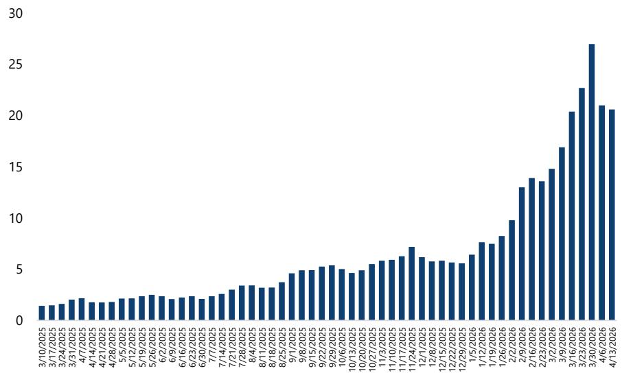  
Exhibit 17 - Weekly token consumption over the past 12 months as of 20 Apr (tn)   
Source: OpenRouter, Jefferies

According to OpenRouter (between 13 Apr and 19 Apr), China models token consumption decreased by $2 3 . 8 \%$ compared to prior week reaching 4.4tn. We view this as due to (1) OpenRouter has promotional campaigns for Mimo-V2-Pro model, which ended on 2 Apr; (2) OpenRouter has promotional campaigns for Qwen3.6 Plus (free) between 2 and 16 Apr. There are limitations set on free API calls after 6 Apr. This compares to US models at 4.1tn token consumption.

4-20 China models surpass US models again in terms of token consumption the week of 13 April

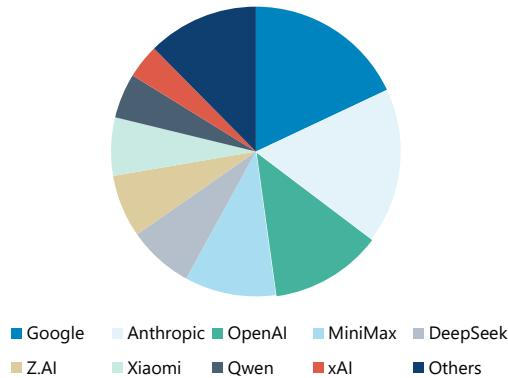  
Exhibit 18 - Market share: weekly token consumption by company as of 20 Apr   
Source: OpenRouter, Jefferies

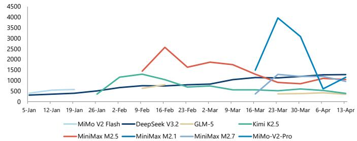  
Exhibit 19 - Weekly token consumption since Jan-26 (bn)   
Source: OpenRouter, Jefferies

On token consumptions by company, Google $( 1 8 \% )$ comes first, followed by Anthropic $( 1 7 . 3 \% )$ , OpenAI $( 1 2 . 5 \% )$ , MiniMax $( 1 0 . 2 \% )$ and DeepSeek $( 7 . 3 \% )$ . The top 5 weekly token consumption by model include Claude Sonnet 4.6 (1.38tn), followed by DeepSeek V3.2 (1.28tn) and Claude Opus 4.6 (1.22tn).

Claude Sonnet 4.6 ranked first in terms of token consumption the week of 13 April

Exhibit 20 - Top 10 ranking in terms of token consumption by model in last week   

<table><tr><td rowspan=1 colspan=1>No</td><td rowspan=1 colspan=1>Company</td><td rowspan=1 colspan=1>Model</td><td rowspan=1 colspan=1>Tokens</td></tr><tr><td rowspan=1 colspan=1>1</td><td rowspan=1 colspan=1>Anthropic</td><td rowspan=1 colspan=1>Claude Sonnet 4.6</td><td rowspan=1 colspan=1>1.38T</td></tr><tr><td rowspan=1 colspan=1>2</td><td rowspan=1 colspan=1>DeepSeek</td><td rowspan=1 colspan=1>DeepSeek V3.2</td><td rowspan=1 colspan=1>1.28T</td></tr><tr><td rowspan=1 colspan=1>3</td><td rowspan=1 colspan=1>Anthropic</td><td rowspan=1 colspan=1>Claude Opus 4.6</td><td rowspan=1 colspan=1>1.22T</td></tr><tr><td rowspan=1 colspan=1>4</td><td rowspan=1 colspan=1>Xiaomi</td><td rowspan=1 colspan=1>MiMo-V2-Pro</td><td rowspan=1 colspan=1>1.15T</td></tr><tr><td rowspan=1 colspan=1>5</td><td rowspan=1 colspan=1>Google</td><td rowspan=1 colspan=1>Gemini 3 Flash Preview</td><td rowspan=1 colspan=1>1.14T</td></tr><tr><td rowspan=1 colspan=1>6</td><td rowspan=1 colspan=1>MiniMax</td><td rowspan=1 colspan=1>MiniMax M2.5</td><td rowspan=1 colspan=1>1.05T</td></tr><tr><td rowspan=1 colspan=1>7</td><td rowspan=1 colspan=1>MiniMax</td><td rowspan=1 colspan=1>MiniMax M2.7</td><td rowspan=1 colspan=1>961B</td></tr><tr><td rowspan=1 colspan=1>8</td><td rowspan=1 colspan=1>Google</td><td rowspan=1 colspan=1>Gemini 2.5 Flash Liten</td><td rowspan=1 colspan=1>595B</td></tr><tr><td rowspan=1 colspan=1>9</td><td rowspan=1 colspan=1>xAI</td><td rowspan=1 colspan=1>订   Grok 4.1 FastH</td><td rowspan=1 colspan=1>573B</td></tr><tr><td rowspan=1 colspan=1>10</td><td rowspan=1 colspan=1>Google</td><td rowspan=1 colspan=1>Gemini 2.5 Flash</td><td rowspan=1 colspan=1>567B</td></tr></table>

Source: OpenRouter, Jefferies

Based on Artificial Analysis, China models DeepSeek, Qwen, Kimi, MiniMax and Zhipu are closing the gap with US models in terms of intelligence. China models are highly cost-efficient on Mixture of Experts (MoE) architecture, linear attention, and MLU (Model Flog Utilization). According to 2026 Stanford AI Index Report (Apr-26), the top US model leads Chinese models by $2 . 7 \%$ . Separately, Anthropic (1503), xAI (1495), Google (1494), OpenAI (1481), Alibaba (1449) and DeepSeek (1424) occupy the top tier of Arena Elo ratings as of Mar-26.

Exhibit 21 - No 11-20 ranking in terms of token consumption by model in latest week   

<table><tr><td rowspan=1 colspan=1>No</td><td rowspan=1 colspan=1>Company</td><td rowspan=1 colspan=1>Model</td><td rowspan=1 colspan=1>Tokens</td></tr><tr><td rowspan=1 colspan=1>11</td><td rowspan=1 colspan=1>OpenAl</td><td rowspan=1 colspan=1>GPT-5.4</td><td rowspan=1 colspan=1>564B</td></tr><tr><td rowspan=1 colspan=1>12</td><td rowspan=1 colspan=1>OpenRouter</td><td rowspan=1 colspan=1>Elephant</td><td rowspan=1 colspan=1>564B</td></tr><tr><td rowspan=1 colspan=1>13</td><td rowspan=1 colspan=1>NVIDIA</td><td rowspan=1 colspan=1>Nemotron 3 Super (free)</td><td rowspan=1 colspan=1>535B</td></tr><tr><td rowspan=1 colspan=1>14</td><td rowspan=1 colspan=1>ZAI</td><td rowspan=1 colspan=1>GLM 5.1</td><td rowspan=1 colspan=1>481B</td></tr><tr><td rowspan=1 colspan=1>15</td><td rowspan=1 colspan=1>OpenAl</td><td rowspan=1 colspan=1>gpt-oss-120b</td><td rowspan=1 colspan=1>425B</td></tr><tr><td rowspan=1 colspan=1>16</td><td rowspan=1 colspan=1>MoonshotAl</td><td rowspan=1 colspan=1>Kimi K2.5</td><td rowspan=1 colspan=1>391B</td></tr><tr><td rowspan=1 colspan=1>17</td><td rowspan=1 colspan=1>Google</td><td rowspan=1 colspan=1>Gemini 3.1 Pro Preview</td><td rowspan=1 colspan=1>387B</td></tr><tr><td rowspan=1 colspan=1>18</td><td rowspan=1 colspan=1>StepFun</td><td rowspan=1 colspan=1>Step3.5Flash</td><td rowspan=1 colspan=1>364B</td></tr><tr><td rowspan=1 colspan=1>19</td><td rowspan=1 colspan=1>ZAI</td><td rowspan=1 colspan=1>GLM5</td><td rowspan=1 colspan=1>349B</td></tr><tr><td rowspan=1 colspan=1>20</td><td rowspan=1 colspan=1>Google</td><td rowspan=1 colspan=1>Gemini 3.1 Flash Lite Preview</td><td rowspan=1 colspan=1>305B</td></tr></table>

Source: OpenRouter, Jefferies

China models are narrowing the gap with US models in terms of intelligence. On Input/ Output API, China large models are highly efficient vs US models.

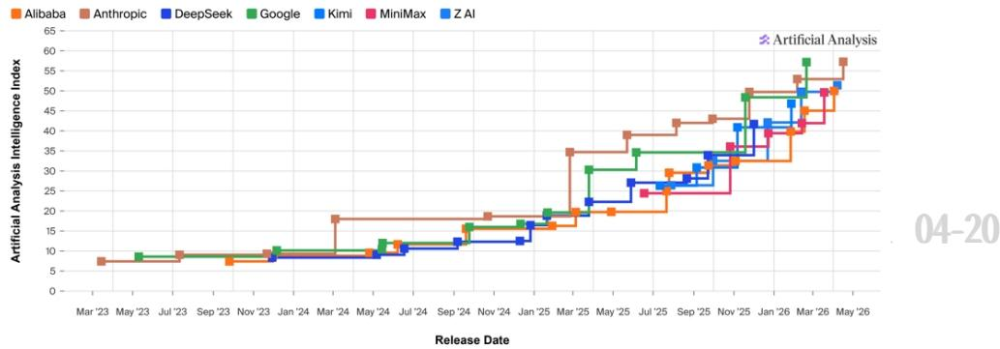  
Exhibit 22 - Frontier Language Model Intelligence over time as of 20 Apr   
Source: Artificial Analysis, Jefferies

In terms of Input/Output API price, China models are just a fraction vs US models.

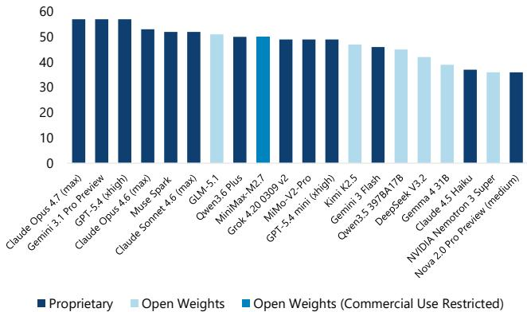  
Exhibit 23 - Intelligence index for top 20 models as of 20 Apr   
Source: Artificial Analysis, Jefferies

Among top 20 large models, there are 7 which are China models and open weighted as of 20 Apr.

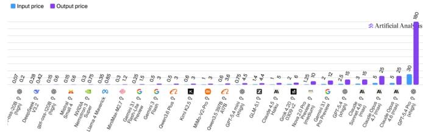  
Exhibit 24 - Input/Output API price for leading models as of 20 Apr   
Source: Artificial Analysis, Jefferies

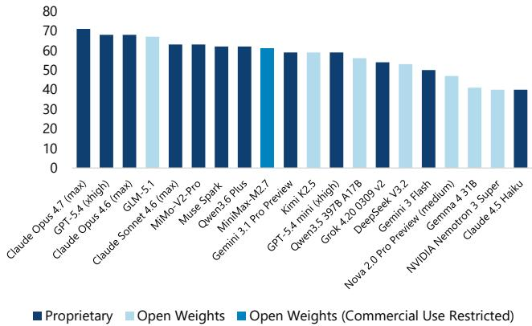  
Exhibit 25 - Agentic index for top 20 models as of 20 Apr   
Source: Artificial Analysis, Jefferies

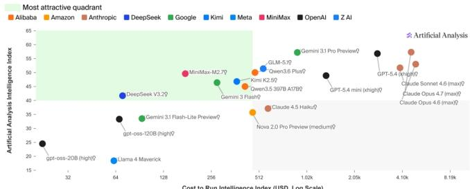  
Exhibit 27 - Cost to run Artificial Intelligence Index as of 20 Apr   
Source: Artificial Analysis, Jefferies

According to OpenRouter, top 3 models for OpenClaw based on token consumption come from China which include MiMo-V2-Pro, GLM 5 Turbo and Step 3.5 Flash. Other models include MiniMax 订阅研报添加微信 LCD123321Cad M2.7, Qwen3.6 Plus, MiniMax M2.5, Kimi K2.5, DeepSeek V3.2, and MiMo-V2-Omni.

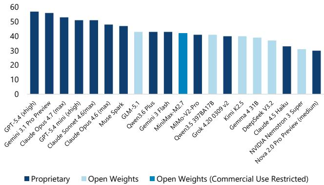  
Exhibit 26 - Coding index for top 20 models as of 20 Apr   
Source: Artificial Analysis, Jefferies

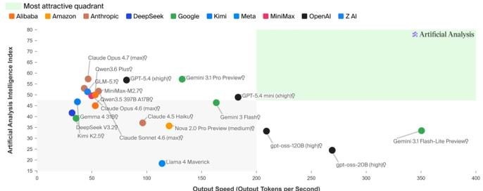  
Exhibit 28 - Output speed to run Artificial Intelligence Index as of 20 Apr   
Source: Artificial Analysis, Jefferies

According to OpenRouter, MiMo-V2-Pro, GLM 5 Turbo and Step 3.5 Flash are ranked 4-20 top 3 in terms of token consumption on OpenClaw

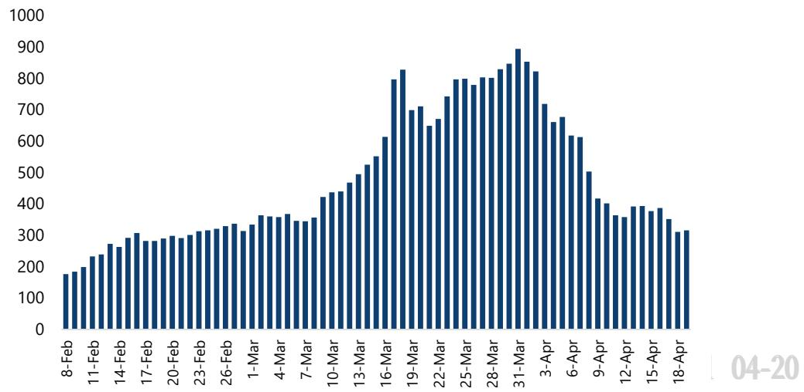  
Exhibit 29 - Token consumption for OpenClaw (bn)   
Source: OpenRouter, Jefferies

Exhibit 30 - Top 15 models used by OpenClaw over the last 30 days (as of 20 Apr)   

<table><tr><td rowspan=1 colspan=1>No</td><td rowspan=1 colspan=1>Model</td><td rowspan=1 colspan=1>Tokens</td></tr><tr><td rowspan=1 colspan=1>1</td><td rowspan=1 colspan=1>MiMo-V2-Pro</td><td rowspan=1 colspan=1>2.68T</td></tr><tr><td rowspan=1 colspan=1>2</td><td rowspan=1 colspan=1>GLM5Turbo</td><td rowspan=1 colspan=1>2.29T</td></tr><tr><td rowspan=1 colspan=1>3</td><td rowspan=1 colspan=1>Step 3.5 Flash</td><td rowspan=1 colspan=1>2.28T</td></tr><tr><td rowspan=1 colspan=1>4</td><td rowspan=1 colspan=1>MiniMax M2.7</td><td rowspan=1 colspan=1>1.39T</td></tr><tr><td rowspan=1 colspan=1>5</td><td rowspan=1 colspan=1>Claude Sonnet 4.6</td><td rowspan=1 colspan=1>1.02T</td></tr><tr><td rowspan=1 colspan=1>6</td><td rowspan=1 colspan=1>Qwen3.6 Plus</td><td rowspan=1 colspan=1>965B</td></tr><tr><td rowspan=1 colspan=1>7</td><td rowspan=1 colspan=1>Nemotron 3 Super</td><td rowspan=1 colspan=1>收743B</td></tr><tr><td rowspan=1 colspan=1>8</td><td rowspan=1 colspan=1>Claude Opus 4.6</td><td rowspan=1 colspan=1>709B</td></tr><tr><td rowspan=1 colspan=1>9</td><td rowspan=1 colspan=1>MiniMax M2.5</td><td rowspan=1 colspan=1>543B</td></tr><tr><td rowspan=1 colspan=1>10</td><td rowspan=1 colspan=1>Gemini 3 Flash Preview</td><td rowspan=1 colspan=1>409B</td></tr><tr><td rowspan=1 colspan=1>11</td><td rowspan=1 colspan=1>MiMo-V2-Omni</td><td rowspan=1 colspan=1>395B</td></tr><tr><td rowspan=1 colspan=1>12</td><td rowspan=1 colspan=1>Gemini 2.5 Flash Lite</td><td rowspan=1 colspan=1>364B</td></tr><tr><td rowspan=1 colspan=1>13</td><td rowspan=1 colspan=1>DeepSeek V3.2</td><td rowspan=1 colspan=1>326B</td></tr><tr><td rowspan=1 colspan=1>14</td><td rowspan=1 colspan=1>Kimi K2.5</td><td rowspan=1 colspan=1>312B</td></tr><tr><td rowspan=1 colspan=1>15</td><td rowspan=1 colspan=1>Trinity Large Preview (free)</td><td rowspan=1 colspan=1>294B</td></tr></table>

Source: OpenRouter, Jefferies

According to PinchBench, Anthropic's Claude Opus 4.6 ranked first in terms of success rate $( 9 3 . 3 \% )$ , followed by Arcee AI Trinity Large Thinking $( 9 1 . 9 \% )$ and OpenAI GPT5.4 $( 9 0 . 5 \% )$ .

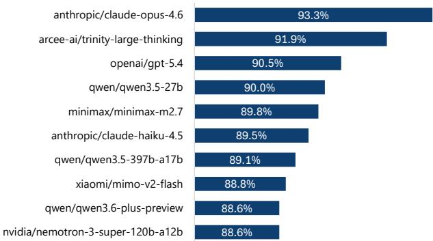  
Exhibit 31 - Global: Top 10 models by success rate as of 20 Apr   
Source: PinchBench, Jefferies

In China market, Qwen 3.5-27B $( 9 0 . 0 \% )$ ranked first, followed by MiniMax M2.7 $( 8 9 . 8 \% )$ and Qwen 3.5-397B-A17B $( 8 9 . 1 \% )$ . MiniMax is one of the top 10 models and OpenClaw's founder Peter Steinberger highlights MiniMax's models are recommended due to success rate, speed and cost efficiencies.

MiniMax models are recommended by OpenClaw on its success rate, speed, and cost efficiencies

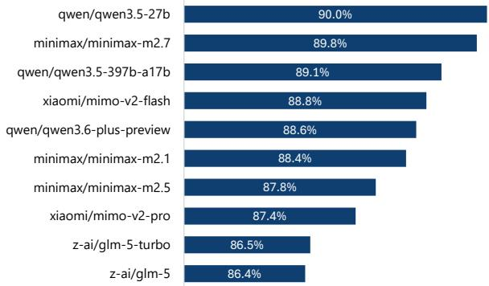  
Exhibit 32 - China: Top 10 models by success rate as of 20 Apr   
Source: PinchBench, Jefferies

# AI Assistants

MoM trend: DAU for Qwen reached $2 9 \mathsf { m }$ in Mar (vs Feb: $3 8 \mathsf { m }$ ) and Yuanbao reached 8m (vs Feb:17m). For Doubao, it increased by $3 9 \%$ MoM to $\uparrow 3 3 \mathsf { m }$ (vs Feb: 96m). For DeepSeek, DAU increased by about $1 8 \%$ MoM to about $2 9 \mathsf { m }$ .

# DAU for a number of leading players declined MoM in Mar after Feb CNY promotions

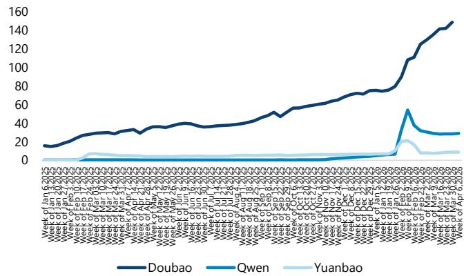  
Exhibit 33 - Weekly DAU for leading AI Assistants in China (mn)   
Source: QuestMobile, Jefferies

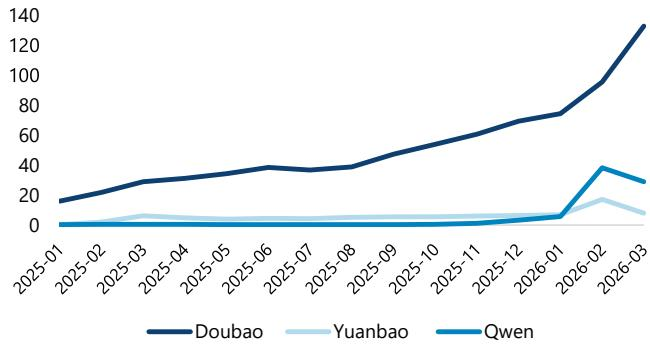  
Exhibit 34 - Monthly DAU for Leading AI Assistants in China (mn)   
Source: QuestMobile, Jefferies

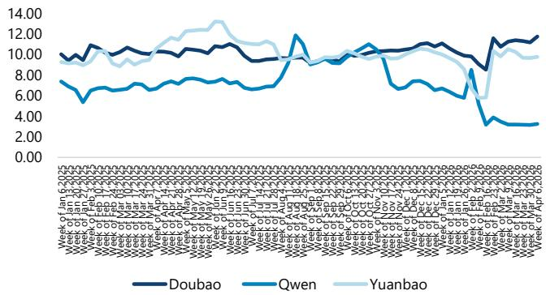  
Exhibit 35 - Weekly user time spent per weekly DAU for leading AI Assistants in China (mins)   
Source: QuestMobile, Jefferies

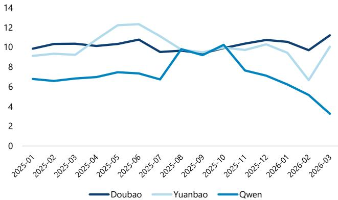  
Exhibit 36 - Monthly user daily time spent per monthly DAU for leading AI Assistants in China (mins)   
Source: QuestMobile, Jefferies

# Video generation models

According to Artificial Analysis (as of 20 Apr), HappyHorse-1.0 ranked top 5 in terms of text to video.   
Others include Seedance 2.0, SkyReels V4, Kling 3.0 Omni 1080p, Kling 3.0 1080p, and Veo 3.1 Fast.

Exhibit 37 - Top 15 image to video leaderboard (with audio)   

<table><tr><td rowspan=1 colspan=1>No</td><td rowspan=1 colspan=1>Model</td><td rowspan=1 colspan=1>ELO</td></tr><tr><td rowspan=1 colspan=1>1</td><td rowspan=1 colspan=1>Dreamina Seedance 2.0 720p</td><td rowspan=1 colspan=1>1,181</td></tr><tr><td rowspan=1 colspan=1>2</td><td rowspan=1 colspan=1>HappyHorse-1.0</td><td rowspan=1 colspan=1>加微167</td></tr><tr><td rowspan=1 colspan=1>3</td><td rowspan=1 colspan=1> SkyReels V4</td><td rowspan=1 colspan=1>1,090</td></tr><tr><td rowspan=1 colspan=1>4</td><td rowspan=1 colspan=1> grok-imagine-video</td><td rowspan=1 colspan=1>1,087</td></tr><tr><td rowspan=1 colspan=1>5</td><td rowspan=1 colspan=1>Veo 3.1 Fast</td><td rowspan=1 colspan=1>1,084</td></tr><tr><td rowspan=1 colspan=1>6</td><td rowspan=1 colspan=1>Veo 3.1</td><td rowspan=1 colspan=1>1,082</td></tr><tr><td rowspan=1 colspan=1>7</td><td rowspan=1 colspan=1>Kling 3.0 1080p(Pro)</td><td rowspan=1 colspan=1>1,075</td></tr><tr><td rowspan=1 colspan=1>8</td><td rowspan=1 colspan=1> Kling 3.0 720p(Standard)</td><td rowspan=1 colspan=1>1,067</td></tr><tr><td rowspan=1 colspan=1>9</td><td rowspan=1 colspan=1>PixVerse V6</td><td rowspan=1 colspan=1>1,067</td></tr><tr><td rowspan=1 colspan=1>10</td><td rowspan=1 colspan=1>Kling 3.0 Omni1080p (Pro)</td><td rowspan=1 colspan=1>1,057</td></tr><tr><td rowspan=1 colspan=1>11</td><td rowspan=1 colspan=1>Vidu Q3 Pro</td><td rowspan=1 colspan=1>1,048</td></tr><tr><td rowspan=1 colspan=1>12</td><td rowspan=1 colspan=1> Kling 3.0 Omni 720p (Standard)</td><td rowspan=1 colspan=1>1,047</td></tr><tr><td rowspan=1 colspan=1>13</td><td rowspan=1 colspan=1>Kling 2.6 Pro(January)</td><td rowspan=1 colspan=1>1,006</td></tr><tr><td rowspan=1 colspan=1>14</td><td rowspan=1 colspan=1>Seedance 1.5 pro</td><td rowspan=1 colspan=1>1,000</td></tr><tr><td rowspan=1 colspan=1>15</td><td rowspan=1 colspan=1> LTX-2.3 Fast</td><td rowspan=1 colspan=1>959</td></tr></table>

Source: Artificial Analysis, Jefferies

Exhibit 38 - Top 15 text to video leaderboard (with audio)   

<table><tr><td rowspan=1 colspan=1>No</td><td rowspan=1 colspan=1>Model</td><td rowspan=1 colspan=1>ELO</td></tr><tr><td rowspan=1 colspan=1>1</td><td rowspan=1 colspan=1>HappyHorse-1.0</td><td rowspan=1 colspan=1>1,230</td></tr><tr><td rowspan=1 colspan=1>2</td><td rowspan=1 colspan=1>Dreamina Seedance 2.0 720p</td><td rowspan=1 colspan=1>1,223</td></tr><tr><td rowspan=1 colspan=1>3</td><td rowspan=1 colspan=1> SkyReels V4</td><td rowspan=1 colspan=1>1,138</td></tr><tr><td rowspan=1 colspan=1>4</td><td rowspan=1 colspan=1> Kling 3.0 Omni1080p (Pro)</td><td rowspan=1 colspan=1>1,102</td></tr><tr><td rowspan=1 colspan=1>5</td><td rowspan=1 colspan=1>Kling 3.0 1080p (Pro)</td><td rowspan=1 colspan=1>1,101</td></tr><tr><td rowspan=1 colspan=1>6</td><td rowspan=1 colspan=1>Veo 3.1</td><td rowspan=1 colspan=1>1,100</td></tr><tr><td rowspan=1 colspan=1>7</td><td rowspan=1 colspan=1>Veo 3.1 Fast</td><td rowspan=1 colspan=1>1,098</td></tr><tr><td rowspan=1 colspan=1>8</td><td rowspan=1 colspan=1>Kling 3.0 720p (Standard)</td><td rowspan=1 colspan=1>1,094</td></tr><tr><td rowspan=1 colspan=1>9</td><td rowspan=1 colspan=1> Kling 3.0 Omni 720p (Standard)</td><td rowspan=1 colspan=1>1,091</td></tr><tr><td rowspan=1 colspan=1>10</td><td rowspan=1 colspan=1>Vidu Q3 Pro</td><td rowspan=1 colspan=1>1,084</td></tr><tr><td rowspan=1 colspan=1>11</td><td rowspan=1 colspan=1>Sora 2 (December)</td><td rowspan=1 colspan=1>1,083</td></tr><tr><td rowspan=1 colspan=1>12</td><td rowspan=1 colspan=1> grok-imagine-video</td><td rowspan=1 colspan=1>1,083</td></tr><tr><td rowspan=1 colspan=1>13</td><td rowspan=1 colspan=1>Sora 2 Pro</td><td rowspan=1 colspan=1>1,080</td></tr><tr><td rowspan=1 colspan=1>14</td><td rowspan=1 colspan=1>PixVerse V6</td><td rowspan=1 colspan=1>1,067</td></tr><tr><td rowspan=1 colspan=1>15</td><td rowspan=1 colspan=1>Wan 2.6</td><td rowspan=1 colspan=1>1,038</td></tr></table>

Source: Artificial Analysis, Jefferies

Exhibit 39 - Video generation model pricing in USD   

<table><tr><td rowspan=8 colspan=1>AppKling Al</td><td rowspan=1 colspan=1>Model</td><td rowspan=1 colspan=1>Monthly standard plan (Us$)</td><td rowspan=1 colspan=1>Monthlycredit quota</td><td rowspan=1 colspan=1>Creditpervideo</td><td rowspan=1 colspan=1>Lengthpervideo</td><td rowspan=1 colspan=1>Cost (Us$) per video</td></tr><tr><td rowspan=1 colspan=1>Video3.0/3.0Omni- 720p</td><td rowspan=1 colspan=1>8.8</td><td rowspan=1 colspan=1>660</td><td rowspan=1 colspan=1>27-135</td><td rowspan=1 colspan=1>3-15s</td><td rowspan=1 colspan=1>0.36-1.8</td></tr><tr><td rowspan=1 colspan=1>Video 3.0/3.0Omni-1080p</td><td rowspan=1 colspan=1>8.8</td><td rowspan=1 colspan=1>660</td><td rowspan=1 colspan=1>36-180</td><td rowspan=1 colspan=1>3-15s</td><td rowspan=1 colspan=1>0.48-2.4</td></tr><tr><td rowspan=1 colspan=1>Video 01-720p</td><td rowspan=1 colspan=1>8.8</td><td rowspan=1 colspan=1>660</td><td rowspan=1 colspan=1>30-60</td><td rowspan=1 colspan=1>5-10s</td><td rowspan=1 colspan=1>0.4-0.8</td></tr><tr><td rowspan=1 colspan=1>Video 01-1080p</td><td rowspan=1 colspan=1>8.8</td><td rowspan=1 colspan=1>660</td><td rowspan=1 colspan=1>40-80</td><td rowspan=1 colspan=1>5-10s</td><td rowspan=1 colspan=1>0.53-1.07</td></tr><tr><td rowspan=1 colspan=1>Video 2.6</td><td rowspan=1 colspan=1>8.8</td><td rowspan=1 colspan=1>660</td><td rowspan=1 colspan=1>50-100</td><td rowspan=1 colspan=1>5-10s</td><td rowspan=1 colspan=1>0.67-1.33</td></tr><tr><td rowspan=1 colspan=1>Video 2.5Turbo - 720p</td><td rowspan=1 colspan=1>8.8</td><td rowspan=1 colspan=1>660</td><td rowspan=1 colspan=1>15-30</td><td rowspan=1 colspan=1>5-10s</td><td rowspan=1 colspan=1>0.2-0.4</td></tr><tr><td rowspan=1 colspan=1>Video 2.5 Turbo - 1080p</td><td rowspan=1 colspan=1>8.8</td><td rowspan=1 colspan=1>660</td><td rowspan=1 colspan=1>25-50</td><td rowspan=1 colspan=1>5-10s</td><td rowspan=1 colspan=1>0.33-0.67</td></tr><tr><td rowspan=4 colspan=1>Dreamina Al</td><td rowspan=1 colspan=1>Seedance 2.0 Fast</td><td rowspan=1 colspan=1>15</td><td rowspan=1 colspan=1>1575</td><td rowspan=1 colspan=1>56-210</td><td rowspan=1 colspan=1>4-15s</td><td rowspan=1 colspan=1>0.53-2</td></tr><tr><td rowspan=1 colspan=1>Seedance 2.0</td><td rowspan=1 colspan=1>15</td><td rowspan=1 colspan=1>1575</td><td rowspan=1 colspan=1>68-225</td><td rowspan=1 colspan=1>4-15s</td><td rowspan=1 colspan=1>0.65-2.14</td></tr><tr><td rowspan=1 colspan=1>Seedance 1.5 Pro</td><td rowspan=1 colspan=1>15</td><td rowspan=1 colspan=1>1575</td><td rowspan=1 colspan=1>100-240</td><td rowspan=1 colspan=1>5-12s</td><td rowspan=1 colspan=1>0.95-2.29</td></tr><tr><td rowspan=1 colspan=1>Seedance 1.0Mini</td><td rowspan=1 colspan=1>15</td><td rowspan=1 colspan=1>1575</td><td rowspan=1 colspan=1>25-50</td><td rowspan=1 colspan=1>5-10s</td><td rowspan=1 colspan=1>0.24-0.48</td></tr><tr><td rowspan=5 colspan=1>Hailuo Al</td><td rowspan=1 colspan=1>Hailuo 2.3- 1080p</td><td rowspan=1 colspan=1></td><td rowspan=1 colspan=1>1000</td><td rowspan=1 colspan=1>160</td><td rowspan=1 colspan=1>6s</td><td rowspan=1 colspan=1></td></tr><tr><td rowspan=1 colspan=1>Hailuo 2.3 Fast- 768p</td><td rowspan=1 colspan=1>9.99</td><td rowspan=1 colspan=1>1000</td><td rowspan=1 colspan=1>DX 30-60</td><td rowspan=1 colspan=1>6-10s</td><td rowspan=1 colspan=1></td></tr><tr><td rowspan=1 colspan=1>Hailuo 2.3Fast- 1080p</td><td rowspan=1 colspan=1>9.99</td><td rowspan=1 colspan=1>1000</td><td rowspan=1 colspan=1>100</td><td rowspan=1 colspan=1>6s</td><td rowspan=1 colspan=1>1</td></tr><tr><td rowspan=1 colspan=1>Hailuo 2.0 - 768p</td><td rowspan=1 colspan=1>9.99</td><td rowspan=1 colspan=1>1000</td><td rowspan=1 colspan=1>50-100</td><td rowspan=1 colspan=1>6-10s</td><td rowspan=1 colspan=1>0.5-1</td></tr><tr><td rowspan=1 colspan=1>Hailuo 2.0- 1080p</td><td rowspan=1 colspan=1>9.99</td><td rowspan=1 colspan=1>1000</td><td rowspan=1 colspan=1>160</td><td rowspan=1 colspan=1>6s</td><td rowspan=1 colspan=1>1.6</td></tr><tr><td rowspan=2 colspan=1>Google Gemini</td><td rowspan=1 colspan=1> Veo 3.1 Lite</td><td rowspan=1 colspan=3>With Google Al Plus (US$ 7.99 per month with 200 credits) and Pro (US$19.99per month with 100 credits) plan</td><td rowspan=1 colspan=1>4-8s</td><td rowspan=1 colspan=1></td></tr><tr><td rowspan=1 colspan=1>Veo 3.1</td><td rowspan=1 colspan=1>With Google Al Ultra plan at US$</td><td rowspan=1 colspan=1>49.99 per month with 25,</td><td rowspan=1 colspan=1>00credits</td><td rowspan=1 colspan=1>4-8s</td><td rowspan=1 colspan=1></td></tr><tr><td rowspan=8 colspan=1>PixVerse</td><td rowspan=1 colspan=1>PixVerse V6-720p</td><td rowspan=1 colspan=1>10</td><td rowspan=1 colspan=1>1200</td><td rowspan=1 colspan=1>10-150</td><td rowspan=1 colspan=1>1-15s</td><td rowspan=1 colspan=1>0.08-1.25</td></tr><tr><td rowspan=1 colspan=1>PixVerse V6- 1080p</td><td rowspan=1 colspan=1>10</td><td rowspan=1 colspan=1>1200</td><td rowspan=1 colspan=1>20-300</td><td rowspan=1 colspan=1>1-15s</td><td rowspan=1 colspan=1>0.17-2.5</td></tr><tr><td rowspan=1 colspan=1>PixVerse C1-720p</td><td rowspan=1 colspan=1>10</td><td rowspan=1 colspan=1>1200</td><td rowspan=1 colspan=1>10-150</td><td rowspan=1 colspan=1>1-15s</td><td rowspan=1 colspan=1>0.08-1.25</td></tr><tr><td rowspan=1 colspan=1>PixVerse C1- 1080p</td><td rowspan=1 colspan=1>10</td><td rowspan=1 colspan=1>1200</td><td rowspan=1 colspan=1>20-300</td><td rowspan=1 colspan=1>1-15s</td><td rowspan=1 colspan=1>0.17-2.5</td></tr><tr><td rowspan=1 colspan=1>PixVerse V5.6-720p</td><td rowspan=1 colspan=1>10</td><td rowspan=1 colspan=1>1200</td><td rowspan=1 colspan=1>10-100</td><td rowspan=1 colspan=1>1-10s</td><td rowspan=1 colspan=1>0.08-0.83</td></tr><tr><td rowspan=1 colspan=1>PixVerseV5.6- 1080p</td><td rowspan=1 colspan=1>10</td><td rowspan=1 colspan=1>1200</td><td rowspan=1 colspan=1>20-160</td><td rowspan=1 colspan=1>1-8s</td><td rowspan=1 colspan=1>0.17-1.33</td></tr><tr><td rowspan=1 colspan=1>PixVerse V5-720p</td><td rowspan=1 colspan=1>10</td><td rowspan=1 colspan=1>1200</td><td rowspan=1 colspan=1>8-80</td><td rowspan=1 colspan=1>1-10s</td><td rowspan=1 colspan=1>0.07-0.67</td></tr><tr><td rowspan=1 colspan=1>PixVerse V5- 1080p</td><td rowspan=1 colspan=1>10</td><td rowspan=1 colspan=1>1200</td><td rowspan=1 colspan=1>16-128</td><td rowspan=1 colspan=1>1-8s</td><td rowspan=1 colspan=1>0.13-1.07</td></tr><tr><td rowspan=2 colspan=1>Runway</td><td rowspan=1 colspan=1>Gen 4.5</td><td rowspan=1 colspan=1>15</td><td rowspan=1 colspan=1>625</td><td rowspan=1 colspan=1>24-120</td><td rowspan=1 colspan=1>2-10s</td><td rowspan=1 colspan=1>0.58-2.88</td></tr><tr><td rowspan=1 colspan=1>Gen 4 Video</td><td rowspan=1 colspan=1>15</td><td rowspan=1 colspan=1>625</td><td rowspan=1 colspan=1>60-120</td><td rowspan=1 colspan=1>5-10s</td><td rowspan=1 colspan=1>1.44-2.88</td></tr></table>

Source: Companies, Jefferies

Exhibit 40 - Video generation model pricing in RMB   

<table><tr><td rowspan=1 colspan=1>App</td><td rowspan=1 colspan=1>Model</td><td rowspan=1 colspan=1>Monthlystandard plan (RMB)</td><td rowspan=1 colspan=1>Monthlycredit quota</td><td rowspan=1 colspan=1>Credit per video</td><td rowspan=1 colspan=1>Length per video</td><td rowspan=1 colspan=1>Cost (RMB) per video</td></tr><tr><td rowspan=8 colspan=1>Kling Al</td><td rowspan=1 colspan=1>Video3.0/3.0Omni-720p</td><td rowspan=1 colspan=1>58</td><td rowspan=1 colspan=1>660</td><td rowspan=1 colspan=1>27-135</td><td rowspan=1 colspan=1>3-15s</td><td rowspan=1 colspan=1>2.37-11.86</td></tr><tr><td rowspan=1 colspan=1>Video 3.0/3.0Omni-1080p</td><td rowspan=1 colspan=1>58</td><td rowspan=1 colspan=1>660</td><td rowspan=1 colspan=1>36-180</td><td rowspan=1 colspan=1>3-15s</td><td rowspan=1 colspan=1>3.16-15.82</td></tr><tr><td rowspan=1 colspan=1>Video O1-720p</td><td rowspan=1 colspan=1>58</td><td rowspan=1 colspan=1>660</td><td rowspan=1 colspan=1>30-60</td><td rowspan=1 colspan=1>5-10s</td><td rowspan=1 colspan=1>2.64-5.27</td></tr><tr><td rowspan=1 colspan=1>Video 01-1080p</td><td rowspan=1 colspan=1>58</td><td rowspan=1 colspan=1>660</td><td rowspan=1 colspan=1>40-80</td><td rowspan=1 colspan=1>5-10s</td><td rowspan=1 colspan=1>3.52-7.03</td></tr><tr><td rowspan=1 colspan=1>Video 2.6</td><td rowspan=1 colspan=1>58</td><td rowspan=1 colspan=1>660</td><td rowspan=1 colspan=1>50-100</td><td rowspan=1 colspan=1>5-10s</td><td rowspan=1 colspan=1>4.39-8.79</td></tr><tr><td rowspan=1 colspan=1>Video 2.5Turbo-720p</td><td rowspan=1 colspan=1>58</td><td rowspan=1 colspan=1>660</td><td rowspan=1 colspan=1>15-30</td><td rowspan=1 colspan=1>5-10s</td><td rowspan=1 colspan=1>1.32-2.64</td></tr><tr><td rowspan=1 colspan=1>Video2.5Turbo- 1080p</td><td rowspan=1 colspan=1>58</td><td rowspan=1 colspan=1>660</td><td rowspan=1 colspan=1>25-50</td><td rowspan=1 colspan=1>5-10s</td><td rowspan=1 colspan=1>2.2-4.39</td></tr><tr><td rowspan=1 colspan=1>Seedance 2.0 Fast</td><td rowspan=1 colspan=1></td><td rowspan=1 colspan=1>725</td><td rowspan=1 colspan=1>20-75</td><td rowspan=1 colspan=1>4-15s</td><td rowspan=1 colspan=1>1.9-7.14</td></tr><tr><td rowspan=4 colspan=1>Jimeng Al</td><td rowspan=1 colspan=1>Seedance 2.0</td><td rowspan=1 colspan=1>阅矿</td><td rowspan=1 colspan=1>725</td><td rowspan=1 colspan=1>c/ 32-120</td><td rowspan=1 colspan=1>4-15s</td><td rowspan=1 colspan=1>33 3.05-1142 ad</td></tr><tr><td rowspan=1 colspan=1>Seedance 1.5 Pro</td><td rowspan=1 colspan=1>69</td><td rowspan=1 colspan=1>725</td><td rowspan=1 colspan=1>50-120</td><td rowspan=1 colspan=1>5-12s</td><td rowspan=1 colspan=1>4.76-11.42</td></tr><tr><td rowspan=1 colspan=1>Seedance 1.0</td><td rowspan=1 colspan=1>69</td><td rowspan=1 colspan=1>725</td><td rowspan=1 colspan=1>50-100</td><td rowspan=1 colspan=1>5-10s</td><td rowspan=1 colspan=1>4.76-9.52</td></tr><tr><td rowspan=1 colspan=1>Hailuo 2.3- 768p</td><td rowspan=1 colspan=1>68</td><td rowspan=1 colspan=1>1000</td><td rowspan=1 colspan=1>50-100</td><td rowspan=1 colspan=1>6-10s</td><td rowspan=1 colspan=1>3.4-6.8</td></tr><tr><td rowspan=7 colspan=1>Hailuo Al</td><td rowspan=1 colspan=1>Hailuo 2.3- 1080p</td><td rowspan=1 colspan=1>68</td><td rowspan=1 colspan=1>1000</td><td rowspan=1 colspan=1>160</td><td rowspan=1 colspan=1>6s</td><td rowspan=1 colspan=1>10.88</td></tr><tr><td rowspan=1 colspan=1>Hailuo 2.3 Fast - 768p</td><td rowspan=1 colspan=1>68</td><td rowspan=1 colspan=1>1000</td><td rowspan=1 colspan=1>30-60</td><td rowspan=1 colspan=1>6-10s</td><td rowspan=1 colspan=1>2.04-4.08</td></tr><tr><td rowspan=1 colspan=1>Hailuo 2.3 Fast - 1080p</td><td rowspan=1 colspan=1>68</td><td rowspan=1 colspan=1>1000</td><td rowspan=1 colspan=1>100</td><td rowspan=1 colspan=1>6s</td><td rowspan=1 colspan=1>6.8</td></tr><tr><td rowspan=1 colspan=1>Hailuo 2.0 - 512p</td><td rowspan=1 colspan=1>68</td><td rowspan=1 colspan=1>1000</td><td rowspan=1 colspan=1>24-50</td><td rowspan=1 colspan=1>6-10s</td><td rowspan=1 colspan=1>1.63-3.4</td></tr><tr><td rowspan=1 colspan=1>Hailuo 2.0- 768p</td><td rowspan=1 colspan=1>68</td><td rowspan=1 colspan=1>1000</td><td rowspan=1 colspan=1>50-100</td><td rowspan=1 colspan=1>6-10s</td><td rowspan=1 colspan=1>3.4-6.8</td></tr><tr><td rowspan=1 colspan=1>Hailuo 2.0 - 1080p</td><td rowspan=1 colspan=1>68</td><td rowspan=1 colspan=1>1000</td><td rowspan=1 colspan=1>160</td><td rowspan=1 colspan=1>6s</td><td rowspan=1 colspan=1>10.88</td></tr><tr><td rowspan=1 colspan=1>Vidu Q3 Pro - 540p</td><td rowspan=1 colspan=1>59</td><td rowspan=1 colspan=1>800</td><td rowspan=1 colspan=1>10-160</td><td rowspan=1 colspan=1>1-16s</td><td rowspan=1 colspan=1>0.74-11.8</td></tr><tr><td rowspan=8 colspan=1>Vidu</td><td rowspan=1 colspan=1>Vidu Q3 Pro- 720p</td><td rowspan=1 colspan=1>59</td><td rowspan=1 colspan=1>800</td><td rowspan=1 colspan=1>25-400</td><td rowspan=1 colspan=1>1-16s</td><td rowspan=1 colspan=1>1.84-29.5</td></tr><tr><td rowspan=1 colspan=1>Vidu Q3 Pro- 1080p</td><td rowspan=1 colspan=1>59</td><td rowspan=1 colspan=1>800</td><td rowspan=1 colspan=1>30-480</td><td rowspan=1 colspan=1>1-16s</td><td rowspan=1 colspan=1>2.21-35.4</td></tr><tr><td rowspan=1 colspan=1>Vidu Q3 Turbo - 540p</td><td rowspan=1 colspan=1>59</td><td rowspan=1 colspan=1>800</td><td rowspan=1 colspan=1>8-128</td><td rowspan=1 colspan=1>1-16s</td><td rowspan=1 colspan=1>0.59-9.44</td></tr><tr><td rowspan=1 colspan=1>Vidu Q3 Turbo- 720p</td><td rowspan=1 colspan=1>59</td><td rowspan=1 colspan=1>800</td><td rowspan=1 colspan=1>12-192</td><td rowspan=1 colspan=1>1-16s</td><td rowspan=1 colspan=1>0.89-14.16</td></tr><tr><td rowspan=1 colspan=1>Vidu Q3 Turbo - 1080p</td><td rowspan=1 colspan=1>59</td><td rowspan=1 colspan=1>800</td><td rowspan=1 colspan=1>14-224</td><td rowspan=1 colspan=1>1-16s</td><td rowspan=1 colspan=1>1.03-16.52</td></tr><tr><td rowspan=1 colspan=1>Vidu Q3 refernce- 540p</td><td rowspan=1 colspan=1>59</td><td rowspan=1 colspan=1>800</td><td rowspan=1 colspan=1>30-160</td><td rowspan=1 colspan=1>3-16s</td><td rowspan=1 colspan=1>2.21-11.8</td></tr><tr><td rowspan=1 colspan=1>Vidu Q3 refernce- 720p</td><td rowspan=1 colspan=1>59</td><td rowspan=1 colspan=1>800</td><td rowspan=1 colspan=1>60-320</td><td rowspan=1 colspan=1>3-16s</td><td rowspan=1 colspan=1>4.43-23.6</td></tr><tr><td rowspan=1 colspan=1>Vidu Q3 refernce - 1080p</td><td rowspan=1 colspan=1>59</td><td rowspan=1 colspan=1>800</td><td rowspan=1 colspan=1>75-400</td><td rowspan=1 colspan=1>3-16s</td><td rowspan=1 colspan=1>5.53-29.5</td></tr></table>

Source: Companies, Jefferies

# Global and China AI Mobile App MAU Ranking

Exhibit 41 - Global AI mobile app MAU ranking (Feb-26)   

<table><tr><td rowspan=1 colspan=1>Rank</td><td rowspan=1 colspan=1>App</td><td rowspan=1 colspan=1>MAU (m)</td><td rowspan=1 colspan=1>MoM</td></tr><tr><td rowspan=1 colspan=1>1</td><td rowspan=1 colspan=1>ChatGPT</td><td rowspan=1 colspan=1>955.6</td><td rowspan=1 colspan=1>2.69%</td></tr><tr><td rowspan=1 colspan=1>2</td><td rowspan=1 colspan=1>Doubao</td><td rowspan=1 colspan=1>315.31加</td><td rowspan=1 colspan=1>87.38%</td></tr><tr><td rowspan=1 colspan=1>3</td><td rowspan=1 colspan=1>Qwen</td><td rowspan=1 colspan=1>202.69</td><td rowspan=1 colspan=1>552.83%</td></tr><tr><td rowspan=1 colspan=1>4</td><td rowspan=1 colspan=1>Quark</td><td rowspan=1 colspan=1>170.42</td><td rowspan=1 colspan=1>18.24%</td></tr><tr><td rowspan=1 colspan=1>5</td><td rowspan=1 colspan=1>DeepSeek</td><td rowspan=1 colspan=1>132.57</td><td rowspan=1 colspan=1>2.26%</td></tr><tr><td rowspan=1 colspan=1>6</td><td rowspan=1 colspan=1>Gemini</td><td rowspan=1 colspan=1>114.95</td><td rowspan=1 colspan=1>8.23%</td></tr><tr><td rowspan=1 colspan=1>7</td><td rowspan=1 colspan=1>Tencent Yuanbao</td><td rowspan=1 colspan=1>109.45</td><td rowspan=1 colspan=1>24.03%</td></tr><tr><td rowspan=1 colspan=1>8</td><td rowspan=1 colspan=1>Baidu Drive</td><td rowspan=1 colspan=1>108.6</td><td rowspan=1 colspan=1>-23.40%</td></tr><tr><td rowspan=1 colspan=1>9</td><td rowspan=1 colspan=1>Grok</td><td rowspan=1 colspan=1>76.41</td><td rowspan=1 colspan=1>-2.63%</td></tr><tr><td rowspan=1 colspan=1>10</td><td rowspan=1 colspan=1>Nova</td><td rowspan=1 colspan=1>73.59</td><td rowspan=1 colspan=1>-1.35%</td></tr><tr><td rowspan=1 colspan=1>11</td><td rowspan=1 colspan=1> Jimeng Al</td><td rowspan=1 colspan=1>70.82</td><td rowspan=1 colspan=1>58.11%</td></tr><tr><td rowspan=1 colspan=1>12</td><td rowspan=1 colspan=1>Dola</td><td rowspan=1 colspan=1>59.98</td><td rowspan=1 colspan=1>12.61%</td></tr><tr><td rowspan=1 colspan=1>13</td><td rowspan=1 colspan=1>Meta View</td><td rowspan=1 colspan=1>添加39.77 LC</td><td rowspan=1 colspan=1>9.49%</td></tr><tr><td rowspan=1 colspan=1>14</td><td rowspan=1 colspan=1>Al Mirror</td><td rowspan=1 colspan=1>36.92</td><td rowspan=1 colspan=1>-5.17%</td></tr><tr><td rowspan=1 colspan=1>15</td><td rowspan=1 colspan=1>Perplexity</td><td rowspan=1 colspan=1>32.39</td><td rowspan=1 colspan=1>-4.60%</td></tr></table>

Source: AICPB, Jefferies

According to aicpb.com, MAU for China AI apps, which include Doubao, Qwen, Quark, and Yuanbao, experienced strong MoM growth vs ChatGPT due to Chinese New Year in Feb

In domestic market, MAU growth for Kling and Jimeng AI experienced fast MoM growth in Feb

Exhibit 42 - China AI Mobile App MAU Ranking (Feb-26)   

<table><tr><td rowspan=1 colspan=1>Rank</td><td rowspan=1 colspan=1>App</td><td rowspan=1 colspan=1>MAU (m)</td><td rowspan=1 colspan=1>MoM</td></tr><tr><td rowspan=1 colspan=1>1</td><td rowspan=1 colspan=1>Doubao</td><td rowspan=1 colspan=1>315.31</td><td rowspan=1 colspan=1>87.38%</td></tr><tr><td rowspan=1 colspan=1>2</td><td rowspan=1 colspan=1>Qwen</td><td rowspan=1 colspan=1>202.69</td><td rowspan=1 colspan=1>552.83%</td></tr><tr><td rowspan=1 colspan=1>3</td><td rowspan=1 colspan=1>Quark</td><td rowspan=1 colspan=1>170.42</td><td rowspan=1 colspan=1>18.24%</td></tr><tr><td rowspan=1 colspan=1>4</td><td rowspan=1 colspan=1>DeepSeek</td><td rowspan=1 colspan=1>泰加132.57</td><td rowspan=1 colspan=1>2.26%</td></tr><tr><td rowspan=1 colspan=1>5</td><td rowspan=1 colspan=1>Yuanbao</td><td rowspan=1 colspan=1>109.45</td><td rowspan=1 colspan=1>24.03%</td></tr><tr><td rowspan=1 colspan=1>6</td><td rowspan=1 colspan=1> Baidu Drive</td><td rowspan=1 colspan=1>108.6</td><td rowspan=1 colspan=1>-23.40%</td></tr><tr><td rowspan=1 colspan=1>7</td><td rowspan=1 colspan=1> Jimeng Al</td><td rowspan=1 colspan=1>70.82</td><td rowspan=1 colspan=1>58.11%</td></tr><tr><td rowspan=1 colspan=1>8</td><td rowspan=1 colspan=1> Kimi Al</td><td rowspan=1 colspan=1>24.73</td><td rowspan=1 colspan=1>5.77%</td></tr><tr><td rowspan=1 colspan=1>9</td><td rowspan=1 colspan=1>Nano Al Search</td><td rowspan=1 colspan=1>9.7</td><td rowspan=1 colspan=1>-4.19%</td></tr><tr><td rowspan=1 colspan=1>10</td><td rowspan=1 colspan=1> Baidu Wenku</td><td rowspan=1 colspan=1>9.45</td><td rowspan=1 colspan=1>-10.06%</td></tr><tr><td rowspan=1 colspan=1>11</td><td rowspan=1 colspan=1>ERNIE Bot</td><td rowspan=1 colspan=1>9.25</td><td rowspan=1 colspan=1>9.79%</td></tr><tr><td rowspan=1 colspan=1>12</td><td rowspan=1 colspan=1>Kling</td><td rowspan=1 colspan=1>6.09</td><td rowspan=1 colspan=1>108.21%</td></tr><tr><td rowspan=1 colspan=1>13</td><td rowspan=1 colspan=1> Zhipu Qingyan</td><td rowspan=1 colspan=1>5.76</td><td rowspan=1 colspan=1>-4.37%</td></tr><tr><td rowspan=1 colspan=1>14</td><td rowspan=1 colspan=1>Lovekey Keyboard</td><td rowspan=1 colspan=1>4.89</td><td rowspan=1 colspan=1>15.49%</td></tr><tr><td rowspan=1 colspan=1>15</td><td rowspan=1 colspan=1>Cat Box</td><td rowspan=1 colspan=1>4.4</td><td rowspan=1 colspan=1>1.14%</td></tr></table>

04-20   
Source: AICPB, Jefferies   
订阅研报添加微信 LCD123321Cad 04-20

# Mar 26: Monthly App Tracker from QuestMobile Analysis

# Online shopping

MoM trend: DAU for Taobao/PDD/VIPS increased by $1 1 \% / 1 1 \% / 7 \%$ respectively in Mar. DAU   
for JD increased by $1 \%$ MoM in Mar.   
订YoY trend: DAU for JD increased $1 6 \%$ 报添加微信 LCD123321Cad 04-20 YoY and Taobao/PDD increased by 4%/9% YoY respectively.

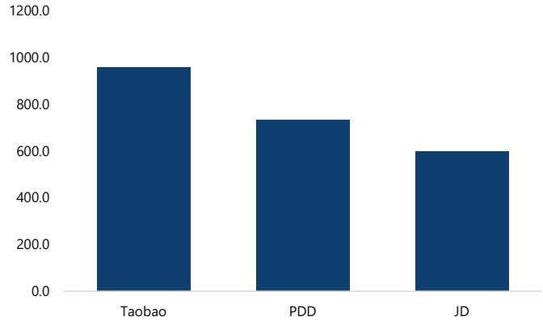  
Exhibit 43 - MAU for Taobao / PDD / JD in Mar-26   
Source: QuestMobile, Jefferies

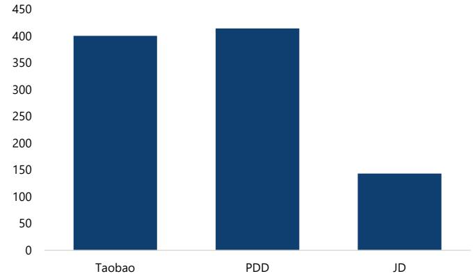  
JD maintains fast DAU growth YoY basis in Mar   
Exhibit 44 - DAU for Taobao / PDD / JD in Mar-26   
Source: QuestMobile, Jefferies   
4-20 Meituan MAU is largely stable MoM in Mar

# Food delivery

# 订阅研报添加微信 LCD123321Cad

MoM trend: Meituan MAU is flattish MoM during the month.

YoY trend: Meituan MAU increased by $3 \%$ (vs $5 \%$ YoY in Feb) in Mar.

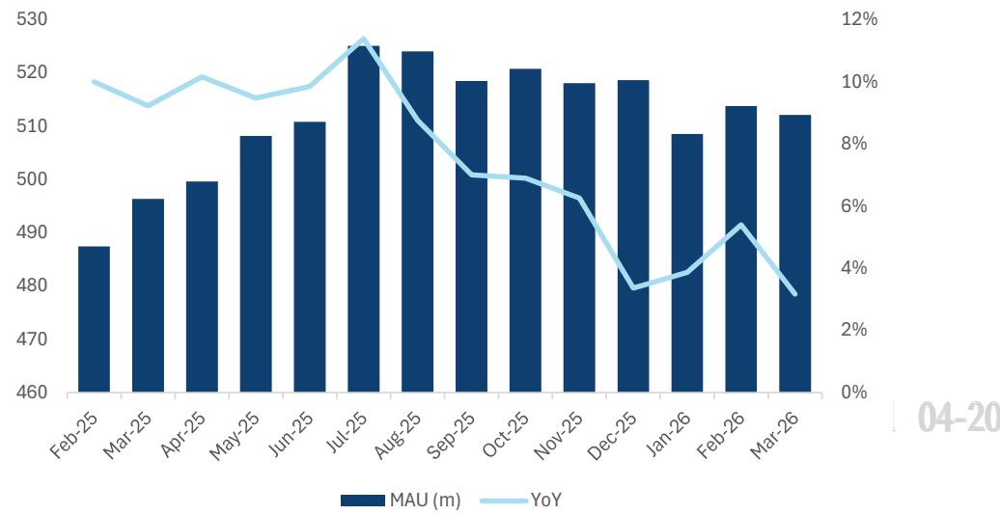  
Exhibit 45 - MAU for Meituan app in past 12 months   
Source: QuestMobile, Jefferies

# Online Music

MoM trend: MAU for Soda Music declined by $1 \%$ MoM to $\mathsf { 1 5 6 m }$ in Mar. For TME, MAU for QQ Music/Kugou/Kuwo declined by $2 \% / 2 \% / 1 \%$ MoM respectively in Mar. MAU for NetEase Cloud Music declined $2 \%$ MoM during the month.

YoY trend: MAU for Soda Music increased by $78 \%$ YoY while NetEase Cloud Music MAU increased by $1 \%$ YoY in Mar. For TME, MAU for QQ Music increased by $6 \%$ while that of Kugou/ Kuwo declined by $6 \% / 1 5 \%$ YoY respectively.

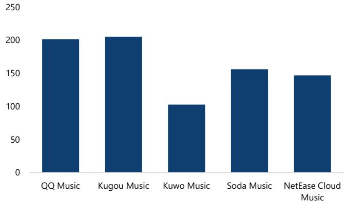  
Exhibit 46 - MAU for TME, Soda Music and NetEase Cloud Music in Mar-26   
Source: QuestMobile, Jefferies

# Online video

MoM trend: MAU for Tencent Video/IQ / Youku declined by $2 \% / 4 \% / 1 0 \%$ MoM. Mango TV experienced $4 \%$ MoM growth in MAU. YoY trend: MAU for leading long form video players declined YoY during the month.

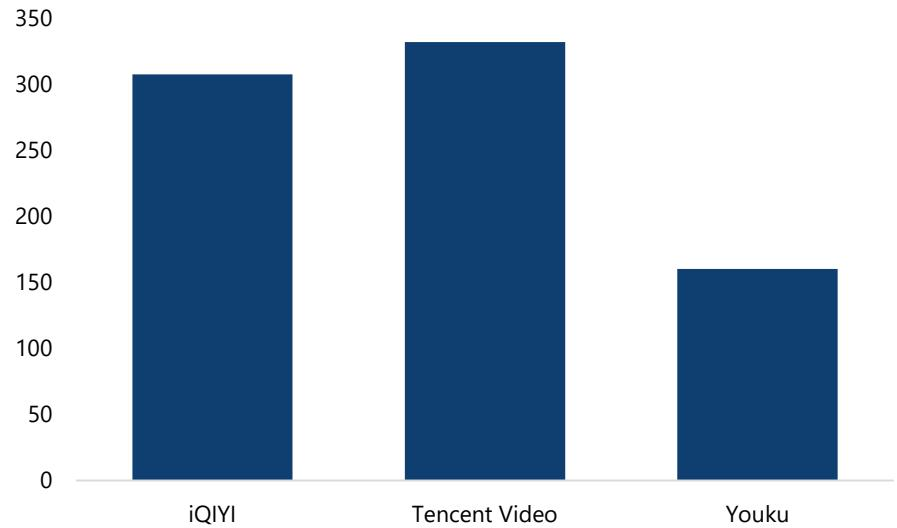  
Exhibit 48 - MAU for IQ, Tencent Video and Youku in Mar-26   
Source: QuestMobile, Jefferies

# Live-streaming and short video

MoM trend: DAU for Douyin main app increased $2 \%$ MoM in Mar. For game broadcasting, MAU for Huya/Douyu increased by $1 \% / 4 \%$ 阅研报添加微信 LCD MoM in Mar. For BILI, MAU declined $5 \%$ 3321Cad  MoM during the month.

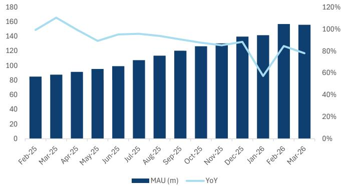  
Source: QuestMobile, Jefferies   
Exhibit 47 - MAU for Soda Music in past 12 months

YoY trend: DAU for Douyin main app maintains solid growth at $20 \%$ YoY. For game broadcasting, both Huya and Douyu experienced $6 \%$ and $10 \%$ YoY decline in MAU respectively. For BILI, MAU increased by about $3 \%$ YoY during the month.

MAU for leading long form video platform declined YoY in Mar

# Douyin DAU maintained solid YoY growth in Mar

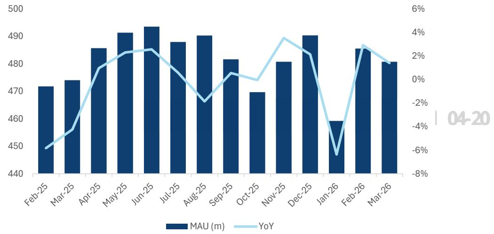  
Exhibit 52 - Weibo MAU over the past 12 months   
Source: QuestMobile, Jefferies

# Baidu app

. MoM: MAU declined by $1 \%$ and DAU increased by $2 \%$ in Mar.   
. YoY: MAU declined by $6 \%$ YoY and DAU declined by $1 9 \%$ YoY in Mar.

# Baidu app MAU experienced MoM and YoY decline in Mar

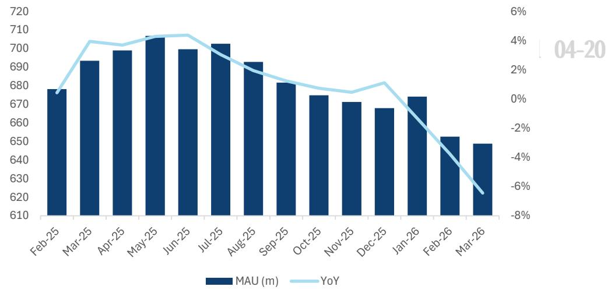  
Exhibit 53 - Baidu MAU over the past 12 months   
Source: QuestMobile, Jefferies

# Appendix

# Omdia heatmap for agentic AI development platform in Asia and Oceania

According to Omdia, agentic AI software market is expected to increase at $105 \%$ CAGR from USD271m in 2025 to USD9.7bn by 2030. Alibaba Cloud captures the highest rankings in 5 areas: 订阅研报添加微信 LCD123321Cad (1) context engineering, (2) model support, (3) multi-agent framework, (4) operation and lifecycle management, and (5) open source and community.

Exhibit 54 - Omdia heatmap for agentic AI development platform in Asia and Oceania   

<table><tr><td rowspan="3"></td><td colspan="5">LEADER</td></tr><tr><td>Alibaba Cloud</td><td>AWS</td><td>Google Cloud</td><td>Miscrosoft Azure</td><td>Tencent Cloud</td></tr><tr><td></td><td></td><td>Platform</td><td></td><td></td></tr><tr><td>Context engineering Model support</td><td></td><td></td><td></td><td></td><td></td></tr><tr><td>Multi-agent framework</td><td></td><td></td><td></td><td></td><td></td></tr><tr><td>Operation and lifecycle management</td><td></td><td></td><td></td><td></td><td></td></tr><tr><td>Toolsand marketplace</td><td></td><td></td><td></td><td></td><td></td></tr><tr><td>Vertical specific solution</td><td></td><td></td><td></td><td></td><td></td></tr><tr><td>Open source and community</td><td></td><td></td><td></td><td></td><td></td></tr><tr><td></td><td></td><td></td><td></td><td></td><td></td></tr></table>

Source: Omdia, Jefferies

According to Omdia, Alibaba Cloud is ranked as one of the leaders and top choice for building and deploying AI agents. It captures the highest ranking for 5 out of 7 metrics

# 订阅研报添加微信 LCD12Market size: Coding, Workspace, and Content Creation

According to Grand View Research, the global AI code tools market is expected to increase by $_ { 3 x }$ to USD26bn from 2025 to 2030. On the other hand, F&S predicts that the China AI code generation market will reach about USD4.7bn in 2028. KA customized solutions are expected to be key revenue contributor.

# 4-20 Global AI code tools market is expected to be 3x the scale in 2030 vs 2025

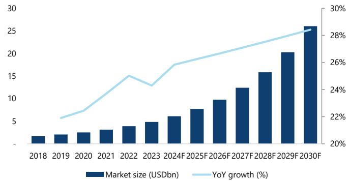  
Exhibit 55 - Global AI code tools market size (USDbn)   
Source: Grand View Research, Jefferies

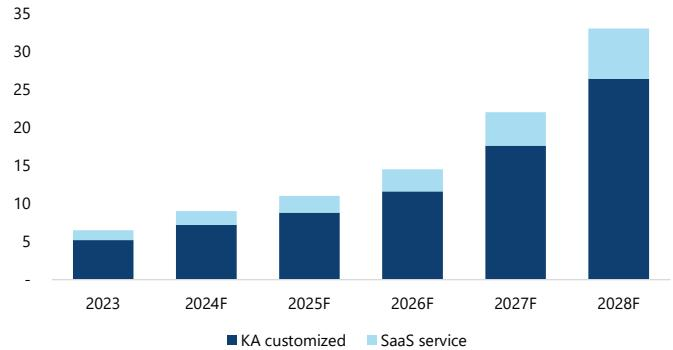  
Exhibit 56 - China AI code generation market size by service type (RMBbn)   
Source: Frost & Sullivan, Jefferies

In terms of AI code penetration, internet, gaming, AI, finance, and energy are top 5 key

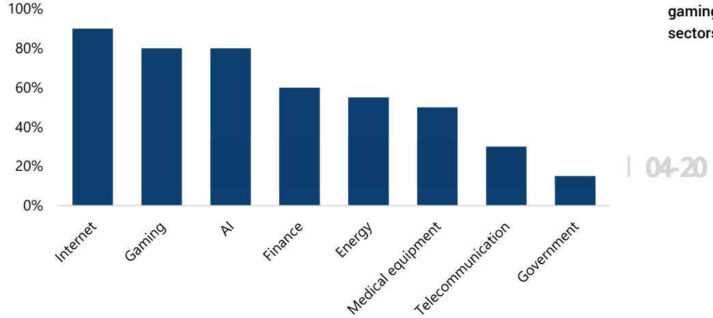  
Exhibit 57 - China AI code penetration in different industries   
Source: Frost & Sullivan, Jefferies

According to Gonyn Industry Research (2024), market size of AI+Workspace software is expected to reach RMB191bn in 2028, 6x the scale vs 2024.

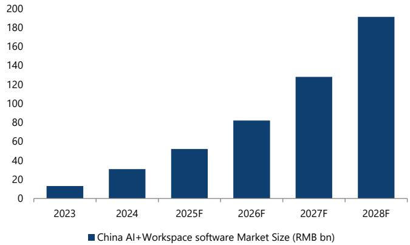  
Exhibit 58 - China AI $^ +$ Workspace Market Size   
Source: Gonyn, Jefferies

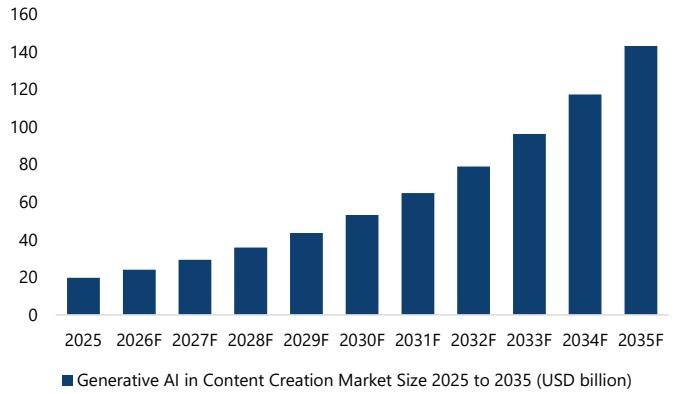  
Exhibit 59 - Generative AI in Content Creation Market Size 2025 to 2035 (USD bn)   
Source: Precedence Research, Jefferies

According to Precedence Research, global generative AI content creation market is expected to increase by $7 \times$ surpassing USD140bn in 2035 vs 2025.

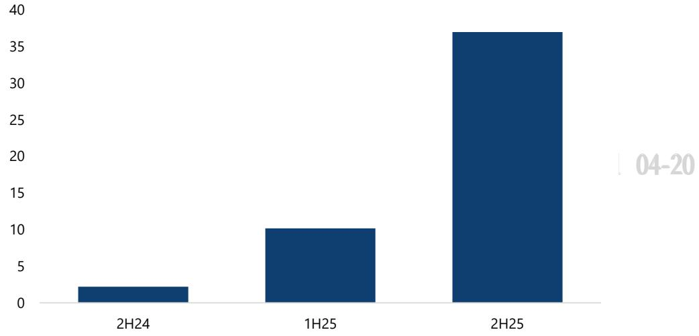  
Exhibit 60 - Daily token consumption in China by enterprises in 2H25 vs 1H25 (tn)

# Alibaba's Qwen ranked first in terms of token consumption among enterprises in 2H25

According to F&S, enterprise daily token consumptions increased by $2 6 3 \%$ HoH to 37tn, among which market share for Alibaba Cloud increased the most and captures no 1 position reaching $3 2 \%$ in 2H25 $1 \mathsf { H } 2 5 \colon 1 7 . 7 \%$ ), followed by $2 1 . 3 \%$ for Doubao (1H25: $1 4 . 1 \%$ ) and $1 8 . 4 \%$ for DeepSeek (1H25: $1 0 . 3 \%$ ).

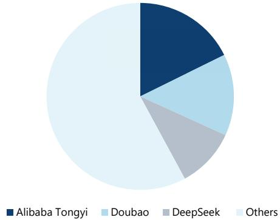  
Exhibit 61 - Market share in terms of tokens used among enterprises in 1H25   
Source: Frost & Sullivan, Jefferies

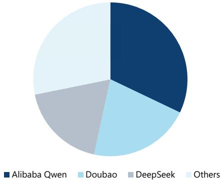  
Exhibit 62 - Market share in terms of tokens used among enterprises in 2H25   
Source: Frost & Sullivan, Jefferies

# China Large Language Models

According to F&S / CAICT, China LLM market is expected to increase by about $6 4 \%$ CAGR between 2024 and 2030 and surpass RMB100bn in 2030. By segment, consumer revenue is expected to grow at a slower rate vs enterprise as willingness to pay remains low.

# China large language models are expected to increase by $64 \%$ CAGR between 2024 to 2030. By segment, on-premise is key revenue contributor

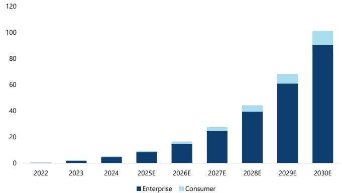  
Exhibit 63 - Market size of China LLM (RMB billions)   
Source: Frost & Sullivan, CAICT, Jefferies

# OpenAI

According to The Information, OpenAI revenue is expected to reach USD200bn in 2030, over 6x the scale in 2026. Rising Agent revenue contribution is expected over the next few years.

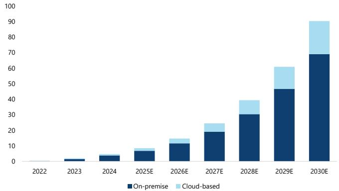  
Exhibit 64 - Market size of China Enterprise LLM (RMB billions)   
Source: Frost & Sullivan, CAICT, Jefferies

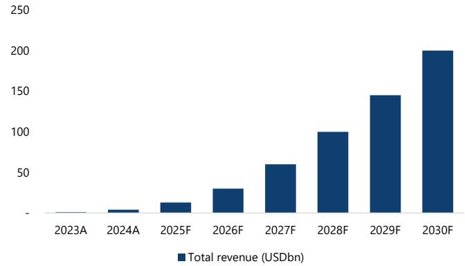  
Exhibit 65 - OpenAI revenue between 2023 and 2030F (as of 3Q25)   
Source: The Information, Jefferies

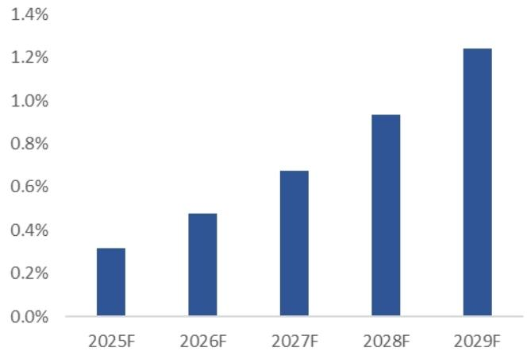  
Exhibit 67 - MiniMax: $\%$ of OpenAI revenue over the next few years

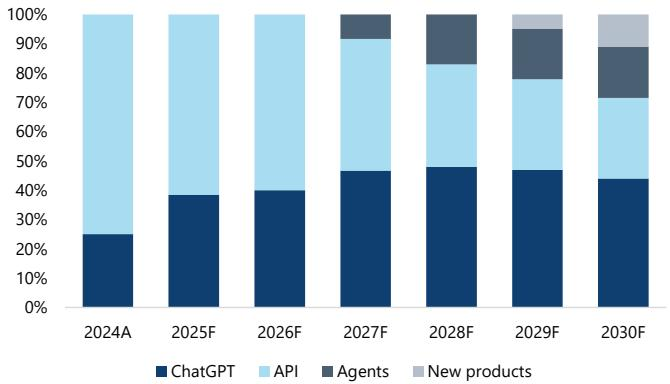  
Exhibit 66 - Revenue mix of OpenAI between 2024 and 2030F (as of 3Q25)   
Source: The Information, Jefferies

# Models of Leading Players in China

Exhibit 68 - Alibaba model list   

<table><tr><td rowspan=1 colspan=1>Release Date</td><td rowspan=1 colspan=1>Model</td><td rowspan=2 colspan=1>Core FunctionsEnhanced visual reasoning, high-resolution OCR, and detailed image understanding via APl.</td></tr><tr><td rowspan=1 colspan=1>Jan-24</td><td rowspan=1 colspan=1>Qwen-VL-Plus /Max</td></tr><tr><td rowspan=1 colspan=1>Feb-24</td><td rowspan=1 colspan=1>Qwen1.5</td><td rowspan=1 colspan=1>First major open-source iteration with improved multilingual support and 0.5B to 72B sizes.</td></tr><tr><td rowspan=1 colspan=1>Jun-24</td><td rowspan=1 colspan=1>Qwen2</td><td rowspan=1 colspan=1>Optimized for coding, mathematics, and long-context processing (up to 128K tokens).</td></tr><tr><td rowspan=1 colspan=1>Aug-24</td><td rowspan=1 colspan=1>Qwen2-Audio</td><td rowspan=1 colspan=1>Native audio-to-text and audio-to-audio dialogue capabilities.</td></tr><tr><td rowspan=1 colspan=1>Aug-24</td><td rowspan=1 colspan=1>Qwen2-VL</td><td rowspan=1 colspan=1>Introduced dynamic resolution for visual inputs and long video understanding.</td></tr><tr><td rowspan=1 colspan=1>Sep-24</td><td rowspan=1 colspan=1>Qwen2.5</td><td rowspan=1 colspan=1>Significantupgrades ininstruction following,structureddata (tables)processingndoding.</td></tr><tr><td rowspan=1 colspan=1>Nov-24</td><td rowspan=1 colspan=1>QwQ-32B-Preview</td><td rowspan=1 colspan=1>Reasoning-focused modelusing Reinforcement Learning forcomplex logicandchain-of-thought2</td></tr><tr><td rowspan=1 colspan=1>Jan-25</td><td rowspan=1 colspan=1>Qwen2.5-Max</td><td rowspan=1 colspan=1>Large-scale MoE (Mixture of Experts) flagship;matches or exceedsGPT-4o benchmarks.       i0uc</td></tr><tr><td rowspan=1 colspan=1>Jan-25</td><td rowspan=1 colspan=1>Qwen2.5-VL</td><td rowspan=1 colspan=1>&quot;Agentic&quot; vision modelcapable of identifying and interacting with mobile/PC Ulscreens.</td></tr><tr><td rowspan=1 colspan=1>Mar-25</td><td rowspan=1 colspan=1>Qwen2.5-Omni</td><td rowspan=1 colspan=1>End-to-end full-modality model supporting seamless real-time text, audio, and visual interaction.</td></tr><tr><td rowspan=1 colspan=1>Apr-25</td><td rowspan=1 colspan=1>Qwen3 (Series)</td><td rowspan=1 colspan=1>New reasoning architecture with hybrid inference modes to reduce hallucinations in complex tasks.</td></tr><tr><td rowspan=1 colspan=1>Sep-25</td><td rowspan=1 colspan=1>Qwen3-Max-Preview</td><td rowspan=1 colspan=1>Trillion-parameter preview version optimized for massive enterprise-scale applications.</td></tr><tr><td rowspan=1 colspan=1>Jan-26</td><td rowspan=1 colspan=1>Qwen3-Max</td><td rowspan=1 colspan=1>Frontierreasoning,1T+ params,agenticworkflowmastery.</td></tr><tr><td rowspan=1 colspan=1>Feb-26</td><td rowspan=1 colspan=1>Qwen3.5</td><td rowspan=1 colspan=1>Latest flagship series featuring a 397B MoE model with superior cross-lingual reasoning.</td></tr><tr><td rowspan=1 colspan=1>Feb-26</td><td rowspan=1 colspan=1>Qwen3.5-Plus</td><td rowspan=1 colspan=1>Outstanding performance comparable to the very latest state-of-the-art models with signicant leaps in both pure-textand mltimnrlal ranahilitiec rnmnared tn the 3 ceriec</td></tr><tr><td rowspan=1 colspan=1>Feb-26</td><td rowspan=1 colspan=1>Qwen3-Coder-Next</td><td rowspan=1 colspan=1>Multi-turn tool interactions, future-ready development support.</td></tr><tr><td rowspan=1 colspan=1>Mar-26</td><td rowspan=1 colspan=1>Qwen3.5-0mni</td><td rowspan=1 colspan=1>Support for 256k long-text input and can process more than 10 hours of audio input and over 400 seconds of 720Paudin-visual innut at</td></tr><tr><td rowspan=1 colspan=1>Apr-26</td><td rowspan=1 colspan=1>Qwen3.6-Plus</td><td rowspan=1 colspan=1>Native multioal,textgenticing</td></tr><tr><td rowspan=1 colspan=1>Apr-26</td><td rowspan=1 colspan=1>Happy Oyster</td><td rowspan=1 colspan=1>Al model that creates interactive 3D scenes with realistic physics for game, film, and TV.</td></tr></table>

Source: Company, Jefferies

Exhibit 69 - Tencent model list   

<table><tr><td rowspan=1 colspan=1>Release Date</td><td rowspan=1 colspan=1>Model</td><td rowspan=2 colspan=1>Core FunctionsThe industry&#x27;s first Chinese-native Diffusion Transformer (DiT) for high-quality text-to-image generation.</td></tr><tr><td rowspan=1 colspan=1>May-24</td><td rowspan=1 colspan=1>Hunyuan-DiT</td></tr><tr><td rowspan=1 colspan=1>Sep-24</td><td rowspan=1 colspan=1> Hunyuan-Turbo</td><td rowspan=1 colspan=1>An upgraded LLM based on the Mixture-of-Experts (MoE)architecture, doubling training eficiency and reducinginference costs</td></tr><tr><td rowspan=1 colspan=1>Nov-24</td><td rowspan=1 colspan=1>Hunyuan3D 1.0</td><td rowspan=1 colspan=1>First open-source 3D generation model supporting text-to-3D and image-to-3D workflows.</td></tr><tr><td rowspan=1 colspan=1>Dec-24</td><td rowspan=1 colspan=1>HunyuanVideo</td><td rowspan=1 colspan=1>A large-scale video generation framework capable of producing high-definition videos with complex motion.</td></tr><tr><td rowspan=1 colspan=1>Jan-25</td><td rowspan=1 colspan=1>Hunyuan3D 2.0</td><td rowspan=1 colspan=1>Significant upgrades in geometry accuracy and texture representation for 3D asset creation.</td></tr><tr><td rowspan=1 colspan=1>Feb-25</td><td rowspan=1 colspan=1> Hunyuan Turbo S</td><td rowspan=1 colspan=1>A &quot;fast-thinking&quot; model using Hybrid-Mamba-Transformer architecture, optimized for near-instant responses andcomnetitive reasoning</td></tr><tr><td rowspan=1 colspan=1>Mar-25</td><td rowspan=1 colspan=1>HunyuanVideo-l2V</td><td rowspan=1 colspan=1>An specialized image-to-video model built on the foundation of HunyuanVideo.</td></tr><tr><td rowspan=1 colspan=1>Jun-25</td><td rowspan=1 colspan=1>Hunyuan3D 2.1</td><td rowspan=1 colspan=1>Production-ready 3D asset generation with a new PBR (Physically Based Rendering) material model.</td></tr><tr><td rowspan=1 colspan=1>Sep-25</td><td rowspan=1 colspan=1>Hunyuan Image 3.0</td><td rowspan=1 colspan=1>Flagship image generation model (80B parameters) topping global rankings for semantic understanding.</td></tr><tr><td rowspan=1 colspan=1>Nov-25</td><td rowspan=1 colspan=1>HunyuanVideo 1.5</td><td rowspan=1 colspan=1>A highly efficient and powerful update to the foundation video generationmodel.</td></tr><tr><td rowspan=1 colspan=1>Dec-25</td><td rowspan=1 colspan=1>Hunyuan 2.0</td><td rowspan=1 colspan=1>Next-generation LLM featuring 406B parametersanda 256Kcontext windowforcomplex reasoning tasks.</td></tr><tr><td rowspan=1 colspan=1>Jan-26</td><td rowspan=1 colspan=1>Hunyuan Image 3.0-Instruct</td><td rowspan=1 colspan=1>An image-to-image editing model supporting precise single-sentence editing and multi-image fusion.</td></tr></table>

Source: Company, Jefferies

Exhibit 70 - Baidu model list   

<table><tr><td rowspan=1 colspan=1>ReleaseDate</td><td rowspan=1 colspan=1>Model</td><td rowspan=1 colspan=1>Core Functions</td></tr><tr><td rowspan=1 colspan=1>Mar-24</td><td rowspan=1 colspan=1>ERNIE Speed/Lite/Tiny</td><td rowspan=1 colspan=1>Lightweight models optimized for low latencyand high cost-efficiency.</td></tr><tr><td rowspan=1 colspan=1>Jun-24</td><td rowspan=1 colspan=1>ERNIE 4.0 Turbo</td><td rowspan=1 colspan=1>Efficiency upgrade for the 4.0architecture with faster response speeds.</td></tr><tr><td rowspan=1 colspan=1>Mar-25</td><td rowspan=1 colspan=1>ERNIE 4.5</td><td rowspan=1 colspan=1>Baidu&#x27;s first native multimodal foundation model (text,image,audio,video).</td></tr><tr><td rowspan=1 colspan=1>Mar-25</td><td rowspan=1 colspan=1>ERNIE X1</td><td rowspan=1 colspan=1>Deep-thinking reasoning model designed for complex logic and multi-step tasks.</td></tr><tr><td rowspan=1 colspan=1>Apr-25</td><td rowspan=1 colspan=1>ERNIE 4.5 Turbo /X1 Turbo</td><td rowspan=1 colspan=1>Performance-optimized version of X1 with significantly lower inference costs.</td></tr><tr><td rowspan=1 colspan=1>Sep-25</td><td rowspan=1 colspan=1>ERNIE X1.1</td><td rowspan=1 colspan=1>Majorupgrade in factuality,instruction following,and agentic capabilities.</td></tr><tr><td rowspan=1 colspan=1>Nov-25</td><td rowspan=1 colspan=1>ERNIE 5.0 (Preview)</td><td rowspan=1 colspan=1>Preview of next-gen omni-modal model with advanced real-time reasoning.</td></tr><tr><td rowspan=1 colspan=1>Jan-26</td><td rowspan=1 colspan=1>ERNIE 5.0 (Stable)</td><td rowspan=1 colspan=1>Current flagship 2.4T parameter model; top-ranked Chinese model on LMArena.</td></tr></table>

Source: Company, Jefferies

Exhibit 71 - MiniMax model list   

<table><tr><td rowspan=1 colspan=1>Release Date</td><td rowspan=1 colspan=1>Model</td><td rowspan=1 colspan=2>CoreFunction</td><td rowspan=1 colspan=1>CoreFunction</td></tr><tr><td rowspan=1 colspan=1>Jan-25</td><td rowspan=1 colspan=1>MiniMax-Text-01/MiniMax-VL-01</td><td rowspan=1 colspan=3>New generation of text and vision language model</td></tr><tr><td rowspan=1 colspan=1>Feb-25</td><td rowspan=1 colspan=1>T2V-01-Director/l2V-01-Director</td><td rowspan=1 colspan=3>Director-level video generation model, better adherence to camera movement description instructions</td></tr><tr><td rowspan=1 colspan=1>Apr-25</td><td rowspan=1 colspan=1>Image-01</td><td rowspan=1 colspan=3>Support generating images of various sizes from text descriptions</td></tr><tr><td rowspan=1 colspan=1>Jun-25</td><td rowspan=1 colspan=1>MiniMax-M1</td><td rowspan=1 colspan=3>80K mind chain and 1M input</td></tr><tr><td rowspan=1 colspan=1>Jun-25</td><td rowspan=1 colspan=1>MiniMax-Hailuo 02</td><td rowspan=1 colspan=3>Native 1080p, SOTA instruction following, extreme physics mastery</td></tr><tr><td rowspan=1 colspan=1>Jun-25</td><td rowspan=1 colspan=1>Music-1.5 (Beta)</td><td rowspan=1 colspan=3>Support music generation by inputting musical inspiration and lyrics</td></tr><tr><td rowspan=1 colspan=1>Aug-25</td><td rowspan=1 colspan=1>Sppeech-2.5</td><td rowspan=1 colspan=3>Significantly enhanced multilingual performance, more realistic and accurate voice cloning,over 40 languages</td></tr><tr><td rowspan=1 colspan=1>Sep-25</td><td rowspan=1 colspan=1>Music-1.5</td><td rowspan=1 colspan=3>Extending song generation to a full4minutesone person is the band ICD123321Cad</td></tr><tr><td rowspan=1 colspan=1>Oct-25</td><td rowspan=1 colspan=1>MiniMax M2</td><td rowspan=1 colspan=3>Open-sourceMoE,strong code&amp;agent小             LCDizssziCat</td></tr><tr><td rowspan=1 colspan=1>Oct-25</td><td rowspan=1 colspan=1>MiniMax-Hailuo-2.3</td><td rowspan=1 colspan=3>Complex video performance &amp;mediaagent</td></tr><tr><td rowspan=1 colspan=1>Oct-25</td><td rowspan=1 colspan=1>MiniMax-Speech-2.6</td><td rowspan=1 colspan=3>Rea-time response,intellgent parsing,fluentLoRA voice</td></tr><tr><td rowspan=1 colspan=1>Oct-25</td><td rowspan=1 colspan=1>Music-2.0</td><td rowspan=1 colspan=3>Alead forward in model&#x27;s understanding and expression of music</td></tr><tr><td rowspan=1 colspan=1>Dec-25</td><td rowspan=1 colspan=1>MiniMax M2.1</td><td rowspan=1 colspan=3>Exceptional multlingual capabilities to elevate code engineering</td></tr><tr><td rowspan=1 colspan=1>Jan-26</td><td rowspan=1 colspan=1>Music-2.5</td><td rowspan=1 colspan=3>Creation more precise and music more real</td></tr><tr><td rowspan=1 colspan=1>Jan-26</td><td rowspan=1 colspan=1>MiniMax M2-Her</td><td rowspan=1 colspan=3>Multi-character roleplay, immersive long-horizon interaction</td></tr><tr><td rowspan=1 colspan=1>Feb-26</td><td rowspan=1 colspan=1>MiniMax M2.5</td><td rowspan=1 colspan=3>Industry-leading coding and reasoning capabilities at a fraction of the cost</td></tr><tr><td rowspan=1 colspan=1>Mar-26</td><td rowspan=1 colspan=1>Music-2.5+</td><td rowspan=1 colspan=3>Enhanced creation experience &amp; effciency, smarter melodies, purer sound quality</td></tr><tr><td rowspan=1 colspan=1>Mar-26</td><td rowspan=1 colspan=1>MiniMax M2.7</td><td rowspan=1 colspan=3>M2.7 is capable of building complex agent harnessesand completing highly elaborate productivity tasks,leveragingcapabilities such as Aaent Teams. complex Skills. and dvnamic tool search.</td></tr></table>

Exhibit 72 - Moonshot AI model list   

<table><tr><td>Release Date</td><td>Model</td><td>Core Function</td></tr><tr><td>Jan-25</td><td>Kimi k1.5</td><td>An o1-level multi-modal model</td></tr><tr><td>Apr-25</td><td>Kimi-VL</td><td>Offers advanced multimodal reasoning,long-context understanding, and strong agent capabilities</td></tr><tr><td>Apr-25</td><td>Kimina-Prover Preview</td><td>Can reason in a human-like way and prove mathematical theorems in the Lean 4 language</td></tr><tr><td>Apr-25</td><td>Kimi-Audio</td><td>Open-source audio foundation modelexcelinginaudio understanding, generation, and conversatin</td></tr><tr><td>Jun-25</td><td>Kimi-Dev</td><td>A strong and open-source coding LLM for issue resolution</td></tr><tr><td>Jun-25</td><td>Kimi-Researcher</td><td>End-to-endRtrainingforemeginagenticaabities</td></tr><tr><td>Jul-25</td><td>Kimi K2</td><td>A state-of-the-art MoE language mode, featuring 32 billion activated parameters and a total of 1 trilion parameters</td></tr><tr><td>Sep-25</td><td>Kimi-K2-Instruct-0905</td><td>The post-trainedmodelbestfordrop-in,general-purposechatandagenticexperience</td></tr><tr><td>Nov-25 Jan-26</td><td>Kimi K2 Thinking Kimi K2.5</td><td>Executeuptoseetialllithmateferecasogeretndeofptpb A multimodal model, state-of-the-art coding, vision capabilities, self-directed agent swarm paradigm</td></tr></table>

Source: Company, Jefferies

Exhibit 73 - Z.ai model list   

<table><tr><td rowspan=1 colspan=1>ReleaseDate</td><td rowspan=1 colspan=1>Model</td><td rowspan=1 colspan=1>Core Function</td><td rowspan=16 colspan=1>04-2</td></tr><tr><td rowspan=1 colspan=1>Jul-25</td><td rowspan=1 colspan=1>GLM-4.5-Air</td><td rowspan=1 colspan=1>Adoptsamorestreamlineddesignwith106Btotalparametersand12Bactiveparameters.33Za0</td></tr><tr><td rowspan=1 colspan=1>Jul-25</td><td rowspan=1 colspan=1>GLM-4.5</td><td rowspan=1 colspan=1>Total parameter count of 355B with 32B active parameters per forward pass</td></tr><tr><td rowspan=1 colspan=1>Aug-25</td><td rowspan=1 colspan=1>GLM-4.5V</td><td rowspan=1 colspan=1>Achieved SOTA performance among open-source VLMs of the same level with 106B parameters and 12B activationDarameters</td></tr><tr><td rowspan=1 colspan=1>Sep-25</td><td rowspan=1 colspan=1>GLM-4.6</td><td rowspan=1 colspan=1>Advanced agentic, reasoning and coding capabilities</td></tr><tr><td rowspan=1 colspan=1>Dec-25</td><td rowspan=1 colspan=1>AutoGLM</td><td rowspan=1 colspan=1>Autonomous foundation agents for GUls</td></tr><tr><td rowspan=1 colspan=1>Dec-25</td><td rowspan=1 colspan=1>GLM-4.6V</td><td rowspan=1 colspan=1>Open source multimodal models with native tool use</td></tr><tr><td rowspan=1 colspan=1>Dec-25</td><td rowspan=1 colspan=1>GLM-ASR-Nano</td><td rowspan=1 colspan=1>A robust, open-source speech recognition model with 1.5B parameters</td></tr><tr><td rowspan=1 colspan=1>Dec-25</td><td rowspan=1 colspan=1>GLM-TTS</td><td rowspan=1 colspan=1>Zero-shot TTS with multi-reward reinforcement learning</td></tr><tr><td rowspan=1 colspan=1>Dec-25</td><td rowspan=1 colspan=1>GLM-4.7</td><td rowspan=1 colspan=1>Complex systems engineering and long-horizon agentic tasks</td></tr><tr><td rowspan=1 colspan=1>Jan-26</td><td rowspan=1 colspan=1>GLM-4.7-Flash</td><td rowspan=1 colspan=1>Open source and free</td></tr><tr><td rowspan=1 colspan=1>Feb-26</td><td rowspan=1 colspan=1>GLM-OCR</td><td rowspan=1 colspan=1>SOTA performance, mastering complexdocument recognition</td></tr><tr><td rowspan=1 colspan=1>Feb-26</td><td rowspan=1 colspan=1>GLM-5</td><td rowspan=1 colspan=1>MoEflagship,complex engineering&amp; long-horizonagent</td></tr><tr><td rowspan=1 colspan=1>Mar-26</td><td rowspan=1 colspan=1>GLM-5-Turbo</td><td rowspan=1 colspan=1>GLM-5-Turbo is a foundation model deeply optimized for the OpenClaw scenario. It has been specifically optimizedfor the core requirements of OpenClaw tasks since the training phase, enhancing key capabilities such as toolinvocation, command following, timed and persistent tasks, and long-chain execution.</td></tr><tr><td rowspan=1 colspan=1>Apr-26</td><td rowspan=1 colspan=1>GLM-5V-Turbo</td><td rowspan=1 colspan=1>Itstrengthensmultimodal toluseandGUltask execution,allowing the modeltobetter interpretinterfaces,designmocks, documents, and charts, plan the next action, and complete end-to-end Agent workflows while maintainingstrong pure-text coding and reasoning performance.</td></tr><tr><td rowspan=1 colspan=1>Apr-26</td><td rowspan=1 colspan=1>GLM-5.1</td><td rowspan=1 colspan=1>Builtforlong-horizontasks,itruns autonomouslyfor8 hours,refiningstrategies through thousands ofiterationsandit delivers significant leaps in coding and agentic performance with 6x performance boost. In high-performancedatabase optimization,it reached 21.5k QPSover 600+ iterations and 6,000+ tool cals, which is 6x the performance ofa standard 50-turn session</td></tr></table>

Source: Company, Jefferies

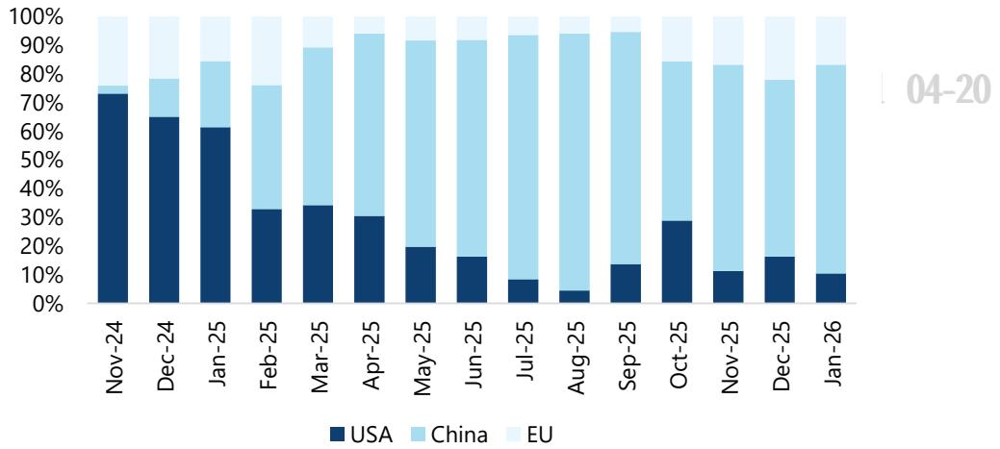  
Exhibit 74 - Token share by region   
Source: OpenRouter, Jefferies

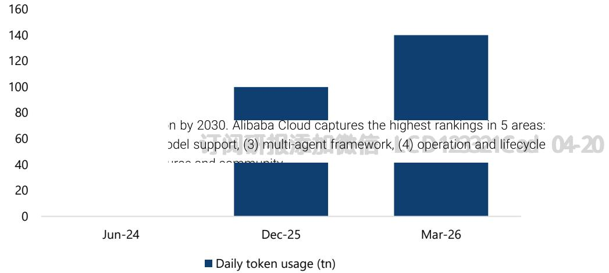  
Exhibit 75 - China Daily token usage   
Source: National Data Administration (NDA), Jefferies

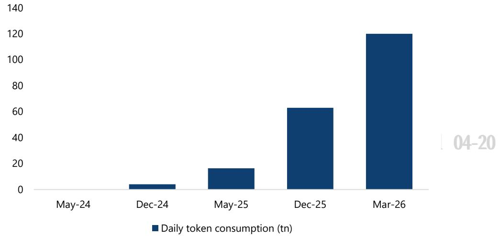  
Exhibit 76 - Doubao daily token consumption   
Source: VolcanoEngine, Jefferies