# Transportation Case Study

acenter capex from leading public hyperscalers is now approaching $\$ 700$ bn USD, roughly the level in 2020. With spend continuing to grow, and consensus capex estimates being revised her yet again with the most recent set of earnings reports, we believe the return on that capex ains a key focus for the financial markets and brings us to Part II in our series on analyzing the act of AI on profit pools. Recall this series seeks to determine how much profit AI enabled efforts 订阅研报添加微信 LCD123321Cad 04-17 ld help drive with different case studies, giving investors a tool to better contextualize investment ls. Please see our June 2025 report on the advertising market for Part I of this report series. In t II - A Transportation Case Study - we examine autonomous mobility globally, including for light commercial vehicles.

ark Delaney, CFA (212)357-0535 oldman Sachs & Co. LLC

Eric Sheridan +1(917)343-8683

Goldman Sachs & Co. LLC

Christian Frenes +44(20)7051-8641

Lincoln Kong, CFA $+ 8 5 2$ -2978-6603

Allen Chang +852-2978-2930

Goldman Sachs (Asia) L.L.C.

Ronald Keung, CFA +852-2978-0856

7 Goldman Sachs (Asia) L.L.C.

Verena Jeng +852-2978-1681 oldman Sachs Japan Co., Ltd.

na Hou 6(21)2401-8694

Goldman Sachs (Asia) L.L.C.

Nick Zheng, CFA +852-2978-1405

Goldman Sachs (Asia) L.L.C.

Do Hyoung Kim $+ 8 2$ (2)3788-1376 oldman Sachs (China) Securities mpany Limited

Goldman Sachs (Asia) L.L.C.

Goldman Sachs (Asia) L.L.C., S Branch

handramouli Muthiah 1(22)6616-9344

Aman Gupta +1(212)357-1549

Goldman Sachs & Co. LLC lia Fein-Ashley (212)902-5070 oldman Sachs & Co. LLC

Monika Mengting Liu, CFA +44(20)7051-7601

Meihan Yang +44(20)7051-6601

Goldman Sachs International uan Zhang 52-2978-1478 oldman Sachs (Asia) L.L.C.

Ayush Ghose +1(212)902-7257

Goldman Sachs & Co. LLC

Emma Huang +1(212)902-7229

Goldman Sachs & Co. LLC

Table of Contents

The ecosystem of autonomy 5   
PM summary 6   
AI tech capabilities and capital - gauging costs and growth 10   
Robotaxi deployments and market size accelerating, aided by safety and consumer adoption 13   
订阅研报添加微信 LCD123321Cad 04-17 Consumer AVs - partially and fully autonomous vehicles poised to grow 23   
AV trucking market is currently small but now poised to ramp 26   
What is at risk of disruption - human driven rideshare/trucking, and auto sales 30   
Analyzing the Potential Impact of Robotaxis on Uber & Lyft 32   
Spotlight on Waymo: Framing Operating Assumptions and the Path to $\$ 8$ bn $^ +$ Gross Bookings by 2030E 38   
Spotlight on Tesla 45   
Stocks in Focus 48   
Disclosure Appendix 57

The pace of autonomous technology commercialization has accelerated since our June 2025 report, “Framing profit pools in rideshare, trucking, and insurance as AVs move from concept to commercialization”. This is being driven by both a growing number of deployments in the US and China, and also international expansions into new geographies including EMEA. These deployments are enabled by both captive technology development (e.g. at Waymo, Tesla, Pony AI, etc) and a growing set of merchant Physical AI tools including from companies such as Nvidia (e.g. Alpamayo). In fact, Nvidia discussed numerous Physical AI and AV partnerships at GTC 2026 including with Mercedes, Uber, GM, BYD, Geely, and Hyundai. We expect there to ultimately be 订阅研报添加微信 LCD123321Cad 04-17 multiple providers of autonomous technology.

With the now more global ramps of several companies, we update our AV profit pools analysis to include key global regions for robotaxis and Class 8 trucks, and we also frame the market potential from “robots that drive” more broadly including delivery bots. In addition, we update our estimates for the mix of partially and fully autonomous consumer vehicles (e.g. L3-L5 classifications).

We now estimate that the AV robotaxi market in the US will reach $\$ 19$ bn in 2030, up from $\$ 7$ bn prior, and we introduce our 2035 forecast of $\$ 48$ bn. When including global markets, we estimate that the robotaxi market in 2035 could be $\$ 415$ bn. We assume that the gross margins of a vertically integrated operator could be $3 0 \% - 5 0 \%$ , implying gross profit for the market of $\sim \$ 150$ bn in 2035 and cumulative gross profit of $\sim \$ 440$ bn over the next decade for robotaxis.

Class 8 trucking is also growing, and our forecast remains similar to our prior outlook for the market by 2030 in the US (we assume growing to $\$ 16$ bn in 2030 from low levels 订阅研报添加微信 LCD123321Cadcurrently), and we think the market could reach $\$ 105$ 17  bn in the US and $\$ 560$ bn globally in 2035. We estimate that gross profit for AV trucking will be $\sim \$ 135$ bn in 2035, and about $\$ 300$ bn cumulatively over the next decade.

Considering the market more broadly for AV hardware and software & services, we estimate that revenue associated with the industry could reach approximately $\$ 2$ trillion in 2035 comprised of hardware sales (e.g. robotaxis, consumer L3-L5 vehicles, AV trucks, and delivery bots) and software/digital services (e.g. robotaxi and AV trucking services, and consumer autonomous subscriptions for L3-L5). Recognizing that a meaningful portion of this $\$ 2$ trillion of revenue associated with autonomy is coming from business for goods/services that isn’t incremental (e.g. buying an L3/L4 car rather than an L1/L2 car, and freight being hauled by an AV truck rather than a person), when focusing more specifically on the piece of this market attributable to AI (e.g. revenue for virtual driver technology in robotaxis and AV trucks, and software subscriptions for consumer L3-L5 autonomy), we estimate that the market will be 订阅研报添加微信 LCD123321Cad 04-17approximately \$300 bn in 2035.

Our global forecast is informed by the views of the regional teams and company specific outlooks for key covered companies, including views on the China market and AV providers from Allen Chang and team detailed in their report (see link).

While a portion of AV volumes will likely be incremental demand (e.g. as new use cases become affordable or possible), we believe autonomy could also disrupt existing markets in the long-term. We frame risks and scenarios including to human-operated rideshare/taxis, trucking, and light vehicle unit sales in the United

States in this report. We estimate the economic size that could potentially be disrupted in the US is $\$ 440$ bn.

There are already signs of change, with Waymo’s share in SF reaching $30 \%$ , 20 months after being fully launched (per Yipit), and our base case view is for $5 \%$ cannibalization of UCAN rideshare gross bookings from AVs (and $16 \%$ in a bear case) by 2030. For autos, the potential combination of consumers choosing to own AVs personally longer-term, plus an increase in miles traveled enabled by the improved experience, leads us to our base case view that the long-term average for SAAR will remain relatively similar to the historical \~16 mn level. However, in a bear case scenario 订阅研报添加微信 LCD123321Cad 04-17 in the long-term where all miles traveled use AV rideshare, we estimate that US SAAR could be 3-6 mn units lower.

In terms of stocks, we highlight GOOGL, TSLA, UBER, AUR, AMZN, Pony AI, RIVN, MBLY, LYFT, TEL, Hesai, XPeng, and Volvo Group as stocks in our coverage that are beneficiaries of AVs and/or where we believe investor concerns about risks from AVs are overdone. We see mixed implications for traditional auto OEMs, with risks to unit and/or profit share if newer tech companies disrupt the market for personal transportation, but also potential opportunities tied to software and digital services. We’d also note that elements of competition, execution risk, valuation, and, in some cases, further capital needs keep us on the sidelines for certain stocks that have revenue exposure to the autonomous market (as discussed on a company by company basis in the Stocks in Focus section of this report).

The ecosystem of autonomy

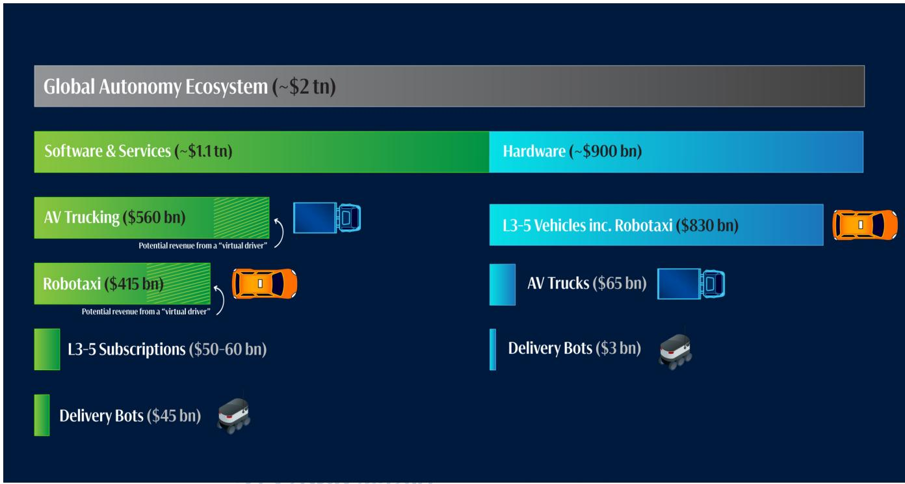  
Exhibit 1: Potential global autonomy ecosystem market size in 2035   
Source: Goldman Sachs Global Investment Research

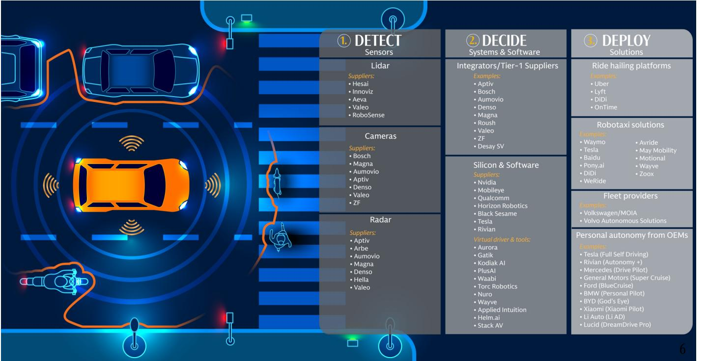  
Exhibit 2: Illustrative autonomous ecosystem

Datacenter capex from leading public hyperscalers is now approaching \~ $\$ 700$ bn USD, roughly 10X the level in 2020. With spend continuing to grow, and consensus capex estimates being revised higher yet again with the most recent set of earnings 订阅研报添加微信 LCD123321Cad 04-17 reports, we believe the return on that capex remains a key focus for the  financial markets. We therefore examine pro fit pools that AI could impact, with this report focusing on the transportation market.

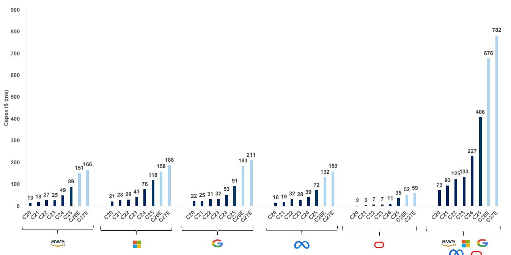  
Exhibit 3: Hyperscaler capex CY2020-27E

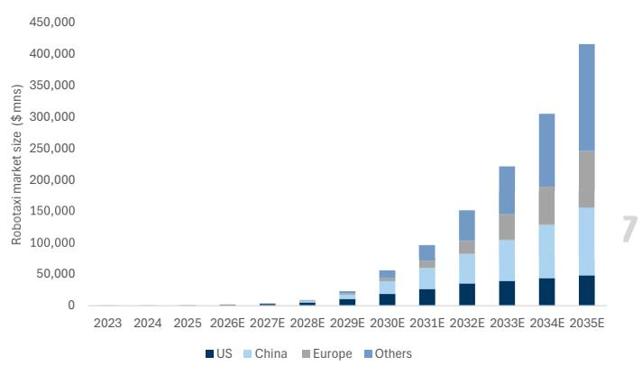  
Exhibit 4: Robotaxi market size in $\$ 5$ mns, 2023-2035E   
Source: Company data, Goldman Sachs Global Investment Research

Class 8 trucking is also growing, and our forecast remains similar to our prior outlook for the market by 2030 in the US (we assume growing to $\$ 16$ bn in 2030 from low levels currently), and we think the market could reach $\$ 105$ bn in the US and \~ $\$ 560$ bn globally by 2035. We estimate that gross profit for AV trucking will be $\sim \$ 135$ bn in 2035, and about $\$ 300$ bn cumulatively over the next decade.

We expect that part of the increased adoption and deployments through 2035 will be 订阅研报添加微信 LCD123321Cad 04-17 driven by the cost of AV trucking improving relative to a human driver. At present, we believe the additional upfront costs to make an AV truck in the US are $\yen 123,456$ , and we expect this to decline to a premium of $\sim \$ 35-40 K$ in 2035, driven by improved hardware costs and economies of scale. With driver wages trending higher, and as AV hardware costs are monetized over more miles, we forecast that AV trucking costs per mile for commercial deployments to be better than human operated trucks in 2028 in the US. There are also routes that AV trucks can serve that are beyond what a human can do in a day given hours of driving limits.

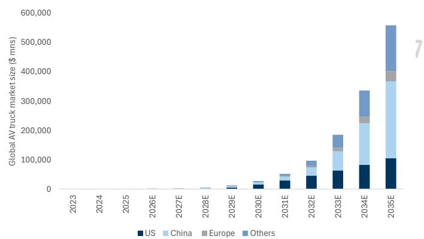  
Exhibit 5: Global AV trucking market size (\$ mns), 2023-2035E

services, and consumer autonomous subscriptions for L3-L5). Recognizing that a meaningful portion of this $\$ 2$ trillion of revenue associated with autonomy is coming from business for goods/services that isn’t incremental (e.g. buying an L3/L4 car rather than an L1/L2 car, and freight being hauled by an AV truck rather than a person), when focusing more specifically on the piece of this market attributable to AI (e.g. revenue for virtual driver technology in robotaxis and AV trucks, and software subscriptions for consumer L3-L5 autonomy), we estimate that the market is approximately $\$ 300$ bn in 2035.

订阅研报添加微信 LCD123321Cad 04-17 Our global forecast is informed by the views of the regional teams and company specific outlooks for key covered companies, including views on the China market and AV providers from Allen Chang and team detailed in their report (see link).

We recognize there could be downside risks related to factors such as more restrictive regulations than we expect and/or more difficult industry fundamentals. Upside risks could be driven by factors such as better than expected end-user economics.

While a portion of AV volumes will likely be incremental demand (e.g. as new use cases become affordable or possible), we believe autonomy could also disrupt existing markets in the long-term. We frame risks and scenarios including to human-operated rideshare/taxis, trucking, and light vehicle unit sales in the United States in this report. We estimate the economic size that could potentially be disrupted in the US is $\$ 440$ bn. This is comprised of wages for taxi/chauffeur/shuttle, 订阅研报添加微信 LCD123321Cad 04-17 delivery and truck drivers per BLS data, an estimate for the share of bookings from rideshare allocated to drivers, and how much auto sales could decline in a scenario where personal transport demand is served only by AV rideshare.

There are already signs of change, with Waymo’s share in SF reaching $30 \%$ , 20 months after being fully launched (per Yipit), and our base case view is for $5 \%$ cannibalization of UCAN rideshare gross bookings from AVs (and $16 \%$ in a bear case) by 2030.

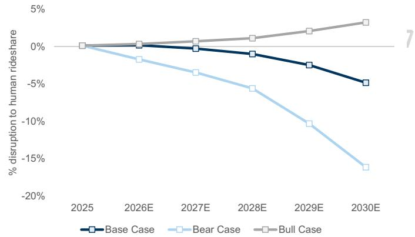  
Exhibit 6: Potential impact to human rideshare from robotaxis, with a base case assumption of $5 \%$ cannibalization/disruption and scenarios for a net positive impact in a bull case or $16 \%$ cannibalization in a bear case

similar to the historical $\sim 1 6 ~ \mathsf { m n }$ level. However, in a bear case scenario where all miles traveled use AV rideshare, we estimate that US SAAR could be 3-6 mn units lower.

We assume, for the purposes of this illustrative bear case analysis, that vehicles have a useful life of $\sim 4 0 0 \mathsf { K }$ miles, that utilization in terms of miles traveled per vehicle per year rises given the scenario that all vehicles in operation (VIO) are shared AVs, and that vehicle miles traveled (or VMT) ranges from unchanged to $3 3 \%$ higher as consumers may use more vehicle transportation if it’s less costly and doesn’t require a driver’s attention.

Exhibit 7: Implied US SAAR (in mns) in a scenario where the VIO/VMT is all shared AVs by 2040   

<table><tr><td rowspan="2"></td><td rowspan="2"></td><td colspan="8">% increase in VMT</td></tr><tr><td>0%</td><td>2%</td><td>4%</td><td>5% 10%</td><td>15%</td><td>20%</td><td>25%</td><td>33%</td></tr><tr><td></td><td>12,500</td><td>10</td><td>10</td><td>10</td><td>11</td><td>11</td><td>12</td><td>12 13</td><td>13</td></tr><tr><td></td><td>15,000</td><td>10 10</td><td>10</td><td>11</td><td>11</td><td>12</td><td>12</td><td>13</td><td>13</td></tr><tr><td></td><td>20,000</td><td>10</td><td>10</td><td>10 11</td><td>11</td><td>12</td><td>12</td><td>13</td><td>13</td></tr><tr><td></td><td>30,000</td><td>10 10</td><td>10</td><td>11</td><td>11</td><td>12</td><td>12</td><td>13</td><td>13</td></tr><tr><td></td><td>40,000</td><td>10 10</td><td>10</td><td>11</td><td>11</td><td>12</td><td>12</td><td>13</td><td>13</td></tr><tr><td>merslslili</td><td>50,000</td><td>10 10</td><td>10</td><td>11</td><td>11</td><td>12</td><td>12</td><td>13</td><td>13</td></tr><tr><td></td><td>75,000</td><td>10</td><td>10</td><td>10</td><td>11</td><td>11</td><td>12</td><td>12 13</td><td>13</td></tr><tr><td>100,000</td><td>10</td><td>10</td><td>10</td><td>11</td><td>11</td><td>12</td><td>12</td><td>13</td><td>13</td></tr><tr><td>150,000</td><td>10</td><td>10</td><td>10</td><td>11</td><td>11</td><td>12</td><td>12</td><td>13</td><td>13</td></tr><tr><td>200,000</td><td>10</td><td>10</td><td>10</td><td>11</td><td>11</td><td>12</td><td>12</td><td>13</td><td>13</td></tr></table>

Source: Goldman Sachs Global Investment Research

Datacenter capex from leading public hyperscalers is now approaching \~ $\$ 700$ bn USD, roughly 10X the level in 2020. In fact, consensus capex estimates were revised higher yet again with the most recent set of earnings reports, with the bottom-up 订阅研报添加微信 LCD123321Cad 04-17 aggregation of 2026 GS capex estimates for the leading hyperscalers now $1 4 \%$ higher relative to the start of 4Q25 earnings. GS analysts now expect $67 \%$ yoy growth in capex in 2026, and $1 6 \%$ in 2027 (Exhibit 8).

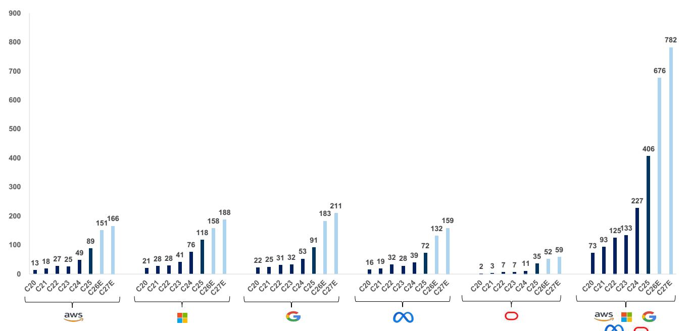  
Exhibit 8: Hyperscaler capex CY2020-27E

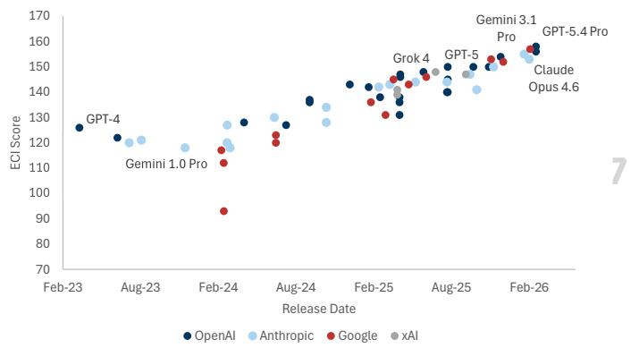  
Exhibit 9: Select AI model performance on the Epoch Capabilities Index   
Source: Epoch AI

The Stanford Institute for Human-Centered AI (HAI) also details how AI models have improved over time, most recently in their 2026 AI index report. Per HAI, AI model performance has continued to trend higher overall, with AI models able to exceed human capabilities on several metrics. However, certain tasks remain more challenging 订阅研报添加微信 LCD123321Cad 04-17 for AI models, with the 2026 report discussing low accuracy from several models at reading analog clocks.

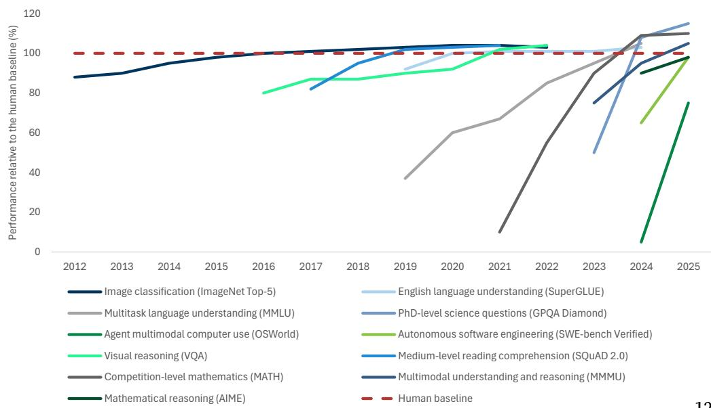  
Exhibit 10: Select AI Index technical performance benchmark vs. human performance

significantly accelerate the time-to-market and increase the number of companies that could provide L4 AV technology (and we do expect a number of companies to ultimately offer AV products, either with their own technology or by utilizing partnerships/suppliers). The Mercedes CLA is scheduled to be the first vehicle in the market using Alpamayo, initially as an $\textsf { L 2 + }$ product this year in the US.

One key component of Alpamayo is the open-sourced reasoning vision-language-action model (VLA). The tools also include AlpaSim (an open-source AV simulation framework which provides realistic sensor modeling, configurable traffic behavior, and scalable closed-loop testing) and open datasets for AVs (with $1 7 0 0 +$ hours of driving comprised of $3 0 0 \mathsf { K } +$ 研报添加 clips, each $\sim 2 0$ 信 LCD123321Cad 04-17  seconds long, recorded in 25 countries and 2500 cities with diverse traffic, weather, and obstacles).

The tools from Nvidia tie in with a broader debate currently in the industry on how much of AV model development and testing can utilize simulation, and how much real-world data is needed, although we think a mixture of both remains logical (with increasingly sophisticated simulation tools helping to speed development cycles and future iterations of the technology, in our opinion).

Another key theme in the industry relates to how AI is implemented into AV policy. This includes the ability to utilize an end-to-end approach and advanced AI techniques over legacy rules-based models. While we think most if not all AV companies are now adopting advanced AI techniques for at least elements of their technology development, we believe some are using more holistic approaches (as explained by Waymo, for example, in a December 2025 blog post), while others argue for the generalization benefits of a more pure end-to-end approach.

Finally, there is a debate on the role and need for maps. With Waymo (which has traditionally used maps) now scaling, we think there is increasing evidence that using maps is a workable approach, at least for commercial applications that operate in a geofence, although others, including Tesla, have suggested that a generalized approach without maps will allow for faster scaling longer-term.

# How much does AV development cost for capex?

One of the objectives of this report is to gauge capex demand and ROI tied to AVs. The level of capex the industry in total would need depends in part on how many different companies develop the technology. However, one case study is from Tesla, which has described a plan to grow its $\mathsf { H } 1 0 0$ -equivalent GPU count to $\sim 2 7 5 \mathsf { K }$ by the summer of 2026 from $\sim 1 1 0 \mathsf { K } - 1 2 5 \mathsf { K }$ at the end of 2025. The GS semi team estimates that Nvidia GPUs cost $\$ 25K -\$ 45 K$ each (with Hopper at the low-end and Rubin at the high-end of this), and that Nvidia hardware (including networking) can be ${ \sim } 6 0 \%$ of a project cost. We 订阅研报添加微信 LCD123321Cad 04-17 estimate this implies that Tesla’s capex for AI infrastructure would reach at least $\$ 5$ bn and could be in the $\$ 10$ bn range cumulatively by this summer. Many of the AV companies, per our industry discussions, utilize cloud training (e.g. AWS) rather than their own datacenters.

Robotaxi deployments and market size accelerating, aided by safety and consumer adoption

Global AV deployments are accelerating. For example, Waymo was deployed fully driverlessly and available to the public in 5 cities at the end of 2025 and plans to be in ${ > } 1 5$ by the end of 2026, Uber expects to be facilitating AV trips in as many as 15 cities by the end of 2026, Pony AI expects to be in $^ { 2 0 + }$ cities by the end of 2026, and WeRide plans to more than double its AV fleet by the end of 2026.

We show current and planned deployments for Waymo, Uber, Lyft, Zoox, Pony AI, Baidu, WeRide, Mobileye, May Mobility, and Grab in Exhibit 11 and Exhibit 12 (we consider this a representative but not exhaustive list of deployments). We also note partnerships with Grab and Bolt exist, similar to plans from Uber and Lyft, to deploy in unspecified cities across several AV providers (e.g. WeRide, May Mobility, etc).

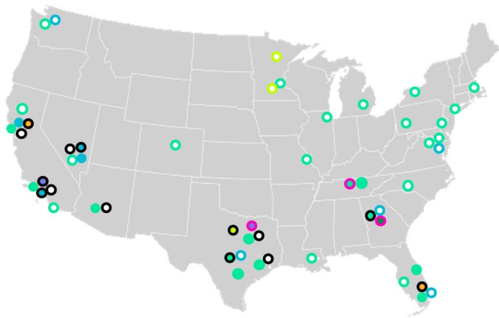  
Exhibit 11: US Robotaxi Operations

O In Development

# Uber

Active O In Development O Partnership -Waymo O Partnership- Mobileye O Partnership- Rivian O Partnership - Zoox OPartnership-MayMobility

Lft   
●Active   
$\cdot$ In Development   
O Partnership -Waymo   
OPartnership-Mobileye   
$\textcircled { \circ }$ Partnership- May Mobility Zoox   
●Active   
$\circ$ In Development May Mobility

# Waymo

●Active $\circ$ In Development

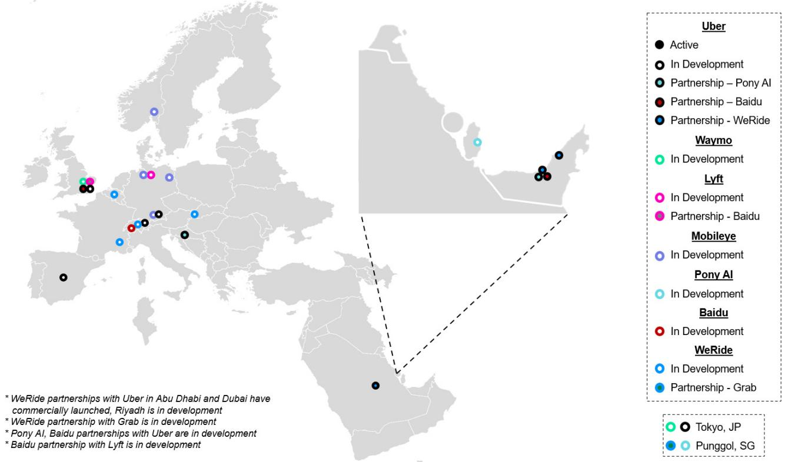  
Exhibit 12: International Robotaxi Operations (ex. China)   
订阅研报添加微信 LCD123321Cad 04-17 Active cities defined as locations where operations are fully launched, fully driverless, and available to the public. In development includes cities where testing & mapping operations are currently in progress or where rides are available with safety observers/monitor onboard.

These deployments are driving a growing fleet and market. We estimate the fleet of commercial AVs globally will rise from $\mathord { \sim } 7 \mathsf { K }$ last year to $\sim 1 \ \mathsf { m n }$ in 2030 and $\sim 6 \mathsf { m n }$ in 2035, implying an ${ \sim } 9 6 \%$ CAGR between 2025-2035E. These forecasts are based on input from the regional teams and views for covered companies.

We now estimate that the AV robotaxi market in the US will reach $\$ 19$ bn in 2030, up from $\$ 7$ bn prior, and we introduce our 2035 forecast of $\$ 48$ bn. When including global markets, we estimate that the robotaxi market in 2035 could be \~ $\$ 415$ bn.

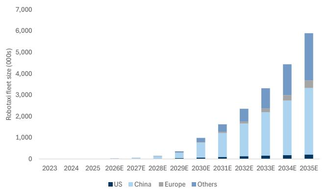  
Exhibit 13: Robotaxi fleet by region, 2023-2035E

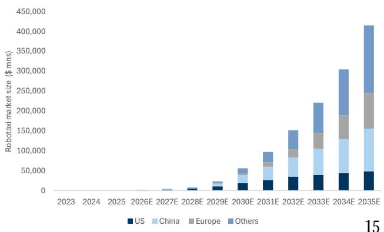  
Exhibit 14: Robotaxi market size in $\$ 5$ mns, 2023-2035E

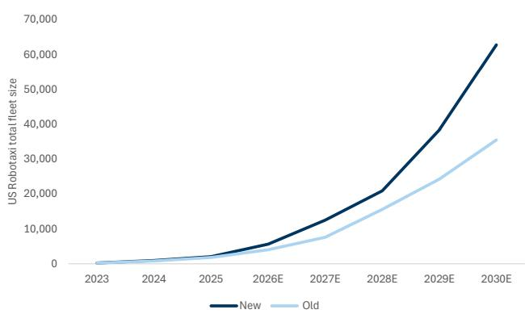  
Exhibit 15: US Robotaxi total fleet size new vs old, 2023-2030E   
订阅研报添加Source: Company data, Goldman Sachs Global Investment Research

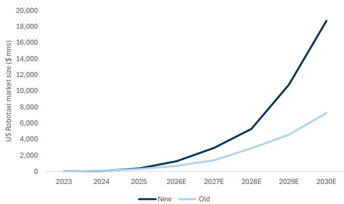  
Exhibit 17: US Robotaxi market size in $\$ 5$ mns, 2023-2030E new vs old

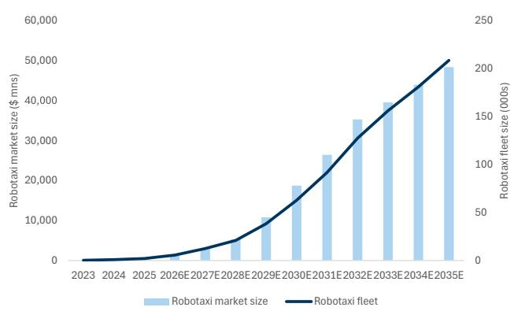  
Exhibit 16: US robotaxi fleet and market size, 2023-2035E   
CD123321Cad 04-17 Source: Company data, Goldman Sachs Global Investment Research

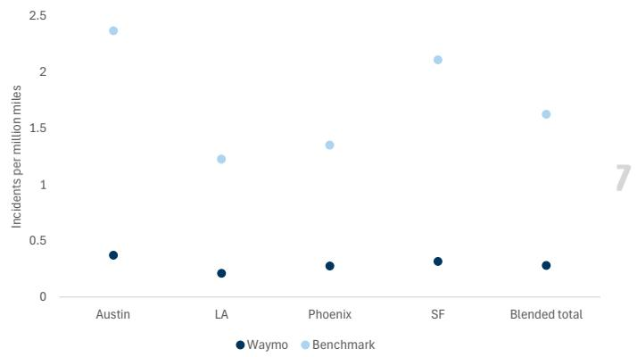  
Exhibit 18: Waymo airbag deployed accidents vs human benchmark in its key active markets   
Source: Company data

We also compiled NHTSA accident reports for Waymo and Tesla compared to AV miles traveled between July 2025 and March 2026 (with Waymo across a range of US cities, and Tesla for its fleet in Austin that has a mix of unsupervised and monitored vehicles with Tesla having removed safety monitors from some vehicles in January). We’d note that crashes reported to NHTSA under federal regulations include smaller incidents that human drivers are unlikely to report (e.g. damage due to riding over a curb, bumping a pole backing out of a parking spot, etc). Waymo’s miles between accidents has been trending higher in recent months. Tesla’s performance has been more varied, and there were no accidents reported by Tesla in February or March (we think a key reason for the larger variation in Tesla is the still small fleet size).

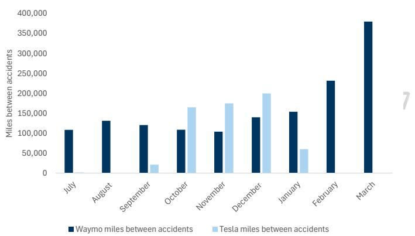  
Exhibit 19: Waymo and Tesla miles between accidents   
March is partial month data through March 16th; Tesla didn’t report any accidents in August, February, or March

# Exhibit 24: Retention cohort data - benchmarking Waymo vs. Uber/Lyft

October 2025 Cohort

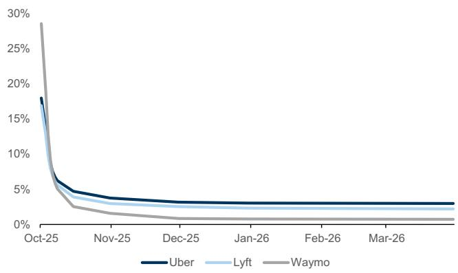  
Source: SensorTower, Data compiled by Goldman Sachs Global Investment Research 订阅研报添加微信   
Exhibit 25: Waymo US retention trends over time

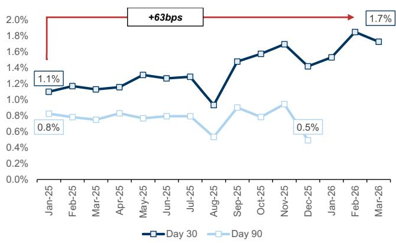  
Source: SensorTower, Data compiled by Goldman Sachs Global Investment D123321Cad 04-17Research   
Exhibit 27: Rideshare usage penetration $\%$

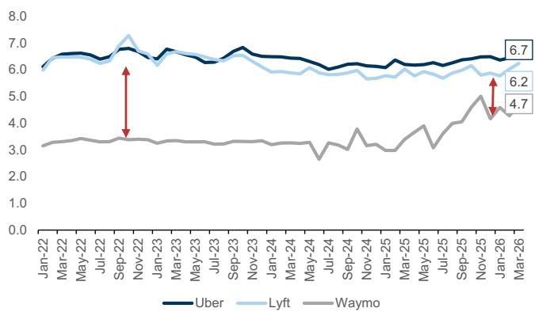  
Exhibit 26: US user session count over time per user   
Session count over time $=$ number of times a user opens an application in a given month

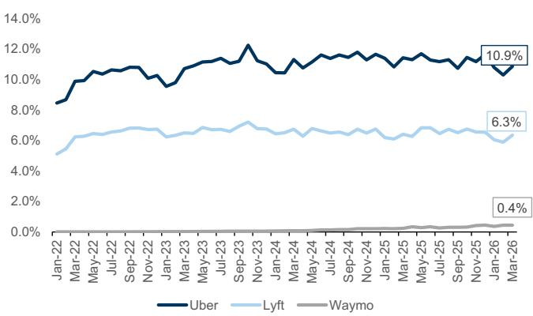  
Usage penetration = percentage of users with one or more sessions in the app during the month

2025 to $\sim \$ 0.14$ in 2035 for a representative AV; 2) insurance costs will decline from $\sim \$ 0.50$ in 2025 (a premium to human-driven rideshare of about $\$ 0.30$ to about $\$ 0.27$ per mile in 2035; 3) wages for remote operators per mile will decline to $\$ 0.03$ in 2035 from $\$ 0.21$ in 2025, driven by a higher ratio of vehicles per operator (from 6 cars to 1 operator in 2025 to 26 to 1 in 2035). Note that we have updated our cost model compared to our 2025 report to better capture empty miles.

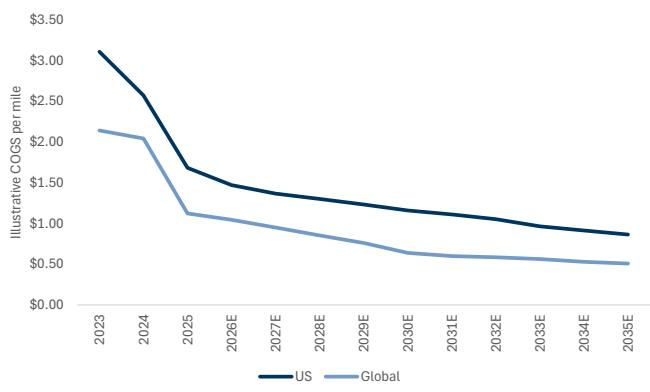  
订阅研报添加Exhibit 28: Illustrative cost per mile for Robtaxis by   
Source: Company data, Goldman Sachs Global Investment Research, AAA

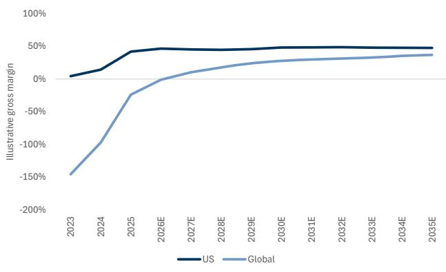  
Exhibit 29: Robotaxi gross margin by region, 2023-2035E

Source: Goldman Sachs Global Investment Research

Overall, we assume that the gross margins of a vertically integrated operator could be $3 0 \% - 5 0 \%$ , implying cumulative global gross profit of $\sim \$ 440$ bn over the next decade for robotaxis.

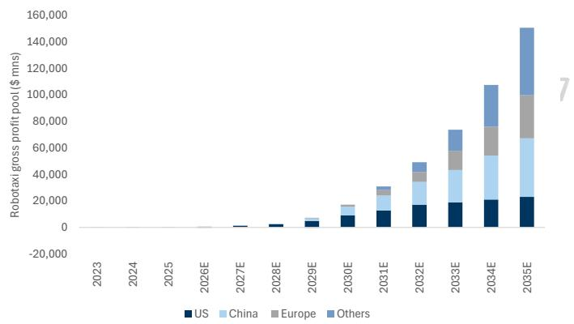  
Exhibit 30: Potential gross profit pool by region from Robotaxis in $\$ 5$ mns, 2023-2035E

robotaxis to drive in 2030 and 2035, the theoretical global TAM for a virtual driver would be $\$ 12$ bn and $\$ 106$ bn respectively. Note that this is illustrative, and we expect, at least over the near to intermediate term, a majority of AVs to be owned and operated by tech stack providers like Waymo, Pony AI, and Tesla.

Exhibit 31: Potential market for a robotaxi “virtual driver”   

<table><tr><td>$bns</td><td>2030</td><td>2035</td></tr><tr><td>Us</td><td>$6</td><td>$16</td></tr></table>

China \$5 \$31 $1 7 0 0 +$ hoof $3 0 0 \mathsf { K } +$ 研报添加 $\sim 2 0$ 信 LCD123321Cad 04-17  \$23

<table><tr><td>Others</td><td>$0</td><td>$36</td></tr><tr><td>Total</td><td>$12</td><td>$106</td></tr></table>

Source: Company data, Goldman Sachs Global Investment Research

# Remote assistance 101

We have received some investor questions on remote assistance, and how this works. While companies can make different choices on how to implement this, most companies use it as a phone a friend type role for unusual situations or extra advice, not to regularly remote control them. AVs only implement the advice coming from remote assistance if they can do so safely. For example, as noted by Waymo, if an emergency vehicle is occupying a lane with its lights on and appears parked at the entrance of a lane, and the robotaxi is uncertain if the lane is closed, it could query a remote assistance agent to verify if the lane is open. In another example, if there is a narrow two-way street and an AV needs to make way for a large vehicle (e.g. truck), the remote assistance agent could provide a potential temporary pull over point that 订阅研报添加微信 LCD123321Cad 04-17 may be outside of the vehicle’s traditional operating domain (e.g. a private driveway). Several AV companies responded to a US Senate questionnaire linked here on how they use remote assistance.

For context on how remote assistance has scaled, typically, in an early deployment, the ratio of vehicles to remote assistant is low, per our industry discussions. But as the geofenced areas and software are proven out, the ratio can go into the double digits. Pony AI has said they’re now at about 30:1 (vehicles to remote assistant) in some locations. Similarly, Waymo disclosed about 70 people typically on shift as remote assistants, and they have a fleet of $> 3 1$ vehicles (although not all those vehicles are operating continuously).

# Regulations

As it relates to regulations for autonomous vehicles, in the US, there is no specific federal law at present that requires a human driver, although there are rules (e.g. FMVSS) on what vehicle features are mandatory. While the current administration is taking steps to work towards a federal framework (e.g. the SELF DRIVE Act) and adjusting the FMVSS rules to allow for more flexibility in robotaxi/AV design, regulations for AVs are still set largely on a state-by-state and local basis. Additionally, the US DOT recently solicited public comment for potential actions (e.g. becoming a signatory to, adopting portions of, or declining to join) on the upcoming UN Global Technical Regulation on AVs/Automated Driving Systems. At the state level currently, some states (e.g. California) require several permitting and reporting obligations, and others (e.g. Texas) have more limited rules. We note that presently, in order to deploy AVs that don’t meet full FMVSS requirements (such as purpose-built AV with no steering wheel and gearshifts), approval 21 is needed and there is a limit of 2,500 vehicles per year for up to 2 years (or a maximum of 5,000 in total) that don’t comply.

Unlike the commercial operations already underway in the US, a small series of piloting projects and research tests are being conducted on a country by country level in Europe, e.g., in the UK, Germany, France, and Luxembourg, with no existing public driverless operations. However, Europe is well-positioned for L4 commercial deployment with a robust legal foundation already in place: an EU-wide type-approval regime provides a clear pathway for L4 vehicles, while the UK is actively rolling out its Automated Vehicles Act 2024 — with the first pilots of automated passenger services set to launch on UK 订阅研报添加微信 LCD123321Cad 04-17 roads in 1H26. A global effort would accelerate regulatory convergence as well: A new global ADS regulation covering L3/L4 will be submitted to the UNECE in June 2026; if adopted, it would enter into force immediately. Both the EU and UK are positioned to align with this framework, while the UK will also finalize a series of calls for evidence and consultations ahead of full implementation of its Act by the end of 2027. This represents a positive trajectory for robotaxi operators: the new UN regulation is purpose-built for L4 driverless use cases, where companies can pursue a single regulatory strategy across major markets – making the path to commercial deployment clearer and more achievable.

In China, AV testing and deployment is allowed under permits from the government across many cities (e.g. Beijing and Shanghai) with specific safety standards that must be met. There is policy at the national level (e.g. the Notice on pilot work of intelligent connected vehicle access and road access), as well as local and/or city level polices that must be followed. Similar to the US, China regulations and deployment polices are more formally carried out at the local level. Please see section 11 of Allen Chang’s May 2025 note, “China’s Robotaxi market - the road to commercialization” for more details on policies for robotaxis in China.

# Autonomous last mile delivery bots in focus

Another application of AVs that we believe will continue to scale is the use of last mile autonomous delivery bots. These last mile delivery bots are smaller than light vehicles and you can see them operating on sidewalks and college campuses in some cities. Several last mile delivery bot companies partner with third party platform providers (e.g Uber Eats and DoorDash), food companies (e.g. Chipotle, Shake Shack), convenience stores (e.g 7-Eleven), and parcel/package delivery companies. Notably, the AVs that are currently deployed in major cities generally operate within smaller radii (generally under 3 miles). Looking across some of the key last mile delivery bot players (e.g. Serve Robotics, Starship Tech, Coco Robotics, and Neolix) we believe last mile delivery bot revenue was a couple hundred million dollars with a fleet size between 20-30K globally in 2025. We expect this market to grow to $\$ 40 – \$ 50$ bn in 2035 which assumes a fleet size between $1 { - } 1 . 2 ~ \mathsf { m n }$ delivery bots globally. Some key assumptions to our forecast include an increasing miles per trip from $\sim 1 . 5$ to 3 miles and $\$ 4-5$ of revenue per trip.

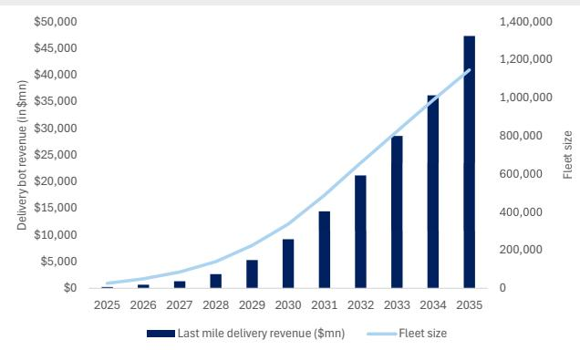  
Exhibit 32: We continue to expect growth in the last mile delivery bot market   
Source: Goldman Sachs Global Investment Research, Company data

# Consumer AVs - partially and fully autonomous vehicles poised to grow

The vast majority of the global car parc and miles traveled come from personally owned vehicles rather than shared mobility/rideshare, making consumer applications of autonomous capabilities a particularly large potential market for the long-term. Numerous auto OEMs are focused on bringing either L3 (which is situationally eyes-off autonomy, such as on a highway in nice weather) or L4 technology (which is fully eyes-off and hands-off driving within a geofenced area like a part of a city) to consumer vehicles.

Currently L4 AV technology is only available in commercial vehicles (e.g. rideshare applications). However, as operational design domains (ODDs) expand into wider areas and the need for remote assistance declines, we think L4 technology can be utilized by consumers (potentially with a subscription for remote assistance). While some AV vehicles have expensive hardware (e.g. Waymo), we do not believe vehicle costs will be a long-term barrier to adoption. The cost of AVs in China even with sensors (including lidar) and compute are already in the sub $\$ 40 K$ USD range (less than the average price of a new vehicle in the US at $\mathord { \sim } \$ 45 \substack { - 5 0 K }$ , and Tesla believes its current consumer vehicles 订阅研报添加微信 LCD123(with prices in the US starting in the mid $\$ 30K$ ad 04-17 range) have L4 capable hardware.

We expect the L3 and L4 mix of global vehicle shipments to grow in the coming years, although we think the vast majority of L4 vehicle shipments for the near-term will remain for commercial use cases.

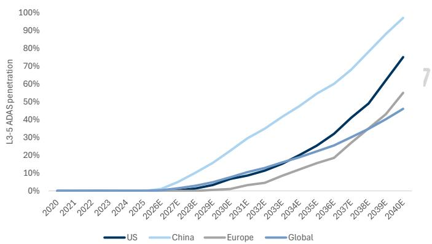  
Exhibit 33: L3-5 ADAS penetration rates for key regions and globally, 2020-2040E

Separately, our industry discussions and recent data from Wards suggests that the mix of L2 capable vehicles (e.g. vehicles that require supervision but can incorporate multiple features like lane centering, lane changes, emergency braking, adaptive cruise control) in the US and Europe is now very high (e.g. $\sim 8 0 \%$ ), and we raised our L2 mix assumptions as a percent of new vehicles sold compared to our prior AV report. There would likely be additional software revenue from L2 features (FSD, for example, is currently L2), but we expect this market to be increasingly competitive longer-term (with some OEMs in China now providing L2 technology as a standard feature).

Exhibit 34: Software revenue for L3-5 autonomy offerings on consumer vehicles globally (\$ bns)   

<table><tr><td colspan="11">Year</td></tr><tr><td></td><td></td><td>2025</td><td>2026</td><td>2027</td><td>2028</td><td>2029</td><td>2030</td><td>2031</td><td>2032</td><td>2033</td><td>2034</td><td>2035</td></tr><tr><td></td><td>$25</td><td>$0</td><td>$0</td><td>$0</td><td>$1</td><td>$3</td><td>$5</td><td>$8</td><td>$11</td><td>$16</td><td>$21</td><td>$28</td></tr><tr><td>G</td><td>$50</td><td>$0</td><td>$0</td><td>$1</td><td>$3</td><td>$5</td><td>$9</td><td>$15</td><td>$22</td><td>$32</td><td>$43</td><td>$56</td></tr><tr><td></td><td>$75</td><td>$0</td><td>$0</td><td>$1</td><td>$4</td><td>$8</td><td>$14</td><td>$23</td><td>$34</td><td>$48</td><td>$64</td><td>$84</td></tr><tr><td></td><td>$100</td><td>$0</td><td>$0</td><td>$2</td><td>$5</td><td>$10</td><td>$18</td><td>$30</td><td>$45</td><td>$63</td><td>$86</td><td>$112</td></tr><tr><td></td><td>$125</td><td>$0</td><td>$0</td><td>$2</td><td>$6</td><td>$13</td><td>$23</td><td>$38</td><td>$56</td><td>$79</td><td>$107</td><td>$140</td></tr><tr><td></td><td>$150</td><td>$0</td><td>$0</td><td>$3</td><td>$8</td><td>$15</td><td>$28</td><td>$45</td><td>$67</td><td>$95</td><td>$129</td><td>$168</td></tr><tr><td></td><td>$200</td><td>$0</td><td>$1</td><td>$4</td><td>$10</td><td>$21</td><td>$37</td><td>$60</td><td>$90</td><td>$127</td><td>$172</td><td>$224</td></tr></table>

Source: Goldman Sachs Global Investment Research

# Addressing risks to personal ownership from AVs

There is a view from some investors that the proliferation of AVs will materially lower the size of the personal vehicle market, given that personal vehicles are not used the majority of the time. While this is a possibility, our base case view is that this is too negative due to economic and use considerations. First, the cost of owning and operating a personal vehicle in the US was $\$ 0.77$ to $\$ 1.00$ per mile in 2025 according to 订阅研报添加微信 LCD123321Cad 04-17 AAA (at 10K and 15K miles traveled annually, respectively). This remains well below the cost of rideshare at $> \$ 2$ nationally. Second, while we expect the cost of AVs (and, in turn, the price of rides with AVs) to fall (potentially to $\$ 1$ or less long-term), these types of economics would be enabled by hardware costs that are on par with or below the current price of consumer vehicles. If the cost and convenience of an AV improves enough in the long-term (e.g., over 10-20 years), especially if users can sleep in them while traveling, we see this being something many users would prefer to own (perhaps with a monthly subscription to access remote assistance). Importantly, this aligns with the ambitions of several OEMs. Waymo has said it’s potentially open to selling AVs to individuals, Tesla’s plan is to allow for unsupervised personal autonomy in the long-term, and GM, Rivian, and Ford have discussed L3/L4 efforts for personal autonomy.

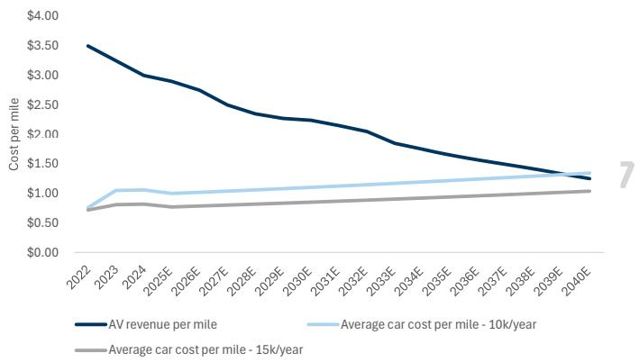  
Exhibit 35: US AV revenue per mile (cost to consumer) vs cost per mile of a personally owned vehicle   
Source: AAA, Goldman Sachs Global Investment Research

To better address this risk, we show an analysis of how much the US fleet size (currently there are $\sim 3 0 0$ mn vehicles in operation) could theoretically change in 10 years using our new AV forecast (we estimate there will be a fleet of about 3 mn AVs in 2035 on roads in the US). Assuming various increases in utilization of these AVs compared to traditional 订阅研报添加微信 miles traveled (ranging from $2 5 \% - 7 0 0 \% )$ 321Cad 04-17  and also potential changes in how many vehicle miles are traveled (from $0 \%$ to $5 \%$ to capture a higher level of miles, especially from L3-5 vehicles), it suggests a negligible impact on the fleet size as a base case over the next 10 years (Exhibit 36).

Separately, we also show a scenario of what SAAR could be if the fleet was $100 \%$ shared L4/5 AVs to meet miles traveled demand for the US population in the “What gets disrupted” section of this report, and in that bear case scenario, SAAR could settle in the 10-13 mn range (with a smaller fleet that turns over every 2-3 years given the increase in miles traveled per year) compared to the historical $1 6 \mathsf { m n }$ per year average.

Exhibit 36: Potential impact to base case 2035 US VIO from increased utilization within the AV fleet   

<table><tr><td colspan="7">% increase in VMT</td></tr><tr><td></td><td>0%</td><td>1%</td><td>2%</td><td>3%</td><td>4%</td><td>5%</td></tr><tr><td>25%</td><td>0%</td><td>1%</td><td>2%</td><td>3%</td><td>4%</td><td>5%</td></tr><tr><td>50%</td><td>0%</td><td>1%</td><td>2%</td><td>3%</td><td>4%</td><td>5%</td></tr><tr><td>75%</td><td>-1%</td><td>0%</td><td>1%</td><td>2%</td><td>3%</td><td>4%</td></tr><tr><td>100%</td><td>-1%</td><td>0%</td><td>1%</td><td>2%</td><td>3%</td><td>4%</td></tr><tr><td>200%</td><td>-2%</td><td>-1%</td><td>0%</td><td>1%</td><td>2%</td><td>3%</td></tr><tr><td>300%</td><td>-3%</td><td>-2%</td><td>-1%</td><td>0%</td><td>1%</td><td>2%</td></tr><tr><td>400%</td><td>-4%</td><td>-3%</td><td>-2%</td><td>-1%</td><td>0%</td><td>1%</td></tr><tr><td>500%</td><td>-5%</td><td>-4%</td><td>-3%</td><td>-2%</td><td>-1%</td><td>0%</td></tr><tr><td>600%</td><td>-6%</td><td>-5%</td><td>-4%</td><td>-3%</td><td>-2%</td><td>-1%</td></tr><tr><td>700%</td><td>-7%</td><td>-6%</td><td>-5%</td><td>-4%</td><td>-3%</td><td>-2%</td></tr></table>

# AV trucking market is currently small but now poised to ramp

We now estimate that the AV trucking market in the US will reach $\$ 16$ bn in 2030, slightly down from $\$ 18$ bn prior (as volume in 2026 is more likely to be  filled with

报添加微信 LCD123321C

in 2035 could be \~ $\$ 560$ bn. This is enabled by the US AV truck  fleet growing from low levels today, to $\sim 2 4 \mathsf { K }$ in 2030, and \~161K in 2035, and a global  fleet growing from a few thousand today (primarily in China) to $\sim 1 . 2 7$ mn as well as increasing miles per truck as ODDs expand. AV trucking companies in North America, including Aurora, Kodiak, Waabi, and Plus plan to scale commercially in 2026/2027, with Aurora expecting to expand from 10 AV trucks at the end of 2025 to $\mathord { \sim } 2 0 0$ by the end of 2026 (and we assume to over a thousand starting in 2028). 阅研 C 12332 Cad 04-17

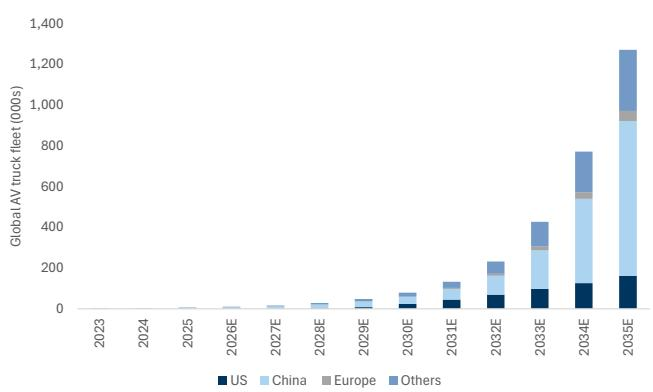  
Exhibit 37: Global AV trucking  fleet by region (000s), 2023-2035E

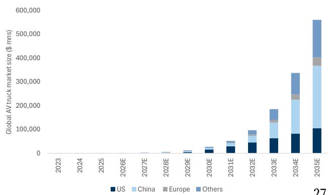  
Exhibit 38: Global AV trucking market size $\beta$ mns), 2023-2035E

On driving costs, when factoring in remote operations as well as expected savings from fuel and, over the longer-term, insurance, as well as typical truck costs such as maintenance, depreciation, and tolls, we expect the cost per mile for an AV truck to decrease from $\sim \$ 8.56$ in 2025 to $\sim \$ 2.03$ in 2035. By comparison, we expect the like-for-like cost for a human-driven truck (including tolls, maintenance, depreciation costs, etc.) to increase from $\sim \$ 2.55$ in 2025 to $\$ 2.84$ , driven in part by rising driver wages. Driver wages and benefits are currently about $\$ 1.02$ per mile, per ATRI.

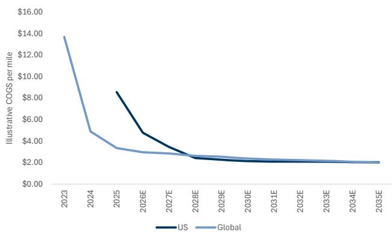  
订阅研报添加Exhibit 40: AV trucking illustrative COGS per mile, 2023-2035E   
Source: ATRI, Company data, Goldman Sachs Global Investment Research

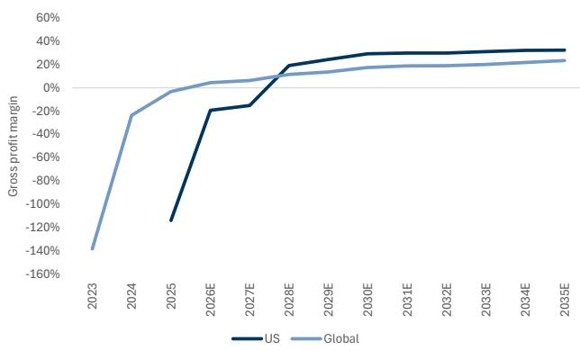  
D123321Cad 04-17 Exhibit 41: AV trucking gross profit margin, 2023-2035E   
Source: Goldman Sachs Global Investment Research, Company data

Overall, we expect these improving cost dynamics and scaling up of the AV trucking fleet to drive an increase in the global gross profit pool for AV trucking from close to zero in 2025 to $\sim \$ 135$ bn in 2035.

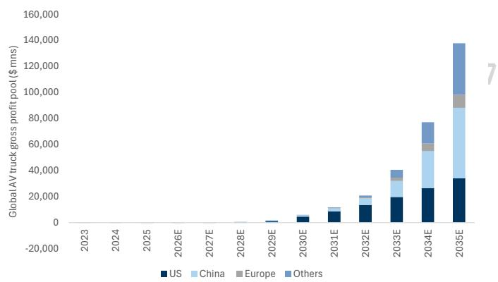  
Exhibit 42: AV trucking gross profit pool by region, 2023-2035E

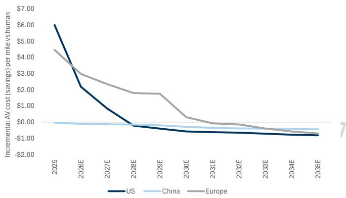  
Exhibit 43: Incremental AV trucking cost (savings) per mile vs human driven truck, 2025-2035E   
Savings relative to human driven trucks are denoted by negative values, positive values represent incremental cost

Source: Company data, ATRI, Goldman Sachs Global Investment Research

For virtual driver models, similar to what Aurora plans to launch in partnership with Aumovio, we expect costs in the US (including hardware depreciation, cost of remote operation, etc.) to decline from $> \$ 1$ in 2027 (when Aurora expects to launch with Aumovio) to $\sim \$ 0.20$ in 2035, as remote operators can supervise more vehicles and AV hardware costs decline. We expect revenue per mile in the US to decrease from $\$ 1.00$ in 2027 to $\$ 0.60$ in 2035, driven by increased competition and better costs (implying solid gross margin potential for a virtual driver). We estimate that the revenue potential for virtual driver technology will increase from $\$ 0.1$ bn to $\sim \$ 24$ bn from 2027-2035 assuming all AV trucks in the US were to use a virtual driver model (although we believe that not all AVs will operate with the virtual driver model). Across the global fleet, the potential revenue under a similar assumption would be $\sim \$ 126$ bn in 2035, increasing from a relatively small level in 2027.

# Regulations

In terms of regulations for AV trucks, similar to robotaxi and passenger AVs, AV trucks must also comply with the relevant FMVSS standards at the federal level, with AV-specific regulations set at the state level. Presently, per Aurora, 40 states implicitly or explicitly allow the deployment of driverless AVs including trucks.

The regulatory landscape for autonomous commercial vehicles in the EU draws from international frameworks (Vienna Convention, UNECE) and EU instruments (AI Act, General Safety Regulation) rather than harmonized legislation focused on autonomous driving. These establish a type-approval framework and mandate rigorous active safety 订阅研报添加微信 LCD123321Cad 04-17 features but currently limit widespread deployment of autonomy levels 4 (high driving automation) and 5 (full driving automation); an automation scale defined by SAE International. Specific regulations differ between nations. Germany and France have enacted legislation permitting autonomous vehicles for road freight transport to operate on public roads without a human driver as long as they are within defined operational areas and with remote “technical supervisors”. Italy, the Netherlands, Finland, and Sweden, among others, remain focused on controlled testing rather than commercial deployment. We note that in controlled environments such as mines/mining, the regulatory burden is lower than for public roads, allowing for specific private use

deployment. Within the UK, the same Automated Vehicles Act 2024 that regulates robotaxis/passenger AVs also regulates AV trucks.

For China, the rules for AV trucks are similar to AVs, with government permitting and approvals for deployments in cities needed.

What is at risk of disruption - human driven rideshare/trucking, and auto sales

While a portion of AV volumes will likely be incremental demand (e.g. as new use cases become affordable or possible), we believe autonomy could also disrupt existing markets in the long-term. The two main vectors of risk relate to human-driven taxi/rideshare and trucking, and lost light vehicle sales. Importantly, there is a   
shortage of drivers in the US Class 8 trucking market currently (per ACT) and the ATA projects a driver shortage over the coming decade, and we therefore think the disruption may be more about lost opportunities for new employment as the driver 04-17   
订阅研报添加微信 LCD123321Cabase turns over rather than direct job losses.

Fewer human-driven commercial miles in taxi/rideshare and trucking market Per data from the US BLS, as of 2024, ${ \sim } 2 . 2 \mathsf { m n }$ people were employed as heavy and tractor-trailer truck drivers in the US. The same data lists a median annual wage of $\sim \$ 57.4K$ , implying annual labor costs of $\$ 123$ bn.

Per data from the US BLS, as of 2024, \~448K people are employed as taxi drivers, chauffeurs, or shuttle drivers in the US. The BLS lists a median annual wage of $\mathbf { \Gamma } \sim \$ 36.78$ , implying annual labor costs of \~ $\$ 16$ bn. Additionally, the BLS estimates that $\sim 1 . 5 \mathsf { m n }$ people in the US are employed as delivery drivers with a median annual wage of $\$ 42.8K$ , which equates to $\$ 65$ bn in annual cost. We note that these datapoints do not include rideshare drivers given many of these drivers work part-time, can work multiple jobs, and don’t have a set annual salary. However, based on gross bookings in 2025 across human driven rideshare in the US ( $\sim \$ 64$ bn) and estimated driver payouts excluding fees 订阅研报添加微信 LCD123321Cad 04(e.g. commercial insurance and vehicle costs like fuel) $0 \mathsf { f } 4 0 \% - 5 0 \%$ of gross bookings, we estimate the total payments to US rideshare drivers in 2025 to be \~ $\$ 30$ bn.

We discuss the potential impact to Uber and Lyft, and how much disruption there could be for human-driven ridehail, in the following section, “Analyzing the Potential Impact of Robotaxis on Uber & Lyft”.

# Lost vehicle sales: Downside scenario of \~3-6 mn lower US SAAR, although if consumers opt to own AVs there may be no disruption to unit volumes

We show the potential implied US auto SAAR in a scenario (which is not our base case) where all vehicles on the road are shared AVs in 2040 in Exhibit 44. We assume, for the purposes of this illustrative bear case analysis, that vehicles have a useful life of $\sim 4 0 0 \mathsf { K }$ miles, that utilization in terms of miles traveled per vehicle per year rises given the scenario that all vehicles in operation (VIO) are shared AVs, and that vehicle miles traveled (or VMT) ranges from unchanged to $3 3 \%$ higher, as consumers may use more vehicle transportation if it is less costly and doesn’t require a driver’s attention. Under such a scenario, SAAR could be $3 \mathrm { - } 6 ~ \mathsf { m n }$ units lower than the current steady state of $\sim 1 6$ mn. In such a scenario, assuming a mid to high single digit EBIT margin and average ASP of $\$ 50 K$ , the potential disruption to revenue could be $\$ 100-5300$ bn, and lost EBIT could be \~ $\$ 5$ bn to $\$ 25$ bn.

Exhibit 44: Implied US SAAR (in mns) in a scenario where the VIO/VMT is all shared AVs by 2040   

<table><tr><td rowspan="2"></td><td rowspan="2"></td><td colspan="8">% increase in VMT</td></tr><tr><td>0%</td><td>2%</td><td>4%</td><td>5%</td><td>10%</td><td>15%</td><td>20% 25%</td><td>33%</td></tr><tr><td></td><td>12,500</td><td>10</td><td>10</td><td>10</td><td>11</td><td>11</td><td>12</td><td>12</td><td>13</td><td>13</td></tr><tr><td></td><td>15,000</td><td>10</td><td>10</td><td>10</td><td>11</td><td>11</td><td>12</td><td>12</td><td>13</td><td>13</td></tr><tr><td></td><td>20,000</td><td>10</td><td>10</td><td>10</td><td>11</td><td>11</td><td>12</td><td>12</td><td>13</td><td>13</td></tr><tr><td></td><td>30,000</td><td>10</td><td>10</td><td>10</td><td>11</td><td>11</td><td>12</td><td>12</td><td>13</td><td>13</td></tr><tr><td></td><td>40,000</td><td>10</td><td>10</td><td>10</td><td>11</td><td>11</td><td>12</td><td>12</td><td>13</td><td>13</td></tr><tr><td>mrrslslli</td><td>50,000</td><td>10</td><td>10</td><td>10</td><td>11</td><td>11</td><td>12</td><td>12</td><td>13</td><td>13</td></tr><tr><td></td><td>75,000</td><td>10</td><td>10</td><td>10</td><td>11</td><td>11</td><td>12</td><td>12</td><td>13</td><td>13</td></tr><tr><td></td><td>100,000</td><td>0添加微信</td><td>10CD1</td><td>11033216</td><td>11 ad</td><td>04-17</td><td>12</td><td>12</td><td>13</td><td>13</td></tr><tr><td></td><td>150,000</td><td>10</td><td>10</td><td>10</td><td>11</td><td>11</td><td>12</td><td>12</td><td>13</td><td>13</td></tr><tr><td></td><td>200,000</td><td>10</td><td>10</td><td>10</td><td>11</td><td>11</td><td>12</td><td>12</td><td>13</td><td>13</td></tr></table>

Source: Goldman Sachs Global Investment Research

We view the rise of autonomous vehicles as having the opportunity to drive incremental industry growth, rather than be a zero-sum game. Within the rideshare industry, several friction points exist which could be solved by robotaxis today and on a longer-term time horizon (with lower prices - Exhibit 45). While autonomous vehicles provide an alternative to human rideshare today, we do not view the AV market as being fully disruptive of the industry (on the supply side), given a few key factors:

订阅研报添加微信 LCD123321Cad 04-17 n Operating zones. Despite Waymo expanding its commercial operating zone by more than $\boldsymbol { \mathsf { 1 0 x } }$ over the last four years, the company still operates on a small scale. Relative to the square mileage of the top 25 metro markets (based on the Census Bureau’s definition of metro markets $\&$ regions ranked by population), Waymo’s operating zone today represents $< 5 \%$ of this opportunity (Exhibit 46).

□ Operational design & domain limitations. While AV technology and fleet capabilities continue to improve, scaling operations often takes time due to ongoing city-mapping and ODD constraints. For example, Waymo announced Austin testing in August 2023 and did not fully roll out to the public (through their partnership with Uber) until early 2025. It is likely that in markets with more severe climates/regions where weather conditions & other driving patterns fluctuate, the commercial launch (and scaling) could take a longer amount of time.

Supply relative to human rideshare networks. By 2030, we expect that the total industry robotaxi fleet will reach 62,750 vehicles and further scale to $^ { 2 0 0 , 0 0 0 + }$ by 订阅研报添加微信 LCD123321Cad 04-17 2035. A hybrid network of robotaxis and human drivers will likely be needed to meet trip demand (as we estimate that $6 . 5 \mathrm { ~ b n } +$ UCAN trips will be completed in 2030). For context, there are $6 \mathsf { m } \mathsf { n } +$ Uber driver MAUs today (per SensorTower) which completed $\sim 2 . 3$ bn trips during 2025. We acknowledge that MAUs are not active daily and that utilization rates are often lower than robotaxis. In markets where Waymo operates exclusively through its own distribution network, wait times are often longer than traditional rideshare platforms (albeit have continued to improve as markets mature).

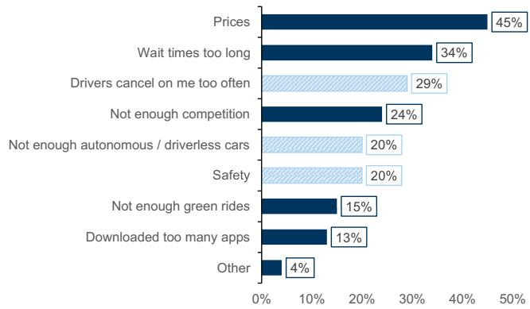  
Exhibit 45: Autonomous vehicles have the opportunity to solve a number of key friction points... $\%$   
As of 4/7/2026. $\%$ coverage represents Waymo operating zone as $\%$ of top 25 metro market zones

Consumer survey of biggest issues with rideshare in 2026

Source: Obi, Data compiled by Goldman Sachs Global Investment Research

Waymo operating area (sq. miles)

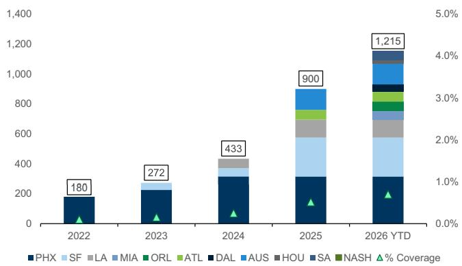  
Exhibit 46: ... but today, AV operations are limited to a set operating zone (as seen at Waymo)   
Source: Company data, Census Bureau, Goldman Sachs Global Investment Research

Longer-term, as autonomous fleets grow (both within existing and new markets), we acknowledge that AVs could cannibalize a portion of rides that have historically been completed by human drivers. Today, a majority of rideshare drivers complete trips for supplemental income (e.g. $9 4 \%$ of Lyft drivers drive less than 20 hours/week (link)), but we believe that over time, the emergence of robotaxis could provide new channels to generate supplemental income, including through the monetization of 订阅研报添加微信 LCD123321Cad 04-17 personal assets (previously outlined here).

Robotaxi deployments to date have been concentrated in markets with large populations, and we believe that in the medium term, gross bookings disrupted by AVs will largely be tied to GBs generated in the top 20 metro markets. In existing markets, Waymo reaches $\sim 1 7 \%$ of the addressable US rider population today, and our expected launch markets in the US are largely oriented around larger metro markets. To help frame the US impact from larger markets, we would note that Uber highlighted $\sim 3 0 \%$ of US rideshare gross bookings come from top 20 markets (including NYC).

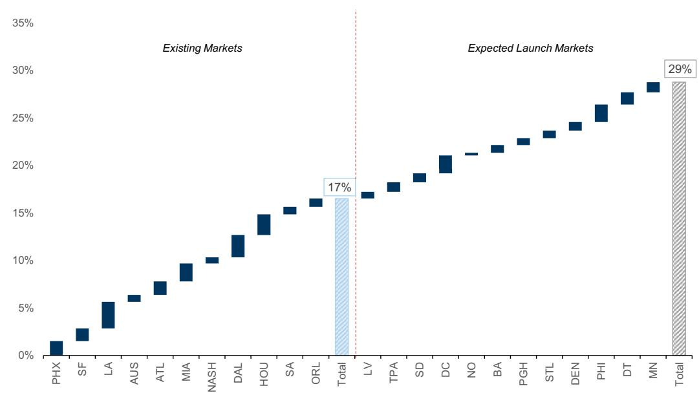  
Exhibit 47: Metro cities where Waymo currently operates account for $17 \%$ of the addressable rideshare user opportunity   
Addressable population $\%$ based on metro population / total addressable users

Source: Census Bureau, Goldman Sachs Global Investment Research

In terms of outlining the potential disruption of rideshare gross bookings derived from human drivers, we frame three potential scenarios:

Base case. Expect autonomous trips to continue to scale at a meaningful rate - albeit remaining a minority of the overall GB mix within top 20 cities, given that consumer habits evolve slowly, and the ramp within cities (in terms of overall mix) takes time to scale. For example, according to 3P data sources, Waymo’s market share reached $\sim 3 0 \%$ (per Yipit) in San Francisco after 20 months of being fully launched.

n Bear case. Over the next five years, assumes that autonomous rides will become a majority of top 20 city rideshare bookings and that $100 \%$ of trips completed by a robotaxi will disrupt trips historically taken by human drivers. These operating assumptions would imply that market share dynamics across all operating zones more closely align with trends seen in San Francisco by 2029.

Bull case. Frames the case that the overall industry will be accretive to overall rideshare industry growth rates, with $60 \%$ of AV GBs driving incremental growth. 信 Given that each market is unique (both in terms of user behavior and adoption trends, etc.), our bull case assumes that disruption trends seen in other markets (Waymo and Lyft in San Francisco) are unique, as each market differs in terms of consumer adoption and market share trends.

We believe that autonomous vehicles will be accretive on a longer-term basis, but in the medium-term, could be cannibalistic to the overall industry (based on our forecasts today). Our current forecast implies that by 2030, trips completed by AVs will become more affordable in comparison to rides completed by human drivers, which we 35 believe will uplift overall industry growth rates. Over the next 10 years, elements of affordability could lead to increased: a) penetration into the addressable rider market; & b) trip frequency by riders who have historically used rideshare platforms for select use cases.

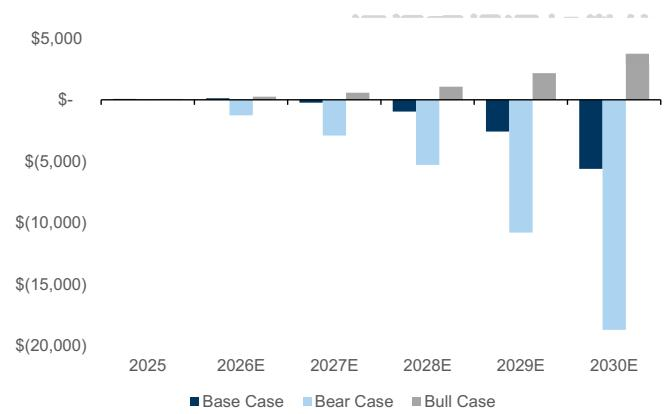  
Exhibit 48: Our bear case implies that AVs cannibalization could reach $\$ 19$ bn by 2030, but potentially be additive to the industry overall in a bull case scenario... $\$ 123$   
Source: Goldman Sachs Global Investment Research

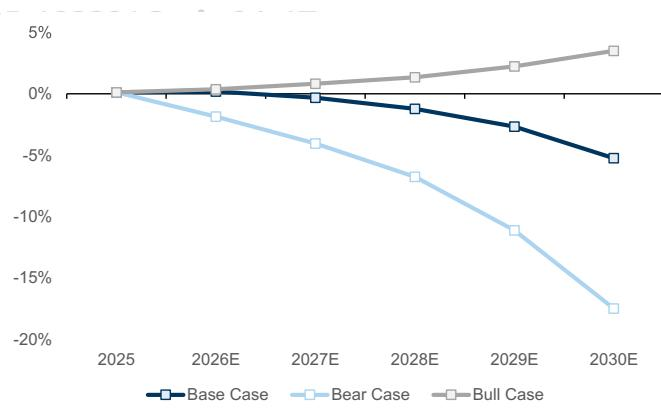  
Exhibit 49: ... which would imply at worse $16 \%$ cannibalization, with a minimal base case impact (to human rideshare GBs) implied, with potential upside optionality in an all boats rising scenario $\%$

Source: Goldman Sachs Global Investment Research

The disruption of bookings generated by human drivers does not necessarily mean that traditional rideshare companies will be fully impacted. In fact, we believe that Uber and Lyft are well positioned to play a role in the AV industry given a few key factors:

Hybrid networks drive a seamless consumer experience. Supply availability is crucial to maintain appropriate demand service levels/ETAs, and we are of the view that hybrid networks that combine AVs and human drivers will produce the best consumer experience for riders and the highest utilization rates for ridesharing vehicles. Specifically, in markets where Waymo has deployed its fleet on the Uber app, the average trips per vehicle per day (TpVD) is $30 \%$ higher relative to other markets (i.e. Los Angeles, where Waymo offers rides exclusively through the Waymo app).

Building a DTC rideshare network is capital intensive. Economic incentives matter, and building on-demand local networks requires significant capital investments. As one measure of the losses incurred to reach scale, we note that UBER’s accumulated deficit (negative cumulative retained earnings) peaked at $\$ (33)$ bn in 2022. This is with UBER adopting an asset-light approach and not owning the supply outright; 订阅研报添加微信 LCD123321Cad 04-17 UBER also did not need to invest to compete/displace a scaled mobile-first incumbent in on-demand personal mobility (as is the case for challengers today).

Investments & partnerships made within the AV industry highlight a commitment toward scaling exposure to autonomous vehicles. Uber and Lyft have announced a number of partnerships aimed at scaling both their AV fleet (which will be primarily owned and operated by third parties). We would also note that Uber will continue to make investments toward driving an improved and enhanced suite of services & capabilities aimed at building and commercializing AVs

Addressable commercial fleet (US)

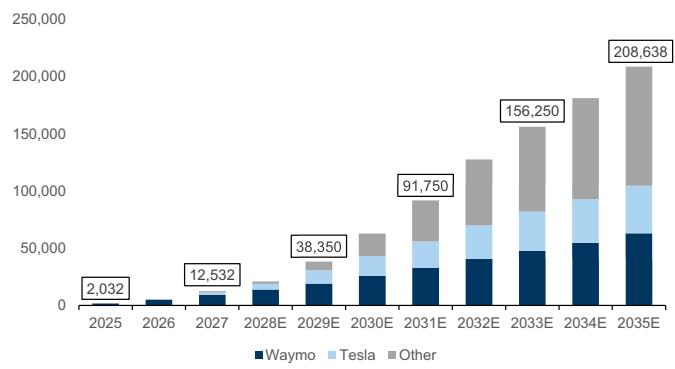  
Exhibit 51: We believe that players outside of Tesla/Waymo will emerge in the US...

Non Uber/Lyft AV market share $\%$

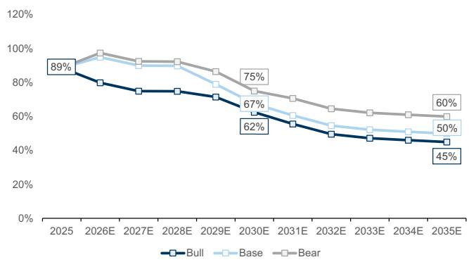  
Exhibit 52: ... and drive market share gains for Uber/Lyft over time

Source: Goldman Sachs Global Investment Research

Source: Goldman Sachs Global Investment Research

# ‹¢–xb¥mûR _®Oá   LCD123321Cad   04-17

# Spotlight on Waymo: Framing Operating Assumptions and the Path to $\$ 8$ bn $^ +$ Gross Bookings by 2030E

Waymo initially launched in Phoenix during 2018 and began serving fully autonomous commercial rides in 2019. Since their launch, the company now operates in 11 cities across the US, and expects to lay the groundwork in 20 markets this year (link). Within these markets, Waymo serves over $5 0 0 \mathrm { k }$ paid rides weekly (as of March 2026), a rate which has more than doubled since April 2025. This ramp resulted in over 15 mn rides being completed during 2025, serviced by a fleet of $> 1 , 8 0 0$ vehicles (GSe).

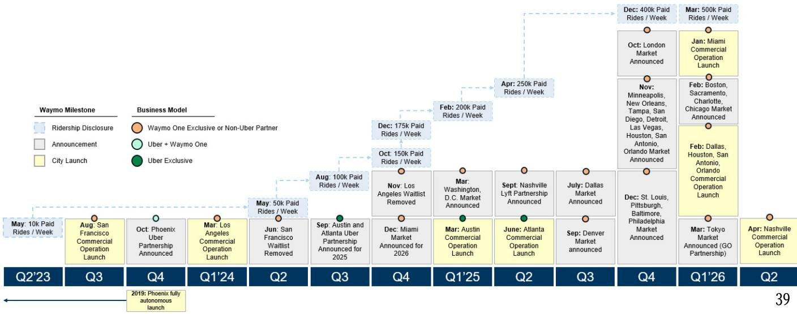  
Exhibit 53: Waymo Major Announcements Timeline

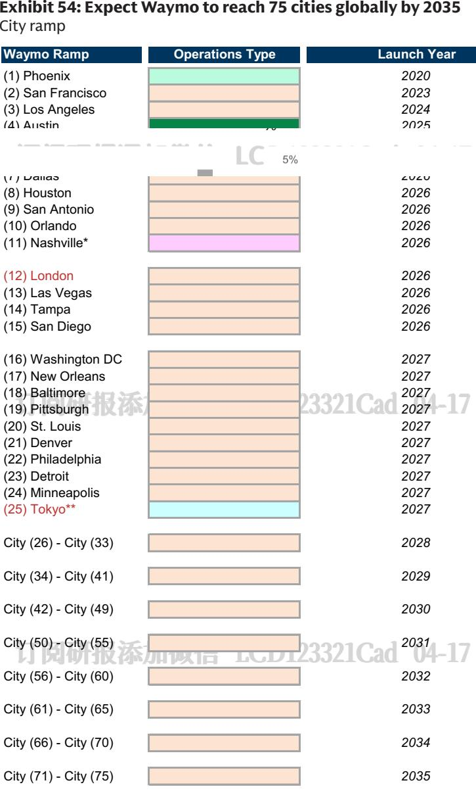

<table><tr><td rowspan=1 colspan=1>Key</td></tr><tr><td rowspan=1 colspan=1>Waymo OneExclusive</td></tr><tr><td rowspan=1 colspan=1>Uber+Waymo One</td></tr><tr><td rowspan=1 colspan=1>UberExclusive</td></tr><tr><td rowspan=1 colspan=1>Lyft+Waymo One</td></tr><tr><td rowspan=1 colspan=1>GO + Waymo One (TBD)</td></tr></table>

In the US, there have been meaningful operational improvements over the last 3 years, and we estimate that the average trips per vehicle per day has improved from 9 in 2023 to 24 in 2025. Even as we forecast the company scaling to complete 40 TpVD in the US, we still expect that Waymo’s total US fleet will grow to $^ { 2 5 , 0 0 0 + }$ vehicles by 2030 to meet rider demand.

City TpVD

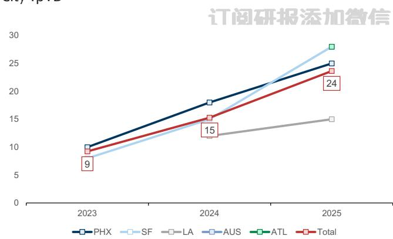  
Exhibit 55: Over the last 3 years, we believe that Waymo has become more efficient at vehicle deployments & increasing utilization rates...   
Source: Company data, Goldman Sachs Global Investment Research

US fleet (GSe)

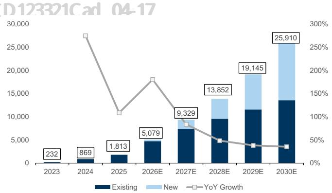  
Exhibit 56: ... but even with these improvements, there is still a need to scale fleets both within existing & new markets   
Existing markets defined as markets where Waymo has commercial operations (as of April 2026)

Source: Company data, Goldman Sachs Global Investment Research

Given the expected launch of London in 2026, we also take the opportunity to frame 订阅研报添加微信 LCD123321Cad 04-17 our fleet assumptions in international markets. The expansion would come 7 years after Waymo’s initial commercial launch in Phoenix. In our view, international markets could scale in a similar (albeit, likely slower, given the limited data) manner relative to US markets. Specifically, we expect that utilization rates within international markets will lag behind what the US has historically achieved by 5-6 years (Exhibit 57).

As international markets are introduced in $2 0 2 6 / 2 0 2 7 +$ , a growing percentage of Waymo’s total paid rides will come from these markets, and we forecast international trip volume to account for $1 3 \%$ of total trips in 2030 (and contribute $\$ 1$ bn in gross bookings). Based on the TpVD rates framed below, this would imply that Waymo’s international fleet will reach an average of ${ 6 , 0 0 0 + }$ vehicles by 2030.

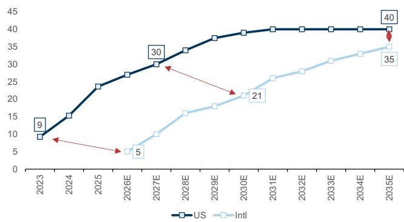  
Exhibit 57: Expect international market utilization rates to lag the US, but improve over time... Regional TpVD   
Source: Company data, Goldman Sachs Global Investment Research

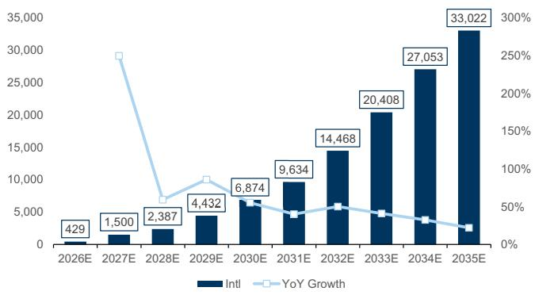  
Exhibit 58: ... and Waymo’s international fleet to reach ${ \bf 6 , 0 0 0 + }$ by 2030 Intl fleet   
Source: Goldman Sachs Global Investment Research

# Trip Assumptions

On the back of growing fleet supply (both within existing and new markets), we model Waymo reaching 960K annualized US paid weekly trips during 2026. Our growth assumptions are anchored around the company: a) expanding its operating zones in existing markets; b) launching operations in new regions; & c) increasing rider frequency among existing riders. In recent years, particularly in markets such as Phoenix and San Francisco, Waymo has successfully expanded its service area (Exhibit 46) - and we believe that Waymo’s operating zone will continue to expand in the coming years.

订阅研报添加微信 LCD123321Cad 04-17 In addition to expanded operating zones, a meaningful unlock toward driving trip volume, rider adoption, and gross bookings is anchored around airport trips. Airport trips compose a meaningful portion of rideshare gross bookings today - for example, during 2025, Uber generated $1 5 \%$ of total mobility GBs from trips that started at, or were completed at an airport.

Over the next 5-10 years, with the broader AV industry expected to offer riders more affordable trips (lower ASPs on a per mile basis) in comparison to human drivers, the industry is likely to see both new riders come onto the various platforms, and existing riders increase the frequency of their rides.

# Exhibit 59: Relative to 2025, we expect Waymo to triple its US paid trips in 2026, and for this to further double in 2027 from the 2026 level

Annualized weekly paid trips (US, 000s)

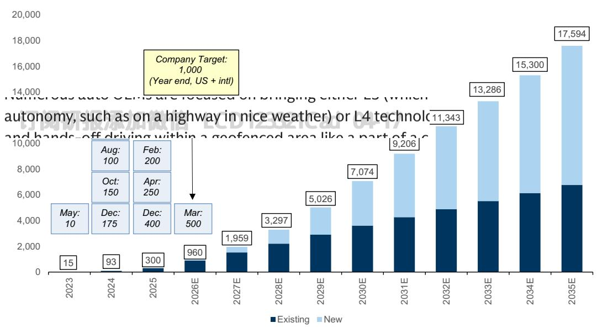  
Existing markets defined as US markets which already have launched commercial operations (April 2026). Blue boxes are paid weekly trip run-rates reported by Waymo

Source: Company data, Goldman Sachs Global Investment Research

While visibility into the timing (and launch) of new markets remains low, we believe 订阅研报添加微信 LCD123321Cad 04-17 that expanding into international markets will play a key role in driving trip growth. In terms of the regulatory landscape for autonomous commercial vehicles - international frameworks (incl. the Vienna Convention, UNECE) and EU instruments (AI Act, General Safety Regulation) have a type-approval framework and mandate rigorous active safety features, which could limit widespread deployment of $L 4 / \mathsf { L } 5$ autonomy. In our view, this will likely limit the near-term scaling of Waymo in international markets over the next 5 years (e.g. we expect international markets to account for $10 \%$ of total Waymo trips in 2029). That said, by 2035, we expect for international trips to account for $\sim 3 0 \%$ of Waymo’s total paid trip volume.

Longer-term, we view international markets to be a stimulant to trip growth, and in the near-term, we see the announced markets as having the potential to increase awareness in robotaxis. Specifically in tourist destinations such as London and Tokyo, tourism/novelty effects could remain (previously highlighted in Exhibit 24) and also drive awareness of the service and eventual adoption as Waymo expands into new markets.

US vs. international paid trip mix $\%$

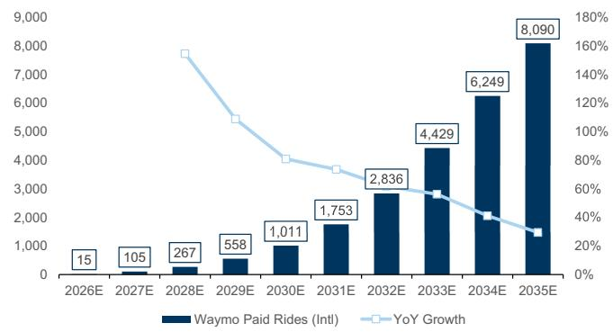  
Exhibit 60: While Waymo will remain in the early innings of scaling its international business during 2026... International weekly paid trips (000s)   
Source: Goldman Sachs Global Investment Research

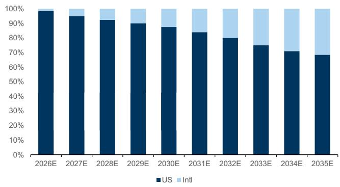  
Exhibit 61: ... we assume that international paid trips will account for $\sim 3 0 \%$ of overall volume   
Source: Goldman Sachs Global Investment Research

# The Building Blocks Toward $\$ 8$ bn $^ +$ Gross Bookings in 2030 As laid out above, we expect trip volume to be the primary driver of gross bookings growth over the next 10 years, driven by:

Trip volume. As outlined above, we model total paid trips to grow at a $56 \%$ 2025-2035 CAGR, driven by both growth in the US and international markets.

Miles per trip. We expect for the length of rides completed by AVs to converge with the average miles per trip completed by a human driver as Waymo expands their operating zones within existing markets. Specifically, we expect for the average miles per trip of a Waymo to scale from 7 miles in 2025 to 10 miles by 2035.

n ASP per mile. Today, both the broader AV industry and Waymo have a higher ASP per mile relative to human rideshare. While this has improved over the last several months, we still view the industry to have higher ASPs (on a per mile basis) than human rides, with AVs charging $\$ 2.90$ per mile (GSe) in 2025, compared to human rideshare of $\$ 2.50$ . By 2030, we expect the ASP per mile of an autonomous vehicle to be lower than that of a human driver.

Given these growth drivers, we expect for Waymo to grow gross bookings at a $5 1 \%$ CAGR over the next 10 years (2025-2035) and reach $\$ 8.5$ bn in gross bookings by 2030 and $\$ 20\ : \mathsf { b n } ^ { + }$ by 2035. We forecast that US gross bookings will remain ${ > } 8 5 \%$ of total bookings in 2030, and by 2035, that international markets will become more meaningful in terms of their contribution to gross bookings.

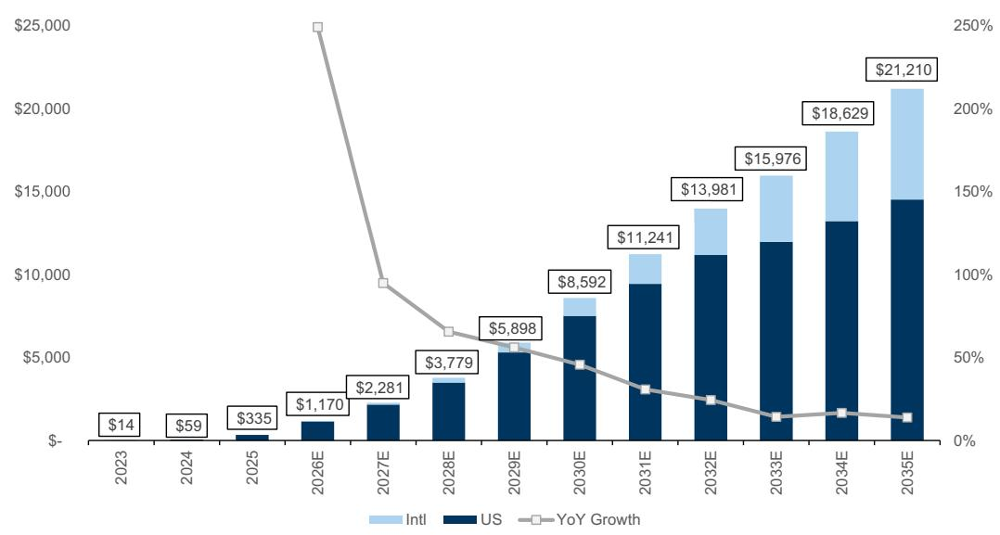  
Exhibit 62: We expect Waymo to grow GBs at a $51 \%$ CAGR over the next 10 years Waymo Gross Bookings $( \$ 5 m m )$   
Source: Company data, Goldman Sachs Global Investment Research

# 订阅研报添加微信 LCD1233Industry Benchmarking in the US

To help frame how our Waymo assumptions compare to the overall industry, we forecast that Waymo will scale to $\$ 7.5$ bn in US gross bookings in 2030. This compares to our current estimates for the gross bookings in the UCAN rideshare of $\$ 129$ bn (against a TAM of $\$ 460\mathsf { b n } +$ ) across $6 . 5 \mathrm { ~ b n } +$ trips.

Exhibit 63: Waymo vs. North America Rideshare Comparison   

<table><tr><td>NorthAmericaRideshareComparison</td><td>2023</td><td></td><td>2024</td><td>2025</td><td>2026E</td><td>2027E</td><td></td><td>2028E</td><td>2029E</td><td></td><td>2030E</td></tr><tr><td>Gross Bookings ($mm)</td><td></td><td></td><td></td><td></td><td></td><td></td><td></td><td></td><td></td><td></td><td></td></tr><tr><td>UCAN TAM</td><td>$</td><td>212,540</td><td>229,081</td><td>$ 258,123</td><td>$</td><td>301,122 $</td><td>336,320</td><td>374,485</td><td>$</td><td>417,816 $</td><td>464,628</td></tr><tr><td>UCAN Rideshare Bookings</td><td>$</td><td>47,773</td><td>56,238</td><td>$ 65,099</td><td>$</td><td>75,063 $</td><td>86,621</td><td>99,165</td><td>$</td><td>113,189 $</td><td>128,565</td></tr><tr><td>Uber</td><td>$</td><td>33,660</td><td>39,719</td><td>$ 46,471</td><td>$</td><td>53,442 $</td><td>61,191</td><td>69,146</td><td>$</td><td>76,925 $</td><td>85,771</td></tr><tr><td>Lyft</td><td>$</td><td>13,775</td><td>16,099</td><td>$ 17,920</td><td>$</td><td>20,014 $</td><td>22,392</td><td>24,838</td><td>$</td><td>27,287 $</td><td>29,691</td></tr><tr><td>Waymo</td><td>$</td><td>14$</td><td></td><td>59$</td><td>$</td><td></td><td></td><td></td><td></td><td></td><td></td></tr><tr><td>As%ofRideshare Bookings</td><td></td><td>0%</td><td></td><td></td><td>335 1%</td><td>1,149 $ 2%</td><td>2,165 2%</td><td>3,495 4%</td><td>$</td><td>5,308$ 5%</td><td>7,518 6%</td></tr><tr><td colspan="10">0%</td><td></td><td></td><td></td></tr><tr><td>Trips (mm)</td><td></td><td></td><td></td><td></td><td></td><td></td><td></td><td></td><td></td><td></td><td></td></tr><tr><td>UCAN Rideshare</td><td></td><td>2,353</td><td>2,766</td><td>3,236</td><td></td><td>3,808</td><td>4,455</td><td>5,156</td><td></td><td>5,920</td><td>6,689</td></tr><tr><td>Uber</td><td></td><td>1,626</td><td>1,914</td><td>2,283</td><td></td><td>2,728</td><td>3,180</td><td>3,643</td><td></td><td>4,091</td><td>4,534</td></tr><tr><td>Lyft</td><td></td><td>709</td><td>828</td><td></td><td>918</td><td>1,008</td><td>1,131</td><td>1,258</td><td></td><td>1,386</td><td>1,513</td></tr><tr><td>Waymo</td><td></td><td>1</td><td></td><td></td><td>16</td><td>50</td><td>102</td><td>171</td><td></td><td>261</td><td>368</td></tr><tr><td colspan="10"></td><td></td></tr><tr><td>Vehicle Miles Traveled (mm)</td><td></td><td></td><td></td><td></td><td></td><td></td><td></td><td></td><td></td><td></td><td></td></tr><tr><td>Addressable UCAN</td><td></td><td>1,035,642</td><td>1,044,948</td><td>1,057,856</td><td>1,070,924</td><td></td><td>1,084,153</td><td>1,097,546</td><td></td><td>1,111,105</td><td>1,124,832</td></tr><tr><td>UCAN Rideshare</td><td></td><td>18,545</td><td>22,002</td><td>26,013</td><td></td><td>30,940</td><td>36,582</td><td>42,802</td><td></td><td>49,777</td><td>56,944</td></tr><tr><td>Uber</td><td></td><td>12.819</td><td>15,242</td><td>18.360</td><td></td><td>22,153</td><td>26,084</td><td>30,182</td><td></td><td>34,234</td><td>38,314</td></tr><tr><td>Lyft</td><td></td><td>5,589</td><td>6,594</td><td>7,384</td><td></td><td>8,185</td><td>9,276</td><td>10,418</td><td></td><td>11,596</td><td>12,788</td></tr><tr><td>Waymo</td><td></td><td>4</td><td>20</td><td></td><td>115</td><td>418</td><td>866</td><td>1,487</td><td></td><td>2,338</td><td>3.356</td></tr></table>

Waymo metrics for US only (excl. Canada)

<table><tr><td>2025-2030CAGR</td></tr><tr><td>15%</td></tr><tr><td>13% 11%</td></tr><tr><td>86%</td></tr><tr><td></td></tr><tr><td>16% 15%</td></tr><tr><td>11%</td></tr><tr><td>88%</td></tr></table>

Tesla is focused on real-world AI development, including for vehicles and robots. The company has articulated a view that while getting to more generalized AI capability is a difficult problem, it will allow Tesla to scale quickly when ready, especially given its vertical integration and the low cost of its vehicles.

Tesla began operating a portion of its robotaxi business in Austin without an in-vehicle safety monitor starting in December 2025 (albeit the percentage of driverless vehicles in    ‹¢–xb¥mûR _®Oá   LCD123321Cad   04-1the fleet was relatively limited). It initially launched its robotaxi service in Austin in June $^ 7$ 2025, but with a safety observer. Tesla also launched a ride-hailing service in the San Francisco Bay Area in July 2025, but Tesla does not currently have the regulatory approvals to operate a driverless service there. We believe investors are increasingly looking for data on the performance and progress of Tesla’s robotaxi service, including the ratio of rides in Austin without a monitor, and expanding to more locations. Recall Tesla stated on its 4Q earnings call that it plans to expand robotaxi operations to 7 other metros (including Dallas, Houston, Phoenix, and Miami) in 1H26 (and we believe this would include using safety observers and/or drivers to start).

Tesla has articulated a few key potential advantages that it expects to have in the AV market. One is the lower cost of its vehicle hardware, and the other is the potential for its end-to-end AI approach to allow for faster geographic scaling. On vehicle costs, Tesla believes its current vehicles (with ASPs in the US that start in the mid $\$ 301$ range) are capable of unsupervised autonomous operation, and the company believes its purpose-built Cybercab will have a cost of less than $\$ 301$ at scale long-term. Recall the    ‹¢–xb¥mûR _®Oá   LCD123321Cad   04-1company expects to start production of Cybercab in April (albeit at a very slow rate to start). We believe this cost is lower than AVs in the western market from competitors (which we believe are currently in the mid to high five figure range). We attribute Tesla’s lower cost to both the scale it has from the vehicle business and the cost of compute, and sensors on its vehicles (with Tesla using internally designed silicon and no lidar/radar). However, we expect Tesla’s cost difference purely from using fewer sensors will be relatively low on a per mile basis in the long-term (e.g., we estimate an AV with a $\$ 50 K$ upfront cost could have depreciation costs of $\sim \$ 0.10 – \$ 10.15$ per mile in the 2030-2040 timeframe) as hardware costs decline and are spread over more miles. We think the more important variable to gauge Tesla’s relative share/profits in AVs is whether its approach to AI allows it to scale much faster.

The company’s supervised Full Self Driving (FSD) product (which requires the driver to remain ready to take over) has shown significantly better performance with v14, and Tesla’s Safety Report shows that FSD (Supervised) is 5-7X safer than a human driver.    ‹¢–xb¥mûR _®Oá   LCD123321Cad   04-1Crowd-sourced data shows \~2K miles between critical intervention, which we consider $^ { 7 }$ to be best in class for an L2 product, but still short of what is needed for eyes-off driving (with NHTSA data implying that Waymo performance is $> 1 0 0 \mathsf { K }$ miles between accidents in cities, and we think accidents are more frequent per mile in a city setting).

We assume that Tesla’s unsupervised AV fleet averages 275 vehicles in operation in 2026 (unchanged from our last AV report), and 17K in 2030 (up from about 11K previously) to better reflect market growth.

To help frame the potential present value for Tesla’s robotaxi business, we constructed an illustrative DCF of the incremental value assuming a fleet of 100K - 1 mn AVs on the road with an EBIT margin of $1 0 { - } 4 0 \%$ in 2040, which implies a wide range of outcomes in value per share (Exhibit 64). We believe this analysis suggests that the ultimate value of its rideshare business will depend on the degree to which it can scale and earn a differentiated margin. One downside risk in this regard is what has happened with the ADAS market in China, with many local OEMs now including hands-free technology as a standard feature or at low cost even for mainstream vehicles. However, if Tesla is able to benefit from scale and low hardware costs, there are scenarios where it could have a very attractive margin, in our view.

Exhibit 64: Tesla illustrative robotaxi DCF per share   

<table><tr><td colspan="8"></td></tr><tr><td></td><td colspan="7">100 150</td></tr><tr><td>10%</td><td>$1.75</td><td>$2.50</td><td>250 $4.00</td><td>500 $8.25</td><td>750 $12.25</td><td>800 $13.25</td><td>1000 $16.50</td></tr><tr><td>20%</td><td>$3.50</td><td>$5.25</td><td>$8.50</td><td>$17.25</td><td>$25.75</td><td>$27.50</td><td>$34.50</td></tr><tr><td>Ereargan 30%</td><td>$5.25</td><td>$7.75</td><td>$13.00</td><td>$26.25</td><td>$39.25</td><td>$41.75</td><td>$52.25</td></tr><tr><td>35%</td><td>$6.25</td><td>$9.25</td><td>$15.25</td><td>$30.75</td><td>$46.00</td><td>$49.00</td><td>$61.25</td></tr><tr><td>40%</td><td>$7.00</td><td>$10.50</td><td>$17.50</td><td>$35.00</td><td>$52.75</td><td>$56.25</td><td>$70.25</td></tr></table>

We assume a WACC of $12 \%$ in the near-term decreasing to $8 . 7 \%$ in 2040 and a terminal growth rate of $3 \%$

Source: Goldman Sachs Global Investment Research

Separate from the robotaxi business opportunity, Tesla sells its Full Self Driving (FSD) software to consumers. We believe that Tesla’s FSD revenue in 2025 was $- \$ 1$ bn across both upfront purchases and monthly subscriptions. However, recall Tesla no longer allows for upfront purchases of FSD (as of February 2026). Given Tesla commented that $\sim 7 0 \%$ of it active FSD subscriptions of $1 . 1 \mathsf { m } \mathsf { n }$ at the end of 2025 were upfront purchases, we estimate that Tesla’s FSD annual revenue run rate from monthly subscribers exiting 2025 was between $\$ 200$ and $\$ 500\mathsf { m n }$ .

We show revenue potential from purchases of FSD on a subscription basis in Exhibit 65. We recognize there are scenarios beyond the range we show (e.g., upside cases given that Tesla could license FSD to other OEMs, and downside cases that are less positive owing to factors including regulatory constraints and/or software development challenges).

Exhibit 65: Potential FSD TAM sizing from monthly subscriptions   

<table><tr><td colspan="7"> Annual revenue in mns from monthly FSD subscriptions</td></tr><tr><td colspan="7"> Installed Base (mn)</td></tr><tr><td>Monthly ASP $25.0 10%</td><td>Attach Rate 10</td><td>15</td><td>20</td><td>25</td><td>30</td><td>35</td></tr><tr><td></td><td>300</td><td>450</td><td>600</td><td>750</td><td>900</td><td>1,050</td></tr><tr><td>25%</td><td>750</td><td>1,125</td><td>1,500</td><td>1,875</td><td>2,250</td><td>2,625</td></tr><tr><td>40%</td><td>1,200</td><td>1,800</td><td>2,400</td><td>3,000</td><td>3,600</td><td>4,200</td></tr><tr><td>50% 75%</td><td>1,500</td><td>2,250</td><td>3,000</td><td>3,750</td><td>4,500</td><td>5,250</td></tr><tr><td></td><td>2,250</td><td>3,375</td><td>4,500</td><td>5,625</td><td>6,750</td><td>7,875</td></tr><tr><td rowspan="5">$50.0</td><td>10%</td><td>600</td><td>900</td><td>1,200 1,500</td><td>1,800</td><td>2,100</td></tr><tr><td>25%</td><td>1,500</td><td>2,250 3,000</td><td>3,750</td><td> 4,500</td><td>5,250</td></tr><tr><td>40%</td><td>2,400</td><td>3,600 4,800</td><td>6,000</td><td>7,200</td><td>8,400</td></tr><tr><td>50%</td><td>3,000</td><td> 4,500</td><td>6,000</td><td>7,500</td><td>9,000 10,500</td></tr><tr><td>75%</td><td>4,500</td><td>6,750 9,000</td><td>11,250</td><td>13,500</td><td>15,750</td></tr><tr><td rowspan="5">$100.0</td><td>10%</td><td>1,200</td><td>1,800</td><td>2,400</td><td>3,000 3,600</td><td>4,200</td></tr><tr><td>25%</td><td>3,000</td><td>4,500</td><td>6,000 7,500</td><td>9,000</td><td>10,500</td></tr><tr><td>40%</td><td>4,800</td><td>7,200 9,600</td><td>12,000</td><td>14,400</td><td>16,800</td></tr><tr><td>50%</td><td>6,000</td><td>9,000</td><td>12,000</td><td>15,000</td><td>18,000 21,000</td></tr><tr><td>75%</td><td>9,000</td><td>13,500</td><td>18,000 22,500</td><td>27,000</td><td>31,500</td></tr><tr><td rowspan="5">$150.0</td><td>10%</td><td>1,800</td><td>2,700</td><td>3,600</td><td>4,500</td><td>5,400</td><td>6,300</td></tr><tr><td>25%</td><td> 4,500</td><td>6,750</td><td>9,000</td><td>11,250</td><td>13,500</td><td>15,750</td></tr><tr><td>40%</td><td>7,200</td><td>10,800</td><td>14,400</td><td>18,000</td><td>21,600</td><td>25,200</td></tr><tr><td>50%</td><td>9,000</td><td>13,500</td><td>18,000</td><td>22,500</td><td>27,000</td><td>31,500</td></tr><tr><td>75%</td><td>13,500</td><td>20,250</td><td>27,000</td><td>33,750</td><td>40,500</td><td>47,250</td></tr><tr><td rowspan="5">$200.0</td><td>10%</td><td>2,400</td><td>3,600</td><td>4,800</td><td>6,000</td><td>7,200</td><td>8,400</td></tr><tr><td>25%</td><td>6,000</td><td>9,000</td><td>12,000</td><td>15,000</td><td>18,000</td><td>21,000</td></tr><tr><td>40%</td><td>9,600</td><td>14,400</td><td>19,200</td><td>24,000</td><td>28,800</td><td>33,600</td></tr><tr><td>50%</td><td>12,000</td><td>18,000</td><td>24,000</td><td>30,000</td><td>36,000</td><td>42,000</td></tr><tr><td>75%</td><td>18,000</td><td>27,000</td><td>36,000</td><td>45,000</td><td>54,000</td><td>63,0068</td></tr></table>

GOOGL (covered by Eric Sheridan) - We see Alphabet as positively exposed to multiple aspects of the AI theme scaling in the coming years across both consumer and enterprise computing. In addition, we see the mgmt team as remaining focused on striking a balance between growth investments and balance across operational efficiencies. In terms of Alphabet’s exposure to physical AI/autonomous vehicles, we view the company to be well positioned, as Waymo is currently the largest AV operator in the US, making over 500,000 paid trips per week as of March 2026.

We are Buy rated on GOOGL. Our 12-month PT of $\$ 400$ is based on an equal blend of (1) EV/GAAP EBIT applied to our $\mathsf { N T M } + \mathsf { \Omega } \mathsf { \Omega } \mathsf { \Omega }$ year estimates and (2) a modified DCF using EV/FCF-SBC multiple applied to our $\mathsf { N T M } + 4$ years estimates discounted back 3 years.

Key risks include: a) competition of product utility levels and advertising dollars; b) headwinds to monetizable (product) search from industry disruption; c) shifting media consumption habits; d) heavy investments depress operating margins for longer than our forecasts; e) no/low levels of incremental shareholder returns going forward; & f) regulatory scrutiny and industry practices altering the business model’s prospects. In addition, Alphabet is exposed to the volatility caused by the global macroeconomic environment and investor risk appetite for growth stocks.

TSLA (covered by Mark Delaney) - We see Tesla as well positioned to scale its robotaxi business over the longer-term due in part to its cost structure/vertical integration. We also expect improved FSD monetization over time with consumers as the software 订阅研报添加微信 LCD123321Cad 04-17 progresses toward L3/L4 capability. While we expect the autonomous market to support solid medium to longer-term EPS growth, we expect competition to somewhat limit the level of earnings in these markets, which is consistent with our Neutral rating.

Our 12-month price target is $\$ 375$ , which is based on $\boldsymbol { 1 5 0 \times }$ applied to our Q5-Q8E EPS estimate including SBC. A downside valuation scenario for the stock, assuming less volume growth and slower margin improvement, could be $\sim \$ 170$ (using 2028E EPS estimate including SBC and a multiple of $\mathord { \sim } 6 0 \times 1$ ). An upside valuation scenario could be $\sim \$ 500$ , assuming a 150X multiple applied to non-GAAP 2028E EPS excluding SBC.

Key downside risks to our view relate to potentially larger vehicle price reductions than we expect, increased competition in EVs, a larger than expected tariff impact, slower EV demand, delays with products/capabilities like FSD/4680, key person risk, the internal control environment, margins, and operational risks associated with Tesla’s high degree of vertical integration. Upside risks include faster EV adoption and/or share gain by Tesla, a stronger macroeconomic environment for new vehicle sales more generally, 订阅研报添加微信 LCD123321Cad 04-17 earlier new product launches than we expect, an earlier/larger impact from AI enabled products (e.g., FSD, Optimus and robotaxis), and a smaller than expected tariff impact than we currently anticipate.

UBER (covered by Eric Sheridan) - We continue to view UBER as an equity story centered on the key themes of scaling end-markets, rising profitability levels (even while remaining committed to investing for the long-term) and increased evidence of platform cross-sell/flywheel effects, which should result in investors revisiting the mix of growth, margins & FCF that UBER can generate in the years ahead. In our view, the launch of Uber Autonomous Solutions, paired with recent investments and partnerships positions 49 the company well to play a key role in scaling the autonomous vehicle opportunity - specifically in the market opportunity outside of Waymo/Tesla. While debates around the AV theme could remain an overhang on the stock, we believe that investors have multiple pathways to generate an attractive multi-year IRR without the need for multiple expansion by buying UBER shares as the company compounds FCF at $2 0 - 2 5 \%$ /yr through 2027E (we believe that UBER can produce $\$ 3.59/\$ 4.99$ of GAAP EPS in 2026/2027).

We are Buy-rated on UBER shares. Our $\$ 125$ , 12-month price target is based on an equal blend of (1) EV/GAAP EBITDA applied to our NTM $+ ~ 1$ year estimates and (2) a modified 订阅研报添加微信 LCD123321CadDCF using an EV/FCF-SBC multiple applied to our $\mathsf { N T M } + \mathsf { 4 }$ years estimates discounted back 3 years.

Risks to our Buy rating include: a) Slower growth in Mobility due to demand elasticity, maturation, competition from Autonomous Vehicles, etc.; b) Regulatory environment around driver classification (incl. compensation, benefits, etc.), merchant commission caps, ESG, etc.; c) Competitive forces in both Mobility and Delivery (incl. local commerce/logistics); d) Normalization of consumer discretionary spend habits within Delivery; and e) volatility caused by the global macroeconomic environment and investor risk appetite for growth stocks.

AUR (covered by Mark Delaney) - Aurora is a first-mover in AV on-road trucking in the US, and we expect Aurora to benefit as it ramps commercial AV operations, including its plan to have over 200 driverless trucks by the end of 2026. Over the longer term, the company’s ability to ramp its driver-as-a-service model with its OEM and tier 1 partners will be key for enabling AV truck scaling. We do expect it to take longer for Aurora to 订阅研报添加微信 LCD123321Cad 04-17 reach its FCF target than it has guided to, and we assume incremental capital raising, as factors for our Neutral rating.

We slightly adjust our estimates reflecting a tighter trucking supply/demand backdrop (as detailed by ACT in our recent webinar). Our EPS estimates including SBC for $2 0 2 6 / 2 7 / 2 8 / 2 9 / 3 0$ are now $- \$ 0.50/ -\$ 0.48/ -\$ 0.45/ -\$ 0.30/\$ 0.05$ from - $- \$ 0.50/ -\$ 0.50/ -\$ 0.45/ -\$ 0.30/\$ 0.05$ driven by higher revenue but mostly offset by higher costs.

We are Neutral-rated on AUR shares, and we raise our 12-month price target to $\$ 5$ from $\$ 4$ , driven by our somewhat higher revenue forecast. Specifically, we use: 1) $90 \%$ weight of our base case valuation of $\$ 5$ (from $\$ 4$ ), still using a 7X multiple on EV/2030E revenue discounted back; 2) $5 \%$ weight of our bull case valuation of $\$ 13$ (from $\$ 12$ ), still using 10X EV/2030E revenue on a bull case revenue scenario of twice the base case and discounted back; and 3) $5 \%$ weight of our bear case valuation of $\$ 2$ (unchanged), still using 5X a downside case 2030E revenue view of half of our base case view, discounted 订阅研报添加微信 LCD123321Cad 04-17

Key risks to our view include a faster/slower AV volume ramp including its ability to ramp up its supply chain partners/shift to an as-a-service model and expand routes, better/worse pricing/margins (with factors including its ability to reduce BOM costs and the degree of competition), and the cost to raise capital.

AMZN (covered by Eric Sheridan) - Despite short term debates likely remaining around the company’s forward capex guidance and its implications for backlog/revenue growth inside the AWS operating segment, impact on the company’s free cash flow generation 50 based on 2X applied to our Q5-Q8E revenue estimate. Key upside/downside risks to our view relate to EV adoption/volumes, tariffs, margins and the competitive landscape, Rivian’s high degree of vertical integration, cash burn, and the supply chain.

MBLY (covered by Mark Delaney) - Mobileye is one of the leading providers of ADAS and AV technology, which we attribute to its strength in perception/vision and power-efficient solutions, and consistent with its awards in particular for VW (including hands-free, eyes-off, and full AV solutions). However, the market environment for higher-level ADAS and AV technology is competitive, with several auto OEMs, at least thus far, selecting other providers and/or in-house solutions for L3/L4 solutions (e.g.    ‹¢–xb¥mûR _®Oá   LCD123321Cad   04-17GM, Nissan, Honda) which we think limits the opportunity for Mobileye and supports our Neutral rating.

Our 12-month price target is $\$ 8$ , which is based on 12X applied to our Q5-Q8 EBITDA estimate (ex. SBC). Key risks relate to: 1) the success it has (positively or negatively) with new design wins and if the company is able to secure more or less wins than we anticipate this could lead to more/less upside than our current expectations; 2) the rate of ADAS/AV penetration in the market with more penetration potentially driving more upside and less penetration potentially driving more downside, 3) more or less growth in auto production relative to our expectations could lead to more or less chip shipments from Mobileye than we expect, 4) Financials - lower or higher ASPs/margins, and 5) corporate actions.

INVZ (covered by Mark Delaney) - We believe Innoviz is one of the leaders in lidar technology, as evidenced by its positioning on the Mobileye Drive AV platform, and its wins at VW for consumer vehicles and with Daimler for trucking. However, we believe    ‹¢–xb¥mûR _®Oá   LCD123321Cad   04-that the lidar market remains competitive, which we expect to lead to measured new design win rates.

We are Neutral-rated on INVZ shares and our 12-month price target is $\$ 0.75$ , which is based on 1) $90 \%$ weight on our base case valuation of $\$ 0.75$ , based on 2X our 2028 revenue estimate discounted back; 2) a $5 \%$ weight on our bear case valuation of $\$ 0.50$ , based on 2X our downside 2028 revenue estimate discounted back; and 3) a $5 \%$ weight on our bull case valuation of $\$ 2$ , based on 3X our upside 2028 revenue estimate discounted back.

Key upside/downside risks relate to: 1) new customer/program wins or losses — the company could announce new programs, or lose share at existing partners; 2) ramp timing — to the extent that programs that the company has already announced are delayed, revenue may ramp slower than we expect or if programs ramp faster than we expect, revenue could be higher; 3) ASP — ASPs being lower/higher than we expect could drive downside/upside to the stock; 4) Balance sheet — the company is currently    ‹¢–xb¥mûR _®Oá   LCD1233cash flow negative and may need to raise further capital. Cad

LYFT (covered by Eric Sheridan) - While short-term debates will likely stay rooted in industry trends around rideshare pricing, market share fluctuations, positioning against the AV theme and/or any changes in consumer discretionary behavior, we believe that shares are dislocated from LYFT’s earnings power in the next 2-3 years. We believe that the opportunity is created by investors’ concern about 1) the bridge between current growth levels and the company’s 3yr $^ +$ mid-teens GB growth target laid out at its 2024 Investor Day (and what is implied in 2026/2027 growth); 2) debates surrounding the potential disruption from autonomous vehicles from emerging operators (e.g., Waymo, Tesla, etc.) and the solid cadence of new partnerships signed by UBER in recent weeks/months in the space; & 3) debates around pricing, given moderating insurance inflation (which tends to be passed through as price) and the ridesharing industry’s general focus on driving affordability, and 4) general competitive concerns given LYFT’s #2 position in North America ridesharing.

We view those concerns as more than already discounted in the stock today as: 1) while achieving the Investor Day targets will likely be a key determinant of sentiment and valuation levels, shares trade at 5x our 2027E FCF-SBC estimate; 2) we believe that the 订阅研报添加微信 LCD123321Cad 04-17 AV ridesharing landscape remains in its very early days and expect that AV operators and fleet owners will enter into partnerships in the coming years and that LYFT has an important role to play in the broader hybrid/AV ecosystem (incl. for demand generation and fleet management); 3) we expect lower cost inflation and more moderate pricing trends to be longer-term positives as more affordable price points are likely to drive increased penetration levels of the large addressable opportunity for rideshare networks; & 4) execution has been solid at LYFT in recent quarters - with gross bookings accelerating in 2H25, and we believe that the North America ridesharing duopoly industry structure is supportive of rational competitive behavior in the years ahead (all while we expect the category to grow double-digits).

We are Buy-rated on LYFT shares. Our $\$ 25$ 12-month price target is based on an equal blend of (1) EV/Sales applied to our $\mathsf { N T M } + \mathsf { \Omega } \mathsf { \Omega } \mathsf { \Omega }$ year estimates and (2) a modified DCF using an EV/GAAP EBITDA multiple applied to our $\mathsf { N T M } + 4$ years estimates discounted back 3 years.

订阅研报添加微信 LCD123321Cad 04-17 Key risks include: Active rider growth or frequency below our forecasts (losing market share, slower consumer adoption of Mobility); Unfavorable changes in consumer behavior (autonomous vehicle adoption away from LYFT, work from home, office commute, airport travel, expanded use cases, etc.); Impact of introduction and adoption of new products/solutions; Worse return earned on micromobility investments (bikes & scooters); Higher levels of consumer/driver incentives; Impact of higher insurance costs on unit economics; Regulation of driver classification (incl. compensation, benefits, etc.). In addition, Lyft is exposed to the volatility caused by the global macroeconomic environment and investor risk appetite for growth stocks.

GM (covered by Mark Delaney) - GM is growing its software and digital services business (including Super Cruise and OnStar), and management expects revenue to increase by $\sim \$ 400 m$ to $\sim \$ 3.1$ bn in 2026. GM has seen good attach rates (at $3 0 { - } 4 0 \%$ ) with paid plans for these products as prepaid subscriptions expire, and GM expects to offer L3 autonomy starting in 2028 and is working on L4 autonomy in-house as well. GM is also 订阅研报添加微信 LCD123321Cad 04-17working with Nvidia on its AI technology.

We are Buy-rated on GM, and our 12-month price target is $\$ 91$ , which is based on 7X our normalized EPS estimate of $\$ 123.00$ . Key risks to our view relate to the auto cycle, market share, margins, FCF, GM’s ability to profitably grow longer-term in areas such as EVs and AVs, and the geopolitical/tariff environment.

F (covered by Mark Delaney) - Ford is growing its software and digital services business (including BlueCruise ADAS subscriptions, and Ford Pro offerings such as telematics). The company noted that its total paid software subscriptions as of 4Q25 were $1 . 3 \mathsf { m n }$ , up $5 3 \%$ yoy. Additionally, Ford is pursuing L3 autonomy in-house, with plans to launch in 2028 on its UEV platform. Management has noted it is still exploring its options for L4, with the potential to license the technology, use partnerships, or do this in-house.

We are Neutral-rated on F shares, and our 12-month price target is $\$ 13$ , based on 7X our normalized EPS estimate of $\$ 1.90$ . Key upside/downside risks to our Neutral rating relate to the auto cycle (demand and/or price-mix could be weaker or stronger than we expect), Ford gaining or losing more market share than we expect, a larger/smaller than expected tariff impact; and margins (both from margin and pricing pressure in a downturn, the degree of success with company specific initiatives such as the transition    ‹¢–xb¥mûR _®Oá   LCD123321Cad  to hybrids/EVs, and its ability to grow in higher margin software & services). -

TEL (covered by Mark Delaney) - We believe TEL is well positioned to capitalize on higher levels of autonomy and has incremental content opportunities tied to the high speed data connectivity that is needed for partly and fully autonomous vehicles. TE commented at its 2025 investor day that high-speed data connectivity can be a $\sim \$ 50$ per vehicle opportunity in some cases, and expects its automotive data connectivity CPV to about double between 2025 and 2030. We believe this product set will be a key contributor to the company’s 4-6 percentage points longer-term outgrowth target for the auto market.

Beyond the role TE’s products play to enable power-efficient and high speed vehicle platforms, the company also has opportunities to power datacenters, both with high-speed connectors for AI training and power products for the grid.

We are Buy-rated on TEL shares, and our 12-month price target is $\$ 270$ which is based    ‹¢–xb¥mûR _®Oá   on 22X our normalized EPS estimate of $\$ 123,45$ 123321Cad   04-. Key downside risks to our Buy thesis $^ { 4 7 }$ relate to automotive end demand, TE executing on its margin expansion plan, the impact of EVs and new car architectures on automotive content for TE, unfavorable commodity pricing, macroeconomic demand trends, and TE successfully expanding into the sensor market.

APTV (covered by Mark Delaney) - Aptiv provides sensors and compute for active safety programs for $L 2 / \mathsf { L } 2 +$ ADAS offerings, with 2025 active safety revenue of $\sim \$ 3$ bn $( \sim 2 0 - 2 5 \%$ of revenue). We see potential for the company to increase revenue as L2 offerings get more complex and, over time, Aptiv could provide active safety products (e.g. sensors and compute) for L3 and perhaps L4 offerings too.

We are Buy-rated on APTV shares, and our 12-month price target is $\$ 74$ , which is based on 11X our normalized EPS estimate of $\$ 6.70$ . Key risks to our thesis include: Aptiv’s ability to grow its content per vehicle ahead of industry production, the auto cycle, Aptiv’s market share, margins, and Aptiv’s ability to grow in non-automotive markets.

XPeng (covered by Tina Hou) - XPeng is among the fastest-growing pure EV makers in China with a focus on intelligent vehicle features. The company highlighted 2026 as a pivotal year for its AI capabilities, with volume application/production for VLA2.0 on PVs, robotaxis, humanoid robots, and eVTOLs in 2026. Its VLA2.0 autonomous driving began roll-out on certain domestic models since March, targeting gradual deployment in overseas markets in late 2026 or early 2027. It also plans to conduct test drives with its robotaxis using safety drivers in 2H26, with aims to launch pilot passenger operations thereafter.

We are Buy-rated with $_ { 1 2 \mathsf { m } }$ DCF-based (WACC $1 1 . 8 \%$ , TGR $3 . 0 \%$ ) TPs of $\cup { \mathsf { S } } \$ 22 / { \mathsf { H K } } \$ 8 5$ for the ADR/H share. Risks: lower-than-expected sales volume; worse-than-expected price competition; weaker-than-expected market demand.

Hesai (covered by Tina Hou) - Hesai is a leading lidar provider whose products cater to applications across advanced driver assistance systems (ADAS), autonomous mobility, and robotics with $3 3 \%$ revenue market share in 2024 globally. The company’s ADAS lidar shipments more than doubled in 2025 to $1 . 4 \mathsf { m n }$ units and robotics shipments (inclusive of robotaxis) grew by more than $4 \mathsf { x }$ to $\sim 2 3 9 \mathrm { k \Omega }$ units.

订阅研报添加微信 LCD123321We are Buy-rated. Our 12m target prices of $\cup { \mathsf { S } } \$ 34/4 k \$ 265$ for ADR/H share are based on a $2 0 \times \mathsf { P } / \mathsf { E }$ multiple applied to Hesai’s 2030E non-GAAP EPS and discounted back to 2026E at a CoE of $1 1 \%$ . Risks include slower LiDAR adoption, intensified competition, customer pricing pressure, policy risk.

Volvo Group (covered by Daniela Costa) - As outlined in our recent webcast with Volvo Autonomous Solutions (see here), Volvo already has commercial operations for autonomous trucks in two mining and quarrying sites in the Nordics. As for autonomous long-haul trucking, Volvo is positioning the U.S. as the core near-term focus, citing a ${ \mathsf { c . } } \$ 90000$ long-haul market and a favorable regulatory environment. The company’s approach focuses on a Transport-as-a-Service (TaaS) model to mitigate high upfront capital costs for customers and prioritizes strategic partnerships for the “virtual driver” layer—most notably with Aurora and Waabi. As of early 2026, VAS has transitioned from pilot programs to commercial readiness, operating daily revenue-generating miles in Texas with a validation timeline for “driver-out” operations in the next few quarters rather than years. This industrialization phase is supported by a robust dealer network 订阅研报添加微信 LCD123321Cad 04-17 and a long-term vision where they see the industry autonomous volumes reaching 20,000 units annually by 2030, eventually becoming the dominant segment of the trucking industry by the mid-2030s.

Investment thesis: We are Buy-rated. Our Trucking barometer points to a recovery in 1Q26 with the US showing signs of improvement and Europe stable (see here). We continue to see Volvo as a relative beneficiary of the Section 232 tariffs (given its optimal US/Mexico production mix) and we prefer its diversified regional and end-market profile. This includes not only exposure to trucks, but also to Datacenters through Penta. Among the trucks stocks, we see the highest upside to 2027 consensus estimates for Volvo (we are $1 1 \%$ ahead of Visible Alpha Consensus Data on 2027E group adj EBIT for Volvo vs $1 3 \%$ below for Daimler and $2 \%$ ahead for Traton) and see a superior return profile for the company.

Our 12 month price target is SEK364 and is based $100 \%$ on our sector-relative EV/IC to ROIC/WACC methodology using 12 month 2027 estimates. Key downside risks: 1) worse 订阅研报添加微信 LCD123321Cad 04-17 global macro growth affecting the cyclical commercial vehicle industry; 2) any potential reversal of Section 232 tariffs on HDT trucks; 3) FX headwinds; (4) lack of follow-through on German stimulus or rises in interest rates driving Construction Equipment weakness; (5) Chinese competition; and (6) larger-than-expected impairments from antitrust civil claims.

Daimler Truck (covered by Daniela Costa): Daimler Truck’s autonomous strategy, spearheaded by its subsidiary Torc Robotics, is US-centered and targets a commercial market entry by 2027. During its 2025 Capital Market Day, the company projected that autonomous trucking could represent a c. €3 billion revenue opportunity for them by 2030, driven by a Software as a Service (SaaS) model that offers high-margin, recurring income whilst enabling customers to reduce their total cost of ownership by $1 5 \mathrm { - } 2 0 \%$ . The strategy utilizes Daimler’s Fifth Generation Freightliner Cascadia, an autonomous-ready platform featuring fully redundant safety systems integrated directly into the assembly line. To further enhance its proprietary “Virtual Driver” software, Daimler acquired Algolux in 2023 for AI-based self-driving perception while maintaining a partnership with Waymo. Operational testing is currently active in New Mexico, Texas, Arizona, and Michigan, with a primary focus on the high-volume freight lane between 订阅研报添加微信 LCD123321Cad 04-17 Laredo and Dallas.

Investment thesis: We are Neutral rated on Daimler. Whilst our Trucking Barometer points to a recovery in 1Q26 with improving US and stable Europe (see here), we think Section 232 on medium and heavy-duty trucks is likely to remain a relative headwind to Daimler’s North America margins as the company so far has opted to not implement surcharges, while credits for US content are unlikely to materialize in the near term. We are also cautious on Mercedes-Benz unit orders/sales due to macro uncertainty given the risks to European inflation and rates from the energy situation in the Middle East. Overall, we remain $2 1 \% / 1 3 \%$ below consensus for FY26/27E group adj. EBIT. The stock still screens cheap relative to the sector on PEG ratio and on EV/IC to ROIC/WACC basis and as such we remain Neutral.

Our 12 month price target is €43.0 and remains based on $100 \%$ on our sector-relative EV/IC to ROIC/WACC methodology using 12 month 2027 estimates. Key downside risks include: 1) weaker-than-expected volumes in Europe; 2) more severe pricing pressure as OEMs compete in an industry downturn; 3) faster-than expected implementation of Section 232 tariffs on trucks; 4) delays in progress with self-help measures; 5) larger-than-expected impairments from antitrust civil claims; and 6) overhang risk due to uncertainty around the final decision from Mercedes regarding its stake. Key upside risks include: 1) quicker-than-expected freight capex recovery in 2026 and a higher-than-expected German stimulus impact; 2) better-than-expected self-help progress; 3) further market share gains, especially in the US vocational market; and 4) higher cash to shareholders.

Traton (covered by Daniela Costa): Traton is developing its autonomous strategy through partnerships with autonomous driving software companies PlusAI and Applied Intuition. By early 2026, TRATON expanded this collaboration with up to $\$ 25$ million in R&D funding to accelerate the factory integration of the SuperDrive Level 4 software stack directly into its modular vehicle architecture. This targets a commercial market launch by 2027, aiming to mitigate the global driver shortage and reduce operating expenses, where driver costs represent over $40 \%$ of per-mile outlays. Operational 订阅研报添加微信 LCD123321Cad 04-17 traction is currently centered on the U.S. with active hub-to-hub fleet trials on the Interstate 35 corridor in Texas and autonomous mining deployments in Australia. TRATON is also co-developing TRATON ONE OS with Applied Intuition, a unified software-defined platform intended to power all group brands by 2028 and serve as the foundation for future autonomous and electric scaling.

Investment thesis: We are Neutral rated on Traton. Whilst our Trucking Barometer points to a recovery in 1Q26 with improving US and stable Europe (see here), we think Section 232 on medium and heavy-duty trucks is likely to remain a relative headwind to Traton’s North America margins as the company has removed their surcharges originally

implemented in late 2025 and credits for US content are unlikely to materialize in the near term. We are $7 \%$ below consensus for FY26E group adj. EBIT but $2 \%$ ahead for FY27E mainly due to continued improvement in Scania and MAN offsetting market share losses for International due to Section 232.

Our price target is $\notin 3 3 . 1$ and remains based on $100 \%$ on our sector-relative EV/IC to ROIC/WACC methodology using 12 month 2027 estimates. Key upside risks: (1) stronger pricing power; (2) a faster macro pickup; and (3) better-than-expected retention of MAN/International savings. Key downside risks include the converse, as well as order cancellations, FX and larger-than-expected impairments from antitrust civil claims.

Mercedes-Benz Group (covered by Christian Frenes) - Mercedes-Benz is developing an SAE Level 4 robotaxi ecosystem based on its S-Class flagship, featuring a redundant architecture for steering, braking, and power to enable “hands-off, eyes-off” operation. The company is launching its first premium robotaxi pilot in Abu Dhabi in 2026 in partnership with local operator Lumo, while simultaneously expanding its global Level 4 strategy through deep technical collaborations with Nvidia and Momenta. Mercedes plans to scale these technologies across major global markets such as in Munich, Germany in 2027, followed by the US. Its broader strategy leverages the MB.OS operating system to integrate these autonomous capabilities into a commercially scalable luxury fleet.

We are Buy rated. We value Mercedes on a hybrid P/E and DTG investment stake framework to explicitly account for the value of the remaining Daimler Truck (DTG) stake. Our price target is $\yen 66$ and comprises: (1) $\yen 56$ per share from applying a $7 . 5 \times$ target multiple to our 2027E EPS; and (2) $\yen 10$ per share from the NPV of MBG’s DTG 订阅研报添加微信 LCD123321Cad 04-17 stake, assuming an orderly sell-down over five years with proceeds returned to shareholders via MBG share buybacks. Key downside risks: Deviation from luxury strategy/focus; slowdown and/or restrictions in key luxury markets; cost savings do not materialize; inability to reduce capex; DTG stake monetization may be slower or at lower prices than assumed due to market conditions reducing distributable cash and buyback capacity.