# Japan Autos & Auto Parts

# Artificial Intelligence...Sooner or Later - Beyond autonomous driving: What added value can SDVs deliver?

# Masahiro Akita

# 订阅研

This report is part ofa global series inwhich our analysts consider what their sector wilook like by the early 203Os when Al has been fuly integrated and commercialized. There are broadly two schools of thought running through our research on Al globally.The“Sooner” camp generally believes that Artificial Intelligence isa game-changer for their sector, right now.The“Later"camp believes that Artificial Intelligence isa game-changer for their industry...just not yet.In this series,each analyst is declaring their viewon the timing and nature of Al disruption in their sectorand what that implies for warranted valuation today.

Al is replacing electrification as the primary differentiator: As EV momentum stalls, automakers are pivoting toward SDVs and intelligent mobility to sustain competitiveness. IVl and AD,core elements of these technologies,are driven by Al and the automotive sector broadly stands as a beneficiary.The deployment of E2E stacks and VLA models is accelerating the roadmap toward L4/L5 autonomy $( \sim 4 \%$ penetration by 2035),shifting the vehicle's value proposition from hardware performance to a platform for software intelligence and new added value.Post autonomy,the emergence of non-driving time creates new avenues for value creation. Now we identify three strategic directions: mobility as a portable home,mobility as a creative entertainment space,and robotaxi monetization.

3 strategies for enhancing value in non-driving time: Sharp and Xiaomi focus on expanding the vehicle's role as a portable home,integrating the cabin with the user's broader device ecosystem.Sharp'sl $\mathsf { \Omega } _ { - \mathsf { D } \mathsf { K } + }$ emphasizes stationary utility and appliance connectivity,while Xiaomi's‘Human x Carx Home'vision uses HyperOS to unify the car with household devices.Sony Honda Mobility pursued a different path by framing mobility as an entertainment space.Although development of the Afeela 1 has been discontinued, we believe the concept could be revisited given Sony's strengths in content and audio visual technology.Tesla represents a third approach,aiming to leverage full autonomy to convert idle private vehicles into part of a shared robotaxi network.

Interior as the foundation for post autonomy value creation: As L4/L5 autonomy could enhance value in non-driving time,Toyota is starting to position interior space as a core differentiator. Concepts such as the e-Palette and the Lexus LS Concept highlight Toyota's focus on flexible layouts and quiet, comfortable cabins,supported by group suppliers like Toyota Boshoku and Toyoda Gosei moving toward integrated interior systems.We believe further consolidation among key suppliers may be needed to accelerate cockpit integration. However,Toyota lacks applications that utilize this interior environment,and building external partnerships to develop in-cabin services will become increasingly important.

Scale and data depth support future application expansion: Autonomy could shift value toward upstream Al architecture and downstream applications, gradually reducing differentiation in traditional manufacturing.Toyota's 15O-mn-unit global fleet and the Mobility Services Platform provide access to large,diverse real-world data, which strengthens not only its Al development but also its potential for future external collaboration to expand in-cabin applications.Mid-sized players,by contrast, may face increasing dificulty in capturing downstream value and risk remaining hardware suppliers.

# BERNSTEINTICKERTABLE

<table><tr><td></td><td></td><td>15 Apr 2026</td><td></td><td></td><td>TTM</td><td></td><td></td><td>Reported EPS</td><td></td><td></td><td>Reported P/E(x)</td><td></td></tr><tr><td></td><td></td><td></td><td>Closing</td><td>Price</td><td>Rel.</td><td></td><td></td><td></td><td></td><td></td><td></td><td></td></tr><tr><td>Ticker</td><td>Rating</td><td>Cur</td><td>Price</td><td>Target</td><td>Perf.</td><td>Cur</td><td>2024A</td><td>2025E</td><td>2026E</td><td>2024A</td><td>2025E</td><td>2026E</td></tr><tr><td>7203JP (Toyota)</td><td>0</td><td>JPY</td><td>3,381.00</td><td>4,250.00</td><td>(15.1)%</td><td>JPY</td><td>359.56</td><td>302.42</td><td>346.01</td><td>9.4</td><td>11.2</td><td>9.8</td></tr><tr><td>7269.JP (Suzuki)</td><td>0</td><td>JPY</td><td>1,877.50</td><td>3,150.00</td><td>(36.3)%</td><td>JPY</td><td>215.65</td><td>213.28</td><td>230.73</td><td>8.7</td><td>8.8</td><td>8.1</td></tr><tr><td>7267.JP (Honda)</td><td>M</td><td>JPY</td><td>1,285.00</td><td>1,400.00</td><td>(56.4)%</td><td>JPY</td><td>178.93</td><td>107.82</td><td>163.70</td><td>7.2</td><td>11.9</td><td>7.8</td></tr><tr><td>7270.JP (Subaru)</td><td>U</td><td>JPY</td><td>2,506.00</td><td>2,800.00</td><td>(47.7)%</td><td>JPY</td><td>458.00</td><td>184.74</td><td>291.46</td><td>5.5</td><td>13.6</td><td>8.6</td></tr><tr><td>7201.JP (Nissan)</td><td>U</td><td>JPY</td><td>362.10</td><td>300.00</td><td>(36.6)%</td><td>JPY</td><td>(187.08)</td><td>(144.11)</td><td>46.67</td><td>(1.9)</td><td>(2.5)</td><td>7.8</td></tr><tr><td>7261.JP (Mazda)</td><td>U</td><td>JPY</td><td>1,078.50</td><td>1,000.00</td><td>(17.6)%</td><td>JPY</td><td>180.87</td><td>13.31</td><td>131.26</td><td>6.0</td><td>81.0</td><td>8.2</td></tr><tr><td>JPL</td><td></td><td>订阅研</td><td>开2422.38</td><td>加微信</td><td></td><td></td><td>LCD123321Cad</td><td></td><td>04-17</td><td></td><td></td><td></td></tr></table>

O- Outperform,M- Market-Perform,U- Underperform,NR-Not Rated,CS- Coverage Suspended Source: Bloomberg, Bernstein estimates and analysis.

# INVESTMENTIMPLICATIONS

# JAPAN AUTOS

WeexpecttherolloutofSDVs byJapaneseautomakers to kickoffwith Tyota'snewRAV4,setto launch in 2O25.Japanese automakers are progressing on SDVdevelopment with varying strategies,ranging from full-stack software platform/OS development to focused development aligned with company strengths.

Inautonomousdrivingrapidadvances inAlareaccelerating theshiftfromtraditionalrule-basedstacks toE2Estacks,driven bythe need forfasterdeploymentand improvedhandlingofedge cases.WithinE2Earchitectures,Vision-Language-Action (VLA)models,everaginggenerativeAlandLL-basedreasoning,areincreasinglyewedasthenextfrontier.oyotaispursuing a'multi-pathway'strategythatcombinesin-housedevelopment throughitssmart-cityinitiative,WovenCity,withexternal partnerships,includingcollaborationwithWaymo,apioneerinVLA-basedutonomousdrivingasellasstrategicivestments in MayMobilityPony.aandomenta.Cruciallits5Om-unitgloalfleetandobilityervicePlatform(MSPF)pidea structuraladvantage inaggregating the vastdriving datarequiredfor modeltraining. Honda,while working with Helm.ai, continuestofocusprimarilyondeveloping itsown in-house E2Eautonomousdrivingsystem.Nissn,meanwhile,isleveraging Wayve's E2E technology as the core of its autonomous driving approach.

Finaly,we expectonlyalimitednumberofautomakersarelikelytobepositionedtodeliversubstantialaddedvalueonceful autonomous drivingisrealized.Those with large globalvehicle instaledbases,scale advantages andsuffcientinvestment capacity,suchasToyota,arethemostlikelycandidates.Ontheotherhand,mid-sizedandsmalermanufacturers mafindit increasinglydificultosecuredownstreamvalueandmaintainlong-termcompetitiveness,asweakeningvaluecapture leaves them at risk of remaining just vehicle manufacturers.

With Japan's government positioning SDVs as a national priority and setting a $30 \%$ penetration target by 2030-2035,we expect strategicinitiativesacross thesectortoaccelerate,althoughthepaceanddirectionofprogressvarybyautomaker.Werate Suzukiand Toyotaas Outperform, Honda as Market-Perform, Nissan, Mazdaand Subaruas Underperform.

Astheidustry moves toward fullAl-driven autonomous driving,weassessthe extent towhichour coverage Japanese automakerscouldbenefitfromAlacrossfivedimensions.Specificaly,weevaluateeachcompanybasedonitsR&Dcapacity tosustain Al/AD-related development,thecurrentmaturityofADtechnologies,organizationalreadinessforsoftware development,the abity to monetizeapplications and services,andthe degree of supplychain integration (Exhibit 1).

Basedonthesecriteria,wecontinuetoviewToyotaastheleading beneficiaryofAl.WebelieveToyotahasthecapacitytoinvest morethan JPY8tninR&Doverthe nextfiveyears,supportedbyitssubstantialcashonhandandstrong cashgeneration.This financialstrength providessufficient headroomforin-housedevelopmentofautonomous driving technologies.Inadditionto internaldevelopment,Toyotaispursuingamulti-pathwayapproach,spaningrule-basedtoE2EAD,throughpartnershipsand equityinvestments.Whileconcreteexamplesofpostfullautonomyapplicationsand monetizationremainsomewhatlimited, Toyota's unparalleled installed base of $\sim 1 5 0 \mathrm { m n }$ vehicles on the road, combined with its MSPF,provides a strong foundation to rollouta widerangeofservices.Moreover,Toyotabenefitsfromarobust groupsupplychain,including DensoforADASandAD development,aswellasToyoda GoseiandToyota Boshokuinvehicleinteriors,anarea thatis expectedtobecomeincreasingly

important in the autonomous driving era.

Wesee Nissanasthesecondmostlikelybeneficiary.Amidweak financialperformanceandanegativeFCFmargin,Nissan's R&Dcapacityisconstrainedatpresent.Thatsaid,throughitspartnershipwithWayve,Nissnplanstodeploycutting-edge E2E ADtechnologyinFY3/28.Thecompany has also beenactivelypursuing robotaxinitiatives,includingtheEasyRiderobotaxi servicebeing piloted nearits HQs,as wellaspartnerships with Uberand Wayve forrobotaxi pilotservicein Tokyo.Oncethe ongoingrestructuring iscompleted,thekeyfocus willbewhetherNissancandemonstrate furtherprogresson theapplication and monetization front.

Honda hasacertain degreeof investmentcapacity supported by its motorcycle business asacash cow. However, its automotivebusinesscontinues tostruggle,andatthisstage,wedonotbelieve Hondaiswellpositionedtobenefitmeaningfuly fromAl. Inautonomous driving,Honda hadplannedtolaunchGMCruiseinearly 2O26,butthiswascanceledfollowing the closure ofCruise.Morerecently,Hondaannouncedtheterminationofdevelopmentfor Afeela,theflagshipprojectofSony Honda Mobilty,whichhadbeen theonly Japaneseautomakeractively pursuing VLAdevelopmentProgressinin-house E2E ADdevelopment seemingly laggedaswell.Going forward,Honda willneed tostrengthen integrationwith Astemo,which was recently consolidated,and provide clearer updates on the status of internal development.

ForSuzuki,MazdaandSubaru,scalelimitationsrelativetoToyota,NissanandHondaconstraintheirabilitytopursue autonomousdrivingdevelopmentindependently.Asautonomous drivingisexpected tobecomeanincreasinglyimportantfactor in vehiclepurchasing decisions,thesethree manufacturerswillneedtoarticulateaclearstrategicdirectionatanearlystage. Keyquestionsinclude whetherto leverageexternal technologies,as Nissanhasdone,ortomore fullyutilizealliances with Toyota.

EXHIBIT 1: Overallassessment of Al benefit potential across our coverage Japanese automakers; Toyota as the leading beneficiary   

<table><tr><td></td><td> Toyota</td><td> Nissan</td><td> Honda</td><td> Suzuki</td><td> Subaru</td><td> Mazda</td></tr><tr><td>Overall assessment of Al benefit potential</td><td>O</td><td>○</td><td>○</td><td></td><td></td><td></td></tr><tr><td>R&amp;D Capacity</td><td></td><td></td><td></td><td></td><td></td><td></td></tr><tr><td>R&amp;D plan (FY3/27E-3/31E)</td><td>JPY 8.3 tn</td><td>JPY 3.2 tn</td><td>JPY 6.6 tn</td><td>JPY 1.7 tn</td><td>JPY 1.0 tn</td><td>JPY 0.9 tn</td></tr><tr><td>Auto net cash (as of Dec-25)</td><td>JPY 14 tn*1</td><td>JPY 958 bn</td><td>JPY 3.1 tn*2</td><td>JPY 156 bn*3</td><td>JPY 444 bn*3</td><td>JPY 188 bn*3</td></tr><tr><td>Auto FCF margin （FY3/25）</td><td>4.4%</td><td>-2.1%</td><td>4.6%22</td><td>2.6%</td><td>1.9%</td><td>2.1%</td></tr><tr><td>AD tech maturity</td><td>`Multi-pathway&#x27; approach</td><td> Wayve&#x27;s E2E AD stack</td><td>In-house development in collaboration with Helm.ai</td><td>No specific plan</td><td>No specific plan; developingproprietary L2ADAS&#x27;EyeSight’</td><td>No specific plan</td></tr><tr><td>Organizational readiness for S/W development</td><td>Established a S/W subsidiary Woven by Toyota&#x27; in 2018</td><td>Established multiple S/W-specialized hubs</td><td>Consolidate Astemo; Established multiple S/W-specialized hubs</td><td>Established a S/W- specialized hub in India with Tata Elxsi</td><td>Established a S/W- specialized hub ‘SUBARU Lab&#x27;</td><td>Established a S/W- specialized hub‘Mazda R&amp;D Center Tokyo&#x27;</td></tr><tr><td>Application/service monetization</td><td>Global collaborations such as Pony.ai robotaxi projects and a partnership with Waymo</td><td>Automaker-led monetization trials (Uber Collab,EasyRide)</td><td>Multiple trias,yetlimited scalability with some initiatives discontinued (CruiseinJapan,Afeela)</td><td>Minimal focus</td><td>Minimal focus</td><td>Minimal focus</td></tr><tr><td>Supply chain integration</td><td>Robust supply chain with affiliated suppliers such as Denso</td><td>Certain degree of relationship with mega suppliers and Wayve</td><td>Robust supply chain with affiliated suppliers such as Astemo</td><td>Limited supply chain integration</td><td>Limited supply chain integration</td><td>Limited supply chain integration</td></tr></table>

Note:\*1'NetLiquidAssets'asofFY3/25;\*2Including 2Wbusiness;\*3Consolidatedbasis Source: Company reports, Bernstein analysis and estimates

# RELATED RESEARCH REPORTS

27 January 2026 - Mobility Revolution: Autonomous driving and robotaxi

20 January 2026 - Toyota: Reafirming Toyota's multi-pathway autonomous driving strategyfrom test rides

28 November 2025 - Long View: How can automakers accelerate downstream value creation amid the mobility revolution'   
8 October 2025 - Mobility Revolution: The key elements of SDVs   
2 October 2025 - Nissan: Ful-fledged NOA finallyon the horizon - Key takeaways from next-gen ProPILOT test ride   
11 July 2025 - Mobility Revolution: Software-defined vehicles

# DETAILS

# AUTONOMOUS DRIVING AS THE FOUNDATION FOR NEW VALUE CREATION

Asthe momentumforEVadoptiondecelerates,theautomotiveindustryisshiftingitsfocus towardtheaddedvalueprovided byAl-driven SoftwareDefinedVehicles(SDVs)andintelligent moblity.IVI(in-vehicle infotainment)andautonomousdriving, whicharecoreelementsofthese technologies,arealsodrivenbyAlandhavebeenevolving rapidlyinrecentyears.2025has emergedasayearofsignificantheadwindsforEVs.Inthe US,theTrumpadministration has movedtocutEVsubsidies,whilein Europe,theprevious commitmenttoatotalbanon internalcombustionenginevehiclesby2O35hasbeenwalkedback.Even in China,thefullexemptionofthevehiclepurchase taxended,replacedbya5Opercentreduction.Thisshiftsuggeststhat electrificationaloneisnolongerasuffcientdiffrentiatorforcingautomakerstopivottowardsoftwareintellgencetoustain their competitiveness. 订阅研报添加微信 LCD123321Cad 04-17

While varioussectors,suchas SaaS,face growing concernsover Al-driven disruption,theautomotive industrystands outasa primarybeneficiaryofthetechnology.ThemostsignificantimpactofAlisseenintheautonomousdrivingdomain,specifically throughthedeploymentofEnd-to-End(E2E)stacksandVision-Language-Action(VLA)models.These technologiesaresteadily advancingtheroadmaptowardtherealizationofL4&L5autonomy,efectivelyenhancingthevehicle'soveralvalueproposition.

# Levels of Autonomous Driving

Autonomous driving (AD)capabilitiesarecategorizedaccording totheSAE(Societyof Automotive Engineers)classification systemfrom LevelOtoLevel5(Exhibit2).Currently,Level2ADAS(Advanced Driver Asistance Systems)hasbecomestandard onmany mass-productionvehicles.Tesla(notcovered)andseveralChineseautomakers(e.g.,Huawei-backedHIMA,XPeng,Li Auto,BYD,etc.)are already offering highway NOA (Navigate on Autopilot) equivalent to Level $^ { 2 + }$ and/or urban NOA capabilities in select areas,approximating Level $^ { 2 + + }$ Furthermore,in December 2O25,the Chinese government granted the first two L3 permitsto BAICArxfox (AlphaS)and Changan Deepal(SLO3),alowing them tooperateondesignated expresswaysinBejing (up to $8 0 \mathsf { k m / h } )$ and Chongqing (up to $5 0 \mathsf { k m / h }$ respectively.

Upto Level 2 autonomy,responsibilityforthe driving task remains withthehumandriver,andsuch systemsare therefore classifiedasADASthatsupportthedriver,ratherthanreplaceit.FromLevel3onward,esponsibilityshiftstothesystemitself, marking entry into whatis generally regarded as the domain of autonomous driving.

Theclasificationofautonomous driving levelscanbecloselylinkedto thescopeof theoperationaldesigndomain (ODD).Level 3autonomousdrivingallows eyes-offoperationwithinadefinedODD,whilestillequiring thatahumandriverbeavailable to intervene when requested.Level4 extends this further,enabling autonomous operation within theODDwithoutany human involvement.AtLevel5,theODDconstraint isremoved entirely,allowingautonomous drivingunderallconditions without human intervention.

XHIBIT 2: Levels of autonomous driving; globally, highway & urban NOA are becoming increasingly widespread   

<table><tr><td rowspan=1 colspan=1></td><td rowspan=1 colspan=1>LO</td><td rowspan=1 colspan=1>L1</td><td rowspan=1 colspan=1>L2</td><td rowspan=1 colspan=1>L2+(Highway NOA)</td><td rowspan=1 colspan=1>L2++(Urban NOA)</td><td rowspan=1 colspan=1>L3</td><td rowspan=1 colspan=1>L4</td><td rowspan=1 colspan=1>L5</td></tr><tr><td rowspan=1 colspan=1>Definition</td><td rowspan=1 colspan=1>Manual driving</td><td rowspan=1 colspan=1>Assisted driving</td><td rowspan=1 colspan=1>Partial automateddriving</td><td rowspan=1 colspan=1>Partial automateddriving in highway</td><td rowspan=1 colspan=1>Partial automateddriving in urban</td><td rowspan=1 colspan=1>Partial automateddriving</td><td rowspan=1 colspan=1>Fully autonomouswith limited ODD</td><td rowspan=1 colspan=1>Fully autonomouswith all ODDs</td></tr><tr><td rowspan=2 colspan=1>Responsibility</td><td rowspan=1 colspan=5>Driver</td><td rowspan=1 colspan=3>Car</td></tr><tr><td rowspan=1 colspan=5> ADAS (Advanced driver assistance systems)</td><td rowspan=1 colspan=3>AD (Autonomous driving)</td></tr><tr><td rowspan=2 colspan=1>ODD</td><td rowspan=1 colspan=1>-</td><td rowspan=1 colspan=1>High</td><td rowspan=1 colspan=1>Mid-hi</td><td rowspan=1 colspan=2>Mid</td><td rowspan=1 colspan=1>Low</td><td rowspan=1 colspan=1>Litte</td><td rowspan=1 colspan=1>All</td></tr><tr><td rowspan=1 colspan=1>None</td><td rowspan=1 colspan=4>Limited</td><td rowspan=1 colspan=2></td><td rowspan=1 colspan=1>Anywhere</td></tr><tr><td rowspan=1 colspan=1>Feet-off</td><td rowspan=1 colspan=1>X</td><td rowspan=1 colspan=1>0</td><td rowspan=1 colspan=1>0</td><td rowspan=1 colspan=1>0</td><td rowspan=1 colspan=1>0</td><td rowspan=1 colspan=1>0</td><td rowspan=1 colspan=1>0</td><td rowspan=1 colspan=1>0</td></tr><tr><td rowspan=1 colspan=1>Hands-off</td><td rowspan=1 colspan=1>区</td><td rowspan=1 colspan=1>区</td><td rowspan=1 colspan=1>0</td><td rowspan=1 colspan=1>0</td><td rowspan=1 colspan=1>0</td><td rowspan=1 colspan=1>0</td><td rowspan=1 colspan=1>0</td><td rowspan=1 colspan=1>0</td></tr><tr><td rowspan=1 colspan=1>Eyes-off</td><td rowspan=1 colspan=1>区</td><td rowspan=1 colspan=1>区</td><td rowspan=1 colspan=1>X</td><td rowspan=1 colspan=1>区</td><td rowspan=1 colspan=1>区</td><td rowspan=1 colspan=1>0</td><td rowspan=1 colspan=1>0</td><td rowspan=1 colspan=1>0</td></tr><tr><td rowspan=1 colspan=1>Mind-off</td><td rowspan=1 colspan=1>区</td><td rowspan=1 colspan=1>X</td><td rowspan=1 colspan=1>区</td><td rowspan=1 colspan=1>区</td><td rowspan=1 colspan=1>区</td><td rowspan=1 colspan=1>区</td><td rowspan=1 colspan=1>0</td><td rowspan=1 colspan=1>0</td></tr><tr><td rowspan=1 colspan=1>Driver-off</td><td rowspan=1 colspan=1>区</td><td rowspan=1 colspan=1>X</td><td rowspan=1 colspan=1>区</td><td rowspan=1 colspan=1>X</td><td rowspan=1 colspan=1>区</td><td rowspan=1 colspan=1>X</td><td rowspan=1 colspan=1>区</td><td rowspan=1 colspan=1>0</td></tr><tr><td rowspan=1 colspan=1>DriverInvolvement</td><td rowspan=1 colspan=1>Always required</td><td rowspan=1 colspan=2>Continuous monitoring &amp; hands onwheel required</td><td rowspan=1 colspan=2>Continuous monitoring &amp;readiness tointervene required</td><td rowspan=1 colspan=1>Required only ifsystemfails</td><td rowspan=1 colspan=2>Not required</td></tr><tr><td rowspan=1 colspan=1>Description</td><td rowspan=1 colspan=1>· Driver performsall driving tasks·Only basicalerts oremergencywamings</td><td rowspan=1 colspan=1>System controlsspeed orsteeringDriver handlesall other actions</td><td rowspan=1 colspan=1>·Systemmanagingspeed andsteering</td><td rowspan=1 colspan=1>·Systemhandling lanechange,merging,exitson highway·Driverinterveneswhen requested</td><td rowspan=1 colspan=1>·Systemhandling lanechange,merging,exitson surfacestreets·Driverinterveneswhen requested</td><td rowspan=1 colspan=1>·System drivesindefinedODDs·Driverinterveneswhen requested</td><td rowspan=1 colspan=1>·System drivesin geo-fencedareas：Driver does notneed torespond·Limited ODD</td><td rowspan=1 colspan=1>System drivesin all conditionsNo driverinvolvementrequiredAny road,anycondition</td></tr></table>

Source: SAE,Dynamic Map Platform, Bernstein China Semiconductors team,Bernstein analysi:

# Rule-based vs. E2E

Autonomous driving systems operate by digitizing perception,judgment,andcontrolthroughtwo primaryparadigms.The traditionalrule-basedapproach,utilizedbyplayerssuchas Waymo,reliesonpredefined‘if-then'logic.Whilethisprovides transparencyforregulatorycompliance,itnecessitatesacostlysensorsuiteincluding LiDARandaheavydependenceonhighdefinition3Dmaps.Consequently,teoperationaldesigndomain (OD)ofrule-basedsystems isstructuralllimitedtospecific, pre-mapped geographic areas, creating a high barrier to rapid scaling.

Incontrast,End-to-End(E2E)systemsemployaunifiedAlmodeltoreplicatehuman-likeadaptability(Exhibit3).LedbyTesla andWayve,thisapproachoftenprioritizes vision-onlyperception,significantlyreducing hardwarecostsand eliminating the needforconstantHDmapreliance.Byshiftingfromrigid,human-codedrules todata-driven learning,E2Esystemsoffer superioroperationalflexibilityacrossdiverse environments.However,teprimarychallengeremains ensuringreliabilityinrare edge cases that the model has not previously encountered during training.

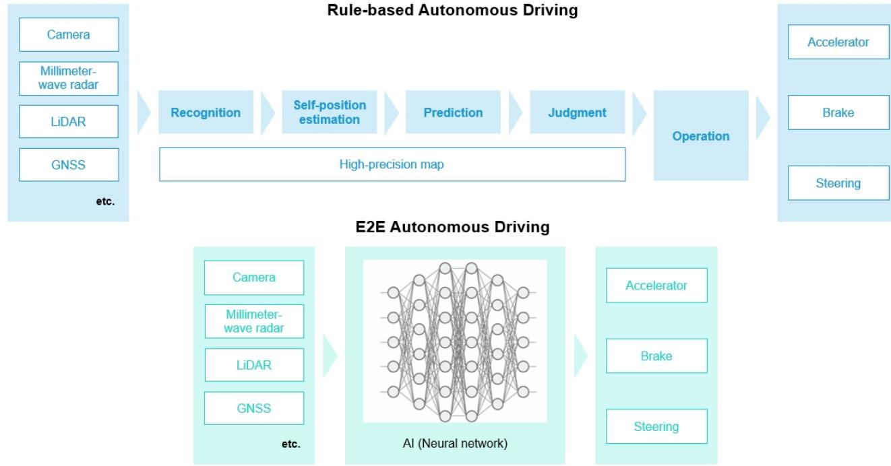  
EXHIBIT 3: Two major approaches to AD: rule-based approaches and E2E approaches   
Source: Nikkei, Bernsteinanalysis

# Recent Trends: From Rule-based to E2E,and Toward VLA

# Intelligent driving shifting from rule based to end to end

The autonomous driving industryis undergoing aparadigm shiftfrom rigid rule-based logic to End-to-End (E2E)Al architectures,withthenextevolutionarystep moving towardVision-Language-Action(VLA)models.Teslahasledthis trasition byaggressivelystripping hardware,removingradarandultrasonicsensors(USS)toconsolidateintoacamera-onlyTesla Vision' system.The2023roloutofFSDBeta Version12wasthedefinitiveturningpoint,whereTeslareplacedmillosoflinesofhandcoded softwarewithamonolithic E2Emodelthat relieson learned behavior,yielding astep-change indriving performance.

# Shift toward VLA within E2E architectures likely to accelerate

Standardautonomous systems often struggle with the 'long-tail'ofrare edge cases,suchasa human trafficcontroller overridingatraficsignalatasuddenconstructionsite.Toaddressthis,theindustryis incorporating VisionLanguageModels (VLMs),which merge visualperceptionwith generativeAl-drivenlanguageunderstanding.Unlikeconventionalstacks that relyonrigidobjectdetection,VLMsinterpretthesemanticrelationshipsandintent withinascene.Thisalows thevehicle to understand" complex social contexts andinstructions thatfalloutside the bounds of explicit rule-based programming.

While VLMsareadeptatreasoning,theyaretypicalldsignedtogenerate textnotvehiclecontrolcommands.Tobridgethis gap,Vision-Language-Action(VLA)models extend the VLMarchitecturebytranslating multimodalperceptiondirectly into executabledrivingactions (Exhibit4).Bytrainingondatasetswherevisualobservationsandlingusticreasoningare temporaly aligned with steeringandbraking commands,VLAmodels enablethesystemto internalizehowcontextualunderstanding should nformreal-time motion planning.This transitionfrommere'scenedescription'to'executableaction'is the keyto achieving robust generalization in theunpredictableenvironmentsrequiredfortrueL4autonomy.Among Japaneseautomakers, only Sony Honda Mobility is actively pursuing in-house VLA development.

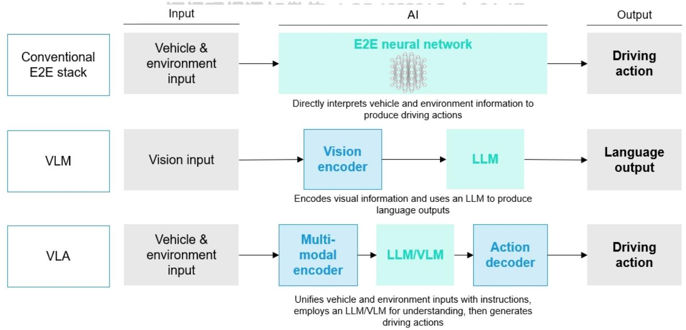  
EXHIBIT 4: The E2E domain is shifting toward LLM-powered VLMs and action-generating VLAs   
Source: Turing, Bernstein analysis

# Industry accelerating gradually towards L4 & L5 autonomy

As highlightedinourpreviousnote,weforecast thatby2O35,L4andL5autonomy,whichenablesa‘minds-offexperience where occupants are no longer required to monitor the environment, will reach ${ \sim } 4 \%$ of the market. This shift marks a fundamental tansitionintheindustry'scompetitivelandscape:diferentiationis movingawayfromtraditional'run,stop,and turn'drivingperformancetowardthedeliveryofhigh-valueservices throughdiverseaplications.Asthedriverisliberatedfrom thetask ofoperating thevehicle,thecar evolves froma mobilitytool intoaplatform fordigitalifeand monetization.

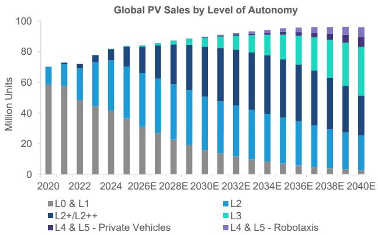  
EXHIBIT 5: $\llcorner \pmb { 2 } +$ systems is likely to increasingly being adopted globally across a broader range of vehicle segments   
Source: BloombergNEF,Gasgoo,Bernstein analysis and estimates   
Source: BloombergNEF,Bernstein analysis

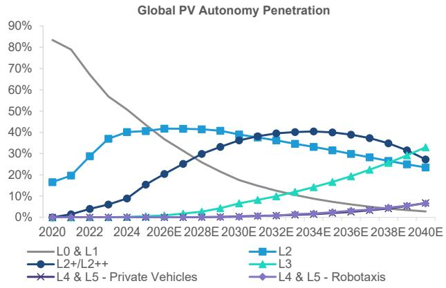  
EXHIBIT 6: Global $\scriptstyle 1 2 + 1 \bot 2 + +$ penetration expected to reach $36 \%$ in 2030, from $15 \%$ in 2025

# 3 STRATEGIC DIRECTIONS FOR SDV VALUE CREATION POST-AUTONOMOUS DRIVING

As'minds-ofL4&L5autonomy matures,theautomotive industry'scompetitive landscapewillundergoaparadigmshift.Once thedriverisliberatedfromoperatingthevehicle,newformsofautomotivevaluearecreatedthroughin-cabinappications ratherthantraditionalhardwareperformancesuchas‘run,stop,andturn'Weidentifythreedistinct evolutionarypathsemerging among the leaders in the SDV space:

1.TheCarasaPortable Home(Sharp& Xiaomi):This direction positions thevehicle asanaddtional oom within the home ecosystem. Sharp's $\mathsf { L D K + }$ concept focuses on stationary utility as a private lounge or office, while Xiaomi's (covered by Eunice Lee)‘Human x Carx Home'vision treats the car as an inseparable nodeof the smart home. Through HyperOS 2, users can seamlessy manage household tasks-such as adjusting thermostats or even feeding fish-directly from the vehicle's interface.

2.Mobilityas a Creative Entertainment Space (Sony Honda Mobility): SHMis leveraging Sony's vast IP ecosystem, including PlayStation,movies,and music,totransformthe vehicle intoamobile stage.Byutlizing36O Spatial Soundand high-definitionvisualspoweredbytheUnrealEngine,SHMaims tocapture the'atentioneconomy'oftransitime,aperiod previously unmonetized by digital services.

3.Robotaxi Monetization(Tesla):Tesla is shifting the value propositionofthecarfromadepreciating assettoarevenuegenerating investment.Under the visionof ‘Sustainable Abundance'(Master Plan Part IV),personalvehiclescan joinan autonomous ride-hailing network during their typical $9 5 \%$ idle time,fundamentally altering the economics of vehicle ownership.

# THE CAR AS A PORTABLE HOME (SHARP & XIAOMI)

Privatevehicles typicallsitidle95percentofthetime.With'mnds-offautonomy,cars evolveintoportablelivingspacesor offcesequipped with masiveenergybufers.By integrating these with loTandsmarthome systems,manufacturerscancreate a brand lock-in similar to Apple's(covered by Mark Newman) ecosystem as we can see in Phone and AirPods.

# Sharp: $\mathsf { L } \mathsf { D } \mathsf { K } +$ functioning as a new portable room

Sharp (not covered),a Japanese consumer electronics manufacturer, has introduced its $\mathsf { L D K + }$ electric vehicle concept through a strategic partnership with its parent company Foxconn (not covered,owning $5 7 . 3 \%$ voting rights of Sharp), the world's largest EMSprovider(Exhibit7).Tenamereferstothe‘Living,DiningKitchen'layoutofJapanesehomes,positioning thecaras‘Part of your home'rather than just parked there. Evolving from an initial 2O24 concept model,the latest $\mathsf { L D K + }$ ,showcased at the 2025Japan Mobility Show,utlizes Foxconn's ModelAopen EVplatformand adopts acompact minivan formcloser to mass production.Sharpaimstocommercialize thisvehiclebyFY3/28atapricepointcomparable toexisting familycars.Thestaff atheJapan MobilityShow 2O25toldusthatthecompanywas exploring varioussaleschanneloptions,including partnerships

with major electronics retail chains.

Thestrategy focuseson maximizing theutilityofthe vehiclewhile stationary.Features include 18O-degree rotating front seats to createalounge,aretractablescreen,andliquidcrystalshuterglass forinstantprivacy(Exhibit8).Onthesoftware side,SharpuilizesitsCE-LLM (Communication Edge-Large Language Model) platform.This proprietaryedge Altechnology allwsfornatural,real-timeconversationalinteractionbyprocessingquerieslocalyonthedeviceratherthanrelyingsolelyon thecloud.This ensures highresponsiveness anddata privacy.Combined withAloT,thecarsyncswithhouseholdappliances likeSharp'srefrigerators and washing machines.Byintegrating with roof-mounted solarpanels and V2H(Vehicle to Home) capabilities,thecaractsasaninteligentenergy managementnode,furtherdeepeningthelinkbetweenthevehicleandthe user's living space.

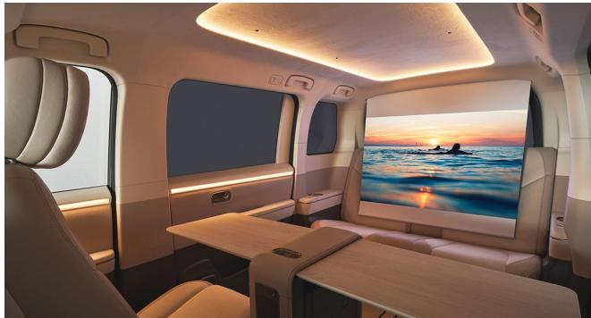  
EXHIBIT 8: LDK+'s features include 180-degree rotating front seats to create a lounge, a retractable screen

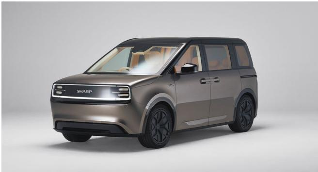  
EXHIBIT 7: Sharp developed the LDK+ concept model based on Foxconn's Model A   
Source: Sharp,Bernstein analysis

Source:Sharp,Bernstein analysis

# Xiaomi: Human x Car x Home ecosystem

Xiaomiis pursuingasimilar HumanxCarxHome'vision,where theBEVisthecenterpieceofaunified ecosystem (Exhibit 9). Oneof Xiaomi'skeydifferentiators is theintegrationofitsin-houseHyperOS,whichunderpinsproductsfromsmartphonesand tabletstosmarthomeapliancesandcars.Thisprovidesafamiliarinterfacewhere thecar'sinfotainmentpanelofersthesame functionality as a smartphone. Xiaomi even ensures CarPlay compatibility to maintain appealforiPhone users.

Theuse cases are highlyspecific: whileathome,owners can prepare thecarbydefrosting windowsandactivating climate control.Asauserapproaches,thecarautomatically recognizes thesmartphone,pairsinstantly,and resumes musicor navigation.Whiledriving,theinterfaceofferscomprehensivecontroloverthesmarthome,enablingusers toadjustthermostats, communicatewithdoorbellvisitors,oreven feedfishthroughconnectedaquariumdevicesremotely(Exhibit10).Thesystem automates home management with location-awarescenarios,such asactivating'Away Mode'when leaving theneighborhood. This levelofconnectivitytreats thecarasjustanotherconnectedappliance,making vehiclechoiceabyproductoftheuser's broader electronics ecosystem.

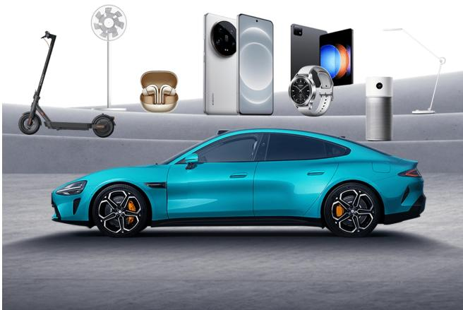  
EXHIBIT 9: Xiaomi's ‘Human x Car x Home' vision, a smart ecosystem that connects phones, cars and home appliance   
Source: Xiaomi, Bernstein analysis

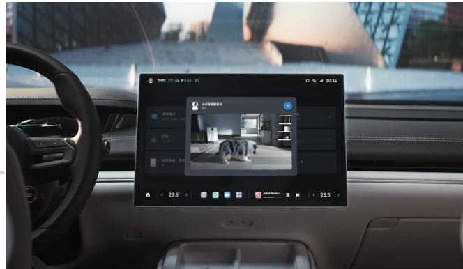  
EXHIBIT 10: With Xiaomi's HyperOS,home appliances and smartphones are seamlessly connected, enabling users to view home video feeds directly from inside the vehicle.

Source: Xiaomi, Bernstein analysis

# MOBILITY AS A CREATIVE ENTERTAINMENT SPACE (SONY HONDA MOBILITY)

Sony Honda Mobility (SHM),ajointventure between HondaandSony coveredbyDavidDaiandRobin Zhu),hadbeenpreparing to launch entertainment-centric SDVs underthe Afeela brand since2022 (Exhibit11).However,in March 2O26 thecompany anouncedthatitwoulddiscontinuethedevelopmentandplannedlaunchofitsfirstmodel,theAfeela1,aswellasitsscond SUVmodel.Whilethehighlyanticipatedproducts willnotcome tomarket,webelieve theAfeelaconceptitselfwas inovative andclearlyilustratedoneposibledirectionforthebroaderautoindustry,namelyMobilityasaCreativeEntertainmentSpace. Sony Honda Mobilityas acompany stillremains,andwe hope that concepts likethis willbe revisited in the future.

SHM positionedits inauguralmodel,the Afeela1,notasaconventional transportation device butas astage forcreative entertainment.Sonysought toleverage itsevolutionfromanelectronicsmanufacturerintoadiversifiedentertainmentompany to redefine the SDV experience.Specific examples includedtheintegrationof movies,PlayStationgaming via PS Remote Play,andkaraoke(Exhibit11).Forinstance,users wouldhavebeenable tostreamanimevia Crunchyroll(Exhibit12)andplay PlayStation titles such as Gran Turismo (Exhibit 13).

# EXHIBIT 11: Sony Honda Mobility has been developing the Afeela 1, set for launch in 2026

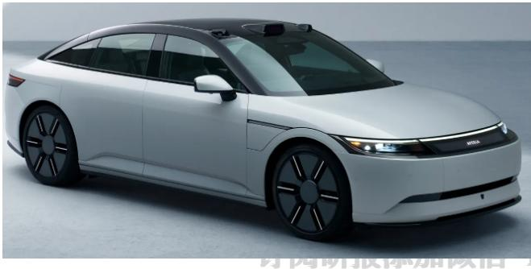  
Source: Sony Honda Mobility, Bernstein analysis   
EXHIBIT 12: Users can stream anime via Crunchyroll on Afeela 1

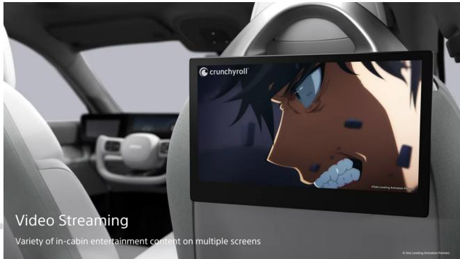

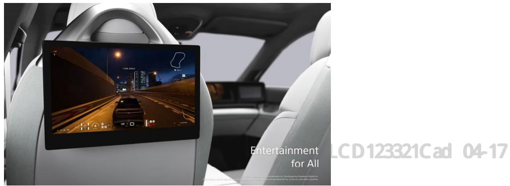  
EXHIBIT 13: Users can also play PlayStation titles such as Gran Turismo on Afeela 1   
Source: Sony Honda Mobility, Bernstein analysis

Toenhancethis experience,SHMutilizes 36OSpatialSoundandactivenoisecancelation technologies,enabledbynewly developed 28speakersleveraging Sony'sacoustic technology(Exhibit14).Sony's expertise handlesmiddleandhigh-frequency noise,while Honda's technologysuppresses ow-frequencyroad noise.Thiscollaborative approach toacousticscreatesa studio-qualitysilence,whicheffectivelyelevatesthein-cabinentertainmenttoapremiumexperienceandensures thathighquality content is delivered as intended.

ForADASvisuals,SHMhasmovedawayfromstandardtoolslike Google Maps,instead partnering with HERETechnologies (not covered),thegloballeaderinHDmapping forautonomousdriving,andEpicGames (privatelyheld),thevideogamepowerhouse behindFortniteand the Unreal Engine(Exhibit15).Byleveraging these partnerships,SHMcanrendersurroundingsand navigationwithalevelofvisualrealismpreviouslyreservedforhigh-end gaming,effectivelyturning thedashboard intoan immersive interface that allows for brand differentiation.

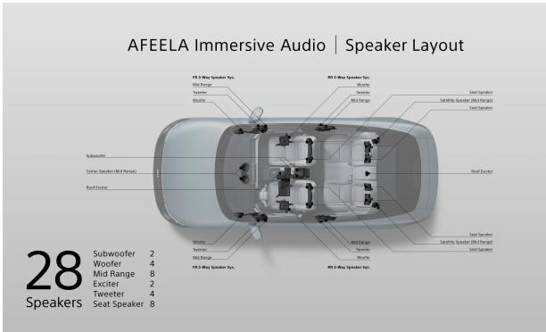  
EXHIBIT 14: The Afeela 1 will be equipped with 28 newly developed speakers leveraging Sony's technology   
Source: Sony Honda Mobility, Bernstein analysis

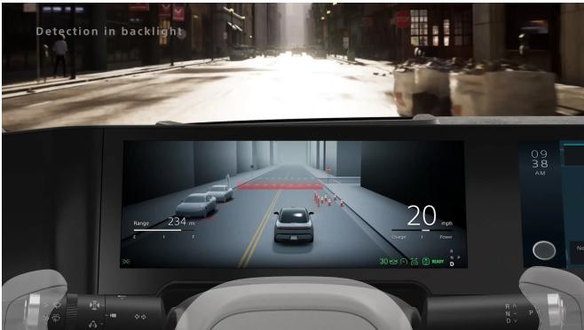  
EXHIBIT 15: SHM utilizes Epic Games' Unreal Engine for ADAS visualization   
Source: Sony Honda Mobility,Bernstein analysis

# ROBOTAXI MONETIZATION (TESLA)

In a world where full autonomous driving is realized, the $9 5 \%$ idle time of a private vehicle could potentially be monetized as the car worksonbehalfofitsowner.Elon Musk'svisioninvolvesasharedeconomy wherepersonal vehiclesjoinanautonomous ride-hiling network,aconceptreinforcedintheSeptember2025MasterPlanPartIV(Exhibit16).Thegoalistoflipthescript onautomotiveeconomics:turningadepreciatingassetintoarevenue-generatinginvestmentfortheowner.Teslahasalready begunrobotaxi operationsinAustinandSanFranciscousing company-ownedvehiclesandhasstateditsintentiontoexpandto seven additional US cities in 2026.

'slaplans tostartproductionof the Cybercab,adedicatedrobotaxiwithnosteering wheelorpedals,atits Texas plantin \pril2026(Exhibit17,Exibit18).Ifeslasuccessfullyenablespersonalveiclestojoitisnetworkbyextyearitould

fundamentally shift the consumer's value proposition.

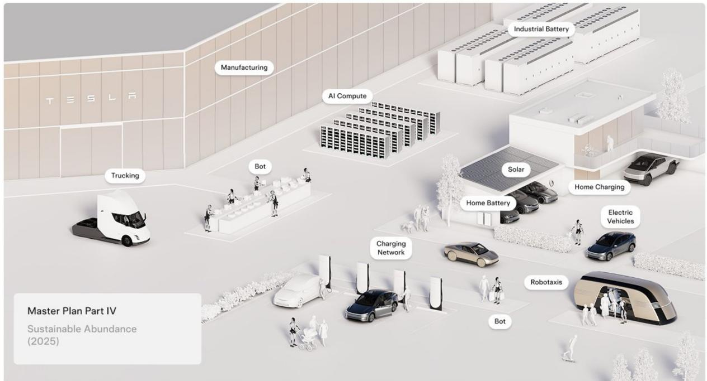  
EXHIBIT 16: Tesla's latest vision ‘Master Plan Part IV'champions ‘Sustainable Abundance'   
Source:Tesla, Bernstein analysis

# EXHIBIT 17:Tesla plans to start production ofthe steeringEXHBT18:The Cybercab isatwo-seater featuring a wheel and pedal-less ‘Cybercab'in April 2026 minimalist cockpit with only a central monitor

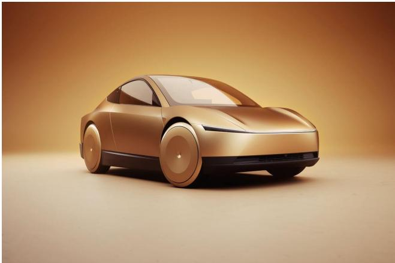  
Source:Tesla, Bernstein analysis

# 订阅研报添加微信

SourceTeslastelis

# INTERIOR SPACE AS THE BACKBONE FOR POST-AUTONOMY CABIN EXPERIENCES

With thepenetrationofLevel4andLevel5autonomous driving,the primarydiferentiatorforvehiclesis shifting fromdriving performance tothe in-cabin experience.Realzing newmobilityconceptssuchas‘MobilityasaPortable Home'or'Mobilityasa CreativeEntertainmentSpace'requires theadvancementoftheinteriorcabin.Specificalypysicalflexibility inspatiallayout, superiorcabin silence,andadvanced vibrationcontrolserveas technical prerequisites.Unlikecompetitors thatcontinueto designbasedonanextensionofthetraditionaldriverseat,Toyotaanditsafiliatedsuppliersareleadingbytreating thecabinas an integrated living and activity space.

# Toyota's preemptive presentation of interior space concepts

Toyota has consistently introduced original concepts that maximize spatialvalueaheadofits peers.The e-Palette,a BEV launchedin September 2025,isapioneering exampleofamodular mobilityspacewhere interiorunitscanbeswapped based onusecasessuchasoffces,retailstores,orhotels (Exhibit19,Exhibit2O).Forexample,whenwevisitedanareawhereToyota is operating mobilityservices using e-Palete,we observed cases inwhiche-Palete was used notonly asabus but also as amerchandiseshop (Exhibit21).Tyotaiscurentlyconducting autonmous driving trialsincolaborationwithdealers,local governments,and technologypartnersinspecificregions,aimingforamarketlaunchofLevel4compliantsystemsbyFY3/28. Furthermore,the6-whelLexus LS Concept shown atthe2O25 Japan Mobility Show targets the maximizationof private space througharedesignedwheellayout thatsurpasses traditionalvehiclepackagingconstraints (Exhibit2).Theinterior utilizesbamboomaterialstocreateaJapaneseaesthetic,andthesecondandthirdrowscanbereconfiguredintoafacetoface arrangement suitable for meetings (Exhibit 23).Dn微信 123321C ad 04

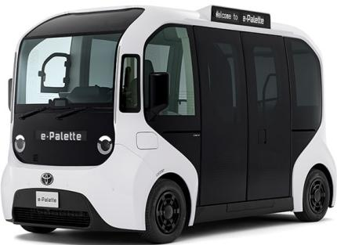  
Source:Toyota, Bernstein analysis

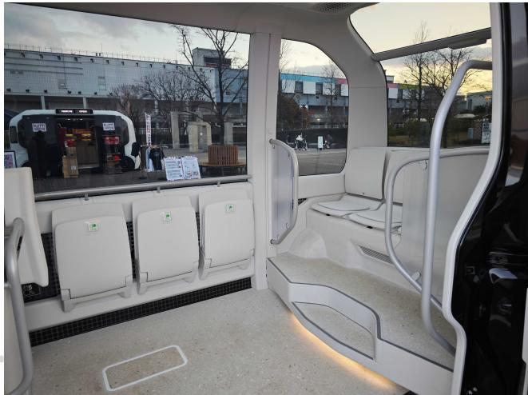  
EXHIBIT 19: Toyota rolled out the e-Palette in Sep-2025 as a pioneering example of a modular mobility space   
EXHIBIT 2O: The interior space of e-Palette is wide and allows flexible layout configurations   
订阅研报添加微信 ]

Source: Bernstein photo

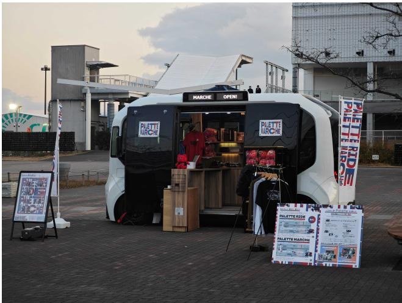  
EXHIBIT 21: The e-Palette can be used not only as a bus but also as a merchandise shop   
Source: Bernstein photo

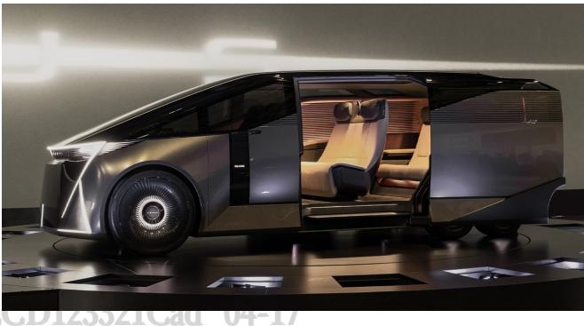  
EXHIBIT 22: The 6-wheel Lexus LS Concept shown at the JMS 2025 targets the maximization of private space

Source: Lexus,Bernstein analysis

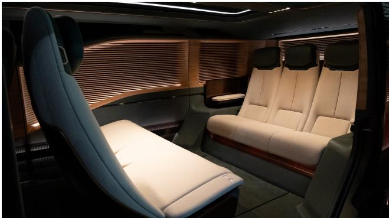  
EXHIBIT 23: The second row and third row seats of LS Concept can be configured to face each other

Source: Lexus,Bernstein photo

Inalignment with Toyota's direction,majorinteriorand exteriorsuppliers within theToyota grouphave clearlydefined a transition from individual component orders to integrated system orders in their mid-term business plans.

Toyota Boshoku(notcovered)aims to evolve intoan'Interior SpaceCreator, expanding itscapabilities from supplying standaloneseatsandinteriorstoplanningandproposingentirecabinenvironments (Exhibit24).Thecompanyplanstoincrease valueaddandrevenue bysecuring ordersforcompleteinteriorsystems thatintegratecabincontrolsandacoustic materials such as floor carpets (Exhibit 25).

Toyoda Gosei (not covered)is targeting a $40 \%$ revenue share from BEV related products by FY3/31 and is developing specialized functions forautonomousliving spaces,including retractablesteering wheelsand multi-functionalconsoles (Exhibit6).ByleveragingpolymertechnologyToyodaGoseiintegratessafetysystemsandilluminationintointeriorpartsto simultaneously achieve design innovation and functional enhancement.

These strategies are realizedinconceptslike the MX221 for Level4ride sharing,showcasedatCES 2023,proving the group'sablittoprovidewholecabinpackagesbyintegratingHMlandinteriortechnologiesfromvariousafites (Exhibit27). While thisadvancementserves as astrong driverforincreasing ASP,we believe that the group needs to go beyond current collaboration and consolidate development power through capital and/or business restructuring.

As highlightedinourpreviousnote,ToyotaBoshoku,Toyoda Gosei,andTokaiRikaeachsupplydiferentbodycomponentsfor Toyota.As theneedforintegratedcockpitdevelopment grows,weseeroom forthe threecompaniestopursuecollaboration orrestructuring/consolidationin the future.Toyoda Goseis promoting integrateddevelopmentofsafetycomponents suchas airbagsandseatbelts byfullacquiring Ashimori Industry (private),themainseatbeltsuppierforMazdaandSuzuki,in2025. In the same year,Toyota reduced its stake in Toyoda Gosei from ${ \sim } 4 4 \%$ to ${ \sim } 2 0 \%$ through a secondary offering,and we believe thatacertainlevelofcapitalrestructuringatToyoda Goseihasnowbeencompleted.Ontheotherhand,Toyota Boshoku,which generates more than $90 \%$ of its revenue from Toyota and in which Toyota holds a $3 2 \%$ stake,and Tokai Rika, which derives more than $70 \%$ of its revenue from Toyota and in which Toyota holds a $34 \%$ stake,do not appear to have completed their restructuring.We wilcontinue to monitor thepotentialforcapitalandbusiness restructuring among these three companies.

# EXHIBIT 24: Toyota Boshoku aims to evolve into an "Interior Space Creator'

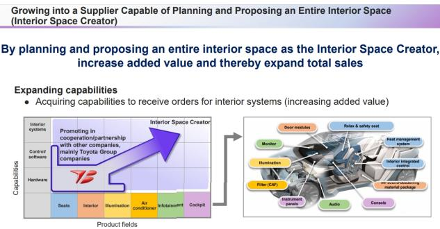  
EXHIBIT 25: Toyota Boshoku plans to increase value add and revenue by securing orders for interior systems   
Source: Toyota Boshoku, Bernstein photo

Expanding Product Fields (Roadmap) Connect/integrate various roadmap items and expand each field to increase added value 2023 2025 2030 Control/software Interiorsystems Becoming an Interior SpaceCreator • Interior entertainment systom omfort seats ative uminatior Relax&safoty soat Safety System to ease carsickness Hardware • Interior integrated control · Next generation Frframe (thin) · NV sound-deadening material pacafdsign basos atelal • Animation illumination · Rotating seat ● Development completed

# EXHIBIT 26: Toyoda Gosei is developing specialized functions for autonomous living spaces

4.Enhancing Social and Economic Value 4-3.Contribution to Comfort

Source: Toyota Boshoku, Bernstein analysis

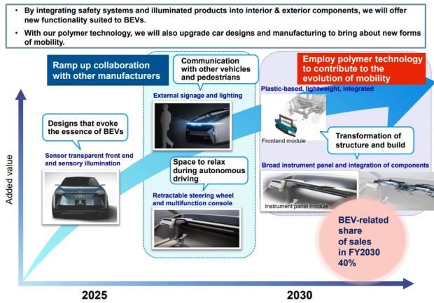  
Source: Toyoda Gosei, Bernstein analysis

# EXHIBIT 27: Collaboration among the Toyota interior/ exterior suppliers are realized in concepts like the MX221, showcased at CES 2023

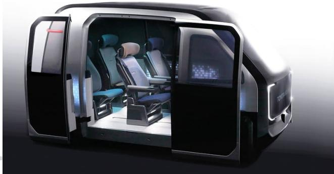

Source: Toyota Boshoku, Bernstein analysis

# Addressing the shortage of applications at Toyota

While Toyotaanditssuppliersare making progress in advancingthe physicalinterior space,thecompanystillacks the applicationlayernecessarytomonetize thatenvironment.Following thecancelltionofSony Honda Mobit's Afeelaproject, theindustrylacksaprimarydriverforin-carentertainment.ItisnowcriticalforToyota toaccelerateexternalpartnerships.We believe thatexpandingspecificusecasesandserviceexamples tomonetizethepost-autonomyerawillielybehigherpriority for the company moving forward.

# iTRUCTURAL TRANSFORMATION TO BE ACCELERATED TOWARD AI-ENABLED FULL AUTONOMY

As theautomotivevaluechainundergoesastructural transformationtwardSDVsandfullautonomy,aplicationsareemerging as the primary measure forcapturing downstreamvalue.Forautomakers,the transitionto SDVsis notjustaboutconnectivity butaboutestablishingaplatform forrecuring,high-marginrevenuestreams that extendfarbeyond theinitialvehiclesale.

# Autonomy penetration willaccelerate the shift of added value downstream in the car value chain

Thedistributionofaddedvaluewithintheautomotivevaluechainisalreadybeginningtoshift.Whilemuchof theadded value hashistoricallybeencapturedatthecenterof thechain,wherecarmanufacturershave generated earnings throughvehicle productionand new-carsales,thevalue structureisnow graduallyshifting towardotherparts ofthechain.Astheindustry transitionstowardelectrification,DVsadoreimportantlyfulltonomyddedueisicreasinglyovingtodoth Ipstream and downstream segments,and we expect this trend to accelerate over the coming decade (Exhibit 28).

Upstream,the importanceofsemiconductors,bateriesandrare-earth-based materialsisrisingas electrication,SDV development and autonomous driving progress.At thesame time,technologies embedded in the vehicle are becoming morecomplex,promptingautomakerstooutsourceanincreasing shareofhigh-value domainstoexternalspecialists.Asa result,the vehicle asastandalone product is becoming more commoditized,mirroring whatoccurredinsmartphonesand consumerelectronics,andthestrategicrelevanceoftraditionalmanufacturingstrengthsis gradualydiminishing.AsAl-enabled autonomous drivingaccelerates thisstructuraltransformation,the movetowardE2EandVLAmodelswilfurtherconcentrate value in these specialized technology layers.

Downstream,valueisshifting towardservicesbuiltonanexpanding instaledbase.Applicationssuchasconnectedservices, fleet-based mobilitysolutions,salesfinance and high-turnovermaintenanceoperationsare becoming morecentral to monetizationmodels.Indeed,applicationscouldbecomeanimportantnewsourceofrevenueforsome traditionalautomakers, with potential monetization modelsincluding directappsales andsubscriptions,transaction fees from external software providers,andeven icensing revenuefrommakingapplicationsavailable tootherautomakers.Taken together,addedvalue is migrating away from midstreamvehicle manufacturing and toward upstream technology domains and,more notably, downstreamrecuring-servicebusinesses.Thesetrendsarealreadyinfluencing thestrategicdirectionofautomakersandil become more pronounced as SDV penetration rises.

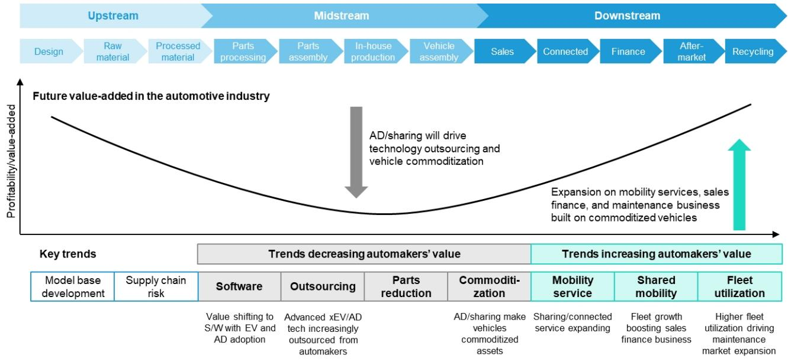  
三XHIBIT 28: Autonomy penetration willaccelerate the shift of added value downstream in the car value chain   
Source:The Ministry of Economy,Trade and Industry of Japan, Bernstein analysis

Againsthis background,weestimate howautomakers'revenue mixcouldevolveover thelong term.We modelglobal newvehiclesalesthrough 2040,theexpectedpenetrationofSDVsandsmartdriving functionequippedvehicles,typicalvehicle pricing,andsubscriptionfeesforconnectedandADASservices.Basedonthese inputs,wederive revenuefromnew-vehicle salesandfromsoftwareservices.Forsoftware,we assumerecuringsubscriptionrevenuegenerated fromtheinstaledbaseof SDVandsmart-driving vehicles.Todayalmostallrevenueisderivedfromnew-vehiclesales.However,asSDVandsmart-driving penetrationacceleratesandtheinstaledbasegrows,weexpectsoftware-relatedrevenue toaccountforroughlyone-thirdof total automakers' revenue in 2O4O (Exhibit 29).

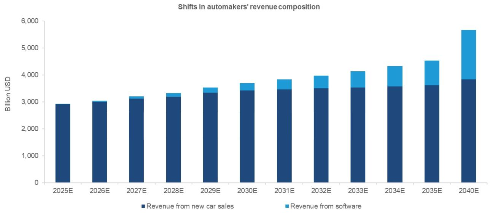  
EXHIBIT 29: Automakers' revenue sources to shift from hardware to software   
Source: JEITA,IHS, Bernstein analysis and estimates

Finaly,weexpectonlyalimitednumberofautomakersarelikelytobepositionedtodeliversubstantialaddedvalueonceful autonomous driving is realized.Those with large globalvehicle instaledbases,scale advantages andsuffcientinvestment capacity, such as Toyota,are the most likely candidates.

Toyotaisdeveloping its MobilityServices Platform(MSPF)toenabletheglobaluseofdrivingdata(Exhibit3O). MSPF isanopen platformoffringasuiteofunctionsformobility-serviceoperatorssuchasride-haling,carsharing,rentalcarsandtaxis.Data collectedfrom Toyotavehicles worldwideisaggregatedandanalyzed throughacloudcalledToyotaSmart Centerand then madeavailable throughMSPF.Usingthisplatform,mobilt-serviceproviderscandevelopnewservice models,andToyotaitself usesthesamecapabitesforitsownnewserviceinitiatives.Wealsobelieve thatMSPFcouldplayasignificantroleinte future bysupporting thecolectionandaccumulationoftrainingdataforautonomous-drivingapplications.Given Toyota'spositionas theWorld'slargestautomakerbynewvehiclesalesandasamanufacturerwithoneofthe largest globalvehiclefleetsatabout 150millionunits,thecompanyholdsasubstantialadvantageinboth thevolumeandthediversityofdrivingdataitcancapture.

Mid-sizedandsmallermanufacturersmayfindit increasinglydificult tosecuredownstreamvalueand maintain long-term competitiveness,asweakening valuecapture leaves thematriskofremaining justvehicle manufacturers.Nissan,Wayveand Uber(coveredby Nikhil Devnani) announced Japan'sfirstautonomous driving project,underwhich Wayvewillprovideits HD map-free E2E stack 'Al Driver' and Nissan willsupply the vehicles (Exhibit 32).

While such headlines appear promising atfirst glance,amore critical examination is required regarding automakers' longtermdifferentiation.Inthisecosystem,Wayvecontrolsthecoreautonomous driving intellgence,while Uberowns thedirect customerinterfaceandserviceoperation.This mightleave Nissnprimarilyasahardwaresupplier,raisingconcernsabouthow Nissan willdiferentiate theirvehiclesfromcompetitors whentheimportantsoftwareandservice-relatedvalueis captured bytheir partners.Withoutaclear strategy toreclaimashare ofthe downstream value,traditionalmanufacturers risk being marginalized into low-margin assembly roles within the new mobility landscape.

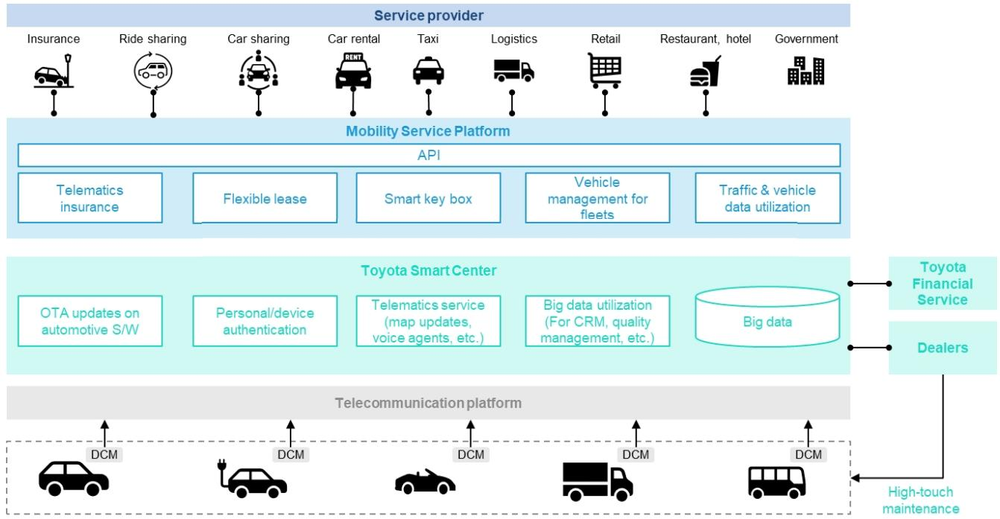  
EXHIBIT 30: Toyota developing its ‘Mobility Service Platform (MSPF)'   
Source:Toyota, Bernstein analysis

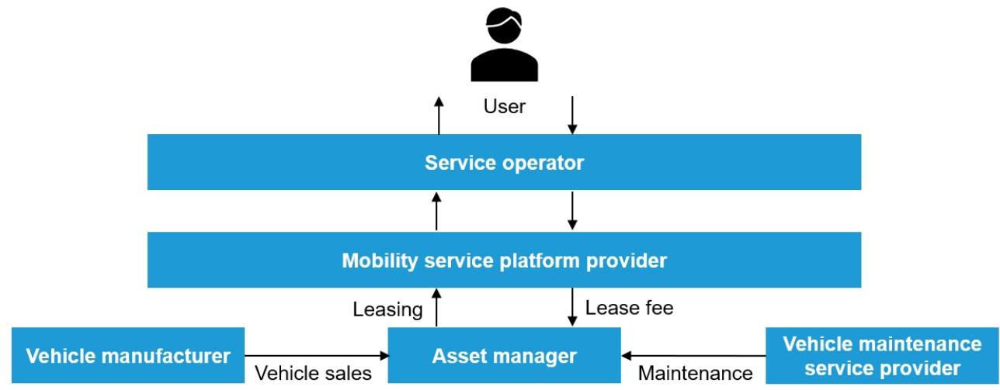  
EXHIBIT 31: Business domains where automakers can play willikely vary   
Source: Bernstein analysis

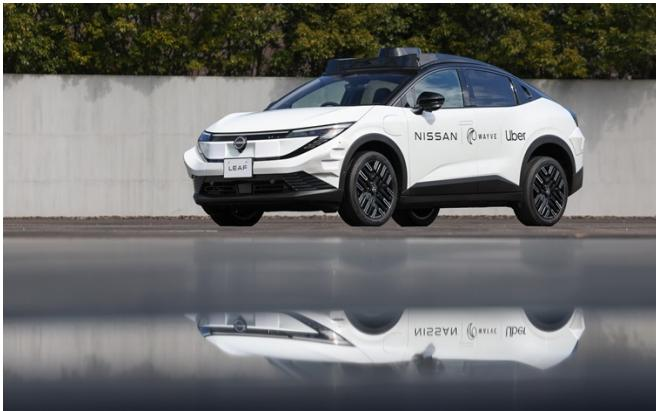  
EXHIBIT 32: New Nissan Leaf produced for pilot robotaxi projects in Tokyo by Uber   
Source: Nissan,Bernstein analysis