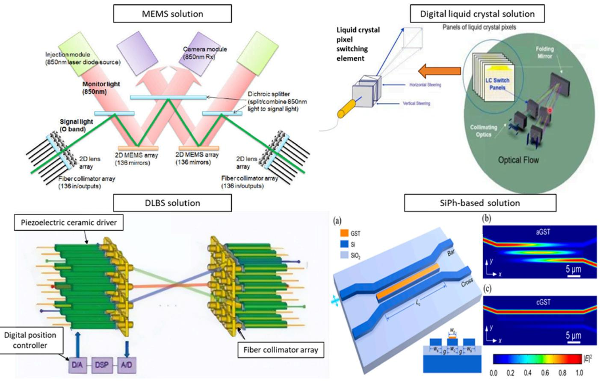
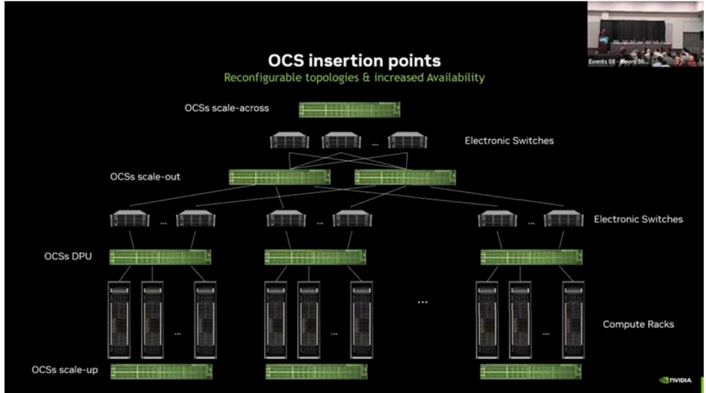

# Global AI Trend Tracker

EQUITY: TECHNOLOGY

# Optical circuit switch at center of AI network

China component players likely to benefit from this rising AI trend

# Optical circuit switch (OCS) may play a more crucial role in global AI networks, and optical component makers could enjoy a growing OCS market

An optical circuit switch (OCS) is a full-optics switch which can establish an end-to-end optical network and does not require optical-electronic signal conversion. Compared with a traditional electronic switch, an OCS has several key advantages such as low latency, low power consumption, and high bandwidth. First adopted by Google (GOOG US, Not rated) in its TPU v4 network, OCS’ development has accelerated in recent years, with multiple vendors across the US [i.e., Lumentum (LITE US, Not rated), and Coherent (COHR US, Not rated)] and China [i.e., InnoLight (300308 CH, Buy) and Eoptolink (300502 CH, Not rated)] involved in its development. Recently, in the OFC (Optical Fiber Communication) 2026 conference, NVIDIA (NVDA US, Not rated) discussed the next-gen Dragonfly architecture, and noted that OCS can be deployed for cross-cabinet and cross-cluster networking. According to Cignal AI, the OCS market was dominated by Google in 2025, and has an overall market size of about USD400mn, which may exceed USD2.5bn in 2029E, exhibiting a CAGR of $\sim 5 8 \%$ over four years. We think the OCS market may see a tipping point for accelerated adoption in the near future, as multiple hyperscalers other than Google are now in the trail stage. We think early movers 订阅研报添加微信such as InnoLight could benefit from this growing market. a

# OCS vs CPO vs pluggable: complimentary to each other in scale-up, scale-out, and scale-across networks

Optical communication solutions are gaining traction across all AI networks, including scale-up, scale-out and scale-across networks. In our previous report (GTC & OFC 2026 preview),we noted that pluggable transceivers $^ +$ electronic switches may continue to be the major solutions in the scale-out network, while CPO (co-package optics) may become the key solution in the scale-up network. For OCS, currently, Google has adopted to build a large TPU node (4096 TPU or more) in the scale-up network, but we believe it can also be potentially used in scale-out and scale-across networks. We think it is most applicable to the AI data networks that require dynamic or flexible data routing, which is primarily a complimentary solution to CPO and pluggable solutions.

# Key components in OCS value chain and major suppliers to benefit from OCS?

There are four main OCS solutions under development now, including: 1) MEMS (Micro-Electro-Mechanical Systems), which is mainly being developed by Google and Lumentum; 2) DLC (Digital Liquid Crystal) solution, which is mainly being developed by Coherent; 3) Direct Light Beam Steering (DLBS), which is mainly being developed by Polatis (unlisted); 4) SiPh-based solution, which is mainly being developed by iPronics (unlisted), and InnoLight’s subsidiary TeraHop (unlisted) is also working on SiPh-based OCS solutions. We think the total solution providers, as well as key component makers (including MEMS array/units, lens, and fiber array) such as InnoLight and Suzhou TFC (300394 CH, Buy) could benefit from the adoption of OCS products in the next 2-3 years.

# Research Analysts

Bing Duan - NIHK

+852 2252 2157

# Introduction of OCS: likely a core component in future AI networks

An optical circuit switch (OCS) is a full-optics switching device that provides data routing and forwarding through pure optical signal path switching. An OCS establishes an end-toend optical network by dynamically adjusting the optical path, eliminating the need for optical-electrical-optical conversion through traditional electrical switches. As all the data in traditional switches need to go through the switching chip, the SerDes (Serializer/Deserializer) rate becomes the core bottleneck of the switch's transmission rate. A high-speed SerDes (224G and above) faces more severe signal integrity and 订阅研报添加微信 LCD123321Cad power consumption challenges, while an OCS eliminates the need for packet processing and reduces electrical signal delay through all-optical paths, leading to significant low latency, low power consumption, and high reliability.

OCS is not a new technology, it has been developed by many companies in the 1990s, and was initially applied to telecommunications networks in the form of automated wiring panels. In recent years, Google has been adopting OCS technology for its AI network, and has proved its various advantages such as cost reduction and efficiencies when it was used in a large-scale TPU network.

In addition to Google's development of OCS, the Open Compute Project Foundation (OCP) has also announced the establishment of an OCS subproject to promote collaboration on open optical switching technologies. The project is jointly led by OCP member companies iPronics, Lumentum, and Coherent, with Google, NVIDIA, etc., as founding members. In China, China Mobile (941 HK, Buy), in its “Cloud Computing Optical Interconnection Development Report,” pointed out that Mobile Cloud may consider using OCS to replace the existing Super Spine at the scale-out level in the future. In October 2025, the Ministry of Industry and Information Technology (MIIT) launched the “Millisecond-Level Computing” special action in metropolitan areas, promoting the application and deployment of technologies such as OCS and optoelectronic converged networking in computing centers to improve network performance. Recently, MIIT has identified OCS as the standard underlying technology of computing power networks. At 订阅研报添加微信 LCD123321Cad the OFC 2026, Chinese optical communication companies, such as Innolight, Eoptolink (300502 CH, Not rated), and Accelink all released OCS products.

# Key advantages and limitations of OCS

Key advantages of OCS include:

Ultra-low latency: no optical-electric conversion is required, and the delay is reduced1. to nanoseconds (10-100ns), which is only $1 / 1 0 0 ^ { \mathrm { t h } }$ of an electrical switch;

Low power consumption: only the driver module consumes power, no switching chip2. and supporting optical module, and is only $1 / 5 ^ { \mathrm { { t h } } }$ of the same bandwidth electrical switch, and;

High bandwidth: the protocol is transparent, compatible with various transmission3. rates and modulation formats, and has strong bandwidth scalability.

Currently, there are still a few obstacles for the deployment of OCS in large-scale AI clusters, and OCS solution providers need to close gaps in the following aspects:

Link budget: the insertion loss of existing OCS devices is too high to meet the link 1. 订阅研报添加微信 LCD123321Cad budget of existing standard optical transceivers, and so it is necessary to develop a lower-loss OCS device and connector solution;   
Integration density: the port density of existing OCS devices is insufficient, and the 2. density and performance of connectors cannot match the high-density cabling requirements of AI clusters;   
Reliability: the failure mode of existing OCS devices is unclear, and there is a lack of 3. redundancy design and hot-swappable capabilities to meet the high availability requirements of AI clusters;   
Cost: the overall cost of OCS technology is too high to meet the large-scale4. deployment needs of AI clusters.

NVIDIA mentioned in its OFC 2026 speech that reducing the number of devices and improving chip integration is the core technology roadmap for its OCS solutions; while the collaborative design of optical devices and AI systems is the key prerequisite for filling all technical gaps and realizing the large-scale implementation of OCS.

# OCS technology roadmap

Main OCS solutions include:

MEMS solution (represented by Google and Lumentum): MEMS (Micro-Electro-1. Mechanical Systems) technology requires etching a micro-mirror array on a silicon 订阅研报添加微信 LCD123321Cad wafer. Electrostatic or magnetic actuators drive the mirrors to tilt, precisely changing the direction of light propagation. This is currently the most widely used OCS technology. According to Google, its "Apollo" OCS platform, built on MEMS, directly achieves a $30 \%$ cost reduction and a $40 \%$ power consumption reduction;

Digital Liquid Crystal solution (represented by Coherent): unlike the “mechanical 2. actuation” of MEMS, DLC (Digital Liquid Crystal) is a purely non-mechanical solution. It relies on an external electric field to change the refractive index of the liquid crystal material, achieving precise control of the optical path. Its biggest advantage is “low voltage $^ +$ high reliability,” with a driving voltage below 10V, making it suitable for scenarios with stringent stability requirements, such as submarine networks;

Direct Light Beam Steering (DLBS) solution (represented by Polatis): DLBS3. consists of an optical fiber collimator, a two-dimensional piezoelectric actuator, and a precise position sensor. It relies on the electromechanical coupling effect of piezoelectric ceramics to drive the collimator to tilt and achieve rapid beam alignment. Compared to MEMS architectures, piezoelectric ceramic-based technology has inherent advantages in terms of insertion loss and return loss, and;

SiPh-based solution (represented by iPronics): it utilizes silicon-based materials to4. transmit optical signals via waveguides, eliminating the need for photoelectric conversion and directly reconstructing the optical path. Theoretically, switching 订阅研报添加微信 LCD123321Caspeeds can reach the microsecond or even nanosecond level. However, current silicon optical waveguide solution faces challenges such as high power loss and crosstalk and reliability issues in multi-channel scenarios.

Currently, MEMS is the most mature technology for OCS, as its optical path is relatively simple and the supply chain is stable. The liquid crystal solution has superior physical features in terms of latency and switching speed, but faces greater challenges in mass production and yield improvement.

  
Fig. 1: OCS technology roadmap   
Source: Google, Coherent, ODCC, "Review of 2x2 Silicon Photonic Switches", Nomura research

Fig. 2: Comparison of four main solutions of OCS   

<table><tr><td rowspan=1 colspan=1>Solution</td><td rowspan=1 colspan=1>Manufacturer</td><td rowspan=1 colspan=1>No.ofports</td><td rowspan=1 colspan=1>Cost perport</td><td rowspan=1 colspan=1>Opticalinsertion loss</td><td rowspan=1 colspan=1>Switch time</td><td rowspan=1 colspan=1>Crosstalk</td><td rowspan=1 colspan=1>Reliability</td></tr><tr><td rowspan=1 colspan=1>Electricalswitch for IB</td><td rowspan=1 colspan=1>Mellanox</td><td rowspan=1 colspan=1>Medium</td><td rowspan=1 colspan=1>High</td><td rowspan=1 colspan=1></td><td rowspan=1 colspan=1>Extreme fast(ns)</td><td rowspan=1 colspan=1></td><td rowspan=1 colspan=1>High</td></tr><tr><td rowspan=1 colspan=1>MEMS</td><td rowspan=1 colspan=1>Lumentum,Jabil,Brightsilicon,iconfiberoptics,Accelink,Eoptolink,Triple-stone</td><td rowspan=1 colspan=1>Large</td><td rowspan=1 colspan=1>High</td><td rowspan=1 colspan=1>Low (&lt;3dB)</td><td rowspan=1 colspan=1>Medium(25ms)</td><td rowspan=1 colspan=1>Low</td><td rowspan=1 colspan=1>Low</td></tr><tr><td rowspan=1 colspan=1>DLC</td><td rowspan=1 colspan=1>Coherent</td><td rowspan=1 colspan=1>Large</td><td rowspan=1 colspan=1>High</td><td rowspan=1 colspan=1>Low (&lt;3dB)</td><td rowspan=1 colspan=1>slow(100ms)</td><td rowspan=1 colspan=1>Low</td><td rowspan=1 colspan=1>High</td></tr><tr><td rowspan=1 colspan=1>DLBS</td><td rowspan=1 colspan=1>Polatis</td><td rowspan=1 colspan=1>Small</td><td rowspan=1 colspan=1>High</td><td rowspan=1 colspan=1>Low(&lt;3dB)</td><td rowspan=1 colspan=1>Medium</td><td rowspan=1 colspan=1>High</td><td rowspan=1 colspan=1>High</td></tr><tr><td rowspan=1 colspan=1>SiPh-based</td><td rowspan=1 colspan=1>iPronics,nEye,Terahop,Taclink</td><td rowspan=1 colspan=1>small</td><td rowspan=1 colspan=1>Low</td><td rowspan=1 colspan=1>High (6dB)</td><td rowspan=1 colspan=1>Fast (1ms)</td><td rowspan=1 colspan=1>High</td><td rowspan=1 colspan=1>High</td></tr></table>

Source: CignalAI, Nomura research

# OCS application scenarios in scale-up/scale-out/scale-across

Scale-up: In Google TPU interconnects, the 3D Torus topology relies on OCS to reconstruct the optical path. Using OCS switches, Google is building a unified TPU resource pool, which can allocate computing resources on demand and effectively utilize fragmented computing resources.

Scale-out: OCS can be used in the scale-out network to replace Layer 1-2 electrical 订阅研报添加微信 LCD123321Cad switches, which may potentially reduce the use of electrical switching chips and optical modules, shortening the data forwarding path, reducing network latency, and achieving more efficient and low-power scale-out networking. According to Google’s study, OCS can reduce power consumption by $40 \%$ , cost by $30 \%$ , and increase throughput by $30 \%$ .

Scale-across: OCS can be used for cluster interconnection between multiple buildings or multiple sites across different locations, which can realize flexible networking over long distances and high bandwidth, and meet the needs of ultra-large-scale AI clusters at the multi-campus level. NVIDIA has proposed the next-gen Dragonfly architecture, and noted that OCS is responsible for cross-cabinet and cross-cluster all-optical switching at the

  
Fig. 3: NVIDIA’s OCS network topology   
Source: NVIDIA, Nomura research

# OCS vs CPO switch vs traditional switch

CPO and OCS are mostly complementary and can be used in different segments of an AI network, in our view. CPO is primarily used for high-speed, short-distance switching (Rack/TOR/Leaf), while OCS is responsible for topology reconstruction, spine layer, and DCI. NVIDIA is developing a combined solution using both CPO and OCS. At the OCP EMEA SUMMIT held in April 2025, NVIDIA shared a solution for using CPOs with OCS in AIDC. In the second-layer fat-tree network, the power consumption performance of four combinations: pluggable, pluggable+OCS, CPO, and ${ \mathsf { C P O } } { + } { \mathsf { O C S } }$ is compared. The total power consumption of the four solutions is 83 pJ/b, 50 pJ/b, 48 pJ/b, and $3 1 \ p \mathsf { J } / \mathsf { b }$ , respectively. The introduction of OCS can reduce data center network power consumption by $3 0 \% - 4 0 \%$ , and the combination of ${ \mathsf { C P O } } { + } { \mathsf { O C S } }$ can reduce power consumption by $_ { 2 . 6 \times }$ compared to traditional pluggable solutions, according to NVIDIA.

Fig. 4: Power consumption comparison between different networking solutions   

<table><tr><td rowspan=1 colspan=1>Networking solution</td><td rowspan=1 colspan=1>Power consumption</td></tr><tr><td rowspan=1 colspan=1>Pluggable switch</td><td rowspan=1 colspan=1>83 pJ/bit</td></tr><tr><td rowspan=1 colspan=1>Pluggable switch + OCS</td><td rowspan=1 colspan=1>50 pJ/bit</td></tr><tr><td rowspan=1 colspan=1>CPO</td><td rowspan=1 colspan=1>48 pJ/bit</td></tr><tr><td rowspan=1 colspan=1>CPO+OCS</td><td rowspan=1 colspan=1>31 pJ/bit</td></tr></table>

Source: NVIDIA, Nomura research

Fig. 5: Traditional switch vs CPO switch vs OCS in scale-up network   

<table><tr><td></td><td>Traditional switch</td><td>CPO switch</td><td>OCS</td></tr><tr><td>Application Position</td><td> Hardly applicable</td><td>Main choice in the medium-long term</td><td>Another choice in the medium-long term Provides ultra-large switching capacity and supports</td></tr><tr><td>Bandwidth Capability</td><td>Limited by SerDes rate and power consumption</td><td>A single OE bandwidth can reach 3.2T-6.4T</td><td>100-card to 1000-card-level super-node interconnection</td></tr><tr><td>Latency Performance</td><td>Photoelectric conversion + packet switching introduces high latency</td><td>Electrical signal path is shortened to millimeters,and the delay issignificantly</td><td>Pure optical signal isdirectly reached,and the transmissiondelay isextremely low. However, there</td></tr><tr><td>Power Consumption</td><td> High</td><td>reduced 5-6x lower than traditional switch</td><td>is millisecond-level setup overhead Extreme low</td></tr><tr><td>Commercialization progress</td><td>N/A</td><td>It is greatly affected by the supply side (yield, packaging,etc.),and is limitedbyproduction</td><td>It has been deployed on the scale of 10,000-card- level Al clusters</td></tr><tr><td>Core Bottlenecks</td><td>Bandwidth density and power consumption are approaching physical limits</td><td>capacity and cost Yield climbing,complex thermal management, and high difficulty in repair</td><td>The switching time is long (ms-level),and it is not suitable for frequent adjustment scenario</td></tr></table>

Source: ICCSZ, Nomura research

# OCS TAM and supply chain analysis

According to Cignal AI's forecasts, the OCS market was dominated by Google in 2025, with an overall market size of about USD400mn, which may exceed USD2.5bn in 2029, exhibiting a CAGR of $\sim 5 8 \%$ over four years. In 2026, other hyperscale tech companies such as Microsoft (MSFT US, Not rated), META (META US, Not rated), and NVIDIA have expressed interest in introducing OCS for deployment, which is currently in the smallbatch testing stage, in our view. In addition, NVIDIA may use the OCS solution in its nextgeneration Feynman architecture with the DragonFly network topology, to establish a 100,000-card-level AI cluster.

Besides global major players such as Coherent and Lumentum, more China-based players have been entering the competitive landscape of complete manufacturing of OCS in 2026, rather than only supplying optical components. Accelink, Eoptolink, and Innolight have all showcased their OCS products at the OFC 2026.

Fig. 6: OCS – latest products and commercialization progress   

<table><tr><td rowspan=1 colspan=1>Company</td><td rowspan=1 colspan=1>Latest OCS product and comercialization</td></tr><tr><td rowspan=1 colspan=1>Coherent</td><td rowspan=1 colspan=1>Coherent OCScurrentlysupports upto512 portsizes.ADLC-based OCS performs wellin terms ofreliabilityandservicelife,requires low drive voltage,but its optical path switching time is usuallya few hundred miliseconds.</td></tr><tr><td rowspan=1 colspan=1>Lumentum</td><td rowspan=1 colspan=1>Lumentumlauncheditshigh-radix3oox3ooocs fordense,scalable interconnectfabricsinfront-endandback-enddatacenternetworksatthe OFC2025.Management noted thatthe company&#x27;s OCS order backlog has surpassed USD400mn,with themajorityofshipments scheduledin2H26E.OCS&#x27;revenuerunratewilxceed USD1bnin2027E,andtheCAGRofshipmentswilexceed 150% over 2025-28E,according to management.</td></tr><tr><td rowspan=1 colspan=1>iPronics</td><td rowspan=1 colspan=1>iPronics aunched itsONEseriesofOCS,includingONE32 (sentsamples tocustomersinQ25),ONE64 (2026),ONE28,andONE256,with programmablesiliconphotonicschipdesign.A32-portOCScontains2080hexagonaltuningunits,493drivers,about10,0componentsndawaveguidelengthofcm.Itsupportsmultipleplatformsandformats,canconnecttodirentnetworks,and is based on1U rack products.</td></tr><tr><td rowspan=1 colspan=1>Advanced Fiber Resourcesand Calient.Al</td><td rowspan=1 colspan=1>Advanced Fiber Resources and its partners Calient.Al jointly showcased Calient OCs products at the OFC 2026.</td></tr><tr><td rowspan=1 colspan=1>Taclink</td><td rowspan=1 colspan=1>Thefirst generation ofsilicon-based OCS products launcheda 32x32-portspecificationand received aprototypeorderofCNY10mn in024.Currently,thecompanyisacceleratingtheR&amp;Dofitssecond-generatioigh-dimensionalOCimingfor128×128 portspecificationsandplanning tolaunch prototypes in the1H26E.The&quot;photonroutingengine&quot; jointlydeveloped bythe company and NvIDlA is the core technology of OCS.</td></tr><tr><td rowspan=1 colspan=1>Innolight</td><td rowspan=1 colspan=1>The64x64 OCSofthe SiPh platformwas demonstratedatthe OFC2025andwas developed byInnolight&#x27;ssubsidiary,Terahop.</td></tr><tr><td rowspan=1 colspan=1>Aceelink</td><td rowspan=1 colspan=1>Alivedemoofa320x32ooCSwasshowcasedattheOFC2026.Thearraycouplingdebuggingsystem independentlydevelopedbyAccelinnk cansupporttheprecisecouplingof high-densityopticalfiberarraysand microlensarrays,aswellasFAUand MEMSmirrorarraychips.Acelink&#x27;scumulativeshipmentsofopticaldevice productssuchasVOA,Switch,andTOFhas exceededmn.</td></tr><tr><td rowspan=1 colspan=1>Eoptolink</td><td rowspan=1 colspan=1>Eoptolink showcasedtheOCSswitches NX20andNX300thatsupports140portsand320ports,espectively,attheOFC2026,and the core of both products uses the MEMS mirror array independently developed by Eoptolink.</td></tr><tr><td rowspan=1 colspan=1>Triple-stone Technology</td><td rowspan=1 colspan=1>At the OFC2026,the 512x512OCS wasshowcased,which canachieve nanosecond-level ultra-low latency basedon MEMStechnologyand iscompatiblewithmultiplebandssuchasO,C,andL.Thecompany&#x27;s2Dcollimatorfiberara provides high-density,reliablebeamguidancecapabilitesforall-opticalnetworksandisacriticalcomponentinOCS.Itsconfigurationcanbeflexibly expanded from 16 to 1,000 channels.</td></tr></table>

Source: Company data, Nomura research

The upstream components of an OCS switch mainly include precision optical components and crystal materials such as MEMS microscopes, FAUs, and optical chips. The midstream is mainly responsible for OCS machine manufacturing and system integration.

Fig. 7: OCS industry supply chain   

<table><tr><td rowspan=1 colspan=5>MEMS</td></tr><tr><td rowspan=1 colspan=1>Corecomponents</td><td rowspan=1 colspan=1>MEMSarray</td><td rowspan=1 colspan=1>Optical filter</td><td rowspan=1 colspan=1>Fibercollimatorarray</td><td rowspan=1 colspan=1>Lensarray</td></tr><tr><td rowspan=1 colspan=1>Global supplier</td><td rowspan=1 colspan=1>Silex</td><td rowspan=1 colspan=1></td><td rowspan=1 colspan=1>Corning</td><td rowspan=1 colspan=1></td></tr><tr><td rowspan=1 colspan=1> Domestic supplier</td><td rowspan=1 colspan=1>Yitoa Intelligent</td><td rowspan=1 colspan=1>Optowide Technologies,DOTI Micro</td><td rowspan=1 colspan=1>TFC,T&amp;S,EverProOptowide Technologies</td><td rowspan=1 colspan=1>Focuslight Technologies</td></tr><tr><td rowspan=1 colspan=1>OCS manufacturer/foundry</td><td rowspan=1 colspan=4>Lumentum,Accelink,Eoptolink,Triple-stone, Calient,Advanced Fiber Resources (foundry),Taclink(foundry)</td></tr><tr><td rowspan=1 colspan=1></td><td rowspan=1 colspan=4>DLC</td></tr><tr><td rowspan=1 colspan=1>Core components</td><td rowspan=1 colspan=1>Liquid crystal light module</td><td rowspan=1 colspan=1>Fiber collimator array</td><td rowspan=1 colspan=1>YVO4 crystal</td><td rowspan=1 colspan=1></td></tr><tr><td rowspan=1 colspan=1>Global supplier</td><td rowspan=1 colspan=1>Coherent</td><td rowspan=1 colspan=1>Corning</td><td rowspan=1 colspan=1></td><td rowspan=1 colspan=1></td></tr><tr><td rowspan=1 colspan=1> Domestic suppier</td><td rowspan=1 colspan=1></td><td rowspan=1 colspan=1>TFC,T&amp;S,EverProX,Optowide Technologies</td><td rowspan=1 colspan=1>Castech,OptowideTechnologies</td><td rowspan=1 colspan=1></td></tr><tr><td rowspan=1 colspan=1>OCS manufacturer/foundry</td><td rowspan=1 colspan=4>Coherent, Celestica (foundry)</td></tr><tr><td rowspan=1 colspan=1></td><td rowspan=1 colspan=1></td><td rowspan=1 colspan=1>DLBS</td><td rowspan=1 colspan=1></td><td rowspan=1 colspan=1></td></tr><tr><td rowspan=1 colspan=1>Core components</td><td rowspan=1 colspan=1>PiezoelectricCeramicsmodule</td><td rowspan=1 colspan=1>Fiber collimator array</td><td rowspan=1 colspan=1></td><td rowspan=1 colspan=1></td></tr><tr><td rowspan=1 colspan=1>Global supplier</td><td rowspan=1 colspan=1>Polatis</td><td rowspan=1 colspan=1>Corning</td><td rowspan=1 colspan=1></td><td rowspan=1 colspan=1></td></tr><tr><td rowspan=1 colspan=1> Domestic supplier</td><td rowspan=1 colspan=1>Luster</td><td rowspan=1 colspan=1>TFC,T&amp;S,EverProX,Optowide Technologies</td><td rowspan=1 colspan=1></td><td rowspan=1 colspan=1></td></tr><tr><td rowspan=1 colspan=1>OCS manufacturer/foundry</td><td rowspan=1 colspan=4>Polatis, Luster</td></tr><tr><td rowspan=1 colspan=1></td><td rowspan=1 colspan=1></td><td rowspan=1 colspan=1> SiPh-based solution</td><td></td><td></td></tr><tr><td rowspan=1 colspan=1>Corecomponents</td><td rowspan=1 colspan=1>SiPh chip</td><td rowspan=1 colspan=1>PIC</td><td rowspan=1 colspan=1>MPO</td><td rowspan=1 colspan=1>PCB</td></tr><tr><td rowspan=1 colspan=1>Global supplier</td><td rowspan=1 colspan=1>iPronic</td><td rowspan=1 colspan=1></td><td rowspan=1 colspan=1>Corning</td><td rowspan=1 colspan=1></td></tr><tr><td rowspan=1 colspan=1>Domestic supplier</td><td rowspan=1 colspan=1></td><td rowspan=1 colspan=1></td><td rowspan=1 colspan=1>T&amp;S,EverProX</td><td rowspan=1 colspan=1></td></tr><tr><td rowspan=1 colspan=1>OCS manufacturer/foundry</td><td rowspan=1 colspan=4>iPronic, Taclink</td></tr></table>

Source: Company data, Nomura research

Fig. 8: Latest OCS-related progress of Chinese manufacturers   

<table><tr><td rowspan=1 colspan=1>Company</td><td rowspan=1 colspan=1>OCS progress</td></tr><tr><td rowspan=1 colspan=1>Sai Microelectronics</td><td rowspan=1 colspan=1>Its mainrelated businessis MEMSchipprocessdevelopmentand wafermanufacturing.ItssubsidiarySweden Silexis theworld&#x27;sleading pure MEMS foundry,serving theworld&#x27;s lading manufacturers invarious fields,andiscontinuouslyexpandingitsproductioncapacityin Sweden.Meanwhile,thecompany&#x27;sholdingsubsidiarySilexBeijinghasstartedoperationsandcontinuesto ramp-up production capacity.</td></tr><tr><td rowspan=1 colspan=1>OptowideTechnologies</td><td rowspan=1 colspan=1>ItsmainbusiessistheR&amp;D,production,andsalesofvariousprecisiooticalcomponents,opticalfiberdevices,andopticaltestinstruments.Itsyttriumvanadium materials (spectroscopicaraysandcrystalopticalwedges,ringsforliquidcrystalsolutions)and collimators have had orders related to OCs.</td></tr><tr><td rowspan=1 colspan=1>FocuslightTechnologies</td><td rowspan=1 colspan=1>It mainlyproducesandselshigh-owersemiconductorlasercomponentsandraw materials,laseropticalcomponents,andlaysout OCS-related lenses,precision-designed V-slots,fiber couplers and collimators,as wellas other products.</td></tr><tr><td rowspan=1 colspan=1>Taclink</td><td rowspan=1 colspan=1>The company&#x27;s main productsincludeopticaltransceivers,opticalfiberamplifiers,transmissionsubsystems,opticalpassivemodules,etc.Slicon-basedOcs hasreceivedoverseassampleorders,ndthecompanyhasacceleratedtheR&amp;Dofitssecond-generation high-dimensional OCS, with the goal of launching a prototype in 1H26E.</td></tr><tr><td rowspan=1 colspan=1>Innolight</td><td rowspan=1 colspan=1>Innolight&#x27;soverseas subsidiaryTeraHopshowcased its SiPh-based 64x64and 300x30oOCS switchesattheOFC2026.</td></tr><tr><td rowspan=1 colspan=1>Advanced FiberResources</td><td rowspan=1 colspan=1>AcquiredWuhanJabil,productscoveringOCS,high-speedopticalmodulesandlidarcomponents.AtCLOE2025,thecompanyshowcased 320x320 OcS products in collaboration with Calient.</td></tr><tr><td rowspan=1 colspan=1>Luster</td><td rowspan=1 colspan=1>Thecompanyhaslaidout next-generationoptical communication productsand solutionssuchas OCS,automatic photonic leadbonding,andopticalIOsolutions.Ithasestablishedalong-termcooperativerelationshipwithPolatis,a manufacturerof DLBsolutions OCS.</td></tr><tr><td rowspan=1 colspan=1>Accelink</td><td rowspan=1 colspan=1>Accelink has theabilityofkeylinkssuchasdesign,packaging,andtestingofMEMSmiroraraychips.Basedonthecustomizeddevelopmentofmultiplearraychips,itcansupport thefullrangeofOCS productscoveringportsfrom64x64to384x384ports.Itshowcased a live demo of its 320x320 ocS at the OFC 2026.</td></tr><tr><td rowspan=1 colspan=1>Eoptolink</td><td rowspan=1 colspan=1>Eoptolin firsttimeshowcaseditsOCS switches NX200and N300thatsupports140portsand 320ports,respectivelyat theOFC 2026.</td></tr></table>

Source: Company data, Nomura research