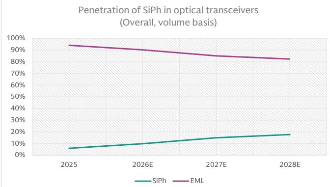
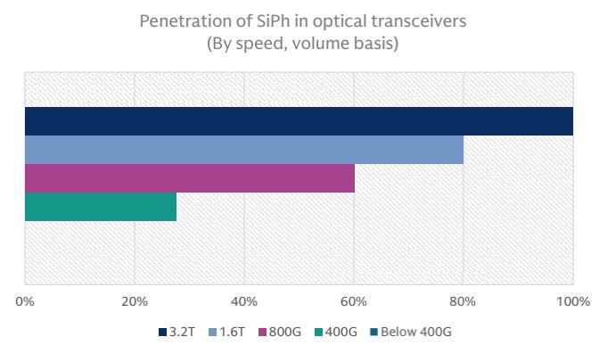
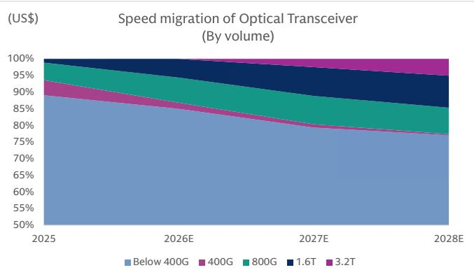
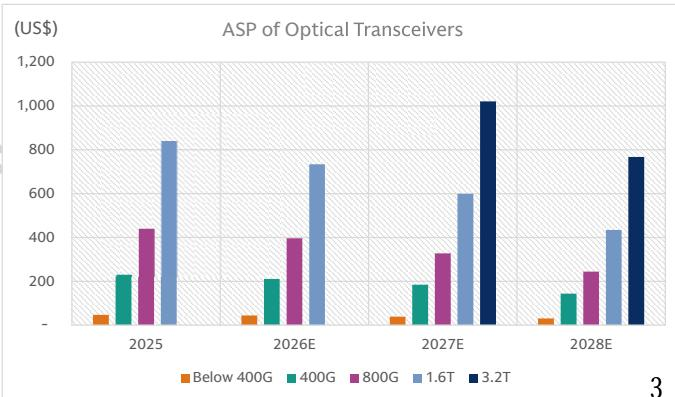
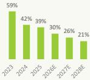
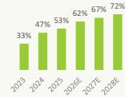
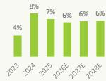
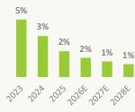

# Raising 800G and above shipment by 14%/29% /33% for 2026-28E; Al to drive growth ahead

17 April 2026 | 2:14AM HKT

We remain positive on the growth of optical transceiver demand ahead, driven by the AI server infrastructure cycle (scale out, scale up, and scale across), the trend of 订阅研报添加微信 LCD123321Cadfiber optics replacing copper cables, specification upgrade toward high-speed 04 connection, and the diversification trend from GPU to ASIC servers will support further demand expansion for optical transceivers, as ASIC chips rely more on networking capabilities to achieve inferencing workload and to mitigate the lower computing power per chip. Read more on our latest views: Optical networking thematic; Server TAM update; Optical initiation on Robotechnik/YJ Semi/ YOFC.

In 2026/27/28E, we expect the global optical transceiver market to reach US\$51bn/73bn/69bn, with 800G and above segment increasing at a $+ 3 1 \%$ CAGR and reaching $\cup \$ \$ 32$ bn/ 55bn/ 56bn. We expect 800G/1.6T shipment volume at $3 4 \mathsf { m } / 2 6 \mathsf { m }$ units in 2026E, growing to 45m/46m in 2027E, with 3.2T shipment ramping up to $\uparrow 3 \mathsf { m }$ in 2027E. Silicon photonics will account for $6 0 \% / 8 0 \% / 1 0 0 \%$ of 800G/1.6T/3.2T optical transceivers, in our view.

Within the optical transceivers supply chain, we are Buy rated on (1) Optical transceiver or engines makers: Innolight, Eoptolink, TFC Optical; (2) CW lasers or Epiwafer suppliers: Landmark, VPEC; (3) Data center switch: Ruijie; (4) Equipment: RoboTechnik.

Related reports: Global Optical transceivers: Raising value TAM by 43% / 46% in 2026-27E with 800G / 1.6T at 38m / 14m units in 2026E on AI trend (Jan 8, 2026)

Global Server: ASIC servers expanding; AI full racks see diversifying chip platform (Jan 4, 2026)

Global Optical transceivers: TAM introduced; rising 800G / 1.6T driven by growing AI servers infrastructure (Dec 13, 2025)

订阅研报添加微信 LCD123321Cad 04-Global Server: 2027E estimates introduced; Raising baseboard-based AI servers with rising ASIC penetration (Sep 27, 2025)

Global Switch: Raising TAM on higher AI Data Center Switch ASP; Global Switch TAM to grow at 21% CAGR in 2025-27E (Nov 17, 2025)

TAIWAN TECHNOLOGY: Silicon Photonics / CPO: LandMark and VPEC the early beneficiaries of 800G / 1.6T upgrade; Initiate with Buys (Feb 13, 2025)

Global Optical module market opportunity   

<table><tr><td>Us$m</td><td>1Q25</td><td>2Q25</td><td>3Q25</td><td>4Q25</td><td>1Q26E</td><td>2Q26E</td><td>3Q26E</td><td>4Q26E</td><td>2025</td><td>2026E</td><td>2027E</td><td>2028E</td></tr><tr><td colspan="9">Global Optical module TAM</td><td></td><td></td><td></td></tr><tr><td>Global TAM (US$m)</td><td>6,570</td><td>7,969</td><td>9,607</td><td>10,066</td><td>10,142</td><td>12,047</td><td>12,770</td><td>15,925</td><td>34,211</td><td>50,883</td><td>72,593</td><td>69,135</td></tr><tr><td>Below 400G</td><td>4,195</td><td>4,315</td><td>4,286</td><td>4,031</td><td>4,077</td><td>4,432</td><td>4,283</td><td>4,093</td><td>16,827</td><td>16,886</td><td>16,166</td><td>13,196</td></tr><tr><td>400G</td><td>1,804</td><td>1.023</td><td></td><td>432</td><td>359C</td><td>D 1423321</td><td>523</td><td>0441</td><td>4,209</td><td>1,745</td><td>969</td><td>287</td></tr><tr><td>800G</td><td>571</td><td>2,120</td><td>2,902小</td><td>3,725</td><td>2,706</td><td>3,457</td><td>3,557</td><td>3,810</td><td>9,318</td><td>13,530</td><td>14,715</td><td>10,761</td></tr><tr><td>1.6T</td><td>-</td><td>511</td><td>1,469</td><td>1,877</td><td>3,000</td><td>3,736</td><td>4,406</td><td>7,581</td><td>3,857</td><td>18,722</td><td>27,403</td><td>23,264</td></tr><tr><td>3.2T</td><td></td><td>1</td><td></td><td></td><td></td><td>1</td><td></td><td>■</td><td>=</td><td>-</td><td>13,340</td><td>21,625</td></tr><tr><td>By Speed Mix</td><td>100%</td><td>100%</td><td>100%</td><td>100%</td><td>100%</td><td>100%</td><td>100%</td><td>100%</td><td>100%</td><td>100%</td><td>100%</td><td>100%</td></tr><tr><td>Below 400G</td><td>64%</td><td>54%</td><td>45%</td><td>40%</td><td>40%</td><td>37%</td><td>34%</td><td>26%</td><td>49%</td><td>33%</td><td>22%</td><td>19%</td></tr><tr><td>400G</td><td>27%</td><td>13%</td><td>10%</td><td>4%</td><td>4%</td><td>4%</td><td>4%</td><td>3%</td><td>12%</td><td>3%</td><td>1%</td><td>0%</td></tr><tr><td>800G</td><td>9%</td><td>27%</td><td>30%</td><td>37%</td><td>27%</td><td>29%</td><td>28%</td><td>24%</td><td>27%</td><td>27%</td><td>20%</td><td>16%</td></tr><tr><td>1.6T</td><td>0%</td><td>6%</td><td>15%</td><td>19%</td><td>30%</td><td>31%</td><td>35%</td><td>48%</td><td>11%</td><td>37%</td><td>38%</td><td>34%</td></tr><tr><td>3.2T</td><td>0%</td><td>0%</td><td>0%</td><td>0%</td><td>0%</td><td>0%</td><td>0%</td><td>0%</td><td>0%</td><td>0%</td><td>18%</td><td>31%</td></tr><tr><td>By Material Mix</td><td>100%</td><td>100%</td><td>100%</td><td>100%</td><td>100%</td><td>100%</td><td>100%</td><td>100%</td><td>100%</td><td>100%</td><td>100%</td><td>100%</td></tr><tr><td>SiPh</td><td>14%</td><td>24%</td><td>32%</td><td>36%</td><td>38%</td><td>40%</td><td>42%</td><td>48%</td><td>28%</td><td>43%</td><td>56%</td><td>62%</td></tr><tr><td>EML</td><td>86%</td><td>76%</td><td>68%</td><td>64%</td><td>62%</td><td>60%</td><td>58%</td><td>52%</td><td>72%</td><td>57%</td><td>44%</td><td>38%</td></tr></table>

<table><tr><td></td><td></td><td>J11 -</td><td>1,409</td><td>1,07</td><td>5,000</td><td>5,750</td><td>4,406</td><td>7,581</td><td>5,057</td><td>10,722</td><td></td><td></td></tr><tr><td>3.2T</td><td>=</td><td></td><td>-</td><td>1</td><td>-</td><td>1</td><td>-</td><td>-</td><td>-</td><td>-</td><td>13,340</td><td>21,625 100%</td></tr><tr><td>By Speed Mix Below 400G</td><td>100% 64%</td><td>100% 54%</td><td>100% 45%</td><td>100% 40%</td><td>100% 40%</td><td>100% 37%</td><td>100% 34%</td><td>100% 26%</td><td>100% 49%</td><td>100% 33%</td><td>100% 22%</td><td>19%</td></tr><tr><td>400G</td><td>27%</td><td>13%</td><td>10%</td><td></td><td>4%</td><td>4%</td><td>4%</td><td></td><td>12%</td><td>3%</td><td>1%</td><td>0%</td></tr><tr><td></td><td>9%</td><td>27%</td><td>30%</td><td>4%</td><td>27%</td><td></td><td></td><td>3%</td><td>27%</td><td>27%</td><td>20%</td><td>16%</td></tr><tr><td>800G 1.6T</td><td>0%</td><td>6%</td><td>15%</td><td>37%</td><td></td><td>29%</td><td>28%</td><td>24%</td><td></td><td></td><td></td><td>34%</td></tr><tr><td>3.2T</td><td>0%</td><td>0%</td><td></td><td>19%</td><td>30%</td><td>31%</td><td>35%</td><td>48%</td><td>11%</td><td>37%</td><td>38%</td><td></td></tr><tr><td>By Material Mix</td><td>100%</td><td>100%</td><td>0% 100%</td><td>0% 100%</td><td>0%</td><td>0%</td><td>0%</td><td>0%</td><td>0%</td><td>0%</td><td>18%</td><td>31%</td></tr><tr><td>SiPh</td><td>14%</td><td>24%</td><td>32%</td><td>36%</td><td>100% 38%</td><td>100% 40%</td><td>100% 42%</td><td>100% 48%</td><td>100% 28%</td><td>100% 43%</td><td>100% 56%</td><td>100% 62%</td></tr><tr><td rowspan="3">EML</td><td>86%</td><td>76%</td><td>68%</td><td>64%</td><td>62%</td><td>60%</td><td>58%</td><td>52%</td><td>72%</td><td>57%</td><td>44%</td><td>38%</td></tr><tr><td></td><td></td><td></td><td></td><td></td><td></td><td></td><td></td><td></td><td></td><td></td><td></td></tr><tr><td>1Q25</td><td>2Q25</td><td>3Q25</td><td>4Q25</td><td>1Q26E</td><td>2Q26E</td><td>3Q26E</td><td>4Q26E</td><td>2025</td><td>2026E</td><td>2027E</td><td>2028E</td></tr><tr><td>Global Optical module shipment TAM Global shipment (k units)</td><td></td><td></td><td></td><td></td><td></td><td></td><td></td><td></td><td></td><td></td><td></td><td></td></tr><tr><td>Below 400G</td><td>98,631</td><td>101,929 92,05491,43385,99991,56</td><td>103,907</td><td>98,580</td><td>103,818</td><td>114,888</td><td>113,138</td><td>120,425</td><td>403,046</td><td>452,269</td><td>528,286</td><td>556,429</td></tr><tr><td>400G</td><td>89,489</td><td></td><td></td><td></td><td></td><td>L99,529</td><td>96,186</td><td>97,013 17</td><td>358,975</td><td>384,292</td><td>419,238</td><td>428,689</td></tr><tr><td>800G</td><td>7,845</td><td>4,448</td><td>4,129</td><td>1,880</td><td>1,673</td><td>1,968</td><td>2,439</td><td>2,214</td><td>18,301</td><td>8,295</td><td>5,268</td><td>2,007</td></tr><tr><td>1.6T</td><td>1,297</td><td>4,819</td><td>6,596</td><td>8,466</td><td>6,666</td><td>8,514</td><td>8,760</td><td>10,243</td><td>21,178</td><td>34,183</td><td>44,993</td><td>44,047</td></tr><tr><td>3.2T</td><td>-</td><td>608</td><td>1,749</td><td>2,235</td><td>3,916</td><td>4,877</td><td>5,753</td><td>10,955</td><td>4,591</td><td>25,500</td><td>45,719</td><td>53,525</td></tr><tr><td>Mix</td><td>-</td><td>=</td><td>=</td><td>=</td><td></td><td>=</td><td>=</td><td>1</td><td>=</td><td>=</td><td>13,067</td><td>28,162</td></tr><tr><td>Below 400G</td><td>100%</td><td>100%</td><td>100%</td><td>100%</td><td>100%</td><td>100%</td><td>100%</td><td>100%</td><td>100%</td><td>100%</td><td>100%</td><td>100%</td></tr><tr><td>400G</td><td>91%</td><td>90%</td><td>88%</td><td>87%</td><td>88%</td><td>87%</td><td>85%</td><td>81%</td><td>89%</td><td>85%</td><td>79%</td><td>77%</td></tr><tr><td>800G</td><td>8%</td><td>4%</td><td>4%</td><td>2%</td><td>2%</td><td>2%</td><td>2%</td><td>2%</td><td>5%</td><td>2%</td><td>1%</td><td>0%</td></tr><tr><td>1.6T</td><td>1% 0%</td><td>5% 1%</td><td>6%</td><td>9%</td><td>6%</td><td>7%</td><td>8%</td><td>9%</td><td>5%</td><td>8%</td><td>9%</td><td>8%</td></tr><tr><td>3.2T</td><td>0%</td><td>0%</td><td>2% 0%</td><td>2% 0%</td><td>4% 0%</td><td>4% 0%</td><td>5% 0%</td><td>9% 0%</td><td>1% 0%</td><td>6% 0%</td><td>9% 2%</td><td>10% 5%</td></tr><tr><td> SiPh penetration rate</td><td></td><td></td><td></td><td></td><td></td><td></td><td></td><td></td><td></td><td></td><td></td><td></td></tr><tr><td></td><td>4%</td><td>5%</td><td>7%</td><td>8%</td><td>8%</td><td>9%</td><td>10%</td><td>13%</td><td>6%</td><td>10%</td><td>15%</td><td>18%</td></tr><tr><td>ASP(US$)</td><td>1Q25</td><td>2Q25</td><td>3Q25</td><td>4Q25</td><td>1Q26E</td><td>2Q26E</td><td>3Q26E</td><td>4Q26E</td><td>2025</td><td>2026E</td><td>2027E</td><td>2028E</td></tr><tr><td>By speed (Us$)</td><td></td><td></td><td></td><td></td><td></td><td></td><td></td><td></td><td></td><td></td><td></td><td></td></tr><tr><td>Below 400G</td><td>71 50</td><td>81 48</td><td>94 47</td><td>97</td><td>103</td><td>116</td><td>111</td><td>141</td><td>85</td><td>113</td><td>137</td><td>124</td></tr><tr><td>400G</td><td>234</td><td>130</td><td>214</td><td>44 105</td><td>47</td><td>48</td><td>43 266</td><td>43 181</td><td>47 230</td><td>44</td><td>39</td><td>31</td></tr><tr><td>800G</td><td>456</td><td>1,635</td><td>602</td><td></td><td>191</td><td>252 519</td><td>418</td><td>435</td><td>440</td><td>210 396</td><td>184</td><td>143</td></tr><tr><td>1.6T</td><td></td><td></td><td>2,416</td><td>565 1,073</td><td>320 1,342</td><td>954</td><td>904</td><td>1,318</td><td>840</td><td>734</td><td>327 599</td><td>244 435</td></tr><tr><td>3.2T YOY</td><td></td><td></td><td></td><td></td><td>45%</td><td>44%</td><td>18%</td><td>45%</td><td></td><td>33%</td><td>22%</td><td>768</td></tr><tr><td>Below 400G</td><td></td><td></td></table>

# Optical transceivers: Rising adoption of SiPh under high-speed connection

  
Exhibit 1: Penetration of SiPh: reaching 18% by 2028E   
Source: Company data, Goldman Sachs Global Investment Research

  
Exhibit 2: Penetration of SiPh: 3.2T will 100% adopt SiPh   
Source: Company data, Goldman Sachs Global Investment Research

  
Exhibit 3: Global Optical transceivers: 800G/ 1.6T/ 3.2T accounts for 8%/ 10%/ 5% by 2028E (by volume)

  
Exhibit 4: Global Optical transceivers: Assuming ASP decline YoY for like-for-like products

AI data center optical transceivers accelerates specification migrations. We expect a total demand of $4 5 2 \mathsf { m } / 5 2 8 \mathsf { m } / 5 5 6 \mathsf { m }$ units for optical transceivers globally in 2026-28E, with the high end market $( 8 0 0 G + )$ ) demand mainly driven by AI data center applications growing at $+ 4 5 \%$ CAGR in 2026-28E to $_ { 1 2 6 \mathsf { m } }$ by 2028E. General data center and Telecom applications still require products of 400G or lower, and we expect 400G or below shipment contribution to decline from $8 7 \%$ in 2026E to $7 7 \%$ in 2028E.

订阅研报添加微信 LCD123321Cad 04-17 High speed migrations: 800G has become the mainstream specification for large scale data centers, and we expect $1 . 6 \mathsf { T }$ will see strong volume ramp in from 2026, with 3.2T starting adoption in 2027E. 800G’s demand volume will increase from 34m in 2026E to 45m/ 44m in 2027-28E, and 1.6T’s volume will increase from $2 6 \mathsf { m }$ in 2026E to 46m/ $5 4 \mathsf { m }$ in 2027-28E, growing from $6 \%$ of total shipments in 2026E to $10 \%$ in 2028E.

AI data center networking migration: AI servers networking continues to migrate. Take NVIDIA’s rack-level AI servers for example: GB200 uses 400G (GPU layer) and 800G networking (leaf, spine, core layer), GB300 uses 800G (GPU layer) and $\phantom { - } 1 . 6 \mathsf { T }$ (leaf, spine layer), and we expect Rubin and Rubin Ultra to further migrate to 1.6T and 3.2T. As inferred by our global server estimates, we expect rack-level AI servers powered by NVIDIA at 50k / 77k / 121k racks in 2026-28E, implying AI chips at $3 . 6 \mathsf { m } / 5 . 5 \mathsf { m } / 8 . 7 \mathsf { m }$ in 2026-28E, and we expect the migration from GB300 to Rubin would drive the usage of 1.6T optical transceiver per GPU from 3.0 units to 6.0 units (assuming 3 layer netowrking), driving 1.6T usage in 2026-27E.

订阅研报添加微信 LCD123321Cad 04-17 ASIC AI servers in expansion: We expect the diversification trend from GPU to ASIC AI servers to continue in coming years, which will support demand expansion of optical transceivers, as ASIC chips rely more on networking capabilities to achieve AI workload and to mitigate the lower computing power per chip. As inferred by our global server estimates, we expect ASIC to account for $4 3 \% / 5 0 \% / 5 5 \%$ of total AI chips in 2026/ 27/ 28E. Across ASIC users, Google and Meta are more aggressively expanding high-speed connection $( 8 0 0 G + )$ , with Google migrating to $\phantom { - } 1 . 6 \mathsf { T }$ in 2026E, and Meta set to use more optical transceiver per ASIC than GPU servers (i.e. on GPU servers typically there are 2-3 optical transceivers per GPU), according to our channel checks.

SiPh penetrations: We expect SiPh solutions to see increasing adoption as they have cost advantages over traditional EML modules in high speed products. Based on our industry checks, the 1.6T SiPh optical transceiver uses four 70mW CW lasers, or $\cup \$ 15-20$ laser content per module, while the 1.6T EML optical transceiver uses eight 200G EMLs, or $\cup \mathsf { S } \$ 160$ of laser content, leading to different GMs to optical module makers. We expect that the higher the speed, the higher penetration of SiPh, driving 订阅研报添加微信 SiPh modules to account for $10 \%$ D to $1 8 \%$ 21Cad 04-17 of the total market in 2026-28E, or $6 9 \% - 7 7 \%$ to the $8 0 0 G +$ market in 2026-28E.

Exhibit 7: Summary of ${ \bf 8 0 0 G + }$ optical transceiver shipments   

<table><tr><td>k units</td><td>2025</td><td>2026E</td><td>2027E</td><td>2028E</td><td></td><td>2025</td><td>2026E</td><td>2027E</td><td>2028E</td></tr><tr><td>Global</td><td>25,769</td><td>59,683</td><td>103,779</td><td>125,733</td><td></td><td></td><td></td><td></td><td></td></tr><tr><td>YoY</td><td></td><td>132%</td><td>74%</td><td>21%</td><td></td><td></td><td></td><td></td><td></td></tr><tr><td>By laser</td><td></td><td></td><td></td><td></td><td>By format</td><td></td><td></td><td></td><td></td></tr><tr><td>SiPh</td><td>16,380</td><td>40,910</td><td>76,638</td><td>97,410</td><td>Pluggable</td><td>25,769</td><td>58,603</td><td>97,443</td><td>117,813</td></tr><tr><td>EML</td><td>9,389</td><td>18,773</td><td>27,141</td><td>28,324</td><td>CPO</td><td></td><td>1,080</td><td>6,336</td><td>7,920</td></tr><tr><td>Mix</td><td></td><td></td><td></td><td></td><td>Mix</td><td></td><td></td><td></td><td></td></tr><tr><td>SiPh</td><td>64%</td><td>69%</td><td>74%</td><td>77%</td><td>Pluggable</td><td>100%</td><td>98%</td><td>94%</td><td>94%</td></tr><tr><td>EML</td><td>36%</td><td>31%</td><td>26%</td><td>23%</td><td>CPO</td><td>0%</td><td>2%</td><td>6%</td><td>6%</td></tr><tr><td>YoY</td><td></td><td></td><td></td><td></td><td>YoY</td><td></td><td></td><td></td><td></td></tr><tr><td>SiPh</td><td></td><td>150%</td><td>87%</td><td>27%</td><td>Pluggable</td><td></td><td>127%</td><td>66%</td><td>21%</td></tr><tr><td>EML</td><td>专</td><td>100%</td><td></td><td> 45% 00004%</td><td>CPO</td><td></td><td></td><td>487%</td><td>25%</td></tr></table>

Source: Goldman Sachs Global Investment Research

Optical transceiver revision

We raise global optical transceiver value TAM by $1 8 \% / 3 5 \% / 4 0 \%$ in 2026-28E mainly on (1) higher Nvidia rack-level AI server and Google ASIC AI server shipments in our Global Server TAM Updates, and (2) higher estimates on the usage of $\phantom { - } 1 . 6 \mathsf { T } +$ optical transceivers per Nvidia GPU in rack-level AI servers. We raised our Nvidia and Google’s AI chip shipment estimates in 2026-28E, which are major customers for $\phantom { - } 1 . 6 \mathsf { T } +$ optical transceivers. We also raise the per GPU usage of $\phantom { - } 1 . 6 \mathsf { T } +$ optical transceivers in Nvidia rack-level AI servers, including (1) 1.6T usage per GPU in GB300 raised to 3 (vs. 1.6 previously), (2) 1.6T usage per GPU in Rubin raised to 6 (vs. 5 previously), (3) 3.2T usage per GPU in Rubin Ultra raised to 3 / 3 in 2027-28E (vs. 0 / 1.5 previously), (4) adding Feynman rack-level server into our 2028E estimate with per GPU 3.2T optical 订阅研报添加微信 LCD123321Cad 04-17 transceivers used at 6, further supporting the value TAM growth. Our estimates still consider the pull in one quarter to reflect component supplier (optical transceiver) delivery time gap compared to ODM final system shipment.

# Servers: AI training server volume $+ 7 5 \% / + 3 8 \% / + 3 1 \%$ in 2026-28E; General server volume $+ 4 \% / + 2 \% /$ +3% YoY

# Global Server market opportunity

(Shipments in k units/ k racks)

# Our Bottom up method

# Global server TAM $\cdot$

General server $^ +$ AI server (high power) $^ +$ AI server (others) $^ +$ HPC

# General server

General server shipments $=$ shipments of Top 6 server brands $^ +$ ODM direct $^ +$ others General server revenue $=$ shipments of each company x ASP of each company

  
General % in total revenues

AI server   
AI server shipments $=$ shipments   
of Top 6 server brand $^ +$ ODM   
direc $^ +$   
others

AI server revenue $=$ shipments x ASP

<table><tr><td rowspan=1 colspan=6>Alservers-high power%       164%Al servers-full racks %</td><td rowspan=1 colspan=2>74%</td><td rowspan=1 colspan=2>25%</td><td rowspan=1 colspan=1>28%1978%</td><td rowspan=1 colspan=2>47%599%</td><td rowspan=1 colspan=2>21%294%</td><td rowspan=1 colspan=1>27%158%</td><td rowspan=1 colspan=2>34%126%</td><td rowspan=1 colspan=1>241%</td><td rowspan=1 colspan=2>157%</td><td rowspan=1 colspan=1>54%4393%</td><td rowspan=1 colspan=1>31%202%</td><td rowspan=1 colspan=1>12%    14%74%    61%</td></tr><tr><td rowspan=1 colspan=6>Al servers-inferencing%       102%</td><td rowspan=1 colspan=2>15%</td><td rowspan=1 colspan=2>44%</td><td rowspan=1 colspan=1>54%</td><td rowspan=1 colspan=2>1%</td><td rowspan=1 colspan=2>62%</td><td rowspan=1 colspan=1>54%</td><td rowspan=1 colspan=2>26%</td><td rowspan=1 colspan=1></td><td rowspan=1 colspan=2>280%</td><td rowspan=1 colspan=1>53%</td><td rowspan=1 colspan=1>32%</td><td rowspan=1 colspan=1>31%    31%</td></tr><tr><td></td><td></td><td></td><td></td><td></td><td></td><td></td><td></td><td></td><td></td><td></td><td></td><td></td><td></td><td></td><td></td><td rowspan=1 colspan=2>13%3%</td><td rowspan=1 colspan=1></td><td rowspan=1 colspan=2></td><td rowspan=1 colspan=1></td><td rowspan=3 colspan=1></td><td rowspan=3 colspan=1></td></tr><tr><td></td><td></td><td></td><td></td><td></td><td></td><td></td><td></td><td></td><td></td><td></td><td></td><td></td><td></td><td></td><td></td><td></td><td></td><td rowspan=1 colspan=1></td><td rowspan=1 colspan=2></td><td rowspan=2 colspan=1></td></tr><tr><td></td><td></td><td></td><td></td><td></td><td></td><td></td><td></td><td></td><td></td><td></td><td></td><td></td><td></td><td></td><td></td><td></td><td></td><td rowspan=1 colspan=1></td><td rowspan=1 colspan=2></td></tr><tr><td></td><td></td><td></td><td></td><td></td><td></td><td></td><td></td><td></td><td></td><td></td><td></td><td></td><td></td><td></td><td rowspan=1 colspan=1>3,782</td><td rowspan=1 colspan=2>3,678</td><td rowspan=1 colspan=1>11,409</td><td rowspan=1 colspan=2>12,544</td><td rowspan=1 colspan=1>14,350</td><td rowspan=1 colspan=1>14,855</td><td rowspan=1 colspan=1>15,199  15,644</td></tr><tr><td></td><td></td><td></td><td></td><td></td><td></td><td></td><td></td><td></td><td></td><td></td><td></td><td></td><td></td><td></td><td></td><td></td><td></td><td></td><td></td><td></td><td></td><td rowspan=1 colspan=1>1,5131,016</td><td rowspan=1 colspan=1>2,082   2,7301,272   1,506</td></tr><tr><td></td><td></td><td rowspan=1 colspan=3>阅研</td><td rowspan=1 colspan=1>91%</td><td rowspan=1 colspan=2>17%31%</td><td rowspan=1 colspan=1></td><td rowspan=1 colspan=1>15%37%</td><td rowspan=1 colspan=1>8%81%</td><td></td><td></td><td rowspan=1 colspan=1>气</td><td></td><td></td><td></td><td></td><td></td><td></td><td></td><td></td><td></td><td></td></tr><tr><td rowspan=1 colspan=2>Al servers-high power %Alservers-full racks</td><td rowspan=1 colspan=3></td><td rowspan=1 colspan=1>73%</td><td rowspan=1 colspan=2>13%</td><td rowspan=1 colspan=1></td><td rowspan=1 colspan=2>5%   35%2221%</td><td rowspan=1 colspan=2>62%582%</td><td rowspan=1 colspan=3>42%   59%278%  145%</td><td rowspan=1 colspan=1></td><td rowspan=1 colspan=2>32%    193%113%</td><td rowspan=1 colspan=2>135%</td><td rowspan=1 colspan=2>26%   47%4879%  187%</td><td rowspan=1 colspan=1>25%    18%63%    51%</td></tr><tr><td rowspan=1 colspan=2>Al servers-inferencing%</td><td rowspan=1 colspan=3></td><td rowspan=1 colspan=1>25%</td><td rowspan=1 colspan=2>-23%</td><td rowspan=1 colspan=1></td><td rowspan=1 colspan=2>-6%   10%</td><td rowspan=1 colspan=1></td><td rowspan=1 colspan=1>-4%</td><td rowspan=1 colspan=1></td><td rowspan=1 colspan=2>45%   37%</td><td rowspan=1 colspan=1></td><td rowspan=1 colspan=2>12%   1457%</td><td rowspan=1 colspan=2>141%</td><td rowspan=1 colspan=2>1%   19%4%   2%</td><td rowspan=1 colspan=1>18%    19%1%    3%</td></tr><tr><td></td><td></td><td></td><td></td><td></td><td></td><td></td><td></td><td></td><td></td><td></td><td></td><td></td><td></td><td rowspan=1 colspan=2>9%   -2%12%   13%</td><td rowspan=1 colspan=1></td><td rowspan=1 colspan=2>-3%19%</td><td rowspan=2 colspan=2></td><td rowspan=2 colspan=2></td><td rowspan=2 colspan=1></td></tr><tr><td></td><td></td><td></td><td></td><td></td><td></td><td></td><td></td><td></td><td></td><td></td><td></td><td></td><td></td><td></td><td></td><td></td><td rowspan=1 colspan=2>9%39%</td></tr><tr><td></td><td></td><td></td><td></td><td></td><td></td><td></td><td></td><td></td><td></td><td></td><td></td><td></td><td></td><td rowspan=1 colspan=2>2%   14%-24%   11%</td><td rowspan=1 colspan=1></td><td rowspan=1 colspan=2>8%-7%</td><td></td><td></td><td></td><td></td><td></td></tr><tr><td></td><td></td><td></td><td></td><td></td><td></td><td></td><td></td><td></td><td></td><td></td><td></td><td></td><td></td><td></td><td></td><td></td><td></td><td></td><td></td><td></td><td rowspan=1 colspan=2>1,295  1,191</td><td rowspan=1 colspan=1>1,181   1,193</td></tr><tr><td></td><td></td><td></td><td></td><td></td><td></td><td></td><td></td><td></td><td></td><td></td><td></td><td></td><td></td><td rowspan=1 colspan=2>159   137135   135</td><td rowspan=1 colspan=1></td><td rowspan=1 colspan=2>186     764142     783</td><td rowspan=1 colspan=2>770810</td><td rowspan=1 colspan=2>669   650592   578</td><td rowspan=1 colspan=1>663    676557    579</td></tr><tr><td></td><td></td><td></td><td></td><td></td><td></td><td></td><td></td><td></td><td></td><td></td><td></td><td></td><td></td><td></td><td></td><td></td><td rowspan=1 colspan=2>239     59123      45</td><td rowspan=1 colspan=2>73684</td><td rowspan=1 colspan=2>773   76399   101</td><td rowspan=1 colspan=1>816    846107    112</td></tr><tr><td></td><td></td><td></td><td></td><td></td><td></td><td></td><td></td><td></td><td></td><td></td><td></td><td></td><td></td><td></td><td></td><td></td><td></td><td></td><td rowspan=1 colspan=2>1,533</td><td rowspan=1 colspan=2>2,249  2,447</td><td rowspan=1 colspan=1>2,519   2,569</td></tr><tr><td></td><td></td><td></td><td></td><td></td><td></td><td></td><td></td><td></td><td></td><td></td><td></td><td></td><td></td><td></td><td></td><td></td><td></td><td></td><td></td><td></td><td rowspan=1 colspan=2>895   9442,006  2,166</td><td rowspan=1 colspan=1>971    9712,318   2,480</td></tr><tr><td></td><td></td><td></td><td></td><td></td><td></td><td></td><td></td><td></td><td></td><td></td><td></td><td rowspan=2 colspan=1>1,165215</td><td rowspan=2 colspan=1></td><td rowspan=2 colspan=1>1,366242</td><td rowspan=2 colspan=1>1,466267</td><td rowspan=2 colspan=1></td><td rowspan=2 colspan=2>1,299    4,987292     234</td><td rowspan=2 colspan=2>5,212551</td><td rowspan=2 colspan=2>5,067  5,298692  1,016</td><td></td></tr><tr><td></td><td></td><td></td><td></td><td></td><td></td><td></td><td></td><td></td><td></td><td></td><td></td><td rowspan=1 colspan=1>728    7285,341  5,4911,272   1,506</td></tr><tr><td></td><td></td><td></td><td></td><td></td><td></td><td></td><td></td><td rowspan=1 colspan=1></td><td rowspan=1 colspan=1>3</td><td rowspan=1 colspan=1>382</td><td rowspan=1 colspan=1></td><td rowspan=1 colspan=1>254</td><td rowspan=1 colspan=1></td><td rowspan=1 colspan=1>308</td><td rowspan=1 colspan=1>356</td><td rowspan=1 colspan=1></td><td rowspan=1 colspan=2>40       76       1</td><td rowspan=1 colspan=2>4115</td><td rowspan=1 colspan=2>97   13013    24</td><td></td></tr><tr><td rowspan=3 colspan=2>HPSuper Micro</td><td rowspan=3 colspan=3>k unitsk units</td><td rowspan=3 colspan=1>29</td><td rowspan=3 colspan=2>512</td><td></td><td></td><td></td><td></td><td></td><td></td><td></td><td></td><td></td><td></td><td></td><td></td><td></td><td></td><td></td><td></td></tr><tr><td></td><td></td><td></td><td></td><td></td><td></td><td></td><td></td><td></td><td></td><td></td><td></td><td></td><td></td><td></td><td rowspan=4 colspan=1>170    18623    26146    16829     4026     28</td></tr><tr><td rowspan=1 colspan=1></td><td rowspan=1 colspan=1>12</td><td rowspan=1 colspan=1>29</td><td rowspan=1 colspan=1></td><td rowspan=1 colspan=1>29</td><td rowspan=1 colspan=1></td><td rowspan=1 colspan=1>30</td><td rowspan=3 colspan=1>3185</td><td rowspan=3 colspan=1></td><td rowspan=3 colspan=2>33      226       05       4</td><td rowspan=1 colspan=2>456</td><td></td><td></td></tr><tr><td></td><td></td><td></td><td></td><td></td><td></td><td></td><td></td><td></td><td rowspan=2 colspan=1>45</td><td rowspan=2 colspan=1>3</td><td></td><td></td><td></td><td rowspan=2 colspan=1>6</td><td></td><td></td><td></td><td></td></tr><tr><td></td><td></td><td></td><td></td><td></td><td></td><td></td><td></td><td></td><td></td><td></td><td></td><td></td><td></td><td rowspan=1 colspan=2>62   12312    2123    24</td></tr><tr><td rowspan=1 colspan=2>Quanta-ODMdirectHon Hai- ODM direct</td><td rowspan=2 colspan=3>k units研k unitsk units</td><td rowspan=2 colspan=1>18</td><td rowspan=2 colspan=2>28</td><td rowspan=2 colspan=1>28</td><td rowspan=2 colspan=1></td><td rowspan=2 colspan=1>2450</td><td rowspan=2 colspan=2>出</td><td rowspan=1 colspan=1>C</td><td rowspan=2 colspan=1>229</td><td rowspan=2 colspan=1></td><td rowspan=2 colspan=1>274433</td><td rowspan=2 colspan=1>34542</td><td rowspan=2 colspan=1></td><td rowspan=2 colspan=3>804-17244      15</td><td rowspan=1 colspan=1></td><td rowspan=1 colspan=1>5</td></tr><tr><td></td><td></td><td rowspan=1 colspan=1>C</td><td></td><td></td><td></td></tr><tr><td></td><td></td><td rowspan=1 colspan=3>k unitskracks**</td><td rowspan=1 colspan=1>502</td><td rowspan=1 colspan=2>23</td><td rowspan=1 colspan=1></td><td rowspan=1 colspan=1>22</td><td rowspan=1 colspan=1>26</td><td rowspan=1 colspan=1></td><td rowspan=1 colspan=1>2211</td><td rowspan=1 colspan=1></td><td rowspan=1 colspan=1>2912</td><td rowspan=1 colspan=1>3314</td><td rowspan=1 colspan=1></td><td rowspan=1 colspan=2>32     11619</td><td rowspan=1 colspan=2>2080</td><td rowspan=1 colspan=2>120   11619    55</td><td rowspan=1 colspan=1>168    22390    136</td></tr><tr><td rowspan=4 colspan=2>DellHPSuper MicroGigabyte</td><td rowspan=4 colspan=3>kracksk racksk racksk racks</td><td rowspan=1 colspan=1>00</td><td rowspan=1 colspan=2></td><td rowspan=1 colspan=1></td><td rowspan=1 colspan=1></td><td rowspan=4 colspan=4>0     10    i00     0</td><td rowspan=1 colspan=1>00</td><td></td><td></td><td></td><td></td><td></td><td></td><td></td><td></td><td></td></tr><tr><td rowspan=3 colspan=2>HPSuper MicroGigabyte</td><td></td><td></td><td></td><td></td><td></td><td></td><td></td><td></td><td></td><td></td><td></td><td></td><td></td><td></td><td></td></tr><tr><td></td><td></td><td></td><td></td><td></td><td rowspan=5 colspan=13>1    1        1              0     2     5    6ii0    0000110260000122441115611113154121460110     0                           0     1      1</td></tr><tr><td rowspan=1 colspan=4>00</td><td rowspan=1 colspan=1>0</td></tr><tr><td></td><td></td><td rowspan=3 colspan=9>k racks      1     1    1k racks04     6k racksk racksk racks</td><td rowspan=2 colspan=3>10</td><td rowspan=2 colspan=2>14</td></tr><tr><td rowspan=2 colspan=2>Hon Hai- ODM directWiwynn- ODM directInventec- ODM direct</td></tr><tr><td rowspan=1 colspan=1></td><td rowspan=1 colspan=2>k racksk racks</td></tr></table>

  
AI training % in total revenues

  
AI inferencing % in total revenues   
HPC server

HPC server shipments $=$ shipments   
of Top 6 server brand $^ +$ ODM   
direc $^ +$   
others   
HPC server revenue $=$ shipments X   
ASP

HPC % in total revenues

