# Semiconductors/Semi Cap Equipment

1Q26 Preview: Sustained AI Demand, Broadening17 April 2026 Cyclical Recovery, Structural WFE and Memory Tailwinds Underpin Continued Expectation of Semis Outperformance

订阅研报添加微信 LCD123321Cad 0We head into 1Q26 earnings season with the expectation that companies will deliver in-line/better 1Q results while providing constructive commentary on the outlook for 2Q and the balance of CY26, spurring a continuation of the positive earnings revision trend that we have witnessed over the past several quarters, which in turn we think will support further stock outperformance through the year (SOX up $32 \%$ YTD, $142 \%$ Y/Y). We maintain our overarching view that fundamentals underpinning strong growth in AI-related infrastructure spending will remain intact (rapidly rising inference-led demand for AI compute, increasing compute intensity of reasoning/agentic workloads, and hyperscalers/foundation model labs remaining capacity-constrained) - a view reinforced earlier this week by TSMC. We see considerable upside to the AI accelerator TAM relative to prior levels ${ \sim } \$ 200 B$ in 2025 and growing at a base-case $5 0 \% +$ CAGR over the next few years), with incremental spend accruing across the full semis value chain. The pace of custom silicon customer commitments and partnership expansion reinforces our view that XPUs (see note here and here) will continue to gain share of the AI accelerator TAM in CY26/27. On memory, we maintain a bullish outlook and expect mgmt commentary to stay decidedly constructive on supply/demand 订阅研报添加微信 LCD123321Cad 0tightness, with the key debate shifting from “how resilient is pricing?” to “how long will supply remain constrained?”. HBM supply continues to be locked up under multi-quarter price and volume agreements, and we see the pricing cycle extending well into CY27 as AI-led demand continues to outstrip supply. Cyclical recovery trends remain on track in broad-based analog/MCU, with industrial leading the recovery supported by lean customer/channel inventories, synchronized endmarket growth, and new product cycles. That said, we are more cautious on the 2H outlook for client/consumer-exposed names on the back of rising memory prices (our tech hardware colleagues have cut PC/smartphone unit forecasts for 2026). In semicaps, we remain constructive on the outlook for both CY26 and CY27, anchored by our expectation for WFE growth of ${ > } 2 0 \%$ in CY26 with a back-halfloaded demand profile, and improving visibility into CY27 driven by order pullins, growing backlogs, rising process control/dep/etch intensity at leading-edge nodes, and credible upside to customer capex budgets. In chip design software/ EDA, we expect continued strength driven by rising chip complexity and expanding program pipelines in custom ASIC and GPU, and expect companies to 订阅研报添加微信 LCD123321Cad 0drive a beat-and-raise cadence as the year unfolds. Net, we expect semi industry revenue to grow $1 5 \% +$ this year, with WFE up $2 0 \% +$ Y/Y. As we had anticipated stepping into this year, semis stocks have continued to meaningfully outperform the broader market, and we expect this trend to persist, driven by the crucial role semis play in the tech value chain, increasing content tailwind opportunities, and structural profitability/FCF improvements. We remain selective on stocks under our coverage and continue to favor our top picks - OW AVGO (Semis), OW MRVL (Semis), OW NVDA (Semis), OW ADI (Semis), OW MU (Semis), OW KLAC (Semicaps), and OW SNPS (EDA). In small cap semis, we like N MTSI, OW MKSI, and OW ALAB, which are leveraged to infrastructure & AI/datacenter

spending.

Anticipating in-line to modest upside to 1Q results and 2Q guidance driven by cyclical recovery trends and AI-driven demand growth...replay of the 4Q25 earnings season...overall book-to-bill for the industry ${ \bf > } 1 .$ In aggregate, we expect 1Q results (revenues, margins, EPS) to be in-line to slightly better than expectations and expect companies to guide 2Q outlooks in-line to slightly above consensus expectations on further improvements in demand for AI/accelerated compute (which continues to fuel demand growth throughout the semis value chain) coupled with above seasonal growth 订阅研报添加微信 LCD123321Cad for cyclical segments of the market.

• AI/accelerated compute demand growth story remains intact; supply chain capacity and sustainability of spend remain the key debates; custom AI XPUs continue to gain share; semi backlog/order books point to continued datacenter capex growth in CY27. The demand environment for AI/accelerated compute remains very robust, fueled by explosive growth in inference workloads across multiple modalities and end markets, and amplified by rapid adoption of compute-intensive reasoning and agentic models. Hyperscalers and foundation model labs continue to report being capacity-constrained and are already deeply engaged in planning for infrastructure deployments in 2027 and beyond - a dynamic reinforced at NVDA’s GTC in March, where mgmt meaningfully extended demand visibility into CY27 and pointed to multiple incremental compute revenue vectors beyond Blackwell/Vera Rubin (see our reports here and here). Based on our investor conversations, there seems to be consensus that in the near term, demand for AI compute will continue to outstrip supply. The debates center more around (1) the extent to which the supply chain (leading-edge foundry capacity, HBM, advanced packaging) and supporting infrastructure (power availability in particular) can support AI infrastructure growth, and (2) the sustainability of growth in AI capex beyond 2026. While we do not expect these questions to be definitively answered over the next few weeks, we expect companies to speak very constructively on the outlook for next year in terms of customer activity, bookings and backlog, and we would anticipate incrementally positive data points on supply chain capacity, supporting GPU and XPU ramps over the next few quarters. On a relative basis, we remain of the view that custom AI XPUs will continue to gain share of the overall AI accelerator TAM in CY26/27 (relative to GPU), with hyperscalers remaining committed to scaling internal TCO-advantaged custom AI XPU programs - a dynamic underscored by AVGO’s recent announcements of customer commitments and partnership expansion.

? Overall smartphone and consumer demand trends continue to face headwinds from memory supply constraints and memory cost inflation...could start to impact corporate general purpose compute IT spending dynamics...We expect continued demand destruction from higher memory prices as the year unfolds. Indeed, our hardware team has cut 2026 smartphone (see note here) and PC unit (see note here) forecasts over the past six months with smartphone and PC units shipments to decline $1 1 \% \mathrm { Y / Y }$ and $9 \%$ Y/Y respectively in 2026. For our smartphone-exposed companies, we expect Marchquarter results and June-quarter guidance to be in-line, driven by resilient iPhone sellthrough trends and relatively lower exposure to low- to mid-end Android smartphone shipments - where most of the impact has been felt to date. 1Q global smartphone shipments declined a sub-seasonal $14 \%$ Q/Q in 1Q (vs. typical seasonality of $12 \%$ ), with Y/Y trends down $4 \%$ . PC trends were positive Y/Y in the 1Q but decelerated significantly relative to prior quarters. We expect that Y/Y decline to decelerate as the year unfolds driven by ongoing memory-related headwinds.

• Cyclical recovery trends across broad-based analog and MCU names remain on track, supported by continued strength in industrial end markets and AI infrastructure-levered Data Center segment. The overall demand outlook continues to improve, driven by a combination of lean channel inventories, synchronized endmarket growth, and new product cycles that should further support the recovery.

Companies are largely shipping in line with end-demand trends, though we have not yet seen broad-based restocking. We expect that as geopolitical tensions de-escalate, that should drive better business confidence and potentially some restocking activity.

Memory (DRAM/NAND) - structurally tight S/D through CY27 on AI-led demand; pricing elevated but decelerating into 2H26; LTAs emerging as a cycle-shape catalyst; principal risk is memory-driven client demand destruction. Memory sits at the center of the 1Q26 debate, and our global memory team’s recent work reinforces the view that this cycle is more protracted than prior ones. Four dynamics shape our view. First, $\mathrm { S } / \mathrm { D }$ is in deficit through CY27 across both DRAM and NAND. Second, AI value 订阅share is stepping up materially - from ${ \sim } 3 1 \%$ 添加微信 LCD12332of industry revenue in CY25 to ${ \sim } 4 7 \%$ in CY27E (low- $50 \%$ by CY28E) across HBM, SOCAMM, server RDIMM and eSSD, with server customers driving $70 \%$ of AI-memory revenue; HBM remains in doubledigit-percent shortage through CY27, HBM4 ASPs tracking above $\$ 2/0 b$ , with upward bias from rising ASIC/GPU unit builds and per-accelerator HBM content growth (Rubin Ultra, ASIC pipeline). Third, capex is rising but remains disciplined - DRAM/NAND capex up ${ \sim } 3 1 \% / 1 0 \%$ Y/Y in CY26 (Samsung P4/P5, SKH M15X/P&T 7/Yong-in, Micron Idaho/NY/Singapore), yet capital intensity at ${ \sim } 2 2 \% / 1 2 \%$ is still well below the 10-year average $( \sim 3 2 \% / 4 4 \% )$ , limiting traditional oversupply reflex. Fourth, LTAs are emerging as a potential cycle-shape catalyst - MU has signed the industry’s first 5-year CSA with a hyperscaler and SEC/SKH are in active discussions. On the risk side, the principal offset is on the demand side rather than supply: elevated contract pricing (DRAM ASP $+ 1 3 5 \%$ Y/Y in 1Q26, tracking toward $+ 2 0 0 \%$ Y/Y in 2H26 per JPMe) is flowing into PC/smartphone BOMs and has prompted multiple downward client unit revisions. Net, we expect 1Q prints and 2Q guides to sustain the positive revision cadence, with CY27 visibility (LTA disclosures, HBM content at Rubin Ultra/ASICs, and CSP capex follow-through) the more important catalyst through the balance of CY26. We remain OW MU. 订阅研报添加微信 LCD123321Cad

Semicap/WFE - upward bias to both CY26 and CY27 WFE outlooks; visibility to the AI-driven tool ramp is the strongest in a decade. Recent touchpoints across the group reinforce our view that both CY26 and CY27 WFE carry upward bias. WFE growth is stepping up (JPMe $2 0 \% +$ Y/Y for CY26 ) and mix has shifted decisively toward AIexposed nodes - leading-edge foundry/logic, DRAM/HBM, and advanced packaging are now the three fastest-growing segments per both AMAT and LRCX (replacing the old even one-third split across leading-edge, ICAPS, and memory as recently as a year ago), with NAND and ICAPS/mature-node as the slower-growth pocket. Second, tool intensity per wafer is compounding - KLAC’s process control intensity is stepping from ${ \sim } 5 . 3 \%$ to $7 . 4 \%$ of WFE today and is targeted at ${ \sim } 9 \%$ by CY30 on GAA/CFET, backside power, larger dies, HBM (converging toward logic-like intensity) and hybrid bonding; LRCX’s etch/dep SAM is moving from low-30s (CY24) to mid-30s (CY25) to high-30s $\%$ over the next several years, with each GAA and backside power transition adding ${ \sim } \mathbb { S } 1 \mathbf { B }$ of SAM per 100K wafer starts, and LRCX’s advanced-packaging business is guided to $+ 4 0 \%$ in CY26 on HBM TSV/electroplating pull-through. Third, customer buying behavior has structurally changed - visibility is the furthest-out in recent memory (AMAT tracking ${ \sim } 1 0 0$ 订阅研报添加微信 LCD123321Cad  fabs at various stages, customers “forecasting demand earlier than ever” to secure tool slots), and HVM SPC spend is now being placed linearly with capacity rather than front-loaded at R&D/ramp, both of which lengthen the intensity cycle and reduce cyclical-trough risk. We expect the large-cap semicap names to continue to outperform underlying WFE on complexity-driven SAM expansion, share gains, and structural services growth. China WFE normalization and associated export-control dynamics remain the principal downside swing factor. We remain OW AMAT, OW KLAC, and OW LRCX.

Chip design software (EDA)/IP demand remains solid on continued strength on chip complexity increase and expanding program pipelines in ASIC and GPU. We expect companies to deliver solid results and guidance and return to normal beat $^ +$ raise cadence. Fundamentals are strong, driven by rising chip complexity and robust design activity. While there are general concerns about AI disrupting the software business model, we believe that chip design software is highly complex and not easily replicated, benefiting from strong technology, a strong customer/ecosystem network, and a significant data moat. AI should enable EDA companies to unlock better automation capabilities for customers and drive improved monetization.

• We continue to expect semis to outperform the broader market through CY26; positive earnings revisions, broadening leadership beyond the AI-pure names, and 订阅研报添加微信 LCD123321Cad improving CY27 visibility remain the key pillars. Semis have outperformed YTD, consistent with the setup we flagged entering the year, and we see the key drivers of further outperformance largely intact. Our view is underpinned by a continued positive earnings revision cycle, strength broadening beyond AI compute/networking into analog/MCU, memory, and semicap/EDA, and improving CY27 visibility across multiple vectors (hyperscale supply commitments and XPU technology roadmaps). Valuation, while no longer “cheap” in absolute terms, remains defensible relative to the group’s earnings growth trajectory and is not yet at levels that have historically marked cycle peaks. Key risks we are monitoring: (i) demand destruction in PC/smartphone from further memory-driven BOM inflation, (ii) sustainability of AI capex beyond CY26 and the pace of monetization at the hyperscalers, (iii) China WFE normalization and associated export-control dynamics, and (iv) broader macro. On balance, we remain constructive and reiterate our preference for names with the highest-quality AI exposure and/or clean leverage to the broadening cyclical recovery. Our top picks are: AVGO, MRVL, ADI, MU in semis; KLAC in semicap; SNPS in chip design software/IP; we also favor NVDA, LRCX, CDNS, AMAT, WDC, and ALAB.

# Accelerating Demand in AI/Datacenter Combined With Broad-Based Cyclical Improvements

# PC / Datacenter Compute

According to IDC, PC shipments grew $2 . 5 \%$ Y/Y and declined $1 4 . 5 \% \mathrm { Q } / \mathrm { Q }$ in 1Q26 (vs. typical $- 1 4 . 7 \% \mathrm { Q } / \mathrm { Q }$ seasonality). Notably, Y/Y growth in 1Q points to a marked slowdown relative to Y/Y trends in 3Q/4Q25 $( + 8 . 9 \% / + 9 . 6 \% \mathrm { Y / Y }$ ), reflecting, in part, the rising impact of component shortages and a challenging macro backdrop. Earlier this year, JPM’s global team covering PC/server OEMs/ODMs adjusted our PC/server 阅研报添加微信 LCshipment growth forecasts to $+ 8 \% \%$ 1Cad 04-for 2025 (from $+ 7 \% / - 1 \% )$ and $- 9 \% / + 1 5 \%$ for 2026 (from - $- 7 \% 1 + 5 \%$ ) - see related report here. These adjustments were driven primarily by (1) the anticipated impact of rising memory prices on PC/server demand, and (2) the pull on traditional server CPU compute from AI inference workloads (particularly in relation to reasoning models and agentic workloads). For PC, we believe expectations of continued upward pressure on memory pricing (and shortages) likely fueled above-seasonal CPU sell-in and sell-through in 1Q26 as downstream customers build inventory ahead of further price hikes, followed by below-seasonal quarterly trends later in the year on the back of weaker demand dynamics. On a relative basis, we expect AMD to benefit more from near-term PC CPU demand strength given INTC’s Intel wafer capacity constraints (i.e., continued share shift in favor of AMD in 1H26). We hold a much more constructive outlook for server CPU through 2026, as explosive growth in AI inference workloads is also driving demand for traditional compute (including server storage and workload orchestration that is most efficiently handled by CPU vs. GPU). AMD continues to hold a competitive advantage in server CPU relative to INTC with its EPYC Gen 4 product portfolio, and we see this advantage being sustained with its $2 \mathrm { n m }$ Gen 5 “Venice” CPUs relative to INTC’s upcoming Xeon 7 研报添加微信 L“Diamond Rapids” CPUs.

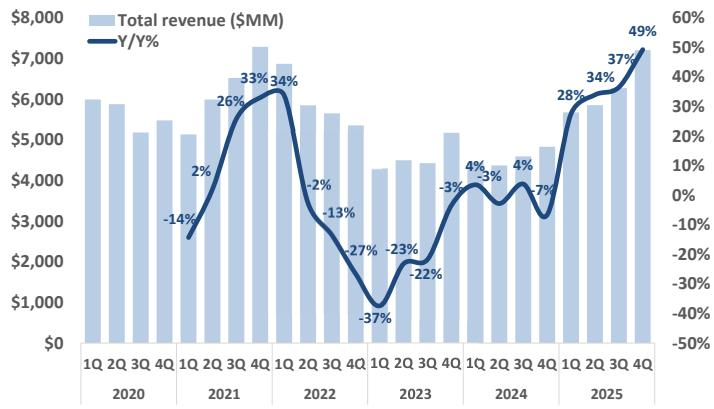  
Figure 1: x86 Server CPU quarterly revenue   
Source: IDC, J.P. Morgan estimates

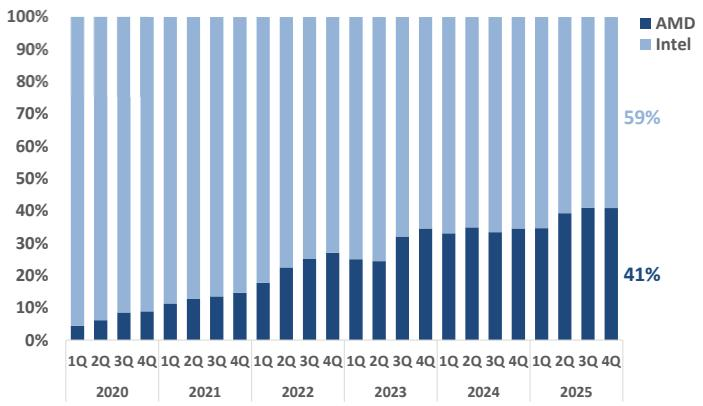  
Figure 2: x86 Server CPU quarterly revenue share   
LCD123321Cad 04-17Source: IDC, J.P. Morgan estimates

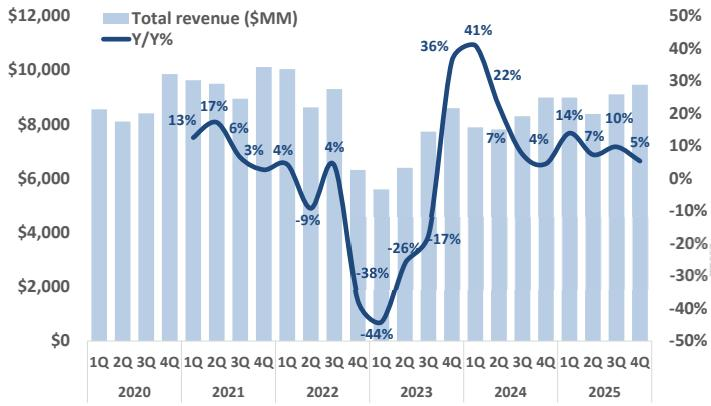  
Figure 3: x86 Client/PC CPU quarterly revenue   
Source: IDC, J.P. Morgan estimates

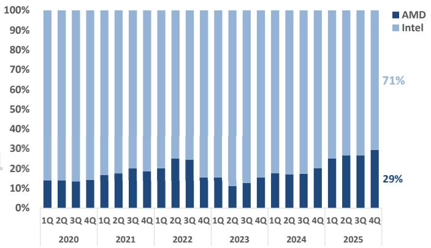  
Figure 4: x86 Client/PC quarterly revenue share   
Source: IDC, J.P. Morgan estimates

On AI/accelerated compute, hyperscalers continue to upside on AI infrastructure buildout plans, with data center capex estimated to be up $> 7 0 \%$ Y/Y in 2026 (up from an estimated $5 0 \% +$ just a few months ago) after increasing ${ \sim } 6 5 \%$ Y/Y in 2025. Despite underlying concerns around the sustainability of this rapid pace of growth in AI-related DC capex, sentiment around upward revisions to hyperscaler capex budgets remains constructive, with expectations for 2026 (and increasingly 2027) continuing to push higher. Street consensus now calls for $\$ 1508+$ additional capex in 2027 for the top 4 US hyperscalers relative to just ${ \sim } 3$ months ago, implying low-teens $\%$ Y/Y growth next year 研报添加(relative to a ${ \sim } \mathbb { S } 6 0 0 \mathbf { B } ^ { + }$ LCD123321Cad 04-17  capex base for 2026). Even with current Street aggregate capex expectations at ${ \sim } \$ 700 B$ for 2027, we would not be surprised to see expectations move materially higher over the next several quarters, given backlog/order visibility at key providers of AI compute and networking (e.g. AVGO, NVDA, MRVL) that point to a significant step-up in customer spending activity next year (we see data center capex growth substantially higher than current low-teens $\%$ Y/Y expectations for 2027).

Hyperscalers and AI labs/natives remain compute constrained, just as agentic AI-led inference demand accelerates, driving a scramble to secure compute capacity. NVDA and AVGO have both discussed extended visibility into order levels for CY27 (NVDA at GTC announced $\$ 12+$ Blackwell/Rubin orders/customer indications in aggregate for CY25-CY27, and AVGO is tracking to well in excess of $\$ 1208$ in AI revenue in FY27), as customers proactively lock-in capacity well in advance of deployment amid expectations of significant growth in demand for compute. Against this backdrop, an evolving dynamic that we continue to highlight is the shift away from a “one size fits all” approach to inference, where, for example, latency sensitive workloads are increasingly directed towards specialized hardware such as Groq LPUs, Cerebras wafer-订阅研报添加微信 LCD123321Cad 04-17 scale engines or ASICs. Given this evolution in workload distribution, we maintain our view that on a relative basis, custom AI XPUs will continue to gain share of the overall AI accelerator TAM in CY26/CY27 (relative to GPU), with hyperscalers remaining committed to scaling internal TCO-advantaged custom AI XPU programs to support explosive growth in AI workloads (including low-latency workloads). We are cognizant, though, that upside to current growth forecasts may be crimped by supply chain capacity (ability to support incremental chip/server/system volumes), with $3 \mathrm { n m } / 4 \mathrm { n m }$ foundry wafer capacity and memory (HBM) supply being the most prominent gating factors, and key themes/debates for this earnings season.

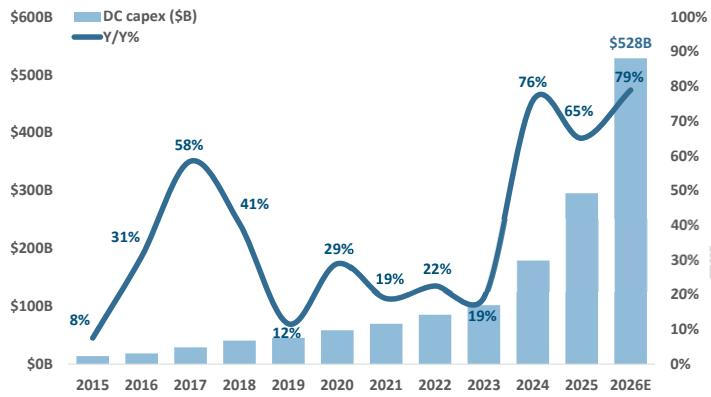  
Figure 5: Data center capex for Top 4 U.S. hyperscalers   
Source: 650 Group and J.P. Morgan estimates

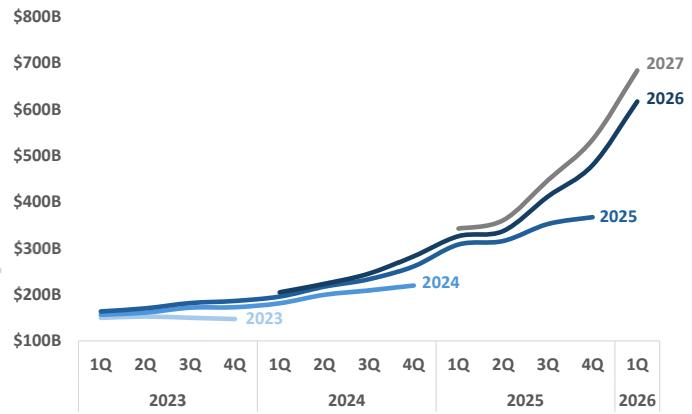  
Figure 6: Street consensus for Top 4 U.S. hyperscaler capex   
Source: Bloomberg Finance L.P.

# Memory and Storage

Supply/demand dynamics in memory remain tight, driven by strong growth in memory content in AI/accelerated compute server deployments, along with upside in consumer applications (both upside in shipments and ASP improvements in DDR4/DDR5) coupled with a return to positive momentum for NAND pricing on tightening eSSD S/D dynamics tied primarily to inference-driven AI demand growth. Overall, we believe the fundamental setup remains favorable in the near term, underpinned by pricing momentum for both DRAM and NAND. Following a nearly $50 \%$ increase in industry 研报添加微信 LCD123321Cad 04-17 DRAM revenue in CY25, our global memory team forecasts DRAM revenue to increase ${ \sim } 2 3 0 \%$ Y/Y in CY26 and ${ \sim } 4 0 \%$ in CY27. NAND revenue was up only slightly in CY25 (JPMe $+ 2 \%$ Y/Y), but is expected to rise sharply in CY26 (JPMe $+ 2 2 3 \%$ Y/Y), followed by $\sim 2 4 \%$ growth in CY27 (see our global team’s latest memory market update here).

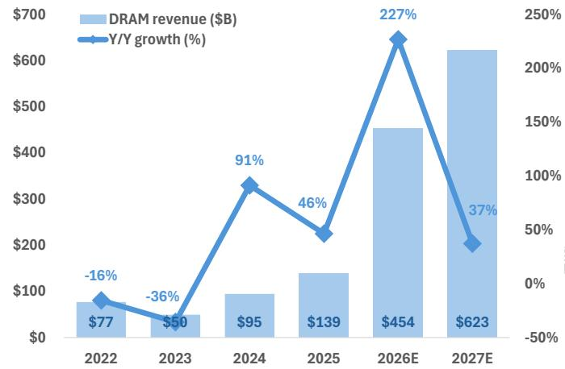  
Figure 7: DRAM TAM forecast   
Source: Company reports, J.P. Morgan estimates.

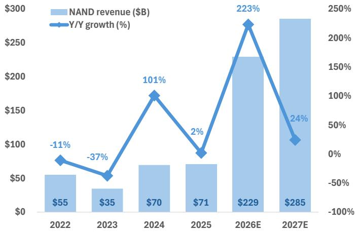  
Figure 8: NAND TAM forecast   
Source: Company reports, J.P. Morgan estimates.

Industry-wide HBM production is sold out for CY26, with our channel checks suggesting the entirety of planned HBM output for CY27 likely being fully contracted by mid-CY26. Our S/D model suggests HBM pricing (on a blended basis) grows ${ \sim } 1 1 \%$ Y/Y in CY26. Looking further out, we expect HBM ASP growth to continue to march higher (JPMe $+ 1 2 \%$ Y/Y for CY27) on sharply higher content requirements for NVDA’s Rubin Ultra GPUs relative to Rubin and for AMD’s MI4XX GPUs relative to MI3XX, coupled with a likely $+ / - 3 0 \%$ pricing premium for HBM4E vs HBM4.

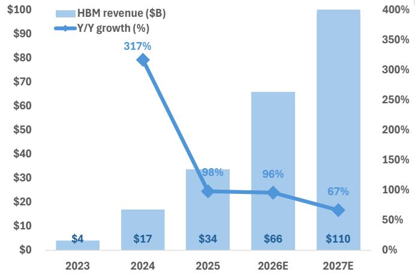  
Figure 9: HBM TAM forecast   
  
Source: Company reports, J.P. Morgan estimates.

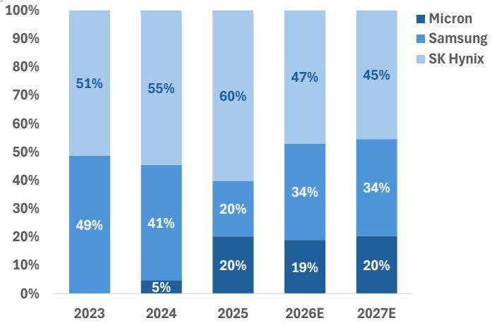  
Figure 10: HBM market share forecast   
Source: Company reports, J.P. Morgan estimates.

# 订阅研报添加微信 LCD123321Cad 04-17

For NAND, eSSDs have emerged as a key driver of demand growth. We expect eSSD demand to accelerate on the back of AI-led demand from CSPs based on several key factors, including: (1) AI servers need fast, local SSDs for dataset staging and frequent checkpointing - this pushes far more eSSDs per GPU rack than in classic web workloads; (2) eSSDs are being validated in rack-scale systems for use in AI training/ inference I/O, cementing their position as baseline content in AI racks; (3) ultra-high capacity drives improve $\$ /\mathrm { T B }$ and density, letting operators keep more hot/warm data on flash instead of offloading to slower tiers. We forecast eSSD growth to lead NAND growth over the next three years and expect NAND bit demand growth to move up to low/mid- $2 0 \mathrm { s } \%$ Y/Y in CY26-CY27 (from high-teens $\%$ in CY25), with the overall NAND TAM approaching $\$ 290 B$ by CY27. We nonetheless continue to view current pricing power as a cyclical peak rather than a structural reset. Capacity ramps slated for $^ { 2 0 2 7 + }$ threaten to erode the current healthy supply/demand situation, just as traditional end-market demand growth matures, likely capping long-term multiple expansion. We therefore see near-term upside from an extended upcycle offset by the risk of earnings 研报添加微信 LCD123321Cad 04-17 normalization as the industry reverts to its historical boom-bust pattern.

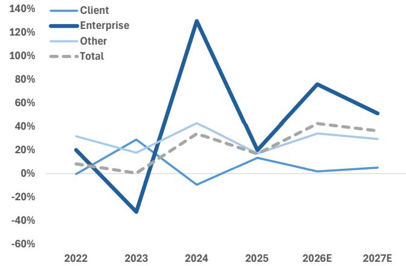  
Figure 11: SSD Y/Y revenue growth by segment   
Source: Company reports, J.P. Morgan estimates.

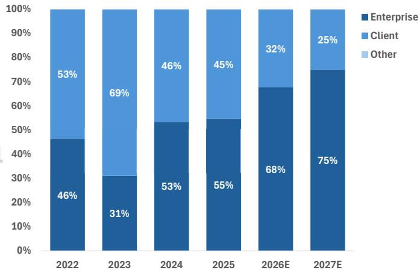  
Figure 12: SSD revenue share by segment   
Source: Company reports, J.P. Morgan estimates.

# Communications Infrastructure / Networking

Our JPM research colleagues forecast cloud datacenter capex (top four hyperscalers) to grow at $65 \%$ Y/Y in 2025 and another $5 0 \% +$ Y/Y growth in 2026. On an absolute dollar basis, datacenter capex is expected to expand by $\$ 1503+\mathrm { i n }2026$ Strong AI compute demand is also driving strong demand for high-performance networking and should continue to drive strong orders/design activity for Broadcom’s networking products 研报添加微信 LCD123321Cad 04-17 (switching/routing, PCIe switching, Optical), Marvell’s 800G/1.6T PAM4 DSP chipsets (e.g., strong PAM4 orders from Nvidia/Google), and Astera’s Gen5/Gen 6 retimer chipsets.

We expect a strong optical networking setup with $4 0 { \ - } 4 5 \mathrm { M } \ 8 0 0 \mathrm { G } / 1 . 6 \mathrm { T }$ modules shipped in 2025 with shipments expected to roughly double to 80–90M in 2026 and then double again to 150–160M in 2027. Marvell has maintained $> 7 0 \% +$ market share of PAM4 DSP chipsets for 800G modules and we expect them to maintain strong share at 1.6T (we estimate $6 0 – 6 5 \%$ market share).

For Broadcom, we believe the team has grown its switching/routing chipset backlog to ${ \tt > } \$ 15 B$ as orders for the team’s next-gen Tomahawk 6 (102Tbps) switching family starts to ramp ahead of a very strong upgrade cycle. The team drove $\$ 20 B$ in FY25 AI revenue (Google TPU, Meta MTIA TPU) and should drive $\$ 65 B+$ in AI Revenues in FY26, and we expect the team to meaningfully exceed $\$ 1208$ in AI revenues for FY27. The strong AI revenue profile over the next 12-24 months is driven by strong cloud/ hyperscaler capex spending trends with continued focus on AI training combined with 阅研报添加微信 LCD123321Cad 04-17 accelerating AI inference workloads. For Marvell, we believe the team’s AI-related programs/products (optical/ASICs) are on track to drive a strong CY25 growth profile with AI customer ASIC revenues up $20 \%$ Y/Y to $\$ 1.8 B$ in 2026 and to double to $\$ 3.6 B$ in 2027.

Global 5G infrastructure spending is gradually recovering in 2026. Within communications infrastructure and networking, companies with exposure are OW-rated AVGO, OW-rated MRVL, N-rated QRVO, and N-rated MTSI.

# Mobile Devices / Consumer

Smartphone and consumer end markets continue to face headwinds from memory supply constraints and memory cost inflation. Our hardware team has cut 2026 smartphone (see note here) and PC unit (see note here) forecasts over the past six months with smartphone and PC unit shipments to decline $1 1 \%$ Y/Y and $9 \%$ Y/Y respectively in 2026. For our smartphone-exposed companies, we expect March-quarter results and June-quarter guidance to be in-line, resilient iPhone sell-through trends and relatively lower exposure to low- to mid-end Android smartphone shipments—where most of the impact has been felt to date. 1Q global smartphone shipments declined a sub-seasonal $1 4 \% \mathrm { Q } / \mathrm { Q }$ in 1Q (vs. typical seasonality of $12 \%$ ), with Y/Y trends down $4 \%$ . Demand for premium smartphones has remained resilient so far and Apple’s iPhone 17 series continued to show solid momentum.

# Automotive and Industrial

Fundamentals are showing signs of continued solid momentum given the lean customer channel inventories combined with continued improvements across end markets led by industrial. Our Economics research team is forecasting global GDP to grow $2 . 6 \%$ in 2026 and another $2 . 4 \%$ in 2027. The global manufacturing PMI was 51.3. in March, indicating continued expansion. Auto recovery remains more muted on sluggish unit demand but partially offset by continued content growth. S&P Mobility is expecting the auto production outlook to be down $1 \%$ Y/Y for 2026. Companies with solid auto/ industrial content exposure, including OW-rated TXN, OW-rated MCHP, OW-rated ADI, N-rated ON, N-rated GFS, N-rated NXPI, and N-rated VSH should continue to see content gains alongside an improving demand outlook.

# 订阅研报添加微信 LCD123321Cad 04-17Semiconductor Capital Equipment

We forecast a strong year for the semiconductor equipment (SPE) sector in 2026, with the wafer fab equipment (WFE) market growth expected to exceed $20 \%$ Y/Y (following $+ 3 \%$ growth in 2025). This outlook is supported by robust demand across leading-edge foundry/logic, DRAM/HBM and NAND end markets, led by increased manufacturing complexity driven by next-generation technology inflections such as gate-all-around, backside power distribution, higher layer count 3D NAND, logic-like DRAM architectures, lower-resistance interconnects, transition from tungsten to molybdenum, and advanced packaging. AI and accelerated computing is driving an increasingly aggressive demand curve for more performance/power efficiency in compute/memory silicon designs, advanced packaging architectures, and advanced semiconductor manufacturing is barely keeping pace with these requirements and pushing foundry/ memory manufacturers to drive aggressive roadmaps with increasing complexity (3D silicon architectures, new materials integration, move to 3D packaging, more focus on yield/manufacturability, etc.). Given this backdrop, we see etch, deposition, and process control intensity continuing to rise for advanced foundry/logic, memory, and advanced packaging process architectures over the next several years, driving an overall WFE 研报添加微信 LCD123321Cad 04-17 growth profile that will continue to outpace the semiconductor industry growth rate – a similar growth outperformance profile since 2013.

We anticipate companies under our coverage continuing to drive revenue growth better than WFE spending in 2026 on market share gains, SAM expansion, and solid service revenue growth. We believe stocks will continue to follow the fundamental improvements of customers as memory pricing trends continue to improve and accelerated compute/AI demand for leading edge silicon continues to strengthen. We maintain Overweight ratings on KLAC, AMAT, and LRCX.

# JPM C1Q26 and C2Q26 Estimates vs. Consensus

For companies reporting March quarter results over the next several weeks, we provide our revenue and adjusted EPS estimates vs. consensus estimates below.

Table 1: JPM 1Q26E/2Q26E Revenue Estimates vs Consensus $\$ 9$ in millions   

<table><tr><td colspan="5">1Q26E</td></tr><tr><td>Ticker</td><td>JPM</td><td>Consensus △%</td><td>JPM</td><td>2Q26E Consensus</td><td>△%</td></tr><tr><td>ALAB报</td><td>$291</td><td>$292</td><td>-0.3%</td><td>$302 $309</td><td>-2.4%</td></tr><tr><td>AMAT</td><td>$7,650</td><td>$7,675</td><td>-0.3%</td><td>$8,058 $8,122</td><td>-0.8%</td></tr><tr><td>AMD</td><td>$9,810</td><td>$9,849</td><td>-0.4%</td><td>$10,608 $10,489</td><td>1.1%</td></tr><tr><td>AMKR</td><td>$1,650</td><td>$1,654</td><td>-0.2%</td><td>$1,700 $1,729</td><td>-1.6%</td></tr><tr><td>ARM</td><td>$1,470</td><td>$1,471</td><td>0.0%</td><td>$1,289 $1,248</td><td>3.3%</td></tr><tr><td>AVGO</td><td>$22,000</td><td>$22,055</td><td>-0.3%</td><td>$31,605 $28,970</td><td>9.1%</td></tr><tr><td>CDNS</td><td>$1,440</td><td>$1,442</td><td>-0.1%</td><td>$1,484 $1,460</td><td>1.7%</td></tr><tr><td>GFS</td><td>$1,629</td><td>$1,629</td><td>0.0%</td><td>$1,732 $1,745</td><td>-0.8%</td></tr><tr><td>INTC</td><td>$12,233</td><td>$12,330</td><td>-0.8%</td><td>$13,117 $13,057</td><td>0.5%</td></tr><tr><td>KLAC</td><td>$3,350</td><td>$3,374</td><td>-0.7%</td><td>$3,483 $3,542</td><td> -1.7%</td></tr><tr><td>LRCX</td><td>$5,700</td><td>$5,734</td><td>-0.6%</td><td>$6,120 $6,093</td><td>0.5%</td></tr><tr><td>MCHP</td><td>$1,266</td><td>$1,261</td><td>0.4%</td><td>$1,342 $1,344</td><td>-0.1%</td></tr><tr><td>MTSI</td><td>$285</td><td>$285</td><td>-0.1%</td><td>$297 $300</td><td>-1.1%</td></tr><tr><td>NXPI</td><td>$3,150</td><td>$3,152</td><td>-0.1%</td><td>$3,222 $3,273</td><td>-1.6%</td></tr><tr><td>ON</td><td>$1,487</td><td>$1,487</td><td>0.0%</td><td>$1,531 $1,528</td><td>0.2%</td></tr><tr><td>QRVO</td><td>$800</td><td>$802</td><td>-0.2%</td><td>$708 $736</td><td>-3.8%</td></tr><tr><td>SLAB</td><td>$212</td><td>$214</td><td>-0.8%</td><td>$230 $228</td><td>0.9%</td></tr><tr><td>SNPS</td><td>$2,250</td><td>$2,250</td><td>0.0%</td><td>$2.421 $2,389</td><td>1.3%</td></tr><tr><td>SWKS</td><td>$900</td><td>$902</td><td>-0.2%</td><td>$873 $861</td><td>1.4%</td></tr><tr><td>SYNA</td><td>$290</td><td>$290</td><td>-0.2%</td><td>$302 $303</td><td>-0.3%</td></tr><tr><td>TXN</td><td>$4,507</td><td>$4,517</td><td>-0.2%</td><td>$4,845</td><td>$4,839 0.1%</td></tr></table>

Source: J.P. Morgan estimates and Bloomberg Finance L.P.

Table 2: JPM 1Q26E/2Q26E (Non-GAAP) EPS Estimates vs Consensus $\$ 9$ in millions   

<table><tr><td colspan="4">1Q26E</td></tr><tr><td>Ticker</td><td>JPM</td><td>Consensus △%</td><td>2Q26E JPM Consensus</td><td>△%</td></tr><tr><td>ALAB</td><td>$0.53</td><td>$0.53 1.3%</td><td>$0.51</td><td>$0.55 -6.3%</td></tr><tr><td>AMAT</td><td>$2.66</td><td>$2.68 -0.7%</td><td>$2.85 $2.87</td><td>-0.6%</td></tr><tr><td>AMD</td><td>$1.25</td><td>$1.27 -1.7%</td><td>$1.44 $1.42</td><td>1.2%</td></tr><tr><td>AMKR</td><td>$0.23</td><td>$0.24 -5.3%</td><td>$0.26 $0.31</td><td>-16.6%</td></tr><tr><td>ARM</td><td>$0.58</td><td>$0.58 0.2%</td><td>$0.38 $0.37</td><td>3.3%</td></tr><tr><td>AVGO</td><td> $2.37</td><td>$2.39 -0.7%</td><td>$3.60 $3.20</td><td>12.4%</td></tr><tr><td>CDNS</td><td>$1.92</td><td>$1.92 0.3%</td><td>$2.06 $1.92</td><td>7.6%</td></tr><tr><td>GFS</td><td>$0.35</td><td>$0.34 3.4%</td><td>$0.40 $0.39</td><td>1.3%</td></tr><tr><td>INTC</td><td>$0.00</td><td>$0.00 -337.7%</td><td>$0.10 $0.09</td><td>12.9%</td></tr><tr><td>KLAC</td><td>$9.08 $9.17</td><td>-1.0%</td><td>$9.61 $9.82</td><td> -2.1%</td></tr><tr><td>LRCX</td><td>$1.35 $1.36</td><td>-1.2%</td><td>$1.47 $1.45</td><td>1.6%</td></tr><tr><td>MCHP</td><td>$0.50 $0.51</td><td>-0.5%</td><td>$0.56 $0.59</td><td>-3.7%</td></tr><tr><td>MTSI</td><td>$1.07 $1.07</td><td>-0.3%</td><td>$1.11 $1.14</td><td>-2.7%</td></tr><tr><td>NXPI</td><td>$2.97 $2.98</td><td>-0.6%</td><td>$2.99 $3.19</td><td>-6.3%</td></tr><tr><td>ON</td><td>$0.61 $0.62</td><td>-2.2%</td><td>$0.65 $0.67</td><td>-2.2%</td></tr><tr><td>QRVO</td><td>$1.20 $1.21</td><td>-0.9%</td><td>$0.68 $0.97</td><td>-30.6%</td></tr><tr><td>SLAB</td><td>$0.46</td><td>$0.50 -9.3%</td><td>$0.65 $0.67</td><td>-2.2%</td></tr><tr><td>SNPS</td><td>$3.14 $3.14</td><td>0.1%</td><td>$3.59 $3.62</td><td>-0.7%</td></tr><tr><td>SWKS</td><td>$1.04</td><td>$1.05 -0.7%</td><td>$0.97 $0.93</td><td>4.1%</td></tr><tr><td>SYNA</td><td>$1.00</td><td>$1.01 -0.5%</td><td>$1.12 $1.12</td><td>0.2%</td></tr><tr><td>TXN</td><td>$1.35</td><td>$1.39 -2.7%</td><td>$1.58</td><td>$1.58 0.1%</td></tr></table>

Source: J.P. Morgan estimates and Bloomberg Finance L.P.

# 2026 Outlook: Expect Another Year Of Stock Outperformance; Continued Strong AI Spending And Accelerating Cyclical Recovery In Industrial/Autos

We maintain our view that long-term investors should continue to focus on the multiyear (1,3, 5,10,15, 20-year) track record of semis stock outperformance driven by (1) the crucial role semis play in the tech value chain, (2) increasing content tailwind opportunities in all applications, and (3) structural profitability/FCF improvements, all of which remain intact. Importantly, secular grow is being amplified by strong tailwinds from accel

onductor industry revenue th in data center capex (up

${ \sim } 6 5 \%$ Y/Y in 2025 and forecast to grow at least $70 \%$ Y/Y in 2026), driven almost entirely by demand for AI data center infrastructure. We expect this wave of spending to be sustained beyond 2026, benefitting the entire semis value chain to varying degrees: providers of accelerated compute, memory and networking technologies are most levered to incremental growth in spending. Concerns around a “bubble” in AI spending are likely to persist for as long as spending remains elevated relative to historical levels, but as we look ahead, we see increasing adoption of AI across consumer and enterprise markets, coupled with rising compute intensity for AI workloads, continuing to drive significant demand for accelerated compute and related infrastructure (e.g., networking). Supply chain capacity will likely remain a gating factor for infrastructure deployments in 2026 (as it has been for the past $^ { 2 + }$ years), but the silver lining here is that supply constraints potentially prolong the AI spending cycle, creating a runway of several years of growth that directly benefits the semis industry. We also anticipate further improvements in cyclical trends across most end markets, coupled with a much healthier customer inventory environment, which alongside further strength in AI-related spend will serve as key underpinnings of a constructive growth backdrop for the industry. We expect semi industry revenue to grow $1 5 \% +$ Y/Y in 2026 (following ${ \sim } 2 0 \%$ growth in 2025), and continue to favor companies with strong exposure to strategic infrastructure dynamics (i.e., cloud/hyperscaler spending), especially around accelerated compute/AI, custom chips (ASICs), networking, and memory (AVGO, NVDA, MRVL, MU). We believe cyclical segments of the industry (industrial/auto) will drive accelerated positive revenue/EPS revisions driven by improving demand trends combined with low inventory levels (ADI, MCHP, TXN). In semicap we are constructive on WFE spending trends for 2026 and expect $2 0 \% +$ growth in WFE next year and growth into CY27, driven by manufacturing complexity and technology inflections across leading edge foundry/logic, DRAM and NAND (KLAC, LRCX, AMAT). For chip design software/ EDA (SNPS, CDNS), we expect a $10 \mathrm { - } 1 5 \%$ revenue growth CAGR driven by increasing EDA intensity and strong design activity in AI/accelerated compute.

# Table 3: Semiconductor/Semicap/EDA Stocks Have Outperformed the Market over the Past 1, 3, 5, 10, 20 Years – Four Full Semiconductor Cycles over the Past 10 Years

<table><tr><td>Annual Stock Returns (CAGR%)</td><td>1-year</td><td> 3-year</td><td> 5-year</td><td>10-year</td><td>15-year</td><td> 20-year</td></tr><tr><td>SOX (Semi) Index</td><td>138%</td><td>40%</td><td>21%</td><td>29%</td><td>22%</td><td>15%</td></tr><tr><td>Semicap Equipment</td><td>132%</td><td>57%</td><td>36%</td><td>36%</td><td>26%</td><td>19%</td></tr><tr><td>Chip Design Software (EDA)</td><td>3%</td><td>8%</td><td>15%</td><td>26%</td><td>22%</td><td>16%</td></tr><tr><td>SP500 Index</td><td>36%</td><td>18%</td><td>11%</td><td>13%</td><td>11%</td><td>9%</td></tr><tr><td>NASDAQ Composite Index</td><td>49%</td><td>23%</td><td>10%</td><td>17%</td><td>15%</td><td>12%</td></tr></table>

Source: Bloomberg Finance L.P. Pricing as of 4/16/2026 market close.

# Industry SIA Data

WSTS semiconductor industry data was published for the month of February 2026. After a $58 \%$ Y/Y increase in industry sales in January 2026 (up $30 \%$ Y/Y ex. memory), February industry sales were up $8 6 \%$ Y/Y (up $2 5 \%$ Y/Y ex.memory). On an M/M basis, after a $4 . 9 \%$ M/M decline in industry sales in January (- $6 . 7 \%$ M/M ex. memory), February industry sales grew $2 5 \%$ M/M (- $2 . 3 \%$ M/M ex. memory). Three-month rolling average sales for February grew $6 1 \%$ Y/Y and were up $8 \%$ vs. January’s 3MA, reflecting continued positive demand momentum. Overall units (ex-discretes) were 研down $5 . 5 \% \mathrm { M } \mathrm { M }$ 信 LCD but were up $1 9 \% \mathrm { { V } / \it { Y } , \it { Y } , \it { Y } , }$ Cad 04-17  while pricing grew $3 3 \%$ M/M and was up $59 \%$ Y/Y. Memory pricing improved materially again in February, with DRAM up $5 5 \%$ M/M and flash up $41 \%$ M/M, while analog was essentially flat (in line with historical trends) and MCU was up $1 . 6 \%$ M/M (slightly below historical trends). Unit shipments were in line with seasonal trends (on an M/M basis), driven by strength in DRAM and flash, but offset by below-seasonal growth in analog, MCU and MPU. Overall, the data continues to support our 2026 sector/stock outlook thesis that calls for $2 0 \% +$ growth in industry revenue, underpinned by continued momentum in AI spending that broadly benefits the semis value chain, with providers of accelerated compute, memory and networking being most favorably levered to incremental growth in spending. We also continue to anticipate improvements in cyclical trends across most end markets, aided by a much healthier customer and channel inventory environment, though we remain cognizant of potential negative impacts of elevated memory pricing and supply shortages on demand within consumer/client-levered end markets - JPM is forecasting smartphone/PC unit shipment growth of - $. 1 1 \% / \%$ for 2026 (vs. prior forecast of $+ 1 \% 1 - 2 \%$ ) based on the anticipated impact of memory price increases and supply constraints.

订阅研报添加微信 LCD123321Cad 04-17 Figure 13: Quarterly Auto SAAR Trends – Quarterly Global Vehicle Production (in MM units)

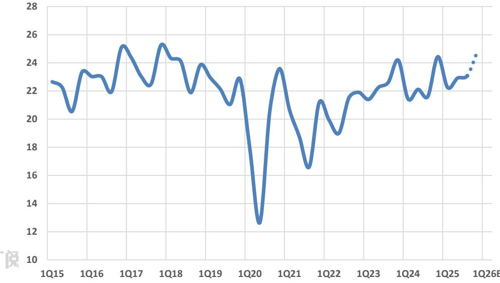  
Source: IHS.

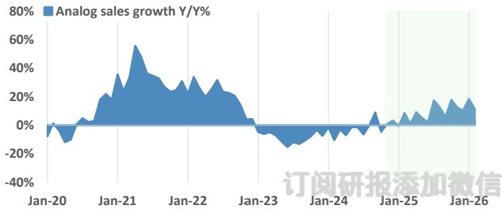  
Figure 14: Analog Sales   
Source: SIA.

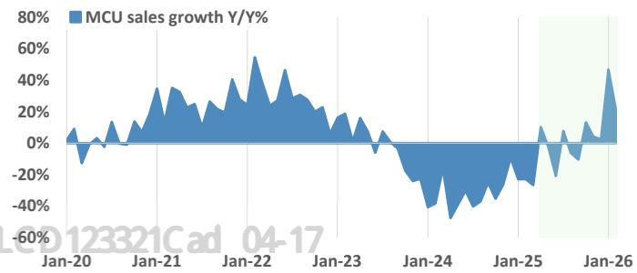  
Figure 15: MCU Sales   
Source: SIA.

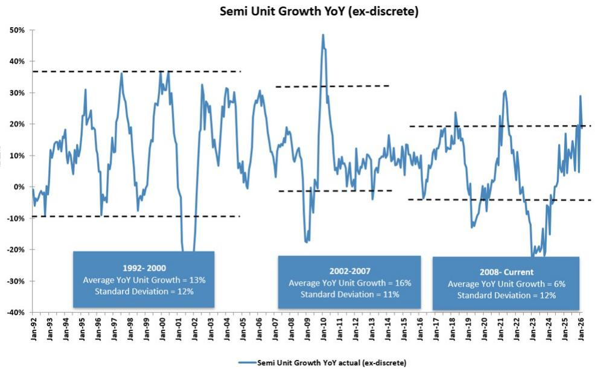  
Figure 16: Semiconductor Industry Thesis – Focus on Scale (Market Leadership), Margin/FCF Expansion, and Capital Allocation   
Source: WSTS.

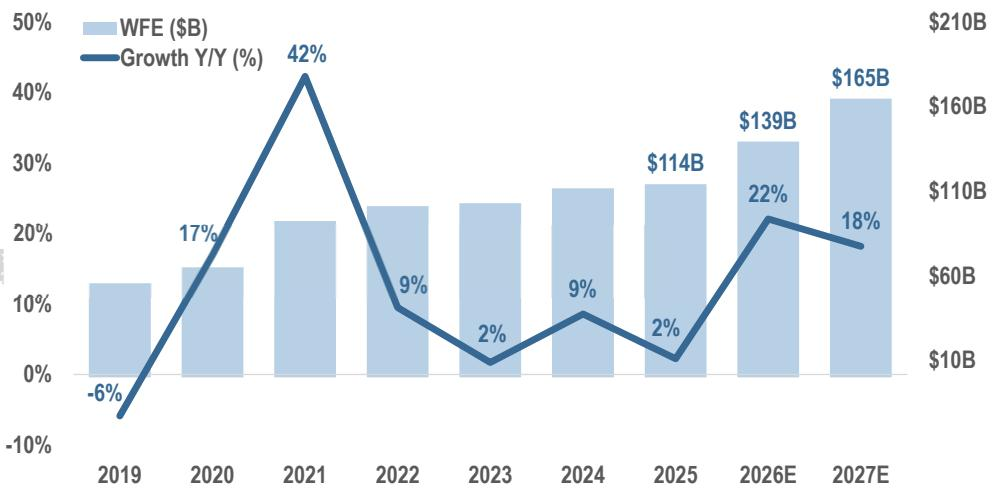  
Figure 17: Wafer Fab Equipment Spending   
Source: Gartner and J.P. Morgan estimates. Data excludes wafer bonders and other wafer-level packaging equipment.

Table 4: Distribution Inventory Remains Lean and Lead Times Remain Short   

<table><tr><td></td><td colspan="2">Distribution inventorydays</td><td colspan="2">Lead time</td></tr><tr><td></td><td>Current</td><td>Normal</td><td>Current</td><td>Normal</td></tr><tr><td>ADI</td><td>6-7 weeks</td><td>7-8 weeks</td><td>13 weeks or lower</td><td>4-8 weeks</td></tr><tr><td>MCHP</td><td>28 days</td><td>27-47 days</td><td>4-8 weeks</td><td>4-8 weeks</td></tr><tr><td>NXPI</td><td>2.5 months</td><td>2-3 months</td><td>normalized</td><td>16 weeks</td></tr><tr><td>ON</td><td>10.8 weeks</td><td>9-11 weeks</td><td>N/A</td><td>8-12 weeks</td></tr></table>

Source: Company reports from most recently reported quarter.

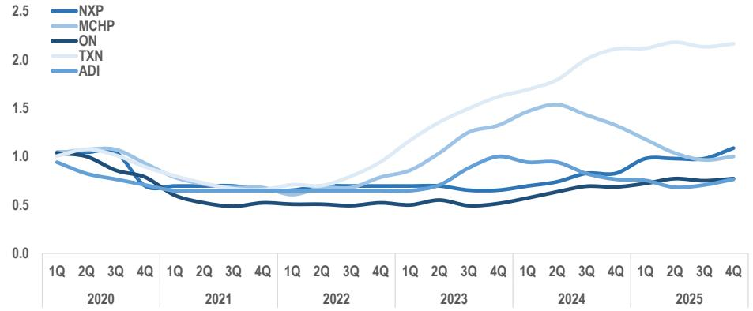  
订阅研报添加微信 LCD123321Cad 04-17 Figure 18: Distribution Inventory Days and Consignment Inventory Dollars (Indexed to 1)   
Source: Company reports and J.P. Morgan.

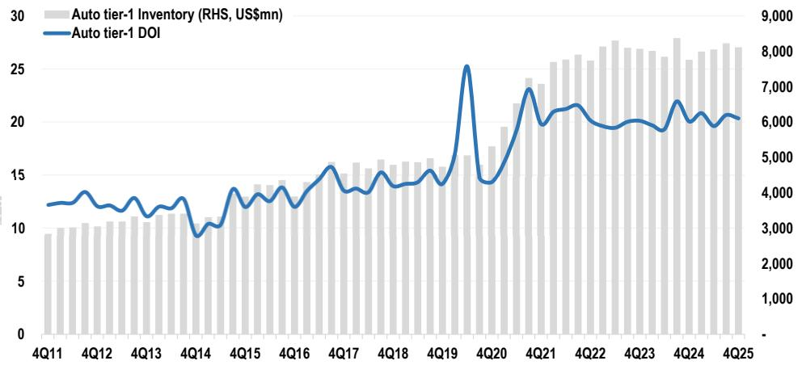  
Figure 19: Auto OEM Raw Materials Inventory – Stable Trends   
Source: Company reports. Note: Magna, Hyundai Mobis, Lear, Aptiv, BWA, Autoliv, Adien.

Inventory levels in the channel remain lean as semiconductor companies have been undershipping demand to burn off excess customer inventories. At the end of 4Q, inventories on semiconductor company balance sheets sat at ${ \sim } 1 1 4$ days, below the fiveyear historical trend-line of 120 days. Semi companies have been undershipping demand to drain out excess customer inventory levels while also slowing down their internal manufacturing utilization to lower inventory levels on their balance sheets. We believe customer and distribution inventory levels are lean, with inventory stocking dynamics now largely behind us. Fundamentals have improved in the areas of auto/industrial and we are now in the early stages of the cycle recovery.

Table 5: Industry Q/Q Growth Above Historical Trends Starting in 4Q23   

<table><tr><td>Quarter</td><td>10-year Avg. Q/Q Growth</td><td>Actual</td><td>Above/Below 10-yr Avg?</td></tr><tr><td>1Q19</td><td>-6.4%</td><td>-10.0%</td><td>BELOW</td></tr><tr><td>2Q19</td><td>-1.9%</td><td>0.7%</td><td>ABOVE</td></tr><tr><td>3Q19</td><td>13.2%</td><td>8.9%</td><td>BELOW</td></tr><tr><td>4Q19</td><td>-1.4%</td><td>1.1%</td><td>ABOVE</td></tr><tr><td>1Q20</td><td>-3.2%</td><td>-3.6%</td><td>BELOW</td></tr><tr><td>2Q20</td><td>3.4%</td><td>-1.1%</td><td> BELOW</td></tr><tr><td>3Q20</td><td>6.4%</td><td>9.8%</td><td>ABOVE</td></tr><tr><td>4Q20</td><td>-1.2%</td><td>4.7%</td><td>ABOVE</td></tr><tr><td>1Q21</td><td>-4.0%</td><td>3.8%</td><td>ABOVE</td></tr><tr><td>2Q21</td><td>2.7%</td><td>9.1%</td><td> ABOVE</td></tr><tr><td>3Q21</td><td>6.8%</td><td>8.1%</td><td>ABOVE</td></tr><tr><td>4Q21</td><td>-0.3%</td><td>4.9%</td><td>ABOVE</td></tr><tr><td>1Q22</td><td>-3.7%</td><td>-0.5%</td><td>ABOVE</td></tr><tr><td>2Q22</td><td> 3.7%</td><td>-0.8%</td><td> BELOW</td></tr><tr><td>3Q22</td><td>7.2%</td><td>-6.3%</td><td>BELOW</td></tr><tr><td>4Q22</td><td>0.9%</td><td> -7.2%</td><td>BELOW</td></tr><tr><td>1Q23</td><td>-3.5%</td><td>-8.7%</td><td>BELOW</td></tr><tr><td>2Q23</td><td>3.2%</td><td>6.0%</td><td>ABOVE</td></tr><tr><td>3Q23</td><td>6.4%</td><td>6.3%</td><td>BELOW</td></tr><tr><td>4Q23</td><td>0.2%</td><td>8.4%</td><td>ABOVE</td></tr><tr><td>1Q24</td><td>-3.8%</td><td>-3.3%</td><td>ABOVE</td></tr><tr><td>2Q24</td><td>3.4%</td><td>6.5%</td><td>ABOVE</td></tr><tr><td>3Q24</td><td>6.6%</td><td>10.8%</td><td>ABOVE</td></tr><tr><td>4Q24</td><td>1.6%</td><td>3.6%</td><td>ABOVE</td></tr><tr><td>2Q25</td><td>开1Q25添加微信3.8% CD12334% Cad</td><td></td><td>0ABOVE</td></tr><tr><td></td><td>4.0%</td><td>7.9%</td><td>ABOVE</td></tr><tr><td>3Q25</td><td>8.1%</td><td>15.8%</td><td>ABOVE</td></tr><tr><td>4Q25</td><td>3.2%</td><td>13.6%</td><td>ABOVE</td></tr></table>

Source: WSTS.

The positive earnings revision trend accelerated in 1Q25 and has remained solidly above $70 \%$ for the past several earnings seasons for our covered semiconductor/semiconductor capital equipment companies showing positive revisions. We anticipate this trend will continue into the 1Q earnings season. Recent semi industry data points indicate sustained double-digit% Y/Y revenue growth in semiconductor sales, with strength across various sub-segments. Overall, we broadly anticipate companies to deliver in-line or slightly better 1Q results, while providing a constructive tone for 2Q guidance.

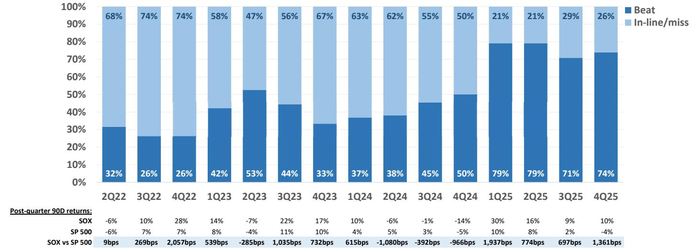  
Figure 20: Semiconductor Coverage Earnings Revision Trend   
Source: Company reports, Bloomberg Finance L.P.   
Source: Bloomberg Finance L.P. as of market close on 4/16/2026.

# Many Companies Have Attractive Dividend Yields and Strong Share Buyback Programs in Place

As the semiconductor industry matures, we expect companies to focus on shareholder returns and anticipate continued dividend growth and increased share repurchases. We expect continued strong shareholder returns in 2026 through repurchasing activities and dividend increases. Higher dividend yields and share repurchases should help limit 研报添加微信 LCD123321Cad 04-17 downside. Table 6 illustrates dividend yields for select semi companies.

Table 6: Dividend Table   

<table><tr><td>Company</td><td>Yield</td></tr><tr><td>SWKS</td><td>5.0%</td></tr><tr><td>TXN</td><td>2.6%</td></tr><tr><td>MCHP</td><td>2.5%</td></tr><tr><td>NXPI</td><td>2.0%</td></tr><tr><td>ADI</td><td>1.3%</td></tr><tr><td>AVGO</td><td>0.7%</td></tr><tr><td>AMKR</td><td>0.6%</td></tr><tr><td>AMAT</td><td>0.5%</td></tr><tr><td>Average</td><td>1.9%</td></tr><tr><td>S&amp;P Average</td><td>1.2%</td></tr></table>

# 订阅研报添加微信 LCD123321Cad 04-17 Consolidation in the Semi Industry Likely to Continue and Provide Valuation Support

Based on Bloomberg data and company reports, semi and semicap deal volume stands at ${ \sim } \$ 478$ in 2025, ${ \sim } \$ 30 B$ in 2024, ${ \sim } \$ 23,4$ in 2023, ${ \sim } \$ 18 B$ in 2022, ${ \sim } \$ 41 B$ in 2021, ${ \sim } \$ 8 8 \mathrm { B }$ in 2020, ${ \sim } \$ 31 B$ in 2019, ${ \sim } \$ 48 B$ in 2018, ${ \sim } \$ 140 B$ in 2017, and ${ \sim } \$ 141 B$ in 2016. In our view, deal/M&A activity will be a key component of capital allocation and supportive of valuations in 2026 and beyond. Table 7 illustrates announced M&A since the beginning of 2017.

Table 7: We Expect More M&A in the Long Term as Industry Consolidation Should Continue to Support Valuations   

<table><tr><td colspan="2">Buyer</td><td colspan="3"></td></tr><tr><td>Date</td><td></td><td>Target DustPhotonics</td><td>Deal Value ($M)</td><td>Status</td></tr><tr><td>4/14/2026</td><td>Credo Technology</td><td></td><td>846</td><td>Pending</td></tr><tr><td>2/4/2026</td><td>Texas Instruments</td><td>Silicon Labs</td><td>7.174</td><td>Pending</td></tr><tr><td>2/4/2026</td><td>SiTime Corp</td><td>RenesasElectronicstiming division</td><td>2.965</td><td>Pending</td></tr><tr><td>2/3/2026</td><td>Infineon Technologies</td><td>ams-OSRAMnon-opticalanalogmixedsignalsensorbusiness</td><td>673</td><td>Pending</td></tr><tr><td>1/26/2026</td><td>lonQ Inc</td><td>SkyWater Technology</td><td>1,733</td><td>Pending</td></tr><tr><td>1/6/2026</td><td>Marvell Technology Inc</td><td>XConn Technologies</td><td>540</td><td>Completed</td></tr><tr><td>12/2/2025</td><td>Marvell Technology Inc</td><td>Celestial AI Iinc</td><td>3.358</td><td>Completed</td></tr><tr><td>10/27/2025</td><td>Skyworks Solutions Inc</td><td>Qorvo Inc</td><td>10.072</td><td>Pending</td></tr><tr><td>10/1/2025</td><td>Veeco Instruments Inc</td><td>Axcelis Technologies Inc</td><td>1,848</td><td>Pending</td></tr><tr><td>7/25/2025</td><td>STMicroelectroncs NV</td><td>NXP Semiconductors NV (MEMS sensor business)</td><td>900</td><td>Completed</td></tr><tr><td>6/9/2025</td><td></td><td>QUALCOMM Inc</td><td></td><td></td></tr><tr><td>4/14/2025</td><td>Alphawave IP Group PLC</td><td>Altera(IntelsFPGA business)</td><td>2.085</td><td>Completed</td></tr><tr><td>4/8/2025</td><td>Silver Lake Management</td><td>Marvell Automotiveethemetbusiness</td><td>4,463</td><td>Completed</td></tr><tr><td>3/2/2025</td><td>Infineon Technologies ONSemiconductor Corp.</td><td>Allergro MicroSystems Inc</td><td>2.500</td><td>Completed</td></tr><tr><td>1/15/2025</td><td>ASMedia Technology Inc</td><td>Techpoint</td><td>6.500</td><td>Terminated</td></tr><tr><td>2/10/2025</td><td></td><td>Kinara.ai</td><td>390</td><td>Completed</td></tr><tr><td>1/7/2025</td><td>NXPSemiconductors</td><td></td><td>307</td><td>Completed</td></tr><tr><td>12/9/2024</td><td>NXP Semiconductors</td><td>Tttech Auto AG</td><td>625</td><td>Completed</td></tr><tr><td>8/19/2024</td><td>Onsemi</td><td>Qorvo (Slicon Crbide JFET)</td><td>115</td><td>Completed</td></tr><tr><td>2/15/2024</td><td>AMD</td><td>ZT Systems Altum</td><td>4,900</td><td>Completed Completed</td></tr><tr><td>1/11/2024</td><td>Renesas Electronics Renesas Electronics</td><td>Transphorm</td><td>5.900</td><td></td></tr><tr><td>8/22/2023</td><td>Macom</td><td>Wolfspeed&#x27;sRFdivision</td><td>339</td><td>Completed</td></tr><tr><td>8/7/2023</td><td>Renesas Electronics</td><td></td><td>125</td><td>Completed</td></tr><tr><td>3/3/2023</td><td>Infineon Technologies</td><td>Sequans Gan Systems</td><td>230</td><td>Terminated</td></tr><tr><td>8/15/2022</td><td>Navitas Semioncductor</td><td>GeneSic Semiconductor</td><td>22</td><td>Completed</td></tr><tr><td>5/26/2022</td><td>Broadcom</td><td>Vmware</td><td>61.000</td><td>Completed</td></tr><tr><td>5/5/2022</td><td>MaxLinear</td><td>Silicon Motion</td><td>3551</td><td>Completed</td></tr><tr><td>4/4/2022</td><td>AMD</td><td>Pensando</td><td></td><td>Terminated</td></tr><tr><td>3/14/2022</td><td>Alphawave IP</td><td>OpenFive (SiFive)</td><td>1900</td><td>Completed</td></tr><tr><td>2/15/2022</td><td>Intel</td><td>Tower Semiconductor</td><td>210 5400</td><td>Completed</td></tr><tr><td>2/14/2022</td><td>Murata</td><td>Resonant</td><td>296</td><td>Terminated</td></tr><tr><td>12/15/2021</td><td>Entegris Inc.</td><td>CMC Materials</td><td>6500</td><td>Completed</td></tr><tr><td>9/20/2021</td><td>Thomas LeePartners</td><td>Brooks Automation (Semiconductor Solutions)</td><td>3000</td><td>Completed</td></tr><tr><td>8/30/2021</td><td>Synaptics</td><td>DSP Group</td><td>421</td><td>Completed</td></tr><tr><td>8/25/2021</td><td>ON Semiconductor</td><td>GT Advanced Technologies</td><td>N/A</td><td>Completed</td></tr><tr><td>8/3/2021</td><td>MarvellTechnologyGroupLtd</td><td>Innovium</td><td>1100</td><td>Completed Completed</td></tr><tr><td>6/30/2021</td><td>Texas Instruments</td><td>Micron Lehi Fab</td><td>900</td><td></td></tr><tr><td>5/10/2021</td><td>MKS Instruments</td><td>Photon Control</td><td>387</td><td>Completed</td></tr><tr><td>4/21/2021</td><td>Skyworks</td><td>Siliconas&#x27;IrurendAutmotivs</td><td></td><td>Completed</td></tr><tr><td>2/8/2021</td><td>Renesas</td><td>Dialog Semiconductor</td><td>2750</td><td>Completed</td></tr><tr><td>1/13/2021</td><td>Qualcomm</td><td>NUVIA</td><td>1,400</td><td>Completed Completed</td></tr><tr><td>10/28/2020</td><td>MarvellTechnolgyGroupLtd</td><td></td><td>8,200</td><td></td></tr><tr><td>10/27/2020</td><td>Advanced Micro Devices</td><td></td><td>35.000</td><td>Completed Completed</td></tr><tr><td>10/19/2020</td><td>SK-Hynix</td><td>Intel (NAND)</td><td>9.000</td><td>Completed</td></tr><tr><td>9/13/2020</td><td>NVIDIA Corp.</td><td>ARM Ltd.</td><td>40,000</td><td></td></tr><tr><td>7/13/2020</td><td>Analog Devices</td><td>Maxim Integrated</td><td>21,300</td><td>Terminated</td></tr><tr><td>7/7/2020 区你</td><td>Synaptics Inc.</td><td>U∠Broadcom&#x27;sWireless loTConnectity Business</td><td>250</td><td>Completed</td></tr><tr><td>4/6/2020</td><td>MaxLinear</td><td>IntelsConnectedHomeBusiness</td><td>150</td><td>Completed Completed</td></tr><tr><td>2/20/2020</td><td>Dialog Semiconductor</td><td>Adesto Technologies</td><td>358</td><td></td></tr><tr><td>12/16/2019</td><td>Intel</td><td>Habana Labs</td><td>2.000</td><td>Completed Completed</td></tr><tr><td>8/8/2019</td><td>Broadcom</td><td>Symantec&#x27;sEnterpriseSecurity usiness</td><td>10,700</td><td>Completed</td></tr><tr><td>7/9/2019</td><td>Cisco Systems</td><td>Acacia Communications Inc.</td><td>2,600</td><td>Completed</td></tr><tr><td>7/1/2019</td><td>Applied aterials</td><td>Kokusai Electric</td><td>2.200</td><td>Terminated</td></tr><tr><td>6/24/2019</td><td>Nanometrics Inc</td><td>Rudolph Technologies</td><td>N/A</td><td>Completed</td></tr><tr><td>6/10/2019</td><td>Intel</td><td>Barefoot Networks</td><td>N/A</td><td>Completed</td></tr><tr><td>6/3/2019</td><td>Infineon Technologies</td><td>Cypress</td><td>10,000</td><td>Completed</td></tr><tr><td>5/29/2019</td><td>NXP Semiconductors</td><td>Marvel&#x27;sConnectivity Business</td><td>1,760</td><td>Completed</td></tr><tr><td>5/20/2019</td><td>MarvellTechnologyGroupLtd</td><td>AveraSemiconductor LLC</td><td>650</td><td>Completed</td></tr><tr><td>5/6/2019</td><td>MarvellTechnologyGroupLtd</td><td>Aquantia Corp</td><td>452</td><td>Completed</td></tr><tr><td>4/10/2019</td><td>Qorvo Inc.</td><td>Active-Semi International</td><td>325</td><td>Completed</td></tr><tr><td>3/27/2019</td><td>ON Semiconductor Corp.</td><td>Quantenna Communications Inc.</td><td>1,070</td><td>Completed</td></tr><tr><td>3/15/2019</td><td>Ildeal Industries</td><td>Cree Huizhou Solid State Lighting Co Ltd</td><td>310</td><td>Completed</td></tr><tr><td>3/11/2019 12/18/2018</td><td>NVIDIA Corp. Cisco Systems</td><td>Mellanox Ltd.</td><td>6.900</td><td>Completed</td></tr><tr><td>10/30/2018</td><td>MKS Instruments</td><td>Luxtera</td><td>660</td><td>Completed</td></tr><tr><td>9/11/2018</td><td>Renesas</td><td>ElectroScientfic Industies IntegratedDeviceTechnology</td><td>1,000 6,700</td><td>Completed</td></tr><tr><td>7/11/2018</td><td>Broadcom Inc.</td><td>CA Technologies</td><td>18,900</td><td>Completed Completed</td></tr><tr><td>5/8/2018</td><td>Cohu</td><td></td><td></td><td></td></tr><tr><td></td><td>KLA-Tencor Corp.</td><td>Xcerra Corp</td><td>796</td><td>Completed</td></tr><tr><td>3/19/2018 3/6/2018</td><td>Cree Microchip Technology</td><td>Orbotech Ltd. Infineon RF Power Microsemi Corp</td><td>3.200 428</td><td>Completed Completed</td></tr><tr></table>

Source: Bloomberg Finance L.P. and company data.

# Table 8: Semiconductor Group and Comp Valuation

$\$ 9$ in millions, except for EPS   

<table><tr><td></td><td>JPM Rating</td><td>Market Cap</td><td>4/16/26 Price</td><td>Non-GAAP EPS C25</td><td>C26E C25</td><td>P/E C26E</td><td>Revenues C25</td><td>C26E C25</td><td>P/S C26E</td><td>C25</td><td>Consensus Non-GAAP EPS C26E</td><td>C27E C25</td><td>Consensus Revenues C26E</td><td>C27E</td><td>C25</td><td>Consensus P/E C26E</td><td>C27E</td><td></td><td>C25</td><td>Consensus P/S C26E</td></tr><tr><td colspan="2">HarlanSur，LeadCoverage</td><td></td><td></td><td></td><td></td><td></td><td></td><td></td><td></td><td></td><td></td><td></td><td></td><td></td><td></td><td></td><td></td><td></td><td></td><td></td></tr><tr><td>PC Semiconductors</td><td></td><td></td><td></td><td></td><td></td><td></td><td></td><td></td><td></td><td></td><td></td><td></td><td></td><td></td><td></td><td></td><td></td><td></td><td></td></tr><tr><td>INTC NVDA</td><td>UW</td><td>$332,636 $4,846,087</td><td>$68.50 $198.35</td><td>$0.43 $4.77 $8.07</td><td>$0.61 160.7x 41.6x</td><td>111.8x 24.6x</td><td>$52,853 $215,938</td><td>$54,804 6.3x $359,545</td><td>6.1x 13.5x</td><td>$0.43 $4.77</td><td>$0.57 $8.00</td><td>$1.10 $52,853 $10.94</td><td>$54,359 $359,027</td><td>$58.497 $484,904</td><td>160.7x</td><td>120.2x</td><td>62.3x 18.1x</td><td>6.3x 22.4x</td><td>6.1x 5.7x 13.5x</td></tr><tr><td>AMD</td><td>OW N</td><td>$458,851</td><td>$278.26</td><td>$4.18 $6.80</td><td>66.6x</td><td>40.9x</td><td>$34,639 $46,355</td><td>22.4x 13.2x</td><td>9.9x</td><td>$4.18</td><td>$11.14</td><td>$215,938 $34,639</td><td>$46,952</td><td>$67,544</td><td>41.6x 66.6x</td><td>24.8x 41.2x</td><td>25.0x</td><td>13.2x</td><td>10.0x 6.8x</td></tr><tr><td>Memory</td><td></td><td></td><td></td><td></td><td></td><td></td><td></td><td></td><td></td><td>$6.75</td><td></td><td></td><td></td><td></td><td></td><td></td><td></td><td>9.8x</td><td></td></tr><tr><td>MU</td><td>Ow</td><td>$522,157</td><td>$457.23</td><td>$11.21 $78.73</td><td>40.8x</td><td>5.8x</td><td>$42,244 $137,644</td><td>12.4x</td><td>3.8x</td><td>$82.95</td><td>$104.62</td><td>$42,244</td><td>$145,785</td><td>$183,788</td><td>40.8x</td><td>5.5x</td><td>4.4x 12.4x</td><td>3.6x</td><td>2.8x</td></tr><tr><td>MRVL</td><td>Enteris/etokitaceec OW</td><td>$114,191</td><td>$133.37</td><td>$2.85 $3.82</td><td>46.8x</td><td>34.9x</td><td>$8,195 $10,848</td><td>13.9x</td><td>10.5x</td><td>$3.70</td><td>$5.28</td><td>$8,195</td><td>$10.583</td><td>$14,334</td><td>46.8x</td><td>36.1x</td><td>25.3x 13.9x</td><td>10.8x</td><td>8.0x</td></tr><tr><td>AVGO ALAB</td><td>OW OW</td><td>$1,947,721 $26,578</td><td>$398.47 $170.81</td><td>$7.28 $14.78 $1.84 $2.28</td><td>54.8x 92.9x</td><td>27.0x 74.8x</td><td>$68,282 $129,526 $853 $1,295</td><td>28.5x 31.2x</td><td>15.0x 20.5x</td><td>$12.68 $2.44</td><td>$18.95 $3.50</td><td>$68.282 $853</td><td>$114,336 $1,350</td><td>$167,572 $1,863</td><td>54.8x 92.8x</td><td>31.4x 70.0x</td><td>21.0x 28.5x 48.8x 31.2x</td><td>17.0x 19.7x</td><td>11.6x 14.3x</td></tr><tr><td>Mobile Devices SWKs</td><td></td><td>$8,834</td><td>$58.70</td><td>$5.87 $4.95</td><td>10.0x</td><td>11.9x</td><td>$4,054 $3,831</td><td>2.2x</td><td>2.3x</td><td>$1.84 $5.87 $4.53</td><td>$5.20</td><td>$4,054</td><td>$3,725</td><td>$3.986</td><td></td><td></td><td></td><td></td><td></td></tr><tr><td>QRVO loT</td><td>n N</td><td>$7,647</td><td>$81.72</td><td>$6.73 $5.82</td><td>12.1x</td><td>14.1x</td><td>$3,740 $3,351</td><td>2.0x</td><td>2.3x</td><td>$6.73 $6.11</td><td>$7.88</td><td>$3.740</td><td>$3,376</td><td>$3,717</td><td>10.0x 12.1x</td><td>13.0x 13.4x</td><td>11.3x 10.4x</td><td>2.2x 2.4x 2.0x 2.3x</td><td>2.2x 2.1x</td></tr><tr><td>SLAB</td><td>N</td><td>$6.988</td><td>$212.28</td><td>$0.92 $2.50</td><td>230.0x</td><td>84.8x</td><td>$926</td><td>8.9x</td><td>7.5x</td><td>$2.72</td><td>$4.14</td><td>$785</td><td>$925</td><td>$1,084</td><td>230.0x</td><td></td><td></td><td></td><td></td></tr><tr><td>SYNA Analog/Microcontrolers</td><td>OW</td><td>$3.085</td><td>$79.31 $4.22</td><td>$4.82</td><td>18.8x</td><td>16.4x</td><td>$1,144 $1,243</td><td>2.7×</td><td>2.5x</td><td>$4.75</td><td>$5.76</td><td>$1,144</td><td>$1,243</td><td>$1,378</td><td>18.8x</td><td>78.1x 16.7x</td><td>51.2x 13.8x</td><td>8.9x 7.6x 2.7x 2.5x</td><td>6.4x 2.2x</td></tr><tr><td>TXN</td><td></td><td>$203,244</td><td>$223.10</td><td>$6.70</td><td>40.9x</td><td>33.3x</td><td></td><td></td><td></td><td></td><td>$7.81</td><td></td><td></td><td></td><td></td><td></td><td></td><td></td><td></td></tr><tr><td>ADI</td><td>ow</td><td>$173,948</td><td>$5.45 $353.80 $8.62</td><td>$12.41</td><td>41.0x</td><td>28.5x</td><td>$17,682 $19,862 $14,801</td><td>11.5x</td><td>10.2x</td><td>$6.49 $11.86</td><td>$13.40</td><td>$17,682 $11,757</td><td>$19,570</td><td>$21,650</td><td>40.9x</td><td>34.4x</td><td>28.6x</td><td>11.5x 10.4x</td><td>9.4x</td></tr><tr><td>NXPI</td><td>ow</td><td></td><td>$213.73 $11.81</td><td>$13.85</td><td>18.1x</td><td>15.4x</td><td>$11,757 $13,551</td><td>14.8x</td><td>11.8x 4.0x</td><td>$13.95</td><td>$16.70</td><td>$12,269</td><td>$14,303 $13,539</td><td>$15.622</td><td>41.0x</td><td>29.8x</td><td>26.4x</td><td>14.8x 12.2x</td><td>11.1x</td></tr><tr><td>MCHP</td><td>n Ow</td><td></td><td>$76.87 $1.18</td><td>$2.33</td><td>65.2x</td><td>33.0x</td><td>$12,269 $4,372 $5,439</td><td>4.4x</td><td>7.7x</td><td>$11.81 $1.18</td><td>$3.46</td><td>$4,372</td><td>$5,466</td><td>$14,902</td><td>18.1x</td><td>15.3x</td><td>12.8x</td><td>4.4x 4.0x</td><td>3.6x</td></tr><tr><td>Diversfied/Consumer/StandardComponents/Other</td><td></td><td></td><td></td><td></td><td></td><td></td><td></td><td>9.6x</td><td></td><td>$2.43</td><td></td><td></td><td></td><td>$6,459</td><td>65.2x</td><td>31.6x</td><td>22.2x</td><td>9.6x 7.7x</td><td>6.5x</td></tr><tr><td>ON</td><td></td><td></td><td>$79.93 $2.35</td><td>$2.98</td><td>34.1x</td><td>26.8x</td><td>$6,335</td><td></td><td></td><td></td><td>$4.08</td><td>$5,995</td><td></td><td></td><td></td><td></td><td></td><td></td><td></td></tr><tr><td>VSH</td><td>N</td><td></td><td>N/A</td><td>$0.38</td><td>N/A</td><td>68.9x</td><td>$5,995 $3,069 $3,375</td><td>5.4x</td><td>5.1x 16.5x</td><td>$2.95</td><td>$1.13</td><td>$3.069</td><td>$6,284 $3,433</td><td>$6,933</td><td>34.1x</td><td>27.1x</td><td>19.6x</td><td>5.4x 5.1x</td><td>4.6x</td></tr><tr><td>MTSI</td><td>N</td><td></td><td>$26.25 $261.42 $3.71</td><td>$4.60</td><td>70.5x</td><td>56.9x</td><td>$1,021 $1,215</td><td>19.6x 19.6x</td><td>16.5x</td><td>$0.54</td><td>$5.88</td><td>S1,021</td><td>$1,226</td><td>$3,675 S1,437</td><td>N/A 70.5x</td><td>48.6x 55.4x</td><td>23.3x 44.5x</td><td>1.2x 1.0x 19.6x</td><td>1.0x</td></tr><tr><td>Foundries</td><td>N</td><td>$20,056</td><td></td><td></td><td></td><td></td><td>$6.791</td><td></td><td></td><td>$4.72 $1.81</td><td>$2.35</td><td>$6,791</td><td>$7,234</td><td></td><td></td><td></td><td></td><td>16.4x</td><td>14.0x</td></tr><tr><td>GFS OSAT</td><td>N</td><td>$28.218</td><td>$50.39 $1.73</td><td>$1.81</td><td>29.2x</td><td>27.9x</td><td>$7,198</td><td>4.2x</td></table>

Source: Company reports, Bloomberg Finance L.P., and J.P. Morgan estimates. Pricing as of market close 4/16/2026.

Analyst Certification: The Research Analyst(s) denoted by an “AC” on the cover of this report certifies (or, where multiple Research Analysts are primarily responsible for this report, the Research Analyst denoted by an “AC” on the cover or within the document individually certifies, with respect to each security or issuer that the Research Analyst covers in this research) that: (1) all of the views expressed in this report 订阅研报添加微信 LCD123321Cad 04-17 accurately reflect the Research Analyst’s personal views about any and all of the subject securities or issuers; and (2) no part of any of the Research Analyst's compensation was, is, or will be directly or indirectly related to the specific recommendations or views expressed by the Research Analyst(s) in this report. For all Korea-based Research Analysts listed on the front cover, if applicable, they also certify, as per KOFIA 订阅研报添加微信 LCD123321Cad 04-17 requirements, that the Research Analyst’s analysis was made in good faith and that the views reflect the Research Analyst’s own opinion, without undue influence or intervention.

All authors named within this report are Research Analysts who produce independent research unless otherwise specified. In Europe, Sector Specialists (Sales and Trading) may be shown on this report as contacts but are not authors of the report or part of the Research Department. 22