# Microprocessors strengthening - but memory remains our favorite way to play that trend

April 20, 2026 05:30 AM GMT

<table><tr><td colspan="3">WHAT&#x27;S CHANGED</td></tr><tr><td>Intel Corporation (INTC.O)</td><td>From</td><td></td></tr><tr><td>Price Target</td><td>$41.00</td><td>To $56.00</td></tr></table>

Investing in CPU strength remains tricky, as the primary beneficiaries in our coverage INTC and AMD are EPS beneficiaries but P/E multiples are driven by other things; prefer MU/SNDK over INTC/AMD.

# Key Takeaways

Since September we have been talking about stronger CPUs driven by agentic, which we highlight in today's global insight.

Should we buy Intel on that trend? Will be a good 2q, but server roadmap is weak, and we remain foundry skeptics

Should we buy AMD on that trend? We tried that last qtr, and it didn't work; 订阅研报添加微信 LCD12332primary thesis remains MI455

Meanwhile MU and SNDK trade at 5.7x and 11.5x our CY26, with clear upside and remain a clear beneficiary of this trend, as well as multiple other trends

It has been clear for a while that CPUs are becoming a more substantive part of the AI surge, as real time agents built by AI are running on CPU. It has been a challenging trend to assess, as supply has simultaneously been an aspect of shortages (our total CPU forecast for CY26 has come down in the last 6 months, mostly because of Intel's lack of supply). Our global team has landed on a longer term growth rate of ${ \sim } 3 0 { \cdot } 4 0 \% ,$ which seems in the ballpark - much higher than historic rates, but still below the expectations for GPU.

The obvious beneficiaries from stronger CPU, Intel and AMD, are somewhat complicated by the fact that while servers are central to earnings prospects for both, the primary thesis has not been server. Between the two, we have preference 订阅研报添加微信 LCD123321Cfor AMD, but see significantly better risk/reward in US memory stocks at this point.

Intel is up $62 \%$ since the last earnings report, mostly amid enthusiasm for better server. That makes sense directionally, given high exposure to data center $3 5 \%$ of revenues), and if anything more ability to raise like-for-like server prices than AMD, which needs to balance the desire to use CPU allocations to broaden the foundation of the AI business.

That said, the Intel roadmap in server continues to have near term challenges, as the commentary around Diamond Rapids' shortcomings have come directly from the

CEO, vs. AMD's Venice, which is a clear major step forward. The notion that the company can gain share because they have fabs seems unlikely; AMD's new products are on N2, which is not particularly tight. So we model for price increases, and higher volumes, but not share gains.

Further, we would maintain the view that the broader investment hypothesis on Intel is around foundry, where we remain skeptical. We do expect some initial indications of interest, but prospects for a positive DCF foundry business remain remote, in our view. That said, we are somewhat intrigued by the Terafab relationship, and are curious to see what the economics of that partnership may 阅研报添加微信 look like.

We are raising INTC estimates, and PT: We are raising estimates as part of the preview, bringing our CY27 EPS up from $\$ 0.97$ to $\$ 1.34;$ primary difference is higher like-for-like pricing given observed increases in server, but also higher server volumes for the next several quarters. We are tempering that enthusiasm given that 1) the company is likely to continue to lag on performance vs. competitor AMD through the forecast horizon, and the belief that they will gain share because of AMD supply constraints seems overly optimistic, and 2) we are offsetting with incremental weakness in the client markets. Our PT remains $4 2 x$ our now higher CY27 earnings estimates of $\$ 1.34,$ a premium to the group based mostly on high leverage potential given low margins through the forecast horizon.

Exhibit 1: MS vs Cons   
MS vs. Consensus   

<table><tr><td colspan="10">Figuresin$MMs</td></tr><tr><td></td><td>F1Q26E MS</td><td>Cons.</td><td>MS</td><td>F2Q26E Cons.</td><td>MS</td><td>2026E Cons.</td><td></td><td>2027E MS</td><td>Cons.</td></tr><tr><td>Revs.</td><td>12,699</td><td>12,433</td><td>13,258</td><td>13,122</td><td>54,286</td><td></td><td>54,498</td><td>59,607</td><td>58,634</td></tr><tr><td>Q/Q Change</td><td>-7.1%</td><td>-9.1%</td><td>4.4%</td><td>5.5% 35.8%</td><td></td><td></td><td></td><td></td><td></td></tr><tr><td>GMs</td><td>34.9%</td><td>34.8%</td><td>37.8%</td><td></td><td>39.1%</td><td></td><td>36.9%</td><td>43.4%</td><td>40.9%</td></tr><tr><td>EPS</td><td>$0.03</td><td>$0.02</td><td>$0.13</td><td></td><td>$0.09</td><td>$0.68</td><td>$0.55</td><td>$1.34</td><td>$1.03</td></tr></table>

Source: Factset, Morgan Stanley

Meanwhile, AMD is likely a bigger beneficiary of server strength given product leadership, but there are near term caveats to consider. Last quarter, we named AMD in our "conviction into earnings" report expecting strong 4q results/1q outlook in server. We got good results in server, and GPU results which could have been "good enough" in a different environment, but the stock sold off sharply. Given that the significant majority of 2030 revenue targets comes from GPU, it remains our sense that GPU improvement is likely the bigger driver.

We would also point out that management has sounded somewhat conservative on gross margins beyond 1q, even with increases in server like-for-like pricing, given the 订阅研报添加微信 LCD123321Cimportance of using CPU allocations to drive GPU adoption. While we have corroborated press reports of some AMD price increases, we are thinking that there may be some idiosyncratic discounts to drive GPU adoption.

That said, we do forecast strong market share position for AMD in general purpose CPU, and expect Venice to be another move forward. But we expect the stock to trade on upside from general purpose servers.

Given these nuances, our favorite way to play CPU strength is through memory stocks - Micron and Sandisk. Memory stocks have been held back by a somewhat mixed spot price environment, and a lack of clarity on long term agreements.

In terms of spot, we have argued that looking for a "canary in the coal mine" that might have been relevant in prior cycles is not likely to prove helpful here, given checks that in real time hyperscalers are unable to fulfill demand through at least all of 2027. Weakness in some marginal markets, for example retail aftermarket modules, can have impact to spot, but we would largely dismiss those concerns. The home built PC market has to struggle, given the premium for components at retail, but that situation has nothing to do with the shortages that we currently see in data center, which are at a very early stage.

In terms of long term agreements, it is our sense that memory suppliers are hearing some reluctance from their customers about disclosing details, but we expect to see clear evidence over the course of this year of material cash inflows, offset by deferred revenue obligations, that should make it clear that these agreements are playing out - and that they aren't the "take or pay" penalties of the past, Prepaid revenue deals would be much harder to renegotiate than penalties. Our view is not based on the contracts themselves, but based on evidence that hyperscaler customers are thinking differently.

To summarize, we are very much in agreement that agentic demand will drive higher CPU growth, but simply see memory as providing the best risk reward.

04-20

# Preview to earnings

<table><tr><td>Focus KPI</td><td>Focus KPI Surprise</td><td>Likely impact to consensus EPS*</td></tr><tr><td>Intel Corporation INTC.O</td><td></td><td></td></tr><tr><td>June Q Rev Quide</td><td>↑ Likely upside surprise</td><td>↑Modest revision higher</td></tr></table>

\*Likely impact to consensus EPS is for the next 12 months Source: Company data, Morgan Stanley Research

# Details on Changes to Intel Estimates

Raising Intel EPS estimates by $8 \%$ for 2026, and $38 \%$ for 2027, and are now $\sim 2 0 \%$ above consensus in both years. Mostly a function of a better volume, growth outlook in server. For 2026 our DCAI number comes up by $\$ 2.56 n$ , to $\$ 21.8 b n$ representing roughly $30 \%$ y/y growth. That's underpinned by server unit growth of $1 4 \%$ and ASP growth of $2 0 \% ,$ given estimates for server market growth in low to mid teens in 2026 (and a CPU market that should outperform in an upcycle) that estimate is likely reflect continued 添加微信 LCD123321Cad 04-20 share loss at Intel. The level of which will depend on AMD's ability to get incremental CPU supply and Intel's manufacturing execution.

We model growth of $7 7 . 5 \%$ for DCAI in 2027 vs our prior estimate of $4 . 9 \%$ . Our DCAI revenue estimates are now $12 \% / 1 9 \%$ above consensus for $2 6 / 2 7 .$ . However for the CCG segment in 2026 we lower our growth expectations from down $4 \%$ to down $8 \%$ y/y in 2026, about a $\$ 1.36n$ reduction, which offsets about half of the upward revision to DCAI. Hence the much lower upward revision to 2026 vs 2027 numbers, much of the remainder is attributable to lowering our NCI estimates due to Intel's decision to buy back their stake in Intel Ireland. We had modeled $\$ 1256n$ in 2026 and $\$ 2$ .4bn in 2027; lowered now to $\$ 1$ .11bn and $\$ 1.7$ 5bn in 2027.

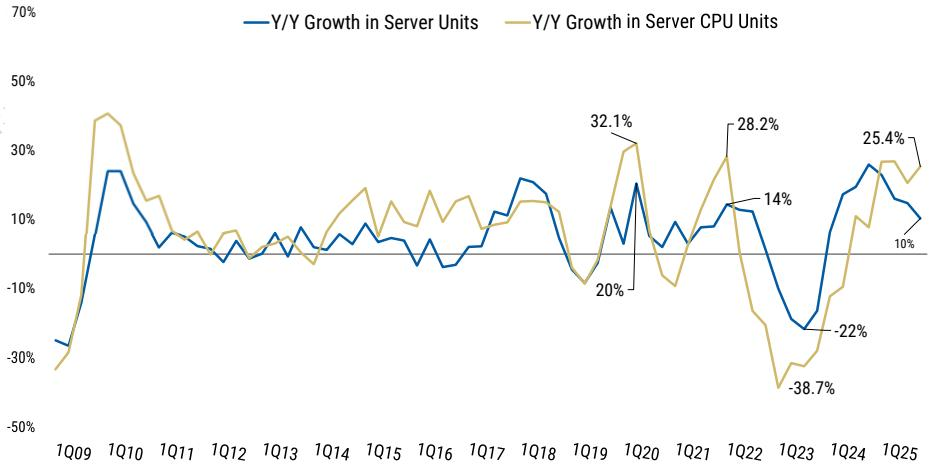  
Exhibit 2: In upcycles the server CPU TAM should meaningfully outgrow server units   
Source: Mercury Research, IDC, Morgan Stanley

But growth in server is somewhat offset by a weaker market in PCs. Due to memory pricing headwinds expectations for PC unit growth are in the range of $- 1 0 \%$ y/y in 2026, we would expect desktop to be worse as there will be some consumer trade down for lower priced notebooks as well a the DIY segment, which is also contending with GPU 添加微信 LCD123321Cad 04-20 price hikes. AMD has also gained significant share in that space at Intel's expense, something that likely continues in 2026. We now model desktop revenue down $1 6 \%$ y/y for Intel in 2026 and flat in 2027, only a small reduction from our prior estimates for down $1 5 \%$ in 2026 and up $2 \%$ in 2027.

We also lower for notebook estimates slightly, with units down $1 7 \%$ in 2026 but offset somewhat by higher pricing as Intel shift towards server units and the ramp of Panther Lake on 18A allows them to better manage their mix and push through ASP increases to OEMs. Overall we now model the segment down $8 \%$ y/y in 2026, vs down $4 \%$ prior.

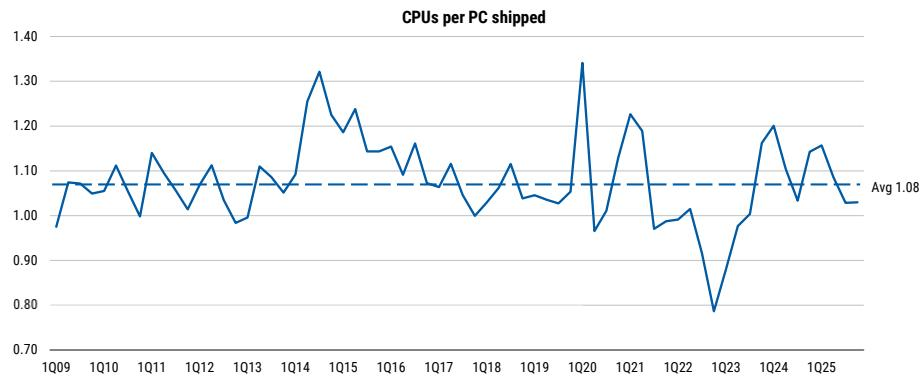  
Exhibit 3: PC CPUs vs the PC TAM suggests some room for OEMs to build inventory   
Source: Mercury Research, IDC, Morgan Stanley

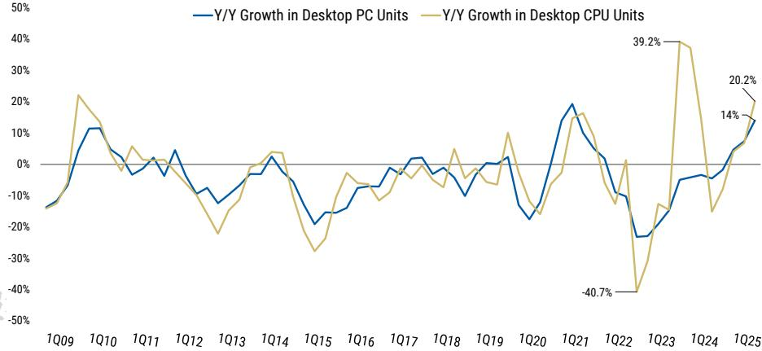  
Exhibit 4: Desktop CPUs only modestly tracking above growth in end market units   
Source: Mercury Research, IDC, Morgan Stanley

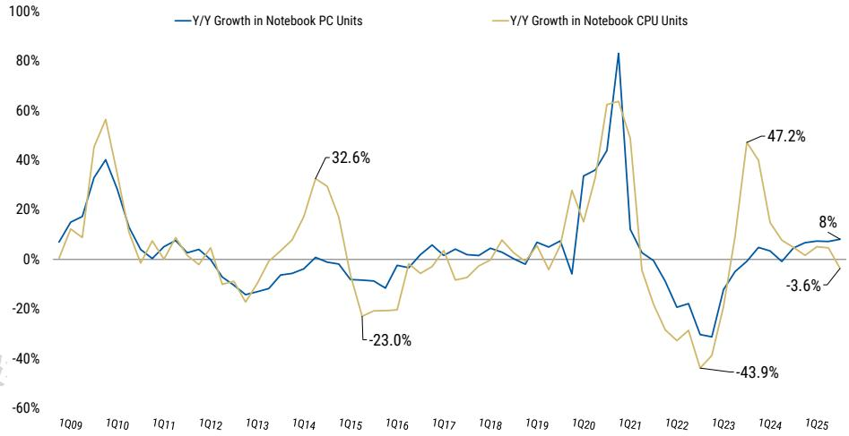  
Exhibit 5: However in notebook growth is tracking somewhat below   
Source: Mercury Research, IDC, Morgan Stanley

# Risk Reward - Advanced MicroRisk Reward – Advanced Micro Devices (AMD.O)

EW as high AI expectations leave limited room for upside

# PRICE TARGET $\$ 1$ 255.00

Our $\$ 255$ PT for AMD equals $\sim 2 7 \times$ base case FY2027e MWEPS of $\$ 9.46$ , re flecting further share gains at the expense of Intel, and $4 3 \%$ y/y growth in datacenter $( \sim 8 0 \%$ in AI)

Consensus Price Target Distribution

Source: Re fi nitiv, Morgan Stanley Research

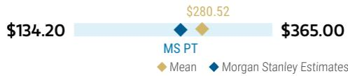

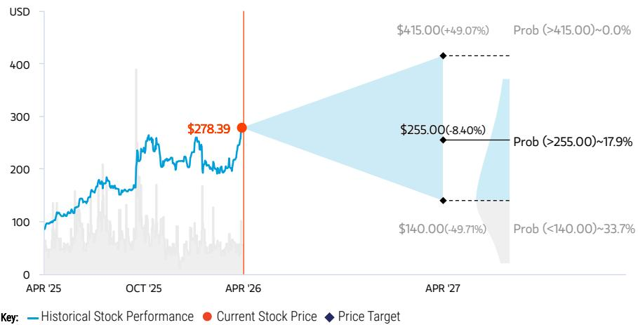  
RISK REWARD CHART AND OPTIONS IMPLIED PROBABILITIES (12M)   
Source: Re nitiv, Morgan Stanley Research, Morgan Stanley Institutional Equities Division. The probabilities of our Bull, Base, and Bear case scenarios playing out were estimated with implied volatility data from the options market as of 17 fiApr 2026. All gures are approximate risk-neutral probabilities of the stock reaching beyond the scenario price in either three-months’ or one-years’ time. View explanation of Options Probabilities methodology here

# EQUAL-WEIGHT THESIS

We see continued share gains in notebook and server processors in 2026 and 2027 as AMD continues to execute on its product roadmap. AMD's AI story should gain momentum later this year with MI400 04-20 products, but performance leadership will be key. An area where AMD will need to prove they can deliver competitive ROI vs incumbents

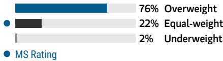  
Consensus Rating Distribution   
Source: Re nitiv, Morgan Stanley Research

# Risk Reward Themes

New Data Era: Positive Secular Growth: Positive View descriptions of Risk Rewards Themes here

# BULL CASE

# $\$ 45.00$

# BASE CASE

# $\$ 255.00$

# BEAR CASE

$\$ 140.00$

# \~37x bull case FY2025e MW EPS of $\$ 10.94$

Bull case assumes further execution for AMD. In computing and graphics, AMD continues to gain material market share, while both CPU and GPU markets remain healthier than forecasted. AMD solidi es a #2 position in the datacenter GPU market

# \~27x base case FY2027e MW EPS of $\$ 9.46$

Further share gains for AMD in server compute and notebook continue to drive growth, further supported by a strengthening AI story

# $\sim 2 0 x$ bear case FY2027e MW EPS of $\$ 700$

AMD loses momentum in AI, and Intel shows signs it's beginning to regain its footing in server. The multiple compresses as they are unable to drive meaningful revenues in AI markets beyond one or two customers

# Risk Reward – Advanced Micro Devices (AMD.O)

KEY EARNINGS INPUTS   

<table><tr><td>Drivers</td><td>2025</td><td>2026e</td><td>2027e</td><td>2028e</td></tr><tr><td>GAAP Revenue (S, mm)</td><td>34,639</td><td>45,430</td><td>59,078</td><td>77,579</td></tr><tr><td>Non-GAAP Gross Margin (%)</td><td>52.4</td><td>54.3</td><td>56.7</td><td>56.9</td></tr><tr><td>Non-GAAP EPS (S)</td><td>4.23</td><td>6.38</td><td>10.31</td><td>14.99</td></tr><tr><td> Inventory (S, mm)</td><td>7,920</td><td>13,068</td><td>13,449</td><td>16,648</td></tr><tr><td>DOI</td><td>165.3</td><td>218.8</td><td>184.5</td><td>178.2</td></tr></table>

# INVESTMENT DRIVERS

AMD continues to execute to its product roadmaps, enabling it to gain share on a smaller R&D budget than INTC AI ecosystem adoption takes time, and we see AMD's early success as more of a testament to the strength of the overall market thus far

# GLOBAL REVENUE EXPOSURE

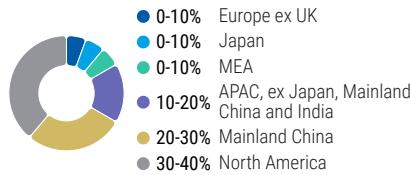  
Source: Morgan Stanley Research Estimate View explanation of regional hierarchies here

# MS ALPHA MODELS

<table><tr><td>5/5 BEST</td><td>24 Month Horizon</td><td>5/5 MOST</td><td>3 Month Horizon</td></tr></table>

Source: Re nitiv, FactSet, Morgan Stanley Research; 1 is the highest favored Quintile and 5 is the least favored Quintile

# RISKS TO PT/RATING

# RISKS TO UPSIDE

Datacenter GPU outperforms expectations, closing the gap with Nvidia   
PC and server share gain accelerates; Intel's competitive response is less impressive than expected   
Server refresh drives datacenter revenue above expectations

# RISKS TO DOWNSIDE

Intel's server CPUs in 2027 sti e AMD's flmomentum and allow it to regain share AMD loses graphics share to NVIDIA Datacenter GPU underperforms expectations

# 报添加微信 LCD1OWNERSHIP POSITIONING

Inst. Owners, % Active $4 4 . 4 \%$ HF Sector Long/Short Ratio 2.1x HF Sector Net Exposure $2 5 . 2 \%$

Re nitiv; MSPB Content. Includes certain hedge fund exposures held with MSPB. Information may be fiinconsistent with or may not re ect broader market trends. Long/Short Ratio $\underline { { \underline { { \mathbf { \delta \pi } } } } }$ Long Exposure / Short exposure. Sector % of Total Net Exposure $\underline { { \underline { { \mathbf { \delta \pi } } } } }$ (For a particular sector: Long Exposure - Short Exposure) / (Across all sectors: Long Exposure – Short Exposure).

# MS ESTIMATES VS. CONSENSUS

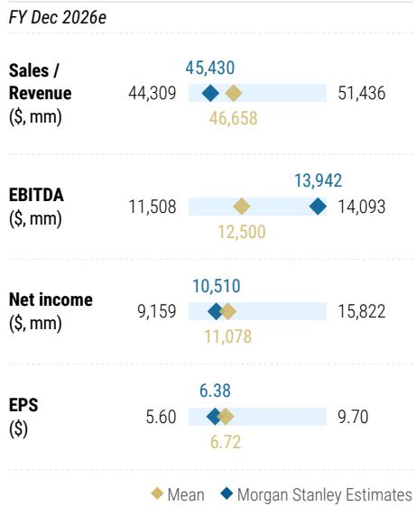  
Source: Re nitiv, Morgan Stanley Research

# Risk Reward - Intel CorporRisk Reward – Intel Corporation (INTC.O)

EW as CPU roadmap and foundry strategy remain uncertain

# PRICE TARGET $\$ 56.00$

$\sim 4 2 \times$ EPS CY2027 EPS of $\$ 1.34$ 42x is above the high end of the large cap logic semi peer group, re fl ecting high leverage potential on numbers that are still depressed, and foundry optionality, despite our longer term skepticism

Consensus Price Target Distribution

Source: Re fi nitiv, Morgan Stanley Research

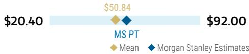

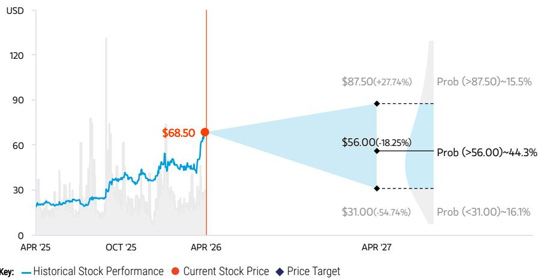  
RISK REWARD CHART AND OPTIONS IMPLIED PROBABILITIES (12M)   
Source: Re nitiv, Morgan Stanley Research, Morgan Stanley Institutional Equities Division. The probabilities of our Bull, Base, and Bear case scenarios playing out were estimated with implied volatility data from the options market as of 17 fiApr 2026. All gures are approximate risk-neutral probabilities of the stock reaching beyond the scenario price in either three-months’ or one-years’ time. View explanation of Options Probabilities methodology here

# EQUAL-WEIGHT THESIS

We are skeptical on the reasons the stock has rerated (USG involvement, Nvidia partnership) but remain convinced execution can unlock value in the core business. But for us to get more constructive we need (1) 04-20 clarity on strategic direction given foundry uncertainty and (2) evidence that Intel can regain performance leadership in servers

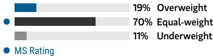  
Consensus Rating Distribution   
Source: Re nitiv, Morgan Stanley Research

# Risk Reward Themes

New Data Era: Positive Self-help: Positive

View descriptions of Risk Rewards Themes here

# BULL CASE

# \$87.50

# BASE CASE

# $\$ 56.00$

# BEAR CASE

\$31.00

# 50x CY2027 EPS of \$1.75

# Intel clearly addresses issues with the pipeline and roadmap delivers competitive performance that stabilizes share

- Management executes on product roadmaps helping investor sentiment and the multiple

- Revenues reach $\$ 64b 6n$ in CY27, with $45 \%$ gross margins

# \~42x CY2027 EPS of \$1.34

Server CPU shortages prove to be manageable, and AMD continues to be in a share gain position.

Given Intel's historic roadmap issues in   
server; even the foundry successes could prove a distraction relative to the purer goal of making the world's best   
microprocessors. For us to turn more   
constructive we would need to see evidence 报添加微信 LCD123321Cathat Intel can regain performance leadership in servers.

# 1.5x Tangible book value

PC TAM shrinks in 2026, Intel share losses continue. Data-centric revenue underwhelms due to lackluster product roadmap.

- AMD continues to take share in consumer and cloud segments, with delays in the Intel product portfolio that create risk of erosion in the previously protected enterprise space - Multiple compresses as Intel is not able to 04-20 secure meaningful foundry relationships

# Risk Reward – Intel Corporation (INTC.O)

KEY EARNINGS INPUTS   

<table><tr><td>Drivers</td><td>2025</td><td>2026e</td><td>2027e</td><td>2028e</td></tr><tr><td>GAAP Revenue (S,mm)</td><td>52,853</td><td>54,286</td><td>59,607</td><td>63,601</td></tr><tr><td>MW Gross Margin (%)</td><td>36.7</td><td>39.1</td><td>43.4</td><td>44.1</td></tr><tr><td>MW EPS (S)</td><td>(0.05)</td><td>0.21</td><td>1.01</td><td>1.19</td></tr><tr><td> Inventory (S, mm)</td><td>11,618</td><td>10,428</td><td>10,880</td><td>11,099</td></tr><tr><td>DOI</td><td>123.0</td><td>112.0</td><td>114.5</td><td>111.0</td></tr></table>

# INVESTMENT DRIVERS

PC and server units and ${ \sf A S P S }$   
AMD competition in server   
End market growth in data centers, particularly the cloud, enterprise & government, and telco segments

# GLOBAL REVENUE EXPOSURE

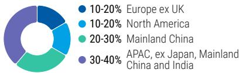  
Source: Morgan Stanley Research Estimate View explanation of regional hierarchies here

# MS ALPHA MODELS

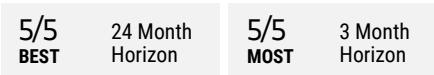

Source: Re nitiv, FactSet, Morgan Stanley Research; 1 is the highest favored Quintile and 5 is the least favored Quintile

# RISKS TO PT/RATING

# RISKS TO UPSIDE

Foundry partnerships de-risk the story and further improve the multiple The company regains lost share in desktop and server following CPU shortages

# RISKS TO DOWNSIDE

AMD competition increasingly becomes more signi cant, which could lead to further share filosses in processors and pressure on ${ \sf A S P S }$ Minimal success in foundry leads to an in ated cost structure

# OWNERSHIP POSITIONING

Inst. Owners, $\%$ Active $4 2 \%$ HF Sector Long/Short Ratio 2.1x HF Sector Net Exposure $2 5 . 2 \%$

Re nitiv; MSPB Content. Includes certain hedge fund exposures held with MSPB. Information may be fiinconsistent with or may not re ect broader market trends. Long/Short Ratio $\underline { { \underline { { \mathbf { \delta \pi } } } } }$ Long Exposure / Short flexposure. Sector % of Total Net Exposure $\underline { { \underline { { \mathbf { \delta \pi } } } } }$ (For a particular sector: Long Exposure - Short Exposure) / (Across all sectors: Long Exposure – Short Exposure).

# MS ESTIMATES VS. CONSENSUS

FY Dec 2026e

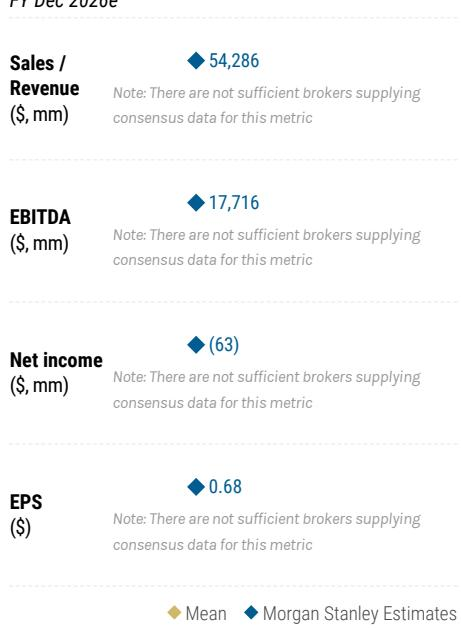  
Source: Re nitiv, Morgan Stanley Research

# Risk Reward – SanDisk Corporation. (SNDK.O)

KEY EARNINGS INPUTS   

<table><tr><td>Drivers</td><td>2025</td><td>2026e</td><td>2027e</td><td>2028e</td></tr><tr><td>GAAP Revenue (S, mm)</td><td>7,355</td><td>15,499</td><td>24,989</td><td>24,456</td></tr><tr><td>Non-GAAP Gross Margin (%)</td><td>30.3</td><td>60.2</td><td>73.4</td><td>70.8</td></tr><tr><td>Non-GAAP EPS (S)</td><td>2.74</td><td>41.09</td><td>82.73</td><td>71.92</td></tr><tr><td> Inventory (S, mm)</td><td>2,079</td><td>1,991</td><td>2,182</td><td>2,335</td></tr><tr><td>DOI</td><td>145.5</td><td>115.9</td><td>117.7</td><td>117.5</td></tr></table>

# INVESTMENT DRIVERS

Improved pricing and demand strength drive earnings growth Position in DC SSD market improves

# GLOBAL REVENUE EXPOSURE

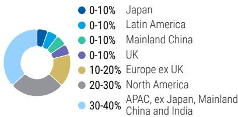  
Source: Morgan Stanley Research Estimate View explanation of regional hierarchies here

# MS ALPHA MODELS

Source: Re nitiv, FactSet, Morgan Stanley Research; 1 is the highest favored Quintile and 5 is the least favored Quintile

# RISKS TO PT/RATING

# RISKS TO UPSIDE

Higher NAND content growth from edge AI applications   
Quicker eSSD penetration in the datacenter   
Sandisk's investments in advanced memory technologies such as HBF (high Bandwidth Flash) pay dividends

# RISKS TO DOWNSIDE

NAND industry growth disappoints   
Capex growth returns as industry participants invest to gain share   
Sandisk loses market share as they fail to gain traction in datacenter   
China continues to gain share

# OWNERSHIP POSITIONING

Inst. Owners, % Active $5 3 . 3 \%$ HF Sector Long/Short Ratio 2.1x HF Sector Net Exposure $2 5 . 2 \%$

Re nitiv; MSPB Content. Includes certain hedge fund exposures held with MSPB. Information may be inconsistent with or may not re ect broader market trends. Long/Short Ratio $\underline { { \underline { { \mathbf { \delta \pi } } } } }$ Long Exposure / Short exposure. Sector $\%$ of Total Net Exposure $\underline { { \underline { { \mathbf { \delta \pi } } } } }$ (For a particular sector: Long Exposure - Short Exposure) / (Across all sectors: Long Exposure – Short Exposure).

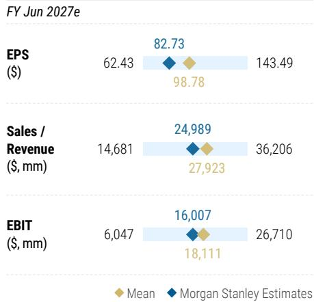  
MS ESTIMATES VS. CONSENSUS   
Source: Re nitiv, Morgan Stanley Research

# Risk Reward - Micron TechnoRisk Reward – Micron Technology Inc. (MU.O)

See multiple quarters of upward revisions, with AI driving a higher multiple

# PRICE TARGET $\$ 520.00$

$\sim 2 5 \times$ through-cycle earnings of US $\$ 21.00$ , a premium to history re flecting new opportunities in AI, At the high end of broader semis.

Consensus Price Target Distribution

Source: Re fi nitiv, Morgan Stanley Research

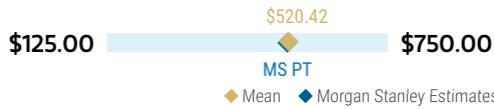

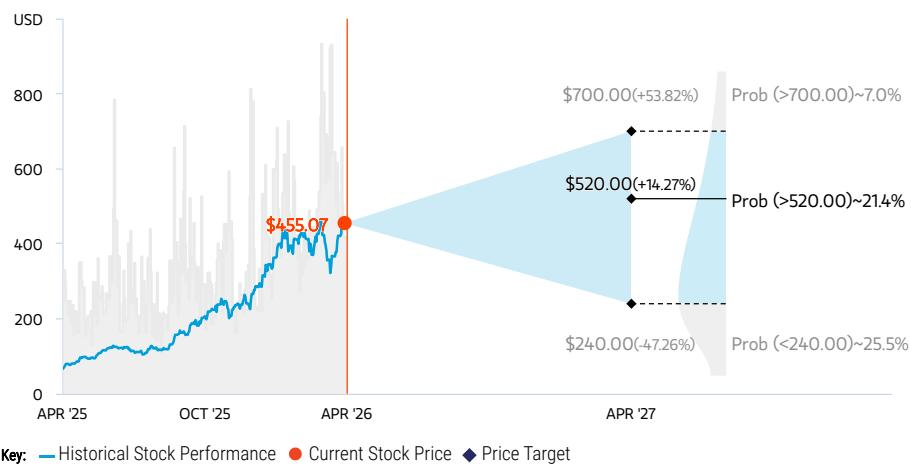  
RISK REWARD CHART AND OPTIONS IMPLIED PROBABILITIES (12M)   
Source: Re nitiv, Morgan Stanley Research, Morgan Stanley Institutional Equities Division. The probabilities of our Bull, Base, and Bear case scenarios playing out were estimated with implied volatility data from the options market as of 17 fiApr 2026. All gures are approximate risk-neutral probabilities of the stock reaching beyond the scenario price in either three-months’ or one-years’ time. View explanation of Options Probabilities methodology here

# OVERWEIGHT THESIS

▪ DRAM fundamentals are in uncharted territory, and should continue to improve as datacenter/AI continue their upward trajectory

▪ Execution on AI is underappreciated, and we expect Micron to maintain share in CY26 vs the competition. Supporting margins and driving a higher multiple than prior cycles ▪ Cycle longevity will be key, and $S / \dot { \mathsf { D } }$ may stay tight for 2-3 more years

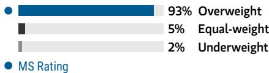  
Consensus Rating Distribution   
Source: Re nitiv, Morgan Stanley Research

# Risk Reward Themes

New Data Era: Positive Secular Growth: Positive View descriptions of Risk Rewards Themes here

# BULL CASE

# $\$ 700.00$

# BASE CASE

# $\$ 520.00$

# BEAR CASE

$\$ 240.00$

# $2 8 \times$ through-cycle earnings of $\cup 5 \$ 25.00$

Gross margin improvement continues, driven by scale, AI mix, and cost improvements in new products. Pricing pressure alleviates as demand sustainably moves above supply driven by HBM's wafer intensity, a product category where MU cements performance leadership on future products.

# \~25x through-cycle earnings of $\cup 5 \$ 21.00$

Our through-cycle earnings estimate of $\cup 5 \$ 21.00$ is a premium to average earnings over the last 8 years due mostly to AI. Our $2 5 \times$ multiple re ects the market's enthusiasm for the AI opportunity, and at the midpoint of the semis group

# $1 6 x$ through-cycle earnings of US\$15.00

Memory begins to enter a downturn in early 2027. As the strength attributed to demand in the early part of the year ended up being inventory build at customers. Multiple compresses severely after an underwhelming peak

# Risk Reward – Micron Technology Inc. (MU.O)

KEY EARNINGS INPUTS   

<table><tr><td>Drivers</td><td>2025</td><td>2026e</td><td>2027e</td><td>2028e</td></tr><tr><td>GAAP Revenue (S, mm)</td><td>37,378</td><td>110,489</td><td>150,620</td><td>138,790</td></tr><tr><td>Non Gaap Gross Margin (%)</td><td>40.9</td><td>77.8</td><td>82.3</td><td>78.8</td></tr><tr><td>Non-GAAP EPS (S)</td><td>8.29</td><td>59.36</td><td>81.36</td><td>72.32</td></tr><tr><td> Inventory (S, mm)</td><td>8,355</td><td>8,564</td><td>9,100</td><td>10,164</td></tr><tr><td>DOI</td><td>133.7</td><td>123.5</td><td>120.6</td><td>122.4</td></tr></table>

# INVESTMENT DRIVERS

Improved pricing and demand strength drive earnings growth

# GLOBAL REVENUE EXPOSURE

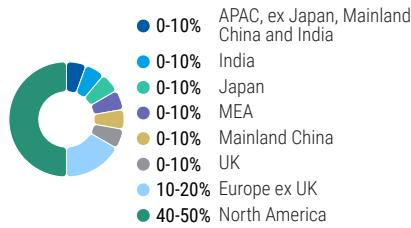  
Source: Morgan Stanley Research Estimate View explanation of regional hierarchies here

# MS ALPHA MODELS

Source: Re nitiv, FactSet, Morgan Stanley Research; 1 is the highest favored Quintile and 5 is the least favored Quintile

# RISKS TO PT/RATING

# RISKS TO UPSIDE

Customers continue to demonstrate an appetite to take on inventory around macroeconomic uncertainty Additional wafer intensity of HBM further improves overall supply and demand MIcron's HBM share surpasses expectations

# RISKS TO DOWNSIDE

Pricing can turn quickly; a falter in end demand with inventories elevated could lead to a swift price reduction HBM demand falters and competition intensi es, pressuring pricing

# 报添加微信 LCD1OWNERSHIP POSITIONING

Inst. Owners, % Active $5 0 . 1 \%$ HF Sector Long/Short Ratio 2.1x HF Sector Net Exposure $2 5 . 2 \%$

Re nitiv; MSPB Content. Includes certain hedge fund exposures held with MSPB. Information may be fiinconsistent with or may not re ect broader market trends. Long/Short Ratio $\underline { { \underline { { \mathbf { \delta \pi } } } } }$ Long Exposure / Short exposure. Sector % of Total Net Exposure $\underline { { \underline { { \mathbf { \delta \pi } } } } }$ (For a particular sector: Long Exposure - Short Exposure) / (Across all sectors: Long Exposure – Short Exposure).

# MS ESTIMATES VS. CONSENSUS

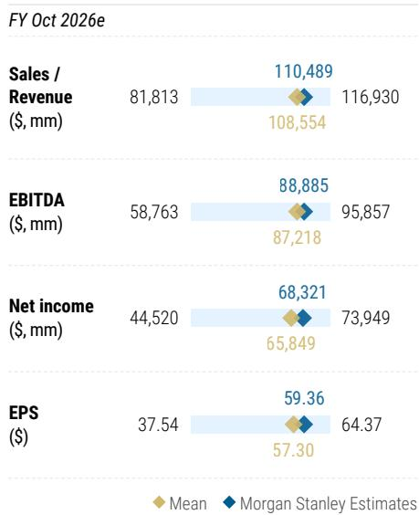  
Source: Re nitiv, Morgan Stanley Research

# Risk Reward Reference links

1. View explanation of Options Probabilities methodology - Options_Probabilities_Exhibit_Link.pdf

2. View descriptions of Risk Rewards Themes - RR_Themes_Exhibit_Link.pdf

3. View explanation of regional hierarchies - GEG_Exhibit_Link.pdf

4. View explanation of Theme/Exposure methodology - ESG_Sustainable_Solutions_External_Link.pdf

5. View explanation of HERS methodology - ESG_HERS_External_Link.pdf