# TS M C (2 3 30.TW)16 April 2026 | 11:21PM CST Earn i ngs review: 1 Q26 G M beat; growth edgi ng h igher on sustai ned AI demand; TP at NT\$2,750, reiterate Buy (on C L)

<table><tr><td rowspan=1 colspan=1>2330.TW</td><td rowspan=1 colspan=1>12m Price Target: NT$2,750.00F</td><td rowspan=1 colspan=1>Price: NT$2,085.00Upside: 31.9%</td><td rowspan=1 colspan=1>Price: NT$2,085.00Upside: 31.9%</td></tr><tr><td rowspan=1 colspan=1>TSM</td><td rowspan=1 colspan=1>12m Price Target: $550.00</td><td rowspan=1 colspan=1>Price: $375.10</td><td rowspan=1 colspan=1> Upside: 46.6%</td></tr></table>

# Incrementally better outlook amid strong AI momentum

TSMC hosted its 1Q26 analyst meeting on April 16. 1Q26 GM came in higher vs. the high-end of guidance and GSe/cons., supported by higher UTR and continued productivity improvement. Management also raised 2026 revenue growth (in USD terms) to above $30 \%$ YoY (vs. close to $3 0 \%$ YoY previously), driven by strong leading edge demand from AI. On a longer-term basis, TSMC now sees AI revenue growth to approach higher $50 s \%$ CAGR in 2024-2029, with CSP demand outlook remaining solid. Overall, we slightly tweak up TSMC 2026-2028E revenue growth (in USD terms) to 35%/30%/31% YoY, reflecting a marginally better growth outlook.

# Elevated capex as capacity build-out accelerates

Another key highlight of the meeting was capex, where management now expects 2026 full-year capex to be closer to the high-end of its previous US\$52-56bn guidance, and TSMC is speeding up clean room construction and equipment pull-in to support robust multi-year demand. This is largely inline with our previous view, and we continue to model 2026E capex at $\mathsf { U S S 5 5 6 b n }$ , with total capex over 2026-2028E to reach US\$200bn.

# GM expansion remains intact despite near-term headwinds

TSMC’s 2Q26 GM guidance of $6 6 . 5 \%$ (at the mid-point) came in higher than GSe/cons. of $6 5 . 4 \% / 6 4 . 1 \%$ , supporting our previous view that “above $60 \%$ GM” is the new norm. Although N2 ramp and higher chemical costs are expected to dilute margin in 2H26, we continue to anticipate TSMC’s GM to improve structurally, driven by productivity gain, higher UTR, and product mix shift toward AI/HPC.

Bruce Lu +886(2)2730-4185 Goldman Sachs (Asia

Evelyn Yu +886(2)2730-4187 | Goldman Sachs (Asia

Ryan Huang, C +886(2)2730-4084 | Goldman Sachs (Asia

# Key Data

Market	cap:	NT\$54.1tr	/	\$1.7tr Enterprise	value:	NT\$51.2tr	/	\$1.6tr 3m	ADTV:	NT\$75.4bn	/	\$2.4bn Taiwan

Lease

# GS Forecast

<table><tr><td>osroiccast 12/25</td></tr><tr><td>Revenue(NT$mn)New 3,809,054.3</td></tr><tr><td>Revenue (NT$ mn) Old 3,809,054.3</td></tr><tr><td>EBITDA (NT$ mn) 2,624,188.0</td></tr><tr><td>EPS (NT$) New 66.26</td></tr><tr><td>EPS (NT$) Old 66.26</td></tr><tr><td>P/E(X) 17.6</td></tr><tr><td>P/B (X) 5.6</td></tr><tr><td>Dividend yield (%) 1.9</td></tr><tr><td>CROCI (%) 24.3</td></tr></table>

<table><tr><td></td><td>12/25</td></tr><tr><td>EPS (NT$)</td><td>19.51</td></tr></table>

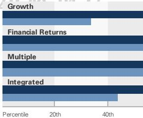  
GS Factor Profile

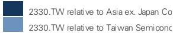

Ratios & Valuation   

<table><tr><td></td><td>12/25</td><td>12/26E</td><td>12/27E</td><td>12/28E</td></tr><tr><td>P/E (X)</td><td>17.6</td><td>21.5</td><td>16.7</td><td>12.4</td></tr><tr><td>P/B (X)</td><td>5.6</td><td>7.4</td><td>5.5</td><td>4.0</td></tr><tr><td>FCF yield (%)</td><td>3.3</td><td>3.0</td><td>4.0</td><td>6.4</td></tr><tr><td>EV/EBITDAR (X)</td><td>10.8</td><td>13.9</td><td>10.4</td><td>7.4</td></tr><tr><td>EV/EBITDA (excl. leases) (X)</td><td>10.8</td><td>13.9</td><td>10.4</td><td>7.4</td></tr><tr><td>CROCI (%)</td><td>24.3</td><td>31.8</td><td>34.8</td><td>39.3</td></tr><tr><td>ROE (%)</td><td>35.4</td><td>39.4</td><td>37.8</td><td>37.6</td></tr><tr><td>Net debt/equity (%)</td><td>(34.3)</td><td>阅 (38.9)</td><td>报添 (43.5)</td><td>微信 (51.4)</td></tr><tr><td>Net debt/equity (excl.leases) (%)</td><td>(34.3)</td><td>(38.9)</td><td>(43.5)</td><td>(51.4)</td></tr><tr><td>Interest cover (X)</td><td>99.1</td><td>167.4</td><td>335.0</td><td>932.9</td></tr><tr><td>Days inventory outst,sales</td><td>27.6</td><td>21.2</td><td>19.9</td><td>17.7</td></tr><tr><td>Receivable days</td><td>26.6</td><td>20.7</td><td>16.4</td><td>13.3</td></tr><tr><td>Days payable outstanding</td><td>157.7</td><td>161.9</td><td>159.6</td><td>163.4</td></tr><tr><td>DuPont ROE(%)</td><td>31.5</td><td>34.2</td><td>32.9</td><td>32.6</td></tr><tr><td>Turnover (X)</td><td>0.5</td><td>0.5</td><td>0.6</td><td>0.6</td></tr><tr><td>Leverage (X)</td><td>1.5</td><td>1.3</td><td>1.2</td><td>1.2</td></tr><tr><td>Gross cash invested (ex cash) (NT$)</td><td>9,199,168.9</td><td>10,831,249.3</td><td>12,871,264.7</td><td>14,990,80.8</td></tr><tr><td>Average capital employed (NT$)</td><td>3,371,689.3</td><td>4,037,343.9</td><td>5,025,618.6</td><td>6,027,091.9</td></tr><tr><td>BVPS (NT$)</td><td>208.99</td><td>282.31</td><td>379.30</td><td>515.37</td></tr></table>

Growth & Margins (%)   

<table><tr><td></td><td>12/25</td><td>12/26E</td><td>12/27E</td><td>12/28E</td></tr><tr><td>Total revenue growth</td><td>31.6</td><td>37.9</td><td>29.7</td><td>30.6</td></tr><tr><td>EBITDA growth</td><td>32.2</td><td>40.7</td><td>30.2</td><td>33.0</td></tr><tr><td>EPS growth</td><td>46.4</td><td>46.1</td><td>29.1</td><td>34.5</td></tr><tr><td>DPS growth</td><td>29.4</td><td>22.7</td><td>14.8</td><td>12.9</td></tr><tr><td>EBIT margin</td><td>50.8</td><td>56.3</td><td>56.5</td><td>58.4</td></tr><tr><td>EBITDA margin</td><td>68.9</td><td>70.3</td><td>70.6</td><td>71.9</td></tr><tr><td>Net income margin</td><td>45.1</td><td>47.8</td><td>47.6</td><td>49.0</td></tr></table>

  
2330.TW	(NT\$) Taiwan	SE	Weighted	Index

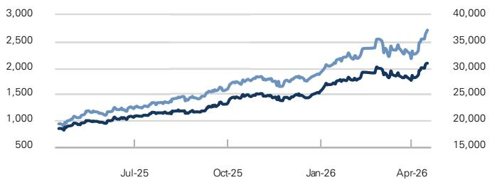

Absolute Rel.	to	the	Taiwan	SE	Weighted	Index

<table><tr><td>3m</td><td>6m</td><td>12m</td></tr><tr><td>19.8%</td><td>40.4%</td><td>143.9%</td></tr><tr><td>1.4%</td><td>4.5%</td><td>27.9%</td></tr></table>

Source: FactSet. Price as of 16 Apr 2026 close.

Income Statement (NT\$ mn)   

<table><tr><td></td><td>12/25</td><td>12/26E</td><td>12/27E</td><td>12/28E</td></tr><tr><td>Total revenue</td><td>3,809,054.3</td><td>5,254,033.6</td><td>6,815,428.5</td><td>8,902,725.9</td></tr><tr><td>Cost of goods sold</td><td>(1,527,760.3)</td><td>(1,846,208.1)</td><td>(2,408,395.5)</td><td>(2,979,936.8)</td></tr><tr><td>SG&amp;A</td><td>(98,775.0)</td><td>(119,819.0)</td><td>(149,996.0)</td><td>(188,596.0)</td></tr><tr><td>R&amp;D</td><td>(246,427.3)</td><td>(330,028.0)</td><td>(407,028.0)</td><td>(531,028.0)</td></tr><tr><td>Other operating inc./(exp.)</td><td></td><td></td><td></td><td>1</td></tr><tr><td>EBITDA</td><td>2,624,188.0</td><td>3,693,372.9</td><td>4,810,161.1</td><td>6,399,197.8</td></tr><tr><td>Depreciation&amp;amortization</td><td>(688,096.4)</td><td>(735,394.4)</td><td>(960,152.1)</td><td>(1,196,032.6)</td></tr><tr><td>EBIT</td><td>1,936,091.7</td><td>2,957,978.5</td><td>3,850,009.0</td><td>5,203,165.1</td></tr><tr><td>Net interest inc./(exp.)</td><td>86,206.5</td><td>81,851.7</td><td>91,531.5</td><td>96,379.0</td></tr><tr><td>Income/(loss) fromassociates</td><td>5,496.6</td><td>0.0</td><td>0.0</td><td></td></tr><tr><td>Pre-tax profit</td><td>2,041,662.8</td><td>3,051,654.4</td><td>3,941,540.5</td><td>5,299,544.1</td></tr><tr><td>Provision for taxes</td><td>(326,266.1)</td><td>(539,584.6)</td><td>(698,767.2)</td><td>(939,750.8)</td></tr><tr><td>Minority interest</td><td>2,485.8</td><td>(1,284.0)</td><td>(1,284.0)</td><td>(1,284.0)</td></tr><tr><td>Preferred dividends</td><td></td><td>1</td><td>一</td><td>1</td></tr><tr><td>Net inc. (pre-exceptionals)</td><td>1,717,882.6</td><td>2,510,785.8</td><td>3,241,489.3</td><td>4,358,509.3</td></tr><tr><td>Post-tax exceptionals</td><td>1</td><td>1</td><td>1</td><td>二</td></tr><tr><td>Net inc.(post-exceptionals)</td><td>1,717,882.6</td><td>2,510,785.8</td><td>3,241,489.3</td><td>4,358,509.3</td></tr><tr><td>EPS (basic,pre-except) (NT$)</td><td>66.26</td><td>96.82</td><td>125.00</td><td>168.07</td></tr><tr><td>EPS (diluted,pre-except) (NT$)</td><td>66.26</td><td>96.82</td><td>125.00</td><td>168.07</td></tr><tr><td>EPS (basic, post-except) (NT$)</td><td>66.26</td><td>96.82</td><td>125.00</td><td>168.07</td></tr><tr><td>EPS (diluted,post-except) (NT$)</td><td>66.26</td><td>96.82</td><td>125.00</td><td>168.07</td></tr><tr><td>DPS (NT$)</td><td>22.00</td><td>27.00</td><td>31.00</td><td>35.00</td></tr><tr><td>Div.payout ratio (%)</td><td>33.2</td><td>27.9</td><td>24.8</td><td>20.8</td></tr></table>

# Balance Sheet (NT\$ mn)

<table><tr><td></td><td>12/25</td><td>12/26E</td><td>12/27E</td><td>12/28E</td></tr><tr><td>Cash &amp; cash equivalents</td><td>2,767,856.4</td><td>3,457,929.9</td><td>4,578,756.8</td><td>6,969,653.5</td></tr><tr><td>Accounts receivable</td><td>282,059.2</td><td>314,413.7</td><td>298.082.4</td><td>348,853.9</td></tr><tr><td>Inventory</td><td>288,109.5</td><td>322,428.7</td><td>419,450.1</td><td>444,061.1</td></tr><tr><td>Other current assets</td><td>479,105.8</td><td>479,105.8</td><td>479,105.8</td><td>479,105.8</td></tr><tr><td>Total current assets</td><td>3,817,130.8</td><td>4,573,878.1</td><td>5,775,395.1</td><td>8,241,674.3</td></tr><tr><td>Net PP&amp;E</td><td>3,691,840.9</td><td>4,738,968.5</td><td>6,006,276.0</td><td>7,164,502.9</td></tr><tr><td>Net intangibles</td><td>24,952.6</td><td>16,310.7</td><td>7,851.1</td><td>(608.6)</td></tr><tr><td>Total investments</td><td>172,370.4</td><td>172,370.4</td><td>172,370.4</td><td>172,370.4</td></tr><tr><td>Other long-termassets</td><td>226,729.2</td><td>226,729.2</td><td>226,729.2</td><td>226,729.2</td></tr><tr><td>Total assets321Cae</td><td>04-17.933,023.9</td><td>9,728,256.8</td><td>12,188,621.6</td><td>15,804,668.2</td></tr><tr><td>Accounts payable</td><td>714,546.9</td><td>923,020.2</td><td>1,182,694.9</td><td>1,484,761.3</td></tr><tr><td>Short-term debt</td><td>0.0</td><td>1</td><td>1</td><td></td></tr><tr><td>Short-term lease liabilities</td><td>1</td><td>1</td><td></td><td>1</td></tr><tr><td>Other current liabilities</td><td>743,472.4</td><td>743,472.4</td><td>743,472.4</td><td>743,472.4</td></tr><tr><td>Total current liabilities</td><td>1,458,019.3</td><td>1,666,492.7</td><td>1,926,167.3</td><td>2,228,233.8</td></tr><tr><td>Long-term debt</td><td>896,062.0</td><td>596,062.0</td><td>296,062.0</td><td>96,062.0</td></tr><tr><td>Long-term lease liabilities</td><td></td><td></td><td></td><td></td></tr><tr><td>Other long-term liabilities</td><td>118,147.3</td><td>118,147.3</td><td>118,147.3</td><td>118,147.3</td></tr><tr><td>Total long-term liabilities</td><td>1,014,209.3</td><td>714,209.3</td><td>414,209.3</td><td>214,209.3</td></tr><tr><td>Total liabilities</td><td>2,472,228.6</td><td>2,380,702.0</td><td>2,340,376.6</td><td>2,442,443.1</td></tr><tr><td>Preferred shares</td><td>1</td><td>1</td><td>1</td><td>1</td></tr><tr><td>Total common equity</td><td>5,419,596.0</td><td>7,320,941.6</td><td>9,836,217.8</td><td>13,364,784.0</td></tr><tr><td>Minority interest</td><td>41,199.3</td><td>26,613.2</td><td>12,027.1</td><td>(2,558.9)</td></tr><tr><td>Total liabilities &amp;equity</td><td>7,933,023.9</td><td>9,728,256.8</td><td>12,188,621.6</td><td>15,804,668.2</td></tr><tr><td>Net debt,adjusted</td><td>(1,871,794.4)</td><td>(2,861,867.9)</td><td>(4,282,694.8)</td><td>(6,873,591.5)</td></tr></table>

# Cash Flow $( \mathsf { N T } \$ \mathsf { m n } )$

<table><tr><td></td><td>12/25</td><td>12/26E</td><td>12/27E</td><td>12/28E</td></tr><tr><td>Net income</td><td>1,717,882.6</td><td>2,510,785.8</td><td>3,241,489.3</td><td>4,358,509.3</td></tr><tr><td>D&amp;A add-back</td><td>688,096.4</td><td>735,394.4</td><td>960,152.1</td><td>1,196,032.6</td></tr><tr><td>Minority interest add-back</td><td>(2,485.8)</td><td>1,284.0</td><td>1,284.0</td><td>1,284.0</td></tr><tr><td>Net (inc)/dec working capital</td><td>98,731.8</td><td>141,799.6</td><td>178,984.6</td><td>226,684.0</td></tr><tr><td>Other operating cash flow d</td><td>(227,249.3)</td><td>0.0</td><td>0.0</td><td></td></tr><tr><td>Cash flowfrom operations</td><td>2,274,975.6</td><td>3,389,263.7</td><td>4,381,910.0</td><td>5,782,509.9</td></tr><tr><td>Capital expenditures</td><td>(1,272,410.5)</td><td>(1,773,880.0)</td><td>(2,219,000.0)</td><td>(2,345,800.0)</td></tr><tr><td>Acquisitions</td><td></td><td></td><td></td><td></td></tr><tr><td>Divestitures</td><td></td><td></td><td></td><td></td></tr><tr><td>Others</td><td>128,017.1</td><td></td><td></td><td></td></tr><tr><td>Cash flow from investing</td><td></td><td>(1,144,393.4) (1,773,880.0)</td><td>(2,219,000.0)</td><td>(2,345,800.0)</td></tr><tr><td>Repayment of lease liabilities</td><td></td><td></td><td></td><td></td></tr><tr><td>Dividends paid (common &amp; pref)</td><td>(440,851.8)</td><td>(609,440.2)</td><td>(726,213.0)</td><td>(829,943.1)</td></tr><tr><td>Inc/(dec) in debt</td><td>40,448.1</td><td>(300,000.0)</td><td>(300,000.0)</td><td>(200,000.0)</td></tr><tr><td>Other financing cash flows</td><td>(89,949.1)</td><td>(15,870.1)</td><td>(15,870.1)</td><td>(15,870.1)</td></tr><tr><td>Cash flow from financing</td><td>(490,352.9)</td><td>(925,310.3)</td><td>(1,042,083.1)</td><td>(1,045,813.2)</td></tr><tr><td>Total cash flow</td><td>640,229.4</td><td>690,073.5</td><td>1,120,826.9</td><td>2,390,896.7</td></tr><tr><td>Free cash flow</td><td>1,002,565.1</td><td>1,615,383.7</td><td>2,162,910.0</td><td>3,436,709.9</td></tr></table>

# Key highlights from earnings call

Exhibit 1: TSMC financial snapshot   

<table><tr><td>TSMC (2330.TW)</td><td>2019</td><td>2020</td><td>2021</td><td>2022</td><td>2023</td><td>2024</td><td>2025</td><td>2026E</td><td>2027E</td><td>2028E</td><td>25-28ECAGR</td></tr><tr><td>P&amp;L (NT$bn)</td><td></td><td></td><td></td><td></td><td></td><td></td><td></td><td></td><td></td><td></td><td></td></tr><tr><td>Revenue (US$bn)</td><td>34.7</td><td>45.6</td><td>56.9</td><td>75.9</td><td>69.3</td><td>90.1</td><td>122.4</td><td>165.9</td><td>215.0</td><td>280.8</td><td>31.9%</td></tr><tr><td>%YoY</td><td>1.9%</td><td>31.6%</td><td>24.7%</td><td>33.3%</td><td>-8.7%</td><td>30.0%</td><td>35.9%</td><td>35.5%</td><td>29.6%</td><td>30.6%</td><td></td></tr><tr><td>Revenue</td><td>1,070</td><td>1,339</td><td>1,587</td><td>2.264</td><td>2,162</td><td>2,894</td><td>3,809</td><td>5,254</td><td>6,815</td><td>8,903</td><td>32.7%</td></tr><tr><td>%YoY</td><td>3.7%</td><td>25.2%</td><td>18.5%</td><td>42.6%</td><td>-4.5%</td><td>33.9%</td><td>31.6%</td><td>37.9%</td><td>29.7%</td><td>30.6%</td><td></td></tr><tr><td>Gross profit</td><td>493</td><td>711</td><td>820</td><td>1,348</td><td>1,175</td><td>1,624</td><td>2,281</td><td>3,408</td><td>4,407</td><td>5,923</td><td>37.4%</td></tr><tr><td>%GM</td><td>46.0%</td><td>53.1%</td><td>51.6%</td><td>59.6%</td><td>54.4%</td><td>56.1%</td><td>59.9%</td><td>64.9%</td><td>64.7%</td><td>66.5%</td><td></td></tr><tr><td>EBIT</td><td>373</td><td>567</td><td>650</td><td>1,121</td><td>921</td><td>1,322</td><td>1,936</td><td>2.958</td><td>3.850</td><td>5,203</td><td>39.0%</td></tr><tr><td>%OpM</td><td>34.8%</td><td>42.3%</td><td>40.9%</td><td>49.5%</td><td>42.6%</td><td>45.7%</td><td>50.8%</td><td>56.3%</td><td>56.5%</td><td>58.4%</td><td></td></tr><tr><td>Net income</td><td>345</td><td>518</td><td>597</td><td>1,017</td><td>838</td><td>1,173</td><td>1,718</td><td>2,511</td><td>3,241</td><td>4,359</td><td>36.4%</td></tr><tr><td>%YoY</td><td>-1.7%</td><td>50.0%</td><td>15.2%</td><td>70.4%</td><td>-17.5%</td><td>39.9%</td><td>46.4%</td><td>46.2%</td><td>29.1%</td><td>34.5%</td><td></td></tr><tr><td>EPS (NT$)</td><td>13.3</td><td>20.0</td><td>23.0</td><td>39.2</td><td>32.3</td><td>45.3</td><td>66.3</td><td>96.8</td><td>125.0</td><td>168.1</td><td>36.4%</td></tr></table>

Source: Company data, Goldman Sachs Global Investment Research, Bloomberg

# 2026 guidance raise on stronger AI demand

TSMC has raised its 2026 full-year guidance to above $30 \%$ YoY (in USD terms), up from close to $30 \%$ YoY previously, supported by sustained strength in AI. Management cited that AI continued to stimulate leading-edge silicon demand with CSP providing a very strong outlook over the next several years. TSMC is also planning to set up three new N3 fabs across Tainan, Arizona, and Japan, which we believe are targeted to support multi-year demand primarily for AI/HPC customers. From a longer-term perspective, management now sees revenue growth from AI accelerators to be closer to higher- $. 5 0 \mathsf { s } \%$ CAGR over 2024-2029, as robust growth in token consumption driven by ongoing AI model usage keeps silicon demand ahead of supply. Overall, with N3 UTR remaining tight amid productivity gains and new capacity expansion, we are now modeling TSMC’s 订阅研报添加微信 LCD123321Cad 04-17 revenue (in USD terms) to grow by 35.5%/29.6%/30.6% YoY (vs. $3 5 . 1 \% / 3 0 . 0 \% / 2 9 . 0 \%$ YoY previously).

# Capex trending higher with rapid capacity expansion

TSMC now expects its 2026E capex to trend towards the higher-end of its $\cup \$ \$ 52$ -56bn guidance, reflecting sustained demand from AI/HPC and ongoing efforts to pull in equipment and build clean rooms to alleviate tight supply conditions. The company reiterated that demand remains robust across leading-edge nodes, with supply expected to stay tight given the 2-3yr lead time required for fab construction and ramp. More importantly, management also reiterated that capex over the next three years will be significantly higher than the prior three-year total $( \sim \mathsf { U S } \$ 1106 n )$ , suggesting a continued step-up in investment, albeit with revenue growth still expected to outpace capex growth. Overall, we maintain our TSMC 2026E capex forecast at $\mathsf { U S S 5 5 6 b n }$ , and we expect the total capex over the next three years (2026-2028E) to reach $\mathsf { U S S 2 0 0 b n }$ .

# 订阅研报添加微信 LCD123321Cad 04-17GM to structurally improve despite near term headwinds

Both TSMC’s 1Q26 GM of $6 6 . 2 \%$ and 2Q26 GM guidance of $6 6 . 5 \%$ (at the mid point) came in above GSe and cons., supported by higher utilization, cost improvement, and more favorable FX. While we believe this supports our previous view of higher structural GM, we do expect to see some near-term GM headwinds to emerge in 2H26, including dilution from N2 ramp up, which is expected to dilute full-year GM by $2 - 3 \%$ , and higher chemical cost (e.g., Helium) due to geopolitical uncertainties in the Middle East. However, we believe these factors are largely offset by stronger-than-expected productivity gains, higher overall utilization, favorable FX, as well as N3 GM

improvement, with N3 GM now expected to cross corporate average GM in 2H26. Net net, we now model TSMC’s GM to reach $6 4 . 9 \% / 6 4 . 7 \% / 6 6 . 5 \%$ in 2026-2028E (vs. $6 4 . 2 \% / 6 4 . 8 \% / 6 6 . 5 \%$ previously).

# Raising our CoWoS forecast

订阅研报添加微信 LCD123321Cad 04-17 We are raising our CoWoS estimates for 2027-2028E to reflect stronger-than-expected AI demand with increasing AI chip volume and growth in chip package size. While both AI GPUs and AI ASICs are seeing volume growth, larger chip size alongside more complex chiplet-based architecture are structurally supporting CoWoS demand. Overall, we revise up our CoWoS capacity forecast to 2,490k/3,150k wafers in 2027/2028E (vs. 2,310k/3,060k previously), representing $9 5 \% / 2 7 \%$ YoY growth. For shipment, we are now modeling CoWoS shipment to reach 2,342k/3,074k wafers in 2027/2028E (vs. 2,171k/2,808k previously), representing 96%/31% YoY increase (see Exhibit 6 & Exhibit 订阅研报添加微信 LCD123321Cad 04-17

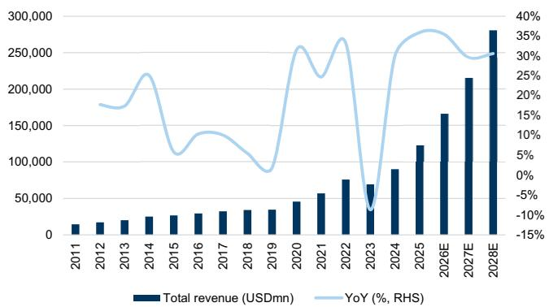  
Exhibit 2: TSMC’s revenue growth outlook

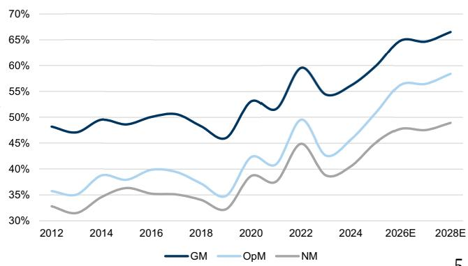  
Exhibit 3: TSMC’s margin outlook

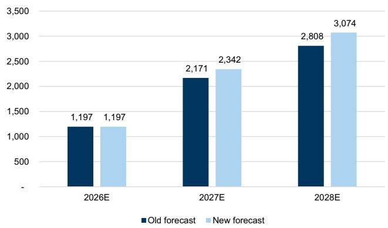  
Exhibit 6: TSMC‘s annual CoWoS shipment (k wafers)   
订阅研报添加Source: Company data, Goldman Sachs Global Investment Research

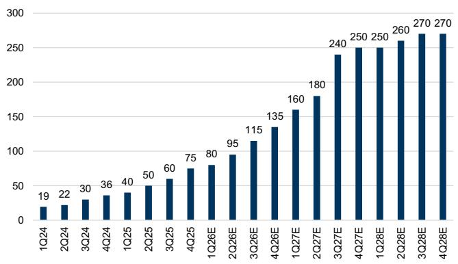  
Exhibit 8: TSMC’s quarterly CoWoS capacity ramp (kwpm)   
D123321Cad 04-17 Source: Company data, Goldman Sachs Global Investment Research

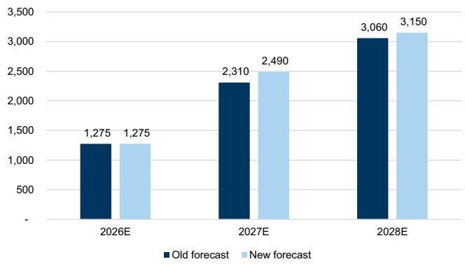  
Exhibit 7: TSMC‘s annual CoWoS capacity (k wafers)

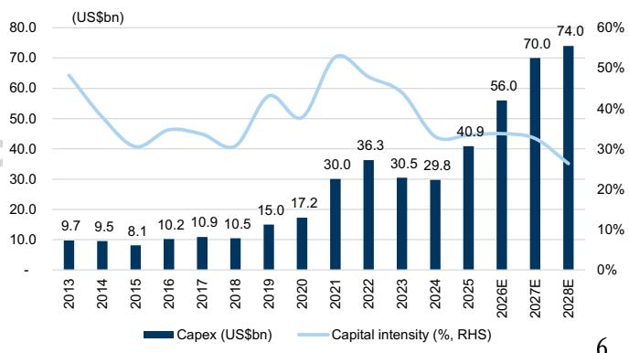  
Exhibit 9: TSMC’s capex and capital intensity trend

# 2Q26 GM guidance better than expected

For 2Q26, management guided revenue to be in the range of US\$39.0-40.2bn $( + 1 0 \%$ QoQ at midpoint; based on FX [TWD/USD] of 31.7), GM in the range of $6 5 . 5 \substack { - 6 7 . 5 \% }$ , and OpM in the range of $5 6 . 5 \substack { - 5 8 . 5 \% }$ 2Q26 revenue guidance came in stronger vs. GSe of $8 . 6 \%$ QoQ growth (in USD terms), supported by continuous strong demand in leading-edge process technology from robust AI demand. GM guidance also came in higher than GSe/cons. of $6 5 . 4 \% / 6 4 . 1 \%$ , primarily driven by higher UTR and continue productivity gain.

# 1Q26 results higher vs. GSe and consensus

1Q26 revenue of NT\$1,134.1bn (or US\$35.90bn) was up by $6 . 4 \%$ QoQ and $4 0 . 6 \%$ YoY, came in higher vs. TSMC’s guidance (in USD terms) and BBG consensus. EPS of $\mathsf { N T } \$ 22.08$ was up by $1 3 . 2 \%$ QoQ and $5 8 . 2 \%$ YoY, and also came in above GSe/BBG consensus. On margins, GM $6 6 . 2 \%$ , $^ { + 3 9 2 }$ bps QoQ/+746bps YoY) and OpM ( $5 8 . 1 \%$ ; +410bps QoQ/ $+ 9 6 ($ 0bps YoY) both came in better than GSe and cons., which we attribute to the company’s further improvement in cost control, higher UTR, better operating leverage, and more favorable FX.

Exhibit 10: 1Q26 results summary   

<table><tr><td></td><td>1Q26</td><td>4Q25</td><td>1Q25</td><td>%QoQ</td><td>%YoY</td><td>GS prev.</td><td>%Diff</td><td>Consensus</td><td>%Diff</td></tr><tr><td>(NT$mn)</td><td></td><td></td><td></td><td></td><td></td><td></td><td></td><td></td><td></td></tr><tr><td>Revenue</td><td>1,134,103</td><td>1,046,090</td><td>839,254</td><td>8.4%</td><td>35.1%</td><td>1,145,796</td><td>-1.0%</td><td>1,123,220</td><td>1.0%</td></tr><tr><td>Gross profit</td><td>751,295</td><td>651,987</td><td>493,395</td><td>15.2%</td><td>52.3%</td><td>750,557</td><td>0.1%</td><td>724,016</td><td>3.8%</td></tr><tr><td>Op. income</td><td>658,966</td><td>564,902</td><td>407,081</td><td>16.7%</td><td>61.9%</td><td>652,473</td><td>1.0%</td><td>623,816</td><td>5.6%</td></tr><tr><td>Net income</td><td>572,480</td><td>505,744</td><td>361,564</td><td>13.2%</td><td>58.3%</td><td>560,149</td><td>2.2%</td><td>540,200</td><td>6.0%</td></tr><tr><td>EPS (NT$)</td><td>22.08</td><td>19.51</td><td>13.95</td><td>13.2%</td><td>58.2%</td><td>21.60</td><td>2.2%</td><td>20.89</td><td>5.7%</td></tr><tr><td>GM</td><td>66.2%</td><td>62.3%</td><td>58.8%</td><td>3.9%</td><td>7.5%</td><td>65.5%</td><td>0.7%</td><td>64.5%</td><td>2.8%</td></tr><tr><td>OpM</td><td>58.1%</td><td>54.0%</td><td>48.5%</td><td>4.1%</td><td>9.6%</td><td>56.9%</td><td>1.2%</td><td>55.5%</td><td>4.6%</td></tr><tr><td>NM</td><td>50.5%</td><td>48.3%</td><td>43.1%</td><td>2.1%</td><td>7.4%</td><td>48.9%</td><td>1.6%</td><td>48.1%</td><td>7 5.0%</td></tr></table>

# Forecast changes

Post its earnings results, we raise our 2026/2027/2028E EPS by $1 . 7 \% / 0 \% / 1 . 7 \%$ to reflect 1) stronger 1Q26 results, 2) higher GM guidance, and 3) incrementally better AI demand outlook.

<table><tr><td>104-17 开</td></tr></table>

<table><tr><td></td><td colspan="3">2026E</td><td colspan="3">2027E</td><td colspan="3">2028E</td></tr><tr><td>(NT$mn)</td><td>Old</td><td>New</td><td>Diff (%)</td><td>Old</td><td>New</td><td>Diff (%)</td><td>Old</td><td>New</td><td>Diff (%)</td></tr><tr><td>Revenue</td><td>5,220,311</td><td>5,254,034</td><td>0.6%</td><td>6,773,919</td><td>6,815,428</td><td>0.6%</td><td>8,737,634</td><td>8,902,726</td><td>1.9%</td></tr><tr><td>Gross profit</td><td>3,350,220</td><td>3,407,825</td><td>1.7%</td><td>4,386,902</td><td>4,407,033</td><td>0.5%</td><td>5,810,996</td><td>5,922,789</td><td>1.9%</td></tr><tr><td>Op. income</td><td>2,908,384</td><td>2,957,978</td><td>1.7%</td><td>3,837,066</td><td>3,850,009</td><td>0.3%</td><td>5,112,860</td><td>5,203,165</td><td>1.8%</td></tr><tr><td>Net income</td><td>2,469,887</td><td>2,510,786</td><td>1.7%</td><td>3,241,566</td><td>3,241,489</td><td>0.0%</td><td>4,287,115</td><td>4,358,509</td><td>1.7%</td></tr><tr><td>EPS_(NTS)</td><td>95.24</td><td>96.82</td><td>1.7%</td><td>125.00</td><td>125.00</td><td>0.0%</td><td>165.32</td><td>168.07</td><td>1.7%</td></tr><tr><td>GM</td><td>64.2%</td><td>64.9%</td><td>0.7%</td><td>64.8%</td><td>64.7%</td><td>-0.1%</td><td>66.5%</td><td>66.5%</td><td>0.0%</td></tr><tr><td>OpM</td><td>55.7%</td><td>56.3%</td><td>0.6%</td><td>56.6%</td><td>56.5%</td><td>-0.2%</td><td>58.5%</td><td>58.4%</td><td>-0.1%</td></tr><tr><td>NM</td><td>47.3%</td><td>47.8%</td><td>0.5%</td><td>47.9%</td><td>47.6%</td><td>-0.3%</td><td>49.1%</td><td>49.0%</td><td>-0.1%</td></tr></table>

<table><tr><td></td><td colspan="3">2Q26E</td><td colspan="3">3Q26E</td><td colspan="3">4Q26E</td></tr><tr><td>(NT$mn)</td><td>Old</td><td>New</td><td>Diff (%)</td><td>Old</td><td>New</td><td>Diff (%)</td><td>Old</td><td>New</td><td>Diff (%)</td></tr><tr><td>Revenue</td><td>1,232,897</td><td>1,252,876</td><td>1.6%</td><td>1,384,733</td><td>1,391,816</td><td>0.5%</td><td>1,456,886</td><td>1,475,239</td><td>1.3%</td></tr><tr><td>Gross profit</td><td>806,264</td><td>849,080</td><td>5.3%</td><td>873,394</td><td>877,913</td><td>0.5%</td><td>920,006</td><td>929,538</td><td>1.0%</td></tr><tr><td>Op.income</td><td>698,180</td><td>735,074</td><td>5.3%</td><td>757,810</td><td>758,407</td><td>0.1%</td><td>799,922</td><td>805,532</td><td>0.7%</td></tr><tr><td>Net income</td><td>576,957</td><td>605,822</td><td>5.0%</td><td>648,460</td><td>646,231</td><td>-0.3%</td><td>684,321</td><td>686,253</td><td>0.3%</td></tr><tr><td>EPS (NT$)</td><td>22.25</td><td>23.36</td><td>5.0%</td><td>25.01</td><td>24.92</td><td>-0.3%</td><td>26.39</td><td>26.46</td><td>0.3%</td></tr><tr><td>GM</td><td>65.4%</td><td>67.8%</td><td>2.4%</td><td>63.1%</td><td>63.1%</td><td>0.0%</td><td>63.1%</td><td>63.0%</td><td>-0.1%</td></tr><tr><td>OpM</td><td>56.6%</td><td>58.7%</td><td>2.0%</td><td>54.7%</td><td>54.5%</td><td>-0.2%</td><td>54.9%</td><td>54.6%</td><td>-0.3%</td></tr><tr><td>NM</td><td>46.8%</td><td>48.4%</td><td>1.6%</td><td>46.8%</td><td>46.4%</td><td>-0.4%</td><td>47.0%</td><td>46.5%</td><td>-0.5%</td></tr></table>

Source: Goldman Sachs Global Investment Research

Exhibit 12: TSMC’s P&L summary   

<table><tr><td></td><td>1Q26E</td><td>2Q26E</td><td>3Q26E</td><td>4Q26E</td><td>1Q27E</td><td>2Q27E</td><td>3Q27E</td><td>4Q27E</td><td>2026E</td><td>2027E</td><td>2028E</td></tr><tr><td colspan="10">P&amp;L (NT$mn)</td></tr><tr><td>Revenue</td><td>1,134,103</td><td>1,252,876</td><td>1,391,816</td><td>1,475,239</td><td>1,515,752</td><td>1,646,918</td><td>1,799,866</td><td>1,852,893</td><td>5,254,034</td><td>6,815,428</td><td>8,902,726</td></tr><tr><td>Gross profit</td><td>751,295</td><td>849,080</td><td>877,913</td><td>929,538</td><td>979,103</td><td>1,068,661</td><td>1,164,337</td><td>1,194,932</td><td>3,407,825</td><td>4,407,033</td><td>5,922,789</td></tr><tr><td>Operating profit</td><td>658,966</td><td>735,074</td><td>758,407</td><td>805,532</td><td>852,597</td><td>934,155</td><td>1,020,331</td><td>1,042,926</td><td>2,957,978</td><td>3,850,009</td><td>5,203,165</td></tr><tr><td>Net income</td><td>572,480</td><td>605,822</td><td>646,231</td><td>686,253</td><td>726,085</td><td>765,155</td><td>865,445</td><td>884,804</td><td>2,510,786</td><td>3,241,489</td><td>4,358,509</td></tr><tr><td>EPS (NT$)</td><td>22.08</td><td>23.36</td><td>24.92</td><td>26.46</td><td>28.00</td><td>29.51</td><td>33.37</td><td>34.12</td><td>96.82</td><td>125.00</td><td>168.07</td></tr><tr><td colspan="10"></td><td></td><td></td><td></td></tr><tr><td>Margins (%) Gross margin</td><td></td><td></td><td></td><td></td><td></td><td></td><td></td><td>64.5%</td><td>64.9%</td><td>64.7%</td><td>66.5%</td></tr><tr><td>Operating profit margin</td><td>66.2% 58.1%</td><td>67.8% 58.7%</td><td>63.1% 54.5%</td><td>63.0% 54.6%</td><td>64.6% 56.2%</td><td>64.9% 56.7%</td><td>64.7% 56.7%</td><td>56.3%</td><td>56.3%</td><td>56.5%</td><td>58.4%</td></tr><tr><td>Netmargin</td><td>50.5%</td><td>48.4%</td><td>46.4%</td><td>46.5%</td><td>47.9%</td><td>46.5%</td><td>48.1%</td><td>47.8%</td><td>47.8%</td><td>47.6%</td><td>49.0%</td></tr><tr><td colspan="10"></td></tr><tr><td>YoY (%)</td><td></td><td></td><td></td><td></td><td></td><td></td><td></td><td></td><td></td><td></td><td></td></tr><tr><td>Revenue Gross profit</td><td>35.1%</td><td>34.2%</td><td>40.6%</td><td>41.0%</td><td>33.7%</td><td>31.5%</td><td>29.3%</td><td>25.6% 28.6%</td><td>37.9% 49.4%</td><td>29.7% 29.3%</td><td>30.6% 34.4%</td></tr><tr><td>Operating profit</td><td>52.3%</td><td>55.1%</td><td>49.2%</td><td>42.6%</td><td>30.3%</td><td>25.9%</td><td>32.6%</td><td>29.5%</td><td>52.8%</td><td>30.2%</td><td>35.1%</td></tr><tr><td>Net income</td><td>61.9%</td><td>58.6%</td><td>51.5%</td><td>42.6%</td><td>29.4%</td><td>27.1% 26.3%</td><td>34.5%</td><td>28.9%</td><td>46.2%</td><td></td><td>34.5%</td></tr><tr><td>EPS</td><td>58.3%</td><td>52.1%</td><td>42.9% 42.9%</td><td>35.7%</td><td>26.8%</td><td>26.3%</td><td>33.9%</td><td>28.9%</td><td>46.1%</td><td>29.1%</td><td></td></tr><tr><td></td><td>58.2%</td><td>52.1%</td><td></td><td>35.6%</td><td>26.8%</td><td></td><td>33.9%</td><td></td><td></td><td>29.1%</td><td>34.5%</td></tr><tr><td colspan="10"></td></tr><tr><td>QoQ (%)</td><td></td><td></td><td></td><td></td><td></td><td></td><td></td><td></td><td></td><td></td><td></td></tr><tr><td>Revenue Gross profit</td><td>8.4%</td><td>10.5%</td><td>11.1%</td><td>6.0%</td><td>2.7%</td><td>8.7%</td><td>9.3%</td><td>2.9% 2.6%</td><td></td><td></td><td></td></tr><tr><td>Operating profit</td><td>15.2%</td><td>13.0%</td><td>3.4%</td><td>5.9%</td><td>5.3% 5.8%</td><td>9.1% 9.6%</td><td>9.0% 9.2%</td><td>2.2%</td><td></td><td></td><td></td></tr><tr><td>Net income</td><td>16.7% 13.2%</td><td>11.5% 5.8%</td><td>3.2% 6.7%</td><td>6.2%</td><td></td><td>5.4%</td><td>13.1%</td><td>2.2%</td><td></td><td></td><td></td></tr><tr><td>EPS</td><td>13.2%</td><td>5.8%</td><td>6.7%</td><td>6.2% 6.2%</td><td>5.8% 5.8%</td><td>5.4%</td><td>13.1%</td><td>2.2%</td><td></td><td></td><td>8</td></tr></table>

premium of $20 \%$ . Our $_ { 2 2 x }$ target P/E multiple is also benchmarked to TSMC’s trading average of $_ { 2 2 x }$ during its previous revenue upcycle where its 3-year revenue CAGR (2019-2021) was $2 8 \%$ , vs. our 3-year revenue CAGR at $3 2 \%$ during 2026-2028E.

Our TP implies $3 2 \%$ (ADR $4 7 \%$ ) upside to the last close. As a result, we reiterate our Buy ratings for TSMC/ADR, which are on the APAC Conviction List. We maintain our constructive view on TSMC’s long-term growth outlook as we believe the company’s solid technology leadership and execution better positions it vs. peers to capture the industry’s long-term structural growth opportunities, especially in AI.

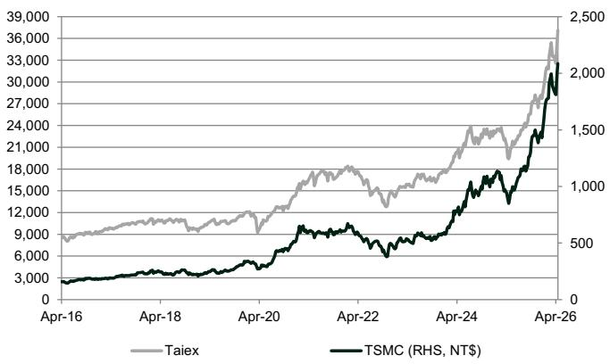  
Exhibit 13: Taiex vs. TSMC   
Source: Bloomberg

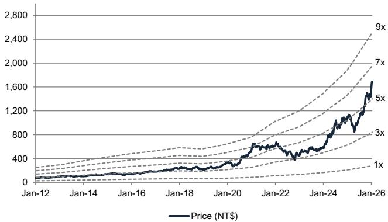  
Exhibit 15: Forward P/B

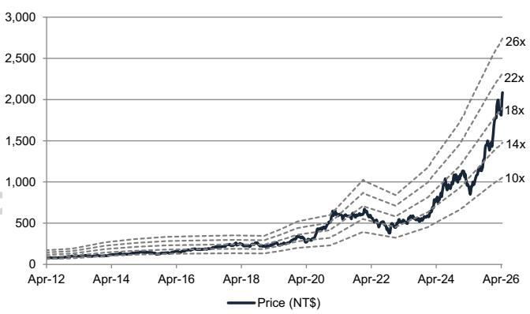  
Exhibit 14: Forward P/E   
Source: Bloomberg

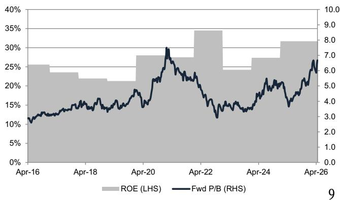  
Exhibit 16: P/B vs. ROE

<table><tr><td>Investment Thesis, Price Target Risks and Methodology</td></tr></table>

# Investment Thesis - TSMC (2330.TW/TSM)

TSMC is a leading global foundry company specializing in cutting-edge nodes. Its leading technology stance enables it to enjoy more than $60 \%$ of revenue share in the global foundry market. We like TSMC as we believe its solid technology leadership and execution better position it vs. peers to capture the industry’s long-term structural growth opportunities, particularly in areas such as AI/5G/HPC/EV. In addition, valuation 订阅研报添加微信 LCD123321Cad 04-17 looks attractive in our view, with the shares trading at the mid-range of their 10-year trading history (P/E: 10-29x). Furthermore, we view TSMC as the key AI enabler among our Taiwan Semis coverage, thanks to its leadership stance in leading edge nodes and advanced packaging technology - CoWoS (chip on wafer on substrate). We believe TSMC will achieve its $2 5 \%$ revenue CAGR target for the next several years, driven primarily by increasing silicon content growth and AI/HPC demand, with LT GM to remain at $56 \% +$ . We are Buy rated.

# Price Target Risks and Methodology - TSMC (2330.TW/TSM)

Valuation methodology: We have a $_ { 1 2 \mathsf { m } }$ TP of $\mathsf { N T } \$ 2,750$ , which is derived by applying a target $\mathsf { P } / \mathsf { E }$ multiple of $_ { 2 2 x }$ to our 2027E EPS. Our $_ { 2 2 x }$ target $\mathsf { P } / \mathsf { E }$ is benchmarked against 1.0stdv above its 5-year trading average. For the ADR (TSM), we have a $_ { 1 2 \mathsf { m } }$ TP of $\cup \mathsf { S$ 5 5 0 }$ , based on a USD/TWD rate of 30.0 and an ADR premium of $20 \%$ .

Key downside risks to our views: (1) further deterioration in end-demand recovery impacting capacity utilization; (2) slower customer node migrations; (3) slowdown in AI investment resulting in lower long-term semiconductor content growth; (4) poor yields/execution resulting in worse-than-expected profitability; (5) stronger competition resulting in ASP/profitability erosion; and (6) unfavorable FX trend or higher-than-expected cost increase weighing on the margin outlook.