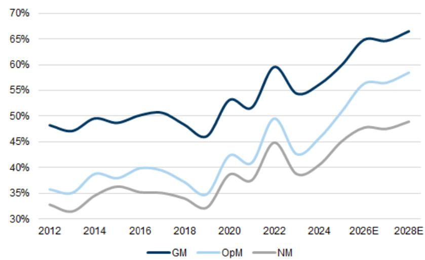

# The 720: TSMC, Deep dives - Optical Networking & Robotaxis, MediaTek, Delta Electronics, China eCommerce, Moutai

17 April 2026 | 7:27AM HKT In Focus | TSMC

TSMC - Earnings review: 1Q26 GM beat; growth edging higher on sustained AI demand – Buy (on CL). TSMC hosted its 1Q26 analyst meeting on April 16. 1Q26 GM 订阅研报添加微信 LCD123321Cad 04came in higher, supported by higher UTR and continued productivity improvement. Management also raised 2026 revenue growth (in USD terms) to above $30 \%$ YoY (from close to $30 \%$ YoY), driven by strong leading edge demand from AI. For margins, although N2 ramp and higher chemical cost are expected to dilute margin starting 2H26, we continued to anticipate TSMC’s GM to improve structurally, driven by productivity gain, higher UTR, and product mix shift toward AI/HPC. Another key highlight of the meeting was capex, in which management now expects 2026 full-year capex to be closer to the higher-end of its previous $\cup \$ \$ 52$ -56bn guidance, with TSMC speeding up clean room construction and equipment pull-in. We tweak GSe, 12m TP remains unchanged at N $\Gamma \$ 2,750$ . Bruce Lu

# Optical Networking | The next mega trend in AI Infrastructure

Optical Networking - The next mega trend in AI infrastructure. Networking unlocks computing capability for single AI chips, connecting multiple chips (working together), enabling seamless data exchange and low latency, and driving AI to the next level. Along with an AI infrastructure ramp-up and rising computing power per rack, we expect all configurations to enjoy strong growth ahead, opening a further 9x TAM unlock to $\mathsf { U S f } \mathsf { 1 S 4 b n }$ . In this report, we analyze: (1) dollar content across different configurations, (2) Scale-out and Scale-up market opportunities, (3) Component contributions across copper cables, pluggable optical modules, CPO, and PCB midplanes, and (4) EPS upside across the supply chain. We remain bullish on our Optical and PCB coverage, including Buy rated: Innolight, Eoptolink, TFC Optical, Landmark, VPEC, Sumitomo, Mitsubishi, Furukawa, Victory Giant (on CL), WUS, EMC and Shengyi. We expect these companies to see strong growth into 2028E on AI servers ramp up, specification upgrade, and usage expansion. Allen Chang et al

订阅研报添加微信 LCD123321Cad 04-Innolight - Optical module speed migration continues with mix upgrade driving GM expansion – Buy. Following our updated TAMs for global AI servers (see here) and optical modules (here), and Innolight’s leading market position in high-speed connection evidenced by sequential 8-quarter GM expansion, we raise Innolight’s $\uparrow 2 \mathsf { m }$ TP by $50 \%$ to Rmb1,187, with net income raised by $7 \% / 2 4 \% / 2 9 \%$ in 2026-28E and target PE multiple up to $3 4 . 2 \times$ (vs. $2 8 x$ previously). We remain positive on Innolight given the growing optics connection and specification upgrade toward

1.6T / 3.2T, along with fast migration cycle and light source shortage. As our optical networking thematic report shows, we expect various configurations in networking to coexist in AI data centers to optimize efficiency under different AI tasks. Also, with AI servers ramp-up and rising computing density per rack, all configurations should enjoy strong growth in coming years. Verena Jeng

China Optics - AI drives networking upgrades - initiate RoboTechnik at Buy; YJ Semi / YOFC at Neutral. We are positive on optical networking due to: (1) the transition from scale-out to scale-up architectures, which increases bandwidth and connectivity, thereby driving TAM expansion; (2) product expansion, including the deployment of CPO 订阅研报添加微信 LCD123321Cad 04-17 and OCS to meet rising bandwidth requirements, alongside HCF applications for AI data center scaling; and (3) speed upgrades in pluggable modules toward 1.6T and 3.2T. Within China’s optical networking supply chain, we identify RoboTechnik (SiPh/CPO equipment), YJ Semi (EML/CW laser), and YOFC (optical fiber) as key beneficiaries. We initiate RoboTechnik at Buy, but YJ Semi and YOFC at Neutral on fair valuation. Allen Chang et al

See also:

Foxconn Industrial Internet - AI server racks ramp up with specification upgrade to enhance leading market position – Buy. Verena Jeng

LandMark - SiPh CW laser ramp up on strong AI demand and CPO expansion in long-term – Buy. Allen Chang

# Themes in Play | China eCommerce, Delta Electronics, MediaTek, China Staples, 订阅研报添加微信 LCD123321Cad 04-17 Korea Aerospace/Defence, China Agri

China Internet - eCommerce tracker: Moderated March industry growth on seasonality; 1Q eCommerce previews & key focus areas. We continue to maintain our out-of-consensus preference for eCommerce & Mobility as one of the Top 2 preferred sub-sectors in China Internet (alongside #1 Data Centers & Cloud) on the back of ongoing quick commerce unit economics improvement, signs of higher-tier city property market stabilization, trade-in program normalization for electronics & appliance (from 2H26) and attractive valuations. In this report, we revise our earnings estimates by up to $- 1 6 \%$ on higher AI-related/overseas spending, downgrade S.F. A-shares from Buy to Neutral (while maintaining Buy on S.F. H-shares), and lay out our key thoughts around 1) differences in shelf-based vs. live-stream shopping sequential 1Q growth, 2) gaps between Alibaba’s GMV, CMR and underlying Taobao-Tmall profit growth, 3) threat/disruption from AI agents or shopping assistants, 4) sustainability of recent China eCommerce stocks’ performance, and 5) recent competition in local services. We highlight Buy-rated Alibaba (on CL), PDD, and Full Truck Alliance amongst others. Ronald 订阅研报添加微信 LCD123321Cad 04-17Keung

Delta Electronics - Faster than expected HVDC power rack adoption – Buy. We have started to see a solid demand trend on Delta’s new 12kW PSU from 2Q26. Based on our supply chain check, Delta’s AI PSU order lead time is now 4-8 months, basically implying a full ramp on its new 12kW PSU in the rest of the year. We believe the new 12kW PSU product pricing will be $^ { 2 \times + }$ higher than the old generation 5.5kW products, implying $50 \% +$ higher ASP per watt, which is in-line with our view. Also, based on our recent supply chain check, the key AI PSU raw material power semiconductor pricing has risen by $2 5 \% +$ , due to the very tight supply demand outlook, which will further drive Delta’s new AI PSU ASP in coming quarters, as the company has the best pricing power in the industry, and normally passes through the additional cost to customers. We revise up our 2026/27/28E earnings estimates by $1 0 \% / 6 \% / 9 \%$ and lift $_ { 1 2 \mathsf { m } }$ TP to $\mathsf { N T } \$ 123,456$ . Chao Wang

MediaTek – Faster AI ASIC revenue ramp offsets smartphone weakness – Buy. We reiterate our Buy rating and raise our $_ { 1 2 \mathsf { m } }$ TP to $\mathsf { N T } \$ 12,454$ from $\yen 123,456$ , as we see stronger earnings upside potential from the AI ASIC business into 2027 and beyond. We raise our AI ASIC revenue forecast to $\mathsf { U S } \$ 2.0\mathsf { b n } / \mathsf { U S } \$ 12.3\mathsf { b n }$ (from $\cup 5 \$ 1.5\mathrm{ b n / U S } \$ 7.0\mathrm { b n } )$ , with revenue contribution reaching $1 0 \% / 3 9 \%$ of its total revenue in 2026E/27E (vs. $7 \% / 2 3 \%$ 研报添加微信 LCD1233 previously). While we lower our $2 0 2 6 ~ \mathsf { E P S }$ 04-17 estimates by $2 2 \%$ due to smartphone market weakness amid rising memory prices, we raise our 2027 EPS forecast by $1 1 . 6 \%$ to reflect a faster AI ASIC revenue ramp with stronger OpM expansion. We believe the near-term smartphone weakness is largely priced in, and investors should focus on the company’s successful diversification into the fast-growing AI total addressable market. Bruce Lu

China Consumer Staples – Mar Check-in/1Q26 Preview: Broad-based 1Q acceleration for F&B, with resilient March trend. We see a resilient March trend despite post-CNY moderation, with 1Q26 showing QoQ accelerating growth among leading players in compound condiments, prepared foods, and packaged meat. We also note a tangible sequential recovering trend in F&B, dairy, and beer from a weak 4Q25, alongside continued robust expansion in value retailers. Going forward, we expect investor focus to center on the sustainability of demand-side improvement, competition intensity, and cost trends. We prefer condiments and prepared foods names including Haitian-H, Anjoy-H, and Yihai, dairy players Mengniu and Yili, pork producer WH Group, and F&B value retailers Busy Ming and Wanchen. We also reiterate our constructive view on Moutai, Nongfu, Eastroc, CR Beer, and Yankershop. Leaf Liu

Korea Aerospace & Defense – 1Q26 preview: Slow quarter, but will likely mark OP bottom for the full year. We expect 1Q26 operating profit to mark the bottom for the full year for both Hanwha Aerospace and Hyundai Rotem, with margins improving sequentially from 2Q26 onward. We lower our 2026 OP estimates for Hanwha by $1 1 \%$ and Rotem by $2 4 \%$ to reflect delayed shipment and order assumptions, but raise our 2027 and 2028 forecasts. We maintain our Buy ratings on both names, as we believe their share prices have yet to reflect their full order potential this year, with Rotem offering particularly compelling value following its recent underperformance. Do Hyoung Kim

China Agriculture – Hog cycle: reaching bottom of the cycle, favorable risk/reward outlook. We believe China’s domestic hog price has reached the bottom of the cycle at Rmb8.7/kg as of April 15th, positioning the sector for a cyclical upturn driven by supply reductions on the back of both weak profit and policy imposed discipline. We expect industry market hog output to inflect and contract by $4 \mathrm { - } 7 \%$ yoy in the coming quarters, driving a recovery in benchmark prices to Rmb15.0/kg in 2H26E. We lower our 2026 recurring earnings estimates for Muyuan by $1 7 \%$ to reflect lower near-term pricing assumptions. We maintain our Buy rating on Muyuan with revised $\uparrow 2 \mathsf { m }$ TPs of $\mathsf { R m b 5 8 } / \mathsf { H K } \$ 6 4$ . Trina Chen

# Global Robotaxis | Raising Fleet estimates, Pony AI H & WeRide initiations

Global Robotaxi - Raising fleet estimates in China, introducing Overseas forecast and Robotruck fleet. In this report, we update our China fleet estimates based on smooth deployment and clearer 2026 targets. Commercialization is speeding up, with several players achieving city-level break-even. We are raising our robotaxi forecasts for 2025-2035E by $7 \% - 2 5 \%$ . By 2035E, robotaxis should account for $3 6 \%$ of all ride-sharing vehicles. Overseas robotaxi fleets will drive revenue for Chinese companies. We project that by 2026E, overseas fleets will make up $2 9 \% / 9 \% / 7 \%$ of the global taxi fleet of WeRide, Pony AI and Baidu, increasing to $4 3 \% / 3 7 \% / 3 8 \%$ by 2035E. Read more on key robotaxi/ robotruck players: WeRide (Initiate at Buy), Pony AI (Buy), Didi (Buy) and Baidu 订阅研报添加微信 LCD123321Cad 04-17 (NR). Allen Chang et al

Pony AI - Accelerated Robotaxi ramp-up - Initiate H-share at Buy. We reiterate our Buy rating on Pony AI ADR with a $\uparrow 2 \mathsf { m }$ TP of $\cup \mathsf { S$ 30 }$ and initiate on Pony AI-H at Buy with a $_ { 1 2 \mathsf { m } }$ TP of $\mathsf { H K$ 234 }$ (implies upside $1 9 8 \%$ ). As the leading supplier in autonomous mobility, we forecast Pony AI revenues to grow at $100 \%$ CAGR in 2025-30E, driven by (1) Robotaxi fleet expansion and car deployment, supporting accelerated commercialization; (2) expansion to $^ { 2 0 + }$ cities by end-2026 covering both China and overseas markets; (3) In-house PonyWorld 2.0 model with a self-improving engine will enhance its Robotaxi capabilities; and (4) Expanding partnership with asset owners, OEMs, and operators to accelerate deployment. Allen Chang

WeRide - Robotaxi expansion across China and overseas to drive growth - Initiate at Buy. WeRide is a leader in autonomous driving technology, offering comprehensive solutions across vehicles including Robotaxi, Robobus, Robovan and Robosweeper. We expect the company’s total revenues to achieve an $80 \%$ CAGR over 2025-30E, supported by (1) rising revenues from Robotaxi operation services with its global fleet expansion from $2 . 8 \mathsf { k }$ in 2026E to 415k in 2032E, per GSe; (2) rapid expansion in both China and overseas markets as an early entrant; and (3) enhanced user engagement and experience. We expect enhanced profitability on improving operating efficiency and lower BOM cost. We initiate WeRide at Buy, with a 12M TP of $\mathsf { H K$ 5 4 . 23 }$ . Allen Chang

# Results | Moutai

Kweichow Moutai – 4Q25 First Take – Buy. We note 2025 total revenue fell $1 . 2 \%$ yoy to Rmb172.1bn, right in line with our estimates, while net profit declined $4 . 5 \%$ yoy to Rmb82.3bn, trailing our expectations due to enhanced selling expenses. Implied 4Q25 total sales were down $1 9 \%$ yoy driven by a December shipment suspension to distributors and pacing for non-standard SKUs, and net profit was down $30 \%$ , vs. $- 2 0 \% / - 2 1 \%$ GSe, respectively. The total cash dividend payout ratio reached $7 9 \%$ for 2025, implying a $3 . 5 \%$ yield. We believe the 1Q26 result print next Friday will be of more importance, where we expect positive sales growth supported by direct-to-customer measures for Feitian, and anticipate a consignment sales scheme and ex-factory price hikes to partially offset weaker seasonality in 2Q26. 12m TP of Rmb1,592. Leaf Liu

# GS Events | Mao Geping

Mao Geping Cosmetics – Momentum back from March and ROI-driven healthy growth – Buy (on CL). We hosted a post-results NDR, where management maintained its full-year $30 \%$ yoy growth outlook. While 1Q performance was impacted by a weaker February due to the Lunar New Year shift and softer KOL engagement, sales normalized strongly in March. Management expects resilient margins driven by disciplined online ROI, stable staff costs, and increasing operating leverage. The company’s unique leadership in oriental aesthetics, expanding membership base, and omni-channel optimization provide a strong competitive advantage against global brands. $\uparrow 2 \mathsf { m }$ TP of $\mathsf { H K$ 106 }$ . Valerie Zhou

# Around the world | ASML

ASML– Robust AI demand and rising EUV throughput – Buy. We raise our FY26-30 EPS estimates for ASML by $6 \mathrm { - } 1 2 \%$ following a strong 1Q26 print and upgraded 2026 guidance, driven by robust AI-related demand and broad-based capacity expansion. We 订阅研报添加微信 LCD123321Cad 04-17 expect continued strength in EUV demand supported by both Low and High NA systems, with customers accelerating capacity expansion plans into 2026 and beyond. We see scope for gross margin expansion into 2027, underpinned by a favorable mix of higher-value systems and continued improvements in EUV throughput. We reiterate our Buy rating and raise our $_ { 1 2 \mathsf { m } }$ TP to $\yen 1,570$ from €1,450, reflecting our higher estimates and confidence in the company’s long-term growth trajectory. Alexander Duval

  
Graphic language | TSMC (Buy, on CL) - Margin outlook

Asia Communacopia $^ +$ Technology | Hong Kong | 18-19 May n Global Healthcare Conference | Miami | 8-10 Jun Emerging Markets Conference | London | 12 Jun Asia Leaders Conference | Hong Kong | 31 Aug – 2 Sep