# AI strength more than offsetting smartphone/PC semis weakness; OW

April 16, 2026 05:30 PM GMT What’s Changed

TSMC (2330.TW) Price Target

We raise our revenue and margin assumptions after TSMC’s strong print today.

2026 revenue raised to above $30 \%$ Y/Y: TSMC guided 2Q26 revenue to be up $10 \%$ $\mathsf { Q } / \mathsf { Q } ,$ beating our and the Street’s $5 \% - 1 0 \% 0 / Q .$ Despite PC/smartphone weakness and some macro uncertainty, AI demand remains very strong. TSMC also raised fullyear growth to $30 \% +$ , vs. “close to $30 \% ^ { n }$ Y/Y. We therefore raise our 2026 revenue forecast to up $3 6 \% \gamma / \gamma$ in USD.

Gross margin beat leads to our upwards earnings revision: 1Q26 GM was $6 6 . 2 \% ,$ above MSe $6 4 . 2 \%$ . The 2Q26 GM midpoint is $6 6 . 5 \% ,$ also above MSe's $6 4 . 4 \%$ . Better productivity and cost savings drove the improvement; we also believe a better product mix helped (more HPC vs. smartphone/consumer). We expect 2H26 GM to hold near $6 6 \%$ 订阅研报添加微信 LCD123321C offset by some 2nm dilution. We raise 2026-2028e EPS by $8 \% / 1 7 \% / 1 3 \% ,$ respectively, mainly on margin upside.

2026 capex raise: TSMC lifted 2026 capex to the upper end of US\$52-US\$56bn. AIrelated 3nm demand (including HBM base die) is very strong. Combining our recent equipment supply chain checks (see our Foundry Floorplan on 3nm and EUV bookings), we introduce 3-year capex of US\$200bn: US\$55bn in 2026 (low-20 EUV units), US\$70bn in 2027 (c.40 units), and US\$75bn in 2028 (low-40 units).

Addressing competition (or collaboration) from Intel's EMIB: We asked about competition from Intel (covered by Joseph Moore) in advanced packaging for AI chips via its EMIB technology – TSMC management said the company welcomes competition and is fine to open the compute die to third-party foundries for packaging to enlarge AI semi TAM. That said, TSMC does not intend to forgo value and will keep offering CoWoS-based solutions at commercially reasonable costs for 订阅研报添加微信 LCD123321Clarge-reticle designs. Long term, its CoPoS, SoIC, and SoW portfolio will together address customers’ larger-reticle designs.

Mature node foundry: TSMC will take a few years to wind down Fab 2 (6 inch) and Fab 5 (GaN) to optimize land and engineering resources. That said, TSMC’s capacity support to mature node customers will not be compromised. In fact, TSMC’s other mature node fabs are fully utilized. We thus keep UW on UMC.

Stay OW and raise PT to NT\$2,588: Results and guidance fall in our CDI Scenario 1 Bull Case; we expect the stock should be up $3 . 5 \%$ in the coming trading days.

# Key points from 1Q26 earnings call

See also 1Q26 earnings review and 2Q26 guidance review .

• 2Q26 revenue guidance beat: Management guided for 2Q26 revenue to be up $1 0 \% \mathrm { Q } / \mathrm { Q } ,$ better than our and consensus expectations of up 5-10% Q/Q.

• 2026 revenue revised up to $30 \% +$ Y/Y: This is similar to our updated preview of $+ 3 5 \%$ Y/Y. Amid the weakness in PC/smartphone and macro uncertainty, AI-related demand remains solid.

• Gross margin beat: 1Q26 gross margin reached $6 6 . 2 \%$ , vs. MSe $6 4 . 2 \%$ . The midpoint of 2Q26 guidance is $6 6 . 5 \% ,$ vs MSe $6 4 . 4 \%$ . Chemical and energy costs may impact profitability; however, operations shouldn’t be disrupted.

• 2026 capex raised: TSMC updated its 2026 capex to the upper end of its $\cup \mathsf { S$ 52 } .$ - 56bn guidance given solid 3nm demand for AI-related chips (including HBM base die). While it did not provide a 3-year capex guidance of $\mathsf { U S S 2 0 0 b n }$ that we had predicted, management expects capex to step up in the coming years and will work closely with equipment vendors (e.g., ASML) to ensure tool supply.

• Wafer foundry competition: There is no shortcut for new entrants such as TeraFab. Leading-edge foundry capability requires years to develop, with new fabs typically taking 2-3 years to build.

• Intel EMIB competition: TSMC welcomes competition and is okay to open the compute die to 3rd-party foundries for the packaging to enlarge the AI 加微信 LCD123321Cad 04-17 semiconductor TAM. That said, TSMC does not intend to forgo value and will continue to offer CoWoS-based solutions at commercially reasonable costs for large-reticle chip designs.

In accordance with our Catalyst Driven Idea Scenario 1 bull case, we expect the stock should be up $3 . 5 \%$ in the coming trading days.

Exhibit 1: TSMC: CDI Table   

<table><tr><td>Detailsof the scenario</td><td>Scenario1</td><td>Scenario2</td><td>Scenario3</td><td></td></tr><tr><td>PROBABILITIES</td><td></td><td>25%</td><td>60%</td><td></td></tr><tr><td>2Q26USDrevenue growth</td><td>&gt;10%Q/Q</td><td>5-10%Q/Q</td><td>&lt;5%Q/Q</td><td></td></tr><tr><td>2Q26 gross margin</td><td>&gt;65%</td><td>64-65%</td><td>&lt;63%</td><td></td></tr><tr><td>2026full-year capex in USD</td><td>Raise to US$56-60bn</td><td></td><td></td><td>Higher endof USs52-56bn Lower end of US$52-56bn</td></tr><tr><td>Impact from geopolitical tensions</td><td>None</td><td>Mild</td><td></td><td>Severe</td></tr><tr><td>Impact fromnon-Al demand</td><td>None</td><td>Mild</td><td></td><td></td></tr><tr><td>POTENTIALCHANGEIN STOCK PRICE(%)</td><td colspan="2">UP3-5%</td><td colspan="2">Severe UP1-2%</td></tr></table>

Source: Morgan Stanley Research

# Key Q&A from the earnings call

# 1. Geopolitical impact: Fab operation and margin impact from the recent conflict.

Chemical and energy costs may indeed have some impact to profitability, but there shouldn’t be operational disruption. TSMC also reiterated that it has multiple suppliers for specialty chemicals, including helium and hydrogen.

# 2. New foundry competition: Last time we asked about Intel’s Foundry competition; this time Tesla’s TeraFab took over the topic of foundry competition.

On the new entrants, such as TeraFab, TSMC believes there is no shortcut, as it takes years for a leading-edge foundry service to mature, including 2-3 years for new fab construction, and then few years of customer design in and production ramp up. TSMC is also expanding overseas capacity (including the US fabs) to address customer demand.

# 3. Non-AI demand outlook: Impact to TSMC should be minimal.

When asked about the non-AI demand impact, TSMC management acknowledged that consumer demand and price-sensitive segments were indeed a bit softer. However, the company still raised full-year revenue guidance to $3 0 \% + \gamma / \gamma ,$ , suggesting AI demand should more than cover potential downside from consumer.

# 4. Three-year capex outlook: Management didn't share clear numbers for capex beyond 2026.

Although management didn’t share the 3-year capex number as we'd initially expected, they did indicate capex will step up in the coming years due to very strong customer demand, not competition. Meanwhile, TSMC is working with equipment venders (e.g., ASML) closely to ensure tool supply.

# We raise our 2026-28 capex assumption to US\$200bn with 2026 revenue up mid-high 30% Y/Y

A month ago we published a report Greater China Semiconductors: The Foundry Floorplan: Raise TSMC's 2027e and 2028e Capex (9 Mar 2026) to address that we had been seeing TSMC aggressively pull in capacity build across the world. Our assumption of TSMC 3-year capex was then close to US\$190bn in total.

Although management did not share the 3-year capex estimate during 1Q26 earnings call, they did share that they see very strong demand for 3nm process and have built additional capacity in Tainan Science Park, Arizona Fab 2, and Kumamoto fab 2, with ongoing capacity conversion from N5 to N3.

Combining our own industry checks, TSMC's aggressive pull in of EUV scanners in 2027- 28, as well as our own bottom-up analysis of TSMC 3nm/2nm demand, which shows UTR is likely to reach $> 1 0 0 \%$ in the following years, we raise our total 3-year capex forecast to $\cup \ S \$ 200$ bn. 2026e capex is raised from US\$54bn to US\$55bn, followed by US\$70bn and $\mathsf { U S } \$ \Phi$ 75bn in 2027 and 2028.

In addition, we also raise our 2026e full-year revenue forecast from low- $30 \%$ Y/Y growth to mid-high $30 \%$ Y/Y in USD, following the strong revenue beat in both 1Q26 and 2Q26 (guidance beat).

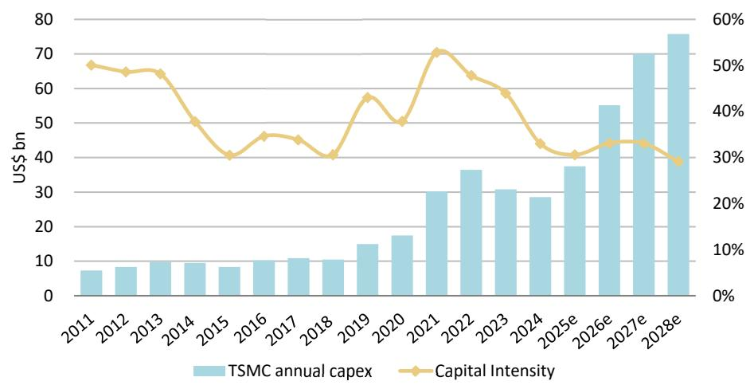  
Exhibit 2: TSMC's capex intensity should drop sharply with a large revenue ramp up   
Source: Company data, Morgan Stanley Research (e) estimates

Demand for TSMC's 3nm node

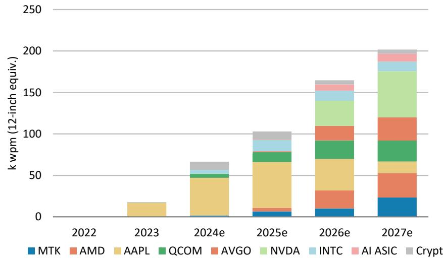  
Exhibit 3: Wafer demand for TSMC 3nm   
Source: Morgan Stanley Research (e) estimates

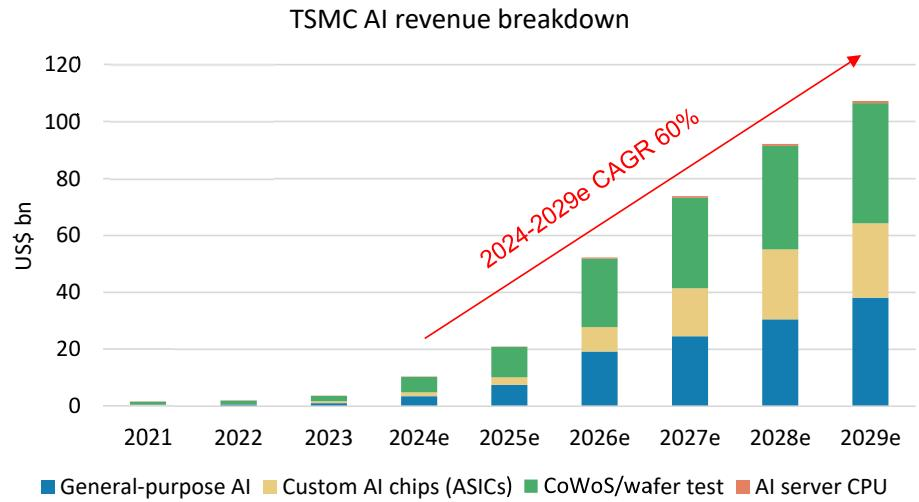  
Exhibit 4: TSMC's AI revenue could achieve a $5 5 \%$ $6 0 \%$ CAGR during 2024 to 2029   
Source: Company data, Morgan Stanley Research (e) estimates

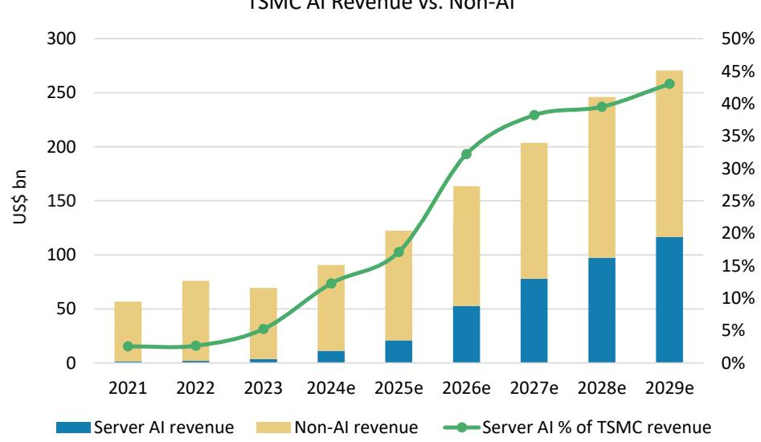  
Exhibit 5: TSMC mentioned that AI revenue accounted for a high-teens share of 2025 total revenue, and we expect it to reach $40 \%$ by 2027   
TSMC AI Revenue vs. Non-AI   
Source: Company data, Morgan Stanley Research (e) estimates

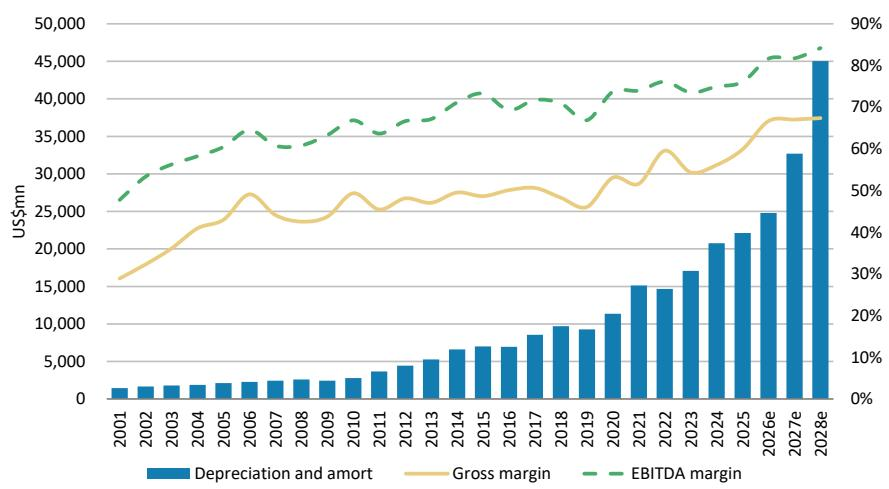  
Exhibit 6: We think TSMC can easily achieve its ${ > } 5 6 \%$ gross margin goal even with increased capex   
Source: Company data, Morgan Stanley Research (e) estimates

# 1Q26 earnings review

TSMC's 1Q26 gross margin was $6 6 . 2 \% _ { \cdot }$ , beating both our estimate and consensus by around 2ppts, as well as its guidance of $6 3 \% 6 5 \%$ . The margin beat was mostly from a higher utilization rate, as well as productivity improvement. Looking into the 1Q26 revenue breakdown, we are seeing 5nm demand sustain strong momentum from 4Q25, contributing around $3 6 \%$ of the total revenue, suggesting strong demand from major AI product and peripheral demand.

Exhibit 7: 1Q26 earnings review   

<table><tr><td rowspan=2 colspan=1>(NT$ mn)</td><td rowspan=1 colspan=5>1Q26</td></tr><tr><td rowspan=1 colspan=5>Actual               Q/Q        Y/Y      MS Est.   Consensus</td></tr><tr><td rowspan=1 colspan=6>Financials</td></tr><tr><td rowspan=1 colspan=1>Revenue</td><td rowspan=1 colspan=1>1,134,103</td><td rowspan=1 colspan=1>8.4%</td><td rowspan=1 colspan=1>35.1%</td><td rowspan=1 colspan=1>1,134,103</td><td rowspan=1 colspan=1>1,125,493</td></tr><tr><td rowspan=1 colspan=1>Opex</td><td rowspan=1 colspan=1>(92,329)</td><td rowspan=1 colspan=1>6.0%  1</td><td rowspan=1 colspan=1>7.0%</td><td rowspan=1 colspan=1>(101,023)</td><td rowspan=1 colspan=1>(101,246)</td></tr><tr><td rowspan=1 colspan=1>EPS(NT$)</td><td rowspan=1 colspan=1>22.08</td><td rowspan=1 colspan=1>13.2%</td><td rowspan=1 colspan=1>58.3%</td><td rowspan=1 colspan=1>21.43</td><td rowspan=1 colspan=1>20.89</td></tr><tr><td rowspan=1 colspan=1>Ratios</td><td rowspan=1 colspan=1></td><td rowspan=1 colspan=1></td><td rowspan=1 colspan=1></td><td rowspan=1 colspan=1></td><td rowspan=1 colspan=1></td></tr><tr><td rowspan=1 colspan=1>GM(%)</td><td rowspan=1 colspan=1>66.2%</td><td rowspan=1 colspan=1>392bps</td><td rowspan=1 colspan=1>746bps</td><td rowspan=1 colspan=1>64.2%</td><td rowspan=1 colspan=1>64.3%</td></tr><tr><td rowspan=1 colspan=1>Opex (%)</td><td rowspan=1 colspan=1>8.1%</td><td rowspan=1 colspan=1>-18bps</td><td rowspan=1 colspan=1>-214bps</td><td rowspan=1 colspan=1>8.9%</td><td rowspan=1 colspan=1>9.0%</td></tr><tr><td rowspan=1 colspan=1>OPM(%)</td><td rowspan=1 colspan=1>58.1%</td><td rowspan=1 colspan=1>410bps</td><td rowspan=1 colspan=1>960bps</td><td rowspan=1 colspan=1>55.3%</td><td rowspan=1 colspan=1>55.3%</td></tr></table>

Source: Company Data, FactSet, Morgan Stanley Research estimates

# 2Q26 guidance review

Looking to 2Q26, the company guided for USD revenue to be up $1 0 \% \mathrm { Q } / \mathrm { Q }$ at the midpoint, which is higher than our estimate of 5-10% Q/Q growth. In terms of margin, TSMC guides 添加微信 Lfor 2Q26 GM to be $6 6 . 5 \%$ 23321Cad 04-17  at the midpoint, which also strongly beat our estimate and consensus by around 2ppts. However, despite the strong beat in 1H26 margin, we don’t expect 2H26 margins to keep going up on $\mathsf { H } / \mathsf { H }$ basis. 2H26 margin is likely to stay at $6 6 . 5 \% - 6 7 . 0 \%$ given the dilution from the 2nm process, for which the company has already guided for $2 - 3 \%$ margin dilution from 2nm process to the overall corporate margin.

Exhibit 8: 2Q26 Guidance Review   

<table><tr><td rowspan=2 colspan=1>(NT$ mn)</td><td rowspan=1 colspan=5>2Q26</td></tr><tr><td rowspan=1 colspan=5>Guidance            MS Est.      Q/Q        YIY    Consensus</td></tr><tr><td rowspan=1 colspan=6>Financials</td></tr><tr><td rowspan=1 colspan=1>Revenue</td><td rowspan=1 colspan=1>US$39.0bn to US$40.2bn,+10%Q/Qincrease at mid-point</td><td rowspan=1 colspan=1>1,220,992</td><td rowspan=1 colspan=1>7.7%</td><td rowspan=1 colspan=1>30.8%</td><td rowspan=1 colspan=1>1,206,441</td></tr><tr><td rowspan=1 colspan=1>Opex</td><td rowspan=1 colspan=1></td><td rowspan=1 colspan=1>(105,119) 1</td><td rowspan=1 colspan=1>13.9%</td><td rowspan=1 colspan=1>25.2%</td><td rowspan=1 colspan=1>(107,558)</td></tr><tr><td rowspan=1 colspan=1>EPS(NT$)</td><td rowspan=1 colspan=1></td><td rowspan=1 colspan=1>22.67</td><td rowspan=1 colspan=1>2.7%</td><td rowspan=1 colspan=1>47.6%</td><td rowspan=1 colspan=1>22.10</td></tr><tr><td rowspan=1 colspan=1>Ratios</td><td></td><td></td><td></td><td></td><td></td></tr><tr><td rowspan=1 colspan=1>GM(%)</td><td rowspan=1 colspan=1>65.5%-67.5%</td><td rowspan=1 colspan=1>64.4%</td><td rowspan=1 colspan=1>-181bps</td><td rowspan=1 colspan=1>582bps</td><td rowspan=1 colspan=1>64.2%</td></tr><tr><td rowspan=1 colspan=1>Opex (%)</td><td></td><td rowspan=1 colspan=1>8.6%</td><td rowspan=1 colspan=1>47bps</td><td rowspan=1 colspan=1>-38bps</td><td rowspan=1 colspan=1>8.9%</td></tr><tr><td rowspan=1 colspan=1>OPM(%)</td><td rowspan=1 colspan=1>56.5%-58.5%</td><td rowspan=1 colspan=1>55.8%</td><td rowspan=1 colspan=1>-228bps</td><td rowspan=1 colspan=1>620bps</td><td rowspan=1 colspan=1>55.3%</td></tr></table>

Source: Company Data, FactSet, Morgan Stanley Research estimates

# EPS estimate revisions

We raise our EPS estimates $8 \%$ for 2026, $1 1 \%$ for 2027, and $13 \%$ for 2028: We raised our revenue forecasts by $3 . 6 \%$ as the company's ability to push the UTR further has been better than our expectation. However, our upward earnings revisions are are mostly due to margin improvement driven by higher UTR and ongoing productivity improvement from the company.

Exhibit 9: TSMC: Estimate revisions   

<table><tr><td>(NT$ mn)</td><td>New2026e</td><td>Old 2026e</td><td>Diff.%</td><td>New 2027e</td><td>Old 2027e</td><td>Diff.%</td><td>New2028e</td><td>Old 2028e</td><td>Diff.%</td></tr><tr><td>Net sales</td><td>5,213,620</td><td>5,073,332</td><td>3%</td><td>6,566,633</td><td>6,330,127</td><td>4%</td><td>8,060,022</td><td>7,626,120</td><td>6%</td></tr><tr><td>Gross profit</td><td>3,476,058</td><td>3,262,561</td><td>7%</td><td>4,401,351</td><td>4,014,283</td><td>10%</td><td>5,430,454</td><td>4,840,389</td><td>12%</td></tr><tr><td> Operating profit</td><td>3,076,809</td><td>2,827,031</td><td>9%</td><td>3,850,597</td><td>3,470,515</td><td>11%</td><td>4,772,653</td><td>4,195,105</td><td>14%</td></tr><tr><td>Pretax income</td><td>3,185,165</td><td>2,933,060</td><td>9%</td><td>3,956,627</td><td>3,576,545</td><td>11%</td><td>4,874,683</td><td>4,297,135</td><td>13%</td></tr><tr><td>Net income</td><td>2,679,677</td><td>2,478,938</td><td>8%</td><td>3,344,231</td><td>3,022,546</td><td>11%</td><td>4,107,817</td><td>3,621,179</td><td>13%</td></tr><tr><td>Diluted EPS</td><td>103.34</td><td>95.60</td><td>8%</td><td>128.97</td><td>116.57</td><td>11%</td><td>158.42</td><td>139.65</td><td>13%</td></tr><tr><td></td><td></td><td></td><td></td><td></td><td></td><td></td><td></td><td></td><td></td></tr><tr><td>Margins Gross margin</td><td>66.7%</td><td>64.3%</td><td></td><td>67.0%</td><td>63.4%</td><td></td><td>67.4%</td><td></td><td></td></tr><tr><td>Operating margin</td><td>59.0%</td><td>55.7%</td><td></td><td>58.6%</td><td>54.8%</td><td></td><td>59.2%</td><td>63.5% 55.0%</td><td></td></tr><tr><td> Pretax margin</td><td>61.1%</td><td>57.8%</td><td></td><td>60.3%</td><td>56.5%</td><td></td><td>60.5%</td><td>56.3%</td><td></td></tr><tr><td>Net margin</td><td>51.4%</td><td>48.9%</td><td></td><td>50.9%</td><td>47.7%</td><td></td><td>51.0%</td><td>47.5%</td><td></td></tr></table>

Source: Morgan Stanley Research (e) estimates

# Valuation methodology

We raise our target price from NT\$2,288 to NT\$2,588, the upward revision is due mostly to our earnings estimates change for 2026e to 2028e. We continue to derive our 12- month price target (base case scenario) using a residual income valuation methodology. All of our key assumptions remain unchanged, including a cost of equity of $9 . 2 \%$ (beta of 1.2, risk premium of $6 . 0 \% ,$ risk-free rate of $2 . 0 \%$ ), intermediate growth rate of $1 0 . 5 \% ,$ and terminal growth rate of $4 \%$ .

Our Bull case rises from NT $\$ 2,760$ to $N \tau \$ 3,120$ , and our Bear case rises from $N \top \$ 1,260$ to NT\$1,425.

Exhibit 10: TSMC: Residual income model   

<table><tr><td></td><td>2026e</td><td>2027e</td><td>2028e</td><td>2029e</td><td>2030e</td><td>2031e</td><td>2032e</td><td>2033e</td><td>2034e</td><td>2035e</td><td>2036e</td><td>2037e</td></tr><tr><td>Total Equity Net Profit</td><td>7,569,957 2,679,677</td><td>10,162,145 3,344,231</td><td>13,310,459 4,107,817</td><td>16,215,507 4,539,138</td><td>19,425,586 5,015,747</td><td>22,972,722 5,542,401</td><td>26,892,308 6,124,353</td><td>31,223,451 6,767,410</td><td>36,009,363 7,477,988</td><td>41,297,796 8,263,177</td><td>47,141,515 9,130,810</td><td>53,598,824 10,089,546</td></tr><tr><td>ROAE</td><td></td><td></td><td></td><td></td><td></td><td></td><td></td><td></td><td>22.2%</td><td>21.4%</td><td>20.6%</td><td>20.0%</td></tr><tr><td></td><td>41.1%</td><td>37.7%</td><td>35.0%</td><td>30.7%</td><td>28.1%</td><td>26.1%</td><td>24.6%</td><td>23.3%</td><td></td><td></td><td></td><td></td></tr><tr><td>Residual Income Spread</td><td>1,743,551</td><td>2,158,915</td><td>2,621,930 25.8%</td><td>2,867,972 21.5%</td><td>3,072,169</td><td>3,291,557</td><td>3,529,465</td><td>3,788,969</td><td>4,073,116</td><td>4,385,048 12.2%</td><td>4,728,086 11.4%</td><td>5,105,801 10.8%</td></tr><tr><td></td><td>31.9%</td><td>28.5%</td><td></td><td></td><td>18.9%</td><td>16.9%</td><td>15.4%</td><td>14.1%</td><td>13.0%</td><td></td><td></td><td></td></tr><tr><td>Ending Equity Capital</td><td>7,569,957</td><td></td><td></td><td></td><td></td><td></td><td></td><td></td><td></td><td></td><td></td><td></td></tr><tr><td>PV of Forecast Period</td><td>20,747,529</td><td></td><td></td><td></td><td></td><td></td><td></td><td></td><td></td><td></td><td></td><td></td></tr><tr><td>PV of Continuing Value</td><td>38,783,309</td><td></td><td></td><td></td><td></td><td></td><td></td><td></td><td></td><td></td><td></td><td></td></tr><tr><td>Equity Value</td><td>67,100,795</td><td></td><td></td><td></td><td></td><td></td><td></td><td></td><td></td><td></td><td></td><td></td></tr><tr><td>No. of Shares Projected Price (NT$)</td><td>25,930 2,588</td><td></td><td></td><td></td><td></td><td></td><td></td><td></td><td></td><td></td><td></td><td></td></tr></table>

Source: Company data, Morgan Stanley Research (e) estimates

# Relative valuation

The stock is trading at $7 6 . 3 x$ our 2027 EPS estimate, near its NTM average P/E of 16x since 2018. We find this level very attractive.

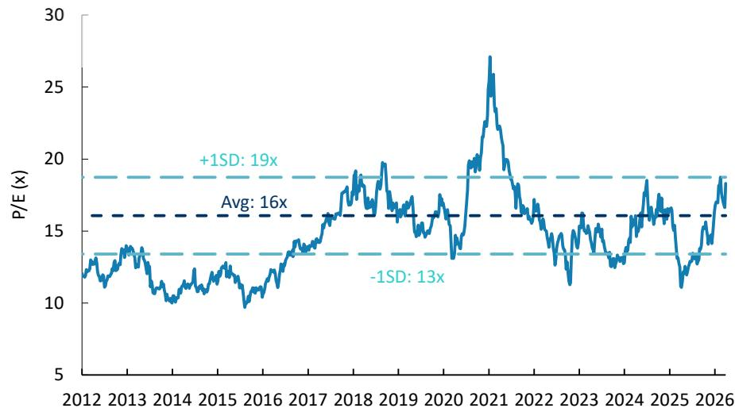  
Exhibit 11: TSMC's one-year forward P/E: valuation does not appear stretched as a key AI semi enabler   
Source: Company data, FactSet, Morgan Stanley Research

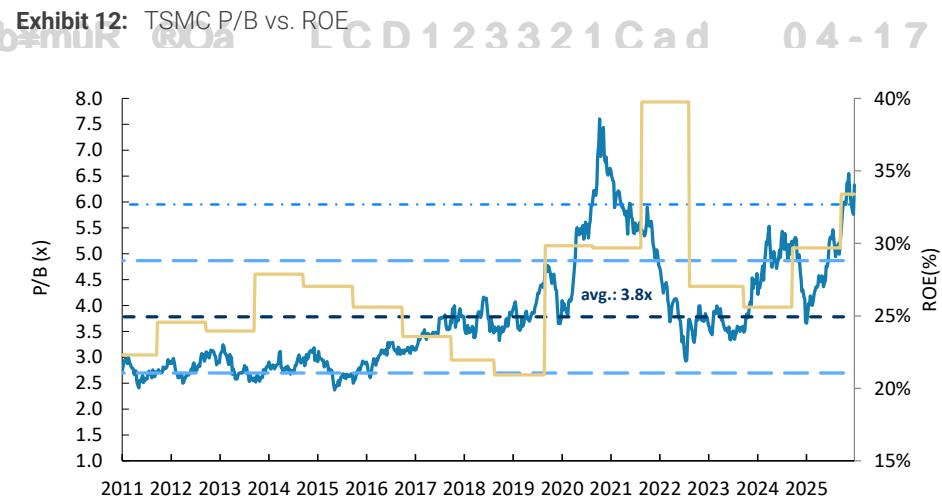  
Source: Company data, Refinitiv, Morgan Stanley Research

Morgan Stanley is acting as exclusive financial advisor to AP Grange Holdings, LLC (“AP Grange”) in relation to a definitive agreement with Intel Corporation (“Intel”), for Intel to repurchase the $49 \%$ equity interest in the joint venture related to Intel’s Fab 34 in Ireland not held by Intel, as announced on April 1, 2026. The transaction is subject to customary closing conditions. AP Grange has agreed to pay fees to Morgan Stanley for its financial advisory services. Please refer to the notes at the end of this report.

Exhibit 13: TSMC: Quarterly financials   

<table><tr><td>(NT$ mn)</td><td>1Q25</td><td>2Q25</td><td>3Q25</td><td>4Q25</td><td>1Q26e</td><td>2Q26e</td><td>3Q26e</td><td>4Q26e</td><td>2023</td><td></td><td>2024</td><td>2025</td><td>2026e</td><td>2027e</td><td>2028e</td></tr><tr><td>Total Revenues Sequential Change</td><td>839,254 -3.4%</td><td>933,792 11.3%</td><td>989,918 6.0%</td><td>1,046,090 5.7%</td><td>1,134,103 8.4%</td><td>1,266,623 11.7%</td><td>1,372,042</td><td>1,440,852 8.3%</td><td>5.0%</td><td>2,161,736</td><td>2,894,308</td><td>3,809,054</td><td>5,213,620</td><td>6,566,633</td><td>8,060,022</td></tr><tr><td>Changevs Year Ago</td><td>41.6%</td><td>38.6%</td><td>30.3%</td><td>20.5%</td><td>35.1%</td><td>35.6%</td><td></td><td>38.6%</td><td>37.7%</td><td>-4.5%</td><td>33.9%</td><td>31.6%</td><td>36.9%</td><td>26.0%</td><td>22.7%</td></tr><tr><td>Cost of Sales</td><td>(345,859)</td><td>(386,423)</td><td>(401,375)</td><td>(394,103)</td><td>(382,808)</td><td>(418,298)</td><td>(458,622)</td><td>(477,833)</td><td></td><td>(986,625)</td><td>(1,269,954)</td><td>(1,527,760)</td><td>(1,737,562)</td><td>(2,165,282)</td><td>(2,629,568)</td></tr><tr><td>Percentof Revenues Gross Profit</td><td>41.2% 493,395</td><td>41.4% 547,369</td><td>40.5% 588,543</td><td>37.7%</td><td>33.8%</td><td>33.0%</td><td>33.4%</td><td>33.2%</td><td></td><td>45.6%</td><td>43.9%</td><td>40.1%</td><td>33.3%</td><td>33.0%</td><td>32.6% 5,430,454</td></tr><tr><td>Gross Margin</td><td>58.8%</td><td>58.6%</td><td>59.5%</td><td>651,987 62.3%</td><td>751,295 66.2%</td><td>848,325 67.0%</td><td>913,419 66.6%</td><td>963,018 66.8%</td><td></td><td>1,175,111 54.4%</td><td>1,624,354 56.1%</td><td>2,281,295 59.9%</td><td>3,476,058 66.7%</td><td>4,401,351 67.0%</td><td>67.4%</td></tr><tr><td>Total Opex Percentof Revenues</td><td>(86,314) 10.3%</td><td>(83,946) 9.0%</td><td>(87,858) 8.9%</td><td>(87,084) 8.3%</td><td>(92,329)</td><td>(96,667) 7.6%</td><td>(102,898) 7.5%</td><td>(107,355) 7.5%</td><td></td><td>(253,645) 11.7%</td><td>(302,301) 10.4%</td><td>(345,202) 9.1%</td><td>(399,249) 7.7%</td><td>(550,754) 8.4%</td><td>(657,801) 8.2%</td></tr><tr><td>R&amp;D</td><td></td><td></td><td></td><td></td><td></td><td></td><td></td><td></td><td></td><td></td><td></td><td></td><td></td><td></td><td></td></tr><tr><td>Percent of Revenues</td><td>(56,547) 6.7%</td><td>(61,280) 6.6%</td><td>(63.742) 6.4%</td><td>(64,858) 6.2%</td><td>(67,757)</td><td>(69,857) 5.5%</td><td>(73.857) 5.4%</td><td>(76,857) 5.3%</td><td></td><td>(182.370) 8.4%</td><td>(204,182) 7.1%</td><td>(246,427) 6.5%</td><td>(288,328) 5.5%</td><td>(356,300) 5.4%</td><td>(416.000) 5.2%</td></tr><tr><td>SG&amp;A</td><td>(29,767)</td><td>(22,666)</td><td>(24,116)</td><td>(22,227)</td><td>6.0% (24,572)</td><td>(26,810)</td><td>(29,041)</td><td>(30,498)</td><td></td><td>(71,275)</td><td>(98,119)</td><td>(98,775)</td><td>(110,921)</td><td>(194,454)</td><td>(241,801)</td></tr><tr><td>Sequential Change</td><td>1.1%</td><td>-23.9%</td><td>6.4%</td><td>-7.8%</td><td>10.6%</td><td>9.1%</td><td>8.3%</td><td>5.0%</td><td></td><td></td><td></td><td></td><td></td><td></td><td></td></tr><tr><td>Change vsYearAgo</td><td>53.6%</td><td>-3.6%</td><td>-6.5%</td><td>-24.5%</td><td>-17.5%</td><td>18.3%</td><td>20.4%</td><td>37.2%</td><td></td><td></td><td></td><td></td><td></td><td></td><td></td></tr><tr><td>Operating Income Percent of Revenues</td><td>407,081</td><td>463,424 49.6%</td><td>500,685 50.6%</td><td>564,902</td><td>658,966</td><td>751,658</td><td>810,521</td><td>855,664</td><td></td><td>921,466</td><td>1,322,053</td><td>1,936,092</td><td>3,076,809</td><td>3,850,597</td><td>4,772,653 59.2%</td></tr><tr><td>Non-operating Income(Loss)</td><td>48.5%</td><td></td><td></td><td>54.0%</td><td>58.1%</td><td>59.3%</td><td>59.1%</td><td>59.4%</td><td></td><td>42.6%</td><td>45.7%</td><td>50.8%</td><td>59.0%</td><td>58.6%</td><td>102,030</td></tr><tr><td>Profit Before Taxes</td><td>23,815 430,895</td><td>29,612 493,035</td><td>24,684 525,369</td><td>27,461 592,363</td><td>28,834</td><td>26,507 778,165</td><td>26,507 837,029</td><td>26,507 882,171</td><td></td><td>57,706</td><td>83,786</td><td>105,571</td><td>108,356</td><td>106,030</td><td>4,874,683</td></tr><tr><td>Percent of Revenues</td><td>51.3%</td><td>52.8%</td><td>53.1%</td><td>56.6%</td><td>687,800 60.6%</td><td>61.4%</td><td>61.0%</td><td>61.2%</td><td></td><td>979,171 45.3%</td><td>1,405,839 48.6%</td><td>2,041,663 53.6%</td><td>3,185,165 61.1%</td><td>3,956,627 60.3%</td><td>60.5%</td></tr><tr><td>Taxes TaxRate</td><td>(70,163)</td><td>(95.542)</td><td>(73.614) 14.0%</td><td>(86.948)</td><td>(114,999)</td><td>(132,288)</td><td>(125,554)</td><td>(132,326)</td><td></td><td>(141,404)</td><td>(233.407)</td><td>(326,266)</td><td>(505,167)</td><td>(612,395)</td><td>(766,866) 15.7%</td></tr><tr><td>Net Income, Cont Ops</td><td>16.3% 360,733</td><td>19.4% 397,493</td><td>451,755</td><td>14.7% 505,415</td><td>16.7% 572.801</td><td>17.0% 645,877</td><td>15.0% 711,474</td><td>15.0% 749,846</td><td></td><td>14.4% 837,768</td><td>16.6% 1,172,432</td><td>16.0% 1,715,397</td><td>15.9% 2,679,998</td><td>15.5% 3,344,231</td><td>4,107,817</td></tr><tr><td>Minority Interest</td><td>831</td><td>780</td><td>546</td><td>329</td><td></td><td>(321)</td><td></td><td>0</td><td></td><td>730</td><td>836</td><td>2.486</td><td>(321)</td><td>0</td><td>0</td></tr><tr><td>Reported Income (TW GAAP)</td><td>361,564</td><td>398,273</td><td>452,301</td><td>505,744</td><td>572,480</td><td>645,877</td><td>711,474</td><td>749,846</td><td></td><td>838,498</td><td>1,173,268</td><td>1,717,883</td><td>2,679,677</td><td>3,344,231</td><td>4,107,817</td></tr><tr><td>Percent of Revenues Change vs Year Ago</td><td>43.1% 60.3%</td><td>42.7% 60.7%</td><td>45.7% 39.1%</td><td>48.3% 35.0%</td><td>50.5% 58.3%</td><td>51.0% 62.2%</td><td>51.9% 57.3%</td><td>52.0% 48.3%</td><td></td><td>38.8% -17.5%</td><td>40.5% 39.9%</td><td>45.1% 46.4%</td><td>51.4% 56.0%</td><td>50.9% 24.8%</td><td>51.0% 22.8%</td></tr><tr><td>Reported EPS (NT$,TW GAAP)</td><td>13.94</td><td>15.36</td><td>17.44</td><td>19.50</td><td>22.08</td><td>24.91</td><td>27.44</td><td>28.92</td><td></td><td></td><td></td><td></td><td></td><td></td><td></td></tr><tr><td></td><td></td><td></td><td></td><td></td><td></td><td></td><td></td><td></td><td></td><td>32.34</td><td>45.25</td><td>66.25</td><td>103.34</td><td>128.97</td><td>158.42</td></tr><tr><td>Basic shares (mn units)</td><td>25,927</td><td>25,928</td><td>25,929</td><td>25,926</td><td>25,926</td><td>25,926</td><td>25,926</td><td>25,926</td><td></td><td>25,929</td><td>25.928</td><td>25,928</td><td>25,926</td><td>25.926</td><td>25.926</td></tr></table>

Source: Company data, Morgan Stanley Research (e) estimates

# Risk Reward – TSMC (2330.TW) Top Pick

2026 revenue and capex guidance raised

# NT\$2,588.00PRICE TARGET

Base case, residual income model. Key assumptions: a cost of equity of $9 . 2 \%$ (beta of 1.2, riskfree rate of $2 . 0 \%$ and risk premium of $6 . 0 \%$ , an intermediate growth rate of $7 0 . 5 \% _ { \mathrm { { s } } }$ and a terminal growth rate of $4 . { \dot { 0 } } \%$ .

Consensus Price Target Distribution

Source: Re fi nitiv, Morgan Stanley Research

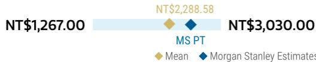

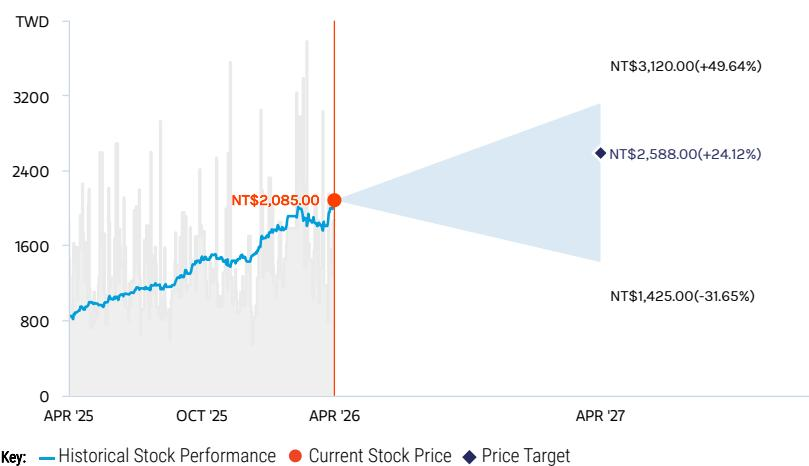  
RISK REWARD CHART   
Source: Re nitiv, Morgan Stanley Research

# OVERWEIGHT THESIS

▪ Re flecting robust AI capex guidance from Meta and Microsoft, TSMC remains our Top Pick.

▪ Our price target re flects TSMC’s strong 04-17 pro fitability and another year of $> 3 0 \%$ Y/Y revenue growth seen for 2026e.

▪ Part of that can be contributed by China's AI GPU market through Nvidia.

▪ Re flecting increased bargaining power, long-term margin expansion, and sustainable AI semi demand, we expect the stock to rerate to our implied 2027e target $\mathsf { P / E }$ of $^ { 2 0 \times }$ .

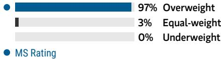  
Consensus Rating Distribution   
Source: Re nitiv, Morgan Stanley Research

# Risk Reward Themes

New Data Era: Positive Pricing Power: Positive 04-17 Secular Growth: Positive View descriptions of Risk Rewards Themes here

# BULL CASE

# NT\$3,120.00

# BASE CASE

# NT\$2,588.00

# BEAR CASE

NT\$1,425.00

# 24x 2027e EPS

# TSMC dominates foundry services: 1)

Breakthrough in EUV tech and materials accelerates node migration to 3nm and beyond. 2) Intel outsources its server CPU production to TSMC sooner than expected. 3) Intel or Samsung exits leading-edge foundry business. 4) New tech megatrends such as 6G or AI drive global semi revenue growth and increase demand for leading edge nodes. 5) Cost per transistor decreases further along with node migration.

# 20x 2027e EPS

Leading position in leading-edge logic foundry services with some gross margin expansion: 1) Global semi revenue CAGR is sustained in the high single digits in 2025- 28. 2) TSMC continues to lead in market share in 16nm, 7nm, 5nm, 3nm, and 2nm. 3) It continues to observe robust AI-related demand. 4) Cost per transistor does not decrease meaningfully in 3nm and 2nm, while capex per k is more demanding than for 7nm and 5nm.

11x 2027e EPS

TSMC's dominance in foundry business erodes: 1) Global ex-memory semi revenue growth is weaker than expected in 2025-28. 2) Declining trailing-edge market share causes revenue shortfall. 3) Intel's contribution is weaker than expected. Intel and/or Samsung successfully develop leading-edge process technology. 4) Intel's foundry business execution proves successful and weighs on TSMC with order competition. 5) Demand for 2nm is less than expected given high transistor cost for 04-17 foundry customers.

# Risk Reward – TSMC (2330.TW)

# KEY EARNINGS INPUTS

<table><tr><td>Drivers</td><td>2025</td><td>2026e</td><td>2027e 2028e</td><td></td></tr><tr><td>Revenue from 5nm Geometry (NTs, mn)</td><td></td><td></td><td></td><td>1,179,907 1,224,675 1,020,463 1,051,528</td></tr><tr><td>Revenue from 10/7nm Geometry (NTS, mn)</td><td></td><td></td><td>459,258501,375496,279494,427</td><td></td></tr><tr><td>Revenue from 16/20nm Geometry (NTS,mn)</td><td></td><td></td><td>220,027289,383318,988336,404</td><td></td></tr></table>

# INVESTMENT DRIVERS

Moore's Law migration (chip scaling) and alternative technologies   
Capex intensity - cost of building leading-edge foundry capacity   
Bargaining power with key equipment vendors   
Transistor cost for customers   
ROI for leading-edge foundry

# GLOBAL REVENUE EXPOSURE

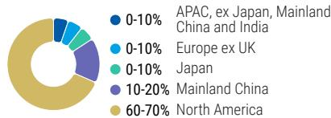  
Source: Morgan Stanley Research Estimate View explanation of regional hierarchies here

# MS ALPHA MODELS

<table><tr><td colspan="3">2/5 3 Month</td></tr><tr><td>MOST</td><td></td><td>Horizon</td></tr></table>

Source: Re nitiv, FactSet, Morgan Stanley Research; 1 is the highest favored Quintile and 5 is the least favored Quintile

# RISKS TO PT/RATING

# RISKS TO UPSIDE

TSMC charges large customers more to keep its gross margin above $56 \%$ in the long term. AI semi demand grows more signi cantly than expected, while TSMC maintains high market share in leading-edge foundry business. Outsourcing from Intel CPU increases in 2025- 27.

# RISKS TO DOWNSIDE

Inventory correction occurs in 2026. Demand for leading edge technologies weakens. Costs of overseas fabs grow signi cantly.

# OWNERSHIP POSITIONING

Inst. Owners, % Active $7 2 . 8 \%$

Source: Re nitiv, Morgan Stanley Research

# MS ESTIMATES VS. CONSENSUS

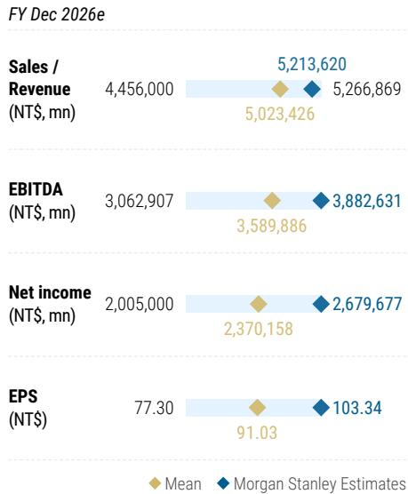  
Source: Re nitiv, Morgan Stanley Research

# Financial summary

Income Statement, 2024-2028e, Year End Dec   

<table><tr><td>(NT$mn)</td><td>2024</td><td>2025</td><td>2026e</td><td>2027e</td><td>2028e</td></tr><tr><td>Revenue</td><td>2,894,308</td><td>3,809,054</td><td>5,213,620</td><td>6,566,633</td><td>8,060,022</td></tr><tr><td>YoY Growth</td><td>33.9%</td><td>31.6%</td><td>36.9%</td><td>26.0%</td><td>22.7%</td></tr><tr><td>Gross Profit b/f dep</td><td>2,247,086</td><td>2,924,670</td><td>4,212,960</td><td>5,364,278</td><td>6,756,268</td></tr><tr><td>Less: COGS</td><td>(1,269,954)</td><td>(1,527,760)</td><td>(1,737,562)</td><td>(2,165,282)</td><td>(2,629,568)</td></tr><tr><td>Variable costs</td><td>(647,221)</td><td>(884,384)</td><td>(1,000,659)</td><td>(1,202,355)</td><td>(1,303,754)</td></tr><tr><td>Depreciation&amp;amort</td><td>(622,733)</td><td>(643,376)</td><td>(736,902)</td><td>(962,927)</td><td>(1,325,814)</td></tr><tr><td>Gross profit</td><td>1,624,354</td><td>2,281,295</td><td>3,476,058</td><td>4,401,351</td><td>5,430,454</td></tr><tr><td>%margin</td><td>56.1%</td><td>59.9%</td><td>66.7%</td><td>67.0%</td><td>67.4%</td></tr><tr><td>YoY Growth</td><td>38.2%</td><td>40.4%</td><td>52.4%</td><td>26.6%</td><td>23.4%</td></tr><tr><td>Operating Expenses:</td><td>(302,301)</td><td>(345,202)</td><td>(399,249)</td><td>(550,754)</td><td>(657,801)</td></tr><tr><td>R&amp;D</td><td>(204,182)</td><td>(246,427)</td><td>(288,328)</td><td>(356,300)</td><td>(416,000)</td></tr><tr><td>Sales and Marketing</td><td>(13,144)</td><td>(16,918)</td><td>(26,068)</td><td>(32,833)</td><td>(40,300)</td></tr><tr><td>General and Admin</td><td>(84,975)</td><td>(81,857)</td><td>(84,853)</td><td>(161,621)</td><td>(201,501)</td></tr><tr><td>Operating Profit</td><td>1,322,053</td><td>1,936,092</td><td>3,076,809</td><td>3,850,597</td><td>4,772,653</td></tr><tr><td>%margin</td><td>45.7%</td><td>50.8%</td><td>59.0%</td><td>58.6%</td><td>59.2%</td></tr><tr><td>YoY Growth</td><td>43.5%</td><td>46.4%</td><td>58.9%</td><td>25.1%</td><td>23.9%</td></tr><tr><td></td><td></td><td></td><td></td><td></td><td></td></tr><tr><td>Non-Operating Income Pretax Profit</td><td>83,786 1,405,839</td><td>105,571</td><td>108,356</td><td>106,030 3,956,627</td><td>102,030 4,874,683</td></tr><tr><td>%margin</td><td>48.6%</td><td>2,041,663 53.6%</td><td>3,185,165 61.1%</td><td>60.3%</td><td>60.5%</td></tr><tr><td></td><td></td><td></td><td></td><td></td><td></td></tr><tr><td>Tax Reported net Income</td><td>(233,407) 1,173,268</td><td>(326,266)</td><td>(505,167)</td><td>(612,395)</td><td>(766,866)</td></tr><tr><td></td><td></td><td>1,717,883</td><td>2,679,677</td><td>3,344,231</td><td>4,107,817</td></tr><tr><td>Reported EPS (NT$)</td><td>45.25</td><td>66.25</td><td>103.34</td><td>128.97</td><td>158.42</td></tr><tr><td>EPS forconsensus (NT$)</td><td>45.25</td><td>66.25</td><td>103.34</td><td>128.97</td><td>158.42</td></tr></table>

Key Ratios, 2024-2028e   

<table><tr><td></td><td>2024</td><td>2025</td><td>2026e</td><td>2027e</td><td>2028e</td></tr><tr><td>Return (%)</td><td></td><td></td><td></td><td></td><td></td></tr><tr><td>ROAA</td><td>19%</td><td>23%</td><td>30%</td><td>29%</td><td>29%</td></tr><tr><td>ROAE</td><td>30%</td><td>35%</td><td>41%</td><td>38%</td><td>35%</td></tr><tr><td>OP.ATO</td><td>0.7x</td><td>0.7x</td><td>0.8x</td><td>1.0x</td><td>0.9x</td></tr><tr><td>Gearing (x)</td><td></td><td></td><td></td><td></td><td></td></tr><tr><td>Net Debt/ Equity</td><td>-0.33x</td><td>-0.38x</td><td>-0.41x</td><td>-0.43x</td><td>-0.48x</td></tr><tr><td>Current Ratio</td><td>2.4x</td><td>2.6x</td><td>3.4x</td><td>4.3x</td><td>5.7x</td></tr><tr><td>Quick Ratio</td><td>1.9x</td><td>2.1x</td><td>2.8x</td><td>3.7x</td><td>5.1x</td></tr><tr><td>Operating Cycle</td><td></td><td></td><td></td><td></td><td></td></tr><tr><td>AR/NR Turnover (days)</td><td>29</td><td>26</td><td>24</td><td>25</td><td>25</td></tr><tr><td>Inventory Turnover (days)</td><td>76</td><td>68</td><td>66</td><td>65</td><td>65</td></tr><tr><td>AP Turnover (days)</td><td>19</td><td>19</td><td>19</td><td>19</td><td>19</td></tr><tr><td>Cash Conversion (days)</td><td>87</td><td>75</td><td>70</td><td>71</td><td>70</td></tr></table>

Balance Sheet, 2024-2028e, Year End Dec   

<table><tr><td>(NT$mn)</td><td>2024</td><td>2025</td><td>2026e</td><td>2027e</td><td>2028e</td></tr><tr><td>Cash&amp;Equivalent</td><td>2,127,627</td><td>2,767,856</td><td>3,791,590</td><td>5,064,922</td><td>7,098,277</td></tr><tr><td>MarketableSecurity</td><td>294,393</td><td>300,738</td><td>300,738</td><td>300,738</td><td>300,738</td></tr><tr><td>A/R&amp;N/R</td><td>272,088</td><td>281,791</td><td>404,939</td><td>509,873</td><td>612,439</td></tr><tr><td>Inventories</td><td>287,869</td><td>288,109</td><td>348,714</td><td>428,868</td><td>513,486</td></tr><tr><td>Other Current Ass.</td><td>106,376</td><td>178,635</td><td>178,635</td><td>178,635</td><td>178,635</td></tr><tr><td>Total current assets</td><td>3,088,352</td><td>3,817,131</td><td>5,024,617</td><td>6,483,037</td><td>8,703,575</td></tr><tr><td>Long-term Investment</td><td>149,040</td><td>172,370</td><td>172,370</td><td>172,370</td><td>172,370</td></tr><tr><td>Total fixed assets</td><td>3,234,980</td><td>3,691,841</td><td>4,612,679</td><td>5,770,237</td><td>6,723,126</td></tr><tr><td>Total other assets</td><td>219,565</td><td>251,682</td><td>251,682</td><td>251,682</td><td>251,682</td></tr><tr><td>Total Assets</td><td>6,691,938</td><td>7,933,024</td><td>10,061,349</td><td>12,677,325</td><td>15,850,753</td></tr><tr><td>A/P&amp;N/P</td><td>74,227</td><td>84,330</td><td>103,493</td><td>127,282</td><td>152,395</td></tr><tr><td>Accrued Expenses</td><td>0</td><td>0</td><td>0</td><td>0</td><td>0</td></tr><tr><td>Other Payable</td><td>531,377</td><td>630,217</td><td>630,217</td><td>630,217</td><td>630,217</td></tr><tr><td>Curr.of L-T Debt</td><td>59,858</td><td>136,926</td><td>136,926</td><td>136,926</td><td>136,926</td></tr><tr><td>Other Curr. Liab.</td><td>599,064</td><td>606,547</td><td>606,547</td><td>606,547</td><td>606,547</td></tr><tr><td>Total Current Liab.</td><td>1,264,525</td><td>1,458,019</td><td>1,477,182</td><td>1,500,971</td><td>1,526,084</td></tr><tr><td>L-T Liabilities</td><td>926,605</td><td>856,228</td><td>856,228</td><td>856,228</td><td>856,228</td></tr><tr><td>Total Other L-T Liab</td><td>177,233</td><td>157,982</td><td>157,982</td><td>157,982</td><td>157,982</td></tr><tr><td>Total Liabilities</td><td>2,368,362</td><td>2,472,229</td><td>2,491,392</td><td>2,515,180</td><td>2,540,294</td></tr><tr><td>Common Stocks</td><td>259,327</td><td>259,325</td><td>259,325</td><td>259,325</td><td></td></tr><tr><td>Preferred Stocks</td><td>0</td><td>0</td><td>0</td><td>0</td><td>259,325 0</td></tr><tr><td>Capital Reserve</td><td>73,261</td><td>73,446</td><td>73,446</td><td>73,446</td><td>73,446</td></tr><tr><td>Retained earnings</td><td>3,955,957</td><td>5,086,825</td><td>7,195,987</td><td>9,788,175</td><td>12,936,489</td></tr><tr><td>Treasury Stock</td><td>0</td><td>0</td><td>0</td><td>0</td><td>0</td></tr><tr><td>Minority Equity</td><td>35,031</td><td>41,199</td><td>41,199</td><td>41,199</td><td>41,199</td></tr><tr><td>Total Equity</td><td>4,323,576</td><td>5,460,795</td><td>7,569,957</td><td>10,162,145</td><td>13,310,459</td></tr><tr><td>Total Liab.&amp;Equity</td><td>6,691,938</td><td>7,933,024 10,061,349</td><td></td><td>12,677,325</td><td>15,850,753</td></tr></table>

Cash Flow Statement, 2024-2028e, Year End Dec   

<table><tr><td></td><td>2024</td><td>2025</td><td>2026e</td><td>2027e</td><td>2028e</td></tr><tr><td>(NT$mn)</td><td>1,173,268</td><td>1,717,883</td><td>2,679,677</td><td>3,344,231</td><td>4,107,817</td></tr><tr><td>Net Income Current</td><td>662,797</td><td>688,096</td><td>805,822</td><td>1,013,607</td><td>1,395,594</td></tr><tr><td>Depreciation Net Investment Losses (Gains)</td><td>8,205</td><td>4,992</td><td>0</td><td>0</td><td>0</td></tr><tr><td>Decrease (Increase) in Working Capital</td><td>20,896</td><td>(17,144)</td><td>(164,589)</td><td>(161,299)</td><td>(162,070)</td></tr><tr><td>Others</td><td>(38,988)</td><td>(118,851)</td><td>0</td><td>0</td><td>0</td></tr><tr><td>Cash Flow-Operating</td><td>1,826,177</td><td>2,274,976</td><td>3,320,910</td><td>4,196,540</td><td>5,341,341</td></tr><tr><td></td><td></td><td></td><td></td><td></td><td></td></tr><tr><td>(Purchase) of FA Sale of Fix Asset</td><td>(956,007) 895</td><td>(1,272,411) 797</td><td>(1,726,660) 0</td><td>(2,171,164) 0</td><td>(2,348,483) 0</td></tr><tr><td>(Purchase)L-T Inv.</td><td>(3,739)</td><td>0</td><td>0</td><td>0</td><td>0</td></tr><tr><td>Others</td><td>94,008</td><td>127,220</td><td>0</td><td>0</td><td>0</td></tr><tr><td>Cash Flow-Inv.</td><td>(864,843)</td><td>）(1,144,393) (1,726,660)</td><td></td><td>(2,171,164)</td><td>(2,348,483)</td></tr><tr><td></td><td></td><td></td><td></td><td></td><td></td></tr><tr><td>Inc(Dec)-S-T Debt Inc(Dec) L-T Debt</td><td>0 28,601</td><td>0 7,948</td><td>0 0</td><td>0</td><td>0</td></tr><tr><td>Dividend Paid</td><td>(363,055)</td><td>(466,779)</td><td>(570,516)</td><td>0 (752,043)</td><td>0</td></tr><tr><td>Dir.&amp;Emp.Bonus</td><td>0</td><td>0</td><td>0</td><td>0</td><td>(959,503)</td></tr><tr><td>Others</td><td>(11,847)</td><td>18,486</td><td>0</td><td>0</td><td>0 0</td></tr><tr><td>Cash Flow-Financing</td><td>(346,301)</td><td>(440,345)</td><td>(570,516)</td><td>(752,043)</td><td>(959,503)</td></tr><tr><td>Change in Cash</td><td>662,199</td><td>640,229</td><td>1,023,734</td><td>1,273,332</td><td></td></tr><tr><td>Net cash/(debt),b/f</td><td>1,465,428</td><td>2,127,627</td><td>2,767,856</td><td>3,791,590</td><td>2,033,354 5,064,922</td></tr><tr><td>Net cash/(debt),c/f</td><td>2,127,627</td><td>2,767,856</td><td>3,791,590</td><td>5,064,922</td><td>7,098,277</td></tr><tr><td></td><td></td><td></td><td></td><td></td><td></td></tr></table>

# Valuation Methodology and Risks

# UMC (2303.TW)

Base-case, residual income model. Key assumptions: $9 . 2 \%$ cost of equity, $5 . 9 \%$ medium-term growth, and $3 . 0 \%$ terminal growth.

# Risks to Upside

# 订阅研报

Stronger-than-expected global economic and semiconductor growth Looser pricing competition, increasing margins and utilization rates Favorable customer mix changes

# Risks to Downside

Softer-than-expected global economic and semiconductor growth n Increasing pricing competition, reducing margins and utilization rates Unfavorable customer mix changes