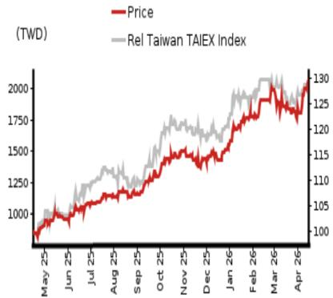
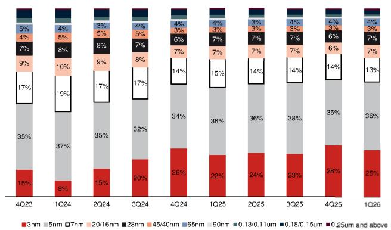
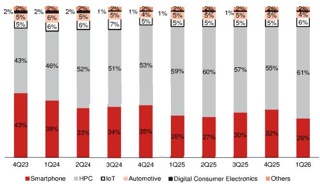
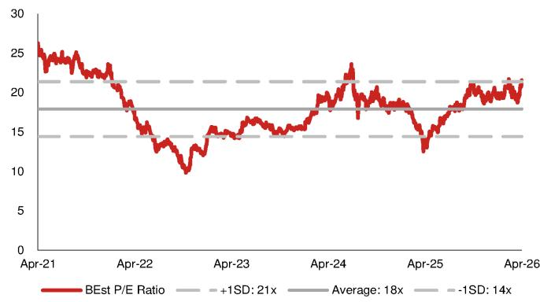
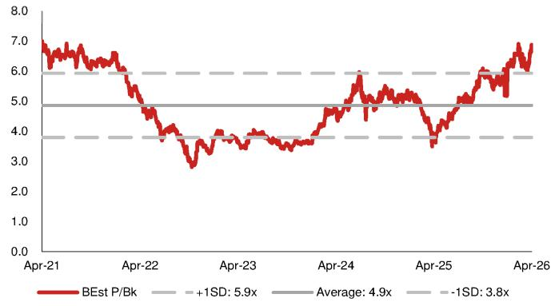
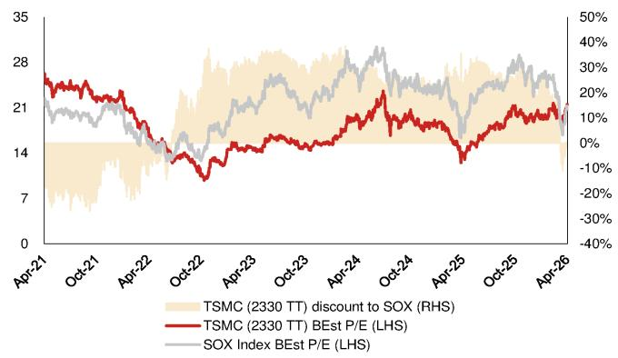
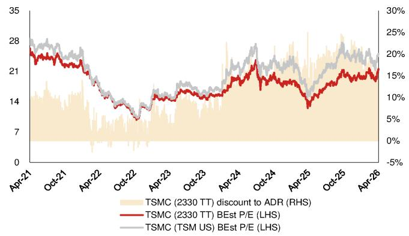
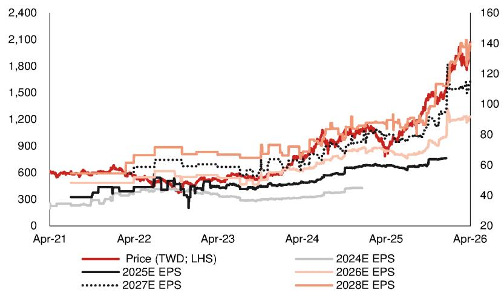

# Toning up 2026 revenue and capex guidance

TSMC (unsurprisingly) raises guidance; expresses commitment to expand capacity in due course; retain Buy

# Full-year guidance lift as we expected; reiterate Buy and raise TP to TWD2,820

TSMC guided 2Q26E revenue growth of $+ 1 0 \%$ q-q, at the midpoint (in USD terms; Fig. 2 ), with $6 5 . 5 \substack { - 6 7 . 5 \% }$ GM, broadly in line with our preview (report ), and management lifted its full-year revenue growth target to $> 3 0 \%$ (from $\sim 3 0 \%$ provided in Jan-26 ). As the severe supply constraints in Asia AI semi and server supply chain are likely to persist throughout 2026F (report ), we continue to expect fundamental upsides to TSMC and model $0 . 3 5 \%$ y-y revenue growth (in USD terms), and TSMC now expects 2026E capex to fall within the upper half of its prior target of USD52-56bn to accelerate the capacity buildup progress, although most of the greenfield capacity would start coming online from 2028E given two-three years of new fab build lead time. As our new data center build trackers – which we view as a leading indicator beyond Asia supply chain data points – point to stronger 2027F chip demand (report ), next year will likely be another supplyconstrained year, and we thus slightly raise 2027F capex to USD70bn. Against current backdrop, we anticipate GM upsides from increased AI/HPC mix and N3 depreciation rolling off along with its cost improvement efforts. We raise 2026-28F EPS by $3 . 4 \%$ mainly due to higher GM assumptions and increase TP to TWD2,820, based on an unchanged 25x 2026-27F average EPS of TWD112, near the high end of the historical band of 10- $3 0 \times$ . We reiterate our Buy rating as we believe TSMC should trade at a premium (local shares at $_ { 2 2 \times }$ and ADR at 25x P/E, based on Bloomberg consensus EPS) to the SOX index (21x consensus P/E) due to its AI-enabler position and robust growth outlook.

# Other highlights from the analyst meeting

(1) Mature nodes: TSMC flagged that its strategy is “to optimize the capacity mix within mature nodes and focus on the higher value-added and strategic segment”, which implicitly echoes our view that TSMC could redirect more resources from legacy fabs to advanced logic beyond 2027F (which better justifies the hefty investments, in our view; report ). (2) Memory price inflation: Although TSMC sees softer consumer device demand, it expects high-end devices to perform better to the company’s advantage, aligning with our view that Apple (AAPL US, Not rated) unit demand upside could backfill the shortfall from Androids in advanced nodes (report ). (3) Competition from “customers”: On Tesla’s (TSLA US, Not rated) Terafab initiative, TSMC noted “there are no shortcuts” and “it takes 2-3 years to build a new fab, and another 1-2 years to ramp it up”. Admittedly customers may have other technology options (e.g. EMIB), and TSMC “works very hard to meet all the demand” and “doesn’t leave any business on the table”.

<table><tr><td>Year-end 31 Dec</td><td>FY25</td><td></td><td>FY26F</td><td>FY27F</td><td></td><td>FY28F</td></tr><tr><td>Currency (TWD)</td><td>Actual</td><td>old</td><td>New</td><td>Old</td><td>New</td><td>old New</td></tr><tr><td>Revenue (mn)</td><td></td><td>3,809,054 5,187,7915,218,4446,445,0336,501,695</td><td></td><td></td><td></td><td>7,724,1257,875,757</td></tr><tr><td>Reported net profit (mn)</td><td>1,717,8832,543,2212,605,5723,131,2133,245,404</td><td></td><td></td><td></td><td></td><td>43,742,0043,900,744</td></tr><tr><td>Normalised net profit (mn)</td><td>1,717,8832,543,2212,605,5723,131,2133,245,4043,742,0043,900,744</td><td></td><td></td><td></td><td></td><td></td></tr><tr><td>FD normalised EPS</td><td>66.26</td><td>98.09</td><td>100.49</td><td>120.76</td><td>125.17</td><td>144.32 150.44</td></tr><tr><td>FD norm. EPS growth (%)</td><td>46.4</td><td>48.0</td><td>51.7</td><td>23.1</td><td>24.6</td><td>19.5 20.2</td></tr><tr><td>FD normalised P/E (x)</td><td>31.4</td><td>-</td><td>20.7</td><td>1</td><td>16.6</td><td>- 13.8</td></tr><tr><td>EV/EBITDA (x)</td><td>19.9</td><td>二</td><td>13.4</td><td>1</td><td>10.4</td><td>二 8.2</td></tr><tr><td>Price/book (x)</td><td>10.0</td><td>-</td><td>7.2</td><td>1</td><td>5.4</td><td>- 4.0</td></tr><tr><td>Dividend yield (%)</td><td>1.1</td><td>-</td><td>1.2</td><td>1</td><td>1.2</td><td>- 1.2</td></tr><tr><td>ROE (%)</td><td>35.4</td><td>39.9</td><td>40.5</td><td>36.4</td><td>37.0</td><td>32.8 33.3</td></tr><tr><td>Net debt/equity (%)</td><td>net cash</td><td>net cash</td><td>net cash</td><td>net cash net cash</td><td>net cash</td><td> net cash</td></tr></table>

Source: Company data, Nomura estimates

<table><tr><td>Rating Remains</td><td>Buy</td></tr><tr><td>Target price Increased from</td><td>TWD 2,820.00</td></tr><tr><td>TWD 2,735.00</td><td></td></tr><tr><td>Closing price 15 April2026</td><td>TWD 2,080.00</td></tr><tr><td>Implied upside</td><td>+35.6%</td></tr><tr><td>Market Cap (USD mn)</td><td>1,705,278.1</td></tr><tr><td>ADT (USD mn)</td><td>2,388.5</td></tr></table>

  
Relative performance chart   
Source: LSEG, Nomura

# Research Analysts Semiconductor

# Aaron Jeng, CFA - NITB

+886(2) 21769962Eric Chen, CFA - NITB

+886(2) 21769965

Vivian Yang - NITB

+886(2) 21769970

# Key data on Taiwan Semiconductor Manufacturing Corp

Performance   

<table><tr><td>(%)</td><td>1M</td><td>3M</td><td>12M</td><td></td><td></td></tr><tr><td>Absolute (TWD)</td><td>11.5</td><td>23.1</td><td>137.2</td><td>Mcap (USDmn)</td><td>1,705,278.</td></tr><tr><td>Absolute (USD)</td><td>13.1</td><td>22.8</td><td>143.7</td><td>Free float(%)</td><td>90.1</td></tr><tr><td>Rel toTaiwan TAIEX Index</td><td>1.6</td><td>3.9</td><td>52.2</td><td>3-mth ADT (USDmn)</td><td>2,388.5</td></tr></table>

Income statement (TWDmn)   

<table><tr><td>Year-end 31 Dec</td><td>FY24</td><td>FY25</td><td>FY26F</td><td>FY27F</td><td>FY28F</td></tr><tr><td>Revenue</td><td>2,894,308</td><td>3,809,054</td><td></td><td>5,218,444 6,501,695 7,875,757</td><td></td></tr><tr><td>Cost of goods sold</td><td>-1,269,954</td><td>-1,527760-176414277327</td><td></td><td></td><td></td></tr><tr><td>Gross profit</td><td>1,624,354</td><td>2,281,294</td><td></td><td>3,453,530 4,303,722</td><td>5,148,541</td></tr><tr><td>SG&amp;A</td><td>-302,301</td><td>-345,202</td><td>-430,102</td><td>-537,687</td><td>-651,321</td></tr><tr><td>Employee share expense</td><td>0</td><td>0</td><td>0</td><td>0</td><td>0</td></tr><tr><td>Operating profit</td><td>1,322,053</td><td>1,936,092</td><td>3,023,429</td><td>3,766,035</td><td>4,497,220</td></tr><tr><td>EBITDA</td><td>1,984,850</td><td>2,624,188</td><td>3,833,482</td><td>4,793,160</td><td>5,827,946</td></tr><tr><td>Depreciation</td><td>-662,797</td><td>-688,096</td><td></td><td>-810,053-1,027,125-1,30,726</td><td></td></tr><tr><td>Amortisation</td><td>0</td><td>0</td><td>0</td><td>0</td><td>0</td></tr><tr><td>EBIT</td><td>1,322,053</td><td>1,936,092</td><td>3,023,429</td><td>3,766,035</td><td>4,497,220</td></tr><tr><td>Net interest expense</td><td>67,781</td><td>86,206</td><td>118,134</td><td>155,705</td><td>218,606</td></tr><tr><td>Associates&amp; JCEs</td><td>4,879</td><td>5,497</td><td>6,693</td><td>7,952</td><td>8,171</td></tr><tr><td>Otherincome</td><td>11,125</td><td>13,868</td><td>4,003</td><td>4,000</td><td>4,000</td></tr><tr><td>Earnings before tax</td><td>1,405,839</td><td>2,041,663</td><td>3,152,259</td><td>3,933,692</td><td>4,727,998</td></tr><tr><td>Income tax</td><td>-233,407</td><td>-326,266</td><td>-545,403</td><td>-687,004</td><td>-825,970</td></tr><tr><td>Net profit after tax</td><td>1,172,432</td><td>1,715,397</td><td>2,606,856</td><td>3,246,688</td><td>3,902,028</td></tr><tr><td>Minority interests</td><td>836</td><td>2,486</td><td>-1,284</td><td>-1,284</td><td>-1,284</td></tr><tr><td>Other items</td><td>0</td><td>0</td><td>0</td><td>0</td><td>0</td></tr><tr><td>Preferred dividends</td><td>0</td><td>0</td><td>0</td><td>0</td><td>0</td></tr><tr><td>Normalised NPAT</td><td>1,173,268</td><td>1,717,883</td><td>2,605,572</td><td>3,245,4043,900,744</td><td></td></tr><tr><td>Extraordinary items</td><td>0</td><td>0</td><td>0</td><td>0</td><td>0</td></tr><tr><td>Reported NPAT</td><td>1,173,268</td><td></td><td></td><td>1,717,8832,605,5723,245,404</td><td>3,900,744</td></tr><tr><td>Dividends Transfer toreserves</td><td>-440,851</td><td>-570,516</td><td>-622,378</td><td>-622,378</td><td>-622,378</td></tr><tr><td>Valuations and ratios</td><td>732,417</td><td>1,147,366</td><td>1,983,194</td><td>2,623,026</td><td>3,278,367</td></tr><tr><td colspan="6"></td></tr><tr><td>ReportedP/E(x)</td><td>46.0</td><td>31.4</td><td>20.7</td><td>16.6</td><td>13.8</td></tr><tr><td>Normalised P/E(x)</td><td>46.0</td><td>31.4</td><td>20.7</td><td>16.6</td><td>13.8</td></tr><tr><td>FDnormalised P/E(x)</td><td>46.0</td><td>31.4</td><td>20.7</td><td>16.6</td><td>13.8</td></tr><tr><td>Dividend yield (%)</td><td>0.8</td><td>1.1</td><td>1.2</td><td>1.2</td><td>1.2</td></tr><tr><td>Price/cashflow (x)</td><td>29.5</td><td>23.7</td><td>16.8</td><td>13.1</td><td>10.8</td></tr><tr><td>Price/book (x)</td><td>12.6</td><td>10.0</td><td>7.2</td><td>5.4</td><td>4.0</td></tr><tr><td>EV/EBITDA (x)</td><td>26.6</td><td>19.9</td><td>13.4</td><td>10.4</td><td>8.2</td></tr><tr><td>EV/EBIT (x)</td><td>39.8</td><td>26.9</td><td>16.9</td><td>13.3</td><td>10.6</td></tr><tr><td>Gross margin (%)</td><td>56.1</td><td>59.9</td><td>66.2</td><td>66.2</td><td>65.4</td></tr><tr><td>EBITDA margin (%)</td><td>68.6</td><td>68.9</td><td>73.5</td><td>73.7</td><td>74.0</td></tr><tr><td>EBIT margin (%)</td><td>45.7</td><td>50.8</td><td>57.9</td><td>57.9</td><td>57.1</td></tr><tr><td>Net margin (%)</td><td>40.5</td><td>45.1</td><td>49.9</td><td>49.9</td><td>49.5</td></tr><tr><td>Effective taxrate(%)</td><td>16.6</td><td>16.0</td><td>17.3</td><td>17.5</td><td>17.5</td></tr><tr><td>Dividend payout (%)</td><td>37.6</td><td>33.2</td><td>23.9</td><td>19.2</td><td>16.0</td></tr><tr><td>ROE(%)</td><td>30.3</td><td>35.4</td><td>40.5</td><td>37.0</td><td>33.3</td></tr><tr><td>ROA (pretax %) Growth (%)</td><td>30.7</td><td>39.9</td><td>51.5</td><td>51.8</td><td>52.6</td></tr><tr><td>Revenue</td><td>33.9</td><td>31.6</td><td>37.0</td><td>24.6</td><td>21.1</td></tr><tr><td>EBITDA</td><td>36.5</td><td>32.2</td><td>46.1</td><td>25.0</td><td>21.6</td></tr><tr><td>Normalised EPS</td><td>39.9</td><td>46.4</td><td>51.7</td><td>24.6</td><td>20.2</td></tr></table>

Source: Company data, Nomura estimates

Cashflow statement (TWDmn)   

<table><tr><td>Year-end 31 Dec</td><td>FY24</td><td>FY25</td><td>FY26F</td><td>FY27F</td><td>FY28F</td></tr><tr><td>EBITDA</td><td>1,984,8502,624,1883,833,4824,793,1605,827,946</td><td></td><td></td><td></td><td></td></tr><tr><td>Change inworking capital</td><td>-90,016</td><td>30,788</td><td>-115,583</td><td>-150,107</td><td>-229,964</td></tr><tr><td>Otheroperatingcashflow</td><td>-68,657</td><td>-380,000</td><td>-504,695</td><td>-527,300</td><td>-603,363</td></tr><tr><td>Cashflow fromoperations</td><td>1,826,1772,274,9763,213,2034,115,7534,994,619</td><td></td><td></td><td></td><td></td></tr><tr><td>Capital expenditure</td><td>-955,112-1,27161-1,774,007-2,219,0002,29,00</td><td></td><td></td><td></td><td></td></tr><tr><td>Free cashflow</td><td></td><td>871,0651,003,3621,439,1961,896,7532,775,619</td><td></td><td></td><td></td></tr><tr><td>Reduction in investments</td><td>-57,882</td><td>-37,079</td><td>-30,316</td><td>0</td><td>0</td></tr><tr><td>Netacquisitions</td><td>0</td><td>0</td><td>0</td><td>0</td><td>0</td></tr><tr><td>Dec in other LTassets</td><td>0</td><td>0</td><td>0</td><td>0</td><td>0</td></tr><tr><td>Inc in other LT liabilities</td><td>0</td><td>0</td><td>0</td><td>0</td><td>0</td></tr><tr><td>Adjustments</td><td>148,151</td><td>164,299</td><td>22,412</td><td>0</td><td>0</td></tr><tr><td>CF after investing acts</td><td>961,3341,130,582</td><td></td><td></td><td>21,431,292196,7532,775619</td><td></td></tr><tr><td>Cash dividends</td><td>-363,055</td><td>-466,779</td><td>-596,448</td><td>-622,378</td><td>-622,378</td></tr><tr><td>Equity issue</td><td>0</td><td>0</td><td>0</td><td>0</td><td>0</td></tr><tr><td>Debt issue</td><td>55,866</td><td>40,448</td><td>14,030</td><td>0</td><td>0</td></tr><tr><td>Convertible debt issue</td><td>0</td><td>0</td><td>0</td><td>0</td><td>0</td></tr><tr><td>Others</td><td>8,054</td><td>-64,022</td><td>41,292</td><td>0</td><td>0</td></tr><tr><td>CF from financial acts</td><td>-299,135</td><td>-490,353</td><td>-541,126</td><td>-622,378</td><td>-622,378</td></tr><tr><td>Net cashflow</td><td>662,199</td><td>640,229</td><td></td><td>890,1661,274,3762,153,242</td><td></td></tr><tr><td>Beginning cash</td><td>1,465,4282,127,6272,767,8563,658,0224,932,98</td><td></td><td></td><td></td><td></td></tr><tr><td>Ending cash</td><td></td><td></td><td></td><td></td><td></td></tr><tr><td>Ending net debt</td><td>2,127,6272,767,8563,658,0234,932,987,085,640</td><td>-1,109,340-1,734,869-2,641,754-3,916,130-6,069,37</td><td></td><td></td><td></td></tr></table>

<table><tr><td rowspan=1 colspan=1>Balance sheet (TWDmn)As at 31 Dec                 FY24   FY25 FY26F  FY27F  FY28F</td></tr><tr><td rowspan=1 colspan=1>Cash&amp;equivalents       2,127,6272,767,8563,658,0224,932,3987,085,640</td></tr><tr><td rowspan=1 colspan=1>Marketable securities       357,531360,441347,964 347,964 347,964</td></tr><tr><td rowspan=1 colspan=1>Accounts receivable        272,088282,059461,338 556,056698,265</td></tr><tr><td rowspan=1 colspan=1>Inventories                287,869288,109401,372482,901 612,067</td></tr><tr><td rowspan=1 colspan=1>Other current assets         43,237118,664207,452 207,452207,452</td></tr><tr><td rowspan=1 colspan=1>Total current assets       3,088,3523,817,13115,076，1496,526,7708,951,388</td></tr><tr><td rowspan=1 colspan=1>LT investments            149,040172,370 171,575179,528187,699</td></tr><tr><td rowspan=1 colspan=1>Fixed assets             3,234,9803,691,8414,735,1335,927,0086,815,283</td></tr><tr><td rowspan=1 colspan=1>Goodwill                        0      0      0      0       0</td></tr><tr><td rowspan=1 colspan=1>Other intangible assets           0      0      0      0      0</td></tr><tr><td rowspan=1 colspan=1>Other LTassets           219,565251,682274,192274,192274,192</td></tr><tr><td rowspan=1 colspan=1>Totalassets             6,691,9387933,02410,257,04912,907,9916,228,562</td></tr><tr><td rowspan=1 colspan=1>Short-term debt             59,858 136,926156,242156,242156,242</td></tr><tr><td rowspan=1 colspan=1>Accounts payable           74,227  84,330 128,685 154,824196,236</td></tr><tr><td rowspan=1 colspan=1>Other current liabilities     1,130,4411,236,7631,458,1551,458,1551,45,155</td></tr><tr><td rowspan=1 colspan=1>Total current liabilities     1,264,5251,458,0191,743,0811,769,2201,10,63</td></tr><tr><td rowspan=1 colspan=1>Long-term debt            958,429896,062860,026860,026860,026</td></tr><tr><td rowspan=1 colspan=1>Convertible debt                 0      0      0      0      0</td></tr><tr><td rowspan=1 colspan=1>Other LT liabilities          145,408 118,147 154,281 154,281 154,281</td></tr><tr><td rowspan=1 colspan=1>Total liabilities           2,368,3622,472,2292,757,882,783,5272,24,940</td></tr><tr><td rowspan=1 colspan=1>Minority interest             35,031  41,199 42,392  43,676  44,960</td></tr><tr><td rowspan=1 colspan=1>Preferred stock                  0      0      0      0      0</td></tr><tr><td rowspan=1 colspan=1>Common stock            332,588332,771 332,990 332,990332,990</td></tr><tr><td rowspan=1 colspan=1>Retained earnings        3,917,2525,103,5027,086,7979,709,82312,988，190</td></tr><tr><td rowspan=1 colspan=1>Proposed dividends              0       0       0       0      0</td></tr><tr><td rowspan=1 colspan=1>Otherequityandreserves    38,705 -16,676  37,482 37,482 37,482</td></tr><tr><td rowspan=1 colspan=1>Total shareholders&#x27;equity 4,288,5455,419,5967,457,26910,080,2951358,66</td></tr><tr><td rowspan=1 colspan=1>Total equity&amp;liabilities    6,691,9387,933,02410,257,04912,907,49916,228,562</td></tr><tr><td rowspan=1 colspan=1>Liquidity (x)</td></tr><tr><td rowspan=1 colspan=1>Current ratio                  2.44    2.62    2.91    3.69    4.94</td></tr><tr><td rowspan=1 colspan=1>Interest cover                    1       1       1       1       二</td></tr><tr><td rowspan=1 colspan=1>Leverage</td></tr><tr><td rowspan=1 colspan=1>Net debt/EBITDA (x)        net cashnet cashnet cashnet cashnet cash</td></tr><tr><td rowspan=1 colspan=1>Net debt/equity(%)         net cashnet cashnet cashnet cashnet cash</td></tr><tr><td rowspan=1 colspan=1>Pershare</td></tr><tr><td rowspan=1 colspan=1>ReportedEPS(TWD)         45.25   66.26  100.49  125.17 150.44</td></tr><tr><td rowspan=1 colspan=1>Norm EPS(TWD)            45.25   66.26  100.49  125.17  150.44</td></tr><tr><td rowspan=1 colspan=1>FD norm EPS(TWD)         45.25   66.26  100.49  125.17  150.44</td></tr><tr><td rowspan=1 colspan=1>BVPS(TWD)               165.37  208.99  287.57  388.71  515.13</td></tr><tr><td rowspan=1 colspan=1>DPS (TWD)                  17.00   22.00   24.00   24.00   24.00</td></tr><tr><td rowspan=1 colspan=1>Activity (days)</td></tr><tr><td rowspan=1 colspan=1>Daysreceivable               29.9    26.6   26.0    28.6   29.1</td></tr><tr><td rowspan=1 colspan=1>Daysinventory                77.4    68.8    71.3    73.4   73.5</td></tr><tr><td rowspan=1 colspan=1>Days payable                 18.9    18.9    22.0    23.5    23.6</td></tr></table>

Source: Company data, Nomura estimates

# Company profile

Founded in 1987, Taiwan Semiconductor Manufacturing Corp. is a leading foundry player with the most advanced process technology.

Valuation Methodology

Our TP of TWD2,820 is based on 25x 2026-27F average EPS. Our target P/E is at the higher end of historical range. The benchmark index for the stock is Taiwan TAIEX and SOX.

# Risks that may impede the achievement of the target price

Major downside risks are: 1) top-down macro issues because of US-China trade tensions; 2) weaker-than-expected sell-through compared with strong demand in the supply chain; 3) slower-than-expected technology migration; and 4) stronger-than-expected competition in advanced 5/3nm nodes.

# ESG

TSMC officially sets “Acting with Integrity”, “Strengthening Environmental Protection”, and “Caring for the Disadvantaged” as its primary ESG mission.

# Financial analysis and forecasts

Fig. 1: TSMC's 1Q26 results vs Nomura forecasts and Bloomberg consensus   

<table><tr><td rowspan="2">(TWD mn)</td><td colspan="8">1Q26</td></tr><tr><td>Actual</td><td>q-q</td><td>NMR</td><td>q-q</td><td>Diff.</td><td>BBG</td><td>q-q</td><td>Diff.</td></tr><tr><td>Revenue</td><td>1,134,103</td><td>8.4%</td><td>1,131,585</td><td>8.2%</td><td>0.2%</td><td>1,127,853</td><td>7.8%</td><td>0.6%</td></tr><tr><td>Gross profit</td><td>751,295</td><td>15.2%</td><td>736,404</td><td>12.9%</td><td>2.0%</td><td>733,003</td><td>12.4%</td><td>2.5%</td></tr><tr><td>- Opex</td><td>(94,006)</td><td>6.6%</td><td>(96,976)</td><td>10.0%</td><td>-3.1%</td><td>(101,731)</td><td>15.4%</td><td>-7.6%</td></tr><tr><td>Operating profit</td><td>658,966</td><td>16.7%</td><td>639,428</td><td>13.2%</td><td>3.1%</td><td>631,271</td><td>11.7%</td><td>4.4%</td></tr><tr><td>Pretax profit</td><td>687,800</td><td>16.1%</td><td>669,992</td><td>13.1%</td><td>2.7%</td><td>656,019</td><td>10.7%</td><td>4.8%</td></tr><tr><td>Net profit</td><td>572,480</td><td>13.2%</td><td>553,336</td><td>9.4%</td><td>3.5%</td><td>546,309</td><td>8.0%</td><td>4.8%</td></tr><tr><td>EPS (TWD)</td><td>22.08</td><td>13.2%</td><td>21.34</td><td>9.4%</td><td>3.5%</td><td>21.13</td><td>8.3%</td><td>4.5%</td></tr><tr><td>Margin</td><td>Actual</td><td></td><td>NMR</td><td></td><td>Diff.</td><td>BBG</td><td></td><td>Diff.</td></tr><tr><td>Gross margin</td><td>66.2%</td><td></td><td>65.1%</td><td></td><td>117bps</td><td>65.0%</td><td></td><td>125bps</td></tr><tr><td>- Opex ratio</td><td>-8.3%</td><td></td><td>-8.6%</td><td></td><td>28bps</td><td>-9.0%</td><td></td><td>73bps</td></tr><tr><td>Operating margin</td><td>58.1%</td><td></td><td>56.5%</td><td></td><td>160bps</td><td>56.0%</td><td></td><td>213bps</td></tr><tr><td>Pretax margin</td><td>60.6%</td><td></td><td>59.2%</td><td></td><td>144bps</td><td>58.2%</td><td></td><td>248bps</td></tr><tr><td>Net margin</td><td>50.5%</td><td></td><td>48.9%</td><td></td><td>158bps</td><td>48.4%</td><td></td><td>204bps</td></tr></table>

Note: The NMR numbers above for 1Q26 are pre-earnings. Source: Company data, Bloomberg Finance L.P., Nomura estimates

Fig. 2: TSMC's 2Q26E guidance vs Nomura forecasts and Bloomberg consensus   

<table><tr><td rowspan="2">(TWD mn)</td><td colspan="9">2Q26E</td></tr><tr><td>Guidance</td><td>q-q</td><td>NMR</td><td>q-q</td><td>Diff.</td><td>BBG</td><td>q-q</td><td>Diff.</td><td>Remarks</td></tr><tr><td>Revenue</td><td>1,255,320</td><td>10.7%</td><td>1,251,422</td><td>10.6%</td><td>0.3%</td><td>1,217,562</td><td>8.0%</td><td>3.1%</td><td>USD39.0-40.2bn</td></tr><tr><td>Gross profit</td><td>834,788</td><td>11.1%</td><td>826,155</td><td>12.2%</td><td>1.0%</td><td>789,614</td><td>7.7%</td><td>5.7%</td><td>FX:TWD31.7/USD</td></tr><tr><td>-Opex</td><td>(112.979)</td><td>20.2%</td><td>(108,498)</td><td>11.9%</td><td>4.1%</td><td>(108,554)</td><td>6.7%</td><td>4.1%</td><td></td></tr><tr><td>Operating profit</td><td>721,809</td><td>9.5%</td><td>717,658</td><td>12.2%</td><td>0.6%</td><td>681,060</td><td>7.9%</td><td>6.0%</td><td></td></tr><tr><td>Pretax profit</td><td></td><td></td><td>750,013</td><td>11.9%</td><td></td><td>706,476</td><td>7.7%</td><td></td><td></td></tr><tr><td>Net profit</td><td></td><td></td><td>619,371</td><td>11.9%</td><td></td><td>586,481</td><td>7.4%</td><td></td><td></td></tr><tr><td>EPS (TWD)</td><td></td><td></td><td>23.89</td><td>11.9%</td><td></td><td>22.56</td><td>6.8%</td><td></td><td></td></tr><tr><td>Margin</td><td>Guidance</td><td></td><td>NMR</td><td></td><td>Diff.</td><td>BBG</td><td></td><td>Diff.</td><td>Remarks</td></tr><tr><td>Gross margin</td><td>66.5%</td><td></td><td>66.0%</td><td></td><td>48bps</td><td>64.9%</td><td></td><td>165bps</td><td>65.0-67.5%</td></tr><tr><td>- Opex ratio</td><td>-9.0%</td><td></td><td>-8.7%</td><td></td><td>-33bps</td><td>-8.9%</td><td></td><td>-8bps</td><td></td></tr><tr><td>Operating margin</td><td>57.5%</td><td></td><td>57.3%</td><td></td><td>15bps</td><td>55.9%</td><td></td><td>156bps</td><td>56.5-58.5%</td></tr><tr><td>Pretax margin</td><td></td><td></td><td>59.9%</td><td></td><td></td><td>58.0%</td><td></td><td></td><td></td></tr><tr><td>Net margin</td><td></td><td></td><td>49.5%</td><td></td><td></td><td>48.2%</td><td></td><td></td><td></td></tr></table>

Note: The NMR numbers above for 2Q26 are pre-earnings. Source: Company data, Bloomberg Finance L.P., Nomura estimates

Fig. 3: TSMC — 2026-28F forecast revisions   

<table><tr><td rowspan="2">(TWD mn)</td><td colspan="3">2026F</td><td colspan="3">2027F</td><td colspan="3">2028F</td></tr><tr><td>Revised</td><td>Previous</td><td>Change</td><td>Revised</td><td>Previous</td><td>Change</td><td>Revised</td><td>Previous</td><td>Change</td></tr><tr><td>Revenue</td><td>5,218,444</td><td>5,187,791</td><td>0.6%</td><td>6,501,695</td><td>6,445,033</td><td>0.9%</td><td>7,875,757</td><td>7,724,125</td><td>2.0%</td></tr><tr><td>Gross profit</td><td>3,453,530</td><td>3,396,964</td><td>1.7%</td><td>4,303,722</td><td>4,174,885</td><td>3.1%</td><td>5,148,541</td><td>4,966,458</td><td>3.7%</td></tr><tr><td>Operating profit</td><td>3,023,429</td><td>2,945,512</td><td>2.6%</td><td>3,766,035</td><td>3,614,127</td><td>4.2%</td><td>4,497,220</td><td>4,290,219</td><td>4.8%</td></tr><tr><td>Pretax profit</td><td>3,152,259</td><td>3,079,717</td><td>2.4%</td><td>3,933,692</td><td>3,792,129</td><td>3.7%</td><td>4,727,998</td><td>4,532,436</td><td>4.3%</td></tr><tr><td>Net profit</td><td>2,605,572</td><td>2,543,221</td><td>2.5%</td><td>3,245,404</td><td>3,131,213</td><td>3.6%</td><td>3,900,744</td><td>3,742,004</td><td>4.2%</td></tr><tr><td>EPS (TWD)</td><td>100.49</td><td>98.09</td><td>2.5%</td><td>125.17</td><td>120.76</td><td>3.6%</td><td>150.44</td><td>144.32</td><td>4.2%</td></tr><tr><td>Margin</td><td>Revised</td><td>Previous</td><td>Change</td><td>Revised</td><td>Previous</td><td>Change</td><td>Revised</td><td>Previous</td><td>Change</td></tr><tr><td>Gross margin</td><td>66.2%</td><td>65.5%</td><td>70bps</td><td>66.2%</td><td>64.8%</td><td>142bps</td><td>65.4%</td><td>64.3%</td><td>107bps</td></tr><tr><td>Operating margin</td><td>57.9%</td><td>56.8%</td><td>116bps</td><td>57.9%</td><td>56.1%</td><td>185bps</td><td>57.1%</td><td>55.5%</td><td>156bps</td></tr><tr><td>Pretaxmargin</td><td>60.4%</td><td>59.4%</td><td>104bps</td><td>60.5%</td><td>58.8%</td><td>166bps</td><td>60.0%</td><td>58.7%</td><td>135bps</td></tr><tr><td>Net margin</td><td>49.9%</td><td>49.0%</td><td>91bps</td><td>49.9%</td><td>48.6%</td><td>133bps</td><td>49.5%</td><td>48.4%</td><td>108bps</td></tr></table>

Source: Nomura estimates

Fig. 4: TSMC's P&L   

<table><tr><td>(TWD mn)</td><td>1Q25 839,254</td><td>2Q25 933,792</td><td>3Q25 989,918</td><td>4Q25</td><td>1Q26 1,134,103</td><td>2Q26F 1,267,707</td><td>3Q26F 1,375,318</td><td>4Q26F 1,441,316</td><td>1Q27F</td><td>2Q27F</td><td>3Q27F</td><td>4Q27F</td><td>2025</td><td>2026F</td><td>2027F</td><td>2028F</td></tr><tr><td>Revenue Revenue (USD mn)</td><td>25,526</td><td>30,070</td><td>33.097</td><td>1,046,090 33,731</td><td>35,898</td><td>39.991</td><td>43.385</td><td>45,467</td><td>1,469,911 46.369</td><td>1,598,581 50.428</td><td>1,695,969 53,501</td><td>1,737,233 54,802</td><td>3,809,054 122,424</td><td>5,218,444 164,742</td><td>6,501,695 205,101</td><td>7,875,757 248.447</td></tr><tr><td>Gross profit</td><td>493.395</td><td>547,369</td><td>588,543</td><td>651,987</td><td></td><td></td><td></td><td></td><td>977,283</td><td>1,058.310</td><td>1,124,428</td><td>1,143,700</td><td>2,281,294</td><td>3,453.530</td><td>4,303,722</td><td>5,148.541</td></tr><tr><td></td><td>(85,186)</td><td></td><td></td><td></td><td>751,295</td><td>845,574</td><td>908,671</td><td>947,990</td><td></td><td></td><td></td><td></td><td></td><td></td><td></td><td></td></tr><tr><td>-Opex</td><td>407,081</td><td>(84,508)</td><td>(87,764)</td><td>(88,191)</td><td>(94,006)</td><td>(104,839)</td><td>(113,738)</td><td>(119,196)</td><td>(121,561)</td><td>(132,202)</td><td>(140,256)</td><td>(143,668)</td><td>(345,650)</td><td>(431,779)</td><td>(537,687)</td><td>(651,321)</td></tr><tr><td>Operating profit</td><td></td><td>463,424</td><td>500,685</td><td>564,902</td><td>658,966</td><td>740,735</td><td>794,933</td><td>828,794</td><td>855,722</td><td>926,108</td><td>984,172</td><td>1,000,032</td><td>1,936,092</td><td>3,023,429</td><td>3,766,035</td><td>4,497,220</td></tr><tr><td>Pretax profit</td><td>430,895</td><td>493.035</td><td>525,369</td><td>592.363</td><td>687,800</td><td>772,101</td><td>828,067</td><td>864,291</td><td>893,286</td><td>966,334</td><td>1,027,235</td><td>1,046,838</td><td>2,041,663</td><td>3,152,259</td><td>3,933,692</td><td>4,727,998</td></tr><tr><td>Net profit</td><td>361,564</td><td>398.273</td><td>452.301</td><td>505,744</td><td>572,480</td><td>636,945</td><td>683,129</td><td>713.018</td><td>736,927</td><td>797,232</td><td>847.514</td><td>863,731</td><td>1,717,883</td><td>2,605,572</td><td>3,245,404</td><td>3,900,744</td></tr><tr><td>EPS (TWD) Profitability</td><td>13.95 1Q25</td><td>15.36 2Q25</td><td>17.44 3Q25</td><td>19.51</td><td>22.08</td><td>24.57</td><td>26.35</td><td>27.50</td><td>28.42</td><td>30.75</td><td>32.69</td><td>33.31</td><td>66.26</td><td>100.49</td><td>125.17</td><td>150.44</td></tr><tr><td>Gross margin</td><td>58.8%</td><td>58.6%</td><td>59.5%</td><td>4Q25 62.3%</td><td>1Q26</td><td>2Q26F</td><td>3Q26F</td><td>4Q26F</td><td>1Q27F</td><td>2Q27F</td><td>3Q27F</td><td>4Q27F</td><td>2025</td><td>2026F</td><td>2027F</td><td>2028F</td></tr><tr><td>-Opexratio</td><td>-10.2%</td><td>-9.1%</td><td>-8.9%</td><td>-8.4%</td><td>66.2% -8.3%</td><td>66.7% -8.3%</td><td>66.1% -8.3%</td><td>65.8% -8.3%</td><td>66.5% -8.3%</td><td>66.2% -8.3%</td><td>66.3% -8.3%</td><td>65.8% -8.3%</td><td>59.9% -9.1%</td><td>66.2% -8.3%</td><td>66.2% -8.3%</td><td>65.4%</td></tr><tr><td>Operating margin</td><td>48.5%</td><td>49.6%</td><td>50.6%</td><td>54.0%</td><td>58.1%</td><td>58.4%</td><td>57.8%</td><td>57.5%</td><td>58.2%</td><td>57.9%</td><td>58.0%</td><td>57.6%</td><td>50.8%</td><td>57.9%</td><td>57.9%</td><td>-8.3%</td></tr><tr><td>Pretax margin</td><td>51.3%</td><td>52.8%</td><td>53.1%</td><td>56.6%</td><td>60.6%</td><td>60.9%</td><td>60.2%</td><td>60.0%</td><td>60.8%</td><td>60.4%</td><td>60.6%</td><td>60.3%</td><td>53.6%</td><td>60.4%</td><td>60.5%</td><td>57.1%</td></tr><tr><td>Net margin</td><td>43.1%</td><td>42.7%</td><td>45.7%</td><td>48.3%</td><td>50.5%</td><td>50.2%</td><td>49.7%</td><td>49.5%</td><td>50.1%</td><td>49.9%</td><td>50.0%</td><td>49.7%</td><td>45.1%</td><td>49.9%</td><td>49.9%</td><td>60.0% 49.5%</td></tr><tr><td>Q-Q</td><td>1Q25</td><td>2Q25</td><td>3Q25</td><td>4Q25</td><td>1Q26</td><td>2Q26F</td><td>3Q26F</td><td>4Q26F</td><td>1Q27F</td><td>2Q27F</td><td>3Q27F</td><td>4Q27F</td><td></td><td></td><td></td><td></td></tr><tr><td>Revenue</td><td>-3.4%</td><td>11.3%</td><td>6.0%</td><td>5.7%</td><td>8.4%</td><td>11.8%</td><td>8.5%</td><td>4.8%</td><td>2.0%</td><td>8.8%</td><td>6.1%</td><td>2.4%</td><td></td><td></td><td></td><td></td></tr><tr><td>Revenue (in USD)</td><td>-5.1%</td><td>17.8%</td><td>10.1%</td><td>1.9%</td><td>6.4%</td><td>11.4%</td><td>8.5%</td><td>4.8%</td><td>2.0%</td><td>8.8%</td><td>6.1%</td><td>2.4%</td><td></td><td></td><td></td><td></td></tr><tr><td>Gross profit</td><td>-3.7%</td><td>10.9%</td><td>7.5%</td><td>10.8%</td><td>15.2%</td><td>12.5%</td><td>7.5%</td><td>4.3%</td><td>3.1%</td><td>8.3%</td><td>6.2%</td><td>1.7%</td><td></td><td></td><td></td><td></td></tr><tr><td>Operating profit</td><td>-4.4%</td><td>13.8%</td><td>8.0%</td><td>12.8%</td><td>16.7%</td><td>12.4%</td><td>7.3%</td><td>4.3%</td><td>3.2%</td><td>8.2%</td><td>6.3%</td><td>1.6%</td><td></td><td></td><td></td><td></td></tr><tr><td>Pretax profit</td><td>-4.0%</td><td>14.4%</td><td>6.6%</td><td>12.8%</td><td>16.1%</td><td>12.3%</td><td>7.2%</td><td>4.4%</td><td>3.4%</td><td>8.2%</td><td>6.3%</td><td>1.9%</td><td></td><td></td><td></td><td></td></tr><tr><td>Net profit</td><td>-3.5%</td><td>10.2%</td><td>13.6%</td><td>11.8%</td><td>13.2%</td><td>11.3%</td><td>7.3%</td><td>4.4%</td><td>3.4%</td><td>8.2%</td><td>6.3%</td><td>1.9%</td><td></td><td></td><td></td><td></td></tr><tr><td>Y-Y</td><td>1Q25</td><td>2Q25</td><td>3Q25</td><td>4Q25</td><td>1Q26</td><td>2Q26F</td><td>3Q26F</td><td>4Q26F</td><td>1Q27F</td><td>2Q27F</td><td>3Q27F</td><td>4Q27F</td><td>2025</td><td>2026F</td><td>2027F</td><td>2028F</td></tr><tr><td>Revenue</td><td>41.6%</td><td>38.6%</td><td>30.3%</td><td>20.5%</td><td>35.1%</td><td>35.8%</td><td>38.9%</td><td>37.8%</td><td>29.6%</td><td>26.1%</td><td>23.3%</td><td>20.5%</td><td>31.6%</td><td>37.0%</td><td>24.6%</td><td>21.1%</td></tr><tr><td>Revenue (in USD)</td><td>35.3%</td><td>44.4%</td><td>40.8%</td><td>25.5%</td><td></td><td>33.0%</td><td>31.1%</td><td>34.8%</td><td>29.2%</td><td>26.1%</td><td>23.3%</td><td>20.5%</td><td>35.9%</td><td>34.6%</td><td>24.5%</td><td>21.1%</td></tr><tr><td>Gross profit</td><td>56.9%</td><td>52.8%</td><td>34.0%</td><td>27.2%</td><td>40.6%</td><td></td><td></td><td></td><td></td><td></td><td></td><td></td><td></td><td>51.4%</td><td>24.6%</td><td>19.6%</td></tr><tr><td></td><td>63.5%</td><td>61.7%</td><td>38.8% 36.7%</td><td>32.7%</td><td>52.3% 61.9%</td><td>54.5% 59.8%</td><td>54.4% 58.8%</td><td>45.4% 46.7%</td><td>30.1% 29.9%</td><td>25.2% 25.0%</td><td>23.7% 23.8%</td><td>20.6% 20.7%</td><td>40.4% 46.4%</td><td>56.2%</td><td>24.6%</td><td>19.4%</td></tr><tr><td>Operating profit Pretax profit</td><td>61.7%</td><td>61.0%</td></table>

Source: Company data, Nomura estimates

Fig. 5: Nomura forecasts vs Bloomberg consensus for 2026-28F   

<table><tr><td rowspan="2">(TWD mn)</td><td colspan="3">2026F</td><td colspan="3">2027F</td><td colspan="3">2028F</td></tr><tr><td>NMR</td><td>BBG</td><td>Diff.</td><td>NMR</td><td>BBG</td><td>Diff.</td><td>NMR</td><td>BBG</td><td>Diff.</td></tr><tr><td>Revenue</td><td>5,218,444</td><td>5,114,703</td><td>2.0%</td><td>6,501,695</td><td>6,439,682</td><td>1.0%</td><td>7,875,757</td><td>7,954,877</td><td>-1.0%</td></tr><tr><td>Gross profit</td><td>3,453,530</td><td>3,283,026</td><td>5.2%</td><td>4,303,722</td><td>4,107,229</td><td>4.8%</td><td>5,148,541</td><td>5,060,574</td><td>1.7%</td></tr><tr><td>Operating profit</td><td>3,023,429</td><td>2,843,762</td><td>6.3%</td><td>3,766,035</td><td>3,593,262</td><td>4.8%</td><td>4,497,220</td><td>4,466,352</td><td>0.7%</td></tr><tr><td>Pretax profit</td><td>3,152,259</td><td>2,949,014</td><td>6.9%</td><td>3,933,692</td><td>3,707,900</td><td>6.1%</td><td>4,727,998</td><td>4,595,973</td><td>2.9%</td></tr><tr><td>Net profit</td><td>2,605,572</td><td>2,452,536</td><td>6.2%</td><td>3,245,404</td><td>3,084,851</td><td>5.2%</td><td>3,900,744</td><td>3,805,380</td><td>2.5%</td></tr><tr><td>EPS (TWD)</td><td>100.49</td><td>91.84</td><td>9.4%</td><td>125.17</td><td>114.67</td><td>9.2%</td><td>150.44</td><td>139.58</td><td>7.8%</td></tr><tr><td>Margin</td><td>NMR</td><td>BBG</td><td>Diff.</td><td>NMR</td><td>BBG</td><td>Diff.</td><td>NMR</td><td>BBG</td><td>Diff.</td></tr><tr><td>Gross margin</td><td>66.2%</td><td>64.2%</td><td>199bps</td><td>66.2%</td><td>63.8%</td><td>241bps</td><td>65.4%</td><td>63.6%</td><td>176bps</td></tr><tr><td>Operating margin</td><td>57.9%</td><td>55.6%</td><td>234bps</td><td>57.9%</td><td>55.8%</td><td>213bps</td><td>57.1%</td><td>56.1%</td><td>96bps</td></tr><tr><td>Pretax margin</td><td>60.4%</td><td>57.7%</td><td>275bps</td><td>60.5%</td><td>57.6%</td><td>292bps</td><td>60.0%</td><td>57.8%</td><td>226bps</td></tr><tr><td>Net margin</td><td>49.9%</td><td>48.0%</td><td>198bps</td><td>49.9%</td><td>47.9%</td><td>201bps</td><td>49.5%</td><td>47.8%</td><td>169bps</td></tr></table>

订阅研报Source: Bloomberg Finance L.P. consensus, Nomura estimates

  
Fig. 6: TSMC wafer revenue mix by technology   
Source: Company data, Nomura research

  
Fig. 7: TSMC revenue mix by platform

Source: Company data, Nomura research

Fig. 8: TSMC's quarterly revenue breakdown   

<table><tr><td>USD mn</td><td>4Q23</td><td>1Q24</td><td>2Q24</td><td>3Q24</td><td>4Q24</td><td>1Q25</td><td>2Q25</td><td>3Q25</td><td>4Q25</td><td>1Q26</td></tr><tr><td>Wafer revenue by technology</td><td></td><td></td><td></td><td></td><td></td><td></td><td></td><td></td><td></td><td></td></tr><tr><td>3nm</td><td>2,465</td><td>1,447</td><td>2,786</td><td>4,020</td><td>6,007</td><td>4,872</td><td>6,030</td><td>6,640</td><td>8,006</td><td>7,718</td></tr><tr><td>5nm</td><td>5,929</td><td>6,073</td><td>6,479</td><td>6,351</td><td>7,918</td><td>7,738</td><td>9,328</td><td>10,805</td><td>10,082</td><td>11,114</td></tr><tr><td>10/7nm</td><td>2,916</td><td>3,197</td><td>3,126</td><td>3,407</td><td>3,256</td><td>3,291</td><td>3,512</td><td>3.920</td><td>4,023</td><td>4,013</td></tr><tr><td>20/16nm</td><td>1,450</td><td>1,588</td><td>1,662</td><td>1,594</td><td>1,589</td><td>1,476</td><td>1,834</td><td>1,959</td><td>1,804</td><td>2,161</td></tr><tr><td>28nm</td><td>1,257</td><td>1,370</td><td>1,563</td><td>1,470</td><td>1,457</td><td>1,604</td><td>1,758</td><td>1,980</td><td>1,889</td><td>2,161</td></tr><tr><td>45/40nm</td><td>724</td><td>863</td><td>853</td><td>924</td><td>740</td><td>618</td><td>811</td><td>877</td><td>768</td><td>926</td></tr><tr><td>65nm</td><td>806</td><td>678</td><td>641</td><td>746</td><td>836</td><td>808</td><td>896</td><td>1,089</td><td>1,079</td><td>1,235</td></tr><tr><td>90nm</td><td>158</td><td>176</td><td>173</td><td>161</td><td>161</td><td>156</td><td>160</td><td>186</td><td>183</td><td>309</td></tr><tr><td>0.13/0.11um</td><td>425</td><td>408</td><td>368</td><td>416</td><td>443</td><td>373</td><td>415</td><td>409</td><td>369</td><td>309</td></tr><tr><td>0.18/0.15um</td><td>695</td><td>698</td><td>674</td><td>741</td><td>716</td><td>645</td><td>707</td><td>759</td><td>723</td><td>617</td></tr><tr><td>0.25um and above</td><td>118</td><td>122</td><td>109</td><td>131</td><td>132</td><td>136</td><td>163</td><td>161</td><td>163</td><td>309</td></tr><tr><td>Total wafer revenue</td><td>16,943</td><td>16,620</td><td>18,433</td><td>19,959</td><td>23,254</td><td>21,718</td><td>25,615</td><td>28,785</td><td>29,089</td><td>30,873</td></tr><tr><td>Sequential change</td><td>13.3%</td><td>-1.9%</td><td>10.9%</td><td>8.3%</td><td>16.5%</td><td>-6.6%</td><td>17.9%</td><td>12.4%</td><td>1.1%</td><td>6.1%</td></tr><tr><td>Technoloqy mix</td><td></td><td></td><td></td><td></td><td></td><td></td><td></td><td></td><td></td><td></td></tr><tr><td>3nm</td><td>15%</td><td>9%</td><td>15%</td><td>20%</td><td>26%</td><td>22%</td><td>24%</td><td>23%</td><td>28%</td><td>25%</td></tr><tr><td>5nm</td><td>35%</td><td>37%</td><td>35%</td><td>32%</td><td>34%</td><td>36%</td><td>36%</td><td>38%</td><td>35%</td><td>36%</td></tr><tr><td>10/7nm</td><td>17%</td><td>19%</td><td>17%</td><td>17%</td><td>14%</td><td>15%</td><td>14%</td><td>14%</td><td>14%</td><td>13%</td></tr><tr><td>20/16nm</td><td>9%</td><td>10%</td><td>9%</td><td>8%</td><td>7%</td><td>7%</td><td>7%</td><td>7%</td><td>6%</td><td>7%</td></tr><tr><td>28nm</td><td>7%</td><td>8%</td><td>8%</td><td>7%</td><td>6%</td><td>7%</td><td>7%</td><td>7%</td><td>6%</td><td>7%</td></tr><tr><td>45/40nm</td><td>4%</td><td>5%</td><td>5%</td><td>5%</td><td>3%</td><td>3%</td><td>3%</td><td>3%</td><td>3%</td><td>3%</td></tr><tr><td>65nm</td><td>5%</td><td>4%</td><td>3%</td><td>4%</td><td>4%</td><td>4%</td><td>3%</td><td>4%</td><td>4%</td><td>4%</td></tr><tr><td>90nm</td><td>1%</td><td>1%</td><td>1%</td><td>1%</td><td>1%</td><td>1%</td><td>1%</td><td>1%</td><td>1%</td><td>1%</td></tr><tr><td>0.13/0.11um</td><td>3%</td><td>2%</td><td>2%</td><td>2%</td><td>2%</td><td>2%</td><td>2%</td><td>1%</td><td>1%</td><td>1%</td></tr><tr><td>0.18/0.15um</td><td>4%</td><td>4%</td><td>4%</td><td>4%</td><td>3%</td><td>3%</td><td>3%</td><td>3%</td><td>2%</td><td>2%</td></tr><tr><td>0.25um and above</td><td>1%</td><td>1%</td><td>1%</td><td>1%</td><td>1%</td><td>1%</td><td>1%</td><td>1%</td><td>1%</td><td>1%</td></tr><tr><td>Net revenue by platform</td><td></td><td></td><td></td><td></td><td></td><td></td><td></td><td></td><td></td><td></td></tr><tr><td>HPC</td><td>8,378</td><td>8,750</td><td>10,864</td><td>12,045</td><td>14,284</td><td>15,002</td><td>18,070</td><td>18,676</td><td>18,701</td><td>21,898</td></tr><tr><td>Smartphone</td><td>8,444</td><td>7,166</td><td>6,880</td><td>7,967</td><td>9,289</td><td>7,105</td><td>8,049</td><td>9,921</td><td>10,657</td><td>9,334</td></tr><tr><td>loT</td><td>1,055</td><td>1,125</td><td>1,155</td><td>1,555</td><td>1,319</td><td>1,178</td><td>1,426</td><td>1,780</td><td>1,766</td><td>2,154</td></tr><tr><td>Automotive</td><td>1,004</td><td>1,023</td><td>1,043</td><td>1,104</td><td>1,169</td><td>1,309</td><td>1,386</td><td>1,691</td><td>1,613</td><td>1,436</td></tr><tr><td>DCE</td><td>277</td><td>374</td><td>437</td><td>353</td><td>331</td><td>351</td><td>483</td><td>402</td><td>304</td><td>359</td></tr><tr><td>Others</td><td>465</td><td>434</td><td>444</td><td>481</td><td>493</td><td>581</td><td>655</td><td>626</td><td>690</td><td>718</td></tr><tr><td>Net revenue</td><td>19,624</td><td>18,873</td><td>20,822</td><td>23,504</td><td>26,884</td><td>25,526</td><td>30,070</td><td>33,097</td><td>33,731</td><td>35,898</td></tr><tr><td>Sequential change</td><td>13.6%</td><td>-3.8%</td><td>10.3%</td><td>12.9%</td><td>14.4%</td><td>-5.1%</td><td>17.8%</td><td>10.1%</td><td>1.9%</td><td>6.4%</td></tr><tr><td>Platform mix</td><td></td><td></td><td></td><td></td><td></td><td></td><td></td><td></td><td></td><td></td></tr><tr><td>HPC</td><td>43%</td><td>46%</td><td>52% 33%</td><td>51% 34%</td><td>53% 35%</td><td>59% 28%</td><td>60% 27%</td><td>56% 30%</td><td>55% 32%</td><td>61%</td></tr><tr><td>Smartphone loT</td><td>43% 5%</td><td>38% 6%</td></table>

Note: 1Q26 figures are preliminary (unaudited). Source: Company data, Nomura estimates

# Valuation methodology and risks

We raise our TP for TSMC to TWD2,820, which is based on 2026-27F average EPS of TWD112, near the high end of the company’s historical trading band of 10-30x.

Major downside risks: 1) top-down macro issues owing to ongoing US-China trade tensions; 2) weaker-than-expected sell-through compared with the strong demand in the supply chain; 3) slower-than-expected technology migration; and 4) stronger-thanexpected competition in advanced 5/3nm nodes.

  
Fig. 9: TSMC's consensus P/E ratio

Source: Bloomberg Finance LP, Nomura research

  
Fig. 10: TSMC's consensus P/B ratio

Source: Bloomberg Finance LP, Nomura research

  
Fig. 11: TSMC— valuation vs. SOX Index

Source: Bloomberg Finance LP, Nomura research

  
Fig. 12: TSMC— valuation vs. TSMC's ADR

Source: Bloomberg Finance LP, Nomura research

  
Fig. 13: TSMC's share price vs Bloomberg consensus EPS revisions

Source: Company data, Bloomberg Finance L.P. consensus estimates, Nomura research

# TSMC: 1Q26 analysts briefing summary

Below comments are from TSMC’s management:

# Results summary

1Q26 revenue was up• $8 . 4 \%$ q-q (in TWD terms), as the business was supported by the strong demand for advanced nodes. Revenue in USD terms was at USD35.9bn $( + 6 . 4 \%$ q-q) vs. guidance of USD34.6-35.8bn.

GM was up• $3 . 9 9 9 { \sf q } - { \sf q }$ to $6 6 . 2 \%$ , primarily due to cost improvement efforts, favorable FX and a high UTR (vs. GM guidance of $6 3 . 6 5 \%$ ).

Opex was at• $8 . 3 \%$ of the revenue (vs. $8 . 4 \%$ in 4Q25) mainly due to operating leverage, and OpM was up 4.1pp q-q to $5 8 . 1 \%$ vs. guidance of $5 4 \AA { - } 5 6 \%$ .

1Q26 wafer revenue by technology• 3nm $2 5 \%$ , 5nm $36 \%$ and 7nm $1 3 \%$ ○ Advanced nodes (7nm and below) at $74 \%$

1Q26 revenue by platform•

High performance computing (HPC) was up○ $20 \%$ q-q to account for $61 \%$ of revenue Smartphone was down $1 1 \%$ q-q to $2 6 \%$ of revenue IoT grew $12 \%$ q-q to $6 \%$ of revenue Automotive was down $7 \%$ q-q to $4 \%$ of revenue Digital Consumer Electronics (DCE) was up $28 \%$ q-q to $1 \%$ of revenue

Balance sheet and cash flow line items•

○ AR turnover was flat q-q at 26 days.   
Inventory days were up six days q-q to 80 days primarily due to N2 ramp-up and stronger N3 demand. Capex was at USD11.10bn in 1Q26.

# Guidance•

○ 2Q26E revenue to be USD39.0-40.2bn, $+ 1 0 \%$ q-q or $+ 3 2 \%$ y-y at the midpoint. FX at TWD31.70/USD GM at $6 5 . 5 \substack { - 6 7 . 5 \% }$ OPM at $5 6 . 5 – 5 8 . 5 \%$ Due to undistributed retained earnings accrual, the quarter will have a tax rate of $20 \%$ . Expects $1 7 - 1 8 \%$ in 2026.

# CFO’s key messages

1Q26 GM rose 390bp q-q to• $6 6 . 2 \%$ , primarily due to cost improvement efforts, favorable FX and a higher UTR. Actual GM was above the guidance by 120bp, mainly due to a higher UTR and better cost improvement efforts.

At the midpoint of 2Q26 guidance, GM will be up 30bp q-q to• $6 6 . 5 \%$ primarily due to higher UTR and continued cost improvement (including productivity gains), partially offset by overseas fab dilution.

2H26E GM puts and takes•

The initial ramp-up of 2nm will have $2 - 3 \%$ dilution for the full year 2026. The impact will start kicking in from 2H26.   
On the other hand, TSMC continues to estimate GM dilution from overseas fab ramp-up in coming years to be $2 \div 3 \%$ in the early stage, and $3 . 4 \%$ in the latter stage.   
Prices of certain chemicals and gases are likely to increase due to the recent situation in the Middle East, and there might be the impact on TSMC's profitability. 订阅研报But it is too early to quantify the impact.   
TSMC is also driving greater productivity for more wafer outputs, across-node capacity optimization.   
N3 GM will cross over the corporate average in 2H26.   
TSMC has no control over FX, but that could be another factor in 2026.

Material and energy•

In terms of material supply, TSMC's strategy is to continuously develop multisource supply solutions to build a well-diversified global supplier base and to improve the local supply chain.

For specialty chemicals and gases like helium and hydrogen, TSMC sources from multiple suppliers in different regions and has prepared safety stock inventory on hand.

In terms of energy, TSMC works closely with Taiwan Power and the Taiwan○ government to ensure a stable and sufficient energy supply.

The Taiwan government has announced it has secured sufficient LNG supply through at least May and is actively working on securing further LNG supply, diversifying sourcing to other regions and other power backup plans. TSMC does not expect any near-term disruption to operations.

Capex plan•

订阅研报添加微信 LCD123Capex is correlated with the growth opportunities in following years. Expects capex to be toward the high end of USD52-56bn range as it continues to invest heavily to support customer growth. Remains committed to delivering profitable growth and a sustainable and steadily increasing cash dividend per share on both annual and quarterly basis.

# CEO’s key message

Near-term demand outlook•

Expects 2Q26 business to be supported by the strong demand for leading-edge technologies.   
Mindful of the impact of rising component prices especially in consumer and pricesensitive market segments. Recent situation in the Middle East also adds to macro uncertainty, and TSMC is prudent in business planning and focuses on the fundamentals of its business.   
AI demand is robust and driving computation and demand for leading-edge silicon. TSMC's conviction on the multi-year AI mega-trend is high, and believes that the demand for semiconductors will continue to be very fundamental.   
Now expects TSMC's 2026E revenue to grow $> 3 0 \%$ y-y in USD terms.

N2•

Prioritizes the land in Taiwan to support the ramp-up of the new node due to the need for tight integration with R&D operations.   
N2 has entered high volume manufacturing in 4Q25 with good yields. N2 is ramping up successfully in multiple phases at Kaohsiung and Hsinchu with demand from Smartphone and HPC.   
With N2P and A16, the N2 family will be another large and long-lasting node.

N3•

Historically TSMC did not add additional capacity to a node once it reached its ○ targeted capacity.

But TSMC's first responsibility is to provide customers with the most advanced technologies and necessary capacity to unleash their innovations.

TSMC is stepping up capex to increase N3 capacity, with global capacity plan to support the robust multiyear pipeline of demand from smartphone, AI/HPC (including HBM base dies), automotive and IoT.

Will add a new N3 fab to TSMC's Tainan GigaFab cluster whose volume○ production is scheduled for 1H27.

The second fab in Arizona, US, will also utilize 3nm. Construction is already complete and volume production will begin in 2H27.

Now plans to utilize 3nm technology in the second fab in Japan and volume○ production is scheduled in 2028.

In addition to all new fabs, TSMC continues to convert N5 tools to support N3 capacity in Taiwan. It is also leveraging manufacturing excellence to drive greater 订阅研报添加微信 LCD123321Cad 0productivity across fabs to generate more output. TSMC also focuses on capacity optimization across nodes, including flexible capacity support among N7/N5/N3.

TSMC emphasizes that while the capacity is tight, it does not pick or choose and○ play fairness among customers.

Mature node•

The strategy with mature nodes is unchanged. TSMC's focus is to build a high-○ yield capacity for specialized technologies (e.g. CMOS image sensor in Japan and ESMC in Germany for automotive and industrial).

Has the plan to wind down Fab 2 (6") and Fab 5 (8") and use available spaces to○ optimize the support of leading-edge applications.

TSMC still has enough capacity to fully support existing customers without Fab 2 ○ and Fab 5.

It continues to optimize the capacity mix within mature nodes and focus on the higher value-added and strategic segments by ensuring a necessary capacity to support customers' growth.

# A14•

A14 is based on the 2nd generation nanosheet architecture and is a full-node○ stride from N2. Compared to N2, A14 has $10 - 1 5 \%$ speed gain (iso-power) and $2 5 - 3 0 \%$ power saving (iso-speed) with close to $20 \%$ chip density gain. 订阅研报添加微信 LCD123321CaA14 development is on track and progresses well with high level of customer interest from smartphone and HPC. Volume production is scheduled in 2028.

# Q&A

Outlook•

Memory price inflation has some impacts on price-sensitive end markets, especially PC and smartphone. TSMC does see a bit softer market, but all the high-end smartphones continue to do better which is to TSMC's advantage. TSMC will provide details about how much it could grow in revenue this year at the July analyst meeting.

AI•

AI demand is very strong with positive signals from customers and “customers of its direct customers”. AI accelerator could be growing at the high-end of the midto high- $50 \%$ CAGR TSMC guided before.   
CPUs are more important for today's data centers. TSMC is unable to identify where the CPU goes, and thus does not include CPUs in the AI/HPC revenue calculation.

3nm•

○ HPC/AI is the application driving the demand.

Expects N3 GM to reach and cross corporate GM level in 2H26. When the node is fully depreciated, GM will be very high. TSMC has no numbers to provide.

Capex/Capacity planning•

TSMC lifted the guidance to the upper half of the range due to very robust demand, especially from HPC/AI. TSMC tries hard to speed up and pull in equipment as it can. But supply is tight, and TSMC has to work with suppliers to speed it up.

Demand continues to be robust, and the number continues to increase. TSMC checks with customers and CSPs (the customers of customers) with positive feedback on the outlook. TSMC has to accelerate the build of clean room and the purchase of tools - simply because AI demand is significantly strong.

It takes 2-3 years to build a new fab and ramp it up. In the meantime (i.e. 2027), the capacity will be tight and TSMC recently announced the decision to build three new fabs.

TSMC does not have a long-term capex number to share. Capex in the next three○ years will be significantly higher than that in the past three years.

TSMC works with suppliers and views them as partners. It continues to work with ASML, Applied Materials, Lam Research (LRCX US, Not rated), etc. and it is happy with their support.

In the past three years, revenue growth has outpaced capex growth. As long as TSMC does its job right, revenue growth should be outpacing that of capex. TSMC does not expect a sudden surge in capital intensity in the next several years.

TSMC prepares capacity to meet customer demand, not because of competition ○ or other factors, but the only factor is demand, and that is the basis of capex.

TSMC acquired the second piece of land in Arizona because it needs the land to build fabs and meet the multi-year demand from US customers. TSMC works hard to speed up the progress since it has gained more experience in Arizona. TSMC believes that it could improve the cost structure.

# Competition•

Both Intel (INTC US, Not rated) and Tesla (TSLA US, Not rated) are TSMC's customers, and they are competitors. Intel is a formidable competitor. All being said, there is no shortcut to the foundry game: technology leadership, manufacturing excellence, customer trust and mostly importantly customer service. It takes two-three years to build a fab and another one-two years to ramp it up. They are TSMC's customers, and the company is confident about its own technology position. TSMC is building up new fabs to meet customers’ demand.

TSMC is working with the customer for its next generation language processing ○ unit (LPU).

Advanced packaging•

TSMC supplies the largest reticle-size packages and understands competitors also have attractive schemes. TSMC works with all the customers and does not 订阅研报添加微信 LCD123321Cad 04-17 leave any business on the table. It is working hard to meet all customers' demand and is also developing large reticle size packaging technologies.

Today TSMC has large reticle-size CoWoS and is working on CoPoS to ensure capacity support for customers at reasonable costs. TSMC has built a mini line for CoPoS and expects production in a couple of years.

Large-size CoWoS is the major approach, and together with TSMC's SoW, they are the best options for customers' products in the market.

TSMC's priority is to support customers and ensure their products could be delivered by the company’s front-end and advanced packaging. Advanced packaging capacity is tight, and TSMC has to work with OSAT partners to ensure the support. It also tries hard to increase its own capacity.

Warpage are challenges, but TSMC has more experience from supporting the leading-edge areas. TSMC is confident that it could work with customers to resolve the issue and meet their demand trajectory.

# Profitability•

TSMC has revised up long-term GM (to $" 5 6 \%$ and above") and ROE target (to high- $20 \%$ ) through the cycle.

TSMC also views customers as partners. The company knows its value and position, but customers are very important partners. TSMC does not change its pricing scheme significantly. Customer success is the No.1 consideration and customers are TSMC's partners.