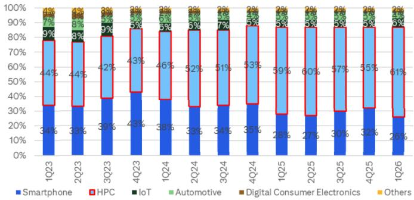
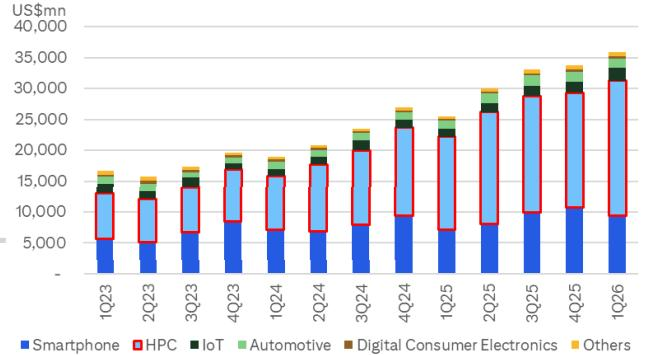
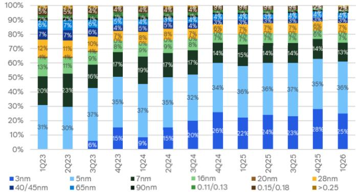
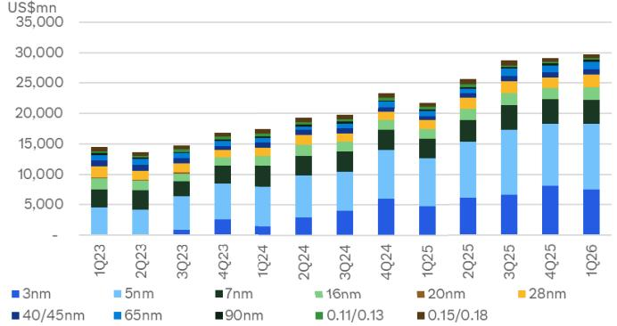
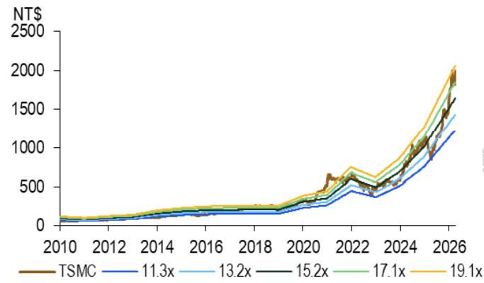
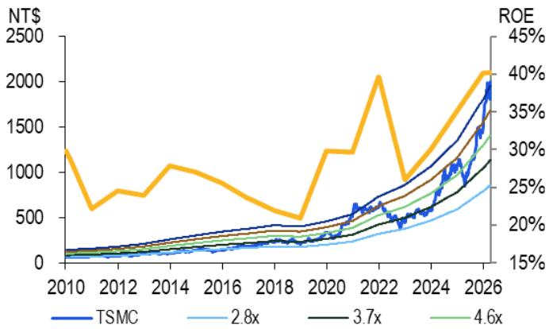
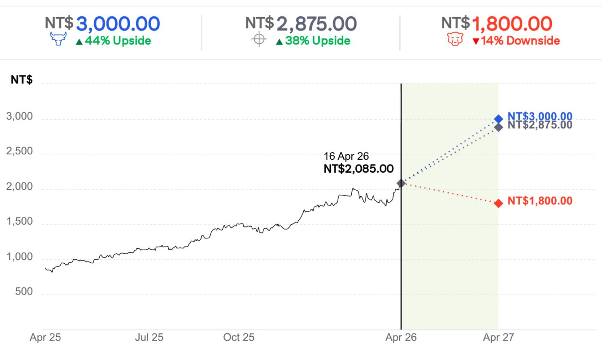

# TSMC (2330.TW) 16 Apr 2026 08:25:24 ET

# CITI'S TAKE

TSMC reported an upbeat 1Q26 earnings with GM/OPM at $6 6 . 2 \% / 5 8 . 1 \%$ and net profit of $\mathsf { N T } \$ 572.56$ n (up $58 \%$ YoY, $73 \%$ QoQ). TSMC also guides a strong $10 \%$ QoQ sales growth with stable GM/OPM at $6 6 . 5 \% / 5 7 . 5 \%$ (mid-point) in 2Q26. Thanks to strong demand in AI and advanced node, TSMC now expects 订阅研报添its 2026 YoY revenue growth to be higher than $30 \%$ 微信 LCD123321CYoY growth (vs previous guidance nearing $30 \%$ and also expects 2026 capex to be in the high-end of the guidance of $\mathsf { U S S S 5 5 2 - 5 6 b n }$ . Even though the management highlighted potential negative factors for GM including N2 dilution, rising materials cost, rising overseas expansion, etc. in 2H26, given its strong execution and crossnode leverage, we foresee solid earnings upward trend.

Tightness in advanced node to continue — Management highlighted how TSMC is adopting its broader manufacturing and packaging strategy to support future demand. For N3, it has new N3 capacity in Tainan targeted for 1H27, Arizona P2 in 2H27, and Japan P2 in 2028. TSMC is also reallocating N5 tools to N3 and optimizing cross-node scheduling across N7, N5, and N3. For N2, TSMC is expanding in both Hsin Chu and Kaohsiung and we expect the capacity to double this year and next year (see AI megacycle accelerates). On advanced packaging, management reiterated that large-size CoWoS remains the current priority, while CoPoS is under development with a pilot line already being built and volume production expected in the next couple years. The company also acknowledged that advanced packaging capacity remains tight and that it is working with OSAT partners to expand supply.

Rising competition? “there is no short cut” — TSMC reiterates its long-term edge still rests on its combination of technology leadership, manufacturing execution, packaging capability, and customer trust. Even as customers or competitors explore their own manufacturing paths, management made it clear that there is no shortcut in semiconductor foundry industry, and TSMC remains highly confident in its ability to capture long-term AI and advanced computing growth.

Reiterate Buy on solid outlook — As it takes 2-3 years for advanced node capacity built and much higher complexity of the process design, TSMC has been working closely with its customers to identify demand outlook. Along with the long lead time AI infrastructure development, it is confident in its long term outlook and we believe a healthy capacity intensity considering even stronger revenue growth in the next few years. We lift our earnings projection by $5 . 5 \%$ for this year on better revenue and GM outlook and keep it largely unchanged for 2027/2028. Reiterate Buy with TP raised slightly to NT $\$ 2,875$ (from $\mathsf { N T } \$ 2,800$ previously).

Earnings Summary   

<table><tr><td>Year to</td><td>Net Profit</td><td> Diluted EPS</td><td>EPS growth</td><td>P/E</td><td>P/B</td><td>ROE</td><td>Yield</td></tr><tr><td>31Dec</td><td>(NT$M)</td><td>(NT$)</td><td>(%)</td><td>x）</td><td>x）</td><td>(%)</td><td>(%)</td></tr><tr><td>2024A 2025A</td><td>1,173,268 1,717,883</td><td>45.24 66.24</td><td>39.9 46.4</td><td>46.1 31.5</td><td>12.6 10.0</td><td>30.3 35.4</td><td>0.7</td></tr><tr><td>2026E</td><td>2,563,456</td><td>98.85</td><td>49.2</td><td>21.1</td><td>7.4</td><td>40.4</td><td>0.9</td></tr><tr><td>2027E</td><td>3,410,850</td><td>131.52</td><td>33.1</td><td>15.9</td><td>5.7</td><td>40.6</td><td>1.3 2.1</td></tr><tr><td>2028E</td><td>4,263,281</td><td>164.39</td><td>25.0</td><td>12.7</td><td>4.4</td><td>38.9</td><td></td></tr><tr><td></td><td></td><td></td><td></td><td></td><td></td><td></td><td>2.6</td></tr></table>

Source: Powered by dataCentral

# Structural GM expansion on improving mix

Management attributed the upside in gross margin mainly to better cost improvement, stronger fab utilization, and a favorable foreign exchange. From a business mix perspective, leading-edge technologies remained the core driver, with 3nm contributing $2 5 \%$ of wafer revenue and 5nm contributing $3 6 \%$ , while HPC accounted for $61 \%$ of total revenue and smartphones $2 6 \%$ . In other words, AI and HPC continue to be the dominant growth engines, more than offsetting the seasonal decline in smartphones and softer consumer-facing end demand. This result further confirms that TSMC is still one of the clearest beneficiaries of structural AI demand, not only through revenue growth but also through mix upgrade and better profitability.

# Reiterate Buy with higher TP NT $\$ 2$ ,875

Thanks to TSMC’s promising earnings outlook, and structural GM expansion, we lift our earnings projection by $5 . 5 \%$ for this year and keep it largely unchanged for 2027/2028 on better revenue and GM outlook. Reiterate Buy on TP $\vee 7 \$ 82,8 7 5$ , based on our unchanged $\mathsf { 2 5 x }$ PER of our 2026/2027 EPS.

# TSMC earnings call recap

n 2Q26 guidance

Sales: US\$39.0-40.2bn (+10% QoQ at the mid-point) GPM: 65.5-67.5% (assuming USDTWD=31.7) 报添加微信 LCD123321Cad 04-17 OPM: 56.5-58.5%

n 2026 full-year & long-term guidance – Full year sales: raise 2026 full-year USD-based sales guidance to be more than $30 \%$ growth

Full year capex: now expecting 2026 capex to be toward the high-end of US\$52-56bn ( $7 0 - 8 0 \%$ advanced process, $10 \%$ specialty, $10 \mathrm { - } 2 0 \%$ for advanced packaging, testing and masks)

– GM outlook

• N3 GM to improve to reach corporate’s average in 2H26; GM dilution from N2 ramping to be 2-3ppt for this year

Continued productivity improvement, UTR enhancement and optimizing capacity allocation to support GM outlook

Oversea fabs expansion to impact GM by 2-3ppts in early stage and 3- 4ppts in later stage

n Long-term outlook

– 5-year AI sales CAGR (2024-2029) to be at mid-to high- $50 \%$ – GM to be $56 \%$ and higher is achievable, ROE at high- $20 \%$ at current cycle

# n N3/N2/A16 process node development

Given the very strong demand, it is building 3 new N3 fabs (one in Tainan for volume production in 1H27; one in US AZ (phase 2) for volume production in 2H27; one in Japan (phase 2) for volume production in 2028

# 订阅研

Compared to N3, N2 would be a bigger node with better power efficiency. N2’s structural GM profile is higher than N3. N2’s volume production has 添加微信 LCD123321Cad 04-17 started in 4Q25.

Compared to N2, A14 features $1 0 - 1 5 \%$ faster speed, $2 5 - 3 0 \%$ power efficiency, $20 \%$ transistor intensity increase

n 1Q26 sales mix by node – 3nm: $2 5 \%$ (vs. $2 8 \%$ in 4Q25) – 5nm: $3 6 \%$ (vs. $3 5 \%$ in 4Q25) – 7nm: $13 \%$ (vs. $14 \%$ in 4Q25) – Advanced node $( < 7 \mathsf { n m } )$ ): $74 \%$ (vs. $7 7 \%$ in 4Q25)

1Q26sales by applications – HPC ( $6 1 \%$ of sales), $\div 2 0$ QoQ Mobile $( 2 6 \% )$ ), -11% QoQ 订阅研报添加微信 LCD123321Cad 04-17 – IoT (6%), +12% QoQ – Auto (4%), -7% QoQ DCE (1%), +28% QoQ

Figure 1. TSMC – 1Q26 results comparison   

<table><tr><td></td><td>1Q26</td><td>4Q25</td><td></td><td>1Q26</td><td>1Q26</td><td></td><td>1Q26</td><td></td><td>2Q26</td><td>Citi</td><td>Cons</td></tr><tr><td>(NT$mn)</td><td> Actual</td><td> Actual</td><td>Q/Q</td><td>Guidance</td><td>Citi</td><td>Diff. </td><td>Cons</td><td>Diff.</td><td>Guidance</td><td>Prior Est.</td><td>Prior Est.</td></tr><tr><td>Revenue</td><td>1,134,103</td><td>1,046,090</td><td>8%</td><td>US$34.6-35.8bn</td><td>1,109,103</td><td>2%</td><td>1,123,220</td><td></td><td>1%US$39.0-40.2bn</td><td>1,147,877</td><td>1,205,622</td></tr><tr><td> Grosspofit</td><td>751.295</td><td>651.987</td><td>15%</td><td></td><td>713.463</td><td> 5%</td><td> 724.016</td><td>4%</td><td></td><td>745,377</td><td>773,105</td></tr><tr><td>Gross margin</td><td>66.2%</td><td> 62.3%</td><td>+3.9 ppt</td><td>63-65%</td><td>64.3%</td><td> +1.9 ppt</td><td>64.5%</td><td> +1.8 ppt</td><td>65.5-67.5%</td><td>64.9%</td><td>64.1%</td></tr><tr><td>Op.profit</td><td>658.966</td><td> 564.902</td><td>17%</td><td></td><td>611.675</td><td>8%</td><td>623.816</td><td>6%</td><td></td><td>636,174</td><td>665,892</td></tr><tr><td>OPmargin</td><td> 58.1%</td><td>54.0%</td><td> +4.1ppt</td><td>54-56%</td><td>55.2%</td><td>+3.0ppt</td><td>55.5%</td><td>+2.6 ppt</td><td>56.5-58.5%</td><td>55.4%</td><td>55.2%</td></tr><tr><td>Net income</td><td> 572,480</td><td> 505,744</td><td>13%</td><td></td><td> 532.780</td><td>7%</td><td> 540,200</td><td>6%</td><td></td><td>552,484</td><td>572.997</td></tr><tr><td>EPS (NTS)</td><td>22.08</td><td>19.50</td><td>13%</td><td></td><td>20.54</td><td>7%</td><td>20.89</td><td>6%</td><td></td><td>21.30</td><td>22.18</td></tr></table>

© 2026 Citigroup Inc. No redistribution without Citigroup’s written permission. Source: Citi Research, Bloomberg

  
Figure 2. TSMC – Sales Mix by Platform   
© 2026 Citigroup Inc. No redistribution without Citigroup’s written permission. Source: Citi Research

  
Figure 3. TSMC – Sales by Platform   
© 2026 Citigroup Inc. No redistribution without Citigroup’s written permission.   
Source: Citi Research

  
Figure 4. TSMC – Sales Mix by Node   
© 2026 Citigroup Inc. No redistribution without Citigroup’s written permission.   
Source: Citi Research, company data

Source: Citi Research, company data

  
Figure 5. TSMC – Sales by Node   
© 2026 Citigroup Inc. No redistribution without Citigroup’s written permission.

Figure 6. TSMC – Estimates Revisions   

<table><tr><td rowspan="2">(NT$mn)</td><td colspan="3">2026E</td><td colspan="3">2027E</td><td colspan="3">2028E</td></tr><tr><td>New</td><td>Old</td><td>Chg.</td><td>New</td><td>Old</td><td>Chg.</td><td>New</td><td>Old</td><td>Chg.</td></tr><tr><td>Sales</td><td>5,253,452 5,118,039</td><td></td><td>2.6%</td><td>7,071,349 6,949,812</td><td></td><td>1.7%</td><td>8,762,189 8,656,435</td><td></td><td>1.2%</td></tr><tr><td>YoY growth</td><td>37.9%</td><td>34.4%</td><td></td><td>34.6%</td><td>35.8%</td><td></td><td>23.9%</td><td>24.6%</td><td></td></tr><tr><td>Gross profit</td><td>3,442,282 3,258,457</td><td></td><td>5.6%</td><td>4,566,2544,493,79</td><td></td><td></td><td>1.6% 5,686,467 5,679,877</td><td></td><td>0.1%</td></tr><tr><td>Opex</td><td>457,375</td><td>457,728</td><td>-0.1%</td><td>619,541</td><td>604,262</td><td>2.5%</td><td>768,263</td><td>753,416</td><td>2.0%</td></tr><tr><td>Operating profit</td><td>2,984,907 2,800,728</td><td></td><td>6.6%</td><td>3,946,713 3,889,118</td><td></td><td>1.5%</td><td>4,918,205 4,926,461</td><td></td><td>-0.2%</td></tr><tr><td>Pre-tax profit</td><td>3,111,959 2,926,718</td><td></td><td>6.3%</td><td>4,144,285 4,081,758</td><td></td><td>1.5%</td><td>5,179,068 5,182,835</td><td></td><td>-0.1%</td></tr><tr><td>Netincome</td><td>2,563,456 2,430,756</td><td></td><td>5.5%</td><td>3,410,850 3,390,062</td><td></td><td>0.6%</td><td>4,263,2814,304,550</td><td></td><td>-1.0%</td></tr><tr><td>EPS (NT$) 加微</td><td>98.85</td><td>93.73</td><td>5.5%</td><td>131.52</td><td>130.72</td><td>0.6%</td><td>164.39</td><td>165.99</td><td>-1.0%</td></tr><tr><td>Gross margin</td><td>65.5%</td><td>63.7%</td><td>+1.9 ppt</td><td>64.6%</td><td>64.7%</td><td>-0.1ppt</td><td>64.9%</td><td>65.6%</td><td>-0.7ppt</td></tr><tr><td>Opexratio</td><td>8.7%</td><td>8.9%</td><td>-0.2 ppt</td><td>8.8%</td><td>8.7%</td><td>+0.1ppt</td><td>8.8%</td><td>8.7%</td><td>+0.1ppt</td></tr><tr><td>Operating margin</td><td>56.8%</td><td>54.7%</td><td>+2.1ppt</td><td>55.8%</td><td>56.0%</td><td>-0.1ppt</td><td>56.1%</td><td>56.9%</td><td>-0.8 ppt</td></tr><tr><td>Net margin</td><td>48.8%</td><td>47.5%</td><td>+1.3ppt</td><td>48.2%</td><td>48.8%</td><td>-0.5ppt</td><td>48.7%</td><td>49.7%</td><td>-1.1ppt</td></tr></table>

© 2026 Citigroup Inc. No redistribution without Citigroup’s written permission. Source: Citi Research

  
Figure 7. TSMC – Forward P/E band   
$\circledcirc$ 2026 Citigroup Inc. No redistribution without Citigroup’s written permission. Source: Citi Research, company data

  
Figure 8. TSMC – Forward P/B band & ROE   
$\circledcirc$ 2026 Citigroup Inc. No redistribution without Citigroup’s written permission.

Source: Citi Research, company data

Figure 9. TSMC – Forecast Summary   

<table><tr><td></td><td colspan="4">2025</td><td colspan="4">2026</td><td colspan="4">2027</td><td colspan="4"></td></tr><tr><td>Unit: NT$bn</td><td>10</td><td>2Q</td><td>3Q</td><td>4Q</td><td>10</td><td>2QE</td><td>3QE</td><td>4QE</td><td>1QE</td><td>2QE</td><td>3QE</td><td>4QE</td><td>2025</td><td>2026E</td><td>2027E</td><td>2028E</td></tr><tr><td>Revenue</td><td>839.3</td><td>933.8</td><td>989.9</td><td>1,046.1</td><td>1,1341</td><td>1,239.6</td><td>1,3617</td><td>1,518.0</td><td>1,681.4</td><td>1,768.2</td><td>1,818.1</td><td>1,803.7</td><td>3.809.1</td><td>5,253.5</td><td>7,0713</td><td>8,762.2</td></tr><tr><td>COGS</td><td>-345.9</td><td>-386.4</td><td>-401.4</td><td>-394.1</td><td>-382.8</td><td>&#x27;-412.0</td><td>-476.7</td><td>-539.6</td><td>-587.5</td><td>-623.0</td><td>-639.0</td><td>-655.6</td><td>-1,527.8</td><td>-1.8112</td><td>-2,505.1</td><td>-3.075.7</td></tr><tr><td>Gross Profit</td><td>493.4</td><td>547.4</td><td>588.5</td><td>652.0</td><td>7513</td><td>827.6</td><td>884.9</td><td>978.5</td><td>1,093.8</td><td>1,145.2</td><td>1,179.0</td><td>1,148.1</td><td>2,2813</td><td>3,442.3</td><td>4,566.3</td><td>5,686.5</td></tr><tr><td>Operating Expense</td><td>-85.2</td><td>-84.5</td><td>-87.8</td><td>-88.2</td><td>-94.0</td><td> -1116</td><td>-124.4</td><td>-129.0</td><td>-139.8</td><td>-155.6</td><td>-161.8</td><td>-162.3</td><td>-345.2</td><td>-457.4</td><td>-619.5</td><td>-768.3</td></tr><tr><td> SG&amp;A expenses</td><td>-28.6</td><td>-23.2</td><td>-24.0</td><td>-23.3</td><td>-26.2</td><td>-34.7</td><td>-36.8</td><td>-38.0</td><td>-38.9</td><td>-49.5</td><td>-49.1</td><td>-45.1</td><td>-99.2</td><td>-135.7</td><td>-182.6</td><td>-226.4</td></tr><tr><td>R&amp;D expenses</td><td>-56.5</td><td>-61.3</td><td>-63.7</td><td>-64.9</td><td>-67.8</td><td>-76.9</td><td>-87.7</td><td>-911</td><td>-100.9</td><td>-106.1</td><td>-112.7</td><td>-117.2</td><td>-246.4</td><td>-323.4</td><td>-436.9</td><td>-541.8</td></tr><tr><td>EBIT</td><td>407.1</td><td>463.4</td><td>500.7</td><td>564.9</td><td>659.0</td><td>716.0</td><td>760.5</td><td>849.4</td><td>954.0</td><td>989.6</td><td>1,017.2</td><td>985.8</td><td>1,936.1</td><td>2.984.9</td><td>3,946.7</td><td>4,918.2</td></tr><tr><td> Net Interest Income</td><td>19.8</td><td>20.3</td><td>213</td><td>24.8</td><td>23.8</td><td>22.9</td><td>25.3</td><td>27.9</td><td>34.5</td><td>38.5</td><td>41.6</td><td>45.6</td><td>86.2</td><td>99.9</td><td>160.2</td><td>215.1</td></tr><tr><td>Net Other Income</td><td>4.0</td><td>9.4</td><td>3.4</td><td>2.6</td><td>5.1</td><td>6.7</td><td>73</td><td>8.1</td><td>8.9</td><td>9.3</td><td>9.6</td><td>9.5</td><td>19.4</td><td>27.2</td><td>37.4</td><td>45.8</td></tr><tr><td>Pre Tax Profit</td><td>430.9</td><td>493.0</td><td>525.4</td><td>592.4</td><td>687.8</td><td>745.7</td><td>793.0</td><td>885.4</td><td>997.5</td><td>1,037.5</td><td>1,068.4</td><td>1,040.9</td><td>2.041.7</td><td>3,112.0</td><td>4,144.3</td><td>5,179.1</td></tr><tr><td>Tax Expense/(Credit)</td><td>70.2</td><td>95.5</td><td>73.6</td><td>86.9</td><td>115.0</td><td>149.1</td><td>134.8</td><td>150.5</td><td>169.6</td><td>207.5</td><td>181.6</td><td>177.0</td><td>-326.3</td><td>-549.5</td><td>-735.7</td><td>-918.6</td></tr><tr><td>Net Profit</td><td>361.6</td><td>398.3</td><td>452.3</td><td>505.7</td><td>572.5</td><td>596.9</td><td>658.7</td><td>735.4</td><td>828.4</td><td>830.5</td><td>887.4</td><td>864.5</td><td>1.717.9</td><td>2.563.5</td><td>3,410.8</td><td>4,263.3</td></tr><tr><td>EPS (NT$)</td><td>13.94</td><td>15.36</td><td>17.44</td><td>19.50</td><td>22.08</td><td>23.02</td><td>25.40</td><td>28.36</td><td>31.95</td><td>32.02</td><td>34.22</td><td>33.34</td><td>66.24</td><td>98.85</td><td>131.52</td><td>164.39</td></tr><tr><td> Margins (%)</td><td></td><td></td><td></td><td></td><td></td><td></td><td></td><td></td><td></td><td></td><td></td><td></td><td></td><td></td><td></td><td></td></tr><tr><td> Gross Margin</td><td>58.8</td><td>58.6</td><td>59.5</td><td>62.3</td><td>66.2</td><td>66.8</td><td>65.0</td><td>64.5</td><td>65.1</td><td>64.8</td><td>64.9</td><td>63.7</td><td>59.9</td><td>65.5</td><td>64.6</td><td>64.9</td></tr><tr><td> Operating Margin</td><td>48.5</td><td>49.6</td><td>50.6</td><td>54.0</td><td>58.1</td><td>57.8</td><td>55.8</td><td>56.0</td><td>56.7</td><td>56.0</td><td>56.0</td><td>54.7</td><td>50.8</td><td>56.8</td><td>55.8</td><td>56.1</td></tr><tr><td>Net Margin</td><td>43.1</td><td>42.7</td><td>45.7</td><td>48.3</td><td>50.5</td><td>48.2</td><td>48.4</td><td>48.4</td><td>49.3</td><td>47.0</td><td>48.8</td><td>47.9</td><td>45.1</td><td>48.8</td><td>48.2</td><td>48.7</td></tr><tr><td> Sequential Growth (%)</td><td></td><td></td><td></td><td></td><td></td><td></td><td></td><td></td><td></td><td></td><td></td><td></td><td></td><td></td><td></td><td></td></tr><tr><td> Revenue</td><td>-3</td><td>11</td><td>6</td><td>6</td><td>8</td><td>9</td><td>10</td><td>11</td><td>11</td><td>5</td><td>3</td><td>-1</td><td>32</td><td>38</td><td>35</td><td>2</td></tr><tr><td>Gross Profit</td><td>-4</td><td>11</td><td>8</td><td>11</td><td>15</td><td>10</td><td>7</td><td>11</td><td>12</td><td>5</td><td>3</td><td></td><td>40</td><td>51</td><td>33</td><td></td></tr><tr><td>EBIT</td><td>-4</td><td>14</td><td>8</td><td>13</td><td>17</td><td>9</td><td>6</td><td>21212</td><td>12</td><td>4</td><td>3</td><td>G</td><td>46</td><td>54</td><td>32</td><td></td></tr><tr><td>Net Profit</td><td>-4</td><td>10</td><td>14</td><td>12</td><td>13</td><td>4</td><td>10</td><td></td><td>13</td><td>0</td><td>7</td><td></td><td>46</td><td>49</td><td>33</td><td>25</td></tr><tr><td>EPS</td><td>-4</td><td>10</td><td>14</td><td>12</td><td>13</td><td>4</td><td>10</td><td></td><td>13</td><td>0</td><td>7</td><td></td><td>46</td><td>49</td><td>33</td><td>25</td></tr></table>

$\circledcirc$ 2026 Citigroup Inc. No redistribution without Citigroup’s written permission. Source: Citi Research, company data

# Short-Term View on TSMC (2330.TW)

# Direction:

# Upside

Duration: Date Added: Category:

Within 90 Days (expires 26 Jun 2026) 27 Mar 2026 Thematic driven

We are looking for a strong $+ 3 0 \%$ sales CAGR growth for TSMC in the next three years, supported by secular AI demand growth and its technology leadership, ecosystem lock-in, advanced packaging capabilities, yield learning effects, and long-term customer trust.

  
CD1233 Current Price and expected returns (upside/downside) as of 16 Apr 2026

# BULL Assumptions

·Higher-than-expected utilization · Stronger-than-expected margin expansion ·Bull case TP to be based on its upcycle valuation of $2 6 x$ PER

# BASE Assumptions

·Solid sales CAGR of >30%in 2025-2028E ·GPMto bemaintained above $60 \%$ level

# BEAR Assumptions

· Weaker-than-expected HPC demand globally · Worse-than-expected margin contraction ·Bear case TP to be based on its valuation of16x PER

# TSMC

# Company description

TSMC is the founder and leader of the dedicated IC foundry segment. The company has built its reputation by offering advanced and "more-than-Moore" wafer production processes and unparalleled manufacturing 报添加微信 LCD123321Cad 04-17 efficiency. From its inception in 1987, TSMC has consistently offered the foundry segment's leading technologies and TSMC-compatible design services.

# Investment strategy

We rate TSMC shares as Buy. We expect TSMC to deliver sales growth of $5 3 0 \%$ in recent years thanks to strong growth from HPC/AI as well as stable demand growth from smartphone, IoT, and automotive on tech migration and a shortened replacment cycle. CPU outsourcing to TSMC offers further growth upside potential. A rising cash dividend should also support the share price. While TSMC has been increasing capex meaningfully since 2009, its cost structure is maintained through continuous product mix improvements, efficiency enhancements, and cost reductions.

# Valuation

Our target price for TSMC shares of $\mathsf { N T } \$ 2,875$ is based on $\mathsf { 2 5 x }$ the average of our 2026-27E EPS, higher than its three-year average forward PER, versus 报添加微信 LCD123321Cad 04-17 global peers’ average of 15-23x. We believe our PER target is justified by TSMC's leading position in advanced process node and robust AI demand growth outlook. Given its continuing leadership in the semiconductor foundry industry, we believe TSMC’s stable order visibility and earnings outlook make it less vulnerable than peers to a potential global economic downturn. Our target price equates to 2026E/27E P/E of $2 9 \times / 2 2 \times$ and 2026E/27E P/B of $1 0 \times / 8 \times$ .

# Risks

Key downside risks that could impede the shares from achieving our target price include: 1) weakness in the global semiconductor market; 2) largerthan-expected margin contractions due to depreciation cost hikes and strong NTD; 3) competitors entering the foundry business; 4) longer-than-expected digestion of inventory in the supply chain; and 5) a slowdown in demand either from a global economic downturn or a global trade disruption triggered by tariffs.