# TSMC

# Leading edge supply tightness through 2027 should 17 April 2026 drive continued EPS upgrades; Raise PT to NT\$2500

We are raising our FY26/27E EPS ests by $4 \%$ each and raise our Dec-26 PT to NT $\$ 2500$ to reflect supply tightness in leading edge process nodes well into 2027 or early 2028. Accelerating AI demand (Accelerators, CPU and networking), continued growth in N3, N2 and advanced back-end revenues and long lead time for capacity build are likely to create a favorable set up for TSMC stock, looking quite favorable in the next few quarters, with likely upside to its long-term capex targets and 2026 revenue guidance, and GMs staying high due to high utilization and ASP uptick. Given industry-wide shortage, noise about competition may remain persistent, but achieving technology and manufacturing milestones and winning customer acceptance would be the key challenges for the chasing pack, given TSM’s technology and execution leadership and a 4-5-year window for design and manufacturing ramp. In the very short term, the stock may take a breather given the fast run up ahead of earnings and expectations of a bigger revenue/capex guidance hike, but we expect EPS upgrades to come throughout 2026.

• Capacity tightness to last into 2027, leading edge capacity (N5 and below) growth at $2 5 \%$ CAGR in 25-28E: Given the strong AI accelerator, CPU and networking demand and continued strength from Apple iPhone and Mac, we expect the leading edge capacity (N5 and below) tightness to last well into 2027 or early 2028. We expect TSMC to accelerate its capacity growth (JPMe $2 5 \%$ CAGR for N5 and below capacity from 2025-28E), with much of the capacity addition coming in the 2027-28 timeframe. As a result, we expect capex to rise meaningfully in the next two years. Given tight capacity in leading edge, we expect to see another round of like-for-like price increase discussions 订阅研报添加微信 LCD123321Cad 0kickstarting in 2Q26 (for 2027 pricing), which could be a further catalyst for the stock.

• A slew of guidance raises are coming, given obvious AI demand upside and faster supply ramp: One of the pushbacks from investors in the near-term is the lack of meaningful guidance upside during the 1Q26 earnings call. We believe some patience is required, since TSMC is likely to update its 2026E revenue growth expectations (likely $3 5 + \%$ USD growth) and AI semis revenue demand growth (likely close to $60 \%$ after incorporating categories such as networking, new kinds of accelerators such as LPUs and CPUs going into AI workloads – all categories growing much faster than core AI accelerators). In addition, we also expect TSMC to outline a more robust 3-year capex plan (likely reaching ${ \sim } \$ 190 { \cdot } 200 b \mathrm { n }$ capex in 2026-28E) to support the extraordinary demand for AI compute from its customers.

. Are we at the Gross Margin peak? Too early to draw conclusions: TSMC has seen strong GM pickup in the last 2 years from $56 \%$ levels in 2024 to $6 6 \%$ levels in 2026 and given the large gap between the long-term GM guidance ( $56 \%$ and higher) and current Gross Margins, several investors are concerned 订阅研报添加微信 LCD123321Cad 04-whether GMs have peaked. In the near-term, dilution from N2 ramp in 2H26 and increased output from AZ Phase 1 will weigh on margins, but N3

See page 19 for analyst certification and important disclosures, including non-

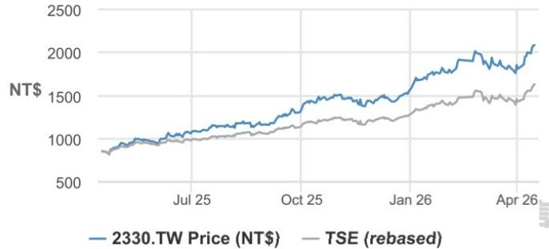  
Price Performance

<table><tr><td></td><td>YTD</td><td>1m</td><td>3m</td><td>12m</td></tr><tr><td>Abs</td><td>34.5%</td><td>13.0%</td><td>19.8%</td><td>143.9%</td></tr><tr><td>Rel</td><td>6.3%</td><td>1.6%</td><td>1.6%</td><td>53.1%</td></tr></table>

<table><tr><td>Company Data</td></tr><tr><td>Shares O/S (mn) 25,930</td></tr><tr><td>52-week range (NT$) 2100.0-816.0</td></tr><tr><td>Market cap ($ mn) 1,708,641</td></tr><tr><td>Exchange rate 31.64</td></tr><tr><td>Free float (%) 92.1%</td></tr><tr><td>3M ADV (mn) 42.92</td></tr><tr><td>3M ADV ($ mn) 2,523.4</td></tr><tr><td>Volatility (90 Day) 31</td></tr><tr><td>Index TAIEX</td></tr><tr><td>BBG ANR (Buy|Hold|Sell) 40|110</td></tr></table>

# Key Metrics (FYE Dec)

# Summary Investment Thesis and Valuation

# Investment Thesis

<table><tr><td rowspan="2">NT$ in millions Financial Estimates</td><td rowspan="2">FY25A</td><td>FY26E</td><td>FY27E</td><td>FY28E</td></tr><tr><td>订</td><td>商研报添</td><td></td></tr><tr><td>Revenue</td><td>3,809,054</td><td>5,320,3587,023,1338,190,610</td><td></td><td></td></tr><tr><td>Adj. EBIT</td><td>1,936,092</td><td>3,029,063</td><td>3,858,859</td><td>4,554,388</td></tr><tr><td>Adj. EBITDA</td><td>2,624,188</td><td>3,834,219</td><td>4,895,538</td><td>5,780,913</td></tr><tr><td>Adj. net income</td><td>1,717,883</td><td>2,575,416</td><td>3,244,463</td><td>3,817,544</td></tr><tr><td>Adj. EPS</td><td>66.24</td><td>99.31</td><td>125.11</td><td>147.21</td></tr><tr><td>BBG EPS</td><td>64.73</td><td>90.00</td><td>111.28</td><td>133.39</td></tr><tr><td>Cashflow from operations</td><td>2,437,716</td><td>3,303,735</td><td>4,108,887</td><td>4,916,998</td></tr><tr><td>FCFF</td><td>1,292,759</td><td>1,834,220</td><td>2,048,387</td><td>2,856,498</td></tr><tr><td>Margins and Growth</td><td></td><td></td><td></td><td></td></tr><tr><td>Revenue Growth Y/Y (%)</td><td>31.6%</td><td>39.7%</td><td>32.0%</td><td>16.6%</td></tr><tr><td>EBIT margin</td><td>50.8%</td><td>56.9%</td><td>54.9%</td><td>55.6%</td></tr><tr><td>EBIT Growth Y/Y (%)</td><td>46.4%</td><td>56.5%</td><td>27.4%</td><td>18.0%</td></tr><tr><td>EBITDA margin</td><td>68.9%</td><td>72.1%</td><td>69.7%</td><td>70.6%</td></tr><tr><td>EBITDA Growth Y/Y (%)</td><td>32.2%</td><td>46.1%</td><td>27.7%</td><td>18.1%</td></tr><tr><td>Net margin</td><td>45.1%</td><td>48.4%</td><td>46.2%</td><td>46.6%</td></tr><tr><td>Adj. EPS growth</td><td>46.4%</td><td>49.9%</td><td>26.0%</td><td>17.7%</td></tr><tr><td>Ratios</td><td></td><td></td><td></td><td></td></tr><tr><td>Adj. tax rate</td><td>16.0%</td><td>17.7%</td><td>17.7%</td><td>17.7%</td></tr><tr><td>Interest cover</td><td>NM</td><td>NM</td><td>NM</td><td>NM</td></tr><tr><td>Net debt/Equity</td><td>NM</td><td>NM</td><td>NM</td><td>NM</td></tr><tr><td>Net debt/EBITDA</td><td>NM</td><td>NM</td><td>NM</td><td>NM</td></tr><tr><td>ROE</td><td>35.4%</td><td>39.6%</td><td>37.0%</td><td>33.8%</td></tr><tr><td>Valuation</td><td></td><td>订</td><td>阅研报添加微信</td><td></td></tr><tr><td>FCFF yield</td><td>2.4%</td><td>3.4%</td><td>3.8%</td><td>5.3%</td></tr><tr><td>Dividend yield</td><td>1.1%</td><td>1.2%</td><td>1.6%</td><td>2.0%</td></tr><tr><td>EV/Revenue</td><td>13.7</td><td>9.5</td><td>7.1</td><td>5.8</td></tr><tr><td>EV/EBITDA</td><td>19.8</td><td>13.2</td><td>10.1</td><td>8.3</td></tr><tr><td>Adj. P/E</td><td>31.5</td><td>21.0</td><td>16.7</td><td>14.2</td></tr></table>

LCD123321Cad 04-17

We expect TSMC’s structural growth drivers to remain very strong as leading-edge supply (N4, N3, and N2) stays tight well into 2027 or early 2028, given accelerating AI demand, continued growth in N3, N2 and advanced back-end revenues, and long lead time for capacity build despite accelerated capex. We believe the set-up for TSMC stock looks quite favorable in the next few quarters, with potential upside to its long-term CD123321Cad 04-17 capex targets, 2026 revenue guidance, and GMs beating due to high UTR and ASP uptick. Given industry-wide shortage, we expect competitive noise to persist, but achieving technology and manufacturing milestones and winning customer acceptance would be the key challenge for the chasing pack, given TSMC tech and execution leadership and 3-5 year window for design and manufacturing ramp.

# Valuation

Our Dec-26 PT of NT\$2,500 is based on ${ \sim } 2 0 \mathrm { x } 1 2$ -month forward $\mathrm { P / E }$ and reflects better GMs and slightly faster growth. Our target multiple is higher than TSMC’s five-year average historical multiple.

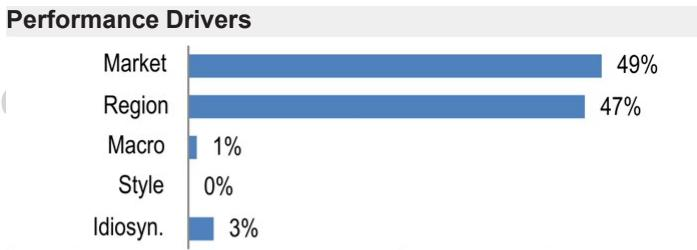

<table><tr><td>Factors</td><td>6M Corr</td><td>1Y Corr</td></tr><tr><td>Market:MSCIAsiaPacexJP</td><td>0.81</td><td>0.69</td></tr><tr><td>Region: Taiwan</td><td>0.90</td><td>0.95</td></tr><tr><td>Macro:</td><td></td><td></td></tr><tr><td>HSI Volatility Index</td><td>0.12</td><td>0.31</td></tr><tr><td>JPM EM Currency(EMCl) Fixing</td><td>-0.30</td><td>-0.27</td></tr><tr><td>JPMorgan GBl-EM Global Div</td><td>-0.22</td><td>-0.23</td></tr><tr><td>Quant Styles:</td><td></td><td></td></tr><tr><td>Value</td><td>-0.45</td><td>-0.27</td></tr><tr><td>DivYld</td><td>-0.45</td><td>-0.25</td></tr><tr><td>Growth</td><td>0.35</td><td>0.17</td></tr></table>

profitability is improving quite fast, due to better product mix (higher HPC and AI accelerator mix) and better yields, while overall utilization and amount of hot-run/super hot-run wafers in N3 are likely to remain high. As a result, we believe that GMs are likely to hover around the mid-high $60 \%$ levels, with chances of creating further upside, depending on the extent of price increases in 2027 and a continued tight supply environment. Given depreciation is likely to grow slower than revenues in the next few years, we believe that GMs are likely to remain at elevated levels.

• Competitive noise likely to stay, but “No Shortcuts” to arriving at production silicon: TSMC management was quite forceful in its 1Q26 conference call regarding the 订阅研报添加微信 LCD123321Cad strong technology, IP ecosystem and manufacturing leadership that TSMC currently possesses at leading edge. A typical leading edge AI accelerator design takes 2-3 years of co-working with the Foundry partner and will then need 1-2 years to eventually enter high volume production – marking a 4-5 year engagement cycle before silicon production. Shortening this process may be possible to some extent with very intense collaboration of a few number of projects, but cost, yield maturity and smooth high volume ramp are all different areas which would take time to master. As such, unless TSMC slows down its technology curve and execution speed (we see the opposite), we do not expect any meaningful challenge to its market leadership in the next 3-5 years. However, the competitive noise is likely to persist, since customers are likely to engage all available options in a period of extreme capacity shortage.

• Blended ASP growth should bounce back to $\sim 2 0 \%$ levels: In the last couple of quarters, blended ASP growth has slowed down (to $8 \% / 1 1 \%$ YoY in 4Q25/1Q26). We believe this is due to stronger demand for some of the mature process nodes ( $1 6 \mathrm { { n m } }$ , $6 5 \mathrm { n m }$ for CoWoS processing etc.), which is driving stronger wafer shipment growth. As we move through the year, we believe that blended ASP growth is likely to recover to $2 7 \%$ YoY levels in 4Q26, given higher mix of N3 and N2 wafer revenues. Long-term, we 订阅研believe that TSMC is likely to maintain $1 5 - 2 0 \%$ 加微信 LCD123321Cad  blended ASP growth, while wafer shipments are likely to grow in the $5 \text{‰}$ range in steady state. Better pricing helps TSMC earn a higher return of the increased capex, while also smoothing down big swings in revenues (since wafer shipments are usually more volatile during a downturn).

# Capacity tightness to last into 2027, leading edge (N5 and below) capacity growth at $2 5 \%$ CAGR in 25-28E

We expect leading-edge capacity to remain tight well into 2027 or early 2028 (JPMe N5 and below process node UTR to maintain $100 \%$ or above in coming years), driven by:

1. Strong AI Accelerator Demand - We expect shipments of key AI accelerator chips —including NVDA GPU, AMD GPU, Google TPU, AWS Trainium, Meta MTIA, and MSFT MAIA—to grow by $5 0 \% + \mathrm { Y o Y }$ in 2026 and $3 5 \% +$ YoY in 2027.   
研报添加 微 D 2332 Cad   
2. Increasing demand for AI interconnect (networking, DSP, retimers, etc.) and Server CPUs, including Google, Amazon, and MSFT in-house chips, as well as AMD/ NVDA CPUs   
3. Continued strength from Apple iPhone and Mac processor.

Given the ongoing shortage of leading-edge wafers, we anticipate TSMC will accelerate its capacity expansion, especially for N3 and N2 nodes (JPMe $2 5 \%$ CAGR for N5 and below capacity from 2025-28E), with much of the capacity addition coming 2027-28.

For N3, TSMC plans three new fabs (Tainan Fab 18 P9, AZ Phase 2, and a second Japan fab), ramping through 1H27 into 2028, complemented by cross‑fab operations (e.g., leveraging N7 for N3 back‑end metal layers and $2 8 \mathrm { n m }$ for N5 back‑end metal layers). We expect N3 capacity to grow $2 8 \% / 1 1 \%$ to reach $2 1 3 \mathrm { k } / 2 3 7 \mathrm { k }$ wfpm by YE26/YE27.

For N2, a robust pipeline—all Apple iPhone models $( \mathrm { A } 2 0 / \mathrm { A } 2 0 \mathrm { P r o }$ , AMD Venice and MI450, and flagship SoCs from MediaTek and Qualcomm in 2026, followed by major AI accelerators including Google TPU, NVIDIA Feynman, and Trainium 4 from late 2027–28—should drive a fast ramp. We model N2 capacity reaching ${ \sim } 1 5 0 \mathrm { k }$ wfpm by end‑2028 (vs. ${ \sim } 6 0 \mathrm { k }$ by end‑2026), led by Kaohsiung P1–5 and AZ Phase 2.

Due to tight leading-edge capacity, we anticipate another round of price increase discussions in 2Q26 for 2027 pricing ( following a $6 - 1 0 \%$ price hike for leading-edge nodes in early 2026). Our early view is that TSMC could implement an additional $4 - 5 \%$ like-for-like price hike for leading-edge nodes in 2027, which could serve as a further catalyst for the stock.

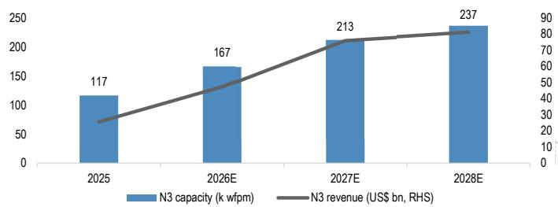  
Figure 1: TSMC N3 capacity build and revenues k wfpm, 12” equ / US\$bn

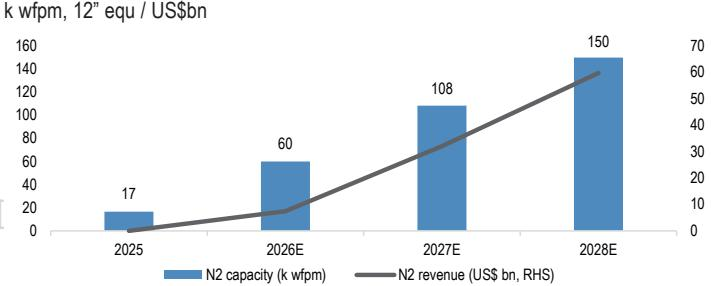  
Figure 2: TSMC N2 capacity build and revenues   
  
Source: J.P. Morgan estimates, Company data.

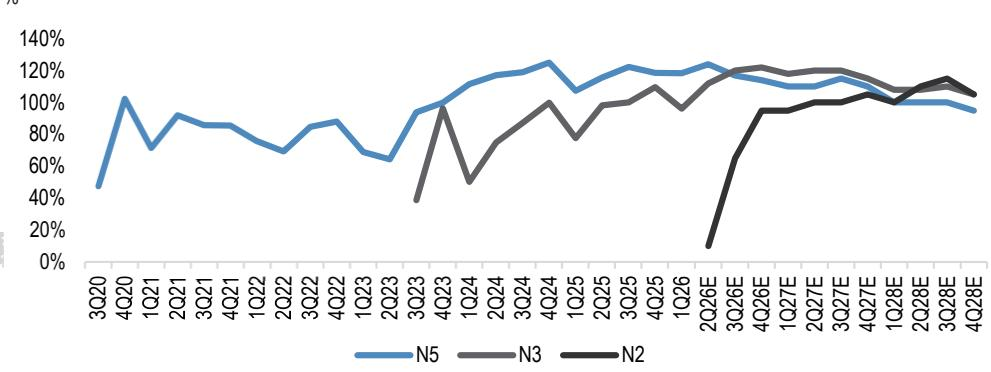  
Figure 3: Leading edge node UTR since 2020 (N5 launch)   
Source: J.P. Morgan estimates, Company data.

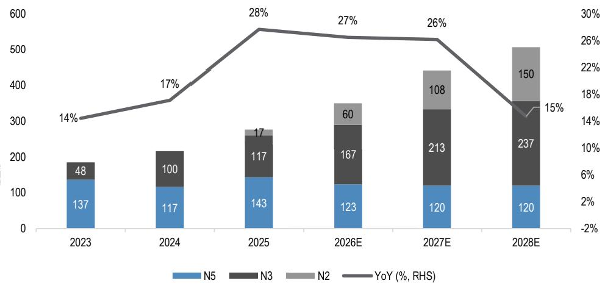  
Figure 4: TSMC Leading edge (N5 and below) capacity and YoY k wfpm, %   
Source: J.P. Morgan estimates, Company data.

# A slew of guidance raises are coming, given obvious AI demand upside and faster supply ramp

A key near-term pushback from investors is the lack of meaningful guidance upside during the 1Q26 earnings call.

We believe some patience is required, but expect an upward revision of guidance at the upcoming Jul earnings call. We expect TSMC to update its 2026E revenue growth expectations to likely $3 5 + \%$ USD growth (after revising it from close to $30 \%$ YoY to 阅研报above $3 0 \% \mathrm { Y o Y }$ 信 LCD123321Cad 04-17 on the 1Q earnings call), and Datacenter AI revenue growth to close to $60 \%$ (vs. current guidance of mid to high $50 \%$ ) after incorporating categories such as networking, new kinds of accelerators (such as LPUs), and CPUs going into AI workloads – all categories growing much faster than core AI accelerators.

Figure 5: TSMC Current guidance vs potential revisions in Jul   

<table><tr><td></td><td>April Earnings call guidance</td><td>July Earningscall (likely guidance)</td></tr><tr><td>2026 Rev growth (USD)</td><td>&gt;30% YoY</td><td>35%+YoY</td></tr><tr><td>LT Al growth CAGR</td><td>mid to high 50%</td><td>close to 60%</td></tr><tr><td>LT Rev growth CAGR</td><td>25%</td><td>25%</td></tr><tr><td>Structural GM</td><td>56%and higher</td><td>56%and higher</td></tr></table>

Source: Company data, J.P. Morgan estimates.

研报添加微信 LCD123321Cad 04-17 In addition, we also expect TSMC to outline a more robust 3-year capex plan of $\$ 190$ - 200bn capex for 2026-28E (JPMe $\$ 1936 n$ ), nearly twice the $\$ 101$ billion spent in $2 0 2 3 -$ 2025, to support the extraordinary demand for AI compute demand from its customers.

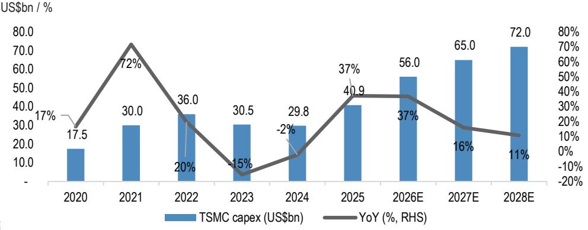  
Figure 6: TSMC capex trend   
Source: Company data, J.P. Morgan estimates.

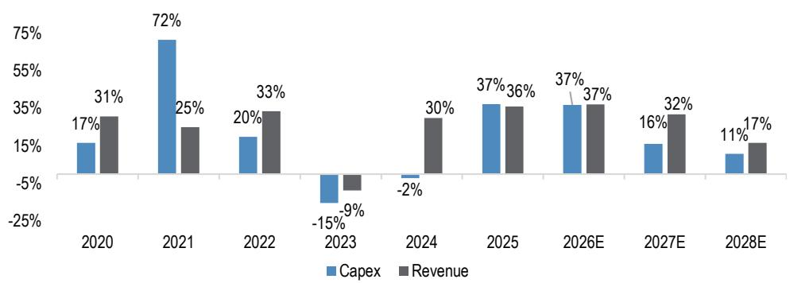  
Figure 7: TSMC capex vs. revenue YoY trend US\$bn   
订阅研报添加微信 LCD123321Cad 04-17 Source: J.P. Morgan estimates, Company data.

# Are we at the Gross Margin peak? Too early to draw conclusions

TSMC has delivered a strong GM uplift over the past two years, moving from the $5 3 -$ $5 5 \%$ range to $6 5 \% +$ , but the wide gap between its long‑term GM framework $56 \%$ and higher) and current margins has led investors to question whether GMs have peaked.

In the near-term, dilution from N2 ramp in 2H26 and increased output from AZ Phase 1 will weigh on margins. However, we see offsetting positives from fast improving N3 profitability, supported by 1) a richer mix (higher HPC and AI accelerator exposure), 2) better yields, and 3) sustained high utilization ( $100 + \%$ UTR in late 2025-28) with elevated hot/super‑hot run intensity.

As a result, we expect GMs to hover in the mid‑to‑high $60 \%$ range (JPMe GM $6 4 . 4 \% / 6 5 . 1 \%$ in 2027/28), with potential upside depending on the magnitude of further price increases in 2027 (we believe another $4 \mathrm { - } 5 \%$ hike across N5 and below is possible) 研报添加微信 LCD123321Cad 04-17 and a continued tight supply environment. With depreciation expected to grow slower than revenue over the next few years, we believe TSMC can sustain elevated GMs even as new nodes ramp.

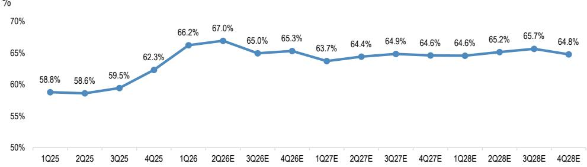  
Figure 8: GM trend by quarters   
Source: J.P. Morgan estimates, Company data.

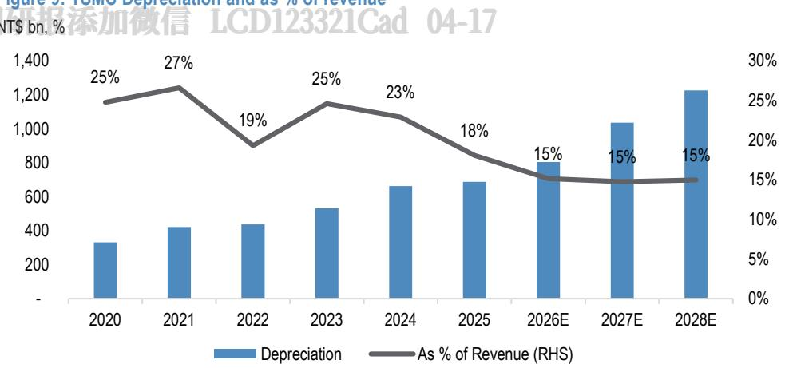  
Figure 9: TSMC Depreciation and as % of revenue   
Source: Company data, J.P. Morgan estimates.

# Blended ASP growth, is it slowing? We expect a bounce back 阅研报添加微信 LCD123321Cad to 20% for FY26/27 04-1

Blended ASP growth has decelerated to $8 \%$ YoY in 4Q25 and $1 1 \%$ in 1Q26, down from ${ \sim } 2 0 \%$ over the prior two years. We attribute the slowdown primarily to increased demand for certain mature nodes (e.g., $1 6 \mathrm { { n m } }$ and $6 5 \mathrm { n m }$ for $\mathrm { C o W o S }$ processing), which drove $1 6 \%$ and $2 8 \%$ YoY wafer shipment growth in the past two quarters. Meanwhile, the absence of price hikes at these nodes has further weighed on blended ASP growth.

However, we expect robust N3 demand to drive its revenue mix back above $30 \%$ from 2Q26 onward (vs. $2 5 \%$ in 1Q26), with N2 contributions also building through the year. We believe the improved mix—both by node and by application (higher HPC weighting)—combined with continued hot/super‑hot run demand (carrying $5 0 \mathrm { - } 1 0 0 \%$ ASP premiums), should lift blended ASP growth back above $20 \%$ YoY in 2026 and 2027, up from $1 6 \%$ in 2025.

Longer term, we expect TSMC to sustain $1 5 - 2 0 \%$ annual blended ASP growth, underpinned by its ability to maintain elevated pricing at leading‑edge nodes over 研报添加微信 LCD123321Cad 04-extended periods, while wafer shipments grow in the $5 - 1 0 \%$ range in steady state. We see TSMC's revenue growth remaining primarily ASP‑driven, with sustained strong pricing helping to deliver improved returns on rising capex and driving better ROI through the AI‑driven semiconductor upcycle. This dynamic should also help smooth revenue volatility, as wafer shipments tend to swing more sharply during downturns.

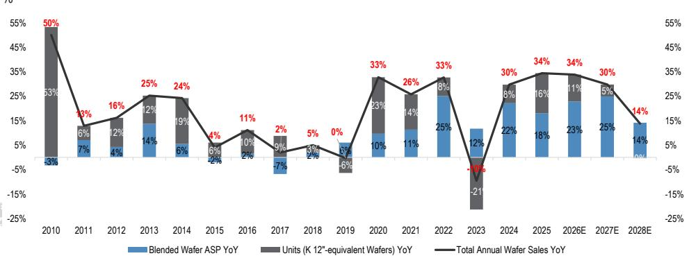  
Figure 10: Breakdown of TSMC wafer sales by blended ASP and wafer shipments   
Source: J.P. Morgan estimates, Company data.

# 1Q26 Earnings Review

Table 1: 1Q26 Earnings Review NT\$bn, EPS in NT\$, %   

<table><tr><td rowspan="2">NT$ billion</td><td colspan="3">1Q26</td><td colspan="2">Variance</td><td colspan="2">Growth</td></tr><tr><td>Actual</td><td>JPMe</td><td>BBG 28 days</td><td>vs. JPMe</td><td>vs. Consensus</td><td>Q/Q</td><td>YIY</td></tr><tr><td>Revenues</td><td>1,134</td><td>1,138</td><td>1,128</td><td>-0%</td><td>1%</td><td>8%</td><td>35%</td></tr><tr><td>Gross profit</td><td>751阅研报760</td><td></td><td>加微信733</td><td>CD12332%</td><td>Cad 04- 2%</td><td>15%</td><td>52%</td></tr><tr><td>GM (%)</td><td>66.2%</td><td>66.8%</td><td>65.0%</td><td>-52 bps</td><td>125 bps</td><td>392 bps</td><td>746 bps</td></tr><tr><td>Operating profit</td><td>659</td><td>656</td><td>631</td><td>0%</td><td>4%</td><td>17%</td><td>62%</td></tr><tr><td>OPM (%)</td><td>58.1%</td><td>57.7%</td><td>56.0%</td><td> 44 bps</td><td>213 bps</td><td> 410 bps</td><td>960 bps</td></tr><tr><td>Pretax profit</td><td>688</td><td>673</td><td>656</td><td>2%</td><td>5%</td><td>16%</td><td>60%</td></tr><tr><td>Net profit</td><td>572</td><td>556</td><td>550</td><td>3%</td><td>4%</td><td>13%</td><td>58%</td></tr><tr><td>EPS (NT$)</td><td>22.08</td><td>21.42</td><td>21.19</td><td>3%</td><td>4%</td><td>13%</td><td>58%</td></tr></table>

Source: Company data, Bloomberg Finance L.P., J.P. Morgan estimates.

# Forecast Changes

Table 2: TSMC: Quarterly estimate revisions   

<table><tr><td rowspan="2">NT$ billion</td><td colspan="3">Revised</td><td colspan="3">Prior</td><td colspan="3">Change (%)</td></tr><tr><td>2Q26E</td><td>3Q26E</td><td>4Q26E</td><td>2Q26E</td><td>3Q26E</td><td>4Q26E</td><td>2Q26E</td><td>3Q26E</td><td>4Q26E</td></tr><tr><td>Revenues (US$ in mn)</td><td>39,813</td><td>43,999</td><td>48,246</td><td>38,845</td><td>43,527</td><td>47,067</td><td>2%</td><td>1%</td><td>3%</td></tr><tr><td>Revenues (NT$ in bn)</td><td>1,262</td><td>1,395</td><td>1,529</td><td>1,239</td><td>1,389</td><td>1,501</td><td>2%</td><td>0%</td><td>2%</td></tr><tr><td>Gross profit</td><td></td><td>845丁阅矿90添加999</td><td></td><td>信L(823)12332865Cad</td><td></td><td>0943</td><td>3%</td><td>5%</td><td>6%</td></tr><tr><td>GM (%)</td><td>67.0%</td><td>65.0%</td><td>65.3%</td><td>66.4%</td><td>62.3%</td><td>62.8%</td><td> 51bps</td><td>270bps</td><td>254bps</td></tr><tr><td>Operating profit</td><td>728</td><td>779</td><td>863</td><td>708</td><td>738</td><td>809</td><td>3%</td><td>6%</td><td>7%</td></tr><tr><td>OPM (%)</td><td>57.7%</td><td>55.9%</td><td>56.4%</td><td>57.1%</td><td>53.2%</td><td>53.9%</td><td>51bps</td><td>270bps</td><td>254bps</td></tr><tr><td>Net profit</td><td>598</td><td>667</td><td>738</td><td>603</td><td>629</td><td>689</td><td>-1%</td><td>6%</td><td>7%</td></tr><tr><td>EPS (NT$)</td><td>23.07</td><td>25.71</td><td>28.46</td><td>23.27</td><td>24.25</td><td>26.57</td><td>-1%</td><td>6%</td><td>7%</td></tr><tr><td>Operating Assumptions</td><td></td><td></td><td></td><td></td><td></td><td></td><td></td><td></td><td></td></tr><tr><td>Capacity (&#x27;O0 wafers,&quot;qu)</td><td>4,114</td><td>4,113</td><td>4,175</td><td>4,074</td><td>4,134</td><td>4,214</td><td>1%</td><td>-1%</td><td>-1%</td></tr><tr><td>Shipment(‘000 wafers,12&quot;equ)</td><td>4,097</td><td>4,166</td><td>4,240</td><td>3,958</td><td>4,133</td><td>4,178</td><td>4%</td><td>1%</td><td>1%</td></tr><tr><td>Shipmentutization (%)</td><td>100%</td><td>101%</td><td>102%</td><td>97%</td><td>100%</td><td>99%</td><td>243bps</td><td>129bps</td><td>242bps</td></tr><tr><td>Wafer ASP (US$)</td><td>8.222</td><td>8.767</td><td>9.349</td><td>8.276</td><td>8.792</td><td>9.339</td><td>-1%</td><td>0%</td><td>0%</td></tr></table>

Source: J.P. Morgan estimates.

Table 3: TSMC: Annual estimate revisions   

<table><tr><td rowspan="2">NT$ billion</td><td colspan="3">Revised</td><td colspan="3">Prior</td><td colspan="3">Change (%)</td></tr><tr><td>2026E</td><td>2027E</td><td>2028E</td><td>2026E</td><td>2027E</td><td>2028E</td><td>2026E</td><td>2027E</td><td>2028E</td></tr><tr><td>Revenues (US$ in mn)</td><td>167,960</td><td>221,550</td><td>258,379</td><td>165,453</td><td>214,293</td><td>252,989</td><td>2%</td><td>3%</td><td>2%</td></tr><tr><td>Revenues (NT$ in bn)</td><td>5,320</td><td>7,023</td><td>8,191</td><td>5,267</td><td>6,836</td><td>8,070</td><td>1%</td><td>3%</td><td>1%</td></tr><tr><td>Gross profit</td><td>3.502</td><td>4,526</td><td>5,330</td><td>3.390</td><td>4,334</td><td>5,177</td><td>3%</td><td>4%</td><td>3%</td></tr><tr><td>GM (%)</td><td>65.8%</td><td>64.4%</td><td>65.1%</td><td>64.4%</td><td>63.4%</td><td>64.2%</td><td>144bps</td><td>105bps</td><td>92bps</td></tr><tr><td>M添加微信</td><td>3.029</td><td>3.859</td><td>4,554</td><td>a 2.912</td><td>3.684</td><td>4,414</td><td>4%</td><td>5%</td><td>3%</td></tr><tr><td>OPM (%)</td><td>56.9%</td><td>54.9%</td><td>55.6%</td><td>55.3%</td><td>53.9%</td><td>54.7%</td><td>165bps</td><td>105bps</td><td>92bps</td></tr><tr><td>Net profit</td><td>2.575</td><td>3.244</td><td>3.818</td><td>2.477</td><td>3.123</td><td>3.732</td><td>4%</td><td>4%</td><td>2%</td></tr><tr><td>EPS (NT$)</td><td>99.31</td><td>125.11</td><td>147.21</td><td>95.50</td><td>120.44</td><td>143.92</td><td>4%</td><td>4%</td><td>2%</td></tr><tr><td>Operating Assumptions</td><td></td><td></td><td></td><td></td><td></td><td></td><td></td><td></td><td></td></tr><tr><td>Capacity(o wafers,2&quot;equ)</td><td>16,446</td><td>17,414</td><td>17,721</td><td>16,446</td><td>17,526</td><td>18,061</td><td>0%</td><td>-1%</td><td>-2%</td></tr><tr><td>Shipment(000 wafers,12&quot; equ)</td><td>16,676</td><td>17,491</td><td>17,436</td><td>16,151</td><td>17,432</td><td>17.935</td><td>3%</td><td>0%</td><td>-3%</td></tr><tr><td>Shipmentutlization (%)</td><td>101%</td><td>100%</td><td>98%</td><td>98%</td><td>99%</td><td>99%</td><td>319bps</td><td>97bps</td><td>-91bps</td></tr><tr><td>Wafer ASP (US$)</td><td>8.445</td><td>10,448</td><td>11.929</td><td>8.618</td><td>10,285</td><td>11,681</td><td>-2%</td><td>2%</td><td>2%</td></tr></table>

Source: J.P. Morgan estimates.

# PE/PB charts

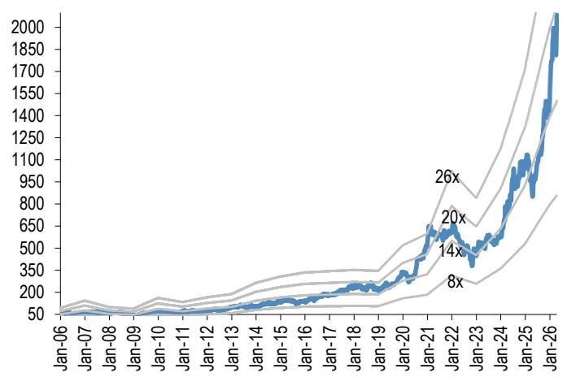  
Figure 11: TSMC : 12month forward P/E NT\$, x   
Source: Bloomberg Finance L.P., J.P. Morgan estimates.

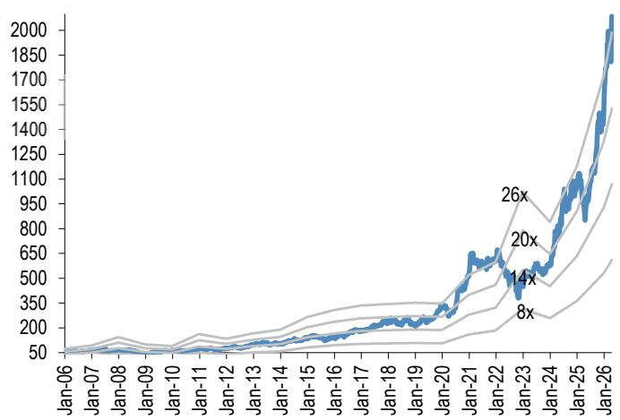  
Figure 12: TSMC : 12month trailing P/E NT\$, x   
Source: Bloomberg Finance L.P., J.P. Morgan estimates.

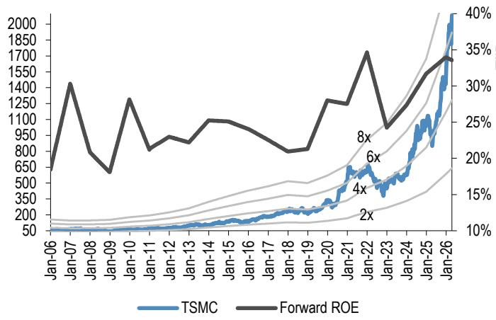  
Figure 13: TSMC : 12month forward P/B and ROE NT\$, x, %   
Source: Bloomberg Finance L.P., J.P. Morgan estimates.

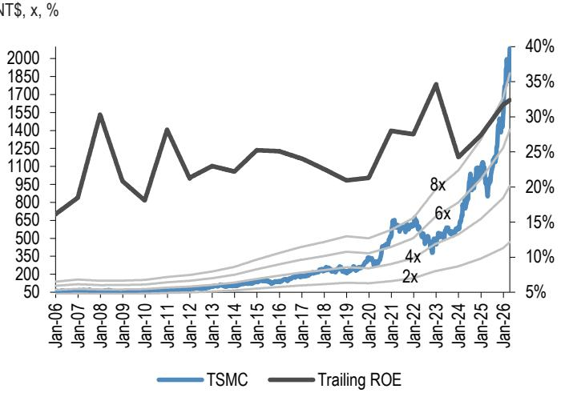  
Figure 14: TSMC : 12month trailing P/B and ROE   
Source: Bloomberg Finance L.P., J.P. Morgan estimates.

# 1Q26 Earnings Call Highlights

# 1Q26 Earnings Call Highlights

# 1Q26 recap

阅研报添• Revenue $\$ 35.9$ 信 Lbn, up $6 . 4 \%$ 123321Cad 04-17  QoQ in USD terms, driven by strong demand of leading edge tech   
• GM $6 6 . 2 \%$ , $+ 3 . 9$ ppt QoQ, driven by cost improvement, higher capacity UTR, more favorable FX – exceeding high end guidance, due to higher UTR and better cost improvement • OPM $5 8 . 1 \%$ , $+ 4 . 1$ ppt QoQ, due to operating leverage   
• EPS: $\mathrm { N T S } 2 2 . 0 8$   
• ROE: $4 0 . 5 \%$   
• Shipment 4,174k pcs, $+ 5 . 4 \%$ QoQ   
• FX 31.59 • Capex: NT\$351bn (US\$11.1bn)

# Revenue mix by process

订阅研报• N3:• N5: $2 5 \%$ $3 6 \%$ 加微信 LCD123321Cad 04-17 of sales  of sales • N7: $1 3 \%$ of sales • N7 and below – $74 \%$ of wafer sales

# Revenue mix by platform

HPC up $20 \%$ QoQ ( $61 \%$ of sales) Smartphone down $1 1 \%$ QoQ ( $2 6 \%$ of sales)

# 2Q26 outlook

Revenue US\$39.0-40.2bn, up $10 \%$ QoQ or $32 \%$ YoY at midpoint – supported by strong demand in leading edge, mindful of rising component price in Consumer Electronics segment

• Middle East macro uncertainty – being prudent on planning and focusing on fundamentals 阅研报添加微信 LCD123321Cad 04-17 • AI related demand robust, gen AI moving to agentic AI, another step-up for token generation . Customers and their customers (CSP) giving very strong signals and positive outlook $\mathrm { G M } 6 5 . 5 { - 6 7 . 5 \% } .$ , driven by higher UTR and continued cost improvement, partially offset by overseas fabs OPM: $5 6 . 5 – 5 8 . 5 \%$

. Tax $20 \%$ in 2Q26 due to undistributed retained earnings, still maintain $1 7 - 1 8 \%$ goal for FY26   
. FX 31.7

# 2026 outlook

FY26 rev – confident on $5 3 0 \%$ YoY in USD terms Initial ramp for $2 \mathrm { n m }$ starts to dilute GM in 2H26, between $2 - 3 \%$ for FY26

# 订阅研报

添加微信 LCD123321• GM dilution in next several years, $2 - 3 \%$ 04-17  in the early stage and $3 - 4 \%$ in the later stage . Costs of certain chemicals price increase due to Middle East conflict – will have some impact on profitability but too early to quantify the impact

• N3 to cross over corporate average GM in 2H26   
• FX should be another factor but not controllable   
• Material supply is developing multi-source and diversified-based, Helium and H2 sourced from multiple regions and have safety inventory, not expect any near term impact on operations Energy – working with Taipower and gov for stable supply, TW gov announced sufficient LNG to at least May, actively securing further supply with diversifying to other regions – not expecting impact in the near term

# 2026 capex

报添加微信 LCD123321Cad 04-17High end of \$52-56bn – driven by 5G AI and HPC

# TW Fab update

• Prioritize land in TW to support ramp on new node • New N2 node – already enter MP in 4Q25 with good yield, ramping with successfully in multiple phases at Hsinchu and Kaohsiung for smartphone and HPC • Expect N2 family to be large and long lasting node for TSMC

N3

AI demand – stepping up capex to increase N3 capacity, global capacity plan to support the pipeline for Smartphone HPC AI (incl HBM base die and auto, IoT) Adding new N3 in Tainan Gigafab, planning 1H27 MP   
• Arizona $- 2 ^ { \mathrm { n d } }$ fab also using N3, complete construction and MP in 2H27   
Japan – plan N3 in $2 ^ { \mathrm { n d } }$ fab and MP in 2028

阅研报添加微信 LCD123321Cad 04-17 • Continue to convert N5 to N3 in TW, driving better productivity in all locations

• N7 and below – using multiple levers to max support to all customers at all platforms   
• We don’t pick and choose customers

# Mature node

Unchanged plan, focus on building high yield for specialized capacity Increasing capacity in JASM fab 1 for CMOS image sensors

• ESMC fabs for auto and industrials Winding down on fab 2 (6”) and fab 5 (8”) for GAN – using the available space for leading edge applications   
• Without Fab 2 and Fab 5 – still have enough to fully support our existing customers

# A14

• Featuring a second-generation nanosheet transistor structure • Deliver four node stride from N2, power benefit to address in high performance and efficient power demand, vs. N2, $10 \mathrm { - } 1 5 \%$ higher improvement in speed at the same power, $2 5 \mathrm { - } 3 0 \%$ power improvement at same speed, close to $20 \%$ chip density gains – schedule on track, 2028 MP

# Q&A

# N3 GM – application driver for future demand, GM outlook to what level?

Applications still HPC AI

GM – expecting GM to reach company average in 2H26, no numbers to share, but after fully depreciated, GM should be generally high

# Capex – what is the incremental confidence source of the step-up?

Demand is robust from HPC and AI, trying to speed up and pull in all the 研报添加微信 LCD123321Cad 04-17 equipment, but still tight supply as demand continues to increase – that’s why we're stepping up the forecast

# Supply demand– expectation on how long the supply demand constraint to last, plan to build more clean room space?

Demand continues to be robust and checks with customers and their customers (CSP) giving very positive outlook, we need to speed up our equipment and pulling forward vs. the forecasted schedule

When to meet these demand? Timeframe? – 2-3 years to build new fab, but takes time to ramp up, should continue to be really tight - that’s why we are building new N3 fabs to meet the demand

# Competition – view on the initiatives from competitors (Terafab), Samsung trying to build chips on their own?

• Both Intel and TSLA are TSMC customers – also our competitors

• Intel as a formidable competitor, do not underestimate them

• No shortcuts, they need tech leadership, manufacturing excellence, customer trust, and services

• 2-3 years to build new fabs and 1-2 years to ramp up – this is fundamental

• Try to win back – still our customer and very confident in our tech

Tight capacity, is it why we lose customers? – takes 2-3 years to build new fabs, we are also building to meet strong demand, no shortcuts

# Competition – what is TSMC’s strategy on the competition from EMIB or open up their compute die to Intel to do the packaging?

TSMC supplying largest reticle size packaging, understand our competitors offer competitive packaging, customers have more choices, we don’t leave biz on the table

• Developing very large reticle size tech and working with customers - so far so good

What is the tech you refer to? – have large reticle size CoWoS and working on 订阅研报添加微信 LCD123321Cad 04-17  CoPoS, making sure we have enough capacity with reasonable cost, already having CoPoS pilot line, expecting MP in the next few years later

• Now the main approach is still the large size CoWoS with system on wafer tech – the best option in the market

# Capex – long term guidance in next 3 years

No numbers to share – past 3 years, total capex $\$ 101$ bn, 2026 toward the high end of $\$ 56 b$ , which is $5 5 0 \%$ for the past 3yrs aggregate, showing strong demand from AI mega trend, capex next 3 yrs will be significantly higher than last 3 years Any bottlenecks with long leading time? - always working with suppliers as partners, ASML, Applied Materials, Lam Research – happy with their support

# Capex – from 2024-2026, keeping capital intensity at $3 0 + \%$ ; in coming few years, given strong ramp, what is the revenue growth vs. capex growth?

• Past 3 years, revenue growth outpaced capex growth, should continue to see this   
阅 研报添加微信 LCD123321Cad 04-17trend if we do the things right   
• Not expecting a sudden surge in the capital intensity Expand more on capex due to competition for not enough capacity? – preparation the capacity to meet the demand, not due to other competitors, it’s due to customer demand, so we plan our capex

# FY26 revenue guidance – guiding $3 0 + \%$ growth, how much more upside, any impact from Smartphone?

Memory price hikes have some impact on the end market for PC and Smartphone, seeing softer market, but high end Smartphone doing better, this is favorable to TSMC advantage How much higher vs. $30 \%$ YoY? Will share that in Jul

# Margin – any change in the margin structure given strong demand for long-term?

Have revised up long term GM and ROE from 2024-2029, GM will be $56 \%$ and 阅研报添加微信 LCD123321Cad 0higher through the cycle, looking ROE at high $2 0 \% -$ already higher than before Long-term planning is ongoing, will update when there are changes

# US fab – Mid-term and long-term opportunities and becoming more strategic and what is the economics and margin outlook?

• Acquired $2 ^ { \mathrm { n d } }$ land, because we need it, to meet multi-year demand for the leading edge customers Working hard to speed up and already gaining a lot of experience in Arizona, more confident than 2025 to make good progress and moving aggressively forward,

# Profitability – is it fully reflect the TSMC value? What is the benchmark to look at for GM and OPM?

Pricing strategy – view customers as our partners, we know our value and position, view partners as important biz partners, don’t change pricing dramatically, make sure customers are successful and earn our value – expand our capacity to support them

订阅研报添加微信 LCD123321Cad 04-17 • Fundamentals – our customers need to be successful, we grow together Customers are our partners

# AI growth – mid to high 50s CAGR, given strong growth in tokens, seeing any changes for AI growth in the coming years?

Very strong demand – continue to see positive signals from customers Changes to AI growth? – seeing strong demand, towards higher 50s

Advanced Packaging – business model with OSAT, saw various solutions from OSAT, how do we work with customers to align with advanced packaging demand?

Priority is to support customers – making sure their product can be met by TSMC front end and advanced packaging • Advanced packaging capacity is very tight as well – need to work with OSATs and increase capacity for our customers, we are also working our capacity as well

Advanced Packaging – AI chips are growing with very large die size, potential tech challenges are from warpage, following roadmap for SoIC and CoPoS can solve these issues?

• TSMC has a lot of experience, as we supply all the leading edge packaging, continue to increase die size to meet the challenge from mechanical stress like warpage and thermal   
• The harder the better – it’s our strength, we can work with the customers to solve them   
• SoIC, what is the development? – working with our customers and meet their demands

# AI rev – definition of AI accelerators? Will we include CPUs, any historical numbers to share?

. CPUs becoming more important – but TSMC not able to identify which CPUs go to where

订阅研报添加微信 LCD123321Cad 04-17 • Still not including CPU in AI HPC calculations – someday later might consider

Competition – LPU at Samsung foundry? How does TSMC win back LPU biz? Any plan?

Very confident in our tech and working hard to capture every piece of the biz

Figure 15: TSMC: Earnings model   

<table><tr><td>NTin illinsyerde</td><td colspan="3">FY25</td><td colspan="3">1Q</td><td colspan="3">4QE</td><td colspan="3">FY27E</td><td colspan="3">FY28E</td><td colspan="3">FY25 FY26</td></tr><tr><td>Sales (NTs in billions)</td><td>1Q 839.3</td><td>2Q 933.8</td><td>3Q 989.9</td><td>4Q 1,046.1</td><td>2QE 1,262.1</td><td>3QE 1,394.8</td><td>1,529.4</td><td>1QE 1,550.1</td><td>2QE 1,700.6</td><td>3QE 1,856.2</td><td>4QE 1,916.2</td><td>1QE</td><td>2QE</td><td>3QE 2,167.6</td><td>4QE 2，111.2</td><td></td><td>FY27E 7,023.1</td><td>FY28E 8,190.6</td></tr><tr><td></td><td></td><td></td><td>33,731</td><td>1,134.1</td><td></td><td></td><td></td><td></td><td></td><td></td><td></td><td>1,884.4</td><td>2,027.4</td><td></td><td></td><td>3,809.1</td><td>5,320.4 221,550</td><td></td></tr><tr><td>Sales (Uss in milions)</td><td>25.525</td><td>30,074</td><td>33,097</td><td>35,898</td><td>39,813</td><td>43,999</td><td>48,246</td><td>48.899</td><td>53,648</td><td>58,556</td><td>60,447</td><td>59,446</td><td>63,956</td><td>68,380 -744.2</td><td>66,598</td><td>122,456 -1,527.8</td><td>167,960</td><td>258,379</td></tr><tr><td>COGS</td><td>-345.9</td><td>-386.4</td><td>-401.4</td><td>-394.1 -382.8</td><td>-417.0</td><td>-488.6</td><td>-530.2</td><td>-562.2</td><td>-604.9</td><td>-652.0</td><td>-677.9</td><td>-667.5</td><td>-706.5</td><td></td><td>-742.9</td><td>-1,818.6 -688.1</td><td>-2,497.1</td><td>-2,861.1</td></tr><tr><td>Depreciaton</td><td>-175.1</td><td>-188.1 -162.8</td><td>-162.1</td><td>-165.5</td><td>-188.7</td><td>-220.9</td><td>-230.1</td><td>-236.7</td><td>-253.6</td><td>-268.0</td><td>-278.4</td><td>-285.6</td><td>-301.0</td><td>-314.0</td><td>-326.0</td><td>-805.2</td><td>-1,036.7</td><td>-1,226.5</td></tr><tr><td>Gross profit</td><td>493.4</td><td>547.4</td><td>588.5 652.0</td><td>751.3</td><td>845.1</td><td>906.2</td><td>999.2</td><td>987.9</td><td>1,095.7</td><td>1,204.2</td><td>1,238.2</td><td>1,216.9</td><td>1,320.9</td><td>1,423.4</td><td>1,368.2 2,281.3</td><td>3,501.8</td><td>4,526.1</td><td>5,329.6</td></tr><tr><td>Operating expense</td><td>-86.3</td><td>-83.9</td><td>-87.9</td><td>-92.3</td><td>-117.4</td><td>-126.9</td><td>-136.1</td><td>-147.3</td><td>-161.6</td><td>-176.3</td><td>-182.0</td><td>-177.1</td><td>-190.6</td><td>-202.7</td><td>-204.8</td><td>-345.2 -472.7</td><td>-667.2</td><td>-775.2</td></tr><tr><td>SG&amp;A</td><td>-29.8</td><td>-22.7</td><td>-87.1 -24.1</td><td>-24.6</td><td>-30.3</td><td>-33.5</td><td>-36.7</td><td>-38.8</td><td>-42.5</td><td>-46.4</td><td>-47.9</td><td>-45.2</td><td>-48.7</td><td>-53.1</td><td>-50.7</td><td>-98.8 -125.0</td><td>-175.6</td><td>-197.7</td></tr><tr><td>R&amp;D</td><td>-56.5</td><td>-61.3 -63.7</td><td>-22.2 -64.9</td><td>-67.8</td><td>-87.1</td><td>-93.5</td><td>-99.4</td><td>-108.5</td><td>-119.0</td><td>-129.9</td><td></td><td></td><td></td><td></td><td></td><td>-347.7</td><td>-491.6</td><td>-577.5</td></tr><tr><td>Operating (EBIT)</td><td>407.1</td><td>463.4 500.7</td><td>564.9</td><td>659.0</td><td>727.7</td><td>779.3</td><td>863.1</td><td>840.6</td><td>934.2</td><td></td><td>-134.1 1,056.2</td><td>-131.9</td><td>-141.9</td><td>-149.6</td><td>-154.1</td><td>-246.4</td><td>3,858.9</td><td>4,554.4</td></tr><tr><td>Netinterestincome (expense)</td><td>22.2</td><td>21.5 23.2</td><td>26.5</td><td>26.1</td><td>19.5</td><td>23.3</td><td>25.4</td><td>19.0</td><td>19.7</td><td>1,027.9</td><td></td><td>1,039.8</td><td>1,130.4</td><td>1,220.8</td><td>1,163.4</td><td>1,936.1 3,029.1</td><td>81.9</td><td>83.9</td></tr><tr><td>Net other income (expense)</td><td></td><td></td><td>1.5</td><td>2.7</td><td></td><td>1.0</td><td></td><td></td><td></td><td>20.6</td><td>22.6</td><td>20.7</td><td>21.9</td><td>19.6</td><td>21.6</td><td>93.4</td><td>94.3</td><td></td></tr><tr><td>Pre-tax profit</td><td>1.6</td><td>8.1 493.0 525.4</td><td></td><td>1.0</td><td></td><td></td><td>1.1</td><td>1.1</td><td>1.1</td><td>1.1</td><td>1.1</td><td>1.1</td><td>1.1</td><td>1.1</td><td>1.1</td><td>12.2</td><td>5.8 4.3</td><td>4.4</td></tr><tr><td></td><td>430.9</td><td>-95.5</td><td>592.4</td><td>687.8</td><td>748.2</td><td>803.6</td><td>889.5</td><td>860.7</td><td>954.9</td><td>1,049.5</td><td>1,079.9</td><td>1,061.6</td><td>1,153.4</td><td>1,241.5</td><td>1,186.2</td><td>2.041.7 3,129.2</td><td>3.945.1</td><td>4,642.7</td></tr><tr><td>Tax credit (expense) Net profit</td><td>-70.2</td><td>-73.6 398.3 452.3</td><td>-86.9 505.7</td><td>-115.0</td><td>-149.6</td><td>-136.6</td><td>-151.2</td><td>-146.3</td><td>-191.0</td><td>-178.4</td><td>-183.6</td><td>-180.5</td><td>-230.7</td><td>-211.1</td><td>-201.7</td><td>-326.3 -552.5</td><td>-699.3</td><td>-823.9</td></tr><tr><td>Adjusted O/S (B)</td><td>361.6</td><td></td><td></td><td>572.5 25.9</td><td>598.2 25.9</td><td>666.7 25.9</td><td>738.0</td><td>714.1</td><td>763.6</td><td>870.8</td><td>896.0</td><td>880.8</td><td>922.4</td><td>1,030.1</td><td>984.2</td><td>1,717.9 2,575.4 25.9</td><td>3,244.5</td><td>3,817.5</td></tr><tr><td>FD EPS (NTS)</td><td>25.9</td><td>25.9</td><td>25.9</td><td>25.9</td><td></td><td></td><td>25.9</td><td>25.9</td><td>25.9</td><td>25.9</td><td>25.9</td><td>25.9</td><td>25.9</td><td>25.9</td><td>25.9</td><td>25.9 66.24</td><td>25.9</td><td>25.9</td></tr><tr><td>Key assumption</td><td>13.94</td><td>15.36</td><td>17.44</td><td>19.50</td><td>22.08 23.07</td><td>25.71</td><td>28.46</td><td>27.54</td><td>29.45</td><td>33.58</td><td>34.55</td><td>33.97</td><td>35.57</td><td>39.72</td><td>37.95</td><td>99.31</td><td>125.11</td><td>147.21</td></tr><tr><td>Capaity(O0owers)</td><td>3.819</td><td>3.874</td><td>3.894</td><td>3.974</td><td></td><td></td><td></td><td></td><td></td><td></td><td></td><td></td><td></td><td></td><td></td><td></td><td></td><td></td></tr><tr><td>Shipment (wafersqu)</td><td>3.259</td><td>3,718</td><td>4,085</td><td>4,044 3.961</td><td>4,114 4,097</td><td>4,113</td><td>4,175</td><td>4,222 4,160</td><td>4,307</td><td>4,407</td><td>4,477</td><td>4,504</td><td>4,459</td><td>4,409</td><td>4,349 15.561</td><td>16,446</td><td>17,414</td><td>17,721</td></tr><tr><td>Shipment utilizatin %)</td><td>85</td><td>96</td><td>105</td><td>4,174 100</td><td>100</td><td>4,166</td><td>4,240 102</td><td>99</td><td>4.327 100</td><td>4,533</td><td>4,471</td><td>4,357</td><td>4,425</td><td>4,470</td><td>4,184 96</td><td>15.023 16,676</td><td>17,491</td><td>17,436</td></tr><tr><td>Wafer ASP(USS)</td><td>6.663</td><td>6.891 7,046</td><td>7.344</td><td>103 7,422</td><td>8.222</td><td>101 8,767</td><td>9.349</td><td>9.790</td><td>10.322</td><td>103 10.697</td><td>100 10.929</td><td>97 11,118</td><td>99 11,718</td><td>101 12.321</td><td>12.578</td><td>101 7.003 8.445</td><td>100 10,448</td><td>98 11.929</td></tr><tr><td>Margins (%)</td><td></td><td>58.6</td><td>59.5</td><td>66.2</td><td></td><td></td><td></td></table>

# Investment Thesis, Valuation and Risks

# TSMC (Overweight; Price Target: NT\$2500.0)

# Investment Thesis

We expect TSMC’s structural growth drivers to remain very strong as leading-edge supply 研报添加微信 LCD123321Cad 04-17 (N4, N3, and N2) stays tight well into 2027 or early 2028, given accelerating AI demand, continued growth in N3, N2 and advanced back-end revenues, and long lead time for capacity build despite accelerated capex. We believe the set-up for TSMC stock looks quite favorable in the next few quarters, with potential upside to its long-term capex targets, 2026 revenue guidance, and GMs beating due to high UTR and ASP uptick. Given industry-wide shortage, we expect competitive noise to persist, but achieving technology and manufacturing milestones and winning customer acceptance would be the key challenge for the chasing pack, given TSMC tech and execution leadership and 3-5 year window for design and manufacturing ramp.

# Valuation

Our Dec-26 PT of $\mathrm { N T S } 2 , 5 0 0$ is based on ${ \sim } 2 0 \mathrm { x }$ 12-month forward $\mathrm { P / E }$ and reflects better GMs and slightly faster growth. Our target multiple is higher than TSMC’s five-year average historical multiple.

# Risks to Rating and Price Target

Key downside risks to our rating and price target include: (1) the debate on the duration of the AI capex growth cycle and (2) any negative impact from weak PC/Smartphone demand 阅研报添加微信 LCD123321Cad 04-17in 2H26.

TSMC: Summary of Financials   

<table><tr><td></td><td>FY24A</td><td>FY25A</td><td>FY26E</td><td>FY27E</td></tr><tr><td>Income Statement-Annual</td><td>2,894,3083,809054 5,2358</td><td></td><td></td><td>7,023,133</td></tr><tr><td>Revenue</td><td></td><td></td><td>(1,269,954) (1,527,760) (1,818,552) (2,497,076)</td><td></td></tr><tr><td>COGS</td><td></td><td></td><td></td><td></td></tr><tr><td>Gross profit</td><td>1,624,354</td><td>2,281,294</td><td>3,501,806</td><td>4,526,057</td></tr><tr><td>SG&amp;A</td><td>(98,119)</td><td>(98,775)</td><td>(125,042)</td><td>(175,578)</td></tr><tr><td>Adj. EBITDA</td><td>1,984,850</td><td>2,624,188</td><td>3,834,219</td><td>4,895,538</td></tr><tr><td>D&amp;A</td><td>(662,797)</td><td>(688,096)</td><td>(805,157)</td><td>(1,036,679)</td></tr><tr><td>Adj. EBIT</td><td>1,322.053</td><td>1,936,092</td><td>3,029,063</td><td>3,858,859</td></tr><tr><td>Net Interest</td><td>76,718</td><td>93,369</td><td>94,287</td><td>81,911</td></tr><tr><td>Adj. PBT</td><td>1,405,839</td><td>2,041,663</td><td>3,129,180</td><td>3,945,053</td></tr><tr><td>Tax Minority Interest</td><td>(233,407) 836</td><td>(326,266)</td><td>(552,480)</td><td>(699,306)</td></tr><tr><td>Adj. Net Income</td><td></td><td>2.486</td><td>(1,284)</td><td>(1,284)</td></tr><tr><td>Reported EPS</td><td>1,173,268</td><td>1,717,883</td><td>2,575,416</td><td>3,244,463</td></tr><tr><td>Adj. EPS</td><td>45.24 45.24</td><td>66.24</td><td>99.31</td><td>125.11 125.11</td></tr><tr><td>DPS</td><td>16.50</td><td>66.24 22.00</td><td>99.31 25.50</td><td>34.00</td></tr><tr><td>Payout ratio</td><td>51.0%</td><td>48.6%</td><td>38.5%</td><td>34.2%</td></tr><tr><td>Shares outstanding</td><td>25,933</td><td>25,933</td><td>25,933</td><td>25.933</td></tr><tr><td>Balance Sheet&amp;Cash FlowStatement</td><td>FY24A</td><td>FY25A</td><td>FY26E</td><td>FY27E</td></tr><tr><td>Cash and cash equivalents</td><td>2,422,020</td><td>3,068,595</td><td>4,466,940</td><td>5,603,522</td></tr><tr><td>Accounts receivable</td><td>272,088</td><td>282,059</td><td>419,013</td><td>524,978</td></tr><tr><td>Inventories</td><td>287,869</td><td>288,109</td><td>419,013</td><td>524,978</td></tr><tr><td>Other current assets</td><td>106,376</td><td>178,367</td><td>135,947</td><td>170,326</td></tr><tr><td>Current assets</td><td></td><td></td><td></td><td></td></tr><tr><td></td><td>3,088,352</td><td>3,817,131</td><td>5,440,913</td><td>6,823,804</td></tr><tr><td>PP&amp;E</td><td>3,234,980</td><td>3,691,841</td><td>4,356,199</td><td>5,380,021</td></tr><tr><td>LT investments</td><td>149,040</td><td>172,370</td><td>169,710</td><td>173,992</td></tr><tr><td>Other non current assets Total assets</td><td>219,565 6,691,938</td><td>251,682</td><td>274,192</td><td>274,192</td></tr><tr><td></td><td></td><td></td><td>7,933,02410,241,01512,652,009</td><td></td></tr><tr><td>Short term borrowings</td><td>59,858</td><td>136,926</td><td>156,242</td><td>156,242</td></tr><tr><td>Payables</td><td>74,227</td><td>阅84.330</td><td>108.943</td><td>121.795</td></tr><tr><td>Other short term liabilities</td><td>1,130,441</td><td>1,236,763</td><td>1,359,466</td><td>1,419,384</td></tr><tr><td>Current liabilities</td><td>1,264,525</td><td>1,458,019</td><td>1,624,651</td><td>1,697,421</td></tr><tr><td>Long-term debt</td><td>958,429</td><td>896,062</td><td>860,026</td><td>860,026</td></tr><tr><td>Other long term liabilities</td><td>145,408</td><td>118,147</td><td>132.277</td><td>107,740</td></tr><tr><td>Total liabilities</td><td>2,368,362</td><td>2,472,229</td><td>2,616,954</td><td>2,665,187</td></tr><tr><td>Shareholders&#x27; equity</td><td>4,288,545</td><td>5,419,596</td><td>7,582,631</td><td>9,945,393</td></tr><tr><td>Minority interests</td><td>35,031</td><td>41,199</td><td>41,429</td><td>41,429</td></tr><tr><td>Total liabilities &amp; equity</td><td>6,691,938</td><td></td><td>7,933,02410,241,01512,652,009</td><td></td></tr><tr><td>BVPS</td><td>165.4</td><td>209.0</td><td>292.4</td><td>383.5</td></tr><tr><td>y/y Growth</td><td>24.0%</td><td>26.4%</td><td>39.9%</td><td>31.2%</td></tr><tr><td>Net debt/(cash)</td><td>(1,403,733) (2,035,607) (3,450,672) (4,587,254)</td><td></td><td></td><td></td></tr><tr><td>Cash flow from operating activities</td><td></td><td></td><td></td><td></td></tr><tr><td>o/w Depreciation &amp;amortization</td><td>1,975,661 662,797</td><td>2,437,716 3,303,735</td><td></td><td>4,108,887 1,036,679</td></tr><tr><td>o/w Changes in working capital</td><td></td><td>688,096</td><td>805,157</td><td></td></tr><tr><td>Cash flow from investing activities</td><td>(90,016)</td><td>(108)</td><td>(243,245)</td><td>(199,077)</td></tr><tr><td>o/w Capital expenditure</td><td></td><td></td><td>(928,044) (1,200,404) (1,489,365) (,064,783)</td><td></td></tr><tr><td>as % of sales</td><td></td><td></td><td>(958,198) (1,272,219) (1,773,870) (2,060,500)</td><td></td></tr><tr><td>Cash flow from financing activities</td><td>33.1% (313,242)</td><td>33.4%</td><td>33.3%</td><td>29.3% (907,522)</td></tr><tr><td>o/w Dividends paid</td><td>(428,731)</td><td>(590,737) (573,003)</td><td>(416,026) (659,992)</td><td>(880,418)</td></tr><tr><td>o/w Net debt issued/(repaid)</td><td>90,711</td><td>14,701</td><td></td><td>0</td></tr><tr><td>Net change in cash</td><td>734,375</td><td>646,575</td><td>（16,720) 1,398,345</td><td>1,136,582</td></tr><tr><td>Adj. Free cash flow to firm</td><td>1,142,360</td><td>1,292,759</td><td>1,834,220</td><td></td></tr><tr><td></td><td></td><td></td><td></td><td>2,048,387</td></tr><tr><td>y/y Growth</td><td>164.7%</td><td>13.2%</td><td>41.9%</td><td>11.7%</td></tr></table>

Source: Company reports and J.P. Morgan estimates. Note: NT\$ in millions (except per-share data).Fiscal year ends Dec. o/w - out of which

<table><tr><td>IncomeStatement-Quarterly</td><td>1Q26A</td><td>2Q26E</td><td>3Q26E</td><td>4Q26E</td></tr><tr><td>Revenue</td><td>1,134,103</td><td>1,262,076</td><td>1,394,779</td><td>1,529,399</td></tr><tr><td>COGS</td><td>(382,808)</td><td>(417,008)</td><td>(488,563)</td><td>(530,173)</td></tr><tr><td>Gross profit SG&amp;A</td><td>751,295</td><td>845,069</td><td>906,217</td><td>999,226</td></tr><tr><td>Adj. EBITDA</td><td>(24,572) 824,416</td><td>(30,290) 916,413</td><td>(33,475) 1,000,144</td><td>(36,706)</td></tr><tr><td>D&amp;A</td><td>(165,450)</td><td>(188,718)</td><td>(220,853)</td><td>1,093,246 (230,136)</td></tr><tr><td>Adj. EBIT</td><td>658,966</td><td>727,695</td><td>779,292</td><td>863,109</td></tr><tr><td>Net Interest</td><td>26,146</td><td>19,464</td><td>23,304</td><td>25,373</td></tr><tr><td>Adj. PBT 123321C ad</td><td>687,800</td><td>748,201</td><td>803,643</td><td>889,536</td></tr><tr><td>Tax</td><td>(114,999)</td><td>(149,640)</td><td>(136,619)</td><td>(151,221)</td></tr><tr><td>Minority Interest</td><td>(321)</td><td>(321)</td><td>(321)</td><td>(321)</td></tr><tr><td>Adj. Net Income</td><td>572,480</td><td>598,240</td><td>666,703</td><td>737,994</td></tr><tr><td>Reported EPS</td><td>22.08</td><td>23.07</td><td>25.71</td><td>28.46</td></tr><tr><td></td><td></td><td></td><td></td><td></td></tr><tr><td>Adj. EPS</td><td>22.08</td><td>23.07</td><td>25.71</td><td>28.46</td></tr></table>

<table><tr><td>Shares outstanding</td><td>25,932</td><td>25,932</td><td>25,932</td><td>25,932</td></tr><tr><td>Ratio Analysis</td><td>FY24A</td><td>FY25A</td><td>FY26E</td><td>FY27E</td></tr><tr><td>Gross margin</td><td>56.1%</td><td>59.9%</td><td>65.8%</td><td>64.4%</td></tr><tr><td>EBITDA margin</td><td>68.6%</td><td>68.9%</td><td>72.1%</td><td>69.7%</td></tr><tr><td>EBIT margin</td><td>45.7%</td><td>50.8%</td><td>56.9%</td><td>54.9%</td></tr><tr><td>Net profit margin</td><td>40.5%</td><td>45.1%</td><td>48.4%</td><td>46.2%</td></tr><tr><td>ROE</td><td>30.3%</td><td>35.4%</td><td>39.6%</td><td>37.0%</td></tr><tr><td>ROA</td><td>19.2%</td><td>23.5%</td><td>28.3%</td><td>28.3%</td></tr><tr><td>ROCE</td><td>22.7%</td><td>27.7%</td><td>33.1%</td><td>32.5%</td></tr><tr><td>SG&amp;A/Sales</td><td>3.4%</td><td>2.6%</td><td>2.4%</td><td>2.5%</td></tr><tr><td>Net debt/equity</td><td>NM</td><td>NM</td><td>NM</td><td>NM</td></tr><tr><td>P/E (xD123321Cad 04-17</td><td>46.1</td><td>31.5</td><td>21.0</td><td>16.7</td></tr><tr><td>P/BV (x)</td><td>12.6</td><td>10.0</td><td>7.1</td><td>5.4</td></tr><tr><td>EV/EBITDA (x)</td><td>26.5</td><td>19.8</td><td>13.2</td><td>10.1</td></tr><tr><td>Dividend Yield</td><td>0.8%</td><td>1.1%</td><td>1.2%</td><td>1.6%</td></tr><tr><td>Sales/Assets (x)</td><td>47.4%</td><td>52.1%</td><td>58.5%</td><td>61.4%</td></tr><tr><td>Interest cover (x)</td><td>NM</td><td>NM</td><td>NM</td><td>NM</td></tr><tr><td>Operating leverage</td><td>128.3%</td><td>147.0%</td><td>142.3%</td><td>85.6%</td></tr><tr><td>Revenue yly Growth</td><td>33.9%</td><td>31.6%</td><td>39.7%</td><td>32.0%</td></tr><tr><td>EBITDA y/y Growth</td><td>36.5%</td><td>32.2%</td><td>46.1%</td><td>27.7%</td></tr><tr><td>Tax rate</td><td>16.6%</td><td>16.0%</td><td>17.7%</td><td>17.7%</td></tr><tr><td>Adj. Net Income y/y Growth</td><td>39.9%</td><td>46.4%</td><td>49.9%</td><td>26.0%</td></tr><tr><td>EPS yly Growth</td><td>39.9%</td><td>46.4%</td><td>49.9%</td><td>26.0%</td></tr><tr><td>DPS yly Growth</td><td>26.9%</td><td>33.3%</td><td>15.9%</td><td>33.3%</td></tr><tr><td>LCD123321Cad 04-17</td><td></td><td></td><td></td><td></td></tr></table>

Analyst Certification: The Research Analyst(s) denoted by an “AC” on the cover of this report certifies (or, where multiple Research Analysts are primarily responsible for this report, the Research Analyst denoted by an “AC” on the cover or within the document individually certifies, with respect to each security or issuer that the Research Analyst covers in this research) that: (1) all of the views expressed in this report 订阅研报添加微信 LCD123321Cad 04-17 accurately reflect the Research Analyst’s personal views about any and all of the subject securities or issuers; and (2) no part of any of the Research Analyst's compensation was, is, or will be directly or indirectly related to the specific recommendations or views expressed by the Research Analyst(s) in this report. For all Korea-based Research Analysts listed on the front cover, if applicable, they also certify, as per KOFIA 订阅研报添加微信 LCD123321Cad 04-17 requirements, that the Research Analyst’s analysis was made in good faith and that the views reflect the Research Analyst’s own opinion, without undue influence or intervention.

All authors named within this report are Research Analysts who produce independent research unless otherwise specified. In Europe, Sector Specialists (Sales and Trading) may be shown on this report as contacts but are not authors of the report or part of the Research Department. 19