# Old Memory: Ongoing Asymmetric Risks

April 19, 2026 11:06 PM GMT We continue to prefer MLC NAND and NOR Flash over DDR4. Within legacy DRAM, we think spec migration and new opportunities differentiate stocks.

# Key Takeaways

MLC NAND/NOR pricing power should accelerate from 2Q26 led by Macronix. The DDR4 pricing hike is likely to be up $60 \%$ in 2Q, then decelerate into 2H.   
Intel EMIB could drive notable upside on silicon capacitors, mainly from AP Memory.   
Spec migration should continue to be the highlight from PSMC in 2027.   
We are OW Macronix, AP Memory (raised PT), PSMC and GigaDevice (raised PT). We are EW Nanya and Winbond.

Keeping our selective view; need to consider outlook beyond 2026: Old memory stocks typically show higher volatility when the cycle starts to roll forward (see memory downgrade note). We stick to our view that legacy NAND (especially MLC 3321C 订阅研报添加微信 LCD12NAND) is better than DDR4. In this note, we also highlight new opportunities for legacy DRAM vendors to tap in the advance packaging area, growing along with rising non GPU server demand (see Shawn Kim's agentic AI report).

DDR4 - definitely still in tightness , but momentum decelerating: We believe DDR4 8Gb pricing will likely be above USD20 soon (and 4Gb above USD10). Some customers still see strong momentum given pull-ins (e.g., PC). This suggests DDR4 vendors could see high profitability in the near term. That said, we see limited share price upside amid pricing hike deceleration, KV cache compression, server system optimization and LTA discussions. CXMT is also adding some DDR4 support (see GigaDevice note).

Legacy flash - accelerating the pricing hike: We continue to see extreme tightness for MLC NAND, especially with reports of Kioxia phasing out of the market after Samsung (TrendForce News, 31 Mar 2026). We believe MXIC is trying to reallocate 订阅研报添加微信 LCD123321Ccapacity to support MLC NAND, resulting in supply reduction on NOR. Thus, we believe both MLC NAND and NOR pricing could be up $100 \%$ at most in 2Q, and be maintained at high double digits into 2H.

New opportunities from EMIB-T: We believe AP Memory will be the major EMIB-T proxy in Taiwan, as it is the provider of silicon capacitors. Amid high power consumption from ASIC (e.g., TPU), we think its content per chip could be near USD100. This could be significant considering potential future customers (see our EMIB report). Incremental revenue could be $50 \% +$ vs. the 2026e level. We think the most important factor to focus on is prepayment from some end-customers.

# Key Charts and Exhibits

Exhibit 1: Order of preference: GC memory   

<table><tr><td>Avg Daily Traded Vol (in USD mm)</td><td>135.5</td><td>48.1</td><td>871.0</td><td>158.1</td><td>281.7</td></tr><tr><td colspan="6">Street View: Ratings</td></tr><tr><td>Buy/Overweight</td><td>90%</td><td>100%</td><td>92%</td><td>140%</td><td>178%</td></tr><tr><td>Hold/Equal-weight</td><td>0%</td><td>0%</td><td>18%</td><td>160%</td><td>122%</td></tr><tr><td>Sell/Underweight</td><td> 10%</td><td>0%</td><td>0%</td><td>0%</td><td>0%</td></tr><tr><td>Bull Case Value</td><td>326.0</td><td>1,145.0</td><td>604.0</td><td>113.6</td><td>120.0</td></tr><tr><td>Upside (%)</td><td>149%</td><td>78%</td><td>109%</td><td>116%</td><td>37%</td></tr><tr><td>Bear Case Value</td><td>119.5</td><td>376.0</td><td>219.0</td><td>35.5</td><td>41.4</td></tr><tr><td>Downside (%) Risk/Reward Skew</td><td>-9%</td><td>-42% 1.9</td><td>-24% 4.5</td><td>-33% 3.6</td><td>-53% 0.7</td></tr><tr><td></td><td>17.0</td><td></td><td></td><td></td><td></td></tr><tr><td colspan="6">Morgan Stanley Estimates</td></tr><tr><td>FY26e</td><td>TWD</td><td>TWD</td><td>CNY</td><td>TWD</td><td>TWD</td></tr><tr><td>Sales</td><td>56,677</td><td>9,333</td><td>17,061</td><td>66,303</td><td>224,249</td></tr><tr><td>EBITDA</td><td>20,949</td><td>2,901</td><td>6,005</td><td>12,145</td><td>106,288</td></tr><tr><td>EBIT</td><td>13,412</td><td>2,841</td><td>5,736</td><td>4,581</td><td>90,677</td></tr><tr><td>EPS</td><td>5.90</td><td>16.16</td><td>8.10</td><td>8.61</td><td>16.57</td></tr><tr><td colspan="6">FY27e</td></tr><tr><td>Sales</td><td>109,328</td><td>13,777</td><td>24,555</td><td>72,058</td><td>264,897</td></tr><tr><td>EBITDA</td><td>48,356</td><td>4,905</td><td>9,504</td><td>18,971</td><td>129,416</td></tr><tr><td>EBIT</td><td>43,644</td><td>4,842</td><td>9,235</td><td>11,931</td><td>109,239</td></tr><tr><td>EPS</td><td>19.61</td><td>26.32</td><td>12.98</td><td>2.21</td><td>19.87</td></tr><tr><td colspan="6">FY26 MSe vs.Consensus Mean</td></tr><tr><td>Sales</td><td>-18.0%</td><td>15.2%</td><td>18.0%</td><td>4.7%</td><td>8.3%</td></tr><tr><td>EBITDA</td><td>-6.7%</td><td>13.9%</td><td>2.3%</td><td>-26.1%</td><td>5.8%</td></tr><tr><td>EBIT</td><td>-41.6%</td><td>25.6%</td><td>11.1%</td><td>-33.2%</td><td>6.8%</td></tr><tr><td>EPS</td><td>-44.9%</td><td>-2.7%</td><td>11.2%</td><td>28.0%</td><td>7.7%</td></tr><tr><td colspan="6">FY27MSevs.Consensus Mean</td></tr><tr><td>Sales</td><td>2.0%</td><td>13.2%</td><td>35.4%</td><td>4.8%</td><td>-1.0%</td></tr><tr><td>EBITDA</td><td>-0.6%</td><td>17.6%</td><td>35.6%</td><td>-9.4%</td><td>-1.8%</td></tr><tr><td>EBIT</td><td>27.4%</td><td>19.5%</td><td>41.7%</td><td>5.6%</td><td>3.2%</td></tr><tr><td>EPS</td><td>-23.7%</td><td>14.5%</td><td>40.0%</td><td>-9.9%</td><td>-3.4%</td></tr><tr><td colspan="6">Valuation Multiplesat Last Close</td></tr><tr><td>FY26e P/E</td><td>22.2x</td><td>39.9x</td><td>35.7x</td><td>6.1x</td><td>5.3x</td></tr><tr><td>EV/EBIT</td><td>20.7x</td><td>32.6x</td><td>31.3x</td><td>18.1x</td><td>4.3x</td></tr><tr><td>EV/EBITDA</td><td>13.2x</td><td>31.9x</td><td>29.9x</td><td>6.8x</td><td>3.7x</td></tr><tr><td>EV/Sales</td><td>4.9x</td><td>9.9x</td><td>10.5x</td><td>1.2x</td><td>1.7x</td></tr><tr><td>FCFYield</td><td>-12.0%</td><td>1.8%</td><td>2.3%</td><td>54.9%</td><td>10.2%</td></tr><tr><td colspan="6">FY27e</td></tr><tr><td>P/E</td><td>6.7x</td><td>24.5x</td><td>22.3x</td><td>23.8x</td><td>4.4x</td></tr><tr><td>EV/EBIT</td><td>5.6x</td><td>18.8x</td><td>18.8x</td><td>6.8x</td><td>2.6x</td></tr><tr><td>EV/EBITDA</td><td>5.0x</td><td>18.5x</td><td>18.3x</td><td>4.3x</td><td>2.2x</td></tr><tr><td>EV/Sales</td><td>2.2x</td><td>6.6x</td><td>7.1x</td><td>1.1x</td><td>1.1x</td></tr><tr><td>FCFYield</td><td>15.5%</td><td>3.2%</td><td>4.0%</td><td>6.0%</td><td>32.5%</td></tr></table>

Source: FactSet, Morgan Stanley Research (e) estimates. Pricing as of April 17, 2026.

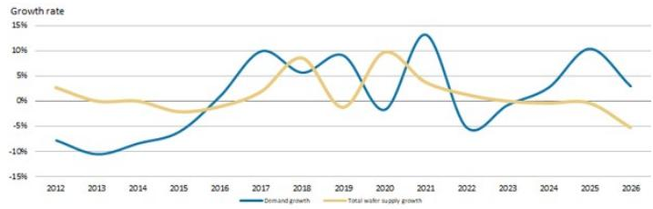  
Exhibit 2: NOR flash demand and supply growth rates   
Source: Company data, Morgan Stanley Research

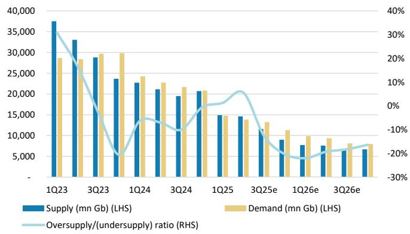  
Exhibit 4: DDR4 quarterly supply and demand summary   
Source: Morgan Stanley Research (e) estimates

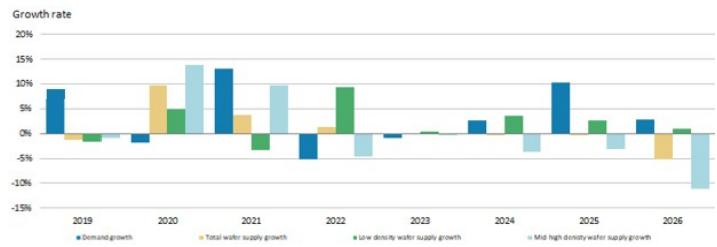  
Exhibit 3: NOR flash demand growth and supply growth by density

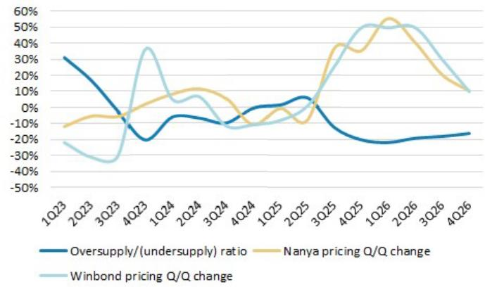  
Exhibit 5: Quarterly oversupply/undersupply ratio vs. Nanya and Winbond pricing Q/Q change   
Source: Morgan Stanley Research (e) estimates

# 订阅研报添加微信

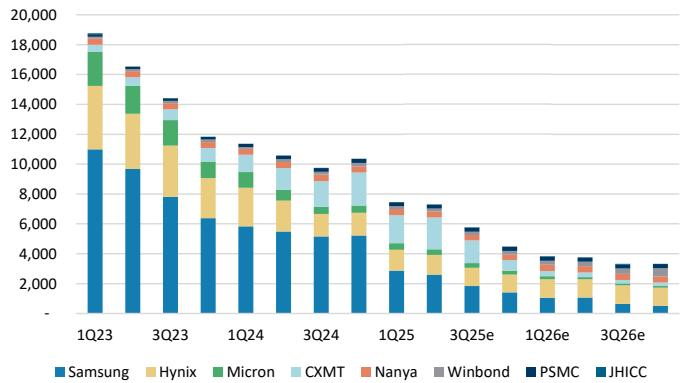  
Exhibit 6: Quarterly supply breakdown (mn Gb)   
Source: Morgan Stanley Research (e) estimates

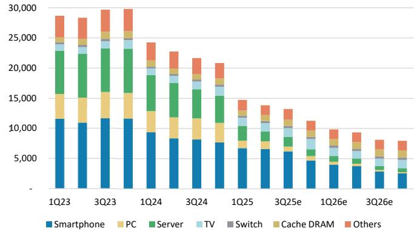  
Exhibit 7: Quarterly demand breakdown by product (mn Gb)   
Source: Morgan Stanley Research (e) estimates

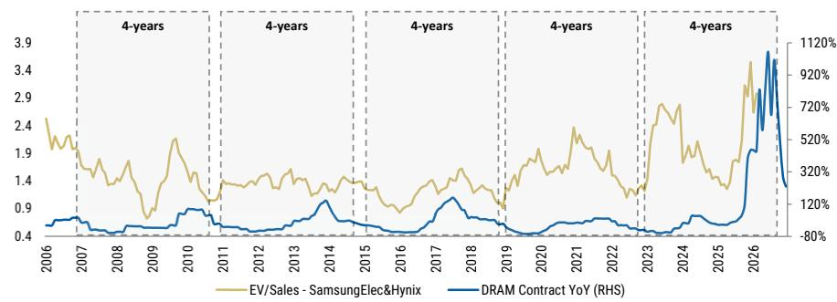  
Exhibit 8: EV/sales vs. DRAM price YoY   
Source: FactSet, Morgan Stanley Research. Future DRAM contract Y/Y based on Morgan Stanley Research estimates.

订阅研报

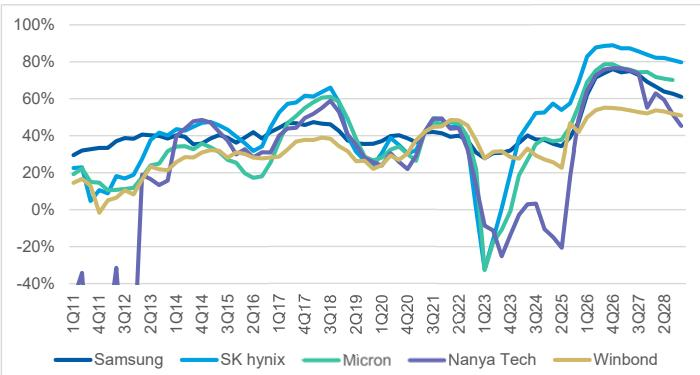  
Exhibit 9: Memory vendors GM   
订阅研报添加微信 LCD123321Cad 04-20 Source: Company data, Morgan Stanley Research estimates Source: Company data, Morgan Stanley Research

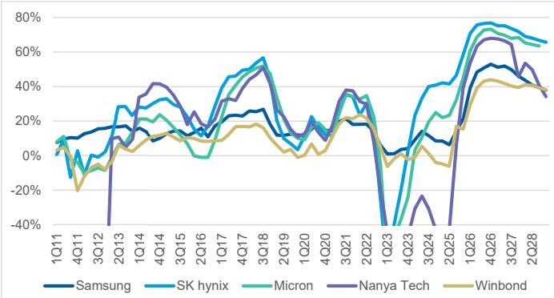  
Exhibit 10: Memory vendors OPM

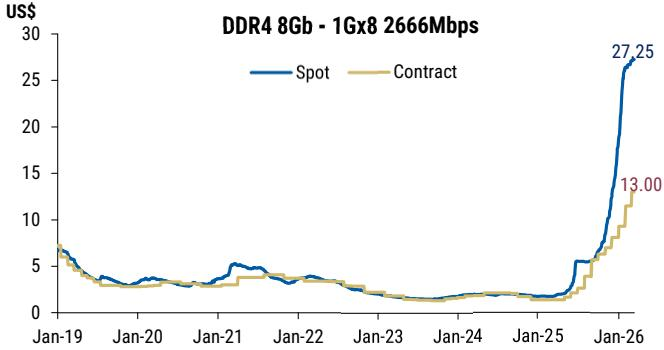  
Exhibit 11: DDR4 8Gb $7 \left( 5 { \times } 8 \right)$ pricing chart   
Source: DRAMeXchange, Morgan Stanley Research; data as of Mar 13, 2026

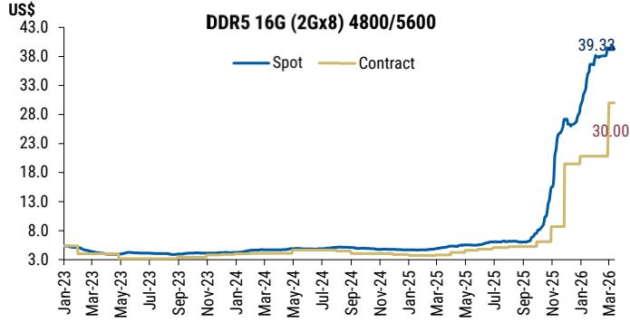  
Exhibit 12: DDR5 16Gb $( 2 \mathsf { G } \mathsf { x } \mathsf { 8 } )$ pricing chart   
Source: DRAMeXchange, Morgan Stanley Research; data as of Mar 13, 2026

# Intel EMIB Opportunity for AP Memory

Intel’s (covered by Morgan Stanley Research Analyst Joe Moore) Embedded Multi-die Interconnect Bridge (EMIB) takes a more modular and cost-efficient approach: Instead of a full interposer, it uses small embedded silicon bridges only where high-bandwidth connections are needed, while relying on the organic substrate for the rest. Theoretically, this improves yield and reduces cost, while allowing flexible chiplet-based designs across different process nodes.

The downside is that EMIB does not provide a uniform high-density interconnect across the entire package, which can limit total bandwidth and make system-level routing more complex. As a result, it is generally less optimal for extreme bandwidth use cases compared to CoWoS, but it can support larger reticle-size design.

Also, besides EMIB technology itself, our latest industry checks suggest that those chip designers are concerned about the yield or execution from Intel since it lacks of the experience of mass produce EMIB-T products as well as serving external clients. Therefore, compared to TSMC, the operational risk and ultimate yield would also be taken into consideration from those customers to allocate how much chip production to Intel EMIB-T.

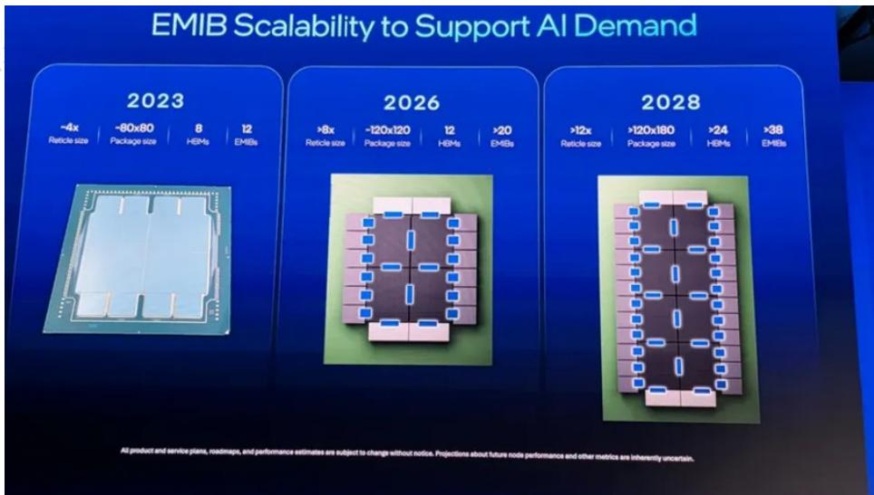  
Exhibit 13: Intel's EMIB can support larger chips with more reticles $( > 1 2 )$ if its supply chain can execute well   
Source: Intel

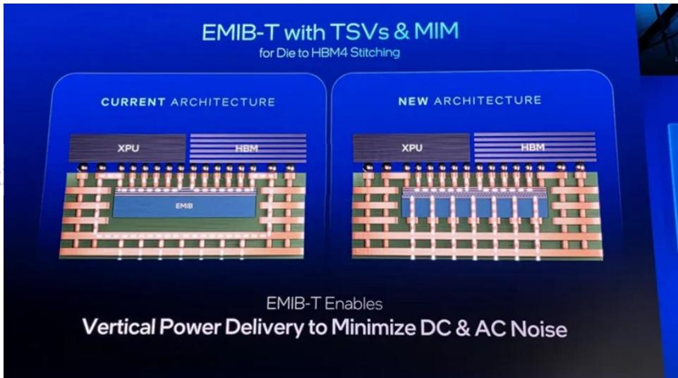  
Exhibit 14: Intel's EMIB-T (new architecture) embeds silicon bridges featuring vertical copper connections (TSVs) into organic substrates, enabling superior power delivery, reduced noise, and high-speed HBM4 memory integration   
Source: Intel

According to Intel, to further stabilize power delivery, Intel Foundry integrates embedded deep trench capacitors (eDTC) for ultra-high capacitance density close to the load, thereby flattening PDN impedance across the base die. Embedded MIM (eMIM-T) technology delivers superior decoupling at the base die, leveraging the same advanced architecture as Omni MIM even on mature nodes. For precise, high-speed point-of-load regulation, CoaxMIL technology embeds magnetic inductors into the substrate, enabling integrated voltage regulators (IVRs) with rapid response and minimal loss. Together, these technologies form a scalable power delivery fabric that keeps pace with rising compute density. We believe these eDTC are IPD products that AP Memory provides.

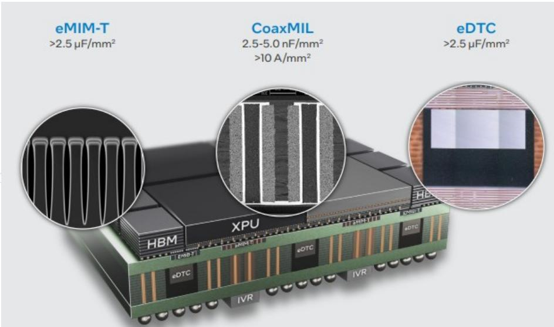  
Exhibit 15: An example of Intel Foundry’s power delivery solution shown at Intel Direct Connect 2025, showcasing forward-looking plans for increased eMIM-T capacity; we think this is adopting AP Memory's IPD, which is the eDTC here   
Source: Intel   
For Intel EMIB's customer front, our checks suggest that both Google and AWS have

reached out to Intel's EMIB-T for mechanical testing vehicles (MTV); we believe the production could be related to MediaTek's next-generation 2nm version TPU as well as Alchip's next generation 2nm Trainium4, while the trial run is likely to be in 2027 and mass production to be in 2028 if everything goes smoothly. Since Alchip already has a strong relationship with Intel on Gaudi production, we believe Alchip has been more familiar collaborating with Intel and its workflow.

We still do not yet know how those next-generation chips will be allocated between Intel's EMIB-T vs. TSMC's CoWoS/CoPoS. However, both Google and AWS are the two leaders among major CSPs in terms of AI ASIC design. We therefore see these two companies needing larger chip size design in their ASIC roadmap; the allocation will depend greatly on 1) Intel's EMIB-T production yield, 2) TSMC's CoWoS reticle support, and potentially 3) TSMC's CoPoS schedule.

Besides Google and AWS, our checks also suggest that Meta is approaching Intel for potential EMIB-T production for its future AI ASIC as well. However, the progress may be at an even earlier stage compared to Google and AWS, in our view, because its ASIC is less mature than other CSPs.

For further details, see: Greater China Semiconductors: The Foundry Floorplan: TSMC preview update; CoWoS vs. EMIB competition (14 Apr 2026).

# AP Memory: Estimate Revision Summary

We raise our 2026/2027/2028 EPS estimates by $2 \% / 1 3 \% / 1 3 \% ,$ respectively: We factor in 1Q26 preliminary sales, which we see leading to higher 2026 earnings. We raise increase our 2026-27 revenue forecasts due to the stronger IPD outlook and a better pricing environment for the IoT business from memory price hike. In comparison, consensus 2026 and 2027 EPS estimates are $N \uparrow \$ 14.52$ and $N \bar { 1 } \bar { \$ 5 } 2 2 . 9 8$ , respectively. Our stronger EPS forecasts reflect our more constructive view on the IPD shipment outlook, we believe.

Exhibit 16: AP Memory – Estimate revisions   

<table><tr><td>(NT$mn)</td><td>New&#x27;26e</td><td>Old&#x27;26e</td><td>Diff.</td><td>New&#x27;27e</td><td>Old&#x27;27e</td><td>Diff.</td><td>New&#x27;28e</td><td>Old&#x27;28e</td><td>Diff.</td></tr><tr><td>Net sales</td><td>9,333</td><td>8,572</td><td>9%</td><td>13,777</td><td>11,640</td><td>18%</td><td>18,865</td><td>16,678</td><td>13%</td></tr><tr><td>COGS</td><td>4,784</td><td>4,175</td><td></td><td>6,724</td><td>5,449</td><td></td><td>8,896</td><td>7,833</td><td></td></tr><tr><td>Gross profit</td><td>4,550</td><td>4,397</td><td>3%</td><td>7,053</td><td>6,191</td><td>14%</td><td>9,969</td><td>8,845</td><td>13%</td></tr><tr><td>Operating expenses</td><td>1,709</td><td>1,625</td><td></td><td>2,211</td><td>1,927</td><td></td><td>2,913</td><td>2,659</td><td></td></tr><tr><td>Operating profit</td><td>2,841</td><td>2,772</td><td>2%</td><td>4,842</td><td>4,265</td><td>14%</td><td>7,056</td><td>6,187</td><td>14%</td></tr><tr><td>Non-op.income (exp.)</td><td>343</td><td>343</td><td></td><td>343</td><td>343</td><td></td><td>343</td><td>343</td><td></td></tr><tr><td>Pretax income</td><td>3,183</td><td>3,115</td><td>2%</td><td>5,185</td><td>4,607</td><td>13%</td><td>7,399</td><td>6,529</td><td>13%</td></tr><tr><td>Taxes</td><td>556</td><td>544</td><td></td><td>906</td><td>805</td><td></td><td>1,293</td><td>1,141</td><td></td></tr><tr><td>Net income</td><td>2,627</td><td>2,570</td><td>2%</td><td>4,279</td><td>3,802</td><td>13%</td><td>6,106</td><td>5,388</td><td>13%</td></tr><tr><td>Reported EPS</td><td>16.16</td><td>15.81</td><td>2%</td><td>26.32</td><td>23.39</td><td>13%</td><td>37.56</td><td>33.14</td><td>13%</td></tr></table>

Margins   

<table><tr><td>Gross margin</td><td>48.7%</td><td>51.3%</td><td>-2.6%</td><td>51.2%</td><td>53.2%</td><td>-2.0%</td><td>52.8%</td><td>53.0%</td><td>-0.2%</td></tr><tr><td>Operating margin</td><td>30.4%</td><td>32.3%</td><td>-1.9%</td><td>35.1%</td><td>36.6%</td><td>-1.5%</td><td>37.4%</td><td>37.1%</td><td>0.3%</td></tr><tr><td>Pretax margin</td><td>34.1%</td><td>36.3%</td><td>-2.2%</td><td>37.6%</td><td>39.6%</td><td>-1.9%</td><td>39.2%</td><td>39.1%</td><td>0.1%</td></tr><tr><td>Net margin</td><td>28.1%</td><td>30.0%</td><td>-1.8%</td><td>31.1%</td><td>32.7%</td><td>-1.6%</td><td>32.4%</td><td>32.3%</td><td>0.1%</td></tr></table>

Source: Company data, Morgan Stanley Research (e) estimates

# Exhibit 17: AP Memory – Quarterly financial summary

YE DEC31   

<table><tr><td>(NT$ mn)</td><td>1Q26e</td><td>2Q26e</td><td>3Q26e</td><td>4Q26e</td><td>1Q27e</td><td>2Q27e</td><td>3Q27e</td><td>4Q27e</td><td>1Q28e</td><td>2Q28e</td><td>3Q28e</td><td>4Q28e</td><td>2025</td><td>2026e</td><td>2027e</td><td>2028e</td></tr><tr><td>Total Revenues</td><td>2,101</td><td>2,222</td><td>2,451</td><td>2,558</td><td>2.938</td><td>3,168</td><td>3,650</td><td>4,021</td><td>4,276</td><td>4,566</td><td>4,916</td><td>5,108</td><td>5,658</td><td>9,333</td><td>13,777</td><td>18,865</td></tr><tr><td>Sequential Change</td><td>12.5%</td><td>5.8%</td><td>10.3%</td><td>4.4%</td><td>14.8%</td><td>7.8%</td><td>15.2%</td><td>10.2%</td><td>6.3%</td><td>6.8%</td><td>7.7%</td><td>3.9%</td><td></td><td></td><td></td><td></td></tr><tr><td>Change vs Year Ago</td><td>115.5%</td><td>67.3%</td><td>64.0%</td><td>37.0%</td><td>39.9%</td><td>42.5%</td><td>48.9%</td><td>57.2%</td><td>45.5%</td><td>44.1%</td><td>34.7%</td><td>27.0%</td><td>35.0%</td><td>65.0%</td><td>47.6%</td><td>36.9%</td></tr><tr><td>Cost of Sales</td><td>1,098</td><td>1,145</td><td>1,248</td><td>1,293</td><td>1,456</td><td>1,562</td><td>1,765</td><td>1,941</td><td>2.025</td><td>2,158</td><td>2,316</td><td>2.397</td><td>3.024</td><td>4,784</td><td>6,724</td><td>8,896</td></tr><tr><td>Percent of Revenues</td><td>52%</td><td>52%</td><td>51%</td><td>51%</td><td>50%</td><td>49%</td><td>48%</td><td>48%</td><td>47%</td><td>47%</td><td>47%</td><td>47%</td><td>53%</td><td>51%</td><td>49%</td><td>47%</td></tr><tr><td>Gross Profit</td><td>1,003</td><td>1,078</td><td>1,204</td><td>1,265</td><td>1,482</td><td>1,606</td><td>1,885</td><td>2,081</td><td>2,250</td><td>2,408</td><td>2,600</td><td>2,711</td><td>2,634</td><td>4,550</td><td>7,053</td><td>9,969</td></tr><tr><td>Percent of Revenues</td><td>47.7%</td><td>48.5%</td><td>49.1%</td><td>49.5%</td><td>50.4%</td><td>50.7%</td><td>51.6%</td><td>51.7%</td><td>52.6%</td><td>52.7%</td><td>52.9%</td><td>53.1%</td><td>46.5%</td><td>48.7%</td><td>51.2%</td><td>52.8%</td></tr><tr><td>Incremental Margin</td><td>31%</td><td>61%</td><td>55%</td><td>57%</td><td>57%</td><td>54%</td><td>58%</td><td>53%</td><td>67%</td><td>54%</td><td>55%</td><td>58%</td><td>33%</td><td>52%</td><td>56%</td><td>57%</td></tr><tr><td>Total Opex</td><td>401</td><td>411</td><td>439</td><td>458</td><td>499</td><td>504</td><td>577</td><td>631</td><td>667</td><td>708</td><td>757</td><td>781</td><td>1,234</td><td>1,709</td><td>2,211</td><td>2.913</td></tr><tr><td>Percent of Revenues</td><td>19.1%</td><td>18.5%</td><td>17.9%</td><td>17.9%</td><td>17.0%</td><td>15.9%</td><td>15.8%</td><td>15.7%</td><td>15.6%</td><td>15.5%</td><td>15.4%</td><td>15.3%</td><td>21.8%</td><td>18.3%</td><td>16.0%</td><td>15.4%</td></tr><tr><td>Operating Income</td><td>602</td><td>667</td><td>765</td><td>807</td><td>982</td><td>1,103</td><td>1,308</td><td>1,449</td><td>1,583</td><td>1,700</td><td>1,843</td><td>1,929</td><td>1,399</td><td>2,841</td><td>4,842</td><td>7,056</td></tr><tr><td>Percent of Revenues</td><td>28.6%</td><td>30.0%</td><td>31.2%</td><td>31.6%</td><td>33.4%</td><td>34.8%</td><td>35.8%</td><td>36.0%</td><td>37.0%</td><td>37.2%</td><td>37.5%</td><td>37.8%</td><td>24.7%</td><td>30.4%</td><td>35.1%</td><td>37.4%</td></tr><tr><td>Total Non-operating Income (Loss)</td><td>86</td><td>86</td><td>86</td><td>86</td><td>86</td><td>86</td><td>86</td><td>86</td><td>86</td><td>86</td><td>86</td><td>86</td><td>119</td><td>343</td><td>343</td><td>343</td></tr><tr><td>Profit Before Taxes Percent of Revenues</td><td>687</td><td>752</td><td>851</td><td>893</td><td>1,068</td><td>1,188</td><td>1,394</td><td>1,535</td><td>1,669</td><td>1,786</td><td>1,929</td><td>2,015</td><td>1,518</td><td>3,183</td><td>5,185</td><td>7,399</td></tr><tr><td></td><td>33%</td><td>34%</td><td>35%</td><td>35%</td><td>36%</td><td>38%</td><td>38%</td><td>38%</td><td>39%</td><td>39%</td><td>39%</td><td>39%</td><td>27%</td><td>34%</td><td>38%</td><td>39%</td></tr><tr><td>Taxes Tax Rate</td><td>120</td><td>131</td><td>149</td><td>156</td><td>187</td><td>208</td><td>244</td><td>268</td><td>292</td><td>312</td><td>337</td><td>352</td><td>279</td><td>556</td><td>906</td><td>1,293</td></tr><tr><td></td><td>17.5%</td><td>17.5%</td><td>17.5%</td><td>17.5%</td><td>17.5%</td><td>17.5%</td><td>17.5%</td><td>17.5%</td><td>17.5%</td><td>17.5%</td><td>17.5%</td><td>17.5%</td><td>18.3%</td><td>17.5%</td><td>17.5%</td><td>17.5%</td></tr><tr><td>Reported Income (TW GAAP)</td><td>567</td><td>621</td><td>702</td><td>737</td><td>881</td><td>981</td><td>1,150</td><td>1,267</td><td>1,377</td><td>1,474</td><td>1,592</td><td>1,663</td><td>1,240</td><td>2,627</td><td>4,279</td><td>6,106</td></tr><tr><td>Percentof Revenues</td><td>27.0%</td><td>27.9%</td><td>28.6%</td><td>28.8%</td><td>30.0%</td><td>31.0%</td><td>31.5%</td><td>31.5%</td><td>32.2%</td><td>32.3%</td><td>32.4%</td><td>32.6%</td><td>21.9%</td><td>28.1%</td><td>31.1%</td><td>32.4%</td></tr><tr><td>Change vs Year Ago</td><td>71%</td><td>-214%</td><td>-1%</td><td>-4%</td><td>55%</td><td>58%</td><td>64%</td><td>72%</td><td>56%</td><td>50%</td><td>38%</td><td>31%</td><td>-21%</td><td>112%</td><td>63%</td><td>43%</td></tr><tr><td>Reported EPS (NT$,TW GAAP)</td><td>3.49</td><td>3.82</td><td>4.32</td><td>4.53</td><td>5.42</td><td>6.03</td><td>7.07</td><td>7.79</td><td>8.47</td><td>9.07</td><td>9.79</td><td>10.23</td><td>7.63</td><td>16.16</td><td>26.32</td><td>37.56</td></tr><tr><td>Change vsYear Ago</td><td>71%</td><td>-214%</td><td>-1%</td><td>-4%</td><td>55%</td><td>58%</td><td>64%</td><td>72%</td><td>56%</td><td>50%</td><td>38%</td><td>31%</td><td>-22%</td><td>112%</td><td>63%</td><td>43%</td></tr></table>

Source: Company data, Morgan Stanley Research (e) estimates

# AP Memory: Valuation Methodology

We raise our price target to NT\$777 from NT\$607 to factor in preliminary sales for 1Q26 and our estimate changes for 2026-28. We also lift our intermediate growth rate from $1 7 \%$ to $1 2 . 8 \%$ as we factor in the Intel EMIB opportunity for AI in the long run.

Aside from intermediate growth, our other residual income model assumptions are unchanged, including: 1) cost of equity unchanged at $9 . 2 \%$ $2 . 0 \%$ risk-free rate, $6 \%$ risk premium, 1.2 beta); 2) payout ratio of $6 7 \% ;$ and 3) terminal growth rate of $3 \%$ to be more in line with the long-term macro growth rate. Our new PT implies 2026e P/E of $4 8 x$ and 2027e P/E of 30x – more than 1 s.d. above the historical average since 2020. Our bull and bear case values rise to NT\$1,145 (from NT\$895) and NT\$376 (from $N T \$ 294$ ), respectively.

Exhibit 18: AP Memory: Residual Income model   

<table><tr><td>NT$ mn)</td><td>2026e</td><td>2027e</td><td>2028e</td><td>2029e</td><td>2030e</td><td>2031e</td><td>2032e</td><td>2033e</td><td>2034e</td><td>2035e</td><td>2036e</td><td>2037e</td></tr><tr><td>Total Equity</td><td>14,156</td><td>16,666</td><td>19,890</td><td>22,623</td><td>25,706</td><td>29,182</td><td>33,102</td><td>37,523</td><td>42,508</td><td>48,130</td><td>54,470</td><td>61,620</td></tr><tr><td>NetProfit</td><td>2,627</td><td>4,279</td><td>6,106</td><td>6,885</td><td>7,765</td><td>8,756</td><td>9,874</td><td>11,135</td><td>12,557</td><td>14,161</td><td>15,969</td><td>18,009</td></tr><tr><td>ROAE</td><td>19.8%</td><td>27.8%</td><td>33.4%</td><td>32.4%</td><td>32.1%</td><td>31.9%</td><td>31.7%</td><td>31.5%</td><td>31.4%</td><td>31.2%</td><td>31.1%</td><td>31.0%</td></tr><tr><td>Residual Income</td><td>1,311</td><td></td><td></td><td></td><td></td><td></td><td></td><td></td><td></td><td></td><td></td><td></td></tr><tr><td>Spread</td><td>10.6%</td><td>2.627 18.6%</td><td>4,033 24.2%</td><td>4,612 23.2%</td><td>5,187 22.9%</td><td>5,836 22.7%</td><td>6,567 22.5%</td><td>7,392 22.3%</td><td>8.321 22.2%</td><td>9.370 22.0%</td><td>10,553 21.9%</td><td>11,886 21.8%</td></tr><tr><td></td><td></td><td></td><td></td><td></td><td></td><td></td><td></td><td></td><td></td><td></td><td></td><td></td></tr><tr><td>Ending Equity Capital PV of Forecast Period</td><td>14,156</td><td></td><td></td><td></td><td></td><td></td><td></td><td></td><td></td><td></td><td></td><td></td></tr><tr><td>PV of Continuing Value</td><td>37,328</td><td></td><td></td><td></td><td></td><td></td><td></td><td></td><td></td><td></td><td></td><td></td></tr><tr><td>Equity Value</td><td>74,916</td><td></td><td></td><td></td><td></td><td></td><td></td><td></td><td></td><td></td><td></td><td></td></tr><tr><td>No. of Shares</td><td>126,400</td><td></td><td></td><td></td><td></td><td></td><td></td><td></td><td></td><td></td><td></td><td></td></tr><tr><td>Projected Price (NT$)</td><td>163 777</td><td></td><td></td><td></td><td></td><td></td><td></td><td></td><td></td><td></td><td></td><td></td></tr></table>

Source: Company data, Morgan Stanley Research (e) estimates

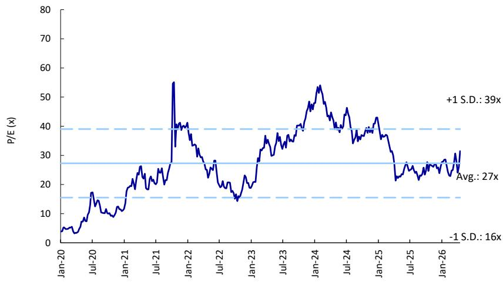  
Exhibit 19: AP Memory: Historical forward P/E   
Source: Company data, Morgan Stanley Research

# 订阅研报

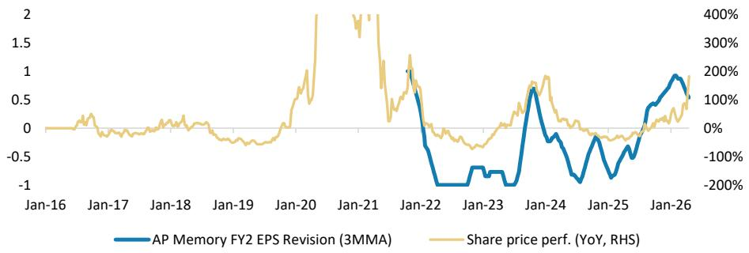  
Exhibit 20: AP Memory: Earnings estimate revision breadth   
Source: Company data, Morgan Stanley Research estimates

# Risk Reward - AP Memory TechnolRisk Reward – AP Memory Technology Corp (6531.TW)

OW on IPD and WoW opportunities

# NT\$777.00PRICE TARGET

Base case, derived from a residual income model. Key RI model assumptions include 1) cost of equity constant at $9 . 2 \%$ $( 2 . 0 \%$ risk-free rate, $6 \%$ risk premium, 1.2 beta); 2) payout ratio of $6 7 \% ; 3 )$ terminal growth rate of $3 . 0 \% \cdot$ and $4 .$ ) medium-term growth rate of $1 2 . 8 \%$ .

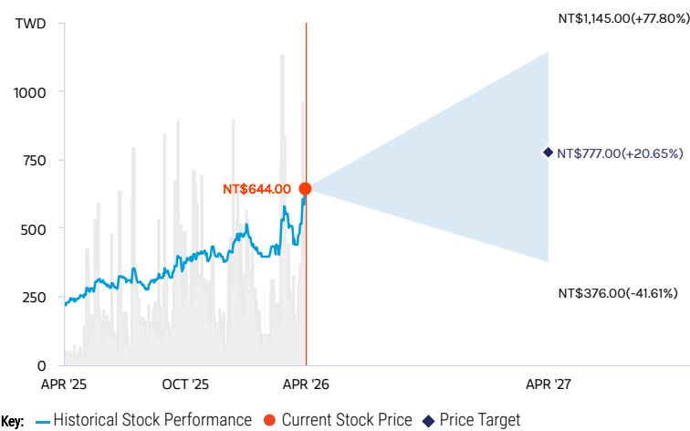  
RISK REWARD CHART   
Source: Re nitiv, Morgan Stanley Research

# OVERWEIGHT THESIS

▪ IPD (interposers and discretes) revenue is likely to ramp in 2026-27, and be further driven by new IPD interposer opportunities into 2028.

▪ Memory bandwidth and power consumption are the next issues to be resolved in AI computing, and we believe AP Memory's wafer-on wafer (WoW) packaging technology could be an effective solution.

▪ The company expects memory business to be stable in the near term.

▪ Overall AI business should continue to rise in the mix – a positive read for the margin pro le.

fi▪ Our PT implies 48x 2026e P/E and $3 0 \times$ 2027e P/E - roughly 1 s.d. above the average level since 2020.

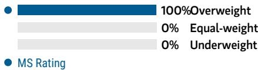  
Consensus Rating Distribution   
Source: Re nitiv, Morgan Stanley Research

# Risk Reward Themes

Secular Growth: Positive Technology Diffusion: Positive View descriptions of Risk Rewards Themes here

# BULL CASE

# NT\$1,145.00

# BASE CASE

# NT\$777.00

# BEAR CASE

NT\$376.00

# 71x 2026e EPS

Faster-than-expected AI and IPD business progress with PSRAM generating more cash flow: We assume: 1) WoW packaging revenue to reach >NT\$10bn, and IPD revenue to reach <NT\$8bn by 2028; 2) total revenue to rise at a $5 5 \% +$ CAGR, 2025-28; and 3) gross margin to increase from $4 6 . 5 \%$ in 2025 to $60 \% +$ by 2028.

48x 2026e EPS

Fast-growing AI and IPD business, with PSRAM generating stable cash flows: We expect: 1) WoW revenue to reach N $\Pi \$ 5.56 n$ , and IPD revenue to reach N $\Gamma \$ 7.6 b n$ by 2028; 2) total revenue to rise at a $4 9 \%$ CAGR, 2025-28; and 3) gross margin to increase from $4 6 . 5 \%$ in 2025 to over $5 2 \%$ in 2028.

23x 2026e EPS

Slower-than-expected AI and IPD business progress, with PSRAM facing intensifying competition: We assume: 1) WoW packaging revenue of \~NT\$1.5bn, and IPD revenue of \~NT $\$ 2 b n$ by 2028; 2) total revenue to rise at a 10- $1 5 \%$ CAGR, 2025-28; and 3) gross margin to remain at $\sim 5 1 \%$ by 2028.

# Risk Reward – AP Memory Technology Corp (6531.TW)

KEY EARNINGS INPUTS   

<table><tr><td>Drivers</td><td>2025</td><td>2026e</td><td>2027e</td><td>2028e</td></tr><tr><td>1. Wifi Sales (%) (%)</td><td>73.7</td><td>55.7</td><td>40.8</td><td>30.7</td></tr><tr><td>2.Ethernet Sales (%) (%)</td><td>7.1</td><td>8.7</td><td>21.3</td><td>29.0</td></tr></table>

# INVESTMENT DRIVERS

Demand for AI applications   
Consumer tech demand, especially from the IoT market

# GLOBAL REVENUE EXPOSURE

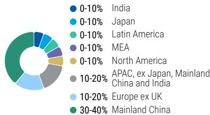  
Source: Morgan Stanley Research Estimate View explanation of regional hierarchies here

# RISKS TO PT/RATING

# RISKS TO UPSIDE

Stronger-than-expected consumer demand   
Faster-than-expected IPD ramp and WoW packaging development   
Milder competition from partners (foundry, memory house, GPU vendor) or other design houses

# RISKS TO DOWNSIDE

Weaker-than-expected consumer demand   
Slower-than-expected IPD ramp and WoW packaging development   
Intensifying competition from partners (foundry, memory house, GPU vendor) or other design houses

# OWNERSHIP POSITIONING

Inst. Owners, % Active $5 6 . 2 \%$

Source: Re nitiv, Morgan Stanley Research

# MS ESTIMATES VS. CONSENSUS

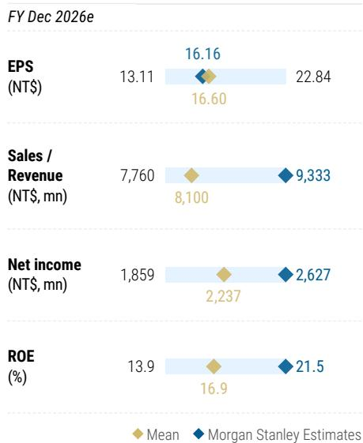  
04-20 Source: Re nitiv, Morgan Stanley Research

# AP Memory: Financial Summary

Exhibit 21: Financial summary   

<table><tr><td>Income Statement</td><td></td><td></td><td></td><td></td></tr><tr><td>NT$mn (Years End Dec)</td><td>2025</td><td>2026e</td><td>2027e</td><td>20280</td></tr><tr><td>Net sales</td><td>5,658</td><td>9,333</td><td>13,777</td><td>18,865</td></tr><tr><td>COGS</td><td>(3.024)</td><td>(4,784)</td><td>(6,724)</td><td>(8,896)</td></tr><tr><td>Gross profit</td><td>2.634</td><td>4,550</td><td>7,053</td><td>9,969</td></tr><tr><td>Operating expenses</td><td>(1,234)</td><td>(1,709)</td><td>(2,211)</td><td>(2,913)</td></tr><tr><td>Operating income</td><td>1,399</td><td>2,841</td><td>4,842</td><td>7,056</td></tr><tr><td>Non-operating income</td><td>119</td><td>343</td><td>343</td><td>343</td></tr><tr><td>Pre-tax income</td><td>1,518</td><td>3,183</td><td>5,185</td><td>7,399</td></tr><tr><td>Income tax</td><td>56</td><td>153</td><td>249</td><td>355</td></tr><tr><td>Net Income bf. emp. bonus</td><td>1,575</td><td>3,336</td><td>5,434</td><td>7,754</td></tr><tr><td>Employee bonus expense</td><td>335</td><td>709</td><td>1,155</td><td>1,649</td></tr><tr><td>Reported net Income</td><td>1,240</td><td>2,627</td><td>4,279</td><td>6,106</td></tr><tr><td>Adj.wtd.avg.shrs (million)</td><td>163</td><td>163</td><td>163</td><td>163</td></tr><tr><td>Reported EPS (NT$)</td><td>7.63</td><td>16.16</td><td>26.32</td><td>37.56</td></tr><tr><td>Modelware Diluted EPS (NT$)</td><td>7.63</td><td>16.16</td><td>26.32</td><td>37.56</td></tr></table>

Balance Sheet   

<table><tr><td>NT$mn (Years End Dec)</td><td>2025</td><td>2026e</td><td>2027e</td><td>2028e</td></tr><tr><td>Cash</td><td>7,263</td><td>8,263</td><td>9,877</td><td>12,086</td></tr><tr><td>Mkt Securities</td><td>3,756</td><td>3,756</td><td>3,756</td><td>3,756</td></tr><tr><td>AR/NR</td><td>588</td><td>1,026</td><td>1,514</td><td>2,074</td></tr><tr><td>Inventory</td><td>1,145</td><td>1,546</td><td>2,173</td><td>2.875</td></tr><tr><td>Other</td><td>187</td><td>187</td><td>187</td><td>187</td></tr><tr><td>Current Assets</td><td>12,939</td><td>14,778</td><td>17,507</td><td>20,977</td></tr><tr><td>Long-term investments</td><td>1,206</td><td>1,206</td><td>1,206</td><td>1,206</td></tr><tr><td>Fixed assets</td><td>57</td><td>63</td><td>69</td><td>76</td></tr><tr><td>Deffered assets</td><td>126</td><td>126</td><td>126</td><td>126</td></tr><tr><td>Other assets</td><td>411</td><td>411</td><td>411</td><td>411</td></tr><tr><td>Total Assets</td><td>14,740</td><td>16,584</td><td>19,320</td><td>22,797</td></tr><tr><td>S/T borrowings</td><td>200</td><td>200</td><td>200</td><td>200</td></tr><tr><td>AP/NP</td><td>505</td><td>557</td><td>783</td><td>1,037</td></tr><tr><td>Other ST liabilities</td><td>1,582</td><td>1,582</td><td>1,582</td><td>1,582</td></tr><tr><td>LT debt</td><td>0</td><td>0</td><td>0</td><td>0</td></tr><tr><td>Other LT liabilities</td><td>89</td><td>89</td><td>89</td><td>89</td></tr><tr><td>Common shares</td><td>814</td><td>814</td><td>814</td><td>814</td></tr><tr><td>Total Liabilities</td><td>2,376</td><td>2,428</td><td>2,654</td><td>2,907</td></tr><tr><td>Additional capital</td><td>7,595</td><td>7,595</td><td>7,595</td><td>7,595</td></tr><tr><td>Retained earning</td><td>3,776</td><td>5,568</td><td>8.078</td><td>11,302</td></tr><tr><td>Other shareholders&#x27; equity</td><td>179</td><td>179</td><td>179</td><td>179</td></tr><tr><td>Total Equity</td><td>12,364</td><td>14,156</td><td>16,666</td><td>19,890</td></tr><tr><td>Total Liab.&amp; Shrhldr&#x27;s Equity</td><td>14,740</td><td>16,584</td><td>19,320</td><td>22,797</td></tr></table>

e = Morgan Stanley Research Estimates Source: Morgan Stanley Research, Company Data

Cash Flow Statement   

<table><tr><td>NT$mn (Years End Dec )</td><td>2025</td><td>2026e</td><td>2027e</td><td>2028e</td></tr><tr><td>Cashflow from Operations</td><td>1,575</td><td>1,901</td><td>3,452</td><td>5,162</td></tr><tr><td>Net profits</td><td>1,240</td><td>2,627</td><td>4,279</td><td>6,106</td></tr><tr><td>Depreciation</td><td>59</td><td>61</td><td>62</td><td>64</td></tr><tr><td>Working Capital Change</td><td>(145)</td><td>(787)</td><td>(889)</td><td>(1,008)</td></tr><tr><td> Other adjustments</td><td>421</td><td>0</td><td>0</td><td>0</td></tr><tr><td>Cashflow from Investing</td><td>(67)</td><td>(66)</td><td>(69)</td><td>(71)</td></tr><tr><td>Capex</td><td>(26)</td><td>(66)</td><td>(69)</td><td>(71)</td></tr><tr><td>Change of LT Investment</td><td>0</td><td>0</td><td>0</td><td>0</td></tr><tr><td>Change of ST Investment</td><td>0</td><td>0</td><td>0</td><td>0</td></tr><tr><td>Other adjustments</td><td>(41)</td><td>0</td><td>0</td><td>0</td></tr><tr><td>Cashfow from financing</td><td>1,564</td><td>(835)</td><td>(1,769)</td><td>(2,881)</td></tr><tr><td>Increase in L/T debt</td><td>0</td><td>0</td><td>0</td><td>0</td></tr><tr><td>Increase in S/T debt</td><td>100</td><td>0</td><td>0</td><td>0</td></tr><tr><td>Cash Dividend Paid</td><td>(968)</td><td>(835)</td><td>(1,769)</td><td>(2,881)</td></tr><tr><td>Dir&amp; Emp Bonus Paid</td><td>0</td><td>0</td><td>0</td><td>0</td></tr><tr><td>Issuance of stock</td><td>0</td><td>0</td><td>0</td><td>0</td></tr><tr><td>Other adjustments</td><td>2,433</td><td>0</td><td>0</td><td>0</td></tr><tr><td>Exchange rate adjustment</td><td>3</td><td>0</td><td>0</td><td>0</td></tr><tr><td>Net change in cash</td><td>3,075</td><td>1,000</td><td>1,614</td><td>2,209</td></tr></table>

Financial Ratios   

<table><tr><td></td><td>2025</td><td>2026e</td><td>2027e</td><td>2028e</td></tr><tr><td>Growth(%)</td><td></td><td></td><td></td><td></td></tr><tr><td>Turnover</td><td>35.0</td><td>65.0</td><td>47.6</td><td>36.9</td></tr><tr><td>Operating profits</td><td>31.6</td><td>103.0</td><td>70.5</td><td>45.7</td></tr><tr><td>Pretax profits</td><td>-25.3</td><td>109.6</td><td>62.9</td><td>42.7</td></tr><tr><td>Net profits</td><td>-21.4</td><td>111.9</td><td>62.9</td><td>42.7</td></tr><tr><td>EPS</td><td>-21.6</td><td>111.8</td><td>62.9</td><td>42.7</td></tr><tr><td>Margins (%)</td><td></td><td></td><td></td><td></td></tr><tr><td>Gross Margin</td><td>46.5</td><td>48.7</td><td>51.2</td><td>52.8</td></tr><tr><td>Operating Margin</td><td>24.7</td><td>30.4</td><td>35.1</td><td>37.4</td></tr><tr><td>Pretax Margin</td><td>26.8</td><td>34.1</td><td>37.6</td><td>39.2</td></tr><tr><td>Net Profit</td><td>21.9</td><td>28.1</td><td>31.1</td><td>32.4</td></tr><tr><td>Return (%)</td><td></td><td></td><td></td><td></td></tr><tr><td>ROAE</td><td>10.2</td><td>19.8</td><td>27.8</td><td>33.4</td></tr><tr><td>ROAA</td><td>8.9</td><td>16.8</td><td>23.8</td><td>29.0</td></tr><tr><td>Gearing (%)</td><td></td><td></td><td></td><td></td></tr><tr><td>Net Debt/Equity</td><td>(57.1)</td><td>(57.0)</td><td>(58.1)</td><td>(59.8)</td></tr><tr><td>Liabilities/Equity</td><td>19.2</td><td>17.2</td><td>15.9</td><td>14.6</td></tr><tr><td>Ratios (X)</td><td></td><td></td><td></td><td></td></tr><tr><td>Current ratio</td><td>5.7</td><td>6.3</td><td>6.8</td><td>7.4</td></tr><tr><td>Quick ratio</td><td>3.4</td><td>4.0</td><td>4.4</td><td>5.0</td></tr><tr><td>Others</td><td></td><td></td><td></td><td></td></tr><tr><td>AR/NR Turnover (days)</td><td>40</td><td>40</td><td>40</td><td>40</td></tr><tr><td>Inventory Turnover (days)</td><td>118</td><td>118</td><td>118</td><td>118</td></tr><tr><td>AP Turnover (days)</td><td>43</td><td>43</td><td>43</td><td>43</td></tr><tr><td>Cash Conversion (days)</td><td>116</td><td>116</td><td>116</td><td>116</td></tr></table>

# GigaDevice: Estimate Revisions and Quarterly Financials

# We increase our 2025 EPS estimate by $2 \% _ { 1 }$ , essentially maintain 2026, and lift 2027 by

13%: We reflect preliminary 4Q25 revenue, leading to a slight increase on the 2025 bottom line. We lift our 2027 revenue forecast as we believe GigaDevice will ramp up 16G LPDDR4 and 32G DDR4 at CXMT's Gen 4 platform in 2027, based on its latest announcement. GM should rise slightly in 2027 amid a better product mix.

Exhibit 22: GigaDevice - Estimate revisions   

<table><tr><td>Rmb mn</td><td>2025E</td><td>2025E</td><td>Diff.</td><td>2026E</td><td>2026E</td><td>Diff.</td><td>2027E</td><td>2027E</td><td>Diff.</td></tr><tr><td>Net sales</td><td>9,203</td><td>9,203</td><td>0%</td><td>17,061</td><td>17,061</td><td>0%</td><td>24,555</td><td>22,608</td><td>9%</td></tr><tr><td>COGS</td><td>5.502</td><td>5,619</td><td></td><td>8,509</td><td>8,509</td><td></td><td>12,045</td><td>11,253</td><td></td></tr><tr><td>Gross profit</td><td>3.701</td><td>3.584</td><td>3%</td><td>8,552</td><td>8,552</td><td>0%</td><td>12,510</td><td>11,355</td><td>10%</td></tr><tr><td>Operating expenses</td><td>2,176</td><td>2,079</td><td></td><td>2,816</td><td>2,816</td><td></td><td>3,275</td><td>3,177</td><td></td></tr><tr><td>Operating profit</td><td>1,526</td><td>1,505</td><td>1%</td><td>5,736</td><td>5,736</td><td>0%</td><td>9,235</td><td>8,177</td><td>13%</td></tr><tr><td>Non-op.income (exp.)</td><td>181</td><td>171</td><td></td><td>100</td><td>100</td><td></td><td>100</td><td>100</td><td></td></tr><tr><td>Pretax Income</td><td>1,706</td><td>1,676</td><td>2%</td><td>5,836</td><td>5,836</td><td>0%</td><td>9.335</td><td>8,277</td><td>13%</td></tr><tr><td>Taxes</td><td>29</td><td>36</td><td></td><td>175</td><td>175</td><td></td><td>280</td><td>248</td><td></td></tr><tr><td>Net income</td><td>1,648</td><td>1,610</td><td>2%</td><td>5,628</td><td>5,626</td><td>0%</td><td>9,022</td><td>7,994</td><td>13%</td></tr><tr><td>Reported EPS(Rmb)</td><td>2.48</td><td>2.42</td><td>2%</td><td>8.10</td><td>8.09</td><td>0%</td><td>12.98</td><td>11.50</td><td>13%</td></tr><tr><td>Margins</td><td></td><td></td><td></td><td></td><td></td><td></td><td></td><td></td><td></td></tr><tr><td>Gross margin</td><td>40.2%</td><td>38.9%</td><td>1.3%</td><td>50.1%</td><td>50.1%</td><td>0.0%</td><td>50.9%</td><td>50.2%</td><td>0.7%</td></tr><tr><td>Operating margin</td><td>16.6%</td><td>16.4%</td><td>0.2%</td><td>33.6%</td><td>33.6%</td><td>0.0%</td><td>37.6%</td><td>36.2%</td><td>1.4%</td></tr><tr><td>Pretax margin</td><td>18.5%</td><td>18.2%</td><td>0.3%</td><td>34.2%</td><td>34.2%</td><td>0.0%</td><td>38.0%</td><td>36.6%</td><td>1.4%</td></tr><tr><td>Net margin</td><td>17.9%</td><td>17.5%</td><td>0.4%</td><td>33.0%</td><td>33.0%</td><td>0.0%</td><td>36.7%</td><td>35.4%</td><td>1.4%</td></tr></table>

Source: Company data, Morgan Stanley Research (E) estimates

Exhibit 23: GigaDevice: Quarterly financials   

<table><tr><td>Rmbmn</td><td>1Q25</td><td>2Q25 2,241</td><td>3Q25 2,681</td><td>4Q25p</td><td>1Q26E</td><td>2Q26E</td><td>3Q26E</td><td>4Q26E</td><td>1Q27E</td><td>2Q27E</td><td>3Q27E</td><td>4Q27E</td><td>2024</td><td>2025E</td><td>2026E</td><td>2027E</td></tr><tr><td>Total Revenues</td><td>1,909</td><td></td><td></td><td>2,372</td><td>3,246</td><td>4,012</td><td>4,663</td><td>5,140</td><td>5,289</td><td>5,893</td><td>6,521</td><td>6,852</td><td>7,356</td><td>9,203</td><td>17,061</td><td>24,555</td></tr><tr><td>Sequential Change</td><td>11.9%</td><td>17.4%</td><td>19.6%</td><td>-11.5%</td><td>36.8%</td><td>23.6%</td><td>16.2%</td><td>10.2%</td><td>2.9%</td><td>11.4%</td><td>10.7%</td><td>5.1%</td><td></td><td></td><td></td><td></td></tr><tr><td>Change vs Year Ago</td><td>17.3%</td><td>13.1%</td><td>31.4%</td><td>39.0%</td><td>70.0%</td><td>79.0%</td><td>73.9%</td><td>116.7%</td><td>62.9%</td><td>46.9%</td><td>39.9%</td><td>33.3%</td><td>27.7%</td><td>25.1%</td><td>85.4%</td><td>43.9%</td></tr><tr><td>Cost of Sales</td><td>1,194</td><td>1,412</td><td>1,589</td><td>1,307</td><td>1,775</td><td>2,029</td><td>2,274</td><td>2,431</td><td>2,535</td><td>2,880</td><td>3,237</td><td>3,394</td><td>4,561</td><td>5,502</td><td>8,509</td><td>12,045</td></tr><tr><td>Percent of Revenues</td><td>63%</td><td>63%</td><td>59%</td><td>55%</td><td>55%</td><td>51%</td><td>49%</td><td>47%</td><td>48%</td><td>49%</td><td>50%</td><td>50%</td><td>62%</td><td>60%</td><td>50%</td><td>49%</td></tr><tr><td>Gross Profit</td><td>715</td><td>830</td><td>1,092</td><td>1,065</td><td>1,471</td><td>1,983</td><td>2,389</td><td>2,709</td><td>2,753</td><td>3,013</td><td>3,285</td><td>3,458</td><td>2,795</td><td>3,701</td><td>8,552</td><td>12,510</td></tr><tr><td>Percent of Revenues</td><td>37.4%</td><td>37.0%</td><td>40.7%</td><td>44.9%</td><td>45.3%</td><td>49.4%</td><td>51.2%</td><td>52.7%</td><td>52.1%</td><td>51.1%</td><td>50.4%</td><td>50.5%</td><td>38.0%</td><td>40.2%</td><td>50.1%</td><td>50.9%</td></tr><tr><td>Incremental Margin</td><td>73%</td><td>35%</td><td>60%</td><td>NM</td><td>46%</td><td>67%</td><td>62%</td><td>67%</td><td>30%</td><td>43%</td><td>43%</td><td>53%</td><td>51%</td><td>49%</td><td>62%</td><td>53%</td></tr><tr><td>Total Opex</td><td>540</td><td>545</td><td>574</td><td>518</td><td>624</td><td>678</td><td>730</td><td>784</td><td>747</td><td>793</td><td>844</td><td>891</td><td>1,984</td><td>2,176</td><td>2,816</td><td>3,275</td></tr><tr><td>Percent of Revenues</td><td>28.3%</td><td>24.3%</td><td>21.4%</td><td>21.8%</td><td>19.2%</td><td>16.9%</td><td>15.7%</td><td>15.3%</td><td>14.1%</td><td>13.5%</td><td>12.9%</td><td>13.0%</td><td>27.0%</td><td>23.6%</td><td>16.5%</td><td>13.3%</td></tr><tr><td>R&amp;D</td><td>292</td><td>276</td><td>292</td><td>257</td><td>290</td><td>300</td><td>315</td><td>335</td><td>290</td><td>300</td><td>315</td><td>335</td><td>1,122</td><td>1,117</td><td>1,240</td><td>1,240</td></tr><tr><td>Percent of Revenues</td><td>15.3%</td><td>12.3%</td><td>10.9%</td><td>10.8%</td><td>8.9%</td><td>7.5%</td><td>6.8%</td><td>6.5%</td><td>5.5%</td><td>5.1%</td><td>4.8%</td><td>4.9%</td><td>15.3%</td><td>12.1%</td><td>7.3%</td><td>5.0%</td></tr><tr><td>General &amp; administrative</td><td>136</td><td>156</td><td>161</td><td>160</td><td>172</td><td>177</td><td>182</td><td>192</td><td>193</td><td>198</td><td>203</td><td>213</td><td>491</td><td>612</td><td>723</td><td>807</td></tr><tr><td>Percent of Revenues</td><td>7.1%</td><td>6.9%</td><td>6.0%</td><td>6.7%</td><td>5.3%</td><td>4.4%</td><td>3.9%</td><td>3.7%</td><td>3.6%</td><td>3.4%</td><td>3.1%</td><td>3.1%</td><td>6.7%</td><td>6.7%</td><td>4.2%</td><td>3.3%</td></tr><tr><td>Selling &amp; marketing</td><td>112</td><td>113</td><td>121</td><td>101</td><td>162</td><td>201</td><td>233</td><td>257</td><td>264</td><td>295</td><td>326</td><td>343</td><td>371</td><td>446</td><td>853</td><td>1,228</td></tr><tr><td>Percent of Revenues</td><td>5.8%</td><td>5.0%</td><td>4.5%</td><td>3.0%</td><td>5.0%</td><td>5.0%</td><td>5.0%</td><td>5.0%</td><td>5.0%</td><td>5.0%</td><td>5.0%</td><td>5.0%</td><td>5.0%</td><td>4.8%</td><td>5.0%</td><td>5.0%</td></tr><tr><td>Operating Income Percent of Revenues</td><td>175</td><td>285</td><td>518</td><td>547</td><td>847</td><td>1,305</td><td>1,659</td><td>1,925</td><td>2,006</td><td>2,221</td><td>2,441</td><td>2,568</td><td>811</td><td>1,526</td><td>5,736</td><td>9,235</td></tr><tr><td></td><td>9.2%</td><td>12.7%</td><td>19.3%</td><td>23.1%</td><td>26.1%</td><td>32.5%</td><td>35.6%</td><td>37.4%</td><td>37.9%</td><td>37.7%</td><td>37.4%</td><td>37.5%</td><td>11.0%</td><td>16.6%</td><td>33.6%</td><td>37.6%</td></tr><tr><td>Change vs Year Ago</td><td>12.7%</td><td>19.4%</td><td>36.9%</td><td>1331.9%</td><td>383.2%</td><td>357.9%</td><td>220.3%</td><td>251.7%</td><td>136.9%</td><td>70.1%</td><td>47.1%</td><td>33.4%</td><td>130%</td><td>88%</td><td>276%</td><td>61%</td></tr><tr><td>Total Non-operating Income(Loss)</td><td>60</td><td>75</td><td>10</td><td>35</td><td>25</td><td>25</td><td>25</td><td>25</td><td>25</td><td>25</td><td>25</td><td>25</td><td>313</td><td>181</td><td>100</td><td>100</td></tr><tr><td>Profit Before Taxes</td><td>236</td><td>360</td><td>528</td><td>583</td><td>872</td><td>1,330</td><td>1,684</td><td>1,950</td><td>2,031</td><td>2,246</td><td>2,466</td><td>2,593</td><td>1,124</td><td>1,706</td><td>5,836</td><td>9,335</td></tr><tr><td>Percent of Revenues</td><td>12%</td><td>16%</td><td>20%</td><td>25%</td><td>27%</td><td>33%</td><td>36%</td><td>38%</td><td>38%</td><td>38%</td><td>38%</td><td>38%</td><td>15%</td><td>19%</td><td>34%</td><td>38%</td></tr><tr><td>Taxes</td><td>(4)</td><td>12</td><td>11</td><td>10</td><td>26</td><td>40</td><td>51</td><td>58</td><td>61</td><td>67</td><td>74</td><td>78</td><td>23</td><td>29</td><td>175</td><td>280</td></tr><tr><td>Tax Rate</td><td>-1.7%</td><td>3.4%</td><td>2.1%</td><td>3.0%</td><td>3.0%</td><td>3.0%</td><td>3.0%</td><td>3.0%</td><td>3.0%</td><td>3.0%</td><td>3.0%</td><td>3.0%</td><td>2.0%</td><td>1.7%</td><td>3.0%</td><td>3.0%</td></tr><tr><td>Net Income, Cont Ops</td><td>240</td><td>348</td><td>517 19%</td><td>573 24%</td><td>846 26%</td><td>1,290 32%</td><td>1,633 35%</td><td>1,891 37%</td><td>1,970 37%</td><td>2,178 37%</td><td>2,392 37%</td><td>2,515 37%</td><td>1,101 15%</td><td>1,677 18%</td><td>5,661 33%</td><td>9.055 37%</td></tr><tr><td>Percent of Revenues Reported Income</td><td>13% 235</td><td>16% 341</td></table>

# GigaDevice: Valuation methodology

We increase our price target from Rmb301 to Rmb348: This reflect our higher earnings estimates and an increase in our intermediate growth rate assumption from $1 6 . 0 \%$ to $7 6 . 4 \% ,$ mainly on the new opportunity in LPDDR4 in 2027. We continue to derive our price target from a residual income model, which we believe best captures the stock's longterm value. Our key assumptions include: cost of equity of $8 . 9 \%$ (beta 1.1, risk-free rate $2 \% ,$ and risk premium $6 \%$ ), payout ratio of $40 \%$ and a terminal growth rate of $3 . 0 \%$ . We 添加微信 LCD123321Cad 04-20 reduce our medium-term and terminal growth rates estimates to reflect our more cautious view on DDR4. Our new price target implies 2026e P/E of $4 3 x ,$ roughly in line with the historical average of $4 0 \times$ since 2016. We increase our bull case value from Rmb523 to Rmb604 and our bear case value from Rmb219 to Rmb254.

Exhibit 24: GigaDevice: Residual Income model   

<table><tr><td>Rmb mn</td><td>2026E</td><td>2027E</td><td>2028E</td><td>2029E</td><td>2030E</td><td>2031E</td><td>2032E</td><td>2033E</td><td>2034E</td><td>2035E</td><td>2036E</td></tr><tr><td>Total Equity</td><td>23,234</td><td>30,568</td><td>37,268</td><td>45,063</td><td>54，132</td><td>64,684</td><td>76,962</td><td>91,247</td><td>107,867</td><td>127,205</td><td>149,705</td></tr><tr><td>Net Profit</td><td>5,628</td><td>9,022</td><td>10,498</td><td>12,214</td><td>14,211</td><td>16,534</td><td>19,238</td><td>22.383</td><td>26,043</td><td>30,301</td><td>35,255</td></tr><tr><td>ROAE</td><td>27.2%</td><td>33.5%</td><td>31.0%</td><td>29.7%</td><td>28.7%</td><td>27.8%</td><td>27.2%</td><td>26.6%</td><td>26.2%</td><td>25.8%</td><td>25.5%</td></tr><tr><td>Residual Income</td><td>3.321</td><td>5,728</td><td>6,744</td><td></td><td></td><td></td><td></td><td></td><td></td><td></td><td></td></tr><tr><td>Spread</td><td>18.3%</td><td>24.7%</td><td>22.1%</td><td>7,746 20.8%</td><td>8.907 19.8%</td><td>10,255 18.9%</td><td>11,822 18.3%</td><td>13.643 17.7%</td><td>15,760 17.3%</td><td>18,222 16.9%</td><td>21,086 16.6%</td></tr><tr><td></td><td></td><td></td><td></td><td></td><td></td><td></td><td></td><td></td><td></td><td></td><td></td></tr><tr><td>Ending Equity Capital PV of Forecast Period</td><td>23,234</td><td></td><td></td><td></td><td></td><td></td><td></td><td></td><td></td><td></td><td></td></tr><tr><td>PV of Continuing Value</td><td>61,039</td><td></td><td></td><td></td><td></td><td></td><td></td><td></td><td></td><td></td><td></td></tr><tr><td>Equity Value</td><td>157,466</td><td></td><td></td><td></td><td></td><td></td><td></td><td></td><td></td><td></td><td></td></tr><tr><td>No. of Shares</td><td>241,740</td><td></td><td></td><td></td><td></td><td></td><td></td><td></td><td></td><td></td><td></td></tr><tr><td>Projected Price (Rmb)</td><td>695 348</td><td></td><td></td><td></td><td></td><td></td><td></td><td></td><td></td><td></td><td></td></tr></table>

Source: Morgan Stanley Research (E) estimates

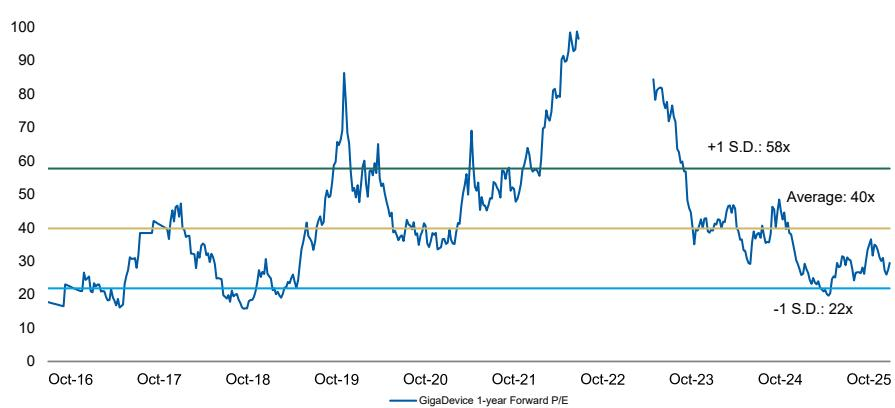  
Exhibit 25: GigaDevice: historical forward P/E   
Source: Company data, Morgan Stanley Research estimates

# Risk Reward - GigaDevice SemiconductorRisk Reward – GigaDevice Semiconductor Beijing Inc (603986.SS)

(603986.SSMultiple drivers ahead

# Rmb348.00PRICE TARGET

Our price target of Rmb301 is our base case value, derived from our residual income model. Key assumptions: cost of equity of $8 . 9 \%$ (beta 1.1, risk-free rate $2 \%$ and risk premium $6 \%$ ), a payout ratio of $40 \%$ , medium-term growth rate of $1 6 . 4 \%$ and a terminal growth rate of $3 . 0 \%$

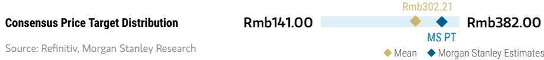  
RISK REWARD CHART

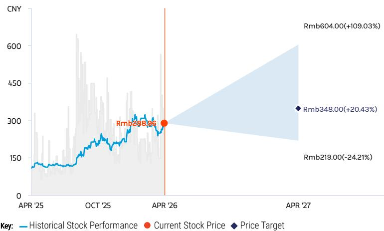  
Source: Re nitiv, Morgan Stanley Research

# OVERWEIGHT THESIS

▪ We expect GigaDevice to continue to gain share in China's MCU market. Auto MCUs offer bigger opportunities as local selfsuf ficiency is low.

▪ We see further NOR Flash pricing upside, and expect GigaDevice NOR quality to catch up in the auto segment.

▪ Specialty DRAM pricing started to rebound in late 1Q25, and there are opportunities such as wafer-on-wafer specialty memory.

▪ We believe GigaDevice will ramp up 16G LPDDR4 and 32G DDR4 at CXMT's Gen 4 platform in 2027.

▪ Our new price target implies 2026e P/E of 43x, roughly in line with the historical average of $4 0 \times$ since 2016.

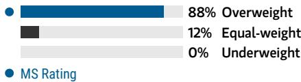  
Consensus Rating Distribution   
Source: Re nitiv, Morgan Stanley Research

# Risk Reward Themes

Pricing Power: Positive Secular Growth: Positive View descriptions of Risk Rewards Themes here

# BULL CASE

# Rmb604.00

# BASE CASE

# Rmb348.00

# BEAR CASE

# Rmb219.00

75x 2026e EPS

NOR flash prices rise more sharply into 1H26, and the company increases production of mid-/high-density NOR; MCU growth accelerates; DRAM business shows significant contribution: 1) NOR ash sales grow $1 2 0 \% + \gamma / \gamma$ in 2026 via price hikes and meaningful growth in demand; 2) MCU sales growth signi cantly exceeds $40 \%$ fl in 2026; 3) contribution from WoW tops expectations in 2026-27e; 4) gross margin above $50 \%$ fi in 2026.

43x 2026e EPS

NOR and DRAM pricing upside in 2026; moderate WoW contribution: 1) NOR ash sales rise $60 \% +$ Y/Y in 2026; 2) MCU grows $34 \%$ in 2026; 3) moderate contribution from WoW in $2 0 2 6 { - } 2 7 { \mathrm { e } } ; 4 )$ gross margin at $\sim 5 0 \%$ in 2026.

31x 2026e EPS

NOR Flash price falls sharply into 1H26; MCU faces stronger competition from foreign and local vendors; pause in DRAM business development: 1) NOR ash sales decline in 2026, as ASP starts to drop; 2) MCU sales decrease $> 1 0 \%$ Y/Y in 2026; 3) contribution from WoW falls below expectations in 2026-27e; 4) gross margin below $3 5 \%$ in 2026.

# Risk Reward – GigaDevice Semiconductor Beijing Inc (603986.SS)

KEY EARNINGS INPUTS   

<table><tr><td>Drivers</td><td>2024</td><td>2025e</td><td>2026e</td><td>2027e</td></tr><tr><td>NOR Flash ASP growth (%)</td><td>(10)</td><td>3</td><td>46</td><td>8</td></tr><tr><td>MCU ASP growth (%)</td><td>(31)</td><td>(8)</td><td>0</td><td>0</td></tr><tr><td>Gross margin (%)</td><td>38</td><td>40</td><td>50</td><td>51</td></tr></table>

# INVESTMENT DRIVERS

Benefi ciary of MCU localization Decreasing opex burden Development of AI glasses market

# GLOBAL REVENUE EXPOSURE

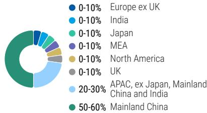  
Source: Morgan Stanley Research Estimate View explanation of regional hierarchies here

# MS ALPHA MODELS

<table><tr><td>4/5</td><td>3 Month</td></tr><tr><td>MOST</td><td>Horizon</td></tr></table>

Source: Re nitiv, FactSet, Morgan Stanley Research; 1 is the highest favored Quintile and 5 is the least favored Quintile

# RISKS TO PT/RATING

# RISKS TO UPSIDE

NOR up-cycle driven by stronger demand Superior chip design, leading to increasing exposure to low-density NOR Faster-than-expected DRAM development

# RISKS TO DOWNSIDE

NOR down-cycle driven by weaker demand Inferior chip design, leading to increasing exposure to mid-/high-density NOR Slower-than-expected DRAM development

# OWNERSHIP POSITIONING

Inst. Owners, % Active $7 2 . 3 \%$

Source: Re nitiv, Morgan Stanley Research

# MS ESTIMATES VS. CONSENSUS

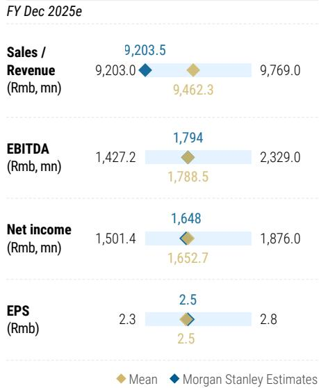  
Source: Re nitiv, Morgan Stanley Research

# GigaDevice: Financial summary

<table><tr><td>incomeStatement Rmb mn (Years End Dec )</td><td>2024</td><td>2025E</td><td>2026E</td><td>2027E</td></tr><tr><td>Net sales</td><td>7,356</td><td>9,203</td><td>17,061</td><td>24,555</td></tr><tr><td>COGS</td><td>(4,561)</td><td>(5,502)</td><td>(8,509)</td><td>(12,045)</td></tr><tr><td>Gross profit</td><td>2,795</td><td>3,701</td><td>8,552</td><td>12,510</td></tr><tr><td>Operating expenses</td><td>(1,984)</td><td>(2,176)</td><td>(2,816)</td><td>(3,275)</td></tr><tr><td>Operating income</td><td>811</td><td>1,526</td><td>5,736</td><td>9,235</td></tr><tr><td>Non-operating income</td><td>313</td><td>181</td><td>100</td><td>100</td></tr><tr><td>Pre-tax income</td><td>1,124</td><td>1,706</td><td>5,836</td><td>9,335</td></tr><tr><td>Income tax</td><td>23</td><td>29</td><td>175</td><td>280</td></tr><tr><td>Minority interests</td><td>2</td><td>(29)</td><td>(33)</td><td>(33)</td></tr><tr><td>Reported net Income</td><td>1,103</td><td>1,648</td><td>5,628</td><td>9,022</td></tr><tr><td>Adj.wtd.avg.shrs( m)</td><td>666</td><td>665</td><td>695</td><td>695</td></tr><tr><td>MW EPS (Rmb)</td><td>1.66</td><td>2.48</td><td>8.10</td><td>12.98</td></tr><tr><td>Reported EPS (Rmb)</td><td>1.66</td><td>2.48</td><td>8.10</td><td>12.98</td></tr></table>

<table><tr><td>Rmb mn (Years End Dec )</td><td>2024</td><td>2025E</td><td>2026E</td><td>2027E</td></tr><tr><td>Cash</td><td>9,128</td><td>10,298</td><td>14,218</td><td>20,167</td></tr><tr><td>Mkt Securities</td><td>120</td><td>120</td><td>120</td><td>120</td></tr><tr><td>AR/NR</td><td>232</td><td>225</td><td>416</td><td>599</td></tr><tr><td>Inventory</td><td>2,346</td><td>2,616</td><td>4,046</td><td>5,728</td></tr><tr><td>Other</td><td>609</td><td>609</td><td>609</td><td>609</td></tr><tr><td>Current Assets</td><td>12,435</td><td>13,868</td><td>19,409</td><td>27,222</td></tr><tr><td>Long-term investments</td><td>3,503</td><td>3,503</td><td>3,503</td><td>3,503</td></tr><tr><td>Fixed assets</td><td>1,062</td><td>1,062</td><td>1,062</td><td>1,062</td></tr><tr><td>Deferred assets</td><td>426</td><td>426</td><td>426</td><td>426</td></tr><tr><td>Other assets</td><td>1,803</td><td>1,803</td><td>1,803</td><td>1,803</td></tr><tr><td>Total Assets</td><td>19,229</td><td>20,662</td><td>26,203</td><td>34,016</td></tr><tr><td>S/T borrowings</td><td>898</td><td>898</td><td>898</td><td>898</td></tr><tr><td>AP/NP</td><td>734</td><td>745</td><td>1,152</td><td>1,631</td></tr><tr><td>Other ST liabilities</td><td>699</td><td>699</td><td>699</td><td>699</td></tr><tr><td>LT debt</td><td>0</td><td>0</td><td>0</td><td>0</td></tr><tr><td>Other LT liabilities</td><td>220</td><td>220</td><td>220</td><td>220</td></tr><tr><td>Total Liabilities</td><td>2,550</td><td>2,562</td><td>2,969</td><td>3,448</td></tr><tr><td>Common shares</td><td>664</td><td>664</td><td>664</td><td>664</td></tr><tr><td>Additional capital</td><td>8,656</td><td>8,656</td><td>8,656</td><td>8,656</td></tr><tr><td>Retained earning</td><td>6,796</td><td>8,218</td><td>13,352</td><td>20,686</td></tr><tr><td>Other shareholders&#x27;equity</td><td>563</td><td>563</td><td>563</td><td>563</td></tr><tr><td>Total Equity</td><td>16,679</td><td>18,100</td><td>23,234</td><td>30,568</td></tr><tr><td>Total Liab.&amp; Shrhldr&#x27;s Equity</td><td>19,229</td><td>20,662</td><td>26,203</td><td>34,016</td></tr></table>

$\mathsf E =$ Morgan Stanley Research Estimates Source: Morgan Stanley Research, Company Data

<table><tr><td>Rmb mn (Years End Dec)</td><td>2024</td><td>2025E</td><td>2026E</td><td>2027E</td></tr><tr><td>Cashflow from Operations</td><td>2,032</td><td>1,666</td><td>4,683</td><td>7,906</td></tr><tr><td>Net profits</td><td>1,103</td><td>1,648</td><td>5,628</td><td>9,022</td></tr><tr><td>Depreciation</td><td>269</td><td>269</td><td>269</td><td>269</td></tr><tr><td>Working Capital Change</td><td>(397)</td><td>(251)</td><td>(1,214)</td><td>(1,386)</td></tr><tr><td>Other adjustments</td><td>1,058</td><td>0</td><td>0</td><td>0</td></tr><tr><td>Cashflow from Investing</td><td>(669)</td><td>(269)</td><td>(269)</td><td>(269)</td></tr><tr><td>Capex</td><td>(499)</td><td>(269)</td><td>(269)</td><td>(269)</td></tr><tr><td>Change of LT Investment</td><td>(1,975)</td><td>0</td><td>0</td><td>0</td></tr><tr><td>Change of ST Investment</td><td>0</td><td>0</td><td>0</td><td>0</td></tr><tr><td>Other adjustments</td><td>1,805</td><td>0</td><td>0</td><td>0</td></tr><tr><td>Cashflow from financing</td><td>480</td><td>(226)</td><td>(494)</td><td>(1,688)</td></tr><tr><td>Increase in L/T debt</td><td>0</td><td>0</td><td>0</td><td>0</td></tr><tr><td>Increase in S/T debt</td><td>898</td><td>0</td><td>0</td><td>0</td></tr><tr><td>Cash Dividend Paid</td><td>(15)</td><td>(226)</td><td>(494)</td><td>(1,688)</td></tr><tr><td>Dir&amp; Emp Bonus Paid</td><td>0</td><td>0</td><td>0</td><td>0</td></tr><tr><td>Issuance of stock</td><td>5</td><td>0</td><td>0</td><td>0</td></tr><tr><td>Other adjustments</td><td>(407)</td><td>0</td><td>0</td><td>0</td></tr><tr><td>Exchange rate adjustment</td><td>107 1,950</td><td>0 1,170</td><td>0</td><td>0</td></tr></table>

Financial Ratios   

<table><tr><td></td><td>2024</td><td>2025E</td><td>2026E</td><td>2027E</td></tr><tr><td>Growth(%)</td><td></td><td></td><td></td><td></td></tr><tr><td>Turnover</td><td>27.7</td><td>25.1</td><td>85.4</td><td>43.9</td></tr><tr><td>Operating profits</td><td>129.9</td><td>88.1</td><td>276.0</td><td>61.0</td></tr><tr><td>EPS</td><td>585.3</td><td>49.6</td><td>226.8</td><td>60.3</td></tr><tr><td>Margins (%)</td><td></td><td></td><td></td><td></td></tr><tr><td>Gross Margin</td><td>38.0</td><td>40.2</td><td>50.1</td><td>50.9</td></tr><tr><td>Operating Margin</td><td>11.0</td><td>16.6</td><td>33.6</td><td>37.6</td></tr><tr><td>Pretax Margin</td><td>15.3</td><td>18.5</td><td>34.2</td><td>38.0</td></tr><tr><td>Net Margin</td><td>15.0</td><td>17.9</td><td>33.0</td><td>36.7</td></tr><tr><td>Return (%)</td><td></td><td></td><td></td><td></td></tr><tr><td>ROAE</td><td>6.9</td><td>9.5</td><td>27.2</td><td>33.5</td></tr><tr><td>ROAA</td><td>6.2</td><td>8.3</td><td>24.0</td><td>30.0</td></tr><tr><td>Gearing (%)</td><td></td><td></td><td></td><td></td></tr><tr><td>Net Debt/Equity</td><td>(49.3)</td><td>(51.9)</td><td>(57.3)</td><td>(63.0)</td></tr><tr><td>Liabilities/Equity</td><td>15.3</td><td>14.2</td><td>12.8</td><td>11.3</td></tr><tr><td>Ratios (X)</td><td></td><td></td><td></td><td></td></tr><tr><td>Current ratio</td><td>5.3</td><td>5.9</td><td>7.1</td><td>8.4</td></tr><tr><td>Quick ratio</td><td>4.0</td><td>4.5</td><td>5.3</td><td>6.4</td></tr><tr><td>Others</td><td></td><td></td><td></td><td></td></tr><tr><td>AR/NR Turnover (days)</td><td>9</td><td>9</td><td>9</td><td>9</td></tr><tr><td>Inventory Turnover (days)</td><td>174</td><td>174</td><td>174</td><td>174</td></tr><tr><td>AP Turnover (days)</td><td>49</td><td>49</td><td>49</td><td>49</td></tr><tr><td>Cash Conversion (days)</td><td>133</td><td>133</td><td>133</td><td>133</td></tr><tr><td></td><td></td><td></td><td></td><td></td></tr></table>

# Valuation Methodology and Risks

# Micron Technology Inc. (MU.O)

\~25x through-cycle earnings of US $\$ 21.00$ , a premium to history reflecting new opportunities in AI, At the high end of broader semis.

# Risks to Upside

# 订阅研报

加微信 LCD123321Cad 04-20 n Customers continue to demonstrate an appetite to take on inventory around macroeconomic uncertainty   
n Additional wafer intensity of HBM further improves overall supply and demand MIcron's HBM share surpasses expectations

# Risks to Downside

n Pricing can turn quickly; a falter in end demand with inventories elevated could lead to a swift price reduction n HBM demand falters and competition intensifies, pressuring pricing

# Risk Reward Reference links

1. View explanation of Options Probabilities methodology - Options_Probabilities_Exhibit_Link.pdf

2. View descriptions of Risk Rewards Themes - RR_Themes_Exhibit_Link.pdf

3. View explanation of regional hierarchies - GEG_Exhibit_Link.pdf

4. View explanation of Theme/Exposure methodology - ESG_Sustainable_Solutions_External_Link.pdf

5. View explanation of HERS methodology - ESG_HERS_External_Link.pdf