# Greater China Technology Hardware | Asia Pacific

# Agentic AI - Greater China Hardware Beneficiaries

April 19, 2026 10:35 PM GMT Agentic AI is set to benefit hardware sectors such as ABF substrates, PCBs, CPU sockets, peripheral connectors/cables, passive components, and assemblers. Key beneficiaries in our coverage include: UMTC, NYPCB, Lotes, FIT, Yageo, GCE, Shennan, Shengyi, Wiwynn, Inspur, and Lenovo.

Our Global Tech team now sees an agentic AI shift with CPU demand becomin more important as the coordination layer to support AI agents. In this report, focus more specifically on the beneficiaries for our Greater China Tech Hardware coverage, but to see more details from our Global Tech team's original thesis, an the global stock implications, please see Global Technology: Rise of The AI Agent Global Implications.

We believe the enlarged CPU TAM driven by Agentic AI will widen the ABF under-supply gap in 2030 by $\sim 8 \%$ vs. our prior forecast. This implies that, all e equal, the ABF substrate under-supply ratio will expand to ${ \sim } 1 5 \%$ (vs our previous forecast of $\sim 7 \% )$ . In terms of value, this will drive ABF substrate market demand reach $\sim \cup \mathsf { S } \$ 16 B$ by 2030, driving a $1 7 . 9 \%$ CAGR over 2025-30e (vs our prior forec of $1 6 . 7 \% )$ 订阅研报添加微信 LCD12332. In our coverage, Unimicron should be the main beneficiary, but NYPCB also set to benefit as it supplies ABF substrates for networking chips. However, w the enlarged TAM, we also see increased opportunities for new entrants like Zhe Ding. This should also drive increased demand for server PCBs. In the PCB space, Gold Circuit (GCE), Shennan Circuits, and Shengyi are set to benefit. GCE looks well positioned within US cloud customers, while Shennan Circuits looks well positioned within China cloud customers. We raise our price targets and adjust estimates to reflect this.

CPU sockets set to grow alongside a larger Server CPU TAM: We believe Lotes and FIT will be the biggest beneficiaries here, as we estimate they have a combin supply share of $7 0 . 8 0 \%$ globally. In addition to CPU sockets, both of these companies also supply other cables and connectors used in general servers, such DRAM connectors and PCIe cable/connectors, that should also see demand upsid

We also see upside to passive component demand, including MLCCs. On our estimates, a 10-15M unit increase in CPU TAM by 2030 would drive $2 - 3 \%$ value upside to the global MLCC market. In addition to MLCCs, there should also be upside for other passive components, including resistors, inductors, tantalum capacitors, etc. In our coverage, we believe Yageo is a beneficiary from more pass component content driven by Agentic AI given its comprehensive product portfo

Lastly, more CPUs means more servers will have to be assembled, which means ODM/OEMs like Wiwynn Inspur, and Lenovo, which have relatively higher expos to the general server market, are set to benefit.

# Preview to earnings

Focus KPI

Likely impact to consensus EPS\*

# Unimicron 3037.TW

1Q/2Q OpM Likely downside surprise Modest revision lower

• Our 1Q/2Q OpM estimates of $8 . 4 \% / 1 0 . 1 \%$ are 91/107bps below the Street, primarily as we factor in slightly less bullish pricing assumption vs. the Street's $2 0 { - } 3 0 \% ~ \mathrm { q / q }$ price hikes each quarter.

• Our view is still that this year's pricing increase is mainly driven by material cost inflation and not a result of under-supply, so $2 0 { - } 3 0 \% \ : 0 \%$ price hikes each quarter does not look reasonable to us.

# Nan Ya PCB 8046.TW

1Q/2Q OpM

Likely downside surprise

Modest revision lower

• Our 1Q/2Q OpM estimates of $9 . 5 \% / 1 0 . 1 \%$ are 127/412bps below the Street, primarily as we factor in slightly less bullish pricing assumption vs. the Street's $3 0 \% + { \sf q } / { \sf q }$ price hikes each quarter.

• Our view is still that this year's pricing increase is mainly driven by material cost inflation and not a result of under-supply, so $2 0 \%$ q/q price hikes each quarter does not look reasonable to us.

# Zhen Ding 4958.TW

1Q OpM / AI outlook Likely upside surprise Modest revision higher

• Our 1Q OpM estimates of $5 . 2 \%$ is 138bps above the Street.

• We think this is due to our slightly more bullish expectation for Zhen Ding's FPCB UTR in 1Q, driven by our better-than-seasonality iPhone builds for 2Q due to the continued shipments of new models.

• We think Zhen Ding will see more AI server contribution from 2H26 onwards, as the new GPU platform starts to ship, but its supply share for compute board PCB should remain relatively small.

# Lotes Co. Ltd. 3533.TW

1Q OpM and full-year guide Likely upside surprise Modest revision higher

• Our 1Q OpM estimate of $3 1 . 8 \%$ is 45bps above the Street.

• We think this is primarily driven by our higher assumptions for server CPU demand volumes which are margin 订阅研报添加微信 LCD123321Cadaccretive, but likely also lower AI revenue contributions, which are margin dilutive.

• We think there might be some upsides to Lotes' full year guidance, potentially driven by upward revision to its guidance for the CPU socket business.

# FIT Hon Teng Ltd 6088.HK

1H net profit

Largely unchanged

• FIT will report its 1H26 results in August.

• We think FIT's 1H net profit might come in below the Street's estimates, as the contribution from the new AI server platform remains limited in 1H.

# Inspur Electronic Information 000977.SZ

1Q revenue and full year cloud outlook Likely upside surprise Modest revision higher

• Our 1Q revenue estimate of $\mathsf { R m b 4 5 . 8 B }$ $( + 4 \% 9 / 9 )$ is $6 \%$ above the Street, driven by higher general server shipment assumptions.

• But our 1Q OpM estimate of $1 . 2 \%$ $^ { + 1 0 2 }$ bps ${ \sf q } / { \sf q }$ is 26bps below the Street, as we factor in higher mix of cloud revenue, which are lower margin.

• We expect Inspur to provide positive guidance for the full year, driven by strong server demand from its domestic cloud customers.

# Shennan Circuits Co Ltd 002916.SZ

1H non-datacenter demand Likely downside surprise Largely unchanged

• We expect Shennan to guide for weaker-than-expected demand from its non-datacenter related customers in 1H, due to rising selling prices of devices driven by memory price hikes and shortages.

• But the demand strength from server, optical and networking customers should be well-sustained, though we believe this is well-known by the market.

# Shengyi Technology Co Ltd. 600183.SS

1H AI demand

<table><tr><td>Focus KPI</td><td>Focus KPI Surprise Likely impact to consensus EPS*</td></tr><tr><td>·We expect for Shengyito guide for lower-than-expected Al demand in1H vs.market expectations,as the new platform willikely only start to ship in biger volumes from 2H.</td><td></td></tr><tr><td></td><td></td></tr><tr><td>incumbent suppliers like EMC and Doosan (both Not Covered).</td><td>·Also,we believe Shengyis supply share for the new Al server platform willremain relatively small compared to</td></tr></table>

# Hardware Beneficiaries - ABF Substrates, CPU Sockets, MLCCs

# ABF Substrates - Still Early in the Innings

ABF substrate value growth is set to accelerate over the next five years amid a shift in demand to AI. With incremental demand from Agentic AI and the enlarged CPU TAM, we 添加微信 LCD123321Cad 04-20 estimate this will drive ABF substrates' value to accelerate at a $1 7 . 9 \%$ CAGR over 2025- 30e (vs $1 6 . 1 \%$ CAGR without the incremental CPU TAM). ABF substrates will be one of the key component beneficiaries of an enlarged server CPU TAM, we believe. Based on our model, we estimate server CPU ABF substrate demand was $\sim \cup 5 \$ 2.5 B$ in CY25 and accounted for $\sim 3 6 \%$ of the global ABF substrate market, with ${ \sim } 3 2 . 7 1  { \mathrm { \Omega } }$ units of server CPUs sold in CY25, according to IDC.

Agentic AI to broaden the Server CPU ABF Substrate TAM by US\$1.2B: With Agentic AI and the upside potential to CPU TAM of 10-15M units by 2030e, we believe this will result in the server CPU ABF substrate market growing to $\sim \cup \mathsf { S P 4 . 7 B }$ by CY30 $( \sim \mathsf { U S S } \mathsf { 1 . 2 B }$ more than our prior forecast). However, we see potential for the market upside to be even slightly higher, as there will be more networking demand to connect all these CPUs together. But, we calculate the incremental $\sim \cup \mathsf { S } \$ 1.2 B$ of forecast demand upside from server CPU ABF substrate alone implies $5 . 7 0 \%$ upside to the overall ABF substrate TAM, all else equal.

In our Greater China coverage, we believe Unimicron will be the key beneficiary, but we also think NYPCB will indirectly benefit (although it does not have any server CPU exposure), given its exposure to ABF substrates for networking chips.

For Unimicron, we estimate that every incremental 1M CPU units sold could result in a $0 . 2 \%$ revenue upside opportunity, and if we assume the CPU TAM grows by 10-15M units, that implies $2 - 3 \%$ revenue upside to Unimicron, all else equal.

# ABF Substrate under-supply widening to \~15% by 2030e (vs $\sim 7 \%$ in our prior

forecast): For the ABF substrate market, without any new capacity additions, the enlarged CPU TAM would widen the $\mathsf { S } / \mathsf { D }$ gap. In the scenario that we laid out in February (report here), we estimated the under-supply gap would be ${ \sim } 7 \%$ by 2030, but with an incremental 10-15M units of CPU TAM by 2030e, this would drive the under-supply gap to widen to ${ \sim } 1 5 \% .$ , which is a meaningful difference and should drive prices and margins up further across the board for all ABF substrate suppliers.

添加微信 LCD123321Cad 04-20 With more demand upside, this would also likely create opportunities for new entrants, like Zhen Ding, to come in and win share. We also view Unimicron and Zhen Ding as well positioned to benefit from any upside ABF substrate demand from China's domestic chips. To date, we have not seen any viable Chinese ABF substrate suppliers with stable yield and quality. So, with the increase of more China chips, whether CPU or GPU, we see the majority of those orders going to Unimcron and/or Zhen Ding.

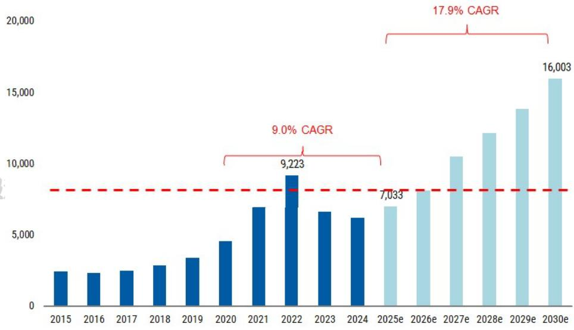  
Exhibit 2: Stronger ABF substrate market growth in the AI era   
Source: Company data, Morgan Stanley Research estimates.

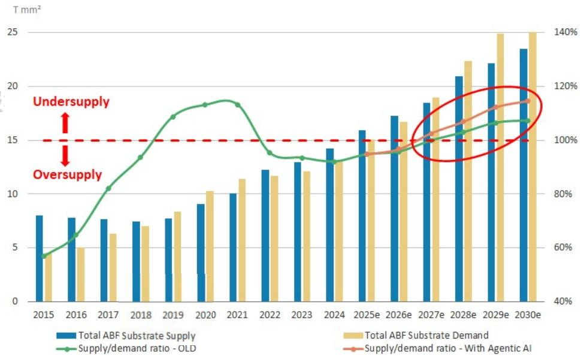  
Exhibit 3: We estimate Agentic AI to drive $5 \mathrm { - } 1 0 \%$ incremental ABF substrate demand upside by 2030e from the enlarged CPU TAM alone   
Source: Company data, Prismark, Morgan Stanley Research estimates.   
Exhibit 5: 10-15M CPU unit increase could drive ${ \sim } 3 \%$ ABF substrate revenue upside for Unimicron

Exhibit 4: Every 1M CPU demand increase implies $0 . 2 \%$ ABF 报添加微信 substrate revenue upside for Unimicron, we estimate   

<table><tr><td>Every1MUnitsoftotal CPUupside</td><td></td></tr><tr><td>ServerCPU ABFSubstrate ASP(US$)</td><td>77.8</td></tr><tr><td>Revenue upside to Unimicron per1MCPUs(US$M)</td><td>12.6</td></tr><tr><td>Revenueupside to Unimicron per1M CPUs(NT$M)</td><td>397</td></tr><tr><td>Unimicron 2O26 total revenue estimate(NTSM)</td><td>169,246</td></tr><tr><td>UnimicronABFrevenueupsideper1MCPUs</td><td>0.2%</td></tr></table>

Source: Morgan Stanley Research estimates.

<table><tr><td>IfCPUTAM grows10-15Munits...</td><td></td></tr><tr><td>ServerCPU ABF Substrate ASP(US$)</td><td>77.8</td></tr><tr><td>Revenue upside to Unimicron if CPUTAM grows1O-15Munits (US$ M)</td><td>157.6</td></tr><tr><td>Revenueupside to Unimicron ifCPUTAM grows1O-15Munits (NT$M)</td><td>4,964</td></tr><tr><td>Unimicron 2O26 ABF revenue estimate(NTSM)</td><td>169,246</td></tr><tr><td>UnimicronABFrevenueupsideifCPUTAM grows10-15Munits</td><td>2.9%</td></tr></table>

Source: Morgan Stanley Research estimates.

# More CPU Sockets Will Be Needed

CPU Sockets are another component that are set to benefit meaningfully from an enlarged CPU TAM, because every server CPU is accompanied by a CPU socket. Today, the server CPU market is dominated by $3 - 4$ suppliers, and in our coverage we believe the enlarged server CPU TAM will mainly benefit FIT and Lotes. We estimate FIT has around $40 \%$ global server CPU socket supply share, while Lotes has ${ \sim } 3 5 \%$ .

On our estimates, every 1M CPU unit increase would drive $0 . 6 \%$ revenue upside for Lotes and $0 . 2 \%$ revenue upside for FIT, purely from increased sockets supplied. Further, we model that 10-15M CPU unit upside could result in ${ \sim } 7 \%$ revenue upside to Lotes and ${ \sim } 2 \%$ revenue upside to FIT. However, we believe the revenue upside for these two companies could be even higher, because an enlarged CPU TAM would mean more general servers, DRAM connectors, more PCIe connectors, and other connectors and cables, all of which Lotes and FIT have exposure to. So, we believe the overall revenue opportunity and upside potential for Lotes and FIT could be higher.

Exhibit 6: Every 1M CPU demand increase implies $0 . 5 \%$ CPU socket revenue upside potential for Lotes   

<table><tr><td>Every1M Unitsof total CPU upside</td></tr><tr><td>Server CPU Socket ASP (US$) 21.9</td></tr><tr><td>Revenue upside to Lotes per1M CPUs (US$ M) 7.7</td></tr><tr><td>Revenue upside to Lotes per1M CPUs (NT$ M) 241</td></tr><tr><td>Lotes 2026 total revenue estimate (NT$ M) 40,488</td></tr><tr><td>Lotes CPU Socket upside per 1M CPUs 0.6%</td></tr></table>

Source: Morgan Stanley Research estimates.

Exhibit 7: 10-15M CPU unit increase implies ${ \sim } 7 \%$ CPU socket revenue upside potential for Lotes   

<table><tr><td>IfCPUTAM grows10-15Munits...</td><td></td></tr><tr><td>Server CPU SocketASP(US$)</td><td>21.9</td></tr><tr><td>Revenue upside to Lotes if CPU TAM grows1O-15M units (US$M)</td><td>95.7</td></tr><tr><td>Revenue upside to Lotesif CPUTAM grows1O-15Munits (NT$M)</td><td>3,015</td></tr><tr><td>Lotes2026 total revenue estimate(NT$M)</td><td>41,065</td></tr><tr><td>LotesCPUSocketupsideifCPUTAMgrows1O-15Munits</td><td>7.3%</td></tr></table>

Source: Morgan Stanley Research estimates.

Exhibit 8: Every 1M CPU demand increase implies $0 . 2 \%$ CPU socket revenue upside potential for FIT   

<table><tr><td>Every1M Units of total CPU upside</td><td></td></tr><tr><td>Server CPU Socket ASP (US$)</td><td>21.9</td></tr><tr><td>Revenue upside to FIT per 1M CPUs (US$ M)</td><td>8.8</td></tr><tr><td>FIT2026 total revenue estimate (US$ M)</td><td>5,483</td></tr><tr><td>FIT CPU Socket upside per 1M CPUs</td><td>0.2%</td></tr></table>

Source: Morgan Stanley Research estimates.

Exhibit 9: 10-15M CPU unit increase implies ${ \sim } 2 \%$ CPU socket revenue upside potential for FIT   

<table><tr><td colspan="2">IfCPUTAM grows10-15Munits...</td></tr><tr><td>ServerCPU Socket ASP(US$)</td><td>21.9</td></tr><tr><td>Revenueupside to FITif CPUTAM grows1O-15Munits (US$M)</td><td>109.4</td></tr><tr><td>FIT2026 ABF revenue estimate (NT$M)</td><td>5,483</td></tr><tr><td>FITCPUSocketupsideifCPUTAMgrows10-15Munits</td><td>2.0%</td></tr></table>

Source: Morgan Stanley Research estimates.

2025 Server CPU Socket Supply Share

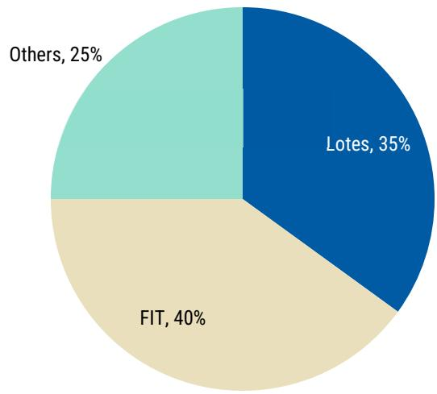  
Exhibit 10: We estimate FIT has ${ \sim } 4 0 \%$ global server CPU supplier share and Lotes has ${ \sim } 3 5 \%$ supplier share   
Source: Morgan Stanley Research estimates.

# Passive Components TAM Also Set to Grow

# 订阅研报

MLCC and passive components are also put into general servers, so an enlarged server 添加微信 LCD123321Cad 04-20 CPU TAM should also drive upside to MLCC and other passive component demand. Different server specifications have different passive components lay-outs and different volume and value content, so it is also difficult to quantify the content. But for simplicity's sake, we estimate ${ \sim } \cup \varsigma \$ 30$ MLCC content per general server, which houses on average $_ { 2 x }$ CPUs today. We quantified the MLCC market for different end segments in our report (Global Technology: MLCC – Quantifying the Cloud & Edge AI Opportunity (11 Sep 2024)).

In the report, we sized the general server MLCC TAM at US\$400-500M. According to our Japan electronic components analyst, Shoji Sato, the total MLCC market globally is ${ \sim } \cup 5$ $\$ 1$ 15-16B this year, and will likely reach $\sim \cup \mathsf { S$ 20 B }$ by 2030e (assuming it remains at $5 \%$ CAGR from here on. This implies that a 10-15M CPU unit demand increase by 2030e would drive an incremental $\sim \cup \mathsf { S } \$ 500 M$ MLCC value demand, or $2 - 3 \%$ upside to the overall MLCC market globally by 2030e.

# 订阅研报

For Yageo specifically, we estimate that every \~1M CPU demand increase would result in 0.1% revenue upside, and 10-15M CPU unit upside would result in $1 - 2 \%$ revenue upside, all 添加微信 LCD123321Cad 04-20 else equal. However, Yageo also has exposure to inductors, resistors, and tantalum capacitors, which are also present in general servers, so the overall revenue upside potential for Yageo could be higher.

Exhibit 11: Every 1M CPU demand increase implies $0 . 1 \%$ MLCC revenue upside potential for Yageo   

<table><tr><td>Every 1M Units of total CPU upside</td></tr><tr><td>Server MLCC Content (US$) 30.0</td></tr><tr><td>Revenue upside to Yageo per 1M CPUs (US$ M) 4.5</td></tr><tr><td></td></tr><tr><td>Revenue upside to Yageo per 1M CPUs (NT$ M) 142</td></tr><tr><td>Yageo 2026 total revenue estimate (NT$ M) 155,443</td></tr><tr><td>Yageo MLCC revenue upside per 1M CPUs 0.1%</td></tr></table>

Source: Morgan Stanley Research estimates.

Exhibit 12: 10-15M CPU unit increase implies $1 - 2 \%$ MLCC revenue upside potential for Yageo   

<table><tr><td>IfCPUTAM grows10-15Munits...</td><td></td></tr><tr><td>ServerMLCC Content(US$)</td><td>30.0</td></tr><tr><td>Revenue upside to Yageoif CPUTAM grows1O-15M units (US$M)</td><td>56.3</td></tr><tr><td>Revenue upside to Yageo if CPUTAM grows1O-15M units(NTSM)</td><td>1,772</td></tr><tr><td>Yageo 2026 total revenue estimate(NT$M)</td><td>158,893</td></tr><tr><td>YageoMLCCrevenueupsideifCPUTAMgrows1O-15Munits</td><td>1.1%</td></tr></table>

Source: Morgan Stanley Research estimates.

# 订阅研报添加微信 LCD123321Cad 04-20 Risks

Key risks to our call include:

• Slower-than-expected agentic AI demand pickup, resulting in lower CPU demand volumes;   
• Delay to new GPU/ASIC platform launch, leading to lower capacity UTRs and consequently lower margins;   
Weaker-than-expected consumer electronics demand owing to rising selling prices, offsetting the growth from server/networking/optical- related demand for related suppliers;   
• Worse-than-expected supply shortage of upstream materials/components, which will cap earnings growth for other players in the supply chain;   
• Macro uncertainties that lead to slower-than-expected data center build-outs and consumer spending cuts.

# 订阅研报添加微信 LCD123321Cad 04-20

# 1Q26 Previews

# Unimicron

Our 2Q revenue estimate of $N \top S 4 0 . 2 \mathsf { B }$ $( + 7 \% 0 \% )$ is $2 \%$ below the Street, and our 1Q/2Q OpM estimates of $8 . 4 \% / 1 0 . 1 \%$ $( + 1 5 3 / + 1 7 7 6 \mathsf { p s } \mathsf { q } / \mathsf { q } )$ are 91/107bps below the Street, primarily as we factor in slightly less bullish pricing assumption vs. the Street's expectations for $2 0 { - } 3 0 \% \%$ price hikes each quarter. Our view is still that this year's pricing increase is mainly driven by material cost inflation and not a result of under-supply, so $2 0 { - } 3 0 \% \%$ price hikes each quarter does not look reasonable to us.

# NYPCB

# 订阅研报

Our 2Q revenue estimate of $N \top \$ 123 B$ $( + 1 0 \% \% )$ is $9 \%$ below the Street, and our 1Q/2Q 添加微信 LCD123321Cad 04-20 OpM estimates of 9.5%/10.1% (+91/+58bps q/q) are 127/412bps below the Street, primarily as we factor in slightly less bullish pricing assumption vs. the Street's expectations for $3 0 \% + { \sf q } / { \sf q }$ price hikes each quarter. Our view is still that this year's pricing increase is mainly driven by material cost inflation and not a result of under-supply, so 20-30% q/q price hikes each quarter does not look reasonable to us.

# Zhen Ding

Our 2Q revenue estimate of $N \top S 4 4 . 4 B$ $( + 9 \% 0 / 9 )$ is $2 \%$ below the Street, but our 1Q/2Q OpM estimates of $5 . 2 \% / 5 . 4 \%$ (-523/+23bps ${ \mathsf { q } } / { \mathsf { q } } .$ ) are 138/34bps above the Street. We think

this is due to our slightly more bullish expectation for Zhen Ding's FPCB UTR in 1Q, driven by our better-than-seasonality estimate for 2Q in view of the continued shipments of new models (note).

# Lotes

Our 2Q revenue estimate of $N \top \$ 10.1 B$ $\left( + 8 \% { } ~ \mathsf { q } / \mathsf { q } \right)$ is $4 \%$ above the Street, and our 1Q/2Q OpM estimates of $3 1 . 8 \% / 3 3 . 5 \%$ $\left( + 1 8 5 / + \right.$ 170bps ${ \mathsf { q } } / { \mathsf { q } } ,$ ) are also 45/85bps above the Street, primarily driven by our higher assumptions for server CPU demand volumes which are margin accretive, but likely also lower AI revenue contributions, which are margin dilutive.

Note: We have factored in preliminary 1Q actual revenues for the Taiwanese stocks in our model.

# Inspur

Our 1Q revenue estimate of $\mathsf { R m b 4 5 . 8 B }$ $( + 4 \% 0 / 9 )$ is $6 \%$ above the Street, driven by higher general server shipment assumptions, but our 1Q OpM estimate of $1 . 2 \%$ (+102bps q/q) is 26bps below the Street, as we factor in higher mix of cloud revenue, which are lower margin. Our 2Q revenue estimate of Rmb50.9B $( + 1 1 \% 0 / 9 )$ , is $6 \%$ below the Street, with OpM estimate of $1 . 3 \%$ (+12bps ${ \mathsf { q } } / { \mathsf { q } } ,$ ) being 44bps below the Street, which we also attribute to higher mix of revenue from cloud customers.

# Shennan Circuits

Our 1Q revenue estimate of $\mathsf { R m b 6 . 5 B }$ $\left( - 6 \% { } 0 \% \right)$ is $7 \%$ below the Street, with OpM estimate of $1 6 . 3 \%$ $_ { + 9 0 }$ bps ${ \mathsf { q } } / { \mathsf { q } } .$ ) being 81bps above the Street, which we attribute to higher high-添加微信 LCD123321Cad 04-20 margin product shipments (primarily server, networking PCBs). Our 2Q revenue estimate of Rmb7.3B $( + 1 4 \% 0 / \% )$ is slightly below the Street, and our 2Q OpM estimate of $1 7 . 2 \%$ $( + 9 4 6 \mathsf { p s } \mathsf { q } / \mathsf { q } )$ is also below the Street. We believe this is driven by the Street's more bullish assumptions for Shennan's optical module PCB shipments.

# Shengyi

Our 1Q revenue estimate of $\mathsf { R m b 8 . 1 B }$ $( + 4 \% 0 \% )$ is slightly below the Street by $4 \%$ with OpM estimate of $1 6 . 4 \% ( + 3 7 6 \mathsf { p s } \mathsf { q } / \mathsf { q } )$ being 60bps below the Street. Our 2Q revenue estimate of $\mathsf { R m b 8 . 9 B }$ $( + 1 0 \% 0 / \% )$ is $6 \%$ below the Street, and our 2Q OpM estimate of $1 7 . 2 \%$ (+85bps ${ \mathsf { q } } / { \mathsf { q } } .$ ) is also below the Street by 88bps. We attribute this to the Street's more bullish expectations for CCL price hikes driven by inflationary costs of CCL materials, mainly including glass cloth, copper and chemicals.

Exhibit 13: Hardware Components – Morgan Stanley's 1Q/2Q estimates vs. consensus   

<table><tr><td rowspan="2">Revenue</td><td colspan="5">1Q</td><td colspan="5">2Q</td></tr><tr><td>MSe</td><td>q/q</td><td>Cons</td><td>q/q</td><td>Diff.</td><td>MSe</td><td>q/q</td><td>Cons</td><td>q/q</td><td>Diff.</td></tr><tr><td>Unimicron</td><td>37,446</td><td>8%</td><td>36,817</td><td>6%</td><td>2%</td><td>40,171</td><td>7%</td><td>40,912</td><td>11%</td><td>-2%</td></tr><tr><td>NYPCB</td><td>11,177</td><td>0%</td><td>11,243</td><td>1%</td><td>-1%</td><td>12,302</td><td>10%</td><td>13,585</td><td>21%</td><td>-9%</td></tr><tr><td>Zhen Ding</td><td>40,728</td><td>-28%</td><td>40,711</td><td>-28%</td><td>0%</td><td>44,438</td><td>9%</td><td>45,184</td><td>11%</td><td>-2%</td></tr><tr><td>Lotes</td><td>9,384</td><td>1%</td><td>9,057</td><td>-2%</td><td>4%</td><td>10,113</td><td>8%</td><td>9,695</td><td>7%</td><td>4%</td></tr><tr><td>Inspur</td><td>45,797</td><td>4%</td><td>43,100</td><td>-2%</td><td>6%</td><td>50,909</td><td>11%</td><td>54,257</td><td>26%</td><td>-6%</td></tr><tr><td>Shennan Circuits</td><td>6,462</td><td>-6%</td><td>6,532</td><td>-5%</td><td>-1%</td><td>7,340</td><td>14%</td><td>7,507</td><td>15%</td><td>-2%</td></tr><tr><td>Shengyi Tech</td><td>8,119</td><td>4%</td><td>8,493</td><td>9%</td><td>-4%</td><td>8,900</td><td>10%</td><td>9,499</td><td>12%</td><td>-6%</td></tr></table>

<table><tr><td rowspan=2 colspan=1>OpM</td><td rowspan=1 colspan=5>1Q</td><td rowspan=1 colspan=5>2Q</td></tr><tr><td rowspan=1 colspan=1>MSe</td><td rowspan=1 colspan=1>q/q</td><td rowspan=1 colspan=1>Cons</td><td rowspan=1 colspan=1>q/q</td><td rowspan=1 colspan=1>Diff.</td><td rowspan=1 colspan=1>MSe</td><td rowspan=1 colspan=1>q/q</td><td rowspan=1 colspan=1>Cons</td><td rowspan=1 colspan=1>q/q</td><td rowspan=1 colspan=1>Diff.</td></tr><tr><td rowspan=1 colspan=1>Unimicron</td><td rowspan=1 colspan=1>8.4%</td><td rowspan=1 colspan=1>153bps</td><td rowspan=1 colspan=1>9.3%</td><td rowspan=1 colspan=1>245bps</td><td rowspan=1 colspan=1>-91bps</td><td rowspan=1 colspan=1>10.1%</td><td rowspan=1 colspan=1>177bps</td><td rowspan=1 colspan=1>11.2%</td><td rowspan=1 colspan=1>193bps</td><td rowspan=1 colspan=1>-107bps</td></tr><tr><td rowspan=1 colspan=1>NYPCB</td><td rowspan=1 colspan=1>9.5%</td><td rowspan=1 colspan=1>91bps</td><td rowspan=1 colspan=1>10.8%</td><td rowspan=1 colspan=1>219bps</td><td rowspan=1 colspan=1> -127bps</td><td rowspan=1 colspan=1>10.1%</td><td rowspan=1 colspan=1>58bps</td><td rowspan=1 colspan=1>14.2%</td><td rowspan=1 colspan=1>343bps</td><td rowspan=1 colspan=1>-412bps</td></tr><tr><td rowspan=1 colspan=1>Zhen Ding</td><td rowspan=1 colspan=1>5.2%</td><td rowspan=1 colspan=1>-523bps</td><td rowspan=1 colspan=1>3.8%</td><td rowspan=1 colspan=1>-661bps</td><td rowspan=1 colspan=1>138bps</td><td rowspan=1 colspan=1>5.4%</td><td rowspan=1 colspan=1>23bps</td><td rowspan=1 colspan=1>5.1%</td><td rowspan=1 colspan=1>127bps</td><td rowspan=1 colspan=1>34bps</td></tr><tr><td rowspan=1 colspan=1>Lotes</td><td rowspan=1 colspan=1>31.8%</td><td rowspan=1 colspan=1>185bps</td><td rowspan=1 colspan=1>31.3%</td><td rowspan=1 colspan=1>141bps</td><td rowspan=1 colspan=1>45bps</td><td rowspan=1 colspan=1>33.5%</td><td rowspan=1 colspan=1>170bps</td><td rowspan=1 colspan=1>32.6%</td><td rowspan=1 colspan=1>130bps</td><td rowspan=1 colspan=1>85bps</td></tr><tr><td rowspan=1 colspan=1>Inspur</td><td rowspan=1 colspan=1>1.2%</td><td rowspan=1 colspan=1>102bps</td><td rowspan=1 colspan=1>1.4%</td><td rowspan=1 colspan=1>128bps</td><td rowspan=1 colspan=1>-26bps</td><td rowspan=1 colspan=1>1.3%</td><td rowspan=1 colspan=1>12bps</td><td rowspan=1 colspan=1>1.7%</td><td rowspan=1 colspan=1>30bps</td><td rowspan=1 colspan=1>-44bps</td></tr><tr><td rowspan=1 colspan=1>Shennan Circuits</td><td rowspan=1 colspan=1>16.3%</td><td rowspan=1 colspan=1>90bps</td><td rowspan=1 colspan=1>15.4%</td><td rowspan=1 colspan=1>9bps</td><td rowspan=1 colspan=1>81bps</td><td rowspan=1 colspan=1>17.2%</td><td rowspan=1 colspan=1>94bps</td><td rowspan=1 colspan=1>18.0%</td><td rowspan=1 colspan=1>255bps</td><td rowspan=1 colspan=1>-79bps</td></tr><tr><td rowspan=1 colspan=1>Shengyi Tech</td><td rowspan=1 colspan=1>16.4%</td><td rowspan=1 colspan=1>31bps</td><td rowspan=1 colspan=1>17.0%</td><td rowspan=1 colspan=1>91bps</td><td rowspan=1 colspan=1>-60bps</td><td rowspan=1 colspan=1>17.2%</td><td rowspan=1 colspan=1>85bps</td><td rowspan=1 colspan=1>18.1%</td><td rowspan=1 colspan=1>112bps</td><td rowspan=1 colspan=1>-88bps</td></tr></table>

<table><tr><td rowspan="2">EPS</td><td colspan="5">1Q</td><td colspan="5">2Q</td></tr><tr><td>MSe</td><td>q/q</td><td>Cons</td><td>q/q</td><td>Diff.</td><td>MSe</td><td>q/q</td><td>Cons</td><td>q/q</td><td>Diff.</td></tr><tr><td>Unimicron</td><td>1.78</td><td>-23%</td><td>1.98</td><td>-14%</td><td>-10%</td><td>1.98</td><td>11%</td><td>2.39</td><td>21%</td><td>-17%</td></tr><tr><td>NYPCB</td><td>1.78</td><td>-4%</td><td>1.80</td><td>-3%</td><td>-1%</td><td>1.80</td><td>1%</td><td>2.47</td><td>37%</td><td> -27%</td></tr><tr><td>Zhen Ding</td><td>1.86</td><td>-42%</td><td>1.05</td><td>-67%</td><td>77%</td><td>1.42</td><td>-23%</td><td>1.39</td><td>32%</td><td>2%</td></tr><tr><td>Lotes</td><td>23.68</td><td>5%</td><td>21.07</td><td>-6%</td><td>12%</td><td>23.00</td><td>-3%</td><td>22.43</td><td>6%</td><td>3%</td></tr><tr><td>Inspur</td><td>0.41</td><td>-35%</td><td>0.37</td><td>-41%</td><td>12%</td><td>0.49</td><td>18%</td><td>0.58</td><td>57%</td><td>-16%</td></tr><tr><td>Shennan Circuits</td><td>1.39</td><td>-2%</td><td>1.44</td><td>1%</td><td>-3%</td><td>1.63</td><td>17%</td><td>1.79</td><td>24%</td><td>-9%</td></tr><tr><td>ShengyiTech</td><td>0.42</td><td>11%</td><td>0.45</td><td>21%</td><td>-8%</td><td>0.50</td><td>20%</td><td>0.55</td><td>22%</td><td>-10%</td></tr></table>

Source: Visible Alpha, Morgan Stanley Research estimates.

# Unimicron: Earnings Estimate Change

Our 2026-28 earnings estimates increase $1 3 \%$ , $12 \%$ and $1 5 \%$ , respectively, to reflect the higher price hike potential for ABF substrate and substrate demand upside from increased server CPU demand.

Exhibit 14: Earnings estimate changes   

<table><tr><td rowspan="2">Year to Dec.31 (NT$m)</td><td colspan="3">2026E</td><td colspan="3">2027E</td><td colspan="3">2028E</td></tr><tr><td>New</td><td>Old</td><td>%diff</td><td>New</td><td>Old</td><td>% diff</td><td>New</td><td>Old</td><td>% diff</td></tr><tr><td>P&amp;LSummary</td><td></td><td></td><td>dd</td><td></td><td></td><td></td><td></td><td></td><td></td></tr><tr><td>Net sales</td><td>169,246</td><td>161,122</td><td>5%</td><td>221,316</td><td>209,386</td><td>6%</td><td>279,329</td><td>262,101</td><td>7%</td></tr><tr><td>COGS</td><td>(137,245)</td><td>(131,261)</td><td></td><td>(168,945)</td><td>(161,430)</td><td></td><td>(197,521)</td><td>(189,064)</td><td></td></tr><tr><td>Gross profit</td><td>32,001</td><td>29,860</td><td>7%</td><td>52,372</td><td>47,956</td><td>9%</td><td>81,808</td><td>73,036</td><td>12%</td></tr><tr><td>Operating expenses</td><td>(13,234)</td><td>(13,014)</td><td></td><td>(13,774)</td><td>(13,659)</td><td></td><td>(14,142)</td><td>(14,114)</td><td></td></tr><tr><td>Operating income</td><td>18,767</td><td>16,847</td><td>11%</td><td>38,597</td><td>34,296</td><td>13%</td><td>67,666</td><td>58,923</td><td>15%</td></tr><tr><td>Non-operating income</td><td>2.280</td><td>1,980</td><td></td><td>2,180</td><td>2,180</td><td></td><td>2,180</td><td>2,180</td><td></td></tr><tr><td>Pre-tax income</td><td>21,046</td><td>18,827</td><td>12%</td><td>40,777</td><td>36,476</td><td>12%</td><td>69,846</td><td>61,103</td><td>14%</td></tr><tr><td>Net income</td><td>15,084</td><td>13,328</td><td>13%</td><td>30,665</td><td>27,257</td><td>12%</td><td>53,550</td><td>46,652</td><td>15%</td></tr><tr><td>Diluted EPS (NT$)</td><td>9.80</td><td>8.67</td><td>13%</td><td>19.92</td><td>17.73</td><td>12%</td><td>34.79</td><td>30.35</td><td>15%</td></tr><tr><td>Margins</td><td></td><td></td><td>ppt</td><td></td><td></td><td>ppt</td><td></td><td></td><td>ppt</td></tr><tr><td>Gross margin</td><td>18.9%</td><td>18.5%</td><td>0.4</td><td>23.7%</td><td>22.9%</td><td>0.8</td><td>29.3%</td><td>27.9%</td><td>1.4</td></tr><tr><td>Operating margin</td><td>11.1%</td><td>10.5%</td><td>0.6</td><td>17.4%</td><td>16.4%</td><td>1.1</td><td>24.2%</td><td>22.5%</td><td>1.7</td></tr><tr><td>Pretax margin</td><td>12.4%</td><td>11.7%</td><td>0.8</td><td>18.4%</td><td>17.4%</td><td>1.0</td><td>25.0%</td><td>23.3%</td><td>1.7</td></tr></table>

Source: Morgan Stanley Research (E) estimates.

# Price Target Discussion and Valuation Methodology

Our 12-month price target increases $\sim 4 3 \%$ to NT\$785 (from NT\$550), on the back of our increased earnings estimates for CY26-28e and our higher medium-term growth assumption: We believe the company's earnings will return to a growth track from 2026 onwards and see stronger earnings growth in 2027, driven by the high-end ABF substrate market's reversion to undersupply and Unimicron's dominant supply share in AI ASICs and also server CPUs, which puts it in a favorable position to benefit from rising AI investments. We believe the overall ABF substrate market bottomed in $2 H 2 4$ , and growth will accelerate from 2H26 onwards with the ramp of multiple next-generation, large body size ABF substrates for new server GPUs, CPUs, ASICs, and networking chips. New technologies, such as embedded passives and Intel's EMIB-T, will also increase the manufacturing complexity of the package substrates, which adds to the under-capacity as usable output decreases.

Similar to our analysis of other tech hardware companies within our coverage, we use a residual income (RI) valuation model to value Unimicron – we think it derives the most accurate value of the firm as it takes into account cost of equity. Key assumptions:

# 订阅研报添加微信 Cost of equity of $9 . 2 \% \mathrm { ; }$ 123321Cad 04-20

Risk-free rate of $7 \%$ (10-year Taiwan government note yield);

Equity risk premium of $8 . 7 \% \mathrm { : }$

Beta of 1.0;

Medium-term growth rate of $1 3 \%$ (from $10 \%$ previously) – we think this is fair given our analysis of the substrate market over the next couple of years;

Terminal growth rate of $3 \%$ (similar to the rest of the companies under our tech hardware

coverage).

# Our bull and bear case values increase by similar magnitudes, to NT\$1,335 and NT $\$ 262$ , respectively.

Exhibit 15: Residual income (RI) model   

<table><tr><td></td><td>2027E</td><td></td><td>2028E</td><td>2029E</td><td>2030E</td><td>2031E</td><td>2032E</td><td>2033E</td><td>2034E</td><td>2035E</td><td>2036E</td><td>2037E</td></tr><tr><td>Total Equity</td><td></td><td>142,260</td><td>181,586</td><td>202,845</td><td>226,868</td><td>254,014</td><td>284,689</td><td>319,351</td><td>358,520</td><td>402,781</td><td>452,796</td><td>495,076</td></tr><tr><td>Net Profit</td><td></td><td>30,665</td><td>53,550</td><td>60,511</td><td>68,378</td><td>77,267</td><td>87,311</td><td>98,662</td><td>111,488</td><td>125,981</td><td>142,359</td><td>146,630</td></tr><tr><td>Return on Equity</td><td></td><td>23.5%</td><td>33.1%</td><td>31.5%</td><td>31.8%</td><td>32.1%</td><td>32.4%</td><td>32.7%</td><td>32.9%</td><td>33.1%</td><td>33.3%</td><td>30.9%</td></tr><tr><td>Beta</td><td>1.0</td><td>1.0</td><td>1.0</td><td>1.0</td><td>1.0</td><td>1.0</td><td>1.0</td><td>1.0</td><td>1.0</td><td>1.0</td><td>1.0</td><td>1.0</td></tr><tr><td>Equity Risk Premium (Rm-Rf)</td><td>8.7%</td><td>8.7%</td><td>8.7%</td><td>8.7%</td><td>8.7%</td><td>8.7%</td><td>8.7%</td><td>8.7%</td><td>8.7%</td><td>8.7%</td><td>8.7%</td><td>8.7%</td></tr><tr><td>Risk Free Rate (Rf)</td><td>1.0%</td><td>1.0%</td><td>1.0%</td><td>1.0%</td><td>1.0%</td><td>1.0%</td><td>1.0%</td><td>1.0%</td><td>1.0%</td><td>1.0%</td><td>1.0%</td><td>1.0%</td></tr><tr><td>Cost of Equity</td><td>9.2%</td><td>9.2%</td><td>9.2%</td><td>9.2%</td><td>9.2%</td><td>9.2%</td><td>9.2%</td><td>9.2%</td><td>9.2%</td><td>9.2%</td><td>9.2%</td><td>9.2%</td></tr><tr><td>Residual Income</td><td></td><td>17,000</td><td>33,991</td><td>40,500</td><td>45,939</td><td>52,084</td><td>59,028</td><td>66,873</td><td>75,737</td><td>85,754</td><td>97,072</td><td>98,534</td></tr><tr><td>Spread</td><td></td><td>14.3%</td><td>23.9%</td><td>22.3%</td><td>22.6%</td><td>23.0%</td><td>23.2%</td><td>23.5%</td><td>23.7%</td><td>23.9%</td><td>24.1%</td><td>21.8%</td></tr><tr><td></td><td></td><td></td><td></td><td></td><td></td><td></td><td></td><td></td><td></td><td></td><td></td><td></td></tr><tr><td>Beginning Equity Capital</td><td></td><td>142,260</td><td></td><td></td><td></td><td></td><td></td><td></td><td></td><td></td><td></td><td></td></tr><tr><td>PV of Forecast Period</td><td></td><td>383,047</td><td></td><td></td><td></td><td></td><td></td><td></td><td></td><td></td><td></td><td></td></tr><tr><td>PV of Continuing Value</td><td></td><td>682,777</td><td></td><td></td><td></td><td></td><td></td><td></td><td></td><td></td><td></td><td></td></tr><tr><td>Equity Value</td><td></td><td>1,208,084</td><td></td><td></td><td></td><td></td><td></td><td></td><td></td><td></td><td></td><td></td></tr><tr><td>No. of Shares Projected Price</td><td></td><td>1,539 785.0</td><td></td><td></td><td></td><td></td><td></td><td></td><td></td><td></td><td></td><td></td></tr></table>

Source: Company data, Morgan Stanley Research (E) estimates.

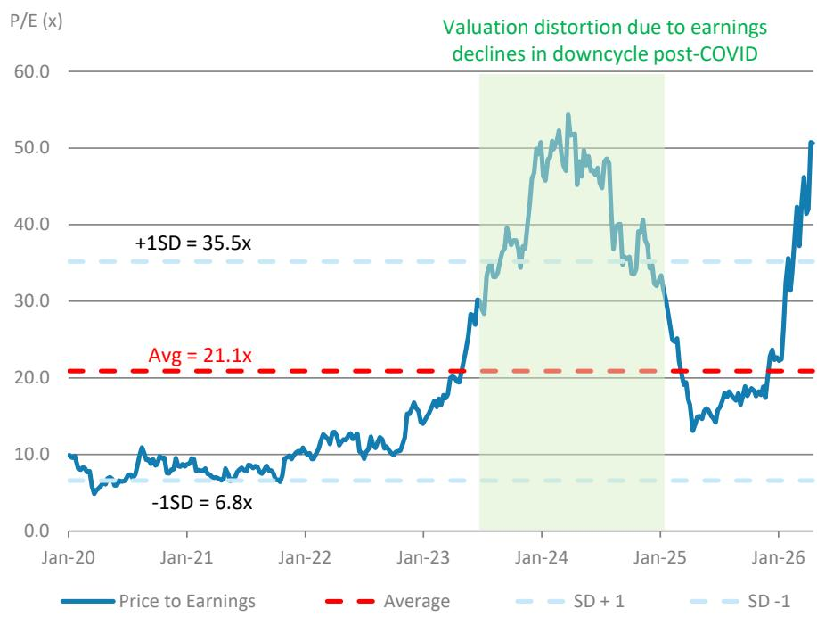  
Exhibit 16: Unimicron: P/E trend   
Source: Company data, Morgan Stanley Research estimates.

# Financials

Exhibit 17: Quarterly Earnings Estimates   

<table><tr><td>NT$mn</td><td>1Q25</td><td>2Q25</td><td>3Q25</td><td>4Q25</td><td>1Q26E</td><td>2Q26E</td><td>3Q26E</td><td>4Q26E</td><td>2025</td><td>2026E</td><td>2027E</td><td>2028E</td></tr><tr><td>Sales</td><td>30,090</td><td>32,466</td><td>33,994</td><td>34,691</td><td>37,446</td><td>40,171</td><td>44,075</td><td>47,554</td><td>131,241</td><td>169,246</td><td>221,316</td><td>279,329</td></tr><tr><td>Cost of goods sold</td><td>-26,063</td><td>-28,221</td><td>-29,446</td><td>-29,219</td><td>-31,095</td><td>-32.826</td><td>-35,452</td><td>-37,872</td><td>-112.949</td><td>-137,245</td><td>-168,945</td><td>-197,521</td></tr><tr><td>Gross profit</td><td>4,026</td><td>4,246</td><td>4,549</td><td>5,472</td><td>6,351</td><td>7,345</td><td>8,623</td><td>9,681</td><td>18,292</td><td>32,001</td><td>52,372</td><td>81,808</td></tr><tr><td>Operating expenses</td><td>-2,759</td><td>-2,736</td><td>-3,016</td><td>-3,106</td><td>-3,223</td><td>-3,279</td><td>-3,350</td><td>-3.382</td><td>-11,618</td><td>-13,234</td><td>-13,774</td><td>-14,142</td></tr><tr><td>Operating profit</td><td>1,267</td><td>1,509</td><td>1,533</td><td>2,366</td><td>3,128</td><td>4,067</td><td>5,273</td><td>6,299</td><td>6,674</td><td>18,767</td><td>38,597</td><td>67,666</td></tr><tr><td>Interest income (loss)</td><td>103</td><td>62</td><td>-7</td><td>25</td><td>25</td><td>25</td><td>25</td><td>25</td><td>183</td><td>100</td><td>100</td><td>100</td></tr><tr><td>Investment income (loss)</td><td>32</td><td>-13</td><td>-1</td><td>-10</td><td>20</td><td>20</td><td>20</td><td>20</td><td>8</td><td>80</td><td>80</td><td>80</td></tr><tr><td>Gains (Losses) from investment disposal</td><td>0</td><td>0</td><td>0</td><td>3</td><td>0</td><td>0</td><td>0</td><td>0</td><td>3</td><td>0</td><td></td><td>0</td></tr><tr><td>Gains from FAs disposal</td><td>3</td><td>337</td><td>-29</td><td>507</td><td>0</td><td>0</td><td>0</td><td>0</td><td>817</td><td>0</td><td>0 0</td><td>0</td></tr><tr><td>Exchange gain</td><td>452</td><td>-1,281</td><td>487</td><td>349</td><td>300</td><td>0</td><td>0</td><td>0</td><td>7</td><td>300</td><td></td><td>0</td></tr><tr><td>Others</td><td>-483</td><td>-257</td><td>964</td><td>910</td><td>450</td><td>450</td><td>450</td><td>450</td><td>1,134</td><td>1,800</td><td>2,000</td><td>2.000</td></tr><tr><td>Pre-tax profit</td><td>1,373</td><td>357</td><td>2,947</td><td>4,150</td><td>3,923</td><td>4,562</td><td>5,768</td><td>6,794</td><td>8,827</td><td>21,046</td><td>40,777</td><td>69,846</td></tr><tr><td>Net Income for Minority</td><td>9</td><td>231</td><td>256</td><td>381</td><td>381</td><td>381</td><td>381</td><td>381</td><td>877</td><td>1,525</td><td>1,525</td><td>1,525</td></tr><tr><td>Income tax</td><td>-450</td><td>-97</td><td>-496</td><td>-235</td><td>-804</td><td>-1,140</td><td>-1,269</td><td>-1,223</td><td>-1,277</td><td>-4,436</td><td>-8,587</td><td>-14,771</td></tr><tr><td>Net profit</td><td>915</td><td>30</td><td>2,194</td><td>3,535</td><td>2,737</td><td>3,040</td><td>4,117</td><td>5,190</td><td>6,673</td><td>15,084</td><td>30,665</td><td>53,550</td></tr><tr><td>EPS (NT$)</td><td>0.59</td><td>0.02</td><td>1.43</td><td>2.30</td><td>1.78</td><td>1.98</td><td>2.68</td><td>3.37</td><td>4.34</td><td>9.80</td><td>19.92</td><td>34.79</td></tr><tr><td>Margins (%)</td><td></td><td></td><td></td><td></td><td></td><td></td><td></td><td></td><td></td><td></td><td></td><td></td></tr><tr><td>Gross margin</td><td>13.4%</td><td>13.1%</td><td>13.4%</td><td>15.8%</td><td>17.0%</td><td>18.3%</td><td>19.6%</td><td>20.4%</td><td>13.9%</td><td>18.9%</td><td>23.7%</td><td>29.3%</td></tr><tr><td>Operating margin</td><td>4.2%</td><td>4.6%</td><td>4.5%</td><td>6.8%</td><td>8.4%</td><td>10.1%</td><td>12.0%</td><td>13.2%</td><td>5.1%</td><td>11.1%</td><td>17.4%</td><td>24.2%</td></tr><tr><td>Pre-tax margin</td><td>4.6%</td><td>1.1%</td><td>8.7%</td><td>12.0%</td><td>10.5%</td><td>11.4%</td><td>13.1%</td><td>14.3%</td><td>6.7%</td><td>12.4%</td><td>18.4%</td><td>25.0%</td></tr><tr><td>Net margin</td><td>3.0%</td><td>0.1%</td><td>6.5%</td><td>10.2%</td><td>7.3%</td><td>7.6%</td><td>9.3%</td><td>10.9%</td><td>5.1%</td><td>8.9%</td><td>13.9%</td><td>19.2%</td></tr><tr><td>QoQ Growth</td><td></td><td></td><td></td><td></td><td></td><td></td><td></td><td></td><td></td><td></td><td></td><td></td></tr><tr><td>Sales</td><td>2%</td><td>8%</td><td>5%</td><td>2%</td><td>8%</td><td>7%</td><td>10%</td><td>8%</td><td></td><td></td><td></td><td></td></tr><tr><td>Gross profit</td><td>18%</td><td>5%</td><td>7%</td><td>20%</td><td>16%</td><td>16%</td><td>17%</td><td>12%</td><td></td><td></td><td></td><td></td></tr><tr><td>Operating profit</td><td>86%</td><td>19%</td><td>2%</td><td>54%</td><td>32%</td><td>30%</td><td>30%</td><td>19%</td><td></td><td></td><td></td><td></td></tr><tr><td>Pre-tax profit</td><td>331%</td><td>-74%</td><td>726%</td><td>41%</td><td>-5%</td><td>16%</td><td>26%</td><td>18%</td><td></td><td></td><td></td><td></td></tr><tr><td>Net profit</td><td>1531%</td><td>-97%</td><td>7310%</td><td>61%</td><td>-23%</td><td>11%</td><td>35%</td><td>26%</td><td></td><td></td><td></td><td></td></tr><tr><td>YoY Growth</td><td></td><td></td><td></td><td></td><td></td><td></td><td></td><td></td><td></td><td></td><td></td><td></td></tr><tr><td>Sales</td><td>14%</td><td>16%</td><td>7%</td><td>18%</td><td>24%</td><td>24%</td><td>30%</td><td>37%</td><td>14%</td><td>29%</td><td>31%</td><td>26%</td></tr><tr><td>Gross profit</td><td>-6%</td><td>15%</td><td>-8%</td><td>61%</td><td>58%</td><td>73%</td><td>90%</td><td>77%</td><td>12%</td><td>75%</td><td>64%</td><td>56%</td></tr><tr><td>Operating profit</td><td>-20%</td><td>68%</td><td>-22%</td><td>248%</td><td>147%</td><td>169%</td><td>244%</td><td>166%</td><td>30%</td><td>181%</td><td>106%</td><td>75%</td></tr><tr><td>Pre-tax profit</td><td>-59%</td><td>-83% -98%</td><td>95% 120%</td><td>1201% 6204%</td><td>186%</td><td>1179% 199% 10168%</td><td>96% 88%</td><td>64% 47%</td><td>21% 31%</td><td>138% 126%</td><td>94% 103%</td><td>71% 75%</td></tr><tr><td>Net profit</td><td>-62%</td></table>

Source: Company data, Morgan Stanley Research (E) estimates.

Exhibit 18: Consolidated Financial Summary   
Income Statement   

<table><tr><td>NT$ mn;FY End Dec</td><td>2025</td><td>2026E</td><td>2027E</td><td>2028E</td></tr><tr><td>Net sales</td><td>131,241</td><td>169,246</td><td>221,316</td><td>279,329</td></tr><tr><td>Cost of goods sold</td><td>-112,949</td><td>-137,245</td><td>-168,945</td><td>-197,521</td></tr><tr><td>Gross profit</td><td>18,292</td><td>32,001</td><td>52,372</td><td>81,808</td></tr><tr><td>Operating expenses</td><td>-11,618</td><td>-13,234</td><td>-13,774</td><td>-14,142</td></tr><tr><td>Sales &amp; Marketing</td><td>-1,607</td><td>-1,827</td><td>-2,234</td><td>-2.601</td></tr><tr><td>G&amp;A</td><td>-5,012</td><td>-5,642</td><td>-5,568</td><td>-5,509</td></tr><tr><td>R&amp;D</td><td>-4,999</td><td>-5,765</td><td>-5,972</td><td>-6.032</td></tr><tr><td>Operating profit</td><td>6,674</td><td>18,767</td><td>38,597</td><td>67,666</td></tr><tr><td>Interest income</td><td>183</td><td>100</td><td>100</td><td>100</td></tr><tr><td>Investment income</td><td>8</td><td>80</td><td>80</td><td>80</td></tr><tr><td>Gains from investment disposal</td><td>3</td><td>0</td><td>0</td><td>0</td></tr><tr><td>Gains from fixed assets disposal</td><td>817</td><td>0</td><td>0</td><td>0</td></tr><tr><td>Exchange gain</td><td>7</td><td>300</td><td>0</td><td>0</td></tr><tr><td>Other non-operating income</td><td>1,134</td><td>1,800</td><td>2,000</td><td>2.000</td></tr><tr><td>Net non-operating profit</td><td>2,153</td><td>2,280</td><td>2,180</td><td>2,180</td></tr><tr><td>Pre-tax profit</td><td>8.827</td><td>21,046</td><td>40,777</td><td>69,846</td></tr><tr><td>Net Income for Minority</td><td>-877</td><td>-1,525</td><td>-1,525</td><td>-1,525</td></tr><tr><td>Income tax</td><td>-1,277</td><td>-4,436</td><td>-8,587</td><td>-14,771</td></tr><tr><td>Net profit</td><td>6,673</td><td>15,084</td><td>30,665</td><td>53,550</td></tr><tr><td>Reported EPS (NT$)</td><td>4.34</td><td>9.80</td><td>19.92</td><td>34.79</td></tr></table>

Balance Sheet   

<table><tr><td>NT$mn;FYEnd Dec</td><td>2025</td><td>2026E</td><td>2027E</td><td>2028E</td></tr><tr><td>Cash</td><td>54,872</td><td>73,442</td><td>118,845</td><td>178,363</td></tr><tr><td>Mkt Securities</td><td>38</td><td>38</td><td>38</td><td>38</td></tr><tr><td>AR/NR</td><td>27,570</td><td>35,554</td><td>46,492</td><td>58,679</td></tr><tr><td>Inventory</td><td>17,802</td><td>21,631</td><td>26,627</td><td>31,131</td></tr><tr><td>Others</td><td>5,016</td><td>6,468</td><td>8,458</td><td>10,675</td></tr><tr><td>Current Assets</td><td>105,298</td><td>137,134</td><td>200,461</td><td>278,887</td></tr><tr><td>Long-term Investments</td><td>836</td><td>836</td><td>836</td><td>836</td></tr><tr><td>Fixed Assets</td><td>125,866</td><td>129,690</td><td>122,379</td><td>115,623</td></tr><tr><td>Other Assets</td><td>23,792</td><td>23,792</td><td>23,792</td><td>23,792</td></tr><tr><td>Total Assets</td><td>255,792</td><td>291,452</td><td>347,468</td><td>419,139</td></tr><tr><td>S-t Borrowings</td><td>10,845</td><td>10,845</td><td>10,845</td><td>10,845</td></tr><tr><td>AP/NP</td><td>17,494</td><td>21,258</td><td>26,168</td><td>30,594</td></tr><tr><td>Other S-T Liabilities</td><td>47,115</td><td>57,251</td><td>70,474</td><td>82,394</td></tr><tr><td>Other LT Liabillties</td><td>38,457</td><td>49,593</td><td>64,851</td><td>81,850</td></tr><tr><td>L-t Debt</td><td>34,873</td><td>33,872</td><td>32,871</td><td>31,870</td></tr><tr><td>Total Liabilities</td><td>148,785</td><td>172,818</td><td>205,208</td><td>237,553</td></tr><tr><td>Common Shares</td><td>15,296</td><td>15,296</td><td>15,296</td><td>15,296</td></tr><tr><td>Other Shareholders&#x27; Equity</td><td>91,711</td><td>103,337</td><td>126,964</td><td>166,290</td></tr><tr><td>Total Equity</td><td>107,007</td><td>118,633</td><td>142,260</td><td>181,586</td></tr><tr><td>Total Liab./Shrhldr&#x27;s Equity</td><td>255,792</td><td>291,452</td><td>347,468</td><td>419,139</td></tr></table>

Source: Company data, Morgan Stanley Research (E) estimates.

Cash Flow Statement   

<table><tr><td>NT$mn;FY End Dec</td><td>2025</td><td>2026E</td><td>2027E</td><td>2028E</td></tr><tr><td>Cashflow from Operations</td><td>14,967</td><td>35,524</td><td>50,895</td><td>69,877</td></tr><tr><td>Net Profits</td><td>6,673</td><td>15.084</td><td>30,665</td><td>53,550</td></tr><tr><td>Depreciation</td><td>18,773</td><td>19,887</td><td>20,102</td><td>18,969</td></tr><tr><td>Investment losses (income)</td><td>0</td><td>-80</td><td>-80</td><td>-80</td></tr><tr><td>Investment Disposal Loss</td><td>-3</td><td>0</td><td>0</td><td>0</td></tr><tr><td>Change in Working Capital</td><td>-2,943</td><td>2.085</td><td>2,198</td><td>-344</td></tr><tr><td>Other adjustments</td><td>-7,533</td><td>-1,452</td><td>-1,990</td><td>-2,217</td></tr><tr><td>Cashflow from Investing</td><td>-23,018</td><td>-23,711</td><td>-12,791</td><td>-12,212</td></tr><tr><td>(Purchases) Sale of fixed asset</td><td>-24,307</td><td>-23,711</td><td>-12,791</td><td>-12,212</td></tr><tr><td>(Purchases) Sale of LT investment</td><td>-77</td><td>0</td><td>0</td><td>0</td></tr><tr><td>Other adjustments</td><td>1,367</td><td>0</td><td>0</td><td>0</td></tr><tr><td>Cashflow from financing</td><td>19,073</td><td>7,057</td><td>7,299</td><td>1,854</td></tr><tr><td>Increase in L-T debt</td><td>9,950</td><td>-1,001</td><td>-1,001</td><td>-1,001</td></tr><tr><td>Increase in S-T debt</td><td>4,331</td><td>0</td><td>0</td><td>0</td></tr><tr><td>Issuance of stock</td><td>0</td><td>0</td><td>0</td><td>0</td></tr><tr><td> Other adjustments</td><td>7,087</td><td>11,136</td><td>15,258</td><td>16,999</td></tr><tr><td>Exchange Rate Adjustment</td><td>96</td><td>-300</td><td>0</td><td>0</td></tr><tr><td>Net change in cash</td><td>11,118</td><td>18,570</td><td>45,403</td><td>59.519</td></tr></table>

Financial Ratios   

<table><tr><td></td><td>2025</td><td>2026E</td><td>2027E</td><td>2028E</td></tr><tr><td>Margins</td><td></td><td></td><td></td><td></td></tr><tr><td>Gross margin</td><td>13.9%</td><td>18.9%</td><td>23.7%</td><td>29.3%</td></tr><tr><td>Operating expenses/sales</td><td>-8.9%</td><td>-7.8%</td><td>-6.2%</td><td>-5.1%</td></tr><tr><td>Operating margin</td><td>5.1%</td><td>11.1%</td><td>17.4%</td><td>24.2%</td></tr><tr><td>Tax rate</td><td>14.5%</td><td>21.1%</td><td>21.1%</td><td>21.1%</td></tr><tr><td>Pre-tax margin</td><td>6.7%</td><td>12.4%</td><td>18.4%</td><td>25.0%</td></tr><tr><td>Net Margin</td><td>5.1%</td><td>8.9%</td><td>13.9%</td><td>19.2%</td></tr><tr><td>YoY Growth</td><td></td><td></td><td></td><td></td></tr><tr><td>Turnover</td><td>13.8%</td><td>29.0%</td><td>30.8%</td><td>26.2%</td></tr><tr><td>Gross Profit</td><td>12.1%</td><td>74.9%</td><td>63.7%</td><td>56.2%</td></tr><tr><td>Operating Profits</td><td>30.4%</td><td>181.2%</td><td>105.7%</td><td>75.3%</td></tr><tr><td>Pretax Profits</td><td>20.6%</td><td>138.4%</td><td>93.8%</td><td>71.3%</td></tr><tr><td>Net Profits</td><td>31.3%</td><td>126.0%</td><td>103.3%</td><td>74.6%</td></tr><tr><td>Adjusted Cash Dividend (NT$)</td><td>2.00</td><td></td><td></td><td></td></tr><tr><td>Net Debt/Equity</td><td>-8.6%</td><td>4.52</td><td>9.19 -52.8%</td><td>16.05</td></tr><tr><td>Liabilities/Equity</td><td>139.0%</td><td>-24.2%</td><td>144.2%</td><td>-74.7%</td></tr><tr><td>Liabilities/Assets</td><td></td><td>145.7%</td><td></td><td>130.8%</td></tr><tr><td></td><td>58.2%</td><td>59.3%</td><td>59.1%</td><td>56.7%</td></tr><tr><td>ROAE ROAA</td><td>6.5%</td><td>13.4%</td><td>23.5%</td><td>33.1%</td></tr><tr><td></td><td>2.7%</td><td>5.5%</td><td>9.6%</td><td>14.0%</td></tr><tr><td>A/R Tumover (days)</td><td>71.2</td><td>68.1</td><td>67.7</td><td>68.7</td></tr><tr><td>A/P Turnover (days)</td><td>52.7</td><td>51.5</td><td>51.2</td><td>52.4</td></tr><tr><td>Inventory Turnover (days)</td><td>52.8</td><td>52.4</td><td>52.1</td><td>53.4</td></tr><tr><td>Cash conversion (days)</td><td>71.3</td><td>69.0</td><td>68.6</td><td>69.6</td></tr></table>

# Risk Reward - UnimicroRisk Reward – Unimicron (3037.TW)

Price hikes and spec upgrades to support higher earnings estimates; OW

# NT\$785.00PRICE TARGET

Base case, residual income (RI) valuation model, which we think derives the most accurate value of the firm given that it takes into account cost of equity. We use a cost of equity of $9 . 2 \%$ [risk-free rate of $1 \%$ (10-year Taiwan government note yield), equity risk premium of $8 . 7 \%$ , and a beta of 1.0], a medium-term growth rate of $1 3 \% .$ and a terminal growth rate of $3 \%$ .

Consensus Price Target Distribution

NT\$400.00

Source: Re fi nitiv, Morgan Stanley Research

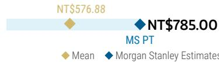

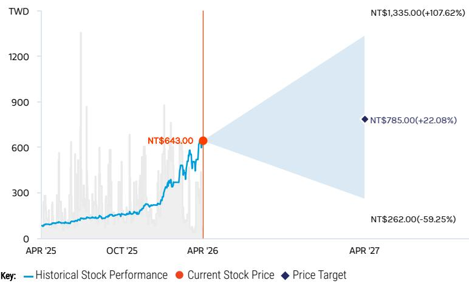  
RISK REWARD CHART   
Source: Re nitiv, Morgan Stanley Research

# OVERWEIGHT THESIS

We expect the ABF substrate market to revert to undersupply from 2027 onwards, with the undersupply gap reaching $5 . 7 0 \%$ by 2030.

▪ This is primarily driven by AI demand, with 04-20  next-gen AI/networking chips adopting larger body size ABF substrates.

▪ In the near to medium term, the short supply of T-glass will be a key watch point, but we believe this will mainly affect lowend ABF and BT substrates, as suppliers prioritize supply to the AI chip vendors.

▪ Our price target implies 39x 2027e P/E, above the $1 0 - 2 0 \times$ range at which it traded in the previous upcycle. We deem this fair, given AI chip substrate spec upgrades and suppliers' ability to raise prices.

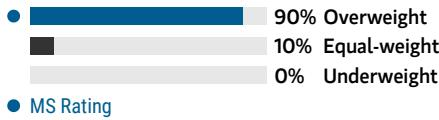  
Consensus Rating Distribution   
Source: Re nitiv, Morgan Stanley Research

# Risk Reward Themes

Pricing Power: Positive Secular Growth: Positive View descriptions of Risk Rewards Themes here

# BULL CASE

# NT\$1,335.00

# BASE CASE

# NT\$785.00

# BEAR CASE

NT\$262.00

67x 2027e P/E

Demand for AI servers, general servers and PCs is much stronger than expected: Pricing increases more than expected, $30 \% +$ in 2026-27, driving stronger margin expansion for Unimicron.

# 39x 2027e P/E

Entering up-cycle driven by AI chip upgrades: Robust demand for AI GPUs and ASICs, supported by continued data center infrastructure investments by ${ \mathsf { C S P S } }$ and neo cloud, leads to undersupply in the high-end ABF market from 2027e onwards. PC demand is sluggish, while general servers still show double-digit unit growth in 2026e. ASP has bottomed and started to in ect upwards, driven by raw material price hikes 报添加微信 LCDand substrate spec upgrades.

# 13x 2027e P/E

Demand for AI servers and general servers weakens, with PC demand weakening further: The result is greater ABF oversupply; thus, there are pricing declines of ${ \sim } 1 5 { - } 2 0 \%$ in 2026-27, leading to weaker margins for Unimicron over the next two years.

# Risk Reward – Unimicron (3037.TW)

KEY EARNINGS INPUTS   

<table><tr><td>Drivers</td><td>2025</td><td>2026e</td><td>2027e</td><td>2028e</td></tr><tr><td>IC substrate ASP YoY (%)</td><td>7.5</td><td>21.0</td><td>23.0</td><td>22.6</td></tr><tr><td> IC substrate GM (%)</td><td>15.2</td><td>21.1</td><td>26.9</td><td>33.6</td></tr></table>

# INVESTMENT DRIVERS

5G smartphone demand 5G base station demand Automotive demand

# GLOBAL REVENUE EXPOSURE

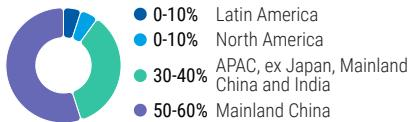  
Source: Morgan Stanley Research Estimate View explanation of regional hierarchies here

# MS ALPHA MODELS

<table><tr><td>4/5</td><td>3 Month</td></tr><tr><td>MOST</td><td>Horizon</td></tr></table>

Source: Re nitiv, FactSet, Morgan Stanley Research; 1 is 订阅the highest favored Quintile and 5 is the least favored Quintile

# RISKS TO PT/RATING

# RISKS TO UPSIDE

Better-than-expected ABF substrate demand from PC and server customers Capex cuts; halt to its capacity expansion plan Continued yield issues of alternative technology that doesn't require substrate (e.g., CoWoP)

# RISKS TO DOWNSIDE

Sudden demand shortfall   
Technological change that would not require ABF substrates   
Intensifying competition   
Yield issues or production hiccups when ramping new capacity

# OWNERSHIP POSITIONING

Inst. Owners, % Active $7 2 . 1 \%$

Source: Re nitiv, Morgan Stanley Research

# MS ESTIMATES VS. CONSENSUS

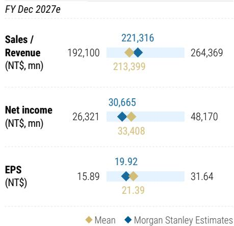  
Source: Re nitiv, Morgan Stanley Research

# NYPCB: Earnings Estimate Changes

Our 2026-28 earnings estimates increase $1 3 \%$ , $1 7 \%$ and $1 9 \%$ respectively, to reflect the higher price hike potential for ABF substrate and the substrate demand upside from server/networking chips.

Exhibit 19: Earnings Estimate Changes   

<table><tr><td></td><td colspan="3">2026E</td><td colspan="3">2027E</td><td colspan="3">2028E</td></tr><tr><td>NT$ mn</td><td>New</td><td>Old</td><td>Variance</td><td>New</td><td>Old</td><td>Variance</td><td>New</td><td>Old</td><td>Variance</td></tr><tr><td>Netsales</td><td>50,539</td><td>50,961</td><td>-1%</td><td>61,714</td><td>57,658</td><td>7%</td><td>78,592</td><td>70,659</td><td>11%</td></tr><tr><td>COGS</td><td>-43,127</td><td>-44,101</td><td>-2%</td><td>-49,010</td><td>-46,537</td><td>5%</td><td>-55,476</td><td>-50,928</td><td>9%</td></tr><tr><td>Gross profit</td><td>7,412</td><td>6,860</td><td>8%</td><td>12,704</td><td>11,121</td><td>14%</td><td>23,117</td><td>19,731</td><td>17%</td></tr><tr><td>Operating expenses</td><td>-1,825</td><td>-1,820</td><td>0%</td><td>-1,968</td><td>-1,918</td><td>3%</td><td>-2,154</td><td>-2,066</td><td>4%</td></tr><tr><td>Operating income</td><td>5,587</td><td>5,040</td><td>11%</td><td>10,737</td><td>9,203</td><td>17%</td><td>20,963</td><td>17,664</td><td>19%</td></tr><tr><td>Non-operating income</td><td>853</td><td>687</td><td>24%</td><td>753</td><td>687</td><td>10%</td><td>753</td><td>687</td><td>10%</td></tr><tr><td>Pre-tax income</td><td>6,440</td><td>5,727</td><td>12%</td><td>11,489</td><td>9,890</td><td>16%</td><td>21,715</td><td>18,351</td><td>18%</td></tr><tr><td>Income tax</td><td>-1,026</td><td>-915</td><td>12%</td><td>-1,830</td><td>-1,575</td><td>16%</td><td>-3,464</td><td>-2,927</td><td>18%</td></tr><tr><td>Net income</td><td>5,414</td><td>4,813</td><td>12%</td><td>9,659</td><td>8,315</td><td>16%</td><td>18,252</td><td>15,424</td><td>18%</td></tr><tr><td>EPS (NT$)</td><td>8.38</td><td>7.42</td><td>13%</td><td>14.95</td><td>12.82</td><td>17%</td><td>28.25</td><td>23.78</td><td>19%</td></tr><tr><td>Margins (%)</td><td></td><td></td><td>ppt</td><td></td><td></td><td>ppt</td><td></td><td></td><td>ppt</td></tr><tr><td>Gross margin</td><td>14.7%</td><td>13.5%</td><td>1.2</td><td>20.6%</td><td>19.3%</td><td>1.3</td><td>29.4%</td><td>27.9%</td><td>1.5</td></tr><tr><td>Operating margin</td><td>11.1%</td><td>9.9%</td><td>1.2</td><td>17.4%</td><td>16.0%</td><td>1.4</td><td>26.7%</td><td>25.0%</td><td>1.7</td></tr><tr><td>Pre-tax margin</td><td>12.7%</td><td>11.2%</td><td>1.5</td><td>18.6%</td><td>17.2%</td><td>1.5</td><td>27.6%</td><td>26.0%</td><td>1.7</td></tr><tr><td>Netmargin</td><td>10.7%</td><td>9.4%</td><td>1.3</td><td>15.7%</td><td>14.4%</td><td>1.2</td><td>23.2%</td><td>21.8%</td><td>1.4</td></tr></table>

Source: Morgan Stanley Research (E) estimates.

# Price target discussion and valuation methodology

Our price target increases $\sim6 5 \%$ to $N \tilde { \curlyeq } 8 5 0$ , on the back of our raised earnings estimates for CY26-28e as well as our increased medium-term growth assumption: We believe the company's earnings will return to a growth track from 2026 onwards and see stronger growth in 2027, driven by the high-end ABF substrate market's reversion to undersupply, NYPCB's dominant supply share for networking chips, and its proactive pricing strategy, which puts it in a favorable position to benefit from rising AI investments. We believe the overall ABF substrate market bottomed in 2H24, and growth will accelerate from 2H26 onwards with the ramp of multiple next-generation, large body size ABF substrates for new server GPUs, CPUs, ASICs and networking chips. New technologies, such as embedded passives and Intel's EMIB-T, will also increase the manufacturing complexity of the package substrates, which adds to the under-capacity as usable output decreases.

Similar to our analysis of other tech hardware companies within our coverage, we use a residual income (RI) valuation model to value NYPCB – we think it derives the most accurate value of the firm given that it takes into account cost of equity. Key assumptions:

Cost of equity of $9 . 3 \% \mathrm { : }$

添加微信 Risk-free rate of $7 \%$ CD123321Cad 04-20  (10-year Taiwan government note yield);

Equity risk premium of $8 . 7 \% ;$

Beta of 1.0;

Medium-term growth rate of $1 7 \%$ (from $12 \%$ previously) (fair given our analysis of the substrate market over the next couple of years);

Terminal growth rate of $3 \%$ (similar to the rest of the companies under our tech hardware coverage).

# Our bull and bear case values increase by similar magnitudes, to NT\$1,518 and NT $\$ 432$ , respectively.

Exhibit 20: Residual Income (RI) Model   

<table><tr><td></td><td>2027E</td><td></td><td>2028E</td><td>2029E</td><td>2030E</td><td>2031E</td><td>2032E</td><td>2033E</td><td>2034E</td><td>2035E</td><td>2036E</td><td>2037E</td></tr><tr><td>Total Equity</td><td></td><td>56,173</td><td>67,994</td><td>74,054</td><td>81,144</td><td>89,439</td><td>99,144</td><td>110,499</td><td>123,784</td><td>139,328</td><td>157,514</td><td>169,819</td></tr><tr><td>Net Profit</td><td></td><td>9,659</td><td>18,252</td><td>21,354</td><td>24,985</td><td>29,232</td><td>34,202</td><td>40,016</td><td>46,819</td><td>54,778</td><td>64,090</td><td>66,013</td></tr><tr><td>Return on Equity</td><td></td><td>18.2%</td><td>29.4%</td><td>30.1%</td><td>32.2%</td><td>34.3%</td><td>36.3%</td><td>38.2%</td><td>40.0%</td><td>41.6%</td><td>43.2%</td><td>40.3%</td></tr><tr><td>Beta</td><td>1.0</td><td>1.0</td><td>1.0</td><td>1.0</td><td>1.0</td><td>1.0</td><td>1.0</td><td>1.0</td><td>1.0</td><td>1.0</td><td>1.0</td><td>1.0</td></tr><tr><td>Equity Risk Premium (Rm-Rf)</td><td>8.7%</td><td>8.7%</td><td>8.7%</td><td>8.7%</td><td>8.7%</td><td>8.7%</td><td>8.7%</td><td>8.7%</td><td>8.7%</td><td>8.7%</td><td>8.7%</td><td>8.7%</td></tr><tr><td>Risk Free Rate (Rf)</td><td>1.0%</td><td>1.0%</td><td>1.0%</td><td>1.0%</td><td>1.0%</td><td>1.0%</td><td>1.0%</td><td>1.0%</td><td>1.0%</td><td>1.0%</td><td>1.0%</td><td>1.0%</td></tr><tr><td>Cost of Equity</td><td>9.3%</td><td>9.3%</td><td>9.3%</td><td>9.3%</td><td>9.3%</td><td>9.3%</td><td>9.3%</td><td>9.3%</td><td>9.3%</td><td>9.3%</td><td>9.3%</td><td>9.3%</td></tr><tr><td>Residual Income</td><td></td><td>4,466</td><td>11,310</td><td>14,145</td><td>16,983</td><td>20,294</td><td>24,156</td><td>28,664</td><td>33,927</td><td>40,074</td><td>47,256</td><td>48,939</td></tr><tr><td>Spread</td><td></td><td>8.9%</td><td>20.1%</td><td>20.8%</td><td>22.9%</td><td>25.0%</td><td>27.0%</td><td>28.9%</td><td>30.7%</td><td>32.4%</td><td>33.9%</td><td>31.1%</td></tr><tr><td></td><td></td><td></td><td></td><td></td><td></td><td></td><td></td><td></td><td></td><td></td><td></td><td></td></tr><tr><td>Beginning Equity Capital</td><td></td><td>56,173</td><td></td><td></td><td></td><td></td><td></td><td></td><td></td><td></td><td></td><td></td></tr><tr><td>PV of Forecast Period</td><td></td><td>161,254</td><td></td><td></td><td></td><td></td><td></td><td></td><td></td><td></td><td></td><td></td></tr><tr><td>PV of Continuing Value</td><td></td><td>331,795</td><td></td><td></td><td></td><td></td><td></td><td></td><td></td><td></td><td></td><td></td></tr><tr><td>Equity Value</td><td>549,222</td><td></td><td></td><td></td><td></td><td></td><td></td><td></td><td></td><td></td><td></td><td></td></tr><tr><td>No. of Shares Projected Price</td><td></td><td>646 850.0</td><td></td><td></td><td></td><td></td><td></td><td></td><td></td><td></td><td></td><td></td></tr></table>

Source: Morgan Stanley Research (E) estimates.

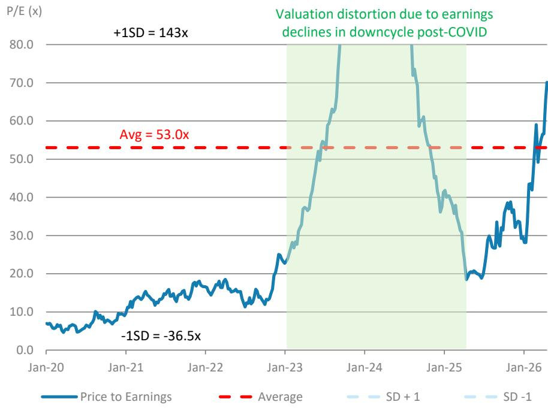  
Exhibit 21: NYPCB: P/E chart   
Source: TEJ, Morgan Stanley Research estimates.

# Financials

Exhibit 22: Quarterly Estimates   

<table><tr><td></td><td>1Q25</td><td>2Q25</td><td>3Q25</td><td>4Q25</td><td>1Q26E</td><td>2Q26E</td><td>3Q26E</td><td>4Q26E</td><td>2025</td><td>2026E</td><td>2027E</td><td>2028E</td></tr><tr><td>Net sales</td><td>8,458</td><td>9,583</td><td>10,967</td><td>11,165</td><td>11,177</td><td>12,302</td><td>13,296</td><td>13,763</td><td>40,173</td><td>50,539</td><td>61,714</td><td>78,592</td></tr><tr><td>COGS</td><td>(8.028)</td><td>(8,814)</td><td>(9,918)</td><td>(9,766)</td><td>(9,672)</td><td>(10,605)</td><td>(11,287)</td><td>(11,562)</td><td>(36,526)</td><td>(43,127)</td><td>(49,010)</td><td>(55,476)</td></tr><tr><td>Gross profit</td><td>430</td><td>769</td><td>1,050</td><td>1,398</td><td>1,505</td><td>1,697</td><td>2,009</td><td>2,201</td><td>3,647</td><td>7,412</td><td>12,704</td><td>23,117</td></tr><tr><td>Operating expenses</td><td>(397)</td><td>(403)</td><td>(429)</td><td>(435)</td><td>(439)</td><td>(452)</td><td>(465)</td><td>(468)</td><td>(1,665)</td><td>(1,825)</td><td>(1,968)</td><td>(2,154)</td></tr><tr><td>SG&amp;A</td><td>(397)</td><td>(403)</td><td>(429)</td><td>(435)</td><td>(439)</td><td>(452)</td><td>(465)</td><td>(468)</td><td>(1,665)</td><td>(1,825)</td><td>(1,968)</td><td>(2,154)</td></tr><tr><td>R&amp;D</td><td>0</td><td>0</td><td>0</td><td>0</td><td>0</td><td>0</td><td>0</td><td>0</td><td>0</td><td>0</td><td>0</td><td>0</td></tr><tr><td>Operating income</td><td>33</td><td>366</td><td>620</td><td>963</td><td>1,066</td><td>1,245</td><td>1,544</td><td>1,733</td><td>1,982</td><td>5,587</td><td>10,737</td><td>20,963</td></tr><tr><td>Non-operating income</td><td>223</td><td>(593)</td><td>287</td><td>446</td><td>288</td><td>176</td><td>193</td><td>196</td><td>363</td><td>853</td><td>753</td><td>753</td></tr><tr><td>Interest income</td><td>45</td><td>47</td><td>19</td><td>34</td><td>34</td><td>34</td><td>34</td><td>34</td><td>144</td><td>134</td><td>134</td><td>134</td></tr><tr><td>Investment income</td><td>5</td><td>(8)</td><td>9</td><td>12</td><td>5</td><td>(8)</td><td>9</td><td>12</td><td>18</td><td>18</td><td>18 0</td><td>18</td></tr><tr><td>Disposal of investment</td><td>0</td><td>0</td><td>0</td><td>0</td><td>0</td><td>0</td><td>0</td><td>0</td><td>0</td><td>0</td><td></td><td>0</td></tr><tr><td>Exchange gain</td><td>124</td><td>(699)</td><td>167</td><td>249</td><td>100</td><td>0</td><td>0</td><td>0</td><td>(158)</td><td>100</td><td>0</td><td>0</td></tr><tr><td>Other</td><td>49</td><td>67</td><td>91</td><td>151</td><td>150</td><td>150</td><td>150</td><td>150</td><td>358</td><td>600</td><td>600</td><td>600</td></tr><tr><td>Pre-tax income</td><td>256</td><td>(227)</td><td>907</td><td>1,409</td><td>1,355</td><td>1,420</td><td>1,736</td><td>1,928</td><td>2.346</td><td>6,440</td><td>11,489</td><td>21,715</td></tr><tr><td>Income tax</td><td>(49)</td><td>39</td><td>(182)</td><td>(207)</td><td>(203)</td><td>(256)</td><td>(278)</td><td>(289)</td><td>(399)</td><td>(1,026)</td><td>(1,830)</td><td>(3,464)</td></tr><tr><td>Minority interest</td><td>0</td><td>0</td><td>0</td><td>0</td><td>0</td><td>0</td><td>0</td><td>0</td><td>0</td><td>0</td><td>0</td><td>0</td></tr><tr><td>Net income</td><td>207</td><td>(187)</td><td>725</td><td>1,202</td><td>1,151</td><td>1,165</td><td>1,459</td><td>1,639</td><td>1,947</td><td>5,414</td><td>9,659</td><td>18,252</td></tr><tr><td>Adj.wtd.avg.shrs (mn)</td><td>646</td><td>646</td><td>646</td><td>646</td><td>646</td><td>646</td><td>646</td><td>646</td><td>646</td><td>646</td><td>646</td><td>646</td></tr><tr><td>EPS</td><td>0.32</td><td>(0.29)</td><td>1.12</td><td>1.86</td><td>1.78</td><td>1.80</td><td>2.26</td><td>2.54</td><td>3.01</td><td>8.38</td><td>14.95</td><td>28.25</td></tr><tr><td>Fully Diluted shares (mn)</td><td>646</td><td>646</td><td>646</td><td>646</td><td>646</td><td>646</td><td>646</td><td>646</td><td>646</td><td>646</td><td>646</td><td>646</td></tr><tr><td>Diluted EPS (NT$)</td><td>0.32</td><td>(0.29)</td><td>1.12</td><td>1.86</td><td>1.78</td><td>1.80</td><td>2.26</td><td>2.54</td><td>3.01</td><td>8.38</td><td>14.95</td><td>28.25</td></tr><tr><td>Margins (%)</td><td></td><td></td><td></td><td></td><td></td><td></td><td></td><td></td><td></td><td></td><td></td><td></td></tr><tr><td>Gross Margin</td><td>5.1</td><td>8.0</td><td>9.6</td><td>12.5</td><td>13.5</td><td>13.8</td><td>15.1</td><td>16.0</td><td>9.1</td><td>14.7</td><td>20.6</td><td>29.4</td></tr><tr><td>Operating Margin</td><td>0.4</td><td>3.8</td><td>5.7</td><td>8.6</td><td>9.5</td><td>10.1</td><td>11.6</td><td>12.6</td><td>4.9</td><td>11.1</td><td>17.4</td><td>26.7</td></tr><tr><td>Pretax Margin</td><td>3.0</td><td>(2.4)</td><td>8.3</td><td>12.6</td><td>12.1</td><td>11.5</td><td>13.1</td><td>14.0</td><td>5.8</td><td>12.7</td><td>18.6</td><td>27.6</td></tr><tr><td>Net Margin</td><td>2.5</td><td>(2.0)</td><td>6.6</td><td>10.8</td><td>10.3</td><td>9.5</td><td>11.0</td><td>11.9</td><td>4.8</td><td>10.7</td><td>15.7</td><td>23.2</td></tr><tr><td>QoQ Growth (%)</td><td></td><td></td><td></td><td></td><td></td><td></td><td></td><td></td><td></td><td></td><td></td><td></td></tr><tr><td>Sales</td><td>7</td><td>13</td><td>14</td><td>2</td><td>0</td><td>10</td><td>8</td><td>4</td><td></td><td></td><td></td><td></td></tr><tr><td>Gross Profit</td><td>2,441</td><td>79</td><td>37</td><td>33</td><td>8</td><td>13</td><td>18</td><td>10</td><td></td><td></td><td></td><td></td></tr><tr><td>Operating Profit</td><td>NM</td><td>10</td><td>69</td><td>55</td><td>11</td><td>17</td><td>24</td><td>12</td><td></td><td></td><td></td><td></td></tr><tr><td>Pretax Profit</td><td>63</td><td>-188</td><td>NM</td><td>55</td><td>-4</td><td>5</td><td>22</td><td>11</td><td></td><td></td><td></td><td></td></tr><tr><td>Net Profit</td><td>16</td><td>-190</td><td>NM</td><td>66</td><td>-4</td><td>1</td><td>25</td><td>12</td><td></td><td></td><td></td><td></td></tr><tr><td>YoY Growth (%) Sales</td><td></td></table>

Source: Company data, Morgan Stanley Research (E) estimates.

Exhibit 23: Consolidated Financial Summary   
Consolidated Income Statement   

<table><tr><td>NT$mn (Year End Dec 31)</td><td>2025</td><td>2026E</td><td>2027E</td><td>2028E</td></tr><tr><td>Net sales</td><td>40,173</td><td>50,539</td><td>61,714</td><td>78,592</td></tr><tr><td>COGS</td><td>(36,526)</td><td>(43,127)</td><td>(49,010)</td><td>(55,476)</td></tr><tr><td>Gross profit</td><td>3,647</td><td>7,412</td><td>12,704</td><td>23,117</td></tr><tr><td>Operating expenses</td><td>(1,665)</td><td>(1,825)</td><td>(1,968)</td><td>(2,154)</td></tr><tr><td>Operating income</td><td>1,982</td><td>5,587</td><td>10,737</td><td>20,963</td></tr><tr><td>Non-operating income</td><td>363</td><td>853</td><td>753</td><td>753</td></tr><tr><td>Interest income</td><td>144</td><td>134</td><td>134</td><td>134</td></tr><tr><td>Investment income</td><td>18</td><td>18</td><td>18</td><td>18</td></tr><tr><td>Disposal of investment</td><td>-</td><td>-</td><td>-</td><td>-</td></tr><tr><td>Exchange gain</td><td>(158)</td><td>100</td><td>-</td><td>-</td></tr><tr><td>Other</td><td>358</td><td>600</td><td>600</td><td>600</td></tr><tr><td>Pre-tax income</td><td>2,346</td><td>6,440</td><td>11,489</td><td>21,715</td></tr><tr><td>Income tax</td><td>(399)</td><td>(1,026)</td><td>(1,830)</td><td>(3,464)</td></tr><tr><td>Minority interests</td><td>-</td><td>-</td><td>-</td><td>-</td></tr><tr><td>Net income</td><td>1,947</td><td>5,414</td><td>9,659</td><td>18,252</td></tr><tr><td>Adj. wtd. Avg. shrs (m)</td><td>646</td><td>646</td><td>646</td><td>646</td></tr><tr><td>Reported EPS (NT$)</td><td>3.01</td><td>8.38</td><td>14.95</td><td>28.25</td></tr><tr><td>Diluted shrs (m)</td><td>646</td><td>646</td><td>646</td><td>646</td></tr><tr><td>Diluted EPS(NT$)</td><td>3.01</td><td>8.38</td><td>14.95</td><td>28.25</td></tr></table>

Consolidated Balance Sheet   

<table><tr><td>NT$mn (Year End Dec 31)</td><td>2025</td><td>2026E</td><td>2027E</td><td>2028B</td></tr><tr><td>Cash</td><td>8,590</td><td>15,579</td><td>24,025</td><td>37,590</td></tr><tr><td>Mkt securities</td><td>117</td><td>117</td><td>117</td><td>117</td></tr><tr><td>AR/NR</td><td>9,552</td><td>12,017</td><td>14,674</td><td>18,688</td></tr><tr><td>Inventory</td><td>5,068</td><td>5,983</td><td>6.800</td><td>7,697</td></tr><tr><td>Others</td><td>296</td><td>373</td><td>455</td><td>580</td></tr><tr><td>Current Assets</td><td>23,623</td><td>34,069</td><td>46,071</td><td>64,671</td></tr><tr><td>Long-term investments</td><td>500</td><td>500</td><td>500</td><td>500</td></tr><tr><td>Fixed assets</td><td>35,373</td><td>32,266</td><td>29,666</td><td>27,477</td></tr><tr><td>Other assets</td><td>1,711</td><td>1,711</td><td>1,711</td><td>1,711</td></tr><tr><td>Total Assets</td><td>61,207</td><td>68,547</td><td>77,949</td><td>94,360</td></tr><tr><td>S/T borrowings</td><td>-</td><td>·</td><td>-</td><td>·</td></tr><tr><td>AP/NP</td><td>1,711</td><td>2,020</td><td>2,296</td><td>2,598</td></tr><tr><td>Other ST liabilities</td><td>5,478</td><td>6,468</td><td>7,350</td><td>8.320</td></tr><tr><td>Total Current Liabilities</td><td>7,189</td><td>8,488</td><td>9,646</td><td>10,918</td></tr><tr><td>L/T debt</td><td>·</td><td>-</td><td>-</td><td>·</td></tr><tr><td>Other LT libilities</td><td>7,896</td><td>9,933</td><td>12,130</td><td>15,447</td></tr><tr><td>Total Liabilities</td><td>15,085</td><td>18,421</td><td>21,775</td><td>26,365</td></tr><tr><td>Common shares</td><td>6,462</td><td>6,462</td><td>6,462</td><td>6,462</td></tr><tr><td>Retained Earnings</td><td>13,031</td><td>17,034</td><td>23,081</td><td>34,902</td></tr><tr><td>Other SH&#x27; Equity</td><td>26,630</td><td>26,630</td><td>26,630</td><td>26,630</td></tr><tr><td>Total Shareholders&#x27; Equity</td><td>46,123</td><td>50,126</td><td>56,173</td><td>67,994</td></tr><tr><td>Total Liab./SH&#x27;s Equity</td><td>61,207</td><td>68,547</td><td>77,949</td><td>94,360</td></tr></table>

Consolidated Cash Flow Statement   

<table><tr><td>NT$mn (Year End Dec 31)</td><td>2025</td><td>2026E</td><td>2027E</td><td>2028E</td></tr><tr><td>Operating Cashflow</td><td>3,027</td><td>9,251</td><td>12,728</td><td>19,514</td></tr><tr><td>Net Profits</td><td>1,947</td><td>5,414</td><td>9,659</td><td>18,252</td></tr><tr><td>Depreciation &amp; Amort.</td><td>6,894</td><td>6,013</td><td>5,485</td><td>5.043</td></tr><tr><td>Investment losses/(income)</td><td>(18)</td><td>(18)</td><td>(18)</td><td>(18)</td></tr><tr><td>Working capital change</td><td>12,615</td><td>(2,081)</td><td>(2,316)</td><td>(3,638)</td></tr><tr><td>Other adjustments</td><td>(18,410)</td><td>(76)</td><td>(82)</td><td>(124)</td></tr><tr><td>Investing Cashflow</td><td>(1,723)</td><td>(2,906)</td><td>(2,885)</td><td>(2,854)</td></tr><tr><td>Capex</td><td>(2,422)</td><td>(3,000)</td><td>(3,000)</td><td>(3,000)</td></tr><tr><td>Change of L/T investment</td><td>0</td><td>0</td><td>0</td><td>0</td></tr><tr><td>Change of S/T investment</td><td>0</td><td>0</td><td>0</td><td>0</td></tr><tr><td>Other adjustments</td><td>625</td><td>0</td><td>0</td><td>0</td></tr><tr><td>Financing Cashflow</td><td>(887)</td><td>745</td><td>(1,397)</td><td>(3,095)</td></tr><tr><td>Increase in L/T debt</td><td>0</td><td>0</td><td>0</td><td>0</td></tr><tr><td>Increase in S/T debt</td><td>0</td><td>0</td><td>0</td><td>0</td></tr><tr><td>Issuance of stock</td><td>0</td><td>(0)</td><td>0</td><td>0</td></tr><tr><td>Cash dividends</td><td>(646)</td><td>(1,292)</td><td>(3,594)</td><td>(6,412)</td></tr><tr><td>Other adjustments</td><td>(241)</td><td>2,037</td><td>2,197</td><td>3,317</td></tr><tr><td>FX adjustment</td><td>(309)</td><td>(100)</td><td>0</td><td>0</td></tr><tr><td>Net change in cash</td><td>109</td><td>6,990</td><td>8,445</td><td>13,565</td></tr></table>

Consolidated Financial Ratios   

<table><tr><td></td><td>2025</td><td>2026E</td><td>2027E</td><td>2028E</td></tr><tr><td>Margins (%)</td><td></td><td></td><td></td><td></td></tr><tr><td>Gross margin</td><td>9.1</td><td>14.7</td><td>20.6</td><td>29.4</td></tr><tr><td>Operating margin</td><td>4.9</td><td>11.1</td><td>17.4</td><td>26.7</td></tr><tr><td>Pretax margin</td><td>5.8</td><td>12.7</td><td>18.6</td><td>27.6</td></tr><tr><td>Net margin</td><td>4.8</td><td>10.7</td><td>15.7</td><td>23.2</td></tr><tr><td>YoY growth (%)</td><td></td><td></td><td></td><td></td></tr><tr><td>Sales</td><td>24.4</td><td>25.8</td><td>22.1</td><td>27.3</td></tr><tr><td>Operating profits</td><td>NM</td><td>181.8</td><td>92.2</td><td>95.2</td></tr><tr><td>Pretax profits</td><td>1,338.4</td><td>174.6</td><td>78.4</td><td>89.0</td></tr><tr><td>Net profits</td><td>855.6</td><td>178.1</td><td>78.4</td><td>89.0</td></tr><tr><td>Others</td><td></td><td></td><td></td><td></td></tr><tr><td>Cash dividend payout (%)</td><td>66%</td><td>66%</td><td>66%</td><td>66%</td></tr><tr><td>Cash div (NT$)</td><td>2.00</td><td>5.56</td><td>9.92</td><td>18.75</td></tr><tr><td>Yield (%)</td><td>0%</td><td>1%</td><td>1%</td><td>3%</td></tr><tr><td>Net Debt/Equity (%)</td><td>-19%</td><td>-31%</td><td>-43%</td><td>-55%</td></tr><tr><td>Liabilities/Equity (%)</td><td>33%</td><td>37%</td><td>39%</td><td>39%</td></tr><tr><td>Liabilities/Assets (%)</td><td>25%</td><td>27%</td><td>28%</td><td>28%</td></tr><tr><td>ROAE(%)</td><td>4%</td><td>11%</td><td>18%</td><td>29%</td></tr><tr><td>ROAA (%)</td><td>3%</td><td>8%</td><td>13%</td><td>21%</td></tr><tr><td>AR/NR Turnover (days)</td><td>75</td><td>78</td><td>79</td><td>77</td></tr><tr><td>Inventory Turnover (days)</td><td>46</td><td>47</td><td>48</td><td>48</td></tr><tr><td>AP/NP Turnover (days)</td><td>16</td><td>16</td><td>16</td><td>16</td></tr><tr><td>Cash conversion cycle</td><td>105</td><td>109</td><td>110</td><td>109</td></tr></table>

# Risk Reward - Nan Ya PCRisk Reward – Nan Ya PCB (8046.TW)

Price hikes and spec upgrades to support higher earnings estimates; OW

# NT\$850.00PRICE TARGET

Base case, residual income (RI) valuation model, which we think derives the most accurate value of the firm given that it takes into account cost of equity. We use a cost of equity of $9 . 3 \%$ [risk-free rate of $1 \%$ (10-year Taiwan government note yield), equity risk premium of $8 . 7 \%$ , and a beta of 1.0], a medium-term growth rate of $1 7 \%$ and a terminal growth rate of $3 \%$ .

Consensus Price Target Distribution

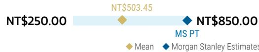

Source: Re fi nitiv, Morgan Stanley Research

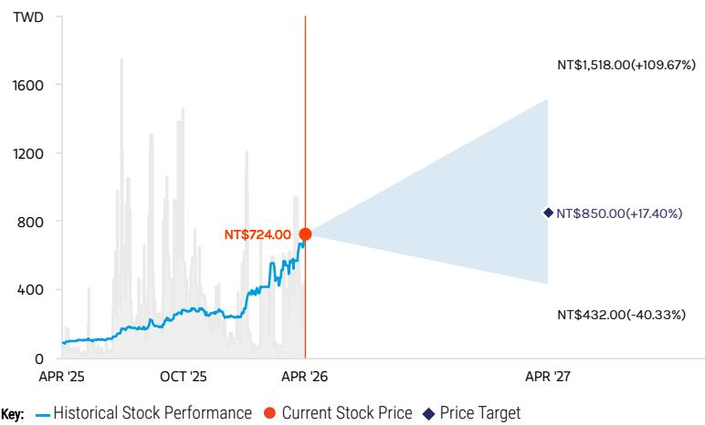  
RISK REWARD CHART   
Source: Re nitiv, Morgan Stanley Research

# OVERWEIGHT THESIS

▪ Price hikes for BT and ABF substrates, driven by raw material cost increases, will likely drive margin improvement for NYPCB.

▪ We believe the ABF substrate market will become undersupplied again from 2027 onwards, driven by AI demand, with nextgen AI/networking chips adopting large - body size ABF substrates.

▪ NYPCB should bene fit from ABF substrate structural tailwinds as well - rising data traf c, big data analysis, AI/ML, and 5G.

▪ Our price target implies 57x 2027e P/E or 29x 2028e P/E, above the 10-30x range in which it traded in the previous upcycle. We deem this fair given ABF substrate spec upgrades and suppliers' ability to raise prices.

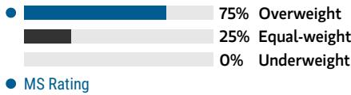  
Consensus Rating Distribution   
Source: Re nitiv, Morgan Stanley Research

# Risk Reward Themes

Pricing Power: Positive Secular Growth: Positive View descriptions of Risk Rewards Themes here

# BULL CASE

# NT\$1,518.00

# BASE CASE

# NT\$850.00

# BEAR CASE

NT\$432.00

# 100x 2027e P/E

BT price increases further in 1H26, and ABF becomes undersupplied faster than expected (current expectation is from 2027e onwards), driving even stronger margin expansion for Nan Ya PCB.

# 57x 2027e P/E

Entering up-cycle driven by AI chip upgrades: Robust demand for AI GPUs/ASICs and networking chips, supported by continued data center infrastructure investments by CSPs and neo cloud, leads to undersupply in the high-end ABF market from 2027e onwards. PC demand is sluggish, while general servers still show double-digit unit growth in 2026e. ASP has bottomed and started to in ect upwards, driven by 报添加微信 LCD123321Craw material price hikes and substrate spec upgrades.

# 29x 2027e P/E

ABF demand weakens further, resulting in greater oversupply in the next few years. Thus, ABF pricing decreases $20 \%$ or more in 2026-27e, leading to weaker margins for Nan Ya PCB.

# Risk Reward – Nan Ya PCB (8046.TW)

KEY EARNINGS INPUTS   

<table><tr><td>Drivers</td><td>2025</td><td>2026e</td><td>2027e</td><td>2028e</td></tr><tr><td>ABF ASP y/y (%)</td><td>9.6</td><td>12.2</td><td>13.4</td><td>19.7</td></tr><tr><td>ABF GM (%)</td><td>15.1</td><td>20.1</td><td>27.3</td><td>37.3</td></tr></table>

# INVESTMENT DRIVERS

5G smartphone demand 5G base station demand Automotive demand

# GLOBAL REVENUE EXPOSURE

  
Source: Morgan Stanley Research Estimate View explanation of regional hierarchies here

# MS ALPHA MODELS

<table><tr><td colspan="2"></td></tr><tr><td>4/5</td><td>3 Month</td></tr><tr><td>MOST</td><td>Horizon</td></tr></table>

Source: Re nitiv, FactSet, Morgan Stanley Research; 1 is 订阅the highest favored Quintile and 5 is the least favored Quintile

# RISKS TO PT/RATING

# RISKS TO UPSIDE

Better-than-expected ABF and BT demand   
Faster-than-expected pickup in AI and 5G demand   
Stronger-than-expected ASP hike   
Continued yield issues of alternative technology that doesn't require substrate (e.g. CoWoP)

# RISKS TO DOWNSIDE

A sudden demand shortfall, creating headwinds for ABF substrate demand and pricing   
Technological change that would not require ABF substrates   
Intensifying competition

# OWNERSHIP POSITIONING

Inst. Owners, % Active $5 1 . 9 \%$

Source: Re nitiv, Morgan Stanley Research

# MS ESTIMATES VS. CONSENSUS

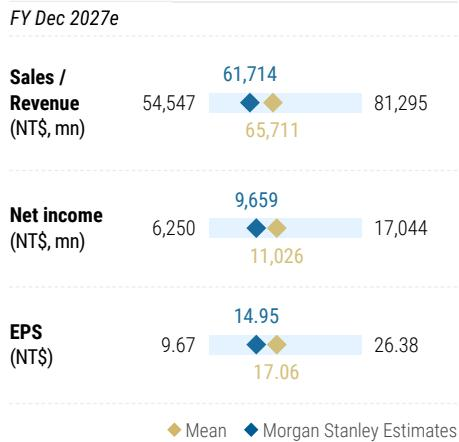  
Source: Re nitiv, Morgan Stanley Research

# Zhen Ding: Earnings Estimate Changes

We fine-tune our model, which lowers our CY26e EPS estimate by $7 \%$ but raises our CY27e EPS estimate by $3 \%$ . The differences between net profit changes and EPS changes are owing to share count changes.

We also introduce our CY28e earnings estimates.

Exhibit 24: Earnings Estimate Changes   

<table><tr><td></td><td>2026E</td><td>A</td><td>3</td><td></td><td>2027E</td><td></td><td>2028E</td></tr><tr><td>NT$mn</td><td>New</td><td>Old</td><td>Variance</td><td>New</td><td>Old</td><td>Variance</td><td>New</td></tr><tr><td>Net sales</td><td>206,610</td><td>209,959</td><td>-2%</td><td>236,615</td><td>234,744</td><td>1%</td><td>272,169</td></tr><tr><td>COGS</td><td>-164,180</td><td>-166,565</td><td>-1%</td><td>-184,585</td><td>-183,767</td><td>0%</td><td>-208,309</td></tr><tr><td>Gross profit</td><td>42,430</td><td>43,394</td><td>-2%</td><td>52,031</td><td>50,978</td><td>2%</td><td>63,860</td></tr><tr><td>Operating expenses</td><td>-24,604</td><td>-24,972</td><td>-1%</td><td>-27,279</td><td>-27,280</td><td>0%</td><td>-30,387</td></tr><tr><td>Operating income</td><td>17,826</td><td>18,422</td><td>-3%</td><td>24,752</td><td>23,697</td><td>4%</td><td>33,472</td></tr><tr><td>Non-operating income</td><td>2,029</td><td>1,460</td><td>39%</td><td>1,529</td><td>1,460</td><td>5%</td><td>1,529</td></tr><tr><td>Pre-tax income</td><td>19,855</td><td>19,881</td><td>0%</td><td>26,281</td><td>25,157</td><td>4%</td><td>35,002</td></tr><tr><td>Net income</td><td>11,511</td><td>11,532</td><td>0%</td><td>15,220</td><td>14,589</td><td>4%</td><td>20,275</td></tr><tr><td>EPS (NT$)</td><td>11.71</td><td>11.85</td><td>-1%</td><td>15.48</td><td>14.99</td><td>3%</td><td>20.63</td></tr><tr><td>Margins (%)</td><td></td><td></td><td>ppt</td><td></td><td></td><td>ppt</td><td></td></tr><tr><td>Gross margin</td><td>20.5%</td><td>20.7%</td><td>-0.1</td><td>22.0%</td><td>21.7%</td><td>0.3</td><td>23.5%</td></tr><tr><td>Operating margin</td><td>8.6%</td><td>8.8%</td><td>-0.1</td><td>10.5%</td><td>10.1%</td><td>0.4</td><td>12.3%</td></tr><tr><td>Pre-tax margin</td><td>9.6%</td><td>9.5%</td><td>0.1</td><td>11.1%</td><td>10.7%</td><td>0.4</td><td>12.9%</td></tr><tr><td>Net margin</td><td>5.6%</td><td>5.5%</td><td>0.1</td><td>6.4%</td><td>6.2%</td><td>0.2</td><td>7.4%</td></tr></table>

Source: Morgan Stanley Research (E) estimates.

# Price Target Discussion and Valuation Methodology

Our base-case value/price target increases to NT\$250 (from NT\$145), on the back of the introduction of our CY28e earnings estimates and the increase in our medium-term growth assumption for the RI model: It is derived from our multistage residual income (RI) model. We use the company's beginning equity plus the present value of all expected residual income of earnings in excess of the cost of capital.

We use the company's beginning equity plus the present value of all expected residual income of earnings in excess of the cost of capital. The RI is positive when ROAE is above the cost of capital and negative when it is below the cost of capital. We assume a cost of equity of $1 0 \% _ { \ i }$ , a medium-term growth rate of $9 \%$ (raised from $5 \%$ previously) and a terminal growth rate of $3 \%$ .

The increase in our medium-term growth rate assumption for Zhen Ding is primarily driven by growing opportunities and project wins for its ABF substrates, AI server HDIs and optical module mSAP PCB. However, with the stock trading at $2 2 \times 2 0 2 6 \mathrm { e } \ : \mathsf { P } / \mathsf { E }$ or $1 7 \times 2 0 2 7 \mathrm { e }$ 添加微信 LCD123321Cad 04-20 P/E, we find the valuation insufficiently attractive vs. its past three-year P/E average $+ 7 5 \mathsf { D }$ of $_ { 1 5 . 6 \times }$ .

Our bull- and bear-case values also increase by similar magnitudes to NT\$355 and NT \$145, respectively.

Exhibit 25: Residual Income (RI) Model   

<table><tr><td>NT$ mn</td><td>2026E</td><td>2027E</td><td>2028E</td><td>2029E</td><td>2030E</td><td>2031E</td><td>2032E</td><td>2033E</td><td>2034E</td><td>2035E</td><td>2036E</td></tr><tr><td>Total Equity</td><td>178,885</td><td>188,931</td><td>202,365</td><td>214,639</td><td>228.018</td><td>242,601</td><td>258,497</td><td>275,823</td><td>294,708</td><td>315,293</td><td>337,730</td></tr><tr><td>Core Net Profit</td><td>11,511</td><td>15,220</td><td>20,275</td><td>22,100</td><td>24,089</td><td>26,257</td><td>28,620</td><td>31,196</td><td>34,003</td><td>37,063</td><td>40,399</td></tr><tr><td>Retum on Equity</td><td></td><td>6.7% 8.5%</td><td>10.7%</td><td>10.9%</td><td>11.2%</td><td>11.5%</td><td>11.8%</td><td>12.1%</td><td>12.3%</td><td>12.6%</td><td>12.8%</td></tr><tr><td>Beta (Last 60 Mths)</td><td>1.20 6%</td><td></td><td></td><td></td><td></td><td></td><td></td><td></td><td></td><td></td><td></td></tr><tr><td>Equity Risk Premium (Rm-Rf) Risk Free Rate (Rf)</td><td>3%</td><td></td><td></td><td></td><td></td><td></td><td></td><td></td><td></td><td></td><td></td></tr><tr><td>Cost of Equity</td><td>10%</td><td></td><td></td><td></td><td></td><td></td><td></td><td></td><td></td><td></td><td></td></tr><tr><td>Terminal Growth Rate</td><td>3%</td><td></td><td></td><td></td><td></td><td></td><td></td><td></td><td></td><td></td><td></td></tr><tr><td>Continuing Value Spread</td><td>-2%</td><td></td><td></td><td></td><td></td><td></td><td></td><td></td><td></td><td></td><td></td></tr><tr><td>Medium-term growth rate</td><td>9.0%</td><td></td><td></td><td></td><td></td><td></td><td></td><td></td><td></td><td></td><td></td></tr><tr><td>Residual Income</td><td></td><td>-2,132</td><td>1,949</td><td>2,470</td><td>3,269</td><td>4,139</td><td>5,087</td><td>6,121</td><td>7,248</td><td>8,477</td><td>9.816</td></tr><tr><td>Spread</td><td></td><td>-3% -1%</td><td>1%</td><td>1%</td><td>2%</td><td>2%</td><td>2%</td><td>2%</td><td>3%</td><td>3%</td><td>3%</td></tr><tr><td>Beginning Equity Capital</td><td>178,885</td><td></td><td></td><td></td><td></td><td></td><td></td><td></td><td></td><td></td><td></td></tr><tr><td>PV of Forecast Period</td><td></td><td>19,578</td><td></td><td></td><td></td><td></td><td></td><td></td><td></td><td></td><td></td></tr><tr><td>PV of Continuing Value</td><td></td><td>47,270</td><td></td><td></td><td></td><td></td><td></td><td></td><td></td><td></td><td></td></tr><tr><td>Equity Value</td><td>245,733</td><td></td><td></td><td></td><td></td><td></td><td></td><td></td><td></td><td></td><td></td></tr><tr><td>No. of Shares</td><td></td><td>983</td><td></td><td></td><td></td><td></td><td></td><td></td><td></td><td></td><td></td></tr><tr><td>Projected Price (EoY)</td><td></td><td>250.0</td><td></td><td></td><td></td><td></td><td></td><td></td><td></td><td></td><td></td></tr><tr><td></td><td></td><td></td><td></td><td></td><td></td><td></td><td></td><td></td><td></td><td></td><td></td></tr></table>

添加微信 LCD123321Cad 04-20 Source: Morgan Stanley Research (E) estimates.

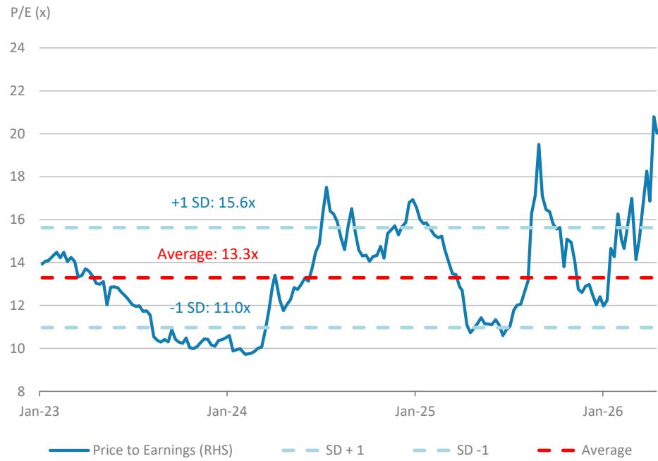  
Exhibit 26: Zhen Ding's Three-year P/E Chart   
Source: TEJ, Morgan Stanley Research (E) estimates.

# Financials

Exhibit 27: Quarterly Earnings Estimates   

<table><tr><td>NT$mn</td><td>1Q25</td><td>2Q25</td><td>3Q25</td><td>4Q25</td><td>1Q26E</td><td>2Q26E</td><td>3Q26E</td><td>4Q26E</td><td></td><td>2025</td><td>2026E 2027E</td><td></td><td>2028E</td></tr><tr><td>Sales</td><td>40,082</td><td>38,203</td><td>47,366</td><td>56,870</td><td>40,728</td><td></td><td>44,438</td><td>57,789</td><td>63,655</td><td>182,522</td><td>206,610</td><td>236,615</td><td>272,169</td></tr><tr><td>COGS</td><td>-34,197</td><td>-31,193</td><td>-36,956</td><td>-44,040</td><td>-33,556</td><td>-36,732</td><td></td><td>-44,753</td><td>-49,140</td><td>-146,385</td><td>-164,180</td><td>-184,585</td><td>-208.309</td></tr><tr><td>Gross profit</td><td>5,885</td><td>7,011</td><td>10,410</td><td>12,830</td><td>7,172</td><td>7,706</td><td></td><td>13,037</td><td>14,515</td><td>36,136</td><td>42,430</td><td>52,031</td><td>63,860</td></tr><tr><td>Operating expenses</td><td>-4,829</td><td>-4,586</td><td>-5,880</td><td>-6,909</td><td>-5,062</td><td>-5,299</td><td></td><td>-6,854</td><td>-7,388</td><td>-22.205</td><td>-24,604</td><td>-27,279</td><td>-30,387</td></tr><tr><td>- Promotion</td><td>-486</td><td>-493</td><td>-630</td><td>-744</td><td>-493</td><td></td><td>-573</td><td>-768</td><td>-833</td><td>-2.352</td><td>-2,667</td><td>-3,055</td><td>-3,514</td></tr><tr><td>- ADM</td><td>-1,781</td><td>-1,483</td><td>-2,270</td><td>-2,512</td><td>-1,991</td><td></td><td>-1,811</td><td>-2,631</td><td>-2,671</td><td>-8,046</td><td>-9,104</td><td>-10,090</td><td>-11,217</td></tr><tr><td>-R&amp;D</td><td>-2,563</td><td>-2,611</td><td>-2,981</td><td>-3,653</td><td>-2,578</td><td>-2,915</td><td></td><td>-3,455</td><td>-3,885</td><td>-11,807</td><td>-12,832</td><td>-14,134</td><td>-15,657</td></tr><tr><td>Operating profit</td><td>1,056</td><td>2,425</td><td>4,530</td><td>5,921</td><td>2,110</td><td>2,407</td><td></td><td>6,182</td><td>7,127</td><td>13,932</td><td>17,826</td><td>24,752</td><td>33,472</td></tr><tr><td>Non-operating income</td><td>401</td><td>-153</td><td>131</td><td>-248</td><td></td><td>795</td><td>345</td><td>445</td><td>445</td><td>131</td><td>2,029</td><td>1,529</td><td>1,529</td></tr><tr><td>Interest income</td><td>119</td><td>91</td><td>49</td><td>95</td><td></td><td>95</td><td>95</td><td>95</td><td>95</td><td>355</td><td>379</td><td>379</td><td>379</td></tr><tr><td>Investment income</td><td>-97</td><td>203</td><td>242</td><td>53</td><td></td><td>50</td><td>100</td><td>200</td><td>200</td><td>401</td><td>550</td><td>550</td><td>550</td></tr><tr><td>Disposal of investment</td><td>0</td><td>0</td><td>0</td><td></td><td></td><td>0</td><td>0</td><td>0</td><td>0</td><td>0</td><td>0</td><td>0</td><td>0</td></tr><tr><td>Disposal of fixed assets</td><td>16</td><td>58</td><td>-258</td><td>-102</td><td></td><td>0</td><td>0</td><td>0</td><td>0</td><td>-286</td><td>0</td><td>0</td><td>0</td></tr><tr><td>Exchange gain</td><td>103</td><td>-103</td><td>0</td><td></td><td>500</td><td></td><td>0</td><td>0</td><td>0</td><td>0</td><td>500</td><td>0</td><td>0</td></tr><tr><td>Other</td><td>259</td><td>-401</td><td>98</td><td>-294</td><td>150</td><td></td><td>150</td><td>150</td><td>150</td><td>-338</td><td>600</td><td>600</td><td>600</td></tr><tr><td>Pre-tax profit</td><td>1,457</td><td>2,272</td><td>4,661</td><td>5,673</td><td>2,905</td><td></td><td>2,752</td><td>6,627</td><td>7,572</td><td>14,063</td><td>19,855</td><td>26,281</td><td>35,002</td></tr><tr><td>Income tax</td><td>-431</td><td>-885</td><td>-1,072</td><td>-1,070</td><td>-291</td><td></td><td>-605</td><td>-1,246</td><td>-909</td><td>-3,458</td><td>-3,050</td><td>-4,059</td><td>-5,399</td></tr><tr><td>Net profit</td><td>632</td><td>605</td><td>2.392</td><td>3,161 3.22</td><td>1,825</td><td></td><td>1,398</td><td>3,580</td><td>4,708</td><td>6,791</td><td>11,511</td><td>15,220</td><td>20,275</td></tr><tr><td>EPS (NT$)</td><td>0.66</td><td>0.63</td><td>2.46</td><td></td><td>1.86</td><td></td><td>1.42</td><td>3.64</td><td>4.79</td><td>6.91</td><td>11.71</td><td>15.48</td><td>20.63</td></tr><tr><td>Margins</td><td></td><td></td><td></td><td></td><td></td><td></td><td></td><td></td><td></td><td></td><td></td><td></td><td></td></tr><tr><td>Gross margin</td><td>15%</td><td>18%</td><td>22%</td><td>23%</td><td>18%</td><td></td><td>17%</td><td>23%</td><td>23%</td><td>20%</td><td>21%</td><td>22%</td><td>23%</td></tr><tr><td>Operating margin</td><td>3%</td><td>6%</td><td>10%</td><td>10%</td><td>5%</td><td></td><td>5%</td><td>11%</td><td>11%</td><td>8%</td><td>9%</td><td>10%</td><td>12%</td></tr><tr><td>Pre-tax margin Net margin</td><td>4%</td><td>6%</td><td>10%</td><td>10%</td><td>7%</td><td></td><td>6%</td><td>11%</td><td>12%</td><td>8%</td><td>10%</td><td>11%</td><td>13%</td></tr><tr><td></td><td>2%</td><td>2%</td><td>5%</td><td>6%</td><td>4%</td><td></td><td>3%</td><td>6%</td><td>7%</td><td>4%</td><td>6%</td><td>6%</td><td>7%</td></tr><tr><td>QoQ Growth</td><td></td><td></td><td></td><td></td><td></td><td></td><td></td><td></td><td></td><td></td><td></td><td></td><td></td></tr><tr><td>Sales</td><td>-29%</td><td>-5%</td><td>24%</td><td>20%</td><td>-28%</td><td></td><td>9%</td><td>30%</td><td>10%</td><td></td><td></td><td></td><td></td></tr><tr><td>Gross profit</td><td>-49%</td><td>19%</td><td>48%</td><td>23%</td><td>-44%</td><td></td><td>7%</td><td>69%</td><td>11%</td><td></td><td></td><td></td><td></td></tr><tr><td>Operating profit</td><td>-81%</td><td>130%</td><td>87%</td><td>31%</td><td>-64%</td><td></td><td>14%</td><td>157%</td><td>15%</td><td></td><td></td><td></td><td></td></tr><tr><td>Pre-tax profit Net profit</td><td>-81%</td><td>56%</td><td>105%</td><td>22%</td><td>-49%</td><td></td><td>-5%</td><td>141%</td><td>14%</td><td></td><td></td><td></td><td></td></tr><tr><td></td><td>-86%</td><td>-4%</td><td>295%</td><td>32%</td><td>-42%</td><td>-23%</td><td></td><td>156%</td><td>32%</td><td></td><td></td><td></td><td></td></tr><tr><td>YoY Growth Sales</td></table>

Source: Company data, Morgan Stanley Research (E) estimates.

# Exhibit 28: Consolidated Financial Summary

Income Statement   

<table><tr><td>NT$mn</td><td>2025</td><td>2026E</td><td>2027E</td><td>2028E</td></tr><tr><td>Net sales</td><td>182,522</td><td>206,610</td><td>236,615</td><td>272,169</td></tr><tr><td>COGS</td><td>-146,385</td><td>-164,180</td><td>-184,585</td><td>-208.309</td></tr><tr><td>Gross profit</td><td>36,136</td><td>42,430</td><td>52,031</td><td>63,860</td></tr><tr><td>Operating expenses</td><td>-22.205</td><td>-24,604</td><td>-27,279</td><td>-30,387</td></tr><tr><td>- Promotion</td><td>-2.352</td><td>-2,667</td><td>-3,055</td><td>-3,514</td></tr><tr><td>- ADM</td><td>-8,046</td><td>-9,104</td><td>-10,090</td><td>-11,217</td></tr><tr><td>-R&amp;D</td><td>-11,807</td><td>-12,832</td><td>-14,134</td><td>-15,657</td></tr><tr><td>Operating income</td><td>13,932</td><td>17,826</td><td>24,752</td><td>33,472</td></tr><tr><td>Non-operating income</td><td>131</td><td>2,029</td><td>1,529</td><td>1,529</td></tr><tr><td>Interest income</td><td>355</td><td>379</td><td>379</td><td>379</td></tr><tr><td>Investment income</td><td>401</td><td>550</td><td>550</td><td>550</td></tr><tr><td>Disposal of investment</td><td>0</td><td>0</td><td>0</td><td>0</td></tr><tr><td>Disposal of fixed assets</td><td>-286</td><td>0</td><td>0</td><td>0</td></tr><tr><td>Exchange gain</td><td>0</td><td>500</td><td>0</td><td>0</td></tr><tr><td>Other</td><td>-338</td><td>600</td><td>600</td><td>600</td></tr><tr><td>Pre-tax income</td><td>14,063</td><td>19,855</td><td>26,281</td><td>35.002</td></tr><tr><td>Income tax</td><td>-7,272</td><td>-8,344</td><td>-11,062</td><td>-14,727</td></tr><tr><td>Net income</td><td>6,791</td><td>11,511</td><td>15,220</td><td>20,275</td></tr><tr><td>EPS(NT$)</td><td>6.91</td><td>11.71</td><td>15.48</td><td>20.63</td></tr></table>

Cash Flow Statement   

<table><tr><td>NT$ mn</td><td>2025</td><td>2026E</td><td>2027E</td><td>2028E</td></tr><tr><td>Cashflowfromoperations</td><td>27,617</td><td>18,085</td><td>20,204</td><td>24,025</td></tr><tr><td>Net Profits</td><td>10,605</td><td>11,511</td><td>15,220</td><td>20,275</td></tr><tr><td>Depreciation</td><td>18,552</td><td>8,044</td><td>7,088</td><td>6,222</td></tr><tr><td>Equity investment losses (income)</td><td>0</td><td>-550</td><td>-550</td><td>-550</td></tr><tr><td>Other adjustments</td><td>-1,541</td><td>-921</td><td>-1,553</td><td>-1,922</td></tr><tr><td>Cashflow from investing</td><td>-31,960</td><td>-30,000</td><td>-10,000</td><td>-10,000</td></tr><tr><td>(Purchases) sale of FA (capex)</td><td>-32,673</td><td>-30,000</td><td>-10.000</td><td>-10.000</td></tr><tr><td>(Purchases) sale of L/T investment</td><td>342</td><td>0</td><td>0</td><td>0</td></tr><tr><td>(Purchases) sale of S/T investment</td><td>-601</td><td>0</td><td>0</td><td>0</td></tr><tr><td>Other adjustments</td><td>972</td><td>0</td><td>0</td><td>0</td></tr><tr><td>Cashflow from financing</td><td>-1,865</td><td>-3,339</td><td>-5,174</td><td>-6,841</td></tr><tr><td>Increase in L/T debt</td><td>6,344</td><td>0</td><td>0</td><td>0</td></tr><tr><td>Increase in S/T debt</td><td>2,191</td><td>0</td><td>0</td><td>0</td></tr><tr><td>Issuance of stock</td><td>730</td><td>0</td><td>0</td><td>0</td></tr><tr><td>Cash dividends</td><td>-7,221</td><td>-3,391</td><td>-5,174</td><td>-6,841</td></tr><tr><td>Dir.&amp; Emp. Bonus</td><td>0</td><td>0</td><td>0</td><td>0</td></tr><tr><td>Changes in Treasury Stocks</td><td>288</td><td>52</td><td>0</td><td>0</td></tr><tr><td>Other adjustments</td><td>-4,196</td><td>0</td><td>0</td><td>0</td></tr><tr><td>Exchange rate adjustment</td><td>-2,177</td><td>0</td><td>0</td><td>0</td></tr><tr><td>Net change in cash</td><td>-8.386</td><td>-15,254</td><td>5.031</td><td>7,185</td></tr></table>

Balance Sheet   

<table><tr><td>NT$mn</td><td>2025</td><td>2026E</td><td>2027E</td><td>2028E</td></tr><tr><td>Cash</td><td>71,116</td><td>55,862</td><td>60,893</td><td>68,078</td></tr><tr><td>Mkt securities</td><td>36</td><td>36</td><td>36</td><td>36</td></tr><tr><td>Accounts/Notes receivables</td><td>31,412</td><td>35,558</td><td>40,722</td><td>46,841</td></tr><tr><td>Inventory</td><td>19,616</td><td>22,001</td><td>24,735</td><td>27,914</td></tr><tr><td>Other current assets</td><td>5,460</td><td>5,460</td><td>5,460</td><td>5,460</td></tr><tr><td>Current Assets</td><td>127,641</td><td>118,918</td><td>131,846</td><td>148,329</td></tr><tr><td>Long-term investments</td><td>9,866</td><td>10,416</td><td>10,966</td><td>11,516</td></tr><tr><td>Fixed assets</td><td>123,737</td><td>145,693</td><td>148,605</td><td>152,383</td></tr><tr><td>Other assets</td><td>18,799</td><td>18,799</td><td>18,799</td><td>18,799</td></tr><tr><td>Total Assets</td><td>280,043</td><td>293,825</td><td>310,216</td><td>331,027</td></tr><tr><td>S/T borrowings</td><td>23.839</td><td>23,839</td><td>23,839</td><td>23,839</td></tr><tr><td>AP/NP</td><td>23,501</td><td>26,358</td><td>29,634</td><td>33,443</td></tr><tr><td>Other ST liabilities</td><td>25,481</td><td>28,234</td><td>31,303</td><td>34,871</td></tr><tr><td>Other liabilities</td><td>21,151</td><td>21,151</td><td>21,151</td><td>21,151</td></tr><tr><td>L/T debt</td><td>15,359</td><td>15,359</td><td>15,359</td><td>15,359</td></tr><tr><td>Total Liabilities</td><td>109,330</td><td>114,940</td><td>121,285</td><td>128,662</td></tr><tr><td>Common shares</td><td>10,706</td><td>10,706</td><td>10,706</td><td>10,706</td></tr><tr><td>Capital Collection</td><td>0</td><td>0</td><td>0</td><td>0</td></tr><tr><td>APIC</td><td>52.902</td><td>52,902</td><td>52,902</td><td>52,902</td></tr><tr><td>Retained earmings</td><td>61,549</td><td>69,669</td><td>79,715</td><td>93,150</td></tr><tr><td>Treasury Stock</td><td>-52</td><td>0</td><td>0</td><td>0</td></tr><tr><td>Other shareholders&#x27; equity</td><td>45607</td><td>45607</td><td>45607</td><td>45607</td></tr><tr><td>Shareholders&#x27;equity</td><td>170,713</td><td>178,885</td><td>188,931</td><td>202,365</td></tr><tr><td>Total Liab./Shrhldr&#x27;s Equity</td><td>280,043</td><td>293,825</td><td>310,216</td><td>331,027</td></tr></table>

Source: Company data, Morgan Stanley Research (E) estimates.

Financial Ratios   

<table><tr><td></td><td>2025</td><td>2026E</td><td>2027E</td><td>2028E</td></tr><tr><td>Margins</td><td></td><td></td><td></td><td></td></tr><tr><td>Gross margin</td><td>19.8%</td><td>20.5%</td><td>22.0%</td><td>23.5%</td></tr><tr><td>Operating margin</td><td>7.6%</td><td>8.6%</td><td>10.5%</td><td>12.3%</td></tr><tr><td>Pretax margin</td><td>7.7%</td><td>9.6%</td><td>11.1%</td><td>12.9%</td></tr><tr><td>Net margin</td><td>3.7%</td><td>5.6%</td><td>6.4%</td><td>7.4%</td></tr><tr><td>YoY growth</td><td></td><td></td><td></td><td></td></tr><tr><td>Sales</td><td>6.3%</td><td>13.2%</td><td>14.5%</td><td>15.0%</td></tr><tr><td>Operating profits</td><td>20.2%</td><td>28.0%</td><td>38.9%</td><td>35.2%</td></tr><tr><td>Pretax profits</td><td>-6.5%</td><td>41.2%</td><td>32.4%</td><td>33.2%</td></tr><tr><td>Net profits</td><td>-26.0%</td><td>69.5%</td><td>32.2%</td><td>33.2%</td></tr><tr><td>EPS</td><td>-28.6%</td><td>69.5%</td><td>32.2%</td><td>33.2%</td></tr><tr><td>Net Debt/Equity (Net of mkt secs.)</td><td>-19%</td><td>-9%</td><td>-12%</td><td>-14%</td></tr><tr><td>Net Debt/Equity</td><td>-19%</td><td>-9%</td><td>-11%</td><td>-14%</td></tr><tr><td>Liabilities/Equity</td><td>64%</td><td>64%</td><td>64%</td><td>64%</td></tr><tr><td>Liabilities/Assets</td><td>39%</td><td>39%</td><td>39%</td><td>39%</td></tr><tr><td>ROAE</td><td>4.2%</td><td>6.6%</td><td>8.3%</td><td>10.4%</td></tr><tr><td>ROAA</td><td>2.5%</td><td>4.0%</td><td>5.0%</td><td>6.3%</td></tr><tr><td>AR/NR Turnover (days)</td><td>62</td><td>59</td><td>59</td><td>59</td></tr><tr><td>AP/NP Tumover (days)</td><td>56</td><td>55</td><td>55</td><td>55</td></tr><tr><td>Inventory Turnover (days)</td><td>47</td><td>46</td><td>46</td><td>46</td></tr><tr><td>Cash conversion cycle (days)</td><td>52</td><td>50</td><td>50</td><td>50</td></tr></table>

# Risk Reward - Zhen DinRisk Reward – Zhen Ding (4958.TW)

Bene ciary of FPCB share gains, but valuation keeps us at EW

# NT\$250.00PRICE TARGET

# EQUAL-WEIGHT THESIS

Base case, residual income model. Key assumptions include a cost of equity of $1 0 \%$ , a medium-term growth rate of $9 \%$ and a terminal growth rate of $3 \%$ .

Consensus Price Target Distribution

Source: Re fi nitiv, Morgan Stanley Research ▪ Volumes are likely to be flat to up LSD y/y in 2026e, but pricing remains the swing factor.

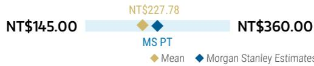

▪ Depreciation expense should continue to rise in 2026, with new fabs coming online 04-20 for ABF and RPCB (HDI). Management also expects capex to trend up y/y again in 2026.

▪ Shenzhen ABF fab 1 continues to ramp, and fab 2 is on track to enter mass production in 2026. New ABF production lines in Kaohsiung started trial production at year-end 2025, and will ramp in 2026.

▪ We expect increasing macro uncertainties to have a negative impact on consumer spending, which will eventually weigh on pricing and margins of component suppliers like Zhen Ding.

▪ We nd valuation stretched vs. our fiimplied target P/E.

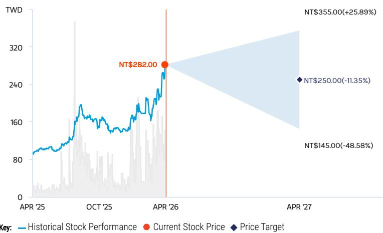  
RISK REWARD CHART   
Source: Re nitiv, Morgan Stanley Research

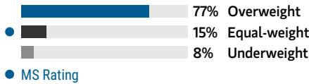  
Consensus Rating Distribution   
Source: Re nitiv, Morgan Stanley Research

# Risk Reward Themes

Pricing Power: Negative View descriptions of Risk Rewards Themes here

# BULL CASE

# NT\$355.00

# BASE CASE

# NT\$250.00

# BEAR CASE

NT\$145.00

# 23x 2027e P/E

Greater share gains and better earnings contribution from new projects such as ABF: Earnings grow meaningfully, led primarily by better utilization for F-PCB and yield rate for SLP, while ZDT also shows fast growth in BT substrate and ABF substrates thanks to better-than-expected yield and execution.

16x 2027e P/E

Stable demand for F-PCB and SLP, with share gains in BT substrates but skeptical on ABF: Zhen Ding maintains steady shipments of F-PCB and SLP for Apple's products, while gaining share in ABF/BT substrates at the expense of ASP and margins.

9x 2027e P/E

Weaker iPhone demand with share loss and low ABF yield rate: iPhone demand misses market expectations, Zhen Ding loses share in F-PCB to Chinese peers, and SLP demand is also weak. BT fails to continue to grow, while low yield rates for ABF lead to signi cant losses for Zhen Ding.

# Lotes: Earnings Estimate Changes

Our 2026e and 2027e EPS estimates increase $5 \%$ and ${ 1 0 \% } ,$ respectively, reflecting higher CPU volume assumptions. We also introduce our 2028e earnings estimates.

Exhibit 29: Earnings Estimate Changes   

<table><tr><td rowspan="2">NT$mn</td><td colspan="2">2026e</td><td colspan="3">2027e</td><td colspan="2">2028e</td></tr><tr><td>New</td><td>Old</td><td>Variance</td><td>New</td><td>Old</td><td>Variance</td><td>New</td></tr><tr><td>Net sales</td><td>41,065</td><td>40,068</td><td>2%</td><td>46,554</td><td>43,951</td><td>6%</td><td>54,672</td></tr><tr><td>COGS</td><td>-19,713</td><td>-19,323</td><td>2%</td><td>-22,387</td><td>-21,439</td><td>4%</td><td>-26,110</td></tr><tr><td>Gross profit</td><td>21,352</td><td>20,745</td><td>3%</td><td>24,168</td><td>22,512</td><td>7%</td><td>28,562</td></tr><tr><td>Operating expenses</td><td>-7,448</td><td>-7,400</td><td>1%</td><td>-7,636</td><td>-7,538</td><td>1%</td><td>-8,204</td></tr><tr><td>Operating income</td><td>13,905</td><td>13,345</td><td>4%</td><td>16,532</td><td>14,973</td><td>10%</td><td>20,358</td></tr><tr><td>Non-operating income</td><td>1,258</td><td>1,141</td><td>10%</td><td>1,108</td><td>1,141</td><td>-3%</td><td>1,108</td></tr><tr><td>Pre-tax income</td><td>15,162</td><td>14,486</td><td>5%</td><td>17,640</td><td>16,114</td><td>9%</td><td>21,466</td></tr><tr><td>Income tax</td><td>-3,444</td><td>-3,292</td><td>5%</td><td>-3,915</td><td>-3,576</td><td>9%</td><td>-4,732</td></tr><tr><td>Net income</td><td>11,638</td><td>11,114</td><td>5%</td><td>13,645</td><td>12,458</td><td>10%</td><td>16,654</td></tr><tr><td>EPS (NT$)</td><td>103.83</td><td>99.18</td><td>5%</td><td>121.74</td><td>111.17</td><td>10%</td><td>148.59</td></tr><tr><td>Margins (%)</td><td></td><td></td><td>ppt</td><td></td><td></td><td>ppt</td><td></td></tr><tr><td>Gross margin</td><td>52.0%</td><td>51.8%</td><td>0.2</td><td>51.9%</td><td>51.2%</td><td>0.7</td><td>52.2%</td></tr><tr><td>Operating margin</td><td>33.9%</td><td>33.3%</td><td>0.6</td><td>35.5%</td><td>34.1%</td><td>1.4</td><td>37.2%</td></tr><tr><td>Pre-tax margin</td><td>36.9%</td><td>36.2%</td><td>0.8</td><td>37.9%</td><td>36.7%</td><td>1.2</td><td>39.3%</td></tr><tr><td>Netmargin</td><td>28.3%</td><td>27.7%</td><td>0.6</td><td>29.3%</td><td>28.3%</td><td>1.0</td><td>30.5%</td></tr></table>

Source: Morgan Stanley Research (E) estimates.

# Price Target Discussion and Valuation Methodology

Our price target increase \~51% to $N T \$ 2,400$ (from NT\$1,585), driven by: (1) our raised earnings estimates for CY26-27, (2) the introduction of our CY28 earnings estimates, and 添加微信 LCD123321Cad 04-20 (3) the increase in our medium-term growth assumption (from $1 7 \%$ to $1 2 . 5 \%$ ).

Our new price target implies 20x 2026e P/E or 16.8x 2027e P/E, only slightly above its three-year average forward P/E of \~16x, but still below that of peer Amphenol (30-35x 2026e P/E, based on consensus). We think the stock could re-rate to the high teens if margins hold up well and Lotes' AI PC and AI server exposures grow in coming years.

Our price target, which is our base case scenario value, is derived from a residual income model (RIM), similar to that for the rest of our tech hardware coverage universe. To calculate the intrinsic value of the stock, we use the company's beginning equity plus the present value of all expected residual income of earnings in excess of the cost of capital. The RI is positive when ROAE is above the cost of capital and negative when it is below the cost of capital.

Our key RIM assumptions include a cost of equity of $9 . 6 \%$ (beta of 1.0, equity risk premium of $8 . 7 \%$ and risk-free rate of $1 . 0 \%$ ), a medium-term growth rate of $7 2 . 5 \%$ (up from 添加微信 LCD123321Cad 04-2011% previously) and a terminal growth rate of 3%.

Our bull and bear case values also increase \~51% each, to NT\$3,485 and NT1,320, respectively.

Exhibit 30: Residual Income (RI) Model   

<table><tr><td></td><td>2026E</td><td></td><td>2027E</td><td>2028E</td><td>2029E</td><td>2030E</td><td>2031E</td><td>2032E</td><td>2033E</td><td>2034E 2035E</td><td></td><td>2036E</td></tr><tr><td>Total Equity</td><td></td><td>48,019</td><td>55,903</td><td>65,796</td><td>77,804</td><td>91,313</td><td>106,510</td><td>123,607</td><td>142,841</td><td>164,479</td><td>188,822</td><td>212,600</td></tr><tr><td>Net Profit</td><td></td><td>11,638</td><td>13,645</td><td>16,654</td><td>18,736</td><td>21,078</td><td>23,713</td><td>26,677</td><td>30,011</td><td>33,763</td><td>37,983</td><td>39,123</td></tr><tr><td>Return on Equity</td><td></td><td>26.3%</td><td>26.3%</td><td>27.4%</td><td>26.1%</td><td>24.9%</td><td>24.0%</td><td>23.2%</td><td>22.5%</td><td>22.0%</td><td>21.5%</td><td>19.5%</td></tr><tr><td>Beta</td><td>1.0</td><td>1.0</td><td>1.0</td><td>1.0</td><td>1.0</td><td>1.0</td><td>1.0</td><td>1.0</td><td>1.0</td><td>1.0</td><td>1.0</td><td>1.0</td></tr><tr><td>Equity Risk Premium (Rm-Rf)</td><td>8.7%</td><td>8.7%</td><td>8.7%</td><td>8.7%</td><td>8.7%</td><td>8.7%</td><td>8.7%</td><td>8.7%</td><td>8.7%</td><td>8.7%</td><td>8.7%</td><td>8.7%</td></tr><tr><td>Risk Free Rate (Rf)</td><td>1.0%</td><td>1.0%</td><td>1.0%</td><td>1.0%</td><td>1.0%</td><td>1.0%</td><td>1.0%</td><td>1.0%</td><td>1.0%</td><td>1.0%</td><td>1.0%</td><td>1.0%</td></tr><tr><td>Cost of Equity</td><td>9.2%</td><td>9.2%</td><td>9.2%</td><td>9.2%</td><td>9.2%</td><td>9.2%</td><td>9.2%</td><td>9.2%</td><td>9.2%</td><td>9.2%</td><td>9.2%</td><td>9.2%</td></tr><tr><td>Residual Income</td><td></td><td>6,928</td><td>8,202</td><td>10,170</td><td>11,131</td><td>12,254</td><td>13,511</td><td>14,920</td><td>16,501</td><td>18,276</td><td>20,271</td><td>19,476</td></tr><tr><td>Spread</td><td></td><td>17.1%</td><td>17.1%</td><td>18.2%</td><td>16.9%</td><td>15.7%</td><td>14.8%</td><td>14.0%</td><td>13.3%</td><td>12.8%</td><td>12.3%</td><td>10.3%</td></tr><tr><td>Beginning Equity Capital</td><td></td><td></td><td></td><td></td><td></td><td></td><td></td><td></td><td></td><td></td><td></td><td></td></tr><tr><td>PV of Forecast Period</td><td></td><td>48,019</td><td></td><td></td><td></td><td></td><td></td><td></td><td></td><td></td><td></td><td></td></tr><tr><td>PV of Continuing Value</td><td></td><td>86,013 134,958</td><td></td><td></td><td></td><td></td><td></td><td></td><td></td><td></td><td></td><td></td></tr><tr><td>Equity Value</td><td></td><td></td><td></td><td></td><td></td><td></td><td></td><td></td><td></td><td></td><td></td><td></td></tr><tr><td></td><td>268,989</td><td></td><td></td><td></td><td></td><td></td><td></td><td></td><td></td><td></td><td></td><td></td></tr><tr><td>No. of Shares Projected Price</td><td></td><td>112 2,400.0</td><td></td><td></td><td></td><td></td><td></td><td></td><td></td><td></td><td></td><td></td></tr></table>

Source: Morgan Stanley Research (E) estimates.

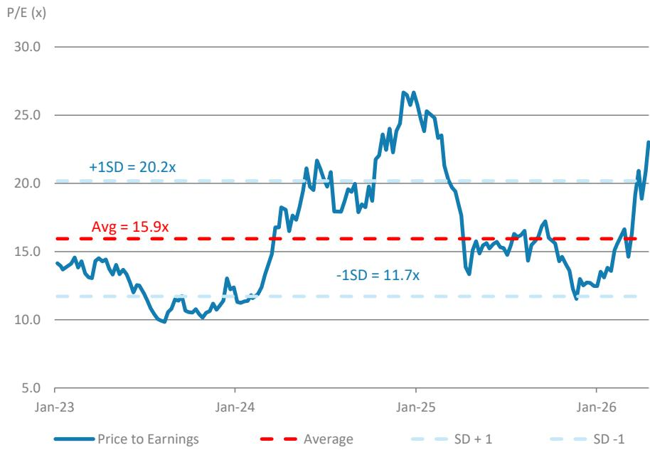  
Exhibit 31: Lotes' Three-year P/E Chart   
Source: TEJ, Morgan Stanley Research (E) estimates.

# Financials

Exhibit 32: Quarterly Earnings Estimates   

<table><tr><td></td><td>1Q25</td><td>2Q25</td><td>3Q25</td><td>4Q25</td><td>1Q26E</td><td>2Q26E</td><td>3Q26E</td><td>4Q26E</td><td>2025</td><td>2026E</td><td>2027E</td><td>2028E</td></tr><tr><td>Net sales</td><td>7,765</td><td>8,336</td><td>8,422</td><td>9,260</td><td>9,384</td><td>10,113</td><td>10,645</td><td>10,923</td><td>33,783</td><td>41,065</td><td>46,554</td><td>54,672</td></tr><tr><td>COGS</td><td>(3,769)</td><td>(4,085)</td><td>(4,109)</td><td>(4,487)</td><td>(4,513)</td><td>(4,843)</td><td>(5,113)</td><td>(5,244)</td><td>(16,450)</td><td>(19,713)</td><td>(22,387)</td><td>(26,110)</td></tr><tr><td>Gross profit</td><td>3,997</td><td>4,251</td><td>4,313</td><td>4,773</td><td>4,871</td><td>5,271</td><td>5,532</td><td>5,678</td><td>17,334</td><td>21,352</td><td>24,168</td><td>28,562</td></tr><tr><td>Operating expenses</td><td>(1,546)</td><td>(1,653)</td><td>(1,788)</td><td>(2.002)</td><td>(1,890)</td><td>(1,885)</td><td>(1,857)</td><td>(1,816)</td><td>(6,989)</td><td>(7,448)</td><td>(7,636)</td><td>(8,204)</td></tr><tr><td>SG&amp;A</td><td>(762)</td><td>(810)</td><td>(899)</td><td>(1,015)</td><td>(932)</td><td>(938)</td><td>(928)</td><td>(896)</td><td>(3,486)</td><td>(3,694)</td><td>(3,799)</td><td>(4,202)</td></tr><tr><td>R&amp;D</td><td>(784)</td><td>(843)</td><td>(889)</td><td>(987)</td><td>(957)</td><td>(948)</td><td>(929)</td><td>(920)</td><td>(3.503)</td><td>(3,754)</td><td>(3.837)</td><td>(4,002)</td></tr><tr><td>Operating income</td><td>2,451</td><td>2,599</td><td>2,525</td><td>2,771</td><td>2,982</td><td>3,385</td><td>3,675</td><td>3,863</td><td>10,344</td><td>13,905</td><td>16,532</td><td>20,358</td></tr><tr><td>Non-operating income</td><td>420</td><td>(1,378)</td><td>357</td><td>447</td><td>425</td><td>278</td><td>276</td><td>278</td><td>(154)</td><td>1,258</td><td>1,108</td><td>1,108</td></tr><tr><td>Interest income</td><td>110</td><td>93</td><td>54</td><td>48</td><td>48</td><td>48</td><td>48</td><td>48</td><td>305</td><td>191</td><td>191</td><td>191</td></tr><tr><td>Investment income</td><td>(12)</td><td>(10)</td><td>(11)</td><td>(9)</td><td>(12)</td><td>(10)</td><td>(11)</td><td>(10)</td><td>(42)</td><td>(44)</td><td>(44)</td><td>(44)</td></tr><tr><td>Disposal of investment</td><td>(0)</td><td>0</td><td>0</td><td>2</td><td>0</td><td>0</td><td>0</td><td>0</td><td>2</td><td>0</td><td>0</td><td>0</td></tr><tr><td>Exchange gain</td><td>234</td><td>(1,505)</td><td>215</td><td>110</td><td>150</td><td>0</td><td>0</td><td>0</td><td>(946)</td><td>150</td><td>0</td><td>0</td></tr><tr><td>Other</td><td>89</td><td>43</td><td>99</td><td>296</td><td>240</td><td>240</td><td>240</td><td>240</td><td>528</td><td>960</td><td>960</td><td>960</td></tr><tr><td>Pre-tax income</td><td>2,871</td><td>1,220</td><td>2,882</td><td>3,218</td><td>3,407</td><td>3,663</td><td>3,951</td><td>4,140</td><td>10,191</td><td>15,162</td><td>17,640</td><td>21,466</td></tr><tr><td>Income tax</td><td>(573)</td><td>(457)</td><td>(565)</td><td>(649)</td><td>(733)</td><td>(1,064)</td><td>(741)</td><td>(906)</td><td>(2.244)</td><td>(3,444)</td><td>(3,915)</td><td>(4,732)</td></tr><tr><td> Minority interest</td><td>23</td><td>14</td><td>(2)</td><td>46</td><td>20</td><td>20</td><td>20</td><td>20</td><td>81</td><td>80</td><td>80</td><td>80</td></tr><tr><td>Net income</td><td>2,276</td><td>749</td><td>2,318</td><td>2,523</td><td>2,655</td><td>2,579</td><td>3,190</td><td>3,215</td><td>7,866</td><td>11,638</td><td>13,645</td><td>16,654</td></tr><tr><td>Adj.wtd.avg.shrs (mn)</td><td>113</td><td>112</td><td>112</td><td>112</td><td>112</td><td>112</td><td>112</td><td>112</td><td>112</td><td>112</td><td>112</td><td>112</td></tr><tr><td>EPS</td><td>20.22</td><td>6.69</td><td>20.71</td><td>22.51</td><td>23.68</td><td>23.00</td><td>28.45</td><td>28.68</td><td>70.18</td><td>103.83</td><td>121.74</td><td>148.59</td></tr><tr><td>Fully Diluted shares (mn)</td><td>113</td><td>112</td><td>112</td><td>112</td><td>112</td><td>112</td><td>112</td><td>112</td><td>112</td><td>112</td><td>112</td><td>112</td></tr><tr><td>Diluted EPS (NT$)</td><td>20.22</td><td>6.69</td><td>20.71</td><td>22.51</td><td>23.68</td><td>23.00</td><td>28.45</td><td>28.68</td><td>70.18</td><td>103.83</td><td>121.74</td><td>148.59</td></tr><tr><td>Margins (%)</td><td></td><td></td><td></td><td></td><td></td><td></td><td></td><td></td><td></td><td></td><td></td><td></td></tr><tr><td>Gross Margin</td><td>51.5</td><td>51.0</td><td>51.2</td><td>51.5</td><td>51.9</td><td>52.1</td><td>52.0</td><td>52.0</td><td>51.3</td><td>52.0</td><td>51.9</td><td>52.2</td></tr><tr><td>Operating Margin</td><td>31.6</td><td>31.2</td><td>30.0</td><td>29.9</td><td>31.8</td><td>33.5</td><td>34.5</td><td>35.4</td><td>30.6</td><td>33.9</td><td>35.5</td><td>37.2</td></tr><tr><td>Pretax Margin</td><td>37.0</td><td>14.6</td><td>34.2</td><td>34.8</td><td>36.3</td><td>36.2</td><td>37.1</td><td>37.9</td><td>30.2</td><td>36.9</td><td>37.9</td><td>39.3</td></tr><tr><td>Net Margin</td><td>29.3</td><td>9.0</td><td>27.5</td><td>27.2</td><td>28.3</td><td>25.5</td><td>30.0</td><td>29.4</td><td>23.3</td><td>28.3</td><td>29.3</td><td>30.5</td></tr><tr><td>QoQ Growth (%)</td><td></td><td></td><td></td><td></td><td></td><td></td><td></td><td></td><td></td><td></td><td></td><td></td></tr><tr><td>Sales</td><td>-6</td><td>7</td><td>1</td><td>10</td><td>1</td><td>8</td><td>5</td><td>3</td><td></td><td></td><td></td><td></td></tr><tr><td>Gross Profit</td><td>-9</td><td>6</td><td>1</td><td>11</td><td>2</td><td>8</td><td>5</td><td>3</td><td></td><td></td><td></td><td></td></tr><tr><td>Operating Profit</td><td>-14</td><td>6</td><td>-3</td><td>10</td><td>8</td><td>14</td><td>9</td><td>5</td><td></td><td></td><td></td><td></td></tr><tr><td>Pretax Profit</td><td>-20</td><td>-58</td><td>136</td><td>12</td><td>6</td><td>8</td><td>8</td><td>5</td><td></td><td></td><td></td><td></td></tr><tr><td>Net Profit</td><td>-22</td><td>-67</td><td>209</td><td>9</td><td>5</td><td>-3</td><td>24</td><td>1</td><td></td><td></td><td></td><td></td></tr><tr><td>YoY Growth (%) Sales</td><td></td></table>

Source: Company data, Morgan Stanley Research (E) estimates.

Exhibit 33: Consolidated Financial Summary   
Consolidated Income Statement   

<table><tr><td>NT$mn (Year End Dec 31)</td><td>2025</td><td>2026E</td><td>2027E</td><td>2028E</td></tr><tr><td>Net sales</td><td>33,783</td><td>41,065</td><td>46,554</td><td>54,672</td></tr><tr><td>COGS</td><td>(16,450)</td><td>(19,713)</td><td>(22,387)</td><td>(26,110)</td></tr><tr><td>Gross profit</td><td>17,334</td><td>21,352</td><td>24,168</td><td>28,562</td></tr><tr><td>Operating expenses</td><td>(6,989)</td><td>(7,448)</td><td>(7,636)</td><td>(8,204)</td></tr><tr><td>Operating income</td><td>10,344</td><td>13,905</td><td>16,532</td><td>20,358</td></tr><tr><td>Non-operating income</td><td>(154)</td><td>1,258</td><td>1,108</td><td>1,108</td></tr><tr><td>Interest income</td><td>305</td><td>191</td><td>191</td><td>191</td></tr><tr><td>Investment income</td><td>(42)</td><td>(44)</td><td>(44)</td><td>(44)</td></tr><tr><td>Disposal of investment</td><td>2</td><td>-</td><td>-</td><td>·</td></tr><tr><td>Exchange gain</td><td>(946)</td><td>150</td><td>-</td><td>·</td></tr><tr><td>Other</td><td>528</td><td>960</td><td>960</td><td>960</td></tr><tr><td>Pre-tax income</td><td>10,191</td><td>15,162</td><td>17,640</td><td>21,466</td></tr><tr><td>Income tax</td><td>(2,244)</td><td>(3,444)</td><td>(3,915)</td><td>(4,732)</td></tr><tr><td>Minority interests</td><td>81</td><td>80</td><td>80</td><td>80</td></tr><tr><td>Net income</td><td>7,866</td><td>11,638</td><td>13,645</td><td>16,654</td></tr><tr><td>Adj. wtd. Avg. shrs (m)</td><td>112</td><td>112</td><td>112</td><td>112</td></tr><tr><td>Reported EPS (NT$)</td><td>70.18</td><td>103.83</td><td>121.74</td><td>148.59</td></tr><tr><td>Diluted shrs (m)</td><td>112</td><td>112</td><td>112</td><td>112</td></tr><tr><td>Diluted EPS(NT$)</td><td>70.18</td><td>103.83</td><td>121.74</td><td>148.59</td></tr></table>

Consolidated Balance Sheet   

<table><tr><td>NT$mn (Year End Dec 31)</td><td>2025</td><td>2026E</td><td>2027E</td><td>2028E</td></tr><tr><td>Cash</td><td>12,500</td><td>19,070</td><td>26,303</td><td>34,538</td></tr><tr><td>Mkt securities</td><td>1,029</td><td>1,029</td><td>1,029</td><td>1,029</td></tr><tr><td>AR/NR</td><td>14,182</td><td>17,239</td><td>19,543</td><td>22,951</td></tr><tr><td>Inventory</td><td>4,375</td><td>5,243</td><td>5,954</td><td>6,944</td></tr><tr><td>Others</td><td>1,148</td><td>1,396</td><td>1,582</td><td>1,858</td></tr><tr><td>Current Assets</td><td>33,234</td><td>43,977</td><td>54,411</td><td>67,321</td></tr><tr><td>Long-term investments</td><td>962</td><td>962</td><td>962</td><td>962</td></tr><tr><td>Fixed assets</td><td>13,429</td><td>12,251</td><td>11,292</td><td>10,507</td></tr><tr><td>Other assets</td><td>2,808</td><td>2,808</td><td>2.808</td><td>2.808</td></tr><tr><td>Total Assets</td><td>50,433</td><td>59,998</td><td>69,473</td><td>81,597</td></tr><tr><td>S/T borrowings</td><td>225</td><td>225</td><td>225</td><td>225</td></tr><tr><td>AP/NP</td><td>3,678</td><td>4,408</td><td>5.005</td><td>5,838</td></tr><tr><td>Other ST liabilities</td><td>5,102</td><td>6,114</td><td>6,943</td><td>8,098</td></tr><tr><td>Total Current Liabilities</td><td>9,005</td><td>10,747</td><td>12,174</td><td>14,161</td></tr><tr><td>L/T debt</td><td>-</td><td>·</td><td>-</td><td>-</td></tr><tr><td>Other LT libilities</td><td>1,013</td><td>1,232</td><td>1,397</td><td>1,640</td></tr><tr><td>Total Liabilities</td><td>10,018</td><td>11,979</td><td>13,570</td><td>15,801</td></tr><tr><td>Common shares</td><td>1,125</td><td>1,121</td><td>1,121</td><td>1,121</td></tr><tr><td>Retained Earnings</td><td>25,394</td><td>33,003</td><td>40,887</td><td>50,780</td></tr><tr><td>Other SH&#x27; Equity</td><td>13,895</td><td>13,895</td><td>13,895</td><td>13,895</td></tr><tr><td>Total Shareholders&#x27;Equity</td><td>40,415</td><td>48,019</td><td>55,903</td><td>65,796</td></tr><tr><td>Total Liab./SH&#x27;s Equity</td><td>50,433</td><td>59,998</td><td>69,473</td><td>81,597</td></tr></table>

Consolidated Cash Flow Statement   

<table><tr><td>NT$mn (Year End Dec 31)</td><td>2025</td><td>2026E</td><td>2027E</td><td>2028E</td></tr><tr><td>Operating Cashflow</td><td>8,528</td><td>11,861</td><td>14,294</td><td>16,206</td></tr><tr><td>Net Profits</td><td>7,866</td><td>11,638</td><td>13,645</td><td>16,654</td></tr><tr><td>Depreciation &amp; Amort.</td><td>2,610</td><td>2,610</td><td>2,381</td><td>2,195</td></tr><tr><td>Investment losses/(income)</td><td>(2)</td><td>44</td><td>44</td><td>44</td></tr><tr><td>Working capital change</td><td>18,898</td><td>(2,183)</td><td>(1,588)</td><td>(2,411)</td></tr><tr><td>Other adjustments</td><td>(20,658)</td><td>(248)</td><td>(187)</td><td>(276)</td></tr><tr><td>Investing Cashflow</td><td>(5,857)</td><td>(1,432)</td><td>(1,423)</td><td>(1,409)</td></tr><tr><td>Capex</td><td>(4,976)</td><td>(1,500)</td><td>(1,500)</td><td>(1,500)</td></tr><tr><td>Change of L/T investment</td><td>(62)</td><td>0</td><td>0</td><td>0</td></tr><tr><td>Change of S/T investment</td><td>(746)</td><td>0</td><td>0</td><td>0</td></tr><tr><td>Other adjustments</td><td>(129)</td><td>0</td><td>0</td><td>0</td></tr><tr><td>Financing Cashflow</td><td>(8,844)</td><td>(3,709)</td><td>(5,639)</td><td>(6,561)</td></tr><tr><td>Increase in L/T debt</td><td>0</td><td>0</td><td>0</td><td>0</td></tr><tr><td>Increase in S/T debt</td><td>(3,551)</td><td>0</td><td>0</td><td>0</td></tr><tr><td>Issuance of stock</td><td>0</td><td>(5)</td><td>0</td><td>0</td></tr><tr><td>Cash dividends</td><td>(4,803)</td><td>(3.923)</td><td>(5,804)</td><td>(6,805)</td></tr><tr><td>Other adjustments</td><td>(490)</td><td>218</td><td>165</td><td>244</td></tr><tr><td>FX adjustment</td><td>15</td><td>(150)</td><td>0</td><td>0</td></tr><tr><td>Net change in cash</td><td>(6,159)</td><td>6,570</td><td>7,232</td><td>8,236</td></tr></table>

Consolidated Financial Ratios   

<table><tr><td></td><td>2025</td><td>2026E</td><td>2027E</td><td>2028E</td></tr><tr><td>Margins (%)</td><td></td><td></td><td></td><td></td></tr><tr><td>Gross margin</td><td>51.3</td><td>52.0</td><td>51.9</td><td>52.2</td></tr><tr><td>Operating margin</td><td>30.6</td><td>33.9</td><td>35.5</td><td>37.2</td></tr><tr><td>Pretax margin</td><td>30.2</td><td>36.9</td><td>37.9</td><td>39.3</td></tr><tr><td>Net margin</td><td>23.3</td><td>28.3</td><td>29.3</td><td>30.5</td></tr><tr><td>YoY growth (%)</td><td></td><td></td><td></td><td></td></tr><tr><td>Sales</td><td>12.3</td><td>21.6</td><td>13.4</td><td>17.4</td></tr><tr><td>Operating profits</td><td>1.0</td><td>34.4</td><td>18.9</td><td>23.1</td></tr><tr><td>Pretax profits</td><td>(14.1)</td><td>48.8</td><td>16.3</td><td>21.7</td></tr><tr><td>Net profits</td><td>(15.2)</td><td>48.0</td><td>17.2</td><td>22.1</td></tr><tr><td>Others</td><td></td><td></td><td></td><td></td></tr><tr><td>Cash dividend payout (%)</td><td>50%</td><td>50%</td><td>50%</td><td>50%</td></tr><tr><td>Cash div (NT$)</td><td>35.00</td><td>51.78</td><td>60.71</td><td>74.10</td></tr><tr><td>Yield (%)</td><td>1%</td><td>2%</td><td>2%</td><td>3%</td></tr><tr><td>Net Debt/Equity (%)</td><td>-33%</td><td>-41%</td><td>-48%</td><td>-54%</td></tr><tr><td>Liabilities/Equity (%)</td><td>25%</td><td>25%</td><td>24%</td><td>24%</td></tr><tr><td>Liabilities/Assets (%)</td><td>20%</td><td>20%</td><td>20%</td><td>19%</td></tr><tr><td>ROAE(%)</td><td>20%</td><td>26%</td><td>26%</td><td>27%</td></tr><tr><td>ROAA (%)</td><td>16%</td><td>21%</td><td>21%</td><td>22%</td></tr><tr><td>AR/NR Turmover (days)</td><td>145</td><td>140</td><td>144</td><td>142</td></tr><tr><td>Inventory Turnover (days)</td><td>86</td><td>89</td><td>91</td><td>90</td></tr><tr><td>AP/NP Turnover (days)</td><td>72</td><td>75</td><td>77</td><td>76</td></tr><tr><td>Cash conversion cycle</td><td>159</td><td>154</td><td>159</td><td>156</td></tr></table>

# Risk Reward - Lotes Co. Risk Reward – Lotes Co. Ltd. (3533.TW)

Bene ting from better mix, but $\mathsf { F X }$ remains near-term headwind; EW

# NT\$2,400.00PRICE TARGET

Primary - Residual Income

Base case, residual income model. Key assumptions include a cost of equity of $9 . 6 \%$ (beta of 1.0, equity risk premium of $8 . 7 \%$ and risk-free rate of $1 . 0 \% )$ , a medium-term growth rate of $1 2 . 5 \%$ , and a terminal growth rate of $3 \%$ .

Consensus Price Target Distribution

Source: Re fi nitiv, Morgan Stanley Research

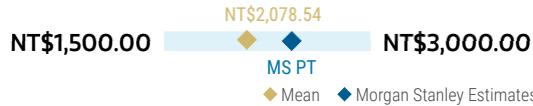

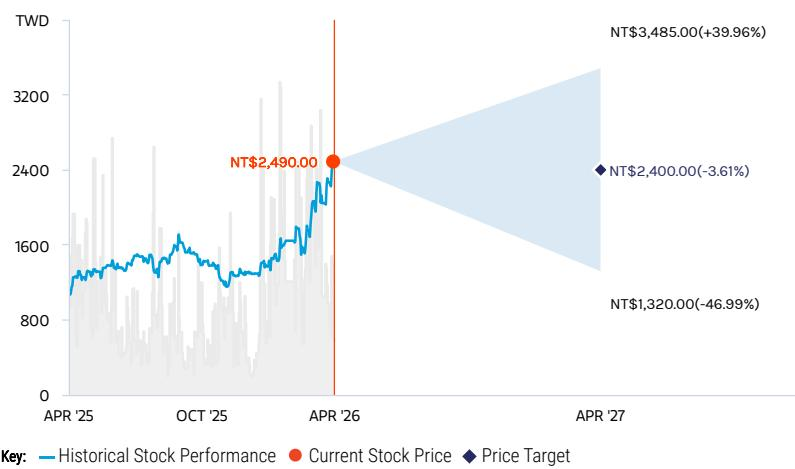  
RISK REWARD CHART   
Source: Re nitiv, Morgan Stanley Research

# EQUAL-WEIGHT THESIS

▪ We see limited room for margin expansion in the near to medium term because of rising costs, Vietnam plant ramp-up, and FX impact.

▪ Lotes is a potential bene ficiary of more liquid-cooled servers for its universal quick disconnect (UQD) offerings as well as GPU socket adoption, but the latter will likely take time to be realized.

▪ Adoption of NVQD and SOCAMM connectors for memory is possible for GB300 Bianca boards this year, earlier than prior expectations, but not $100 \%$ con rmed.

▪ Our price target implies $2 0 \times 2 0 2 7 \mathrm { e } \mathsf { P } / \mathsf { E }$ vs. its current valuation at $2 0 . 4 \times 2 0 2 7 \mathrm { e } \mathsf { P } / \mathsf { E } ,$ which looks stretched to us.

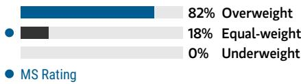  
Consensus Rating Distribution   
Source: Re nitiv, Morgan Stanley Research

# 04-20 Risk Reward Themes

Electric Vehicles: Positive Secular Growth: Positive View descriptions of Risk Rewards Themes here

# BULL CASE

# NT\$3,485.00

# BASE CASE

# NT\$2,400.00

# BEAR CASE

NT\$1,320.00

# 28.5x 2027e P/E

# Faster server and PC demand growth in 2026 with strong EV project ramp-up:

Server and PC demand enjoys signi cantly stronger growth in 2026, driven by new data center builds/replacements as well as Windows replacement and upgrades for PCs. Demand from its strategic customers continues to grow in response to positive feedback on its own silicon. Growth from automotive is much better, with share gains and new project wins.

# 20x 2027e P/E

Server business has content growth tailwinds; DT volumes stabilize in the next two to three years, but enjoy content growth; limited room for margin expansion in the next three years: We forecast a total sales CAGR of ${ \sim } 1 7 \%$ in 2025-28, with operating pro t margin increasing to $3 7 \%$ by 2028e vs. $\sim 3 4 \%$ in 2024 and $3 7 \%$ in 2025.

11x 2027e P/E

Much weaker server and PC demand in $2 0 2 6 \cdot$ automotive projects ramp-up is slower than expected in coming years: Server and PC demand declines much more than we anticipate in 2026, hampered by a weakening macro backdrop. Demand from its strategic customers also faces these challenging headwinds. Demand upturn for automotive is much slower, as are new project wins in the coming quarters.

# Risk Reward – Lotes Co. Ltd. (3533.TW)

KEY EARNINGS INPUTS   

<table><tr><td>Drivers</td><td>2025</td><td>2026e</td><td>2027e</td><td>2028e</td></tr><tr><td>Server revenue contribution (%)</td><td>39.8</td><td>47.1</td><td>49.5</td><td>52.1</td></tr><tr><td>Auto revenue contribution (%)</td><td>7.3</td><td>7.3</td><td>7.0</td><td>7.1</td></tr></table>

# INVESTMENT DRIVERS

CPU socket, DDR, PCIe upgrades for servers   
CPU socket, DDR, PCIe upgrades for desktops   
Rising EV penetration rate   
Margin expansion driven by more favorable product mix

# GLOBAL REVENUE EXPOSURE

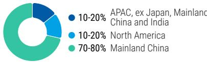  
Source: Morgan Stanley Research Estimate View explanation of regional hierarchies here

# MS ALPHA MODELS

订阅Source: Re nitiv, FactSet, Morgan Stanley Research; 1 is the highest favored Quintile and 5 is the least favored Quintile

# RISKS TO PT/RATING

# RISKS TO UPSIDE

Stronger-than-expected growth in the server business, such as from cloud and enterprise in China   
Stronger-than-expected DT demand   
Sooner-than-expected inventory digestion of NB   
Faster ramp-up of its EV business

# RISKS TO DOWNSIDE

Further deceleration of server demand from US hyperscalers   
Weaker-than-expected DT demand   
Slower-than-expected inventory digestion of NB   
More severe pricing erosion driven by competition

# OWNERSHIP POSITIONING

Inst. Owners, % Active $6 2 . 2 \%$

报添加微信 LCD12Source: Re nitiv, Morgan Stanley Research

# MS ESTIMATES VS. CONSENSUS

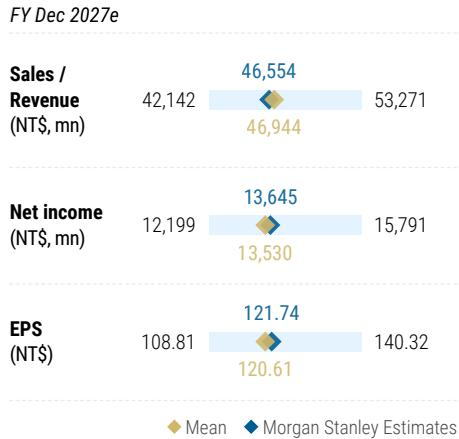  
Source: Re nitiv, Morgan Stanley Research

# FIT Hon Teng: Earnings Estimate Changes

Our 2026 EPS estimate declines $8 \% ,$ primarily driven by lowered assumptions for FIT's consumer electronics business (mainly Smartphone and System business), while our 2027 EPS estimate increases $3 \% ,$ , as we factor in higher margin assumptions from consumer electronics products. Our 2025 earnings estimates are unchanged.

Exhibit 34: Earnings Estimate Changes   

<table><tr><td>(US$m)</td><td>New</td><td>Old</td><td>Diff %</td><td>New</td><td>Old</td><td>Diff %</td><td>New</td><td>Old</td><td>Diff %</td></tr><tr><td>P&amp;LSummary</td><td colspan="3">F2025E</td><td colspan="3">F2026E</td><td colspan="3">F2027E</td></tr><tr><td>Net sales</td><td>5,003</td><td>5,003</td><td>0%</td><td>5,483</td><td>5,681</td><td>-3%</td><td>6,584</td><td>6,802</td><td>-3%</td></tr><tr><td>COGS</td><td>(4,057)</td><td>(4,057)</td><td></td><td>(4,330)</td><td>(4,450)</td><td></td><td>(5,063)</td><td>(5,247)</td><td></td></tr><tr><td>Gross profit</td><td>946</td><td>946</td><td>0%</td><td>1,153</td><td>1,231</td><td>-6%</td><td>1,521</td><td>1,555</td><td>-2%</td></tr><tr><td>Operating expenses</td><td>(659)</td><td>(659)</td><td></td><td>(681)</td><td>(718)</td><td></td><td>(816)</td><td>(865)</td><td></td></tr><tr><td>Operating income</td><td>287</td><td>287</td><td>0%</td><td>472</td><td>513</td><td>-8%</td><td>705</td><td>690</td><td>2%</td></tr><tr><td>Non-operating income</td><td>(49)</td><td>(49)</td><td></td><td>(49)</td><td>(49)</td><td></td><td>(49)</td><td>(49)</td><td></td></tr><tr><td>Pre-tax income</td><td>238</td><td>238</td><td>0%</td><td>423</td><td>465</td><td>-9%</td><td>656</td><td>641</td><td>2%</td></tr><tr><td>Income tax</td><td>(82)</td><td>(82)</td><td></td><td>(132)</td><td>(146)</td><td></td><td>(220)</td><td>(216)</td><td></td></tr><tr><td>Net income</td><td>156</td><td>156</td><td>0%</td><td>291</td><td>315</td><td>-8%</td><td>436</td><td>422</td><td>3%</td></tr><tr><td>EPS-Basic(US cents)</td><td>2.20</td><td>2.20</td><td>0%</td><td>4.11</td><td>4.44</td><td>-8%</td><td>6.15</td><td>5.95</td><td>3%</td></tr><tr><td>EPS-Basic (HK cents)</td><td>17.18</td><td>17.18</td><td>0%</td><td>32.05</td><td>34.66</td><td>-8%</td><td>47.96</td><td>46.39</td><td>3%</td></tr><tr><td>Margins</td><td></td><td></td><td></td><td></td><td></td><td></td><td></td><td></td><td></td></tr><tr><td>Gross margin</td><td>18.9%</td><td>18.9%</td><td></td><td>21.0%</td><td>21.7%</td><td></td><td>23.1%</td><td>22.9%</td><td></td></tr><tr><td>Operating margin</td><td>5.7%</td><td>5.7%</td><td></td><td>8.6%</td><td>9.0%</td><td></td><td>10.7%</td><td>10.1%</td><td></td></tr><tr><td>Pretax margin</td><td>4.8%</td><td>4.8%</td><td></td><td>7.7%</td><td>8.2%</td><td></td><td>10.0%</td><td>9.4%</td><td></td></tr><tr><td>Net margin</td><td>3.1%</td><td>3.1%</td><td></td><td>5.3%</td><td>5.5%</td><td></td><td>6.6%</td><td>6.2%</td><td></td></tr></table>

Source: Morgan Stanley Research (E) estimates.

# Price Target Discussion and Valuation Methodology

Our price target increases $\sim 3 0 \%$ to ${ \sf H K S 9 . 6 0 }$ , on the back of an increase in our mediumterm growth assumption $70 \%$ , from $8 \%$ previously), as we factor in stronger CPU demand from agentic AI that should be sustained in the coming years.

Our price target is our base case scenario value, derived from a residual income (RI) model, similar to the rest of our tech hardware coverage. Our key assumptions include:

Cost of equity of $6 . 3 \%$ (beta of 1.06, equity risk premium of $6 . 0 \%$ , and risk-free rate of $0 \%$ ),

Medium-term growth rate of $10 \%$ (up from $8 \%$ ), and

Terminal growth rate of $3 \%$

Our price target implies ${ \sim } 2 0 { \times } 2 0 2 7 { \mathrm { e } } \mathsf { P } / \mathsf { E }$ , which is higher than FIT's three-year trading average $+ 7 5 \mathsf { D }$ of $\sim 1 8 \times$ . We view this as justified in view of FIT's share gains in the AI server value chain, its dominant position in the general CPU server connector market (primarily high-end CPU sockets and PCIe connectors), as well as its improving ROE and profitability, which support re-rating.

Our bull and bear case values also increase $\sim 3 0 \%$ to HK\$12.50 and HK\$4.40, respectively.

Exhibit 37: Quarterly Earnings Estimates   

<table><tr><td>US$mn</td><td>1H24</td><td>2H24</td><td>1H25</td><td>2H25P</td><td>1H26E</td><td>2H26E</td><td>1H27E</td><td>2H27E</td><td>F2024</td><td>F2025E</td><td>F2026E</td><td>F2027E</td></tr><tr><td>Net sales</td><td>2,067</td><td>2,385</td><td>2,305</td><td>2,698</td><td>2,533</td><td>2,950</td><td>3,004</td><td>3,580</td><td>4,451</td><td>5,003</td><td>5,483 (4,330)</td><td>6,584</td></tr><tr><td>COGS</td><td>(1,646)</td><td>(1,927)</td><td>(1,876)</td><td>(2,181)</td><td>(2.010)</td><td>(2,320)</td><td>(2.304)</td><td>(2,759)</td><td>(3,573)</td><td>(4,057)</td><td></td><td>(5,063)</td></tr><tr><td>Gross profit</td><td>421</td><td>457</td><td>429</td><td>517</td><td>523</td><td>630</td><td>700</td><td>821</td><td>879</td><td>946</td><td>1,153</td><td>1,521</td></tr><tr><td>Other income (expense)</td><td>：</td><td>·</td><td>·</td><td>·</td><td>·</td><td>·</td><td>·</td><td></td><td>·</td><td>·</td><td>·</td><td>·</td></tr><tr><td>Operating expenses</td><td>(328)</td><td>(224)</td><td>(323)</td><td>(335)</td><td>(355)</td><td>(326)</td><td>(409)</td><td>(408)</td><td>(552)</td><td>(659)</td><td>(681)</td><td>(816)</td></tr><tr><td>Selling and distribution</td><td>(62)</td><td>(69)</td><td>(57)</td><td>(71)</td><td>(64)</td><td>(79)</td><td>(77)</td><td>(98)</td><td>(131)</td><td>(128)</td><td>(143)</td><td>(175)</td></tr><tr><td>Administrative</td><td>(118)</td><td>(123)</td><td>(158)</td><td>(82)</td><td>(156)</td><td>(92)</td><td>(167)</td><td>(106)</td><td>(242)</td><td>(240)</td><td>(248)</td><td>(272)</td></tr><tr><td>R&amp;D</td><td>(172)</td><td>(158)</td><td>(163)</td><td>(191)</td><td>(169)</td><td>(213)</td><td>(202)</td><td>(258)</td><td>(330)</td><td>(354)</td><td>(382)</td><td>(460)</td></tr><tr><td>Other OP income (expense)- net</td><td>24</td><td>127</td><td>55</td><td>9</td><td>33</td><td>58</td><td>37</td><td>55</td><td>151</td><td>64</td><td>91</td><td>92</td></tr><tr><td>Operating income</td><td>93</td><td>234</td><td>105</td><td>182</td><td>168</td><td>304</td><td>291</td><td>413</td><td>327</td><td>287</td><td>472</td><td>705</td></tr><tr><td>Non-operating income</td><td>(32)</td><td>(74)</td><td>(25)</td><td>(24)</td><td>(25)</td><td>(24)</td><td>(25)</td><td>(24)</td><td>(106)</td><td>(49)</td><td>(49)</td><td>(49)</td></tr><tr><td>Profit &amp; Loss of Investment</td><td>(6)</td><td>(52)</td><td>0</td><td>(1)</td><td>0</td><td>(1)</td><td>0</td><td>(1)</td><td>(58)</td><td>(1)</td><td>(1)</td><td>(1)</td></tr><tr><td>Finance income</td><td>15</td><td>12</td><td>10</td><td>13</td><td>10</td><td>13</td><td>10</td><td>13</td><td>26</td><td>24</td><td>24</td><td>24</td></tr><tr><td>Finance cost Other income (expense)</td><td>(40)</td><td>(34)</td><td>(35)</td><td>(37)</td><td>(35)</td><td>(37)</td><td>(35)</td><td>(37)</td><td>(74)</td><td>(72)</td><td>(72)</td><td>(72)</td></tr><tr><td>Pre-tax income</td><td>= 61</td><td>159</td><td>·</td><td>·</td><td></td><td></td><td>·</td><td></td><td>·</td><td>=</td><td>·</td><td></td></tr><tr><td>Income tax</td><td>(29)</td><td>(37)</td><td>80 (50)</td><td>158</td><td>143</td><td>280</td><td>267</td><td>389</td><td>221</td><td>238</td><td>423 (132)</td><td>656 (220)</td></tr><tr><td>Consolidated income</td><td>33</td><td>122</td><td>30</td><td>(31)</td><td>(79)</td><td>(53)</td><td>(147)</td><td>(74)</td><td>(66) 154</td><td>(82) 157</td><td></td><td>436</td></tr><tr><td>Minority interest</td><td>0</td><td>0</td><td>(1)</td><td>126 2</td><td>64</td><td>227</td><td>120</td><td>316</td><td>1</td><td>1</td><td>291</td><td>=</td></tr><tr><td>Net income</td><td>33</td><td>121</td><td>32</td><td>125</td><td>= 64</td><td>227</td><td>· 120</td><td>316</td><td>154</td><td>156</td><td>= 291</td><td>436</td></tr><tr><td>Adj.wtd.avg.shrs (m)</td><td>7,085</td><td>7,087</td><td>7,087</td><td>7,087</td><td>7,087</td><td>7,087</td><td>7,087</td><td>7,087</td><td>7,087</td><td>7,087</td><td>7,087</td><td>7,087</td></tr><tr><td>EPS (US cents)</td><td>0.46</td><td>1.71</td><td>0.44</td><td>1.76</td><td>0.91</td><td>3.20</td><td>1.69</td><td>4.46</td><td>2.17</td><td>2.20</td><td>4.11</td><td>6.15</td></tr><tr><td>EPS (HK cents)</td><td>3.56</td><td>13.26</td><td>3.45</td><td>13.62</td><td>7.04</td><td>24.81</td><td>13.12</td><td>34.53</td><td>16.92</td><td>17.18</td><td>32.05</td><td>47.96</td></tr><tr><td>Margins</td><td></td><td></td><td></td><td></td><td></td><td></td><td></td><td></td><td></td><td></td><td></td><td></td></tr><tr><td>Gross margin (%)</td><td></td><td></td><td></td><td></td><td></td><td></td><td></td><td></td><td></td><td></td><td></td><td></td></tr><tr><td>Operating margin (%)</td><td>20.4 4.5</td><td>19.2 9.8</td><td>18.6 4.6</td><td>19.2</td><td>20.7</td><td>21.4</td><td>23.3</td><td>22.9</td><td>19.7</td><td>18.9</td><td>21.0 8.6</td><td>23.1</td></tr><tr><td>OPM excl. one time charges (%)</td><td>4.5</td><td>9.8</td><td>4.6</td><td>6.7 6.7</td><td>6.6 6.6</td><td>10.3</td><td>9.7</td><td>11.5 11.5</td><td>7.3</td><td>5.7</td><td></td><td>10.7</td></tr><tr><td>Pretax margin (%)</td><td>3.0</td><td>6.7</td><td>3.5</td><td>5.8</td><td>5.6</td><td>10.3 9.5</td><td>9.7 8.9</td><td>10.9</td><td>7.3 5.0</td><td>5.7</td><td>8.6</td><td>10.7</td></tr><tr><td>Net margin (%)</td><td>1.6</td><td>5.1</td><td>1.4</td><td>4.6</td><td>2.5</td><td>7.7</td><td>4.0</td><td>8.8</td><td>3.5</td><td>4.8</td><td>7.7</td><td>10.0 6.6</td></tr><tr><td></td><td></td><td></td><td></td><td></td><td></td><td></td><td></td><td></td><td></td><td>3.1</td><td>5.3</td><td></td></tr><tr><td>HoH</td><td></td><td></td><td></td><td></td><td></td><td></td><td></td><td></td><td></td><td></td><td></td><td></td></tr><tr><td>Sales (%)</td><td>(14)</td><td>15</td><td>(3)</td><td>17</td><td>(6)</td><td>16</td><td>2</td><td>19</td><td></td><td></td><td></td><td></td></tr><tr><td>Gross profit (%) Operating profit (%)</td><td>(20)</td><td>9 151</td><td>(6) (55)</td><td>21 73</td><td>1 (8)</td><td>20 81</td><td>11 (4)</td><td>17 42</td><td></td><td></td><td></td><td></td></tr><tr><td>Pretax profit (%)</td><td>(57) (67)</td></table>

Source: Company data, Morgan Stanley Research (E) estimates.

Exhibit 38: Consolidated Financial Summary   
Income Statement   

<table><tr><td>US$mn;Yearend March</td><td>F2024</td><td>F2025E</td><td>F2026E</td><td>F2027E</td></tr><tr><td>Net sales</td><td>4,451</td><td>5,003</td><td>5,483</td><td>6,584</td></tr><tr><td>COGS</td><td>(3,573)</td><td>(4,057)</td><td>(4,330)</td><td>(5,063)</td></tr><tr><td>Gross profit</td><td>879</td><td>946</td><td>1,153</td><td>1,521</td></tr><tr><td>Other operating income</td><td>0</td><td>0</td><td>0</td><td>0</td></tr><tr><td>Operating expenses</td><td>(552)</td><td>(659)</td><td>(681)</td><td>(816)</td></tr><tr><td>Operating income</td><td>327</td><td>287</td><td>472</td><td>705</td></tr><tr><td>Profit/Loss of Investment</td><td>(58)</td><td>(1)</td><td>(1)</td><td>(1)</td></tr><tr><td>Finance income</td><td>26</td><td>24</td><td>24</td><td>24</td></tr><tr><td>Finance cost</td><td>(74)</td><td>(72)</td><td>(72)</td><td>(72)</td></tr><tr><td>Pre-tax income</td><td>221</td><td>238</td><td>423</td><td>656</td></tr><tr><td>Income tax</td><td>(66)</td><td>(82)</td><td>(132)</td><td>(220)</td></tr><tr><td>Consolidated income</td><td>154</td><td>157</td><td>291</td><td>436</td></tr><tr><td>Minority interest</td><td>1</td><td>1</td><td>0</td><td>0</td></tr><tr><td>Net income</td><td>154</td><td>156</td><td>291</td><td>436</td></tr><tr><td>Diluted EPS (US cents)</td><td>2.17</td><td>2.20</td><td>4.11</td><td>6.15</td></tr></table>

Cash Flow Statement   

<table><tr><td>US$mn;YearendMarch</td><td>F2024</td><td>F2025E</td><td>F2026E</td><td>F2027E</td></tr><tr><td>Operating CF</td><td>253</td><td>912</td><td>510</td><td>640</td></tr><tr><td>Net Profits</td><td>154</td><td>156</td><td>291</td><td>436</td></tr><tr><td>Depreciation</td><td>250</td><td>250</td><td>250</td><td>250</td></tr><tr><td>Equity losses/(income)</td><td>(58)</td><td>(1)</td><td>(1)</td><td>(1)</td></tr><tr><td>Other adjustments</td><td>(92)</td><td>507</td><td>(31)</td><td>(45)</td></tr><tr><td>Investing CF</td><td>(475)</td><td>(950)</td><td>(415)</td><td>(415)</td></tr><tr><td>Capex</td><td>(375)</td><td>(950)</td><td>(415)</td><td>(415)</td></tr><tr><td>Change of S/T investment</td><td>(7)</td><td>0</td><td>0</td><td>0</td></tr><tr><td>Other adjustments</td><td>(107)</td><td>0</td><td>0</td><td>0</td></tr><tr><td>Financing CF</td><td>59</td><td>(145)</td><td>(138)</td><td>(216)</td></tr><tr><td>Increase in L/T debt</td><td>0</td><td>0</td><td>0</td><td>0</td></tr><tr><td>Increase in S/T debt</td><td>154</td><td>0</td><td>0</td><td>0</td></tr><tr><td>Issuance of stock</td><td>(1)</td><td>0</td><td>0</td><td>0</td></tr><tr><td>Cash dividends</td><td>0</td><td>(88)</td><td>(90)</td><td>(167)</td></tr><tr><td>Dir.&amp; Emp. Bonus</td><td>0</td><td>0</td><td>0</td><td>0</td></tr><tr><td>Changes in Treasury Stocks</td><td>0</td><td>0</td><td>0</td><td>0</td></tr><tr><td>Other adjustments</td><td>(94)</td><td>(57)</td><td>(49)</td><td>(49)</td></tr><tr><td>FX adjustment</td><td>(41)</td><td>0</td><td>0</td><td></td></tr><tr><td>Net change in cash</td><td>(204)</td><td>(183)</td><td>(43)</td><td>0 9</td></tr></table>

Balance Sheet   

<table><tr><td>US$ mn;Year end March</td><td>F2024</td><td>F2025E</td><td>F2026E</td><td>F2027E</td></tr><tr><td>Cash</td><td>1,113</td><td>930</td><td>886</td><td>895</td></tr><tr><td>Mkt securities</td><td>0</td><td>0</td><td>0</td><td>0</td></tr><tr><td>AR/NR</td><td>910</td><td>982</td><td>1,076</td><td>1,292</td></tr><tr><td>Inventory</td><td>904</td><td>365</td><td>390</td><td>456</td></tr><tr><td>Others</td><td>233</td><td>233</td><td>233</td><td>233</td></tr><tr><td>Current Assets</td><td>3,160</td><td>2,510</td><td>2,585</td><td>2,876</td></tr><tr><td>Long-term investments</td><td>15</td><td>14</td><td>14</td><td>13</td></tr><tr><td>Fixed assets</td><td>1,191</td><td>1,950</td><td>2,165</td><td>2.380</td></tr><tr><td>Other assets</td><td>376</td><td>376</td><td>376</td><td>376</td></tr><tr><td>Total Assets</td><td>5,470</td><td>5,578</td><td>5,868</td><td>6,374</td></tr><tr><td>S/T borrowings</td><td>904</td><td>904</td><td>904</td><td>904</td></tr><tr><td>AP/NP</td><td>1,271</td><td>1,311</td><td>1,399</td><td>1,636</td></tr><tr><td>Other ST liabilities</td><td>66</td><td>66</td><td>66</td><td>66</td></tr><tr><td>Other liabilities</td><td>112</td><td>112</td><td>112</td><td>112</td></tr><tr><td>L/T debt</td><td>634</td><td>634</td><td>634</td><td>634</td></tr><tr><td>Total Liabilities</td><td>2,987</td><td>3,027</td><td>3,115</td><td>3,352</td></tr><tr><td>Common shares</td><td>142</td><td>142</td><td></td><td></td></tr><tr><td>Reserves</td><td>2,422</td><td>2,491</td><td>142 2,692</td><td>142 2,961</td></tr><tr><td>Shareholders&#x27;equity</td><td>2,483</td><td>2,552</td><td>2,753</td><td>3,022</td></tr><tr><td>Total Liab./SH&#x27;s Equity</td><td>5,470</td><td>5,578</td><td>5,868</td><td>6,374</td></tr><tr><td></td><td></td><td></td><td></td><td></td></tr></table>

Source: Company data, Morgan Stanley Research $\left( \mathsf { E } \right)$ estimates.

Financial Ratios   

<table><tr><td>US$mn; Year end March</td><td>F2024</td><td>F2025E</td><td>F2026E</td><td>F2027E</td></tr><tr><td>Margins</td><td></td><td></td><td></td><td></td></tr><tr><td>Gross margin</td><td>19.7%</td><td>18.9%</td><td>21.0%</td><td>23.1%</td></tr><tr><td>Operating margin</td><td>7.3%</td><td>5.7%</td><td>8.6%</td><td>10.7%</td></tr><tr><td>Pretax margin</td><td>5.0%</td><td>4.8%</td><td>7.7%</td><td>10.0%</td></tr><tr><td>Net margin</td><td>3.5%</td><td>3.1%</td><td>5.3%</td><td>6.6%</td></tr><tr><td>YoY growth</td><td></td><td></td><td></td><td></td></tr><tr><td>Sales</td><td>6%</td><td>12%</td><td>10%</td><td>20%</td></tr><tr><td>Operating profits</td><td>24%</td><td>-12%</td><td>64%</td><td>49%</td></tr><tr><td>Pretax profits</td><td>23%</td><td>8%</td><td>78%</td><td>55%</td></tr><tr><td>Net profits</td><td>19%</td><td>2%</td><td>87%</td><td>50%</td></tr><tr><td>EPS</td><td>19%</td><td>2%</td><td>87%</td><td>50%</td></tr><tr><td>Others</td><td></td><td></td><td></td><td></td></tr><tr><td>Net Debt/Equity</td><td>17%</td><td>24%</td><td>24%</td><td>21%</td></tr><tr><td>Liabilities/Equity</td><td>120%</td><td>119%</td><td>113%</td><td>111%</td></tr><tr><td>Liabilities/Assets</td><td>55%</td><td>54%</td><td>53%</td><td>53%</td></tr><tr><td>ROAE</td><td>6%</td><td>6%</td><td>11%</td><td>15%</td></tr><tr><td>ROAA</td><td>3%</td><td>3%</td><td>5%</td><td>7%</td></tr><tr><td>AR/NR Turnover (days)</td><td>71</td><td>69</td><td>69</td><td>66</td></tr><tr><td>AP/NP Turnover (days)</td><td>121</td><td>116</td><td>114</td><td>109</td></tr><tr><td>Inventory Turnover (days)</td><td>87</td><td>57</td><td>32</td><td>30</td></tr><tr><td>Cash conversion (days)</td><td>37</td><td>10</td><td>-14</td><td>-13</td></tr></table>

# Risk Reward - FIT Hon TengRisk Reward – FIT Hon Teng Ltd (6088.HK)

Content gains driven by AI infrastructure component leadership; OW

# HK\$9.60PRICE TARGET

# OVERWEIGHT THESIS

Base case scenario value, derived from a residual income valuation model. Our key assumptions include a cost of equity of $6 . 3 \% ,$ a medium-term growth rate of $1 0 \%$ and a terminal growth rate of $3 \%$ .

Consensus Price Target Distribution

Source: Re fi nitiv, Morgan Stanley Research

$H K \$ 2.66$

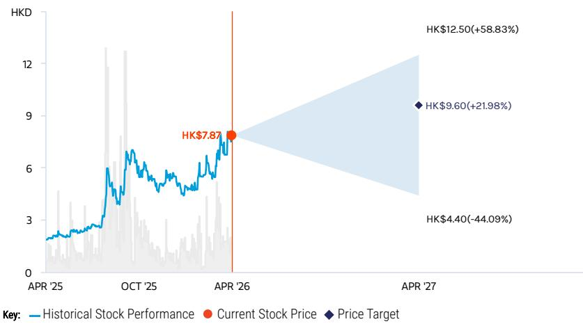  
RISK REWARD CHART   
Source: Re nitiv, Morgan Stanley Research

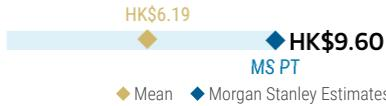

▪ FIT looks well positioned to bene t from advancements in AI hardware designs by leveraging its expertise in connectivity solutions.

▪ We expect FIT to capture more share in the AI server value chain, due to its relationship with parent company Hon Hai, a key AI system design/manufacturing partner to Nvidia.

▪ FIT's smartphone, non-AI cloud data center, and consumer Interconnect businesses should continue to generate pro ts, driven by its dominant shares in these markets, and above corporate average margins.

▪ Our PT implies ${ \sim } 2 0 \times 2 0 2 7 \mathsf { e } \mathsf { P } / \mathsf { E } _ { \iota }$ higher than FIT's 3-year trading avg $+ 7 5 \mathsf { D }$ of $\sim 7 8 x ,$ which we view as fair given share gains in AI server value chain and its position in CPU server connectors.

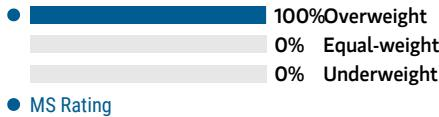  
Consensus Rating Distribution   
Source: Re nitiv, Morgan Stanley Research

# Risk Reward Themes

Electric Vehicles: Positive New Data Era: Positive Technology Diffusion: Positive View descriptions of Risk Rewards Themes here

# BULL CASE

# HK\$12.50

# BASE CASE

# HK\$9.60

# BEAR CASE

HK\$4.40

# 26x 2027e P/E

(1) Increasing penetration of liquid cooling in servers/data centers; (2) faster-thanexpected server power requirement upgrades; (3) more AI server cable/connector project wins; and (4) fasterthan-expected AirPods assembly share gains and capacity expansion.

# 20x 2027e P/E

(1) increasing penetration of liquid cooling in servers/data centers; (2) server power requirement upgrades; (3) AI server cable/connector project wins; and $\textcircled{4}$ AirPods assembly share gains and capacity expansion.

# 9.2x 2027e P/E

(1) Slower-than-expected penetration of liquid cooling in servers/data centers; (2) slower-than-expected server power requirement upgrades; (3) AI server cable/connector share loss; and $\textcircled{4}$ slowerthan-expected AirPods assembly share gains and capacity expansion.

# Risk Reward – FIT Hon Teng Ltd (6088.HK)

# KEY EARNINGS INPUTS

<table><tr><td>Drivers</td><td>2024</td><td>2025e</td><td>2026e</td><td>2027e</td></tr><tr><td>iPhone charger connector shipments y/y (%)</td><td>(0.5)</td><td>7.4</td><td>3.9</td><td>1.0</td></tr><tr><td>iPhone charging cable shipments y/y (%)</td><td>(5.9)</td><td>(11.5)</td><td>1.0</td><td>1.0</td></tr><tr><td>Cloud Datacenter GM (%)</td><td>47.9</td><td>49.2</td><td>49.9</td><td>48.5</td></tr><tr><td>Cloud Datacenter revenue (Us$, mn)</td><td>591</td><td>813</td><td>1,196</td><td>1,860</td></tr><tr><td>System revenue (USS,mn)</td><td>1,416</td><td>1,355</td><td>1,468</td><td>1,768</td></tr></table>

# CATALYST CALENDAR

<table><tr><td>Date</td><td>Event</td><td>Source: Refinitiv, Morgan Stanley</td></tr><tr><td>19 Jun 2026-</td><td>Foxconn Interconnect Technology Ltd Annual Shareholders</td><td></td></tr><tr><td>23 Jun 2026</td><td>Meeting</td><td></td></tr></table>

# INVESTMENT DRIVERS

Share gains in the AI server value chain Share gains in AirPods assembly market AI hardware technology advancements Inorganic growth from new acquisitions

# GLOBAL REVENUE EXPOSURE

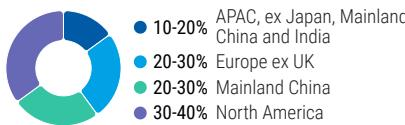  
Source: Morgan Stanley Research Estimate View explanation of regional hierarchies here

# RISKS TO PT/RATING

# RISKS TO UPSIDE

Higher-than-expected revenues from the smartphone and system segments Faster-than-expected AI hardware technology migration and share gains, driving pro t expansion

# RISKS TO DOWNSIDE

Lower-than-expected revenues from the smartphone and system segments Slower-than-expected AI hardware technology migration and share gains

# OWNERSHIP POSITIONING

报添加微信Inst. Owners, % Active $5 6 . 2 \%$

Source: Re nitiv, Morgan Stanley Research

# MS ESTIMATES VS. CONSENSUS

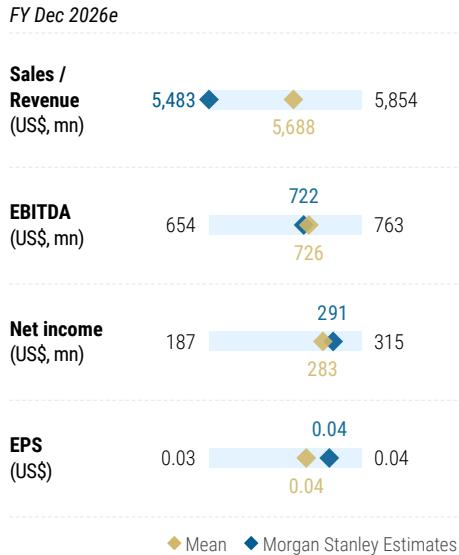  
Source: Re nitiv, Morgan Stanley Research

# Inspur: Earnings Estimate Changes

Our 2026 EPS estimate declines $7 \%$ mainly due to our lowered margin assumptions, while our 2027 EPS estimate increases $1 8 \%$ on the back of stronger domestic AI and general server demand despite also lowered margin assumptions due to the margin-dilutive nature of AI servers.

We also introduce our 2028e earnings estimates.

订阅研报添加微信 LCD123321Cad Exhibit 39: Earnings Estimate Changes 04-20   

<table><tr><td rowspan="2">Year toDec.31 (RMBmn)</td><td colspan="2">2025P</td><td rowspan="2">%diff</td><td colspan="2">2026E</td><td rowspan="2">%diff</td><td colspan="2">2027E</td><td rowspan="2">%diff</td><td rowspan="2">2028E New</td></tr><tr><td>New</td><td>Old</td><td>New</td><td>Old</td><td>New</td><td>Old</td></tr><tr><td>P&amp;LSummary</td><td></td><td></td><td></td><td></td><td></td><td></td><td></td><td></td><td></td><td></td></tr><tr><td>Netsales</td><td>164,782</td><td>163,728</td><td>1%</td><td>221,860</td><td>196,877</td><td>13%</td><td>313,413</td><td>217,372</td><td>44%</td><td>421,565</td></tr><tr><td>COGS</td><td>(156,962)</td><td>(155,633)</td><td></td><td>(211,535)</td><td>(186,208)</td><td></td><td>(299,763)</td><td>(205,882)</td><td></td><td>（404,389)</td></tr><tr><td>Gross profit</td><td>7,820</td><td>8,095</td><td>-3%</td><td>10,325</td><td>10,669</td><td>-3%</td><td>13,651</td><td>11,490</td><td>19%</td><td>17,176</td></tr><tr><td>Operating expenses</td><td>(6,001)</td><td>(5,495)</td><td></td><td>(7,243)</td><td>(6,409)</td><td></td><td>(9,397)</td><td>(7,080)</td><td></td><td>(11,791)</td></tr><tr><td>Operating income</td><td>1,819</td><td>2,600</td><td>-30%</td><td>3,082</td><td>4,259</td><td>-28%</td><td>4,254</td><td>4,409</td><td>-4%</td><td>5,385</td></tr><tr><td>Non-operating income</td><td>650</td><td>49</td><td></td><td>389</td><td>(482)</td><td></td><td>389</td><td>(482)</td><td></td><td>389</td></tr><tr><td>Pre-taxincome</td><td>2,468</td><td>2,649</td><td>-7%</td><td>3,471</td><td>3,777</td><td>-8%</td><td>4,643</td><td>3,927</td><td>18%</td><td>5,774</td></tr><tr><td>Income tax</td><td>(59)</td><td>（90)</td><td></td><td>(137)</td><td>（189)</td><td></td><td>(184)</td><td>(151)</td><td></td><td>(228)</td></tr><tr><td>Minority interest</td><td>4</td><td>（7)</td><td></td><td></td><td></td><td></td><td></td><td></td><td></td><td></td></tr><tr><td>Netincome</td><td>2,413</td><td>2,553</td><td>-5%</td><td>3,334</td><td>3,588</td><td>-7%</td><td>4,458</td><td>3,776</td><td>18%</td><td>5,546</td></tr><tr><td>EPS(RMB)</td><td>1.64</td><td>1.73</td><td>-5%</td><td>2.26</td><td>2.44</td><td>-7%</td><td>3.03</td><td>2.56</td><td>18%</td><td>3.77</td></tr><tr><td>Margins</td><td></td><td></td><td></td><td></td><td></td><td></td><td></td><td></td><td></td><td></td></tr><tr><td>Grossmargin</td><td>4.7%</td><td>4.9%</td><td></td><td>4.7%</td><td>5.4%</td><td></td><td>4.4%</td><td>5.3%</td><td></td><td>4.1%</td></tr><tr><td>Operating margin</td><td>1.1%</td><td>1.6%</td><td></td><td>1.4%</td><td>2.2%</td><td></td><td>1.4%</td><td>2.0%</td><td></td><td>1.3%</td></tr><tr><td>Pretaxmargin</td><td>1.5%</td><td>1.6%</td><td></td><td>1.6%</td><td>1.9%</td><td></td><td>1.5%</td><td>1.8%</td><td></td><td>1.4%</td></tr><tr><td>Netmargin</td><td>1.5%</td><td>1.6%</td><td></td><td>1.5%</td><td>1.8%</td><td></td><td>1.4%</td><td>1.7%</td><td></td><td>1.3%</td></tr></table>

Source: Morgan Stanley Research (E) estimates.

# Price Target Discussion and Valuation Methodology

# We raise our 12-month price target by $\sim 3 3 \%$ to Rmb75 (from Rmb56.50), and stay EW.

The increase in our price target is mainly driven by model rollover to 2026 and the introduction of our 2028e earnings estimates. Our new PT implies $\sim 3 3 x$ our 2026e EPS or $\sim 2 5 \times$ our 2027e EPS, above its 5-yr P/E avg of $2 4 . 4 x ,$ which we think is fair due to strong domestic demand for AI servers in China.

Our key assumptions are all unchanged, including a cost of equity of $8 . 4 \%$ (with a beta of 1.2, equity risk premium $5 . 9 \% ,$ , and risk-free rate $1 . 3 \%$ , a medium-term growth rate of $1 7 \%$ and a terminal growth rate of $3 \%$ .

Our bull and bear case values are raised to Rmb96.10 and Rmb43.50, respectively, inline with the magnitude of the increase to our base case value.

Exhibit 40: Residual Income (RI) Model   

<table><tr><td>RMBmn</td><td>2026E</td><td>2027E</td><td>2028E</td><td>2029E</td><td>2029E</td><td>2030E</td><td>2031E</td><td>2032E</td><td>2033E</td><td>2034E</td><td>2035E</td><td>2036E</td></tr><tr><td>Total Equity</td><td>25,484</td><td>29,382</td><td>34,199</td><td>37,169</td><td>40,466</td><td>44,126</td><td>48,188</td><td>52,697</td><td>57,703</td><td>63,258</td><td>69,425</td><td>76,270</td></tr><tr><td>Net Profit</td><td>3,334</td><td>4,458</td><td>5,546</td><td>6,156</td><td>6,833</td><td>7,584</td><td>8,419</td><td>9,345</td><td>10,373</td><td>11,513</td><td>12,780</td><td>14,186</td></tr><tr><td>Return on Equity</td><td>13.9%</td><td>16.3%</td><td>17.4%</td><td>17.3%</td><td>17.6%</td><td>17.9%</td><td>18.2%</td><td>18.5%</td><td>18.8%</td><td>19.0%</td><td>19.3%</td><td>19.5%</td></tr><tr><td>Beta</td><td>1.2</td><td>1.2</td><td>1.2</td><td>1.2</td><td>1.2</td><td>1.2</td><td>1.2</td><td>1.2</td><td>1.2</td><td>1.2</td><td>1.2</td><td>1.2</td></tr><tr><td>Equity Risk Premium (Rm-Rf)</td><td>5.9%</td><td>5.9%</td><td>5.9%</td><td>5.9%</td><td>5.9%</td><td>5.9%</td><td>5.9%</td><td>5.9%</td><td>5.9%</td><td>5.9%</td><td>5.9%</td><td>5.9%</td></tr><tr><td>Risk Free Rate (Rf)</td><td>1.3%</td><td>1.3%</td><td>1.3%</td><td>1.3%</td><td>1.3%</td><td>1.3%</td><td>1.3%</td><td>1.3%</td><td>1.3%</td><td>1.3%</td><td>1.3%</td><td>1.3%</td></tr><tr><td>Cost of Equity</td><td>8.4%</td><td>8.4%</td><td>8.4%</td><td>8.4%</td><td>8.4%</td><td>8.4%</td><td>8.4%</td><td>8.4%</td><td>8.4%</td><td>8.4%</td><td>8.4%</td><td>8.4%</td></tr><tr><td>Beginning Equity Capital</td><td>25,484</td><td></td><td></td><td></td><td></td><td></td><td></td><td></td><td></td><td></td><td></td><td></td></tr><tr><td>PV of Forecast Period</td><td></td><td></td><td></td><td></td><td></td><td></td><td></td><td></td><td></td><td></td><td></td><td></td></tr><tr><td>PV of Continuing Value</td><td>25,979</td><td></td><td></td><td></td><td></td><td></td><td></td><td></td><td></td><td></td><td></td><td></td></tr><tr><td>Equity Value</td><td>58,947</td><td></td><td></td><td></td><td></td><td></td><td></td><td></td><td></td><td></td><td></td><td></td></tr><tr><td>No.of Shares</td><td>110,410</td><td></td><td></td><td></td><td></td><td></td><td></td><td></td><td></td><td></td><td></td><td></td></tr><tr><td>Projected Price (EoY)</td><td>1,472 75.00</td><td></td><td></td><td></td><td></td><td></td><td></td><td></td><td></td><td></td><td></td><td></td></tr></table>

Source: Morgan Stanley Research (E) estimates.

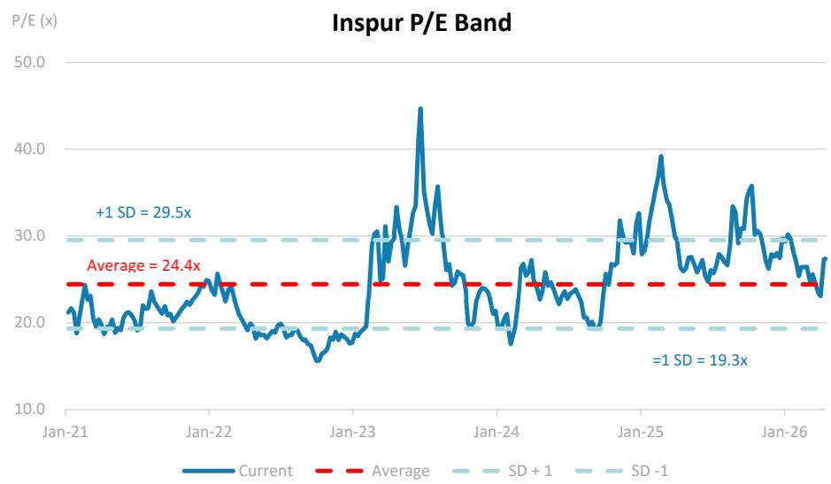  
Exhibit 41: Inspur's Three-year P/E Chart   
Source: TEJ, Morgan Stanley Research (E) estimates.

# Financials

Exhibit 42: Quarterly Earnings Estimates   

<table><tr><td>RMB mn</td><td>1Q25</td><td>2Q25</td><td>3Q25</td><td>4Q25</td><td>1Q26E</td><td>2Q26E</td><td>3Q26E</td><td>4Q26E</td><td>2025P</td><td>2026E</td><td>2027E</td><td>2028E</td></tr><tr><td>Net sales</td><td>46,858</td><td>33,334</td><td>40,477</td><td>44,113</td><td>45,797</td><td>50,909</td><td>59,207</td><td>65,948</td><td>164,782</td><td>221,860</td><td>313,413</td><td>421,565</td></tr><tr><td>COGS</td><td>(45,293)</td><td>(31,345)</td><td>(38,280)</td><td>(42,045)</td><td>(43,654)</td><td>(48,550)</td><td>(56,443)</td><td>(62,889)</td><td>(156,962)</td><td>(211,535)</td><td>(299,763)</td><td>(404,389)</td></tr><tr><td>Gross profit</td><td>1,566</td><td>1,989</td><td>2,197</td><td>2,068</td><td>2,143</td><td>2,359</td><td>2,763</td><td>3,060</td><td>7,820</td><td>10,325</td><td>13,651</td><td>17,176</td></tr><tr><td>Operating expenses</td><td>(1.071)</td><td>(1,407)</td><td>(1.521)</td><td>(2,001)</td><td>(1,607)</td><td>(1,703)</td><td>(1,884)</td><td>(2.050)</td><td>(6,001)</td><td>(7,243)</td><td>(9,397)</td><td>(11,791)</td></tr><tr><td>SG&amp;A, R&amp;D exp.</td><td>(1.071)</td><td>(1,407)</td><td>(1,521)</td><td>(2.001)</td><td>(1,607)</td><td>(1,703)</td><td>(1,884)</td><td>(2,050)</td><td>(6,001)</td><td>(7,243)</td><td>(9,397)</td><td>(11,791)</td></tr><tr><td>Employee bonus</td><td>13</td><td>14</td><td>15</td><td>16</td><td>17</td><td>18</td><td>19</td><td>20</td><td>2</td><td>3</td><td>4</td><td>5</td></tr><tr><td>Operating income</td><td>495</td><td>582</td><td>676</td><td>66</td><td>536</td><td>656</td><td>879</td><td>1,010</td><td>1,819</td><td>3,082</td><td>4,254</td><td>5,385</td></tr><tr><td>Non-operating income</td><td>(13)</td><td>(219)</td><td>2</td><td>880</td><td>97</td><td>97</td><td>97</td><td>97</td><td>650</td><td>389</td><td>389</td><td>389</td></tr><tr><td>Interest income</td><td>(164)</td><td>(420)</td><td>(48)</td><td>26</td><td>(268)</td><td>(268)</td><td>(268)</td><td>(268)</td><td>(607)</td><td>(1,071)</td><td>(1,071)</td><td>(1,071)</td></tr><tr><td>Investment income</td><td>(2)</td><td>0</td><td>(2)</td><td>6</td><td>15</td><td>15</td><td>15</td><td>15</td><td>3</td><td>60</td><td>60</td><td>60</td></tr><tr><td>Disposal of investment</td><td>0</td><td>0</td><td>0</td><td>0</td><td>0</td><td>0</td><td>0</td><td>0</td><td>0</td><td>0</td><td>0</td><td>0</td></tr><tr><td>Exchange gain</td><td>0</td><td>0</td><td>0</td><td>0</td><td>0</td><td>0</td><td>0</td><td>0</td><td>0</td><td>0</td><td>0</td><td>0</td></tr><tr><td>Other</td><td>154</td><td>201</td><td>52</td><td>848</td><td>350</td><td>350</td><td>350</td><td>350</td><td>1,254</td><td>1,400</td><td>1,400</td><td>1,400</td></tr><tr><td>Pre-tax income</td><td>482</td><td>363</td><td>678</td><td>946</td><td>633</td><td>753</td><td>977</td><td>1,107</td><td>2,468</td><td>3,471</td><td>4,643</td><td>5,774</td></tr><tr><td>Income tax</td><td>(20)</td><td>(26)</td><td>13</td><td>(26)</td><td>(25)</td><td>(38)</td><td>(29)</td><td>(44)</td><td>(59)</td><td>(137)</td><td>(184)</td><td>(228)</td></tr><tr><td>Minority interest</td><td>1</td><td>(1)</td><td>(7)</td><td>11</td><td>0</td><td>0</td><td>0</td><td>0</td><td>4</td><td>0</td><td>0</td><td>0</td></tr><tr><td>Net income</td><td>463</td><td>336</td><td>683</td><td>931</td><td>608</td><td>716</td><td>947</td><td>1,063</td><td>2,413</td><td>3,334</td><td>4,458</td><td>5,546</td></tr><tr><td>Adj.wtd.avg.shrs (mn)</td><td>1,472</td><td>1,472</td><td>1,472</td><td>1,472</td><td>1,472</td><td>1,472</td><td>1,472</td><td>1,472</td><td>1,472</td><td>1,472</td><td>1,472</td><td>1,472</td></tr><tr><td>EPS (RMB)</td><td>0.31</td><td>0.23</td><td>0.46</td><td>0.63</td><td>0.41</td><td>0.49</td><td>0.64</td><td>0.72</td><td>1.64</td><td>2.26</td><td>3.03</td><td>3.77</td></tr><tr><td>Fully diluted shares (mn)</td><td>1,472</td><td>1,472</td><td>1,472</td><td>1,472</td><td>1,469</td><td>1,469</td><td>1,469</td><td>1,469</td><td>1,472</td><td>1,472</td><td>1,472</td><td>1,472</td></tr><tr><td>Diluted EPS (RMB)</td><td>0.31</td><td>0.23</td><td>0.46</td><td>0.63</td><td>0.41</td><td>0.49</td><td>0.65</td><td>0.72</td><td>1.64</td><td>2.26</td><td>3.03</td><td>3.77</td></tr><tr><td>Margins (%)</td><td></td><td></td><td></td><td></td><td></td><td></td><td></td><td></td><td></td><td></td><td></td><td></td></tr><tr><td>Gross Margin</td><td>3.3</td><td>6.0</td><td>5.4</td><td>4.7</td><td>4.7</td><td>4.6</td><td>4.7</td><td>4.6</td><td>4.7</td><td>4.7</td><td>4.4</td><td>4.1</td></tr><tr><td>Operating Margin</td><td>1.1</td><td>1.7</td><td>1.7</td><td>0.2</td><td>1.2</td><td>1.3</td><td>1.5</td><td>1.5</td><td>1.1</td><td>1.4</td><td>1.4</td><td>1.3</td></tr><tr><td>Pretax Margin</td><td>1.0</td><td>1.1</td><td>1.7</td><td>2.1</td><td>1.4</td><td>1.5</td><td>1.6</td><td>1.7</td><td>1.5</td><td>1.6</td><td>1.5</td><td>1.4</td></tr><tr><td>Net Margin</td><td>1.0</td><td>1.0</td><td>1.7</td><td>2.1</td><td>1.3</td><td>1.4</td><td>1.6</td><td>1.6</td><td>1.5</td><td>1.5</td><td>1.4</td><td>1.3</td></tr><tr><td>QoQ Growth (%)</td><td></td><td></td><td></td><td></td><td></td><td></td><td></td><td></td><td></td><td></td><td></td><td></td></tr><tr><td>Sales</td><td>48</td><td>-29</td><td>21</td><td>9</td><td>4</td><td>11</td><td>16</td><td>11</td><td></td><td></td><td></td><td></td></tr><tr><td>Gross Profit</td><td>-30</td><td>27</td><td>10</td><td>-6</td><td>4</td><td>10</td><td>17</td><td>11</td><td></td><td></td><td></td><td></td></tr><tr><td>Operating Profit</td><td>51</td><td>18</td><td>16</td><td>-90</td><td>707</td><td>22</td><td>34</td><td>15</td><td></td><td></td><td></td><td></td></tr><tr><td>Pretax Profit</td><td>-55</td><td>-25</td><td>87</td><td>40</td><td>-33</td><td>19</td><td>30</td><td>13</td><td></td><td></td><td></td><td></td></tr><tr><td>Net Profit</td><td>-54</td><td>-27</td><td>103</td><td>36</td><td>-35</td><td>18</td><td>32</td><td>12</td><td></td><td></td><td></td><td></td></tr><tr><td>YoY Growth (%)</td><td></td></table>

Source: Company data, Morgan Stanley Research (E) estimates.

Exhibit 43: Consolidated Financial Summary   
Consolidated Income Statement   

<table><tr><td>RMBmn (Year End Dec 31)</td><td>2025P</td><td>2026E</td><td>2027E</td><td>2028E</td></tr><tr><td>Net sales</td><td>164,782</td><td>221,860</td><td>313,413</td><td>421,565</td></tr><tr><td>COGS</td><td>(156,962)</td><td>(211,535)</td><td>(299,763)</td><td>(404,389)</td></tr><tr><td>Gross profit</td><td>7,820</td><td>10,325</td><td>13,651</td><td>17,176</td></tr><tr><td>Operating expenses</td><td>(6,001)</td><td>(7,243)</td><td>(9,397)</td><td>(11,791)</td></tr><tr><td>Operating income</td><td>1,819</td><td>3,082</td><td>4,254</td><td>5,385</td></tr><tr><td>Non-operating income</td><td>650</td><td>389</td><td>389</td><td>389</td></tr><tr><td>Interest income</td><td>(607)</td><td>(1,071)</td><td>(1,071)</td><td>(1,071)</td></tr><tr><td>Investment income</td><td>3</td><td>60</td><td>60</td><td>60</td></tr><tr><td>Disposal of investment</td><td>=</td><td>-</td><td>-</td><td>-</td></tr><tr><td>Exchange gain</td><td>=</td><td>-</td><td>-</td><td>-</td></tr><tr><td>Other</td><td>1,254</td><td>1,400</td><td>1,400</td><td>1,400</td></tr><tr><td>Pre-tax income</td><td>2,468</td><td>3,471</td><td>4,643</td><td>5,774</td></tr><tr><td>Income tax</td><td>(59)</td><td>(137)</td><td>(184)</td><td>(228)</td></tr><tr><td>Minority interests</td><td>4</td><td>-</td><td>-</td><td>-</td></tr><tr><td>Net income</td><td>2,413</td><td>3,334</td><td>4,458</td><td>5,546</td></tr><tr><td>Adj. wtd. Avg. shrs (m)</td><td>1,472</td><td>1,472</td><td>1,472</td><td>1,472</td></tr><tr><td>Reported EPS (Rmb)</td><td>1.64</td><td>2.26</td><td>3.03</td><td>3.77</td></tr><tr><td>Diluted shrs (m)</td><td>1,472</td><td>1,472</td><td>1,472</td><td>1,472</td></tr><tr><td>Diluted EPS(Rmb)</td><td>1.64</td><td>2.26</td><td>3.03</td><td>3.77</td></tr></table>

Consolidated Balance Sheet   

<table><tr><td>RMBmn (Year End Dec 31)</td><td>2025P</td><td>2026E</td><td>2027E</td><td>2028E</td></tr><tr><td>Cash</td><td>9,751</td><td>9,190</td><td>6,147</td><td>1,715</td></tr><tr><td>Mkt securities</td><td>-</td><td>-</td><td>-</td><td>-</td></tr><tr><td>AR/NR</td><td>18,126</td><td>24,405</td><td>34,475</td><td>46,372</td></tr><tr><td>Inventory</td><td>43,949</td><td>59,230</td><td>83,934</td><td>113,229</td></tr><tr><td>Others</td><td>824</td><td>1,109</td><td>1,567</td><td>2,108</td></tr><tr><td>Current Assets</td><td>72,651</td><td>93,934</td><td>126,123</td><td>163,424</td></tr><tr><td>Long-term investments</td><td>570</td><td>570</td><td>570</td><td>570</td></tr><tr><td>Fixed assets</td><td>4,530</td><td>6,748</td><td>9,882</td><td>14,097</td></tr><tr><td>Other assets</td><td>1,135</td><td>1,135</td><td>1,135</td><td>1,135</td></tr><tr><td>Total Assets</td><td>78,886</td><td>102,388</td><td>137,710</td><td>179,226</td></tr><tr><td>S/T borrowings</td><td>1,395</td><td>4,395</td><td>7,395</td><td>10,395</td></tr><tr><td>AP/NP</td><td>21,975</td><td>29,615</td><td>41,967</td><td>56,614</td></tr><tr><td>Other ST liabilities</td><td>25,738</td><td>34,686</td><td>49,153</td><td>66,309</td></tr><tr><td>Total Current Liabilities</td><td>49,108</td><td>68,697</td><td>98,515</td><td>133,319</td></tr><tr><td>L/T debt</td><td>4,317</td><td>4,317</td><td>4,317</td><td>4,317</td></tr><tr><td>Other LT libilities</td><td>2,889</td><td>3,890</td><td>5,495</td><td>7,391</td></tr><tr><td>Total Liabilities</td><td>56,314</td><td>76,904</td><td>108,328</td><td>145,027</td></tr><tr><td>Common shares</td><td>1,472</td><td>1,472</td><td>1,472</td><td>1,472</td></tr><tr><td>Retained Eamings</td><td>13,093</td><td>16,005</td><td>19,904</td><td>24,720</td></tr><tr><td>Other SH&#x27; Equity</td><td>8,006</td><td>8,006</td><td>8.006</td><td>8.006</td></tr><tr><td>Total Shareholders&#x27;Equity</td><td>22,572</td><td>25,484</td><td>29,382</td><td>34,199</td></tr><tr><td>Total Liab./SH&#x27;s Equity</td><td>78,886</td><td>102,388</td><td>137,710</td><td>179,226</td></tr></table>

Consolidated Cash Flow Statement   

<table><tr><td>RMBmn (Year End Dec 31)</td><td>2025P</td><td>2026E</td><td>2027E</td><td>2028E</td></tr><tr><td>Operating Cashflow</td><td>3,394</td><td>(1,982)</td><td>(4,015)</td><td>(4,444)</td></tr><tr><td>Net Profits</td><td>2.413</td><td>3,334</td><td>4,458</td><td>5.546</td></tr><tr><td>Depreciation &amp; Amort.</td><td>0</td><td>0</td><td>0</td><td>0</td></tr><tr><td>Investment losses/(income)</td><td>(3)</td><td>(60)</td><td>(60)</td><td>(60)</td></tr><tr><td>Working capital change</td><td>(5,147)</td><td>(4,970)</td><td>(7,956)</td><td>(9,388)</td></tr><tr><td>Other adjustments</td><td>6,131</td><td>(285)</td><td>(458)</td><td>(541)</td></tr><tr><td>Investing Cashflow</td><td>(1,648)</td><td>(2,218)</td><td>(3,134)</td><td>(4,215)</td></tr><tr><td>Capex</td><td>(1,648)</td><td>(2,219)</td><td>(3,134)</td><td>(4,216)</td></tr><tr><td>Change of L/T investment</td><td>0</td><td>0</td><td>0</td><td>0</td></tr><tr><td>Change of S/T investment</td><td>0</td><td>0</td><td>0</td><td>0</td></tr><tr><td>Other adjustments</td><td>0</td><td>0</td><td>0</td><td>0</td></tr><tr><td>Financing Cashflow</td><td>708</td><td>3,639</td><td>4,105</td><td>4,227</td></tr><tr><td>Increase in L/T debt</td><td>0</td><td>0</td><td>0</td><td>0</td></tr><tr><td>Increase in S/T debt</td><td>0</td><td>3.000</td><td>3.000</td><td>3.000</td></tr><tr><td>Issuance of stock</td><td>(0)</td><td>0</td><td>0</td><td>0</td></tr><tr><td>Cash dividends</td><td>(169)</td><td>(362)</td><td>(500)</td><td>(669)</td></tr><tr><td>Other adjustments</td><td>877</td><td>1,001</td><td>1,605</td><td>1,896</td></tr><tr><td>FX adjustment</td><td>0</td><td>0</td><td>0</td><td>0</td></tr><tr><td>Net change in cash</td><td>2,454</td><td>(561)</td><td>(3,044)</td><td>(4,431)</td></tr></table>

Consolidated Financial Ratios   

<table><tr><td></td><td>2025P</td><td>2026E</td><td>2027E</td><td>2028B</td></tr><tr><td>Margins (%)</td><td></td><td></td><td></td><td></td></tr><tr><td>Gross margin</td><td>4.7</td><td>4.7</td><td>4.4</td><td>4.1</td></tr><tr><td>Operating margin</td><td>1.1</td><td>1.4</td><td>1.4</td><td>1.3</td></tr><tr><td>Pretax margin</td><td>1.5</td><td>1.6</td><td>1.5</td><td>1.4</td></tr><tr><td>Net margin</td><td>1.5</td><td>1.5</td><td>1.4</td><td>1.3</td></tr><tr><td>YoY growth (%)</td><td></td><td></td><td></td><td></td></tr><tr><td>Sales</td><td>43.6</td><td>34.6</td><td>41.3</td><td>34.5</td></tr><tr><td>Operating profits</td><td>(6.7)</td><td>69.4</td><td>38.0</td><td>26.6</td></tr><tr><td>Pretax profits</td><td>4.5</td><td>40.6</td><td>33.8</td><td>24.4</td></tr><tr><td>Net profits</td><td>5.3</td><td>38.2</td><td>33.7</td><td>24.4</td></tr><tr><td>Others</td><td></td><td></td><td></td><td></td></tr><tr><td>Cash dividend payout (%)</td><td>15</td><td>15</td><td>15</td><td>15</td></tr><tr><td>Cash div (Rmb)</td><td>1.7</td><td>2.3</td><td>3.1</td><td>3.9</td></tr><tr><td>Yield (%)</td><td>4</td><td>6</td><td>8</td><td>10</td></tr><tr><td>Net Debt/Equity (%)</td><td>(18)</td><td>(2)</td><td>19</td><td>38</td></tr><tr><td>Liabilities/Equity (%)</td><td>249</td><td>302</td><td>369</td><td>424</td></tr><tr><td>Liabilities/Assets (%)</td><td>71</td><td>75</td><td>79</td><td>81</td></tr><tr><td>ROAE (%)</td><td>11</td><td>14</td><td>16</td><td>17</td></tr><tr><td>ROAA (%)</td><td>3</td><td>4</td><td>4</td><td>3</td></tr><tr><td>AR/NR Tumover (days)</td><td>33</td><td>35</td><td>34</td><td>35</td></tr><tr><td>Inventory Tumover (days)</td><td>98</td><td>89</td><td>87</td><td>89</td></tr><tr><td>AP/NP Turmover (days)</td><td>55</td><td>45</td><td>44</td><td>44</td></tr><tr><td>Cash conversion cycle</td><td>76</td><td>79</td><td>78</td><td>79</td></tr></table>

# Risk Reward - Inspur Electronic InforRisk Reward – Inspur Electronic Information (000977.SZ)

Key bene ciary of China's localization efforts, but valuation keeps us EW

# Rmb75.00PRICE TARGET

We use a residual income model for our PT. Key assumptions include a cost of equity at $8 . 4 \%$ (beta of 1.2, equity risk premium of $5 . 9 \%$ and risk-free rate of $1 . 3 \%$ a mid-term growth rate of $1 7 \%$ and a terminal growth rate of $3 \%$ .

Consensus Price Target Distribution

Source: Re fi nitiv, Morgan Stanley Research

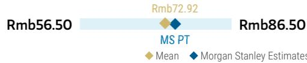

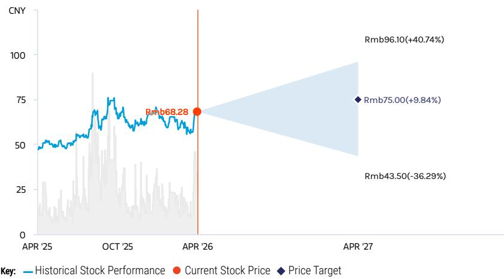  
RISK REWARD CHART   
Source: Re nitiv, Morgan Stanley Research

# EQUAL-WEIGHT THESIS

▪ Key bene ficiary of rising adoption of local brands in China driving demand growth, and likely bene ficiary of AI story in China.

▪ Aims to move to mid-range/high-end and overseas mature markets, but limited traction in the past two years. We like its ambition but progress has been slow over the past few years.

▪ Potential further restrictions on US chip exports remains an overhang for Inspur.

▪ Valuation is insuf ciently attractive at ${ \sim } 2 3 { \times } 2 0 2 7 { \mathrm { e } } \ \mathsf { P } / \mathsf { E }$ , vs. our target implied P/E of $\sim 2 5 \times ,$ so we stay EW.

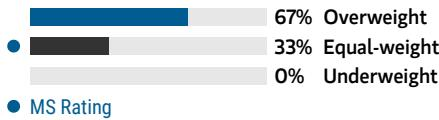  
Consensus Rating Distribution   
Source: Re nitiv, Morgan Stanley Research

# Risk Reward Themes

New Data Era: Positive 04-20 View descriptions of Risk Rewards Themes here

# BULL CASE

# Rmb96.10

# BASE CASE

# Rmb75.00

# BEAR CASE

Rmb43.50

# 32x 2027e EPS

Strong sales growth with accelerating OPM expansion: We project a total sales CAGR of $70 \mathrm { - } 7 5 \%$ in 2025-28, driven by share gains in China, higher exposure to the mid-range to high-end server market and faster expansion into overseas markets. We estimate OPM to improve to $5 \%$ or above by 2028 from $1 . 7 \%$ in 2024 and $1 . 1 \%$ in 2025.

# 25x 2027e EPS

Decent sales growth with a slight decrease in OPM: We project a total sales CAGR of $3 5 . 4 0 \%$ in 2025-28, driven by datacenter demand. We estimate OPM to be $1 . 3 \%$ by 2028 vs. $1 . 7 \%$ in 2024 and $1 . 1 \%$ in 2025, due to the dilution of AI servers, partially offset by cost optimization.

# 14.5x 2027e EPS

Flattish sales growth with larger decline in OPM: We project total sales CAGR to be 0- $5 \%$ in 2025-28 due to lower-than-expected economic growth in China and erce competition. We estimate OPM to decline to $1 . 0 \%$ by 2028, vs. $1 . 7 \%$ in 2024 and $1 . 1 \%$ in 2025.

# Risk Reward – Inspur Electronic Information (000977.SZ)

KEY EARNINGS INPUTS   

<table><tr><td>Drivers</td><td>2025</td><td>2026e</td><td>2027e</td><td>2028e</td></tr><tr><td>Server shipment y/y (%)</td><td>(12.0)</td><td>11.6</td><td>10.0</td><td>7.8</td></tr><tr><td>Server OPM (%)</td><td>1.2</td><td>1.1</td><td>1.1</td><td>1.1</td></tr><tr><td>Server ASP (USS) (Rmb)</td><td>25,050</td><td>23,821</td><td>23,488</td><td>22,123</td></tr></table>

# INVESTMENT DRIVERS

Server demand Server ASP

# GLOBAL REVENUE EXPOSURE

Source: Morgan Stanley Research Estimate View explanation of regional hierarchies here

# MS ALPHA MODELS

Source: Re nitiv, FactSet, Morgan Stanley Research; 1 is 订阅the highest favored Quintile and 5 is the least favored Quintile

# RISKS TO PT/RATING

# RISKS TO UPSIDE

Stronger-than-expected shipment growth, driving larger operating leverage to offset some opex increases.   
Faster-than-expected share gains at midrange/high-end servers driving margin recovery.   
Lower-than-expected increases in opex thanks to effective cost controls.

# RISKS TO DOWNSIDE

Weaker-than-expected domestic/overseas shipment growth.   
Trade tension escalates.   
Higher opex spend to penetrate into overseas market.

# OWNERSHIP POSITIONING

Inst. Owners, % Active $3 6 . 6 \%$

报添加微信 LCD12Source: Re nitiv, Morgan Stanley Research

# MS ESTIMATES VS. CONSENSUS

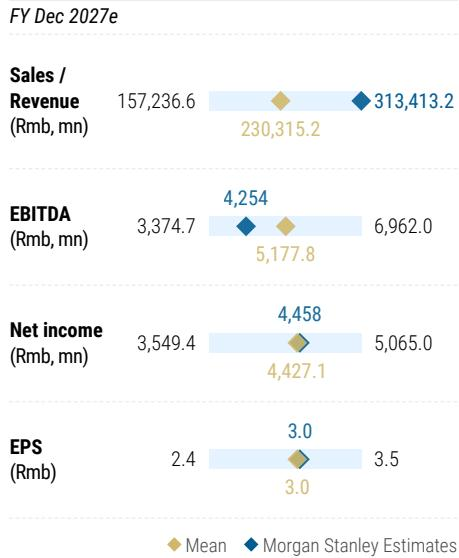  
Source: Re nitiv, Morgan Stanley Research

# Shennan Circuits: Earnings Estimate Changes

Our 2026 and 2027 EPS estimates increase $3 \%$ and $7 \%$ each, driven by higher revenue and margins assumptions driven by increased server demand estimates.

Exhibit 44: Earnings Estimate Changes   

<table><tr><td>Year to Dec.31</td><td colspan="3">2025E</td><td colspan="3">2026E</td><td colspan="3">2027E</td></tr><tr><td>(RMB mn)</td><td>New</td><td>Old</td><td>% diff</td><td>New</td><td>Old</td><td>% diff</td><td>New</td><td>Old</td><td>% diff</td></tr><tr><td>P&amp;LSummary</td><td></td><td></td><td></td><td></td><td></td><td></td><td></td><td></td><td></td></tr><tr><td>Net sales</td><td>23,647</td><td>23,647</td><td>0%</td><td>30,473</td><td>30,035</td><td>1%</td><td>36,792</td><td>35,399</td><td>4%</td></tr><tr><td>COGS</td><td>(17,076)</td><td>(17,076)</td><td></td><td>(21,286)</td><td>(21,045)</td><td></td><td>(24,912)</td><td>(24,186)</td><td></td></tr><tr><td>Gross profit</td><td>6,571</td><td>6,571</td><td>0%</td><td>9,187</td><td>8,990</td><td>2%</td><td>11,880</td><td>11,213</td><td>6%</td></tr><tr><td>Operating expenses</td><td>(3,038)</td><td>(3,038)</td><td></td><td>(3,849)</td><td>(3,795)</td><td></td><td>(4,294)</td><td>(4,133)</td><td></td></tr><tr><td>Operating income</td><td>3,533</td><td>3,533</td><td>0%</td><td>5,338</td><td>5,196</td><td>3%</td><td>7,586</td><td>7,080</td><td>7%</td></tr><tr><td>Non-operating income</td><td>91</td><td>91</td><td></td><td>(159)</td><td>(159)</td><td></td><td>(159)</td><td>(159)</td><td></td></tr><tr><td>Pre-tax income</td><td>3,624</td><td>3,624</td><td>0%</td><td>5,179</td><td>5,036</td><td>3%</td><td>7,427</td><td>6,920</td><td>7%</td></tr><tr><td>Income tax</td><td>(345)</td><td>(345)</td><td></td><td>(451)</td><td>(438)</td><td></td><td>(643)</td><td>(599)</td><td></td></tr><tr><td>Minority interest</td><td>(3)</td><td>(3)</td><td></td><td>·</td><td>-</td><td></td><td>·</td><td>·</td><td></td></tr><tr><td>Net income</td><td>3,276</td><td>3,276</td><td>0%</td><td>4,728</td><td>4,598</td><td>3%</td><td>6,783</td><td>6,321</td><td>7%</td></tr><tr><td>EPS (RMB)</td><td>4.91</td><td>4.91</td><td>0%</td><td>7.09</td><td>6.90</td><td>3%</td><td>10.17</td><td>9.48</td><td>7%</td></tr><tr><td>Margins</td><td></td><td></td><td>ppt</td><td></td><td></td><td>ppt</td><td></td><td></td><td>ppt</td></tr><tr><td>Gross margin</td><td>27.8%</td><td>27.8%</td><td>0.0</td><td>30.1%</td><td>29.9%</td><td>0.2</td><td>32.3%</td><td>31.7%</td><td>0.6</td></tr><tr><td>Operating margin</td><td>14.9%</td><td>14.9%</td><td>0.0</td><td>17.5%</td><td>17.3%</td><td>0.2</td><td>20.6%</td><td>20.0%</td><td>0.6</td></tr><tr><td>Pretax margin</td><td>15.3%</td><td>15.3%</td><td>0.0</td><td>17.0%</td><td>16.8%</td><td>0.2</td><td>20.2%</td><td>19.6%</td><td>0.6</td></tr><tr><td>Net margin</td><td>13.9%</td><td>13.9%</td><td>0.0</td><td>15.5%</td><td>15.3%</td><td>0.2</td><td>18.4%</td><td>17.9%</td><td>0.6</td></tr></table>

Source: Morgan Stanley Research (E) estimates.

# Price Target Discussion and Valuation Methodology

We raise our 12-month price target to Rmb280 ( $3 9 x$ 2026e EPS or 27.5x 2027e EPS), up from Rmb260, on the back of higher earnings estimates for CY26e and CY27e: Our 添加微信 LCD123321Cad 04-20 base case scenario value is derived from a residual income (RI) model. Our key assumptions are all unchanged, including a cost of equity of $6 . 7 \%$ (beta of 1.1, equity risk premium $5 . 0 \% ,$ and risk-free rate of $1 . 3 \%$ , a medium-term growth rate of $7 . 0 \% ,$ and a terminal growth rate of $4 . 0 \%$ .

Our bull and bear case values increase to Rmb388 and Rmb167, respectively: This is in line with the magnitude of increase in our base case value.

Exhibit 45: Residual Income (RI) Model   

<table><tr><td>RMBmn</td><td>2026E</td><td>2027E</td><td>2028E</td><td>2029E</td><td>2030E</td><td>2031E</td><td>2032E</td><td>2033E</td><td>2034E</td><td>2035E</td><td>2036E</td></tr><tr><td>Total Equity</td><td>20,929</td><td>26,132</td><td>31,519</td><td>37,283</td><td>43,451</td><td>50,050</td><td>57,112</td><td>64,667</td><td>72,752</td><td>81,402</td><td>90,658</td></tr><tr><td>Net Profit</td><td>4,728</td><td>6,783</td><td>7,258</td><td>7,766</td><td>8,310</td><td>8,892</td><td>9,514</td><td>10,180</td><td>10,893</td><td>11,655</td><td>12,471</td></tr><tr><td>Return on Equity</td><td>24.7%</td><td>28.8%</td><td>25.2%</td><td>22.6%</td><td>20.6%</td><td>19.0%</td><td>17.8%</td><td>16.7%</td><td>15.9%</td><td>15.1%</td><td>14.5%</td></tr><tr><td>Beta</td><td>1.1</td><td>1.1</td><td></td><td></td><td></td><td></td><td></td><td></td><td></td><td></td><td></td></tr><tr><td>Equity Risk Premium (Rm-Rf)</td><td>5.0%</td><td>5.0%</td><td>1.1 5.0%</td><td>1.1 5.0%</td><td>1.1 5.0%</td><td>1.1 5.0%</td><td>1.1 5.0%</td><td>1.1 5.0%</td><td>1.1 5.0%</td><td>1.1 5.0%</td><td>1.1 5.0%</td></tr><tr><td>Risk Free Rate (Rf)</td><td>1.3%</td><td>1.3%</td><td>1.3%</td><td>1.3%</td><td>1.3%</td><td>1.3%</td><td>1.3%</td><td>1.3%</td><td>1.3%</td><td>1.3%</td><td>1.3%</td></tr><tr><td>Cost of Equity</td><td>6.7%</td><td>6.7%</td><td>6.7%</td><td>6.7%</td><td>6.7%</td><td>6.7%</td><td>6.7%</td><td>6.7%</td><td>6.7%</td><td>6.7%</td><td>6.7%</td></tr><tr><td>Beginning Equity Capital</td><td></td><td></td><td></td><td></td><td></td><td></td><td></td><td></td><td></td><td></td><td></td></tr><tr><td>PV of Forecast Period</td><td>20,929 38,194</td><td></td><td></td><td></td><td></td><td></td><td></td><td></td><td></td><td></td><td></td></tr><tr><td>PV of Continuing Value</td><td>127,574</td><td></td><td></td><td></td><td></td><td></td><td></td><td></td><td></td><td></td><td></td></tr><tr><td>Equity Value</td><td>186,697</td><td></td><td></td><td></td><td></td><td></td><td></td><td></td><td></td><td></td><td></td></tr><tr><td>No. of Shares</td><td>667</td><td></td><td></td><td></td><td></td><td></td><td></td><td></td><td></td><td></td><td></td></tr><tr><td>ProjectedPrice(RMB)</td><td>280.0</td><td></td><td></td><td></td><td></td><td></td><td></td><td></td><td></td><td></td><td></td></tr></table>

Source: Morgan Stanley Research (E) estimates.

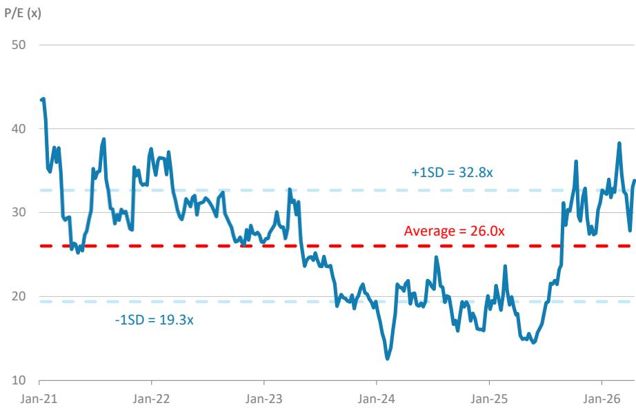  
Exhibit 46: Shennan Circuits' five-year P/E chart   
Source: TEJ, Morgan Stanley Research (E) estimates.

# Financials

Exhibit 47: Quarterly Earnings Estimates   

<table><tr><td>RMBmn</td><td>1Q25</td><td>2Q25</td><td>3Q25</td><td>4Q25P</td><td>1Q26E</td><td>2Q26E</td><td>3Q26E</td><td>4Q26E</td><td>2024A</td><td>2025E</td><td>2026E</td><td>2027E</td></tr><tr><td>Net sales</td><td>4,783</td><td>5,671</td><td>6,301</td><td>6,893</td><td>6,462</td><td>7,340</td><td>8,028</td><td>8,643</td><td>17,907</td><td>23,647</td><td>30,473</td><td>36,792</td></tr><tr><td>COGS</td><td>(3,621)</td><td>(4,144)</td><td>(4,364)</td><td>(4,947)</td><td>(4,539)</td><td>(5,160)</td><td>(5,587)</td><td>(6,000)</td><td>(13,590)</td><td>(17,076)</td><td>(21,286)</td><td>(24,912)</td></tr><tr><td>Gross profit</td><td>1,162</td><td>1,527</td><td>1,937</td><td>1,946</td><td>1,923</td><td>2,180</td><td>2.441</td><td>2.643</td><td>4,317</td><td>6,571</td><td>9,187</td><td>11,880</td></tr><tr><td>Operating expenses</td><td>(622)</td><td>(668)</td><td>(860)</td><td>(887)</td><td>(872)</td><td>(918)</td><td>(987)</td><td>(1,072)</td><td>(2.302)</td><td>(3.038)</td><td>(3.849)</td><td>(4,294)</td></tr><tr><td>SG&amp;A, R&amp;D exp.</td><td>(622)</td><td>(668)</td><td>(860)</td><td>(887)</td><td>(872)</td><td>(918)</td><td>(987)</td><td>(1,072)</td><td>(2,302)</td><td>(3,038)</td><td>(3.849)</td><td>(4,294)</td></tr><tr><td>Employee bonus</td><td>13</td><td>14</td><td>15</td><td>16</td><td>17</td><td>18</td><td>19</td><td>20</td><td>0</td><td>1</td><td>2</td><td>3</td></tr><tr><td>Operating income</td><td>540</td><td>858</td><td>1,077</td><td>1,058</td><td>1,050</td><td>1,262</td><td>1,454</td><td>1,572</td><td>2,015</td><td>3,533</td><td>5,338</td><td>7,586</td></tr><tr><td>Non-operating income</td><td>(17)</td><td>117</td><td>(17)</td><td>6</td><td>(40)</td><td>(40)</td><td>(40)</td><td>(40)</td><td>9</td><td>91</td><td>(159)</td><td>(159)</td></tr><tr><td>Interest income</td><td>(131)</td><td>(93)</td><td>(116)</td><td>(95)</td><td>(95)</td><td>(95)</td><td>(95)</td><td>(95)</td><td>(283)</td><td>(435)</td><td>(379)</td><td>(379)</td></tr><tr><td>Investment income</td><td>3</td><td>0</td><td>(0)</td><td>(3)</td><td>5</td><td>5</td><td>5</td><td>5</td><td>4</td><td>(0)</td><td>20</td><td>20</td></tr><tr><td>Disposal of investment</td><td>0</td><td>0</td><td>0</td><td>0</td><td>0</td><td>0</td><td>0</td><td>0</td><td>0</td><td>0</td><td></td><td>0</td></tr><tr><td>Exchange gain</td><td>0</td><td>0</td><td>0</td><td>0</td><td>0</td><td>0</td><td>0</td><td>0</td><td>0</td><td>0</td><td>0</td><td>0</td></tr><tr><td>Other</td><td>111</td><td>210</td><td>100</td><td>105</td><td>50</td><td>50</td><td>50</td><td>50</td><td>288</td><td>526</td><td>200</td><td>200</td></tr><tr><td>Pre-tax income</td><td>523</td><td>976</td><td>1,060</td><td>1,065</td><td>1,011</td><td>1,223</td><td>1,414</td><td>1,532</td><td>2,023</td><td>3,624</td><td>5,179</td><td>7,427</td></tr><tr><td>Income tax</td><td>(31)</td><td>(106)</td><td>(93)</td><td>(114)</td><td>(81)</td><td>(134)</td><td>(113)</td><td>(123)</td><td>(145)</td><td>(345)</td><td>(451) 0</td><td>(643)</td></tr><tr><td>Minority interest</td><td>(1)</td><td>(0)</td><td>(1)</td><td>(0)</td><td>0</td><td>0</td><td>0</td><td>0</td><td>(1)</td><td>(3)</td><td></td><td>0</td></tr><tr><td>Net income</td><td>491</td><td>869</td><td>966</td><td>950</td><td>930</td><td>1,088</td><td>1,301</td><td>1,409</td><td>1,878</td><td>3,276</td><td>4,728</td><td>6,783</td></tr><tr><td>Adj.wtd.avg.shrs (mn)</td><td>667</td><td>667</td><td>667</td><td>667</td><td>667</td><td>667</td><td>667</td><td>667</td><td>667</td><td>667</td><td>667</td><td>667</td></tr><tr><td>EPS (RMB)</td><td>0.74</td><td>1.30</td><td>1.45</td><td>1.42</td><td>1.39</td><td>1.63</td><td>1.95</td><td>2.11</td><td>2.82</td><td>4.91</td><td>7.09</td><td>10.17</td></tr><tr><td>Fully diluted shares (mn)</td><td>667</td><td>667</td><td>667</td><td>667</td><td>667</td><td>667</td><td>667</td><td>667</td><td>667</td><td>667</td><td>667</td><td>667</td></tr><tr><td>Diluted EPS (RMB)</td><td>0.74</td><td>1.30</td><td>1.45</td><td>1.42</td><td>1.39</td><td>1.63</td><td>1.95</td><td>2.11</td><td>2.82</td><td>4.91</td><td>7.09</td><td>10.17</td></tr><tr><td>Margins (%)</td><td></td><td></td><td></td><td></td><td></td><td></td><td></td><td></td><td></td><td></td><td></td><td></td></tr><tr><td>Gross Margin</td><td>24.3</td><td>26.9</td><td>30.7</td><td>28.2</td><td>29.8</td><td>29.7</td><td>30.4</td><td>30.6</td><td>24.1</td><td>27.8</td><td>30.1</td><td>32.3</td></tr><tr><td>Operating Margin</td><td>11.3</td><td>15.1</td><td>17.1</td><td>15.4</td><td>16.3</td><td>17.2</td><td>18.1</td><td>18.2</td><td>11.3</td><td>14.9</td><td>17.5</td><td>20.6</td></tr><tr><td>Pretax Margin</td><td>10.9</td><td>17.2</td><td>16.8</td><td>15.4</td><td>15.6</td><td>16.7</td><td>17.6</td><td>17.7</td><td>11.3</td><td>15.3</td><td>17.0</td><td>20.2</td></tr><tr><td>Net Margin</td><td>10.3</td><td>15.3</td><td>15.3</td><td>13.8</td><td>14.4</td><td>14.8</td><td>16.2</td><td>16.3</td><td>10.5</td><td>13.9</td><td>15.5</td><td>18.4</td></tr><tr><td>QoQ Growth (%)</td><td></td><td></td><td></td><td></td><td></td><td></td><td></td><td></td><td></td><td></td><td></td><td></td></tr><tr><td>Sales</td><td>-2</td><td>19</td><td>11</td><td>9</td><td>-6</td><td>14</td><td>9</td><td></td><td></td><td></td><td></td><td></td></tr><tr><td>Gross Profit</td><td>12</td><td>31</td><td>27</td><td>0</td><td>-1</td><td>13</td><td>12</td><td></td><td></td><td></td><td></td><td></td></tr><tr><td>Operating Profit</td><td>47</td><td>59</td><td>25</td><td>-2</td><td>-1</td><td>20</td><td>15</td><td></td><td></td><td></td><td></td><td></td></tr><tr><td>Pretax Profit</td><td>24</td><td>86</td><td>9</td><td>0</td><td>-5</td><td>21</td><td>16</td><td></td><td></td><td></td><td></td><td></td></tr><tr><td>Net Profit</td><td>26</td><td>77</td><td>11</td><td>-2</td><td>-2</td><td>17</td><td>20</td><td></td><td></td><td></td><td></td><td></td></tr><tr><td>YoY Growth (%)</td><td></td></table>

Source: Company data, Morgan Stanley Research (E) estimates.

Exhibit 48: Consolidated Financial Summary   
Consolidated Income Statement   

<table><tr><td>RMBmn (Year End Dec 31)</td><td>2024A</td><td>2025E</td><td>2026E</td><td>2027E</td></tr><tr><td>Net sales</td><td>17,907</td><td>23,647</td><td>30,473</td><td>36,792</td></tr><tr><td>COGS</td><td>(13,590)</td><td>(17,076)</td><td>(21,286)</td><td>(24,912)</td></tr><tr><td>Gross profit</td><td>4,317</td><td>6,571</td><td>9,187</td><td>11,880</td></tr><tr><td>Operating expenses</td><td>(2,302)</td><td>(3,038)</td><td>(3,849)</td><td>(4,294)</td></tr><tr><td>Operating income</td><td>2,015</td><td>3,533</td><td>5,338</td><td>7,586</td></tr><tr><td>Non-operating income</td><td>9</td><td>91</td><td>(159)</td><td>(159)</td></tr><tr><td>Interest income</td><td>(283)</td><td>(435)</td><td>(379)</td><td>(379)</td></tr><tr><td>Investment income</td><td>4</td><td>(0)</td><td>20</td><td>20</td></tr><tr><td>Disposal of investment</td><td>-</td><td>·</td><td>-</td><td>-</td></tr><tr><td>Exchange gain</td><td>=</td><td>·</td><td>=</td><td>-</td></tr><tr><td>Other</td><td>288</td><td>526</td><td>200</td><td>200</td></tr><tr><td>Pre-tax income</td><td>2,023</td><td>3,624</td><td>5,179</td><td>7,427</td></tr><tr><td>Income tax</td><td>(145)</td><td>(345)</td><td>(451)</td><td>(643)</td></tr><tr><td>Minority interests</td><td>(1)</td><td>(3)</td><td></td><td>-</td></tr><tr><td>Net income</td><td>1,878</td><td>3,276</td><td>4,728</td><td>6,783</td></tr><tr><td>Adj. wtd. Avg. shrs (m)</td><td>667</td><td>667</td><td>667</td><td>667</td></tr><tr><td>Reported EPS (Rmb)</td><td>2.82</td><td>4.91</td><td>7.09</td><td>10.17</td></tr><tr><td>Diluted shrs (m)</td><td>667</td><td>667</td><td>667</td><td>667</td></tr><tr><td>Diluted EPS (Rmb)</td><td>2.82</td><td>4.91</td><td>7.09</td><td>10.17</td></tr></table>

Consolidated Balance Sheet   

<table><tr><td>RMBmn (Year End Dec 31)</td><td>2024A</td><td>2025E</td><td>2026E</td><td>2027E</td></tr><tr><td>Cash</td><td>1,551</td><td>4,431</td><td>4,632</td><td>5,432</td></tr><tr><td>Mkt securities</td><td>-</td><td>-</td><td>-</td><td>-</td></tr><tr><td>AR/NR</td><td>5,082</td><td>2,601</td><td>3,352</td><td>4,047</td></tr><tr><td>Inventory</td><td>3,395</td><td>2,561</td><td>3,193</td><td>3.737</td></tr><tr><td>Others</td><td>826</td><td>118</td><td>152</td><td>184</td></tr><tr><td>Current Assets</td><td>10,854</td><td>9,712</td><td>11,329</td><td>13,400</td></tr><tr><td>Long-term investments</td><td>3</td><td>3</td><td>3</td><td>3</td></tr><tr><td>Fixed assets</td><td>13,283</td><td>16,615</td><td>20,908</td><td>26,092</td></tr><tr><td>Other assets</td><td>1,161</td><td>1,161</td><td>1,161</td><td>1,161</td></tr><tr><td>Total Assets</td><td>25,302</td><td>27,492</td><td>33,402</td><td>40,657</td></tr><tr><td>S/T borrowings</td><td>10</td><td>510</td><td>1,010</td><td>1,510</td></tr><tr><td>AP/NP</td><td>4,349</td><td>2,391</td><td>2,980</td><td>3,488</td></tr><tr><td>Other ST liabilities</td><td>3,130</td><td>3,933</td><td>4,902</td><td>5,737</td></tr><tr><td>Total Current Liabilities</td><td>7,489</td><td>6,833</td><td>8,892</td><td>10,735</td></tr><tr><td>L/T debt</td><td>2,577</td><td>2,577</td><td>2,577</td><td>2,577</td></tr><tr><td>Other LT libilities</td><td>590</td><td>779</td><td>1,004</td><td>1,212</td></tr><tr><td>Total Liabilities</td><td>10,656</td><td>10,189</td><td>12,473</td><td>14,524</td></tr><tr><td>Common shares</td><td>513</td><td>513</td><td>513</td><td>513</td></tr><tr><td>Retained Earnings</td><td>7,594</td><td>10,251</td><td>13,878</td><td>19,081</td></tr><tr><td>Other SH&#x27; Equity</td><td>6,539</td><td>6,539</td><td>6,539</td><td>6,539</td></tr><tr><td>Total Shareholders&#x27;Equity</td><td>14,646</td><td>17,302</td><td>20,929</td><td>26,132</td></tr><tr><td>Total Liab./SH&#x27;s Equity</td><td>25,302</td><td>27,492</td><td>33,402</td><td>40,657</td></tr></table>

Consolidated Cash Flow Statement   

<table><tr><td>RMBmn (Year End Dec 31)</td><td>2024A</td><td>2025E</td><td>2026E</td><td>2027E</td></tr><tr><td>Operating Cashflow</td><td>2,982</td><td>6,142</td><td>4,850</td><td>6,836</td></tr><tr><td>Net Profits</td><td>1,878</td><td>3,276</td><td>4,728</td><td>6,783</td></tr><tr><td>Depreciation &amp; Amort.</td><td>0</td><td>0</td><td>0</td><td>0</td></tr><tr><td>Investment losses/(income)</td><td>(4)</td><td>0</td><td>(20)</td><td>(20)</td></tr><tr><td>Working capital change</td><td>(441)</td><td>2,158</td><td>177</td><td>104</td></tr><tr><td>Other adjustments</td><td>1,549</td><td>707</td><td>(34)</td><td>(32)</td></tr><tr><td>Investing Cashflow</td><td>(1,925)</td><td>(3,332)</td><td>(4,293)</td><td>(5,184)</td></tr><tr><td>Capex</td><td>(2,526)</td><td>(3,336)</td><td>(4,299)</td><td>(5,191)</td></tr><tr><td>Change of L/T investment</td><td>0</td><td>0</td><td>0</td><td>0</td></tr><tr><td>Change of S/T investment</td><td>0</td><td>0</td><td>0</td><td>0</td></tr><tr><td>Other adjustments</td><td>598</td><td>0</td><td>0</td><td>0</td></tr><tr><td>Financing Cashflow</td><td>(389)</td><td>70</td><td>(356)</td><td>(852)</td></tr><tr><td>Increase in L/T debt</td><td>133</td><td>0</td><td>0</td><td>0</td></tr><tr><td>Increase in S/T debt</td><td>0</td><td>500</td><td>500</td><td>500</td></tr><tr><td>Issuance of stock</td><td>0</td><td>(0)</td><td>0</td><td>0</td></tr><tr><td>Cash dividends</td><td>(543)</td><td>(620)</td><td>(1,081)</td><td>(1,560)</td></tr><tr><td>Other adjustments</td><td>21</td><td>189</td><td>225</td><td>208</td></tr><tr><td>FX adjustment</td><td>32</td><td>0</td><td>0</td><td>0</td></tr><tr><td>Net change in cash</td><td>701</td><td>2,880</td><td>201</td><td>800</td></tr></table>

Consolidated Financial Ratios   

<table><tr><td></td><td>2024A</td><td>2025E</td><td>2026E</td><td>2027E</td></tr><tr><td>Margins (%)</td><td></td><td></td><td></td><td></td></tr><tr><td>Gross margin</td><td>24.1</td><td>27.8</td><td>30.1</td><td>32.3</td></tr><tr><td>Operating margin</td><td>11.3</td><td>14.9</td><td>17.5</td><td>20.6</td></tr><tr><td>Pretax margin</td><td>11.3</td><td>15.3</td><td>17.0</td><td>20.2</td></tr><tr><td>Net margin</td><td>10.5</td><td>13.9</td><td>15.5</td><td>18.4</td></tr><tr><td>YoY growth (%)</td><td></td><td></td><td></td><td></td></tr><tr><td>Sales</td><td>32.4</td><td>32.1</td><td>28.9</td><td>20.7</td></tr><tr><td>Operating profits</td><td>79.3</td><td>75.4</td><td>51.1</td><td>42.1</td></tr><tr><td>Pretax profits</td><td>44.7</td><td>79.1</td><td>42.9</td><td>43.4</td></tr><tr><td>Net profits</td><td>34.3</td><td>74.5</td><td>44.3</td><td>43.5</td></tr><tr><td>Others</td><td></td><td></td><td></td><td></td></tr><tr><td>Cash dividend payout (%)</td><td>33</td><td>33</td><td>33</td><td>-</td></tr><tr><td>Cash div (Rmb)</td><td>0.9</td><td>1.6</td><td>2.3</td><td>3.4</td></tr><tr><td>Yield (%)</td><td>1</td><td>1</td><td>1</td><td>2</td></tr><tr><td>Net Debt/Equity (%)</td><td>7</td><td>(8)</td><td>(5)</td><td>(5）</td></tr><tr><td>Liabilities/Equity (%)</td><td>73</td><td>59</td><td>60</td><td>56</td></tr><tr><td>Liabilties/Assets (%)</td><td>42</td><td>37</td><td>37</td><td>36</td></tr><tr><td>ROAE(%)</td><td>13</td><td>21</td><td>25</td><td>29</td></tr><tr><td>ROAA (%)</td><td>8</td><td>12</td><td>16</td><td>18</td></tr><tr><td>AR/NR Turnover (days)</td><td>91</td><td>59</td><td>36</td><td>37</td></tr><tr><td>Inventory Turnover (days)</td><td>82</td><td>64</td><td>49</td><td>51</td></tr><tr><td>AP/NP Turnover (days)</td><td>102</td><td>72</td><td>46</td><td>47</td></tr><tr><td>Cash conversion cycle</td><td>72</td><td>51</td><td>39</td><td>40</td></tr></table>

# Risk Reward - Shennan Circuits CRisk Reward – Shennan Circuits Co Ltd (002916.SZ)

Bene ciary of supply chain localization; EW on valuation

# Rmb280.00PRICE TARGET

Base case, derived from a residual income (RI) model. Key assumptions include a cost of equity of $6 . 7 \%$ (beta of 1.1, equity premium of $5 \%$ , and risk-free rate of $1 . 3 \%$ ), $7 \%$ medium-term growth rate, and $4 \%$ terminal growth rate.

Consensus Price Target Distribution

Source: Re fi nitiv, Morgan Stanley Research

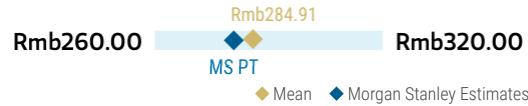

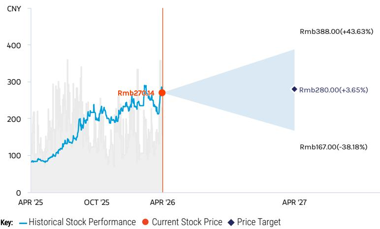  
RISK REWARD CHART   
Source: Re nitiv, Morgan Stanley Research

# EQUAL-WEIGHT THESIS

▪ We view the stock as fairly valued based on current demand indicators, with expectations for rising automotive and data center PCB already elevated for 2026.

▪ Shennan's "China localization" story should continue to play out in the longer term for PCB and IC substrates, and it should be the main bene ficiary amid China's semiconductor self-suf ficiency drive.

Demand for 5G base station PCB was slow in 2025, and has remained slow in 2026, with limited visibility on the trajectory of demand improvement (both domestic and overseas).

▪ Server/Optical module PCB demand is improving for cloud in China, and new platform penetration rate continues to rise.

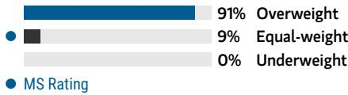  
Consensus Rating Distribution   
Source: Re nitiv, Morgan Stanley Research

# Risk Reward Themes

Electric Vehicles: Positive New Data Era: Positive Pricing Power: Negative View descriptions of Risk Rewards Themes here

# BULL CASE

# Rmb388.00

# BASE CASE

# Rmb280.00

# BEAR CASE

# Rmb167.00

# 55x 2026e EPS

Shennan's share of the 5G base station market expands to $20 \%$ (vs. base case scenario of $1 5 . 2 0 \% )$ ), while its automotive and server PCB business doubles over the next two years and its IC substrate business grows $4 0 { - } 5 0 \%$ YoY in 2026 (vs. base case scenario of $\sim 3 0 \% )$ . This results in a $5 0 \mathrm { - } 6 0 \%$ revenue CAGR in 2024-27e.

# 39x 2026e EPS

We expect Shennan's share of the 5G base station market to be stable at $1 5 . 2 0 \%$ while its server and automotive PCB continues to rise steadily and its IC substrate business continues to outgrow the market in 2026e as they gain share, especially in the domestic market. This results in a $2 5 . 3 0 \%$ revenue CAGR in 2024-27e.

# 24x 2026e EPS

Shennan's share of the 5G base station market falls to $5 . 7 0 \%$ (vs. base case scenario of $7 5 - 2 0 \% )$ , while its server and automotive PCB fails to continue to grow and its IC substrate business grows only slightly above the market in 2026. This results in a $0 . 1 0 \%$ revenue CAGR in 2024-27e.

# Risk Reward – Shennan Circuits Co Ltd (002916.SZ)

KEY EARNINGS INPUTS   

<table><tr><td>Drivers</td><td>2024</td><td>2025e</td><td>2026e</td><td>2027e</td></tr><tr><td>PCB revenue y/y (%)</td><td>30</td><td>37</td><td>24</td><td>18</td></tr><tr><td> IC substrate revenue y/y (%)</td><td>37</td><td>31</td><td>66</td><td>36</td></tr><tr><td>PCB GM (%)</td><td>31.6</td><td>35.5</td><td>36.3</td><td>38.5</td></tr><tr><td>IC substrate GM (%)</td><td>18.1</td><td>22.6</td><td>30.7</td><td>33.6</td></tr></table>

# INVESTMENT DRIVERS

5G base station deployment schedule Supplier share allocation China's data center demand China's semiconductor localization schedule

# GLOBAL REVENUE EXPOSURE

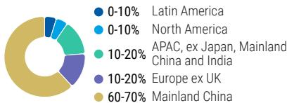

Source: Morgan Stanley Research Estimate View explanation of regional hierarchies here

# MS ALPHA MODELS

<table><tr><td>3/5</td><td>3 Month</td></tr><tr><td>MOST</td><td>Horizon</td></tr></table>

Source: Re nitiv, FactSet, Morgan Stanley Research; 1 is the highest favored Quintile and 5 is the least favored Quintile

# RISKS TO PT/RATING

# RISKS TO UPSIDE

Rising demand for 5G and data center PCB. Further share gain for 5G and data center PCB. Rising IC substrate demand driven by acceleration in China's semiconductor localization.

# RISKS TO DOWNSIDE

Rising competition for 5G and data center PCB.   
Delay in 5G network deployment.   
Escalating US-China trade tensions.

# OWNERSHIP POSITIONING

Inst. Owners, % Active $4 2 . 6 \%$

Source: Re nitiv, Morgan Stanley Research

# MS ESTIMATES VS. CONSENSUS

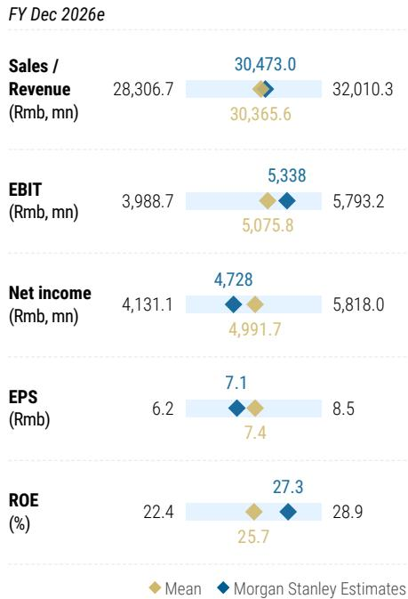  
Source: Re nitiv, Morgan Stanley Research

# Shengyi Tech: Earnings Estimate Changes

Our 2027 EPS estimate increases $6 \% ,$ mainly driven by stronger demand for server PCB/ CCL, while our 2025 and 2026 earnings estimates stay unchanged.

Exhibit 49: Earnings Estimate Changes   

<table><tr><td rowspan="2">Year to Dec.31</td><td colspan="2">2025E</td><td rowspan="2">% diff</td><td colspan="2">2026E</td><td rowspan="2">% diff</td><td colspan="2">2027E</td><td rowspan="2">% diff</td></tr><tr><td>New</td><td>Old</td><td>New</td><td>Old</td><td>New</td><td>Old</td></tr><tr><td>(RMB mn) P&amp;LSummary</td><td></td><td></td><td></td><td></td><td></td><td></td><td></td><td></td><td></td></tr><tr><td>Net sales</td><td>28,431</td><td>28,431</td><td>0%</td><td>36,790</td><td>36,790</td><td>0%</td><td>46,596</td><td>44,411</td><td>5%</td></tr><tr><td>COGS</td><td>(20,909)</td><td>(20,909)</td><td></td><td>(26,540)</td><td>(26,540)</td><td></td><td>(33,176)</td><td>(31,617)</td><td></td></tr><tr><td>Gross profit</td><td>7,522</td><td>7,522</td><td>0%</td><td>10,250</td><td>10,250</td><td>0%</td><td>13,420</td><td>12,794</td><td>5%</td></tr><tr><td>Operating expenses</td><td>(3,072)</td><td>(3,072)</td><td></td><td>(3,939)</td><td>(3,939)</td><td></td><td>(5,013)</td><td>(4,778)</td><td></td></tr><tr><td>Operating income</td><td>4,450</td><td>4,450</td><td>0%</td><td>6,311</td><td>6,311</td><td>0%</td><td>8,407</td><td>8,017</td><td>5%</td></tr><tr><td>Non-operating income</td><td>35</td><td>35</td><td></td><td>(15)</td><td>(30)</td><td></td><td>(15)</td><td>(30)</td><td></td></tr><tr><td>Pre-tax income</td><td>4,486</td><td>4,486</td><td>0%</td><td>6,296</td><td>6,281</td><td>0%</td><td>8,393</td><td>7,987</td><td>5%</td></tr><tr><td>Income tax</td><td>(494)</td><td>(494)</td><td></td><td>(673)</td><td>(672)</td><td></td><td>(903)</td><td>(859)</td><td></td></tr><tr><td>Minority interest</td><td>(658)</td><td>(658)</td><td></td><td>(700)</td><td>(700)</td><td></td><td>(700)</td><td>(700)</td><td></td></tr><tr><td>Net income</td><td>3,334</td><td>3,334</td><td>0%</td><td>4,923</td><td>4,909</td><td>0%</td><td>6,790</td><td>6,428</td><td>6%</td></tr><tr><td>EPS (RMB)</td><td>1.40</td><td>1.40</td><td>0%</td><td>2.06</td><td>2.06</td><td>0%</td><td>2.84</td><td>2.69</td><td>6%</td></tr><tr><td>Margins</td><td></td><td></td><td></td><td></td><td></td><td></td><td></td><td></td><td></td></tr><tr><td>Gross margin</td><td>26.5%</td><td>26.5%</td><td></td><td>27.9%</td><td>27.9%</td><td></td><td>28.8%</td><td>28.8%</td><td></td></tr><tr><td>Operating margin</td><td>15.7%</td><td>15.7%</td><td></td><td>17.2%</td><td>17.2%</td><td></td><td>18.0%</td><td>18.1%</td><td></td></tr><tr><td>Pretax margin</td><td>15.8%</td><td>15.8%</td><td></td><td>17.1%</td><td>17.1%</td><td></td><td>18.0%</td><td>18.0%</td><td></td></tr><tr><td>Net margin</td><td>11.7%</td><td>11.7%</td><td></td><td>13.4%</td><td>13.3%</td><td></td><td>14.6%</td><td>14.5%</td><td></td></tr></table>

Source: Morgan Stanley Research (E) estimates.

# Price Target Discussion and Valuation Methodology

We raise our 12-month price target to Rmb74 (36x 2026e EPS or 26x 2027e EPS), up from Rmb70, driven by our higher earnings estimates for CY27e: Our base-case scenario 添加微信 LCD123321Cad 04-20 value, which is also our price target, is derived from a residual income (RI) model.

Our key assumptions are all unchanged, including a cost of equity of $7 . 3 \%$ (beta of 1.2, equity risk premium $5 . 0 \%$ and risk-free rate of $1 . 3 \% )$ , a medium-term growth rate of $1 0 . 0 \%$ and a terminal growth rate of $3 . 0 \%$ .

# Our bull- and bear-case values increase to Rmb106 and Rmb42, respectively: This is in line with the magnitude of increase in our base-case value.

Exhibit 50: Residual Income (RI) Model   

<table><tr><td>RMBmn</td><td>2026E</td><td>2027E</td><td>2028E</td><td>2029E</td><td>2030E</td><td>2031E</td><td>2032E</td><td>2033E</td><td>2034E</td><td>2035E</td><td>2036E</td></tr><tr><td>Total Equity</td><td>21,478</td><td>25,250</td><td>29,022</td><td>33,171</td><td>37,735</td><td>42,755</td><td>48,277</td><td>54,352</td><td>61,034</td><td>68,384</td><td>75,450</td></tr><tr><td></td><td></td><td></td><td></td><td></td><td></td><td></td><td></td><td></td><td></td><td></td><td></td></tr><tr><td>Net Profit Return on Equity</td><td>4,923 24.6%</td><td>6,790 29.1%</td><td>7,469 27.5%</td><td>8,216 26.4%</td><td>9,037 25.5%</td><td>9,941 24.7%</td><td>10,935 24.0%</td><td>12,029 23.4%</td><td>13,232 22.9%</td><td>14,555 22.5%</td><td>14,992 20.8%</td></tr><tr><td></td><td></td><td></td><td></td><td></td><td></td><td></td><td></td><td></td><td></td><td></td><td></td></tr><tr><td>Beta</td><td>1.2</td><td>1.2</td><td>1.2</td><td>1.2</td><td>1.2</td><td>1.2</td><td>1.2</td><td>1.2</td><td>1.2</td><td>1.2</td><td>1.2</td></tr><tr><td>Equity Risk Premium (Rm-Rf) Risk Free Rate (Rf)</td><td>5.0% 1.3%</td><td>5.0% 1.3%</td><td>5.0%</td><td>5.0%</td><td>5.0%</td><td>5.0%</td><td>5.0%</td><td>5.0%</td><td>5.0%</td><td>5.0%</td><td>5.0%</td></tr><tr><td>Cost of Equity</td><td>7.3%</td><td>7.3%</td><td>1.3% 7.3%</td><td>1.3% 7.3%</td><td>1.3% 7.3%</td><td>1.3% 7.3%</td><td>1.3% 7.3%</td><td>1.3% 7.3%</td><td>1.3%</td><td>1.3%</td><td>1.3% 7.3%</td></tr><tr><td></td><td></td><td></td><td></td><td></td><td></td><td></td><td></td><td></td><td>7.3%</td><td>7.3%</td><td></td></tr><tr><td>Beginning Equity Capital</td><td>21,478</td><td></td><td></td><td></td><td></td><td></td><td></td><td></td><td></td><td></td><td></td></tr><tr><td>PV of Forecast Period</td><td>46,153</td><td></td><td></td><td></td><td></td><td></td><td></td><td></td><td></td><td></td><td></td></tr><tr><td>PV of Continuing Value</td><td>109,024</td><td></td><td></td><td></td><td></td><td></td><td></td><td></td><td></td><td></td><td></td></tr><tr><td>Equity Value</td><td>176,655</td><td></td><td></td><td></td><td></td><td></td><td></td><td></td><td></td><td></td><td></td></tr><tr><td>No. of Shares</td><td>2.388</td><td></td><td></td><td></td><td></td><td></td><td></td><td></td><td></td><td></td><td></td></tr><tr><td>ProjectedPrice(RMB)</td><td>74.0</td><td></td><td></td><td></td><td></td><td></td><td></td><td></td><td></td><td></td><td></td></tr></table>

Source: Morgan Stanley Research (E) estimates.

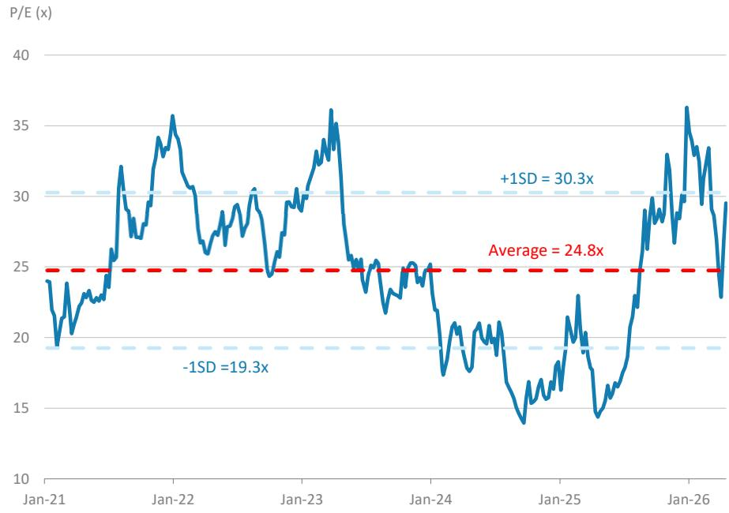  
Exhibit 51: Shengyi Tech's five-year P/E Chart   
Source: TEJ, Morgan Stanley Research (E) estimates.

# Financials

Exhibit 52: Quarterly Earnings Estimates   

<table><tr><td>RMBmn</td><td>1Q25</td><td>2Q25</td><td>3Q25</td><td>4Q25E</td><td>1Q26E</td><td>2Q26E</td><td>3Q26E</td><td>4Q26E</td><td>2024A</td><td>2025E</td><td>2026E</td><td>2027E</td></tr><tr><td>Netsales</td><td>5,611</td><td>7,069</td><td>7,934</td><td>7,818</td><td>8,119</td><td>8,900</td><td>9,617</td><td>10,153</td><td>20,388</td><td>28,431</td><td>36,790</td><td>46,596</td></tr><tr><td>COGS</td><td>(4,258)</td><td>(5,209)</td><td>(5,734)</td><td>(5,709)</td><td>(5.913)</td><td>(6,439)</td><td>(6.916)</td><td>(7,273)</td><td>(16,018)</td><td>(20,909)</td><td>(26,540)</td><td>(33,176)</td></tr><tr><td>Gross profit</td><td>1,354</td><td>1,860</td><td>2,200</td><td>2,109</td><td>2,206</td><td>2,461</td><td>2,702</td><td>2,881</td><td>4,370</td><td>7,522</td><td>10,250</td><td>13,420</td></tr><tr><td>Operating expenses</td><td>(655)</td><td>(781)</td><td>(784)</td><td>(852)</td><td>(876)</td><td>(927)</td><td>(1,029)</td><td>(1,107)</td><td>(2,372)</td><td>(3,072)</td><td>(3.939)</td><td>(5,013)</td></tr><tr><td>SG&amp;A, R&amp;D exp.</td><td>(655)</td><td>(781)</td><td>(784)</td><td>(852)</td><td>(876)</td><td>(927)</td><td>(1,029)</td><td>(1,107)</td><td>(2.372)</td><td>(3,072)</td><td>(3.939)</td><td>(5,013)</td></tr><tr><td>Employee bonus</td><td>9</td><td>10</td><td>11</td><td>12</td><td>13</td><td>14</td><td>15</td><td>16</td><td>1</td><td>1</td><td>2</td><td>3</td></tr><tr><td>Operating income</td><td>699</td><td>1,079</td><td>1,416</td><td>1,257</td><td>1,330</td><td>1,534</td><td>1,673</td><td>1,774</td><td>1,998</td><td>4,450</td><td>6,311</td><td>8,407</td></tr><tr><td>Non-operating income</td><td>20</td><td>43</td><td>(24)</td><td>(3)</td><td>(4)</td><td>(4)</td><td>(4)</td><td>(4)</td><td>70</td><td>35</td><td>(15)</td><td>(15)</td></tr><tr><td>Interest income</td><td>(37)</td><td>(51)</td><td>(84)</td><td>(63)</td><td>(63)</td><td>(63)</td><td>(63)</td><td>(63)</td><td>(184)</td><td>(234)</td><td>(251)</td><td>(251)</td></tr><tr><td>Investment income</td><td>14</td><td>20</td><td>20</td><td>20</td><td>16</td><td>16</td><td>16</td><td>16</td><td>55</td><td>75</td><td>64 0</td><td>64</td></tr><tr><td>Disposal of investment</td><td>0</td><td>0</td><td>0</td><td>0</td><td>0</td><td>0</td><td>0</td><td>0</td><td>0</td><td>0</td><td></td><td>0</td></tr><tr><td>Exchange gain</td><td>0</td><td>0</td><td>0</td><td>0</td><td>0</td><td>0</td><td>0</td><td>0</td><td>0</td><td>0</td><td></td><td>0</td></tr><tr><td>Other</td><td>43</td><td>74</td><td>39</td><td>39</td><td>43</td><td>43</td><td>43</td><td>43</td><td>199</td><td>195</td><td>172</td><td>172</td></tr><tr><td>Pre-tax income</td><td>719</td><td>1,122</td><td>1,391</td><td>1,254</td><td>1,327</td><td>1,530</td><td>1,669</td><td>1,771</td><td>2,068</td><td>4,486</td><td>6,296</td><td>8,393</td></tr><tr><td>Income tax</td><td>(84)</td><td>(134)</td><td>(150)</td><td>(125)</td><td>(159)</td><td>(168)</td><td>(169)</td><td>(177)</td><td>(200)</td><td>(494)</td><td>(673)</td><td>(903)</td></tr><tr><td>Minority interest</td><td>(71)</td><td>(125)</td><td>(224)</td><td>(238)</td><td>(175)</td><td>(175)</td><td>(175)</td><td>(175)</td><td>(129)</td><td>(658)</td><td>(700)</td><td>(700)</td></tr><tr><td>Net income</td><td>564</td><td>863</td><td>1,017</td><td>891</td><td>992</td><td>1,187</td><td>1,325</td><td>1,418</td><td>1,739</td><td>3,334</td><td>4,923</td><td>6,790</td></tr><tr><td>Adj.wtd.avg.shrs (mn)</td><td>2,388</td><td>2,388</td><td>2.388</td><td>2,388</td><td>2.388</td><td>2,388</td><td>2.388</td><td>2.388</td><td>2,388</td><td>2,388</td><td>2.388</td><td>2,388</td></tr><tr><td>EPS (RMB)</td><td>0.24</td><td>0.36</td><td>0.43</td><td>0.37</td><td>0.42</td><td>0.50</td><td>0.56</td><td>0.59</td><td>0.73</td><td>1.40</td><td>2.06</td><td>2.84</td></tr><tr><td>Fully diluted shares (mn)</td><td>2,388</td><td>2,388</td><td>2.388</td><td>2,388</td><td>2.388</td><td>2,388</td><td>2.388</td><td>2.388</td><td>2,388</td><td>2,388</td><td>2.388</td><td>2.388</td></tr><tr><td>Diluted EPS (RMB)</td><td>0.24</td><td>0.36</td><td>0.43</td><td>0.37</td><td>0.42</td><td>0.50</td><td>0.56</td><td>0.59</td><td>0.73</td><td>1.40</td><td>2.06</td><td>2.84</td></tr><tr><td>Margins (%)</td><td></td><td></td><td></td><td></td><td></td><td></td><td></td><td></td><td></td><td></td><td></td><td></td></tr><tr><td>Gross Margin</td><td>24.1</td><td>26.3</td><td>27.7</td><td>27.0</td><td>27.2</td><td>27.7</td><td>28.1</td><td>28.4</td><td>21.4</td><td>26.5</td><td>27.9</td><td>28.8</td></tr><tr><td>Operating Margin</td><td>12.4</td><td>15.3</td><td>17.8</td><td>16.1</td><td>16.4</td><td>17.2</td><td>17.4</td><td>17.5</td><td>9.8</td><td>15.7</td><td>17.2</td><td>18.0</td></tr><tr><td>Pretax Margin</td><td>12.8</td><td>15.9</td><td>17.5</td><td>16.0</td><td>16.3</td><td>17.2</td><td>17.4</td><td>17.4</td><td>10.1</td><td>15.8</td><td>17.1</td><td>18.0</td></tr><tr><td>Net Margin</td><td>10.0</td><td>12.2</td><td>12.8</td><td>11.4</td><td>12.2</td><td>13.3</td><td>13.8</td><td>14.0</td><td>8.5</td><td>11.7</td><td>13.4</td><td>14.6</td></tr><tr><td>QoQ Growth (%)</td><td></td><td></td><td></td><td></td><td></td><td></td><td></td><td></td><td></td><td></td><td></td><td></td></tr><tr><td>Sales</td><td>-1</td><td>26</td><td>12</td><td>-1</td><td>4</td><td>10</td><td>8</td><td>6</td><td></td><td></td><td></td><td></td></tr><tr><td>Gross Profit</td><td>12</td><td>37</td><td>18</td><td>-4</td><td>5</td><td>12</td><td>10</td><td>7</td><td></td><td></td><td></td><td></td></tr><tr><td>Operating Profit</td><td>44</td><td>54</td><td>31</td><td>-11</td><td>6</td><td>15</td><td>9</td><td>6</td><td></td><td></td><td></td><td></td></tr><tr><td>Pretax Profit</td><td>59</td><td>56</td><td>24</td><td>-10</td><td>6</td><td>15</td><td>9</td><td>6</td><td></td><td></td><td></td><td></td></tr><tr><td>Net Profit</td><td>54</td><td>53</td><td>18</td><td>-12</td><td>11</td><td>20</td><td>12</td><td>7</td><td></td><td></td><td></td><td></td></tr><tr><td>YoY Growth (%)</td><td></td></table>

Source: Company data, Morgan Stanley Research (E) estimates.

Exhibit 53: Consolidated Financial Summary   
Consolidated Income Statement   

<table><tr><td>RMBmn(Year End Dec 31)</td><td>2024A</td><td>2025E</td><td>2026E</td><td>2027E</td></tr><tr><td>Net sales</td><td>20,388</td><td>28,431</td><td>36,790</td><td>46,596</td></tr><tr><td>COGS</td><td>(16,018)</td><td>(20,909)</td><td>(26,540)</td><td>(33,176)</td></tr><tr><td>Gross profit</td><td>4,370</td><td>7,522</td><td>10,250</td><td>13,420</td></tr><tr><td>Operating expenses</td><td>(2,372)</td><td>(3,072)</td><td>(3.939)</td><td>(5.013)</td></tr><tr><td>Operating income</td><td>1,998</td><td>4,450</td><td>6,311</td><td>8,407</td></tr><tr><td>Non-operating income</td><td>70</td><td>35</td><td>(15)</td><td>(15)</td></tr><tr><td>Interest income</td><td>(184)</td><td>(234)</td><td>(251)</td><td>(251)</td></tr><tr><td>Investment income</td><td>55</td><td>75</td><td>64</td><td>64</td></tr><tr><td>Disposal of investment</td><td>-</td><td>-</td><td>-</td><td>-</td></tr><tr><td>Exchange gain</td><td>=</td><td></td><td>=</td><td>-</td></tr><tr><td>Other</td><td>199</td><td>195</td><td>172</td><td>172</td></tr><tr><td>Pre-tax income</td><td>2,068</td><td>4,486</td><td>6,296</td><td>8,393</td></tr><tr><td>Income tax</td><td>(200)</td><td>(494)</td><td>(673)</td><td>(903)</td></tr><tr><td>Minority interests</td><td>(129)</td><td>(658)</td><td>(700)</td><td>(700)</td></tr><tr><td>Net income</td><td>1,739</td><td>3,334</td><td>4,923</td><td>6,790</td></tr><tr><td>Adj. wtd. Avg. shrs (m)</td><td>2,388</td><td>2,388</td><td>2,388</td><td>2,388</td></tr><tr><td>Reported EPS (Rmb)</td><td>0.73</td><td>1.40</td><td>2.06</td><td>2.84</td></tr><tr><td>Diluted shrs (m)</td><td>2,388</td><td>2,388</td><td>2,388</td><td>2,388</td></tr><tr><td>Diluted EPS (Rmb)</td><td>0.73</td><td>1.40</td><td>2.06</td><td>2.84</td></tr></table>

Consolidated Balance Sheet   

<table><tr><td>RMBmn (Year EndDec 31)</td><td>2024A</td><td>2025E</td><td>2026E</td><td>2027E</td></tr><tr><td>Cash</td><td>2,004</td><td>11,171</td><td>14,018</td><td>17,749</td></tr><tr><td>Mkt securities</td><td>-</td><td>·</td><td>-</td><td>-</td></tr><tr><td>AR/NR</td><td>8,946</td><td>3,127</td><td>4,047</td><td>5,126</td></tr><tr><td>Inventory</td><td>5,119</td><td>3,136</td><td>3,981</td><td>4,976</td></tr><tr><td>Others</td><td>543</td><td>142</td><td>184</td><td>233</td></tr><tr><td>Current Assets</td><td>16,613</td><td>17,577</td><td>22,230</td><td>28,084</td></tr><tr><td>Long-term investments</td><td>689</td><td>689</td><td>689</td><td>689</td></tr><tr><td>Fixed assets</td><td>9,105</td><td>9,374</td><td>9,723</td><td>10,164</td></tr><tr><td>Other assets</td><td>1,237</td><td>1,237</td><td>1,237</td><td>1,237</td></tr><tr><td>Total Assets</td><td>27,643</td><td>28,877</td><td>33,878</td><td>40,174</td></tr><tr><td>S/T borrowings</td><td>1,837</td><td>1,837</td><td>1,837</td><td>1,837</td></tr><tr><td>AP/NP</td><td>5,012</td><td>2,927</td><td>3,716</td><td>4,645</td></tr><tr><td>Other ST liabilities</td><td>3,000</td><td>3,916</td><td>4,971</td><td>6,214</td></tr><tr><td>Total Current Liabilities</td><td>9,849</td><td>8,680</td><td>10,523</td><td>12,695</td></tr><tr><td>L/T debt</td><td>558</td><td>558</td><td>558</td><td>558</td></tr><tr><td>Other LT libilities</td><td>731</td><td>1,020</td><td>1,320</td><td>1,671</td></tr><tr><td>Total Liabilities</td><td>11,138</td><td>10,257</td><td>12,400</td><td>14,924</td></tr><tr><td>Common shares</td><td>2,429</td><td>2,327</td><td>2,327</td><td>2,327</td></tr><tr><td>Retained Earnings</td><td>5,867</td><td>8,083</td><td>10,942</td><td>14,714</td></tr><tr><td>Other SH&#x27; Equity</td><td>8,208</td><td>8,208</td><td>8.208</td><td>8,208</td></tr><tr><td>Total Shareholders&#x27;Equity</td><td>16,505</td><td>18,619</td><td>21,478</td><td>25,250</td></tr><tr><td>Total Liab./SH&#x27;s Equity</td><td>27,643</td><td>28,877</td><td>33,878</td><td>40,174</td></tr></table>

Consolidated Cash Flow Statement   

<table><tr><td>RMBmn (Year End Dec 31)</td><td>2024A</td><td>2025E</td><td>2026E</td><td>2027E</td></tr><tr><td>Operating Cashflow</td><td>1,456</td><td>10,293</td><td>4,896</td><td>6,775</td></tr><tr><td>Net Profits</td><td>1,739</td><td>3,334</td><td>4,923</td><td>6,790</td></tr><tr><td>Depreciation &amp; Amort.</td><td>0</td><td>0</td><td>0</td><td>0</td></tr><tr><td>Investment losses/(income)</td><td>(55)</td><td>(75)</td><td>(64)</td><td>(64)</td></tr><tr><td>Working capital change</td><td>(1,080)</td><td>6,633</td><td>79</td><td>98</td></tr><tr><td>Other adjustments</td><td>853</td><td>401</td><td>(42)</td><td>(49)</td></tr><tr><td>Investing Cashflow</td><td>(934)</td><td>(269)</td><td>(348)</td><td>(441)</td></tr><tr><td>Capex</td><td>(926)</td><td>(284)</td><td>(368)</td><td>(466)</td></tr><tr><td>Change of L/T investment</td><td>(55)</td><td>0</td><td>0</td><td>0</td></tr><tr><td>Change of S/T investment</td><td>0</td><td>0</td><td>0</td><td>0</td></tr><tr><td>Other adjustments</td><td>36</td><td>0</td><td>0</td><td>0</td></tr><tr><td>Financing Cashflow</td><td>(1,276)</td><td>(857)</td><td>(1,701)</td><td>(2,602)</td></tr><tr><td>Increase in L/T debt</td><td>(281)</td><td>0</td><td>0</td><td>0</td></tr><tr><td>Increase in S/T debt</td><td>0</td><td>0</td><td>0</td><td>0</td></tr><tr><td>Issuance of stock</td><td>0</td><td>(102)</td><td>0</td><td>0</td></tr><tr><td>Cash dividends</td><td>(1,192)</td><td>(1,043)</td><td>(2,000)</td><td>(2,954)</td></tr><tr><td>Other adjustments</td><td>196</td><td>288</td><td>300</td><td>352</td></tr><tr><td>FX adjustment</td><td>3</td><td>0</td><td>0</td><td>0</td></tr><tr><td>Net change in cash</td><td>(752)</td><td>9,167</td><td>2,847</td><td>3,731</td></tr></table>

Consolidated Financial Ratios   

<table><tr><td></td><td>2024A</td><td>2025E</td><td>2026E</td><td>2027E</td></tr><tr><td>Margins (%)</td><td></td><td></td><td></td><td></td></tr><tr><td>Gross margin</td><td>21.4</td><td>26.5</td><td>27.9</td><td>28.8</td></tr><tr><td>Operating margin</td><td>9.8</td><td>15.7</td><td>17.2</td><td>18.0</td></tr><tr><td>Pretax margin</td><td>10.1</td><td>15.8</td><td>17.1</td><td>18.0</td></tr><tr><td>Net margin</td><td>8.5</td><td>11.7</td><td>13.4</td><td>14.6</td></tr><tr><td>YoY growth (%)</td><td></td><td></td><td></td><td></td></tr><tr><td>Sales</td><td>22.9</td><td>39.4</td><td>29.4</td><td>26.7</td></tr><tr><td>Operating profits</td><td>54.8</td><td>122.7</td><td>41.8</td><td>33.2</td></tr><tr><td>Pretax profits</td><td>62.7</td><td>116.9</td><td>40.4</td><td>33.3</td></tr><tr><td>Net profits</td><td>49.4</td><td>91.8</td><td>47.7</td><td>37.9</td></tr><tr><td>Others</td><td></td><td></td><td></td><td></td></tr><tr><td>Cash dividend payout (%)</td><td>60</td><td>60</td><td>60</td><td>60</td></tr><tr><td>Cash div (Rmb)</td><td>0.4</td><td>0.8</td><td>1.2</td><td>1.7</td></tr><tr><td>Yield (%)</td><td>1</td><td>3</td><td>4</td><td>6</td></tr><tr><td>Net Debt/Equity (%)</td><td>2</td><td>(47)</td><td>(54)</td><td>(61)</td></tr><tr><td>Liabilities/Equity (%)</td><td>67</td><td>55</td><td>58</td><td>59</td></tr><tr><td>Liabilties/Assets (%)</td><td>40</td><td>36</td><td>37</td><td>37</td></tr><tr><td>ROAE(%)</td><td>11</td><td>19</td><td>25</td><td>29</td></tr><tr><td>ROAA (%)</td><td>7</td><td>12</td><td>16</td><td>18</td></tr><tr><td>AR/NR Turnover (days)</td><td>139</td><td>77</td><td>36</td><td>36</td></tr><tr><td>Inventory Turnover (days)</td><td>107</td><td>72</td><td>49</td><td>49</td></tr><tr><td>AP/NP Turnover (days)</td><td>101</td><td>69</td><td>46</td><td>46</td></tr><tr><td>Cash conversion cycle</td><td>144</td><td>80</td><td>39</td><td>39</td></tr></table>

# Risk Reward - Shengyi Technology Risk Reward – Shengyi Technology Co Ltd. (600183.SS)

2026 a year of share gains for CCL business, but valuation keeps us EW

# Rmb74.00PRICE TARGET

Base case, derived from a residual income (RI) model. Key assumptions include a cost of equity of $7 . 3 \%$ (beta of 1.2, equity premium of $5 \%$ and risk-free rate of $1 . 3 \% )$ , $10 \%$ mediumterm growth rate and $3 \%$ terminal growth rate.

Consensus Price Target Distribution

Source: Re fi nitiv, Morgan Stanley Research

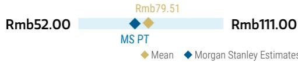

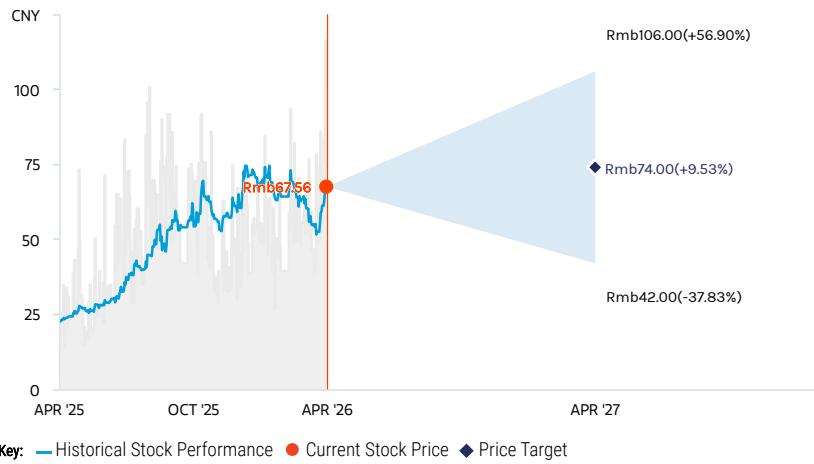  
RISK REWARD CHART   
Source: Re nitiv, Morgan Stanley Research

# EQUAL-WEIGHT THESIS

▪ We continue to expect y/y improvement in 2026. Consumer electronics demand will decline y/y due to price hikes induced by rising memory prices, but increasing server demand will likely offset the impacts.

▪ We should be mindful of the cost headwinds from price hikes of PCB/CCL raw materials, such as copper, gold, glass cloth and resin.

▪ We expect Shengyi's CCL business to enjoy share gains in the AI server market, while its PCB business will continue to suffer from share loss for a major ASIC project in 2026.

▪ Valuation looks fair, in our view, so we are EW.

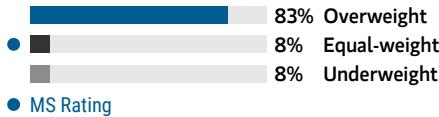  
Consensus Rating Distribution   
Source: Re nitiv, Morgan Stanley Research

# Risk Reward Themes

Secular Growth: Positive View descriptions of Risk Rewards Themes here

# BULL CASE

# Rmb106.00  BASE CASE

# Rmb74.00

# BEAR CASE

Rmb42.00

# 51x 2026e P/E

We assume a $6 0 \%$ revenue CAGR, 2024- 27, with a $90 \%$ earnings CAGR over the same period. This means we are projecting operating margin to expand from $9 . 8 \%$ in 2024 to $= 2 6 \%$ by 2027.

# 36x 2026e P/E

We forecast a $3 0 . 3 5 \%$ revenue CAGR, 2024- 27, with a $6 0 \%$ operating pro t CAGR over the same period. This means we are projecting operating margin to improve from $9 . 8 \%$ in 2024 to ${ \sim } 1 \bar { 8 } \%$ by 2027.

# 20x 2026e P/E

We assume a $0 . 1 0 \%$ revenue CAGR, $2 0 2 4$ - 27, with only $5 . 7 5 \%$ earnings CAGR over the same period. This means we are projecting operating margin to increase slightly from $9 . 8 \%$ in 2024 to ${ \sim } 1 0 \%$ by 2027.

# Risk Reward – Shengyi Technology Co Ltd. (600183.SS)

KEY EARNINGS INPUTS   

<table><tr><td>Drivers</td><td>2024</td><td>2025e</td><td>2026e</td><td>2027e</td></tr><tr><td>CCL sales y/y (%) (%)</td><td>18</td><td>26</td><td>32</td><td>28</td></tr><tr><td>PCB sales y/y (%) (%)</td><td>30</td><td>88</td><td>29</td><td>26</td></tr><tr><td>CCL GM (%) (%)</td><td>21.5</td><td>24.7</td><td>26.3</td><td>27.8</td></tr><tr><td>PCB GM (%) (%)</td><td>19.4</td><td>29.4</td><td>30.7</td><td>30.7</td></tr></table>

# INVESTMENT DRIVERS

5G base station deployment schedule Supplier share allocation China's data center demand

# GLOBAL REVENUE EXPOSURE

  
Source: Morgan Stanley Research Estimate View explanation of regional hierarchies here

# MS ALPHA MODELS

Source: Re nitiv, FactSet, Morgan Stanley Research; 1 is the highest favored Quintile and 5 is the least favored Quintile

# RISKS TO PT/RATING

# RISKS TO UPSIDE

Accelerated demand for 5G and data center CCL/PCB.   
Further share gains for 5G and data center CCL/PCB.   
Meaningful penetration into IC substrate CCL, bene ting from China's semiconductor filocalization.

# RISKS TO DOWNSIDE

Rising competition for 5G and data center CCL/PCB. Delay in 5G network deployment. Escalating US-China trade tensions.

# OWNERSHIP POSITIONING

Inst. Owners, % Active $7 3 . 2 \%$

Source: Re nitiv, Morgan Stanley Research

# MS ESTIMATES VS. CONSENSUS

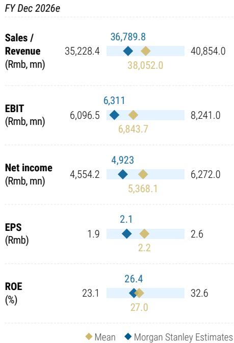  
Source: Re nitiv, Morgan Stanley Research

# Risk Reward Reference links

1. View explanation of Options Probabilities methodology - Options_Probabilities_Exhibit_Link.pdf

2. View descriptions of Risk Rewards Themes - RR_Themes_Exhibit_Link.pdf

3. View explanation of regional hierarchies - GEG_Exhibit_Link.pdf

4. View explanation of Theme/Exposure methodology - ESG_Sustainable_Solutions_External_Link.pdf

5. View explanation of HERS methodology - ESG_HERS_External_Link.pdf