Investor Presentation | Asia Pacific

# Greater China Technology Hardware: Will Macro Uncertainties Weigh On AI Hardware Outlook?

# Investment Summary

# • Opportunities in AI GPU and ASIC server/rack design upgrades

• Major design upgrades for upcoming Vera Rubin platform, Kyber architecture and LPX/Vera CPU rack.

AI ASIC server upgrade and volume expansion magnitude – mainly TPU and Trainium platform

• Where we see room for share price upside, near term

• AI server power solution (800 VDC), PCB/ABF substrate supply tightness, data network/interconnect/CPO upgrade

• Smooth GB300 server rack delivery plus attractive risk-reward for AI server ODMs

• Capacity expansion wave across the tech hardware supply chain

# • What are the potential risks that we observe

• Consumer electronics (smartphones/PC) demand and margin impact in 2H impacted by memory inflation

• Raw material price hike (copper, nickel) and supply tightness a margin headwind

• Supply shortage impact could potentially delay the shipment pace

• Geopolitical tension that impacts AI data center infrastructure spending

# • Key stock ideas

• AI server hardware – Wistron, FII/Hon Hai, Wiwynn, Quanta, Delta Electronics, AVC, BizLink, King Slide, Accton, 订阅研报添加微信 LCD123321Cad 0Chenbro, Gold Circuit, Unimicron, NYPCB, Yageo, FIT, and Fositek

• Edge AI – Xiaomi, Luxshare, Lenovo

Hardware Technology Valuation Comparison   

<table><tr><td>Ticker PC/Data Center/Cyclical Components</td><td>Company</td><td>Closing Price 4/16/2026 Rating</td><td>Price Target （LC）</td><td>Market Cap (Us$mn) 26E</td><td>EPS (Local Dollar) 27E</td><td>P/E(X) 26E 27E</td><td>P/B(X) 26E</td><td>27E 26E</td><td>P/S(X 27E</td><td>EV/EBITDA 26E</td><td>27E</td><td>ROE(%) 26E 27E</td><td>26E</td><td>ROA (%) 27E</td><td>Trading Volume</td><td></td></tr><tr><td colspan="11"></td><td>(US$mn) 26E</td></tr><tr><td></td><td></td><td></td><td></td><td></td><td></td><td></td><td></td><td></td><td></td><td></td><td></td><td></td><td></td><td></td><td></td><td></td></tr><tr><td>Taiwan 2324.TW</td><td>Compal</td><td>29.40 U</td><td>23.00</td><td>4,104</td><td>1.95 e 2.25 e</td><td>15.1 13.1</td><td>0.8e</td><td>0.8e 0.2</td><td>0.1</td><td>6.1</td><td>5.7</td><td>5.7</td><td>6.3 1.9</td><td>2.0</td><td>34.1</td><td>3%</td></tr><tr><td>2327.TW</td><td>Yageo</td><td>325.00 0</td><td>360.0</td><td>21,106</td><td>16.64 e 19.13e</td><td>19.5 ? 17.0</td><td>3.2 e</td><td>2.9 e</td><td>4.1 3.8</td><td>13.1</td><td>11.3</td><td>17.8</td><td>17.9</td><td>8.2 8.8 1.9</td><td>278.4</td><td>2%</td></tr><tr><td>2353.TW</td><td>Acer Asustek</td><td>28.40 U 589.00 U</td><td>21.00 525.0</td><td>2,650 13,715</td><td>1.54 e 1.61e 51.81 e 51.14 e</td><td>18.5 17.6 11.4 11.5</td><td>1.1 e 1.5 e</td><td>1.0 e 0.3 1.4 e 0.6</td><td>0.3 0.5</td><td>8.2 8.6</td><td>7.5 8.7</td><td>5.3 13.1</td><td>6.0 12.4</td><td>2.0</td><td>20.8</td><td>5%</td></tr><tr><td>2357.TW 2368.TW</td><td>GCE</td><td>1,165.00 。</td><td>1310.00</td><td>18,806 41.63 e</td><td>65.39 e</td><td>28.0 17.8</td><td>11.7 e</td><td>8.1e 6.1</td><td>4.6</td><td>18.9</td><td>11.8</td><td>49.8</td><td>6.4 53.9 22.3</td><td>5.9 25.4</td><td>80.6 175.0</td><td>6%</td></tr><tr><td>2376.TW</td><td>Gigabyte</td><td>281.00 E</td><td>295.0</td><td>5,910 22.14 e</td><td>22.91 e</td><td>12.7 12.3</td><td>2.8 e</td><td>2.6 e 0.4</td><td>0.3</td><td>10.3</td><td>10.3</td><td>22.7 22.1</td><td>8.3</td><td>7.5</td><td>43.3</td><td>1% 5%</td></tr><tr><td>2382.TW</td><td>Quanta</td><td>318.50 </td><td>400.00</td><td>37,678 28.25 e</td><td>29.38 e</td><td></td><td>3.8 e</td><td>3.1 e 0.4</td><td>0.3</td><td>9.7</td><td>9.0</td><td>376 31.6</td><td>6</td><td>5.4</td><td>174.0</td><td>4%</td></tr><tr><td>3231.TW</td><td>Wistron</td><td>134.00</td><td>205.0</td><td>13,375 13.76 e</td><td>18.05 e</td><td>113 10.</td><td>1.5e</td><td>1.3e</td><td>0.1</td><td>2.7</td><td>2.2</td><td></td><td>18.3</td><td>3.7</td><td>176.9</td><td></td></tr><tr><td>3533.TW</td><td>Lotes Pegatron</td><td>2,510.00 E E</td><td>1585.00 85.0</td><td>8,451 99.18 e 6,683 6.25 e</td><td>111.17 e 7.56 e</td><td>25.3 22.6</td><td>5.7 e</td><td>5.0e</td><td>6.0</td><td>15.4</td><td>13.7</td><td>24.2</td><td>23.5 18.5</td><td>18.1</td><td>57.8</td><td>1%</td></tr><tr><td>4938.TW 4958.TW</td><td>Zhen Ding</td><td>80.10 256.50 E</td><td>145.00</td><td>8,514 11.85 e</td><td>14.99 e</td><td>12.8 10.6 21.6 17.1</td><td>0.8e 1.5e</td><td>0.8e 0.2 1.2</td><td>0.1 1.0</td><td>3.8 8.9</td><td>3.1</td><td></td><td>7.4 25</td><td>2.6</td><td></td><td></td></tr><tr><td>8046.TW</td><td>Nan Ya PCB</td><td>721.00 </td><td>515.0</td><td>18.40 7.42 e</td><td>12.82 e</td><td>56.2</td><td></td><td>1.4 e</td><td>8</td><td>39.4</td><td>10.0 29.2</td><td>9.9</td><td>8.7 6.7</td><td>5.0</td><td>20</td><td>0%</td></tr><tr><td>6669.TW</td><td>Wiwynn</td><td>3,700.00</td><td>5800.0</td><td>335.00 e</td><td>409.01e</td><td>1 9.0</td><td>9.2</td><td>84</td><td>84</td><td>7.9</td><td>6.5</td><td>43.7</td><td>158 15.2</td><td>10.3 14.1</td><td>133.2 204.4</td><td>4%</td></tr><tr><td>HK/ China</td><td></td><td></td><td>56.50</td><td>14,819 2.44 e</td><td></td><td></td><td></td><td></td><td></td><td></td><td></td><td></td><td></td><td></td><td></td><td></td></tr><tr><td>000977.SZ 002916.SZ</td><td>Inspur Shennan Circuit</td><td>68.28 E 270.14</td><td>260.00</td><td>27,067 6.90e</td><td>2.56 e 9.48e</td><td>28.0 266 39.2</td><td>3.9e 6.4 e</td><td>3.5e 4.4 5.2e</td><td>0.7</td><td>227</td><td>22.0 18.5</td><td>14.9 13.8 24.1</td><td>4.2</td><td>3.9</td><td>499.2</td><td></td></tr><tr><td>0992.HK 6088.HK</td><td>Lenovo</td><td>11.10 HKD E</td><td>10.3</td><td>16,751 0.14e</td><td>0.14 e</td><td>10.2 10.2 F</td><td>1.9 e</td><td>1.7 e 12</td><td>0.2</td><td>3.1</td><td>2.8</td><td>27.3 18.8</td><td>15.2 3.9</td><td>17.3 3.7</td><td>289.7 109.5</td><td>1%</td></tr><tr><td></td><td>FIT Hong Teng</td><td>7.87 HKD 。</td><td>7.40</td><td>6.992 0.04e</td><td>0.06e</td><td>177.1 132.3</td><td>2.6e</td><td>2.4 e</td><td>1.0</td><td>9.6</td><td>7.8</td><td>20.8 14.5</td><td>5.5</td><td>6.8</td><td>46.4</td><td>6% 1%</td></tr><tr><td>Smartphone &amp; Wireless Equipment</td><td></td><td></td><td></td><td></td><td></td><td></td><td></td><td></td><td></td><td></td><td></td><td></td><td></td><td></td><td></td><td></td></tr><tr><td>Taiwan</td><td>Largan</td><td>2,820.00 E</td><td>2450.00</td><td>11,901</td><td>153.49e 165.87 e</td><td>18.4 17.0</td><td></td><td></td><td>5.9</td><td></td><td></td><td></td><td></td><td></td><td></td><td></td></tr><tr><td>3008.TW</td><td>Genius</td><td>511.00 E</td><td>425.00</td><td>1,814</td><td>31.74 e 39.14e</td><td>16.1 13.1</td><td>1.8 e 1.9 e</td><td>1.6e</td><td>6.3 2.1</td><td>8.2</td><td>7.4</td><td>10.2</td><td>10.0</td><td>9.0 9.2</td><td>50.8</td><td>3%</td></tr><tr><td>3406.TW HK/ China</td><td></td><td></td><td></td><td></td><td></td><td></td><td></td><td>1.7 e</td><td>2.3</td><td>5.3</td><td>4.6</td><td>12.7</td><td>13.7</td><td>8.1 9.4</td><td>14.0</td><td>14%</td></tr><tr><td>000063.SZ</td><td> ZTE (AShr)</td><td>35.40 U</td><td>29.44</td><td>23,112</td><td>1.50 e 1.78 e</td><td>23.6</td><td>19.9 2.1 e</td><td>1.9 e</td><td>1.0 0.9</td><td>14.6</td><td>12.2</td><td>85</td><td>10.0</td><td></td><td></td><td></td></tr><tr><td>002036.SZ</td><td>LCE</td><td>9.23 U</td><td>8.50</td><td>1,404</td><td>0.20 e 0.24 e</td><td>46.2</td><td>37.8 3.3e</td><td>3.1e</td><td>1.0 0.9</td><td>10.7</td><td>9.5</td><td></td><td>8.5</td><td>3.2 3.6 1.3 1.6</td><td>709.7 69.1</td><td>3%</td></tr><tr><td>002236.SZ</td><td>Dahua Crystal</td><td>19.17 E</td><td>21.80</td><td>9,092</td><td>1.36 e 1.56 e</td><td>14.1</td><td>12.3 1.5 e</td><td>1.4 e</td><td>1.7 1.6</td><td>10.7</td><td>8.6</td><td>10.8</td><td>11.7</td><td>7.5 7.9</td><td>127.0</td><td>4%</td></tr><tr><td>002273.SZ</td><td>TransInfo</td><td>29.45 0 9.86</td><td>30.00 10.00</td><td>5,921 1,932</td><td>1.08 e 1.25 e 0.45 e</td><td>27.3</td><td>23.5 4.0 e</td><td>3.8 e</td><td>5.1 4.4</td><td>17.7</td><td>15.2</td><td>15.0</td><td>16.7 11.9</td><td>13.0</td><td>161.5</td><td>3</td></tr><tr><td>002373.SZ 002415.SZ</td><td>Hikvision 002456.SZ SZ O-Film</td><td>日自 33.54</td><td>33.00 8.00</td><td>44,627 4,609</td><td>0.53 e 1.64 e 1.78 e 0.06 e 0.11 e</td><td>21.9 20.4 170.8 82.2</td><td>18.7 1.2 e 18.8 3.0e</td><td>1.1 e 2.8 e</td><td>1.8 1.6 3.1 2.8</td><td>8.9 14.3</td><td>4.8 12.9</td><td>5.7 15.2</td><td>6.2 15.1 10.4</td><td>3.8 4.1</td><td>56.5 228.0</td><td></td></table>

$N A =$ not available at this time. Source: FactSet, Morgan Stanley Research; E=Morgan Stanley Research estimates. Note: Prices as of the close, April 16, 2026.

# Hardware Technology Valuation Comparison

<table><tr><td rowspan=1 colspan=20>Closing         Tarce Market                                                                                                                  TradingPriceCapEPS (Local Dollar)P/E(X)P/B(XP/S(XEV/EBITDAROE(%)ROA(%)Volume26E27E26E27E26E27E26E27E26E27E26E27E26E27E(US$mn) 26ETicker      Company   4/16/2026Rating  （LC (Us$mn)</td></tr><tr><td rowspan=1 colspan=20>Tech conglomerate &amp; Enablers</td></tr><tr><td rowspan=1 colspan=20>Taiwan</td></tr><tr><td rowspan=1 colspan=2>2301.TW</td><td rowspan=1 colspan=2>Lite-On Tech        161.00  E    170.00</td><td rowspan=1 colspan=8>11,647  8.77 e11.12 e   18.4   14.5   3.7e  3.5e   1.8    1.5</td><td rowspan=1 colspan=8>10.50   8.13 20.63 24.92  8.45  9.66   98.01   4%</td></tr><tr><td rowspan=1 colspan=2>2308.TW</td><td rowspan=1 colspan=1>Delta            1,845.00</td><td rowspan=1 colspan=1>0   1976.0</td><td rowspan=1 colspan=8>146,605 37.12 e56.02 e   49.7   32.9  11.2 e  9.0 e   6.3   4.7</td><td rowspan=1 colspan=1>27.84</td><td rowspan=1 colspan=5>19.35 26.89 33.05  13.46  16.35</td><td rowspan=1 colspan=2>330.60   1%</td></tr><tr><td rowspan=1 colspan=2>2317.TW</td><td rowspan=1 colspan=1>Hon Hai           207.00</td><td rowspan=1 colspan=1>0    290.0</td><td rowspan=1 colspan=8>91,619  15.68 e 19.23 e   13.2   10.8  1.5e  1.4 e   0.3   0.3</td><td rowspan=1 colspan=1>5.94</td><td rowspan=1 colspan=5>4.96 11.48  13.22  4.74  5.33</td><td rowspan=1 colspan=2>381.33</td></tr><tr><td rowspan=1 colspan=2>2354.TW</td><td rowspan=1 colspan=1>Foxconn Tech        52.60</td><td rowspan=1 colspan=1>U    54.00</td><td rowspan=1 colspan=8>2.321  3.47 e 3.81e   15.2   13.8   0.4e 0.4 e   0.5   0.5</td><td rowspan=1 colspan=1>(2.30</td><td rowspan=1 colspan=5>(1.66)  4.32   4.62  2.34  2.58</td><td rowspan=1 colspan=2>21.55</td></tr><tr><td rowspan=1 colspan=2>2421.TW</td><td rowspan=1 colspan=1>147.00</td><td rowspan=1 colspan=1>E    165.0</td><td rowspan=1 colspan=9>1,264 10.15 e11.57 e   14.5   12.7   4.0 e  3.5 e   1.7    1.5  7.95</td><td rowspan=1 colspan=7>6.84 29.13 29.37 14.86 15.12   21.35   4%</td></tr><tr><td rowspan=1 colspan=2>2455.TW</td><td rowspan=1 colspan=1>290.00</td><td rowspan=1 colspan=1>E    200.00</td><td rowspan=1 colspan=9>1,608  4.69 e 6.82 e   61.8   42.5  14.6 e 12.7 e  13.0   10.7  40.52</td><td rowspan=1 colspan=7>29.37 24.85 31.84 17.63 23.00   43.64   1%</td></tr><tr><td rowspan=1 colspan=2>2474.TW</td><td rowspan=1 colspan=1>Catcher           197.50</td><td rowspan=1 colspan=1>U    160.0</td><td rowspan=1 colspan=1>3,550</td><td rowspan=1 colspan=15>12.03 e12.52 e  16.4   15.8  0.8e  0.8e   6.2   5.8 27.91  27.00  4.65  4.81  3.23  3.32   21.98   6%</td></tr><tr><td rowspan=1 colspan=2>3017.TW</td><td rowspan=1 colspan=1>AVC             2,440.00</td><td rowspan=1 colspan=1>0  2750.00</td><td rowspan=1 colspan=1>28,831</td><td rowspan=1 colspan=2>95.00 e121.50 e</td><td rowspan=1 colspan=1>25.7   20.1</td><td rowspan=1 colspan=9>12.1 e  8.6e   4.2   3.4  15.20  11.72  56.69 49.02  19.14</td><td rowspan=1 colspan=1>18.60</td><td rowspan=1 colspan=2>268.25   1%</td></tr><tr><td rowspan=1 colspan=2>3081.TWO</td><td rowspan=1 colspan=1>LandMark        2,365.00</td><td rowspan=1 colspan=1>E    1505.0</td><td rowspan=1 colspan=1>6.772</td><td rowspan=1 colspan=2>12.35 e 19.06 e</td><td rowspan=1 colspan=1>91.6124.1</td><td rowspan=1 colspan=9>39.1 e 26.3 e  55.8  39.2129.03  88.03 23.18 25.20 19.69</td><td rowspan=1 colspan=1>22.12</td><td rowspan=1 colspan=2>65.75</td></tr><tr><td rowspan=1 colspan=2>3324.TWO</td><td rowspan=1 colspan=2>Auras            1,045.00  E   1080.00</td><td rowspan=1 colspan=4>62.42 e 68.89 e   16.7   15.2</td><td rowspan=1 colspan=12>6.0e  4.9e  2.2   2.0  11.94 10.60 41.31 34.88 17.95 15.54  109.98</td></tr><tr><td rowspan=1 colspan=2>6271.TW</td><td rowspan=1 colspan=1>185.00</td><td rowspan=1 colspan=1>E     116.0</td><td rowspan=1 colspan=3>1,210  8.16e 9.47 e</td><td rowspan=1 colspan=1>22.7 19.5</td><td rowspan=1 colspan=12>1.4 e 1.3 e  3.1  2.9  17.46 15.00  6.25  6.94  4.72  5.27   13.03   1%</td></tr><tr><td rowspan=1 colspan=2>6805.TW</td><td rowspan=1 colspan=1>Fositek          1,900.00</td><td rowspan=1 colspan=1>0   2150.00</td><td rowspan=1 colspan=3>3.956 59.02e85.86e</td><td rowspan=1 colspan=1>32.2   22.1</td><td rowspan=1 colspan=9>12.4 e          7.1   5.4 24.30  16.22  45.69 46.07  22.93</td><td rowspan=1 colspan=3>24.51   98.85   1%</td></tr><tr><td rowspan=1 colspan=2>HK/China</td><td rowspan=1 colspan=1></td><td rowspan=1 colspan=1></td><td rowspan=1 colspan=3></td><td rowspan=1 colspan=1></td><td></td><td></td><td></td><td></td><td></td><td></td><td></td><td></td><td></td><td rowspan=1 colspan=1></td><td rowspan=1 colspan=2></td></tr><tr><td rowspan=1 colspan=2>002230.SZ</td><td rowspan=1 colspan=1>iFlytek              48.10</td><td rowspan=1 colspan=1>E     44.80</td><td rowspan=1 colspan=1>15,264</td><td rowspan=1 colspan=2>0.58 e  0.67 e</td><td rowspan=1 colspan=1>83.5   71.4</td><td rowspan=1 colspan=5>5.5e  5.2e   3.5   3.2  53.44</td><td rowspan=1 colspan=4>49.09  6.86  7.49  3.08</td><td rowspan=1 colspan=1>3.36</td><td rowspan=1 colspan=2>358.38</td></tr><tr><td rowspan=1 colspan=1>002241.SZ</td><td rowspan=1 colspan=1></td><td rowspan=1 colspan=1>GoerTek            24.22</td><td rowspan=1 colspan=1>U    16.60</td><td rowspan=1 colspan=1>12,533</td><td rowspan=1 colspan=2>1.09 e 1.25 e</td><td rowspan=1 colspan=1>22.2   19.4</td><td rowspan=1 colspan=1>2.2e</td><td rowspan=1 colspan=1>2.1e  0.8</td><td rowspan=1 colspan=3>0.7  6.95</td><td rowspan=1 colspan=1>5.29</td><td rowspan=1 colspan=2>10.08 10.90</td><td rowspan=1 colspan=1>4.08</td><td rowspan=1 colspan=1>4.24</td><td rowspan=1 colspan=1>398.75</td><td rowspan=1 colspan=1>2%</td></tr><tr><td rowspan=1 colspan=1>002475.SZ</td><td rowspan=1 colspan=1></td><td rowspan=1 colspan=1>Luxshare           60.45</td><td rowspan=1 colspan=1>。     77.00</td><td rowspan=1 colspan=1>62,813</td><td rowspan=1 colspan=1>2.85 e</td><td rowspan=1 colspan=1>4.05 e</td><td rowspan=1 colspan=1>21.2   14.9</td><td rowspan=1 colspan=1>3.6 e</td><td rowspan=1 colspan=1>2.9 e   1.0</td><td rowspan=1 colspan=1>0.9</td><td rowspan=1 colspan=2>12.04</td><td rowspan=1 colspan=1>9.32</td><td rowspan=1 colspan=1>18.48</td><td rowspan=1 colspan=1>21.51</td><td rowspan=1 colspan=1>7.72</td><td rowspan=1 colspan=1>9.53</td><td rowspan=1 colspan=1>990.48</td><td rowspan=1 colspan=1>0%</td></tr><tr><td rowspan=1 colspan=1>002600SZ</td><td rowspan=1 colspan=1></td><td rowspan=1 colspan=1>13.74</td><td rowspan=1 colspan=1>U</td><td rowspan=1 colspan=1>14.556</td><td rowspan=1 colspan=1>0.51 e</td><td rowspan=1 colspan=1>0.67e</td><td rowspan=1 colspan=1>20.5</td><td rowspan=1 colspan=1>0.9 e</td><td rowspan=1 colspan=1>1.5</td><td rowspan=1 colspan=1>1.2</td><td rowspan=1 colspan=2>12.82</td><td rowspan=1 colspan=1>10.67</td><td rowspan=1 colspan=1>13.35</td><td rowspan=1 colspan=1>15.34</td><td rowspan=1 colspan=1>5.94</td><td rowspan=1 colspan=2>7.29  370.15</td><td rowspan=1 colspan=1>0%</td></tr><tr><td rowspan=1 colspan=2>601138.SS</td><td rowspan=1 colspan=1>FII                 59.32</td><td rowspan=1 colspan=1>0     82.8</td><td rowspan=1 colspan=1>168,284</td><td rowspan=1 colspan=1>3.08e</td><td rowspan=1 colspan=1>4.04 e</td><td rowspan=1 colspan=1>14.7</td><td rowspan=1 colspan=5>6.9 e 6.6e   0.9   0.7 13.26</td><td rowspan=1 colspan=4>10.56 36.07 45.92 11.11</td><td rowspan=1 colspan=3>11.571,144.64</td></tr><tr><td rowspan=1 colspan=2>Display&Indust</td><td rowspan=1 colspan=1>rialAutomation</td><td rowspan=1 colspan=1></td><td rowspan=1 colspan=1></td><td rowspan=1 colspan=2></td><td rowspan=1 colspan=1></td><td></td><td></td><td></td><td></td><td></td><td></td><td></td><td></td><td></td><td></td><td></td><td></td></tr><tr><td rowspan=1 colspan=2>Tajwan</td><td rowspan=1 colspan=1></td><td rowspan=1 colspan=1></td><td rowspan=1 colspan=1></td><td rowspan=1 colspan=2></td><td rowspan=1 colspan=1></td><td></td><td></td><td></td><td></td><td></td><td></td><td></td><td></td><td></td><td rowspan=1 colspan=3></td></tr><tr><td rowspan=1 colspan=2>1590.TW</td><td rowspan=1 colspan=1>1,225.00</td><td rowspan=1 colspan=1>0    1230.0</td><td rowspan=1 colspan=1>7,494</td><td rowspan=1 colspan=2>48.57 e 54.57 e</td><td rowspan=1 colspan=1>25.2   22.4</td><td rowspan=1 colspan=5>4.2 e  3.8 e   6.2   5.6  16.60</td><td rowspan=1 colspan=4>14.71  17.66  17.95  14.65</td><td rowspan=1 colspan=3>14.99   24.90   2%</td></tr><tr><td rowspan=1 colspan=2>2049.TW</td><td rowspan=1 colspan=1>279.00</td><td rowspan=1 colspan=1>0</td><td rowspan=1 colspan=1>3,279</td><td rowspan=1 colspan=2>8.17 e 9.87 e</td><td rowspan=1 colspan=1>28.3</td><td rowspan=1 colspan=5>1.8 e  1.7 e   3.3   3.0  16.82</td><td rowspan=1 colspan=4>14.55  7.48  8.49  4.99</td><td rowspan=1 colspan=3>5.43            1%</td></tr><tr><td rowspan=1 colspan=2>2360.TW</td><td rowspan=1 colspan=1>Chroma          2,050.00</td><td rowspan=1 colspan=1>。    1530.0</td><td rowspan=1 colspan=3>27,161 33.07 e 40.17 e</td><td rowspan=1 colspan=1>62.0   51.0</td><td rowspan=1 colspan=9>20.0 e 16.9 e  19.9   16.6  49.57  40.38  35.00 35.91  24.74</td><td rowspan=1 colspan=3>24.92   83.33   1%</td></tr><tr><td rowspan=1 colspan=2>2395.TW</td><td rowspan=1 colspan=1>355.00</td><td rowspan=1 colspan=1>0</td><td rowspan=1 colspan=1>9.527</td><td rowspan=1 colspan=1>14.77 e</td><td rowspan=1 colspan=1>16.97 e</td><td rowspan=1 colspan=1>24.0   20.9</td><td rowspan=1 colspan=6>5.2 e  4.8 e   3.8   3.4  19.14  16.38</td><td rowspan=1 colspan=3>22.18 23.85  15.32</td><td rowspan=1 colspan=3>16.27   22.59</td></tr><tr><td rowspan=1 colspan=2>2409.TW</td><td rowspan=1 colspan=1>AUO               20.70</td><td rowspan=1 colspan=1>E      14.0</td><td rowspan=1 colspan=1>4,785</td><td rowspan=1 colspan=1>0.25 e</td><td rowspan=1 colspan=1>0.51e</td><td rowspan=1 colspan=1>82.4   40.5</td><td rowspan=1 colspan=1>1.0e</td><td rowspan=1 colspan=3>1.0e   0.6   0.5</td><td rowspan=1 colspan=1>3.81</td><td rowspan=1 colspan=1>2.55</td><td rowspan=1 colspan=1>1.24</td><td rowspan=1 colspan=2>2.56  0.42</td><td rowspan=1 colspan=3>0.88   49.25</td></tr><tr><td rowspan=1 colspan=2>3481.TW</td><td rowspan=1 colspan=1>27.25</td><td rowspan=1 colspan=1>E      19.5</td><td rowspan=1 colspan=1>6.972</td><td rowspan=1 colspan=1>0.36e</td><td rowspan=1 colspan=1>0.56 e</td><td rowspan=1 colspan=1>75.0   48.3</td><td rowspan=1 colspan=1>1.0 e</td><td rowspan=1 colspan=3>1.0 e   0.9   0.8</td><td rowspan=1 colspan=1>5.82</td><td rowspan=1 colspan=1>5.07</td><td rowspan=1 colspan=1>1.37</td><td rowspan=1 colspan=2>2.13  0.88</td><td rowspan=1 colspan=1>1.35</td><td rowspan=1 colspan=1>100.90</td><td rowspan=1 colspan=1>1%</td></tr><tr><td rowspan=1 colspan=2>3665.TW</td><td rowspan=1 colspan=1>Bizlink           2,395.00</td><td rowspan=1 colspan=1>。   2150.0</td><td rowspan=1 colspan=1>14,495</td><td rowspan=1 colspan=1>70.77 e</td><td rowspan=1 colspan=1>84.77 e</td><td rowspan=1 colspan=1>33.8   28.3</td><td rowspan=1 colspan=1>8.7 e</td><td rowspan=1 colspan=3>7.3 e   4.8   4.0</td><td rowspan=1 colspan=1>20.98</td><td rowspan=1 colspan=1>17.31</td><td rowspan=1 colspan=1>28.53</td><td rowspan=1 colspan=2>28.47  18.11</td><td rowspan=1 colspan=1>18.73</td><td rowspan=1 colspan=1>149.96</td><td rowspan=1 colspan=1>1%</td></tr><tr><td rowspan=1 colspan=2>3714.TW</td><td rowspan=1 colspan=1>Ennostar           76.00</td><td rowspan=1 colspan=1>U     29.0</td><td rowspan=1 colspan=1>1,612</td><td rowspan=1 colspan=1>(0.08) e</td><td rowspan=1 colspan=1>0.01e</td><td rowspan=1 colspan=1>NM8,490.6</td><td rowspan=1 colspan=1>1.1 e</td><td rowspan=1 colspan=3>1.1 e  2.2   2.1</td><td rowspan=1 colspan=1>10.85</td><td rowspan=1 colspan=1>13.81</td><td rowspan=1 colspan=1>(0.11)</td><td rowspan=1 colspan=2>0.01  (0.09)</td><td rowspan=1 colspan=2>0.01    6.95</td><td rowspan=1 colspan=1>0%</td></tr><tr><td rowspan=1 colspan=2>6176.TW</td><td rowspan=1 colspan=1> Radiant            90.70</td><td rowspan=1 colspan=1>E     170.0</td><td rowspan=1 colspan=1>1,319</td><td rowspan=1 colspan=2>11.47 e  11.27 e</td><td rowspan=1 colspan=1>7.9    8.0</td><td rowspan=1 colspan=5>1.1 e  1.0 e   0.9   0.9  0.31</td><td rowspan=1 colspan=1>0.10</td><td rowspan=1 colspan=1>13.99</td><td rowspan=1 colspan=2>13.23  7.40</td><td rowspan=1 colspan=2>7.20   10.92</td><td rowspan=1 colspan=1>9%</td></tr><tr><td rowspan=1 colspan=2>8069.TWO</td><td rowspan=1 colspan=1>E Ink              155.00</td><td rowspan=1 colspan=1>E    205.0</td><td rowspan=1 colspan=1>5,484</td><td rowspan=1 colspan=2>10.87 e 12.87 e</td><td rowspan=1 colspan=1>14.3   12.0</td><td rowspan=1 colspan=5>2.6 e  2.4 e   4.5   3.8  10.98</td><td rowspan=1 colspan=1>9.02</td><td rowspan=1 colspan=3>18.92 20.67  12.53</td><td rowspan=1 colspan=3>13.98   38.87</td></tr><tr><td rowspan=1 colspan=2>2059.TW</td><td rowspan=1 colspan=1>3,445.00</td><td rowspan=1 colspan=1>0   4750.0</td><td rowspan=1 colspan=1>10,365</td><td rowspan=1 colspan=2>140.77 e156.77 e</td><td rowspan=1 colspan=1>24.5   22.0</td><td rowspan=1 colspan=4>9.8e  8.0e  14.0   12.6</td><td rowspan=1 colspan=1>18.15</td><td rowspan=1 colspan=1>15.95</td><td rowspan=1 colspan=1> 44.67</td><td rowspan=1 colspan=2>40.23 34.91</td><td rowspan=1 colspan=2>31.68  81.22</td><td rowspan=1 colspan=1>2%</td></tr><tr><td rowspan=1 colspan=2>2345TW</td><td rowspan=1 colspan=1>2,035.00</td><td rowspan=1 colspan=1>0</td><td rowspan=1 colspan=1>34.952</td><td rowspan=1 colspan=2>66.77 e80.37 e</td><td rowspan=1 colspan=1>30.5   25.3</td><td rowspan=1 colspan=4>16.3e 12.1 e  3.3   2.8</td><td rowspan=1 colspan=1>22.45</td><td rowspan=1 colspan=1>18.41</td><td rowspan=1 colspan=1>62.41</td><td rowspan=1 colspan=2>54.91 24.07</td><td rowspan=1 colspan=2>22.96</td><td rowspan=1 colspan=1>2%</td></tr><tr><td rowspan=1 colspan=2>8210.TW</td><td rowspan=1 colspan=1>Chenbro         1,020.00</td><td rowspan=1 colspan=1>0    1280.0</td><td rowspan=1 colspan=3>3,931  43.07 e 51.47 e</td><td rowspan=1 colspan=1>23.7   19.8</td><td rowspan=1 colspan=4>9.0e  7.0e   3.8   3.3</td><td rowspan=1 colspan=1>15.17</td><td rowspan=1 colspan=1>12.47</td><td rowspan=1 colspan=1>45.70</td><td rowspan=1 colspan=2>41.32  21.57</td><td rowspan=1 colspan=3>20.67   59.47   1%</td></tr><tr><td rowspan=1 colspan=2>HK/ China</td><td rowspan=1 colspan=1></td><td rowspan=1 colspan=1></td><td></td><td></td><td></td><td rowspan=1 colspan=1></td><td></td><td></td><td></td><td></td><td></td><td></td><td></td><td rowspan=1 colspan=2></td><td rowspan=1 colspan=3></td></tr><tr><td rowspan=1 colspan=2>000050.SZ</td><td rowspan=1 colspan=1>Tianma              8.29</td><td rowspan=1 colspan=1>U      6.3</td><td rowspan=1 colspan=3>2,875  0.21 e  0.25e</td><td rowspan=1 colspan=1>38.7   33.0</td><td rowspan=1 colspan=7>0.7 e  0.7 e   0.5   0.4  5.52   4.86   1.77</td><td rowspan=1 colspan=2>2.04  0.66</td><td rowspan=1 colspan=2>0.74   34.52</td><td rowspan=1 colspan=1>0%</td></tr><tr><td rowspan=1 colspan=2>000100.SZ</td><td rowspan=1 colspan=1>TCL Corp.           4.33</td><td rowspan=1 colspan=1>E      4.7</td><td rowspan=1 colspan=1>13,271</td><td rowspan=1 colspan=2>0.32 e 0.37 e</td><td rowspan=1 colspan=1>13.7   11.6</td><td rowspan=1 colspan=4>1.6 e  1.6 e   0.4   0.4</td><td rowspan=1 colspan=3> 4.70   4.38 11.45</td><td rowspan=1 colspan=4>13.54  1.48   1.70  240.80</td><td rowspan=1 colspan=1>4%</td></tr><tr><td rowspan=1 colspan=2>000725.SZ</td><td rowspan=1 colspan=1>BOE Tech            4.03</td><td rowspan=1 colspan=1>。      5.2</td><td rowspan=1 colspan=1>21,653</td><td rowspan=1 colspan=2>0.22 e  0.29 e</td><td rowspan=1 colspan=1>18.1   14.0</td><td rowspan=1 colspan=4>1.6 e          0.4   0.41.1 e  1.0 e   0.7    0.7</td><td rowspan=1 colspan=1>3.92</td><td rowspan=1 colspan=1> 4.383.76</td><td rowspan=1 colspan=1>11.455.99</td><td rowspan=1 colspan=2>1.487.38   1.76</td><td rowspan=1 colspan=2>1.702.10  327.71</td><td rowspan=1 colspan=1>1%</td></tr><tr><td rowspan=1 colspan=2>0710.HK</td><td rowspan=1 colspan=1>BOE Varitronix        4.39</td><td rowspan=1 colspan=1>0     6.88</td><td rowspan=1 colspan=1>434</td><td rowspan=1 colspan=2>0.91 e  1.10 e</td><td rowspan=1 colspan=1>4.8    4.0</td><td rowspan=1 colspan=4>0.6e  0.6e   0.2   0.2</td><td rowspan=1 colspan=1>0.65</td><td rowspan=1 colspan=1>0.32</td><td rowspan=1 colspan=1>13.70</td><td rowspan=1 colspan=2>14.93  5.09</td><td rowspan=1 colspan=2>5.47    2.90</td><td rowspan=1 colspan=1>6%</td></tr><tr><td rowspan=1 colspan=2>300433.SZ</td><td rowspan=1 colspan=1>Lens Tech          25.64</td><td rowspan=1 colspan=1>E     31.00</td><td rowspan=1 colspan=1>22,357</td><td rowspan=1 colspan=2>0.82 e  1.39 e</td><td rowspan=1 colspan=1>31.1   18.4</td><td rowspan=1 colspan=4>2.4 e  2.1 e   1.7    1.3</td><td rowspan=1 colspan=1>0.60</td><td rowspan=1 colspan=1>7.93</td><td rowspan=1 colspan=1>7.47</td><td rowspan=1 colspan=4>11.75  4.85  7.47  348.60</td><td rowspan=1 colspan=1>2%</td></tr><tr><td rowspan=1 colspan=2>300567.SZ</td><td rowspan=1 colspan=2>Jingce            130.40  E    70.00</td><td rowspan=1 colspan=3>5,347  0.87 e 1.47 e</td><td rowspan=1 colspan=1>88.9</td><td rowspan=1 colspan=7>10.608.4 e 7.8 e  11.0   9.6119.23 70.01  5.73</td><td rowspan=1 colspan=4>9.12  2.45  3.85  106.55</td><td rowspan=1 colspan=1>0%</td></tr><tr><td rowspan=1 colspan=2>600703.SS</td><td rowspan=1 colspan=2>Sanan Opto         12.13 U     9.00</td><td rowspan=1 colspan=3>8.883  0.27e 0.37e</td><td rowspan=1 colspan=1>45.3   32.8</td><td rowspan=1 colspan=7>1.5e  1.4 e   2.6   2.2  12.80  10.91  3.32</td><td rowspan=1 colspan=4>4.43  1.84  2.31  211.51</td><td rowspan=1 colspan=1>0%</td></tr></table>

$N A =$ not available at this time. Source: FactSet, Morgan Stanley Research; E=Morgan Stanley Research estimates. Note: Prices as of the close, April 16, 2026.

<table><tr><td>(mnunits)</td><td>2008</td><td>2009</td><td>2010</td><td>2011</td><td>2012</td><td>2013</td><td>2014</td><td>2015</td><td>2016</td><td>2017</td><td>2018 2019</td><td>2020</td><td>2021</td><td>2022</td><td>2023</td><td>2024</td><td>2025</td><td>2026e</td><td>2027e</td></tr><tr><td>Server</td><td>8.4</td><td>7.1</td><td>8.3</td><td>8.6</td><td>8.7</td><td>9.0</td><td>9.2</td><td>9.7</td><td>9.6</td><td>10.2</td><td>11.8 11.8</td><td></td><td>12.7</td><td>13.5 14.9</td><td></td><td>12.4</td><td>14.5 14.5</td><td>14.8</td><td>15.5</td></tr><tr><td>YoY% Change</td><td></td><td>-16%</td><td>17%</td><td>4%</td><td>0%</td><td>3%</td><td>3%</td><td>5%</td><td>-2%</td><td>7%</td><td>16%</td><td>0%</td><td>7%</td><td>7% 10%</td><td></td><td>-17% 17%</td><td>0%</td><td>2%</td><td>5%</td></tr><tr><td>PC</td><td>296.6</td><td>312.5</td><td>354.9</td><td>360.4</td><td>346.1</td><td>311.8</td><td>304.7</td><td>272.1</td><td>256.2</td><td>261.3</td><td>260.2 267.5</td><td></td><td>306.6 353.6</td><td>293.8</td><td></td><td>253.2</td><td>255.9 277.1</td><td>232.3</td><td>224.8</td></tr><tr><td>YoY% Change</td><td>11% 7</td><td>5%</td><td>14%</td><td>2%</td><td>-4%</td><td>-10%</td><td>-2%</td><td>-11%</td><td>-6%</td><td>2%</td><td>0%</td><td>3%</td><td>15% 15%</td><td>-17%</td><td></td><td>-14%</td><td>1% 8%</td><td>-16%</td><td>-3%</td></tr><tr><td>PC(inc.Tablet)</td><td>296.6</td><td>312.5</td><td>374.2</td><td>436.6</td><td>490.3</td><td>531.6</td><td>534.8</td><td>479.3</td><td>431.1</td><td>425.1</td><td>412.0 406.4</td><td>470.1</td><td>521.8</td><td>455.4</td><td></td><td>381.8 400.4</td><td>424.7&#x27;</td><td>383.0</td><td>378.5</td></tr><tr><td>YoY% Change</td><td>11%</td><td>5%</td><td>20%</td><td>17%</td><td>12%</td><td>8%</td><td>1%</td><td>-10%</td><td>-10%</td><td>-1%</td><td>-4%</td><td>1%</td><td>14% 11%</td><td>-13%</td><td></td><td>-16%</td><td>6%</td><td>-10%</td><td>-1%</td></tr><tr><td>Desktop</td><td>155.1</td><td>144.3</td><td>154.8</td><td>152.3</td><td>146.0</td><td>134.2</td><td>131.3</td><td>110.7</td><td>100.8</td><td>100.8</td><td>96.0 95.9</td><td></td><td>85.8 95.8</td><td>85.7</td><td></td><td>72.2</td><td>69.7 77.2</td><td>66.3</td><td>64.9</td></tr><tr><td>YoY% Change</td><td>-4%</td><td>-7%</td><td>7%</td><td>-2%</td><td>-4%</td><td>-8%</td><td>-2%</td><td>-16%</td><td>-9%</td><td>0%</td><td>-5%</td><td>0% -11%</td><td>12%</td><td>-11%</td><td></td><td>-16%</td><td>11%</td><td>-14%</td><td>-2%</td></tr><tr><td>Notebook</td><td>141.5</td><td>168.2</td><td>200.1</td><td>208.0</td><td>200.1</td><td>177.5</td><td>173.4</td><td>161.4</td><td>155.4</td><td>160.5</td><td>164.1 171.6</td><td>220.8</td><td>257.7</td><td>208.1</td><td></td><td>180.9 186.1</td><td>199.9</td><td>166.0</td><td>159.9</td></tr><tr><td>YoY% Change</td><td>33%</td><td>19%</td><td>19%</td><td>4%</td><td>-4%</td><td>-11%</td><td>-2%</td><td>-7%</td><td>-4%</td><td>3%</td><td>2%</td><td>5%</td><td>29%</td><td>17% -19%</td><td></td><td>-13%</td><td>3% 7%</td><td>-17%</td><td>-4%</td></tr><tr><td>Tablet</td><td></td><td></td><td>19.4</td><td>76.2</td><td>144.2</td><td>219.9</td><td>230.1</td><td>207.2</td><td>174.9</td><td>163.8</td><td>146.2 144.5</td><td></td><td>163.5 168.3</td><td>161.6</td><td></td><td>128.6 144.6</td><td>147.6</td><td>150.6</td><td>153.7</td></tr><tr><td>YoY% Change</td><td></td><td></td><td></td><td>294%</td><td>89%</td><td>52%</td><td>5%</td><td>-10%</td><td>-16%</td><td>-6%</td><td>-11%</td><td>-1%</td><td>13%</td><td>3% -4%</td><td></td><td>-20%</td><td>2%</td><td>2%</td><td>2%</td></tr><tr><td>Smartphone</td><td>150.8</td><td>173.4</td><td>304.7</td><td>494.4</td><td>726.7</td><td>1,018.7</td><td>1,301.5</td><td>1,437.6 1,469.5</td><td></td><td>1,465.3 1,402.5</td><td>1,372.6</td><td>1,281.2</td><td>1,359.8</td><td>1,206.2</td><td>1,165.5</td><td>1,237.5</td><td>1,261.7</td><td>1,099.8</td><td>1,137.0</td></tr><tr><td>YoY% Change</td><td>22%</td><td>15%</td><td>76%</td><td>62%</td><td>47%</td><td>40%</td><td>28%</td><td>10%</td><td>2%</td><td>0%</td><td>-4%</td><td>-2%</td><td>-7%</td><td>6% -11%</td><td></td><td>-3%</td><td>6% 2%</td><td>-13%</td><td>3%</td></tr><tr><td>iPhone</td><td>13.7</td><td>25.1</td><td>47.5</td><td>93.1</td><td>135.8</td><td>153.5</td><td>192.7</td><td>231.5</td><td>215.4</td><td>215.8</td><td>204.9 199.3</td><td>203.4</td><td>235.8</td><td>226.3</td><td></td><td>234.3 232.5</td><td>252.0</td><td>246.0</td><td></td></tr><tr><td>YoY% Change</td><td>269%</td><td>84%</td><td>89%</td><td>96%</td><td>46%</td><td>13%</td><td>26%</td><td>20%</td><td>-7%</td><td>0%</td><td>-5%</td><td>-3%</td><td>2%</td><td>16%</td><td>-4%</td><td>4%</td><td>-1%</td><td>8% -2%</td><td></td></tr><tr><td>iPad</td><td></td><td></td><td>14.8</td><td>40.5</td><td>65.7</td><td>74.2</td><td>63.4</td><td>49.6</td><td>42.5</td><td>43.8</td><td>43.3 49.9</td><td></td><td>53.3</td><td>57.8 60.5</td><td></td><td>48.53 50.63</td><td>53.33</td><td>51.90</td><td></td></tr><tr><td>YoY% Change</td><td></td><td></td><td></td><td>174%</td><td>62%</td><td>13%</td><td>-15%</td><td>-22%</td><td>-14%</td><td>3%</td><td>-1% 15%</td><td></td><td>7%</td><td>8%</td><td>5%</td><td>-20%</td><td>4%</td><td>5% -3%</td><td></td></tr></table>

<table><tr><td rowspan="2">Company</td><td rowspan="2">Ticker</td><td colspan="2"> Al revenue mix</td><td colspan="2"> Al profit mix</td><td colspan="2">P/E</td><td colspan="2">PEG</td></tr><tr><td>2025e</td><td>2026e</td><td>2025e</td><td>2026e</td><td>2026e</td><td>2027e</td><td>2026e</td><td>2027e</td></tr><tr><td>Wistron</td><td>3231.TW</td><td>27%</td><td>35%</td><td>6%</td><td>26%</td><td>9.7x</td><td>7.4x</td><td>0.19x</td><td>0.24x</td></tr><tr><td>Auras</td><td>3324.TWO</td><td>38%</td><td>47%</td><td>50%</td><td>62%</td><td>16.7x</td><td>15.2x</td><td>0.14x</td><td>1.47x</td></tr><tr><td>Delta</td><td>2308.TW</td><td>15%</td><td>20%</td><td>16%</td><td>22%</td><td>49.7x</td><td>32.9x</td><td>0.82x</td><td>0.65x</td></tr><tr><td>FII</td><td>601138.SS</td><td>52%</td><td>56%</td><td> 32%</td><td>35%</td><td>19.3x</td><td>14.7x</td><td>0.26x</td><td>0.47x</td></tr><tr><td>Lite-on Tech 2301.TW</td><td></td><td>12%</td><td>11%</td><td>14%</td><td>13%</td><td>18.4x</td><td>14.5x</td><td>0.57x</td><td>0.54x</td></tr><tr><td>AVC</td><td>3017.TW</td><td>15%</td><td>17%</td><td>15%</td><td>17%</td><td>25.7x</td><td>20.1x</td><td>0.27x</td><td>0.72x</td></tr><tr><td>Accton</td><td>2345.TW</td><td>70-75%</td><td>75-80%</td><td>70-75%</td><td>75-80%</td><td>30.5x</td><td>25.3x</td><td>0.64x</td><td>1.24x</td></tr><tr><td>Bizlink</td><td>3665.TW</td><td>15-20%</td><td>20-25%</td><td>20-25%</td><td>25-30%</td><td>33.8x</td><td>28.3x</td><td>0.67x</td><td>1.43x</td></tr><tr><td>Quanta</td><td>2382.TW</td><td>50%</td><td>68%</td><td>35%</td><td>56%</td><td> 11.3x</td><td>10.8x</td><td>0.25x</td><td>2.70x</td></tr><tr><td>Giga-Byte</td><td>2376.TW</td><td>54%</td><td>61%</td><td>26%</td><td>30%</td><td>12.7x</td><td>12.3x</td><td>0.70x</td><td>3.55x</td></tr><tr><td>TFC Optical</td><td>300394.SZ</td><td>55%</td><td>60%</td><td>35%</td><td>50%</td><td>80.2x</td><td>58.5x</td><td>1.32x</td><td>1.57x</td></tr><tr><td> Accelink</td><td>002281.SZ</td><td>0-5%</td><td>20%</td><td>0-5%</td><td>30%</td><td>53.6x</td><td>43.2x</td><td>1.36x</td><td>1.78x</td></tr><tr><td>King Slide</td><td>2059.TW</td><td>55%</td><td>55-60%</td><td>60%</td><td>60-65%</td><td>24.5x</td><td> 22.0x</td><td>0.67x</td><td>1.93x</td></tr><tr><td>Eoptolink</td><td>300502.SZ</td><td>40%</td><td>50%</td><td>45%</td><td>60%</td><td>30.2x</td><td>27.7x</td><td>0.38x</td><td>3.02x</td></tr></table>

# AI Server Momentum Continues To Be Strong

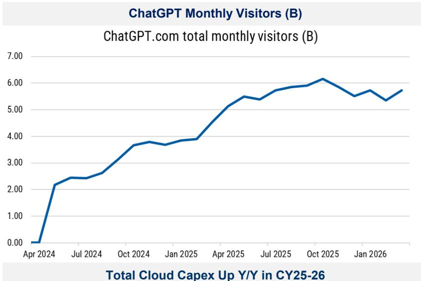

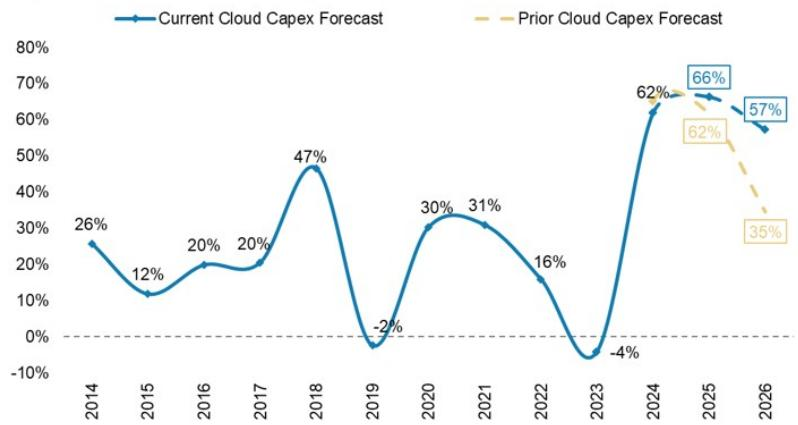  
Top 11 Cloud Providers:Cloud Capex Y/Y Growth   
Source: IDC, Morgan Stanley Research. Morgan Stanley Research estimates.

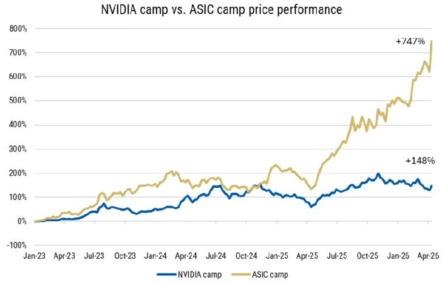  
GPU vs. ASIC Share Price Movement

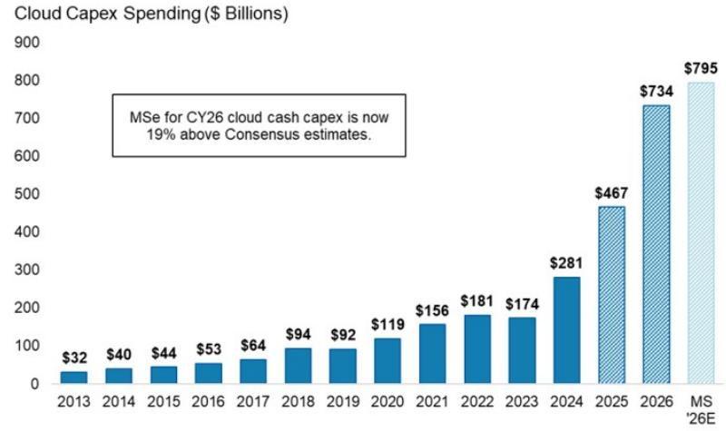  
Cloud Capex Could See Upside for CY26

# Every 1M Units of total CPU upside

Server CPU ABF Substrate ASP (US\$) LCD Revenue upside to Unimicron per 1M CPUs (US\$ M) 12.6 Revenue upside to Unimicron per 1M CPUs (NT\$ M) 397 Unimicron 2026 total revenue estimate (NT\$ M) 169,246 Unimicron ABF revenue upside per 1M CPUs 0.2%

# If CPU TAM grows 10-15M units..

123321Cad 04-20 77.8   
Revenue upside to Unimicron if CPU TAM grows 10-15M units (US\$ M) 157.6   
Revenue upside to Unimicron if CPU TAM grows 10-15M units (NT\$ M) 4,964   
Unimicron 2026 ABF revenue estimate (NT\$ M) 169,246   
Unimicron ABF revenue upside if CPU TAM grows 10-15M units 2.9%

# Every 1M Units of total CPU upside

Server CPU Socket ASP (US\$) 21.9   
Revenue upside to Lotes per 1M CPUs (US\$ M) 7.7   
Revenue upside to Lotes per 1M CPUs (NT\$ M) 241   
Lotes 2026 total revenue estimate (NT\$ M) 41,065   
Lotes CPU Socket upside per 1M CPUs 0.6%

# If CPU TAM grows 10-15M units..

Server CPU Socket ASP (US\$) 21.9   
Revenue upside to Lotes if CPU TAM grows 10-15M units (US\$ M) 95.7   
Revenue upside to Lotes if CPU TAM grows 10-15M units (NT\$ M) 3,015   
Lotes 2026 total revenue estimate (NT\$ M) 41,065   
Lotes CPU Socket upside if CPU TAM grows 10-15M units 7.3%

# If CPU TAM grows 10-15M units...

Server CPU Socket ASP (US\$) 21.9 Revenue upside to FIT if CPU TAM grows 10-15M units (US\$ M) 109.4 FIT 2026 ABF revenue estimate (NT\$ M) 5,483 FIT CPU Socket upside if CPU TAM grows 10-15M units 2.0%

# Every 1M Units of total CPU upside

<table><tr><td>Every 1M Units of total CPU upside</td><td></td></tr><tr><td>Server CPU Socket ASP (US$)</td><td>21.9</td></tr><tr><td>Revenue upside to FIT per 1M CPUs (US$ M)</td><td>8.8</td></tr><tr><td>FIT 2026 total revenue estimate (US$ M)</td><td>5,483</td></tr><tr><td>FIT CPU Socket upside per 1M CPUs</td><td>0.2%</td></tr></table>

Source: Morgan Stanley Research estimates.

Server MLCC Content (US\$) 30.0 Revenue upside to Yageo per 1M CPUs (US\$ M) 4.5 Revenue upside to Yageo per 1M CPUs (NT\$ M) 142 Yageo 2026 total revenue estimate (NT\$ M) 信 LC Yageo MLCC revenue upside per 1M CPUs 0.1%

# If CPU TAM grows 10-15M units...

[Server MLCC Content (US\$) 30.0   
Revenue upside to Yageo if CPU TAM grows 10-15M units (US\$ M) 56.3   
Revenue upside to Yageo if CPU TAM grows 10-15M units (NT\$ M) 1,772   
123321Cad 04-20 158,893   
Yageo MLCC revenue upside if CPU TAM grows 10-15M units 1.1%

# Recent updates

订阅研报添加微信 LCD123321Ca• 2025 came in at \~29K racks, and we forecast 70-80K racks for 2026.

• VR200 rack production is delayed by 1-2 months vs original schedule due to component issues (i.e., Midplane PCB), so rack ramp will start in 4Q26.

Quanta should be a share gainer for GB racks in CY26.

<table><tr><td rowspan=1 colspan=1>NVIDIA</td><td rowspan=1 colspan=1>H100</td><td rowspan=1 colspan=1>H200</td><td rowspan=1 colspan=1>B200</td><td rowspan=1 colspan=1>GB200 NVL72</td><td rowspan=1 colspan=1>GB300 NVL72(RENAMED FROM GB200Ultra)</td><td rowspan=1 colspan=1>VR200 NVL144</td><td rowspan=1 colspan=1>VR200 NVL144 CPX</td><td rowspan=1 colspan=1>VR300</td></tr><tr><td rowspan=1 colspan=1>Launch timing</td><td rowspan=1 colspan=1>4Q22</td><td rowspan=1 colspan=1>2Q24</td><td rowspan=1 colspan=1>1Q25</td><td rowspan=1 colspan=1>4Q24</td><td rowspan=1 colspan=1>3Q25</td><td rowspan=1 colspan=1>2H26</td><td rowspan=1 colspan=1>End of 2026</td><td rowspan=1 colspan=1>2H27</td></tr><tr><td rowspan=1 colspan=1>CPU</td><td rowspan=1 colspan=1>x86</td><td rowspan=1 colspan=1>x86</td><td rowspan=1 colspan=1>x86</td><td rowspan=1 colspan=1>Grace</td><td rowspan=1 colspan=1>Grace</td><td rowspan=1 colspan=1>Vera</td><td rowspan=1 colspan=1>Vera</td><td rowspan=1 colspan=1>Vera</td></tr><tr><td rowspan=1 colspan=1>Back-end</td><td rowspan=1 colspan=1>CoWoS-S</td><td rowspan=1 colspan=1>CoWoS-S</td><td rowspan=1 colspan=1>CoWoS-L</td><td rowspan=1 colspan=1>CoWoS-L</td><td rowspan=1 colspan=1>CoWoS-L</td><td rowspan=1 colspan=1>CoWoS-L</td><td rowspan=1 colspan=1>CoWoS-L</td><td rowspan=1 colspan=1>CoWoS-L</td></tr><tr><td rowspan=1 colspan=1>GPU Coling</td><td rowspan=1 colspan=1>Air</td><td rowspan=1 colspan=1> Air &amp; Liquid</td><td rowspan=1 colspan=1> Air &amp;Liquid</td><td rowspan=1 colspan=1>Liquid</td><td rowspan=1 colspan=1>Liquid</td><td rowspan=1 colspan=1>Liquid</td><td rowspan=1 colspan=1>Liquid</td><td rowspan=1 colspan=1>Liquid</td></tr><tr><td rowspan=1 colspan=1>GPU Max TDP</td><td rowspan=1 colspan=1>700W</td><td rowspan=1 colspan=1>700W</td><td rowspan=1 colspan=1>1.000W</td><td rowspan=1 colspan=1>1,200W</td><td rowspan=1 colspan=1>1,400W</td><td rowspan=1 colspan=1>2.300W</td><td rowspan=1 colspan=1>800W</td><td rowspan=1 colspan=1>3.600W</td></tr><tr><td rowspan=2 colspan=1>Product Form Factor</td><td rowspan=2 colspan=1>DGX/HGX 8x GPUPCle</td><td rowspan=2 colspan=1>DGX/HGX 8x GPUPCle</td><td rowspan=1 colspan=1>DGX/HGX 8x GPU</td><td rowspan=1 colspan=1>OberonGB 2:4 board</td><td rowspan=1 colspan=1>OberonGB 2:4 board</td><td rowspan=1 colspan=1>OberonVR 2:4 board</td><td rowspan=1 colspan=1>OberonVR 2:4 board</td><td rowspan=1 colspan=1>Kyber</td></tr><tr><td rowspan=1 colspan=1>PCle</td><td rowspan=1 colspan=1>NvSwitchtrayNVL backplane</td><td rowspan=1 colspan=1>NVSwitchtrayNVL backplane</td><td rowspan=1 colspan=1>NvswitchtrayNVL backplane</td><td rowspan=1 colspan=1>NvSwitchtrayNVL backplane</td><td rowspan=1 colspan=1></td></tr><tr><td rowspan=1 colspan=1>GPU Memory</td><td rowspan=1 colspan=1>80/96GB|HBM2e/3|8H</td><td rowspan=1 colspan=1>141GB|HBM3e|8H</td><td rowspan=1 colspan=1>192GB|HBM3e|8H</td><td rowspan=1 colspan=1>192GB|HBM3e|8H</td><td rowspan=1 colspan=1>288GB|HBM3e|8H</td><td rowspan=1 colspan=1>288GB|HBM4|8H</td><td rowspan=1 colspan=1>128GB GDDR7</td><td rowspan=1 colspan=1>1TB|HBM4e|16H</td></tr><tr><td rowspan=1 colspan=1>HBMVendor</td><td rowspan=1 colspan=1>Hynix</td><td rowspan=1 colspan=1>Hynix/Micron</td><td rowspan=1 colspan=1> Hynix/Micron/Samsung</td><td rowspan=1 colspan=1>Hynix/Micron/Samsung</td><td rowspan=1 colspan=1>Hynix/cron/Samsung</td><td rowspan=1 colspan=1> Hynix/icron/Samsung</td><td rowspan=1 colspan=1>Hynix/Mcron/Samsung</td><td rowspan=1 colspan=1>Hynix/Micron/Samsung</td></tr><tr><td rowspan=1 colspan=1>NVLink B/W per GPU</td><td rowspan=1 colspan=1>900GB/s</td><td rowspan=1 colspan=1>900GB/s</td><td rowspan=1 colspan=1>1.800 GB/s</td><td rowspan=1 colspan=1>1.800 GB/s</td><td rowspan=1 colspan=1>1.800 GB/s</td><td rowspan=1 colspan=1>3.600GB/s</td><td rowspan=1 colspan=1>3.600 GB/s</td><td rowspan=1 colspan=1>3.600 GB/s</td></tr><tr><td rowspan=1 colspan=1>CPU-GPU Interface</td><td rowspan=1 colspan=1>128 GB/s PCle5</td><td rowspan=1 colspan=1>128 GB/s PCle5</td><td rowspan=1 colspan=1>128 GB/s PCle5</td><td rowspan=1 colspan=1>450 GB/s C2C</td><td rowspan=1 colspan=1>450 GB/s C2C</td><td rowspan=1 colspan=1>1.8TB/s C2C</td><td rowspan=1 colspan=1>1.8TB/s C2C</td><td rowspan=1 colspan=1>1.8TB/s C2C</td></tr><tr><td rowspan=1 colspan=1>Netw ork Adapter</td><td rowspan=1 colspan=1>400G CX7|BF3</td><td rowspan=1 colspan=1>400G CX7 IBF3</td><td rowspan=1 colspan=1>400G CX7 IBF3</td><td rowspan=1 colspan=1>400G CX7|BF3</td><td rowspan=1 colspan=1>800G CX8</td><td rowspan=1 colspan=1>1.600G CX9</td><td rowspan=1 colspan=1>1.600G CX9</td><td rowspan=1 colspan=1>1,600G CX9</td></tr></table>

# Recent updates

订阅研报添加微信 LCD123• MI400-series Helios rack OAM/UBB are produced by Wistron

• Wiwynn will be the main ODM partner for Meta for MI400-series Helios rack, and should be main beneficiary from Meta/AMD’s multi-year, multi-generation partnership to deploy up to 6 gigawatts of AMD Instinct GPUs

<table><tr><td rowspan=1 colspan=1>AMD</td><td rowspan=1 colspan=1>MI250X</td><td rowspan=1 colspan=1>MI300A</td><td rowspan=1 colspan=1>MI300X</td><td rowspan=1 colspan=1>MI325X</td><td rowspan=1 colspan=1>MI350X</td></tr><tr><td rowspan=1 colspan=1>Launch timing</td><td rowspan=1 colspan=1>4Q21</td><td rowspan=1 colspan=1>4Q23</td><td rowspan=1 colspan=1>4Q23</td><td rowspan=1 colspan=1>4Q24</td><td rowspan=1 colspan=1>3Q25</td></tr><tr><td rowspan=1 colspan=1>CPU</td><td rowspan=1 colspan=1>x86</td><td rowspan=1 colspan=1>x86</td><td rowspan=1 colspan=1>x86</td><td rowspan=1 colspan=1>x86</td><td rowspan=1 colspan=1>x86</td></tr><tr><td rowspan=1 colspan=1>Back-end</td><td rowspan=1 colspan=1>SolC + CoWoS-S</td><td rowspan=1 colspan=1>SolC + CoWoS-S</td><td rowspan=1 colspan=1>SolC + CoWoS-S</td><td rowspan=1 colspan=1>SolC + CoWoS-S</td><td rowspan=1 colspan=1>SolC + CoWoS-S</td></tr><tr><td rowspan=1 colspan=1>GPU Cooling</td><td rowspan=1 colspan=1>Air</td><td rowspan=1 colspan=1>Air</td><td rowspan=1 colspan=1>Air</td><td rowspan=1 colspan=1>Air</td><td rowspan=1 colspan=1>Air</td></tr><tr><td rowspan=1 colspan=1>GPU Max TDP</td><td rowspan=1 colspan=1>560W</td><td rowspan=1 colspan=1>760W</td><td rowspan=1 colspan=1>750W</td><td rowspan=1 colspan=1>750W</td><td rowspan=1 colspan=1>750W</td></tr><tr><td rowspan=1 colspan=1>Product Form Factor</td><td rowspan=1 colspan=1> 4x GPU</td><td rowspan=1 colspan=1> 4x APU</td><td rowspan=1 colspan=1>8x GPU</td><td rowspan=1 colspan=1>8x GPU</td><td rowspan=1 colspan=1> N/A</td></tr><tr><td rowspan=1 colspan=1>GPU Memory</td><td rowspan=1 colspan=1>128GB| HBM2e</td><td rowspan=1 colspan=1>128GB|HBM3</td><td rowspan=1 colspan=1>192GB|HBM3</td><td rowspan=1 colspan=1>288GB|HBM3e</td><td rowspan=1 colspan=1>288GB|HBM3e</td></tr><tr><td rowspan=1 colspan=1>HBM Vendor</td><td rowspan=1 colspan=1> Samsung</td><td rowspan=1 colspan=1> Samsung</td><td rowspan=1 colspan=1> Samsung</td><td rowspan=1 colspan=1> N/A</td><td rowspan=1 colspan=1>N/A</td></tr><tr><td rowspan=1 colspan=1>B/W per GPU</td><td rowspan=1 colspan=1>200GB/s</td><td rowspan=1 colspan=1>384GB/s</td><td rowspan=1 colspan=1>896GB/s</td><td rowspan=1 colspan=1>N/A</td><td rowspan=1 colspan=1>N/A</td></tr><tr><td rowspan=1 colspan=1>CPU-GPU Interface</td><td rowspan=1 colspan=1> 64 GB/s PCle4</td><td rowspan=1 colspan=1> N/A</td><td rowspan=1 colspan=1>128 GB/s PCle5</td><td rowspan=1 colspan=1>128 GB/s PCle5</td><td rowspan=1 colspan=1>128 GB/s PCle5</td></tr></table>

# We Forecast 2026e GB200/300 Racks To Be 70-80K

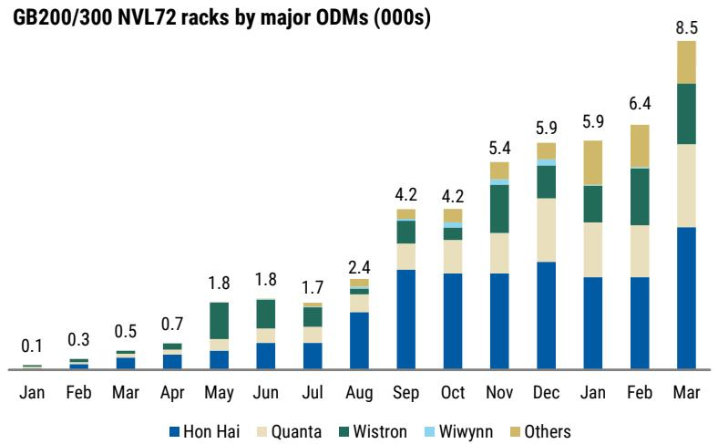  
GB200/300 NVL72-equivalent monthly rack output   
GB200/300 rack supply share by major ODMs (2026e)

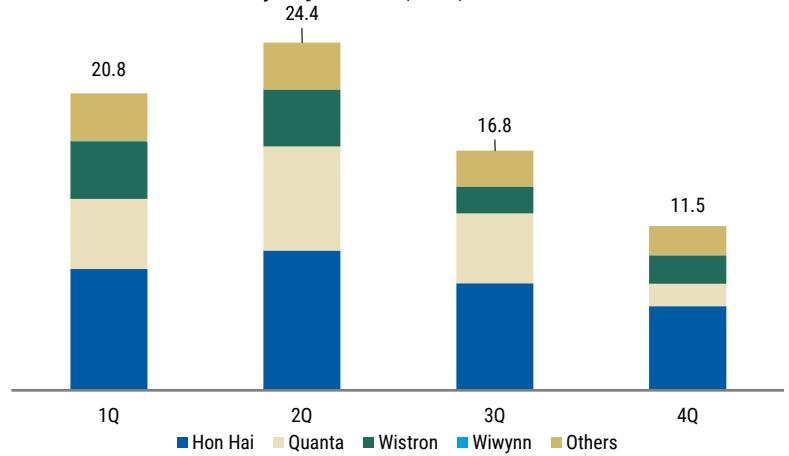  
GB200/300 NVL72-equivalent quarterly rack output (2026e)   
GB200/300 NVL72 racks by major ODMs (000s)   
GB200/300 rack demand share (2026e)

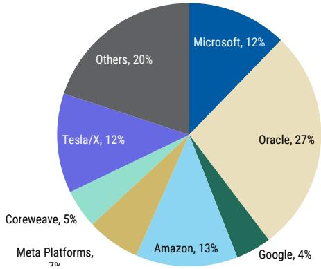  
Nvidia GB200/300 server demand share, 2026e

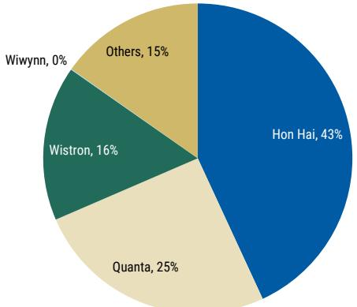  
GB200/300 NVL72-equivalent rack supply share (2026)   
Source: Morgan Stanley Research estimates (e).

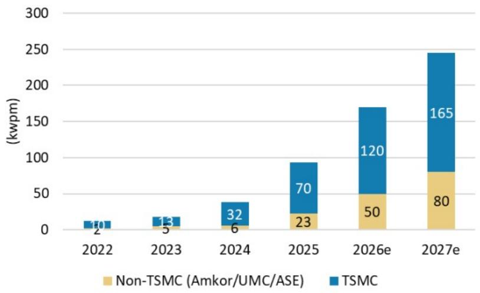  
CoWoS Supply Capacity Breakdown (By Year End)   
CoWoS Supply Capacity Breakdown (By Year End)

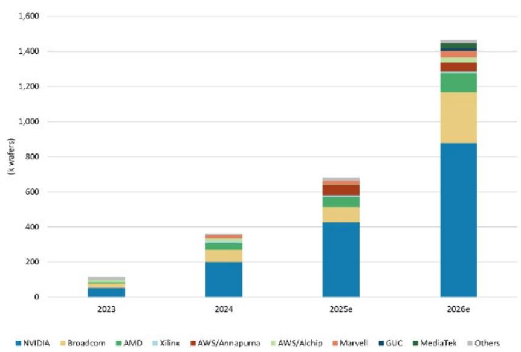  
Global CoWoS Capacity Demand by Key Customer

Al semi wafer consumption, by customer, 2026e

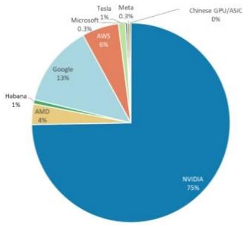  
Al semi wafer consumption, by customer, 2025e

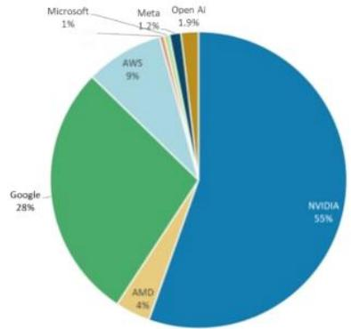

<table><tr><td>Al chip vendor</td><td>Product name</td><td>CoWoS capacity allocation (kwafers)</td><td>Chips per CoWoS wafer shipments(k)</td><td>Implied</td><td>Compute die size</td><td>Geometry</td><td>Compute die units</td><td>Wafer consumption (k wafers)</td><td>Wafer price Waferrevenue （USS) TAM（USSmn)</td><td></td><td>Backend revenue (usS mn)</td></tr><tr><td>AI GPU (2026e)</td><td></td><td></td><td></td><td></td><td></td><td></td><td></td><td>433</td><td>21,945</td><td>9,510</td><td>8,241</td></tr><tr><td>NVIDIA</td><td>B300 RubinR200</td><td>390</td><td>14 8</td><td>5,460</td><td>850 850</td><td>4nm 3nm</td><td></td><td>165</td><td>26,000</td><td>4,292</td><td>5,494</td></tr><tr><td></td><td>H200</td><td>260</td><td></td><td>2,080</td><td>814</td><td></td><td>2</td><td>57</td><td>21,945</td><td>1,243</td><td>1,275</td></tr><tr><td></td><td></td><td>75</td><td>27</td><td>2,025</td><td></td><td>4nm</td><td></td><td></td><td>18,000</td><td>19</td><td>79</td></tr><tr><td>AMD</td><td>MI300</td><td>3 7</td><td>12</td><td>36</td><td>110</td><td>5nm</td><td>8</td><td>1</td><td>26,000</td><td>64</td><td>194</td></tr><tr><td></td><td>M1350/375 M1400</td><td>65</td><td>12</td><td>84</td><td>110 110</td><td>3nm</td><td>8</td><td>2 32</td><td>28,125</td><td>886</td><td>1,805</td></tr><tr><td>AI ASIC (2026e)</td><td></td><td></td><td>10</td><td>650</td><td></td><td>2nm</td><td></td><td></td><td></td><td></td><td></td></tr><tr><td></td><td>TPUv7p(lronwood)</td><td>145</td><td>16</td><td>2,320</td><td>700</td><td>3nm</td><td>2</td><td>152</td><td>26,000</td><td>3,942</td><td>3,327</td></tr><tr><td>Google</td><td>TPUv7e(Sunfish;AVGO)</td><td>80</td><td>12</td><td>960</td><td>800</td><td>3nm</td><td>2</td><td>72</td><td>26,000</td><td>1,864</td><td>1,835</td></tr><tr><td></td><td>TPUV8(Zebrafish;MediaTek)</td><td>30</td><td></td><td></td><td>800</td><td>3nm</td><td></td><td>45</td><td>26,000</td><td>1,165</td><td>688</td></tr><tr><td></td><td></td><td></td><td>20</td><td>600</td><td></td><td></td><td></td><td>12</td><td>20,000</td><td>237</td><td>411</td></tr><tr><td>AWS</td><td>Trainium2.5</td><td>20</td><td>16</td><td>320</td><td>600</td><td>5nm</td><td>2 2</td><td>73</td><td>26,000</td><td>1,886</td><td>1,642</td></tr><tr><td></td><td>Trainium3</td><td>80</td><td>17 29</td><td>1,360</td><td>700 700</td><td>3nm</td><td>1</td><td>3.0</td><td>26,000</td><td>79</td><td>87</td></tr><tr><td>Microsoft</td><td>Maia200</td><td>4</td><td>11</td><td>116 55</td><td>850</td><td>3nm</td><td></td><td>2.9</td><td>28,125</td><td>82</td><td>109</td></tr><tr><td>Meta</td><td>Maia300</td><td>5</td><td></td><td></td><td></td><td>2nm</td><td>1</td><td></td><td>26,000</td><td>310</td><td></td></tr><tr><td></td><td>MTIA3(Iris)</td><td>15</td><td>10</td><td>150</td><td>850</td><td>3nm</td><td>2</td><td>11.9</td><td></td><td></td><td>1</td></tr><tr><td></td><td></td><td></td><td></td><td></td><td></td><td></td><td></td><td></td><td></td><td></td><td></td></tr><tr><td>Total</td><td></td><td>1,434</td><td></td><td></td><td></td><td></td><td></td><td>1,084</td><td></td><td>26,159</td><td>25,219</td></tr></table>

TPU Forecasts from MS Asia Research team   

<table><tr><td>k Units</td><td>2023</td><td>2024</td><td>2025e</td><td>2026e</td><td>2027e</td><td>2028e</td></tr><tr><td>v5</td><td>500</td><td>2,400</td><td>250</td><td></td><td></td><td></td></tr><tr><td>v6 (Trilium)</td><td></td><td></td><td>1,000</td><td></td><td></td><td></td></tr><tr><td>v7 (Ironwood/Sunfish, by Broadcom)</td><td></td><td></td><td>500</td><td>3,200</td><td>3,500</td><td>3,500</td></tr><tr><td>v8 (Zebrafish; 3nm, by MediaTek)</td><td></td><td></td><td></td><td>400</td><td>2,500</td><td>2,500</td></tr><tr><td>v9 (Pumafish; 2nm,by Broadcom)</td><td></td><td></td><td></td><td></td><td></td><td>500</td></tr><tr><td>v10 (Humufish; 2nm,by MediaTek)</td><td></td><td></td><td></td><td></td><td></td><td>500</td></tr><tr><td>Total</td><td>500</td><td>2,400</td><td>1,750</td><td>3,600</td><td>6,000</td><td>7,000</td></tr></table>

# Google TPU keeping pace with Nvidia GPU

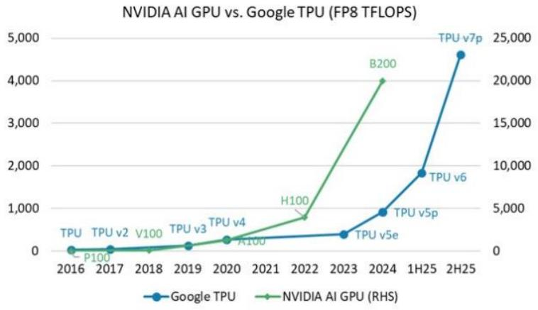

# ad 04-20

(k units）ASIC volume forecast by major companies

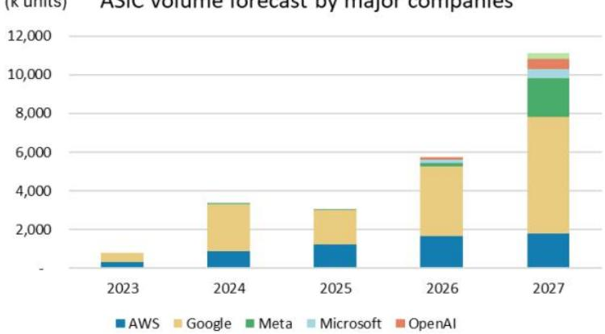

# ODMs Have Underperformed YTD

# ODM Cohort Has Underperformed TAIEX by 30ppts YTD

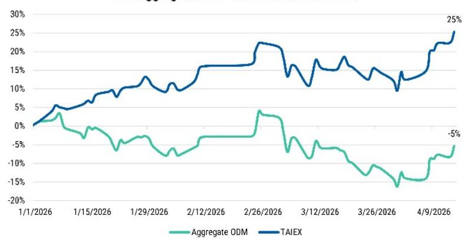  
YTDAggregateODMvs.TAlEXPerformance   
YTD Price Performance – Individual ODMs vs TAIEX

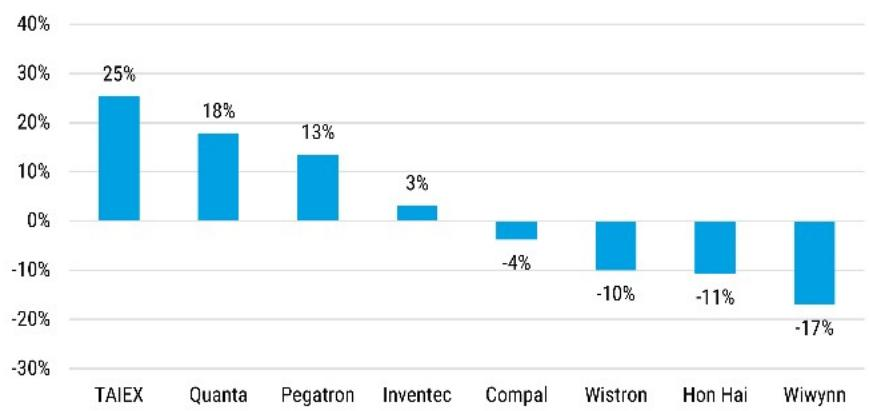  
Source: Morgan Stanley Research.

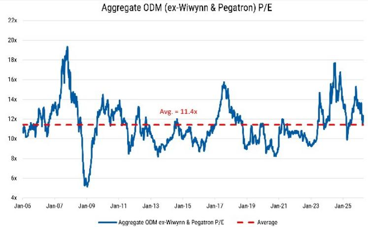  
ODM Cohort Is Trading At Avg Historical P/E   
…While Revenue Continues to Grow y/y

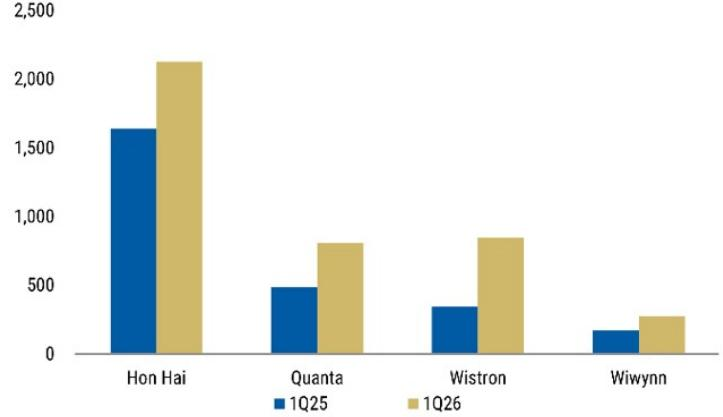  
Key ODM Quarterly Revenue in C1Q25-1Q26 (NT\$ B)

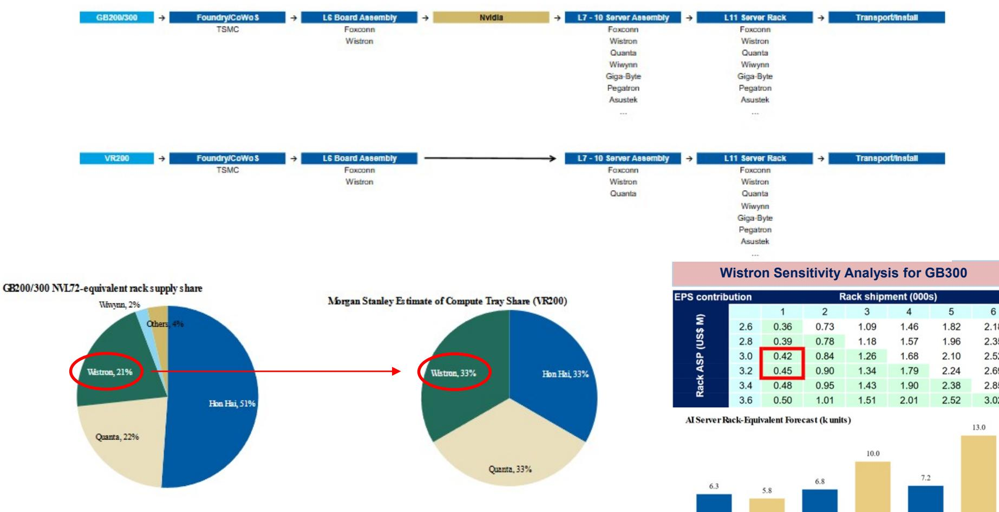  
Wistron Is a Share Winner from VR200 Onward as Well as MI400-series

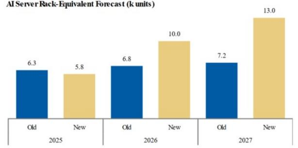

# GB200/GB300/VR200 NVL72 Bill of Materials Comparison

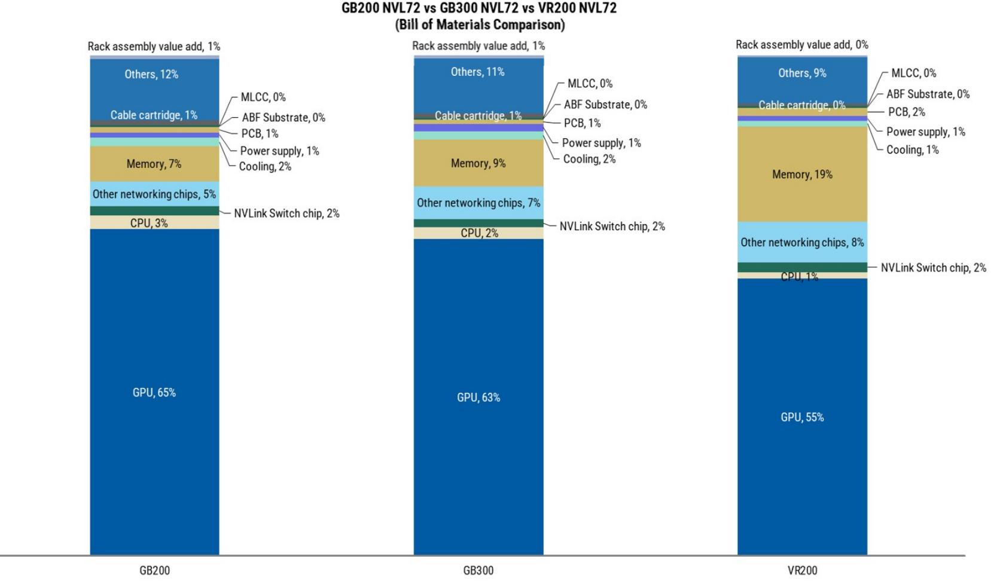  
Source: Morgan Stanley Research estimates (e).

# Liquid cooling solution supply dynamics for GB200 server rack system

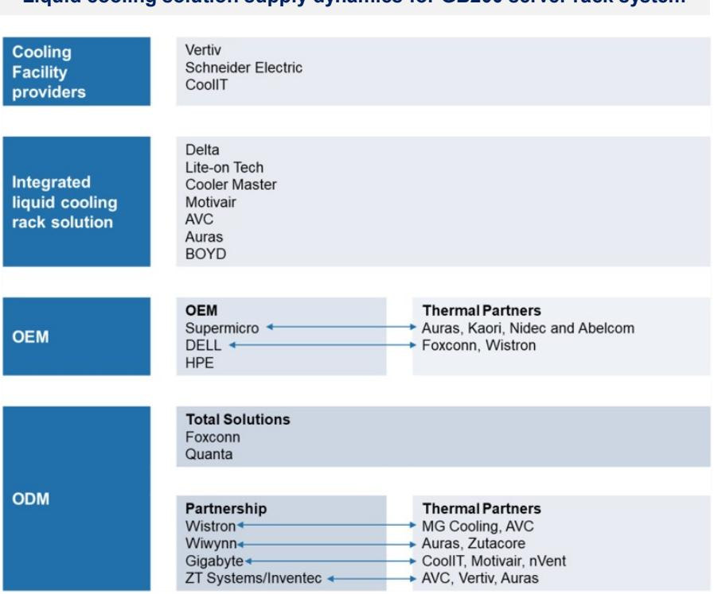

GB200 / ASIC server rack ODM partners   

<table><tr><td rowspan=1 colspan=1>GB200/300</td><td rowspan=1 colspan=1>ODM Partner(s)</td></tr><tr><td rowspan=1 colspan=1>Microsoft</td><td rowspan=1 colspan=1>Foxconn/Quanta</td></tr><tr><td rowspan=1 colspan=1>Oracle</td><td rowspan=1 colspan=1> Foxconn/Wis tron/Wiwynn/Quanta</td></tr><tr><td rowspan=1 colspan=1>Google</td><td rowspan=1 colspan=1>Quanta/Foxconn/Inventec</td></tr><tr><td rowspan=1 colspan=1>Amazon</td><td rowspan=1 colspan=1>Quanta/Foxconn</td></tr><tr><td rowspan=1 colspan=1>Meta Platforms</td><td rowspan=1 colspan=1>Quanta/Foxconn</td></tr><tr><td rowspan=1 colspan=1>Dell</td><td rowspan=1 colspan=1>Wis tron</td></tr><tr><td rowspan=1 colspan=1>HPE</td><td rowspan=1 colspan=1>Foxconn/Wis tron</td></tr><tr><td rowspan=1 colspan=1>Others</td><td rowspan=1 colspan=1> SMCI / etc</td></tr></table>

<table><tr><td rowspan=1 colspan=1>ASIC</td><td rowspan=1 colspan=1>ODM Partner(s)</td></tr><tr><td rowspan=1 colspan=1>Am azon</td><td rowspan=1 colspan=1>Wiwynn/Jabil</td></tr><tr><td rowspan=1 colspan=1>Google</td><td rowspan=1 colspan=1>Celestica/Foxconn/Inventec</td></tr><tr><td rowspan=1 colspan=1>Meta Platforms</td><td rowspan=1 colspan=1> Quanta/Celes tica/Wiwynn</td></tr></table>

<table><tr><td rowspan=1 colspan=1>GB200 NVL72</td><td rowspan=1 colspan=1>ASP (US$)</td><td rowspan=1 colspan=1>#</td><td rowspan=1 colspan=1>Value (Us$)</td><td rowspan=1 colspan=1>% of BOM</td><td rowspan=1 colspan=1>GM (%)</td><td rowspan=1 colspan=1>GP (US$)</td></tr><tr><td rowspan=1 colspan=1>Bianca board (1x Grace, 2x Blackwell)</td><td rowspan=1 colspan=1>2,800</td><td rowspan=1 colspan=1>36</td><td rowspan=1 colspan=1>100,800</td><td rowspan=1 colspan=1>3.4%</td><td rowspan=1 colspan=1>18.0%</td><td rowspan=1 colspan=1>18,144</td></tr><tr><td rowspan=1 colspan=1>Switch board</td><td rowspan=1 colspan=1>1,800</td><td rowspan=1 colspan=1>9</td><td rowspan=1 colspan=1>16,200</td><td rowspan=1 colspan=1>0.5%</td><td rowspan=1 colspan=1>18.0%</td><td rowspan=1 colspan=1>2,916</td></tr><tr><td rowspan=1 colspan=1>Peripheral boards</td><td rowspan=1 colspan=1>600</td><td rowspan=1 colspan=1>90</td><td rowspan=1 colspan=1>54,000</td><td rowspan=1 colspan=1>1.8%</td><td rowspan=1 colspan=1>20.0%</td><td rowspan=1 colspan=1>10,800</td></tr><tr><td rowspan=1 colspan=1>B200 GPU</td><td rowspan=1 colspan=1>30,000</td><td rowspan=1 colspan=1>72</td><td rowspan=1 colspan=1>2,160,000</td><td rowspan=1 colspan=1>72.0%</td><td rowspan=1 colspan=1>0%</td><td rowspan=1 colspan=1>-</td></tr><tr><td rowspan=1 colspan=1>NVLink switch</td><td rowspan=1 colspan=1>1,000</td><td rowspan=1 colspan=1>18</td><td rowspan=1 colspan=1>18,000</td><td rowspan=1 colspan=1>0.6%</td><td rowspan=1 colspan=1>0%</td><td rowspan=1 colspan=1></td></tr><tr><td rowspan=1 colspan=1>Grace CPU</td><td rowspan=1 colspan=1>5,000</td><td rowspan=1 colspan=1>18</td><td rowspan=1 colspan=1>90,000</td><td rowspan=1 colspan=1>3.0%</td><td rowspan=1 colspan=1>0%</td><td rowspan=1 colspan=1>-</td></tr><tr><td rowspan=1 colspan=1>Thermal components</td><td rowspan=1 colspan=1></td><td rowspan=1 colspan=1></td><td rowspan=1 colspan=1>87,950</td><td rowspan=1 colspan=1>2.9%</td><td rowspan=1 colspan=1>20%</td><td rowspan=1 colspan=1>17,590</td></tr><tr><td rowspan=1 colspan=1> Cold plate module (6x per compute tray)</td><td rowspan=1 colspan=1>300</td><td rowspan=1 colspan=1>108</td><td rowspan=1 colspan=1>32,400</td><td rowspan=1 colspan=1></td><td rowspan=1 colspan=1>0%</td><td rowspan=1 colspan=1>-</td></tr><tr><td rowspan=1 colspan=1>Cold plate module (2x per switch tray)</td><td rowspan=1 colspan=1>200</td><td rowspan=1 colspan=1>18</td><td rowspan=1 colspan=1>3,600</td><td rowspan=1 colspan=1></td><td rowspan=1 colspan=1>0%</td><td rowspan=1 colspan=1>-</td></tr><tr><td rowspan=1 colspan=1>Cooling fans (8x per compute tray)</td><td rowspan=1 colspan=1>25</td><td rowspan=1 colspan=1> 144</td><td rowspan=1 colspan=1>3,600</td><td rowspan=1 colspan=1></td><td rowspan=1 colspan=1>0%</td><td rowspan=1 colspan=1>-</td></tr><tr><td rowspan=1 colspan=1> Cooling fans (6x per switch tray)</td><td rowspan=1 colspan=1>25</td><td rowspan=1 colspan=1>54</td><td rowspan=1 colspan=1>1,350</td><td rowspan=1 colspan=1></td><td rowspan=1 colspan=1>0%</td><td rowspan=1 colspan=1>-</td></tr><tr><td rowspan=1 colspan=1> Side car CDU (supports 2x racks)</td><td rowspan=1 colspan=1>30,000</td><td rowspan=1 colspan=1>1</td><td rowspan=1 colspan=1>30,000</td><td rowspan=1 colspan=1></td><td rowspan=1 colspan=1>0%</td><td rowspan=1 colspan=1>-</td></tr><tr><td rowspan=1 colspan=1> Manifold (CDM)</td><td rowspan=1 colspan=1>13,500</td><td rowspan=1 colspan=1>1</td><td rowspan=1 colspan=1>13,500</td><td rowspan=1 colspan=1></td><td rowspan=1 colspan=1>0%</td><td rowspan=1 colspan=1></td></tr><tr><td rowspan=1 colspan=1> Others</td><td rowspan=1 colspan=1>3,500</td><td rowspan=1 colspan=1>1</td><td rowspan=1 colspan=1>3,500</td><td rowspan=1 colspan=1></td><td rowspan=1 colspan=1>0%</td><td rowspan=1 colspan=1>·</td></tr><tr><td rowspan=1 colspan=1>Others</td><td rowspan=1 colspan=1></td><td rowspan=1 colspan=1></td><td rowspan=1 colspan=1>473,050</td><td rowspan=1 colspan=1>15.8%</td><td rowspan=1 colspan=1>10%</td><td rowspan=1 colspan=1> 47,305</td></tr><tr><td rowspan=1 colspan=1>Rack assembly value add</td><td rowspan=1 colspan=1></td><td rowspan=1 colspan=1></td><td rowspan=1 colspan=1></td><td rowspan=1 colspan=1></td><td rowspan=1 colspan=1> 1.7%</td><td rowspan=1 colspan=1>52,000</td></tr><tr><td rowspan=1 colspan=1>Total</td><td rowspan=1 colspan=1></td><td rowspan=1 colspan=1></td><td rowspan=1 colspan=1>3,000,000</td><td rowspan=1 colspan=1></td><td rowspan=1 colspan=1> 5.0%</td><td rowspan=1 colspan=1>148,755</td></tr></table>

# ABF Substrate: We Are Entering the AI Diffusion Era

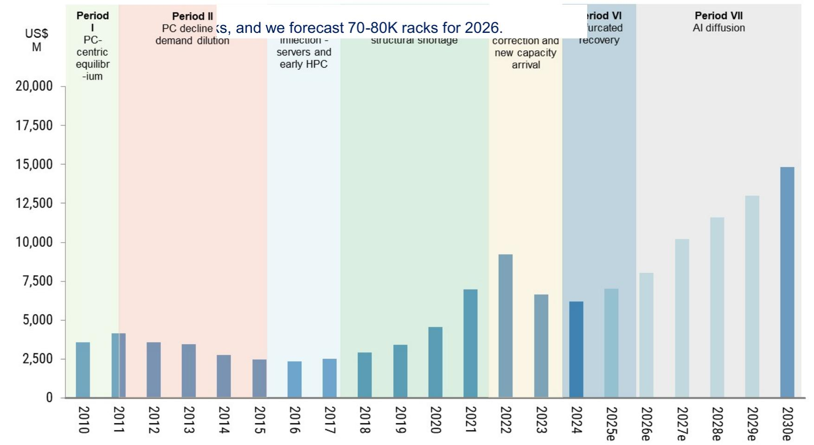

# ABF Substrates: Undersupply from 2027 Onward

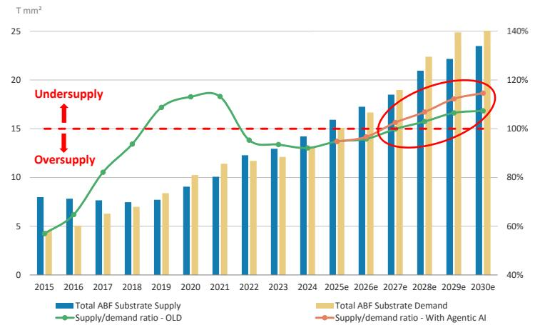  
Expect ABF substrate undersupply from 2027 onwards   
AI-related applicated expected to rise to $75 \% +$ by 2030

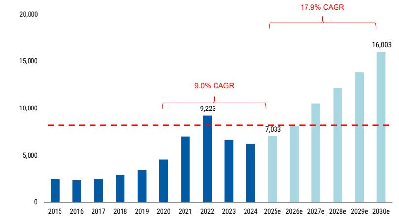  
We are in early innings of an AI-driven upcycle

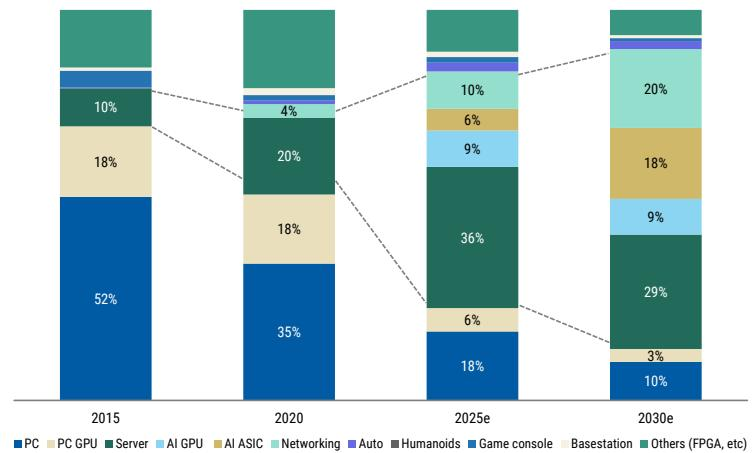  
ource: Prismark, Morgan Stanley Research. $\textstyle \theta =$ Morgan Stanley Research estimates.

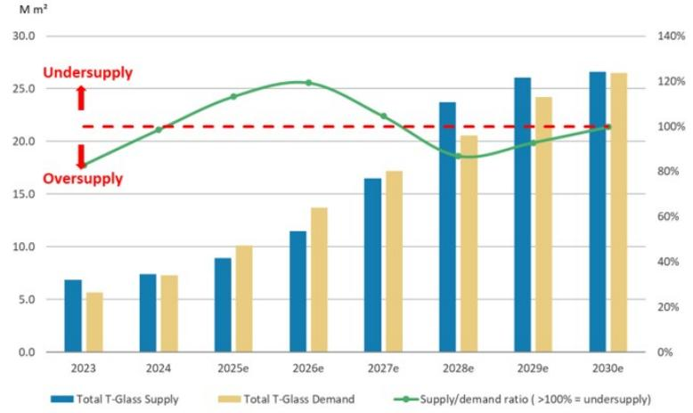  
Expect T glass to remain undersupplied until 2028

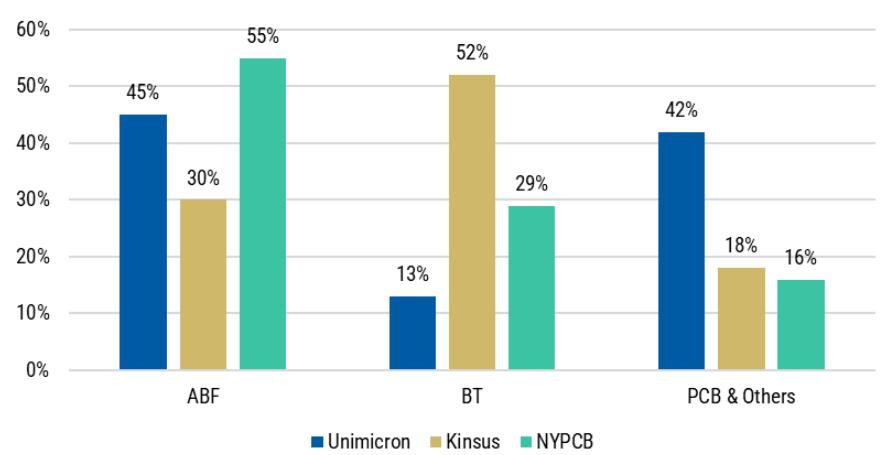  
Unimicron, NYPCB, Kinsus sales mix (2025)

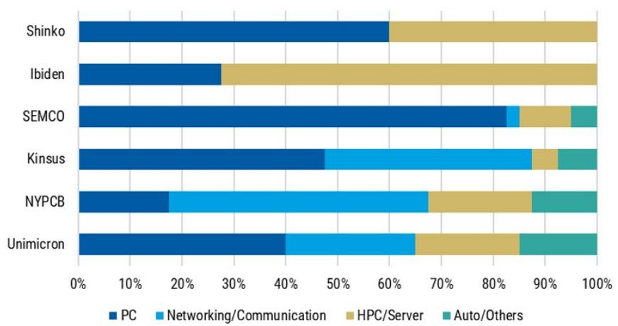  
ABF names end segment exposure (2025)

NVIDIA GPU ABF/CCL/PCB Roadmap   

<table><tr><td>NVIDIA</td><td>A100</td><td>H100</td><td>B200</td><td>NVIDIA</td><td>GB200 NVL72</td><td>GB300 NVL72</td><td>VR200</td></tr><tr><td>ABF Substrate</td><td></td><td></td><td></td><td>ABF Substrate</td><td></td><td></td><td></td></tr><tr><td>Substrate size</td><td>55mm× 55mm</td><td>55mm × 58mm</td><td>73mmx 81mm</td><td> Substrate size</td><td>73mm x 81mm</td><td>73mm x 81mm</td><td>83mmx 97mm</td></tr><tr><td>Layer count</td><td>12L</td><td>12L</td><td>14L</td><td>Layer count</td><td>14L</td><td>14L</td><td>18L</td></tr><tr><td>Supplier</td><td>Ibiden</td><td>Ibiden</td><td>Ibiden/Unimicron</td><td>Supplier</td><td>Ibiden/Unimicron</td><td>Ibiden/Unimicron</td><td>Ibiden/Unimicron</td></tr><tr><td>OCP Accelerator Module (OAM)</td><td>0</td><td>Very low-loss (M6),</td><td>Extreme low-loss (M8) +</td><td>OCP Accelerator Module (OAM)</td><td>Extreme low-loss (M8) +</td><td>Extreme low-loss (M8) +</td><td></td></tr><tr><td>CCL Spec. CCL supplier</td><td></td><td>UItra low-loss (M7)</td><td>Low-loss (M4)</td><td>CCL Spec.</td><td>Low-loss (M4)</td><td>Low-loss (M4)</td><td>Extreme low-loss (M8) + Low-loss (M4)</td></tr><tr><td>PCB Size</td><td>0 140mmx78mm</td><td>EMC</td><td>Doosan</td><td>cCL suppier</td><td> Doosan</td><td>Doosan</td><td>Doosan</td></tr><tr><td>PCB Spec.</td><td>12L</td><td>152mm x 80.5mm</td><td>170mm x 86.5mm 20L HDI</td><td>PCB Size</td><td>305.5mm x 222mm</td><td>305.5mm x 22mm</td><td>305.5mmx 222mm</td></tr><tr><td>PCB Supplier</td><td></td><td>18L HDI</td><td></td><td>POB Spec.</td><td>22L HDI</td><td> 22L HDI</td><td>26L HDI</td></tr><tr><td>Universal Baseboard (UBB)</td><td>0</td><td>UMTC ISU, TTM, WUS</td><td>UMTC, VGT, ISU,TTM</td><td>PCB Supplier</td><td>VGT, UMTC</td><td>VGT, UMTC</td><td>VGT, UMTC, ZDT, Dynamic</td></tr><tr><td>cCL Spec.</td><td>0</td><td>Utra low-loss (M7)</td><td>Extreme low-loss (M8) +</td><td>Switch board</td><td></td><td></td><td></td></tr><tr><td> oL supple</td><td>EMC</td><td>EMC, TUC</td><td>Low-loss (M4) Doosan, Tuc</td><td>CCL Spec.</td><td>Extreme low-loss (M8)</td><td>Extreme low-loss (M8)</td><td>Extreme low-loss (M8)</td></tr><tr><td>PCB Spec.</td><td>0</td><td>24L PTH</td><td>18L PTH</td><td>oCL suppler</td><td>EMC</td><td> EMC, Shengyi</td><td>EMC, Shengyi</td></tr><tr><td>PCB Suppler</td><td>0</td><td>WUS, TTM ISU</td><td>WUS, TTM,ISU,UMTC</td><td>PCB Spec.</td><td>24LPTH</td><td>24L PTH</td><td>32L PTH</td></tr><tr><td>Switch board</td><td></td><td></td><td></td><td>PCB Supplier</td><td>WUS, TTM, VGT</td><td>VGT, TTM, Kinw on</td><td>VGT, WUS, TTM</td></tr><tr><td>CCL Spec.</td><td>UItra low-oss(M7)</td><td>Very low-loss (M6), Utra low-loss (M7)</td><td>Utra low-loss (M7)，, Extreme low-loss (M8)</td><td>Midplane PCB</td><td></td><td></td><td></td></tr><tr><td> cCL suppler</td><td>0</td><td>EMC, TUC</td><td>EMC, TUC, Doosan</td><td>CCL Spec.</td><td>NA</td><td>NA</td><td>Beyond extreme low-loss</td></tr><tr><td>PCB Spec.</td><td>0</td><td>26-28L</td><td>28-30L</td><td>cCL suppler</td><td></td><td></td><td>(M9)</td></tr><tr><td>PCB Supplier</td><td>0</td><td>WUS, TTM, GCE ISU</td><td> WUS, TTM, GCE, ISU</td><td></td><td>NA</td><td>Na</td><td>emc</td></tr><tr><td>Motherboard</td><td></td><td></td><td></td><td>PCB Spec. PCB Supplier</td><td>NA NA</td><td>NA NA</td><td>44L PTH VGT, WUS</td></tr><tr><td>CCL Spec.</td><td>Very low-loss (M6)</td><td>Very low-loss (M6)</td><td>Very low-loss (M6)</td><td>Orchid Module /BlueField Module</td><td></td><td></td><td></td></tr><tr><td>CCL supplier</td><td>EMC,TUC,ITEQ,Panasonic</td><td>EMC, TUC, ITEQ, Panasonic</td><td>EMC, TUC, ITEQ, Panasonic</td><td>CCL Spec.</td><td>NA</td><td>NA</td><td>Extreme low-loss (M8)</td></tr><tr><td>PCB Spec.</td><td>16-18L</td><td>16-18L</td><td>16-20L</td><td>CCL supplier</td><td>NA</td><td>NA</td><td>EMC</td></tr><tr><td>PCB Supliler</td><td>GCE, WUS,TT,Uripod</td><td>GCE WUS, TTM, ISU,Tripod</td><td>GCE WUS, TTM, ISU, Tripod</td><td>PCB Spec. PCB Supplier</td><td>NA NA</td><td>NA NA</td><td>20L PTH WUS,VGT, TTM, UMTC</td></tr></table>

# AI GPUs to adopt CoWoP instead of CoWoS, reducing reliance on ABF substrates?

# TSMC CoWoS Package

# A CoWoP Package

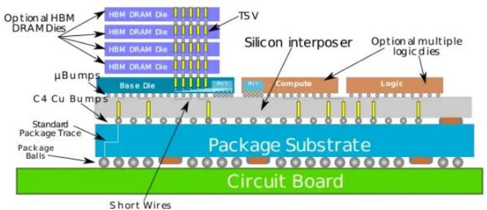

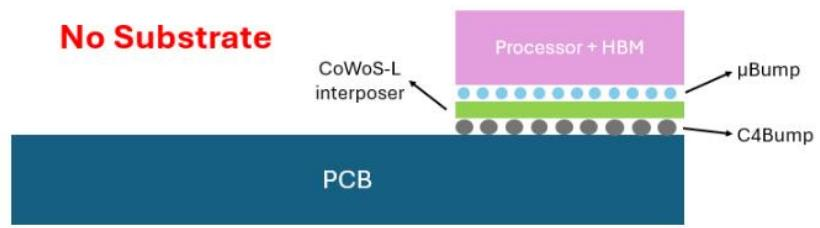

What is CoWoP? CoWoP stands for Chip on Wafer on PCB, in which a PCB (printed circuit board) replaces the ABF substrate in a 订阅研报添加微信 LCD123321Cad 04-20 CoWoS (Chip on Wafer on Substrate) IC package. Currently, all Nvidia's data center GPUs adopt TSMC’s CoWoS technology, and TSMC's CoWoS yield rate is close to $100 \%$ .

Why use CoWoP if CoWoS yield rate is so high? By adopting CoWoP, the aim is to resolve substrate warpage, increase NVLink reach on the PCB without substrate in between chip and PCB, achieve greater cooling efficiency without a package lid, and remove capacity bottleneck in certain package materials.

We don't think Rubin Ultra will use CoWoP: In order to adopt CoWoP, the L/S (line/space) of the PCB needs to shrink to $< 1 0 / 1 0 \mu \mathrm { m }$ , because that is where L/S for ABF substrates currently is. Average high-density interconnect (HDI) PCB is $4 0 / 5 0 \mu \mathrm { m }$ today. SLP (substrate-like PCB), which is used in iPhone mainboards today, is 20/35µm – hence the name SLP, because its $\mathsf { L } / \mathsf { S }$ is closer to that of substrates. However, to get the PCB L/S from 20/35µm to below $1 0 / 1 0 \mu \mathrm { m }$ would be difficult, which is one reason for why we don't think it will happen for Rubin Ultra. This is in line with Shoji Sato's checks as well, with Ibiden saying that Rubin Ultra's ABF substrate is much 订阅研报添加微信 LCD123321Cad 04-20 larger than Rubin's, with more layers. We believe shifting to CoWoP from CoWoS would entail significant yield risks and reshuffling of the related supply chain, which does not look rational to us for products targeted to enter mass production in one year's time.

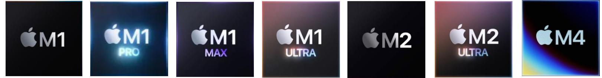

<table><tr><td rowspan=1 colspan=1>Chip</td><td rowspan=1 colspan=1>M1</td><td rowspan=1 colspan=1>M1 Pro</td><td rowspan=1 colspan=1>M1 Max</td><td rowspan=1 colspan=1>M1 UItra</td><td rowspan=1 colspan=1>M2</td><td rowspan=1 colspan=1>M2 UItra</td><td rowspan=1 colspan=1>M4</td></tr><tr><td rowspan=1 colspan=1>Dimensions</td><td rowspan=1 colspan=1>24 x 27mm</td><td rowspan=1 colspan=1> 57 x 25mm</td><td rowspan=1 colspan=1> 57 x 36mm</td><td rowspan=1 colspan=1>65 x 72mm</td><td rowspan=1 colspan=1>24 x 27mm</td><td rowspan=1 colspan=1>70.6 x 70mm</td><td rowspan=1 colspan=1> 24 x 27.7mm</td></tr><tr><td rowspan=1 colspan=1> Size</td><td rowspan=1 colspan=1>648mm²</td><td rowspan=1 colspan=1> 1,425mm²</td><td rowspan=1 colspan=1>2,052mm²</td><td rowspan=1 colspan=1> 4,680mm²</td><td rowspan=1 colspan=1> 648mm²</td><td rowspan=1 colspan=1> 4,942mm²</td><td rowspan=1 colspan=1>665mm²</td></tr><tr><td rowspan=1 colspan=1> Layer count</td><td rowspan=1 colspan=1>8L</td><td rowspan=1 colspan=1>10L</td><td rowspan=1 colspan=1>10L</td><td rowspan=1 colspan=1>18L</td><td rowspan=1 colspan=1>8L</td><td rowspan=1 colspan=1>18L</td><td rowspan=1 colspan=1>8L</td></tr></table>

# What’s the Latest on PCs?

# Recent updates

订阅研报添加微信 LCD• "Demand is outstripping supply" in the first half of the year.   
• PC prices are increasing, and they are increasing faster than costs are rising. OEMs are optimizing their product portfolios to sell less low-end PCs and more high-end PCs due to component constraints.   
• We believe this is going to drive the OEMs to see stronger profits and margins in the near term.   
• However, we maintain our cautious view and think the margin and demand impact will start to emerge in 2H26.

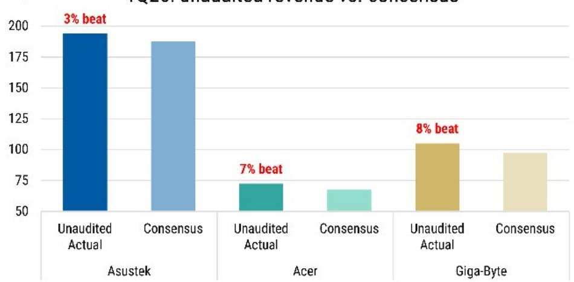  
All Taiwan OEMs’ Revenue Came In Better-than-Expected in 1Q   
订阅研报添加微

We estimate 2Q26 NB shipments to be 30.1M units $( + 3 \%$ q/q, -9% y/y)   

<table><tr><td>Shipment (unit: k)</td><td>Jan-25</td><td>Feb-25</td><td>Mar-25</td><td>Apr-25</td><td>May-25</td><td>Jun-25</td><td>Jul-25</td><td>Aug-25</td><td>Sep-25</td><td>Oct-25E</td><td>Nov-25</td><td>Dec-25</td><td>Jan-26</td><td>Feb-26</td><td>Mar-26</td><td>Apr-26E</td></tr><tr><td>Quanta</td><td>2,800</td><td>3,100</td><td>4,900</td><td>3,300</td><td>3,800</td><td>5,000</td><td>4,000</td><td>4,100</td><td>4,600</td><td>3,500</td><td>3,500</td><td>3,900</td><td>2,700</td><td>2,000</td><td>5,300</td><td>4,000</td></tr><tr><td>Wistron</td><td>1,500</td><td>1,500</td><td>1,900</td><td>1,700</td><td>1,800</td><td>2,400</td><td>2,000</td><td>2,200</td><td>2,200</td><td>2,100</td><td>2,200</td><td>2,600</td><td>1,700</td><td>1,600</td><td>2,800</td><td>2,000</td></tr><tr><td>Others</td><td>1,500</td><td>1,600</td><td>1,900</td><td>1,700</td><td>1,800</td><td>2,100</td><td>1,700</td><td>1,800</td><td>1,900</td><td>1,600</td><td>1,700</td><td>2,000</td><td>1,700</td><td>1,500</td><td>2,200</td><td>1,800</td></tr><tr><td>Compal</td><td>2,000</td><td>2,100</td><td>2,900</td><td>2,200</td><td>2,400</td><td>2,500</td><td>2,300</td><td>2,300</td><td>2,500</td><td>2,100</td><td>2.300</td><td>2,400</td><td>1,600</td><td>1,500</td><td>2,800</td><td>2.200</td></tr><tr><td>Pegatron</td><td>610</td><td>575</td><td>700</td><td>610</td><td>775</td><td>990</td><td>750</td><td>825</td><td>825</td><td>775</td><td>710</td><td>925</td><td>700</td><td>425</td><td>675</td><td>600</td></tr><tr><td>Total</td><td>8,410</td><td>8,875</td><td>12.300</td><td>9,510</td><td>10,575</td><td>12.990</td><td>10,750</td><td>11,225</td><td>12.025</td><td>10,075</td><td>10,410</td><td>11,825</td><td>8,400</td><td>7,025</td><td>13,775</td><td>10.600</td></tr><tr><td>MoM%</td><td></td><td></td><td></td><td></td><td></td><td></td><td></td><td></td><td></td><td></td><td></td><td></td><td></td><td></td><td></td><td></td></tr><tr><td>Quanta Wistron</td><td>-35%</td><td>11%</td><td>58%</td><td>-33%</td><td>15%</td><td>32%</td><td>-20%</td><td>2%</td><td>12%</td><td>-24%</td><td>0%</td><td>11%</td><td>-31%</td><td>-26%</td><td>165%</td><td>-25%</td></tr><tr><td>Others</td><td>-17% -25%</td><td>0% 7%</td><td>27% 19%</td><td>-11% -11%</td><td>6%</td><td>33%</td><td>-17%</td><td>10%</td><td>0%</td><td>-5%</td><td>5%</td><td>18%</td><td>-35%</td><td>-6% -12%</td><td>75% 47%</td><td>-29% -18%</td></tr><tr><td>Compal</td><td>-13%</td><td>5%</td><td>38%</td><td>-24%</td><td>6% 9%</td><td>17% 4%</td><td>-19% -8%</td><td>6% 0%</td><td>6% 9%</td><td>-16% -16%</td><td>6% 10%</td><td>18% 4%</td><td>-15% -33%</td><td>-6%</td><td>87%</td><td>-21%</td></tr><tr><td>Pegatron</td><td>-19%</td><td>-6%</td><td>22%</td><td>-13%</td><td>27%</td><td>28%</td><td>-24%</td><td>10%</td><td>0%</td><td>-6%</td><td>-8%</td><td>30%</td><td>-24%</td><td>-39%</td><td>59%</td><td>-11%</td></tr><tr><td>Total</td><td>-25%</td><td>6%</td><td>39%</td><td>-23%</td><td>11%</td><td>23%</td><td>-17%</td><td>4%</td><td>7%</td><td>-16%</td><td>3%</td><td>14%</td><td>-29%</td><td>-16%</td><td>96%</td><td>-23%</td></tr><tr><td>YoY%</td><td></td><td></td><td></td><td></td><td></td><td></td><td></td><td></td><td></td><td></td><td></td><td></td><td></td><td></td><td></td><td></td></tr><tr><td>Quanta</td><td>-3%</td><td>7%</td><td>4%</td><td>3%</td><td>-5%</td><td>11%</td><td>18%</td><td>-5%</td><td>-6%</td><td>9%</td><td>-3%</td><td>-9%</td><td>-4%</td><td>-35%</td><td>8%</td><td>21%</td></tr><tr><td>Wistron</td><td>15%</td><td>7%</td><td>0%</td><td>6%</td><td>6%</td><td>33%</td><td>25%</td><td>29%</td><td>16%</td><td>17%</td><td>29%</td><td>44%</td><td>13%</td><td>7%</td><td>47%</td><td>18%</td></tr><tr><td>Others</td><td>0%</td><td>23%</td><td>12%</td><td>13%</td><td>6%</td><td>24%</td><td>0%</td><td>6%</td><td>6%</td><td>-6%</td><td>0%</td><td>0%</td><td>13%</td><td>-6%</td><td>16%</td><td>6%</td></tr><tr><td>Compal</td><td>-9%</td><td>-9%</td><td>-3%</td><td>-21%</td><td>-17%</td><td>-17%</td><td>-8%</td><td>-21%</td><td>-14%</td><td>-25%</td><td>-15%</td><td>4%</td><td>-20%</td><td>-29%</td><td>-3%</td><td>0%</td></tr><tr><td>Pegatron</td><td>16%</td><td>53%</td><td>8%</td><td>16%</td><td>6%</td><td>28%</td><td>-3%</td><td>-6%</td><td>0%</td><td>35%</td><td>14%</td><td>23%</td><td>15%</td><td>-26%</td><td>-4%</td><td>-2%</td></tr><tr><td>Total</td><td>0%</td><td>7%</td><td>3%</td><td>-1%</td><td>-4%</td><td>10%</td><td>8%</td><td>-2%</td><td>-2%</td><td>0%</td><td>1%</td><td>6%</td><td>0%</td><td>-21%</td><td>12%</td><td>11%</td></tr></table>

<table><tr><td>Shipment (unit: k)</td><td>1Q24</td><td>2Q24</td><td>3Q24</td><td>4Q24</td><td>1Q25</td><td>2Q25</td><td>3Q25</td><td>4Q25</td><td>1Q26</td><td>1Q26E</td><td>Diff.</td><td>2Q26E</td></tr><tr><td>Quanta</td><td>10,500</td><td>11,700</td><td>12,600</td><td>11,100</td><td>10,800</td><td>12,100</td><td>12,700</td><td>10,900</td><td>10,000</td><td>9,000</td><td>11%</td><td>10,400</td></tr><tr><td>Wistron</td><td>4,600</td><td>5,100</td><td>5,200</td><td>5,300</td><td>4,900</td><td>5,900</td><td>6,400</td><td>6,900</td><td>6,100</td><td>5,400</td><td>13%</td><td>5,800</td></tr><tr><td>Others</td><td>4,500</td><td>4,900</td><td>5,200</td><td>5,400</td><td>5,000</td><td>5,600</td><td>5,400</td><td>5,300</td><td>5,400</td><td>4,400</td><td>23%</td><td>5,400</td></tr><tr><td>Compal</td><td>7,500</td><td>8,700</td><td>8,300</td><td>7,800</td><td>7,000</td><td>7,100</td><td>7,100</td><td>6,800</td><td>5,900</td><td>5,500</td><td>7%</td><td>6,500</td></tr><tr><td>Pegatron</td><td>1,550</td><td>2,030</td><td>2,475</td><td>1,950</td><td>1,885</td><td>2,375</td><td>2,400</td><td>2,410</td><td>1,800</td><td>2,050</td><td>-12%</td><td>2,000</td></tr><tr><td>Total</td><td>28,650</td><td>32,430</td><td>33,775</td><td>31,550</td><td>29,585</td><td>33,075</td><td>34,000</td><td>32,310</td><td>29,200</td><td>26,350</td><td>11%</td><td>30,100</td></tr><tr><td>QoQ %</td><td></td><td></td><td></td><td></td><td></td><td></td><td></td><td></td><td></td><td></td><td></td><td></td></tr><tr><td>Quanta</td><td>1%</td><td>11%</td><td>8%</td><td>-12%</td><td>-3%</td><td>12%</td><td>5%</td><td>-14%</td><td>-8%</td><td>-17%</td><td></td><td>4%</td></tr><tr><td>Wistron</td><td>-13%</td><td>11%</td><td>2%</td><td>2%</td><td>-8%</td><td>20%</td><td>8%</td><td>8%</td><td>-12%</td><td>-22%</td><td></td><td>-5%</td></tr><tr><td>Others</td><td>0%</td><td>9%</td><td>6%</td><td>4%</td><td>-7%</td><td>12%</td><td>-4%</td><td>-2%</td><td>2%</td><td>-17%</td><td></td><td>0%</td></tr><tr><td>Compal</td><td>-10%</td><td>16%</td><td>-5%</td><td>-6%</td><td>-10%</td><td>1%</td><td>0%</td><td>-4%</td><td>-13%</td><td>-19%</td><td></td><td>10%</td></tr><tr><td>Pegatron</td><td>-6%</td><td>31%</td><td>22%</td><td>-21%</td><td>-3%</td><td>26%</td><td>1%</td><td>0%</td><td>-25%</td><td>-15%</td><td></td><td>11%</td></tr><tr><td>Total</td><td>-5%</td><td>13%</td><td>4%</td><td>-7%</td><td>-6%</td><td>12%</td><td>3%</td><td>-5%</td><td>-10%</td><td>-18%</td><td></td><td>3%</td></tr><tr><td>YoY%</td><td></td><td></td><td></td><td></td><td></td><td></td><td></td><td></td><td></td><td></td><td></td><td></td></tr><tr><td>Quanta</td><td>-3%</td><td>-7%</td><td>-4%</td><td>7%</td><td>3%</td><td>3%</td><td>1%</td><td>-2%</td><td>-7%</td><td>-17%</td><td></td><td>-14%</td></tr><tr><td>Wistron</td><td>18%</td><td>11%</td><td>0%</td><td>0%</td><td>7%</td><td>16%</td><td>23%</td><td>30%</td><td>24%</td><td>10%</td><td></td><td>-2%</td></tr><tr><td>Others</td><td>2%</td><td>0%</td><td>6%</td><td>20%</td><td>11%</td><td>14%</td><td>4%</td><td>-2%</td><td>8%</td><td>-12%</td><td></td><td>-4%</td></tr><tr><td>Compal</td><td>-1%</td><td>0%</td><td>-11%</td><td>-6%</td><td>-7%</td><td>-18%</td><td>-14%</td><td>-13%</td><td>-16%</td><td>-21%</td><td></td><td>-8%</td></tr><tr><td>Pegatron</td><td>-9%</td><td>-2%</td><td>-1%</td><td>18%</td><td>22%</td><td>17%</td><td>-3%</td><td>24%</td><td>-5%</td><td>9%</td><td></td><td>-16%</td></tr><tr><td>Total</td><td>1%</td><td>-1%</td><td>-4%</td><td>5%</td><td>3%</td><td>2%</td><td>1%</td><td>2%</td><td>-1%</td><td>-11%</td><td></td><td>-9%</td></tr></table>

Source: IDC, Morgan Stanley Research. $\textstyle \theta =$ Morgan Stanley Research estimates

# Memory Takes A Bite Out of Hardware Margins

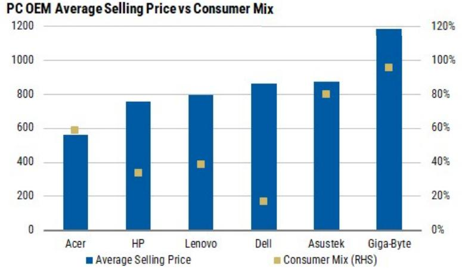  
OEM Average Selling Price vs. Consumer Mix   
Greater China PC OEM Aggregate Forward P/E

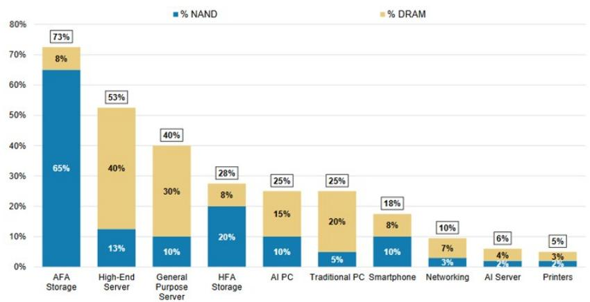  
Memory as a $\%$ of BOM   
Asia IT Hardware OEM/ODM Scorecard

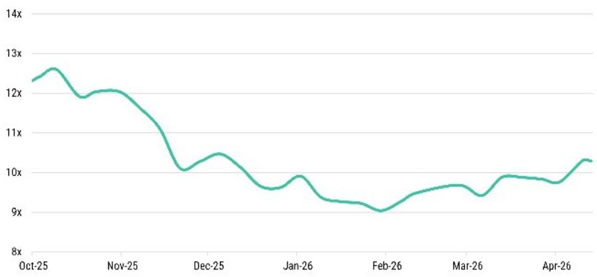  
Source: Morgan Stanley Research.

<table><tr><td colspan="8">AsiaITHardwareOEM/ODM Scorecard</td></tr><tr><td></td><td>AlBeneficiary</td><td>Margins</td><td>SupplyChain Leverage</td><td>End-Market Demand</td><td>Special Situations</td><td>Memory Exposure</td><td>Ranking</td></tr><tr><td>四</td><td></td><td></td><td></td><td></td><td></td><td></td><td>3.5</td></tr><tr><td>wistron</td><td>4</td><td>3</td><td>4</td><td>3</td><td></td><td>4</td><td>3.2</td></tr><tr><td></td><td></td><td>3</td><td></td><td>3</td><td></td><td></td><td>3.2</td></tr><tr><td>Lenovo</td><td>2</td><td>2</td><td></td><td>2</td><td></td><td></td><td>2.5</td></tr><tr><td>GIGABYTE</td><td>3</td><td>3</td><td>3</td><td>2</td><td></td><td>2.5</td><td>2.4</td></tr><tr><td>ASUS</td><td>2</td><td>3</td><td>2</td><td>2</td><td>1</td><td>2.5</td><td>2.1</td></tr><tr><td>PEGATRON</td><td>2</td><td></td><td>2</td><td>2</td><td></td><td></td><td>2.0</td></tr><tr><td>COMPAL</td><td>2</td><td>2</td><td>1</td><td>2</td><td></td><td></td><td>2.0</td></tr><tr><td>acer</td><td>1</td><td>2</td><td>1</td><td></td><td></td><td>2.5</td><td>1.4</td></tr></table>

# Global notebook demand vs. supply

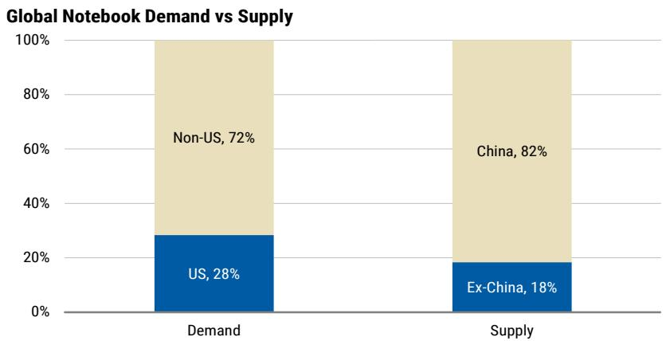  
Global PC OEM US demand vs. ex-China supply

# Global notebook production by location

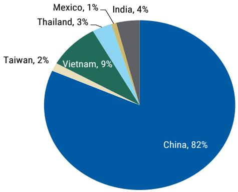  
Global notebook production by location   
Global PC OEM production by location

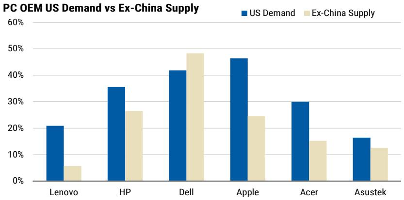

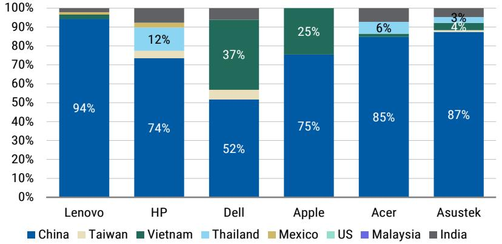  
Global notebook production breakdown by region

# CPU Market Share Trend

# Server CPU market share

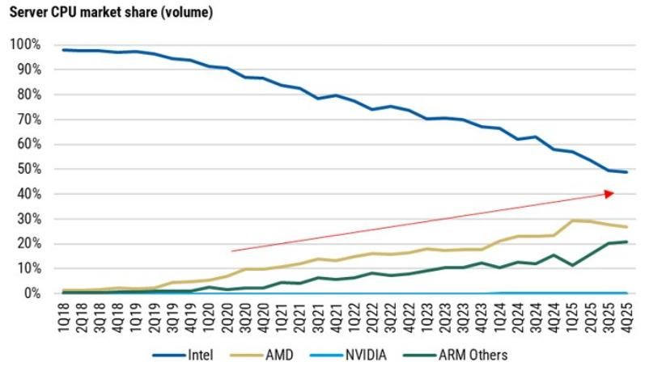  
DT CPU market share

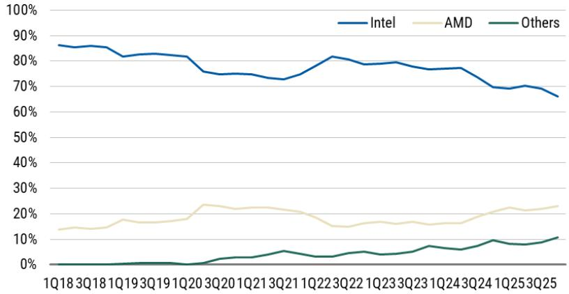  
DT CPU market share (volume)   
Source: IDC, Morgan Stanley Research.

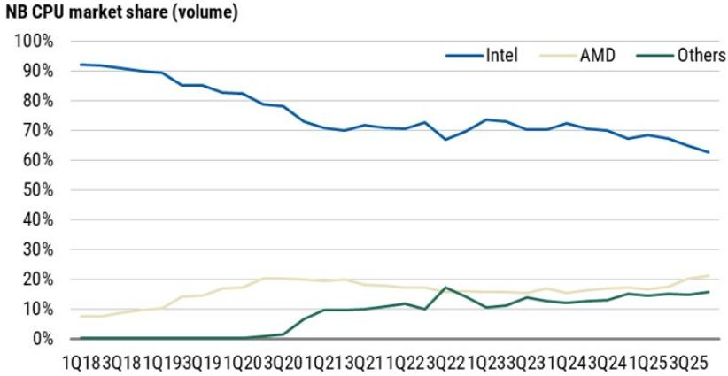  
NB CPU market share

# Cloud and Edge AI Will Add \~US\$600mn TAM to the Overall MLCC Market by 2026

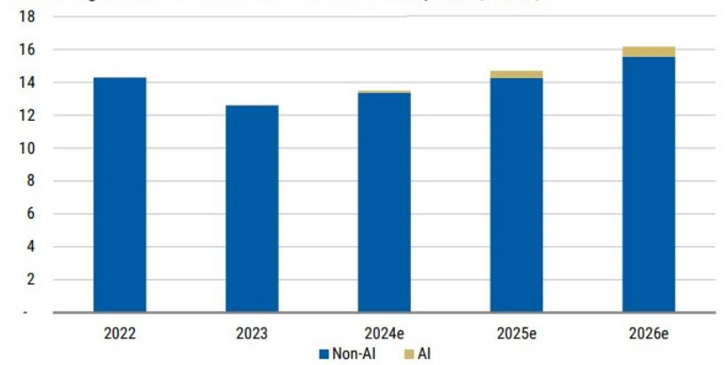  
Cloud & Edge AI to drive \~US\$5600mn TAM by 2026 $\cos \$ 1$ bn)   
Cloud & Edge Al to drive incremental \~Us\$600mn TAM by 2026 (Us\$ bn)   
MLCC PC value TAM $[ \mathbf { U } \mathbf { S } \$ \mathbf { m } \mathbf { n } ]$ )

# AI Servers to drive significant MLCC TAM growth $( \mathsf { U S } \$ \mathsf { m } \mathsf { n } )$ )

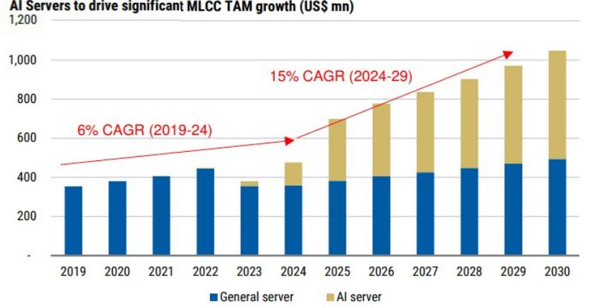  
MLCC smartphone value TAM $( \mathsf { U S } \$ \mathsf { m } \mathsf { n } )$ )

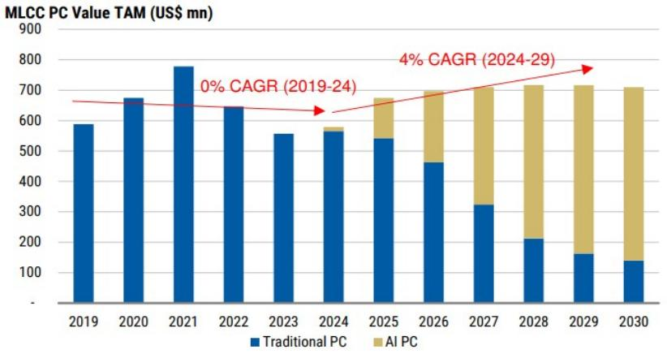  
Source: IDC, Morgan Stanley Research. $\textstyle \theta =$ Morgan Stanley Research estimates.

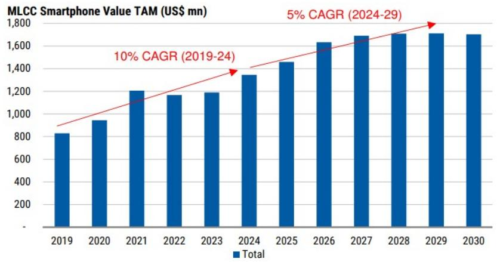

# AI Servers to See the Largest MLCC Content Growth

<table><tr><td colspan="2">Server Assumptions</td><td colspan="2"># of MLCCs</td><td>Us$</td></tr><tr><td>General server</td><td></td><td></td><td>2,000</td><td>30</td></tr><tr><td></td><td></td><td></td><td></td><td></td></tr><tr><td>HGX Hopper Al server (8x GPU)</td><td>#</td><td></td><td>24,800</td><td>230</td></tr><tr><td>GPU module (OAM)</td><td>8x</td><td>1,300</td><td>10,400</td><td>10 80</td></tr><tr><td>GPU baseboard (UBB)</td><td>1×</td><td>4,900</td><td>4,900</td><td>45 45</td></tr><tr><td>CPU motherboard</td><td>1x</td><td>1,500</td><td>1,500</td><td>25 25</td></tr><tr><td>Peripheral boards</td><td>8x</td><td>1,000</td><td>8,000</td><td>10 80</td></tr><tr><td></td><td></td><td></td><td></td><td></td></tr><tr><td>HGX BlackwellAl server (8x GPU)</td><td></td><td>3,000</td><td>38.800</td><td>505</td></tr><tr><td>GPU module (OAM)</td><td>8x</td><td>5,300</td><td>24,000</td><td>38 300</td></tr><tr><td>GPU baseboard (UBB)</td><td>1x</td><td>1,500</td><td>5,300</td><td>100 100</td></tr><tr><td>CPU motherboard</td><td>1x</td><td>1,000</td><td>1,500</td><td>25 25</td></tr><tr><td>Peripheral boards</td><td>8x</td><td></td><td>8,000</td><td>10 80</td></tr><tr><td></td><td></td><td></td><td></td><td></td></tr><tr><td>GB200 (NVL36)</td><td></td><td>9,000</td><td>234,000</td><td>2,475</td></tr><tr><td>Bianca</td><td>18x</td><td>3,000</td><td>162,000</td><td>95 1,710</td></tr><tr><td>Switch boards</td><td>9x</td><td>1,000</td><td>27,000</td><td>35 315</td></tr><tr><td>Peripheral boards</td><td>45x</td><td></td><td>45,000</td><td>10 450</td></tr><tr><td></td><td></td><td></td><td></td><td></td></tr><tr><td>GB200 (NVL72)</td><td></td><td>9,000</td><td> 441,000</td><td>4,635</td></tr><tr><td>Bianca</td><td>36x</td><td>3,000</td><td>324,000</td><td>95 3,420</td></tr><tr><td>Switch board</td><td>9x</td><td></td><td>27,000</td><td>35 315</td></tr><tr><td>Peripheral boards</td><td>90x</td><td>1,000</td><td>90,000</td><td>10 900</td></tr></table>

# General server MLCC supplier share (value)

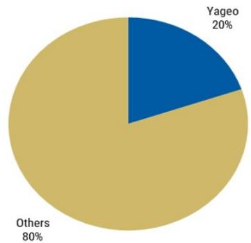  
Yageo general server MLCC supplier share (value)

# General PC MLCC supplier share (value)

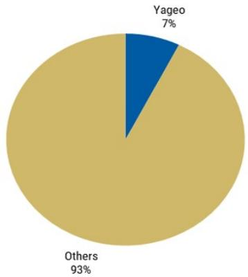  
Yageo general PC MLCC supplier share (value)

<table><tr><td rowspan=1 colspan=3>PC Assumptions                              #       US$</td></tr><tr><td rowspan=1 colspan=1>General PC</td><td rowspan=1 colspan=1>800</td><td rowspan=1 colspan=1>2.2</td></tr><tr><td rowspan=1 colspan=1>Low-end</td><td rowspan=1 colspan=1>600</td><td rowspan=1 colspan=1>1.5</td></tr><tr><td rowspan=1 colspan=1>High-end</td><td rowspan=1 colspan=1>900</td><td rowspan=1 colspan=1>2.6</td></tr><tr><td rowspan=1 colspan=1></td><td rowspan=1 colspan=1></td><td rowspan=1 colspan=1></td></tr><tr><td rowspan=1 colspan=1>AI PC</td><td rowspan=1 colspan=1>1,000</td><td rowspan=1 colspan=1>3.0</td></tr></table>

<table><tr><td rowspan=1 colspan=1>Smartphone Assumptions</td><td rowspan=1 colspan=1>#</td><td rowspan=1 colspan=1>US$</td></tr><tr><td rowspan=1 colspan=1>Smartphone</td><td rowspan=1 colspan=1></td><td rowspan=1 colspan=1></td></tr><tr><td rowspan=1 colspan=1>4G</td><td rowspan=1 colspan=1>400</td><td rowspan=1 colspan=1>0.60</td></tr><tr><td rowspan=1 colspan=1>5G</td><td rowspan=1 colspan=1>1,000</td><td rowspan=1 colspan=1>1.30</td></tr><tr><td rowspan=1 colspan=1></td><td rowspan=1 colspan=1></td><td rowspan=1 colspan=1></td></tr><tr><td rowspan=1 colspan=1>Al Smartphone</td><td rowspan=1 colspan=1>1,000</td><td rowspan=1 colspan=1>1.40</td></tr></table>

# All-time Survey-High Smartphone Upgrade Rates, Led Primarily By iPhone

Based on our 2025 AlphaWise Smartphone Survey, next 12-month China and US smartphone upgrade rates are expected to expand 8 points and 3 points Y/Y, reaching an all-time survey ( $1 0 +$ years) high, while the same metrics are 订阅研报添加微信 LCD123321Cexpected to decline 3-6 points Y/Y for EMEA (the UK and Germany).

On a global blended basis, smartphone upgrade rates are expected to improve 5ppt Y/Y to $43 \%$ , an all-time survey high.

However, Apple is the only smartphone OEM with positive and improving net switching rates in our 2025 AlphaWise Smartphone Survey, suggesting the upgrade rate momentum is primarily driven by iPhone strength.

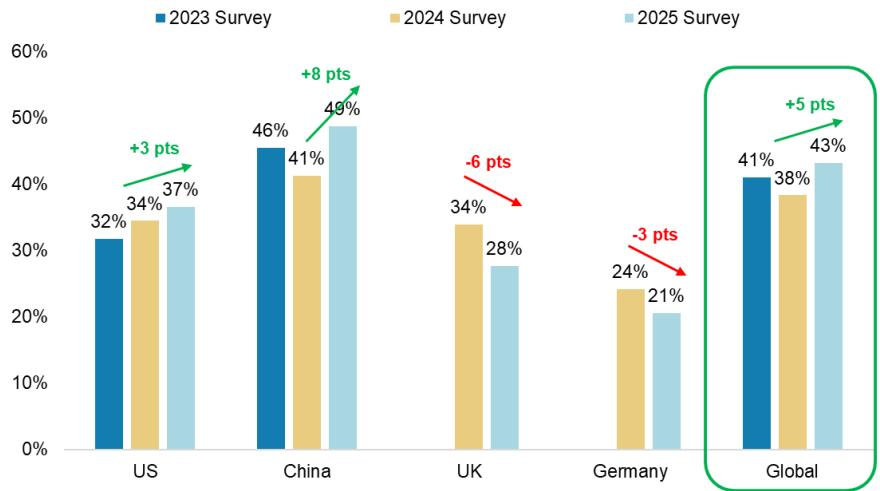  
Smartphone Upgrade Rates (Extremely Likely Upgraders) By Country

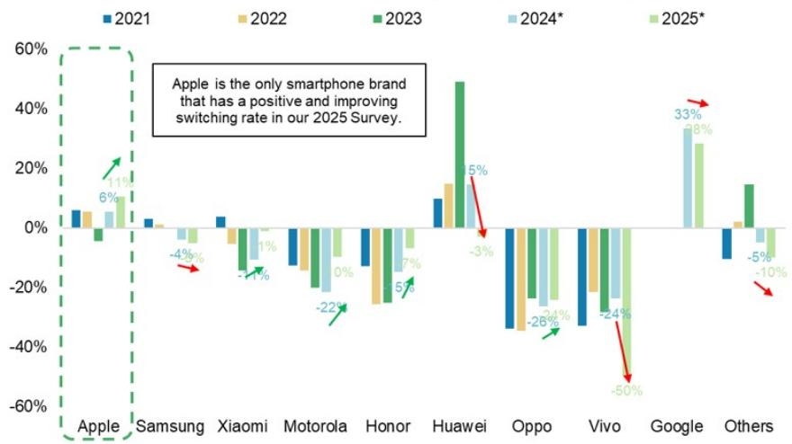  
Global Smartphone Brand Net Switching Rates (The HigherThe Better)

# The Reality Is – Smartphone OEMs Need To Pay for Higher Memory Prices

Combining our checks and the Survey results on iPhone 订阅研报添加微信 LCstorage mix, we estimate average memory cost per iPhone will rise $1 5 0 \% + \textsf { Y } / \textsf { Y }$ in 2026.

This means that even for Apple, smartphone OEMs would need to pay significantly higher memory prices and raise prices to partially mitigate the cost impact.

We believe this is particularly negative to Android players – smartphone gross margins are lower, the mix of memory cost within COGS is higher, and the customer base is more elastic (i.e., more sensitive to price increases).

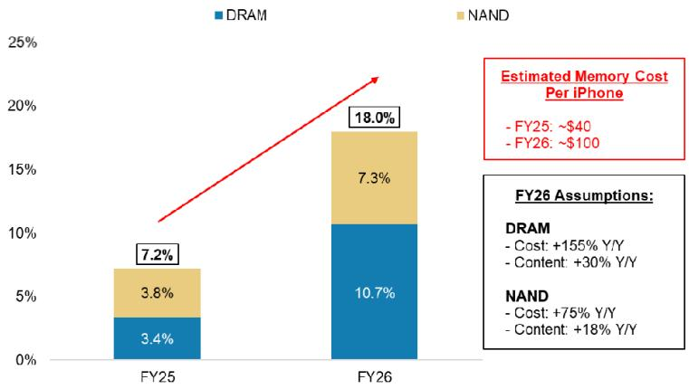  
Memory Costs $\%$ of iPhone COGS

Smartphone Gross Margin By OEM

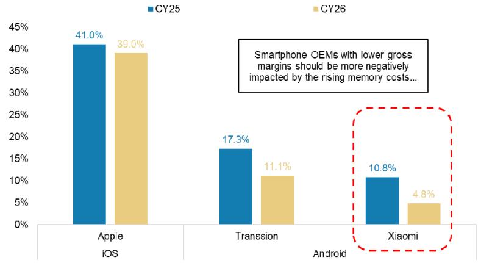  
Source: AlphaWise, Morgan Stanley Research estimates.

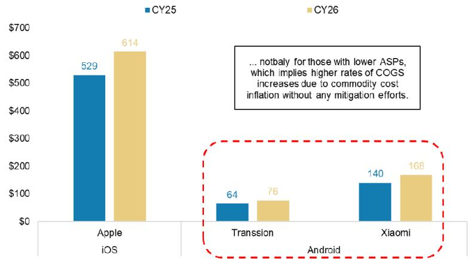  
321Cad 04-20

We believe price hikes by smartphone brands are inevitable. This will lead to demand destruction, notably in the mid-订阅研报添加微信 LCD123321Cad 04-20 range Android smartphone market, which faces a more demand elastic customer base. We forecast Android smartphone shipments to decline $1 5 \%$ Y/Y in 2026.

While the iPhone customer base is much less elastic than that of Android, we still expect shipments to decline in 2026, due primarily to changes in iPhone launch cadence.

# Taken together, we expect global smartphone shipments to decline 13% Y/Y in 2026.

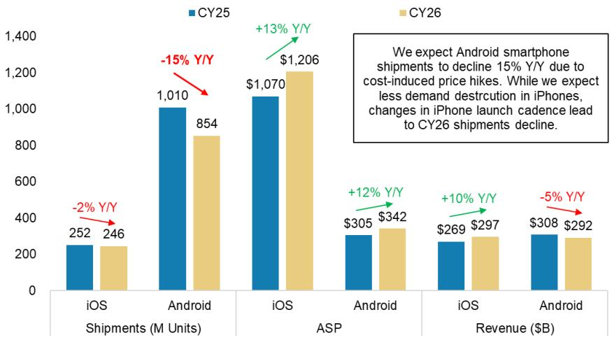  
iOS vs.Android: Shipments,ASP,and Revenue In CY25-CY26

SMARTPHONEMODEL   
Units (M)   
Rest of Asia/Pacific   
PRC   
EMEA   
North America   
Latin America   
India   
Global Total   
SMARTPHONEMODEL   
Y/Y Unit Growth   
Rest of Asia/Pacific   
PRC   
EMEA   
North America   
Latin America   
India   
Global Total

<table><tr><td rowspan="2"></td><td colspan="2">CY26Est.</td><td colspan="4">CY27Est.</td></tr><tr><td>New</td><td>Old</td><td>Diff.</td><td>New</td><td>Old</td><td>Diff</td></tr><tr><td></td><td>157</td><td>181</td><td>-13%</td><td>162</td><td>183</td><td>-12%</td></tr><tr><td>246</td><td></td><td>284 -14%</td><td></td><td>252</td><td>287</td><td>-12%</td></tr><tr><td>311</td><td></td><td>363</td><td>-14%</td><td>316</td><td>363</td><td>-13%</td></tr><tr><td>135</td><td></td><td>149</td><td>-9%</td><td>142</td><td>149</td><td>-5%</td></tr><tr><td>115</td><td>139</td><td>-18%</td><td></td><td>118</td><td>141</td><td>-16%</td></tr><tr><td>136</td><td></td><td>182</td><td>-25%</td><td>147</td><td>189</td><td>-22%</td></tr><tr><td>1,100</td><td>1,299</td><td></td><td>-15%</td><td>1,137</td><td>1,312</td><td>-13%</td></tr></table>

<table><tr><td rowspan="2">E</td><td colspan="3">CY26Est.</td><td colspan="3">CY27Est.</td></tr><tr><td>New</td><td>old</td><td>Diff</td><td>New</td><td>old</td><td>Diff</td></tr><tr><td></td><td>-14%</td><td>0%</td><td>-14.2pts</td><td>3%</td><td>1%</td><td>1.9pts</td></tr><tr><td>-14%</td><td></td><td>1% -14.2pts</td><td></td><td>3%</td><td>1%</td><td>1.6pts</td></tr><tr><td>-15%</td><td>0%</td><td>-15.1pts</td><td></td><td>2%</td><td>0%</td><td>1.8pts</td></tr><tr><td>-6%</td><td>5%</td><td>-10.9pts</td><td></td><td>5%</td><td>0%</td><td>4.7pts</td></tr><tr><td>-13%</td><td>6%</td><td>-19.5pts</td><td></td><td>3%</td><td>1%</td><td>2.2pts</td></tr><tr><td>-10%</td><td>14%</td><td>-24.7pts</td><td></td><td>8%</td><td>4%</td><td>3.8pts</td></tr><tr><td>-12.8%</td><td>3.1%</td><td>-16.0pts</td><td></td><td>3.4%</td><td>1.0%</td><td>2.4pts</td></tr></table>

# SMARTPHONE MODEL

23321Cad Revenue (M) Y/Y Revenue Grow th

<table><tr><td colspan="3">CY26 Est.</td><td colspan="3">CY27 Est.</td></tr><tr><td>New</td><td>Old</td><td>Diff.</td><td>New</td><td>Old</td><td>Diff.</td></tr><tr><td>$535</td><td>$482</td><td>11%</td><td>$573</td><td>$501</td><td>14%</td></tr><tr><td>17%</td><td>6%</td><td>11.0pts</td><td>7%</td><td>4%</td><td>3.3pts</td></tr><tr><td>$ 588,225</td><td>$ 626,102</td><td>-6%</td><td>$ 651,991</td><td>$ 657,405</td><td>-1%</td></tr><tr><td>2%</td><td>10%</td><td>-8.0pts</td><td>11%</td><td>5%</td><td>5.8pts</td></tr></table>

Source: IDC, Morgan Stanley Research estimates. Note: iOS (iPhone) ASP and revenue here could be different from our AAPL model as the figures here are based on IDC's revenue estimates in CY25 along with our iPhone ASP growth forecasts in CY26.

# gside Battery Life & Camera, Software Is Becoming a More Important Upgrade Factor

Similar to last year, we continue to see a focus on new models, advanced features, and access to Gen AI technologies.   
What is slightly different is increasing interest in better cameras, alongside deteriorating interest in battery life and storage.

AI remains a Top 5 reason for upgrading a smartphone, but without major advances in Edge AI or truly personalized digital assistants, we are not seeing much change in interest outside of China.

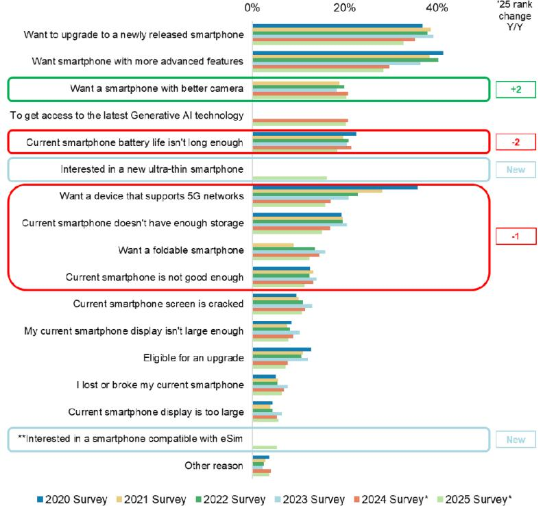  
Global Smartphone: Reason for Upgrade (Among Smartphone Owners)

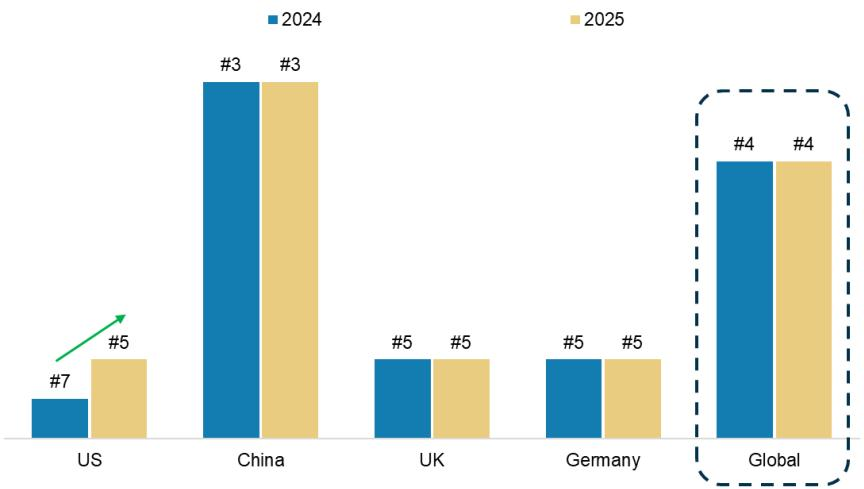  
Access to Al Tech as The Ranking of Reasons to Upgrade Smartphone

Given rising memory costs, we would also expect smartphone OEMs to reduce BOM – based on our Survey results, battery and storage could be areas -20 that are at risk of de-specing.

# We Favor Apple Supply Chain Over Android in 2026

We expect the Android smartphone supply chain to be negatively affected by more meaningful volume declines, despecing, and margin pressures, as OEMs attempt to save costs while raising prices.

While we don’t expect to see iPhone de-specing, we do expect Apple to share increasing costs with non-memory suppliers while keeping prices unchanged for the iPhone 17 family. With robust shipments and a favorable model mix, Apple and its suppliers are in a better position (vs. Android counterparts) within the smartphone universe.

Consistent with our 2024 AlphaWise Survey takeaways, we maintain a relative preference for Apple/Apple supply chain over Android OEMs/supply chain.

<table><tr><td colspan="4">Most Favored</td><td colspan="4">Least Favored</td></tr><tr><td>Ticker</td><td> Company</td><td> MS Rating</td><td> % to MS PT</td><td>Ticker</td><td> Company</td><td> MS Rating</td><td> % to MS PT</td></tr><tr><td>005930.KS</td><td>Samsung</td><td>ow</td><td>68%</td><td>3105.TW</td><td> WIN Semi</td><td>uw</td><td>-76%</td></tr><tr><td>2317.TW</td><td>Hon Hai</td><td>ow</td><td>41%</td><td>300782.SZ</td><td>Maxscend</td><td>UW</td><td> -55%</td></tr><tr><td>0285.HK</td><td>BYDE</td><td>ow</td><td>38%</td><td>8086.TWO</td><td>AWSC</td><td>Uw</td><td>-43%</td></tr><tr><td>601138.SS</td><td>FII</td><td>ow</td><td>36%</td><td>3034.TW</td><td>Novatek</td><td>Uw</td><td> -22%</td></tr><tr><td>002475.SZ</td><td>Luxshare</td><td>Ow</td><td>29%</td><td>603160.SS</td><td>Goodix</td><td>uw</td><td>-16%</td></tr><tr><td>6770.T</td><td> Alps Alpine</td><td>ow</td><td>28%</td><td>2382.HK</td><td> Sunny Optical</td><td>EW</td><td>-3%</td></tr><tr><td>6762.T</td><td>TDK</td><td>Ow</td><td>22%</td><td>QCOM</td><td>Qualcomm</td><td>Uw</td><td>-2%</td></tr><tr><td>6088.HK</td><td>FIT Hon Teng</td><td>ow</td><td>21%</td><td>QRVO</td><td>Qorvo</td><td>EW</td><td>3%</td></tr><tr><td>AAPL</td><td>Apple</td><td>ow</td><td>20%</td><td>688036.SS</td><td> Transsion</td><td>EW</td><td>14%</td></tr><tr><td> SWKS</td><td> Skyworks</td><td>EW</td><td>18%</td><td>603501.SS</td><td>OmniVision</td><td>EW</td><td>19%</td></tr><tr><td>3017.TW</td><td>AVC</td><td>ow</td><td>15%</td><td></td><td></td><td></td><td></td></tr><tr><td>6981.T</td><td>Murata</td><td>ow</td><td>11%</td><td></td><td></td><td></td><td></td></tr><tr><td>2018.HK</td><td>AAC</td><td>ow</td><td>10%</td><td></td><td></td><td></td><td></td></tr><tr><td>2454.TW</td><td> MediaTek</td><td>ow</td><td>3%</td><td></td><td></td><td></td><td></td></tr><tr><td>601231.SS</td><td>USI</td><td>Ow</td><td>0%</td><td></td><td></td><td></td><td></td></tr><tr><td> STMPA.PA</td><td> STMicro</td><td>ow</td><td>-3%</td><td></td><td></td><td></td><td></td></tr></table>

Source: FactSet, Morgan Stanley Research. Prices as of 17 April, 2026.

# 2Q26 iPhone Build Estimates of 52mn Units $( - 7 \%$ QoQ, +12% YoY)

<table><tr><td>mn units</td><td>1Q23</td><td>2Q23</td><td>3Q23</td><td>4Q23</td><td>2023</td><td>1Q24</td><td>2Q24 3Q24</td><td>4Q24</td><td>2024</td><td>1Q25</td><td>2Q25</td><td>3Q25</td><td>4Q25</td><td>2025</td><td></td><td>1Q26e</td><td>2Q26e</td></tr><tr><td>iPhone Sell-in</td><td></td><td></td><td></td><td></td><td></td><td></td><td></td><td></td><td></td><td></td><td></td><td></td><td></td><td></td><td></td><td></td><td></td></tr><tr><td>iPhoneSE3/SE5G/16e/17e</td><td></td><td>1.0 2.5</td><td>5.0</td><td>3.0</td><td>11.5</td><td>&quot;1.0</td><td>2.0</td><td>5.0</td><td>3.0</td><td>11.0</td><td>4.0</td><td>9.0</td><td>4.0</td><td>1.0</td><td>18.0</td><td>2.0</td><td>10.0</td></tr><tr><td>iPhone XR</td><td>-</td><td></td><td></td><td>-</td><td>-</td><td>-</td><td></td><td></td><td>-</td><td>-</td><td>-</td><td></td><td></td><td>-</td><td>-</td><td></td><td>-</td></tr><tr><td> iPhone 11</td><td>-</td><td>·</td><td>-</td><td>-</td><td>：</td><td>-</td><td>-</td><td>-</td><td>·</td><td>：</td><td>-</td><td>-</td><td>-</td><td>·</td><td>-</td><td>-</td><td>-</td></tr><tr><td>iPhone 12 mini (5.4&quot;)</td><td>-</td><td></td><td>-</td><td>-</td><td>-</td><td>-</td><td>-</td><td>-</td><td>-</td><td>-</td><td>-</td><td>-</td><td>-</td><td>-</td><td>-</td><td>-</td><td>-</td></tr><tr><td>iPhone 12 (6.1&quot;)</td><td>0.5</td><td></td><td>0.5 -</td><td>-</td><td>1.0</td><td>-</td><td>-</td><td>-</td><td>-</td><td>-</td><td>-</td><td>-</td><td>-</td><td>-</td><td>-</td><td>-</td><td>-</td></tr><tr><td>iPhone 12 Pro (6.1&quot;)</td><td>0.5</td><td>-</td><td>- -</td><td>-</td><td>0.5</td><td>-</td><td>-</td><td>-</td><td>-</td><td>-</td><td>-</td><td>-</td><td>-</td><td>-</td><td>-</td><td>-</td><td>-</td></tr><tr><td>iPhone 12 Pro Max (6.7&quot;)</td><td>0.5</td><td>- 0.5</td><td></td><td>-</td><td>0.5</td><td>-</td><td></td><td>-</td><td>-</td><td>-</td><td>-</td><td>-</td><td>-</td><td>-</td><td>-</td><td>-</td><td>-</td></tr><tr><td>iPhone 13mini (5.4&quot;) iPhone 13 (6.1&quot;)</td><td>1.0 1.0</td><td>0.5</td><td>- ·</td><td>- -</td><td>1.5 1.5</td><td>- -</td><td>- -</td><td>- -</td><td>- -</td><td>- -</td><td>-</td><td>- -</td><td>-</td><td>-</td><td>-</td><td></td><td>-</td></tr><tr><td>iPhone 13 Pro (6.1&quot;)</td><td>1.0</td><td>2.0</td><td>1.0</td><td>-</td><td>4.0</td><td>0.5</td><td>0.5</td><td>-</td><td></td><td>1.0</td><td>-</td><td>-</td><td></td><td></td><td></td><td>-</td><td>-</td></tr><tr><td>iPhone 13 Pro Max (6.7&quot;)</td><td>2.0</td><td>2.0</td><td>1.0</td><td>-</td><td>5.0</td><td>0.5</td><td>0.5</td><td>-</td><td>- -</td><td>1.0</td><td>-</td><td>:</td><td>- -</td><td>-</td><td>- -</td><td>- -</td><td>-</td></tr><tr><td>iPhone 14 (6.1&quot;)</td><td>7.0</td><td>4.0</td><td>5.0</td><td>2.0</td><td>18.0</td><td>1.0</td><td>0.5</td><td>-</td><td></td><td>1.5</td><td>-</td><td>-</td><td>-</td><td>-</td><td>-</td><td></td><td>: -</td></tr><tr><td>iPhone 14 Plus (6.7&quot;)</td><td>5.0</td><td>3.0</td><td>1.0</td><td>1.0</td><td>10.0</td><td>1.0</td><td>0.5</td><td>-</td><td>-</td><td>1.5</td><td>·</td><td>-</td><td>-</td><td>-</td><td>-</td><td>-</td><td>-</td></tr><tr><td> iPhone 14 Pro (6.1&quot;)</td><td>15.0</td><td>12.0</td><td>7.0</td><td>3.0</td><td>37.0</td><td>2.0</td><td>2.0</td><td>1.0</td><td>1.0</td><td>6.0</td><td>1.0</td><td>1.0</td><td>1.0</td><td>-</td><td>3.0</td><td>-</td><td>-</td></tr><tr><td>iPhone 14 Pro Max (6.7&quot;)</td><td>19.5</td><td>14.0</td><td>9.0</td><td>4.0</td><td>46.5</td><td>2.0</td><td>2.0</td><td>1.0</td><td>1.0</td><td>6.0</td><td>1.0</td><td>1.0</td><td>1.0</td><td></td><td>3.0</td><td>-</td><td>-</td></tr><tr><td>iPhone 15 (6.1&quot;)</td><td></td><td></td><td>6.0</td><td>12.0</td><td>18.0</td><td>6.0</td><td>5.0</td><td>4.0</td><td>1.0</td><td>16.0</td><td>1.0</td><td>0.5</td><td>0.5</td><td>0.5</td><td>2.5</td><td>-</td><td>-</td></tr><tr><td>iPhone 15 Plus (6.7&quot;)</td><td></td><td></td><td>5.0</td><td>10.0</td><td>15.0</td><td>4.0</td><td>3.0</td><td>1.0</td><td>1.0</td><td>9.0</td><td>1.0</td><td>0.5</td><td>0.5</td><td>0.5</td><td>2.5</td><td>·</td><td>·</td></tr><tr><td>iPhone 15 Pro (6.1&quot;)</td><td></td><td></td><td>8.0</td><td>16.0</td><td>24.0</td><td>12.0</td><td>10.0</td><td>8.5</td><td>2.0</td><td>32.5</td><td>2.0</td><td>2.0</td><td>2.0</td><td>1.0</td><td>7.0</td><td>1.0</td><td>1.0</td></tr><tr><td>iPhone 15 Pro Max (6.7&quot;)</td><td></td><td></td><td>2.0</td><td>24.0</td><td>26.0</td><td>18.0</td><td>13.0</td><td>10.5</td><td>3.0</td><td>44.5</td><td>3.0</td><td>3.0</td><td>2.0</td><td>1.0</td><td>9.0</td><td>1.0</td><td>1.0</td></tr><tr><td>iPhone 16 (6.1&quot;)</td><td></td><td></td><td></td><td></td><td></td><td>-</td><td>-</td><td>6.0</td><td>12.0</td><td>18.0</td><td>5.0</td><td>4.0</td><td>4.0</td><td>1.0</td><td>14.0</td><td>2.0</td><td>2.0</td></tr><tr><td>iPhone 16 Plus (6.7&quot;)</td><td></td><td></td><td></td><td></td><td></td><td>-</td><td>-</td><td>5.0</td><td>6.0</td><td>11.0</td><td>4.0</td><td>3.0</td><td>1.0</td><td>·</td><td>8.0</td><td>·</td><td>-</td></tr><tr><td>iPhone 16 Pro (6.3&quot;)</td><td></td><td></td><td></td><td></td><td></td><td>-</td><td></td><td>8.0</td><td>17.0</td><td>25.0</td><td>11.5</td><td>9.5</td><td>4.0</td><td>2.0</td><td>27.0</td><td>2.0</td><td>2.0</td></tr><tr><td>iPhone 16 Pro Max(6.9&quot;)</td><td></td><td></td><td></td><td></td><td></td><td>-</td><td>-</td><td>4.0</td><td>26.0</td><td>30.0</td><td>16.5</td><td>13.0</td><td>10.0</td><td>4.0</td><td>43.5</td><td>5.0</td><td>3.0</td></tr><tr><td>iPhone 17 (6.1&quot;) iPhone Air (6.7&quot;)</td><td></td><td></td><td></td><td></td><td></td><td>- -</td><td>-</td><td>-</td><td></td><td>- -</td><td>-</td><td>-</td><td>6.0 4.0</td><td>16.0</td><td>22.0 8.0</td><td>10.0</td><td>8.0</td></tr></table>

• For full-year 2026, our supply-chain checks suggest total iPhone build volume could be up in the high single digits $\mathsf { Y o Y }$ . • For foldable iPhone model in 2H26, our checks suggest sampling production of mechanical components already kicked off 订阅研报in March and still target launch in September.

# Supply Chain Reorientation

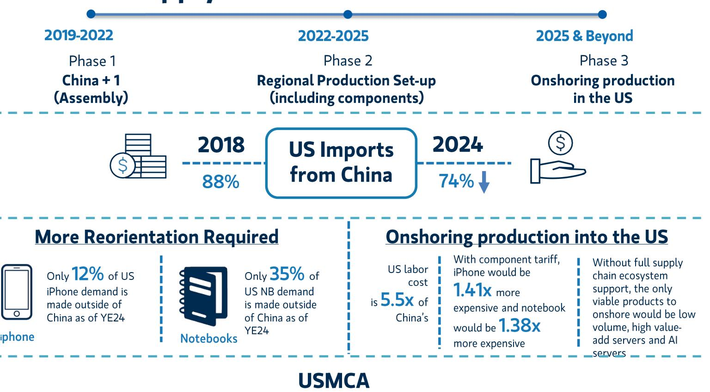

订阅研报添加微信 LCD123321Cad 04-20 Servers and switches produced in Mexico are considered USMCA -compliant goods and therefore exempt from tariffs. The current USMCA expires in July 2036.

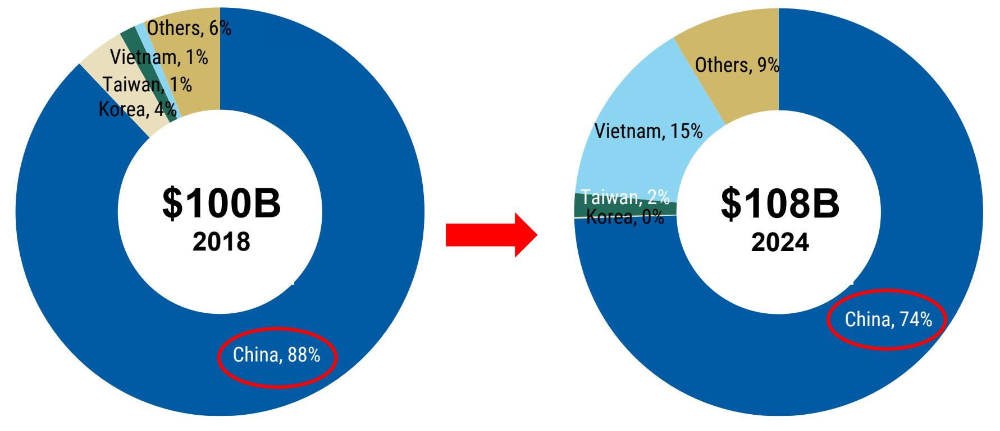  
US Imports Data Shows Supply Chain Reorientation Is Happening

Supply chain reorientation is happening: In 2018, China accounted for $88 \%$ of US tech imports (notebooks, smartphones and game 订阅研报添加微信consoles) or \~US\$88bn, but by $20 2 4$ D123321Cad 0, China dropped to $7 4 \% ,$ or $\sim \cup \varsigma \$ 806 n$ .

# How Much USA Imports from Different Countries by Major Tech Products

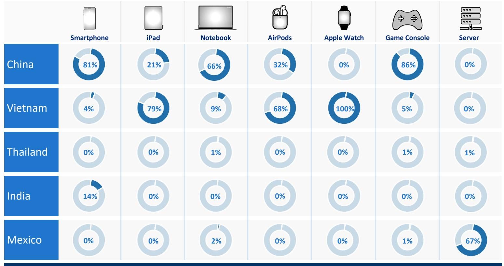

US still imports the majority of smartphones, notebooks, and game consoles from China, but Vietnam has become the main exporter of iPads, AirPods, and Apple Watches to the US. We are seeing more notebook production ramping up in Vietnam and Thailand, so these two countries will become more important for the US in the coming years. And for smartphones, we expect India to become a bigger contributor in the coming years as well. And for 订阅研报添加微信 LCD123321Cad 04-20 servers, we think Mexico will continue to be important as servers imported from Mexico into the US is USMCA-eligible for 0% tariff.

This report references U.S. Executive Order 14032 and/or entities or securities that are designated thereunder. U.S. persons may be prohibited from buying certain securities of entities named in this report. Readers are solely responsible for ensuring that their investment activities are carried out in compliance with applicable laws.

# 订阅研报添加微信 LCD123321Cad 04-20

This report references export controls and/or entities that may be subject to export control restrictions. Readers are solely responsible for ensuring that their investment or trade activities are carried out in compliance with applicable laws.