Investor Presentation | Asia Pacific

# Greater China Semis: Focus on AI-related semis – 订阅研报添加微信 LCD123321Cad 04-20 GPU, ASIC, CPU, and Optical Chips

• Top ideas:

• OW:

• AI: TSMC (Top Pick), SMIC, Aspeed, MediaTek, Alchip, GUC, KYEC, ASE, FOCI, ASMPT, AllRing   
• Memory (Turning very selective): Macronix (Top Pick), AP Memory, GigaDevice   
• China Semis/WFE: NAURA Tech, AMEC, USI, SMIC   
• Testing Equipment and Consumables: Winway, MPI, Hon Precision

EW/UW: UMC, Vanguard, WIN Semi, OmniVision, ASMedia, Realtek, Phison, Winbond, Nanya Tech

Long-term demand drivers:

• Tech inflation: We expect “price elasticity” to affect demand for tech products. Rising wafer, OSAT and memory costs create more margin headwinds for chip designers in 2026.   
AI cannibalization: Besides demand weakness (AI to replace some human jobs), we see the semi supply chain also prioritizing AI semis over non-AI semis, e.g., T-Glass and memory shortage.   
China AI: DeepSeek is triggering inferencing AI demand, but are domestic GPUs sufficient? DeepSeek has demonstrated cheaper inferencing. However, shipments of NVidia H200, if any, could dilute the domestic GPU supply chain.

Valuation Comparison: Foundry, Back-end, Memory, IDM and Semi Cap   
Source: Company data, Morgan Stanley Research. $E =$ Morgan Stanley Research estimates. Note: Data as of April 20, 2026.   

<table><tr><td></td><td></td><td>Curr 4/20/2026 ency</td><td>Target</td><td>Upsidel</td><td>Yield</td><td>Yield</td><td>(USSM)</td><td>Traltmd</td><td></td><td></td><td></td><td></td><td></td><td></td><td></td><td></td></tr><tr><td>Ticker</td><td></td><td></td><td></td><td>Do wnside</td><td>Rating</td><td>(%)</td><td></td><td></td><td>2025e</td><td>2026e 2027e</td><td>2025e</td><td>2026e 2027e</td><td>2025e</td><td>2026e 2027e</td><td>2025e</td><td>2026e</td><td>2027e</td></tr><tr><td>Foundry</td><td></td><td>2,025.0</td><td></td><td></td><td></td><td></td><td></td><td></td><td></td><td></td><td></td><td></td><td></td><td></td><td></td><td></td><td></td></tr><tr><td>2330.TW TSMC UMC</td><td></td><td>TWD</td><td>2,588.0</td><td>28%</td><td></td><td>1.8%</td><td>1,657,874</td><td>2,528.3</td><td>30.6</td><td>15.7</td><td>46%</td><td>56% 25%</td><td>35%</td><td>41% 38%</td><td></td><td>7.0</td><td>5.2</td></tr><tr><td>2303.TW</td><td></td><td>TWD</td><td></td><td>-12%</td><td></td><td>1.4% 5.1% 5.3%</td><td>30,655</td><td>318.3</td><td>23.1</td><td>19.6 21.8</td><td>-12%</td><td>6% 28%</td><td>11%</td><td>11%</td><td></td><td>2.5</td><td>2.3</td></tr><tr><td>0981.HK</td><td></td><td>HKD</td><td>68.0 70.0</td><td>17%</td><td></td><td>0.0% -5.0%</td><td>53,817</td><td>502.9</td><td>NM</td><td>17.0 NM</td><td>39%</td><td>118% 42%</td><td>3%</td><td>7%</td><td>14%</td><td>2.6 NM</td><td>NM</td></tr><tr><td>5347.TWO</td><td></td><td>TWD</td><td>130.0</td><td>-6%</td><td></td><td></td><td>8,157</td><td>119.4</td><td>33.3</td><td>NM 30.9 25.7</td><td>10%</td><td>8% 21%</td><td>11%</td><td>12%</td><td>9% 14%</td><td>NM 3.8</td><td>3.6</td></tr><tr><td>Vanguard 1347.HK</td><td></td><td>HKD</td><td>88.0</td><td>E -7%</td><td>5.1%</td><td>3.1% -4.6%</td><td>20,987</td><td>259.3</td><td>NM</td><td>NM</td><td>-6%</td><td>24%</td><td>1%</td><td></td><td>NM</td><td>3.8</td><td></td></tr><tr><td>Hua Hong 6770.TW PSMC</td><td>94.5 51.4</td><td>TWD</td><td>71.0</td><td>E 38% 0</td><td>0.1% 0.0%</td><td>5.6%</td><td>6,856</td><td>492.2</td><td>NM</td><td>NM</td><td>22% -459%</td><td>636% -74%</td><td>-12%</td><td>6%</td><td>7%</td><td>NM</td><td>NM</td></tr><tr><td>3105.TWO WIN Semi</td><td>592.0</td><td>TWD</td><td>130.0</td><td>-78% U</td><td>0.5%</td><td>-3.8%</td><td>2,264</td><td>304.3</td><td>NM</td><td>106.7</td><td>66%</td><td>40%</td><td>3</td><td>26%</td><td>5%</td><td>1.0 6.2</td><td>1.0</td></tr><tr><td>8086.TWO AWSC</td><td>150.0</td><td>TWD</td><td>85.0</td><td>-43%</td><td>U</td><td>-3.9%</td><td>931</td><td>30.6</td><td>48.7</td><td>NM 46.1 43.0</td><td>16%</td><td>33% 6% 7%</td><td></td><td>4% 8%</td><td>6%</td><td>6.3 3.4</td><td>6.2 3.3</td></tr><tr><td>Mean:</td><td></td><td></td><td></td><td></td><td></td><td>1.1% 1.7%</td><td></td><td></td><td>41.0</td><td>38.5 26.3</td><td></td><td>50%</td><td></td><td>14%</td><td>8% 13%</td><td>3.6 4.8</td><td>3.6</td></tr><tr><td>Median:</td><td></td><td></td><td></td><td></td><td></td><td>-0.2% 0.8% -1.0%</td><td></td><td></td><td>31.9</td><td>58.4 25.7</td><td>23%</td><td>14% 20% 25%</td><td>8% 5%</td><td>10%</td><td>8%</td><td>4.0 3.7 3.6</td><td>3.4</td></tr><tr><td>Memory</td><td></td><td></td><td></td><td></td><td></td><td></td><td></td><td></td><td></td><td></td><td></td><td></td><td></td><td></td><td></td><td></td><td></td></tr><tr><td>603986.SS Giga Device</td><td></td><td>CNY</td><td>348.0</td><td>20%</td><td></td><td></td><td></td><td></td><td>NM</td><td></td><td></td><td></td><td></td><td></td><td></td><td></td><td></td></tr><tr><td>2408.TW Nanya Tech</td><td></td><td>TWD</td><td>278.0</td><td>34%</td><td>0.3% 0.0%</td><td>4.1% 13.6%</td><td>26,957 20,146</td><td>1,348.6 803.1</td><td>35.9 NM</td><td>22.4 3.3</td><td>50% 227% -359%</td><td>60% NM</td><td>9%</td><td>27% 34%</td><td>NM</td><td>8.4</td><td>6.3 1.2</td></tr><tr><td>2344.TW</td><td></td><td>TWD</td><td>100.0</td><td>E 17% E</td><td>0.0%</td><td>16.6%</td><td>12,178</td><td>614.7</td><td>3.9 5.2</td><td>4.3</td><td>NM 523% NM</td><td>NM</td><td>4% 4%</td><td>66% 45% 56%</td><td>3.7</td><td>1.9</td><td></td></tr><tr><td>8299.TWO Phison</td><td></td><td>TWD</td><td>1,800.0</td><td>10% E</td><td>1.6%</td><td>1.6%</td><td>11,253</td><td></td><td>11.7</td><td>16.1</td><td>18% 233%</td><td>-27%</td><td>18%</td><td>43% 46% 27%</td><td>3.8</td><td>2.4 4.4</td><td>1.5 4.1</td></tr><tr><td>SIMO.0 Silicon Motion 2337.TW Macronix</td><td></td><td>USD TWD</td><td>155.0 202.0</td><td>11% 0</td><td>1.1%</td><td>2.1%</td><td>4,694</td><td></td><td>21.4 NM</td><td>12.8</td><td>6% 106%</td><td>66%</td><td>13%</td><td>24% 32%</td><td>6.6 5.5</td><td>4.6</td><td>3.7</td></tr><tr><td>Mean:</td><td></td><td></td><td></td><td>68% 。</td><td>4.6%</td><td>17.2%</td><td>7,060</td><td>570.4</td><td></td><td>NM</td><td>3% -431%</td><td>233%</td><td>-7%</td><td>22% 51%</td><td>4.9</td><td>4.2</td><td>2.5</td></tr><tr><td>Median:</td><td></td><td></td><td></td><td></td><td>1.3% 0.7%</td><td>9.2% 8.8%</td><td></td><td></td><td>41.4 15.6 41.4 11.7</td><td>11.8 12.8</td><td>40% 34% 12% 166%</td><td>83%</td><td>7%</td><td>40% 39%</td><td>4.9</td><td>4.3</td><td>3.2</td></tr><tr><td>Backend</td><td></td><td></td><td></td><td></td><td></td><td></td><td></td><td></td><td></td><td></td><td></td><td>63%</td><td>7%</td><td>37% 38%</td><td>4.9</td><td>4.3</td><td>3.1</td></tr><tr><td>3711.TW ASEH</td><td></td><td>TWD</td><td>408.0</td><td></td><td></td><td></td><td></td><td></td><td></td><td></td><td>24%</td><td></td><td></td><td></td><td></td><td></td><td></td></tr><tr><td>600584.SS JCET</td><td></td><td>CNY</td><td>48.5</td><td>-12% 0 E</td><td>2.2% 0.3%</td><td>6.0% 5.7%</td><td>63,583</td><td>50.1 47.7</td><td>30.6 29.6</td><td>19.9 19.8</td><td>64% 61%</td><td>54%</td><td>11%</td><td>17% 23%</td><td>5.4</td><td>4.8</td><td>4.2</td></tr><tr><td>601231.SS USI 2449.TW KYEC</td><td></td><td>CNY TWD</td><td>40.1 338.0</td><td>9% -5% 0</td><td>1.0%</td><td>-7.4%</td><td>11,060 12,894</td><td></td><td>35.8</td><td>26.4</td><td>3% 12% 41%</td><td>49% 36%</td><td>5% 10%</td><td>8% 11% 13% 16%</td><td>2.6</td><td>2.4</td><td>2.1 3.9</td></table>

<table><tr><td></td><td colspan="2">Price Curr</td><td>Price</td><td>Upside/</td><td>Dividend Yield</td><td>FCF Yield</td><td colspan="2">Market 3M Avg. Daily Cap</td><td colspan="2">P/E Ratio (x)</td><td colspan="2">EPS Growth</td><td colspan="2">ROAE</td><td colspan="2">P/B Ratio (x)</td></tr><tr><td>Ticker Company Fabless</td><td></td><td>4/20/2026</td><td>ency</td><td>Target</td><td>Downside Rating</td><td>(%)</td><td>(%) (US$M)</td><td>Trading</td><td>2025e 2026e</td><td>2027e</td><td>2026e</td><td>2027e</td><td>2025e</td><td>2026e 2027e</td><td></td><td>2025e 2026e</td><td>2027e</td></tr><tr><td>Smartphone/Wireless Semis</td><td></td><td></td><td></td><td></td><td></td><td></td><td></td><td></td><td></td><td></td><td></td><td></td><td></td><td></td><td></td><td></td><td></td></tr><tr><td>2454.TW</td><td></td><td></td><td></td><td></td><td></td><td>7.4%</td><td>0.9%</td><td>93,904</td><td></td><td>32.4</td><td></td><td>-7%</td><td></td><td></td><td></td><td></td><td></td></tr><tr><td>603501.SS</td><td>MediaTek</td><td>1,900.0</td><td>TWD</td><td>1,988.0</td><td>5%</td><td></td><td></td><td></td><td>30.3</td><td>16.2</td><td>-6%</td><td>100%</td><td>25%</td><td>23%</td><td>39%</td><td>7.3 7.2 4.0</td><td>5.4</td></tr><tr><td></td><td>OmniVision</td><td>93.8 114.5</td><td>CNY</td><td>111.0</td><td>18%</td><td>0.5%</td><td>2.1%</td><td>15,710</td><td>28.2</td><td>19.3</td><td>22%</td><td>32%</td><td>15%</td><td>15%</td><td>17%</td><td>3.6</td><td>3.1</td></tr><tr><td>300782.SZ 603160.SS</td><td>Maxscend</td><td></td><td>CNY</td><td>48.00</td><td>-58%</td><td>0.1%</td><td>-2.2%</td><td>8,490</td><td>NM</td><td>60.3</td><td>-136%</td><td>85%</td><td>-1%</td><td>5%</td><td>9%</td><td>6.1 5.8</td><td>5.3</td></tr><tr><td>6462.TWO</td><td>Goodix</td><td>69.9</td><td>CNY</td><td>58.0</td><td>-17% U -12%</td><td>0.7%</td><td>-1.4%</td><td>4,469</td><td>38.3</td><td>51.8</td><td>39%</td><td>13%</td><td>9%</td><td>6%</td><td>6%</td><td>3.4 3.3</td><td>3.2</td></tr><tr><td></td><td>Egis</td><td>119.0</td><td>TWD</td><td>105.0</td><td>E</td><td>1.0%</td><td>-16.3%</td><td>343</td><td>NM</td><td>22.2</td><td>-6%</td><td>-462%</td><td>-11%</td><td>-1%</td><td>5%</td><td>1.2 1.2</td><td>1.2</td></tr><tr><td>IP/Design Service</td><td></td><td></td><td></td><td></td><td>21%</td><td></td><td></td><td></td><td></td><td></td><td></td><td></td><td></td><td></td><td></td><td></td><td></td></tr><tr><td>3661.TW</td><td>Alchip</td><td>3,625.0</td><td>TWD</td><td>4,388.0</td><td>0</td><td>1.5%</td><td>5.1%</td><td>9,319 220.1</td><td>55.2</td><td>19.4</td><td>-17%</td><td>14%</td><td>14%</td><td>30%</td><td>29%</td><td>NM NM</td><td>NM</td></tr><tr><td>301269.SZ</td><td>Empyrean Technology</td><td>87.7</td><td>CNY</td><td>115.0</td><td>E</td><td>0.1%</td><td>NA</td><td>6,615 62.3</td><td>NM</td><td>NM</td><td>184%</td><td>42%</td><td>6%</td><td>11%</td><td>14%</td><td>NM NM</td><td>NM</td></tr><tr><td>3443.TW 6531.TW</td><td>GUC AP Memory</td><td>3,580.0</td><td>TWD</td><td>3,288.0 777.0</td><td>0</td><td>0.7%</td><td>4.7%</td><td>15,149 231.5</td><td>NM</td><td>47.0</td><td>9%</td><td>59%</td><td>31%</td><td>42%</td><td>49%</td><td>NM NM</td><td>NM</td></tr><tr><td></td><td></td><td>682.0</td><td>TWD</td><td></td><td>0</td><td>1.1%</td><td>4.1%</td><td>3,485 84.0</td><td>NM</td><td>25.9</td><td>-22%</td><td>63%</td><td>10%</td><td>20%</td><td>28%</td><td>9.0 7.9</td><td>6.7</td></tr><tr><td></td><td>PC/Cloud/Display Semis</td><td></td><td></td><td></td><td></td><td></td><td></td><td></td><td></td><td></td><td></td><td></td><td></td><td></td><td></td><td></td><td></td></tr><tr><td>3034.TW</td><td>Novatek</td><td>415.0</td><td>TWD</td><td>323.0</td><td>U</td><td>6.0%</td><td>14.3%</td><td>7,974 51.4</td><td>15.4</td><td>17.3</td><td>-20% -13%</td><td>3%</td><td>24%</td><td>21%</td><td>21%</td><td>3.8 3.7</td><td>3.6</td></tr><tr><td>2379.TW 5269.TW</td><td>Realtek</td><td>538.0 1,260.0</td><td>TWD TWD 1,380.0</td><td>550.0</td><td>E</td><td>3.5%</td><td>5.0%</td><td>8,668 56.9</td><td>18.7</td><td>17.0</td><td>-4%</td><td>-3%</td><td>26%</td><td>27%</td><td>23%</td><td>4.1</td><td>3.8</td></tr><tr><td>5274.TWO</td><td>ASMedia Aspeed</td><td>14,425.0</td><td>TWD 15,555.0</td><td></td><td>U 0</td><td>2.9%</td><td>0.9% 1.3%</td><td>2,971 45.5 98.7</td><td>17.9 NM</td><td>14.4 50.1</td><td>37%</td><td>12%</td><td>15%</td><td>15%</td><td>15%</td><td>2.3</td><td>2.0</td></tr><tr><td>4966.TWO</td><td>Parade</td><td>532.0</td><td>TWD</td><td>530.0</td><td>E</td><td>1.2% 3.0%</td><td>1.6%</td><td>17,219 1,312 13.7</td><td>15.3</td><td>13.0</td><td>53% 7%</td><td>42% 27%</td><td>59% 12%</td><td>79%</td><td>77%</td><td>NM</td><td>NM 1.5</td></tr><tr><td>2458.TW</td><td>Elan Micro</td><td>135.0</td><td>TWD</td><td>160.0</td><td>0</td><td>4.8%</td><td>9.6%</td><td>1,221 13.5</td><td>16.0</td><td>13.8</td><td>-11%</td><td>8%</td><td>24%</td><td>10% 24%</td><td>12% 24%</td><td>1.7 1.7 3.4</td><td>3.1</td></tr><tr><td>HIMX.O</td><td>Himax</td><td>11.1</td><td>TWD</td><td>8.0</td><td>E</td><td>2.8%</td><td>8.3%</td><td>1,893 22.4</td><td>43.7</td><td>15.5</td><td>-44% -17%</td><td>240%</td><td>5%</td><td>5%</td><td>15%</td><td>3.7 2.3 2.3</td><td>2.1</td></tr><tr><td>Analog IC 6415.TW</td><td></td><td>365.5</td><td>TWD</td><td>296.0</td><td></td><td></td><td></td><td></td><td>56.7</td><td></td><td></td><td></td><td></td><td></td><td></td><td></td><td></td></tr><tr><td>300661.SZ</td><td>Silergy SG Micro</td><td>77.6</td><td>CNY</td><td>75.0</td><td>。 E</td><td>1.0% 0.3%</td><td>4.8% 1.1%</td><td>4,479 78.4 6.682 249.5</td><td>84.6</td><td>24.6 42.7</td><td>9% 58% -12% 51%</td><td>46% 31%</td><td>7% 11%</td><td>10% 15%</td><td>13% 17%</td><td>3.8 3.5 NM</td><td>3.1 NM</td></tr><tr><td>MCU</td><td></td><td></td><td></td><td></td><td></td><td>0.8%</td><td>14.5%</td><td>1,876 41.9</td><td>NM</td><td>32.1</td><td>-857%</td><td>-457%</td><td>-12%</td><td></td><td></td><td>NM</td><td></td></tr><tr><td>4919.TW 688018.SS</td><td>Nuvoton Espressif</td><td>141.5 171.0</td><td>TWD CNY</td><td>98.0 175.0</td><td>U 0</td></table>

# Semi Cycle: Broader Semis vs.加微信 LCNiche D123321Cad 04-Memory

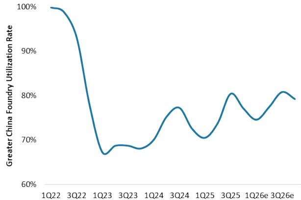  
Logic semi foundry utilization at $70 \%$ in 1H26 – still not fully recovered

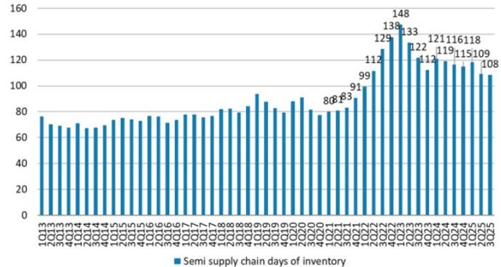  
Semi supply chain days of inventory declined in 3Q25

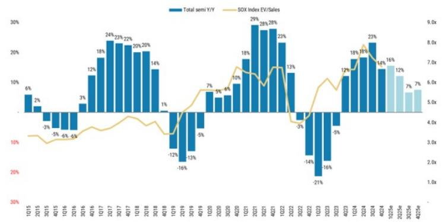  
Excluding NVIDIA's AI GPU revenue, non-AI semi growth was slow at only $10 \%$ Y/Y in 2024

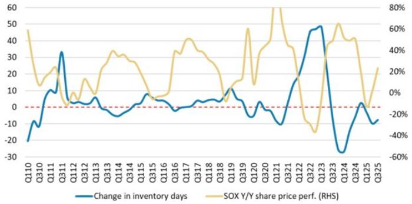  
Historically, when inventory days went down, semi stock index went up

# Our Preference Table for Old Memory

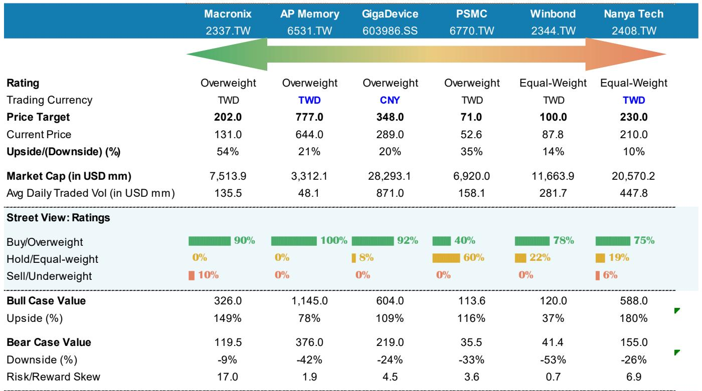

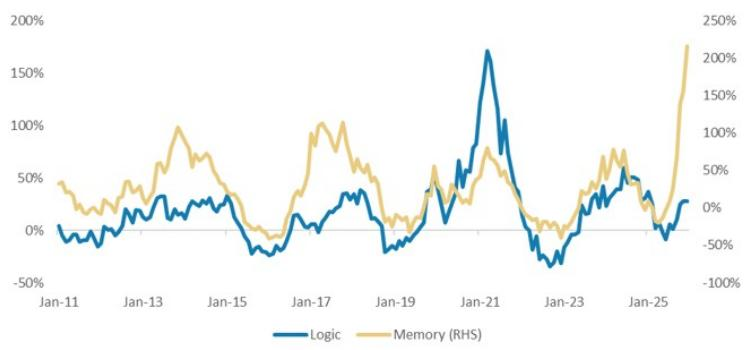  
Memory share price YoY peak leads logic semis

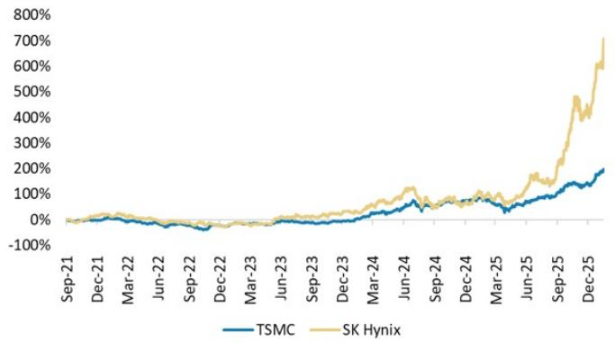  
Share price performance over the past three years (TSMC vs. SK hynix)

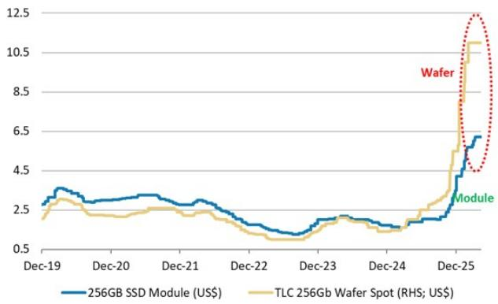  
NAND wafer spot pricing and module prices

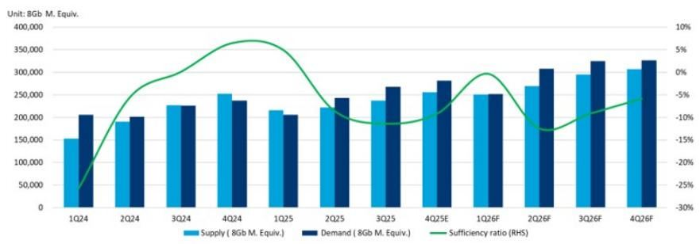  
NAND supply and demand model

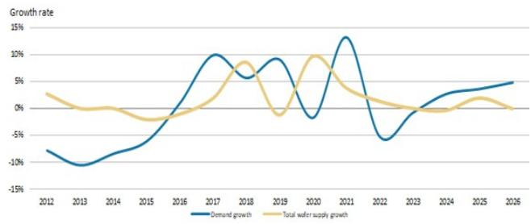  
NOR flash demand and supply growth rates   
Source: ChinaFlashMarket, Morgan Stanley Research estimates.

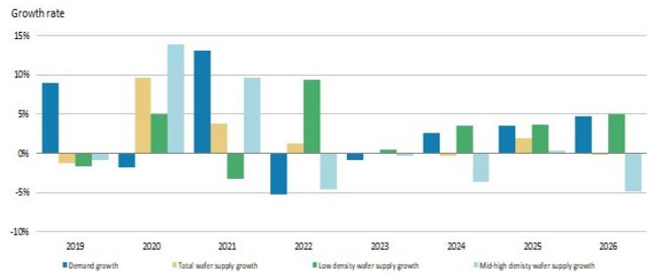  
NOR flash demand and supply growth rates

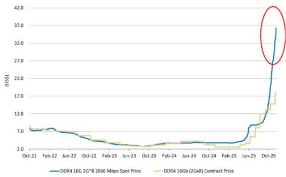  
DDR4 16Gb spot vs. contract price

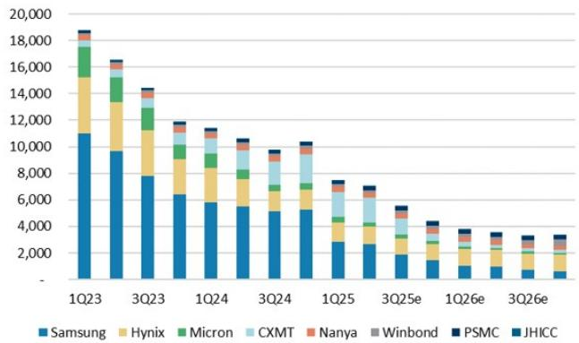  
Quarterly supply breakdown (mn Gb)

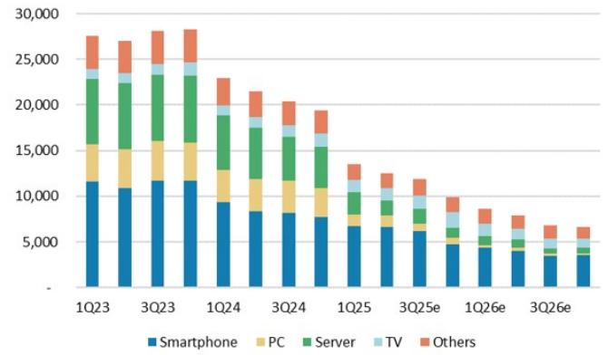  
Quarterly demand breakdown, by product (mn Gb)

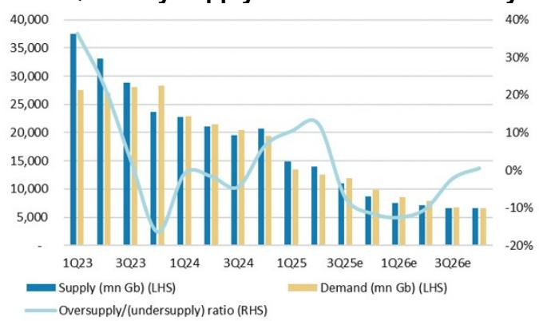  
Quarterly supply and demand summary

# Cloud Semi Updates

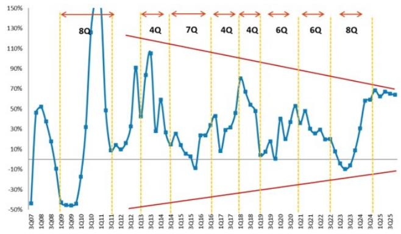  
Top 4 CSPs (Amazon, Google, Microsoft and Meta) capex was up $64 \%$ Y/Y in 4Q25CY

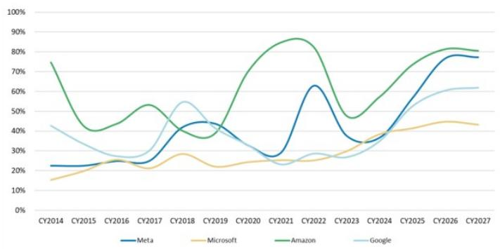  
Capex-to-EBITDA ratio should remain stable at around $50 \%$

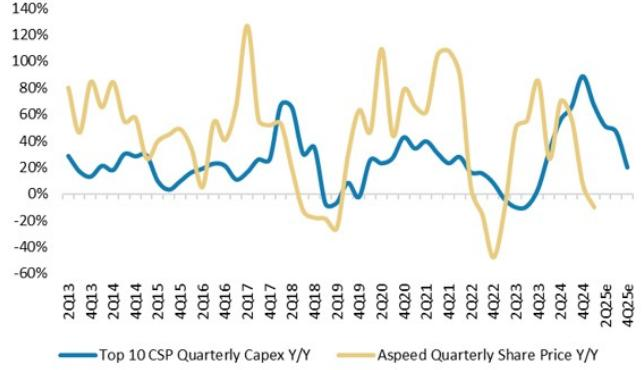  
Top 10 CSP capex Y/Y vs. Aspeed share price

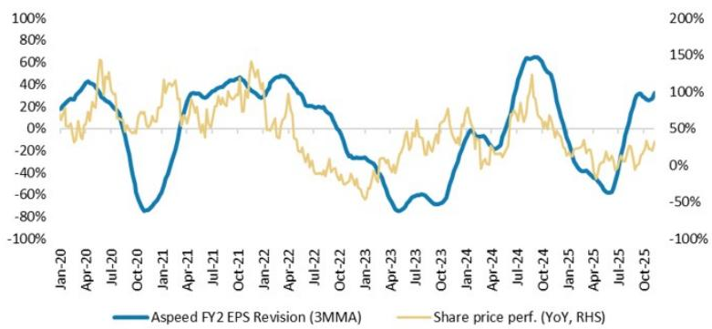  
Aspeed earnings revision breadth

# Our supply chain data-driven bull case assumption is that cloud AI Semi TAM may grow to $\yen 123$ 5bn in 2025e

# AI semi is major growth driver

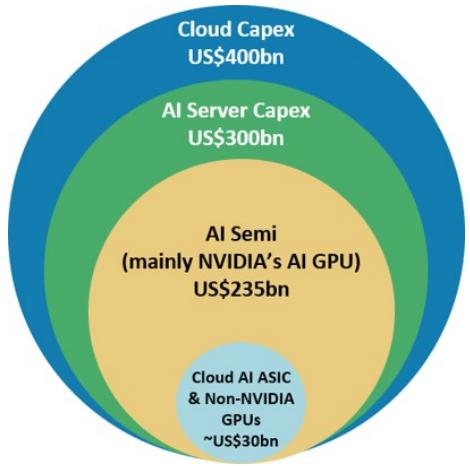

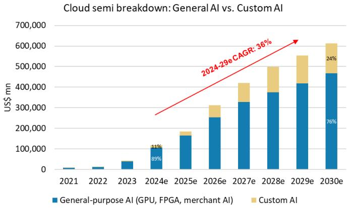

# MorganStanleycloud capex tracker estimates nearly US\$685bn of cloud capex spending in 2026 (Purely Top 10 listed global CSPs; no sovereign AI)

Nvidia CEO shared an estimate of global cloud capex to reach $u s s 1$ trillion in 2028 (including sovereign AI)

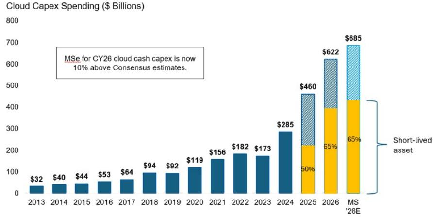

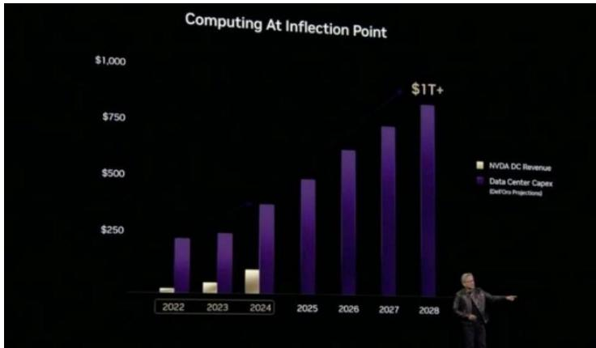

<table><tr><td colspan="5">Announced Power Deployment Implication forTSMC</td></tr><tr><td>GPU/ASIC Vendor</td><td>NVIDIA(Open Al)</td><td>AMD(Open AI)</td><td>Broadcom</td><td>AWS (OpenAl)</td></tr><tr><td>Power Deployed (GW) Rackname</td><td>10</td><td>6</td><td>3.5</td><td>2</td></tr><tr><td></td><td>Vera Rubin NVL144</td><td>Helios</td><td>TPU</td><td>Trainium3 UltraServers</td></tr><tr><td>Power consumption per Rack (kW) Rack Number(kunits)</td><td>220 45</td><td>220 27</td><td>63 56</td><td>144 14</td></tr><tr><td></td><td></td><td></td><td>TPUv7 (Ironwood)</td><td></td></tr><tr><td>Chip Name</td><td>Rubin GPU</td><td>MI455GPU</td><td>TPUv8ax (Sunfish)</td><td>Trainium3(4)</td></tr><tr><td>Chip Volume (k units)</td><td>3,273</td><td>1,964</td><td>3,571</td><td>2,000</td></tr><tr><td>Life Cycle for the project Implied life-cycle CoWos Volume (kwafers)</td><td>3</td><td>3</td><td>5</td><td>8</td></tr><tr><td>Implied life-cycle 2/3nm wafer Volume (k wafers)</td><td>409 260</td><td>166 95</td><td>260 190</td><td>118 107</td></tr><tr><td>2027annual CoWoS demand(kwafers)</td><td>136</td><td>55</td><td>52</td><td>15</td></tr></table>

# Global CoWoS capacity expansion by year-end and by vendor

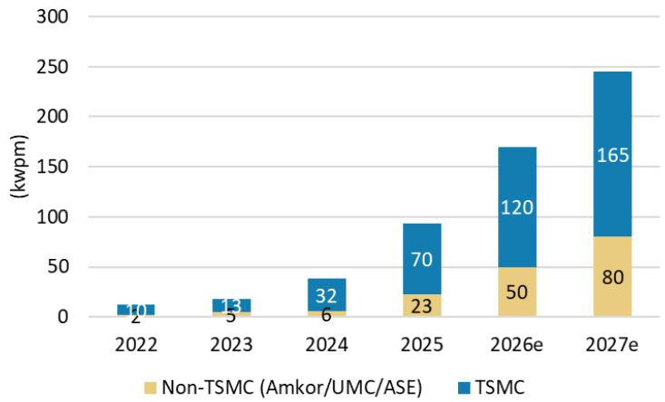  
CoWoS Supply Capacity Breakdown (By Year End)

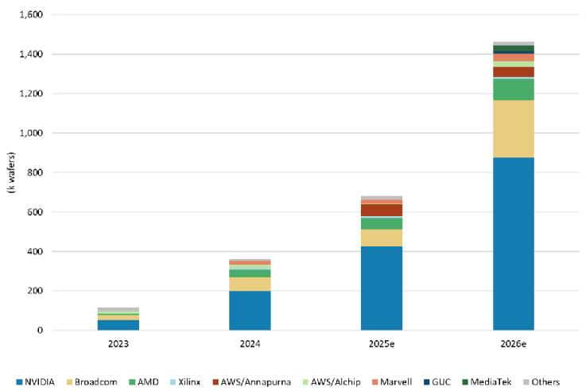  
Global CoWoS consumption, by customer

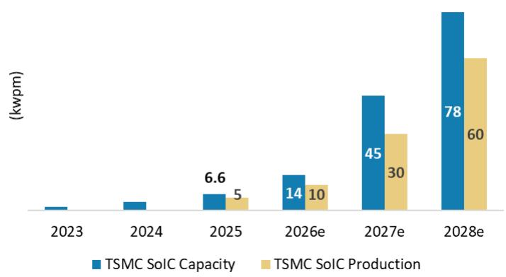  
TSMC SoIC Supply Capacity Breakdown (by year-end)

Source: Company data, Morgan Stanley Research. $E =$ Morgan Stanley Research estimates.

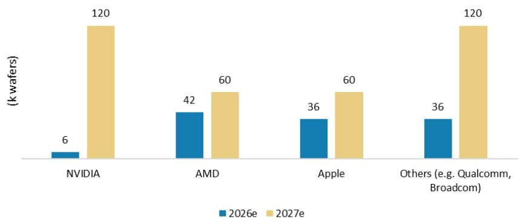  
SoIC demand breakdown, by customer   
SoIC demand breakdown

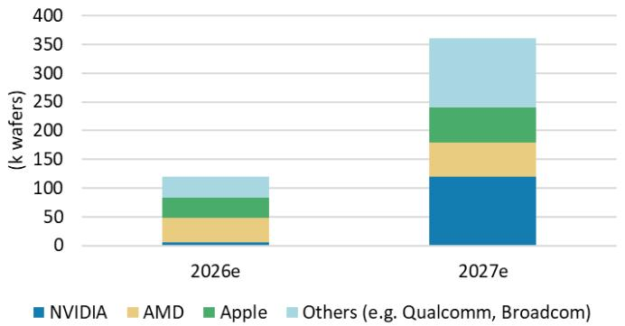

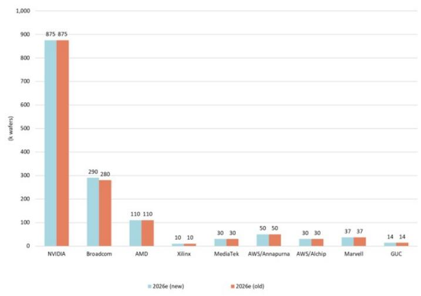  
Key changes for 2026 CoWoS allocation in a chart

Key changes on 2026 CoWoS allocation in a table (see numbers marked in red)   

<table><tr><td>(kwafer)</td><td>2023</td><td>2024</td><td>2025e</td><td>2026e</td><td>2023</td><td>2024</td><td>2025e</td><td>2026e</td></tr><tr><td>NVIDIA</td><td>53</td><td>200</td><td>425</td><td>875</td><td>45%</td><td>54%</td><td>62%</td><td>60%</td></tr><tr><td>TSMC</td><td></td><td></td><td>390</td><td>680</td><td></td><td></td><td></td><td></td></tr><tr><td>CoWoS-L</td><td></td><td></td><td>390</td><td>650</td><td></td><td></td><td></td><td></td></tr><tr><td>CoWoS-S</td><td></td><td></td><td>0</td><td>20</td><td></td><td></td><td></td><td></td></tr><tr><td>CoWoS-R</td><td></td><td></td><td>0</td><td>10</td><td></td><td></td><td></td><td></td></tr><tr><td>Non-TSMC</td><td></td><td></td><td>35</td><td>165</td><td></td><td></td><td></td><td></td></tr><tr><td>Amkor</td><td></td><td></td><td>35</td><td>135</td><td></td><td></td><td></td><td></td></tr><tr><td>CoWoS-S</td><td></td><td></td><td>20</td><td>75</td><td></td><td></td><td></td><td></td></tr><tr><td>CoWoS-R</td><td></td><td></td><td>15</td><td>60</td><td></td><td></td><td></td><td></td></tr><tr><td>ASE/SPIL</td><td></td><td></td><td>0</td><td>30</td><td></td><td></td><td></td><td></td></tr><tr><td>CoWoS-S</td><td></td><td></td><td>0</td><td>0</td><td></td><td></td><td></td><td></td></tr><tr><td>CoWoS-R</td><td></td><td></td><td>0</td><td>30</td><td></td><td></td><td></td><td></td></tr><tr><td>Broadcom</td><td>23</td><td>68</td><td>85</td><td>290</td><td>20%</td><td>18%</td><td>12%</td><td>20%</td></tr><tr><td>TSMC</td><td></td><td></td><td>83</td><td>230</td><td></td><td></td><td></td><td></td></tr><tr><td>CoWoS-L</td><td></td><td></td><td>0</td><td>15</td><td></td><td></td><td></td><td></td></tr><tr><td>CoWoS-S</td><td></td><td></td><td>83</td><td>215</td><td></td><td></td><td></td><td></td></tr><tr><td>ASE/SPIL</td><td></td><td></td><td>2</td><td>30</td><td></td><td></td><td></td><td></td></tr><tr><td>CoWoS-L</td><td></td><td></td><td>0</td><td>0</td><td></td><td></td><td></td><td></td></tr><tr><td>CoWoS-S</td><td></td><td></td><td>2</td><td>30</td><td></td><td></td><td></td><td></td></tr><tr><td>Amkor</td><td></td><td></td><td></td><td>30</td><td></td><td></td><td></td><td></td></tr><tr><td>CoWoS-L</td><td></td><td></td><td></td><td>30</td><td></td><td></td><td></td><td></td></tr><tr><td>AMD</td><td>7</td><td>40</td><td>60</td><td>110</td><td>6%</td><td>11%</td><td>9%</td><td>8%</td></tr><tr><td>TSMC</td><td></td><td></td><td>60</td><td>80</td><td></td><td></td><td></td><td></td></tr><tr><td>CoWoS-L</td><td></td><td></td><td>0</td><td>70</td><td></td><td></td><td></td><td></td></tr><tr><td>CoWoS-S</td><td></td><td></td><td>60</td><td>10</td><td></td><td></td><td></td><td></td></tr><tr><td>ASE/SPIL</td><td></td><td></td><td>0</td><td>30</td><td></td><td></td><td></td><td></td></tr><tr><td>CoWoS-L</td><td></td><td></td><td>0</td><td>30</td><td></td><td></td><td></td><td></td></tr><tr><td>CoWoS-S</td><td></td><td></td><td>0</td><td>0</td><td></td><td></td><td></td><td></td></tr></table>

# AI Computing Wafer Consumption Could be up to US\$26bn in 2026 with NVIDIA Accounting For The Majority

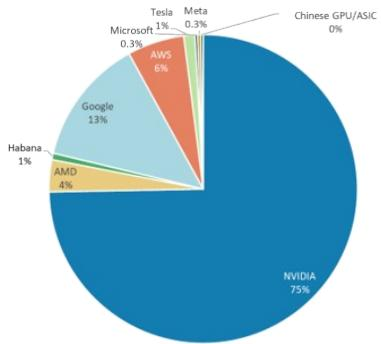  
AI semi wafer consumption, by customer, 2025e

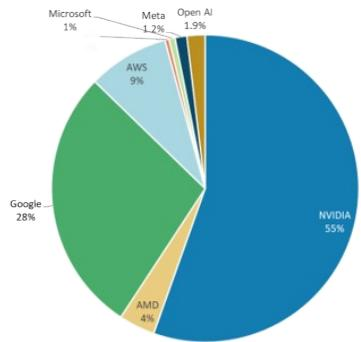  
AI semi wafer consumption, by customer, 2026e

ource: Company data, Morgan Stanley Research. $E =$ Morgan Stanley Research estimates. Note: Estimates are compiled using our supply-chain checks.   

<table><tr><td>Alchipvendor</td><td>Product name</td><td>CoWoS capacity allocation (k wafers)</td><td>Chips per CoWoSwafer</td><td>Implied shipments(k)</td><td>Compute die size</td><td>Geometry</td><td>Computedie units</td><td>Wafer consumption (kwafers)</td><td>Wafer priceWaferrevenue （USS)TAM(USS mn)</td><td></td><td>Backend revenue (UsS mn)</td></tr><tr><td>AI GPU (2026e)</td><td></td><td></td><td></td><td></td><td></td><td></td><td></td><td>433</td><td>21,945</td><td>9,510</td><td>8,241</td></tr><tr><td rowspan="4">NVIDIA</td><td>B300</td><td>390</td><td>14</td><td>5,460</td><td>850</td><td>4nm</td><td></td><td></td><td>26,000</td><td>4,292</td><td></td></tr><tr><td>Rubin R200</td><td>260</td><td></td><td>2,080</td><td>850</td><td>3nm</td><td></td><td>165</td><td>21,945</td><td></td><td>5,494</td></tr><tr><td>H200</td><td>75</td><td>28</td><td>2,025</td><td>814</td><td>4nm</td><td></td><td>57</td><td></td><td>1,243</td><td>1,275</td></tr><tr><td>MI300 M1350/375</td><td>3</td><td>12</td><td>36</td><td>110</td><td>5nm</td><td></td><td>1</td><td>18,000</td><td>19</td><td>79 194</td></tr><tr><td>AMD M1400</td><td></td><td>7 65</td><td>12 10</td><td>84 650</td><td>110 110</td><td>3nm 2nm</td><td>8</td><td>2 32</td><td>26,000 28,125</td><td>64 886</td><td>1,805</td></tr><tr><td>AI ASIC (2026e)</td><td></td><td></td><td></td><td></td><td></td><td></td><td></td><td></td><td></td><td></td><td></td></tr><tr><td rowspan="3">Google</td><td>TPU v7p (lronwood)</td><td>145</td><td>16</td><td>2,320</td><td>700</td><td>3nm</td><td>2</td><td>152</td><td>26,000</td><td>3,942</td><td>3,327</td></tr><tr><td>TPU V7e (Sunfish;AVGO)</td><td>80</td><td>12</td><td>960</td><td>800</td><td>3nm</td><td>2</td><td>72</td><td>26,000</td><td>1,864</td><td>1,835</td></tr><tr><td>TPUVB(Zebrafish;MediaTek)</td><td>30</td><td>20</td><td>600</td><td>800</td><td>3nm</td><td>2</td><td>45</td><td>26,000</td><td>1,165</td><td>688</td></tr><tr><td rowspan="3">AWS</td><td>Trainium2.5</td><td>20</td><td>16</td><td>320</td><td>600</td><td>5nm</td><td></td><td>12</td><td>20,000</td><td>237</td><td>411</td></tr><tr><td>Trainium3</td><td>80</td><td>17</td><td>1,360</td><td>700</td><td>3nm</td><td>2</td><td>73</td><td>26,000</td><td>1,886</td><td>1,642</td></tr><tr><td></td><td>10</td><td>20</td><td>200</td><td>645</td><td>4nm</td><td>1</td><td>5</td><td>21,945</td><td>107</td><td>30</td></tr><tr><td>xAI</td><td>Maia 200</td><td>4</td><td>29</td><td>116</td><td>700</td><td>3nm</td><td>1</td><td>3.0</td><td>26,000</td><td>79</td><td>87</td></tr><tr><td>Microsoft</td><td>Maia300</td><td>5</td><td>11</td><td>55</td><td>850</td><td>2nm</td><td>1</td><td>2.9</td><td>28,125</td><td>82</td><td>109</td></tr><tr><td>Meta</td><td>MTIA3(Iris)</td><td>15</td><td>10</td><td>150</td><td>850</td><td>3nm</td><td>2</td><td>11.9</td><td>26,000</td><td>310</td><td>1</td></tr><tr><td>Open AI</td><td></td><td></td><td></td><td>130</td><td>750</td><td>3nm</td><td>4</td><td>18.2</td><td>26,000</td><td>473</td><td>1</td></tr><tr><td>Total</td><td>Nexus (Titan1)</td><td>10 1,434</td><td>13</td><td></td><td></td><td></td><td></td><td>1,084</td><td></td><td>26,159</td><td>25,219</td></tr></table>

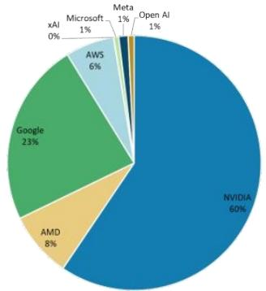  
HBM consumption by customer in 2026e

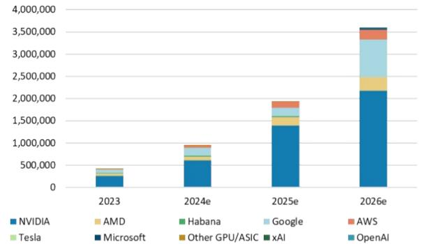  
NVIDIA still consumes most HBM supply in 2026e

<table><tr><td rowspan="2">Alchip vendor</td><td rowspan="2">Product name</td><td rowspan="2">CoWoS capacity allocation (k wafers)</td><td rowspan="2">Chips per CoWoS wafer shipments (k)</td><td rowspan="2">Implied</td><td rowspan="2">HBM chip density (GB)</td><td rowspan="2">HBM chip Total HBM size units</td><td rowspan="2">(GB)</td><td rowspan="2">HBM generation</td><td rowspan="2">HBMvendor</td><td rowspan="2">Total HBM demand (k GB)</td></tr><tr><td></td></tr><tr><td>AI GPU (2026e)</td><td></td><td></td><td></td><td></td><td></td><td></td><td></td><td></td><td></td><td></td></tr><tr><td rowspan="3">NVIDIA</td><td>B300</td><td>390</td><td>14</td><td>5,460</td><td>36</td><td>8</td><td>288</td><td></td><td>HBM3e 12hiHynix/Micron/Samsung</td><td>1,572,480</td></tr><tr><td>Rubin R200 H200</td><td>260 75</td><td>8 27</td><td>2.080 2,025</td><td>3</td><td>8</td><td>288 141</td><td>HBM3e 8hi</td><td>HBM4 Hynix/Micron/Samsung? Hynix</td><td>599,040 285,525</td></tr><tr><td>MI300</td><td>3</td><td>12</td><td>36</td><td>24</td><td>6 8</td><td>192</td><td>HBM3</td><td>Samsung</td><td>6,912</td></tr><tr><td rowspan="3">AMD</td><td>MI350/375</td><td>7</td><td>12</td><td>84</td><td>36</td><td>8</td><td>288</td><td>HBM3e 12hi</td><td>Samsung/Micron</td><td>24,192</td></tr><tr><td>MI400</td><td>65</td><td>10</td><td>650</td><td>36</td><td>12</td><td>432</td><td>HBM4</td><td>Samsung/Micron</td><td>280,800</td></tr><tr><td></td><td></td><td></td><td></td><td></td><td></td><td></td><td></td><td></td><td></td></tr><tr><td rowspan="3">AI ASIC (2026e) Google</td><td>TPU v7p (Ironwood)</td><td>145</td><td>16</td><td>2,32</td><td>24</td><td>8</td><td>192</td><td>HBM3e 8hi</td><td>Hynix/Samsung</td><td>445,440</td></tr><tr><td>TPU v7e (Sunfish; AVGO)</td><td>80</td><td>12</td><td>960</td><td>36</td><td>8</td><td>288</td><td>HBM3e 12hi</td><td>Hynix/Samsung/Micron</td><td>276,480</td></tr><tr><td>TPU v8 (Zebrafish;MediaTek)</td><td>30</td><td>20</td><td>600</td><td>36</td><td>6</td><td>216</td><td>HBM3e 12hi</td><td>Hynix/Micron</td><td>129,600</td></tr><tr><td rowspan="3">AWS</td><td>Trainium 2.5</td><td>20</td><td>16</td><td>320</td><td>24</td><td>4</td><td>96</td><td>HBM3e 8hi</td><td>Hynix/Samsung/Micron</td><td>30,720</td></tr><tr><td>Trainium 3</td><td>80</td><td>17</td><td>1,360</td><td>36</td><td>4</td><td>144</td><td>HBM3e 12hi</td><td>Hynix/Samsung/Micron</td><td>195,840</td></tr><tr><td></td><td>10</td><td>20</td><td>200</td><td>24</td><td>6</td><td>144</td><td>HBM3e 8hi</td><td>Samsung?</td><td>1,152</td></tr><tr><td>xAlI</td><td>Maia 200</td><td>4</td><td>29</td><td>116</td><td>16</td><td>4</td><td>64</td><td>HBM3</td><td>Samsung</td><td>7,424</td></tr><tr><td>Microsoft</td><td>Maia 300</td><td>5</td><td>11</td><td>55</td><td>36</td><td>8</td><td>288</td><td>HBM4</td><td>Samsung</td><td>15,840</td></tr><tr><td>Meta</td><td>MTIA 3(Iris)</td><td>15</td><td>10</td><td>150</td><td>36</td><td>8</td><td>288</td><td>HBM3e 12hi</td><td>Hynix/Samsung</td><td>43,200</td></tr><tr><td>Open Al</td><td>Nexus (Titan 1)</td><td>10</td><td>13</td><td>130</td><td>36</td><td>6</td><td>216</td><td>HBM4</td><td>Hynix</td><td>28,080</td></tr><tr><td>Total</td><td></td><td>1,434</td><td></td><td></td><td></td><td></td><td></td><td></td><td></td><td>3,942,725</td></tr></table>

Source: Company data, Morgan Stanley Research. $E =$ Morgan Stanley Research estimates.

# NVIDIA GB200/300 Rack Output Estimates

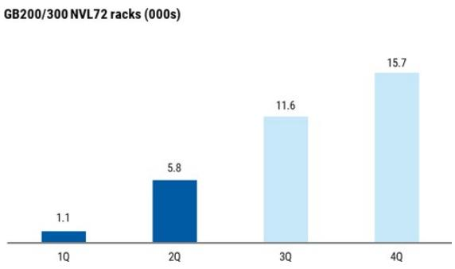  
GB200/300 NVL72 Rack Ramp Quarterly Trajectory

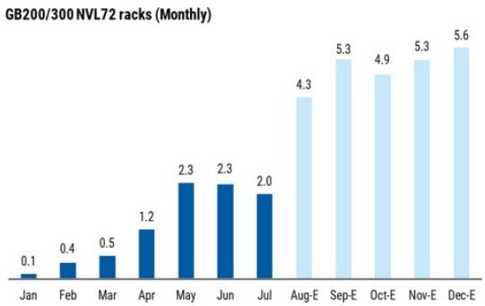  
Industry-wide GB200 NVL72 Rack Monthly Output

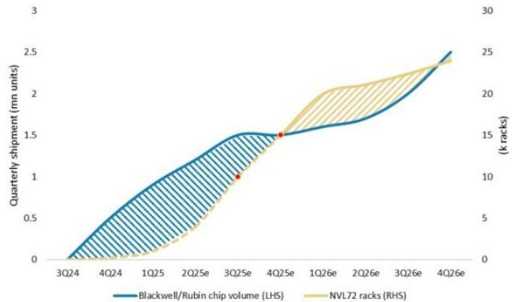  
We estimate TSMC produced 5.1mn chips in 2025, with full-year GB200 NVL72 shipments seen reaching 30k   
Source: Morgan Stanley Research. $E =$ Morgan Stanley Research estimates. Note: We think the actual rack deliveries to end-customers are lower than the numbers we have here because we include Wistron's computing tray (L10) rack equivalent number (without accounting for rack assembly and test times for L11). Estimates are from our Asia Pacific tech team’s downstream estimates.

# NVIDIA GB200/300 rack supply share (2025)

# NVIDIA GB200/300 rack demand share (2025)

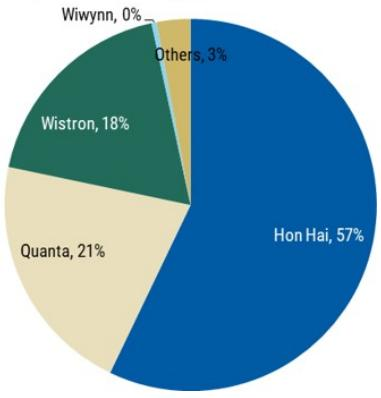  
GB200/300 NVL72-equivalent rack supply share

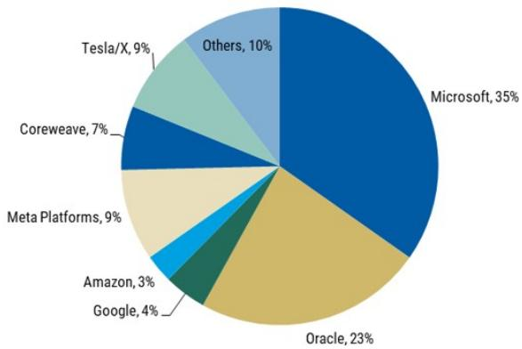  
Nvidia GB200 serverdemand share,2025e

# TSMC CoWoS can support up to 9.5x reticles, or four chips per wafer

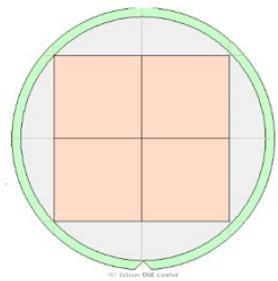

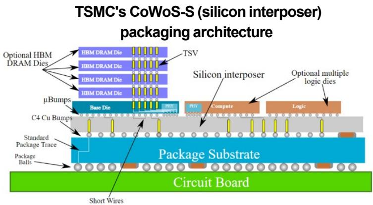

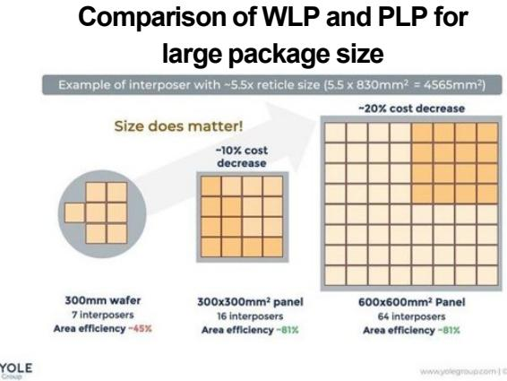

Intel's EMIB can easily support larger chips with more reticles (>12) if its supply chain can execute well

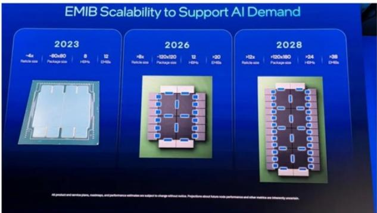

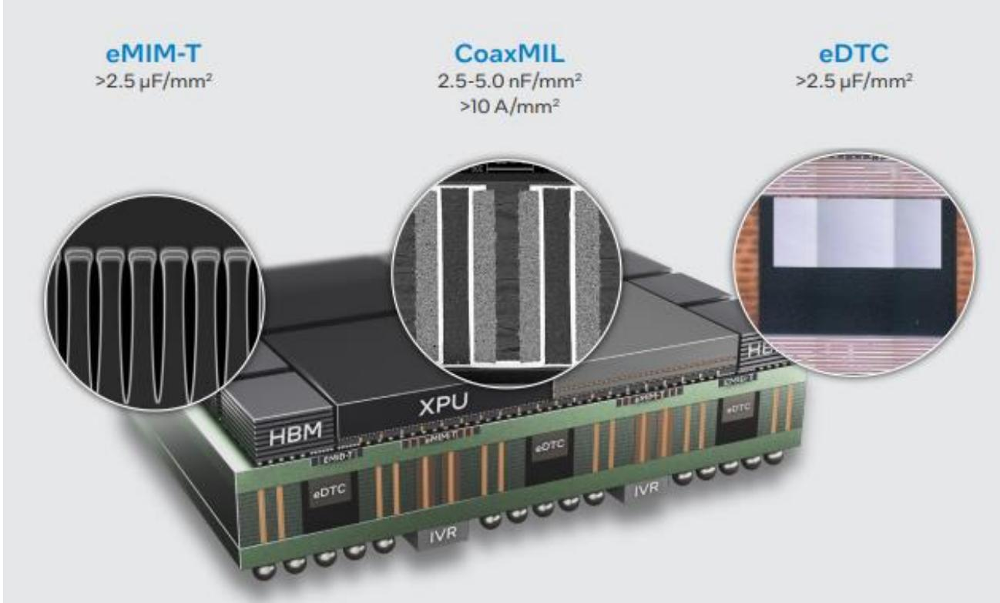

# TSMC – 2nm customer demand breakdown

Demand forTSMC's2nm node

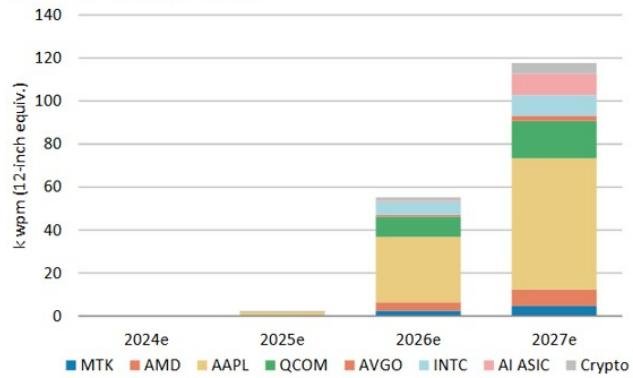  
TSMC – 4/5nm customer demand breakdown

DemandforTSMC's $5 / 4 \mathsf { n m }$ node

# TSMC – 3nm customer demand breakdown

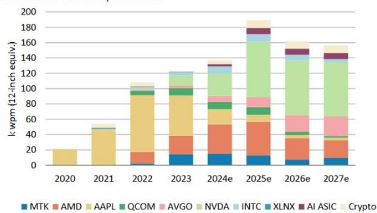  
Source: Company data, Morgan Stanley Research (e) estimates

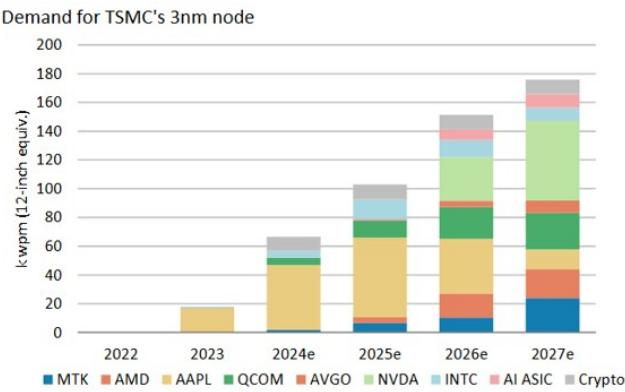  
TSMC – 2026e revenue breakdown by nodes and CoWoS

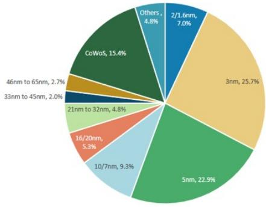

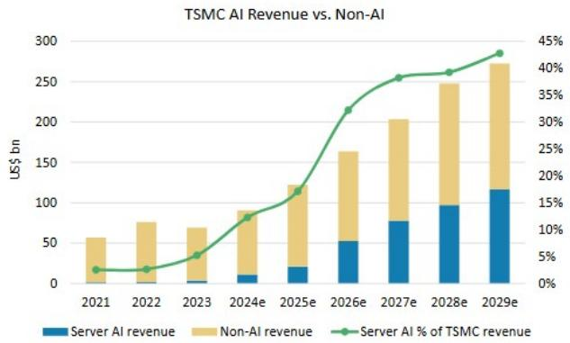  
TSMC – AI semis revenue could account for $> 3 0 \%$ of 2026e revenue

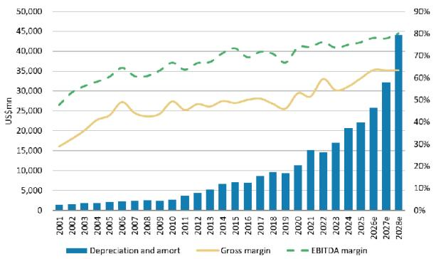  
TSMC – margin expansion   
Source: Company data, Morgan Stanley Research (e) estimates

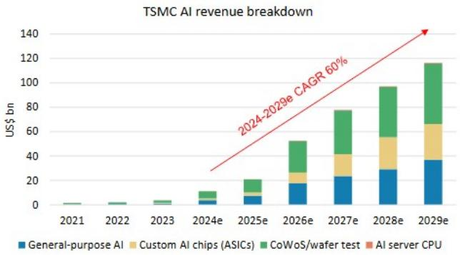  
TSMC – AI semis revenue breakdown

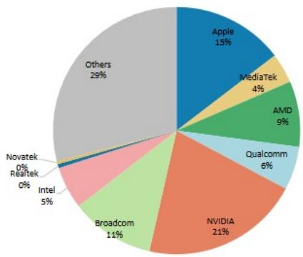  
TSMC – 2026e revenue breakdown by customer

AI ASIC

# AI Semis: Now and the future – “Prompts”

• Generative AI Demand Driver:

• Killer apps • Competition • Sovereign • Growth limitations:

1. Budget   
2. Energy $\mathbf { \delta } _ { - > }$ in the US   
3. Chip Capacity $\mathbf { \delta } _ { - > }$ in China   
4. Regulation

• Semiconductor solutions:

Moore’s Law   
• CoWoS/ SoIC   
• HBM   
• CPO   
• Custom chip   
• GaN HVDC 800V

• Growth perspective:

1. Inference vs. Training AI semis   
2. Edge vs. Cloud AI semis   
3. Custom ASIC vs. AI GPU

• Growth perspective:

1. Edge AI semis: $2 2 \%$ CAGR, 2023-30   
2. Inference AI semis: $6 8 \%$ CAGR, 2023-30   
3. Custom AI semis: $65 \%$ CAGR, 2023-30

# Edge AI semis could grow slightly faster than cloud

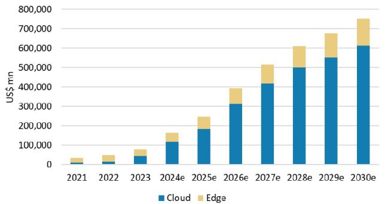  
Total Al semi revenue breakdown: Cloud vs. Edge   
… and Custom AI chips to outgrow general purpose

# Within Cloud AI, Inference AI chips to outgrow training…

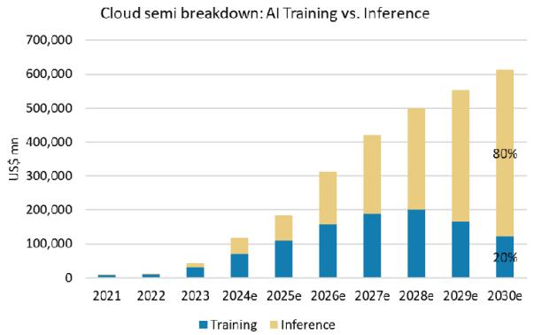

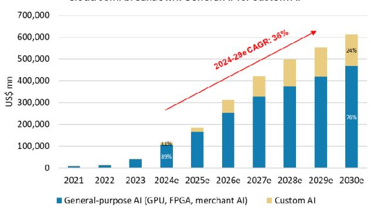  
Cloud semi breakdown:General Al vs.Custom Al

# CSPs Still Need Custom Chip

# Global CSP cloud AI custom chips

# Latest evidence of AI ASIC: AWS Trainium3

GoogleTPUentering6thgeneration

AWSAl training solution Trainium

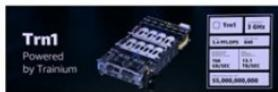  
AWSAl trainingsolution Inferentia

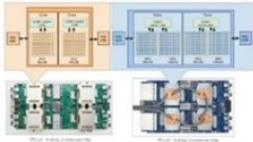  
MetaMTIAv1with RISC-Vcores

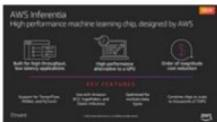  
Teslais introducing Dojos

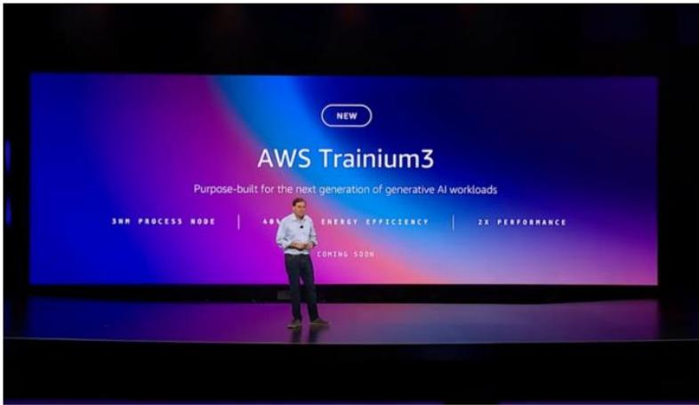

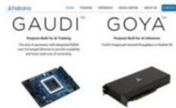  
HabanadevelopedtheGaudichip

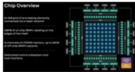

Trainium Forecasts from MS Asia Research team   

<table><tr><td>k Units</td><td>2023</td><td>2024</td><td>2025e</td><td>2026e</td><td>2027e</td><td>2028e</td></tr><tr><td>Trainium1/Inferentia2</td><td>300</td><td>600</td><td>30</td><td></td><td></td><td></td></tr><tr><td>Trainium2</td><td></td><td>300</td><td>1,200</td><td>320</td><td></td><td></td></tr><tr><td>Trainium3</td><td></td><td></td><td>20</td><td>1,360</td><td>1,200</td><td></td></tr><tr><td>Trainium4</td><td></td><td></td><td></td><td></td><td>600</td><td>2,000</td></tr><tr><td>Total</td><td>300</td><td>900</td><td>1,250</td><td>1,680</td><td>1,800</td><td>2,000</td></tr></table>

TPU Forecasts from MS Asia Research team   

<table><tr><td>k Units</td><td>2023</td><td>2024</td><td>2025e</td><td>2026e</td><td>2027e</td><td>2028e</td></tr><tr><td>v5</td><td>500</td><td>2,400</td><td>250</td><td></td><td></td><td></td></tr><tr><td>v6 (Trillium)</td><td></td><td></td><td>1,000</td><td></td><td></td><td></td></tr><tr><td>v7 (Ironwood/Sunfish,by Broadcom)</td><td></td><td></td><td>500</td><td>3,200</td><td>3,500</td><td>3,500</td></tr><tr><td>v8 (Zebrafish; 3nm, by MediaTek)</td><td></td><td></td><td></td><td>400</td><td>2,500</td><td>2,500</td></tr><tr><td>v9 (Pumafish; 2nm, by Broadcom)</td><td></td><td></td><td></td><td></td><td></td><td>500</td></tr><tr><td>v10 (Humufish; 2nm，by MediaTek)</td><td></td><td></td><td></td><td></td><td></td><td>500</td></tr><tr><td>Total</td><td>500</td><td>2,400</td><td>1,750</td><td>3,600</td><td>6,000</td><td>7,000</td></tr></table>

# Google TPU keeping pace with Nvidia GPU

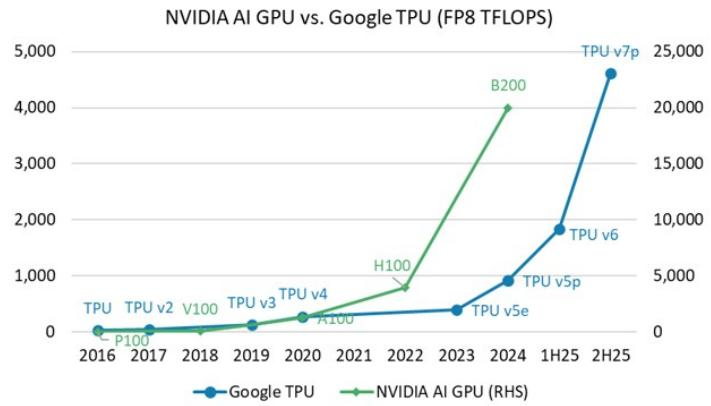  
Source: Company data, Morgan Stanley Research estimates

# ASIC volume forecast by major companies

(k units)ASIC volume forecast by major companies

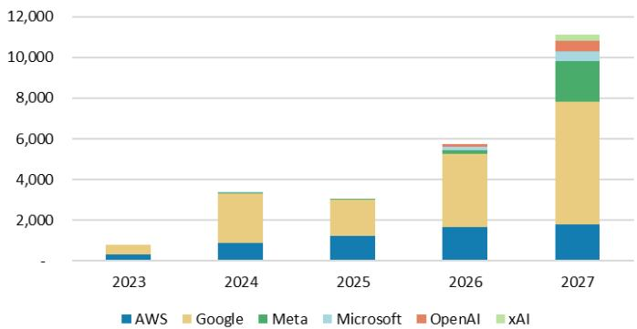

# China AI GPUs – Building a 订阅研报添加微信 LCD123321Cad Localized AI Compute 04-20  Ecosystem

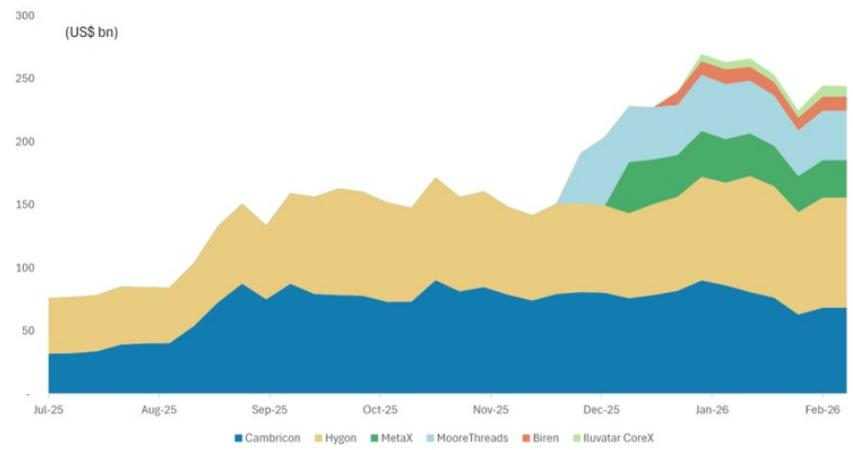  
China AI GPU market cap growing, with more IPOs to come

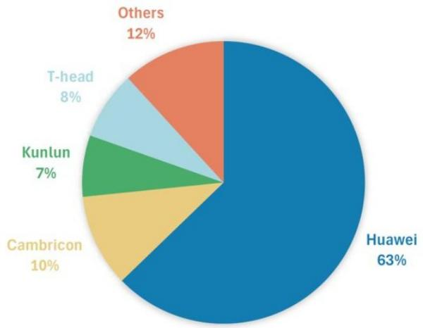  
China domestic AI GPU market, 2026e

Nine factors comparison between US and China AI – Chip, System, Infrastructure

# Die shot of Huawei's AI chips

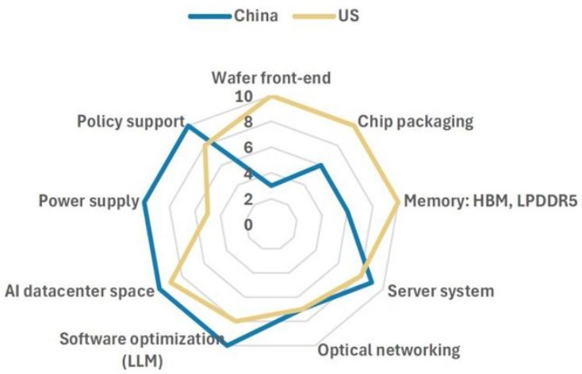

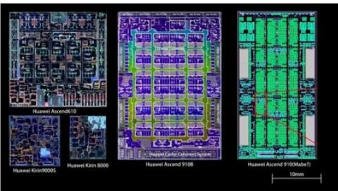

# Huawei CloudMatrix 384 A3 SuperPod

Step 1: If one compute die is not powerful, package more dies into a single chip.

Step 2: If one chip is not powerful enough, build larger racks and clusters.

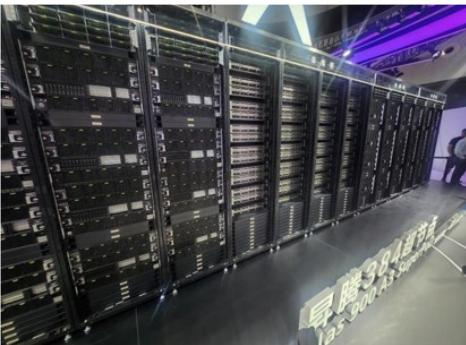

订阅研报添加微信 LCD123321CStep 3: If one fab is not sufficient, expand manufacturing capacity.

# China AI Accelerator Landscape – the "10 Dragons"

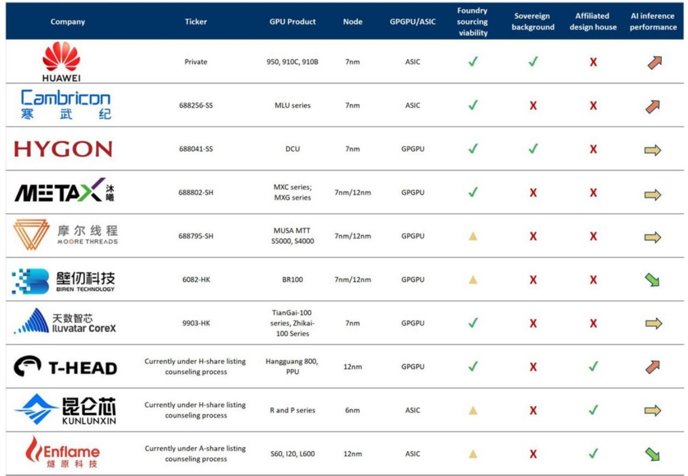  
Source: Company data, Morgan Stanley Research. Note: Morgan Stanley does not cover any of the above listed companies.

# Performance/cost comparison

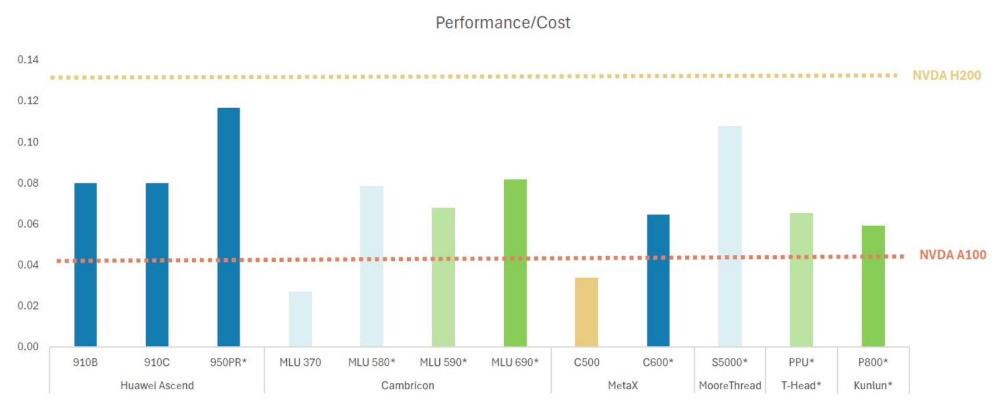  
Domestic Chips Deliver Stronger Performance per Dollar due to Materially Lower Pricing

# TPS (Tokens Output per Second) – Performance Analysis

# TPS (tokens per second) analysis for China AI accelerators

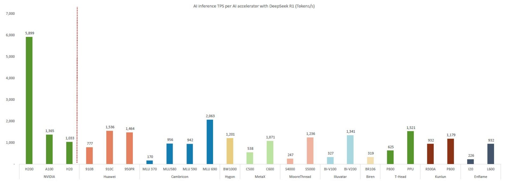  
Source: Company data, Morgan Stanley Research estimates (\*Our assumptions include AI LLM: DeepSeek R1; Input token: 1,024; Output token: 1,024; Number of active experts: 9 out of 257; Model size: 671GB; Model layer: 61; Batch size: 1; Computing power: FP8, and if FP8 is not available, we will use FP16).

decod $e \ t i m e = { \frac { n u m \ o f \ a c t i v e \ e x p e r t s } { n u m \ o f \ t o t a l \ e x p e r t s } } \times ( d e c o d e \ c o m p u t i n g \ t i m e + d e c o d e \ c o m m u n i c a t i o n \ t i m e ) .$ te)xKV

$$
p r e f i l l c o m p u t i n g t i m e = \frac { n u m o f i n p u t t o k e n s \times n u m o f a c t i v e p a r a m e t e r s } { c o m p u t i n g p o w e r \times U T R } \times \frac { 1 } { 1 0 0 0 }
$$

$$
p r e f i l l c o m m u n i c a t i o n t i m e = \frac { 2 \times n u m o f p a r a m e t e r s } { m e m o r y b a n d w i d t h }
$$

$$
d e c o d e c o m m u n i c a t i o n t i m e = \frac { 2 \times n u m o f p a r a m e t e r s } { n e t w o r k b a n d w i d t h }
$$

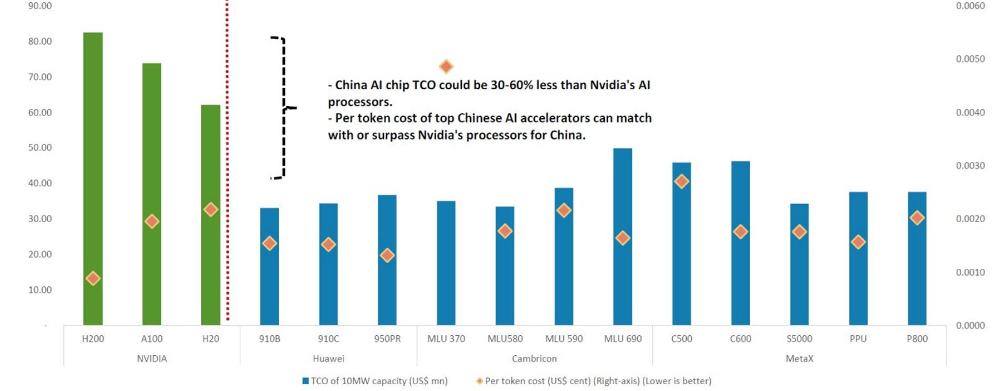  
Domestic chips have lower TCO and comparable per token cost (AI LLM inference) vs. NVIDIA's processors for China   
Source ： Company data, Morgan Stanley Research estimates.

# Sizing the AI and the Global Semi Capex TAM

# We expect the AI semi TAM to reach nearly US\$753bn by 2030

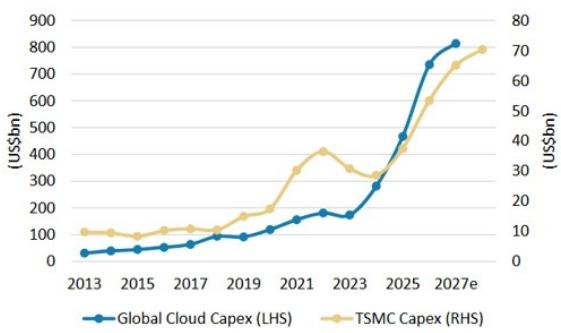  
Global Cloud Capex vs. TSMC capex

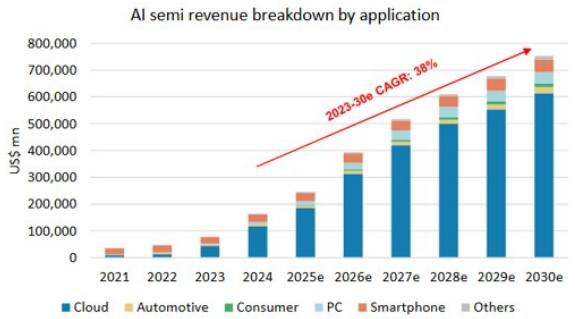  
Global OSAT capex to grow to \~US\$14bn in 2026e

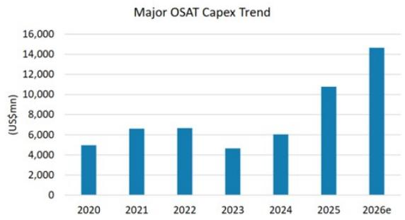

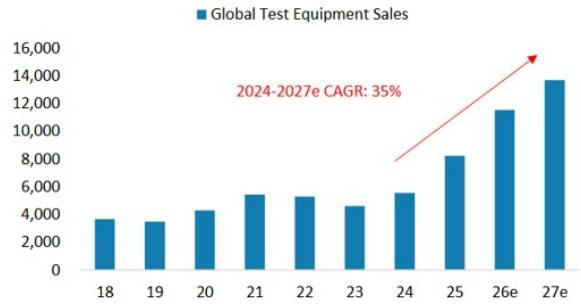  
Testing equipment market is expected to grow at $3 5 \%$ CAGR during 2024-27e

# Larger Package Sizes are Emerging as a Key Industry Trend

# Chip testing time continuing to trend up

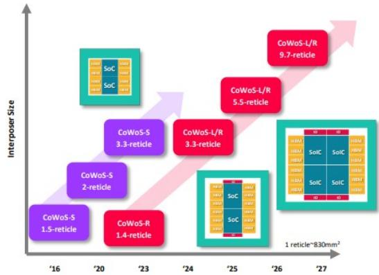  
TSMC's roadmap for interposer size

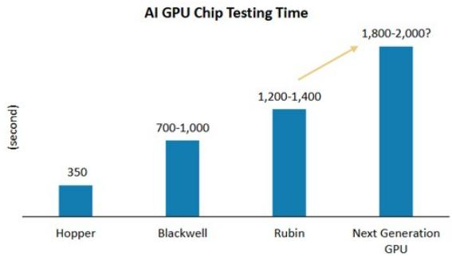

AI/HPC probe cards require higher pin counts vs. traditional consumer tech applications

# AI/HPC test socket needs higher pin counts vs. traditional consumer tech applications

Test Socket Pin Count Trend

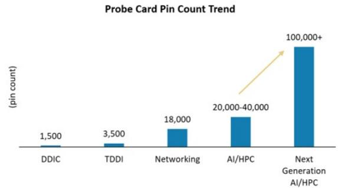  
Source: Company data, Morgan Stanley Research

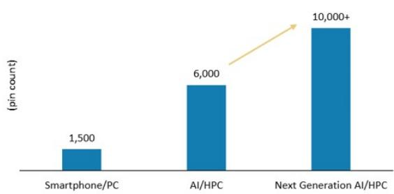

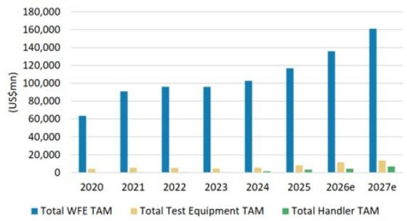  
The overall handler market is set to increase from US\$436mn in 2023 to $u s s 6 . 6$ bn in 2027e

# We expect handlers to account for $1 . 7 \%$ of global WFE TAM in 2027e, vs $0 . 4 \%$ in 2020

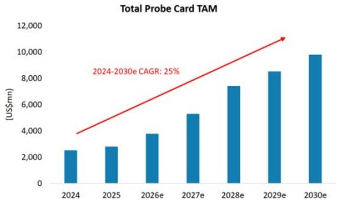  
We expect the probe card market to rise at a $2 5 \%$ CAGR, 2024-30e

# We project the testing and burn-in socket to grow at $20 \%$ CAGR to $\mathbf { U S } \$ 4$ ,775mn in 2030e,

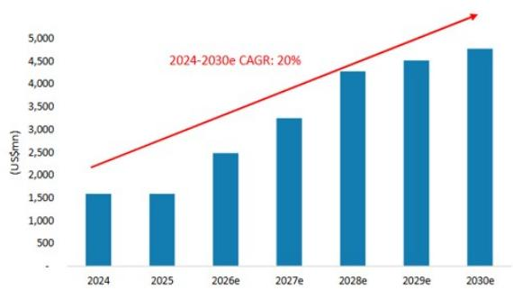  
Total Test and burn-in socket market

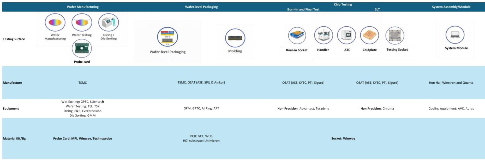  
Mapping the Roles of Hon Precision, WinWay and MPI in the Semi Supply Chain

<table><tr><td>Test Insertion Test content</td><td>Insertion 1 Electronic IC (EIC) &amp; Photonic IC (PIC)</td><td>Insertion 2 EIC die to PIC wafer (after SoIC)</td><td>Insertion 3 Optical engine (die-to-die)</td><td>Insertion 4 (&gt;3) CPO package (ASIC+OE)</td></tr><tr><td>Testing surface</td><td></td><td>DoubleSided</td><td>E/0 E/0</td><td>oL ASIC</td></tr><tr><td>Testing surface</td><td>El.&amp; opt. DC,(power,loss,dark current etc.)</td><td>E/0,0/E,0/0,high speed, S-parameters</td><td>Full calibration/DC, high-speed functional, optical loopback， alternatively: S-parameters</td><td>Full system functional validation, optical loopback</td></tr><tr><td>Testing service provider</td><td>Foundry (Wafer-level) TSMC</td><td>Foundry (Wafer-level) TSMC</td><td>OSAT (Die/chip level) SPIL Die-to-die prober: 1. TEL 2. MPI</td><td>OSAT (Die/chip level) SPIL ATE tester: 1) Advantest (under qualification) 2)Teradyne</td></tr><tr><td>Equipment and Consumable Vendor</td><td>PIC ATE tester: 1) Advantest + TEL + Formfactor 2) Chroma (underqualification) EIC tester: 1) Teradyne + TEL</td><td>Wafer level testing: 1)Ficontec +Formfactor +Teradyne 2) Chroma 3) Advantest+TEL+Formfactor 4) Advantest+ MPI</td><td>Optical engine E/O tester+laser reliability test+ELS source test head: Chroma Optical and Electrical Test Socket: Winway</td><td>FT Handler+ELS source test head+optical alignmnet stage : Hon Precision CPO switch tester: Chroma Coaxial socket/Hypersocket: Winway</td></tr></table>

# We expect handlers to account for $1 . 7 \%$ of global WFE TAM in 2027e, vs $0 . 4 \%$ in 2020

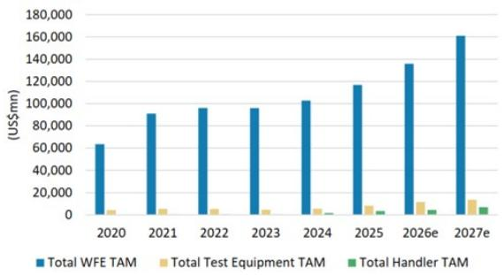  
We expect the overall handler market to increase from US\$436mn in 2023 to US\$6.6bn in 2027e

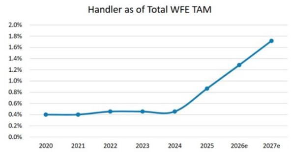

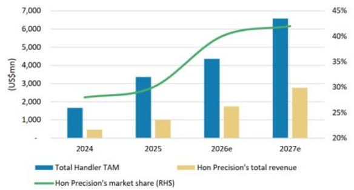  
Hon Precision to grow its total handler market share from $28 \%$ in 2024 to $42 \%$ by 2027e

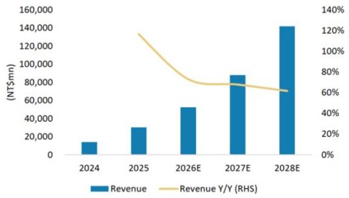  
We expect Hon Precision's revenue to expand at a $67 \%$ CAGR, 2025-28e

# MPI: Probe Card Technology Leader with CPO Optionality; OW

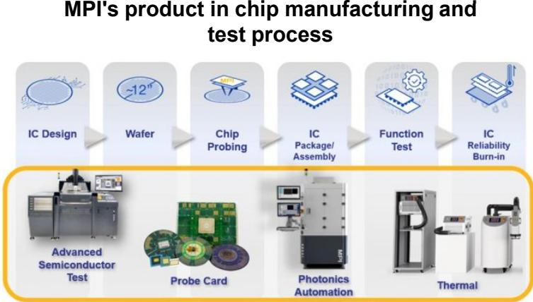

# We expect MPI's probe card market share to grow from $8 \%$ in 2024 to $20 \%$ by 2028e

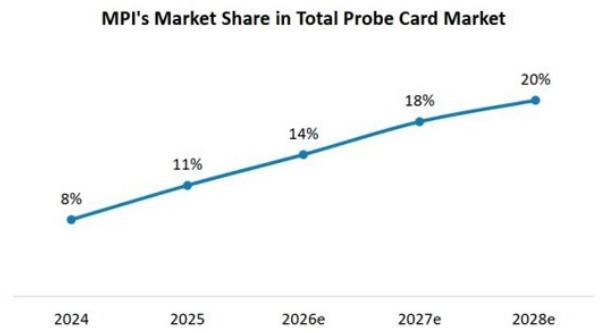  
We expect MPI's EPS to rise at a $94 \%$ CAGR, 2025-28e

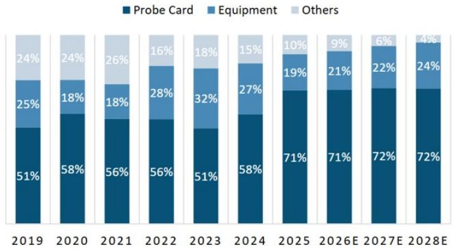  
Probe card to remain the key focus, with CPO equipment acting as driving force   
Source: Company data, Morgan Stanley Research. e $=$ Morgan Stanley Research estimates.

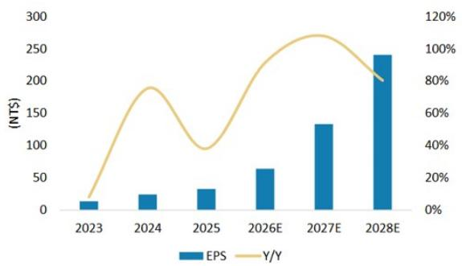

# WinWay's total solution of probe card and socket enables vertical integration strategy

# WinWay to expand its pin capacity from 3.5mn per month in 2025 to 9mn per month in 2026

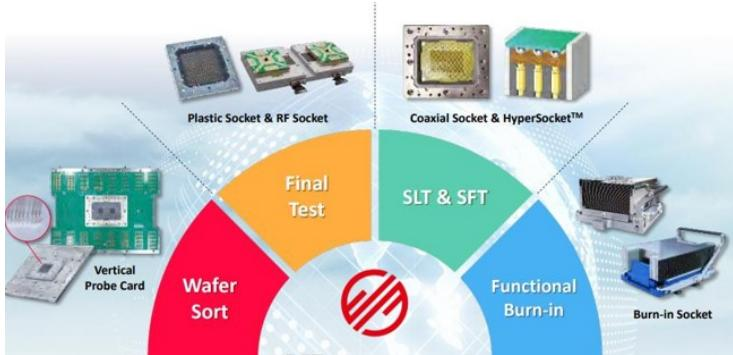  
We expect WinWay's market share to grow from $8 . 6 \%$ in 2024 to $20 \%$ in 2028e

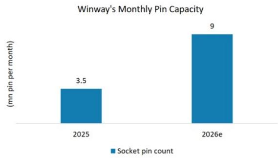  
We expect WinWay's EPS to rise at $9 5 \%$ CAGR, 2025-28e

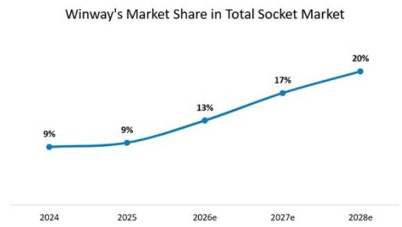  
Source: Company data, Morgan Stanley Research. e $=$ Morgan Stanley Research estimates.

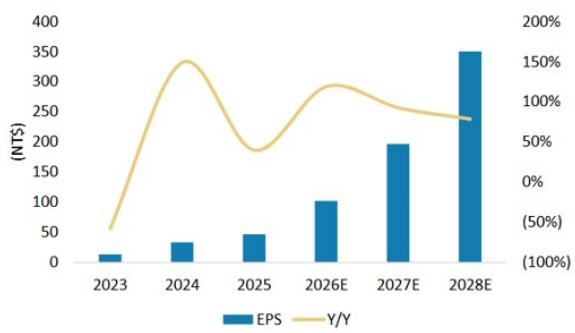