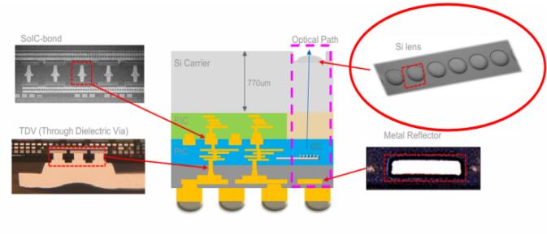
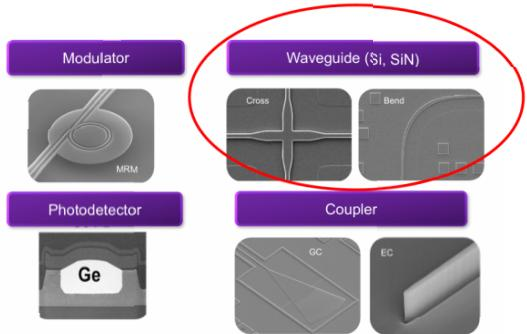
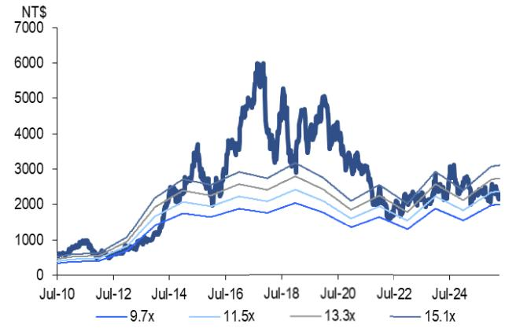
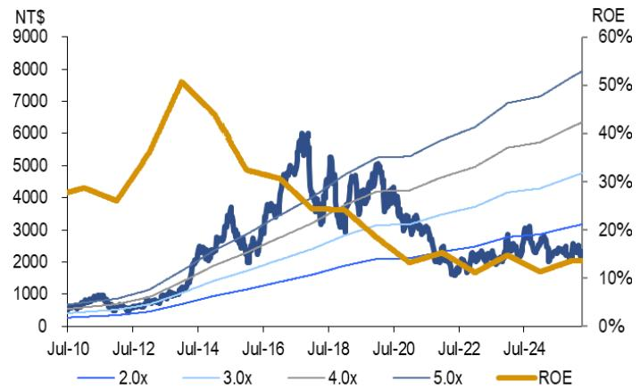
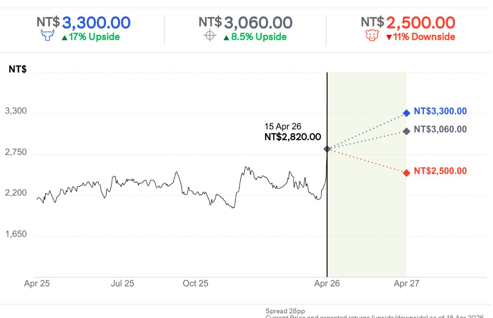
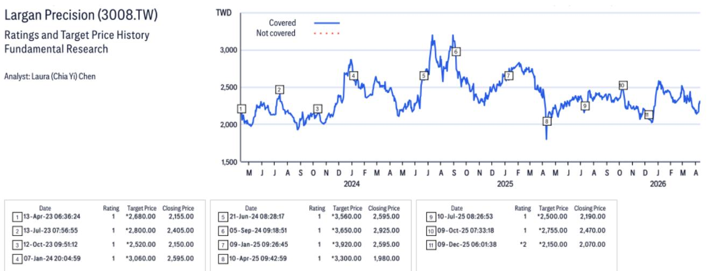
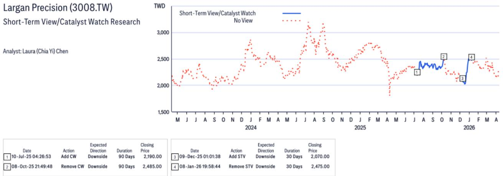

# Largan Precision (3008.TW) 15 Apr 2026 10:31:04 ET

# CITI'S TAKE

Largan’s share price has rebound by nearly $2 5 \%$ recently in one month given its resilient smartphone lens revenue and market expectation on its potential in CPO opportunity (news, Commercial Times, 13 Apr). Thanks to remaining solid iPhone demand and variable aperture design in 2H26, we 订阅研报添加微信 LCD123321Care looking for stable ASP and market share for Largan. Nevertheless, we think its CPO opportunity remains remote in the next two years. The company will host analyst meeting on 16 Apr; we keep Neutral on Largan.

What is Largan working on in CPO? — During its previous earnings call, Largan’s management mentioned that they are still in early development of the optics for CPO, yet not providing any progress. We believe Largan’s opportunity is in lens arrays for coupling and collimation. However, coating capability, thermal reliability, and the shift toward wafer-level silicon photonics integration represent key gating factors. Based on current TSMC’s CPO design, it uses silicon lens formed on a carrier to perform optical collimation, working alongside grating couplers and metal reflectors to reduce insertion loss. This implies that future optical components must meet wafer-level integration, ultra-tight alignment, and co-optimization with photonics structures. Whether Largan can evolve from a component supplier to a codevelopment partner within TSMC’s silicon photonics ecosystem remains to be seen.

Stable iPhone order and ASP outlook — As Apple will only introduce new high-end series including Pro, Pro Max and foldable phone in 2H26, variable aperture is one of the key camera spec upgrades. We believe it will be able to support Largan in a better position in the main camera lens market share as optical lens calibration is critical, given changing aperture impacts depth of field, exposure, and lens aberrations, all of which are getting more complex, supporting a stabilizing ASP trend.

Potential GM upside on more favorable F/X — Due to recent $\mathsf { F } / \mathsf { X }$ tailwind and better than seasonality iPhone lens orders in 1H26, we see potential earnings and GM upside for Largan in the near term. Yet the management is cautious on the near term monthly revenue trend in April and potentially the same for May, which would lead to a likely flat QoQ revenue trend in 2Q26. We expect Largan to resume better sequential recovery in 3Q26 with the new iPhone launch.

Earnings Summary   

<table><tr><td>Yearto 31Dec</td><td>Net Profit (NT$M)</td><td>Diluted EPS (NT$)</td><td>EPS growth (%)</td><td>P/E</td><td>P/B</td><td>ROE</td><td>Yield</td></tr><tr><td>2024A</td><td>25,915</td><td>194.17</td><td>44.8</td><td>x 14.5</td><td>（x） 2.0</td><td>(%) 14.8</td><td>(%) 3.0</td></tr><tr><td>2025A</td><td>21,275</td><td>159.40</td><td>-17.9</td><td>17.7</td><td>2.0</td><td>11.3</td><td>2.8</td></tr><tr><td>2026E</td><td>27,214</td><td>203.90</td><td>27.9</td><td>13.8</td><td>1.8</td><td>13.7</td><td>3.6</td></tr><tr><td>2027E</td><td>28,329</td><td>212.25</td><td>4.1</td><td>13.3</td><td>1.7</td><td>13.2</td><td>3.8</td></tr><tr><td>2028E</td><td>31,666</td><td>237.25</td><td>11.8</td><td>11.9</td><td>1.6</td><td>13.7</td><td>4.2</td></tr></table>

Source: Powered by dataCentral

<table><tr><td>Valuationratios</td><td>2024</td><td>2025</td><td>2026E</td><td>2027E</td><td>2028E</td></tr><tr><td>PE(x)</td><td>14.5</td><td>17.7</td><td>13.8</td><td>13.3</td><td>11.9</td></tr><tr><td>PB(x)</td><td>2.0</td><td>2.0</td><td>1.8</td><td>1.7</td><td>1.6</td></tr><tr><td>EV/EBITDA(x)</td><td>8.2</td><td>7.9</td><td>6.5</td><td>5.6</td><td>4.6</td></tr><tr><td>FCF yield (%)</td><td>4.2</td><td>2.7</td><td>5.4</td><td>7.6</td><td>8.3</td></tr><tr><td>Dividend yield (%)</td><td>3.0</td><td>2.8</td><td>3.6</td><td>3.8</td><td>4.2</td></tr><tr><td>Payoutratio (%)</td><td>44</td><td>50</td><td>50</td><td>50</td><td>50</td></tr><tr><td>ROE(%)</td><td>14.8</td><td>11.3</td><td>13.7</td><td>13.2</td><td>13.7</td></tr><tr><td>Cashflow (NT$m)</td><td>2024</td><td>2025</td><td>2026E</td><td>2027E</td><td>2028E</td></tr><tr><td>EBITDA</td><td>29.617</td><td>30,526</td><td>37,232</td><td>40,923</td><td>46,647</td></tr><tr><td> Woring apital 23321C ad</td><td>0-4,4171 16</td><td>-6,864</td><td>-8,254</td><td>-1,990</td><td>-3,437</td></tr><tr><td>Other</td><td>2,178</td><td>-1,998</td><td>-1,472</td><td>-2.692</td><td>-3,509</td></tr><tr><td>Operating cashflow</td><td>27,378</td><td>21,664</td><td>27,507</td><td>36,241</td><td>39,701</td></tr><tr><td>Capex</td><td>-11,385</td><td>-11,504</td><td>-7,121</td><td>-7,701</td><td>-8,497</td></tr><tr><td>Net acq/disposals</td><td>1,369</td><td>0</td><td>-200</td><td>-200</td><td>-200</td></tr><tr><td>Other</td><td>-5,514</td><td>8,798</td><td>0</td><td>0</td><td>0</td></tr><tr><td>Investing cashflow</td><td>-15,531</td><td>-2707</td><td>-7,321</td><td>-7,901</td><td>-8,697</td></tr><tr><td>Dividends paid</td><td>-10,811</td><td>-11,412</td><td>-10,680</td><td>-13,661</td><td>-14,221</td></tr><tr><td>Financing cashflow</td><td>-5,679</td><td>-16,674</td><td>-10,680</td><td>-13,661</td><td>-14,221</td></tr><tr><td>Net change in cash</td><td>6,168</td><td>2.283</td><td>9.506</td><td>14,678</td><td>16,783</td></tr><tr><td>Free cashflow to s/holders</td><td>15,993</td><td>10,160</td><td>20,386</td><td>28,540</td><td>31,204</td></tr></table>

Price: NT\$2,820.00; TP: NT\$3,060.00; Market Cap: NT\$376,380m; Recomm: Neutral   

<table><tr><td rowspan=1 colspan=10>3008.TW: Fiscalyear end 31-Dec</td><td rowspan=1 colspan=1>Price:NT$2,820.00; TP:NT$3,060.00;</td></tr><tr><td rowspan=1 colspan=7>Profit&amp; Loss(NT$m)              2024    2025   2026E</td><td rowspan=1 colspan=3>2027E   2028E</td><td rowspan=1 colspan=1>Valuation ratios                   2024    20</td></tr><tr><td rowspan=1 colspan=7>Salesrevenue                 59,458   61,148   71,169</td><td rowspan=1 colspan=3>80,270</td><td rowspan=1 colspan=1>14.5</td></tr><tr><td rowspan=1 colspan=5>Costofsales                 -28,248   -30,311</td><td rowspan=1 colspan=2>-33,953</td><td rowspan=1 colspan=2>-38,457</td><td rowspan=1 colspan=1>-43.656 PB(x)</td><td rowspan=1 colspan=1>2.0</td></tr><tr><td rowspan=1 colspan=2>Grosspofit</td><td rowspan=1 colspan=3>31,209   30,837</td><td rowspan=1 colspan=1></td><td rowspan=1 colspan=1>37,216</td><td rowspan=1 colspan=2>41,813</td><td rowspan=1 colspan=1>47,414</td><td rowspan=1 colspan=1>47,414 EV/EBITDA (x)                     8.2</td></tr><tr><td rowspan=1 colspan=2>Gross Margin (%)</td><td rowspan=1 colspan=3>52.5    50.4</td><td rowspan=1 colspan=1></td><td rowspan=1 colspan=1>52.3</td><td rowspan=1 colspan=2>52.1</td><td rowspan=1 colspan=1></td><td rowspan=1 colspan=1>52.1 FCFyield(%)                      4.2</td></tr><tr><td rowspan=1 colspan=2>EBITDA(Ad))</td><td rowspan=1 colspan=3>29,617   30,526</td><td rowspan=1 colspan=1></td><td rowspan=1 colspan=1>37,232</td><td rowspan=1 colspan=1></td><td rowspan=1 colspan=1>40,923</td><td rowspan=1 colspan=1>46,647</td><td rowspan=1 colspan=1>46.647 Dividendyield (%)                   3.0</td></tr><tr><td rowspan=1 colspan=2>EBITDA Margin (Adj) (%)</td><td rowspan=1 colspan=3>49.8    49.9</td><td rowspan=1 colspan=1></td><td rowspan=1 colspan=1>52.3</td><td rowspan=1 colspan=2>51.0</td><td rowspan=1 colspan=1></td><td rowspan=1 colspan=1>51.2 Payoutratio (%)                    44</td></tr><tr><td rowspan=1 colspan=2>Depreciation</td><td rowspan=1 colspan=2>-5,585</td><td rowspan=1 colspan=1>-6,968</td><td rowspan=1 colspan=1></td><td rowspan=1 colspan=1>-8,546</td><td rowspan=1 colspan=2>-9,902</td><td rowspan=1 colspan=1>-11,472</td><td rowspan=1 colspan=1>-11,472 ROE (%)                        14.8</td></tr><tr><td rowspan=1 colspan=2>Amortisation</td><td rowspan=1 colspan=1>0</td><td rowspan=1 colspan=1></td><td rowspan=1 colspan=1>0</td><td rowspan=1 colspan=1></td><td rowspan=1 colspan=1>0</td><td rowspan=1 colspan=1></td><td rowspan=1 colspan=1>0</td><td rowspan=1 colspan=1>0</td><td rowspan=1 colspan=1>Cashfow(NT$m)                  2024    201</td></tr><tr><td rowspan=1 colspan=2>EBIT (Ad)</td><td rowspan=1 colspan=1>24,032</td><td rowspan=1 colspan=1></td><td rowspan=1 colspan=1>23,558</td><td rowspan=1 colspan=2>28,685</td><td rowspan=1 colspan=1></td><td rowspan=1 colspan=1>31,022</td><td rowspan=1 colspan=1>35,174</td><td rowspan=1 colspan=1>35,174EBITDA                      29,617   30.5</td></tr><tr><td rowspan=1 colspan=2>EBIT Margin (Adj) (%)</td><td rowspan=1 colspan=2>40.4</td><td rowspan=1 colspan=1>385</td><td rowspan=1 colspan=2>阅不40.3</td><td rowspan=1 colspan=2>设添386</td><td rowspan=1 colspan=1>微138.6</td><td rowspan=1 colspan=1>138.6 Working apital 23321Cad0-4.417116-6,8</td></tr><tr><td rowspan=1 colspan=2>Netinterest</td><td rowspan=1 colspan=3>4,404    4,259</td><td rowspan=1 colspan=2>3,600</td><td rowspan=1 colspan=2>3,600</td><td rowspan=1 colspan=1>3,600Other</td><td rowspan=1 colspan=1>3,600Other                         2,178   -1,99</td></tr><tr><td rowspan=1 colspan=2>Associates</td><td rowspan=1 colspan=3>0      3</td><td rowspan=1 colspan=2>200</td><td rowspan=1 colspan=2>200</td><td rowspan=1 colspan=1></td><td rowspan=1 colspan=1>200 Operating cashflow               27,378   21,60</td></tr><tr><td rowspan=1 colspan=2>Non-Op/Except/0ther Adj</td><td rowspan=1 colspan=1>3,738</td><td rowspan=1 colspan=2>-1,919</td><td rowspan=1 colspan=1></td><td rowspan=1 colspan=1>1,280</td><td rowspan=1 colspan=2>280</td><td rowspan=1 colspan=1></td><td rowspan=1 colspan=1>280 Capex                       -11,385   -11,50</td></tr><tr><td rowspan=1 colspan=2>Pre-tax proft</td><td rowspan=1 colspan=1>32.174</td><td rowspan=1 colspan=2>25,900</td><td rowspan=1 colspan=1></td><td rowspan=1 colspan=1>33,765</td><td rowspan=1 colspan=2>35,102</td><td rowspan=1 colspan=1>39,254</td><td rowspan=1 colspan=1>39,254 Net acq/disposals                 1,369</td></tr><tr><td rowspan=1 colspan=2>Tax</td><td rowspan=1 colspan=2>-5,963</td><td rowspan=1 colspan=1>-4,340</td><td rowspan=1 colspan=1></td><td rowspan=1 colspan=1>-6,552</td><td rowspan=1 colspan=1></td><td rowspan=1 colspan=1>-6,772</td><td rowspan=1 colspan=1>-7,589Other</td><td rowspan=1 colspan=1>-7,589Other                        -5,514   8,79</td></tr><tr><td rowspan=1 colspan=2>Extraord./Min.Int./Pref.div.</td><td rowspan=1 colspan=2>-296</td><td rowspan=1 colspan=1>-285</td><td rowspan=1 colspan=1></td><td rowspan=1 colspan=1>0</td><td rowspan=1 colspan=1></td><td rowspan=1 colspan=1>0</td><td rowspan=1 colspan=1></td><td rowspan=1 colspan=1>OInvesting cashflow                -15,531   -27</td></tr><tr><td rowspan=1 colspan=2>Reported net profit</td><td rowspan=1 colspan=1>25,915</td><td rowspan=1 colspan=1></td><td rowspan=1 colspan=1>21,275</td><td rowspan=1 colspan=1></td><td rowspan=1 colspan=1>27.214</td><td rowspan=1 colspan=1></td><td rowspan=1 colspan=1>28,329</td><td rowspan=1 colspan=1>31,666</td><td rowspan=1 colspan=1>31,666 Dividends paid                  -10,811   -11,4</td></tr><tr><td rowspan=1 colspan=2>Net Margin (%)</td><td rowspan=1 colspan=1>43.6</td><td rowspan=1 colspan=2>34.8</td><td rowspan=1 colspan=1></td><td rowspan=1 colspan=1>38.2</td><td rowspan=1 colspan=1></td><td rowspan=1 colspan=1>35.3</td><td rowspan=1 colspan=1></td><td rowspan=1 colspan=1>34.8 Financing cashflow                -5,679  -16.6</td></tr><tr><td rowspan=1 colspan=2>CoreNPAT</td><td rowspan=1 colspan=1>25,915</td><td rowspan=1 colspan=2>21,275</td><td rowspan=1 colspan=1></td><td rowspan=1 colspan=1>27,214</td><td rowspan=1 colspan=2>28,329</td><td rowspan=1 colspan=1>31,666</td><td rowspan=1 colspan=1>31,666 Netchangein cash                6,168   2.2</td></tr><tr><td rowspan=1 colspan=2>Per share data</td><td rowspan=1 colspan=1>2024</td><td rowspan=1 colspan=1></td><td rowspan=1 colspan=1>2025</td><td rowspan=1 colspan=1></td><td rowspan=1 colspan=1>2026E</td><td rowspan=1 colspan=2>2027E</td><td rowspan=1 colspan=1>2028E</td><td rowspan=1 colspan=1>Free cashflow to s/holders           15,993   10,10</td></tr><tr><td rowspan=1 colspan=2>Reported EPS ($)</td><td rowspan=1 colspan=1>194.17</td><td rowspan=1 colspan=1></td><td rowspan=1 colspan=1>159.40</td><td rowspan=1 colspan=1></td><td rowspan=1 colspan=1>203.90</td><td rowspan=1 colspan=1></td><td rowspan=1 colspan=1>212.25</td><td rowspan=1 colspan=1>237.25</td><td rowspan=1 colspan=1></td></tr><tr><td rowspan=1 colspan=2>Core EPS($)</td><td rowspan=1 colspan=1>194.17</td><td rowspan=1 colspan=2>159.40</td><td rowspan=1 colspan=1></td><td rowspan=1 colspan=1>203.90</td><td rowspan=1 colspan=1></td><td rowspan=1 colspan=1>212.25</td><td rowspan=1 colspan=1>237.25</td><td rowspan=1 colspan=1></td></tr><tr><td rowspan=1 colspan=2>DPS($)</td><td rowspan=1 colspan=3>85.50   80.02</td><td rowspan=1 colspan=1></td><td rowspan=1 colspan=1>102.36</td><td rowspan=1 colspan=2>106.55</td><td rowspan=1 colspan=1>119.10</td><td rowspan=2 colspan=1></td></tr><tr><td rowspan=1 colspan=2>CFPS($)</td><td rowspan=1 colspan=1>205.13</td><td rowspan=1 colspan=2>162.32</td><td rowspan=1 colspan=2>206.09</td><td rowspan=1 colspan=1></td><td rowspan=1 colspan=1>271.53</td><td rowspan=1 colspan=1>297.46</td></tr><tr><td rowspan=1 colspan=2>FCFPS ($)</td><td rowspan=1 colspan=1>119.83</td><td rowspan=1 colspan=2>76.12</td><td rowspan=1 colspan=2>152.74</td><td rowspan=1 colspan=1></td><td rowspan=1 colspan=1>213.83</td><td rowspan=1 colspan=1>233.79</td><td rowspan=7 colspan=1>LCD123321Cad 04-16</td></tr><tr><td rowspan=1 colspan=2>BVPS ($)</td><td rowspan=1 colspan=3>1,389.00  1,430.06</td><td rowspan=1 colspan=2>1,553.94</td><td rowspan=1 colspan=1></td><td rowspan=1 colspan=1>1,663.84</td><td rowspan=1 colspan=1>1,794.54</td></tr><tr><td rowspan=1 colspan=2>Wtd avg ord shares (m)</td><td rowspan=1 colspan=3>133     133</td><td rowspan=1 colspan=2>133</td><td rowspan=1 colspan=2>133</td><td rowspan=1 colspan=1>133</td></tr><tr><td rowspan=1 colspan=2>Wtd avg diluted shares (m)</td><td rowspan=1 colspan=3>133</td><td rowspan=1 colspan=2></td><td rowspan=1 colspan=2></td><td rowspan=1 colspan=1>133</td></tr><tr><td rowspan=1 colspan=2>Growthrates</td><td rowspan=1 colspan=3>2024    2025</td><td rowspan=1 colspan=2>2026E</td><td rowspan=1 colspan=2>2027E</td><td rowspan=1 colspan=1>2028E</td></tr><tr><td rowspan=1 colspan=2>Sales revenue (%)</td><td rowspan=1 colspan=3>21.7      2.8</td><td rowspan=1 colspan=2>16.4</td><td rowspan=1 colspan=2>12.8</td><td rowspan=1 colspan=1>13.5</td></tr><tr><td rowspan=1 colspan=1>EBIT (Ad) (%)</td><td rowspan=1 colspan=1></td><td rowspan=1 colspan=3>35.0     -2.0</td><td rowspan=1 colspan=2>21.8</td><td rowspan=1 colspan=2>8.1</td><td rowspan=1 colspan=1>13.4</td></tr><tr><td rowspan=1 colspan=1>Core NPAT (%)</td><td rowspan=1 colspan=1></td><td rowspan=1 colspan=3>44.8    -17.9</td><td rowspan=1 colspan=2>27.9</td><td rowspan=1 colspan=2>4.1</td><td rowspan=1 colspan=1>11.8</td><td rowspan=20 colspan=1>LCD123321Cad 04-16</td></tr><tr><td rowspan=1 colspan=1>Core EPS (%)</td><td rowspan=1 colspan=1></td><td rowspan=1 colspan=3>44.8    -17.9</td><td rowspan=1 colspan=2>27.9</td><td rowspan=1 colspan=3>4.1     11.8</td></tr><tr><td rowspan=1 colspan=1>Balance Sheet(N$m)</td><td rowspan=1 colspan=1></td><td rowspan=1 colspan=3>2024    2025</td><td rowspan=1 colspan=2>2026E</td><td rowspan=1 colspan=3>2027E   2028E</td></tr><tr><td rowspan=1 colspan=1>Cash &amp;cash equiv.</td><td rowspan=1 colspan=1></td><td rowspan=1 colspan=3>113,658   115,942</td><td rowspan=1 colspan=2>125,447</td><td rowspan=1 colspan=3>140,126  156,908</td></tr><tr><td rowspan=1 colspan=1>Accounts receivables</td><td rowspan=1 colspan=1></td><td rowspan=1 colspan=3>10,360   10,462</td><td rowspan=1 colspan=2>16,677</td><td rowspan=1 colspan=1></td><td rowspan=1 colspan=1>18,735</td><td rowspan=1 colspan=1>22,214</td></tr><tr><td rowspan=1 colspan=1>Inventory</td><td rowspan=1 colspan=1></td><td rowspan=1 colspan=1>5,733</td><td rowspan=1 colspan=2>6,713</td><td rowspan=1 colspan=2>8.476</td><td rowspan=1 colspan=1></td><td rowspan=1 colspan=1>9,522</td><td rowspan=1 colspan=1>11290</td></tr><tr><td rowspan=1 colspan=1>Netfixed &amp;othertangibles</td><td rowspan=1 colspan=1></td><td rowspan=1 colspan=1>46,936</td><td rowspan=1 colspan=2>51,472</td><td rowspan=1 colspan=2>50,047</td><td rowspan=1 colspan=1></td><td rowspan=1 colspan=1>47,846</td><td rowspan=1 colspan=1>44,871</td></tr><tr><td rowspan=1 colspan=1>Goodwil&amp; intangibles</td><td rowspan=1 colspan=1></td><td rowspan=1 colspan=1>0</td><td rowspan=1 colspan=2>0</td><td rowspan=1 colspan=2>0</td><td rowspan=1 colspan=2>0</td><td rowspan=1 colspan=1>0</td></tr><tr><td rowspan=1 colspan=1>Financial &amp;other assets</td><td rowspan=1 colspan=1></td><td rowspan=1 colspan=1>39,839</td><td rowspan=1 colspan=2>36,198</td><td rowspan=1 colspan=2>44,216</td><td rowspan=1 colspan=1></td><td rowspan=1 colspan=1>47,993</td><td rowspan=1 colspan=1>54,239</td></tr><tr><td rowspan=1 colspan=1>Totalassets</td><td rowspan=1 colspan=1></td><td rowspan=1 colspan=1>216,527</td><td rowspan=1 colspan=2>220,787</td><td rowspan=1 colspan=2>244,863</td><td rowspan=1 colspan=1></td><td rowspan=1 colspan=1>264,222</td><td rowspan=1 colspan=1>289,522</td></tr><tr><td rowspan=1 colspan=1>Accounts payable</td><td rowspan=1 colspan=1></td><td rowspan=1 colspan=1>1,855</td><td rowspan=1 colspan=2>1,728</td><td rowspan=1 colspan=2>1.912</td><td rowspan=1 colspan=1></td><td rowspan=1 colspan=1>2,238</td><td rowspan=1 colspan=1>2,714</td></tr><tr><td rowspan=1 colspan=1>Short-term debt</td><td rowspan=1 colspan=1></td><td rowspan=1 colspan=1>203</td><td rowspan=1 colspan=2>0</td><td rowspan=1 colspan=2>0</td><td rowspan=1 colspan=1></td><td rowspan=1 colspan=1>0</td><td rowspan=1 colspan=1>0</td></tr><tr><td rowspan=1 colspan=1>Long-term debt</td><td rowspan=1 colspan=1></td><td rowspan=1 colspan=1>0</td><td rowspan=1 colspan=2>0</td><td rowspan=1 colspan=2>0</td><td rowspan=1 colspan=2>0</td><td rowspan=1 colspan=1>0</td></tr><tr><td rowspan=1 colspan=1>Provisions &amp; other liab</td><td rowspan=1 colspan=1></td><td rowspan=1 colspan=1>29,081</td><td rowspan=1 colspan=2>28.191</td><td rowspan=1 colspan=2>35,549</td><td rowspan=1 colspan=2>39.915</td><td rowspan=1 colspan=1>47,294</td></tr><tr><td rowspan=1 colspan=1>Totalliabilities</td><td rowspan=1 colspan=1></td><td rowspan=1 colspan=1>3119</td><td rowspan=1 colspan=2>29.919</td><td rowspan=1 colspan=2>37,461</td><td rowspan=1 colspan=2>42.152</td><td rowspan=1 colspan=1>50,008</td></tr><tr><td rowspan=1 colspan=1>Shareholders&#x27;equity</td><td rowspan=1 colspan=1></td><td rowspan=1 colspan=1>185,388</td><td rowspan=1 colspan=2>190,868V</td><td rowspan=1 colspan=2>207,402</td><td rowspan=1 colspan=2>222,069</td><td rowspan=1 colspan=1>239,514</td></tr><tr><td rowspan=1 colspan=1>Minority interests</td><td rowspan=1 colspan=2>0</td><td rowspan=1 colspan=2>0</td><td rowspan=1 colspan=2>0</td><td rowspan=1 colspan=2>0</td><td rowspan=1 colspan=1></td></tr><tr><td rowspan=1 colspan=1>Totalequity</td><td rowspan=1 colspan=2>185,388</td><td rowspan=1 colspan=2>190,868</td><td rowspan=1 colspan=2>207,402</td><td rowspan=1 colspan=2>222,069</td><td rowspan=1 colspan=1>239,514</td></tr><tr><td rowspan=1 colspan=1>Net debt (Adj)</td><td rowspan=1 colspan=2>-113,455</td><td rowspan=1 colspan=2>-115,942</td><td rowspan=1 colspan=2>-125,447</td><td rowspan=1 colspan=2>-140,126</td><td rowspan=1 colspan=1>-156,908</td></tr><tr><td rowspan=1 colspan=1>Netdebtto equity (Adj) (%)</td><td rowspan=1 colspan=2>-61.2</td><td rowspan=1 colspan=2>-60.7</td><td rowspan=1 colspan=2>-60.5</td><td rowspan=1 colspan=2>-63.1</td><td rowspan=1 colspan=1>-65.5</td></tr></table>

For definitions of the items in this table, please click here.

Maintaining Neutral; CPO opportunity takes time to materialize — We believe Largan’s strong execution and expertise for optical lens design may support its long-term development in the CPO space, yet we do not expect it can materialize anytime soon in the next 1-2 years. We revise up our 2026/2027 earnings by $2 3 \% / 2 4 \%$ reflecting better than expected flagship smartphone demand, in particular in iPhone and its leading position in the Apple supply chain. We also introduce our 2028E numbers. We lift our target price to now $\mathsf { N T } \$ 3,060$ , which is based on 15x our 2026 EPS estimate, in the mid-range of its PER. We maintain 研报添加微信 LCD123321Cad Neutral on the stock. 04-16

  
Figure 1. Opportunity for Largan’s in CPO optics   
$\circledcirc$ 2026 Citigroup Inc. No redistribution without Citigroup’s written permission. Source: Citi Research, SEMI, TSMC

  
Figure 2. Opportunity for Largan’s in CPO optics   
© 2026 Citigroup Inc. No redistribution without Citigroup’s written permission. Source: Citi Research, SEMI, TSMC

研报添加微信 LCD123321CFigure 3. Largan – Estimates Revisions   

<table><tr><td rowspan="2">(NT$mn)</td><td colspan="3">2026E</td><td colspan="3">2027E</td><td colspan="3">2028E</td></tr><tr><td>New</td><td>Old</td><td>Chg.</td><td>New</td><td>Old</td><td>Chg.</td><td>New</td><td>Old</td><td>Chg</td></tr><tr><td>Sales</td><td>71,169</td><td>58,240</td><td>22%</td><td>80,270</td><td>63,021</td><td>27%</td><td>91,070</td><td>na</td><td>na</td></tr><tr><td>Gross profit</td><td>37,216</td><td>30,492</td><td>22%</td><td> 41,813</td><td>32,703</td><td>28%</td><td>47,414</td><td>na</td><td>na</td></tr><tr><td>Opex</td><td>(8,530)</td><td>(7,243)</td><td>18%</td><td>(10,791)</td><td>(8,471)</td><td>27%</td><td>(12,240)</td><td>na</td><td>na</td></tr><tr><td>Operating profit</td><td>28,685</td><td>23,249</td><td>23%</td><td>31,022</td><td>24,232</td><td>28%</td><td>35,174</td><td>na</td><td>na</td></tr><tr><td>Pre-tax profit</td><td>33,765</td><td>27,329</td><td>24%</td><td>35,102</td><td>28,312</td><td>24%</td><td>39,254</td><td>na</td><td>na</td></tr><tr><td>Net income</td><td>27,214</td><td>22.039</td><td>23%</td><td>28,329</td><td>22,851</td><td>24%</td><td>31,666</td><td>na</td><td>na</td></tr><tr><td>EPS(NT$)</td><td>203.9</td><td>165.1</td><td>23%</td><td>212.3</td><td>171.2</td><td>24%</td><td>237.3</td><td>na</td><td>na</td></tr><tr><td>Gross margin</td><td>52.3</td><td>52.4</td><td>-0.1ppts</td><td>52.1</td><td>51.9</td><td>0.2ppts</td><td>52.1</td><td>na</td><td>na</td></tr><tr><td>Opex ratio</td><td>(12.0)</td><td></td><td>(12.4) -0.5ppts</td><td> (13.4)</td><td> (13.4)</td><td> 0.0ppts</td><td>(13.4)</td><td>na</td><td>na</td></tr><tr><td>Operating margin</td><td>40.3</td><td>39.9</td><td>0.4ppts</td><td>38.6</td><td>38.4</td><td> 0.2ppts</td><td>38.6</td><td>na</td><td>na</td></tr><tr><td>Netmargin</td><td>38.2</td><td>37.8</td><td>0.4ppts</td><td>35.3</td><td></td><td>36.3 -1.0ppts</td><td>34.8</td><td>na</td><td>na</td></tr><tr><td colspan="10"></td></tr></table>

Source: Citi Research

Figure 4. Largan – Citi Estimates vs. Consensus   

<table><tr><td rowspan="2">(NT$mn)</td><td colspan="3">2026E</td><td colspan="3">2027E</td></tr><tr><td>Citi</td><td>Con.</td><td>Diff.</td><td>New</td><td>Old</td><td>Chg.</td></tr><tr><td>Sales</td><td>71,169</td><td>63,497</td><td>12%</td><td>80,270</td><td>67,012</td><td>20%</td></tr><tr><td>Gross profit</td><td>37,216</td><td>32,525</td><td>14%</td><td>41,813</td><td>34,744</td><td>20%</td></tr><tr><td>Opex</td><td>(8,530)</td><td>(7,520)</td><td>13%</td><td>(10,791)</td><td>(7,691)</td><td>40%</td></tr><tr><td>Operating profit</td><td>28,685</td><td>25,005</td><td>15%</td><td>31,022</td><td>27,053</td><td>15%</td></tr><tr><td>Prexpro微信 LC</td><td>33,76533229.600</td><td>d</td><td>044%</td><td>35,102</td><td>31,604</td><td> 11%</td></tr><tr><td>Netincome</td><td>27,214</td><td>23,974</td><td>14%</td><td>28,329</td><td>25,193</td><td>12%</td></tr><tr><td>EPS(NT$)</td><td>203.9</td><td>179.0</td><td>14%</td><td>212.3</td><td>188.5</td><td>13%</td></tr><tr><td colspan="5">Margins</td><td></td><td></td></tr><tr><td>Gross margin</td><td>52.3</td><td>51.2</td><td>1.1ppts</td><td>52.1</td><td>51.8</td><td> 0.2ppts</td></tr><tr><td>Opexratio</td><td>(12.0)</td><td>(11.8)</td><td>-0.1ppts</td><td>(13.4)</td><td>(11.5)</td><td>-2.0ppts</td></tr><tr><td>Operating margin</td><td>40.3</td><td>39.4</td><td>0.9ppts</td><td>38.6</td><td>40.4</td><td> -1.7ppts</td></tr><tr><td>Netmargin</td><td>38.2</td><td>37.8</td><td>0.5ppts</td><td>35.3</td><td>37.6</td><td>-2.3ppts</td></tr></table>

© 2026 Citigroup Inc. No redistribution without Citigroup’s written permission. Source: Citi Research, Bloomberg

  
Figure 5. Largan – Forward P/E band   
$\circledcirc$ 2026 Citigroup Inc. No redistribution without Citigroup’s written permission. Source: Citi Research, company data

  
Figure 6. Largan – Forward P/B band & ROE   
$\circledcirc$ 2026 Citigroup Inc. No redistribution without Citigroup’s written permission.

Source: Citi Research, company data

Figure 7. Largan – Forecast Summary   

<table><tr><td>NTSmn</td><td>1Q25</td><td>2Q25</td><td>3Q25</td><td>4Q25</td><td>1Q26E 2Q26E</td><td></td><td>3Q26E</td><td>4Q26E</td><td>1Q27E2Q27E</td><td></td><td>3Q27E4Q27E</td><td></td><td>2025</td><td>2026E</td><td></td><td>2027E 2028E</td></tr><tr><td>Net sales</td><td>14,579</td><td>11,673</td><td>17,677</td><td>17,219</td><td>15,544</td><td>15,486</td><td>18,399</td><td>21,740</td><td>17,640</td><td>16.894</td><td>21,31424,423</td><td></td><td>61,148</td><td>71,169</td><td>80,270</td><td>91,070</td></tr><tr><td> Gross profit</td><td>7,965</td><td>6,260</td><td>8,352</td><td>8,260</td><td>8,102</td><td>8,320</td><td>9,070</td><td>11,724</td><td>9,122</td><td>8,828</td><td>11,134 12,729</td><td></td><td>30,837</td><td>37,216</td><td>41,813</td><td>47,414</td></tr><tr><td>OPEX</td><td>1.878</td><td>1.381</td><td>2.088</td><td>1.932</td><td>1,865</td><td>1,920</td><td>2,245</td><td>2.500</td><td>2,417</td><td>2,264</td><td>2,813</td><td>3,297</td><td>7,279</td><td>8,530</td><td>10,791</td><td>12,240</td></tr><tr><td> Operating profit</td><td>6,086</td><td>4,879</td><td>6,265</td><td>6,329</td><td>6,236</td><td>6,399</td><td>6,825</td><td>9,224</td><td>6,705</td><td>6,564</td><td>8,320</td><td>9,432</td><td>23,558</td><td>28,685</td><td>31,022</td><td>35,174</td></tr><tr><td>Total Non-OP</td><td>1,630</td><td>(3,085)</td><td>1.890</td><td>1.907</td><td>2.020</td><td>1,020</td><td>1,020</td><td>1,020</td><td>1,020</td><td>1,020</td><td>1,020</td><td>1,020</td><td>2.342</td><td>5.080</td><td>4.080</td><td>4,080</td></tr><tr><td>Pre-tax profit</td><td>7,716</td><td>1,794</td><td>8,155</td><td>8,236</td><td>8,256</td><td>7,419</td><td>7,845</td><td>10,244</td><td>7,725</td><td>7,584</td><td>9,340</td><td>10,452</td><td>25,900</td><td>33,765</td><td>35,102</td><td>39,254</td></tr><tr><td> Income tax</td><td>1,173</td><td>738</td><td>996</td><td>1,434</td><td>1,524</td><td>1,503</td><td>1,257</td><td>2,268</td><td>1,426</td><td>1,536</td><td>1,496</td><td>2.314</td><td>4.340</td><td>6.552</td><td>6,772</td><td>7.589</td></tr><tr><td> Net profit</td><td>6,443</td><td>1,032</td><td>7,080</td><td>6,720</td><td>6,732</td><td>5,917</td><td>6,589</td><td>7,976</td><td>6,299</td><td>6,048</td><td>7,844</td><td>8,138</td><td>21,275</td><td>27,214</td><td>28,329</td><td>31,666</td></tr><tr><td>EPS</td><td>48.3</td><td>7.7</td><td>53.0</td><td>50.3</td><td>50.4</td><td>44.3</td><td>49.4</td><td>59.8</td><td>47.2</td><td>45.3</td><td>58.8</td><td>61.0</td><td>159.4</td><td>203.9</td><td>212.3</td><td>237.3</td></tr><tr><td> Margins (%)</td><td></td><td></td><td></td><td></td><td></td><td></td><td></td><td></td><td></td><td></td><td></td><td></td><td></td><td></td><td></td><td></td></tr><tr><td> Gross profit</td><td>54.6</td><td>53.6</td><td>47.2</td><td>48.0</td><td>52.1</td><td>53.7</td><td>49.3</td><td>53.9</td><td>51.7</td><td>52.3</td><td>52.2</td><td>52.1</td><td>50.4</td><td>52.3</td><td>52.1</td><td>52.1</td></tr><tr><td> OPEX to Sales Ratio</td><td>12.9</td><td>11.8</td><td>11.8</td><td>11.2</td><td>12.0</td><td>12.4</td><td>12.2</td><td>11.5</td><td>13.7</td><td>13.4</td><td>13.2</td><td>13.5</td><td>11.9</td><td>12.0</td><td>13.4</td><td>13.4</td></tr><tr><td> Operating profit</td><td>41.7</td><td>41.8</td><td>35.4</td><td>36.8</td><td>40.1</td><td>41.3</td><td>37.1</td><td>42.4</td><td>38.0</td><td>38.9</td><td>39.0</td><td>38.6</td><td>38.5</td><td>40.3</td><td>38.6</td><td>38.6</td></tr><tr><td>Total Non-OP</td><td>11.2</td><td>(26.4)</td><td>10.7</td><td>111</td><td>13.0</td><td>6.6</td><td>5.5</td><td>47</td><td>5.8</td><td>6.0</td><td>4.8</td><td>4.2</td><td>3.8</td><td>7.1</td><td>5.1</td><td>4.5</td></tr><tr><td>Pre-tax profit</td><td>52.9</td><td>15.4</td><td>46.1</td><td>47.8</td><td>53.1</td><td>47.9</td><td>42.6</td><td>47.1</td><td>43.8</td><td>44.9</td><td>43.8</td><td>42.8</td><td>42.4</td><td>47.4</td><td>43.7</td><td>43.1</td></tr><tr><td> Net profit</td><td>44.2</td><td>8.8</td><td>40.1</td><td>39.0</td><td>43.3</td><td>38.2</td><td>35.8</td><td>36.7</td><td>35.7</td><td>35.8</td><td>36.8</td><td>33.3</td><td>34.8</td><td>38.2</td><td>35.3</td><td>34.8</td></tr><tr><td>Y/v (%)</td><td></td><td></td><td></td><td></td><td></td><td></td><td></td><td></td><td></td><td></td><td></td><td></td><td></td><td></td><td></td><td></td></tr><tr><td>Net sales</td><td>28.9</td><td>6.3</td><td>(6.7)</td><td>(5.4)</td><td>6.6</td><td>32.7</td><td>4.1</td><td>26.3</td><td>13.5</td><td>9.1</td><td>15.8</td><td>12.3</td><td>2.8</td><td>16.4</td><td>12.8</td><td>13.5</td></tr><tr><td> Gross profit</td><td>43.2</td><td>17.8</td><td>(12.2)</td><td>(23.6)</td><td>1.7</td><td>32.9</td><td>8.6</td><td>41.9</td><td>12.6</td><td>6.1</td><td>22.8</td><td>8.6</td><td>(1.2)</td><td>20.7</td><td>12.4</td><td>13.4</td></tr><tr><td> Operating profit</td><td>53.7</td><td>25.4</td><td>(19.7)</td><td>(24.5)</td><td>2.5</td><td>31.2</td><td>9.0</td><td>45.8</td><td>7.5</td><td>2.6</td><td>21.9</td><td>2.3</td><td>(2.0)</td><td>21.8</td><td>8.1</td><td>13.4</td></tr><tr><td>Pre-tax profit</td><td>3.9</td><td>(69.1)</td><td>3.9</td><td>(25.7)</td><td>7.0</td><td>313.7</td><td>(3.8)</td><td>24.4</td><td>(6.4)</td><td>2.2</td><td>19.1</td><td>2.0</td><td>(19.5)</td><td>30.4</td><td>4.0</td><td>11.8</td></tr><tr><td>Net profit</td><td>5.4</td><td>(77.1)</td><td>6.8</td><td>(22.5)</td><td>4.5</td><td>473.3</td><td>(6.9)</td><td>18.7</td><td>(6.4)</td><td>2.2</td><td>19.1</td><td>2.0</td><td>(17.9)</td><td>27.9</td><td>4.1</td><td>11.8</td></tr><tr><td>Q/Q(%)</td><td></td><td></td><td></td><td></td><td></td><td></td><td></td><td></td><td></td><td></td><td></td><td></td><td></td><td></td><td></td><td></td></tr><tr><td>Net sales</td><td>(19.9)</td><td>(19.9)</td><td>51.4</td><td>(2.6)</td><td>(9.7)</td><td>(0.4)</td><td>18.8</td><td>18.2</td><td>(18.9)</td><td>(4.2)</td><td>26.2</td><td>14.6</td><td></td><td></td><td></td><td></td></tr><tr><td> Gross profit</td><td>(26.4)</td><td>(21.4)</td><td>33.4</td><td>(1.1)</td><td>(1.9) (1.5)</td><td>2.7 2.6</td><td>9.0 6.7</td><td>29.3 35.1</td><td>(22.2) (27.3)</td><td>(3.2) (2.1)</td><td>26.1</td><td>14.3 13.4</td><td></td><td></td><td></td><td></td></tr><tr><td>Operating profit Pre-tax profit</td><td>(27.4) (30.4)</td><td>(19.8) （76.8)</td><td>28.4 354.6</td><td>1.0 1.0</td></table>

# Bull/Bear: Largan Precision (3008.TW)

  
Current Price and expected returns (upside/downside) as of 15 Apr 2026

# BULL Assumptions

· Higher than expected UTR or better than expected product mix · Winning significant shares in lens market ·Based on16xPER

# BASE Assumptions

·Overall GM $50 \%$ in 2025-27E · Stable share in lens market with steady lens upgrade trend

# BEAR Assumptions

· Lower than expected UTR or worse than expected product mix · Losing significant shares in lens market ·Based on12x PER

# Largan Precision

# Company description

Largan is a plastic/glass/hybrid lens supplier in Taiwan with end-applications including phone cameras, DSCs, MFPs, and tablets. More than $80 \%$ of its revenue is driven by phone camera lenses.

# Investment strategy

We rate Largan at Neutral as we expect the muted sales outlook in the near term would cap its share price performance. Nonetheless, we believe Largan will be a long-term winner in the lens market driven by: 1) its technology leadership; 2) intellectual property (IP) protection; and 3) better yield vs. competitors. In the longer term, we believe spec migration will continue to keep Largan ahead of competitors.

# Valuation

Our target price of $\mathsf { N T } \$ 3,060$ for Largan shares is based on $1 5 \times$ 2026E EPS, in line with Largan’s 3-year forward PER average, which we think is justified as we see a muted sales outlook in the near term and a lack of share price catalyst ahead.

# Risks

# 订阅研报添加微信 LCD123321Cad 04-16

Key upside risks include: 1) stronger smartphone demand or replacement demand; 2) faster ramp of the yield rate; and 3) faster spec migration.

Key downside risks include: 1) weaker smartphone demand or replacement demand, and in particular, demand headwinds for certain key clients; 2) longer learning curve and slower ramp of the yield rate; 3) slower spec migration; and 4) FX volatility.

If you are visually impaired and would like to speak to a Citi representative regarding the details of the graphics in this document, please call USA 1-888-500-5008 (TTY: 711), from outside the US +1-210-677-3788

# Appendix A-1

# ANALYST CERTIFICATION

订阅研报添加微信 LCD123321Cad 04-16 The research analysts primarily responsible for the preparation and content of this research report are either (i) designated by “AC” in the author block or (ii) listed in bold alongside content which is attributable to that analyst. If multiple AC analysts are designated in the author block, each analyst is certifying with respect to the entire research report other than (a) content attributable to another AC certifying analyst listed in bold alongside the content and (b) views expressed solely with respect to a specific issuer which are attributable to another AC certifying analyst identified in the price charts or rating history tables for that issuer shown below. Each of these analysts certify, with respect to the sections of the report for which they are responsible: (1) that the views expressed therein accurately reflect their personal views about each issuer and security referenced and were prepared in an independent manner, including with respect to Citigroup Global

# Markets Inc. and its affiliates; and (2) no part of the research analyst's compensation was, is, or will be, directly or indirectly, related to the specific recommendations or views expressed by that research analyst in this report.

# IMPORTANT DISCLOSURES

  
\*lndicates Change   
Rating/target pricechanges abovereflect Eastern Time

  
CW-Catalyst Watch,STV-Short-Term View   
Rating/target price changes abovereflect Eastern Time

Citigroup Global Markets Inc. or its affiliates received compensation for products and services other than investment banking services from Largan Precision in the past 12 months.

Citigroup Global Markets Inc. or its affiliates currently has, or had within the past 12 months, the following as clients, and the services provided were non-investment-banking, non-securities-related: Largan Precision.

For financial instruments recommended in the Product in which the Firm is not a market maker, the Firm is a liquidity provider in such financial instruments (and any underlying instruments) and may act as principal in connection with transactions in such instruments. The Firm is a regular issuer of traded financial instruments linked to securities that may have been recommended in the Product. The Firm regularly trades in the securities of the issuer(s) discussed in the Product. The Firm may engage in securities transactions in a manner inconsistent with the Product and, with respect to securities covered by the Product, will buy or sell from customers on a principal basis.

Unless stated otherwise neither the Research Analyst nor any member of their team has viewed the material operations of the Companies for which an investment view has been provided within the past 12 months.

For important disclosures (including copies of historical disclosures) regarding the companies that are the subject of this Citi Research product ("the Product"), please contact Citi Research, 388 Greenwich Street, 6th Floor, New York, NY, 10013, Attention: Legal/Compliance [E6WYB6412478]. In addition, the same important disclosures, with the exception of the Valuation and Risk assessments and historical disclosures, are contained on the Firm's disclosure website at https://www.citivelocity.com/cvr/eppublic/citi_research_disclosures. Valuation and Risk assessments can be found in the text of the most recent research note/report regarding the subject company. Pursuant to the Market Abuse Regulation a history of all Citi Research recommendations published during the preceding 12-month period can be accessed via Citi Velocity (https://www.citivelocity.com/cv2) or your standard distribution portal. Historical disclosures (for up to the past three years) will be provided upon request.

<table><tr><td rowspan="2">Citi Research Equity Ratings Distribution研报添加微信 LCD123321Cad 04-16 Data current as of O1Apr 2026</td><td colspan="5">12 Month Rating Catalyst Watch</td></tr><tr><td>Buy</td><td>Hold</td><td>Sell</td><td>Buy Hold</td><td>Sell</td></tr><tr><td>Citi Research Global Fundamental Coverage (Neutral=Hold)</td><td>61%</td><td>32%</td><td>8%</td><td>37%</td><td>47%</td><td>16%</td></tr><tr><td>% of companies in each rating category that are investment banking clients</td><td>38%</td><td>41%</td><td>28%</td><td>42%</td><td>37%</td><td>36%</td></tr></table>

# Guide to Citi Research Fundamental Research Investment Ratings:

Citi Research stock recommendations include an investment rating and an optional risk rating to highlight high risk stocks. Risk rating takes into account both price volatility and fundamental criteria. Stocks will either have no risk rating or a High risk rating assigned.

Investment Ratings: Citi Research investment ratings are Buy, Neutral and Sell. Our ratings are a function of analyst expectations of expected total return ("ETR") and risk. ETR is the sum of the forecast price appreciation (or depreciation) plus the dividend yield for a stock within the next 12 months. The target price is based on a 12 month time horizon. The Investment rating definitions are: Buy (1) ETR of $1 5 \%$ or more or $2 5 \%$ or more for High risk stocks; and Sell (3) for negative ETR. Any covered stock not assigned a Buy or a Sell is a Neutral (2). For stocks rated Neutral (2), if an analyst believes that there are insufficient valuation drivers and/or investment catalysts to derive a positive or negative investment view, they may elect with the approval of Citi Research management not to assign a target price and, thus, not derive an ETR. Citi Research may suspend its rating and target price and assign “Rating Suspended” status for regulatory and/or internal policy reasons. Citi Research may also suspend its rating and target price and assign "Under Review" status for other exceptional circumstances (e.g. lack of information critical to the analyst's thesis, trading suspension) affecting the company and/or trading in the company's securities. In both such situations, the rating and target price will show as “—“ and “-“ respectively in the rating history price 订阅研报添加微信 LCD123321Cad 04-16 chart. Prior to 11 April 2022 Citi Research assigned “Under Review” status to both situations and prior to 11 Nov 2020 only in exceptional circumstances. As soon as practically possible, the analyst will publish a note re-establishing a rating and investment thesis. Investment ratings are determined by the ranges described above at the time of initiation of coverage, a change in investment and/or risk rating, or a change in target price (subject to limited management discretion). At times, the expected total returns may fall outside of these ranges because of market price movements and/or other short-term volatility or trading patterns. Such interim deviations will be permitted but will become subject to review by Research Management. Your decision to buy or sell a security should be based upon your personal investment objectives and should be made only after evaluating the stock's expected performance and risk.

# Catalyst Watch/Short Term Views (“STV”) Ratings Disclosure:

Catalyst Watch and STV Upside/Downside calls: Citi Research may also include a Catalyst Watch or STV Upside or Downside call to indicate the analyst expects the share price to rise (fall) in absolute terms over a specified period of 30 or 90 days in reaction to one or more specific near-term catalysts or events impacting the company or the market. A Catalyst Watch will be published when Analyst confidence is high that an impact to share price will occur; it will be a STV when confidence level is moderate. A Catalyst Watch or STV Upside/Downside call will automatically expire at the end of the specified 30/90 day period. The Catalyst Watch will also be automatically removed if share price performance (calculated at market close) exceeds $1 5 \%$ against the direction of the call (unless over-ridden by the analyst). The analyst may also remove a Catalyst Watch or STV call prior to the end of the specified period in a published research note. A Catalyst Watch/STV Upside or Downside call may be different from and does not affect a stock’s fundamental equity rating, which reflects a longer-term total absolute return expectation. For purposes of FINRA ratings-distribution-disclosure rules, a Catalyst Watch/STV Upside call corresponds to a buy recommendation and a Catalyst Watch/STV Downside call corresponds to a sell recommendation. Any stock not assigned 订阅研报添加微信 LCD123321Cad 04-16 to a Catalyst Watch Upside, Catalyst Watch Downside, STV Upside, or STV Downside call is considered Catalyst Watch/STV No View. For purposes of FINRA ratings distribution-disclosure rules, we correspond Catalyst Watch/STV No View to Hold in our ratings distribution table for our Catalyst Watch/STV Upside/Downside rating system. However, we reiterate that we do not consider No View to be a recommendation. For all Catalyst Watch/STV Upside/Downside calls, risk exists that the catalyst(s) and associated share-price movement will not materialize as expected.

# RESEARCH ANALYST AFFILIATIONS / NON-US RESEARCH ANALYST DISCLOSURES

The legal entities employing the authors of this report are listed below (and their regulators are listed further herein). Non-US research analysts who have prepared this report (i.e., all research analysts listed below other than those identified as employed by Citigroup Global Markets Inc.) are not registered/qualified as research analysts with FINRA. Such research analysts may not be associated persons of the member organization (but are employed by an affiliate of the member organization) and therefore may not be subject to the FINRA Rule 2241 restrictions on communications with a subject company, public appearances and trading securities held by a research analyst account.

Citigroup Global Markets Taiwan Securities Company Limited Jack Chen; Laura (Chia Yi) Chen; Nicholas Lai

# OTHER DISCLOSURES

Any price(s) of instruments mentioned in recommendations are as of the prior day’s market close on the primary market for the instrument, unless otherwise stated.

The completion and first dissemination of any recommendations made within this research report are as of the Eastern datetime displayed at the top of the Product. If the Product references views of other analysts then please refer to the price chart or rating history table for the date/time of completion and first dissemination with respect to that view.

订阅研报添加微信 LCD123321Cad 04-16 Regulations in various jurisdictions require that where a recommendation differs from any of the author’s previous recommendations concerning the same financial instrument or issuer that has been published during the preceding 12-month period that the change(s) and the date of that previous recommendation are indicated. For fundamental coverage please refer to the price chart or rating change history within this disclosure appendix or the issuer disclosure summary at https://www.citivelocity.com/cvr/eppublic/citi_research_disclosures.

Citi Research has implemented policies for identifying, considering and managing potential conflicts of interest arising as a result of publication or distribution of investment research. A description of these policies can be found at https://www.citivelocity.com/cvr/eppublic/citi_research_disclosures.

The proportion of all Citi Research research recommendations that were the equivalent to "Buy","Hold","Sell" at the end of each quarter over the prior 12 months (with the $\%$ of these that had received investment firm services from Citi in the prior 12 months shown in brackets) is as follows: Q4 2025 Buy $3 3 \%$ $6 3 \%$ , Hold $44 \%$ $( 5 0 \% )$ , Sell $23 \%$ $( 4 6 \% )$ , RV $0 . 4 \%$ $( 9 1 \% )$ ; Q3 2025 Buy $3 3 \%$ $( 6 1 \% )$ , Hold $44 \%$ $( 5 2 \% )$ , Sell $23 \%$ $( 5 0 \% )$ , RV $0 . 4 \%$ $( 8 0 \% )$ ; Q2 2025 Buy $3 3 \% ( 6 3 \% )$ , Hold $44 \%$ $( 5 1 \% )$ , Sell $23 \%$ $( 4 9 \% )$ , RV $0 . 4 \%$ $( 8 6 \% )$ ; Q1 2025 Buy $3 3 \% ( 6 3 \% )$ , Hold $44 \%$ $( 5 1 \% )$ , Sell $23 \%$ $( 4 9 \% )$ , RV $0 . 5 \%$ $( 8 7 \% )$ . For the purposes of disclosing recommendations other than for equity (whose definitions can be found in the corresponding disclosure sections), "Buy" means a positive directional trade idea; "Sell" means a negative directional trade idea; and "Relative Value" means any trade idea which does not have a clear direction to the investment strategy.

European regulations require a 5 year price history when past performance of a security is referenced. CitiVelocity’s Charting Tool (https://www.citivelocity.com/cv2/#go/CHARTING_3_Equities) provides the facility to create customisable price charts including a five year option. This tool can be found in the Data & Analytics section under any of the asset class menus in CitiVelocity (https://www.citivelocity.com/). For further information contact CitiVelocity support

订阅研报添加微信 LCD123321Cad 04-16 (https://www.citivelocity.com/cv2/go/CLIENT_SUPPORT). The source for all referenced prices, unless otherwise stated, is DataCentral, which sources price information from LSEG Data & Analytics. Past performance is not a guarantee or reliable ndicator of future results. Forecasts are not a guarantee or reliable indicator of future performance.

Investors should always consider the investment objectives, risks, and charges and expenses of an ETF carefully before investing. The applicable prospectus and key investor information document (as applicable) for an ETF should contain this and other information about such ETF. It is important to read carefully any such prospectus before investing. Clients may obtain prospectuses and key investor information documents for ETFs from the applicable distributor or authorized participant, the exchange upon which an ETF is listed and/or from the applicable website of the applicable ETF issuer. The value of the investments and any accruing income may fall or rise. Any past performance, prediction or forecast is not indicative of future or likely performance. Any information on ETFs contained herein is provided strictly for illustrative purposes and should not be deemed an offer to sell or a solicitation of an offer to purchase units of any ETF either explicitly or implicitly. The opinions expressed are those of the authors and do not necessarily reflect the views of ETF issuers, any of their agents or their affiliates. Citigroup Global Markets India Private Limited and/or its affiliates may have, from time to time, actual or beneficial ownership of $1 \%$ or more in the debt securities of the subject issuer.

Please be advised that pursuant to Executive Order 13959 as amended (the “Order”), U.S. persons are prohibited from investing in securities of any company determined by the United States Government to be the subject of the Order. This research is not intended to be used or relied upon in any way that could result in a violation of the Order. Investors are encouraged to rely upon their own legal counsel for advice on compliance with the Order and other economic sanctions programs administered and enforced by the Office of Foreign Assets Control of the U.S. Treasury Department.

This communication is directed at persons who are "Eligible Clients" as such term is defined in the Israeli Regulation of 订阅研报添加微信 LCD123321Cad 04-16 Investment Advice, Investment Marketing and Investment Portfolio Management law, 1995 (the "Advisory Law"). Within Israel, this communication is not intended for retail clients and Citi will not make such products or transactions available to retail clients or to non-Eligible Clients. The presenter is not licensed as investment advisor or investment marketer by the Israeli Securities Authority (“ISA”) and this communication does not constitute investment or marketing advice. The information contained herein may relate to matters that are not regulated by the ISA. Any securities which are the subject of this communication may not be offered or sold to any Israeli person except pursuant to a security offering exemption according to the Israeli Securities Law, 1968and the public offering rules provided thereunder.

Citi Research broadly and simultaneously disseminates its research content to the Firm’s institutional and retail clients via the Firm’s proprietary electronic distribution platforms (e.g., Citi Velocity and various Global Wealth platforms). As a convenience, certain, but not all, research content may be distributed through third party aggregators. Clients may receive published

research reports by email, on a discretionary basis, and only after such research content has been broadly disseminated. Certain research is made available only to institutional investors to satisfy regulatory requirements. The level and types of services provided by Citi Research analysts to clients may vary depending on various factors such as the client’s individual preferences as to the frequency and manner of receiving communications from analysts, the client’s risk profile and investment focus and perspective (e.g. market-wide, sector specific, long term, short-term etc.), the size and scope of the overall client relationship with the Firm and legal and regulatory constraints.

Pursuant to Comissão de Valores Mobiliários Resolução 20 and ASIC Regulatory Guide 264, Citi is required to disclose whether a Citi related company or business has a commercial relationship with the subject company. Considering that Citi operates multiple businesses in more than 100 countries around the world, it is likely that Citi has a commercial relationship with the subject company. 订阅研报添加微信 LCD123321Cad 04-16

Securities recommended, offered, or sold by the Firm: (i) are not insured by the Federal Deposit Insurance Corporation; (ii) are not deposits or other obligations of any insured depository institution (including Citibank); and (iii) are subject to investment risks, including the possible loss of the principal amount invested. The Product is for informational purposes only and is not intended as an offer or solicitation for the purchase or sale of a security. Any decision to purchase securities mentioned in the Product must take into account existing public information on such security or any registered prospectus. Although information has been obtained from and is based upon sources that the Firm believes to be reliable, we do not guarantee its accuracy and it may be incomplete and condensed. Note, however, that the Firm has taken all reasonable steps to determine the accuracy and completeness of the disclosures made in the Important Disclosures section of the Product. The Firm's research department has received assistance from the subject company(ies) referred to in this Product including, but not limited to, discussions with management of the subject company(ies). Firm policy prohibits research analysts from sending draft research to subject companies. However, it should be presumed that the author of the Product has had discussions with the subject company to ensure factual accuracy prior to publication. Statements and views concerning ESG (environmental, social, governance) factors are typically based upon public statements made by the affected company or other public news, which the author may not have independently verified. ESG factors are one consideration that investors may choose to examine when making investment decisions. All opinions, projections and estimates constitute the judgment of the author as of the date of the Product and these, plus any other information contained in the Product, are subject to change without notice. Prices and availability of financial instruments also are subject to change without notice. Notwithstanding other departments within the Firm advising the companies discussed in this Product, information obtained in such role is not used in the preparation of the Product. Although Citi Research does not set a predetermined frequency for publication, if the Product is a fundamental equity or credit research report, it is the intention of Citi Research to provide research coverage of the covered issuers, including in response to news affecting the issuer. For non-fundamental research reports, Citi Research may not provide regular updates to the views, recommendations and facts included in the reports. Notwithstanding that Citi Research maintains coverage on, makes recommendations concerning or discusses issuers, Citi Research may be periodically restricted from referencing certain issuers due to legal or policy reasons. Where a component of a published trade idea is subject to a restriction, the trade idea will be removed from any list of open trade ideas included in the Product. Upon the lifting of the restriction, the trade idea will either be re-instated in the open trade ideas list if the analyst continues to support it or it will be officially closed. Citi Research may provide different research products and services to different classes of customers (for example, based upon long-term or short-term investment horizons) that may lead to differing conclusions or recommendations that could impact the price of a security contrary to the recommendations in the alternative research product, provided that each is consistent with the rating system for each respective product.

Investing in non-U.S. securities, including ADRs, may entail certain risks. The securities of non-U.S. issuers may not be registered with, nor be subject to the reporting requirements of the U.S. Securities and Exchange Commission. There may be limited information available on foreign securities. Foreign companies are generally not subject to uniform audit and reporting standards, practices and requirements comparable to those in the U.S. Securities of some foreign companies may be less liquid and their prices more volatile than securities of comparable U.S. companies. In addition, exchange rate movements may have an adverse effect on the value of an investment in a foreign stock and its corresponding dividend payment for U.S. investors. Net dividends to ADR investors are estimated, using withholding tax rates conventions, deemed accurate, but investors are urged to consult their tax advisor for exact dividend computations. Investors who have received the Product from the Firm may be prohibited in certain states or other jurisdictions from purchasing securities mentioned in the Product from the Firm. Please ask your Financial Consultant for additional details. Citigroup Global Markets Inc. takes responsibility for the 订阅研报添加微信 LCD123321Cad 04-16 Product in the United States. Any orders by US investors resulting from the information contained in the Product may be placed only through Citigroup Global Markets Inc.

# The Citigroup legal entity that takes responsibility for the production of the Product is the legal entity which the first named author is employed by.

The Product is made available in Australia through Citigroup Global Markets Australia Pty Limited. (ABN 64 003 114 832 and AFSL No. 240992), participant of the ASX Group and regulated by the Australian Securities & Investments Commission. Citigroup Centre, 2 Park Street, Sydney, NSW 2000. Citigroup Global Markets Australia Pty Limited is not an Authorised Deposit-Taking Institution under the Banking Act 1959, nor is it regulated by the Australian Prudential Regulation Authority.

The Product is made available in Brazil by Citigroup Global Markets Brasil - CCTVM SA, which is regulated by CVM - Comissão de Valores Mobiliários ("CVM"), BACEN - Brazilian Central Bank, APIMEC - Associação dos Analistas e Profissionais de Investimento do Mercado de Capitais and ANBIMA – Associação Brasileira das Entidades dos Mercados Financeiro e de Capitais. Av. Paulista, 1111 - 14º andar(parte) - CEP: 01311920 - São Paulo - SP.

his Product is available in Chile through Banchile Corredores de Bolsa S.A., an indirect subsidiary of Citigroup Inc., which is egulated by the Comisión Para El Mercado Financiero. Enrique Foster Sur, 20, piso 6, Las Condes, Santiago, Chile.

Disclosure for investors in the Republic of Colombia :This communication or message does not constitute a professional recommendation to make investment in the terms of article 2.40.1.1.2 of Decree 2555 de 2010 or the regulations that modify, substitute or complement it. Pa unicaciones generales de que trata este artículo no se req olombia.   
The Product is made available in Germany by Citigroup Global Markets Europe AG ("CGME"), which is regulated by the European Central Bank and the German Federal Financial Supervisory Authority (Bundesanstalt fur   
Finanzdienstleistungsaufsicht BaFin). Börsenplatz 9, 60313 Frankfurt am Main, Germany.   
Unless otherwise specified, if the analyst who prepared this report is based in Hong Kong and it relates to “securities” (as defined in the Securities and Futures Ordinance (Cap.571 of the Laws of Hong Kong)), the report is issued in Hong Kong by Citigroup Global Markets Asia Limited. Citigroup Global Markets Asia Limited is regulated by Hong Kong Securities and Futures Commission. If the report is prepared by a non-Hong Kong based analyst, please note that such analyst (and the legal entity that the analyst is employed by or accredited to) is not licensed/registered in Hong Kong and they do not hold themselves out as such. Please refer to the section “Research Analyst Affiliations / Non-US Research Analyst Disclosures” for the details of the employment entity of the analysts.   
The Product is made available in India by Citigroup Global Markets India Private Limited (CGM), which is regulated by the Securities and Exchange Board of India (SEBI), as a Research Analyst (SEBI Registration No. INH000000438). CGM is also actively involved in the business of merchant banking (SEBI Registration No. INM000010718) and stock brokerage ((SEBI Registration No. INZ000263033) in India, and is registered with SEBI in this regard. Registration granted by SEBI and certification from National Institute of Securities Markets (NISM) in no way guarantee performance of the intermediary or provide any assurance of returns to investors. CGM’s registered office is at 1202, 12th Floor, First International Financial Centre (FIFC), G Block, Bandra Kurla Complex, Bandra East, Mumbai – 400098 & registered Tel: $+ 9 1$ 22 61759999. Citi maintains robust policies, procedures,controls, and training to ensure continued compliance with all applicable rulesand regulations. All recommendations contained herein are made by dulyqualified research analysts. CGM’s Corporate Identity Number is 订阅研报添加微信 LCD123321Cad 04-U99999MH2000PTC126657, and its Compliance Officer [Vishal Bohra] contact details are: Tel: $+ 9 1$ -022-61759994, Fax: $+ 9 1$ - Report and Complaints information can be found at https://www.citivelocity.com/cvr/eppublic/citi_research_disclosures. The securities market are subject to market risks. Read all the related documents carefully before investing. SEBI prescribed Client Terms & Conditions can be found at   
https://www.citivelocity.com/rendition/authfilelinksvcs/eppublic/V1/file?paramData $\mathbf { \Psi } _ { . } =$ ZmlsZU5hbWU9L1MzL0dETVMvcHVi RGlzY2xvc3VyZUh0bWxzL2dkbV9kaXNfc2ViaV9UZXJtc29mVXNlLmh0bWw   
The Product is made available in Indonesia through PT Citigroup Sekuritas Indonesia. Citibank Tower 10/F, Pacific Century Place, SCBD lot 10, Jl. Jend Sudirman Kav 52-53, Jakarta 12190, Indonesia. Neither this Product nor any copy hereof may be distributed in Indonesia or to any Indonesian citizens wherever they are domiciled or to Indonesian residents except in compliance with applicable capital market laws and regulations. This Product is not an offer of securities in Indonesia. The securities referred to in this Product have not been registered with the Capital Market and Financial Services Authority (OJK) pursuant to relevant capital market laws and regulations, and may not be offered or sold within the territory of the Republic of Indonesia or to Indonesian citizens through a public offering or in circumstances which constitute an offer within the meaning of the Indonesian capital market laws and regulations.   
The Product is made available in Japan by Citigroup Global Markets Japan Inc. ("CGMJ"), which is regulated by Financial Services Agency, Securities and Exchange Surveillance Commission, Japan Securities Dealers Association, Tokyo Stock Exchange and Osaka Securities Exchange. Otemachi Park Building, 1-1-1 Otemachi, Chiyoda-ku, Tokyo 100-8132 Japan. In the event that an error is found in an CGMJ research report, a revised version will be posted on the Firm's Citi Velocity website. If 订阅研报添加微信 LCD123321Cyou have questions regarding Citi Velocity, please call (81 3) 6270-3019 for help.   
The product is made available in the Kingdom of Saudi Arabia in accordance with Saudi laws through Citigroup Saudi Arabia, which is regulated by the Capital Market Authority (CMA) under CMA license (17184-31). 2239 Al Urubah Rd – Al Olaya Dist. Unit No. 18, Riyadh 12214 – 9597, Kingdom Of Saudi Arabia.   
The Product is made available in Korea by Citigroup Global Markets Korea Securities Ltd. (CGMK), which is regulated by the Financial Services Commission, the Financial Supervisory Service and the Korea Financial Investment Association (KOFIA). The address of CGMK is Citibank Center, 50 Saemunan-ro, Jongno-gu, Seoul 03184, Korea. KOFIA makes available registration information of research analysts on its website. Please visit the following website if you wish to find KOFIA registration information on research analysts of   
CGMK. http://dis.kofia.or.kr/websquare/index.jsp?w2xPath $=$ /wq/fundMgr/DISFundMgrAnalystList.xml&divisionId $=$ MDIS0

3002002000000&serviceId=SDIS03002002000. The Product is made available in Korea by Citibank Korea Inc., which is regulated by the Financial Services Commission and the Financial Supervisory Service. Address is Citibank Center, 50 Saemunan-ro, Jongno-gu, Seoul 03184, Korea. This research report is intended to be provided only to Professional Investors as defined in the Financial Investment Services and Capital Market Act and its Enforcement Decree in Korea.

The Product is made available in Malaysia by Citigroup Global Markets Malaysia Sdn Bhd (Registration No. 199801004692 (460819-D)) (“CGMM”) to its clients and CGMM takes responsibility for its contents as regards CGMM’s clients. CGMM is regulated by the Securities Commission Malaysia. Please contact CGMM at Level 43 Menara Citibank, 165 Jalan Ampang, 50450 Kuala Lumpur, Malaysia in respect of any matters arising from, or in connection with, the Product.

he Product is made available in Mexico by Citi México Casa de Bolsa, S.A. de C.V., Grupo Financiero Citi México which is a 订阅研报添加微信 LCD123321Cad 04-16 wholly owned subsidiary of Citigroup Inc. and is regulated by Comision Nacional Bancaria y de Valores. Prolongación Reforma 1196, 24 floor, Colonia Santa Fe, Alcaldía Cuajimalpa de Morelos, C.P. 05348, Ciudad de México.

The Product is made available in Poland by Biuro Maklerskie Banku Handlowego (DMBH), separate department of Bank Handlowy w Warszawie S.A. a subsidiary of Citigroup Inc., which is regulated by Komisja Nadzoru Finansowego. Biuro Maklerskie Banku Handlowego (DMBH), ul.Senatorska 16, 00-923 Warszawa.

The Product is made available in Singapore through Citigroup Global Markets Singapore Pte. Ltd. (“CGMSPL”), a capital markets services and Exempt Financial Advisor license holder, and regulated by Monetary Authority of Singapore. Please contact CGMSPL at 8 Marina View, 21st Floor Asia Square Tower 1, Singapore 018960, in respect of any matters arising from, or in connection with, the analysis of this document. This Product is intended for recipients who are accredited, expert and institutional investors as defined under the Securities and Futures Act 2001. For Citi Private Bank, the Product is made available in Singapore by Citi Private Bank through Citibank, N.A., Singapore Branch. Citibank N.A., Singapore Branch is a licensed bank in Singapore that is regulated by the Monetary Authority of Singapore. Please contact your Private Banker in Citibank N.A., Singapore Branch if you have any queries on or any matters arising from or in connection with this document. The Product is intended for recipients who are accredited, expert and institutional investors as defined under the Securities and Futures Act 2001. For Citibank Singapore Limited (“CSL”), the Product is distributed in Singapore by CSL to selected Citigold/Citigold Private Clients. CSL provides no independent research or analysis of the substance or in preparation of the Product. Please contact your Citigold//Citigold Private Client Relationship Manager in CSL if you have any queries on or any matters arising from or in connection with this document. The Product is intended for recipients who are accredited investors as defined under the Securities and Futures Act (Cap. 289).

Citigroup Global Markets (Pty) Ltd. is incorporated in the Republic of South Africa (company registration number 订阅研报添加微信 LCD123321Cad 04-16 2000/025866/07) and its registered office is at 145 West Street, Sandton, 2196, Saxonwold. Citigroup Global Markets (Pty) Ltd. is regulated by JSE Securities Exchange South Africa, South African Reserve Bank and the Financial Services Board. The investments and services contained herein are not available to private customers in South Africa.

The Product is made available in the Republic of China (Taiwan) through Citigroup Global Markets Taiwan Securities Company Ltd. ("CGMTS"), 14F, 15F and 16F, No. 1, Songzhi Road, Taipei 110, Taiwan, subject to the license scope and the applicable laws and regulations in the Republic of China (Taiwan). CGMTS is regulated by the Securities and Futures Bureau of the Financial Supervisory Commission of Taiwan, the Republic of China (Taiwan). No portion of the Product may be reproduced or quoted in the Republic of China (Taiwan) by the press or any third parties [without the written authorization of CGMTS].

Pursuant to the applicable laws and regulations in the Republic of China (Taiwan), the recipient of the Product shall not take advantage of such Product to involve in any matters in which the recipient may have conflicts of interest. If the Product covers securities which are not allowed to be offered or traded in the Republic of China (Taiwan), neither the Product nor any information contained in the Product shall be considered as advertising the securities or making recommendation of the securities in the Republic of China (Taiwan). The Product is for informational purposes only and is not intended as an offer or solicitation for the purchase or sale of a security or financial products. Any decision to purchase securities or financial products mentioned in the Product must take into account existing public information on such security or the financial products or any registered prospectus.

The Product is made available in Thailand through Citicorp Securities (Thailand) Ltd., which is regulated by the Securities and Exchange Commission of Thailand. 399 Interchange 21 Building, 18th Floor, Sukhumvit Road, Klongtoey Nua, Wattana ,Bangkok 10110, Thailand.

Disclosure for investors in the Republic of Turkey: The Product is made available in Turkey through Citibank AS which is regulated by Capital Markets Board. Tekfen Tower, Eski Buyukdere Caddesi # 209 Kat 2B, 23294 Levent, Istanbul, Turkey. Under Capital Markets Law of Turkey (Law No: 6362), the investment information, comments and recommendations stated here, are not within the scope of investment advisory activity. Comments and recommendations stated here rely on the individual opinions of the ones providing these comments and recommendations. These opinions may not fit to your financial status, risk and return preferences. For this reason, to make an investment decision by relying solely to this information stated here may not bring about outcomes that fit your expectations. Furthermore, Citi Research is a division of Citigroup Global Markets Inc. (the “Firm”), which does and seeks to do business with companies and/or trades on securities covered in this research reports. As a result, investors should be aware that the Firm may have a conflict of interest that could affect the objectivity of this report, however investors should also note that the Firm has in place organisational and administrative arrangements to manage potential conflicts of interest of this nature.

In the U.A.E, these materials (the "Materials") are communicated byCitigroup Global Markets Limited, DIFC branch ("CGML"), an entityregistered in the Dubai International Financial Center ("DIFC") andlicensed and regulated by the Dubai Financial Services Authority ("DFSA",license #CL0221) to Professional Clients and Market Counterparties, as definedin DFSA regulations, only and should not be relied upon or distributed toRetail Clients. Financial products and/or services to which the Materialsrelate will only be made available to Professional Clients and MarketCounterparties. Citigroup Global Markets Limited DIFC Branch registered addressis Level 3, Gate District Building 02, Dubai International Financial Centre andcan be contacted on +971 4 509 97 90.

The Product is made available in United Kingdom by Citigroup Global Markets Limited, which is authorised by the Prudential Regulation Authority (“PRA”) and regulated by the Financial Conduct Authority (“FCA”) and the PRA. This material may relate 订阅研报添加微信 LCD123321Cad 04-16 to investments or services of a person outside of the UK or to other matters which are not authorised by the PRA nor regulated by the FCA and the PRA and further details as to where this may be the case are available upon request in respect of this material. Citigroup Centre, Canada Square, Canary Wharf, London, E14 5LB.

he Product is made available in United States and Canada by Citigroup Global Markets Inc., which is a member of FINRA and egistered with the US Securities and Exchange Commission. 388 Greenwich Street, New York, NY 10013.

Unless specified to the contrary, within EU Member States, the Product is made available by Citigroup Global Markets Europe AG ("CGME"), which is regulated by the European Central Bank and the German Federal Financial Supervisory Authority (Bundesanstalt für Finanzdienstleistungsaufsicht-BaFin).

he Product is not to be construed as providing investment services in any jurisdiction where the provision of such services ould not be permitted.

Subject to the nature and contents of the Product, the investments described therein are subject to fluctuations in price and/or value and investors may get back less than originally invested. Certain high-volatility investments can be subject to sudden and large falls in value that could equal or exceed the amount invested.The yield and average life of CMOs (collateralized mortgage obligations) referenced in this Product will fluctuate depending on the actual rate at which mortgage holders prepay the mortgages underlying the CMO and changes in current interest rates. Any government agency backing of the CMO applies only to the face value of the CMO and not to any premium paid. Certain investments contained in the Product may have tax implications for private customers whereby levels and basis of taxation may be subject to change. If in doubt, investors should seek advice from a tax adviser. The Product does not purport to identify the nature of the specific market or other risks associated with a particular transaction. Advice in the Product is general and should not be construed as personal advice given it has been prepared without taking account of the objectives, financial situation or needs of any particular 订阅研报添加微信 LCD123321Cad 04-16 investor. Accordingly, investors should, before acting on the advice, consider the appropriateness of the advice, having regard to their objectives, financial situation and needs. Prior to acquiring any financial product, it is the client's responsibility to obtain the relevant offer document for the product and consider it before making a decision as to whether to purchase the product.

Card Insights. Where this report references Card Insights data, Card Insights consists of selected data from a subset of Citi’s proprietary credit card transactions. Such data has undergone rigorous security protocols to keep all customer information confidential and secure; the data is highly aggregated and anonymized so that all unique customer identifiable information is removed from the data prior to receipt by the report’s author or distribution to external parties. This data should be considered in the context of other economic indicators and publicly available information. Further, the selected data represents only a subset of Citi’s proprietary credit card transactions due to the selection methodology or other limitations and should not be considered as indicative or predictive of the past or future financial performance of Citi or its credit card business.

Citi Research product may source data from dataCentral. dataCentral is a Citi Research proprietary database, which includes the Firm's estimates, data from company reports and feeds from LSEG Data & Analytics. The source for all referenced prices, unless otherwise stated, is DataCentral. Past performance is not a guarantee or reliable indicator of future results. Forecasts are not a guarantee or reliable indicator of future performance. The printed and printable version of the research report may not include all the information $<$ <(e.g. certain financial summary information and comparable company data) that is linked to the online version available on the Firm's proprietary electronic distribution platforms.

Where included in this report, MSCI sourced information is the exclusive property of Morgan Stanley Capital International Inc. (MSCI). Without prior written permission of MSCI, this information and any other MSCI intellectual property may not be reproduced, redisseminated or used to create any financial products, including any indices. This information is provided on an 订阅研报添加微信 LCD123321Cad 04-16 "as is" basis. The user assumes the entire risk of any use made of this information. MSCI, its affiliates and any third party involved in, or related to, computing or compiling the information hereby expressly disclaim all warranties of originality, accuracy, completeness, merchantability or fitness for a particular purpose with respect to any of this information. Without limiting any of the foregoing, in no event shall MSCI, any of its affiliates or any third party involved in, or related to, computing or compiling the information have any liability for any damages of any kind. MSCI, Morgan Stanley Capital International and the MSCI indexes are services marks of MSCI and its affiliates. Where data is attributed to Morningstar that data is $\circledcirc$ 2026 Morningstar, Inc. All Rights Reserved. That information: (1) is proprietary to Morningstar and/or its content providers; (2) may not be copied or distributed; and (3) is not warranted to be accurate, complete or timely. Neither Morningstar nor its content providers are responsible for any damages or losses arising from any use of this information.

The Firm accepts no liability whatsoever for the actions of third parties. The Product may provide the addresses of, or contain hyperlinks to, websites. Except to the extent to which the Product refers to website material of the Firm, the Firm has not reviewed the linked site. Equally, except to the extent to which the Product refers to website material of the Firm, the Firm takes no responsibility for, and makes no representations or warranties whatsoever as to, the data and information contained therein. Such address or hyperlink (including addresses or hyperlinks to website material of the Firm) is provided solely for your convenience and information and the content of the linked site does not in any way form part of this document. Accessing such website or following such link through the Product or the website of the Firm shall be at your own risk and the Firm shall have no liability arising out of, or in connection with, any such referenced website.

$\circledcirc$ 2026 Citigroup Global Markets Inc. Citi Research is a division of Citigroup Global Markets Inc. Citi and Citi and Arc Design are 订阅研报添加微信 LCD123321Cad 04-16 trademarks and service marks of Citigroup Inc. and its affiliates and are used and registered throughout the world. All rights reserved. The research data in this report are not intended to be used for the purpose of (a) determining the price of or amounts due in respect of (or to value) one or more financial products or instruments and/or (b) measuring or comparing the performance of, or defining the asset allocation of a financial product, a portfolio of financial instruments, or a collective investment undertaking, and any such use is strictly prohibited without the prior written consent of Citi Research. Any unauthorized use, duplication, redistribution or disclosure of this report (the “Product”), including, but not limited to, redistribution of the Product by electronic mail, posting of the Product on a website or page, and/or providing to a third party a link to the Product, is prohibited by law and will result in prosecution. The information contained in the Product is intended solely for the recipient and may not be further distributed by the recipient to any third party.

ADDITIONAL INFORMATION IS AVAILABLE UPON REQUEST