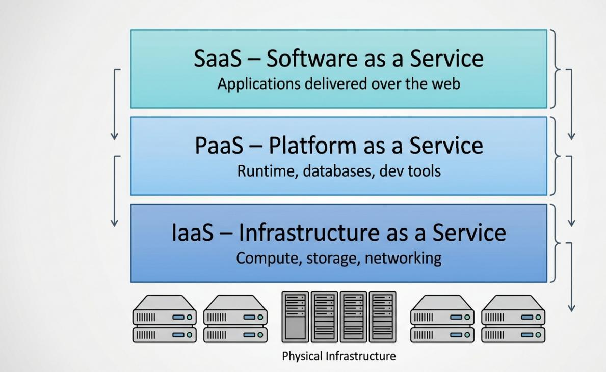
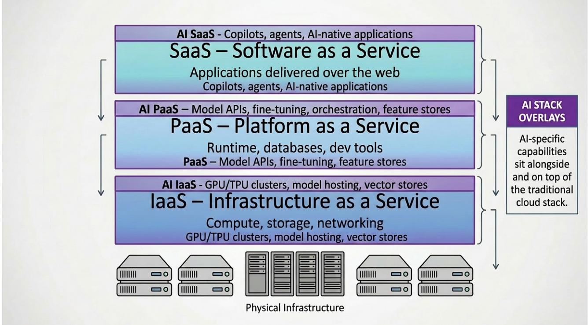
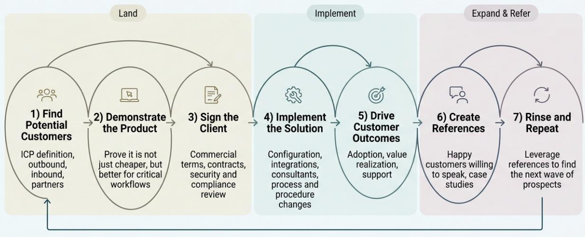

# Global Software

# Future of Tech: Does the software world as we know it end?

Given the wory that Generative Al is so disruptive to everything in the world and especially to software,we lay out our $^ { 5 + }$ year view on how Al might impact the software stack and what the industry, layer by layer, willook like beyond 2O3O with a focus on laaS/PaaS and SaaS.

We believe that Gen Al willincrease the TAM of laaS/PaaS driving solid growth at the hyperscalers and parts of PaaS (e.g. database). Within laaS, both GPU/ASlCs and CPU usage wilincrease, especially as Agentic Al becomes more prevalent. We also believe that PaaS usage will grow, but certain functionalities will change,and new vendors take the lead.Within PaaS,database usage will grow and on-prem database (e.g. Oracle) will continue moving to the cloud,with more specialized database likely to be created. On the other hand,development tools willbe replaced by Al/Al-enabled platforms, but total usage will increase as traditionally non-IT personnel could use these tools to create agents.

Additionally,laaS/PaaS is still relatively early in the Cloud transition,which is still a structural tailwind for these layers (as compared to parts of SaaS that are cloud-maturing) which we believe will last beyond 2030.

For application software (SaaS), we believe that by 2O3O enterprise application solutions are going to be far more than they are today. Al is going to allow more personalization, customization and is going to support automation of currently manual operations and change certain business processes.This means that Al must be deeply embedded into the applications and apps will also become management layers for complex Al agents and processes.

While there are sub-markets that willbe disrupted /replaced by Gen-Al, we disagree with the broad stroke bear thesis that Al eats software.We believe that beneath the Al fear, some of the recent slowing in certain segments was in fact driven by cloud saturation more than anything else.

Although not all SaaS vendors are as insulated from Al disruption,we believe that incumbents have a number of advantages and vendors that are“quick"in innovating and keeping up with competition will survive／prosper. Complex deterministic processes creates a moat around an enterprise application as does domain expertise and deep semantic knowledge.We believe that the most protected areas within enterprise software should be ERP,followed by HCM and then full-suite CRM, if the vendors innovate and execute.

Finally, within the next $^ { 5 + }$ years,we believe that Generative Al is not an end state or the final iteration of Al technology. Unlike the Cloud tech stack that has solidified,Gen Al is very likely going to be disrupted both by internal technology waves (e.g. reasoning,Agentic Al) and potentially completely new Al technologies, some of which willaugment Generative Al and some that might replace parts or allof the present day Generative Al tech stack.This, we believe,isa really important point for anyone investing in what they believe is the tip of the spear in Al - the spear may be replaced by the gun.

# BERNSTEINTICKERTABLE

<table><tr><td></td><td></td><td>14 Apr 2026</td><td></td><td></td><td>TTM</td><td></td><td></td><td> Adjusted EPS</td><td></td><td></td><td> Adjusted P/E (x)</td><td></td></tr><tr><td></td><td></td><td></td><td>Closing</td><td>Price</td><td>Rel.</td><td></td><td></td><td></td><td></td><td></td><td></td><td></td></tr><tr><td>Ticker</td><td>Rating</td><td>Cur</td><td>Price</td><td> Target</td><td>Perf.</td><td>Cur</td><td>2025A</td><td>2026E</td><td>2027E</td><td>2025A</td><td>2026E</td><td>2027E</td></tr><tr><td>ADBE(Adobe)</td><td>0</td><td>USD</td><td>235.72</td><td>447.00</td><td>(61.7)%</td><td>USD</td><td>20.95</td><td>24.78</td><td>28.52</td><td>11.2</td><td>9.5</td><td>8.3</td></tr><tr><td>HUBS (HubSpot)</td><td>0</td><td>USD</td><td>206.44</td><td>463.00</td><td>(89.8)%</td><td>USD</td><td>9.70</td><td>13.11</td><td>16.36</td><td>3.0</td><td>2.5</td><td>2.1</td></tr><tr><td>MSFT (Microsoft)</td><td>0</td><td>USD</td><td>393.11</td><td>641.00</td><td>(27.5)%</td><td>USD</td><td>13.64</td><td>16.84</td><td>19.39</td><td>28.8</td><td>23.3</td><td>20.3</td></tr><tr><td>MDB (MongoDB)</td><td>0</td><td>USD</td><td>233.60</td><td>428.00</td><td>18.9%</td><td>USD</td><td>2,464</td><td>2,969</td><td>3,474</td><td>6.7</td><td>5.5</td><td>4.7</td></tr><tr><td>ORCL (Oracle)</td><td>0</td><td>USD</td><td>163.00</td><td>319.00</td><td>(7.8)%</td><td>USD</td><td>6.03</td><td>7.50</td><td>8.70</td><td>27.0</td><td>21.7</td><td>18.7</td></tr><tr><td>CRM (Salesforce.com)</td><td>U</td><td>USD</td><td>171.31</td><td>194.00</td><td>(61.6)%</td><td>USD</td><td>12.52</td><td>13.33</td><td>14.82</td><td>13.7</td><td>12.9</td><td>11.6</td></tr><tr><td>SAP (SAP)</td><td>订</td><td>S研</td><td>167.1</td><td>322.00</td><td>(64.2%D</td><td>1:0R321</td><td>16.10d</td><td>229</td><td>178.72</td><td>23.3</td><td>19.5</td><td>16.3</td></tr><tr><td>SNOW (Snowflake)</td><td>M</td><td>USD</td><td>135.47</td><td>195.00</td><td>(35.2)%</td><td>USD</td><td>4,684</td><td>6,042</td><td>7,492</td><td>9.7</td><td>7.5</td><td>6.1</td></tr><tr><td>WDAY (Workday)</td><td>0</td><td>USD</td><td>117.86</td><td>214.00</td><td>(78.2)%</td><td>USD</td><td>9.23</td><td>10.94</td><td>12.87</td><td>12.8</td><td>10.8</td><td>9.2</td></tr><tr><td>SAP.GR (SAP) SPX</td><td>0</td><td>EUR</td><td>142.88</td><td>273.00</td><td>(59.7)%</td><td>EUR</td><td>6.10</td><td>7.29</td><td>8.72</td><td>23.4</td><td>19.6</td><td>16.4</td></tr><tr><td></td><td></td><td></td><td>6,967.38</td><td></td><td></td><td></td><td></td><td></td><td></td><td></td><td></td><td></td></tr><tr><td></td><td></td><td></td><td>1,536.25</td><td></td><td></td><td></td><td></td><td></td><td></td><td></td><td></td><td></td></tr></table>

O- Outperform,M- Market-Perform,U- Underperform,NR-Not Rated,CS-Coverage Suspended MDB,SNOWestimateisRevenues (M);HUBS,MDB,NOWvaluationisEV/Sales(x);DB,CRM,SNO,WDAbase yearis26; Source: Bloomberg, Bernstein estimates and analysis.

# INVESTMENTIMPLICATIONS

By2030,webelievethatoveralTspending,which insomecaseswillnotcome from traditionalI,willgrowstronglywiththe increasing adoption of Generative Al technology. Over the last $^ { 7 0 + }$ years the speed of innovation has accelerated with each technology cycle and Al not just add to the rate of innovation but the rate of innovation adoption.

Within SaaS,twokeyfactors thatdetermine disruptionriskarespeedofcatch-upinnovationand thecomplexityoffunctionality especiallyaroundthedeterministicprocesses.Inaddition,incumbentsmustleverage theirdomainexpertise,semantic knowledge oftheinterrelationshipsbetweendata,customerrelationships.Thosethatarenotinnovatingaggressivelywillbe disrupted as are most pure-play on-premise vendors.

Within laaS/PaaS, we believe that Al workloads willincrease the TAM for laaS/PaaS vendors as:

·Al will drive not only GPU/ASlCs usage but also CPU usage growth,especially with Agentic Al ·To leverageAl,workloadsare goingtoneed tobein theCloudandby2O3Oamuch largerportionofcritical workloads wil have moved driving solid growth for areas such as on-premise databases such as the Oracle database.

We seelaaS/PaaS vendors asbeneficiariesofAlrevolution.We see hyperscalers(MSFTand ORCLwithinour coverage),MDE and SNow (to some extent)as beneficiaries from incremental database usage driven by Al.

Within SaaSwesee SAP and Oracleas best positionedand HubSpot as relatively unafected by theAl headwinds investors areconcerned about.Workdayshould be fine.Alshouldbebothasmallheadwindandamostlyofsetting smaltalwind (Agentforce) from Al for Salesforce.

# VALUATIONCOMPSTABLE

<table><tr><td rowspan=2 colspan=3>4/14/2026Company     Share Price</td><td rowspan=1 colspan=2> Net Cash Per Share</td><td rowspan=1 colspan=2>Free Cash Flow (LTM)</td><td rowspan=1 colspan=1>RevenueGrowth</td><td rowspan=1 colspan=4> Valuation Multiples</td></tr><tr><td rowspan=1 colspan=1>Company</td><td rowspan=1 colspan=1>Share Price</td><td rowspan=1 colspan=1>$</td><td rowspan=1 colspan=1>% of SharePrice</td><td rowspan=1 colspan=1>Per Share ($)</td><td rowspan=1 colspan=1>% Yield</td><td rowspan=1 colspan=1>NTM (%)</td><td rowspan=1 colspan=1>EV/NTMRevenue</td><td rowspan=1 colspan=1>P/FE</td><td rowspan=1 colspan=1>Price/FCF(LTM)</td><td rowspan=1 colspan=1>PEG Ratio</td></tr><tr><td rowspan=9 colspan=1>ereerereieieeeg</td><td rowspan=1 colspan=1>Adobe</td><td rowspan=1 colspan=1>$235.72</td><td rowspan=1 colspan=1>0.56</td><td rowspan=1 colspan=1>0.2%</td><td rowspan=1 colspan=1>24.55</td><td rowspan=1 colspan=1>10.4%</td><td rowspan=1 colspan=1>8.7%</td><td rowspan=1 colspan=1>3.6x</td><td rowspan=1 colspan=1>9.8x</td><td rowspan=1 colspan=1>9.2x</td><td rowspan=1 colspan=1>1.0x</td></tr><tr><td rowspan=1 colspan=1>Microsoft</td><td rowspan=1 colspan=1>$393.11</td><td rowspan=1 colspan=1>(4.53)</td><td rowspan=1 colspan=1>(1.2%)</td><td rowspan=1 colspan=1>10.37</td><td rowspan=1 colspan=1>2.6%</td><td rowspan=1 colspan=1>15.3%</td><td rowspan=1 colspan=1>8.4x</td><td rowspan=1 colspan=1>22.4x</td><td rowspan=1 colspan=1>37.7x</td><td rowspan=1 colspan=1>1.6x</td></tr><tr><td rowspan=1 colspan=1>Oracle</td><td rowspan=1 colspan=1>$163.00</td><td rowspan=1 colspan=1>(42.37)</td><td rowspan=1 colspan=1>(26.0%)</td><td rowspan=1 colspan=1>(8.52)</td><td rowspan=1 colspan=1>N/A</td><td rowspan=1 colspan=1>28.0%</td><td rowspan=1 colspan=1>7.2x</td><td rowspan=1 colspan=1>21.4x</td><td rowspan=1 colspan=1>N/A</td><td rowspan=1 colspan=1>4.0x</td></tr><tr><td rowspan=1 colspan=1>MongoDB</td><td rowspan=1 colspan=1>$233.60</td><td rowspan=1 colspan=1>28.61</td><td rowspan=1 colspan=1>12.2%</td><td rowspan=1 colspan=1>6.16</td><td rowspan=1 colspan=1>2.6%</td><td rowspan=1 colspan=1>17.7%</td><td rowspan=1 colspan=1>5.7x</td><td rowspan=1 colspan=1>39.8x</td><td rowspan=1 colspan=1>37.5x</td><td rowspan=1 colspan=1>2.2x</td></tr><tr><td rowspan=1 colspan=1>Salesforce.com</td><td rowspan=1 colspan=1>$171.31</td><td rowspan=1 colspan=1>(8.52)</td><td rowspan=1 colspan=1>(5.0%)</td><td rowspan=1 colspan=1>15.06</td><td rowspan=1 colspan=1>8.8%</td><td rowspan=1 colspan=1>11.1%</td><td rowspan=1 colspan=1>3.6x</td><td rowspan=1 colspan=1>13.0x</td><td rowspan=1 colspan=1>11.0x</td><td rowspan=1 colspan=1>2.4x</td></tr><tr><td rowspan=1 colspan=1>HubSpot</td><td rowspan=1 colspan=1>$206.44</td><td rowspan=1 colspan=1>27.10</td><td rowspan=1 colspan=1>13.1%</td><td rowspan=1 colspan=1>10.85</td><td rowspan=1 colspan=1>5.3%</td><td rowspan=1 colspan=1>18.1%</td><td rowspan=1 colspan=1>2.6x</td><td rowspan=1 colspan=1>16.6x</td><td rowspan=1 colspan=1>18.9x</td><td rowspan=1 colspan=1>0.6x</td></tr><tr><td rowspan=1 colspan=1>SAP</td><td rowspan=1 colspan=1>$168.51</td><td rowspan=1 colspan=1>2.21</td><td rowspan=1 colspan=1>1.3%</td><td rowspan=1 colspan=1>7.03</td><td rowspan=1 colspan=1>4.2%</td><td rowspan=1 colspan=1>9.1%</td><td rowspan=1 colspan=1>5.1x</td><td rowspan=1 colspan=1>20.0x</td><td rowspan=1 colspan=1>25.1x</td><td rowspan=1 colspan=1>0.9x</td></tr><tr><td rowspan=1 colspan=1>Snowflake</td><td rowspan=1 colspan=1>$135.47</td><td rowspan=1 colspan=1>3.82</td><td rowspan=1 colspan=1>2.8%</td><td rowspan=1 colspan=1>3.32</td><td rowspan=1 colspan=1>2.5%</td><td rowspan=1 colspan=1>26.3%</td><td rowspan=1 colspan=1>7.7x</td><td rowspan=1 colspan=1>74.5x</td><td rowspan=1 colspan=1>41.8x</td><td rowspan=1 colspan=1>1.6x</td></tr><tr><td rowspan=1 colspan=1>Workday</td><td rowspan=1 colspan=1>$117.86</td><td rowspan=1 colspan=1>6.09</td><td rowspan=1 colspan=1>5.2%</td><td rowspan=1 colspan=1>10.36</td><td rowspan=1 colspan=1>8.8%</td><td rowspan=1 colspan=1>11.5%</td><td rowspan=1 colspan=1>2.7x</td><td rowspan=1 colspan=1>11.2x</td><td rowspan=1 colspan=1>10.9x</td><td rowspan=1 colspan=1>0.8x</td></tr><tr><td rowspan=4 colspan=1>ODerrent</td><td rowspan=1 colspan=1>Autodesk</td><td rowspan=1 colspan=1>$228.59</td><td rowspan=1 colspan=1>(0.64)</td><td rowspan=1 colspan=1>(0.3%)</td><td rowspan=1 colspan=1>11.20</td><td rowspan=1 colspan=1>4.9%</td><td rowspan=1 colspan=1>13.1%</td><td rowspan=1 colspan=1>5.9x</td><td rowspan=1 colspan=1>18.4x</td><td rowspan=1 colspan=1>20.0x</td><td rowspan=1 colspan=1>0.9x</td></tr><tr><td rowspan=1 colspan=1>ServiceNow</td><td rowspan=1 colspan=1>$87.79</td><td rowspan=1 colspan=1>3.71</td><td rowspan=1 colspan=1>4.2%</td><td rowspan=1 colspan=1>4.37</td><td rowspan=1 colspan=1>5.0%</td><td rowspan=1 colspan=1>20.4%</td><td rowspan=1 colspan=1>5.4x</td><td rowspan=1 colspan=1>20.9x</td><td rowspan=1 colspan=1>19.9x</td><td rowspan=1 colspan=1>1.1x</td></tr><tr><td rowspan=1 colspan=1>Amadeus</td><td rowspan=1 colspan=1>$58.76</td><td rowspan=1 colspan=1>(6.07)</td><td rowspan=1 colspan=1>(10.3%)</td><td rowspan=1 colspan=1>4.72</td><td rowspan=1 colspan=1>8.0%</td><td rowspan=1 colspan=1>6.0%</td><td rowspan=1 colspan=1>4.2x</td><td rowspan=1 colspan=1>14.7x</td><td rowspan=1 colspan=1>12.6x</td><td rowspan=1 colspan=1>1.4x</td></tr><tr><td rowspan=1 colspan=1>Datadog</td><td rowspan=1 colspan=1>$110.57</td><td rowspan=1 colspan=1>8.79</td><td rowspan=1 colspan=1>8.0%</td><td rowspan=1 colspan=1>2.52</td><td rowspan=1 colspan=1>2.3%</td><td rowspan=1 colspan=1>19.4%</td><td rowspan=1 colspan=1>8.8x</td><td rowspan=1 colspan=1>50.5x</td><td rowspan=1 colspan=1>42.8x</td><td rowspan=1 colspan=1>7.5x</td></tr></table>

Source: Bloomberg, Bernstein analysis

# Table Of Contents

Portfolio Managers Summar.. ..4   
What is the right time horizon?... ..5   
What happens to the Hyperscalers (laaS/PaaS) over the next $^ { 5 + }$ years?... .6   
Does Al negatively impact laaS/PaaS and the hyperscalers?.. ..9   
Does Al increase the TAM for the hyperscalers?.. ...   
Does the Enterprise applications industry get disrupted by Al?.CD12oa21CadO447 .1   
What about the bear concerns?.. 12   
Then why are so many Cloud companies' growth slowing?... .13   
Does the technology get disrupted before it completely disrupts the software world?. 14

# DETAILS

Everythingtodayseems tobeimpacteddirectlyorindirectlybyAl-whetherwars (autonomousdronesandAldrivenattack siteselection);hiring (canlreplacemyemployesbyautonomousagents);oreven thesoftwareindustry.Whilewe would love topontificateon theglobalramificationsofAl (and toasmallextentillin thisnote)lwillfocus onwherewehave themost expertise and that is look at how Al willimpact the software/ Cloud industry over the next $^ { 5 + }$ years.

Alin generalandGenerativeAlmore specificallyisadisruptorandwhileit willdisrupthiringinsomeindustriestherateof disruption,we wouldarguewillbedifferentbetweenindustryandevensub-industries.This,webelieve,isduetobothhow disruptive(andvaluecreating/destroying)tetechnologywillbeinaspecificarea,andtheheightofthebarierstoadoption.

Today, most “industry experts"and many investors want to /expect to see very fast disruption because of:

·Therateofinitialadoptionofthe technologyinsomevery high profileareas (one needonlylookattherampto1billion ChatGPT users);   
·How fast the technology is moving in areas such as coding; and   
·Thereis so much money being thrown atthe technology thatfastadoptionis requiredorelse somethingreall ugly could occur.

We willokateachofthemajorlayersinthecurrenttechnologystack individuallyandwhatwebelieve thoselayersofsoftwar and the companies in those layers will ook $^ { 5 + }$ years from now.

# PORTFOLIO MANAGERSSUMMARY

Thereisaconcern thatAlis going toeatsoftwareand thisconcernhasdrivendownvaluationsacross thesoftwareindustry.Bu if wemake some educated assumptionsandlook outo 2030and beyond webelieve one willgetadiferent perspective:

Theslow-downin growththat hascausedconsternationacrossinvestorsis,webelieve,driven byacombinationoffactors   
including:   
·The Cloud from atechnology perspective is maturing and from a Cloud migration perspectiveissaturating in many submarkets of enterprise application software /Cloud.The tailwind to growth that has driven software for $^ { 2 0 + }$ years is abating.

·laaS/PaaSis much earlierinits transitionbuthelawof large numbers andthefactthattheeasytomove workloads have moved is slowing growth.That said the transition will last,we believe,beyond 2030.

ToleverageAl,workloadsare going toneed tobe intheCloudandby2O3Oamuchlargerportionofcritical workloads wil have moved driving solid growth for areas such as on-premise databases such as the Oracle database.

Incumbant Enterprise applications haveanumberofadvantages withAlthattheylacked withthe Cloudtransitionand these willlow many enterpriseappvendors tocontinue tobesuccessfulintheAlworld.We layoutinthe notewhat we believe are thekey diferentiatorsof thosethatare mostlikelytobe successfulandlistanumberofwellprotectedsub-marketsof enterprise apps/SaaS.

AllaaS/PaaS isnotfundamentallydiferentfromtraditionallaaSPaaSandby2030 themargins forAlandnon-Al workloads will not be meaningfully different. Nor will the stickiness of the business.

Inferencingandagentsare mostlikelytoberun,intheenterprise world,atthesamevendorwhere thedataresides for performance and security purposes.This is true for both apps and laaS/PaaS.

This does not meanthat there willnotbethosecompaniesthatdo notsurvive,but theopportunityisthereformany incumbents tobesuccesulspeciallystheoll-outofinnterpriseisgongtakemanyyearsandtisshouldllowteinumbntst besuccesfulifteyinnovate,movequicklyandexecute.JustlikewiththeCloudtransitionmanyofthose thatarearoundtoday will not be in by 2O3O and beyond because they could not innovate and execute fast enough.

# WHAT ISTHERIGHTTIME HORIZON?

BeforegoingintodetailsabouttheimpactofAlonthe“future"ofsoftware/Cloud we needtodefineatime horizon.Historicaly the majortechnology disruptioncyclesoccur(Exhibit2)overa10-2Oyearperiodof time withtheSaaS/Clouddisruption impacting software from theearly-2OOOsand startingto abate relatively recently.Notethis can be seen inour Cloud penetration analysis notes which shows that many sub-markets of software are reaching $7 0 \% +$ Cloud penetration and some even higher- such as CRM and collaboration.Note that laS/PaaSis stilmuch earlier (more onthis later in te note).

# EXHIBIT 2: Major technology disruption cycles occur every 10 - 20 years

# Major Software Disruption Cycles

From centralized computing to Al-native software architecture

Mainframe Minicomputer Minicomputer PC/Client-Server Web Web SaaS SaaS Cloud-Native Cloud-Native Al-Native   
Mainframe Era- Minicomputer Era PC & Client-Server Web Era - mid- SaaS Era-early Cloud-Native Era Al-Native Era 一   
1950s to late 1960s. -late 1960s to Era-early 1980s 1990s to early 2000s to mid-2010s. -2010s to early early 2020s to early 1980s. to mid-1990s. 2000s. 2020s. present. APIs 品 AI   
Centralized compute, Departmental Desktop productivity, Browser-based Subscription software, Elasticinfrastructure, Foundation models,   
batch processing, computing,lower-cost LANs,departmental distribution,internet multitenancy,faster APls,microservices, copilots,agents,   
proprietarystacks. systems, apps,relational apps,open standards. deployment. Dev0ps. inference-centric distributed adoption. databases. workflows.

# What changed in each cycle

viny tns matters Compute model Centralized →Distributed →Cloud Al orchestration · Platform transitions reset winners and losers ApplicationarchitectureMonolithic Tiered Web Apps →Microservices Agentic workflows ·Distribution and economics changeasmuchastechnology Distribution model On-prem install LANs/Networked Browser Delivery一 API/SaaS Agentic workflow ·Al may reshape the software stack atbothapplicationand Economic model Perpetual License一 Perpetual/Departmental Browser Access - Subscription Outcome-based infrastructure layers

This begs the question of how to think about Al andits impact on software - should one also figure on a $^ { 1 0 + }$ year cycle or has that changed? We would argue that:

·Currently,weareseeing GenerativeAldisruption,butGenAlisnotthefinalAltechnology-therewillbeadditionalAl technologies,someofwhich cause otherdisruptionsand some willimpact Gen Al.Example technologyinclude First-principles Al (which could change Gen Al),and Quantum Al(which could augment Gen Al).   
·Therate ofGenAldisruptiononsoftware has beendiferentfrompriortechnlogies'disruptioncyclesbutnotas different as many expected.Ifwelook backto SaaS which started,depending onyourdefinition when Salesforce.com was foundedin 1999 or when Salesforce started to have smallbut relatively meaningful revenue (2005- $\$ 126 M )$ SaaS took time. Similarly, if we look at AmazonAWS whichwas foundedin 2O06,but thecompany did not break out AWS revenue untilQ1 2015 when it showed that 2013 AWS revenue had reached $\$ 3.$ 1B In other words, Cloud took $> 5$ years to generate meaningful revenue even though it started to have an impact even earlier.   
GenAlgenerated a tsunami ofemotions and expected business impacts in 2023 with thelaunch of ChatGPTeven though Alhas beenaround since the 193Osand theunderlying technologyofGenAlsince2O19,ifnotearlier.Whileconsumers,we wouldargue,arealreadyfeelingtheffectofGenAl,enterpriseAlistillrlativelyutedinimpactandlimitedtobseof future use cases.

Givethehistoricalcontextandif weuse 2O23asthe"starting"dateofits impactonsoftware,we shouldconsiderthe majority oftheimpactwellunderstoodby2O3orshortly thereafter,withthefullimpactlikelynotfeltuntilmorelike2O35.Butgiven our expectation that Gen Al is $1 ^ { \mathsf { s t } }$ wave of what is likely a multi-wave tsunami of Al technologies we couldlikely see the next disruptionwavebefore thisoneisfulyregistered (e.g.2035).Therefore,weare going touse2O30whichis\~4yearsoutfrom now and $\mathord { \sim } 7$ years after the launch of ChatGPT as a good point in time to lay out the major impacts of Al.

# WHAT HAPPENS TO THE HYPERSCALERS (IAAS/PAAS) OVER THE NEXT 5+ YEARS?

Thereare 3mainlayerstotheCloud(Exhibit3):Ifrastructure-as--Service (laaS)Platform-as--Service(PaaS),andSoftware as-a-Service(SaaS).laaSandPaaSareoftengrouped together for numerous reasons,because theyare ITfocusedrather thanend-user focused (SaaS)orbecause thereis overlapbetween the two layers (e.g.some include the operating system inlaaS)orbecause the hyperscalers bundle both together (with some infrastructure SaaS-style apps).Together laS/PaaS is oftencalledtheinfrastructurelayersinceapplications,whetherSaaSorenterprisebuilt Cloudapps,arebuiltoftenonthe combinationof laaS and PaS.Note calingitthe Infrastructure layer insome ways devalues the software component (e.g, database,middleware,security)thatis PaaSandinsome ways creates,we believe the misunderstanding we are aboutto discuss relating to the economics and stickiness of the Al Infrastructure layer.

  
Source: Perplexity.Al, Bernstein analysis and estimates

Thereasons that laaS/PaaS have been sosuccessfularenumerous but fundamentall,there is anenormous levelofefficiency thatcomes withcentralizing theprocurement,deliveryandmanagementoftheplumbingonwhichapplicationsrun.Without his layerSaaS vendors would have hadtobuildouttheirown datacenters and manage anddeploy more of the necessary platform software (databases,developmentenvironments,management,securityandotherplatformsoftware).Thiswouldhavetaken each individual SaaS vendortime,effrt and moneyandimpacted the speed ofadoption especiallyas they go global.

Itis truethatintheearlydaysofSaaStheleadingSaaSvendors(e.g.Salesforce,Workday,ServiceNow,etc.)renteddatacenter capacityfromco-locationvendors,installedtheirownserverandrelatedhardware,andinstaledandmaintainedalltheplatform software.Butwe wouldargue thatthis worklimitedthe numberand diversityofSaaSvendors thatcame tomarketandcreated an environmentwhere smalervendors were more easily gobbledup by large on-premise and Cloud vendors.Italsolimited whereSaaSwasavailableas therearelegal,regulatoryandbusiness reasons wherethedatamustreside,and theapplications must run in numerous jurisdictions globally.

Enterprises couldnothave moved theapplications theybuiltinternall tothe Cloud withoutthe hyperscalers because there would not have been Cloud as we knowit today.The multi-tenancyand shared resourcesof laaS/PaaS made the economics andease of migration and upgrades fareasierand more compeling.Without laaS/PaaS vendors enterprises would have continued tohostin theirdatacentersor leverageco-location vendors thatsuppliedthedatacentersbutnotnecessarily the hardware. How that would have impacted Al adoption in enterprise is a very interesting question.

While the migration fromon-premisetolaaS/PaaSand thebuildingofnewCloudnative appsonlaaS/PaaSistillrelatively early days (possibly $< 1 / _ { 2 }$ of the way to completion),the transition itself is well understood and one in which we have seen the formationofahandfulofglobalhyperscalers includingAmazon,Microsoft,Google,Oracle,andAlibaba; numeroussmall/ specialized (e.g.government,regulatedindustries);andregionalplayersdrivenbylocalregulationsandrequirements.Without Al orsome othermajor disruptive trend (e.g.deglobalization)this structure would ikelynot meaningfully change for the foreseeable future.

To understand the next 5 years we need to consider really 3 trends:

·Cloud saturation: As discussedearlierthe Cloud transition has been goingonsince theearly teens driveninitially by a host of smaller players and then dominated by Amazon AWS.The transition became wellentrenched with the launch of $1 ^ { \mathsf { s t } }$

Microsoft Azureand then Google GCPwhich supplied more locations,more hardware options,and moreplatform software capablities.Sovereign Cloud was much more recently,we would argue,enabledby Oracle OClandAlloy.Basedoncurrent laaS/PaaS saturation we would expectthatthe laaS/PaaS Cloudtransition shouldstillbecontinuing,ataslowerbut til veryhealthyrate5yearsfromnow.Infact,Cloudsaturationcouldin theorytake5-1OyearsdependingontherateofCloud migration and new workload creation (more on this inour discussion belowof the impact of Alonthe hyperscalers).

·Deglobalization: Ourcurrent expectationisthatdeglobalizationis going to increaseand there willbeagrowing listof government enabled/support Cloud platformvendors which willin most cases be far more laaS vendors than major PaaS vendorssince manyare going to lackthecapabilities todevelop,supportanddeliver theirown PaaSbut willrather1)use relatively genericopensourcePaaSwhichwillhavelimitedapplicabilityforenterprisesand existing workloads butwilffer thebasicfunctionality thatdigitallynatives willbeable toleverageinconjunctionwiththeirown internallysupportedPaaS capablities; 2)rent the PaaSlayersoftware(databases,development tools,cybersecurityoferings)frompointsolutions in the PaaS software market1 or 3)rent PaaS from a $3 ^ { \mathsf { r d } }$ party software centric Cloud provider such as Oracle and its Oracle Alloy and Oracle sovereign Cloud offerings.

·Wecontiue tobelieve that Oracle is curently the best positionedand hasbeen successful,via their Alloyoffering to white box OCl and allits PaaScapabilities as well as Oracle's OCl hardware.

Al: Butthe bigunknownisAlbecauseofhowrelativelyearlystageAladoptionis;howfastthe technologyischanging;and thequestions that are arising aboutthe economicsofAllaaS/PaaS.We believe there are two major potentialoutcomes which willbe discussed in greater depth in the remainder of this section of the note.

·Al is bad for the hyperscalers:

·Al decreases the margins for the hyperscalers   
·Allowers the stickiness of the hyperscalers andincreases churn - potentiallydecreasing both revenue growth and the value of these businesses   
· Alcompletely disrupts the hyperscalermarket aswe knowit today32lCad 04-17

·Al is good for the hyperscalers:

·Al increases the TAM for the hyperscalers

·Al leverages data so those vendors with lots of critical client data become even more valuable

Today5hyperscalers (Amazon,Microsoft,Google,Oracle,andAlibaba)areindividuallyand incombinationthelargestCloud infrastructure vendorsinrevenue,globalfootprint,customerbaseand globalimpactterms,and theyhavebeen todateonly gainingshareat leastasagroup(theTop3AWS,AzureandGCPholding approximatelytwo-thirdsofthe laaSmarketaccording t IDC - see Cloudin theQuarter: Howdidthe hyperscalersdoin4Q25?).Currently,thehyperscaler'sscaleandreach is making it moreandmore dificultforcompetitors tobreachtheirmoatandwereitnotfordeglobalizationandAl,we wouldargue,they willonly becomealargerandlargerportionoftheoverallmarketwithalong tailofmuchsmallerlocal/regionalandspecialied/ industry specific (e.g. regulated industries) competitors.

Deglobalizationishaving some impact,as discussedabove and that willikelycontinue with regionssuchas Europeand countriessuchas Chinaand Rusia having thelargest local/regional players.Anumberof Middle Eastern countries are also showing strongsigns thattheywishtodeveloptheirownlocallaaS/PaaSindustryand withtherecentturmoilintheregion we wouldargue thatthis islikelytobecomealarger focus moving forward.Again,as discussedabove Oraclecurrentlyis having success partnering with localproviders todeliverafar more feature rich PaaS layerand more flexible laaScapabilities.

This does notmean that thebig 3arein troubleonaglobalbasis due todeglobalization,buttheirapproachtodate has been predominantly focused on partnerships,withthe partner delivering the datacenter and seling the services and defining

thatasovereign Clouds (e.g.,BluewhichisapartnershipinFrancebetweenMicrosoft,OrangeandCapgemini).Thus,itis most ffectiveforarge multinationalcorporations,US (orChinesecentricforAlibaba)centriccompanies,anddigitallnative companies (whichare mostlyUScentrictoday)andsome sovereigns whereownershipof thetechis lessimportant.Itwillbe interestingtosee howthistrendcontinuesandwhether thebig3enduphaving tore-architecttheirinfrastructuretosupport smallfotprint datacenters and quasi white box oferings.But we have digresses from the potentialimpact of Al.

# DOES AI NEGATIVELY IMPACT IAAS/PAAS AND THE HYPERSCALERS?

Let us $1 ^ { \mathsf { s t } }$ start with the disruptor hypothesis under which Al fundamentall changes,and changes in a negative way,the hyperscaler market. The theory is driven by 3 bear cases :

·Al changes fundamentallyhowsoftware is writenand lowers themoataroundaplication software (moreonthis aterin the note) · With Al the infrastructure stack is less valuable and the infrastructure vendors are commoditized ·The value shifts to the model companies from the software companies (this has become less prevalent recently)

Let us deal with each one individually and try to show why each in their own way is incorrect:

Alchanges howsoftware is writtenisin factcorrctfromacoding perspectiveand this canalreadybeseenin the impact of productssuchasAnthropic'sClaude²,OpenAl's Codex,andCursor.Over timeAlcoding,agenticdevelopment platforms, andrelatedsoftwarewillonly getbeter.Butfundamentall these areallapplications and theseapplications runon Cloud Infrastructure (bothCPUandGPU.Inotherwords,while thesoftwareproductscanandwilchange overtimethefundamental requirementthatsoftware,whethertraditional CPUorAl,requiresinfrastructuretooperateandthemorepowerfulandcomplex the software the more powerful and complex the infrastructure.

The Infrastructure stack becomes less valuable. The $2 ^ { \mathsf { n d } }$ bear case is based on a belief that Al runs on commodity hardware andthedifferencebetweenoneAllaaS/PaaSvendorandanotherisrelativelynominal.Under this thesis,especiallyifmodels arerunacrossallvendors,thenworkloadscanshiftaroundtowhomeverisdeliveringthelowestcostorbestlcation(closest to theclient)andthatoncecapacityanddemandnormalizepricing willplummetaslow-costproviders enteranddrive themarket. This thesis,we believe, is wrong for two main reasons:

1.Alis nodiferentfromothersoftwareandrequiresplatformsoftware tooperate,andthissoftware willnotbe generally availableeverywhere.Forsomereasonwhenmanypeople talkaboutAlteyforgetalltheplatformsoftwarethatrunsunder theAlapplications.Inadition,Alsoftwarerunsinconjunctionwithandleverages non-Alsoftwarewhichincludes traditional applications and infrastructure software (e.g. databases).

2.Al requiresdataanditisfarbeterfromacomplexityperformance,securityand governanceperspectivetounAlwhere thedataresides; and3)Alis notsimplyGPUs-itisacombinationofGPUs,CPUs,networking,storageand more.There is anenormous amountofknowledgeand expertise tobuildandrundatacenters especialy mixeduse datacenters that will berequiredforAlasitmaturesandespeciallyAgenticAl.Infact,looking 5yearsout we wouldargue that thecomplexityof thesedatacenters willonly increase,and we would notbesurprisedto see quantumcomputers starting to be incorporated into the datacenter architecture.

The value shifts to the modelcompanies.This bearcase argumentis basedon thebeliefthat the modelcompanies of today willbecomefulltechstackcompanies offeringthefullrangeofdevelopmenttechnologiesandthehardware thatitrunsontop of.Herein,one isarguing thatthemodelcompanieswillonedayowntheirown trainingandproductiondatacenters.We believe thatthe most successul companies focus on thefew areas theyare best atand thus only cross-industrycompanies such as thehyperscalersplus Metawilltry toown laaS/PaaSandoferupmodels,butthatisifactthewrongdiscussion.Forthisbear case,similartotheprior2,oneneedstounderstandthatAlisnotastandalonecompletetechnologystack.Itisbuiltonandinto non-AlPaaSfunctionality(e.g.Aldoesnothingtochangefundamentallythedatabasesmarket)andwillintegrateintotraditional CPUcentricapplications.Therefore,thebestplacetorunAlis going tobewhereapplications,data,etc.arerunandstored.

# DOES AI INCREASE THE TAM FOR THE HYPERSCALERS?

Webelieve thatAland non-Alare tightly intermingledand thatwillonly increase.In Exhibit4 weshowasimplified graphic representationofhoAlwillbetightly integratedintoeachlayeroftheCloud.Companies,andespeciallyenterprisesaregoing to wantoruntheirAlwheretheirapplicationsanddataresideandthatthiswilead toanincreaseinTAMforthehyperscalers.

  
EXHIBIT 4: Our view of the tight interrelationship between Al and non-Al in the Cloud/Al tech stack   
Source: Perplexity.Al, Bernsteinanalysis

When we consider a new Cloud /Al TAM there are a couple of interesting trade-offs:

·Infrastructureusage is going to increaseas GPUs orby 2O3O mostlyASICsand specilizedinferencing chips areused to perform inferencing. CPUutilization willoverallincrease,especially as Agentic Al becomes prevalent by 2030.

Notethat some application functionality thatis runon CPUs willbe betterautomated witha mixofGPUsand CPUs.While this willimpact specific workloads theoverallefect,we believe,willbean increase inCPUandGPUutilizationbecause agents leverage both chip sets.

Database usage willincrease especiallyas enterprises build/buyAl appsand Agents which willeveragecorporate data anddrive non-GPUinfrastructure usage up.This willalso increase storage requirements due to creationof vectorand other databases and the possible storage of more data.But directly Al does not create more data.

· PaaS usage will grow but what PaaS functionalityis used for willchange.

·Database usage will grow and likely more specialized databases willbe created.

·Development tools willbereplacedbyAl/Al-enableddevelopmenttools,butthe totalusagewillincrease.Rightnow IT organizations arechanging Altools ver frequently(we have heard 2-3times peryear at some organizations) which is badfor thesoftwaredevelopmentmarket,butthat willikely stabilizeby 2O3Oanddevtools willbecome even more prevalentas non-I positions willusewhatwas historicallyconsideredasdevtools.Note thereisapossblitythatsomeof thedevtoolmarket will commoditize due to Albut that stillhas tobe seenand thereare lotsoffactors to consider.

Systemmanagementandcybersolutions willhavetochange considerably.Atthis time weare notcalingout winners and losers,but the totaldollars spentonsystem managementand cybersolutions williely increase given thelargervolume on apps that will be run and the increased requirements of Al enabled IT organization.

ITwillbecome more prevalentby2030andwhile individualproductsandvendors willikelychangeoverallspendingon what today is called ITwillincrease and with it the demand for more infrastructure to run the IT solutions and more

# DOES THE ENTERPRISE APPLICATIONS INDUSTRY GET DISRUPTED BY AI?

Thereisamovieentitledthe“Quickor the Dead"staring amongstothers Sharon Stone,Gene Hackman,RussellCrowe and Leonardo DiCaprio which wasa 1995 western about aquick draw competitionand those that were notquick were dead. While therearedefinitelysub-marketsofsoftware (e.g.coding tols)thatare goingtobemasivelydisruptedbyGenAl,webelieve thatthe movie title isamuch moreappropriate definitionof what happens toapps- Vendors thatare“Quick"willsurvive/ prosperandtose thatarenotwillbedead(orat leastonthelong roadtooblivion).Thequestionwhichwillbediscussedinthis section of the note willbe“What does it take for an enterprise solution /company to survive/prosper?"

The answer maybe easier than one would think.If we look out to 2030 we believe that there willbe a number of key characteristics of those software/Cloud products/vendors that will be most successful:

Speedof innovation in some ways is anew / novel concept for software/Cloud companies and especiall enterprise apps vendors.Traditionalon-premise vendorsdelivered majorupgrades every 2-3yearsand ITcould takeanother1-2years or longertoimplement.The Cloudandagile development techniquesacceleratedthepaceofinnovationtoweeks(and in some casesfasterforincrementalupdates).Alisfurtheraccelerating therateofinnovationascodewritingandtestingaccelerates. Successfulsoftware companies willneedto maintainafastpace ofinovation withAl makingit notjust possible but also economically feasible.

·Please note that the pace of innovation has acceleration sincethe start of software over 7O years ago.Alfurther accelerates the paceof innovation,butitalso should increasethe pace ofimplementation of innovation (Artificial Intelligence. Sooner or Later: Al is already here - The structural reset of IT Services & Software)

Keeping up with thecompetition becomes even more imperativein thefastpace Alenabled,and the Alembedded software world.Fortunatelyincumbents don't necessarily have to lead,but they mustbefastfolowers.Inaddition, incumbents have 3majoradvantagesin the newAl world: domain expertise,access tolargecustomerbase,andresources (i..R&D,ownIPandlong-standing partnershipswithother leadingtechvendorsand majorservicesproviders3)Ifanyone (startup,competitoror client)createsagreat newAl enabled feature orfunction theincumbenthas beteraccess to the knowledge,expertiseandaccessto tedata required to ground Alcapabiities ten the smaller even morenimble competitor.Itis going tobe much moreimportant going forwardforapplicationvendors to monitorwhat theircompetitors, including Al centric startups,are offering and where appropriate including similar functionality.

·Itisimportantto note thatAlisadouble-edgedswordand thattheincumbents haveinalmost everycaseaccessto the same models that their competitors(whether traditionalcompetitors or Alnatives)are using.Buttheyalso havefar more domain expertise,semantic knowledge thatdetails howdatafor that specific applications marketinter-relates,acess toabroad customer base to testand potentially monetizeany newfunctionality.Theyalso have the resources,when appropriate toacquiresmallcompetitorsratherthanbuilding similarcapabilities.But this requires streamlinedoperations and focus,which not every company will do.

Embedding Al: By 2030 enterprise applicationsolutions are going tobe farmore thantheyare today.Alis going to allow more personalizationand customization.Itis going to support automationofcurently manual operations,anditis going to change business processes.This means that Al mustbe deeply embedded into the applications and apps willaso become management layers for complex Al agents and processes.

Complex capabilitiesand tightintegration willbe far more important: Complexityincluding complexdeterministic processescreates a moat around an enterprise application.While the app must supportcomplex processes theymust not look to the user as complex, as Al must be used to personalize,streamline and automate.

But notall enterprise sub-markets are equall protected.We willdiveintowhat areas are more protectedand those thatare most exposed in folow-up notes.Thatsaid,we are confidentthat the most protectedareaof enterprise software should be ERP(includingsupplychainsoftware),ifthevendors innovateandexecute,followedbyHCMandthenfullsuiteCRM.Withinthe infrastructuresoftware space databasesarenotgoing tobereplacedbyAl(atleastasweknowAltoday)andareinmostcases going to see upside. Areas such as application development tools are amongst those willbe most obviously impacted.

# WHAT ABOUT THE BEAR CONCERNS?

Thereare manyin thetechnologyandinvestment worldthatbelieve thatsoftware isdead-kiledbyAl,andwebelieveitis importanttoaddresstheconcernsandnotjustlayoutourthesisfortheapplicationsoftwarein 2O3Oandbeyond.Thereare3 parts to the bear case on enterprise apps:

Startupswillaboundbecause Alis going tomakeit soeasytobuildcompetitiveapps whichwillincreasechurnand /ordrive pricing down. ·Rather thanbuy/subscribe toadditional functionalityfrom one'scurrent vendor,ITwillbuild theirownadd-ons. ·Organizations of allsizes willuse the latest Al tools to buildtheirownapplications ratherthanbuy/subscribe to apps

AlloftheserevolvearoundthecorrctbeliefthatAlmakesaplicationdevelopmentfareasierandthathetechnologywillonly improve.Butthereare twoglaring issues,webelieve,when trying toconnectthedots betweendevelopmentbecomes easier/ faster and application software is dead.

# Building an application is not the same as building a business.

Evenif wewere toassume thatby 2O30onecan snapone'sfingers and Alwouldbuilda complete enterprise classapplication withallthefunctionalityandcapabiesacompany wouldrequire,thatissimply notenough.IfonelooksatanySaaSstartup (orevenfast-growing publicSaaS vendor)thelargestportionofspending isS&M.Having builtasuccessulsoftwarecompany andhaving workedforoneofthelargestsoftwarecompanies,sling is notinstantaneousandenterprisesalesisevenmore complex(Exhibit5).Ofourse,Awillstreamlineteprocess,butterealityisthatiftodayyugaveusafullydevelopedeature rich enterprise application we would have to:

· Find potential customers   
· Demonstrate the product,   
· Showwhyitis not justmuch cheaper butmuch beter(youdon't replace important businessapplications to saveacouple of dollars)   
· Sign up the client   
·Implementthe solution(which willrequire consultants even with Alasistance and likely require meaningful changes to processes and procedures) 订阅研报添加微信 LCD123321Cad 04-17   
·Make the client happy enough to be a reference   
·Take that reference and find new potential customers -as they say Rinse and Repeat.

Thatprocess takesyears toramp,andit simplywillnot,webelieve,be meaningfullydiferentin2O30.Pleaserememberthat itakes time-oneneedonlylookathowlongittookSalesforceorWorkdayorServiceNowtoramptheirbusinesses,andthey were offering major technology innovationand farbettr operational effciency than theon-premiseincumbents.

Meanwhile,asdiscussedabove,theincumbentsshouldnotbestanding stillandwaiting(as theydidduringtheearlydaysof Cloud).Theywilladdcompetitivefunctionality-whetherthecompetitorisafull-blownenterpriseapporanAlAgentthatsolve

one problem better.

# EXHIBIT 5:The traditional sales process willnot be meaningfully different by 2O30due to Al and thus Al enterprise adoption takes a lot of time and effort

Enterprise-grade process diagram for high-end SaaS company. Full lifecycle of winning and expanding new software Clients

  
Source: Perplexity.Al, Bernstein analysisand estimates

# anaysisJ 阅研报添加微信 LCD123321Cad 04-17

# You don't just build an enterprise app you have to care and feed it forever

Applicationsarenotstatic.Theyrequiremaintenance,supportandupgrades.Every qualitysoftwareapplicationis evolving to meetchangingbusiness,legal,regulatoryaccountingandITrequirements.Softwarevendorslearnwhattheyneedtodofrom theirlargelistofclientsthatarealwaysaskingforadditionalfunctionalityandbyworking withintheirindustry(e.g.Accounting systems from accountants,auditors,and regulators).AnyITorganization thatdecides to buildtheirownappor even their own complex agents is taking all this responsibility onto themselves.The past $^ { 7 0 + }$ years of software has shown that this is sub-optimal unless theapplication requirements cannotbe purchased elsewhere.Thereis alsoa greatersecurityrisk if an organizationlets theirvariousdepartments/entitiesbuildtheirownapps withAl,securityrisks thatwillrquire moreresources fromthecentral ITdepartmentomonitorandrepairanybreaches.Alsocreateshadowbudget-thisis what we haveseen with the cloud transition.

Thisis whymostorganizations would much ratherbuy(or todaysubscribe)toanof-the-shelfapporCloudservicethan build ithemselves.WhileAlspeeds upthecoding processanddecreases thetimeandcostofbuildingappsitdoes not replaceall theotherrequirements necessaryforthecareandfeedingof criticalbusiness processapplications (and theycan'tbenchmark theirsolutionsagainstthebest-in-class intheir idustry).Weexpectoseeacoupleofcompanies trythisroute,and wewill waitforwhatislielytobeepic falures (even thoughfewofthosewillbe pubicallyannounced withthefanfarethatthe move to internally built apps will be announced).

As aproof point we would recommendthereaderconsider thelarge Alcompanieswhichare predominantlyusing off-theshelf enterpriseappsrather than building themthemselves,even though theyhavefarmore expertise thanvirtualy anyIT organization.

# THEN WHY ARE SO MANY CLOUD COMPANIES' GROWTH SLOWING?

Oneofthedriversof theshift in investorsentiment fromAlis goingtohelpsoftware toAlis going tokillsoftwareis thatmany growth softwarecompaniesslowed meaningfully.While therearelikelycompany specific reasons,webelieve there are two