# Tencent Holdings (0700.HK) 19 Apr 2026 21:30:13 ET

# CITI'S TAKE

Tencent is scheduled to report 1Q26 on May 13 and we expect solid revs growth thanks to resilient gaming revs attributed to CNY seasonality and steady evergreen franchise and steady ads revs benefited from increase in VA ad loads and better eCPM. While we expect GP to continue to grow 订阅研报添加微信 LCD123321Cslightly faster than revs, we forecast flattish OP growth reflecting higher AIrelated spend in R&D, G&A and marketing promotion. Into 2Q26, we believe share price performance will be affected by the feedback and traction from upcoming release of HY3, subsequent progress of agentic AI within WeChat ecosystem and any potential disruptive forces from competition as well as grossing performance of HoK World and other new game release. Post estimates tweak, our TP is adjusted slightly to $\mathsf { H K S 7 8 3 }$ . Maintain Buy on attractive valuation and our belief and confidence that HY3 and WeChat agentic AI should strengthen Tencent’s AI positioning.

1Q26 preview — We model 1Q26 total revs to up $9 . 9 \%$ yoy to Rmb197.9bn and non-GAAP net profit to $+ 9 . 7 \%$ yoy to Rmb67.2bn or $34 \%$ margin, vs. Bloomberg consensus of Rmb199bn $( + 1 0 . 6 \%$ yoy) and Rmb67.5bn $34 \%$ margin). We forecast total online games $+ 1 1 . 7 \%$ yoy to Rmb66.4bn with domestic/International games $+ 1 0 \% / + 1 6 \%$ yoy to Rmb47.2bn/Rmb19.3bn. We model online ad revs $+ 1 7 \%$ yoy to Rmb37.3bn and FBS revs up $8 . 5 \%$ yoy to Rmb59.6bn, of which cloud revs $+ 2 5 \%$ yoy to Rmb12.5bn and fintech revs $+ 4 . 8 \%$ yoy to Rmb47bn. We model GP/OP to $+ 1 0 . 7 \% + 0 . 4 \%$ 订阅研报添加微信 LCD123321C yoy to Rmb111.2bn/Rmb69.6bn. We expect result likely in line with potential small deviation on upside risk to our gaming forecast.

Thoughts on upcoming HY 3 — The latest model, Hunyuan 3.0, is scheduled for release in April and we expect it could feature significant upgrades in reasoning and multimodal capabilities. We believe Hunyuan 3.0 will be aimed for future integration with WeChat, QQ, and Yuanbao, to establish it as a functional model within its ecosystem. We expect the model will focus on providing strong productivity tools to support users' daily lifestyles, workflows, and entertainment and for enterprise customers, we believe Hunyuan 3.0 aims to improve efficiency by offering tailored agentic solutions designed to meet their specific operational needs.

Estimates revision — For 2026-2028E, we tweak total revs and non-GAAP net profit by $+ 0 . 7 \% / - 1 . 3 \%$ , $+ 0 . 6 \% / - 2 . 2 \%$ and $+ 0 . 5 \% / - 1 . 6 \%$ . Our 1Q26 revs and non-GAAP net profit are revised by $+ 0 . 5 \% / - 0 . 5 \%$ incorporating higher gaming revs.

Earnings Summary   

<table><tr><td>Yearto 31Dec</td><td>Net Profit (RmbM)</td><td>Diluted EPS (Rmb)</td><td>EPS growth (%)</td><td>P/E</td><td>P/B</td><td>ROE</td><td>Yield</td></tr><tr><td>2024A</td><td>222,703</td><td>23.672</td><td>44.3</td><td>（x) 18.8</td><td>W 4.2</td><td>(%) 25.0</td><td>(%) 1.0</td></tr><tr><td>2025A</td><td>259,626</td><td>28.086</td><td>18.6</td><td>15.8</td><td>3.5</td><td>24.4</td><td>1.2</td></tr><tr><td>2026E</td><td>277,880</td><td>30.091</td><td>7.1</td><td>14.8</td><td>3.2</td><td>23.0</td><td>1.2</td></tr><tr><td>2027E</td><td>308,746</td><td>33.440</td><td>11.1</td><td>13.3</td><td>2.9</td><td>23.2</td><td>1.2</td></tr><tr><td>2028E</td><td>341,075</td><td>36.950</td><td>10.5</td><td>12.0</td><td>2.6</td><td>23.1</td><td>1.3</td></tr></table>

Source: Powered by dataCentral

<table><tr><td>Valuationratios</td><td>2024</td><td>2025</td><td>2026E</td><td>2027E</td><td>2028E</td></tr><tr><td>PE(x)</td><td>18.8</td><td>15.8</td><td>14.8</td><td>13.3</td><td>12.0</td></tr><tr><td>PB(x)</td><td>4.2</td><td>3.5</td><td>3.2</td><td>2.9</td><td>2.6</td></tr><tr><td>EV/EBITDA (x)</td><td>11.9</td><td>9.9</td><td>9.3</td><td>7.3</td><td>6.4</td></tr><tr><td>FCF yield (%)</td><td>4.5</td><td>5.3</td><td>5.7</td><td>7.4</td><td>8.4</td></tr><tr><td>Dividend yield (%)</td><td>1.0</td><td>1.2</td><td>1.2</td><td>1.2</td><td>1.3</td></tr><tr><td>Payout ratio (%)</td><td>19</td><td>19</td><td>18</td><td>17</td><td>16</td></tr><tr><td>ROE(%)</td><td>21.8</td><td>21.1</td><td>19.4</td><td>19.7</td><td>20.0</td></tr><tr><td>Cashflow(Rmbm)</td><td>2024</td><td>2025</td><td>2026E</td><td>2027E</td><td>2028E</td></tr><tr><td>EBITDA</td><td>264,312</td><td>307,590</td><td>325,931</td><td>413,722</td><td>460,775</td></tr><tr><td>Working capital 123321Cad</td><td>O21.8812</td><td>16,484</td><td>14,248</td><td>12,474</td><td>16,899</td></tr><tr><td>Other</td><td>-27,672</td><td>-21,022</td><td>-8,441</td><td>-15,739</td><td>-22,972</td></tr><tr><td>Operating cashflow</td><td>258,521</td><td>303,052</td><td>331,738</td><td>410,457</td><td>454,702</td></tr><tr><td>Capex</td><td>-69,451</td><td>-87,324</td><td>-98.620</td><td>-107,294</td><td>-110,166</td></tr><tr><td>Net acq/disposals</td><td>-4,941</td><td>-34,717</td><td>-296</td><td>-126</td><td>62</td></tr><tr><td>Other</td><td>-47,795</td><td>-83,691</td><td>-89,155</td><td>-104,411</td><td>-122,566</td></tr><tr><td>Investing cashflow</td><td>-122,187</td><td>-205,732</td><td>-188,071</td><td>-211,831</td><td>-232,671</td></tr><tr><td>Dividends paid</td><td>-28,859</td><td>-37,535</td><td>-48,151</td><td>-48.,010</td><td>-49,998</td></tr><tr><td>Financing cashflow</td><td>-176,494</td><td>-87,155</td><td>-95,912</td><td>-103,674</td><td>-117,885</td></tr><tr><td>Net change in cash</td><td>-39.801</td><td>8,522</td><td>45,783</td><td>92,585</td><td>101,307</td></tr><tr><td>Free cashflow to s/holders</td><td>189,070</td><td>215,728</td><td>233,118</td><td>303,163</td><td>344,536</td></tr></table>

Price: HK\$510.50; TP: HK\$783.00; Market Cap: HK\$4,658,618m; Recomm: Buy   

<table><tr><td colspan="7">0700.HK:Fiscalyear end 31-Dec</td><td colspan="3">Price: HK$510.50;TP:HK$73.00;</td></tr><tr><td>Proft&amp;Loss(Rmbm)</td><td>2024</td><td>2025</td><td>2026E</td><td>2027E</td><td>2028E</td><td>Valuationratios</td><td colspan="3">2024</td></tr><tr><td>Sales revenue</td><td>660,257</td><td>751,766</td><td>821,871</td><td>894,147</td><td>966,395 PE(x)</td><td></td><td></td><td></td></tr><tr><td>Cost ofsales</td><td>-11,01</td><td>-329,173</td><td>-356,633</td><td>-381,184</td><td>-408,325 PB(x)</td><td></td><td>4.2</td><td>3.5</td></tr><tr><td>Gross profit</td><td>349,246</td><td>422,593</td><td>465,238</td><td>512,963</td><td></td><td>558.071 EV/EBITDA(x)</td><td>11.9</td><td></td></tr><tr><td>Gross Margin (%)</td><td>52.9</td><td>56.2</td><td>56.6</td><td>57.4</td><td></td><td>57.7 FCFyield(%)</td><td>4.5</td><td></td></tr><tr><td>EBITDA (Adj)</td><td>287,736</td><td>339,449</td><td>355,692</td><td>445,234</td><td></td><td>493,425 Dividend yield (%)</td><td>1.0</td><td></td></tr><tr><td>EBITDA Margin (Adj) (%)</td><td>43.6</td><td>45.2</td><td>43.3</td><td>49.8</td><td></td><td>51.1 Payout ratio (%)</td><td>19</td><td></td></tr><tr><td>Depreciation</td><td>-27,332</td><td>-32,799</td><td>-44,381</td><td>-96,568</td><td>-109,067</td><td>ROE(%)</td><td>21.8</td><td></td></tr><tr><td>Amortisation</td><td>-28,881</td><td>-33,229</td><td>-29,587</td><td>-32,189</td><td>-33,051</td><td>Cashflow(Rmbm)</td><td>2024</td><td></td></tr><tr><td>EBIT(Ad))</td><td>237,811</td><td>280,656</td><td>288,099</td><td>322,853</td><td>357,683</td><td>EBITDA</td><td>264,312</td><td>307,590</td></tr><tr><td>EBIT Margin (Adj)(%)</td><td>36.0</td><td>37.3</td><td>阅硒5报</td><td>报添361</td><td>37.0</td><td> woringcapital|23321Cad</td><td>0Q21.88120</td><td>16,484</td></tr><tr><td>Netinterest</td><td>4,023</td><td>1,779</td><td>3.831</td><td>6,547</td><td>11,266 Other</td><td></td><td>-27,672</td><td>-21,022</td></tr><tr><td>Associates</td><td>29,363</td><td>33,908</td><td>40,990</td><td>41.286</td><td>41,558</td><td>Operating cashflow</td><td>258,521</td><td>303.052</td></tr><tr><td>Non-0p/Except/Other Adj</td><td>-29,712</td><td>-39,094</td><td>-36,136</td><td>-37,889</td><td>-39,026</td><td>Capex</td><td>-69,451</td><td>-87,324</td></tr><tr><td>Pre-tax profit</td><td>241,485</td><td>277,249</td><td>296,784</td><td>332,798</td><td></td><td>371,481 Netacq/disposals</td><td>-4,941</td><td>-34,717</td></tr><tr><td>Tax</td><td>-45.018</td><td>-47,448</td><td>-59,357</td><td>-66,560</td><td></td><td>-74,296 0ther</td><td>-47,795</td><td>-83.691</td></tr><tr><td>Extraord./Min.Int./Pref.div.</td><td>-2,394</td><td>-4,959</td><td>-3,231</td><td>-3,091</td><td></td><td>-2,951 Investing cashflow</td><td> -122,187</td><td>-205,732</td></tr><tr><td>Reported net proft</td><td>194,073</td><td>224,842</td><td>234,196</td><td>263,147</td><td></td><td>294,234 Dividends paid</td><td>-28,859</td><td>-37,535</td></tr><tr><td>Net Margin (%)</td><td>29.4</td><td>29.9</td><td>28.5</td><td>29.4</td><td></td><td>30.4 Financing cashflow</td><td>-176,494</td><td>-87,155</td></tr><tr><td>Core NPAT</td><td>222,703</td><td>259,626</td><td>277,880</td><td>308.746</td><td></td><td>341,075 Netchange in cash</td><td>-39,801</td><td>8,522</td></tr><tr><td>Per share data</td><td>2024</td><td>2025</td><td>2026E</td><td>2027E</td><td>2028E</td><td>Free cashflow to s/holders</td><td>189,070</td><td>215,728</td></tr><tr><td>Reported EPS (Rmb)</td><td>20.629</td><td>24.323</td><td>25.360</td><td>28.501</td><td>31.875</td><td></td><td></td><td></td></tr><tr><td>Core EPS(Rmb)</td><td>23.672</td><td>28.086</td><td>30.091</td><td>33.440</td><td>36.950</td><td></td><td></td><td></td></tr><tr><td>DPS(Rmb)</td><td>4.500</td><td>5.300</td><td>5.302</td><td>5.523</td><td>5.852</td><td></td><td></td><td></td></tr><tr><td>CFPS(Rmb)</td><td>27.479</td><td>32.784</td><td>35.923</td><td>44.457</td><td>49.259</td><td></td><td></td><td></td></tr><tr><td>FCFPS (Rmb)</td><td>20.097</td><td>23.337</td><td>25.244</td><td>32.836</td><td>37.325</td><td></td><td></td><td></td></tr><tr><td>BVPS(Rmb)</td><td>105.033</td><td>127.039</td><td>139.613</td><td>154.902</td><td>170.758</td><td></td><td></td><td></td></tr><tr><td>Wtd avg ord shares (m)</td><td>9,269</td><td>9,085</td><td>9,055</td><td>9,053</td><td>9,051</td><td></td><td></td><td></td></tr><tr><td>Wtd avg diluted shares (m)</td><td>9,408</td><td>9,244 图</td><td>9,235</td><td>9.233</td><td>9.231</td><td>LCD123321Cad 04-20</td><td></td><td></td></tr><tr><td>Growth rates</td><td>2024</td><td>2025</td><td>2026E</td><td>2027E</td><td>2028E</td><td></td><td></td><td></td></tr><tr><td>Sales revenue (%)</td><td>8.4</td><td>13.9</td><td>9.3</td><td>8.8</td><td></td><td>8.1</td><td></td><td></td></tr><tr><td>EBIT(Adj) (%)</td><td>23.9</td><td>18.0</td><td>2.7</td><td>12.1</td><td></td><td>10.8</td><td></td><td></td></tr><tr><td>Core NPAT(%)</td><td>41.2</td><td>16.6</td><td>7.0</td><td>11.1</td><td></td><td>10.5</td><td></td><td></td></tr><tr><td>Core EPS (%)</td><td>44.3</td><td>18.6</td><td>7.1</td><td>11.1</td><td></td><td>10.5</td><td></td><td></td></tr><tr><td>Balance Sheet(tRmbm)</td><td>2024</td><td>2025</td><td>2026E</td><td>2027E</td><td>2028E</td><td></td><td></td><td></td></tr><tr><td>Cash &amp;cash equiv.</td><td>132,519</td><td>141,041</td><td>186,824</td><td>279,410</td><td>380,717</td><td></td><td></td><td></td></tr><tr><td>Accounts receivables</td><td>48,203</td><td>49,930</td><td>54,041</td><td>58,793</td><td>63,544</td><td></td><td></td><td></td></tr><tr><td>Inventory Netfixed &amp;othertangibles</td><td>440 282,037</td><td>530 322,741</td><td>657 363.097</td><td>715</td><td></td><td>773</td><td></td><td></td></tr><tr><td>Goodwil&amp; intangibles</td><td>196,127</td><td>205,999</td><td>201,412</td><td>376,212 194,222</td><td>379,698 186,172</td><td></td><td></td><td></td></tr><tr><td>Financial &amp;other assets</td><td>1,121,669</td><td>1,318,745</td><td>1,379,607</td><td>1,451,021</td><td>1,534,984</td><td></td><td></td><td></td></tr><tr><td>Total assets</td><td>1,780,995</td><td>2,038,986</td><td>2,185,638</td><td>2,360,373</td><td>2,545,887</td><td></td><td></td><td></td></tr><tr><td>Accounts payable</td><td>118,712</td><td>121,127</td><td>129,951</td><td>137,853</td><td>145,431</td><td></td><td></td><td></td></tr><tr><td>Short-term debt</td><td>61,508</td><td>53,160</td><td>55,160</td><td>57,160</td><td>59,160</td><td></td><td></td><td></td></tr><tr><td>Long-term debt</td><td>146,521</td><td>208,369</td><td>210,369</td><td>212,369</td><td>214,369</td><td></td><td></td><td></td></tr><tr><td>Provisions &amp;otherliab</td></table>

For definitions of the items in this table, please click here.

# Business Update & 1Q26E Preview

# Latest updates on Tencent Cloud and AI development

With emerging agent development through OpenClaw and Hermes Agent, Tencent has been actively integrating agentic services into its consumer and enterprise products. Recently, Tencent Cloud also released HY-World 2.0 and will soon release Hunyuan 3.0. Below listed major development of Tencent Cloud and AI since early 2026:

# 订阅

On Jan 28, Tencent open-sourced HunyuanImage 3.0-Instruct which ranked #7 in image edit leaderboard on LMArena. HunyuanImage 3.0-Intruct is based on MoE structure with a maximum parameter of 80B. Currently there are 3,000 derivatives image and video models based on Hunyuan, over 3mn downloads for Hunyuan model series on LLM communities.

On Jan 30, Tencent released CodeBuddy Code 2.0 featuring seamless AI codding coordination and collaboration.

On Feb 18, Tencent announced that Yuanbao’s DAU has surpassed 50mn with MAU reaching 114mn after wrapping up its Rmb1bn red envelope distribution on Feb 17. Apart from its heavy marketing effort, Yuanbao also upgraded 159 functions within 21 days.

On Mar 7, Tencent’s QQ Open platform officially announced that all QQ users with real-name registration will be able to gain access to OpenClaw’s AI agent with simple installation procedure with Tencent Cloud Lighthouse. By installing the AI intelligent agent to users’ device through QQ, users can direct the AI agent to complete a series of automated tasks including writing code, monitoring 研 报添加微信 LCD123321Cad 04-20 data, creating content through QQ chat interface. Each QQ account can register 5 independent AI agents and users can freely create/name the agent and assign tasks (link). Later on Apr 9, Tencent upgraded its QClaw for V2 version with improving capabilities in multi-agent collaboration, cross-app usage and enhanced security.

n On Mar 9, Tencent released its version of AI intelligent agent, WorkBuddy, fully compatible with OpenClaw’s skills, easier to use and more secure. It is developed by the CodeBuddy team of Tencent Cloud. The key purpose of the agent is to serve as an “AI assistant for the workplace $^ +$ a productivity tool for everyone”. WorkBuddy can understand natural language, think for itself and manage the tasks for users (link). Later on Mar 12, Tencent announced that WorkBuddy can be directly integrated with WeChat. On Mar 31, WorkBuddy’s mini program has become available.

On Mar 27 during Tencent Global Digital Ecosystem Summit held in Shanghai, Tencent outlined its full agent product spectrum for 1) consumers including QClaw, Tencent office applications based on Skills (Tencent Meeting, Tencent 报添加微信 LCD123321Cad 04-20 Docs, ima), WorkBuddy; 2) corporate clients including Lexiang 2.0 (intelligent quality control and PPT generation), Magic Agent 2.0 for marketing and TC Data Agent; 3) coding products including CodeBuddy and ADP (agent development platform). During the summit, Tencent shared that they will soon release Hunyuan 3.0 with lower active parameters and improving reasoning, long memory and agent capabilities. Tencent also upgraded its MaaS platform into Token Hub which integrates multiple models including Hunyuan, DeepSeek, MiniMax, Kimi, GLM within its Token Plan with strengthening Harness tools.

On Apr 1, Tencent released ADP Agent Portal as a cross-platform, enterpriselevel agent portal as an agent manager. On Apr 2, Tencent launched ClawPro as enterprise-level OpenClaw products for businesses. On Apr 3, Tencent Cloud launched TencentDB Agent Memory for supplement long memory capability of OpenClaw to improve answer accuracy. On Apr 8, Tencent launched QBotClaw on QQ Brower.

On Apr 16, Tencent Cloud released an open-sourced HY-World 2.0 as its latest world model which can generate 3D asset with one prompt. Tencent Cloud claimed a SOTA performance in scenario completeness and reliance on input instruct following. This is supported by HY-2.0’s vertical models including HY-Pano-2.0 for end-to-end learning, HY-WorldStereo for space memory and HY-WorldMirror 2.0 for optimization.

Figure 1. Tencent Cloud Hunyuan major milestones and achievements in 2026   

<table><tr><td rowspan=2 colspan=3>Date               Event               Milestones28-Jan-26          Opensource       Open-sourced Hunyuan-Image 3.0-Instruct</td></tr><tr><td rowspan=1 colspan=1>28-Jan-26</td><td rowspan=1 colspan=1>Opensource</td></tr><tr><td rowspan=1 colspan=1>30-Jan-26</td><td rowspan=1 colspan=1>Product launch</td><td rowspan=1 colspan=1>Launch ofCodeBuddy Code 2.0</td></tr><tr><td rowspan=1 colspan=1>9-Mar-26</td><td rowspan=1 colspan=1>Productlaunch</td><td rowspan=1 colspan=1>Launch ofWorkBuddy as all-scenario Al agent</td></tr><tr><td rowspan=1 colspan=1>1-Apr-26</td><td rowspan=1 colspan=1>Product launch</td><td rowspan=1 colspan=1>Launch of ADP Agent Portal as cross-platform enterprise agent portal</td></tr><tr><td rowspan=1 colspan=1>2-Apr-26</td><td rowspan=1 colspan=1>Product launch</td><td rowspan=1 colspan=1>Launch of ClawProas enterprise-level OpenClaw</td></tr><tr><td rowspan=1 colspan=1>3-Apr-26</td><td rowspan=1 colspan=1>Product launch</td><td rowspan=1 colspan=1>Launch of TencentDB Agent Memory as OpenClaw&#x27;s long memory</td></tr><tr><td rowspan=1 colspan=1>8-Apr-26</td><td rowspan=1 colspan=1>Product launch</td><td rowspan=1 colspan=1>Launch ofQBotClaw on QQ Browser</td></tr><tr><td rowspan=1 colspan=1>9-Apr-26</td><td rowspan=1 colspan=1>Product launch</td><td rowspan=1 colspan=1>Launch of QClaw V2</td></tr><tr><td rowspan=1 colspan=1>16-Apr-26</td><td rowspan=1 colspan=1>Product launch</td><td rowspan=1 colspan=1>Launch of HY-World 2.0</td></tr></table>

$\circledcirc$ 订阅研报添加微信 LCD123321Cad 04-20  2026 Citigroup Inc. No redistribution without Citigroup’s written permission. Source: Company Reports, Citi Research

# Thoughts on upcoming release of Hunyuan 3.0

Management noted during 4Q25 earnings call that latest model Hunyuan 3.0 will be released in April. This new model is led by Chief AI Scientist, Yao Shunyu and we believe there are a few potential capabilities that could be incorporated into HY 3.0. We believe the model is likely to have meaningful upgrade in its reasoning capabilities with multimodal performance. We believe with the release of HY3.0, Tencent is likely to integrate its key products like WeChat, QQ, Yuanbao and become a functional model within its ecosystem. Given this model needs to position itself as the model that work best within Tencent ecosystem, we believe it should have strong productivity (utilities) tools, with emphasis on how AI could support users’ daily lifestyle, workflow and entertainment selection. For the ToB function, we believe the new model could aim at supporting and transforming enterprises efficiency and provide tailored agentic solution for different enterprise 研报添加微信 LCD123321Cad customers based on their operational needs. 04-20

# Mobile games

# Tencent’s titles dominate iOS grossing chart during CNY in 1Q26

During Jan-Mar 2026, there were 5/5/6 games published by Tencent ranked as top 10 mobile games in China by iOS grossing by month-end of Jan-Mar 2026, per data.ai tracking. For example, HoK continued to top iOS grossing chart by ranking #1/1/3 in month-end of Jan-Mar, while Peacekeeper Elite was ranked #3/2/1 by month-end of Jan-Mar respectively. Delta Force continued to maintain a strong performance which is head-to-head to Peacekeeper Elite by ranking #2/3/6 by month-end of Jan-Mar.

Other notable titles include: 1) Naruto which was ranked #4 by month-end of Jan; 2) CrossFire Mobile was ranked #7 by month-end of Jan; 3) other top-ranking titles include Fight of the Golden Spatula, Valorant Mobile and Roco Kingdom which was newly released on Mar 26. As of Apr 18, 8 out of top 10 mobile games by iOS grossing were published by Tencent including Delta Force (#1), HoK (#2), Peacekeeper Elite (#4), Valorant Mobile (#6), Fight of the Golden Spatula (#7), DnF Mobile (#8), CrossFire (#9) and Roco Kingdom (#10), per data.ai.

Figure 2. Top 10 mobile games in China by monthly iOS grossing (Jan 31, 2026)   

<table><tr><td>RankingGame Title</td><td></td><td>Publisher</td></tr><tr><td>1</td><td>Honour of Kings</td><td>Tencent</td></tr><tr><td>2</td><td>Delta Force</td><td>Tencent</td></tr><tr><td>3</td><td>Peacekeeper Elite</td><td>Tencent</td></tr><tr><td>4</td><td>Naruto</td><td>Tencent</td></tr><tr><td>5</td><td>Whiteout Survival</td><td>Century Games</td></tr><tr><td>6</td><td>Tomb Busters</td><td>Giant Network</td></tr><tr><td>7</td><td>CrossFire</td><td>Tencent</td></tr><tr><td>8</td><td>Fantasy Westward Journey</td><td>NetEase</td></tr><tr><td>9</td><td>Infinity Nikki</td><td>Nikki</td></tr><tr><td>10</td><td>Anipop</td><td> Happy Elements</td></tr></table>

$\circledcirc$ 订阅研报 2025 Citigroup Inc. No redistribution without Citigroup’s written permission. Source: data.ai, Citi Research

Figure 3. Top 10 mobile games in China by monthly iOS grossing (Feb 28, 2025)   

<table><tr><td>RankingGame Title</td><td></td><td>Publisher</td></tr><tr><td>1</td><td>Honour of Kings</td><td>Tencent</td></tr><tr><td>2</td><td>Peacekeeper Elite</td><td>Tencent</td></tr><tr><td>3</td><td>Delta Force</td><td>Tencent</td></tr><tr><td>4</td><td>Fight of Golden Spatula</td><td>Tencent</td></tr><tr><td>5</td><td>Valorant Mobile</td><td>Tencent</td></tr><tr><td>6</td><td>Eggy Party</td><td>NetEase</td></tr><tr><td>7</td><td>Whiteout Survival</td><td>Century Games</td></tr><tr><td>8</td><td>Tomb Busters</td><td>Giant Network</td></tr><tr><td>9</td><td>Genshin Impact</td><td>miHoYo</td></tr><tr><td>10</td><td>Where Winds Meet</td><td>NetEase</td></tr></table>

© 2025 Citigroup Inc. No redistribution without Citigroup’s written permission. Source: data.ai, Citi Research

Figure 4. Top 10 mobile games in China by monthly iOS grossing (Mar 31, 2026)   

<table><tr><td>RankingGame Title</td><td></td><td>Publisher</td></tr><tr><td>1</td><td>Peacekeeper Elite</td><td>Tencent</td></tr><tr><td>2</td><td>Roco Kingdom</td><td>Tencent</td></tr><tr><td>3</td><td>Honour of Kings</td><td>Tencent</td></tr><tr><td>4</td><td>Whiteout Survival</td><td>CenturyGames</td></tr><tr><td>5</td><td>Love and Deepspace</td><td>Nikki</td></tr><tr><td>6</td><td>Delta Force</td><td>Tencent</td></tr><tr><td>7</td><td>Fantasy Westward Journey</td><td>NetEase</td></tr><tr><td>8</td><td>Fight of Golden Spatula</td><td>Tencent</td></tr><tr><td>9</td><td>Valorant Mobile</td><td>Tencent</td></tr><tr><td>10</td><td> Anipop</td><td>Happy Elements</td></tr><tr><td></td><td colspan="2">网机报活如微</td></tr></table>

$\circledcirc$ 订阅研报 2025 Citigroup Inc. No redistribution without Citigroup’s written permission. Source: data.ai, Citi Research

Figure 5. Top 10 mobile games in China by monthly iOS grossing (Apr 18, 2026)   

<table><tr><td>RankingGame Title</td><td>Publisher</td></tr><tr><td>1</td><td>Delta Force Tencent</td></tr><tr><td>2 Honour of Kings</td><td>Tencent</td></tr><tr><td>3</td><td>Whiteout Survival Century Games</td></tr><tr><td>4</td><td>Peacekeeper Elite Tencent</td></tr><tr><td>5</td><td>FantasyWestward Journey NetEase</td></tr><tr><td>6</td><td>Valorant Mobile Tencent</td></tr><tr><td>7</td><td>Fight of Golden Spatula Tencent</td></tr><tr><td>8</td><td>DnF Mobile Tencent</td></tr><tr><td>9 CrossFire</td><td>Tencent</td></tr><tr><td>10</td><td>Roco Kingdom Tencent</td></tr></table>

LCD123321Cad 04-20 © 2025 Citigroup Inc. No redistribution without Citigroup’s written permission. Source: data.ai, Citi Research

# SensorTower tracking also suggested meaningful grossing growth qoq

Based on SensorTower tracking, we aggregate 207 games among Tencent’s game portfolio to derive a total domestic iOS grossing of $\cup \mathsf { S } \$ 1.745,7$ in 1Q26, $+ 2 9 \%$ qoq and $+ 3 . 3 \%$ yoy driven by successful promotion of key franchises of Tencent entering CNY period.

In 1Q26, HoK has generated an estimated iOS grossing of US\$545mn per SensorTower, $+ 2 . 2 \%$ yoy and $+ 3 9 \%$ qoq. iOS grossing of HoK reached peak level at $\cup \$ \$ 212 m n$ in Jan, followed by sequential normalization at US\$174/159mn in Feb and Mar respectively.

With relatively soft iOS grossing for Peacekeeper Elite at $\cup s \$ 117 m$ in 4Q25, SensorTower suggested a strong domestic iOS grossing rebound to $\cup \$ \$ 342 m n$ in 1Q26 which grow flat yoy. Meanwhile, after reaching a peak of $\cup \mathsf { S } \$ 195 m n$ in 4Q25, Delta Force’s domestic iOS grossing remained steady at $\cup \mathsf { S } \$ 186 m$ in 1Q26. Both titles also experienced some normalization entering Mar after CNY holiday.

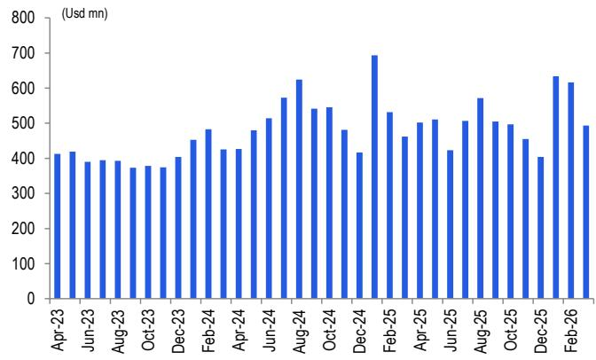  
Figure 6. Tencent domestic mobile game iOS grossing   
Source: SensorTower, Citi Research Estimates, Represents grossing before $30 \%$ share from iOS App Store

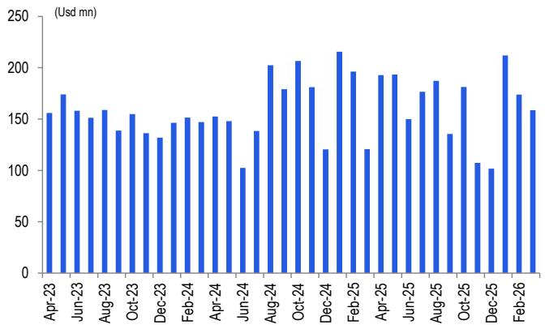  
Figure 7. HoK monthly iOS grossing   
Source: SensorTower, Citi Research Estimates, Represents grossing before $30 \%$ share from iOS App Store

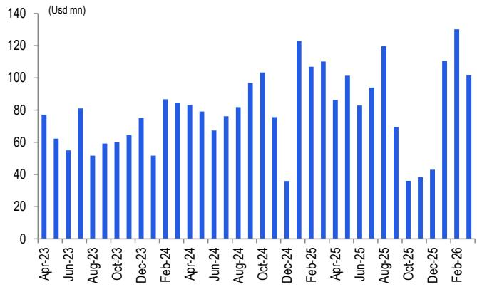  
Figure 8. Peacekeeper Elite monthly iOS grossing   
Source: SensorTower, Citi Research Estimates, Represents grossing before 30% share from iOS App Store

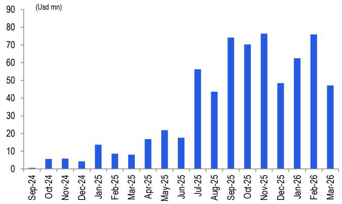  
Figure 9. Delta Force monthly iOS grossing   
Source: SensorTower, Citi Research Estimates, Represents grossing before $30 \%$ share from iOS App Store

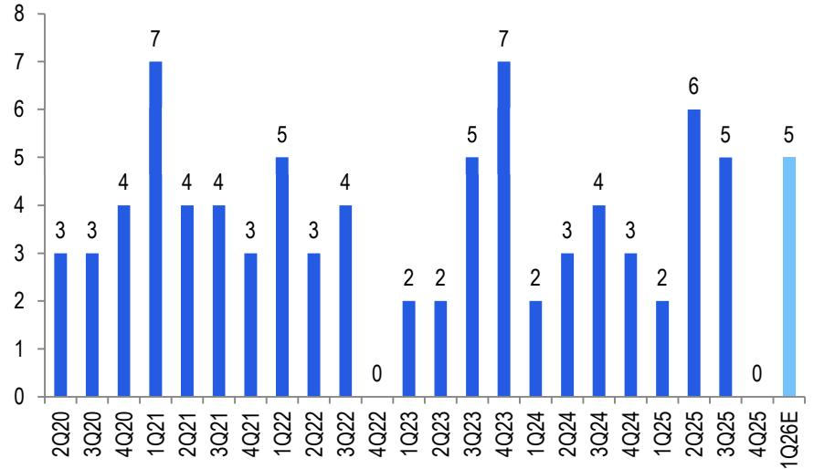  
Figure 10. Number of mobile game launches domestically by quarter   
Source: Company Reports, Citi Research Estimates

Per our tracking, Tencent released 5 domestic titles during 1Q26, comparing with 2 games launched in 1Q25 and nil in 4Q25. This includes: 1) Ni Zhan: Future (“逆战：未 来”), a cross-platform FPS title published on Jan 13; 2) All Star Awakening (“全明星 研报添加微信 LCD123321Cad 04-20 觉醒”), a mobile card game licensing from SNK and was released on Jan 22; 3) the mobile version of a legacy simulation title QQ Farm (“QQ 农场”) was updated on Feb 6; 4) San Guo Zhi Yi Wen Lu (“三国志异闻录”) is a strategy game licensing from Giraffe Game which was published on Mar 17; 5) Roco Kingdom (“洛克王国”) is a casual RPG which was released on Mar 26.

Since pre-installation on Mar 24, Roco Kingdom has topped iOS game download chart in China and currently ranked #2 by iOS game download as of Apr 18, per data.ai tracking. Roco Kingdom once topped iOS game grossing chart in China on Mar 28 and is now ranked within top 10 game grossing chart as of Apr 18.

Figure 11. New games launched by Tencent domestically in 1Q26 and Apr 2026   

<table><tr><td>#English name</td><td>Chinese name</td><td>Developer</td><td>Genre</td><td>Status</td><td>Publishing timeline</td></tr><tr><td>Publishedmobile games</td><td></td><td></td><td></td><td></td><td></td></tr><tr><td>1 Ni Zhan:Future (mobile +PC +console)逆战：未来</td><td></td><td>Tencent</td><td>FPS</td><td>Published</td><td>13-Jan-26</td></tr><tr><td>2 All Star Awakening</td><td>全明星觉醒</td><td>Tencent, SNK</td><td>Board &amp; Card</td><td>Published</td><td>22-Jan-26</td></tr><tr><td>3 QQFarm</td><td>QQ农场</td><td>Tencent</td><td>Simulation</td><td>Published</td><td>6-Feb-26</td></tr><tr><td>4 San Guo Zhi Yi Wen Lu</td><td>三国志异闻录</td><td>Giraffe Game</td><td>Strategy</td><td>Published</td><td>17-Mar-26</td></tr><tr><td>5 Roco Kingdom</td><td>洛克王国</td><td>Tencent</td><td>Casual</td><td>Published</td><td>26-Mar-26</td></tr><tr><td>6 Honorof Kings:World (PC)</td><td>王者荣耀·世界</td><td>Tencent</td><td>RPG</td><td>Published</td><td>10-Apr-26</td></tr><tr><td>7 Honorof Kings: World (mobile)</td><td>王者荣耀世界</td><td>Tencent</td><td>RPG</td><td>Published</td><td>17-Apr-26</td></tr></table>

© 2025 Citigroup Inc. No redistribution without Citigroup’s written permission. Source: Company Reports, data.ai, Citi Research

# HoK: World release and testing update of key new games

Tencent currently has 97 mobile games in the pipeline, 55 of which have already been approved by NPPA, or $57 \%$ of the entire pipeline. Entering 2Q26E, Tencent has already released its flagship title HoK: World and has commenced beta testing for key new games including Monster Hunter Outlanders, Rainbow Six Siege, Animula Nook and Zhe Tian Shi Jie. Below we list out major new games that will be launched within 2026E or might have material influence for Tencent’s online game 研报添加微信revenues in future: LCD123321Cad 04-20

n Honor of Kings: World (“王者荣耀·世界”): HoK: World is a flagship open-world title developed by Tencent’s Timi Studio based on HoK IP. HoK: World has officially released on Apr 10 on PC and Apr 17 on mobile which currently topped iOS game download chart as of Apr 18. On Apr 17, the development team of HoK: World also announced a progress report to implement several in-game optimization including story length, in-game control, audio optimization. Going forward, HoK: World will further optimize its features in mini map, advanced ingame control, PVP anti-cheating mechanism and other customization features.

Monster Hunter Outlanders (“怪物猎人： 旅人”): Monster Hunter Outlanders is an ARPG developed by Timi Studio licensing from Capcom with overseas version being published by Level Infinite. As of Apr 15, global pre-registrations have surpassed 5mn. The title has conducted another round of closed paid beta testing since Apr 2.

n Rainbow Six Siege (“彩虹六号： 攻势”): Rainbow Six Siege is a 5V5 indoor 报添加微信 LCD123321Cad 04-20 tactical shooting game licensed by Ubisoft and will be published by Tencent in China region. On Apr 16, its development team announced Rainbow Six Siege will conduct its first closed beta testing in China in Jun.

Animula Nook (“粒粒的小人国”): Animula Nook is a simulation title to be published by Tencent. The title has recently concluded a large-scale beta testing between Mar 19-30.

n Rewinding Cadence (“归环”): Rewinding Cadence is an ACG open-world title developed by Saroasis Studios under Tencent.

Following PC and mobile launches, HoK: World has conducted several immediately optimization based on gamer feedback and the development team seemed to commit for continued optimization in near-term. Together with its strong social attribute, we believe HoK: World will still have the potential to become one of the evergreen titles within Tencent’s game portfolio and contribute meaningful monetization in its full life cycle. In 2026, we currently model domestic games revs to $+ 9 . 4 \%$ yoy to Rmb179.8bn and forecast international games revs to $+ 1 0 . 0 \%$ yoy 研报添加微信 LCD123321Cad 04-20 to Rmb85.1bn. We model 1Q26 domestic games revs to $+ 1 0 \%$ yoy to Rmb47.2bn and international games revs to $+ 1 6 \%$ to Rmb19.2bn.

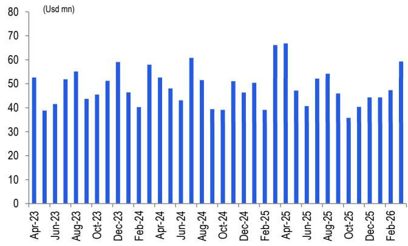  
Figure 12. PUBG Mobile iOS $^ +$ Google Play overseas grossing   
Source: SensorTower, Citi Research Estimates, Represents grossing before $30 \%$ share from iOS and Google Play App Stores

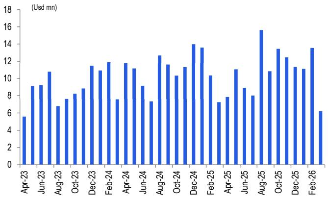  
Figure 13. LoL: Wild Rift iOS $^ +$ Google Play oversea grossing   
Source: SensorTower, Citi Research Estimates, Represents grossing before $30 \%$ share from iOS and Google Play App Stores

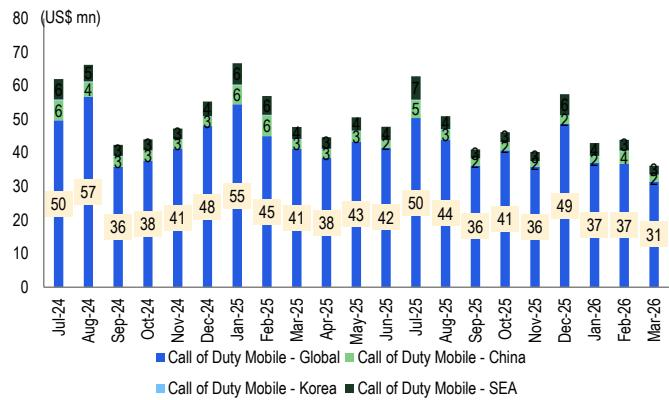  
Figure 14. All-platform grossing of CODM worldwide   
Source: SensorTower, Citi Research Estimates, Represents grossing before $30 \%$ share from iOS and Google Play App Stores, grossing from China represents grossing generated from iOS only

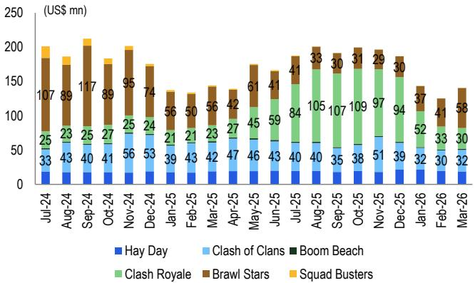  
Figure 15. All-platform grossing of six Supercell titles   
Source: SensorTower, Citi Research Estimates, Represents grossing before $30 \%$ share from iOS and Google Play App Stores

Figure 16. Tencent mobile games pipeline   

<table><tr><td>Newmobilegamepipeline</td><td></td><td></td><td></td><td></td><td></td></tr><tr><td>1Evolution</td><td>失控进化</td><td>Rust</td><td>Survival</td><td>approved</td><td>1-May-26</td></tr><tr><td>2 Chaos Zero Nightmare</td><td>卡厄思梦境</td><td>Tencent, Xiao Ming Tai Ji</td><td>RPG</td><td>approved</td><td>31-May-26</td></tr><tr><td>3 Just Dance: Party</td><td>舞力全开：派对</td><td>Ubisoft</td><td>Music</td><td>na</td><td>17-Jun-26</td></tr><tr><td>4 Iam Nobody</td><td>异人之下</td><td>Tencent</td><td>ARPG</td><td>approved</td><td>2026</td></tr><tr><td>5 The Finals</td><td>终极角逐</td><td>Embark Studios, Nexon</td><td>FPS</td><td>approved</td><td>2026</td></tr><tr><td>6 Lost Records: Bloom &amp; Rage 7 CrossFire: Rainbow (mobile + PC)</td><td>Lost Records: Bloom &amp; Rage</td><td>Don&#x27;t Nod</td><td>RPG</td><td>na</td><td>2026</td></tr><tr><td></td><td>穿越火线：虹</td><td>Tencent</td><td>FPS</td><td>approved</td><td>TBC</td></tr><tr><td>8 Squad (PC) 9 Rewinding Cadence</td><td>战术小队：破晓攻势</td><td>Offworld Industries Saroasis Studios</td><td>FPS</td><td>approved</td><td>TBC</td></tr><tr><td>10 Monster Hunter Outlanders</td><td>归环 怪物猎人：旅人</td><td>Tencent, Capcom</td><td>RPG</td><td>approved</td><td>TBC</td></tr><tr><td>11 Red Alert: Honor</td><td>红警：荣耀</td><td>EA</td><td>ARPG Strategy</td><td>approved approved</td><td>TBC</td></tr><tr><td>12 Path of Exile 2</td><td>流放之路：降临</td><td>Grinding Gear Games</td><td>ARPG</td><td>approved</td><td>TBC TBC</td></tr><tr><td>13 Lineage I Revolution</td><td>天堂&quot;:革命</td><td>NCSoft</td><td>MMORPG</td><td>na</td><td></td></tr><tr><td>14 The First Berserker: Khazan</td><td>地下城与勇士： 卡赞</td><td>Nexon</td><td>ARPG</td><td>na</td><td>TBC TBC</td></tr><tr><td>15 FC Dream Drama</td><td>FC足球梦剧场</td><td>Electronic Arts</td><td>Simulation</td><td>na</td><td>TBC</td></tr><tr><td>16 Zhe Tian Shi Jie</td><td>遮天世界</td><td>Tencent</td><td>RPG</td><td>na</td><td>TBC</td></tr><tr><td>17 Cookie Run: Alliance</td><td>饼干人联盟</td><td>Devsisters</td><td>ARPG</td><td>na</td><td>TBC</td></tr><tr><td>18 Animula Nook</td><td>粒粒的小人国</td><td>Tencent</td><td>Simulation</td><td>approved</td><td>TBC</td></tr><tr><td>19 Rules of Engagement: The Grey State</td><td>灰境行者</td><td>Grey State Studio (Tencent)</td><td>FPS</td><td>na</td><td>TBC</td></tr><tr><td>20 Ragnarok Origin 21 Project: OO</td><td>仙境传说:初心</td><td>Gravity</td><td>MMORPG</td><td>approved</td><td>TBC</td></tr><tr><td>22 Project: Fate</td><td>ProjectOo</td><td>Tencent</td><td>RPG</td><td>na</td><td>TBC</td></tr><tr><td>23 Project: Guofeng</td><td>代号：天命</td><td>Tencent</td><td>Strategy</td><td>na</td><td>TBC</td></tr><tr><td>24 Fate Trigger</td><td>代号：国风</td><td>Tencent</td><td>TBC</td><td>na</td><td>TBC</td></tr><tr><td>25 Light of Motiram</td><td>命运扳机</td><td>Tencent, Saroasis Studios</td><td>TPS</td><td>approved</td><td>TBC</td></tr><tr><td>26 Honor of Kings: Chess</td><td>荒野起源</td><td>Tencent</td><td>Survival</td><td>na</td><td>TBC</td></tr><tr><td>27 Honor of Kings: Dawn</td><td>王者万象棋</td><td>Tencent</td><td>Board&amp;Card</td><td>approved</td><td>TBC</td></tr><tr><td>28 Sword Snow Stride</td><td>王者荣耀星之破晓</td><td>Tencent</td><td>Action</td><td>approved</td><td>TBC</td></tr><tr><td>29 Don&#x27;t Starve:Newhome</td><td>雪中悍刀行</td><td>Tencent</td><td>MMORPG</td><td>approved</td><td>TBC</td></tr><tr><td>30 Uncharted Waters</td><td>饥荒：新家园</td><td>Century Huatong, Klei</td><td>Sandbox</td><td>approved</td><td>TBC</td></tr><tr><td>31 AMortal&#x27;s Journey to Immortality</td><td>大航海时代： 海上霸主</td><td>Koei</td><td>Simulation</td><td>approved</td><td>TBC</td></tr><tr><td>32 Calabiyau</td><td>凡人修仙传： 星海仙途</td><td>Tencent, China Lit</td><td>RPG</td><td>approved</td><td>TBC</td></tr><tr><td>33 Secret Knife</td><td>卡拉彼丘 秘境刀仔</td><td>iDreamSky Tencent</td><td>TPS TBC</td><td>approved approved</td><td>TBC</td></tr><tr><td>34 MT5</td><td>我叫MT5</td><td>Tencent</td><td>MMORPG</td><td>na</td><td>TBC TBC</td></tr><tr><td>35 Chio Hero</td><td>奇奥英雄传</td><td>Gutou Games</td><td>Board&amp; Card</td><td>approved</td><td>TBC</td></tr><tr><td>36 Metal Revolution 37 Interstellar Utopia (mobile + PC)</td><td>金属对决</td><td>Next Studios</td><td>Action</td><td>approved</td><td>TBC</td></tr><tr><td>38 The War of Dragon Stones</td><td>星际理想国</td><td>Pixel Game</td><td>Sandbox</td><td>approved</td><td>TBC</td></tr><tr><td>39 Tian Tian Fei Hu Dui</td><td>龙石战争</td><td>Tencent</td><td>Strategy</td><td>approved</td><td>TBC</td></tr><tr><td>40 Code:To Jin Yong</td><td>天天飞虎队</td><td>Tencent</td><td>TPS</td><td>na</td><td>TBC</td></tr><tr><td>41 Xiu Xian Shi Dai</td><td>代号：致金庸</td><td>Tencent</td><td>MMORPG</td><td>na</td><td>TBC</td></tr><tr><td>42 Phantom Blade Zero</td><td>修仙时代</td><td>Electronic Soul</td><td>RPG</td><td>na</td><td>TBC</td></tr><tr><td>43 Cronos:The New Dawn</td><td>影之刃零</td><td>Soul Frame Game</td><td>ARPG</td><td>na</td><td>TBC</td></tr><tr><td>44 Die Zhen Ying Xiong</td><td>Cronos: The New Dawn</td><td>Bloober Team</td><td>Survival</td><td>na</td><td>TBC</td></tr><tr><td>45 Legends of Runeterra (China)</td><td>叠战英雄 符文大地传说</td><td>Tencent Riot Games</td><td>TBC Board&amp;Card</td><td>approved na</td><td>TBC</td></tr><tr><td>46 Project L</td><td>ProjectL</td><td>Riot Games</td><td>Action</td><td>na</td><td>TBC TBC</td></tr><tr><td>47 Project F</td><td>Project F</td><td>Riot Games</td><td>TBC</td><td>na</td><td>TBC</td></tr><tr><td>48 Hunting 49 Handmade Planet</td><td>狩</td><td>Tencent</td><td>TBC</td><td>approved</td><td>TBC</td></tr><tr><td>50 Chuanqi Tianxia</td><td>手工星球</td><td>Tencent</td><td>Sandbox</td><td>approved</td><td>TBC</td></tr><tr><td>51 The Division Resurgence</td><td>传奇天下</td><td>Shengqu Games</td><td>MMORPG</td><td>approved</td><td>TBC</td></tr><tr><td>52Assassin&#x27;s Creed Jade</td><td>全境封锁：曙光</td><td>Ubisoft</td><td>TPS</td><td>approved</td><td>TBC</td></tr><tr><td>53 Heroes of Might and Magic</td><td>刺客信条：侠隐</td><td>Ubisoft, Tencent</td><td>ARPG</td><td>approved</td><td>TBC</td></tr><tr><td>54 Rainbow Six Siege</td><td>魔法门之英雄无敌：领主争霸</td><td>Ubisoft</td><td>Strategy</td><td>approved</td><td>TBC</td></tr><tr><td>55 New Eternal Love</td><td>彩虹六号：攻势</td><td>Ubisoft</td><td>FPS</td><td>approved</td><td>TBC</td></tr><tr><td>56 Haikyu!!Fly High</td><td>新三生三世十里桃花</td><td>Tencent</td><td>Board&amp;Card</td><td>approved</td><td>TBC</td></tr><tr><td>57 Guardians of the Dafeng</td><td>排球少年：新的征程</td><td>KLab, Changyou,Prophet Games Sports</td><td></td><td>approved</td><td>TBC</td></tr><tr><td>58 Yan Wu</td><td>大奉打更人 偃武</td><td>Tencent Tencent</td><td>MMORPG Strategy</td><td>approved approved</td><td>TBC</td></tr><tr><td>59 Legends of the Wild</td><td>荒野国度</td><td>Whynot Games</td><td>Strategy</td><td>approved</td><td>TBC</td></tr><tr><td>60 Star Era</td><td>群星纪元</td><td>Tencent</td><td>Strategy</td><td>na</td><td>TBC</td></tr><tr><td>61 Slay the Spire</td><td>尖塔奇兵</td><td>Mega Crit Games</td><td>Board&amp;Card</td><td>approved</td><td>TBC TBC</td></tr><tr><td>62 New Nobunaga&#x27;s Ambition</td><td>新信長之野望</td><td>Koei</td><td>Strategy</td><td>na</td><td>TBC</td></tr><tr><td>63The Three Kingdoms</td><td>乱世逐鹿</td><td>Tencent</td><td>Strategy</td><td>approved</td><td>TBC</td></tr><tr><td>64Wu Dong Ji Guang</td><td>舞动极光</td><td>Tencent</td><td>Music</td><td>na</td><td>TBC</td></tr><tr><td>65 Ace Force 2 66 Storyof Seasons</td><td>王牌战士2</td><td>Tencent</td><td>FPS</td><td>approved na</td><td>TBC TBC</td></tr><tr><td>67 The Great Ruler 68 Kindlings of Civilization</td><td>牧场物语 大主宰：大干世界</td><td>Tencent, Marvelous Tencent</td><td>Simulation MMORPG</td></table>

© 2025 Citigroup Inc. No redistribution without Citigroup’s written permission. Source: Company Reports, NPPA, data.ai, Citi Research

# PC games performance

# LoL PC will launch season 2 for 2026 season on Apr 29

LoL PC will soon launch season 2 of 2026 season on Apr 29, featuring new storyline, masteries change and new themed skins. Split 2 of major LoL tournaments has already started, including LCK on Apr 1, LPL, LCP and LCS on Apr 4, LEC and CBLOL on Mar 28. For international tournaments, LoL will hold Mid-Season Invitational (MSI) held in South Korea between Jun 26-Jul 12.

# Nexon 1Q26 guidance

Nexon will report 1Q26 on May 14. To recap during 4Q25 results call, Nexon guided 1Q26 China revs to be JPY33.44bn-38.80bn, representing $- 1 1 \%$ to $+ 3 \%$ yoy or $- 1 7 \%$ to $- 4 \%$ yoy on constant currency. For DnF Mobile, management expects revenues to remain roughly flattish sequentially while incurring yoy decline. The company also shared that the next release of co-developed content with Tencent is scheduled for 2026. For DnF PC, management expects yoy revenue growth driven by CNY updates.

# Tencent Video

Based on the data for 1Q26, Tencent Video held a strong position with five programs ranking in the top 10 for dramas. It co-broadcast the No. 1 drama, "Pursuit of Jade" and exclusively aired "Shine on Me", which ranked No. 5.

For variety shows, Tencent Video also had a significant presence, with six programs in the top 10. Notably, it exclusively broadcast "Natural High Season 3" and "Live 研报添加微信 LCD123321Cad 04-20 and Love Season 2", which ranked No. 5 and No. 6, respectively, according to Enlightent Data.

Figure 17. 1Q26 top 10 dramas and variety shows   
Top 10 dramas   

<table><tr><td>Rank</td><td>Program Name</td><td>Program Name</td><td>Viewership (mn)</td><td>Broadcasting Platform(s)</td></tr><tr><td>1</td><td>逐玉</td><td>Pursuit of Jade</td><td>2640</td><td>iQiyi,Tencent Video</td></tr><tr><td>2</td><td>罚罪2</td><td>The Punishment 2</td><td>1320</td><td>iQiyi</td></tr><tr><td>3</td><td>太平年</td><td> Swords Into Plowshares</td><td>960</td><td> iQiyi, Mango,Tencent Video</td></tr><tr><td>4</td><td>康熙奇案之青宫风鸣</td><td> Kangxi&#x27;s Strange Cases: Cry of the Blue Palace 850</td><td></td><td>Youku</td></tr><tr><td>5</td><td>骄阳似我</td><td> Shine on Me</td><td>810</td><td>Tencent Video</td></tr><tr><td>6</td><td>成何体统</td><td>How Dare You!?</td><td>700</td><td>iQiyi</td></tr><tr><td>7</td><td>逍遥</td><td>The Unclouded Soul</td><td>660</td><td> iQiyi, Youku</td></tr><tr><td>8</td><td>小城大事</td><td>The Dream Maker</td><td>640</td><td>Tencent Video</td></tr><tr><td>9</td><td>玉茗茶香</td><td>Glory</td><td>610</td><td>Mango</td></tr><tr><td>10</td><td>纯真年代的爱情</td><td>Love Story in the 1970s</td><td>590</td><td>Tencent Video</td></tr></table>

Top 10 variety shows   

<table><tr><td>Rank</td><td>ProgramName</td><td>ProgramName</td><td>Viewership (mn)</td><td>Broadcasting Platform(s)</td></tr><tr><td></td><td>宇宙闪烁请注意</td><td>Wander Together</td><td>340</td><td>iQIYI</td></tr><tr><td>2</td><td>大侦探第十一季</td><td> Who&#x27;s the Murderer Season 11</td><td>190 1 4</td><td> Mango TV</td></tr><tr><td>3</td><td>奔跑吧·天路篇</td><td>Keep Running: Tianlu Chapter</td><td>170</td><td>iQIYI, Tencent Vdeo, Youku</td></tr><tr><td>4</td><td>你好，星期六2026</td><td>Hello Saturday 2026</td><td>150</td><td>Mango TV</td></tr><tr><td>5</td><td>现在就出发第3季</td><td> Natural High Season 3</td><td>120</td><td>Tencent Video</td></tr><tr><td>6</td><td>势均力敌的我们第2季</td><td>Live and Love Season 2</td><td>91</td><td>Tencent Video</td></tr><tr><td>7</td><td>快乐老友·有风季</td><td> Happy for Today: Windy Season</td><td>89</td><td> Mango TV</td></tr><tr><td>8</td><td>奔跑吧第9季</td><td> Keep Running Season 9</td><td>88</td><td>iQIYI, Tencent Video, Youku</td></tr><tr><td>9</td><td>主咖和Ta的朋友们</td><td>The Main Show and His Friends</td><td>80</td><td>Tencent Video</td></tr><tr><td>10</td><td>王牌对王牌第9季</td><td>Ace vs.Ace Season 9</td><td>74</td><td>iQIYI,Tencent Vdeo,Youku</td></tr></table>

$\circledcirc$ 2026 Citigroup Inc. No redistribution without Citigroup’s written permission. Source: Citi Research, Enlightent Data

# Tencent Video launched WorkRally

As reported by Geekpark News (link, 16 Apr), Tencent Video has launched WorkRally, an industrial-grade AI platform designed to streamline the production of animated dramas. The system addresses common challenges in AI-assisted animation, such as inconsistent generation results, a lack of logical coherence in character expressions and camera work, and inefficient, fragmented workflows. WorkRally integrates the entire production pipeline, from script analysis and storyboarding to asset management and final rendering. Its core features include an AI agent that understands narrative context to ensure consistency, and an automated pipeline to manage tasks and collaboration. The platform aims to lower the technical barrier for creators, improve the visual quality of the output, and increase the overall efficiency of producing high-quality animated content.

# 1Q26 payment and consumption trend

Per Xinhua News (link, 8 Apr), according to data from China's National Development and Reform Commission's Big Data Development Department, offline consumption payment value increased by $3 . 4 \%$ year-over-year, accelerating 2.2 percentage points from the previous quarter, driven by a $5 . 2 \%$ rise in goods consumption, particularly in electronics $( + 1 0 . 7 \% )$ and home appliances $( + 8 . 4 \% )$ .

Service consumption also grew by $0 . 9 \%$ , with transportation and catering services increasing by $6 . 9 \%$ and $4 . 5 \%$ , respectively. Officials attribute this robust consumer demand to targeted policies, such as those promoting trade-ins for consumer goods, and expect the market to continue improving in both volume and quality. In parallel, investment saw positive momentum, with the contract value for projects 研报添加微信 LCD123321Cad 04-20 related to computing power infrastructure and software/hardware development growing by $4 . 7 \%$ year-over-year.

# Buyback update till Apr 9 (US\$1.3bn in 2026 YTD)

From 4Q25 print in mid-Mar to mid-Apr 2026 before the blackout, Tencent had repurchased 7.61mn shares for a total consideration of $\mathsf { H K S 3 . 8 b n }$ or $\cup \mathsf { S } \$ 482\mathsf { m n }$ within 8 trading days, implying average cost per share of $\mathsf { H K S 4 9 7 . 1 }$ . The total buyback amount is lower than last period (from 3Q25 print to prior to 4Q25 blackout mid-Nov 2025 to mid-Jan 2026) where a total of $4 1 . 4 8 \mathsf { m n }$ shares for a total consideration of $\mathsf { H K } \$ 25.506 \mathsf { n }$ or $\cup \ S \$ 3.2$ bn, implying average cost per share of $\mathsf { H K S 6 1 4 . 7 }$ which we view as typical during this shorter buyback window between 4Q and 1Q print. In 1Q26, we reconcile Tencent bought back a total of $1 7 . 8 1 \mathsf { m n }$ shares for a total consideration of $\mathsf { U S S 1 . 3 b n }$ or HK\$10.1bn.

Figure 18. Tencent Share Buyback   

<table><tr><td>Date</td><td>Number of shares Highest price (HKD) Lowest price (HKD)</td></tr><tr><td>Apr-2026</td><td>5,161,000 515</td></tr><tr><td>Mar-2026 2,445,000</td><td>506 476</td></tr><tr><td>Jan-2026</td><td>10,205,000 638</td></tr><tr><td>Dec-2025 22,040,000</td><td>626 593</td></tr><tr><td>Nov-2025</td><td>9.232,000321Cad 64120 607</td></tr><tr><td>Oct-2025 4,916,000</td><td>683 648</td></tr><tr><td>Sep-2025 19,152,000</td><td>667 591</td></tr><tr><td>Aug-2025 9,191,000</td><td>620 583</td></tr><tr><td>Jul-2025 7,017,000</td><td>508 493</td></tr><tr><td>Jun-2025 20,669,000</td><td>521 490</td></tr><tr><td>May-2025 9,784,000</td><td>524 496</td></tr><tr><td>Apr-2025 8,430,000</td><td>511 420</td></tr><tr><td>Mar-2025 5,924,000</td><td>518 495</td></tr><tr><td>Jan-2025 37,060,000</td><td>425 365</td></tr></table>

Source: Company Reports, Citi Research

# Estimates revision

For 1Q26, we slightly tweak up international gaming revs and tweak down domestic gaming revs to reflect continued strength and deferred revs recognition of 研报添加微信 LCD123321Cad 04-20 international games while later CNY this year could affect the revs recognition of strong grossing receipt generated during CNY period. In the meantime, we also model up higher opex to reflect AI spend. In summary, our 1Q26 revs and non-GAAP net profit is revised by $+ 0 . 5 \% / - 0 . 5 \%$ .

We now model international gaming revs to $+ 1 6 \%$ yoy vs previously at $+ 9 \%$ and model domestic gaming revs to $+ 1 0 \%$ yoy vs previously at $+ 1 1 \%$ yoy. We left other revs assumption unchanged.

For 2026-2028, we have tweaked total revs and non-GAAP net profit by $+ 0 . 7 \%$ - $1 . 3 \%$ , $+ 0 . 6 \%$ /- $2 . 2 \%$ and $+ 0 . 5 \% / - 1 . 6 \%$ .

Figure 19. Citi estimate revisions   

<table><tr><td></td><td colspan="3">Netrevenues(Rmb m)</td><td colspan="3">Non-GAAP NetProfit (Rmb m)</td><td colspan="3">Non-GAAP Diluted EPS (Rmb)</td></tr><tr><td>Rmb (mn except pershare data)</td><td>Old</td><td>New</td><td>%Chg</td><td>Old</td><td>New</td><td>% Chg</td><td>Old</td><td>New</td><td>% Chg</td></tr><tr><td>1Q26E</td><td>196,981</td><td>197,910</td><td>0.5%</td><td>67,608</td><td>67,271</td><td>-0.5%</td><td>7.32</td><td>7.28</td><td>-0.5%</td></tr><tr><td>2Q26E</td><td>200.961</td><td>202.034</td><td>0.5%</td><td>69.959</td><td>69,010</td><td>-1.4%</td><td>7.58</td><td>7.47</td><td>-1.4%</td></tr><tr><td>2026E</td><td>816,518</td><td>821,871</td><td>0.7%</td><td>281,464</td><td>277,880</td><td>-1.3%</td><td>30.48</td><td>30.09</td><td>-1.3%</td></tr><tr><td>2027E</td><td>889,082</td><td>894,147</td><td>0.6%</td><td>315,624</td><td>308,746</td><td>-2.2%</td><td>34.19</td><td>33.44</td><td>-2.2%</td></tr><tr><td>2028E</td><td>961,469</td><td>966,395</td><td>0.5%</td><td>346,716</td><td>341,075</td><td>-1.6%</td><td>37.56</td><td>36.95</td><td>-1.6%</td></tr><tr><td colspan="10">@2026 Citigroup Inc.Noredistribution without Citigroup&#x27;s writtenpermission Source: Citi Research Estimates</td></tr></table>

Figure 20. Citi detail revenues estimates revision   

<table><tr><td></td><td colspan="3">1Q26E</td><td colspan="3">2Q26E</td><td colspan="3">2026E</td><td colspan="3">2027E</td><td colspan="3">2028E</td></tr><tr><td>Rmb (mn)</td><td>Old 65,713</td><td>New 66,446</td><td>%Chg 1.1%</td><td>Old</td><td>New 65.308</td><td>%Chg</td><td>Old</td><td>New 264,810</td><td>%Chg</td><td>Old</td><td>New 286,343</td><td>%Chg 1.4%</td><td>Old 304,113</td><td>New 308.002</td><td>% Chg</td></tr><tr><td>Total online games</td><td></td><td></td><td></td><td>64,461</td><td></td><td>1.3%</td><td>260,584</td><td></td><td>1.6%</td><td>282,344</td><td></td><td></td><td></td><td></td><td>1.3%</td></tr><tr><td>yoy growth rate %</td><td>10.4%</td><td>11.7%</td><td></td><td>8.9%</td><td>10.3%</td><td></td><td>7.9%</td><td>9.6%</td><td></td><td>8.4%</td><td>8.1%</td><td></td><td>7.7%</td><td>7.6%</td><td></td></tr><tr><td>PC gaming</td><td>12,412</td><td>12,412</td><td>0.0%</td><td>11,973</td><td>11.973</td><td>0.0%</td><td>49,524</td><td>49.524</td><td>0.0%</td><td>49,296</td><td>49,296</td><td>0.0%</td><td>49,106</td><td>49,106</td><td>0.0%</td></tr><tr><td>Mobile gaming</td><td>53.301</td><td>54,034</td><td>1.4%</td><td>52,487</td><td>53,335</td><td>1.6%</td><td>211,060</td><td>215,286</td><td>2.0%</td><td>233.048</td><td>237,047</td><td>1.7%</td><td>255,007</td><td>258,896</td><td>1.5%</td></tr><tr><td>Smartphone games</td><td>70,270</td><td>71,248</td><td>1.4%</td><td>69,201</td><td>70,330</td><td>1.6%</td><td>278,313</td><td>283.947</td><td>2.0%</td><td>307,862</td><td>313,194</td><td>1.7%</td><td>337,364</td><td>342,55</td><td>1.5%</td></tr><tr><td>yoy growth rate %</td><td>22.%</td><td>24.3%</td><td></td><td>17.6%</td><td>19.5%</td><td></td><td>17.3%</td><td>19.7%</td><td></td><td>10.6%</td><td>10.3%</td><td></td><td>9.6%</td><td>9.4%</td><td></td></tr><tr><td>Domestic Games</td><td>47,619</td><td>47,190</td><td>-0.9%</td><td>44,157</td><td>44,440</td><td>0.6%</td><td>178,598</td><td>179,752</td><td>0.6%</td><td>191.092</td><td>192,569</td><td>0.8%</td><td>204,722</td><td>206,049</td><td>0.6%</td></tr><tr><td>yoy growth rate %</td><td>11.0%</td><td>10.0%</td><td></td><td>9.3%</td><td>10.0%</td><td></td><td>8.7%</td><td>9.4%</td><td></td><td>7.0%</td><td>7.1%</td><td></td><td>7.1%</td><td>7.0%</td><td></td></tr><tr><td>Intermational Games</td><td>18,094</td><td></td><td></td><td>Urnnuny-reg:uvu tccitnv-prvuuvLrv pipcc,irv- 0&#x27; 2.8%</td><td></td><td></td><td></td><td></td><td></td><td></td><td></td><td></td><td>99,393</td><td>101,953</td><td>2.6%</td></tr><tr><td>yoy growth rate %</td><td>9.0%</td><td></td><td></td><td></td><td></td><td></td><td></td><td></td><td></td><td></td><td></td><td></td><td>8.9%</td><td>8.7%</td><td></td></tr><tr><td>Total communityand platform</td><td></td><td></td><td>订阅</td><td></td><td></td><td></td><td></td><td></td><td></td><td></td><td></td><td></td><td>142,957</td><td>143,995</td><td></td></tr><tr><td>yoy growth rate%</td><td>32,669</td><td></td><td></td><td></td><td></td><td></td><td></td><td></td><td></td><td></td><td></td><td></td><td>4.7%</td><td>4.6%</td><td>0.7%</td></tr><tr><td>Communityandopenplatforms</td><td>0.1% 18,655</td><td>14.20</td><td>u.0%</td><td></td><td></td><td></td><td></td><td></td><td></td><td></td><td></td><td>0.0%</td><td>75,605</td><td>75.605</td><td>0.0%</td></tr><tr><td>Non-mobile game</td><td>14,014</td><td></td><td>1.4%</td><td>13,800</td><td>14,026</td><td>1.6%</td><td>55,503</td><td>56,629</td><td>2.0%</td><td>61,532</td><td>62,599</td><td>1.7%</td><td>67,353</td><td>68,390</td><td>1.5%</td></tr><tr><td>Online advertising</td><td>37,263</td><td>37,263</td><td>0.0%</td><td>41,807</td><td>41,807</td><td>0.0%</td><td>169,374</td><td>169,374</td><td>0.0%</td><td>193,959</td><td>193,959</td><td>0.0%</td><td>218,283</td><td>218,283</td><td>0.0%</td></tr><tr><td>yoy growth rate %</td><td>17.0%</td><td>17.0%</td><td></td><td>16.9%</td><td>16.9%</td><td></td><td>16.8%</td><td>16.8%</td><td></td><td>14.5%</td><td>14.5%</td><td></td><td>12.5%</td><td>12.5%</td><td></td></tr><tr><td>Others</td><td>61,336</td><td>61,336</td><td>0.0%</td><td>62,331</td><td>62.331</td><td>0.0%</td><td>257,165</td><td>257,165</td><td>0.0%</td><td>276,186</td><td>276,186</td><td>0.0%</td><td>296,115</td><td>296,115</td><td>0.0%</td></tr><tr><td>yoy growth rate %</td><td>9.5%</td><td>9.5%</td><td></td><td>8.6%</td><td>8.6%</td><td></td><td>8.3%</td><td>8.3%</td><td></td><td>7.4%</td><td>7.4%</td><td></td><td>7.2%</td><td>7.2%</td><td></td></tr><tr><td>Fintechand Business services</td><td>59,574</td><td>59,574</td><td>0.0%</td><td>60,534</td><td>60,534</td><td>0.0%</td><td>249,207</td><td>249,207</td><td>0.0%</td><td>268,072</td><td>268,072</td><td>0.0%</td><td>287.842</td><td>287,842</td><td>0.0%</td></tr><tr><td>yoy growth rate %</td><td>8.5%</td><td>8.5%</td><td></td><td>9.0%</td><td>9.0%</td><td></td><td></td><td>8.6%</td><td></td><td>7.6%</td><td>7.6%</td><td></td><td>7.4%</td><td>7.4%</td><td></td></tr><tr><td>Cloud revs</td><td>12,538</td><td>12,538</td><td>0.0%</td><td>14,019</td><td>14,019</td><td>0.0%</td><td>8.6%</td><td>59,445</td><td>0.0%</td><td>69.688</td><td>69,688</td><td>0.0%</td><td>79.668</td><td>79.668</td><td>0.0%</td></tr><tr><td>yoy growth rate %</td><td>25.0%</td><td>25.0%</td><td></td><td>24.0%</td><td>24.0%</td><td></td><td>59,445 22.8%</td><td>22.8%</td><td></td><td>17.2%</td><td>17.2%</td><td></td><td>14.3%</td><td>14.3%</td><td></td></tr><tr><td>Totalrevenues</td><td>196,981</td><td></td><td>0.5%</td><td></td><td>202,034</td><td>0.5%</td><td></td><td></td><td>0.7%</td><td></td><td>894,147</td><td>0.6%</td><td>961,469</td><td></td><td>0.5%</td></tr><tr><td>yoy growth rate%</td><td>9.4%</td><td>197,910 9.9%</td><td></td><td>200,961 8.9%</td><td>9.5%</td><td></td><td>816,518 8.6%</td><td>821.871 9.3%</td><td></td><td>889,082 8.9%</td><td>8.8%</td><td></td><td>8.1%</td><td>966,395 8.1%</td><td></td></tr><tr><td></td><td></td><td></td><td></td><td></td><td></td><td>0.6%</td><td>461,968</td><td>465,238</td><td>0.7%</td><td>509,845</td><td>512,963</td><td>0.6%</td><td>555,031</td><td>558,071</td><td>0.5%</td></tr><tr><td>Gross profit yoy growth rate %</td><td>110,636 10.1%</td><td>111,200 10.7%</td><td>0.5%</td><td>114,574 9.1%</td><td>115,228 9.7%</td></table>

Source: Bloomberg, Citi Research Estimates

Figure 21. Citi estimates vs Bloomberg consensus   

<table><tr><td></td><td colspan="3">Total revenues (RMB m)</td><td colspan="3">Non-GAAP Net Profit (RMB m)</td><td colspan="3">Non-GAAP Diluted EPADS (RMB)</td></tr><tr><td>RMB m (except per share data)</td><td>Citi</td><td>Consensus</td><td>% Dif</td><td></td><td>Consensus</td><td>%Chg</td><td>Citi</td><td>Consensus</td><td>% Chg</td></tr><tr><td>1Q26E</td><td>197,910</td><td>199,031</td><td>-0.6%</td><td>67,271</td><td>67,528</td><td>-0.4%</td><td>7.28</td><td>7.48</td><td>-2.7%</td></tr><tr><td>2Q26E</td><td>202.034</td><td>204,178</td><td>-1.1%</td><td>69,010</td><td>69,638</td><td>-0.9%</td><td>7.47</td><td>7.63</td><td>-2.1%</td></tr><tr><td>2026E</td><td>821,871</td><td>830,931</td><td>-1.1%</td><td>277,880</td><td>280,868</td><td>-1.1%</td><td>30.09</td><td>30.60</td><td>-1.7%</td></tr><tr><td>2027E</td><td>894,147</td><td>914,098</td><td>-2.2%</td><td>308,746</td><td>310,789</td><td>-0.7%</td><td>33.44</td><td>34.25</td><td>-2.4%</td></tr><tr><td>2028E</td><td>966,395</td><td>998,355</td><td>-3.2%</td><td>341,075</td><td>344,440</td><td>-1.0%</td><td>36.95</td><td>37.93</td><td>-2.6%</td></tr></table>

$\circledcirc$ 2025 Citigroup Inc. No redistribution without Citigroup’s written permission. Source: Bloomberg, Citi Research Estimates

# 1Q26E Preview

# 订阅

Tencent will report 1Q26 results after HK market close on May $1 3 ^ { \mathrm { t h } }$ .

Total revs and net profit – We model 1Q26 total revs to up $9 . 9 \%$ yoy to Rmb197.9bn and non-GAAP net profit to $+ 9 . 7 \%$ yoy to Rmb67.2bn or $34 \%$ margin, vs. Bloomberg consensus of Rmb199bn $( + 1 0 . 6 \%$ yoy) and Rmb67.5bn ( $34 \%$ margin).

n VAS and games – We forecast total VAS $+ 7 . 8 \%$ yoy to Rmb99.3bn with total 报添加微online games $+ 1 1 . 7 \%$ CD123321Cad 04-20  yoy to Rmb66.4bn and community and platform revs $+ 0 . 7 \%$ yoy to Rmb32.9bn.

Domestic vs international games – We forecast domestic games to $+ 1 0 \%$ yoy to Rmb47.2bn driven by solid performance of HoK, Peacekeeper, Delta Force and model International games $+ 1 6 \%$ yoy to Rmb19.3bn attributed to PUBG Mobile and Valorant.

Advertising – We model online ad revs $+ 1 7 \%$ yoy to Rmb37.3bn benefited from new ad load in Video Account and better eCPM on the back of continued AI improvement.

Fintech and business services – We model FBS revs up $8 . 5 \%$ yoy to Rmb59.6bn, of which cloud revs $+ 2 5 \%$ yoy to Rmb12.5bn and fintech revs $+ 4 . 8 \%$ yoy to Rmb47bn.

# 订阅

Margins – We model total gross margin of $5 6 . 2 \%$ , vs. $5 5 . 7 \%$ in 4Q25 and $5 5 . 8 \%$ in 1Q25. We forecast VAS, online ad and FBS gross margins at $6 0 . 7 \%$ , $5 7 \%$ and $51 \%$ , vs $5 9 . 5 \%$ , $5 9 . 7 \%$ and $5 0 . 7 \%$ in 4Q25. We forecast non-GAAP OpM of $3 5 . 2 \%$ , vs. $3 5 . 8 \%$ in the last quarter and $3 8 . 5 \%$ in 1Q25.

Net profit and margins – We model GAAP profit of Rmb56.5bn $2 9 \%$ margin) and non-GAAP net profit of Rmb67.3bn or EPS of Rmb7.28 $( + 9 . 7 \%$ yoy or $34 \%$ net margins) vs Bloomberg consensus of Rmb67.5bn or Rmb7.48/share.

Expectation: We expect Tencent to report results relatively in line with our/consensus estimates with potential small deviation on upside risk to our gaming forecast. More important, the comment on AI strategy and capex spend will be the focus for the call.

Focus on the call: 1) traction of HY 3 and latest thoughts on upcoming AI agent on WeChat; 2) cloud demand and competitive landscape in models and token usage; 3) capex spend and AI expenses; 4) upcoming new games release; 5) advertising sentiment, ad load update and traction on Weixin AI search; 6) shareholder return on buyback.

# 2Q26E outlook

We now model 2Q26 total revs to up $9 . 5 \%$ yoy to Rmb202bn and non-GAAP NP to $+ 9 . 4 \%$ yoy to Rmb69bn $( 3 4 . 2 \%$ margin) vs Bloomberg consensus of Rmb204.2bn $+ 1 0 . 7 \%$ yoy) and Rmb69.6bn ( $34 \%$ margin).

# Maintain Buy and raise TP to HK\$783

Following estimates adjustment, we adjust our TP to $\mathsf { H K S 7 8 3 }$ (from $\mathsf { H K S 7 8 7 }$ ), based on 2027 estimates. Our TP implies $_ { 2 3 . 2 \times }$ 2026E and ${ \sim } 2 0 . 9 \times$ 2027E P/E.

Online games – We apply $1 2 \times \mathsf { P } / \mathsf { E }$ (unchanged) to 2027E estimated games net profit of Rmb136bn and yield a valuation of $\mathsf { H K$ 19 5 }$ per share or $2 5 \%$ of our target price.

Online advertising – We apply $2 2 \times \mathsf { P } / \mathsf { E }$ (unchanged) to 2027E estimated ads profit of Rmb82.4bn and yield a valuation of $H K \$ 217$ per share or $2 8 \%$ of target price.

# 报添加微信 LCD123321Cad 04-20

n Social network – While we attribute the non-gaming revs (community platform revs) as overall social network revs, given the WeChat, QQ and other Tencent apps, we apply $\mathsf { 2 5 x }$ (unchanged) P/E to the estimated profit of Rmb63bn and yield a valuation of $\mathsf { H K S 1 9 0 }$ per share or $24 \%$ of target price.

n Fintech – We apply $1 5 \times P / E$ to estimated profit of Rmb48.4bn and yield a valuation of $\mathsf { H K S 8 7 }$ per share or $1 1 \%$ of target price.

Cloud/business services – We apply $5 \times \mathsf { P } / \mathsf { S }$ (average of China peers) to 2027E estimated Business services revs of Rmb69.7bn and yield a valuation of $H \ K \$ 42$ per share or $5 \%$ of target price.

n Investment portfolio – We apply $30 \%$ discount to equity stake in publicly listed investment portfolio and result to $\mathsf { H K$ 5 5 3 }$ /share or $7 \%$ of target price.

Into 2Q26, we believe share price performance will be affected by the feedback and traction from upcoming release of HY3, subsequent progress of agentic AI within WeChat ecosystem and any potential disruptive forces from competition as well as grossing performance of HoK World and other new game release.

We maintain our Buy rating given attractive valuation and out belief and confident that HY3 and WeChat agentic AI should strengthen Tencent’s AI positioning.

Figure 22. SOTP valuation of Tencent   

<table><tr><td></td><td>Revenuesin 2027E (Rmb mn)</td><td>Non-GAAP Profit in 2027E (Rmb mn)</td><td>PEMultiple (P/S for Cloud)</td><td>Valuation (HK$ mn) Value Per Share (HK$)</td><td>Valuation (Us$ mn)</td><td>%of implied value</td></tr><tr><td>Online gaming</td><td>286,343</td><td>136,013</td><td>12</td><td>1,804,590</td><td>195 217</td><td>227,735</td></tr><tr><td>Online advertising</td><td>193,959</td><td>82.433</td><td></td><td>2,005,116</td><td></td><td>25%</td></tr><tr><td>Social Network (WeChat + QQ)</td><td>137,659</td><td>63.323</td><td></td><td>1,750,335</td><td>253,041 220,888</td><td>28% 24%</td></tr><tr><td>Fintech</td><td>198,384</td><td>48,356</td><td></td><td>801,973</td><td>101,207</td><td>11%</td></tr><tr><td>Cloud (business services)</td><td>69,688</td><td>6,272</td><td></td><td>385,251</td><td>48,618</td><td>5%</td></tr><tr><td>Other business</td><td>8,114</td><td>(27,651)</td><td></td><td></td><td>62,122</td><td>0%</td></tr><tr><td>Investment Portfolio (at 30% discount)</td><td></td><td></td><td></td><td>486,514</td><td>913,610</td><td>7% 100%</td></tr><tr><td>Total</td><td>894,147</td><td>308,746</td><td></td><td>7,233,779</td><td></td><td></td></tr></table>

Source: Citi Research Estimates

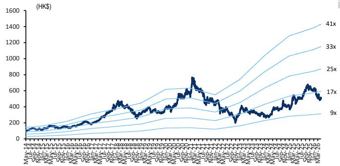  
Figure 23. Tencent – Forward PE   
Source: dataCentral, Citi Research

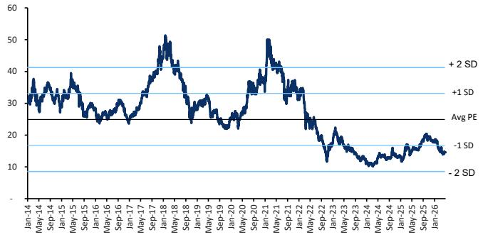  
Figure 24. Tencent – PE Band   
Source: dataCentral, Citi Research

Figure 25. Income statement   

<table><tr><td>Yearto 31Dec (Rmb mn)</td><td>2025</td><td>1Q26E</td><td>2Q26E</td><td>3Q26E</td><td>4Q26E</td><td>2026E</td><td>2027E</td><td>2028E</td></tr><tr><td>Revenues</td><td></td><td></td><td></td><td></td><td></td><td></td><td></td><td></td></tr><tr><td>VAS</td><td>369,281</td><td>99,311</td><td>97,896</td><td>102,959</td><td>95,167</td><td>395,332</td><td>424,002</td><td>451,997</td></tr><tr><td>Total online games</td><td>241,600</td><td>66,446</td><td>65,308</td><td>69,434</td><td>63,622</td><td>264,810</td><td>286,343</td><td>308,002</td></tr><tr><td>- Domestic Games</td><td>164,300</td><td>47,190</td><td>44,440</td><td>46,866</td><td>41,256</td><td>179,752</td><td>192,569</td><td>206,049</td></tr><tr><td>- International Games</td><td>77,300</td><td>19,256</td><td>20,868</td><td>22,568</td><td>22,366</td><td>85,058</td><td>93,773</td><td>101,953</td></tr><tr><td>Total community and platform</td><td>127,681</td><td>32,864</td><td>32,588</td><td>33,525</td><td> 31,545</td><td>130,522</td><td>137,659</td><td>143,995</td></tr><tr><td>Online advertising</td><td>144,973</td><td>37,263</td><td>41,807</td><td>42,116</td><td>48,188</td><td>169,374</td><td>193,959</td><td>218,283</td></tr><tr><td>Media advertising</td><td>开19.052 T</td><td>4,390</td><td>4,488</td><td>4,348</td><td>5,410</td><td>18,636</td><td>19,073</td><td>19,521</td></tr><tr><td>Social and others advertising</td><td>125,921</td><td>32,874</td><td>37,318</td><td>37,768</td><td>42,778</td><td>150,738</td><td>174,886</td><td>198,762</td></tr><tr><td>Others</td><td>237,512</td><td>61.336</td><td>62.331</td><td>65,126</td><td>68.371</td><td>257,165</td><td>276,186</td><td>296,115</td></tr><tr><td>Total revenues</td><td>751,766</td><td>197,910</td><td>202,034</td><td>210,201</td><td>211,726</td><td>821,871</td><td>894,147</td><td>966,395</td></tr><tr><td>YoY change</td><td>13.9%</td><td>9.9%</td><td>9.5%</td><td>9.0%</td><td>8.9%</td><td>9.3%</td><td>8.8%</td><td>8.1%</td></tr><tr><td>Cost of revenues</td><td></td><td></td><td></td><td></td><td></td><td></td><td></td><td></td></tr><tr><td>VAS</td><td>146,985</td><td>39,029</td><td>38,179</td><td>39,948</td><td>38,067</td><td>155,223</td><td>164,238</td><td>174,391</td></tr><tr><td>Online advertising</td><td>61,584</td><td>16,023</td><td>16,305</td><td>16,846</td><td>18,601</td><td>67,775</td><td>76,277</td><td>85,863</td></tr><tr><td>Others</td><td>120,604</td><td>31,658</td><td>32,322</td><td>33,818</td><td>35,837</td><td>133,635</td><td>140,669</td><td>148,070</td></tr><tr><td>Total cost of revenues</td><td>329,173</td><td>86,710</td><td>86.805</td><td>90,613</td><td>92,504</td><td>356,633</td><td>381,184</td><td>408,325</td></tr><tr><td>Gross profit</td><td>422,593</td><td>111,200</td><td>115,228</td><td>119,589</td><td>119,221</td><td>465,238</td><td>512,963</td><td>558,071</td></tr><tr><td>Gross margin</td><td>56.2%</td><td>56.2%</td><td>57.0%</td><td>56.9%</td><td>56.3%</td><td>56.6%</td><td>57.4%</td><td>57.7%</td></tr><tr><td>Other operating exp/(income)</td><td>3,177</td><td>(1,500)</td><td>(1,500)</td><td>(1,500)</td><td>(1,500)</td><td>(6,000)</td><td>(6,000)</td><td>(6.000)</td></tr><tr><td>Selling and marketing</td><td>41,727</td><td>13,458</td><td>13,738</td><td>13,873</td><td>13,762</td><td>54,832</td><td>54,730</td><td>55,307</td></tr><tr><td>General and administration</td><td>136,127</td><td>38,592</td><td>40,407</td><td>42,040</td><td>43,404</td><td>164,443</td><td>179,269</td><td>190,107</td></tr><tr><td>Total operatingexpenses</td><td>181,031</td><td>50,550</td><td>52.645</td><td>54,414</td><td>55,666</td><td>213,275</td><td>227,999</td><td>239,413</td></tr><tr><td>Operating profit</td><td>241,562</td><td>60,649</td><td>62,583</td><td>65,175</td><td>63,555</td><td>251,963</td><td>284,964</td><td>318,657</td></tr><tr><td> Operating margin</td><td>32.1%</td><td>30.6%</td><td>31.0%</td><td>31.0%</td><td>30.0%</td><td>30.7%</td><td>31.9%</td><td>33.0%</td></tr><tr><td>Non-GAAP operating profit</td><td>280,656</td><td>69,566</td><td>71,531</td><td>74,336</td><td></td><td>288,099</td><td></td><td></td></tr><tr><td>Non-GAAP operating margin</td><td>订阅研报标 37.3%</td><td>35.2%</td><td> 35.4%</td><td> 35.4%</td><td>72,666 34.3%</td><td>20 35.1%</td><td>322,853 36.1%</td><td>357,683 37.0%</td></tr><tr><td>Finance income,net</td><td>(15,130)</td><td>(3,473)</td><td>(3,473)</td><td>(3,473)</td><td>(3,473)</td><td>(13,892)</td><td>(13,492)</td><td>(13,092)</td></tr><tr><td>Share of loss of jointly controlled entity</td><td>23,740</td><td>6,982</td><td>6,882</td><td>6,972</td><td>6,962</td><td>27,798</td><td>28,318</td><td>28,838</td></tr><tr><td>Share of losses of associates</td><td>-</td><td>-</td><td>-</td><td>-</td><td>-</td><td>1</td><td>1</td><td>1</td></tr><tr><td>Profit before tax</td><td>277,249</td><td>71,644</td><td>73,677</td><td>76,440</td><td>75,024</td><td>296,784</td><td>332,798</td><td>371,481</td></tr><tr><td>Income tax expense</td><td>(47,448)</td><td>(14,329)</td><td>(14,735)</td><td>(15,288)</td><td>(15,005)</td><td>(59,357)</td><td>(66,560)</td><td>(74,296)</td></tr><tr><td>Minority interest Net income</td><td>(4,959)</td><td>(819)</td><td>(814)</td><td>(804)</td><td>(794)</td><td>(3,231)</td><td>(3,091)</td><td>(2.951)</td></tr><tr><td>Net margin</td><td>224,842 29.9%</td><td>56,496</td><td>58,127</td><td>60,348</td><td>59,225</td><td>234,196</td><td>263,147</td><td>294,234</td></tr><tr><td></td><td></td><td>28.5%</td><td>28.8%</td><td>28.7%</td><td>28.0%</td><td>28.5%</td><td>29.4%</td><td>30.4%</td></tr><tr><td>Diluted EPS (RMB) Diluted EPS (HKD)</td><td>24.15</td><td>6.12</td><td>6.29</td><td>6.54</td><td>6.41</td><td>25.36</td><td>28.50</td><td>31.88</td></tr><tr><td></td><td>27.11</td><td>6.87</td><td>7.07</td><td>7.34</td><td>7.20</td><td>28.47</td><td>31.99</td><td>35.78</td></tr><tr><td>Non-GAAP net income</td><td>259,626</td><td>67,271</td><td> 69,010</td><td>71,389</td><td>70,211</td><td>277,880</td><td>308,746</td><td>341,075</td></tr><tr><td>Non-GAAP Net margin</td><td>34.5%</td><td> 34.0%</td><td>34.2%</td><td>34.0%</td><td>33.2%</td><td>33.8%</td><td>34.5%</td><td>35.3%</td></tr><tr><td>Non-GAAP diluted EPS (RMB)</td><td>27.88</td><td>7.28</td><td> 7.47</td><td>7.73</td><td>7.60</td><td>30.09</td><td>33.44</td><td>36.95</td></tr><tr><td>Non-GAAP diluted EPS (HK$)</td><td>31.29</td><td>8.18</td><td>8.39</td><td>8.68</td><td>8.54</td><td>33.78</td><td>37.54</td><td>41.48</td></tr><tr><td>Diluted shares average (m)</td><td>9,244</td><td>9,236</td><td>9,235</td><td>9,235</td><td>9,234</td><td>9,235</td><td>9,233</td><td>9,231</td></tr><tr><td></td><td></td><td></td><td></td><td></td><td></td><td></td><td></td><td></td></tr></table>

# Bull/Bear: Tencent Holdings (0700.HK)

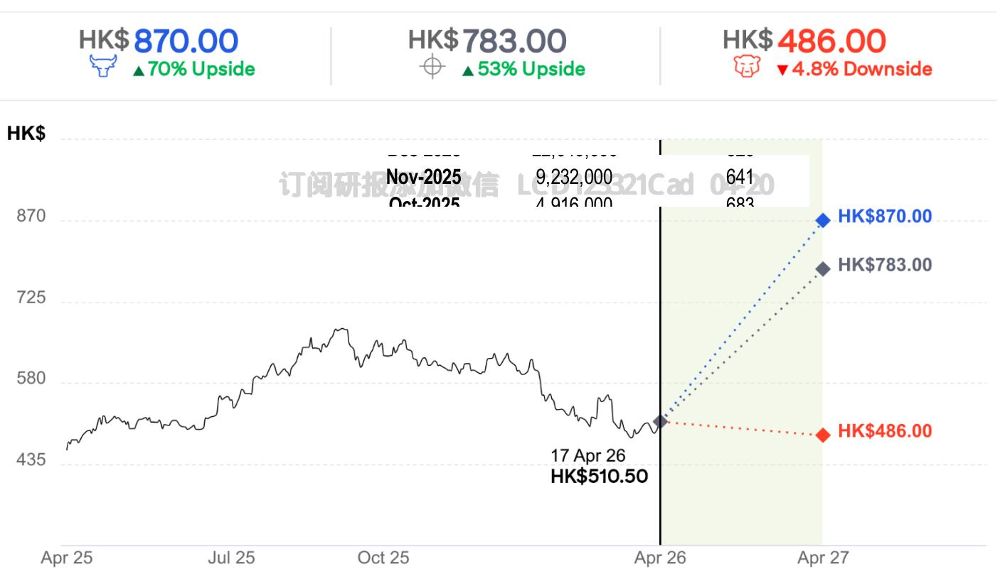  
CD1233 Current Price and expected returns (upside/downside) as of 17 Apr 2026

# BULL Assumptions

·Online gaming multiple of 15x. ·Online advertising multiple of $2 5 \times$ · Social network multiple of 26x.

# BASE Assumptions

·Online gaming multiple of 12x. · Online advertising multiple of 22x. ·Social network multiple of $2 5 \times$

# BEAR Assumptions

· Online gaming multiple of 8x.   
·Onlineadvertisingmultipleof10x.   
·Social network multiple of 10x.

# Tencent Holdings

# Company description

Founded in 1998, Tencent is a leading Internet company in China engaged in multiple business lines including online games, social networking services, online advertising, and mobile value-added services. It has extended its b¥mûR _®Oá   LCD123321Cad   04-20leadership in PC over to mobile Internet with Mobile QQ and Weixin/WeChat. The company was listed on the main board of Hong Kong Stock Exchange in June 2004.

# Investment strategy

We rate Tencent shares as Buy. We are positive on Tencent’s overall strategic direction based on its mobile open platform initiatives that positions it to capture the significant opportunities in China’s mobile Internet growth over the next few years. Leveraging off its sticky, integrated mobile user platform on WeChat, Tencent should be able to drive earnings growth by monetizing its strengths in mobile advertising, mobile gaming, and mobile payments.

# Valuation

Our target price of $\mathsf { H K S 7 8 3 }$ is based on a SOTP approach, which implies $2 3 . 2 \times$ 2026E and \~20.9x 2027E P/E. Our SOTP is based on the following: 1) Online games – We apply a 12x P/E to our 2027 estimated games net profit of xb¥mûR _®Oá   LCDRmb136bn and yield a valuation of HK\$price; 2) Online advertising – We apply a 321hare, or to our 2 $2 5 \%$ ad   0 of our target stimated ads $2 2 \times P / E$ 20 profit of Rmb82bn which yields a valuation of $H K \$ 217$ per share, or $2 8 \%$ of our target price; 3) Social network – While we attribute the non-gaming revs (community platform revs) as overall social network revs, given the WeChat, QQ, and other Tencent apps, we apply a $2 5 \times \mathsf { P } / \mathsf { E }$ to the estimated profit of Rmb63bn and yield a valuation of $\mathsf { H K S 1 9 0 }$ per share, or $24 \%$ of our target price; 4) Fintech – We apply a $1 5 \times P / E$ to our estimated profit of Rmb48bn and yield a valuation of $\mathsf { H K S 8 7 }$ per share, or $1 1 \%$ of our target price; 5) Cloud/business services – We apply a $5 \times \mathsf { P } / \mathsf { S }$ (average of China peers) to our 2027 estimated Business services revs of Rmb70bn, which yields a valuation of $H \ K \$ 42$ per share, or $5 \%$ of our target price; 6) Investment portfolio – We apply a $30 \%$ discount to the equity stake in the publicly listed investment portfolio which implies ${ \mathsf { H K S } } 5 3 .$ /share.

# Risks

Downside risks that could prevent the Tencent shares from reaching our target price include: i) a faster-than-expected revenue slowdown in core PC xb¥mûR _®Oá   LCD123321Cad   04-20games; ii) unsuccessful launches of new mobile games; iii) a decline of Honor of Kings ranking and momentum; iv) a further slowdown in China’s economy, which might negatively affect advertising demand; and v) a change in the regulatory environment.