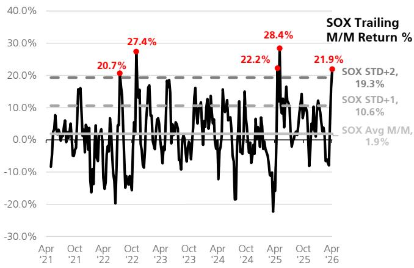

# US Semiconductors and Semi Equipment

# SemiBytes: SOX Rally, NVDA Podcast, ASML/ TSMC Read-Through

20 April 2026

# Earnings previews - Companies reporting the week of 4/27

This week, we are previewing STX, TER, ENTG, KLAC, PI, QCOM, and WDC. Please r to our standalone note for more details.

# Recent surge in semis stocks creates the potential for a "sell the news" earni

The SOX index has risen ${ > } 2 0 \%$ in the past month (Figure 1SOX Month/Perfomance Nr5-yaHighs) - something that h happened only $4 x$ in the past 5yrs - led mostly by semicap and memory stocks but MRVL and AVGO. We view the move as reflecting improving confidence in the durab of Al infrastructure spending, alongside better sentiment around memory fundamen and the market increasingly realizing that the massive upside in WFE spending C2027 and 2028 that we have been talking about for quite a long time now is m likely. Concurrently, inbound investor Qs and call requests has taken even ano feverish step up with many investors asking what to do after this move. We also n there was little to no $\top + \uparrow$ stock follow through this past week post earnings in stocks ASML and TSMC. Outside of analog - where we think positioning beyond ADI is significantly under-weight - we do wonder whether stocks now set up for a similar of follow through in the very near-term over the next few weeks of earnings seaso support of this, we would note that the SOX has been, on average, up $\sim 1 \%$ in month following the four other times that the SOX surged ${ > } 2 0 \%$ in a month.

# NVDA CEO podcast: GPUs remain the preferred architecture amid rapid mo evolution

订阅研报添加微信 LCD123321NVDA CEO Jensen Huang was on Dwarkesh Patel's podcast this past week (link) and found it interesting. Huang's comments were very consistent with NVDA’s investment thesis around architectural flexibility, system level performance optimizat and ecosystem lock in. The pod emphasized the increasing proliferation of m architectures – from traditional transformers to MoE and now emerging SSMs (s space models) – arguing that this heterogeneity structurally favors GPUs over fi function alternatives like TPUs or ASIC's coming from a myriad of private companie our view, as workloads continue to evolve unpredictably, we believe many inves underappreciate that GPUs often represent the lowest risk hardware investment cloud vendors - especially for any instance that will ultimately serve external custo workloads. NVDA's CUDA ecosystem is not a strong moat in every case, but NVD ability to internally model, simulate, and benchmark alternative architectures is a fa that we feel many investors underappreciate. Other comments on the pod highlighted that NVDA is deeply engaged with the supply chain ensuring the capaci being deployed and is increasingly becoming the largest customer for critical sys component vendors (TSMC, optical vendors, etc.) and our own expert calls increasi suggesting that the supply chain relationships are indeed becoming a big part of NVD competitive advantage. Huang also pointed to the absence of ASIC platforms in pu benchmarks (e.g., MLPerf) - something we believe to be due to ASICs being optim 订阅研报添加微信 LCD123321for and supporting select closed source models while benchmarks largely focused open source model performance. To that point, NVDA also highlighted leading A vendors earning ${ \sim } 6 5 \%$ GMs (not far from NVDA's $7 0 \% +$ ), underscoring that econo comparison may be shifting as NVDA pushed into system-level co-design. Finally, on China market, Jensen reiterated the “five layer cake” framework – arguing hardware is only one layer, and that restricting NVDA's ability to sell into China will accelerate China's progress in the upper layers (models, software, applicatio Ultimately, NVDA continues to see long term strategic value in China’s developmen the CUDA/NVDA software stack despite ongoing hardware constraints.

# TSMC/ASML support our view of a WFE super-cycle - and that earnings revisions are just beginning

We received a host of questions this past week around the significance and readthrough from earnings commentary from TSMC and ASML. TSMC guided C2026 capex to be at the higher end of the current $\$ 52-56 B$ range, which suggests, if we assumed CQ2:26 capex to be up a bit to $\sim \$ 148$ , that C2H:26 capex could reach $\sim \$ 31 B$ (up $+ 2 4$ H/H versus C1H:26). Assuming C2027 capex of $\sim \$ 75 B$ (UBSe post earnings), this would imply a $+ $ 5 B$ step-up in capex into C1H:27 (at $\sim \$ 37.58$ ). We got a lot of Qs from investors on TSMC suggesting that capital intensity will start to come down, but we do not believe this means that UBS' C2028 capex forecast of $\sim \$ 85 B$ is any sort of ceiling - especially given how much TSMC revenue is growing. We would also note that only a few years ago TSMC also pointed to capex intensity to decline following a few years of robust investments and we have seen what has happened to its capex in the meantime. 订阅研报添加微信 LCD123321CadOn ASML, we think the more constructive outlook for immersion shipments this year (which importantly, is not China-driven) reads positively to our US SPE stocks. This is because, on multiple occasions, deposition/etch suppliers have highlighted litho availability as a gating factor for tool deliveries. Similarly, management's commentary on the EUV front ("a bit more than can be done") also reinforces that ASML might still have more upside to shipments. ASML's gross margin commentary (unchanged guidance despite a solid beat in C1Q, which management justified as supply chain related) fueled some investor inbounds, but we do not see added headcount costs to support the ramp as issues for gross margin at US SPE suppliers like AMAT or LRCX.

  
Figure 1: SOX Month/Month Performance Near 5-year Highs   
Source: FactSet, UBS

Figure 2: SOX Returns Following Strong 1-month Periods Slightly Trail Average   

<table><tr><td rowspan=1 colspan=1>Instance of 2+ Std      Trailing 1-month Next 1-monthDeviation SOx Trailing SOX Return      SOX Return1-month return</td></tr><tr><td rowspan=1 colspan=1>Jun &#x27;25                              28.4%             3.9%</td></tr><tr><td rowspan=1 colspan=1>May &#x27;25                              22.2%             8.2%</td></tr><tr><td rowspan=1 colspan=1>Dec &#x27;22                              27.4%            -1.2%</td></tr><tr><td rowspan=1 colspan=1>Aug &#x27;22                              20.7%             -5.7%</td></tr><tr><td rowspan=1 colspan=1>Average                            24.7%             1.3%</td></tr><tr><td rowspan=1 colspan=1>Overall5-yrAverage1-month Trailing SOX                  1.9%             1.9%</td></tr></table>

Source: FactSet, UBS

# Valuation Method and Risk Statement

We use various valuation techniques such as P/E, EV/FCF for valuing the companies in this report. Risk factors include but are not limited to macroeconomic factors such as a downturn in the economy, a disruption of international trade, technological disruption due to new inventions, or business model innovation whereby structural changes in the industry alter the future course of unit sales, ASPs, and revenues.

# 订阅研报添加微信 LCD123321Cad 04-20

# Quantitative Research Review

UBS Global Research publishes a quantitative assessment of its analysts' responses to certain questions about the likelihood of an occurrence of a number of short term factors in a product known as the 'Quantitative Research Review'. The views for this month can be found below. Views contained in this assessment on a particular stock reflect only the views on those short term factors which are a different timeframe to the 12-month timeframe reflected in any equity rating set out in this note. For previous responses please make reference to (i) previous UBS Global Research reports; and (ii) where no applicable research report was published that month, the Quantitative Research Review which can be found at https://neo.ubs.com/quantitative, or contact your UBS sales representative for access to the report or the Quantitative Research Team on A consolidated report which contains all responses is also available and again you should contact your UBS sales representative for details and pricing or the Quantitative Research Team on the email above.

Qorvo Inc   

<table><tr><td rowspan=1 colspan=1>Question</td><td rowspan=1 colspan=1>Response</td></tr><tr><td rowspan=1 colspan=1>1. Is the industry structure facing the firm likely to improve or deteriorate over thenext six months? Rate on a scale of 1-5(1= getting worse,3= no change, 5 =getting better, N/A = no view)</td><td rowspan=1 colspan=1>N/A ad04-20</td></tr><tr><td rowspan=1 colspan=1>2.Is the regulatory/government environment facing the firm likely to improve ordeteriorate over the next six months? Rate on a scale of 1-5(1 = getting tougher3 = no change,5 = geting better, N/A= no view)</td><td rowspan=1 colspan=1>N/A</td></tr><tr><td rowspan=1 colspan=1>3. Over the last 3-6 months in broad terms have things been improving/nochange/getting worse for this stock? Rate on a scale of 1-5 (1= getting a lotworse,3= not much change,5= getting a lot better, N/A = no view)</td><td rowspan=1 colspan=1>N/A</td></tr><tr><td rowspan=1 colspan=1>4. Relative to the current CONSENSUS EPS forecast, is the next company EPSupdate likely to lead to: (1= negative surprise vs consensus,3 = in-line withconsensus,5= positive surprise vs consensus expectations, N/A= no view)</td><td rowspan=1 colspan=1>N/A</td></tr><tr><td rowspan=1 colspan=1>5.What&#x27;s driving the difference?</td><td rowspan=1 colspan=1></td></tr><tr><td rowspan=1 colspan=1>6. Relative to YOUR current earnings forecast,is there relatively greater risk at thenext earnings result of:(1= downside skew risk to earnings,3 = equal upside ordownside risk to earnings,5 = upside skew risk to earnings,N/A= no view)</td><td rowspan=1 colspan=1>N/A</td></tr><tr><td rowspan=1 colspan=1>7.What&#x27;s driving the difference?</td><td rowspan=1 colspan=1></td></tr><tr><td rowspan=1 colspan=1>8.Is there an upcoming catalyst for the company over the next three months?</td><td rowspan=1 colspan=1>No Catalyst04-20</td></tr><tr><td rowspan=1 colspan=1>9. Is there an actual or approximate date for the catalyst?</td><td rowspan=1 colspan=1></td></tr><tr><td rowspan=1 colspan=1>10. Is the catalyst date an actual or approximate date?</td><td rowspan=1 colspan=1>N/A</td></tr><tr><td rowspan=1 colspan=1>11. What is the catalyst?</td><td rowspan=1 colspan=1></td></tr></table>

# Analog Devices Inc

<table><tr><td colspan="1" rowspan="1">Question</td><td colspan="1" rowspan="1">Response</td></tr><tr><td colspan="1" rowspan="1">1. Is the industry structure facing the firm likely to improve or deteriorate over the next six months? Rate on a scale of 1-5(1 = geting worse,3 = no change,5 =getting better, N/A = no view)</td><td colspan="1" rowspan="1">N/A</td></tr><tr><td colspan="1" rowspan="1">2. Is the regulatory/government environment facing the firm likely to improve ordeteriorate over the next six months? Rate on a scale of 1-5(1= geting tougher3 = no change,5 = getting better, N/A = no view)</td><td colspan="1" rowspan="1">N/A</td></tr><tr><td colspan="1" rowspan="1">3.Over the last 3-6 months in broad terms have things been improving/nochange/getting worse for this stock? Rate on a scale of 1-5 (1= geting a lotworse,3 = not much change, 5 = getting a lot better N/A=no viewLCD123321Cad 04-20</td><td colspan="1" rowspan="1">N/A</td></tr><tr><td colspan="1" rowspan="1">4. Relative to the current CONSENSUS EPS forecast, is the next company EPSupdate likely to lead to:(1= negative surprise vs consensus,3 = in-line withconsensus,5= positive surprise vs consensus expectations, N/A= no view)</td><td colspan="1" rowspan="1">N/A</td></tr><tr><td colspan="1" rowspan="1">5.What's driving the difference?</td><td colspan="1" rowspan="1"></td></tr><tr><td colspan="1" rowspan="1">6. Relative to YOUR current earnings forecast,is there relatively greater risk at thenext earnings result of:(1= downside skew risk to earnings,3= equal upside ordownside risk to earnings,5= upside skew risk to earnings, N/A= no view)</td><td colspan="1" rowspan="1">N/A</td></tr><tr><td colspan="1" rowspan="1">7.What's driving the difference?</td><td colspan="1" rowspan="1"></td></tr><tr><td colspan="1" rowspan="1">8.Is there an upcoming catalyst for the company over the next three months?</td><td colspan="1" rowspan="1">No Catalyst</td></tr><tr><td colspan="1" rowspan="1">9. Is there an actual or approximate date for the catalyst?</td><td colspan="1" rowspan="1"></td></tr><tr><td colspan="1" rowspan="1">10. Is the catalyst date an actual or approximate date?</td><td colspan="1" rowspan="1">N/A</td></tr><tr><td colspan="1" rowspan="1">11.What is the catalyst?</td><td colspan="1" rowspan="1"></td></tr></table>

# Seagate Technology Holdings PLC

<table><tr><td rowspan=1 colspan=1>Question</td><td rowspan=1 colspan=1>Response</td></tr><tr><td rowspan=1 colspan=1>1. Is the industry structure facing the firm likely to improve or deteriorate over thenext six months? Rate on a scale of 1-5(1 =geting worse,3=no change,5=3getting better, N/A = no view)</td><td rowspan=1 colspan=1>N/A21Cad04-20</td></tr><tr><td rowspan=1 colspan=1>2.Is the regulatory/government environment facing the firm likely to improve ordeteriorate over the next six months? Rate on a scale of 1-5 (1 = getting tougher3 = no change,5 = getting better, N/A= no view)</td><td rowspan=1 colspan=1>N/A</td></tr><tr><td rowspan=1 colspan=1>3. Over the last 3-6 months in broad terms have things been improving/nochange/getting worse for this stock? Rate on a scale of 1-5 (1= geting a lotworse,3= not much change,5= getting a lot better, N/A= no view)</td><td rowspan=1 colspan=1>N/A</td></tr><tr><td rowspan=1 colspan=1>4.Relative to the current CONSENSUS EPS forecast, is the next company EPSupdate likely to lead to: (1= negative surprise vs consensus,3 = in-line withconsensus,5= positive surprise Vs consensus expectations,N/A = no view)</td><td rowspan=1 colspan=1>N/A</td></tr><tr><td rowspan=1 colspan=1>5.What&#x27;s driving the difference?</td><td rowspan=1 colspan=1></td></tr><tr><td rowspan=1 colspan=1>6.Relative to YOUR current earnings forecast, is there relatively greater risk at thenext earnings result of:(1 = downside skew risk to earnings,3= equal upside ordownside risk to earnings,5= upside skew risk to earnings, N/A= no view)</td><td rowspan=1 colspan=1>N/A</td></tr><tr><td rowspan=1 colspan=1>7.What&#x27;s driving the difference?</td><td rowspan=1 colspan=1></td></tr><tr><td rowspan=1 colspan=1>8. Is there an upcoming catalyst for the company over the next three months?233 No Catalyst4-20</td><td rowspan=1 colspan=1></td></tr><tr><td rowspan=1 colspan=1>9.Is there an actual or approximate date for the catalyst?</td><td rowspan=1 colspan=1></td></tr><tr><td rowspan=1 colspan=1>10. Is the catalyst date an actual or approximate date?</td><td rowspan=1 colspan=1>N/A</td></tr><tr><td rowspan=1 colspan=1>11.What is the catalyst?</td><td rowspan=1 colspan=1></td></tr></table>

# Skyworks Solutions Inc

<table><tr><td colspan="1" rowspan="1">Question</td><td colspan="1" rowspan="1">Response</td></tr><tr><td colspan="1" rowspan="1">1. Is the industry structure facing the firm likely to improve or deteriorate over thenext six months? Rate on a scale of 1-5(1= getting worse,3 = no change, 5 =getting better, N/A = no view)</td><td colspan="1" rowspan="1">N/A</td></tr><tr><td colspan="1" rowspan="1">2.Is the regulatory/government environment facing the firm likely to improve ordeteriorate over the next six months? Rate on a scale of 1-5(1= getting tougher3 = no change,5 = geting better, N/A= no view)</td><td colspan="1" rowspan="1">N/A</td></tr><tr><td colspan="1" rowspan="1">3.Over the last 3-6 months in broad terms have things been improving/nochange/getting worse for this stock? Rate on a scale of 1-5(1= getting a lotworse,3= not much change,5= getting alot better N/A = no view)CD1233</td><td colspan="1" rowspan="1">N/A21Cad. 04-20</td></tr><tr><td colspan="1" rowspan="1">4. Relative to the current CONSENSUS EPS forecast,is the next company EPSupdate likely to lead to:(1= negative surprise vs consensus,3= in-line withconsensus,5= positive surprise vs consensus expectations, N/A= no view)</td><td colspan="1" rowspan="1">N/A</td></tr><tr><td colspan="1" rowspan="1">5.What's driving the difference?</td><td colspan="1" rowspan="1"></td></tr><tr><td colspan="1" rowspan="1">6.Relative to YOUR current earnings forecast,is there relatively greater risk at thenext earnings result of:(1= downside skew risk to earnings,3= equal upside ordownside risk to earnings,5= upside skew risk to earnings,N/A= no view)</td><td colspan="1" rowspan="1">N/A</td></tr><tr><td colspan="1" rowspan="1">7. What's driving the difference?</td><td colspan="1" rowspan="1"></td></tr><tr><td colspan="1" rowspan="1">8. Is there an upcoming catalyst for the company over the next three months?</td><td colspan="1" rowspan="1">No Catalyst</td></tr><tr><td colspan="1" rowspan="1">9. Is there an actual or approximate date for the catalyst?</td><td colspan="1" rowspan="1"></td></tr><tr><td colspan="1" rowspan="1">10. Is the catalyst date an actual or approximate date?</td><td colspan="1" rowspan="1">N/A</td></tr><tr><td colspan="1" rowspan="1">11.What is the catalyst?</td><td colspan="1" rowspan="1"></td></tr></table>

# Required Disclosures

This document has been prepared by UBS Securities LLC, an affiliate of UBS AG. UBS AG, its subsidiaries, branches and affiliates, including former Credit Suisse AG and its subsidiaries, branches and affiliates are referred to herein as "UBS".

For information on the ways in which UBS manages conflicts and maintains independence of its UBS Global Research product; historical performance information; certain additional disclosures concerning UBS Global Research recommendations; and terms and conditions for certain third party data used in research report, please visit https://www.ubs.com/disclosures. Unless otherwise indicated, information and data in this report are based on company disclosures including but not limited to annual, interim, quarterly reports and other company announcements. The figures contained in performance charts refer to the past; past performance is not a reliable indicator of future results. Additional information will be made available upon request. UBS Securities Co. Limited is licensed to conduct securities investment consultancy businesses by the China Securities Regulatory Commission. UBS acts or may act as principal in the debt securities (or in related derivatives) that may be the subject of this report. This recommendation was finalized on: 20 April 订阅研报添加微信 LCD123321Cad 04-20 2026 04:57 AM GMT. UBS has designated certain UBS Global Research department members as Derivatives Research Analysts where those department members publish research principally on the analysis of the price or market for a derivative, and provide information reasonably sufficient upon which to base a decision to enter into a derivatives transaction. Where Derivatives Research Analysts coauthor research reports with Equity Research Analysts or Economists, the Derivatives Research Analyst is responsible for the derivatives investment views, forecasts, and/or recommendations. Quantitative Research Review: UBS Global Research publishes a quantitative assessment of its analysts' responses to certain questions about the likelihood of an occurrence of a number of short term factors in a product known as the 'Quantitative Research Review'. Views contained in this assessment on a particular stock reflect only the views on those short term factors which are a different timeframe to the 12-month timeframe reflected in any equity rating set out in this note. For the latest responses, please see the Quantitative Research Review Addendum at the back of this report, where applicable. For previous responses please make reference to (i) previous UBS Global Research reports; and (ii) where no applicable research report was published that month, the Quantitative Research Review which can be found at https://neo.ubs.com/ quantitative, or contact your UBS sales representative for access to the report or the Quantitative Research Team on ubs-quantrepresentative for details and pricing or the Quantitative Research team on the email above.

# Analyst Certification:

Each research analyst primarily responsible for the content of this research report, in whole or in part, certifies that with respect to each security or issuer that the analyst covered in this report: (1) all of the views expressed accurately reflect his or her personal views about those securities or issuers and were prepared in an independent manner, including with respect to UBS, and (2) no part of his or her 订阅研报添加微信 LCD123321Cad 04-20 compensation was, is, or will be, directly or indirectly, related to the specific recommendations or views expressed by that research analyst in the research report.

UBS Global Research: Global Equity Rating Definitions   

<table><tr><td rowspan=1 colspan=1>12-Month Rating</td><td rowspan=1 colspan=1>Definition</td><td rowspan=1 colspan=1>Coverage1</td><td rowspan=1 colspan=1>IB Services2</td></tr><tr><td rowspan=1 colspan=1>Buy</td><td rowspan=1 colspan=1>FSR is &gt; 6% above the MRA.</td><td rowspan=1 colspan=1>54%</td><td rowspan=1 colspan=1>24%</td></tr><tr><td rowspan=1 colspan=1>Neutral</td><td rowspan=1 colspan=1>FSR is between -6% and 6% of the MRA.</td><td rowspan=1 colspan=1>40%</td><td rowspan=1 colspan=1>21%</td></tr><tr><td rowspan=1 colspan=1>sel</td><td rowspan=1 colspan=1>FSR is &gt; 6% below the MRA.</td><td rowspan=1 colspan=1>6%</td><td rowspan=1 colspan=1>21%</td></tr></table>

Source: UBS. Rating allocations are as of 31 March 2026.   
1:Percentage of companies under coverage globally within the 12-month rating category.   
2:Percentage of companies within the 12-month rating category for which investment banking (IB) services were provided within the past 12 months.

KEY DEFINITIONS:Forecast Stock Return (FSR) is defined as expected percentage price appreciation plus gross dividend yield over the next 12 months. In some cases, this yield may be based on accrued dividends. Market Return Assumption (MRA) is defined as the one-year local market interest rate plus $5 \%$ (a proxy for, and not a forecast of, the equity risk premium). Under Review (UR) Stocks may be flagged as UR by the analyst, indicating that the stock's price target and/or rating are subject to possible change in the near term, usually in response to an event that may affect the investment case or valuation. Equity Price Targets have an investment horizon of 12 months.

EXCEPTIONS AND SPECIAL CASES:UK and European Investment Fund ratings and definitions are: Buy: Positive on factors such as structure, management, performance record, discount; Neutral: Neutral on factors such as structure, management, performance record, discount; Sell: Negative on factors such as structure, management, performance record, discount. Core Banding Exceptions (CBE): Exceptions to the standard $+ / - 6 \%$ bands may be granted by the Investment Review Consultation (IRC). Factors considered by the IRC include the stock's volatility and the credit spread of the respective company's debt. As a result, stocks deemed to be very high or low risk may be subject to higher or lower bands as they relate to the rating. When such exceptions apply, they will be identified in the Company Disclosures table in the relevant research piece.