# A p p l e I n c . (AAP L)F2Q26 r i E t b t i Ph M f & i20 April 2026 | 3:00AM EDT

<table><tr><td>AAPL</td><td>12m Price Target: $330.00</td><td>Price: $270.23</td><td>Upside: 22.1%</td><td>BUY04-20</td></tr></table>

With DRAM prices experiencing a massive surge since Fall 2025 driven by an AI-induced supply shortage, concerns around smartphone gross margin pressures and pricing-driven demand destruction and component shortages have driven underperformance in AAPL stock (- $- 4 \%$ YTD v. $S \& P + 2 \%$ ). That said, we believe concerns for Apple are overly pessimistic given its much stronger relative position, which we believe has been supported by recent datapoints including high-end smartphone outperformance (confirmed by TSMC in its latest earnings call, iPhone share gains in China) and reports that Apple is actively securing as much mobile 订阅研报添加微信 LCD12DRAM on the market while keeping pricing competitive for market share gains. Ultimately, we forecast F2Q26E EPS of $\$ 2.00$ , above consensus of $\$ 123$ , with outperformance on iPhone revenue, Mac revenue, and gross margins.

Results should also be flattered by favorable forex, as well as strong underlying Services revenue growth. Despite another slow App Store growth quarter $( < 1 0 \% )$ , we believe product-related Services drivers such as iCloud $^ +$ and AppleCare $^ +$ , along with prior price increases on AppleTV $^ +$ and solid advertising performance, should support another quarter of teens Services revenue growth (GSe: $+ 1 4 \%$ yoy). Looking ahead, Services should benefit from Apple’s growing 订阅研报添加微信 LCD12advertising inventory in the App Store, as well as in Maps (summer). WWDC should provide clarity into new AI Siri features, while the iPhone line-up in Fall 2026 should be the most innovative ever with the introduction of the iPhone Fold.

Please read inside for our detailed estimates for F2Q26E, guidance expectations for F3Q26E, and an overview from our latest industry/market checks.

Michael Ng, C +1(212)902-8618 | Goldman Sachs & C

Zorayda Mon +1(212)357-6403 | Goldman Sachs & C

Katherine Mu +1(212)902-1151 | Goldman Sachs & C

Key Data

Market	cap:	\$4.0tr Enterprise	value:	\$4.0tr 3m	ADTV:	\$12.2bn

21Cad 04-20 Americas	Hardware,

GS Forecast   

<table><tr><td></td><td>9/25</td><td>9/26E</td></tr><tr><td>Revenue($mn) New</td><td>416,161.0</td><td>471,297.7</td></tr><tr><td>Revenue ($ mn) Old</td><td>416,161.0</td><td>469,639.0</td></tr><tr><td>EBITDA ($ mn)</td><td>144,748.0</td><td>167,332.0</td></tr><tr><td>EBIT ($ mn)</td><td>133,050.0</td><td>154,113.1</td></tr><tr><td>EPS ($) New</td><td>7.46</td><td>8.70</td></tr><tr><td>EPS ($) Old</td><td>7.46</td><td>8.73</td></tr><tr><td>P/E (X)</td><td>30.0</td><td>31.1</td></tr><tr><td>Dividend yield (%)</td><td>0.5</td><td>0.4</td></tr><tr><td>Net debt/EBITDA (X)</td><td>(0.2)</td><td>(0.3)</td></tr></table>

<table><tr><td>12/25</td><td>3/26E</td></tr><tr><td>EPS ($) 2.84</td><td>2.00</td></tr></table>

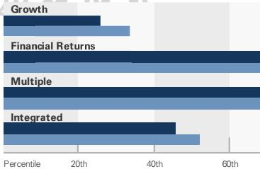  
GS Factor Profile

Ratios & Valuation   

<table><tr><td></td><td>9/25</td><td>9/26E</td><td>9/27E</td><td>9/28E</td></tr><tr><td>P/E (X)</td><td>30.0</td><td>31.1</td><td>28.7</td><td>26.5</td></tr><tr><td>EV/EBITDA (X)</td><td>22.9</td><td>23.3</td><td>21.5</td><td>19.7</td></tr><tr><td>EV/sales (X)</td><td>8.0</td><td>8.3</td><td>7.6</td><td>7.1</td></tr><tr><td>FCF yield (%)</td><td>3.0</td><td>阅研报添加微信</td><td></td><td>4.1</td></tr><tr><td>EV/DACF (X)</td><td>24.2</td><td>25.4</td><td>23.2</td><td>21.3</td></tr><tr><td>CROCI (%)</td><td>86.0</td><td>91.7</td><td>91.5</td><td>89.5</td></tr><tr><td>ROE (%)</td><td>171.4</td><td>156.5</td><td>144.7</td><td>144.1</td></tr><tr><td>Net debt/EBITDA (X)</td><td>(0.2)</td><td>(0.3)</td><td>(0.3)</td><td>(0.3)</td></tr><tr><td>Net debt/equity (%)</td><td>(45.8)</td><td>(54.4)</td><td>(52.5)</td><td>(49.0)</td></tr><tr><td>Interest cover (X)</td><td>31.7</td><td>36.7</td><td>38.7</td><td>40.7</td></tr><tr><td>Inventory days</td><td>10.7</td><td>9.7</td><td>10.4</td><td>10.4</td></tr><tr><td>Receivable days</td><td>32.1</td><td>32.6</td><td>33.2</td><td>33.1</td></tr><tr><td>Days payable outstanding</td><td>114.7</td><td>109.8</td><td>110.7</td><td>110.3</td></tr></table>

Growth & Margins (%)   

<table><tr><td></td><td>9/25</td><td>9/26E</td><td>9/27E</td><td>9/28E</td></tr><tr><td>Total revenue growth</td><td>6.4</td><td>13.2</td><td>5.8</td><td>4.9</td></tr><tr><td>EBITDA growth</td><td>7.5</td><td>阅 15.6</td><td>报添力 寸 6.0</td><td>微信 5.9</td></tr><tr><td>EPS growth</td><td>10.6</td><td></td><td>8.2</td><td>8.3</td></tr><tr><td>DPS growth</td><td>4.1</td><td>3.9</td><td>3.8</td><td>3.6</td></tr><tr><td>Gross margin</td><td>46.9</td><td>48.6</td><td>48.9</td><td>49.5</td></tr><tr><td>EBIT margin</td><td>32.0</td><td>32.7</td><td>32.6</td><td>32.7</td></tr></table>

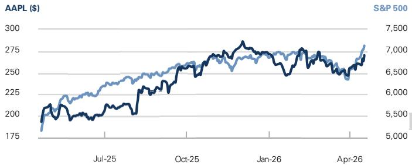  
Price Performance

<table><tr><td>3m</td><td>6m</td><td>12m</td></tr><tr><td>5.8%</td><td>7.1%</td><td>37.2%</td></tr><tr><td>3.0%</td><td>0.2%</td><td>1.7%</td></tr></table>

Source: FactSet. Price as of 17 Apr 2026 close.

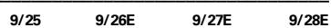

Balance Sheet (\$ mn)   

<table><tr><td></td><td>9/25</td><td>9/26E</td><td>9/27E</td><td>9/28E</td></tr><tr><td>Cash &amp; cash equivalents</td><td>35,934.0</td><td>45,832.4</td><td>56,043.1</td><td>62,315.9</td></tr><tr><td>Accounts receivable</td><td>39,777.0</td><td>44,290.6</td><td>46,525.7</td><td>48,496.1</td></tr><tr><td>Inventory</td><td>5,718.0</td><td>7,156.0</td><td>7,423.8</td><td>7,628.9</td></tr><tr><td>Other current assets</td><td>66,528.0</td><td>73,281.9</td><td>74,560.7</td><td>75,557.5</td></tr><tr><td>Total current assets</td><td>147,957.0</td><td>170,561.0</td><td>184,553.3</td><td>193,998.3</td></tr><tr><td>Net PP&amp;E</td><td>49,834.0</td><td>54,713.3</td><td>62,018.2</td><td>68,659.2</td></tr><tr><td>Net intangibles</td><td>6,512.0</td><td>6,512.0</td><td>6,512.0</td><td>6,512.0</td></tr><tr><td>Total investments</td><td>77,723.0</td><td>73,388.0</td><td>67,388.0</td><td>61,388.0</td></tr><tr><td>Other long-term assets 8</td><td>04-20 77,215.0</td><td>86,634.0</td><td>86,634.0</td><td>86,634.0</td></tr><tr><td>Totalassets</td><td>359,241.0</td><td>391,808.3</td><td>407,105.5</td><td>417,191.6</td></tr><tr><td>Accounts payable</td><td>69,860.0</td><td>75,950.7</td><td>78,793.1</td><td>80,969.4</td></tr><tr><td>Short-term debt</td><td>20,329.0</td><td>13,824.0</td><td>13,824.0</td><td>13,824.0</td></tr><tr><td>Current lease liabilities</td><td>1</td><td>1</td><td>1</td><td>1</td></tr><tr><td>Other current liabilities</td><td>75,442.0</td><td>83,642.7</td><td>88,599.8</td><td>93,164.9</td></tr><tr><td>Total current liabilities</td><td>165,631.0</td><td>173,417.4</td><td>181,216.9</td><td>187,958.3</td></tr><tr><td>Long-term debt</td><td>78,328.0</td><td>76,685.0</td><td>76,685.0</td><td></td></tr><tr><td>Non-current lease liabilities</td><td>1</td><td>1</td><td>1</td><td>76,685.0</td></tr><tr><td>Other long-term liabilities</td><td>41,549.0</td><td>52,055.0</td><td>52,055.0</td><td>1 52,055.0</td></tr><tr><td>Total long-term liabilities</td><td>119,877.0</td><td>128,740.0</td><td>128,740.0</td><td>128,740.0</td></tr><tr><td>Total liabilities</td><td>285,508.0</td><td>302,157.4</td><td>309,956.9</td><td>316,698.3</td></tr><tr><td>Preferred shares</td><td>1</td><td></td><td>一</td><td>1</td></tr><tr><td>Total common equityad</td><td>04-2073.733.0</td><td>89,650.8</td><td>97,148.7</td><td>100,493.3</td></tr><tr><td>Minority interest Total liabilities &amp;equity</td><td>1</td><td>1</td><td>1</td><td>1</td></tr><tr><td></td><td>359,241.0</td><td>391,808.3</td><td>407,105.5</td><td>417,191.6</td></tr><tr><td>BVPS ($)</td><td>4.93</td><td>6.12</td><td>6.79</td><td>7.22</td></tr></table>

Cash Flow $( \$ \mathsf { m n } )$   

<table><tr><td></td><td>9/25</td><td>9/26E</td><td>9/27E</td><td>9/28E</td></tr><tr><td>Net income</td><td>112,010.0</td><td>127,836.0</td><td>135,168.0</td><td>142,436.2</td></tr><tr><td>D&amp;Aadd-back</td><td>11,698.0</td><td>13,219.0</td><td>15,009.0</td><td>16,831.1</td></tr><tr><td>Minority interest add-back</td><td>1</td><td></td><td></td><td></td></tr><tr><td>Net (inc)/dec working capital</td><td>(25,000.0)</td><td>1,056.9</td><td>(782.2)</td><td>(1,230.8)</td></tr><tr><td>Others</td><td>12,774.0</td><td>13,121.9</td><td>14,332.3</td><td>15,049.0</td></tr><tr><td>Cash flow from operations</td><td>111,482.0</td><td>155,233.7</td><td>163,727.1</td><td>173,085.4</td></tr><tr><td>Capital expenditures</td><td>(12,715.0)</td><td>(14,832.3)</td><td>(19,513.9)</td><td>(20,672.2)</td></tr><tr><td> Acquisitions321Cad</td><td>04-20</td><td></td><td></td><td></td></tr><tr><td>Divestitures</td><td></td><td></td><td></td><td></td></tr><tr><td>Others</td><td>-</td><td></td><td></td><td>一</td></tr><tr><td>Cash flow from investing</td><td>15,195.0</td><td>(11,345.3)</td><td>(11,513.9)</td><td>(12,672.2)</td></tr><tr><td>Dividends paid Share issuance/(repurchase)</td><td>(15,421.0)</td><td>(15,650.0)</td><td>(15,796.5)</td><td>(15,934.5)</td></tr><tr><td></td><td>(96,671.0)</td><td>(110,228.0)</td><td>(126,206.0)</td><td>(138,206.0)</td></tr><tr><td>Inc/(dec) in debt</td><td></td><td></td><td></td><td>1</td></tr><tr><td>Others</td><td></td><td></td><td></td><td>二</td></tr><tr><td>Cash flow from financing</td><td>(120,686.0)</td><td>(133,990.0)</td><td>(142,002.5)</td><td>(154,140.5)</td></tr><tr><td>Total cash flow Free cash flow</td><td>5,991.0</td><td>9,898.4</td><td>10,210.7</td><td>6,272.8</td></tr><tr><td></td><td>98,767.0</td><td>140,401.4</td><td>144,213.2</td><td>152,3.3</td></tr><tr><td>Free cash flow per share (basic) ($)</td><td>6.61</td><td>9.59</td><td>10.08</td><td>10.95</td></tr></table>

Table of Contents

F2Q26 earnings preview 4   
Product: iPhone & Mac strength to drive beat 5   
Services: Expect in-line revenue growth, slight App Store acceleration 13   
Forex, capital allocation, other 21   
订阅研报添加微信 LCD123321Cad 04-20 Stable earnings growth supports valuation premium 22   
Thesis summary, rating, price target, key risks 24   
Income statement 26   
Disclosure Appendix 27

We forecast AAPL F2Q26 EPS of $\$ 2.00$ (unchanged), above FactSet consensus $\$ 123$ , with revenue of $\$ 120.3$ bn (v. consensus $\$ 108.9$ bn). Revenue of $\$ 120.3$ bn represents $+ 1 6 \%$ yoy growth, on the high end of AAPL’s guidance for overall revenue to grow between $1 3 - 1 6 \%$ year-over-year. First, we forecast iPhone revenue of $\$ 56.6$ bn $( + 2 1 \%$ 订阅研报添加yoy), above consensus $\$ 55.6$ LCD123321Cad 04- bn (+19% yoy), reflecting $( a ) + 3 \%$ yoy unit growth, in-line with IDC estimates; and (b) ASP growth of $+ 1 7 \%$ yoy on premium mix shift and forex tailwinds. Second, we forecast Services revenue to grow $+ 1 4 \%$ yoy, in-line with both consensus and company guidance for Services revenue growth to be in-line with F1Q26 Services revenue growth $( + 1 4 \% \ y 0 \ y )$ , driven by momentum across TAC, iCloud+, AppleCare $^ +$ , and other subscriptions, partially offset by slower App Store revenue growth. Third, we forecast gross margins of $4 9 . 0 \%$ (v. consensus $4 8 . 3 \%$ ), on the high-end of AAPL’s guidance for $4 8 { - } 4 9 \%$ gross margins.

# Exhibit 1: We expect AAPL to deliver a revenue & EPS beat driven by iPhone & Mac

订阅研报添AAPL F2Q26 GS estimate v. consensus v. guidance $\$ 1$ 加微信 LCD123321Cadmillions except per share data)

<table><tr><td></td><td></td><td></td><td>Gse</td><td></td><td></td><td></td><td>Consensus</td><td></td><td>Comments/guidance</td></tr><tr><td>($, mn)</td><td>New</td><td>yoy△(%)</td><td>Old △($,mn)</td><td>△(%)</td><td>yoy△(%)</td><td>FactSet △(S,mn)</td><td>△(%)</td><td>yoy△(%) 14%13-16%yoy</td><td></td></tr><tr><td>Sales</td><td>$110,337</td><td>16%</td><td>$110,032</td><td>$305</td><td>0% 15%</td><td>$108.922</td><td>$1,415</td><td>1%</td><td></td></tr><tr><td>Gross profit</td><td>$54,070</td><td>21%</td><td>$54,106</td><td>($37) 0%</td><td>21%</td><td>$52,561</td><td>$1,509 3%</td><td>17%</td><td></td></tr><tr><td>Operatingexpenses</td><td>$18,529</td><td>21%</td><td>$18,529</td><td>$0 0%</td><td>21%</td><td>$18,011</td><td>$518 3%</td><td></td><td>18%$18.4-$18.7 bn</td></tr><tr><td>Operating income</td><td>$35,541</td><td>20%</td><td>$35,577</td><td>($37) 0%</td><td>20%</td><td>$34,551</td><td>$990 3%</td><td>17%</td><td></td></tr><tr><td>Otherincome(expense)，net</td><td>$100</td><td>-136%</td><td>$98</td><td>$2 2%</td><td>-135%</td><td>($276)</td><td>$376 -136%</td><td>-1%~$100mn</td><td></td></tr><tr><td>Eamings before tax</td><td>$35,641</td><td>22%</td><td>$35,675</td><td>($34） 0%</td><td>22%</td><td>$34,275</td><td>$1,366 4%</td><td>17%</td><td></td></tr><tr><td>Tax (Non-GAAP)</td><td>$6,237</td><td></td><td>$6,243</td><td>($6) 0%</td><td></td><td>$5,973</td><td>$264 4%</td><td></td><td></td></tr><tr><td>Tax rate</td><td>17.5%</td><td></td><td>17.5%</td><td>0.0%</td><td></td><td>17.4%</td><td></td><td>17.5%</td><td></td></tr><tr><td>Netincome-Non-GAAP</td><td>$29,404 $2.00</td><td>19% 21%</td><td>$29,432</td><td>($28) 0%</td><td>19%</td><td>$28,333 $1.93</td><td>$1,071 4%</td><td>14%</td><td></td></tr><tr><td colspan="3">Diluted EPS(Non-GAAP)</td><td>$2.00</td><td>($0.00) 0%</td><td>21%</td><td></td><td>$0.06 3%</td><td>18%</td><td></td></tr><tr><td>Segment information</td><td></td><td></td><td></td><td></td><td></td><td></td><td></td><td></td><td></td></tr><tr><td>iPhone</td><td>$56,585</td><td></td><td>$56,414</td><td>$171 0%</td><td>20%</td><td>$55,614</td><td>$970 2%</td><td>1</td><td></td></tr><tr><td>iPad</td><td>$6,805</td><td>2</td><td>$7,030</td><td>($225) 3</td><td>10%</td><td></td><td>$54 1%</td><td></td><td></td></tr><tr><td>Mac</td><td>$8,938</td><td></td><td>$8,597</td><td>$341</td><td>8%</td><td>887561</td><td>$704 9%</td><td>4%</td><td></td></tr><tr><td>WearablesHomeandAccessores</td><td>$7,638</td><td>福</td><td>$7,638</td><td>$0 0%</td><td>2%</td><td>$8,074</td><td>($435)</td><td>-5% 7%</td><td></td></tr><tr><td>Products Services</td><td>$79,965</td><td>1</td><td>$79,679 $30,353</td><td>5</td><td>1</td><td>$78,176 $30,393</td><td>$1,789 ($21)</td><td>2 14</td><td></td></tr><tr><td>Totalrevenue</td><td>$30,372</td><td>16%</td><td>$110,032</td><td>8 $305</td><td>15%</td><td>$108.922</td><td>$1,415 1%</td><td></td><td>in-line with F1Q26 Services growth (+14% yoy)</td></tr><tr><td></td><td>$110,337</td><td>1</td><td></td><td>0%</td><td></td><td></td><td></td><td>14%13-16%yoy</td><td></td></tr><tr><td>Products Gross Profit</td><td>$30,867</td><td></td><td></td><td></td><td></td><td>32.400</td><td></td><td>20</td><td></td></tr><tr><td>Services Gross Profit</td><td>$23,203</td><td>T</td><td></td><td></td><td>2</td><td>2</td><td>$16</td><td>45</td><td></td></tr><tr><td>Gross profit</td><td>$54,070</td><td>21%</td><td>$54,106</td><td>($37)</td><td>0% 21%</td><td>$52,561</td><td>$1,509</td><td>3% 17%</td><td></td></tr><tr><td></td><td></td><td></td><td></td><td></td><td></td><td></td><td>2.2%</td><td></td><td></td></tr><tr><td>Products gross margin (%)</td><td>38.6%</td><td></td><td>38.8%</td><td>-0.2%</td><td>2.9%</td><td>36.4% 76.3%</td><td>0.1%</td><td>0.5%</td><td></td></tr><tr><td>Services gross margin (%)</td><td>76.4%</td><td>3</td><td>76.4%</td><td>0.0%</td><td>0.6% 2.1%</td><td>48.3%</td><td>0.7%</td><td>0.5% 1.2%48-49%</td><td></td></tr><tr><td>Gross profit margin (%) Operating income margin (%)</td><td>49.0% 32.2%</td><td>2.0% 1.2%</td><td>49.2%</td><td>-0.2% -0.1%</td><td>1.3%</td><td>31.7%</td><td>0.5%</td><td>0.7%</td><td></td></tr><tr><td></td><td></td><td></td><td>32.3%</td><td></td><td></td><td></td><td></td><td></td><td></td></tr><tr><td>Revenue by geography</td><td></td><td></td><td></td><td></td><td></td><td></td><td></td><td></td><td></td></tr><tr><td>Americas</td><td>$44,750</td><td>11%</td><td>$44,750</td><td></td><td>0 11%</td><td></td><td></td><td></td><td></td></tr><tr><td>Europe</td><td>$27,633</td><td>13%</td><td>$27,633</td><td></td><td>13%</td><td></td><td></td><td></td><td></td></tr><tr><td>Greater China</td><td>$21,603</td><td></td><td>$21,603</td><td></td><td>0% 35%</td><td></td><td></td><td></td><td></td></tr><tr><td>Japan</td><td>$7,663 $8,689</td><td></td><td>$7,663 $8.384</td><td></td><td>15</td><td></td><td></td><td></td><td></td></tr><tr><td>Rest of Asia-Pacific</td><td>$110,337</td><td>16%</td><td>$110,032</td><td>$305</td><td>0% 15%</td><td>$108,922</td><td>$1,415</td><td>1% 14%</td><td></td></tr><tr><td>Totalrevenue</td><td></td><td></td><td></td><td></td><td></td><td></td><td></td><td></td><td></td></tr></table>

Product: iPhone & Mac strength to drive beat

We estimate F2Q26 Product revenue of $\$ 80.0$ bn $1 + 1 6 \%$ yoy), above FactSet consensus $\$ 78.2$ bn $( + 1 4 \%$ yoy) driven by strength in iPhone (GSe $+ 2 1 \%$ yoy v. consensus $+ 1 9 \%$ yoy) and Mac (GSe $+ 1 2 \%$ yoy v. consensus $+ 4 \%$ yoy). We forecast product gross margins of $3 8 . 6 \%$ v. consensus $3 6 . 4 \%$ as premium mix shift (toward iPhone and within iPhone models), forex, and component in-sourcing offset commodity cost inflation.

# #1: iPhone: Revenue $\pm 2 1 \%$ yoy on iPhone 17 family strength & forex, with premiumization driving ASP uplift

We estimate F2Q26 iPhone revenue of $\$ 56.6$ bn $1 + 2 1 \%$ yoy), slightly above FactSet consensus $( + 1 9 \%$ yoy), driven by $+ 3 \%$ yoy growth in units and $+ 1 7 \%$ yoy growth in ASP. Our in-quarter iPhone unit shipment estimate is in-line with IDC ( $6 1 . 1 \mathsf { m n }$ , $+ 3 \%$ yoy), and should be driven by continued strength in iPhone 17 generation demand, particularly as customers refresh aging devices with legacy technology (e.g., older processors that don’t support Apple Intelligence features, lower storage capacity, declining battery health). We expect continued competitive intensity amongst US carriers offering promotional iPhone subsidies (as discussed in our reviews of the iPhone 17 launch in September 2025 and our recent 1Q26 US carrier telco preview regarding the iPhone 17e) should help support continued refresh demand. Additionally, AAPL’s comments during F1Q26 earnings around exiting F1Q26 with lean channel inventory levels should support sell-in shipment strength.

订阅研报添加微信 LCD123321Cad 04-20 Separately, AAPL’s unit demand should be supported by market share gains as smaller Chinese competitors struggle to acquire needed component supplies and raise prices to address rising memory component costs. In stark contrast, over the past year, Apple has discounted its base iPhone 17 and the iPhone 17e by $\$ 100$ (v. prior equivalent generations and storage options). During C1Q26, market share gains have been most prevalent in China, where iPhone unit shipments grew $3 3 \%$ yoy (per IDC) as the broader Chinese smartphone market declined $- 3 \%$ yoy. We expect AAPL to demonstrate continued global market share gains over future quarters through its ability to effectively acquire supply of memory and other components, as well as its ability to avoid price increases, particularly given recent price increase announcements at Samsung, Xiaomi, Vivo, and Oppo.

Our estimate for $+ 1 7 \%$ yoy ASP growth should be supported by continued premiumization of the iPhone installed base, particularly given (a) a $\$ 100$ starting price increases on the iPhone 17 Pro (v. 16 Pro) and iPhone Air (v. 16 Plus) driven by the elimination of the 128 GB starting storage model; and (b) introduction of the new premium 2 TB storage option for the iPhone 17 Pro Max. On a forward basis, we expect iPhone revenue to grow $+ 1 7 \%$ yoy in F2026E as AAPL continues to benefit from continued device refresh and market share gains as competitiors raise prices and are limited by memory supply constraints.

# Exhibit 2: We estimate iPhone revenue should grow $+ 2 1 \%$ yoy to $\$ 56.6$ bn in F2Q26E

iPhone revenue $( \$ , m n )$ & year-over-year change $( \% )$

iPhone unit shipments (mn) & year-over-year change $( \% )$

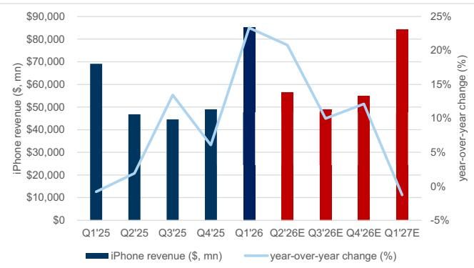  
Exhibit 3: IDC estimates C1Q26 iPhone unit shipments grew $3 \%$ yoy to $6 1 . 1 \ : \mathrm { m n }$ , representing $2 1 \%$ of overall market shipments

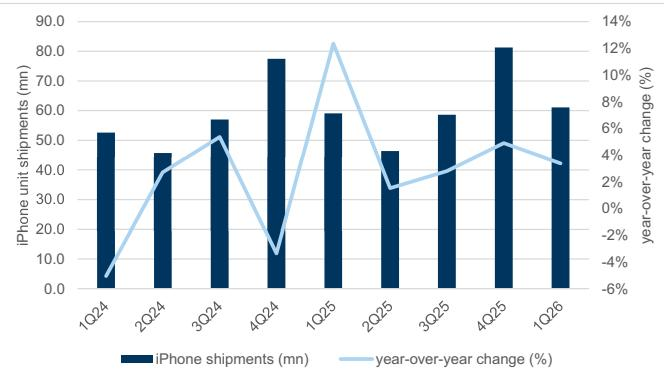

Source: IDC

Exhibit 4: IDC’s iPhone unit growth estimate is more conservative relative to Omdia and Counterpoint Researc Industry unit shipment growth estimates across third party data vendors, smartphone market vs. iPhone   

<table><tr><td>YoY growth (%)</td><td>IDC</td><td></td><td>Omdia Counterpoint Average</td><td></td></tr><tr><td>Smartphonemarket</td><td>-4%</td><td>+1%</td><td>-6%</td><td>-3%</td></tr><tr><td>iPhone</td><td>+3%</td><td>+9%</td><td>+5%</td><td>6%</td></tr></table>

iPhone shipments in China (mn) & market share $( \% )$

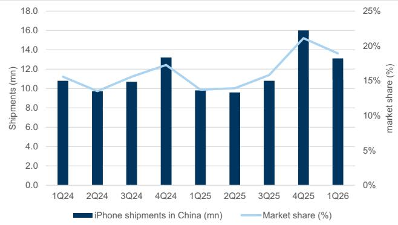  
Exhibit 5: iPhone unit shipments in China of 13.1 mn grew $33 \%$ yoy, representing $19 \%$ market share   
Source: IDC

# Exhibit 7: We believe that the active iPhone installed base will approach \~1.3 bn in F2026 as first smartphone and switchers continue to more than offset churn

iPhone active installed base (mn)

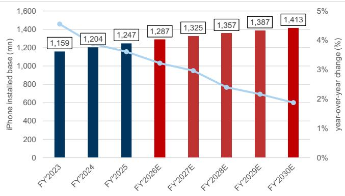

# Exhibit 6: We estimate iPhone revenue will grow 17% in F2026 with continued growth into F2027

iPhone revenue $\$ 5$ , bn) and year-over-year change $( \% )$

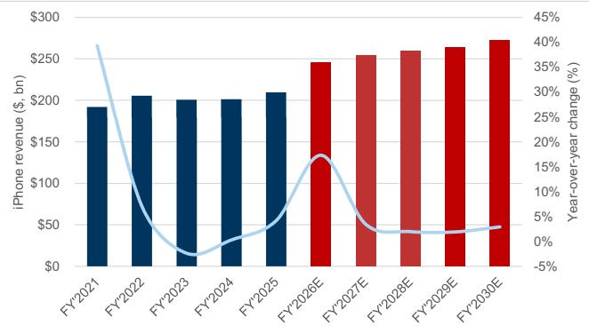

become very popular and may see demand outstrip A18 Pro chip supply, we expect price increases to Mac’s premium portfolio, as well as the expected launch of a premium MacBook in fall 2026 with an OLED display and touch screen, to help support continued ASP growth through the year.

Mac revenue $\$ 5$ 订阅研, mn) & year-over-year change $( \% )$

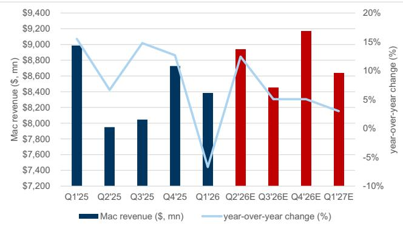  
Exhibit 8: We estimate Mac revenue grew $+ 1 2 \%$ yoy to \$8.9 bn in F2Q26   
Source: Company data, Goldman Sachs Global Investment Research

# Exhibit 10: IDC estimates C1Q26 Mac shipments of 6.2 mn, up $9 \%$ year-over-year

Mac shipments (mn) & year-over-year change $( \% )$

CD123321Mac revenue $( \$  m n )$ 04-20 ) & year-over-year change $( \% )$

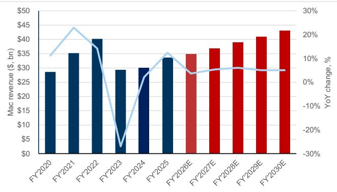  
Exhibit 9: We estimate Mac revenue will grow $+ 4 \%$ yoy in F2026E

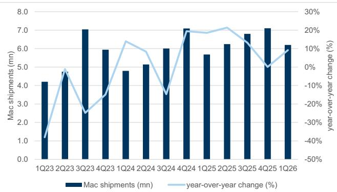  
Exhibit 11: IDC estimates AAPL’s share of the PC market remained flat sequentially at $9 \%$ of total shipments PC market share by vendor $( \% )$

Source: Company data, Goldman Sachs Global Investment Research

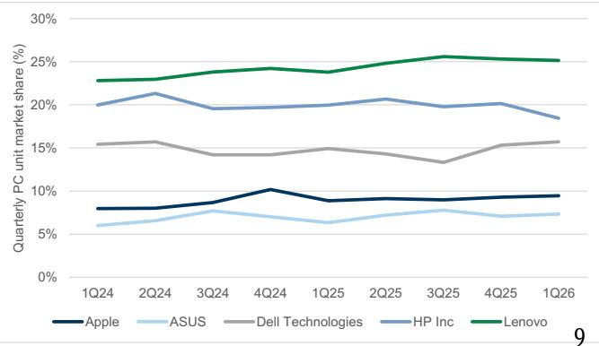

# Exhibit 12: Omdia (formerly Canalys) estimates AAPL shipped 7.1 mn Macs in C1Q26, marking $5 \%$ growth year-over year.

C1Q26 Mac shipments (mn) & year-over-year growth $( \% )$

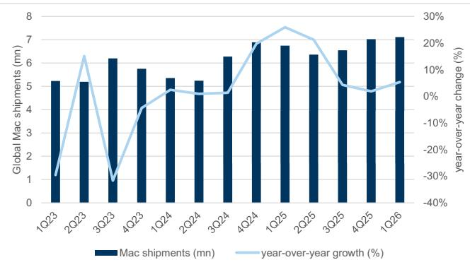  
Source: Omdia, Data compiled by Goldman Sachs Global Investment Research

# Exhibit 13: Omdia (formerly Canalys) estimates Mac’s share of PC shipments grew to $\sim 1 1 \%$ of total C1Q26 industry PC shipments $( + 2$ pp sequentially)

Share of PC industry shipments by vendor $( \% )$

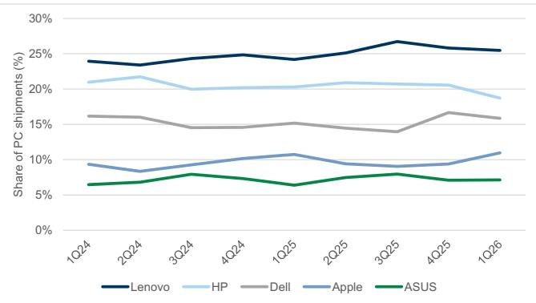  
Source: Omdia, Data compiled by Goldman Sachs Global Investment Research

# #3: iPad: Market outperformance despite tough year-over-year launch comps

We estimate F2Q26 iPad revenue of $\$ 6.8$ bn $4 6 \%$ yoy v. FactSet $+5 \%$ yoy), driven by $+ 4 \%$ yoy unit growth and $+ 2 \%$ yoy ASP growth. Unit growth should continue to be supported by ongoing device refresh as legacy devices face diminishing battery health, storage limitations, and regular wear & tear. During the quarter, AAPL launched the M4 iPad Air (March 2026), which should present tough comps with F2Q25, where AAPL 订阅研报添加微信 LCD123321Cad 04-20 launched both the M3 iPad Air and the 11th-gen base iPad. As such, we anticipate that AAPL will face year-over-year unit growth headwinds in both F2Q26 and F3Q26 until the company launches the next-gen base iPad (now expected in Fall 2026). That said, given ongoing price increases across other tablet vendors (Samsung, Lenovo, Xiaomi), we anticipate that AAPL should continue outpacing the tablet market via market share gains given flat starting prices on its latest iPad model launches (M4 iPad Air in March 2026, M5 iPad Pro in October 2025). The in-quarter launch of the latest iPad Air and the absence of a new iPad base model should mix shift iPad towards premium products, which should support $+ 2 \%$ yoy ASP growth despite flat yoy starting prices on the new models. On a forward basis, we anticipate F2026 iPad revenue to be up $+ 6 \%$ yoy, as (a) iPad gains share in the tablet market amidst competitor price increases driven by memory cost pressures; (b) AAPL refreshes the iPad base in Fall 2026; and (c) continued user premiumization.

Due to lagged historical data releases from IDC and Omdia (formerly Canalys), we show data reported as of C4Q25.

iPad revenue (\$, mn) & year-over-year change $( \% )$

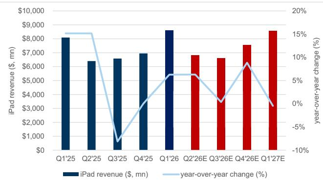  
Exhibit 14: We estimate F2Q26 iPad revenue of $\$ 6.8$ bn $( + 6 \%$ yoy)

Source: Company data, Goldman Sachs Global Investment Research iPad revenue $( \$ ,\mathsf { m n } )$ & year-over-year change $( \% )$

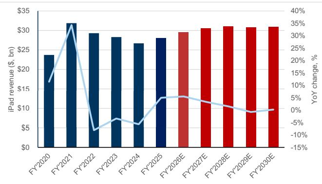  
Exhibit 15: We estimate F2026 iPad revenue to grow $+6 \%$ yoy

Source: Company data, Goldman Sachs Global Investment Research

# Exhibit 17: Omdia (formerly Canalys) estimates iPad $1 4 5 \%$ of C4Q25 tablet market shipments) gained 3 pp. of market share annually v. C4Q24

Share of tablet market shipments $( \% )$

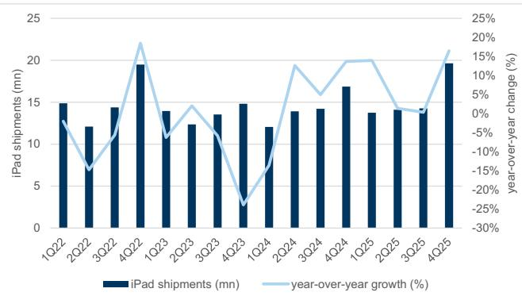  
Exhibit 16: Omdia (formerly Canalys) estimates C4Q25 iPad shipments of 19.6 mn grew $16 \%$ yoy (C1Q26 not yet reported), accelerating from flat growth yoy in C3Q25 Global iPad shipments (mn) & year-over-year change $( \% )$   
Source: Omdia

Global iPad shipments (mn)

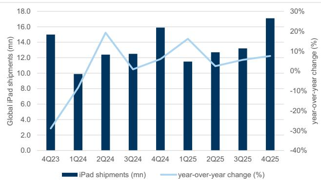  
Exhibit 18: Per IDC, C4Q25 iPad shipments of 17.1 mn grew $8 \%$ yoy (C1Q26 not yet reported)   
Source: IDC

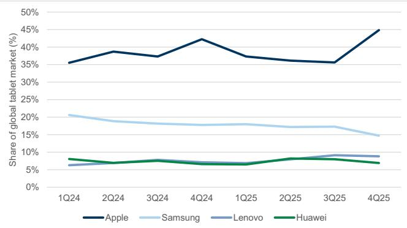  
Source: Canalys   
Exhibit 19: iPad’s C4Q25 tablet shipment market share of $42 \%$ gained 2 pp annually relative to C4Q24

Share of tablet market shipments $( \% )$

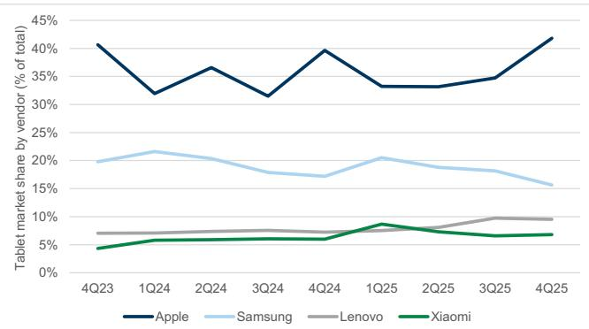

Source: IDC

# #4: Product Pipeline

We update our product pipeline tracker for the latest reported upcoming AAPL products. AAPL’s most important product launches for the remainder of 2026 are expected in the fall, and include the premium-end iPhone 18 generation products (foldable iPhone, iPhone 18 Pro, and iPhone 18 Pro Max), as well a premium 订阅研报添加微信 LCD123321Cad 04-20 MacBook with a touch screen, and the launch of new AI-driven smart home device.

Exhibit 20: AAPL continues to have a breadth of upcoming product releases throughout 2026 and beyond Illustrative AAPL Product Pipeline   

<table><tr><td rowspan=1 colspan=1>ProductCategory</td><td rowspan=1 colspan=1>Upcoming Model</td><td rowspan=1 colspan=2>Expected Release                                      Specs</td><td rowspan=1 colspan=1>Sources</td></tr><tr><td rowspan=3 colspan=1>iPhone</td><td rowspan=1 colspan=1>iPhone18(FoldableProroMax)</td><td rowspan=1 colspan=1>Sept.2026</td><td rowspan=1 colspan=1>Foldablebook-styleformfactorwithoutvisiblecreaseandTouch-IDatover$20o0;2-nmA20serieschip;variableaperturecamera on Pro model; under-screen Face IDfor Pro/Pro Max;removing dynamicisland.Pro models to include C2 chip(instead of Qualcomm modem)</td><td rowspan=1 colspan=1>1,2,3,4,5,6,7,8,9</td></tr><tr><td rowspan=1 colspan=1>iPhone18 (base,18e,Air2)</td><td rowspan=1 colspan=1>early 2027</td><td rowspan=1 colspan=1>2-nm A20 series chip</td><td rowspan=1 colspan=1>5.10</td></tr><tr><td rowspan=1 colspan=1>iPhone19 (Pro,Pro Max)</td><td rowspan=1 colspan=1>Sept.2027</td><td rowspan=1 colspan=1>All-screen glass displayon iPhone Pro</td><td rowspan=1 colspan=1>5.7. 11</td></tr><tr><td rowspan=5 colspan=1>Mac</td><td rowspan=1 colspan=1>Mac Studio</td><td rowspan=1 colspan=1>mid-2026</td><td rowspan=1 colspan=1>M5MaxandM5Ultrachip</td><td rowspan=1 colspan=1>12.13</td></tr><tr><td rowspan=1 colspan=1>Mac mini</td><td rowspan=1 colspan=1>mid-2026</td><td rowspan=1 colspan=1>M5and M5Pro chips                     Cod      20</td><td rowspan=1 colspan=1>12.13</td></tr><tr><td rowspan=1 colspan=1>iMac</td><td rowspan=1 colspan=1>2026</td><td rowspan=1 colspan=1>M5chips                                         Z0</td><td rowspan=1 colspan=1>13</td></tr><tr><td rowspan=1 colspan=1>MacBook UItra</td><td rowspan=1 colspan=1>Fall 2026</td><td rowspan=1 colspan=1>First OLED Mac,touch screen,thinner design,more expensive than MacBook Pros with M5 Max chips ($3599 starting)</td><td rowspan=1 colspan=1>14</td></tr><tr><td rowspan=1 colspan=1>MacBook Neo (2nd-gen)</td><td rowspan=1 colspan=1>2027</td><td rowspan=1 colspan=1>Could include touch panel</td><td rowspan=1 colspan=1>15,16</td></tr><tr><td rowspan=5 colspan=1>iPad</td><td rowspan=1 colspan=1>iPad (12th-gen)</td><td rowspan=1 colspan=1>2026</td><td rowspan=1 colspan=1>A18chip;lower costiPad tostartat$349</td><td rowspan=1 colspan=1>17.18</td></tr><tr><td rowspan=1 colspan=1>iPad Mini (8th-gen)</td><td rowspan=1 colspan=1>2026/2027</td><td rowspan=1 colspan=1>A19 Pro chip</td><td rowspan=1 colspan=1>19</td></tr><tr><td rowspan=1 colspan=1>iPad Air</td><td rowspan=1 colspan=1>Spring 2027</td><td rowspan=1 colspan=1>OLED display</td><td rowspan=1 colspan=1>39</td></tr><tr><td rowspan=1 colspan=1>iPadPro</td><td rowspan=1 colspan=1>2027</td><td rowspan=1 colspan=1>M6</td><td rowspan=1 colspan=1>L</td></tr><tr><td rowspan=1 colspan=1>iPad (foldable)</td><td rowspan=1 colspan=1>2029</td><td rowspan=1 colspan=1>$3,000 pricerange;18-inchdisplay</td><td rowspan=1 colspan=1>20</td></tr><tr><td rowspan=5 colspan=1>Wearables &amp;Accessories</td><td rowspan=1 colspan=1>Magic Mouse</td><td rowspan=1 colspan=1>2026</td><td rowspan=1 colspan=1>Relocatedcharging port&amp;updateddesign</td><td rowspan=1 colspan=1>21</td></tr><tr><td rowspan=1 colspan=1>AirPod Pro with cameras (Ultra)</td><td rowspan=1 colspan=1>2026/2027</td><td rowspan=1 colspan=1>Infrared cameras to feed Visual Intellgence into Siri; priced above AirPods Pro</td><td rowspan=1 colspan=1>22,23,24</td></tr><tr><td rowspan=1 colspan=1>Smart Glasses</td><td rowspan=1 colspan=1>订2027报</td><td rowspan=1 colspan=1>PairswithiPhone;nodisplay.Includesspeakerscamerasandvoice-controlcapabilities.Embeddedbatery</td><td rowspan=1 colspan=1>25,26</td></tr><tr><td rowspan=1 colspan=1>Al Pin</td><td rowspan=1 colspan=1>订D2027报</td><td rowspan=1 colspan=1>Wearablepin(thinflatcirulardisk)withtwocamerastocapturephotosofsuroundings.Includesspeakerandmicropone.Similar size as AirTag.</td><td rowspan=1 colspan=1>27</td></tr><tr><td rowspan=1 colspan=1>Smart Glasses with Display</td><td rowspan=1 colspan=1>2028 or later</td><td rowspan=1 colspan=1>Featuresdisplay</td><td rowspan=1 colspan=1>25</td></tr><tr><td rowspan=5 colspan=1>Misc</td><td rowspan=1 colspan=1>Home Pod mini 2</td><td rowspan=1 colspan=1>Fall 2026</td><td rowspan=1 colspan=1>NewS-serieschip;improvedsoundqualityaditionalcolors;containsApple&#x27;sdesignedBluetoothandWiFichip(insteadofBroadcom&#x27;s),supportingWi-i6</td><td rowspan=1 colspan=1>28,29,30</td></tr><tr><td rowspan=1 colspan=1>Smart Home Device</td><td rowspan=1 colspan=1>Fall 2026</td><td rowspan=1 colspan=1>7-inchdisplaytiedtoAlSiri;controlssmarthomedevices;musicplayback;notetaking;webbrowsing;videoconferencing;$350;snap towall feature</td><td rowspan=1 colspan=1>31,32,33,34,35</td></tr><tr><td rowspan=1 colspan=1>Apple TV (updated)</td><td rowspan=1 colspan=1>2026</td><td rowspan=1 colspan=1>A17Prochip;cameraforFaceTime;containsApple&#x27;sdesignedbluetothandwifichip(insteadofBroadcom&#x27;s),supportingWi-Fi6</td><td rowspan=1 colspan=1>28,29,36,37</td></tr><tr><td rowspan=1 colspan=1>Home security cameras</td><td rowspan=1 colspan=1>2026</td><td rowspan=1 colspan=1>Home securitycamera with baterylasting between several months toa year. Has facialrecognitionand infrared sensors.</td><td rowspan=1 colspan=1>34,38</td></tr><tr><td rowspan=1 colspan=1>Tabletop robot</td><td rowspan=1 colspan=1>2027</td><td rowspan=1 colspan=1>iPadmountedonamovablelimbthatcanswivelandrepositionitselftofollowusersinaroom.Caninjectintoconversationusing AlSiri.9inchdisplay</td><td rowspan=1 colspan=1>34,38  12</td></tr></table>

Services: Expect in-line revenue growth, slight App Store acceleration

We estimate Apple F2Q26E Services revenue of $\sim \$ 30.4$ bn $1 + 1 4 \%$ yoy), in line with Apple’s prior guidance for Services revenue to grow in line with overall F2025 Services revenue growth $( + 1 4 \%$ yoy). The two largest contributors to Services revenue should be App Store ( ${ \sim } 2 4 \%$ of Services revenue, F2Q26E revenue $+ 7 \%$ yoy GSe) and TAC $( \sim 2 2 \%$ of total Services revenue, $+ 1 2 \%$ yoy), which along with strong $D D \%$ yoy growth across Apple’s other Services categories, should support Apple in achieving its guide.

订阅研报添加微信 LCD123321Cad 04-20 As we will discuss later in our App Store analysis, we continue to believe App Store should be a meaningful driver of Services revenue over the long run despite concerns around third party payments. That said, we expect near-term App Store revenue slowness ${ < } 9 \%$ yoy growth) and investor concerns to persist through F1Q27E driven by (a) competition from off-app payment options; (b) headwinds from changes in commission fee structures in China and Japan; (c) threat of App Store disintermediation from vibe coding apps (though we believe Apple is appropriately addressing this risk via App Store policy enforcement); and (d) macro-economic volatility. However, we expect continued faster growth across Apple’s broader Services categories to support $> 1 0 \%$ yoy Services revenue growth through the rest of F2026E.

There are several trends underpinning our expectations for Apple to be able to maintain $> 1 0 \%$ yoy quarterly Services revenue growth. First, resilient Google search traffic & user trends supports long-term growth in Google’s TAC payments to Apple and demonstrates the stickiness of browser search relative to AI app usage. Second, continued scaling of iCloud $^ +$ should support greater levels of high-margin recurring Services revenue as members of the Apple installed base aggregate greater levels of data that require storage (e.g., more photos & saved content, growing App sizes as developers integrate more data and features across apps, greater iOS storage requirements with growing levels of Apple Intelligence features). Third, long-term growth in AppleCare+ adoption should support sustainability in Services revenue growth as Apple users refresh aging devices or add additional devices to their Apple ecosystem. Fourth, Apple TV streaming subscription price increases from August 2025 should similarly support growth through the rest of F2026, particularly as churn rates normalize and AAPL scales its service through continued content development.

Separately, we see expansion of Advertising offerings and AI Siri launch as key growth accelerators for Services on a forward basis. First, Apple Services should benefit from the introduction of ads across greater iOS environments, particularly as Apple began introducing additional ads within App Store search in the UK and Japan in March 2026, and plans to introduce local business ads within Apple Maps starting in summer 2026. Second, AI Siri is expected to be announced at WWDC in June 2026 and be launched in September 2026, which could support greater Services revenues in the future by reinforcing iOS ecosystem stickiness, particularly with hardware competition from AI players, or potential AI feature monetization.

# Exhibit 21: We estimate Apple F2Q26E Services revenue of $\$ 30.4$ bn $( + 1 4 \%$ yoy)

Apple Services revenue $\$ 9$ , mn) & year-over-year change $( \% )$

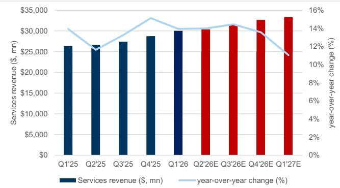  
订阅研报添加Source: Company data, Goldman Sachs Global Investment Research

# Exhibit 23: Over the long term, we expect Apple to maintain an \~11% 2025-30 Services revenue CAGR

Apple Services revenue by category ( $S$ , mn)

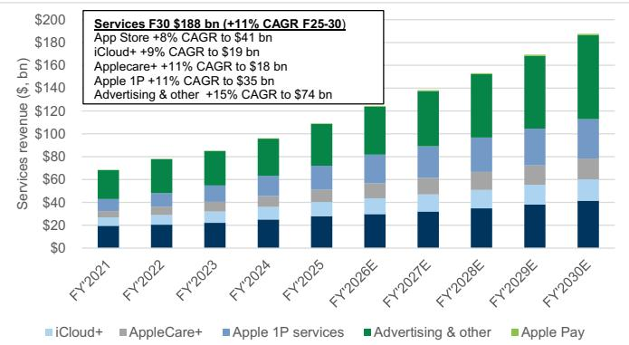

# Exhibit 22: F2Q26E Services growth should be driven by growth in iCloud, AppleCare+, and subscriptions, with slower App Store revenue growth

Apple F2Q26E Services revenue $\$ 5$ , mn)

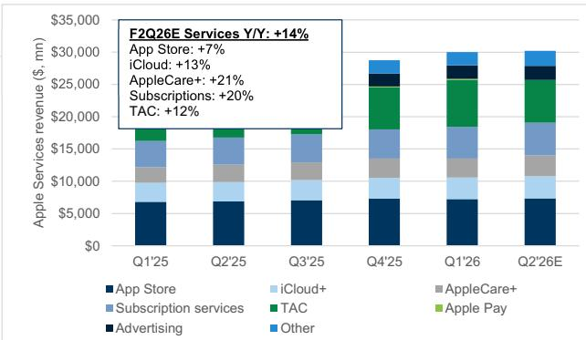  
Source: Company data, Goldman Sachs Global Investment Research

Sensor Tower) to represent a $\sim 2$ pp headwind to App Store revenue growth in the quarter. Accordingly, we adjust our forecasts for App Store revenue growth for the next four quarters, and recognize the risk for continued commission rate compression across Apple’s other App Store regions.

Separately, we view two other major risks for Apple App Store revenue in the near future: (1) application vibe coding adoption driving iOS security issues and deterioration of App Store 订阅研报添加微信 LCD123321Cad 04-20 commission revenues; and (2) Expansion of off-app payment options. First, we believe that Apple is sufficiently addressing the threat of vibe coding apps driving iOS security issues and App Store commission revenue deterioration by blocking vibe coding apps from releasing updates (per industry reports regarding Replit and Vibecode). We view this action as positive for continued product installed base growth as Apple reinforces the iOS security ecosystem, as well as positive for App Store revenue commission fees. Second, though we continue to recognize the long-term risk of expanding adoption of off-app payment options to Apple App Store revenue, we reaffirm our belief that App Store revenue should continue to support overall Services growth in the long-run through the seamless experience of making purchases in-app. Key catalysts we see to App Store revenue growth acceleration include: (1) continued growth in third party AI app monetization, where AAPL reportedly generated $\$ 900$ mn in 2025, and (2) greater monetization of 订阅研报添加微信 alternative marketplace transactions for iOS apps.

# Exhibit 24: We estimate F2Q26E Apple App Store revenue grew $+ 7 \%$ yoy to $\$ 7.34$ bn.

App Store revenue $\$ 1$ , mn) & year-over-year change $( \% )$ , GSe

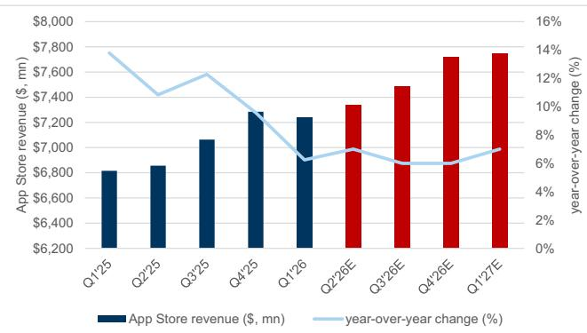  
Exhibit 25: Overall Apple App Store spending of $\sim \$ 20.5$ bn grew $7 \%$ yoy in C1Q26, slightly accelerating sequentially Quarterly Apple App Store spending $S _ { i }$ , mn) & year-over-year change $( \% )$

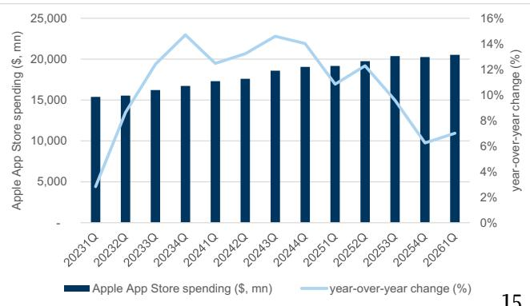

# Exhibit 26: App Store spending growth has decelerated relative to pre-Fall 2025 levels. Slight acceleration in C1Q26 was driven by improving growth trends in January and February, while March decelerated

App Store monthly spending growth (year-over-year change, $\%$ )

# Exhibit 27: While Games dominates nearly half of App Store revenue, its share of overall spend has declined over time

Share of App Store revenue $( \% )$ by app category

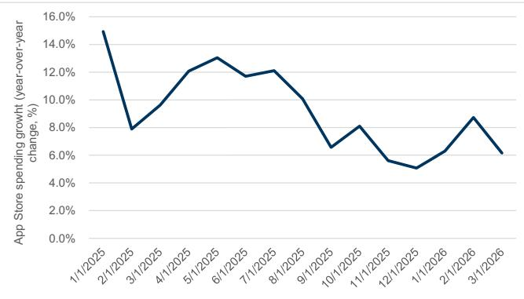  
Source: Sensor Tower   
Exhibit 28: Spending in App Store’s #2-#4 app categories have outpaced that of Games in recent quarters

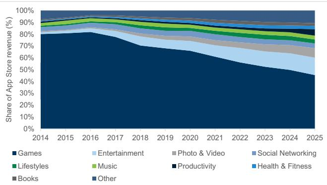  
Source: Sensor Tower

Quarterly App Store revenue year-over-year growth $( \% )$ by category

Share of Apple App Store revenue $( \% )$ by geography

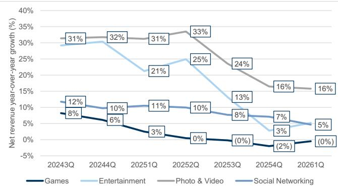  
Exhibit 29: Apple’s App Store revenue is dominated by the US, followed by China and Japan   
Source: Sensor Tower

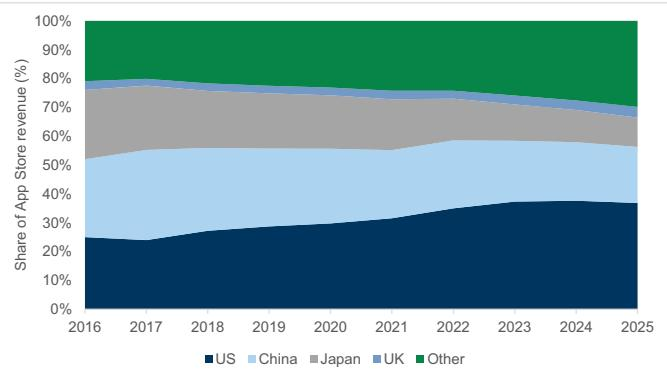  
Source: Sensor Tower

# Exhibit 30: Though growth rates across Apple’s largest App Store markets has declined over time, growth rates improved in China sequentially, decelerated in the US, and remained roughly flat in Japan

App Store revenue growth by top geographies (year-over-year change, $\%$ )

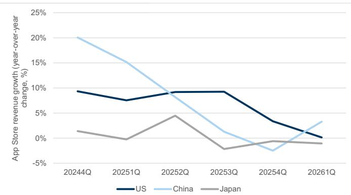  
Source: Sensor Tower

# Exhibit 31: We estimate that recent changes in Apple App Store commission rates across China & Japan should present a -4.6pp full quarter headwind to App Store revenue on a year-over-year basis

Recent changes to App Store commission fee structure across China & Japan

<table><tr><td>Country</td><td>Change date</td><td>Old commission rate</td><td>New commission rate</td><td>Prioravg</td><td>After avg</td><td>C3Q25revenue share (%)</td><td>App Store headwind (%)</td></tr><tr><td>China</td><td>3/12/2026</td><td>- IAP: 30% - IAP for Smal Business Program/Mini Apps Partner Program/Auto-renewals of IAP subscriptionsafter first year:15%</td><td>IAP:25% -IAP for Small Business Program/Mini Apps Partner Program/Auto-renewals of IAP subscriptions after first year:12%</td><td>24%</td><td>20%</td><td>19.1%</td><td>(3.3%)</td></tr><tr><td>Japan</td><td>12/18/2025</td><td>订阅研报徐加 -IAP:30% - IAP for Small Business Program/Mini Apps Partner Program/Auto-renewals of IAP subscriptions after first year: 15%</td><td>-IAP:26% (21% + 5% processing fee) Cad IAP for Small Business Program/Mini Apps Partner Program/Auto-renewals of IAP subscriptions after first year:15% (10% +5% processing fee) Transactions for iOS apps made through alternative marketplaces:5% (Core Technology Commission)</td><td>4-20 24%</td><td>21%</td><td>10.0%</td><td>(1.2%)</td></tr></table>

\*\*China & Japan prior average assumes $40 \% / 6 0 \%$ split on discounted/non-discounted commission revenues

Estimates represent the estimated full-quarter impact of these changes relative to under prior commission rates. We compare to C3Q25 revenue shares to compare impact to pre-commission rate changes

apps and chatbots.

# Exhibit 32: We forecast an AAPL TAC revenue CAGR of $10 \%$ (F25-30E)...

Estimated Apple TAC advertising revenue (\$, bn) and year-over-year change $( \% )$

Source: Company data, Goldman Sachs Global Investment Research

Average time spent on Google Chrome (min/day)

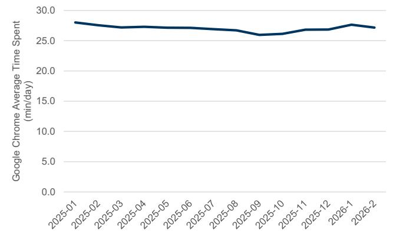  
Exhibit 34: Average time spent on Google Chrome with iOS has, in aggregate, stayed relatively stable since the start of 2025

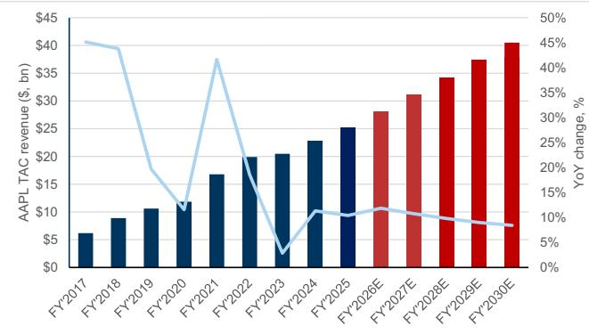  
Exhibit 33: Apple’s TAC advertising revenue, which includes distribution agreements, should be directionally consistent with GOOGL’s TAC growth of MSD-HSD% yoy Google TAC $( \$ ,\mathsf { m n } )$ and year-over-year change $( \% )$

Only includes iOS usage data

Source: Sensor Tower

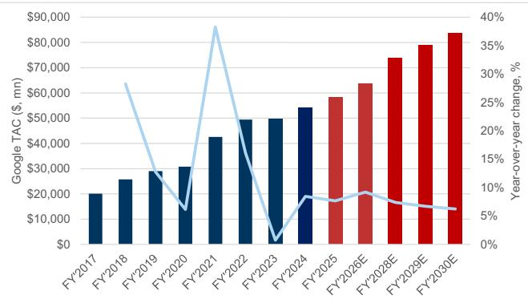  
Exhibit 35: Google Chrome MAUs (iOS) continue to grow over time

Source: Company data, Goldman Sachs Global Investment Research

Google Chrome MAUs (mn)

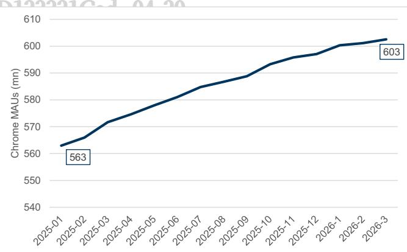

Only includes iOS usage data

Source: Sensor Tower

# 3: Apple TV: Continued content investment to drive long-term subscriber growth LCD123321Cad 04-20

We estimate F2Q26 Apple TV revenue of $\sim \$ 2.1$ bn $( + 3 8 \%$ yoy) driven by both continued subscriber growth and August 2025 price increases. First, our paid subscriber estimate reflects a net $4 \mathsf { m n }$ paid adds during the quarter, improving from $+ 1 \mathsf { m } \mathsf { n }$ in F1Q26 (GSe) as churn rates related to price increases in August 2025 normalize, and as the company benefits from continued focus on content investments to attract subscribers. In particular, during C1Q26, we estimate Apple TV released ${ \sim } 9 3$ episodes of original series

content, which along with film spend, resulted in content amortization costs of $\sim \$ 645$ mn. On a forward basis, we expect continued focus on content investment (GSe $\$ 772$ mn in C2Q26E), along with potential benefits from price increases at streaming competitor Netflix, should drive greater scale to the platform.

# Exhibit 36: Based on the Apple TV film and TV slate, we estimate Apple TV had \~\$645 mn of content amortization in C1Q26

Estimated content amortization for Apple TV films and TV series $( \$ , m n )$ , calendar quarters

<table><tr><td></td><td>2022</td><td>2023</td><td>2024</td><td>1Q25</td><td>2Q25</td><td>3Q25</td><td>4Q25</td><td>2025</td><td>1Q26</td></tr><tr><td>Scripted Drama</td><td>163</td><td>196</td><td>176</td><td>42</td><td>34</td><td>55</td><td>27</td><td>158</td><td>56</td></tr><tr><td>Scripted Comedy</td><td>74</td><td>113</td><td>100</td><td>31</td><td>30</td><td>20</td><td>20</td><td>101</td><td>11</td></tr><tr><td>Docuseries</td><td>94</td><td>71</td><td>54</td><td>19</td><td>7</td><td>22</td><td>19</td><td>67</td><td>3</td></tr><tr><td>Kids&amp;Family</td><td>205</td><td>87</td><td>110</td><td>36</td><td>20</td><td>18</td><td>12</td><td>86</td><td>23</td></tr><tr><td>Total</td><td>536</td><td>467</td><td>440</td><td>128</td><td>91</td><td>115</td><td>78</td><td>412</td><td>93</td></tr></table>

<table><tr><td rowspan="2">Estimated cost per episode ($,mn)</td><td rowspan="2">Avg</td><td rowspan="2">Avg</td><td rowspan="2">Avg</td><td colspan="4"></td><td rowspan="2">Avg</td><td rowspan="2">1Q26</td></tr><tr><td>1Q25</td><td>2Q25</td><td>3Q25</td><td>4Q25</td></tr><tr><td>Scripted Drama</td><td>$9</td><td>$10</td><td>$11</td><td>$12</td><td>$10</td><td>$10</td><td>$10</td><td>$11</td><td>$10</td></tr><tr><td>Scripted Comedy</td><td>$5</td><td>$5</td><td>$5</td><td>$6</td><td>$5</td><td>$5</td><td>$5</td><td>$5</td><td>$5</td></tr><tr><td>Docuseries</td><td>$1</td><td>$1</td><td>$1</td><td>$1</td><td>$1</td><td>$1</td><td>$1</td><td>$1</td><td>$1</td></tr><tr><td>Kids &amp; Family</td><td>$1</td><td>$2</td><td>$1</td><td>$2</td><td>$1</td><td>$1</td><td>$1</td><td>$1</td><td>$1</td></tr><tr><td>Avg</td><td>$4</td><td>$6</td><td>$6</td><td>$6</td><td>$6</td><td>$6</td><td>$5</td><td>$6</td><td>$7</td></tr></table>

<table><tr><td rowspan="2">Total cost ($, mn)</td><td rowspan="2">Total</td><td rowspan="2">Total</td><td rowspan="2">Total</td><td colspan="4"></td><td rowspan="2">Total</td><td rowspan="2">1Q26</td></tr><tr><td>1Q25</td><td>2Q25</td><td>3Q25</td><td>4Q25</td></tr><tr><td>ScriptedDrama</td><td>$1,462</td><td>$1,960</td><td>$1,924</td><td>$513</td><td>$340</td><td>$550</td><td>$270</td><td>$1,673</td><td>$560</td></tr><tr><td>开报添加 Scripted Comedy</td><td>$370</td><td>$565</td><td>$500</td><td>$175</td><td>$150</td><td>$100</td><td>$100</td><td>$525</td><td>$55</td></tr><tr><td>Docuseries</td><td>$47</td><td>$44</td><td>$54</td><td>$19</td><td>$7</td><td>$22</td><td>$19</td><td>$67</td><td>$3</td></tr><tr><td>Kids &amp; Family</td><td>$225</td><td>$146</td><td>$97</td><td>$60</td><td>$28</td><td>$13</td><td>$17</td><td>$118</td><td>$15</td></tr><tr><td>Total TV</td><td>$2,104</td><td>$2,715</td><td>$2,575</td><td>$767</td><td>$525</td><td>$685</td><td>$406</td><td>$2,383</td><td>$633</td></tr><tr><td>Films</td><td>$610</td><td>$765</td><td>$697</td><td>$125</td><td>$550</td><td>$88</td><td>$132</td><td>$895</td><td>$12</td></tr><tr><td>TotalTV+Films</td><td>$2,714</td><td>$3,480</td><td>$3,272</td><td>$892</td><td>$1,075</td><td>$772</td><td>$538</td><td>$3,278</td><td>$645</td></tr></table>

# of episodes by quarter based on season premiere timing. We’ve observed a strategy of Apple TV making 2-3 episodes available at season premiere, with episodes available weekly thereafter, resulting in some episodes falling into a different 19

Exhibit 38: Apple TV continues to build out its content slate, which should drive streaming video subscriber growth Apple TV television series content slate by quarter   

<table><tr><td rowspan=1 colspan=4>1Q25</td><td></td><td></td><td></td><td></td><td rowspan=1 colspan=1></td><td rowspan=1 colspan=1></td></tr><tr><td rowspan=1 colspan=1>1Q25</td><td rowspan=1 colspan=2>Severance</td><td rowspan=1 colspan=1>Scripted Drama</td><td rowspan=1 colspan=4>Thriller                         1/17/2025</td><td rowspan=1 colspan=1></td><td rowspan=1 colspan=1>10</td></tr><tr><td rowspan=1 colspan=1>1Q25</td><td rowspan=1 colspan=2>Prime Target</td><td rowspan=1 colspan=1>Scripted Drama</td><td rowspan=1 colspan=2>Thriller</td><td rowspan=1 colspan=2>1/22/2025</td><td rowspan=1 colspan=1>1</td><td rowspan=1 colspan=1>8</td></tr><tr><td rowspan=1 colspan=1>1Q25</td><td rowspan=1 colspan=2>Eva the Owlet</td><td rowspan=1 colspan=1>Kids &amp; Family</td><td rowspan=1 colspan=2>Animated</td><td rowspan=1 colspan=2>1/24/2025</td><td rowspan=1 colspan=1></td><td rowspan=1 colspan=1>10</td></tr><tr><td rowspan=1 colspan=1>1Q25</td><td rowspan=1 colspan=2>Mythic Quest</td><td rowspan=1 colspan=1>Scripted Comedy</td><td rowspan=1 colspan=2>Comedy</td><td rowspan=1 colspan=2>1/29/2025</td><td rowspan=1 colspan=1>4</td><td rowspan=1 colspan=1>10</td></tr><tr><td rowspan=1 colspan=1>1Q25</td><td rowspan=1 colspan=2>Vietnam: The War that Changed America</td><td rowspan=1 colspan=1>Docuseries</td><td rowspan=1 colspan=2>War</td><td rowspan=1 colspan=2>1/31/2025</td><td rowspan=1 colspan=1></td><td rowspan=1 colspan=1>6</td></tr><tr><td></td><td rowspan=1 colspan=2>Love You to Death (a muerte)</td><td rowspan=1 colspan=1>Scripted Comedy</td><td rowspan=1 colspan=2>Spanish language</td><td rowspan=1 colspan=2>2/5/2025</td><td rowspan=1 colspan=1></td><td rowspan=1 colspan=1>7</td></tr><tr><td rowspan=1 colspan=1>1Q25</td><td rowspan=1 colspan=2>GoldieOnside: Major League Soccer</td><td rowspan=1 colspan=1>Docuseries</td><td rowspan=1 colspan=2>Animated123321Cad04-2</td><td rowspan=1 colspan=2>2/14/2025</td><td rowspan=1 colspan=1>1</td><td rowspan=1 colspan=1>13</td></tr><tr><td rowspan=1 colspan=1>1Q25</td><td rowspan=1 colspan=2>Surface</td><td rowspan=1 colspan=1>Scripted Drama</td><td rowspan=1 colspan=2>Mystery</td><td rowspan=1 colspan=2>2/21/2025        2</td><td rowspan=1 colspan=1>2         2</td><td rowspan=1 colspan=1>8</td></tr><tr><td rowspan=1 colspan=1>1Q25</td><td rowspan=1 colspan=2>Berlin ER</td><td rowspan=1 colspan=1>Scripted drama</td><td rowspan=1 colspan=2>Medical drama</td><td rowspan=1 colspan=2>2/26/2025</td><td rowspan=1 colspan=1></td><td rowspan=1 colspan=1>8</td></tr><tr><td rowspan=1 colspan=1>1Q25</td><td rowspan=1 colspan=2>Dope Thief</td><td rowspan=1 colspan=1>Scripted Drama</td><td rowspan=1 colspan=2>Crime thriller</td><td rowspan=1 colspan=2>3/14/2025</td><td rowspan=1 colspan=1></td><td rowspan=1 colspan=1>8</td></tr><tr><td rowspan=1 colspan=1>1Q25</td><td rowspan=1 colspan=2>BE@RBRICK</td><td rowspan=1 colspan=1>Kids&amp;Family</td><td rowspan=1 colspan=2>Musical comedy series</td><td rowspan=1 colspan=2>3/21/2025</td><td rowspan=1 colspan=1></td><td rowspan=1 colspan=1>13</td></tr><tr><td rowspan=1 colspan=1>1Q25</td><td rowspan=1 colspan=2>The Studio</td><td rowspan=1 colspan=1>Scripted Comedy</td><td rowspan=1 colspan=2>Comedy</td><td rowspan=1 colspan=2>3/26/2025</td><td rowspan=1 colspan=1></td><td rowspan=1 colspan=1>10</td></tr><tr><td rowspan=1 colspan=1>1Q25</td><td rowspan=1 colspan=2>Side Quest</td><td rowspan=1 colspan=1>Scripted Comedy</td><td rowspan=1 colspan=2>Comedy</td><td rowspan=1 colspan=2>3/26/2025</td><td rowspan=1 colspan=1></td><td rowspan=1 colspan=1>4</td></tr><tr><td rowspan=1 colspan=1>1Q25</td><td rowspan=1 colspan=2>Fight for Glory: 2024 World Series</td><td rowspan=1 colspan=1>Docuseries</td><td rowspan=1 colspan=2>Sports</td><td rowspan=1 colspan=2>3/28/2025</td><td rowspan=1 colspan=1></td><td rowspan=1 colspan=1>3</td></tr><tr><td rowspan=1 colspan=1>1Q25</td><td rowspan=4 colspan=2>Number One of the Call Sheet</td><td rowspan=4 colspan=1>Docuseries</td><td rowspan=1 colspan=2>Entertainment industry</td><td></td><td></td><td></td><td></td></tr><tr><td rowspan=3 colspan=1></td><td rowspan=3 colspan=2></td><td></td><td></td><td></td><td></td></tr><tr><td rowspan=2 colspan=2>3/28/2025</td><td rowspan=2 colspan=1></td><td></td></tr><tr><td rowspan=1 colspan=1></td></tr><tr><td rowspan=1 colspan=3>2Q25</td><td rowspan=1 colspan=1></td><td rowspan=1 colspan=2></td><td rowspan=1 colspan=2></td><td rowspan=1 colspan=1></td><td rowspan=1 colspan=1></td></tr><tr><td rowspan=1 colspan=1>2Q25</td><td rowspan=1 colspan=2>Your Friends &amp; Neighbors</td><td rowspan=1 colspan=1>Scripted Drama</td><td rowspan=1 colspan=2>Drama</td><td rowspan=1 colspan=2>4/11/2025</td><td rowspan=1 colspan=1></td><td rowspan=1 colspan=1>9</td></tr><tr><td rowspan=1 colspan=1>2Q25</td><td rowspan=1 colspan=2>Government Cheese</td><td rowspan=1 colspan=1>Scripted Comedy</td><td rowspan=1 colspan=2>Comedy</td><td rowspan=1 colspan=2>4/16/2025</td><td rowspan=1 colspan=1>1</td><td rowspan=1 colspan=1>10</td></tr><tr><td rowspan=1 colspan=1>2Q25</td><td rowspan=1 colspan=2>Jane</td><td rowspan=1 colspan=1>Kids&amp; Family</td><td rowspan=1 colspan=2>Adventure</td><td rowspan=1 colspan=2>4/18/2025</td><td rowspan=1 colspan=1></td><td rowspan=1 colspan=1>5</td></tr><tr><td rowspan=1 colspan=1>2Q25</td><td rowspan=1 colspan=2>WondLa</td><td rowspan=1 colspan=1>Kids &amp; Family</td><td rowspan=1 colspan=2>Animated</td><td rowspan=1 colspan=2>4/25/2025</td><td rowspan=1 colspan=1></td><td rowspan=1 colspan=1>7</td></tr><tr><td rowspan=1 colspan=1>2Q25</td><td rowspan=1 colspan=2>Careme</td><td rowspan=1 colspan=1>Scripted Drama</td><td rowspan=1 colspan=2>French language</td><td rowspan=1 colspan=2>4/30/2025</td><td rowspan=1 colspan=1></td><td rowspan=1 colspan=1>8</td></tr><tr><td rowspan=1 colspan=1>2Q25</td><td rowspan=1 colspan=2>Long Way Home</td><td rowspan=1 colspan=1>Docuseries</td><td rowspan=1 colspan=2>Travel show</td><td rowspan=1 colspan=2>5/9/2025</td><td rowspan=1 colspan=1></td><td rowspan=1 colspan=1>7</td></tr><tr><td rowspan=1 colspan=1>2Q25</td><td rowspan=1 colspan=2>Murderbot</td><td rowspan=1 colspan=1>Scripted Comedy</td><td rowspan=1 colspan=2>Scripted scifi comedic thriller</td><td rowspan=1 colspan=2>5/16/2025</td><td rowspan=1 colspan=1></td><td rowspan=1 colspan=1>10</td></tr><tr><td rowspan=1 colspan=1>2Q25</td><td rowspan=1 colspan=2>Stick</td><td rowspan=1 colspan=1>Scripted Comedy</td><td rowspan=1 colspan=2>Golf comedy series</td><td rowspan=1 colspan=2>6/4/2025</td><td rowspan=1 colspan=1>1</td><td rowspan=1 colspan=1>10</td></tr><tr><td rowspan=1 colspan=1>2Q25</td><td rowspan=1 colspan=2>Not a Box</td><td rowspan=1 colspan=1>Kids&amp;Family</td><td rowspan=1 colspan=2>Animated</td><td rowspan=1 colspan=2>6/13/2025</td><td rowspan=1 colspan=1></td><td rowspan=1 colspan=1>8</td></tr><tr><td rowspan=1 colspan=1>2Q25</td><td rowspan=1 colspan=2>The Buccaneers</td><td rowspan=1 colspan=1>Scripted Drama</td><td rowspan=1 colspan=2>Drama</td><td rowspan=1 colspan=2>6/18/2025</td><td rowspan=1 colspan=1>2</td><td rowspan=1 colspan=1>8</td></tr><tr><td rowspan=1 colspan=1>2Q25</td><td rowspan=1 colspan=2>Smoke</td><td rowspan=1 colspan=1>Scripted Drama</td><td rowspan=1 colspan=2>Drama</td><td rowspan=1 colspan=2>6/27/2025</td><td rowspan=1 colspan=1>1</td><td rowspan=1 colspan=1>9</td></tr><tr><td rowspan=1 colspan=1></td><td rowspan=2 colspan=3>3Q25</td><td rowspan=2 colspan=2></td><td rowspan=1 colspan=2>2e</td><td rowspan=1 colspan=1></td><td rowspan=1 colspan=1></td></tr><tr><td></td><td rowspan=1 colspan=1></td><td rowspan=1 colspan=2></td><td rowspan=1 colspan=1></td><td rowspan=1 colspan=1></td></tr><tr><td rowspan=1 colspan=3>3Q25   Foundation</td><td rowspan=1 colspan=1>Scripted Drama</td><td rowspan=1 colspan=2>Sci-Fi, Drama</td><td rowspan=1 colspan=2>7/11/2025</td><td rowspan=1 colspan=1>3</td><td rowspan=1 colspan=1>10</td></tr><tr><td rowspan=1 colspan=3>3Q25   Foundation</td><td rowspan=1 colspan=1>Scripted Drama</td><td rowspan=1 colspan=2>Sci-Fi, Drama</td><td rowspan=1 colspan=2>7/11/2025</td><td rowspan=1 colspan=1></td><td rowspan=1 colspan=1>10</td></tr><tr><td rowspan=1 colspan=3>3Q25   Acapulco</td><td rowspan=1 colspan=1>Scripted Comedy</td><td rowspan=1 colspan=2>Comedy</td><td rowspan=1 colspan=2>7/23/2025</td><td rowspan=1 colspan=1></td><td rowspan=1 colspan=1>10</td></tr><tr><td rowspan=1 colspan=3>3Q25    Chief of War</td><td rowspan=1 colspan=1>Scripted Drama</td><td rowspan=1 colspan=2>Historical</td><td rowspan=1 colspan=2>8/1/2025</td><td rowspan=1 colspan=1>1</td><td rowspan=1 colspan=1>9</td></tr><tr><td rowspan=1 colspan=3>3Q25    Stillwater</td><td rowspan=1 colspan=1>Kids&amp; Family</td><td rowspan=1 colspan=2>Animated</td><td rowspan=1 colspan=2>8/1/2025</td><td rowspan=1 colspan=1></td><td rowspan=1 colspan=1>10</td></tr><tr><td rowspan=1 colspan=3>3Q25   Platonic</td><td rowspan=1 colspan=1>Scripted Comedy</td><td rowspan=1 colspan=2>Comedy</td><td rowspan=1 colspan=2>8/6/2025</td><td rowspan=1 colspan=1></td><td rowspan=1 colspan=1>10</td></tr><tr><td rowspan=1 colspan=3>3Q25   Invasion</td><td rowspan=1 colspan=1>Scripted Drama</td><td rowspan=1 colspan=2>Sci-Fi, Drama</td><td rowspan=1 colspan=2>8/22/2025</td><td rowspan=1 colspan=1></td><td rowspan=1 colspan=1>10</td></tr><tr><td rowspan=1 colspan=3>3Q25    KPOPPED</td><td rowspan=1 colspan=1>Docuseries</td><td rowspan=1 colspan=2>Reality, music show</td><td rowspan=1 colspan=2>8/29/2025</td><td rowspan=1 colspan=1></td><td rowspan=1 colspan=1>8</td></tr><tr><td rowspan=2 colspan=3>3Q25    Shape Island3Q25   The Morning Show</td><td rowspan=1 colspan=1>Kids&amp; Family</td><td rowspan=1 colspan=2>Animated</td><td rowspan=1 colspan=2>8/29/2025</td><td rowspan=1 colspan=1></td><td rowspan=1 colspan=1>8</td></tr><tr><td rowspan=1 colspan=1>Scripted Drama</td><td rowspan=1 colspan=2>Drama</td><td rowspan=1 colspan=2>9/17/2025</td><td rowspan=1 colspan=1></td><td rowspan=1 colspan=1>10</td></tr><tr><td rowspan=1 colspan=3>3Q25   The Reluctant Traveler with Eugene Levy</td><td rowspan=1 colspan=1>Docuseries</td><td rowspan=1 colspan=2>Travel show</td><td rowspan=1 colspan=2>9/19/2025</td><td rowspan=1 colspan=1>3</td><td rowspan=1 colspan=1>8</td></tr><tr><td rowspan=1 colspan=3>3Q25    Slow Horses</td><td rowspan=1 colspan=1>Scripted Drama</td><td rowspan=1 colspan=2>Thriller, Drama</td><td rowspan=1 colspan=2>9/24/2025</td><td rowspan=1 colspan=1></td><td rowspan=1 colspan=1>6</td></tr><tr><td rowspan=1 colspan=3>4Q25</td><td rowspan=1 colspan=1></td><td></td><td></td><td rowspan=1 colspan=2></td><td rowspan=1 colspan=1></td><td rowspan=1 colspan=1></td></tr><tr><td rowspan=1 colspan=3>4Q25    The Sisters Grimm</td><td rowspan=1 colspan=1>Kids &amp; Family</td><td rowspan=1 colspan=2>Animated</td><td rowspan=1 colspan=2>10/3/2025</td><td rowspan=1 colspan=1></td><td rowspan=1 colspan=1>6</td></tr><tr><td rowspan=1 colspan=3>4Q25    The Last Frontier</td><td rowspan=1 colspan=1>Scripted Drama</td><td rowspan=1 colspan=2>Thriller</td><td rowspan=1 colspan=2>10/10/2025</td><td rowspan=1 colspan=1></td><td rowspan=1 colspan=1>10</td></tr><tr><td rowspan=1 colspan=3>4Q25   Knife Edge: Chasing Michelin Stars</td><td rowspan=1 colspan=1>Docuseries</td><td rowspan=1 colspan=2>Cooking show</td><td rowspan=1 colspan=2>10/10/2025</td><td rowspan=1 colspan=1>1</td><td rowspan=1 colspan=1>8</td></tr><tr><td rowspan=1 colspan=2>4Q25   Loot</td><td></td><td></td><td></td><td></td><td></td><td></td><td></td><td></td></tr><tr><td rowspan=3 colspan=2>4Q25   Down Cemetery Road</td><td></td><td></td><td></td><td></td><td></td><td></td><td></td><td></td></tr><tr><td rowspan=2 colspan=1></td><td></td><td></td><td></td><td></td><td></td><td></td><td></td></tr><tr><td rowspan=1 colspan=1>Scripted Drama</td><td rowspan=1 colspan=2>Thriller</td><td rowspan=1 colspan=2>10/29/2025</td><td rowspan=1 colspan=1></td><td rowspan=1 colspan=1>8</td></tr><tr><td rowspan=1 colspan=2>4Q25   Pluribus</td><td rowspan=1 colspan=1></td><td rowspan=1 colspan=1>Scripted Drama</td><td rowspan=1 colspan=2>Drama</td><td rowspan=1 colspan=2>11/7/2025</td><td rowspan=1 colspan=1></td><td rowspan=2 colspan=1>910</td></tr><tr><td rowspan=1 colspan=2>4Q25    Palm Royale</td><td rowspan=1 colspan=1></td><td rowspan=1 colspan=1>Scripted Comedy</td><td rowspan=1 colspan=2>Comedy</td><td rowspan=1 colspan=2>11/12/2025</td><td rowspan=1 colspan=1></td></tr><tr><td rowspan=3 colspan=4>4Q25   Prehistoric Planet: lce Age     订阅研4Q25WondLa4Q25Born to be WildDocuseries</td><td rowspan=2 colspan=2>Nature123321Cad04Animated</td><td rowspan=2 colspan=2>11/26/202511/26/2025        3</td><td rowspan=1 colspan=1></td><td></td></tr><tr><td rowspan=1 colspan=2>4Q25    WondLa</td><td rowspan=1 colspan=1>Animated</td><td rowspan=1 colspan=1>3</td><td rowspan=1 colspan=1>6</td></tr><tr><td rowspan=1 colspan=4>Nature                        12/19/2025</td><td rowspan=1 colspan=1>1</td><td rowspan=1 colspan=1>6</td></tr><tr><td rowspan=1 colspan=4>1Q26</td><td></td><td></td><td></td><td></td><td rowspan=1 colspan=1></td><td rowspan=1 colspan=1></td></tr><tr><td rowspan=1 colspan=3>1Q26    Tehran</td><td rowspan=1 colspan=1>Scripted Drama</td><td rowspan=1 colspan=4>Spy Thriller                       1/9/2026</td><td rowspan=1 colspan=1></td><td rowspan=1 colspan=1>8</td></tr><tr><td rowspan=1 colspan=3>1Q26   Drops of God</td><td rowspan=1 colspan=1>Scripted Drama</td><td rowspan=1 colspan=3>Drama                         1/21/2026</td><td rowspan=1 colspan=1></td><td rowspan=1 colspan=1></td><td rowspan=1 colspan=1>8</td></tr><tr><td rowspan=1 colspan=3>1Q26   Shrinking</td><td rowspan=1 colspan=1>Scripted Comedy</td><td rowspan=1 colspan=3>Comedy                        1/28/2026</td><td rowspan=1 colspan=1></td><td rowspan=1 colspan=1></td><td rowspan=1 colspan=1>11</td></tr><tr><td rowspan=3 colspan=3>1Q26   Yo Gabba GabbaLand!1Q26   The Last Thing He Told Me</td><td></td><td></td><td></td><td></td><td></td><td></td><td></td></tr><tr><td rowspan=2 colspan=1>Scripted Drama</td><td rowspan=2 colspan=3>Drama                          2/20/2026</td><td rowspan=2 colspan=1></td><td rowspan=2 colspan=1></td><td></td></tr><tr><td rowspan=1 colspan=1>108</td></tr><tr><td rowspan=1 colspan=3>1Q26   Monarch</td><td rowspan=1 colspan=1>Scripted Drama/Scifi</td><td rowspan=1 colspan=3>Drama                         2/27/2026</td><td rowspan=1 colspan=1></td><td rowspan=1 colspan=1></td><td rowspan=1 colspan=1>10</td></tr><tr><td rowspan=1 colspan=3>1Q26    The Hunt</td><td rowspan=1 colspan=1>Scripted Drama</td><td rowspan=1 colspan=2>Drama</td><td rowspan=1 colspan=1>3/4/2026</td><td rowspan=1 colspan=1></td><td rowspan=1 colspan=1>1</td><td rowspan=1 colspan=1>6</td></tr><tr><td rowspan=1 colspan=3>1Q26   Twisted Yoga</td><td rowspan=1 colspan=1>Docuseries</td><td rowspan=1 colspan=2>Docuseries</td><td rowspan=1 colspan=2>3/13/2026</td><td rowspan=1 colspan=1>1</td><td rowspan=1 colspan=1>3</td></tr><tr><td rowspan=1 colspan=3>1Q26   Wonder Pets: In The City</td><td rowspan=1 colspan=1>Kids&amp;Family</td><td rowspan=1 colspan=2>Animated</td><td rowspan=1 colspan=2>3/20/2026</td><td rowspan=1 colspan=1>2         2</td><td rowspan=2 colspan=1>201</td></tr><tr><td rowspan=1 colspan=3>1Q26    For all Mankind</td><td rowspan=1 colspan=1>Scripted Drama</td><td rowspan=1 colspan=4>Drama                         3/27/2026</td><td rowspan=1 colspan=1>5</td></tr></table>

Forex, capital allocation, other

# Exhibit 39: Foreign exchange should be a tailwind in C1Q26

Apple estimated forex impact v. reported forex impact to revenue

# Exhibit 40: AAPL should continue to make progress toward getting to net cash neutral

AAPL cash, debt, and net cash ( $\$ 5$ , bn)

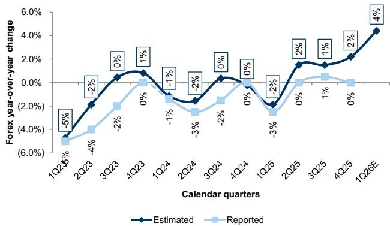  
订阅研报添加微信ource: FactSet, Company data, Goldman Sachs Global Investment Research

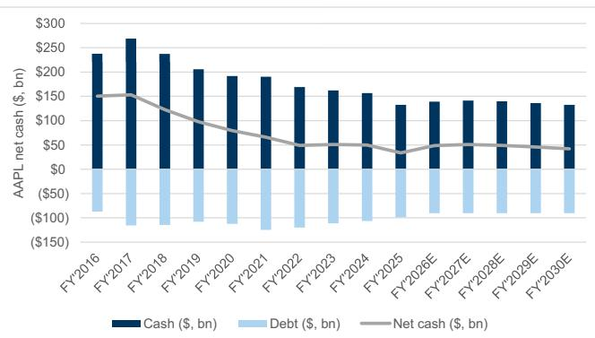  
CD123321Cad 04-20 Source: Company data, Goldman Sachs Global Investment Research

# Exhibit 41: AAPL returned $\$ 120$ bn of capital back to shareholders in F2025, and we expect this to grow over time as shareholder capital returns scale with growing free cash flow

AAPL share repurchases and dividends $\$ 5$ , bn) and as a percentage of free cash flow $( \% )$

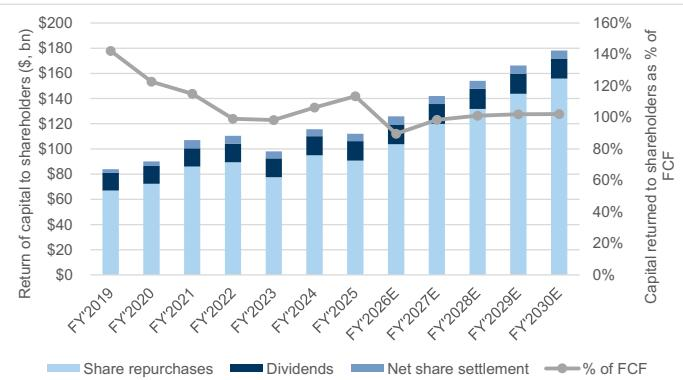

# Exhibit 42: AAPL trades at \~31X NTM P/E v. 2020-25 average of \~28x

AAPL NTM P/E (consensus)

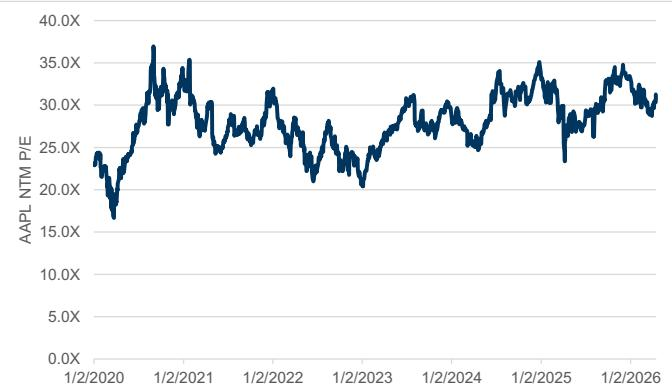  
Priced as of 4/16/2026   
Exhibit 43: On a relative basis, AAPL trades at \~133% the S&P 500 NTM P/E, just below its 2020-25 average of $139 \%$ AAPL NTM P/E relative to the S&P 500 NTM P/E (consensus)

Source: FactSet, Data compiled by Goldman Sachs Global Investment Research

# Exhibit 44: APPL trades in line with select large cap tech peers

AAPL F2026 P/E (GAAP) and F2025-30 EPS CAGR (consensus) v. select tech peers

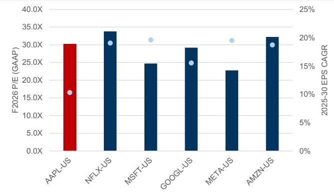  
Priced as of 4/16/26. AAPL EPS estimates are GSe.

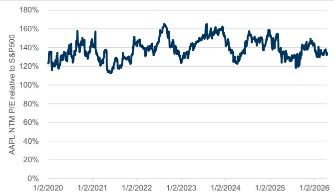  
Source: FactSet, Data compiled by Goldman Sachs Global Investment Research

Priced as of 4/16/26 04-20

# Exhibit 45: AAPL has relatively stable earnings, in line with large cap tech peers

AAPL consensus EPS v. select tech peers

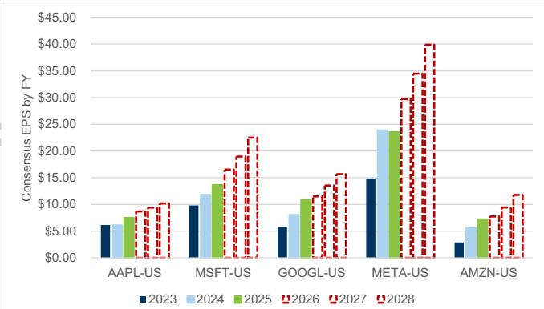

Exhibit 46: AAPL v. select comps in large cap tech, consumer brands, and payments Apple vs select comparable companies   

<table><tr><td rowspan="2"></td><td rowspan="2">F26-29</td><td colspan="4">Growth metrics</td><td colspan="4">Valuation</td></tr><tr><td>F26 revenue revenue</td><td>F25-28 revenue</td><td>iF26-29 EPS F25-28 EPS</td><td></td><td></td><td></td><td>F26FCF</td><td>F27FCF</td></tr><tr><td>Ticker</td><td>($, mn)</td><td>CAGR (3y)</td><td>CAGR (3y)</td><td>CAGR (3y)</td><td>CAGR (3y)</td><td>F26 P/E</td><td>F27 P/E</td><td>lyield %</td><td>yield %</td></tr><tr><td>AAPL-US</td><td>$471,298</td><td>5%</td><td>8%</td><td>8%</td><td>11%</td><td>30.3X</td><td>28.0x</td><td>2.5%</td><td>3.6%</td></tr><tr><td>Large cap tech</td><td></td><td></td><td></td><td></td><td></td><td></td><td></td><td></td><td></td></tr><tr><td>NFLX-US</td><td>$51,370</td><td>10%</td><td>12%</td><td>18%</td><td>22%</td><td>33.8X</td><td>27.9X</td><td>2.6%</td><td>3.2%</td></tr><tr><td>MSFT-US</td><td>$327,567</td><td>17%</td><td>16%</td><td>17%</td><td>18%</td><td>25.5X</td><td>22.1X</td><td>2.2%</td><td>2.9%</td></tr><tr><td>GOOGL-US</td><td>$471,510</td><td>13%</td><td>15%</td><td>18%</td><td>13%</td><td>29.2X</td><td>24.8X</td><td>0.6%</td><td>0.9%</td></tr><tr><td>META-US</td><td>$250,406</td><td>订阅 17%</td><td>报添 20%</td><td>18%</td><td>D 2 19%</td><td>Cad 22.8x</td><td>19.6X</td><td>0.2%</td><td>0.3%</td></tr><tr><td>Consumer brands</td><td></td><td></td><td></td><td></td><td></td><td></td><td></td><td></td><td></td></tr><tr><td>PG-US</td><td>$86,622</td><td>4%</td><td>3%</td><td>5%</td><td>4%</td><td>20.6X</td><td>19.7X</td><td>4.4%</td><td>4.8%</td></tr><tr><td>NKE-US</td><td>$46,677</td><td></td><td>4%</td><td></td><td>23%</td><td>24.6X</td><td>19.1X</td><td>4.0%</td><td>5.2%</td></tr><tr><td>DIS-US</td><td>$100,009</td><td>5%</td><td>5%</td><td>11%</td><td>11%</td><td>15.8X</td><td>14.2X</td><td>5.3%</td><td>6.2%</td></tr><tr><td>PEP-US</td><td>$98,537</td><td>3%</td><td>4%</td><td></td><td>6%</td><td>18.4X</td><td>17.3X</td><td></td><td></td></tr><tr><td>LVMH</td><td>$81,053</td><td></td><td>4%</td><td></td><td>9%</td><td>21.7X</td><td>18.8X</td><td>5.2%</td><td>5.6%</td></tr><tr><td>HSY-US</td><td>$12,245</td><td>2%</td><td>3%</td><td>10%</td><td>20%</td><td>22.8X</td><td>19.3X</td><td>4.6%</td><td>6.0%</td></tr><tr><td>Platforms with competitive moats</td><td></td><td></td><td></td><td></td><td></td><td></td><td></td><td></td><td></td></tr><tr><td>MA-US</td><td>$37,000</td><td>12%</td><td>12%</td><td>15%</td><td>16%</td><td>26.4X</td><td>22.9X</td><td>3.4%</td><td>4.0%</td></tr><tr><td>V-US</td><td>$44,677</td><td>11%</td><td>11%</td><td>13%</td><td>13%</td><td>24.5X</td><td>21.6X</td><td>4.3%</td><td>4.9%</td></tr></table>

As of 4/16/26; FactSet consensus estimates except for AAPL, which are GS estimates

Thesis summary, rating, price target, key risks

We are Buy rated on Apple with a 12-month target price of $\$ 330$ (unchanged) reflecting 34X (unchanged) our ${ \mathsf { N T M } } + { \mathsf { 1 Y } }$ EPS.

# Key risks include:

Weakening consumer demand for products and services. Apple’s products and services are typically sold to consumers and any weakness in the macroeconomic environment could reduce demand for Apple products and services. Apple generated $\sim 5 0 \%$ of its revenue from iPhones (F2025), which is highly dependent on purchases driven by upgrades. Lengthening replacement cycles due to macroeconomic headwinds, improved product durability, or lackluster product innovation could all negatively impact upgrade demand.

Supply chain disruption. Although Apple’s suppliers have a global footprint, the majority of final assembly occurs in China. Increased geopolitical tension may result in disruptions to global trade including through tariffs. While Apple has a robust supply chain network, it may rely on one or a few key suppliers for unique or hard-to-manufacture at scale parts.

Intensifying competition. Apple competes across personal devices (e.g., handsets, tablets, PCs, headphones) and a variety of services (e.g., video streaming, app distribution, advertising, music streaming, online fitness, cloud storage, product warranties). Although Apple is the largest company and the most well resourced among its competitors, it is not the market leader in every single business line. For instance, in video streaming, it faces several key competitors that invest more heavily than Apple in content.

Regulatory risks. Apple is subject to intense regulatory scrutiny in all the major markets that it operates in. Regulatory intervention could result in weakening Apple’s competitive advantages if it is forced to make its proprietary products or services available for competitors to use.

Capital allocation execution. Apple has a history of M&A, which has no guarantee of success. AAPL also has a history of share repurchases, which could prove to offer lower ROI or come under deeper regulatory scrutiny.

# Thesis summary

Apple designs, manufactures, and markets personal technology devices and sells a variety of related services. Its long history and track record of (1) designing category-defining and innovative products (e.g., Mac, iPhone, iPad, Apple Watch, AirPods, iPod); (2) protecting digital privacy; and (3) delivering premium services & experiences have contributed to an unmatched brand strength. Apple’s brand loyalty has resulted in a growing installed base of users that provide Apple with visibility into revenue growth by reducing customer churn, lowering customer acquisition costs for new product and services launches (e.g., Apple $\mathsf { T V } +$ , Apple Fitness, Apple Watch), and encouraging repeat purchases, such as phone upgrades.

We are Buy-rated on AAPL as we believe that the market’s focus on slower product revenue growth masks the strength of the Apple ecosystem and associated revenue durability & visibility. Apple’s installed base growth, secular growth in services, and new product innovation should more than offset cyclical headwinds to product revenue, such as a reduced iPhone unit demand due to a lengthening replacement cycle and reduced consumer demand for the PC & tablet category. Valuation is attractive relative to AAPL’s historical multiple - both on an absolute & relative basis - and compared to key tech peers. The majority of gross profit growth over the next 5-years should be driven by Services, which should mark an inflection point in the Services investment narrative and 订阅研报添加微信 LCD123321Cad 04-20 support AAPL’s premium multiple. The durability of Apple’s installed base and the resulting revenue growth visibility from attaching more Services and Products is what underpins the recurring revenue - or Apple-as-a-Service - opportunity.

Key risks to our view include weakening consumer demand, supply chain disruption, intensifying competition, regulatory risks, and capital allocation execution.

# Estimate changes

Our F2026/27/28 EPS estimates are unchanged on average. We decrease our product gross profit estimates by $1 \%$ on average to reflect slightly greater headwinds from commodity cost inflation, and update our iPhone, Mad, and iPad estimates to reflect 订阅研报添加微信 LCD123321Cadlatest C1Q26/C4Q25 industry shipment data. 04-20

# Exhibit 47: AAPL estimate changes

$\$ 1$ millions, except per share data

<table><tr><td></td><td colspan="3">FY&#x27;2026E</td><td colspan="3">FY&#x27;2027E Current</td><td colspan="3">Current</td><td colspan="3">FY&#x27;2028E △(%)</td></tr><tr><td></td><td>Current 471,298</td><td>Prior</td><td>△ (S,mn)</td><td>△(%) 1</td><td>Prior 493.820</td><td>△($,mn)</td><td>△(%)</td><td></td><td></td><td>Prior 517,797</td><td>△($,mn)</td></tr><tr><td>Sales Cost of sales</td><td></td><td>469,639</td><td>1,659 2.171</td><td></td><td>498,746</td><td>4,926</td><td></td><td></td><td>523,146 264,382</td><td>259.087</td><td>5,349 5,295</td></tr><tr><td></td><td>242,419</td><td>240,248</td><td></td><td>255,090</td><td>249.904</td><td>5186</td><td></td><td></td><td></td><td></td><td>2</td></tr><tr><td>Gross profit</td><td>228,879</td><td>229,391</td><td>（512）</td><td>0% 243,656</td><td>243.916</td><td>（260）</td><td>0%</td><td>258,764</td><td>258,709</td><td></td><td>54 0%</td></tr><tr><td>Research &amp;development</td><td>45,848</td><td>45,848</td><td>0</td><td>51,548</td><td>51,548</td><td>0</td><td></td><td></td><td>57,148</td><td>57,148</td><td></td></tr><tr><td>Selling,General&amp;Administration</td><td>28,918</td><td>28.918</td><td></td><td></td><td>29,718 29,718</td><td></td><td></td><td></td><td>30,518</td><td>30,518</td><td></td></tr><tr><td>Totaloperating expenses</td><td>74,766</td><td>74,766</td><td></td><td></td><td>81,266 81,266</td><td></td><td></td><td></td><td>87,666</td><td>87,666</td><td></td></tr><tr><td>Operating income</td><td>154,113</td><td>154,625</td><td>(512)</td><td>0%</td><td>162.390 162,650</td><td>（260)</td><td>0%</td><td></td><td>171,098</td><td>171,043</td><td>54 0%</td></tr><tr><td>Otherincome (expense）)，net</td><td>404</td><td>393</td><td></td><td>3%</td><td>463</td><td>16</td><td>4%</td><td></td><td>512</td><td>504</td><td>8</td></tr><tr><td>Earnings before tax</td><td></td><td></td><td>10</td><td></td><td></td><td></td><td>0%</td><td></td><td></td><td></td><td>2%</td></tr><tr><td>Tax</td><td>154,517</td><td>155,019</td><td>（502）</td><td>0% 162,853</td><td>163,097</td><td>(244)</td><td>0%</td><td></td><td>171,610</td><td>171,547</td><td>62 0%</td></tr><tr><td>Netincome-GAAP</td><td>26,681</td><td>26.766</td><td>(85)</td><td>0%</td><td>27,685 27,726</td><td>(41)</td><td></td><td></td><td>29,174</td><td>29,163</td><td>11 0%</td></tr><tr><td>Diluted EPS (GAAP)</td><td>127,836</td><td>128,252</td><td>(416)</td><td>0% 135,168 0%</td><td>135,370</td><td>(202)</td><td>0%</td><td></td><td>142,436</td><td>142,384</td><td>52 0%</td></tr><tr><td>Diluted shares</td><td>$8.70</td><td>$8.73</td><td>($0.03)</td><td></td><td>$9.41 $9.44</td><td>($0.03)</td><td>0% 0%</td><td></td><td>$10.19</td><td>$10.21</td><td>($0.02) 0%</td></tr><tr><td></td><td>14.699</td><td>14,693</td><td>6</td><td>0% 14,362</td><td>14,343</td><td>19</td><td></td><td></td><td>13,979</td><td>13,951</td><td>28 0%</td></tr><tr><td>EBITDA</td><td></td><td>企 167,848</td><td></td><td></td><td></td><td></td><td>20</td><td></td><td></td><td></td><td></td></tr><tr><td></td><td>167,332</td><td></td><td>(516)</td><td>0% 177,399</td><td>177,674</td><td>(275)</td><td>0%</td><td></td><td>187,929</td><td>187,889</td><td>40 0%</td></tr><tr><td></td><td></td><td></td><td></td><td></td><td></td><td></td><td></td><td></td><td></td><td></td><td></td></tr><tr><td>iPhone</td><td>245,851</td><td>245,278</td><td>573</td><td>254,323</td><td>251,274</td><td>3,049</td><td></td><td>1%</td><td>259,323</td><td>256,159</td><td>3,164</td></tr><tr><td>Mac</td><td>34,944</td><td>34,258</td><td>686</td><td>36,813</td><td>36.085</td><td>728</td><td></td><td></td><td>39.055</td><td>38,283</td><td>773</td></tr><tr><td>iPad</td><td>29,573</td><td>29,398</td><td>175</td><td></td><td>30,558 30,308</td><td>250</td><td></td><td>3</td><td>31,020</td><td>31,020</td><td>0</td></tr><tr><td>WearablesHomeandAccessrie</td><td>36.510</td><td>36,510 </td><td>0</td><td></td><td>38,724 38.724</td><td></td><td></td><td>0% </td><td>40,601 </td><td>40,601</td><td>0</td></tr><tr><td></td><td>&quot;346,878</td><td>345,444</td><td>“1,434</td><td>8</td><td>360,419 &quot;356,391</td><td></td><td></td><td>&quot;1%</td><td>369,999</td><td>366,062</td><td>3936</td></tr><tr><td>Services</td><td>124,419</td><td>124,195</td><td>225</td><td></td><td>138,327 137,429</td><td>898</td><td></td><td>1%</td><td>153,147</td><td>151,734</td><td>1412</td></tr><tr><td>Total revenue</td><td>471,298</td><td>469,639</td><td>1,659</td><td>0%</td><td>498,746 493,820</td><td>4,926</td><td></td><td>1%</td><td>523,146</td><td>517,797</td><td>5,349 1%</td></tr><tr><td>Products Gross Profit</td><td></td><td></td><td></td><td></td><td>139,145</td><td></td><td></td><td></td><td></td><td></td><td></td></tr><tr><td>Services Gross Profit</td><td>134,120</td><td>134,804 94,587</td><td>8</td><td></td><td>138,200 105,456</td><td>（945) 104,770</td><td></td><td>1</td><td>141,855 116.908</td><td>142,880 115,829</td><td>(1,025)</td></tr><tr><td>Gross profit</td><td>94,759 228,879</td><td>229,391</td><td>(512)</td><td>0%</td><td>243,656 243,916</td><td>686 (260)</td><td></td><td>0% 258,764</td><td></td><td>258,709</td><td>1 1,079 54 0%</td></tr><tr><td></td><td></td><td></td><td></td><td></td><td></td><td></td><td></td><td></td><td></td><td></td><td></td></tr><tr><td>Products gross margin (%)</td><td>38.7%</td><td>39.0%</td><td></td><td></td><td>38.3%</td><td>39.0%</td><td>(0.7%)</td><td></td><td>38.3%</td><td>39.0%</td><td>(0.7%)</td></tr><tr><td>Services gross margin (%) Total Gross Margin (%)</td><td>76.2%</td><td>76.2%</td><td></td><td></td><td>76.2%</td><td>76.2%</td><td>0.0%</td><td></td><td>76.3%</td><td>76.3%</td><td>0.0%2 5</td></tr><tr><td></td><td>48.6%</td><td>48.8%</td><td></td><td>(0.3%)</td><td>48.9%</td><td>49.4%</td><td>(0.5%)</td><td></td><td>49.5%</td><td>50.0%</td><td>(0.5%</td></tr></table>

<table><tr><td></td><td>3&#x27;25 Q4&#x27;25</td><td>Q1&#x27;26</td><td>Q2&#x27;26E</td><td>Q3&#x27;26E</td><td>Q4&#x27;26E</td><td>Q1&#x27;27E</td><td>Q2&#x27;27E</td><td>Q3&#x27;27E</td><td>Q4&#x27;27E</td><td>Q1&#x27;28E</td><td>Q2&#x27;28E</td><td>Q3&#x27;28E</td><td>Q4&#x27;28E</td><td>FY&#x27;2024</td><td></td><td></td><td>FY&#x27;2025FY&#x27;2026EFY&#x27;2027EFY&#x27;2028E</td><td></td><td></td><td></td></tr><tr><td>-25 ,036</td><td>Sep-25 102,466</td><td>Dec-25 143,756</td><td>Mar-26 110,337</td><td>Jun-26 103,112</td><td>Sep-26 114,093</td><td>Dec-26 146,799</td><td>Mar-27 118,846</td><td>Jun-27 113,250</td><td>Sep-27 119,851</td><td>Dec-27 152,842</td><td>Mar-28 125,858</td><td>Jun-28 119,519</td><td>Sep-28 124,926</td><td></td><td>391,035 210,352</td><td></td><td>416,161 220,960</td><td>471,298 242,419</td><td>498,746</td><td>523,146</td></tr><tr><td></td><td>,318 54,125</td><td>74.525</td><td>56,267 54，070</td><td>52.783 50,329</td><td>58.844</td><td>75,207 71,592</td><td>60,998</td><td>57,839</td><td></td><td>61,046</td><td>77,504</td><td>63.890 60,256</td><td></td><td>62.732</td><td>180,683</td><td>195,201</td><td>228,879</td><td></td><td>255,090 243,656</td><td>264,382</td></tr><tr><td></td><td>718 48.341</td><td>69,231 8,866 10,887</td><td>11,387</td><td>11,687</td><td>55,249 11,887</td><td>12,387</td><td></td><td>57,848 12,787</td><td>55,411 13,087</td><td>58.805 13,287</td><td>75,338 13,787</td><td>61,968 14,187</td><td>59,263 14,487</td><td>62,194 14,687</td><td>31,370</td><td>34,550</td><td></td><td>45.848</td><td>51,548</td><td>258,764</td></tr><tr><td></td><td>,866 ,650</td><td>7.048 7.492</td><td>7.142</td><td>7.092</td><td>7.192</td><td>7,692</td><td></td><td>7.342</td><td>7.292</td><td>7.392</td><td>7.892</td><td>7.542</td><td>7,492</td><td>7.592</td><td>26.097</td><td>27,601</td><td></td><td>28.918</td><td>29.718</td><td>57,148 30.518</td></tr><tr><td></td><td>516</td><td>15,914 18.379</td><td>18,529</td><td>18.779</td><td>19,079</td><td>20.079</td><td>20.129</td><td>20.379</td><td>20.679</td><td></td><td>21,679</td><td>21.729 21.979</td><td>22,279</td><td></td><td>57,467</td><td>62,151</td><td>74,766</td><td></td><td>81,266</td><td>87.666</td></tr><tr><td></td><td></td><td>50,852</td><td>35,541</td><td>31,550</td><td>36,170</td><td>51,513</td><td>37,719</td><td>35,032</td><td></td><td>38,126</td><td>53,659</td><td>40,239 37,284</td><td></td><td>39,915</td><td>123,216</td><td>133,050 (321)</td><td>154,113</td><td>162,390</td><td></td><td>171,098</td></tr><tr><td></td><td>202 32,427 -171</td><td>377</td><td>150</td><td>100 102</td><td>52</td><td></td><td>58</td><td>136</td><td>159</td><td>110</td><td>75</td><td>144</td><td>175</td><td>118</td><td>269</td><td></td><td>404</td><td>463</td><td></td><td>512</td></tr><tr><td></td><td>,031 32.804</td><td>51,002</td><td>35,641</td><td>31,652</td><td>36,222</td><td>51,572</td><td></td><td>37,854</td><td>35,191</td><td>38,236</td><td>53,734</td><td>40,383</td><td>37,459</td><td>40,034</td><td>123</td><td></td><td>29 154,517 26.,681</td><td>162,853</td><td>171,610</td><td></td></tr><tr><td></td><td></td><td>5,338</td><td>8.905 6,237</td><td>5,381</td><td>6,158</td><td>8,767</td><td></td><td>6,435</td><td>5,982</td><td>6,500</td><td>9,135</td><td>6,865</td><td>6,368</td><td>6,806</td><td>19</td><td></td><td>19</td><td>27,685</td><td>29,174</td><td></td></tr><tr><td></td><td>5</td><td>16.3%</td><td>17.5% 17.5% 29,404</td><td>17.0%</td><td>17.0% 30,064</td><td>17.0%</td><td></td><td>17.0%</td><td>17.0%</td><td>17.0%</td><td>17.0%</td><td>17.0%</td><td>17.0%</td><td>17.0%</td><td>1</td><td></td><td>% 1</td><td>17.3% 17.0%</td><td>17.0%</td><td></td></tr><tr><td></td><td>,434</td><td>27,466 0</td><td>42,097 0</td><td>26,271 0</td><td></td><td>0</td><td>42,805 0</td><td>31,419 0</td><td>29,208</td><td>31,736</td><td>44,600</td><td>33,518</td><td>31,091</td><td>33,228</td><td>103 1</td><td></td><td>0</td><td>127,836 135,168</td><td>142,436</td><td></td></tr><tr><td></td><td>0</td><td>27,466</td><td>42,097</td><td>0 29,404 26,271</td><td>30,064</td><td></td><td>42.805</td><td>31,419</td><td>0 29,208</td><td>0 31,736</td><td>0 44,600</td><td>0 33,518</td><td>0 31,091</td><td>回</td><td>93</td><td></td><td>10</td><td>0</td><td>0</td><td>0</td></tr><tr><td></td><td>，434 .57</td><td>$1.85</td><td>$2.85</td><td>$2.00 $1.80</td><td>$2.07</td><td></td><td>$2.96</td><td>$2.19</td><td>$2.05</td><td>$2.24</td><td>$3.17</td><td>$2.40</td><td>$2.24</td><td>33,228</td><td>s</td><td></td><td>19</td><td>127,836 $8.73</td><td>135,168</td><td>142,436</td></tr><tr><td></td><td>.57</td><td>$1.85</td><td>$2.84</td><td>$2.00 $1.79</td><td>$2.06</td><td></td><td>$2.95</td><td>$2.18</td><td>$2.04</td><td>$2.23</td><td>$3.16</td><td>$2.39</td><td>$2.23</td><td>$2.41 $2.40</td><td>$</td><td></td><td>1</td><td>$8.70</td><td>$9.45 $9.41</td><td>$10.23 $10.19</td></tr><tr><td></td><td>57 $1.85</td><td></td><td>$2.85</td><td>$2.00 $1.80</td><td>$2.07</td><td></td><td>$2.96</td><td>$2.19</td><td>$2.05</td><td>23</td><td>$3.17</td><td>$2.40</td><td>$2.24</td><td>$2.41</td><td>$</td><td></td><td>46</td><td>$8.73 $9.45</td><td></td><td>$10.23</td></tr><tr><td></td><td>$1.85</td><td></td><td>$2.84</td><td>$2.00 $1.79</td><td>$2.06</td><td></td><td>$2.95</td><td>$2.18</td><td>$2.04</td><td></td><td>$3.16</td><td>$2.39</td><td>$2.23</td><td>$2.40</td><td>$</td><td></td><td>48</td><td>$8.70 $9.41</td><td></td><td>$10.19</td></tr><tr><td></td><td>14,815</td><td></td><td>14,748</td><td>14,676 14,600</td><td>14,524</td><td></td><td>14,441 14,503</td><td>14,345</td><td>14,252</td><td>14,162</td><td>14,069</td><td>13,965</td><td>13,865</td><td>13,769</td><td>15</td><td></td><td>05</td><td>14,637 14,300</td><td></td><td>13,917</td></tr><tr><td></td><td>908 14,864 .26</td><td>$0.26</td><td>14.810 $0.26</td><td>14.738 14,662 $0.26 $0.27</td><td>14,586 $0.27</td><td></td><td>$0.27</td><td>14,407 $0.27</td><td>14.314 $0.28</td><td>14,224 $0.28</td><td>14,131 $0.28</td><td>14,028 $0.28</td><td>13.928 $0.29</td><td>13.831 $0.29</td><td>15 $</td><td></td><td>12</td><td>14,699</td><td>14,362</td><td>13.979</td></tr><tr><td></td><td></td><td></td><td></td><td></td><td></td><td></td><td>之</td><td></td><td></td><td></td><td></td><td></td><td></td><td></td><td></td><td></td><td></td><td>$1.06</td><td>$1.10 $1.14</td><td></td></tr><tr><td></td><td>3&#x27;25</td><td>Q4&#x27;25 Sep-25</td><td>Q1&#x27;26 Dec-25</td><td>Q2&#x27;26E Q3&#x27;26E Mar-26 Jun-26</td><td>Q4&#x27;26E</td><td></td><td>Q1&#x27;27E Dec-26</td><td>Q2&#x27;27E Mar-27</td><td>Q3&#x27;27E Jun-27</td><td>Q4&#x27;27E Sep-27</td><td>Q1&#x27;28E</td><td>Q2&#x27;28E</td><td>Q3&#x27;28E</td><td>Q4&#x27;28E</td><td></td><td></td><td>25FY&#x27;2026EFY&#x27;2027EFY&#x27;2028E 13%</td><td></td><td></td><td></td></tr><tr><td>9% 6% 13%</td><td>-25 10%</td><td>8%</td><td>16%</td><td>16%</td><td>Sep-26 10%</td><td>11%</td><td>2%</td><td>8%</td><td>10%</td><td>5%</td><td>Dec-27 4%</td><td>Mar-28 6%</td><td>Jun-28 6%</td><td>Sep-28 3</td><td>FY</td></table>