# F2Q26 Earnings Preview – A Clearing Event Towards \$300?

April 20, 2026 02:19 AM GMT Memory inflation will pressure margins, but this is well-known, and iPhone revenue upside sets up for a better than feared June quarter guide. Favorable seasonality, a critical WWDC vs. low expectations, the upcoming Foldable, and supportive FCF/ valuation make Apple a tactical long into earnings.

# Key Takeaways

We see modest $( 1 - 2 \% )$ upside vs. Consensus in March quarter revs/EPS given revenue upside is limited by supply constraints.

For the June quarter, we are $5 \%$ above Street revs but 170bps below Street GMs, leading to largely in-line EPS estimates $\textcircled { \$ 1. 74}$ , a better-than-feared outcome.

A better-than-feared F3Q guide can help positively reset attention into a historically seasonally strong period of outperformance...

…supported by (1) robust supply chain checks/share gains, (2) WWDC on June 8th, and (3) the new iPhone launch in September.

Remain OW-rated with $\$ 9.76$ of EPS in FY27 $5 \%$ above Street) , supporting our \$315 PT. 订阅研报添 信 123321

We expect gross margin downside to be more than offset by revenue upside in the June quarter guide, making for a better than feared earnings and a clearing event into WWDC this June, and the iPhone launch in September. While our gross margin forecast remains below Consensus given rising memory cost pressure, continued strength in iPhone, Mac, and Services revenue should more than offset this pressure and result in a June quarter implied EPS guide in-line with Street estimates $( \sim \$ 1.74)$ – a better-than-feared outcome against relatively low expectations. More importantly, we believe this setup can reset the Apple narrative into a seasonally strong period of outperformance, supported by (1) robust $7 5 \%$ avg. per quarter through FY27) revenue growth driven by share gains across multiple markets, (2) a favorable seasonal window for Apple ownership, historically driven by positive estimate revisions and multiple expansion into a new 订阅研报添加微信 LCD123321CaiPhone launch ( Exhibit 1 ), (3) an upcoming WWDC where expectations are low, but where a meaningful Siri redesign could be a meaningful sentiment tailwind (i.e. see WWDC 2024), (4) a new iPhone launch this fall that brings genuine new product excitement (i.e. iPhone Fold), and (5) a thematically favorable backdrop where Apple’s robust FCF generation stands out positively vs. rising megacap capex. At $2 8 x$ next year GAAP EPS – roughly the midpoint of Apple's historical $2 4 - 3 4 x$ valuation range – valuation is neither cheap nor taxing, but with our $\sim \$ 10$ of FY27 EPS $5 \%$ above Consensus, we see a path to $\$ 300$ for Apple shares by this September, driven by modest multiple expansion and more robust positive EPS revisions.

Key risks to our call include: (1) memory costs that could prove worse than expected even relative to our below Street GM assumptions, (2) Apple not raising pricing with the iPhone 18 launch (downside to FY27 earnings power), (3) non-normal F2H seasonality given a staggered iPhone launch, and $\left( 4 \right)$ demand deterioration if higher prices and/or macro uncertainty pressure consumer spending. Taken together, these risks keep Apple from being our Top Pick today, but they do not outweigh what we see as an increasingly attractive long setup into the September iPhone launch. Reiterate OW rating with an unchanged $\$ 375$ PT.

Average Apple Stock Performance vs. S&P 500 Before & After iPhone Announcements

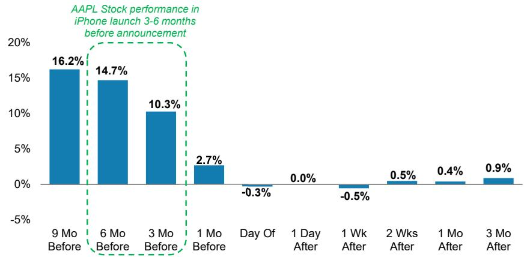  
Exhibit 1: AAPL shares historically outperformed S&P 500 by 10-15 points 3-6 研报添 Ca months ahead of an iPhone launch   
Source: FactSet, Morgan Stanley Research

First, we continue to see strong iPhone sell through in March, above-seasonal builds in June, and a significantly above-Consensus CY26 iPhone build forecast from the supply chain. We expect over $\$ 578\left. \% \forall / \forall \right)$ of iPhone revenue in the March quarter, driven by robust demand globally, but highlighted by ${ > } 2 0 \%$ Y/Y iPhone sell-through growth in Greater China. That said, component shortages – most notably TSMC’s 3nm wafers – cap Apple's March quarter revenue upside, and shift high-end iPhone demand into the June quarter, supporting better-than-seasonal iPhone builds into F3Q ( Exhibit 2 ) and our expectation for a third consecutive quarter of $\sim 2 0 \%$ Y/Y iPhone revenue growth in the June quarter, $6 \%$ above Street (MS at 61M iPhone shipments vs. \~50M Consensus). Beyond the near-term, checks from our Greater China Technology Hardware team highlight iPhone builds up HSD $\% \gamma / \gamma$ in CY26, consistent with our own single source component supplier checks pointing to 265-270M iPhone builds in CY26 (vs. \~252M shipments in CY25), and 订阅研报添加微信 LCD123321Caligning with our positive 2025 AlphaWise Smartphone Survey ( Exhibit 3 ). For context, we conservatively forecast 252M iPhone shipments in CY26, 1% above Consensus but 10-15M units below the supply chain, with every 1M units of iPhone upside equating to ${ \sim } 2 c$ of EPS upside, all else equal. All in, iPhone demand remains robust, even into a seasonally slower June quarter, and accounts for the most significant revenue upside vs. Street expectations.

Exhibit 2: Our 61M Mar Q shipments are 1M below build-implied shipments of 62M but are ${ \sim } 2 \mathsf { B }$ above Consensus, while our Jun Q iPhone shipment estimates of $5 7 . 5 1 $ are now aligned to what are implied by builds, $7 . 5 \mathsf { M }$ (or $1 5 \%$ ) higher than Consensus.

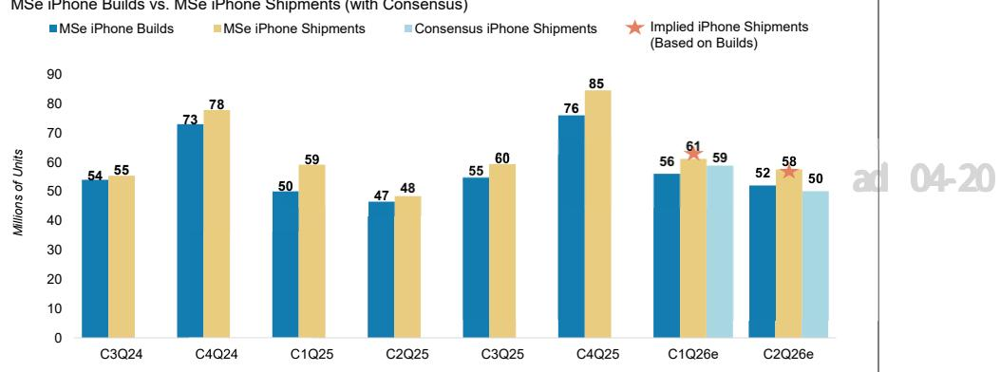  
MSe iPhone Builds vs. MSe iPhone Shipments (with Consensus)   
Source: Company data, IDC, FactSet, Morgan Stanley Research estimates

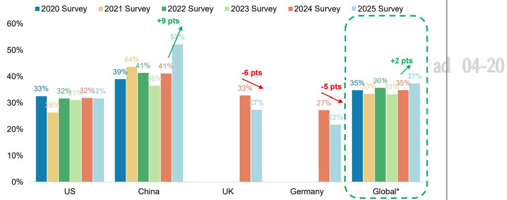  
Exhibit 3: iPhone upgrade rates improved 9 pts Y/Y in China, driving global iPhone upgrade intentions to an all-time Survey high.   
iPhone Upgrade Intentions $\%$ of Extremely Likely to Purchase an iPhone in the NTM)   
Source: AlphaWise, Morgan Stanley Research. Note: Weighted average of survey results for US, China, UK, and Germany, based on IDC T12M iPhone shipments in different countries.

Second, Mac upside is real, but remains largely immaterial to overall results. We are seeing multiple reports (here and here) of strong demand for Apple’s lower priced MacBook Neo, consistent with our Mac lead time tracker, which shows extended delivery times of 18.5 days as of April 16 – well above the M5 MacBook Air (7 days) and M5 MacBook Pro (10 days). While Neo is likely margin 订阅研报添加微信 LCD123321Cad 04-20 dilutive at these prices, IDC data for sub \$600 PCs suggests it opens Apple up to a new ${ \mathsf { 1 0 0 N } } +$ unit TAM, supporting robust Mac growth and a likely re-acceleration in device installed base growth. Our supply chain checks point to 8-10M Neo builds in CY26, and even assuming some cannibalization of non Neo Mac demand, we now expect Apple to ship ${ 3 0 } \mathsf { M } \mathsf { + }$ Mac's in CY26 $4 2 3 \%$ Y/Y), potentially taking more PC share than any single vendor this year ( Exhibit 4 ). Mac Mini demand also remains robust (63 day lead times), but a very small mix of overall Mac shipments. That said, the earnings impact from Mac upside remains limited – every $7 \%$ of Mac revenue upside translates to just 3c of EPS upside, so while the Neo launch underscores

Apple’s product strength and market share gains, we would not over emphasize Mac as a material earnings driver.

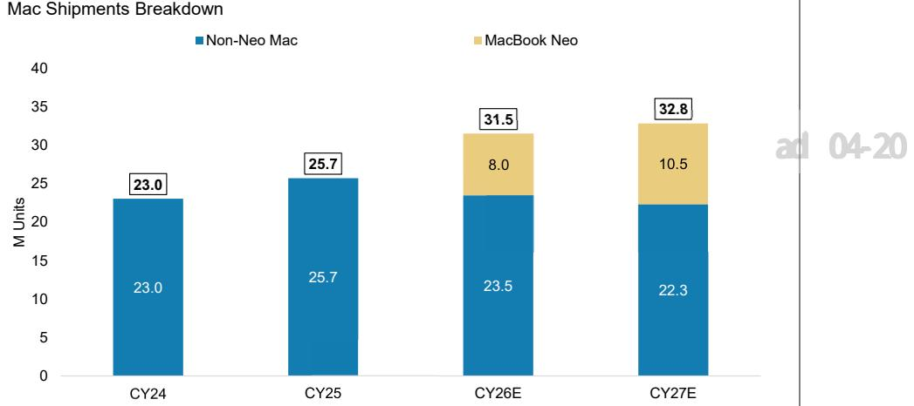  
Exhibit 4: We assume $2 0 { - } 4 0 \%$ of Mac shipments cannibalization from MacBook Neo in CY26 and CY27   
Source: Company data, IDC, Morgan Stanley Research estimates

Third, we think Services revenue should be fine and unlikely to be a major point of debate this quarter. For the March quarter, our Services revenue growth estimate of $1 3 . 7 \%$ Y/Y sits modestly below the Street at $1 4 . 1 \%$ Y/Y (and guidance of $+ 1 3 . 9 \%$ Y/Y), driven primarily by softer App Store performance – developer revenue grew $6 . 9 \%$ Y/Y, about 60bps below our prior $7 . 5 \%$ estimate. That said, slower App 订阅研报添加微信 LCD123321CStore growth has been a recurring theme over recent quarters, and Apple has still consistently met or exceeded its overall Services revenue guidance. Looking ahead to June, we forecast Services revenue growth of $1 2 . 8 \%$ Y/Y, a 90bps deceleration from March but still 20bps above Consensus at $+ 1 2 . 6 \%$ Y/Y.

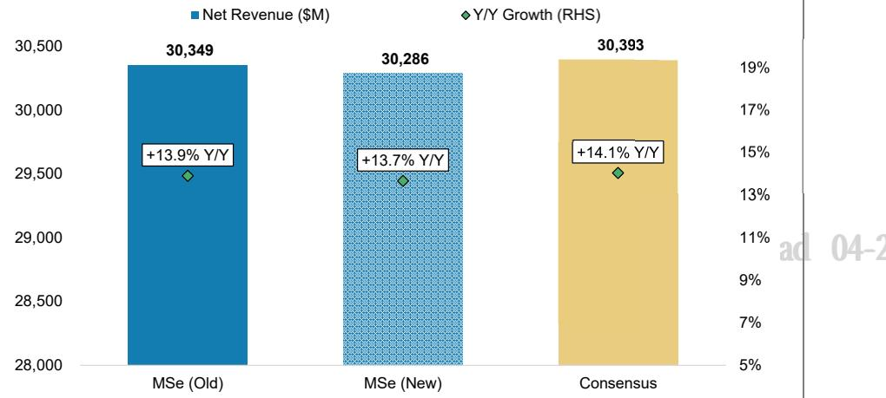  
Exhibit 5: Our March quarter Services revenue is 40bps below Consensus due to weaker App Store revenues.   
Mar '25 Quarter Services Revenue Forecast (\$M)   
Source: Company data, IDC, Morgan Stanley Research estimates

Taken together, this means our March and June quarter revenue forecasts are moving modestly higher, and are now $1 . 5 \%$ above Consensus estimate. While our March quarter revenue is only $7 \%$ above Consensus due to the cap from supply

constraints, our June quarter revenue estimate sits $5 \%$ above the Street as we see more material upside to iPhone builds/shipments, as well as Mac revenue strength driven by MacBook Neo. For what it's worth, FX could be up to a 4-point Y/Y tailwind to March quarter revenue based on our FX tracker, ahead of management's guidance of a ${ > } 1$ point Y/Y tailwind. On a full year basis, our increased FY26 and FY27 revenue forecasts are $4 \%$ and $1 7 \%$ above Consensus, respectively, driven by higher iPhone shipments and larger magnitude of like-for-like price hikes for the iPhone 18 family.

Exhibit 6: Our March and June quarter revenue are 1-5% above Consensus, 报添加微 信 driven primarily by iPhone shipment strength.   

<table><tr><td rowspan="2"></td><td colspan="5">F2Q26 (Mar Q)</td><td colspan="5">F3Q26 (Jun Q)</td></tr><tr><td>MSe</td><td>MSe (Old)</td><td>%Diff</td><td>Consensus</td><td>%Diff</td><td>MSe</td><td>MSe (Old)</td><td>%Diff</td><td>Consensus</td><td>%Diff</td></tr><tr><td>Total Revenue</td><td>110,011</td><td>109,303</td><td>0.6%</td><td>109,136</td><td>0.8%</td><td>107,079</td><td>105,375</td><td>1.6%</td><td>102,399</td><td>4.6%</td></tr><tr><td>Y/YGrowth</td><td>15.4%</td><td>14.6%</td><td>74bps</td><td>14.4%</td><td>92bps</td><td>13.9%</td><td>12.1%</td><td>181bps</td><td>8.9%</td><td>498bps</td></tr><tr><td>iPhone</td><td>57,150</td><td>56,510</td><td>1.1%</td><td>56,029</td><td>2.0%</td><td>52,665</td><td>50,793</td><td>3.7%</td><td>50,006</td><td>5.3%</td></tr><tr><td>ASP (S)</td><td>937</td><td>926</td><td>1.1%</td><td>981</td><td>-4.5%</td><td>914</td><td>921</td><td>-0.7%</td><td>983</td><td>-7.0%</td></tr><tr><td>Unit (K units)</td><td>61,000</td><td>61,000</td><td>0.0%</td><td>58,264</td><td>4.7%</td><td>57,500</td><td>55,000</td><td>4.5%</td><td>49,650</td><td>15.8%</td></tr><tr><td>iPad</td><td>6,674</td><td>6,673</td><td>0.0%</td><td>6,751</td><td>-1.1%</td><td>6,847</td><td>6,690</td><td>2.4%</td><td>7,074</td><td>-3.2%</td></tr><tr><td>Mac</td><td>8.040</td><td>7945</td><td>1.2%</td><td>8,234</td><td>-2.4%</td><td>8,839</td><td>8,944</td><td>-1.2%</td><td>8,165</td><td>8.3%</td></tr><tr><td>Wearables</td><td>7,860</td><td>7,826</td><td>0.4%</td><td>8,074</td><td>-2.6%</td><td>7,796</td><td>7,951</td><td>-2.0%</td><td>7,637</td><td>2.1%</td></tr><tr><td>Services</td><td>30,286</td><td>30,349</td><td>-0.2%</td><td>30,393</td><td>-0.4%</td><td>30,933</td><td>30,998</td><td>-0.2%</td><td>30,887</td><td>0.2%</td></tr><tr><td>Gross Profit</td><td>53,507</td><td>52,980</td><td>1.0%</td><td>52,665</td><td>1.6%</td><td>49,292</td><td>47,415</td><td>4.0%</td><td>48,617</td><td>1.4%</td></tr><tr><td>EBIT</td><td>34,832</td><td>34,289</td><td>1.6%</td><td>34,596</td><td>0.7%</td><td>30,338</td><td>28,447</td><td>6.6%</td><td>30,437</td><td>-0.3%</td></tr><tr><td>Pre-tax Profits</td><td>34,932</td><td>34,389</td><td>1.6%</td><td>34,327</td><td>1.8%</td><td>30,473</td><td>28,581</td><td>6.6%</td><td>30,471</td><td>0.0%</td></tr><tr><td>NetIncome</td><td>28,819</td><td>28,371</td><td>1.6%</td><td>28,372</td><td>1.6%</td><td>25,598</td><td>24,008</td><td>6.6%</td><td>25,276</td><td>1.3%</td></tr><tr><td>EPS</td><td>$1.96</td><td>$1.93</td><td>1.6%</td><td>$1.94</td><td>1.0%</td><td>$1.74</td><td>$1.64</td><td>6.6%</td><td>$1.73</td><td>1.0%</td></tr><tr><td>Gross Margin</td><td>48.6%</td><td>48.5%</td><td>17bps</td><td>48.3%</td><td>38bps</td><td>46.0%</td><td>45.0%</td><td>104bps</td><td>47.5%</td><td>-145bps</td></tr><tr><td>OpM</td><td>31.7%</td><td>31.4%</td><td>29bps</td><td>31.7%</td><td>-4bps</td><td>28.3%</td><td>27.0%</td><td>134bps</td><td>29.7%</td><td>-139bps</td></tr><tr><td>Effective Tax Rate</td><td>17.5%</td><td>17.5%</td><td>Obps</td><td>17.3%</td><td>15bps</td><td>16.0%</td><td>16.0%</td><td>Obps</td><td>17.0%</td><td>-105bps</td></tr><tr><td>NetMargin</td><td>26.2%</td><td>26.0%</td><td>24bps</td><td>26.0%</td><td>20bps</td><td>23.9%</td><td>22.8%</td><td>112bps</td><td>24.7%</td><td>-78bps</td></tr></table>

Source: Company data, FactSet, Morgan Stanley Research estimates

That said, our $46 \%$ June quarter gross margin is 150bps below Street and towards the low-end of buyside gross margin expectations $( 4 6 - 4 7 \% )$ in the June 订阅研报添加微信 LCD123321Cquarter. Apple's June quarter gross margin guide has been the topic du jour over the last 3 months given concerns about memory price inflation, and we remain the "bears" here, with our new $4 6 \%$ consolidated June quarter gross margin 150bps below Consensus and at the low-end of $4 6 { - } 4 7 \%$ buyside expectations. For context, historical seasonality would support a $4 7 . 5 { - } 4 8 \%$ June quarter gross margin guidance midpoint, so both MSe and buyside expectations are well-below seasonal. But for good reason – every $10 \%$ increase in NAND/DRAM $\$ 16 B$ impacts June quarter iPhone gross margins by 30bps/40bps, all else equal. And given NAND/DRAM contract prices are up $1 2 0 { - } 1 5 0 \%$ in the last 6 months, and reports indicate Apple is paying close to market prices, we see a significant Product gross margin headwinds into the June quarter. Partially offsetting this headwind is FX, volume leverage, highend mix shift, pressuring suppliers, inventory management, and a potentially lower tariff expense, but on a net basis we still see relative downside to Street gross margins in June (our gross margin waterfall is available upon request).

Where could we be too conservative? We don't know how much low-cost memory inventory Apple has coming into June, and we don't know the exact $\$ 16 B$ they are paying for NAND and DRAM. Our $4 6 \%$ gross margin estimate assumes minimal lowcost inventory and $6 0 - 7 0 \%$ Q/Q memory cost increases, which we don't believe are overly aggressive, but are likely the key swing factors dictating June quarter gross margin guidance.

Memory Costs $\%$ of iPhone COGS

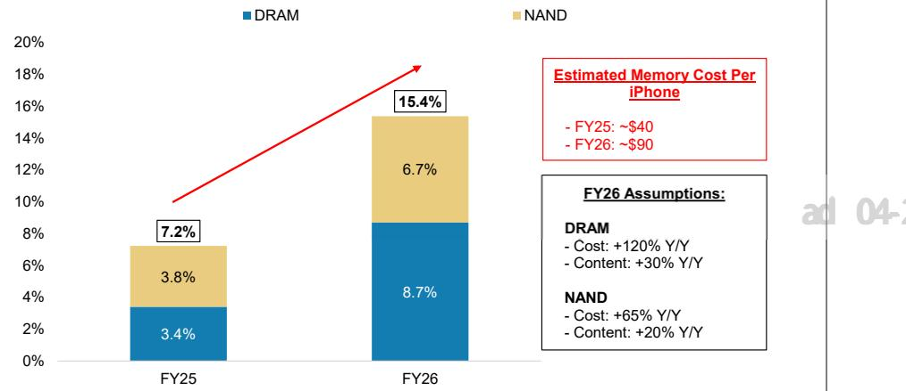  
Exhibit 7: We expect memory costs $\%$ of iPhone COGS to more than double Y/Y in FY26, driven by both cost/GB increases and memory content growth.   
Source: Company data, Morgan Stanley Research estimates

But when we combine revenue upside with gross margin downside, our EPS estimates still move higher, and we continue to see a path towards $\yen 10$ of EPS in FY27 despite the memory cost headwinds – PT unchanged at $\$ 315$ . Combining our above Street revenue assumptions with below Street margin forecasts, our EPS forecast increases $2 . 7 \%$ vs. our prior estimates. For the June quarter specifically, our higher revenue assumptions lift our EPS estimate to $\$ 1.74,7 \%$ above Consensus at $\$ 123$ . Importantly, we believe our estimate is towards the high end of buyside expectations (\$1.65-1.73 range), and we'd characterize an implied guide in-line with Consensus EPS as "better-than-feared". For FY26 and FY27, we now model EPS of $\$ 8.69$ and $\$ 9.76$ , respectively. Our $\$ 375$ price target – based on $\sim 3 2 x$ FY27 EPS of $\$ 9.76$ – remains unchanged.

Exhibit 8: While our gross margin estimates are 60-190bps below Consensus, our EPS forecasts are $2 \%$ above Street, primarily driven by higher iPhone shipments and ASP forecasts.

<table><tr><td colspan="6">FY26E</td><td colspan="5">FY27E</td></tr><tr><td></td><td>MSe</td><td>MSe (Old)</td><td>%Diff</td><td>Consensus</td><td>%Diff</td><td>MSe</td><td>MSe (Old)</td><td>%Diff</td><td>Consensus</td><td>%Diff</td></tr><tr><td>Total Revenue</td><td>482,388</td><td>478,334</td><td>0.8%</td><td>465,084</td><td>3.7%</td><td>549,907</td><td>529,630</td><td>3.8%</td><td>497,465</td><td>10.5%</td></tr><tr><td>Y/Y Growth</td><td>31.9%</td><td>30.8%</td><td>111bps</td><td>11.8%</td><td>2,011bps</td><td>14.0%</td><td>10.7%</td><td>327bps</td><td>7.0%</td><td>703bps</td></tr><tr><td>iPhone</td><td>257,664</td><td>253,467</td><td>1.7%</td><td>245,853</td><td>4.8%</td><td>305,101</td><td>287,783</td><td>6.0%</td><td>258,508</td><td>18.0%</td></tr><tr><td>ASP(S)</td><td>975</td><td>977</td><td>-0.2%</td><td>961</td><td>1.5%</td><td>1,139</td><td>1,074</td><td>6.0%</td><td>993</td><td>14.7%</td></tr><tr><td>Unit (K units)</td><td>264,579</td><td>259,579</td><td>1.9%</td><td>249,922</td><td>5.9%</td><td>268,000</td><td>268,000</td><td>0.0%</td><td>250,400</td><td>7.0%</td></tr><tr><td>iPad</td><td>30,007</td><td>29,561</td><td>1.5%</td><td>29,553</td><td>1.5%</td><td>31,501</td><td>30,296</td><td>4.0%</td><td>29,696</td><td>6.1%</td></tr><tr><td>Mac</td><td>34,967</td><td>35,158</td><td>-0.5%</td><td>33,729</td><td>3.7%</td><td>37,992</td><td>36,364</td><td>4.5%</td><td>35,628</td><td>6.6%</td></tr><tr><td>Wearables</td><td>36,190</td><td>36,429</td><td>-0.7%</td><td>36,227</td><td>-0.1%</td><td>37,404</td><td>37,189</td><td>0.6%</td><td>37,424</td><td>-0.1%</td></tr><tr><td>Services</td><td>123,561</td><td>123,718</td><td>-0.1%</td><td>123,434</td><td>0.1%</td><td>137,909</td><td>137,997</td><td>-0.1%</td><td>137,554</td><td>0.3%</td></tr><tr><td>Gross Profit</td><td>227,534</td><td>224,917</td><td>1.2%</td><td>222,292</td><td>2.4%</td><td>251,537</td><td>251,073</td><td>0.2%</td><td>237,127</td><td>6.1%</td></tr><tr><td>EBIT</td><td>152,202</td><td>149,660</td><td>1.7%</td><td>149,468</td><td>1.8%</td><td>168,014</td><td>167,792</td><td>0.1%</td><td>160,165</td><td>4.9%</td></tr><tr><td>Pre-tax Profits</td><td>152,722</td><td>150,175</td><td>1.7%</td><td>150,217</td><td>1.7%</td><td>168,515</td><td>168,258</td><td>0.2%</td><td>160,203</td><td>5.2%</td></tr><tr><td>Net Income</td><td>127,018</td><td>124,887</td><td>1.7%</td><td>124,124</td><td>2.3%</td><td>141,553</td><td>141,337</td><td>0.2%</td><td>133,430</td><td>6.1%</td></tr><tr><td>EPS</td><td>$8.63</td><td>$8.49</td><td>1.7%</td><td>$8.49</td><td>1.7%</td><td>$9.76</td><td>$9.74</td><td>0.2%</td><td>$9.32</td><td>4.7%</td></tr><tr><td>Gross Margin</td><td>47.2%</td><td>47.0%</td><td>15bps</td><td>47.8%</td><td>-63bps</td><td>45.7%</td><td>47.4%</td><td>-166bps</td><td>47.7%</td><td>-193bps</td></tr><tr><td>OpM</td><td>31.6%</td><td>31.3%</td><td>26bps</td><td>32.1%</td><td>-59bps</td><td>30.6%</td><td>31.7%</td><td>-113bps</td><td>32.2%</td><td>-164bps</td></tr><tr><td>Effective Tax Rate</td><td>16.8%</td><td>16.8%</td><td>-1bps</td><td>17.4%</td><td>-54bps</td><td>16.0%</td><td>16.0%</td><td>Obps</td><td>16.7%</td><td>-71bps</td></tr><tr><td>NetMargin</td><td>26.3%</td><td>26.1%</td><td>22bps</td><td>26.7%</td><td>-36bps</td><td>25.7%</td><td>26.7%</td><td>-94bps</td><td>26.8%</td><td>-108bps</td></tr></table>

Source: Company data, FactSet, Morgan Stanley Research estimates

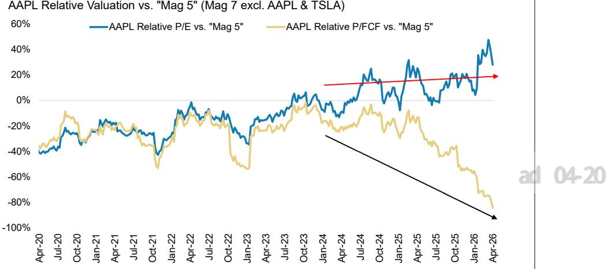  
Exhibit 9: Apple's rich FCF generation puts it at a $8 5 \%$ discount vs. "Mag 5" today   
  
Source: FactSet, Morgan Stanley Research

Finally, we do not expect a material change or surprise on capital returns this quarter. Apple typically refreshes its capital allocation framework each F2Q, and we expect that messaging to remain stable, including a ${ \sf M S D \% }$ Y/Y dividend increase and a $\$ 90 – 100 B$ expansion of buyback authorization. This implies an unchanged share buyback cadence of roughly $\$ 22-25 B$ per quarter.

Beyond this quarter, we see two critical catalysts that should make this earnings a clearing event and set up a seasonally stronger period of performance for Apple. The first is Apple's Worldwide Developer Conference (WWDC) keynote on 订阅研报添加微信 LCD123321CJune 8th, where we expect Apple to introduce a re-designed Siri and Apple Intelligence platform. Exact details are still in flux, but this event is shaping up to have even more importance than 2024 (which led to a $30 \%$ rally in the stock and 6x turns of multiple expansion over the ensuing 6 months) given the AI progress we see at peers vs. Apple's relative non-involvement in the "AI trade" (but progress being signaled behind the scenes at Apple). On a scale from 1 to 10, investor expectations into WWDC are a 0, meaning if Apple can deliver an adequate (and ontime) product, we should expect a mid-summer rally in Apple shares. We'd again highlight that Apple's sizable SoIC booking at TSMC in CY27 (as big as AMD's) implies that Apple is bullish on Apple Intelligence query growth.

The second catalyst is the September iPhone launch, which is more than a routine annual refresh. New form factors (i.e. the foldable iPhone) and, more importantly, Apple’s pricing strategy will be key to watch, particularly with memory costs rising sharply. We currently embed $\$ 100+$ like-for-like pricing increases for the iPhone 18 订阅研报添加微信 LCD123321Cfamily, which we believe is enough to protect gross profit dollars in FY27, but not gross margins (i.e we still have gross margins lower Y/Y in FY27). Based on our estimates, without any like for like pricing increase for the iPhone 18 family, FY27 iPhone gross margin would fall to the low- $30 \%$ range (from ${ \sim } 4 0 \%$ in FY26), implying company level gross margin in the low to-mid $40 \%$ range (vs. ${ \sim } 4 7 \%$ in FY26) and earnings power closer to $\sim \$ 800$ (vs. $\$ 9.74$ in FY27) barring significant iPhone shipments upside, illustrating the criticality of pricing decisions this fall. We would also note the potential for new robotics/smart home products, and/or AR glasses in C2H, though we view these as call options with limited investor

expectations embedded today.

The key downside risks vs. our updated view are concentrated around memory costs and their downstream impact on pricing, which we view as the most important risk today. At the top of the list is Apple’s exposure to rising memory purchasing prices and uncertainty around low cost inventory on hand, and whether Apple ultimately chooses to pass those costs through via pricing. Beyond that, we see three additional risks worth flagging, in order of importance:

1. Residual memory cost pressure. Even with our below Street   
2. Demand risk. Higher iPhone pricing and/or a weaker macro backdrop and shipments.   
3. Modeling risk around the staggered iPhone launch. The Street still does margin estimates volatility as we head into C2H26.

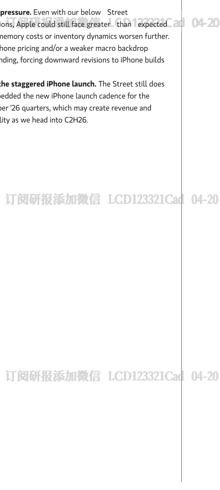

# Preview to earnings

<table><tr><td>Focus KPI</td><td>Focus KPI Surprise</td><td>Likely impact to consensus EPS*</td></tr><tr><td>Apple,Inc.AAPL.O</td><td></td><td></td></tr><tr><td>Implied June Quarter EPS Guidance</td><td>- In-line</td><td>- Largely unchanged</td></tr></table>

\*Likely impact to consensus EPS is for the next 12 months Source: Company data, Morgan Stanley Research

# ‹¢–xb¥mûR _®Oá   LCD123321Cad   04-20

# Risk Reward - Apple, IRisk Reward – Apple, Inc. (AAPL.O)

More Near-Term Cost Uncertainties Before a Catalyst-Laden 2H

# \$315.00PRICE TARGET

# OVERWEIGHT THESIS

Our $\$ 315$ PT is based an 8.1x EV/Sales FY27 multiple, which is derived from a regression of tech and consumer platform peers. Our price target implies ${ \sim } 3 2 \times P / E$ on $\$ 9.76$ FY27 EPS.

Consensus Price Target Distribution

Source: Re fi nitiv, Morgan Stanley Research

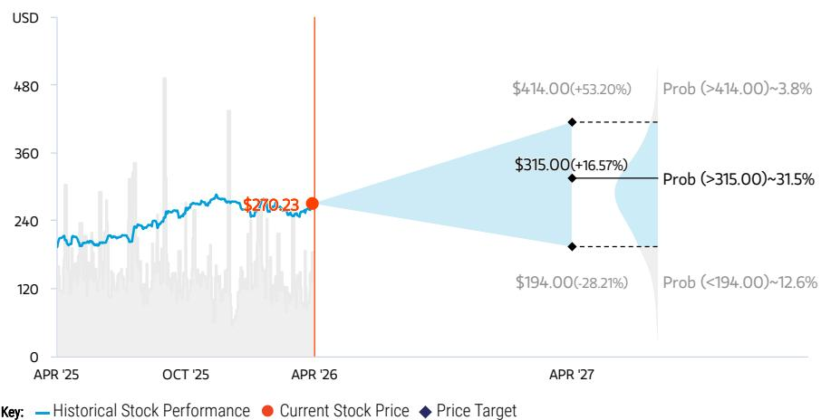  
RISK REWARD CHART AND OPTIONS IMPLIED PROBABILITIES (12M)   
Source: Re nitiv, Morgan Stanley Research, Morgan Stanley Institutional Equities Division. The probabilities of our Bull, Base, and Bear case scenarios playing out were estimated with implied volatility data from the options market as of 17 fiApr 2026. All gures are approximate risk-neutral probabilities of the stock reaching beyond the scenario price in either three-months’ or one-years’ time. View explanation of Options Probabilities methodology here

With the most elongated iPhone replacement cycles, new AI features rolling out around the world, and a renewed focus on device form factor changes, we believe Apple can accelerate iPhone growth starting 04-20 in FY26, with replacement cycles peaking as aged installed base starts to upgrade. When combined with consistent, double digit services growth and moderate operating leverage, we believe Apple can earn $\$ 8.63$ in FY26 and $\$ 9.76$ by FY27. Memory cost dynamic could create uncertainties in the near term. Longer-term, investments in AI, payments, cloud, health, and home, and long runway to grow spend per user from $\$ 1$ 1/day today are key arguments for sustained longterm growth and value creation.

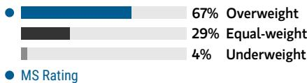  
Consensus Rating Distribution   
Source: Re nitiv, Morgan Stanley Research

# Risk Reward Themes

Disruption: Positive New Data Era: Positive Pricing Power: Positive View descriptions of Risk Rewards Themes here

# BULL CASE

# $\$ 414.00$

# BASE CASE

# $\$ 315.00$

# BEAR CASE

\$194.00

# ${ 1 0 . 9 \times }$ EV/Sales FY27; 39.1x Bull FY27 P/E of $\$ 10.60$

iPhone replacement cycles accelerate in FY26/FY27 with Robotics as an long-term upside. Consumer demand returns, and stronger than expected iPhone 17 upgrade intentions $^ +$ mix shift to higher end iPhones drives mid-teens Y/Y iPhone revenue growth, while rising component costs are mitigated given Apple's bargaining power against consumers and the supply chain. Our bull case valuation implies a 39.1x P/E multiple on FY27 Bull EPS, which embeds $\$ 22$ per share of upside from its Robotics efforts.

# 8.1x EV/Sales FY27 or $\sim 3 2 x$ FY27 EPS of $\$ 9.76$

Services and margins remain resilient, while investors start to expect stronger iPhone cycles ahead. Revenue grows $1 4 \% \forall \%$ in FY27, driven by $10 \% +$ Services growth and mid-teens $\%$ Products growth. GM may contract Y/Y in FY27 driven by higher Product revenue mix and memory costs, while Apple leverages the supply chain and repricing to mitigate the cost impact. The iPhone replacement cycle are peaking and create pent up demand for upgrades in FY27.

# 6.3x EV/Sales FY27; 24.6x FY27 Bear EPS of $\$ 7.89$

iPhone 17 cycle disappoints as consumer spending weakens more than expected amidst synthetic price increases. Growth slows further across the portfolio as discretionary income is pressured by hard landing, leading to just LSD of Product rev growth and decelerating Services rev growth in FY26. With revenue slightly growing but margin contracting, FY26 EPS will only grow MSD to $\sim \$ 7.36$ . Our bear case 04-20 valuation implies a 24.6x FY27 P/E, below T5Y avg of $2 6 . 0 \times$ due to plateauing Services pro t mix.

# Risk Reward – Apple, Inc. (AAPL.O)

KEY EARNINGS INPUTS   

<table><tr><td>Drivers</td><td>2025</td><td>2026e</td><td>2027e</td><td>2028e</td></tr><tr><td>Total Revenue Growth (Y/Y) (%)</td><td>6.4</td><td>15.9</td><td>14.0</td><td>5.4</td></tr><tr><td>iPhone Revenue Growth (Y/Y) (%)</td><td>4.2</td><td>22.9</td><td>18.5</td><td>3.9</td></tr><tr><td>Services Revenue Growth (Y/Y) (%)</td><td>13.5</td><td>13.2</td><td>11.6</td><td>10.2</td></tr><tr><td>Gross Margin (%)</td><td>46.9</td><td>47.2</td><td>45.7</td><td>47.1</td></tr><tr><td>EPS Growth (Y/Y) (%)</td><td>10.6</td><td>15.6</td><td>13.1</td><td>9.4</td></tr></table>

# INVESTMENT DRIVERS

Positive iPhone build revisions / clearer signs of accelerating replacement cycles Services revenue growth reacceleration Apple Intelligence feature and distribution expansion New product launches in home, health and AI

# GLOBAL REVENUE EXPOSURE

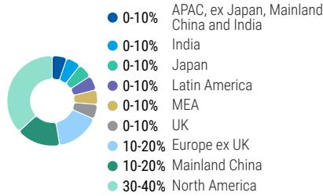  
Source: Morgan Stanley Research Estimate View explanation of regional hierarchies here

# MS ALPHA MODELS

Source: Re nitiv, FactSet, Morgan Stanley Research; 1 is the highest favored Quintile and 5 is the least favored Quintile

# RISKS TO PT/RATING

# RISKS TO UPSIDE

iPhone 17 outperforms expectations   
Apple Intelligence adoption surprises to the upside   
Apple pulls forward form factor changes   
Services growth re-accelerates despite tougher compares   
Gross margins surprise positively

# RISKS TO DOWNSIDE

Weak consumer spending limits iPhone upgrade rates   
Higher memory input costs   
Limited progress on AI features   
Geopolitical tensions   
Increased regulation, particularly with App 添Store

# OWNERSHIP POSITIONING

Inst. Owners, % Active $4 8 . 3 \%$ HF Sector Long/Short Ratio $2 . 1 \mathsf { x }$ HF Sector Net Exposure $2 5 . 2 \%$

Re nitiv; MSPB Content. Includes certain hedge fund exposures held with MSPB. Information may be inconsistent with or may not re ect broader market trends. Long/Short Ratio $\underline { { \underline { { \mathbf { \delta \pi } } } } }$ Long Exposure / Short exposure. Sector % of Total Net Exposure $\underline { { \underline { { \mathbf { \delta \pi } } } } }$ (For a particular sector: Long Exposure - Short Exposure) / (Across all sectors: Long Exposure – Short Exposure).

# MS ESTIMATES VS. CONSENSUS

FY Sep 2027e

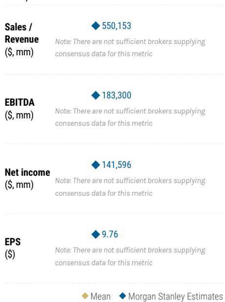  
Source: Re nitiv, Morgan Stanley Research

# Apple (AAPL) Financial Model

Exhibit 10: Apple Income Statement   

<table><tr><td colspan="5">2025A</td><td colspan="4">2026E</td><td colspan="4">2027E</td><td colspan="5"></td></tr><tr><td>Dec-24</td><td> Mar-25</td><td></td><td> Jun-25</td><td>Sep-25</td><td>Dec-25</td><td>Mar-26</td><td>Jun-26</td><td>Sep-26</td><td>Dec-26</td><td>Mar-27</td><td>Jun-27</td><td>Sep-27</td><td>2024A</td><td>2025A</td><td>Fiscal Year 2026E</td><td>2027E</td><td>2028E</td></tr><tr><td></td><td>124,300 95,359</td><td>94,036</td><td>102,466</td><td>143,756</td><td></td><td>110,011</td><td>107,079</td><td>121,542</td><td>150,033</td><td>132,824</td><td>131,907</td><td>135,389</td><td>391,035</td><td>416,161</td><td>482,388</td><td>550,153</td><td>579,835</td></tr><tr><td></td><td>69,138 46,841</td><td>44,582</td><td>49,025</td><td>85,269</td><td></td><td>57,150</td><td>52,665</td><td>62,580</td><td>85,657</td><td>75,333</td><td>72,614</td><td>71,743</td><td>201,183</td><td>209,586</td><td>257,664</td><td>305,347</td><td>317,357</td></tr><tr><td></td><td>8,088</td><td>6,402</td><td>6,581</td><td>6,952</td><td>8,595</td><td>6,674</td><td>6,847</td><td>7,891</td><td>9,222</td><td>7,076</td><td>7,305</td><td>7,898</td><td>26,694</td><td>28,023</td><td>30,007</td><td>31,501</td><td>32,160</td></tr><tr><td></td><td>8,987</td><td>7,949</td><td>8,046</td><td>8,726</td><td>8,386</td><td>8,040</td><td>8,839</td><td>9,702</td><td>9,529</td><td>8,760</td><td>9,204</td><td>10,499</td><td>29,984</td><td>33,708</td><td>34,967</td><td>37,992</td><td>38,790</td></tr><tr><td></td><td>11,747</td><td>7,522</td><td>7,404</td><td>9,013</td><td>11,493</td><td>7,860</td><td>7,796</td><td>9,041</td><td>12,103</td><td>7,845</td><td>8,214</td><td>9,241</td><td>37,005</td><td>35,686</td><td>36,190</td><td>37,404</td><td>39,565</td></tr><tr><td></td><td>26,340 26,645</td><td>27,423</td><td></td><td>28,750</td><td>30,013</td><td>30,286</td><td>30,933</td><td>32,328</td><td>33,522</td><td>33,811</td><td>34,569</td><td>36,007</td><td>96,169</td><td>109,158</td><td>123,561</td><td>137,909</td><td>151,963</td></tr><tr><td>66,025</td><td>50,492</td><td>50,318</td><td></td><td>54,125</td><td>74,525</td><td>56,504</td><td>57,788</td><td>66,037</td><td>82,775</td><td>72,145</td><td>71,996</td><td>71,610</td><td>210,352</td><td>220,960</td><td>254,854</td><td>298,525</td><td>306,463</td></tr><tr><td>58,275</td><td>44,867</td><td>43,718</td><td></td><td>48,341</td><td>69,231</td><td>53,507</td><td>49,292</td><td>55,505</td><td>67,258</td><td>60,679</td><td>59,911</td><td>63,778</td><td>180,683</td><td>195,201</td><td>227,534</td><td>251,628</td><td>273,372</td></tr><tr><td>46.9%</td><td>47.1%</td><td>46.5%</td><td>47.2%</td><td></td><td>48.2%</td><td>48.6%</td><td>46.0%</td><td>45.7%</td><td>44.8%</td><td>45.7%</td><td>45.4%</td><td>47.1%</td><td>46.2%</td><td>46.9%</td><td>47.2%</td><td>45.7%</td><td>47.1%</td></tr><tr><td>15,443</td><td>15,278</td><td>15,516</td><td>15,914</td><td>18,379</td><td></td><td>18,674</td><td>18,953</td><td>19,325</td><td>20,705</td><td>20,721</td><td>20,949</td><td>21,188</td><td>57,467</td><td>62,151</td><td>75,331</td><td>83,563</td><td>91,088</td></tr><tr><td>8,268</td><td>8,550</td><td>8,866</td><td>8,866</td><td></td><td>10,887</td><td>11,414</td><td>11,779</td><td>11,911</td><td>12,603</td><td>13,017</td><td>13,455</td><td>13,403</td><td>31,370</td><td>34,550</td><td>45,990</td><td>52,478</td><td>58,668</td></tr><tr><td>7,175</td><td>6,728 29,589</td><td>6,650</td><td>7,048</td><td></td><td>7,492</td><td>7,261</td><td>7,174</td><td>7,414</td><td>8,102</td><td>7,704</td><td>7,495</td><td>7,785</td><td>26,097</td><td>27,601</td><td>29,341</td><td>31,085</td><td>32,421 182,283</td></tr><tr><td>42,832 34.5%</td><td>31.0%</td><td>28,202 30.0%</td><td>32,427 31.6%</td><td></td><td>50,852 35.4%</td><td>34,832 31.7%</td><td>30,338</td><td>36,180 29.8%</td><td>46,554 31.0%</td><td>39,959 30.1%</td><td>38,962 29.5%</td><td>42,590</td><td>123,216</td><td>133,050</td><td>152,202 31.6%</td><td>168,065 30.5%</td><td>31.4%</td></tr><tr><td></td><td></td><td></td><td></td><td></td><td></td><td></td><td>28.3%</td><td></td><td></td><td></td><td></td><td>31.5%</td><td>31.5%</td><td>32.0%</td><td></td><td></td><td></td></tr><tr><td>(248)</td><td>(279)</td><td>(171)</td><td></td><td>377</td><td>150</td><td>100</td><td>135</td><td>135</td><td>104</td><td>114</td><td>137</td><td>147</td><td>269</td><td>(321)</td><td>519</td><td>502</td><td>207</td></tr><tr><td>42,584</td><td>29,310</td><td>28,031</td><td>32,804</td><td></td><td>区 51,002H34,932</td><td></td><td>30,473J136,315</td><td></td><td>46,658</td><td>40,073U</td><td>39,099</td><td>42,737</td><td>123,485</td><td>132,729</td><td>152,722</td><td>168,567</td><td>182,490</td></tr><tr><td>6,254</td><td>4,530</td><td>4,597</td><td>5,338</td><td></td><td>8,905</td><td>6,113</td><td>4,876</td><td>5,810</td><td>7,465</td><td>6,412</td><td>6,256</td><td>6,838</td><td>29,749</td><td>20,719</td><td>25,704</td><td>26,971</td><td>29,198</td></tr><tr><td>6,254 14.7%</td><td>4,530 15.5%</td><td>4,597 16.4%</td><td>5,338</td><td></td><td>8,905 17.5%</td><td>6,113 17.5%</td><td>4,876 16.0%</td><td>5,810 16.0%</td><td>7,465 16.0%</td><td>6,412 16.0%</td><td>6,256 16.0%</td><td>6,838</td><td>19,503 15.8%</td><td>20,719 15.6%</td><td>25,704 16.8%</td><td>26,971 16.0%</td><td>29,198 16.0%</td></tr><tr><td></td><td></td><td></td><td></td><td>16.3%</td><td></td><td></td><td></td><td></td><td></td><td></td><td></td><td>16.0%</td><td></td><td></td><td></td><td></td><td></td></tr><tr><td>36,330 29.2%</td><td>24,780 26.0%</td><td>23,434 24.9%</td><td>27,466 26.8%</td><td></td><td>42,097 29.3%</td><td>28,819 26.2%</td><td>25,598 23.9%</td><td>30,504 25.1%</td><td>39,193 26.1%</td><td>33,661 25.3%</td><td>32,843 24.9%</td><td>35,899 26.5%</td><td>103,982 26.6%</td><td>112,010 26.9%</td><td>127,018 26.3%</td><td>141,596 25.7%</td><td>153,292 26.4%</td></tr><tr><td>·</td><td></td><td></td><td></td><td></td><td>·</td><td>·</td><td></td><td></td><td></td><td></td><td></td><td></td><td></td><td></td><td></td><td></td><td></td></tr><tr><td>36,330</td><td>· 24,780</td><td>· 23,434</td><td>· 27,466</td><td></td><td>42,097</td><td>28,819</td><td>25,598 30,504</td><td>39,193</td><td></td><td>33,661</td><td>· 32,843</td><td>： 35,899</td><td>(10,246) 93,736</td><td>· 112,010</td><td>· 127,018</td><td>141,596</td><td>- 153,292</td></tr><tr><td></td><td></td><td></td><td></td><td></td><td></td><td></td><td></td><td></td><td></td><td></td><td></td><td></td><td></td><td></td><td></td><td></td><td></td></tr></table>

Source: Company data, Morgan Stanley Research estimates

Exhibit 11: Apple Income Statement Analysis   

<table><tr><td></td><td colspan="3">2025A Jun-25</td><td colspan="3">Sep-25</td><td colspan="3">Mar-27</td><td colspan="3">Jun-27</td><td colspan="3">FiscalYear 2025A</td></tr><tr><td>($ in millions)</td><td colspan="3">Dec-24 Mar-25</td><td colspan="3">Dec-25 Mar-26</td><td colspan="3">Sep-26 Dec-26</td><td colspan="3">Sep-27 2024A</td><td colspan="3">2026E 2027E 2028E</td></tr><tr><td>Margin Analysis</td><td></td><td></td><td></td><td></td><td></td><td></td><td></td><td></td><td>45.7%</td><td></td><td></td><td></td><td></td><td></td><td></td></tr><tr><td>GrossMargin</td><td>46.9%</td><td>47.1%</td><td>46.5%</td><td>47.2% 48.2%</td><td>48.6%</td><td>46.0%</td><td>45.7%</td><td>44.8%</td><td>45.4%</td><td>47.1%</td><td>46.2%</td><td>46.9%</td><td>47.2%</td><td>45.7%</td><td>47.1%</td></tr><tr><td>Product</td><td>39.3%</td><td>35.9%</td><td>34.5%</td><td>36.2% 40.7%</td><td>37.9%</td><td>33.7%</td><td>34.6%</td><td>35.5%</td><td>34.1%</td><td>36.2%</td><td>37.2%</td><td>36.8%</td><td>37.1%</td><td>35.2%</td><td>36.2%</td></tr><tr><td>iPhone</td><td>42.8%</td><td>39.3%</td><td>37.4%</td><td>40.0%</td><td>41.8%</td><td>37.5%</td><td>38.1%</td><td>38.4%</td><td>36.2%</td><td>39.4%</td><td>40.6%</td><td>40.2%</td><td>40.9%</td><td>37.8%</td><td>38.8%</td></tr><tr><td>iPad</td><td>29.7%</td><td>27.5%</td><td>26.8%</td><td>44.5% 26.8% 28.0%</td><td>27.5%</td><td>22.5%</td><td>26.0%</td><td>37.0% 26.0% 26.8%</td><td>27.0%</td><td>27.0%</td><td>28.6%</td><td>27.8%</td><td>26.1%</td><td>26.8%</td><td>27.7%</td></tr><tr><td>Mac</td><td>32.3%</td><td>28.5%</td><td>30.0% 30.0%</td><td>31.0%</td><td>27.9%</td><td>23.5%</td><td>24.6%</td><td>27.0% 26.1%</td><td>26.8%</td><td>27.1%</td><td>30.3%</td><td>30.3%</td><td>26.6%</td><td>26.7%</td><td>28.6%</td></tr><tr><td>Wearables, Home and Accessories</td><td>30.8%</td><td>29.9%</td><td>28.9% 28.9%</td><td>28.8%</td><td>29.0%</td><td>29.0%</td><td>29.0%</td><td>29.0%</td><td>29.5% 30.0%</td><td>30.0%</td><td>30.6%</td><td>29.7%</td><td>28.9%</td><td>29.6%</td><td>30.0%</td></tr><tr><td>Services</td><td>75.0%</td><td>75.7%</td><td>75.6% 75.3%</td><td>76.5%</td><td>76.8%</td><td>76.5%</td><td>76.1%</td><td>77.2%</td><td>77.8% 77.3%</td><td>77.1%</td><td>73.9%</td><td>75.4%</td><td>76.5%</td><td>77.3%</td><td>77.8%</td></tr><tr><td>R&amp;D</td><td>6.7%</td><td>9.0%</td><td>9.4% 8.7%</td><td>7.6%</td><td>10.4%</td><td>11.0%</td><td>9.8%</td><td>8.4%</td><td>9.8% 10.2% 5.8%</td><td>C 9.9%</td><td>8.0%</td><td>8.3%</td><td>9.5%</td><td>9.5%</td><td>10.1%</td></tr><tr><td>SG&amp;A</td><td>5.8%</td><td>7.1%</td><td>7.1% 6.9%</td><td>5.2%</td><td>6.6%</td><td>6.7%</td><td>6.1%</td><td>5.4%</td><td>5.7%</td><td>5.8%</td><td>6.7%</td><td>6.6%</td><td>6.1%</td><td>5.7%</td><td>5.6%</td></tr><tr><td>Operating Expenses EBITDA Margin</td><td>12.4%</td><td>16.0%</td><td>16.5% 15.5%</td><td>12.8%</td><td>17.0%</td><td>17.7%</td><td>15.9%</td><td>13.8% 15.6% 32.9%</td><td>15.9%</td><td>15.7%</td><td>14.7%</td><td>14.9%</td><td>15.6%</td><td>15.2%</td><td>15.7%</td></tr><tr><td>PTOPMargin</td><td>36.9%</td><td>33.8%</td><td>33.0% 34.7%</td><td>37.6%</td><td>34.9%</td><td>31.7%</td><td>32.8%</td><td>33.5%</td><td>32.4%</td><td>34.3%</td><td>34.4%</td><td>34.8%</td><td>34.5%</td><td>33.3%</td><td>34.3%</td></tr><tr><td>Pretax Margin</td><td>34.5%</td><td>31.0%</td><td>30.0% 31.6% 29.8% 32.0%</td><td>35.4% 35.5%</td><td>31.7% 31.8%</td><td>28.3%</td><td>29.8% 29.9%</td><td>31.0% 31.1%</td><td>30.1% 29.5%</td><td>31.5% 31.6%</td><td>31.5% 31.6%</td><td>32.0% 31.9%</td><td>31.6%</td><td>30.5%</td><td>31.4%</td></tr><tr><td>Net Income</td><td>34.3% 29.2%</td><td>30.7%</td><td>24.9% 26.8%</td><td>29.3%</td><td>26.2%</td><td>28.5% 23.9%</td><td>25.1%</td><td>30.2% 26.1% 25.3%</td><td>29.6% 24.9%</td><td>26.5%</td><td>26.6%</td><td>26.9%</td><td>31.7%</td><td>30.6%</td><td>31.5%</td></tr><tr><td></td><td></td><td>26.0%</td><td></td><td></td><td></td><td></td><td></td><td></td><td></td><td></td><td></td><td></td><td>26.3%</td><td>25.7%</td><td>26.4%</td></tr><tr><td>Year-Over-Year Growth (%)</td><td></td><td></td><td></td><td></td><td></td><td></td><td></td><td></td><td></td><td></td><td></td><td></td><td></td><td></td><td></td></tr><tr><td>Revenue</td><td></td><td>5%</td><td>10%</td><td>8% 16%</td><td>15%</td><td>14%</td><td>19%</td><td>4%</td><td>23% 38%</td><td>11% 15%</td><td></td><td>6% 4%</td><td>16%</td><td>14%</td><td>5%</td></tr><tr><td>iPhone</td><td>4% -1%</td><td>2%</td><td>13%</td><td>6% 23%</td><td>22%</td><td>18%</td><td>28%</td><td>0%</td><td>21% 32%</td><td></td><td></td><td>5%</td><td>23%</td><td>19%</td><td></td></tr><tr><td>iPad</td><td>15%</td><td>15%</td><td>-8%</td><td>0%</td><td>4%</td><td>4%</td><td>14%</td><td>7%</td><td>6%</td><td></td><td></td><td>6</td><td>7%</td><td>5%</td><td></td></tr><tr><td>Mac</td><td>16%</td><td>6</td><td>15%</td><td>13%</td><td>1%</td><td>10%</td><td>11%</td><td>14%</td><td>9%</td><td></td><td></td><td>12% -4%</td><td>4%</td><td>9%</td><td></td></tr><tr><td>Wearables, Home and Accessories</td><td>-2%</td><td></td><td>-9%</td><td>76 0%</td><td>4%</td><td>5%</td><td>0%</td><td>5%</td><td>0%</td><td></td><td></td><td>2 14%</td><td>1%</td><td>3%</td><td></td></tr><tr><td>Services</td><td>14%</td><td>12%</td><td>13%</td><td>15% 14%</td><td>14%</td><td>13%</td><td>12%</td><td>12%</td><td>12%</td><td></td><td></td><td>13%</td><td>13%</td><td>12%</td><td>10%</td></tr><tr><td>Gross Margin iPhone</td><td>6%</td><td>6% 0%</td><td>10% 10%</td><td>10% 19% 7% 28%</td><td>19%</td><td>13%</td><td>15%</td><td>-3%</td><td>13%</td><td></td><td></td><td>7</td><td>17%</td><td>11%</td><td></td></tr><tr><td>iPad</td><td>0%</td><td>13%</td><td>-12%</td><td>-5% 0%</td><td>30% 4%</td><td>18%</td><td>22% 10%</td><td>-13% 3%</td><td>17%</td><td></td><td></td><td>-3%</td><td>25%</td><td>9% 8%</td><td></td></tr><tr><td>Mac</td><td>14% 17%</td><td>4%</td><td>15%</td><td>13% -10% -4% -8%</td><td>-1%</td><td>-13% -14%</td><td>-9%</td><td>-4%</td><td>0% 5%</td><td></td><td></td><td>5%</td><td>1% -9%</td><td>9%</td><td></td></tr><tr><td>Wearables, Home and Accessories Services</td></table>

Exhibit 12: Apple Balance Sheet   

<table><tr><td>($ in millions)</td><td colspan="4">2025A</td><td colspan="4">2026E</td><td colspan="4">2027E</td></tr><tr><td></td><td>Dec-24</td><td> Mar-25</td><td>Jun-25</td><td>Sep-25</td><td>Dec-25</td><td>Mar-26</td><td>Jun-26</td><td>Sep-26</td><td>Dec-26</td><td>Mar-27</td><td>Jun-27</td><td>Sep-27</td></tr><tr><td></td><td></td><td></td><td></td><td></td><td></td><td></td><td></td><td></td><td></td><td></td><td></td><td></td></tr><tr><td>Assets</td><td></td><td></td><td></td><td></td><td></td><td></td><td></td><td></td><td></td><td></td><td></td><td></td></tr><tr><td>Current Assets:</td><td>30,299</td><td>28,162</td><td>36,269</td><td>35,934</td><td>45,317</td><td>44,596</td><td>44,548</td><td>49,992</td><td>59,412</td><td>82,644</td><td>93,088</td><td>92,398</td></tr><tr><td>Cash and cash equivalents</td><td>111,069</td><td>104,760</td><td>96,717</td><td>96,486</td><td>99,478</td><td>99,478</td><td>99,478</td><td>99,478</td><td>99,478</td><td>99.478</td><td>99,478</td><td>99,478</td></tr><tr><td>Short-term investments</td><td>29,639</td><td>26,136</td><td>27,557</td><td>39,777</td><td>39,921</td><td>30,558</td><td>35,301</td><td>46,239</td><td>35,878a0</td><td>36.896</td><td>2 40,587</td><td>47,092</td></tr><tr><td>Accounts receivable Inventories</td><td>6,911</td><td>6,269</td><td>5,925</td><td>5,718</td><td>5,875</td><td>6,906</td><td>6,985</td><td>8,614</td><td>8,997</td><td>8,818</td><td>8,703</td><td>9,340</td></tr><tr><td>Deferred taxassets</td><td>5,546</td><td>5,546</td><td>5,546</td><td>5,546</td><td>5,546</td><td>5,546</td><td>5,546</td><td>5,546</td><td>5,546</td><td>5,546</td><td>5,546</td><td>5,546</td></tr><tr><td>Other current assets</td><td>37,369</td><td>32,225</td><td>28,091</td><td>42,219</td><td>39,855</td><td>34,301</td><td>29,698</td><td>44,295</td><td>42,287</td><td>36,289</td><td>31,317</td><td>47,082</td></tr><tr><td>Total Current Assets</td><td>220,833</td><td>203,098</td><td>200,105</td><td>225,680</td><td>235,992</td><td>221,386</td><td>221,557</td><td>254,163</td><td>251,598</td><td>269,670</td><td>278,719</td><td>300,936</td></tr><tr><td>Property,Plant&amp;Equipment,ne</td><td>46,069</td><td>46,876</td><td>48,508</td><td></td><td></td><td></td><td></td><td></td><td></td><td></td><td>55,754</td><td>56,820</td></tr><tr><td>Acquired Intangible Assets</td><td>29,043</td><td>30,577</td><td>31,188</td><td>49,834 31,506</td><td>50,159 35,050</td><td>50,916 34,425</td><td>51,827 33,842</td><td>52,773 33,298</td><td>53,737 32,790</td><td>54,729 32,316</td><td>31,874</td><td>31,461</td></tr><tr><td>Other assets</td><td>48,140</td><td>50,682</td><td>51,694</td><td>52,221</td><td>58,096</td><td>55,750</td><td>56,863</td><td>57,443</td><td>63,905</td><td>61,325</td><td>62,550</td><td>63,188</td></tr><tr><td>Non-current debt and equity inve</td><td></td><td></td><td>-</td><td>-</td><td></td><td></td><td></td><td></td><td>、</td><td>-</td><td></td><td>-</td></tr><tr><td>Total Fixed Assets</td><td>123,252</td><td>128,135</td><td>131,390</td><td>133,561</td><td>143,305</td><td>141,091</td><td>142,532</td><td>143,515</td><td>150,432</td><td>148,370</td><td>150,178</td><td>151,468</td></tr><tr><td>Total Assets</td><td>344,085</td><td>331,233</td><td>331,495</td><td>359,241</td><td>379,297</td><td>362,477</td><td>364,089</td><td>397,678</td><td>402,030</td><td>418,040</td><td>428,897</td><td>452,405</td></tr><tr><td>Liabilities</td><td></td><td></td><td></td><td></td><td></td><td></td><td></td><td></td><td></td><td></td><td></td><td></td></tr><tr><td>Current Liabilities:</td><td></td><td></td><td></td><td></td><td></td><td></td><td></td><td></td><td></td><td></td><td></td><td></td></tr><tr><td>Accounts payable</td><td>61,910</td><td></td><td></td><td></td><td></td><td></td><td></td><td></td><td></td><td></td><td></td><td></td></tr><tr><td>Accrued expenses</td><td>69,612</td><td>54,126</td><td>50,374</td><td>69,860</td><td>70,587</td><td>60,271</td><td>59,058</td><td>82,546</td><td>71,978</td><td>76,153</td><td>72,787</td><td>89,513</td></tr><tr><td>Current Debt</td><td>12,843</td><td>70,825 19,620</td><td>71,478 19,268</td><td>75,442 20,329</td><td>77,956</td><td>70,188</td><td>74,550</td><td>79,587</td><td>80,759</td><td>83,984</td><td>90,512 13,824</td><td>87,359 13,824</td></tr><tr><td>Other current liabilities</td><td></td><td>-</td><td>=</td><td></td><td>13.824</td><td>13,824</td><td>13,824</td><td>13,824 CD123</td><td>13,824 321Cad</td><td>13,824</td><td>-</td><td></td></tr><tr><td>Total Current Liabilities</td><td>144,365</td><td>144,571</td><td>141,120</td><td>165,631</td><td>研报</td><td>长</td><td>言 -1</td><td></td><td>166,561</td><td>A4 173,961</td><td>177,123</td><td>= 190,696</td></tr><tr><td></td><td></td><td></td><td></td><td></td><td>162,367</td><td>144,283</td><td>147,432</td><td>175,957</td><td></td><td></td><td></td><td></td></tr><tr><td>Non-Current Liabilities</td><td></td><td></td><td></td><td></td><td></td><td></td><td></td><td></td><td></td><td></td><td></td><td></td></tr><tr><td>Long-term debt</td><td>83,956</td><td>78,566</td><td>82,430</td><td>78,328</td><td>76,685</td><td>76,685</td><td>76,685</td><td>76,685</td><td>76,685</td><td>76,685</td><td>76,685</td><td>76,685</td></tr><tr><td>Deferred revenue - non-currer</td><td>3,199</td><td>2,747</td><td>2,851</td><td>2,731</td><td>3,457</td><td>3,019</td><td>3,207</td><td>3,011</td><td>2,940</td><td>3,209</td><td>3,596</td><td>3,090</td></tr><tr><td>Deferred tax liabilities</td><td>44,957 850</td><td>37,703 850</td><td>38,414 850</td><td>37,968 850</td><td>47,748 850</td><td>47,748 850</td><td>47,748 850</td><td>47,748</td><td>47,748 850</td><td>47,748</td><td>47,748</td><td>47,748 850</td></tr><tr><td>Other non-current liabilities Total Non-Current Liabilities</td><td>132,962</td><td>119,866</td><td>124,545</td><td>119,877</td><td>128,740</td><td>128,302</td><td>128,490</td><td>850 128,294</td><td>128,223</td><td>850 128,491</td><td>850 128,878</td><td>128,372</td></tr><tr><td>Total Liabilities</td><td>277,327</td><td>264,437</td><td>265,665</td><td>285,508</td><td>291,107</td><td>272,585</td><td>275,921</td><td>304,251</td><td>294,784</td><td>302,452</td><td>306,001</td><td>319,068</td></tr><tr><td>Series A preferred stock</td><td></td><td></td><td></td><td></td><td></td><td></td><td></td><td></td><td></td><td></td><td></td><td></td></tr><tr><td></td><td></td><td>66,796</td><td>65,830</td><td>73,733</td><td>88,190</td><td>89,892</td><td>88,168</td><td>93,427</td><td>107,247</td><td>115,588</td><td>122,895</td><td>133,336</td></tr><tr><td>Total Shareholder&#x27;s Equity TotalLiabilitiesand Shareholdel</td><td>66,758 344,085</td></table>

Source: Company data, Morgan Stanley Research estimates

<table><tr><td colspan="5"></td></tr><tr><td>2024A</td><td>2025A</td><td>Fiscal Year 2026E</td><td>2027E</td><td>2028E</td></tr><tr><td></td><td></td><td></td><td></td><td></td></tr><tr><td>29,943</td><td>35,934</td><td>49,992</td><td>92,398</td><td>130,876</td></tr><tr><td>126,707</td><td>96,486</td><td>99,478</td><td>99,478</td><td>99,478</td></tr><tr><td>33,410</td><td>39,777</td><td>46,239</td><td>47,092</td><td>38,756</td></tr><tr><td>7,286</td><td>5,718</td><td>8,614</td><td>9,340</td><td>7,789</td></tr><tr><td>5,546</td><td>5,546</td><td>5,546</td><td>5,546</td><td>5,546</td></tr><tr><td>41,574</td><td>42,219</td><td>44,295</td><td>47,082</td><td>50,845</td></tr><tr><td>244,466</td><td>225,680</td><td>254,163</td><td>300,936</td><td>333,290</td></tr><tr><td>45,680</td><td>49,834</td><td>52,773</td><td>56,820</td><td>62,011</td></tr><tr><td>28,160</td><td>31,506</td><td>33,298</td><td>31,461</td><td>29,919</td></tr><tr><td>46,674</td><td>52,221</td><td>57,443</td><td>63,188</td><td>69,506</td></tr><tr><td>-</td><td>-</td><td>=</td><td>-</td><td>-</td></tr><tr><td>120,514</td><td>133,561</td><td>143,515</td><td>151,468</td><td>161,436</td></tr><tr><td>364,980</td><td>359,241</td><td>397,678</td><td>452,405</td><td>494,726</td></tr><tr><td>68,960</td><td>69,860</td><td>82,546</td><td>89,513</td><td>81,785</td></tr><tr><td>86,553</td><td>75,442</td><td>79,587</td><td>87,359</td><td>87,100</td></tr><tr><td>20,879</td><td>20,329</td><td>13,824</td><td>13,824</td><td>13,824</td></tr><tr><td>-</td><td>=</td><td>=</td><td>-</td><td>=</td></tr><tr><td>176,392</td><td>165,631</td><td>175,957</td><td>190,696</td><td>182,709</td></tr><tr><td></td><td></td><td></td><td></td><td></td></tr><tr><td>85,750 2,960</td><td>78,328 2,731</td><td>76,685 3,011</td><td>76,685 3,090</td><td>76,685 3,017</td></tr><tr><td>42,078</td><td>37,968</td><td>47,748</td><td>47,748</td><td>47,748</td></tr><tr><td>850</td><td>850</td><td>850</td><td>850</td><td>850</td></tr><tr><td></td><td>119,877</td><td>128,294</td><td>128,372</td><td>128,299</td></tr><tr><td>131,638</td><td></td><td></td><td></td><td></td></tr><tr><td>308,030</td><td>285,508</td><td>304,251</td><td>319,068</td><td>311,008</td></tr><tr><td>=</td><td>■</td><td>:</td><td>■</td><td>·</td></tr><tr><td>56,950</td><td>73,733</td><td>93,427</td><td>133,336</td><td>183,718</td></tr><tr><td>364,980</td><td>359,241</td><td>397,678</td><td>452,405</td><td>494,726</td></tr></table>

Exhibit 13: Apple Statement of Cash Flows   

<table><tr><td rowspan=1 colspan=3>($ in millions)</td><td rowspan=1 colspan=4>2025A</td><td rowspan=1 colspan=4>2026E</td><td rowspan=1 colspan=4>2027E</td><td rowspan=1 colspan=5>Fiscal Year</td></tr><tr><td></td><td></td><td></td><td rowspan=1 colspan=4>Dec-24 Mar-25  Jun-25 Sep-25</td><td rowspan=1 colspan=4>Dec-25  Mar-26  Jun-26 Sep-26</td><td rowspan=1 colspan=4>Dec-26  Mar-27  Jun-27 Sep-27</td><td rowspan=1 colspan=5>2024A  2025A  2026E  2027E  2028E</td></tr><tr><td rowspan=1 colspan=3>Cash Flow Statement (Non Cumulative)</td><td rowspan=1 colspan=4></td><td rowspan=1 colspan=4></td><td rowspan=1 colspan=4></td><td rowspan=1 colspan=5></td></tr><tr><td rowspan=1 colspan=3>Operating activities:Net Income /(Loss)</td><td rowspan=1 colspan=4>36,330  24,780  23,434  27,466</td><td rowspan=4 colspan=4>42,097  28,819  25,598  30,504</td><td rowspan=4 colspan=4>39,193  33,661  32,843  35,899</td><td rowspan=4 colspan=5>93,736 112,010127,018 141,596 153,292</td></tr><tr><td></td><td></td><td></td><td rowspan=3 colspan=4></td></tr><tr><td></td><td></td><td></td><td rowspan=2 colspan=1>，</td></tr><tr><td rowspan=2 colspan=3>Adjustments to reconcile net income:Depreciation &amp; AmortizationStock based compensation expense</td></tr><tr><td rowspan=1 colspan=4>3,080  2,661   2.830  3,127</td><td rowspan=1 colspan=3>3.214  3.560  3,6033.594            A</td><td rowspan=1 colspan=1>3,646</td><td rowspan=1 colspan=4>3.71423 3.777  3.841  3.904FZ</td><td rowspan=1 colspan=2>11,445  11,698</td><td rowspan=1 colspan=2>14,023  15,235</td><td rowspan=1 colspan=1>16,688</td></tr><tr><td rowspan=1 colspan=3>Provision for (benefit from)deferred ind</td><td rowspan=1 colspan=4>(2.009)   (208)   469   1,659</td><td rowspan=1 colspan=1>（528）</td><td rowspan=1 colspan=3></td><td rowspan=1 colspan=4></td><td rowspan=1 colspan=2>(2.266)   (89)</td><td rowspan=1 colspan=2>(528)</td><td rowspan=1 colspan=1></td></tr><tr><td rowspan=1 colspan=3>Gainonnon-current investments,net</td><td rowspan=1 colspan=4>=</td><td rowspan=1 colspan=1></td><td rowspan=2 colspan=3></td><td rowspan=2 colspan=4></td><td rowspan=1 colspan=2></td><td rowspan=2 colspan=2></td><td rowspan=2 colspan=1></td></tr><tr><td rowspan=1 colspan=3>Gain on short-term investments, net</td><td rowspan=1 colspan=4></td><td></td><td></td><td></td></tr><tr><td rowspan=1 colspan=3>Unrealized loss on conv.securitiesLoss on sale of PP&amp;E</td><td rowspan=1 colspan=4></td><td rowspan=1 colspan=1></td><td rowspan=1 colspan=3></td><td rowspan=1 colspan=4></td><td rowspan=1 colspan=2>-</td><td rowspan=1 colspan=2></td><td rowspan=1 colspan=1></td></tr><tr><td rowspan=2 colspan=3>Non-cash restructuringIn-Process R&amp;DTax benefit from ESOChanges in Operating Assets and Liabilities:</td><td rowspan=1 colspan=3></td><td rowspan=1 colspan=1></td><td rowspan=1 colspan=1></td><td rowspan=1 colspan=3></td><td rowspan=1 colspan=4></td><td rowspan=1 colspan=2>-</td><td rowspan=1 colspan=1></td><td rowspan=1 colspan=1></td><td rowspan=1 colspan=1></td></tr><tr><td rowspan=1 colspan=3></td><td rowspan=1 colspan=1>-</td><td rowspan=1 colspan=1></td><td rowspan=1 colspan=3>700    699    699</td><td rowspan=1 colspan=4>633    633   633    633</td><td rowspan=1 colspan=2></td><td rowspan=1 colspan=1>2.098</td><td rowspan=1 colspan=1>2.532</td><td rowspan=1 colspan=1>1,937</td></tr><tr><td rowspan=2 colspan=3>Accounts receivableInventories</td><td rowspan=1 colspan=3>3,597  3.669  (1,581)</td><td rowspan=1 colspan=1>(12,367)</td><td rowspan=1 colspan=1>(153)</td><td rowspan=1 colspan=3>9,363  (4,742) (10,938)</td><td rowspan=1 colspan=4>10,361  (1,018)  (3.691)  (6,505)</td><td rowspan=1 colspan=2>(3,788)  (6,682)</td><td rowspan=1 colspan=1>(6,471)</td><td rowspan=1 colspan=1>(853)</td><td rowspan=1 colspan=1>8,335</td></tr><tr><td rowspan=1 colspan=3>215   643    365</td><td rowspan=1 colspan=1>177</td><td rowspan=1 colspan=1>(211)</td><td rowspan=1 colspan=1>(1,031)</td><td rowspan=1 colspan=2>(79) (1,628)</td><td rowspan=1 colspan=4>(384)   180   115   (638)</td><td rowspan=1 colspan=2>(1,046)  1,400</td><td rowspan=1 colspan=1>(2.950)</td><td rowspan=1 colspan=1>(727)</td><td rowspan=1 colspan=1>1,552</td></tr><tr><td rowspan=1 colspan=3>Other current assets</td><td rowspan=1 colspan=4>3,166  6.005  4,384 (13.902)</td><td rowspan=1 colspan=1>2.781</td><td rowspan=1 colspan=1>5,554</td><td rowspan=1 colspan=2>4,603 (14,597)</td><td rowspan=1 colspan=4>2,008  5,998  4,971 (15,765)</td><td rowspan=1 colspan=2>(11,731)  (347)</td><td rowspan=1 colspan=1>(1,659)</td><td rowspan=1 colspan=1>(2,787)</td><td rowspan=1 colspan=1>(3,763)</td></tr><tr><td rowspan=4 colspan=3>Other assetsAccounts payableDeferred revenueAccrued restructuring costsOther current liabilitiesDeferred tax liabilitiesNet Cash Provided by Operating Activities</td><td rowspan=1 colspan=2>939  (5,310)(6,671)  (7.933)</td><td rowspan=1 colspan=2>(1,745)  (3,081)(3,875) 19,381</td><td rowspan=1 colspan=1>(10,250)848</td><td rowspan=1 colspan=1>2,346(10,316)</td><td rowspan=1 colspan=2>(1,114)   (580)(1.213) 23,488</td><td rowspan=1 colspan=4>(6,462)  2.580  (1,225)   (638)(10,568)  4,175  (3,366) 16,726</td><td rowspan=1 colspan=2>(1,356)  (9,197)6,020    902</td><td rowspan=1 colspan=1>(9,597)12,807</td><td rowspan=1 colspan=1>(5,744)6,967</td><td rowspan=1 colspan=1>(6,319)(7,728)</td></tr><tr><td rowspan=2 colspan=3>(11,998) (3.581)   418</td><td rowspan=1 colspan=1></td><td rowspan=1 colspan=1></td><td rowspan=1 colspan=1></td><td rowspan=1 colspan=1>(438)</td><td rowspan=1 colspan=1>188</td><td rowspan=1 colspan=1>(196)</td><td rowspan=1 colspan=4>(71)   269   387   (506)</td><td rowspan=1 colspan=1></td><td rowspan=1 colspan=1></td><td rowspan=1 colspan=1>(446)</td><td rowspan=1 colspan=1>78</td><td rowspan=1 colspan=1>(73)</td></tr><tr><td rowspan=1 colspan=1>4,085</td><td rowspan=1 colspan=1>12.533</td><td rowspan=1 colspan=1>(7,768)</td><td rowspan=1 colspan=1>4,362</td><td rowspan=1 colspan=1>5,037</td><td rowspan=1 colspan=4>1,172  3.225  6,528  (3,153)</td><td rowspan=1 colspan=1>15,552</td><td rowspan=1 colspan=1>(11,076)</td><td rowspan=1 colspan=1>14,164</td><td rowspan=1 colspan=1>7,772</td><td rowspan=1 colspan=1>(259)</td></tr><tr><td rowspan=1 colspan=3>29,935  23,952  27,867</td><td rowspan=1 colspan=1>29,728</td><td rowspan=1 colspan=1>53,925</td><td rowspan=1 colspan=1>30,788</td><td rowspan=1 colspan=1>31,904</td><td rowspan=1 colspan=1>35,435</td><td rowspan=1 colspan=4>39,596  53,479  41,037  29,958</td><td rowspan=1 colspan=1>118,254</td><td rowspan=1 colspan=1>111,482</td><td rowspan=1 colspan=1>152,052</td><td rowspan=1 colspan=1>164,070</td><td rowspan=1 colspan=1>163,662</td></tr><tr><td rowspan=1 colspan=3>Investing activities:Purchase of short-term investments</td><td rowspan=1 colspan=3>(6,124)  (6,318)  (5,149)</td><td rowspan=1 colspan=1>(6,816)</td><td rowspan=1 colspan=1>(12.693)</td><td rowspan=1 colspan=1></td><td rowspan=1 colspan=1></td><td rowspan=1 colspan=1></td><td rowspan=1 colspan=4>CD123321Cad04</td><td rowspan=1 colspan=1>(48,656)</td><td rowspan=1 colspan=1>(24,407)</td><td rowspan=1 colspan=1>(12,693)</td><td rowspan=1 colspan=1></td><td rowspan=1 colspan=1></td></tr><tr><td rowspan=1 colspan=3>Proceeds from maturities of short-term invProceeds from sales of short-term investm</td><td rowspan=1 colspan=3>15,967  10,620  8,4493,492  1,718   5,575</td><td rowspan=1 colspan=1>5,8712,105</td><td rowspan=1 colspan=1>7,5102.824</td><td rowspan=1 colspan=1></td><td rowspan=1 colspan=1></td><td rowspan=1 colspan=1></td><td rowspan=1 colspan=4></td><td rowspan=1 colspan=1>51,21111,135</td><td rowspan=1 colspan=1>40,90712,890</td><td rowspan=1 colspan=1>7,5102,824</td><td rowspan=1 colspan=1>·</td><td rowspan=1 colspan=1></td></tr><tr><td rowspan=4 colspan=3>Purchases of long-term investmentsNet Proceeds from sale of PP&amp;EPurchase of PP&amp;ECash paid foracquisitionof technologyProceeds from sale of ARM sharesOtherNet cash used in investing activities</td><td rowspan=1 colspan=3></td><td rowspan=1 colspan=1></td><td rowspan=1 colspan=1></td><td rowspan=1 colspan=1></td><td rowspan=1 colspan=1></td><td rowspan=1 colspan=1></td><td rowspan=1 colspan=1></td><td rowspan=1 colspan=3></td><td rowspan=1 colspan=1></td><td rowspan=1 colspan=1></td><td rowspan=1 colspan=1></td><td rowspan=1 colspan=2></td></tr><tr><td rowspan=1 colspan=3>(2.940)  (3.071)  (3.462)</td><td rowspan=1 colspan=1>(3,242)</td><td rowspan=1 colspan=1>(2.373)</td><td rowspan=1 colspan=1>(3,692)</td><td rowspan=1 colspan=1>(3.930)</td><td rowspan=1 colspan=1>(4,048)</td><td rowspan=1 colspan=1>(4,170)</td><td rowspan=1 colspan=1>(4,295)  (4,424)</td><td rowspan=1 colspan=2>(4,556)</td><td rowspan=1 colspan=1>(9,447)</td><td rowspan=1 colspan=1>(12,715)</td><td rowspan=1 colspan=1>(14,044)</td><td rowspan=1 colspan=1>(17,445)</td><td rowspan=1 colspan=1>(20,337)</td></tr><tr><td rowspan=2 colspan=3>-(603)    (32)   (340)9,792  2,917   5,073</td><td rowspan=1 colspan=1>=(505)</td><td rowspan=1 colspan=1>·(154)</td><td rowspan=1 colspan=1>-</td><td rowspan=1 colspan=1>·</td><td rowspan=1 colspan=1>·</td><td rowspan=2 colspan=4>·      -      -      ·(4,170) (4,295) (4,424)  (4,556)</td><td rowspan=1 colspan=3>-      -      ·</td><td rowspan=1 colspan=1>=(1,308)</td><td rowspan=1 colspan=1>(1,480)</td><td rowspan=2 colspan=1>·(154)(16,557)</td><td rowspan=2 colspan=1>·(17,445)</td><td rowspan=1 colspan=1>-</td></tr><tr><td rowspan=1 colspan=1>(2,587)</td><td rowspan=1 colspan=1>(4,886)</td><td rowspan=1 colspan=1>(3,692)</td><td rowspan=1 colspan=1>(3,930)</td><td rowspan=1 colspan=1>(4,048)</td><td rowspan=1 colspan=1>2,935</td><td rowspan=1 colspan=1>15,195</td><td rowspan=1 colspan=1>(20,337)</td></tr><tr><td rowspan=5 colspan=3>Financing activities:Proceeds from issuance of common stockExcess tax benefits from stock-based comTaxespaidrelated tonetshare settlementDividends and dividend equivalent rights pRepurchase of common stockIncrease (decrease) in long-term borrowingIncrease (decrease) in notes payable to baNet Cash used in Financing Activities</td><td rowspan=2 colspan=3>·      ·      :(2.921)   (284)  (2.514)</td><td rowspan=1 colspan=1>-=</td><td rowspan=2 colspan=1>·(2.922)</td><td rowspan=2 colspan=1>29</td><td rowspan=2 colspan=1>30</td><td rowspan=2 colspan=1>31</td><td rowspan=2 colspan=4>31     32    33    34</td><td rowspan=2 colspan=2>·      -(5,441) (5,960)</td><td rowspan=2 colspan=1>90(2.922)</td><td rowspan=2 colspan=1>130</td><td rowspan=2 colspan=1>141</td></tr><tr><td rowspan=1 colspan=1>(241)</td></tr><tr><td rowspan=2 colspan=4>(3,856)  (3,758)  (3,945)  (3,862)(23,606) (25,898) (21,075) (20,132)(1,009)  1,009  4,481(7,979)    (75) (1,780)  (3,241)</td><td rowspan=1 colspan=2>(3.921)  (3,846)(24,701) (24,000)</td><td rowspan=1 colspan=1>(4,051)(24,000)</td><td rowspan=1 colspan=1>(3,975)(22,000)</td><td rowspan=1 colspan=4>(4,037) (3,985) (4,201) (4,125)(22,000) (22,000)(22,000)(22,000)</td><td rowspan=1 colspan=1>(15,234)(94,949)</td><td rowspan=1 colspan=1>(15,421)(90,711)</td><td rowspan=2 colspan=1>(15,792)(94,701)(2,164)(5,948)</td><td rowspan=2 colspan=1>(16,349)(88,000)</td><td rowspan=1 colspan=1>(16,988)(88,000)</td></tr><tr><td rowspan=1 colspan=1></td><td rowspan=1 colspan=1>(3,241)</td><td rowspan=1 colspan=1>(2,164)(5,948)</td><td rowspan=1 colspan=1></td><td rowspan=1 colspan=1></td><td rowspan=1 colspan=1></td><td rowspan=1 colspan=4></td><td rowspan=1 colspan=1>(6,359)</td><td rowspan=1 colspan=1>4,481(13,075)</td><td rowspan=1 colspan=1></td></tr><tr><td rowspan=1 colspan=3>(39,371)(29,006)(24,833)</td><td rowspan=1 colspan=1>(27,476)</td><td rowspan=1 colspan=1>(39,656)</td><td rowspan=1 colspan=1>(27,817)</td><td rowspan=1 colspan=1>(28,021)</td><td rowspan=1 colspan=1>(25,944)</td><td rowspan=1 colspan=4>(26,006) (25,953) (26,168) (26,091)</td><td rowspan=1 colspan=1>(121,983)</td><td rowspan=1 colspan=1>(120,686)</td><td rowspan=1 colspan=1>(121,438)</td><td rowspan=1 colspan=1>(104,219)</td><td rowspan=1 colspan=1>(104,847)</td></tr><tr><td rowspan=4 colspan=3>Increase/(decrease)in Cash and Cash EqAdjustments for restatementsCash and Cash Equivalents at Beginning offCash and Cash Equivalents at End of Peri</td><td rowspan=1 colspan=3>356  (2,137)  8,107</td><td rowspan=1 colspan=1>(335)</td><td rowspan=1 colspan=1>9,383</td><td rowspan=1 colspan=1>(721)</td><td rowspan=1 colspan=1>(48)</td><td rowspan=1 colspan=1>5,443</td><td rowspan=1 colspan=4>9,421  23,231  10,445   (690)</td><td rowspan=1 colspan=1>(794)</td><td rowspan=1 colspan=1>5,991</td><td rowspan=1 colspan=1>14,058</td><td rowspan=1 colspan=1>42,406</td><td rowspan=1 colspan=1>38,478</td></tr><tr><td rowspan=1 colspan=3></td><td rowspan=1 colspan=1></td><td rowspan=1 colspan=2></td><td rowspan=1 colspan=1></td><td rowspan=1 colspan=1></td><td rowspan=1 colspan=4>4-2</td><td rowspan=1 colspan=3>772</td><td rowspan=1 colspan=1></td><td rowspan=1 colspan=1></td></tr><tr><td rowspan=2 colspan=3>29,943  30,299  28,16230,299  28,162  36,269</td><td rowspan=2 colspan=1>36,26935,934</td><td rowspan=2 colspan=2>35,934  45,31745,317  44,596</td><td rowspan=1 colspan=1>44,596</td><td rowspan=2 colspan=1>44,54849,992</td><td rowspan=2 colspan=4>49,992  59,412  82,644  93.08859,412  82,644  93,088  92,398</td><td rowspan=2 colspan=3>29,965  29,943  35,93429,943  35,934  49,992</td><td rowspan=2 colspan=2>49,992  92.39892,398 130,876</td><td rowspan=1 colspan=1>92.398</td></tr><tr><td rowspan=1 colspan=1>44,548</td></tr></table>

Source: Company data, Morgan Stanley Research estimates

# Risk Reward Reference links

1. View explanation of Options Probabilities methodology - Options_Probabilities_Exhibit_Link.pdf

2. View descriptions of Risk Rewards Themes - RR_Themes_Exhibit_Link.pdf

3. View explanation of regional hierarchies - GEG_Exhibit_Link.pdf

4. View explanation of Theme/Exposure methodology - ESG_Sustainable_Solutions_External_Link.pdf

5. View explanation of HERS methodology - ESG_HERS_External_Link.pdf